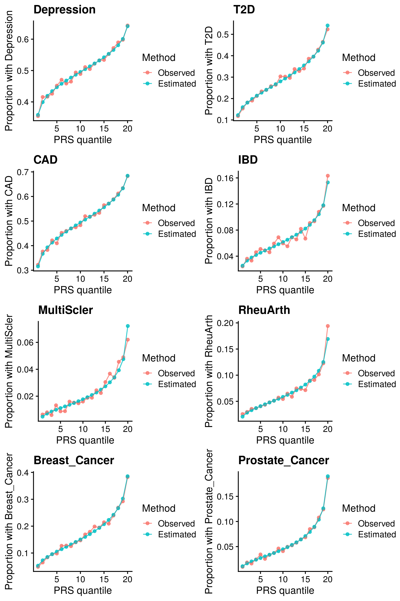
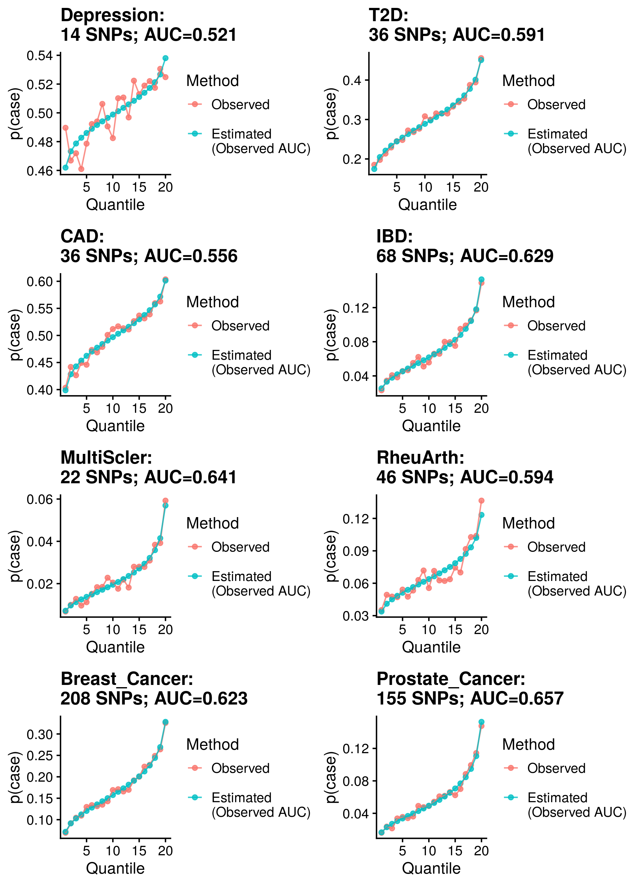
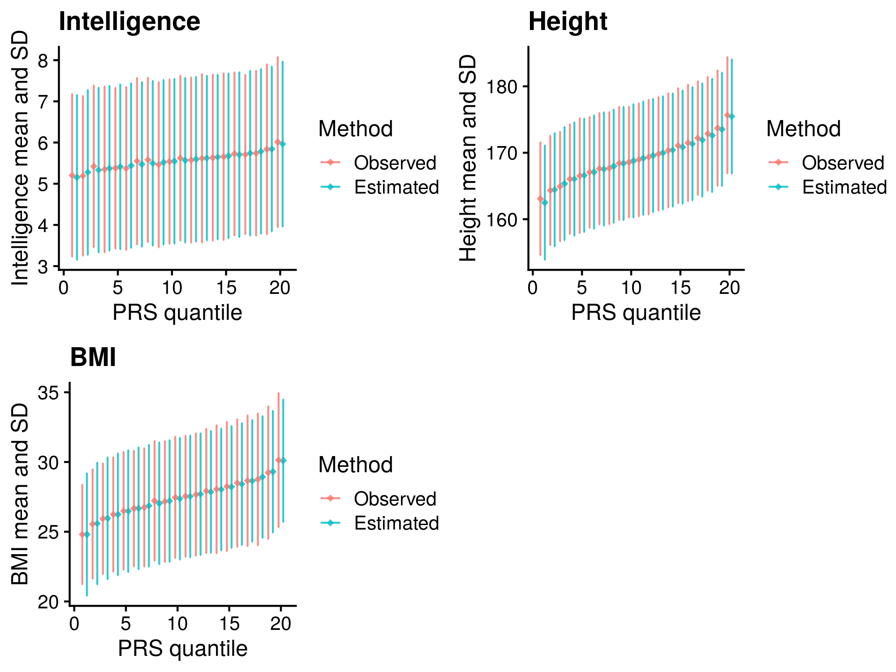
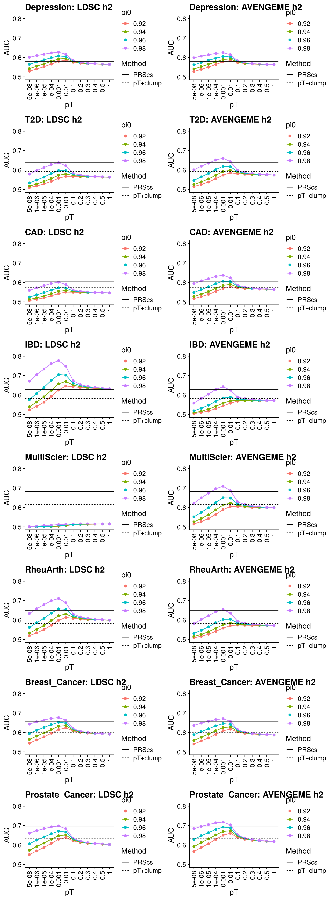
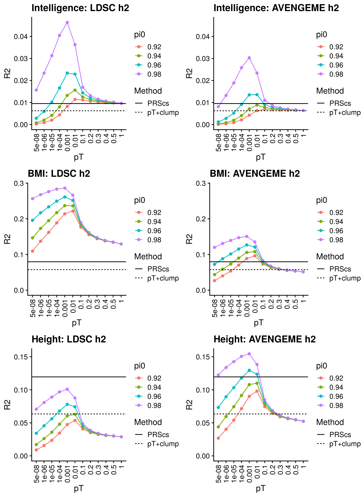
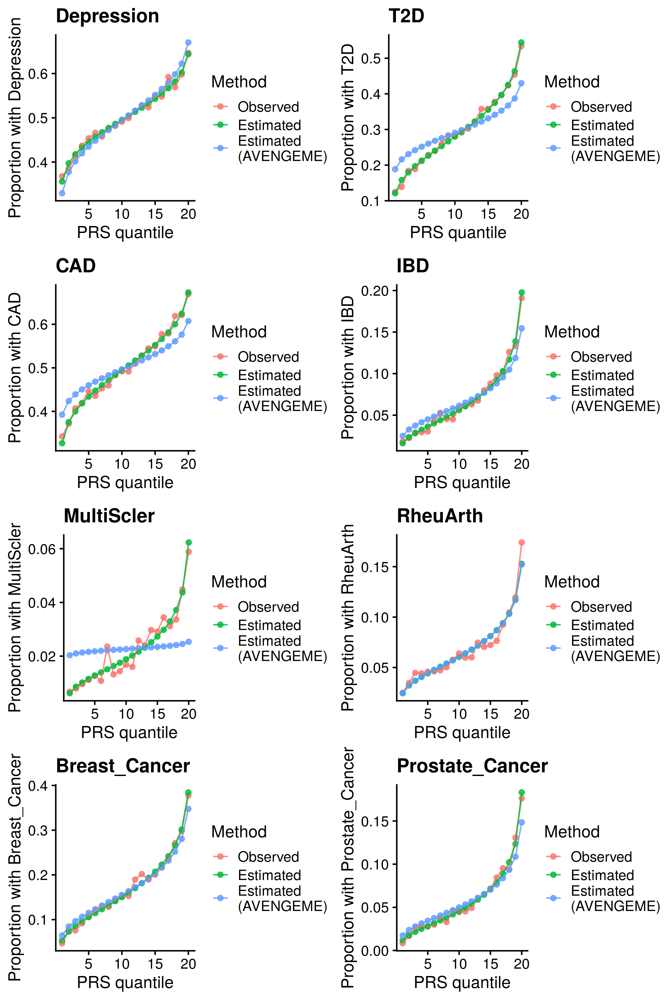
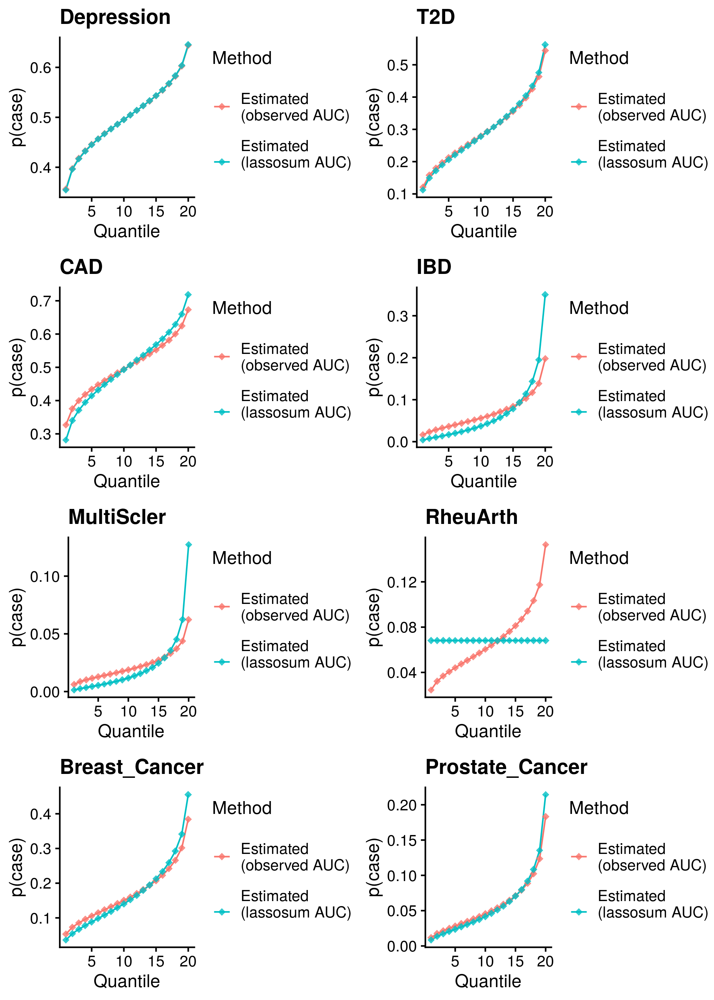
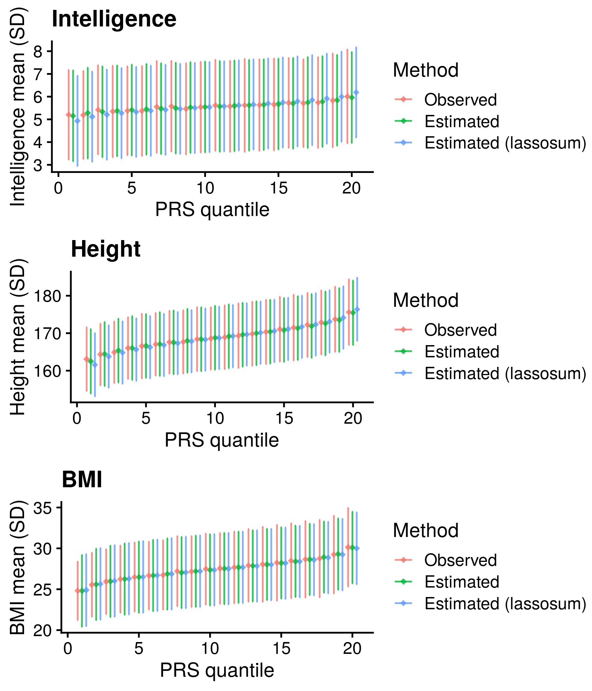

```{r setup, include=FALSE}
knitr::opts_chunk$set(echo = TRUE)
```

<style>
p.caption {
  font-size: 1.5em;
}
</style>

```{css, echo=F}
pre code, pre, code {
  white-space: pre !important;
  overflow-x: scroll !important;
  word-break: keep-all !important;
  word-wrap: initial !important;
}
```

***

This page describes a project investigatin approaches for converting polygenic scores into interpretable information.

Aims:

* Develop method for converting polygenic Z-scores into absolute estimates using summary statistics
* Develop figures to represent absolute risk
* Validate approach for estimating PRS R2/AUC from summary statistics

See [here](https://www.medrxiv.org/content/10.1101/2021.04.16.21255481v1) for a preprint describing this work.

***

# Converting polygenic Z-scores to absolute estimates

To enable correct intepretation of a polygenic score, the variance explained by the polygenic score must be considered. Furthermore, for binary outcomes the population prevelance must be considered, and for continuous outcomes the population mean and SD must be considered. It is possible to convert relative genetic risk into absolute esimates of an outcome when observed data is available, as 23andMe do, by splitting participants into genetic risk quantiles, and then estimating the mean outcome within each quantile. However, observed data is often not available. Here, we use an alternative approach based on summary statistics only alone.

***

## Describe conversion

***

### Binary outcomes

To convert a polygenic Z-score into an absolute estimate of risk, we must know the predicitve utility of the polygenic score (AUC), and the prevelance of the outcome in the general population. Then it is possible to estimate the proportion of cases within each polygenic score quantile using bivariate-normal distribution.

<details><summary>Show code</summary>
```{R, echo=T, eval=F}
# Thank you for Alex Gillet for her work developing this code.
ccprobs.f <- function(PRS_auc=0.641, prev=0.7463, n_quantile=20){
  
    # Convert AUC into cohen's d
    d <- sqrt(2)*qnorm(PRS_auc)
    
    # Set mean difference between cases and control polygenic scores
    mu_case <- d
    mu_control <- 0
    
    # Estimate mean and variance of polygenic scores across case and control
    varPRS <- prev*(1+(d^2) - (d*prev)^2) + (1-prev)*(1 - (d*prev)^2)
    E_PRS <- d*prev
    
    # Estimate polygenic score quantiles
    by_quant<-1/n_quantile
    p_quant <- seq(by_quant, 1-by_quant, by=by_quant)
    quant_vals_PRS <- rep(0, length(p_quant))
    quant_f_solve <- function(x, prev, d, pq){prev*pnorm(x-d) + (1-prev)*pnorm(x) - pq}
    for(i in 1:length(p_quant)){
        quant_vals_PRS[i] <- unlist(uniroot(quant_f_solve, prev=prev, d=d, pq= p_quant[i], interval=c(-2.5, 2.5), extendInt = "yes", tol=6e-12)$root)
    }
    
    # Create a table for output
    ul_qv_PRS <- matrix(0, ncol=2, nrow=n_quantile)
    ul_qv_PRS[1,1] <- -Inf
    ul_qv_PRS[2:n_quantile,1] <- quant_vals_PRS
    ul_qv_PRS[1:(n_quantile-1),2] <- quant_vals_PRS
    ul_qv_PRS[n_quantile,2] <- Inf
    
    ul_qv_PRS<-cbind(ul_qv_PRS, (ul_qv_PRS[,1:2]-E_PRS)/sqrt(varPRS))
    
    # Estimate case control proportion for each quantile
    prob_quantile_case <- pnorm(ul_qv_PRS[,2], mean = mu_case) - pnorm(ul_qv_PRS[,1], mean = mu_case)
    prob_quantile_control <- pnorm(ul_qv_PRS[,2], mean = mu_control) - pnorm(ul_qv_PRS[,1], mean = mu_control)
    p_case_quantile <- (prob_quantile_case*prev)/by_quant
    p_cont_quantile <- (prob_quantile_control*(1-prev))/by_quant
    
    # Estimate OR comparing each quantile to bottom quantile
    OR <- p_case_quantile/p_cont_quantile
    OR <- OR/OR[1]
    
    # Return output
    out <- cbind(ul_qv_PRS[,3:4],p_cont_quantile, p_case_quantile, OR)
    row.names(out) <- 1:n_quantile
    colnames(out) <- c("q_min", "q_max","p_control", "p_case", "OR")
    
    data.frame(out)
}
```
</details>

***

### Continuous outcomes
To convert a polygenic Z-score into an absolute estimate for a trait, we must know the predicitve utility of the polygenic score (R2), and the mean and SD of the outcome in the general population. Then it is possible to estimate the mean and SD of the trait within each polygenic score quantile using a truncated norm model (currently not theory based).

<details><summary>Show code</summary>
```{R, echo=T, eval=F}
# Thank you for Alex Gillet for her work developing this code.
mean_sd_quant.f <- function(PRS_R2=0.641, Outcome_mean=1, Outcome_sd=1, n_quantile=20){
  ### PRS quantiles with a continuous phenotype (Y)
  library(tmvtnorm)
  ###
  E_PRS = 0
  SD_PRS = sqrt(1)
  E_phenotype = Outcome_mean
  SD_phenotype = Outcome_sd 

  by_quant<-1/(n_quantile)
  PRS_quantile_bounds <- qnorm(p=seq(0, 1, by=by_quant), mean= E_PRS, sd= SD_PRS)
  lower_PRS_vec <- PRS_quantile_bounds[1:n_quantile]
  upper_PRS_vec <- PRS_quantile_bounds[2:(n_quantile+1)]
  
  mean_vec <- c(E_phenotype, E_PRS)
  sigma_mat <- matrix(sqrt(PRS_R2)*SD_phenotype*SD_PRS, nrow=2, ncol=2)
  sigma_mat[1,1] <- SD_phenotype^2
  sigma_mat[2,2] <- SD_PRS^2
  
  ### mean of phenotype within the truncated PRS distribution
  out_mean_Y <- rep(0, n_quantile)
  ### SD of phenotype within the truncated PRS distribution
  out_SD_Y <- rep(0, n_quantile)
  ### cov of Y and PRS given truncation on PRS
  out_cov_Y_PRS <- rep(0, n_quantile)
  ### SD of PRS given truncation on PRS
  out_SD_PRS <- rep(0, n_quantile)
  ### mean PRS given truncation on PRS
  out_mean_PRS <- rep(0, n_quantile)
  
  for(i in 1:n_quantile){
  	distribution_i <- mtmvnorm(mean = mean_vec,
        sigma = sigma_mat,
        lower = c(-Inf, lower_PRS_vec[i]),
        upper = c(Inf, upper_PRS_vec[i]),
        doComputeVariance=TRUE,
        pmvnorm.algorithm=GenzBretz())
        out_mean_Y[i] <- distribution_i$tmean[1]
        out_mean_PRS[i] <- distribution_i$tmean[2]
        out_SD_Y[i] <- sqrt(distribution_i$tvar[1,1])
        out_SD_PRS[i] <- sqrt(distribution_i$tvar[2,2])
        out_cov_Y_PRS[i] <- distribution_i$tvar[1,2]
  }
  
  out<-data.frame(q=1:n_quantile,
             q_min=lower_PRS_vec,
             q_max=upper_PRS_vec,
             x_mean=out_mean_Y,
             x_sd=out_SD_Y)
  
  return(out)

  out_mean_Y
  out_SD_Y
  
  out_mean_PRS
  out_SD_PRS
  out_cov_Y_PRS
}

library(tmvtnorm)

# Create alternative of script that doesn't require simulation
mean_sd_quant.f <- function(PRS_R2=0.641, Outcome_mean=1, Outcome_sd=1, n_quantile=20){
  ### PRS quantiles with a continuous phenotype (Y)
  library(tmvtnorm)
  ###
  E_PRS = 0
  SD_PRS = sqrt(1)
  E_phenotype = Outcome_mean
  SD_phenotype = Outcome_sd 
  n_quantile=20
  
  by_quant<-1/(n_quantile)
  PRS_quantile_bounds <- qnorm(p=seq(0, 1, by=by_quant), mean= E_PRS, sd= SD_PRS)
  lower_PRS_vec <- PRS_quantile_bounds[1:n_quantile]
  upper_PRS_vec <- PRS_quantile_bounds[2:(n_quantile+1)]
  
  mean_vec <- c(E_phenotype, E_PRS)
  sigma_mat <- matrix(sqrt(PRS_R2)*SD_phenotype*SD_PRS, nrow=2, ncol=2)
  sigma_mat[1,1] <- SD_phenotype^2
  sigma_mat[2,2] <- SD_PRS^2
  
  ### mean of phenotype within the truncated PRS distribution
  out_mean_Y <- rep(0, 20)
  ### SD of phenotype within the truncated PRS distribution
  out_SD_Y <- rep(0, 20)
  ### cov of Y and PRS given truncation on PRS
  out_cov_Y_PRS <- rep(0, 20)
  ### SD of PRS given truncation on PRS
  out_SD_PRS <- rep(0, 20)
  ### mean PRS given truncation on PRS
  out_mean_PRS <- rep(0, 20)
  
  for(i in 1:n_quantile){
  	distribution_i <- mtmvnorm(mean = mean_vec,
        sigma = sigma_mat,
        lower = c(-Inf, lower_PRS_vec[i]),
        upper = c(Inf, upper_PRS_vec[i]),
        doComputeVariance=TRUE,
        pmvnorm.algorithm=GenzBretz())
        out_mean_Y[i] <- distribution_i$tmean[1]
        out_mean_PRS[i] <- distribution_i$tmean[2]
        out_SD_Y[i] <- sqrt(distribution_i$tvar[1,1])
        out_SD_PRS[i] <- sqrt(distribution_i$tvar[2,2])
        out_cov_Y_PRS[i] <- distribution_i$tvar[1,2]
  }
  
  out<-data.frame(q=1:n_quantile,
             q_min=lower_PRS_vec,
             q_max=upper_PRS_vec,
             x_mean=out_mean_Y,
             x_sd=out_SD_Y)
  
  return(out)

  out_mean_Y
  out_SD_Y
  
  out_mean_PRS
  out_SD_PRS
  out_cov_Y_PRS
}

pdf('~/comp_stand.pdf')
for(i in seq(0.05, 0.95, 0.05)){
sim_res<-PRS_abs_quant2(PRS_R2 = i, Outcome_mean = 0, Outcome_sd = 1, n_quantile = 20)
nosim_res<-mean_sd_quant.f(PRS_R2 = i, Outcome_mean = 0, Outcome_sd = 1, n_quantile = 20)

plot(sim_res$x_mean,nosim_res$x_mean, main=paste0('R2 = ',i))
abline(coef = c(0,1))
}
dev.off()

pdf('~/comp_centre.pdf')
for(i in seq(0.05, 0.95, 0.05)){
sim_res<-PRS_abs_quant2(PRS_R2 = i, Outcome_mean = 0, Outcome_sd = 2, n_quantile = 20)
nosim_res<-mean_sd_quant.f(PRS_R2 = i, Outcome_mean = 0, Outcome_sd = 2, n_quantile = 20)

plot(sim_res$x_mean,nosim_res$x_mean, main=paste0('R2 = ',i))
abline(coef = c(0,1))

plot(sim_res$x_sd,nosim_res$x_sd, main=paste0('R2 = ',i))
abline(coef = c(0,1))

}
dev.off()

pdf('~/comp_scaled.pdf')
for(i in seq(0.05, 0.95, 0.05)){
sim_res<-PRS_abs_quant2(PRS_R2 = i, Outcome_mean = 100, Outcome_sd = 1, n_quantile = 20)
nosim_res<-mean_sd_quant.f(PRS_R2 = i, Outcome_mean = 100, Outcome_sd = 1, n_quantile = 20)

plot(sim_res$x_mean,nosim_res$x_mean, main=paste0('R2 = ',i))
abline(coef = c(0,1))
}
dev.off()

```
</details>

***

## Validate conversion

***

### Calculate polygenic scores

<details><summary>pT + clump: Sparse</summary>
```{bash, echo=T, eval=F}
########
# 1KG ref
########
# Set required variables
. /users/k1806347/brc_scratch/Software/MyGit/GenoPred/config_used/Target_scoring.config
. /users/k1806347/brc_scratch/Software/MyGit/GenoPred/config_used/Pipeline_prep.config

pheno=$(echo Depression Intelligence BMI Height T2D CAD IBD MultiScler RheuArth Breast_Cancer Prostate_Cancer)
gwas=$(echo DEPR06 COLL01 BODY04 HEIG03 DIAB05 COAD01 INFB01 SCLE03 RHEU02 BRCA01 PRCA01)

# Create directory
mkdir -p ${UKBB_output}/PRS_for_interpretation/1KG_ref/pt_clump

# Create file listing GWAS that haven't been processed.
> ${UKBB_output}/PRS_for_interpretation/1KG_ref/pt_clump/todo.txt
for i in $(seq 1 11);do
gwas_i=$(echo ${gwas} | cut -f ${i} -d ' ')
pheno_i=$(echo ${pheno} | cut -f ${i} -d ' ')
if [ ! -f ${UKBB_output}/PRS_for_interpretation/1KG_ref/pt_clump/${gwas_i}/UKBB.subset.w_hm3.${gwas_i}.profiles ]; then
echo ${gwas_i} ${pheno_i} >> ${UKBB_output}/PRS_for_interpretation/1KG_ref/pt_clump/todo.txt
fi
done

# Create shell script to run using sbatch
cat > ${UKBB_output}/PRS_for_interpretation/1KG_ref/pt_clump/sbatch.sh << 'EOF'
#!/bin/sh

#SBATCH -p shared,brc
#SBATCH --mem 5G
#SBATCH -J pt_clump

. /users/k1806347/brc_scratch/Software/MyGit/GenoPred/config_used/Target_scoring.config
. /users/k1806347/brc_scratch/Software/MyGit/GenoPred/config_used/Pipeline_prep.config

gwas=$(awk -v var="$SLURM_ARRAY_TASK_ID" 'NR == var {print $1}' ${UKBB_output}/PRS_for_interpretation/1KG_ref/pt_clump/todo.txt)
pheno=$(awk -v var="$SLURM_ARRAY_TASK_ID" 'NR == var {print $2}' ${UKBB_output}/PRS_for_interpretation/1KG_ref/pt_clump/todo.txt)

echo $gwas
echo $pheno

/users/k1806347/brc_scratch/Software/Rscript.sh /users/k1806347/brc_scratch/Software/MyGit/GenoPred/Scripts/Scaled_polygenic_scorer/Scaled_polygenic_scorer.R \
    --target_plink_chr ${UKBB_output}/Genotype/Harmonised/UKBB.w_hm3.QCd.AllSNP.chr \
    --target_keep ${UKBB_output}/Phenotype/PRS_comp_subset/UKBB.${pheno}.txt \
    --ref_score ${Geno_1KG_dir}/Score_files_for_polygenic/pt_clump/${gwas}/1KGPhase3.w_hm3.${gwas} \
    --ref_scale ${Geno_1KG_dir}/Score_files_for_polygenic/pt_clump/${gwas}/1KGPhase3.w_hm3.${gwas}.EUR.scale \
    --ref_freq_chr ${Geno_1KG_dir}/freq_files/EUR/1KGPhase3.w_hm3.EUR.chr \
    --plink ${plink1_9} \
    --pheno_name ${gwas} \
    --output ${UKBB_output}/PRS_for_interpretation/1KG_ref/pt_clump/${gwas}/UKBB.subset.w_hm3.${gwas}

EOF

sbatch --array 1-$(wc -l ${UKBB_output}/PRS_for_interpretation/1KG_ref/pt_clump/todo.txt | cut -d' ' -f1)%3 ${UKBB_output}/PRS_for_interpretation/1KG_ref/pt_clump/sbatch.sh

```
</details>

<details><summary>DBSLMM</summary>
```{bash, echo=T, eval=F}
########
# 1KG ref
######## 
# Set required variables
. /users/k1806347/brc_scratch/Software/MyGit/GenoPred/config_used/Target_scoring.config
. /users/k1806347/brc_scratch/Software/MyGit/GenoPred/config_used/Pipeline_prep.config

pheno=$(echo Depression Intelligence BMI Height T2D CAD IBD MultiScler RheuArth Breast_Cancer Prostate_Cancer)
gwas=$(echo DEPR06 COLL01 BODY04 HEIG03 DIAB05 COAD01 INFB01 SCLE03 RHEU02 BRCA01 PRCA01)

# Create directory
mkdir -p ${UKBB_output}/PRS_for_interpretation/1KG_ref/DBSLMM

# Create file listing GWAS that haven't been processed.
> ${UKBB_output}/PRS_for_interpretation/1KG_ref/DBSLMM/todo.txt
for i in $(seq 1 11);do
gwas_i=$(echo ${gwas} | cut -f ${i} -d ' ')
pheno_i=$(echo ${pheno} | cut -f ${i} -d ' ')
if [ ! -f ${UKBB_output}/PRS_for_interpretation/1KG_ref/DBSLMM/${gwas_i}/UKBB.subset.w_hm3.${gwas_i}.DBSLMM_profiles ]; then
echo ${gwas_i} ${pheno_i} >> ${UKBB_output}/PRS_for_interpretation/1KG_ref/DBSLMM/todo.txt
fi
done

# Create shell script to run using sbatch
cat > ${UKBB_output}/PRS_for_interpretation/1KG_ref/DBSLMM/sbatch.sh << 'EOF'
#!/bin/sh

#SBATCH -p shared,brc
#SBATCH --mem 5G
#SBATCH -J DBSLMM

. /users/k1806347/brc_scratch/Software/MyGit/GenoPred/config_used/Target_scoring.config
. /users/k1806347/brc_scratch/Software/MyGit/GenoPred/config_used/Pipeline_prep.config

gwas=$(awk -v var="$SLURM_ARRAY_TASK_ID" 'NR == var {print $1}' ${UKBB_output}/PRS_for_interpretation/1KG_ref/DBSLMM/todo.txt)
pheno=$(awk -v var="$SLURM_ARRAY_TASK_ID" 'NR == var {print $2}' ${UKBB_output}/PRS_for_interpretation/1KG_ref/DBSLMM/todo.txt)

echo $gwas
echo $pheno

/users/k1806347/brc_scratch/Software/Rscript.sh /users/k1806347/brc_scratch/Software/MyGit/GenoPred/Scripts/Scaled_polygenic_scorer_DBSLMM/Scaled_polygenic_scorer_DBSLMM.R \
    --target_plink_chr ${UKBB_output}/Genotype/Harmonised/UKBB.w_hm3.QCd.AllSNP.chr \
    --target_keep ${UKBB_output}/Phenotype/PRS_comp_subset/UKBB.${pheno}.txt \
    --ref_score ${Geno_1KG_dir}/Score_files_for_polygenic/DBSLMM/${gwas}/1KGPhase3.w_hm3.${gwas}.dbslmm.GW.txt \
    --ref_scale ${Geno_1KG_dir}/Score_files_for_polygenic/DBSLMM/${gwas}/1KGPhase3.w_hm3.${gwas}.EUR.scale \
    --ref_freq_chr ${Geno_1KG_dir}/freq_files/EUR/1KGPhase3.w_hm3.EUR.chr \
    --plink ${plink1_9} \
    --pheno_name ${gwas} \
    --output ${UKBB_output}/PRS_for_interpretation/1KG_ref/DBSLMM/${gwas}/UKBB.subset.w_hm3.${gwas}

EOF

sbatch --array 1-$(wc -l ${UKBB_output}/PRS_for_interpretation/1KG_ref/DBSLMM/todo.txt | cut -d' ' -f1)%3 ${UKBB_output}/PRS_for_interpretation/1KG_ref/DBSLMM/sbatch.sh

```
</details>

***

### Evaluate polygenic scores

<details><summary>Compare all methods</summary>
```{R, echo=T, eval=F}
# Create a file listing the predictors files
source('/users/k1806347/brc_scratch/Software/MyGit/GenoPred/config_used/Target_scoring.config')

pheno<-c('Depression','Intelligence','BMI','Height','T2D','CAD','IBD','MultiScler','RheuArth','Breast_Cancer','Prostate_Cancer')
gwas<-c('DEPR06','COLL01','BODY04','HEIG03','DIAB05','COAD01','INFB01','SCLE03','RHEU02','BRCA01','PRCA01')

for(i in 1:length(pheno)){
  pred_file<-NULL
    
    # pT+clump (sparse)
    pred_file<-rbind(pred_file,data.frame( predictors=paste0(UKBB_output,'/PRS_for_interpretation/1KG_ref/pt_clump/',gwas[i],'/UKBB.subset.w_hm3.',gwas[i],'.profiles'), 
  group='pT+clump'))
    
    # DBSLMM
    pred_file<-rbind(pred_file,data.frame( predictors=paste0(UKBB_output,'/PRS_for_interpretation/1KG_ref/DBSLMM/',gwas[i],'/UKBB.subset.w_hm3.',gwas[i],'.DBSLMM_profiles'),
  group='DBSLMM'))

    # Write out list of predictors with groups
    dir.create(paste0('/scratch/users/k1806347/Analyses/AbsoluteRisk/Measured_AUC_R2/',pheno[i]))
    write.table(pred_file, paste0('/scratch/users/k1806347/Analyses/AbsoluteRisk/Measured_AUC_R2/',pheno[i],'/UKBB.w_hm3.',gwas[i],'.EUR-PRSs.AllMethodComp.predictor_groups'), row.names=F, col.names=T, quote=F)
}

```

```{bash, eval=F, echo=T}
. /users/k1806347/brc_scratch/Software/MyGit/GenoPred/config_used/Target_scoring.config

# Run Model_builder_V2.R
pheno=$(echo Depression Intelligence BMI Height T2D CAD IBD MultiScler RheuArth Breast_Cancer Prostate_Cancer)
gwas=$(echo DEPR06 COLL01 BODY04 HEIG03 DIAB05 COAD01 INFB01 SCLE03 RHEU02 BRCA01 PRCA01)
prev=$(echo 0.15 NA NA NA 0.05 0.03 0.013 0.00164 0.005 0.125 0.125)

# 1KG reference
for i in $(seq 1 11);do
pheno_i=$(echo ${pheno} | cut -f ${i} -d ' ')
gwas_i=$(echo ${gwas} | cut -f ${i} -d ' ')
prev_i=$(echo ${prev} | cut -f ${i} -d ' ')

sbatch --mem 5G -n 1 -p brc,shared /users/k1806347/brc_scratch/Software/Rscript.sh /users/k1806347/brc_scratch/Software/MyGit/GenoPred/Scripts/Model_builder/Model_builder_V2.R \
  --pheno ${UKBB_output}/Phenotype/PRS_comp_subset/UKBB.${pheno_i}.txt \
  --keep /users/k1806347/brc_scratch/Analyses/PRS_comparison/UKBB_outcomes_for_prediction/ukb18177_glanville_post_qc_id_list.UpdateIDs.fam \
  --out /scratch/users/k1806347/Analyses/AbsoluteRisk/Measured_AUC_R2/${pheno_i}/UKBB.w_hm3.${gwas_i}.EUR-PRSs.AllMethodComp \
  --n_core 1 \
  --compare_predictors F \
  --assoc T \
  --outcome_pop_prev ${prev_i} \
  --predictors /scratch/users/k1806347/Analyses/AbsoluteRisk/Measured_AUC_R2/${pheno_i}/UKBB.w_hm3.${gwas_i}.EUR-PRSs.AllMethodComp.predictor_groups
done

```
</details>


***

### Binary outcomes

Calculate reference-standardised polygenic scores within UK Biobank for a range of dichotomous phenotypes. Estimate the AUC/R2 of the polygenic scores in UKB. Compare measured and estimated absolute risk per PRS quantile. Use the PRScs fully baysian (pseudovalidation) polygenic scores, as this method provides a single score with good relative performance compared to other approaches.

Reference-standardised polygenic scores have already been calculated in UKB for the PRS methods comparison study, and the AUC has already been estimated. Read in polygenic scores and observed phenotype for UKB, measure proportion of cases per PRS quantile, and then estimate proportion of cases per PRS quantile.

#### DBSLMM

<details><summary>Show code</summary>
```{R, eval=F, echo=T}
library(data.table)

source('/users/k1806347/brc_scratch/Software/MyGit/GenoPred/config_used/Target_scoring.config')

pheno=c('Depression','T2D','CAD','IBD','MultiScler','RheuArth','Breast_Cancer','Prostate_Cancer')
gwas=c('DEPR06','DIAB05','COAD01','INFB01','SCLE03','RHEU02','BRCA01','PRCA01')

n_quant<-20

files<-data.frame(pheno,gwas)

# Create function
ccprobs.f <- function(PRS_auc=0.641, prev=0.7463, n_quantile=20){
  
    # Convert AUC into cohen's d
    d <- sqrt(2)*qnorm(PRS_auc)
    
    # Set mean difference between cases and control polygenic scores
    mu_case <- d
    mu_control <- 0
    
    # Estimate mean and variance of polygenic scores across case and control
    varPRS <- prev*(1+(d^2) - (d*prev)^2) + (1-prev)*(1 - (d*prev)^2)
    E_PRS <- d*prev
    
    # Estimate polygenic score quantiles
    by_quant<-1/n_quantile
    p_quant <- seq(by_quant, 1-by_quant, by=by_quant)
    quant_vals_PRS <- rep(0, length(p_quant))
    quant_f_solve <- function(x, prev, d, pq){prev*pnorm(x-d) + (1-prev)*pnorm(x) - pq}
    for(i in 1:length(p_quant)){
        quant_vals_PRS[i] <- unlist(uniroot(quant_f_solve, prev=prev, d=d, pq= p_quant[i], interval=c(-2.5, 2.5), extendInt = "yes", tol=6e-12)$root)
    }
    
    # Create a table for output
    ul_qv_PRS <- matrix(0, ncol=2, nrow=n_quantile)
    ul_qv_PRS[1,1] <- -Inf
    ul_qv_PRS[2:n_quantile,1] <- quant_vals_PRS
    ul_qv_PRS[1:(n_quantile-1),2] <- quant_vals_PRS
    ul_qv_PRS[n_quantile,2] <- Inf
    
    ul_qv_PRS<-cbind(ul_qv_PRS, (ul_qv_PRS[,1:2]-E_PRS)/sqrt(varPRS))
    
    # Estimate case control proportion for each quantile
    prob_quantile_case <- pnorm(ul_qv_PRS[,2], mean = mu_case) - pnorm(ul_qv_PRS[,1], mean = mu_case)
    prob_quantile_control <- pnorm(ul_qv_PRS[,2], mean = mu_control) - pnorm(ul_qv_PRS[,1], mean = mu_control)
    p_case_quantile <- (prob_quantile_case*prev)/by_quant
    p_cont_quantile <- (prob_quantile_control*(1-prev))/by_quant
    
    # Estimate OR comparing each quantile to bottom quantile
    OR <- p_case_quantile/p_cont_quantile
    OR <- OR/OR[1]
    
    # Return output
    out <- cbind(ul_qv_PRS[,3:4],p_cont_quantile, p_case_quantile, OR)
    row.names(out) <- 1:n_quantile
    colnames(out) <- c("q_min", "q_max","p_control", "p_case", "OR")
    
    data.frame(out)
}

# Run analysis for each phenotype
res_all<-NULL
cor_res<-NULL
plots_all<-list()
prs_dist_all<-list()
mean_sd<-NULL

for(i in 1:dim(files)[1]){
  # Read in pheno and prs data, and merge
  pheno_i<-fread(paste0(UKBB_output,'/Phenotype/PRS_comp_subset/UKBB.',files$pheno[i],'.txt'))
  names(pheno_i)[3]<-'pheno'
  prs_i<-fread(paste0(UKBB_output,'/PRS_for_interpretation/1KG_ref/DBSLMM/',files$gwas[i],'/UKBB.subset.w_hm3.',files$gwas[i],'.DBSLMM_profiles'))
  prs_i<-prs_i[,c('FID','IID',paste0(files$gwas[i], '_DBSLMM')), with=F]
  names(prs_i)[3]<-'prs'

  pheno_prs<-merge(pheno_i, prs_i, by=c('FID','IID'))
  
  mean_sd<-rbind(mean_sd,data.frame(Phenotype=files$pheno[i],
                                    Mean_all=mean(pheno_prs$prs),
                                    SD_all=sd(pheno_prs$prs),
                                    Mean_con=mean(pheno_prs$prs[pheno_prs$pheno == 0]),
                                    SD_con=sd(pheno_prs$prs[pheno_prs$pheno == 0]),
                                    Mean_cas=mean(pheno_prs$prs[pheno_prs$pheno == 1]),
                                    SD_cas=sd(pheno_prs$prs[pheno_prs$pheno == 1]),
                                    f_test_pval=var.test(prs ~ pheno, pheno_prs, alternative = "two.sided")$p.value))
  
  # Plot DBSLMM PRS distribution
  library(ggplot2)
  library(cowplot)
  prs_dist_all[[i]]<-ggplot(pheno_prs, aes(x=prs)) +
    geom_histogram() +
    labs(y="Count", x='Polygenic Score', title=files$pheno[i]) +
    theme_cowplot(12)
  
  # Read in AUC for PRS
  assoc<-fread(paste0('/scratch/users/k1806347/Analyses/AbsoluteRisk/Measured_AUC_R2/',files$pheno[i],'/UKBB.w_hm3.',files$gwas[i],'.EUR-PRSs.AllMethodComp.assoc.txt'))
  prs_auc<-assoc[grepl('DBSLMM', assoc$Predictor),]$AUC
  
  # Assign individuals to observed PRS quantiles
  obs_quant<-quantile(pheno_prs$prs, prob = seq(0, 1, length = n_quant+1))
  pheno_prs$obs_quant<-as.numeric(cut( pheno_prs$prs, obs_quant, include.lowest = T))

  # Calculate proportion of each quantile that are cases
  obs_cc<-NULL
  for(k in 1:n_quant){
    obs_cc<-rbind(obs_cc, data.frame(Phenotype=files$pheno[i],
                                     Type='Observed',
                                     Quantile=k,
                                     q_min=obs_quant[k],
                                     q_max=obs_quant[k+1],
                                     p_control=1-mean(pheno_prs$pheno[pheno_prs$obs_quant == k]),
                                     p_case=mean(pheno_prs$pheno[pheno_prs$obs_quant == k])))
  }
  
  # Assign individuals to estimated PRS quantiles
  est_cc<-ccprobs.f(PRS_auc = prs_auc, prev=mean(pheno_prs$pheno), n_quantile = n_quant)
  est_cc$OR<-NULL
  est_cc<-data.frame(Phenotype=files$pheno[i],Type="\nEstimated\n(Observed AUC)",Quantile=1:n_quant, est_cc)
  est_quant<-sort(unique(c(est_cc$q_min, est_cc$q_max)))
  pheno_prs$est_quant<-as.numeric(cut( pheno_prs$prs, est_quant, include.lowest = T))
  
  tmp<-cor.test(obs_cc$p_case, est_cc$p_case)
  tmp2<-abs(est_cc$p_case-obs_cc$p_case)/obs_cc$p_case
  
  # Estimate correlation between observed and expected
  cor_res<-rbind(cor_res,data.frame(Phenotype=files$pheno[i],
                                    Cor=tmp$estimate,
                                    Low95CI=tmp$conf.int[1],
                                    High95CI=tmp$conf.int[2],
                                    Mean_perc_diff=mean(tmp2),
                                    N=length(pheno_prs$pheno),
                                    Ncas=sum(pheno_prs$pheno == 1),
                                    Ncon=sum(pheno_prs$pheno == 0)))

  quant_comp<-rbind(obs_cc, est_cc)
  
  res_all<-rbind(res_all, quant_comp)
  
  library(ggplot2)
  library(cowplot)
  
  plots_all[[i]]<-ggplot(quant_comp, aes(x=Quantile, y=p_case, colour=Type)) +
                    geom_point(alpha=0.8) +
                    geom_line(alpha=0.8) +
                    labs(y="p(case)", title=files$pheno[i], colour='Method') +
                    theme_cowplot(12)
}

png(paste0('/scratch/users/k1806347/Analyses/AbsoluteRisk/Measured_AUC_R2/PRS_dist_binary.png'), units='px', res=300, width=2000, height=2800)
  plot_grid(plotlist=prs_dist_all, ncol = 2)
dev.off()

png(paste0('/scratch/users/k1806347/Analyses/AbsoluteRisk/Measured_AUC_R2/PropCC_Comp.png'), units='px', res=300, width=2000, height=2800)
  plot_grid(plotlist=plots_all, ncol = 2)
dev.off()

write.csv(cor_res, '/scratch/users/k1806347/Analyses/AbsoluteRisk/Measured_AUC_R2/PropCC_Comp.csv', row.names=F, quote=F)

write.csv(mean_sd, '/scratch/users/k1806347/Analyses/AbsoluteRisk/Measured_AUC_R2/PRS_Mean_SD.csv', row.names=F, quote=F)
```
</details>

```{bash, eval=T, echo=F}
mkdir -p /users/k1806347/brc_scratch/Software/MyGit/GenoPred/Images/Validating_ImputeMe_Ideas

cp /scratch/users/k1806347/Analyses/AbsoluteRisk/Measured_AUC_R2/PropCC_Comp.png /users/k1806347/brc_scratch/Software/MyGit/GenoPred/Images/Validating_ImputeMe_Ideas/
```

<details><summary>Show results</summary>


```{r, echo=F, eval=T, results='asis'}
res<-read.csv("/scratch/users/k1806347/Analyses/AbsoluteRisk/Measured_AUC_R2/PropCC_Comp.csv")

res_tab<-res
res_tab[,2:5]<-round(res_tab[,2:5], 3)
res_tab$R<-paste0(res_tab$Cor, " (",res_tab$Low95CI,"-",res_tab$High95CI,")")
res_tab$Diff<-paste0(round(res_tab$Mean_perc_diff*100,1),"%")
res_tab<-res_tab[,c('Phenotype','R','Diff','N','Ncas','Ncon')]

names(res_tab)<-c('Phenotype',"Correlation (95%CI)","Mean Abs. Diff.",'N','Ncas','Ncon')

library(knitr)
kable(res_tab, rownames = FALSE, caption='Correlation between observed and estimated proportion of cases within polygenic score quantiles')

cat('Median Cor. = ',median(res$Cor),'; Mean Cor. = ', mean(res$Cor),'; Min. Cor. = ',min(res$Cor),'; Max. Cor. = ',max(res$Cor),'\n', sep='')
cat('Mean Abs. Diff = ',mean(res$Mean_perc_diff),'; Min. Mean Abs. Diff. = ',min(res$Mean_perc_diff),'; Max. Mean Abs. Diff. = ',max(res$Mean_perc_diff),'\n', sep='')
```

</details>

***

#### pT+clump

<details><summary>Show code</summary>
```{R, eval=F, echo=T}
library(data.table)

source('/users/k1806347/brc_scratch/Software/MyGit/GenoPred/config_used/Target_scoring.config')

pheno=c('Depression','T2D','CAD','IBD','MultiScler','RheuArth','Breast_Cancer','Prostate_Cancer')
gwas=c('DEPR06','DIAB05','COAD01','INFB01','SCLE03','RHEU02','BRCA01','PRCA01')

n_quant<-20

files<-data.frame(pheno,gwas)

# Create function
ccprobs.f <- function(PRS_auc=0.641, prev=0.7463, n_quantile=20){
  
    # Convert AUC into cohen's d
    d <- sqrt(2)*qnorm(PRS_auc)
    
    # Set mean difference between cases and control polygenic scores
    mu_case <- d
    mu_control <- 0
    
    # Estimate mean and variance of polygenic scores across case and control
    varPRS <- prev*(1+(d^2) - (d*prev)^2) + (1-prev)*(1 - (d*prev)^2)
    E_PRS <- d*prev
    
    # Estimate polygenic score quantiles
    by_quant<-1/n_quantile
    p_quant <- seq(by_quant, 1-by_quant, by=by_quant)
    quant_vals_PRS <- rep(0, length(p_quant))
    quant_f_solve <- function(x, prev, d, pq){prev*pnorm(x-d) + (1-prev)*pnorm(x) - pq}
    for(i in 1:length(p_quant)){
        quant_vals_PRS[i] <- unlist(uniroot(quant_f_solve, prev=prev, d=d, pq= p_quant[i], interval=c(-2.5, 2.5), extendInt = "yes", tol=6e-12)$root)
    }
    
    # Create a table for output
    ul_qv_PRS <- matrix(0, ncol=2, nrow=n_quantile)
    ul_qv_PRS[1,1] <- -Inf
    ul_qv_PRS[2:n_quantile,1] <- quant_vals_PRS
    ul_qv_PRS[1:(n_quantile-1),2] <- quant_vals_PRS
    ul_qv_PRS[n_quantile,2] <- Inf
    
    ul_qv_PRS<-cbind(ul_qv_PRS, (ul_qv_PRS[,1:2]-E_PRS)/sqrt(varPRS))
    
    # Estimate case control proportion for each quantile
    prob_quantile_case <- pnorm(ul_qv_PRS[,2], mean = mu_case) - pnorm(ul_qv_PRS[,1], mean = mu_case)
    prob_quantile_control <- pnorm(ul_qv_PRS[,2], mean = mu_control) - pnorm(ul_qv_PRS[,1], mean = mu_control)
    p_case_quantile <- (prob_quantile_case*prev)/by_quant
    p_cont_quantile <- (prob_quantile_control*(1-prev))/by_quant
    
    # Estimate OR comparing each quantile to bottom quantile
    OR <- p_case_quantile/p_cont_quantile
    OR <- OR/OR[1]
    
    # Return output
    out <- cbind(ul_qv_PRS[,3:4],p_cont_quantile, p_case_quantile, OR)
    row.names(out) <- 1:n_quantile
    colnames(out) <- c("q_min", "q_max","p_control", "p_case", "OR")
    
    data.frame(out)
}

# Run analysis for each phenotype
res_all<-NULL
cor_res<-NULL
plots_all<-list()
prs_dist_all<-list()

for(i in 1:dim(files)[1]){
  # Read in pheno and prs data, and merge
  pheno_i<-fread(paste0(UKBB_output,'/Phenotype/PRS_comp_subset/UKBB.',files$pheno[i],'.txt'))
  names(pheno_i)[3]<-'pheno'
  prs_i<-fread(paste0(UKBB_output,'/PRS_for_interpretation/1KG_ref/pt_clump/',files$gwas[i],'/UKBB.subset.w_hm3.',files$gwas[i],'.profiles'))
  # Extract PRS with the most stringent p-value threshold
  score_nsnp<-fread(paste0('/users/k1806347/brc_scratch/Data/1KG/Phase3/Score_files_for_polygenic/pt_clump/',gwas[i],'/1KGPhase3.w_hm3.',gwas[i],'.NSNP_per_pT'))
  score_nsnp<-score_nsnp[score_nsnp$NSNP >= 5,]
  nsnp<-score_nsnp$NSNP[score_nsnp$pT1 == min(score_nsnp$pT1)]
  pT<-min(score_nsnp$pT1)
  prs_i<-prs_i[,c('FID','IID',paste0(files$gwas[i], '_',pT)), with=F]
  names(prs_i)[3]<-'prs'

  pheno_prs<-merge(pheno_i, prs_i, by=c('FID','IID'))
  
  # Plot DBSLMM PRS distribution
  library(ggplot2)
  library(cowplot)
  prs_dist_all[[i]]<-ggplot(pheno_prs, aes(x=prs)) +
    geom_histogram() +
    labs(y="Count", x='Polygenic Score', title=paste0(files$pheno[i],': ',nsnp,' SNPs')) +
    theme_cowplot(12)
  
  # Read in AUC for PRS
    assoc<-fread(paste0('/scratch/users/k1806347/Analyses/AbsoluteRisk/Measured_AUC_R2/',files$pheno[i],'/UKBB.w_hm3.',files$gwas[i],'.EUR-PRSs.AllMethodComp.assoc.txt'))
    prs_auc<-assoc[grepl(paste0(gwas[i],'_',gsub('-','.',pT)), assoc$Predictor),]$AUC
  
  # Assign individuals to observed PRS quantiles
  obs_quant<-quantile(pheno_prs$prs, prob = seq(0, 1, length = n_quant+1))
  pheno_prs$obs_quant<-as.numeric(cut( pheno_prs$prs, obs_quant, include.lowest = T))

  # Calculate proportion of each quantile that are cases
  obs_cc<-NULL
  for(k in 1:n_quant){
    obs_cc<-rbind(obs_cc, data.frame(Phenotype=files$pheno[i],
                                     Type='Observed',
                                     Quantile=k,
                                     q_min=obs_quant[k],
                                     q_max=obs_quant[k+1],
                                     p_control=1-mean(pheno_prs$pheno[pheno_prs$obs_quant == k]),
                                     p_case=mean(pheno_prs$pheno[pheno_prs$obs_quant == k])))
  }
  
  # Assign individuals to estimated PRS quantiles
  est_cc<-ccprobs.f(PRS_auc = prs_auc, prev=mean(pheno_prs$pheno), n_quantile = n_quant)
  est_cc$OR<-NULL
  est_cc<-data.frame(Phenotype=files$pheno[i],Type="\nEstimated\n(Observed AUC)",Quantile=1:n_quant, est_cc)
  est_quant<-sort(unique(c(est_cc$q_min, est_cc$q_max)))
  pheno_prs$est_quant<-as.numeric(cut( pheno_prs$prs, est_quant, include.lowest = T))
  
  tmp<-cor.test(obs_cc$p_case, est_cc$p_case)
  tmp2<-abs(est_cc$p_case-obs_cc$p_case)/obs_cc$p_case
  
  # Estimate correlation between observed and expected
  cor_res<-rbind(cor_res,data.frame(Phenotype=files$pheno[i],
                                    Cor=tmp$estimate,
                                    Low95CI=tmp$conf.int[1],
                                    High95CI=tmp$conf.int[2],
                                    Mean_perc_diff=mean(tmp2),
                                    N=length(pheno_prs$pheno),
                                    Ncas=sum(pheno_prs$pheno == 1),
                                    Ncon=sum(pheno_prs$pheno == 0)))

  quant_comp<-rbind(obs_cc, est_cc)
  
  res_all<-rbind(res_all, quant_comp)
  
  library(ggplot2)
  library(cowplot)
  
  plots_all[[i]]<-ggplot(quant_comp, aes(x=Quantile, y=p_case, colour=Type)) +
                    geom_point(alpha=0.8) +
                    geom_line(alpha=0.8) +
                    labs(y="p(case)", title=paste0(files$pheno[i],': \n',nsnp,' SNPs; AUC=',round(prs_auc,3)), colour='Method') +
                    theme_cowplot(12)
}

png(paste0('/scratch/users/k1806347/Analyses/AbsoluteRisk/Measured_AUC_R2/pt_clump_PRS_dist_binary.png'), units='px', res=300, width=2000, height=2800)
  plot_grid(plotlist=prs_dist_all, ncol = 2)
dev.off()

png(paste0('/scratch/users/k1806347/Analyses/AbsoluteRisk/Measured_AUC_R2/pt_clump_PropCC_Comp.png'), units='px', res=300, width=2000, height=2800)
  plot_grid(plotlist=plots_all, ncol = 2)
dev.off()

write.csv(cor_res, '/scratch/users/k1806347/Analyses/AbsoluteRisk/Measured_AUC_R2/pt_clump_PropCC_Comp.csv', row.names=F, quote=F)

```
</details>

```{bash, eval=T, echo=F}
mkdir -p /users/k1806347/brc_scratch/Software/MyGit/GenoPred/Images/Validating_ImputeMe_Ideas

cp /scratch/users/k1806347/Analyses/AbsoluteRisk/Measured_AUC_R2/pt_clump_PropCC_Comp.png /users/k1806347/brc_scratch/Software/MyGit/GenoPred/Images/Validating_ImputeMe_Ideas/
```

<details><summary>Show results</summary>


```{r, echo=F, eval=T, results='asis'}
res<-read.csv("/scratch/users/k1806347/Analyses/AbsoluteRisk/Measured_AUC_R2/pt_clump_PropCC_Comp.csv")

res_tab<-res
res_tab[,2:5]<-round(res_tab[,2:5], 3)
res_tab$R<-paste0(res_tab$Cor, " (",res_tab$Low95CI,"-",res_tab$High95CI,")")
res_tab$Diff<-paste0(round(res_tab$Mean_perc_diff*100,1),"%")
res_tab<-res_tab[,c('Phenotype','R','Diff','N','Ncas','Ncon')]

names(res_tab)<-c('Phenotype',"Correlation (95%CI)","Mean Abs. Diff.",'N','Ncas','Ncon')

library(knitr)
kable(res_tab, rownames = FALSE, caption='Correlation between observed and estimated proportion of cases within polygenic score quantiles')

cat('Median Cor. = ',median(res$Cor),'; Mean Cor. = ', mean(res$Cor),'; Min. Cor. = ',min(res$Cor),'; Max. Cor. = ',max(res$Cor),'\n', sep='')
```

</details>

***

### Continuous outcomes

Calculate reference-standardised polygenic scores within UK Biobank for a range of continuous phenotypes. Estimate the R2 of the polygenic scores in UKB. Compare measured and estimated absolute meana and sd per PRS quantile. Use the DBSLMM fully baysian (pseudovalidation) polygenic scores, as this method provides a single score with good relative performance compared to other approaches.

Reference-standardised polygenic scores have already been calculated in UKB for the PRS methods comparison study, and the R2 has already been estimated. Read in polygenic scores and observed phenotype for UKB, measure phenotype mean and sd per PRS quantile, and then estimate measure phenotype mean and sd per PRS quantile.

#### DBSLMM

<details><summary>Show code</summary>
```{R, eval=F, echo=T}
library(data.table)
library(e1071)

source('/users/k1806347/brc_scratch/Software/MyGit/GenoPred/config_used/Target_scoring.config')

gwas<-c('COLL01','HEIG03','BODY04')
pheno<-c('Intelligence','Height','BMI')

n_quant<-20

files<-data.frame(pheno,gwas)

# Create function
mean_sd_quant.f <- function(PRS_R2=0.641, Outcome_mean=1, Outcome_sd=1, n_quantile=20){
  ### PRS quantiles with a continuous phenotype (Y)
  library(tmvtnorm)
  ###
  E_PRS = 0
  SD_PRS = sqrt(1)
  E_phenotype = Outcome_mean
  SD_phenotype = Outcome_sd 

  by_quant<-1/(n_quantile)
  PRS_quantile_bounds <- qnorm(p=seq(0, 1, by=by_quant), mean= E_PRS, sd= SD_PRS)
  lower_PRS_vec <- PRS_quantile_bounds[1:n_quantile]
  upper_PRS_vec <- PRS_quantile_bounds[2:(n_quantile+1)]
  
  mean_vec <- c(E_phenotype, E_PRS)
  sigma_mat <- matrix(sqrt(PRS_R2)*SD_phenotype*SD_PRS, nrow=2, ncol=2)
  sigma_mat[1,1] <- SD_phenotype^2
  sigma_mat[2,2] <- SD_PRS^2
  
  ### mean of phenotype within the truncated PRS distribution
  out_mean_Y <- rep(0, n_quantile)
  ### SD of phenotype within the truncated PRS distribution
  out_SD_Y <- rep(0, n_quantile)
  ### cov of Y and PRS given truncation on PRS
  out_cov_Y_PRS <- rep(0, n_quantile)
  ### SD of PRS given truncation on PRS
  out_SD_PRS <- rep(0, n_quantile)
  ### mean PRS given truncation on PRS
  out_mean_PRS <- rep(0, n_quantile)
  
  for(i in 1:n_quantile){
  	distribution_i <- mtmvnorm(mean = mean_vec,
        sigma = sigma_mat,
        lower = c(-Inf, lower_PRS_vec[i]),
        upper = c(Inf, upper_PRS_vec[i]),
        doComputeVariance=TRUE,
        pmvnorm.algorithm=GenzBretz())
        out_mean_Y[i] <- distribution_i$tmean[1]
        out_mean_PRS[i] <- distribution_i$tmean[2]
        out_SD_Y[i] <- sqrt(distribution_i$tvar[1,1])
        out_SD_PRS[i] <- sqrt(distribution_i$tvar[2,2])
        out_cov_Y_PRS[i] <- distribution_i$tvar[1,2]
  }
  
  out<-data.frame(q=1:n_quantile,
             q_min=lower_PRS_vec,
             q_max=upper_PRS_vec,
             x_mean=out_mean_Y,
             x_sd=out_SD_Y)
  
  return(out)

  out_mean_Y
  out_SD_Y
  
  out_mean_PRS
  out_SD_PRS
  out_cov_Y_PRS
}

# Run analysis for each phenotype
res_all<-NULL
plots_all<-list()
cor_res<-NULL
prs_dist_all<-list()

for(i in 1:dim(files)[1]){
  # Read in pheno and prs data, and merge
  pheno_i<-fread(paste0(UKBB_output,'/Phenotype/PRS_comp_subset/UKBB.',files$pheno[i],'.txt'))
  names(pheno_i)[3]<-'pheno'
  prs_i<-fread(paste0(UKBB_output,'/PRS_for_interpretation/1KG_ref/DBSLMM/',files$gwas[i],'/UKBB.subset.w_hm3.',files$gwas[i],'.DBSLMM_profiles'))
  prs_i<-prs_i[,c('FID','IID',paste0(files$gwas[i], '_DBSLMM')), with=F]
  names(prs_i)[3]<-'prs'

  pheno_prs<-merge(pheno_i, prs_i, by=c('FID','IID'))
  
  # Plot DBSLMM PRS distribution
  library(ggplot2)
  library(cowplot)
  prs_dist_all[[i]]<-ggplot(pheno_prs, aes(x=prs)) +
    geom_histogram() +
    labs(y="Count", x='Polygenic Score', title=files$pheno[i]) +
    theme_cowplot(12)

  # Read in AUC for PRS
  assoc<-fread(paste0('/scratch/users/k1806347/Analyses/AbsoluteRisk/Measured_AUC_R2/',files$pheno[i],'/UKBB.w_hm3.',files$gwas[i],'.EUR-PRSs.AllMethodComp.assoc.txt'))
  prs_r2<-assoc[grepl('DBSLMM', assoc$Predictor),]$Obs_R2
  
  # Assign individuals to observed PRS quantiles
  obs_quant<-quantile(pheno_prs$prs, prob = seq(0, 1, length = n_quant+1))
  pheno_prs$obs_quant<-as.numeric(cut( pheno_prs$prs, obs_quant, include.lowest = T))

  # Calculate mean and SD of each quantile that are cases
  obs_dist<-NULL
  for(k in 1:n_quant){
    obs_dist<-rbind(obs_dist, data.frame(Phenotype=files$pheno[i],
                                     Type='Observed',
                                     Quantile=k,
                                     q_min=obs_quant[k],
                                     q_max=obs_quant[k+1],
                                     x_mean=mean(pheno_prs$pheno[pheno_prs$obs_quant == k]),
                                     x_sd=sd(pheno_prs$pheno[pheno_prs$obs_quant == k])))
  }
  
  # Assign individuals to estimated PRS quantiles
  est_dist<-mean_sd_quant.f(PRS_R2 = prs_r2, Outcome_mean=mean(pheno_prs$pheno), Outcome_sd=sd(pheno_prs$pheno), n_quantile = n_quant)
  est_dist$q<-NULL
  est_dist<-data.frame(Phenotype=files$pheno[i],Type="\nEstimated\n(Observed R2)",Quantile=1:n_quant, est_dist)
  est_quant<-sort(unique(c(est_dist$q_min, est_dist$q_max)))
  pheno_prs$est_quant<-as.numeric(cut( pheno_prs$prs, est_quant, include.lowest = T))

  quant_comp<-rbind(obs_dist, est_dist)
  
  tmp<-cor.test(obs_dist$x_mean, est_dist$x_mean)
  tmp2<-abs(est_dist$x_mean-obs_dist$x_mean)/obs_dist$x_mean
  
  cor_res<-rbind(cor_res,data.frame(Phenotype=files$pheno[i],
                                    Cor_mean=tmp$estimate,
                                    Cor_mean_Low95CI=tmp$conf.int[1],
                                    Cor_mean_High95CI=tmp$conf.int[2],
                                    Mean_perc_diff_mean=mean(abs(est_dist$x_mean-obs_dist$x_mean)/obs_dist$x_mean),
                                      Mean_perc_diff_sd=mean(abs(est_dist$x_sd-obs_dist$x_sd)/obs_dist$x_sd),
                                    N=length(pheno_prs$pheno),
                                    Skewness=skewness(pheno_prs$pheno)))

  res_all<-rbind(res_all, quant_comp)
  
  library(ggplot2)
  library(cowplot)
  
  plots_all[[i]]<-ggplot(quant_comp, aes(x=Quantile, y=x_mean, colour=Type)) +
    geom_point(stat="identity", position=position_dodge(.5), alpha=0.8, shape=18, size=3) +
    geom_errorbar(aes(ymin=x_mean-x_sd, ymax=x_mean+x_sd), width=.2, position=position_dodge(.5), alpha=0.8) +
    labs(y="Mean (SD)", title=files$pheno[i], colour='Method') +
    theme_cowplot(12)
  
    # geom_vline(xintercept = seq(1.5,19.5,1), linetype="dotted", color = "black")
  
}

png(paste0('/scratch/users/k1806347/Analyses/AbsoluteRisk/Measured_AUC_R2/PRS_dist_cont.png'), units='px', res=300, width=1750, height=2000)
  plot_grid(plotlist=prs_dist_all, ncol = 1)
dev.off()

png(paste0('/scratch/users/k1806347/Analyses/AbsoluteRisk/Measured_AUC_R2/Mean_SD_Comp.png'), units='px', res=300, width=1750, height=2000)
  plot_grid(plotlist=plots_all, ncol = 1)
dev.off()

write.csv(cor_res, '/scratch/users/k1806347/Analyses/AbsoluteRisk/Measured_AUC_R2/Mean_SD_Comp.csv', row.names=F, quote=F)

```
</details>

```{bash, eval=T, echo=F}
mkdir -p /users/k1806347/brc_scratch/Software/MyGit/GenoPred/Images/Validating_ImputeMe_Ideas

cp /scratch/users/k1806347/Analyses/AbsoluteRisk/Measured_AUC_R2/Mean_SD_Comp.png /users/k1806347/brc_scratch/Software/MyGit/GenoPred/Images/Validating_ImputeMe_Ideas/
```

<details><summary>Show results</summary>


```{r, echo=F, eval=T, results='asis'}
res<-read.csv("/scratch/users/k1806347/Analyses/AbsoluteRisk/Measured_AUC_R2/Mean_SD_Comp.csv")

res_tab<-res
res_tab[,c(-1,-7)]<-round(res_tab[,c(-1,-7)], 3)
res_tab$R<-paste0(res_tab$Cor_mean, " (",res_tab$Cor_mean_Low95CI,"-",res_tab$Cor_mean_High95CI,")")
res_tab$Diff_mean<-paste0(round(res_tab$Mean_perc_diff_mean*100,1),"%")
res_tab$Diff_sd<-paste0(round(res_tab$Mean_perc_diff_sd*100,1),"%")
res_tab<-res_tab[,c('Phenotype','R','Diff_mean','Diff_sd','N','Skewness')]

names(res_tab)<-c('Phenotype',"Correlation (95%CI)","Mean Abs. Diff. of Mean","Mean Abs. Diff. of SD",'N','Skewness')

library(knitr)
kable(res_tab, rownames = FALSE, caption='Correlation between observed and estimated mean and standar deviation of outcome within polygenic score quantiles')

cat('Median Cor. of means = ',median(res$Cor_mean),'; Mean Cor. of means = ', mean(res$Cor_mean),'; Min. Cor. of means = ',min(res$Cor_mean),'; Max. Cor. of means = ',max(res$Cor_mean),'\n\n', sep='')

cat('Median mean %diff of SD = ',median(res$PercDiff_sd_mean),'; Mean mean %diff of SD = ', mean(res$PercDiff_sd_mean),'; Min. mean %diff of SD = ',min(res$PercDiff_sd_mean),'; Max. mean %diff of SD = ',max(res$PercDiff_sd_mean),'\n', sep='')
```

</details>

***

#### pt+clump

<details><summary>Show code</summary>
```{R, eval=F, echo=T}
library(data.table)
library(e1071)

source('/users/k1806347/brc_scratch/Software/MyGit/GenoPred/config_used/Target_scoring.config')

gwas<-c('COLL01','HEIG03','BODY04')
pheno<-c('Intelligence','Height','BMI')

n_quant<-20

files<-data.frame(pheno,gwas)

# Create function
mean_sd_quant.f <- function(PRS_R2=0.641, Outcome_mean=1, Outcome_sd=1, n_quantile=20){
  ### PRS quantiles with a continuous phenotype (Y)
  library(tmvtnorm)
  ###
  E_PRS = 0
  SD_PRS = sqrt(1)
  E_phenotype = Outcome_mean
  SD_phenotype = Outcome_sd 

  by_quant<-1/(n_quantile)
  PRS_quantile_bounds <- qnorm(p=seq(0, 1, by=by_quant), mean= E_PRS, sd= SD_PRS)
  lower_PRS_vec <- PRS_quantile_bounds[1:n_quantile]
  upper_PRS_vec <- PRS_quantile_bounds[2:(n_quantile+1)]
  
  mean_vec <- c(E_phenotype, E_PRS)
  sigma_mat <- matrix(sqrt(PRS_R2)*SD_phenotype*SD_PRS, nrow=2, ncol=2)
  sigma_mat[1,1] <- SD_phenotype^2
  sigma_mat[2,2] <- SD_PRS^2
  
  ### mean of phenotype within the truncated PRS distribution
  out_mean_Y <- rep(0, n_quantile)
  ### SD of phenotype within the truncated PRS distribution
  out_SD_Y <- rep(0, n_quantile)
  ### cov of Y and PRS given truncation on PRS
  out_cov_Y_PRS <- rep(0, n_quantile)
  ### SD of PRS given truncation on PRS
  out_SD_PRS <- rep(0, n_quantile)
  ### mean PRS given truncation on PRS
  out_mean_PRS <- rep(0, n_quantile)
  
  for(i in 1:n_quantile){
  	distribution_i <- mtmvnorm(mean = mean_vec,
        sigma = sigma_mat,
        lower = c(-Inf, lower_PRS_vec[i]),
        upper = c(Inf, upper_PRS_vec[i]),
        doComputeVariance=TRUE,
        pmvnorm.algorithm=GenzBretz())
        out_mean_Y[i] <- distribution_i$tmean[1]
        out_mean_PRS[i] <- distribution_i$tmean[2]
        out_SD_Y[i] <- sqrt(distribution_i$tvar[1,1])
        out_SD_PRS[i] <- sqrt(distribution_i$tvar[2,2])
        out_cov_Y_PRS[i] <- distribution_i$tvar[1,2]
  }
  
  out<-data.frame(q=1:n_quantile,
             q_min=lower_PRS_vec,
             q_max=upper_PRS_vec,
             x_mean=out_mean_Y,
             x_sd=out_SD_Y)
  
  return(out)

  out_mean_Y
  out_SD_Y
  
  out_mean_PRS
  out_SD_PRS
  out_cov_Y_PRS
}

# Run analysis for each phenotype
res_all<-NULL
plots_all<-list()
cor_res<-NULL
prs_dist_all<-list()

for(i in 1:dim(files)[1]){
  # Read in pheno and prs data, and merge
  pheno_i<-fread(paste0(UKBB_output,'/Phenotype/PRS_comp_subset/UKBB.',files$pheno[i],'.txt'))
  names(pheno_i)[3]<-'pheno'
  prs_i<-fread(paste0(UKBB_output,'/PRS_for_interpretation/1KG_ref/pt_clump/',files$gwas[i],'/UKBB.subset.w_hm3.',files$gwas[i],'.profiles'))
  score_nsnp<-fread(paste0('/users/k1806347/brc_scratch/Data/1KG/Phase3/Score_files_for_polygenic/pt_clump/',gwas[i],'/1KGPhase3.w_hm3.',gwas[i],'.NSNP_per_pT'))
  score_nsnp<-score_nsnp[score_nsnp$NSNP >= 5,]
  nsnp<-score_nsnp$NSNP[score_nsnp$pT1 == min(score_nsnp$pT1)]
  pT<-min(score_nsnp$pT1)
  prs_i<-prs_i[,c('FID','IID',paste0(files$gwas[i], '_',pT)), with=F]
  names(prs_i)[3]<-'prs'

  pheno_prs<-merge(pheno_i, prs_i, by=c('FID','IID'))
  
  # Plot PRS distribution
  library(ggplot2)
  library(cowplot)
  prs_dist_all[[i]]<-ggplot(pheno_prs, aes(x=prs)) +
    geom_histogram() +
    labs(y="Count", x='Polygenic Score', title=paste0(files$pheno[i],': ',nsnp,' SNPs')) +
    theme_cowplot(12)

  # Read in R2 for PRS
  assoc<-fread(paste0('/scratch/users/k1806347/Analyses/AbsoluteRisk/Measured_AUC_R2/',files$pheno[i],'/UKBB.w_hm3.',files$gwas[i],'.EUR-PRSs.AllMethodComp.assoc.txt'))
  prs_r2<-assoc[grepl(paste0(gwas[i],'_',gsub('-','.',pT)), assoc$Predictor),]$Obs_R2

  # Assign individuals to observed PRS quantiles
  obs_quant<-quantile(pheno_prs$prs, prob = seq(0, 1, length = n_quant+1))
  pheno_prs$obs_quant<-as.numeric(cut( pheno_prs$prs, obs_quant, include.lowest = T))

  # Calculate mean and SD of each quantile
  obs_dist<-NULL
  for(k in 1:n_quant){
    obs_dist<-rbind(obs_dist, data.frame(Phenotype=files$pheno[i],
                                     Type='Observed',
                                     Quantile=k,
                                     q_min=obs_quant[k],
                                     q_max=obs_quant[k+1],
                                     x_mean=mean(pheno_prs$pheno[pheno_prs$obs_quant == k]),
                                     x_sd=sd(pheno_prs$pheno[pheno_prs$obs_quant == k])))
  }
  
  # Assign individuals to estimated PRS quantiles
  est_dist<-mean_sd_quant.f(PRS_R2 = prs_r2, Outcome_mean=mean(pheno_prs$pheno), Outcome_sd=sd(pheno_prs$pheno), n_quantile = n_quant)
  est_dist$q<-NULL
  est_dist<-data.frame(Phenotype=files$pheno[i],Type="\nEstimated\n(Observed R2)",Quantile=1:n_quant, est_dist)
  est_quant<-sort(unique(c(est_dist$q_min, est_dist$q_max)))
  pheno_prs$est_quant<-as.numeric(cut( pheno_prs$prs, est_quant, include.lowest = T))

  quant_comp<-rbind(obs_dist, est_dist)
  
  tmp<-cor.test(obs_dist$x_mean, est_dist$x_mean)
  tmp2<-abs(est_dist$x_mean-obs_dist$x_mean)/obs_dist$x_mean
  
  cor_res<-rbind(cor_res,data.frame(Phenotype=files$pheno[i],
                                    Cor_mean=tmp$estimate,
                                    Cor_mean_Low95CI=tmp$conf.int[1],
                                    Cor_mean_High95CI=tmp$conf.int[2],
                                    Mean_perc_diff_mean=mean(abs(est_dist$x_mean-obs_dist$x_mean)/obs_dist$x_mean),
                                      Mean_perc_diff_sd=mean(abs(est_dist$x_sd-obs_dist$x_sd)/obs_dist$x_sd),
                                    N=length(pheno_prs$pheno),
                                    Skewness=skewness(pheno_prs$pheno)))

  res_all<-rbind(res_all, quant_comp)
  
  library(ggplot2)
  library(cowplot)
  
  plots_all[[i]]<-ggplot(quant_comp, aes(x=Quantile, y=x_mean, colour=Type)) +
    geom_point(stat="identity", position=position_dodge(.5), alpha=0.8, shape=18, size=3) +
    geom_errorbar(aes(ymin=x_mean-x_sd, ymax=x_mean+x_sd), width=.2, position=position_dodge(.5), alpha=0.8) +
    labs(y="Mean (SD)", title=paste0(files$pheno[i],':\n',nsnp,' SNPs; R2=',round(prs_r2,3)), colour='Method') +
    theme_cowplot(12)
  
    # geom_vline(xintercept = seq(1.5,19.5,1), linetype="dotted", color = "black")
  
}

png(paste0('/scratch/users/k1806347/Analyses/AbsoluteRisk/Measured_AUC_R2/pt_clump_PRS_dist_cont.png'), units='px', res=300, width=1750, height=2000)
  plot_grid(plotlist=prs_dist_all, ncol = 1)
dev.off()

png(paste0('/scratch/users/k1806347/Analyses/AbsoluteRisk/Measured_AUC_R2/pt_clump_Mean_SD_Comp.png'), units='px', res=300, width=1750, height=2000)
  plot_grid(plotlist=plots_all, ncol = 1)
dev.off()

write.csv(cor_res, '/scratch/users/k1806347/Analyses/AbsoluteRisk/Measured_AUC_R2/pt_clump_Mean_SD_Comp.csv', row.names=F, quote=F)

```
</details>

```{bash, eval=T, echo=F}
mkdir -p /users/k1806347/brc_scratch/Software/MyGit/GenoPred/Images/Validating_ImputeMe_Ideas

cp /scratch/users/k1806347/Analyses/AbsoluteRisk/Measured_AUC_R2/Mean_SD_Comp.png /users/k1806347/brc_scratch/Software/MyGit/GenoPred/Images/Validating_ImputeMe_Ideas/
```

<details><summary>Show results</summary>


```{r, echo=F, eval=T, results='asis'}
res<-read.csv("/scratch/users/k1806347/Analyses/AbsoluteRisk/Measured_AUC_R2/Mean_SD_Comp.csv")

res_tab<-res
res_tab[,c(-1,-7)]<-round(res_tab[,c(-1,-7)], 3)
res_tab$R<-paste0(res_tab$Cor_mean, " (",res_tab$Cor_mean_Low95CI,"-",res_tab$Cor_mean_High95CI,")")
res_tab$Diff_mean<-paste0(round(res_tab$Mean_perc_diff_mean*100,1),"%")
res_tab$Diff_sd<-paste0(round(res_tab$Mean_perc_diff_sd*100,1),"%")
res_tab<-res_tab[,c('Phenotype','R','Diff_mean','Diff_sd','N','Skewness')]

names(res_tab)<-c('Phenotype',"Correlation (95%CI)","Mean Abs. Diff. of Mean","Mean Abs. Diff. of SD",'N','Skewness')

library(knitr)
kable(res_tab, rownames = FALSE, caption='Correlation between observed and estimated mean and standar deviation of outcome within polygenic score quantiles')

cat('Median Cor. of means = ',median(res$Cor_mean),'; Mean Cor. of means = ', mean(res$Cor_mean),'; Min. Cor. of means = ',min(res$Cor_mean),'; Max. Cor. of means = ',max(res$Cor_mean),'\n\n', sep='')

cat('Median mean %diff of SD = ',median(res$PercDiff_sd_mean),'; Mean mean %diff of SD = ', mean(res$PercDiff_sd_mean),'; Min. mean %diff of SD = ',min(res$PercDiff_sd_mean),'; Max. mean %diff of SD = ',max(res$PercDiff_sd_mean),'\n', sep='')
```

</details>

***

#### Sex stratified

<details><summary>Show code</summary>
```{R, eval=F, echo=T}
library(data.table)
library(e1071)

source('/users/k1806347/brc_scratch/Software/MyGit/GenoPred/config_used/Target_scoring.config')

gwas<-c('COLL01','HEIG03','BODY04')
pheno<-c('Intelligence','Height','BMI')

n_quant<-20

files<-data.frame(pheno,gwas)

# Create function
mean_sd_quant.f <- function(PRS_R2=0.641, Outcome_mean=1, Outcome_sd=1, n_quantile=20){
  ### PRS quantiles with a continuous phenotype (Y)
  library(tmvtnorm)
  ###
  E_PRS = 0
  SD_PRS = sqrt(1)
  E_phenotype = Outcome_mean
  SD_phenotype = Outcome_sd 

  by_quant<-1/(n_quantile)
  PRS_quantile_bounds <- qnorm(p=seq(0, 1, by=by_quant), mean= E_PRS, sd= SD_PRS)
  lower_PRS_vec <- PRS_quantile_bounds[1:n_quantile]
  upper_PRS_vec <- PRS_quantile_bounds[2:(n_quantile+1)]
  
  mean_vec <- c(E_phenotype, E_PRS)
  sigma_mat <- matrix(sqrt(PRS_R2)*SD_phenotype*SD_PRS, nrow=2, ncol=2)
  sigma_mat[1,1] <- SD_phenotype^2
  sigma_mat[2,2] <- SD_PRS^2
  
  ### mean of phenotype within the truncated PRS distribution
  out_mean_Y <- rep(0, n_quantile)
  ### SD of phenotype within the truncated PRS distribution
  out_SD_Y <- rep(0, n_quantile)
  ### cov of Y and PRS given truncation on PRS
  out_cov_Y_PRS <- rep(0, n_quantile)
  ### SD of PRS given truncation on PRS
  out_SD_PRS <- rep(0, n_quantile)
  ### mean PRS given truncation on PRS
  out_mean_PRS <- rep(0, n_quantile)
  
  for(i in 1:n_quantile){
  	distribution_i <- mtmvnorm(mean = mean_vec,
        sigma = sigma_mat,
        lower = c(-Inf, lower_PRS_vec[i]),
        upper = c(Inf, upper_PRS_vec[i]),
        doComputeVariance=TRUE,
        pmvnorm.algorithm=GenzBretz())
        out_mean_Y[i] <- distribution_i$tmean[1]
        out_mean_PRS[i] <- distribution_i$tmean[2]
        out_SD_Y[i] <- sqrt(distribution_i$tvar[1,1])
        out_SD_PRS[i] <- sqrt(distribution_i$tvar[2,2])
        out_cov_Y_PRS[i] <- distribution_i$tvar[1,2]
  }
  
  out<-data.frame(q=1:n_quantile,
             q_min=lower_PRS_vec,
             q_max=upper_PRS_vec,
             x_mean=out_mean_Y,
             x_sd=out_SD_Y)
  
  return(out)

  out_mean_Y
  out_SD_Y
  
  out_mean_PRS
  out_SD_PRS
  out_cov_Y_PRS
}

# Run analysis for each phenotype
res_all<-NULL
plots_all<-list()
cor_res<-NULL
prs_dist_all<-list()
obs_dist<-NULL

for(i in 1:dim(files)[1]){
  # Read in pheno and prs data, and merge
  pheno_i<-fread(paste0(UKBB_output,'/Phenotype/PRS_comp_subset/UKBB.',files$pheno[i],'.txt'))
  names(pheno_i)[3]<-'pheno'
  prs_i<-fread(paste0(UKBB_output,'/PRS_for_interpretation/1KG_ref/DBSLMM/',files$gwas[i],'/UKBB.subset.w_hm3.',files$gwas[i],'.DBSLMM_profiles'))
  prs_i<-prs_i[,c('FID','IID',paste0(files$gwas[i], '_DBSLMM')), with=F]
  names(prs_i)[3]<-'prs'

  pheno_prs<-merge(pheno_i, prs_i, by=c('FID','IID'))
  
  # Split sample sex (0=female, 1=male)
  ukb_sex<-fread('/users/k1806347/brc_scratch/Data/UKBB/Phenotype/UKBB_Sex.pheno')
  sex_code<-data.frame(code=c(0,1), sex=c('Female', 'Male'))
  pheno_prs<-merge(pheno_prs, ukb_sex, by=c('FID','IID'))

  cor(pheno_prs[,-1:-2])^2 # The sum of R2 values for independent variables is equal to the R2 of a model combining all variables. PRS_R2/(1-sex_R2) ~ PRS_R2 within each sex. This logic could be used to account for additional uncorrelated factors.
  
  obs_dist<-NULL
  est_dist_all<-NULL
  for(sex in 0:1){
    pheno_prs_sex<-pheno_prs[pheno_prs$Sex == sex,]
    prs_r2<-cor(pheno_prs_sex$pheno, pheno_prs_sex$prs)^2
    
    # Assign individuals to observed PRS quantiles
    obs_quant<-quantile(pheno_prs_sex$prs, prob = seq(0, 1, length = n_quant+1))
    pheno_prs_sex$obs_quant<-as.numeric(cut( pheno_prs_sex$prs, obs_quant, include.lowest = T))
  
    # Calculate mean and SD of each quantile that are cases
    for(k in 1:n_quant){
      obs_dist<-rbind(obs_dist, data.frame(Phenotype=files$pheno[i],
                                       Sex=sex_code$sex[sex_code$code == sex],
                                       Type='Observed',
                                       Quantile=k,
                                       q_min=obs_quant[k],
                                       q_max=obs_quant[k+1],
                                       x_mean=mean(pheno_prs_sex$pheno[pheno_prs_sex$obs_quant == k]),
                                       x_sd=sd(pheno_prs_sex$pheno[pheno_prs_sex$obs_quant == k])))
    }
  
  # Assign individuals to estimated PRS quantiles
  est_dist<-mean_sd_quant.f(PRS_R2 = prs_r2, Outcome_mean=mean(pheno_prs_sex$pheno), Outcome_sd=sd(pheno_prs_sex$pheno), n_quantile = n_quant)
  est_dist$q<-NULL
  est_dist<-data.frame(Phenotype=files$pheno[i],
                       Sex=sex_code$sex[sex_code$code == sex], Type="\nEstimated\n(Observed R2)",Quantile=1:n_quant, est_dist)
  est_quant<-sort(unique(c(est_dist$q_min, est_dist$q_max)))
  pheno_prs_sex$est_quant<-as.numeric(cut( pheno_prs_sex$prs, est_quant, include.lowest = T))
  
  est_dist_all<-rbind(est_dist_all, est_dist)

  }
  
  quant_comp<-rbind(obs_dist, est_dist_all)
  
  library(ggplot2)
  library(cowplot)
  
  plots_all[[paste0(i)]]<-ggplot(quant_comp, aes(x=Quantile, y=x_mean, colour=Type)) +
    geom_point(stat="identity", position=position_dodge(.5), alpha=0.8, shape=18, size=3) +
    geom_errorbar(aes(ymin=x_mean-x_sd, ymax=x_mean+x_sd), width=.2, position=position_dodge(.5), alpha=0.8) +
    labs(y="Mean (SD)", title=paste0(files$pheno[i]), colour='Method') +
    theme_cowplot(12) +
    facet_grid(. ~ Sex)
  
    # geom_vline(xintercept = seq(1.5,19.5,1), linetype="dotted", color = "black")
}

png(paste0('/scratch/users/k1806347/Analyses/AbsoluteRisk/Measured_AUC_R2/Mean_SD_Comp_sex_stratified.png'), units='px', res=300, width=2000, height=2000)
  plot_grid(plotlist=plots_all, ncol = 1)
dev.off()

```
</details>

```{bash, eval=T, echo=F}
mkdir -p /users/k1806347/brc_scratch/Software/MyGit/GenoPred/Images/Validating_ImputeMe_Ideas

cp /scratch/users/k1806347/Analyses/AbsoluteRisk/Measured_AUC_R2/Mean_SD_Comp.png /users/k1806347/brc_scratch/Software/MyGit/GenoPred/Images/Validating_ImputeMe_Ideas/
```

<details><summary>Show results</summary>


```{r, echo=F, eval=T, results='asis'}
res<-read.csv("/scratch/users/k1806347/Analyses/AbsoluteRisk/Measured_AUC_R2/Mean_SD_Comp.csv")

res_tab<-res
res_tab[,c(-1,-7)]<-round(res_tab[,c(-1,-7)], 3)
res_tab$R<-paste0(res_tab$Cor_mean, " (",res_tab$Cor_mean_Low95CI,"-",res_tab$Cor_mean_High95CI,")")
res_tab$Diff_mean<-paste0(round(res_tab$Mean_perc_diff_mean*100,1),"%")
res_tab$Diff_sd<-paste0(round(res_tab$Mean_perc_diff_sd*100,1),"%")
res_tab<-res_tab[,c('Phenotype','R','Diff_mean','Diff_sd','N','Skewness')]

names(res_tab)<-c('Phenotype',"Correlation (95%CI)","Mean Abs. Diff. of Mean","Mean Abs. Diff. of SD",'N','Skewness')

library(knitr)
kable(res_tab, rownames = FALSE, caption='Correlation between observed and estimated mean and standar deviation of outcome within polygenic score quantiles')

cat('Median Cor. of means = ',median(res$Cor_mean),'; Mean Cor. of means = ', mean(res$Cor_mean),'; Min. Cor. of means = ',min(res$Cor_mean),'; Max. Cor. of means = ',max(res$Cor_mean),'\n\n', sep='')

cat('Median mean %diff of SD = ',median(res$PercDiff_sd_mean),'; Mean mean %diff of SD = ', mean(res$PercDiff_sd_mean),'; Min. mean %diff of SD = ',min(res$PercDiff_sd_mean),'; Max. mean %diff of SD = ',max(res$PercDiff_sd_mean),'\n', sep='')
```

</details>

***

## Demonstrate potential of polygenic scores

Here we will create a series of plots showing estimates on the absolute scale across PRS quantiles given a range of phenotype distribution and PRS AUC/R2.

***

### Binary outcomes

<details><summary>Show code</summary>
```{R, eval=F, echo=T}
# Thank you for Alex Gillet for her work developing this code.
ccprobs.f <- function(PRS_auc=0.641, prev=0.7463, n_quantile=20){
  
    # Convert AUC into cohen's d
    d <- sqrt(2)*qnorm(PRS_auc)
    
    # Set mean difference between cases and control polygenic scores
    mu_case <- d
    mu_control <- 0
    
    # Estimate mean and variance of polygenic scores across case and control
    varPRS <- prev*(1+(d^2) - (d*prev)^2) + (1-prev)*(1 - (d*prev)^2)
    E_PRS <- d*prev
    
    # Estimate polygenic score quantiles
    by_quant<-1/n_quantile
    p_quant <- seq(by_quant, 1-by_quant, by=by_quant)
    quant_vals_PRS <- rep(0, length(p_quant))
    quant_f_solve <- function(x, prev, d, pq){prev*pnorm(x-d) + (1-prev)*pnorm(x) - pq}
    for(i in 1:length(p_quant)){
        quant_vals_PRS[i] <- unlist(uniroot(quant_f_solve, prev=prev, d=d, pq= p_quant[i], interval=c(-2.5, 2.5), extendInt = "yes", tol=6e-12)$root)
    }
    
    # Create a table for output
    ul_qv_PRS <- matrix(0, ncol=2, nrow=n_quantile)
    ul_qv_PRS[1,1] <- -Inf
    ul_qv_PRS[2:n_quantile,1] <- quant_vals_PRS
    ul_qv_PRS[1:(n_quantile-1),2] <- quant_vals_PRS
    ul_qv_PRS[n_quantile,2] <- Inf
    
    ul_qv_PRS<-cbind(ul_qv_PRS, (ul_qv_PRS[,1:2]-E_PRS)/sqrt(varPRS))
    
    # Estimate case control proportion for each quantile
    prob_quantile_case <- pnorm(ul_qv_PRS[,2], mean = mu_case) - pnorm(ul_qv_PRS[,1], mean = mu_case)
    prob_quantile_control <- pnorm(ul_qv_PRS[,2], mean = mu_control) - pnorm(ul_qv_PRS[,1], mean = mu_control)
    p_case_quantile <- (prob_quantile_case*prev)/by_quant
    p_cont_quantile <- (prob_quantile_control*(1-prev))/by_quant
    
    # Estimate OR comparing each quantile to bottom quantile
    OR <- p_case_quantile/p_cont_quantile
    OR <- OR/OR[1]
    
    # Return output
    out <- cbind(ul_qv_PRS[,3:4],p_cont_quantile, p_case_quantile, OR)
    row.names(out) <- 1:n_quantile
    colnames(out) <- c("q_min", "q_max","p_control", "p_case", "OR")
    
    data.frame(out)
}

k<-as.character(c(0.01,0.15,0.3,0.5))
auc<-as.character(seq(0.6, 0.9, by=0.1))

library(ggplot2)
library(cowplot)

plot_list<-list()
plot_list_OR<-list()
res_all<-NULL
for(i in k){
  res_i<-NULL
  for(j in auc){
    res_i_j<-ccprobs.f(PRS_auc=as.numeric(j), prev=as.numeric(i), n_quantile=100)
    res_i_j$Quantile<-1:nrow(res_i_j)
    res_i_j$auc<-j
    res_i_j$k<-i
    res_i_j$OR<-res_i_j$p_case/as.numeric(i)
    res_i<-rbind(res_i, res_i_j)
  }
  
  res_all<-rbind(res_all, res_i)
  
  plot_list[[i]]<-ggplot(res_i, aes(x=Quantile, y=p_case, group=auc, colour=auc)) +
                    geom_line() +
                    labs(y="p(case)", title=paste0('Prevelance = ',i), colour='AUC')  +
                    theme_half_open() +
                    background_grid()

    plot_list_OR[[i]]<-ggplot(res_i, aes(x=Quantile, y=OR, group=auc, colour=auc)) +
                    geom_line() +
                    labs(y="OR", title=paste0('Prevelance = ',i), colour='AUC') +
                    theme_half_open() +
                    background_grid()
}

png(paste0('/scratch/users/k1806347/Analyses/AbsoluteRisk/Binary_sim.png'), units='px', res=300, width=2000, height=1800)
  plot_grid(plotlist=plot_list, ncol = 2)
dev.off()

png(paste0('/scratch/users/k1806347/Analyses/AbsoluteRisk/Binary_sim_OR.png'), units='px', res=300, width=2000, height=1800)
  plot_grid(plotlist=plot_list_OR, ncol = 2)
dev.off()

write.csv(res_all, '/scratch/users/k1806347/Analyses/AbsoluteRisk/Binary_sim.csv', row.names=F, quote=F)

```
</details>

```{bash, eval=T, echo=F}
mkdir -p /users/k1806347/brc_scratch/Software/MyGit/GenoPred/Images/Validating_ImputeMe_Ideas

cp /scratch/users/k1806347/Analyses/AbsoluteRisk/Binary_sim.png /users/k1806347/brc_scratch/Software/MyGit/GenoPred/Images/Validating_ImputeMe_Ideas/
```

<details><summary>Show results</summary>


```{r, echo=F, eval=T, results='asis'}
res<-read.csv("/scratch/users/k1806347/Analyses/AbsoluteRisk/Binary_sim.csv")

res<-round(res, 3)

library(knitr)
kable(res, rownames = FALSE, caption='Proportion of Cases within Polygenic Score Quantiles across AUC and prevelance')
```

</details>

***

### Continuous outcomes

<details><summary>Show code</summary>
```{R, eval=F, echo=T}
# Thank you for Alex Gillet for her work developing this code.
mean_sd_quant.f <- function(PRS_R2=0.641, Outcome_mean=1, Outcome_sd=1, n_quantile=20){
  ### PRS quantiles with a continuous phenotype (Y)
  library(tmvtnorm)
  ###
  E_PRS = 0
  SD_PRS = sqrt(1)
  E_phenotype = Outcome_mean
  SD_phenotype = Outcome_sd 

  by_quant<-1/(n_quantile)
  PRS_quantile_bounds <- qnorm(p=seq(0, 1, by=by_quant), mean= E_PRS, sd= SD_PRS)
  lower_PRS_vec <- PRS_quantile_bounds[1:n_quantile]
  upper_PRS_vec <- PRS_quantile_bounds[2:(n_quantile+1)]
  
  mean_vec <- c(E_phenotype, E_PRS)
  sigma_mat <- matrix(sqrt(PRS_R2)*SD_phenotype*SD_PRS, nrow=2, ncol=2)
  sigma_mat[1,1] <- SD_phenotype^2
  sigma_mat[2,2] <- SD_PRS^2
  
  ### mean of phenotype within the truncated PRS distribution
  out_mean_Y <- rep(0, n_quantile)
  ### SD of phenotype within the truncated PRS distribution
  out_SD_Y <- rep(0, n_quantile)
  ### cov of Y and PRS given truncation on PRS
  out_cov_Y_PRS <- rep(0, n_quantile)
  ### SD of PRS given truncation on PRS
  out_SD_PRS <- rep(0, n_quantile)
  ### mean PRS given truncation on PRS
  out_mean_PRS <- rep(0, n_quantile)
  
  for(i in 1:n_quantile){
  	distribution_i <- mtmvnorm(mean = mean_vec,
        sigma = sigma_mat,
        lower = c(-Inf, lower_PRS_vec[i]),
        upper = c(Inf, upper_PRS_vec[i]),
        doComputeVariance=TRUE,
        pmvnorm.algorithm=GenzBretz())
        out_mean_Y[i] <- distribution_i$tmean[1]
        out_mean_PRS[i] <- distribution_i$tmean[2]
        out_SD_Y[i] <- sqrt(distribution_i$tvar[1,1])
        out_SD_PRS[i] <- sqrt(distribution_i$tvar[2,2])
        out_cov_Y_PRS[i] <- distribution_i$tvar[1,2]
  }
  
  out<-data.frame(q=1:n_quantile,
             q_min=lower_PRS_vec,
             q_max=upper_PRS_vec,
             x_mean=out_mean_Y,
             x_sd=out_SD_Y)
  
  return(out)

  out_mean_Y
  out_SD_Y
  
  out_mean_PRS
  out_SD_PRS
  out_cov_Y_PRS
}

r2<-as.character(seq(0.1, 0.9, by=0.2))

library(ggplot2)
library(cowplot)

plot_list<-list()
res_all<-NULL
res_j<-NULL
for(j in r2){
  res_j<-mean_sd_quant.f(PRS_R2=as.numeric(j), Outcome_mean=0, Outcome_sd=1, n_quantile=20)
  res_j$Quantile<-1:nrow(res_j)
  res_j$r2<-j
  res_j$mean<-0
  res_j$sd<-i
  res_all<-rbind(res_all, res_j)
}

png(paste0('/scratch/users/k1806347/Analyses/AbsoluteRisk/Continuous_sim.png'), units='px', res=300, width=2000, height=1000)
  ggplot(res_all, aes(x=Quantile, y=x_mean, colour=r2)) +
      geom_point(position=position_dodge(.5)) +
      geom_errorbar(aes(ymin=x_mean-x_sd, ymax=x_mean+x_sd), width=.2, position=position_dodge(.5), alpha=0.8) +
      labs(y="Mean (SD)", colour=expression(paste(italic("R")^2))) +
      theme_half_open() +
      background_grid()
dev.off()

write.csv(res_all, '/scratch/users/k1806347/Analyses/AbsoluteRisk/Continuous_sim.csv', row.names=F, quote=F)

```
</details>

```{bash, eval=T, echo=F}
mkdir -p /users/k1806347/brc_scratch/Software/MyGit/GenoPred/Images/Validating_ImputeMe_Ideas

cp /scratch/users/k1806347/Analyses/AbsoluteRisk/Binary_sim.png /users/k1806347/brc_scratch/Software/MyGit/GenoPred/Images/Validating_ImputeMe_Ideas/
```

<details><summary>Show results</summary>


```{r, echo=F, eval=T, results='asis'}
res<-read.csv("/scratch/users/k1806347/Analyses/AbsoluteRisk/Binary_sim.csv")

res<-round(res, 3)

library(knitr)
kable(res, rownames = FALSE, caption='Proportion of Cases within Polygenic Score Quantiles across AUC and prevelance')
```

</details>

***

## Interactive tool for converting PRS into absolute risk estimates

***

### Binary outcomes

<details><summary>Show tool</summary>

<iframe height="1100" width="120%" frameborder="no" src="https://opain.shinyapps.io/risk_visualiser/"> </iframe>

</details>

***

### Quantitative outcomes

<details><summary>Show tool</summary>

<iframe height="800" width="120%" frameborder="no" src="https://opain.shinyapps.io/trait_visualiser/"> </iframe>

</details>

***

Both these conversions require estimates of AUC/R2 by the polygenic score. However, this information is often not known for a given polygenic score so approaches to estimate the variance explained by a polygenic scores using summary statistics is required.

***

# Estimating AUC/R2 by polygenic score

Here we will use an approach using LD-score regression to estimate the SNP-based heritability of the GWAS phenotype, and subsequent use of AVENGEME to estimate the variance explained by the polygenic score given the heritability of the phenotype and the sample size of the GWAS.

We validate this method by comparison to observed variance explained measurements in UK Biobank. We use external GWAS summary statistics to generate polygenic scores.

***

## Validation using External GWAS

Estimate the AUC/R2 of polygenic scores from external GWAS, and compare to observed estimates.

***

### LDSC/AVENGEME

***

#### LDSC

<details><summary>Show results</summary>
```{R, eval=F, echo=T}

# Create version of HapMap3 SNP list that doesn't contain the MHC region
library(data.table)
source('/users/k1806347/brc_scratch/Software/MyGit/GenoPred/config_used/Pipeline_prep.config')

hm3<-fread(paste0(ldsc_ref,'/w_hm3.snplist'))

bim<-fread('/scratch/groups/biomarkers-brc-mh/Reference_data/1KG_Phase3/PLINK/all_phase3.chr6.bim')
bim_mhc<-bim[bim$V1 == 6 & bim$V4 > 28e6 & bim$V4 < 34e6,]

hm3_nomhc<-hm3[!(hm3$SNP %in% bim_mhc$V2),]

write.table(hm3_nomhc, paste0(ldsc_ref,'/w_hm3_nomhc.snplist'), col.names = T, row.names = F, quote = F)


########

# Run LDSC for binary outcomes
library(data.table)
source('/users/k1806347/brc_scratch/Software/MyGit/GenoPred/config_used/Pipeline_prep.config')

pheno=c('Depression','T2D','CAD','IBD','MultiScler','RheuArth','Breast_Cancer','Prostate_Cancer')
gwas=c('DEPR06','DIAB05','COAD01','INFB01','SCLE03','RHEU02','BRCA01','PRCA01')
pop_prev=c(0.15,0.05,0.03,0.013,0.00164,0.005,0.125,0.125)
samp_prev=c(0.28,0.168,0.33,0.592,0.36,0.246,0.537,0.564)

# Munge the sumstats
for(i in 1:length(pheno)){
  system(paste0(munge_sumstats,' --sumstats ',gwas_rep_qcd,'/',gwas[i],'.cleaned.gz --merge-alleles ',ldsc_ref,'/w_hm3_nomhc.snplist --out ', gwas_rep_qcd,'/',gwas[i],'.munged'))
}

# Estimate heritability
for(i in 1:length(pheno)){
  system(paste0(ldsc,' --h2 ',gwas_rep_qcd,'/',gwas[i],'.munged.sumstats.gz --ref-ld-chr ',ldsc_ref,'/ --w-ld-chr ',ldsc_ref,'/ --out /scratch/users/k1806347/Analyses/AbsoluteRisk/Estimated_AUC_R2/',pheno[i],'_h2 --samp-prev ',samp_prev[i],' --pop-prev ',pop_prev[i]))
}

h2_all<-NULL
for(i in 1:length(pheno)){
  ldsc_log<-read.table(paste0('/scratch/users/k1806347/Analyses/AbsoluteRisk/Estimated_AUC_R2/',pheno[i],'_h2.log'), header=F, sep='&')
  ldsc_h2<-ldsc_log[grepl('Total Liability scale h2', ldsc_log$V1),]
  ldsc_h2<-gsub('Total Liability scale h2: ','', ldsc_h2)
  ldsc_h2_est<-as.numeric(gsub(' .*','', ldsc_h2))
  ldsc_h2_se<-as.numeric(gsub("\\)",'',gsub(".*\\(",'', ldsc_h2)))
  
  ldsc_int<-ldsc_log[grepl('Intercept: ', ldsc_log$V1),]
  ldsc_int<-gsub('Intercept: ','', ldsc_int)
  ldsc_int_est<-as.numeric(gsub(' .*','', ldsc_int))
  ldsc_int_se<-as.numeric(gsub("\\)",'',gsub(".*\\(",'', ldsc_int)))

  munged<-fread(cmd=paste0('zcat ',gwas_rep_qcd,'/',gwas[i],'.munged.sumstats.gz'))
  N<-median(munged$N, na.rm = T)
  
  h2_all<-rbind(h2_all, data.frame(GWAS=gwas[i],
                                   Phenotype=pheno[i],
                                   h2=ldsc_h2_est,
                                   h2_se=ldsc_h2_se,
                                   int=ldsc_int_est,
                                   int_se=ldsc_int_se,
                                   pop_prev=pop_prev[i],
                                   samp_prev=samp_prev[i],
                                   N=N))
}

write.csv(h2_all, '/scratch/users/k1806347/Analyses/AbsoluteRisk/Estimated_AUC_R2/ldsc_h2.csv', row.names=F, quote=F)

#####
# Continuous outcomes
#####

library(data.table)
source('/users/k1806347/brc_scratch/Software/MyGit/GenoPred/config_used/Pipeline_prep.config')

gwas<-c('COLL01','HEIG03','BODY04')
pheno=c('Intelligence','BMI','Height')

# Munge the sumstats
for(i in 1:length(pheno)){
  system(paste0(munge_sumstats,' --sumstats ',gwas_rep_qcd,'/',gwas[i],'.cleaned.gz --merge-alleles ',ldsc_ref,'/w_hm3_nomhc.snplist --out ', gwas_rep_qcd,'/',gwas[i],'.munged'))
}

# Estimate heritability
for(i in 1:length(pheno)){
  system(paste0(ldsc,' --h2 ',gwas_rep_qcd,'/',gwas[i],'.munged.sumstats.gz --ref-ld-chr ',ldsc_ref,'/ --w-ld-chr ',ldsc_ref,'/ --out /scratch/users/k1806347/Analyses/AbsoluteRisk/Estimated_AUC_R2/',pheno[i],'_h2_obs'))
}

h2_all<-NULL
for(i in 1:length(pheno)){
  ldsc_log<-read.table(paste0('/scratch/users/k1806347/Analyses/AbsoluteRisk/Estimated_AUC_R2/',pheno[i],'_h2_obs.log'), header=F, sep='&')
  ldsc_h2<-ldsc_log[grepl('Total Observed scale h2', ldsc_log$V1),]
  ldsc_h2<-gsub('Total Observed scale h2: ','', ldsc_h2)
  ldsc_h2_est<-as.numeric(gsub(' .*','', ldsc_h2))
  ldsc_h2_se<-as.numeric(gsub("\\)",'',gsub(".*\\(",'', ldsc_h2)))

  ldsc_int<-ldsc_log[grepl('Intercept: ', ldsc_log$V1),]
  ldsc_int<-gsub('Intercept: ','', ldsc_int)
  ldsc_int_est<-as.numeric(gsub(' .*','', ldsc_int))
  ldsc_int_se<-as.numeric(gsub("\\)",'',gsub(".*\\(",'', ldsc_int)))
  
  munged<-fread(cmd=paste0('zcat ',gwas_rep_qcd,'/',gwas[i],'.munged.sumstats.gz'))
  N<-median(munged$N, na.rm = T)
  
  h2_all<-rbind(h2_all, data.frame(GWAS=gwas[i],
                                   Phenotype=pheno[i],
                                   h2=ldsc_h2_est,
                                   h2_se=ldsc_h2_se,
                                   int=ldsc_int_est,
                                   int_se=ldsc_int_se,
                                   N=N))
}

write.csv(h2_all, '/scratch/users/k1806347/Analyses/AbsoluteRisk/Estimated_AUC_R2/ldsc_h2_obs.csv', row.names=F, quote=F)

```
</details>

***

#### AVENGEME

<details><summary>Show code</summary>
```{R, eval=F, echo=T}
library(avengeme)
library(ggplot2)
library(cowplot)
library(data.table)

pheno=c('Depression','T2D','CAD','IBD','MultiScler','RheuArth','Breast_Cancer','Prostate_Cancer')
gwas=c('DEPR06','DIAB05','COAD01','INFB01','SCLE03','RHEU02','BRCA01','PRCA01')

#####
# Estimate using the liability h2
#####
h2<-fread('/scratch/users/k1806347/Analyses/AbsoluteRisk/Estimated_AUC_R2/ldsc_h2.csv')

AUC_pred<-NULL
AVENGEME_plots<-list()
for(i in 1:length(pheno)){
  
  # Read in observed AUC estimates
  assoc<-fread(paste0('/scratch/users/k1806347/Analyses/AbsoluteRisk/Measured_AUC_R2/',pheno[i],'/UKBB.w_hm3.',gwas[i],'.EUR-PRSs.AllMethodComp.assoc.txt'))
  
  # Estimate heritability using AVENGEME
  pheno_nsnp<-NULL
  tmp<-fread(paste0('/users/k1806347/brc_scratch/Data/1KG/Phase3/Score_files_for_polygenic/pt_clump/',gwas[i],'/1KGPhase3.w_hm3.',gwas[i],'.NSNP_per_pT'))
  pheno_nsnp<-tmp$NSNP[length(tmp$NSNP)]

  pheno_res_pTclump<-assoc[grepl('PredFile1',assoc$Predictor),]
  pT<-as.numeric(gsub('e.','e-',gsub('.*_','',pheno_res_pTclump$Predictor)))
  
  pheno_res_pTclump$pT<-pT
  tmp2<-estimatePolygenicModel(p=pheno_res_pTclump$Estimate/pheno_res_pTclump$SE, 
                           nsnp=pheno_nsnp, 
                           n=c(h2$N[h2$Phenotype == pheno[i]], pheno_res_pTclump$N[1]), 
                           pupper = c(0,pT),
                           binary = c(T, T), 
                           prevalence = h2$pop_prev[h2$Phenotype == pheno[i]], 
                           sampling = c(h2$samp_prev[h2$Phenotype == pheno[i]], (pheno_res_pTclump$Ncas/pheno_res_pTclump$N)[1]), 
                           fixvg2pi02 = T,
                           alpha = 0.05)

  # Run AVENGEME predicted AUC using LDSC heritability
  avengeme_res_ldsc<-NULL
  for(pT_i in pT){
    for(pi0 in seq(0.92,0.98,0.02)){
        tmp<-polygenescore(nsnp=pheno_nsnp, n=h2$N[h2$Phenotype == pheno[i]], vg1 = h2$h2[h2$Phenotype == pheno[i]], pupper = c(0, pT_i), pi0 = pi0, nested = TRUE, weighted = TRUE, binary = T, prevalence = h2$pop_prev[h2$Phenotype == pheno[i]], sampling = h2$samp_prev[h2$Phenotype == pheno[i]])
        
      avengeme_res_ldsc<-rbind(avengeme_res_ldsc, data.frame(pT=pT_i,
                                                   pi0=pi0,
                                                   AUC=tmp$AUC))
    }
  }

  # Run AVENGEME predicted AUC using AVENGEME heritability
  avengeme_res_avenge<-NULL
  for(pT_i in pT){
    for(pi0 in seq(0.92,0.98,0.02)){
        tmp<-polygenescore(nsnp=pheno_nsnp, n=h2$N[h2$Phenotype == pheno[i]], vg1 = tmp2$vg[1], pupper = c(0, pT_i), pi0 = pi0, nested = TRUE, weighted = TRUE, binary = T, prevalence = h2$pop_prev[h2$Phenotype == pheno[i]], sampling = h2$samp_prev[h2$Phenotype == pheno[i]])
        
      avengeme_res_avenge<-rbind(avengeme_res_avenge, data.frame(pT=pT_i,
                                                   pi0=pi0,
                                                   AUC=tmp$AUC))
    }
  }

  prs_auc_pt<-data.frame(pT=pheno_res_pTclump$pT,
                         AUC=pheno_res_pTclump$AUC)
  
  prs_auc_pt1<-assoc[grepl(paste0(gwas[i],'_1$'), assoc$Predictor),]$AUC
  DBSLMM_auc<-assoc[grepl('DBSLMM', assoc$Predictor),]$AUC

  obs_res<-data.frame(Method=c('DBSLMM'),
                      AUC=c(DBSLMM_auc))

  y_limit<-max(c(avengeme_res_ldsc$AUC, avengeme_res_avenge$AUC))

  AVENGEME_plots[[paste0(i,'_LDSC')]]<-ggplot(avengeme_res_ldsc, aes(x=factor(pT), y=AUC, group=factor(pi0), colour=factor(pi0))) +
    geom_point() +
    geom_line() +
    geom_point(data=prs_auc_pt, aes(x=factor(pT), y=AUC), colour='black', shape=15) +
    geom_line(data=prs_auc_pt, aes(x=factor(pT), y=AUC), colour='black') +
    theme_cowplot(12) +
    ylim(0.5,y_limit) +
    labs(x='pT', y='AUC', title=paste0(pheno[i],': LDSC h2'), colour='pi0') +
    theme(axis.text.x = element_text(angle = 90, vjust = 0.5, hjust=1)) +
    geom_hline(data=obs_res, aes(yintercept=AUC))
  
  AVENGEME_plots[[paste0(i,'_AVENG')]]<-ggplot(avengeme_res_avenge, aes(x=factor(pT), y=AUC, group=factor(pi0),colour=factor(pi0))) +
    geom_point() +
    geom_line() +
    geom_point(data=prs_auc_pt, aes(x=factor(pT), y=AUC), colour='black', shape=15) +
    geom_line(data=prs_auc_pt, aes(x=factor(pT), y=AUC), colour='black') +
    theme_cowplot(12) +
    ylim(0.5,y_limit) +
    labs(x='pT', y='AUC', title=paste0(pheno[i],': AVENGEME h2'), colour='pi0') +
    theme(axis.text.x = element_text(angle = 90, vjust = 0.5, hjust=1)) +
    geom_hline(data=obs_res, aes(yintercept=AUC))

  avengeme_res_ldsc_best_94<-max(avengeme_res_ldsc$AUC[as.character(avengeme_res_ldsc$pi0) == 0.94])
  
  avengeme_res_avenge_best_94<-max(avengeme_res_avenge$AUC[as.character(avengeme_res_avenge$pi0) == 0.94])

  AUC_pred<-rbind(AUC_pred, data.frame(Phenotype=pheno[i],
                                         N=h2$N[h2$Phenotype == pheno[i]],
                                         AVENGEME_vg1=tmp2$vg[1],
                                         AVENGEME_pi0=tmp2$pi0[1],
                                         vg1=h2$h2[h2$Phenotype == pheno[i]],
                                         Intercept=h2$int[h2$Phenotype == pheno[i]],
                                         prevalence=h2$pop_prev[h2$Phenotype == pheno[i]],
                                         sampling=h2$samp_prev[h2$Phenotype == pheno[i]],
                                         NSNP=pheno_nsnp,
                                         pred_AUC_LDSC=avengeme_res_ldsc_best_94,
                                         pred_AUC_AVENG=avengeme_res_avenge_best_94,
                                         pTclump_pt1_AUC=prs_auc_pt1,
                                         DBSLMM_AUC=DBSLMM_auc))
}

png(paste0('/scratch/users/k1806347/Analyses/AbsoluteRisk/Estimated_AUC_R2/AVENGEME_AUC.png'), units='px', res=300, width=2200, height=6000)
  plot_grid(plotlist=AVENGEME_plots, ncol = 2)
dev.off()

AUC_pred$Est_Obs_diff_LDSC<-AUC_pred$pred_AUC_LDSC-AUC_pred$DBSLMM_AUC

write.csv(AUC_pred, '/scratch/users/k1806347/Analyses/AbsoluteRisk/Estimated_AUC_R2/AVENGEME_AUC.csv', row.names=F, quote = F)
  
# The LDSC intercept is below 1 for some GWAS leading to inaccurate h2 estimates
# When using AVENGEME estimates of h2, the optimal pT assuming a p0 of 0.94 is fairly close to the observed DBSLMM AUC. Its accuracy depends on how close the observed pi0 of these outcomes is to 0.94.
# Integration of polygenicity estimates based on GWAS summary statistics would be a future direction.

###########
# Estimate for continuous outcomes
###########

library(avengeme)
library(ggplot2)
library(cowplot)

pheno=c('Intelligence','BMI','Height')
gwas=c('COLL01','BODY04','HEIG03')

h2<-fread('/scratch/users/k1806347/Analyses/AbsoluteRisk/Estimated_AUC_R2/ldsc_h2_obs.csv')

R2_pred<-NULL
AVENGEME_plots<-list()
for(i in 1:length(pheno)){
  
  # Read in observed R2 estimates
  assoc<-fread(paste0('/scratch/users/k1806347/Analyses/AbsoluteRisk/Measured_AUC_R2/',pheno[i],'/UKBB.w_hm3.',gwas[i],'.EUR-PRSs.AllMethodComp.assoc.txt'))
  
  # Estimate heritability using AVENGEME
  pheno_nsnp<-NULL
  tmp<-fread(paste0('/users/k1806347/brc_scratch/Data/1KG/Phase3/Score_files_for_polygenic/pt_clump/',gwas[i],'/1KGPhase3.w_hm3.',gwas[i],'.NSNP_per_pT'))
  pheno_nsnp<-tmp$NSNP[length(tmp$NSNP)]

  pheno_res_pTclump<-assoc[grepl('PredFile1',assoc$Predictor),]
  pT<-as.numeric(gsub('e.','e-',gsub('.*_','',pheno_res_pTclump$Predictor)))
  pheno_res_pTclump$pT<-pT
  
  tmp2<-estimatePolygenicModel(p=pheno_res_pTclump$BETA/pheno_res_pTclump$SE, 
                           nsnp=pheno_nsnp, 
                           n=c(h2$N[h2$Phenotype == pheno[i]], pheno_res_pTclump$N[1]), 
                           pupper = c(0,pT),
                           binary = F, 
                           fixvg2pi02 = T,
                           alpha = 0.05)

  # Run AVENGEME predicted R2 using LDSC heritability
  avengeme_res_ldsc<-NULL
  for(pT_i in pT){
    for(pi0 in seq(0.92,0.98,0.02)){
        tmp<-polygenescore(nsnp=pheno_nsnp, n=h2$N[h2$Phenotype == pheno[i]], vg1 = h2$h2[h2$Phenotype == pheno[i]], pupper = c(0, pT), pi0 = pi0, nested = TRUE, weighted = TRUE, binary = F)
        
      avengeme_res_ldsc<-rbind(avengeme_res_ldsc, data.frame(pT=pT,
                                                   pi0=pi0,
                                                   R2=tmp$R2))
    }
  }

  # Run AVENGEME predicted R2 using AVENGEME heritability
  avengeme_res_avenge<-NULL
  for(pT_i in pT){
    for(pi0 in seq(0.92,0.98,0.02)){
        tmp<-polygenescore(nsnp=pheno_nsnp, n=h2$N[h2$Phenotype == pheno[i]], vg1 = tmp2$vg[1], pupper = c(0, pT), pi0 = pi0, nested = TRUE, weighted = TRUE, binary = F)
        
      avengeme_res_avenge<-rbind(avengeme_res_avenge, data.frame(pT=pT,
                                                   pi0=pi0,
                                                   R2=tmp$R2))
    }
  }

  prs_R2_pt<-data.frame(pT=pheno_res_pTclump$pT,
                         R2=pheno_res_pTclump$Obs_R2)

  prs_R2_pt1<-assoc[grepl(paste0(gwas[i],'_1$'), assoc$Predictor),]$Obs_R2
  DBSLMM_R2<-assoc[grepl('DBSLMM', assoc$Predictor),]$Obs_R2

  obs_res<-data.frame(Method='DBSLMM',
                      R2=DBSLMM_R2)
  
  y_limit<-max(c(avengeme_res_ldsc$R2, avengeme_res_avenge$R2))
  
  AVENGEME_plots[[paste0(i,'_LDSC')]]<-ggplot(avengeme_res_ldsc, aes(x=factor(pT), y=R2, group=factor(pi0),colour=factor(pi0))) +
    geom_point() +
    geom_line() +
    geom_point(data=prs_R2_pt, aes(x=factor(pT), y=R2), colour='black', shape=15) +
    geom_line(data=prs_R2_pt, aes(x=factor(pT), y=R2), colour='black') +
    theme_cowplot(12) +
    ylim(0,y_limit) +
    labs(x='pT', y='R2', title=paste0(pheno[i],': LDSC h2'), colour='pi0') +
    theme(axis.text.x = element_text(angle = 90, vjust = 0.5, hjust=1)) +
    geom_hline(data=obs_res, aes(yintercept=R2))
  
  AVENGEME_plots[[paste0(i,'_AVENG')]]<-ggplot(avengeme_res_avenge, aes(x=factor(pT), y=R2, group=factor(pi0),colour=factor(pi0))) +
    geom_point() +
    geom_line() +
    geom_point(data=prs_R2_pt, aes(x=factor(pT), y=R2), colour='black', shape=15) +
    geom_line(data=prs_R2_pt, aes(x=factor(pT), y=R2), colour='black') +
    theme_cowplot(12) +
    ylim(0,y_limit) +
    labs(x='pT', y='R2', title=paste0(pheno[i],': AVENGEME h2'), colour='pi0') +
    theme(axis.text.x = element_text(angle = 90, vjust = 0.5, hjust=1)) +
    geom_hline(data=obs_res, aes(yintercept=R2))

  avengeme_res_ldsc_best_94<-max(avengeme_res_ldsc$R2[as.character(avengeme_res_ldsc$pi0) == 0.94])
  
  avengeme_res_avenge_best_94<-max(avengeme_res_avenge$R2[as.character(avengeme_res_avenge$pi0) == 0.94])

  R2_pred<-rbind(R2_pred, data.frame(Phenotype=pheno[i],
                                         N=h2$N[h2$Phenotype == pheno[i]],
                                         AVENGEME_vg1=tmp2$vg[1],
                                         AVENGEME_pi0=tmp2$pi0[1],
                                         vg1=h2$h2[h2$Phenotype == pheno[i]],
                                         Intercept=h2$int[h2$Phenotype == pheno[i]],
                                         NSNP=pheno_nsnp,
                                         pred_R2_LDSC=avengeme_res_ldsc_best_94,
                                         pred_R2_AVENG=avengeme_res_avenge_best_94,
                                         pTclump_pt1_R2=prs_R2_pt1,
                                         DBSLMM_R2=DBSLMM_R2))
}

png(paste0('/scratch/users/k1806347/Analyses/AbsoluteRisk/Estimated_AUC_R2/AVENGEME_R2.png'), units='px', res=300, width=2200, height=2750)
  plot_grid(plotlist=AVENGEME_plots, ncol = 2)
dev.off()

R2_pred$Est_Obs_diff_LDSC<-R2_pred$pred_R2_LDSC-R2_pred$DBSLMM_R2

write.csv(R2_pred, '/scratch/users/k1806347/Analyses/AbsoluteRisk/Estimated_AUC_R2/AVENGEME_R2.csv', row.names=F, quote = F)

# Note: I considered using GCTB to estimate heritability and polygenicity for AVENGEME. The estimates are often concordant, but heritability and polygenicity estimates do vary.

```
</details>

```{bash, eval=T, echo=F}
mkdir -p /users/k1806347/brc_scratch/Software/MyGit/GenoPred/Images/Validating_ImputeMe_Ideas

cp /scratch/users/k1806347/Analyses/AbsoluteRisk/Estimated_AUC_R2/AVENGEME_AUC.png /users/k1806347/brc_scratch/Software/MyGit/GenoPred/Images/Validating_ImputeMe_Ideas/

cp /scratch/users/k1806347/Analyses/AbsoluteRisk/Estimated_AUC_R2/AVENGEME_R2.png /users/k1806347/brc_scratch/Software/MyGit/GenoPred/Images/Validating_ImputeMe_Ideas/
```

<details><summary>Show results</summary>


```{r, echo=F, eval=T, results='asis'}
res<-read.csv("/scratch/users/k1806347/Analyses/AbsoluteRisk/Estimated_AUC_R2/AVENGEME_AUC.csv")

res[,-1]<-round(res[,-1],3)
res<-res[,c('Phenotype','N','AVENGEME_vg1','vg1','Intercept','prevalence','sampling','pred_AUC_LDSC','pred_AUC_AVENG','pTclump_pt1_AUC','DBSLMM_AUC')]
names(res)<-c('Phenotype','N','AVENGEME h2','LDSC h2','LDSC intercept','Prevalence','Sampling', "Est. AUC (LDSC h2)", "Est. AUC (AVENGEME h2)","Obs. AUC (pT1)", "Obs. AUC (DBSLMM)")

library(knitr)
kable(res, rownames = FALSE, caption='Etimation of PRS AUC using LDSC and AVENGEME approach')
```



```{r, echo=F, eval=T, results='asis'}
res<-read.csv("/scratch/users/k1806347/Analyses/AbsoluteRisk/Estimated_AUC_R2/AVENGEME_R2.csv")

res[,-1]<-round(res[,-1],3)
res<-res[,c('Phenotype','N','AVENGEME_vg1','vg1','Intercept','pred_R2_LDSC','pred_R2_AVENG','pTclump_pt1_R2','DBSLMM_R2')]
names(res)<-c('Phenotype','N','AVENGEME h2','LDSC h2','LDSC intercept',"Est. R2 (LDSC h2)", "Est. R2 (AVENGEME h2)","Obs. R2 (pT1)", "Obs. R2 (DBSLMM)")

library(knitr)
kable(res, rownames = FALSE, caption='Etimation of PRS R2 using LDSC and AVENGEME approach')
```

</details>

***

### GWIZ

We will calculate the AUC using GWIZ using the leave one out meta-analysis summary statistics, and then average the AUC results. This will hopefully tell us how much variance GWAS expects the LOO sumstats to explain in the left out subset.

***

#### Format GWAS summary statistics 

<details><summary>Show code</summary>
```{R, echo=T, eval=F}
library(data.table)

source('/users/k1806347/brc_scratch/Software/MyGit/GenoPred/config_used/Pipeline_prep.config')

pheno=c('Depression','T2D','CAD','IBD','MultiScler','RheuArth','Breast_Cancer','Prostate_Cancer')
gwas=c('DEPR06','DIAB05','COAD01','INFB01','SCLE03','RHEU02','BRCA01','PRCA01')
samp_prev=c(0.28,0.168,0.33,0.592,0.36,0.246,0.537,0.564)

dir.create('/scratch/users/k1806347/Analyses/AbsoluteRisk/Estimated_AUC_R2/GWIZ')

for(i in 1:length(pheno)){
  # Read in GWAS sumstats
  sumstats<-fread(paste0(gwas_rep_qcd,'/',gwas[i],'.cleaned.gz'))
  sumstats$phenotype<-'n/a'
  sumstats$dataset<-'n/a'
  sumstats$model<-'additive'
  
  if(sum(names(sumstats) == 'Ncas') == 0){
    sumstats$Ncas<-round(sumstats$N*samp_prev[i])
    sumstats$Ncon<-round(sumstats$N*(1-samp_prev[i]))
  }
  
  sumstats$control_size<-sumstats$Ncon
  sumstats$case_size<-sumstats$Ncas

  if(sum(names(sumstats) == 'REF.FREQ') > 0){
    sumstats$FREQ<-sumstats$REF.FREQ
    sumstats$REF.FREQ<-NULL
  }

  if(sum(names(sumstats) == 'OR') == 0){
    sumstats$OR<-exp(sumstats$BETA)
  }
  
  # OR and MAFs to all be corresponding to the risk allele
  sumstats$FREQ[sumstats$OR < 1]<-1-sumstats$FREQ[sumstats$OR < 1]
  names(sumstats)[names(sumstats) == 'FREQ']<-'risk_allele_freq'
  sumstats$BETA<-log(sumstats$OR)
  sumstats$OR[sumstats$OR < 1]<-exp(-sumstats$BETA[sumstats$OR < 1])
  
  # Extract LD independent variants
  ld_indep<-NULL
  for(chr in 1:22){
    ld_indep<-rbind(ld_indep, fread(paste0('/users/k1806347/brc_scratch/Data/1KG/Phase3/Score_files_for_polygenic/pt_clump/',gwas[i],'/1KGPhase3.w_hm3.',gwas[i],'.chr',chr,'.range_values')))
  }
  
  # Filter genome-wide variants 
  ld_indep_sig<-ld_indep[ld_indep$V2 < 1e-8]
  sumstats<-sumstats[(sumstats$SNP %in% ld_indep_sig$V1),]
  sumstats<-sumstats[,c('phenotype','dataset','SNP','control_size','case_size','risk_allele_freq','OR','model'),with=F]
  names(sumstats)[names(sumstats) == 'SNP']<-'accession'
  
  sumstats$model<-rep(c('recessive','dominant'),dim(sumstats)[1])[1:dim(sumstats)[1]]
  
  fwrite(sumstats, paste0('/scratch/users/k1806347/Analyses/AbsoluteRisk/Estimated_AUC_R2/GWIZ/',gwas[i],'.GWIZ.csv'), sep=',', na='NA', quote=F)
}
```
</details>

***

#### Run GWIZ

GWIZ is an R script. It needs to modification:
- It doesn't allow input files, software and output to be in different directories
- It uses the png function which does't work on Rosalind
- It prints the contents of the GWAS sumstats repeatedly and 
GWIZ is an Rscript that must be modified to allow for different input and output files. I have edited the script slightly so all files don't have be stored in the same directory, and can be easily run in parallel.

<details><summary>Show code</summary>
```{R, eval=F, echo=T}

# Run GWIZ for each phenotype and subset
for gwas in $(echo DEPR06 DIAB05 COAD01 INFB01 SCLE03 RHEU02 BRCA01 PRCA01); do
    sbatch -p brc,shared --mem 10G /users/k1806347/brc_scratch/Software/Rscript.sh /users/k1806347/brc_scratch/Software/MyGit/GenoPred/Scripts/gwizer/gwizer.R \
      --sumstats /scratch/users/k1806347/Analyses/AbsoluteRisk/Estimated_AUC_R2/GWIZ/${gwas}.GWIZ.csv \
      --gwiz /mnt/lustre/users/k1806347/Software/GWIZ-Rscript-master \
      --output /scratch/users/k1806347/Analyses/AbsoluteRisk/Estimated_AUC_R2/GWIZ/${gwas}/res_${gwas}
done

```
</details>

***

#### Compare observed and estimate AUC

<details><summary>Show code</summary>
```{R, eval=F, echo=T}
pheno=c('Depression','T2D','CAD','IBD','MultiScler','RheuArth','Breast_Cancer','Prostate_Cancer')
gwas=c('DEPR06','DIAB05','COAD01','INFB01','SCLE03','RHEU02','BRCA01','PRCA01')

AUC_comp<-NULL
for(i in 1:length(pheno)){
  GWIZ_AUC_i<-NULL
    GWIZ_AUC_i<-read.table(paste0('/scratch/users/k1806347/Analyses/AbsoluteRisk/Estimated_AUC_R2/GWIZ/',gwas[i],'/res_',gwas[i],'.log'), sep='&', header=F)$V1
    GWIZ_AUC_i_auc<-as.numeric(gsub('AUC = ','',GWIZ_AUC_i[grepl('AUC = ', GWIZ_AUC_i)]))
    
  pheno_res_pTclump<-fread(paste0('/scratch/users/k1806347/Analyses/AbsoluteRisk/Measured_AUC_R2/',pheno[i],'/UKBB.w_hm3.',gwas[i],'.EUR-PRSs.AllMethodComp.assoc.txt'))

  Obs_AUC<-pheno_res_pTclump$AUC[grepl('pT.clump', pheno_res_pTclump$Predictor) & grepl('1e.06', pheno_res_pTclump$Predictor)]
  
  AUC_comp<-rbind(AUC_comp, data.frame(Phenotype=pheno[i],
                                       Obs_AUC=Obs_AUC,
                                       GWIZ_AUC=GWIZ_AUC_i_auc))
}

write.csv(AUC_comp, '/scratch/users/k1806347/Analyses/AbsoluteRisk/Estimated_AUC_R2/GWIZ_AUC.csv', row.names=F, quote=F)

# GWIZ is not performing well, except for T2D, CAD, IBD, and Depression. Again, I think this might be due to improper preparation of GWAS summary statistics. GWIZ is also running quite slow, and would need to be run GW to get accurate estimates for polygenic outcomes. I don't think this is a viable option. This method is also not suitable for continous outcomes.

```
</details>

<details><summary>Show results</summary>

```{r, echo=F, eval=T, results='asis'}
res<-read.csv("/scratch/users/k1806347/Analyses/AbsoluteRisk/Estimated_AUC_R2/GWIZ_AUC.csv")

library(knitr)
kable(res, rownames = FALSE, caption='Estimation of PRS AUC using GWIZ')
```

</details>

***

### Lassosum

Lassosum has a pseudovalidate option which estimates the correlation between predicted and observed values across shrinkage parameters. Although, its ability to estimate the best shrinakge parameter, the estimated correlation for the top shrinkage parameter appears similar to the observed correlation. We can convert the correlation into an R2 for continuous outcomes, and possible into an AUC, but converting to observed R2 into a liability R2, and then into an AUC. This would also be more suitable to predicting R2/AUC for the more modern shrinkage PRS methods, since lassosum is one.

***

#### Pseudovalidate

<details><summary>Show code</summary>
```{bash, eval=F, echo =T}

. /users/k1806347/brc_scratch/Software/MyGit/GenoPred/config_used/Pipeline_prep.config

##########
# Run excluding MHC
##########

# Create directory
mkdir /scratch/users/k1806347/Analyses/AbsoluteRisk/Estimated_AUC_R2/lassosum

# Create file listing GWAS that haven't been processed.
> /scratch/users/k1806347/Analyses/AbsoluteRisk/Estimated_AUC_R2/lassosum/todo_noMHC.txt
for gwas in $(echo DEPR06 COLL01 BODY04 HEIG03 DIAB05 COAD01 INFB01 SCLE03 RHEU02 BRCA01 PRCA01);do
if [ ! -f /scratch/users/k1806347/Analyses/AbsoluteRisk/Estimated_AUC_R2/lassosum/${gwas}_noMHC/lassosum_pseudo_${gwas}.pseudovalidate.png ]; then
echo $gwas >> /scratch/users/k1806347/Analyses/AbsoluteRisk/Estimated_AUC_R2/lassosum/todo_noMHC.txt
fi
done

# Create shell script to run using sbatch
cat > /scratch/users/k1806347/Analyses/AbsoluteRisk/Estimated_AUC_R2/lassosum/sbatch_noMHC.sh << 'EOF'
#!/bin/sh

#SBATCH -p shared,brc
#SBATCH --mem=10G
#SBATCH -n 1
#SBATCH -J lassosum

. /users/k1806347/brc_scratch/Software/MyGit/GenoPred/config_used/Pipeline_prep.config

gwas=$(sed "${SLURM_ARRAY_TASK_ID}q;d" /scratch/users/k1806347/Analyses/AbsoluteRisk/Estimated_AUC_R2/lassosum/todo_noMHC.txt)
echo ${gwas}

/users/k1806347/brc_scratch/Software/Rscript.sh /users/k1806347/brc_scratch/Software/MyGit/GenoPred/Scripts/lassosum_pseudovalidate/lassosum_pseudovalidate.R \
	--ref_plink_gw ${Geno_1KG_dir}/1KGPhase3.w_hm3.GW \
	--ref_keep ${Geno_1KG_dir}/keep_files/EUR_samples.keep \
  --sumstats ${gwas_rep_qcd}/${gwas}.cleaned.gz \
  --prune_mhc T \
	--output /scratch/users/k1806347/Analyses/AbsoluteRisk/Estimated_AUC_R2/lassosum/${gwas}_noMHC/lassosum_pseudo_${gwas} \
	--plink /users/k1806347/brc_scratch/Software/plink1.9.sh \
	--n_cores 1
EOF

sbatch --array 1-$(wc -l /scratch/users/k1806347/Analyses/AbsoluteRisk/Estimated_AUC_R2/lassosum/todo_noMHC.txt | cut -d' ' -f1)%5 /scratch/users/k1806347/Analyses/AbsoluteRisk/Estimated_AUC_R2/lassosum/sbatch_noMHC.sh

opt$ref_plink_gw<-'/users/k1806347/brc_scratch/Data/1KG/Phase3/1KGPhase3.w_hm3.GW'
opt$ref_keep<-'/users/k1806347/brc_scratch/Data/1KG/Phase3/keep_files/EUR_samples.keep'
opt$sumstats<-'/users/k1806347/brc_scratch/Data/GWAS_sumstats/prs_comparison/cleaned/SCLE03.cleaned.gz'
opt$exclude_mhc<-T
opt$output<-'/scratch/users/k1806347/Analyses/AbsoluteRisk/Estimated_AUC_R2/lassosum/SCLE03_noMHC/lassosum_pseudo_SCLE03'
opt$n_cores<-2
opt$plink<-'/users/k1806347/brc_scratch/Software/plink1.9.sh'

```
</details>

***

#### Compare observed and estimate AUC

<details><summary>Show code</summary>
```{R, eval=F, echo=T}
library(data.table)

#####
# Binary outcomes
#####
pheno=c('Depression','T2D','CAD','IBD','MultiScler','RheuArth','Breast_Cancer','Prostate_Cancer')
gwas=c('DEPR06','DIAB05','COAD01','INFB01','SCLE03','RHEU02','BRCA01','PRCA01')
samp_prev=c(0.28,0.168,0.33,0.592,0.36,0.246,0.537,0.564)

AUC_comp<-NULL
for(i in 1:length(pheno)){
  lasso_AUC_i<-NULL
  lasso_AUC_i<-read.table(paste0('/scratch/users/k1806347/Analyses/AbsoluteRisk/Estimated_AUC_R2/lassosum/',gwas[i],'_noMHC/lassosum_pseudo_',gwas[i],'.log'), sep='&', header=F)$V1
  lasso_AUC_i_r<-as.numeric(gsub('value = ','',lasso_AUC_i[grepl('value = ', lasso_AUC_i)]))
  
  n_case<-samp_prev[i]
  n_con<-1-samp_prev[i]
  
  a<-(n_case+n_con)^2/(n_case*n_con)
  
  lasso_AUC_i_d<-sqrt(a)*lasso_AUC_i_r/sqrt(1-lasso_AUC_i_r^2)
  lasso_AUC_i_auc <- pnorm(lasso_AUC_i_d/sqrt(2), 0, 1)
  
  pheno_res<-fread(paste0('/scratch/users/k1806347/Analyses/AbsoluteRisk/Measured_AUC_R2/',pheno[i],'/UKBB.w_hm3.',gwas[i],'.EUR-PRSs.AllMethodComp.assoc.txt'))

  Obs_pT_clump_AUC<-pheno_res$AUC[grepl('_1$', pheno_res$Predictor)]
  Obs_DBSLMM_AUC<-pheno_res$AUC[grepl('_DBSLMM', pheno_res$Predictor)]

  AUC_comp<-rbind(AUC_comp, data.frame(Phenotype=pheno[i],
                                       Obs_pTclump_pt1_AUC=Obs_pT_clump_AUC,
                                       Obs_DBSLMM_AUC=Obs_DBSLMM_AUC,
                                       Est_lasso_AUC=lasso_AUC_i_auc))
}

AUC_comp$Est_Obs_diff_DBSLMM<-AUC_comp$Est_lasso_AUC-AUC_comp$Obs_DBSLMM_AUC

write.csv(AUC_comp, '/scratch/users/k1806347/Analyses/AbsoluteRisk/Estimated_AUC_R2/lassosum/lassosum_AUC.csv', row.names=F, quote=F)

#####
# Continuous outcomes
#####
pheno=c('Intelligence','BMI','Height')
gwas=c('COLL01','BODY04','HEIG03')

R2_comp<-NULL
for(i in 1:length(pheno)){
    lasso_R2_i<-NULL
    lasso_R2_i<-read.table(paste0('/scratch/users/k1806347/Analyses/AbsoluteRisk/Estimated_AUC_R2/lassosum/',gwas[i],'_noMHC/lassosum_pseudo_',gwas[i],'.log'), sep='&', header=F)$V1
    lasso_R2_i_r<-as.numeric(gsub('value = ','',lasso_R2_i[grepl('value = ', lasso_R2_i)]))
    
    lasso_R2_i_r2<-lasso_R2_i_r^2

    pheno_res<-fread(paste0('/scratch/users/k1806347/Analyses/AbsoluteRisk/Measured_AUC_R2/',pheno[i],'/UKBB.w_hm3.',gwas[i],'.EUR-PRSs.AllMethodComp.assoc.txt'))
  
    Obs_pT_clump_R2<-pheno_res$Obs_R2[grepl('_1$', pheno_res$Predictor)]
    Obs_DBSLMM_R2<-pheno_res$Obs_R2[grepl('_DBSLMM', pheno_res$Predictor)]
    
    R2_comp<-rbind(R2_comp, data.frame(Phenotype=pheno[i],
                                         Obs_pTclump_pT1_R2=Obs_pT_clump_R2,
                                         Obs_DBSLMM_R2=Obs_DBSLMM_R2,
                                         lasso_R2=lasso_R2_i_r2))
}

R2_comp$Est_Obs_diff_DBSLMM<-R2_comp$lasso_R2-R2_comp$Obs_DBSLMM_R2

write.csv(R2_comp, '/scratch/users/k1806347/Analyses/AbsoluteRisk/Estimated_AUC_R2/lassosum/lassosum_R2.csv', row.names=F, quote=F)

# This is looking really promising. Lassosum has some trouble with IBD, MultiScler and RheuArth, but otherwise is very accurate. These outcomes are all rarer and autoimmune disorders. I have run without mhc region but results still poor for these outcomes. Discordant findings may be due to phenotype heterogeneity between GWAS and UKB.

```
</details>

<details><summary>Show results</summary>

```{r, echo=F, eval=T, results='asis'}
res<-read.csv("/scratch/users/k1806347/Analyses/AbsoluteRisk/Estimated_AUC_R2/lassosum/lassosum_AUC.csv")

res[,-1]<-round(res[,-1],3)
res<-res[,c('Phenotype','Obs_DBSLMM_AUC','Est_lasso_AUC','Est_Obs_diff_DBSLMM')]
names(res)<-c('Phenotype','Observed AUC','Estimated AUC','Difference')

library(knitr)
kable(res, rownames = FALSE, caption='Estimation of PRS AUC using lassosum')

res<-read.csv("/scratch/users/k1806347/Analyses/AbsoluteRisk/Estimated_AUC_R2/lassosum/lassosum_R2.csv")

res[,-1]<-round(res[,-1],3)
res<-res[,c('Phenotype','Obs_DBSLMM_R2','lasso_R2','Est_Obs_diff_DBSLMM')]
names(res)<-c('Phenotype','Observed R2','Estimated R2','Difference')

library(knitr)
kable(res, rownames = FALSE, caption='Estimation of PRS R2 using lassosum')

```

</details>

***

Based on these results, none of these approaches are brilliant. The AVENGEME/LDSC method is limited by the accuracy of the LDSC heritability estimate, and the 'medium' polygencity assumed by using a pi0 of 0.94. The lassosum approach does fairly well, but is not good for the autoimmune disorders. I think we  should use the lassosum estimate unless it is R2=0 or AUC=0.5.

***

### Compare absolute estimates/values when using AVENGEME AUC/R2

***

#### Binary

<details><summary>Show code</summary>
```{R, eval=F, echo=T}
library(data.table)

source('/users/k1806347/brc_scratch/Software/MyGit/GenoPred/config_used/Target_scoring.config')

pheno=c('Depression','T2D','CAD','IBD','MultiScler','RheuArth','Breast_Cancer','Prostate_Cancer')
gwas=c('DEPR06','DIAB05','COAD01','INFB01','SCLE03','RHEU02','BRCA01','PRCA01')

n_quant<-20

files<-data.frame(pheno,gwas)

# Create function
ccprobs.f <- function(PRS_auc=0.641, prev=0.7463, n_quantile=20){
  
    # Convert AUC into cohen's d
    d <- sqrt(2)*qnorm(PRS_auc)
    
    # Set mean difference between cases and control polygenic scores
    mu_case <- d
    mu_control <- 0
    
    # Estimate mean and variance of polygenic scores across case and control
    varPRS <- prev*(1+(d^2) - (d*prev)^2) + (1-prev)*(1 - (d*prev)^2)
    E_PRS <- d*prev
    
    # Estimate polygenic score quantiles
    by_quant<-1/n_quantile
    p_quant <- seq(by_quant, 1-by_quant, by=by_quant)
    quant_vals_PRS <- rep(0, length(p_quant))
    quant_f_solve <- function(x, prev, d, pq){prev*pnorm(x-d) + (1-prev)*pnorm(x) - pq}
    for(i in 1:length(p_quant)){
        quant_vals_PRS[i] <- unlist(uniroot(quant_f_solve, prev=prev, d=d, pq= p_quant[i], interval=c(-2.5, 2.5), extendInt = "yes", tol=6e-12)$root)
    }
    
    # Create a table for output
    ul_qv_PRS <- matrix(0, ncol=2, nrow=n_quantile)
    ul_qv_PRS[1,1] <- -Inf
    ul_qv_PRS[2:n_quantile,1] <- quant_vals_PRS
    ul_qv_PRS[1:(n_quantile-1),2] <- quant_vals_PRS
    ul_qv_PRS[n_quantile,2] <- Inf
    
    ul_qv_PRS<-cbind(ul_qv_PRS, (ul_qv_PRS[,1:2]-E_PRS)/sqrt(varPRS))
    
    # Estimate case control proportion for each quantile
    prob_quantile_case <- pnorm(ul_qv_PRS[,2], mean = mu_case) - pnorm(ul_qv_PRS[,1], mean = mu_case)
    prob_quantile_control <- pnorm(ul_qv_PRS[,2], mean = mu_control) - pnorm(ul_qv_PRS[,1], mean = mu_control)
    p_case_quantile <- (prob_quantile_case*prev)/by_quant
    p_cont_quantile <- (prob_quantile_control*(1-prev))/by_quant
    
    # Estimate OR comparing each quantile to bottom quantile
    OR <- p_case_quantile/p_cont_quantile
    OR <- OR/OR[1]
    
    # Return output
    out <- cbind(ul_qv_PRS[,3:4],p_cont_quantile, p_case_quantile, OR)
    row.names(out) <- 1:n_quantile
    colnames(out) <- c("q_min", "q_max","p_control", "p_case", "OR")
    
    data.frame(out)
}

# Read in AVENGEME AUC
AVENGEME_AUC<-read.csv('/scratch/users/k1806347/Analyses/AbsoluteRisk/Estimated_AUC_R2/AVENGEME_AUC.csv')

# Run analysis for each phenotype
res_all<-NULL
cor_res<-NULL
plots_all<-list()

for(i in 1:dim(files)[1]){
  # Read in pheno and prs data, and merge
  pheno_i<-fread(paste0(UKBB_output,'/Phenotype/PRS_comp_subset/UKBB.',files$pheno[i],'.txt'))
  names(pheno_i)[3]<-'pheno'
  prs_i<-fread(paste0(UKBB_output,'/PRS_for_interpretation/1KG_ref/DBSLMM/',files$gwas[i],'/UKBB.subset.w_hm3.',files$gwas[i],'.DBSLMM_profiles'))
  prs_i<-prs_i[,c('FID','IID',paste0(files$gwas[i], '_DBSLMM')), with=F]
  names(prs_i)[3]<-'prs'

  pheno_prs<-merge(pheno_i, prs_i, by=c('FID','IID'))
  
  # Read in AUC for PRS
  assoc<-fread(paste0('/scratch/users/k1806347/Analyses/AbsoluteRisk/Measured_AUC_R2/',files$pheno[i],'/UKBB.w_hm3.',files$gwas[i],'.EUR-PRSs.AllMethodComp.assoc.txt'))
  prs_auc<-assoc[grepl('DBSLMM', assoc$Predictor),]$AUC
  
  # Assign individuals to observed PRS quantiles
  obs_quant<-quantile(pheno_prs$prs, prob = seq(0, 1, length = n_quant+1))
  pheno_prs$obs_quant<-as.numeric(cut( pheno_prs$prs, obs_quant, include.lowest = T))

  # Calculate proportion of each quantile that are cases
  obs_cc<-NULL
  for(k in 1:n_quant){
    obs_cc<-rbind(obs_cc, data.frame(Phenotype=files$pheno[i],
                                     Type='Observed',
                                     Quantile=k,
                                     q_min=obs_quant[k],
                                     q_max=obs_quant[k+1],
                                     p_control=1-mean(pheno_prs$pheno[pheno_prs$obs_quant == k]),
                                     p_case=mean(pheno_prs$pheno[pheno_prs$obs_quant == k])))
  }
  
  # Assign individuals to estimated PRS quantiles
  est_cc<-ccprobs.f(PRS_auc = prs_auc, prev=mean(pheno_prs$pheno), n_quantile = n_quant)
  est_cc$OR<-NULL
  est_cc<-data.frame(Phenotype=files$pheno[i],Type='Estimated',Quantile=1:n_quant, est_cc)
  est_quant<-sort(unique(c(est_cc$q_min, est_cc$q_max)))
  pheno_prs$est_quant<-as.numeric(cut( pheno_prs$prs, est_quant, include.lowest = T))
  
  tmp<-cor.test(obs_cc$p_case, est_cc$p_case)
  tmp2<-abs(est_cc$p_case-obs_cc$p_case)/obs_cc$p_case

  # Assign individuals to estimated PRS quantiles
  AVENGEME_est_cc<-ccprobs.f(PRS_auc = AVENGEME_AUC$pred_AUC_LDSC[AVENGEME_AUC$Phenotype == files$pheno[i]], prev=mean(pheno_prs$pheno), n_quantile = n_quant)
  AVENGEME_est_cc$OR<-NULL
  AVENGEME_est_cc<-data.frame(Phenotype=files$pheno[i],Type="Estimated\n(AVENGEME)",Quantile=1:n_quant, AVENGEME_est_cc)
  AVENGEME_est_quant<-sort(unique(c(AVENGEME_est_cc$q_min, AVENGEME_est_cc$q_max)))
  pheno_prs$AVENGEME_est_quant<-as.numeric(cut( pheno_prs$prs, AVENGEME_est_quant, include.lowest = T))

  tmp3<-cor.test(obs_cc$p_case, AVENGEME_est_cc$p_case)
  tmp4<-abs(AVENGEME_est_cc$p_case-obs_cc$p_case)/obs_cc$p_case
  
  # Estimate correlation between observed and expected
  cor_res<-rbind(cor_res,data.frame(Phenotype=files$pheno[i],
                                    Cor=tmp$estimate,
                                    Low95CI=tmp$conf.int[1],
                                    High95CI=tmp$conf.int[2],
                                    Mean_perc_diff=mean(tmp2),
                                    Cor_AVENGEME=tmp3$estimate,
                                    Low95CI_AVENGEME=tmp3$conf.int[1],
                                    High95CI_AVENGEME=tmp3$conf.int[2],
                                    Mean_perc_diff_AVENGEME=mean(tmp4),
                                    N=length(pheno_prs$pheno),
                                    Ncas=sum(pheno_prs$pheno == 1),
                                    Ncon=sum(pheno_prs$pheno == 0)))

  quant_comp<-do.call(rbind,list(obs_cc, est_cc, AVENGEME_est_cc))
  
  res_all<-rbind(res_all, quant_comp)
  
  library(ggplot2)
  library(cowplot)
  
  plots_all[[i]]<-ggplot(quant_comp, aes(x=Quantile, y=p_case, colour=Type)) +
                    geom_point(alpha=0.8) +
                    geom_line(alpha=0.8) +
                    labs(x='PRS quantile', y=paste0('Proportion with ',files$pheno[i]), title=files$pheno[i], colour='Method') +
                    theme_cowplot(12)
}

png(paste0('/scratch/users/k1806347/Analyses/AbsoluteRisk/Measured_AUC_R2/PropCC_Comp_AVENGEME.png'), units='px', res=300, width=2000, height=3000)
  plot_grid(plotlist=plots_all, ncol = 2)
dev.off()

write.csv(cor_res, '/scratch/users/k1806347/Analyses/AbsoluteRisk/Measured_AUC_R2/PropCC_Comp_AVENGEME.csv', row.names=F, quote=F)

ex_est<-res_all[res_all$Phenotype == 'MultiScler' & res_all$Type == "Estimated\n(AVENGEME)" & res_all$Quantile == 20,]$p_case
ex_obs<-res_all[res_all$Phenotype == 'MultiScler' & res_all$Type == 'Observed' & res_all$Quantile == 20,]$p_case
ex_est/ex_obs

ex_est<-res_all[res_all$Phenotype == 'IBD' & res_all$Type == "Estimated\n(AVENGEME)" & res_all$Quantile == 20,]$p_case
ex_obs<-res_all[res_all$Phenotype == 'IBD' & res_all$Type == 'Observed' & res_all$Quantile == 20,]$p_case
ex_est/ex_obs

ex_est<-res_all[res_all$Phenotype == 'T2D' & res_all$Type == "Estimated\n(AVENGEME)" & res_all$Quantile == 20,]$p_case
ex_obs<-res_all[res_all$Phenotype == 'T2D' & res_all$Type == 'Observed' & res_all$Quantile == 20,]$p_case
ex_est/ex_obs

```
</details>

```{bash, eval=T, echo=F}
mkdir -p /users/k1806347/brc_scratch/Software/MyGit/GenoPred/Images/Validating_ImputeMe_Ideas

cp /scratch/users/k1806347/Analyses/AbsoluteRisk/Measured_AUC_R2/PropCC_Comp_AVENGEME.png /users/k1806347/brc_scratch/Software/MyGit/GenoPred/Images/Validating_ImputeMe_Ideas/
```

<details><summary>Show results</summary>


```{r, echo=F, eval=T, results='asis'}
res<-read.csv("/scratch/users/k1806347/Analyses/AbsoluteRisk/Measured_AUC_R2/PropCC_Comp_AVENGEME.csv")

library(knitr)
kable(res, rownames = FALSE, caption='Correlation between observed and estimated proportion of cases within polygenic score quantiles')

cat('Median Cor. = ',median(res$Cor_AVENGEME),'; Mean Cor. = ', mean(res$Cor_AVENGEME),'; Min. Cor. = ',min(res$Cor_AVENGEME),'; Max. Cor. = ',max(res$Cor_AVENGEME),'\n\n', sep='')

res<-res[res$Phenotype != 'RheuArth',]

cat('Excluding RheuArth:\n')
cat('Median Cor. = ',median(res$Cor_AVENGEME),'; Mean Cor. = ', mean(res$Cor_AVENGEME),'; Min. Cor. = ',min(res$Cor_AVENGEME),'; Max. Cor. = ',max(res$Cor_AVENGEME),'\n', sep='')

```

</details>

***

#### Continuous

<details><summary>Show code</summary>
```{R, eval=F, echo=T}
library(data.table)
library(e1071)

source('/users/k1806347/brc_scratch/Software/MyGit/GenoPred/config_used/Target_scoring.config')

gwas<-c('COLL01','HEIG03','BODY04')
pheno<-c('Intelligence','Height','BMI')

n_quant<-20

files<-data.frame(pheno,gwas)

# Create function
mean_sd_quant.f <- function(PRS_R2=0.641, Outcome_mean=1, Outcome_sd=1, n_quantile=20){
  ### PRS quantiles with a continuous phenotype (Y)
  library(tmvtnorm)
  ###
  E_PRS = 0
  SD_PRS = sqrt(1)
  E_phenotype = Outcome_mean
  SD_phenotype = Outcome_sd 

  by_quant<-1/(n_quantile)
  PRS_quantile_bounds <- qnorm(p=seq(0, 1, by=by_quant), mean= E_PRS, sd= SD_PRS)
  lower_PRS_vec <- PRS_quantile_bounds[1:n_quantile]
  upper_PRS_vec <- PRS_quantile_bounds[2:(n_quantile+1)]
  
  mean_vec <- c(E_phenotype, E_PRS)
  sigma_mat <- matrix(sqrt(PRS_R2)*SD_phenotype*SD_PRS, nrow=2, ncol=2)
  sigma_mat[1,1] <- SD_phenotype^2
  sigma_mat[2,2] <- SD_PRS^2
  
  ### mean of phenotype within the truncated PRS distribution
  out_mean_Y <- rep(0, 20)
  ### SD of phenotype within the truncated PRS distribution
  out_SD_Y <- rep(0, 20)
  ### cov of Y and PRS given truncation on PRS
  out_cov_Y_PRS <- rep(0, 20)
  ### SD of PRS given truncation on PRS
  out_SD_PRS <- rep(0, 20)
  ### mean PRS given truncation on PRS
  out_mean_PRS <- rep(0, 20)
  
  for(i in 1:n_quantile){
  	distribution_i <- mtmvnorm(mean = mean_vec,
        sigma = sigma_mat,
        lower = c(-Inf, lower_PRS_vec[i]),
        upper = c(Inf, upper_PRS_vec[i]),
        doComputeVariance=TRUE,
        pmvnorm.algorithm=GenzBretz())
        out_mean_Y[i] <- distribution_i$tmean[1]
        out_mean_PRS[i] <- distribution_i$tmean[2]
        out_SD_Y[i] <- sqrt(distribution_i$tvar[1,1])
        out_SD_PRS[i] <- sqrt(distribution_i$tvar[2,2])
        out_cov_Y_PRS[i] <- distribution_i$tvar[1,2]
  }
  
  out<-data.frame(q=1:n_quantile,
             q_min=lower_PRS_vec,
             q_max=upper_PRS_vec,
             x_mean=out_mean_Y,
             x_sd=out_SD_Y)
  
  return(out)

  out_mean_Y
  out_SD_Y
  
  out_mean_PRS
  out_SD_PRS
  out_cov_Y_PRS
}

# Read in AVENGEME R2
AVENGEME_R2<-read.csv('/scratch/users/k1806347/Analyses/AbsoluteRisk/Estimated_AUC_R2/AVENGEME_R2.csv')

# Run analysis for each phenotype
res_all<-NULL
plots_all<-list()
cor_res<-NULL

for(i in 1:dim(files)[1]){
  # Read in pheno and prs data, and merge
  pheno_i<-fread(paste0(UKBB_output,'/Phenotype/PRS_comp_subset/UKBB.',files$pheno[i],'.txt'))
  names(pheno_i)[3]<-'pheno'
  prs_i<-fread(paste0(UKBB_output,'/PRS_for_interpretation/1KG_ref/DBSLMM/',files$gwas[i],'/UKBB.subset.w_hm3.',files$gwas[i],'.DBSLMM_profiles'))
  prs_i<-prs_i[,c('FID','IID',paste0(files$gwas[i], '_DBSLMM')), with=F]
  names(prs_i)[3]<-'prs'

  pheno_prs<-merge(pheno_i, prs_i, by=c('FID','IID'))
  
  # Read in AUC for PRS
  assoc<-fread(paste0('/scratch/users/k1806347/Analyses/AbsoluteRisk/Measured_AUC_R2/',files$pheno[i],'/UKBB.w_hm3.',files$gwas[i],'.EUR-PRSs.AllMethodComp.assoc.txt'))
  prs_r2<-assoc[grepl('DBSLMM', assoc$Predictor),]$Obs_R2
  
  # Assign individuals to observed PRS quantiles
  obs_quant<-quantile(pheno_prs$prs, prob = seq(0, 1, length = n_quant+1))
  pheno_prs$obs_quant<-as.numeric(cut( pheno_prs$prs, obs_quant, include.lowest = T))

  # Calculate mean and SD of each quantile that are cases
  obs_dist<-NULL
  for(k in 1:n_quant){
    obs_dist<-rbind(obs_dist, data.frame(Phenotype=files$pheno[i],
                                     Type='Observed',
                                     Quantile=k,
                                     q_min=obs_quant[k],
                                     q_max=obs_quant[k+1],
                                     x_mean=mean(pheno_prs$pheno[pheno_prs$obs_quant == k]),
                                     x_sd=sd(pheno_prs$pheno[pheno_prs$obs_quant == k])))
  }
  
  # Assign individuals to estimated PRS quantiles
  est_dist<-mean_sd_quant.f(PRS_R2 = prs_r2, Outcome_mean=mean(pheno_prs$pheno), Outcome_sd=sd(pheno_prs$pheno), n_quantile = n_quant)
  est_dist$q<-NULL
  est_dist<-data.frame(Phenotype=files$pheno[i],Type='Estimated',Quantile=1:n_quant, est_dist)
  est_quant<-sort(unique(c(est_dist$q_min, est_dist$q_max)))
  pheno_prs$est_quant<-as.numeric(cut( pheno_prs$prs, est_quant, include.lowest = T))

  # Assign individuals to AVENGEME estimated PRS quantiles
  AVENGEME_est_dist<-mean_sd_quant.f(PRS_R2 = AVENGEME_R2$pred_R2_LDSC[AVENGEME_R2$Phenotype == files$pheno[i]], Outcome_mean=mean(pheno_prs$pheno), Outcome_sd=sd(pheno_prs$pheno), n_quantile = n_quant)
  AVENGEME_est_dist$q<-NULL
  AVENGEME_est_dist<-data.frame(Phenotype=files$pheno[i],Type="Estimated\n(AVENGEME)",Quantile=1:n_quant, AVENGEME_est_dist)
  AVENGEME_est_quant<-sort(unique(c(AVENGEME_est_dist$q_min, AVENGEME_est_dist$q_max)))
  pheno_prs$AVENGEME_est_quant<-as.numeric(cut( pheno_prs$prs, AVENGEME_est_quant, include.lowest = T))
  
  quant_comp<-do.call(rbind, list(obs_dist, est_dist, AVENGEME_est_dist))
  
  tmp<-cor.test(obs_dist$x_mean, est_dist$x_mean)
  tmp2<-cor.test(obs_dist$x_mean, AVENGEME_est_dist$x_mean)
  
  cor_res<-rbind(cor_res,data.frame(Phenotype=files$pheno[i],
                                    Cor_mean=tmp$estimate,
                                    Cor_mean_Low95CI=tmp$conf.int[1],
                                    Cor_mean_High95CI=tmp$conf.int[2],
                                    Cor_mean_AVENGEME=tmp2$estimate,
                                    Cor_mean_Low95CI_AVENGEME=tmp2$conf.int[1],
                                    Cor_mean_High95CI_AVENGEME=tmp2$conf.int[2],
                                    PercDiff_sd_mean=mean(abs(est_dist$x_sd-obs_dist$x_sd)/obs_dist$x_sd),
                                    PercDiff_sd_mean_AVENGEME=mean(abs(AVENGEME_est_dist$x_sd-obs_dist$x_sd)/obs_dist$x_sd),
                                    N=length(pheno_prs$pheno),
                                    Skewness=skewness(pheno_prs$pheno)))

  res_all<-rbind(res_all, quant_comp)
  
  library(ggplot2)
  library(cowplot)
  
  plots_all[[i]]<-ggplot(quant_comp, aes(x=Quantile, y=x_mean, colour=Type)) +
    geom_point(stat="identity", position=position_dodge(.9), alpha=0.8, shape=18) +
    geom_errorbar(aes(ymin=x_mean-x_sd, ymax=x_mean+x_sd), width=.2, position=position_dodge(.9), alpha=0.8) +
    labs(x='PRS quantile', y=paste0(pheno[i], " mean (SD)"), title=files$pheno[i], colour='Method') +
    theme_cowplot(12)
  
}

png(paste0('/scratch/users/k1806347/Analyses/AbsoluteRisk/Measured_AUC_R2/Mean_SD_Comp_AVENGEME.png'), units='px', res=300, width=1500, height=1750)
  plot_grid(plotlist=plots_all, ncol = 1)
dev.off()

write.csv(cor_res, '/scratch/users/k1806347/Analyses/AbsoluteRisk/Measured_AUC_R2/Mean_SD_Comp_AVENGEME.csv', row.names=F, quote=F)

```
</details>

```{bash, eval=T, echo=F}
mkdir -p /users/k1806347/brc_scratch/Software/MyGit/GenoPred/Images/Validating_ImputeMe_Ideas

cp /scratch/users/k1806347/Analyses/AbsoluteRisk/Measured_AUC_R2/Mean_SD_Comp_AVENGEME.png /users/k1806347/brc_scratch/Software/MyGit/GenoPred/Images/Validating_ImputeMe_Ideas/
```

<details><summary>Show results</summary>


```{r, echo=F, eval=T, results='asis'}
res<-read.csv("/scratch/users/k1806347/Analyses/AbsoluteRisk/Measured_AUC_R2/Mean_SD_Comp_AVENGEME.csv")

library(knitr)
kable(res, rownames = FALSE, caption='Correlation between observed and estimated mean and standar deviation of outcome within polygenic score quantiles')

cat('Median Cor. of means = ',median(res$Cor_mean_AVENGEME),'; Mean Cor. of means = ', mean(res$Cor_mean_AVENGEME),'; Min. Cor. of means = ',min(res$Cor_mean_AVENGEME),'; Max. Cor. of means = ',max(res$Cor_mean_AVENGEME),'\n\n', sep='')

cat('Median mean %diff of SD = ',median(res$PercDiff_sd_mean_AVENGEME),'; Mean mean %diff of SD = ', mean(res$PercDiff_sd_mean_AVENGEME),'; Min. mean %diff of SD = ',min(res$PercDiff_sd_mean_AVENGEME),'; Max. mean %diff of SD = ',max(res$PercDiff_sd_mean_AVENGEME),'\n', sep='')

```

</details>

***

### Compare absolute estimates/values when using lassosum AUC/R2

***

#### Binary

<details><summary>Show code</summary>
```{R, eval=F, echo=T}
library(data.table)

source('/users/k1806347/brc_scratch/Software/MyGit/GenoPred/config_used/Target_scoring.config')

pheno=c('Depression','T2D','CAD','IBD','MultiScler','RheuArth','Breast_Cancer','Prostate_Cancer')
gwas=c('DEPR06','DIAB05','COAD01','INFB01','SCLE03','RHEU02','BRCA01','PRCA01')

n_quant<-20

files<-data.frame(pheno,gwas)

# Create function
ccprobs.f <- function(PRS_auc=0.641, prev=0.7463, n_quantile=20){
  
    # Convert AUC into cohen's d
    d <- sqrt(2)*qnorm(PRS_auc)
    
    # Set mean difference between cases and control polygenic scores
    mu_case <- d
    mu_control <- 0
    
    # Estimate mean and variance of polygenic scores across case and control
    varPRS <- prev*(1+(d^2) - (d*prev)^2) + (1-prev)*(1 - (d*prev)^2)
    E_PRS <- d*prev
    
    # Estimate polygenic score quantiles
    by_quant<-1/n_quantile
    p_quant <- seq(by_quant, 1-by_quant, by=by_quant)
    quant_vals_PRS <- rep(0, length(p_quant))
    quant_f_solve <- function(x, prev, d, pq){prev*pnorm(x-d) + (1-prev)*pnorm(x) - pq}
    for(i in 1:length(p_quant)){
        quant_vals_PRS[i] <- unlist(uniroot(quant_f_solve, prev=prev, d=d, pq= p_quant[i], interval=c(-2.5, 2.5), extendInt = "yes", tol=6e-12)$root)
    }
    
    # Create a table for output
    ul_qv_PRS <- matrix(0, ncol=2, nrow=n_quantile)
    ul_qv_PRS[1,1] <- -Inf
    ul_qv_PRS[2:n_quantile,1] <- quant_vals_PRS
    ul_qv_PRS[1:(n_quantile-1),2] <- quant_vals_PRS
    ul_qv_PRS[n_quantile,2] <- Inf
    
    ul_qv_PRS<-cbind(ul_qv_PRS, (ul_qv_PRS[,1:2]-E_PRS)/sqrt(varPRS))
    
    # Estimate case control proportion for each quantile
    prob_quantile_case <- pnorm(ul_qv_PRS[,2], mean = mu_case) - pnorm(ul_qv_PRS[,1], mean = mu_case)
    prob_quantile_control <- pnorm(ul_qv_PRS[,2], mean = mu_control) - pnorm(ul_qv_PRS[,1], mean = mu_control)
    p_case_quantile <- (prob_quantile_case*prev)/by_quant
    p_cont_quantile <- (prob_quantile_control*(1-prev))/by_quant
    
    # Estimate OR comparing each quantile to bottom quantile
    OR <- p_case_quantile/p_cont_quantile
    OR <- OR/OR[1]
    
    # Return output
    out <- cbind(ul_qv_PRS[,3:4],p_cont_quantile, p_case_quantile, OR)
    row.names(out) <- 1:n_quantile
    colnames(out) <- c("q_min", "q_max","p_control", "p_case", "OR")
    
    data.frame(out)
}

# Read in lassosum AUC
lassosum_AUC<-read.csv('/scratch/users/k1806347/Analyses/AbsoluteRisk/Estimated_AUC_R2/lassosum/lassosum_AUC.csv')

# Run analysis for each phenotype
res_all<-NULL
cor_res<-NULL
plots_all<-list()
plots_all_poster<-list()

for(i in 1:dim(files)[1]){
  # Read in pheno and prs data, and merge
  pheno_i<-fread(paste0(UKBB_output,'/Phenotype/PRS_comp_subset/UKBB.',files$pheno[i],'.txt'))
  names(pheno_i)[3]<-'pheno'
  prs_i<-fread(paste0(UKBB_output,'/PRS_for_interpretation/1KG_ref/DBSLMM/',files$gwas[i],'/UKBB.subset.w_hm3.',files$gwas[i],'.DBSLMM_profiles'))
  prs_i<-prs_i[,c('FID','IID',paste0(files$gwas[i], '_DBSLMM')), with=F]
  names(prs_i)[3]<-'prs'

  pheno_prs<-merge(pheno_i, prs_i, by=c('FID','IID'))
  
  # Read in AUC for PRS
  assoc<-fread(paste0('/scratch/users/k1806347/Analyses/AbsoluteRisk/Measured_AUC_R2/',files$pheno[i],'/UKBB.w_hm3.',files$gwas[i],'.EUR-PRSs.AllMethodComp.assoc.txt'))
  prs_auc<-assoc[grepl('DBSLMM', assoc$Predictor),]$AUC
  
  # Assign individuals to observed PRS quantiles
  obs_quant<-quantile(pheno_prs$prs, prob = seq(0, 1, length = n_quant+1))
  pheno_prs$obs_quant<-as.numeric(cut( pheno_prs$prs, obs_quant, include.lowest = T))

  # Calculate proportion of each quantile that are cases
  obs_cc<-NULL
  for(k in 1:n_quant){
    obs_cc<-rbind(obs_cc, data.frame(Phenotype=files$pheno[i],
                                     Type='Observed',
                                     Quantile=k,
                                     q_min=obs_quant[k],
                                     q_max=obs_quant[k+1],
                                     p_control=1-mean(pheno_prs$pheno[pheno_prs$obs_quant == k]),
                                     p_case=mean(pheno_prs$pheno[pheno_prs$obs_quant == k])))
  }
  
  # Assign individuals to estimated PRS quantiles
  est_cc<-ccprobs.f(PRS_auc = prs_auc, prev=mean(pheno_prs$pheno), n_quantile = n_quant)
  est_cc$OR<-NULL
  est_cc<-data.frame(Phenotype=files$pheno[i],Type="\nEstimated\n(observed AUC)\n",Quantile=1:n_quant, est_cc)
  est_quant<-sort(unique(c(est_cc$q_min, est_cc$q_max)))
  pheno_prs$est_quant<-as.numeric(cut( pheno_prs$prs, est_quant, include.lowest = T))
  
  tmp<-cor.test(obs_cc$p_case, est_cc$p_case)
  tmp2<-abs(est_cc$p_case-obs_cc$p_case)/obs_cc$p_case

  # Assign individuals to estimated PRS quantiles
  lasso_est_cc<-ccprobs.f(PRS_auc = lassosum_AUC$Est_lasso_AUC[lassosum_AUC$Phenotype == files$pheno[i]], prev=mean(pheno_prs$pheno), n_quantile = n_quant)
  lasso_est_cc$OR<-NULL
  lasso_est_cc<-data.frame(Phenotype=files$pheno[i],Type="Estimated\n(lassosum AUC)\n",Quantile=1:n_quant, lasso_est_cc)
  lasso_est_quant<-sort(unique(c(lasso_est_cc$q_min, lasso_est_cc$q_max)))
  pheno_prs$lasso_est_quant<-as.numeric(cut( pheno_prs$prs, lasso_est_quant, include.lowest = T))

  tmp3<-cor.test(obs_cc$p_case, lasso_est_cc$p_case)
  tmp4<-abs(lasso_est_cc$p_case-obs_cc$p_case)/obs_cc$p_case

  # Estimate correlation between observed and expected
  cor_res<-rbind(cor_res,data.frame(Phenotype=files$pheno[i],
                                    Cor=tmp$estimate,
                                    Low95CI=tmp$conf.int[1],
                                    High95CI=tmp$conf.int[2],
                                    Mean_perc_diff=mean(tmp2),
                                    Cor_lasso=tmp3$estimate,
                                    Low95CI_lasso=tmp3$conf.int[1],
                                    High95CI_lasso=tmp3$conf.int[2],
                                    Mean_perc_diff_lasso=mean(tmp4),
                                    N=length(pheno_prs$pheno),
                                    Ncas=sum(pheno_prs$pheno == 1),
                                    Ncon=sum(pheno_prs$pheno == 0)))

  quant_comp<-do.call(rbind,list(obs_cc, est_cc, lasso_est_cc))
  
  res_all<-rbind(res_all, quant_comp)
  
  library(ggplot2)
  library(cowplot)
  
  plots_all[[i]]<-ggplot(quant_comp, aes(x=Quantile, y=p_case, colour=Type)) +
    geom_line() +
    geom_point(alpha=0.8, shape=18, size=2) +
    labs(y="p(case)", title=files$pheno[i], colour='Method') +
    scale_fill_manual(values=c("#208eb7", "#e3a0fa", "#284e37")) +
    theme_cowplot(12)

}

png(paste0('/scratch/users/k1806347/Analyses/AbsoluteRisk/Measured_AUC_R2/PropCC_Comp_lasso.png'), units='px', res=300, width=2000, height=2800)
  plot_grid(plotlist=plots_all, ncol = 2)
dev.off()

write.csv(cor_res, '/scratch/users/k1806347/Analyses/AbsoluteRisk/Measured_AUC_R2/PropCC_Comp_lasso.csv', row.names=F, quote=F)

ex_est<-res_all[res_all$Phenotype == 'MultiScler' & res_all$Type == "Estimated (lasso)" & res_all$Quantile == 20,]$p_case
ex_obs<-res_all[res_all$Phenotype == 'MultiScler' & res_all$Type == 'Observed' & res_all$Quantile == 20,]$p_case
ex_est/ex_obs

ex_est<-res_all[res_all$Phenotype == 'IBD' & res_all$Type == "Estimated (lasso)" & res_all$Quantile == 20,]$p_case
ex_obs<-res_all[res_all$Phenotype == 'IBD' & res_all$Type == 'Observed' & res_all$Quantile == 20,]$p_case
ex_est/ex_obs

ex_est<-res_all[res_all$Phenotype == 'T2D' & res_all$Type == "Estimated (lasso)" & res_all$Quantile == 20,]$p_case
ex_obs<-res_all[res_all$Phenotype == 'T2D' & res_all$Type == 'Observed' & res_all$Quantile == 20,]$p_case
ex_est/ex_obs

```
</details>

```{bash, eval=T, echo=F}
mkdir -p /users/k1806347/brc_scratch/Software/MyGit/GenoPred/Images/Validating_ImputeMe_Ideas

cp /scratch/users/k1806347/Analyses/AbsoluteRisk/Measured_AUC_R2/PropCC_Comp_lasso.png /users/k1806347/brc_scratch/Software/MyGit/GenoPred/Images/Validating_ImputeMe_Ideas/
```

<details><summary>Show results</summary>


```{r, echo=F, eval=T, results='asis'}
res<-read.csv("/scratch/users/k1806347/Analyses/AbsoluteRisk/Measured_AUC_R2/PropCC_Comp_lasso.csv")

res_tab<-res
res_tab[,-1]<-round(res_tab[,-1], 3)
res_tab$R<-paste0(res_tab$Cor_lasso, " (",res_tab$Low95CI_lasso,"-",res_tab$High95CI_lasso,")")
res_tab$Diff<-paste0(round(res_tab$Mean_perc_diff_lasso*100,1),"%")
res_tab<-res_tab[,c('Phenotype','R','Diff','N','Ncas','Ncon')]

names(res_tab)<-c('Phenotype',"Correlation (95%CI)","Mean Abs. Diff.",'N','Ncas','Ncon')

library(knitr)
kable(res_tab, rownames = FALSE, caption='Correlation between observed and estimated proportion of cases within polygenic score quantiles')

cat('Median Cor. = ',median(res$Cor_lasso),'; Mean Cor. = ', mean(res$Cor_lasso),'; Min. Cor. = ',min(res$Cor_lasso),'; Max. Cor. = ',max(res$Cor_lasso),'\n\n', sep='')

res<-res[res$Phenotype != 'RheuArth',]

cat('Excluding RheuArth:\n')
cat('Median Cor. = ',median(res$Cor_lasso),'; Mean Cor. = ', mean(res$Cor_lasso),'; Min. Cor. = ',min(res$Cor_lasso),'; Max. Cor. = ',max(res$Cor_lasso),'\n', sep='')

```

</details>

***

#### Continuous

<details><summary>Show code</summary>
```{R, eval=F, echo=T}
library(data.table)
library(e1071)

source('/users/k1806347/brc_scratch/Software/MyGit/GenoPred/config_used/Target_scoring.config')

gwas<-c('COLL01','HEIG03','BODY04')
pheno<-c('Intelligence','Height','BMI')

n_quant<-20

files<-data.frame(pheno,gwas)

# Create function
mean_sd_quant.f <- function(PRS_R2=0.641, Outcome_mean=1, Outcome_sd=1, n_quantile=20){
  ### PRS quantiles with a continuous phenotype (Y)
  library(tmvtnorm)
  ###
  E_PRS = 0
  SD_PRS = sqrt(1)
  E_phenotype = Outcome_mean
  SD_phenotype = Outcome_sd 

  by_quant<-1/(n_quantile)
  PRS_quantile_bounds <- qnorm(p=seq(0, 1, by=by_quant), mean= E_PRS, sd= SD_PRS)
  lower_PRS_vec <- PRS_quantile_bounds[1:n_quantile]
  upper_PRS_vec <- PRS_quantile_bounds[2:(n_quantile+1)]
  
  mean_vec <- c(E_phenotype, E_PRS)
  sigma_mat <- matrix(sqrt(PRS_R2)*SD_phenotype*SD_PRS, nrow=2, ncol=2)
  sigma_mat[1,1] <- SD_phenotype^2
  sigma_mat[2,2] <- SD_PRS^2
  
  ### mean of phenotype within the truncated PRS distribution
  out_mean_Y <- rep(0, 20)
  ### SD of phenotype within the truncated PRS distribution
  out_SD_Y <- rep(0, 20)
  ### cov of Y and PRS given truncation on PRS
  out_cov_Y_PRS <- rep(0, 20)
  ### SD of PRS given truncation on PRS
  out_SD_PRS <- rep(0, 20)
  ### mean PRS given truncation on PRS
  out_mean_PRS <- rep(0, 20)
  
  for(i in 1:n_quantile){
  	distribution_i <- mtmvnorm(mean = mean_vec,
        sigma = sigma_mat,
        lower = c(-Inf, lower_PRS_vec[i]),
        upper = c(Inf, upper_PRS_vec[i]),
        doComputeVariance=TRUE,
        pmvnorm.algorithm=GenzBretz())
        out_mean_Y[i] <- distribution_i$tmean[1]
        out_mean_PRS[i] <- distribution_i$tmean[2]
        out_SD_Y[i] <- sqrt(distribution_i$tvar[1,1])
        out_SD_PRS[i] <- sqrt(distribution_i$tvar[2,2])
        out_cov_Y_PRS[i] <- distribution_i$tvar[1,2]
  }
  
  out<-data.frame(q=1:n_quantile,
             q_min=lower_PRS_vec,
             q_max=upper_PRS_vec,
             x_mean=out_mean_Y,
             x_sd=out_SD_Y)
  
  return(out)

  out_mean_Y
  out_SD_Y
  
  out_mean_PRS
  out_SD_PRS
  out_cov_Y_PRS
}

# Read in lassosum R2
lassosum_R2<-read.csv('/scratch/users/k1806347/Analyses/AbsoluteRisk/Estimated_AUC_R2/lassosum/lassosum_R2.csv')

# Run analysis for each phenotype
res_all<-NULL
plots_all<-list()
cor_res<-NULL

for(i in 1:dim(files)[1]){
  # Read in pheno and prs data, and merge
  pheno_i<-fread(paste0(UKBB_output,'/Phenotype/PRS_comp_subset/UKBB.',files$pheno[i],'.txt'))
  names(pheno_i)[3]<-'pheno'
  prs_i<-fread(paste0(UKBB_output,'/PRS_for_interpretation/1KG_ref/DBSLMM/',files$gwas[i],'/UKBB.subset.w_hm3.',files$gwas[i],'.DBSLMM_profiles'))
  prs_i<-prs_i[,c('FID','IID',paste0(files$gwas[i], '_DBSLMM')), with=F]
  names(prs_i)[3]<-'prs'

  pheno_prs<-merge(pheno_i, prs_i, by=c('FID','IID'))
  
  # Read in AUC for PRS
  assoc<-fread(paste0('/scratch/users/k1806347/Analyses/AbsoluteRisk/Measured_AUC_R2/',files$pheno[i],'/UKBB.w_hm3.',files$gwas[i],'.EUR-PRSs.AllMethodComp.assoc.txt'))
  prs_r2<-assoc[grepl('DBSLMM', assoc$Predictor),]$Obs_R2
  
  # Assign individuals to observed PRS quantiles
  obs_quant<-quantile(pheno_prs$prs, prob = seq(0, 1, length = n_quant+1))
  pheno_prs$obs_quant<-as.numeric(cut( pheno_prs$prs, obs_quant, include.lowest = T))

  # Calculate mean and SD of each quantile that are cases
  obs_dist<-NULL
  for(k in 1:n_quant){
    obs_dist<-rbind(obs_dist, data.frame(Phenotype=files$pheno[i],
                                     Type='Observed',
                                     Quantile=k,
                                     q_min=obs_quant[k],
                                     q_max=obs_quant[k+1],
                                     x_mean=mean(pheno_prs$pheno[pheno_prs$obs_quant == k]),
                                     x_sd=sd(pheno_prs$pheno[pheno_prs$obs_quant == k])))
  }
  
  # Assign individuals to estimated PRS quantiles
  est_dist<-mean_sd_quant.f(PRS_R2 = prs_r2, Outcome_mean=mean(pheno_prs$pheno), Outcome_sd=sd(pheno_prs$pheno), n_quantile = n_quant)
  est_dist$q<-NULL
  est_dist<-data.frame(Phenotype=files$pheno[i],Type='\nEstimated\n(Observed R2)\n',Quantile=1:n_quant, est_dist)
  est_quant<-sort(unique(c(est_dist$q_min, est_dist$q_max)))
  pheno_prs$est_quant<-as.numeric(cut( pheno_prs$prs, est_quant, include.lowest = T))

  # Assign individuals to lassosum estimated PRS quantiles
  lasso_est_dist<-mean_sd_quant.f(PRS_R2 = lassosum_R2$lasso_R2[lassosum_R2$Phenotype == files$pheno[i]], Outcome_mean=mean(pheno_prs$pheno), Outcome_sd=sd(pheno_prs$pheno), n_quantile = n_quant)
  lasso_est_dist$q<-NULL
  lasso_est_dist<-data.frame(Phenotype=files$pheno[i],Type="Estimated\n(lassosum R2)\n",Quantile=1:n_quant, lasso_est_dist)
  lasso_est_quant<-sort(unique(c(lasso_est_dist$q_min, lasso_est_dist$q_max)))
  pheno_prs$lasso_est_quant<-as.numeric(cut( pheno_prs$prs, lasso_est_quant, include.lowest = T))
  
  quant_comp<-do.call(rbind, list(obs_dist, est_dist, lasso_est_dist))
  
  tmp<-cor.test(obs_dist$x_mean, est_dist$x_mean)
  tmp2<-cor.test(obs_dist$x_mean, lasso_est_dist$x_mean)
  
  cor_res<-rbind(cor_res,data.frame(Phenotype=files$pheno[i],
                                    Cor_mean=tmp$estimate,
                                    Cor_mean_Low95CI=tmp$conf.int[1],
                                    Cor_mean_High95CI=tmp$conf.int[2],
                                    Mean_perc_diff_mean=mean(abs(est_dist$x_mean-obs_dist$x_mean)/obs_dist$x_mean),
                                      Mean_perc_diff_sd=mean(abs(est_dist$x_sd-obs_dist$x_sd)/obs_dist$x_sd),
                                    Cor_mean_lasso=tmp2$estimate,
                                    Cor_mean_Low95CI_lasso=tmp2$conf.int[1],
                                    Cor_mean_High95CI_lasso=tmp2$conf.int[2],
                                    Mean_perc_diff_mean_lasso=mean(abs(lasso_est_dist$x_mean-obs_dist$x_mean)/obs_dist$x_mean),
                                      Mean_perc_diff_sd_lasso=mean(abs(lasso_est_dist$x_sd-obs_dist$x_sd)/obs_dist$x_sd),
                                    N=length(pheno_prs$pheno),
                                    Skewness=skewness(pheno_prs$pheno)))

  res_all<-rbind(res_all, quant_comp)
  
  library(ggplot2)
  library(cowplot)
  
  plots_all[[i]]<-ggplot(quant_comp, aes(x=Quantile, y=x_mean, colour=Type)) +
    geom_point(stat="identity", position=position_dodge(.5), alpha=0.8, shape=18, size=2) +
    geom_errorbar(aes(ymin=x_mean-x_sd, ymax=x_mean+x_sd), width=.2, position=position_dodge(.5), alpha=0.8) +
    labs(y="Mean (SD)", title=files$pheno[i], colour='Method') +
    theme_cowplot(12)

}

png(paste0('/scratch/users/k1806347/Analyses/AbsoluteRisk/Measured_AUC_R2/Mean_SD_Comp_lasso.png'), units='px', res=300, width=1750, height=2000)
  plot_grid(plotlist=plots_all, ncol = 1)
dev.off()

write.csv(cor_res, '/scratch/users/k1806347/Analyses/AbsoluteRisk/Measured_AUC_R2/Mean_SD_Comp_lasso.csv', row.names=F, quote=F)

```
</details>

```{bash, eval=T, echo=F}
mkdir -p /users/k1806347/brc_scratch/Software/MyGit/GenoPred/Images/Validating_ImputeMe_Ideas

cp /scratch/users/k1806347/Analyses/AbsoluteRisk/Measured_AUC_R2/Mean_SD_Comp_lasso.png /users/k1806347/brc_scratch/Software/MyGit/GenoPred/Images/Validating_ImputeMe_Ideas/
```

<details><summary>Show results</summary>


```{r, echo=F, eval=T, results='asis'}
res<-read.csv("/scratch/users/k1806347/Analyses/AbsoluteRisk/Measured_AUC_R2/Mean_SD_Comp_lasso.csv")

res_tab<-res
res_tab[,c(-1)]<-round(res_tab[,c(-1)], 3)
res_tab$R<-paste0(res_tab$Cor_mean_lasso, " (",res_tab$Cor_mean_Low95CI_lasso,"-",res_tab$Cor_mean_High95CI_lasso,")")
res_tab$Diff_mean<-paste0(round(res_tab$Mean_perc_diff_mean_lasso*100,1),"%")
res_tab$Diff_sd<-paste0(round(res_tab$Mean_perc_diff_sd_lasso*100,1),"%")
res_tab<-res_tab[,c('Phenotype','R','Diff_mean','Diff_sd','N','Skewness')]

names(res_tab)<-c('Phenotype',"Correlation (95%CI)","Mean Abs. Diff. of Mean","Mean Abs. Diff. of SD",'N','Skewness')

library(knitr)
kable(res_tab, rownames = FALSE, caption='Correlation between observed and estimated mean and standar deviation of outcome within polygenic score quantiles')

cat('Median Cor. of means = ',median(res$Cor_mean_lasso),'; Mean Cor. of means = ', mean(res$Cor_mean_lasso),'; Min. Cor. of means = ',min(res$Cor_mean_lasso),'; Max. Cor. of means = ',max(res$Cor_mean_lasso),'\n\n', sep='')

cat('Median mean %diff of SD = ',median(res$PercDiff_sd_mean_lasso),'; Mean mean %diff of SD = ', mean(res$PercDiff_sd_mean_lasso),'; Min. mean %diff of SD = ',min(res$PercDiff_sd_mean_lasso),'; Max. mean %diff of SD = ',max(res$PercDiff_sd_mean_lasso),'\n', sep='')

```

</details>

***

# Prepare input for Impute.Me module

I need to download GWAS sumstats in an automated way, estimate the underlying heritability and produce reference standardised score files. GWAS sumstats will be downloaded from the GWAS catalogue.

## Download GWAS sumstats

<details><summary>Show results</summary>
```{R, eval=F, echo=T}
# Download latest GWAS catalogue index (22/11/2020)
# https://www.ebi.ac.uk/gwas/downloads/summary-statistics

# Read in the csv
gwas_list<-read.csv('~/brc_scratch/Data/GWAS_sumstats/GWAS_catalog/list_gwas_summary_statistics_22_Nov_2020.csv')

# Create a list GWAS catalogue IDs
gwas_ids<-c('GCST006901','GCST006900','GCST003045','GCST004773','GCST004296','GCST006572')
gwas_list_subset<-gwas_list[(gwas_list$Study.accession %in% gwas_ids),]

# List ftp downloads page
system(paste0('wget ftp://ftp.ebi.ac.uk/pub/databases/gwas/summary_statistics/  -P ~/brc_scratch/Data/GWAS_sumstats/GWAS_catalog/'))
ftp_list<-read.table('~/brc_scratch/Data/GWAS_sumstats/GWAS_catalog/index.html', sep='&', header=F)$V1
ftp_list<-ftp_list[grepl(paste(gwas_list_subset$Study.accession, collapse='|'), ftp_list)]
ftp_list<-gsub('>.*','',gsub('.*href=','',ftp_list))

# Download these summary statistics
for(gwas_i in ftp_list){
  system(paste0('wget ',gwas_i,' -O ~/brc_scratch/Data/GWAS_sumstats/GWAS_catalog/temp.txt'))
  temp_list<-read.table('~/brc_scratch/Data/GWAS_sumstats/GWAS_catalog/temp.txt', sep='&', header=F)$V1
  temp_list<-temp_list[grepl('href', temp_list)]
  temp_list<-gsub('>.*','',gsub('.*href=','',temp_list))
  if(sum(grepl('harmonised', temp_list) == T) > 0){
      system(paste0('wget -r ',gwas_i,'harmonised/ -P ~/brc_scratch/Data/GWAS_sumstats/GWAS_catalog/'))
  } else {
      system(paste0('wget -r ',gwas_i,' -P ~/brc_scratch/Data/GWAS_sumstats/GWAS_catalog/'))
  }
}

# After looking through the results for these studies, they are often not full summary statistics. Some are not in harmonised format, and some contain trans ancestry data. I think using the KCL repository might be a better option.
```
</details>


