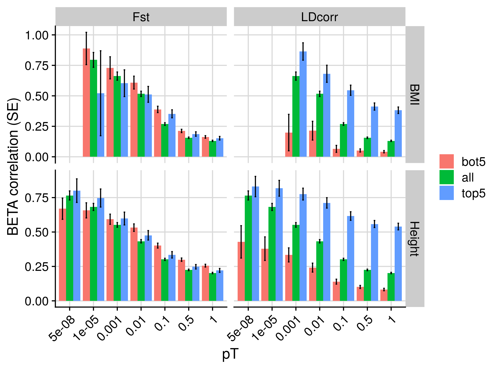
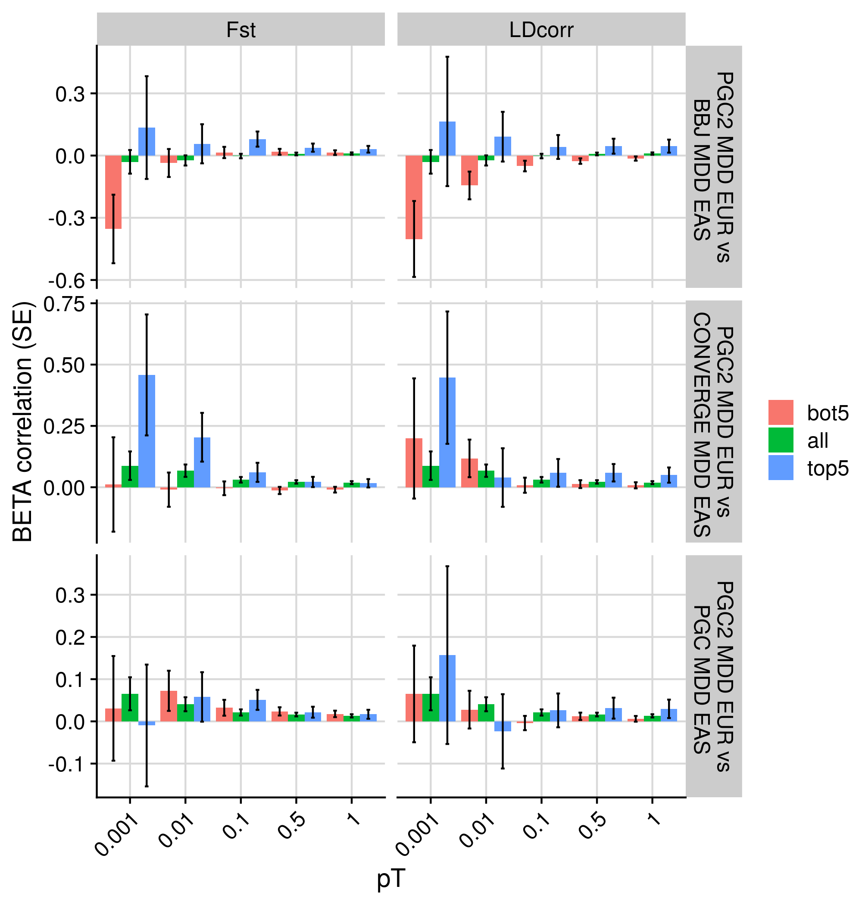

```{r setup, include=FALSE}
knitr::opts_chunk$set(echo = TRUE)
```

<style>
p.caption {
  font-size: 1.5em;
}
</style>

```{css, echo=F}
pre code, pre, code {
  white-space: pre !important;
  overflow-x: scroll !important;
  word-break: keep-all !important;
  word-wrap: initial !important;
}
```

***

# Introduction

Previous analysis showed that reweighting PGS according to LDcorr and Fst improved prediction of BMI, and Height to some exent, in EAS individuals within UKB. We should attempt replication in other super populations of UKB (AFR, AMR and SAS). 

***

# Methods

We have already calculated LDcorr and Fst for all super populations. We need to:

* Run polygenic scoring using subsets of SNPs according to LDcorr and Fst
* Calculate scores in UKB
* Evaluate compared to standard genome-wide PGS.

***

## Subset SNPs into LDcorr and Fst quantiles for each GWAS and super population

<details><summary>Show code</summary>

```{r, eval=F, echo=T}
library(data.table)

pop1='EUR'
pop2=c('EAS','AMR','AFR','SAS')

gwas_eur<-c('Wood_Height_EUR','Locke_BMI_EUR')

dir.create('/users/k1806347/brc_scratch/Analyses/CrossMeta/single_sample_rep')

for(pop2_i in pop2){
  # Read in pop1-pop2_i annotations
  annot<-NULL
  for(i in 1:22){
    annot<-rbind(annot, fread(paste0('/scratch/groups/biomarkers-brc-mh/Reference_data/CrossPop/Populations_',pop1,'_',pop2_i,'/chr',i,'/res.chr',i,'.',pop1,'.',pop2_i,'.txt')))
  }

  for(gwas_i in gwas_eur){
    # Read in gwas_i sumstats
    gwas_i_tmp<-fread(paste0('/users/k1806347/brc_scratch/Analyses/CrossMeta/GWAS_sumstats/cleaned/',gwas_i,'.gz'))
    
    # Merge annotations with gwas
    gwas_annot<-merge(gwas_i_tmp, annot[,c('SNP','Fst','cor_score'),with=F], by='SNP')
    
    for(annot_i in c('LDcorr','Fst')){
      if(annot_i == 'LDcorr'){
        var<-'cor_score'
      } else {
        var<-'Fst'
      }

      # Measure 5 and 95% quantiles
      quant<-NULL
      for(q in c(0.01,0.05,0.1,0.5,0.9,0.95,0.99)){
        quant<-rbind(quant, data.frame(q=q,
                                       val=quantile(gwas_annot[[var]], probs = q)))
      
        
        if(q < 0.5){
          dir.create(paste0('/users/k1806347/brc_scratch/Analyses/CrossMeta/single_sample_rep/', gwas_i,'/',annot_i,'/',pop2_i,'/bot_',q), recursive=T)
          write.table(gwas_annot[gwas_annot[[var]] < quant$val[quant$q == q],]$SNP, paste0("/users/k1806347/brc_scratch/Analyses/CrossMeta/single_sample_rep/", gwas_i,'/',annot_i,'/',pop2_i,'/bot_',q,'/bot_',q,'_',annot_i,'.snps.txt'), col.names=F, row.names=F, quote=F)
        } 
        
        if(q > 0.5){
          dir.create(paste0('/users/k1806347/brc_scratch/Analyses/CrossMeta/single_sample_rep/', gwas_i,'/',annot_i,'/',pop2_i,'/top_',1-q), recursive=T)
          write.table(gwas_annot[gwas_annot[[var]] > quant$val[quant$q == q],]$SNP, paste0("/users/k1806347/brc_scratch/Analyses/CrossMeta/single_sample_rep/", gwas_i,'/',annot_i,'/',pop2_i,'/top_',1-q,'/top_',1-q,'_',annot_i,'.snps.txt'), col.names=F, row.names=F, quote=F)
        }
        
        if(q == 0.5){
          dir.create(paste0('/users/k1806347/brc_scratch/Analyses/CrossMeta/single_sample_rep/', gwas_i,'/',annot_i,'/',pop2_i,'/top_',q), recursive=T)
          write.table(gwas_annot[gwas_annot[[var]] > quant$val[quant$q == q],]$SNP, paste0("/users/k1806347/brc_scratch/Analyses/CrossMeta/single_sample_rep/", gwas_i,'/',annot_i,'/',pop2_i,'/top_',q,'/top_',q,'_',annot_i,'.snps.txt'), col.names=F, row.names=F, quote=F)
  
          dir.create(paste0('/users/k1806347/brc_scratch/Analyses/CrossMeta/single_sample_rep/', gwas_i,'/',annot_i,'/',pop2_i,'/bot_',q), recursive=T)
          write.table(gwas_annot[gwas_annot[[var]] < quant$val[quant$q == q],]$SNP, paste0("/users/k1806347/brc_scratch/Analyses/CrossMeta/single_sample_rep/", gwas_i,'/',annot_i,'/',pop2_i,'/bot_',q,'/bot_',q,'_',annot_i,'.snps.txt'), col.names=F, row.names=F, quote=F)
        }
      }
    }
  }
}

```

***

## Process for polygenic scoring

```{bash, eval=F, echo=T}

pop=EUR
for pop2 in $(echo EAS AMR AFR SAS);do
for gwas in $(echo Wood_Height_EUR Locke_BMI_EUR);do
for annot in $(echo LDcorr Fst);do
for q in $(echo top_0.01 top_0.05 top_0.1 top_0.5 bot_0.01 bot_0.05 bot_0.1 bot_0.5);do
  sbatch -p brc,shared /users/k1806347/brc_scratch/Software/Rscript.sh /users/k1806347/brc_scratch/Software/MyGit/GenoPred/Scripts/polygenic_score_file_creator/polygenic_score_file_creator.R \
  --ref_plink_chr /users/k1806347/brc_scratch/Data/1KG/Phase3/1KGPhase3.w_hm3.chr \
  --ref_keep /users/k1806347/brc_scratch/Data/1KG/Phase3/keep_files/${pop}_samples.keep \
  --sumstats /users/k1806347/brc_scratch/Analyses/CrossMeta/GWAS_sumstats/cleaned/${gwas}.gz \
  --extract /scratch/users/k1806347/Analyses/CrossMeta/single_sample_rep/${gwas}/${annot}/${pop2}/${q}/${q}_${annot}.snps.txt \
  --plink /users/k1806347/brc_scratch/Software/plink1.9.sh \
  --memory 3000 \
  --output /scratch/users/k1806347/Analyses/CrossMeta/single_sample_rep/score_files/${pop}_only_subset/${gwas}/${annot}/${pop2}/${q}/score \
  --ref_pop_scale /users/k1806347/brc_scratch/Data/1KG/Phase3/super_pop_keep.list
done
done
done
done

```

</details>

***

## Calculating polygenic scores in UKB

<details><summary>Show code</summary>

```{r, eval=F, echo=T}

########
# All SNPs
########

for(targ_pop in c('EAS','AMR','AFR','SAS')){
  for(gwas in c('Wood_Height_EUR','Locke_BMI_EUR')){
    pop<-gsub('.*_','',gwas)
      
    system(paste0('sbatch -p brc,shared /users/k1806347/brc_scratch/Software/Rscript.sh /users/k1806347/brc_scratch/Software/MyGit/GenoPred/Scripts/Scaled_polygenic_scorer/Scaled_polygenic_scorer.R --target_plink_chr /users/k1806347/brc_scratch/Data/UKBB/Genotype/Harmonised/UKBB.w_hm3.QCd.AllSNP.chr --target_keep /users/k1806347/brc_scratch/Misc/Toshiki/UKB_keep_files/UKB_QC_UpdateIDs_',targ_pop,'.keep --ref_score /users/k1806347/brc_scratch/Analyses/CrossMeta/score_files/',pop,'_only/',gwas,'/score --ref_scale /users/k1806347/brc_scratch/Analyses/CrossMeta/score_files/',pop,'_only/',gwas,'/score.',targ_pop,'.scale --ref_freq_chr /users/k1806347/brc_scratch/Data/1KG/Phase3/freq_files/',targ_pop,'/1KGPhase3.w_hm3.',targ_pop,'.chr --plink /users/k1806347/brc_scratch/Software/plink1.9.sh --output /scratch/users/k1806347/Analyses/CrossMeta/single_sample_rep/prs/',targ_pop,'_target/',pop,'_only/',gwas,'/prs'))

  }
}

########
# Using subsets of LDcor and Fst
########

for(targ_pop in c('EAS','AMR','AFR','SAS')){
  for(gwas in c('Wood_Height_EUR','Locke_BMI_EUR')){
    for(annot in c('LDcorr','Fst')){
      for(q in c('top_0.01', 'top_0.05', 'top_0.1', 'top_0.5', 'bot_0.01', 'bot_0.05', 'bot_0.1', 'bot_0.5')){

        pop<-gsub('.*_','',gwas)
          
        if(!file.exists(paste0('/scratch/users/k1806347/Analyses/CrossMeta/single_sample_rep/prs/',targ_pop,'_target/',pop,'_only_subset/',gwas,'/',annot,'/',q,'/prs.profiles')))

        system(paste0('sbatch -p brc,shared /users/k1806347/brc_scratch/Software/Rscript.sh /users/k1806347/brc_scratch/Software/MyGit/GenoPred/Scripts/Scaled_polygenic_scorer/Scaled_polygenic_scorer.R --target_plink_chr /users/k1806347/brc_scratch/Data/UKBB/Genotype/Harmonised/UKBB.w_hm3.QCd.AllSNP.chr --target_keep /users/k1806347/brc_scratch/Misc/Toshiki/UKB_keep_files/UKB_QC_UpdateIDs_',targ_pop,'.keep --ref_score /scratch/users/k1806347/Analyses/CrossMeta/single_sample_rep/score_files/',pop,'_only_subset/',gwas,'/',annot,'/',targ_pop,'/',q,'/score --ref_scale /scratch/users/k1806347/Analyses/CrossMeta/single_sample_rep/score_files/',pop,'_only_subset/',gwas,'/',annot,'/',targ_pop,'/',q,'/score.',targ_pop,'.scale --ref_freq_chr /users/k1806347/brc_scratch/Data/1KG/Phase3/freq_files/',targ_pop,'/1KGPhase3.w_hm3.',targ_pop,'.chr --plink /users/k1806347/brc_scratch/Software/plink1.9.sh --output /scratch/users/k1806347/Analyses/CrossMeta/single_sample_rep/prs/',targ_pop,'_target/',pop,'_only_subset/',gwas,'/',annot,'/',q,'/prs'))
        
      }
    }
  }
}


```

</details>

***

## Evaluating polygenic scores

### Model Comparison

<details><summary>Show code</summary>

```{bash, echo=TRUE, eval=FALSE}
#########
# Estimate variance explained by EUR PRS subset by annotations
#########

for targ_pop in $(echo EAS SAS AFR AMR); do
for gwas in $(echo Wood_Height_EUR Locke_BMI_EUR); do
for annot in $(echo LDcorr Fst); do

mkdir -p /scratch/users/k1806347/Analyses/CrossMeta/single_sample_rep/assoc/${targ_pop}/${gwas}/${annot}

echo "predictors group" > /scratch/users/k1806347/Analyses/CrossMeta/single_sample_rep/assoc/${targ_pop}/${gwas}/${annot}/prs_1.txt
echo "/scratch/users/k1806347/Analyses/CrossMeta/single_sample_rep/prs/${targ_pop}_target/EUR_only/${gwas}/prs.profiles ${gwas}_all" >> /scratch/users/k1806347/Analyses/CrossMeta/single_sample_rep/assoc/${targ_pop}/${gwas}/${annot}/prs_1.txt

for q in $(echo top_0.01 top_0.05 top_0.1 top_0.5 bot_0.01 bot_0.05 bot_0.1 bot_0.5); do

if [ -f /scratch/users/k1806347/Analyses/CrossMeta/single_sample_rep/prs/${targ_pop}_target/EUR_only_subset/${gwas}/${annot}/${q}/prs.profiles ]; then

echo "/scratch/users/k1806347/Analyses/CrossMeta/single_sample_rep/prs/${targ_pop}_target/EUR_only_subset/${gwas}/${annot}/${q}/prs.profiles ${gwas}_${annot}_${q}" >> /scratch/users/k1806347/Analyses/CrossMeta/single_sample_rep/assoc/${targ_pop}/${gwas}/${annot}/prs_1.txt

fi
done
done
done
done

for targ_pop in $(echo EAS SAS AFR AMR); do
for gwas in $(echo Wood_Height_EUR Locke_BMI_EUR); do
for annot in $(echo LDcorr Fst); do

if [ ${gwas} == Wood_Height_EUR ]; then
pheno=Height
echo Height
else
pheno=BMI
echo BMI
fi

# Test association between prs and phenotype
sbatch --mem 10G -p brc,shared /users/k1806347/brc_scratch/Software/Rscript.sh /users/k1806347/brc_scratch/Software/MyGit/GenoPred/Scripts/Model_builder/Model_builder_V2_nested.R \
--pheno /users/k1806347/brc_scratch/Analyses/CrossMeta/Phenotype/${pheno}.txt \
--out /scratch/users/k1806347/Analyses/CrossMeta/single_sample_rep/assoc/${targ_pop}/${gwas}/${annot}/prs_1.test \
--assoc T \
--predictors /scratch/users/k1806347/Analyses/CrossMeta/single_sample_rep/assoc/${targ_pop}/${gwas}/${annot}/prs_1.txt

done
done
done

```

</details>

***

### Plotting results

<details><summary>Show code</summary>

```{r, echo=T, eval=F}
library(data.table)
library(ggplot2)
library(cowplot)

assoc_all_pop_all_pheno<-NULL
for(gwas in c('Wood_Height_EUR','Locke_BMI_EUR')){
  assoc_all_pop<-NULL
  for(targ_pop in c('EUR','EAS','AMR','AFR','SAS')){
    assoc<-NULL
    for(annot in c('LDcorr','Fst')){

      if(targ_pop == 'EUR'){
        tmp<-fread(paste0('/users/k1806347/brc_scratch/Analyses/CrossMeta/assoc/',targ_pop,'/',ifelse(grepl('Height', gwas), 'Height', 'BMI'),'_',ifelse(grepl('Wood', gwas), 'Wood', 'Locke'),'_EUR/prs_1_',annot,'.test.assoc.txt'))
      } else {
        tmp<-fread(paste0('/scratch/users/k1806347/Analyses/CrossMeta/single_sample_rep/assoc/',targ_pop,'/',gwas,'/',annot,'/prs_1.test.assoc.txt'))
      }
      tmp$Annot<-annot
      assoc<-rbind(assoc,tmp)

    }
    
    pheno<-ifelse(grepl('Height', gwas), 'Height', 'BMI')
    assoc$Label<-paste0(pheno,' ')
    
    assoc$Target<-targ_pop
  
    assoc$pT<-gsub('e.','e-',gsub('.*SCORE_','',assoc$Predictor))
  
    assoc$Type<-NA
    assoc$Type[grepl('EUR.all',assoc$Predictor)]<-'All SNPs'
    
    assoc$Type[grepl('EUR.LDcorr',assoc$Predictor)]<-gsub('.*EUR.LDcorr.','LDcorr: ',gsub('.PredFile.*','',assoc$Predictor[grepl('EUR.LDcorr',assoc$Predictor)]))
    
    
    assoc$Type[grepl('EUR.Fst',assoc$Predictor)]<-gsub('.*EUR.Fst.','Fst: ',gsub('.PredFile.*','',assoc$Predictor[grepl('EUR.Fst',assoc$Predictor)]))
  
    assoc$Type<-gsub('bot.','Bottom ', gsub('top.','Top ',assoc$Type))
  
    assoc$pT<-factor(assoc$pT, levels=unique(assoc$pT))
    assoc$Type<-factor(assoc$Type, levels=c("LDcorr: Bottom 0.01","LDcorr: Bottom 0.05","LDcorr: Bottom 0.1", "LDcorr: Bottom 0.5","LDcorr: Top 0.01","LDcorr: Top 0.05","LDcorr: Top 0.1","LDcorr: Top 0.5", "Fst: Bottom 0.01","Fst: Bottom 0.05", "Fst: Bottom 0.1", "Fst: Bottom 0.5", "Fst: Top 0.01", "Fst: Top 0.05", "Fst: Top 0.1", "Fst: Top 0.5", "All SNPs"))
  
    assoc<-assoc[complete.cases(assoc),]
    assoc_all_pop<-rbind(assoc_all_pop, assoc)
  }
  assoc_all_pop$Phenotype<-pheno
  assoc_all_pop_all_pheno<-rbind(assoc_all_pop_all_pheno, assoc_all_pop)
}

# Extract results corresponding to bot5%, top5% and all variants
assoc_all_pop_all_pheno_subset<-assoc_all_pop_all_pheno[grepl('Bottom 0.05|Top 0.05|All SNPs', assoc_all_pop_all_pheno$Type),]

# Calculate portability
assoc_all_pop_all_pheno_subset<-assoc_all_pop_all_pheno_subset[!duplicated(paste0(assoc_all_pop_all_pheno_subset$Predictor,'-',assoc_all_pop_all_pheno_subset$Target,'-',assoc_all_pop_all_pheno_subset$Annot,'-',assoc_all_pop_all_pheno_subset$Label)),]

assoc_all_pop_all_pheno_subset_EUR<-assoc_all_pop_all_pheno_subset[assoc_all_pop_all_pheno_subset$Target == 'EUR',]

assoc_all_pop_all_pheno_subset_list<-list()
assoc_all_pop_all_pheno_subset_wide_list<-list()
for(targ_pop in c('EUR','EAS','AMR','AFR','SAS')){
  assoc_all_pop_all_pheno_subset_list[[targ_pop]]<-assoc_all_pop_all_pheno_subset[assoc_all_pop_all_pheno_subset$Target == targ_pop,]
  
  assoc_all_pop_all_pheno_subset_wide_list[[targ_pop]]<-merge(assoc_all_pop_all_pheno_subset_EUR, assoc_all_pop_all_pheno_subset_list[[targ_pop]], by=c('Phenotype','Type','pT','Annot','Label'))

  assoc_all_pop_all_pheno_subset_wide_list[[targ_pop]]$Portability<-assoc_all_pop_all_pheno_subset_wide_list[[targ_pop]]$BETA.y/assoc_all_pop_all_pheno_subset_wide_list[[targ_pop]]$BETA.x

  # Scale SE of BETA in EAS by BETA.y/portability
  assoc_all_pop_all_pheno_subset_wide_list[[targ_pop]]$Portability_SE<-assoc_all_pop_all_pheno_subset_wide_list[[targ_pop]]$SE.y/(assoc_all_pop_all_pheno_subset_wide_list[[targ_pop]]$BETA.y/assoc_all_pop_all_pheno_subset_wide_list[[targ_pop]]$Portability)

  assoc_all_pop_all_pheno_subset_wide_list[[targ_pop]]$Test<-NA
  assoc_all_pop_all_pheno_subset_wide_list[[targ_pop]]$Test[grepl('Bottom', assoc_all_pop_all_pheno_subset_wide_list[[targ_pop]]$Type)]<-'bot5'
  assoc_all_pop_all_pheno_subset_wide_list[[targ_pop]]$Test[grepl('Top', assoc_all_pop_all_pheno_subset_wide_list[[targ_pop]]$Type)]<-'top5'
  assoc_all_pop_all_pheno_subset_wide_list[[targ_pop]]$Test[grepl('All', assoc_all_pop_all_pheno_subset_wide_list[[targ_pop]]$Type)]<-'all'

  assoc_all_pop_all_pheno_subset_wide_list[[targ_pop]]$Test<-factor(assoc_all_pop_all_pheno_subset_wide_list[[targ_pop]]$Test, levels=c('bot5','all','top5'))

  # Subset results to only show pT=0.5,0.1,0.01,1e-4,1e-8 to avoid redundancy
  assoc_all_pop_all_pheno_subset_wide_list[[targ_pop]]<-assoc_all_pop_all_pheno_subset_wide_list[[targ_pop]][assoc_all_pop_all_pheno_subset_wide_list[[targ_pop]]$pT %in% c('1e-08','1e-06','1e-04','0.01','0.1','0.5'),]
  
  # Plot results
  png(paste0('/scratch/users/k1806347/Analyses/CrossMeta/single_sample_rep/assoc/Top_Bot_Port',targ_pop,'_BMI_Height.png'), units='px', res=300, width=2000, height=1500)
  port_plot_height_bmi<-  ggplot(assoc_all_pop_all_pheno_subset_wide_list[[targ_pop]][grepl('BMI|Height',assoc_all_pop_all_pheno_subset_wide_list[[targ_pop]]$Phenotype),], aes(x=pT, y=Portability, fill=Test)) +
      geom_bar(stat="identity", position=position_dodge(.9)) +
      geom_errorbar(aes(ymin=Portability-Portability_SE, ymax=Portability+Portability_SE), width=.2,position=position_dodge(.9)) +
      theme_half_open() +
      background_grid() +
      labs(y="Portability") +
      theme(axis.text.x = element_text(angle = 45, hjust=1)) +
      facet_grid(vars(Label), vars(Annot), scales = "free")
  
  print(port_plot_height_bmi)
  
  dev.off()

}

assoc_all_pop_all_pheno_subset_wide_list_tab<-do.call(rbind, assoc_all_pop_all_pheno_subset_wide_list)
assoc_all_pop_all_pheno_subset_wide_list_tab<-assoc_all_pop_all_pheno_subset_wide_list_tab[assoc_all_pop_all_pheno_subset_wide_list_tab$Target.y != 'EUR',]
port_plot_height_bmi<-ggplot(assoc_all_pop_all_pheno_subset_wide_list_tab[grepl('BMI|Height',assoc_all_pop_all_pheno_subset_wide_list_tab$Phenotype),], aes(x=pT, y=Portability, fill=Test)) +
      geom_bar(stat="identity", position=position_dodge(.9)) +
      geom_errorbar(aes(ymin=Portability-Portability_SE, ymax=Portability+Portability_SE), width=.2,position=position_dodge(.9)) +
      theme_half_open() +
      background_grid() +
      labs(y="Portability") +
      theme(axis.text.x = element_text(angle = 45, hjust=1)) +
      facet_grid(Target.y + Label ~ Annot, scales = "free")

############
# Plot subset PRS
############
 
assoc_brief_all<-NULL
eval_all<-NULL
comp_all<-NULL

for(gwas in c('Wood_Height_EUR','Locke_BMI_EUR')){
  for(targ_pop in c('EAS','AMR','AFR','SAS')){
    assoc<-NULL
    for(annot in c('LDcorr','Fst')){
      
      tmp<-fread(paste0('/scratch/users/k1806347/Analyses/CrossMeta/single_sample_rep/assoc/',targ_pop,'/',gwas,'/',annot,'/prs_1.test.assoc.txt'))
      tmp$Annot<-annot
      assoc<-rbind(assoc,tmp)
      
    }
  
  assoc$Target<-targ_pop

  assoc$pT<-gsub('e.','e-',gsub('.*SCORE_','',assoc$Predictor))

  assoc$Type<-NA
  assoc$Type[grepl('EUR.all',assoc$Predictor)]<-'All SNPs'
  
  assoc$Type[grepl('EUR.LDcorr',assoc$Predictor)]<-gsub('.*EUR.LDcorr.','LDcorr: ',gsub('.PredFile.*','',assoc$Predictor[grepl('EUR.LDcorr',assoc$Predictor)]))
  
  
  assoc$Type[grepl('EUR.Fst',assoc$Predictor)]<-gsub('.*EUR.Fst.','Fst: ',gsub('.PredFile.*','',assoc$Predictor[grepl('EUR.Fst',assoc$Predictor)]))

  assoc$Type<-gsub('bot.','Bottom ', gsub('top.','Top ',assoc$Type))

  assoc$pT<-factor(assoc$pT, levels=unique(assoc$pT))
  assoc$Type<-factor(assoc$Type, levels=c("LDcorr: Bottom 0.01","LDcorr: Bottom 0.05","LDcorr: Bottom 0.1", "LDcorr: Bottom 0.5","LDcorr: Top 0.01","LDcorr: Top 0.05","LDcorr: Top 0.1","LDcorr: Top 0.5", "Fst: Bottom 0.01","Fst: Bottom 0.05", "Fst: Bottom 0.1", "Fst: Bottom 0.5", "Fst: Top 0.01", "Fst: Top 0.05", "Fst: Top 0.1", "Fst: Top 0.5", "All SNPs"))

  assoc<-assoc[complete.cases(assoc),]
  
  if(min(assoc$BETA-assoc$SE) < 0){
    ymin=min(assoc$BETA-assoc$SE)
  } else {
    ymin<-0
  }

  assoc_plot<-list()
  
  assoc_plot[['1']]<-ggplot(assoc[grepl('All|LDcorr', assoc$Type),], aes(x=pT, y=BETA, fill=Type)) +
  geom_bar(stat="identity", position=position_dodge(.9), colour='black') +
  geom_errorbar(aes(ymin=BETA-SE, ymax=BETA+SE), width=.2,position=position_dodge(.9)) +
  theme_half_open() +
  background_grid() +
  ylim(ymin,max(assoc$BETA+assoc$SE)) +
  labs(y="R (SE)") +
  theme(axis.text.x = element_text(angle = 45, hjust=1)) +
  scale_fill_manual(values=c("#660000","#990000", "#CC0000", "#FF0000","#003300","#006600", "#33CC33", "#66FF00","#0066CC","#CC33CC"))

  assoc_plot[['2']]<-ggplot(assoc[grepl('All|Fst', assoc$Type),], aes(x=pT, y=BETA, fill=Type)) +
  geom_bar(stat="identity", position=position_dodge(.9), colour='black') +
  geom_errorbar(aes(ymin=BETA-SE, ymax=BETA+SE), width=.2,position=position_dodge(.9)) +
  theme_half_open() +
  background_grid() +
  ylim(ymin,max(assoc$BETA+assoc$SE)) +
  labs(y="R (SE)") +
  theme(axis.text.x = element_text(angle = 45, hjust=1)) +
  scale_fill_manual(values=c("#660000","#990000", "#CC0000", "#FF0000","#003300","#006600", "#33CC33", "#66FF00","#0066CC","#CC33CC"))

  png(paste0('/scratch/users/k1806347/Analyses/CrossMeta/single_sample_rep/assoc/',targ_pop,'/',gwas,'/prs_1.test.pT_assoc.png'), units='px', res=300, width=2500, height=2500)
    print(plot_grid(plotlist=assoc_plot, ncol=1))
  dev.off()
  
  ###
  # Make a brief version of the plot containing only top and bottom 5%
  # Note showing the top 10% makes the results clearer for Height due to lower SE. Consider changing the BETA comparison threshold
  ###
  assoc_brief<-assoc[grepl('0.05|All',assoc$Type),]
  assoc_brief$Type<-factor(assoc_brief$Type, levels=c('LDcorr: Bottom 0.05','Fst: Bottom 0.05','All SNPs','LDcorr: Top 0.05','Fst: Top 0.05'))
    
  assoc_plot_brief<-list()
  
  assoc_plot_brief[[paste0(targ_pop,'_',gwas,'_1')]]<-ggplot(assoc_brief[grepl('All|LDcorr', assoc_brief$Type),], aes(x=pT, y=BETA, fill=Type)) +
  geom_bar(stat="identity", position=position_dodge(.9)) +
  geom_errorbar(aes(ymin=BETA-SE, ymax=BETA+SE), width=.2,position=position_dodge(.9)) +
  theme_half_open() +
  background_grid() +
  ylim(ymin,max(assoc_brief$BETA+assoc_brief$SE)) +
  labs(y="R (SE)") +
  theme(axis.text.x = element_text(angle = 45, hjust=1))

  assoc_plot_brief[[paste0(targ_pop,'_',gwas,'_2')]]<-ggplot(assoc_brief[grepl('All|Fst', assoc_brief$Type),], aes(x=pT, y=BETA, fill=Type)) +
  geom_bar(stat="identity", position=position_dodge(.9)) +
  geom_errorbar(aes(ymin=BETA-SE, ymax=BETA+SE), width=.2,position=position_dodge(.9)) +
  theme_half_open() +
  background_grid() +
  ylim(ymin,max(assoc_brief$BETA+assoc_brief$SE)) +
  labs(y="R (SE)") +
  theme(axis.text.x = element_text(angle = 45, hjust=1))

  png(paste0('/scratch/users/k1806347/Analyses/CrossMeta/single_sample_rep/assoc/',targ_pop,'/',gwas,'/prs_1.test_brief.pT_assoc.png'), units='px', res=300, width=2500, height=2500)
    print(plot_grid(plotlist=assoc_plot_brief, ncol=1))
  dev.off()

  assoc_brief$Phenotype<-ifelse(grepl('Height', gwas), 'Height', 'BMI')
  assoc_brief_all<-rbind(assoc_brief_all, assoc_brief)

  #####
  # Plot elastic net model results
  #####
  eval<-NULL
  for(annot in c('LDcorr','Fst')){
    tmp<-fread(paste0('/scratch/users/k1806347/Analyses/CrossMeta/single_sample_rep/assoc/',targ_pop,'/',gwas,'/',annot,'/prs_1.test.pred_eval.txt'))
    
    tmp$Model[tmp$Model == 'All_group']<-paste0('All SNPs + All ',annot)
    
    tmp$Annot<-annot
    tmp$Target<-targ_pop
    
    eval<-rbind(eval, tmp)
  
  }

  comp<-NULL
  for(annot in c('LDcorr','Fst')){
    tmp<-fread(paste0('/scratch/users/k1806347/Analyses/CrossMeta/single_sample_rep/assoc/',targ_pop,'/',gwas,'/',annot,'/prs_1.test.pred_comp.txt'))
    
    tmp$Phenotype<-ifelse(grepl('Height', gwas), 'Height', 'BMI')
    tmp$Annot<-annot
    tmp$Target<-targ_pop

    comp<-rbind(comp, tmp)
  
  }
  comp_all<-rbind(comp_all, comp)

  eval$Type<-gsub('.*EUR.','',gsub('_group','',eval$Model))
  eval$Type[eval$Type == 'all']<-'All SNPs'
  eval$Type<-gsub('.bot.',': Bottom ', eval$Type)
  eval$Type<-gsub('.top.',': Top ', eval$Type)
  eval$Type<-factor(eval$Type, levels = c("LDcorr: Bottom 0.01","LDcorr: Bottom 0.05","LDcorr: Bottom 0.1","LDcorr: Bottom 0.5","LDcorr: Top 0.01","LDcorr: Top 0.05", "LDcorr: Top 0.1","LDcorr: Top 0.5", "Fst: Bottom 0.01","Fst: Bottom 0.05","Fst: Bottom 0.1","Fst: Bottom 0.5", "Fst: Top 0.01","Fst: Top 0.05","Fst: Top 0.1", "Fst: Top 0.5","All SNPs", "All SNPs + All LDcorr","All SNPs + All Fst"))
  
  if(min(eval$R-eval$SE) < 0){
    ymin=min(eval$R-eval$SE)
  } else {
    ymin<-0
  }
  
  eval_plot<-list()

  eval_plot[[1]]<-ggplot(eval[grepl('LDcorr|SNPs$', eval$Type),], aes(x=Type, y=R, fill=Type)) +
    geom_bar(stat="identity", position=position_dodge(.9)) +
    geom_errorbar(aes(ymin=R-SE, ymax=R+SE), width=.2,position=position_dodge(.9)) +
    theme_half_open() +
    background_grid() +
    ylim(ymin,max(eval$R+eval$SE)) +
    labs(y="R (SE)") +
    theme(axis.text.x = element_text(angle = 45, hjust=1))
  
  eval_plot[[2]]<-ggplot(eval[grepl('Fst|SNPs$', eval$Type),], aes(x=Type, y=R, fill=Type)) +
    geom_bar(stat="identity", position=position_dodge(.9)) +
    geom_errorbar(aes(ymin=R-SE, ymax=R+SE), width=.2,position=position_dodge(.9)) +
    theme_half_open() +
    background_grid() +
    ylim(ymin,max(eval$R+eval$SE)) +
    labs(y="R (SE)") +
    theme(axis.text.x = element_text(angle = 45, hjust=1))
  
  png(paste0('/scratch/users/k1806347/Analyses/CrossMeta/single_sample_rep/assoc/',targ_pop,'/',gwas,'/prs_1.test.eval.png'), units='px', res=300, width=2500, height=2500)
    print(plot_grid(plotlist=eval_plot, ncol=1))
  dev.off()

  # Plot the data differently
  eval$Quant<-gsub('.* ','',eval$Type)
  eval$Quant[grepl('All', eval$Type)]<-as.character(eval$Type[grepl('All', eval$Type)])
  eval$Quant<-gsub('\\+ ','\\+\n',eval$Quant)
  
  eval$TopBot<-NA
  eval$TopBot[grepl('Top', eval$Type)]<-'Top'
  eval$TopBot[grepl('Bottom', eval$Type)]<-'Bottom'
  eval$TopBot[grepl('All', eval$Type)]<-as.character(eval$Type[grepl('All', eval$Type)])
  eval$TopBot<-gsub('\\+ ','\\+\n',eval$TopBot)

    eval$Phenotype<-ifelse(grepl('Height', gwas), 'Height', 'BMI')
    eval_all<-rbind(eval_all, eval)

  }
}

# Make plot containing brief assoc results for Height and BMI
assoc_brief_all$Test[grepl('Bottom', assoc_brief_all$Type)]<-'bot5'
assoc_brief_all$Test[grepl('Top', assoc_brief_all$Type)]<-'top5'
assoc_brief_all$Test[grepl('All', assoc_brief_all$Type)]<-'all'

assoc_brief_all$Test<-factor(assoc_brief_all$Test, levels=c('bot5','all','top5'))

# Subset results to only show pT=0.5,0.1,0.01,1e-4,1e-8 to avoid redundancy
assoc_brief_all<-assoc_brief_all[assoc_brief_all$pT %in% c('1e-08','1e-06','1e-04','0.01','0.1','0.5'),]

png(paste0('/scratch/users/k1806347/Analyses/CrossMeta/single_sample_rep/assoc/prs_1.test_brief.Height_BMI.pT_assoc.png'), units='px', res=300, width=2000, height=2500)
assoc_plot_height_bmi<-ggplot(assoc_brief_all[grepl('Height|BMI', assoc_brief_all$Phenotype),], aes(x=pT, y=BETA, fill=Test)) +
  geom_bar(stat="identity", position=position_dodge(.9)) +
  geom_errorbar(aes(ymin=BETA-SE, ymax=BETA+SE), width=.2,position=position_dodge(.9)) +
  theme_half_open() +
  background_grid() +
  labs(y="R (SE)") +
  theme(axis.text.x = element_text(angle = 45, hjust=1)) +
  facet_grid(Target + Phenotype ~ Annot, scales = "free")

assoc_plot_height_bmi

dev.off()

# Make a figure combining the assoc and port plots for the manuscript
png(paste0('/scratch/users/k1806347/Analyses/CrossMeta/single_sample_rep/assoc/Top_Bot_Port_Assoc_BMI_Height.png'), units='px', res=300, width=3000, height=3000)
plot_grid(assoc_plot_height_bmi, port_plot_height_bmi, labels = c('A', 'B'), ncol=2)
dev.off()

###
# Make a combined plot of elastic net models results
###

# Make one plot showing results for each quantile
# and another plot comparing the All SNP and all quantile models
png(paste0('/scratch/users/k1806347/Analyses/CrossMeta/single_sample_rep/assoc/quant_pred_eval_BMI_Height.png'), units='px', res=300, width=2200, height=4000)
tmp<-eval_all[grepl('BMI|Height', eval_all$Phenotype) & !grepl('All', eval_all$Type),]
tmp_comp<-comp_all[grepl('BMI|Height', comp_all$Phenotype) & !grepl('All|all', comp_all$Model_1) & !grepl('All|all', comp_all$Model_2),]

tmp_comp$TopBot_1<-gsub('.*LDcorr\\.', '', tmp_comp$Model_1)
tmp_comp$TopBot_1<-gsub('.*Fst\\.', '', tmp_comp$TopBot_1)
tmp_comp$TopBot_1<-gsub('\\..*','', tmp_comp$TopBot_1)
tmp_comp$TopBot_1<-paste0(toupper(substr(tmp_comp$TopBot_1, 1, 1)), substr(tmp_comp$TopBot_1, 2, nchar(tmp_comp$TopBot_1)))

tmp_comp$TopBot_2<-gsub('.*LDcorr\\.', '', tmp_comp$Model_2)
tmp_comp$TopBot_2<-gsub('.*Fst\\.', '', tmp_comp$TopBot_2)
tmp_comp$TopBot_2<-gsub('\\..*','', tmp_comp$TopBot_2)
tmp_comp$TopBot_2<-paste0(toupper(substr(tmp_comp$TopBot_2, 1, 1)), substr(tmp_comp$TopBot_2, 2, nchar(tmp_comp$TopBot_2)))

tmp_comp$Quant_1<-paste0('0.',gsub('.*\\.','',tmp_comp$Model_1))
tmp_comp$Quant_2<-paste0('0.',gsub('.*\\.','',tmp_comp$Model_2))

tmp_comp$Quant<-tmp_comp$Quant_1
tmp_comp$TopBot<-tmp_comp$TopBot_1

tmp_comp<-tmp_comp[tmp_comp$Quant_1 == tmp_comp$Quant_2,]
tmp_comp<-tmp_comp[tmp_comp$TopBot_1 != tmp_comp$TopBot_2,]

tmp_comp$R_diff_pval<-format(tmp_comp$R_diff_pval, scientific = TRUE, digits = 2)
tmp_comp$R_diff_pval[tmp_comp$R_diff_pval != "0.0e+00"]<-paste0('=',tmp_comp$R_diff_pval[tmp_comp$R_diff_pval != "0.0e+00"])
tmp_comp$R_diff_pval[tmp_comp$R_diff_pval == "0.0e+00"]<-'<1e-320'
tmp_comp$Label<-paste0(round(abs(tmp_comp$R_diff/tmp_comp$Model_2_R) * 100,1),'%\np', tmp_comp$R_diff_pval)

tmp<-tmp[,c('Quant','R','SE','TopBot','Annot','Phenotype','Target'), with=F]
tmp_comp<-tmp_comp[,c('Quant','Phenotype','Annot','Label','TopBot','Target'), with=F]

tmp_both<-merge(tmp, tmp_comp, by=c('Quant','Annot','Phenotype','TopBot','Target'), all.x=T)

if(min(tmp_both$R-tmp_both$SE) < 0){
    ylim_range<-max(tmp_both$R+tmp_both$SE)-min(tmp_both$R-tmp_both$SE)
  } else {
    ylim_range<-max(tmp_both$R+tmp_both$SE)
}
  
eval_plot_bmi_height<-ggplot(tmp_both, aes(x=Quant, y=R)) +
    geom_bar(data=tmp_both, aes(fill=TopBot), stat="identity", position=position_dodge(.9)) +
    geom_errorbar(aes(ymin=R-SE, ymax=R+SE, group=TopBot), width=.2,position=position_dodge(.9)) +
    geom_text(aes(y=max(tmp$R+tmp$SE)+(ylim_range/10)), label=tmp_both$Label, size=3) +
    theme_half_open() +
    ylim(c(min(tmp_both$R-tmp_both$SE),max(tmp_both$R+tmp_both$SE)+(ylim_range/10)+(ylim_range/10))) +
    background_grid() +
    labs(y="R (SE)", fill='', x='Annotation Quantile') +
    theme(axis.text.x = element_text(angle = 45, hjust=1)) +
    panel_border() +
    facet_grid(Target + Phenotype ~ Annot, scales = "free")

  eval_plot_bmi_height
dev.off()

###
# Plot all SNP model comparison
###
png(paste0('/scratch/users/k1806347/Analyses/CrossMeta/single_sample_rep/assoc/all_snp_pred_eval_BMI_Height.png'), units='px', res=300, width=4000, height=1600)

tmp<-eval_all[grepl('BMI|Height', eval_all$Phenotype) & grepl('All', eval_all$Type),]
tmp_comp<-comp_all[grepl('BMI|Height', comp_all$Phenotype) & grepl('All|all', comp_all$Model_1) & grepl('All|all', comp_all$Model_2),]

tmp_comp$Model_1[tmp_comp$Model_1 != 'All']<-'All SNPs'
tmp_comp$Model_2[tmp_comp$Model_2 != 'All']<-'All SNPs'

tmp_comp$Model_1[tmp_comp$Model_1 == 'All']<-paste0('All SNPs +\nAll ',tmp_comp$Annot[tmp_comp$Model_1 == 'All'])
tmp_comp$Model_2[tmp_comp$Model_2 == 'All']<-paste0('All SNPs +\nAll ',tmp_comp$Annot[tmp_comp$Model_2 == 'All'])

tmp_comp<-tmp_comp[tmp_comp$Model_1 != tmp_comp$Model_2,]

tmp_comp$R_diff_pval<-format(tmp_comp$R_diff_pval, scientific = TRUE, digits = 2)
tmp_comp$R_diff_pval[tmp_comp$R_diff_pval != "0.0e+00"]<-paste0('=',tmp_comp$R_diff_pval[tmp_comp$R_diff_pval != "0.0e+00"])
tmp_comp$R_diff_pval[tmp_comp$R_diff_pval == "0.0e+00"]<-'<1e-320'
tmp_comp$Label<-paste0(round(abs(tmp_comp$R_diff/tmp_comp$Model_2_R) * 100,1),'%\np', tmp_comp$R_diff_pval)

tmp<-tmp[,c('Type','R','SE','Annot','Phenotype','Target'), with=F]
tmp_comp<-tmp_comp[,c('Model_1','Model_2','Phenotype','Annot','Label','Target'), with=F]

tmp_both<-merge(tmp, tmp_comp, by.x=c('Type','Annot','Phenotype','Target'), by.y=c('Model_2','Annot','Phenotype','Target'), all.x=T)

if(min(tmp_both$R-tmp_both$SE) < 0){
    ylim_range<-max(tmp_both$R+tmp_both$SE)-min(tmp_both$R-tmp_both$SE)
  } else {
    ylim_range<-max(tmp_both$R+tmp_both$SE)
}

tmp_both$Type<-gsub('\\+ ','\\+\n',tmp_both$Type)

y_lim<-c(min(tmp_both$R-tmp_both$SE),max(tmp_both$R+tmp_both$SE)+(ylim_range/10)+(ylim_range/10)+(ylim_range/10))
if(y_lim[1] != 0){
  y_lim<-c(0,y_lim[2])
}
  
ggplot(tmp_both, aes(x=Type, y=R, fill=Type)) +
    geom_bar(stat="identity", position=position_dodge(.9)) +
    geom_errorbar(aes(ymin=R-SE, ymax=R+SE), width=.2,position=position_dodge(.9)) +
    geom_text(data=tmp_both, aes(x=Model_1, y=max(tmp_both$R+tmp_both$SE)+(ylim_range/10)+(ylim_range/10)), label=tmp_both$Label, size=4) +
    ylim(y_lim) +
    theme_half_open() +
    background_grid() +
    labs(y="R (SE)", fill='', x='Model') +
    theme(axis.text.x = element_text(angle = 45, hjust=1), legend.position='none') +
    panel_border() +
    facet_grid(Phenotype ~ Target, scales = "free")
dev.off()

#################
# Plot CrossMeta results
###############

assoc_all<-NULL
for(i in 1:length(pheno)){
for(targ_pop in c(pop1[i], pop2[i])){

############
# Plot the predictive utility of each predictor
############

  assoc<-fread(paste0('/users/k1806347/brc_scratch/Analyses/CrossMeta/assoc/',targ_pop,'/',pheno[i],'_',samp1[i],'_',pop1[i],'_',samp2[i],'_',pop2[i],'/prs_1.test.assoc.txt'))
  assoc$Target<-targ_pop

  assoc$pT<-gsub('e.','e-',gsub('.*SCORE_','',assoc$Predictor))
  
  assoc$Type[grepl(paste0('Group_',samp1[i],'.',pheno[i],'.',pop1[i],'.single'), assoc$Predictor)]<-paste0(pop1[i],' GWAS')
  assoc$Type[grepl(paste0('Group_',samp2[i],'.',pheno[i],'.',pop2[i],'.single'), assoc$Predictor)]<-paste0(pop2[i],' GWAS')

  assoc$Type[grepl(paste0('Group_',pheno[i],'.',samp1[i],'.',pop1[i],'.',samp2[i],'.',pop2[i],'.standard'), assoc$Predictor)]<-'Meta standard'

  assoc$Type[grepl(paste0('Group_',pheno[i],'.',samp1[i],'.',pop1[i],'.',samp2[i],'.',pop2[i],'.integer'), assoc$Predictor)]<-'Meta integer'
  assoc$Type[grepl(paste0('Group_',pheno[i],'.',samp1[i],'.',pop1[i],'.',samp2[i],'.',pop2[i],'.LDcorr'), assoc$Predictor)]<-'Meta LDcorr'
  assoc$Type[grepl(paste0('Group_',pheno[i],'.',samp1[i],'.',pop1[i],'.',samp2[i],'.',pop2[i],'.Fst'), assoc$Predictor)]<-'Meta Fst'

  assoc$Annot_weight<-NA
  assoc$Annot_weight[assoc$Type == 'Meta integer']<-gsub('\\.Pred.*','',gsub('.*integer.k.','',assoc$Predictor[assoc$Type == 'Meta integer']))
  assoc$Annot_weight[assoc$Type == 'Meta Fst']<-gsub('\\.Pred.*','',gsub('.*Fst.q.','',assoc$Predictor[assoc$Type == 'Meta Fst']))
  assoc$Annot_weight[assoc$Type == 'Meta LDcorr']<-gsub('\\.Pred.*','',gsub('.*LDcorr.q.','',assoc$Predictor[assoc$Type == 'Meta LDcorr']))
  
  assoc$Type[!is.na(assoc$Annot_weight) & (assoc$Type == 'Meta Fst' | assoc$Type == 'Meta LDcorr')]<-paste0(assoc$Type[!is.na(assoc$Annot_weight) & (assoc$Type == 'Meta Fst' | assoc$Type == 'Meta LDcorr')], ' q=', assoc$Annot_weight[!is.na(assoc$Annot_weight) & (assoc$Type == 'Meta Fst' | assoc$Type == 'Meta LDcorr')])
  assoc$Type[!is.na(assoc$Annot_weight) & (assoc$Type == 'Meta integer')]<-paste0(assoc$Type[!is.na(assoc$Annot_weight) & (assoc$Type == 'Meta integer')], ' k=', assoc$Annot_weight[!is.na(assoc$Annot_weight) & (assoc$Type == 'Meta integer')])

  assoc$pT<-factor(assoc$pT, levels=unique(assoc$pT))
  assoc$Type<-factor(assoc$Type, levels=unique(assoc$Type))

  # Subset results to only show pT=0.5,0.1,0.01,1e-4,1e-8 to avoid redundancy
  assoc<-assoc[assoc$pT %in% c('1e-08','1e-06','1e-04','0.01','0.1','0.5'),]

  if(min(assoc$BETA-assoc$SE) < 0){
    ymin=min(assoc$BETA-assoc$SE)
  } else {
    ymin<-0
  }
  
  assoc_plot<-list()
  
  assoc_plot[['1']]<-ggplot(assoc[(assoc$Type == 'EUR GWAS' | assoc$Type == 'EAS GWAS' | assoc$Type == 'Meta standard')], aes(x=pT, y=BETA, fill=Type)) +
    geom_bar(stat="identity", position=position_dodge(.9)) +
    geom_errorbar(aes(ymin=BETA-SE, ymax=BETA+SE), width=.2,position=position_dodge(.9)) +
    theme_half_open() +
    background_grid() +
    ylim(ymin,max(assoc$BETA+assoc$SE)) +
    labs(y="R (SE)") +
    theme(axis.text.x = element_text(angle = 45, hjust=1))

  assoc_plot[['2']]<-ggplot(assoc[(grepl('Meta integer', assoc$Type) | assoc$Type == 'Meta standard')], aes(x=pT, y=BETA, fill=Type)) +
  geom_bar(stat="identity", position=position_dodge(.9)) +
  geom_errorbar(aes(ymin=BETA-SE, ymax=BETA+SE), width=.2,position=position_dodge(.9)) +
  theme_half_open() +
  background_grid() +
  ylim(ymin,max(assoc$BETA+assoc$SE)) +
  labs(y="R (SE)") +
  theme(axis.text.x = element_text(angle = 45, hjust=1))

  assoc_plot[['3']]<-ggplot(assoc[(grepl('Meta LDcorr', assoc$Type) | assoc$Type == 'Meta standard')], aes(x=pT, y=BETA, fill=Type)) +
  geom_bar(stat="identity", position=position_dodge(.9)) +
  geom_errorbar(aes(ymin=BETA-SE, ymax=BETA+SE), width=.2,position=position_dodge(.9)) +
  theme_half_open() +
  background_grid() +
  ylim(ymin,max(assoc$BETA+assoc$SE)) +
  labs(y="R (SE)") +
  theme(axis.text.x = element_text(angle = 45, hjust=1))
  
  assoc_plot[['4']]<-ggplot(assoc[(grepl('Meta Fst', assoc$Type) | assoc$Type == 'Meta standard')], aes(x=pT, y=BETA, fill=Type)) +
  geom_bar(stat="identity", position=position_dodge(.9)) +
  geom_errorbar(aes(ymin=BETA-SE, ymax=BETA+SE), width=.2,position=position_dodge(.9)) +
  theme_half_open() +
  background_grid() +
  ylim(ymin,max(assoc$BETA+assoc$SE)) +
  labs(y="R (SE)") +
  theme(axis.text.x = element_text(angle = 45, hjust=1))

  png(paste0('/users/k1806347/brc_scratch/Analyses/CrossMeta/assoc/',targ_pop,'/',pheno[i],'_',samp1[i],'_',pop1[i],'_',samp2[i],'_',pop2[i],'/prs_1.test.pT_assoc.png'), units='px', res=300, width=2000, height=3000)
    print(plot_grid(plotlist=assoc_plot, ncol=1))
  dev.off()
  
  assoc$Phenotype<-pheno[i]
  assoc$GWAS_1<-paste0(pheno[i],' ',samp1[i],' ',pop1[i])
  assoc$GWAS_2<-paste0(pheno[i],' ',samp2[i],' ',pop2[i])
  assoc$Target<-targ_pop
  assoc_all<-rbind(assoc_all, assoc)
  }
}

# Make a plot summarising the result when using EUR, EAS and meta-GWAS across p-value thresholds
png(paste0('/users/k1806347/brc_scratch/Analyses/CrossMeta/assoc/prs_1.test.pT_assoc.all_targ.bmi_height.png'), units='px', res=300, width=2700, height=1800)
ggplot(assoc_all[(assoc_all$Type == 'EUR GWAS' | assoc_all$Type == 'EAS GWAS' | assoc_all$Type == 'Meta standard') & grepl('BMI|Height', assoc_all$Phenotype)], aes(x=pT, y=BETA, fill=Type)) +
    geom_bar(stat="identity", position=position_dodge(.9)) +
    geom_errorbar(aes(ymin=BETA-SE, ymax=BETA+SE), width=.2,position=position_dodge(.9)) +
    theme_half_open() +
    background_grid() +
    labs(y="R (SE)") +
    theme(axis.text.x = element_text(angle = 45, hjust=1)) +
    panel_border() +
    facet_grid(vars(Phenotype), vars(Target), scales = "free")
dev.off()

png(paste0('/users/k1806347/brc_scratch/Analyses/CrossMeta/assoc/prs_1.test.pT_assoc.all_targ.mdd.png'), units='px', res=300, width=2700, height=2200)
ggplot(assoc_all[(assoc_all$Type == 'EUR GWAS' | assoc_all$Type == 'EAS GWAS' | assoc_all$Type == 'Meta standard') & grepl('MDD', assoc_all$Phenotype)], aes(x=pT, y=BETA, fill=Type)) +
    geom_bar(stat="identity", position=position_dodge(.9)) +
    geom_errorbar(aes(ymin=BETA-SE, ymax=BETA+SE), width=.2,position=position_dodge(.9)) +
    theme_half_open() +
    background_grid() +
    labs(y="R (SE)") +
    theme(axis.text.x = element_text(angle = 45, hjust=1)) +
    panel_border() +
    facet_grid(vars(paste0(GWAS_1,' vs.\n',GWAS_2)), vars(Target), scales = "free")
dev.off()

# Make plot summarising results when reweighting meta-analysis
int<-ggplot(assoc_all[(grepl('Meta integer', assoc_all$Type) | assoc_all$Type == 'Meta standard') & grepl('BMI|Height', assoc_all$Phenotype)], aes(x=pT, y=BETA, fill=Type)) +
    geom_bar(stat="identity", position=position_dodge(.9)) +
    geom_errorbar(aes(ymin=BETA-SE, ymax=BETA+SE), width=.2,position=position_dodge(.9)) +
    theme_half_open() +
    background_grid() +
    labs(y="R (SE)") +
    theme(axis.text.x = element_text(angle = 45, hjust=1)) +
    panel_border() +
    facet_grid(vars(Phenotype), vars(Target), scales = "free")

ldcor<-ggplot(assoc_all[(grepl('Meta LDcorr', assoc_all$Type) | assoc_all$Type == 'Meta standard') & grepl('BMI|Height', assoc_all$Phenotype)], aes(x=pT, y=BETA, fill=Type)) +
    geom_bar(stat="identity", position=position_dodge(.9)) +
    geom_errorbar(aes(ymin=BETA-SE, ymax=BETA+SE), width=.2,position=position_dodge(.9)) +
    theme_half_open() +
    background_grid() +
    labs(y="R (SE)") +
    theme(axis.text.x = element_text(angle = 45, hjust=1)) +
    panel_border() +
    facet_grid(vars(Phenotype), vars(Target), scales = "free")

fst<-ggplot(assoc_all[(grepl('Meta Fst', assoc_all$Type) | assoc_all$Type == 'Meta standard') & grepl('BMI|Height', assoc_all$Phenotype)], aes(x=pT, y=BETA, fill=Type)) +
    geom_bar(stat="identity", position=position_dodge(.9)) +
    geom_errorbar(aes(ymin=BETA-SE, ymax=BETA+SE), width=.2,position=position_dodge(.9)) +
    theme_half_open() +
    background_grid() +
    labs(y="R (SE)") +
    theme(axis.text.x = element_text(angle = 45, hjust=1)) +
    panel_border() +
    facet_grid(vars(Phenotype), vars(Target), scales = "free")

png(paste0('/users/k1806347/brc_scratch/Analyses/CrossMeta/assoc/prs_1.test.pT_assoc.all_targ.bmi_height.meta.png'), units='px', res=300, width=2700, height=4000)
plot_grid(int, ldcor, fst, labels= c('A', 'B','C'), nrow=3)
dev.off()

int<-ggplot(assoc_all[(grepl('Meta integer', assoc_all$Type) | assoc_all$Type == 'Meta standard') & grepl('MDD', assoc_all$Phenotype)], aes(x=pT, y=BETA, fill=Type)) +
    geom_bar(stat="identity", position=position_dodge(.9)) +
    geom_errorbar(aes(ymin=BETA-SE, ymax=BETA+SE), width=.2,position=position_dodge(.9)) +
    theme_half_open() +
    background_grid() +
    labs(y="R (SE)") +
    theme(axis.text.x = element_text(angle = 45, hjust=1)) +
    panel_border() +
    facet_grid(vars(gsub('MDD ','',paste0(GWAS_1,' vs.\n',GWAS_2))), vars(Target), scales = "free")

ldcor<-ggplot(assoc_all[(grepl('Meta LDcorr', assoc_all$Type) | assoc_all$Type == 'Meta standard') & grepl('MDD', assoc_all$Phenotype)], aes(x=pT, y=BETA, fill=Type)) +
    geom_bar(stat="identity", position=position_dodge(.9)) +
    geom_errorbar(aes(ymin=BETA-SE, ymax=BETA+SE), width=.2,position=position_dodge(.9)) +
    theme_half_open() +
    background_grid() +
    labs(y="R (SE)") +
    theme(axis.text.x = element_text(angle = 45, hjust=1)) +
    panel_border() +
    facet_grid(vars(gsub('MDD ','',paste0(GWAS_1,' vs.\n',GWAS_2))), vars(Target), scales = "free")

fst<-ggplot(assoc_all[(grepl('Meta Fst', assoc_all$Type) | assoc_all$Type == 'Meta standard') & grepl('MDD', assoc_all$Phenotype)], aes(x=pT, y=BETA, fill=Type)) +
    geom_bar(stat="identity", position=position_dodge(.9)) +
    geom_errorbar(aes(ymin=BETA-SE, ymax=BETA+SE), width=.2,position=position_dodge(.9)) +
    theme_half_open() +
    background_grid() +
    labs(y="R (SE)") +
    theme(axis.text.x = element_text(angle = 45, hjust=1)) +
    panel_border() +
    facet_grid(vars(gsub('MDD ','',paste0(GWAS_1,' vs.\n',GWAS_2))), vars(Target), scales = "free")

png(paste0('/users/k1806347/brc_scratch/Analyses/CrossMeta/assoc/prs_1.test.pT_assoc.all_targ.mdd.meta.png'), units='px', res=300, width=2700, height=5000)
plot_grid(int, ldcor, fst, labels= c('A', 'B','C'), nrow=3)
dev.off()

###############
# Plot comparisons between all models
###############

# Plot the absolute results
eval_all_all<-list()

for(i in 1:length(pheno)){
for(targ_pop in c(pop1[i], pop2[i])){
  eval_integer<- fread(paste0('/users/k1806347/brc_scratch/Analyses/CrossMeta/assoc/',targ_pop,'/',pheno[i],'_',samp1[i],'_',pop1[i],'_',samp2[i],'_',pop2[i],'/prs_2.test.pred_eval.txt'))
  eval_integer$Label<-c('Baseline','Meta integer','Baseline +\nMeta integer')

  eval_LDcorr<- fread(paste0('/users/k1806347/brc_scratch/Analyses/CrossMeta/assoc/',targ_pop,'/',pheno[i],'_',samp1[i],'_',pop1[i],'_',samp2[i],'_',pop2[i],'/prs_LDcorr.test.pred_eval.txt'))
  eval_LDcorr$Label<-c('Baseline','Meta LDcorr','Baseline +\nMeta LDcorr')
  
  eval_Fst<- fread(paste0('/users/k1806347/brc_scratch/Analyses/CrossMeta/assoc/',targ_pop,'/',pheno[i],'_',samp1[i],'_',pop1[i],'_',samp2[i],'_',pop2[i],'/prs_Fst.test.pred_eval.txt'))
  eval_Fst$Label<-c('Baseline','Meta Fst','Baseline +\nMeta Fst')

  eval_Both<- fread(paste0('/users/k1806347/brc_scratch/Analyses/CrossMeta/assoc/',targ_pop,'/',pheno[i],'_',samp1[i],'_',pop1[i],'_',samp2[i],'_',pop2[i],'/prs_3.test.pred_eval.txt'))
  eval_Both$Label<-c('Baseline','Meta LDcorr + \nMeta Fst','Baseline +\nMeta LDcorr +\nMeta Fst')

  eval_all<-do.call(rbind, list(eval_integer, eval_LDcorr,eval_Fst,eval_Both))
  eval_all<-eval_all[!duplicated(eval_all),]
  
  label_order<-c('Meta integer','Meta LDcorr','Meta Fst','Meta LDcorr + \nMeta Fst','Baseline','Baseline +\nMeta integer','Baseline +\nMeta LDcorr','Baseline +\nMeta Fst','Baseline +\nMeta LDcorr +\nMeta Fst')
  
  eval_all<-eval_all[match(label_order, eval_all$Label),]
  eval_all$Label<-factor(eval_all$Label, levels=eval_all$Label)

  eval_all$Target<-targ_pop

  eval_all<-eval_all[grepl('Baseline', eval_all$Label),]
  
  eval_plot<-ggplot(eval_all, aes(x=Label, y=R, colour=Label, group = 1)) +
  geom_point(stat="identity", position=position_dodge(.9), size=5) +
  geom_errorbar(aes(ymin=R-SE, ymax=R+SE), width=.2,position=position_dodge(.9)) +
  theme_half_open() +
  background_grid() +
  ylim(min(eval_all$R-eval_all$SE),max(eval_all$R+eval_all$SE)+0.075) +
  labs(y="R (SE)", x='', title=paste0(targ_pop,' target: ',pheno[i],'-',samp1[i],'-',pop1[i],' + ',pheno[i],'-',samp1[i],'-',pop1[i])) +
  theme(axis.text.x = element_text(angle = 45, hjust=1), legend.position = "none")

  comp_integer<- fread(paste0('/users/k1806347/brc_scratch/Analyses/CrossMeta/assoc/',targ_pop,'/',pheno[i],'_',samp1[i],'_',pop1[i],'_',samp2[i],'_',pop2[i],'/prs_2.test.pred_comp.txt'))
  comp_integer<-comp_integer[comp_integer$Model_1 == 'All' & comp_integer$Model_2 == 'single.and.standard' ]

  comp_LDcorr<- fread(paste0('/users/k1806347/brc_scratch/Analyses/CrossMeta/assoc/',targ_pop,'/',pheno[i],'_',samp1[i],'_',pop1[i],'_',samp2[i],'_',pop2[i],'/prs_LDcorr.test.pred_comp.txt'))
  comp_LDcorr<-comp_LDcorr[comp_LDcorr$Model_1 == 'All' & comp_LDcorr$Model_2 == 'single.and.standard' ]

  comp_Fst<- fread(paste0('/users/k1806347/brc_scratch/Analyses/CrossMeta/assoc/',targ_pop,'/',pheno[i],'_',samp1[i],'_',pop1[i],'_',samp2[i],'_',pop2[i],'/prs_Fst.test.pred_comp.txt'))
  comp_Fst<-comp_Fst[comp_Fst$Model_1 == 'All' & comp_Fst$Model_2 == 'single.and.standard' ]

  comp_BOTH<- fread(paste0('/users/k1806347/brc_scratch/Analyses/CrossMeta/assoc/',targ_pop,'/',pheno[i],'_',samp1[i],'_',pop1[i],'_',samp2[i],'_',pop2[i],'/prs_3.test.pred_comp.txt'))
  comp_BOTH<-comp_BOTH[comp_BOTH$Model_1 == 'All' & comp_BOTH$Model_2 == 'single.and.standard' ]

  paths_integer<-data.frame(x=c(1,1,2,2),
                           y=c(max(eval_all$R+eval_all$SE)+0.005,max(eval_all$R+eval_all$SE)+0.01,max(eval_all$R+eval_all$SE)+0.01,max(eval_all$R+eval_all$SE)+0.005))
  
  paths_LDcorr<-paths_integer
  paths_LDcorr$x[paths_LDcorr$x != 1]<-paths_LDcorr$x[paths_LDcorr$x != 1]+1
  paths_LDcorr$y<-paths_LDcorr$y+0.015

  paths_Fst<-paths_LDcorr
  paths_Fst$x[paths_Fst$x != 1]<-paths_Fst$x[paths_Fst$x != 1]+1
  paths_Fst$y<-paths_Fst$y+0.015

  paths_both<-paths_Fst
  paths_both$x[paths_both$x != 1]<-paths_both$x[paths_both$x != 1]+1
  paths_both$y<-paths_both$y+0.015
  
  eval_plot<-eval_plot + 
    geom_path(data=paths_integer, aes(x=x,y=y), colour='black') +
    geom_path(data=paths_LDcorr, aes(x=x,y=y), colour='black') +
    geom_path(data=paths_Fst, aes(x=x,y=y), colour='black') +
    geom_path(data=paths_both, aes(x=x,y=y), colour='black')
    
  eval_plot<-eval_plot + 
    annotate("text",x=1.5,y=max(eval_all$R+eval_all$SE)+0.015,label=paste0('diff=', round(abs(comp_integer$R_diff/comp_integer$Model_2_R) * 100,1),'%; p=', format(comp_integer$R_diff_pval, scientific = TRUE, digits = 2)), size=4) +
    annotate("text",x=2,y=max(eval_all$R+eval_all$SE)+0.03,label=paste0('diff=', round(abs(comp_LDcorr$R_diff/comp_LDcorr$Model_2_R) * 100,1),'%; p=', format(comp_LDcorr$R_diff_pval, scientific = TRUE, digits = 2)), size=4) +
    annotate("text",x=2.5,y=max(eval_all$R+eval_all$SE)+0.045,label=paste0('diff=', round(abs(comp_Fst$R_diff/comp_Fst$Model_2_R) * 100,1),'%; p=', format(comp_Fst$R_diff_pval, scientific = TRUE, digits = 2)), size=4) +
    annotate("text",x=3,y=max(eval_all$R+eval_all$SE)+0.06,label=paste0('diff=', round(abs(comp_BOTH$R_diff/comp_BOTH$Model_2_R) * 100,1),'%; p=', format(comp_BOTH$R_diff_pval, scientific = TRUE, digits = 2)), size=4)

  png(paste0('/users/k1806347/brc_scratch/Analyses/CrossMeta/assoc/',targ_pop,'/',pheno[i],'_',samp1[i],'_',pop1[i],'_',samp2[i],'_',pop2[i],'/prs_all.test.comp.png'), units='px', res=300, width=2200, height=1500)
    print(eval_plot)
  dev.off()
  
  eval_all$text<-c(NA, 
                    paste0('diff=', round(abs(comp_integer$R_diff/comp_integer$Model_2_R) * 100,1),'%\np=', format(comp_integer$R_diff_pval, scientific = TRUE, digits = 2)),
                    paste0('diff=', round(abs(comp_LDcorr$R_diff/comp_LDcorr$Model_2_R) * 100,1),'%\np=', format(comp_LDcorr$R_diff_pval, scientific = TRUE, digits = 2)),
                    paste0('diff=', round(abs(comp_Fst$R_diff/comp_Fst$Model_2_R) * 100,1),'%\np=', format(comp_Fst$R_diff_pval, scientific = TRUE, digits = 2)),
                    paste0('diff=', round(abs(comp_BOTH$R_diff/comp_BOTH$Model_2_R) * 100,1),'%\np=', format(comp_BOTH$R_diff_pval, scientific = TRUE, digits = 2)))
  
  eval_all$Test<-paste0(pheno[i],'_',samp1[i],'_',pop1[i],'_',samp2[i],'_',pop2[i])
  eval_all$Phenotype<-pheno[i]
  
  eval_all_all<-rbind(eval_all_all, eval_all)
  }
}

png(paste0('/users/k1806347/brc_scratch/Analyses/CrossMeta/assoc/EUR/prs_all.test.comp.eur.height_bmi.png'), units='px', res=300, width=2200, height=1800)

tmp<-eval_all_all[eval_all_all$Target == 'EUR' & grepl('BMI|Height', eval_all_all$Test),]

tmp$text[is.na(tmp$text)]<-''

ylim_range<-max(tmp$R+tmp$SE)-min(tmp$R-tmp$SE)

ggplot(tmp, aes(x=Label, y=R, colour=Label, group = 1)) +
  geom_point(stat="identity", position=position_dodge(.9), size=5) +
  geom_errorbar(aes(ymin=R-SE, ymax=R+SE), width=.2,position=position_dodge(.9)) +
  geom_text(data=tmp, aes(x=Label, y=tmp$R+tmp$SE+(ylim_range/100)), label=paste0('\n',tmp$text), colour='black', size=3) +
  theme_half_open() +
  background_grid() +
  labs(y="R (SE)", x='', title='EUR target') +
  theme(axis.text.x = element_text(angle = 45, hjust=1), legend.position = "none") +
  panel_border() +
  facet_grid(vars(Phenotype), scales = "free")

dev.off()


png(paste0('/users/k1806347/brc_scratch/Analyses/CrossMeta/assoc/EUR/prs_all.test.comp.eur.mdd.png'), units='px', res=300, width=2200, height=2200)

tmp<-eval_all_all[eval_all_all$Target == 'EUR' & grepl('MDD', eval_all_all$Test),]

tmp$text[is.na(tmp$text)]<-''
tmp$Name<-gsub('EUR ','EUR \\+\n',gsub('_', ' ',gsub('MDD_','', tmp$Test)))

ylim_range<-max(tmp$R+tmp$SE)-min(tmp$R-tmp$SE)

ggplot(tmp, aes(x=Label, y=R, colour=Label, group = 1)) +
  geom_point(stat="identity", position=position_dodge(.9), size=5) +
  geom_errorbar(aes(ymin=R-SE, ymax=R+SE), width=.2,position=position_dodge(.9)) +
  geom_text(data=tmp, aes(x=Label, y=tmp$R+tmp$SE+(ylim_range/5)), label=paste0('\n',tmp$text), colour='black', size=3) +
  theme_half_open() +
  background_grid() +
  labs(y="R (SE)", x='', title='EUR target') +
  theme(axis.text.x = element_text(angle = 45, hjust=1), legend.position = "none") +
  panel_border() +
  facet_grid(vars(Name), scales = "free")

dev.off()

png(paste0('/users/k1806347/brc_scratch/Analyses/CrossMeta/assoc/EAS/prs_all.test.comp.eas.height_bmi.png'), units='px', res=300, width=2200, height=1800)

tmp<-eval_all_all[eval_all_all$Target == 'EAS' & grepl('BMI|Height', eval_all_all$Test),]

tmp$text[is.na(tmp$text)]<-''

ylim_range<-max(tmp$R+tmp$SE)-min(tmp$R-tmp$SE)

ggplot(tmp, aes(x=Label, y=R, colour=Label, group = 1)) +
  geom_point(stat="identity", position=position_dodge(.9), size=5) +
  geom_errorbar(aes(ymin=R-SE, ymax=R+SE), width=.2,position=position_dodge(.9)) +
  geom_text(data=tmp, aes(x=Label, y=tmp$R+tmp$SE+(ylim_range/5)), label=paste0('\n',tmp$text), colour='black', size=3) +
  theme_half_open() +
  background_grid() +
  labs(y="R (SE)", x='', title='EAS target') +
  theme(axis.text.x = element_text(angle = 45, hjust=1), legend.position = "none") +
  panel_border() +
  facet_grid(vars(Phenotype), scales = "free")

dev.off()


png(paste0('/users/k1806347/brc_scratch/Analyses/CrossMeta/assoc/EAS/prs_all.test.comp.eas.mdd.png'), units='px', res=300, width=2200, height=2200)

tmp<-eval_all_all[eval_all_all$Target == 'EAS' & grepl('MDD', eval_all_all$Test),]

tmp$text[is.na(tmp$text)]<-''
tmp$Name<-gsub('EUR ','EUR \\+\n',gsub('_', ' ',gsub('MDD_','', tmp$Test)))

ylim_range<-max(tmp$R+tmp$SE)-min(tmp$R-tmp$SE)

ggplot(tmp, aes(x=Label, y=R, colour=Label, group = 1)) +
  geom_point(stat="identity", position=position_dodge(.9), size=5) +
  geom_errorbar(aes(ymin=R-SE, ymax=R+SE), width=.2,position=position_dodge(.9)) +
  geom_text(data=tmp, aes(x=Label, y=tmp$R+tmp$SE+(ylim_range/5)), label=paste0('\n',tmp$text), colour='black', size=3) +
  theme_half_open() +
  background_grid() +
  labs(y="R (SE)", x='', title='EAS target') +
  theme(axis.text.x = element_text(angle = 45, hjust=1), legend.position = "none") +
  panel_border() +
  facet_grid(vars(Name), scales = "free")

dev.off()

##########################
# Plot PRS-CSx results
##########################

prscsx_assoc_all<-NULL
eval_prscx_plot_list<-list()

for(i in 1:length(pheno)){
for(targ_pop in c(pop1[i], pop2[i])){

############
# Plot the predictive utility of each predictor
############

# Plot the PRS-CSx results across phi parameters
prscsx_assoc<-fread(paste0('/users/k1806347/brc_scratch/Analyses/CrossMeta/assoc/',targ_pop,'/',pheno[i],'_',samp1[i],'_',pop1[i],'_',samp2[i],'_',pop2[i],'/PRS-CSx_1.test.assoc.txt'))
prscsx_assoc$Target<-targ_pop

prscsx_assoc$phi<-gsub('1e-00','1',gsub('e.','e-',gsub('.*phi_','',prscsx_assoc$Predictor)))

prscsx_assoc$Type[grepl('PredFile1', prscsx_assoc$Predictor)]<-paste0('PRS-CSx ', pop1[i])
prscsx_assoc$Type[grepl('PredFile2', prscsx_assoc$Predictor)]<-paste0('PRS-CSx ', pop2[i])
prscsx_assoc$Type[grepl('PredFile3', prscsx_assoc$Predictor)]<-paste0('PRS-CSx ', 'meta')

prscsx_assoc$Type<-factor(prscsx_assoc$Type, levels=unique(prscsx_assoc$Type))
prscsx_assoc$Phi<-factor(prscsx_assoc$Phi, levels=unique(prscsx_assoc$Phi))

if(min(prscsx_assoc$BETA-prscsx_assoc$SE) < 0){
  ymin=min(prscsx_assoc$BETA-prscsx_assoc$SE)
} else {
  ymin<-0
}

assoc_plot<-ggplot(prscsx_assoc, aes(x=phi, y=BETA, fill=Type)) +
  geom_bar(stat="identity", position=position_dodge(.9)) +
  geom_errorbar(aes(ymin=BETA-SE, ymax=BETA+SE), width=.2,position=position_dodge(.9)) +
  theme_half_open() +
  background_grid() +
  ylim(ymin,max(prscsx_assoc$BETA+prscsx_assoc$SE)) +
  labs(y="R (SE)") +
  theme(axis.text.x = element_text(angle = 45, hjust=1))

png(paste0('/users/k1806347/brc_scratch/Analyses/CrossMeta/assoc/',targ_pop,'/',pheno[i],'_',samp1[i],'_',pop1[i],'_',samp2[i],'_',pop2[i],'/PRS-CSx_1.test.phi_assoc.png'), units='px', res=300, width=2000, height=1000)
  print(assoc_plot)
dev.off()

prscsx_assoc$Phenotype<-pheno[i]
prscsx_assoc$Target<-targ_pop
prscsx_assoc$Test<-paste0(samp1[i],' ',pop1[i],' +\n',samp2[i],' ',pop2[i])
prscsx_assoc_all<-rbind(prscsx_assoc_all, prscsx_assoc)

# Plot the PRS-CSx models combined with standard meta-analysis
eval_prscsx_1<-fread(paste0('/users/k1806347/brc_scratch/Analyses/CrossMeta/assoc/',targ_pop,'/',pheno[i],'_',samp1[i],'_',pop1[i],'_',samp2[i],'_',pop2[i],'/PRS-CSx_1.test.pred_eval.txt'))
eval_prscsx_1$Label<-c('PRS-CSx singles','PRS-CSx meta','PRS-CSx singles +\nPRS-CSx meta')

eval_prscsx_2<-fread(paste0('/users/k1806347/brc_scratch/Analyses/CrossMeta/assoc/',targ_pop,'/',pheno[i],'_',samp1[i],'_',pop1[i],'_',samp2[i],'_',pop2[i],'/PRS-CSx_2.test.pred_eval.txt'))
eval_prscsx_2$Label<-c('Baseline','PRS-CSx singles +\nPRS-CSx meta','Baseline +\nPRS-CSx singles +\nPRS-CSx meta')
  
eval_prscx_all<-do.call(rbind, list(eval_prscsx_1, eval_prscsx_2))
eval_prscx_all<-eval_prscx_all[!duplicated(eval_prscx_all$Label),]

label_order<-c("PRS-CSx singles","PRS-CSx meta","PRS-CSx singles +\nPRS-CSx meta","Baseline", "Baseline +\nPRS-CSx singles +\nPRS-CSx meta")

eval_prscx_all<-eval_prscx_all[match(label_order, eval_prscx_all$Label),]
eval_prscx_all$Label<-factor(eval_prscx_all$Label, levels=eval_prscx_all$Label)

eval_prscx_all$Target<-targ_pop

ylim_range<-max(eval_prscx_all$R+eval_prscx_all$SE)-min(eval_prscx_all$R-eval_prscx_all$SE)
  
eval_prscx_plot<-ggplot(eval_prscx_all, aes(x=Label, y=R, colour=Label, group = 1)) +
geom_point(stat="identity", position=position_dodge(.9), size=5) +
geom_errorbar(aes(ymin=R-SE, ymax=R+SE), width=.2,position=position_dodge(.9)) +
theme_half_open() +
background_grid() +
ylim(min(eval_prscx_all$R-eval_prscx_all$SE),max(eval_prscx_all$R+eval_prscx_all$SE)+(ylim_range/1.5)) +
labs(y="R (SE)", x='', title=paste0(targ_pop,' target, ',pheno[i],': ',samp1[i],' ',pop1[i],' + ',samp2[i],'-',pop2[i])) +
theme(legend.position = "none")

comp_prscsx_1<- fread(paste0('/users/k1806347/brc_scratch/Analyses/CrossMeta/assoc/',targ_pop,'/',pheno[i],'_',samp1[i],'_',pop1[i],'_',samp2[i],'_',pop2[i],'/PRS-CSx_1.test.pred_comp.txt'))
comp_prscsx_2<- fread(paste0('/users/k1806347/brc_scratch/Analyses/CrossMeta/assoc/',targ_pop,'/',pheno[i],'_',samp1[i],'_',pop1[i],'_',samp2[i],'_',pop2[i],'/PRS-CSx_2.test.pred_comp.txt'))

comp_prscsx_all<-rbind(comp_prscsx_1, comp_prscsx_2)

paths_1<-data.frame(x=c(1,1,2,2),
                   y=c(max(eval_prscx_all$R+eval_prscx_all$SE)+((ylim_range/10)*1),max(eval_prscx_all$R+eval_prscx_all$SE)+((ylim_range/10)*2),max(eval_prscx_all$R+eval_prscx_all$SE)+((ylim_range/10)*2),max(eval_prscx_all$R+eval_prscx_all$SE)+((ylim_range/10)*1)))
  
paths_2<-paths_1
paths_2$x[paths_2$x != 1]<-paths_2$x[paths_2$x != 1]+0.975
paths_2$y<-c(max(eval_prscx_all$R+eval_prscx_all$SE)+((ylim_range/10)*3),max(eval_prscx_all$R+eval_prscx_all$SE)+((ylim_range/10)*4),max(eval_prscx_all$R+eval_prscx_all$SE)+((ylim_range/10)*4),max(eval_prscx_all$R+eval_prscx_all$SE)+((ylim_range/10)*3))

paths_3<-paths_1
paths_3$x<-c(3,3,3.975,3.975)

paths_4<-paths_1
paths_4$x<-c(3.025,3.025,5,5)
paths_4$y<-c(max(eval_prscx_all$R+eval_prscx_all$SE)+((ylim_range/10)*3),max(eval_prscx_all$R+eval_prscx_all$SE)+((ylim_range/10)*4),max(eval_prscx_all$R+eval_prscx_all$SE)+((ylim_range/10)*4),max(eval_prscx_all$R+eval_prscx_all$SE)+((ylim_range/10)*3))

paths_5<-paths_1
paths_5$x<-c(4.025,4.025,5,5)

eval_prscx_plot<-eval_prscx_plot + 
  geom_path(data=paths_1, aes(x=x,y=y), colour='black') +
  geom_path(data=paths_2, aes(x=x,y=y), colour='black') +
  geom_path(data=paths_3, aes(x=x,y=y), colour='black') +
  geom_path(data=paths_4, aes(x=x,y=y), colour='black') +
  geom_path(data=paths_5, aes(x=x,y=y), colour='black')

comp_prscsx_1$R_diff_pval<-format(comp_prscsx_1$R_diff_pval, scientific = TRUE, digits = 2)
comp_prscsx_2$R_diff_pval<-format(comp_prscsx_2$R_diff_pval, scientific = TRUE, digits = 2)
comp_prscsx_1$R_diff_pval[comp_prscsx_1$R_diff_pval == "0.0e+00"]<-'<1e-320'
comp_prscsx_2$R_diff_pval[comp_prscsx_2$R_diff_pval == "0.0e+00"]<-'<1e-320'

eval_prscx_plot<-eval_prscx_plot + 
  annotate("text",x=1.5,y=max(eval_prscx_all$R+eval_prscx_all$SE)+((ylim_range/10)*3),label=paste0(round(abs(comp_prscsx_1$R_diff/comp_prscsx_1$Model_2_R) * 100,1)[2],'%; p=', comp_prscsx_1$R_diff_pval[2]), size=3.5) +
  annotate("text",x=2,y=max(eval_prscx_all$R+eval_prscx_all$SE)+((ylim_range/10)*5),label=paste0(round(abs(comp_prscsx_1$R_diff/comp_prscsx_1$Model_2_R) * 100,1)[7],'%; p=', comp_prscsx_1$R_diff_pval[7]), size=3.5) +
  annotate("text",x=3.5,y=max(eval_prscx_all$R+eval_prscx_all$SE)+((ylim_range/10)*3),label=paste0(round(abs(comp_prscsx_2$R_diff/comp_prscsx_2$Model_2_R) * 100,1)[2],'%; p=', comp_prscsx_2$R_diff_pval[2]), size=3.5) +
  annotate("text",x=4,y=max(eval_prscx_all$R+eval_prscx_all$SE)+((ylim_range/10)*5),label=paste0(round(abs(comp_prscsx_2$R_diff/comp_prscsx_2$Model_2_R) * 100,1)[8],'%; p=', comp_prscsx_2$R_diff_pval[8]), size=3.5) +
  annotate("text",x=4.5,y=max(eval_prscx_all$R+eval_prscx_all$SE)+((ylim_range/10)*3),label=paste0(round(abs(comp_prscsx_2$R_diff/comp_prscsx_2$Model_2_R) * 100,1)[7],'%; p=', comp_prscsx_2$R_diff_pval[7]), size=3.5)

png(paste0('/users/k1806347/brc_scratch/Analyses/CrossMeta/assoc/',targ_pop,'/',pheno[i],'_',samp1[i],'_',pop1[i],'_',samp2[i],'_',pop2[i],'/PRS-CSx_2.test.comp.png'), units='px', res=300, width=2500, height=1500)
  print(eval_prscx_plot)
dev.off()
  
eval_prscx_plot_list[[paste0(targ_pop,'_',pheno[i],'_',samp1[i],'_',pop1[i],'_',samp2[i],'_',pop2[i])]]<-eval_prscx_plot
}
}

# Make a condensed plot containing per phi results across EUR and EAS
png(paste0('/users/k1806347/brc_scratch/Analyses/CrossMeta/assoc/PRS-CSx_2.per_phi.height_bmi.png'), units='px', res=300, width=2200, height=1500)
ggplot(prscsx_assoc_all[grepl('Height|BMI', prscsx_assoc_all$Phenotype),], aes(x=phi, y=BETA, fill=Type)) +
  geom_bar(stat="identity", position=position_dodge(.9)) +
  geom_errorbar(aes(ymin=BETA-SE, ymax=BETA+SE), width=.2,position=position_dodge(.9)) +
  theme_half_open() +
  background_grid() +
  labs(y="R (SE)") +
  theme(axis.text.x = element_text(angle = 45, hjust=1)) +
  panel_border() +
  facet_grid(vars(Phenotype), vars(Target), scales = "free")
dev.off()

png(paste0('/users/k1806347/brc_scratch/Analyses/CrossMeta/assoc/PRS-CSx_2.per_phi.mdd.png'), units='px', res=300, width=2200, height=2000)
ggplot(prscsx_assoc_all[grepl('MDD', prscsx_assoc_all$Phenotype),], aes(x=phi, y=BETA, fill=Type)) +
  geom_bar(stat="identity", position=position_dodge(.9)) +
  geom_errorbar(aes(ymin=BETA-SE, ymax=BETA+SE), width=.2,position=position_dodge(.9)) +
  theme_half_open() +
  background_grid() +
  labs(y="R (SE)") +
  theme(axis.text.x = element_text(angle = 45, hjust=1)) +
  panel_border() +
  facet_grid(vars(Test), vars(Target), scales = "free")
dev.off()

# Make combined plot of PRS-CSx model results
mode_plot_list_height_bmi_eur<-list()
mode_plot_list_height_bmi_eas<-list()
mode_plot_list_mdd_eur<-list()
mode_plot_list_mdd_eas<-list()
for(i in 1:length(pheno)){
for(targ_pop in c(pop1[i], pop2[i])){
  if(grepl('Height|BMI', pheno[i]) & targ_pop == 'EUR'){
    mode_plot_list_height_bmi_eur[[paste0(targ_pop,'_',pheno[i],'_',samp1[i],'_',pop1[i],'_',samp2[i],'_',pop2[i])]]<-eval_prscx_plot_list[[paste0(targ_pop,'_',pheno[i],'_',samp1[i],'_',pop1[i],'_',samp2[i],'_',pop2[i])]]
  }
  if(grepl('Height|BMI', pheno[i]) & targ_pop == 'EAS'){
    mode_plot_list_height_bmi_eas[[paste0(targ_pop,'_',pheno[i],'_',samp1[i],'_',pop1[i],'_',samp2[i],'_',pop2[i])]]<-eval_prscx_plot_list[[paste0(targ_pop,'_',pheno[i],'_',samp1[i],'_',pop1[i],'_',samp2[i],'_',pop2[i])]]
  }
  if(grepl('MDD', pheno[i]) & targ_pop == 'EUR'){
    mode_plot_list_mdd_eur[[paste0(targ_pop,'_',pheno[i],'_',samp1[i],'_',pop1[i],'_',samp2[i],'_',pop2[i])]]<-eval_prscx_plot_list[[paste0(targ_pop,'_',pheno[i],'_',samp1[i],'_',pop1[i],'_',samp2[i],'_',pop2[i])]]
  }
  if(grepl('MDD', pheno[i]) & targ_pop == 'EAS'){
    mode_plot_list_mdd_eas[[paste0(targ_pop,'_',pheno[i],'_',samp1[i],'_',pop1[i],'_',samp2[i],'_',pop2[i])]]<-eval_prscx_plot_list[[paste0(targ_pop,'_',pheno[i],'_',samp1[i],'_',pop1[i],'_',samp2[i],'_',pop2[i])]]
  }
}
}

png(paste0('/users/k1806347/brc_scratch/Analyses/CrossMeta/assoc/PRS-CSx_2.model_comp.height_bmi.eur.png'), units='px', res=300, width=2500, height=2000)
plot_grid(plotlist=mode_plot_list_height_bmi_eur, ncol=1)
dev.off()

png(paste0('/users/k1806347/brc_scratch/Analyses/CrossMeta/assoc/PRS-CSx_2.model_comp.height_bmi.eas.png'), units='px', res=300, width=2500, height=2000)
plot_grid(plotlist=mode_plot_list_height_bmi_eas, ncol=1)
dev.off()

png(paste0('/users/k1806347/brc_scratch/Analyses/CrossMeta/assoc/PRS-CSx_2.model_comp.mdd.eur.png'), units='px', res=300, width=2500, height=3000)
plot_grid(plotlist=mode_plot_list_mdd_eur, ncol=1)
dev.off()

png(paste0('/users/k1806347/brc_scratch/Analyses/CrossMeta/assoc/PRS-CSx_2.model_comp.mdd.eas.png'), units='px', res=300, width=2500, height=3000)
plot_grid(plotlist=mode_plot_list_mdd_eas, ncol=1)
dev.off()

```

</details>

***

# Results

```{bash, eval=T, echo = F}
mkdir -p Images/CrossMeta

pheno=(MDD MDD MDD Height BMI)
samp1=(PGC2 PGC2 PGC2 Wood Locke)
samp2=(PGC CONVERGE BBJ BBJ BBJ)
pop1=(EUR EUR EUR EUR EUR)
pop2=(EAS EAS EAS EAS EAS)

# use for loop to read all values and indexes
for (( i=0; i<${#pheno[@]}; i++ ));do
for targ_pop in $(echo ${pop1[${i}]} ${pop2[${i}]}); do

mkdir -p Images/CrossMeta/assoc/${targ_pop}/${pheno[${i}]}_${samp1[${i}]}_${pop1[${i}]}_${samp2[${i}]}_${pop2[${i}]}

cp /users/k1806347/brc_scratch/Analyses/CrossMeta/assoc/${targ_pop}/${pheno[${i}]}_${samp1[${i}]}_${pop1[${i}]}_${samp2[${i}]}_${pop2[${i}]}/prs_1.test.pT_assoc.png Images/CrossMeta/assoc/${targ_pop}/${pheno[${i}]}_${samp1[${i}]}_${pop1[${i}]}_${samp2[${i}]}_${pop2[${i}]}

cp /users/k1806347/brc_scratch/Analyses/CrossMeta/assoc/${targ_pop}/${pheno[${i}]}_${samp1[${i}]}_${pop1[${i}]}_${samp2[${i}]}_${pop2[${i}]}/prs_all.test.comp.png Images/CrossMeta/assoc/${targ_pop}/${pheno[${i}]}_${samp1[${i}]}_${pop1[${i}]}_${samp2[${i}]}_${pop2[${i}]}

cp /users/k1806347/brc_scratch/Analyses/CrossMeta/assoc/${targ_pop}/${pheno[${i}]}_${samp1[${i}]}_${pop1[${i}]}_${samp2[${i}]}_${pop2[${i}]}/PRS-CSx_1.test.phi_assoc.png Images/CrossMeta/assoc/${targ_pop}/${pheno[${i}]}_${samp1[${i}]}_${pop1[${i}]}_${samp2[${i}]}_${pop2[${i}]}

cp /users/k1806347/brc_scratch/Analyses/CrossMeta/assoc/${targ_pop}/${pheno[${i}]}_${samp1[${i}]}_${pop1[${i}]}_${samp2[${i}]}_${pop2[${i}]}/PRS-CSx_2.test.comp.png Images/CrossMeta/assoc/${targ_pop}/${pheno[${i}]}_${samp1[${i}]}_${pop1[${i}]}_${samp2[${i}]}_${pop2[${i}]}

done
done

pheno=(MDD Height BMI)
samp1=(PGC2 Wood Locke)
samp2=(PGC BBJ BBJ)
pop1=(EUR EUR EUR)
pop2=(EAS EAS EAS)

for (( i=0; i<${#pheno[@]}; i++ ));do
for targ_pop in $(echo ${pop2[${i}]}); do

mkdir -p Images/CrossMeta/assoc/${targ_pop}/${pheno[${i}]}_${samp1[${i}]}_${pop1[${i}]}

cp /users/k1806347/brc_scratch/Analyses/CrossMeta/assoc/${targ_pop}/${pheno[${i}]}_${samp1[${i}]}_${pop1[${i}]}/prs_1.test.pT_assoc.png Images/CrossMeta/assoc/${targ_pop}/${pheno[${i}]}_${samp1[${i}]}_${pop1[${i}]}

cp /users/k1806347/brc_scratch/Analyses/CrossMeta/assoc/${targ_pop}/${pheno[${i}]}_${samp1[${i}]}_${pop1[${i}]}/prs_1.test.eval.png Images/CrossMeta/assoc/${targ_pop}/${pheno[${i}]}_${samp1[${i}]}_${pop1[${i}]}

done
done

mkdir -p Images/CrossMeta/sign_test/res

cp /scratch/users/k1806347/Analyses/CrossMeta/sign_test/res/cor_plot_Height_BMI.png Images/CrossMeta/sign_test/res
cp /scratch/users/k1806347/Analyses/CrossMeta/sign_test/res/cor_plot_MDD.png Images/CrossMeta/sign_test/res

```

***

## Characterising LDcorr and Fst across populations

<details><summary>BMI and Height</summary>



</details>

<details><summary>MDD</summary>



</details>

***

## Single GWAS

***

### Per pT results

```{r,  results='asis', echo=FALSE}
pheno<-c('MDD','Height','BMI')
samp1=c('PGC2','Wood','Locke')
samp2=c('PGC','BBJ','BBJ')
pop1=c('EUR','EUR','EUR')
pop2=c('EAS','EAS','EAS')

for(i in 1:length(pheno)){
  for(targ_pop in c(pop2[i])){
    cat(paste0("<details><summary>", targ_pop," target, GWAS1: ",pheno[i],"_",samp1[i],"</summary>\n\n"))
    cat(paste0("\n\n"))
    cat("</details>\n\n")
    cat(' \n \n')
  }
}
```

***

### Model results

```{r,  results='asis', echo=FALSE}
pheno<-c('MDD','Height','BMI')
samp1=c('PGC2','Wood','Locke')
samp2=c('PGC','BBJ','BBJ')
pop1=c('EUR','EUR','EUR')
pop2=c('EAS','EAS','EAS')

for(i in 1:length(pheno)){
  for(targ_pop in c(pop2[i])){
    cat(paste0("<details><summary>", targ_pop," target, GWAS1: ",pheno[i],"_",samp1[i],"</summary>\n\n"))
    cat(paste0("\n\n"))
    cat("</details>\n\n")
    cat(' \n \n')
  }
}
```

***

## CrossMeta

***

### Per pT results

```{r,  results='asis', echo=FALSE}
pheno<-c('MDD','MDD','MDD','Height','BMI')
samp1=c('PGC2','PGC2','PGC2','Wood','Locke')
samp2=c('PGC','CONVERGE','BBJ','BBJ','BBJ')
pop1=c('EUR','EUR','EUR','EUR','EUR')
pop2=c('EAS','EAS','EAS','EAS','EAS')

for(i in 1:length(pheno)){
  for(targ_pop in c(pop1[i], pop2[i])){
    cat(paste0("<details><summary>", targ_pop," target, GWAS1: ",pheno[i],"_",samp1[i],", GWAS2: ",pop1[i],"_",samp2[i],"_",pop2[i],"</summary>\n\n"))
    cat(paste0("\n\n"))
    cat("</details>\n\n")
    cat(' \n \n')
  }
}
```

***

### Model comparison results

```{r,  results='asis', echo=FALSE}
pheno<-c('MDD','MDD','MDD','Height','BMI')
samp1=c('PGC2','PGC2','PGC2','Wood','Locke')
samp2=c('PGC','CONVERGE','BBJ','BBJ','BBJ')
pop1=c('EUR','EUR','EUR','EUR','EUR')
pop2=c('EAS','EAS','EAS','EAS','EAS')

for(i in 1:length(pheno)){
  for(targ_pop in c(pop1[i], pop2[i])){
    cat(paste0("<details><summary>", targ_pop," target, GWAS1: ",pheno[i],"_",samp1[i],", GWAS2: ",pop1[i],"_",samp2[i],"_",pop2[i],"</summary>\n\n"))
    cat(paste0("\n\n"))
    cat("</details>\n\n")
    cat(' \n \n')
  }
}
```

***

## PRS-CSx

***

### Per phi results

```{r,  results='asis', echo=FALSE}
pheno<-c('MDD','MDD','MDD','Height','BMI')
samp1=c('PGC2','PGC2','PGC2','Wood','Locke')
samp2=c('PGC','CONVERGE','BBJ','BBJ','BBJ')
pop1=c('EUR','EUR','EUR','EUR','EUR')
pop2=c('EAS','EAS','EAS','EAS','EAS')

for(i in 1:length(pheno)){
  for(targ_pop in c(pop1[i], pop2[i])){
    cat(paste0("<details><summary>", targ_pop," target, GWAS1: ",pheno[i],"_",samp1[i],", GWAS2: ",pop1[i],"_",samp2[i],"_",pop2[i],"</summary>\n\n"))
    cat(paste0("\n\n"))
    cat("</details>\n\n")
    cat(' \n \n')
  }
}
```

***

### Model comparison results

```{r,  results='asis', echo=FALSE}
pheno<-c('MDD','MDD','MDD','Height','BMI')
samp1=c('PGC2','PGC2','PGC2','Wood','Locke')
samp2=c('PGC','CONVERGE','BBJ','BBJ','BBJ')
pop1=c('EUR','EUR','EUR','EUR','EUR')
pop2=c('EAS','EAS','EAS','EAS','EAS')

for(i in 1:length(pheno)){
  for(targ_pop in c(pop1[i], pop2[i])){
    cat(paste0("<details><summary>", targ_pop," target, GWAS1: ",pheno[i],"_",samp1[i],", GWAS2: ",pop1[i],"_",samp2[i],"_",pop2[i],"</summary>\n\n"))
    cat(paste0("\n\n"))
    cat("</details>\n\n")
    cat(' \n \n')
  }
}
```


