```{r setup, include=FALSE}
knitr::opts_chunk$set(echo = TRUE)
```

<style>
p.caption {
  font-size: 1.5em;
}
</style>

```{css, echo=F}
pre code, pre, code {
  white-space: pre !important;
  overflow-x: scroll !important;
  word-break: keep-all !important;
  word-wrap: initial !important;
}
```

***

# Introduction

Genome-wide association studies (GWAS) with large sample sizes have been performed for a wide range of complex phenotypes. This has enabled biological insights but also enables individual-level prediction. Polygenic scoring is the process of calculating an individuals genetic risk or propensity for an outcome by calculating the sum of effect alleles an individual carries, weighting each allele by its effect size. It is important to account for the linkage disequilibrium (LD) between genetic variants when estimating an individual's risk to avoid double counting. This is typically achieved either by performing LD-based clumping to retain only LD-independent genetic variants, or by joint estimation of genetic variant effects. A range of methods have been developed to calculate polygenic scores and adjust GWAS effect sizes for improved prediction. Some methods derive polygenic scores using a range of parameters (p-value thresholds or shrinkage parameters), requiring cross-validation to idenitfy the optimal parameters. Other methods estimates the optimal parameter without c validation sample, an approach called pseudovalidation. Previous research has not investigated whether combining information across polygenic scores derived using a range of parameters can improve prediction. 

In this study we compare a range of polygenic scoring approaches within a reference standardised framework, whereby the polygenic scores are derived using a previously defined set of variants, and LD and minor allele frequency (MAF) are estimated using an ancestry matched reference genotype data sample. This ensures the performance of the methods will hold true when implmenting them within a clinical context, which will require reference-standardisation of polygenic scoring.

<br/>

***

# Aims
1. Compare the predictive utility of polygenic scores derived using a range of methods.
2. Compare predictive utility of models including multiple PRSs based on difference parameters, to those using a single PRS selected using 10-fold cross-validation or pseudo-validation.

<br/>

***

# Methods

## Samples
- UK Biobank
- TEDS

## Outcomes

* UK Biobank
  * Depression (binary)
  * Intelligence (continuous)
  * Body mass index (BMI - continuous)
  * Height (continuous)
  * Coronary Artery Disease (CAD - Binary)
  * Type II Diabetes (T2D - Binary)
  * Inflammatory Bowel Disorder (IBD - Binary)
  * Rheumatoid arthritis (RheuArth - Binary)
  * Multiple Slerosis (MultiScler - Binary)

* TEDS
  * ADHD traits (continuous)
  * Height (continuous)
  * Body mass index (BMI - continuous)
  * GCSE scores (continuous)


## Genotypic data
Both target sample underwent stringent quality control prior to imputation using the HRC-reference. After imputation, genotypes were converted to PLINK hard-calls, and only HapMap3 SNPs were retained. Eureopean individuals within the target samples were identified and retained if they were within the 3SD of the 1KG European mean of the first 100 principal components.

## GWAS summary statistics
For each target phenotype, the largest independent phenotype-matched GWAS was selected for calculating polygenic scores. More information can be found in the table below.

<details><summary>Preparing GWAS sumstats table for UK Biobank phenotypes</summary>
```{bash, echo=T, eval=F}

module add apps/R/3.6.0
R

source('/users/k1806347/brc_scratch/Software/MyGit/GenoPred/config_used/Phenotype_prep.config')

library(data.table)

pheno<-fread('/users/k1806347/brc_scratch/Data/GWAS_sumstats/QC_sumstats_list_031218.csv')

ukb_pheno=c('Depression','Intelligence','BMI','Height','T2D','CAD','IBD','MultiScler','RheuArth')
ukb_gwas=c('DEPR06','COLL01','BODY03','HEIG03','DIAB05','COAD01','CROH01','SCLE02','RHEU01')
ukb_prev=c(0.15,NA,NA,NA,0.05,0.03,0.013,0.00164,0.005)
ukb_dat<-data.frame(pheno=ukb_pheno,gwas=ukb_gwas,prev=ukb_prev)

pheno_ukb<-pheno[(pheno$Code %in% ukb_gwas),]
pheno_ukb<-pheno_ukb[,c('Code','trait','year','PMID','Ncases','Ncontrols','sample_size_discovery','h2 observed','h2 se','lambda GC','intercept','intercept se')]
names(pheno_ukb)<-c('Code','trait','year','PMID','Ncases','Ncontrols','sample_size_discovery','h2_obs','h2_se','lambda','intercept','intercept_se')

pheno_ukb$pop_prev<-ukb_dat$prev[match(pheno_ukb$Code, ukb_dat$gwas)]
pheno_ukb$Target_Phenotype<-ukb_dat$pheno[match(pheno_ukb$Code, ukb_dat$gwas)]
pheno_ukb$Ncases<-as.numeric(gsub(',','',pheno_ukb$Ncases))
pheno_ukb$Ncontrols<-as.numeric(gsub(',','',pheno_ukb$Ncontrols))
pheno_ukb$samp_prev<-pheno_ukb$Ncases/(pheno_ukb$Ncases+pheno_ukb$Ncontrols)

h2l_R2 <- function(k, r2, p) {
  # K baseline disease risk
  # r2 from a linear regression model attributable to genomic profile risk score
  # P proportion of sample that are cases
  # calculates proportion of variance explained on the liability scale
  #from ABC at http://www.complextraitgenomics.com/software/
  #Lee SH, Goddard ME, Wray NR, Visscher PM. (2012) A better coefficient of determination for genetic profile analysis. Genet Epidemiol. 2012 Apr;36(3):214-24.
  x= qnorm(1-k)
  z= dnorm(x)
  i=z/k
  C= k*(1-k)*k*(1-k)/(z^2*p*(1-p))
  theta= i*((p-k)/(1-k))*(i*((p-k)/(1-k))-x)
  h2l_R2 = C*r2 / (1 + C*theta*r2)
}

se_h2l_R2 <- function(k,h2,se, p) {
  # K baseline disease risk
  # r2 from a linear regression model attributable to genomic profile risk score
  # P proportion of sample that are cases
  # calculates proportion of variance explained on the liability scale
  #from ABC at http://www.complextraitgenomics.com/software/
  #Lee SH, Goddard ME, Wray NR, Visscher PM. (2012) A better coefficient of determination for genetic profile analysis. Genet Epidemiol. 2012 Apr;36(3):214-24.

  #SE on the liability (From a Taylor series expansion)
  #var(h2l_r2) = [d(h2l_r2)/d(R2v)]^2*var(R2v) with d being calculus differentiation
  x= qnorm(1-k)
  z= dnorm(x)
  i=z/k
  C= k*(1-k)*k*(1-k)/(z^2*p*(1-p))
  theta= i*((p-k)/(1-k))*(i*((p-k)/(1-k))-x)
  se_h2l_R2 = C*(1-h2*theta)*se
}

pheno_ukb$h2_obs<-as.numeric(pheno_ukb$h2_obs)
pheno_ukb$h2_se<-as.numeric(pheno_ukb$h2_se)

pheno_ukb$h2_liab<-round(h2l_R2(k=pheno_ukb$pop_prev, r2=pheno_ukb$h2_obs, p=pheno_ukb$samp_prev),3)
pheno_ukb$h2_liab_se<-round(se_h2l_R2(k=pheno_ukb$pop_prev,h2=pheno_ukb$h2_obs,se=pheno_ukb$h2_se, p=pheno_ukb$samp_prev),3)

pheno_ukb$h2_obs<-paste0(pheno_ukb$h2_obs," (", pheno_ukb$h2_se,")")
pheno_ukb$h2_se<-NULL
pheno_ukb$h2_liab[!is.na(pheno_ukb$Ncases)]<-paste0(pheno_ukb$h2_liab[!is.na(pheno_ukb$Ncases)]," (", pheno_ukb$h2_liab_se[!is.na(pheno_ukb$Ncases)],")")
pheno_ukb$h2_liab_se<-NULL
pheno_ukb$intercept<-paste0(pheno_ukb$intercept," (", pheno_ukb$intercept_se,")")
pheno_ukb$intercept_se<-NULL

pheno_ukb$trait<-c('BMI','CAD','College Completion',"Crohn's Disease",'Major Depression','T2D','Height','RheuArth','MultiScler')
pheno_ukb<-pheno_ukb[match(ukb_dat$gwas,pheno_ukb$Code),]

pheno_ukb<-pheno_ukb[,c('Target_Phenotype','Code','trait','year','PMID','Ncases','Ncontrols','sample_size_discovery','h2_obs','h2_liab','intercept','lambda')]
names(pheno_ukb)<-c('Target Phenotype','Code','GWAS Phenotype','Year','PMID','Ncase','Ncontrol','N','h2_obs','h2_liab','Intercept','Lambda')

write.csv(pheno_ukb, '/users/k1806347/brc_scratch/Data/GWAS_sumstats/UKBB_phenotype_GWAS_descrip.csv', row.names=F, quote=F)
q()
n

```
</details>

<details><summary>Show GWAS for UK Biobank phenotypes</summary>

```{r, echo=F, eval=T, results='asis'}
res<-read.csv("/users/k1806347/brc_scratch/Data/GWAS_sumstats/UKBB_phenotype_GWAS_descrip.csv")

names(res)<-c('Target Phenotype','Code','GWAS Phenotype','Year','PMID','Ncase','Ncontrol','N',"h2-obs (SE)","h2-liab (SE)",'Intercept','Lambda')

library(knitr)
kable(res, rownames = FALSE, caption='GWAS used for each UK Biobank phenotype')
```

</details>

<details><summary>Preparing GWAS sumstats table for TEDS phenotypes</summary>
```{bash, echo=T, eval=F}

module add apps/R/3.6.0
R

source('/users/k1806347/brc_scratch/Software/MyGit/GenoPred/config_used/Phenotype_prep.config')

library(data.table)

pheno<-fread('/users/k1806347/brc_scratch/Data/GWAS_sumstats/QC_sumstats_list_031218.csv')

teds_pheno=c('Height21', 'BMI21', 'GCSE', 'ADHD')
teds_gwas=c('HEIG03', 'BODY11', 'EDUC03', 'ADHD04')
teds_prev=c(NA,NA,NA,0.05)
teds_dat<-data.frame(pheno=teds_pheno,gwas=teds_gwas,prev=teds_prev)

pheno_teds<-pheno[(pheno$Code %in% teds_gwas),]
pheno_teds<-pheno_teds[,c('Code','trait','year','PMID','Ncases','Ncontrols','sample_size_discovery','h2 observed','h2 se','lambda GC','intercept','intercept se')]
names(pheno_teds)<-c('Code','trait','year','PMID','Ncases','Ncontrols','sample_size_discovery','h2_obs','h2_se','lambda','intercept','intercept_se')

pheno_teds$pop_prev<-teds_dat$prev[match(pheno_teds$Code, teds_dat$gwas)]
pheno_teds$Target_Phenotype<-teds_dat$pheno[match(pheno_teds$Code, teds_dat$gwas)]
pheno_teds$Ncases<-as.numeric(gsub(',','',pheno_teds$Ncases))
pheno_teds$Ncontrols<-as.numeric(gsub(',','',pheno_teds$Ncontrols))
pheno_teds$samp_prev<-pheno_teds$Ncases/(pheno_teds$Ncases+pheno_teds$Ncontrols)

h2l_R2 <- function(k, r2, p) {
  # K baseline disease risk
  # r2 from a linear regression model attributable to genomic profile risk score
  # P proportion of sample that are cases
  # calculates proportion of variance explained on the liability scale
  #from ABC at http://www.complextraitgenomics.com/software/
  #Lee SH, Goddard ME, Wray NR, Visscher PM. (2012) A better coefficient of determination for genetic profile analysis. Genet Epidemiol. 2012 Apr;36(3):214-24.
  x= qnorm(1-k)
  z= dnorm(x)
  i=z/k
  C= k*(1-k)*k*(1-k)/(z^2*p*(1-p))
  theta= i*((p-k)/(1-k))*(i*((p-k)/(1-k))-x)
  h2l_R2 = C*r2 / (1 + C*theta*r2)
}

se_h2l_R2 <- function(k,h2,se, p) {
  # K baseline disease risk
  # r2 from a linear regression model attributable to genomic profile risk score
  # P proportion of sample that are cases
  # calculates proportion of variance explained on the liability scale
  #from ABC at http://www.complextraitgenomics.com/software/
  #Lee SH, Goddard ME, Wray NR, Visscher PM. (2012) A better coefficient of determination for genetic profile analysis. Genet Epidemiol. 2012 Apr;36(3):214-24.

  #SE on the liability (From a Taylor series expansion)
  #var(h2l_r2) = [d(h2l_r2)/d(R2v)]^2*var(R2v) with d being calculus differentiation
  x= qnorm(1-k)
  z= dnorm(x)
  i=z/k
  C= k*(1-k)*k*(1-k)/(z^2*p*(1-p))
  theta= i*((p-k)/(1-k))*(i*((p-k)/(1-k))-x)
  se_h2l_R2 = C*(1-h2*theta)*se
}

pheno_teds$h2_obs<-as.numeric(pheno_teds$h2_obs)
pheno_teds$h2_se<-as.numeric(pheno_teds$h2_se)

pheno_teds$h2_liab<-round(h2l_R2(k=pheno_teds$pop_prev, r2=pheno_teds$h2_obs, p=pheno_teds$samp_prev),3)
pheno_teds$h2_liab_se<-round(se_h2l_R2(k=pheno_teds$pop_prev,h2=pheno_teds$h2_obs,se=pheno_teds$h2_se, p=pheno_teds$samp_prev),3)

pheno_teds$h2_obs<-paste0(pheno_teds$h2_obs," (", pheno_teds$h2_se,")")
pheno_teds$h2_se<-NULL
pheno_teds$h2_liab[!is.na(pheno_teds$Ncases)]<-paste0(pheno_teds$h2_liab[!is.na(pheno_teds$Ncases)]," (", pheno_teds$h2_liab_se[!is.na(pheno_teds$Ncases)],")")
pheno_teds$h2_liab_se<-NULL
pheno_teds$intercept<-paste0(pheno_teds$intercept," (", pheno_teds$intercept_se,")")
pheno_teds$intercept_se<-NULL

pheno_teds$trait<-c("ADHD (mixed ancestry)",'BMI','Educational Attainment','Height')
pheno_teds<-pheno_teds[match(teds_dat$gwas,pheno_teds$Code),]

pheno_teds<-pheno_teds[,c('Target_Phenotype','Code','trait','year','PMID','Ncases','Ncontrols','sample_size_discovery','h2_obs','h2_liab','intercept','lambda')]
names(pheno_teds)<-c('Target Phenotype','Code','GWAS Phenotype','Year','PMID','Ncase','Ncontrol','N','h2_obs','h2_liab','Intercept','Lambda')

pheno_teds$PMID[2]<-30124842
pheno_teds$PMID[4]<-30478444

write.csv(pheno_teds, '/users/k1806347/brc_scratch/Data/GWAS_sumstats/TEDS_phenotype_GWAS_descrip.csv', row.names=F, quote=F)
q()
n

```
</details>

<details><summary>Show GWAS for TEDS phenotypes</summary>

```{r, echo=F, eval=T, results='asis'}
res<-read.csv("/users/k1806347/brc_scratch/Data/GWAS_sumstats/TEDS_phenotype_GWAS_descrip.csv")

names(res)<-c('Target Phenotype','Code','GWAS Phenotype','Year','PMID','Ncase','Ncontrol','N',"h2-obs (SE)","h2-liab (SE)",'Intercept','Lambda')

library(knitr)
kable(res, rownames = FALSE, caption='GWAS used for each TEDS phenotype')
```

</details>

<br/>

## Polygenic scoring
Polygenic scores were derived using the following methods: 

  1. p-value thresholding and clumping (pT + clump).
  2. lassosum - Lasso-based shrinkage method.
  3. PRScs - Bayesian shrinkage method.
  4. SBLUP - Summary statistic-based BLUP estimates
  5. SBayesR - Bayesian joint estimation method
  6. LDPred - Bayesian joint estimation method

Polygenic scores were derived using a reference standardised pipeline. Two references were used for all methods, the European subset of the 1KG reference ([described here](https://opain.github.io/GenoPred/Pipeline_prep.html#4_polygenic_scoring)), and an independant subset of 10K European individuals from UK Biobank ([described here](https://opain.github.io/GenoPred/Pipeline_prep_withUKBB_ref.html#3_polygenic_scoring)). In brief, all scores were derived using HapMap3 SNPs only, modelling LD based on these references Any HapMap3 missing in the target sample are imputed using the reference estimated allele frequency.

### UK Biobank
<details><summary>pT + clump: Sparse</summary>
```{bash, echo=T, eval=F}
# Set required variables
. /users/k1806347/brc_scratch/Software/MyGit/GenoPred/config_used/Target_scoring.config

# Create variable listing phenotypes and corresponding GWAS
pheno=$(echo Depression Intelligence BMI Height T2D CAD IBD MultiScler RheuArth)
gwas=$(echo DEPR06 COLL01 BODY03 HEIG03 DIAB05 COAD01 CROH01 SCLE02 RHEU01)

# Calculate polygenic scores using 1KG reference
for i in $(seq 1 9);do
  pheno_i=$(echo ${pheno} | cut -f ${i} -d ' ')
  gwas_i=$(echo ${gwas} | cut -f ${i} -d ' ')

  sbatch --mem 10G -p brc,shared -J pT_clump /users/k1806347/brc_scratch/Software/Rscript.sh /users/k1806347/brc_scratch/Software/MyGit/GenoPred/Scripts/Scaled_polygenic_scorer/Scaled_polygenic_scorer.R \
    --target_plink_chr ${UKBB_output}/Genotype/Harmonised/UKBB.w_hm3.QCd.AllSNP.chr \
    --target_keep ${UKBB_output}/Phenotype/PRS_comp_subset/UKBB.${pheno_i}.txt \
    --ref_score ${Geno_1KG_dir}/Score_files_for_poylygenic/${gwas_i}/1KGPhase3.w_hm3.${gwas_i} \
    --ref_scale ${Geno_1KG_dir}/Score_files_for_poylygenic/${gwas_i}/1KGPhase3.w_hm3.${gwas_i}.EUR.scale \
    --ref_freq_chr ${Geno_1KG_dir}/freq_files/EUR/1KGPhase3.w_hm3.EUR.chr \
    --plink ${plink1_9} \
    --pheno_name ${gwas_i} \
    --output ${UKBB_output}/PRS_for_comparison/1KG_ref/pt_clump/${gwas_i}/UKBB.subset.w_hm3.${gwas_i}
done

# Calculate polygenic scores using UKBB reference
for i in $(seq 1 9);do
  pheno_i=$(echo ${pheno} | cut -f ${i} -d ' ')
  gwas_i=$(echo ${gwas} | cut -f ${i} -d ' ')

  sbatch --mem 10G -p brc,shared -J pT_clump /users/k1806347/brc_scratch/Software/Rscript.sh /users/k1806347/brc_scratch/Software/MyGit/GenoPred/Scripts/Scaled_polygenic_scorer/Scaled_polygenic_scorer.R \
    --target_plink_chr ${UKBB_output}/Genotype/Harmonised/UKBB.w_hm3.QCd.AllSNP.chr \
    --target_keep ${UKBB_output}/Phenotype/PRS_comp_subset/UKBB.${pheno_i}.txt \
    --ref_score ${UKBB_output}/UKBB_ref/Score_files_for_polygenic/${gwas_i}/UKBB.noPheno.EUR.10K.w_hm3.${gwas_i} \
    --ref_scale ${UKBB_output}/UKBB_ref/Score_files_for_polygenic/${gwas_i}/UKBB.noPheno.EUR.10K.w_hm3.${gwas_i}.EUR.scale \
    --ref_freq_chr ${UKBB_output}/UKBB_ref/genotype/UKBB.noPheno.EUR.10K.chr \
    --plink ${plink1_9} \
    --pheno_name ${gwas_i} \
    --output ${UKBB_output}/PRS_for_comparison/UKBB_ref/pt_clump/${gwas_i}/UKBB.subset.w_hm3.${gwas_i}
done

```
</details>

<details><summary>pT + clump: Dense</summary>
```{bash, echo=T, eval=F}
# Set required variables
. /users/k1806347/brc_scratch/Software/MyGit/GenoPred/config_used/Target_scoring.config

# Create variable listing phenotypes and corresponding GWAS
pheno=$(echo Depression Intelligence BMI Height T2D CAD IBD MultiScler RheuArth)
gwas=$(echo DEPR06 COLL01 BODY03 HEIG03 DIAB05 COAD01 CROH01 SCLE02 RHEU01)

# Calculate polygenic scores using 1KG reference
for i in $(seq 1 9);do
  pheno_i=$(echo ${pheno} | cut -f ${i} -d ' ')
  gwas_i=$(echo ${gwas} | cut -f ${i} -d ' ')
  
  sbatch --mem 10G -p brc,shared -J dense /users/k1806347/brc_scratch/Software/Rscript.sh /users/k1806347/brc_scratch/Software/MyGit/GenoPred/Scripts/Scaled_polygenic_scorer_dense/Scaled_polygenic_scorer_dense.R \
    --target_plink_chr ${UKBB_output}/Genotype/Harmonised/UKBB.w_hm3.QCd.AllSNP.chr \
    --target_keep ${UKBB_output}/Phenotype/PRS_comp_subset/UKBB.${pheno_i}.txt \
    --ref_score ${Geno_1KG_dir}/Score_files_for_poylygenic_dense/${gwas_i}/1KGPhase3.w_hm3.${gwas_i}.GWAS_sumstats_clumped.txt \
    --ref_scale ${Geno_1KG_dir}/Score_files_for_poylygenic_dense/${gwas_i}/1KGPhase3.w_hm3.${gwas_i}.EUR.scale \
    --prsice_path ${prsice_path} \
    --rscript ${rscript} \
    --pheno_name ${gwas_i} \
    --output ${UKBB_output}/PRS_for_comparison/1KG_ref/pt_clump_dense/${gwas_i}/UKBB.subset.w_hm3.${gwas_i}
done

# Calculate polygenic scores using UKBB reference
for i in $(seq 1 9);do
  pheno_i=$(echo ${pheno} | cut -f ${i} -d ' ')
  gwas_i=$(echo ${gwas} | cut -f ${i} -d ' ')
  
  sbatch --mem 10G -p brc,shared -J dense /users/k1806347/brc_scratch/Software/Rscript.sh /users/k1806347/brc_scratch/Software/MyGit/GenoPred/Scripts/Scaled_polygenic_scorer_dense/Scaled_polygenic_scorer_dense.R \
    --target_plink_chr ${UKBB_output}/Genotype/Harmonised/UKBB.w_hm3.QCd.AllSNP.chr \
    --target_keep ${UKBB_output}/Phenotype/PRS_comp_subset/UKBB.${pheno_i}.txt \
    --ref_score ${UKBB_output}/UKBB_ref/Score_files_for_polygenic_dense/${gwas_i}/UKBB.noPheno.EUR.10K.w_hm3.${gwas_i}.GWAS_sumstats_clumped.txt \
    --ref_scale ${UKBB_output}/UKBB_ref/Score_files_for_polygenic_dense/${gwas_i}/UKBB.noPheno.EUR.10K.w_hm3.${gwas_i}.EUR.scale \
    --prsice_path ${prsice_path} \
    --rscript ${rscript} \
    --pheno_name ${gwas_i} \
    --output ${UKBB_output}/PRS_for_comparison/UKBB_ref/pt_clump_dense/${gwas_i}/UKBB.subset.w_hm3.${gwas_i}
done
```
</details>

<details><summary>pT + clump: Sparse (non-nested)</summary>
```{bash, echo=T, eval=F}
# Set required variables
. /users/k1806347/brc_scratch/Software/MyGit/GenoPred/config_used/Target_scoring.config

# Create variable listing phenotypes and corresponding GWAS
pheno=$(echo Depression Intelligence BMI Height T2D CAD IBD MultiScler RheuArth)
gwas=$(echo DEPR06 COLL01 BODY03 HEIG03 DIAB05 COAD01 CROH01 SCLE02 RHEU01)

# Calculate polygenic scores based on 1KG reference
for i in $(seq 1 9);do
  pheno_i=$(echo ${pheno} | cut -f ${i} -d ' ')
  gwas_i=$(echo ${gwas} | cut -f ${i} -d ' ')

  sbatch --mem 10G -p brc,shared -J non_nested /users/k1806347/brc_scratch/Software/Rscript.sh /users/k1806347/brc_scratch/Software/MyGit/GenoPred/Scripts/Scaled_polygenic_scorer/Scaled_polygenic_scorer.R \
    --target_plink_chr ${UKBB_output}/Genotype/Harmonised/UKBB.w_hm3.QCd.AllSNP.chr \
    --target_keep ${UKBB_output}/Phenotype/PRS_comp_subset/UKBB.${pheno_i}.txt \
    --ref_score ${Geno_1KG_dir}/Score_files_for_poylygenic_non_nested/${gwas_i}/1KGPhase3.w_hm3.${gwas_i} \
    --ref_scale ${Geno_1KG_dir}/Score_files_for_poylygenic_non_nested/${gwas_i}/1KGPhase3.w_hm3.${gwas_i}.EUR.scale \
    --ref_freq_chr ${Geno_1KG_dir}/freq_files/EUR/1KGPhase3.w_hm3.EUR.chr \
    --plink ${plink1_9} \
    --pheno_name ${gwas_i} \
    --output ${UKBB_output}/PRS_for_comparison/1KG_ref/pt_clump_non_nested/${gwas_i}/UKBB.subset.w_hm3.${gwas_i}
done

# Calculate polygenic scores based on UKBB reference
for i in $(seq 1 9);do
  pheno_i=$(echo ${pheno} | cut -f ${i} -d ' ')
  gwas_i=$(echo ${gwas} | cut -f ${i} -d ' ')

  sbatch --mem 10G -p brc,shared -J non_nested /users/k1806347/brc_scratch/Software/Rscript.sh /users/k1806347/brc_scratch/Software/MyGit/GenoPred/Scripts/Scaled_polygenic_scorer/Scaled_polygenic_scorer.R \
    --target_plink_chr ${UKBB_output}/Genotype/Harmonised/UKBB.w_hm3.QCd.AllSNP.chr \
    --target_keep ${UKBB_output}/Phenotype/PRS_comp_subset/UKBB.${pheno_i}.txt \
    --ref_score ${UKBB_output}/UKBB_ref/Score_files_for_polygenic_non_nested/${gwas_i}/UKBB.noPheno.EUR.10K.w_hm3.${gwas_i} \
    --ref_scale ${UKBB_output}/UKBB_ref/Score_files_for_polygenic_non_nested/${gwas_i}/UKBB.noPheno.EUR.10K.w_hm3.${gwas_i}.EUR.scale \
    --ref_freq_chr ${UKBB_output}/UKBB_ref/genotype/UKBB.noPheno.EUR.10K.chr \
    --plink ${plink1_9} \
    --pheno_name ${gwas_i} \
    --output ${UKBB_output}/PRS_for_comparison/UKBB_ref/pt_clump_non_nested/${gwas_i}/UKBB.subset.w_hm3.${gwas_i}
done
```
</details>

<details><summary>lassosum</summary>
```{bash, echo=T, eval=F}
# Set required variables
. /users/k1806347/brc_scratch/Software/MyGit/GenoPred/config_used/Target_scoring.config

# Create variable listing phenotypes and corresponding GWAS
pheno=$(echo Depression Intelligence BMI Height T2D CAD IBD MultiScler RheuArth)
gwas=$(echo DEPR06 COLL01 BODY03 HEIG03 DIAB05 COAD01 CROH01 SCLE02 RHEU01)

# Create directory for PRS
mkdir -p ${UKBB_output}/users/k1806347/brc_scratch/Data/UKBB/PRS_for_comparison/1KG_ref/lassosum
mkdir -p ${UKBB_output}/users/k1806347/brc_scratch/Data/UKBB/PRS_for_comparison/UKBB_ref/lassosum

# Calculate polygenic scores with 1KG as reference
for i in $(seq 1 9);do
  pheno_i=$(echo ${pheno} | cut -f ${i} -d ' ')
  gwas_i=$(echo ${gwas} | cut -f ${i} -d ' ')

  sbatch -n 5 --mem 5G -p brc,shared -J lassosum /users/k1806347/brc_scratch/Software/Rscript.sh /users/k1806347/brc_scratch/Software/MyGit/GenoPred/Scripts/Scaled_polygenic_scorer_lassosum/Scaled_polygenic_scorer_lassosum.R \
    --target_plink_chr ${UKBB_output}/Genotype/Harmonised/UKBB.w_hm3.QCd.AllSNP.chr \
    --target_keep ${UKBB_output}/Phenotype/PRS_comp_subset/UKBB.${pheno_i}.txt \
    --ref_score ${Geno_1KG_dir}/Score_files_for_poylygenic_lassosum/${gwas_i}/1KGPhase3.w_hm3.${gwas_i} \
    --ref_scale ${Geno_1KG_dir}/Score_files_for_poylygenic_lassosum/${gwas_i}/1KGPhase3.w_hm3.${gwas_i}.EUR.scale \
    --ref_freq_chr ${Geno_1KG_dir}/freq_files/EUR/1KGPhase3.w_hm3.EUR.chr \
    --pheno_name ${gwas_i} \
    --n_cores 5 \
    --plink ${plink1_9} \
    --output ${UKBB_output}/PRS_for_comparison/1KG_ref/lassosum/${gwas_i}/UKBB.subset.w_hm3.${gwas_i}
done

# Calculate polygenic scores with UKBB as reference
for i in $(seq 1 9);do
  pheno_i=$(echo ${pheno} | cut -f ${i} -d ' ')
  gwas_i=$(echo ${gwas} | cut -f ${i} -d ' ')
  
  sbatch -n 5 --mem 15G -p brc,shared -J lassosum /users/k1806347/brc_scratch/Software/Rscript.sh /users/k1806347/brc_scratch/Software/MyGit/GenoPred/Scripts/Scaled_polygenic_scorer_lassosum/Scaled_polygenic_scorer_lassosum.R \
    --target_plink_chr ${UKBB_output}/Genotype/Harmonised/UKBB.w_hm3.QCd.AllSNP.chr \
    --target_keep ${UKBB_output}/Phenotype/PRS_comp_subset/UKBB.${pheno_i}.txt \
    --ref_score ${UKBB_output}/UKBB_ref/Score_files_for_polygenic_lassosum/${gwas_i}/UKBB.noPheno.EUR.10K.w_hm3.${gwas_i} \
    --ref_scale ${UKBB_output}/UKBB_ref/Score_files_for_polygenic_lassosum/${gwas_i}/UKBB.noPheno.EUR.10K.w_hm3.${gwas_i}.EUR.scale \
    --ref_freq_chr ${UKBB_output}/UKBB_ref/genotype/UKBB.noPheno.EUR.10K.chr \
    --pheno_name ${gwas_i} \
    --n_cores 5 \
    --plink ${plink1_9} \
    --output ${UKBB_output}/PRS_for_comparison/UKBB_ref/lassosum/${gwas_i}/UKBB.subset.w_hm3.${gwas_i}
done
```
</details>

<details><summary>PRScs</summary>
```{bash, echo=T, eval=F}
# Set required variables
. /users/k1806347/brc_scratch/Software/MyGit/GenoPred/config_used/Target_scoring.config

# Create variable listing phenotypes and corresponding GWAS
pheno=$(echo Depression Intelligence BMI Height T2D CAD IBD MultiScler RheuArth)
gwas=$(echo DEPR06 COLL01 BODY03 HEIG03 DIAB05 COAD01 CROH01 SCLE02 RHEU01)

# Create directory for PRS
mkdir -p ${UKBB_output}/users/k1806347/brc_scratch/Data/UKBB/PRS_for_comparison/1KG_ref/PRScs
mkdir -p ${UKBB_output}/users/k1806347/brc_scratch/Data/UKBB/PRS_for_comparison/UKBB_ref/PRScs

# Calculate polygenic scores using 1KG reference
for i in $(seq 1 9);do
  pheno_i=$(echo ${pheno} | cut -f ${i} -d ' ')
  gwas_i=$(echo ${gwas} | cut -f ${i} -d ' ')

  sbatch -n 1 --mem 10G -p brc,shared -J PRScs /users/k1806347/brc_scratch/Software/Rscript.sh /users/k1806347/brc_scratch/Software/MyGit/GenoPred/Scripts/Scaled_polygenic_scorer_PRScs/Scaled_polygenic_scorer_PRScs.R \
    --target_plink_chr ${UKBB_output}/Genotype/Harmonised/UKBB.w_hm3.QCd.AllSNP.chr \
    --target_keep ${UKBB_output}/Phenotype/PRS_comp_subset/UKBB.${pheno_i}.txt \
    --ref_score ${Geno_1KG_dir}/Score_files_for_poylygenic_PRScs/${gwas_i}/1KGPhase3.w_hm3.${gwas_i} \
    --ref_scale ${Geno_1KG_dir}/Score_files_for_poylygenic_PRScs/${gwas_i}/1KGPhase3.w_hm3.${gwas_i}.EUR.scale \
    --ref_freq_chr ${Geno_1KG_dir}/freq_files/EUR/1KGPhase3.w_hm3.EUR.chr \
    --plink ${plink1_9} \
    --pheno_name ${gwas_i} \
    --output ${UKBB_output}/PRS_for_comparison/1KG_ref/PRScs/${gwas_i}/UKBB.subset.w_hm3.${gwas_i}
done

```
</details>

<details><summary>SBLUP</summary>
```{bash, echo=T, eval=F}
# Set required variables
. /users/k1806347/brc_scratch/Software/MyGit/GenoPred/config_used/Target_scoring.config

# Create variable listing phenotypes and corresponding GWAS
pheno=$(echo Depression Intelligence BMI Height T2D CAD IBD MultiScler RheuArth)
gwas=$(echo DEPR06 COLL01 BODY03 HEIG03 DIAB05 COAD01 CROH01 SCLE02 RHEU01)

# Create directory for PRS
mkdir -p ${UKBB_output}/users/k1806347/brc_scratch/Data/UKBB/PRS_for_comparison/1KG_ref/SBLUP

# Calculate polygenic scores using 1KG reference
for i in $(seq 1 9);do
  pheno_i=$(echo ${pheno} | cut -f ${i} -d ' ')
  gwas_i=$(echo ${gwas} | cut -f ${i} -d ' ')

  sbatch -n 1 --mem 10G -p brc,shared -J SBLUP /users/k1806347/brc_scratch/Software/Rscript.sh /users/k1806347/brc_scratch/Software/MyGit/GenoPred/Scripts/Scaled_polygenic_scorer_SBLUP/Scaled_polygenic_scorer_SBLUP.R \
    --target_plink_chr ${UKBB_output}/Genotype/Harmonised/UKBB.w_hm3.QCd.AllSNP.chr \
    --target_keep ${UKBB_output}/Phenotype/PRS_comp_subset/UKBB.${pheno_i}.txt \
    --ref_score ${Geno_1KG_dir}/Score_files_for_poylygenic_SBLUP/${gwas_i}/GWAS_sumstats_SBLUP.sblup.cojo \
    --ref_scale ${Geno_1KG_dir}/Score_files_for_poylygenic_SBLUP/${gwas_i}/1KGPhase3.w_hm3.${gwas_i}.EUR.scale \
    --ref_freq_chr ${Geno_1KG_dir}/freq_files/EUR/1KGPhase3.w_hm3.EUR.chr \
    --plink ${plink1_9} \
    --pheno_name ${gwas_i} \
    --output ${UKBB_output}/PRS_for_comparison/1KG_ref/SBLUP/${gwas_i}/UKBB.subset.w_hm3.${gwas_i}
done

# Calculate polygenic scores using UKBB reference
for i in $(seq 1 9);do
  pheno_i=$(echo ${pheno} | cut -f ${i} -d ' ')
  gwas_i=$(echo ${gwas} | cut -f ${i} -d ' ')

  sbatch -n 1 --mem 10G -p brc,shared -J SBLUP /users/k1806347/brc_scratch/Software/Rscript.sh /users/k1806347/brc_scratch/Software/MyGit/GenoPred/Scripts/Scaled_polygenic_scorer_SBLUP/Scaled_polygenic_scorer_SBLUP.R \
    --target_plink_chr ${UKBB_output}/Genotype/Harmonised/UKBB.w_hm3.QCd.AllSNP.chr \
    --target_keep ${UKBB_output}/Phenotype/PRS_comp_subset/UKBB.${pheno_i}.txt \
    --ref_score ${UKBB_output}/UKBB_ref/Score_files_for_polygenic_SBLUP/${gwas_i}/GWAS_sumstats_SBLUP.sblup.cojo \
    --ref_scale ${UKBB_output}/UKBB_ref/Score_files_for_polygenic_SBLUP/${gwas_i}/UKBB.noPheno.EUR.10K.w_hm3.${gwas_i}.EUR.scale \
    --ref_freq_chr ${UKBB_output}/UKBB_ref/genotype/UKBB.noPheno.EUR.10K.chr \
    --plink ${plink1_9} \
    --pheno_name ${gwas_i} \
    --output ${UKBB_output}/PRS_for_comparison/UKBB_ref/SBLUP/${gwas_i}/UKBB.subset.w_hm3.${gwas_i}
done
```
</details>

<details><summary>SBayesR</summary>
```{bash, echo=T, eval=F}
# Set required variables
. /users/k1806347/brc_scratch/Software/MyGit/GenoPred/config_used/Target_scoring.config

# Create variable listing phenotypes and corresponding GWAS
pheno=$(echo Depression Intelligence BMI Height T2D CAD IBD MultiScler RheuArth)
gwas=$(echo DEPR06 COLL01 BODY03 HEIG03 DIAB05 COAD01 CROH01 SCLE02 RHEU01)

# Create directory for PRS
mkdir -p ${UKBB_output}/users/k1806347/brc_scratch/Data/UKBB/PRS_for_comparison/1KG_ref/SBayesR

# Calculate polygenic scores using 1KG reference
for i in $(seq 1 9);do
  pheno_i=$(echo ${pheno} | cut -f ${i} -d ' ')
  gwas_i=$(echo ${gwas} | cut -f ${i} -d ' ')

  sbatch -n 1 --mem 10G -p brc,shared -J SBayesR /users/k1806347/brc_scratch/Software/Rscript.sh /users/k1806347/brc_scratch/Software/MyGit/GenoPred/Scripts/Scaled_polygenic_scorer_SBayesR/Scaled_polygenic_scorer_SBayesR.R \
    --target_plink_chr ${UKBB_output}/Genotype/Harmonised/UKBB.w_hm3.QCd.AllSNP.chr \
    --target_keep ${UKBB_output}/Phenotype/PRS_comp_subset/UKBB.${pheno_i}.txt \
    --ref_score ${Geno_1KG_dir}/Score_files_for_poylygenic_SBayesR/${gwas_i}/GWAS_sumstats_SBayesR.GW.snpRes \
    --ref_scale ${Geno_1KG_dir}/Score_files_for_poylygenic_SBayesR/${gwas_i}/1KGPhase3.w_hm3.${gwas_i}.EUR.scale \
    --ref_freq_chr ${Geno_1KG_dir}/freq_files/EUR/1KGPhase3.w_hm3.EUR.chr \
    --plink ${plink1_9} \
    --pheno_name ${gwas_i} \
    --output ${UKBB_output}/PRS_for_comparison/1KG_ref/SBayesR/${gwas_i}/UKBB.subset.w_hm3.${gwas_i}
done

# Calculate polygenic scores using UKBB reference
for i in $(seq 1 9);do
  pheno_i=$(echo ${pheno} | cut -f ${i} -d ' ')
  gwas_i=$(echo ${gwas} | cut -f ${i} -d ' ')

  sbatch -n 1 --mem 10G -p brc,shared -J SBayesR /users/k1806347/brc_scratch/Software/Rscript.sh /users/k1806347/brc_scratch/Software/MyGit/GenoPred/Scripts/Scaled_polygenic_scorer_SBayesR/Scaled_polygenic_scorer_SBayesR.R \
    --target_plink_chr ${UKBB_output}/Genotype/Harmonised/UKBB.w_hm3.QCd.AllSNP.chr \
    --target_keep ${UKBB_output}/Phenotype/PRS_comp_subset/UKBB.${pheno_i}.txt \
    --ref_score ${UKBB_output}/UKBB_ref/Score_files_for_polygenic_SBayesR/${gwas_i}/GWAS_sumstats_SBayesR.GW.snpRes \
    --ref_scale ${UKBB_output}/UKBB_ref/Score_files_for_polygenic_SBayesR/${gwas_i}/UKBB.noPheno.EUR.10K.w_hm3.${gwas_i}.EUR.scale \
    --ref_freq_chr ${UKBB_output}/UKBB_ref/genotype/UKBB.noPheno.EUR.10K.chr \
    --plink ${plink1_9} \
    --pheno_name ${gwas_i} \
    --output ${UKBB_output}/PRS_for_comparison/UKBB_ref/SBayesR/${gwas_i}/UKBB.subset.w_hm3.${gwas_i}
done

# Calculate polygenic scores usng the GCTB-provided LD reference
for i in $(seq 1 9);do
  pheno_i=$(echo ${pheno} | cut -f ${i} -d ' ')
  gwas_i=$(echo ${gwas} | cut -f ${i} -d ' ')

  sbatch -n 1 --mem 10G -p brc,shared -J SBayesR /users/k1806347/brc_scratch/Software/Rscript.sh /users/k1806347/brc_scratch/Software/MyGit/GenoPred/Scripts/Scaled_polygenic_scorer_SBayesR/Scaled_polygenic_scorer_SBayesR.R \
    --target_plink_chr ${UKBB_output}/Genotype/Harmonised/UKBB.w_hm3.QCd.AllSNP.chr \
    --target_keep ${UKBB_output}/Phenotype/PRS_comp_subset/UKBB.${pheno_i}.txt \
    --ref_score ${Geno_1KG_dir}/Score_files_for_poylygenic_SBayesR/${gwas_i}_GCTBref/GWAS_sumstats_SBayesR.GW.snpRes \
    --ref_scale ${Geno_1KG_dir}/Score_files_for_poylygenic_SBayesR/${gwas_i}_GCTBref/1KGPhase3.w_hm3.${gwas_i}.EUR.scale \
    --ref_freq_chr ${Geno_1KG_dir}/freq_files/EUR/1KGPhase3.w_hm3.EUR.chr \
    --plink ${plink1_9} \
    --pheno_name ${gwas_i} \
    --output ${UKBB_output}/PRS_for_comparison/1KG_ref/SBayesR/${gwas_i}_GCTBref/UKBB.subset.w_hm3.${gwas_i}
done

pheno=$(echo BMI Height)
gwas=$(echo BODY03 HEIG03)

for i in $(seq 1 2);do
  pheno_i=$(echo ${pheno} | cut -f ${i} -d ' ')
  gwas_i=$(echo ${gwas} | cut -f ${i} -d ' ')

  sbatch -n 1 --mem 10G -p brc,shared -J SBayesR /users/k1806347/brc_scratch/Software/Rscript.sh /users/k1806347/brc_scratch/Software/MyGit/GenoPred/Scripts/Scaled_polygenic_scorer_SBayesR/Scaled_polygenic_scorer_SBayesR.R \
    --target_plink_chr ${UKBB_output}/Genotype/Harmonised/UKBB.w_hm3.QCd.AllSNP.chr \
    --target_keep ${UKBB_output}/Phenotype/PRS_comp_subset/UKBB.${pheno_i}.txt \
    --ref_score ${Geno_1KG_dir}/Score_files_for_poylygenic_SBayesR/${gwas_i}_GCTBref_autoTrunc/GWAS_sumstats_SBayesR.GW.snpRes \
    --ref_scale ${Geno_1KG_dir}/Score_files_for_poylygenic_SBayesR/${gwas_i}_GCTBref_autoTrunc/1KGPhase3.w_hm3.${gwas_i}.EUR.scale \
    --ref_freq_chr ${Geno_1KG_dir}/freq_files/EUR/1KGPhase3.w_hm3.EUR.chr \
    --plink ${plink1_9} \
    --pheno_name ${gwas_i} \
    --output ${UKBB_output}/PRS_for_comparison/1KG_ref/SBayesR/${gwas_i}_GCTBref_autoTrunc/UKBB.subset.w_hm3.${gwas_i}
done

```
</details>

<details><summary>LDPred</summary>
```{bash, echo=T, eval=F}
# Set required variables
. /users/k1806347/brc_scratch/Software/MyGit/GenoPred/config_used/Target_scoring.config

# Create variable listing phenotypes and corresponding GWAS
pheno=$(echo Depression Intelligence BMI Height T2D CAD IBD MultiScler RheuArth)
gwas=$(echo DEPR06 COLL01 BODY03 HEIG03 DIAB05 COAD01 CROH01 SCLE02 RHEU01)

# Create directory for PRS
mkdir -p ${UKBB_output}/users/k1806347/brc_scratch/Data/UKBB/PRS_for_comparison/1KG_ref/LDPred
mkdir -p ${UKBB_output}/users/k1806347/brc_scratch/Data/UKBB/PRS_for_comparison/UKBB_ref/LDPred

# Calculate polygenic scores using 1KG reference
for i in $(seq 1 9);do
  pheno_i=$(echo ${pheno} | cut -f ${i} -d ' ')
  gwas_i=$(echo ${gwas} | cut -f ${i} -d ' ')

  sbatch -n 1 --mem 10G -p brc,shared -J LDPred /users/k1806347/brc_scratch/Software/Rscript.sh /users/k1806347/brc_scratch/Software/MyGit/GenoPred/Scripts/Scaled_polygenic_scorer_LDPred/Scaled_polygenic_scorer_LDPred.R \
    --target_plink_chr ${UKBB_output}/Genotype/Harmonised/UKBB.w_hm3.QCd.AllSNP.chr \
    --target_keep ${UKBB_output}/Phenotype/PRS_comp_subset/UKBB.${pheno_i}.txt \
    --ref_score ${Geno_1KG_dir}/Score_files_for_poylygenic_LDPred/${gwas_i}/1KGPhase3.w_hm3.${gwas_i} \
    --ref_scale ${Geno_1KG_dir}/Score_files_for_poylygenic_LDPred/${gwas_i}/1KGPhase3.w_hm3.${gwas_i}.EUR.scale \
    --ref_freq_chr ${Geno_1KG_dir}/freq_files/EUR/1KGPhase3.w_hm3.EUR.chr \
    --plink ${plink1_9} \
    --pheno_name ${gwas_i} \
    --output ${UKBB_output}/PRS_for_comparison/1KG_ref/LDPred/${gwas_i}/UKBB.subset.w_hm3.${gwas_i}
done

# Calculate polygenic scores
for i in $(seq 1 9);do
  pheno_i=$(echo ${pheno} | cut -f ${i} -d ' ')
  gwas_i=$(echo ${gwas} | cut -f ${i} -d ' ')

  sbatch -n 1 --mem 10G -p brc,shared -J LDPred /users/k1806347/brc_scratch/Software/Rscript.sh /users/k1806347/brc_scratch/Software/MyGit/GenoPred/Scripts/Scaled_polygenic_scorer_LDPred/Scaled_polygenic_scorer_LDPred.R \
    --target_plink_chr ${UKBB_output}/Genotype/Harmonised/UKBB.w_hm3.QCd.AllSNP.chr \
    --target_keep ${UKBB_output}/Phenotype/PRS_comp_subset/UKBB.${pheno_i}.txt \
    --ref_score ${UKBB_output}/UKBB_ref/Score_files_for_poylygenic_LDPred/${gwas_i}/1KGPhase3.w_hm3.${gwas_i} \
    --ref_scale ${UKBB_output}/UKBB_ref/Score_files_for_poylygenic_LDPred/${gwas_i}/1KGPhase3.w_hm3.${gwas_i}.EUR.scale \
    --ref_freq_chr ${UKBB_output}/UKBB_ref/genotype/UKBB.noPheno.EUR.10K.chr \
    --plink ${plink1_9} \
    --pheno_name ${gwas_i} \
    --output ${UKBB_output}/PRS_for_comparison/UKBB_ref/LDPred/${gwas_i}/UKBB.subset.w_hm3.${gwas_i}
done
```
</details>

<br/>

### TEDS
<details><summary>pT + clump: Sparse</summary>
```{bash, echo=T, eval=F}
# Set required variables
. /users/k1806347/brc_scratch/Software/MyGit/GenoPred/config_used/Target_scoring.config

mkdir -p ${TEDS_output_dir}/PolygenicScores/EUR
mkdir -p ${TEDS_output_dir}/UKBB_ref/PolygenicScores/EUR

# Calculate polygenic scores based on 1KG reference.
n=0
for gwas in $(echo HEIG03 EDUC03 ADHD04 BODY11);do
sbatch -n 1 --mem 10G -p brc,shared -J pTclump /users/k1806347/brc_scratch/Software/Rscript.sh /users/k1806347/brc_scratch/Software/MyGit/GenoPred/Scripts/Scaled_polygenic_scorer/Scaled_polygenic_scorer.R \
  --target_plink_chr ${TEDS_output_dir}/Genotype/Harmonised/TEDS.w_hm3.QCd.AllSNP.chr \
	--target_keep ${TEDS_output_dir}/Projected_PCs/Ancestry_idenitfier/TEDS.w_hm3.AllAncestry.EUR.keep \
  --ref_score ${Geno_1KG_dir}/Score_files_for_poylygenic/${gwas}/1KGPhase3.w_hm3.${gwas} \
  --ref_scale ${Geno_1KG_dir}/Score_files_for_poylygenic/${gwas}/1KGPhase3.w_hm3.${gwas}.EUR.scale \
  --ref_freq_chr ${Geno_1KG_dir}/freq_files/EUR/1KGPhase3.w_hm3.EUR.chr \
  --plink ${plink1_9} \
  --pheno_name ${gwas} \
  --output ${TEDS_output_dir}/PolygenicScores/EUR/${gwas}/TEDS.w_hm3.${gwas}.EUR
done

# Calculate polygenic scores based on UKBB reference
for gwas in $(echo HEIG03 EDUC03 ADHD04 BODY11);do
sbatch -n 1 --mem 10G -p brc,shared -J pTclump /users/k1806347/brc_scratch/Software/Rscript.sh /users/k1806347/brc_scratch/Software/MyGit/GenoPred/Scripts/Scaled_polygenic_scorer/Scaled_polygenic_scorer.R \
  --target_plink_chr ${TEDS_output_dir}/Genotype/Harmonised/TEDS.w_hm3.QCd.AllSNP.chr \
	--target_keep ${TEDS_output_dir}/Projected_PCs/Ancestry_idenitfier/TEDS.w_hm3.AllAncestry.EUR.keep \
  --ref_score ${UKBB_output}/UKBB_ref/Score_files_for_polygenic/${gwas}/UKBB.noPheno.EUR.10K.w_hm3.${gwas} \
  --ref_scale ${UKBB_output}/UKBB_ref/Score_files_for_polygenic/${gwas}/UKBB.noPheno.EUR.10K.w_hm3.${gwas}.EUR.scale \
  --ref_freq_chr ${UKBB_output}/UKBB_ref/genotype/UKBB.noPheno.EUR.10K.chr \
  --plink ${plink1_9} \
  --pheno_name ${gwas} \
  --output ${TEDS_output_dir}/UKBB_ref/PolygenicScores/EUR/${gwas}/TEDS.w_hm3.${gwas}.EUR
done

```
</details>

<details><summary>pT + clump: Dense</summary>
```{bash, echo=T, eval=F}
# Set required variables
. /users/k1806347/brc_scratch/Software/MyGit/GenoPred/config_used/Target_scoring.config

# Calculate polygenic scores for for Europeans only for now.
for gwas in $(echo HEIG03 EDUC03 ADHD04 BODY11);do
sbatch -n 1 --mem 10G -p brc,shared -J PRS_dense /users/k1806347/brc_scratch/Software/Rscript.sh /users/k1806347/brc_scratch/Software/MyGit/GenoPred/Scripts/Scaled_polygenic_scorer_dense/Scaled_polygenic_scorer_dense.R \
  --target_plink_chr ${TEDS_output_dir}/Genotype/Harmonised/TEDS.w_hm3.QCd.AllSNP.chr \
	--target_keep ${TEDS_output_dir}/Projected_PCs/Ancestry_idenitfier/TEDS.w_hm3.AllAncestry.EUR.keep \
  --ref_score ${Geno_1KG_dir}/Score_files_for_poylygenic_dense/${gwas}/1KGPhase3.w_hm3.${gwas}.GWAS_sumstats_clumped.txt \
  --ref_scale ${Geno_1KG_dir}/Score_files_for_poylygenic_dense/${gwas}/1KGPhase3.w_hm3.${gwas}.EUR.scale \
  --prsice_path ${prsice_path} \
  --rscript ${rscript} \
  --pheno_name ${gwas} \
  --output ${TEDS_output_dir}/PolygenicScores_dense/EUR/${gwas}/TEDS.w_hm3.${gwas}.EUR
done

# Calculate polygenic scores for for Europeans only for now.
for gwas in $(echo HEIG03 EDUC03 ADHD04 BODY11);do
sbatch -n 1 --mem 10G -p brc,shared -J PRS_dense /users/k1806347/brc_scratch/Software/Rscript.sh /users/k1806347/brc_scratch/Software/MyGit/GenoPred/Scripts/Scaled_polygenic_scorer_dense/Scaled_polygenic_scorer_dense.R \
  --target_plink_chr ${TEDS_output_dir}/Genotype/Harmonised/TEDS.w_hm3.QCd.AllSNP.chr \
	--target_keep ${TEDS_output_dir}/Projected_PCs/Ancestry_idenitfier/TEDS.w_hm3.AllAncestry.EUR.keep \
  --ref_score ${UKBB_output}/UKBB_ref/Score_files_for_polygenic_dense/${gwas}/UKBB.noPheno.EUR.10K.w_hm3.${gwas}.GWAS_sumstats_clumped.txt \
  --ref_scale ${UKBB_output}/UKBB_ref/Score_files_for_polygenic_dense/${gwas}/UKBB.noPheno.EUR.10K.w_hm3.${gwas}.EUR.scale \
  --prsice_path ${prsice_path} \
  --rscript ${rscript} \
  --pheno_name ${gwas} \
  --output ${TEDS_output_dir}/UKBB_ref/PolygenicScores_dense/EUR/${gwas}/TEDS.w_hm3.${gwas}.EUR
done

```
</details>

<details><summary>pT + clump: Sparse (non-nested)</summary>
```{bash, echo=T, eval=F}
# Set required variables
. /users/k1806347/brc_scratch/Software/MyGit/GenoPred/config_used/Target_scoring.config

mkdir -p ${TEDS_output_dir}/PolygenicScores_non_nested/EUR
mkdir -p ${TEDS_output_dir}/UKBB_ref/PolygenicScores_non_nested/EUR

# Calculate polygenic scores based on 1KG reference
n=0
for gwas in $(echo HEIG03 EDUC03 ADHD04 BODY11);do
sbatch -n 1 --mem 10G -p brc,shared -J pTclump /users/k1806347/brc_scratch/Software/Rscript.sh /users/k1806347/brc_scratch/Software/MyGit/GenoPred/Scripts/Scaled_polygenic_scorer/Scaled_polygenic_scorer.R \
  --target_plink_chr ${TEDS_output_dir}/Genotype/Harmonised/TEDS.w_hm3.QCd.AllSNP.chr \
	--target_keep ${TEDS_output_dir}/Projected_PCs/Ancestry_idenitfier/TEDS.w_hm3.AllAncestry.EUR.keep \
  --ref_score ${Geno_1KG_dir}/Score_files_for_poylygenic_non_nested/${gwas}/1KGPhase3.w_hm3.${gwas} \
  --ref_scale ${Geno_1KG_dir}/Score_files_for_poylygenic_non_nested/${gwas}/1KGPhase3.w_hm3.${gwas}.EUR.scale \
  --ref_freq_chr ${Geno_1KG_dir}/freq_files/EUR/1KGPhase3.w_hm3.EUR.chr \
  --plink ${plink1_9} \
  --pheno_name ${gwas} \
  --output ${TEDS_output_dir}/PolygenicScores_non_nested/EUR/${gwas}/TEDS.w_hm3.${gwas}.EUR
n=$(($n+1))
done

# Calculate polygenic scores based on UKBB reference
for gwas in $(echo HEIG03 EDUC03 ADHD04 BODY11);do
sbatch -n 1 --mem 10G -p brc,shared -J pTclump /users/k1806347/brc_scratch/Software/Rscript.sh /users/k1806347/brc_scratch/Software/MyGit/GenoPred/Scripts/Scaled_polygenic_scorer/Scaled_polygenic_scorer.R \
  --target_plink_chr ${TEDS_output_dir}/Genotype/Harmonised/TEDS.w_hm3.QCd.AllSNP.chr \
	--target_keep ${TEDS_output_dir}/Projected_PCs/Ancestry_idenitfier/TEDS.w_hm3.AllAncestry.EUR.keep \
    --ref_score ${UKBB_output}/UKBB_ref/Score_files_for_polygenic_non_nested/${gwas}/UKBB.noPheno.EUR.10K.w_hm3.${gwas} \
    --ref_scale ${UKBB_output}/UKBB_ref/Score_files_for_polygenic_non_nested/${gwas}/UKBB.noPheno.EUR.10K.w_hm3.${gwas}.EUR.scale \
    --ref_freq_chr ${UKBB_output}/UKBB_ref/genotype/UKBB.noPheno.EUR.10K.chr \
  --plink ${plink1_9} \
  --pheno_name ${gwas} \
  --output ${TEDS_output_dir}/UKBB_ref/PolygenicScores_non_nested/EUR/${gwas}/TEDS.w_hm3.${gwas}.EUR
n=$(($n+1))
done

```
</details>

<details><summary>lassosum</summary>
```{bash, echo=T, eval=F}
# Set required variables
. /users/k1806347/brc_scratch/Software/MyGit/GenoPred/config_used/Target_scoring.config

# Calculate scores using the 1KG reference
for gwas in $(echo HEIG03 EDUC03 ADHD04 BODY11);do
sbatch -n 1 --mem 10G -p brc,shared -J lassosum /users/k1806347/brc_scratch/Software/Rscript.sh /users/k1806347/brc_scratch/Software/MyGit/GenoPred/Scripts/Scaled_polygenic_scorer_lassosum/Scaled_polygenic_scorer_lassosum.R \
  --target_plink_chr /users/k1806347/brc_scratch/Data/TEDS/Genotype/Harmonised/TEDS.w_hm3.QCd.AllSNP.chr \
	--target_keep /users/k1806347/brc_scratch/Data/TEDS/Projected_PCs/Ancestry_idenitfier/TEDS.w_hm3.AllAncestry.EUR.keep \
  --ref_score ${Geno_1KG_dir}/Score_files_for_poylygenic_lassosum/${gwas}/1KGPhase3.w_hm3.${gwas} \
  --ref_scale ${Geno_1KG_dir}/Score_files_for_poylygenic_lassosum/${gwas}/1KGPhase3.w_hm3.${gwas}.EUR.scale \
  --ref_freq_chr ${Geno_1KG_dir}/freq_files/EUR/1KGPhase3.w_hm3.EUR.chr \
  --pheno_name ${gwas} \
  --plink ${plink1_9} \
  --n_cores 1 \
  --output /users/k1806347/brc_scratch/Data/TEDS/PolygenicScores_lassosum/EUR/${gwas}/TEDS.w_hm3.${gwas}.EUR
done

# Calculate scores using the UKBB reference
for gwas in $(echo HEIG03 EDUC03 ADHD04 BODY11);do
sbatch -n 1 --mem 10G -p brc,shared -J lassosum /users/k1806347/brc_scratch/Software/Rscript.sh /users/k1806347/brc_scratch/Software/MyGit/GenoPred/Scripts/Scaled_polygenic_scorer_lassosum/Scaled_polygenic_scorer_lassosum.R \
  --target_plink_chr /users/k1806347/brc_scratch/Data/TEDS/Genotype/Harmonised/TEDS.w_hm3.QCd.AllSNP.chr \
	--target_keep /users/k1806347/brc_scratch/Data/TEDS/Projected_PCs/Ancestry_idenitfier/TEDS.w_hm3.AllAncestry.EUR.keep \
  --ref_score ${UKBB_output}/UKBB_ref/Score_files_for_polygenic_lassosum/${gwas}/UKBB.noPheno.EUR.10K.w_hm3.${gwas} \
  --ref_scale ${UKBB_output}/UKBB_ref/Score_files_for_polygenic_lassosum/${gwas}/UKBB.noPheno.EUR.10K.w_hm3.${gwas}.EUR.scale \
  --ref_freq_chr ${UKBB_output}/UKBB_ref/genotype/UKBB.noPheno.EUR.10K.chr \
  --pheno_name ${gwas} \
  --plink ${plink1_9} \
  --n_cores 1 \
  --output ${TEDS_output_dir}/UKBB_ref/PolygenicScores_lassosum/EUR/${gwas}/TEDS.w_hm3.${gwas}.EUR
done
```
</details>

<details><summary>PRScs</summary>
```{bash, echo=T, eval=F}
# Set required variables
. /users/k1806347/brc_scratch/Software/MyGit/GenoPred/config_used/Target_scoring.config

# Calculate scores using My 1KG reference
for gwas in $(echo HEIG03 EDUC03 ADHD04 BODY11);do
sbatch -n 1 --mem 10G -p brc,shared -J PRScs /users/k1806347/brc_scratch/Software/Rscript.sh /users/k1806347/brc_scratch/Software/MyGit/GenoPred/Scripts/Scaled_polygenic_scorer_PRScs/Scaled_polygenic_scorer_PRScs.R \
  --target_plink_chr ${TEDS_output_dir}/Genotype/Harmonised/TEDS.w_hm3.QCd.AllSNP.chr \
	--target_keep ${TEDS_output_dir}/Projected_PCs/Ancestry_idenitfier/TEDS.w_hm3.AllAncestry.EUR.keep \
  --ref_score ${Geno_1KG_dir}/Score_files_for_poylygenic_PRScs/${gwas}_My1KGRef/1KGPhase3.w_hm3.${gwas} \
  --ref_scale ${Geno_1KG_dir}/Score_files_for_poylygenic_PRScs/${gwas}_My1KGRef/1KGPhase3.w_hm3.${gwas}.EUR.scale \
  --ref_freq_chr ${Geno_1KG_dir}/freq_files/EUR/1KGPhase3.w_hm3.EUR.chr \
  --plink ${plink1_9} \
  --pheno_name ${gwas} \
  --output ${TEDS_output_dir}/PolygenicScores_PRScs/EUR/${gwas}_My1KGRef/TEDS.w_hm3.${gwas}.EUR
done

# Calculate scores using the PRScs 1KG reference
for gwas in $(echo HEIG03 EDUC03 ADHD04 BODY11);do
sbatch -n 1 --mem 10G -p brc,shared -J PRScs /users/k1806347/brc_scratch/Software/Rscript.sh /users/k1806347/brc_scratch/Software/MyGit/GenoPred/Scripts/Scaled_polygenic_scorer_PRScs/Scaled_polygenic_scorer_PRScs.R \
  --target_plink_chr ${TEDS_output_dir}/Genotype/Harmonised/TEDS.w_hm3.QCd.AllSNP.chr \
	--target_keep ${TEDS_output_dir}/Projected_PCs/Ancestry_idenitfier/TEDS.w_hm3.AllAncestry.EUR.keep \
  --ref_score ${Geno_1KG_dir}/Score_files_for_poylygenic_PRScs/${gwas}/1KGPhase3.w_hm3.${gwas} \
  --ref_scale ${Geno_1KG_dir}/Score_files_for_poylygenic_PRScs/${gwas}/1KGPhase3.w_hm3.${gwas}.EUR.scale \
  --ref_freq_chr ${Geno_1KG_dir}/freq_files/EUR/1KGPhase3.w_hm3.EUR.chr \
  --plink ${plink1_9} \
  --pheno_name ${gwas} \
  --output ${TEDS_output_dir}/PolygenicScores_PRScs/EUR/${gwas}/TEDS.w_hm3.${gwas}.EUR
done

# Calculate scores using the PRScs 1KG reference
for gwas in $(echo BODY11);do
sbatch -n 1 --mem 10G -p brc,shared -J PRScs /users/k1806347/brc_scratch/Software/Rscript.sh /users/k1806347/brc_scratch/Software/MyGit/GenoPred/Scripts/Scaled_polygenic_scorer_PRScs/Scaled_polygenic_scorer_PRScs.R \
  --target_plink_chr ${TEDS_output_dir}/Genotype/Harmonised/TEDS.w_hm3.QCd.AllSNP.chr \
	--target_keep ${TEDS_output_dir}/Projected_PCs/Ancestry_idenitfier/TEDS.w_hm3.AllAncestry.EUR.keep \
  --ref_score ${Geno_1KG_dir}/Score_files_for_poylygenic_PRScs/${gwas}_test/1KGPhase3.w_hm3.${gwas} \
  --ref_scale ${Geno_1KG_dir}/Score_files_for_poylygenic_PRScs/${gwas}_test/1KGPhase3.w_hm3.${gwas}.EUR.scale \
  --ref_freq_chr ${Geno_1KG_dir}/freq_files/EUR/1KGPhase3.w_hm3.EUR.chr \
  --plink ${plink1_9} \
  --pheno_name ${gwas} \
  --output ${TEDS_output_dir}/PolygenicScores_PRScs/EUR/${gwas}_test/TEDS.w_hm3.${gwas}.EUR
done

```
</details>

<details><summary>SBLUP</summary>
```{bash, echo=T, eval=F}
# Set required variables
. /users/k1806347/brc_scratch/Software/MyGit/GenoPred/config_used/Target_scoring.config

mkdir -p ${TEDS_output_dir}/PolygenicScores_SBLUP/EUR

for gwas in $(echo HEIG03 EDUC03 ADHD04 BODY11);do
sbatch -n 1 --mem 10G -p brc,shared -J SBLUP /users/k1806347/brc_scratch/Software/Rscript.sh /users/k1806347/brc_scratch/Software/MyGit/GenoPred/Scripts/Scaled_polygenic_scorer_SBLUP/Scaled_polygenic_scorer_SBLUP.R \
  --target_plink_chr ${TEDS_output_dir}/Genotype/Harmonised/TEDS.w_hm3.QCd.AllSNP.chr \
	--target_keep ${TEDS_output_dir}/Projected_PCs/Ancestry_idenitfier/TEDS.w_hm3.AllAncestry.EUR.keep \
  --ref_score ${Geno_1KG_dir}/Score_files_for_poylygenic_SBLUP/${gwas}/GWAS_sumstats_SBLUP.sblup.cojo \
  --ref_scale ${Geno_1KG_dir}/Score_files_for_poylygenic_SBLUP/${gwas}/1KGPhase3.w_hm3.${gwas}.EUR.scale \
  --ref_freq_chr ${Geno_1KG_dir}/freq_files/EUR/1KGPhase3.w_hm3.EUR.chr \
  --plink ${plink1_9} \
  --pheno_name ${gwas} \
  --output ${TEDS_output_dir}/PolygenicScores_SBLUP/EUR/${gwas}/TEDS.w_hm3.${gwas}.EUR
done

for gwas in $(echo HEIG03 EDUC03 ADHD04 BODY11);do
sbatch -n 1 --mem 10G -p brc,shared -J SBLUP /users/k1806347/brc_scratch/Software/Rscript.sh /users/k1806347/brc_scratch/Software/MyGit/GenoPred/Scripts/Scaled_polygenic_scorer_SBLUP/Scaled_polygenic_scorer_SBLUP.R \
  --target_plink_chr ${TEDS_output_dir}/Genotype/Harmonised/TEDS.w_hm3.QCd.AllSNP.chr \
	--target_keep ${TEDS_output_dir}/Projected_PCs/Ancestry_idenitfier/TEDS.w_hm3.AllAncestry.EUR.keep \
  --ref_score ${UKBB_output}/UKBB_ref/Score_files_for_polygenic_SBLUP/${gwas}/GWAS_sumstats_SBLUP.sblup.cojo \
  --ref_scale ${UKBB_output}/UKBB_ref/Score_files_for_polygenic_SBLUP/${gwas}/UKBB.noPheno.EUR.10K.w_hm3.${gwas}.EUR.scale \
  --ref_freq_chr ${UKBB_output}/UKBB_ref/genotype/UKBB.noPheno.EUR.10K.chr \
  --plink ${plink1_9} \
  --pheno_name ${gwas} \
  --output ${TEDS_output_dir}/UKBB_ref/PolygenicScores_SBLUP/EUR/${gwas}/TEDS.w_hm3.${gwas}.EUR
done

```
</details>

<details><summary>SBayesR</summary>
```{bash, echo=T, eval=F}
# Set required variables
. /users/k1806347/brc_scratch/Software/MyGit/GenoPred/config_used/Target_scoring.config

mkdir -p ${TEDS_output_dir}/PolygenicScores_SBayesR/EUR

for gwas in $(echo HEIG03 EDUC03 ADHD04 BODY11);do
sbatch -n 1 --mem 10G -p brc,shared -J SBayesR /users/k1806347/brc_scratch/Software/Rscript.sh /users/k1806347/brc_scratch/Software/MyGit/GenoPred/Scripts/Scaled_polygenic_scorer_SBayesR/Scaled_polygenic_scorer_SBayesR.R \
  --target_plink_chr ${TEDS_output_dir}/Genotype/Harmonised/TEDS.w_hm3.QCd.AllSNP.chr \
	--target_keep ${TEDS_output_dir}/Projected_PCs/Ancestry_idenitfier/TEDS.w_hm3.AllAncestry.EUR.keep \
  --ref_score ${Geno_1KG_dir}/Score_files_for_poylygenic_SBayesR/${gwas}/GWAS_sumstats_SBayesR.GW.snpRes \
  --ref_scale ${Geno_1KG_dir}/Score_files_for_poylygenic_SBayesR/${gwas}/1KGPhase3.w_hm3.${gwas}.EUR.scale \
  --ref_freq_chr ${Geno_1KG_dir}/freq_files/EUR/1KGPhase3.w_hm3.EUR.chr \
  --plink ${plink1_9} \
  --pheno_name ${gwas} \
  --output ${TEDS_output_dir}/PolygenicScores_SBayesR/EUR/${gwas}/TEDS.w_hm3.${gwas}.EUR
done

for gwas in $(echo HEIG03 EDUC03 ADHD04 BODY11);do
sbatch -n 1 --mem 10G -p brc,shared -J SBayesR /users/k1806347/brc_scratch/Software/Rscript.sh /users/k1806347/brc_scratch/Software/MyGit/GenoPred/Scripts/Scaled_polygenic_scorer_SBayesR/Scaled_polygenic_scorer_SBayesR.R \
  --target_plink_chr ${TEDS_output_dir}/Genotype/Harmonised/TEDS.w_hm3.QCd.AllSNP.chr \
	--target_keep ${TEDS_output_dir}/Projected_PCs/Ancestry_idenitfier/TEDS.w_hm3.AllAncestry.EUR.keep \
  --ref_score ${UKBB_output}/UKBB_ref/Score_files_for_polygenic_SBayesR/${gwas}/GWAS_sumstats_SBayesR.GW.snpRes \
  --ref_scale ${UKBB_output}/UKBB_ref/Score_files_for_polygenic_SBayesR/${gwas}/UKBB.noPheno.EUR.10K.w_hm3.${gwas}.EUR.scale \
  --ref_freq_chr ${UKBB_output}/UKBB_ref/genotype/UKBB.noPheno.EUR.10K.chr \
  --plink ${plink1_9} \
  --pheno_name ${gwas} \
  --output ${TEDS_output_dir}/UKBB_ref/PolygenicScores_SBayesR/EUR/${gwas}/TEDS.w_hm3.${gwas}.EUR
done

for gwas in $(echo HEIG03 EDUC03 ADHD04 BODY11);do
sbatch -n 1 --mem 10G -p brc,shared -J SBayesR /users/k1806347/brc_scratch/Software/Rscript.sh /users/k1806347/brc_scratch/Software/MyGit/GenoPred/Scripts/Scaled_polygenic_scorer_SBayesR/Scaled_polygenic_scorer_SBayesR.R \
  --target_plink_chr ${TEDS_output_dir}/Genotype/Harmonised/TEDS.w_hm3.QCd.AllSNP.chr \
	--target_keep ${TEDS_output_dir}/Projected_PCs/Ancestry_idenitfier/TEDS.w_hm3.AllAncestry.EUR.keep \
  --ref_score ${Geno_1KG_dir}/Score_files_for_poylygenic_SBayesR/${gwas}_GCTBref/GWAS_sumstats_SBayesR.GW.snpRes \
  --ref_scale ${Geno_1KG_dir}/Score_files_for_poylygenic_SBayesR/${gwas}_GCTBref/1KGPhase3.w_hm3.${gwas}.EUR.scale \
  --ref_freq_chr ${Geno_1KG_dir}/freq_files/EUR/1KGPhase3.w_hm3.EUR.chr \
  --plink ${plink1_9} \
  --pheno_name ${gwas} \
  --output ${TEDS_output_dir}/PolygenicScores_SBayesR/EUR/${gwas}_GCTBref/TEDS.w_hm3.${gwas}.EUR
done

for gwas in $(echo HEIG03);do
sbatch -n 1 --mem 10G -p brc,shared -J SBayesR /users/k1806347/brc_scratch/Software/Rscript.sh /users/k1806347/brc_scratch/Software/MyGit/GenoPred/Scripts/Scaled_polygenic_scorer_SBayesR/Scaled_polygenic_scorer_SBayesR.R \
  --target_plink_chr ${TEDS_output_dir}/Genotype/Harmonised/TEDS.w_hm3.QCd.AllSNP.chr \
	--target_keep ${TEDS_output_dir}/Projected_PCs/Ancestry_idenitfier/TEDS.w_hm3.AllAncestry.EUR.keep \
  --ref_score ${Geno_1KG_dir}/Score_files_for_poylygenic_SBayesR/${gwas}_GCTBref_autoTrunc/GWAS_sumstats_SBayesR.GW.snpRes \
  --ref_scale ${Geno_1KG_dir}/Score_files_for_poylygenic_SBayesR/${gwas}_GCTBref_autoTrunc/1KGPhase3.w_hm3.${gwas}.EUR.scale \
  --ref_freq_chr ${Geno_1KG_dir}/freq_files/EUR/1KGPhase3.w_hm3.EUR.chr \
  --plink ${plink1_9} \
  --pheno_name ${gwas} \
  --output ${TEDS_output_dir}/PolygenicScores_SBayesR/EUR/${gwas}_GCTBref_autoTrunc/TEDS.w_hm3.${gwas}.EUR
done

```
</details>

<details><summary>LDPred</summary>
```{bash, echo=T, eval=F}
# Set required variables
. /users/k1806347/brc_scratch/Software/MyGit/GenoPred/config_used/Target_scoring.config

# Calculate scores using the 1KG reference
for gwas in $(echo HEIG03 EDUC03 ADHD04 BODY11);do
sbatch -n 1 --mem 10G -p brc,shared -J LDPred /users/k1806347/brc_scratch/Software/Rscript.sh /users/k1806347/brc_scratch/Software/MyGit/GenoPred/Scripts/Scaled_polygenic_scorer_LDPred/Scaled_polygenic_scorer_LDPred.R \
  --target_plink_chr ${TEDS_output_dir}/Genotype/Harmonised/TEDS.w_hm3.QCd.AllSNP.chr \
	--target_keep ${TEDS_output_dir}/Projected_PCs/Ancestry_idenitfier/TEDS.w_hm3.AllAncestry.EUR.keep \
  --ref_score ${Geno_1KG_dir}/Score_files_for_poylygenic_LDPred/${gwas}/1KGPhase3.w_hm3.${gwas} \
  --ref_scale ${Geno_1KG_dir}/Score_files_for_poylygenic_LDPred/${gwas}/1KGPhase3.w_hm3.${gwas}.EUR.scale \
  --ref_freq_chr ${Geno_1KG_dir}/freq_files/EUR/1KGPhase3.w_hm3.EUR.chr \
  --plink ${plink1_9} \
  --pheno_name ${gwas} \
  --output ${TEDS_output_dir}/PolygenicScores_LDPred/EUR/${gwas}/TEDS.w_hm3.${gwas}.EUR
done

# Calculate scores using the UKBB reference
for gwas in $(echo HEIG03 EDUC03 ADHD04 BODY11);do
sbatch -n 1 --mem 10G -p brc,shared -J LDPred /users/k1806347/brc_scratch/Software/Rscript.sh /users/k1806347/brc_scratch/Software/MyGit/GenoPred/Scripts/Scaled_polygenic_scorer_LDPred/Scaled_polygenic_scorer_LDPred.R \
  --target_plink_chr ${TEDS_output_dir}/Genotype/Harmonised/TEDS.w_hm3.QCd.AllSNP.chr \
	--target_keep ${TEDS_output_dir}/Projected_PCs/Ancestry_idenitfier/TEDS.w_hm3.AllAncestry.EUR.keep \
  --ref_score ${UKBB_output}/UKBB_ref/Score_files_for_poylygenic_LDPred/${gwas}/1KGPhase3.w_hm3.${gwas} \
  --ref_scale ${UKBB_output}/UKBB_ref/Score_files_for_poylygenic_LDPred/${gwas}/1KGPhase3.w_hm3.${gwas}.EUR.scale \
  --ref_freq_chr ${UKBB_output}/UKBB_ref/genotype/UKBB.noPheno.EUR.10K.chr \
  --plink ${plink1_9} \
  --pheno_name ${gwas} \
  --output ${TEDS_output_dir}/UKBB_ref/PolygenicScores_LDPred/EUR/${gwas}/TEDS.w_hm3.${gwas}.EUR
done

```
</details>

<br/>

## Estimating predictive ability
Models containing a single predictor were derived using generalised linear model (GLM). Models containing multiple predictors were derived using elastic-net regularisation to reduce the likelihood of overfitting and account for multicollinearity when modelling highly correlated predictors. 10-fold cross validation was performed using 80% of individuals to identify optimal parameters, with subsequent test-set validation in the remaining 20% of individuals to estimate the predictive utility among individuals not included in the parameter selection process.

Model building and evaluation was performed using an Rscript called Model_builder.R (more information [here](https://github.com/opain/GenoPred/tree/master/Scripts/Model_builder)).

### UK Biobank
<details><summary>pT + clump: Sparse</summary>
```{bash, echo=T, eval=F}
##############################
# Evaluating predictive utility of pT + clump PRSs across multiple pTs individually and in combination
##############################
. /users/k1806347/brc_scratch/Software/MyGit/GenoPred/config_used/Target_scoring.config

# Make required directories
for pheno_i in $(echo Depression Intelligence BMI Height T2D CAD IBD MultiScler RheuArth);do
mkdir -p /users/k1806347/brc_scratch/Analyses/UKBB_outcomes_for_prediction/${pheno_i}/Association_withPRSs
done

# Create a file listing the predictors files
pheno=$(echo Depression Intelligence BMI Height T2D CAD IBD MultiScler RheuArth)
gwas=$(echo DEPR06 COLL01 BODY03 HEIG03 DIAB05 COAD01 CROH01 SCLE02 RHEU01)

for i in $(seq 1 9);do
pheno_i=$(echo ${pheno} | cut -f ${i} -d ' ')
gwas_i=$(echo ${gwas} | cut -f ${i} -d ' ')

cat > /users/k1806347/brc_scratch/Analyses/UKBB_outcomes_for_prediction/${pheno_i}/Association_withPRSs/UKBB.w_hm3.${gwas_i}.EUR-PRSs.predictor_groups <<EOF
predictors 
${UKBB_output}/PRS_for_comparison/1KG_ref/pt_clump/${gwas_i}/UKBB.subset.w_hm3.${gwas_i}.profiles
EOF

cat > /users/k1806347/brc_scratch/Analyses/UKBB_outcomes_for_prediction/${pheno_i}/Association_withPRSs/UKBB.w_hm3.UKBB_ref.${gwas_i}.EUR-PRSs.predictor_groups <<EOF
predictors 
${UKBB_output}/PRS_for_comparison/UKBB_ref/pt_clump/${gwas_i}/UKBB.subset.w_hm3.${gwas_i}.profiles
EOF

done

# Derive and evaluate models
pheno=$(echo Depression Intelligence BMI Height T2D CAD IBD MultiScler RheuArth)
gwas=$(echo DEPR06 COLL01 BODY03 HEIG03 DIAB05 COAD01 CROH01 SCLE02 RHEU01)
prev=$(echo 0.15 NA NA NA 0.05 0.03 0.013 0.00164 0.005)

# 1KG reference
for i in $(seq 1 9);do
  pheno_i=$(echo ${pheno} | cut -f ${i} -d ' ')
  pheno_file_i=$(echo ${pheno_file} | cut -f ${i} -d ' ')
  gwas_i=$(echo ${gwas} | cut -f ${i} -d ' ')
  prev_i=$(echo ${prev} | cut -f ${i} -d ' ')

sbatch --mem 10G -n 2 -p brc,shared /users/k1806347/brc_scratch/Software/Rscript.sh /users/k1806347/brc_scratch/Software/MyGit/GenoPred/Scripts/Model_builder/Model_builder.R \
    --pheno ${UKBB_output}/Phenotype/PRS_comp_subset/UKBB.${pheno_i}.txt \
    --keep /users/k1806347/brc_scratch/Analyses/UKBB_outcomes_for_prediction/ukb18177_glanville_post_qc_id_list.UpdateIDs.fam \
    --out /users/k1806347/brc_scratch/Analyses/UKBB_outcomes_for_prediction/${pheno_i}/Association_withPRSs/UKBB.w_hm3.${gwas_i}.EUR-PRSs \
    --n_core 2 \
    --compare_predictors T \
    --assoc T \
    --outcome_pop_prev ${prev_i} \
    --predictors /users/k1806347/brc_scratch/Analyses/UKBB_outcomes_for_prediction/${pheno_i}/Association_withPRSs/UKBB.w_hm3.${gwas_i}.EUR-PRSs.predictor_groups
done

#UKBB reference
for i in $(seq 1 9);do
  pheno_i=$(echo ${pheno} | cut -f ${i} -d ' ')
  pheno_file_i=$(echo ${pheno_file} | cut -f ${i} -d ' ')
  gwas_i=$(echo ${gwas} | cut -f ${i} -d ' ')
  prev_i=$(echo ${prev} | cut -f ${i} -d ' ')

sbatch --mem 10G -n 2 -p brc,shared /users/k1806347/brc_scratch/Software/Rscript.sh /users/k1806347/brc_scratch/Software/MyGit/GenoPred/Scripts/Model_builder/Model_builder.R \
    --pheno ${UKBB_output}/Phenotype/PRS_comp_subset/UKBB.${pheno_i}.txt \
    --keep /users/k1806347/brc_scratch/Analyses/UKBB_outcomes_for_prediction/ukb18177_glanville_post_qc_id_list.UpdateIDs.fam \
    --out /users/k1806347/brc_scratch/Analyses/UKBB_outcomes_for_prediction/${pheno_i}/Association_withPRSs/UKBB.w_hm3.UKBB_ref.${gwas_i}.EUR-PRSs \
    --n_core 1 \
    --compare_predictors T \
    --assoc T \
    --outcome_pop_prev ${prev_i} \
    --predictors /users/k1806347/brc_scratch/Analyses/UKBB_outcomes_for_prediction/${pheno_i}/Association_withPRSs/UKBB.w_hm3.UKBB_ref.${gwas_i}.EUR-PRSs.predictor_groups
done

```

</details>

<details><summary>pT + clump: Dense</summary>
```{bash, echo=T, eval=F}
##############################
# Evaluating predictive utility of pT + clump PRSs across multiple pTs individually and in combination
##############################
. /users/k1806347/brc_scratch/Software/MyGit/GenoPred/config_used/Target_scoring.config

# Create a file listing the predictors files
pheno=$(echo Depression Intelligence BMI Height T2D CAD IBD MultiScler RheuArth)
gwas=$(echo DEPR06 COLL01 BODY03 HEIG03 DIAB05 COAD01 CROH01 SCLE02 RHEU01)

for i in $(seq 1 9);do
pheno_i=$(echo ${pheno} | cut -f ${i} -d ' ')
gwas_i=$(echo ${gwas} | cut -f ${i} -d ' ')

cat > /users/k1806347/brc_scratch/Analyses/UKBB_outcomes_for_prediction/${pheno_i}/Association_withPRSs/UKBB.w_hm3.${gwas_i}.EUR-PRSs-dense.predictor_groups <<EOF
predictors 
${UKBB_output}/PRS_for_comparison/1KG_ref/pt_clump_dense/${gwas_i}/UKBB.subset.w_hm3.${gwas_i}.profiles
EOF

cat > /users/k1806347/brc_scratch/Analyses/UKBB_outcomes_for_prediction/${pheno_i}/Association_withPRSs/UKBB.w_hm3.UKBB_ref.${gwas_i}.EUR-PRSs-dense.predictor_groups <<EOF
predictors 
${UKBB_output}/PRS_for_comparison/UKBB_ref/pt_clump_dense/${gwas_i}/UKBB.subset.w_hm3.${gwas_i}.profiles
EOF

done

# Derive and evaluate models
pheno=$(echo Depression Intelligence BMI Height T2D CAD IBD MultiScler RheuArth)
gwas=$(echo DEPR06 COLL01 BODY03 HEIG03 DIAB05 COAD01 CROH01 SCLE02 RHEU01)
prev=$(echo 0.15 NA NA NA 0.05 0.03 0.013 0.00164 0.005)

for i in $(seq 1 9);do
  pheno_i=$(echo ${pheno} | cut -f ${i} -d ' ')
  pheno_file_i=$(echo ${pheno_file} | cut -f ${i} -d ' ')
  gwas_i=$(echo ${gwas} | cut -f ${i} -d ' ')
  prev_i=$(echo ${prev} | cut -f ${i} -d ' ')

sbatch --mem 10G -n 2 -p brc,shared /users/k1806347/brc_scratch/Software/Rscript.sh /users/k1806347/brc_scratch/Software/MyGit/GenoPred/Scripts/Model_builder/Model_builder.R \
    --pheno ${UKBB_output}/Phenotype/PRS_comp_subset/UKBB.${pheno_i}.txt \
    --keep /users/k1806347/brc_scratch/Analyses/UKBB_outcomes_for_prediction/ukb18177_glanville_post_qc_id_list.UpdateIDs.fam \
    --out /users/k1806347/brc_scratch/Analyses/UKBB_outcomes_for_prediction/${pheno_i}/Association_withPRSs/UKBB.w_hm3.${gwas_i}.EUR-PRSs-dense \
    --n_core 2 \
    --assoc T \
    --compare_predictors T \
    --outcome_pop_prev ${prev_i} \
    --predictors /users/k1806347/brc_scratch/Analyses/UKBB_outcomes_for_prediction/${pheno_i}/Association_withPRSs/UKBB.w_hm3.${gwas_i}.EUR-PRSs-dense.predictor_groups
done

for i in $(seq 1 9);do
  pheno_i=$(echo ${pheno} | cut -f ${i} -d ' ')
  pheno_file_i=$(echo ${pheno_file} | cut -f ${i} -d ' ')
  gwas_i=$(echo ${gwas} | cut -f ${i} -d ' ')
  prev_i=$(echo ${prev} | cut -f ${i} -d ' ')

sbatch --mem 10G -n 2 -p brc,shared /users/k1806347/brc_scratch/Software/Rscript.sh /users/k1806347/brc_scratch/Software/MyGit/GenoPred/Scripts/Model_builder/Model_builder.R \
    --pheno ${UKBB_output}/Phenotype/PRS_comp_subset/UKBB.${pheno_i}.txt \
    --keep /users/k1806347/brc_scratch/Analyses/UKBB_outcomes_for_prediction/ukb18177_glanville_post_qc_id_list.UpdateIDs.fam \
    --out /users/k1806347/brc_scratch/Analyses/UKBB_outcomes_for_prediction/${pheno_i}/Association_withPRSs/UKBB.w_hm3.UKBB_ref.${gwas_i}.EUR-PRSs-dense \
    --n_core 1 \
    --assoc T \
    --compare_predictors T \
    --outcome_pop_prev ${prev_i} \
    --predictors /users/k1806347/brc_scratch/Analyses/UKBB_outcomes_for_prediction/${pheno_i}/Association_withPRSs/UKBB.w_hm3.UKBB_ref.${gwas_i}.EUR-PRSs-dense.predictor_groups
done

```
</details>

<details><summary>pT + clump: Sparse (non-nested)</summary>
```{bash, echo=T, eval=F}
##############################
# Evaluating predictive utility of pT + clump PRSs across multiple pTs individually and in combination
##############################
. /users/k1806347/brc_scratch/Software/MyGit/GenoPred/config_used/Target_scoring.config

# Create a file listing the predictors files
pheno=$(echo Depression Intelligence BMI Height T2D CAD IBD MultiScler RheuArth)
gwas=$(echo DEPR06 COLL01 BODY03 HEIG03 DIAB05 COAD01 CROH01 SCLE02 RHEU01)

for i in $(seq 1 9);do
pheno_i=$(echo ${pheno} | cut -f ${i} -d ' ')
gwas_i=$(echo ${gwas} | cut -f ${i} -d ' ')

cat > /users/k1806347/brc_scratch/Analyses/UKBB_outcomes_for_prediction/${pheno_i}/Association_withPRSs/UKBB.w_hm3.${gwas_i}.EUR-PRSs_non_nested.predictor_groups <<EOF
predictors 
${UKBB_output}/PRS_for_comparison/1KG_ref/pt_clump_non_nested/${gwas_i}/UKBB.subset.w_hm3.${gwas_i}.profiles
EOF

cat > /users/k1806347/brc_scratch/Analyses/UKBB_outcomes_for_prediction/${pheno_i}/Association_withPRSs/UKBB.w_hm3.UKBB_ref.${gwas_i}.EUR-PRSs_non_nested.predictor_groups <<EOF
predictors 
${UKBB_output}/PRS_for_comparison/UKBB_ref/pt_clump_non_nested/${gwas_i}/UKBB.subset.w_hm3.${gwas_i}.profiles
EOF

done

# Derive and evaluate models
pheno=$(echo Depression Intelligence BMI Height T2D CAD IBD MultiScler RheuArth)
gwas=$(echo DEPR06 COLL01 BODY03 HEIG03 DIAB05 COAD01 CROH01 SCLE02 RHEU01)
prev=$(echo 0.15 NA NA NA 0.05 0.03 0.013 0.00164 0.005)

#1KG reference
for i in $(seq 1 9);do
  pheno_i=$(echo ${pheno} | cut -f ${i} -d ' ')
  pheno_file_i=$(echo ${pheno_file} | cut -f ${i} -d ' ')
  gwas_i=$(echo ${gwas} | cut -f ${i} -d ' ')
  prev_i=$(echo ${prev} | cut -f ${i} -d ' ')

sbatch --mem 10G -n 2 -p brc,shared /users/k1806347/brc_scratch/Software/Rscript.sh /users/k1806347/brc_scratch/Software/MyGit/GenoPred/Scripts/Model_builder/Model_builder.R \
    --pheno ${UKBB_output}/Phenotype/PRS_comp_subset/UKBB.${pheno_i}.txt \
    --keep /users/k1806347/brc_scratch/Analyses/UKBB_outcomes_for_prediction/ukb18177_glanville_post_qc_id_list.UpdateIDs.fam \
    --out /users/k1806347/brc_scratch/Analyses/UKBB_outcomes_for_prediction/${pheno_i}/Association_withPRSs/UKBB.w_hm3.${gwas_i}.EUR-PRSs_non_nested \
    --n_core 2 \
    --compare_predictors T \
    --assoc T \
    --outcome_pop_prev ${prev_i} \
    --predictors /users/k1806347/brc_scratch/Analyses/UKBB_outcomes_for_prediction/${pheno_i}/Association_withPRSs/UKBB.w_hm3.${gwas_i}.EUR-PRSs_non_nested.predictor_groups
done

# UKBB reference
for i in $(seq 1 9);do
  pheno_i=$(echo ${pheno} | cut -f ${i} -d ' ')
  pheno_file_i=$(echo ${pheno_file} | cut -f ${i} -d ' ')
  gwas_i=$(echo ${gwas} | cut -f ${i} -d ' ')
  prev_i=$(echo ${prev} | cut -f ${i} -d ' ')

sbatch --mem 10G -n 2 -p brc,shared /users/k1806347/brc_scratch/Software/Rscript.sh /users/k1806347/brc_scratch/Software/MyGit/GenoPred/Scripts/Model_builder/Model_builder.R \
    --pheno ${UKBB_output}/Phenotype/PRS_comp_subset/UKBB.${pheno_i}.txt \
    --keep /users/k1806347/brc_scratch/Analyses/UKBB_outcomes_for_prediction/ukb18177_glanville_post_qc_id_list.UpdateIDs.fam \
    --out /users/k1806347/brc_scratch/Analyses/UKBB_outcomes_for_prediction/${pheno_i}/Association_withPRSs/UKBB.w_hm3.UKBB_ref.${gwas_i}.EUR-PRSs_non_nested \
    --n_core 1 \
    --compare_predictors T \
    --assoc T \
    --outcome_pop_prev ${prev_i} \
    --predictors /users/k1806347/brc_scratch/Analyses/UKBB_outcomes_for_prediction/${pheno_i}/Association_withPRSs/UKBB.w_hm3.UKBB_ref.${gwas_i}.EUR-PRSs_non_nested.predictor_groups
done

```
</details>

<details><summary>lassosum</summary>
```{bash, echo=T, eval=F}
################################
# Evaluate use of lassosum PRSs when using multiple shrinkage parameters individually and in combination
################################
. /users/k1806347/brc_scratch/Software/MyGit/GenoPred/config_used/Target_scoring.config

# Create a file listing the predictors files
pheno=$(echo Depression Intelligence BMI Height T2D CAD IBD MultiScler RheuArth)
gwas=$(echo DEPR06 COLL01 BODY03 HEIG03 DIAB05 COAD01 CROH01 SCLE02 RHEU01)

for i in $(seq 1 9);do
pheno_i=$(echo ${pheno} | cut -f ${i} -d ' ')
gwas_i=$(echo ${gwas} | cut -f ${i} -d ' ')

cat > /users/k1806347/brc_scratch/Analyses/UKBB_outcomes_for_prediction/${pheno_i}/Association_withPRSs/UKBB.w_hm3.${gwas_i}.EUR-PRSs_lassosum.predictor_groups <<EOF
predictors 
${UKBB_output}/PRS_for_comparison/1KG_ref/lassosum/${gwas_i}/UKBB.subset.w_hm3.${gwas_i}.lassosum_profiles
EOF

done

for i in $(seq 1 9);do
pheno_i=$(echo ${pheno} | cut -f ${i} -d ' ')
gwas_i=$(echo ${gwas} | cut -f ${i} -d ' ')

cat > /users/k1806347/brc_scratch/Analyses/UKBB_outcomes_for_prediction/${pheno_i}/Association_withPRSs/UKBB.w_hm3.UKBB_ref.${gwas_i}.EUR-PRSs_lassosum.predictor_groups <<EOF
predictors 
${UKBB_output}/PRS_for_comparison/UKBB_ref/lassosum/${gwas_i}/UKBB.subset.w_hm3.${gwas_i}.lassosum_profiles
EOF

done

# Derive and evaluate
pheno=$(echo Depression Intelligence BMI Height T2D CAD IBD MultiScler RheuArth)
gwas=$(echo DEPR06 COLL01 BODY03 HEIG03 DIAB05 COAD01 CROH01 SCLE02 RHEU01)
prev=$(echo 0.15 NA NA NA 0.05 0.03 0.013 0.00164 0.005)

for i in $(seq 1 9);do
pheno_i=$(echo ${pheno} | cut -f ${i} -d ' ')
pheno_file_i=$(echo ${pheno_file} | cut -f ${i} -d ' ')
gwas_i=$(echo ${gwas} | cut -f ${i} -d ' ')
prev_i=$(echo ${prev} | cut -f ${i} -d ' ')

sbatch --mem 10G -n 2 -p brc,shared /users/k1806347/brc_scratch/Software/Rscript.sh /users/k1806347/brc_scratch/Software/MyGit/GenoPred/Scripts/Model_builder/Model_builder.R \
  --pheno ${UKBB_output}/Phenotype/PRS_comp_subset/UKBB.${pheno_i}.txt \
  --keep /users/k1806347/brc_scratch/Analyses/UKBB_outcomes_for_prediction/ukb18177_glanville_post_qc_id_list.UpdateIDs.fam \
  --out /users/k1806347/brc_scratch/Analyses/UKBB_outcomes_for_prediction/${pheno_i}/Association_withPRSs/UKBB.w_hm3.${gwas_i}.EUR-PRSs_lassosum \
  --n_core 2 \
  --compare_predictors T \
  --assoc T \
  --outcome_pop_prev ${prev_i} \
  --predictors /users/k1806347/brc_scratch/Analyses/UKBB_outcomes_for_prediction/${pheno_i}/Association_withPRSs/UKBB.w_hm3.${gwas_i}.EUR-PRSs_lassosum.predictor_groups
done


for i in $(seq 1 9);do
pheno_i=$(echo ${pheno} | cut -f ${i} -d ' ')
pheno_file_i=$(echo ${pheno_file} | cut -f ${i} -d ' ')
gwas_i=$(echo ${gwas} | cut -f ${i} -d ' ')
prev_i=$(echo ${prev} | cut -f ${i} -d ' ')

sbatch --mem 10G -n 4 -p brc,shared /users/k1806347/brc_scratch/Software/Rscript.sh /users/k1806347/brc_scratch/Software/MyGit/GenoPred/Scripts/Model_builder/Model_builder.R \
  --pheno ${UKBB_output}/Phenotype/PRS_comp_subset/UKBB.${pheno_i}.txt \
  --keep /users/k1806347/brc_scratch/Analyses/UKBB_outcomes_for_prediction/ukb18177_glanville_post_qc_id_list.UpdateIDs.fam \
  --out /users/k1806347/brc_scratch/Analyses/UKBB_outcomes_for_prediction/${pheno_i}/Association_withPRSs/UKBB.w_hm3.UKBB_ref.${gwas_i}.EUR-PRSs_lassosum \
  --n_core 4 \
  --compare_predictors T \
  --assoc T \
  --outcome_pop_prev ${prev_i} \
  --predictors /users/k1806347/brc_scratch/Analyses/UKBB_outcomes_for_prediction/${pheno_i}/Association_withPRSs/UKBB.w_hm3.UKBB_ref.${gwas_i}.EUR-PRSs_lassosum.predictor_groups
done

```
</details>

<details><summary>PRScs</summary>
```{bash, eval=F, echo=T}
################################
# Evaluate use of multiple PRSs based on different shrinkage parameters, and use of pseudo-validated PRS (PRScs)
################################
. /users/k1806347/brc_scratch/Software/MyGit/GenoPred/config_used/Target_scoring.config

# Create a file listing the predictors files
pheno=$(echo Depression Intelligence BMI Height T2D CAD IBD MultiScler RheuArth)
gwas=$(echo DEPR06 COLL01 BODY03 HEIG03 DIAB05 COAD01 CROH01 SCLE02 RHEU01)

for i in $(seq 1 9);do
pheno_i=$(echo ${pheno} | cut -f ${i} -d ' ')
gwas_i=$(echo ${gwas} | cut -f ${i} -d ' ')

cat > /users/k1806347/brc_scratch/Analyses/UKBB_outcomes_for_prediction/${pheno_i}/Association_withPRSs/UKBB.w_hm3.${gwas_i}.EUR-PRSs_PRScs.predictor_groups <<EOF
predictors 
${UKBB_output}/PRS_for_comparison/1KG_ref/PRScs/${gwas_i}/UKBB.subset.w_hm3.${gwas_i}.PRScs_profiles
EOF

done

# Derive and evaluate
pheno=$(echo Depression Intelligence BMI Height T2D CAD IBD MultiScler RheuArth)
gwas=$(echo DEPR06 COLL01 BODY03 HEIG03 DIAB05 COAD01 CROH01 SCLE02 RHEU01)
prev=$(echo 0.15 NA NA NA 0.05 0.03 0.013 0.00164 0.005)

for i in $(seq 1 9);do
pheno_i=$(echo ${pheno} | cut -f ${i} -d ' ')
pheno_file_i=$(echo ${pheno_file} | cut -f ${i} -d ' ')
gwas_i=$(echo ${gwas} | cut -f ${i} -d ' ')
prev_i=$(echo ${prev} | cut -f ${i} -d ' ')

sbatch --mem 5G -n 2 -p brc,shared /users/k1806347/brc_scratch/Software/Rscript.sh /users/k1806347/brc_scratch/Software/MyGit/GenoPred/Scripts/Model_builder/Model_builder.R \
  --pheno ${UKBB_output}/Phenotype/PRS_comp_subset/UKBB.${pheno_i}.txt \
  --keep /users/k1806347/brc_scratch/Analyses/UKBB_outcomes_for_prediction/ukb18177_glanville_post_qc_id_list.UpdateIDs.fam \
  --out /users/k1806347/brc_scratch/Analyses/UKBB_outcomes_for_prediction/${pheno_i}/Association_withPRSs/UKBB.w_hm3.${gwas_i}.EUR-PRSs_PRScs \
  --n_core 2 \
  --compare_predictors T \
  --assoc T \
  --outcome_pop_prev ${prev_i} \
  --predictors /users/k1806347/brc_scratch/Analyses/UKBB_outcomes_for_prediction/${pheno_i}/Association_withPRSs/UKBB.w_hm3.${gwas_i}.EUR-PRSs_PRScs.predictor_groups
done

```
</details>

<details><summary>SBLUP</summary>
```{bash, eval=F, echo=T}
################################
# Evaluate use of SBLUP PRS
################################
. /users/k1806347/brc_scratch/Software/MyGit/GenoPred/config_used/Target_scoring.config

# Create a file listing the predictors files
pheno=$(echo Depression Intelligence BMI Height T2D CAD IBD MultiScler RheuArth)
gwas=$(echo DEPR06 COLL01 BODY03 HEIG03 DIAB05 COAD01 CROH01 SCLE02 RHEU01)

for i in $(seq 1 9);do
pheno_i=$(echo ${pheno} | cut -f ${i} -d ' ')
gwas_i=$(echo ${gwas} | cut -f ${i} -d ' ')

cat > /users/k1806347/brc_scratch/Analyses/UKBB_outcomes_for_prediction/${pheno_i}/Association_withPRSs/UKBB.w_hm3.${gwas_i}.EUR-PRSs_SBLUP.predictor_groups <<EOF
predictors 
${UKBB_output}/PRS_for_comparison/1KG_ref/SBLUP/${gwas_i}/UKBB.subset.w_hm3.${gwas_i}.SBLUP_profiles
EOF

done

for i in $(seq 1 9);do
pheno_i=$(echo ${pheno} | cut -f ${i} -d ' ')
gwas_i=$(echo ${gwas} | cut -f ${i} -d ' ')

cat > /users/k1806347/brc_scratch/Analyses/UKBB_outcomes_for_prediction/${pheno_i}/Association_withPRSs/UKBB.w_hm3.UKBB_ref.${gwas_i}.EUR-PRSs_SBLUP.predictor_groups <<EOF
predictors 
${UKBB_output}/PRS_for_comparison/UKBB_ref/SBLUP/${gwas_i}/UKBB.subset.w_hm3.${gwas_i}.SBLUP_profiles
EOF

done

# Derive and evaluate
pheno=$(echo Depression Intelligence BMI Height T2D CAD IBD MultiScler RheuArth)
pheno_file=$(echo ever_depressed_pheno_final.UpdateIDs.txt UKBB_Fluid.intelligence.score.UpdateIDs.pheno UKBB_BMI.score.UpdateIDs.pheno UKBB_Height.score.UpdateIDs.pheno t2d_only_111119.UpdateIDs.txt cad_only_111119.UpdateIDs.txt UKBB.IBD.txt UKBB.MultiScler.txt UKBB.RheuArth.txt)
gwas=$(echo DEPR06 COLL01 BODY03 HEIG03 DIAB05 COAD01 CROH01 SCLE02 RHEU01)
prev=$(echo 0.15 NA NA NA 0.05 0.03 0.013 0.00164 0.005)

for i in $(seq 1 9);do
pheno_i=$(echo ${pheno} | cut -f ${i} -d ' ')
pheno_file_i=$(echo ${pheno_file} | cut -f ${i} -d ' ')
gwas_i=$(echo ${gwas} | cut -f ${i} -d ' ')
prev_i=$(echo ${prev} | cut -f ${i} -d ' ')

sbatch --mem 10G -n 2 -p brc,shared /users/k1806347/brc_scratch/Software/Rscript.sh /users/k1806347/brc_scratch/Software/MyGit/GenoPred/Scripts/Model_builder/Model_builder.R \
  --pheno /users/k1806347/brc_scratch/Data/UKBB/Phenotype/${pheno_i}/${pheno_file_i} \
  --keep /users/k1806347/brc_scratch/Analyses/UKBB_outcomes_for_prediction/ukb18177_glanville_post_qc_id_list.UpdateIDs.fam \
  --out /users/k1806347/brc_scratch/Analyses/UKBB_outcomes_for_prediction/${pheno_i}/Association_withPRSs/UKBB.w_hm3.${gwas_i}.EUR-PRSs_SBLUP \
  --n_core 2 \
  --compare_predictors T \
  --assoc T \
  --outcome_pop_prev ${prev_i} \
  --predictors /users/k1806347/brc_scratch/Analyses/UKBB_outcomes_for_prediction/${pheno_i}/Association_withPRSs/UKBB.w_hm3.${gwas_i}.EUR-PRSs_SBLUP.predictor_groups
done

for i in $(seq 1 9);do
pheno_i=$(echo ${pheno} | cut -f ${i} -d ' ')
pheno_file_i=$(echo ${pheno_file} | cut -f ${i} -d ' ')
gwas_i=$(echo ${gwas} | cut -f ${i} -d ' ')
prev_i=$(echo ${prev} | cut -f ${i} -d ' ')

sbatch --mem 10G -n 2 -p brc,shared /users/k1806347/brc_scratch/Software/Rscript.sh /users/k1806347/brc_scratch/Software/MyGit/GenoPred/Scripts/Model_builder/Model_builder.R \
  --pheno /users/k1806347/brc_scratch/Data/UKBB/Phenotype/${pheno_i}/${pheno_file_i} \
  --keep /users/k1806347/brc_scratch/Analyses/UKBB_outcomes_for_prediction/ukb18177_glanville_post_qc_id_list.UpdateIDs.fam \
  --out /users/k1806347/brc_scratch/Analyses/UKBB_outcomes_for_prediction/${pheno_i}/Association_withPRSs/UKBB.w_hm3.UKBB_ref.${gwas_i}.EUR-PRSs_SBLUP \
  --n_core 1 \
  --compare_predictors T \
  --assoc T \
  --outcome_pop_prev ${prev_i} \
  --predictors /users/k1806347/brc_scratch/Analyses/UKBB_outcomes_for_prediction/${pheno_i}/Association_withPRSs/UKBB.w_hm3.UKBB_ref.${gwas_i}.EUR-PRSs_SBLUP.predictor_groups
done

```
</details>

<details><summary>SBayesR</summary>
```{bash, eval=F, echo=T}
################################
# Evaluate use of SBayesR PRS
################################
. /users/k1806347/brc_scratch/Software/MyGit/GenoPred/config_used/Target_scoring.config

# Create a file listing the predictors files
pheno=$(echo Depression Intelligence BMI Height T2D CAD IBD MultiScler RheuArth)
gwas=$(echo DEPR06 COLL01 BODY03 HEIG03 DIAB05 COAD01 CROH01 SCLE02 RHEU01)

for i in $(seq 1 9);do
pheno_i=$(echo ${pheno} | cut -f ${i} -d ' ')
gwas_i=$(echo ${gwas} | cut -f ${i} -d ' ')

cat > /users/k1806347/brc_scratch/Analyses/UKBB_outcomes_for_prediction/${pheno_i}/Association_withPRSs/UKBB.w_hm3.${gwas_i}.EUR-PRSs_SBayesR.predictor_groups <<EOF
predictors 
${UKBB_output}/PRS_for_comparison/1KG_ref/SBayesR/${gwas_i}/UKBB.subset.w_hm3.${gwas_i}.SBayesR_profiles
EOF

cat > /users/k1806347/brc_scratch/Analyses/UKBB_outcomes_for_prediction/${pheno_i}/Association_withPRSs/UKBB.w_hm3.${gwas_i}_GCTBref.EUR-PRSs_SBayesR.predictor_groups <<EOF
predictors 
${UKBB_output}/PRS_for_comparison/1KG_ref/SBayesR/${gwas_i}_GCTBref/UKBB.subset.w_hm3.${gwas_i}.SBayesR_profiles
EOF

cat > /users/k1806347/brc_scratch/Analyses/UKBB_outcomes_for_prediction/${pheno_i}/Association_withPRSs/UKBB.w_hm3.UKBB_ref.${gwas_i}.EUR-PRSs_SBayesR.predictor_groups <<EOF
predictors 
${UKBB_output}/PRS_for_comparison/UKBB_ref/SBayesR/${gwas_i}/UKBB.subset.w_hm3.${gwas_i}.SBayesR_profiles
EOF

done

# Derive and evaluate
pheno=$(echo Depression Intelligence BMI Height T2D CAD IBD MultiScler RheuArth)
pheno_file=$(echo ever_depressed_pheno_final.UpdateIDs.txt UKBB_Fluid.intelligence.score.UpdateIDs.pheno UKBB_BMI.score.UpdateIDs.pheno UKBB_Height.score.UpdateIDs.pheno t2d_only_111119.UpdateIDs.txt cad_only_111119.UpdateIDs.txt UKBB.IBD.txt UKBB.MultiScler.txt UKBB.RheuArth.txt)
gwas=$(echo DEPR06 COLL01 BODY03 HEIG03 DIAB05 COAD01 CROH01 SCLE02 RHEU01)
prev=$(echo 0.15 NA NA NA 0.05 0.03 0.013 0.00164 0.005)

for i in $(seq 1 9);do
pheno_i=$(echo ${pheno} | cut -f ${i} -d ' ')
pheno_file_i=$(echo ${pheno_file} | cut -f ${i} -d ' ')
gwas_i=$(echo ${gwas} | cut -f ${i} -d ' ')
prev_i=$(echo ${prev} | cut -f ${i} -d ' ')

sbatch --mem 10G -n 2 -p brc,shared /users/k1806347/brc_scratch/Software/Rscript.sh /users/k1806347/brc_scratch/Software/MyGit/GenoPred/Scripts/Model_builder/Model_builder.R \
  --pheno /users/k1806347/brc_scratch/Data/UKBB/Phenotype/${pheno_i}/${pheno_file_i} \
  --keep /users/k1806347/brc_scratch/Analyses/UKBB_outcomes_for_prediction/ukb18177_glanville_post_qc_id_list.UpdateIDs.fam \
  --out /users/k1806347/brc_scratch/Analyses/UKBB_outcomes_for_prediction/${pheno_i}/Association_withPRSs/UKBB.w_hm3.${gwas_i}.EUR-PRSs_SBayesR \
  --n_core 2 \
  --compare_predictors T \
  --assoc T \
  --outcome_pop_prev ${prev_i} \
  --predictors /users/k1806347/brc_scratch/Analyses/UKBB_outcomes_for_prediction/${pheno_i}/Association_withPRSs/UKBB.w_hm3.${gwas_i}.EUR-PRSs_SBayesR.predictor_groups
done

for i in $(seq 1 9);do
pheno_i=$(echo ${pheno} | cut -f ${i} -d ' ')
pheno_file_i=$(echo ${pheno_file} | cut -f ${i} -d ' ')
gwas_i=$(echo ${gwas} | cut -f ${i} -d ' ')
prev_i=$(echo ${prev} | cut -f ${i} -d ' ')

sbatch --mem 10G -n 2 -p brc,shared /users/k1806347/brc_scratch/Software/Rscript.sh /users/k1806347/brc_scratch/Software/MyGit/GenoPred/Scripts/Model_builder/Model_builder.R \
  --pheno /users/k1806347/brc_scratch/Data/UKBB/Phenotype/${pheno_i}/${pheno_file_i} \
  --keep /users/k1806347/brc_scratch/Analyses/UKBB_outcomes_for_prediction/ukb18177_glanville_post_qc_id_list.UpdateIDs.fam \
  --out /users/k1806347/brc_scratch/Analyses/UKBB_outcomes_for_prediction/${pheno_i}/Association_withPRSs/UKBB.w_hm3.${gwas_i}_GCTBref.EUR-PRSs_SBayesR \
  --n_core 2 \
  --compare_predictors T \
  --assoc T \
  --outcome_pop_prev ${prev_i} \
  --predictors /users/k1806347/brc_scratch/Analyses/UKBB_outcomes_for_prediction/${pheno_i}/Association_withPRSs/UKBB.w_hm3.${gwas_i}_GCTBref.EUR-PRSs_SBayesR.predictor_groups
done

for i in $(seq 1 9);do
pheno_i=$(echo ${pheno} | cut -f ${i} -d ' ')
pheno_file_i=$(echo ${pheno_file} | cut -f ${i} -d ' ')
gwas_i=$(echo ${gwas} | cut -f ${i} -d ' ')
prev_i=$(echo ${prev} | cut -f ${i} -d ' ')

sbatch --mem 10G -n 2 -p brc,shared /users/k1806347/brc_scratch/Software/Rscript.sh /users/k1806347/brc_scratch/Software/MyGit/GenoPred/Scripts/Model_builder/Model_builder.R \
  --pheno /users/k1806347/brc_scratch/Data/UKBB/Phenotype/${pheno_i}/${pheno_file_i} \
  --keep /users/k1806347/brc_scratch/Analyses/UKBB_outcomes_for_prediction/ukb18177_glanville_post_qc_id_list.UpdateIDs.fam \
  --out /users/k1806347/brc_scratch/Analyses/UKBB_outcomes_for_prediction/${pheno_i}/Association_withPRSs/UKBB.w_hm3.UKBB_ref.${gwas_i}.EUR-PRSs_SBayesR \
  --n_core 1 \
  --compare_predictors T \
  --assoc T \
  --outcome_pop_prev ${prev_i} \
  --predictors /users/k1806347/brc_scratch/Analyses/UKBB_outcomes_for_prediction/${pheno_i}/Association_withPRSs/UKBB.w_hm3.UKBB_ref.${gwas_i}.EUR-PRSs_SBayesR.predictor_groups
done

# Test SBayesR using further truncated sample size variance, and the SBayesR LD reference
. /users/k1806347/brc_scratch/Software/MyGit/GenoPred/config_used/Target_scoring.config

# Create a file listing the predictors files
pheno=$(echo BMI Height)
gwas=$(echo BODY03 HEIG03)

for i in $(seq 1 2);do
pheno_i=$(echo ${pheno} | cut -f ${i} -d ' ')
gwas_i=$(echo ${gwas} | cut -f ${i} -d ' ')

cat > /users/k1806347/brc_scratch/Analyses/UKBB_outcomes_for_prediction/${pheno_i}/Association_withPRSs/UKBB.w_hm3.${gwas_i}_GCTBref_autoTrunc.EUR-PRSs_SBayesR.predictor_groups <<EOF
predictors 
${UKBB_output}/PRS_for_comparison/1KG_ref/SBayesR/${gwas_i}_GCTBref_autoTrunc/UKBB.subset.w_hm3.${gwas_i}.SBayesR_profiles
EOF

done

# Derive and evaluate
pheno=$(echo BMI Height)
pheno_file=$(echo UKBB_BMI.score.UpdateIDs.pheno UKBB_Height.score.UpdateIDs.pheno)
gwas=$(echo BODY03 HEIG03)
prev=$(echo NA NA)

for i in $(seq 1 2);do
pheno_i=$(echo ${pheno} | cut -f ${i} -d ' ')
pheno_file_i=$(echo ${pheno_file} | cut -f ${i} -d ' ')
gwas_i=$(echo ${gwas} | cut -f ${i} -d ' ')
prev_i=$(echo ${prev} | cut -f ${i} -d ' ')

sbatch --mem 10G -n 2 -p brc,shared /users/k1806347/brc_scratch/Software/Rscript.sh /users/k1806347/brc_scratch/Software/MyGit/GenoPred/Scripts/Model_builder/Model_builder.R \
  --pheno /users/k1806347/brc_scratch/Data/UKBB/Phenotype/${pheno_i}/${pheno_file_i} \
  --keep /users/k1806347/brc_scratch/Analyses/UKBB_outcomes_for_prediction/ukb18177_glanville_post_qc_id_list.UpdateIDs.fam \
  --out /users/k1806347/brc_scratch/Analyses/UKBB_outcomes_for_prediction/${pheno_i}/Association_withPRSs/UKBB.w_hm3.${gwas_i}_GCTBref_autoTrunc.EUR-PRSs_SBayesR \
  --n_core 2 \
  --compare_predictors T \
  --assoc T \
  --outcome_pop_prev ${prev_i} \
  --predictors /users/k1806347/brc_scratch/Analyses/UKBB_outcomes_for_prediction/${pheno_i}/Association_withPRSs/UKBB.w_hm3.${gwas_i}_GCTBref_autoTrunc.EUR-PRSs_SBayesR.predictor_groups
done

```
</details>

<details><summary>LDPred</summary>
```{bash, eval=F, echo=T}
################################
# Evaluate use of LDPred PRS
################################
. /users/k1806347/brc_scratch/Software/MyGit/GenoPred/config_used/Target_scoring.config

# Create a file listing the predictors files
pheno=$(echo Depression Intelligence BMI Height T2D CAD IBD MultiScler RheuArth)
gwas=$(echo DEPR06 COLL01 BODY03 HEIG03 DIAB05 COAD01 CROH01 SCLE02 RHEU01)

for i in $(seq 1 9);do
pheno_i=$(echo ${pheno} | cut -f ${i} -d ' ')
gwas_i=$(echo ${gwas} | cut -f ${i} -d ' ')

cat > /users/k1806347/brc_scratch/Analyses/UKBB_outcomes_for_prediction/${pheno_i}/Association_withPRSs/UKBB.w_hm3.${gwas_i}.EUR-PRSs_LDPred.predictor_groups <<EOF
predictors 
${UKBB_output}/PRS_for_comparison/1KG_ref/LDPred/${gwas_i}/UKBB.subset.w_hm3.${gwas_i}.LDPred_profiles
EOF

cat > /users/k1806347/brc_scratch/Analyses/UKBB_outcomes_for_prediction/${pheno_i}/Association_withPRSs/UKBB.w_hm3.UKBB_ref.${gwas_i}.EUR-PRSs_LDPred.predictor_groups <<EOF
predictors 
${UKBB_output}/PRS_for_comparison/UKBB_ref/LDPred/${gwas_i}/UKBB.subset.w_hm3.${gwas_i}.LDPred_profiles
EOF

done

# Derive and evaluate
pheno=$(echo Depression Intelligence BMI Height T2D CAD IBD MultiScler RheuArth)
pheno_file=$(echo ever_depressed_pheno_final.UpdateIDs.txt UKBB_Fluid.intelligence.score.UpdateIDs.pheno UKBB_BMI.score.UpdateIDs.pheno UKBB_Height.score.UpdateIDs.pheno t2d_only_111119.UpdateIDs.txt cad_only_111119.UpdateIDs.txt UKBB.IBD.txt UKBB.MultiScler.txt UKBB.RheuArth.txt)
gwas=$(echo DEPR06 COLL01 BODY03 HEIG03 DIAB05 COAD01 CROH01 SCLE02 RHEU01)
prev=$(echo 0.15 NA NA NA 0.05 0.03 0.013 0.00164 0.005)

for i in $(seq 1 9);do
pheno_i=$(echo ${pheno} | cut -f ${i} -d ' ')
pheno_file_i=$(echo ${pheno_file} | cut -f ${i} -d ' ')
gwas_i=$(echo ${gwas} | cut -f ${i} -d ' ')
prev_i=$(echo ${prev} | cut -f ${i} -d ' ')

sbatch --mem 10G -n 2 -p brc,shared /users/k1806347/brc_scratch/Software/Rscript.sh /users/k1806347/brc_scratch/Software/MyGit/GenoPred/Scripts/Model_builder/Model_builder.R \
  --pheno /users/k1806347/brc_scratch/Data/UKBB/Phenotype/${pheno_i}/${pheno_file_i} \
  --keep /users/k1806347/brc_scratch/Analyses/UKBB_outcomes_for_prediction/ukb18177_glanville_post_qc_id_list.UpdateIDs.fam \
  --out /users/k1806347/brc_scratch/Analyses/UKBB_outcomes_for_prediction/${pheno_i}/Association_withPRSs/UKBB.w_hm3.${gwas_i}.EUR-PRSs_LDPred \
  --n_core 2 \
  --compare_predictors T \
  --assoc T \
  --outcome_pop_prev ${prev_i} \
  --predictors /users/k1806347/brc_scratch/Analyses/UKBB_outcomes_for_prediction/${pheno_i}/Association_withPRSs/UKBB.w_hm3.${gwas_i}.EUR-PRSs_LDPred.predictor_groups
done

for i in $(seq 1 9);do
pheno_i=$(echo ${pheno} | cut -f ${i} -d ' ')
pheno_file_i=$(echo ${pheno_file} | cut -f ${i} -d ' ')
gwas_i=$(echo ${gwas} | cut -f ${i} -d ' ')
prev_i=$(echo ${prev} | cut -f ${i} -d ' ')

sbatch --mem 10G -n 2 -p brc,shared /users/k1806347/brc_scratch/Software/Rscript.sh /users/k1806347/brc_scratch/Software/MyGit/GenoPred/Scripts/Model_builder/Model_builder.R \
  --pheno /users/k1806347/brc_scratch/Data/UKBB/Phenotype/${pheno_i}/${pheno_file_i} \
  --keep /users/k1806347/brc_scratch/Analyses/UKBB_outcomes_for_prediction/ukb18177_glanville_post_qc_id_list.UpdateIDs.fam \
  --out /users/k1806347/brc_scratch/Analyses/UKBB_outcomes_for_prediction/${pheno_i}/Association_withPRSs/UKBB.w_hm3.UKBB_ref.${gwas_i}.EUR-PRSs_LDPred \
  --n_core 1 \
  --compare_predictors T \
  --assoc T \
  --outcome_pop_prev ${prev_i} \
  --predictors /users/k1806347/brc_scratch/Analyses/UKBB_outcomes_for_prediction/${pheno_i}/Association_withPRSs/UKBB.w_hm3.UKBB_ref.${gwas_i}.EUR-PRSs_LDPred.predictor_groups
done

```
</details>

<br/>

### TEDS
<details><summary>pT + clump: Sparse</summary>
```{bash, echo=T, eval=F}
##############################
# Evaluating predictive utility of pT + clump PRSs across multiple pTs individually and in combination
##############################

# Make required directories
for pheno_i in $(echo Height21 BMI21 GCSE ADHD);do
mkdir -p /users/k1806347/brc_scratch/Analyses/TEDS_outcomes_for_prediction/${pheno_i}/Association_withPRSs
done

# Create a file listing the predictors files
pheno=$(echo Height21 BMI21 GCSE ADHD)
gwas=$(echo HEIG03 BODY11 EDUC03 ADHD04)

for i in $(seq 1 4);do
pheno_i=$(echo ${pheno} | cut -f ${i} -d ' ')
gwas_i=$(echo ${gwas} | cut -f ${i} -d ' ')

cat > /users/k1806347/brc_scratch/Analyses/TEDS_outcomes_for_prediction/${pheno_i}/Association_withPRSs/TEDS.w_hm3.${gwas_i}.EUR-PRSs.predictor_groups <<EOF
predictors 
/users/k1806347/brc_scratch/Data/TEDS/PolygenicScores/EUR/${gwas_i}/TEDS.w_hm3.${gwas_i}.EUR.profiles
EOF

cat > /users/k1806347/brc_scratch/Analyses/TEDS_outcomes_for_prediction/${pheno_i}/Association_withPRSs/TEDS.w_hm3.UKBB_ref.${gwas_i}.EUR-PRSs.predictor_groups <<EOF
predictors 
/users/k1806347/brc_scratch/Data/TEDS/UKBB_ref/PolygenicScores/EUR/${gwas_i}/TEDS.w_hm3.${gwas_i}.EUR.profiles
EOF

done

# Derive and evaluate models
pheno=$(echo Height21 BMI21 GCSE ADHD)
gwas=$(echo HEIG03 BODY11 EDUC03 ADHD04)
prev=$(echo NA NA NA NA)

for i in $(seq 1 4);do
  pheno_i=$(echo ${pheno} | cut -f ${i} -d ' ')
  gwas_i=$(echo ${gwas} | cut -f ${i} -d ' ')
  prev_i=$(echo ${prev} | cut -f ${i} -d ' ')

sbatch --mem 10G -n 2 -p brc,shared /users/k1806347/brc_scratch/Software/Rscript.sh /users/k1806347/brc_scratch/Software/MyGit/GenoPred/Scripts/Model_builder/Model_builder.R \
    --pheno /users/k1806347/brc_scratch/Data/TEDS/Phenotypic/Derived_outcomes/TEDS_${pheno_i}.txt \
	  --keep /users/k1806347/brc_scratch/Data/TEDS/Projected_PCs/Ancestry_idenitfier/TEDS.w_hm3.AllAncestry.EUR.keep \
    --out /users/k1806347/brc_scratch/Analyses/TEDS_outcomes_for_prediction/${pheno_i}/Association_withPRSs/TEDS.w_hm3.${gwas_i}.EUR-PRSs \
    --n_core 2 \
    --compare_predictors T \
    --assoc T \
    --outcome_pop_prev ${prev_i} \
    --predictors /users/k1806347/brc_scratch/Analyses/TEDS_outcomes_for_prediction/${pheno_i}/Association_withPRSs/TEDS.w_hm3.${gwas_i}.EUR-PRSs.predictor_groups
done

for i in $(seq 1 4);do
  pheno_i=$(echo ${pheno} | cut -f ${i} -d ' ')
  gwas_i=$(echo ${gwas} | cut -f ${i} -d ' ')
  prev_i=$(echo ${prev} | cut -f ${i} -d ' ')

sbatch --mem 10G -n 2 -p brc,shared /users/k1806347/brc_scratch/Software/Rscript.sh /users/k1806347/brc_scratch/Software/MyGit/GenoPred/Scripts/Model_builder/Model_builder.R \
    --pheno /users/k1806347/brc_scratch/Data/TEDS/Phenotypic/Derived_outcomes/TEDS_${pheno_i}.txt \
	  --keep /users/k1806347/brc_scratch/Data/TEDS/Projected_PCs/Ancestry_idenitfier/TEDS.w_hm3.AllAncestry.EUR.keep \
    --out /users/k1806347/brc_scratch/Analyses/TEDS_outcomes_for_prediction/${pheno_i}/Association_withPRSs/TEDS.w_hm3.UKBB_ref.${gwas_i}.EUR-PRSs \
    --n_core 2 \
    --compare_predictors T \
    --assoc T \
    --outcome_pop_prev ${prev_i} \
    --predictors /users/k1806347/brc_scratch/Analyses/TEDS_outcomes_for_prediction/${pheno_i}/Association_withPRSs/TEDS.w_hm3.UKBB_ref.${gwas_i}.EUR-PRSs.predictor_groups
done

```
</details>

<details><summary>pT + clump: Dense</summary>
```{bash, echo=T, eval=F}
##############################
# Evaluating predictive utility of pT + clump PRSs across multiple pTs individually and in combination
##############################

# Create a file listing the predictors files
pheno=$(echo Height21 BMI21 GCSE ADHD)
gwas=$(echo HEIG03 BODY11 EDUC03 ADHD04)

for i in $(seq 1 4);do
pheno_i=$(echo ${pheno} | cut -f ${i} -d ' ')
gwas_i=$(echo ${gwas} | cut -f ${i} -d ' ')

cat > /users/k1806347/brc_scratch/Analyses/TEDS_outcomes_for_prediction/${pheno_i}/Association_withPRSs/TEDS.w_hm3.${gwas_i}.EUR-PRSs-dense.predictor_groups <<EOF
predictors 
/users/k1806347/brc_scratch/Data/TEDS/PolygenicScores_dense/EUR/${gwas_i}/TEDS.w_hm3.${gwas_i}.EUR.profiles
EOF

cat > /users/k1806347/brc_scratch/Analyses/TEDS_outcomes_for_prediction/${pheno_i}/Association_withPRSs/TEDS.w_hm3.UKBB_ref.${gwas_i}.EUR-PRSs-dense.predictor_groups <<EOF
predictors 
/users/k1806347/brc_scratch/Data/TEDS/UKBB_ref/PolygenicScores_dense/EUR/${gwas_i}/TEDS.w_hm3.${gwas_i}.EUR.profiles
EOF

done

# Derive and evaluate models
pheno=$(echo Height21 BMI21 GCSE ADHD)
gwas=$(echo HEIG03 BODY11 EDUC03 ADHD04)
prev=$(echo NA NA NA NA)

for i in $(seq 1 4);do
  pheno_i=$(echo ${pheno} | cut -f ${i} -d ' ')
  gwas_i=$(echo ${gwas} | cut -f ${i} -d ' ')
  prev_i=$(echo ${prev} | cut -f ${i} -d ' ')

sbatch --mem 10G -n 2 -p brc,shared /users/k1806347/brc_scratch/Software/Rscript.sh /users/k1806347/brc_scratch/Software/MyGit/GenoPred/Scripts/Model_builder/Model_builder.R \
    --pheno /users/k1806347/brc_scratch/Data/TEDS/Phenotypic/Derived_outcomes/TEDS_${pheno_i}.txt \
	  --keep /users/k1806347/brc_scratch/Data/TEDS/Projected_PCs/Ancestry_idenitfier/TEDS.w_hm3.AllAncestry.EUR.keep \
    --out /users/k1806347/brc_scratch/Analyses/TEDS_outcomes_for_prediction/${pheno_i}/Association_withPRSs/TEDS.w_hm3.${gwas_i}.EUR-PRSs-dense \
    --n_core 2 \
    --assoc T \
    --compare_predictors T \
    --outcome_pop_prev ${prev_i} \
    --predictors /users/k1806347/brc_scratch/Analyses/TEDS_outcomes_for_prediction/${pheno_i}/Association_withPRSs/TEDS.w_hm3.${gwas_i}.EUR-PRSs-dense.predictor_groups
done

for i in $(seq 1 4);do
  pheno_i=$(echo ${pheno} | cut -f ${i} -d ' ')
  gwas_i=$(echo ${gwas} | cut -f ${i} -d ' ')
  prev_i=$(echo ${prev} | cut -f ${i} -d ' ')

sbatch --mem 10G -n 2 -p brc,shared /users/k1806347/brc_scratch/Software/Rscript.sh /users/k1806347/brc_scratch/Software/MyGit/GenoPred/Scripts/Model_builder/Model_builder.R \
    --pheno /users/k1806347/brc_scratch/Data/TEDS/Phenotypic/Derived_outcomes/TEDS_${pheno_i}.txt \
	  --keep /users/k1806347/brc_scratch/Data/TEDS/Projected_PCs/Ancestry_idenitfier/TEDS.w_hm3.AllAncestry.EUR.keep \
    --out /users/k1806347/brc_scratch/Analyses/TEDS_outcomes_for_prediction/${pheno_i}/Association_withPRSs/TEDS.w_hm3.UKBB_ref.${gwas_i}.EUR-PRSs-dense \
    --n_core 2 \
    --assoc T \
    --compare_predictors T \
    --outcome_pop_prev ${prev_i} \
    --predictors /users/k1806347/brc_scratch/Analyses/TEDS_outcomes_for_prediction/${pheno_i}/Association_withPRSs/TEDS.w_hm3.UKBB_ref.${gwas_i}.EUR-PRSs-dense.predictor_groups
done
```
</details>

<details><summary>pT + clump: Sparse (non-nested)</summary>
```{bash, echo=T, eval=F}
##############################
# Evaluating predictive utility of pT + clump PRSs across multiple pTs individually and in combination
##############################

# Create a file listing the predictors files
pheno=$(echo Height21 BMI21 GCSE ADHD)
gwas=$(echo HEIG03 BODY11 EDUC03 ADHD04)

for i in $(seq 1 4);do
pheno_i=$(echo ${pheno} | cut -f ${i} -d ' ')
gwas_i=$(echo ${gwas} | cut -f ${i} -d ' ')

cat > /users/k1806347/brc_scratch/Analyses/TEDS_outcomes_for_prediction/${pheno_i}/Association_withPRSs/TEDS.w_hm3.${gwas_i}.EUR-PRSs_non_nested.predictor_groups <<EOF
predictors 
/users/k1806347/brc_scratch/Data/TEDS/PolygenicScores_non_nested/EUR/${gwas_i}/TEDS.w_hm3.${gwas_i}.EUR.profiles
EOF

cat > /users/k1806347/brc_scratch/Analyses/TEDS_outcomes_for_prediction/${pheno_i}/Association_withPRSs/TEDS.w_hm3.UKBB_ref.${gwas_i}.EUR-PRSs_non_nested.predictor_groups <<EOF
predictors 
/users/k1806347/brc_scratch/Data/TEDS/UKBB_ref/PolygenicScores_non_nested/EUR/${gwas_i}/TEDS.w_hm3.${gwas_i}.EUR.profiles
EOF

done

# Derive and evaluate models
pheno=$(echo Height21 BMI21 GCSE ADHD)
gwas=$(echo HEIG03 BODY11 EDUC03 ADHD04)
prev=$(echo NA NA NA NA)

for i in $(seq 1 4);do
  pheno_i=$(echo ${pheno} | cut -f ${i} -d ' ')
  gwas_i=$(echo ${gwas} | cut -f ${i} -d ' ')
  prev_i=$(echo ${prev} | cut -f ${i} -d ' ')

sbatch --mem 10G -n 2 -p brc,shared /users/k1806347/brc_scratch/Software/Rscript.sh /users/k1806347/brc_scratch/Software/MyGit/GenoPred/Scripts/Model_builder/Model_builder.R \
    --pheno /users/k1806347/brc_scratch/Data/TEDS/Phenotypic/Derived_outcomes/TEDS_${pheno_i}.txt \
	  --keep /users/k1806347/brc_scratch/Data/TEDS/Projected_PCs/Ancestry_idenitfier/TEDS.w_hm3.AllAncestry.EUR.keep \
    --out /users/k1806347/brc_scratch/Analyses/TEDS_outcomes_for_prediction/${pheno_i}/Association_withPRSs/TEDS.w_hm3.${gwas_i}.EUR-PRSs_non_nested \
    --n_core 2 \
    --compare_predictors T \
    --assoc T \
    --outcome_pop_prev ${prev_i} \
    --predictors /users/k1806347/brc_scratch/Analyses/TEDS_outcomes_for_prediction/${pheno_i}/Association_withPRSs/TEDS.w_hm3.${gwas_i}.EUR-PRSs_non_nested.predictor_groups
done

for i in $(seq 1 4);do
  pheno_i=$(echo ${pheno} | cut -f ${i} -d ' ')
  gwas_i=$(echo ${gwas} | cut -f ${i} -d ' ')
  prev_i=$(echo ${prev} | cut -f ${i} -d ' ')

sbatch --mem 10G -n 2 -p brc,shared /users/k1806347/brc_scratch/Software/Rscript.sh /users/k1806347/brc_scratch/Software/MyGit/GenoPred/Scripts/Model_builder/Model_builder.R \
    --pheno /users/k1806347/brc_scratch/Data/TEDS/Phenotypic/Derived_outcomes/TEDS_${pheno_i}.txt \
	  --keep /users/k1806347/brc_scratch/Data/TEDS/Projected_PCs/Ancestry_idenitfier/TEDS.w_hm3.AllAncestry.EUR.keep \
    --out /users/k1806347/brc_scratch/Analyses/TEDS_outcomes_for_prediction/${pheno_i}/Association_withPRSs/TEDS.w_hm3.UKBB_ref.${gwas_i}.EUR-PRSs_non_nested \
    --n_core 2 \
    --compare_predictors T \
    --assoc T \
    --outcome_pop_prev ${prev_i} \
    --predictors /users/k1806347/brc_scratch/Analyses/TEDS_outcomes_for_prediction/${pheno_i}/Association_withPRSs/TEDS.w_hm3.UKBB_ref.${gwas_i}.EUR-PRSs_non_nested.predictor_groups
done

```
</details>

<details><summary>lassosum</summary>
```{bash, echo=T, eval=F}
################################
# Evaluate use of lassosum PRSs when using multiple shrinkage parameters individually and in combination
################################

# Create a file listing the predictors files
pheno=$(echo Height21 BMI21 GCSE ADHD)
gwas=$(echo HEIG03 BODY11 EDUC03 ADHD04)

for i in $(seq 1 4);do
pheno_i=$(echo ${pheno} | cut -f ${i} -d ' ')
gwas_i=$(echo ${gwas} | cut -f ${i} -d ' ')

cat > /users/k1806347/brc_scratch/Analyses/TEDS_outcomes_for_prediction/${pheno_i}/Association_withPRSs/TEDS.w_hm3.${gwas_i}.EUR-PRSs_lassosum.predictor_groups <<EOF
predictors 
/users/k1806347/brc_scratch/Data/TEDS/PolygenicScores_lassosum/EUR/${gwas_i}/TEDS.w_hm3.${gwas_i}.EUR.lassosum_profiles
EOF

cat > /users/k1806347/brc_scratch/Analyses/TEDS_outcomes_for_prediction/${pheno_i}/Association_withPRSs/TEDS.w_hm3.UKBB_ref.${gwas_i}.EUR-PRSs_lassosum.predictor_groups <<EOF
predictors 
/users/k1806347/brc_scratch/Data/TEDS/UKBB_ref/PolygenicScores_lassosum/EUR/${gwas_i}/TEDS.w_hm3.${gwas_i}.EUR.lassosum_profiles
EOF

done

# Derive and evaluate
pheno=$(echo Height21 BMI21 GCSE ADHD)
gwas=$(echo HEIG03 BODY11 EDUC03 ADHD04)
prev=$(echo NA NA NA NA)


for i in $(seq 1 4);do
pheno_i=$(echo ${pheno} | cut -f ${i} -d ' ')
gwas_i=$(echo ${gwas} | cut -f ${i} -d ' ')
prev_i=$(echo ${prev} | cut -f ${i} -d ' ')

sbatch --mem 10G -n 2 -p brc,shared /users/k1806347/brc_scratch/Software/Rscript.sh /users/k1806347/brc_scratch/Software/MyGit/GenoPred/Scripts/Model_builder/Model_builder.R \
--pheno /users/k1806347/brc_scratch/Data/TEDS/Phenotypic/Derived_outcomes/TEDS_${pheno_i}.txt \
--keep /users/k1806347/brc_scratch/Data/TEDS/Projected_PCs/Ancestry_idenitfier/TEDS.w_hm3.AllAncestry.EUR.keep \
--out /users/k1806347/brc_scratch/Analyses/TEDS_outcomes_for_prediction/${pheno_i}/Association_withPRSs/TEDS.w_hm3.${gwas_i}.EUR-PRSs_lassosum \
--n_core 2 \
--compare_predictors T \
--assoc T \
--outcome_pop_prev ${prev_i} \
--predictors /users/k1806347/brc_scratch/Analyses/TEDS_outcomes_for_prediction/${pheno_i}/Association_withPRSs/TEDS.w_hm3.${gwas_i}.EUR-PRSs_lassosum.predictor_groups
done

for i in $(seq 1 4);do
pheno_i=$(echo ${pheno} | cut -f ${i} -d ' ')
gwas_i=$(echo ${gwas} | cut -f ${i} -d ' ')
prev_i=$(echo ${prev} | cut -f ${i} -d ' ')

sbatch --mem 10G -n 2 -p brc,shared /users/k1806347/brc_scratch/Software/Rscript.sh /users/k1806347/brc_scratch/Software/MyGit/GenoPred/Scripts/Model_builder/Model_builder.R \
--pheno /users/k1806347/brc_scratch/Data/TEDS/Phenotypic/Derived_outcomes/TEDS_${pheno_i}.txt \
--keep /users/k1806347/brc_scratch/Data/TEDS/Projected_PCs/Ancestry_idenitfier/TEDS.w_hm3.AllAncestry.EUR.keep \
--out /users/k1806347/brc_scratch/Analyses/TEDS_outcomes_for_prediction/${pheno_i}/Association_withPRSs/TEDS.w_hm3.UKBB_ref.${gwas_i}.EUR-PRSs_lassosum \
--n_core 2 \
--compare_predictors T \
--assoc T \
--outcome_pop_prev ${prev_i} \
--predictors /users/k1806347/brc_scratch/Analyses/TEDS_outcomes_for_prediction/${pheno_i}/Association_withPRSs/TEDS.w_hm3.UKBB_ref.${gwas_i}.EUR-PRSs_lassosum.predictor_groups
done

```
</details>

<details><summary>PRScs</summary>
```{bash, eval=F, echo=T}
################################
# Evaluate use of multiple PRSs based on different shrinkage parameters, and use of pseudo-validated PRS (PRScs)
################################

# Create a file listing the predictors files
pheno=$(echo Height21 BMI21 GCSE ADHD)
gwas=$(echo HEIG03 BODY11 EDUC03 ADHD04)

for i in $(seq 2 2);do
pheno_i=$(echo ${pheno} | cut -f ${i} -d ' ')
gwas_i=$(echo ${gwas} | cut -f ${i} -d ' ')

cat > /users/k1806347/brc_scratch/Analyses/TEDS_outcomes_for_prediction/${pheno_i}/Association_withPRSs/TEDS.w_hm3.${gwas_i}_My1KGRef.EUR-PRSs_PRScs.predictor_groups <<EOF
predictors 
/users/k1806347/brc_scratch/Data/TEDS/PolygenicScores_PRScs/EUR/${gwas_i}_My1KGRef/TEDS.w_hm3.${gwas_i}.EUR.PRScs_profiles
EOF

cat > /users/k1806347/brc_scratch/Analyses/TEDS_outcomes_for_prediction/${pheno_i}/Association_withPRSs/TEDS.w_hm3.${gwas_i}.EUR-PRSs_PRScs.predictor_groups <<EOF
predictors 
/users/k1806347/brc_scratch/Data/TEDS/PolygenicScores_PRScs/EUR/${gwas_i}/TEDS.w_hm3.${gwas_i}.EUR.PRScs_profiles
EOF

done

# Derive and evaluate
pheno=$(echo Height21 BMI21 GCSE ADHD)
gwas=$(echo HEIG03 BODY11 EDUC03 ADHD04)
prev=$(echo NA NA NA NA)

for i in $(seq 2 2);do
pheno_i=$(echo ${pheno} | cut -f ${i} -d ' ')
gwas_i=$(echo ${gwas} | cut -f ${i} -d ' ')
prev_i=$(echo ${prev} | cut -f ${i} -d ' ')

sbatch --mem 10G -n 2 -p brc,shared /users/k1806347/brc_scratch/Software/Rscript.sh /users/k1806347/brc_scratch/Software/MyGit/GenoPred/Scripts/Model_builder/Model_builder.R \
--pheno /users/k1806347/brc_scratch/Data/TEDS/Phenotypic/Derived_outcomes/TEDS_${pheno_i}.txt \
--keep /users/k1806347/brc_scratch/Data/TEDS/Projected_PCs/Ancestry_idenitfier/TEDS.w_hm3.AllAncestry.EUR.keep \
--out /users/k1806347/brc_scratch/Analyses/TEDS_outcomes_for_prediction/${pheno_i}/Association_withPRSs/TEDS.w_hm3.${gwas_i}_My1KGRef.EUR-PRSs_PRScs \
--n_core 2 \
--compare_predictors T \
--assoc T \
--outcome_pop_prev ${prev_i} \
--predictors /users/k1806347/brc_scratch/Analyses/TEDS_outcomes_for_prediction/${pheno_i}/Association_withPRSs/TEDS.w_hm3.${gwas_i}_My1KGRef.EUR-PRSs_PRScs.predictor_groups
done

for i in $(seq 2 2);do
pheno_i=$(echo ${pheno} | cut -f ${i} -d ' ')
gwas_i=$(echo ${gwas} | cut -f ${i} -d ' ')
prev_i=$(echo ${prev} | cut -f ${i} -d ' ')

sbatch --mem 10G -n 2 -p brc,shared /users/k1806347/brc_scratch/Software/Rscript.sh /users/k1806347/brc_scratch/Software/MyGit/GenoPred/Scripts/Model_builder/Model_builder.R \
--pheno /users/k1806347/brc_scratch/Data/TEDS/Phenotypic/Derived_outcomes/TEDS_${pheno_i}.txt \
--keep /users/k1806347/brc_scratch/Data/TEDS/Projected_PCs/Ancestry_idenitfier/TEDS.w_hm3.AllAncestry.EUR.keep \
--out /users/k1806347/brc_scratch/Analyses/TEDS_outcomes_for_prediction/${pheno_i}/Association_withPRSs/TEDS.w_hm3.${gwas_i}_test.EUR-PRSs_PRScs \
--n_core 2 \
--compare_predictors T \
--assoc T \
--outcome_pop_prev ${prev_i} \
--predictors /users/k1806347/brc_scratch/Analyses/TEDS_outcomes_for_prediction/${pheno_i}/Association_withPRSs/TEDS.w_hm3.${gwas_i}_test.EUR-PRSs_PRScs.predictor_groups
done

```
</details>

<details><summary>SBLUP</summary>
```{bash, eval=F, echo=T}
################################
# Evaluate use of multiple PRSs based on different shrinkage parameters, and use of pseudo-validated PRS (PRScs)
################################

# Create a file listing the predictors files
pheno=$(echo Height21 BMI21 GCSE ADHD)
gwas=$(echo HEIG03 BODY11 EDUC03 ADHD04)

for i in $(seq 1 4);do
pheno_i=$(echo ${pheno} | cut -f ${i} -d ' ')
gwas_i=$(echo ${gwas} | cut -f ${i} -d ' ')

cat > /users/k1806347/brc_scratch/Analyses/TEDS_outcomes_for_prediction/${pheno_i}/Association_withPRSs/TEDS.w_hm3.${gwas_i}.EUR-PRSs_SBLUP.predictor_groups <<EOF
predictors 
/users/k1806347/brc_scratch/Data/TEDS/PolygenicScores_SBLUP/EUR/${gwas_i}/TEDS.w_hm3.${gwas_i}.EUR.SBLUP_profiles
EOF

cat > /users/k1806347/brc_scratch/Analyses/TEDS_outcomes_for_prediction/${pheno_i}/Association_withPRSs/TEDS.w_hm3.UKBB_ref.${gwas_i}.EUR-PRSs_SBLUP.predictor_groups <<EOF
predictors 
/users/k1806347/brc_scratch/Data/TEDS/UKBB_ref/PolygenicScores_SBLUP/EUR/${gwas_i}/TEDS.w_hm3.${gwas_i}.EUR.SBLUP_profiles
EOF

done

# Derive and evaluate
pheno=$(echo Height21 BMI21 GCSE ADHD)
gwas=$(echo HEIG03 BODY11 EDUC03 ADHD04)
prev=$(echo NA NA NA NA)

for i in $(seq 1 4);do
pheno_i=$(echo ${pheno} | cut -f ${i} -d ' ')
gwas_i=$(echo ${gwas} | cut -f ${i} -d ' ')
prev_i=$(echo ${prev} | cut -f ${i} -d ' ')

sbatch --mem 10G -n 2 -p brc,shared /users/k1806347/brc_scratch/Software/Rscript.sh /users/k1806347/brc_scratch/Software/MyGit/GenoPred/Scripts/Model_builder/Model_builder.R \
--pheno /users/k1806347/brc_scratch/Data/TEDS/Phenotypic/Derived_outcomes/TEDS_${pheno_i}.txt \
--keep /users/k1806347/brc_scratch/Data/TEDS/Projected_PCs/Ancestry_idenitfier/TEDS.w_hm3.AllAncestry.EUR.keep \
--out /users/k1806347/brc_scratch/Analyses/TEDS_outcomes_for_prediction/${pheno_i}/Association_withPRSs/TEDS.w_hm3.${gwas_i}.EUR-PRSs_SBLUP \
--n_core 2 \
--compare_predictors T \
--assoc T \
--outcome_pop_prev ${prev_i} \
--predictors /users/k1806347/brc_scratch/Analyses/TEDS_outcomes_for_prediction/${pheno_i}/Association_withPRSs/TEDS.w_hm3.${gwas_i}.EUR-PRSs_SBLUP.predictor_groups
done

for i in $(seq 1 4);do
pheno_i=$(echo ${pheno} | cut -f ${i} -d ' ')
gwas_i=$(echo ${gwas} | cut -f ${i} -d ' ')
prev_i=$(echo ${prev} | cut -f ${i} -d ' ')

sbatch --mem 10G -n 2 -p brc,shared /users/k1806347/brc_scratch/Software/Rscript.sh /users/k1806347/brc_scratch/Software/MyGit/GenoPred/Scripts/Model_builder/Model_builder.R \
--pheno /users/k1806347/brc_scratch/Data/TEDS/Phenotypic/Derived_outcomes/TEDS_${pheno_i}.txt \
--keep /users/k1806347/brc_scratch/Data/TEDS/Projected_PCs/Ancestry_idenitfier/TEDS.w_hm3.AllAncestry.EUR.keep \
--out /users/k1806347/brc_scratch/Analyses/TEDS_outcomes_for_prediction/${pheno_i}/Association_withPRSs/TEDS.w_hm3.UKBB_ref.${gwas_i}.EUR-PRSs_SBLUP \
--n_core 2 \
--compare_predictors T \
--assoc T \
--outcome_pop_prev ${prev_i} \
--predictors /users/k1806347/brc_scratch/Analyses/TEDS_outcomes_for_prediction/${pheno_i}/Association_withPRSs/TEDS.w_hm3.UKBB_ref.${gwas_i}.EUR-PRSs_SBLUP.predictor_groups
done

```
</details>

<details><summary>SBayesR</summary>
```{bash, eval=F, echo=T}
################################
# Evaluate use of multiple PRSs based on different shrinkage parameters, and use of pseudo-validated PRS (PRScs)
################################

# Create a file listing the predictors files
pheno=$(echo Height21 BMI21 GCSE ADHD)
gwas=$(echo HEIG03 BODY11 EDUC03 ADHD04)

for i in $(seq 1 4);do
pheno_i=$(echo ${pheno} | cut -f ${i} -d ' ')
gwas_i=$(echo ${gwas} | cut -f ${i} -d ' ')

cat > /users/k1806347/brc_scratch/Analyses/TEDS_outcomes_for_prediction/${pheno_i}/Association_withPRSs/TEDS.w_hm3.${gwas_i}.EUR-PRSs_SBayesR.predictor_groups <<EOF
predictors 
/users/k1806347/brc_scratch/Data/TEDS/PolygenicScores_SBayesR/EUR/${gwas_i}/TEDS.w_hm3.${gwas_i}.EUR.SBayesR_profiles
EOF

cat > /users/k1806347/brc_scratch/Analyses/TEDS_outcomes_for_prediction/${pheno_i}/Association_withPRSs/TEDS.w_hm3.${gwas_i}_GCTBref.EUR-PRSs_SBayesR.predictor_groups <<EOF
predictors 
/users/k1806347/brc_scratch/Data/TEDS/PolygenicScores_SBayesR/EUR/${gwas_i}_GCTBref/TEDS.w_hm3.${gwas_i}.EUR.SBayesR_profiles
EOF

cat > /users/k1806347/brc_scratch/Analyses/TEDS_outcomes_for_prediction/${pheno_i}/Association_withPRSs/TEDS.w_hm3.UKBB_ref.${gwas_i}.EUR-PRSs_SBayesR.predictor_groups <<EOF
predictors 
/users/k1806347/brc_scratch/Data/TEDS/UKBB_ref/PolygenicScores_SBayesR/EUR/${gwas_i}/TEDS.w_hm3.${gwas_i}.EUR.SBayesR_profiles
EOF

done

# Derive and evaluate
pheno=$(echo Height21 BMI21 GCSE ADHD)
gwas=$(echo HEIG03 BODY11 EDUC03 ADHD04)
prev=$(echo NA NA NA NA)

for i in $(seq 1 4);do
pheno_i=$(echo ${pheno} | cut -f ${i} -d ' ')
gwas_i=$(echo ${gwas} | cut -f ${i} -d ' ')
prev_i=$(echo ${prev} | cut -f ${i} -d ' ')

sbatch --mem 10G -n 2 -p brc,shared /users/k1806347/brc_scratch/Software/Rscript.sh /users/k1806347/brc_scratch/Software/MyGit/GenoPred/Scripts/Model_builder/Model_builder.R \
--pheno /users/k1806347/brc_scratch/Data/TEDS/Phenotypic/Derived_outcomes/TEDS_${pheno_i}.txt \
--keep /users/k1806347/brc_scratch/Data/TEDS/Projected_PCs/Ancestry_idenitfier/TEDS.w_hm3.AllAncestry.EUR.keep \
--out /users/k1806347/brc_scratch/Analyses/TEDS_outcomes_for_prediction/${pheno_i}/Association_withPRSs/TEDS.w_hm3.${gwas_i}.EUR-PRSs_SBayesR \
--n_core 2 \
--compare_predictors T \
--assoc T \
--outcome_pop_prev ${prev_i} \
--predictors /users/k1806347/brc_scratch/Analyses/TEDS_outcomes_for_prediction/${pheno_i}/Association_withPRSs/TEDS.w_hm3.${gwas_i}.EUR-PRSs_SBayesR.predictor_groups
done

for i in $(seq 1 4);do
pheno_i=$(echo ${pheno} | cut -f ${i} -d ' ')
gwas_i=$(echo ${gwas} | cut -f ${i} -d ' ')
prev_i=$(echo ${prev} | cut -f ${i} -d ' ')

sbatch --mem 10G -n 2 -p brc,shared /users/k1806347/brc_scratch/Software/Rscript.sh /users/k1806347/brc_scratch/Software/MyGit/GenoPred/Scripts/Model_builder/Model_builder.R \
--pheno /users/k1806347/brc_scratch/Data/TEDS/Phenotypic/Derived_outcomes/TEDS_${pheno_i}.txt \
--keep /users/k1806347/brc_scratch/Data/TEDS/Projected_PCs/Ancestry_idenitfier/TEDS.w_hm3.AllAncestry.EUR.keep \
--out /users/k1806347/brc_scratch/Analyses/TEDS_outcomes_for_prediction/${pheno_i}/Association_withPRSs/TEDS.w_hm3.${gwas_i}_GCTBref.EUR-PRSs_SBayesR \
--n_core 2 \
--compare_predictors T \
--assoc T \
--outcome_pop_prev ${prev_i} \
--predictors /users/k1806347/brc_scratch/Analyses/TEDS_outcomes_for_prediction/${pheno_i}/Association_withPRSs/TEDS.w_hm3.${gwas_i}_GCTBref.EUR-PRSs_SBayesR.predictor_groups
done

for i in $(seq 1 4);do
pheno_i=$(echo ${pheno} | cut -f ${i} -d ' ')
gwas_i=$(echo ${gwas} | cut -f ${i} -d ' ')
prev_i=$(echo ${prev} | cut -f ${i} -d ' ')

sbatch --mem 10G -n 2 -p brc,shared /users/k1806347/brc_scratch/Software/Rscript.sh /users/k1806347/brc_scratch/Software/MyGit/GenoPred/Scripts/Model_builder/Model_builder.R \
--pheno /users/k1806347/brc_scratch/Data/TEDS/Phenotypic/Derived_outcomes/TEDS_${pheno_i}.txt \
--keep /users/k1806347/brc_scratch/Data/TEDS/Projected_PCs/Ancestry_idenitfier/TEDS.w_hm3.AllAncestry.EUR.keep \
--out /users/k1806347/brc_scratch/Analyses/TEDS_outcomes_for_prediction/${pheno_i}/Association_withPRSs/TEDS.w_hm3.UKBB_ref.${gwas_i}.EUR-PRSs_SBayesR \
--n_core 2 \
--compare_predictors T \
--assoc T \
--outcome_pop_prev ${prev_i} \
--predictors /users/k1806347/brc_scratch/Analyses/TEDS_outcomes_for_prediction/${pheno_i}/Association_withPRSs/TEDS.w_hm3.UKBB_ref.${gwas_i}.EUR-PRSs_SBayesR.predictor_groups
done

# Run for height with more stringent truncation
# Create a file listing the predictors files
pheno=$(echo Height21)
gwas=$(echo HEIG03)
prev=$(echo NA)

for i in $(seq 1 1);do
pheno_i=$(echo ${pheno} | cut -f ${i} -d ' ')
gwas_i=$(echo ${gwas} | cut -f ${i} -d ' ')

cat > /users/k1806347/brc_scratch/Analyses/TEDS_outcomes_for_prediction/${pheno_i}/Association_withPRSs/TEDS.w_hm3.${gwas_i}_GCTBref_autoTrunc.EUR-PRSs_SBayesR.predictor_groups <<EOF
predictors 
/users/k1806347/brc_scratch/Data/TEDS/PolygenicScores_SBayesR/EUR/${gwas_i}_GCTBref_autoTrunc/TEDS.w_hm3.${gwas_i}.EUR.SBayesR_profiles
EOF

done

for i in $(seq 1 1);do
pheno_i=$(echo ${pheno} | cut -f ${i} -d ' ')
gwas_i=$(echo ${gwas} | cut -f ${i} -d ' ')
prev_i=$(echo ${prev} | cut -f ${i} -d ' ')

sbatch --mem 10G -n 2 -p brc,shared /users/k1806347/brc_scratch/Software/Rscript.sh /users/k1806347/brc_scratch/Software/MyGit/GenoPred/Scripts/Model_builder/Model_builder.R \
--pheno /users/k1806347/brc_scratch/Data/TEDS/Phenotypic/Derived_outcomes/TEDS_${pheno_i}.txt \
--keep /users/k1806347/brc_scratch/Data/TEDS/Projected_PCs/Ancestry_idenitfier/TEDS.w_hm3.AllAncestry.EUR.keep \
--out /users/k1806347/brc_scratch/Analyses/TEDS_outcomes_for_prediction/${pheno_i}/Association_withPRSs/TEDS.w_hm3.${gwas_i}_GCTBref_autoTrunc.EUR-PRSs_SBayesR \
--n_core 2 \
--compare_predictors T \
--assoc T \
--outcome_pop_prev ${prev_i} \
--predictors /users/k1806347/brc_scratch/Analyses/TEDS_outcomes_for_prediction/${pheno_i}/Association_withPRSs/TEDS.w_hm3.${gwas_i}_GCTBref_autoTrunc.EUR-PRSs_SBayesR.predictor_groups
done

```
</details>

<details><summary>LDPred</summary>
```{bash, eval=F, echo=T}
################################
# Evaluate use of multiple PRSs based on different shrinkage parameters, and use of pseudo-validated PRS (PRScs)
################################

# Create a file listing the predictors files
pheno=$(echo Height21 BMI21 GCSE ADHD)
gwas=$(echo HEIG03 BODY11 EDUC03 ADHD04)

for i in $(seq 1 4);do
pheno_i=$(echo ${pheno} | cut -f ${i} -d ' ')
gwas_i=$(echo ${gwas} | cut -f ${i} -d ' ')

cat > /users/k1806347/brc_scratch/Analyses/TEDS_outcomes_for_prediction/${pheno_i}/Association_withPRSs/TEDS.w_hm3.${gwas_i}.EUR-PRSs_LDPred.predictor_groups <<EOF
predictors 
/users/k1806347/brc_scratch/Data/TEDS/PolygenicScores_LDPred/EUR/${gwas_i}/TEDS.w_hm3.${gwas_i}.EUR.LDPred_profiles
EOF

cat > /users/k1806347/brc_scratch/Analyses/TEDS_outcomes_for_prediction/${pheno_i}/Association_withPRSs/TEDS.w_hm3.UKBB_ref.${gwas_i}.EUR-PRSs_LDPred.predictor_groups <<EOF
predictors 
/users/k1806347/brc_scratch/Data/TEDS/UKBB_ref/PolygenicScores_LDPred/EUR/${gwas_i}/TEDS.w_hm3.${gwas_i}.EUR.LDPred_profiles
EOF

done

# Derive and evaluate
pheno=$(echo Height21 BMI21 GCSE ADHD)
gwas=$(echo HEIG03 BODY11 EDUC03 ADHD04)
prev=$(echo NA NA NA NA)

for i in $(seq 1 4);do
pheno_i=$(echo ${pheno} | cut -f ${i} -d ' ')
gwas_i=$(echo ${gwas} | cut -f ${i} -d ' ')
prev_i=$(echo ${prev} | cut -f ${i} -d ' ')

sbatch --mem 10G -n 2 -p brc,shared /users/k1806347/brc_scratch/Software/Rscript.sh /users/k1806347/brc_scratch/Software/MyGit/GenoPred/Scripts/Model_builder/Model_builder.R \
--pheno /users/k1806347/brc_scratch/Data/TEDS/Phenotypic/Derived_outcomes/TEDS_${pheno_i}.txt \
--keep /users/k1806347/brc_scratch/Data/TEDS/Projected_PCs/Ancestry_idenitfier/TEDS.w_hm3.AllAncestry.EUR.keep \
--out /users/k1806347/brc_scratch/Analyses/TEDS_outcomes_for_prediction/${pheno_i}/Association_withPRSs/TEDS.w_hm3.${gwas_i}.EUR-PRSs_LDPred \
--n_core 2 \
--compare_predictors T \
--assoc T \
--outcome_pop_prev ${prev_i} \
--predictors /users/k1806347/brc_scratch/Analyses/TEDS_outcomes_for_prediction/${pheno_i}/Association_withPRSs/TEDS.w_hm3.${gwas_i}.EUR-PRSs_LDPred.predictor_groups
done

for i in $(seq 1 4);do
pheno_i=$(echo ${pheno} | cut -f ${i} -d ' ')
gwas_i=$(echo ${gwas} | cut -f ${i} -d ' ')
prev_i=$(echo ${prev} | cut -f ${i} -d ' ')

sbatch --mem 10G -n 2 -p brc,shared /users/k1806347/brc_scratch/Software/Rscript.sh /users/k1806347/brc_scratch/Software/MyGit/GenoPred/Scripts/Model_builder/Model_builder.R \
--pheno /users/k1806347/brc_scratch/Data/TEDS/Phenotypic/Derived_outcomes/TEDS_${pheno_i}.txt \
--keep /users/k1806347/brc_scratch/Data/TEDS/Projected_PCs/Ancestry_idenitfier/TEDS.w_hm3.AllAncestry.EUR.keep \
--out /users/k1806347/brc_scratch/Analyses/TEDS_outcomes_for_prediction/${pheno_i}/Association_withPRSs/TEDS.w_hm3.UKBB_ref.${gwas_i}.EUR-PRSs_LDPred \
--n_core 2 \
--compare_predictors T \
--assoc T \
--outcome_pop_prev ${prev_i} \
--predictors /users/k1806347/brc_scratch/Analyses/TEDS_outcomes_for_prediction/${pheno_i}/Association_withPRSs/TEDS.w_hm3.UKBB_ref.${gwas_i}.EUR-PRSs_LDPred.predictor_groups
done

```
</details>

<br/>

***

# Results
The pattern of results are consistent between 10-fold cross-validation and test set validation. Modelling multiple polygenic scores based on a range of parameters consistenly provides an improvement over the best single polygenic score idenitfied by cross-validation. This applies to all polygenic scoring methods. Using dense pTs or non-nested pTs doesn't improve upon use of standard sparse and nested pTs. Methods adjusting GWAS effect sizes consistantly perform better than the pT + clump approach, even when modelling multiple pTs using elastic net. The pseudovalidation approach within PRScs (AKA fully bayesian) was the best approach not requiring cross-validation to select the best parameter, providing near optimal prediction across outcomes, references and target samples.

<br/>

## Using 1KG as reference
### UK Biobank

<details><summary>Code for plotting results</summary>

```{bash, echo=T, eval=F}
#####
# Compare results from each approach
#####
module add apps/R/3.6.0
R

pheno<-c('Depression','Intelligence','BMI','Height','T2D','CAD','IBD','MultiScler','RheuArth')
gwas<-c('DEPR06','COLL01','BODY03','HEIG03','DIAB05','COAD01','CROH01','SCLE02','RHEU01')

# Read in the results, labelling which parameters where pseudovalidated and validated using 10-fold cross validation
All_res<-NULL
for(i in c(1:9)){
  pT_clump<-read.table(paste0('/users/k1806347/brc_scratch/Analyses/UKBB_outcomes_for_prediction/',pheno[i],'/Association_withPRSs/UKBB.w_hm3.',gwas[i],'.EUR-PRSs.pred_eval.txt'), header=T, stringsAsFactors=F)
  pT_clump$Method<-"pT"
  Param_tmp<-sort(as.numeric(gsub('e.','e-',gsub('_group','',gsub(paste0(gwas[i],'.'),'',pT_clump$Model)))))
  pT_clump$Param<-as.character(as.numeric(gsub('e.','e-',gsub('_group','',gsub(paste0(gwas[i],'.'),'',pT_clump$Model)))))
  pT_clump$Param[dim(pT_clump)[1]]<-'Multi-PRS'
  pT_clump<-pT_clump[match(c(Param_tmp,'Multi-PRS'), pT_clump$Param),]
  pT_clump$Model<-NULL
  pT_clump$Group<-NA
  pT_clump$Group[pT_clump$CrossVal_R == max(abs(pT_clump$CrossVal_R[pT_clump$Param != 'Multi-PRS']))]<-'10FCVal'
  pT_clump$Group[pT_clump$Param == 'Multi-PRS']<-'Multi-PRS'
  pT_clump<-pT_clump[!is.na(pT_clump$Group),]

  pT_clump_nn<-read.table(paste0('/users/k1806347/brc_scratch/Analyses/UKBB_outcomes_for_prediction/',pheno[i],'/Association_withPRSs/UKBB.w_hm3.',gwas[i],'.EUR-PRSs_non_nested.pred_eval.txt'), header=T, stringsAsFactors=F)
  pT_clump_nn$Method<-"pT (non-nested)"
  pT_clump_nn$Param<-as.character(as.numeric(gsub('e.','e-',gsub('_group','',gsub(paste0(gwas[i],'.'),'',pT_clump_nn$Model)))))
  for(j in (length(pT_clump_nn$Param)-1):1){
    if(j==1){
      pT_clump_nn$Param[j]<-paste0('0 - ',pT_clump_nn$Param[j])
    } else {
      pT_clump_nn$Param[j]<-paste0(pT_clump_nn$Param[j-1],' - ',pT_clump_nn$Param[j])
    }
  }
  pT_clump_nn$Param[dim(pT_clump_nn)[1]]<-'Multi-PRS'
  pT_clump_nn$Model<-NULL
  pT_clump_nn$Group<-NA
  pT_clump_nn$Group[pT_clump_nn$CrossVal_R == max(abs(pT_clump_nn$CrossVal_R[pT_clump_nn$Param != 'Multi-PRS']))]<-'10FCVal'
  pT_clump_nn$Group[pT_clump_nn$Param == 'Multi-PRS']<-'Multi-PRS'
  pT_clump_nn<-pT_clump_nn[!is.na(pT_clump_nn$Group),]

  pT_clump_dense<-read.table(paste0('/users/k1806347/brc_scratch/Analyses/UKBB_outcomes_for_prediction/',pheno[i],'/Association_withPRSs/UKBB.w_hm3.',gwas[i],'.EUR-PRSs-dense.pred_eval.txt'), header=T, stringsAsFactors=F)
  pT_clump_dense$Method<-"pT (dense)"
  Param_tmp<-sort(as.numeric(gsub('e.','e-',gsub('_group','',gsub(paste0(gwas[i],'.'),'',pT_clump_dense$Model)))))
  pT_clump_dense$Param<-as.character(as.numeric(gsub('e.','e-',gsub('_group','',gsub(paste0(gwas[i],'.'),'',pT_clump_dense$Model)))))
  pT_clump_dense$Param[dim(pT_clump_dense)[1]]<-'Multi-PRS'
  pT_clump_dense<-pT_clump_dense[match(c(Param_tmp,'Multi-PRS'), pT_clump_dense$Param),]
  pT_clump_dense$Model<-NULL
  pT_clump_dense$Group<-NA
  pT_clump_dense$Group[pT_clump_dense$CrossVal_R == max(abs(pT_clump_dense$CrossVal_R[pT_clump_dense$Param != 'Multi-PRS']))][1]<-'10FCVal'
  pT_clump_dense$Group[pT_clump_dense$Param == 'Multi-PRS']<-'Multi-PRS'
  pT_clump_dense<-pT_clump_dense[!is.na(pT_clump_dense$Group),]
  
  lassosum_res<-read.table(paste0('/users/k1806347/brc_scratch/Analyses/UKBB_outcomes_for_prediction/',pheno[i],'/Association_withPRSs/UKBB.w_hm3.',gwas[i],'.EUR-PRSs_lassosum.pred_eval.txt'), header=T, stringsAsFactors=F)
  lassosum_res$Method<-'lassosum'
  lassosum_res$Param<-gsub('_group','',gsub(paste0(gwas[i],'.'),'',lassosum_res$Model))
  lassosum_res$Param[dim(lassosum_res)[1]]<-'Multi-PRS'
  lassosum_res$Model<-NULL
  lassosum_val<-read.table(paste0('/users/k1806347/brc_scratch/Data/1KG/Phase3/Score_files_for_poylygenic_lassosum/',gwas[i],'/1KGPhase3.w_hm3.',gwas[i],'.log'), sep='&')
  lassosum_val_s<-as.numeric(gsub('s = ','',lassosum_val$V1[grepl('s = ',lassosum_val$V1)]))
  lassosum_val_lambda<-as.numeric(gsub('lambda =','',lassosum_val$V1[grepl('lambda =',lassosum_val$V1)]))
  lassosum_val_param<-paste0('s',lassosum_val_s,'.lambda',lassosum_val_lambda)
  lassosum_val_param<-substr(lassosum_val_param, 1, nchar(lassosum_val_param)-1) 
  lassosum_res$Group<-NA
  lassosum_res$Group[which(lassosum_res$CrossVal_R == max(abs(lassosum_res$CrossVal_R[lassosum_res$Param != 'Multi-PRS'])))[1]]<-'10FCVal'
  if(grepl(lassosum_val_param,lassosum_res$Param[which(lassosum_res$Group == '10FCVal')])){
      tmp<-lassosum_res[which(lassosum_res$Group == '10FCVal'),]
      tmp$Group<-'PseudoVal'
      lassosum_res<-rbind(lassosum_res, tmp)
  } else {
      lassosum_res$Group[grepl(lassosum_val_param,lassosum_res$Param)]<-'PseudoVal'
  }
  lassosum_res$Group[lassosum_res$Param == 'Multi-PRS']<-'Multi-PRS'
  lassosum_res<-lassosum_res[!is.na(lassosum_res$Group),]
  
  PRScs_res<-read.table(paste0('/users/k1806347/brc_scratch/Analyses/UKBB_outcomes_for_prediction/',pheno[i],'/Association_withPRSs/UKBB.w_hm3.',gwas[i],'.EUR-PRSs_PRScs.pred_eval.txt'), header=T, stringsAsFactors=F)
  PRScs_res$Method<-'PRScs'
  PRScs_res$Param<-gsub('_group','',gsub(paste0(gwas[i],'.'),'',PRScs_res$Model))
  PRScs_res$Param[dim(PRScs_res)[1]]<-'Multi-PRS'
  PRScs_res$Model<-NULL
  PRScs_res$Group<-NA
  PRScs_res$Group[which(PRScs_res$CrossVal_R == max(abs(PRScs_res$CrossVal_R[PRScs_res$Param != 'Multi-PRS' & PRScs_res$Param != 'phiauto'])))[1]]<-'10FCVal'
  PRScs_res$Group[PRScs_res$Param == 'phiauto']<-'PseudoVal'
  PRScs_res$Group[PRScs_res$Param == 'Multi-PRS']<-'Multi-PRS'
  PRScs_res<-PRScs_res[!is.na(PRScs_res$Group),]

  SBLUP_res<-read.table(paste0('/users/k1806347/brc_scratch/Analyses/UKBB_outcomes_for_prediction/',pheno[i],'/Association_withPRSs/UKBB.w_hm3.',gwas[i],'.EUR-PRSs_SBLUP.pred_eval.txt'), header=T, stringsAsFactors=F)
  SBLUP_res$Method<-'SBLUP'
  SBLUP_res$Param<-gsub('_group','',gsub(paste0(gwas[i],'.'),'',SBLUP_res$Model))
  SBLUP_res$Model<-NULL
  SBLUP_res$Group<-NA
  SBLUP_res$Group[1]<-'PseudoVal'
  SBLUP_res<-SBLUP_res[!is.na(SBLUP_res$Group),]

  SBayesR_res<-read.table(paste0('/users/k1806347/brc_scratch/Analyses/UKBB_outcomes_for_prediction/',pheno[i],'/Association_withPRSs/UKBB.w_hm3.',gwas[i],'.EUR-PRSs_SBayesR.pred_eval.txt'), header=T, stringsAsFactors=F)
  SBayesR_res$Method<-'SBayesR'
  SBayesR_res$Param<-gsub('_group','',gsub(paste0(gwas[i],'.'),'',SBayesR_res$Model))
  SBayesR_res$Model<-NULL
  SBayesR_res$Group<-NA
  SBayesR_res$Group[1]<-'PseudoVal'
  SBayesR_res<-SBayesR_res[!is.na(SBayesR_res$Group),]

  LDPred_res<-read.table(paste0('/users/k1806347/brc_scratch/Analyses/UKBB_outcomes_for_prediction/',pheno[i],'/Association_withPRSs/UKBB.w_hm3.',gwas[i],'.EUR-PRSs_LDPred.pred_eval.txt'), header=T, stringsAsFactors=F)
  LDPred_res$Method<-'LDPred'
  LDPred_res$Param<-gsub('_group','',gsub(paste0(gwas[i],'.'),'',LDPred_res$Model))
  LDPred_res$Param<-gsub('LDpred.','',LDPred_res$Param)
  LDPred_res$Param[dim(LDPred_res)[1]]<-'Multi-PRS'
  LDPred_res$Model<-NULL
  LDPred_res$Group<-NA
  LDPred_res$Group[which(LDPred_res$CrossVal_R == max(abs(LDPred_res$CrossVal_R[LDPred_res$Param != 'Multi-PRS' & LDPred_res$Param != 'inf'])))[1]]<-'10FCVal'
  LDPred_res$Group[LDPred_res$Param == 'inf']<-'PseudoVal'
  LDPred_res$Group[LDPred_res$Param == 'Multi-PRS']<-'Multi-PRS'
  LDPred_res<-LDPred_res[!is.na(LDPred_res$Group),]

  res<-do.call(rbind, list(pT_clump, pT_clump_nn, pT_clump_dense, lassosum_res, PRScs_res, SBLUP_res, SBayesR_res, LDPred_res))
  res$Phenotype<-pheno[i]
  res$Cross_LiabR2<-NULL
  res$Indep_LiabR2<-NULL
  res$CrossVal_pval<-NULL
  res$IndepVal_pval<-NULL

  All_res<-rbind(All_res, res)
}

# Reformat to be a table
All_res<-All_res[c('Phenotype','Method','Group','CrossVal_R','CrossVal_R_SE','IndepVal_R','IndepVal_R_SE')]

write.csv(All_res, '/scratch/users/k1806347/Analyses/UKBB_outcomes_for_prediction/PRS_method_comp_UKBB.csv', row.names=F)

###
# Plot comparison between validated PRS vs multi-PRS when using pT + clump method
###

library(ggplot2)
library(cowplot)

All_res$Method<-factor(All_res$Method, levels=unique(All_res$Method))

plots<-list()
for(i in 1:9){
plots[[pheno[i]]] <- ggplot( All_res[All_res$Phenotype==pheno[i],], aes(x=Method, y=CrossVal_R, fill=Group)) +
                      geom_bar(stat="identity", position=position_dodge(preserve = "single"), width = 0.7, colour='black') +
                      geom_errorbar(aes(ymin=CrossVal_R-CrossVal_R_SE, ymax=CrossVal_R+CrossVal_R_SE), width=.2, position=position_dodge(width = 0.7, preserve = "single")) +
                      labs(y="Correlation (SE)", x='', title=pheno[i]) +
                      coord_cartesian(ylim=c(min(All_res$CrossVal_R[All_res$Phenotype==pheno[i]])-0.02, max(All_res$CrossVal_R[All_res$Phenotype==pheno[i]])+0.025), clip="on") +
            				  theme(axis.text.x = element_text(angle = 45, hjust = 1))
}

bitmap('/scratch/users/k1806347/Analyses/UKBB_outcomes_for_prediction/PRS_method_comp_CrossVal_UKBB.png', units='px', res=300, width=3000, height=5000)
plot_grid(plotlist=plots, ncol = 2)
dev.off()

plots<-list()
for(i in 1:9){
plots[[pheno[i]]] <- ggplot( All_res[All_res$Phenotype==pheno[i],], aes(x=Method, y=IndepVal_R, fill=Group)) +
                      geom_bar(stat="identity", position=position_dodge(preserve = "single"), width = 0.7, colour='black') +
                      geom_errorbar(aes(ymin=IndepVal_R-IndepVal_R_SE, ymax=IndepVal_R+IndepVal_R_SE), width=.2, position=position_dodge(width = 0.7, preserve = "single")) +
                      labs(y="Correlation (SE)", x='', title=pheno[i]) +
                      coord_cartesian(ylim=c(min(All_res$IndepVal_R[All_res$Phenotype==pheno[i]])-0.02, max(All_res$IndepVal_R[All_res$Phenotype==pheno[i]])+0.025), clip="on") +
            				  theme(axis.text.x = element_text(angle = 45, hjust = 1))
}

bitmap('/scratch/users/k1806347/Analyses/UKBB_outcomes_for_prediction/PRS_method_comp_IndepVal_UKBB.png', units='px', res=300, width=3000, height=5000)
plot_grid(plotlist=plots, ncol = 2)
dev.off()

q()
n

```

</details>

```{bash, eval=T, echo=F}
mkdir -p /users/k1806347/brc_scratch/Software/MyGit/GenoPred/Images/Determine_optimal_polygenic_scoring_approach

cp /scratch/users/k1806347/Analyses/UKBB_outcomes_for_prediction/PRS_method_comp_CrossVal_UKBB.png /users/k1806347/brc_scratch/Software/MyGit/GenoPred/Images/Determine_optimal_polygenic_scoring_approach/

cp /scratch/users/k1806347/Analyses/UKBB_outcomes_for_prediction/PRS_method_comp_IndepVal_UKBB.png /users/k1806347/brc_scratch/Software/MyGit/GenoPred/Images/Determine_optimal_polygenic_scoring_approach/
```

<details><summary>Show UKBB cross-validation results</summary>

<center>


</details>

<details><summary>Show UKBB test-validation results</summary>

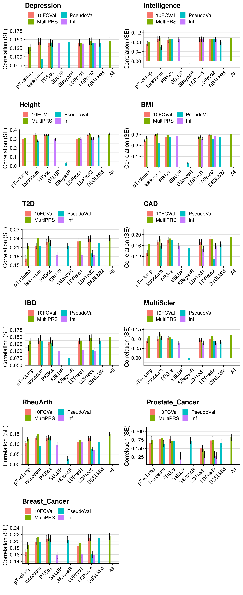

\center

</details>

<details><summary>Show UKBB results table</summary>

```{r, echo=F, eval=T, results='asis'}
res<-read.csv("/users/k1806347/brc_scratch/Analyses/UKBB_outcomes_for_prediction/PRS_method_comp_UKBB.csv")

res[,-1:-3]<-round(res[,-1:-3], 3)
res$CrossVal_R<-paste0(res$CrossVal_R, " (", res$CrossVal_R_SE, ")")
res$IndepVal_R<-paste0(res$IndepVal_R, " (", res$IndepVal_R_SE, ")")
res<-res[c('Phenotype','Method','Group','CrossVal_R','IndepVal_R')]

names(res)<-c('Phenotype','Method','Group',"CrossVal R (SE)","IndepVal R (SE)")

library(knitr)
kable(res, rownames = FALSE, caption='Table 1: Correlation between PRS model predictions and observed values in UK Biobank')
```

</details>

<br/>

### TEDS

<details><summary>Code for plotting results</summary>
```{bash, echo=T, eval=F}
#####
# Compare results from each approach
#####
module add apps/R/3.6.0
R

pheno<-c('Height21', 'BMI21', 'GCSE', 'ADHD')
gwas<-c('HEIG03', 'BODY11', 'EDUC03', 'ADHD04')

# Read in the results, labelling which parameters where pseudovalidated and validated using 10-fold cross validation
All_res<-NULL
for(i in c(1:4)){
  pT_clump<-read.table(paste0('/users/k1806347/brc_scratch/Analyses/TEDS_outcomes_for_prediction/',pheno[i],'/Association_withPRSs/TEDS.w_hm3.',gwas[i],'.EUR-PRSs.pred_eval.txt'), header=T, stringsAsFactors=F)
  pT_clump$Method<-"pT"
  Param_tmp<-sort(as.numeric(gsub('e.','e-',gsub('_group','',gsub(paste0(gwas[i],'.'),'',pT_clump$Model)))))
  pT_clump$Param<-as.character(as.numeric(gsub('e.','e-',gsub('_group','',gsub(paste0(gwas[i],'.'),'',pT_clump$Model)))))
  pT_clump$Param[dim(pT_clump)[1]]<-'Multi-PRS'
  pT_clump<-pT_clump[match(c(Param_tmp,'Multi-PRS'), pT_clump$Param),]
  pT_clump$Model<-NULL
  pT_clump$Group<-NA
  pT_clump$Group[pT_clump$CrossVal_R == max(abs(pT_clump$CrossVal_R[pT_clump$Param != 'Multi-PRS']))]<-'10FCVal'
  pT_clump$Group[pT_clump$Param == 'Multi-PRS']<-'Multi-PRS'
  pT_clump<-pT_clump[!is.na(pT_clump$Group),]

  pT_clump_nn<-read.table(paste0('/users/k1806347/brc_scratch/Analyses/TEDS_outcomes_for_prediction/',pheno[i],'/Association_withPRSs/TEDS.w_hm3.',gwas[i],'.EUR-PRSs_non_nested.pred_eval.txt'), header=T, stringsAsFactors=F)
  pT_clump_nn$Method<-"pT (non-nested)"
  pT_clump_nn$Param<-as.character(as.numeric(gsub('e.','e-',gsub('_group','',gsub(paste0(gwas[i],'.'),'',pT_clump_nn$Model)))))
  for(j in (length(pT_clump_nn$Param)-1):1){
    if(j==1){
      pT_clump_nn$Param[j]<-paste0('0 - ',pT_clump_nn$Param[j])
    } else {
      pT_clump_nn$Param[j]<-paste0(pT_clump_nn$Param[j-1],' - ',pT_clump_nn$Param[j])
    }
  }
  pT_clump_nn$Param[dim(pT_clump_nn)[1]]<-'Multi-PRS'
  pT_clump_nn$Model<-NULL
  pT_clump_nn$Group<-NA
  pT_clump_nn$Group[pT_clump_nn$CrossVal_R == max(abs(pT_clump_nn$CrossVal_R[pT_clump_nn$Param != 'Multi-PRS']))]<-'10FCVal'
  pT_clump_nn$Group[pT_clump_nn$Param == 'Multi-PRS']<-'Multi-PRS'
  pT_clump_nn<-pT_clump_nn[!is.na(pT_clump_nn$Group),]

  pT_clump_dense<-read.table(paste0('/users/k1806347/brc_scratch/Analyses/TEDS_outcomes_for_prediction/',pheno[i],'/Association_withPRSs/TEDS.w_hm3.',gwas[i],'.EUR-PRSs-dense.pred_eval.txt'), header=T, stringsAsFactors=F)
  pT_clump_dense$Method<-"pT (dense)"
  Param_tmp<-sort(as.numeric(gsub('e.','e-',gsub('_group','',gsub(paste0(gwas[i],'.'),'',pT_clump_dense$Model)))))
  pT_clump_dense$Param<-as.character(as.numeric(gsub('e.','e-',gsub('_group','',gsub(paste0(gwas[i],'.'),'',pT_clump_dense$Model)))))
  pT_clump_dense$Param[dim(pT_clump_dense)[1]]<-'Multi-PRS'
  pT_clump_dense<-pT_clump_dense[match(c(Param_tmp,'Multi-PRS'), pT_clump_dense$Param),]
  pT_clump_dense$Model<-NULL
  pT_clump_dense$Group<-NA
  pT_clump_dense$Group[pT_clump_dense$CrossVal_R == max(abs(pT_clump_dense$CrossVal_R[pT_clump_dense$Param != 'Multi-PRS']))][1]<-'10FCVal'
  pT_clump_dense$Group[pT_clump_dense$Param == 'Multi-PRS']<-'Multi-PRS'
  pT_clump_dense<-pT_clump_dense[!is.na(pT_clump_dense$Group),]
  
  lassosum_res<-read.table(paste0('/users/k1806347/brc_scratch/Analyses/TEDS_outcomes_for_prediction/',pheno[i],'/Association_withPRSs/TEDS.w_hm3.',gwas[i],'.EUR-PRSs_lassosum.pred_eval.txt'), header=T, stringsAsFactors=F)
  lassosum_res$Method<-'lassosum'
  lassosum_res$Param<-gsub('_group','',gsub(paste0(gwas[i],'.'),'',lassosum_res$Model))
  lassosum_res$Param[dim(lassosum_res)[1]]<-'Multi-PRS'
  lassosum_res$Model<-NULL
  lassosum_val<-read.table(paste0('/users/k1806347/brc_scratch/Data/1KG/Phase3/Score_files_for_poylygenic_lassosum/',gwas[i],'/1KGPhase3.w_hm3.',gwas[i],'.log'), sep='&')
  lassosum_val_s<-as.numeric(gsub('s = ','',lassosum_val$V1[grepl('s = ',lassosum_val$V1)]))
  lassosum_val_lambda<-as.numeric(gsub('lambda =','',lassosum_val$V1[grepl('lambda =',lassosum_val$V1)]))
  lassosum_val_param<-paste0('s',lassosum_val_s,'.lambda',lassosum_val_lambda)
  lassosum_val_param<-substr(lassosum_val_param, 1, nchar(lassosum_val_param)-1) 
  lassosum_res$Group<-NA
  lassosum_res$Group[which(lassosum_res$CrossVal_R == max(abs(lassosum_res$CrossVal_R[lassosum_res$Param != 'Multi-PRS'])))[1]]<-'10FCVal'
  if(grepl(lassosum_val_param,lassosum_res$Param[which(lassosum_res$Group == '10FCVal')])){
      tmp<-lassosum_res[which(lassosum_res$Group == '10FCVal'),]
      tmp$Group<-'PseudoVal'
      lassosum_res<-rbind(lassosum_res, tmp)
  } else {
      lassosum_res$Group[grepl(lassosum_val_param,lassosum_res$Param)]<-'PseudoVal'
  }
  lassosum_res$Group[lassosum_res$Param == 'Multi-PRS']<-'Multi-PRS'
  lassosum_res<-lassosum_res[!is.na(lassosum_res$Group),]
  
  PRScs_res<-read.table(paste0('/users/k1806347/brc_scratch/Analyses/TEDS_outcomes_for_prediction/',pheno[i],'/Association_withPRSs/TEDS.w_hm3.',gwas[i],'.EUR-PRSs_PRScs.pred_eval.txt'), header=T, stringsAsFactors=F)
  PRScs_res$Method<-'PRScs'
  PRScs_res$Param<-gsub('_group','',gsub(paste0(gwas[i],'.'),'',PRScs_res$Model))
  PRScs_res$Param[dim(PRScs_res)[1]]<-'Multi-PRS'
  PRScs_res$Model<-NULL
  PRScs_res$Group<-NA
  PRScs_res$Group[which(PRScs_res$CrossVal_R == max(abs(PRScs_res$CrossVal_R[PRScs_res$Param != 'Multi-PRS' & PRScs_res$Param != 'phiauto'])))[1]]<-'10FCVal'
  PRScs_res$Group[PRScs_res$Param == 'phiauto']<-'PseudoVal'
  PRScs_res$Group[PRScs_res$Param == 'Multi-PRS']<-'Multi-PRS'
  PRScs_res<-PRScs_res[!is.na(PRScs_res$Group),]

  SBLUP_res<-read.table(paste0('/users/k1806347/brc_scratch/Analyses/TEDS_outcomes_for_prediction/',pheno[i],'/Association_withPRSs/TEDS.w_hm3.',gwas[i],'.EUR-PRSs_SBLUP.pred_eval.txt'), header=T, stringsAsFactors=F)
  SBLUP_res$Method<-'SBLUP'
  SBLUP_res$Param<-gsub('_group','',gsub(paste0(gwas[i],'.'),'',SBLUP_res$Model))
  SBLUP_res$Model<-NULL
  SBLUP_res$Group<-NA
  SBLUP_res$Group[1]<-'PseudoVal'
  SBLUP_res<-SBLUP_res[!is.na(SBLUP_res$Group),]

  SBayesR_res<-read.table(paste0('/users/k1806347/brc_scratch/Analyses/TEDS_outcomes_for_prediction/',pheno[i],'/Association_withPRSs/TEDS.w_hm3.',gwas[i],'.EUR-PRSs_SBayesR.pred_eval.txt'), header=T, stringsAsFactors=F)
  SBayesR_res$Method<-'SBayesR'
  SBayesR_res$Param<-gsub('_group','',gsub(paste0(gwas[i],'.'),'',SBayesR_res$Model))
  SBayesR_res$Model<-NULL
  SBayesR_res$Group<-NA
  SBayesR_res$Group[1]<-'PseudoVal'
  SBayesR_res<-SBayesR_res[!is.na(SBayesR_res$Group),]
  
  LDPred_res<-read.table(paste0('/users/k1806347/brc_scratch/Analyses/TEDS_outcomes_for_prediction/',pheno[i],'/Association_withPRSs/TEDS.w_hm3.',gwas[i],'.EUR-PRSs_LDPred.pred_eval.txt'), header=T, stringsAsFactors=F)
  LDPred_res$Method<-'LDPred'
  LDPred_res$Param<-gsub('_group','',gsub(paste0(gwas[i],'.'),'',LDPred_res$Model))
  LDPred_res$Param<-gsub('LDpred.','',LDPred_res$Param)
  LDPred_res$Param[dim(LDPred_res)[1]]<-'Multi-PRS'
  LDPred_res$Model<-NULL
  LDPred_res$Group<-NA
  LDPred_res$Group[which(LDPred_res$CrossVal_R == max(abs(LDPred_res$CrossVal_R[LDPred_res$Param != 'Multi-PRS' & LDPred_res$Param != 'inf'])))[1]]<-'10FCVal'
  LDPred_res$Group[LDPred_res$Param == 'inf']<-'PseudoVal'
  LDPred_res$Group[LDPred_res$Param == 'Multi-PRS']<-'Multi-PRS'
  LDPred_res<-LDPred_res[!is.na(LDPred_res$Group),]

  res<-do.call(rbind, list(pT_clump, pT_clump_nn, pT_clump_dense, lassosum_res, PRScs_res, SBLUP_res, SBayesR_res, LDPred_res))
  res$Phenotype<-pheno[i]
  res$Cross_LiabR2<-NULL
  res$Indep_LiabR2<-NULL
  res$CrossVal_pval<-NULL
  res$IndepVal_pval<-NULL

  All_res<-rbind(All_res, res)
}

# Reformat to be a table
All_res<-All_res[c('Phenotype','Method','Group','CrossVal_R','CrossVal_R_SE','IndepVal_R','IndepVal_R_SE')]
All_res_tab<-All_res
All_res_tab$Method<-gsub('\n', ' ', All_res_tab$Method)

write.csv(All_res_tab, '/scratch/users/k1806347/Analyses/TEDS_outcomes_for_prediction/PRS_method_comp_TEDS.csv', row.names=F)

###
# Plot comparison between validated PRS vs multi-PRS when using pT + clump method
###

library(ggplot2)
library(cowplot)

All_res$Method<-factor(All_res$Method, levels=unique(All_res$Method))

plots<-list()
for(i in 1:4){
plots[[pheno[i]]] <- ggplot( All_res[All_res$Phenotype==pheno[i],], aes(x=Method, y=CrossVal_R, fill=Group)) +
                      geom_bar(stat="identity", position=position_dodge(preserve = "single"), width = 0.7, colour='black') +
                      geom_errorbar(aes(ymin=CrossVal_R-CrossVal_R_SE, ymax=CrossVal_R+CrossVal_R_SE), width=.4, position=position_dodge(width = 0.7, preserve = "single")) +
                      labs(y="Correlation (SE)", x='', title=pheno[i]) +
                      coord_cartesian(ylim=c(min(All_res$CrossVal_R[All_res$Phenotype==pheno[i]])-0.02, max(All_res$CrossVal_R[All_res$Phenotype==pheno[i]])+0.025), clip="on") +
            				  theme(axis.text.x = element_text(angle = 45, hjust = 1))
}

bitmap('/scratch/users/k1806347/Analyses/TEDS_outcomes_for_prediction/PRS_method_comp_CrossVal_TEDS.png', units='px', res=300, width=3000, height=2000)
plot_grid(plotlist=plots, ncol = 2)
dev.off()

plots<-list()
for(i in 1:4){
plots[[pheno[i]]] <- ggplot( All_res[All_res$Phenotype==pheno[i],], aes(x=Method, y=IndepVal_R, fill=Group)) +
                      geom_bar(stat="identity", position=position_dodge(preserve = "single"), width = 0.7, colour='black') +
                      geom_errorbar(aes(ymin=IndepVal_R-IndepVal_R_SE, ymax=IndepVal_R+IndepVal_R_SE), width=.2, position=position_dodge(width = 0.7, preserve = "single")) +
                      labs(y="Correlation (SE)", x='', title=pheno[i]) +
                      coord_cartesian(ylim=c(min(All_res$IndepVal_R[All_res$Phenotype==pheno[i]])-0.02, max(All_res$IndepVal_R[All_res$Phenotype==pheno[i]])+0.025), clip="on") +
            				  theme(axis.text.x = element_text(angle = 45, hjust = 1))
}

bitmap('/scratch/users/k1806347/Analyses/TEDS_outcomes_for_prediction/PRS_method_comp_IndepVal_TEDS.png', units='px', res=300, width=3000, height=2000)
plot_grid(plotlist=plots, ncol = 2)
dev.off()

q()
n

```
</details>

```{bash, eval=T, echo=F}
mkdir -p /users/k1806347/brc_scratch/Software/MyGit/GenoPred/Images/Determine_optimal_polygenic_scoring_approach

cp /scratch/users/k1806347/Analyses/TEDS_outcomes_for_prediction/PRS_method_comp_CrossVal_TEDS.png /users/k1806347/brc_scratch/Software/MyGit/GenoPred/Images/Determine_optimal_polygenic_scoring_approach/

cp /scratch/users/k1806347/Analyses/TEDS_outcomes_for_prediction/PRS_method_comp_IndepVal_TEDS.png /users/k1806347/brc_scratch/Software/MyGit/GenoPred/Images/Determine_optimal_polygenic_scoring_approach/
```

<details><summary>Show TEDS cross-validation results</summary>

<center>

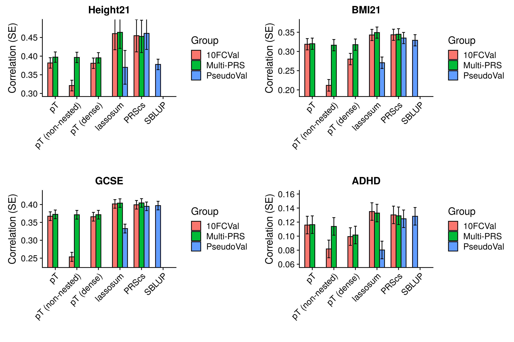

</details>

<details><summary>Show TEDS test-validation results</summary>

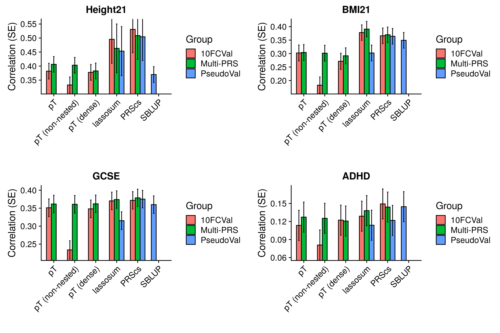

\center

</details>

<details><summary>Show TEDS results table</summary>

```{r, echo=F, eval=T, results='asis'}
res<-read.csv("/users/k1806347/brc_scratch/Analyses/TEDS_outcomes_for_prediction/PRS_method_comp_TEDS.csv")

res[,-1:-3]<-round(res[,-1:-3], 3)
res$CrossVal_R<-paste0(res$CrossVal_R, " (", res$CrossVal_R_SE, ")")
res$IndepVal_R<-paste0(res$IndepVal_R, " (", res$IndepVal_R_SE, ")")
res<-res[c('Phenotype','Method','Group','CrossVal_R','IndepVal_R')]

names(res)<-c('Phenotype','Method','Group',"CrossVal R (SE)","IndepVal R (SE)")

library(knitr)
kable(res, rownames = FALSE, caption='Table 2: Correlation between PRS model predictions and observed values in TEDS')
```

</details>

<br/>

***

## Using UK Biobank as reference
### UK Biobank

<details><summary>Code for plotting results</summary>

```{bash, echo=T, eval=F}
#####
# Compare results from each approach
#####
module add apps/R/3.6.0
R

pheno<-c('Depression','Intelligence','BMI','Height','T2D','CAD','IBD','MultiScler','RheuArth')
gwas<-c('DEPR06','COLL01','BODY03','HEIG03','DIAB05','COAD01','CROH01','SCLE02','RHEU01')

# Read in the results, labelling which parameters where pseudovalidated and validated using 10-fold cross validation
All_res<-NULL
for(i in c(1:9)){
  pT_clump<-read.table(paste0('/users/k1806347/brc_scratch/Analyses/UKBB_outcomes_for_prediction/',pheno[i],'/Association_withPRSs/UKBB.w_hm3.UKBB_ref.',gwas[i],'.EUR-PRSs.pred_eval.txt'), header=T, stringsAsFactors=F)
  pT_clump$Method<-"pT"
  Param_tmp<-sort(as.numeric(gsub('e.','e-',gsub('_group','',gsub(paste0(gwas[i],'.'),'',pT_clump$Model)))))
  pT_clump$Param<-as.character(as.numeric(gsub('e.','e-',gsub('_group','',gsub(paste0(gwas[i],'.'),'',pT_clump$Model)))))
  pT_clump$Param[dim(pT_clump)[1]]<-'Multi-PRS'
  pT_clump<-pT_clump[match(c(Param_tmp,'Multi-PRS'), pT_clump$Param),]
  pT_clump$Model<-NULL
  pT_clump$Group<-NA
  pT_clump$Group[pT_clump$CrossVal_R == max(abs(pT_clump$CrossVal_R[pT_clump$Param != 'Multi-PRS']))]<-'10FCVal'
  pT_clump$Group[pT_clump$Param == 'Multi-PRS']<-'Multi-PRS'
  pT_clump<-pT_clump[!is.na(pT_clump$Group),]

  pT_clump_nn<-read.table(paste0('/users/k1806347/brc_scratch/Analyses/UKBB_outcomes_for_prediction/',pheno[i],'/Association_withPRSs/UKBB.w_hm3.UKBB_ref.',gwas[i],'.EUR-PRSs_non_nested.pred_eval.txt'), header=T, stringsAsFactors=F)
  pT_clump_nn$Method<-"pT (non-nested)"
  pT_clump_nn$Param<-as.character(as.numeric(gsub('e.','e-',gsub('_group','',gsub(paste0(gwas[i],'.'),'',pT_clump_nn$Model)))))
  for(j in (length(pT_clump_nn$Param)-1):1){
    if(j==1){
      pT_clump_nn$Param[j]<-paste0('0 - ',pT_clump_nn$Param[j])
    } else {
      pT_clump_nn$Param[j]<-paste0(pT_clump_nn$Param[j-1],' - ',pT_clump_nn$Param[j])
    }
  }
  pT_clump_nn$Param[dim(pT_clump_nn)[1]]<-'Multi-PRS'
  pT_clump_nn$Model<-NULL
  pT_clump_nn$Group<-NA
  pT_clump_nn$Group[pT_clump_nn$CrossVal_R == max(abs(pT_clump_nn$CrossVal_R[pT_clump_nn$Param != 'Multi-PRS']))]<-'10FCVal'
  pT_clump_nn$Group[pT_clump_nn$Param == 'Multi-PRS']<-'Multi-PRS'
  pT_clump_nn<-pT_clump_nn[!is.na(pT_clump_nn$Group),]

  pT_clump_dense<-read.table(paste0('/users/k1806347/brc_scratch/Analyses/UKBB_outcomes_for_prediction/',pheno[i],'/Association_withPRSs/UKBB.w_hm3.UKBB_ref.',gwas[i],'.EUR-PRSs-dense.pred_eval.txt'), header=T, stringsAsFactors=F)
  pT_clump_dense$Method<-"pT (dense)"
  Param_tmp<-sort(as.numeric(gsub('e.','e-',gsub('_group','',gsub(paste0(gwas[i],'.'),'',pT_clump_dense$Model)))))
  pT_clump_dense$Param<-as.character(as.numeric(gsub('e.','e-',gsub('_group','',gsub(paste0(gwas[i],'.'),'',pT_clump_dense$Model)))))
  pT_clump_dense$Param[dim(pT_clump_dense)[1]]<-'Multi-PRS'
  pT_clump_dense<-pT_clump_dense[match(c(Param_tmp,'Multi-PRS'), pT_clump_dense$Param),]
  pT_clump_dense$Model<-NULL
  pT_clump_dense$Group<-NA
  pT_clump_dense$Group[pT_clump_dense$CrossVal_R == max(abs(pT_clump_dense$CrossVal_R[pT_clump_dense$Param != 'Multi-PRS']))][1]<-'10FCVal'
  pT_clump_dense$Group[pT_clump_dense$Param == 'Multi-PRS']<-'Multi-PRS'
  pT_clump_dense<-pT_clump_dense[!is.na(pT_clump_dense$Group),]
  
  lassosum_res<-read.table(paste0('/users/k1806347/brc_scratch/Analyses/UKBB_outcomes_for_prediction/',pheno[i],'/Association_withPRSs/UKBB.w_hm3.UKBB_ref.',gwas[i],'.EUR-PRSs_lassosum.pred_eval.txt'), header=T, stringsAsFactors=F)
  lassosum_res$Method<-'lassosum'
  lassosum_res$Param<-gsub('_group','',gsub(paste0(gwas[i],'.'),'',lassosum_res$Model))
  lassosum_res$Param[dim(lassosum_res)[1]]<-'Multi-PRS'
  lassosum_res$Model<-NULL
  lassosum_val<-read.table(paste0('/users/k1806347/brc_scratch/Data/UKBB/UKBB_ref/Score_files_for_polygenic_lassosum/',gwas[i],'/UKBB.noPheno.EUR.10K.w_hm3.',gwas[i],'.log'), sep='&')
  lassosum_val_s<-as.numeric(gsub('s = ','',lassosum_val$V1[grepl('s = ',lassosum_val$V1)]))
  lassosum_val_lambda<-as.numeric(gsub('lambda =','',lassosum_val$V1[grepl('lambda =',lassosum_val$V1)]))
  lassosum_val_param<-paste0('s',lassosum_val_s,'.lambda',lassosum_val_lambda)
  lassosum_val_param<-substr(lassosum_val_param, 1, nchar(lassosum_val_param)-1) 
  lassosum_res$Group<-NA
  lassosum_res$Group[which(lassosum_res$CrossVal_R == max(abs(lassosum_res$CrossVal_R[lassosum_res$Param != 'Multi-PRS'])))[1]]<-'10FCVal'
  if(grepl(lassosum_val_param,lassosum_res$Param[which(lassosum_res$Group == '10FCVal')])){
      tmp<-lassosum_res[which(lassosum_res$Group == '10FCVal'),]
      tmp$Group<-'PseudoVal'
      lassosum_res<-rbind(lassosum_res, tmp)
  } else {
      lassosum_res$Group[grepl(lassosum_val_param,lassosum_res$Param)]<-'PseudoVal'
  }
  lassosum_res$Group[lassosum_res$Param == 'Multi-PRS']<-'Multi-PRS'
  lassosum_res<-lassosum_res[!is.na(lassosum_res$Group),]
  
  SBLUP_res<-read.table(paste0('/users/k1806347/brc_scratch/Analyses/UKBB_outcomes_for_prediction/',pheno[i],'/Association_withPRSs/UKBB.w_hm3.UKBB_ref.',gwas[i],'.EUR-PRSs_SBLUP.pred_eval.txt'), header=T, stringsAsFactors=F)
  SBLUP_res$Method<-'SBLUP'
  SBLUP_res$Param<-gsub('_group','',gsub(paste0(gwas[i],'.'),'',SBLUP_res$Model))
  SBLUP_res$Model<-NULL
  SBLUP_res$Group<-NA
  SBLUP_res$Group[1]<-'PseudoVal'
  SBLUP_res<-SBLUP_res[!is.na(SBLUP_res$Group),]

  SBayesR_res<-read.table(paste0('/users/k1806347/brc_scratch/Analyses/UKBB_outcomes_for_prediction/',pheno[i],'/Association_withPRSs/UKBB.w_hm3.UKBB_ref.',gwas[i],'.EUR-PRSs_SBayesR.pred_eval.txt'), header=T, stringsAsFactors=F)
  SBayesR_res$Method<-'SBayesR'
  SBayesR_res$Param<-gsub('_group','',gsub(paste0(gwas[i],'.'),'',SBayesR_res$Model))
  SBayesR_res$Model<-NULL
  SBayesR_res$Group<-NA
  SBayesR_res$Group[1]<-'PseudoVal'
  SBayesR_res<-SBayesR_res[!is.na(SBayesR_res$Group),]

  LDPred_res<-read.table(paste0('/users/k1806347/brc_scratch/Analyses/UKBB_outcomes_for_prediction/',pheno[i],'/Association_withPRSs/UKBB.w_hm3.UKBB_ref.',gwas[i],'.EUR-PRSs_LDPred.pred_eval.txt'), header=T, stringsAsFactors=F)
  LDPred_res$Method<-'LDPred'
  LDPred_res$Param<-gsub('_group','',gsub(paste0(gwas[i],'.'),'',LDPred_res$Model))
  LDPred_res$Param<-gsub('LDpred.','',LDPred_res$Param)
  LDPred_res$Param[dim(LDPred_res)[1]]<-'Multi-PRS'
  LDPred_res$Model<-NULL
  LDPred_res$Group<-NA
  LDPred_res$Group[which(LDPred_res$CrossVal_R == max(abs(LDPred_res$CrossVal_R[LDPred_res$Param != 'Multi-PRS' & LDPred_res$Param != 'inf'])))[1]]<-'10FCVal'
  LDPred_res$Group[LDPred_res$Param == 'inf']<-'PseudoVal'
  LDPred_res$Group[LDPred_res$Param == 'Multi-PRS']<-'Multi-PRS'
  LDPred_res<-LDPred_res[!is.na(LDPred_res$Group),]

  res<-do.call(rbind, list(pT_clump, pT_clump_nn, pT_clump_dense, lassosum_res, SBLUP_res, SBayesR_res, LDPred_res))
  res$Phenotype<-pheno[i]
  res$Cross_LiabR2<-NULL
  res$Indep_LiabR2<-NULL
  res$CrossVal_pval<-NULL
  res$IndepVal_pval<-NULL

  All_res<-rbind(All_res, res)
}

# Reformat to be a table
All_res<-All_res[c('Phenotype','Method','Group','CrossVal_R','CrossVal_R_SE','IndepVal_R','IndepVal_R_SE')]

write.csv(All_res, '/scratch/users/k1806347/Analyses/UKBB_outcomes_for_prediction/PRS_method_comp_UKBB.UKBB_ref.csv', row.names=F)

###
# Plot comparison between validated PRS vs multi-PRS when using pT + clump method
###

library(ggplot2)
library(cowplot)

All_res$Method<-factor(All_res$Method, levels=unique(All_res$Method))

plots<-list()
for(i in 1:9){
plots[[pheno[i]]] <- ggplot( All_res[All_res$Phenotype==pheno[i],], aes(x=Method, y=CrossVal_R, fill=Group)) +
                      geom_bar(stat="identity", position=position_dodge(preserve = "single"), width = 0.7, colour='black') +
                      geom_errorbar(aes(ymin=CrossVal_R-CrossVal_R_SE, ymax=CrossVal_R+CrossVal_R_SE), width=.2, position=position_dodge(width = 0.7, preserve = "single")) +
                      labs(y="Correlation (SE)", x='', title=pheno[i]) +
                      coord_cartesian(ylim=c(min(All_res$CrossVal_R[All_res$Phenotype==pheno[i]])-0.02, max(All_res$CrossVal_R[All_res$Phenotype==pheno[i]])+0.025), clip="on") +
            				  theme(axis.text.x = element_text(angle = 45, hjust = 1))
}

bitmap('/scratch/users/k1806347/Analyses/UKBB_outcomes_for_prediction/PRS_method_comp_CrossVal_UKBB.UKBB_ref.png', units='px', res=300, width=3000, height=5000)
plot_grid(plotlist=plots, ncol = 2)
dev.off()

plots<-list()
for(i in 1:9){
plots[[pheno[i]]] <- ggplot( All_res[All_res$Phenotype==pheno[i],], aes(x=Method, y=IndepVal_R, fill=Group)) +
                      geom_bar(stat="identity", position=position_dodge(preserve = "single"), width = 0.7, colour='black') +
                      geom_errorbar(aes(ymin=IndepVal_R-IndepVal_R_SE, ymax=IndepVal_R+IndepVal_R_SE), width=.2, position=position_dodge(width = 0.7, preserve = "single")) +
                      labs(y="Correlation (SE)", x='', title=pheno[i]) +
                      coord_cartesian(ylim=c(min(All_res$IndepVal_R[All_res$Phenotype==pheno[i]])-0.02, max(All_res$IndepVal_R[All_res$Phenotype==pheno[i]])+0.025), clip="on") +
            				  theme(axis.text.x = element_text(angle = 45, hjust = 1))
}

bitmap('/scratch/users/k1806347/Analyses/UKBB_outcomes_for_prediction/PRS_method_comp_IndepVal_UKBB.UKBB_ref.png', units='px', res=300, width=3000, height=5000)
plot_grid(plotlist=plots, ncol = 2)
dev.off()

q()
n

```

</details>

```{bash, eval=T, echo=F}
mkdir -p /users/k1806347/brc_scratch/Software/MyGit/GenoPred/Images/Determine_optimal_polygenic_scoring_approach

cp /scratch/users/k1806347/Analyses/UKBB_outcomes_for_prediction/PRS_method_comp_CrossVal_UKBB.UKBB_ref.png /users/k1806347/brc_scratch/Software/MyGit/GenoPred/Images/Determine_optimal_polygenic_scoring_approach/

cp /scratch/users/k1806347/Analyses/UKBB_outcomes_for_prediction/PRS_method_comp_IndepVal_UKBB.UKBB_ref.png /users/k1806347/brc_scratch/Software/MyGit/GenoPred/Images/Determine_optimal_polygenic_scoring_approach/
```

<details><summary>Show UKBB cross-validation results</summary>

<center>

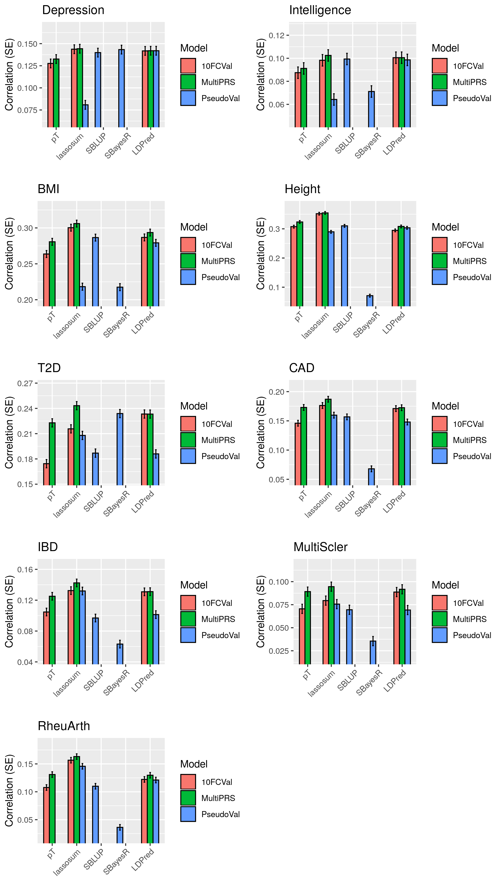

</details>

<details><summary>Show UKBB test-validation results</summary>

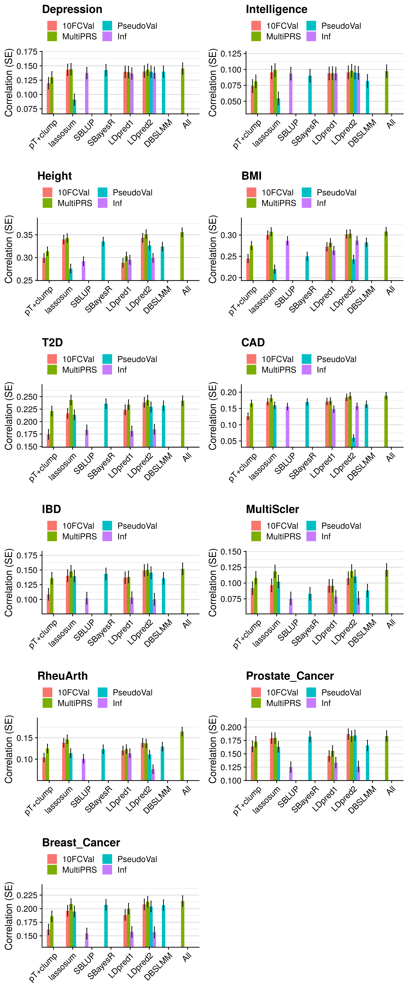

\center

</details>

<details><summary>Show UKBB results table</summary>

```{r, echo=F, eval=T, results='asis'}
res<-read.csv("/users/k1806347/brc_scratch/Analyses/UKBB_outcomes_for_prediction/PRS_method_comp_UKBB.UKBB_ref.csv")

res[,-1:-3]<-round(res[,-1:-3], 3)
res$CrossVal_R<-paste0(res$CrossVal_R, " (", res$CrossVal_R_SE, ")")
res$IndepVal_R<-paste0(res$IndepVal_R, " (", res$IndepVal_R_SE, ")")
res<-res[c('Phenotype','Method','Group','CrossVal_R','IndepVal_R')]

names(res)<-c('Phenotype','Method','Group',"CrossVal R (SE)","IndepVal R (SE)")

library(knitr)
kable(res, rownames = FALSE, caption='Table 3: Correlation between PRS model predictions and observed values in UK Biobank')
```

</details>

<br/>

### TEDS

<details><summary>Code for plotting results</summary>
```{bash, echo=T, eval=F}
#####
# Compare results from each approach
#####
module add apps/R/3.6.0
R

pheno<-c('Height21', 'BMI21', 'GCSE', 'ADHD')
gwas<-c('HEIG03', 'BODY11', 'EDUC03', 'ADHD04')

# Read in the results, labelling which parameters where pseudovalidated and validated using 10-fold cross validation
All_res<-NULL
for(i in c(1:4)){
  pT_clump<-read.table(paste0('/users/k1806347/brc_scratch/Analyses/TEDS_outcomes_for_prediction/',pheno[i],'/Association_withPRSs/TEDS.w_hm3.UKBB_ref.',gwas[i],'.EUR-PRSs.pred_eval.txt'), header=T, stringsAsFactors=F)
  pT_clump$Method<-"pT"
  Param_tmp<-sort(as.numeric(gsub('e.','e-',gsub('_group','',gsub(paste0(gwas[i],'.'),'',pT_clump$Model)))))
  pT_clump$Param<-as.character(as.numeric(gsub('e.','e-',gsub('_group','',gsub(paste0(gwas[i],'.'),'',pT_clump$Model)))))
  pT_clump$Param[dim(pT_clump)[1]]<-'Multi-PRS'
  pT_clump<-pT_clump[match(c(Param_tmp,'Multi-PRS'), pT_clump$Param),]
  pT_clump$Model<-NULL
  pT_clump$Group<-NA
  pT_clump$Group[pT_clump$CrossVal_R == max(abs(pT_clump$CrossVal_R[pT_clump$Param != 'Multi-PRS']))]<-'10FCVal'
  pT_clump$Group[pT_clump$Param == 'Multi-PRS']<-'Multi-PRS'
  pT_clump<-pT_clump[!is.na(pT_clump$Group),]

  pT_clump_nn<-read.table(paste0('/users/k1806347/brc_scratch/Analyses/TEDS_outcomes_for_prediction/',pheno[i],'/Association_withPRSs/TEDS.w_hm3.UKBB_ref.',gwas[i],'.EUR-PRSs_non_nested.pred_eval.txt'), header=T, stringsAsFactors=F)
  pT_clump_nn$Method<-"pT (non-nested)"
  pT_clump_nn$Param<-as.character(as.numeric(gsub('e.','e-',gsub('_group','',gsub(paste0(gwas[i],'.'),'',pT_clump_nn$Model)))))
  for(j in (length(pT_clump_nn$Param)-1):1){
    if(j==1){
      pT_clump_nn$Param[j]<-paste0('0 - ',pT_clump_nn$Param[j])
    } else {
      pT_clump_nn$Param[j]<-paste0(pT_clump_nn$Param[j-1],' - ',pT_clump_nn$Param[j])
    }
  }
  pT_clump_nn$Param[dim(pT_clump_nn)[1]]<-'Multi-PRS'
  pT_clump_nn$Model<-NULL
  pT_clump_nn$Group<-NA
  pT_clump_nn$Group[pT_clump_nn$CrossVal_R == max(abs(pT_clump_nn$CrossVal_R[pT_clump_nn$Param != 'Multi-PRS']))]<-'10FCVal'
  pT_clump_nn$Group[pT_clump_nn$Param == 'Multi-PRS']<-'Multi-PRS'
  pT_clump_nn<-pT_clump_nn[!is.na(pT_clump_nn$Group),]

  pT_clump_dense<-read.table(paste0('/users/k1806347/brc_scratch/Analyses/TEDS_outcomes_for_prediction/',pheno[i],'/Association_withPRSs/TEDS.w_hm3.UKBB_ref.',gwas[i],'.EUR-PRSs-dense.pred_eval.txt'), header=T, stringsAsFactors=F)
  pT_clump_dense$Method<-"pT (dense)"
  Param_tmp<-sort(as.numeric(gsub('e.','e-',gsub('_group','',gsub(paste0(gwas[i],'.'),'',pT_clump_dense$Model)))))
  pT_clump_dense$Param<-as.character(as.numeric(gsub('e.','e-',gsub('_group','',gsub(paste0(gwas[i],'.'),'',pT_clump_dense$Model)))))
  pT_clump_dense$Param[dim(pT_clump_dense)[1]]<-'Multi-PRS'
  pT_clump_dense<-pT_clump_dense[match(c(Param_tmp,'Multi-PRS'), pT_clump_dense$Param),]
  pT_clump_dense$Model<-NULL
  pT_clump_dense$Group<-NA
  pT_clump_dense$Group[pT_clump_dense$CrossVal_R == max(abs(pT_clump_dense$CrossVal_R[pT_clump_dense$Param != 'Multi-PRS']))][1]<-'10FCVal'
  pT_clump_dense$Group[pT_clump_dense$Param == 'Multi-PRS']<-'Multi-PRS'
  pT_clump_dense<-pT_clump_dense[!is.na(pT_clump_dense$Group),]
  
  lassosum_res<-read.table(paste0('/users/k1806347/brc_scratch/Analyses/TEDS_outcomes_for_prediction/',pheno[i],'/Association_withPRSs/TEDS.w_hm3.UKBB_ref.',gwas[i],'.EUR-PRSs_lassosum.pred_eval.txt'), header=T, stringsAsFactors=F)
  lassosum_res$Method<-'lassosum'
  lassosum_res$Param<-gsub('_group','',gsub(paste0(gwas[i],'.'),'',lassosum_res$Model))
  lassosum_res$Param[dim(lassosum_res)[1]]<-'Multi-PRS'
  lassosum_res$Model<-NULL
  lassosum_val<-read.table(paste0('/users/k1806347/brc_scratch/Data/UKBB/UKBB_ref/Score_files_for_polygenic_lassosum/',gwas[i],'/UKBB.noPheno.EUR.10K.w_hm3.',gwas[i],'.log'), sep='&')
  lassosum_val_s<-as.numeric(gsub('s = ','',lassosum_val$V1[grepl('s = ',lassosum_val$V1)]))
  lassosum_val_lambda<-as.numeric(gsub('lambda =','',lassosum_val$V1[grepl('lambda =',lassosum_val$V1)]))
  lassosum_val_param<-paste0('s',lassosum_val_s,'.lambda',lassosum_val_lambda)
  lassosum_val_param<-substr(lassosum_val_param, 1, nchar(lassosum_val_param)-1) 
  lassosum_res$Group<-NA
  lassosum_res$Group[which(lassosum_res$CrossVal_R == max(abs(lassosum_res$CrossVal_R[lassosum_res$Param != 'Multi-PRS'])))[1]]<-'10FCVal'
  if(grepl(lassosum_val_param,lassosum_res$Param[which(lassosum_res$Group == '10FCVal')])){
      tmp<-lassosum_res[which(lassosum_res$Group == '10FCVal'),]
      tmp$Group<-'PseudoVal'
      lassosum_res<-rbind(lassosum_res, tmp)
  } else {
      lassosum_res$Group[grepl(lassosum_val_param,lassosum_res$Param)]<-'PseudoVal'
  }
  lassosum_res$Group[lassosum_res$Param == 'Multi-PRS']<-'Multi-PRS'
  lassosum_res<-lassosum_res[!is.na(lassosum_res$Group),]
  
  SBLUP_res<-read.table(paste0('/users/k1806347/brc_scratch/Analyses/TEDS_outcomes_for_prediction/',pheno[i],'/Association_withPRSs/TEDS.w_hm3.UKBB_ref.',gwas[i],'.EUR-PRSs_SBLUP.pred_eval.txt'), header=T, stringsAsFactors=F)
  SBLUP_res$Method<-'SBLUP'
  SBLUP_res$Param<-gsub('_group','',gsub(paste0(gwas[i],'.'),'',SBLUP_res$Model))
  SBLUP_res$Model<-NULL
  SBLUP_res$Group<-NA
  SBLUP_res$Group[1]<-'PseudoVal'
  SBLUP_res<-SBLUP_res[!is.na(SBLUP_res$Group),]

  SBayesR_res<-read.table(paste0('/users/k1806347/brc_scratch/Analyses/TEDS_outcomes_for_prediction/',pheno[i],'/Association_withPRSs/TEDS.w_hm3.UKBB_ref.',gwas[i],'.EUR-PRSs_SBayesR.pred_eval.txt'), header=T, stringsAsFactors=F)
  SBayesR_res$Method<-'SBayesR'
  SBayesR_res$Param<-gsub('_group','',gsub(paste0(gwas[i],'.'),'',SBayesR_res$Model))
  SBayesR_res$Model<-NULL
  SBayesR_res$Group<-NA
  SBayesR_res$Group[1]<-'PseudoVal'
  SBayesR_res<-SBayesR_res[!is.na(SBayesR_res$Group),]

  LDPred_res<-read.table(paste0('/users/k1806347/brc_scratch/Analyses/TEDS_outcomes_for_prediction/',pheno[i],'/Association_withPRSs/TEDS.w_hm3.UKBB_ref.',gwas[i],'.EUR-PRSs_LDPred.pred_eval.txt'), header=T, stringsAsFactors=F)
  LDPred_res$Method<-'LDPred'
  LDPred_res$Param<-gsub('_group','',gsub(paste0(gwas[i],'.'),'',LDPred_res$Model))
  LDPred_res$Param<-gsub('LDpred.','',LDPred_res$Param)
  LDPred_res$Param[dim(LDPred_res)[1]]<-'Multi-PRS'
  LDPred_res$Model<-NULL
  LDPred_res$Group<-NA
  LDPred_res$Group[which(LDPred_res$CrossVal_R == max(abs(LDPred_res$CrossVal_R[LDPred_res$Param != 'Multi-PRS' & LDPred_res$Param != 'inf'])))[1]]<-'10FCVal'
  LDPred_res$Group[LDPred_res$Param == 'inf']<-'PseudoVal'
  LDPred_res$Group[LDPred_res$Param == 'Multi-PRS']<-'Multi-PRS'
  LDPred_res<-LDPred_res[!is.na(LDPred_res$Group),]

  res<-do.call(rbind, list(pT_clump, pT_clump_nn, pT_clump_dense, lassosum_res, SBLUP_res, SBayesR_res, LDPred_res))
  res$Phenotype<-pheno[i]
  res$Cross_LiabR2<-NULL
  res$Indep_LiabR2<-NULL
  res$CrossVal_pval<-NULL
  res$IndepVal_pval<-NULL

  All_res<-rbind(All_res, res)
}

# Reformat to be a table
All_res<-All_res[c('Phenotype','Method','Group','CrossVal_R','CrossVal_R_SE','IndepVal_R','IndepVal_R_SE')]
All_res_tab<-All_res
All_res_tab$Method<-gsub('\n', ' ', All_res_tab$Method)

write.csv(All_res_tab, '/scratch/users/k1806347/Analyses/TEDS_outcomes_for_prediction/PRS_method_comp_TEDS.UKBB_ref.csv', row.names=F)

###
# Plot comparison between validated PRS vs multi-PRS when using pT + clump method
###

library(ggplot2)
library(cowplot)

All_res$Method<-factor(All_res$Method, levels=unique(All_res$Method))

plots<-list()
for(i in 1:4){
plots[[pheno[i]]] <- ggplot( All_res[All_res$Phenotype==pheno[i],], aes(x=Method, y=CrossVal_R, fill=Group)) +
                      geom_bar(stat="identity", position=position_dodge(preserve = "single"), width = 0.7, colour='black') +
                      geom_errorbar(aes(ymin=CrossVal_R-CrossVal_R_SE, ymax=CrossVal_R+CrossVal_R_SE), width=.4, position=position_dodge(width = 0.7, preserve = "single")) +
                      labs(y="Correlation (SE)", x='', title=pheno[i]) +
                      coord_cartesian(ylim=c(min(All_res$CrossVal_R[All_res$Phenotype==pheno[i]])-0.02, max(All_res$CrossVal_R[All_res$Phenotype==pheno[i]])+0.025), clip="on") +
            				  theme(axis.text.x = element_text(angle = 45, hjust = 1))
}

bitmap('/scratch/users/k1806347/Analyses/TEDS_outcomes_for_prediction/PRS_method_comp_CrossVal_TEDS.UKBB_ref.png', units='px', res=300, width=3000, height=2000)
plot_grid(plotlist=plots, ncol = 2)
dev.off()

plots<-list()
for(i in 1:4){
plots[[pheno[i]]] <- ggplot( All_res[All_res$Phenotype==pheno[i],], aes(x=Method, y=IndepVal_R, fill=Group)) +
                      geom_bar(stat="identity", position=position_dodge(preserve = "single"), width = 0.7, colour='black') +
                      geom_errorbar(aes(ymin=IndepVal_R-IndepVal_R_SE, ymax=IndepVal_R+IndepVal_R_SE), width=.2, position=position_dodge(width = 0.7, preserve = "single")) +
                      labs(y="Correlation (SE)", x='', title=pheno[i]) +
                      coord_cartesian(ylim=c(min(All_res$IndepVal_R[All_res$Phenotype==pheno[i]])-0.02, max(All_res$IndepVal_R[All_res$Phenotype==pheno[i]])+0.025), clip="on") +
            				  theme(axis.text.x = element_text(angle = 45, hjust = 1))
}

bitmap('/scratch/users/k1806347/Analyses/TEDS_outcomes_for_prediction/PRS_method_comp_IndepVal_TEDS.UKBB_ref.png', units='px', res=300, width=3000, height=2000)
plot_grid(plotlist=plots, ncol = 2)
dev.off()

q()
n

```
</details>

```{bash, eval=T, echo=F}
mkdir -p /users/k1806347/brc_scratch/Software/MyGit/GenoPred/Images/Determine_optimal_polygenic_scoring_approach

cp /scratch/users/k1806347/Analyses/TEDS_outcomes_for_prediction/PRS_method_comp_CrossVal_TEDS.UKBB_ref.png /users/k1806347/brc_scratch/Software/MyGit/GenoPred/Images/Determine_optimal_polygenic_scoring_approach/

cp /scratch/users/k1806347/Analyses/TEDS_outcomes_for_prediction/PRS_method_comp_IndepVal_TEDS.UKBB_ref.png /users/k1806347/brc_scratch/Software/MyGit/GenoPred/Images/Determine_optimal_polygenic_scoring_approach/
```

<details><summary>Show TEDS cross-validation results</summary>

<center>

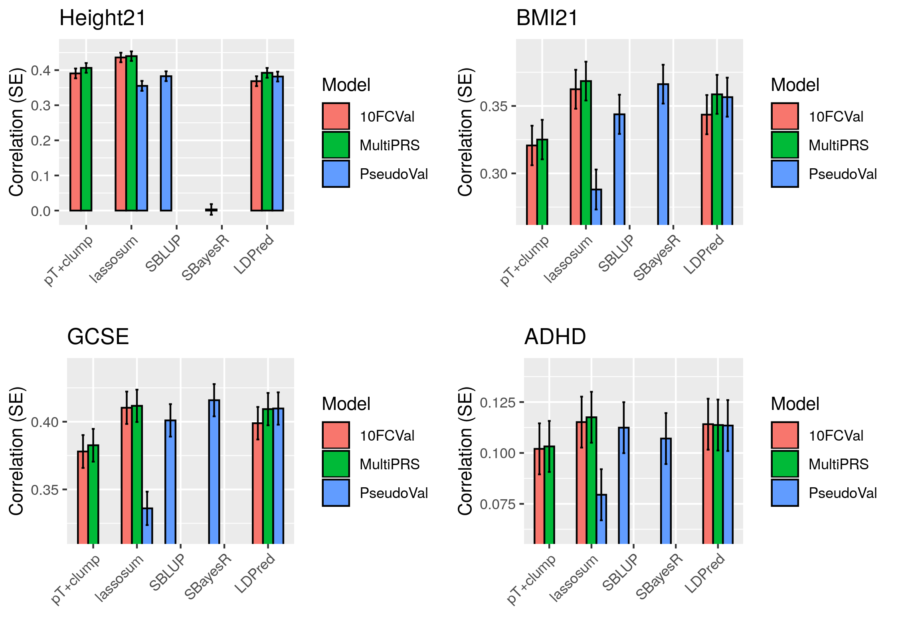

</details>

<details><summary>Show TEDS test-validation results</summary>

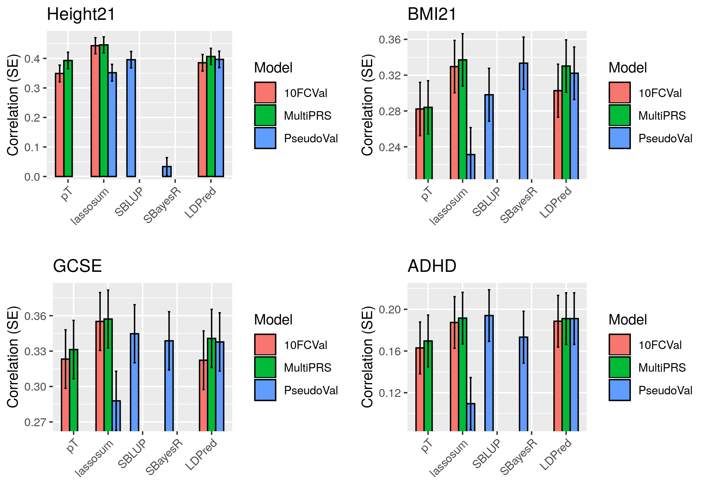

\center

</details>

<details><summary>Show TEDS results table</summary>

```{r, echo=F, eval=T, results='asis'}
res<-read.csv("/users/k1806347/brc_scratch/Analyses/TEDS_outcomes_for_prediction/PRS_method_comp_TEDS.UKBB_ref.csv")

res[,-1:-3]<-round(res[,-1:-3], 3)
res$CrossVal_R<-paste0(res$CrossVal_R, " (", res$CrossVal_R_SE, ")")
res$IndepVal_R<-paste0(res$IndepVal_R, " (", res$IndepVal_R_SE, ")")
res<-res[c('Phenotype','Method','Group','CrossVal_R','IndepVal_R')]

names(res)<-c('Phenotype','Method','Group',"CrossVal R (SE)","IndepVal R (SE)")

library(knitr)
kable(res, rownames = FALSE, caption='Table 2: Correlation between PRS model predictions and observed values in TEDS')
```

</details>

<br/>

## Using GCTB-provided LD reference
Here we will tabulate the SBayesR analysis when using the GCTB-provided LD reference, and create a plot comparing the results across the LD references used.

<details><summary>Compare SBayesR results across references</summary>
```{r, echo=T, eval=F}
module add apps/R/3.6.0
R

pheno<-c('BMI21', 'Height21', 'GCSE', 'ADHD')
gwas<-c('BODY11', 'HEIG03', 'EDUC03', 'ADHD04')

#####
# TEDS with GCTB_ref
#####
# Read in the results, labelling which parameters where pseudovalidated and validated using 10-fold cross validation
All_res<-NULL
for(i in c(1:4)){

  if(file.exists(paste0('/users/k1806347/brc_scratch/Analyses/TEDS_outcomes_for_prediction/',pheno[i],'/Association_withPRSs/TEDS.w_hm3.',gwas[i],'_GCTBref.EUR-PRSs_SBayesR.pred_eval.txt'))){
      SBayesR_res<-read.table(paste0('/users/k1806347/brc_scratch/Analyses/TEDS_outcomes_for_prediction/',pheno[i],'/Association_withPRSs/TEDS.w_hm3.',gwas[i],'_GCTBref.EUR-PRSs_SBayesR.pred_eval.txt'), header=T, stringsAsFactors=F)
  SBayesR_res$Method<-'SBayesR'
  SBayesR_res$Param<-gsub('_group','',gsub(paste0(gwas[i],'.'),'',SBayesR_res$Model))
  SBayesR_res$Model<-NULL
  SBayesR_res$Group<-NA
  SBayesR_res$Group[1]<-'PseudoVal'
  SBayesR_res<-SBayesR_res[!is.na(SBayesR_res$Group),]

  res<-SBayesR_res
  res$Phenotype<-pheno[i]
  res$Cross_LiabR2<-NULL
  res$Indep_LiabR2<-NULL
  res$CrossVal_pval<-NULL
  res$IndepVal_pval<-NULL

  All_res<-rbind(All_res, res)
  }
  
  if(file.exists(paste0('/users/k1806347/brc_scratch/Analyses/TEDS_outcomes_for_prediction/',pheno[i],'/Association_withPRSs/TEDS.w_hm3.',gwas[i],'_GCTBref_autoTrunc.EUR-PRSs_SBayesR.pred_eval.txt'))){
      SBayesR_res<-read.table(paste0('/users/k1806347/brc_scratch/Analyses/TEDS_outcomes_for_prediction/',pheno[i],'/Association_withPRSs/TEDS.w_hm3.',gwas[i],'_GCTBref_autoTrunc.EUR-PRSs_SBayesR.pred_eval.txt'), header=T, stringsAsFactors=F)
  SBayesR_res$Method<-'SBayesR_autoTrunc'
  SBayesR_res$Param<-gsub('_group','',gsub(paste0(gwas[i],'.'),'',SBayesR_res$Model))
  SBayesR_res$Model<-NULL
  SBayesR_res$Group<-NA
  SBayesR_res$Group[1]<-'PseudoVal'
  SBayesR_res<-SBayesR_res[!is.na(SBayesR_res$Group),]

  res<-SBayesR_res
  res$Phenotype<-pheno[i]
  res$Cross_LiabR2<-NULL
  res$Indep_LiabR2<-NULL
  res$CrossVal_pval<-NULL
  res$IndepVal_pval<-NULL

  All_res<-rbind(All_res, res)
  }
}

# Reformat to be a table
All_res<-All_res[c('Phenotype','Method','Group','CrossVal_R','CrossVal_R_SE','IndepVal_R','IndepVal_R_SE')]
All_res_tab<-All_res
All_res_tab$Method<-gsub('\n', ' ', All_res_tab$Method)

write.csv(All_res_tab, '/scratch/users/k1806347/Analyses/TEDS_outcomes_for_prediction/PRS_SBayesR_TEDS.csv', row.names=F)
rm(All_res)

#####
# UKBB with GCTB_ref
#####

pheno<-c('Depression','Intelligence','BMI','Height','T2D','CAD','IBD','MultiScler','RheuArth')
gwas<-c('DEPR06','COLL01','BODY03','HEIG03','DIAB05','COAD01','CROH01','SCLE02','RHEU01')

# Read in the results, labelling which parameters where pseudovalidated and validated using 10-fold cross validation
All_res<-NULL
for(i in c(1:9)){
  if(file.exists(paste0('/users/k1806347/brc_scratch/Analyses/UKBB_outcomes_for_prediction/',pheno[i],'/Association_withPRSs/UKBB.w_hm3.',gwas[i],'_GCTBref.EUR-PRSs_SBayesR.pred_eval.txt'))){
    SBayesR_res<-read.table(paste0('/users/k1806347/brc_scratch/Analyses/UKBB_outcomes_for_prediction/',pheno[i],'/Association_withPRSs/UKBB.w_hm3.',gwas[i],'_GCTBref.EUR-PRSs_SBayesR.pred_eval.txt'), header=T, stringsAsFactors=F)
    SBayesR_res$Method<-'SBayesR'
    SBayesR_res$Param<-gsub('_group','',gsub(paste0(gwas[i],'.'),'',SBayesR_res$Model))
    SBayesR_res$Model<-NULL
    SBayesR_res$Group<-NA
    SBayesR_res$Group[1]<-'PseudoVal'
    SBayesR_res<-SBayesR_res[!is.na(SBayesR_res$Group),]
  
    res<-SBayesR_res
    res$Phenotype<-pheno[i]
    res$Cross_LiabR2<-NULL
    res$Indep_LiabR2<-NULL
    res$CrossVal_pval<-NULL
    res$IndepVal_pval<-NULL
  
    All_res<-rbind(All_res, res)
  }
  
  if(file.exists(paste0('/users/k1806347/brc_scratch/Analyses/UKBB_outcomes_for_prediction/',pheno[i],'/Association_withPRSs/UKBB.w_hm3.',gwas[i],'_GCTBref_autoTrunc.EUR-PRSs_SBayesR.pred_eval.txt'))){
    SBayesR_res<-read.table(paste0('/users/k1806347/brc_scratch/Analyses/UKBB_outcomes_for_prediction/',pheno[i],'/Association_withPRSs/UKBB.w_hm3.',gwas[i],'_GCTBref_autoTrunc.EUR-PRSs_SBayesR.pred_eval.txt'), header=T, stringsAsFactors=F)
    SBayesR_res$Method<-'SBayesR_autoTrunc'
    SBayesR_res$Param<-gsub('_group','',gsub(paste0(gwas[i],'.'),'',SBayesR_res$Model))
    SBayesR_res$Model<-NULL
    SBayesR_res$Group<-NA
    SBayesR_res$Group[1]<-'PseudoVal'
    SBayesR_res<-SBayesR_res[!is.na(SBayesR_res$Group),]
  
    res<-SBayesR_res
    res$Phenotype<-pheno[i]
    res$Cross_LiabR2<-NULL
    res$Indep_LiabR2<-NULL
    res$CrossVal_pval<-NULL
    res$IndepVal_pval<-NULL
  
    All_res<-rbind(All_res, res)
  }

}

# Reformat to be a table
All_res<-All_res[c('Phenotype','Method','Group','CrossVal_R','CrossVal_R_SE','IndepVal_R','IndepVal_R_SE')]

write.csv(All_res, '/scratch/users/k1806347/Analyses/UKBB_outcomes_for_prediction/PRS_SBayesR_UKBB.csv', row.names=F)

q()
n
```

```{r, echo=T, eval=F}
module add apps/R/3.6.0
R

library(data.table)
library(ggplot2)
library(cowplot)

###
# UKBB
###

Plots_CrossVal_UKBB<-list()
Plots_IndepVal_UKBB<-list()

res_1KGref_UKBB<-fread(paste0('/scratch/users/k1806347/Analyses/UKBB_outcomes_for_prediction/PRS_method_comp_UKBB.csv'))
res_1KGref_UKBB$Ref<-'1KG'
res_UKBref_UKBB<-fread(paste0('/scratch/users/k1806347/Analyses/UKBB_outcomes_for_prediction/PRS_method_comp_UKBB.UKBB_ref.csv'))
res_UKBref_UKBB$Ref<-'UKB'
res_GCTBref_UKBB<-fread(paste0('/scratch/users/k1806347/Analyses/UKBB_outcomes_for_prediction/PRS_SBayesR_UKBB.csv'))
res_GCTBref_UKBB$Ref<-'GCTB'
res_GCTBref_UKBB$Ref[res_GCTBref_UKBB$Method == 'SBayesR_autoTrunc']<-'GCTB_autoTrunc'
res_GCTBref_UKBB$Method<-'SBayesR'


res_UKBB<-do.call(rbind, list(res_1KGref_UKBB, res_UKBref_UKBB, res_GCTBref_UKBB))
res_UKBB<-res_UKBB[res_UKBB$Method == 'SBayesR',]

res_UKBB$Test<-paste0(res_UKBB$Method, ':', res_UKBB$Group, ':', res_UKBB$Ref)
res_UKBB$Ref<-factor(res_UKBB$Ref, level=c('1KG','UKB','GCTB','GCTB_autoTrunc'))

pheno_UKBB<-c('Depression','Intelligence','BMI','Height','T2D','CAD','IBD','MultiScler','RheuArth')

plots_UKBB<-list()
for(i in 1:9){
plots_UKBB[[pheno_UKBB[i]]] <- ggplot( res_UKBB[res_UKBB$Phenotype==pheno_UKBB[i],], aes(x=Ref, y=CrossVal_R, fill=Ref)) +
                      geom_bar(stat="identity", position=position_dodge(preserve = "single"), width = 0.7, colour='black') +
                      geom_errorbar(aes(ymin=CrossVal_R-CrossVal_R_SE, ymax=CrossVal_R+CrossVal_R_SE), width=.4, position=position_dodge(width = 0.7, preserve = "single")) +
                      labs(y="Correlation (SE)", x='', title=pheno_UKBB[i]) +
                      coord_cartesian(ylim=c(min(res_UKBB$CrossVal_R[res_UKBB$Phenotype==pheno_UKBB[i]])-0.02, max(res_UKBB$CrossVal_R[res_UKBB$Phenotype==pheno_UKBB[i]])+0.025), clip="on") +
            				  theme(axis.text.x = element_text(angle = 45, hjust = 1))
}

bitmap('/scratch/users/k1806347/Analyses/UKBB_outcomes_for_prediction/PRS_SBayesR_LDref_comp_CrossVal_UKBB.png', units='px', res=300, width=3000, height=5000)
plot_grid(plotlist=plots_UKBB, ncol = 2)
dev.off()

plots_UKBB<-list()
for(i in 1:9){
plots_UKBB[[pheno_UKBB[i]]] <- ggplot( res_UKBB[res_UKBB$Phenotype==pheno_UKBB[i],], aes(x=Ref, y=IndepVal_R, fill=Ref)) +
                      geom_bar(stat="identity", position=position_dodge(preserve = "single"), width = 0.7, colour='black') +
                      geom_errorbar(aes(ymin=IndepVal_R-IndepVal_R_SE, ymax=IndepVal_R+IndepVal_R_SE), width=.4, position=position_dodge(width = 0.7, preserve = "single")) +
                      labs(y="Correlation (SE)", x='', title=pheno_UKBB[i]) +
                      coord_cartesian(ylim=c(min(res_UKBB$IndepVal_R[res_UKBB$Phenotype==pheno_UKBB[i]])-0.02, max(res_UKBB$IndepVal_R[res_UKBB$Phenotype==pheno_UKBB[i]])+0.025), clip="on") +
            				  theme(axis.text.x = element_text(angle = 45, hjust = 1))
}

bitmap('/scratch/users/k1806347/Analyses/UKBB_outcomes_for_prediction/PRS_SBayesR_LDref_comp_IndepVal_UKBB.png', units='px', res=300, width=3000, height=5000)
plot_grid(plotlist=plots_UKBB, ncol = 2)
dev.off()

# Remove the autoTrunc result from the average and use only complete phenotypes when estimating average.
res_UKBB<-res_UKBB[res_UKBB$Ref != 'GCTB_autoTrunc',]

for(pheno in unique(res_UKBB$Phenotype)){
  res_UKBB_pheno<-res_UKBB[res_UKBB$Phenotype == pheno,]
  if(dim(res_UKBB_pheno)[1] != 3){
    res_UKBB<-res_UKBB[res_UKBB$Phenotype != pheno,]
  }
}

res_UKBB_aver<-NULL
for(i in unique(res_UKBB$Test)){
    res_UKBB_i<-res_UKBB[res_UKBB$Test == i,]

    res_UKBB_aver_i<-data.frame(Test=i,
                          Method=res_UKBB_i$Method[1],
                          Group=res_UKBB_i$Group[1],
                          Ref=res_UKBB_i$Ref[1],
                          Mean_R_CrossVal=mean(res_UKBB_i$CrossVal_R),
                          min_R_CrossVal=min(res_UKBB_i$CrossVal_R),
                          max_R_CrossVal=max(res_UKBB_i$CrossVal_R),
                          Mean_R_IndepVal=mean(res_UKBB_i$IndepVal_R),
                          min_R_IndepVal=min(res_UKBB_i$IndepVal_R),
                          max_R_IndepVal=max(res_UKBB_i$IndepVal_R))
    res_UKBB_aver<-rbind(res_UKBB_aver, res_UKBB_aver_i)
    
}

Plots_CrossVal_UKBB <- ggplot( res_UKBB_aver, aes(x=Ref, y=Mean_R_CrossVal, fill=Ref)) +
                        geom_bar(stat="identity", position=position_dodge(preserve = "single"), width = 0.7, colour='black') +
                        geom_errorbar(aes(ymin=min_R_CrossVal, ymax=max_R_CrossVal), width=.4, position=position_dodge(width = 0.7, preserve = "single")) +
                        labs(y="Correlation (min and max)", x='', title='UKBB') +
                        theme(axis.text.x = element_text(angle = 45, hjust = 1))

Plots_IndepVal_UKBB <- ggplot( res_UKBB_aver, aes(x=Ref, y=Mean_R_IndepVal, fill=Ref)) +
                        geom_bar(stat="identity", position=position_dodge(preserve = "single"), width = 0.7, colour='black') +
                        geom_errorbar(aes(ymin=min_R_IndepVal, ymax=max_R_IndepVal), width=.4, position=position_dodge(width = 0.7, preserve = "single")) +
                        labs(y="Correlation (min and max)", x='', title='UKBB') +
              				  theme(axis.text.x = element_text(angle = 45, hjust = 1))

bitmap('/scratch/users/k1806347/Analyses/UKBB_outcomes_for_prediction/PRS_SBayesR_LDref_comp_Average_CrossVal.png', units='px', res=300, width=1500, height=1000)
Plots_CrossVal_UKBB
dev.off()

bitmap('/scratch/users/k1806347/Analyses/UKBB_outcomes_for_prediction/PRS_SBayesR_LDref_comp_Average_IndepVal.png', units='px', res=300, width=1500, height=1000)
Plots_IndepVal_UKBB
dev.off()

###
# TEDS
###
Plots_CrossVal_TEDS<-list()
Plots_IndepVal_TEDS<-list()

res_1KGref_TEDS<-fread(paste0('/scratch/users/k1806347/Analyses/TEDS_outcomes_for_prediction/PRS_method_comp_TEDS.csv'))
res_1KGref_TEDS$Ref<-'1KG'
res_UKBref_TEDS<-fread(paste0('/scratch/users/k1806347/Analyses/TEDS_outcomes_for_prediction/PRS_method_comp_TEDS.UKBB_ref.csv'))
res_UKBref_TEDS$Ref<-'UKB'
res_GCTBref_TEDS<-fread(paste0('/scratch/users/k1806347/Analyses/TEDS_outcomes_for_prediction/PRS_SBayesR_TEDS.csv'))
res_GCTBref_TEDS$Ref<-'GCTB'
res_GCTBref_TEDS$Ref[res_GCTBref_TEDS$Method == 'SBayesR_autoTrunc']<-'GCTB_autoTrunc'
res_GCTBref_TEDS$Method<-'SBayesR'

res_TEDS<-do.call(rbind, list(res_1KGref_TEDS, res_UKBref_TEDS, res_GCTBref_TEDS))
res_TEDS<-res_TEDS[res_TEDS$Method == 'SBayesR',]

res_TEDS$Test<-paste0(res_TEDS$Method, ':', res_TEDS$Group, ':', res_TEDS$Ref)
res_TEDS$Ref<-factor(res_TEDS$Ref, level=c('1KG','UKB','GCTB','GCTB_autoTrunc'))

pheno_TEDS<-c('BMI21', 'Height21','GCSE', 'ADHD')

plots_TEDS<-list()
for(i in 1:4){
plots_TEDS[[pheno_TEDS[i]]] <- ggplot( res_TEDS[res_TEDS$Phenotype==pheno_TEDS[i],], aes(x=Ref, y=CrossVal_R, fill=Ref)) +
                      geom_bar(stat="identity", position=position_dodge(preserve = "single"), width = 0.7, colour='black') +
                      geom_errorbar(aes(ymin=CrossVal_R-CrossVal_R_SE, ymax=CrossVal_R+CrossVal_R_SE), width=.4, position=position_dodge(width = 0.7, preserve = "single")) +
                      labs(y="Correlation (SE)", x='', title=pheno_TEDS[i]) +
                      coord_cartesian(ylim=c(min(res_TEDS$CrossVal_R[res_TEDS$Phenotype==pheno_TEDS[i]])-0.02, max(res_TEDS$CrossVal_R[res_TEDS$Phenotype==pheno_TEDS[i]])+0.025), clip="on") +
            				  theme(axis.text.x = element_text(angle = 45, hjust = 1))
}

bitmap('/scratch/users/k1806347/Analyses/TEDS_outcomes_for_prediction/PRS_SBayesR_LDref_comp_CrossVal_TEDS.png', units='px', res=300, width=3000, height=2000)
plot_grid(plotlist=plots_TEDS, ncol = 2)
dev.off()

plots_TEDS<-list()
for(i in 1:4){
plots_TEDS[[pheno_TEDS[i]]] <- ggplot( res_TEDS[res_TEDS$Phenotype==pheno_TEDS[i],], aes(x=Ref, y=IndepVal_R, fill=Ref)) +
                      geom_bar(stat="identity", position=position_dodge(preserve = "single"), width = 0.7, colour='black') +
                      geom_errorbar(aes(ymin=IndepVal_R-IndepVal_R_SE, ymax=IndepVal_R+IndepVal_R_SE), width=.4, position=position_dodge(width = 0.7, preserve = "single")) +
                      labs(y="Correlation (SE)", x='', title=pheno_TEDS[i]) +
                      coord_cartesian(ylim=c(min(res_TEDS$IndepVal_R[res_TEDS$Phenotype==pheno_TEDS[i]])-0.02, max(res_TEDS$IndepVal_R[res_TEDS$Phenotype==pheno_TEDS[i]])+0.025), clip="on") +
            				  theme(axis.text.x = element_text(angle = 45, hjust = 1))
}

bitmap('/scratch/users/k1806347/Analyses/TEDS_outcomes_for_prediction/PRS_SBayesR_LDref_comp_IndepVal_TEDS.png', units='px', res=300, width=3000, height=2000)
plot_grid(plotlist=plots_TEDS, ncol = 2)
dev.off()

# Remove the autoTrunc result from the average and use only complete phenotypes when estimating average.
res_TEDS<-res_TEDS[res_TEDS$Ref != 'GCTB_autoTrunc',]

for(pheno in unique(res_TEDS$Phenotype)){
  res_TEDS_pheno<-res_TEDS[res_TEDS$Phenotype == pheno,]
  if(dim(res_TEDS_pheno)[1] != 3){
    res_TEDS<-res_TEDS[res_TEDS$Phenotype != pheno,]
  }
}

res_TEDS_aver<-NULL
for(i in unique(res_TEDS$Test)){
    res_TEDS_i<-res_TEDS[res_TEDS$Test == i,]

    res_TEDS_aver_i<-data.frame(Test=i,
                          Method=res_TEDS_i$Method[1],
                          Group=res_TEDS_i$Group[1],
                          Ref=res_TEDS_i$Ref[1],
                          Mean_R_CrossVal=mean(res_TEDS_i$CrossVal_R),
                          min_R_CrossVal=min(res_TEDS_i$CrossVal_R),
                          max_R_CrossVal=max(res_TEDS_i$CrossVal_R),
                          Mean_R_IndepVal=mean(res_TEDS_i$IndepVal_R),
                          min_R_IndepVal=min(res_TEDS_i$IndepVal_R),
                          max_R_IndepVal=max(res_TEDS_i$IndepVal_R))
    res_TEDS_aver<-rbind(res_TEDS_aver, res_TEDS_aver_i)
    
}

Plots_CrossVal_TEDS <- ggplot( res_TEDS_aver, aes(x=Ref, y=Mean_R_CrossVal, fill=Ref)) +
                        geom_bar(stat="identity", position=position_dodge(preserve = "single"), width = 0.7, colour='black') +
                        geom_errorbar(aes(ymin=min_R_CrossVal, ymax=max_R_CrossVal), width=.4, position=position_dodge(width = 0.7, preserve = "single")) +
                        labs(y="Correlation (min and max)", x='', title='TEDS') +
                        theme(axis.text.x = element_text(angle = 45, hjust = 1))

Plots_IndepVal_TEDS <- ggplot( res_TEDS_aver, aes(x=Ref, y=Mean_R_IndepVal, fill=Ref)) +
                        geom_bar(stat="identity", position=position_dodge(preserve = "single"), width = 0.7, colour='black') +
                        geom_errorbar(aes(ymin=min_R_IndepVal, ymax=max_R_IndepVal), width=.4, position=position_dodge(width = 0.7, preserve = "single")) +
                        labs(y="Correlation (min and max)", x='', title='TEDS') +
              				  theme(axis.text.x = element_text(angle = 45, hjust = 1))

bitmap('/scratch/users/k1806347/Analyses/TEDS_outcomes_for_prediction/PRS_SBayesR_LDref_comp_Average_CrossVal.png', units='px', res=300, width=1500, height=1000)
Plots_CrossVal_TEDS
dev.off()

bitmap('/scratch/users/k1806347/Analyses/TEDS_outcomes_for_prediction/PRS_SBayesR_LDref_comp_Average_IndepVal.png', units='px', res=300, width=1500, height=1000)
Plots_IndepVal_TEDS
dev.off()

q()
n

```

```{bash, eval=F, echo=T}
####
# Create a table comparing SBayesR analyses across LD references 
####

module add apps/R/3.6.0
R

library(data.table)

gwas<-c('DEPR06','COLL01','BODY03','HEIG03','DIAB05','COAD01','CROH01','SCLE02','RHEU01','EDUC03','ADHD04','BODY11')

source('/users/k1806347/brc_scratch/Software/MyGit/GenoPred/config_used/Target_scoring.config')

GCTB_N_tab_1KG<-NULL
for(i in 1:length(gwas)){
  GCTB_log<-read.table(paste0(Geno_1KG_dir,'/Score_files_for_poylygenic_SBayesR/', gwas[i],'/1KGPhase3.w_hm3.',gwas[i],'.log'), sep='&')

  orig<-GCTB_log$V1[grepl('GWAS contains', GCTB_log$V1)]
  orig<-as.numeric(gsub(' variants.','',gsub('GWAS contains ','',orig)))
  
  merged<-GCTB_log$V1[grepl('After merging with the reference', GCTB_log$V1)]
  merged<-as.numeric(gsub(' variants.','',gsub('After merging with the reference there are ','',merged)))

  if(sum(grepl('GWAS sumstats do not include variant specific sample size info.', GCTB_log$V1)) > 0 ){
      post_trunc<-NA
  } else {
    post_trunc<-GCTB_log$V1[grepl('variants in GWAS sumstats after truncating sample size', GCTB_log$V1)]
  post_trunc<-as.numeric(gsub(' .*','',post_trunc))
  }

  post_invar<-GCTB_log$V1[grepl('after removing invariant variation', GCTB_log$V1)]
  post_invar<-as.numeric(gsub(' .*','',post_invar))
  
  hsq<-GCTB_log$V1[grepl('SNP-heritability estimate is ', GCTB_log$V1)]
  hsq<-gsub('\\.$','',gsub('SNP-heritability estimate is ','',hsq))
  
  GCTB_N_tab_1KG<-rbind(GCTB_N_tab_1KG, data.frame(GWAS=gwas[i],
                                 SBayesR_Original=orig,
                                 SBayesR_Post_merge=merged,
                                 SBayesR_Post_N_trunc=post_trunc,
                                 SBayesR_Post_invar_rem=post_invar,
                                 SBayesR_H2=hsq))
}

write.csv(GCTB_N_tab_1KG, '/users/k1806347/brc_scratch/Analyses/UKBB_outcomes_for_prediction/SBayesR_N_info_1KG_ref.csv', row.names=F, quote=F)

GCTB_N_tab_UKB<-NULL
for(i in 1:length(gwas)){
  GCTB_log<-read.table(paste0(UKBB_output,'/UKBB_ref/Score_files_for_polygenic_SBayesR/', gwas[i],'/UKBB.noPheno.EUR.10K.w_hm3.',gwas[i],'.log'), sep='&')

  orig<-GCTB_log$V1[grepl('GWAS contains', GCTB_log$V1)]
  orig<-as.numeric(gsub(' variants.','',gsub('GWAS contains ','',orig)))
  
  merged<-GCTB_log$V1[grepl('After merging with the reference', GCTB_log$V1)]
  merged<-as.numeric(gsub(' variants.','',gsub('After merging with the reference there are ','',merged)))

  if(sum(grepl('GWAS sumstats do not include variant specific sample size info.', GCTB_log$V1)) > 0 ){
      post_trunc<-NA
  } else {
    post_trunc<-GCTB_log$V1[grepl('variants in GWAS sumstats after truncating sample size', GCTB_log$V1)]
  post_trunc<-as.numeric(gsub(' .*','',post_trunc))
  }

  post_invar<-GCTB_log$V1[grepl('after removing invariant variation', GCTB_log$V1)]
  post_invar<-as.numeric(gsub(' .*','',post_invar))
  
  hsq<-GCTB_log$V1[grepl('SNP-heritability estimate is ', GCTB_log$V1)]
  hsq<-gsub('\\.$','',gsub('SNP-heritability estimate is ','',hsq))
  
  if(length(hsq) == 0){
    hsq<-NA
  }
  
  GCTB_N_tab_UKB<-rbind(GCTB_N_tab_UKB, data.frame(GWAS=gwas[i],
                                 SBayesR_Original=orig,
                                 SBayesR_Post_merge=merged,
                                 SBayesR_Post_N_trunc=post_trunc,
                                 SBayesR_Post_invar_rem=post_invar,
                                 SBayesR_H2=hsq))
}

write.csv(GCTB_N_tab_UKB, '/users/k1806347/brc_scratch/Analyses/UKBB_outcomes_for_prediction/SBayesR_N_info_UKB_ref.csv', row.names=F, quote=F)

GCTB_N_tab_GCTB<-NULL
for(i in 1:length(gwas)){
  GCTB_log<-read.table(paste0(Geno_1KG_dir,'/Score_files_for_poylygenic_SBayesR/', gwas[i],'_GCTBref/1KGPhase3.w_hm3.',gwas[i],'.log'), sep='&')

  orig<-GCTB_log$V1[grepl('GWAS contains', GCTB_log$V1)]
  orig<-as.numeric(gsub(' variants.','',gsub('GWAS contains ','',orig)))
  
  merged<-GCTB_log$V1[grepl('After merging with the reference', GCTB_log$V1)]
  merged<-as.numeric(gsub(' variants.','',gsub('After merging with the reference there are ','',merged)))

  if(sum(grepl('GWAS sumstats do not include variant specific sample size info.', GCTB_log$V1)) > 0 ){
      post_trunc<-NA
  } else {
    post_trunc<-GCTB_log$V1[grepl('variants in GWAS sumstats after truncating sample size', GCTB_log$V1)]
  post_trunc<-as.numeric(gsub(' .*','',post_trunc))
  }

  post_invar<-GCTB_log$V1[grepl('after removing invariant variation', GCTB_log$V1)]
  post_invar<-as.numeric(gsub(' .*','',post_invar))
  
  hsq<-GCTB_log$V1[grepl('SNP-heritability estimate is ', GCTB_log$V1)]
  hsq<-gsub('\\.$','',gsub('SNP-heritability estimate is ','',hsq))
  
  GCTB_N_tab_GCTB<-rbind(GCTB_N_tab_GCTB, data.frame(GWAS=gwas[i],
                                 SBayesR_Original=orig,
                                 SBayesR_Post_merge=merged,
                                 SBayesR_Post_N_trunc=post_trunc,
                                 SBayesR_Post_invar_rem=post_invar,
                                 SBayesR_H2=hsq))
}

write.csv(GCTB_N_tab_GCTB, '/users/k1806347/brc_scratch/Analyses/UKBB_outcomes_for_prediction/SBayesR_N_info_GCTB_ref.csv', row.names=F, quote=F)

GCTB_N_tab_GCTB_Adapt<-NULL
gwas_short<-c("HEIG03","BODY03")

for(i in 1:length(gwas)){

  if(gwas[i] %in% gwas_short){
    GCTB_log<-read.table(paste0(Geno_1KG_dir,'/Score_files_for_poylygenic_SBayesR/', gwas[i],'_GCTBref_autoTrunc/1KGPhase3.w_hm3.',gwas[i],'.log'), sep='&')
  
    orig<-GCTB_log$V1[grepl('GWAS contains', GCTB_log$V1)]
    orig<-as.numeric(gsub(' variants.','',gsub('GWAS contains ','',orig)))
    
    merged<-GCTB_log$V1[grepl('After merging with the reference', GCTB_log$V1)]
    merged<-as.numeric(gsub(' variants.','',gsub('After merging with the reference there are ','',merged)))
  
    if(sum(grepl('GWAS sumstats do not include variant specific sample size info.', GCTB_log$V1)) > 0 ){
        post_trunc<-NA
    } else {
      post_trunc<-GCTB_log$V1[grepl('variants in GWAS sumstats after truncating sample size', GCTB_log$V1)]
    post_trunc<-as.numeric(gsub(' .*','',post_trunc))
    }
  
    post_invar<-GCTB_log$V1[grepl('after removing invariant variation', GCTB_log$V1)]
    post_invar<-as.numeric(gsub(' .*','',post_invar))
    
    hsq<-GCTB_log$V1[grepl('SNP-heritability estimate is ', GCTB_log$V1)]
    hsq<-gsub('\\.$','',gsub('SNP-heritability estimate is ','',hsq))
  } else {
    orig<-NA
    merged<-NA
    post_trunc<-NA
    post_invar<-NA
    hsq<-NA
  }  
  
  GCTB_N_tab_GCTB_Adapt<-rbind(GCTB_N_tab_GCTB_Adapt, data.frame(GWAS=gwas[i],
                                 SBayesR_Original=orig,
                                 SBayesR_Post_merge=merged,
                                 SBayesR_Post_N_trunc=post_trunc,
                                 SBayesR_Post_invar_rem=post_invar,
                                 SBayesR_H2=hsq))
}

write.csv(GCTB_N_tab_GCTB_Adapt, '/users/k1806347/brc_scratch/Analyses/UKBB_outcomes_for_prediction/SBayesR_N_info_GCTB_ref_AdaptN.csv', row.names=F, quote=F)

# Read in the LDSC heritability estimates
source('/users/k1806347/brc_scratch/Software/MyGit/GenoPred/config_used/Phenotype_prep.config')

pheno<-fread('/users/k1806347/brc_scratch/Data/GWAS_sumstats/QC_sumstats_list_031218.csv')

pheno_gwas<-pheno[(pheno$Code %in% gwas),]
pheno_gwas<-pheno_gwas[match(gwas, pheno_gwas$Code),]
gwas
pheno_gwas<-pheno_gwas[,c('Code','h2 observed','h2 se','intercept','intercept se')]

names(pheno_gwas)<-c('Code','LDSC_h2_obs','LDSC_h2_se','LDSC_intercept','LDSC_intercept_se')

# Create heritability table
hsq_tab<-data.frame(GWAS=gwas,
                    H2_SBayesR_1KG_Est=gsub(' .*','',GCTB_N_tab_1KG$SBayesR_H2),
                    H2_SBayesR_1KG_SE=gsub("\\)",'',gsub(".*\\(SD=",'',GCTB_N_tab_1KG$SBayesR_H2)),
                    H2_SBayesR_UKB_Est=gsub(' .*','',GCTB_N_tab_UKB$SBayesR_H2),
                    H2_SBayesR_UKB_SE=gsub("\\)",'',gsub(".*\\(SD=",'',GCTB_N_tab_UKB$SBayesR_H2)),
                    H2_SBayesR_GCTB_Est=gsub(' .*','',GCTB_N_tab_GCTB$SBayesR_H2),
                    H2_SBayesR_GCTB_SE=gsub("\\)",'',gsub(".*\\(SD=",'',GCTB_N_tab_GCTB$SBayesR_H2)),
                    H2_SBayesR_GCTB_Adapt_Est=gsub(' .*','',GCTB_N_tab_GCTB_Adapt$SBayesR_H2),
                    H2_SBayesR_GCTB_Adapt_SE=gsub("\\)",'',gsub(".*\\(SD=",'',GCTB_N_tab_GCTB_Adapt$SBayesR_H2)),
                    H2_LDSC_Est=pheno_gwas$LDSC_h2_obs,
                    H2_LDSC_SE=pheno_gwas$LDSC_h2_se,
                    Intercept_LDSC_Est=pheno_gwas$LDSC_intercept,
                    Intercept_LDSC_SE=pheno_gwas$LDSC_intercept_se)

hsq_tab[,-1]<-lapply(hsq_tab[,-1], function(x) round(as.numeric(as.character(x)),3))

write.csv(hsq_tab, '/users/k1806347/brc_scratch/Analyses/UKBB_outcomes_for_prediction/SBayesR_H2_comp.csv', row.names=F, quote=F)

q()
n

```

</details>

```{bash, eval=T, echo=F}
cp /scratch/users/k1806347/Analyses/UKBB_outcomes_for_prediction/PRS_SBayesR_LDref_comp_CrossVal_UKBB.png /users/k1806347/brc_scratch/Software/MyGit/GenoPred/Images/Determine_optimal_polygenic_scoring_approach/

cp /scratch/users/k1806347/Analyses/UKBB_outcomes_for_prediction/PRS_SBayesR_LDref_comp_IndepVal_UKBB.png /users/k1806347/brc_scratch/Software/MyGit/GenoPred/Images/Determine_optimal_polygenic_scoring_approach/

cp /scratch/users/k1806347/Analyses/TEDS_outcomes_for_prediction/PRS_SBayesR_LDref_comp_CrossVal_TEDS.png /users/k1806347/brc_scratch/Software/MyGit/GenoPred/Images/Determine_optimal_polygenic_scoring_approach/

cp /scratch/users/k1806347/Analyses/TEDS_outcomes_for_prediction/PRS_SBayesR_LDref_comp_IndepVal_TEDS.png /users/k1806347/brc_scratch/Software/MyGit/GenoPred/Images/Determine_optimal_polygenic_scoring_approach/

```

<details><summary>Show UKBB cross-validation results</summary>

<center>

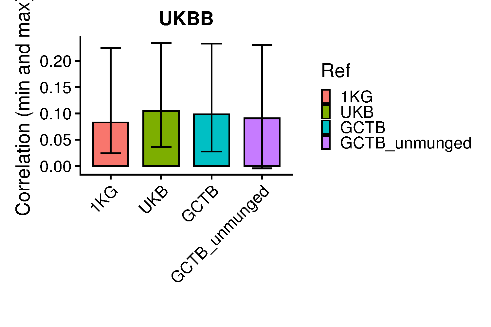

</details>

<details><summary>Show UKBB test-validation results</summary>

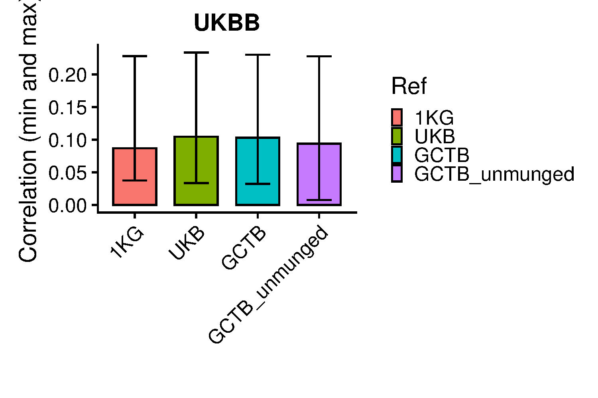

\center

</details>

<details><summary>Show TEDS cross-validation results</summary>

<center>

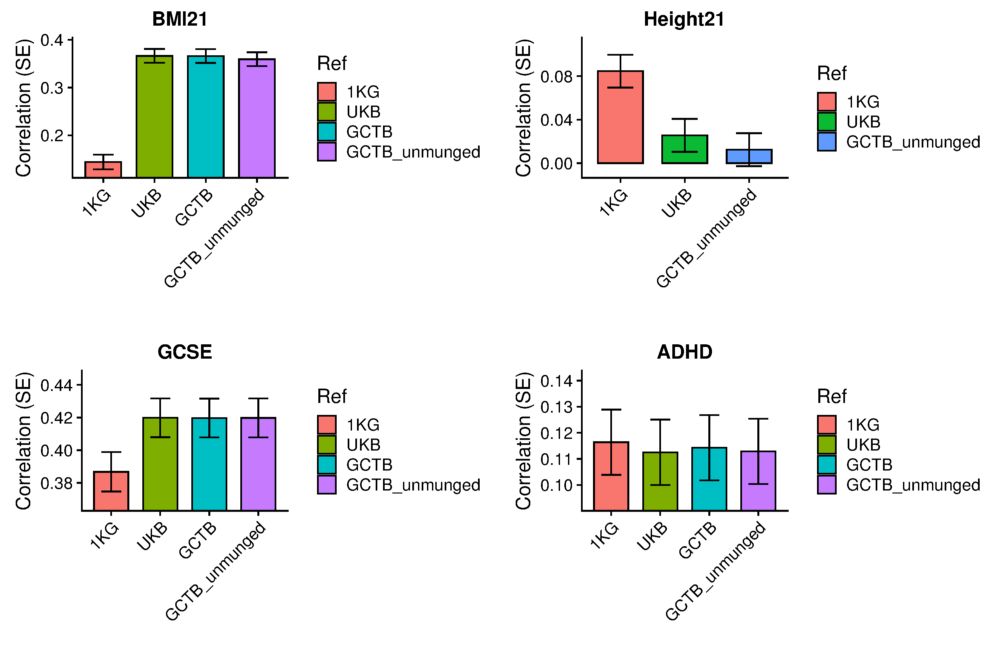

</details>

<details><summary>Show TEDS test-validation results</summary>

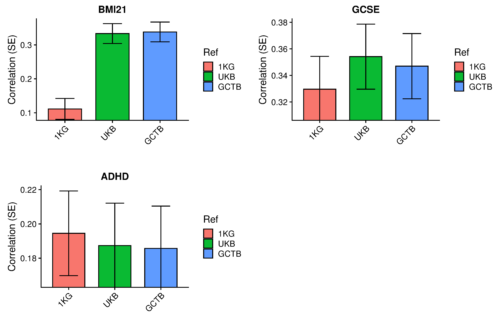

\center

</details>

<br/>

## Summary of results

### Per phenotype performance

<details><summary>Compare methods</summary>

```{r, echo=T, eval=F}
# Create a matrix for each phenotype indicating the percentage improvement of each method and the corresponding p-value (estimated using a Z test)
###
# Compare each method
###

module add apps/R/3.6.0
R

library(data.table)
library(ggplot2)
library(cowplot)

Files<-c('UKBB','UKBB.UKBB_ref','TEDS','TEDS.UKBB_ref')
Samples<-c('UKBB','UKBB','TEDS','TEDS')
Files_descrip<-c('UKBB target with 1KG ref','UKBB target with UKBB ref','TEDS target with 1KG ref','TEDS target with UKBBref')

for(file in 1:length(Files)){
  res<-fread(paste0('/scratch/users/k1806347/Analyses/',Samples[file],'_outcomes_for_prediction/PRS_method_comp_',Files[file],'.csv'))
  res$Test<-paste0(res$Method, ':', res$Group)

  # Calculate difference between each method
  res_diff<-NULL
  
  CrossVal_plot<-list()
  IndepVal_plot<-list()
  for(pheno in unique(res$Phenotype)){
    res_pheno<-res[res$Phenotype == pheno,]
    res_diff_pheno<-NULL
    for(i in unique(res_pheno$Test)){
      for(k in unique(res_pheno$Test)){
          res_pheno_i<-res_pheno[res_pheno$Test == i,]
          res_pheno_k<-res_pheno[res_pheno$Test == k,]
      
          res_diff_i_k<-data.table(Phenotype=pheno,
                                   Test_ref=i,
                                   Test_targ=k,
                                   CrossVal_Diff=res_pheno_k$CrossVal_R-res_pheno_i$CrossVal_R,
                                   IndepVal_Diff=res_pheno_k$IndepVal_R-res_pheno_i$IndepVal_R)
          
          res_diff_i_k$Perc_CrossVal_Diff<-res_diff_i_k$CrossVal_Diff/res_pheno_i$CrossVal_R*100
          res_diff_i_k$CrossVal_Diff_Z<-res_diff_i_k$CrossVal_Diff/sqrt((res_pheno_i$CrossVal_R_SE^2)+(res_pheno_k$CrossVal_R_SE^2))
          res_diff_i_k$CrossVal_Diff_P<-pnorm(-(res_diff_i_k$CrossVal_Diff_Z))              
          res_diff_i_k$Perc_IndepVal_Diff<-res_diff_i_k$IndepVal_Diff/res_pheno_i$IndepVal_R*100
          res_diff_i_k$IndepVal_Diff_Z<-res_diff_i_k$IndepVal_Diff/sqrt((res_pheno_i$IndepVal_R_SE^2)+(res_pheno_k$IndepVal_R_SE^2))
          res_diff_i_k$IndepVal_Diff_P<-pnorm(-(res_diff_i_k$IndepVal_Diff_Z))              
          res_diff_i_k<-res_diff_i_k[,c("Phenotype","Test_ref","Test_targ","CrossVal_Diff","Perc_CrossVal_Diff","CrossVal_Diff_Z","CrossVal_Diff_P","IndepVal_Diff","Perc_IndepVal_Diff","IndepVal_Diff_Z","IndepVal_Diff_P"), with=F]
          res_diff_pheno<-rbind(res_diff_pheno,res_diff_i_k)
    
      }
      
    }
    
    # Format for plotting
    res_diff_pheno$Test_ref<-factor(res_diff_pheno$Test_ref, levels=unique(res_pheno$Test))
  res_diff_pheno$Test_targ<-factor(res_diff_pheno$Test_targ, levels=unique(res_pheno$Test))
  
    # R CrossVal diff matrix
    res_CrossVal_diff_pheno_mat<-as.matrix(dcast(data=res_diff_pheno, formula=Test_ref~Test_targ, fun.aggregate=sum, value.var="CrossVal_Diff")[,-1])
    rownames(res_CrossVal_diff_pheno_mat)<-colnames(res_CrossVal_diff_pheno_mat)
    
    # R IndepVal diff matrix
    res_IndepVal_diff_pheno_mat<-as.matrix(dcast(data=res_diff_pheno, formula=Test_ref~Test_targ, fun.aggregate=sum, value.var="IndepVal_Diff")[,-1])
    rownames(res_IndepVal_diff_pheno_mat)<-colnames(res_IndepVal_diff_pheno_mat)

    # R diff P matrix
    res_CrossVal_diff_P_pheno_mat<-as.matrix(dcast(data=res_diff_pheno, formula=Test_ref~Test_targ, fun.aggregate=sum, value.var="CrossVal_Diff_P")[,-1])
    rownames(res_CrossVal_diff_P_pheno_mat)<-colnames(res_CrossVal_diff_P_pheno_mat)

    # R diff P matrix
    res_IndepVal_diff_P_pheno_mat<-as.matrix(dcast(data=res_diff_pheno, formula=Test_ref~Test_targ, fun.aggregate=sum, value.var="IndepVal_Diff_P")[,-1])
    rownames(res_IndepVal_diff_P_pheno_mat)<-colnames(res_IndepVal_diff_P_pheno_mat)
  
    library(reshape2)
    res_CrossVal_diff_pheno_mat_melt <- melt(res_CrossVal_diff_pheno_mat, na.rm = TRUE)
    res_CrossVal_diff_P_pheno_mat_melt <- melt(res_CrossVal_diff_P_pheno_mat, na.rm = TRUE)
    res_CrossVal_diff_P_pheno_mat_melt$star<-' '
    res_CrossVal_diff_P_pheno_mat_melt$star[res_CrossVal_diff_P_pheno_mat_melt$value < 0.05]<-'*'
    res_CrossVal_diff_P_pheno_mat_melt$star[res_CrossVal_diff_P_pheno_mat_melt$value < 0.001]<-'**'
    
    res_IndepVal_diff_pheno_mat_melt <- melt(res_IndepVal_diff_pheno_mat, na.rm = TRUE)
    res_IndepVal_diff_P_pheno_mat_melt <- melt(res_IndepVal_diff_P_pheno_mat, na.rm = TRUE)
    res_IndepVal_diff_P_pheno_mat_melt$star<-' '
    res_IndepVal_diff_P_pheno_mat_melt$star[res_IndepVal_diff_P_pheno_mat_melt$value < 0.05]<-'*'
    res_IndepVal_diff_P_pheno_mat_melt$star[res_IndepVal_diff_P_pheno_mat_melt$value < 0.001]<-'**'

    CrossVal_plot[[pheno]]<-ggplot(data = res_CrossVal_diff_pheno_mat_melt, aes(Var2, Var1, fill = value))+
     geom_tile(color = "white")+
     labs(y='Reference', x='Test', title=pheno) +
     scale_fill_gradient2(low = "blue", high = "red", mid = "white", 
       midpoint = 0, limit = c(-0.45,0.45), space = "Lab", 
       name="Correlation\ndifference") +
      theme_minimal()+ 
     theme(axis.text.x = element_text(angle = 45, vjust = 1, 
        size = 8, hjust = 1))+
     coord_fixed() +
    geom_text(data=res_CrossVal_diff_P_pheno_mat_melt, aes(Var2, Var1, label = star), color = "black", size = 4)
    
        IndepVal_plot[[pheno]]<-ggplot(data = res_IndepVal_diff_pheno_mat_melt, aes(Var2, Var1, fill = value))+
     geom_tile(color = "white")+
     labs(y='Reference', x='Test', title=pheno) +
     scale_fill_gradient2(low = "blue", high = "red", mid = "white", 
       midpoint = 0, limit = c(-0.45,0.45), space = "Lab", 
       name="Correlation\ndifference") +
      theme_minimal()+ 
     theme(axis.text.x = element_text(angle = 45, vjust = 1, 
        size = 8, hjust = 1))+
     coord_fixed() +
    geom_text(data=res_IndepVal_diff_P_pheno_mat_melt, aes(Var2, Var1, label = star), color = "black", size = 4)

    res_diff<-rbind(res_diff,res_diff_pheno)
  }
  
  if(Samples[file] == 'TEDS'){

    png(paste0('/scratch/users/k1806347/Analyses/',Samples[file],'_outcomes_for_prediction/PRS_method_comp_',Files[file],'_diff_CrossVal.png'), units='px', res=300, width=4000, height=6000)
    print(plot_grid(plotlist=CrossVal_plot, ncol = 1))
    dev.off()
  
    png(paste0('/scratch/users/k1806347/Analyses/',Samples[file],'_outcomes_for_prediction/PRS_method_comp_',Files[file],'_diff_IndepVal.png'), units='px', res=300, width=4000, height=6000)
    print(plot_grid(plotlist=IndepVal_plot, ncol = 1))
    dev.off()

  } else {
    
    png(paste0('/scratch/users/k1806347/Analyses/',Samples[file],'_outcomes_for_prediction/PRS_method_comp_',Files[file],'_diff_CrossVal.png'), units='px', res=300, width=4000, height=18000)
    print(plot_grid(plotlist=CrossVal_plot, ncol = 1))
    dev.off()
  
    png(paste0('/scratch/users/k1806347/Analyses/',Samples[file],'_outcomes_for_prediction/PRS_method_comp_',Files[file],'_diff_IndepVal.png'), units='px', res=300, width=4000, height=18000)
    print(plot_grid(plotlist=IndepVal_plot, ncol = 1))
    dev.off()

  }

  write.csv(res_diff, paste0('/scratch/users/k1806347/Analyses/',Samples[file],'_outcomes_for_prediction/PRS_method_comp_',Files[file],'_diff.csv'), row.names=F, quote=F)
}

q()
n

```

</details>

<br/>

#### 1KG reference
##### UKBB
```{bash, eval=T, echo=F}
cp /scratch/users/k1806347/Analyses/UKBB_outcomes_for_prediction/PRS_method_comp_UKBB_diff_CrossVal.png /users/k1806347/brc_scratch/Software/MyGit/GenoPred/Images/Determine_optimal_polygenic_scoring_approach/

cp /scratch/users/k1806347/Analyses/UKBB_outcomes_for_prediction/PRS_method_comp_UKBB_diff_IndepVal.png /users/k1806347/brc_scratch/Software/MyGit/GenoPred/Images/Determine_optimal_polygenic_scoring_approach/
```

<details><summary>Show cross-validation results</summary>

<center>


</details>

<details><summary>Show test-validation results</summary>


\center

</details>

<details><summary>Show table: UKBB (1KG ref)</summary>

```{r, echo=F, eval=T, results='asis'}
res<-read.csv("/users/k1806347/brc_scratch/Analyses/UKBB_outcomes_for_prediction/PRS_method_comp_UKBB_diff.csv")

res[,!grepl("Phenotype|Test|Diff_P",names(res))]<-round(res[,!grepl("Phenotype|Test|Diff_P",names(res))], 3)

res$CrossVal_Diff_P<-format(res$CrossVal_Diff_P, scientific = TRUE, digits = 3)
res$IndepVal_Diff_P<-format(res$IndepVal_Diff_P, scientific = TRUE, digits = 3)

names(res)<-c("Phenotype","Reference","Test","CrossVal Diff","CrossVal Diff (%)","CrossVal Diff Z","CrossVal Diff P","IndepVal Diff","IndepVal Diff (%)","IndepVal Diff Z","IndepVal Diff P")

library(knitr)
kable(res, rownames = FALSE, caption='Difference between methods in UKBB with 1KG reference')

```

</details>

<br/>

##### TEDS
```{bash, eval=T, echo=F}
cp /scratch/users/k1806347/Analyses/TEDS_outcomes_for_prediction/PRS_method_comp_TEDS_diff_CrossVal.png /users/k1806347/brc_scratch/Software/MyGit/GenoPred/Images/Determine_optimal_polygenic_scoring_approach/

cp /scratch/users/k1806347/Analyses/TEDS_outcomes_for_prediction/PRS_method_comp_TEDS_diff_IndepVal.png /users/k1806347/brc_scratch/Software/MyGit/GenoPred/Images/Determine_optimal_polygenic_scoring_approach/
```

<details><summary>Show cross-validation results</summary>

<center>

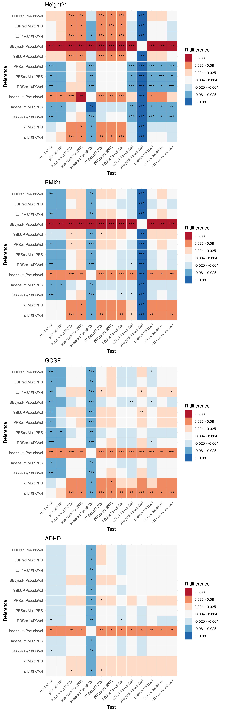

</details>

<details><summary>Show test-validation results</summary>

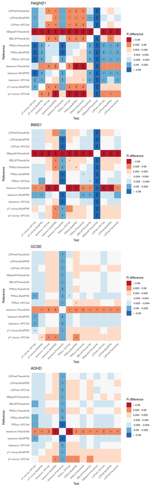

\center

</details>

<details><summary>Show table: TEDS (1KG ref)</summary>

```{r, echo=F, eval=T, results='asis'}
res<-read.csv("/users/k1806347/brc_scratch/Analyses/TEDS_outcomes_for_prediction/PRS_method_comp_TEDS_diff.csv")

res[,!grepl("Phenotype|Test|Diff_P",names(res))]<-round(res[,!grepl("Phenotype|Test|Diff_P",names(res))], 3)

res$CrossVal_Diff_P<-format(res$CrossVal_Diff_P, scientific = TRUE, digits = 3)
res$IndepVal_Diff_P<-format(res$IndepVal_Diff_P, scientific = TRUE, digits = 3)

names(res)<-c("Phenotype","Reference","Test","CrossVal Diff","CrossVal Diff (%)","CrossVal Diff Z","CrossVal Diff P","IndepVal Diff","IndepVal Diff (%)","IndepVal Diff Z","IndepVal Diff P")

library(knitr)
kable(res, rownames = FALSE, caption='Difference between methods in TEDS with 1KG reference')

```

</details>

<br/>

#### UKB reference
```{bash, eval=T, echo=F}
cp /scratch/users/k1806347/Analyses/UKBB_outcomes_for_prediction/PRS_method_comp_UKBB.UKBB_ref_diff_CrossVal.png /users/k1806347/brc_scratch/Software/MyGit/GenoPred/Images/Determine_optimal_polygenic_scoring_approach/

cp /scratch/users/k1806347/Analyses/UKBB_outcomes_for_prediction/PRS_method_comp_UKBB.UKBB_ref_diff_IndepVal.png /users/k1806347/brc_scratch/Software/MyGit/GenoPred/Images/Determine_optimal_polygenic_scoring_approach/
```

<details><summary>Show cross-validation results</summary>

<center>


</details>

<details><summary>Show test-validation results</summary>


\center

</details>

<details><summary>Show table: UKBB (1KG ref)</summary>

```{r, echo=F, eval=T, results='asis'}
res<-read.csv("/users/k1806347/brc_scratch/Analyses/UKBB_outcomes_for_prediction/PRS_method_comp_UKBB.UKBB_ref_diff.csv")

res[,!grepl("Phenotype|Test|Diff_P",names(res))]<-round(res[,!grepl("Phenotype|Test|Diff_P",names(res))], 3)

res$CrossVal_Diff_P<-format(res$CrossVal_Diff_P, scientific = TRUE, digits = 3)
res$IndepVal_Diff_P<-format(res$IndepVal_Diff_P, scientific = TRUE, digits = 3)

names(res)<-c("Phenotype","Reference","Test","CrossVal Diff","CrossVal Diff (%)","CrossVal Diff Z","CrossVal Diff P","IndepVal Diff","IndepVal Diff (%)","IndepVal Diff Z","IndepVal Diff P")

library(knitr)
kable(res, rownames = FALSE, caption='Difference between methods in UKBB with UKBB reference')

```

</details>

<br/>

##### TEDS
```{bash, eval=T, echo=F}
cp /scratch/users/k1806347/Analyses/TEDS_outcomes_for_prediction/PRS_method_comp_TEDS.UKBB_ref_diff_CrossVal.png /users/k1806347/brc_scratch/Software/MyGit/GenoPred/Images/Determine_optimal_polygenic_scoring_approach/

cp /scratch/users/k1806347/Analyses/TEDS_outcomes_for_prediction/PRS_method_comp_TEDS.UKBB_ref_diff_IndepVal.png /users/k1806347/brc_scratch/Software/MyGit/GenoPred/Images/Determine_optimal_polygenic_scoring_approach/
```

<details><summary>Show cross-validation results</summary>

<center>

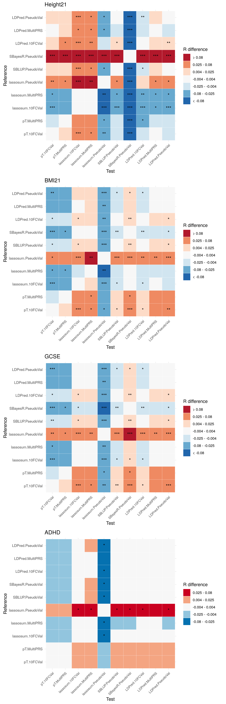

</details>

<details><summary>Show test-validation results</summary>

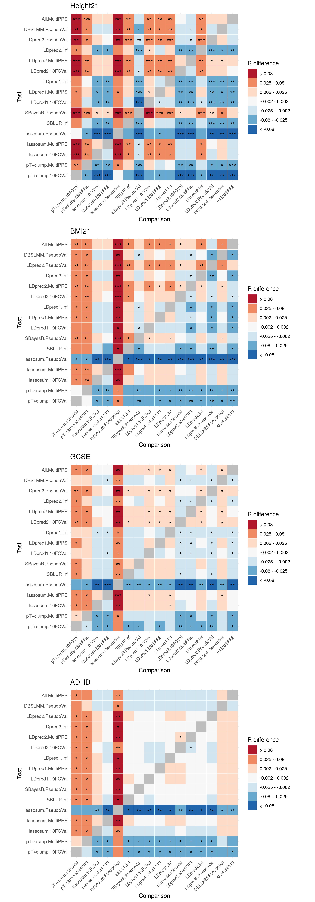

\center

</details>

<details><summary>Show table: TEDS (1KG ref)</summary>

```{r, echo=F, eval=T, results='asis'}
res<-read.csv("/users/k1806347/brc_scratch/Analyses/TEDS_outcomes_for_prediction/PRS_method_comp_TEDS.UKBB_ref_diff.csv")

res[,!grepl("Phenotype|Test|Diff_P",names(res))]<-round(res[,!grepl("Phenotype|Test|Diff_P",names(res))], 3)

res$CrossVal_Diff_P<-format(res$CrossVal_Diff_P, scientific = TRUE, digits = 3)
res$IndepVal_Diff_P<-format(res$IndepVal_Diff_P, scientific = TRUE, digits = 3)

names(res)<-c("Phenotype","Reference","Test","CrossVal Diff","CrossVal Diff (%)","CrossVal Diff Z","CrossVal Diff P","IndepVal Diff","IndepVal Diff (%)","IndepVal Diff Z","IndepVal Diff P")

library(knitr)
kable(res, rownames = FALSE, caption='Difference between methods in TEDS with UKBB reference')

```

</details>

<br/>

### Average performance

<details><summary>Average results across phenotypes</summary>

```{bash, echo=T, eval=F}
# Create a matrix comparing average differences between methods.
###
# Calculate average correlation between observed and predicted values across phenotypes
###

module add apps/R/3.6.0
R

library(data.table)
library(ggplot2)
library(cowplot)
library(meta)
library(MAd)

Files<-c('UKBB','UKBB.UKBB_ref','TEDS','TEDS.UKBB_ref')
Samples<-c('UKBB','UKBB','TEDS','TEDS')
Files_descrip<-c('UKBB target with 1KG ref','UKBB target with UKBB ref','TEDS target with 1KG ref','TEDS target with UKBBref')

source('/users/k1806347/brc_scratch/Software/MyGit/GenoPred/config_used/Target_scoring.config')

Plots_CrossVal_diff_mat<-list()
Plots_IndepVal_diff_mat<-list()
Plots_CrossVal<-list()
Plots_IndepVal<-list()
Plots_CrossVal_diff<-list()
Plots_IndepVal_diff<-list()

for(file in 1:length(Files)){
  res<-fread(paste0('/scratch/users/k1806347/Analyses/',Samples[file],'_outcomes_for_prediction/PRS_method_comp_',Files[file],'.csv'))
  res$Test<-paste0(res$Method, ':', res$Group)
  
  res$Phenotype<-factor(res$Phenotype, level=unique(res$Phenotype))
  res$Method<-factor(res$Method, level=unique(res$Method))
  res$Group<-factor(res$Group, level=c('10FCVal','Multi-PRS','PseudoVal'))
  
  res<-res[order(res$Phenotype, res$Method, res$Group),]
  
  # Calculate mean R and SE using MAd aggregate function for each method
  # This method requires a correlation matrix representing the dependancy of tests
  # We will use the correlation between phenotypes although this is probably conservative
  # Read in the phenotypic data
  if(Samples[file] == 'UKBB'){
    pheno<-unique(res$Phenotype)
  for(pheno_i in 1:length(pheno)){
    if(pheno_i==1){
      pheno_i_dat<-fread(paste0(UKBB_output,'/Phenotype/PRS_comp_subset/UKBB.',pheno[pheno_i],'.txt'))
      names(pheno_i_dat)[3]<-pheno[pheno_i]
      pheno_dat<-pheno_i_dat
    } else {
      pheno_i_dat<-fread(paste0(UKBB_output,'/Phenotype/PRS_comp_subset/UKBB.',pheno[pheno_i],'.txt'))
      names(pheno_i_dat)[3]<-pheno[pheno_i]
      pheno_dat<-merge(pheno_dat, pheno_i_dat, by=c('FID','IID'), all=T)
    }
  }
} else {
      pheno<-unique(res$Phenotype)
  for(pheno_i in 1:length(pheno)){
    if(pheno_i==1){
      pheno_i_dat<-fread(paste0('/users/k1806347/brc_scratch/Data/TEDS/Phenotypic/Derived_outcomes/TEDS_',pheno[pheno_i],'.txt'))
      names(pheno_i_dat)[3]<-pheno[pheno_i]
      pheno_dat<-pheno_i_dat
    } else {
      pheno_i_dat<-fread(paste0('/users/k1806347/brc_scratch/Data/TEDS/Phenotypic/Derived_outcomes/TEDS_',pheno[pheno_i],'.txt'))
      names(pheno_i_dat)[3]<-pheno[pheno_i]
      pheno_dat<-merge(pheno_dat, pheno_i_dat, by=c('FID','IID'), all=T)
    }
  }
}

  # Calculate corelation between all phenotypes
  cors<-abs(cor(as.matrix(pheno_dat[,-1:-2]), use='p'))
  cors<-cors[unique(res$Phenotype,),unique(res$Phenotype,)]
  
  # Run aggregate function
  meta_res<-NULL
  for(i in unique(res$Test)){
    res_i<-res[res$Test == i,]
    res_i$Sample<-'Target'

    CrossVal_agg_res_i<-agg(id=Sample, es=CrossVal_R, var=CrossVal_R_SE^2, cor=cors, method="BHHR", mod=NULL, data=res_i)
    IndepVal_agg_res_i<-agg(id=Sample, es=IndepVal_R, var=IndepVal_R_SE^2, cor=cors, method="BHHR", mod=NULL, data=res_i)

    meta_res<-rbind(meta_res, data.frame(  Test=i,
                                           CrossVal_R=CrossVal_agg_res_i$es[1],
                                           CrossVal_R_SE=sqrt(CrossVal_agg_res_i$var[1]),
                                           IndepVal_R=IndepVal_agg_res_i$es[1],
                                           IndepVal_R_SE=sqrt(IndepVal_agg_res_i$var[1])))
  }
  
  write.csv(meta_res, paste0('/scratch/users/k1806347/Analyses/',Samples[file],'_outcomes_for_prediction/PRS_method_comp_',Files[file],'_meta.csv'), row.names=F, quote=F)

  # Calculate difference between methods and p-value using Z test
  meta_res_diff<-NULL
  for(i in unique(meta_res$Test)){
    for(k in unique(meta_res$Test)){
      meta_res_i<-meta_res[meta_res$Test == i,]
      meta_res_k<-meta_res[meta_res$Test == k,]
  
      res_diff_i_k<-data.table(Test_ref=i,
                               Test_targ=k,
                               CrossVal_Diff=meta_res_k$CrossVal_R-meta_res_i$CrossVal_R,
                               IndepVal_Diff=meta_res_k$IndepVal_R-meta_res_i$IndepVal_R)
      
      res_diff_i_k$Perc_CrossVal_Diff<-res_diff_i_k$CrossVal_Diff/meta_res_i$CrossVal_R*100
      res_diff_i_k$CrossVal_Diff_Z<-res_diff_i_k$CrossVal_Diff/sqrt((meta_res_i$CrossVal_R_SE^2)+(meta_res_k$CrossVal_R_SE^2))
      res_diff_i_k$CrossVal_Diff_P<-pnorm(-(res_diff_i_k$CrossVal_Diff_Z))              
      res_diff_i_k$Perc_IndepVal_Diff<-res_diff_i_k$IndepVal_Diff/meta_res_i$IndepVal_R*100
      res_diff_i_k$IndepVal_Diff_Z<-res_diff_i_k$IndepVal_Diff/sqrt((meta_res_i$IndepVal_R_SE^2)+(meta_res_k$IndepVal_R_SE^2))
      res_diff_i_k$IndepVal_Diff_P<-pnorm(-(res_diff_i_k$IndepVal_Diff_Z))              
      res_diff_i_k<-res_diff_i_k[,c("Test_ref","Test_targ","CrossVal_Diff","Perc_CrossVal_Diff","CrossVal_Diff_Z","CrossVal_Diff_P","IndepVal_Diff","Perc_IndepVal_Diff","IndepVal_Diff_Z","IndepVal_Diff_P"), with=F]
      meta_res_diff<-rbind(meta_res_diff,res_diff_i_k)
    }
  }

  # Format for plotting
  meta_res_diff$Test_ref<-factor(meta_res_diff$Test_ref, levels=unique(meta_res_diff$Test_ref))
  meta_res_diff$Test_targ<-factor(meta_res_diff$Test_targ, levels=unique(meta_res_diff$Test_ref))

  # R CrossVal diff matrix
  res_CrossVal_diff_pheno_mat<-as.matrix(dcast(data=meta_res_diff, formula=Test_ref~Test_targ, fun.aggregate=sum, value.var="CrossVal_Diff")[,-1])
  rownames(res_CrossVal_diff_pheno_mat)<-colnames(res_CrossVal_diff_pheno_mat)
  
  # R IndepVal diff matrix
  res_IndepVal_diff_pheno_mat<-as.matrix(dcast(data=meta_res_diff, formula=Test_ref~Test_targ, fun.aggregate=sum, value.var="IndepVal_Diff")[,-1])
  rownames(res_IndepVal_diff_pheno_mat)<-colnames(res_IndepVal_diff_pheno_mat)

  # R diff P matrix
  res_CrossVal_diff_P_pheno_mat<-as.matrix(dcast(data=meta_res_diff, formula=Test_ref~Test_targ, fun.aggregate=sum, value.var="CrossVal_Diff_P")[,-1])
  rownames(res_CrossVal_diff_P_pheno_mat)<-colnames(res_CrossVal_diff_P_pheno_mat)

  # R diff P matrix
  res_IndepVal_diff_P_pheno_mat<-as.matrix(dcast(data=meta_res_diff, formula=Test_ref~Test_targ, fun.aggregate=sum, value.var="IndepVal_Diff_P")[,-1])
  rownames(res_IndepVal_diff_P_pheno_mat)<-colnames(res_IndepVal_diff_P_pheno_mat)

  library(reshape2)
  res_CrossVal_diff_pheno_mat_melt <- melt(res_CrossVal_diff_pheno_mat, na.rm = TRUE)
  res_CrossVal_diff_P_pheno_mat_melt <- melt(res_CrossVal_diff_P_pheno_mat, na.rm = TRUE)
  res_CrossVal_diff_P_pheno_mat_melt$star<-' '
  res_CrossVal_diff_P_pheno_mat_melt$star[res_CrossVal_diff_P_pheno_mat_melt$value < 0.05]<-'*'
  res_CrossVal_diff_P_pheno_mat_melt$star[res_CrossVal_diff_P_pheno_mat_melt$value < 0.001]<-'**'
  res_CrossVal_diff_P_pheno_mat_melt$star[res_CrossVal_diff_P_pheno_mat_melt$value < 0.000001]<-'***'
  
  res_IndepVal_diff_pheno_mat_melt <- melt(res_IndepVal_diff_pheno_mat, na.rm = TRUE)
  res_IndepVal_diff_P_pheno_mat_melt <- melt(res_IndepVal_diff_P_pheno_mat, na.rm = TRUE)
  res_IndepVal_diff_P_pheno_mat_melt$star<-' '
  res_IndepVal_diff_P_pheno_mat_melt$star[res_IndepVal_diff_P_pheno_mat_melt$value < 0.05]<-'*'
  res_IndepVal_diff_P_pheno_mat_melt$star[res_IndepVal_diff_P_pheno_mat_melt$value < 0.001]<-'**'
  res_IndepVal_diff_P_pheno_mat_melt$star[res_IndepVal_diff_P_pheno_mat_melt$value < 0.000001]<-'***'

  Plots_CrossVal_diff_mat[[Files[file]]]<-ggplot(data = res_CrossVal_diff_pheno_mat_melt, aes(Var2, Var1, fill = value))+
     geom_tile(color = "white")+
     labs(y='Reference', x='Test', title=Files_descrip[file]) +
     scale_fill_gradient2(low = "blue", high = "red", mid = "white", 
       midpoint = 0, limit = c(-0.15,0.15), space = "Lab", 
       name="Correlation\ndifference") +
      theme_minimal()+ 
     theme(axis.text.x = element_text(angle = 45, vjust = 1, 
        size = 8, hjust = 1))+
     coord_fixed() +
    geom_text(data=res_CrossVal_diff_P_pheno_mat_melt, aes(Var2, Var1, label = star), color = "black", size = 4)

  Plots_IndepVal_diff_mat[[Files[file]]]<-ggplot(data = res_IndepVal_diff_pheno_mat_melt, aes(Var2, Var1, fill = value))+
     geom_tile(color = "white")+
     labs(y='Reference', x='Test', title=Files_descrip[file]) +
     scale_fill_gradient2(low = "blue", high = "red", mid = "white", 
       midpoint = 0, limit = c(-0.15,0.15), space = "Lab", 
       name="Correlation\ndifference") +
      theme_minimal()+ 
     theme(axis.text.x = element_text(angle = 45, vjust = 1, 
        size = 8, hjust = 1))+
     coord_fixed() +
    geom_text(data=res_IndepVal_diff_P_pheno_mat_melt, aes(Var2, Var1, label = star), color = "black", size = 4)
  
  write.csv(meta_res_diff, paste0('/scratch/users/k1806347/Analyses/',Samples[file],'_outcomes_for_prediction/PRS_method_comp_',Files[file],'_meta_diff.csv'), row.names=F, quote=F)

  # Create bar plots showing results
  meta_res$Method<-gsub(':.*','',meta_res$Test)
  meta_res$Group<-gsub('.*:','',meta_res$Test)
  
  meta_res$Method<-factor(meta_res$Method, levels=unique(meta_res$Method))
  meta_res$Group<-factor(meta_res$Group, levels=unique(meta_res$Group))
  
  Plots_CrossVal[[Files[file]]] <- ggplot( meta_res, aes(x=Method, y=CrossVal_R, fill=Group)) +
                    geom_bar(stat="identity", position=position_dodge(preserve = "single"), width = 0.7, colour='black') +
                    geom_errorbar(aes(ymin=CrossVal_R-CrossVal_R_SE, ymax=CrossVal_R+CrossVal_R_SE), width=.4, position=position_dodge(width = 0.7, preserve = "single")) +
                    labs(y="Mean Correlation (SE)", x='', title=Files_descrip[file]) +
                    theme(axis.text.x = element_text(angle = 45, hjust = 1))

  Plots_IndepVal[[Files[file]]] <- ggplot( meta_res, aes(x=Method, y=IndepVal_R, fill=Group)) +
                    geom_bar(stat="identity", position=position_dodge(preserve = "single"), width = 0.7, colour='black') +
                    geom_errorbar(aes(ymin=IndepVal_R-IndepVal_R_SE, ymax=IndepVal_R+IndepVal_R_SE), width=.4, position=position_dodge(width = 0.7, preserve = "single")) +
                    labs(y="Mean Correlation (SE)", x='', title=Files_descrip[file]) +
          				  theme(axis.text.x = element_text(angle = 45, hjust = 1))

  meta_res_diff_pT<-meta_res_diff[meta_res_diff$Test_ref == 'pT:10FCVal',]
  meta_res_diff_pT$Method<-gsub(':.*','',meta_res_diff_pT$Test_targ)
  meta_res_diff_pT$Group<-gsub('.*:','',meta_res_diff_pT$Test_targ)
  
  meta_res_diff_pT$Method<-factor(meta_res_diff_pT$Method, levels=unique(meta_res_diff_pT$Method))
  meta_res_diff_pT$Group<-factor(meta_res_diff_pT$Group, levels=unique(meta_res_diff_pT$Group))
  
  meta_res_diff_pT$CrossVal_Diff_SE<-meta_res_diff_pT$CrossVal_Diff/meta_res_diff_pT$CrossVal_Diff_Z

  Plots_CrossVal_diff[[Files[file]]] <- ggplot( meta_res_diff_pT, aes(x=Method, y=CrossVal_Diff, fill=Group)) +
                    geom_bar(stat="identity", position=position_dodge(preserve = "single"), width = 0.7, colour='black') +
                    ylim(-0.12,0.065) +
                    geom_errorbar(aes(ymin=CrossVal_Diff-CrossVal_Diff_SE, ymax=CrossVal_Diff+CrossVal_Diff_SE), width=.4, position=position_dodge(width = 0.7, preserve = "single")) +
                    labs(y="Mean difference (SE)", x='', title=Files_descrip[file]) +
                    geom_hline(yintercept=0) +
                    theme(axis.text.x = element_text(angle = 45, hjust = 1))

  meta_res_diff_pT$IndepVal_Diff_SE<-meta_res_diff_pT$IndepVal_Diff/meta_res_diff_pT$IndepVal_Diff_Z

  Plots_IndepVal_diff[[Files[file]]] <- ggplot( meta_res_diff_pT, aes(x=Method, y=IndepVal_Diff, fill=Group)) +
                    geom_bar(stat="identity", position=position_dodge(preserve = "single"), width = 0.7, colour='black') +
                    ylim(-0.12,0.065) +
                    geom_errorbar(aes(ymin=IndepVal_Diff-IndepVal_Diff_SE, ymax=IndepVal_Diff+IndepVal_Diff_SE), width=.4, position=position_dodge(width = 0.7, preserve = "single")) +
                    labs(y="Mean difference (SE)", x='', title=Files_descrip[file]) +
                    geom_hline(yintercept=0) +
          				  theme(axis.text.x = element_text(angle = 45, hjust = 1))

}

png(paste0('/scratch/users/k1806347/Analyses/UKBB_outcomes_for_prediction/PRS_method_comp_meta_diff_CrossVal.png'), units='px', res=300, width=4000, height=4000)
plot_grid(plotlist=Plots_CrossVal_diff_mat, ncol = 2)
dev.off()
  
png(paste0('/scratch/users/k1806347/Analyses/UKBB_outcomes_for_prediction/PRS_method_comp_meta_diff_IndepVal.png'), units='px', res=300, width=4000, height=4000)
plot_grid(plotlist=Plots_IndepVal_diff_mat, ncol = 2)
dev.off()

png('/scratch/users/k1806347/Analyses/UKBB_outcomes_for_prediction/PRS_method_comp_Average_CrossVal.png', units='px', res=300, width=3000, height=2000)
plot_grid(plotlist=Plots_CrossVal, ncol = 2)
dev.off()

png('/scratch/users/k1806347/Analyses/UKBB_outcomes_for_prediction/PRS_method_comp_Average_IndepVal.png', units='px', res=300, width=3000, height=2000)
plot_grid(plotlist=Plots_IndepVal, ncol = 2)
dev.off()

png('/scratch/users/k1806347/Analyses/UKBB_outcomes_for_prediction/PRS_method_comp_Average_diff_CrossVal.png', units='px', res=300, width=3000, height=2000)
plot_grid(plotlist=Plots_CrossVal_diff, ncol = 2)
dev.off()

png('/scratch/users/k1806347/Analyses/UKBB_outcomes_for_prediction/PRS_method_comp_Average_diff_IndepVal.png', units='px', res=300, width=3000, height=2000)
plot_grid(plotlist=Plots_IndepVal_diff, ncol = 2)
dev.off()

q()
n

```

</details>

```{bash, eval=T, echo=F}
cp /scratch/users/k1806347/Analyses/UKBB_outcomes_for_prediction/PRS_method_comp_meta_diff_CrossVal.png /users/k1806347/brc_scratch/Software/MyGit/GenoPred/Images/Determine_optimal_polygenic_scoring_approach/

cp /scratch/users/k1806347/Analyses/UKBB_outcomes_for_prediction/PRS_method_comp_meta_diff_IndepVal.png /users/k1806347/brc_scratch/Software/MyGit/GenoPred/Images/Determine_optimal_polygenic_scoring_approach/

cp /scratch/users/k1806347/Analyses/UKBB_outcomes_for_prediction/PRS_method_comp_Average_CrossVal.png /users/k1806347/brc_scratch/Software/MyGit/GenoPred/Images/Determine_optimal_polygenic_scoring_approach/

cp /scratch/users/k1806347/Analyses/UKBB_outcomes_for_prediction/PRS_method_comp_Average_IndepVal.png /users/k1806347/brc_scratch/Software/MyGit/GenoPred/Images/Determine_optimal_polygenic_scoring_approach/

cp /scratch/users/k1806347/Analyses/UKBB_outcomes_for_prediction/PRS_method_comp_Average_diff_CrossVal.png /users/k1806347/brc_scratch/Software/MyGit/GenoPred/Images/Determine_optimal_polygenic_scoring_approach/

cp /scratch/users/k1806347/Analyses/UKBB_outcomes_for_prediction/PRS_method_comp_Average_diff_IndepVal.png /users/k1806347/brc_scratch/Software/MyGit/GenoPred/Images/Determine_optimal_polygenic_scoring_approach/

```

<details><summary>Show cross-validation results</summary>

<center>

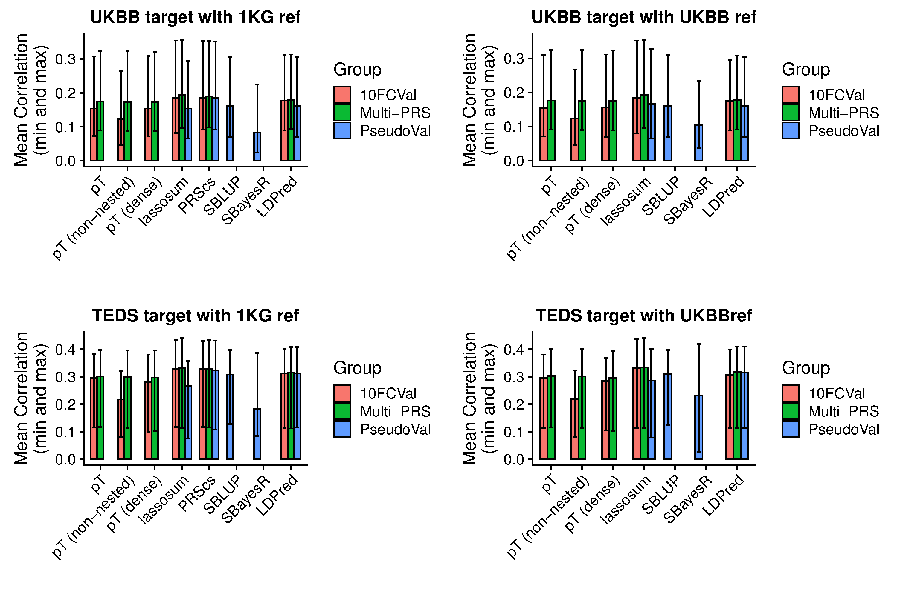

</details>

<details><summary>Show test-validation results</summary>

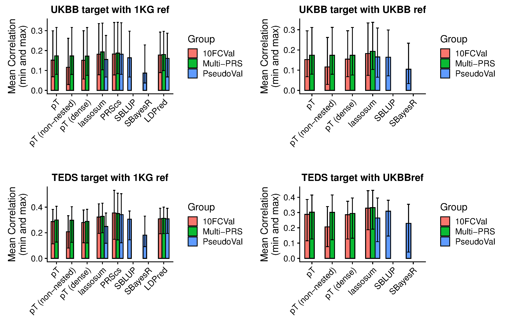

\center

</details>

<details><summary>Show table: UKBB (1KG ref)</summary>

```{r, echo=F, eval=T, results='asis'}
res<-read.csv("/users/k1806347/brc_scratch/Analyses/UKBB_outcomes_for_prediction/PRS_method_comp_UKBB_meta.csv")

res[,!grepl("Test",names(res))]<-round(res[,!grepl("Test",names(res))], 3)

res$Method<-gsub(':.*','',res$Test)
res$Group<-gsub('.*:','',res$Test)

res$CrossVal_R<-paste0(res$CrossVal_R," (",res$CrossVal_R_SE,")")
res$IndepVal_R<-paste0(res$IndepVal_R," (",res$IndepVal_R_SE,")")

res<-res[,c('Method','Group','CrossVal_R','IndepVal_R')]
names(res)<-c("Method",'Group',"CrossVal R (SE)","IndepVal R (SE)")

library(knitr)
kable(res, rownames = FALSE, caption='Average performance in UKBB with 1KG reference')

```

</details>

<details><summary>Show table: UKBB (UKBB ref)</summary>

```{r, echo=F, eval=T, results='asis'}
res<-read.csv("/users/k1806347/brc_scratch/Analyses/UKBB_outcomes_for_prediction/PRS_method_comp_UKBB.UKBB_ref_meta.csv")

res[,!grepl("Test",names(res))]<-round(res[,!grepl("Test",names(res))], 3)

res$Method<-gsub(':.*','',res$Test)
res$Group<-gsub('.*:','',res$Test)

res$CrossVal_R<-paste0(res$CrossVal_R," (",res$CrossVal_R_SE,")")
res$IndepVal_R<-paste0(res$IndepVal_R," (",res$IndepVal_R_SE,")")

res<-res[,c('Method','Group','CrossVal_R','IndepVal_R')]
names(res)<-c("Method",'Group',"CrossVal R (SE)","IndepVal R (SE)")

library(knitr)
kable(res, rownames = FALSE, caption='Average performance in UKBB with UKBB reference')

```

</details>

<details><summary>Show table: TEDS (1KG ref)</summary>

```{r, echo=F, eval=T, results='asis'}
res<-read.csv("/users/k1806347/brc_scratch/Analyses/TEDS_outcomes_for_prediction/PRS_method_comp_TEDS_meta.csv")

res[,!grepl("Test",names(res))]<-round(res[,!grepl("Test",names(res))], 3)

res$Method<-gsub(':.*','',res$Test)
res$Group<-gsub('.*:','',res$Test)

res$CrossVal_R<-paste0(res$CrossVal_R," (",res$CrossVal_R_SE,")")
res$IndepVal_R<-paste0(res$IndepVal_R," (",res$IndepVal_R_SE,")")

res<-res[,c('Method','Group','CrossVal_R','IndepVal_R')]
names(res)<-c("Method",'Group',"CrossVal R (SE)","IndepVal R (SE)")

library(knitr)
kable(res, rownames = FALSE, caption='Average performance in TEDS with 1KG reference')

```

</details>

<details><summary>Show table: TEDS (UKBB ref)</summary>

```{r, echo=F, eval=T, results='asis'}
res<-read.csv("/users/k1806347/brc_scratch/Analyses/TEDS_outcomes_for_prediction/PRS_method_comp_TEDS.UKBB_ref_meta.csv")

res[,!grepl("Test",names(res))]<-round(res[,!grepl("Test",names(res))], 3)

res$Method<-gsub(':.*','',res$Test)
res$Group<-gsub('.*:','',res$Test)

res$CrossVal_R<-paste0(res$CrossVal_R," (",res$CrossVal_R_SE,")")
res$IndepVal_R<-paste0(res$IndepVal_R," (",res$IndepVal_R_SE,")")

res<-res[,c('Method','Group','CrossVal_R','IndepVal_R')]
names(res)<-c("Method",'Group',"CrossVal R (SE)","IndepVal R (SE)")

library(knitr)
kable(res, rownames = FALSE, caption='Average performance in TEDS with UKBB reference')

```

</details>

<br/>

### Average performance relative to pT+clump

<details><summary>Show cross-validation results</summary>

<center>

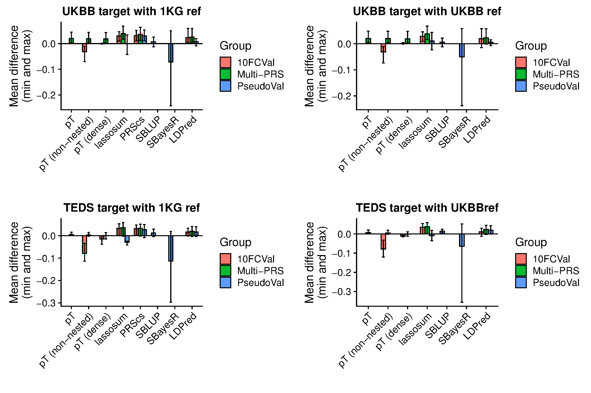

</details>

<details><summary>Show test-validation results</summary>

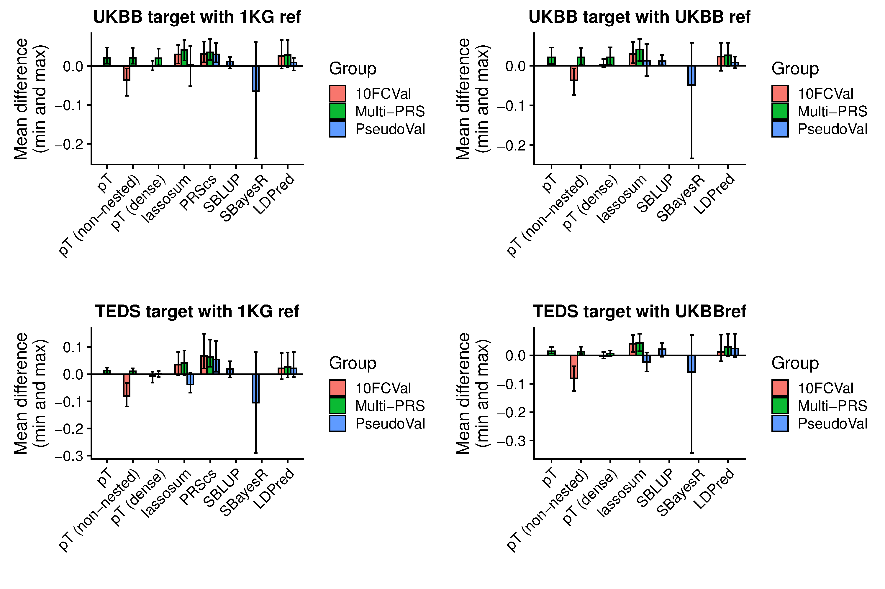

\center

</details>

<br/>

### Average performance difference across all methods

<details><summary>Show cross-validation results</summary>

<center>

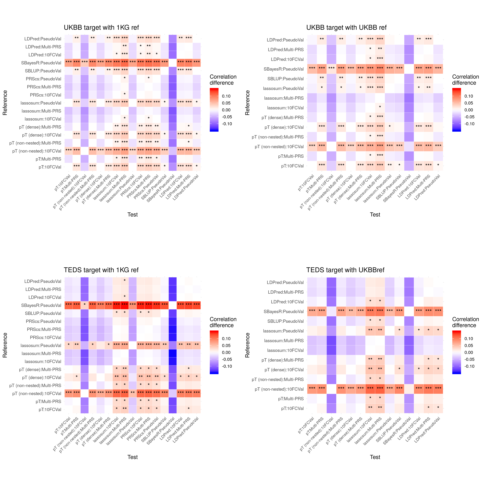

</details>

<details><summary>Show test-validation results</summary>

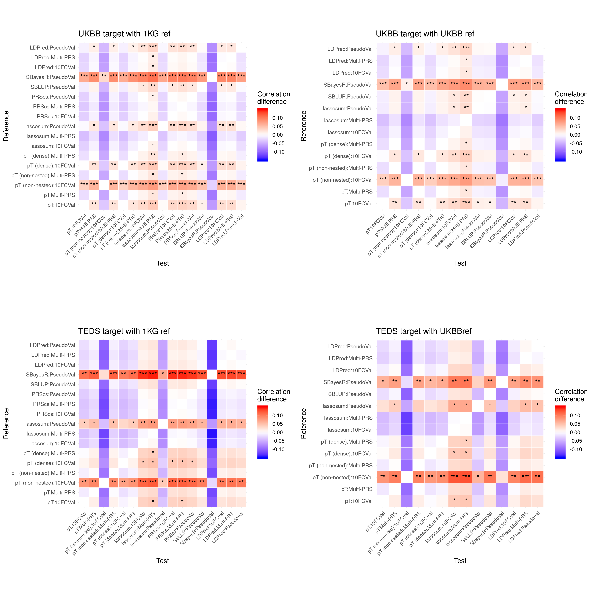

\center

</details>

<details><summary>Show table: UKBB (1KG ref)</summary>

```{r, echo=F, eval=T, results='asis'}
res<-read.csv("/users/k1806347/brc_scratch/Analyses/UKBB_outcomes_for_prediction/PRS_method_comp_UKBB_meta_diff.csv")

res$CrossVal_Diff_P<-format(res$CrossVal_Diff_P, scientific = TRUE, digits = 3)
res$IndepVal_Diff_P<-format(res$IndepVal_Diff_P, scientific = TRUE, digits = 3)
res[,!grepl("Test_|_Diff_P",names(res))]<-round(res[,!grepl("Test_|_Diff_P",names(res))], 3)

names(res)<-c("Reference","Test","CrossVal Diff","CrossVal Diff (%)","CrossVal Diff Z","CrossVal Diff P","IndepVal Diff","IndepVal Diff (%)","IndepVal Diff Z","IndepVal Diff P")

library(knitr)
kable(res, rownames = FALSE, caption='Average difference between methods in UKBB with 1KG reference')

```

</details>

<details><summary>Show table: UKBB (UKBB ref)</summary>

```{r, echo=F, eval=T, results='asis'}
res<-read.csv("/users/k1806347/brc_scratch/Analyses/UKBB_outcomes_for_prediction/PRS_method_comp_UKBB.UKBB_ref_meta_diff.csv")

res$CrossVal_Diff_P<-format(res$CrossVal_Diff_P, scientific = TRUE, digits = 3)
res$IndepVal_Diff_P<-format(res$IndepVal_Diff_P, scientific = TRUE, digits = 3)
res[,!grepl("Test_|_Diff_P",names(res))]<-round(res[,!grepl("Test_|_Diff_P",names(res))], 3)

names(res)<-c("Reference","Test","CrossVal Diff","CrossVal Diff (%)","CrossVal Diff Z","CrossVal Diff P","IndepVal Diff","IndepVal Diff (%)","IndepVal Diff Z","IndepVal Diff P")

library(knitr)
kable(res, rownames = FALSE, caption='Average difference between methods in UKBB with UKBB reference')

```

</details>

<details><summary>Show table: TEDS (1KG ref)</summary>

```{r, echo=F, eval=T, results='asis'}
res<-read.csv("/users/k1806347/brc_scratch/Analyses/TEDS_outcomes_for_prediction/PRS_method_comp_TEDS_meta_diff.csv")

res$CrossVal_Diff_P<-format(res$CrossVal_Diff_P, scientific = TRUE, digits = 3)
res$IndepVal_Diff_P<-format(res$IndepVal_Diff_P, scientific = TRUE, digits = 3)
res[,!grepl("Test_|_Diff_P",names(res))]<-round(res[,!grepl("Test_|_Diff_P",names(res))], 3)

names(res)<-c("Reference","Test","CrossVal Diff","CrossVal Diff (%)","CrossVal Diff Z","CrossVal Diff P","IndepVal Diff","IndepVal Diff (%)","IndepVal Diff Z","IndepVal Diff P")

library(knitr)
kable(res, rownames = FALSE, caption='Average difference between methods in TEDS with 1KG reference')

```

</details>

<details><summary>Show table: TEDS (UKBB ref)</summary>

```{r, echo=F, eval=T, results='asis'}
res<-read.csv("/users/k1806347/brc_scratch/Analyses/TEDS_outcomes_for_prediction/PRS_method_comp_TEDS.UKBB_ref_meta_diff.csv")

res$CrossVal_Diff_P<-format(res$CrossVal_Diff_P, scientific = TRUE, digits = 3)
res$IndepVal_Diff_P<-format(res$IndepVal_Diff_P, scientific = TRUE, digits = 3)
res[,!grepl("Test_|_Diff_P",names(res))]<-round(res[,!grepl("Test_|_Diff_P",names(res))], 3)

names(res)<-c("Reference","Test","CrossVal Diff","CrossVal Diff (%)","CrossVal Diff Z","CrossVal Diff P","IndepVal Diff","IndepVal Diff (%)","IndepVal Diff Z","IndepVal Diff P")

library(knitr)
kable(res, rownames = FALSE, caption='Average difference between methods in TEDS with UKBB reference')

```

</details>

<br/>

***

# Conclusion
Our results suggest the use of PRScs using only the pseudovalidated global shrinkage parameter, as this provides near optimal prediction whilst reducing computional burden and risk of overfitting.

<br/>

***

