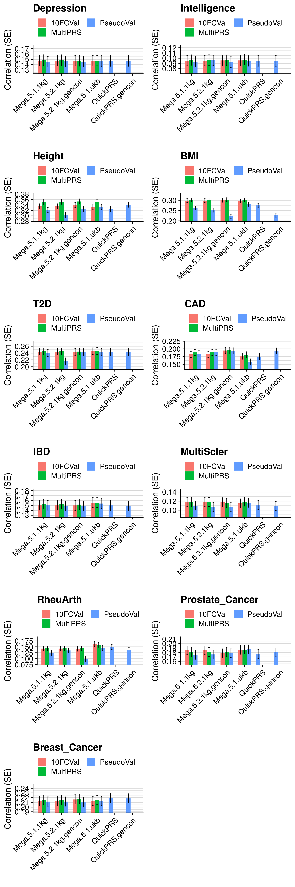

```{r setup, include=FALSE}
knitr::opts_chunk$set(echo = TRUE)
```

<style>
p.caption {
  font-size: 1.5em;
}
</style>

```{css, echo=F}
pre code, pre, code {
  white-space: pre !important;
  overflow-x: scroll !important;
  word-break: keep-all !important;
  word-wrap: initial !important;
}
```

***

# Intro

This page provides a comparison of polygenic scoring methods. The results on this page will be periodically updated as new polygenic scoring methods are developed. The methodology used is consistent with our previous published study [here](https://doi.org/10.1371/journal.pgen.1009021).

In summary, we compare a range of polygenic scoring methods, using publicly available GWAS summary statistics as the discovery datasets, and the UK Biobank (UKB) and the Twins Early Development Study (TEDS). We use a reference-standardised approach to calculate the polygenic scores, whereby the analysis restricted to a common set of typically well imputed genetic variants and an external reference dataset is used to estimate linkage disequilbrium (LD) and minor allele frequency (MAF). More information can be found in our original study.

For simplicity here, we have omitted certain sensitivity analyses, including:

* Comparison of dense and non-nested pT+clump
* Comparison of different options for SBayesR
* Covarying for genetic principal components
* Showing results for phenotypes split by polygenicity
* We no longer show performance results from 10-fold cross validation
* We no longer evaluate methods in TEDS as results are concordant and sample size is substantially smaller than UKB.

Updates since the original study include:

* Addition of [LDAK's MegaPRS](https://dougspeed.com/megaprs/)
* New runtime benchmark for LDPred2 [new SFMB format](https://twitter.com/privefl/status/1415713020924280840)
* New implementation of pseudo-summary approach in LDAK's
* Addition of LDAK's QuickPRS

***

# Methods

***

## Outcomes

The outcomes we use in each target sample are listed below:

* UK Biobank
  * Depression (binary)
  * Intelligence (continuous)
  * Body mass index (BMI - continuous)
  * Height (continuous)
  * Coronary Artery Disease (CAD - Binary)
  * Type II Diabetes (T2D - Binary)
  * Inflammatory Bowel Disorder (IBD - Binary)
  * Rheumatoid arthritis (RheuArth - Binary)
  * Multiple Slerosis (MultiScler - Binary)
  * Prostate Cancer (Binary)
  * Breast Cancer (Binary)

* TEDS
  * ADHD traits (continuous)
  * Height (continuous)
  * Body mass index (BMI - continuous)
  * GCSE scores (continuous)

***

## GWAS summary statistics

For each target outcome, the largest independent phenotype-matched GWAS was selected for calculating polygenic scores. More information can be found in the table below.

```{R, echo=F, eval=F}

source('/users/k1806347/brc_scratch/Software/MyGit/GenoPred/config_used/Phenotype_prep.config')
source('/users/k1806347/brc_scratch/Software/MyGit/GenoPred/config_used/Pipeline_prep.config')

library(data.table)

pheno<-fread('/users/k1806347/brc_scratch/Data/GWAS_sumstats/QC_sumstats_list_270121.csv')

ukb_pheno=c('Depression','Intelligence','BMI','Height','T2D','CAD','IBD','MultiScler','RheuArth','Breast_Cancer','Prostate_Cancer')
ukb_gwas=c('DEPR06','COLL01','BODY04','HEIG03','DIAB05','COAD01','CROH01','SCLE03','RHEU02','BRCA01','PRCA01')
ukb_prev=c(0.15,NA,NA,NA,0.05,0.03,0.013,0.00164,0.005,0.125,0.125)
ukb_dat<-data.frame(pheno=ukb_pheno,gwas=ukb_gwas,prev=ukb_prev)

pheno_ukb<-pheno[(pheno$code %in% ukb_gwas),]
pheno_ukb<-pheno_ukb[,c('code','phenotype_name','reference_year','pmid','n_cases','n_controls','n_total')]
names(pheno_ukb)<-c('code','trait','year','PMID','Ncases','Ncontrols','sample_size_discovery')

ldsc_res<-NULL
for(i in ukb_gwas){
  tmp<-read.table(paste0(gwas_rep_munged,'/',i,'_herit.log'), sep='&')
}

pheno_ukb$ldsc_h2_observed<-NA
pheno_ukb$ldsc_h2_se<-NA
pheno_ukb$ldsc_lambda_GC<-NA
pheno_ukb$ldsc_intercept<-NA
pheno_ukb$ldsc_intercept_se<-NA

ldsc_logs<-list.files(path='/scratch/groups/ukbiobank/sumstats/munged', pattern='_herit.log')
ldsc_logs<-gsub('_herit.log','',ldsc_logs)

for(i in 1:dim(pheno_ukb)[1]){
  if((pheno_ukb$code[i] %in% ldsc_logs)){
    ldsc_logs_i<-read.fwf(paste0(gwas_rep_munged,'/',pheno_ukb$code[i],'_herit.log'),widths = 1000000)
        
    pheno_ukb$ldsc_h2_observed[i]<-as.numeric(gsub(' .*','', gsub('Total Observed scale h2: ','',ldsc_logs_i[grepl('Total Observed scale h2: ', ldsc_logs_i$V1),])))
    pheno_ukb$ldsc_h2_se[i]<-as.numeric(gsub("\\)",'', gsub(".*\\(",'', gsub('Total Observed scale h2: ','',ldsc_logs_i[grepl('Total Observed scale h2: ', ldsc_logs_i$V1),]))))
    pheno_ukb$ldsc_lambda_GC[i]<-as.numeric(gsub('Lambda GC: ','',ldsc_logs_i[grepl('Lambda GC: ', ldsc_logs_i$V1),]))
    pheno_ukb$ldsc_intercept[i]<-as.numeric(gsub(' .*','', gsub("Intercept: ",'',ldsc_logs_i[grepl("Intercept: ", ldsc_logs_i$V1),])))
    pheno_ukb$ldsc_intercept_se[i]<-as.numeric(gsub("\\)",'', gsub(".*\\(",'', gsub("Intercept: ",'',ldsc_logs_i[grepl("Intercept: ", ldsc_logs_i$V1),]))))
  }
}

for(i in 1:dim(pheno_ukb)[1]){
  ldak_log<-readLines(paste0('/users/k1806347/brc_scratch/Data/1KG/Phase3/Score_files_for_polygenic/LDAK/',pheno_ukb$code[i],'/1KGPhase3.w_hm3.',pheno_ukb$code[i],'.log'))

  ldak_log_h2<-ldak_log[grepl('SNP-based heritability estimated',ldak_log)]
  ldak_log_h2<-gsub('.$','',gsub('.*to be ','',ldak_log_h2))
  ldak_log_h2_observed<-gsub(' .*','', ldak_log_h2)
  ldak_log_h2_se<-gsub(")",'',gsub('.*=','', ldak_log_h2))
  pheno_ukb$ldak_h2_observed[i]<-ldak_log_h2_observed
  pheno_ukb$ldak_h2_se[i]<-ldak_log_h2_se
}

pheno_ukb$pop_prev<-ukb_dat$prev[match(pheno_ukb$code, ukb_dat$gwas)]
pheno_ukb$Target_Phenotype<-ukb_dat$pheno[match(pheno_ukb$code, ukb_dat$gwas)]
pheno_ukb$Ncases<-as.numeric(gsub(',','',pheno_ukb$Ncases))
pheno_ukb$Ncontrols<-as.numeric(gsub(',','',pheno_ukb$Ncontrols))
pheno_ukb$samp_prev<-pheno_ukb$Ncases/(pheno_ukb$Ncases+pheno_ukb$Ncontrols)

h2l_R2 <- function(k, r2, p) {
  # K baseline disease risk
  # r2 from a linear regression model attributable to genomic profile risk score
  # P proportion of sample that are cases
  # calculates proportion of variance explained on the liability scale
  #from ABC at http://www.complextraitgenomics.com/software/
  #Lee SH, Goddard ME, Wray NR, Visscher PM. (2012) A better coefficient of determination for genetic profile analysis. Genet Epidemiol. 2012 Apr;36(3):214-24.
  x= qnorm(1-k)
  z= dnorm(x)
  i=z/k
  C= k*(1-k)*k*(1-k)/(z^2*p*(1-p))
  theta= i*((p-k)/(1-k))*(i*((p-k)/(1-k))-x)
  h2l_R2 = C*r2 / (1 + C*theta*r2)
}

se_h2l_R2 <- function(k,h2,se, p) {
  # K baseline disease risk
  # r2 from a linear regression model attributable to genomic profile risk score
  # P proportion of sample that are cases
  # calculates proportion of variance explained on the liability scale
  #from ABC at http://www.complextraitgenomics.com/software/
  #Lee SH, Goddard ME, Wray NR, Visscher PM. (2012) A better coefficient of determination for genetic profile analysis. Genet Epidemiol. 2012 Apr;36(3):214-24.

  #SE on the liability (From a Taylor series expansion)
  #var(h2l_r2) = [d(h2l_r2)/d(R2v)]^2*var(R2v) with d being calculus differentiation
  x= qnorm(1-k)
  z= dnorm(x)
  i=z/k
  C= k*(1-k)*k*(1-k)/(z^2*p*(1-p))
  theta= i*((p-k)/(1-k))*(i*((p-k)/(1-k))-x)
  se_h2l_R2 = C*(1-h2*theta)*se
}

pheno_ukb$ldsc_h2_observed<-as.numeric(pheno_ukb$ldsc_h2_observed)
pheno_ukb$ldsc_h2_se<-as.numeric(pheno_ukb$ldsc_h2_se)
pheno_ukb$ldak_h2_observed<-as.numeric(pheno_ukb$ldak_h2_observed)
pheno_ukb$ldak_h2_se<-as.numeric(pheno_ukb$ldak_h2_se)

pheno_ukb$ldsc_h2_liab<-round(h2l_R2(k=pheno_ukb$pop_prev, r2=pheno_ukb$ldsc_h2_observed, p=pheno_ukb$samp_prev),3)
pheno_ukb$ldsc_h2_liab_se<-round(se_h2l_R2(k=pheno_ukb$pop_prev, h2=pheno_ukb$ldsc_h2_observed, se=pheno_ukb$ldsc_h2_se, p=pheno_ukb$samp_prev),3)

pheno_ukb$ldak_h2_liab<-round(h2l_R2(k=pheno_ukb$pop_prev, r2=pheno_ukb$ldak_h2_observed, p=pheno_ukb$samp_prev),3)
pheno_ukb$ldak_h2_liab_se<-round(se_h2l_R2(k=pheno_ukb$pop_prev, h2=pheno_ukb$ldak_h2_observed, se=pheno_ukb$ldak_h2_se, p=pheno_ukb$samp_prev),3)

pheno_ukb$ldsc_h2_observed<-paste0(pheno_ukb$ldsc_h2_observed," (", pheno_ukb$ldsc_h2_se,")")
pheno_ukb$ldsc_h2_se<-NULL
pheno_ukb$ldsc_h2_liab[!is.na(pheno_ukb$Ncases)]<-paste0(pheno_ukb$ldsc_h2_liab[!is.na(pheno_ukb$Ncases)]," (", pheno_ukb$ldsc_h2_liab_se[!is.na(pheno_ukb$Ncases)],")")
pheno_ukb$ldsc_h2_liab_se<-NULL

pheno_ukb$ldak_h2_observed<-paste0(pheno_ukb$ldak_h2_observed," (", pheno_ukb$ldak_h2_se,")")
pheno_ukb$ldak_h2_se<-NULL
pheno_ukb$ldak_h2_liab[!is.na(pheno_ukb$Ncases)]<-paste0(pheno_ukb$ldak_h2_liab[!is.na(pheno_ukb$Ncases)]," (", pheno_ukb$ldak_h2_liab_se[!is.na(pheno_ukb$Ncases)],")")
pheno_ukb$ldak_h2_liab_se<-NULL

pheno_ukb$ldsc_intercept<-paste0(pheno_ukb$ldsc_intercept," (", pheno_ukb$ldsc_intercept_se,")")
pheno_ukb$ldsc_intercept_se<-NULL

pheno_ukb$Trait<-c('BMI','CAD','Intelligence',"Crohn's Disease",'Major Depression','T2D','Height','RheuArth','MultiScler','Prostate Cancer','Breast Cancer')
pheno_ukb<-pheno_ukb[match(ukb_dat$gwas,pheno_ukb$code),]

pheno_ukb<-pheno_ukb[,c('Trait','code','trait','year','PMID','Ncases','Ncontrols','sample_size_discovery','ldsc_lambda_GC','ldsc_intercept','ldsc_h2_observed','ldsc_h2_liab',"ldak_h2_observed","ldak_h2_liab")]
names(pheno_ukb)<-c('Target Phenotype','Code','GWAS Phenotype','Year','PMID','Ncase','Ncontrol','N','Lambda','Intercept','ldsc_h2_obs','ldsc_h2_liab','ldak_h2_obs','ldak_h2_liab')

write.csv(pheno_ukb, '/users/k1806347/brc_scratch/Data/GWAS_sumstats/UKBB_phenotype_GWAS_descrip_inclLDAK.csv', row.names=F, quote=F)

```
</details>

<details><summary>Show GWAS for UK Biobank phenotypes</summary>

```{r, echo=F, eval=T, results='asis'}
res<-read.csv("/users/k1806347/brc_scratch/Data/GWAS_sumstats/UKBB_phenotype_GWAS_descrip.csv")

names(res)<-c('Target Phenotype','Code','GWAS Phenotype','Year','PMID','Ncase','Ncontrol','N',"h2-obs (SE)","h2-liab (SE)",'Intercept','Lambda')

library(knitr)
kable(res, rownames = FALSE, caption='GWAS used for each UK Biobank phenotype')
```

</details>

```{R, echo=F, eval=F}

source('/users/k1806347/brc_scratch/Software/MyGit/GenoPred/config_used/Phenotype_prep.config')
source('/users/k1806347/brc_scratch/Software/MyGit/GenoPred/config_used/Pipeline_prep.config')

library(data.table)

pheno<-fread('/users/k1806347/brc_scratch/Data/GWAS_sumstats/QC_sumstats_list_270121.csv')

teds_pheno=c('Height21', 'BMI21', 'GCSE', 'ADHD')
teds_gwas=c('HEIG03', 'BODY11', 'EDUC03', 'ADHD04')
teds_prev=c(NA,NA,NA,0.05)
teds_dat<-data.frame(pheno=teds_pheno,gwas=teds_gwas,prev=teds_prev)

pheno_teds<-pheno[(pheno$code %in% teds_gwas),]
pheno_teds<-pheno_teds[,c('code','phenotype_name','reference_year','pmid','n_cases','n_controls','n_total')]
names(pheno_teds)<-c('code','trait','year','PMID','Ncases','Ncontrols','sample_size_discovery')

ldsc_res<-NULL
for(i in teds_gwas){
  tmp<-read.table(paste0(gwas_rep_munged,'/',i,'_herit.log'), sep='&')
}

pheno_teds$ldsc_h2_observed<-NA
pheno_teds$ldsc_h2_se<-NA
pheno_teds$ldsc_lambda_GC<-NA
pheno_teds$ldsc_intercept<-NA
pheno_teds$ldsc_intercept_se<-NA

ldsc_logs<-list.files(path='/scratch/groups/ukbiobank/sumstats/munged', pattern='_herit.log')
ldsc_logs<-gsub('_herit.log','',ldsc_logs)

for(i in 1:dim(pheno_teds)[1]){
  if((pheno_teds$code[i] %in% ldsc_logs)){
    ldsc_logs_i<-read.fwf(paste0(gwas_rep_munged,'/',pheno_teds$code[i],'_herit.log'),widths = 1000000)
        
    pheno_teds$ldsc_h2_observed[i]<-as.numeric(gsub(' .*','', gsub('Total Observed scale h2: ','',ldsc_logs_i[grepl('Total Observed scale h2: ', ldsc_logs_i$V1),])))
    pheno_teds$ldsc_h2_se[i]<-as.numeric(gsub("\\)",'', gsub(".*\\(",'', gsub('Total Observed scale h2: ','',ldsc_logs_i[grepl('Total Observed scale h2: ', ldsc_logs_i$V1),]))))
    pheno_teds$ldsc_lambda_GC[i]<-as.numeric(gsub('Lambda GC: ','',ldsc_logs_i[grepl('Lambda GC: ', ldsc_logs_i$V1),]))
    pheno_teds$ldsc_intercept[i]<-as.numeric(gsub(' .*','', gsub("Intercept: ",'',ldsc_logs_i[grepl("Intercept: ", ldsc_logs_i$V1),])))
    pheno_teds$ldsc_intercept_se[i]<-as.numeric(gsub("\\)",'', gsub(".*\\(",'', gsub("Intercept: ",'',ldsc_logs_i[grepl("Intercept: ", ldsc_logs_i$V1),]))))
  }
}

pheno_teds$pop_prev<-teds_dat$prev[match(pheno_teds$code, teds_dat$gwas)]
pheno_teds$Target_Phenotype<-teds_dat$pheno[match(pheno_teds$code, teds_dat$gwas)]
pheno_teds$Ncases<-as.numeric(gsub(',','',pheno_teds$Ncases))
pheno_teds$Ncontrols<-as.numeric(gsub(',','',pheno_teds$Ncontrols))
pheno_teds$samp_prev<-pheno_teds$Ncases/(pheno_teds$Ncases+pheno_teds$Ncontrols)

h2l_R2 <- function(k, r2, p) {
  # K baseline disease risk
  # r2 from a linear regression model attributable to genomic profile risk score
  # P proportion of sample that are cases
  # calculates proportion of variance explained on the liability scale
  #from ABC at http://www.complextraitgenomics.com/software/
  #Lee SH, Goddard ME, Wray NR, Visscher PM. (2012) A better coefficient of determination for genetic profile analysis. Genet Epidemiol. 2012 Apr;36(3):214-24.
  x= qnorm(1-k)
  z= dnorm(x)
  i=z/k
  C= k*(1-k)*k*(1-k)/(z^2*p*(1-p))
  theta= i*((p-k)/(1-k))*(i*((p-k)/(1-k))-x)
  h2l_R2 = C*r2 / (1 + C*theta*r2)
}

se_h2l_R2 <- function(k,h2,se, p) {
  # K baseline disease risk
  # r2 from a linear regression model attributable to genomic profile risk score
  # P proportion of sample that are cases
  # calculates proportion of variance explained on the liability scale
  #from ABC at http://www.complextraitgenomics.com/software/
  #Lee SH, Goddard ME, Wray NR, Visscher PM. (2012) A better coefficient of determination for genetic profile analysis. Genet Epidemiol. 2012 Apr;36(3):214-24.

  #SE on the liability (From a Taylor series expansion)
  #var(h2l_r2) = [d(h2l_r2)/d(R2v)]^2*var(R2v) with d being calculus differentiation
  x= qnorm(1-k)
  z= dnorm(x)
  i=z/k
  C= k*(1-k)*k*(1-k)/(z^2*p*(1-p))
  theta= i*((p-k)/(1-k))*(i*((p-k)/(1-k))-x)
  se_h2l_R2 = C*(1-h2*theta)*se
}

pheno_teds$ldsc_h2_observed<-as.numeric(pheno_teds$ldsc_h2_observed)
pheno_teds$ldsc_h2_se<-as.numeric(pheno_teds$ldsc_h2_se)

pheno_teds$h2_liab<-round(h2l_R2(k=pheno_teds$pop_prev, r2=pheno_teds$ldsc_h2_observed, p=pheno_teds$samp_prev),3)
pheno_teds$h2_liab_se<-round(se_h2l_R2(k=pheno_teds$pop_prev, h2=pheno_teds$ldsc_h2_observed, se=pheno_teds$ldsc_h2_se, p=pheno_teds$samp_prev),3)

pheno_teds$ldsc_h2_observed<-paste0(pheno_teds$ldsc_h2_observed," (", pheno_teds$ldsc_h2_se,")")
pheno_teds$ldsc_h2_se<-NULL
pheno_teds$h2_liab[!is.na(pheno_teds$Ncases)]<-paste0(pheno_teds$h2_liab[!is.na(pheno_teds$Ncases)]," (", pheno_teds$h2_liab_se[!is.na(pheno_teds$Ncases)],")")
pheno_teds$h2_liab_se<-NULL
pheno_teds$ldsc_intercept<-paste0(pheno_teds$ldsc_intercept," (", pheno_teds$ldsc_intercept_se,")")
pheno_teds$ldsc_intercept_se<-NULL

pheno_teds$Trait<-c("ADHD symptoms",'BMI','GCSE','Height')
pheno_teds<-pheno_teds[match(teds_dat$gwas,pheno_teds$code),]

pheno_teds<-pheno_teds[,c('Trait','code','trait','year','PMID','Ncases','Ncontrols','sample_size_discovery','ldsc_h2_observed','h2_liab','ldsc_intercept','ldsc_lambda_GC')]
names(pheno_teds)<-c('Target Phenotype','Code','GWAS Phenotype','Year','PMID','Ncase','Ncontrol','N','h2_obs','h2_liab','Intercept','Lambda')

write.csv(pheno_teds, '/users/k1806347/brc_scratch/Data/GWAS_sumstats/TEDS_phenotype_GWAS_descrip.csv', row.names=F, quote=F)

```

<details><summary>Show GWAS for TEDS phenotypes</summary>

```{r, echo=F, eval=T, results='asis'}
res<-read.csv("/users/k1806347/brc_scratch/Data/GWAS_sumstats/TEDS_phenotype_GWAS_descrip.csv")

names(res)<-c('Target Phenotype','Code','GWAS Phenotype','Year','PMID','Ncase','Ncontrol','N',"h2-obs (SE)","h2-liab (SE)",'Intercept','Lambda')

library(knitr)
kable(res, rownames = FALSE, caption='GWAS used for each TEDS phenotype')
```

</details>

***

## Polygenic scoring

Polygenic scores were derived using the following methods: 

  1. p-value thresholding and clumping (pT + clump).
  2. lassosum - Lasso-based shrinkage method.
  3. PRScs - Bayesian shrinkage method.
  4. SBLUP - Summary statistic-based BLUP estimates
  5. SBayesR - Bayesian shrinkage method
  6. LDpred - Bayesian shrinkage method
  7. DBSLMM - Bayesian shrinkage method
  8. LDpred2 - Bayesian shrinkage method
  8. MegaPRS - A collection of methods reimplemented using the LDAK-heritability model

Polygenic scores were derived using a reference standardised pipeline. Two references were used for all methods, the European subset of the 1KG reference ([described here](https://opain.github.io/GenoPred/Pipeline_prep.html#4_polygenic_scoring)), and an independant subset of 10K European individuals from UK Biobank ([described here](https://opain.github.io/GenoPred/Pipeline_prep_withUKBB_ref.html#3_polygenic_scoring)). In brief, all scores were derived using HapMap3 SNPs only, modelling LD based on these references. Any HapMap3 missing in the target sample are imputed using the reference estimated allele frequency.

***

### UK Biobank

<details><summary>pT + clump</summary>
```{bash, echo=T, eval=F}
########
# 1KG ref
########

# Set required variables
. /users/k1806347/brc_scratch/Software/MyGit/GenoPred/config_used/Target_scoring.config
. /users/k1806347/brc_scratch/Software/MyGit/GenoPred/config_used/Pipeline_prep.config

pheno=$(echo Depression Intelligence BMI Height T2D CAD IBD MultiScler RheuArth Breast_Cancer Prostate_Cancer)
gwas=$(echo DEPR06 COLL01 BODY04 HEIG03 DIAB05 COAD01 CROH01 SCLE03 RHEU02 BRCA01 PRCA01)

# Create directory
mkdir ${UKBB_output}/PRS_for_comparison/1KG_ref/pt_clump

# Create file listing GWAS that haven't been processed.
> ${UKBB_output}/PRS_for_comparison/1KG_ref/pt_clump/todo.txt
for i in $(seq 1 11);do
gwas_i=$(echo ${gwas} | cut -f ${i} -d ' ')
pheno_i=$(echo ${pheno} | cut -f ${i} -d ' ')
if [ ! -f ${UKBB_output}/PRS_for_comparison/1KG_ref/pt_clump/${gwas_i}/UKBB.subset.w_hm3.${gwas_i}.profiles ]; then
echo ${gwas_i} ${pheno_i} >> ${UKBB_output}/PRS_for_comparison/1KG_ref/pt_clump/todo.txt
fi
done

# Create shell script to run using sbatch
cat > ${UKBB_output}/PRS_for_comparison/1KG_ref/pt_clump/sbatch.sh << 'EOF'
#!/bin/sh

#SBATCH -p shared,brc
#SBATCH --mem 10G
#SBATCH -J pt_clump

. /users/k1806347/brc_scratch/Software/MyGit/GenoPred/config_used/Target_scoring.config
. /users/k1806347/brc_scratch/Software/MyGit/GenoPred/config_used/Pipeline_prep.config

gwas=$(awk -v var="$SLURM_ARRAY_TASK_ID" 'NR == var {print $1}' ${UKBB_output}/PRS_for_comparison/1KG_ref/pt_clump/todo.txt)
pheno=$(awk -v var="$SLURM_ARRAY_TASK_ID" 'NR == var {print $2}' ${UKBB_output}/PRS_for_comparison/1KG_ref/pt_clump/todo.txt)

echo $gwas
echo $pheno

/users/k1806347/brc_scratch/Software/Rscript.sh /users/k1806347/brc_scratch/Software/MyGit/GenoPred/Scripts/Scaled_polygenic_scorer/Scaled_polygenic_scorer.R \
    --target_plink_chr ${UKBB_output}/Genotype/Harmonised/UKBB.w_hm3.QCd.AllSNP.chr \
    --target_keep ${UKBB_output}/Phenotype/PRS_comp_subset/UKBB.${pheno}.txt \
    --ref_score ${Geno_1KG_dir}/Score_files_for_polygenic/pt_clump/${gwas}/1KGPhase3.w_hm3.${gwas} \
    --ref_scale ${Geno_1KG_dir}/Score_files_for_polygenic/pt_clump/${gwas}/1KGPhase3.w_hm3.${gwas}.EUR.scale \
    --ref_freq_chr ${Geno_1KG_dir}/freq_files/EUR/1KGPhase3.w_hm3.EUR.chr \
    --plink ${plink1_9} \
    --pheno_name ${gwas} \
    --output ${UKBB_output}/PRS_for_comparison/1KG_ref/pt_clump/${gwas}/UKBB.subset.w_hm3.${gwas}

EOF

sbatch --array 1-$(wc -l ${UKBB_output}/PRS_for_comparison/1KG_ref/pt_clump/todo.txt | cut -d' ' -f1)%3 ${UKBB_output}/PRS_for_comparison/1KG_ref/pt_clump/sbatch.sh

######
# UKBB ref
######

# Set required variables
. /users/k1806347/brc_scratch/Software/MyGit/GenoPred/config_used/Target_scoring.config
. /users/k1806347/brc_scratch/Software/MyGit/GenoPred/config_used/Pipeline_prep.config

pheno=$(echo Depression Intelligence BMI Height T2D CAD IBD MultiScler RheuArth Breast_Cancer Prostate_Cancer)
gwas=$(echo DEPR06 COLL01 BODY04 HEIG03 DIAB05 COAD01 CROH01 SCLE03 RHEU02 BRCA01 PRCA01)

# Create directory
mkdir -p ${UKBB_output}/PRS_for_comparison/UKBB_ref/pt_clump

# Create file listing GWAS that haven't been processed.
> ${UKBB_output}/PRS_for_comparison/UKBB_ref/pt_clump/todo.txt
for i in $(seq 1 11);do
gwas_i=$(echo ${gwas} | cut -f ${i} -d ' ')
pheno_i=$(echo ${pheno} | cut -f ${i} -d ' ')
if [ ! -f ${UKBB_output}/PRS_for_comparison/UKBB_ref/pt_clump/${gwas_i}/UKBB.subset.w_hm3.${gwas_i}.profiles ]; then
echo ${gwas_i} ${pheno_i} >> ${UKBB_output}/PRS_for_comparison/UKBB_ref/pt_clump/todo.txt
fi
done

# Create shell script to run using sbatch
cat > ${UKBB_output}/PRS_for_comparison/UKBB_ref/pt_clump/sbatch.sh << 'EOF'
#!/bin/sh

#SBATCH -p shared,brc
#SBATCH --mem 10G
#SBATCH -J pt_clump

. /users/k1806347/brc_scratch/Software/MyGit/GenoPred/config_used/Target_scoring.config
. /users/k1806347/brc_scratch/Software/MyGit/GenoPred/config_used/Pipeline_prep.config

gwas=$(awk -v var="$SLURM_ARRAY_TASK_ID" 'NR == var {print $1}' ${UKBB_output}/PRS_for_comparison/UKBB_ref/pt_clump/todo.txt)
pheno=$(awk -v var="$SLURM_ARRAY_TASK_ID" 'NR == var {print $2}' ${UKBB_output}/PRS_for_comparison/UKBB_ref/pt_clump/todo.txt)

echo $gwas
echo $pheno

/users/k1806347/brc_scratch/Software/Rscript.sh /users/k1806347/brc_scratch/Software/MyGit/GenoPred/Scripts/Scaled_polygenic_scorer/Scaled_polygenic_scorer.R \
    --target_plink_chr ${UKBB_output}/Genotype/Harmonised/UKBB.w_hm3.QCd.AllSNP.chr \
    --target_keep ${UKBB_output}/Phenotype/PRS_comp_subset/UKBB.${pheno}.txt \
    --ref_score ${UKBB_output}/UKBB_ref/Score_files_for_polygenic/pt_clump/${gwas}/UKBB.noPheno.EUR.10K.w_hm3.${gwas} \
    --ref_scale ${UKBB_output}/UKBB_ref/Score_files_for_polygenic/pt_clump/${gwas}/UKBB.noPheno.EUR.10K.w_hm3.${gwas}.EUR.scale \
    --ref_freq_chr ${UKBB_output}/UKBB_ref/genotype/UKBB.noPheno.EUR.10K.chr \
    --plink ${plink1_9} \
    --pheno_name ${gwas} \
    --output ${UKBB_output}/PRS_for_comparison/UKBB_ref/pt_clump/${gwas}/UKBB.subset.w_hm3.${gwas}

EOF

sbatch --array 1-$(wc -l ${UKBB_output}/PRS_for_comparison/UKBB_ref/pt_clump/todo.txt | cut -d' ' -f1)%3 ${UKBB_output}/PRS_for_comparison/UKBB_ref/pt_clump/sbatch.sh

```
</details>

<details><summary>lassosum</summary>
```{bash, echo=T, eval=F}
########
# 1KG ref
######## 
# Set required variables
. /users/k1806347/brc_scratch/Software/MyGit/GenoPred/config_used/Target_scoring.config
. /users/k1806347/brc_scratch/Software/MyGit/GenoPred/config_used/Pipeline_prep.config

pheno=$(echo Depression Intelligence BMI Height T2D CAD IBD MultiScler RheuArth Breast_Cancer Prostate_Cancer)
gwas=$(echo DEPR06 COLL01 BODY04 HEIG03 DIAB05 COAD01 CROH01 SCLE03 RHEU02 BRCA01 PRCA01)

# Create directory
mkdir ${UKBB_output}/PRS_for_comparison/1KG_ref/lassosum

# Create file listing GWAS that haven't been processed.
> ${UKBB_output}/PRS_for_comparison/1KG_ref/lassosum/todo.txt
for i in $(seq 1 11);do
gwas_i=$(echo ${gwas} | cut -f ${i} -d ' ')
pheno_i=$(echo ${pheno} | cut -f ${i} -d ' ')
if [ ! -f ${UKBB_output}/PRS_for_comparison/1KG_ref/lassosum/${gwas_i}/UKBB.subset.w_hm3.${gwas_i}.lassosum_profiles ]; then
echo ${gwas_i} ${pheno_i} >> ${UKBB_output}/PRS_for_comparison/1KG_ref/lassosum/todo.txt
fi
done

# Create shell script to run using sbatch
cat > ${UKBB_output}/PRS_for_comparison/1KG_ref/lassosum/sbatch.sh << 'EOF'
#!/bin/sh

#SBATCH -p shared,brc
#SBATCH --mem 15G
#SBATCH -n 5
#SBATCH -J lassosum

. /users/k1806347/brc_scratch/Software/MyGit/GenoPred/config_used/Target_scoring.config
. /users/k1806347/brc_scratch/Software/MyGit/GenoPred/config_used/Pipeline_prep.config

gwas=$(awk -v var="$SLURM_ARRAY_TASK_ID" 'NR == var {print $1}' ${UKBB_output}/PRS_for_comparison/1KG_ref/lassosum/todo.txt)
pheno=$(awk -v var="$SLURM_ARRAY_TASK_ID" 'NR == var {print $2}' ${UKBB_output}/PRS_for_comparison/1KG_ref/lassosum/todo.txt)

echo $gwas
echo $pheno

/users/k1806347/brc_scratch/Software/Rscript.sh /users/k1806347/brc_scratch/Software/MyGit/GenoPred/Scripts/Scaled_polygenic_scorer_lassosum/Scaled_polygenic_scorer_lassosum.R \
    --target_plink_chr ${UKBB_output}/Genotype/Harmonised/UKBB.w_hm3.QCd.AllSNP.chr \
    --target_keep ${UKBB_output}/Phenotype/PRS_comp_subset/UKBB.${pheno}.txt \
    --ref_score ${Geno_1KG_dir}/Score_files_for_polygenic/lassosum/${gwas}/1KGPhase3.w_hm3.${gwas} \
    --ref_scale ${Geno_1KG_dir}/Score_files_for_polygenic/lassosum/${gwas}/1KGPhase3.w_hm3.${gwas}.EUR.scale \
    --ref_freq_chr ${Geno_1KG_dir}/freq_files/EUR/1KGPhase3.w_hm3.EUR.chr \
    --pheno_name ${gwas} \
    --n_cores 5 \
    --plink ${plink1_9} \
    --output ${UKBB_output}/PRS_for_comparison/1KG_ref/lassosum/${gwas}/UKBB.subset.w_hm3.${gwas}

EOF

sbatch --array 1-$(wc -l ${UKBB_output}/PRS_for_comparison/1KG_ref/lassosum/todo.txt | cut -d' ' -f1)%3 ${UKBB_output}/PRS_for_comparison/1KG_ref/lassosum/sbatch.sh

######
# UKBB ref
######

# Set required variables
. /users/k1806347/brc_scratch/Software/MyGit/GenoPred/config_used/Target_scoring.config
. /users/k1806347/brc_scratch/Software/MyGit/GenoPred/config_used/Pipeline_prep.config

pheno=$(echo Depression Intelligence BMI Height T2D CAD IBD MultiScler RheuArth Breast_Cancer Prostate_Cancer)
gwas=$(echo DEPR06 COLL01 BODY04 HEIG03 DIAB05 COAD01 CROH01 SCLE03 RHEU02 BRCA01 PRCA01)

# Create directory
mkdir ${UKBB_output}/PRS_for_comparison/UKBB_ref/lassosum

# Create file listing GWAS that haven't been processed.
> ${UKBB_output}/PRS_for_comparison/UKBB_ref/lassosum/todo.txt
for i in $(seq 1 11);do
gwas_i=$(echo ${gwas} | cut -f ${i} -d ' ')
pheno_i=$(echo ${pheno} | cut -f ${i} -d ' ')
if [ ! -f ${UKBB_output}/PRS_for_comparison/UKBB_ref/lassosum/${gwas_i}/UKBB.subset.w_hm3.${gwas_i}.lassosum_profiles ]; then
echo ${gwas_i} ${pheno_i} >> ${UKBB_output}/PRS_for_comparison/UKBB_ref/lassosum/todo.txt
fi
done

# Create shell script to run using sbatch
cat > ${UKBB_output}/PRS_for_comparison/UKBB_ref/lassosum/sbatch.sh << 'EOF'
#!/bin/sh

#SBATCH -p shared,brc
#SBATCH --mem 15G
#SBATCH -n 5
#SBATCH -J lassosum

. /users/k1806347/brc_scratch/Software/MyGit/GenoPred/config_used/Target_scoring.config
. /users/k1806347/brc_scratch/Software/MyGit/GenoPred/config_used/Pipeline_prep.config

gwas=$(awk -v var="$SLURM_ARRAY_TASK_ID" 'NR == var {print $1}' ${UKBB_output}/PRS_for_comparison/UKBB_ref/lassosum/todo.txt)
pheno=$(awk -v var="$SLURM_ARRAY_TASK_ID" 'NR == var {print $2}' ${UKBB_output}/PRS_for_comparison/UKBB_ref/lassosum/todo.txt)

echo $gwas
echo $pheno

/users/k1806347/brc_scratch/Software/Rscript.sh /users/k1806347/brc_scratch/Software/MyGit/GenoPred/Scripts/Scaled_polygenic_scorer_lassosum/Scaled_polygenic_scorer_lassosum.R \
    --target_plink_chr ${UKBB_output}/Genotype/Harmonised/UKBB.w_hm3.QCd.AllSNP.chr \
    --target_keep ${UKBB_output}/Phenotype/PRS_comp_subset/UKBB.${pheno}.txt \
    --ref_score ${UKBB_output}/UKBB_ref/Score_files_for_polygenic/lassosum/${gwas}/UKBB.noPheno.EUR.10K.w_hm3.${gwas} \
    --ref_scale ${UKBB_output}/UKBB_ref/Score_files_for_polygenic/lassosum/${gwas}/UKBB.noPheno.EUR.10K.w_hm3.${gwas}.EUR.scale \
    --ref_freq_chr ${UKBB_output}/UKBB_ref/genotype/UKBB.noPheno.EUR.10K.chr \
    --pheno_name ${gwas} \
    --n_cores 5 \
    --plink ${plink1_9} \
    --output ${UKBB_output}/PRS_for_comparison/UKBB_ref/lassosum/${gwas}/UKBB.subset.w_hm3.${gwas}

EOF

sbatch --array 1-$(wc -l ${UKBB_output}/PRS_for_comparison/UKBB_ref/lassosum/todo.txt | cut -d' ' -f1)%3 ${UKBB_output}/PRS_for_comparison/UKBB_ref/lassosum/sbatch.sh

```
</details>

<details><summary>PRScs</summary>
```{bash, echo=T, eval=F}
########
# 1KG ref
######## 
# Set required variables
. /users/k1806347/brc_scratch/Software/MyGit/GenoPred/config_used/Target_scoring.config
. /users/k1806347/brc_scratch/Software/MyGit/GenoPred/config_used/Pipeline_prep.config

pheno=$(echo Depression Intelligence BMI Height T2D CAD IBD MultiScler RheuArth Breast_Cancer Prostate_Cancer)
gwas=$(echo DEPR06 COLL01 BODY04 HEIG03 DIAB05 COAD01 CROH01 SCLE03 RHEU02 BRCA01 PRCA01)

# Create directory
mkdir ${UKBB_output}/PRS_for_comparison/1KG_ref/PRScs

# Create file listing GWAS that haven't been processed.
> ${UKBB_output}/PRS_for_comparison/1KG_ref/PRScs/todo.txt
for i in $(seq 1 11);do
gwas_i=$(echo ${gwas} | cut -f ${i} -d ' ')
pheno_i=$(echo ${pheno} | cut -f ${i} -d ' ')
if [ ! -f ${UKBB_output}/PRS_for_comparison/1KG_ref/PRScs/${gwas_i}/UKBB.subset.w_hm3.${gwas_i}.PRScs_profiles ]; then
echo ${gwas_i} ${pheno_i} >> ${UKBB_output}/PRS_for_comparison/1KG_ref/PRScs/todo.txt
fi
done

# Create shell script to run using sbatch
cat > ${UKBB_output}/PRS_for_comparison/1KG_ref/PRScs/sbatch.sh << 'EOF'
#!/bin/sh

#SBATCH -p shared,brc
#SBATCH --mem 10G
#SBATCH -J PRScs

. /users/k1806347/brc_scratch/Software/MyGit/GenoPred/config_used/Target_scoring.config
. /users/k1806347/brc_scratch/Software/MyGit/GenoPred/config_used/Pipeline_prep.config

gwas=$(awk -v var="$SLURM_ARRAY_TASK_ID" 'NR == var {print $1}' ${UKBB_output}/PRS_for_comparison/1KG_ref/PRScs/todo.txt)
pheno=$(awk -v var="$SLURM_ARRAY_TASK_ID" 'NR == var {print $2}' ${UKBB_output}/PRS_for_comparison/1KG_ref/PRScs/todo.txt)

echo $gwas
echo $pheno

/users/k1806347/brc_scratch/Software/Rscript.sh /users/k1806347/brc_scratch/Software/MyGit/GenoPred/Scripts/Scaled_polygenic_scorer_PRScs/Scaled_polygenic_scorer_PRScs.R \
    --target_plink_chr ${UKBB_output}/Genotype/Harmonised/UKBB.w_hm3.QCd.AllSNP.chr \
    --target_keep ${UKBB_output}/Phenotype/PRS_comp_subset/UKBB.${pheno}.txt \
    --ref_score ${Geno_1KG_dir}/Score_files_for_polygenic/PRScs/${gwas}/1KGPhase3.w_hm3.${gwas} \
    --ref_scale ${Geno_1KG_dir}/Score_files_for_polygenic/PRScs/${gwas}/1KGPhase3.w_hm3.${gwas}.EUR.scale \
    --ref_freq_chr ${Geno_1KG_dir}/freq_files/EUR/1KGPhase3.w_hm3.EUR.chr \
    --plink ${plink1_9} \
    --pheno_name ${gwas} \
    --output ${UKBB_output}/PRS_for_comparison/1KG_ref/PRScs/${gwas}/UKBB.subset.w_hm3.${gwas}

EOF

sbatch --array 1-$(wc -l ${UKBB_output}/PRS_for_comparison/1KG_ref/PRScs/todo.txt | cut -d' ' -f1)%3 ${UKBB_output}/PRS_for_comparison/1KG_ref/PRScs/sbatch.sh

```
</details>

<details><summary>SBLUP</summary>
```{bash, echo=T, eval=F}
########
# 1KG ref
######## 
# Set required variables
. /users/k1806347/brc_scratch/Software/MyGit/GenoPred/config_used/Target_scoring.config
. /users/k1806347/brc_scratch/Software/MyGit/GenoPred/config_used/Pipeline_prep.config

pheno=$(echo Depression Intelligence BMI Height T2D CAD IBD MultiScler RheuArth Breast_Cancer Prostate_Cancer)
gwas=$(echo DEPR06 COLL01 BODY04 HEIG03 DIAB05 COAD01 CROH01 SCLE03 RHEU02 BRCA01 PRCA01)

# Create directory
mkdir ${UKBB_output}/PRS_for_comparison/1KG_ref/SBLUP

# Create file listing GWAS that haven't been processed.
> ${UKBB_output}/PRS_for_comparison/1KG_ref/SBLUP/todo.txt
for i in $(seq 1 11);do
gwas_i=$(echo ${gwas} | cut -f ${i} -d ' ')
pheno_i=$(echo ${pheno} | cut -f ${i} -d ' ')
if [ ! -f ${UKBB_output}/PRS_for_comparison/1KG_ref/SBLUP/${gwas_i}/UKBB.subset.w_hm3.${gwas_i}.SBLUP_profiles ]; then
echo ${gwas_i} ${pheno_i} >> ${UKBB_output}/PRS_for_comparison/1KG_ref/SBLUP/todo.txt
fi
done

# Create shell script to run using sbatch
cat > ${UKBB_output}/PRS_for_comparison/1KG_ref/SBLUP/sbatch.sh << 'EOF'
#!/bin/sh

#SBATCH -p shared,brc
#SBATCH --mem 10G
#SBATCH -J SBLUP

. /users/k1806347/brc_scratch/Software/MyGit/GenoPred/config_used/Target_scoring.config
. /users/k1806347/brc_scratch/Software/MyGit/GenoPred/config_used/Pipeline_prep.config

gwas=$(awk -v var="$SLURM_ARRAY_TASK_ID" 'NR == var {print $1}' ${UKBB_output}/PRS_for_comparison/1KG_ref/SBLUP/todo.txt)
pheno=$(awk -v var="$SLURM_ARRAY_TASK_ID" 'NR == var {print $2}' ${UKBB_output}/PRS_for_comparison/1KG_ref/SBLUP/todo.txt)

echo $gwas
echo $pheno

/users/k1806347/brc_scratch/Software/Rscript.sh /users/k1806347/brc_scratch/Software/MyGit/GenoPred/Scripts/Scaled_polygenic_scorer_SBLUP/Scaled_polygenic_scorer_SBLUP.R \
    --target_plink_chr ${UKBB_output}/Genotype/Harmonised/UKBB.w_hm3.QCd.AllSNP.chr \
    --target_keep ${UKBB_output}/Phenotype/PRS_comp_subset/UKBB.${pheno}.txt \
    --ref_score ${Geno_1KG_dir}/Score_files_for_polygenic/SBLUP/${gwas}/GWAS_sumstats_SBLUP.sblup.cojo \
    --ref_scale ${Geno_1KG_dir}/Score_files_for_polygenic/SBLUP/${gwas}/1KGPhase3.w_hm3.${gwas}.EUR.scale \
    --ref_freq_chr ${Geno_1KG_dir}/freq_files/EUR/1KGPhase3.w_hm3.EUR.chr \
    --plink ${plink1_9} \
    --pheno_name ${gwas} \
    --output ${UKBB_output}/PRS_for_comparison/1KG_ref/SBLUP/${gwas}/UKBB.subset.w_hm3.${gwas}

EOF

sbatch --array 1-$(wc -l ${UKBB_output}/PRS_for_comparison/1KG_ref/SBLUP/todo.txt | cut -d' ' -f1)%3 ${UKBB_output}/PRS_for_comparison/1KG_ref/SBLUP/sbatch.sh

######
# UKBB ref
######

# Set required variables
. /users/k1806347/brc_scratch/Software/MyGit/GenoPred/config_used/Target_scoring.config
. /users/k1806347/brc_scratch/Software/MyGit/GenoPred/config_used/Pipeline_prep.config

pheno=$(echo Depression Intelligence BMI Height T2D CAD IBD MultiScler RheuArth Breast_Cancer Prostate_Cancer)
gwas=$(echo DEPR06 COLL01 BODY04 HEIG03 DIAB05 COAD01 CROH01 SCLE03 RHEU02 BRCA01 PRCA01)

# Create directory
mkdir ${UKBB_output}/PRS_for_comparison/UKBB_ref/SBLUP

# Create file listing GWAS that haven't been processed.
> ${UKBB_output}/PRS_for_comparison/UKBB_ref/SBLUP/todo.txt
for i in $(seq 1 11);do
gwas_i=$(echo ${gwas} | cut -f ${i} -d ' ')
pheno_i=$(echo ${pheno} | cut -f ${i} -d ' ')
if [ ! -f ${UKBB_output}/PRS_for_comparison/UKBB_ref/SBLUP/${gwas_i}/UKBB.subset.w_hm3.${gwas_i}.SBLUP_profiles ]; then
echo ${gwas_i} ${pheno_i} >> ${UKBB_output}/PRS_for_comparison/UKBB_ref/SBLUP/todo.txt
fi
done

# Create shell script to run using sbatch
cat > ${UKBB_output}/PRS_for_comparison/UKBB_ref/SBLUP/sbatch.sh << 'EOF'
#!/bin/sh

#SBATCH -p shared,brc
#SBATCH --mem 10G
#SBATCH -J SBLUP

. /users/k1806347/brc_scratch/Software/MyGit/GenoPred/config_used/Target_scoring.config
. /users/k1806347/brc_scratch/Software/MyGit/GenoPred/config_used/Pipeline_prep.config

gwas=$(awk -v var="$SLURM_ARRAY_TASK_ID" 'NR == var {print $1}' ${UKBB_output}/PRS_for_comparison/UKBB_ref/SBLUP/todo.txt)
pheno=$(awk -v var="$SLURM_ARRAY_TASK_ID" 'NR == var {print $2}' ${UKBB_output}/PRS_for_comparison/UKBB_ref/SBLUP/todo.txt)

echo $gwas
echo $pheno

/users/k1806347/brc_scratch/Software/Rscript.sh /users/k1806347/brc_scratch/Software/MyGit/GenoPred/Scripts/Scaled_polygenic_scorer_SBLUP/Scaled_polygenic_scorer_SBLUP.R \
    --target_plink_chr ${UKBB_output}/Genotype/Harmonised/UKBB.w_hm3.QCd.AllSNP.chr \
    --target_keep ${UKBB_output}/Phenotype/PRS_comp_subset/UKBB.${pheno}.txt \
    --ref_score ${UKBB_output}/UKBB_ref/Score_files_for_polygenic/SBLUP/${gwas}/GWAS_sumstats_SBLUP.sblup.cojo \
    --ref_scale ${UKBB_output}/UKBB_ref/Score_files_for_polygenic/SBLUP/${gwas}/UKBB.noPheno.EUR.10K.w_hm3.${gwas}.EUR.scale \
    --ref_freq_chr ${UKBB_output}/UKBB_ref/genotype/UKBB.noPheno.EUR.10K.chr \
    --plink ${plink1_9} \
    --pheno_name ${gwas} \
    --output ${UKBB_output}/PRS_for_comparison/UKBB_ref/SBLUP/${gwas}/UKBB.subset.w_hm3.${gwas}

EOF

sbatch --array 1-$(wc -l ${UKBB_output}/PRS_for_comparison/UKBB_ref/SBLUP/todo.txt | cut -d' ' -f1)%3 ${UKBB_output}/PRS_for_comparison/UKBB_ref/SBLUP/sbatch.sh

```
</details>

<details><summary>SBayesR</summary>
```{bash, echo=T, eval=F}
########
# 1KG ref
######## 
####
# GCTB v2.03 forced robust parameterisation
####
# Set required variables
. /users/k1806347/brc_scratch/Software/MyGit/GenoPred/config_used/Target_scoring.config
. /users/k1806347/brc_scratch/Software/MyGit/GenoPred/config_used/Pipeline_prep.config

pheno=$(echo Depression Intelligence BMI Height T2D CAD IBD MultiScler RheuArth Breast_Cancer Prostate_Cancer)
gwas=$(echo DEPR06 COLL01 BODY04 HEIG03 DIAB05 COAD01 CROH01 SCLE03 RHEU02 BRCA01 PRCA01)

# Create directory
mkdir ${UKBB_output}/PRS_for_comparison/1KG_ref/SBayesR

# Create file listing GWAS that haven't been processed.
> ${UKBB_output}/PRS_for_comparison/1KG_ref/SBayesR/todo_GCTB_203_robust.txt
for i in $(seq 1 11);do
gwas_i=$(echo ${gwas} | cut -f ${i} -d ' ')
pheno_i=$(echo ${pheno} | cut -f ${i} -d ' ')
if [ ! -f ${UKBB_output}/PRS_for_comparison/1KG_ref/SBayesR/${gwas_i}_GCTB_203_robust/UKBB.subset.w_hm3.${gwas_i}.SBayesR_profiles ]; then
echo ${gwas_i} ${pheno_i} >> ${UKBB_output}/PRS_for_comparison/1KG_ref/SBayesR/todo_GCTB_203_robust.txt
fi
done

# Create shell script to run using sbatch
cat > ${UKBB_output}/PRS_for_comparison/1KG_ref/SBayesR/sbatch_GCTB_203_robust.sh << 'EOF'
#!/bin/sh

#SBATCH -p shared,brc
#SBATCH --mem 10G
#SBATCH -J SBayesR

. /users/k1806347/brc_scratch/Software/MyGit/GenoPred/config_used/Target_scoring.config
. /users/k1806347/brc_scratch/Software/MyGit/GenoPred/config_used/Pipeline_prep.config

gwas=$(awk -v var="$SLURM_ARRAY_TASK_ID" 'NR == var {print $1}' ${UKBB_output}/PRS_for_comparison/1KG_ref/SBayesR/todo_GCTB_203_robust.txt)
pheno=$(awk -v var="$SLURM_ARRAY_TASK_ID" 'NR == var {print $2}' ${UKBB_output}/PRS_for_comparison/1KG_ref/SBayesR/todo_GCTB_203_robust.txt)

echo $gwas
echo $pheno

/users/k1806347/brc_scratch/Software/Rscript.sh /users/k1806347/brc_scratch/Software/MyGit/GenoPred/Scripts/Scaled_polygenic_scorer_SBayesR/Scaled_polygenic_scorer_SBayesR.R \
    --target_plink_chr ${UKBB_output}/Genotype/Harmonised/UKBB.w_hm3.QCd.AllSNP.chr \
    --target_keep ${UKBB_output}/Phenotype/PRS_comp_subset/UKBB.${pheno}.txt \
    --ref_score ${Geno_1KG_dir}/Score_files_for_polygenic/SBayesR/${gwas}_GCTB_203_robust/GWAS_sumstats_SBayesR.GW.snpRes \
    --ref_scale ${Geno_1KG_dir}/Score_files_for_polygenic/SBayesR/${gwas}_GCTB_203_robust/1KGPhase3.w_hm3.${gwas}.EUR.scale \
    --ref_freq_chr ${Geno_1KG_dir}/freq_files/EUR/1KGPhase3.w_hm3.EUR.chr \
    --plink ${plink1_9} \
    --pheno_name ${gwas} \
    --output ${UKBB_output}/PRS_for_comparison/1KG_ref/SBayesR/${gwas}_GCTB_203_robust/UKBB.subset.w_hm3.${gwas}

EOF

sbatch --array 1-$(wc -l ${UKBB_output}/PRS_for_comparison/1KG_ref/SBayesR/todo_GCTB_203_robust.txt | cut -d' ' -f1)%5 ${UKBB_output}/PRS_for_comparison/1KG_ref/SBayesR/sbatch_GCTB_203_robust.sh

########################
# Calculate polygenic scores using UKBB reference
########################
####
# GCTB v2.03 robust parameterisation
####
# Set required variables
. /users/k1806347/brc_scratch/Software/MyGit/GenoPred/config_used/Target_scoring.config
. /users/k1806347/brc_scratch/Software/MyGit/GenoPred/config_used/Pipeline_prep.config

pheno=$(echo Depression Intelligence BMI Height T2D CAD IBD MultiScler RheuArth Breast_Cancer Prostate_Cancer)
gwas=$(echo DEPR06 COLL01 BODY04 HEIG03 DIAB05 COAD01 CROH01 SCLE03 RHEU02 BRCA01 PRCA01)

# Create directory
mkdir ${UKBB_output}/PRS_for_comparison/UKBB_ref/SBayesR

# Create file listing GWAS that haven't been processed.
> ${UKBB_output}/PRS_for_comparison/UKBB_ref/SBayesR/todo_GCTB_203_robust.txt
for i in $(seq 1 11);do
gwas_i=$(echo ${gwas} | cut -f ${i} -d ' ')
pheno_i=$(echo ${pheno} | cut -f ${i} -d ' ')
if [ ! -f ${UKBB_output}/PRS_for_comparison/UKBB_ref/SBayesR/${gwas_i}_GCTB_203_robust/UKBB.subset.w_hm3.${gwas_i}.SBayesR_profiles ]; then
echo ${gwas_i} ${pheno_i} >> ${UKBB_output}/PRS_for_comparison/UKBB_ref/SBayesR/todo_GCTB_203_robust.txt
fi
done

# Create shell script to run using sbatch
cat > ${UKBB_output}/PRS_for_comparison/UKBB_ref/SBayesR/sbatch_GCTB_203_robust.sh << 'EOF'
#!/bin/sh

#SBATCH -p shared,brc
#SBATCH --mem 10G
#SBATCH -J SBayesR

. /users/k1806347/brc_scratch/Software/MyGit/GenoPred/config_used/Target_scoring.config
. /users/k1806347/brc_scratch/Software/MyGit/GenoPred/config_used/Pipeline_prep.config

gwas=$(awk -v var="$SLURM_ARRAY_TASK_ID" 'NR == var {print $1}' ${UKBB_output}/PRS_for_comparison/UKBB_ref/SBayesR/todo_GCTB_203_robust.txt)
pheno=$(awk -v var="$SLURM_ARRAY_TASK_ID" 'NR == var {print $2}' ${UKBB_output}/PRS_for_comparison/UKBB_ref/SBayesR/todo_GCTB_203_robust.txt)

echo $gwas
echo $pheno

/users/k1806347/brc_scratch/Software/Rscript.sh /users/k1806347/brc_scratch/Software/MyGit/GenoPred/Scripts/Scaled_polygenic_scorer_SBayesR/Scaled_polygenic_scorer_SBayesR.R \
    --target_plink_chr ${UKBB_output}/Genotype/Harmonised/UKBB.w_hm3.QCd.AllSNP.chr \
    --target_keep ${UKBB_output}/Phenotype/PRS_comp_subset/UKBB.${pheno}.txt \
    --ref_score ${UKBB_output}/UKBB_ref/Score_files_for_polygenic/SBayesR/${gwas}_GCTB_203_robust/GWAS_sumstats_SBayesR.GW.snpRes \
    --ref_scale ${UKBB_output}/UKBB_ref/Score_files_for_polygenic/SBayesR/${gwas}_GCTB_203_robust/UKBB.noPheno.EUR.10K.w_hm3.${gwas}.EUR.scale \
    --ref_freq_chr ${UKBB_output}/UKBB_ref/genotype/UKBB.noPheno.EUR.10K.chr \
    --plink ${plink1_9} \
    --pheno_name ${gwas} \
    --output ${UKBB_output}/PRS_for_comparison/UKBB_ref/SBayesR/${gwas}_GCTB_203_robust/UKBB.subset.w_hm3.${gwas}

EOF

sbatch --array 1-$(wc -l ${UKBB_output}/PRS_for_comparison/UKBB_ref/SBayesR/todo_GCTB_203_robust.txt | cut -d' ' -f1)%3 ${UKBB_output}/PRS_for_comparison/UKBB_ref/SBayesR/sbatch_GCTB_203_robust.sh

```
</details>

<details><summary>LDPred</summary>
```{bash, echo=T, eval=F}
########
# 1KG ref
######## 
# Set required variables
. /users/k1806347/brc_scratch/Software/MyGit/GenoPred/config_used/Target_scoring.config
. /users/k1806347/brc_scratch/Software/MyGit/GenoPred/config_used/Pipeline_prep.config

pheno=$(echo Depression Intelligence BMI Height T2D CAD IBD MultiScler RheuArth Breast_Cancer Prostate_Cancer)
gwas=$(echo DEPR06 COLL01 BODY04 HEIG03 DIAB05 COAD01 CROH01 SCLE03 RHEU02 BRCA01 PRCA01)

# Create directory
mkdir ${UKBB_output}/PRS_for_comparison/1KG_ref/LDPred

# Create file listing GWAS that haven't been processed.
> ${UKBB_output}/PRS_for_comparison/1KG_ref/LDPred/todo.txt
for i in $(seq 1 11);do
gwas_i=$(echo ${gwas} | cut -f ${i} -d ' ')
pheno_i=$(echo ${pheno} | cut -f ${i} -d ' ')
if [ ! -f ${UKBB_output}/PRS_for_comparison/1KG_ref/LDPred/${gwas_i}/UKBB.subset.w_hm3.${gwas_i}.LDPred_profiles ]; then
echo ${gwas_i} ${pheno_i} >> ${UKBB_output}/PRS_for_comparison/1KG_ref/LDPred/todo.txt
fi
done

# Create shell script to run using sbatch
cat > ${UKBB_output}/PRS_for_comparison/1KG_ref/LDPred/sbatch.sh << 'EOF'
#!/bin/sh

#SBATCH -p shared,brc
#SBATCH --mem 10G
#SBATCH -J LDPred

. /users/k1806347/brc_scratch/Software/MyGit/GenoPred/config_used/Target_scoring.config
. /users/k1806347/brc_scratch/Software/MyGit/GenoPred/config_used/Pipeline_prep.config

gwas=$(awk -v var="$SLURM_ARRAY_TASK_ID" 'NR == var {print $1}' ${UKBB_output}/PRS_for_comparison/1KG_ref/LDPred/todo.txt)
pheno=$(awk -v var="$SLURM_ARRAY_TASK_ID" 'NR == var {print $2}' ${UKBB_output}/PRS_for_comparison/1KG_ref/LDPred/todo.txt)

echo $gwas
echo $pheno

/users/k1806347/brc_scratch/Software/Rscript.sh /users/k1806347/brc_scratch/Software/MyGit/GenoPred/Scripts/Scaled_polygenic_scorer_LDPred/Scaled_polygenic_scorer_LDPred.R \
    --target_plink_chr ${UKBB_output}/Genotype/Harmonised/UKBB.w_hm3.QCd.AllSNP.chr \
    --target_keep ${UKBB_output}/Phenotype/PRS_comp_subset/UKBB.${pheno}.txt \
    --ref_score ${Geno_1KG_dir}/Score_files_for_polygenic/LDPred/${gwas}/1KGPhase3.w_hm3.${gwas} \
    --ref_scale ${Geno_1KG_dir}/Score_files_for_polygenic/LDPred/${gwas}/1KGPhase3.w_hm3.${gwas}.EUR.scale \
    --ref_freq_chr ${Geno_1KG_dir}/freq_files/EUR/1KGPhase3.w_hm3.EUR.chr \
    --plink ${plink1_9} \
    --pheno_name ${gwas} \
    --output ${UKBB_output}/PRS_for_comparison/1KG_ref/LDPred/${gwas}/UKBB.subset.w_hm3.${gwas}

EOF

sbatch --array 1-$(wc -l ${UKBB_output}/PRS_for_comparison/1KG_ref/LDPred/todo.txt | cut -d' ' -f1)%3 ${UKBB_output}/PRS_for_comparison/1KG_ref/LDPred/sbatch.sh

######
# UKBB ref
######
# Set required variables
. /users/k1806347/brc_scratch/Software/MyGit/GenoPred/config_used/Target_scoring.config
. /users/k1806347/brc_scratch/Software/MyGit/GenoPred/config_used/Pipeline_prep.config

pheno=$(echo Depression Intelligence BMI Height T2D CAD IBD MultiScler RheuArth Breast_Cancer Prostate_Cancer)
gwas=$(echo DEPR06 COLL01 BODY04 HEIG03 DIAB05 COAD01 CROH01 SCLE03 RHEU02 BRCA01 PRCA01)

# Create directory
mkdir ${UKBB_output}/PRS_for_comparison/UKBB_ref/LDPred

# Create file listing GWAS that haven't been processed.
> ${UKBB_output}/PRS_for_comparison/UKBB_ref/LDPred/todo.txt
for i in $(seq 1 11);do
gwas_i=$(echo ${gwas} | cut -f ${i} -d ' ')
pheno_i=$(echo ${pheno} | cut -f ${i} -d ' ')
if [ ! -f ${UKBB_output}/PRS_for_comparison/UKBB_ref/LDPred/${gwas_i}/UKBB.subset.w_hm3.${gwas_i}.LDPred_profiles ]; then
echo ${gwas_i} ${pheno_i} >> ${UKBB_output}/PRS_for_comparison/UKBB_ref/LDPred/todo.txt
fi
done

# Create shell script to run using sbatch
cat > ${UKBB_output}/PRS_for_comparison/UKBB_ref/LDPred/sbatch.sh << 'EOF'
#!/bin/sh

#SBATCH -p shared,brc
#SBATCH --mem 10G
#SBATCH -J LDPred

. /users/k1806347/brc_scratch/Software/MyGit/GenoPred/config_used/Target_scoring.config
. /users/k1806347/brc_scratch/Software/MyGit/GenoPred/config_used/Pipeline_prep.config

gwas=$(awk -v var="$SLURM_ARRAY_TASK_ID" 'NR == var {print $1}' ${UKBB_output}/PRS_for_comparison/UKBB_ref/LDPred/todo.txt)
pheno=$(awk -v var="$SLURM_ARRAY_TASK_ID" 'NR == var {print $2}' ${UKBB_output}/PRS_for_comparison/UKBB_ref/LDPred/todo.txt)

echo $gwas
echo $pheno

/users/k1806347/brc_scratch/Software/Rscript.sh /users/k1806347/brc_scratch/Software/MyGit/GenoPred/Scripts/Scaled_polygenic_scorer_LDPred/Scaled_polygenic_scorer_LDPred.R \
    --target_plink_chr ${UKBB_output}/Genotype/Harmonised/UKBB.w_hm3.QCd.AllSNP.chr \
    --target_keep ${UKBB_output}/Phenotype/PRS_comp_subset/UKBB.${pheno}.txt \
    --ref_score ${UKBB_output}/UKBB_ref/Score_files_for_polygenic/LDPred/${gwas}/UKBB.noPheno.EUR.10K.w_hm3.${gwas} \
    --ref_scale ${UKBB_output}/UKBB_ref/Score_files_for_polygenic/LDPred/${gwas}/UKBB.noPheno.EUR.10K.w_hm3.${gwas}.EUR.scale \
    --ref_freq_chr ${UKBB_output}/UKBB_ref/genotype/UKBB.noPheno.EUR.10K.chr \
    --plink ${plink1_9} \
    --pheno_name ${gwas} \
    --output ${UKBB_output}/PRS_for_comparison/UKBB_ref/LDPred/${gwas}/UKBB.subset.w_hm3.${gwas}

EOF

sbatch --array 1-$(wc -l ${UKBB_output}/PRS_for_comparison/UKBB_ref/LDPred/todo.txt | cut -d' ' -f1)%3 ${UKBB_output}/PRS_for_comparison/UKBB_ref/LDPred/sbatch.sh

```
</details>

<details><summary>LDPred2</summary>
```{bash, echo=T, eval=F}
########
# 1KG ref
######## 
# Set required variables
. /users/k1806347/brc_scratch/Software/MyGit/GenoPred/config_used/Target_scoring.config
. /users/k1806347/brc_scratch/Software/MyGit/GenoPred/config_used/Pipeline_prep.config

pheno=$(echo Depression Intelligence BMI Height T2D CAD IBD MultiScler RheuArth Breast_Cancer Prostate_Cancer)
gwas=$(echo DEPR06 COLL01 BODY04 HEIG03 DIAB05 COAD01 CROH01 SCLE03 RHEU02 BRCA01 PRCA01)

# Create directory
mkdir ${UKBB_output}/PRS_for_comparison/1KG_ref/LDPred2

# Create file listing GWAS that haven't been processed.
> ${UKBB_output}/PRS_for_comparison/1KG_ref/LDPred2/todo.txt
for i in $(seq 1 11);do
gwas_i=$(echo ${gwas} | cut -f ${i} -d ' ')
pheno_i=$(echo ${pheno} | cut -f ${i} -d ' ')
if [ ! -f ${UKBB_output}/PRS_for_comparison/1KG_ref/LDPred2/${gwas_i}/UKBB.subset.w_hm3.${gwas_i}.LDPred_profiles ]; then
echo ${gwas_i} ${pheno_i} >> ${UKBB_output}/PRS_for_comparison/1KG_ref/LDPred2/todo.txt
fi
done

# Create shell script to run using sbatch
cat > ${UKBB_output}/PRS_for_comparison/1KG_ref/LDPred2/sbatch.sh << 'EOF'
#!/bin/sh

#SBATCH -p shared,brc
#SBATCH --mem 10G
#SBATCH -n 6
#SBATCH --nodes 1
#SBATCH -J LDPred2

. /users/k1806347/brc_scratch/Software/MyGit/GenoPred/config_used/Target_scoring.config
. /users/k1806347/brc_scratch/Software/MyGit/GenoPred/config_used/Pipeline_prep.config

gwas=$(awk -v var="$SLURM_ARRAY_TASK_ID" 'NR == var {print $1}' ${UKBB_output}/PRS_for_comparison/1KG_ref/LDPred2/todo.txt)
pheno=$(awk -v var="$SLURM_ARRAY_TASK_ID" 'NR == var {print $2}' ${UKBB_output}/PRS_for_comparison/1KG_ref/LDPred2/todo.txt)

echo $gwas
echo $pheno

/users/k1806347/brc_scratch/Software/Rscript.sh /users/k1806347/brc_scratch/Software/MyGit/GenoPred/Scripts/Scaled_polygenic_scorer_LDPred2/Scaled_polygenic_scorer_LDPred2.R \
    --target_plink_chr ${UKBB_output}/Genotype/Harmonised/UKBB.w_hm3.QCd.AllSNP.chr \
    --target_keep ${UKBB_output}/Phenotype/PRS_comp_subset/UKBB.${pheno}.txt \
    --ref_score ${Geno_1KG_dir}/Score_files_for_polygenic/LDPred2/${gwas}/1KGPhase3.w_hm3.${gwas} \
    --ref_scale ${Geno_1KG_dir}/Score_files_for_polygenic/LDPred2/${gwas}/1KGPhase3.w_hm3.${gwas}.EUR.scale \
    --ref_freq_chr ${Geno_1KG_dir}/freq_files/EUR/1KGPhase3.w_hm3.EUR.chr \
    --plink ${plink1_9} \
    --n_cores 6 \
    --pheno_name ${gwas} \
    --output ${UKBB_output}/PRS_for_comparison/1KG_ref/LDPred2/${gwas}/UKBB.subset.w_hm3.${gwas}

EOF

sbatch --array 1-$(wc -l ${UKBB_output}/PRS_for_comparison/1KG_ref/LDPred2/todo.txt | cut -d' ' -f1)%5 ${UKBB_output}/PRS_for_comparison/1KG_ref/LDPred2/sbatch.sh

######
# UKBB ref
######
# Set required variables
. /users/k1806347/brc_scratch/Software/MyGit/GenoPred/config_used/Target_scoring.config
. /users/k1806347/brc_scratch/Software/MyGit/GenoPred/config_used/Pipeline_prep.config

pheno=$(echo Depression Intelligence BMI Height T2D CAD IBD MultiScler RheuArth Breast_Cancer Prostate_Cancer)
gwas=$(echo DEPR06 COLL01 BODY04 HEIG03 DIAB05 COAD01 CROH01 SCLE03 RHEU02 BRCA01 PRCA01)

# Create directory
mkdir ${UKBB_output}/PRS_for_comparison/UKBB_ref/LDPred2

# Create file listing GWAS that haven't been processed.
> ${UKBB_output}/PRS_for_comparison/UKBB_ref/LDPred2/todo.txt
for i in $(seq 1 11);do
gwas_i=$(echo ${gwas} | cut -f ${i} -d ' ')
pheno_i=$(echo ${pheno} | cut -f ${i} -d ' ')
if [ ! -f ${UKBB_output}/PRS_for_comparison/UKBB_ref/LDPred2/${gwas_i}/UKBB.subset.w_hm3.${gwas_i}.LDPred_profiles ]; then
echo ${gwas_i} ${pheno_i} >> ${UKBB_output}/PRS_for_comparison/UKBB_ref/LDPred2/todo.txt
fi
done

# Create shell script to run using sbatch
cat > ${UKBB_output}/PRS_for_comparison/UKBB_ref/LDPred2/sbatch.sh << 'EOF'
#!/bin/sh

#SBATCH -p shared,brc
#SBATCH --mem 10G
#SBATCH -n 6
#SBATCH -J LDPred2

. /users/k1806347/brc_scratch/Software/MyGit/GenoPred/config_used/Target_scoring.config
. /users/k1806347/brc_scratch/Software/MyGit/GenoPred/config_used/Pipeline_prep.config

gwas=$(awk -v var="$SLURM_ARRAY_TASK_ID" 'NR == var {print $1}' ${UKBB_output}/PRS_for_comparison/UKBB_ref/LDPred2/todo.txt)
pheno=$(awk -v var="$SLURM_ARRAY_TASK_ID" 'NR == var {print $2}' ${UKBB_output}/PRS_for_comparison/UKBB_ref/LDPred2/todo.txt)

echo $gwas
echo $pheno

/users/k1806347/brc_scratch/Software/Rscript.sh /users/k1806347/brc_scratch/Software/MyGit/GenoPred/Scripts/Scaled_polygenic_scorer_LDPred2/Scaled_polygenic_scorer_LDPred2.R \
    --target_plink_chr ${UKBB_output}/Genotype/Harmonised/UKBB.w_hm3.QCd.AllSNP.chr \
    --target_keep ${UKBB_output}/Phenotype/PRS_comp_subset/UKBB.${pheno}.txt \
    --ref_score ${UKBB_output}/UKBB_ref/Score_files_for_polygenic/LDPred2/${gwas}/UKBB.noPheno.EUR.10K.w_hm3.${gwas} \
    --ref_scale ${UKBB_output}/UKBB_ref/Score_files_for_polygenic/LDPred2/${gwas}/UKBB.noPheno.EUR.10K.w_hm3.${gwas}.EUR.scale \
    --ref_freq_chr ${UKBB_output}/UKBB_ref/genotype/UKBB.noPheno.EUR.10K.chr \
    --plink ${plink1_9} \
    --n_cores 6 \
    --pheno_name ${gwas} \
    --output ${UKBB_output}/PRS_for_comparison/UKBB_ref/LDPred2/${gwas}/UKBB.subset.w_hm3.${gwas}

EOF

sbatch --array 1-$(wc -l ${UKBB_output}/PRS_for_comparison/UKBB_ref/LDPred2/todo.txt | cut -d' ' -f1)%3 ${UKBB_output}/PRS_for_comparison/UKBB_ref/LDPred2/sbatch.sh

```
</details>

<details><summary>DBSLMM</summary>
```{bash, echo=T, eval=F}
########
# 1KG ref
######## 
# Set required variables
. /users/k1806347/brc_scratch/Software/MyGit/GenoPred/config_used/Target_scoring.config
. /users/k1806347/brc_scratch/Software/MyGit/GenoPred/config_used/Pipeline_prep.config

pheno=$(echo Depression Intelligence BMI Height T2D CAD IBD MultiScler RheuArth Breast_Cancer Prostate_Cancer)
gwas=$(echo DEPR06 COLL01 BODY04 HEIG03 DIAB05 COAD01 CROH01 SCLE03 RHEU02 BRCA01 PRCA01)

# Create directory
mkdir ${UKBB_output}/PRS_for_comparison/1KG_ref/DBSLMM

# Create file listing GWAS that haven't been processed.
> ${UKBB_output}/PRS_for_comparison/1KG_ref/DBSLMM/todo.txt
for i in $(seq 1 11);do
gwas_i=$(echo ${gwas} | cut -f ${i} -d ' ')
pheno_i=$(echo ${pheno} | cut -f ${i} -d ' ')
if [ ! -f ${UKBB_output}/PRS_for_comparison/1KG_ref/DBSLMM/${gwas_i}/UKBB.subset.w_hm3.${gwas_i}.DBSLMM_profiles ]; then
echo ${gwas_i} ${pheno_i} >> ${UKBB_output}/PRS_for_comparison/1KG_ref/DBSLMM/todo.txt
fi
done

# Create shell script to run using sbatch
cat > ${UKBB_output}/PRS_for_comparison/1KG_ref/DBSLMM/sbatch.sh << 'EOF'
#!/bin/sh

#SBATCH -p shared,brc
#SBATCH --mem 10G
#SBATCH -J DBSLMM

. /users/k1806347/brc_scratch/Software/MyGit/GenoPred/config_used/Target_scoring.config
. /users/k1806347/brc_scratch/Software/MyGit/GenoPred/config_used/Pipeline_prep.config

gwas=$(awk -v var="$SLURM_ARRAY_TASK_ID" 'NR == var {print $1}' ${UKBB_output}/PRS_for_comparison/1KG_ref/DBSLMM/todo.txt)
pheno=$(awk -v var="$SLURM_ARRAY_TASK_ID" 'NR == var {print $2}' ${UKBB_output}/PRS_for_comparison/1KG_ref/DBSLMM/todo.txt)

echo $gwas
echo $pheno

/users/k1806347/brc_scratch/Software/Rscript.sh /users/k1806347/brc_scratch/Software/MyGit/GenoPred/Scripts/Scaled_polygenic_scorer_DBSLMM/Scaled_polygenic_scorer_DBSLMM.R \
    --target_plink_chr ${UKBB_output}/Genotype/Harmonised/UKBB.w_hm3.QCd.AllSNP.chr \
    --target_keep ${UKBB_output}/Phenotype/PRS_comp_subset/UKBB.${pheno}.txt \
    --ref_score ${Geno_1KG_dir}/Score_files_for_polygenic/DBSLMM/${gwas}/1KGPhase3.w_hm3.${gwas}.dbslmm.GW.txt \
    --ref_scale ${Geno_1KG_dir}/Score_files_for_polygenic/DBSLMM/${gwas}/1KGPhase3.w_hm3.${gwas}.EUR.scale \
    --ref_freq_chr ${Geno_1KG_dir}/freq_files/EUR/1KGPhase3.w_hm3.EUR.chr \
    --plink ${plink1_9} \
    --pheno_name ${gwas} \
    --output ${UKBB_output}/PRS_for_comparison/1KG_ref/DBSLMM/${gwas}/UKBB.subset.w_hm3.${gwas}

EOF

sbatch --array 1-$(wc -l ${UKBB_output}/PRS_for_comparison/1KG_ref/DBSLMM/todo.txt | cut -d' ' -f1)%3 ${UKBB_output}/PRS_for_comparison/1KG_ref/DBSLMM/sbatch.sh

######
# UKBB ref
######

# Set required variables
. /users/k1806347/brc_scratch/Software/MyGit/GenoPred/config_used/Target_scoring.config
. /users/k1806347/brc_scratch/Software/MyGit/GenoPred/config_used/Pipeline_prep.config

pheno=$(echo Depression Intelligence BMI Height T2D CAD IBD MultiScler RheuArth Breast_Cancer Prostate_Cancer)
gwas=$(echo DEPR06 COLL01 BODY04 HEIG03 DIAB05 COAD01 CROH01 SCLE03 RHEU02 BRCA01 PRCA01)

# Create directory
mkdir ${UKBB_output}/PRS_for_comparison/UKBB_ref/DBSLMM

# Create file listing GWAS that haven't been processed.
> ${UKBB_output}/PRS_for_comparison/UKBB_ref/DBSLMM/todo.txt
for i in $(seq 1 11);do
gwas_i=$(echo ${gwas} | cut -f ${i} -d ' ')
pheno_i=$(echo ${pheno} | cut -f ${i} -d ' ')
if [ ! -f ${UKBB_output}/PRS_for_comparison/UKBB_ref/DBSLMM/${gwas_i}/UKBB.subset.w_hm3.${gwas_i}.DBSLMM_profiles ]; then
echo ${gwas_i} ${pheno_i} >> ${UKBB_output}/PRS_for_comparison/UKBB_ref/DBSLMM/todo.txt
fi
done

# Create shell script to run using sbatch
cat > ${UKBB_output}/PRS_for_comparison/UKBB_ref/DBSLMM/sbatch.sh << 'EOF'
#!/bin/sh

#SBATCH -p shared,brc
#SBATCH --mem 10G
#SBATCH -J DBSLMM

. /users/k1806347/brc_scratch/Software/MyGit/GenoPred/config_used/Target_scoring.config
. /users/k1806347/brc_scratch/Software/MyGit/GenoPred/config_used/Pipeline_prep.config

gwas=$(awk -v var="$SLURM_ARRAY_TASK_ID" 'NR == var {print $1}' ${UKBB_output}/PRS_for_comparison/UKBB_ref/DBSLMM/todo.txt)
pheno=$(awk -v var="$SLURM_ARRAY_TASK_ID" 'NR == var {print $2}' ${UKBB_output}/PRS_for_comparison/UKBB_ref/DBSLMM/todo.txt)

echo $gwas
echo $pheno

/users/k1806347/brc_scratch/Software/Rscript.sh /users/k1806347/brc_scratch/Software/MyGit/GenoPred/Scripts/Scaled_polygenic_scorer_DBSLMM/Scaled_polygenic_scorer_DBSLMM.R \
    --target_plink_chr ${UKBB_output}/Genotype/Harmonised/UKBB.w_hm3.QCd.AllSNP.chr \
    --target_keep ${UKBB_output}/Phenotype/PRS_comp_subset/UKBB.${pheno}.txt \
    --ref_score ${UKBB_output}/UKBB_ref/Score_files_for_polygenic/DBSLMM/${gwas}/UKBB.noPheno.EUR.10K.w_hm3.${gwas}.dbslmm.GW.txt \
    --ref_scale ${UKBB_output}/UKBB_ref/Score_files_for_polygenic/DBSLMM/${gwas}/UKBB.noPheno.EUR.10K.w_hm3.${gwas}.EUR.scale \
    --ref_freq_chr ${UKBB_output}/UKBB_ref/genotype/UKBB.noPheno.EUR.10K.chr \
    --plink ${plink1_9} \
    --pheno_name ${gwas} \
    --output ${UKBB_output}/PRS_for_comparison/UKBB_ref/DBSLMM/${gwas}/UKBB.subset.w_hm3.${gwas}

EOF

sbatch --array 1-$(wc -l ${UKBB_output}/PRS_for_comparison/UKBB_ref/DBSLMM/todo.txt | cut -d' ' -f1)%3 ${UKBB_output}/PRS_for_comparison/UKBB_ref/DBSLMM/sbatch.sh

```
</details>

<details><summary>LDAK MegaPRS</summary>
```{bash, echo=T, eval=F}
########
# 1KG ref
######## 
# Set required variables
. /users/k1806347/brc_scratch/Software/MyGit/GenoPred/config_used/Target_scoring.config
. /users/k1806347/brc_scratch/Software/MyGit/GenoPred/config_used/Pipeline_prep.config

pheno=$(echo Depression Intelligence BMI Height T2D CAD IBD MultiScler RheuArth Breast_Cancer Prostate_Cancer)
gwas=$(echo DEPR06 COLL01 BODY04 HEIG03 DIAB05 COAD01 CROH01 SCLE03 RHEU02 BRCA01 PRCA01)

# Create directory
mkdir ${UKBB_output}/PRS_for_comparison/1KG_ref/LDAK

# Create file listing GWAS that haven't been processed.
> ${UKBB_output}/PRS_for_comparison/1KG_ref/LDAK/todo.txt
for i in $(seq 1 11);do
gwas_i=$(echo ${gwas} | cut -f ${i} -d ' ')
pheno_i=$(echo ${pheno} | cut -f ${i} -d ' ')
if [ ! -f ${UKBB_output}/PRS_for_comparison/1KG_ref/LDAK/${gwas_i}/UKBB.subset.w_hm3.${gwas_i}.profiles ]; then
echo ${gwas_i} ${pheno_i} >> ${UKBB_output}/PRS_for_comparison/1KG_ref/LDAK/todo.txt
fi
done

# Create shell script to run using sbatch
cat > ${UKBB_output}/PRS_for_comparison/1KG_ref/LDAK/sbatch.sh << 'EOF'
#!/bin/sh

#SBATCH -p shared,brc
#SBATCH --mem 10G
#SBATCH -n 5
#SBATCH -J LDAK

. /users/k1806347/brc_scratch/Software/MyGit/GenoPred/config_used/Target_scoring.config
. /users/k1806347/brc_scratch/Software/MyGit/GenoPred/config_used/Pipeline_prep.config

gwas=$(awk -v var="$SLURM_ARRAY_TASK_ID" 'NR == var {print $1}' ${UKBB_output}/PRS_for_comparison/1KG_ref/LDAK/todo.txt)
pheno=$(awk -v var="$SLURM_ARRAY_TASK_ID" 'NR == var {print $2}' ${UKBB_output}/PRS_for_comparison/1KG_ref/LDAK/todo.txt)

echo $gwas
echo $pheno

/users/k1806347/brc_scratch/Software/Rscript.sh /users/k1806347/brc_scratch/Software/MyGit/GenoPred/Scripts/Scaled_polygenic_scorer/Scaled_polygenic_scorer_plink2.R \
    --target_plink_chr ${UKBB_output}/Genotype/Harmonised/UKBB.w_hm3.QCd.AllSNP.chr \
    --target_keep ${UKBB_output}/Phenotype/PRS_comp_subset/UKBB.${pheno}.txt \
    --ref_score ${Geno_1KG_dir}/Score_files_for_polygenic/LDAK/${gwas}/1KGPhase3.w_hm3.${gwas}.score.gz \
    --ref_scale ${Geno_1KG_dir}/Score_files_for_polygenic/LDAK/${gwas}/1KGPhase3.w_hm3.${gwas}.EUR.scale \
    --ref_freq_chr ${Geno_1KG_dir}/freq_files/EUR/1KGPhase3.w_hm3.EUR.chr \
    --plink2 ${plink2} \
    --pheno_name ${gwas} \
    --n_cores 5 \
    --output ${UKBB_output}/PRS_for_comparison/1KG_ref/LDAK/${gwas}/UKBB.subset.w_hm3.${gwas}

EOF

sbatch --array 1-$(wc -l ${UKBB_output}/PRS_for_comparison/1KG_ref/LDAK/todo.txt | cut -d' ' -f1)%5 ${UKBB_output}/PRS_for_comparison/1KG_ref/LDAK/sbatch.sh


######
# UKBB ref
######

# Set required variables
. /users/k1806347/brc_scratch/Software/MyGit/GenoPred/config_used/Target_scoring.config
. /users/k1806347/brc_scratch/Software/MyGit/GenoPred/config_used/Pipeline_prep.config

pheno=$(echo Depression Intelligence BMI Height T2D CAD IBD MultiScler RheuArth Breast_Cancer Prostate_Cancer)
gwas=$(echo DEPR06 COLL01 BODY04 HEIG03 DIAB05 COAD01 CROH01 SCLE03 RHEU02 BRCA01 PRCA01)

# Create directory
mkdir ${UKBB_output}/PRS_for_comparison/UKBB_ref/LDAK

# Create file listing GWAS that haven't been processed.
> ${UKBB_output}/PRS_for_comparison/UKBB_ref/LDAK/todo.txt
for i in $(seq 1 11);do
gwas_i=$(echo ${gwas} | cut -f ${i} -d ' ')
pheno_i=$(echo ${pheno} | cut -f ${i} -d ' ')
if [ ! -f ${UKBB_output}/PRS_for_comparison/UKBB_ref/LDAK/${gwas_i}/UKBB.subset.w_hm3.${gwas_i}.LDAK_profiles ]; then
echo ${gwas_i} ${pheno_i} >> ${UKBB_output}/PRS_for_comparison/UKBB_ref/LDAK/todo.txt
fi
done

# Create shell script to run using sbatch
cat > ${UKBB_output}/PRS_for_comparison/UKBB_ref/LDAK/sbatch.sh << 'EOF'
#!/bin/sh

#SBATCH -p shared,brc
#SBATCH --mem 10G
#SBATCH -J LDAK

. /users/k1806347/brc_scratch/Software/MyGit/GenoPred/config_used/Target_scoring.config
. /users/k1806347/brc_scratch/Software/MyGit/GenoPred/config_used/Pipeline_prep.config

gwas=$(awk -v var="$SLURM_ARRAY_TASK_ID" 'NR == var {print $1}' ${UKBB_output}/PRS_for_comparison/UKBB_ref/LDAK/todo.txt)
pheno=$(awk -v var="$SLURM_ARRAY_TASK_ID" 'NR == var {print $2}' ${UKBB_output}/PRS_for_comparison/UKBB_ref/LDAK/todo.txt)

echo $gwas
echo $pheno

/users/k1806347/brc_scratch/Software/Rscript.sh /users/k1806347/brc_scratch/Software/MyGit/GenoPred/Scripts/Scaled_polygenic_scorer/Scaled_polygenic_scorer_plink2.R \
    --target_plink_chr ${UKBB_output}/Genotype/Harmonised/UKBB.w_hm3.QCd.AllSNP.chr \
    --target_keep ${UKBB_output}/Phenotype/PRS_comp_subset/UKBB.${pheno}.txt \
    --ref_score ${UKBB_output}/UKBB_ref/Score_files_for_polygenic/LDAK/${gwas}/UKBB.noPheno.EUR.10K.w_hm3.${gwas}.score.gz \
    --ref_scale ${UKBB_output}/UKBB_ref/Score_files_for_polygenic/LDAK/${gwas}/UKBB.noPheno.EUR.10K.w_hm3.${gwas}.EUR.scale \
    --ref_freq_chr ${UKBB_output}/UKBB_ref/genotype/UKBB.noPheno.EUR.10K.chr \
    --plink2 ${plink2} \
    --pheno_name ${gwas} \
    --output ${UKBB_output}/PRS_for_comparison/UKBB_ref/LDAK/${gwas}/UKBB.subset.w_hm3.${gwas}

EOF

sbatch --array 1-$(wc -l ${UKBB_output}/PRS_for_comparison/UKBB_ref/LDAK/todo.txt | cut -d' ' -f1)%5 ${UKBB_output}/PRS_for_comparison/UKBB_ref/LDAK/sbatch.sh

######
# Calculate scores when assuming genomic control (1KG ref)
######

# Set required variables
. /users/k1806347/brc_scratch/Software/MyGit/GenoPred/config_used/Target_scoring.config
. /users/k1806347/brc_scratch/Software/MyGit/GenoPred/config_used/Pipeline_prep.config

pheno=$(echo Depression Intelligence BMI Height T2D CAD IBD MultiScler RheuArth Breast_Cancer Prostate_Cancer)
gwas=$(echo DEPR06 COLL01 BODY04 HEIG03 DIAB05 COAD01 CROH01 SCLE03 RHEU02 BRCA01 PRCA01)

# Create directory
mkdir ${UKBB_output}/PRS_for_comparison/1KG_ref/LDAK_5.2_gencon

# Create file listing GWAS that haven't been processed.
> ${UKBB_output}/PRS_for_comparison/1KG_ref/LDAK_5.2_gencon/todo.txt
for i in $(seq 1 11);do
gwas_i=$(echo ${gwas} | cut -f ${i} -d ' ')
pheno_i=$(echo ${pheno} | cut -f ${i} -d ' ')
if [ ! -f ${UKBB_output}/PRS_for_comparison/1KG_ref/LDAK_5.2_gencon/${gwas_i}/UKBB.subset.w_hm3.${gwas_i}.profiles ]; then
echo ${gwas_i} ${pheno_i} >> ${UKBB_output}/PRS_for_comparison/1KG_ref/LDAK_5.2_gencon/todo.txt
fi
done

# Create shell script to run using sbatch
cat > ${UKBB_output}/PRS_for_comparison/1KG_ref/LDAK_5.2_gencon/sbatch.sh << 'EOF'
#!/bin/sh

#SBATCH -p shared,brc
#SBATCH --mem 10G
#SBATCH -n 5
#SBATCH -J LDAK_5.2_gencon

. /users/k1806347/brc_scratch/Software/MyGit/GenoPred/config_used/Target_scoring.config
. /users/k1806347/brc_scratch/Software/MyGit/GenoPred/config_used/Pipeline_prep.config

gwas=$(awk -v var="$SLURM_ARRAY_TASK_ID" 'NR == var {print $1}' ${UKBB_output}/PRS_for_comparison/1KG_ref/LDAK_5.2_gencon/todo.txt)
pheno=$(awk -v var="$SLURM_ARRAY_TASK_ID" 'NR == var {print $2}' ${UKBB_output}/PRS_for_comparison/1KG_ref/LDAK_5.2_gencon/todo.txt)

echo $gwas
echo $pheno

/users/k1806347/brc_scratch/Software/Rscript.sh /users/k1806347/brc_scratch/Software/MyGit/GenoPred/Scripts/Scaled_polygenic_scorer/Scaled_polygenic_scorer_plink2.R \
    --target_plink_chr ${UKBB_output}/Genotype/Harmonised/UKBB.w_hm3.QCd.AllSNP.chr \
    --target_keep ${UKBB_output}/Phenotype/PRS_comp_subset/UKBB.${pheno}.txt \
    --ref_score ${Geno_1KG_dir}/Score_files_for_polygenic/LDAK_5.2_gencon/${gwas}/1KGPhase3.w_hm3.${gwas}.score.gz \
    --ref_scale ${Geno_1KG_dir}/Score_files_for_polygenic/LDAK_5.2_gencon/${gwas}/1KGPhase3.w_hm3.${gwas}.EUR.scale \
    --ref_freq_chr ${Geno_1KG_dir}/freq_files/EUR/1KGPhase3.w_hm3.EUR.chr \
    --plink2 ${plink2} \
    --pheno_name ${gwas} \
    --n_cores 5 \
    --output ${UKBB_output}/PRS_for_comparison/1KG_ref/LDAK_5.2_gencon/${gwas}/UKBB.subset.w_hm3.${gwas}

EOF

sbatch --array 1-$(wc -l ${UKBB_output}/PRS_for_comparison/1KG_ref/LDAK_5.2_gencon/todo.txt | cut -d' ' -f1)%5 ${UKBB_output}/PRS_for_comparison/1KG_ref/LDAK_5.2_gencon/sbatch.sh

```
</details>

<details><summary>LDAK QuickPRS</summary>
```{bash, echo=T, eval=F}
########
# LDAK provided reference
######## 

# Set required variables
. /users/k1806347/brc_scratch/Software/MyGit/GenoPred/config_used/Target_scoring.config
. /users/k1806347/brc_scratch/Software/MyGit/GenoPred/config_used/Pipeline_prep.config

pheno=$(echo Depression Intelligence BMI Height T2D CAD IBD MultiScler RheuArth Breast_Cancer Prostate_Cancer)
gwas=$(echo DEPR06 COLL01 BODY04 HEIG03 DIAB05 COAD01 CROH01 SCLE03 RHEU02 BRCA01 PRCA01)

# Create directory
mkdir -p ${UKBB_output}/PRS_for_comparison/LDAK_ref/QuickPRS

# Create file listing GWAS that haven't been processed.
> ${UKBB_output}/PRS_for_comparison/LDAK_ref/QuickPRS/todo.txt
for i in $(seq 1 11);do
gwas_i=$(echo ${gwas} | cut -f ${i} -d ' ')
pheno_i=$(echo ${pheno} | cut -f ${i} -d ' ')
if [ ! -f ${UKBB_output}/PRS_for_comparison/LDAK_ref/QuickPRS/${gwas_i}/UKBB.subset.w_hm3.${gwas_i}.profiles ]; then
echo ${gwas_i} ${pheno_i} >> ${UKBB_output}/PRS_for_comparison/LDAK_ref/QuickPRS/todo.txt
fi
done

# Create shell script to run using sbatch
cat > ${UKBB_output}/PRS_for_comparison/LDAK_ref/QuickPRS/sbatch.sh << 'EOF'
#!/bin/sh

#SBATCH -p shared,brc
#SBATCH --mem 10G
#SBATCH -n 5
#SBATCH -J QuickPRS

. /users/k1806347/brc_scratch/Software/MyGit/GenoPred/config_used/Target_scoring.config
. /users/k1806347/brc_scratch/Software/MyGit/GenoPred/config_used/Pipeline_prep.config

gwas=$(awk -v var="$SLURM_ARRAY_TASK_ID" 'NR == var {print $1}' ${UKBB_output}/PRS_for_comparison/LDAK_ref/QuickPRS/todo.txt)
pheno=$(awk -v var="$SLURM_ARRAY_TASK_ID" 'NR == var {print $2}' ${UKBB_output}/PRS_for_comparison/LDAK_ref/QuickPRS/todo.txt)

echo $gwas
echo $pheno

/users/k1806347/brc_scratch/Software/Rscript.sh /users/k1806347/brc_scratch/Software/MyGit/GenoPred/Scripts/Scaled_polygenic_scorer/Scaled_polygenic_scorer_plink2.R \
    --target_plink_chr ${UKBB_output}/Genotype/Harmonised/UKBB.w_hm3.QCd.AllSNP.chr \
    --target_keep ${UKBB_output}/Phenotype/PRS_comp_subset/UKBB.${pheno}.txt \
    --ref_score ${Geno_1KG_dir}/Score_files_for_polygenic/QuickPRS/${gwas}/1KGPhase3.w_hm3.${gwas}.score.gz \
    --ref_scale ${Geno_1KG_dir}/Score_files_for_polygenic/QuickPRS/${gwas}/1KGPhase3.w_hm3.${gwas}.EUR.scale \
    --ref_freq_chr ${Geno_1KG_dir}/freq_files/EUR/1KGPhase3.w_hm3.EUR.chr \
    --plink2 ${plink2} \
    --pheno_name ${gwas} \
    --n_cores 5 \
    --output ${UKBB_output}/PRS_for_comparison/LDAK_ref/QuickPRS/${gwas}/UKBB.subset.w_hm3.${gwas}

EOF

sbatch --array 1-$(wc -l ${UKBB_output}/PRS_for_comparison/LDAK_ref/QuickPRS/todo.txt | cut -d' ' -f1)%5 ${UKBB_output}/PRS_for_comparison/LDAK_ref/QuickPRS/sbatch.sh

########
# When assuming genomic control
########

# Set required variables
. /users/k1806347/brc_scratch/Software/MyGit/GenoPred/config_used/Target_scoring.config
. /users/k1806347/brc_scratch/Software/MyGit/GenoPred/config_used/Pipeline_prep.config

pheno=$(echo Depression Intelligence BMI Height T2D CAD IBD MultiScler RheuArth Breast_Cancer Prostate_Cancer)
gwas=$(echo DEPR06 COLL01 BODY04 HEIG03 DIAB05 COAD01 CROH01 SCLE03 RHEU02 BRCA01 PRCA01)

# Create directory
mkdir -p ${UKBB_output}/PRS_for_comparison/LDAK_ref/QuickPRS_gencon

# Create file listing GWAS that haven't been processed.
> ${UKBB_output}/PRS_for_comparison/LDAK_ref/QuickPRS_gencon/todo.txt
for i in $(seq 1 11);do
gwas_i=$(echo ${gwas} | cut -f ${i} -d ' ')
pheno_i=$(echo ${pheno} | cut -f ${i} -d ' ')
if [ ! -f ${UKBB_output}/PRS_for_comparison/LDAK_ref/QuickPRS_gencon/${gwas_i}/UKBB.subset.w_hm3.${gwas_i}.profiles ]; then
echo ${gwas_i} ${pheno_i} >> ${UKBB_output}/PRS_for_comparison/LDAK_ref/QuickPRS_gencon/todo.txt
fi
done

# Create shell script to run using sbatch
cat > ${UKBB_output}/PRS_for_comparison/LDAK_ref/QuickPRS_gencon/sbatch.sh << 'EOF'
#!/bin/sh

#SBATCH -p shared,brc
#SBATCH --mem 10G
#SBATCH -n 5
#SBATCH -J QuickPRS_gencon

. /users/k1806347/brc_scratch/Software/MyGit/GenoPred/config_used/Target_scoring.config
. /users/k1806347/brc_scratch/Software/MyGit/GenoPred/config_used/Pipeline_prep.config

gwas=$(awk -v var="$SLURM_ARRAY_TASK_ID" 'NR == var {print $1}' ${UKBB_output}/PRS_for_comparison/LDAK_ref/QuickPRS_gencon/todo.txt)
pheno=$(awk -v var="$SLURM_ARRAY_TASK_ID" 'NR == var {print $2}' ${UKBB_output}/PRS_for_comparison/LDAK_ref/QuickPRS_gencon/todo.txt)

echo $gwas
echo $pheno

/users/k1806347/brc_scratch/Software/Rscript.sh /users/k1806347/brc_scratch/Software/MyGit/GenoPred/Scripts/Scaled_polygenic_scorer/Scaled_polygenic_scorer_plink2.R \
    --target_plink_chr ${UKBB_output}/Genotype/Harmonised/UKBB.w_hm3.QCd.AllSNP.chr \
    --target_keep ${UKBB_output}/Phenotype/PRS_comp_subset/UKBB.${pheno}.txt \
    --ref_score ${Geno_1KG_dir}/Score_files_for_polygenic/QuickPRS_gencon/${gwas}/1KGPhase3.w_hm3.${gwas}.score.gz \
    --ref_scale ${Geno_1KG_dir}/Score_files_for_polygenic/QuickPRS_gencon/${gwas}/1KGPhase3.w_hm3.${gwas}.EUR.scale \
    --ref_freq_chr ${Geno_1KG_dir}/freq_files/EUR/1KGPhase3.w_hm3.EUR.chr \
    --plink2 ${plink2} \
    --pheno_name ${gwas} \
    --n_cores 5 \
    --output ${UKBB_output}/PRS_for_comparison/LDAK_ref/QuickPRS_gencon/${gwas}/UKBB.subset.w_hm3.${gwas}

EOF

sbatch --array 1-$(wc -l ${UKBB_output}/PRS_for_comparison/LDAK_ref/QuickPRS_gencon/todo.txt | cut -d' ' -f1)%5 ${UKBB_output}/PRS_for_comparison/LDAK_ref/QuickPRS_gencon/sbatch.sh

```
</details>

***

## Compare LDAK v5.1 and v5.2 pseudo results

```{R, echo=T, eval=F}
source('/users/k1806347/brc_scratch/Software/MyGit/GenoPred/config_used/Target_scoring.config')

pheno<-c('Depression','Intelligence','BMI','Height','T2D','CAD','IBD','MultiScler','RheuArth','Breast_Cancer','Prostate_Cancer')
gwas<-c('DEPR06','COLL01','BODY04','HEIG03','DIAB05','COAD01','CROH01','SCLE03','RHEU02','BRCA01','PRCA01')

#####
# First compare the pseudosummary estimates of correlations between PRS and phenotype
#####

library(data.table)

###
# 1kg EUR ref
###
plot_list<-list()

for(i in 1:length(pheno)){
  param_orig<-fread(paste0(Geno_1KG_dir,'/Score_files_for_polygenic/LDAK/',gwas[i],'/1KGPhase3.w_hm3.',gwas[i],'.model_param.txt'))
  pseudo_orig<-fread(paste0(Geno_1KG_dir,'/Score_files_for_polygenic/LDAK/',gwas[i],'/1KGPhase3.w_hm3.',gwas[i],'.pseudoval.txt'))
  names(pseudo_orig)<-c('Model','Correlation')
  pseudo_orig$Model<-gsub('Score_','',pseudo_orig$Model)
  param_orig$Type<-tolower(gsub('lasso-shrink','lasso',param_orig$Type))
  param_orig$Her_Scaling<-round(param_orig$Her/param_orig$Her[param_orig$Type == 'bayesr'][1],1)
  orig<-cbind(param_orig,pseudo_orig)

  param_new<-fread(paste0(Geno_1KG_dir,'/Score_files_for_polygenic/LDAK_5.2/',gwas[i],'/1KGPhase3.w_hm3.',gwas[i],'.model_param.txt'))
  pseudo_new<-fread(paste0(Geno_1KG_dir,'/Score_files_for_polygenic/LDAK_5.2/',gwas[i],'/1KGPhase3.w_hm3.',gwas[i],'.pseudoval.txt'))
  new<-cbind(param_new,pseudo_new)

  orig$Model<-NULL
  new$Model<-NULL
  
  both<-merge(orig, new, by=c("Type","Her_Scaling","Lasso_lambda","Lasso_s","Bolt_p", "Bolt_f2","BayesR_p1","BayesR_p2","BayesR_p3","BayesR_p4"))
  
  library(ggplot2)

  plot_list[[gwas[i]]]<-ggplot(both, aes(x=Correlation.x, y=Correlation.y, colour=Type)) +
    geom_point() +
    labs(x='Original',y='New', title=gwas[i])
}

png('/scratch/users/k1806347/Analyses/PRS_comparison/LDAK_5.2_pseudo_comp_1kg.png', units='px', res=300, width=3500, height=2000)
plot_grid(plotlist=plot_list)
dev.off()


###
# UKBB EUR ref
###

plot_list<-list()

for(i in 1:length(pheno)){
  param_orig<-fread(paste0(Geno_1KG_dir,'/Score_files_for_polygenic/LDAK/',gwas[i],'/1KGPhase3.w_hm3.',gwas[i],'.model_param.txt'))
  pseudo_orig<-fread(paste0(Geno_1KG_dir,'/Score_files_for_polygenic/LDAK/',gwas[i],'/1KGPhase3.w_hm3.',gwas[i],'.pseudoval.txt'))
  names(pseudo_orig)<-c('Model','Correlation')
  pseudo_orig$Model<-gsub('Score_','',pseudo_orig$Model)
  param_orig$Type<-tolower(gsub('lasso-shrink','lasso',param_orig$Type))
  param_orig$Her_Scaling<-round(param_orig$Her/param_orig$Her[param_orig$Type == 'bayesr'][1],1)
  orig<-cbind(param_orig,pseudo_orig)

  param_new<-fread(paste0(Geno_1KG_dir,'/Score_files_for_polygenic/LDAK_5.2/',gwas[i],'/1KGPhase3.w_hm3.',gwas[i],'.model_param.txt'))
  pseudo_new<-fread(paste0(Geno_1KG_dir,'/Score_files_for_polygenic/LDAK_5.2/',gwas[i],'/1KGPhase3.w_hm3.',gwas[i],'.pseudoval.txt'))
  new<-cbind(param_new,pseudo_new)

  orig$Model<-NULL
  new$Model<-NULL
  
  both<-merge(orig, new, by=c("Type","Her_Scaling","Lasso_lambda","Lasso_s","Bolt_p", "Bolt_f2","BayesR_p1","BayesR_p2","BayesR_p3","BayesR_p4"))
  
  library(ggplot2)

  plot_list[[gwas[i]]]<-ggplot(both, aes(x=Correlation.x, y=Correlation.y, colour=Type)) +
    geom_point() +
    labs(x='Original',y='New', title=gwas[i])
}

png('/scratch/users/k1806347/Analyses/PRS_comparison/LDAK_5.2_pseudo_comp_1kg.png', units='px', res=300, width=3500, height=2000)
plot_grid(plotlist=plot_list)
dev.off()

########
# Check correlation between pseudovals across random seeds
########

source('/users/k1806347/brc_scratch/Software/MyGit/GenoPred/config_used/Target_scoring.config')

pheno<-c('Depression','Intelligence','BMI','Height','T2D','CAD','IBD','MultiScler','RheuArth','Breast_Cancer','Prostate_Cancer')
gwas<-c('DEPR06','COLL01','BODY04','HEIG03','DIAB05','COAD01','CROH01','SCLE03','RHEU02','BRCA01','PRCA01')

library(data.table)

plot_list<-list()

i<-1

param_new<-fread(paste0(Geno_1KG_dir,'/Score_files_for_polygenic/LDAK_5.2/',gwas[i],'/1KGPhase3.w_hm3.',gwas[i],'.model_param.txt'))
pseudo_new<-fread(paste0(Geno_1KG_dir,'/Score_files_for_polygenic/LDAK_5.2/',gwas[i],'/1KGPhase3.w_hm3.',gwas[i],'.pseudoval.txt'))
new<-cbind(param_new,pseudo_new)

param_new_2<-fread(paste0(Geno_1KG_dir,'/Score_files_for_polygenic/LDAK_5.2/',gwas[i],'_rep/1KGPhase3.w_hm3.',gwas[i],'.model_param.txt'))
pseudo_new_2<-fread(paste0(Geno_1KG_dir,'/Score_files_for_polygenic/LDAK_5.2/',gwas[i],'_rep/1KGPhase3.w_hm3.',gwas[i],'.pseudoval.txt'))
new_2<-cbind(param_new_2,pseudo_new_2)

new$Model<-NULL
new_2$Model<-NULL
  
both<-merge(new, new_2, by=c("Type","Her_Scaling","Lasso_lambda","Lasso_s","Bolt_p", "Bolt_f2","BayesR_p1","BayesR_p2","BayesR_p3","BayesR_p4"))

library(ggplot2)

ggplot(both, aes(x=Correlation.x, y=Correlation.y, colour=Type)) +
  geom_point() +
  labs(x='Original',y='New', title=gwas[i])


```

***

## Compare LDAK v5.2 with and without assuming genomic control

```{R, echo=T, eval=F}
source('/users/k1806347/brc_scratch/Software/MyGit/GenoPred/config_used/Target_scoring.config')

pheno<-c('Depression','Intelligence','BMI','Height','T2D','CAD','IBD','MultiScler','RheuArth','Breast_Cancer','Prostate_Cancer')
gwas<-c('DEPR06','COLL01','BODY04','HEIG03','DIAB05','COAD01','CROH01','SCLE03','RHEU02','BRCA01','PRCA01')

#####
# First compare the pseudosummary estimates of correlations between PRS and phenotype
#####

library(data.table)

###
# 1kg EUR ref
###
plot_list<-list()

for(i in 1:length(pheno)){
  param_orig<-fread(paste0(Geno_1KG_dir,'/Score_files_for_polygenic/LDAK_5.2/',gwas[i],'/1KGPhase3.w_hm3.',gwas[i],'.model_param.txt'))
  pseudo_orig<-fread(paste0(Geno_1KG_dir,'/Score_files_for_polygenic/LDAK_5.2/',gwas[i],'/1KGPhase3.w_hm3.',gwas[i],'.pseudoval.txt'))
  orig<-cbind(param_orig,pseudo_orig)

  param_new<-fread(paste0(Geno_1KG_dir,'/Score_files_for_polygenic/LDAK_5.2_gencon/',gwas[i],'/1KGPhase3.w_hm3.',gwas[i],'.model_pseudo_param.txt'))
  pseudo_new<-fread(paste0(Geno_1KG_dir,'/Score_files_for_polygenic/LDAK_5.2_gencon/',gwas[i],'/1KGPhase3.w_hm3.',gwas[i],'.pseudoval.txt'))
  new<-cbind(param_new,pseudo_new)

  orig$Model<-NULL
  new$Model<-NULL
  
  both<-merge(orig, new, by=c("Type","Her_Scaling","Lasso_lambda","Lasso_s","Bolt_p", "Bolt_f2","BayesR_p1","BayesR_p2","BayesR_p3","BayesR_p4"))
  
  library(ggplot2)

  plot_list[[gwas[i]]]<-ggplot(both, aes(x=Correlation.x, y=Correlation.y, colour=Type)) +
    geom_point() +
    labs(x='--genomic-control F',y='--genomic-control T', title=gwas[i])
}

png('/scratch/users/k1806347/Analyses/PRS_comparison/LDAK_5.2_pseudo_comp_1kg_gencon.png', units='px', res=300, width=3500, height=2000)
plot_grid(plotlist=plot_list)
dev.off()

```

***

## Estimating predictive ability

Models containing a single predictor were derived using generalised linear model (GLM). Models containing multiple predictors were derived using elastic-net regularisation to reduce the likelihood of overfitting and account for multicollinearity when modelling highly correlated predictors. 10-fold cross validation was performed using 80% of individuals to identify optimal parameters, with subsequent test-set validation in the remaining 20% of individuals to estimate the predictive utility among individuals not included in the parameter selection process.

Model building and evaluation was performed using an Rscript called Model_builder_V2.R (more information [here](https://github.com/opain/GenoPred/tree/master/Scripts/Model_builder)).

***

### UK Biobank

<details><summary>Compare LDAK methods</summary>
```{R, echo=T, eval=F}
source('/users/k1806347/brc_scratch/Software/MyGit/GenoPred/config_used/Target_scoring.config')

pheno<-c('Depression','Intelligence','BMI','Height','T2D','CAD','IBD','MultiScler','RheuArth','Breast_Cancer','Prostate_Cancer')
gwas<-c('DEPR06','COLL01','BODY04','HEIG03','DIAB05','COAD01','CROH01','SCLE03','RHEU02','BRCA01','PRCA01')

library(data.table)

for(i in 1:length(pheno)){
  pred_file<-NULL
  
  # LDAK v5.1 MegaPRS 1kg ref
  pred_file<-rbind(pred_file,data.frame( predictors=paste0(UKBB_output,'/PRS_for_comparison/1KG_ref/LDAK/',gwas[i],'/UKBB.subset.w_hm3.',gwas[i],'.profiles'),
group='Mega_5.1_1kg'))

  # LDAK v5.2 MegaPRS 1kg ref assuming genomic control
  pred_file<-rbind(pred_file,data.frame( predictors=paste0(UKBB_output,'/PRS_for_comparison/1KG_ref/LDAK_5.2_gencon/',gwas[i],'/UKBB.subset.w_hm3.',gwas[i],'.profiles'),
group='Mega_5.2_1kg_gencon'))

  # LDAK v5.1 MegaPRS ukb ref
  pred_file<-rbind(pred_file,data.frame( predictors=paste0(UKBB_output,'/PRS_for_comparison/UKBB_ref/LDAK/',gwas[i],'/UKBB.subset.w_hm3.',gwas[i],'.profiles'),
group='Mega_5.1_ukb'))
  
  # LDAK v5.2 QuickPRS
  pred_file<-rbind(pred_file,data.frame( predictors=paste0(UKBB_output,'/PRS_for_comparison/LDAK_ref/QuickPRS/',gwas[i],'/UKBB.subset.w_hm3.',gwas[i],'.profiles'),
group='QuickPRS'))

  # LDAK v5.2 QuickPRS assuming genomic control
  pred_file<-rbind(pred_file,data.frame( predictors=paste0(UKBB_output,'/PRS_for_comparison/LDAK_ref/QuickPRS_gencon/',gwas[i],'/UKBB.subset.w_hm3.',gwas[i],'.profiles'),
group='QuickPRS_gencon'))

  # Write out list of predictors with groups
  write.table(pred_file, paste0('/users/k1806347/brc_scratch/Analyses/PRS_comparison/UKBB_outcomes_for_prediction/',pheno[i],'/Association_withPRSs/UKBB.w_hm3.',gwas[i],'.EUR-PRSs.LDAK_comp.predictor_groups'), row.names=F, col.names=T, quote=F)
}

```

```{bash, eval=F, echo=T}
. /users/k1806347/brc_scratch/Software/MyGit/GenoPred/config_used/Target_scoring.config

# Run Model_builder_V2.R
pheno=$(echo Depression Intelligence BMI Height T2D CAD IBD MultiScler RheuArth Breast_Cancer Prostate_Cancer)
gwas=$(echo DEPR06 COLL01 BODY04 HEIG03 DIAB05 COAD01 CROH01 SCLE03 RHEU02 BRCA01 PRCA01)
prev=$(echo 0.15 NA NA NA 0.05 0.03 0.013 0.00164 0.005 0.125 0.125)

for i in $(seq 1 11);do
pheno_i=$(echo ${pheno} | cut -f ${i} -d ' ')
gwas_i=$(echo ${gwas} | cut -f ${i} -d ' ')
prev_i=$(echo ${prev} | cut -f ${i} -d ' ')

sbatch --mem 30G -n 3 -p brc,shared /users/k1806347/brc_scratch/Software/Rscript.sh /users/k1806347/brc_scratch/Software/MyGit/GenoPred/Scripts/Model_builder/Model_builder_V2.R \
  --pheno ${UKBB_output}/Phenotype/PRS_comp_subset/UKBB.${pheno_i}.txt \
  --keep /users/k1806347/brc_scratch/Analyses/PRS_comparison/UKBB_outcomes_for_prediction/ukb18177_glanville_post_qc_id_list.UpdateIDs.fam \
  --out /users/k1806347/brc_scratch/Analyses/PRS_comparison/UKBB_outcomes_for_prediction/${pheno_i}/Association_withPRSs/UKBB.w_hm3.${gwas_i}.EUR-PRSs.LDAK_comp \
  --n_core 3 \
  --compare_predictors T \
  --assoc T \
  --outcome_pop_prev ${prev_i} \
  --predictors /users/k1806347/brc_scratch/Analyses/PRS_comparison/UKBB_outcomes_for_prediction/${pheno_i}/Association_withPRSs/UKBB.w_hm3.${gwas_i}.EUR-PRSs.LDAK_comp.predictor_groups
done

```
</details>

***

## Runtime benchmark

Here we run each method analysing just chromosome 22.

<details><summary>Show benchmarking code</summary>

```{bash, eval=F, echo=T}
. /users/k1806347/brc_scratch/Software/MyGit/GenoPred/config_used/Pipeline_prep.config

# Create directory
mkdir /users/k1806347/brc_scratch/Analyses/PRS_comparison/Benchmark/pt_clump

# Create file listing GWAS that haven't been processed.
> /users/k1806347/brc_scratch/Analyses/PRS_comparison/Benchmark/pt_clump/todo.txt
for gwas in $(echo DEPR06 COLL01 HEIG03 BODY04 DIAB05 COAD01 CROH01 SCLE03 RHEU02 EDUC03 ADHD04 BODY11 PRCA01 BRCA01);do
for test in $(echo chr22);do
if [ ! -f /users/k1806347/brc_scratch/Analyses/PRS_comparison/Benchmark/pt_clump/${gwas}/test_${test}/1KGPhase3.w_hm3.${gwas}.test_${test}.log ]; then
echo $gwas ${test} >> /users/k1806347/brc_scratch/Analyses/PRS_comparison/Benchmark/pt_clump/todo.txt
fi
done
done

# Create shell script to run using sbatch
cat > /users/k1806347/brc_scratch/Analyses/PRS_comparison/Benchmark/pt_clump/sbatch.sh << 'EOF'
#!/bin/sh

#SBATCH -p shared,brc

. /users/k1806347/brc_scratch/Software/MyGit/GenoPred/config_used/Pipeline_prep.config

gwas=$(awk -v var="$SLURM_ARRAY_TASK_ID" 'NR == var {print $1}' /users/k1806347/brc_scratch/Analyses/PRS_comparison/Benchmark/pt_clump/todo.txt)
test=$(awk -v var="$SLURM_ARRAY_TASK_ID" 'NR == var {print $2}' /users/k1806347/brc_scratch/Analyses/PRS_comparison/Benchmark/pt_clump/todo.txt)

echo ${gwas}
echo ${test}

/users/k1806347/brc_scratch/Software/Rscript.sh /users/k1806347/brc_scratch/Software/MyGit/GenoPred/Scripts/polygenic_score_file_creator/polygenic_score_file_creator.R \
  --ref_plink_chr ${Geno_1KG_dir}/1KGPhase3.w_hm3.chr \
  --ref_keep ${Geno_1KG_dir}/keep_files/EUR_samples.keep \
  --sumstats ${gwas_rep_qcd}/${gwas}.cleaned.gz \
  --plink ${plink1_9} \
  --memory 3000 \
  --output /users/k1806347/brc_scratch/Analyses/PRS_comparison/Benchmark/pt_clump/${gwas}/test_${test}/1KGPhase3.w_hm3.${gwas}.test_${test} \
  --test ${test} \
  --ref_pop_scale ${Geno_1KG_dir}/super_pop_keep.list

EOF

sbatch --array 1-$(wc -l /users/k1806347/brc_scratch/Analyses/PRS_comparison/Benchmark/pt_clump/todo.txt | cut -d' ' -f1)%5 /users/k1806347/brc_scratch/Analyses/PRS_comparison/Benchmark/pt_clump/sbatch.sh

```

```{bash, eval=F, echo=T}
. /users/k1806347/brc_scratch/Software/MyGit/GenoPred/config_used/Pipeline_prep.config

# Create directory
mkdir /users/k1806347/brc_scratch/Analyses/PRS_comparison/Benchmark/pt_clump_nonnested

# Create file listing GWAS that haven't been processed.
> /users/k1806347/brc_scratch/Analyses/PRS_comparison/Benchmark/pt_clump_nonnested/todo.txt
for gwas in $(echo DEPR06 COLL01 HEIG03 BODY04 DIAB05 COAD01 CROH01 SCLE03 RHEU02 EDUC03 ADHD04 BODY11 PRCA01 BRCA01);do
for test in $(echo chr22);do
if [ ! -f /users/k1806347/brc_scratch/Analyses/PRS_comparison/Benchmark/pt_clump_nonnested/${gwas}/test_${test}/1KGPhase3.w_hm3.${gwas}.test_${test}.log ]; then
echo $gwas ${test} >> /users/k1806347/brc_scratch/Analyses/PRS_comparison/Benchmark/pt_clump_nonnested/todo.txt
fi
done
done

# Create shell script to run using sbatch
cat > /users/k1806347/brc_scratch/Analyses/PRS_comparison/Benchmark/pt_clump_nonnested/sbatch.sh << 'EOF'
#!/bin/sh

#SBATCH -p shared,brc

. /users/k1806347/brc_scratch/Software/MyGit/GenoPred/config_used/Pipeline_prep.config

gwas=$(awk -v var="$SLURM_ARRAY_TASK_ID" 'NR == var {print $1}' /users/k1806347/brc_scratch/Analyses/PRS_comparison/Benchmark/pt_clump_nonnested/todo.txt)
test=$(awk -v var="$SLURM_ARRAY_TASK_ID" 'NR == var {print $2}' /users/k1806347/brc_scratch/Analyses/PRS_comparison/Benchmark/pt_clump_nonnested/todo.txt)

echo ${gwas}
echo ${test}

/users/k1806347/brc_scratch/Software/Rscript.sh /users/k1806347/brc_scratch/Software/MyGit/GenoPred/Scripts/polygenic_score_file_creator/polygenic_score_file_creator.R \
  --ref_plink_chr ${Geno_1KG_dir}/1KGPhase3.w_hm3.chr \
  --ref_keep ${Geno_1KG_dir}/keep_files/EUR_samples.keep \
  --sumstats ${gwas_rep_qcd}/${gwas}.cleaned.gz \
  --plink ${plink1_9} \
  --nested F \
  --memory 3000 \
  --output /users/k1806347/brc_scratch/Analyses/PRS_comparison/Benchmark/pt_clump_nonnested/${gwas}/test_${test}/1KGPhase3.w_hm3.${gwas}.test_${test} \
  --test ${test} \
  --ref_pop_scale ${Geno_1KG_dir}/super_pop_keep.list

EOF

sbatch --array 1-$(wc -l /users/k1806347/brc_scratch/Analyses/PRS_comparison/Benchmark/pt_clump_nonnested/todo.txt | cut -d' ' -f1)%5 /users/k1806347/brc_scratch/Analyses/PRS_comparison/Benchmark/pt_clump_nonnested/sbatch.sh

```

```{bash, eval=F, echo=T}
. /users/k1806347/brc_scratch/Software/MyGit/GenoPred/config_used/Pipeline_prep.config

# Create directory
mkdir /users/k1806347/brc_scratch/Analyses/PRS_comparison/Benchmark/pt_clump_dense

# Create file listing GWAS that haven't been processed.
> /users/k1806347/brc_scratch/Analyses/PRS_comparison/Benchmark/pt_clump_dense/todo.txt
for gwas in $(echo DEPR06 COLL01 HEIG03 BODY04 DIAB05 COAD01 CROH01 SCLE03 RHEU02 EDUC03 ADHD04 BODY11 PRCA01 BRCA01);do
for test in $(echo chr22);do
if [ ! -f /users/k1806347/brc_scratch/Analyses/PRS_comparison/Benchmark/pt_clump_dense/${gwas}/test_${test}/1KGPhase3.w_hm3.${gwas}.test_${test}.log ]; then
echo $gwas ${test} >> /users/k1806347/brc_scratch/Analyses/PRS_comparison/Benchmark/pt_clump_dense/todo.txt
fi
done
done

# Create shell script to run using sbatch
cat > /users/k1806347/brc_scratch/Analyses/PRS_comparison/Benchmark/pt_clump_dense/sbatch.sh << 'EOF'
#!/bin/sh

#SBATCH -p shared,brc

. /users/k1806347/brc_scratch/Software/MyGit/GenoPred/config_used/Pipeline_prep.config

gwas=$(awk -v var="$SLURM_ARRAY_TASK_ID" 'NR == var {print $1}' /users/k1806347/brc_scratch/Analyses/PRS_comparison/Benchmark/pt_clump_dense/todo.txt)
test=$(awk -v var="$SLURM_ARRAY_TASK_ID" 'NR == var {print $2}' /users/k1806347/brc_scratch/Analyses/PRS_comparison/Benchmark/pt_clump_dense/todo.txt)

echo ${gwas}
echo ${test}

/users/k1806347/brc_scratch/Software/Rscript.sh /users/k1806347/brc_scratch/Software/MyGit/GenoPred/Scripts/polygenic_score_file_creator_dense/polygenic_score_file_creator_dense.R \
	--ref_plink_chr ${Geno_1KG_dir}/1KGPhase3.w_hm3.chr \
	--ref_keep ${Geno_1KG_dir}/keep_files/EUR_samples.keep \
  --sumstats ${gwas_rep_qcd}/${gwas}.cleaned.gz \
	--plink ${plink1_9} \
  --prsice_path ${prsice_path} \
  --rscript ${rscript} \
  --memory 3000 \
  --output /users/k1806347/brc_scratch/Analyses/PRS_comparison/Benchmark/pt_clump_dense/${gwas}/test_${test}/1KGPhase3.w_hm3.${gwas}.test_${test} \
  --test ${test} \
	--ref_pop_scale ${Geno_1KG_dir}/super_pop_keep.list

EOF

sbatch --array 1-$(wc -l /users/k1806347/brc_scratch/Analyses/PRS_comparison/Benchmark/pt_clump_dense/todo.txt | cut -d' ' -f1)%5 /users/k1806347/brc_scratch/Analyses/PRS_comparison/Benchmark/pt_clump_dense/sbatch.sh

```

```{bash, eval=F, echo=T}
. /users/k1806347/brc_scratch/Software/MyGit/GenoPred/config_used/Pipeline_prep.config

# Create directory
mkdir /users/k1806347/brc_scratch/Analyses/PRS_comparison/Benchmark/lassosum

# Create file listing GWAS that haven't been processed.
> /users/k1806347/brc_scratch/Analyses/PRS_comparison/Benchmark/lassosum/todo.txt
for gwas in $(echo DEPR06 COLL01 HEIG03 BODY04 DIAB05 COAD01 CROH01 SCLE03 RHEU02 EDUC03 ADHD04 BODY11 PRCA01 BRCA01);do
for test in $(echo chr22);do
if [ ! -f /users/k1806347/brc_scratch/Analyses/PRS_comparison/Benchmark/lassosum/${gwas}/test_${test}/1KGPhase3.w_hm3.${gwas}.test_${test}.log ]; then
echo $gwas ${test} >> /users/k1806347/brc_scratch/Analyses/PRS_comparison/Benchmark/lassosum/todo.txt
fi
done
done

# Create shell script to run using sbatch
cat > /users/k1806347/brc_scratch/Analyses/PRS_comparison/Benchmark/lassosum/sbatch.sh << 'EOF'
#!/bin/sh

#SBATCH -p shared,brc
#SBATCH --mem 5G

. /users/k1806347/brc_scratch/Software/MyGit/GenoPred/config_used/Pipeline_prep.config

gwas=$(awk -v var="$SLURM_ARRAY_TASK_ID" 'NR == var {print $1}' /users/k1806347/brc_scratch/Analyses/PRS_comparison/Benchmark/lassosum/todo.txt)
test=$(awk -v var="$SLURM_ARRAY_TASK_ID" 'NR == var {print $2}' /users/k1806347/brc_scratch/Analyses/PRS_comparison/Benchmark/lassosum/todo.txt)

echo ${gwas}
echo ${test}

/users/k1806347/brc_scratch/Software/Rscript.sh /users/k1806347/brc_scratch/Software/MyGit/GenoPred/Scripts/polygenic_score_file_creator_lassosum/polygenic_score_file_creator_lassosum.R \
	--ref_plink_gw ${Geno_1KG_dir}/1KGPhase3.w_hm3.GW \
	--ref_keep ${Geno_1KG_dir}/keep_files/EUR_samples.keep \
  --sumstats ${gwas_rep_qcd}/${gwas}.cleaned.gz \
  --output /users/k1806347/brc_scratch/Analyses/PRS_comparison/Benchmark/lassosum/${gwas}/test_${test}/1KGPhase3.w_hm3.${gwas}.test_${test} \
	--plink ${plink1_9} \
  --test ${test} \
	--ref_pop_scale ${Geno_1KG_dir}/super_pop_keep.list

EOF

sbatch --array 1-$(wc -l /users/k1806347/brc_scratch/Analyses/PRS_comparison/Benchmark/lassosum/todo.txt | cut -d' ' -f1)%5 /users/k1806347/brc_scratch/Analyses/PRS_comparison/Benchmark/lassosum/sbatch.sh

```

```{bash, eval=F, echo=T}
. /users/k1806347/brc_scratch/Software/MyGit/GenoPred/config_used/Pipeline_prep.config

# Create directory
mkdir /users/k1806347/brc_scratch/Analyses/PRS_comparison/Benchmark/PRScs

# Create file listing GWAS that haven't been processed.
> /users/k1806347/brc_scratch/Analyses/PRS_comparison/Benchmark/PRScs/todo.txt
for gwas in $(echo DEPR06 COLL01 HEIG03 BODY04 DIAB05 COAD01 CROH01 SCLE03 RHEU02 EDUC03 ADHD04 BODY11 PRCA01 BRCA01);do
for test in $(echo chr22);do
if [ ! -f /users/k1806347/brc_scratch/Analyses/PRS_comparison/Benchmark/PRScs/${gwas}/test_${test}/1KGPhase3.w_hm3.${gwas}.test_${test}.log ]; then
echo $gwas ${test} >> /users/k1806347/brc_scratch/Analyses/PRS_comparison/Benchmark/PRScs/todo.txt
fi
done
done

# Create shell script to run using sbatch
cat > /users/k1806347/brc_scratch/Analyses/PRS_comparison/Benchmark/PRScs/sbatch.sh << 'EOF'
#!/bin/sh

#SBATCH -p shared,brc
#SBATCH --mem 5G

. /users/k1806347/brc_scratch/Software/MyGit/GenoPred/config_used/Pipeline_prep.config

gwas=$(awk -v var="$SLURM_ARRAY_TASK_ID" 'NR == var {print $1}' /users/k1806347/brc_scratch/Analyses/PRS_comparison/Benchmark/PRScs/todo.txt)
test=$(awk -v var="$SLURM_ARRAY_TASK_ID" 'NR == var {print $2}' /users/k1806347/brc_scratch/Analyses/PRS_comparison/Benchmark/PRScs/todo.txt)

echo ${gwas}
echo ${test}

/users/k1806347/brc_scratch/Software/Rscript.sh /users/k1806347/brc_scratch/Software/MyGit/GenoPred/Scripts/polygenic_score_file_creator_PRScs/polygenic_score_file_creator_PRScs.R \
  --ref_plink_chr ${Geno_1KG_dir}/1KGPhase3.w_hm3.chr \
  --ref_keep ${Geno_1KG_dir}/keep_files/EUR_samples.keep \
  --sumstats ${gwas_rep_qcd}/${gwas}.cleaned.gz \
  --plink ${plink1_9} \
  --memory 5000 \
  --output /users/k1806347/brc_scratch/Analyses/PRS_comparison/Benchmark/PRScs/${gwas}/test_${test}/1KGPhase3.w_hm3.${gwas}.test_${test} \
  --ref_pop_scale ${Geno_1KG_dir}/super_pop_keep.list \
  --PRScs_path /users/k1806347/brc_scratch/Software/PRScs.sh \
  --PRScs_ref_path ${PRScs_dir}/ldblk_1kg_eur \
  --n_cores 1 \
  --test ${test} \
  --phi_param 1e-6,1e-4,1e-2,1,auto

EOF

sbatch --array 1-$(wc -l /users/k1806347/brc_scratch/Analyses/PRS_comparison/Benchmark/PRScs/todo.txt | cut -d' ' -f1)%5 /users/k1806347/brc_scratch/Analyses/PRS_comparison/Benchmark/PRScs/sbatch.sh

```

```{bash, eval=F, echo=T}
. /users/k1806347/brc_scratch/Software/MyGit/GenoPred/config_used/Pipeline_prep.config

# Create directory
mkdir /users/k1806347/brc_scratch/Analyses/PRS_comparison/Benchmark/SBLUP

# Create file listing GWAS that haven't been processed.
> /users/k1806347/brc_scratch/Analyses/PRS_comparison/Benchmark/SBLUP/todo.txt
for gwas in $(echo DEPR06 COLL01 HEIG03 BODY04 DIAB05 COAD01 CROH01 SCLE03 RHEU02 EDUC03 ADHD04 BODY11 PRCA01 BRCA01);do
for test in $(echo chr22);do
if [ ! -f /users/k1806347/brc_scratch/Analyses/PRS_comparison/Benchmark/SBLUP/${gwas}/test_${test}/1KGPhase3.w_hm3.${gwas}.test_${test}.log ]; then
echo $gwas ${test} >> /users/k1806347/brc_scratch/Analyses/PRS_comparison/Benchmark/SBLUP/todo.txt
fi
done
done

# Create shell script to run using sbatch
cat > /users/k1806347/brc_scratch/Analyses/PRS_comparison/Benchmark/SBLUP/sbatch.sh << 'EOF'
#!/bin/sh

#SBATCH -p test
#SBATCH --mem 5G

. /users/k1806347/brc_scratch/Software/MyGit/GenoPred/config_used/Pipeline_prep.config

gwas=$(awk -v var="$SLURM_ARRAY_TASK_ID" 'NR == var {print $1}' /users/k1806347/brc_scratch/Analyses/PRS_comparison/Benchmark/SBLUP/todo.txt)
test=$(awk -v var="$SLURM_ARRAY_TASK_ID" 'NR == var {print $2}' /users/k1806347/brc_scratch/Analyses/PRS_comparison/Benchmark/SBLUP/todo.txt)

echo ${gwas}
echo ${test}

/users/k1806347/brc_scratch/Software/Rscript.sh /users/k1806347/brc_scratch/Software/MyGit/GenoPred/Scripts/polygenic_score_file_creator_SBLUP/polygenic_score_file_creator_SBLUP.R \
  --ref_plink ${Geno_1KG_dir}/1KGPhase3.w_hm3.GW \
  --ref_keep ${Geno_1KG_dir}/keep_files/EUR_samples.keep \
  --sumstats ${gwas_rep_qcd}/${gwas}.cleaned.gz \
  --plink ${plink1_9} \
  --gcta ${gcta} \
  --munge_sumstats ${munge_sumstats} \
  --ldsc ${ldsc} \
  --ldsc_ref ${ldsc_ref} \
  --hm3_snplist ${HapMap3_snplist_dir}/w_hm3.snplist \
  --memory 50000 \
  --n_cores 1 \
  --output /users/k1806347/brc_scratch/Analyses/PRS_comparison/Benchmark/SBLUP/${gwas}/test_${test}/1KGPhase3.w_hm3.${gwas}.test_${test} \
  --test ${test} \
  --ref_pop_scale ${Geno_1KG_dir}/super_pop_keep.list

EOF

sbatch --array 1-$(wc -l /users/k1806347/brc_scratch/Analyses/PRS_comparison/Benchmark/SBLUP/todo.txt | cut -d' ' -f1)%5 /users/k1806347/brc_scratch/Analyses/PRS_comparison/Benchmark/SBLUP/sbatch.sh

```

```{bash, eval=F, echo=T}
. /users/k1806347/brc_scratch/Software/MyGit/GenoPred/config_used/Pipeline_prep.config

# Create directory
mkdir /users/k1806347/brc_scratch/Analyses/PRS_comparison/Benchmark/SBayesR

# Create file listing GWAS that haven't been processed.
> /users/k1806347/brc_scratch/Analyses/PRS_comparison/Benchmark/SBayesR/todo.txt
for gwas in $(echo DEPR06 COLL01 HEIG03 BODY04 DIAB05 COAD01 CROH01 SCLE03 RHEU02 EDUC03 ADHD04 BODY11 PRCA01 BRCA01);do
for test in $(echo chr22);do
if [ ! -f /users/k1806347/brc_scratch/Analyses/PRS_comparison/Benchmark/SBayesR/${gwas}/test_${test}/1KGPhase3.w_hm3.${gwas}.test_${test}.log ]; then
echo $gwas ${test} >> /users/k1806347/brc_scratch/Analyses/PRS_comparison/Benchmark/SBayesR/todo.txt
fi
done
done

# Create shell script to run using sbatch
cat > /users/k1806347/brc_scratch/Analyses/PRS_comparison/Benchmark/SBayesR/sbatch.sh << 'EOF'
#!/bin/sh

#SBATCH -p shared,brc

. /users/k1806347/brc_scratch/Software/MyGit/GenoPred/config_used/Pipeline_prep.config

gwas=$(awk -v var="$SLURM_ARRAY_TASK_ID" 'NR == var {print $1}' /users/k1806347/brc_scratch/Analyses/PRS_comparison/Benchmark/SBayesR/todo.txt)
test=$(awk -v var="$SLURM_ARRAY_TASK_ID" 'NR == var {print $2}' /users/k1806347/brc_scratch/Analyses/PRS_comparison/Benchmark/SBayesR/todo.txt)

echo ${gwas}
echo ${test}

/users/k1806347/brc_scratch/Software/Rscript.sh /users/k1806347/brc_scratch/Software/MyGit/GenoPred/Scripts/polygenic_score_file_creator_SBayesR/polygenic_score_file_creator_SBayesR.R \
  --ref_plink ${Geno_1KG_dir}/1KGPhase3.w_hm3.GW \
  --ref_keep ${Geno_1KG_dir}/keep_files/EUR_samples.keep \
  --sumstats ${gwas_rep_qcd}/${gwas}.cleaned.gz \
  --plink ${plink1_9} \
  --gctb ${gctb} \
  --ld_matrix_chr ${Geno_1KG_dir}/LD_matrix/EUR/1KGPhase3.w_hm3.EUR.chr \
  --memory 50000 \
  --n_cores 3 \
  --output /users/k1806347/brc_scratch/Analyses/PRS_comparison/Benchmark/SBayesR/${gwas}/test_${test}/1KGPhase3.w_hm3.${gwas}.test_${test}_3core_split \
  --test ${test} \
  --ref_pop_scale ${Geno_1KG_dir}/super_pop_keep.list

EOF

sbatch --array 1-$(wc -l /users/k1806347/brc_scratch/Analyses/PRS_comparison/Benchmark/SBayesR/todo.txt | cut -d' ' -f1)%5 /users/k1806347/brc_scratch/Analyses/PRS_comparison/Benchmark/SBayesR/sbatch.sh

```

```{bash, eval=F, echo=T}
. /users/k1806347/brc_scratch/Software/MyGit/GenoPred/config_used/Pipeline_prep.config

# Create directory
mkdir /users/k1806347/brc_scratch/Analyses/PRS_comparison/Benchmark/LDPred

# Create file listing GWAS that haven't been processed.
> /users/k1806347/brc_scratch/Analyses/PRS_comparison/Benchmark/LDPred/todo.txt
for gwas in $(echo DEPR06 COLL01 HEIG03 BODY04 DIAB05 COAD01 CROH01 SCLE03 RHEU02 EDUC03 ADHD04 BODY11 PRCA01 BRCA01);do
for test in $(echo chr22);do
if [ ! -f /users/k1806347/brc_scratch/Analyses/PRS_comparison/Benchmark/LDPred/${gwas}/test_${test}/1KGPhase3.w_hm3.${gwas}.test_${test}.log ]; then
echo $gwas ${test} >> /users/k1806347/brc_scratch/Analyses/PRS_comparison/Benchmark/LDPred/todo.txt
fi
done
done

# Create shell script to run using sbatch
cat > /users/k1806347/brc_scratch/Analyses/PRS_comparison/Benchmark/LDPred/sbatch.sh << 'EOF'
#!/bin/sh

#SBATCH -p shared,brc
#SBATCH --mem 5G

. /users/k1806347/brc_scratch/Software/MyGit/GenoPred/config_used/Pipeline_prep.config

gwas=$(awk -v var="$SLURM_ARRAY_TASK_ID" 'NR == var {print $1}' /users/k1806347/brc_scratch/Analyses/PRS_comparison/Benchmark/LDPred/todo.txt)
test=$(awk -v var="$SLURM_ARRAY_TASK_ID" 'NR == var {print $2}' /users/k1806347/brc_scratch/Analyses/PRS_comparison/Benchmark/LDPred/todo.txt)

echo ${gwas}
echo ${test}

/users/k1806347/brc_scratch/Software/Rscript.sh /users/k1806347/brc_scratch/Software/MyGit/GenoPred/Scripts/polygenic_score_file_creator_LDPred/polygenic_score_file_creator_LDPred.R \
  --ref_plink ${Geno_1KG_dir}/1KGPhase3.w_hm3.GW \
  --ref_keep ${Geno_1KG_dir}/keep_files/EUR_samples.keep \
  --sumstats ${gwas_rep_qcd}/${gwas}.cleaned.gz \
  --plink ${plink1_9} \
  --memory 20000 \
  --n_cores 1 \
  --ldpred ${ldpred} \
  --output /users/k1806347/brc_scratch/Analyses/PRS_comparison/Benchmark/LDPred/${gwas}/test_${test}/1KGPhase3.w_hm3.${gwas}.test_${test} \
  --test ${test} \
  --ref_pop_scale ${Geno_1KG_dir}/super_pop_keep.list

EOF

sbatch --array 1-$(wc -l /users/k1806347/brc_scratch/Analyses/PRS_comparison/Benchmark/LDPred/todo.txt | cut -d' ' -f1)%5 /users/k1806347/brc_scratch/Analyses/PRS_comparison/Benchmark/LDPred/sbatch.sh

```

```{bash, eval=F, echo=T}
. /users/k1806347/brc_scratch/Software/MyGit/GenoPred/config_used/Pipeline_prep.config

# Create directory
mkdir /users/k1806347/brc_scratch/Analyses/PRS_comparison/Benchmark/LDPred2_compact

gwas=$(echo DEPR06 COLL01 HEIG03 BODY04 DIAB05 COAD01 CROH01 SCLE03 RHEU02 EDUC03 ADHD04 BODY11 PRCA01 BRCA01)
binary=$(echo T F F F T T T T T F T F T T)

# Create directory
mkdir /users/k1806347/brc_scratch/Analyses/PRS_comparison/Benchmark/LDPred2_compact

# Create file listing GWAS that haven't been processed.
> /users/k1806347/brc_scratch/Analyses/PRS_comparison/Benchmark/LDPred2_compact/todo.txt
for i in $(seq 1 14);do
gwas_i=$(echo ${gwas} | cut -f ${i} -d ' ')
binary_i=$(echo ${binary} | cut -f ${i} -d ' ')
for test in $(echo chr22);do
if [ ! -f /users/k1806347/brc_scratch/Analyses/PRS_comparison/Benchmark/LDPred2_compact/${gwas_i}/test_${test}/1KGPhase3.w_hm3.${gwas_i}.test_${test}.log ]; then
echo ${gwas_i} ${binary_i} ${test} >> /users/k1806347/brc_scratch/Analyses/PRS_comparison/Benchmark/LDPred2_compact/todo.txt
fi
done
done

# Create shell script to run using sbatch
cat > /users/k1806347/brc_scratch/Analyses/PRS_comparison/Benchmark/LDPred2_compact/sbatch.sh << 'EOF'
#!/bin/sh

#SBATCH -p shared,brc
#SBATCH --mem 20G

. /users/k1806347/brc_scratch/Software/MyGit/GenoPred/config_used/Pipeline_prep.config

gwas=$(awk -v var="$SLURM_ARRAY_TASK_ID" 'NR == var {print $1}' /users/k1806347/brc_scratch/Analyses/PRS_comparison/Benchmark/LDPred2_compact/todo.txt)
binary=$(awk -v var="$SLURM_ARRAY_TASK_ID" 'NR == var {print $2}' /users/k1806347/brc_scratch/Analyses/PRS_comparison/Benchmark/LDPred2_compact/todo.txt)
test=$(awk -v var="$SLURM_ARRAY_TASK_ID" 'NR == var {print $3}' /users/k1806347/brc_scratch/Analyses/PRS_comparison/Benchmark/LDPred2_compact/todo.txt)

echo ${gwas}
echo ${binary}
echo ${test}

/users/k1806347/brc_scratch/Software/Rscript.sh /users/k1806347/brc_scratch/Software/MyGit/GenoPred/Scripts/polygenic_score_file_creator_LDPred2/polygenic_score_file_creator_LDPred2.R \
  --ref_plink ${Geno_1KG_dir}/1KGPhase3.w_hm3.GW \
  --ref_keep ${Geno_1KG_dir}/keep_files/EUR_samples.keep \
  --ldpred2_ref_dir ${Geno_1KG_dir}/LD_matrix/LDPred2 \
  --sumstats ${gwas_rep_qcd}/${gwas}.cleaned.gz \
  --plink ${plink1_9} \
  --memory 5000 \
  --n_cores 1 \
  --binary ${binary} \
  --output /users/k1806347/brc_scratch/Analyses/PRS_comparison/Benchmark/LDPred2_compact/${gwas}/test_${test}/1KGPhase3.w_hm3.${gwas}.test_${test} \
  --test ${test} \
  --ref_pop_scale ${Geno_1KG_dir}/super_pop_keep.list

EOF

sbatch --array 1-$(wc -l /users/k1806347/brc_scratch/Analyses/PRS_comparison/Benchmark/LDPred2_compact/todo.txt | cut -d' ' -f1)%5 /users/k1806347/brc_scratch/Analyses/PRS_comparison/Benchmark/LDPred2_compact/sbatch.sh

opt$ref_plink<-'/users/k1806347/brc_scratch/Data/1KG/Phase3/1KGPhase3.w_hm3.GW'
opt$ref_keep<-'/users/k1806347/brc_scratch/Data/1KG/Phase3/keep_files/EUR_samples.keep'
opt$ldpred2_ref_dir<-'/users/k1806347/brc_scratch/Data/1KG/Phase3/LD_matrix/LDPred2'
opt$sumstats<-'/users/k1806347/brc_scratch/Data/GWAS_sumstats/prs_comparison/cleaned/DEPR06.cleaned.gz'
opt$plink<-'/users/k1806347/brc_scratch/Software/plink1.9.sh'
opt$memory<-5000
opt$n_cores<-1
opt$binary<-T
opt$output<-'/users/k1806347/brc_scratch/Analyses/PRS_comparison/Benchmark/LDPred2_compact/DEPR06/test_chr22/1KGPhase3.w_hm3.DEPR06.test_chr22'
opt$test<-'chr22'
opt$ref_pop_scale<-'/users/k1806347/brc_scratch/Data/1KG/Phase3/super_pop_keep.list'

```

```{bash, eval=F, echo=T}
. /users/k1806347/brc_scratch/Software/MyGit/GenoPred/config_used/Pipeline_prep.config

gwas=$(echo DEPR06 COLL01 HEIG03 BODY04 DIAB05 COAD01 CROH01 SCLE03 RHEU02 EDUC03 ADHD04 BODY11 PRCA01 BRCA01)
pop_prev=$(echo 0.15 NA NA NA 0.05 0.03 0.013 0.00164 0.005 NA 0.05 NA 0.125 0.125)
samp_prev=$(echo 0.27 NA NA NA 0.298 0.5 0.069 0.023 0.246 NA 0.36 NA 0.564 0.537)

# Create directory
mkdir /users/k1806347/brc_scratch/Analyses/PRS_comparison/Benchmark/DBSLMM

# Create file listing GWAS that haven't been processed.
> /users/k1806347/brc_scratch/Analyses/PRS_comparison/Benchmark/DBSLMM/todo.txt
for i in $(seq 1 14);do
gwas_i=$(echo ${gwas} | cut -f ${i} -d ' ')
pop_prev_i=$(echo ${pop_prev} | cut -f ${i} -d ' ')
sample_prev_i=$(echo ${samp_prev} | cut -f ${i} -d ' ')
for test in $(echo chr22);do
if [ ! -f /users/k1806347/brc_scratch/Analyses/PRS_comparison/Benchmark/DBSLMM/${gwas_i}/test_${test}/1KGPhase3.w_hm3.${gwas_i}.test_${test}.log ]; then
echo ${gwas_i} ${pop_prev_i} ${sample_prev_i} ${test} >> /users/k1806347/brc_scratch/Analyses/PRS_comparison/Benchmark/DBSLMM/todo.txt
fi
done
done

# Create shell script to run using sbatch
cat > /users/k1806347/brc_scratch/Analyses/PRS_comparison/Benchmark/DBSLMM/sbatch.sh << 'EOF'
#!/bin/sh

#SBATCH -p shared,brc

. /users/k1806347/brc_scratch/Software/MyGit/GenoPred/config_used/Pipeline_prep.config

gwas=$(awk -v var="$SLURM_ARRAY_TASK_ID" 'NR == var {print $1}' /users/k1806347/brc_scratch/Analyses/PRS_comparison/Benchmark/DBSLMM/todo.txt)
pop_prev=$(awk -v var="$SLURM_ARRAY_TASK_ID" 'NR == var {print $2}' /users/k1806347/brc_scratch/Analyses/PRS_comparison/Benchmark/DBSLMM/todo.txt)
sample_prev=$(awk -v var="$SLURM_ARRAY_TASK_ID" 'NR == var {print $3}' /users/k1806347/brc_scratch/Analyses/PRS_comparison/Benchmark/DBSLMM/todo.txt)
test=$(awk -v var="$SLURM_ARRAY_TASK_ID" 'NR == var {print $4}' /users/k1806347/brc_scratch/Analyses/PRS_comparison/Benchmark/DBSLMM/todo.txt)

echo ${gwas}
echo ${pop_prev}
echo ${sample_prev}
echo ${test}

/users/k1806347/brc_scratch/Software/Rscript.sh /users/k1806347/brc_scratch/Software/MyGit/GenoPred/Scripts/polygenic_score_file_creator_DBSLMM/polygenic_score_file_creator_DBSLMM.R \
  --ref_plink_chr ${Geno_1KG_dir}/1KGPhase3.w_hm3.chr \
  --ref_keep ${Geno_1KG_dir}/keep_files/EUR_samples.keep \
  --sumstats ${gwas_rep_qcd}/${gwas}.cleaned.gz \
  --plink ${plink1_9} \
  --memory 5000 \
  --ld_blocks /users/k1806347/brc_scratch/Data/LDetect/EUR \
  --rscript /users/k1806347/brc_scratch/Software/Rscript.sh \
  --dbslmm /users/k1806347/brc_scratch/Software/DBSLMM/software \
  --munge_sumstats ${munge_sumstats} \
  --ldsc ${ldsc} \
  --ldsc_ref ${ldsc_ref} \
  --hm3_snplist ${HapMap3_snplist_dir}/w_hm3.snplist \
  --sample_prev ${sample_prev} \
  --pop_prev ${pop_prev} \
  --output /users/k1806347/brc_scratch/Analyses/PRS_comparison/Benchmark/DBSLMM/${gwas}/test_${test}/1KGPhase3.w_hm3.${gwas}.test_${test} \
  --test ${test} \
  --ref_pop_scale ${Geno_1KG_dir}/super_pop_keep.list
EOF

sbatch --array 1-$(wc -l /users/k1806347/brc_scratch/Analyses/PRS_comparison/Benchmark/DBSLMM/todo.txt | cut -d' ' -f1)%3 /users/k1806347/brc_scratch/Analyses/PRS_comparison/Benchmark/DBSLMM/sbatch.sh

```

MegaPRS contains Lasso-SS (--model lasso), Lasso-SS-Sparse (--model lasso-sparse), Ridge-SS (--model ridge), Bolt-SS (--model bolt), BayesR-SS (--model bayesr) and BayesR-Shrink (--model bayesr-shrink). If you use --model mega

```{bash, eval=F, echo=T}
. /users/k1806347/brc_scratch/Software/MyGit/GenoPred/config_used/Pipeline_prep.config

gwas=$(echo DEPR06 COLL01 HEIG03 BODY04 DIAB05 COAD01 CROH01 SCLE03 RHEU02 EDUC03 ADHD04 BODY11 PRCA01 BRCA01)

# Create directory
mkdir /users/k1806347/brc_scratch/Analyses/PRS_comparison/Benchmark/MegaPRS

# Create file listing GWAS that haven't been processed.
> /users/k1806347/brc_scratch/Analyses/PRS_comparison/Benchmark/MegaPRS/todo.txt
for i in $(seq 1 14);do
gwas_i=$(echo ${gwas} | cut -f ${i} -d ' ')
for test in $(echo chr22);do
if [ ! -f /users/k1806347/brc_scratch/Analyses/PRS_comparison/Benchmark/MegaPRS/${gwas_i}/test_${test}/1KGPhase3.w_hm3.${gwas_i}.test_${test}.log ]; then
echo ${gwas_i} ${test} >> /users/k1806347/brc_scratch/Analyses/PRS_comparison/Benchmark/MegaPRS/todo.txt
fi
done
done

# Create shell script to run using sbatch
cat > /users/k1806347/brc_scratch/Analyses/PRS_comparison/Benchmark/MegaPRS/sbatch.sh << 'EOF'
#!/bin/sh

#SBATCH -p shared,brc
#SBATCH --mem 10G

. /users/k1806347/brc_scratch/Software/MyGit/GenoPred/config_used/Pipeline_prep.config

gwas=$(awk -v var="$SLURM_ARRAY_TASK_ID" 'NR == var {print $1}' /users/k1806347/brc_scratch/Analyses/PRS_comparison/Benchmark/MegaPRS/todo.txt)
test=$(awk -v var="$SLURM_ARRAY_TASK_ID" 'NR == var {print $2}' /users/k1806347/brc_scratch/Analyses/PRS_comparison/Benchmark/MegaPRS/todo.txt)

echo ${gwas}

/users/k1806347/brc_scratch/Software/Rscript.sh /users/k1806347/brc_scratch/Software/MyGit/GenoPred/Scripts/ldak_mega_prs/ldak_mega_prs.R \
--ref_plink ${Geno_1KG_dir}/1KGPhase3.w_hm3.GW \
--ref_keep ${Geno_1KG_dir}/keep_files/EUR_samples.keep \
--sumstats ${gwas_rep_qcd}/${gwas}.cleaned.gz \
--plink1 ${plink1_9} \
--plink2 ${plink2} \
--ldak /users/k1806347/brc_scratch/Software/ldak5.1.linux \
--ldak_map /users/k1806347/brc_scratch/Data/LDAK/genetic_map_b37 \
--ldak_tag /users/k1806347/brc_scratch/Data/LDAK/bld/ \
--ldak_highld /users/k1806347/brc_scratch/Data/LDAK/highld.txt \
--memory 5000 \
--prs_model mega \
--n_cores 1 \
--output /users/k1806347/brc_scratch/Analyses/PRS_comparison/Benchmark/MegaPRS/${gwas}/test_${test}/1KGPhase3.w_hm3.${gwas}.test_${test} \
--test ${test} \
--ref_pop_scale ${Geno_1KG_dir}/super_pop_keep.list

EOF

sbatch --array 1-$(wc -l /users/k1806347/brc_scratch/Analyses/PRS_comparison/Benchmark/MegaPRS/todo.txt | cut -d' ' -f1) /users/k1806347/brc_scratch/Analyses/PRS_comparison/Benchmark/MegaPRS/sbatch.sh

```

```{bash, eval=F, echo=T}
. /users/k1806347/brc_scratch/Software/MyGit/GenoPred/config_used/Pipeline_prep.config

gwas=$(echo DEPR06 COLL01 HEIG03 BODY04 DIAB05 COAD01 CROH01 SCLE03 RHEU02 EDUC03 ADHD04 BODY11 PRCA01 BRCA01)

# Create directory
mkdir /users/k1806347/brc_scratch/Analyses/PRS_comparison/Benchmark/Lasso-SS

# Create file listing GWAS that haven't been processed.
> /users/k1806347/brc_scratch/Analyses/PRS_comparison/Benchmark/Lasso-SS/todo.txt
for i in $(seq 1 14);do
gwas_i=$(echo ${gwas} | cut -f ${i} -d ' ')
for test in $(echo chr22);do
if [ ! -f /users/k1806347/brc_scratch/Analyses/PRS_comparison/Benchmark/Lasso-SS/${gwas_i}/test_${test}/1KGPhase3.w_hm3.${gwas_i}.test_${test}.log ]; then
echo ${gwas_i} ${test} >> /users/k1806347/brc_scratch/Analyses/PRS_comparison/Benchmark/Lasso-SS/todo.txt
fi
done
done

# Create shell script to run using sbatch
cat > /users/k1806347/brc_scratch/Analyses/PRS_comparison/Benchmark/Lasso-SS/sbatch.sh << 'EOF'
#!/bin/sh

#SBATCH -p shared,brc
#SBATCH --mem 10G

. /users/k1806347/brc_scratch/Software/MyGit/GenoPred/config_used/Pipeline_prep.config

gwas=$(awk -v var="$SLURM_ARRAY_TASK_ID" 'NR == var {print $1}' /users/k1806347/brc_scratch/Analyses/PRS_comparison/Benchmark/Lasso-SS/todo.txt)
test=$(awk -v var="$SLURM_ARRAY_TASK_ID" 'NR == var {print $2}' /users/k1806347/brc_scratch/Analyses/PRS_comparison/Benchmark/Lasso-SS/todo.txt)

echo ${gwas}

/users/k1806347/brc_scratch/Software/Rscript.sh /users/k1806347/brc_scratch/Software/MyGit/GenoPred/Scripts/ldak_mega_prs/ldak_mega_prs.R \
--ref_plink ${Geno_1KG_dir}/1KGPhase3.w_hm3.GW \
--ref_keep ${Geno_1KG_dir}/keep_files/EUR_samples.keep \
--sumstats ${gwas_rep_qcd}/${gwas}.cleaned.gz \
--plink1 ${plink1_9} \
--plink2 ${plink2} \
--ldak /users/k1806347/brc_scratch/Software/ldak5.1.linux \
--ldak_map /users/k1806347/brc_scratch/Data/LDAK/genetic_map_b37 \
--ldak_tag /users/k1806347/brc_scratch/Data/LDAK/bld/ \
--ldak_highld /users/k1806347/brc_scratch/Data/LDAK/highld.txt \
--memory 5000 \
--prs_model lasso \
--n_cores 1 \
--output /users/k1806347/brc_scratch/Analyses/PRS_comparison/Benchmark/Lasso-SS/${gwas}/test_${test}/1KGPhase3.w_hm3.${gwas}.test_${test} \
--test ${test} \
--ref_pop_scale ${Geno_1KG_dir}/super_pop_keep.list

EOF

sbatch --array 1-$(wc -l /users/k1806347/brc_scratch/Analyses/PRS_comparison/Benchmark/Lasso-SS/todo.txt | cut -d' ' -f1) /users/k1806347/brc_scratch/Analyses/PRS_comparison/Benchmark/Lasso-SS/sbatch.sh

```

```{bash, eval=F, echo=T}
. /users/k1806347/brc_scratch/Software/MyGit/GenoPred/config_used/Pipeline_prep.config

gwas=$(echo DEPR06 COLL01 HEIG03 BODY04 DIAB05 COAD01 CROH01 SCLE03 RHEU02 EDUC03 ADHD04 BODY11 PRCA01 BRCA01)

# Create directory
mkdir /users/k1806347/brc_scratch/Analyses/PRS_comparison/Benchmark/Ridge-SS

# Create file listing GWAS that haven't been processed.
> /users/k1806347/brc_scratch/Analyses/PRS_comparison/Benchmark/Ridge-SS/todo.txt
for i in $(seq 1 14);do
gwas_i=$(echo ${gwas} | cut -f ${i} -d ' ')
for test in $(echo chr22);do
if [ ! -f /users/k1806347/brc_scratch/Analyses/PRS_comparison/Benchmark/Ridge-SS/${gwas_i}/test_${test}/1KGPhase3.w_hm3.${gwas_i}.test_${test}.log ]; then
echo ${gwas_i} ${test} >> /users/k1806347/brc_scratch/Analyses/PRS_comparison/Benchmark/Ridge-SS/todo.txt
fi
done
done

# Create shell script to run using sbatch
cat > /users/k1806347/brc_scratch/Analyses/PRS_comparison/Benchmark/Ridge-SS/sbatch.sh << 'EOF'
#!/bin/sh

#SBATCH -p shared,brc
#SBATCH --mem 10G

. /users/k1806347/brc_scratch/Software/MyGit/GenoPred/config_used/Pipeline_prep.config

gwas=$(awk -v var="$SLURM_ARRAY_TASK_ID" 'NR == var {print $1}' /users/k1806347/brc_scratch/Analyses/PRS_comparison/Benchmark/Ridge-SS/todo.txt)
test=$(awk -v var="$SLURM_ARRAY_TASK_ID" 'NR == var {print $2}' /users/k1806347/brc_scratch/Analyses/PRS_comparison/Benchmark/Ridge-SS/todo.txt)

echo ${gwas}

/users/k1806347/brc_scratch/Software/Rscript.sh /users/k1806347/brc_scratch/Software/MyGit/GenoPred/Scripts/ldak_mega_prs/ldak_mega_prs.R \
--ref_plink ${Geno_1KG_dir}/1KGPhase3.w_hm3.GW \
--ref_keep ${Geno_1KG_dir}/keep_files/EUR_samples.keep \
--sumstats ${gwas_rep_qcd}/${gwas}.cleaned.gz \
--plink1 ${plink1_9} \
--plink2 ${plink2} \
--ldak /users/k1806347/brc_scratch/Software/ldak5.1.linux \
--ldak_map /users/k1806347/brc_scratch/Data/LDAK/genetic_map_b37 \
--ldak_tag /users/k1806347/brc_scratch/Data/LDAK/bld/ \
--ldak_highld /users/k1806347/brc_scratch/Data/LDAK/highld.txt \
--memory 5000 \
--prs_model ridge \
--n_cores 1 \
--output /users/k1806347/brc_scratch/Analyses/PRS_comparison/Benchmark/Ridge-SS/${gwas}/test_${test}/1KGPhase3.w_hm3.${gwas}.test_${test} \
--test ${test} \
--ref_pop_scale ${Geno_1KG_dir}/super_pop_keep.list

EOF

sbatch --array 1-$(wc -l /users/k1806347/brc_scratch/Analyses/PRS_comparison/Benchmark/Ridge-SS/todo.txt | cut -d' ' -f1) /users/k1806347/brc_scratch/Analyses/PRS_comparison/Benchmark/Ridge-SS/sbatch.sh

```

```{bash, eval=F, echo=T}
. /users/k1806347/brc_scratch/Software/MyGit/GenoPred/config_used/Pipeline_prep.config

gwas=$(echo DEPR06 COLL01 HEIG03 BODY04 DIAB05 COAD01 CROH01 SCLE03 RHEU02 EDUC03 ADHD04 BODY11 PRCA01 BRCA01)

# Create directory
mkdir /users/k1806347/brc_scratch/Analyses/PRS_comparison/Benchmark/Bolt-SS

# Create file listing GWAS that haven't been processed.
> /users/k1806347/brc_scratch/Analyses/PRS_comparison/Benchmark/Bolt-SS/todo.txt
for i in $(seq 1 14);do
gwas_i=$(echo ${gwas} | cut -f ${i} -d ' ')
for test in $(echo chr22);do
if [ ! -f /users/k1806347/brc_scratch/Analyses/PRS_comparison/Benchmark/Bolt-SS/${gwas_i}/test_${test}/1KGPhase3.w_hm3.${gwas_i}.test_${test}.log ]; then
echo ${gwas_i} ${test} >> /users/k1806347/brc_scratch/Analyses/PRS_comparison/Benchmark/Bolt-SS/todo.txt
fi
done
done

# Create shell script to run using sbatch
cat > /users/k1806347/brc_scratch/Analyses/PRS_comparison/Benchmark/Bolt-SS/sbatch.sh << 'EOF'
#!/bin/sh

#SBATCH -p shared,brc
#SBATCH --mem 10G

. /users/k1806347/brc_scratch/Software/MyGit/GenoPred/config_used/Pipeline_prep.config

gwas=$(awk -v var="$SLURM_ARRAY_TASK_ID" 'NR == var {print $1}' /users/k1806347/brc_scratch/Analyses/PRS_comparison/Benchmark/Bolt-SS/todo.txt)
test=$(awk -v var="$SLURM_ARRAY_TASK_ID" 'NR == var {print $2}' /users/k1806347/brc_scratch/Analyses/PRS_comparison/Benchmark/Bolt-SS/todo.txt)

echo ${gwas}

/users/k1806347/brc_scratch/Software/Rscript.sh /users/k1806347/brc_scratch/Software/MyGit/GenoPred/Scripts/ldak_mega_prs/ldak_mega_prs.R \
--ref_plink ${Geno_1KG_dir}/1KGPhase3.w_hm3.GW \
--ref_keep ${Geno_1KG_dir}/keep_files/EUR_samples.keep \
--sumstats ${gwas_rep_qcd}/${gwas}.cleaned.gz \
--plink1 ${plink1_9} \
--plink2 ${plink2} \
--ldak /users/k1806347/brc_scratch/Software/ldak5.1.linux \
--ldak_map /users/k1806347/brc_scratch/Data/LDAK/genetic_map_b37 \
--ldak_tag /users/k1806347/brc_scratch/Data/LDAK/bld/ \
--ldak_highld /users/k1806347/brc_scratch/Data/LDAK/highld.txt \
--memory 5000 \
--prs_model bolt \
--n_cores 1 \
--output /users/k1806347/brc_scratch/Analyses/PRS_comparison/Benchmark/Bolt-SS/${gwas}/test_${test}/1KGPhase3.w_hm3.${gwas}.test_${test} \
--test ${test} \
--ref_pop_scale ${Geno_1KG_dir}/super_pop_keep.list

EOF

sbatch --array 1-$(wc -l /users/k1806347/brc_scratch/Analyses/PRS_comparison/Benchmark/Bolt-SS/todo.txt | cut -d' ' -f1) /users/k1806347/brc_scratch/Analyses/PRS_comparison/Benchmark/Bolt-SS/sbatch.sh

```

```{bash, eval=F, echo=T}
. /users/k1806347/brc_scratch/Software/MyGit/GenoPred/config_used/Pipeline_prep.config

gwas=$(echo DEPR06 COLL01 HEIG03 BODY04 DIAB05 COAD01 CROH01 SCLE03 RHEU02 EDUC03 ADHD04 BODY11 PRCA01 BRCA01)

# Create directory
mkdir /users/k1806347/brc_scratch/Analyses/PRS_comparison/Benchmark/BayesR-SS

# Create file listing GWAS that haven't been processed.
> /users/k1806347/brc_scratch/Analyses/PRS_comparison/Benchmark/BayesR-SS/todo.txt
for i in $(seq 1 14);do
gwas_i=$(echo ${gwas} | cut -f ${i} -d ' ')
for test in $(echo chr22);do
if [ ! -f /users/k1806347/brc_scratch/Analyses/PRS_comparison/Benchmark/BayesR-SS/${gwas_i}/test_${test}/1KGPhase3.w_hm3.${gwas_i}.test_${test}.log ]; then
echo ${gwas_i} ${test} >> /users/k1806347/brc_scratch/Analyses/PRS_comparison/Benchmark/BayesR-SS/todo.txt
fi
done
done

# Create shell script to run using sbatch
cat > /users/k1806347/brc_scratch/Analyses/PRS_comparison/Benchmark/BayesR-SS/sbatch.sh << 'EOF'
#!/bin/sh

#SBATCH -p shared,brc
#SBATCH --mem 10G

. /users/k1806347/brc_scratch/Software/MyGit/GenoPred/config_used/Pipeline_prep.config

gwas=$(awk -v var="$SLURM_ARRAY_TASK_ID" 'NR == var {print $1}' /users/k1806347/brc_scratch/Analyses/PRS_comparison/Benchmark/BayesR-SS/todo.txt)
test=$(awk -v var="$SLURM_ARRAY_TASK_ID" 'NR == var {print $2}' /users/k1806347/brc_scratch/Analyses/PRS_comparison/Benchmark/BayesR-SS/todo.txt)

echo ${gwas}

/users/k1806347/brc_scratch/Software/Rscript.sh /users/k1806347/brc_scratch/Software/MyGit/GenoPred/Scripts/ldak_mega_prs/ldak_mega_prs.R \
--ref_plink ${Geno_1KG_dir}/1KGPhase3.w_hm3.GW \
--ref_keep ${Geno_1KG_dir}/keep_files/EUR_samples.keep \
--sumstats ${gwas_rep_qcd}/${gwas}.cleaned.gz \
--plink1 ${plink1_9} \
--plink2 ${plink2} \
--ldak /users/k1806347/brc_scratch/Software/ldak5.1.linux \
--ldak_map /users/k1806347/brc_scratch/Data/LDAK/genetic_map_b37 \
--ldak_tag /users/k1806347/brc_scratch/Data/LDAK/bld/ \
--ldak_highld /users/k1806347/brc_scratch/Data/LDAK/highld.txt \
--memory 5000 \
--prs_model bayesr \
--n_cores 1 \
--output /users/k1806347/brc_scratch/Analyses/PRS_comparison/Benchmark/BayesR-SS/${gwas}/test_${test}/1KGPhase3.w_hm3.${gwas}.test_${test} \
--test ${test} \
--ref_pop_scale ${Geno_1KG_dir}/super_pop_keep.list

EOF

sbatch --array 1-$(wc -l /users/k1806347/brc_scratch/Analyses/PRS_comparison/Benchmark/BayesR-SS/todo.txt | cut -d' ' -f1) /users/k1806347/brc_scratch/Analyses/PRS_comparison/Benchmark/BayesR-SS/sbatch.sh

```

```{bash, eval=F, echo=T}
. /users/k1806347/brc_scratch/Software/MyGit/GenoPred/config_used/Pipeline_prep.config

gwas=$(echo DEPR06 COLL01 HEIG03 BODY04 DIAB05 COAD01 CROH01 SCLE03 RHEU02 EDUC03 ADHD04 BODY11 PRCA01 BRCA01)

# Create directory
mkdir /users/k1806347/brc_scratch/Analyses/PRS_comparison/Benchmark/QuickPRS

# Create file listing GWAS that haven't been processed.
> /users/k1806347/brc_scratch/Analyses/PRS_comparison/Benchmark/QuickPRS/todo.txt
for i in $(seq 1 14);do
gwas_i=$(echo ${gwas} | cut -f ${i} -d ' ')
for test in $(echo chr22);do
if [ ! -f /users/k1806347/brc_scratch/Analyses/PRS_comparison/Benchmark/QuickPRS/${gwas_i}/test_${test}/1KGPhase3.w_hm3.${gwas_i}.test_${test}.log ]; then
echo ${gwas_i} ${test} >> /users/k1806347/brc_scratch/Analyses/PRS_comparison/Benchmark/QuickPRS/todo.txt
fi
done
done

# Create shell script to run using sbatch
cat > /users/k1806347/brc_scratch/Analyses/PRS_comparison/Benchmark/QuickPRS/sbatch.sh << 'EOF'
#!/bin/sh

#SBATCH -p shared,brc
#SBATCH --mem 10G

. /users/k1806347/brc_scratch/Software/MyGit/GenoPred/config_used/Pipeline_prep.config

gwas=$(awk -v var="$SLURM_ARRAY_TASK_ID" 'NR == var {print $1}' /users/k1806347/brc_scratch/Analyses/PRS_comparison/Benchmark/QuickPRS/todo.txt)
test=$(awk -v var="$SLURM_ARRAY_TASK_ID" 'NR == var {print $2}' /users/k1806347/brc_scratch/Analyses/PRS_comparison/Benchmark/QuickPRS/todo.txt)

echo ${gwas}

/users/k1806347/brc_scratch/Software/Rscript.sh /users/k1806347/brc_scratch/Software/MyGit/GenoPred/Scripts/ldak_quick_prs/ldak_quick_prs.R \
--ref_plink ${Geno_1KG_dir}/1KGPhase3.w_hm3.GW \
--ref_keep ${Geno_1KG_dir}/keep_files/EUR_samples.keep \
--sumstats ${gwas_rep_qcd}/${gwas}.cleaned.gz \
--plink2 ${plink2} \
--quick_prs_ref /users/k1806347/brc_scratch/Data/LDAK/quick_prs/gbr.hapmap \
--ldak /users/k1806347/brc_scratch/Software/ldak5.2.linux \
--memory 5000 \
--n_cores 1 \
--test ${test} \
--output /users/k1806347/brc_scratch/Analyses/PRS_comparison/Benchmark/QuickPRS/${gwas}/test_${test}/1KGPhase3.w_hm3.${gwas}.test_${test} \
--ref_pop_scale ${Geno_1KG_dir}/super_pop_keep.list

EOF

sbatch --array 1-$(wc -l /users/k1806347/brc_scratch/Analyses/PRS_comparison/Benchmark/QuickPRS/todo.txt | cut -d' ' -f1) /users/k1806347/brc_scratch/Analyses/PRS_comparison/Benchmark/QuickPRS/sbatch.sh

```

</details>

<details><summary>Show plotting code</summary>
```{R, eval=F, echo=T}

method<-c('pt_clump','lassosum','PRScs','SBLUP','SBayesR','LDPred','LDPred2','LDPred2_compact','DBSLMM','MegaPRS','Lasso-SS','Ridge-SS','Bolt-SS','BayesR-SS','QuickPRS')

gwas<-c('DEPR06','COLL01','HEIG03','BODY04','DIAB05','COAD01','CROH01','SCLE03','RHEU02','EDUC03','ADHD04','BODY11','PRCA01','BRCA01')
test<-c('chr22')

res<-NULL
res_mean<-NULL
for(method_i in method){
  for(test_i in test){
    res_tmp<-NULL
    for(gwas_i in gwas){
      tmp<-read.table(paste0('/users/k1806347/brc_scratch/Analyses/PRS_comparison/Benchmark/',method_i,'/',gwas_i,'/test_',test_i,'/1KGPhase3.w_hm3.',gwas_i,'.test_',test_i,'.log'), sep='&')$V1
      tmp<-tmp[grepl('Test duration was', tmp)]
      tmp<-gsub('Test duration was ','',tmp)
      tmp_time<-as.numeric(gsub(' .*','',tmp))
      tmp_unit<-gsub('.* ','',gsub(' $','',tmp))
      if(tmp_unit == 'mins'){
        tmp_time<-tmp_time*60
      }

      if(tmp_unit == 'hours'){
        tmp_time<-tmp_time*60*60
      }
      
      res_tmp<-rbind(res_tmp, data.frame(Method=method_i,
                                 Test=test_i,
                                 GWAS=gwas_i,
                                 Time=tmp_time))
    }
    
    res_mean<-rbind(res_mean, data.frame(Method=method_i,
                                         Test=test_i,
                                         Time_mean=mean(res_tmp$Time),
                                         Time_sd=sd(res_tmp$Time)))
    
    res<-rbind(res, res_tmp)
  }
}

res$Method<-as.character(res$Method)
res$Method<-gsub('LDPred','LDpred', res$Method)
res$Method[res$Method == 'pt_clump']<-'pT+clump'
res$Method<-factor(res$Method, levels=unique(res$Method))
res$Test<-as.factor(res$Test)


library(ggplot2)
library(cowplot)

all<-ggplot(res, aes(x=Method, y=Time/60)) +
  geom_boxplot() + 
  facet_grid(.~Test) +
  theme_half_open() +
  labs(y="Time (Minutes)") + 
  background_grid() +
  theme(axis.text.x = element_text(angle = 45, hjust=1)) + 
  panel_border()

small<-ggplot(res[!(res$Method %in% c('PRScs','LDPred2')),], aes(x=Method, y=Time/60)) +
  geom_boxplot() + 
  facet_grid(.~Test) +
  theme_half_open() +
  labs(y="Time (Minutes)") + 
  background_grid() +
  theme(axis.text.x = element_text(angle = 45, hjust=1)) +
  panel_border()

png('/users/k1806347/brc_scratch/Analyses/PRS_comparison/Benchmark/Result_withLDAK_and_QuickPRS.png', unit='px', width=2500, height=3500, res=300)
plot_grid(all, small, labels = 'AUTO', ncol=1)
dev.off()

png('/users/k1806347/brc_scratch/Analyses/PRS_comparison/Benchmark/Result_withLDAK_and_QuickPRS_2.png', unit='px', width=1500, height=1000, res=300)
ggplot(res[!(res$Method %in% c('Lasso-SS','Ridge-SS','Bolt-SS','BayesR-SS')),], aes(x=Method, y=Time/60)) +
  geom_boxplot() + 
  facet_grid(.~Test) +
  theme_half_open() +
  labs(y="Time (Minutes)") + 
  background_grid() +
  theme(axis.text.x = element_text(angle = 45, hjust=1)) +
  panel_border()
dev.off()

```

</details>

***

# Results

***

## Check LDAK pseudo results v5.1 vs v5.2

```{r, eval=F, echo=T}

Files<-c('UKBB')
Samples<-c('UKBB')
Files_descrip<-c('UKB target with 1KG ref')

source('/users/k1806347/brc_scratch/Software/MyGit/GenoPred/config_used/Target_scoring.config')

file<-1
pheno<-c('Depression','Intelligence','Height','BMI','T2D','CAD','IBD', 'MultiScler','RheuArth','Prostate_Cancer','Breast_Cancer')
gwas<-c('DEPR06','COLL01','HEIG03','BODY04','DIAB05','COAD01','CROH01','SCLE03','RHEU02','PRCA01','BRCA01')
gwas_prev=c(0.28,NA,NA,NA,0.168,0.33,0.285,0.36,0.246,0.564,0.537)

##################
# Organise, make tables and figures for per phenotype results
##################

res_LDAK<-list()

for(i in 1:length(pheno)){
  res_eval_i<-read.table(paste0('/users/k1806347/brc_scratch/Analyses/PRS_comparison/',Samples[file],'_outcomes_for_prediction/',pheno[i],'/Association_withPRSs/',Samples[file],'.w_hm3.',gwas[i],'.EUR-PRSs.AllMethodComp_inclLDAK.pred_eval.txt'), header=T, stringsAsFactors=F)

  res_comp_i<-read.table(paste0('/users/k1806347/brc_scratch/Analyses/PRS_comparison/',Samples[file],'_outcomes_for_prediction/',pheno[i],'/Association_withPRSs/',Samples[file],'.w_hm3.',gwas[i],'.EUR-PRSs.AllMethodComp_inclLDAK.pred_comp.txt'), header=T, stringsAsFactors=F)

  # Check LDAK performance across parameters and pseudovalidation accuracy
  res_eval_i_LDAK<-res_eval_i[grepl('LDAK.Pred',res_eval_i$Model),]
  res_eval_i_LDAK$LDAK_model<-gsub('_group','',gsub('.*ldak.Model','',res_eval_i_LDAK$Model))
  samp_prev<-res_eval_i_LDAK$IndepVal_Ncas[1]/res_eval_i_LDAK$IndepVal_N[1]
  
  res_eval_i_LDAK<-res_eval_i_LDAK[,c('LDAK_model','IndepVal_R')]
  names(res_eval_i_LDAK)<-c('Model','obs_R')

  param_orig<-fread(paste0(Geno_1KG_dir,'/Score_files_for_polygenic/LDAK/',gwas[i],'/1KGPhase3.w_hm3.',gwas[i],'.model_param.txt'))
  pseudo_orig<-fread(paste0(Geno_1KG_dir,'/Score_files_for_polygenic/LDAK/',gwas[i],'/1KGPhase3.w_hm3.',gwas[i],'.pseudoval.txt'))
  names(pseudo_orig)<-c('Model','PseudoCor_orig')
  pseudo_orig$Model<-gsub('Score_','',pseudo_orig$Model)
  param_orig$Type<-tolower(gsub('lasso-shrink','lasso',param_orig$Type))
  param_orig$Her_Scaling<-round(param_orig$Her/param_orig$Her[param_orig$Type == 'bayesr'][1],1)
  param_orig$Model<-NULL
  orig<-cbind(param_orig,pseudo_orig)
  names(pseudo_new)<-c('Model','PseudoCor_new')

  orig<-merge(orig,res_eval_i_LDAK, by='Model')
  
  param_new<-fread(paste0(Geno_1KG_dir,'/Score_files_for_polygenic/LDAK_5.2/',gwas[i],'/1KGPhase3.w_hm3.',gwas[i],'.model_param.txt'))
  pseudo_new<-fread(paste0(Geno_1KG_dir,'/Score_files_for_polygenic/LDAK_5.2/',gwas[i],'/1KGPhase3.w_hm3.',gwas[i],'.pseudoval.txt'))
  pseudo_new<-pseudo_new[complete.cases(pseudo_new),]
  names(pseudo_new)<-c('Model','PseudoCor_new')
  new<-cbind(param_new,pseudo_new)

  orig$Model<-NULL
  new$Model<-NULL
  
  both<-merge(orig, new, by=c("Type","Her_Scaling","Lasso_lambda","Lasso_s","Bolt_p", "Bolt_f2","BayesR_p1","BayesR_p2","BayesR_p3","BayesR_p4"))

  if(length(samp_prev) != 0){
    
    gwas_prev_i<-gwas_prev[i]

    r2_d<-function(d,p){
      n_case<-p
      n_con<-1-p
      a<-(n_case+n_con)^2/(n_case*n_con)
      r=d/sqrt(a+d^2)
      r2<-r^2
      r2
    }

    d_r2<-function(r2,p){
        r<-sqrt(r2)
        n_case<-p
        n_con<-1-p
        a<-(n_case+n_con)^2/(n_case*n_con)
        d<-sqrt(a)*r/sqrt(1-r^2)
        d
    }
    
    both$PseudoCor_orig<-sqrt(r2_d(d=d_r2(r2=both$PseudoCor_orig^2, p=gwas_prev_i), p=samp_prev))
    both$PseudoCor_new<-sqrt(r2_d(d=d_r2(r2=both$PseudoCor_new^2, p=gwas_prev_i), p=samp_prev))
  }
  
  library(ggplot2)
  library(cowplot)
  
  orig_plot<-ggplot(both, aes(x=obs_R, y=PseudoCor_orig, colour=Type)) +
    geom_point() +
    geom_vline(xintercept=both$obs_R[both$PseudoCor_orig == max(both$PseudoCor_orig)]) +
    geom_vline(xintercept=both$obs_R[both$obs_R == max(both$obs_R)]) +
    theme_half_open() +
    labs(title=gwas[i], x='Observed R', y="Pseudo R (v5.1)") +
    background_grid()

  new_plot<-ggplot(both, aes(x=obs_R, y=PseudoCor_new, colour=Type)) +
    geom_point() +
    geom_vline(xintercept=both$obs_R[both$PseudoCor_new == max(both$PseudoCor_new)]) +
    geom_vline(xintercept=both$obs_R[both$obs_R == max(both$obs_R)]) +
    theme_half_open() +
    labs(title=gwas[i], x='Observed R', y="Pseudo R (v5.2)") +
    background_grid()

  res_LDAK[[i]]<-plot_grid(orig_plot, new_plot)
  
}

png(paste0('/users/k1806347/brc_scratch/Analyses/PRS_comparison/LDAK_5.2_pseudo_comp_1kg_obs.png'), units = 'px', res=300, width=3000, height=10000)
plot_grid(plotlist=res_LDAK, ncol=1)
dev.off()

      
```

***

## Check LDAK v5.2 with/without genomic control

```{r, eval=F, echo=T}

library(data.table)

Files<-c('UKBB')
Samples<-c('UKBB')
Files_descrip<-c('UKB target with 1KG ref')

source('/users/k1806347/brc_scratch/Software/MyGit/GenoPred/config_used/Target_scoring.config')

file<-1
pheno<-c('Depression','Intelligence','Height','BMI','T2D','CAD','IBD', 'MultiScler','RheuArth','Prostate_Cancer','Breast_Cancer')
gwas<-c('DEPR06','COLL01','HEIG03','BODY04','DIAB05','COAD01','CROH01','SCLE03','RHEU02','PRCA01','BRCA01')
gwas_prev=c(0.28,NA,NA,NA,0.168,0.33,0.285,0.36,0.246,0.564,0.537)

##################
# Organise, make tables and figures for per phenotype results
##################

res_LDAK<-list()

for(i in 1:length(pheno)){
  # Read in results
  res_eval_i<-read.table(paste0('/users/k1806347/brc_scratch/Analyses/PRS_comparison/',Samples[file],'_outcomes_for_prediction/',pheno[i],'/Association_withPRSs/',Samples[file],'.w_hm3.',gwas[i],'.EUR-PRSs.LDAK_comp.pred_eval.txt'), header=T, stringsAsFactors=F)

  # Read in pseudoval results from 5.1
  param_orig<-fread(paste0(Geno_1KG_dir,'/Score_files_for_polygenic/LDAK/',gwas[i],'/1KGPhase3.w_hm3.',gwas[i],'.model_param.txt'))
  pseudo_orig<-fread(paste0(Geno_1KG_dir,'/Score_files_for_polygenic/LDAK/',gwas[i],'/1KGPhase3.w_hm3.',gwas[i],'.pseudoval.txt'))
  names(pseudo_orig)<-c('Model','Correlation')
  pseudo_orig$Model<-gsub('Score_','',pseudo_orig$Model)
  param_orig$Type<-tolower(gsub('lasso-shrink','lasso',param_orig$Type))
  param_orig$Her_Scaling<-round(param_orig$Her/param_orig$Her[param_orig$Type == 'bayesr'][1],1)
  param_orig$Model<-as.character(param_orig$Model)
  orig<-merge(param_orig,pseudo_orig,by='Model')
  pseudo_orig<-orig

  # Read in pseudoval results from 5.2 without assuming genomic control
  param<-fread(paste0(Geno_1KG_dir,'/Score_files_for_polygenic/LDAK_5.2/',gwas[i],'/1KGPhase3.w_hm3.',gwas[i],'.model_param.txt'))
  pseudo<-fread(paste0(Geno_1KG_dir,'/Score_files_for_polygenic/LDAK_5.2/',gwas[i],'/1KGPhase3.w_hm3.',gwas[i],'.pseudoval.txt'))
  pseudo<-pseudo[complete.cases(pseudo),]
  names(pseudo)<-c('Model','PseudoCor_5.2')
  pseudo_5.2<-merge(param,pseudo, by='Model')

  # Read in pseudoval results from 5.2 without assuming genomic control
  param<-fread(paste0(Geno_1KG_dir,'/Score_files_for_polygenic/LDAK_5.2_gencon/',gwas[i],'/1KGPhase3.w_hm3.',gwas[i],'.model_pseudo_param.txt'))
  pseudo<-fread(paste0(Geno_1KG_dir,'/Score_files_for_polygenic/LDAK_5.2_gencon/',gwas[i],'/1KGPhase3.w_hm3.',gwas[i],'.pseudoval.txt'))
  pseudo<-pseudo[complete.cases(pseudo),]
  names(pseudo)<-c('Model','PseudoCor_5.2_gencon')
  pseudo_5.2_gencon<-merge(param,pseudo,by='Model')

  # Insert observed R2 for each model
  pseudo_5.2$Model<-NULL
  pseudo<-merge(pseudo_orig,pseudo_5.2,by=c("Type","Her_Scaling","Lasso_lambda","Lasso_s","Bolt_p", "Bolt_f2","BayesR_p1","BayesR_p2","BayesR_p3","BayesR_p4"))

  res_eval_i_nogencon<-res_eval_i[grepl('Mega.5.1.1kg',res_eval_i$Model),]
  res_eval_i_nogencon$LDAK_model<-gsub('_group','',gsub('.*ldak.Model','',res_eval_i_nogencon$Model))
  samp_prev<-res_eval_i_nogencon$IndepVal_Ncas[1]/res_eval_i_nogencon$IndepVal_N[1]
  res_eval_i_nogencon<-res_eval_i_nogencon[,c('LDAK_model','IndepVal_R')]
  names(res_eval_i_nogencon)<-c('Model','obs_R')
  res_eval_i_nogencon<-merge(res_eval_i_nogencon, pseudo, by='Model')
  
  res_eval_i_gencon<-res_eval_i[grepl('Mega.5.2.1kg.gencon',res_eval_i$Model),]
  res_eval_i_gencon$LDAK_model<-gsub('_group','',gsub('.*ldak.Model','',res_eval_i_gencon$Model))
  samp_prev<-res_eval_i_gencon$IndepVal_Ncas[1]/res_eval_i_gencon$IndepVal_N[1]
  res_eval_i_gencon<-res_eval_i_gencon[,c('LDAK_model','IndepVal_R')]
  names(res_eval_i_gencon)<-c('Model','obs_R')
  res_eval_i_gencon<-merge(res_eval_i_gencon, pseudo_5.2_gencon, by='Model')

  if(length(samp_prev) != 0){
    
    gwas_prev_i<-gwas_prev[i]

    r2_d<-function(d,p){
      n_case<-p
      n_con<-1-p
      a<-(n_case+n_con)^2/(n_case*n_con)
      r=d/sqrt(a+d^2)
      r2<-r^2
      r2
    }

    d_r2<-function(r2,p){
        r<-sqrt(r2)
        n_case<-p
        n_con<-1-p
        a<-(n_case+n_con)^2/(n_case*n_con)
        d<-sqrt(a)*r/sqrt(1-r^2)
        d
    }
    
    res_eval_i_nogencon$PseudoCor_5.2<-sqrt(r2_d(d=d_r2(r2=res_eval_i_nogencon$PseudoCor_5.2^2, p=gwas_prev_i), p=samp_prev))
    res_eval_i_gencon$PseudoCor_5.2_gencon<-sqrt(r2_d(d=d_r2(r2=res_eval_i_gencon$PseudoCor_5.2_gencon^2, p=gwas_prev_i), p=samp_prev))
  }
  
  library(ggplot2)
  library(cowplot)
  
  plot_nogencon<-ggplot(res_eval_i_nogencon, aes(x=obs_R, y=PseudoCor_5.2, colour=Type)) +
    geom_point() +
    geom_vline(xintercept=res_eval_i_nogencon$obs_R[res_eval_i_nogencon$PseudoCor_5.2 == max(res_eval_i_nogencon$PseudoCor_5.2)]) +
    geom_vline(xintercept=res_eval_i_nogencon$obs_R[res_eval_i_nogencon$obs_R == max(res_eval_i_nogencon$obs_R)]) +
    theme_half_open() +
    labs(title=gwas[i], x='Observed R', y="Pseudo R (v5.2)") +
    background_grid()

  plot_gencon<-ggplot(res_eval_i_gencon, aes(x=obs_R, y=PseudoCor_5.2_gencon, colour=Type)) +
    geom_point() +
    geom_vline(xintercept=res_eval_i_gencon$obs_R[res_eval_i_gencon$PseudoCor_5.2_gencon == max(res_eval_i_gencon$PseudoCor_5.2_gencon)]) +
    geom_vline(xintercept=res_eval_i_gencon$obs_R[res_eval_i_gencon$obs_R == max(res_eval_i_gencon$obs_R)]) +
    theme_half_open() +
    labs(title=gwas[i], x='Observed R', y="Pseudo R (v5.2, GenCon)") +
    background_grid()

  res_LDAK[[i]]<-plot_grid(plot_nogencon, plot_gencon, ncol=2)
  
}

png(paste0('/users/k1806347/brc_scratch/Analyses/PRS_comparison/LDAK_5.2_pseudo_comp_1kg_obs_gencon.png'), units = 'px', res=300, width=3500, height=10000)
plot_grid(plotlist=res_LDAK, ncol=1)
dev.off()

      
```

***

## Compare LDAK methods

<details><summary>Summarise and plot the results</summary>

```{R, echo=T, eval=F}

source('/users/k1806347/brc_scratch/Software/MyGit/GenoPred/config_used/Target_scoring.config')

meta_res_eval<-NULL
meta_res_comp<-NULL
meta_res_eval_plots_cross<-list()
meta_res_eval_plots_indep<-list()
meta_res_eval_diff_plots_cross<-list()
meta_res_eval_diff_plots_indep<-list()
meta_res_eval_diff_matrix_cross<-list()
meta_res_eval_diff_matrix_indep<-list()
res_LDAK<-list()

file<-1
pheno<-c('Depression','Intelligence','Height','BMI','T2D','CAD','IBD', 'MultiScler','RheuArth','Prostate_Cancer','Breast_Cancer')
gwas<-c('DEPR06','COLL01','HEIG03','BODY04','DIAB05','COAD01','CROH01','SCLE03','RHEU02','PRCA01','BRCA01')
gwas_prev=c(0.28,NA,NA,NA,0.168,0.33,0.285,0.36,0.246,0.564,0.537)

##################
# Organise, make tables and figures for per phenotype results
##################

res_eval<-NULL
res_comp<-NULL
res_eval_plots_cross<-list()
res_eval_plots_indep<-list()
res_eval_diff_plots_cross<-list()
res_eval_diff_plots_indep<-list()
res_eval_diff_matrix_cross<-list()
res_eval_diff_matrix_indep<-list()

for(i in 1:length(pheno)){
  res_eval_i<-read.table(paste0('/users/k1806347/brc_scratch/Analyses/PRS_comparison/',Samples[file],'_outcomes_for_prediction/',pheno[i],'/Association_withPRSs/',Samples[file],'.w_hm3.',gwas[i],'.EUR-PRSs.LDAK_comp.pred_eval.txt'), header=T, stringsAsFactors=F)

  res_comp_i<-read.table(paste0('/users/k1806347/brc_scratch/Analyses/PRS_comparison/',Samples[file],'_outcomes_for_prediction/',pheno[i],'/Association_withPRSs/',Samples[file],'.w_hm3.',gwas[i],'.EUR-PRSs.LDAK_comp.pred_comp.txt'), header=T, stringsAsFactors=F)

  # Idenitfy model names for 10FCVal, multi-PRS and pseudoval
  selected_models<-NULL
  
  ##
  # Mega.5.1.1kg
  ##
  
  # Identify best pT in 10FCVal
  res_eval_i_per_Mega_1kg<-res_eval_i[grepl('Mega.5.1.1kg.PredFile', res_eval_i$Model),]
  selected_models<-rbind(selected_models,data.frame(Test='Mega.5.1.1kg.10FCVal', Label=res_eval_i_per_Mega_1kg[res_eval_i_per_Mega_1kg$CrossVal_R == max(res_eval_i_per_Mega_1kg$CrossVal_R),]$Model[1]))

  # Identify multi pT
  selected_models<-rbind(selected_models,data.frame(Test='Mega.5.1.1kg.MultiPRS', Label='Mega.5.1.1kg_group'))

  # Identify pseudoval
  Mega_1kg_val<-readLines(paste0('/users/k1806347/brc_scratch/Data/1KG/Phase3/Score_files_for_polygenic/LDAK/',gwas[i],'/1KGPhase3.w_hm3.',gwas[i],'.log'))

  Mega_1kg_val<-Mega_1kg_val[grepl('is identified as the best', Mega_1kg_val)]
  Mega_1kg_val<-gsub(' .*','',gsub('Model ','',Mega_1kg_val))
  if(nchar(Mega_1kg_val) > 3){
    Mega_1kg_val<-substr(Mega_1kg_val, 1, 3)   
  }
  res_eval_i_per_Mega_1kg<-res_eval_i[grepl('Mega.5.1.1kg.PredFile', res_eval_i$Model),]
  res_eval_i_per_Mega_1kg<-res_eval_i_per_Mega_1kg[grepl(paste0('Model',Mega_1kg_val,'_'), res_eval_i_per_Mega_1kg$Model),]
  selected_models<-rbind(selected_models,data.frame(Test='Mega.5.1.1kg.PseudoVal', Label=res_eval_i_per_Mega_1kg$Model))

  ##
  # Mega.5.2.1kg
  ##
  # Use the same evaluation results but select pseudoval using 5.2 run
  
  # Identify best pT in 10FCVal
  res_eval_i_per_Mega_1kg_5.2<-res_eval_i[grepl('Mega.5.1.1kg.PredFile', res_eval_i$Model),]
  selected_models<-rbind(selected_models,data.frame(Test='Mega.5.2.1kg.10FCVal', Label=res_eval_i_per_Mega_1kg_5.2[res_eval_i_per_Mega_1kg_5.2$CrossVal_R == max(res_eval_i_per_Mega_1kg_5.2$CrossVal_R),]$Model[1]))

  # Identify multi pT
  selected_models<-rbind(selected_models,data.frame(Test='Mega.5.2.1kg.MultiPRS', Label='Mega.5.1.1kg_group'))

  # Identify pseudoval
  Mega_1kg_5.2_val<-readLines(paste0('/users/k1806347/brc_scratch/Data/1KG/Phase3/Score_files_for_polygenic/LDAK_5.2/',gwas[i],'/1KGPhase3.w_hm3.',gwas[i],'.log'))

  Mega_1kg_5.2_val<-Mega_1kg_5.2_val[grepl('identified as the best', Mega_1kg_5.2_val)]
  Mega_1kg_5.2_val<-gsub(' .*','',gsub('Model/Models ','',Mega_1kg_5.2_val))

  if(length(Mega_1kg_5.2_val) == 0){
      Mega_1kg_5.2_val<-fread(paste0('/users/k1806347/brc_scratch/Data/1KG/Phase3/Score_files_for_polygenic/LDAK_5.2/',gwas[i],'_old/1KGPhase3.w_hm3.',gwas[i],'.pseudoval.txt'))
      Mega_1kg_5.2_val<-Mega_1kg_5.2_val[complete.cases(Mega_1kg_5.2_val),]
      Mega_1kg_5.2_val<-Mega_1kg_5.2_val$Model[Mega_1kg_5.2_val$Correlation == max(Mega_1kg_5.2_val$Correlation)]
  }
  
  # Check the model number matches across 5.1 and 5.2 runs
  if(i == 9){
    pseudo_param<-fread(paste0('/users/k1806347/brc_scratch/Data/1KG/Phase3/Score_files_for_polygenic/LDAK_5.2/',gwas[i],'_old/1KGPhase3.w_hm3.',gwas[i],'.model_param.txt'))
  } else {
    pseudo_param<-fread(paste0('/users/k1806347/brc_scratch/Data/1KG/Phase3/Score_files_for_polygenic/LDAK_5.2/',gwas[i],'/1KGPhase3.w_hm3.',gwas[i],'.model_param.txt'))
  }
  full_param<-fread(paste0('/users/k1806347/brc_scratch/Data/1KG/Phase3/Score_files_for_polygenic/LDAK/',gwas[i],'/1KGPhase3.w_hm3.',gwas[i],'.model_param.txt'))
  full_param$Type<-tolower(gsub('lasso-shrink','lasso',full_param$Type))
  full_param$Her_Scaling<-round(full_param$Her/full_param$Her[full_param$Type == 'bayesr'][1],1)

  both_param<-merge(pseudo_param, full_param, by=c("Type","Her_Scaling","Lasso_lambda","Lasso_s","Bolt_p", "Bolt_f2","BayesR_p1","BayesR_p2","BayesR_p3","BayesR_p4"))
  
  Mega_1kg_5.2_val<-both_param$Model.y[both_param$Model.x == Mega_1kg_5.2_val]

  res_eval_i_per_Mega_1kg_5.2<-res_eval_i[grepl('Mega.5.1.1kg.PredFile', res_eval_i$Model),]
  res_eval_i_per_Mega_1kg_5.2<-res_eval_i_per_Mega_1kg_5.2[grepl(paste0('Model',Mega_1kg_5.2_val,'_'), res_eval_i_per_Mega_1kg_5.2$Model),]
  selected_models<-rbind(selected_models,data.frame(Test='Mega.5.2.1kg.PseudoVal', Label=res_eval_i_per_Mega_1kg_5.2$Model))

  ##
  # Mega.5.2.1kg assuming genomic control
  ##

  # Identify best pT in 10FCVal
  res_eval_i_per_Mega_1kg_5.2_gencon<-res_eval_i[grepl('Mega.5.2.1kg.gencon.PredFile', res_eval_i$Model),]
  selected_models<-rbind(selected_models,data.frame(Test='Mega.5.2.1kg.gencon.10FCVal', Label=res_eval_i_per_Mega_1kg_5.2_gencon[res_eval_i_per_Mega_1kg_5.2_gencon$CrossVal_R == max(res_eval_i_per_Mega_1kg_5.2_gencon$CrossVal_R),]$Model[1]))

  # Identify multi pT
  selected_models<-rbind(selected_models,data.frame(Test='Mega.5.2.1kg.gencon.MultiPRS', Label='Mega.5.2.1kg.gencon_group'))

  # Identify pseudoval
  Mega_1kg_5.2_gencon_val<-readLines(paste0('/users/k1806347/brc_scratch/Data/1KG/Phase3/Score_files_for_polygenic/LDAK_5.2_gencon/',gwas[i],'/1KGPhase3.w_hm3.',gwas[i],'.log'))

  Mega_1kg_5.2_gencon_val<-Mega_1kg_5.2_gencon_val[grepl('identified as the best', Mega_1kg_5.2_gencon_val)]
  Mega_1kg_5.2_gencon_val<-gsub(' .*','',gsub('Model/Models ','',Mega_1kg_5.2_gencon_val))
  Mega_1kg_5.2_gencon_val<-gsub(',','',Mega_1kg_5.2_gencon_val)

  if(length(Mega_1kg_5.2_gencon_val) == 0 | Mega_1kg_5.2_gencon_val == ''){
      Mega_1kg_5.2_gencon_val<-fread(paste0('/users/k1806347/brc_scratch/Data/1KG/Phase3/Score_files_for_polygenic/LDAK_5.2_gencon/',gwas[i],'/1KGPhase3.w_hm3.',gwas[i],'.pseudoval.txt'))
      Mega_1kg_5.2_gencon_val<-Mega_1kg_5.2_gencon_val[complete.cases(Mega_1kg_5.2_gencon_val),]
      Mega_1kg_5.2_gencon_val<-Mega_1kg_5.2_gencon_val$Model[Mega_1kg_5.2_gencon_val$Correlation == max(Mega_1kg_5.2_gencon_val$Correlation)]
  }
  
  # Check the model number matches across pseudo and full runs
  pseudo_param<-fread(paste0('/users/k1806347/brc_scratch/Data/1KG/Phase3/Score_files_for_polygenic/LDAK_5.2_gencon/',gwas[i],'/1KGPhase3.w_hm3.',gwas[i],'.model_pseudo_param.txt'))
  full_param<-fread(paste0('/users/k1806347/brc_scratch/Data/1KG/Phase3/Score_files_for_polygenic/LDAK_5.2_gencon/',gwas[i],'/1KGPhase3.w_hm3.',gwas[i],'.model_full_param.txt'))
  
  both_param<-merge(pseudo_param, full_param, by=c("Type","Her_Scaling","Lasso_lambda","Lasso_s","Bolt_p", "Bolt_f2","BayesR_p1","BayesR_p2","BayesR_p3","BayesR_p4"))
  
  Mega_1kg_5.2_gencon_val<-both_param$Model.y[both_param$Model.x == Mega_1kg_5.2_gencon_val]
  
  res_eval_i_per_Mega_1kg_5.2_gencon<-res_eval_i[grepl('Mega.5.2.1kg.gencon.PredFile', res_eval_i$Model),]
  res_eval_i_per_Mega_1kg_5.2_gencon<-res_eval_i_per_Mega_1kg_5.2_gencon[grepl(paste0('Model',Mega_1kg_5.2_gencon_val,'_'), res_eval_i_per_Mega_1kg_5.2_gencon$Model),]
  selected_models<-rbind(selected_models,data.frame(Test='Mega.5.2.1kg.gencon.PseudoVal', Label=res_eval_i_per_Mega_1kg_5.2_gencon$Model))

  ##
  # Mega.5.1.ukb
  ##
  
  # Identify best pT in 10FCVal
  res_eval_i_per_Mega_ukb<-res_eval_i[grepl('Mega.5.1.ukb.PredFile', res_eval_i$Model),]
  selected_models<-rbind(selected_models,data.frame(Test='Mega.5.1.ukb.10FCVal', Label=res_eval_i_per_Mega_ukb[res_eval_i_per_Mega_ukb$CrossVal_R == max(res_eval_i_per_Mega_ukb$CrossVal_R),]$Model[1]))

  # Identify multi pT
  selected_models<-rbind(selected_models,data.frame(Test='Mega.5.1.ukb.MultiPRS', Label='Mega.5.1.ukb_group'))

  # Identify pseudoval
  Mega_ukb_val<-readLines(paste0('/users/k1806347/brc_scratch/Data/UKBB/UKBB_ref/Score_files_for_polygenic/LDAK/',gwas[i],'/UKBB.noPheno.EUR.10K.w_hm3.',gwas[i],'.log'))

  Mega_ukb_val<-Mega_ukb_val[grepl('is identified as the best', Mega_ukb_val)]
  Mega_ukb_val<-gsub(' .*','',gsub('Model ','',Mega_ukb_val))
  if(nchar(Mega_ukb_val) > 3){
    Mega_ukb_val<-substr(Mega_ukb_val, 1, 3)   
  }
  res_eval_i_per_Mega_ukb<-res_eval_i[grepl('Mega.5.1.ukb.PredFile', res_eval_i$Model),]
  res_eval_i_per_Mega_ukb<-res_eval_i_per_Mega_ukb[grepl(paste0('Model',Mega_ukb_val,'_'), res_eval_i_per_Mega_ukb$Model),]
  selected_models<-rbind(selected_models,data.frame(Test='Mega.5.1.ukb.PseudoVal', Label=res_eval_i_per_Mega_ukb$Model))
  
  ##
  # QuickPRS
  ##
  
  # Identify best pT in 10FCVal
  res_eval_i_per_QuickPRS<-res_eval_i[grepl('QuickPRS.PredFile', res_eval_i$Model),]
  selected_models<-rbind(selected_models,data.frame(Test='QuickPRS.PseudoVal', Label=res_eval_i_per_QuickPRS$Model))

  ##
  # QuickPRS assuming genomic control
  ##
  
  # Identify best pT in 10FCVal
  res_eval_i_per_QuickPRS.gencon<-res_eval_i[grepl('QuickPRS.gencon.PredFile', res_eval_i$Model),]
  selected_models<-rbind(selected_models,data.frame(Test='QuickPRS.gencon.PseudoVal', Label=res_eval_i_per_QuickPRS.gencon$Model))

  ###
  # Subset selected models and format
  ###
  
  # Eval
  selected_models$Label_2<-paste0(gsub('_group','',selected_models$Label),'_group')
  res_eval_i_select<-res_eval_i[(res_eval_i$Model %in% selected_models$Label_2),]
  res_eval_i_select<-merge(res_eval_i_select, selected_models[c('Test','Label_2')], by.x='Model',by.y='Label_2')
  res_eval_i_select$Phenotype<-pheno[i]
  if(sum(names(res_eval_i_select) == 'CrossVal_OR') == 0){
    res_eval_i_select$CrossVal_OR<-NA
    res_eval_i_select$CrossVal_LowCI<-NA
    res_eval_i_select$CrossVal_HighCI<-NA
    res_eval_i_select$Cross_LiabR2<-NA
    res_eval_i_select$Cross_AUC<-NA
    res_eval_i_select$CrossVal_Ncas<-NA
    res_eval_i_select$CrossVal_Ncon<-NA
    
    res_eval_i_select$IndepVal_OR<-NA
    res_eval_i_select$IndepVal_LowCI<-NA
    res_eval_i_select$IndepVal_HighCI<-NA
    res_eval_i_select$Indep_LiabR2<-NA
    res_eval_i_select$Indep_AUC<-NA
    res_eval_i_select$IndepVal_Ncas<-NA
    res_eval_i_select$IndepVal_Ncon<-NA
  }
  
  res_eval_i_select<-res_eval_i_select[c('Phenotype','Test',"CrossVal_R","CrossVal_R_SE",'CrossVal_OR','CrossVal_LowCI','CrossVal_HighCI','Cross_LiabR2','Cross_AUC','CrossVal_pval','CrossVal_N','CrossVal_Ncas','CrossVal_Ncon',"IndepVal_R","IndepVal_R_SE",'IndepVal_OR','IndepVal_LowCI','IndepVal_HighCI','Indep_LiabR2','Indep_AUC','IndepVal_pval','IndepVal_N','IndepVal_Ncas','IndepVal_Ncon')]
  
  res_eval<-rbind(res_eval,res_eval_i_select)

  # Comp
  selected_models$Label_3<-gsub('_group','',selected_models$Label)
  res_comp_i_select<-res_comp_i[(res_comp_i$Model_1 %in% selected_models$Label_3) & (res_comp_i$Model_2 %in% selected_models$Label_3),]
  res_comp_i_select<-merge(res_comp_i_select, selected_models[c('Test','Label_3')], by.x='Model_1',by.y='Label_3')
  names(res_comp_i_select)[names(res_comp_i_select) == 'Test']<-'Model_1_Test'
  res_comp_i_select<-merge(res_comp_i_select, selected_models[c('Test','Label_3')], by.x='Model_2',by.y='Label_3')
  names(res_comp_i_select)[names(res_comp_i_select) == 'Test']<-'Model_2_Test'
  res_comp_i_select$Label<-NULL
  res_comp_i_select$Phenotype<-pheno[i]
  res_comp_i_select<-res_comp_i_select[c('Phenotype','Model_1_Test','Model_2_Test','Model_1_Cross_R','Model_2_Cross_R','Cross_R_diff','Cross_R_diff_pval','Model_1_Indep_R','Model_2_Indep_R','Indep_R_diff','Indep_R_diff_pval')]

  res_comp<-rbind(res_comp,res_comp_i_select)

  ###
  # Create plot showing performance of each method
  ###
  
  library(ggplot2)
  library(cowplot)
  
  res_eval_i_select$Model<-gsub('.*\\.','',res_eval_i_select$Test)
  res_eval_i_select$Method<-gsub('\\.MultiPRS|\\.PseudoVal|\\.10FCVal','',res_eval_i_select$Test)
  
  res_eval_i_select$Method<-factor(res_eval_i_select$Method, levels=c('Mega.5.1.1kg','Mega.5.2.1kg','Mega.5.2.1kg.gencon','Mega.5.1.ukb','QuickPRS','QuickPRS.gencon'))
  res_eval_i_select$Model<-factor(res_eval_i_select$Model, levels=c('10FCVal','MultiPRS','PseudoVal','Inf'))
  
  res_eval_plots_cross[[pheno[i]]] <- ggplot( res_eval_i_select, aes(x=Method, y=CrossVal_R, fill=Model)) +
                        geom_bar(stat="identity", position=position_dodge(preserve = "single"), width = 0.7) +
                        geom_errorbar(aes(ymin=CrossVal_R-CrossVal_R_SE, ymax=CrossVal_R+CrossVal_R_SE), width=.2, position=position_dodge(width = 0.7, preserve = "single")) +
                        labs(y="Correlation (SE)", x='', title=pheno[i]) +
                        coord_cartesian(ylim=c(min(res_eval_i_select$CrossVal_R[res_eval_i_select$Phenotype==pheno[i]])-0.02, max(res_eval_i_select$CrossVal_R[res_eval_i_select$Phenotype==pheno[i]])+0.025), clip="on") +
                        theme_half_open() +
              				  theme(axis.text.x = element_text(angle = 45, hjust = 1)) +
                        background_grid(major = 'y', minor = 'y') +
                        theme(legend.position="top", legend.title = element_blank(), legend.box="vertical", legend.margin=margin()) +
                        guides(fill=guide_legend(nrow=2))
              				  
  res_eval_plots_indep[[pheno[i]]] <- ggplot( res_eval_i_select, aes(x=Method, y=IndepVal_R, fill=Model)) +
                        geom_bar(stat="identity", position=position_dodge(preserve = "single"), width = 0.7) +
                        geom_errorbar(aes(ymin=IndepVal_R-IndepVal_R_SE, ymax=IndepVal_R+IndepVal_R_SE), width=.2, position=position_dodge(width = 0.7, preserve = "single")) +
                        labs(y="Correlation (SE)", x='', title=pheno[i]) +
                        coord_cartesian(ylim=c(min(res_eval_i_select$IndepVal_R[res_eval_i_select$Phenotype==pheno[i]])-0.02, max(res_eval_i_select$IndepVal_R[res_eval_i_select$Phenotype==pheno[i]])+0.025), clip="on") +
                        theme_half_open() +
              				  theme(axis.text.x = element_text(angle = 45, hjust = 1)) +
                        background_grid(major = 'y', minor = 'y') +
                        theme(legend.position="top", legend.title = element_blank(), legend.box="vertical", legend.margin=margin()) +
                        guides(fill=guide_legend(nrow=2))

  ###
  # Create plot showing matrix of differences with significance
  ###

  library(reshape2)
  
  res_comp_i_select$Cross_R_diff[res_comp_i_select$Model_1_Test == res_comp_i_select$Model_2_Test]<-NA
  res_comp_i_select$Indep_R_diff[res_comp_i_select$Model_1_Test == res_comp_i_select$Model_2_Test]<-NA

  res_comp_i_select$Cross_R_diff_catagory<-'NA'
  res_comp_i_select$Cross_R_diff_catagory[res_comp_i_select$Cross_R_diff < -0.002]<-'-0.025 - -0.002'
  res_comp_i_select$Cross_R_diff_catagory[res_comp_i_select$Cross_R_diff < -0.025]<-'-0.08 - -0.025'
  res_comp_i_select$Cross_R_diff_catagory[res_comp_i_select$Cross_R_diff < -0.08]<-'< -0.08'
  res_comp_i_select$Cross_R_diff_catagory[res_comp_i_select$Cross_R_diff > -0.002 & res_comp_i_select$Cross_R_diff < 0.002]<-'-0.002 - 0.002'
  res_comp_i_select$Cross_R_diff_catagory[res_comp_i_select$Cross_R_diff > 0.002]<-'0.002 - 0.025'
  res_comp_i_select$Cross_R_diff_catagory[res_comp_i_select$Cross_R_diff > 0.025]<-'0.025 - 0.08'
  res_comp_i_select$Cross_R_diff_catagory[res_comp_i_select$Cross_R_diff > 0.08]<-'> 0.08'
  
  res_comp_i_select$Cross_R_diff_catagory<-factor(res_comp_i_select$Cross_R_diff_catagory, level=rev(c('< -0.08','-0.08 - -0.025','-0.025 - -0.002','-0.002 - 0.002','0.002 - 0.025','0.025 - 0.08','> 0.08')))

  res_comp_i_select$Indep_R_diff_catagory<-'NA'
  res_comp_i_select$Indep_R_diff_catagory[res_comp_i_select$Indep_R_diff < -0.002]<-'-0.025 - -0.002'
  res_comp_i_select$Indep_R_diff_catagory[res_comp_i_select$Indep_R_diff < -0.025]<-'-0.08 - -0.025'
  res_comp_i_select$Indep_R_diff_catagory[res_comp_i_select$Indep_R_diff < -0.08]<-'< -0.08'
  res_comp_i_select$Indep_R_diff_catagory[res_comp_i_select$Indep_R_diff > -0.002 & res_comp_i_select$Indep_R_diff < 0.002]<-'-0.002 - 0.002'
  res_comp_i_select$Indep_R_diff_catagory[res_comp_i_select$Indep_R_diff > 0.002]<-'0.002 - 0.025'
  res_comp_i_select$Indep_R_diff_catagory[res_comp_i_select$Indep_R_diff > 0.025]<-'0.025 - 0.08'
  res_comp_i_select$Indep_R_diff_catagory[res_comp_i_select$Indep_R_diff > 0.08]<-'> 0.08'
  
  res_comp_i_select$Indep_R_diff_catagory<-factor(res_comp_i_select$Indep_R_diff_catagory, level=rev(c('< -0.08','-0.08 - -0.025','-0.025 - -0.002','-0.002 - 0.002','0.002 - 0.025','0.025 - 0.08','> 0.08')))

  res_comp_i_select$cross_star<-' '
  res_comp_i_select$cross_star[res_comp_i_select$Cross_R_diff_pval < 0.05]<-'*'
  res_comp_i_select$cross_star[res_comp_i_select$Cross_R_diff_pval < 1e-3]<-'**'
  res_comp_i_select$cross_star[res_comp_i_select$Cross_R_diff_pval < 1e-6]<-'***'

  res_comp_i_select$indep_star<-' '
  res_comp_i_select$indep_star[res_comp_i_select$Indep_R_diff_pval < 0.05]<-'*'
  res_comp_i_select$indep_star[res_comp_i_select$Indep_R_diff_pval < 1e-3]<-'**'
  res_comp_i_select$indep_star[res_comp_i_select$Indep_R_diff_pval < 1e-6]<-'***'

  
  library(RColorBrewer)
  res_eval_diff_matrix_cross[[pheno[i]]]<-ggplot(data = res_comp_i_select, aes(Model_2_Test, Model_1_Test, fill=Cross_R_diff_catagory))+
   geom_tile(color = "white")+
   labs(y='Test', x='Comparison', title=pheno[i], fill='R difference') +
    theme_minimal()+ 
   theme(axis.text.x = element_text(angle = 45, vjust = 1, 
      size = 8, hjust = 1))+
   coord_fixed() +
  geom_text(data=res_comp_i_select, aes(Model_2_Test, Model_1_Test, label = cross_star), color = "black", size = 4, angle = 0, vjust=0.8) +
  scale_fill_brewer(breaks = levels(res_comp_i_select$Indep_R_diff_catagory), palette = "RdBu", drop=F, na.value='grey')

  res_eval_diff_matrix_indep[[pheno[i]]]<-ggplot(data = res_comp_i_select, aes(Model_2_Test, Model_1_Test, fill=Indep_R_diff_catagory))+
   geom_tile(color = "white")+
   labs(y='Test', x='Comparison', title=pheno[i], fill='R difference') +
   theme_minimal()+ 
   theme(axis.text.x = element_text(angle = 45, vjust = 1, 
   size = 8, hjust = 1))+
   coord_fixed() +
  geom_text(data=res_comp_i_select, aes(Model_2_Test, Model_1_Test, label = indep_star), color = "black", size = 4, angle = 0, vjust=0.8) +
  scale_fill_brewer(breaks = levels(res_comp_i_select$Indep_R_diff_catagory), palette = "RdBu", drop=F, na.value='grey')
}

write.csv(res_eval, paste0('/scratch/users/k1806347/Analyses/PRS_comparison/',Samples[file],'_outcomes_for_prediction/LDAK_method_comp_',Files[file],'.csv'), row.names=F, quote=F)

write.csv(res_comp, paste0('/scratch/users/k1806347/Analyses/PRS_comparison/',Samples[file],'_outcomes_for_prediction/LDAK_method_comp_',Files[file],'_diff.csv'), row.names=F, quote=F)

png(paste0('/scratch/users/k1806347/Analyses/PRS_comparison/',Samples[file],'_outcomes_for_prediction/LDAK_method_comp_CrossVal_',Files[file],'.png'), units='px', res=300, width=2000, height=1200*ceiling(length(res_eval_plots_cross)/2))
print(plot_grid(plotlist=res_eval_plots_cross, ncol = 2))
dev.off()

png(paste0('/scratch/users/k1806347/Analyses/PRS_comparison/',Samples[file],'_outcomes_for_prediction/LDAK_method_comp_IndepVal_',Files[file],'.png'), units='px', res=300, width=2000, height=1200*ceiling(length(res_eval_plots_cross)/2))
print(plot_grid(plotlist=res_eval_plots_indep, ncol = 2))
dev.off()

png(paste0('/scratch/users/k1806347/Analyses/PRS_comparison/',Samples[file],'_outcomes_for_prediction/LDAK_method_comp_',Files[file],'_diff_CrossVal.png'), units='px', res=300, width=2000, height=1250*length(res_eval_diff_matrix_cross))
print(plot_grid(plotlist=res_eval_diff_matrix_cross, ncol = 1))
dev.off()

png(paste0('/scratch/users/k1806347/Analyses/PRS_comparison/',Samples[file],'_outcomes_for_prediction/LDAK_method_comp_',Files[file],'_diff_IndepVal.png'), units='px', res=300, width=2000, height=1250*length(res_eval_diff_matrix_cross))
print(plot_grid(plotlist=res_eval_diff_matrix_indep, ncol = 1))
dev.off()

###################
# Average results across phenotypes, creates tables and figures
###################

res_eval$Model<-gsub('.*\\.','',res_eval$Test)
res_eval$Method<-gsub('\\.MultiPRS|\\.PseudoVal|\\.10FCVal','',res_eval$Test)

res_eval$Phenotype<-factor(res_eval$Phenotype, level=unique(res_eval$Phenotype))
res_eval$Method<-factor(res_eval$Method, level=c('Mega.5.1.1kg','Mega.5.2.1kg','Mega.5.2.1kg.gencon','Mega.5.1.ukb','QuickPRS','QuickPRS.gencon'))
res_eval$Model<-factor(res_eval$Model, level=c('10FCVal','MultiPRS','PseudoVal','Inf'))

res_eval<-res_eval[order(res_eval$Phenotype, res_eval$Method, res_eval$Model),]

library(data.table)
source('/users/k1806347/brc_scratch/Software/MyGit/GenoPred/config_used/Target_scoring.config')

for(pheno_i in 1:length(pheno)){
  if(pheno_i==1){
    pheno_i_dat<-fread(paste0(UKBB_output,'/Phenotype/PRS_comp_subset/UKBB.',pheno[pheno_i],'.txt'))
    names(pheno_i_dat)[3]<-pheno[pheno_i]
    pheno_dat<-pheno_i_dat
  } else {
    pheno_i_dat<-fread(paste0(UKBB_output,'/Phenotype/PRS_comp_subset/UKBB.',pheno[pheno_i],'.txt'))
    names(pheno_i_dat)[3]<-pheno[pheno_i]
    pheno_dat<-merge(pheno_dat, pheno_i_dat, by=c('FID','IID'), all=T)
  }
}

# Calculate corelation between all phenotypes
cors<-abs(cor(as.matrix(pheno_dat[,-1:-2]), use='p'))
cors<-cors[unique(res_eval$Phenotype,),unique(res_eval$Phenotype,)]
cors[is.na(cors)]<-0

# Run aggregate function
library(MAd)
meta_res_eval<-NULL
for(i in unique(res_eval$Test)){
  res_eval_i<-res_eval[res_eval$Test == i,]
  res_eval_i$Sample<-'Target'
  
  cors_i<-cors[(dimnames(cors)[[1]] %in% res_eval_i$Phenotype),(dimnames(cors)[[1]] %in% res_eval_i$Phenotype)]

  CrossVal_agg_res_eval_i<-agg(id=Sample, es=CrossVal_R, var=CrossVal_R_SE^2, cor=cors_i, method="BHHR", mod=NULL, data=res_eval_i)
  IndepVal_agg_res_eval_i<-agg(id=Sample, es=IndepVal_R, var=IndepVal_R_SE^2, cor=cors_i, method="BHHR", mod=NULL, data=res_eval_i)

  meta_res_eval<-rbind(meta_res_eval, data.frame(  Test=i,
                                         CrossVal_R=CrossVal_agg_res_eval_i$es[1],
                                         CrossVal_R_SE=sqrt(CrossVal_agg_res_eval_i$var[1]),
                                         IndepVal_R=IndepVal_agg_res_eval_i$es[1],
                                         IndepVal_R_SE=sqrt(IndepVal_agg_res_eval_i$var[1])))
}

# Calculate difference between methods and p-value using aggregate
# Truncate difference p-values to stop 0 values
res_comp$Cross_R_diff_pval[res_comp$Cross_R_diff_pval == 0]<-1e-320
res_comp$Indep_R_diff_pval[res_comp$Indep_R_diff_pval == 0]<-1e-320

meta_res_diff<-NULL
for(i in unique(res_eval$Test)){
  for(k in unique(res_eval$Test)){
    meta_res_eval_i<-meta_res_eval[meta_res_eval$Test == i,]
    meta_res_eval_k<-meta_res_eval[meta_res_eval$Test == k,]

    res_comp_i_k<-res_comp[res_comp$Model_1_Test == i & res_comp$Model_2_Test == k,]
    
    # Calculate diff SE based on p-value
    for(j in 1:dim(res_comp_i_k)[1]){
      if(res_comp_i_k$Cross_R_diff_pval[j] == 1){
        res_comp_i_k$Cross_R_diff_pval[j]<-1-0.001
      }
      if(res_comp_i_k$Indep_R_diff_pval[j] == 1){
        res_comp_i_k$Indep_R_diff_pval[j]<-1-0.001
      }
    }

    res_comp_i_k$Cross_R_diff_z<-qnorm(res_comp_i_k$Cross_R_diff_pval/2)
    res_comp_i_k$Cross_R_diff_SE<-res_comp_i_k$Cross_R_diff/res_comp_i_k$Cross_R_diff_z

    res_comp_i_k$Indep_R_diff_z<-qnorm(res_comp_i_k$Indep_R_diff_pval/2)
    res_comp_i_k$Indep_R_diff_SE<-res_comp_i_k$Indep_R_diff/res_comp_i_k$Indep_R_diff_z
    
    res_comp_i_k$Sample<-'A'
    
    cors_i<-cors[(dimnames(cors)[[1]] %in% res_comp_i_k$Phenotype),(dimnames(cors)[[1]] %in% res_comp_i_k$Phenotype)]

    CrossVal_agg_res_comp_i_k<-agg(id=Sample, es=Cross_R_diff, var=Cross_R_diff_SE^2, cor=cors_i, method="BHHR", mod=NULL, data=res_comp_i_k)
    
    IndepVal_agg_res_eval_i<-agg(id=Sample, es=Indep_R_diff, var=Indep_R_diff_SE^2, cor=cors_i, method="BHHR", mod=NULL, data=res_comp_i_k)
  
    meta_res_diff<-rbind(meta_res_diff, data.frame(Test_ref=i,
                                                   Test_targ=k,
                                                   CrossVal_R_diff=CrossVal_agg_res_comp_i_k$es[1],
                                                   CrossVal_R_diff_SE=sqrt(CrossVal_agg_res_comp_i_k$var[1]),
                                                   IndepVal_R_diff=IndepVal_agg_res_eval_i$es[1],
                                                   IndepVal_R_diff_SE=sqrt(IndepVal_agg_res_eval_i$var[1])))
  }
}
                                         
meta_res_diff$CrossVal_R_diff_Z<-meta_res_diff$CrossVal_R_diff/meta_res_diff$CrossVal_R_diff_SE
meta_res_diff$CrossVal_R_diff_P<-2*pnorm(-abs(meta_res_diff$CrossVal_R_diff_Z))              
meta_res_diff$IndepVal_R_diff_Z<-meta_res_diff$IndepVal_R_diff/meta_res_diff$IndepVal_R_diff_SE
meta_res_diff$IndepVal_R_diff_P<-2*pnorm(-abs(meta_res_diff$IndepVal_R_diff_Z))              
meta_res_diff<-meta_res_diff[,c("Test_ref","Test_targ","CrossVal_R_diff","CrossVal_R_diff_Z","CrossVal_R_diff_P","IndepVal_R_diff","IndepVal_R_diff_Z","IndepVal_R_diff_P")]

meta_res_diff$CrossVal_R_diff_Z[meta_res_diff$CrossVal_R_diff == 0]<-0
meta_res_diff$CrossVal_R_diff_P[meta_res_diff$CrossVal_R_diff == 0]<-1
meta_res_diff$IndepVal_R_diff_Z[meta_res_diff$IndepVal_R_diff == 0]<-0
meta_res_diff$IndepVal_R_diff_P[meta_res_diff$IndepVal_R_diff == 0]<-1

# Calculate percentage improvement
meta_res_diff$CrossVal_R_diff_perc<-NA
for(i in unique(meta_res_diff$Test_ref)){
  meta_res_diff$CrossVal_R_diff_perc[meta_res_diff$Test_ref == i]<-meta_res_diff$CrossVal_R_diff[meta_res_diff$Test_ref == i]/meta_res_eval$CrossVal_R[meta_res_eval$Test == i]*100
}

meta_res_diff$IndepVal_R_diff_perc<-NA
for(i in unique(meta_res_diff$Test_ref)){
  meta_res_diff$IndepVal_R_diff_perc[meta_res_diff$Test_ref == i]<-meta_res_diff$IndepVal_R_diff[meta_res_diff$Test_ref == i]/meta_res_eval$IndepVal_R[meta_res_eval$Test == i]*100
}

write.csv(meta_res_eval, paste0('/scratch/users/k1806347/Analyses/PRS_comparison/',Samples[file],'_outcomes_for_prediction/LDAK_method_comp_',Files[file],'_meta.csv'), row.names=F, quote=F)

meta_res_diff<-meta_res_diff[,c("Test_ref","Test_targ","CrossVal_R_diff",'CrossVal_R_diff_perc',"CrossVal_R_diff_Z","CrossVal_R_diff_P","IndepVal_R_diff",'IndepVal_R_diff_perc',"IndepVal_R_diff_Z","IndepVal_R_diff_P")]    

write.csv(meta_res_diff, paste0('/scratch/users/k1806347/Analyses/PRS_comparison/',Samples[file],'_outcomes_for_prediction/LDAK_method_comp_',Files[file],'_diff_meta.csv'), row.names=F, quote=F)

###
# Create plot showing performance of each method
###

# To avoid unequal groups, insert NA for missing Model/Method pairs
meta_res_eval$Model<-gsub('.*\\.','',meta_res_eval$Test)
meta_res_eval$Method<-gsub('\\.MultiPRS|\\.PseudoVal|\\.10FCVal','',meta_res_eval$Test)

meta_res_eval$Method<-factor(meta_res_eval$Method, levels=c('Mega.5.1.1kg','Mega.5.2.1kg','Mega.5.2.1kg.gencon','Mega.5.1.ukb','QuickPRS','QuickPRS.gencon'))
meta_res_eval$Model<-factor(meta_res_eval$Model, levels=c('10FCVal','MultiPRS','PseudoVal','Inf'))

for(i in unique(meta_res_eval$Method)){
  for(k in unique(meta_res_eval$Model)){
    if(dim(meta_res_eval[meta_res_eval$Method == i & meta_res_eval$Model == k,])[1] > 0){
      next
    } else {
      dud<-data.frame(Test=NA,
                      CrossVal_R=NA,
                      CrossVal_R_SE=NA,
                      IndepVal_R=NA,
                      IndepVal_R_SE=NA,
                      Method=i,
                      Model=k)
      meta_res_eval<-rbind(meta_res_eval,dud)
    }
  }
}

res_eval<-res_eval[,c('Phenotype','Test','CrossVal_R','IndepVal_R','Method','Model')]

for(i in unique(res_eval$Method)){
  for(k in unique(res_eval$Model)){
    if(dim(res_eval[res_eval$Method == i & res_eval$Model == k,])[1] > 0){
      next
    } else {
      dud<-data.frame(Phenotype=NA,
                      Test=paste0(i,'.',k),
                      CrossVal_R=NA,
                      IndepVal_R=NA,
                      Method=i,
                      Model=k)
      res_eval<-rbind(res_eval,dud)
    }
  }
}

library(ggplot2)
library(cowplot)

meta_res_eval_plots_cross[[Files[file]]] <- ggplot( meta_res_eval, aes(x=Method, y=CrossVal_R, fill=Model)) +
                      geom_bar(stat="identity", position=position_dodge(preserve = "single"), width = 0.7) +
                      geom_errorbar(aes(ymin=CrossVal_R-CrossVal_R_SE, ymax=CrossVal_R+CrossVal_R_SE), width=.2, position=position_dodge(width = 0.7, preserve = "single")) +
                      labs(y="Correlation (SE)", x='') +
                      theme_half_open() +
            				  theme(axis.text.x = element_text(angle = 45, hjust = 1)) + 
            				  geom_vline(xintercept = 1.5, linetype="dotted") +
            				  geom_vline(xintercept = 2.5, linetype="dotted") + 
            				  geom_vline(xintercept = 3.5, linetype="dotted") + 
            				  geom_vline(xintercept = 4.5, linetype="dotted") + 
            				  geom_vline(xintercept = 5.5, linetype="dotted") +
            				  geom_vline(xintercept = 6.5, linetype="dotted") +
            				  geom_vline(xintercept = 7.5, linetype="dotted") +
            				  geom_vline(xintercept = 8.5, linetype="dotted") +
            				  geom_vline(xintercept = 9.5, linetype="dotted") +
                      background_grid(major = 'y', minor = 'y')

meta_res_eval_plots_indep[[Files[file]]] <- ggplot( meta_res_eval, aes(x=Method, y=IndepVal_R, fill=Model)) +
                      geom_bar(stat="identity", position=position_dodge(preserve = "single"), width = 0.7) +
                      geom_errorbar(aes(ymin=IndepVal_R-IndepVal_R_SE, ymax=IndepVal_R+IndepVal_R_SE), width=.2, position=position_dodge(width = 0.7, preserve = "single")) +
                      labs(y="Correlation (SE)", x='') +
                      theme_half_open() +
            				  theme(axis.text.x = element_text(angle = 45, hjust = 1)) + 
            				  geom_vline(xintercept = 1.5, linetype="dotted") +
            				  geom_vline(xintercept = 2.5, linetype="dotted") + 
            				  geom_vline(xintercept = 3.5, linetype="dotted") + 
            				  geom_vline(xintercept = 4.5, linetype="dotted") + 
            				  geom_vline(xintercept = 5.5, linetype="dotted") +
            				  geom_vline(xintercept = 6.5, linetype="dotted") +
            				  geom_vline(xintercept = 7.5, linetype="dotted") +
            				  geom_vline(xintercept = 8.5, linetype="dotted") +
            				  geom_vline(xintercept = 9.5, linetype="dotted") +
                      background_grid(major = 'y', minor = 'y')

meta_res_eval_plots_cross[[Files[file]]]<-meta_res_eval_plots_cross[[Files[file]]] + coord_cartesian(ylim=c(0,0.25), clip="on")
meta_res_eval_plots_indep[[Files[file]]]<-meta_res_eval_plots_indep[[Files[file]]] + coord_cartesian(ylim=c(0,0.25), clip="on")

###
# Create plot showing matrix of differences with significance
###

library(reshape2)

meta_res_diff$CrossVal_R_diff[meta_res_diff$Test_ref == meta_res_diff$Test_targ]<-NA
meta_res_diff$IndepVal_R_diff[meta_res_diff$Test_ref == meta_res_diff$Test_targ]<-NA

meta_res_diff$Cross_R_diff_catagory<-'NA'
meta_res_diff$Cross_R_diff_catagory[meta_res_diff$CrossVal_R_diff < -0.002]<-'-0.025 - -0.002'
meta_res_diff$Cross_R_diff_catagory[meta_res_diff$CrossVal_R_diff < -0.025]<-'-0.08 - -0.025'
meta_res_diff$Cross_R_diff_catagory[meta_res_diff$CrossVal_R_diff < -0.08]<-'< -0.08'
meta_res_diff$Cross_R_diff_catagory[meta_res_diff$CrossVal_R_diff > -0.002 & meta_res_diff$CrossVal_R_diff < 0.002]<-'-0.002 - 0.002'
meta_res_diff$Cross_R_diff_catagory[meta_res_diff$CrossVal_R_diff > 0.002]<-'0.002 - 0.025'
meta_res_diff$Cross_R_diff_catagory[meta_res_diff$CrossVal_R_diff > 0.025]<-'0.025 - 0.08'
meta_res_diff$Cross_R_diff_catagory[meta_res_diff$CrossVal_R_diff > 0.08]<-'> 0.08'

meta_res_diff$Cross_R_diff_catagory<-factor(meta_res_diff$Cross_R_diff_catagory, level=rev(c('< -0.08','-0.08 - -0.025','-0.025 - -0.002','-0.002 - 0.002','0.002 - 0.025','0.025 - 0.08','> 0.08')))

meta_res_diff$Indep_R_diff_catagory<-'NA'
meta_res_diff$Indep_R_diff_catagory[meta_res_diff$IndepVal_R_diff < -0.002]<-'-0.025 - -0.002'
meta_res_diff$Indep_R_diff_catagory[meta_res_diff$IndepVal_R_diff < -0.025]<-'-0.08 - -0.025'
meta_res_diff$Indep_R_diff_catagory[meta_res_diff$IndepVal_R_diff < -0.08]<-'< -0.08'
meta_res_diff$Indep_R_diff_catagory[meta_res_diff$IndepVal_R_diff > -0.002 & meta_res_diff$IndepVal_R_diff < 0.002]<-'-0.002 - 0.002'
meta_res_diff$Indep_R_diff_catagory[meta_res_diff$IndepVal_R_diff > 0.002]<-'0.002 - 0.025'
meta_res_diff$Indep_R_diff_catagory[meta_res_diff$IndepVal_R_diff > 0.025]<-'0.025 - 0.08'
meta_res_diff$Indep_R_diff_catagory[meta_res_diff$IndepVal_R_diff > 0.08]<-'> 0.08'

meta_res_diff$Indep_R_diff_catagory<-factor(meta_res_diff$Indep_R_diff_catagory, level=rev(c('< -0.08','-0.08 - -0.025','-0.025 - -0.002','-0.002 - 0.002','0.002 - 0.025','0.025 - 0.08','> 0.08')))

meta_res_diff$cross_star<-' '
meta_res_diff$cross_star[meta_res_diff$CrossVal_R_diff_P < 0.05]<-'*'
meta_res_diff$cross_star[meta_res_diff$CrossVal_R_diff_P < 1e-3]<-'**'
meta_res_diff$cross_star[meta_res_diff$CrossVal_R_diff_P < 1e-6]<-'***'

meta_res_diff$indep_star<-' '
meta_res_diff$indep_star[meta_res_diff$IndepVal_R_diff_P < 0.05]<-'*'
meta_res_diff$indep_star[meta_res_diff$IndepVal_R_diff_P < 1e-3]<-'**'
meta_res_diff$indep_star[meta_res_diff$IndepVal_R_diff_P < 1e-6]<-'***'

library(RColorBrewer)
meta_res_eval_diff_matrix_cross[[Files[file]]]<-ggplot(data = meta_res_diff, aes(Test_targ, Test_ref, fill=Cross_R_diff_catagory))+
 geom_tile(color = "white")+
 labs(y='Test', x='Comparison', fill='R difference') +
  theme_minimal()+ 
 theme(axis.text.x = element_text(angle = 45, vjust = 1, 
    size = 8, hjust = 1)) +
 coord_fixed() +
geom_text(data=meta_res_diff, aes(Test_ref, Test_targ, label = cross_star), color = "black", size = 4, angle = 0, vjust=0.8) +
  scale_fill_brewer(breaks = levels(meta_res_diff$Cross_R_diff_catagory), palette = "RdBu", drop=F, na.value='grey')

meta_res_eval_diff_matrix_indep[[Files[file]]]<-ggplot(data = meta_res_diff, aes(Test_targ, Test_ref, fill=Indep_R_diff_catagory))+
 geom_tile(color = "white")+
 labs(y='Test', x='Comparison', fill='R difference') +
  theme_minimal()+ 
 theme(axis.text.x = element_text(angle = 45, vjust = 1, 
    size = 8, hjust = 1))+
 coord_fixed() +
geom_text(data=meta_res_diff, aes(Test_targ, Test_ref, label = indep_star), color = "black", size = 4, angle = 0, vjust=0.8) +
  scale_fill_brewer(breaks = levels(meta_res_diff$Indep_R_diff_catagory), palette = "RdBu", drop=F, na.value='grey')

png('/scratch/users/k1806347/Analyses/PRS_comparison/LDAK_method_comp_CrossVal_meta.png', units='px', res=300, width=1700, height=1000)
meta_res_eval_plots_cross
dev.off()

png('/scratch/users/k1806347/Analyses/PRS_comparison/LDAK_method_comp_IndepVal_meta.png', units='px', res=300, width=1700, height=1000)
meta_res_eval_plots_indep
dev.off()

png('/scratch/users/k1806347/Analyses/PRS_comparison/LDAK_method_comp_diff_CrossVal_meta.png', units='px', res=300, width=3000, height=2000)
meta_res_eval_diff_matrix_cross
dev.off()

png('/scratch/users/k1806347/Analyses/PRS_comparison/LDAK_method_comp_diff_IndepVal_meta.png', units='px', res=300, width=3000, height=2000)
meta_res_eval_diff_matrix_indep
dev.off()

```
</details>

***

### UKB

```{bash, eval=T, echo=F}
mkdir -p /users/k1806347/brc_scratch/Software/MyGit/GenoPred/Images/Determine_optimal_polygenic_scoring_approach

cp /scratch/users/k1806347/Analyses/PRS_comparison/UKBB_outcomes_for_prediction/LDAK_method_comp_IndepVal_UKBB.png /users/k1806347/brc_scratch/Software/MyGit/GenoPred/Images/Determine_optimal_polygenic_scoring_approach/

cp /scratch/users/k1806347/Analyses/PRS_comparison/UKBB_outcomes_for_prediction/LDAK_method_comp_UKBB_diff_IndepVal.png /users/k1806347/brc_scratch/Software/MyGit/GenoPred/Images/Determine_optimal_polygenic_scoring_approach/

```

<details><summary>Show results</summary>



\center

</details>

<details><summary>Show UKBB results table</summary>

```{r, echo=F, eval=T, results='asis'}
res<-read.csv("/users/k1806347/brc_scratch/Analyses/PRS_comparison/UKBB_outcomes_for_prediction/LDAK_method_comp_UKBB.csv")

res$IndepVal_pval<-format(res$IndepVal_pval, scientific = TRUE, digits = 3)
res[,!(names(res) %in% c('Phenotype','Test','CrossVal_pval','IndepVal_pval'))]<-round(res[,!(names(res) %in% c('Phenotype','Test','CrossVal_pval','IndepVal_pval'))], 3)
res$Method<-gsub('\\..*','',res$Test)
res$Model<-gsub('.*\\.','',res$Test)

res<-res[,c("Phenotype","Method","Model","IndepVal_R","IndepVal_R_SE","IndepVal_OR","IndepVal_LowCI","IndepVal_HighCI","Indep_LiabR2","Indep_AUC","IndepVal_pval")]

library(knitr)
kable(res, rownames = FALSE, caption='Correlation between PRS model predictions and observed values in UK Biobank')
```

</details>

<details><summary>Show difference results table</summary>

```{r, echo=F, eval=T, results='asis'}
res<-read.csv("/users/k1806347/brc_scratch/Analyses/PRS_comparison/UKBB_outcomes_for_prediction/LDAK_method_comp_UKBB_diff.csv")

res$Indep_R_diff_pval<-format(res$Indep_R_diff_pval, scientific = TRUE, digits = 3)

res[,!grepl("Phenotype|_Test|_diff_pval",names(res))]<-round(res[,!grepl("Phenotype|_Test|_diff_pval",names(res))], 3)

names(res)<-c("Phenotype","Model 1 Test","Model 2 Test","Model 1 IndepVal R","Model 2 IndepVal R","IndepVal R Diff","IndepVal R Diff P")

library(knitr)
kable(res, rownames = FALSE, caption='Difference between methods in UKBB')

```

</details>

<details><summary>Show differences between methods</summary>


\center

</details>

***

## Average performance

```{bash, eval=T, echo=F}
cp /scratch/users/k1806347/Analyses/PRS_comparison/LDAK_method_comp_IndepVal_meta.png /users/k1806347/brc_scratch/Software/MyGit/GenoPred/Images/Determine_optimal_polygenic_scoring_approach/

cp /scratch/users/k1806347/Analyses/PRS_comparison/LDAK_method_comp_diff_IndepVal_meta.png /users/k1806347/brc_scratch/Software/MyGit/GenoPred/Images/Determine_optimal_polygenic_scoring_approach/

```

<details><summary>Show results</summary>


\center

</details>

<details><summary>Show table: UKBB</summary>

```{r, echo=F, eval=T, results='asis'}
res<-read.csv("/users/k1806347/brc_scratch/Analyses/PRS_comparison/UKBB_outcomes_for_prediction/LDAK_method_comp_UKBB_meta.csv")

# mean(res$IndepVal_R[!grepl('PRScs',res$Test)])
# 0.1713472

#res$IndepVal_R[grepl('SBayesR',res$Test)]
# 0.1668931

#res$IndepVal_R[grepl('LDpred2.PseudoVal',res$Test)]
# 0.1507388

res[,!grepl("Test",names(res))]<-round(res[,!grepl("Test",names(res))], 3)

res$Method<-gsub('\\..*','',res$Test)
res$Model<-gsub('.*\\.','',res$Test)

res$CrossVal_R<-paste0(res$CrossVal_R," (",res$CrossVal_R_SE,")")
res$IndepVal_R<-paste0(res$IndepVal_R," (",res$IndepVal_R_SE,")")

res<-res[,c('Method','Model','IndepVal_R')]
names(res)<-c("Method",'Model',"IndepVal R (SE)")

library(knitr)
kable(res, rownames = FALSE, caption='Average performance in UKBB with 1KG reference')

```

</details>

<br/>

***

### Average performance difference across all methods

<details><summary>Show results</summary>


\center

</details>

<details><summary>Show table: UKBB</summary>

```{r, echo=F, eval=T, results='asis'}
res<-read.csv("/users/k1806347/brc_scratch/Analyses/PRS_comparison/UKBB_outcomes_for_prediction/LDAK_method_comp_UKBB_diff_meta.csv")

res$CrossVal_R_diff_P<-format(res$CrossVal_R_diff_P, scientific = TRUE, digits = 3)
res$IndepVal_R_diff_P<-format(res$IndepVal_R_diff_P, scientific = TRUE, digits = 3)
res[,!grepl("Test_|_diff_P",names(res))]<-round(res[,!grepl("Test_|_diff_P",names(res))], 3)

names(res)<-c("Test","Reference","IndepVal Diff","IndepVal Diff (%)","IndepVal Diff Z","IndepVal Diff P")
res<-res[,c("Reference","Test","IndepVal Diff","IndepVal Diff (%)","IndepVal Diff Z","IndepVal Diff P")]

library(knitr)
kable(res, rownames = FALSE, caption='Average difference between methods in UKBB')

```

</details>

***

## Runtime benchmark results

```{bash, eval=T, echo=F}
cp /users/k1806347/brc_scratch/Analyses/PRS_comparison/Benchmark/Result_withLDAK_and_QuickPRS.png /users/k1806347/brc_scratch/Software/MyGit/GenoPred/Images/Benchmark/
```

<details><summary>Show benchmark results</summary>

<center>


</details>


***

# Discussion


***


