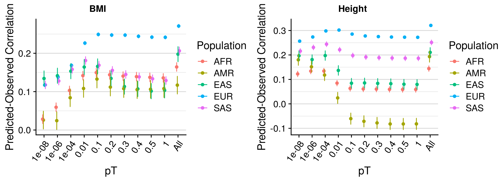
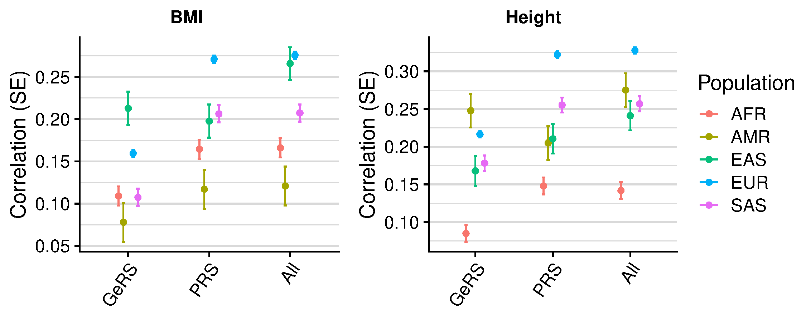
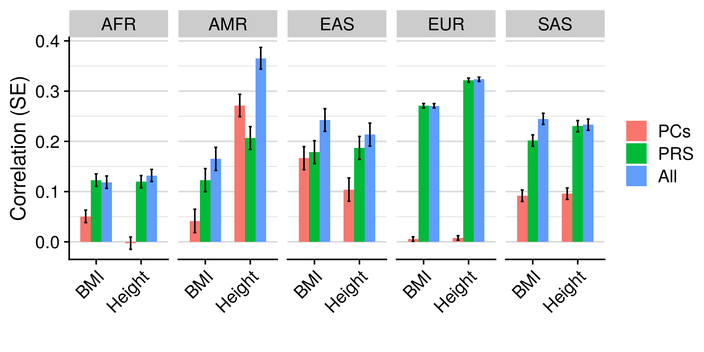
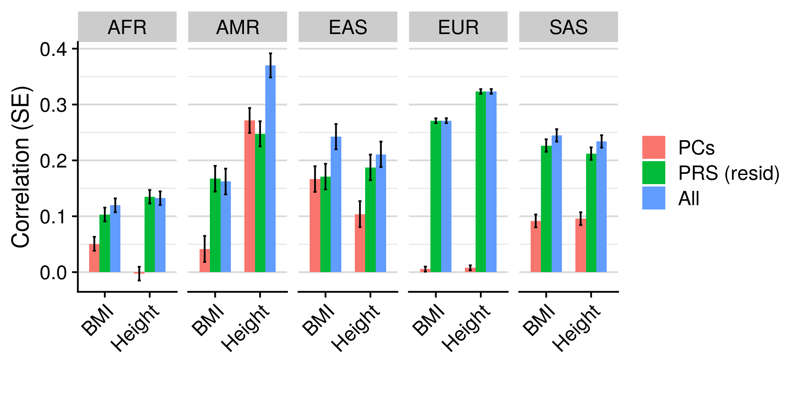

```{r setup, include=FALSE}
knitr::opts_chunk$set(echo = TRUE)
```

<style>
p.caption {
  font-size: 1.5em;
}
</style>

```{css, echo=F}
pre code, pre, code {
  white-space: pre !important;
  overflow-x: scroll !important;
  word-break: keep-all !important;
  word-wrap: initial !important;
}
```

***

# Introduction

Genotype-based prediction is more accurate within European populations due to European-based GWAS being larger in sample size, and the relatively low heteroegeniety/admixture within European populations compared to some non-European populations. Apart from phenotypic heterogenity across populations, a key reason why European GWAS do not predict well in non-European populations is due to differences in LD and MAF. Although the underlying causal variant maybe the same across populations, the variant best tagging the causal variant in one population may not wel tag the causal variant in another population.

Prediction can be improved in non-European populations by:

* Performing larger GWAS in non-European populations
* Combination of European-GWAS with existing non-European GWAS
* Highlight causal genetic effects
* Modelling differences in MAF and LD between populations
* Using gene-based scores

Even within super populations, differnces in ancestry will influence the predictive utility of polygenic scores. Accounting for ancestry within the PRS model may improve prediction. Fitting main effects of PCs is one approach, which has been shown to improve prediction over PRS alone. Furthermore, including an interaction term may be beneficial, as the scale of the PRS may vary within a population for non-causal reasons.

Estimate the predictive utility of polygenic scores within each super population. UKB contains individuals within each super population.

***

# Define ancestry and QC

Global ancestry is typically defined using reference-projected genotype-based principal components. Often individuals are said to be of a population if they are within N SD of the population mean. Alternatively principal component estimates can be used in a machine learning based approach such as k-means clustering. I have used an elastic net model to predict global ancestry.

Further information can be found here: https://opain.github.io/UKB-GenoPrep/ 

***

# Using external GWAS sumstats

***

## Prepare phenotype files

<details><summary>Show code</summary>
```{R, eval=F, echo=T}
source('/users/k1806347/brc_scratch/Software/MyGit/GenoPred/config_used/Phenotype_prep.config')
library(data.table)

# Read list of individuals surviving QC in each population
# Read in fam to convert row number to application specific ID
# Row numbers in pheno file cannot be trusted
fam<-fread('/scratch/groups/ukbiobank/ukb18177_glanville/genotyped/ukb18177_glanville_binary_pre_qc.fam')
fam$V1<-seq(1:dim(fam)[1])

fam_2<-fread(paste0(UKBB_output,'/Genotype/Harmonised/UKBB.w_hm3.QCd.AllSNP.chr22.fam'))

fam_merged<-merge(fam, fam_2, by='V2')

keep<-list()
for(pop in c('EUR','AFR','SAS','EAS','AMR')){
  keep[[pop]]<-fread(paste0('/scratch/groups/ukbiobank/usr/ollie_pain/ReQC/PostQC/UKB.postQC.',pop,'.keep'))
  keep[[pop]]<-merge(keep[[pop]][,1], fam[,1:2], by='V1')
  keep[[pop]]$V1<-keep[[pop]]$V2
  
  keep_tmp<-fread(paste0('/scratch/groups/ukbiobank/usr/ollie_pain/ReQC/PostQC/UKB.postQC.',pop,'.keep'))
  keep_tmp<-merge(keep_tmp[,1], fam_merged, by.x='V1', by.y='V1.x')
  keep_tmp<-keep_tmp[,c('V1.y','V2'),with=F]

    # Save keep file with updated IDs
  write.table(keep[[pop]], paste0(UKBB_output,'/Phenotype/',pop,'.QC.keep'), col.names=F, row.names=F, quote=F)
  write.table(keep_tmp, paste0(UKBB_output,'/Phenotype/',pop,'.QC.UpdateIDs.keep'), col.names=F, row.names=F, quote=F)
}

# Read in phenotype data
pheno<-c('Depression','Intelligence','BMI','Height','T2D','CAD','IBD','MultiScler','RheuArth')
pheno_file<-c('ever_depressed_pheno_final.UpdateIDs.txt','UKBB_Fluid.intelligence.score.UpdateIDs.pheno','UKBB_BMI.score.UpdateIDs.pheno','UKBB_Height.score.UpdateIDs.pheno','t2d_only_111119.UpdateIDs.txt','cad_only_111119.UpdateIDs.txt','UKBB.IBD.txt','UKBB.MultiScler.txt','UKBB.RheuArth.txt')

pheno_list<-list()
for(i in 1:length(pheno)){
  pheno_list[[pheno[i]]]<-fread(paste0(UKBB_output,'/Phenotype/',pheno[i],'/',pheno_file[i]))
}

pheno_all<-Reduce(function(...) merge(..., all=T, by=c('FID','IID')), pheno_list)
names(pheno_all)<-c('FID','IID',pheno)

# Count number of non-missing values for phenotype in each population 
pheno_dat_per_pop<-NULL
for(pop in c('EUR','AFR','SAS','EAS','AMR')){
  pheno_all_pop<-pheno_all[(pheno_all$IID %in% keep[[pop]]$V1),]
  for(i in 1:length(pheno)){
    if(length(na.omit(unique(pheno_all[[pheno[i]]]))) == 2){
          pheno_dat_per_pop<-rbind(pheno_dat_per_pop, data.frame(Pop=pop,
                                                           Phenotype=pheno[i],
                                                           N=sum(!is.na(pheno_all_pop[[pheno[i]]])),
                                                           Ncase=sum(pheno_all_pop[[pheno[i]]] == 1, na.rm=T),
                                                           Ncon=sum(pheno_all_pop[[pheno[i]]] == 0, na.rm=T)))

    } else {
          pheno_dat_per_pop<-rbind(pheno_dat_per_pop, data.frame(Pop=pop,
                                                           Phenotype=pheno[i],
                                                           N=sum(!is.na(pheno_all_pop[[pheno[i]]])),
                                                           Ncase=NA,
                                                           Ncon=NA))

    }
  }
}

# Idenitfy phenotype with at least 1000 indidivuals and 50 cases with data
pheno_dat_per_pop_retain<-pheno_dat_per_pop[which((pheno_dat_per_pop$N >=500 & pheno_dat_per_pop$Ncase >= 50) | (pheno_dat_per_pop$N >=500 & is.na(pheno_dat_per_pop$Ncase))),]

# BMI and Height are the only phenotypes meeting these criteria. This is fine for a preliminary analysis, but other phenotypes that are more available across ancestries should be explored. Intelligence was also available in EUR, AFR, and SAS.

# Save keep file with updated IDs for each phenotype, restricting the sample size to 50K
# Read in fam file with ID to match
system(paste0('mkdir ',UKBB_output,'/DiverseAncestry/Phenotype_subsets/'))

set.seed(1)
for(pop in c('EUR','AFR','SAS','EAS','AMR')){
  for(pheno_i in c('BMI','Height')){
      pheno_all_pop<-pheno_all[(pheno_all$IID %in% keep[[pop]]$V1),c('FID','IID',pheno_i), with=F]
      pheno_all_pop<-pheno_all_pop[complete.cases(pheno_all_pop),]
      if(dim(pheno_all_pop)[1] > 50000){
        pheno_all_pop<-pheno_all_pop[sample(1:50000),]
      }
      
      write.table(pheno_all_pop[,1:2], paste0(UKBB_output,'/DiverseAncestry/Phenotype_subsets/UKB.',pheno_i,'.',pop,'.QC.keep'), col.names=F, row.names=F, quote=F)
  }
}

```
</details>

***

## Calculate scores

***

### PRS
 
<details><summary>pT + clump: Sparse</summary>
```{bash, echo=T, eval=F}
# Set required variables
. /users/k1806347/brc_scratch/Software/MyGit/GenoPred/config_used/Target_scoring.config

# Create variable listing phenotypes and corresponding GWAS
pheno=$(echo BMI Height)
gwas=$(echo BODY04 HEIG03)

# Calculate polygenic scores using 1KG reference
for i in $(seq 1 2);do
  for pop in $(echo AFR AMR EAS EUR SAS);do
    pheno_i=$(echo ${pheno} | cut -f ${i} -d ' ')
    gwas_i=$(echo ${gwas} | cut -f ${i} -d ' ')
  
    sbatch --mem 2G -p brc,shared -J pT_clump /users/k1806347/brc_scratch/Software/Rscript.sh /users/k1806347/brc_scratch/Software/MyGit/GenoPred/Scripts/Scaled_polygenic_scorer/Scaled_polygenic_scorer.R \
      --target_plink_chr ${UKBB_output}/Genotype/Harmonised/UKBB.w_hm3.QCd.AllSNP.chr \
      --target_keep ${UKBB_output}/DiverseAncestry/Phenotype_subsets/UKB.${pheno_i}.${pop}.QC.keep \
      --ref_score ${Geno_1KG_dir}/Score_files_for_polygenic/pt_clump/${gwas_i}/1KGPhase3.w_hm3.${gwas_i} \
      --ref_scale ${Geno_1KG_dir}/Score_files_for_polygenic/pt_clump/${gwas_i}/1KGPhase3.w_hm3.${gwas_i}.${pop}.scale \
      --ref_freq_chr ${Geno_1KG_dir}/freq_files/${pop}/1KGPhase3.w_hm3.${pop}.chr \
      --plink ${plink1_9} \
      --pheno_name ${gwas_i} \
      --output ${UKBB_output}/DiverseAncestry/1KG_ref/pt_clump/${pop}/${gwas_i}/UKBB.${pop}.w_hm3.${gwas_i}
  done
done

```
</details>

<details><summary>lassosum</summary>
```{bash, echo=T, eval=F}
# Set required variables
. /users/k1806347/brc_scratch/Software/MyGit/GenoPred/config_used/Target_scoring.config

# Create variable listing phenotypes and corresponding GWAS
pheno=$(echo BMI Height)
gwas=$(echo BODY04 HEIG03)

# Calculate polygenic scores using 1KG reference
for i in $(seq 1 2);do
  for pop in $(echo AFR AMR EAS EUR SAS);do
    pheno_i=$(echo ${pheno} | cut -f ${i} -d ' ')
    gwas_i=$(echo ${gwas} | cut -f ${i} -d ' ')
  
    sbatch -n 5 --mem 5G -p brc,shared /users/k1806347/brc_scratch/Software/Rscript.sh /users/k1806347/brc_scratch/Software/MyGit/GenoPred/Scripts/Scaled_polygenic_scorer_lassosum/Scaled_polygenic_scorer_lassosum.R \
      --target_plink_chr ${UKBB_output}/Genotype/Harmonised/UKBB.w_hm3.QCd.AllSNP.chr \
      --target_keep ${UKBB_output}/DiverseAncestry/Phenotype_subsets/UKB.${pheno_i}.${pop}.QC.keep \
      --ref_score ${Geno_1KG_dir}/Score_files_for_polygenic/lassosum/${gwas_i}/1KGPhase3.w_hm3.${gwas_i} \
      --ref_scale ${Geno_1KG_dir}/Score_files_for_polygenic/lassosum/${gwas_i}/1KGPhase3.w_hm3.${gwas_i}.${pop}.scale \
      --ref_freq_chr ${Geno_1KG_dir}/freq_files/${pop}/1KGPhase3.w_hm3.${pop}.chr \
      --pheno_name ${gwas_i} \
      --n_cores 5 \
      --plink ${plink1_9} \
      --output ${UKBB_output}/DiverseAncestry/1KG_ref/lassosum/${pop}/${gwas_i}/UKBB.${pop}.w_hm3.${gwas_i}
  done
done

```
</details>

<details><summary>PRScs</summary>
```{bash, echo=T, eval=F}
# Set required variables
. /users/k1806347/brc_scratch/Software/MyGit/GenoPred/config_used/Target_scoring.config

# Create variable listing phenotypes and corresponding GWAS
pheno=$(echo BMI Height)
gwas=$(echo BODY04 HEIG03)

# Calculate polygenic scores using 1KG reference
for i in $(seq 1 2);do
  for pop in $(echo AFR AMR EAS EUR SAS);do
    pheno_i=$(echo ${pheno} | cut -f ${i} -d ' ')
    gwas_i=$(echo ${gwas} | cut -f ${i} -d ' ')
  
    sbatch -n 1 --mem 5G -p brc,shared /users/k1806347/brc_scratch/Software/Rscript.sh /users/k1806347/brc_scratch/Software/MyGit/GenoPred/Scripts/Scaled_polygenic_scorer_PRScs/Scaled_polygenic_scorer_PRScs.R \
      --target_plink_chr ${UKBB_output}/Genotype/Harmonised/UKBB.w_hm3.QCd.AllSNP.chr \
      --target_keep ${UKBB_output}/DiverseAncestry/Phenotype_subsets/UKB.${pheno_i}.${pop}.QC.keep \
    --ref_score ${Geno_1KG_dir}/Score_files_for_polygenic/PRScs/${gwas_i}/1KGPhase3.w_hm3.${gwas_i} \
    --ref_scale ${Geno_1KG_dir}/Score_files_for_polygenic/PRScs/${gwas_i}/1KGPhase3.w_hm3.${gwas_i}.${pop}.scale \
      --ref_freq_chr ${Geno_1KG_dir}/freq_files/${pop}/1KGPhase3.w_hm3.${pop}.chr \
      --pheno_name ${gwas_i} \
      --plink ${plink1_9} \
      --output ${UKBB_output}/DiverseAncestry/1KG_ref/PRScs/${pop}/${gwas_i}/UKBB.${pop}.w_hm3.${gwas_i}
  done
done

```
</details>

<details><summary>SBLUP</summary>
```{bash, echo=T, eval=F}
# Set required variables
. /users/k1806347/brc_scratch/Software/MyGit/GenoPred/config_used/Target_scoring.config

# Create variable listing phenotypes and corresponding GWAS
pheno=$(echo BMI Height)
gwas=$(echo BODY04 HEIG03)

# Calculate polygenic scores using 1KG reference
for i in $(seq 1 2);do
  for pop in $(echo AFR AMR EAS EUR SAS);do
    pheno_i=$(echo ${pheno} | cut -f ${i} -d ' ')
    gwas_i=$(echo ${gwas} | cut -f ${i} -d ' ')
  
    sbatch -n 1 --mem 5G -p brc,shared /users/k1806347/brc_scratch/Software/Rscript.sh /users/k1806347/brc_scratch/Software/MyGit/GenoPred/Scripts/Scaled_polygenic_scorer_SBLUP/Scaled_polygenic_scorer_SBLUP.R \
      --target_plink_chr ${UKBB_output}/Genotype/Harmonised/UKBB.w_hm3.QCd.AllSNP.chr \
      --target_keep ${UKBB_output}/DiverseAncestry/Phenotype_subsets/UKB.${pheno_i}.${pop}.QC.keep \
    --ref_score ${Geno_1KG_dir}/Score_files_for_polygenic/SBLUP/${gwas_i}/GWAS_sumstats_SBLUP.sblup.cojo \
    --ref_scale ${Geno_1KG_dir}/Score_files_for_polygenic/SBLUP/${gwas_i}/1KGPhase3.w_hm3.${gwas_i}.${pop}.scale \
      --ref_freq_chr ${Geno_1KG_dir}/freq_files/${pop}/1KGPhase3.w_hm3.${pop}.chr \
      --pheno_name ${gwas_i} \
      --plink ${plink1_9} \
      --output ${UKBB_output}/DiverseAncestry/1KG_ref/SBLUP/${pop}/${gwas_i}/UKBB.${pop}.w_hm3.${gwas_i}
  done
done

```
</details>

<details><summary>SBayesR</summary>
```{bash, echo=T, eval=F}
# Set required variables
. /users/k1806347/brc_scratch/Software/MyGit/GenoPred/config_used/Target_scoring.config

# Create variable listing phenotypes and corresponding GWAS
pheno=$(echo BMI Height)
gwas=$(echo BODY04 HEIG03)

# Calculate polygenic scores using 1KG reference
for i in $(seq 1 2);do
  for pop in $(echo AFR AMR EAS EUR SAS);do
    pheno_i=$(echo ${pheno} | cut -f ${i} -d ' ')
    gwas_i=$(echo ${gwas} | cut -f ${i} -d ' ')
  
    sbatch -n 1 --mem 5G -p brc,shared /users/k1806347/brc_scratch/Software/Rscript.sh /users/k1806347/brc_scratch/Software/MyGit/GenoPred/Scripts/Scaled_polygenic_scorer_SBayesR/Scaled_polygenic_scorer_SBayesR.R \
 \
      --target_plink_chr ${UKBB_output}/Genotype/Harmonised/UKBB.w_hm3.QCd.AllSNP.chr \
      --target_keep ${UKBB_output}/DiverseAncestry/Phenotype_subsets/UKB.${pheno_i}.${pop}.QC.keep \
      --ref_score ${Geno_1KG_dir}/Score_files_for_polygenic/SBayesR/${gwas_i}_GCTB_203_robust/GWAS_sumstats_SBayesR.GW.snpRes \
      --ref_scale ${Geno_1KG_dir}/Score_files_for_polygenic/SBayesR/${gwas_i}_GCTB_203_robust/1KGPhase3.w_hm3.${gwas_i}.${pop}.scale \
      --ref_freq_chr ${Geno_1KG_dir}/freq_files/${pop}/1KGPhase3.w_hm3.${pop}.chr \
      --pheno_name ${gwas_i} \
      --plink ${plink1_9} \
      --output ${UKBB_output}/DiverseAncestry/1KG_ref/SBayesR/${pop}/${gwas_i}/UKBB.${pop}.w_hm3.${gwas_i}
      
  done
done
```
</details>

<details><summary>LDPred</summary>
```{bash, echo=T, eval=F}
# Set required variables
. /users/k1806347/brc_scratch/Software/MyGit/GenoPred/config_used/Target_scoring.config

# Create variable listing phenotypes and corresponding GWAS
pheno=$(echo BMI Height)
gwas=$(echo BODY04 HEIG03)

# Calculate polygenic scores using 1KG reference
for i in $(seq 1 2);do
  for pop in $(echo AFR AMR EAS EUR SAS);do
    pheno_i=$(echo ${pheno} | cut -f ${i} -d ' ')
    gwas_i=$(echo ${gwas} | cut -f ${i} -d ' ')
  
    sbatch -n 1 --mem 5G -p brc,shared /users/k1806347/brc_scratch/Software/Rscript.sh /users/k1806347/brc_scratch/Software/MyGit/GenoPred/Scripts/Scaled_polygenic_scorer_LDPred/Scaled_polygenic_scorer_LDPred.R \
      --target_plink_chr ${UKBB_output}/Genotype/Harmonised/UKBB.w_hm3.QCd.AllSNP.chr \
      --target_keep ${UKBB_output}/DiverseAncestry/Phenotype_subsets/UKB.${pheno_i}.${pop}.QC.keep \
      --ref_score ${Geno_1KG_dir}/Score_files_for_polygenic/LDPred/${gwas_i}/1KGPhase3.w_hm3.${gwas_i} \
      --ref_scale ${Geno_1KG_dir}/Score_files_for_polygenic/LDPred/${gwas_i}/1KGPhase3.w_hm3.${gwas_i}.${pop}.scale \
      --ref_freq_chr ${Geno_1KG_dir}/freq_files/${pop}/1KGPhase3.w_hm3.${pop}.chr \
      --pheno_name ${gwas_i} \
      --plink ${plink1_9} \
      --output ${UKBB_output}/DiverseAncestry/1KG_ref/LDPred/${pop}/${gwas_i}/UKBB.${pop}.w_hm3.${gwas_i}
  done
done

```
</details>

<details><summary>LDPred2</summary>
```{bash, echo=T, eval=F}
# Set required variables
. /users/k1806347/brc_scratch/Software/MyGit/GenoPred/config_used/Target_scoring.config

# Create variable listing phenotypes and corresponding GWAS
pheno=$(echo BMI Height)
gwas=$(echo BODY04 HEIG03)

# Calculate polygenic scores using 1KG reference
for i in $(seq 1 2);do
  for pop in $(echo AFR AMR EAS EUR SAS);do
    pheno_i=$(echo ${pheno} | cut -f ${i} -d ' ')
    gwas_i=$(echo ${gwas} | cut -f ${i} -d ' ')
  
    sbatch -n 6 --mem 10G -p brc,shared /users/k1806347/brc_scratch/Software/Rscript.sh /users/k1806347/brc_scratch/Software/MyGit/GenoPred/Scripts/Scaled_polygenic_scorer_LDPred2/Scaled_polygenic_scorer_LDPred2.R \
      --target_plink_chr ${UKBB_output}/Genotype/Harmonised/UKBB.w_hm3.QCd.AllSNP.chr \
      --target_keep ${UKBB_output}/DiverseAncestry/Phenotype_subsets/UKB.${pheno_i}.${pop}.QC.keep \
      --ref_score ${Geno_1KG_dir}/Score_files_for_polygenic/LDPred2/${gwas_i}/1KGPhase3.w_hm3.${gwas_i} \
      --ref_scale ${Geno_1KG_dir}/Score_files_for_polygenic/LDPred2/${gwas_i}/1KGPhase3.w_hm3.${gwas_i}.${pop}.scale \
      --ref_freq_chr ${Geno_1KG_dir}/freq_files/${pop}/1KGPhase3.w_hm3.${pop}.chr \
      --pheno_name ${gwas_i} \
      --n_cores 6 \
      --plink ${plink1_9} \
      --output ${UKBB_output}/DiverseAncestry/1KG_ref/LDPred2/${pop}/${gwas_i}/UKBB.${pop}.w_hm3.${gwas_i}
  done
done

```
</details>

<details><summary>DBSLMM</summary>
```{bash, echo=T, eval=F}
# Set required variables
. /users/k1806347/brc_scratch/Software/MyGit/GenoPred/config_used/Target_scoring.config

# Create variable listing phenotypes and corresponding GWAS
pheno=$(echo BMI Height)
gwas=$(echo BODY04 HEIG03)

# Calculate polygenic scores using 1KG reference
for i in $(seq 1 2);do
  for pop in $(echo AFR AMR EAS EUR SAS);do
    pheno_i=$(echo ${pheno} | cut -f ${i} -d ' ')
    gwas_i=$(echo ${gwas} | cut -f ${i} -d ' ')
  
    sbatch --mem 10G -p brc,shared /users/k1806347/brc_scratch/Software/Rscript.sh /users/k1806347/brc_scratch/Software/MyGit/GenoPred/Scripts/Scaled_polygenic_scorer_DBSLMM/Scaled_polygenic_scorer_DBSLMM.R \
      --target_plink_chr ${UKBB_output}/Genotype/Harmonised/UKBB.w_hm3.QCd.AllSNP.chr \
      --target_keep ${UKBB_output}/DiverseAncestry/Phenotype_subsets/UKB.${pheno_i}.${pop}.QC.keep \
      --ref_score ${Geno_1KG_dir}/Score_files_for_polygenic/DBSLMM/${gwas_i}/1KGPhase3.w_hm3.${gwas_i}.dbslmm.GW.txt \
      --ref_scale ${Geno_1KG_dir}/Score_files_for_polygenic/DBSLMM/${gwas_i}/1KGPhase3.w_hm3.${gwas_i}.${pop}.scale \
      --ref_freq_chr ${Geno_1KG_dir}/freq_files/${pop}/1KGPhase3.w_hm3.${pop}.chr \
      --pheno_name ${gwas_i} \
      --plink ${plink1_9} \
      --output ${UKBB_output}/DiverseAncestry/1KG_ref/DBSLMM/${pop}/${gwas_i}/UKBB.${pop}.w_hm3.${gwas_i}
  done
done

```
</details>

***

### GeRS

<details><summary>GeRS</summary>
```{bash, echo=T, eval=F}
. /users/k1806347/brc_scratch/Software/MyGit/GenoPred/config_used/Target_scoring.config

# Create variable listing phenotypes and corresponding GWAS
pheno=$(echo BMI Height)
gwas=$(echo BODY04 HEIG03)

# Calculate polygenic scores using 1KG reference
for pop in $(echo AFR AMR EAS EUR SAS);do
  mkdir -p ${UKBB_output}/GeRS_for_diversity/1KG_ref/${pop}
  > ${UKBB_output}/GeRS_for_diversity/1KG_ref/${pop}/todo.txt
  for i in $(seq 1 2);do
    pheno_i=$(echo ${pheno} | cut -f ${i} -d ' ')
    gwas_i=$(echo ${gwas} | cut -f ${i} -d ' ')
    
    for weights in $(cat ~/brc_scratch/Data/TWAS_sumstats/FUSION/snp_weight_list.txt);do
      if [ ! -f ${UKBB_output}/GeRS_for_diversity/1KG_ref/${pop}/${weights}/UKBB.w_hm3.EUR.${weights}.${gwas_i}.fiprofile ]; then
        echo $gwas_i $pheno_i $weights >> ${UKBB_output}/GeRS_for_diversity/1KG_ref/${pop}/todo.txt
      fi
    done
  done
cat <<EOF >${UKBB_output}/GeRS_for_diversity/1KG_ref/${pop}/todo_array.sh
#!/bin/bash
#SBATCH -p shared,brc
#SBATCH --mem 10G
#SBATCH -n 1

. /users/k1806347/brc_scratch/Software/MyGit/GenoPred/config_used/Target_scoring.config

gwas=\$(awk -v var=\${SLURM_ARRAY_TASK_ID} 'NR == var {print \$1}' ${UKBB_output}/GeRS_for_diversity/1KG_ref/${pop}/todo.txt)
pheno=\$(awk -v var=\${SLURM_ARRAY_TASK_ID} 'NR == var {print \$2}' ${UKBB_output}/GeRS_for_diversity/1KG_ref/${pop}/todo.txt)
weights=\$(awk -v var=\${SLURM_ARRAY_TASK_ID} 'NR == var {print \$3}' ${UKBB_output}/GeRS_for_diversity/1KG_ref/${pop}/todo.txt)

/users/k1806347/brc_scratch/Software/Rscript.sh /users/k1806347/brc_scratch/Software/MyGit/GenoPred/Scripts/scaled_functionally_informed_risk_scorer/scaled_functionally_informed_risk_scorer.R \
  --targ_feature_pred ${UKBB_output}/Predicted_expression/FUSION/${pop}/\${weights}/UKBB.w_hm3.QCd.AllSNP.FUSION.\${weights}.predictions.gz \
  --target_keep ${UKBB_output}/DiverseAncestry/Phenotype_subsets/UKB.\${pheno}.${pop}.QC.keep \
  --ref_score ${Geno_1KG_dir}/Score_files_for_functionally_informed_risk_scores/\${gwas}/1KGPhase3.w_hm3.EUR.FUSION.\${gwas}.\${weights}.score \
  --ref_scale ${Geno_1KG_dir}/Score_files_for_functionally_informed_risk_scores/\${gwas}/1KGPhase3.w_hm3.EUR.FUSION.\${gwas}.\${weights}.scale \
  --pheno_name \${gwas} \
  --n_cores 1 \
  --pigz ${pigz_binary} \
  --output ${UKBB_output}/GeRS_for_diversity/1KG_ref/${pop}/\${weights}/UKBB.w_hm3.EUR.\${weights}.\${gwas}

EOF
done

for pop in $(echo AFR AMR EAS EUR SAS);do
sbatch --array=1-$(wc -l ${UKBB_output}/GeRS_for_diversity/1KG_ref/${pop}/todo.txt | cut -d ' ' -f 1)%10 ${UKBB_output}/GeRS_for_diversity/1KG_ref/${pop}/todo_array.sh
done

```
</details>

<details><summary>GeRS (coloc)</summary>
```{bash, echo=T, eval=F}
. /users/k1806347/brc_scratch/Software/MyGit/GenoPred/config_used/Target_scoring.config

# Create variable listing phenotypes and corresponding GWAS
pheno=$(echo BMI Height)
gwas=$(echo BODY04 HEIG03)

# Calculate polygenic scores using 1KG reference
for pop in $(echo AFR AMR EAS EUR SAS);do
  mkdir -p ${UKBB_output}/GeRS_for_diversity/1KG_ref_withCOLOC/${pop}
  > ${UKBB_output}/GeRS_for_diversity/1KG_ref_withCOLOC/${pop}/todo.txt
  for i in $(seq 1 2);do
    pheno_i=$(echo ${pheno} | cut -f ${i} -d ' ')
    gwas_i=$(echo ${gwas} | cut -f ${i} -d ' ')
    
    for weights in $(cat ~/brc_scratch/Data/TWAS_sumstats/FUSION/snp_weight_list.txt);do
      if [ ! -f ${UKBB_output}/GeRS_for_diversity/1KG_ref_withCOLOC/${pop}/${weights}/UKBB.w_hm3.EUR.${weights}.${gwas_i}.fiprofile ]; then
        echo $gwas_i $pheno_i $weights >> ${UKBB_output}/GeRS_for_diversity/1KG_ref_withCOLOC/${pop}/todo.txt
      fi
    done
  done
cat <<EOF >${UKBB_output}/GeRS_for_diversity/1KG_ref_withCOLOC/${pop}/todo_array.sh
#!/bin/bash
#SBATCH -p shared,brc
#SBATCH --mem 10G
#SBATCH -n 1

. /users/k1806347/brc_scratch/Software/MyGit/GenoPred/config_used/Target_scoring.config

gwas=\$(awk -v var=\${SLURM_ARRAY_TASK_ID} 'NR == var {print \$1}' ${UKBB_output}/GeRS_for_diversity/1KG_ref_withCOLOC/${pop}/todo.txt)
pheno=\$(awk -v var=\${SLURM_ARRAY_TASK_ID} 'NR == var {print \$2}' ${UKBB_output}/GeRS_for_diversity/1KG_ref_withCOLOC/${pop}/todo.txt)
weights=\$(awk -v var=\${SLURM_ARRAY_TASK_ID} 'NR == var {print \$3}' ${UKBB_output}/GeRS_for_diversity/1KG_ref_withCOLOC/${pop}/todo.txt)

/users/k1806347/brc_scratch/Software/Rscript.sh /users/k1806347/brc_scratch/Software/MyGit/GenoPred/Scripts/scaled_functionally_informed_risk_scorer/scaled_functionally_informed_risk_scorer.R \
  --targ_feature_pred ${UKBB_output}/Predicted_expression/FUSION/${pop}/\${weights}/UKBB.w_hm3.QCd.AllSNP.FUSION.\${weights}.predictions.gz \
  --target_keep ${UKBB_output}/DiverseAncestry/Phenotype_subsets/UKB.\${pheno}.${pop}.QC.keep \
  --ref_score ${Geno_1KG_dir}/Score_files_for_functionally_informed_risk_scores/\${gwas}_COLOC_PP4/1KGPhase3.w_hm3.EUR.FUSION.\${gwas}.\${weights}.score \
  --ref_scale ${Geno_1KG_dir}/Score_files_for_functionally_informed_risk_scores/\${gwas}_COLOC_PP4/1KGPhase3.w_hm3.EUR.FUSION.\${gwas}.\${weights}.scale \
  --pheno_name \${gwas} \
  --n_cores 1 \
  --pigz ${pigz_binary} \
  --output ${UKBB_output}/GeRS_for_diversity/1KG_ref_withCOLOC/${pop}/\${weights}/UKBB.w_hm3.EUR.\${weights}.\${gwas}

EOF
done

for pop in $(echo EUR AFR SAS EAS AMR);do
sbatch --array=1-$(wc -l ${UKBB_output}/GeRS_for_diversity/1KG_ref_withCOLOC/${pop}/todo.txt | cut -d ' ' -f 1)%10 ${UKBB_output}/GeRS_for_diversity/1KG_ref_withCOLOC/${pop}/todo_array.sh
done

```
</details>

Note. Some GeRS are not being calculated. Investigate why.

***

### PCs

Reference project PCs have already been calculated, as described in the 'Define ancestry...' section. We just need to update the IDs to match the genetic data.

<details><summary>PCs</summary>
```{R, echo=T, eval=F}
source('/users/k1806347/brc_scratch/Software/MyGit/GenoPred/config_used/Phenotype_prep.config')
library(data.table)

fam<-fread('/scratch/groups/ukbiobank/ukb18177_glanville/genotyped/ukb18177_glanville_binary_pre_qc.fam')
fam$V1<-seq(1:dim(fam)[1])

fam_2<-fread(paste0(UKBB_output,'/Genotype/Harmonised/UKBB.w_hm3.QCd.AllSNP.chr22.fam'))

fam_merged<-merge(fam, fam_2, by='V2')

for(pop in c('EUR','AFR','SAS','EAS','AMR')){
  PCs<-fread(paste0('/scratch/groups/ukbiobank/usr/ollie_pain/ReQC/defining_ancestry/UKBB.Ancestry.',pop,'.eigenvec'))
  PCs<-merge(PCs, fam_merged, by.x='FID', by.y='V1.x')
  PCs<-PCs[,c('V1.y','V2','PC1','PC2','PC3','PC4','PC5', 'PC6'),with=F]
  names(PCs)<-c('FID','IID','PC1','PC2','PC3','PC4','PC5', 'PC6')
  
  write.table(PCs, paste0(UKBB_output,'/DiverseAncestry/1KG_ref/PCs/UKBB.Ancestry.',pop,'.UpdateIDs.eigenvec'), col.names=T, row.names=F, quote=F)
}

```
</details>

***

## Evaluate scores

***

### pT + clump comparison

<details><summary>pT + clump comparison</summary>
```{bash, echo=T, eval=F}
##############################
# Evaluating predictive utility of pT + clump PRSs across multiple pTs individually and in combination
##############################
. /users/k1806347/brc_scratch/Software/MyGit/GenoPred/config_used/Target_scoring.config

# Make required directories
for pheno_i in $(echo BMI Height);do
mkdir -p /users/k1806347/brc_scratch/Analyses/DiverseAncestry/UKBB_outcomes_for_prediction/${pheno_i}/Association_withPRSs
done

# Create a file listing the predictors files
pheno=$(echo BMI Height)
gwas=$(echo BODY04 HEIG03)

for i in $(seq 1 2);do
pheno_i=$(echo ${pheno} | cut -f ${i} -d ' ')
gwas_i=$(echo ${gwas} | cut -f ${i} -d ' ')
for pop in $(echo AFR AMR EAS EUR SAS);do
cat > /users/k1806347/brc_scratch/Analyses/DiverseAncestry/UKBB_outcomes_for_prediction/${pheno_i}/Association_withPRSs/UKBB.${pop}.w_hm3.${gwas_i}.EUR-PRSs.predictor_groups <<EOF
predictors 
${UKBB_output}/DiverseAncestry/1KG_ref/pt_clump/${pop}/${gwas_i}/UKBB.${pop}.w_hm3.${gwas_i}.profiles
EOF
done
done

# Derive and evaluate models
pheno=$(echo BMI Height)
pheno_file=$(echo UKBB_BMI.score.UpdateIDs.pheno UKBB_Height.score.UpdateIDs.pheno)
gwas=$(echo BODY04 HEIG03)
prev=$(echo NA NA)

# pT + clump (sparse)
for i in $(seq 1 2);do
  pheno_i=$(echo ${pheno} | cut -f ${i} -d ' ')
  pheno_file_i=$(echo ${pheno_file} | cut -f ${i} -d ' ')
  gwas_i=$(echo ${gwas} | cut -f ${i} -d ' ')
  prev_i=$(echo ${prev} | cut -f ${i} -d ' ')

  for pop in $(echo AFR AMR EAS EUR SAS);do
  sbatch --mem 10G -n 1 -p brc,shared /users/k1806347/brc_scratch/Software/Rscript.sh /users/k1806347/brc_scratch/Software/MyGit/GenoPred/Scripts/Model_builder/Model_builder_V2_nested.R \
      --pheno ${UKBB_output}/Phenotype/${pheno_i}/${pheno_file_i} \
      --out /users/k1806347/brc_scratch/Analyses/DiverseAncestry/UKBB_outcomes_for_prediction/${pheno_i}/Association_withPRSs/UKBB.${pop}.w_hm3.${gwas_i}.EUR-PRSs \
      --n_core 1 \
      --compare_predictors T \
      --assoc T \
      --outcome_pop_prev ${prev_i} \
      --predictors /users/k1806347/brc_scratch/Analyses/DiverseAncestry/UKBB_outcomes_for_prediction/${pheno_i}/Association_withPRSs/UKBB.${pop}.w_hm3.${gwas_i}.EUR-PRSs.predictor_groups
  done
done

```
</details>

***

### Comparison of PRS methods

<details><summary>Comparison of PRS methods</summary>
```{R, eval=F, echo=T}
##############################
# Evaluating predictive utility of pT + clump PRSs across multiple pTs individually and in combination
##############################
. /users/k1806347/brc_scratch/Software/MyGit/GenoPred/config_used/Target_scoring.config

# Make required directories
for pheno_i in $(echo BMI Height);do
mkdir -p /users/k1806347/brc_scratch/Analyses/DiverseAncestry/UKBB_outcomes_for_prediction/${pheno_i}/Association_withPRSs
done

# Create a file listing the predictors files
pheno=$(echo BMI Height)
gwas=$(echo BODY04 HEIG03)

for i in $(seq 1 2);do
pheno_i=$(echo ${pheno} | cut -f ${i} -d ' ')
gwas_i=$(echo ${gwas} | cut -f ${i} -d ' ')
for pop in $(echo AFR AMR EAS EUR SAS);do
cat > /users/k1806347/brc_scratch/Analyses/DiverseAncestry/UKBB_outcomes_for_prediction/${pheno_i}/Association_withPRSs/UKBB.${pop}.w_hm3.${gwas_i}.EUR-PRSs.AllMethodComp.predictor_groups <<EOF
predictors group
${UKBB_output}/DiverseAncestry/1KG_ref/pt_clump/${pop}/${gwas_i}/UKBB.${pop}.w_hm3.${gwas_i}.profiles pt_clump
${UKBB_output}/DiverseAncestry/1KG_ref/lassosum/${pop}/${gwas_i}/UKBB.${pop}.w_hm3.${gwas_i}.lassosum_profiles lassosum
${UKBB_output}/DiverseAncestry/1KG_ref/PRScs/${pop}/${gwas_i}/UKBB.${pop}.w_hm3.${gwas_i}.PRScs_profiles PRScs
${UKBB_output}/DiverseAncestry/1KG_ref/SBLUP/${pop}/${gwas_i}/UKBB.${pop}.w_hm3.${gwas_i}.SBLUP_profiles SBLUP
${UKBB_output}/DiverseAncestry/1KG_ref/SBayesR/${pop}/${gwas_i}/UKBB.${pop}.w_hm3.${gwas_i}.SBayesR_profiles SBayesR
${UKBB_output}/DiverseAncestry/1KG_ref/LDPred/${pop}/${gwas_i}/UKBB.${pop}.w_hm3.${gwas_i}.LDPred_profiles LDPred
${UKBB_output}/DiverseAncestry/1KG_ref/LDPred2/${pop}/${gwas_i}/UKBB.${pop}.w_hm3.${gwas_i}.LDPred_profiles LDPred2
${UKBB_output}/DiverseAncestry/1KG_ref/DBSLMM/${pop}/${gwas_i}/UKBB.${pop}.w_hm3.${gwas_i}.DBSLMM_profiles DBSLMM
EOF
done
done

# Derive and evaluate models
pheno=$(echo BMI Height)
pheno_file=$(echo UKBB_BMI.score.UpdateIDs.pheno UKBB_Height.score.UpdateIDs.pheno)
gwas=$(echo BODY04 HEIG03)
prev=$(echo NA NA)

for i in $(seq 1 2);do
  pheno_i=$(echo ${pheno} | cut -f ${i} -d ' ')
  pheno_file_i=$(echo ${pheno_file} | cut -f ${i} -d ' ')
  gwas_i=$(echo ${gwas} | cut -f ${i} -d ' ')
  prev_i=$(echo ${prev} | cut -f ${i} -d ' ')

  for pop in $(echo AFR AMR EAS EUR SAS);do
  sbatch --mem 20G -n 1 -p brc,shared /users/k1806347/brc_scratch/Software/Rscript.sh /users/k1806347/brc_scratch/Software/MyGit/GenoPred/Scripts/Model_builder/Model_builder_V2_nested.R \
      --pheno ${UKBB_output}/Phenotype/${pheno_i}/${pheno_file_i} \
      --out /users/k1806347/brc_scratch/Analyses/DiverseAncestry/UKBB_outcomes_for_prediction/${pheno_i}/Association_withPRSs/UKBB.${pop}.w_hm3.${gwas_i}.EUR-PRSs.AllMethodComp \
      --n_core 1 \
      --compare_predictors T \
      --assoc T \
      --outcome_pop_prev ${prev_i} \
      --predictors /users/k1806347/brc_scratch/Analyses/DiverseAncestry/UKBB_outcomes_for_prediction/${pheno_i}/Association_withPRSs/UKBB.${pop}.w_hm3.${gwas_i}.EUR-PRSs.AllMethodComp.predictor_groups
  done
done

# Note. The nested cross validation model builder is not ideal when there are multiple parameters for each method. Previously we have identifying the best single parameter in the training sample, and then testing it out of sample. With nested cross validation, we are selecting the best pT based on results out of sample. Probably doesn't make a big diffrence, but will lead to slight inflation of R2 of single parameters PRS. I like using the full sample though, so I could add an option select best predictor within each group, rather than nested cross validate single predictors which is quite pointless. Leave as is for now.

```
</details>

***

### GeRS + PRS

<details><summary>GeRS + PRS</summary>
```{bash, echo=T, eval=F}
##############################
# Evaluating predictive utility of GeRS and PRS individually and in combination
##############################
. /users/k1806347/brc_scratch/Software/MyGit/GenoPred/config_used/Target_scoring.config

# Make required directories
for pheno_i in $(echo BMI Height);do
mkdir -p /users/k1806347/brc_scratch/Analyses/DiverseAncestry/UKBB_outcomes_for_prediction/${pheno_i}/Association_withPRS_and_GeRSs
done

# Create a file listing the predictors files
pheno=$(echo BMI Height)
gwas=$(echo BODY04 HEIG03)
weights=$(cat ${TWAS_rep}/snp_weight_list.txt)

for i in $(seq 1 2);do
  for pop in $(echo AFR AMR EAS EUR SAS);do
    pheno_i=$(echo ${pheno} | cut -f ${i} -d ' ')
    gwas_i=$(echo ${gwas} | cut -f ${i} -d ' ')
    
    echo "predictors group" > /users/k1806347/brc_scratch/Analyses/DiverseAncestry/UKBB_outcomes_for_prediction/${pheno_i}/Association_withPRS_and_GeRSs/UKBB.w_hm3.AllTissue.${gwas_i}.${pop}-GeRSs.${pop}-PRSs.pt_clump.predictor_groups
  
    for weight in ${weights}; do
      if [ -f ${UKBB_output}/GeRS_for_diversity/1KG_ref/${pop}/${weight}/UKBB.w_hm3.EUR.${weight}.${gwas_i}.fiprofile ]; then
        echo ${UKBB_output}/GeRS_for_diversity/1KG_ref/${pop}/${weight}/UKBB.w_hm3.EUR.${weight}.${gwas_i}.fiprofile GeRS >> /users/k1806347/brc_scratch/Analyses/DiverseAncestry/UKBB_outcomes_for_prediction/${pheno_i}/Association_withPRS_and_GeRSs/UKBB.w_hm3.AllTissue.${gwas_i}.${pop}-GeRSs.${pop}-PRSs.pt_clump.predictor_groups
      fi
    done
  
      echo ${UKBB_output}/DiverseAncestry/1KG_ref/pt_clump/${pop}/${gwas_i}/UKBB.${pop}.w_hm3.${gwas_i}.profiles PRS >> /users/k1806347/brc_scratch/Analyses/DiverseAncestry/UKBB_outcomes_for_prediction/${pheno_i}/Association_withPRS_and_GeRSs/UKBB.w_hm3.AllTissue.${gwas_i}.${pop}-GeRSs.${pop}-PRSs.pt_clump.predictor_groups
  done
done

# Derive and evaluate models
pheno=$(echo BMI Height)
pheno_file=$(echo UKBB_BMI.score.UpdateIDs.pheno UKBB_Height.score.UpdateIDs.pheno)
gwas=$(echo BODY04 HEIG03)
prev=$(echo NA NA)

# 1KG reference
for i in $(seq 1 2);do
  pheno_i=$(echo ${pheno} | cut -f ${i} -d ' ')
  pheno_file_i=$(echo ${pheno_file} | cut -f ${i} -d ' ')
  gwas_i=$(echo ${gwas} | cut -f ${i} -d ' ')
  prev_i=$(echo ${prev} | cut -f ${i} -d ' ')

  for pop in $(echo AFR AMR EAS EUR SAS);do
sbatch --mem 10G -n 1 -p brc,shared /users/k1806347/brc_scratch/Software/Rscript.sh /users/k1806347/brc_scratch/Software/MyGit/GenoPred/Scripts/Model_builder/Model_builder_V2_nested.R \
    --pheno ${UKBB_output}/Phenotype/${pheno_i}/${pheno_file_i} \
    --out /users/k1806347/brc_scratch/Analyses/DiverseAncestry/UKBB_outcomes_for_prediction/${pheno_i}/Association_withPRS_and_GeRSs/UKBB.w_hm3.AllTissue.${gwas_i}.${pop}-GeRSs.${pop}-PRSs.pt_clump \
    --n_core 1 \
    --compare_predictors F \
    --assoc T \
    --outcome_pop_prev ${prev_i} \
    --predictors /users/k1806347/brc_scratch/Analyses/DiverseAncestry/UKBB_outcomes_for_prediction/${pheno_i}/Association_withPRS_and_GeRSs/UKBB.w_hm3.AllTissue.${gwas_i}.${pop}-GeRSs.${pop}-PRSs.pt_clump.predictor_groups
done
done

```
</details>

***

### GeRS (coloc) + PRS

<details><summary>GeRS (coloc) + PRS</summary>
```{bash, echo=T, eval=F}
##############################
# Evaluating predictive utility of GeRS and PRS individually and in combination
##############################
. /users/k1806347/brc_scratch/Software/MyGit/GenoPred/config_used/Target_scoring.config

# Make required directories
for pheno_i in $(echo BMI Height);do
mkdir -p /users/k1806347/brc_scratch/Analyses/DiverseAncestry/UKBB_outcomes_for_prediction/${pheno_i}/Association_withPRS_and_GeRSs
done

# Create a file listing the predictors files
pheno=$(echo BMI Height)
gwas=$(echo BODY04 HEIG03)
weights=$(cat ${TWAS_rep}/snp_weight_list.txt)

for i in $(seq 1 2);do
  for pop in $(echo EUR EAS AMR SAS AFR);do
    pheno_i=$(echo ${pheno} | cut -f ${i} -d ' ')
    gwas_i=$(echo ${gwas} | cut -f ${i} -d ' ')
    
    echo "predictors group" > /users/k1806347/brc_scratch/Analyses/DiverseAncestry/UKBB_outcomes_for_prediction/${pheno_i}/Association_withPRS_and_GeRSs/UKBB.w_hm3.AllTissue.${gwas_i}.${pop}-GeRSs_coloc.${pop}-PRSs.pt_clump.predictor_groups
  
    for weight in ${weights}; do
      if [ -f ${UKBB_output}/GeRS_for_diversity/1KG_ref_withCOLOC/${pop}/${weight}/UKBB.w_hm3.EUR.${weight}.${gwas_i}.fiprofile ]; then
        echo ${UKBB_output}/GeRS_for_diversity/1KG_ref_withCOLOC/${pop}/${weight}/UKBB.w_hm3.EUR.${weight}.${gwas_i}.fiprofile GeRS >> /users/k1806347/brc_scratch/Analyses/DiverseAncestry/UKBB_outcomes_for_prediction/${pheno_i}/Association_withPRS_and_GeRSs/UKBB.w_hm3.AllTissue.${gwas_i}.${pop}-GeRSs_coloc.${pop}-PRSs.pt_clump.predictor_groups
      fi
    done
  
      echo ${UKBB_output}/DiverseAncestry/1KG_ref/pt_clump/${pop}/${gwas_i}/UKBB.${pop}.w_hm3.${gwas_i}.profiles PRS >> /users/k1806347/brc_scratch/Analyses/DiverseAncestry/UKBB_outcomes_for_prediction/${pheno_i}/Association_withPRS_and_GeRSs/UKBB.w_hm3.AllTissue.${gwas_i}.${pop}-GeRSs_coloc.${pop}-PRSs.pt_clump.predictor_groups
  done
done

# Derive and evaluate models
pheno=$(echo BMI Height)
pheno_file=$(echo UKBB_BMI.score.UpdateIDs.pheno UKBB_Height.score.UpdateIDs.pheno)
gwas=$(echo BODY04 HEIG03)
prev=$(echo NA NA)

# 1KG reference
for i in $(seq 1 2);do
  pheno_i=$(echo ${pheno} | cut -f ${i} -d ' ')
  pheno_file_i=$(echo ${pheno_file} | cut -f ${i} -d ' ')
  gwas_i=$(echo ${gwas} | cut -f ${i} -d ' ')
  prev_i=$(echo ${prev} | cut -f ${i} -d ' ')

  for pop in $(echo AFR AMR EAS EUR SAS);do
sbatch --mem 10G -n 1 -p brc,shared /users/k1806347/brc_scratch/Software/Rscript.sh /users/k1806347/brc_scratch/Software/MyGit/GenoPred/Scripts/Model_builder/Model_builder_V2_nested.R \
    --pheno ${UKBB_output}/Phenotype/${pheno_i}/${pheno_file_i} \
    --out /users/k1806347/brc_scratch/Analyses/DiverseAncestry/UKBB_outcomes_for_prediction/${pheno_i}/Association_withPRS_and_GeRSs/UKBB.w_hm3.AllTissue.${gwas_i}.${pop}-GeRSs_coloc.${pop}-PRSs.pt_clump \
    --n_core 1 \
    --compare_predictors F \
    --assoc T \
    --outcome_pop_prev ${prev_i} \
    --predictors /users/k1806347/brc_scratch/Analyses/DiverseAncestry/UKBB_outcomes_for_prediction/${pheno_i}/Association_withPRS_and_GeRSs/UKBB.w_hm3.AllTissue.${gwas_i}.${pop}-GeRSs_coloc.${pop}-PRSs.pt_clump.predictor_groups
done
done

```
</details>

***

### PCs

<details><summary>PCs</summary>
```{bash, echo=T, eval=F}
##############################
# Evaluating predictive utility of PCs in combination with PRS
##############################

. /users/k1806347/brc_scratch/Software/MyGit/GenoPred/config_used/Target_scoring.config

# Make required directories
for pheno_i in $(echo BMI Height);do
mkdir -p /users/k1806347/brc_scratch/Analyses/DiverseAncestry/UKBB_outcomes_for_prediction/${pheno_i}/Association_withPRS_and_PCs
done

# Create a file listing the predictors files
pheno=$(echo BMI Height)
gwas=$(echo BODY04 HEIG03)

for i in $(seq 1 2);do
  for pop in $(echo EUR EAS AMR SAS AFR);do
    pheno_i=$(echo ${pheno} | cut -f ${i} -d ' ')
    gwas_i=$(echo ${gwas} | cut -f ${i} -d ' ')
    
    echo "predictors group" > /users/k1806347/brc_scratch/Analyses/DiverseAncestry/UKBB_outcomes_for_prediction/${pheno_i}/Association_withPRS_and_PCs/UKBB.w_hm3.${gwas_i}.${pop}-PCs-PRSs.pt_clump.predictor_groups
  
    echo ${UKBB_output}/DiverseAncestry/1KG_ref/PCs/UKBB.Ancestry.${pop}.UpdateIDs.eigenvec PCs >> /users/k1806347/brc_scratch/Analyses/DiverseAncestry/UKBB_outcomes_for_prediction/${pheno_i}/Association_withPRS_and_PCs/UKBB.w_hm3.${gwas_i}.${pop}-PCs-PRSs.pt_clump.predictor_groups

    echo ${UKBB_output}/DiverseAncestry/1KG_ref/pt_clump/${pop}/${gwas_i}/UKBB.${pop}.w_hm3.${gwas_i}.profiles PRS >> /users/k1806347/brc_scratch/Analyses/DiverseAncestry/UKBB_outcomes_for_prediction/${pheno_i}/Association_withPRS_and_PCs/UKBB.w_hm3.${gwas_i}.${pop}-PCs-PRSs.pt_clump.predictor_groups

  done
done

# Derive and evaluate models
pheno=$(echo BMI Height)
pheno_file=$(echo UKBB_BMI.score.UpdateIDs.pheno UKBB_Height.score.UpdateIDs.pheno)
gwas=$(echo BODY04 HEIG03)
prev=$(echo NA NA)

# 1KG reference
for i in $(seq 1 2);do
  pheno_i=$(echo ${pheno} | cut -f ${i} -d ' ')
  pheno_file_i=$(echo ${pheno_file} | cut -f ${i} -d ' ')
  gwas_i=$(echo ${gwas} | cut -f ${i} -d ' ')
  prev_i=$(echo ${prev} | cut -f ${i} -d ' ')

  for pop in $(echo AFR AMR EAS EUR SAS);do
sbatch --mem 10G -n 1 -p brc,shared /users/k1806347/brc_scratch/Software/Rscript.sh /users/k1806347/brc_scratch/Software/MyGit/GenoPred/Scripts/Model_builder/Model_builder_V2_nested.R \
    --pheno ${UKBB_output}/Phenotype/${pheno_i}/${pheno_file_i} \
    --out /users/k1806347/brc_scratch/Analyses/DiverseAncestry/UKBB_outcomes_for_prediction/${pheno_i}/Association_withPRS_and_PCs/UKBB.w_hm3.${gwas_i}.${pop}-PCs-PRSs.pt_clump \
    --n_core 1 \
    --compare_predictors F \
    --assoc T \
    --outcome_pop_prev ${prev_i} \
    --predictors /users/k1806347/brc_scratch/Analyses/DiverseAncestry/UKBB_outcomes_for_prediction/${pheno_i}/Association_withPRS_and_PCs/UKBB.w_hm3.${gwas_i}.${pop}-PCs-PRSs.pt_clump.predictor_groups
done
done

```
</details>

***

### PCs with interactions

<details><summary>PCs with interactions</summary>

Rather than modifying the model builder script. Calculate PRS and PC interactions in advance.

```{R, eval=F, echo=T}
source('/users/k1806347/brc_scratch/Software/MyGit/GenoPred/config_used/Target_scoring.config')

dir.create(paste0(UKBB_output,'/DiverseAncestry/1KG_ref/PC_PRS_int'))

for(gwas in c('BODY04','HEIG03')){
for(pop in c('EUR','AFR','SAS','EAS','AMR')){
  # Read in prs and PC data
  pcs<-fread(paste0(UKBB_output,'/DiverseAncestry/1KG_ref/PCs/UKBB.Ancestry.',pop,'.UpdateIDs.eigenvec'))
  prs<-fread(paste0(UKBB_output,'/DiverseAncestry/1KG_ref/pt_clump/',pop,'/',gwas,'/UKBB.',pop,'.w_hm3.',gwas,'.profiles'))
  names(prs)[-1:-2]<-paste0('PRS',1:(dim(prs)[2]-2))
  both<-merge(prs, pcs, by=c('FID','IID'))
  
  interaction_list<-NULL
  for(i in names(pcs[,-1:-2])){
    interaction_list<-rbind(interaction_list, data.frame(x1=i, x2=names(prs[,-1:-2])))
  }
  interaction_list$x1<-as.character(interaction_list$x1)
  interaction_list$x2<-as.character(interaction_list$x2)
  
  int_dat<-NULL
  for(i in 1:dim(interaction_list)[1]){
    tmp<-as.numeric(scale(both[[interaction_list$x1[i]]]*both[[interaction_list$x2[i]]]))
    int_dat<-data.frame(cbind(int_dat, tmp))
    names(int_dat)[i]<-paste0(interaction_list$x1[i],'_',interaction_list$x2[i])
  }
  
  int_dat<-cbind(both[,1:2],int_dat)
  
  fwrite(int_dat, paste0(UKBB_output,'/DiverseAncestry/1KG_ref/PC_PRS_int/UKBB.',gwas,'.',pop,'.prs_pc_interactions.txt'), quote=F, na='NA', sep=' ')
}
}
  
```

```{bash, echo=T, eval=F}
##############################
# Evaluating predictive utility of PCs in combination with PRS
##############################

. /users/k1806347/brc_scratch/Software/MyGit/GenoPred/config_used/Target_scoring.config

# Make required directories
for pheno_i in $(echo BMI Height);do
mkdir -p /users/k1806347/brc_scratch/Analyses/DiverseAncestry/UKBB_outcomes_for_prediction/${pheno_i}/Association_withPRS_and_PCs
done

# Create a file listing the predictors files
pheno=$(echo BMI Height)
gwas=$(echo BODY04 HEIG03)

for i in $(seq 1 2);do
  for pop in $(echo EUR EAS AMR SAS AFR);do
    pheno_i=$(echo ${pheno} | cut -f ${i} -d ' ')
    gwas_i=$(echo ${gwas} | cut -f ${i} -d ' ')
    
    echo "predictors group" > /users/k1806347/brc_scratch/Analyses/DiverseAncestry/UKBB_outcomes_for_prediction/${pheno_i}/Association_withPRS_and_PCs/UKBB.w_hm3.${gwas_i}.${pop}-PCs-PRSs.pt_clump-interactions.predictor_groups
  
    echo ${UKBB_output}/DiverseAncestry/1KG_ref/PCs/UKBB.Ancestry.${pop}.UpdateIDs.eigenvec main >> /users/k1806347/brc_scratch/Analyses/DiverseAncestry/UKBB_outcomes_for_prediction/${pheno_i}/Association_withPRS_and_PCs/UKBB.w_hm3.${gwas_i}.${pop}-PCs-PRSs.pt_clump-interactions.predictor_groups

    echo ${UKBB_output}/DiverseAncestry/1KG_ref/pt_clump/${pop}/${gwas_i}/UKBB.${pop}.w_hm3.${gwas_i}.profiles main >> /users/k1806347/brc_scratch/Analyses/DiverseAncestry/UKBB_outcomes_for_prediction/${pheno_i}/Association_withPRS_and_PCs/UKBB.w_hm3.${gwas_i}.${pop}-PCs-PRSs.pt_clump-interactions.predictor_groups

    echo ${UKBB_output}/DiverseAncestry/1KG_ref/PC_PRS_int/UKBB.${gwas_i}.${pop}.prs_pc_interactions.txt interaction >> /users/k1806347/brc_scratch/Analyses/DiverseAncestry/UKBB_outcomes_for_prediction/${pheno_i}/Association_withPRS_and_PCs/UKBB.w_hm3.${gwas_i}.${pop}-PCs-PRSs.pt_clump-interactions.predictor_groups

  done
done

# Derive and evaluate models
pheno=$(echo BMI Height)
pheno_file=$(echo UKBB_BMI.score.UpdateIDs.pheno UKBB_Height.score.UpdateIDs.pheno)
gwas=$(echo BODY04 HEIG03)
prev=$(echo NA NA)

# 1KG reference
for i in $(seq 1 2);do
  pheno_i=$(echo ${pheno} | cut -f ${i} -d ' ')
  pheno_file_i=$(echo ${pheno_file} | cut -f ${i} -d ' ')
  gwas_i=$(echo ${gwas} | cut -f ${i} -d ' ')
  prev_i=$(echo ${prev} | cut -f ${i} -d ' ')

  for pop in $(echo AFR AMR EAS EUR SAS);do
sbatch --mem 10G -n 1 -p brc,shared /users/k1806347/brc_scratch/Software/Rscript.sh /users/k1806347/brc_scratch/Software/MyGit/GenoPred/Scripts/Model_builder/Model_builder_V2_nested.R \
    --pheno ${UKBB_output}/Phenotype/${pheno_i}/${pheno_file_i} \
    --out /users/k1806347/brc_scratch/Analyses/DiverseAncestry/UKBB_outcomes_for_prediction/${pheno_i}/Association_withPRS_and_PCs/UKBB.w_hm3.${gwas_i}.${pop}-PCs-PRSs.pt_clump-interactions \
    --n_core 1 \
    --compare_predictors F \
    --assoc T \
    --outcome_pop_prev ${prev_i} \
    --predictors /users/k1806347/brc_scratch/Analyses/DiverseAncestry/UKBB_outcomes_for_prediction/${pheno_i}/Association_withPRS_and_PCs/UKBB.w_hm3.${gwas_i}.${pop}-PCs-PRSs.pt_clump-interactions.predictor_groups
done
done

```

I expected interaction terms to improve prediction. They do not, and by including many predicors increase risk of overfitting.

</details>

***

### PCs with PRS residuals

<details><summary>PCs with PRS residuals</summary>

Rather than modifying the model builder script. Calculate PRS and PC interactions in advance.

```{R, eval=F, echo=T}
source('/users/k1806347/brc_scratch/Software/MyGit/GenoPred/config_used/Target_scoring.config')

dir.create(paste0(UKBB_output,'/DiverseAncestry/1KG_ref/PRS_residuals'))

for(gwas in c('BODY04','HEIG03')){
for(pop in c('EUR','AFR','SAS','EAS','AMR')){
  # Read in prs and PC data
  pcs<-fread(paste0(UKBB_output,'/DiverseAncestry/1KG_ref/PCs/UKBB.Ancestry.',pop,'.UpdateIDs.eigenvec'))
  prs<-fread(paste0(UKBB_output,'/DiverseAncestry/1KG_ref/pt_clump/',pop,'/',gwas,'/UKBB.',pop,'.w_hm3.',gwas,'.profiles'))
  names(prs)[-1:-2]<-paste0('PRS',1:(dim(prs)[2]-2))
  both<-merge(prs, pcs, by=c('FID','IID'))
  
  both_resid<-both[,grepl('FID|IID|PRS', names(both)), with=F]
  for(i in names(prs[,-1:-2])){
    both_resid[[i]]<-as.numeric(scale(resid(lm(as.formula(paste0(i,'~',paste0(names(pcs[,-1:-2]), collapse=' + '))),data=both))))
  }

  fwrite(both_resid, paste0(UKBB_output,'/DiverseAncestry/1KG_ref/PRS_residuals/UKBB.',gwas,'.',pop,'.prs_residuals.txt'), quote=F, na='NA', sep=' ')
}
}
  
```

```{bash, echo=T, eval=F}
##############################
# Evaluating predictive utility of PCs in combination with PRS
##############################

. /users/k1806347/brc_scratch/Software/MyGit/GenoPred/config_used/Target_scoring.config

# Make required directories
for pheno_i in $(echo BMI Height);do
mkdir -p /users/k1806347/brc_scratch/Analyses/DiverseAncestry/UKBB_outcomes_for_prediction/${pheno_i}/Association_withPRS_and_PCs
done

# Create a file listing the predictors files
pheno=$(echo BMI Height)
gwas=$(echo BODY04 HEIG03)

for i in $(seq 1 2);do
  for pop in $(echo EUR EAS AMR SAS AFR);do
    pheno_i=$(echo ${pheno} | cut -f ${i} -d ' ')
    gwas_i=$(echo ${gwas} | cut -f ${i} -d ' ')
    
    echo "predictors group" > /users/k1806347/brc_scratch/Analyses/DiverseAncestry/UKBB_outcomes_for_prediction/${pheno_i}/Association_withPRS_and_PCs/UKBB.w_hm3.${gwas_i}.${pop}-PCs-PRSs.pt_clump-residuals.predictor_groups
  
    echo ${UKBB_output}/DiverseAncestry/1KG_ref/PCs/UKBB.Ancestry.${pop}.UpdateIDs.eigenvec PCs >> /users/k1806347/brc_scratch/Analyses/DiverseAncestry/UKBB_outcomes_for_prediction/${pheno_i}/Association_withPRS_and_PCs/UKBB.w_hm3.${gwas_i}.${pop}-PCs-PRSs.pt_clump-residuals.predictor_groups

    echo ${UKBB_output}/DiverseAncestry/1KG_ref/PRS_residuals/UKBB.${gwas_i}.${pop}.prs_residuals.txt PRS_resid >> /users/k1806347/brc_scratch/Analyses/DiverseAncestry/UKBB_outcomes_for_prediction/${pheno_i}/Association_withPRS_and_PCs/UKBB.w_hm3.${gwas_i}.${pop}-PCs-PRSs.pt_clump-residuals.predictor_groups

  done
done

# Derive and evaluate models
pheno=$(echo BMI Height)
pheno_file=$(echo UKBB_BMI.score.UpdateIDs.pheno UKBB_Height.score.UpdateIDs.pheno)
gwas=$(echo BODY04 HEIG03)
prev=$(echo NA NA)

# 1KG reference
for i in $(seq 1 2);do
  pheno_i=$(echo ${pheno} | cut -f ${i} -d ' ')
  pheno_file_i=$(echo ${pheno_file} | cut -f ${i} -d ' ')
  gwas_i=$(echo ${gwas} | cut -f ${i} -d ' ')
  prev_i=$(echo ${prev} | cut -f ${i} -d ' ')

  for pop in $(echo AFR AMR EAS EUR SAS);do
sbatch --mem 10G -n 1 -p brc,shared /users/k1806347/brc_scratch/Software/Rscript.sh /users/k1806347/brc_scratch/Software/MyGit/GenoPred/Scripts/Model_builder/Model_builder_V2_nested.R \
    --pheno ${UKBB_output}/Phenotype/${pheno_i}/${pheno_file_i} \
    --out /users/k1806347/brc_scratch/Analyses/DiverseAncestry/UKBB_outcomes_for_prediction/${pheno_i}/Association_withPRS_and_PCs/UKBB.w_hm3.${gwas_i}.${pop}-PCs-PRSs.pt_clump-residuals \
    --n_core 1 \
    --compare_predictors F \
    --assoc T \
    --outcome_pop_prev ${prev_i} \
    --predictors /users/k1806347/brc_scratch/Analyses/DiverseAncestry/UKBB_outcomes_for_prediction/${pheno_i}/Association_withPRS_and_PCs/UKBB.w_hm3.${gwas_i}.${pop}-PCs-PRSs.pt_clump-residuals.predictor_groups
done
done

```

Residualising PRS in advance makes very little difference to the all model, but residualised PRS generally explain more variance in non-EUR populations. I think as suggested by the Alkes price paper, residualising in advance is a good idea, and also disentangles the population stratification in PRS from PCs.

</details>

***

## Plot the results

***

### pT+clump

<details><summary>pT + clump comparison</summary>
```{R, echo=T, eval=F}
pop<-c('AFR','AMR','EAS','EUR','SAS')
pheno<-c('BMI','Height')
gwas<-c('BODY04','HEIG03')

library(data.table)
res<-list()
for(i in 1:length(gwas)){
  res_pheno<-NULL
  for(k in 1:length(pop)){
    tmp<-fread(paste0('/users/k1806347/brc_scratch/Analyses/DiverseAncestry/UKBB_outcomes_for_prediction/',pheno[i],'/Association_withPRSs/UKBB.',pop[k],'.w_hm3.',gwas[i],'.EUR-PRSs.pred_eval.txt'))
    tmp2<-data.frame( Population=pop[k],
                      Phenotype=pheno[i],
                      tmp)
    
    res_pheno<-rbind(res_pheno, tmp2)
  }

  res_pheno$Model<-gsub('e.','e-',gsub('_.*','',gsub(paste0(gwas[i],'.'),'',res_pheno$Model)))
  res_pheno$Model<-factor(res_pheno$Model, levels=unique(res_pheno$Model))
  res[[pheno[i]]]<-res_pheno
}

library(ggplot2)
library(cowplot)

plot_list<-NULL
for(i in 1:length(gwas)){
  plot_list[[pheno[i]]]<-ggplot(res[[pheno[i]]], aes(x=factor(Model), y=R, colour=Population)) +
                            geom_point(stat="identity", position=position_dodge( width=.25)) +
                            geom_errorbar(aes(ymin=R-SE, ymax=R+SE), width=.2, position=position_dodge(.25)) +
                            theme_half_open() +
                            theme(axis.text.x = element_text(angle = 55, vjust = 1, hjust=1), plot.title = element_text(hjust = 0.4, size=12)) +
                            background_grid(major = 'y', minor = 'y') +
                            labs(x='pT',y='Predicted-Observed Correlation', title=pheno[i])
}

png('/users/k1806347/brc_scratch/Analyses/DiverseAncestry/UKBB_outcomes_for_prediction/UKB.Diverse.pTclump_per_pT.png', units='px', res=300, width=2750, height=1000)
  plot_grid(plotlist=plot_list, ncol = 2)
dev.off()

```
</details>

```{bash, eval=T, echo=F}
mkdir -p /users/k1806347/brc_scratch/Software/MyGit/GenoPred/Images/DiverseAncestry/

cp /users/k1806347/brc_scratch/Analyses/DiverseAncestry/UKBB_outcomes_for_prediction/UKB.Diverse.pTclump_per_pT.png /users/k1806347/brc_scratch/Software/MyGit/GenoPred/Images/DiverseAncestry/

```

<details><summary>Show pT + clump results</summary>



***

Results are concordant with previous estimates, show the elastic net method improve prediction over individuals pTs, and that the optimal pT varies substantially across populations.

</details>

***

### PRS method comparison

Plot comparison of PRS methods.

<details><summary>Show code</summary>
```{R, eval=F, echo=T}

source('/users/k1806347/brc_scratch/Software/MyGit/GenoPred/config_used/Target_scoring.config')

pheno<-c('Height','BMI')
gwas<-c('HEIG03','BODY04')
pop<-c('AFR','AMR','EAS','EUR','SAS')

##################
# Organise, make tables and figures for per phenotype results
##################

res_eval<-NULL
res_comp<-NULL
res_eval_plots<-list()
res_eval_diff_plots<-list()
res_eval_diff_matrix<-list()
j<-1

for(k in 1:length(pop)){
  for(i in 1:length(pheno)){
    res_eval_i<-read.table(paste0('/users/k1806347/brc_scratch/Analyses/DiverseAncestry/UKBB_outcomes_for_prediction/',pheno[i],'/Association_withPRSs/UKBB.',pop[k],'.w_hm3.',gwas[i],'.EUR-PRSs.AllMethodComp.pred_eval.txt'), header=T, stringsAsFactors=F)

    res_comp_i<-read.table(paste0('/users/k1806347/brc_scratch/Analyses/DiverseAncestry/UKBB_outcomes_for_prediction/',pheno[i],'/Association_withPRSs/UKBB.',pop[k],'.w_hm3.',gwas[i],'.EUR-PRSs.AllMethodComp.pred_comp.txt'), header=T, stringsAsFactors=F)
  
    # Idenitfy model names for 10FCVal, multi-PRS and pseudoval
    selected_models<-NULL
    
    ##
    # pT+clump (sparse)
    ##
    
    # Identify best pT in 10FCVal
    res_eval_i_per_pT<-res_eval_i[grepl('pt.clump.PredFile', res_eval_i$Model),]
    selected_models<-rbind(selected_models,data.frame(Test='pT+clump.10FCVal', Label=
    res_eval_i_per_pT[res_eval_i_per_pT$R == max(res_eval_i_per_pT$R),]$Model[1]))
  
    # Identify multi pT
    selected_models<-rbind(selected_models,data.frame(Test='pT+clump.MultiPRS', Label='pt.clump'))
  
    ##
    # lassosum
    ##
    
    # Identify best pT in 10FCVal
    res_eval_i_per_lassosum<-res_eval_i[grepl('lassosum.PredFile', res_eval_i$Model),]
    selected_models<-rbind(selected_models,data.frame(Test='lassosum.10FCVal', Label=
    res_eval_i_per_lassosum[res_eval_i_per_lassosum$R == max(res_eval_i_per_lassosum$R),]$Model[1]))
  
    # Identify multi pT
    selected_models<-rbind(selected_models,data.frame(Test='lassosum.MultiPRS', Label='lassosum'))
  
    # Identify pseudoVal
    lassosum_val<-read.table(paste0('/users/k1806347/brc_scratch/Data/1KG/Phase3/Score_files_for_polygenic/lassosum/',gwas[i],'/1KGPhase3.w_hm3.',gwas[i],'.log'), sep='&')
    lassosum_val_s<-as.numeric(gsub('s = ','',lassosum_val$V1[grepl('s = ',lassosum_val$V1)]))
    lassosum_val_lambda<-as.numeric(gsub('lambda =','',lassosum_val$V1[grepl('lambda =',lassosum_val$V1)]))
    lassosum_val_param<-paste0('s',lassosum_val_s,'.lambda',lassosum_val_lambda)
    lassosum_val_param<-substr(lassosum_val_param, 1, nchar(lassosum_val_param)-1) 
  
    selected_models<-rbind(selected_models,data.frame(Test='lassosum.PseudoVal', Label=res_eval_i[grepl(lassosum_val_param, res_eval_i$Model),]$Model[1]))
    
    ##
    # PRScs
    ##
    
    # Identify best pT in 10FCVal
    res_eval_i_per_PRScs<-res_eval_i[grepl('PRScs.PredFile', res_eval_i$Model),]
    res_eval_i_per_PRScs<-res_eval_i_per_PRScs[!grepl('phiauto', res_eval_i_per_PRScs$Model),]
    selected_models<-rbind(selected_models,data.frame(Test='PRScs.10FCVal', Label=res_eval_i_per_PRScs[res_eval_i_per_PRScs$R == max(res_eval_i_per_PRScs$R),]$Model[1]))
  
    # Identify multi pT
    selected_models<-rbind(selected_models,data.frame(Test='PRScs.MultiPRS', Label='PRScs'))
  
    # Identify pseudoval
    res_eval_i_per_PRScs<-res_eval_i[grepl('PRScs.PredFile', res_eval_i$Model),]
    res_eval_i_per_PRScs<-res_eval_i_per_PRScs[grepl('phiauto', res_eval_i_per_PRScs$Model),]
    selected_models<-rbind(selected_models,data.frame(Test='PRScs.PseudoVal', Label=res_eval_i_per_PRScs[res_eval_i_per_PRScs$R == max(res_eval_i_per_PRScs$R),]$Model[1]))
  
    ##
    # SBLUP
    ##
    
    # Identify PseudoVal
    selected_models<-rbind(selected_models,data.frame(Test='SBLUP.Inf', Label='SBLUP'))
    
    ##
    # SBayesR
    ##
    
    # Identify PseudoVal
    selected_models<-rbind(selected_models,data.frame(Test='SBayesR.PseudoVal', Label='SBayesR'))

    ##
    # LDPred1
    ##
    
    # Identify best pT in 10FCVal
    res_eval_i_per_LDPred<-res_eval_i[grepl('LDPred.PredFile', res_eval_i$Model),]
    res_eval_i_per_LDPred<-res_eval_i_per_LDPred[!grepl('.LDpred.inf', res_eval_i_per_LDPred$Model),]
    selected_models<-rbind(selected_models,data.frame(Test='LDPred1.10FCVal', Label=res_eval_i_per_LDPred[res_eval_i_per_LDPred$R == max(res_eval_i_per_LDPred$R),]$Model[1]))
  
    # Identify multi pT
    selected_models<-rbind(selected_models,data.frame(Test='LDPred1.MultiPRS', Label='LDPred'))
  
    # Identify pseudoval
    res_eval_i_per_LDPred<-res_eval_i[grepl('LDPred.PredFile', res_eval_i$Model),]
    res_eval_i_per_LDPred<-res_eval_i_per_LDPred[grepl('.LDpred.inf', res_eval_i_per_LDPred$Model),]
    selected_models<-rbind(selected_models,data.frame(Test='LDPred1.Inf', Label=res_eval_i_per_LDPred[res_eval_i_per_LDPred$R == max(res_eval_i_per_LDPred$R),]$Model[1]))
  
    ##
    # LDPred2
    ##
    
    # Identify best pT in 10FCVal
    res_eval_i_per_LDPred2<-res_eval_i[grepl('LDPred2.PredFile', res_eval_i$Model),]
    res_eval_i_per_LDPred2<-res_eval_i_per_LDPred2[!grepl('beta.inf|beta.auto', res_eval_i_per_LDPred2$Model),]
    selected_models<-rbind(selected_models,data.frame(Test='LDPred2.10FCVal', Label=res_eval_i_per_LDPred2[res_eval_i_per_LDPred2$R == max(res_eval_i_per_LDPred2$R),]$Model[1]))
  
    # Identify multi pT
    selected_models<-rbind(selected_models,data.frame(Test='LDPred2.MultiPRS', Label='LDPred2'))
  
    # Identify pseudoval
    res_eval_i_per_LDPred2<-res_eval_i[grepl('LDPred2.PredFile', res_eval_i$Model),]
    res_eval_i_per_LDPred2<-res_eval_i_per_LDPred2[grepl('beta.inf', res_eval_i_per_LDPred2$Model),]
    selected_models<-rbind(selected_models,data.frame(Test='LDPred2.Inf', Label=res_eval_i_per_LDPred2$Model))

    res_eval_i_per_LDPred2<-res_eval_i[grepl('LDPred2.PredFile', res_eval_i$Model),]
    res_eval_i_per_LDPred2<-res_eval_i_per_LDPred2[grepl('beta.auto', res_eval_i_per_LDPred2$Model),]
    selected_models<-rbind(selected_models,data.frame(Test='LDPred2.PseudoVal', Label=res_eval_i_per_LDPred2$Model))

    ##
    # DBSLMM
    ##
    
    # Identify PseudoVal
    selected_models<-rbind(selected_models,data.frame(Test='DBSLMM.PseudoVal', Label='DBSLMM'))
  
    ##
    # All methods
    ##
    
    selected_models<-rbind(selected_models,data.frame(Test='All.MultiPRS', Label='All'))
  
    ###
    # Subset selected models and format
    ###
    
    # Eval
    selected_models$Label_2<-paste0(gsub('_group','',selected_models$Label),'_group')
    res_eval_i_select<-res_eval_i[(res_eval_i$Model %in% selected_models$Label_2),]
    res_eval_i_select<-merge(res_eval_i_select, selected_models[c('Test','Label_2')], by.x='Model',by.y='Label_2')
    res_eval_i_select$Phenotype<-pheno[i]
  
    res_eval_i_select<-res_eval_i_select[c('Phenotype','Test',"R","SE",'P','R2o','N')]
    res_eval_i_select$Population<-pop[k]
                                           
    res_eval<-rbind(res_eval,res_eval_i_select)

    # Comp
    selected_models$Label_3<-gsub('_group','',selected_models$Label)
    res_comp_i_select<-res_comp_i[(res_comp_i$Model_1 %in% selected_models$Label_3) & (res_comp_i$Model_2 %in% selected_models$Label_3),]
    res_comp_i_select<-merge(res_comp_i_select, selected_models[c('Test','Label_3')], by.x='Model_1',by.y='Label_3')
    names(res_comp_i_select)[names(res_comp_i_select) == 'Test']<-'Model_1_Test'
    res_comp_i_select<-merge(res_comp_i_select, selected_models[c('Test','Label_3')], by.x='Model_2',by.y='Label_3')
    names(res_comp_i_select)[names(res_comp_i_select) == 'Test']<-'Model_2_Test'
    res_comp_i_select$Label<-NULL
    res_comp_i_select$Phenotype<-pheno[i]
    res_comp_i_select<-res_comp_i_select[c('Phenotype','Model_1_Test','Model_2_Test','Model_1_R','Model_2_R','R_diff','R_diff_pval')]
  
    res_comp<-rbind(res_comp,res_comp_i_select)
    
    ###
    # Create plot showing performance of each method
    ###
    
    library(ggplot2)
    library(cowplot)
    
    res_eval_i_select$Method<-gsub('\\..*','',res_eval_i_select$Test)
    res_eval_i_select$Model<-gsub('.*\\.','',res_eval_i_select$Test)
    
    res_eval_i_select$Method<-factor(res_eval_i_select$Method, levels=c('pT+clump','lassosum','PRScs','SBLUP','SBayesR','LDPred1','LDPred2','DBSLMM','All'))
    res_eval_i_select$Model<-factor(res_eval_i_select$Model, levels=c('10FCVal','MultiPRS','PseudoVal','Inf'))
    
    res_eval_plots[[j]] <- ggplot( res_eval_i_select, aes(x=Method, y=R, fill=Model)) +
                          geom_bar(stat="identity", position=position_dodge(preserve = "single"), width = 0.7) +
                          geom_errorbar(aes(ymin=R-SE, ymax=R+SE), width=.2, position=position_dodge(width = 0.7, preserve = "single")) +
                          labs(y="Correlation (SE)", x='', title=paste0(pheno[i],"(",pop[k],")")) +
                          coord_cartesian(ylim=c(min(res_eval_i_select$R[res_eval_i_select$Phenotype==pheno[i]])-0.02, max(res_eval_i_select$R[res_eval_i_select$Phenotype==pheno[i]])+0.025), clip="on") +
                          theme_half_open() +
                				  theme(axis.text.x = element_text(angle = 45, hjust = 1)) +
                          background_grid(major = 'y', minor = 'y') +
                          theme(legend.position="top", legend.title = element_blank(), legend.box="vertical", legend.margin=margin()) +
                          guides(fill=guide_legend(nrow=2))
                				  
    ###
    # Create plot showing performance of each method compared to pT+clump
    ###
  
    res_eval_i_select$R_diff<-res_eval_i_select$R-res_eval_i_select$R[res_eval_i_select$Test == "pT+clump.10FCVal"]
    
    res_eval_diff_plots[[j]] <- ggplot( res_eval_i_select, aes(x=Method, y=R_diff, fill=Model)) +
                          geom_bar(stat="identity", position=position_dodge(preserve = "single"), width = 0.7) +
                          geom_errorbar(aes(ymin=R_diff-SE, ymax=R_diff+SE), width=.2, position=position_dodge(width = 0.7, preserve = "single")) +
                          labs(y="Correlation (SE)", x='', title=paste0(pheno[i],"(",pop[k],")")) +
                          coord_cartesian(ylim=c(min(res_eval_i_select$R_diff[res_eval_i_select$Phenotype==pheno[i]])-0.02, max(res_eval_i_select$R_diff[res_eval_i_select$Phenotype==pheno[i]])+0.025), clip="on") +
                          theme_half_open() +
                				  theme(axis.text.x = element_text(angle = 45, hjust = 1)) +
                          background_grid(major = 'y', minor = 'y') +
                          theme(legend.position="top", legend.title = element_blank(), legend.box="vertical", legend.margin=margin()) +
                          guides(fill=guide_legend(nrow=2))
    
  
    ###
    # Create plot showing matrix of differences with significance
    ###
  
    library(reshape2)
    
    res_comp_i_select$R_diff[res_comp_i_select$Model_1_Test == res_comp_i_select$Model_2_Test]<-NA
  
    res_comp_i_select$R_diff_catagory<-'NA'
    res_comp_i_select$R_diff_catagory[res_comp_i_select$R_diff < -0.002]<-'-0.025 - -0.002'
    res_comp_i_select$R_diff_catagory[res_comp_i_select$R_diff < -0.025]<-'-0.08 - -0.025'
    res_comp_i_select$R_diff_catagory[res_comp_i_select$R_diff < -0.08]<-'< -0.08'
    res_comp_i_select$R_diff_catagory[res_comp_i_select$R_diff > -0.002 & res_comp_i_select$R_diff < 0.002]<-'-0.002 - 0.002'
    res_comp_i_select$R_diff_catagory[res_comp_i_select$R_diff > 0.002]<-'0.002 - 0.025'
    res_comp_i_select$R_diff_catagory[res_comp_i_select$R_diff > 0.025]<-'0.025 - 0.08'
    res_comp_i_select$R_diff_catagory[res_comp_i_select$R_diff > 0.08]<-'> 0.08'
    
    res_comp_i_select$R_diff_catagory<-factor(res_comp_i_select$R_diff_catagory, level=rev(c('< -0.08','-0.08 - -0.025','-0.025 - -0.002','-0.002 - 0.002','0.002 - 0.025','0.025 - 0.08','> 0.08')))
  
    res_comp_i_select$star<-' '
    res_comp_i_select$star[res_comp_i_select$R_diff_pval < 0.05]<-'*'
    res_comp_i_select$star[res_comp_i_select$R_diff_pval < 1e-3]<-'**'
    res_comp_i_select$star[res_comp_i_select$R_diff_pval < 1e-6]<-'***'
  
    
    library(RColorBrewer)
    res_eval_diff_matrix[[j]]<-ggplot(data = res_comp_i_select, aes(Model_2_Test, Model_1_Test, fill=R_diff_catagory))+
     geom_tile(color = "white")+
     labs(y='Test', x='Comparison', title=paste0(pheno[i],"(",pop[k],")"), fill='R difference') +
      theme_minimal()+ 
     theme(axis.text.x = element_text(angle = 45, vjust = 1, 
        size = 8, hjust = 1))+
     coord_fixed() +
    geom_text(data=res_comp_i_select, aes(Model_2_Test, Model_1_Test, label = star), color = "black", size = 4, angle = 0, vjust=0.8) +
    scale_fill_brewer(breaks = levels(res_comp_i_select$R_diff_catagory), palette = "RdBu", drop=F, na.value='grey')

    j<-j+1
  }
}

write.csv(res_eval, paste0('/users/k1806347/brc_scratch/Analyses/DiverseAncestry/UKBB_outcomes_for_prediction/PRS_method_comp.csv'), row.names=F, quote=F)

write.csv(res_comp, paste0('/users/k1806347/brc_scratch/Analyses/DiverseAncestry/UKBB_outcomes_for_prediction/PRS_method_comp_diff.csv'), row.names=F, quote=F)

png(paste0('/users/k1806347/brc_scratch/Analyses/DiverseAncestry/UKBB_outcomes_for_prediction/PRS_method_comp.png'), units='px', res=300, width=2450, height=1000*ceiling(length(res_eval_plots)/2))
print(plot_grid(plotlist=res_eval_plots, ncol = 2))
dev.off()

png(paste0('/users/k1806347/brc_scratch/Analyses/DiverseAncestry/UKBB_outcomes_for_prediction/PRS_method_comp_pTDiff.png'), units='px', res=300, width=2450, height=1000*ceiling(length(res_eval_plots)/2))
print(plot_grid(plotlist=res_eval_diff_plots, ncol = 2))
dev.off()

png(paste0('/users/k1806347/brc_scratch/Analyses/DiverseAncestry/UKBB_outcomes_for_prediction/PRS_method_comp_diff.png'), units='px', res=300, width=2450, height=1750*length(res_eval_diff_matrix))
print(plot_grid(plotlist=res_eval_diff_matrix, ncol = 1))
dev.off()

# With only two phenotypes, meta-analysis is not necessary or helpful.

#####
# Calculate portability
#####

res_port<-NULL
res_port_plots<-list()

for(i in 1:length(pheno)){
  for(k in 1:length(pop)){
    if(pop[k] != 'EUR'){
      
      res_eval_i_EUR<-res_eval[res_eval$Population == 'EUR' & res_eval$Phenotype == pheno[i],]
  
      res_eval_i_k<-res_eval[res_eval$Population == pop[k] & res_eval$Phenotype == pheno[i],]
      
      res_eval_i_k<-res_eval_i_k[match(res_eval_i_EUR$Test, res_eval_i_k$Test),]
      
  res_eval_i_k$R_port<-res_eval_i_k$R/res_eval_i_EUR$R
  res_eval_i_k$R2_port<-res_eval_i_k$R2o/res_eval_i_EUR$R2o
  
      res_eval_i_k$Method<-gsub('\\..*','',res_eval_i_k$Test)
      res_eval_i_k$Model<-gsub('.*\\.','',res_eval_i_k$Test)
      
      res_eval_i_k$Method<-factor(res_eval_i_k$Method, levels=c('pT+clump','lassosum','PRScs','SBLUP','SBayesR','LDPred1','LDPred2','DBSLMM','All'))
      res_eval_i_k$Model<-factor(res_eval_i_k$Model, levels=c('10FCVal','MultiPRS','PseudoVal','Inf'))
  
      res_port_plots[[paste0(i,'_',k)]]<-ggplot( res_eval_i_k, aes(x=Method, y=R2_port, fill=Model)) +
                            geom_bar(stat="identity", position=position_dodge(preserve = "single"), width = 0.7) +
                            labs(y="Portability (Pairwise)", x='', title=paste0(pheno[i],"(",pop[k],")")) +
                            ylim(0,1) +
                            theme_half_open() +
                  				  theme(axis.text.x = element_text(angle = 45, hjust = 1)) +
                            background_grid(major = 'y', minor = 'y') +
                            theme(legend.position="top", legend.title = element_blank(), legend.box="vertical", legend.margin=margin()) +
                            guides(fill=guide_legend(nrow=2))
    }
  }
}

png(paste0('/users/k1806347/brc_scratch/Analyses/DiverseAncestry/UKBB_outcomes_for_prediction/PRS_method_comp_portability_R2.png'), units='px', res=300, width=2450, height=1000*ceiling(length(res_port_plots)/2))
print(plot_grid(plotlist=res_port_plots, ncol = 2))
dev.off()

###
# Calculate portability compared to pT+clump in EUR
###

res_port<-NULL
res_port_plots<-list()

for(i in 1:length(pheno)){
  for(k in 1:length(pop)){
    if(pop[k] != 'EUR'){
      
      res_eval_i_EUR<-res_eval[res_eval$Population == 'EUR' & res_eval$Phenotype == pheno[i] & res_eval$Test == 'pT+clump.10FCVal',]
  
      res_eval_i_k<-res_eval[res_eval$Population == pop[k] & res_eval$Phenotype == pheno[i],]
      
  res_eval_i_k$R_port<-res_eval_i_k$R/res_eval_i_EUR$R
  res_eval_i_k$R2_port<-res_eval_i_k$R2o/res_eval_i_EUR$R2o
  
      res_eval_i_k$Method<-gsub('\\..*','',res_eval_i_k$Test)
      res_eval_i_k$Model<-gsub('.*\\.','',res_eval_i_k$Test)
      
      res_eval_i_k$Method<-factor(res_eval_i_k$Method, levels=c('pT+clump','lassosum','PRScs','SBLUP','SBayesR','LDPred1','LDPred2','DBSLMM','All'))
      res_eval_i_k$Model<-factor(res_eval_i_k$Model, levels=c('10FCVal','MultiPRS','PseudoVal','Inf'))
  
      res_port_plots[[paste0(i,'_',k)]]<-ggplot( res_eval_i_k, aes(x=Method, y=R2_port, fill=Model)) +
                            geom_bar(stat="identity", position=position_dodge(preserve = "single"), width = 0.7) +
                            labs(y="Portability (pT+Clump)", x='', title=paste0(pheno[i],"(",pop[k],")")) +
                            ylim(0,1.25) +
                            theme_half_open() +
                  				  theme(axis.text.x = element_text(angle = 45, hjust = 1)) +
                            background_grid(major = 'y', minor = 'y') +
                            theme(legend.position="top", legend.title = element_blank(), legend.box="vertical", legend.margin=margin()) +
                            guides(fill=guide_legend(nrow=2))
    }
  }
}

png(paste0('/users/k1806347/brc_scratch/Analyses/DiverseAncestry/UKBB_outcomes_for_prediction/PRS_method_comp_portability_R2_ptClump.png'), units='px', res=300, width=2450, height=1000*ceiling(length(res_port_plots)/2))
print(plot_grid(plotlist=res_port_plots, ncol = 2))
dev.off()

```
</details>

```{bash, eval=T, echo=F}
mkdir -p /users/k1806347/brc_scratch/Software/MyGit/GenoPred/Images/DiverseAncestry/

cp /users/k1806347/brc_scratch/Analyses/DiverseAncestry/UKBB_outcomes_for_prediction/PRS_method_comp.png /users/k1806347/brc_scratch/Software/MyGit/GenoPred/Images/DiverseAncestry/

cp /users/k1806347/brc_scratch/Analyses/DiverseAncestry/UKBB_outcomes_for_prediction/PRS_method_comp_pTDiff.png /users/k1806347/brc_scratch/Software/MyGit/GenoPred/Images/DiverseAncestry/

cp /users/k1806347/brc_scratch/Analyses/DiverseAncestry/UKBB_outcomes_for_prediction/PRS_method_comp_diff.png /users/k1806347/brc_scratch/Software/MyGit/GenoPred/Images/DiverseAncestry/

```

<details><summary>Show comparison results</summary>


</details>

***

### GeRS vs. pT+clump

<details><summary>Show code</summary>
```{R, echo=T, eval=F}
pop<-c('AFR','AMR','EAS','EUR','SAS')
pheno<-c('BMI','Height')
gwas<-c('BODY04','HEIG03')

library(data.table)
res<-list()
for(i in 1:length(gwas)){
  res_pheno<-NULL
  for(k in 1:length(pop)){
    tmp<-fread(paste0('/users/k1806347/brc_scratch/Analyses/DiverseAncestry/UKBB_outcomes_for_prediction/',pheno[i],'/Association_withPRS_and_GeRSs/UKBB.w_hm3.AllTissue.',gwas[i],'.',pop[k],'-GeRSs.',pop[k],'-PRSs.pt_clump.pred_eval.txt'))
    tmp<-tmp[!grepl('PredFile', tmp$Model),]
    tmp2<-data.frame( Population=pop[k],
                      Phenotype=pheno[i],
                      tmp)
    
    res_pheno<-rbind(res_pheno, tmp2)
  }

  res_pheno$Model<-gsub('_group','',res_pheno$Model)
  res_pheno$Model<-factor(res_pheno$Model, levels=unique(res_pheno$Model))
  res[[pheno[i]]]<-res_pheno
}

library(ggplot2)
library(cowplot)

plot_list<-NULL
for(i in 1:length(gwas)){
  plot_list[[pheno[i]]]<-ggplot(res[[pheno[i]]], aes(x=factor(Model), y=R, colour=Population)) +
                            geom_point(stat="identity", position=position_dodge( width=.30)) +
                            geom_errorbar(aes(ymin=R-SE, ymax=R+SE), width=.2, position=position_dodge(.30)) +
                            theme_half_open() +
                            theme(axis.text.x = element_text(angle = 55, vjust = 1, hjust=1), plot.title = element_text(hjust = 0.4, size=12)) +
                            background_grid(major = 'y', minor = 'y') +
                            labs(x=NULL,y="Correlation (SE)", title=pheno[i])
  
  if(i != length(gwas)){
    plot_list[[pheno[i]]]<-plot_list[[pheno[i]]] + theme(legend.position = "none")
  }
}

png('/users/k1806347/brc_scratch/Analyses/DiverseAncestry/UKBB_outcomes_for_prediction/UKB.Diverse.GeRS_vs_pTclump.png', units='px', res=300, width=2250, height=900)
  plot_grid(plotlist=plot_list, nrow = 1, rel_widths = c(1.3/3, 1.7/3))
dev.off()

res_2<-list()
for(i in 1:length(gwas)){
  res_2_pheno<-NULL
  for(k in 1:length(pop)){
    tmp<-fread(paste0('/users/k1806347/brc_scratch/Analyses/DiverseAncestry/UKBB_outcomes_for_prediction/',pheno[i],'/Association_withPRS_and_GeRSs/UKBB.w_hm3.AllTissue.',gwas[i],'.',pop[k],'-GeRSs.',pop[k],'-PRSs.pt_clump.pred_comp.txt'))
    tmp<-tmp[tmp$Model_1 == 'All' & tmp$Model_2 == 'PRS',]
    tmp2<-data.frame( Population=pop[k],
                      Phenotype=pheno[i],
                      tmp)
    
    res_2_pheno<-rbind(res_2_pheno, tmp2)
  }

  res_2_pheno$Model_1<-'GeRS + PRS'
  res_2_pheno$Model_2<-'PRS only'
  res_2[[pheno[i]]]<-res_2_pheno
}

res_2_all<-do.call(rbind, res_2)
write.csv(res_2_all, '/users/k1806347/brc_scratch/Analyses/DiverseAncestry/UKBB_outcomes_for_prediction/UKB.Diverse.GeRS_vs_pTclump.csv', row.names=F, quote=F)
```
</details>

```{bash, eval=T, echo=F}
mkdir -p /users/k1806347/brc_scratch/Software/MyGit/GenoPred/Images/DiverseAncestry/

cp /users/k1806347/brc_scratch/Analyses/DiverseAncestry/UKBB_outcomes_for_prediction/UKB.Diverse.GeRS_vs_pTclump.png /users/k1806347/brc_scratch/Software/MyGit/GenoPred/Images/DiverseAncestry/

```

<details><summary>Show PRS vs. GeRS results</summary>



```{r, echo=F, eval=T, results='asis'}
res<-read.csv("/users/k1806347/brc_scratch/Analyses/DiverseAncestry/UKBB_outcomes_for_prediction/UKB.Diverse.GeRS_vs_pTclump.csv")

res$Model_1_R[res$Phenotype == 'BMI']^2/res$Model_1_R[res$Population == 'EUR' & res$Phenotype == 'BMI']^2

res$Model_2_R[res$Phenotype == 'BMI']^2/res$Model_2_R[res$Population == 'EUR' & res$Phenotype == 'BMI']^2

res[,c('Model_1_R','Model_2_R','R_diff')]<-round(res[,c('Model_1_R','Model_2_R','R_diff')], 3)
res$R_diff_pval<-format(res$R_diff_pval, scientific = TRUE, digits = 3)

library(knitr)
kable(res, rownames = FALSE, caption='Difference between GeRS+PRS model and PRS only model')
```

</details>

***

GeRS significantly improves cross ancestry prediction for BMI in EAS, and Height in EAS and AMR. Relative impovement between 10-20%.

Investigate individual associations to determine what is driving the improved prediction.

***

<details><summary>Look up best GeRS</summary>
```{R, echo=T, eval=F}
pop<-c('AFR','AMR','EAS','EUR','SAS')
pheno<-c('BMI','Height')
gwas<-c('BODY04','HEIG03')

library(data.table)
res<-list()
for(i in 1:length(gwas)){
  res_pheno<-NULL
  for(k in 1:length(pop)){
    tmp<-fread(paste0('/users/k1806347/brc_scratch/Analyses/DiverseAncestry/UKBB_outcomes_for_prediction/',pheno[i],'/Association_withPRS_and_GeRSs/UKBB.w_hm3.AllTissue.',gwas[i],'.',pop[k],'-GeRSs.',pop[k],'-PRSs.pt_clump.assoc.txt'))
    tmp2<-data.frame( Population=pop[k],
                      Phenotype=pheno[i],
                      tmp)
    
    res_pheno<-rbind(res_pheno, tmp2)
  }

  res[[pheno[i]]]<-res_pheno
}

res_bmi_eas<-res[['BMI']][res[['BMI']]$Population == 'EAS',]
res_bmi_eas[order(res_bmi_eas$P),]
# GeRS explain more variance than PRS. PredFile 34 (CMC.BRAIN.RNASEQ) and 23 (METSIM ADIPOSE).

pred_group<-fread('/users/k1806347/brc_scratch/Analyses/DiverseAncestry/UKBB_outcomes_for_prediction/BMI/Association_withPRS_and_GeRSs/UKBB.w_hm3.AllTissue.BODY04.EAS-GeRSs.EAS-PRSs.pt_clump.predictor_groups')
pred_group[c(23,34),]
# The GeRS correpond to CMC.BRAIN.RNASEQ and METSIM ADIPOSE. These are two of the best powered eqtl dataset but they are also relevent to the phenotype.

res_height_amr<-res[['Height']][res[['Height']]$Population == 'AMR',]
res_height_amr[order(res_height_amr$P),]
# GeRS explain more variance than PRS. PredFile 4, 6, 36

pred_group<-fread('/users/k1806347/brc_scratch/Analyses/DiverseAncestry/UKBB_outcomes_for_prediction/Height/Association_withPRS_and_GeRSs/UKBB.w_hm3.AllTissue.HEIG03.AMR-GeRSs.AMR-PRSs.pt_clump.predictor_groups')
pred_group[c(4,6,36),]
# The GeRS correpond to Artery_Aorta, Artery_Tibial, Muscle_Skeletal.

```
</details>

***

### GeRS (coloc) vs. pT+clump

<details><summary>Show code</summary>
```{R, echo=T, eval=F}
pop<-c('AFR','AMR','EAS','EUR','SAS')
pheno<-c('BMI','Height')
gwas<-c('BODY04','HEIG03')

library(data.table)
res<-list()
for(i in 1:length(gwas)){
  res_pheno<-NULL
  for(k in 1:length(pop)){
    tmp<-fread(paste0('/users/k1806347/brc_scratch/Analyses/DiverseAncestry/UKBB_outcomes_for_prediction/',pheno[i],'/Association_withPRS_and_GeRSs/UKBB.w_hm3.AllTissue.',gwas[i],'.',pop[k],'-GeRSs_coloc.',pop[k],'-PRSs.pt_clump.pred_eval.txt'))
    tmp<-tmp[!grepl('PredFile', tmp$Model),]
    tmp2<-data.frame( Population=pop[k],
                      Phenotype=pheno[i],
                      tmp)
    
    res_pheno<-rbind(res_pheno, tmp2)
  }

  res_pheno$Model<-gsub('_group','',res_pheno$Model)
  res_pheno$Model<-factor(res_pheno$Model, levels=unique(res_pheno$Model))
  res[[pheno[i]]]<-res_pheno
}

library(ggplot2)
library(cowplot)

plot_list<-NULL
for(i in 1:length(gwas)){
  plot_list[[pheno[i]]]<-ggplot(res[[pheno[i]]], aes(x=factor(Model), y=R, colour=Population)) +
                            geom_point(stat="identity", position=position_dodge( width=.30)) +
                            geom_errorbar(aes(ymin=R-SE, ymax=R+SE), width=.2, position=position_dodge(.30)) +
                            theme_half_open() +
                            theme(axis.text.x = element_text(angle = 55, vjust = 1, hjust=1), plot.title = element_text(hjust = 0.4, size=12)) +
                            background_grid(major = 'y', minor = 'y') +
                            labs(x=NULL,y="Correlation (SE)", title=pheno[i])
  
  if(i != length(gwas)){
    plot_list[[pheno[i]]]<-plot_list[[pheno[i]]] + theme(legend.position = "none")
  }
}

png('/users/k1806347/brc_scratch/Analyses/DiverseAncestry/UKBB_outcomes_for_prediction/UKB.Diverse.GeRS_coloc_vs_pTclump.png', units='px', res=300, width=2250, height=900)
  plot_grid(plotlist=plot_list, nrow = 1, rel_widths = c(1.3/3, 1.7/3))
dev.off()

res_2<-list()
for(i in 1:length(gwas)){
  res_2_pheno<-NULL
  for(k in 1:length(pop)){
    tmp<-fread(paste0('/users/k1806347/brc_scratch/Analyses/DiverseAncestry/UKBB_outcomes_for_prediction/',pheno[i],'/Association_withPRS_and_GeRSs/UKBB.w_hm3.AllTissue.',gwas[i],'.',pop[k],'-GeRSs_coloc.',pop[k],'-PRSs.pt_clump.pred_comp.txt'))
    tmp<-tmp[tmp$Model_1 == 'All' & tmp$Model_2 == 'PRS',]
    tmp2<-data.frame( Population=pop[k],
                      Phenotype=pheno[i],
                      tmp)
    
    res_2_pheno<-rbind(res_2_pheno, tmp2)
  }

  res_2_pheno$Model_1<-'GeRS + PRS'
  res_2_pheno$Model_2<-'PRS only'
  res_2[[pheno[i]]]<-res_2_pheno
}

res_2_all<-do.call(rbind, res_2)
write.csv(res_2_all, '/users/k1806347/brc_scratch/Analyses/DiverseAncestry/UKBB_outcomes_for_prediction/UKB.Diverse.GeRS_coloc_vs_pTclump.csv', row.names=F, quote=F)
```
</details>

```{bash, eval=T, echo=F}
mkdir -p /users/k1806347/brc_scratch/Software/MyGit/GenoPred/Images/DiverseAncestry/

cp /users/k1806347/brc_scratch/Analyses/DiverseAncestry/UKBB_outcomes_for_prediction/UKB.Diverse.GeRS_coloc_vs_pTclump.png /users/k1806347/brc_scratch/Software/MyGit/GenoPred/Images/DiverseAncestry/

```

<details><summary>Show PRS vs. GeRS (coloc) results</summary>


```{r, echo=F, eval=T, results='asis'}
res<-read.csv("/users/k1806347/brc_scratch/Analyses/DiverseAncestry/UKBB_outcomes_for_prediction/UKB.Diverse.GeRS_coloc_vs_pTclump.csv")

res[,c('Model_1_R','Model_2_R','R_diff')]<-round(res[,c('Model_1_R','Model_2_R','R_diff')], 3)
res$R_diff_pval<-format(res$R_diff_pval, scientific = TRUE, digits = 3)

library(knitr)
kable(res, rownames = FALSE, caption='Difference between GeRS (coloc) + PRS model and PRS only model')
```

</details>

***

Colocalisation does not improve portability of GeRS across populations.

***

### PCs vs. PRS

<details><summary>Plot comparison results</summary>
```{R, echo=T, eval=F}
library(ggplot2)
library(cowplot)

pheno<-c('BMI','Height')
gwas<-c('BODY04','HEIG03')

pred_eval_pop<-NULL
pred_comp_pop<-NULL
for(pop in c('AFR','AMR','EAS','EUR','SAS')){
  for(i in 1:length(gwas)){
    pred_eval<-read.table(paste0('/users/k1806347/brc_scratch/Analyses/DiverseAncestry/UKBB_outcomes_for_prediction/',pheno[i],'/Association_withPRS_and_PCs/UKBB.w_hm3.',gwas[i],'.',pop,'-PCs-PRSs.pt_clump.pred_eval.txt'), header=T, stringsAsFactors=F)
    pred_eval$Phenotype<-pheno[i]
    pred_eval$Population<-pop
    pred_eval_pop<-rbind(pred_eval_pop, pred_eval)
    
    pred_comp<-read.table(paste0('/users/k1806347/brc_scratch/Analyses/DiverseAncestry/UKBB_outcomes_for_prediction/',pheno[i],'/Association_withPRS_and_PCs/UKBB.w_hm3.',gwas[i],'.',pop,'-PCs-PRSs.pt_clump.pred_comp.txt'), header=T, stringsAsFactors=F)
    pred_comp$Phenotype<-pheno[i]
    pred_comp$Population<-pop
    pred_comp_pop<-rbind(pred_comp_pop, pred_comp)
  }
}
pred_eval_pop$Model<-gsub('_group','', pred_eval_pop$Model)

pred_eval_pop$Model<-factor(pred_eval_pop$Model, levels = c('PCs',"PRS",'All'))

png('/scratch/users/k1806347/Analyses/DiverseAncestry/PC_vs_PRS.png', units='px', res=300, width=2000, height=1000)
ggplot(pred_eval_pop, aes(x=Phenotype, y=R, fill=Model)) +
  geom_bar(stat="identity", position=position_dodge(), width = 0.7) +
  geom_errorbar(aes(ymin=R-SE, ymax=R+SE), width=.2, position=position_dodge(width = 0.7)) +
  labs(y="Correlation (SE)", x='') +
  theme_half_open() +
  theme(axis.text.x = element_text(angle = 45, hjust = 1), legend.title = element_blank()) +
  background_grid(major = 'y', minor = 'y') + 
  facet_grid(. ~ Population)
dev.off()

write.csv(pred_comp_pop, '/scratch/users/k1806347/Analyses/DiverseAncestry/PC_vs_PRS.csv', quote=F, row.names=F)

```

```{R, echo=T, eval=F}
library(ggplot2)
library(cowplot)

pheno<-c('BMI','Height')
gwas<-c('BODY04','HEIG03')

pred_eval_pop<-NULL
pred_comp_pop<-NULL
for(pop in c('AFR','AMR','EAS','EUR','SAS')){
  for(i in 1:length(gwas)){
    pred_eval<-read.table(paste0('/users/k1806347/brc_scratch/Analyses/DiverseAncestry/UKBB_outcomes_for_prediction/',pheno[i],'/Association_withPRS_and_PCs/UKBB.w_hm3.',gwas[i],'.',pop,'-PCs-PRSs.pt_clump-residuals.pred_eval.txt'), header=T, stringsAsFactors=F)
    pred_eval$Phenotype<-pheno[i]
    pred_eval$Population<-pop
    pred_eval_pop<-rbind(pred_eval_pop, pred_eval)
    
    pred_comp<-read.table(paste0('/users/k1806347/brc_scratch/Analyses/DiverseAncestry/UKBB_outcomes_for_prediction/',pheno[i],'/Association_withPRS_and_PCs/UKBB.w_hm3.',gwas[i],'.',pop,'-PCs-PRSs.pt_clump-residuals.pred_comp.txt'), header=T, stringsAsFactors=F)
    pred_comp$Phenotype<-pheno[i]
    pred_comp$Population<-pop
    pred_comp_pop<-rbind(pred_comp_pop, pred_comp)
  }
}
pred_eval_pop$Model<-gsub('_group','', pred_eval_pop$Model)
pred_eval_pop$Model<-gsub('PRS.resid',"PRS (resid)", pred_eval_pop$Model)

pred_eval_pop$Model<-factor(pred_eval_pop$Model, levels = c('PCs',"PRS (resid)",'All'))

png('/scratch/users/k1806347/Analyses/DiverseAncestry/PC_vs_PRS_residuals.png', units='px', res=300, width=2000, height=1000)
ggplot(pred_eval_pop, aes(x=Phenotype, y=R, fill=Model)) +
  geom_bar(stat="identity", position=position_dodge(), width = 0.7) +
  geom_errorbar(aes(ymin=R-SE, ymax=R+SE), width=.2, position=position_dodge(width = 0.7)) +
  labs(y="Correlation (SE)", x='') +
  theme_half_open() +
  theme(axis.text.x = element_text(angle = 45, hjust = 1), legend.title = element_blank()) +
  background_grid(major = 'y', minor = 'y') + 
  facet_grid(. ~ Population)
dev.off()

write.csv(pred_comp_pop, '/scratch/users/k1806347/Analyses/DiverseAncestry/PC_vs_PRS_residuals.csv', quote=F, row.names=F)

```
</details>

```{bash, eval=T, echo=F}
mkdir -p /users/k1806347/brc_scratch/Software/MyGit/GenoPred/Images/DiverseAncestry/

cp /scratch/users/k1806347/Analyses/DiverseAncestry/PC_vs_PRS.png /users/k1806347/brc_scratch/Software/MyGit/GenoPred/Images/DiverseAncestry/

cp /scratch/users/k1806347/Analyses/DiverseAncestry/PC_vs_PRS_residuals.png /users/k1806347/brc_scratch/Software/MyGit/GenoPred/Images/DiverseAncestry/

```

<details><summary>Show PC vs PRS results</summary>



```{r, echo=F, eval=T, results='asis'}
res<-read.csv("/scratch/users/k1806347/Analyses/DiverseAncestry/PC_vs_PRS.csv")

res[,c('Model_1_R','Model_2_R','R_diff')]<-round(res[,c('Model_1_R','Model_2_R','R_diff')], 3)
res$R_diff_pval<-format(res$R_diff_pval, scientific = TRUE, digits = 3)

library(knitr)
kable(res, rownames = FALSE, caption='Difference between PCs and PRS models')
```

</details>

<details><summary>Show PC vs PRS residuals results</summary>



```{r, echo=F, eval=T, results='asis'}
res<-read.csv("/scratch/users/k1806347/Analyses/DiverseAncestry/PC_vs_PRS_residuals.csv")

res[,c('Model_1_R','Model_2_R','R_diff')]<-round(res[,c('Model_1_R','Model_2_R','R_diff')], 3)
res$R_diff_pval<-format(res$R_diff_pval, scientific = TRUE, digits = 3)

library(knitr)
kable(res, rownames = FALSE, caption='Difference between PCs and PRS residuals models')
```

</details>

***

# Using internal GWAS sumstats

***

I have performed GWAS for 17 traits in a training subset of EUR individuals in UKB. Perform polygenic scoring for each of these GWAS, and compares portability.

***

## Run TWAS

<details><summary>Show code</summary>
```{bash, eval=F, echo=T}
mkdir /users/k1806347/brc_scratch/Misc/Toshiki/Phenotypes/TWAS

> /users/k1806347/brc_scratch/Misc/Toshiki/Phenotypes/TWAS/todo.txt

for pheno in $(cat /users/k1806347/brc_scratch/Misc/Toshiki/Phenotypes/liang_pheno_names.txt); do
if [ ! -f /users/k1806347/brc_scratch/Misc/Toshiki/Phenotypes/TWAS/${pheno}_withCOLOC/${pheno}_res_GW.txt ]; then
echo $pheno /users/k1806347/brc_scratch/Misc/Toshiki/Phenotypes/GWAS/${pheno}/UKBB.w_hm3.QCd.AllSNP.${pheno}.GW.qassoc.clean.QC.sumstats.gz >> /users/k1806347/brc_scratch/Misc/Toshiki/Phenotypes/TWAS/todo.txt
fi
done

sbatch -p brc,shared --mem 10G -n 4 --array 1-$(wc -l /users/k1806347/brc_scratch/Misc/Toshiki/Phenotypes/TWAS/todo.txt | cut -d' ' -f1)%3 /users/k1806347/brc_scratch/Software/MyGit/GenoPred/Scripts/Run_TWAS/Run_TWAS_withCOLOC.sh \
  --gwas_list /users/k1806347/brc_scratch/Misc/Toshiki/Phenotypes/TWAS/todo.txt \
  --pos /users/k1806347/brc_scratch/Data/TWAS_sumstats/FUSION/All_tissues.pos \
  --outdir /users/k1806347/brc_scratch/Misc/Toshiki/Phenotypes/TWAS \
  --fusion_dir ${FUSION_dir} \
  --ncores 4

```
</details>

***

## Create score files

<details><summary>GeRS</summary>
```{bash, echo=T, eval=F}
. /users/k1806347/brc_scratch/Software/MyGit/GenoPred/config_used/Pipeline_prep.config

mkdir -p /users/k1806347/brc_scratch/Data/1KG/Phase3/DiverseAncestry/score_files/GeRS
> /users/k1806347/brc_scratch/Data/1KG/Phase3/DiverseAncestry/score_files/GeRS/todo.txt
for pheno in $(cat /users/k1806347/brc_scratch/Misc/Toshiki/Phenotypes/liang_pheno_names.txt); do
for weights in $(cat ${TWAS_rep}/snp_weight_list.txt);do
if [ ! -f /users/k1806347/brc_scratch/Data/1KG/Phase3/DiverseAncestry/score_files/GeRS/${pheno}/1KGPhase3.w_hm3.EUR.FUSION.${pheno}.${weights}.scale ]; then
echo $pheno $weights >> /users/k1806347/brc_scratch/Data/1KG/Phase3/DiverseAncestry/score_files/GeRS/todo.txt
fi
done
done

cat > /users/k1806347/brc_scratch/Data/1KG/Phase3/DiverseAncestry/score_files/GeRS/score_sbatch.sh << 'EOF'
#!/bin/sh

#SBATCH -p brc,shared
#SBATCH -J GeRS
#SBATCH --mem 5G

. /users/k1806347/brc_scratch/Software/MyGit/GenoPred/config_used/Pipeline_prep.config

pheno=$(awk -v var="$SLURM_ARRAY_TASK_ID" 'NR == var {print $1}' /users/k1806347/brc_scratch/Data/1KG/Phase3/DiverseAncestry/score_files/GeRS/todo.txt)

weights=$(awk -v var="$SLURM_ARRAY_TASK_ID" 'NR == var {print $2}' /users/k1806347/brc_scratch/Data/1KG/Phase3/DiverseAncestry/score_files/GeRS/todo.txt)

echo ${pheno}
echo ${weights}

/users/k1806347/brc_scratch/Software/Rscript.sh /users/k1806347/brc_scratch/Software/MyGit/GenoPred/Scripts/ref_funtionally_informed_risk_scorer/ref_funtionally_informed_risk_scorer.R \
  --twas_results /users/k1806347/brc_scratch/Misc/Toshiki/Phenotypes/TWAS/${pheno}_withCOLOC/${pheno}_res_GW.txt \
  --ref_feature_pred ${Geno_1KG_dir}/Predicted_expression/FUSION/${weights}/1KGPhase3.w_hm3.FUSION.${weights}.predictions.gz \
  --output /users/k1806347/brc_scratch/Data/1KG/Phase3/DiverseAncestry/score_files/GeRS/${pheno}/1KGPhase3.w_hm3.EUR.FUSION.${pheno}.${weights} \
  --ref_keep ${Geno_1KG_dir}/keep_files/EUR_samples.keep \
  --ref_scale ${Geno_1KG_dir}/Predicted_expression/FUSION/${weights}/1KGPhase3.w_hm3.FUSION.${weights}.EUR.scale \
  --panel ${weights}

EOF

sbatch --array 1-$(wc -l /users/k1806347/brc_scratch/Data/1KG/Phase3/DiverseAncestry/score_files/GeRS/todo.txt | cut -d' ' -f1)%40 /users/k1806347/brc_scratch/Data/1KG/Phase3/DiverseAncestry/score_files/GeRS/score_sbatch.sh

```
</details>

<details><summary>pT + clump: Sparse</summary>
```{bash, echo=T, eval=F}
pop1=EUR
> /users/k1806347/brc_scratch/Data/1KG/Phase3/DiverseAncestry/score_files/pt_clump/score_todo.txt
for pheno in $(cat /users/k1806347/brc_scratch/Misc/Toshiki/Phenotypes/liang_pheno_names.txt); do

if [ ! -f /users/k1806347/brc_scratch/Data/1KG/Phase3/DiverseAncestry/score_files/pt_clump/${pheno}/1KGPhase3.w_hm3.${pop1}.pt_clump.${pheno}.EUR.scale ]; then
${pheno} >> /users/k1806347/brc_scratch/Data/1KG/Phase3/DiverseAncestry/score_files/pt_clump/score_todo.txt
fi
done

cat > /users/k1806347/brc_scratch/Data/1KG/Phase3/DiverseAncestry/score_files/pt_clump/score_sbatch.sh << 'EOF'
#!/bin/sh

#SBATCH -p shared,brc
#SBATCH -J pt_clump

pop1=EUR
pheno=$(awk -v var="$SLURM_ARRAY_TASK_ID" 'NR == var {print $1}' /users/k1806347/brc_scratch/Data/1KG/Phase3/DiverseAncestry/score_files/pt_clump/score_todo.txt)

echo ${pop1}
echo ${pheno}

  /users/k1806347/brc_scratch/Software/Rscript.sh /users/k1806347/brc_scratch/Software/MyGit/GenoPred/Scripts/polygenic_score_file_creator/polygenic_score_file_creator.R \
    --ref_plink_chr /users/k1806347/brc_scratch/Data/1KG/Phase3/1KGPhase3.w_hm3.chr \
    --ref_keep /users/k1806347/brc_scratch/Data/1KG/Phase3/keep_files/${pop1}_samples.keep \
    --sumstats /users/k1806347/brc_scratch/Misc/Toshiki/Phenotypes/GWAS/${pheno}/UKBB.w_hm3.QCd.AllSNP.${pheno}.GW.qassoc.clean.QC.gz \
    --plink /users/k1806347/brc_scratch/Software/plink1.9.sh \
    --output /users/k1806347/brc_scratch/Data/1KG/Phase3/DiverseAncestry/score_files/pt_clump/${pheno}/1KGPhase3.w_hm3.${pop1}.pt_clump.${pheno} \
    --ref_pop_scale /users/k1806347/brc_scratch/Data/1KG/Phase3/super_pop_keep.list

EOF

sbatch --array 1-$(wc -l /users/k1806347/brc_scratch/Data/1KG/Phase3/DiverseAncestry/score_files/pt_clump/score_todo.txt | cut -d' ' -f1)%20 /users/k1806347/brc_scratch/Data/1KG/Phase3/DiverseAncestry/score_files/pt_clump/score_sbatch.sh

```
</details>

<details><summary>lassosum</summary>
```{bash, echo=T, eval=F}
pop1=EUR
mkdir -p /users/k1806347/brc_scratch/Data/1KG/Phase3/DiverseAncestry/score_files/lassosum
> /users/k1806347/brc_scratch/Data/1KG/Phase3/DiverseAncestry/score_files/lassosum/score_todo.txt
for pheno in $(cat /users/k1806347/brc_scratch/Misc/Toshiki/Phenotypes/liang_pheno_names.txt); do
if [ ! -f /users/k1806347/brc_scratch/Data/1KG/Phase3/DiverseAncestry/score_files/lassosum/${pheno}/1KGPhase3.w_hm3.${pop1}.lassosum.${pheno}.EUR.scale ]; then
echo ${pheno} >> /users/k1806347/brc_scratch/Data/1KG/Phase3/DiverseAncestry/score_files/lassosum/score_todo.txt
fi
done

cat > /users/k1806347/brc_scratch/Data/1KG/Phase3/DiverseAncestry/score_files/lassosum/score_sbatch.sh << 'EOF'
#!/bin/sh

#SBATCH -p shared,brc
#SBATCH --mem 10G
#SBATCH -J lassosum

pop1=EUR
pheno=$(awk -v var="$SLURM_ARRAY_TASK_ID" 'NR == var {print $1}' /users/k1806347/brc_scratch/Data/1KG/Phase3/DiverseAncestry/score_files/lassosum/score_todo.txt)

echo ${pop1}
echo ${pheno}

/users/k1806347/brc_scratch/Software/Rscript.sh /users/k1806347/brc_scratch/Software/MyGit/GenoPred/Scripts/polygenic_score_file_creator_lassosum/polygenic_score_file_creator_lassosum.R \
  --ref_plink_gw /users/k1806347/brc_scratch/Data/1KG/Phase3/1KGPhase3.w_hm3.GW \
  --ref_keep /users/k1806347/brc_scratch/Data/1KG/Phase3/keep_files/${pop1}_samples.keep \
  --sumstats /users/k1806347/brc_scratch/Misc/Toshiki/Phenotypes/GWAS/${pheno}/UKBB.w_hm3.QCd.AllSNP.${pheno}.GW.qassoc.clean.QC.gz \
  --plink /users/k1806347/brc_scratch/Software/plink1.9.sh \
  --output /users/k1806347/brc_scratch/Data/1KG/Phase3/DiverseAncestry/score_files/lassosum/${pheno}/1KGPhase3.w_hm3.${pop1}.lassosum.${pheno} \
  --ref_pop_scale /users/k1806347/brc_scratch/Data/1KG/Phase3/super_pop_keep.list

EOF

sbatch --array 1-$(wc -l /users/k1806347/brc_scratch/Data/1KG/Phase3/DiverseAncestry/score_files/lassosum/score_todo.txt | cut -d' ' -f1)%10 /users/k1806347/brc_scratch/Data/1KG/Phase3/DiverseAncestry/score_files/lassosum/score_sbatch.sh

```
</details>

<details><summary>PRScs</summary>
```{bash, echo=T, eval=F}
pop1=EUR
mkdir -p /users/k1806347/brc_scratch/Data/1KG/Phase3/DiverseAncestry/score_files/PRScs
> /users/k1806347/brc_scratch/Data/1KG/Phase3/DiverseAncestry/score_files/PRScs/score_todo.txt
for pheno in $(cat /users/k1806347/brc_scratch/Misc/Toshiki/Phenotypes/liang_pheno_names.txt); do
if [ ! -f /users/k1806347/brc_scratch/Data/1KG/Phase3/DiverseAncestry/score_files/PRScs/${pheno}/1KGPhase3.w_hm3.${pop1}.PRScs.${pheno}.EUR.scale ]; then
echo ${pheno} >> /users/k1806347/brc_scratch/Data/1KG/Phase3/DiverseAncestry/score_files/PRScs/score_todo.txt
fi
done

cat > /users/k1806347/brc_scratch/Data/1KG/Phase3/DiverseAncestry/score_files/PRScs/score_sbatch.sh << 'EOF'
#!/bin/sh

#SBATCH -p shared,brc
#SBATCH --mem 5G
#SBATCH -n 1
#SBATCH --nodes=1
#SBATCH -t 48:00:00
#SBATCH -J PRScs_batch

pop1=EUR
pheno=$(awk -v var="$SLURM_ARRAY_TASK_ID" 'NR == var {print $1}' /users/k1806347/brc_scratch/Data/1KG/Phase3/DiverseAncestry/score_files/PRScs/score_todo.txt)

echo ${pop1}
echo ${pheno}

/users/k1806347/brc_scratch/Software/Rscript.sh /users/k1806347/brc_scratch/Software/MyGit/GenoPred/Scripts/polygenic_score_file_creator_PRScs/polygenic_score_file_creator_PRScs_2.R \
  --ref_plink_chr /users/k1806347/brc_scratch/Data/1KG/Phase3/1KGPhase3.w_hm3.chr \
  --ref_keep /users/k1806347/brc_scratch/Data/1KG/Phase3/keep_files/${pop1}_samples.keep \
  --sumstats /users/k1806347/brc_scratch/Misc/Toshiki/Phenotypes/GWAS/${pheno}/UKBB.w_hm3.QCd.AllSNP.${pheno}.GW.qassoc.clean.QC.gz \
  --plink /users/k1806347/brc_scratch/Software/plink1.9.sh \
  --output /users/k1806347/brc_scratch/Data/1KG/Phase3/DiverseAncestry/score_files/PRScs/${pheno}/1KGPhase3.w_hm3.${pop1}.PRScs.${pheno} \
  --ref_pop_scale /users/k1806347/brc_scratch/Data/1KG/Phase3/super_pop_keep.list \
  --PRScs_path /users/k1806347/brc_scratch/Software/PRScs.sh \
  --PRScs_ref_path /users/k1806347/brc_scratch/Software/PRScs/ldblk_1kg_eur \
  --n_cores 15 \
  --phi_param 1e-6,1e-4,1e-2,1,auto

EOF

sbatch --array 1-$(wc -l /users/k1806347/brc_scratch/Data/1KG/Phase3/DiverseAncestry/score_files/PRScs/score_todo.txt | cut -d' ' -f1)%2 /users/k1806347/brc_scratch/Data/1KG/Phase3/DiverseAncestry/score_files/PRScs/score_sbatch.sh

```
</details>

<details><summary>SBayesR</summary>
```{bash, echo=T, eval=F}
pop1=EUR
mkdir -p /users/k1806347/brc_scratch/Data/1KG/Phase3/DiverseAncestry/score_files/SBayesR
> /users/k1806347/brc_scratch/Data/1KG/Phase3/DiverseAncestry/score_files/SBayesR/score_todo.txt
for pheno in $(cat /users/k1806347/brc_scratch/Misc/Toshiki/Phenotypes/liang_pheno_names.txt); do
if [ ! -f /users/k1806347/brc_scratch/Data/1KG/Phase3/DiverseAncestry/score_files/SBayesR/${pheno}/1KGPhase3.w_hm3.${pop1}.SBayesR.${pheno}.EUR.scale ]; then
echo ${pheno} >> /users/k1806347/brc_scratch/Data/1KG/Phase3/DiverseAncestry/score_files/SBayesR/score_todo.txt
fi
done

cat > /users/k1806347/brc_scratch/Data/1KG/Phase3/DiverseAncestry/score_files/SBayesR/score_sbatch.sh << 'EOF'
#!/bin/sh

#SBATCH -p shared,brc
#SBATCH --mem 50G
#SBATCH -n 6
#SBATCH -J SBayesR

pop1=EUR
pheno=$(awk -v var="$SLURM_ARRAY_TASK_ID" 'NR == var {print $1}' /users/k1806347/brc_scratch/Data/1KG/Phase3/DiverseAncestry/score_files/SBayesR/score_todo.txt)

. /users/k1806347/brc_scratch/Software/MyGit/GenoPred/config_used/Pipeline_prep.config

echo ${pop1}
echo ${pheno}

/users/k1806347/brc_scratch/Software/Rscript.sh /users/k1806347/brc_scratch/Software/MyGit/GenoPred/Scripts/polygenic_score_file_creator_SBayesR/polygenic_score_file_creator_SBayesR.R \
  --ref_plink /users/k1806347/brc_scratch/Data/1KG/Phase3/1KGPhase3.w_hm3.GW \
  --ref_keep /users/k1806347/brc_scratch/Data/1KG/Phase3/keep_files/${pop1}_samples.keep \
  --sumstats /users/k1806347/brc_scratch/Misc/Toshiki/Phenotypes/GWAS/${pheno}/UKBB.w_hm3.QCd.AllSNP.${pheno}.GW.qassoc.clean.QC.gz \
  --plink /users/k1806347/brc_scratch/Software/plink1.9.sh \
  --gctb ${gctb_203} \
  --ld_matrix_chr /users/k1806347/brc_scratch/Data/1KG/Phase3/LD_matrix/GCTB_shared/ukbEURu_hm3_shrunk_sparse/ukbEURu_hm3_v3_50k_chr \
  --output /users/k1806347/brc_scratch/Data/1KG/Phase3/DiverseAncestry/score_files/SBayesR/${pheno}/1KGPhase3.w_hm3.${pop1}.SBayesR.${pheno} \
  --ref_pop_scale /users/k1806347/brc_scratch/Data/1KG/Phase3/super_pop_keep.list \
  --n_cores 6 \
  --memory 50000

EOF

sbatch --array 1-$(wc -l /users/k1806347/brc_scratch/Data/1KG/Phase3/DiverseAncestry/score_files/SBayesR/score_todo.txt | cut -d' ' -f1)%4 /users/k1806347/brc_scratch/Data/1KG/Phase3/DiverseAncestry/score_files/SBayesR/score_sbatch.sh

```
</details>

<details><summary>LDPred2</summary>
```{bash, eval=F, echo=T}
pop1=EUR
mkdir -p /users/k1806347/brc_scratch/Data/1KG/Phase3/DiverseAncestry/score_files/LDPred2
> /users/k1806347/brc_scratch/Data/1KG/Phase3/DiverseAncestry/score_files/LDPred2/score_todo.txt
for pheno in $(cat /users/k1806347/brc_scratch/Misc/Toshiki/Phenotypes/liang_pheno_names.txt); do
if [ ! -f /users/k1806347/brc_scratch/Data/1KG/Phase3/DiverseAncestry/score_files/LDPred2/${pheno}/1KGPhase3.w_hm3.${pop1}.LDPred2.${pheno}.EUR.scale ]; then
echo ${pheno} >> /users/k1806347/brc_scratch/Data/1KG/Phase3/DiverseAncestry/score_files/LDPred2/score_todo.txt
fi
done

cat > /users/k1806347/brc_scratch/Data/1KG/Phase3/DiverseAncestry/score_files/LDPred2/score_sbatch.sh << 'EOF'
#!/bin/sh

#SBATCH -p shared,brc
#SBATCH --mem 70G
#SBATCH -J LDPred2
#SBATCH -n 10
#SBATCH --nodes 1
#SBATCH -t 5-00:00:00

pop1=EUR
pheno=$(awk -v var="$SLURM_ARRAY_TASK_ID" 'NR == var {print $1}' /users/k1806347/brc_scratch/Data/1KG/Phase3/DiverseAncestry/score_files/LDPred2/score_todo.txt)

. /users/k1806347/brc_scratch/Software/MyGit/GenoPred/config_used/Pipeline_prep.config

/users/k1806347/brc_scratch/Software/Rscript.sh /users/k1806347/brc_scratch/Software/MyGit/GenoPred/Scripts/polygenic_score_file_creator_LDPred2/polygenic_score_file_creator_LDPred2.R \
--ref_plink ${Geno_1KG_dir}/1KGPhase3.w_hm3.GW \
--ref_keep /users/k1806347/brc_scratch/Data/1KG/Phase3/keep_files/${pop1}_samples.keep \
--ldpred2_ref_dir ${Geno_1KG_dir}/LD_matrix/LDPred2 \
--sumstats /users/k1806347/brc_scratch/Misc/Toshiki/Phenotypes/GWAS/${pheno}/UKBB.w_hm3.QCd.AllSNP.${pheno}.GW.qassoc.clean.QC.gz \
--plink ${plink1_9} \
--memory 20000 \
--n_cores 10 \
--output /users/k1806347/brc_scratch/Data/1KG/Phase3/DiverseAncestry/score_files/LDPred2/${pheno}/1KGPhase3.w_hm3.${pop1}.LDPred2.${pheno} \
--ref_pop_scale ${Geno_1KG_dir}/super_pop_keep.list
EOF

sbatch --array 1-$(wc -l /users/k1806347/brc_scratch/Data/1KG/Phase3/DiverseAncestry/score_files/LDPred2/score_todo.txt | cut -d' ' -f1)%3 /users/k1806347/brc_scratch/Data/1KG/Phase3/DiverseAncestry/score_files/LDPred2/score_sbatch.sh

```
</details>

<details><summary>DBSLMM</summary>
```{bash, eval=F, echo=T}
pop1=EUR
mkdir -p /users/k1806347/brc_scratch/Data/1KG/Phase3/DiverseAncestry/score_files/DBSLMM
> /users/k1806347/brc_scratch/Data/1KG/Phase3/DiverseAncestry/score_files/DBSLMM/score_todo.txt
for pheno in $(cat /users/k1806347/brc_scratch/Misc/Toshiki/Phenotypes/liang_pheno_names.txt); do
if [ ! -f /users/k1806347/brc_scratch/Data/1KG/Phase3/DiverseAncestry/score_files/DBSLMM/${pheno}/1KGPhase3.w_hm3.${pop1}.DBSLMM.${pheno}.EUR.scale ]; then
echo ${pheno} >> /users/k1806347/brc_scratch/Data/1KG/Phase3/DiverseAncestry/score_files/DBSLMM/score_todo.txt
fi
done

cat > /users/k1806347/brc_scratch/Data/1KG/Phase3/DiverseAncestry/score_files/DBSLMM/score_sbatch.sh << 'EOF'
#!/bin/sh

#SBATCH -p shared,brc
#SBATCH --mem 10G
#SBATCH -n 2
#SBATCH --nodes 1
#SBATCH -J DBSLMM

pop1=EUR
pheno=$(awk -v var="$SLURM_ARRAY_TASK_ID" 'NR == var {print $1}' /users/k1806347/brc_scratch/Data/1KG/Phase3/DiverseAncestry/score_files/DBSLMM/score_todo.txt)

. /users/k1806347/brc_scratch/Software/MyGit/GenoPred/config_used/Pipeline_prep.config

/users/k1806347/brc_scratch/Software/Rscript.sh /users/k1806347/brc_scratch/Software/MyGit/GenoPred/Scripts/polygenic_score_file_creator_DBSLMM/polygenic_score_file_creator_DBSLMM.R \
--ref_plink_chr ${Geno_1KG_dir}/1KGPhase3.w_hm3.chr \
--ref_keep /users/k1806347/brc_scratch/Data/1KG/Phase3/keep_files/${pop1}_samples.keep \
--sumstats /users/k1806347/brc_scratch/Misc/Toshiki/Phenotypes/GWAS/${pheno}/UKBB.w_hm3.QCd.AllSNP.${pheno}.GW.qassoc.clean.QC.gz \
--plink ${plink1_9} \
--memory 5000 \
--ld_blocks /users/k1806347/brc_scratch/Data/LDetect/EUR \
--rscript /users/k1806347/brc_scratch/Software/Rscript.sh \
--dbslmm /users/k1806347/brc_scratch/Software/DBSLMM/software \
--munge_sumstats ${munge_sumstats} \
--ldsc ${ldsc} \
--ldsc_ref ${ldsc_ref} \
--hm3_snplist ${HapMap3_snplist_dir}/w_hm3.snplist \
--sample_prev NA \
--pop_prev NA \
--output /users/k1806347/brc_scratch/Data/1KG/Phase3/DiverseAncestry/score_files/DBSLMM/${pheno}/1KGPhase3.w_hm3.${pop1}.DBSLMM.${pheno} \
--ref_pop_scale ${Geno_1KG_dir}/super_pop_keep.list
EOF

sbatch --array 1-$(wc -l /users/k1806347/brc_scratch/Data/1KG/Phase3/DiverseAncestry/score_files/DBSLMM/score_todo.txt | cut -d' ' -f1)%3 /users/k1806347/brc_scratch/Data/1KG/Phase3/DiverseAncestry/score_files/DBSLMM/score_sbatch.sh

```
</details>
***

## Calculate scores

***

### GeRS

<details><summary>GeRS</summary>
```{bash, echo=T, eval=F}
mkdir -p /users/k1806347/brc_scratch/Data/UKBB/DiverseAncestry/1KG_ref/GeRS/

pop1=EUR
> /users/k1806347/brc_scratch/Data/UKBB/DiverseAncestry/1KG_ref/GeRS/score_todo.txt
for pop2 in $(echo EUR_test EAS AMR AFR SAS); do
for pheno in $(cat /users/k1806347/brc_scratch/Misc/Toshiki/Phenotypes/liang_pheno_names.txt); do
for weights in $(cat ~/brc_scratch/Data/TWAS_sumstats/FUSION/snp_weight_list.txt);do
if [ ! -f /users/k1806347/brc_scratch/Data/UKBB/DiverseAncestry/1KG_ref/GeRS/${pheno}/UKBB.w_hm3.${pop2}.${pheno}.${weights}.fiprofile ]; then
echo ${pop2} ${pheno} ${weights} >> /users/k1806347/brc_scratch/Data/UKBB/DiverseAncestry/1KG_ref/GeRS/score_todo.txt
fi
done
done
done

cat > /users/k1806347/brc_scratch/Data/UKBB/DiverseAncestry/1KG_ref/GeRS/score_sbatch.sh << 'EOF'
#!/bin/sh

#SBATCH -p brc,shared
#SBATCH -J GeRS
#SBATCH --mem 15G

. /users/k1806347/brc_scratch/Software/MyGit/GenoPred/config_used/Target_scoring.config

pop1=EUR
pop2=$(awk -v var="$SLURM_ARRAY_TASK_ID" 'NR == var {print $1}' /users/k1806347/brc_scratch/Data/UKBB/DiverseAncestry/1KG_ref/GeRS/score_todo.txt)
pheno=$(awk -v var="$SLURM_ARRAY_TASK_ID" 'NR == var {print $2}' /users/k1806347/brc_scratch/Data/UKBB/DiverseAncestry/1KG_ref/GeRS/score_todo.txt)
weights=$(awk -v var="$SLURM_ARRAY_TASK_ID" 'NR == var {print $3}' /users/k1806347/brc_scratch/Data/UKBB/DiverseAncestry/1KG_ref/GeRS/score_todo.txt)

pop2_short=${pop2}
if echo "$pop2" | grep -q "EUR_test"; then
    pop2_short=EUR
fi  

echo ${pop1}
echo ${pop2}
echo ${pop2_short}
echo ${pheno}

/users/k1806347/brc_scratch/Software/Rscript.sh /users/k1806347/brc_scratch/Software/MyGit/GenoPred/Scripts/scaled_functionally_informed_risk_scorer/scaled_functionally_informed_risk_scorer.R \
  --targ_feature_pred ${UKBB_output}/Predicted_expression/FUSION/${pop2}/${weights}/UKBB.w_hm3.QCd.AllSNP.FUSION.${weights}.predictions.gz \
  --target_keep /users/k1806347/brc_scratch/Misc/Toshiki/Phenotypes/Residuals/${pop2}/${pheno}_resid.pheno \
  --ref_score /users/k1806347/brc_scratch/Data/1KG/Phase3/DiverseAncestry/score_files/GeRS/${pheno}/1KGPhase3.w_hm3.EUR.FUSION.${pheno}.${weights}.score \
  --ref_scale /users/k1806347/brc_scratch/Data/1KG/Phase3/DiverseAncestry/score_files/GeRS/${pheno}/1KGPhase3.w_hm3.EUR.FUSION.${pheno}.${weights}.scale \
  --pheno_name ${pheno} \
  --n_cores 1 \
  --pigz ${pigz_binary} \
  --output /users/k1806347/brc_scratch/Data/UKBB/DiverseAncestry/1KG_ref/GeRS/${pheno}/UKBB.w_hm3.${pop2}.${pheno}.${weights}

EOF

sbatch --array 1-$(wc -l /users/k1806347/brc_scratch/Data/UKBB/DiverseAncestry/1KG_ref/GeRS/score_todo.txt | cut -d' ' -f1)%20 /users/k1806347/brc_scratch/Data/UKBB/DiverseAncestry/1KG_ref/GeRS/score_sbatch.sh

# Note, standardise all predictors when running model_builder as GeRS are scaled to EUR population. But gene expression is standardised.
```
</details>

***

### PRS

<details><summary>pT + clump: Sparse</summary>
```{bash, echo=T, eval=F}
pop1=EUR
> /users/k1806347/brc_scratch/Data/UKBB/DiverseAncestry/1KG_ref/pt_clump/score_todo.txt
for pop2 in $(echo EUR_test EAS AMR AFR SAS); do
for pheno in $(cat /users/k1806347/brc_scratch/Misc/Toshiki/Phenotypes/liang_pheno_names.txt); do

if [ ! -f /users/k1806347/brc_scratch/Data/UKBB/DiverseAncestry/1KG_ref/pt_clump/${pop2}/${pheno}/UKBB.${pop2}.w_hm3.${pheno}.profiles ]; then
echo ${pop2} ${pheno} >> /users/k1806347/brc_scratch/Data/UKBB/DiverseAncestry/1KG_ref/pt_clump/score_todo.txt
fi
done
done

cat > /users/k1806347/brc_scratch/Data/UKBB/DiverseAncestry/1KG_ref/pt_clump/score_sbatch.sh << 'EOF'
#!/bin/sh

#SBATCH -p brc,shared
#SBATCH -J pt_clump

pop1=EUR
pop2=$(awk -v var="$SLURM_ARRAY_TASK_ID" 'NR == var {print $1}' /users/k1806347/brc_scratch/Data/UKBB/DiverseAncestry/1KG_ref/pt_clump/score_todo.txt)
pheno=$(awk -v var="$SLURM_ARRAY_TASK_ID" 'NR == var {print $2}' /users/k1806347/brc_scratch/Data/UKBB/DiverseAncestry/1KG_ref/pt_clump/score_todo.txt)

pop2_short=${pop2}
if echo "$pop2" | grep -q "EUR_test"; then
    pop2_short=EUR
fi  

echo ${pop1}
echo ${pop2}
echo ${pop2_short}
echo ${pheno}

/users/k1806347/brc_scratch/Software/Rscript.sh /users/k1806347/brc_scratch/Software/MyGit/GenoPred/Scripts/Scaled_polygenic_scorer/Scaled_polygenic_scorer.R \
            --target_plink_chr /users/k1806347/brc_scratch/Data/UKBB/Genotype/Harmonised/UKBB.w_hm3.QCd.AllSNP.chr \
            --target_keep /users/k1806347/brc_scratch/Misc/Toshiki/Phenotypes/Residuals/${pop2}/${pheno}_resid.pheno \
            --ref_score /users/k1806347/brc_scratch/Data/1KG/Phase3/DiverseAncestry/score_files/pt_clump/${pheno}/1KGPhase3.w_hm3.${pop1}.pt_clump.${pheno} \
            --ref_scale /users/k1806347/brc_scratch/Data/1KG/Phase3/DiverseAncestry/score_files/pt_clump/${pheno}/1KGPhase3.w_hm3.${pop1}.pt_clump.${pheno}.${pop2_short}.scale \
            --ref_freq_chr /users/k1806347/brc_scratch/Data/1KG/Phase3/freq_files/${pop2_short}/1KGPhase3.w_hm3.${pop2_short}.chr \
            --plink /users/k1806347/brc_scratch/Software/plink1.9.sh \
            --output /users/k1806347/brc_scratch/Data/UKBB/DiverseAncestry/1KG_ref/pt_clump/${pop2}/${pheno}/UKBB.${pop2}.w_hm3.${pheno}

EOF

sbatch --array 1-$(wc -l /users/k1806347/brc_scratch/Data/UKBB/DiverseAncestry/1KG_ref/pt_clump/score_todo.txt | cut -d' ' -f1)%20 /users/k1806347/brc_scratch/Data/UKBB/DiverseAncestry/1KG_ref/pt_clump/score_sbatch.sh

```
</details>

<details><summary>lassosum</summary>
```{bash, echo=T, eval=F}
pop1=EUR
> /users/k1806347/brc_scratch/Data/UKBB/DiverseAncestry/1KG_ref/lassosum/score_todo.txt
for pop2 in $(echo EUR_test EAS AMR AFR SAS); do
for pheno in $(cat /users/k1806347/brc_scratch/Misc/Toshiki/Phenotypes/liang_pheno_names.txt); do

if [ ! -f /users/k1806347/brc_scratch/Data/UKBB/DiverseAncestry/1KG_ref/lassosum/${pop2}/${pheno}/UKBB.${pop2}.w_hm3.${pheno}.lassosum_profiles ]; then
echo ${pop2} ${pheno} >> /users/k1806347/brc_scratch/Data/UKBB/DiverseAncestry/1KG_ref/lassosum/score_todo.txt
fi
done
done

cat > /users/k1806347/brc_scratch/Data/UKBB/DiverseAncestry/1KG_ref/lassosum/score_sbatch.sh << 'EOF'
#!/bin/sh

#SBATCH -p brc,shared
#SBATCH -J lassosum
#SBATCH -n 5
#SBATCH --mem 5G

pop1=EUR
pop2=$(awk -v var="$SLURM_ARRAY_TASK_ID" 'NR == var {print $1}' /users/k1806347/brc_scratch/Data/UKBB/DiverseAncestry/1KG_ref/lassosum/score_todo.txt)
pheno=$(awk -v var="$SLURM_ARRAY_TASK_ID" 'NR == var {print $2}' /users/k1806347/brc_scratch/Data/UKBB/DiverseAncestry/1KG_ref/lassosum/score_todo.txt)

pop2_short=${pop2}
if echo "$pop2" | grep -q "EUR_test"; then
    pop2_short=EUR
fi  

echo ${pop1}
echo ${pop2}
echo ${pop2_short}
echo ${pheno}

/users/k1806347/brc_scratch/Software/Rscript.sh /users/k1806347/brc_scratch/Software/MyGit/GenoPred/Scripts/Scaled_polygenic_scorer_lassosum/Scaled_polygenic_scorer_lassosum.R \
            --target_plink_chr /users/k1806347/brc_scratch/Data/UKBB/Genotype/Harmonised/UKBB.w_hm3.QCd.AllSNP.chr \
            --target_keep /users/k1806347/brc_scratch/Misc/Toshiki/Phenotypes/Residuals/${pop2}/${pheno}_resid.pheno \
            --ref_score /users/k1806347/brc_scratch/Data/1KG/Phase3/DiverseAncestry/score_files/lassosum/${pheno}/1KGPhase3.w_hm3.${pop1}.lassosum.${pheno} \
            --ref_scale /users/k1806347/brc_scratch/Data/1KG/Phase3/DiverseAncestry/score_files/lassosum/${pheno}/1KGPhase3.w_hm3.${pop1}.lassosum.${pheno}.${pop2_short}.scale \
            --ref_freq_chr /users/k1806347/brc_scratch/Data/1KG/Phase3/freq_files/${pop2_short}/1KGPhase3.w_hm3.${pop2_short}.chr \
            --n_cores 5 \
            --pheno_name ${pheno} \
            --plink /users/k1806347/brc_scratch/Software/plink1.9.sh \
            --output /users/k1806347/brc_scratch/Data/UKBB/DiverseAncestry/1KG_ref/lassosum/${pop2}/${pheno}/UKBB.${pop2}.w_hm3.${pheno}

EOF

sbatch --array 1-$(wc -l /users/k1806347/brc_scratch/Data/UKBB/DiverseAncestry/1KG_ref/lassosum/score_todo.txt | cut -d' ' -f1)%6 /users/k1806347/brc_scratch/Data/UKBB/DiverseAncestry/1KG_ref/lassosum/score_sbatch.sh

```
</details>

<details><summary>PRScs</summary>
```{bash, echo=T, eval=F}
pop1=EUR
> /users/k1806347/brc_scratch/Data/UKBB/DiverseAncestry/1KG_ref/PRScs/score_todo.txt
for pop2 in $(echo EUR_test EAS AMR AFR SAS); do
for pheno in $(cat /users/k1806347/brc_scratch/Misc/Toshiki/Phenotypes/liang_pheno_names.txt); do

if [ ! -f /users/k1806347/brc_scratch/Data/UKBB/DiverseAncestry/1KG_ref/PRScs/${pop2}/${pheno}/UKBB.${pop2}.w_hm3.${pheno}.PRScs_profiles ]; then
echo ${pop2} ${pheno} >> /users/k1806347/brc_scratch/Data/UKBB/DiverseAncestry/1KG_ref/PRScs/score_todo.txt
fi
done
done

cat > /users/k1806347/brc_scratch/Data/UKBB/DiverseAncestry/1KG_ref/PRScs/score_sbatch.sh << 'EOF'
#!/bin/sh

#SBATCH -p brc,shared
#SBATCH -J PRScs
#SBATCH -n 1
#SBATCH --mem 5G

pop1=EUR
pop2=$(awk -v var="$SLURM_ARRAY_TASK_ID" 'NR == var {print $1}' /users/k1806347/brc_scratch/Data/UKBB/DiverseAncestry/1KG_ref/PRScs/score_todo.txt)
pheno=$(awk -v var="$SLURM_ARRAY_TASK_ID" 'NR == var {print $2}' /users/k1806347/brc_scratch/Data/UKBB/DiverseAncestry/1KG_ref/PRScs/score_todo.txt)

pop2_short=${pop2}
if echo "$pop2" | grep -q "EUR_test"; then
    pop2_short=EUR
fi  

echo ${pop1}
echo ${pop2}
echo ${pop2_short}
echo ${pheno}

/users/k1806347/brc_scratch/Software/Rscript.sh /users/k1806347/brc_scratch/Software/MyGit/GenoPred/Scripts/Scaled_polygenic_scorer_PRScs/Scaled_polygenic_scorer_PRScs.R \
            --target_plink_chr /users/k1806347/brc_scratch/Data/UKBB/Genotype/Harmonised/UKBB.w_hm3.QCd.AllSNP.chr \
            --target_keep /users/k1806347/brc_scratch/Misc/Toshiki/Phenotypes/Residuals/${pop2}/${pheno}_resid.pheno \
            --ref_score /users/k1806347/brc_scratch/Data/1KG/Phase3/DiverseAncestry/score_files/PRScs/${pheno}/1KGPhase3.w_hm3.${pop1}.PRScs.${pheno} \
            --ref_scale /users/k1806347/brc_scratch/Data/1KG/Phase3/DiverseAncestry/score_files/PRScs/${pheno}/1KGPhase3.w_hm3.${pop1}.PRScs.${pheno}.${pop2_short}.scale \
            --ref_freq_chr /users/k1806347/brc_scratch/Data/1KG/Phase3/freq_files/${pop2_short}/1KGPhase3.w_hm3.${pop2_short}.chr \
            --pheno_name ${pheno} \
            --plink /users/k1806347/brc_scratch/Software/plink1.9.sh \
            --output /users/k1806347/brc_scratch/Data/UKBB/DiverseAncestry/1KG_ref/PRScs/${pop2}/${pheno}/UKBB.${pop2}.w_hm3.${pheno}

EOF

sbatch --array 1-$(wc -l /users/k1806347/brc_scratch/Data/UKBB/DiverseAncestry/1KG_ref/PRScs/score_todo.txt | cut -d' ' -f1)%6 /users/k1806347/brc_scratch/Data/UKBB/DiverseAncestry/1KG_ref/PRScs/score_sbatch.sh

```
</details>

<details><summary>SBayesR</summary>
```{bash, echo=T, eval=F}
pop1=EUR
mkdir /users/k1806347/brc_scratch/Data/UKBB/DiverseAncestry/1KG_ref/SBayesR
> /users/k1806347/brc_scratch/Data/UKBB/DiverseAncestry/1KG_ref/SBayesR/score_todo.txt
for pop2 in $(echo EUR_test EAS AMR AFR SAS); do
for pheno in $(cat /users/k1806347/brc_scratch/Misc/Toshiki/Phenotypes/liang_pheno_names.txt); do

if [ ! -f /users/k1806347/brc_scratch/Data/UKBB/DiverseAncestry/1KG_ref/SBayesR/${pop2}/${pheno}/UKBB.${pop2}.w_hm3.${pheno}.SBayesR_profiles ]; then
echo ${pop2} ${pheno} >> /users/k1806347/brc_scratch/Data/UKBB/DiverseAncestry/1KG_ref/SBayesR/score_todo.txt
fi
done
done

cat > /users/k1806347/brc_scratch/Data/UKBB/DiverseAncestry/1KG_ref/SBayesR/score_sbatch.sh << 'EOF'
#!/bin/sh

#SBATCH -p brc,shared
#SBATCH -J SBayesR
#SBATCH --mem 10G

pop1=EUR
pop2=$(awk -v var="$SLURM_ARRAY_TASK_ID" 'NR == var {print $1}' /users/k1806347/brc_scratch/Data/UKBB/DiverseAncestry/1KG_ref/SBayesR/score_todo.txt)
pheno=$(awk -v var="$SLURM_ARRAY_TASK_ID" 'NR == var {print $2}' /users/k1806347/brc_scratch/Data/UKBB/DiverseAncestry/1KG_ref/SBayesR/score_todo.txt)

pop2_short=${pop2}
if echo "$pop2" | grep -q "EUR_test"; then
    pop2_short=EUR
fi  

echo ${pop1}
echo ${pop2}
echo ${pop2_short}
echo ${pheno}

/users/k1806347/brc_scratch/Software/Rscript.sh /users/k1806347/brc_scratch/Software/MyGit/GenoPred/Scripts/Scaled_polygenic_scorer_SBayesR/Scaled_polygenic_scorer_SBayesR.R \
            --target_plink_chr /users/k1806347/brc_scratch/Data/UKBB/Genotype/Harmonised/UKBB.w_hm3.QCd.AllSNP.chr \
            --target_keep /users/k1806347/brc_scratch/Misc/Toshiki/Phenotypes/Residuals/${pop2}/${pheno}_resid.pheno \
            --ref_score /users/k1806347/brc_scratch/Data/1KG/Phase3/DiverseAncestry/score_files/SBayesR/${pheno}/GWAS_sumstats_SBayesR.GW.snpRes \
            --ref_scale /users/k1806347/brc_scratch/Data/1KG/Phase3/DiverseAncestry/score_files/SBayesR/${pheno}/1KGPhase3.w_hm3.${pop1}.SBayesR.${pheno}.${pop2_short}.scale \
            --ref_freq_chr /users/k1806347/brc_scratch/Data/1KG/Phase3/freq_files/${pop2_short}/1KGPhase3.w_hm3.${pop2_short}.chr \
            --pheno_name ${pheno} \
            --plink /users/k1806347/brc_scratch/Software/plink1.9.sh \
            --output /users/k1806347/brc_scratch/Data/UKBB/DiverseAncestry/1KG_ref/SBayesR/${pop2}/${pheno}/UKBB.${pop2}.w_hm3.${pheno}

EOF

sbatch --array 1-$(wc -l /users/k1806347/brc_scratch/Data/UKBB/DiverseAncestry/1KG_ref/SBayesR/score_todo.txt | cut -d' ' -f1)%6 /users/k1806347/brc_scratch/Data/UKBB/DiverseAncestry/1KG_ref/SBayesR/score_sbatch.sh

```
</details>

<details><summary>LDPred2</summary>
```{bash, echo=T, eval=F}
pop1=EUR
> /users/k1806347/brc_scratch/Data/UKBB/DiverseAncestry/1KG_ref/LDPred2/score_todo.txt
for pop2 in $(echo EUR_test EAS AMR AFR SAS); do
for pheno in $(cat /users/k1806347/brc_scratch/Misc/Toshiki/Phenotypes/liang_pheno_names.txt); do

if [ ! -f /users/k1806347/brc_scratch/Data/UKBB/DiverseAncestry/1KG_ref/LDPred2/${pop2}/${pheno}/UKBB.${pop2}.w_hm3.${pheno}.LDPred_profiles ]; then
echo ${pop2} ${pheno} >> /users/k1806347/brc_scratch/Data/UKBB/DiverseAncestry/1KG_ref/LDPred2/score_todo.txt
fi
done
done

cat > /users/k1806347/brc_scratch/Data/UKBB/DiverseAncestry/1KG_ref/LDPred2/score_sbatch.sh << 'EOF'
#!/bin/sh

#SBATCH -p brc,shared
#SBATCH -J LDPred2
#SBATCH -n 6
#SBATCH --mem 5G

pop1=EUR
pop2=$(awk -v var="$SLURM_ARRAY_TASK_ID" 'NR == var {print $1}' /users/k1806347/brc_scratch/Data/UKBB/DiverseAncestry/1KG_ref/LDPred2/score_todo.txt)
pheno=$(awk -v var="$SLURM_ARRAY_TASK_ID" 'NR == var {print $2}' /users/k1806347/brc_scratch/Data/UKBB/DiverseAncestry/1KG_ref/LDPred2/score_todo.txt)

pop2_short=${pop2}
if echo "$pop2" | grep -q "EUR_test"; then
    pop2_short=EUR
fi  

echo ${pop1}
echo ${pop2}
echo ${pop2_short}
echo ${pheno}

/users/k1806347/brc_scratch/Software/Rscript.sh /users/k1806347/brc_scratch/Software/MyGit/GenoPred/Scripts/Scaled_polygenic_scorer_LDPred2/Scaled_polygenic_scorer_LDPred2.R \
            --target_plink_chr /users/k1806347/brc_scratch/Data/UKBB/Genotype/Harmonised/UKBB.w_hm3.QCd.AllSNP.chr \
            --target_keep /users/k1806347/brc_scratch/Misc/Toshiki/Phenotypes/Residuals/${pop2}/${pheno}_resid.pheno \
            --ref_score /users/k1806347/brc_scratch/Data/1KG/Phase3/DiverseAncestry/score_files/LDPred2/${pheno}/1KGPhase3.w_hm3.${pop1}.LDPred2.${pheno} \
            --ref_scale /users/k1806347/brc_scratch/Data/1KG/Phase3/DiverseAncestry/score_files/LDPred2/${pheno}/1KGPhase3.w_hm3.${pop1}.LDPred2.${pheno}.${pop2_short}.scale \
            --ref_freq_chr /users/k1806347/brc_scratch/Data/1KG/Phase3/freq_files/${pop2_short}/1KGPhase3.w_hm3.${pop2_short}.chr \
            --n_cores 6 \
            --pheno_name ${pheno} \
            --plink /users/k1806347/brc_scratch/Software/plink1.9.sh \
            --output /users/k1806347/brc_scratch/Data/UKBB/DiverseAncestry/1KG_ref/LDPred2/${pop2}/${pheno}/UKBB.${pop2}.w_hm3.${pheno}

EOF

sbatch --array 1-$(wc -l /users/k1806347/brc_scratch/Data/UKBB/DiverseAncestry/1KG_ref/LDPred2/score_todo.txt | cut -d' ' -f1)%6 /users/k1806347/brc_scratch/Data/UKBB/DiverseAncestry/1KG_ref/LDPred2/score_sbatch.sh

```
</details>

<details><summary>DBSLMM</summary>
```{bash, echo=T, eval=F}
pop1=EUR
mkdir /users/k1806347/brc_scratch/Data/UKBB/DiverseAncestry/1KG_ref/DBSLMM
> /users/k1806347/brc_scratch/Data/UKBB/DiverseAncestry/1KG_ref/DBSLMM/score_todo.txt
for pop2 in $(echo EUR_test EAS AMR AFR SAS); do
for pheno in $(cat /users/k1806347/brc_scratch/Misc/Toshiki/Phenotypes/liang_pheno_names.txt); do

if [ ! -f /users/k1806347/brc_scratch/Data/UKBB/DiverseAncestry/1KG_ref/DBSLMM/${pop2}/${pheno}/UKBB.${pop2}.w_hm3.${pheno}.DBSLMM_profiles ]; then
echo ${pop2} ${pheno} >> /users/k1806347/brc_scratch/Data/UKBB/DiverseAncestry/1KG_ref/DBSLMM/score_todo.txt
fi
done
done

cat > /users/k1806347/brc_scratch/Data/UKBB/DiverseAncestry/1KG_ref/DBSLMM/score_sbatch.sh << 'EOF'
#!/bin/sh

#SBATCH -p brc,shared
#SBATCH -J DBSLMM
#SBATCH --mem 10G

pop1=EUR
pop2=$(awk -v var="$SLURM_ARRAY_TASK_ID" 'NR == var {print $1}' /users/k1806347/brc_scratch/Data/UKBB/DiverseAncestry/1KG_ref/DBSLMM/score_todo.txt)
pheno=$(awk -v var="$SLURM_ARRAY_TASK_ID" 'NR == var {print $2}' /users/k1806347/brc_scratch/Data/UKBB/DiverseAncestry/1KG_ref/DBSLMM/score_todo.txt)

pop2_short=${pop2}
if echo "$pop2" | grep -q "EUR_test"; then
    pop2_short=EUR
fi  

echo ${pop1}
echo ${pop2}
echo ${pop2_short}
echo ${pheno}

/users/k1806347/brc_scratch/Software/Rscript.sh /users/k1806347/brc_scratch/Software/MyGit/GenoPred/Scripts/Scaled_polygenic_scorer_DBSLMM/Scaled_polygenic_scorer_DBSLMM.R \
            --target_plink_chr /users/k1806347/brc_scratch/Data/UKBB/Genotype/Harmonised/UKBB.w_hm3.QCd.AllSNP.chr \
            --target_keep /users/k1806347/brc_scratch/Misc/Toshiki/Phenotypes/Residuals/${pop2}/${pheno}_resid.pheno \
            --ref_score /users/k1806347/brc_scratch/Data/1KG/Phase3/DiverseAncestry/score_files/DBSLMM/${pheno}/1KGPhase3.w_hm3.${pop1}.DBSLMM.${pheno}.dbslmm.GW.txt \
            --ref_scale /users/k1806347/brc_scratch/Data/1KG/Phase3/DiverseAncestry/score_files/DBSLMM/${pheno}/1KGPhase3.w_hm3.${pop1}.DBSLMM.${pheno}.${pop2_short}.scale \
            --ref_freq_chr /users/k1806347/brc_scratch/Data/1KG/Phase3/freq_files/${pop2_short}/1KGPhase3.w_hm3.${pop2_short}.chr \
            --pheno_name ${pheno} \
            --plink /users/k1806347/brc_scratch/Software/plink1.9.sh \
            --output /users/k1806347/brc_scratch/Data/UKBB/DiverseAncestry/1KG_ref/DBSLMM/${pop2}/${pheno}/UKBB.${pop2}.w_hm3.${pheno}

EOF

sbatch --array 1-$(wc -l /users/k1806347/brc_scratch/Data/UKBB/DiverseAncestry/1KG_ref/DBSLMM/score_todo.txt | cut -d' ' -f1)%6 /users/k1806347/brc_scratch/Data/UKBB/DiverseAncestry/1KG_ref/DBSLMM/score_sbatch.sh

```
</details>

***

## Evaluate scores

<details><summary>pT + clump comparison</summary>
```{bash, echo=T, eval=F}
##############################
# Evaluating predictive utility of pT + clump PRSs across multiple pTs individually and in combination
##############################
. /users/k1806347/brc_scratch/Software/MyGit/GenoPred/config_used/Target_scoring.config

for pheno in $(cat /users/k1806347/brc_scratch/Misc/Toshiki/Phenotypes/liang_pheno_names.txt);do
mkdir -p /users/k1806347/brc_scratch/Analyses/DiverseAncestry/UKBB_outcomes_for_prediction/${pheno}/Association_withPRSs
for pop in $(echo AFR AMR EAS EUR_test SAS);do
cat > /users/k1806347/brc_scratch/Analyses/DiverseAncestry/UKBB_outcomes_for_prediction/${pheno}/Association_withPRSs/UKBB.${pop}.w_hm3.${pheno}.EUR-PRSs.predictor_groups <<EOF
predictors 
${UKBB_output}/DiverseAncestry/1KG_ref/pt_clump/${pop}/${pheno}/UKBB.${pop}.w_hm3.${pheno}.profiles
EOF
done
done

# pT + clump (sparse)
for pheno in $(cat /users/k1806347/brc_scratch/Misc/Toshiki/Phenotypes/liang_pheno_names.txt);do
  for pop in $(echo AFR AMR EAS EUR_test SAS);do
  sbatch --mem 10G -n 1 -p brc,shared /users/k1806347/brc_scratch/Software/Rscript.sh /users/k1806347/brc_scratch/Software/MyGit/GenoPred/Scripts/Model_builder/Model_builder_V2_nested.R \
      --pheno /users/k1806347/brc_scratch/Misc/Toshiki/Phenotypes/Residuals/${pop}/${pheno}_resid.pheno \
      --out /users/k1806347/brc_scratch/Analyses/DiverseAncestry/UKBB_outcomes_for_prediction/${pheno}/Association_withPRSs/UKBB.${pop}.w_hm3.${pheno}.EUR-PRSs \
      --n_core 1 \
      --compare_predictors T \
      --assoc T \
      --predictors /users/k1806347/brc_scratch/Analyses/DiverseAncestry/UKBB_outcomes_for_prediction/${pheno}/Association_withPRSs/UKBB.${pop}.w_hm3.${pheno}.EUR-PRSs.predictor_groups
  done
done

```
</details>

<details><summary>Comparison of PRS methods</summary>
```{R, eval=F, echo=T}
##############################
# Evaluating predictive utility of pT + clump PRSs across multiple pTs individually and in combination
##############################
. /users/k1806347/brc_scratch/Software/MyGit/GenoPred/config_used/Target_scoring.config

for pheno in $(cat /users/k1806347/brc_scratch/Misc/Toshiki/Phenotypes/liang_pheno_names.txt);do
  for pop in $(echo AFR AMR EAS EUR_test SAS);do
cat > /users/k1806347/brc_scratch/Analyses/DiverseAncestry/UKBB_outcomes_for_prediction/${pheno}/Association_withPRSs/UKBB.${pop}.w_hm3.${pheno}.EUR-PRSs.AllMethodComp.predictor_groups <<EOF
predictors group
${UKBB_output}/DiverseAncestry/1KG_ref/pt_clump/${pop}/${pheno}/UKBB.${pop}.w_hm3.${pheno}.profiles pt_clump
${UKBB_output}/DiverseAncestry/1KG_ref/lassosum/${pop}/${pheno}/UKBB.${pop}.w_hm3.${pheno}.lassosum_profiles lassosum
${UKBB_output}/DiverseAncestry/1KG_ref/PRScs/${pop}/${pheno}/UKBB.${pop}.w_hm3.${pheno}.PRScs_profiles PRScs
${UKBB_output}/DiverseAncestry/1KG_ref/SBayesR/${pop}/${pheno}/UKBB.${pop}.w_hm3.${pheno}.SBayesR_profiles SBayesR
${UKBB_output}/DiverseAncestry/1KG_ref/LDPred2/${pop}/${pheno}/UKBB.${pop}.w_hm3.${pheno}.LDPred_profiles LDPred2
${UKBB_output}/DiverseAncestry/1KG_ref/DBSLMM/${pop}/${pheno}/UKBB.${pop}.w_hm3.${pheno}.DBSLMM_profiles DBSLMM
EOF
done
done

# Derive and evaluate models
for pheno in $(cat /users/k1806347/brc_scratch/Misc/Toshiki/Phenotypes/liang_pheno_names.txt);do
  for pop in $(echo AFR AMR EAS EUR_test SAS);do
  sbatch --mem 20G -n 1 -p brc,shared /users/k1806347/brc_scratch/Software/Rscript.sh /users/k1806347/brc_scratch/Software/MyGit/GenoPred/Scripts/Model_builder/Model_builder_V2_nested.R \
      --pheno /users/k1806347/brc_scratch/Misc/Toshiki/Phenotypes/Residuals/${pop}/${pheno}_resid.pheno \
      --out /users/k1806347/brc_scratch/Analyses/DiverseAncestry/UKBB_outcomes_for_prediction/${pheno}/Association_withPRSs/UKBB.${pop}.w_hm3.${pheno}.EUR-PRSs.AllMethodComp \
      --n_core 1 \
      --compare_predictors T \
      --assoc T \
      --outcome_pop_prev NA \
      --predictors /users/k1806347/brc_scratch/Analyses/DiverseAncestry/UKBB_outcomes_for_prediction/${pheno}/Association_withPRSs/UKBB.${pop}.w_hm3.${pheno}.EUR-PRSs.AllMethodComp.predictor_groups
  done
done

```
</details>

<details><summary>GeRS + PRS</summary>
```{bash, echo=T, eval=F}
##############################
# Evaluating predictive utility of GeRS and PRS individually and in combination
##############################
. /users/k1806347/brc_scratch/Software/MyGit/GenoPred/config_used/Target_scoring.config

# Make required directories
for pheno in $(cat /users/k1806347/brc_scratch/Misc/Toshiki/Phenotypes/liang_pheno_names.txt);do
mkdir -p /users/k1806347/brc_scratch/Analyses/DiverseAncestry/UKBB_outcomes_for_prediction/${pheno}/Association_withPRS_and_GeRSs
done

# Create a file listing the predictors files
weights=$(cat ${TWAS_rep}/snp_weight_list.txt)

for pheno in $(head -n 5 /users/k1806347/brc_scratch/Misc/Toshiki/Phenotypes/liang_pheno_names.txt);do
  for pop in $(echo AFR AMR EAS EUR_test SAS);do
    
    echo "predictors group" > /users/k1806347/brc_scratch/Analyses/DiverseAncestry/UKBB_outcomes_for_prediction/${pheno}/Association_withPRS_and_GeRSs/UKBB.w_hm3.AllTissue.${pheno}.${pop}-GeRSs.${pop}-PRSs.pt_clump.predictor_groups
  
    for weight in ${weights}; do
      if [ -f /users/k1806347/brc_scratch/Data/UKBB/DiverseAncestry/1KG_ref/GeRS/${pheno}/UKBB.w_hm3.${pop}.${pheno}.${weight}.fiprofile ]; then
        echo /users/k1806347/brc_scratch/Data/UKBB/DiverseAncestry/1KG_ref/GeRS/${pheno}/UKBB.w_hm3.${pop}.${pheno}.${weight}.fiprofile GeRS >> /users/k1806347/brc_scratch/Analyses/DiverseAncestry/UKBB_outcomes_for_prediction/${pheno}/Association_withPRS_and_GeRSs/UKBB.w_hm3.AllTissue.${pheno}.${pop}-GeRSs.${pop}-PRSs.pt_clump.predictor_groups
      fi
    done
  
      echo ${UKBB_output}/DiverseAncestry/1KG_ref/pt_clump/${pop}/${pheno}/UKBB.${pop}.w_hm3.${pheno}.profiles PRS >> /users/k1806347/brc_scratch/Analyses/DiverseAncestry/UKBB_outcomes_for_prediction/${pheno}/Association_withPRS_and_GeRSs/UKBB.w_hm3.AllTissue.${pheno}.${pop}-GeRSs.${pop}-PRSs.pt_clump.predictor_groups
  done
done

# Derive and evaluate models
for pheno in $(cat /users/k1806347/brc_scratch/Misc/Toshiki/Phenotypes/liang_pheno_names.txt);do
  for pop in $(echo AFR AMR EAS EUR_test SAS);do
sbatch --mem 10G -n 1 -p brc,shared /users/k1806347/brc_scratch/Software/Rscript.sh /users/k1806347/brc_scratch/Software/MyGit/GenoPred/Scripts/Model_builder/Model_builder_V2_nested.R \
      --pheno /users/k1806347/brc_scratch/Misc/Toshiki/Phenotypes/Residuals/${pop}/${pheno}_resid.pheno \
    --out /users/k1806347/brc_scratch/Analyses/DiverseAncestry/UKBB_outcomes_for_prediction/${pheno}/Association_withPRS_and_GeRSs/UKBB.w_hm3.AllTissue.${pheno}.${pop}-GeRSs.${pop}-PRSs.pt_clump \
    --n_core 1 \
    --compare_predictors F \
    --assoc T \
    --predictors /users/k1806347/brc_scratch/Analyses/DiverseAncestry/UKBB_outcomes_for_prediction/${pheno}/Association_withPRS_and_GeRSs/UKBB.w_hm3.AllTissue.${pheno}.${pop}-GeRSs.${pop}-PRSs.pt_clump.predictor_groups
done
done

```
</details>

<details><summary>PCs with PRS residuals</summary>

Rather than modifying the model builder script. Calculate PRS and PC interactions in advance.

```{R, eval=F, echo=T}
source('/users/k1806347/brc_scratch/Software/MyGit/GenoPred/config_used/Target_scoring.config')

dir.create(paste0(UKBB_output,'/DiverseAncestry/1KG_ref/PRS_residuals'))

pheno_list<-read.table('/users/k1806347/brc_scratch/Misc/Toshiki/Phenotypes/liang_pheno_names.txt')$V1

library(data.table)

for(pheno in pheno_list){
for(pop in c('EUR','AFR','SAS','EAS','AMR')){
  if(pop == 'EUR'){
    pop2<-paste0(pop,'_test')
  } else {
    pop2<-pop
  }
  
  # Read in prs and PC data
  pcs<-fread(paste0(UKBB_output,'/DiverseAncestry/1KG_ref/PCs/UKBB.Ancestry.',pop,'.UpdateIDs.eigenvec'))
  prs<-fread(paste0(UKBB_output,'/DiverseAncestry/1KG_ref/pt_clump/',pop2,'/',pheno,'/UKBB.',pop2,'.w_hm3.',pheno,'.profiles'))
  names(prs)[-1:-2]<-paste0('PRS',1:(dim(prs)[2]-2))
  both<-merge(prs, pcs, by=c('FID','IID'))
  
  both_resid<-both[,grepl('FID|IID|PRS', names(both)), with=F]
  for(i in names(prs[,-1:-2])){
    both_resid[[i]]<-as.numeric(scale(resid(lm(as.formula(paste0(i,'~',paste0(names(pcs[,-1:-2]), collapse=' + '))),data=both))))
  }

  fwrite(both_resid, paste0(UKBB_output,'/DiverseAncestry/1KG_ref/PRS_residuals/UKBB.',pheno,'.',pop2,'.prs_residuals.txt'), quote=F, na='NA', sep=' ')
}
}
  
```

```{bash, echo=T, eval=F}
##############################
# Evaluating predictive utility of PCs in combination with PRS
##############################

. /users/k1806347/brc_scratch/Software/MyGit/GenoPred/config_used/Target_scoring.config

# Make required directories
for pheno in $(cat /users/k1806347/brc_scratch/Misc/Toshiki/Phenotypes/liang_pheno_names.txt);do
mkdir -p /users/k1806347/brc_scratch/Analyses/DiverseAncestry/UKBB_outcomes_for_prediction/${pheno}/Association_withPRS_and_PCs
done

# Create a file listing the predictors files
for pheno in $(cat /users/k1806347/brc_scratch/Misc/Toshiki/Phenotypes/liang_pheno_names.txt);do
  for pop in $(echo AFR AMR EAS EUR SAS);do
  
  if [ ${pop} == 'EUR' ]
  then
    pop2=EUR_test
  else
    pop2=${pop}
  fi
  
    echo "predictors group" > /users/k1806347/brc_scratch/Analyses/DiverseAncestry/UKBB_outcomes_for_prediction/${pheno}/Association_withPRS_and_PCs/UKBB.w_hm3.${pheno}.${pop2}-PCs-PRSs.pt_clump-residuals.predictor_groups
  
    echo ${UKBB_output}/DiverseAncestry/1KG_ref/PCs/UKBB.Ancestry.${pop}.UpdateIDs.eigenvec PCs >> /users/k1806347/brc_scratch/Analyses/DiverseAncestry/UKBB_outcomes_for_prediction/${pheno}/Association_withPRS_and_PCs/UKBB.w_hm3.${pheno}.${pop2}-PCs-PRSs.pt_clump-residuals.predictor_groups

    echo ${UKBB_output}/DiverseAncestry/1KG_ref/PRS_residuals/UKBB.${pheno}.${pop2}.prs_residuals.txt PRS_resid >> /users/k1806347/brc_scratch/Analyses/DiverseAncestry/UKBB_outcomes_for_prediction/${pheno}/Association_withPRS_and_PCs/UKBB.w_hm3.${pheno}.${pop2}-PCs-PRSs.pt_clump-residuals.predictor_groups

  done
done

# Derive and evaluate models
for pheno in $(cat /users/k1806347/brc_scratch/Misc/Toshiki/Phenotypes/liang_pheno_names.txt);do
  for pop in $(echo AFR AMR EAS EUR_test SAS);do
sbatch --mem 10G -n 1 -p brc,shared /users/k1806347/brc_scratch/Software/Rscript.sh /users/k1806347/brc_scratch/Software/MyGit/GenoPred/Scripts/Model_builder/Model_builder_V2_nested.R \
    --pheno /users/k1806347/brc_scratch/Misc/Toshiki/Phenotypes/Residuals/${pop}/${pheno}_resid.pheno \
    --out /users/k1806347/brc_scratch/Analyses/DiverseAncestry/UKBB_outcomes_for_prediction/${pheno}/Association_withPRS_and_PCs/UKBB.w_hm3.${pheno}.${pop}-PCs-PRSs.pt_clump-residuals \
    --n_core 1 \
    --compare_predictors F \
    --assoc T \
    --outcome_pop_prev NA \
    --predictors /users/k1806347/brc_scratch/Analyses/DiverseAncestry/UKBB_outcomes_for_prediction/${pheno}/Association_withPRS_and_PCs/UKBB.w_hm3.${pheno}.${pop}-PCs-PRSs.pt_clump-residuals.predictor_groups
done
done

```

Residualising PRS in advance makes very little difference to the all model, but residualised PRS generally explain more variance in non-EUR populations. I think as suggested by the Alkes price paper, residualising in advance is a good idea, and also disentangles the population stratification in PRS from PCs.

</details>

***

## Plot the results

***

### pT+clump

<details><summary>pT + clump comparison</summary>
```{R, echo=T, eval=F}
library(data.table)
pop<-c('AFR','AMR','EAS','EUR_test','SAS')
pheno<-fread('/users/k1806347/brc_scratch/Misc/Toshiki/Phenotypes/liang_pheno_names.txt', header=F)$V1

res<-list()
for(i in 1:length(pheno)){
  res_pheno<-NULL
  for(k in 1:length(pop)){
    tmp<-fread(paste0('/users/k1806347/brc_scratch/Analyses/DiverseAncestry/UKBB_outcomes_for_prediction/',pheno[i],'/Association_withPRSs/UKBB.',pop[k],'.w_hm3.',pheno[i],'.EUR-PRSs.pred_eval.txt'))
    tmp2<-data.frame( Population=gsub('_test','',pop[k]),
                      Phenotype=pheno[i],
                      tmp)
    
    res_pheno<-rbind(res_pheno, tmp2)
  }

  res_pheno$Model<-gsub('e.','e-',gsub('_.*','',gsub('SCORE.','',res_pheno$Model)))
  res_pheno$Model<-factor(res_pheno$Model, levels=unique(res_pheno$Model))
  res[[pheno[i]]]<-res_pheno
}

library(ggplot2)
library(cowplot)

plot_list<-NULL
for(i in 1:length(pheno)){
  plot_list[[pheno[i]]]<-ggplot(res[[pheno[i]]], aes(x=factor(Model), y=R, colour=Population)) +
                            geom_point(stat="identity", position=position_dodge( width=.25)) +
                            geom_errorbar(aes(ymin=R-SE, ymax=R+SE), width=.2, position=position_dodge(.25)) +
                            theme_half_open() +
                            theme(axis.text.x = element_text(angle = 55, vjust = 1, hjust=1), plot.title = element_text(hjust = 0.4, size=12)) +
                            background_grid(major = 'y', minor = 'y') +
                            labs(x='pT',y="Correlation (SE)", title=pheno[i])
}

png('/users/k1806347/brc_scratch/Analyses/DiverseAncestry/UKBB_outcomes_for_prediction/UKB.Diverse.internal.pTclump_per_pT.png', units='px', res=300, width=3000, height=10000)
  plot_grid(plotlist=plot_list, ncol = 2)
dev.off()

```
</details>

```{bash, eval=T, echo=F}
mkdir -p /users/k1806347/brc_scratch/Software/MyGit/GenoPred/Images/DiverseAncestry/

cp /users/k1806347/brc_scratch/Analyses/DiverseAncestry/UKBB_outcomes_for_prediction/UKB.Diverse.internal.pTclump_per_pT.png /users/k1806347/brc_scratch/Software/MyGit/GenoPred/Images/DiverseAncestry/

```

<details><summary>Show pT + clump results</summary>


</details>

***

### PRS method comparison

```{R, eval=F, echo=T}

source('/users/k1806347/brc_scratch/Software/MyGit/GenoPred/config_used/Target_scoring.config')

pheno<-fread('/users/k1806347/brc_scratch/Misc/Toshiki/Phenotypes/liang_pheno_names.txt', header=F)$V1
pheno<-pheno[1:5]
pop<-c('AFR','AMR','EAS','EUR_test','SAS')

##################
# Organise, make tables and figures for per phenotype results
##################

res_eval<-NULL
res_comp<-NULL
res_eval_plots<-list()
res_eval_diff_plots<-list()
res_eval_diff_matrix<-list()
j<-1

for(i in 1:length(pheno)){
  for(k in 1:length(pop)){
    res_eval_i<-read.table(paste0('/users/k1806347/brc_scratch/Analyses/DiverseAncestry/UKBB_outcomes_for_prediction/',pheno[i],'/Association_withPRSs/UKBB.',pop[k],'.w_hm3.',pheno[i],'.EUR-PRSs.AllMethodComp.pred_eval.txt'), header=T, stringsAsFactors=F)

    res_comp_i<-read.table(paste0('/users/k1806347/brc_scratch/Analyses/DiverseAncestry/UKBB_outcomes_for_prediction/',pheno[i],'/Association_withPRSs/UKBB.',pop[k],'.w_hm3.',pheno[i],'.EUR-PRSs.AllMethodComp.pred_comp.txt'), header=T, stringsAsFactors=F)
  
    # Idenitfy model names for 10FCVal, multi-PRS and pseudoval
    selected_models<-NULL
    
    ##
    # pT+clump (sparse)
    ##
    
    # Identify best pT in 10FCVal
    res_eval_i_per_pT<-res_eval_i[grepl('pt.clump.PredFile', res_eval_i$Model),]
    selected_models<-rbind(selected_models,data.frame(Test='pT+clump.10FCVal', Label=
    res_eval_i_per_pT[res_eval_i_per_pT$R == max(res_eval_i_per_pT$R),]$Model[1]))
  
    # Identify multi pT
    selected_models<-rbind(selected_models,data.frame(Test='pT+clump.MultiPRS', Label='pt.clump'))
  
    ##
    # lassosum
    ##
    
    # Identify best pT in 10FCVal
    res_eval_i_per_lassosum<-res_eval_i[grepl('lassosum.PredFile', res_eval_i$Model),]
    selected_models<-rbind(selected_models,data.frame(Test='lassosum.10FCVal', Label=
    res_eval_i_per_lassosum[res_eval_i_per_lassosum$R == max(res_eval_i_per_lassosum$R),]$Model[1]))
  
    # Identify multi pT
    selected_models<-rbind(selected_models,data.frame(Test='lassosum.MultiPRS', Label='lassosum'))
  
    # Identify pseudoVal
    lassosum_val<-read.table(paste0('/users/k1806347/brc_scratch/Data/1KG/Phase3/DiverseAncestry/score_files/lassosum/',pheno[i],'/1KGPhase3.w_hm3.EUR.lassosum.',pheno[i],'.log'), sep='&')
    lassosum_val_s<-as.numeric(gsub('s = ','',lassosum_val$V1[grepl('s = ',lassosum_val$V1)]))
    lassosum_val_lambda<-as.numeric(gsub('lambda =','',lassosum_val$V1[grepl('lambda =',lassosum_val$V1)]))
    lassosum_val_param<-paste0('s',lassosum_val_s,'.lambda',lassosum_val_lambda)
    lassosum_val_param<-substr(lassosum_val_param, 1, nchar(lassosum_val_param)-1) 
  
    selected_models<-rbind(selected_models,data.frame(Test='lassosum.PseudoVal', Label=res_eval_i[grepl(lassosum_val_param, res_eval_i$Model),]$Model[1]))
    
    ##
    # PRScs
    ##
    
    # Identify best pT in 10FCVal
    res_eval_i_per_PRScs<-res_eval_i[grepl('PRScs.PredFile', res_eval_i$Model),]
    res_eval_i_per_PRScs<-res_eval_i_per_PRScs[!grepl('phiauto', res_eval_i_per_PRScs$Model),]
    selected_models<-rbind(selected_models,data.frame(Test='PRScs.10FCVal', Label=res_eval_i_per_PRScs[res_eval_i_per_PRScs$R == max(res_eval_i_per_PRScs$R),]$Model[1]))
  
    # Identify multi pT
    selected_models<-rbind(selected_models,data.frame(Test='PRScs.MultiPRS', Label='PRScs'))
  
    # Identify pseudoval
    res_eval_i_per_PRScs<-res_eval_i[grepl('PRScs.PredFile', res_eval_i$Model),]
    res_eval_i_per_PRScs<-res_eval_i_per_PRScs[grepl('phiauto', res_eval_i_per_PRScs$Model),]
    selected_models<-rbind(selected_models,data.frame(Test='PRScs.PseudoVal', Label=res_eval_i_per_PRScs[res_eval_i_per_PRScs$R == max(res_eval_i_per_PRScs$R),]$Model[1]))

    ##
    # SBayesR
    ##
    
    # Identify PseudoVal
    selected_models<-rbind(selected_models,data.frame(Test='SBayesR.PseudoVal', Label='SBayesR'))

    ##
    # LDPred2
    ##
    
    # Identify best pT in 10FCVal
    res_eval_i_per_LDPred2<-res_eval_i[grepl('LDPred2.PredFile', res_eval_i$Model),]
    res_eval_i_per_LDPred2<-res_eval_i_per_LDPred2[!grepl('beta.inf|beta.auto', res_eval_i_per_LDPred2$Model),]
    selected_models<-rbind(selected_models,data.frame(Test='LDPred2.10FCVal', Label=res_eval_i_per_LDPred2[res_eval_i_per_LDPred2$R == max(res_eval_i_per_LDPred2$R),]$Model[1]))
  
    # Identify multi pT
    selected_models<-rbind(selected_models,data.frame(Test='LDPred2.MultiPRS', Label='LDPred2'))
  
    # Identify pseudoval
    res_eval_i_per_LDPred2<-res_eval_i[grepl('LDPred2.PredFile', res_eval_i$Model),]
    res_eval_i_per_LDPred2<-res_eval_i_per_LDPred2[grepl('beta.inf', res_eval_i_per_LDPred2$Model),]
    selected_models<-rbind(selected_models,data.frame(Test='LDPred2.Inf', Label=res_eval_i_per_LDPred2$Model))

    res_eval_i_per_LDPred2<-res_eval_i[grepl('LDPred2.PredFile', res_eval_i$Model),]
    res_eval_i_per_LDPred2<-res_eval_i_per_LDPred2[grepl('beta.auto', res_eval_i_per_LDPred2$Model),]
    selected_models<-rbind(selected_models,data.frame(Test='LDPred2.PseudoVal', Label=res_eval_i_per_LDPred2$Model))

    ##
    # DBSLMM
    ##
    
    # Identify PseudoVal
    selected_models<-rbind(selected_models,data.frame(Test='DBSLMM.PseudoVal', Label='DBSLMM'))

    ##
    # All methods
    ##
    
    selected_models<-rbind(selected_models,data.frame(Test='All.MultiPRS', Label='All'))
  
    ###
    # Subset selected models and format
    ###
    
    # Eval
    selected_models$Label_2<-paste0(gsub('_group','',selected_models$Label),'_group')
    res_eval_i_select<-res_eval_i[(res_eval_i$Model %in% selected_models$Label_2),]
    res_eval_i_select<-merge(res_eval_i_select, selected_models[c('Test','Label_2')], by.x='Model',by.y='Label_2')
    res_eval_i_select$Phenotype<-pheno[i]
  
    res_eval_i_select<-res_eval_i_select[c('Phenotype','Test',"R","SE",'P','R2o','N')]
                                           
    res_eval_i_select$Population<-pop[k]
    res_eval<-rbind(res_eval,res_eval_i_select)
    
    # Comp
    selected_models$Label_3<-gsub('_group','',selected_models$Label)
    res_comp_i_select<-res_comp_i[(res_comp_i$Model_1 %in% selected_models$Label_3) & (res_comp_i$Model_2 %in% selected_models$Label_3),]
    res_comp_i_select<-merge(res_comp_i_select, selected_models[c('Test','Label_3')], by.x='Model_1',by.y='Label_3')
    names(res_comp_i_select)[names(res_comp_i_select) == 'Test']<-'Model_1_Test'
    res_comp_i_select<-merge(res_comp_i_select, selected_models[c('Test','Label_3')], by.x='Model_2',by.y='Label_3')
    names(res_comp_i_select)[names(res_comp_i_select) == 'Test']<-'Model_2_Test'
    res_comp_i_select$Label<-NULL
    res_comp_i_select$Phenotype<-pheno[i]
    res_comp_i_select<-res_comp_i_select[c('Phenotype','Model_1_Test','Model_2_Test','Model_1_R','Model_2_R','R_diff','R_diff_pval')]
  
    res_comp_i_select$Population<-pop[k]
    
res_comp<-rbind(res_comp,res_comp_i_select)
    
    ###
    # Create plot showing performance of each method
    ###
    
    library(ggplot2)
    library(cowplot)
    
    res_eval_i_select$Method<-gsub('\\..*','',res_eval_i_select$Test)
    res_eval_i_select$Model<-gsub('.*\\.','',res_eval_i_select$Test)
    
    res_eval_i_select$Method<-factor(res_eval_i_select$Method, levels=c('pT+clump','lassosum','PRScs','SBayesR','LDPred2','DBSLMM','All'))
    res_eval_i_select$Model<-factor(res_eval_i_select$Model, levels=c('10FCVal','MultiPRS','PseudoVal','Inf'))
    
    res_eval_plots[[j]] <- ggplot( res_eval_i_select, aes(x=Method, y=R, fill=Model)) +
                          geom_bar(stat="identity", position=position_dodge(preserve = "single"), width = 0.7) +
                          geom_errorbar(aes(ymin=R-SE, ymax=R+SE), width=.2, position=position_dodge(width = 0.7, preserve = "single")) +
                          labs(y="Correlation (SE)", x='', title=paste0(pheno[i],"(",pop[k],")")) +
                          coord_cartesian(ylim=c(min(res_eval_i_select$R[res_eval_i_select$Phenotype==pheno[i]])-0.02, max(res_eval_i_select$R[res_eval_i_select$Phenotype==pheno[i]])+0.025), clip="on") +
                          theme_half_open() +
                				  theme(axis.text.x = element_text(angle = 45, hjust = 1)) +
                          background_grid(major = 'y', minor = 'y') +
                          theme(legend.position="top", legend.title = element_blank(), legend.box="vertical", legend.margin=margin()) +
                          guides(fill=guide_legend(nrow=2))
                				  
    ###
    # Create plot showing performance of each method compared to pT+clump
    ###
  
    res_eval_i_select$R_diff<-res_eval_i_select$R-res_eval_i_select$R[res_eval_i_select$Test == "pT+clump.10FCVal"]
    
    res_eval_diff_plots[[j]] <- ggplot( res_eval_i_select, aes(x=Method, y=R_diff, fill=Model)) +
                          geom_bar(stat="identity", position=position_dodge(preserve = "single"), width = 0.7) +
                          geom_errorbar(aes(ymin=R_diff-SE, ymax=R_diff+SE), width=.2, position=position_dodge(width = 0.7, preserve = "single")) +
                          labs(y="Correlation (SE)", x='', title=paste0(pheno[i],"(",pop[k],")")) +
                          coord_cartesian(ylim=c(min(res_eval_i_select$R_diff[res_eval_i_select$Phenotype==pheno[i]])-0.02, max(res_eval_i_select$R_diff[res_eval_i_select$Phenotype==pheno[i]])+0.025), clip="on") +
                          theme_half_open() +
                				  theme(axis.text.x = element_text(angle = 45, hjust = 1)) +
                          background_grid(major = 'y', minor = 'y') +
                          theme(legend.position="top", legend.title = element_blank(), legend.box="vertical", legend.margin=margin()) +
                          guides(fill=guide_legend(nrow=2))
    
  
    ###
    # Create plot showing matrix of differences with significance
    ###
  
    library(reshape2)
    
    res_comp_i_select$R_diff[res_comp_i_select$Model_1_Test == res_comp_i_select$Model_2_Test]<-NA
  
    res_comp_i_select$R_diff_catagory<-'NA'
    res_comp_i_select$R_diff_catagory[res_comp_i_select$R_diff < -0.002]<-'-0.025 - -0.002'
    res_comp_i_select$R_diff_catagory[res_comp_i_select$R_diff < -0.025]<-'-0.08 - -0.025'
    res_comp_i_select$R_diff_catagory[res_comp_i_select$R_diff < -0.08]<-'< -0.08'
    res_comp_i_select$R_diff_catagory[res_comp_i_select$R_diff > -0.002 & res_comp_i_select$R_diff < 0.002]<-'-0.002 - 0.002'
    res_comp_i_select$R_diff_catagory[res_comp_i_select$R_diff > 0.002]<-'0.002 - 0.025'
    res_comp_i_select$R_diff_catagory[res_comp_i_select$R_diff > 0.025]<-'0.025 - 0.08'
    res_comp_i_select$R_diff_catagory[res_comp_i_select$R_diff > 0.08]<-'> 0.08'
    
    res_comp_i_select$R_diff_catagory<-factor(res_comp_i_select$R_diff_catagory, level=rev(c('< -0.08','-0.08 - -0.025','-0.025 - -0.002','-0.002 - 0.002','0.002 - 0.025','0.025 - 0.08','> 0.08')))
  
    res_comp_i_select$star<-' '
    res_comp_i_select$star[res_comp_i_select$R_diff_pval < 0.05]<-'*'
    res_comp_i_select$star[res_comp_i_select$R_diff_pval < 1e-3]<-'**'
    res_comp_i_select$star[res_comp_i_select$R_diff_pval < 1e-6]<-'***'
  
    
    library(RColorBrewer)
    res_eval_diff_matrix[[j]]<-ggplot(data = res_comp_i_select, aes(Model_2_Test, Model_1_Test, fill=R_diff_catagory))+
     geom_tile(color = "white")+
     labs(y='Test', x='Comparison', title=paste0(pheno[i],"(",pop[k],")"), fill='R difference') +
      theme_minimal()+ 
     theme(axis.text.x = element_text(angle = 45, vjust = 1, 
        size = 8, hjust = 1))+
     coord_fixed() +
    geom_text(data=res_comp_i_select, aes(Model_2_Test, Model_1_Test, label = star), color = "black", size = 4, angle = 0, vjust=0.8) +
    scale_fill_brewer(breaks = levels(res_comp_i_select$R_diff_catagory), palette = "RdBu", drop=F, na.value='grey')

    j<-j+1
  }
}

write.csv(res_eval, paste0('/users/k1806347/brc_scratch/Analyses/DiverseAncestry/UKBB_outcomes_for_prediction/PRS_method_comp_intern.csv'), row.names=F, quote=F)

write.csv(res_comp, paste0('/users/k1806347/brc_scratch/Analyses/DiverseAncestry/UKBB_outcomes_for_prediction/PRS_method_comp_diff_intern.csv'), row.names=F, quote=F)

png(paste0('/users/k1806347/brc_scratch/Analyses/DiverseAncestry/UKBB_outcomes_for_prediction/PRS_method_comp_intern.png'), units='px', res=300, width=2450, height=1000*ceiling(length(res_eval_plots)/2))
print(plot_grid(plotlist=res_eval_plots, ncol = 2))
dev.off()

png(paste0('/users/k1806347/brc_scratch/Analyses/DiverseAncestry/UKBB_outcomes_for_prediction/PRS_method_comp_pTDiff_intern.png'), units='px', res=300, width=2450, height=1000*ceiling(length(res_eval_plots)/2))
print(plot_grid(plotlist=res_eval_diff_plots, ncol = 2))
dev.off()

#png(paste0('/users/k1806347/brc_scratch/Analyses/DiverseAncestry/UKBB_outcomes_for_prediction/PRS_method_comp_diff_intern.png'), units='px', res=300, width=2450, height=1750*length(res_eval_diff_matrix))
#print(plot_grid(plotlist=res_eval_diff_matrix, ncol = 1))
#dev.off()

###################
# Average results across phenotypes, creates tables and figures
###################

res_eval_all<-res_eval
res_comp_all<-res_comp
meta_res_eval<-NULL
meta_res_comp<-NULL
meta_res_eval_plots<-list()
meta_res_eval_diff_plots<-list()
meta_res_eval_diff_matrix<-list()
meta_res_eval_all<-NULL

for(k in 1:length(pop)){
  res_eval<-res_eval_all[res_eval_all$Population == pop[k],]
  res_comp<-res_comp_all[res_comp_all$Population == pop[k],]

  res_eval$Method<-gsub('\\..*','',res_eval$Test)
  res_eval$Model<-gsub('.*\\.','',res_eval$Test)
  
  res_eval$Phenotype<-factor(res_eval$Phenotype, level=unique(res_eval$Phenotype))
  res_eval$Method<-factor(res_eval$Method, level=c("pT+clump",'lassosum','PRScs','SBayesR','LDPred2','DBSLMM','All'))
  res_eval$Model<-factor(res_eval$Model, level=c('10FCVal','MultiPRS','PseudoVal','Inf'))
  
  res_eval<-res_eval[order(res_eval$Phenotype, res_eval$Method, res_eval$Model),]
  
  library(data.table)
  source('/users/k1806347/brc_scratch/Software/MyGit/GenoPred/config_used/Target_scoring.config')
  
  for(pheno_i in 1:length(pheno)){
    if(pheno_i==1){
      pheno_i_dat<-fread(paste0('/users/k1806347/brc_scratch/Misc/Toshiki/Phenotypes/Residuals/',pop[k],'/',pheno[pheno_i],'_resid.pheno'))
      names(pheno_i_dat)[3]<-pheno[pheno_i]
      pheno_dat<-pheno_i_dat
    } else {
      pheno_i_dat<-fread(paste0('/users/k1806347/brc_scratch/Misc/Toshiki/Phenotypes/Residuals/',pop[k],'/',pheno[pheno_i],'_resid.pheno'))
      names(pheno_i_dat)[3]<-pheno[pheno_i]
      pheno_dat<-merge(pheno_dat, pheno_i_dat, by=c('FID','IID'), all=T)
    }
  }

  # Calculate corelation between all phenotypes
  cors<-abs(cor(as.matrix(pheno_dat[,-1:-2]), use='p'))
  cors<-cors[unique(res_eval$Phenotype,),unique(res_eval$Phenotype,)]
  cors[is.na(cors)]<-0

  # Run aggregate function
  library(MAd)
  meta_res_eval<-NULL
  for(i in unique(res_eval$Test)){
    res_eval_i<-res_eval[res_eval$Test == i,]
    res_eval_i$Sample<-'Target'
    
    cors_i<-cors[(dimnames(cors)[[1]] %in% res_eval_i$Phenotype),(dimnames(cors)[[1]] %in% res_eval_i$Phenotype)]

    R_agg_res_eval_i<-agg(id=Sample, es=R, var=SE^2, cor=cors_i, method="BHHR", mod=NULL, data=res_eval_i)

    meta_res_eval<-rbind(meta_res_eval, data.frame(  Test=i,
                                           R=R_agg_res_eval_i$es[1],
                                           R_SE=sqrt(R_agg_res_eval_i$var[1])))
  }
  
  # Calculate difference between methods and p-value using aggregate
  # Truncate difference p-values to stop 0 values
  res_comp$R_diff_pval[res_comp$R_diff_pval == 0]<-1e-320

  meta_res_diff<-NULL
  for(i in unique(res_eval$Test)){
    for(j in unique(res_eval$Test)){
      meta_res_eval_i<-meta_res_eval[meta_res_eval$Test == i,]
      meta_res_eval_j<-meta_res_eval[meta_res_eval$Test == j,]
  
      res_comp_i_j<-res_comp[res_comp$Model_1_Test == i & res_comp$Model_2_Test == j,]
      
      # Calculate diff SE based on p-value
      for(m in 1:dim(res_comp_i_j)[1]){
        if(res_comp_i_j$R_diff_pval[m] == 1){
          res_comp_i_j$R_diff_pval[m]<-1-0.001
        }
      }

      res_comp_i_j$R_diff_z<-qnorm(res_comp_i_j$R_diff_pval/2)
      res_comp_i_j$R_diff_SE<-res_comp_i_j$R_diff/res_comp_i_j$R_diff_z
  
      res_comp_i_j$Sample<-'A'
      
      cors_i<-cors[(dimnames(cors)[[1]] %in% res_comp_i_j$Phenotype),(dimnames(cors)[[1]] %in% res_comp_i_j$Phenotype)]

      R_agg_res_comp_i_j<-agg(id=Sample, es=R_diff, var=R_diff_SE^2, cor=cors_i, method="BHHR", mod=NULL, data=res_comp_i_j)
      
      meta_res_diff<-rbind(meta_res_diff, data.frame(Test_ref=i,
                                                     Test_targ=j,
                                                     R_diff=R_agg_res_comp_i_j$es[1],
                                                     R_diff_SE=sqrt(R_agg_res_comp_i_j$var[1])))
    }
  }
                                           
  meta_res_diff$R_diff_Z<-meta_res_diff$R_diff/meta_res_diff$R_diff_SE
  meta_res_diff$R_diff_P<-2*pnorm(-abs(meta_res_diff$R_diff_Z))              
  meta_res_diff<-meta_res_diff[,c("Test_ref","Test_targ","R_diff","R_diff_Z","R_diff_P")]
  
  meta_res_diff$R_diff_Z[meta_res_diff$R_diff == 0]<-0
  meta_res_diff$R_diff_P[meta_res_diff$R_diff == 0]<-1

  # Calculate percentage improvement
  meta_res_diff$R_diff_perc<-NA
  for(i in unique(meta_res_diff$Test_ref)){
    meta_res_diff$R_diff_perc[meta_res_diff$Test_ref == i]<-meta_res_diff$R_diff[meta_res_diff$Test_ref == i]/meta_res_eval$R[meta_res_eval$Test == i]*100
  }
  
  write.csv(meta_res_eval, paste0('/users/k1806347/brc_scratch/Analyses/DiverseAncestry/UKBB_outcomes_for_prediction/PRS_method_comp_',pop[k],'_meta.csv'), row.names=F, quote=F)
  
  meta_res_diff<-meta_res_diff[,c("Test_ref","Test_targ","R_diff",'R_diff_perc',"R_diff_Z","R_diff_P")]    
  
  write.csv(meta_res_diff, paste0('/users/k1806347/brc_scratch/Analyses/DiverseAncestry/UKBB_outcomes_for_prediction/PRS_method_comp_',pop[k],'_diff_meta.csv'), row.names=F, quote=F)
  
  ###
  # Create plot showing performance of each method
  ###
  
    # To avoid unequal groups, insert NA for missing Model/Method pairs
  meta_res_eval$Method<-gsub('\\..*','',meta_res_eval$Test)
  meta_res_eval$Model<-gsub('.*\\.','',meta_res_eval$Test)

  meta_res_eval$Method<-factor(meta_res_eval$Method, levels=c("pT+clump",'lassosum','PRScs','SBayesR','LDPred2','DBSLMM','All'))
  meta_res_eval$Model<-factor(meta_res_eval$Model, levels=c('10FCVal','MultiPRS','PseudoVal','Inf'))

  for(i in unique(meta_res_eval$Method)){
    for(j in unique(meta_res_eval$Model)){
      if(dim(meta_res_eval[meta_res_eval$Method == i & meta_res_eval$Model == j,])[1] > 0){
        next
      } else {
        dud<-data.frame(Test=NA,
                        R=NA,
                        R_SE=NA,
                        Method=i,
                        Model=j)
        meta_res_eval<-rbind(meta_res_eval,dud)
      }
    }
  }
  
  res_eval<-res_eval[,c('Phenotype','Test','R','Method','Model')]
  
  for(i in unique(res_eval$Method)){
    for(j in unique(res_eval$Model)){
      if(dim(res_eval[res_eval$Method == i & res_eval$Model == j,])[1] > 0){
        next
      } else {
        dud<-data.frame(Phenotype=NA,
                        Test=paste0(i,'.',j),
                        R=NA,
                        Method=i,
                        Model=j)
        res_eval<-rbind(res_eval,dud)
      }
    }
  }
  
  library(ggplot2)
  library(cowplot)
  
  meta_res_eval_plots[[pop[k]]] <- ggplot( meta_res_eval, aes(x=Method, y=R, fill=Model)) +
                        geom_bar(stat="identity", position=position_dodge(preserve = "single"), width = 0.7) +
                        geom_errorbar(aes(ymin=R-R_SE, ymax=R+R_SE), width=.2, position=position_dodge(width = 0.7, preserve = "single")) +
                        labs(y="Correlation (SE)", x='', title=pop[k]) +
                        theme_half_open() +
              				  theme(axis.text.x = element_text(angle = 45, hjust = 1)) + 
              				  geom_vline(xintercept = 1.5, linetype="dotted") +
              				  geom_vline(xintercept = 2.5, linetype="dotted") + 
              				  geom_vline(xintercept = 3.5, linetype="dotted") + 
              				  geom_vline(xintercept = 4.5, linetype="dotted") + 
              				  geom_vline(xintercept = 5.5, linetype="dotted") +
              				  geom_vline(xintercept = 6.5, linetype="dotted") +
              				  geom_vline(xintercept = 7.5, linetype="dotted") +
              				  geom_vline(xintercept = 8.5, linetype="dotted") +
                        background_grid(major = 'y', minor = 'y')

    meta_res_eval_plots[[pop[k]]]<-meta_res_eval_plots[[pop[k]]] + coord_cartesian(ylim=c(0,0.5), clip="on")

  ###
  # Create plot showing performance of each method compared to pT+clump
  ###
  
    # Calculate differences at the average and phenotype specific level
    meta_res_eval$R_diff<-meta_res_eval$R-meta_res_eval$R[which(meta_res_eval$Test == "pT+clump.10FCVal")]
    
    res_eval$R_diff<-NA
    for(i in pheno){
        res_eval$R_diff[which(res_eval$Phenotype == i)]<-res_eval$R[which(res_eval$Phenotype == i)]-res_eval$R[which(res_eval$Test == "pT+clump.10FCVal" & res_eval$Phenotype == i)]
    }

  meta_res_eval$Method<-factor(meta_res_eval$Method, levels=c("pT+clump",'lassosum','PRScs','SBayesR','LDPred2','DBSLMM','All'))
  meta_res_eval$Model<-factor(meta_res_eval$Model, levels=c('10FCVal','MultiPRS','PseudoVal','Inf'))

  meta_res_eval_diff_plots[[pop[k]]] <- ggplot( meta_res_eval, aes(x=Method, y=R_diff, fill=Model)) +
                          geom_point(data=res_eval, mapping=aes(x=Method, y=R_diff, colour=Model), position=position_jitterdodge(jitter.width = 0.4, dodge.width = 0.7), alpha=0.3) +
                        geom_errorbar(aes(ymin=R_diff-R_SE, ymax=R_diff+R_SE), width=0.9, position=position_dodge(width = 0.7)) +
                          geom_point(stat="identity", position=position_dodge(0.7), size=2, shape=23, colour='black') +
                          labs(y="Difference in\nCorrelations (SE)", x='', title=pop[k]) +
                          theme_half_open() +
                				  theme(axis.text.x = element_text(angle = 45, hjust = 1)) + 
                				  geom_vline(xintercept = 1.5, linetype="dotted") +
                				  geom_vline(xintercept = 2.5, linetype="dotted") + 
                				  geom_vline(xintercept = 3.5, linetype="dotted") + 
                				  geom_vline(xintercept = 4.5, linetype="dotted") + 
                				  geom_vline(xintercept = 5.5, linetype="dotted") +
                				  geom_vline(xintercept = 6.5, linetype="dotted") +
                				  geom_vline(xintercept = 7.5, linetype="dotted") +
                				  geom_vline(xintercept = 8.5, linetype="dotted") +
                          background_grid(major = 'y', minor = 'y') +
                          ylim(c(-0.08,0.12))
              				  
  ###
  # Create plot showing matrix of differences with significance
  ###
  
  library(reshape2)
  
  meta_res_diff$R_diff[meta_res_diff$Test_ref == meta_res_diff$Test_targ]<-NA

  meta_res_diff$R_diff_catagory<-'NA'
  meta_res_diff$R_diff_catagory[meta_res_diff$R_diff < -0.002]<-'-0.025 - -0.002'
  meta_res_diff$R_diff_catagory[meta_res_diff$R_diff < -0.025]<-'-0.08 - -0.025'
  meta_res_diff$R_diff_catagory[meta_res_diff$R_diff < -0.08]<-'< -0.08'
  meta_res_diff$R_diff_catagory[meta_res_diff$R_diff > -0.002 & meta_res_diff$R_diff < 0.002]<-'-0.002 - 0.002'
  meta_res_diff$R_diff_catagory[meta_res_diff$R_diff > 0.002]<-'0.002 - 0.025'
  meta_res_diff$R_diff_catagory[meta_res_diff$R_diff > 0.025]<-'0.025 - 0.08'
  meta_res_diff$R_diff_catagory[meta_res_diff$R_diff > 0.08]<-'> 0.08'
  
  meta_res_diff$R_diff_catagory<-factor(meta_res_diff$R_diff_catagory, level=rev(c('< -0.08','-0.08 - -0.025','-0.025 - -0.002','-0.002 - 0.002','0.002 - 0.025','0.025 - 0.08','> 0.08')))
  
  meta_res_diff$star<-' '
  meta_res_diff$star[meta_res_diff$R_diff_P < 0.05]<-'*'
  meta_res_diff$star[meta_res_diff$R_diff_P < 1e-3]<-'**'
  meta_res_diff$star[meta_res_diff$R_diff_P < 1e-6]<-'***'
  
  library(RColorBrewer)
  meta_res_eval_diff_matrix[[pop[k]]]<-ggplot(data = meta_res_diff, aes(Test_targ, Test_ref, fill=R_diff_catagory))+
   geom_tile(color = "white")+
   labs(y='Test', x='Comparison', title=pop[k], fill='R difference') +
    theme_minimal() + 
   theme(axis.text.x = element_text(angle = 45, vjust = 1, 
      size = 8, hjust = 1)) +
   coord_fixed() +
  geom_text(data=meta_res_diff, aes(Test_ref, Test_targ, label = star), color = "black", size = 4, angle = 0, vjust=0.8) +
    scale_fill_brewer(breaks = levels(meta_res_diff$R_diff_catagory), palette = "RdBu", drop=F, na.value='grey')
  
  meta_res_eval$Population<-pop[k]
  meta_res_eval_all<-rbind(meta_res_eval_all, meta_res_eval)
}

png('/users/k1806347/brc_scratch/Analyses/DiverseAncestry/UKBB_outcomes_for_prediction/PRS_method_comp_meta.png', units='px', res=300, width=3200, height=3000)
plot_grid(plotlist=meta_res_eval_plots, ncol = 2)
dev.off()

png('/users/k1806347/brc_scratch/Analyses/DiverseAncestry/UKBB_outcomes_for_prediction/PRS_method_comp_pTDiff_meta.png', units='px', res=300, width=3200, height=3000)
plot_grid(plotlist=meta_res_eval_diff_plots, ncol = 2)
dev.off()

png('/users/k1806347/brc_scratch/Analyses/DiverseAncestry/UKBB_outcomes_for_prediction/PRS_method_comp_diff_meta.png', units='px', res=300, width=3750, height=6000)
plot_grid(plotlist=meta_res_eval_diff_matrix, ncol = 2)
dev.off()

###
# Plot portability
###

# Pairwise methods comparison
res_port_plots<-list()

for(k in 1:length(pop)){
  ###
  # Estimate portability
  ###
  if(pop[k] != 'EUR_test'){
        
        meta_res_eval_EUR<-meta_res_eval_all[which(meta_res_eval_all$Population == 'EUR_test'),]
        meta_res_eval_EUR<-meta_res_eval_EUR[complete.cases(meta_res_eval_EUR),]

        meta_res_eval_k<-meta_res_eval_all[which(meta_res_eval_all$Population == pop[k]),]
        meta_res_eval_k<-meta_res_eval_k[complete.cases(meta_res_eval_k),]

        meta_res_eval_k<-meta_res_eval_k[match(meta_res_eval_EUR$Test, meta_res_eval_k$Test),]

    meta_res_eval_k$R_port<-meta_res_eval_k$R/meta_res_eval_EUR$R
    meta_res_eval_k$R2_port<-(meta_res_eval_k$R^2)/(meta_res_eval_EUR$R^2)
    
        meta_res_eval_k$Method<-gsub('\\..*','',meta_res_eval_k$Test)
        meta_res_eval_k$Model<-gsub('.*\\.','',meta_res_eval_k$Test)
        
        meta_res_eval_k$Method<-factor(meta_res_eval_k$Method, levels=c('pT+clump','lassosum','PRScs','SBayesR','LDPred2','DBSLMM','All'))
        meta_res_eval_k$Model<-factor(meta_res_eval_k$Model, levels=c('10FCVal','MultiPRS','PseudoVal','Inf'))
    
        res_port_plots[[pop[k]]]<-ggplot( meta_res_eval_k, aes(x=Method, y=R2_port, fill=Model)) +
                              geom_bar(stat="identity", position=position_dodge(preserve = "single"), width = 0.7) +
                              labs(y="Portability (Pairwise)", x='', title=pop[k]) +
                              ylim(0,1.25) +
                              theme_half_open() +
                    				  theme(axis.text.x = element_text(angle = 45, hjust = 1)) +
                              background_grid(major = 'y', minor = 'y') +
                              theme(legend.position="top", legend.title = element_blank(), legend.box="vertical", legend.margin=margin()) +
                              guides(fill=guide_legend(nrow=2))
  }
}

png(paste0('/users/k1806347/brc_scratch/Analyses/DiverseAncestry/UKBB_outcomes_for_prediction/PRS_method_comp_intern_portability_R2.png'), units='px', res=300, width=2450, height=1000*ceiling(length(res_port_plots)/2))
plot_grid(plotlist=res_port_plots, ncol = 2)
dev.off()

# Compared to EUR pt+clump
res_port_plots<-list()

for(k in 1:length(pop)){
  ###
  # Estimate portability
  ###
  if(pop[k] != 'EUR_test'){
        
        meta_res_eval_EUR<-meta_res_eval_all[which(meta_res_eval_all$Population == 'EUR_test' & meta_res_eval_all$Test == 'pT+clump.10FCVal'),]
    
        meta_res_eval_k<-meta_res_eval_all[which(meta_res_eval_all$Population == pop[k]),]
        meta_res_eval_k<-meta_res_eval_k[complete.cases(meta_res_eval_k),]

    meta_res_eval_k$R_port<-meta_res_eval_k$R/meta_res_eval_EUR$R
    meta_res_eval_k$R2_port<-(meta_res_eval_k$R^2)/(meta_res_eval_EUR$R^2)
    
        meta_res_eval_k$Method<-gsub('\\..*','',meta_res_eval_k$Test)
        meta_res_eval_k$Model<-gsub('.*\\.','',meta_res_eval_k$Test)
        
        meta_res_eval_k$Method<-factor(meta_res_eval_k$Method, levels=c('pT+clump','lassosum','PRScs','SBayesR','LDPred2','DBSLMM','All'))
        meta_res_eval_k$Model<-factor(meta_res_eval_k$Model, levels=c('10FCVal','MultiPRS','PseudoVal','Inf'))
    
        res_port_plots[[pop[k]]]<-ggplot( meta_res_eval_k, aes(x=Method, y=R2_port, fill=Model)) +
                              geom_bar(stat="identity", position=position_dodge(preserve = "single"), width = 0.7) +
                              labs(y="Portability (pT+Clump)", x='', title=pop[k]) +
                              ylim(0,1.25) +
                              theme_half_open() +
                    				  theme(axis.text.x = element_text(angle = 45, hjust = 1)) +
                              background_grid(major = 'y', minor = 'y') +
                              theme(legend.position="top", legend.title = element_blank(), legend.box="vertical", legend.margin=margin()) +
                              guides(fill=guide_legend(nrow=2))
  }
}

png(paste0('/users/k1806347/brc_scratch/Analyses/DiverseAncestry/UKBB_outcomes_for_prediction/PRS_method_comp_intern_portability_R2_ptClump.png'), units='px', res=300, width=2450, height=1000*ceiling(length(res_port_plots)/2))
plot_grid(plotlist=res_port_plots, ncol = 2)
dev.off()

```
</details>

```{bash, eval=F, echo=F}
mkdir -p /users/k1806347/brc_scratch/Software/MyGit/GenoPred/Images/DiverseAncestry/

cp /users/k1806347/brc_scratch/Analyses/DiverseAncestry/UKBB_outcomes_for_prediction/PRS_method_comp_intern.png /users/k1806347/brc_scratch/Software/MyGit/GenoPred/Images/DiverseAncestry/

cp /users/k1806347/brc_scratch/Analyses/DiverseAncestry/UKBB_outcomes_for_prediction/PRS_method_comp_pTDiff_intern.png /users/k1806347/brc_scratch/Software/MyGit/GenoPred/Images/DiverseAncestry/

cp /users/k1806347/brc_scratch/Analyses/DiverseAncestry/UKBB_outcomes_for_prediction/PRS_method_comp_diff_intern.png /users/k1806347/brc_scratch/Software/MyGit/GenoPred/Images/DiverseAncestry/

```

<details><summary>Show comparison results</summary>


</details>

***

### GeRS vs. pT+clump

<details><summary>Show code</summary>
```{R, echo=T, eval=F}
pheno<-fread('/users/k1806347/brc_scratch/Misc/Toshiki/Phenotypes/liang_pheno_names.txt', header=F)$V1
pheno<-pheno[1:5]
pop<-c('AFR','AMR','EAS','EUR_test','SAS')

library(data.table)
res<-list()
for(i in 1:length(pheno)){
  res_pheno<-NULL
  for(k in 1:length(pop)){
    tmp<-fread(paste0('/users/k1806347/brc_scratch/Analyses/DiverseAncestry/UKBB_outcomes_for_prediction/',pheno[i],'/Association_withPRS_and_GeRSs/UKBB.w_hm3.AllTissue.',pheno[i],'.',pop[k],'-GeRSs.',pop[k],'-PRSs.pt_clump.pred_eval.txt'))
    tmp<-tmp[!grepl('PredFile', tmp$Model),]
    tmp2<-data.frame( Population=pop[k],
                      Phenotype=pheno[i],
                      tmp)
    
    res_pheno<-rbind(res_pheno, tmp2)
  }

  res_pheno$Model<-gsub('_group','',res_pheno$Model)
  res_pheno$Model<-factor(res_pheno$Model, levels=unique(res_pheno$Model))
  res[[pheno[i]]]<-res_pheno
}

library(ggplot2)
library(cowplot)

plot_list<-NULL
for(i in 1:length(pheno)){
  plot_list[[pheno[i]]]<-ggplot(res[[pheno[i]]], aes(x=factor(Model), y=R, colour=Population)) +
                            geom_point(stat="identity", position=position_dodge( width=.30)) +
                            geom_errorbar(aes(ymin=R-SE, ymax=R+SE), width=.2, position=position_dodge(.30)) +
                            theme_half_open() +
                            theme(axis.text.x = element_text(angle = 55, vjust = 1, hjust=1), plot.title = element_text(hjust = 0.4, size=12)) +
                            background_grid(major = 'y', minor = 'y') +
                            labs(x=NULL,y="Correlation (SE)", title=pheno[i])
  
}

png('/users/k1806347/brc_scratch/Analyses/DiverseAncestry/UKBB_outcomes_for_prediction/UKB.Diverse.GeRS_vs_pTclump_intern.png', units='px', res=300, width=2250, height=2500)
  plot_grid(plotlist=plot_list, ncol = 2)
dev.off()

res_2<-list()
for(i in 1:length(pheno)){
  res_2_pheno<-NULL
  for(k in 1:length(pop)){
    tmp<-fread(paste0('/users/k1806347/brc_scratch/Analyses/DiverseAncestry/UKBB_outcomes_for_prediction/',pheno[i],'/Association_withPRS_and_GeRSs/UKBB.w_hm3.AllTissue.',pheno[i],'.',pop[k],'-GeRSs.',pop[k],'-PRSs.pt_clump.pred_comp.txt'))
    tmp<-tmp[tmp$Model_1 == 'All' & tmp$Model_2 == 'PRS',]
    tmp2<-data.frame( Population=pop[k],
                      Phenotype=pheno[i],
                      tmp)
    
    res_2_pheno<-rbind(res_2_pheno, tmp2)
  }

  res_2_pheno$Model_1<-'GeRS + PRS'
  res_2_pheno$Model_2<-'PRS only'
  res_2[[pheno[i]]]<-res_2_pheno
}

res_2_all<-do.call(rbind, res_2)
write.csv(res_2_all, '/users/k1806347/brc_scratch/Analyses/DiverseAncestry/UKBB_outcomes_for_prediction/UKB.Diverse.GeRS_vs_pTclump_intern.csv', row.names=F, quote=F)
```
</details>

```{bash, eval=T, echo=F}
mkdir -p /users/k1806347/brc_scratch/Software/MyGit/GenoPred/Images/DiverseAncestry/

cp /users/k1806347/brc_scratch/Analyses/DiverseAncestry/UKBB_outcomes_for_prediction/UKB.Diverse.GeRS_vs_pTclump_intern.png /users/k1806347/brc_scratch/Software/MyGit/GenoPred/Images/DiverseAncestry/

```

<details><summary>Show PRS vs. GeRS results</summary>


```{r, echo=F, eval=T, results='asis'}
res<-read.csv("/users/k1806347/brc_scratch/Analyses/DiverseAncestry/UKBB_outcomes_for_prediction/UKB.Diverse.GeRS_vs_pTclump_intern.csv")

res[,c('Model_1_R','Model_2_R','R_diff')]<-round(res[,c('Model_1_R','Model_2_R','R_diff')], 3)
res$R_diff_pval<-format(res$R_diff_pval, scientific = TRUE, digits = 3)

library(knitr)
kable(res, rownames = FALSE, caption='Difference between GeRS+PRS model and PRS only model')
```

</details>

***

### PCs vs. PRS

<details><summary>Plot comparison results</summary>
```{R, echo=T, eval=F}
library(ggplot2)
library(cowplot)

pheno<-c('BMI','Height')
gwas<-c('BODY04','HEIG03')

pred_eval_pop<-NULL
pred_comp_pop<-NULL
for(pop in c('AFR','AMR','EAS','EUR','SAS')){
  for(i in 1:length(gwas)){
    pred_eval<-read.table(paste0('/users/k1806347/brc_scratch/Analyses/DiverseAncestry/UKBB_outcomes_for_prediction/',pheno[i],'/Association_withPRS_and_PCs/UKBB.w_hm3.',gwas[i],'.',pop,'-PCs-PRSs.pt_clump.pred_eval.txt'), header=T, stringsAsFactors=F)
    pred_eval$Phenotype<-pheno[i]
    pred_eval$Population<-pop
    pred_eval_pop<-rbind(pred_eval_pop, pred_eval)
    
    pred_comp<-read.table(paste0('/users/k1806347/brc_scratch/Analyses/DiverseAncestry/UKBB_outcomes_for_prediction/',pheno[i],'/Association_withPRS_and_PCs/UKBB.w_hm3.',gwas[i],'.',pop,'-PCs-PRSs.pt_clump.pred_comp.txt'), header=T, stringsAsFactors=F)
    pred_comp$Phenotype<-pheno[i]
    pred_comp$Population<-pop
    pred_comp_pop<-rbind(pred_comp_pop, pred_comp)
  }
}
pred_eval_pop$Model<-gsub('_group','', pred_eval_pop$Model)

pred_eval_pop$Model<-factor(pred_eval_pop$Model, levels = c('PCs',"PRS",'All'))

png('/scratch/users/k1806347/Analyses/DiverseAncestry/PC_vs_PRS.png', units='px', res=300, width=2000, height=1000)
ggplot(pred_eval_pop, aes(x=Phenotype, y=R, fill=Model)) +
  geom_bar(stat="identity", position=position_dodge(), width = 0.7) +
  geom_errorbar(aes(ymin=R-SE, ymax=R+SE), width=.2, position=position_dodge(width = 0.7)) +
  labs(y="Correlation (SE)", x='') +
  theme_half_open() +
  theme(axis.text.x = element_text(angle = 45, hjust = 1), legend.title = element_blank()) +
  background_grid(major = 'y', minor = 'y') + 
  facet_grid(. ~ Population)
dev.off()

write.csv(pred_comp_pop, '/scratch/users/k1806347/Analyses/DiverseAncestry/PC_vs_PRS.csv', quote=F, row.names=F)

```
</details>

<details><summary>Plot comparison results</summary>
```{R, echo=T, eval=F}
library(ggplot2)
library(cowplot)

pheno<-read.table('/users/k1806347/brc_scratch/Misc/Toshiki/Phenotypes/liang_pheno_names.txt')$V1

pred_eval_pop<-NULL
pred_comp_pop<-NULL
for(pop in c('AFR','AMR','EAS','EUR_test','SAS')){
  for(i in 1:length(pheno)){
    pred_eval<-read.table(paste0('/users/k1806347/brc_scratch/Analyses/DiverseAncestry/UKBB_outcomes_for_prediction/',pheno[i],'/Association_withPRS_and_PCs/UKBB.w_hm3.',pheno[i],'.',pop,'-PCs-PRSs.pt_clump-residuals.pred_eval.txt'), header=T, stringsAsFactors=F)
    pred_eval$Phenotype<-pheno[i]
    pred_eval$Population<-pop
    pred_eval_pop<-rbind(pred_eval_pop, pred_eval)
    
    pred_comp<-read.table(paste0('/users/k1806347/brc_scratch/Analyses/DiverseAncestry/UKBB_outcomes_for_prediction/',pheno[i],'/Association_withPRS_and_PCs/UKBB.w_hm3.',pheno[i],'.',pop,'-PCs-PRSs.pt_clump-residuals.pred_comp.txt'), header=T, stringsAsFactors=F)
    pred_comp$Phenotype<-pheno[i]
    pred_comp$Population<-pop
    pred_comp_pop<-rbind(pred_comp_pop, pred_comp)
  }
}

pred_eval_pop$Model<-gsub('_group','', pred_eval_pop$Model)
pred_eval_pop$Model<-gsub('PRS.resid',"PRS (resid)", pred_eval_pop$Model)

pred_eval_pop$Model<-factor(pred_eval_pop$Model, levels = c('PCs',"PRS (resid)",'All'))

png('/scratch/users/k1806347/Analyses/DiverseAncestry/PC_vs_PRS_residuals_intern.png', units='px', res=300, width=3500, height=5000)
ggplot(pred_eval_pop, aes(x=Phenotype, y=R, fill=Model)) +
  geom_bar(stat="identity", position=position_dodge(), width = 0.7) +
  geom_errorbar(aes(ymin=R-SE, ymax=R+SE), width=.2, position=position_dodge(width = 0.7)) +
  labs(y="Correlation (SE)", x='') +
  theme_half_open() +
  theme(axis.text.x = element_text(angle = 45, hjust = 1), legend.title = element_blank()) +
  background_grid(major = 'y', minor = 'y') + 
  facet_grid(Population ~ .)
dev.off()

write.csv(pred_comp_pop, '/scratch/users/k1806347/Analyses/DiverseAncestry/PC_vs_PRS_residuals_intern.csv', quote=F, row.names=F)

```
</details>

***

# Observations

The PRS methods comparison is useful and should be finished.

The GeRS + PRS method is showing far less encouraging results when using the internally derived GWAS sumstats. Seems GeRS are capturing something important in the HEIG and BODY GWAS that the standard PRS misses. Incontrast, the gains are minimal in UKB derived GWAS. Should this analysis be finished or abandonded.

***

# Future directions

To do:

* Run with more phenotypes
* Run for other PRS methods


