```{r setup, include=FALSE}
knitr::opts_chunk$set(echo = TRUE)
```

<style>
p.caption {
  font-size: 1.5em;
}
</style>

```{css, echo=F}
pre code, pre, code {
  white-space: pre !important;
  overflow-x: scroll !important;
  word-break: keep-all !important;
  word-wrap: initial !important;
}
```

***

# Introduction

Polygenic scores are a useful research tool and a promising oppurtunity for personalised medicine. A polygenic score is calculated for each individual as the effect size-weighted sum of alleles that an individual carries. The effect size of each variant is most often estimated using a genome-wide association study (GWAS), which uses regression to estimate the association of each variant to a given phenotype. The predictive utility of polygenic scores can be increased by incorporating prior distributions on causal effect sizes, thereby reducing the signal to noise ratio. The estimated polygenicity and heritability of a given phenotype is a common approach for improving the predictive utility of polygenic scores. However, prior distributions can also be derived by considering whether a variant is within a functional group associated with the phenotype. A recent method called LDPred-funct adapts the bayesian shrinkage method of LDPred to incoporate the prior likelihood of causality based on functional enrichment scores. Further research is required to evaluate alternative strategies that integrate the functional effect of genetic variation when calculating polygenic scores.

A mechanism explaining a large proportion of common genetic associations is the regulation of gene expression. Expression quantitative trait loci (eQTL) studies have idenitifed many genetic variants associated with differential gene expression. Integration of eQTL and GWAS associations enables inference of gene expression changes associated with the GWAS phenotype, an approach called transcriptome-wide association study (TWAS). TWAS aggregates the effect of genetic associations in a functionally-informed manner to higlight associated up-/down-regulated genes within a specific tissue, cell type and developmental stage. TWAS is able to idenitfy novel associations by considering a variants effect within specific spatio-temporal context. This approach has been useful for idenitfying plausible candidate genes for follow-up within an experitmental context.

There has been limited research investigting the predictive utility of polygenic scores that consider the effect of each variant on gene expression. Stratifying gentic variation based on whether variants are eQTLs when calcualting polygenic scores has shown eQTL polygenic scores explain a disproptionaite amount of variance compared to non-eQTL variants. Furthermore, a combination of functionally agnostic polygenic scores and eQTL only polygenic scores has been shown to improve prediction. Most previous studies have used binary definitions indicating whether a variant is an eQTL, often not considering the spatio-temporal context of the eQTL association. One study used a more sophisticated approach, here referred to as gene-expression risk scores (GeRS), which considers the joint effect of variation on each gene expression expression within specific spatio-temporal context. GeRS are calculated as the sum of TWAS-based effect sizes weighted by the predicted expression for an individual. GeRSs were shown to significantly predict schizophrenia, with gene expression risk scores derived using prefrontal cortex eQTL data explaining the most variance but a model containing GeRS based on multiple tissues improving prediction. The variance explained by GeRS was less than polygenic scores based on the same GWAS summary statistics because they only capture associations mediated through cis-eQTL associations. However, whether GeRS can improve prediction in combination with polygenic scores was not investigated.

This study evaluates the predictive utility of GeRS calculated using several strategies. The predictive utility of models containing polygenic scores and GeRS is also investigated. Comparison to alternative functionally-agnostic and functionally-informed polygenic scoring methods is performed.

<br/>

***

# Aims

* Evaluate the predictive utility of GeRS based on a single eQTL data source.
* Evaluate models combining GeRS derived eQTL data from multiple tissues.
* Determine whether GeRS can improve prediction when in combination with polygenic scores.
* Compare GeRs models with other polygenic scoring methods.

<br/>

***

# Methods

## Samples
- UK Biobank
- TEDS

## Outcomes

* UK Biobank
  * Depression (binary)
  * Intelligence (continuous)
  * Body mass index (BMI - continuous)
  * Height (continuous)
  * Coronary Artery Disease (CAD - Binary)
  * Type II Diabetes (T2D - Binary)
  * Inflammatory Bowel Disorder (IBD - Binary)
  * Rheumatoid arthritis (RheuArth - Binary)

* TEDS
  * ADHD traits (continuous)
  * Height (continuous)
  * Body mass index (BMI - continuous)
  * GCSE scores (continuous)

Note. Multiple Slerosis in UK Biobank was not included due to insufficent SNP data in the corresponding GWAS for TWAS.

## Genotypic data
Both target sample underwent stringent quality control prior to imputation using the HRC-reference. After imputation, genotypes were converted to PLINK hard-calls, and only HapMap3 SNPs were retained. Eureopean individuals within the target samples were identified and retained if they were within the 3SD of the 1KG European mean of the first 100 principal components.

## GWAS summary statistics
For each target phenotype, the largest independent phenotype-matched GWAS was selected for calculating polygenic scores. More information can be found in the table below.

<details><summary>Preparing GWAS sumstats table for UK Biobank phenotypes</summary>
```{bash, echo=T, eval=F}

module add apps/R/3.6.0
R

source('/users/k1806347/brc_scratch/Software/MyGit/GenoPred/config_used/Phenotype_prep.config')

library(data.table)

pheno<-fread('/users/k1806347/brc_scratch/Data/GWAS_sumstats/QC_sumstats_list_031218.csv')

ukb_pheno=c('Depression','Intelligence','BMI','Height','T2D','CAD','IBD','MultiScler','RheuArth')
ukb_gwas=c('DEPR06','COLL01','BODY03','HEIG03','DIAB05','COAD01','CROH01','SCLE02','RHEU01')
ukb_prev=c(0.15,NA,NA,NA,0.05,0.03,0.013,0.00164,0.005)
ukb_dat<-data.frame(pheno=ukb_pheno,gwas=ukb_gwas,prev=ukb_prev)

pheno_ukb<-pheno[(pheno$Code %in% ukb_gwas),]
pheno_ukb<-pheno_ukb[,c('Code','trait','year','PMID','Ncases','Ncontrols','sample_size_discovery','h2 observed','h2 se','lambda GC','intercept','intercept se')]
names(pheno_ukb)<-c('Code','trait','year','PMID','Ncases','Ncontrols','sample_size_discovery','h2_obs','h2_se','lambda','intercept','intercept_se')

pheno_ukb$pop_prev<-ukb_dat$prev[match(pheno_ukb$Code, ukb_dat$gwas)]
pheno_ukb$Target_Phenotype<-ukb_dat$pheno[match(pheno_ukb$Code, ukb_dat$gwas)]
pheno_ukb$Ncases<-as.numeric(gsub(',','',pheno_ukb$Ncases))
pheno_ukb$Ncontrols<-as.numeric(gsub(',','',pheno_ukb$Ncontrols))
pheno_ukb$samp_prev<-pheno_ukb$Ncases/(pheno_ukb$Ncases+pheno_ukb$Ncontrols)

h2l_R2 <- function(k, r2, p) {
  # K baseline disease risk
  # r2 from a linear regression model attributable to genomic profile risk score
  # P proportion of sample that are cases
  # calculates proportion of variance explained on the liability scale
  #from ABC at http://www.complextraitgenomics.com/software/
  #Lee SH, Goddard ME, Wray NR, Visscher PM. (2012) A better coefficient of determination for genetic profile analysis. Genet Epidemiol. 2012 Apr;36(3):214-24.
  x= qnorm(1-k)
  z= dnorm(x)
  i=z/k
  C= k*(1-k)*k*(1-k)/(z^2*p*(1-p))
  theta= i*((p-k)/(1-k))*(i*((p-k)/(1-k))-x)
  h2l_R2 = C*r2 / (1 + C*theta*r2)
}

se_h2l_R2 <- function(k,h2,se, p) {
  # K baseline disease risk
  # r2 from a linear regression model attributable to genomic profile risk score
  # P proportion of sample that are cases
  # calculates proportion of variance explained on the liability scale
  #from ABC at http://www.complextraitgenomics.com/software/
  #Lee SH, Goddard ME, Wray NR, Visscher PM. (2012) A better coefficient of determination for genetic profile analysis. Genet Epidemiol. 2012 Apr;36(3):214-24.

  #SE on the liability (From a Taylor series expansion)
  #var(h2l_r2) = [d(h2l_r2)/d(R2v)]^2*var(R2v) with d being calculus differentiation
  x= qnorm(1-k)
  z= dnorm(x)
  i=z/k
  C= k*(1-k)*k*(1-k)/(z^2*p*(1-p))
  theta= i*((p-k)/(1-k))*(i*((p-k)/(1-k))-x)
  se_h2l_R2 = C*(1-h2*theta)*se
}

pheno_ukb$h2_obs<-as.numeric(pheno_ukb$h2_obs)
pheno_ukb$h2_se<-as.numeric(pheno_ukb$h2_se)

pheno_ukb$h2_liab<-round(h2l_R2(k=pheno_ukb$pop_prev, r2=pheno_ukb$h2_obs, p=pheno_ukb$samp_prev),3)
pheno_ukb$h2_liab_se<-round(se_h2l_R2(k=pheno_ukb$pop_prev,h2=pheno_ukb$h2_obs,se=pheno_ukb$h2_se, p=pheno_ukb$samp_prev),3)

pheno_ukb$h2_obs<-paste0(pheno_ukb$h2_obs," (", pheno_ukb$h2_se,")")
pheno_ukb$h2_se<-NULL
pheno_ukb$h2_liab[!is.na(pheno_ukb$Ncases)]<-paste0(pheno_ukb$h2_liab[!is.na(pheno_ukb$Ncases)]," (", pheno_ukb$h2_liab_se[!is.na(pheno_ukb$Ncases)],")")
pheno_ukb$h2_liab_se<-NULL
pheno_ukb$intercept<-paste0(pheno_ukb$intercept," (", pheno_ukb$intercept_se,")")
pheno_ukb$intercept_se<-NULL

pheno_ukb$trait<-c('BMI','CAD','College Completion',"Crohn's Disease",'Major Depression','T2D','Height','RheuArth','MultiScler')
pheno_ukb<-pheno_ukb[match(ukb_dat$gwas,pheno_ukb$Code),]

pheno_ukb<-pheno_ukb[,c('Target_Phenotype','Code','trait','year','PMID','Ncases','Ncontrols','sample_size_discovery','h2_obs','h2_liab','intercept','lambda')]
names(pheno_ukb)<-c('Target Phenotype','Code','GWAS Phenotype','Year','PMID','Ncase','Ncontrol','N','h2_obs','h2_liab','Intercept','Lambda')

write.csv(pheno_ukb, '/users/k1806347/brc_scratch/Data/GWAS_sumstats/UKBB_phenotype_GWAS_descrip.csv', row.names=F, quote=F)
q()
n

```
</details>

<details><summary>Show GWAS for UK Biobank phenotypes</summary>

```{r, echo=F, eval=T, results='asis'}
res<-read.csv("/users/k1806347/brc_scratch/Data/GWAS_sumstats/UKBB_phenotype_GWAS_descrip.csv")

names(res)<-c('Target Phenotype','Code','GWAS Phenotype','Year','PMID','Ncase','Ncontrol','N',"h2-obs (SE)","h2-liab (SE)",'Intercept','Lambda')

library(knitr)
kable(res, rownames = FALSE, caption='GWAS used for each UK Biobank phenotype')
```

</details>

<details><summary>Preparing GWAS sumstats table for TEDS phenotypes</summary>
```{bash, echo=T, eval=F}

module add apps/R/3.6.0
R

source('/users/k1806347/brc_scratch/Software/MyGit/GenoPred/config_used/Phenotype_prep.config')

library(data.table)

pheno<-fread('/users/k1806347/brc_scratch/Data/GWAS_sumstats/QC_sumstats_list_031218.csv')

teds_pheno=c('Height21', 'BMI21', 'GCSE', 'ADHD')
teds_gwas=c('HEIG03', 'BODY11', 'EDUC03', 'ADHD04')
teds_prev=c(NA,NA,NA,0.05)
teds_dat<-data.frame(pheno=teds_pheno,gwas=teds_gwas,prev=teds_prev)

pheno_teds<-pheno[(pheno$Code %in% teds_gwas),]
pheno_teds<-pheno_teds[,c('Code','trait','year','PMID','Ncases','Ncontrols','sample_size_discovery','h2 observed','h2 se','lambda GC','intercept','intercept se')]
names(pheno_teds)<-c('Code','trait','year','PMID','Ncases','Ncontrols','sample_size_discovery','h2_obs','h2_se','lambda','intercept','intercept_se')

pheno_teds$pop_prev<-teds_dat$prev[match(pheno_teds$Code, teds_dat$gwas)]
pheno_teds$Target_Phenotype<-teds_dat$pheno[match(pheno_teds$Code, teds_dat$gwas)]
pheno_teds$Ncases<-as.numeric(gsub(',','',pheno_teds$Ncases))
pheno_teds$Ncontrols<-as.numeric(gsub(',','',pheno_teds$Ncontrols))
pheno_teds$samp_prev<-pheno_teds$Ncases/(pheno_teds$Ncases+pheno_teds$Ncontrols)

h2l_R2 <- function(k, r2, p) {
  # K baseline disease risk
  # r2 from a linear regression model attributable to genomic profile risk score
  # P proportion of sample that are cases
  # calculates proportion of variance explained on the liability scale
  #from ABC at http://www.complextraitgenomics.com/software/
  #Lee SH, Goddard ME, Wray NR, Visscher PM. (2012) A better coefficient of determination for genetic profile analysis. Genet Epidemiol. 2012 Apr;36(3):214-24.
  x= qnorm(1-k)
  z= dnorm(x)
  i=z/k
  C= k*(1-k)*k*(1-k)/(z^2*p*(1-p))
  theta= i*((p-k)/(1-k))*(i*((p-k)/(1-k))-x)
  h2l_R2 = C*r2 / (1 + C*theta*r2)
}

se_h2l_R2 <- function(k,h2,se, p) {
  # K baseline disease risk
  # r2 from a linear regression model attributable to genomic profile risk score
  # P proportion of sample that are cases
  # calculates proportion of variance explained on the liability scale
  #from ABC at http://www.complextraitgenomics.com/software/
  #Lee SH, Goddard ME, Wray NR, Visscher PM. (2012) A better coefficient of determination for genetic profile analysis. Genet Epidemiol. 2012 Apr;36(3):214-24.

  #SE on the liability (From a Taylor series expansion)
  #var(h2l_r2) = [d(h2l_r2)/d(R2v)]^2*var(R2v) with d being calculus differentiation
  x= qnorm(1-k)
  z= dnorm(x)
  i=z/k
  C= k*(1-k)*k*(1-k)/(z^2*p*(1-p))
  theta= i*((p-k)/(1-k))*(i*((p-k)/(1-k))-x)
  se_h2l_R2 = C*(1-h2*theta)*se
}

pheno_teds$h2_obs<-as.numeric(pheno_teds$h2_obs)
pheno_teds$h2_se<-as.numeric(pheno_teds$h2_se)

pheno_teds$h2_liab<-round(h2l_R2(k=pheno_teds$pop_prev, r2=pheno_teds$h2_obs, p=pheno_teds$samp_prev),3)
pheno_teds$h2_liab_se<-round(se_h2l_R2(k=pheno_teds$pop_prev,h2=pheno_teds$h2_obs,se=pheno_teds$h2_se, p=pheno_teds$samp_prev),3)

pheno_teds$h2_obs<-paste0(pheno_teds$h2_obs," (", pheno_teds$h2_se,")")
pheno_teds$h2_se<-NULL
pheno_teds$h2_liab[!is.na(pheno_teds$Ncases)]<-paste0(pheno_teds$h2_liab[!is.na(pheno_teds$Ncases)]," (", pheno_teds$h2_liab_se[!is.na(pheno_teds$Ncases)],")")
pheno_teds$h2_liab_se<-NULL
pheno_teds$intercept<-paste0(pheno_teds$intercept," (", pheno_teds$intercept_se,")")
pheno_teds$intercept_se<-NULL

pheno_teds$trait<-c("ADHD (mixed ancestry)",'BMI','Educational Attainment','Height')
pheno_teds<-pheno_teds[match(teds_dat$gwas,pheno_teds$Code),]

pheno_teds<-pheno_teds[,c('Target_Phenotype','Code','trait','year','PMID','Ncases','Ncontrols','sample_size_discovery','h2_obs','h2_liab','intercept','lambda')]
names(pheno_teds)<-c('Target Phenotype','Code','GWAS Phenotype','Year','PMID','Ncase','Ncontrol','N','h2_obs','h2_liab','Intercept','Lambda')

pheno_teds$PMID[2]<-30124842
pheno_teds$PMID[4]<-30478444

write.csv(pheno_teds, '/users/k1806347/brc_scratch/Data/GWAS_sumstats/TEDS_phenotype_GWAS_descrip.csv', row.names=F, quote=F)
q()
n

```
</details>

<details><summary>Show GWAS for TEDS phenotypes</summary>

```{r, echo=F, eval=T, results='asis'}
res<-read.csv("/users/k1806347/brc_scratch/Data/GWAS_sumstats/TEDS_phenotype_GWAS_descrip.csv")

names(res)<-c('Target Phenotype','Code','GWAS Phenotype','Year','PMID','Ncase','Ncontrol','N',"h2-obs (SE)","h2-liab (SE)",'Intercept','Lambda')

library(knitr)
kable(res, rownames = FALSE, caption='GWAS used for each TEDS phenotype')
```

</details>

<br/>

## Gene expression risk scores (GeRS)

TWAS integrates GWAS summary statistics with multi-SNP predictors of gene expression (SNP-weights) to infer gene expression associations. Multi-SNP predictors in combination with individual-level genotype data can also be used to predict the expression level of genes within an each individual. GeRS are calculated as the TWAS-effect size weighted sum of predicted gene expression levels in each individual.

This study used SNP-weights derived from multiple panels capturing eQTL effects across a range of adult tissues. SNP-weights were downloaded from the FUSION website. TWAS was performed using FUSION and SNP-weights were used to calculated predicted expression levels using PLINK. GeRS for each panel were then calculated in R. To account for the correlation between the predicted expression of nearby features due to LD, feature clumping was used to remove features within 5Mb of lead features with a predicted expression r^2 of >0.9. Due to the complex LD structure within the MHC region, only the lead feature within this region was retained.

TWAS, gene expression prediction and GeRS calculations were carried out using LD and MAF estimations from an ancestry matched reference genotype dataset. The same SNP-weights are used to predict expression levels regardless of the target samples, using MAF imputation to account for missing variation. Predicted expression levels for each gene are then standardised based on the ancestry-matched mean and standard deviation of expression. Clumping of features is performed using predicted expression level in the reference sample.

The code used to prepare the reference data required for calculating GeRS can be found [here](https://opain.github.io/GenoPred/Pipeline_prep.html#5_functionally-informed_polygenic_scoring).
The code used for calculating predicted expression levels in the target samples can be found [here](https://opain.github.io/GenoPred/Genotype-based_scoring_in_target_samples.html#4_functionally-informed_polygenic_scoring)

<details><summary>Calculating GeRS in samples</summary>
```{bash, echo=T, eval=F}
###
# UKBB
###

. /users/k1806347/brc_scratch/Software/MyGit/GenoPred/config_used/Target_scoring.config

mkdir -p ${UKBB_output}/GeRS_for_comparison/1KG_ref/EUR
> ${UKBB_output}/GeRS_for_comparison/1KG_ref/EUR/todo.txt

# Create variable listing phenotypes and corresponding GWAS
pheno=$(echo Depression Intelligence BMI Height T2D CAD IBD RheuArth)
gwas=$(echo DEPR06 COLL01 BODY03 HEIG03 DIAB05 COAD01 CROH01 RHEU01)

for i in $(seq 1 8);do
  pheno_i=$(echo ${pheno} | cut -f ${i} -d ' ')
  gwas_i=$(echo ${gwas} | cut -f ${i} -d ' ')

  for weights in $(cat ~/brc_scratch/Data/TWAS_sumstats/FUSION/snp_weight_list.txt);do
    if [ ! -f ${UKBB_output}/GeRS_for_comparison/1KG_ref/EUR/${weights}/UKBB.w_hm3.EUR.${weights}.${gwas_i}.fiprofile ]; then
      echo $gwas_i $pheno_i $weights >> ${UKBB_output}/GeRS_for_comparison/1KG_ref/EUR/todo.txt
    fi
  done
  
done

for i in $(seq 1 $(wc -l ${UKBB_output}/GeRS_for_comparison/1KG_ref/EUR/todo.txt | cut -d ' ' -f 1));do
gwas=$(awk -v var="$i" 'NR == var {print $1}' ${UKBB_output}/GeRS_for_comparison/1KG_ref/EUR/todo.txt)
pheno=$(awk -v var="$i" 'NR == var {print $2}' ${UKBB_output}/GeRS_for_comparison/1KG_ref/EUR/todo.txt)
weights=$(awk -v var="$i" 'NR == var {print $3}' ${UKBB_output}/GeRS_for_comparison/1KG_ref/EUR/todo.txt)

sbatch -p brc,shared --mem 10G -n 1 /users/k1806347/brc_scratch/Software/Rscript.sh /users/k1806347/brc_scratch/Software/MyGit/GenoPred/Scripts/scaled_functionally_informed_risk_scorer/scaled_functionally_informed_risk_scorer.R \
  --targ_feature_pred ${UKBB_output}/Predicted_expression/FUSION/EUR/${weights}/UKBB.w_hm3.QCd.AllSNP.FUSION.${weights}.predictions.gz \
  --target_keep ${UKBB_output}/Phenotype/PRS_comp_subset/UKBB.${pheno}.txt \
  --ref_score ${Geno_1KG_dir}/Score_files_for_functionally_informed_risk_scores/${gwas}/1KGPhase3.w_hm3.EUR.FUSION.${gwas}.${weights}.score \
  --ref_scale ${Geno_1KG_dir}/Score_files_for_functionally_informed_risk_scores/${gwas}/1KGPhase3.w_hm3.EUR.FUSION.${gwas}.${weights}.scale \
  --pheno_name ${gwas} \
  --n_cores 1 \
  --pigz ${pigz_binary} \
  --output ${UKBB_output}/GeRS_for_comparison/1KG_ref/EUR/${weights}/UKBB.w_hm3.EUR.${weights}.${gwas}

sleep 20
done

###
# TEDS
###

. /users/k1806347/brc_scratch/Software/MyGit/GenoPred/config_used/Target_scoring.config

mkdir -p ${TEDS_output_dir}/FunctionallyInformedPolygenicScores/EUR
> ${TEDS_output_dir}/FunctionallyInformedPolygenicScores/EUR/todo.txt

# Create variable listing phenotypes and corresponding GWAS
gwas=$(echo HEIG03 EDUC03 ADHD04 BODY11)

for i in $(seq 1 4);do
  gwas_i=$(echo ${gwas} | cut -f ${i} -d ' ')

  for weights in $(cat ~/brc_scratch/Data/TWAS_sumstats/FUSION/snp_weight_list.txt);do
    if [ ! -f ${TEDS_output_dir}/FunctionallyInformedPolygenicScores/EUR/${weights}/TEDS.w_hm3.EUR.${weights}.${gwas_i}.fiprofile ]; then
      echo $gwas_i $weights >> ${TEDS_output_dir}/FunctionallyInformedPolygenicScores/EUR/todo.txt
    fi
  done
  
done

for i in $(seq 1 $(wc -l ${TEDS_output_dir}/FunctionallyInformedPolygenicScores/EUR/todo.txt | cut -d ' ' -f 1));do
gwas=$(awk -v var="$i" 'NR == var {print $1}' ${TEDS_output_dir}/FunctionallyInformedPolygenicScores/EUR/todo.txt)
weights=$(awk -v var="$i" 'NR == var {print $2}' ${TEDS_output_dir}/FunctionallyInformedPolygenicScores/EUR/todo.txt)

sbatch -p brc,shared --mem 10G -n 1 /users/k1806347/brc_scratch/Software/Rscript.sh /users/k1806347/brc_scratch/Software/MyGit/GenoPred/Scripts/scaled_functionally_informed_risk_scorer/scaled_functionally_informed_risk_scorer.R \
  --targ_feature_pred ${TEDS_output_dir}/Predicted_expression/FUSION/EUR/${weights}/TEDS.w_hm3.QCd.AllSNP.FUSION.${weights}.predictions.gz \
  --ref_score ${Geno_1KG_dir}/Score_files_for_functionally_informed_risk_scores/${gwas}/1KGPhase3.w_hm3.EUR.FUSION.${gwas}.${weights}.score \
  --ref_scale ${Geno_1KG_dir}/Score_files_for_functionally_informed_risk_scores/${gwas}/1KGPhase3.w_hm3.EUR.FUSION.${gwas}.${weights}.scale \
  --pheno_name ${gwas} \
  --n_cores 1 \
  --pigz ${pigz_binary} \
  --output ${TEDS_output_dir}/FunctionallyInformedPolygenicScores/EUR/${weights}/TEDS.w_hm3.EUR.${weights}.${gwas}

sleep 5
done

```
</details>

Calculate GeRS using PP4 to filter features

<details><summary>Calculating GeRS in samples</summary>
```{bash, echo=T, eval=F}
###
# UKBB
###

. /users/k1806347/brc_scratch/Software/MyGit/GenoPred/config_used/Target_scoring.config

mkdir -p ${UKBB_output}/GeRS_for_comparison/1KG_ref_withCOLOC/EUR
> ${UKBB_output}/GeRS_for_comparison/1KG_ref_withCOLOC/EUR/todo.txt

# Create variable listing phenotypes and corresponding GWAS
pheno=$(echo Depression Intelligence BMI Height T2D CAD IBD RheuArth)
gwas=$(echo DEPR06 COLL01 BODY03 HEIG03 DIAB05 COAD01 CROH01 RHEU01)

for i in $(seq 1 8);do
  pheno_i=$(echo ${pheno} | cut -f ${i} -d ' ')
  gwas_i=$(echo ${gwas} | cut -f ${i} -d ' ')

  for weights in $(cat ~/brc_scratch/Data/TWAS_sumstats/FUSION/snp_weight_list.txt);do
    if [ ! -f ${UKBB_output}/GeRS_for_comparison/1KG_ref_withCOLOC/EUR/${weights}/UKBB.w_hm3.EUR.${weights}.${gwas_i}.fiprofile ]; then
      echo $gwas_i $pheno_i $weights >> ${UKBB_output}/GeRS_for_comparison/1KG_ref_withCOLOC/EUR/todo.txt
    fi
  done
  
done

for i in $(seq 1 $(wc -l ${UKBB_output}/GeRS_for_comparison/1KG_ref_withCOLOC/EUR/todo.txt | cut -d ' ' -f 1));do
gwas=$(awk -v var="$i" 'NR == var {print $1}' ${UKBB_output}/GeRS_for_comparison/1KG_ref_withCOLOC/EUR/todo.txt)
pheno=$(awk -v var="$i" 'NR == var {print $2}' ${UKBB_output}/GeRS_for_comparison/1KG_ref_withCOLOC/EUR/todo.txt)
weights=$(awk -v var="$i" 'NR == var {print $3}' ${UKBB_output}/GeRS_for_comparison/1KG_ref_withCOLOC/EUR/todo.txt)

sbatch -p brc,shared --mem 10G -n 1 /users/k1806347/brc_scratch/Software/Rscript.sh /users/k1806347/brc_scratch/Software/MyGit/GenoPred/Scripts/scaled_functionally_informed_risk_scorer/scaled_functionally_informed_risk_scorer.R \
  --targ_feature_pred ${UKBB_output}/Predicted_expression/FUSION/EUR/${weights}/UKBB.w_hm3.QCd.AllSNP.FUSION.${weights}.predictions.gz \
  --target_keep ${UKBB_output}/Phenotype/PRS_comp_subset/UKBB.${pheno}.txt \
  --ref_score ${Geno_1KG_dir}/Score_files_for_functionally_informed_risk_scores/${gwas}_COLOC_PP4/1KGPhase3.w_hm3.EUR.FUSION.${gwas}.${weights}.score \
  --ref_scale ${Geno_1KG_dir}/Score_files_for_functionally_informed_risk_scores/${gwas}_COLOC_PP4/1KGPhase3.w_hm3.EUR.FUSION.${gwas}.${weights}.scale \
  --pheno_name ${gwas} \
  --n_cores 1 \
  --pigz ${pigz_binary} \
  --output ${UKBB_output}/GeRS_for_comparison/1KG_ref_withCOLOC/EUR/${weights}/UKBB.w_hm3.EUR.${weights}.${gwas}

sleep 20
done

###
# TEDS
###

. /users/k1806347/brc_scratch/Software/MyGit/GenoPred/config_used/Target_scoring.config

mkdir -p ${TEDS_output_dir}/FunctionallyInformedPolygenicScores_withCOLOC/EUR
> ${TEDS_output_dir}/FunctionallyInformedPolygenicScores_withCOLOC/EUR/todo.txt

# Create variable listing phenotypes and corresponding GWAS
gwas=$(echo HEIG03 EDUC03 ADHD04 BODY11)

for i in $(seq 1 4);do
  gwas_i=$(echo ${gwas} | cut -f ${i} -d ' ')

  for weights in $(cat ~/brc_scratch/Data/TWAS_sumstats/FUSION/snp_weight_list.txt);do
    if [ ! -f ${TEDS_output_dir}/FunctionallyInformedPolygenicScores_withCOLOC/EUR/${weights}/TEDS.w_hm3.EUR.${weights}.${gwas_i}.fiprofile ]; then
      echo $gwas_i $weights >> ${TEDS_output_dir}/FunctionallyInformedPolygenicScores_withCOLOC/EUR/todo.txt
    fi
  done
  
done

for i in $(seq 1 $(wc -l ${TEDS_output_dir}/FunctionallyInformedPolygenicScores_withCOLOC/EUR/todo.txt | cut -d ' ' -f 1));do
gwas=$(awk -v var="$i" 'NR == var {print $1}' ${TEDS_output_dir}/FunctionallyInformedPolygenicScores_withCOLOC/EUR/todo.txt)
weights=$(awk -v var="$i" 'NR == var {print $2}' ${TEDS_output_dir}/FunctionallyInformedPolygenicScores_withCOLOC/EUR/todo.txt)

sbatch -p brc,shared --mem 10G -n 1 /users/k1806347/brc_scratch/Software/Rscript.sh /users/k1806347/brc_scratch/Software/MyGit/GenoPred/Scripts/scaled_functionally_informed_risk_scorer/scaled_functionally_informed_risk_scorer.R \
  --targ_feature_pred ${TEDS_output_dir}/Predicted_expression/FUSION/EUR/${weights}/TEDS.w_hm3.QCd.AllSNP.FUSION.${weights}.predictions.gz \
  --ref_score ${Geno_1KG_dir}/Score_files_for_functionally_informed_risk_scores/${gwas}_COLOC_PP4/1KGPhase3.w_hm3.EUR.FUSION.${gwas}.${weights}.score \
  --ref_scale ${Geno_1KG_dir}/Score_files_for_functionally_informed_risk_scores/${gwas}_COLOC_PP4/1KGPhase3.w_hm3.EUR.FUSION.${gwas}.${weights}.scale \
  --pheno_name ${gwas} \
  --n_cores 1 \
  --pigz ${pigz_binary} \
  --output ${TEDS_output_dir}/FunctionallyInformedPolygenicScores_withCOLOC/EUR/${weights}/TEDS.w_hm3.EUR.${weights}.${gwas}

sleep 5
done

```
</details>

<br/>

## Functionally-informed polygenic scoring
Functionally informed polygenic scores were derived as follows:

  1. TWAS SNP-weight-stratified p-value thresholding and clumping (eQTL pT+clump)

<details><summary>Calculating GeRS in samples</summary>
```{bash, echo=T, eval=F}
# Set required variables
. /users/k1806347/brc_scratch/Software/MyGit/GenoPred/config_used/Target_scoring.config

#######
# UKBB
#######
# Create variable listing phenotypes and corresponding GWAS
pheno=$(echo Depression Intelligence BMI Height T2D CAD IBD RheuArth)
gwas=$(echo DEPR06 COLL01 BODY03 HEIG03 DIAB05 COAD01 CROH01 RHEU01)

# Calculate polygenic scores using 1KG reference
for i in $(seq 1 8);do
  pheno_i=$(echo ${pheno} | cut -f ${i} -d ' ')
  gwas_i=$(echo ${gwas} | cut -f ${i} -d ' ')

  sbatch --mem 10G -p brc,shared -J pT_clump /users/k1806347/brc_scratch/Software/Rscript.sh /users/k1806347/brc_scratch/Software/MyGit/GenoPred/Scripts/Scaled_polygenic_scorer/Scaled_polygenic_scorer.R \
    --target_plink_chr ${UKBB_output}/Genotype/Harmonised/UKBB.w_hm3.QCd.AllSNP.chr \
    --target_keep ${UKBB_output}/Phenotype/PRS_comp_subset/UKBB.${pheno_i}.txt \
    --ref_score ${Geno_1KG_dir}/Score_files_for_poylygenic_stratified_TWAS_Gene/${gwas_i}_withCOLOC/1KGPhase3.w_hm3.${gwas_i} \
    --ref_scale ${Geno_1KG_dir}/Score_files_for_poylygenic_stratified_TWAS_Gene/${gwas_i}_withCOLOC/1KGPhase3.w_hm3.${gwas_i}.EUR.scale \
    --ref_freq_chr ${Geno_1KG_dir}/freq_files/EUR/1KGPhase3.w_hm3.EUR.chr \
    --plink ${plink1_9} \
    --pheno_name ${gwas_i} \
    --output ${UKBB_output}/PRS_for_comparison/1KG_ref_withCOLOC/pt_clump_stratified_TWAS_Gene/${gwas_i}/UKBB.subset.w_hm3.${gwas_i}
done

#######
# TEDS
#######
# Create variable listing phenotypes and corresponding GWAS
gwas=$(echo HEIG03 EDUC03 ADHD04 BODY11)

# Calculate polygenic scores using 1KG reference
for i in $(seq 1 4);do
  gwas_i=$(echo ${gwas} | cut -f ${i} -d ' ')

  sbatch --mem 10G -p brc,shared -J pT_clump /users/k1806347/brc_scratch/Software/Rscript.sh /users/k1806347/brc_scratch/Software/MyGit/GenoPred/Scripts/Scaled_polygenic_scorer/Scaled_polygenic_scorer.R \
    --target_plink_chr ${TEDS_output_dir}/Genotype/Harmonised/TEDS.w_hm3.QCd.AllSNP.chr \
  	--target_keep ${TEDS_output_dir}/Projected_PCs/Ancestry_idenitfier/TEDS.w_hm3.AllAncestry.EUR.keep \
    --ref_score ${Geno_1KG_dir}/Score_files_for_poylygenic_stratified_TWAS_Gene/${gwas_i}/1KGPhase3.w_hm3.${gwas_i} \
    --ref_scale ${Geno_1KG_dir}/Score_files_for_poylygenic_stratified_TWAS_Gene/${gwas_i}/1KGPhase3.w_hm3.${gwas_i}.EUR.scale \
    --ref_freq_chr ${Geno_1KG_dir}/freq_files/EUR/1KGPhase3.w_hm3.EUR.chr \
    --plink ${plink1_9} \
    --pheno_name ${gwas_i} \
    --output ${TEDS_output_dir}/PolygenicScores_stratified_TWAS_Gene/${gwas_i}/TEDS.subset.w_hm3.${gwas_i}
done

```
</details>

<br/>

## Functionally-agnostic polygenic scoring
Polygenic scores were derived using the following methods: 

  1. p-value thresholding and clumping (pT + clump).
  2. lassosum - Lasso-based shrinkage method.
  3. PRScs - Bayesian shrinkage method.
  4. SBLUP - Summary statistic-based BLUP estimates
  5. SBayesR - Bayesian joint estimation method
  6. LDPred - Bayesian joint estimation method

Polygenic scores were derived using a reference standardised pipeline. Two references were used for all methods, the European subset of the 1KG reference ([described here](https://opain.github.io/GenoPred/Pipeline_prep.html#4_polygenic_scoring)), and an independant subset of 10K European individuals from UK Biobank ([described here](https://opain.github.io/GenoPred/Pipeline_prep_withUKBB_ref.html#3_polygenic_scoring)). In brief, all scores were derived using HapMap3 SNPs only, modelling LD based on these references Any HapMap3 missing in the target sample are imputed using the reference estimated allele frequency.

Polygenic scoring in target samples has been previously documented [here](https://opain.github.io/GenoPred/Determine_optimal_polygenic_scoring_approach.html)

<br/>

## Estimating predictive ability
Models containing a single predictor were derived using generalised linear model (GLM). Models containing multiple predictors were derived using elastic-net regularisation to reduce the likelihood of overfitting and account for multicollinearity when modelling highly correlated predictors. 10-fold cross validation was performed using 80% of individuals to identify optimal parameters, with subsequent test-set validation in the remaining 20% of individuals to estimate the predictive utility among individuals not included in the parameter selection process.

Model building and evaluation was performed using an Rscript called Model_builder.R (more information [here](https://github.com/opain/GenoPred/tree/master/Scripts/Model_builder)).

### UK Biobank
<details><summary>Single-pT vs. Multi-pT</summary>
```{bash, echo=T, eval=F}
##############################
# Evaluating predictive utility of GeRS across multiple pTs individually and in combination
##############################
# Use blood eQTL data based GeRS
. /users/k1806347/brc_scratch/Software/MyGit/GenoPred/config_used/Target_scoring.config

# Make required directories
for pheno_i in $(echo Depression Intelligence BMI Height T2D CAD IBD MultiScler RheuArth);do
mkdir -p /users/k1806347/brc_scratch/Analyses/UKBB_outcomes_for_prediction/${pheno_i}/Association_withGeRSs
done

# Create a file listing the predictors files
pheno=$(echo Depression Intelligence BMI Height T2D CAD IBD RheuArth)
gwas=$(echo DEPR06 COLL01 BODY03 HEIG03 DIAB05 COAD01 CROH01 RHEU01)
weights=YFS.BLOOD.RNAARR

for i in $(seq 1 8);do
pheno_i=$(echo ${pheno} | cut -f ${i} -d ' ')
gwas_i=$(echo ${gwas} | cut -f ${i} -d ' ')

cat > /users/k1806347/brc_scratch/Analyses/UKBB_outcomes_for_prediction/${pheno_i}/Association_withGeRSs/UKBB.w_hm3.${weights}.${gwas_i}.EUR-GeRSs.predictor_groups <<EOF
predictors 
${UKBB_output}/GeRS_for_comparison/1KG_ref/EUR/${weights}/UKBB.w_hm3.EUR.${weights}.${gwas_i}.fiprofile
EOF

done

# Derive and evaluate models
pheno=$(echo Depression Intelligence BMI Height T2D CAD IBD RheuArth)
gwas=$(echo DEPR06 COLL01 BODY03 HEIG03 DIAB05 COAD01 CROH01 RHEU01)
prev=$(echo 0.15 NA NA NA 0.05 0.03 0.013 0.00164 0.005)
weights=YFS.BLOOD.RNAARR

# 1KG reference
for i in $(seq 1 8);do
  pheno_i=$(echo ${pheno} | cut -f ${i} -d ' ')
  pheno_file_i=$(echo ${pheno_file} | cut -f ${i} -d ' ')
  gwas_i=$(echo ${gwas} | cut -f ${i} -d ' ')
  prev_i=$(echo ${prev} | cut -f ${i} -d ' ')

sbatch --mem 10G -n 2 -p brc,shared /users/k1806347/brc_scratch/Software/Rscript.sh /users/k1806347/brc_scratch/Software/MyGit/GenoPred/Scripts/Model_builder/Model_builder.R \
    --pheno ${UKBB_output}/Phenotype/PRS_comp_subset/UKBB.${pheno_i}.txt \
    --keep /users/k1806347/brc_scratch/Analyses/UKBB_outcomes_for_prediction/ukb18177_glanville_post_qc_id_list.UpdateIDs.fam \
    --out /users/k1806347/brc_scratch/Analyses/UKBB_outcomes_for_prediction/${pheno_i}/Association_withGeRSs/UKBB.w_hm3.${weights}.${gwas_i}.EUR-GeRSs \
    --n_core 2 \
    --compare_predictors T \
    --assoc T \
    --outcome_pop_prev ${prev_i} \
    --predictors /users/k1806347/brc_scratch/Analyses/UKBB_outcomes_for_prediction/${pheno_i}/Association_withGeRSs/UKBB.w_hm3.${weights}.${gwas_i}.EUR-GeRSs.predictor_groups
done

```
</details>

<details><summary>Single-tissue vs. Multi-tissue</summary>
```{bash, echo=T, eval=F}
##############################
# Evaluating predictive utility of GeRS across multiple tissues individually and in combination
##############################
. /users/k1806347/brc_scratch/Software/MyGit/GenoPred/config_used/Target_scoring.config

# Make required directories
for pheno_i in $(echo Depression Intelligence BMI Height T2D CAD IBD MultiScler RheuArth);do
mkdir -p /users/k1806347/brc_scratch/Analyses/UKBB_outcomes_for_prediction/${pheno_i}/Association_withGeRSs
done

# Create a file listing the predictors files
pheno=$(echo Depression Intelligence BMI Height T2D CAD IBD RheuArth)
gwas=$(echo DEPR06 COLL01 BODY03 HEIG03 DIAB05 COAD01 CROH01 RHEU01)
weights=$(cat ${TWAS_rep}/snp_weight_list.txt)

for i in $(seq 1 8);do
  pheno_i=$(echo ${pheno} | cut -f ${i} -d ' ')
  gwas_i=$(echo ${gwas} | cut -f ${i} -d ' ')
  
  echo "predictors group" > /users/k1806347/brc_scratch/Analyses/UKBB_outcomes_for_prediction/${pheno_i}/Association_withGeRSs/UKBB.w_hm3.AllTissue.${gwas_i}.EUR-GeRSs.predictor_groups

  for weight in ${weights}; do
    echo ${UKBB_output}/GeRS_for_comparison/1KG_ref/EUR/${weight}/UKBB.w_hm3.EUR.${weight}.${gwas_i}.fiprofile ${weight} >> /users/k1806347/brc_scratch/Analyses/UKBB_outcomes_for_prediction/${pheno_i}/Association_withGeRSs/UKBB.w_hm3.AllTissue.${gwas_i}.EUR-GeRSs.predictor_groups
  done
  
done

# Derive and evaluate models
pheno=$(echo Depression Intelligence BMI Height T2D CAD IBD RheuArth)
gwas=$(echo DEPR06 COLL01 BODY03 HEIG03 DIAB05 COAD01 CROH01 RHEU01)
prev=$(echo 0.15 NA NA NA 0.05 0.03 0.013 0.00164 0.005)
weights=YFS.BLOOD.RNAARR

# 1KG reference
for i in $(seq 1 8);do
  pheno_i=$(echo ${pheno} | cut -f ${i} -d ' ')
  pheno_file_i=$(echo ${pheno_file} | cut -f ${i} -d ' ')
  gwas_i=$(echo ${gwas} | cut -f ${i} -d ' ')
  prev_i=$(echo ${prev} | cut -f ${i} -d ' ')

sbatch --mem 10G -n 2 -p brc,shared /users/k1806347/brc_scratch/Software/Rscript.sh /users/k1806347/brc_scratch/Software/MyGit/GenoPred/Scripts/Model_builder/Model_builder.R \
    --pheno ${UKBB_output}/Phenotype/PRS_comp_subset/UKBB.${pheno_i}.txt \
    --keep /users/k1806347/brc_scratch/Analyses/UKBB_outcomes_for_prediction/ukb18177_glanville_post_qc_id_list.UpdateIDs.fam \
    --out /users/k1806347/brc_scratch/Analyses/UKBB_outcomes_for_prediction/${pheno_i}/Association_withGeRSs/UKBB.w_hm3.AllTissue.${gwas_i}.EUR-GeRSs \
    --n_core 2 \
    --compare_predictors F \
    --assoc T \
    --outcome_pop_prev ${prev_i} \
    --predictors /users/k1806347/brc_scratch/Analyses/UKBB_outcomes_for_prediction/${pheno_i}/Association_withGeRSs/UKBB.w_hm3.AllTissue.${gwas_i}.EUR-GeRSs.predictor_groups
done
```
</details>

<details><summary>Single-tissue vs. Multi-tissue (PP4+clump)</summary>
```{bash, echo=T, eval=F}
##############################
# Evaluating predictive utility of GeRS across multiple tissues individually and in combination
##############################
. /users/k1806347/brc_scratch/Software/MyGit/GenoPred/config_used/Target_scoring.config

# Make required directories
for pheno_i in $(echo Depression Intelligence BMI Height T2D CAD IBD MultiScler RheuArth);do
mkdir -p /users/k1806347/brc_scratch/Analyses/UKBB_outcomes_for_prediction/${pheno_i}/Association_withGeRSs
done

# Create a file listing the predictors files
pheno=$(echo Depression Intelligence BMI Height T2D CAD IBD RheuArth)
gwas=$(echo DEPR06 COLL01 BODY03 HEIG03 DIAB05 COAD01 CROH01 RHEU01)
weights=$(cat ${TWAS_rep}/snp_weight_list.txt)

for i in $(seq 1 8);do
  pheno_i=$(echo ${pheno} | cut -f ${i} -d ' ')
  gwas_i=$(echo ${gwas} | cut -f ${i} -d ' ')
  
  echo "predictors group" > /users/k1806347/brc_scratch/Analyses/UKBB_outcomes_for_prediction/${pheno_i}/Association_withGeRSs/UKBB.w_hm3.AllTissue.${gwas_i}.EUR-GeRSs_PP4.predictor_groups

  for weight in ${weights}; do
    echo ${UKBB_output}/GeRS_for_comparison/1KG_ref_withCOLOC/EUR/${weight}/UKBB.w_hm3.EUR.${weight}.${gwas_i}.fiprofile ${weight} >> /users/k1806347/brc_scratch/Analyses/UKBB_outcomes_for_prediction/${pheno_i}/Association_withGeRSs/UKBB.w_hm3.AllTissue.${gwas_i}.EUR-GeRSs_PP4.predictor_groups
  done
  
done

# Derive and evaluate models
pheno=$(echo Depression Intelligence BMI Height T2D CAD IBD RheuArth)
gwas=$(echo DEPR06 COLL01 BODY03 HEIG03 DIAB05 COAD01 CROH01 RHEU01)
prev=$(echo 0.15 NA NA NA 0.05 0.03 0.013 0.00164 0.005)
weights=YFS.BLOOD.RNAARR

# 1KG reference
for i in $(seq 1 8);do
  pheno_i=$(echo ${pheno} | cut -f ${i} -d ' ')
  pheno_file_i=$(echo ${pheno_file} | cut -f ${i} -d ' ')
  gwas_i=$(echo ${gwas} | cut -f ${i} -d ' ')
  prev_i=$(echo ${prev} | cut -f ${i} -d ' ')

sbatch --mem 20G -n 4 -p brc,shared /users/k1806347/brc_scratch/Software/Rscript.sh /users/k1806347/brc_scratch/Software/MyGit/GenoPred/Scripts/Model_builder/Model_builder.R \
    --pheno ${UKBB_output}/Phenotype/PRS_comp_subset/UKBB.${pheno_i}.txt \
    --keep /users/k1806347/brc_scratch/Analyses/UKBB_outcomes_for_prediction/ukb18177_glanville_post_qc_id_list.UpdateIDs.fam \
    --out /users/k1806347/brc_scratch/Analyses/UKBB_outcomes_for_prediction/${pheno_i}/Association_withGeRSs/UKBB.w_hm3.AllTissue.${gwas_i}.EUR-GeRSs_PP4 \
    --n_core 4 \
    --compare_predictors F \
    --assoc T \
    --outcome_pop_prev ${prev_i} \
    --predictors /users/k1806347/brc_scratch/Analyses/UKBB_outcomes_for_prediction/${pheno_i}/Association_withGeRSs/UKBB.w_hm3.AllTissue.${gwas_i}.EUR-GeRSs_PP4.predictor_groups
done
```
</details>

<details><summary>GeRS + PRS</summary>
```{bash, echo=T, eval=F}
##############################
# Evaluating predictive utility of GeRS and PRS individually and in combination
##############################
. /users/k1806347/brc_scratch/Software/MyGit/GenoPred/config_used/Target_scoring.config

# Make required directories
for pheno_i in $(echo Depression Intelligence BMI Height T2D CAD IBD RheuArth);do
mkdir -p /users/k1806347/brc_scratch/Analyses/UKBB_outcomes_for_prediction/${pheno_i}/Association_withPRS_and_GeRSs
done

# Create a file listing the predictors files
pheno=$(echo Depression Intelligence BMI Height T2D CAD IBD RheuArth)
gwas=$(echo DEPR06 COLL01 BODY03 HEIG03 DIAB05 COAD01 CROH01 RHEU01)
weights=$(cat ${TWAS_rep}/snp_weight_list.txt)

for i in $(seq 1 8);do
  pheno_i=$(echo ${pheno} | cut -f ${i} -d ' ')
  gwas_i=$(echo ${gwas} | cut -f ${i} -d ' ')
  
  echo "predictors group" > /users/k1806347/brc_scratch/Analyses/UKBB_outcomes_for_prediction/${pheno_i}/Association_withPRS_and_GeRSs/UKBB.w_hm3.AllTissue.${gwas_i}.EUR-GeRSs.EUR-PRSs.pt_clump.predictor_groups

  for weight in ${weights}; do
    echo ${UKBB_output}/GeRS_for_comparison/1KG_ref/EUR/${weight}/UKBB.w_hm3.EUR.${weight}.${gwas_i}.fiprofile GeRS >> /users/k1806347/brc_scratch/Analyses/UKBB_outcomes_for_prediction/${pheno_i}/Association_withPRS_and_GeRSs/UKBB.w_hm3.AllTissue.${gwas_i}.EUR-GeRSs.EUR-PRSs.pt_clump.predictor_groups
  done

    echo ${UKBB_output}/PRS_for_comparison/1KG_ref/pt_clump/${gwas_i}/UKBB.subset.w_hm3.${gwas_i}.profiles PRS >> /users/k1806347/brc_scratch/Analyses/UKBB_outcomes_for_prediction/${pheno_i}/Association_withPRS_and_GeRSs/UKBB.w_hm3.AllTissue.${gwas_i}.EUR-GeRSs.EUR-PRSs.pt_clump.predictor_groups
done

# Derive and evaluate models
pheno=$(echo Depression Intelligence BMI Height T2D CAD IBD RheuArth)
gwas=$(echo DEPR06 COLL01 BODY03 HEIG03 DIAB05 COAD01 CROH01 RHEU01)
prev=$(echo 0.15 NA NA NA 0.05 0.03 0.013 0.00164 0.005)

# 1KG reference
for i in $(seq 1 8);do
  pheno_i=$(echo ${pheno} | cut -f ${i} -d ' ')
  pheno_file_i=$(echo ${pheno_file} | cut -f ${i} -d ' ')
  gwas_i=$(echo ${gwas} | cut -f ${i} -d ' ')
  prev_i=$(echo ${prev} | cut -f ${i} -d ' ')

sbatch --mem 10G -n 4 -p brc,shared /users/k1806347/brc_scratch/Software/Rscript.sh /users/k1806347/brc_scratch/Software/MyGit/GenoPred/Scripts/Model_builder/Model_builder.R \
    --pheno ${UKBB_output}/Phenotype/PRS_comp_subset/UKBB.${pheno_i}.txt \
    --keep /users/k1806347/brc_scratch/Analyses/UKBB_outcomes_for_prediction/ukb18177_glanville_post_qc_id_list.UpdateIDs.fam \
    --out /users/k1806347/brc_scratch/Analyses/UKBB_outcomes_for_prediction/${pheno_i}/Association_withPRS_and_GeRSs/UKBB.w_hm3.AllTissue.${gwas_i}.EUR-GeRSs.EUR-PRSs.pt_clump \
    --n_core 4 \
    --compare_predictors F \
    --assoc T \
    --outcome_pop_prev ${prev_i} \
    --predictors /users/k1806347/brc_scratch/Analyses/UKBB_outcomes_for_prediction/${pheno_i}/Association_withPRS_and_GeRSs/UKBB.w_hm3.AllTissue.${gwas_i}.EUR-GeRSs.EUR-PRSs.pt_clump.predictor_groups
done

```
</details>

<details><summary>GeRS PP4 + PRS</summary>
```{bash, echo=T, eval=F}
##############################
# Evaluating predictive utility of GeRS and PRS individually and in combination
##############################
. /users/k1806347/brc_scratch/Software/MyGit/GenoPred/config_used/Target_scoring.config

# Create a file listing the predictors files
pheno=$(echo Depression Intelligence BMI Height T2D CAD IBD RheuArth)
gwas=$(echo DEPR06 COLL01 BODY03 HEIG03 DIAB05 COAD01 CROH01 RHEU01)
weights=$(cat ${TWAS_rep}/snp_weight_list.txt)

for i in $(seq 1 8);do
  pheno_i=$(echo ${pheno} | cut -f ${i} -d ' ')
  gwas_i=$(echo ${gwas} | cut -f ${i} -d ' ')
  
  echo "predictors group" > /users/k1806347/brc_scratch/Analyses/UKBB_outcomes_for_prediction/${pheno_i}/Association_withPRS_and_GeRSs/UKBB.w_hm3.AllTissue.${gwas_i}.EUR-GeRSs_PP4.EUR-PRSs.pt_clump.predictor_groups

  for weight in ${weights}; do
    echo ${UKBB_output}/GeRS_for_comparison/1KG_ref_withCOLOC/EUR/${weight}/UKBB.w_hm3.EUR.${weight}.${gwas_i}.fiprofile GeRS >> /users/k1806347/brc_scratch/Analyses/UKBB_outcomes_for_prediction/${pheno_i}/Association_withPRS_and_GeRSs/UKBB.w_hm3.AllTissue.${gwas_i}.EUR-GeRSs_PP4.EUR-PRSs.pt_clump.predictor_groups
  done

    echo ${UKBB_output}/PRS_for_comparison/1KG_ref/pt_clump/${gwas_i}/UKBB.subset.w_hm3.${gwas_i}.profiles PRS >> /users/k1806347/brc_scratch/Analyses/UKBB_outcomes_for_prediction/${pheno_i}/Association_withPRS_and_GeRSs/UKBB.w_hm3.AllTissue.${gwas_i}.EUR-GeRSs_PP4.EUR-PRSs.pt_clump.predictor_groups
done

# Derive and evaluate models
pheno=$(echo Depression Intelligence BMI Height T2D CAD IBD RheuArth)
gwas=$(echo DEPR06 COLL01 BODY03 HEIG03 DIAB05 COAD01 CROH01 RHEU01)
prev=$(echo 0.15 NA NA NA 0.05 0.03 0.013 0.00164 0.005)

# 1KG reference
for i in $(seq 1 8);do
  pheno_i=$(echo ${pheno} | cut -f ${i} -d ' ')
  pheno_file_i=$(echo ${pheno_file} | cut -f ${i} -d ' ')
  gwas_i=$(echo ${gwas} | cut -f ${i} -d ' ')
  prev_i=$(echo ${prev} | cut -f ${i} -d ' ')

sbatch --mem 10G -n 4 -p brc,shared /users/k1806347/brc_scratch/Software/Rscript.sh /users/k1806347/brc_scratch/Software/MyGit/GenoPred/Scripts/Model_builder/Model_builder.R \
    --pheno ${UKBB_output}/Phenotype/PRS_comp_subset/UKBB.${pheno_i}.txt \
    --keep /users/k1806347/brc_scratch/Analyses/UKBB_outcomes_for_prediction/ukb18177_glanville_post_qc_id_list.UpdateIDs.fam \
    --out /users/k1806347/brc_scratch/Analyses/UKBB_outcomes_for_prediction/${pheno_i}/Association_withPRS_and_GeRSs/UKBB.w_hm3.AllTissue.${gwas_i}.EUR-GeRSs_PP4.EUR-PRSs.pt_clump \
    --n_core 4 \
    --compare_predictors F \
    --assoc T \
    --outcome_pop_prev ${prev_i} \
    --predictors /users/k1806347/brc_scratch/Analyses/UKBB_outcomes_for_prediction/${pheno_i}/Association_withPRS_and_GeRSs/UKBB.w_hm3.AllTissue.${gwas_i}.EUR-GeRSs_PP4.EUR-PRSs.pt_clump.predictor_groups
done

```
</details>

<details><summary>GeRS + PRScs</summary>
```{bash, echo=T, eval=F}
##############################
# Evaluating predictive utility of GeRS and PRScs individually and in combination
##############################
. /users/k1806347/brc_scratch/Software/MyGit/GenoPred/config_used/Target_scoring.config

# Make required directories
for pheno_i in $(echo Depression Intelligence BMI Height T2D CAD IBD RheuArth);do
mkdir -p /users/k1806347/brc_scratch/Analyses/UKBB_outcomes_for_prediction/${pheno_i}/Association_withPRS_and_GeRSs
done

# Create a file listing the predictors files
pheno=$(echo Depression Intelligence BMI Height T2D CAD IBD RheuArth)
gwas=$(echo DEPR06 COLL01 BODY03 HEIG03 DIAB05 COAD01 CROH01 RHEU01)
weights=$(cat ${TWAS_rep}/snp_weight_list.txt)

for i in $(seq 1 8);do
  pheno_i=$(echo ${pheno} | cut -f ${i} -d ' ')
  gwas_i=$(echo ${gwas} | cut -f ${i} -d ' ')
  
  echo "predictors group" > /users/k1806347/brc_scratch/Analyses/UKBB_outcomes_for_prediction/${pheno_i}/Association_withPRS_and_GeRSs/UKBB.w_hm3.AllTissue.${gwas_i}.EUR-GeRSs.EUR-PRSs.PRScs.predictor_groups

  for weight in ${weights}; do
    echo ${UKBB_output}/GeRS_for_comparison/1KG_ref/EUR/${weight}/UKBB.w_hm3.EUR.${weight}.${gwas_i}.fiprofile GeRS >> /users/k1806347/brc_scratch/Analyses/UKBB_outcomes_for_prediction/${pheno_i}/Association_withPRS_and_GeRSs/UKBB.w_hm3.AllTissue.${gwas_i}.EUR-GeRSs.EUR-PRSs.PRScs.predictor_groups
  done

    echo ${UKBB_output}/PRS_for_comparison/1KG_ref/PRScs/${gwas_i}/UKBB.subset.w_hm3.${gwas_i}.PRScs_profiles PRS >> /users/k1806347/brc_scratch/Analyses/UKBB_outcomes_for_prediction/${pheno_i}/Association_withPRS_and_GeRSs/UKBB.w_hm3.AllTissue.${gwas_i}.EUR-GeRSs.EUR-PRSs.PRScs.predictor_groups
done

# Derive and evaluate models
pheno=$(echo Depression Intelligence BMI Height T2D CAD IBD RheuArth)
gwas=$(echo DEPR06 COLL01 BODY03 HEIG03 DIAB05 COAD01 CROH01 RHEU01)
prev=$(echo 0.15 NA NA NA 0.05 0.03 0.013 0.00164 0.005)

# 1KG reference
for i in $(seq 1 8);do
  pheno_i=$(echo ${pheno} | cut -f ${i} -d ' ')
  pheno_file_i=$(echo ${pheno_file} | cut -f ${i} -d ' ')
  gwas_i=$(echo ${gwas} | cut -f ${i} -d ' ')
  prev_i=$(echo ${prev} | cut -f ${i} -d ' ')

sbatch --mem 10G -n 4 -p brc,shared /users/k1806347/brc_scratch/Software/Rscript.sh /users/k1806347/brc_scratch/Software/MyGit/GenoPred/Scripts/Model_builder/Model_builder.R \
    --pheno ${UKBB_output}/Phenotype/PRS_comp_subset/UKBB.${pheno_i}.txt \
    --keep /users/k1806347/brc_scratch/Analyses/UKBB_outcomes_for_prediction/ukb18177_glanville_post_qc_id_list.UpdateIDs.fam \
    --out /users/k1806347/brc_scratch/Analyses/UKBB_outcomes_for_prediction/${pheno_i}/Association_withPRS_and_GeRSs/UKBB.w_hm3.AllTissue.${gwas_i}.EUR-GeRSs.EUR-PRSs.PRScs \
    --n_core 4 \
    --compare_predictors F \
    --assoc T \
    --outcome_pop_prev ${prev_i} \
    --predictors /users/k1806347/brc_scratch/Analyses/UKBB_outcomes_for_prediction/${pheno_i}/Association_withPRS_and_GeRSs/UKBB.w_hm3.AllTissue.${gwas_i}.EUR-GeRSs.EUR-PRSs.PRScs.predictor_groups
done

```
</details>

<details><summary>TWAS gene stratified polygenic score</summary>
```{bash, echo=T, eval=F}
. /users/k1806347/brc_scratch/Software/MyGit/GenoPred/config_used/Target_scoring.config

# Create a file listing the predictors files
pheno=$(echo Depression Intelligence BMI Height T2D CAD IBD RheuArth)
gwas=$(echo DEPR06 COLL01 BODY03 HEIG03 DIAB05 COAD01 CROH01 RHEU01)
weights=$(cat ${TWAS_rep}/snp_weight_list.txt)

for i in $(seq 1 8);do
  pheno_i=$(echo ${pheno} | cut -f ${i} -d ' ')
  gwas_i=$(echo ${gwas} | cut -f ${i} -d ' ')
  
  echo "predictors group" > /users/k1806347/brc_scratch/Analyses/UKBB_outcomes_for_prediction/${pheno_i}/Association_withPRSs/UKBB.w_hm3.${gwas_i}.EUR-PRSs-TWAS_gene_stratified.predictor_groups

  for weight in ${weights}; do
    echo ${UKBB_output}/GeRS_for_comparison/1KG_ref/EUR/${weight}/UKBB.w_hm3.EUR.${weight}.${gwas_i}.fiprofile GeRS >> /users/k1806347/brc_scratch/Analyses/UKBB_outcomes_for_prediction/${pheno_i}/Association_withPRSs/UKBB.w_hm3.${gwas_i}.EUR-PRSs-TWAS_gene_stratified.predictor_groups
  done

    echo ${UKBB_output}/PRS_for_comparison/1KG_ref/pt_clump_stratified_TWAS_Gene/${gwas_i}/UKBB.subset.w_hm3.${gwas_i}.profiles strat_PRS >> /users/k1806347/brc_scratch/Analyses/UKBB_outcomes_for_prediction/${pheno_i}/Association_withPRSs/UKBB.w_hm3.${gwas_i}.EUR-PRSs-TWAS_gene_stratified.predictor_groups
done

# Derive and evaluate models
pheno=$(echo Depression Intelligence BMI Height T2D CAD IBD RheuArth)
gwas=$(echo DEPR06 COLL01 BODY03 HEIG03 DIAB05 COAD01 CROH01 RHEU01)
prev=$(echo 0.15 NA NA NA 0.05 0.03 0.013 0.00164 0.005)

# 1KG reference
for i in $(seq 1 8);do
  pheno_i=$(echo ${pheno} | cut -f ${i} -d ' ')
  pheno_file_i=$(echo ${pheno_file} | cut -f ${i} -d ' ')
  gwas_i=$(echo ${gwas} | cut -f ${i} -d ' ')
  prev_i=$(echo ${prev} | cut -f ${i} -d ' ')

sbatch --mem 10G -n 2 -p brc,shared /users/k1806347/brc_scratch/Software/Rscript.sh /users/k1806347/brc_scratch/Software/MyGit/GenoPred/Scripts/Model_builder/Model_builder.R \
    --pheno ${UKBB_output}/Phenotype/PRS_comp_subset/UKBB.${pheno_i}.txt \
    --keep /users/k1806347/brc_scratch/Analyses/UKBB_outcomes_for_prediction/ukb18177_glanville_post_qc_id_list.UpdateIDs.fam \
    --out /users/k1806347/brc_scratch/Analyses/UKBB_outcomes_for_prediction/${pheno_i}/Association_withPRSs/UKBB.w_hm3.${gwas_i}.EUR-PRSs-TWAS_gene_stratified \
    --n_core 2 \
    --compare_predictors F \
    --assoc F \
    --outcome_pop_prev ${prev_i} \
    --predictors /users/k1806347/brc_scratch/Analyses/UKBB_outcomes_for_prediction/${pheno_i}/Association_withPRSs/UKBB.w_hm3.${gwas_i}.EUR-PRSs-TWAS_gene_stratified.predictor_groups
done

```
</details>

<br/>

### TEDS

<details><summary>Single-pT vs. Multi-pT</summary>
```{bash, echo=T, eval=F}
##############################
# Evaluating predictive utility of GeRS across multiple pTs individually and in combination
##############################
# Use blood eQTL data based GeRS
. /users/k1806347/brc_scratch/Software/MyGit/GenoPred/config_used/Target_scoring.config

pheno=$(echo Height21 BMI21 GCSE ADHD)
gwas=$(echo HEIG03 BODY11 EDUC03 ADHD04)

# Make required directories
for pheno_i in $(echo Height21 BMI21 GCSE ADHD);do
mkdir -p /users/k1806347/brc_scratch/Analyses/TEDS_outcomes_for_prediction/${pheno_i}/Association_withGeRSs
done

# Create a file listing the predictors files
pheno=$(echo Height21 BMI21 GCSE ADHD)
gwas=$(echo HEIG03 BODY11 EDUC03 ADHD04)
weights=YFS.BLOOD.RNAARR

for i in $(seq 1 4);do
pheno_i=$(echo ${pheno} | cut -f ${i} -d ' ')
gwas_i=$(echo ${gwas} | cut -f ${i} -d ' ')

cat > /users/k1806347/brc_scratch/Analyses/TEDS_outcomes_for_prediction/${pheno_i}/Association_withGeRSs/TEDS.w_hm3.${weights}.${gwas_i}.EUR-GeRSs.predictor_groups <<EOF
predictors 
${TEDS_output_dir}/FunctionallyInformedPolygenicScores/EUR/${weights}/TEDS.w_hm3.EUR.${weights}.${gwas_i}.fiprofile
EOF

done

# Derive and evaluate models
pheno=$(echo Height21 BMI21 GCSE ADHD)
gwas=$(echo HEIG03 BODY11 EDUC03 ADHD04)
prev=$(echo NA NA NA NA)
weights=YFS.BLOOD.RNAARR

# 1KG reference
for i in $(seq 1 4);do
  pheno_i=$(echo ${pheno} | cut -f ${i} -d ' ')
  gwas_i=$(echo ${gwas} | cut -f ${i} -d ' ')
  prev_i=$(echo ${prev} | cut -f ${i} -d ' ')

sbatch --mem 10G -n 2 -p brc,shared /users/k1806347/brc_scratch/Software/Rscript.sh /users/k1806347/brc_scratch/Software/MyGit/GenoPred/Scripts/Model_builder/Model_builder.R \
    --pheno ${TEDS_output_dir}/Phenotypic/Derived_outcomes/TEDS_${pheno_i}.txt \
	  --keep /users/k1806347/brc_scratch/Data/TEDS/Projected_PCs/Ancestry_idenitfier/TEDS.w_hm3.AllAncestry.EUR.keep \
    --out /users/k1806347/brc_scratch/Analyses/TEDS_outcomes_for_prediction/${pheno_i}/Association_withGeRSs/TEDS.w_hm3.${weights}.${gwas_i}.EUR-GeRSs \
    --n_core 2 \
    --compare_predictors T \
    --assoc T \
    --outcome_pop_prev ${prev_i} \
    --predictors /users/k1806347/brc_scratch/Analyses/TEDS_outcomes_for_prediction/${pheno_i}/Association_withGeRSs/TEDS.w_hm3.${weights}.${gwas_i}.EUR-GeRSs.predictor_groups
done

```
</details>

<details><summary>Single-tissue vs. Multi-tissue</summary>
```{bash, echo=T, eval=F}
##############################
# Evaluating predictive utility of GeRS across multiple tissues individually and in combination
##############################
. /users/k1806347/brc_scratch/Software/MyGit/GenoPred/config_used/Target_scoring.config

# Create a file listing the predictors files
pheno=$(echo Height21 BMI21 GCSE ADHD)
gwas=$(echo HEIG03 BODY11 EDUC03 ADHD04)
weights=$(cat ${TWAS_rep}/snp_weight_list.txt)

for i in $(seq 1 4);do
  pheno_i=$(echo ${pheno} | cut -f ${i} -d ' ')
  gwas_i=$(echo ${gwas} | cut -f ${i} -d ' ')
  
  echo "predictors group" > /users/k1806347/brc_scratch/Analyses/TEDS_outcomes_for_prediction/${pheno_i}/Association_withGeRSs/TEDS.w_hm3.AllTissue.${gwas_i}.EUR-GeRSs.predictor_groups

  for weight in ${weights}; do
    echo ${TEDS_output_dir}/FunctionallyInformedPolygenicScores/EUR/${weight}/TEDS.w_hm3.EUR.${weight}.${gwas_i}.fiprofile ${weight} >> /users/k1806347/brc_scratch/Analyses/TEDS_outcomes_for_prediction/${pheno_i}/Association_withGeRSs/TEDS.w_hm3.AllTissue.${gwas_i}.EUR-GeRSs.predictor_groups
  done
  
done

# Derive and evaluate models
pheno=$(echo Height21 BMI21 GCSE ADHD)
gwas=$(echo HEIG03 BODY11 EDUC03 ADHD04)
prev=$(echo NA NA NA NA)

# 1KG reference
for i in $(seq 1 4);do
  pheno_i=$(echo ${pheno} | cut -f ${i} -d ' ')
  gwas_i=$(echo ${gwas} | cut -f ${i} -d ' ')
  prev_i=$(echo ${prev} | cut -f ${i} -d ' ')

sbatch --mem 10G -n 2 -p brc,shared /users/k1806347/brc_scratch/Software/Rscript.sh /users/k1806347/brc_scratch/Software/MyGit/GenoPred/Scripts/Model_builder/Model_builder.R \
    --pheno ${TEDS_output_dir}/Phenotypic/Derived_outcomes/TEDS_${pheno_i}.txt \
	  --keep /users/k1806347/brc_scratch/Data/TEDS/Projected_PCs/Ancestry_idenitfier/TEDS.w_hm3.AllAncestry.EUR.keep \
    --out /users/k1806347/brc_scratch/Analyses/TEDS_outcomes_for_prediction/${pheno_i}/Association_withGeRSs/TEDS.w_hm3.AllTissue.${gwas_i}.EUR-GeRSs \
    --n_core 2 \
    --compare_predictors F \
    --assoc T \
    --outcome_pop_prev ${prev_i} \
    --predictors /users/k1806347/brc_scratch/Analyses/TEDS_outcomes_for_prediction/${pheno_i}/Association_withGeRSs/TEDS.w_hm3.AllTissue.${gwas_i}.EUR-GeRSs.predictor_groups
done
```
</details>

<details><summary>Single-tissue vs. Multi-tissue (PP4+clump)</summary>
```{bash, echo=T, eval=F}
##############################
# Evaluating predictive utility of GeRS across multiple tissues individually and in combination
##############################
. /users/k1806347/brc_scratch/Software/MyGit/GenoPred/config_used/Target_scoring.config

# Create a file listing the predictors files
pheno=$(echo Height21 BMI21 GCSE ADHD)
gwas=$(echo HEIG03 BODY11 EDUC03 ADHD04)
weights=$(cat ${TWAS_rep}/snp_weight_list.txt)

for i in $(seq 1 4);do
  pheno_i=$(echo ${pheno} | cut -f ${i} -d ' ')
  gwas_i=$(echo ${gwas} | cut -f ${i} -d ' ')
  
  echo "predictors group" > /users/k1806347/brc_scratch/Analyses/TEDS_outcomes_for_prediction/${pheno_i}/Association_withGeRSs/TEDS.w_hm3.AllTissue.${gwas_i}.EUR-GeRSs_PP4.predictor_groups

  for weight in ${weights}; do
    echo ${TEDS_output_dir}/FunctionallyInformedPolygenicScores_withCOLOC/EUR/${weight}/TEDS.w_hm3.EUR.${weight}.${gwas_i}.fiprofile ${weight} >> /users/k1806347/brc_scratch/Analyses/TEDS_outcomes_for_prediction/${pheno_i}/Association_withGeRSs/TEDS.w_hm3.AllTissue.${gwas_i}.EUR-GeRSs_PP4.predictor_groups
  done
  
done

# Derive and evaluate models
pheno=$(echo Height21 BMI21 GCSE ADHD)
gwas=$(echo HEIG03 BODY11 EDUC03 ADHD04)
prev=$(echo NA NA NA NA)

# 1KG reference
for i in $(seq 1 4);do
  pheno_i=$(echo ${pheno} | cut -f ${i} -d ' ')
  gwas_i=$(echo ${gwas} | cut -f ${i} -d ' ')
  prev_i=$(echo ${prev} | cut -f ${i} -d ' ')

sbatch --mem 10G -n 2 -p brc,shared /users/k1806347/brc_scratch/Software/Rscript.sh /users/k1806347/brc_scratch/Software/MyGit/GenoPred/Scripts/Model_builder/Model_builder.R \
    --pheno ${TEDS_output_dir}/Phenotypic/Derived_outcomes/TEDS_${pheno_i}.txt \
	  --keep /users/k1806347/brc_scratch/Data/TEDS/Projected_PCs/Ancestry_idenitfier/TEDS.w_hm3.AllAncestry.EUR.keep \
    --out /users/k1806347/brc_scratch/Analyses/TEDS_outcomes_for_prediction/${pheno_i}/Association_withGeRSs/TEDS.w_hm3.AllTissue.${gwas_i}.EUR-GeRSs_PP4 \
    --n_core 2 \
    --compare_predictors F \
    --assoc T \
    --outcome_pop_prev ${prev_i} \
    --predictors /users/k1806347/brc_scratch/Analyses/TEDS_outcomes_for_prediction/${pheno_i}/Association_withGeRSs/TEDS.w_hm3.AllTissue.${gwas_i}.EUR-GeRSs_PP4.predictor_groups
done
```
</details>

<details><summary>GeRS + PRS</summary>
```{bash, echo=T, eval=F}
##############################
# Evaluating predictive utility of GeRS and PRS individually and in combination
##############################
. /users/k1806347/brc_scratch/Software/MyGit/GenoPred/config_used/Target_scoring.config

# Make required directories
for pheno_i in $(echo Height21 BMI21 GCSE ADHD);do
mkdir -p /users/k1806347/brc_scratch/Analyses/TEDS_outcomes_for_prediction/${pheno_i}/Association_withPRS_and_GeRSs
done

# Create a file listing the predictors files
pheno=$(echo Height21 BMI21 GCSE ADHD)
gwas=$(echo HEIG03 BODY11 EDUC03 ADHD04)
weights=$(cat ${TWAS_rep}/snp_weight_list.txt)

for i in $(seq 1 4);do
  pheno_i=$(echo ${pheno} | cut -f ${i} -d ' ')
  gwas_i=$(echo ${gwas} | cut -f ${i} -d ' ')
  
  echo "predictors group" > /users/k1806347/brc_scratch/Analyses/TEDS_outcomes_for_prediction/${pheno_i}/Association_withPRS_and_GeRSs/TEDS.w_hm3.AllTissue.${gwas_i}.EUR-GeRSs.EUR-PRSs.pt_clump.predictor_groups

  for weight in ${weights}; do
    echo ${TEDS_output_dir}/FunctionallyInformedPolygenicScores/EUR/${weight}/TEDS.w_hm3.EUR.${weight}.${gwas_i}.fiprofile GeRS >> /users/k1806347/brc_scratch/Analyses/TEDS_outcomes_for_prediction/${pheno_i}/Association_withPRS_and_GeRSs/TEDS.w_hm3.AllTissue.${gwas_i}.EUR-GeRSs.EUR-PRSs.pt_clump.predictor_groups
  done

    echo ${TEDS_output_dir}/PolygenicScores/EUR/${gwas_i}/TEDS.w_hm3.${gwas_i}.EUR.profiles PRS >> /users/k1806347/brc_scratch/Analyses/TEDS_outcomes_for_prediction/${pheno_i}/Association_withPRS_and_GeRSs/TEDS.w_hm3.AllTissue.${gwas_i}.EUR-GeRSs.EUR-PRSs.pt_clump.predictor_groups
done

# Derive and evaluate models
pheno=$(echo Height21 BMI21 GCSE ADHD)
gwas=$(echo HEIG03 BODY11 EDUC03 ADHD04)
prev=$(echo NA NA NA NA)

# 1KG reference
for i in $(seq 1 4);do
  pheno_i=$(echo ${pheno} | cut -f ${i} -d ' ')
  gwas_i=$(echo ${gwas} | cut -f ${i} -d ' ')
  prev_i=$(echo ${prev} | cut -f ${i} -d ' ')

sbatch --mem 10G -n 2 -p brc,shared /users/k1806347/brc_scratch/Software/Rscript.sh /users/k1806347/brc_scratch/Software/MyGit/GenoPred/Scripts/Model_builder/Model_builder.R \
    --pheno ${TEDS_output_dir}/Phenotypic/Derived_outcomes/TEDS_${pheno_i}.txt \
	  --keep /users/k1806347/brc_scratch/Data/TEDS/Projected_PCs/Ancestry_idenitfier/TEDS.w_hm3.AllAncestry.EUR.keep \
    --out /users/k1806347/brc_scratch/Analyses/TEDS_outcomes_for_prediction/${pheno_i}/Association_withPRS_and_GeRSs/TEDS.w_hm3.AllTissue.${gwas_i}.EUR-GeRSs.EUR-PRSs.pt_clump \
    --n_core 2 \
    --compare_predictors F \
    --assoc T \
    --outcome_pop_prev ${prev_i} \
    --predictors /users/k1806347/brc_scratch/Analyses/TEDS_outcomes_for_prediction/${pheno_i}/Association_withPRS_and_GeRSs/TEDS.w_hm3.AllTissue.${gwas_i}.EUR-GeRSs.EUR-PRSs.pt_clump.predictor_groups
done

```
</details>

<details><summary>GeRS + PRS (PP4+clump)</summary>
```{bash, echo=T, eval=F}
##############################
# Evaluating predictive utility of GeRS and PRS individually and in combination
##############################
. /users/k1806347/brc_scratch/Software/MyGit/GenoPred/config_used/Target_scoring.config

# Make required directories
for pheno_i in $(echo Height21 BMI21 GCSE ADHD);do
mkdir -p /users/k1806347/brc_scratch/Analyses/TEDS_outcomes_for_prediction/${pheno_i}/Association_withPRS_and_GeRSs
done

# Create a file listing the predictors files
pheno=$(echo Height21 BMI21 GCSE ADHD)
gwas=$(echo HEIG03 BODY11 EDUC03 ADHD04)
weights=$(cat ${TWAS_rep}/snp_weight_list.txt)

for i in $(seq 1 4);do
  pheno_i=$(echo ${pheno} | cut -f ${i} -d ' ')
  gwas_i=$(echo ${gwas} | cut -f ${i} -d ' ')
  
  echo "predictors group" > /users/k1806347/brc_scratch/Analyses/TEDS_outcomes_for_prediction/${pheno_i}/Association_withPRS_and_GeRSs/TEDS.w_hm3.AllTissue.${gwas_i}.EUR-GeRSs_PP4.EUR-PRSs.pt_clump.predictor_groups

  for weight in ${weights}; do
    echo ${TEDS_output_dir}/FunctionallyInformedPolygenicScores_withCOLOC/EUR/${weight}/TEDS.w_hm3.EUR.${weight}.${gwas_i}.fiprofile GeRS >> /users/k1806347/brc_scratch/Analyses/TEDS_outcomes_for_prediction/${pheno_i}/Association_withPRS_and_GeRSs/TEDS.w_hm3.AllTissue.${gwas_i}.EUR-GeRSs_PP4.EUR-PRSs.pt_clump.predictor_groups
  done

    echo ${TEDS_output_dir}/PolygenicScores/EUR/${gwas_i}/TEDS.w_hm3.${gwas_i}.EUR.profiles PRS >> /users/k1806347/brc_scratch/Analyses/TEDS_outcomes_for_prediction/${pheno_i}/Association_withPRS_and_GeRSs/TEDS.w_hm3.AllTissue.${gwas_i}.EUR-GeRSs_PP4.EUR-PRSs.pt_clump.predictor_groups
done

# Derive and evaluate models
pheno=$(echo Height21 BMI21 GCSE ADHD)
gwas=$(echo HEIG03 BODY11 EDUC03 ADHD04)
prev=$(echo NA NA NA NA)

# 1KG reference
for i in $(seq 1 4);do
  pheno_i=$(echo ${pheno} | cut -f ${i} -d ' ')
  gwas_i=$(echo ${gwas} | cut -f ${i} -d ' ')
  prev_i=$(echo ${prev} | cut -f ${i} -d ' ')

sbatch --mem 10G -n 2 -p brc,shared /users/k1806347/brc_scratch/Software/Rscript.sh /users/k1806347/brc_scratch/Software/MyGit/GenoPred/Scripts/Model_builder/Model_builder.R \
    --pheno ${TEDS_output_dir}/Phenotypic/Derived_outcomes/TEDS_${pheno_i}.txt \
	  --keep /users/k1806347/brc_scratch/Data/TEDS/Projected_PCs/Ancestry_idenitfier/TEDS.w_hm3.AllAncestry.EUR.keep \
    --out /users/k1806347/brc_scratch/Analyses/TEDS_outcomes_for_prediction/${pheno_i}/Association_withPRS_and_GeRSs/TEDS.w_hm3.AllTissue.${gwas_i}.EUR-GeRSs_PP4.EUR-PRSs.pt_clump \
    --n_core 2 \
    --compare_predictors F \
    --assoc T \
    --outcome_pop_prev ${prev_i} \
    --predictors /users/k1806347/brc_scratch/Analyses/TEDS_outcomes_for_prediction/${pheno_i}/Association_withPRS_and_GeRSs/TEDS.w_hm3.AllTissue.${gwas_i}.EUR-GeRSs_PP4.EUR-PRSs.pt_clump.predictor_groups
done

```
</details>

<details><summary>GeRS + PRScs</summary>
```{bash, echo=T, eval=F}
##############################
# Evaluating predictive utility of GeRS and PRS individually and in combination
##############################
. /users/k1806347/brc_scratch/Software/MyGit/GenoPred/config_used/Target_scoring.config

# Make required directories
for pheno_i in $(echo Height21 BMI21 GCSE ADHD);do
mkdir -p /users/k1806347/brc_scratch/Analyses/TEDS_outcomes_for_prediction/${pheno_i}/Association_withPRS_and_GeRSs
done

# Create a file listing the predictors files
pheno=$(echo Height21 BMI21 GCSE ADHD)
gwas=$(echo HEIG03 BODY11 EDUC03 ADHD04)
weights=$(cat ${TWAS_rep}/snp_weight_list.txt)

for i in $(seq 1 4);do
  pheno_i=$(echo ${pheno} | cut -f ${i} -d ' ')
  gwas_i=$(echo ${gwas} | cut -f ${i} -d ' ')
  
  echo "predictors group" > /users/k1806347/brc_scratch/Analyses/TEDS_outcomes_for_prediction/${pheno_i}/Association_withPRS_and_GeRSs/TEDS.w_hm3.AllTissue.${gwas_i}.EUR-GeRSs.EUR-PRSs.PRScs.predictor_groups

  for weight in ${weights}; do
    echo ${TEDS_output_dir}/FunctionallyInformedPolygenicScores/EUR/${weight}/TEDS.w_hm3.EUR.${weight}.${gwas_i}.fiprofile GeRS >> /users/k1806347/brc_scratch/Analyses/TEDS_outcomes_for_prediction/${pheno_i}/Association_withPRS_and_GeRSs/TEDS.w_hm3.AllTissue.${gwas_i}.EUR-GeRSs.EUR-PRSs.PRScs.predictor_groups
  done

    echo ${TEDS_output_dir}/PolygenicScores_PRScs/EUR/${gwas_i}/TEDS.w_hm3.${gwas_i}.EUR.PRScs_profiles PRS >> /users/k1806347/brc_scratch/Analyses/TEDS_outcomes_for_prediction/${pheno_i}/Association_withPRS_and_GeRSs/TEDS.w_hm3.AllTissue.${gwas_i}.EUR-GeRSs.EUR-PRSs.PRScs.predictor_groups
done

# Derive and evaluate models
pheno=$(echo Height21 BMI21 GCSE ADHD)
gwas=$(echo HEIG03 BODY11 EDUC03 ADHD04)
prev=$(echo NA NA NA NA)

# 1KG reference
for i in $(seq 1 4);do
  pheno_i=$(echo ${pheno} | cut -f ${i} -d ' ')
  gwas_i=$(echo ${gwas} | cut -f ${i} -d ' ')
  prev_i=$(echo ${prev} | cut -f ${i} -d ' ')

sbatch --mem 10G -n 2 -p brc,shared /users/k1806347/brc_scratch/Software/Rscript.sh /users/k1806347/brc_scratch/Software/MyGit/GenoPred/Scripts/Model_builder/Model_builder.R \
    --pheno ${TEDS_output_dir}/Phenotypic/Derived_outcomes/TEDS_${pheno_i}.txt \
	  --keep /users/k1806347/brc_scratch/Data/TEDS/Projected_PCs/Ancestry_idenitfier/TEDS.w_hm3.AllAncestry.EUR.keep \
    --out /users/k1806347/brc_scratch/Analyses/TEDS_outcomes_for_prediction/${pheno_i}/Association_withPRS_and_GeRSs/TEDS.w_hm3.AllTissue.${gwas_i}.EUR-GeRSs.EUR-PRSs.PRScs \
    --n_core 2 \
    --compare_predictors F \
    --assoc T \
    --outcome_pop_prev ${prev_i} \
    --predictors /users/k1806347/brc_scratch/Analyses/TEDS_outcomes_for_prediction/${pheno_i}/Association_withPRS_and_GeRSs/TEDS.w_hm3.AllTissue.${gwas_i}.EUR-GeRSs.EUR-PRSs.PRScs.predictor_groups
done

```
</details>

<details><summary>TWAS gene stratified polygenic score</summary>
```{bash, echo=T, eval=F}
. /users/k1806347/brc_scratch/Software/MyGit/GenoPred/config_used/Target_scoring.config

# Create a file listing the predictors files
pheno=$(echo Height21 BMI21 GCSE ADHD)
gwas=$(echo HEIG03 BODY11 EDUC03 ADHD04)
weights=$(cat ${TWAS_rep}/snp_weight_list.txt)

for i in $(seq 1 4);do
  pheno_i=$(echo ${pheno} | cut -f ${i} -d ' ')
  gwas_i=$(echo ${gwas} | cut -f ${i} -d ' ')
  
  echo "predictors group" > /users/k1806347/brc_scratch/Analyses/TEDS_outcomes_for_prediction/${pheno_i}/Association_withPRSs/TEDS.w_hm3.${gwas_i}.EUR-PRSs-TWAS_gene_stratified.predictor_groups

  for weight in ${weights}; do
    echo ${TEDS_output_dir}/FunctionallyInformedPolygenicScores/EUR/${weight}/TEDS.w_hm3.EUR.${weight}.${gwas_i}.fiprofile GeRS >> /users/k1806347/brc_scratch/Analyses/TEDS_outcomes_for_prediction/${pheno_i}/Association_withPRSs/TEDS.w_hm3.${gwas_i}.EUR-PRSs-TWAS_gene_stratified.predictor_groups
  done

    echo ${TEDS_output_dir}/PolygenicScores/EUR/${gwas_i}/TEDS.w_hm3.${gwas_i}.EUR.profiles strat_PRS >> /users/k1806347/brc_scratch/Analyses/TEDS_outcomes_for_prediction/${pheno_i}/Association_withPRSs/TEDS.w_hm3.${gwas_i}.EUR-PRSs-TWAS_gene_stratified.predictor_groups
done

# Derive and evaluate models
pheno=$(echo Height21 BMI21 GCSE ADHD)
gwas=$(echo HEIG03 BODY11 EDUC03 ADHD04)
prev=$(echo NA NA NA NA)

# 1KG reference
for i in $(seq 1 4);do
  pheno_i=$(echo ${pheno} | cut -f ${i} -d ' ')
  pheno_file_i=$(echo ${pheno_file} | cut -f ${i} -d ' ')
  gwas_i=$(echo ${gwas} | cut -f ${i} -d ' ')
  prev_i=$(echo ${prev} | cut -f ${i} -d ' ')

sbatch --mem 10G -n 2 -p brc,shared /users/k1806347/brc_scratch/Software/Rscript.sh /users/k1806347/brc_scratch/Software/MyGit/GenoPred/Scripts/Model_builder/Model_builder.R \
    --pheno ${TEDS_output_dir}/Phenotypic/Derived_outcomes/TEDS_${pheno_i}.txt \
	  --keep /users/k1806347/brc_scratch/Data/TEDS/Projected_PCs/Ancestry_idenitfier/TEDS.w_hm3.AllAncestry.EUR.keep \
    --out /users/k1806347/brc_scratch/Analyses/TEDS_outcomes_for_prediction/${pheno_i}/Association_withPRSs/TEDS.w_hm3.${gwas_i}.EUR-PRSs-TWAS_gene_stratifievd \
    --n_core 2 \
    --compare_predictors F \
    --assoc T \
    --outcome_pop_prev ${prev_i} \
    --predictors /users/k1806347/brc_scratch/Analyses/TEDS_outcomes_for_prediction/${pheno_i}/Association_withPRSs/TEDS.w_hm3.${gwas_i}.EUR-PRSs-TWAS_gene_stratified.predictor_groups
done

```
</details>

<br/>

***

# Results

<br/>

## UK Biobank

<details><summary>Plot per pT GeRS results</summary>
```{bash, echo=T, eval=F}
#####
# Compare results across pTs for each phenotype
#####
module add apps/R/3.6.0
R

pheno<-c('Depression','Intelligence','BMI','Height','T2D','CAD','IBD','RheuArth')
gwas<-c('DEPR06','COLL01','BODY03','HEIG03','DIAB05','COAD01','CROH01','RHEU01')
weight=c('YFS.BLOOD.RNAARR')

res<-NULL
for(i in 1:8){
  res_i<-read.table(paste0('/users/k1806347/brc_scratch/Analyses/UKBB_outcomes_for_prediction/',pheno[i],'/Association_withGeRSs/UKBB.w_hm3.',weight,'.',gwas[i],'.EUR-GeRSs.pred_eval.txt'), header=T, stringsAsFactors=F)
  
  res_i$Phenotype<-pheno[i]
  res_i<-res_i[,c('Phenotype','Model','CrossVal_R','CrossVal_R_SE','IndepVal_R','IndepVal_R_SE')]
  res_i$Model<-gsub('_group','',gsub(paste0(gwas[i],'.'),'',res_i$Model))
  res_i$Model<-factor(res_i$Model, levels=res_i$Model)
  
  res<-rbind(res, res_i)
}

write.csv(res, '/mnt/lustre/users/k1806347/Analyses/UKBB_outcomes_for_prediction/GeRS_per_pT.csv', row.names=F, quote=F)

library(ggplot2)
library(cowplot)

res_plot_CrossVal<-list()
for(i in 1:8){
  res_plot_CrossVal[[pheno[i]]]<-ggplot(res[res$Phenotype == pheno[i],], aes(x=Model, y=CrossVal_R)) +
                                    geom_bar(stat="identity", position=position_dodge(), colour='black') +
                                    labs(y='Correlation', x='pT', title=pheno[i])
}

bitmap('/mnt/lustre/users/k1806347/Analyses/UKBB_outcomes_for_prediction/GeRS_per_pT_CrossVal_UKBB.png', units='px', res=300, width=4500, height=3000)
  plot_grid(plotlist=res_plot_CrossVal, ncol = 2)
dev.off()

res_plot_IndepVal<-list()
for(i in 1:8){
  res_plot_IndepVal[[pheno[i]]]<-ggplot(res[res$Phenotype == pheno[i],], aes(x=Model, y=IndepVal_R)) +
                                    geom_bar(stat="identity", position=position_dodge(), colour='black') +
                                    labs(y='Correlation', x='pT', title=pheno[i])
}

bitmap('/mnt/lustre/users/k1806347/Analyses/UKBB_outcomes_for_prediction/GeRS_per_pT_IndepVal_UKBB.png', units='px', res=300, width=4500, height=3000)
  plot_grid(plotlist=res_plot_IndepVal, ncol = 2)
dev.off()

q()
n

```
</details>

<details><summary>Plot comparison results</summary>
```{bash, echo=T, eval=F}
#####
# Compare results from each approach
#####
module add apps/R/3.6.0
R

pheno<-c('Depression','Intelligence','BMI','Height','T2D','CAD','IBD','RheuArth')
gwas<-c('DEPR06','COLL01','BODY03','HEIG03','DIAB05','COAD01','CROH01','RHEU01')
weight=c('YFS.BLOOD.RNAARR')

res<-list()
for(i in 1:8){
res_1<-read.table(paste0('/users/k1806347/brc_scratch/Analyses/UKBB_outcomes_for_prediction/',pheno[i],'/Association_withGeRSs/UKBB.w_hm3.',weight,'.',gwas[i],'.EUR-GeRSs.pred_comp.txt'), header=T, stringsAsFactors=F)
res_2<-read.table(paste0('/users/k1806347/brc_scratch/Analyses/UKBB_outcomes_for_prediction/',pheno[i],'/Association_withGeRSs/UKBB.w_hm3.AllTissue.',gwas[i],'.EUR-GeRSs.pred_comp.txt'), header=T, stringsAsFactors=F)
res_3<-read.table(paste0('/users/k1806347/brc_scratch/Analyses/UKBB_outcomes_for_prediction/',pheno[i],'/Association_withPRS_and_GeRSs/UKBB.w_hm3.AllTissue.',gwas[i],'.EUR-GeRSs.EUR-PRSs.pt_clump.pred_comp.txt'), header=T, stringsAsFactors=F)
res_4<-read.table(paste0('/users/k1806347/brc_scratch/Analyses/UKBB_outcomes_for_prediction/',pheno[i],'/Association_withPRSs/UKBB.w_hm3.',gwas[i],'.EUR-PRSs-TWAS_gene_stratified.pred_comp.txt'), header=T, stringsAsFactors=F)
res_5<-read.table(paste0('/users/k1806347/brc_scratch/Analyses/UKBB_outcomes_for_prediction/',pheno[i],'/Association_withPRS_and_GeRSs/UKBB.w_hm3.AllTissue.',gwas[i],'.EUR-GeRSs.EUR-PRSs.PRScs.pred_comp.txt'), header=T, stringsAsFactors=F)

res[[pheno[i]]]<-data.frame(Test=c('GeRS_multi_pT','GeRS_multi_tissue','PRS_and_GeRS','Strat_PRS','PRScs_and_GeRS'),		
        				do.call(rbind,list(	res_1[res_1$Model_2_Cross_R == max(res_1$Model_2_Cross_R),],
                  									res_2[res_2$Model_2_Cross_R == max(res_2$Model_2_Cross_R),],
                  									res_3[2,],
                  									res_4[2,],
                  									res_5[2,])))
}

res_table<-do.call(rbind, res)
res_table$Phenotype<-gsub('\\..*','',rownames(res_table))
res_table<-res_table[,c('Phenotype',names(res_table)[-12])]
write.csv(res_table, '/mnt/lustre/users/k1806347/Analyses/UKBB_outcomes_for_prediction/GeRS_tests_summary.csv', row.names=F, quote=F)

####
# Plot the R2 when using PRS only, and using PRS + multi-tissue GeRS
####

# Organise the results
res_plot<-list()
for(i in 1:8){
tmp_res<-res[[pheno[i]]]
tmp_res_Model_1<-tmp_res[,grepl('Test|Model_1|Cross_R_diff|Indep_R_diff',names(tmp_res))]
names(tmp_res_Model_1)<-c('Test','Model','Cross_R','Cross_R_diff','Cross_R_diff_pval','Indep_R','Indep_R_diff','Indep_R_diff_pval')
tmp_res_Model_2<-tmp_res[,grepl('Test|Model_2|Cross_R_diff|Indep_R_diff',names(tmp_res))]
names(tmp_res_Model_2)<-c('Test','Model','Cross_R','Cross_R_diff','Cross_R_diff_pval','Indep_R','Indep_R_diff','Indep_R_diff_pval')
tmp_res_Model_2$Cross_R_diff<-NA
tmp_res_Model_2$Cross_R_diff_pval<-NA
tmp_res_Model_2$Indep_R_diff<-NA
tmp_res_Model_2$Indep_R_diff_pval<-NA

tmp_res_plot<-rbind(tmp_res_Model_1,tmp_res_Model_2)
tmp_res_plot$Phenotype<-pheno[i]

res_plot[[pheno[i]]]<-tmp_res_plot
}

# Combine results for each phenotype and prepare for plotting
All_res_plot<-do.call(rbind, res_plot)

All_res_plot$Test<-factor(All_res_plot$Test, levels=res[[1]]$Test)
All_res_plot$Phenotype<-factor(All_res_plot$Phenotype, level=unique(All_res_plot$Phenotype))
All_res_plot<-All_res_plot[order(All_res_plot$Phenotype,All_res_plot$Test),]
All_res_plot$Cross_Val_Label<-NA
All_res_plot$Cross_Val_Label[!is.na(All_res_plot$Cross_R_diff)]<-paste0('Diff = ',round(All_res_plot$Cross_R_diff[!is.na(All_res_plot$Cross_R_diff)],3), '\np = ',All_res_plot$Cross_R_diff_pval[!is.na(All_res_plot$Cross_R_diff)])

All_res_plot$Indep_Val_Label<-NA
All_res_plot$Indep_Val_Label[!is.na(All_res_plot$Indep_R_diff)]<-paste0('Diff = ',round(All_res_plot$Indep_R_diff[!is.na(All_res_plot$Indep_R_diff)],3), '\np = ',All_res_plot$Indep_R_diff_pval[!is.na(All_res_plot$Indep_R_diff)])

All_res_plot$Model[!All_res_plot$Model == 'Full_model' & All_res_plot$Test == 'GeRS_multi_pT']<-'GeRS Best pT   '
All_res_plot$Model[All_res_plot$Model == 'Full_model' & All_res_plot$Test == 'GeRS_multi_pT']<-'GeRS Multi pT'

All_res_plot$Model[!All_res_plot$Model == 'Full_model' & All_res_plot$Test == 'GeRS_multi_tissue']<-'GeRS Best Tissue   '
All_res_plot$Model[All_res_plot$Model == 'Full_model' & All_res_plot$Test == 'GeRS_multi_tissue']<-'GeRS Multi Tissue'

All_res_plot$Model[!All_res_plot$Model == 'Full_model' & All_res_plot$Test == 'PRS_and_GeRS']<-'PRS only   '
All_res_plot$Model[All_res_plot$Model == 'Full_model' & All_res_plot$Test == 'PRS_and_GeRS']<-'PRS + GeRS'

All_res_plot$Model[!All_res_plot$Model == 'Full_model' & All_res_plot$Test == 'Strat_PRS']<-'Strat_PRS only'
All_res_plot$Model[All_res_plot$Model == 'Full_model' & All_res_plot$Test == 'Strat_PRS']<-'Strat_PRS + GeRS'

All_res_plot$Model[!All_res_plot$Model == 'Full_model' & All_res_plot$Test == 'PRScs_and_GeRS']<-'PRScs only   '
All_res_plot$Model[All_res_plot$Model == 'Full_model' & All_res_plot$Test == 'PRScs_and_GeRS']<-'PRScs + GeRS'

All_res_plot$Model<-factor(All_res_plot$Model, levels=c("GeRS Best pT   ","GeRS Multi pT", "GeRS Best Tissue   ","GeRS Multi Tissue","PRS only   ","PRS + GeRS",'Strat_PRS only','Strat_PRS + GeRS','PRScs only   ',"PRScs + GeRS"))

library(ggplot2)
library(cowplot)
# Plot cross validation results
Plot_1<-ggplot(All_res_plot[All_res_plot$Test == 'GeRS_multi_pT',], aes(x=Phenotype, y=Cross_R, fill=Model, label=Cross_Val_Label)) +
          geom_bar(stat="identity", position=position_dodge(), colour='black') +
      	  geom_text(aes(y=Cross_R+0.04)) +
          labs(y='Correlation', x='') +
		  ylim(0,0.4) +
          theme(axis.text.x = element_text(angle = 45, hjust = 1), legend.position="top", legend.justification = c(0.5, 0), legend.title=element_blank()) +
          guides(fill=guide_legend(title.hjust =0.5))

Plot_2<-ggplot(All_res_plot[All_res_plot$Test == 'GeRS_multi_tissue',], aes(x=Phenotype, y=Cross_R, fill=Model, label=Cross_Val_Label)) +
          geom_bar(stat="identity", position=position_dodge(), colour='black') +
      	  geom_text(aes(y=Cross_R+0.04)) +
          labs(y='Correlation', x='') +
		  ylim(0,0.4) +
          theme(axis.text.x = element_text(angle = 45, hjust = 1), legend.position="top", legend.justification = c(0.5, 0), legend.title=element_blank()) +
          guides(fill=guide_legend(title.hjust =0.5))

Plot_3<-ggplot(All_res_plot[All_res_plot$Test == 'PRS_and_GeRS',], aes(x=Phenotype, y=Cross_R, fill=Model, label=Cross_Val_Label)) +
          geom_bar(stat="identity", position=position_dodge(), colour='black') +
      	  geom_text(aes(y=Cross_R+0.04)) +
          labs(y='Correlation', x='') +
          theme(axis.text.x = element_text(angle = 45, hjust = 1), legend.position="top", legend.justification = c(0.5, 0), legend.title=element_blank()) +
		  ylim(0,0.4) +
          guides(fill=guide_legend(title.hjust =0.5))

Plot_4<-ggplot(All_res_plot[All_res_plot$Test == 'Strat_PRS',], aes(x=Phenotype, y=Cross_R, fill=Model, label=Cross_Val_Label)) +
          geom_bar(stat="identity", position=position_dodge(), colour='black') +
      	  geom_text(aes(y=Cross_R+0.04)) +
          labs(y='Correlation', x='') +
          theme(axis.text.x = element_text(angle = 45, hjust = 1), legend.position="top", legend.justification = c(0.5, 0), legend.title=element_blank()) +
		  ylim(0,0.4) +
          guides(fill=guide_legend(title.hjust =0.5))

Plot_5<-ggplot(All_res_plot[All_res_plot$Test == 'PRScs_and_GeRS',], aes(x=Phenotype, y=Cross_R, fill=Model, label=Cross_Val_Label)) +
          geom_bar(stat="identity", position=position_dodge(), colour='black') +
      	  geom_text(aes(y=Cross_R+0.04)) +
          labs(y='Correlation', x='') +
          theme(axis.text.x = element_text(angle = 45, hjust = 1), legend.position="top", legend.justification = c(0.5, 0), legend.title=element_blank()) +
		  ylim(0,0.4) +
          guides(fill=guide_legend(title.hjust =0.5))

png('/mnt/lustre/users/k1806347/Analyses/UKBB_outcomes_for_prediction/GeRS_tests_summary_CrossVal_UKBB.png', units='px', res=300, width=4500, height=4500)
  plot_grid(Plot_1,Plot_2,Plot_3,Plot_4,Plot_5, labels = "AUTO", ncol=2)
dev.off()

# Plot independent validation results
Plot_1<-ggplot(All_res_plot[All_res_plot$Test == 'GeRS_multi_pT',], aes(x=Phenotype, y=Indep_R, fill=Model, label=Indep_Val_Label)) +
          geom_bar(stat="identity", position=position_dodge(), colour='black') +
      	  geom_text(aes(y=Indep_R+0.04)) +
          labs(y='Correlation', x='') +
		  ylim(0,0.4) +
          theme(axis.text.x = element_text(angle = 45, hjust = 1), legend.position="top", legend.justification = c(0.5, 0), legend.title=element_blank()) +
          guides(fill=guide_legend(title.hjust =0.5))

Plot_2<-ggplot(All_res_plot[All_res_plot$Test == 'GeRS_multi_tissue',], aes(x=Phenotype, y=Indep_R, fill=Model, label=Indep_Val_Label)) +
          geom_bar(stat="identity", position=position_dodge(), colour='black') +
      	  geom_text(aes(y=Indep_R+0.04)) +
          labs(y='Correlation', x='') +
		  ylim(0,0.4) +
          theme(axis.text.x = element_text(angle = 45, hjust = 1), legend.position="top", legend.justification = c(0.5, 0), legend.title=element_blank()) +
          guides(fill=guide_legend(title.hjust =0.5))

Plot_3<-ggplot(All_res_plot[All_res_plot$Test == 'PRS_and_GeRS',], aes(x=Phenotype, y=Indep_R, fill=Model, label=Indep_Val_Label)) +
          geom_bar(stat="identity", position=position_dodge(), colour='black') +
      	  geom_text(aes(y=Indep_R+0.04)) +
          labs(y='Correlation', x='') +
		  ylim(0,0.4) +
          theme(axis.text.x = element_text(angle = 45, hjust = 1), legend.position="top", legend.justification = c(0.5, 0), legend.title=element_blank()) +
          guides(fill=guide_legend(title.hjust =0.5))

Plot_4<-ggplot(All_res_plot[All_res_plot$Test == 'Strat_PRS',], aes(x=Phenotype, y=Indep_R, fill=Model, label=Indep_Val_Label)) +
          geom_bar(stat="identity", position=position_dodge(), colour='black') +
      	  geom_text(aes(y=Indep_R+0.04)) +
          labs(y='Correlation', x='') +
		  ylim(0,0.4) +
          theme(axis.text.x = element_text(angle = 45, hjust = 1), legend.position="top", legend.justification = c(0.5, 0), legend.title=element_blank()) +
          guides(fill=guide_legend(title.hjust =0.5))

Plot_5<-ggplot(All_res_plot[All_res_plot$Test == 'PRScs_and_GeRS',], aes(x=Phenotype, y=Indep_R, fill=Model, label=Indep_Val_Label)) +
          geom_bar(stat="identity", position=position_dodge(), colour='black') +
      	  geom_text(aes(y=Indep_R+0.04)) +
          labs(y='Correlation', x='') +
		  ylim(0,0.4) +
          theme(axis.text.x = element_text(angle = 45, hjust = 1), legend.position="top", legend.justification = c(0.5, 0), legend.title=element_blank()) +
          guides(fill=guide_legend(title.hjust =0.5))

png('/mnt/lustre/users/k1806347/Analyses/UKBB_outcomes_for_prediction/GeRS_tests_summary_IndepVal_UKBB.png', units='px', res=300, width=4500, height=4500)
  plot_grid(Plot_1,Plot_2,Plot_3,Plot_4,Plot_5, labels = "AUTO", ncol=2)
dev.off()

q()
n

```
</details>

<details><summary>Plot comparison results (PP4+clump)</summary>
```{bash, echo=T, eval=F}
#####
# Compare results from each approach
#####
module add apps/R/3.6.0
R

pheno<-c('Depression','Intelligence','BMI','Height','T2D','CAD','IBD','RheuArth')
gwas<-c('DEPR06','COLL01','BODY03','HEIG03','DIAB05','COAD01','CROH01','RHEU01')
weight=c('YFS.BLOOD.RNAARR')

res<-list()
for(i in 1:8){
res_2<-read.table(paste0('/users/k1806347/brc_scratch/Analyses/UKBB_outcomes_for_prediction/',pheno[i],'/Association_withGeRSs/UKBB.w_hm3.AllTissue.',gwas[i],'.EUR-GeRSs_PP4.pred_comp.txt'), header=T, stringsAsFactors=F)
res_3<-read.table(paste0('/users/k1806347/brc_scratch/Analyses/UKBB_outcomes_for_prediction/',pheno[i],'/Association_withPRS_and_GeRSs/UKBB.w_hm3.AllTissue.',gwas[i],'.EUR-GeRSs_PP4.EUR-PRSs.pt_clump.pred_comp.txt'), header=T, stringsAsFactors=F)

res[[pheno[i]]]<-data.frame(Test=c('GeRS_multi_tissue','PRS_and_GeRS'),		
        				do.call(rbind,list(res_2[res_2$Model_2_Cross_R == max(res_2$Model_2_Cross_R),],
                  									res_3[2,])))
}

res_table<-do.call(rbind, res)
res_table$Phenotype<-gsub('\\..*','',rownames(res_table))
res_table<-res_table[,c('Phenotype',names(res_table)[-12])]
write.csv(res_table, '/mnt/lustre/users/k1806347/Analyses/UKBB_outcomes_for_prediction/GeRS_PP4_tests_summary.csv', row.names=F, quote=F)

####
# Plot the R2 when using PRS only, and using PRS + multi-tissue GeRS
####

# Organise the results
res_plot<-list()
for(i in 1:8){
tmp_res<-res[[pheno[i]]]
tmp_res_Model_1<-tmp_res[,grepl('Test|Model_1|Cross_R_diff|Indep_R_diff',names(tmp_res))]
names(tmp_res_Model_1)<-c('Test','Model','Cross_R','Cross_R_diff','Cross_R_diff_pval','Indep_R','Indep_R_diff','Indep_R_diff_pval')
tmp_res_Model_2<-tmp_res[,grepl('Test|Model_2|Cross_R_diff|Indep_R_diff',names(tmp_res))]
names(tmp_res_Model_2)<-c('Test','Model','Cross_R','Cross_R_diff','Cross_R_diff_pval','Indep_R','Indep_R_diff','Indep_R_diff_pval')
tmp_res_Model_2$Cross_R_diff<-NA
tmp_res_Model_2$Cross_R_diff_pval<-NA
tmp_res_Model_2$Indep_R_diff<-NA
tmp_res_Model_2$Indep_R_diff_pval<-NA

tmp_res_plot<-rbind(tmp_res_Model_1,tmp_res_Model_2)
tmp_res_plot$Phenotype<-pheno[i]

res_plot[[pheno[i]]]<-tmp_res_plot
}

# Combine results for each phenotype and prepare for plotting
All_res_plot<-do.call(rbind, res_plot)

All_res_plot$Test<-factor(All_res_plot$Test, levels=res[[1]]$Test)
All_res_plot$Phenotype<-factor(All_res_plot$Phenotype, level=unique(All_res_plot$Phenotype))
All_res_plot<-All_res_plot[order(All_res_plot$Phenotype,All_res_plot$Test),]
All_res_plot$Cross_Val_Label<-NA
All_res_plot$Cross_Val_Label[!is.na(All_res_plot$Cross_R_diff)]<-paste0('Diff = ',round(All_res_plot$Cross_R_diff[!is.na(All_res_plot$Cross_R_diff)],3), '\np = ',All_res_plot$Cross_R_diff_pval[!is.na(All_res_plot$Cross_R_diff)])

All_res_plot$Indep_Val_Label<-NA
All_res_plot$Indep_Val_Label[!is.na(All_res_plot$Indep_R_diff)]<-paste0('Diff = ',round(All_res_plot$Indep_R_diff[!is.na(All_res_plot$Indep_R_diff)],3), '\np = ',All_res_plot$Indep_R_diff_pval[!is.na(All_res_plot$Indep_R_diff)])

All_res_plot$Model[!All_res_plot$Model == 'Full_model' & All_res_plot$Test == 'GeRS_multi_tissue']<-'GeRS PP4 Best Tissue   '
All_res_plot$Model[All_res_plot$Model == 'Full_model' & All_res_plot$Test == 'GeRS_multi_tissue']<-'GeRS PP4 Multi Tissue'

All_res_plot$Model[!All_res_plot$Model == 'Full_model' & All_res_plot$Test == 'PRS_and_GeRS']<-'PRS only   '
All_res_plot$Model[All_res_plot$Model == 'Full_model' & All_res_plot$Test == 'PRS_and_GeRS']<-'PRS + GeRS PP4'

All_res_plot$Model<-factor(All_res_plot$Model, levels=c("GeRS PP4 Best Tissue   ","GeRS PP4 Multi Tissue","PRS only   ","PRS + GeRS PP4"))

library(ggplot2)
library(cowplot)
# Plot cross validation results
Plot_2<-ggplot(All_res_plot[All_res_plot$Test == 'GeRS_multi_tissue',], aes(x=Phenotype, y=Cross_R, fill=Model, label=Cross_Val_Label)) +
          geom_bar(stat="identity", position=position_dodge(), colour='black') +
      	  geom_text(aes(y=Cross_R+0.04)) +
          labs(y='Correlation', x='') +
		  ylim(0,0.4) +
          theme(axis.text.x = element_text(angle = 45, hjust = 1), legend.position="top", legend.justification = c(0.5, 0), legend.title=element_blank()) +
          guides(fill=guide_legend(title.hjust =0.5))

Plot_3<-ggplot(All_res_plot[All_res_plot$Test == 'PRS_and_GeRS',], aes(x=Phenotype, y=Cross_R, fill=Model, label=Cross_Val_Label)) +
          geom_bar(stat="identity", position=position_dodge(), colour='black') +
      	  geom_text(aes(y=Cross_R+0.04)) +
          labs(y='Correlation', x='') +
          theme(axis.text.x = element_text(angle = 45, hjust = 1), legend.position="top", legend.justification = c(0.5, 0), legend.title=element_blank()) +
		  ylim(0,0.4) +
          guides(fill=guide_legend(title.hjust =0.5))

bitmap('/mnt/lustre/users/k1806347/Analyses/UKBB_outcomes_for_prediction/GeRS_PP4_tests_summary_CrossVal_UKBB.png', units='px', res=300, width=4500, height=1500)
  plot_grid(Plot_2,Plot_3, labels = "AUTO", ncol=2)
dev.off()

# Plot independent validation results
Plot_2<-ggplot(All_res_plot[All_res_plot$Test == 'GeRS_multi_tissue',], aes(x=Phenotype, y=Indep_R, fill=Model, label=Indep_Val_Label)) +
          geom_bar(stat="identity", position=position_dodge(), colour='black') +
      	  geom_text(aes(y=Indep_R+0.04)) +
          labs(y='Correlation', x='') +
		  ylim(0,0.4) +
          theme(axis.text.x = element_text(angle = 45, hjust = 1), legend.position="top", legend.justification = c(0.5, 0), legend.title=element_blank()) +
          guides(fill=guide_legend(title.hjust =0.5))

Plot_3<-ggplot(All_res_plot[All_res_plot$Test == 'PRS_and_GeRS',], aes(x=Phenotype, y=Indep_R, fill=Model, label=Indep_Val_Label)) +
          geom_bar(stat="identity", position=position_dodge(), colour='black') +
      	  geom_text(aes(y=Indep_R+0.04)) +
          labs(y='Correlation', x='') +
		  ylim(0,0.4) +
          theme(axis.text.x = element_text(angle = 45, hjust = 1), legend.position="top", legend.justification = c(0.5, 0), legend.title=element_blank()) +
          guides(fill=guide_legend(title.hjust =0.5))

bitmap('/mnt/lustre/users/k1806347/Analyses/UKBB_outcomes_for_prediction/GeRS_PP4_tests_summary_IndepVal_UKBB.png', units='px', res=300, width=4500, height=1500)
  plot_grid(Plot_2,Plot_3, labels = "AUTO", ncol=2)
dev.off()

q()
n

```
</details>

<details><summary>Compare stratified PRS to multi-tissue GeRS</summary>
```{bash,eval=F,echo=T}
# Plot the results of the stratified PRS against Multi-tissue GeRS
# And look at the variance exaplained by each tissue
module add apps/R/3.6.0
R

pheno<-c('Depression','Intelligence','BMI','Height','T2D','CAD','IBD','RheuArth')
gwas<-c('DEPR06','COLL01','BODY03','HEIG03','DIAB05','COAD01','CROH01','RHEU01')

res<-list()
crossTissue<-list()

for(i in 1:8){
res_GeRS<-read.table(paste0('/users/k1806347/brc_scratch/Analyses/UKBB_outcomes_for_prediction/',pheno[i],'/Association_withGeRSs/UKBB.w_hm3.AllTissue.',gwas[i],'.EUR-GeRSs.pred_eval.txt'), header=T, stringsAsFactors=F)

crossTissue_i<-res_GeRS

res_GeRS<-res_GeRS[dim(res_GeRS)[1],]

res_stratPRS<-read.table(paste0('/users/k1806347/brc_scratch/Analyses/UKBB_outcomes_for_prediction/',pheno[i],'/Association_withPRSs/UKBB.w_hm3.',gwas[i],'.EUR-PRSs-TWAS_gene_stratified.pred_eval.txt'), header=T, stringsAsFactors=F)

res_stratPRS<-res_stratPRS[dim(res_stratPRS)[1],]

res_GWPRS<-read.table(paste0('/users/k1806347/brc_scratch/Analyses/UKBB_outcomes_for_prediction/',pheno[i],'/Association_withPRSs/UKBB.w_hm3.',gwas[i],'.EUR-PRSs.pred_eval.txt'), header=T, stringsAsFactors=F)
res_GWPRS<-res_GWPRS[dim(res_GWPRS)[1],]

res_all<-do.call(rbind, list(res_GeRS, res_stratPRS, res_GWPRS))
res_all$Method<-c('GeRS','Strat_PRS','PRS')
res_all$Phenotype<-pheno[i]

res_all$Cross_LiabR2<-NULL
res_all$Indep_LiabR2<-NULL

res[[pheno[i]]]<-res_all

crossTissue_i$Phenotype<-pheno[i]

crossTissue_i$Cross_LiabR2<-NULL
crossTissue_i$Indep_LiabR2<-NULL

crossTissue_i$Model<-gsub('_group','',crossTissue_i$Model)

crossTissue[[pheno[i]]]<-crossTissue_i

}

res_table<-do.call(rbind, res)
res_table<-res_table[,c('Phenotype','Method','CrossVal_R','CrossVal_R_SE','IndepVal_R','IndepVal_R_SE')]

crossTissue_table<-do.call(rbind, crossTissue)
crossTissue_table<-crossTissue_table[,c('Phenotype','Model','CrossVal_R','CrossVal_R_SE','IndepVal_R','IndepVal_R_SE')]

write.csv(res_table, '/mnt/lustre/users/k1806347/Analyses/UKBB_outcomes_for_prediction/StratPRS_comp_summary.csv', row.names=F, quote=F)

library(ggplot2)
library(cowplot)
# Plot comparison across PRS, stratified PRS and GeRS
res_table$Phenotype<-factor(res_table$Phenotype, level=unique(res_table$Phenotype))

png('/mnt/lustre/users/k1806347/Analyses/UKBB_outcomes_for_prediction/StratPRS_comp_CrossVal_UKBB.png', units='px', res=300, width=1500, height=1000)

ggplot(res_table, aes(x=Phenotype, y=CrossVal_R, fill=Method)) +
          geom_bar(stat="identity", position=position_dodge(0.9), colour='black') +
          geom_errorbar(aes(ymin=CrossVal_R-CrossVal_R_SE, ymax=CrossVal_R+CrossVal_R_SE), width=.2,
                 position=position_dodge(0.9)) +
          labs(y="Correlation (SE)", x='') +
		      ylim(0,0.4) +
          theme(axis.text.x = element_text(angle = 45, hjust = 1), legend.position="top", legend.justification = c(0.5, 0), legend.title=element_blank()) +
          guides(fill=guide_legend(title.hjust =0.5))

dev.off()

png('/mnt/lustre/users/k1806347/Analyses/UKBB_outcomes_for_prediction/StratPRS_comp_IndepVal_UKBB.png', units='px', res=300, width=1500, height=1000)

ggplot(res_table, aes(x=Phenotype, y=IndepVal_R, fill=Method)) +
          geom_bar(stat="identity", position=position_dodge(0.9), colour='black') +
          geom_errorbar(aes(ymin=IndepVal_R-IndepVal_R_SE, ymax=IndepVal_R+IndepVal_R_SE), width=.2,
                 position=position_dodge(0.9)) +
          labs(y="Correlation (SE)", x='') +
		      ylim(0,0.4) +
          theme(axis.text.x = element_text(angle = 45, hjust = 1), legend.position="top", legend.justification = c(0.5, 0), legend.title=element_blank()) +
          guides(fill=guide_legend(title.hjust =0.5))

dev.off()

# Plot association with each tissue
plot_list_CrossVal<-list()
for(i in 1:8){
  tmp<-crossTissue[[pheno[i]]]
  tmp$Model<-factor(tmp$Model, level=tmp$Model[rev(order(tmp$CrossVal_R))])
plot_list_CrossVal[[pheno[i]]]<-ggplot(tmp, aes(x=Model, y=CrossVal_R)) +
          geom_bar(stat="identity", position=position_dodge(0.9), colour='black') +
          geom_errorbar(aes(ymin=CrossVal_R-CrossVal_R_SE, ymax=CrossVal_R+CrossVal_R_SE), width=.2,
                 position=position_dodge(0.9)) +
          labs(y="Correlation (SE)", x='', title=pheno[i]) +
          theme(axis.text.x = element_text(angle = 90, hjust = 1, vjust=0.5), legend.position="top", legend.justification = c(0.5, 0), legend.title=element_blank()) +
          guides(fill=guide_legend(title.hjust =0.5))
}

png('/mnt/lustre/users/k1806347/Analyses/UKBB_outcomes_for_prediction/GeRS_Tissue_comp_CrossVal_UKBB.png', units='px', res=300, width=3000, height=20000)
  plot_grid(plotlist=plot_list_CrossVal, ncol=1)
dev.off()

plot_list_IndepVal<-list()
for(i in 1:8){
  tmp<-crossTissue[[pheno[i]]]
  tmp$Model<-factor(tmp$Model, level=tmp$Model[rev(order(tmp$IndepVal_R))])
plot_list_IndepVal[[pheno[i]]]<-ggplot(tmp, aes(x=Model, y=IndepVal_R)) +
          geom_bar(stat="identity", position=position_dodge(0.9), colour='black') +
          geom_errorbar(aes(ymin=IndepVal_R-IndepVal_R_SE, ymax=IndepVal_R+IndepVal_R_SE), width=.2,
                 position=position_dodge(0.9)) +
          labs(y="Correlation (SE)", x='', title=pheno[i]) +
          theme(axis.text.x = element_text(angle = 90, hjust = 1, vjust=0.5), legend.position="top", legend.justification = c(0.5, 0), legend.title=element_blank()) +
          guides(fill=guide_legend(title.hjust =0.5))
}

png('/mnt/lustre/users/k1806347/Analyses/UKBB_outcomes_for_prediction/GeRS_Tissue_comp_IndepVal_UKBB.png', units='px', res=300, width=3000, height=20000)
  plot_grid(plotlist=plot_list_IndepVal, ncol=1)
dev.off()

q()
n

```
</details>

<details><summary>Plot GeRS (PP4+clump) across tissues</summary>
```{bash,eval=F,echo=T}
module add apps/R/3.6.0
R

pheno<-c('Depression','Intelligence','BMI','Height','T2D','CAD','IBD','RheuArth')
gwas<-c('DEPR06','COLL01','BODY03','HEIG03','DIAB05','COAD01','CROH01','RHEU01')

crossTissue<-list()

for(i in 1:8){
res_GeRS<-read.table(paste0('/users/k1806347/brc_scratch/Analyses/UKBB_outcomes_for_prediction/',pheno[i],'/Association_withGeRSs/UKBB.w_hm3.AllTissue.',gwas[i],'.EUR-GeRSs_PP4.pred_eval.txt'), header=T, stringsAsFactors=F)

crossTissue_i<-res_GeRS

crossTissue_i$Phenotype<-pheno[i]

crossTissue_i$Cross_LiabR2<-NULL
crossTissue_i$Indep_LiabR2<-NULL

crossTissue_i$Model<-gsub('_group','',crossTissue_i$Model)

crossTissue[[pheno[i]]]<-crossTissue_i

}

crossTissue_table<-do.call(rbind, crossTissue)
crossTissue_table<-crossTissue_table[,c('Phenotype','Model','CrossVal_R','CrossVal_R_SE','IndepVal_R','IndepVal_R_SE')]

library(ggplot2)
library(cowplot)

# Plot association with each tissue
plot_list_CrossVal<-list()
for(i in 1:8){
  tmp<-crossTissue[[pheno[i]]]
  tmp$Model<-factor(tmp$Model, level=tmp$Model[rev(order(tmp$CrossVal_R))])
plot_list_CrossVal[[pheno[i]]]<-ggplot(tmp, aes(x=Model, y=CrossVal_R)) +
          geom_bar(stat="identity", position=position_dodge(0.9), colour='black') +
          geom_errorbar(aes(ymin=CrossVal_R-CrossVal_R_SE, ymax=CrossVal_R+CrossVal_R_SE), width=.2,
                 position=position_dodge(0.9)) +
          labs(y="Correlation (SE)", x='', title=pheno[i]) +
          theme(axis.text.x = element_text(angle = 90, hjust = 1, vjust=0.5), legend.position="top", legend.justification = c(0.5, 0), legend.title=element_blank()) +
          guides(fill=guide_legend(title.hjust =0.5))
}

bitmap('/mnt/lustre/users/k1806347/Analyses/UKBB_outcomes_for_prediction/GeRS_PP4_Tissue_comp_CrossVal_UKBB.png', units='px', res=300, width=3000, height=20000)
  plot_grid(plotlist=plot_list_CrossVal, ncol=1)
dev.off()

plot_list_IndepVal<-list()
for(i in 1:8){
  tmp<-crossTissue[[pheno[i]]]
  tmp$Model<-factor(tmp$Model, level=tmp$Model[rev(order(tmp$IndepVal_R))])
plot_list_IndepVal[[pheno[i]]]<-ggplot(tmp, aes(x=Model, y=IndepVal_R)) +
          geom_bar(stat="identity", position=position_dodge(0.9), colour='black') +
          geom_errorbar(aes(ymin=IndepVal_R-IndepVal_R_SE, ymax=IndepVal_R+IndepVal_R_SE), width=.2,
                 position=position_dodge(0.9)) +
          labs(y="Correlation (SE)", x='', title=pheno[i]) +
          theme(axis.text.x = element_text(angle = 90, hjust = 1, vjust=0.5), legend.position="top", legend.justification = c(0.5, 0), legend.title=element_blank()) +
          guides(fill=guide_legend(title.hjust =0.5))
}

bitmap('/mnt/lustre/users/k1806347/Analyses/UKBB_outcomes_for_prediction/GeRS_PP4_Tissue_comp_IndepVal_UKBB.png', units='px', res=300, width=3000, height=20000)
  plot_grid(plotlist=plot_list_IndepVal, ncol=1)
dev.off()

q()
n

```
</details>

```{bash, eval=T, echo=F}
mkdir -p /users/k1806347/brc_scratch/Software/MyGit/GenoPred/Images/Functionally_informed_prediction

cp /mnt/lustre/users/k1806347/Analyses/UKBB_outcomes_for_prediction/GeRS_per_pT_CrossVal_UKBB.png /users/k1806347/brc_scratch/Software/MyGit/GenoPred/Images/Functionally_informed_prediction/

cp /scratch/users/k1806347/Analyses/UKBB_outcomes_for_prediction/GeRS_per_pT_IndepVal_UKBB.png /users/k1806347/brc_scratch/Software/MyGit/GenoPred/Images/Functionally_informed_prediction/
```

<details><summary>Show GeRS prediction across p-value thresholds</summary>

<center>

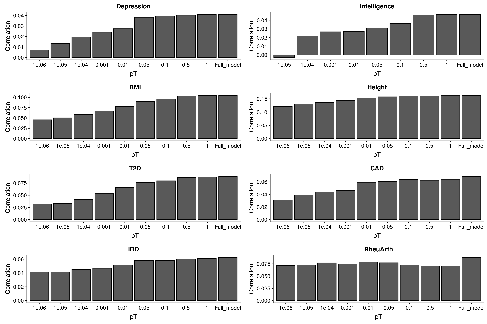

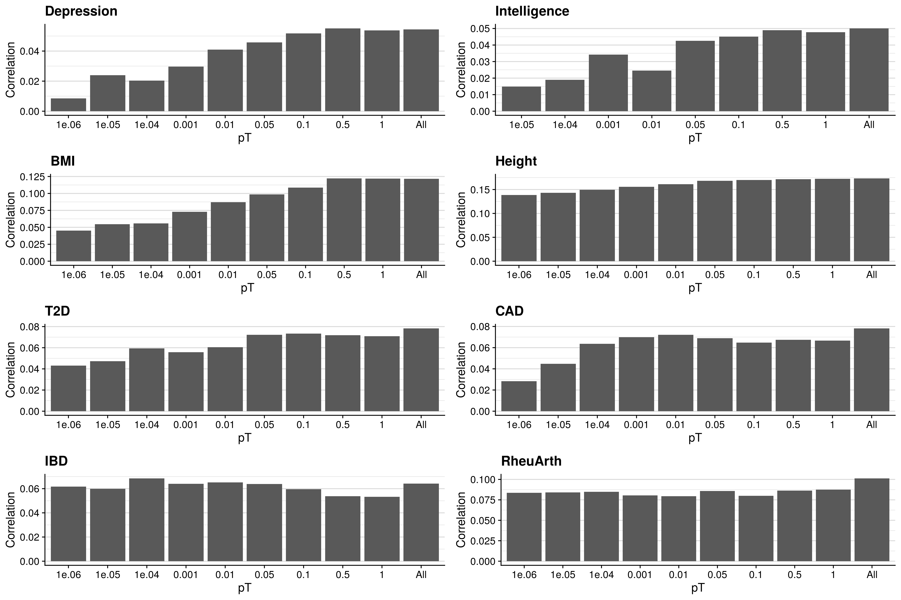

\center

```{r, echo=F, eval=T, results='asis'}
res<-read.csv("/mnt/lustre/users/k1806347/Analyses/UKBB_outcomes_for_prediction/GeRS_per_pT.csv")

res[,-1:-2]<-round(res[,-1:-2], 3)
res$CrossVal_R<-paste0(res$CrossVal_R, " (", res$CrossVal_R_SE, ")")
res$IndepVal_R<-paste0(res$IndepVal_R, " (", res$IndepVal_R_SE, ")")
res<-res[,c('Phenotype','Model','CrossVal_R','IndepVal_R')]

names(res)<-c('Phenotype','Model',"CrossVal R (SE)","IndepVal R (SE)")

library(knitr)
kable(res, rownames = FALSE, caption='Correlation between GeRS model predictions and observed values in UK Biobank')
```

</details>

```{bash, eval=T, echo=F}
mkdir -p /users/k1806347/brc_scratch/Software/MyGit/GenoPred/Images/Functionally_informed_prediction

cp /mnt/lustre/users/k1806347/Analyses/UKBB_outcomes_for_prediction/GeRS_tests_summary_CrossVal_UKBB.png /users/k1806347/brc_scratch/Software/MyGit/GenoPred/Images/Functionally_informed_prediction/

cp /scratch/users/k1806347/Analyses/UKBB_outcomes_for_prediction/GeRS_tests_summary_IndepVal_UKBB.png /users/k1806347/brc_scratch/Software/MyGit/GenoPred/Images/Functionally_informed_prediction/
```

<details><summary>Show summary of GeRS tests</summary>

<center>

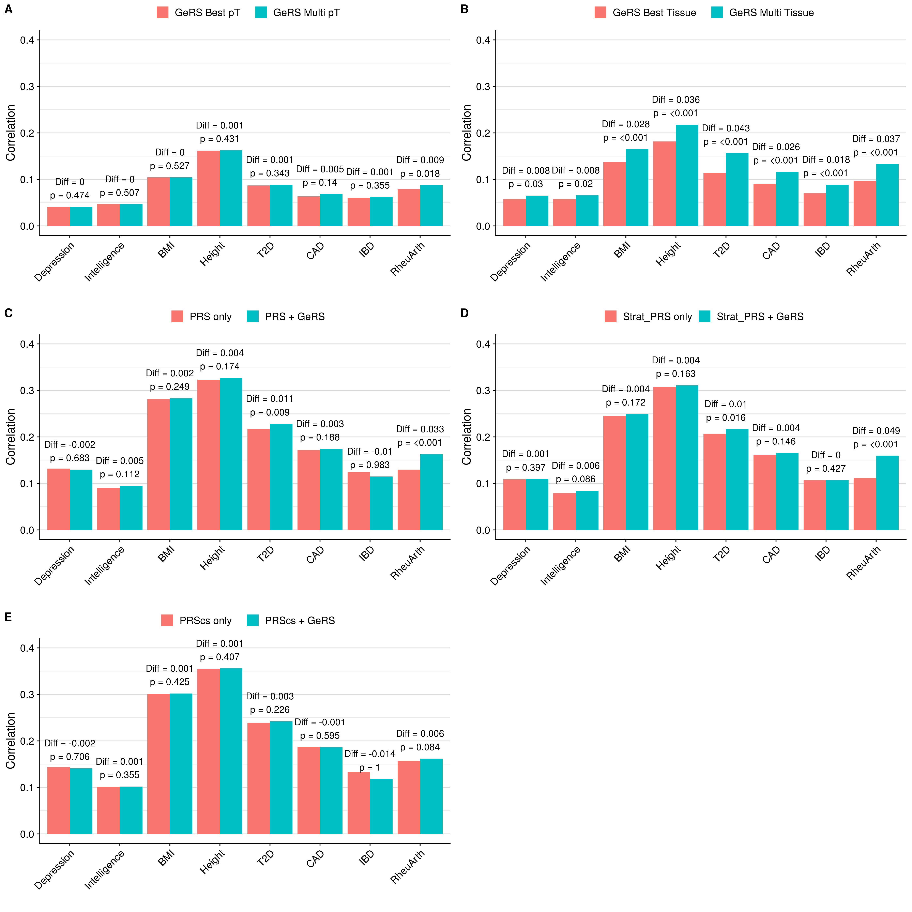


\center

```{r, echo=F, eval=T, results='asis'}
res<-read.csv("/mnt/lustre/users/k1806347/Analyses/UKBB_outcomes_for_prediction/GeRS_tests_summary.csv")

res[,c(-1:-4,-8,-12)]<-round(res[,c(-1:-4,-8,-12)], 3)

names(res)<-c('Phenotype','Test',"Model 1","Model 2", 'Model 1 Cross R','Model 2 Cross R','Cross R diff','Cross R diff pval','Model 1 Indep R','Model 2 Indep R','Indep R diff','Indep R diff pval')

library(knitr)
kable(res, rownames = FALSE, caption='Correlation between GeRS model predictions and observed values in UK Biobank')
```

</details>

```{bash, eval=T, echo=F}
mkdir -p /users/k1806347/brc_scratch/Software/MyGit/GenoPred/Images/Functionally_informed_prediction

cp /mnt/lustre/users/k1806347/Analyses/UKBB_outcomes_for_prediction/GeRS_tests_summary_CrossVal_UKBB.png /users/k1806347/brc_scratch/Software/MyGit/GenoPred/Images/Functionally_informed_prediction/

cp /scratch/users/k1806347/Analyses/UKBB_outcomes_for_prediction/GeRS_tests_summary_IndepVal_UKBB.png /users/k1806347/brc_scratch/Software/MyGit/GenoPred/Images/Functionally_informed_prediction/
```

<details><summary>Show summary of GeRS PP4 tests</summary>

<center>

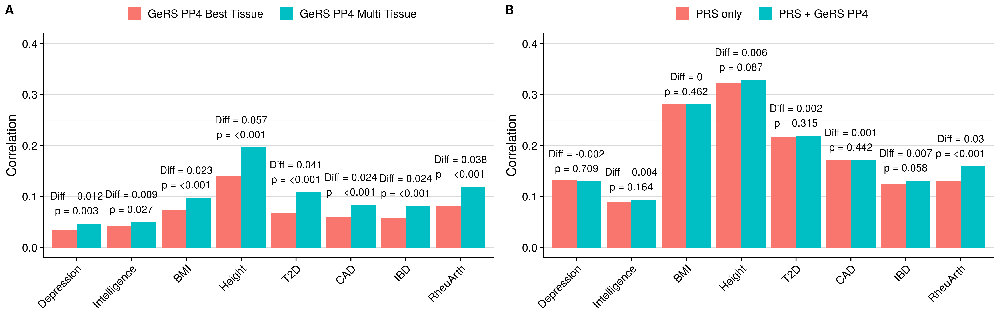

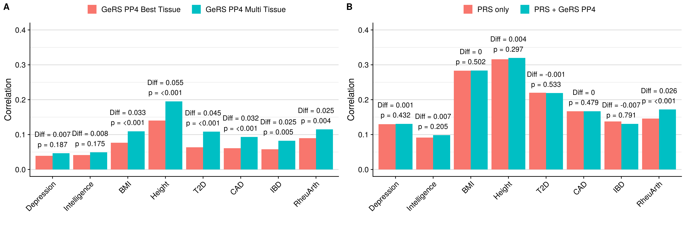

\center

```{r, echo=F, eval=T, results='asis'}
res<-read.csv("/mnt/lustre/users/k1806347/Analyses/UKBB_outcomes_for_prediction/GeRS_PP4_tests_summary.csv")

res[,c(-1:-4,-8,-12)]<-round(res[,c(-1:-4,-8,-12)], 3)

names(res)<-c('Phenotype','Test',"Model 1","Model 2", 'Model 1 Cross R','Model 2 Cross R','Cross R diff','Cross R diff pval','Model 1 Indep R','Model 2 Indep R','Indep R diff','Indep R diff pval')

library(knitr)
kable(res, rownames = FALSE, caption='Correlation between GeRS PP4 model predictions and observed values in UK Biobank')
```

</details>

```{bash, eval=T, echo=F}
mkdir -p /users/k1806347/brc_scratch/Software/MyGit/GenoPred/Images/Functionally_informed_prediction

cp /mnt/lustre/users/k1806347/Analyses/UKBB_outcomes_for_prediction/StratPRS_comp_CrossVal_UKBB.png /users/k1806347/brc_scratch/Software/MyGit/GenoPred/Images/Functionally_informed_prediction/

cp /scratch/users/k1806347/Analyses/UKBB_outcomes_for_prediction/StratPRS_comp_IndepVal_UKBB.png /users/k1806347/brc_scratch/Software/MyGit/GenoPred/Images/Functionally_informed_prediction/
```

<details><summary>Show GeRS, PRS, stratified-PRS comparison</summary>

<center>

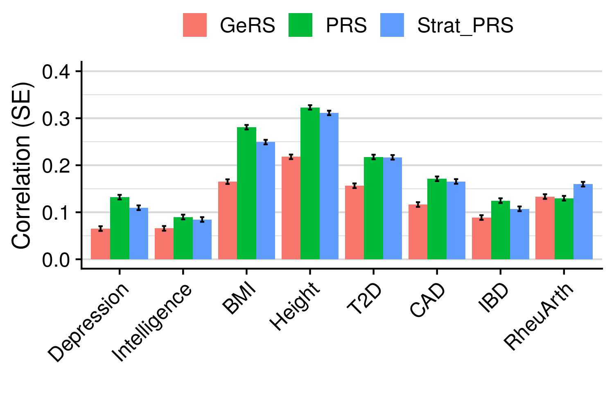


\center

</details>

```{bash, eval=T, echo=F}
mkdir -p /users/k1806347/brc_scratch/Software/MyGit/GenoPred/Images/Functionally_informed_prediction

cp /mnt/lustre/users/k1806347/Analyses/UKBB_outcomes_for_prediction/GeRS_Tissue_comp_CrossVal_UKBB.png /users/k1806347/brc_scratch/Software/MyGit/GenoPred/Images/Functionally_informed_prediction/

cp /scratch/users/k1806347/Analyses/UKBB_outcomes_for_prediction/GeRS_Tissue_comp_IndepVal_UKBB.png /users/k1806347/brc_scratch/Software/MyGit/GenoPred/Images/Functionally_informed_prediction/
```

<details><summary>Show association with GeRS for each SNP-weight set</summary>

<center>


\center

</details>

```{bash, eval=T, echo=F}
mkdir -p /users/k1806347/brc_scratch/Software/MyGit/GenoPred/Images/Functionally_informed_prediction

cp /mnt/lustre/users/k1806347/Analyses/UKBB_outcomes_for_prediction/GeRS_PP4_Tissue_comp_CrossVal_UKBB.png /users/k1806347/brc_scratch/Software/MyGit/GenoPred/Images/Functionally_informed_prediction/

cp /scratch/users/k1806347/Analyses/UKBB_outcomes_for_prediction/GeRS_PP4_Tissue_comp_IndepVal_UKBB.png /users/k1806347/brc_scratch/Software/MyGit/GenoPred/Images/Functionally_informed_prediction/
```

<details><summary>Show association with GeRS PP4 for each SNP-weight set</summary>

<center>


\center

</details>

<br/>

## TEDS

<details><summary>Plot per pT GeRS results</summary>
```{bash, echo=T, eval=F}
#####
# Compare results across pTs for each phenotype
#####
module add apps/R/3.6.0
R

pheno<-c('Height21', 'BMI21', 'GCSE', 'ADHD')
gwas<-c('HEIG03', 'BODY11', 'EDUC03', 'ADHD04')
weight=c('YFS.BLOOD.RNAARR')

res<-NULL
for(i in 1:4){
  res_i<-read.table(paste0('/users/k1806347/brc_scratch/Analyses/TEDS_outcomes_for_prediction/',pheno[i],'/Association_withGeRSs/TEDS.w_hm3.',weight,'.',gwas[i],'.EUR-GeRSs.pred_eval.txt'), header=T, stringsAsFactors=F)
  
  res_i$Phenotype<-pheno[i]
  res_i<-res_i[,c('Phenotype','Model','CrossVal_R','CrossVal_R_SE','IndepVal_R','IndepVal_R_SE')]
  res_i$Model<-gsub('_group','',gsub(paste0(gwas[i],'.'),'',res_i$Model))
  res_i$Model<-factor(res_i$Model, levels=res_i$Model)
  
  res<-rbind(res, res_i)
}

write.csv(res, '/mnt/lustre/users/k1806347/Analyses/TEDS_outcomes_for_prediction/GeRS_per_pT.csv', row.names=F, quote=F)

library(ggplot2)
library(cowplot)

res_plot_CrossVal<-list()
for(i in 1:4){
  res_plot_CrossVal[[pheno[i]]]<-ggplot(res[res$Phenotype == pheno[i],], aes(x=Model, y=CrossVal_R)) +
                                    geom_bar(stat="identity", position=position_dodge(), colour='black') +
                                    labs(y='Correlation', x='pT', title=pheno[i])
}

bitmap('/mnt/lustre/users/k1806347/Analyses/TEDS_outcomes_for_prediction/GeRS_per_pT_CrossVal_TEDS.png', units='px', res=300, width=4500, height=3000)
  plot_grid(plotlist=res_plot_CrossVal, ncol = 2)
dev.off()

res_plot_IndepVal<-list()
for(i in 1:4){
  res_plot_IndepVal[[pheno[i]]]<-ggplot(res[res$Phenotype == pheno[i],], aes(x=Model, y=IndepVal_R)) +
                                    geom_bar(stat="identity", position=position_dodge(), colour='black') +
                                    labs(y='Correlation', x='pT', title=pheno[i])
}

bitmap('/mnt/lustre/users/k1806347/Analyses/TEDS_outcomes_for_prediction/GeRS_per_pT_IndepVal_TEDS.png', units='px', res=300, width=4500, height=3000)
  plot_grid(plotlist=res_plot_IndepVal, ncol = 2)
dev.off()

q()
n

```
</details>

<details><summary>Plot comparison results</summary>
```{bash, echo=T, eval=F}
#####
# Compare results from each approach
#####
module add apps/R/3.6.0
R

pheno<-c('Height21', 'BMI21', 'GCSE', 'ADHD')
gwas<-c('HEIG03', 'BODY11', 'EDUC03', 'ADHD04')
weight=c('YFS.BLOOD.RNAARR')

res<-list()
for(i in 1:4){
res_1<-read.table(paste0('/users/k1806347/brc_scratch/Analyses/TEDS_outcomes_for_prediction/',pheno[i],'/Association_withGeRSs/TEDS.w_hm3.',weight,'.',gwas[i],'.EUR-GeRSs.pred_comp.txt'), header=T, stringsAsFactors=F)
res_2<-read.table(paste0('/users/k1806347/brc_scratch/Analyses/TEDS_outcomes_for_prediction/',pheno[i],'/Association_withGeRSs/TEDS.w_hm3.AllTissue.',gwas[i],'.EUR-GeRSs.pred_comp.txt'), header=T, stringsAsFactors=F)
res_3<-read.table(paste0('/users/k1806347/brc_scratch/Analyses/TEDS_outcomes_for_prediction/',pheno[i],'/Association_withPRS_and_GeRSs/TEDS.w_hm3.AllTissue.',gwas[i],'.EUR-GeRSs.EUR-PRSs.pt_clump.pred_comp.txt'), header=T, stringsAsFactors=F)
res_4<-read.table(paste0('/users/k1806347/brc_scratch/Analyses/TEDS_outcomes_for_prediction/',pheno[i],'/Association_withPRSs/TEDS.w_hm3.',gwas[i],'.EUR-PRSs-TWAS_gene_stratifievd.pred_comp.txt'), header=T, stringsAsFactors=F)
res_5<-read.table(paste0('/users/k1806347/brc_scratch/Analyses/TEDS_outcomes_for_prediction/',pheno[i],'/Association_withPRS_and_GeRSs/TEDS.w_hm3.AllTissue.',gwas[i],'.EUR-GeRSs.EUR-PRSs.PRScs.pred_comp.txt'), header=T, stringsAsFactors=F)

res[[pheno[i]]]<-data.frame(Test=c('GeRS_multi_pT','GeRS_multi_tissue','PRS_and_GeRS','Strat_PRS','PRScs_and_GeRS'),		
        				do.call(rbind,list(	res_1[res_1$Model_2_Cross_R == max(res_1$Model_2_Cross_R),],
                  									res_2[res_2$Model_2_Cross_R == max(res_2$Model_2_Cross_R),],
                  									res_3[2,],
                  									res_4[2,],
                  									res_5[2,])))
}

res_table<-do.call(rbind, res)
res_table$Phenotype<-gsub('\\..*','',rownames(res_table))
res_table<-res_table[,c('Phenotype',names(res_table)[-12])]
write.csv(res_table, '/mnt/lustre/users/k1806347/Analyses/TEDS_outcomes_for_prediction/GeRS_tests_summary.csv', row.names=F, quote=F)

####
# Plot the R2 when using PRS only, and using PRS + multi-tissue GeRS
####

# Organise the results
res_plot<-list()
for(i in 1:4){
tmp_res<-res[[pheno[i]]]
tmp_res_Model_1<-tmp_res[,grepl('Test|Model_1|Cross_R_diff|Indep_R_diff',names(tmp_res))]
names(tmp_res_Model_1)<-c('Test','Model','Cross_R','Cross_R_diff','Cross_R_diff_pval','Indep_R','Indep_R_diff','Indep_R_diff_pval')
tmp_res_Model_2<-tmp_res[,grepl('Test|Model_2|Cross_R_diff|Indep_R_diff',names(tmp_res))]
names(tmp_res_Model_2)<-c('Test','Model','Cross_R','Cross_R_diff','Cross_R_diff_pval','Indep_R','Indep_R_diff','Indep_R_diff_pval')
tmp_res_Model_2$Cross_R_diff<-NA
tmp_res_Model_2$Cross_R_diff_pval<-NA
tmp_res_Model_2$Indep_R_diff<-NA
tmp_res_Model_2$Indep_R_diff_pval<-NA

tmp_res_plot<-rbind(tmp_res_Model_1,tmp_res_Model_2)
tmp_res_plot$Phenotype<-pheno[i]

res_plot[[pheno[i]]]<-tmp_res_plot
}

# Combine results for each phenotype and prepare for plotting
All_res_plot<-do.call(rbind, res_plot)

All_res_plot$Test<-factor(All_res_plot$Test, levels=res[[1]]$Test)
All_res_plot$Phenotype<-factor(All_res_plot$Phenotype, level=unique(All_res_plot$Phenotype))
All_res_plot<-All_res_plot[order(All_res_plot$Phenotype,All_res_plot$Test),]
All_res_plot$Cross_Val_Label<-NA
All_res_plot$Cross_Val_Label[!is.na(All_res_plot$Cross_R_diff)]<-paste0('Diff = ',round(All_res_plot$Cross_R_diff[!is.na(All_res_plot$Cross_R_diff)],3), '\np = ',All_res_plot$Cross_R_diff_pval[!is.na(All_res_plot$Cross_R_diff)])

All_res_plot$Indep_Val_Label<-NA
All_res_plot$Indep_Val_Label[!is.na(All_res_plot$Indep_R_diff)]<-paste0('Diff = ',round(All_res_plot$Indep_R_diff[!is.na(All_res_plot$Indep_R_diff)],3), '\np = ',All_res_plot$Indep_R_diff_pval[!is.na(All_res_plot$Indep_R_diff)])

All_res_plot$Model[!All_res_plot$Model == 'Full_model' & All_res_plot$Test == 'GeRS_multi_pT']<-'GeRS Best pT   '
All_res_plot$Model[All_res_plot$Model == 'Full_model' & All_res_plot$Test == 'GeRS_multi_pT']<-'GeRS Multi pT'

All_res_plot$Model[!All_res_plot$Model == 'Full_model' & All_res_plot$Test == 'GeRS_multi_tissue']<-'GeRS Best Tissue   '
All_res_plot$Model[All_res_plot$Model == 'Full_model' & All_res_plot$Test == 'GeRS_multi_tissue']<-'GeRS Multi Tissue'

All_res_plot$Model[!All_res_plot$Model == 'Full_model' & All_res_plot$Test == 'PRS_and_GeRS']<-'PRS only   '
All_res_plot$Model[All_res_plot$Model == 'Full_model' & All_res_plot$Test == 'PRS_and_GeRS']<-'PRS + GeRS'

All_res_plot$Model[!All_res_plot$Model == 'Full_model' & All_res_plot$Test == 'Strat_PRS']<-'Strat_PRS only'
All_res_plot$Model[All_res_plot$Model == 'Full_model' & All_res_plot$Test == 'Strat_PRS']<-'Strat_PRS + GeRS'

All_res_plot$Model[!All_res_plot$Model == 'Full_model' & All_res_plot$Test == 'PRScs_and_GeRS']<-'PRScs only   '
All_res_plot$Model[All_res_plot$Model == 'Full_model' & All_res_plot$Test == 'PRScs_and_GeRS']<-'PRScs + GeRS'

All_res_plot$Model<-factor(All_res_plot$Model, levels=c("GeRS Best pT   ","GeRS Multi pT", "GeRS Best Tissue   ","GeRS Multi Tissue","PRS only   ","PRS + GeRS", "Strat_PRS only", "Strat_PRS + GeRS","PRScs only   ","PRScs + GeRS"))

library(ggplot2)
library(cowplot)
# Plot cross validation results
Plot_1<-ggplot(All_res_plot[All_res_plot$Test == 'GeRS_multi_pT',], aes(x=Phenotype, y=Cross_R, fill=Model, label=Cross_Val_Label)) +
          geom_bar(stat="identity", position=position_dodge(), colour='black') +
      	  geom_text(aes(y=Cross_R+0.04)) +
          labs(y='Correlation', x='') +
		  ylim(0,0.5) +
          theme(axis.text.x = element_text(angle = 45, hjust = 1), legend.position="top", legend.justification = c(0.5, 0), legend.title=element_blank()) +
          guides(fill=guide_legend(title.hjust =0.5))

Plot_2<-ggplot(All_res_plot[All_res_plot$Test == 'GeRS_multi_tissue',], aes(x=Phenotype, y=Cross_R, fill=Model, label=Cross_Val_Label)) +
          geom_bar(stat="identity", position=position_dodge(), colour='black') +
      	  geom_text(aes(y=Cross_R+0.04)) +
          labs(y='Correlation', x='') +
		  ylim(0,0.5) +
          theme(axis.text.x = element_text(angle = 45, hjust = 1), legend.position="top", legend.justification = c(0.5, 0), legend.title=element_blank()) +
          guides(fill=guide_legend(title.hjust =0.5))

Plot_3<-ggplot(All_res_plot[All_res_plot$Test == 'PRS_and_GeRS',], aes(x=Phenotype, y=Cross_R, fill=Model, label=Cross_Val_Label)) +
          geom_bar(stat="identity", position=position_dodge(), colour='black') +
      	  geom_text(aes(y=Cross_R+0.04)) +
          labs(y='Correlation', x='') +
          theme(axis.text.x = element_text(angle = 45, hjust = 1), legend.position="top", legend.justification = c(0.5, 0), legend.title=element_blank()) +
		  ylim(0,0.5) +
          guides(fill=guide_legend(title.hjust =0.5))

Plot_4<-ggplot(All_res_plot[All_res_plot$Test == 'Strat_PRS',], aes(x=Phenotype, y=Cross_R, fill=Model, label=Cross_Val_Label)) +
          geom_bar(stat="identity", position=position_dodge(), colour='black') +
      	  geom_text(aes(y=Cross_R+0.04)) +
          labs(y='Correlation', x='') +
          theme(axis.text.x = element_text(angle = 45, hjust = 1), legend.position="top", legend.justification = c(0.5, 0), legend.title=element_blank()) +
		  ylim(0,0.5) +
          guides(fill=guide_legend(title.hjust =0.5))

Plot_5<-ggplot(All_res_plot[All_res_plot$Test == 'PRScs_and_GeRS',], aes(x=Phenotype, y=Cross_R, fill=Model, label=Cross_Val_Label)) +
          geom_bar(stat="identity", position=position_dodge(), colour='black') +
      	  geom_text(aes(y=Cross_R+0.04)) +
          labs(y='Correlation', x='') +
          theme(axis.text.x = element_text(angle = 45, hjust = 1), legend.position="top", legend.justification = c(0.5, 0), legend.title=element_blank()) +
		  ylim(0,0.5) +
          guides(fill=guide_legend(title.hjust =0.5))

png('/mnt/lustre/users/k1806347/Analyses/TEDS_outcomes_for_prediction/GeRS_tests_summary_CrossVal_TEDS.png', units='px', res=300, width=4500, height=3000)
  plot_grid(Plot_1,Plot_2,Plot_3,Plot_4,Plot_5, labels = "AUTO")
dev.off()

# Plot independent validation results
Plot_1<-ggplot(All_res_plot[All_res_plot$Test == 'GeRS_multi_pT',], aes(x=Phenotype, y=Indep_R, fill=Model, label=Indep_Val_Label)) +
          geom_bar(stat="identity", position=position_dodge(), colour='black') +
      	  geom_text(aes(y=Indep_R+0.04)) +
          labs(y='Correlation', x='') +
		  ylim(0,0.5) +
          theme(axis.text.x = element_text(angle = 45, hjust = 1), legend.position="top", legend.justification = c(0.5, 0), legend.title=element_blank()) +
          guides(fill=guide_legend(title.hjust =0.5))

Plot_2<-ggplot(All_res_plot[All_res_plot$Test == 'GeRS_multi_tissue',], aes(x=Phenotype, y=Indep_R, fill=Model, label=Indep_Val_Label)) +
          geom_bar(stat="identity", position=position_dodge(), colour='black') +
      	  geom_text(aes(y=Indep_R+0.04)) +
          labs(y='Correlation', x='') +
		  ylim(0,0.5) +
          theme(axis.text.x = element_text(angle = 45, hjust = 1), legend.position="top", legend.justification = c(0.5, 0), legend.title=element_blank()) +
          guides(fill=guide_legend(title.hjust =0.5))

Plot_3<-ggplot(All_res_plot[All_res_plot$Test == 'PRS_and_GeRS',], aes(x=Phenotype, y=Indep_R, fill=Model, label=Indep_Val_Label)) +
          geom_bar(stat="identity", position=position_dodge(), colour='black') +
      	  geom_text(aes(y=Indep_R+0.04)) +
          labs(y='Correlation', x='') +
		  ylim(0,0.5) +
          theme(axis.text.x = element_text(angle = 45, hjust = 1), legend.position="top", legend.justification = c(0.5, 0), legend.title=element_blank()) +
          guides(fill=guide_legend(title.hjust =0.5))

Plot_4<-ggplot(All_res_plot[All_res_plot$Test == 'Strat_PRS',], aes(x=Phenotype, y=Indep_R, fill=Model, label=Indep_Val_Label)) +
          geom_bar(stat="identity", position=position_dodge(), colour='black') +
      	  geom_text(aes(y=Indep_R+0.04)) +
          labs(y='Correlation', x='') +
		  ylim(0,0.5) +
          theme(axis.text.x = element_text(angle = 45, hjust = 1), legend.position="top", legend.justification = c(0.5, 0), legend.title=element_blank()) +
          guides(fill=guide_legend(title.hjust =0.5))

Plot_5<-ggplot(All_res_plot[All_res_plot$Test == 'PRScs_and_GeRS',], aes(x=Phenotype, y=Indep_R, fill=Model, label=Indep_Val_Label)) +
          geom_bar(stat="identity", position=position_dodge(), colour='black') +
      	  geom_text(aes(y=Indep_R+0.04)) +
          labs(y='Correlation', x='') +
		  ylim(0,0.5) +
          theme(axis.text.x = element_text(angle = 45, hjust = 1), legend.position="top", legend.justification = c(0.5, 0), legend.title=element_blank()) +
          guides(fill=guide_legend(title.hjust =0.5))

png('/mnt/lustre/users/k1806347/Analyses/TEDS_outcomes_for_prediction/GeRS_tests_summary_IndepVal_TEDS.png', units='px', res=300, width=4500, height=3000)
  plot_grid(Plot_1,Plot_2,Plot_3, Plot_4, Plot_5, labels = "AUTO")
dev.off()

q()
n

```
</details>

<details><summary>Plot comparison results (PP4+clump)</summary>
```{bash, eval=F, echo=T}
#####
# Compare results from each approach
#####
module add apps/R/3.6.0
R

pheno<-c('Height21', 'BMI21', 'GCSE', 'ADHD')
gwas<-c('HEIG03', 'BODY11', 'EDUC03', 'ADHD04')
weight=c('YFS.BLOOD.RNAARR')

res<-list()
for(i in 1:4){
res_2<-read.table(paste0('/users/k1806347/brc_scratch/Analyses/TEDS_outcomes_for_prediction/',pheno[i],'/Association_withGeRSs/TEDS.w_hm3.AllTissue.',gwas[i],'.EUR-GeRSs_PP4.pred_comp.txt'), header=T, stringsAsFactors=F)
res_3<-read.table(paste0('/users/k1806347/brc_scratch/Analyses/TEDS_outcomes_for_prediction/',pheno[i],'/Association_withPRS_and_GeRSs/TEDS.w_hm3.AllTissue.',gwas[i],'.EUR-GeRSs_PP4.EUR-PRSs.pt_clump.pred_comp.txt'), header=T, stringsAsFactors=F)

res[[pheno[i]]]<-data.frame(Test=c('GeRS_multi_tissue','PRS_and_GeRS'),		
        				do.call(rbind,list(	res_2[res_2$Model_2_Cross_R == max(res_2$Model_2_Cross_R),],
                  									res_3[2,])))
}

res_table<-do.call(rbind, res)
res_table$Phenotype<-gsub('\\..*','',rownames(res_table))
res_table<-res_table[,c('Phenotype',names(res_table)[-12])]
write.csv(res_table, '/mnt/lustre/users/k1806347/Analyses/TEDS_outcomes_for_prediction/GeRS_PP4_tests_summary.csv', row.names=F, quote=F)

####
# Plot the R2 when using PRS only, and using PRS + multi-tissue GeRS
####

# Organise the results
res_plot<-list()
for(i in 1:4){
tmp_res<-res[[pheno[i]]]
tmp_res_Model_1<-tmp_res[,grepl('Test|Model_1|Cross_R_diff|Indep_R_diff',names(tmp_res))]
names(tmp_res_Model_1)<-c('Test','Model','Cross_R','Cross_R_diff','Cross_R_diff_pval','Indep_R','Indep_R_diff','Indep_R_diff_pval')
tmp_res_Model_2<-tmp_res[,grepl('Test|Model_2|Cross_R_diff|Indep_R_diff',names(tmp_res))]
names(tmp_res_Model_2)<-c('Test','Model','Cross_R','Cross_R_diff','Cross_R_diff_pval','Indep_R','Indep_R_diff','Indep_R_diff_pval')
tmp_res_Model_2$Cross_R_diff<-NA
tmp_res_Model_2$Cross_R_diff_pval<-NA
tmp_res_Model_2$Indep_R_diff<-NA
tmp_res_Model_2$Indep_R_diff_pval<-NA

tmp_res_plot<-rbind(tmp_res_Model_1,tmp_res_Model_2)
tmp_res_plot$Phenotype<-pheno[i]

res_plot[[pheno[i]]]<-tmp_res_plot
}

# Combine results for each phenotype and prepare for plotting
All_res_plot<-do.call(rbind, res_plot)

All_res_plot$Test<-factor(All_res_plot$Test, levels=res[[1]]$Test)
All_res_plot$Phenotype<-factor(All_res_plot$Phenotype, level=unique(All_res_plot$Phenotype))
All_res_plot<-All_res_plot[order(All_res_plot$Phenotype,All_res_plot$Test),]
All_res_plot$Cross_Val_Label<-NA
All_res_plot$Cross_Val_Label[!is.na(All_res_plot$Cross_R_diff)]<-paste0('Diff = ',round(All_res_plot$Cross_R_diff[!is.na(All_res_plot$Cross_R_diff)],3), '\np = ',All_res_plot$Cross_R_diff_pval[!is.na(All_res_plot$Cross_R_diff)])

All_res_plot$Indep_Val_Label<-NA
All_res_plot$Indep_Val_Label[!is.na(All_res_plot$Indep_R_diff)]<-paste0('Diff = ',round(All_res_plot$Indep_R_diff[!is.na(All_res_plot$Indep_R_diff)],3), '\np = ',All_res_plot$Indep_R_diff_pval[!is.na(All_res_plot$Indep_R_diff)])

All_res_plot$Model[!All_res_plot$Model == 'Full_model' & All_res_plot$Test == 'GeRS_multi_tissue']<-'GeRS PP4 Best Tissue   '
All_res_plot$Model[All_res_plot$Model == 'Full_model' & All_res_plot$Test == 'GeRS_multi_tissue']<-'GeRS PP4 Multi Tissue'

All_res_plot$Model[!All_res_plot$Model == 'Full_model' & All_res_plot$Test == 'PRS_and_GeRS']<-'PRS only   '
All_res_plot$Model[All_res_plot$Model == 'Full_model' & All_res_plot$Test == 'PRS_and_GeRS']<-'PRS + GeRS PP4'

All_res_plot$Model<-factor(All_res_plot$Model, levels=c("GeRS PP4 Best Tissue   ","GeRS PP4 Multi Tissue","PRS only   ","PRS + GeRS PP4"))

library(ggplot2)
library(cowplot)
# Plot cross validation results
Plot_2<-ggplot(All_res_plot[All_res_plot$Test == 'GeRS_multi_tissue',], aes(x=Phenotype, y=Cross_R, fill=Model, label=Cross_Val_Label)) +
          geom_bar(stat="identity", position=position_dodge(), colour='black') +
      	  geom_text(aes(y=Cross_R+0.04)) +
          labs(y='Correlation', x='') +
		  ylim(NA,0.5) +
          theme(axis.text.x = element_text(angle = 45, hjust = 1), legend.position="top", legend.justification = c(0.5, 0), legend.title=element_blank()) +
          guides(fill=guide_legend(title.hjust =0.5))

Plot_3<-ggplot(All_res_plot[All_res_plot$Test == 'PRS_and_GeRS',], aes(x=Phenotype, y=Cross_R, fill=Model, label=Cross_Val_Label)) +
          geom_bar(stat="identity", position=position_dodge(), colour='black') +
      	  geom_text(aes(y=Cross_R+0.04)) +
          labs(y='Correlation', x='') +
          theme(axis.text.x = element_text(angle = 45, hjust = 1), legend.position="top", legend.justification = c(0.5, 0), legend.title=element_blank()) +
		  ylim(0,0.5) +
          guides(fill=guide_legend(title.hjust =0.5))

bitmap('/mnt/lustre/users/k1806347/Analyses/TEDS_outcomes_for_prediction/GeRS_PP4_tests_summary_CrossVal_TEDS.png', units='px', res=300, width=4500, height=1500)
  plot_grid(Plot_2,Plot_3, labels = "AUTO")
dev.off()

# Plot independent validation results
Plot_2<-ggplot(All_res_plot[All_res_plot$Test == 'GeRS_multi_tissue',], aes(x=Phenotype, y=Indep_R, fill=Model, label=Indep_Val_Label)) +
          geom_bar(stat="identity", position=position_dodge(), colour='black') +
      	  geom_text(aes(y=Indep_R+0.04)) +
          labs(y='Correlation', x='') +
		  ylim(NA,0.5) +
          theme(axis.text.x = element_text(angle = 45, hjust = 1), legend.position="top", legend.justification = c(0.5, 0), legend.title=element_blank()) +
          guides(fill=guide_legend(title.hjust =0.5))

Plot_3<-ggplot(All_res_plot[All_res_plot$Test == 'PRS_and_GeRS',], aes(x=Phenotype, y=Indep_R, fill=Model, label=Indep_Val_Label)) +
          geom_bar(stat="identity", position=position_dodge(), colour='black') +
      	  geom_text(aes(y=Indep_R+0.04)) +
          labs(y='Correlation', x='') +
		  ylim(0,0.5) +
          theme(axis.text.x = element_text(angle = 45, hjust = 1), legend.position="top", legend.justification = c(0.5, 0), legend.title=element_blank()) +
          guides(fill=guide_legend(title.hjust =0.5))

bitmap('/mnt/lustre/users/k1806347/Analyses/TEDS_outcomes_for_prediction/GeRS_PP4_tests_summary_IndepVal_TEDS.png', units='px', res=300, width=4500, height=1500)
  plot_grid(Plot_2,Plot_3, labels = "AUTO")
dev.off()

q()
n

```

</details>

<details><summary>Compare stratified PRS to multi-tissue GeRS</summary>
```{bash,eval=F, echo=T}
# Plot the results of the stratified PRS against Multi-tissue GeRS
# And look at the variance exaplained by each tissue
module add apps/R/3.6.0
R

pheno<-c('Height21', 'BMI21', 'GCSE', 'ADHD')
gwas<-c('HEIG03', 'BODY11', 'EDUC03', 'ADHD04')

res<-list()
crossTissue<-list()

for(i in 1:4){
res_GeRS<-read.table(paste0('/users/k1806347/brc_scratch/Analyses/TEDS_outcomes_for_prediction/',pheno[i],'/Association_withGeRSs/TEDS.w_hm3.AllTissue.',gwas[i],'.EUR-GeRSs.pred_eval.txt'), header=T, stringsAsFactors=F)

crossTissue_i<-res_GeRS

res_GeRS<-res_GeRS[dim(res_GeRS)[1],]

res_stratPRS<-read.table(paste0('/users/k1806347/brc_scratch/Analyses/TEDS_outcomes_for_prediction/',pheno[i],'/Association_withPRSs/TEDS.w_hm3.',gwas[i],'.EUR-PRSs-TWAS_gene_stratifievd.pred_eval.txt'), header=T, stringsAsFactors=F)

res_stratPRS<-res_stratPRS[2,]

res_GWPRS<-read.table(paste0('/users/k1806347/brc_scratch/Analyses/TEDS_outcomes_for_prediction/',pheno[i],'/Association_withPRSs/TEDS.w_hm3.',gwas[i],'.EUR-PRSs.pred_eval.txt'), header=T, stringsAsFactors=F)
res_GWPRS<-res_GWPRS[dim(res_GWPRS)[1],]

res_all<-do.call(rbind, list(res_GeRS, res_stratPRS, res_GWPRS))
res_all$Method<-c('GeRS','Strat_PRS','PRS')
res_all$Phenotype<-pheno[i]

res_all$Cross_LiabR2<-NULL
res_all$Indep_LiabR2<-NULL

res[[pheno[i]]]<-res_all

crossTissue_i$Phenotype<-pheno[i]

crossTissue_i$Cross_LiabR2<-NULL
crossTissue_i$Indep_LiabR2<-NULL

crossTissue_i$Model<-gsub('_group','',crossTissue_i$Model)

crossTissue[[pheno[i]]]<-crossTissue_i

}

res_table<-do.call(rbind, res)
res_table<-res_table[,c('Phenotype','Method','CrossVal_R','CrossVal_R_SE','IndepVal_R','IndepVal_R_SE')]

crossTissue_table<-do.call(rbind, crossTissue)
crossTissue_table<-crossTissue_table[,c('Phenotype','Model','CrossVal_R','CrossVal_R_SE','IndepVal_R','IndepVal_R_SE')]

write.csv(res_table, '/mnt/lustre/users/k1806347/Analyses/TEDS_outcomes_for_prediction/StratPRS_comp_summary.csv', row.names=F, quote=F)

library(ggplot2)
library(cowplot)
# Plot comparison across PRS, stratified PRS and GeRS
res_table$Phenotype<-factor(res_table$Phenotype, level=unique(res_table$Phenotype))

png('/mnt/lustre/users/k1806347/Analyses/TEDS_outcomes_for_prediction/StratPRS_comp_CrossVal_TEDS.png', units='px', res=300, width=1500, height=1000)

ggplot(res_table, aes(x=Phenotype, y=CrossVal_R, fill=Method)) +
          geom_bar(stat="identity", position=position_dodge(0.9), colour='black') +
          geom_errorbar(aes(ymin=CrossVal_R-CrossVal_R_SE, ymax=CrossVal_R+CrossVal_R_SE), width=.2,
                 position=position_dodge(0.9)) +
          labs(y="Correlation (SE)", x='') +
		      ylim(0,0.5) +
          theme(axis.text.x = element_text(angle = 45, hjust = 1), legend.position="top", legend.justification = c(0.5, 0), legend.title=element_blank()) +
          guides(fill=guide_legend(title.hjust =0.5))

dev.off()

png('/mnt/lustre/users/k1806347/Analyses/TEDS_outcomes_for_prediction/StratPRS_comp_IndepVal_TEDS.png', units='px', res=300, width=1500, height=1000)

ggplot(res_table, aes(x=Phenotype, y=IndepVal_R, fill=Method)) +
          geom_bar(stat="identity", position=position_dodge(0.9), colour='black') +
          geom_errorbar(aes(ymin=IndepVal_R-IndepVal_R_SE, ymax=IndepVal_R+IndepVal_R_SE), width=.2,
                 position=position_dodge(0.9)) +
          labs(y="Correlation (SE)", x='') +
		      ylim(0,0.5) +
          theme(axis.text.x = element_text(angle = 45, hjust = 1), legend.position="top", legend.justification = c(0.5, 0), legend.title=element_blank()) +
          guides(fill=guide_legend(title.hjust =0.5))

dev.off()

# Plot association with each tissue
plot_list_CrossVal<-list()
for(i in 1:4){
  tmp<-crossTissue[[pheno[i]]]
  tmp$Model<-factor(tmp$Model, level=tmp$Model[rev(order(tmp$CrossVal_R))])
plot_list_CrossVal[[pheno[i]]]<-ggplot(tmp, aes(x=Model, y=CrossVal_R)) +
          geom_bar(stat="identity", position=position_dodge(0.9), colour='black') +
          geom_errorbar(aes(ymin=CrossVal_R-CrossVal_R_SE, ymax=CrossVal_R+CrossVal_R_SE), width=.2,
                 position=position_dodge(0.9)) +
          labs(y="Correlation (SE)", x='', title=pheno[i]) +
          theme(axis.text.x = element_text(angle = 90, hjust = 1, vjust=0.5), legend.position="top", legend.justification = c(0.5, 0), legend.title=element_blank()) +
          guides(fill=guide_legend(title.hjust =0.5))
}

png('/mnt/lustre/users/k1806347/Analyses/TEDS_outcomes_for_prediction/GeRS_Tissue_comp_CrossVal_TEDS.png', units='px', res=300, width=3000, height=10000)
  plot_grid(plotlist=plot_list_CrossVal, ncol=1)
dev.off()

plot_list_IndepVal<-list()
for(i in 1:4){
  tmp<-crossTissue[[pheno[i]]]
  tmp$Model<-factor(tmp$Model, level=tmp$Model[rev(order(tmp$IndepVal_R))])
plot_list_IndepVal[[pheno[i]]]<-ggplot(tmp, aes(x=Model, y=IndepVal_R)) +
          geom_bar(stat="identity", position=position_dodge(0.9), colour='black') +
          geom_errorbar(aes(ymin=IndepVal_R-IndepVal_R_SE, ymax=IndepVal_R+IndepVal_R_SE), width=.2,
                 position=position_dodge(0.9)) +
          labs(y="Correlation (SE)", x='', title=pheno[i]) +
          theme(axis.text.x = element_text(angle = 90, hjust = 1, vjust=0.5), legend.position="top", legend.justification = c(0.5, 0), legend.title=element_blank()) +
          guides(fill=guide_legend(title.hjust =0.5))
}

png('/mnt/lustre/users/k1806347/Analyses/TEDS_outcomes_for_prediction/GeRS_Tissue_comp_IndepVal_TEDS.png', units='px', res=300, width=3000, height=10000)
  plot_grid(plotlist=plot_list_IndepVal, ncol=1)
dev.off()

q()
n

```
</details>

<details><summary>Plot GeRS PP4 across tissues</summary>
```{bash,eval=F, echo=T}
# Plot the results of the stratified PRS against Multi-tissue GeRS
# And look at the variance exaplained by each tissue
module add apps/R/3.6.0
R

pheno<-c('Height21', 'BMI21', 'GCSE', 'ADHD')
gwas<-c('HEIG03', 'BODY11', 'EDUC03', 'ADHD04')

crossTissue<-list()

for(i in 1:4){
res_GeRS<-read.table(paste0('/users/k1806347/brc_scratch/Analyses/TEDS_outcomes_for_prediction/',pheno[i],'/Association_withGeRSs/TEDS.w_hm3.AllTissue.',gwas[i],'.EUR-GeRSs_PP4.pred_eval.txt'), header=T, stringsAsFactors=F)

crossTissue_i<-res_GeRS

crossTissue_i$Phenotype<-pheno[i]

crossTissue_i$Cross_LiabR2<-NULL
crossTissue_i$Indep_LiabR2<-NULL

crossTissue_i$Model<-gsub('_group','',crossTissue_i$Model)

crossTissue[[pheno[i]]]<-crossTissue_i

}

crossTissue_table<-do.call(rbind, crossTissue)
crossTissue_table<-crossTissue_table[,c('Phenotype','Model','CrossVal_R','CrossVal_R_SE','IndepVal_R','IndepVal_R_SE')]

library(ggplot2)
library(cowplot)
# Plot association with each tissue
plot_list_CrossVal<-list()
for(i in 1:4){
  tmp<-crossTissue[[pheno[i]]]
  tmp$Model<-factor(tmp$Model, level=tmp$Model[rev(order(tmp$CrossVal_R))])
plot_list_CrossVal[[pheno[i]]]<-ggplot(tmp, aes(x=Model, y=CrossVal_R)) +
          geom_bar(stat="identity", position=position_dodge(0.9), colour='black') +
          geom_errorbar(aes(ymin=CrossVal_R-CrossVal_R_SE, ymax=CrossVal_R+CrossVal_R_SE), width=.2,
                 position=position_dodge(0.9)) +
          labs(y="Correlation (SE)", x='', title=pheno[i]) +
          theme(axis.text.x = element_text(angle = 90, hjust = 1, vjust=0.5), legend.position="top", legend.justification = c(0.5, 0), legend.title=element_blank()) +
          guides(fill=guide_legend(title.hjust =0.5))
}

bitmap('/mnt/lustre/users/k1806347/Analyses/TEDS_outcomes_for_prediction/GeRS_PP4_Tissue_comp_CrossVal_TEDS.png', units='px', res=300, width=3000, height=10000)
  plot_grid(plotlist=plot_list_CrossVal, ncol=1)
dev.off()

plot_list_IndepVal<-list()
for(i in 1:4){
  tmp<-crossTissue[[pheno[i]]]
  tmp$Model<-factor(tmp$Model, level=tmp$Model[rev(order(tmp$IndepVal_R))])
plot_list_IndepVal[[pheno[i]]]<-ggplot(tmp, aes(x=Model, y=IndepVal_R)) +
          geom_bar(stat="identity", position=position_dodge(0.9), colour='black') +
          geom_errorbar(aes(ymin=IndepVal_R-IndepVal_R_SE, ymax=IndepVal_R+IndepVal_R_SE), width=.2,
                 position=position_dodge(0.9)) +
          labs(y="Correlation (SE)", x='', title=pheno[i]) +
          theme(axis.text.x = element_text(angle = 90, hjust = 1, vjust=0.5), legend.position="top", legend.justification = c(0.5, 0), legend.title=element_blank()) +
          guides(fill=guide_legend(title.hjust =0.5))
}

bitmap('/mnt/lustre/users/k1806347/Analyses/TEDS_outcomes_for_prediction/GeRS_PP4_Tissue_comp_IndepVal_TEDS.png', units='px', res=300, width=3000, height=10000)
  plot_grid(plotlist=plot_list_IndepVal, ncol=1)
dev.off()

q()
n

```
</details>

```{bash, eval=T, echo=F}
mkdir -p /users/k1806347/brc_scratch/Software/MyGit/GenoPred/Images/Functionally_informed_prediction

cp /mnt/lustre/users/k1806347/Analyses/TEDS_outcomes_for_prediction/GeRS_per_pT_CrossVal_TEDS.png /users/k1806347/brc_scratch/Software/MyGit/GenoPred/Images/Functionally_informed_prediction/

cp /scratch/users/k1806347/Analyses/TEDS_outcomes_for_prediction/GeRS_per_pT_IndepVal_TEDS.png /users/k1806347/brc_scratch/Software/MyGit/GenoPred/Images/Functionally_informed_prediction/
```

<details><summary>Show GeRS prediction across p-value thresholds</summary>

<center>

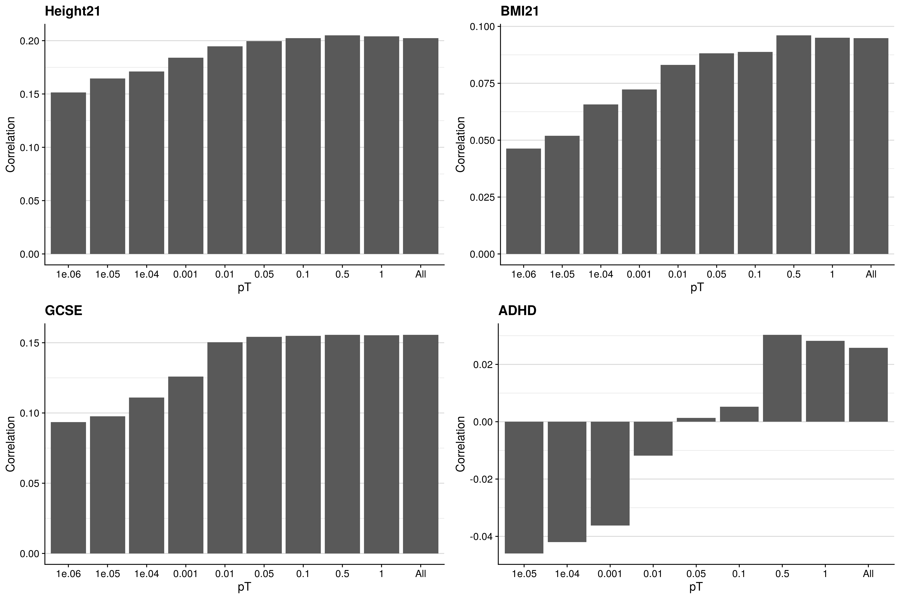


\center

```{r, echo=F, eval=T, results='asis'}
res<-read.csv("/mnt/lustre/users/k1806347/Analyses/TEDS_outcomes_for_prediction/GeRS_per_pT.csv")

res[,-1:-2]<-round(res[,-1:-2], 3)
res$CrossVal_R<-paste0(res$CrossVal_R, " (", res$CrossVal_R_SE, ")")
res$IndepVal_R<-paste0(res$IndepVal_R, " (", res$IndepVal_R_SE, ")")
res<-res[,c('Phenotype','Model','CrossVal_R','IndepVal_R')]

names(res)<-c('Phenotype','Model',"CrossVal R (SE)","IndepVal R (SE)")

library(knitr)
kable(res, rownames = FALSE, caption='Correlation between GeRS model predictions and observed values in UK Biobank')
```

</details>

```{bash, eval=T, echo=F}
mkdir -p /users/k1806347/brc_scratch/Software/MyGit/GenoPred/Images/Functionally_informed_prediction

cp /mnt/lustre/users/k1806347/Analyses/TEDS_outcomes_for_prediction/GeRS_tests_summary_CrossVal_TEDS.png /users/k1806347/brc_scratch/Software/MyGit/GenoPred/Images/Functionally_informed_prediction/

cp /scratch/users/k1806347/Analyses/TEDS_outcomes_for_prediction/GeRS_tests_summary_IndepVal_TEDS.png /users/k1806347/brc_scratch/Software/MyGit/GenoPred/Images/Functionally_informed_prediction/
```

<details><summary>Show summary of GeRS tests</summary>

<center>

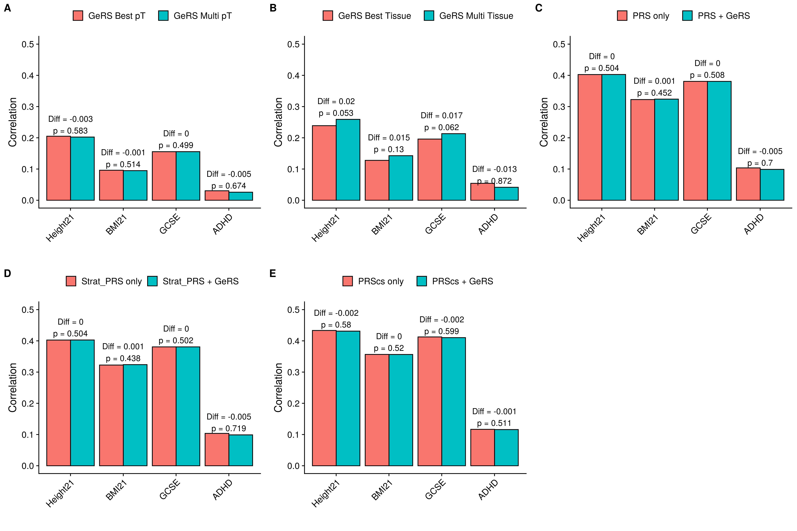

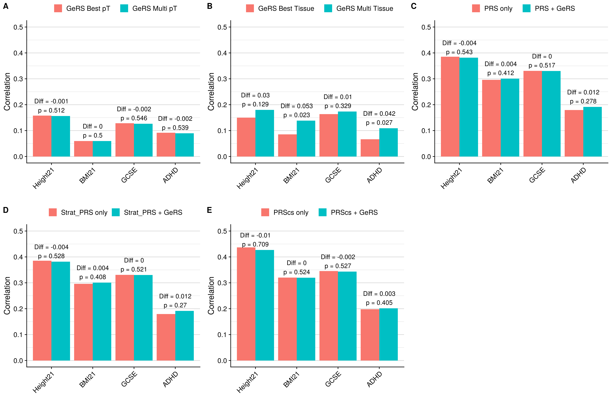

\center

```{r, echo=F, eval=T, results='asis'}
res<-read.csv("/mnt/lustre/users/k1806347/Analyses/TEDS_outcomes_for_prediction/GeRS_tests_summary.csv")

res[,c(-1:-4,-8,-12)]<-round(res[,c(-1:-4,-8,-12)], 3)

names(res)<-c('Phenotype','Test',"Model 1","Model 2", 'Model 1 Cross R','Model 2 Cross R','Cross R diff','Cross R diff pval','Model 1 Indep R','Model 2 Indep R','Indep R diff','Indep R diff pval')

library(knitr)
kable(res, rownames = FALSE, caption='Correlation between GeRS model predictions and observed values in UK Biobank')
```

</details>

```{bash, eval=T, echo=F}
mkdir -p /users/k1806347/brc_scratch/Software/MyGit/GenoPred/Images/Functionally_informed_prediction

cp /mnt/lustre/users/k1806347/Analyses/TEDS_outcomes_for_prediction/GeRS_PP4_tests_summary_CrossVal_TEDS.png /users/k1806347/brc_scratch/Software/MyGit/GenoPred/Images/Functionally_informed_prediction/

cp /scratch/users/k1806347/Analyses/TEDS_outcomes_for_prediction/GeRS_PP4_tests_summary_IndepVal_TEDS.png /users/k1806347/brc_scratch/Software/MyGit/GenoPred/Images/Functionally_informed_prediction/
```

<details><summary>Show summary of GeRS tests</summary>

<center>

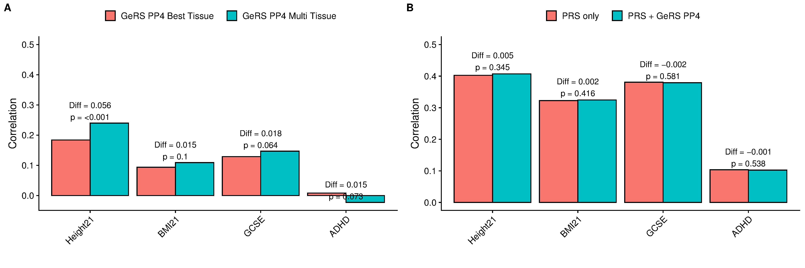

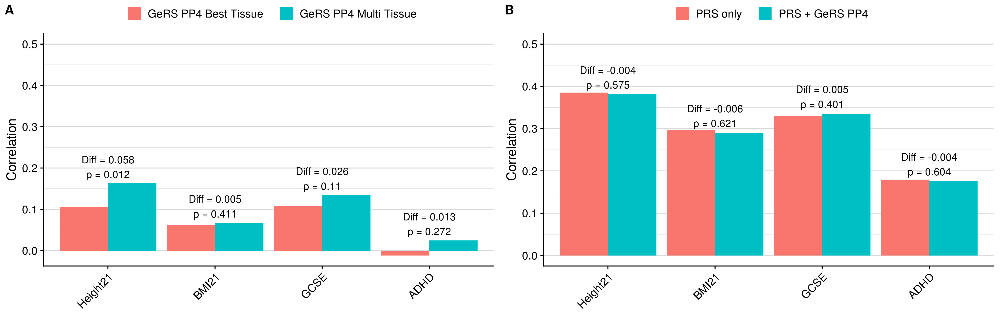

\center

```{r, echo=F, eval=T, results='asis'}
res<-read.csv("/mnt/lustre/users/k1806347/Analyses/TEDS_outcomes_for_prediction/GeRS_PP4_tests_summary.csv")

res[,c(-1:-4,-8,-12)]<-round(res[,c(-1:-4,-8,-12)], 3)

names(res)<-c('Phenotype','Test',"Model 1","Model 2", 'Model 1 Cross R','Model 2 Cross R','Cross R diff','Cross R diff pval','Model 1 Indep R','Model 2 Indep R','Indep R diff','Indep R diff pval')

library(knitr)
kable(res, rownames = FALSE, caption='Correlation between GeRS PP4 model predictions and observed values in UK Biobank')
```

</details>

```{bash, eval=T, echo=F}
mkdir -p /users/k1806347/brc_scratch/Software/MyGit/GenoPred/Images/Functionally_informed_prediction

cp /mnt/lustre/users/k1806347/Analyses/TEDS_outcomes_for_prediction/StratPRS_comp_CrossVal_TEDS.png /users/k1806347/brc_scratch/Software/MyGit/GenoPred/Images/Functionally_informed_prediction/

cp /scratch/users/k1806347/Analyses/TEDS_outcomes_for_prediction/StratPRS_comp_IndepVal_TEDS.png /users/k1806347/brc_scratch/Software/MyGit/GenoPred/Images/Functionally_informed_prediction/
```

<details><summary>Show GeRS, PRS, stratified-PRS comparison</summary>

<center>

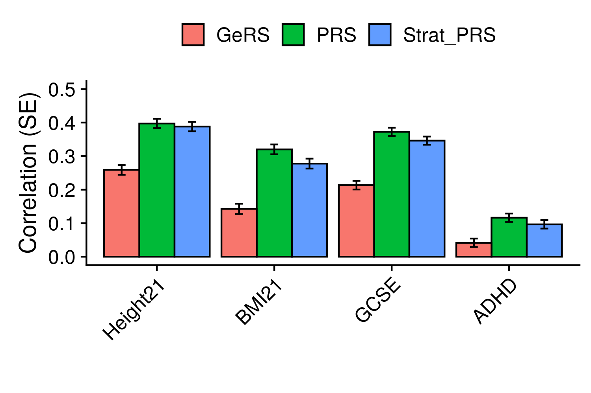

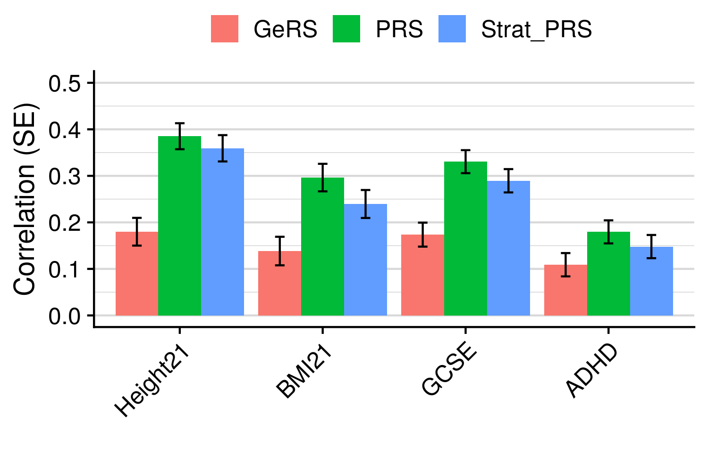

\center

</details>

```{bash, eval=T, echo=F}
mkdir -p /users/k1806347/brc_scratch/Software/MyGit/GenoPred/Images/Functionally_informed_prediction

cp /mnt/lustre/users/k1806347/Analyses/TEDS_outcomes_for_prediction/GeRS_Tissue_comp_CrossVal_TEDS.png /users/k1806347/brc_scratch/Software/MyGit/GenoPred/Images/Functionally_informed_prediction/

cp /scratch/users/k1806347/Analyses/TEDS_outcomes_for_prediction/GeRS_Tissue_comp_IndepVal_TEDS.png /users/k1806347/brc_scratch/Software/MyGit/GenoPred/Images/Functionally_informed_prediction/
```

<details><summary>Show association with GeRS for each SNP-weight set</summary>

<center>

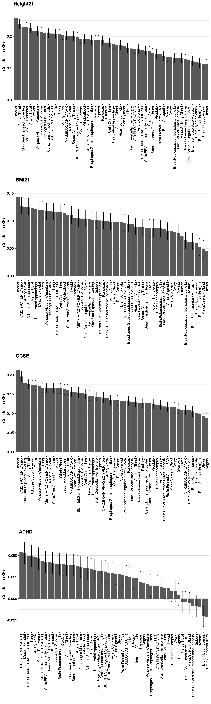

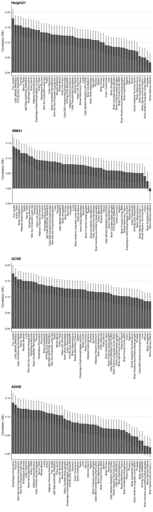

\center

</details>

```{bash, eval=T, echo=F}
mkdir -p /users/k1806347/brc_scratch/Software/MyGit/GenoPred/Images/Functionally_informed_prediction

cp /mnt/lustre/users/k1806347/Analyses/TEDS_outcomes_for_prediction/GeRS_PP4_Tissue_comp_CrossVal_TEDS.png /users/k1806347/brc_scratch/Software/MyGit/GenoPred/Images/Functionally_informed_prediction/

cp /scratch/users/k1806347/Analyses/TEDS_outcomes_for_prediction/GeRS_PP4_Tissue_comp_IndepVal_TEDS.png /users/k1806347/brc_scratch/Software/MyGit/GenoPred/Images/Functionally_informed_prediction/
```

<details><summary>Show association with GeRS PP4 for each SNP-weight set</summary>

<center>


\center

</details>

<br/>

***

# Conclusion

* Gene expression risk scores (GeRS) can explain a significantly non-zero amount of variance in a range of phenotypes
* The amount of variance explained by GeRS is less than explained by a genome-wide or TWAS SNP-weight stratified polygenic scores, except for Rheumatoid Arthritis.
* Use of elastic net models to combine GeRSs derived using multiple pTs does not significantly improve prediction over the single best pT as idenitified using 10-fold cross validation, though prediction never decreases
* Inclusion of GeRS based on SNP-weights derived using multiple tissues consistently improves prediction over the single best tissues as idenitified using 10-fold cross validation
* Inclusion of GeRSs only improved prediction over genome-wide polygenic scores for rheumatoid arthritis, providing an 1.6 times increase in r2 (0.021 to 0.035). Prediction improvements were non significant for all other henotypes in UK Biobank and TEDS.
* However, PRScs polygenic scores which does not use LD clumping  reduces the benefit of using GeRS for all outcomes, and the increase for RheumArth is no longer significant. This indicates the gain is in the fact that GeRS are based on joint SNP models.
* This findings suggest that GeRS represent a component of risk captured within genome-wide polygenic scores, rather than containing novel information.
* This indicates GeRS may be more useful for stratifying risk rather than improving risk prediction in a linear model.
* TWAS SNP PRS explain a suprisingly large amount of variance considering they only contain a fraction of the genome.


In the Crohn's disease paper they use Ileal specific eQTLs by coparing to whole blood. They also used colocalisation and SMR to idenitfy genes with shared causal variant with IBD. It also only used candidate IBD genes as tagged by the immunochip. Ileal QTL data was derived using the target sample so possible overfitting. They mention the question of coherence and incoherence, indicating whether SNPs affect gene expression as well the phenotype?

* I should try filtering genes based on coloc PP4 values
* I should try using tissue-specific eQTL effects

Compare gain in R2 when including multiple tissue but use the same genes, so gains represent gian from tissue specificity rather than number of genes. Though SNP-weight sets with large sample will stll predict better due to higher R2 estimates.

I think I could end the study here and keep it short and sweet. Although it is tempting to include a GeRS based on PrediXcan/MetaXcan models. This would be a quite a substantial rework though as it would require more than HapMap3 variants:
- Subset UK Biobank individuals with required phenotype data
- Predict expression using PrediXcan and GTEx v7 models
- Perform TWAS using GTExv7 models for desired GWAS
- Create feature correlation matrix using 1000 genomes
- Calculate GeRS
- For comparison also calculate PRS based on more than HapMap3 SNPs (interesting comparison anyway)

Making this change moves away from the highly reference standardised framework as the availability of SNPs will vary across target samples. I need to figure out what SNP list these models are based on.

SCZ TWAS: "A GE-PRS from actual measured expression and differential splicing in brain was significant but substantially less so than the genetic GE-PRS (Supplementary Fig. 13). Based on polygenic theory37,38, the best TWAS GE-PRS was estimated to account for 26% of the total SCZ SNP-heritability, providing an upper-bound on the amount of trait variance that could be mediated by the steady-state expression in these tissues (Supplementary Note)."


<br/>

***

