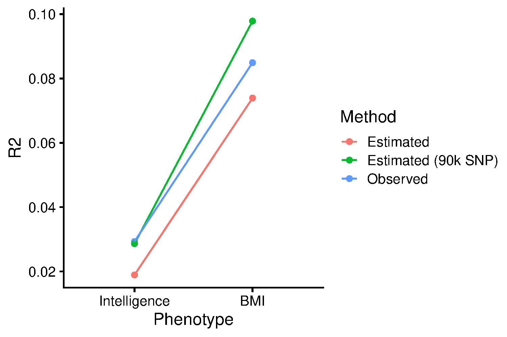
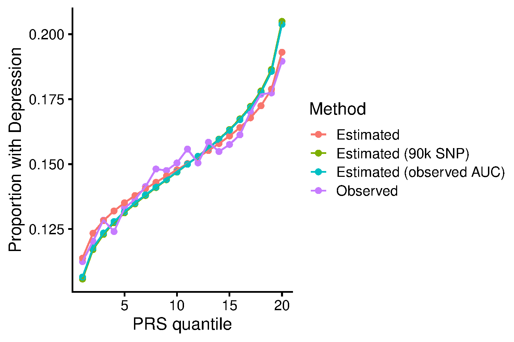
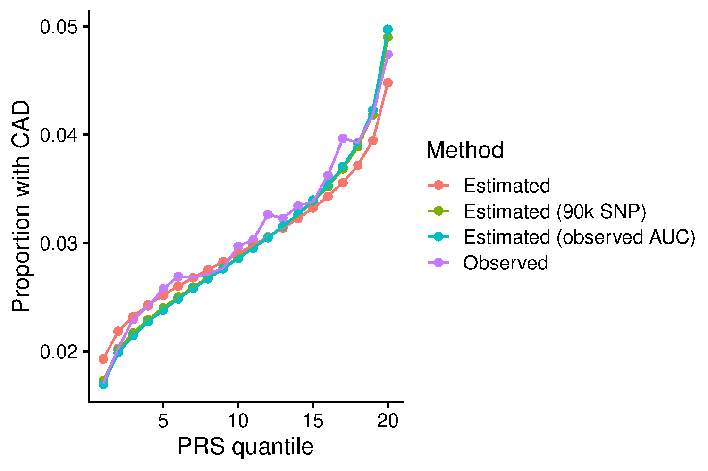
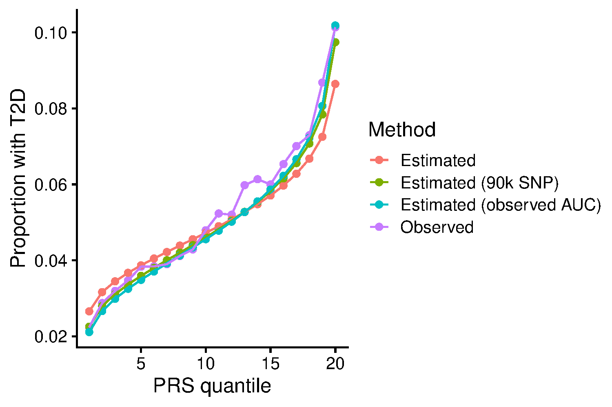
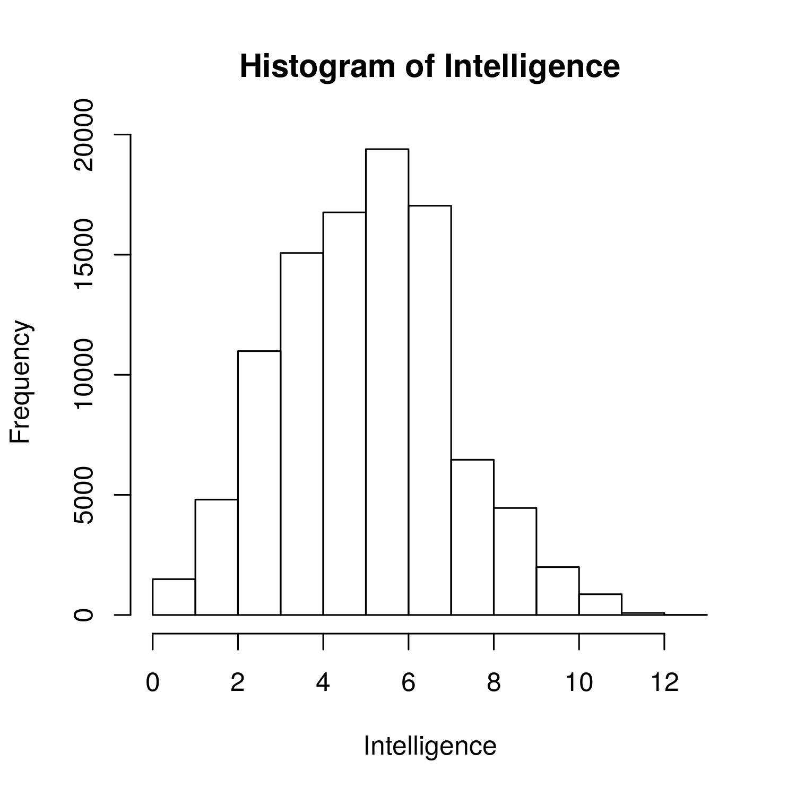

```{r setup, include=FALSE}
knitr::opts_chunk$set(echo = TRUE)
```

<style>
p.caption {
  font-size: 1.5em;
}
</style>

```{css, echo=F}
pre code, pre, code {
  white-space: pre !important;
  overflow-x: scroll !important;
  word-break: keep-all !important;
  word-wrap: initial !important;
}
```

<br/>

***

This page describes a project investigatin approaches for converting polygenic scores into interpretable information.

Aims:

* Develop scalable method for converting polygenic Z-scores into absolute estimates
* Develop figures to represent absolute risk

***

# Converting polygenic Z-scores to absolute estimates

To enable correct intepretation of a polygenic score, the variance explained by the polygenic score must be considered. Furthermore, for binary outcomes the population prevelance must be considered, and for continuous outcomes the population mean and SD must be considered. It is possible to convert relative genetic risk into absolute esimates of an outcome when observed data is available, as 23andMe do, by splitting participants into genetic risk quantiles, and then estimating the mean outcome within each quantile. Here, we use an alternative approach based on summary statistics only alone.

***

## Describe conversion

***

### Binary outcomes

To convert a polygenic Z-score into an absolute estimate of risk, we must know the predicitve utility of the polygenic score (AUC), and the prevelance of the outcome in the general population. Then it is possible to estimate the proportion of cases within each polygenic score quantile using bivariate-normal distribution.

<details><summary>Show code</summary>
```{R, echo=T, eval=F}
# Thank you for Alex Gillet for her work developing this code.
ccprobs.f <- function(PRS_auc=0.641, prev=0.7463, n_quantile=20){
  
    # Convert AUC into cohen's d
    d <- sqrt(2)*qnorm(PRS_auc)
    
    # Set mean difference between cases and control polygenic scores
    mu_case <- d
    mu_control <- 0
    
    # Estimate mean and variance of polygenic scores across case and control
    varPRS <- prev*(1+(d^2) - (d*prev)^2) + (1-prev)*(1 - (d*prev)^2)
    E_PRS <- d*prev
    
    # Estimate polygenic score quantiles
    by_quant<-1/n_quantile
    p_quant <- seq(by_quant, 1-by_quant, by=by_quant)
    quant_vals_PRS <- rep(0, length(p_quant))
    quant_f_solve <- function(x, prev, d, pq){prev*pnorm(x-d) + (1-prev)*pnorm(x) - pq}
    for(i in 1:length(p_quant)){
        quant_vals_PRS[i] <- unlist(uniroot(quant_f_solve, prev=prev, d=d, pq= p_quant[i], interval=c(-2.5, 2.5), extendInt = "yes", tol=6e-12)$root)
    }
    
    # Create a table for output
    ul_qv_PRS <- matrix(0, ncol=2, nrow=n_quantile)
    ul_qv_PRS[1,1] <- -Inf
    ul_qv_PRS[2:n_quantile,1] <- quant_vals_PRS
    ul_qv_PRS[1:(n_quantile-1),2] <- quant_vals_PRS
    ul_qv_PRS[n_quantile,2] <- Inf
    
    ul_qv_PRS<-cbind(ul_qv_PRS, (ul_qv_PRS[,1:2]-E_PRS)/sqrt(varPRS))
    
    # Estimate case control proportion for each quantile
    prob_quantile_case <- pnorm(ul_qv_PRS[,2], mean = mu_case) - pnorm(ul_qv_PRS[,1], mean = mu_case)
    prob_quantile_control <- pnorm(ul_qv_PRS[,2], mean = mu_control) - pnorm(ul_qv_PRS[,1], mean = mu_control)
    p_case_quantile <- (prob_quantile_case*prev)/by_quant
    p_cont_quantile <- (prob_quantile_control*(1-prev))/by_quant
    
    # Estimate OR comparing each quantile to bottom quantile
    OR <- p_case_quantile/p_cont_quantile
    OR <- OR/OR[1]
    
    # Return output
    out <- cbind(ul_qv_PRS[,3:4],p_cont_quantile, p_case_quantile, OR)
    row.names(out) <- 1:n_quantile
    colnames(out) <- c("q_min", "q_max","p_control", "p_case", "OR")
    
    data.frame(out)
}
```
</details>

***

### Continuous outcomes
To convert a polygenic Z-score into an absolute estimate for a trait, we must know the predicitve utility of the polygenic score (R2), and the mean and SD of the outcome in the general population. Then it is possible to estimate the mean and SD of the trait within each polygenic score quantile using a truncated norm model (currently not theory based).

<details><summary>Show code</summary>
```{R, echo=T, eval=F}
# Thank you for Alex Gillet for her work developing this code.
PRS_abs_quant2<-function(n=100000, PRS_R2=0.3, Outcome_mean=1, Outcome_sd=1, n_quantile=20, seed=1){
    
    # Simulate height and prs relationship
    set.seed(seed)
    
    Outcome<-rnorm(n, Outcome_mean, Outcome_sd)
    PRS <- as.numeric(scale(Outcome + rnorm(n,mean=0, sd=sqrt(var(Outcome)*(1-PRS_R2)/(PRS_R2)))))
    
    sim_dat<-data.frame(y=Outcome, x=PRS)
    
    # Calculate simulated R2
    cor(sim_dat$x, sim_dat$y)^2
    
    # Split individuals into quantiles
    by_quant<-1/n_quantile
    perc<-quantile(sim_dat$x, probs = seq(0, 1, by=by_quant))
    sim_dat<-data.frame(y=sim_dat$y, x=sim_dat$x, quantile=cut(sim_dat$x, quantile(sim_dat$x, prob = seq(0, 1, length = 1/by_quant+1), type = 5), include.lowest=TRUE))
    
    # Calculate mean and sd of individuals within in each quantile
    outcome_per_bin<-NULL
    for(i in 1:max(as.numeric(sim_dat$quantile), na.rm=T)){
        PRS_bin_temp<-sim_dat$y[which(as.numeric(sim_dat$quantile) == i)]
        temp<-data.frame(q=i, 
                         q_min=as.numeric(gsub(',.*','',gsub("\\[",'',gsub("\\(",'',levels(sim_dat$quantile)[i])))), 
                         q_max=as.numeric(gsub("\\]",'',gsub(".*,",'',levels(sim_dat$quantile)[i]))), 
                         x_mean=mean(PRS_bin_temp),
                         x_sd=sd(PRS_bin_temp)) 
        
        outcome_per_bin<-rbind(outcome_per_bin,temp)
    }
    
    outcome_per_bin$q_min[1]<--Inf
    outcome_per_bin$q_max[length(outcome_per_bin$q_max)]<-Inf
    
    outcome_per_bin
}
```
</details>

***

Both these conversions require estimates of variance explained by the polygenic score. However, this information is often not known for a given polygenic score so approaches to estimate the variance explained by a polygenic scores using summary statistics is required.

***

## Validate method for estimating polygenic score variance explained

Here we will use an approach using LD-score regression to estimate the SNP-based heritability of the GWAS phenotype, and subsequent use of AVENGEME to estimate the variance explained by the polygenic score given the heritability of the phenotype and the sample size of the GWAS.

We validate this method by comparison to observed variance explained measurements in UK Biobank. We use two approaches to generate the polygenic scores:

* Using a 10-fold cross-validation GWAS-polygenic scoring procedure to avoid overfitting. This approach ensure the genetic correlation between training and target samples is 1.

* Using external GWAS summary statistics to generate polygenic scores. This approach is more realistic.

***

### Cross-validation approach

Use the same phenotypes as other GenoPred projects. To maximise power, lets use a 10-fold cross validation procedure, whereby we split the cases and controls for each outcome into 10 parts, then perform a GWAS within each fold. Then we create GWAS sumstats using 9 of 10 subsets, and calculate polygenic scores from the results for the remaining part of the sample. I have already written code for a similar process when playing with the BWAS project.

***

#### Split UKB into 10 roughly equal parts

<details><summary>Show code</summary>
```{R, eval=F, echo =T}
system('mkdir -p /users/k1806347/brc_scratch/Data/UKBB/ValidationArena/10FC_GWAS')

# Create keep file for each fold
library(data.table)
QC<-fread('/users/k1806347/brc_scratch/Analyses/PRS_comparison/UKBB_outcomes_for_prediction/ukb18177_glanville_post_qc_id_list.UpdateIDs.fam')
names(QC)<-c('FID','IID')

pheno_all_2_QC<-pheno_all_2[(pheno_all_2$IID %in% QC$V2),]

N <- 10
set.seed(1)
subsets<-split(QC, sample(1:N, nrow(QC), replace=T))

for(i in 1:length(subsets)){
  write.table(subsets[[i]], paste0('/users/k1806347/brc_scratch/Data/UKBB/ValidationArena/10FC_GWAS/Subset_',i,'.keep'), col.names=F, row.names=F, quote=F)
}

```
</details>

***

#### Prepare covariates file

<details><summary>Show code</summary>
```{bash, eval=F, echo =T}

library(data.table)

# Read in covariate data
geno_covar<-fread('/users/k1806347/brc_scratch/Data/UKBB/Phenotype/ukb18177_glanville_covariates.UpdateIDs.txt')
sex<-fread('/users/k1806347/brc_scratch/Data/UKBB/Phenotype/UKBB_Sex.pheno')
sex$Sex<-sex$Sex+1

age<-fread('/users/k1806347/brc_scratch/Data/UKBB/Phenotype/UKBB_Age.pheno')

# Dummy code batch and assessment_centre
batch_dum<-data.table(FID=geno_covar$FID, IID=geno_covar$IID, model.matrix(~ as.factor(batch)-1, geno_covar)[,-1]+1)
names(batch_dum)<-c('FID','IID',paste0('batch', 1:(dim(batch_dum)[2]-2)))
assessment_centre_dum<-data.table(FID=geno_covar$FID, IID=geno_covar$IID, model.matrix(~ as.factor(assessment_centre)-1, geno_covar)[,-1]+1)
names(assessment_centre_dum)<-c('FID','IID',paste0('centre', 1:(dim(assessment_centre_dum)[2]-2)))
geno_covar$batch<-NULL
geno_covar$assessment_centre<-NULL

covs<-Reduce(function(...) merge(..., all=F, by=c('FID','IID')), list(geno_covar, sex, age, batch_dum,assessment_centre_dum))

write.table(covs, '/users/k1806347/brc_scratch/Data/UKBB/Phenotype/ukb18177_glanville_covariates.UpdateIDs.Age.Sex.forPLINK.txt', quote=F, col.names=T, row.names=F)

```
</details>

Note. Running a regression with all covariates does not work due to multicolinearity. It also takes a very long time to run the GWAS. An alternative approach which seems to work well is regressing covariates out in advance, and then using the residuals in a chi-square test.

***

#### Calculate phenotype residuals

<details><summary>Show code</summary>
```{R, eval=F, echo=T}

library(data.table)

####
# Prepare covariate data
####

# Read in covariate data
geno_covar<-fread('/users/k1806347/brc_scratch/Data/UKBB/Phenotype/ukb18177_glanville_covariates.UpdateIDs.txt')
sex<-fread('/users/k1806347/brc_scratch/Data/UKBB/Phenotype/UKBB_Sex.pheno')
age<-fread('/users/k1806347/brc_scratch/Data/UKBB/Phenotype/UKBB_Age.pheno')

covs<-Reduce(function(...) merge(..., all=F, by=c('FID','IID')), list(geno_covar, sex, age))

# Convert catagorical variables into factors so they are dummy coded in the regression
covs$batch<-factor(covs$batch)
covs$assessment_centre<-factor(covs$assessment_centre)

# Read in list of individuals passing QC
QC<-fread('/users/k1806347/brc_scratch/Analyses/PRS_comparison/UKBB_outcomes_for_prediction/ukb18177_glanville_post_qc_id_list.UpdateIDs.fam')
names(QC)<-c('FID','IID')

# Merge all data
covs<-Reduce(function(...) merge(..., all=F, by=c('FID','IID')), list(covs, QC))

###
# Residualise each phenotype within each subset
###

pheno<-c('Depression','Intelligence','BMI','Height','T2D','CAD','IBD','MultiScler','RheuArth')
pheno_file<-c('ever_depressed_pheno_final.UpdateIDs.txt','UKBB_Fluid.intelligence.score.UpdateIDs.pheno','UKBB_BMI.score.UpdateIDs.pheno','UKBB_Height.score.UpdateIDs.pheno','t2d_only_111119.UpdateIDs.txt','cad_only_111119.UpdateIDs.txt','UKBB.IBD.txt','UKBB.MultiScler.txt','UKBB.RheuArth.txt')

for(i in 1:length(pheno)){
  print(pheno[i])
  
  # Read in phenotype file
  pheno_i<-fread(paste0('/users/k1806347/brc_scratch/Data/UKBB/Phenotype/',pheno[i],'/',pheno_file[i]))
  names(pheno_i)[3]<-'pheno'
  
  # Determine whether binary
  if(length(unique(pheno_i$pheno[!is.na(pheno_i$pheno)])) == 2){
    family_i<-'binomial'
  } else {
    family_i<-'gaussian'
  }
  
  # Merge pheno and covar data
  pheno_i_covs<-merge(pheno_i, covs, by=c('FID','IID'), all=T)
  
  pheno_i_resid<-NULL
  for(subset_i in 1:10){
    # Read in subset keep file
    subset_keep<-fread(paste0('/users/k1806347/brc_scratch/Data/UKBB/ValidationArena/10FC_GWAS/Subset_',subset_i,'.keep'))
    
    # Subset pheno and covar data
    pheno_i_covs_subset_i<-pheno_i_covs[(pheno_i_covs$FID %in% subset_keep$V1),]
    
    # Calculate residuals
    resid_tmp<-as.numeric(scale(resid(glm(pheno ~ ., family=family_i, data=pheno_i_covs_subset_i[,-1:-2], na.action='na.exclude'))))
    
    pheno_i_resid_subset_i<-data.frame(FID=pheno_i_covs_subset_i$FID,
                              IID=pheno_i_covs_subset_i$IID,
                              pheno_resid=resid_tmp)
    
    pheno_i_resid<-rbind(pheno_i_resid, pheno_i_resid_subset_i)
  }
  
  # Save phenotype file
  write.table(pheno_i_resid, paste0('/users/k1806347/brc_scratch/Data/UKBB/Phenotype/',pheno[i],'/',pheno[i],'_LOO_resid.txt'), col.names=T, row.name=F, quote=F)
  
}

```
</details>

***

#### Run GWAS within each subset for each phenotype
<details><summary>Show code</summary>
```{bash, eval=F, echo=T}

pheno=$(echo Depression Intelligence BMI Height T2D CAD IBD MultiScler RheuArth)

for subset in $(seq 1 10);do
mkdir /users/k1806347/brc_scratch/Data/UKBB/ValidationArena/10FC_GWAS/Subset_${subset}
  for i in $(seq 2 2); do
    pheno_i=$(echo ${pheno} | cut -f ${i} -d ' ')

    for chr in $(seq 1 22); do
        sbatch -p brc,shared --mem 5G -t 00:10:00 /users/k1806347/brc_scratch/Software/plink1.9.sh \
          --bfile /users/k1806347/brc_scratch/Data/UKBB/Genotype/Harmonised/UKBB.w_hm3.QCd.AllSNP.chr${chr} \
          --pheno /users/k1806347/brc_scratch/Data/UKBB/Phenotype/${pheno_i}/${pheno_i}_LOO_resid.txt \
          --keep /users/k1806347/brc_scratch/Data/UKBB/ValidationArena/10FC_GWAS/Subset_${subset}.keep \
          --assoc \
          --maf 0.01 \
          --geno 0.05 \
          --allow-no-sex \
          --out /users/k1806347/brc_scratch/Data/UKBB/ValidationArena/10FC_GWAS/Subset_${subset}/UKBB.w_hm3.QCd.AllSNP.Subset_${subset}.${pheno_i}.chr${chr}
      done
  done
  sleep 600
done

```
</details>

***

#### Meta-analyse LOO results

***

##### Prepare sumstats for METAL

<details><summary>Show code</summary>
```{R, echo=T, eval=F}
# Format results for use in METAL
library(data.table)

# Read in bim file
bim<-NULL
for(chr in 1:22){
  bim_chr<-fread(paste0('/users/k1806347/brc_scratch/Data/UKBB/Genotype/Harmonised/UKBB.w_hm3.QCd.AllSNP.chr',chr,'.bim'))
  bim<-rbind(bim,bim_chr)
}

pheno<-c('Depression','Intelligence','BMI','Height','T2D','CAD','IBD','MultiScler','RheuArth')

for(subset_i in 1:10){
  for(pheno_i in pheno[2]){
  gwas_i<-NULL
    for(chr in 1:22){
          gwas_i_chr<-fread(paste0('/users/k1806347/brc_scratch/Data/UKBB/ValidationArena/10FC_GWAS/Subset_',subset_i,'/UKBB.w_hm3.QCd.AllSNP.Subset_',subset_i,'.',pheno_i,'.chr',chr,'.qassoc'))
          gwas_i_chr<-merge(gwas_i_chr, bim, by.x='SNP', by.y='V2')
          gwas_i_chr<-gwas_i_chr[,c('CHR','SNP','BP','V5','V6','BETA','SE','P','NMISS')]
          names(gwas_i_chr)<-c('CHR','SNP','BP','A1','A2','BETA','SE','P','N')
          gwas_i_chr<-gwas_i_chr[complete.cases(gwas_i_chr),]
      gwas_i<-rbind(gwas_i, gwas_i_chr)
    }
    
    fwrite(gwas_i, paste0('/users/k1806347/brc_scratch/Data/UKBB/ValidationArena/10FC_GWAS/Subset_',subset_i,'/UKBB.w_hm3.QCd.AllSNP.Subset_',subset_i,'.',pheno_i,'.GW.qassoc.clean'), sep=' ', na='NA', quote=F)
  }
}

```
</details>

***

##### Run meta-analysis leaving one subset out each time

<details><summary>Show code</summary>
```{bash, echo=T, eval=F}

# Delete per chromosome files
rm /users/k1806347/brc_scratch/Data/UKBB/ValidationArena/10FC_GWAS/*/*.chr*

# Run METAL using all subsets first
mkdir /users/k1806347/brc_scratch/Data/UKBB/ValidationArena/10FC_GWAS/meta

# Iteratively meta-analyse across all bar one subsets using METAL.
for subset in $(seq 1 10);do
for pheno in $(echo Intelligence); do

cat > /users/k1806347/brc_scratch/Data/UKBB/ValidationArena/10FC_GWAS/meta/metal_subset_template.sh <<EOF
MARKER SNP
ALLELE A1 A2
EFFECT BETA
PVALUE P
SCHEME STDERR
STDERR SE

PROCESS /users/k1806347/brc_scratch/Data/UKBB/ValidationArena/10FC_GWAS/Subset_1/UKBB.w_hm3.QCd.AllSNP.Subset_1.${pheno}.GW.qassoc.clean
PROCESS /users/k1806347/brc_scratch/Data/UKBB/ValidationArena/10FC_GWAS/Subset_2/UKBB.w_hm3.QCd.AllSNP.Subset_2.${pheno}.GW.qassoc.clean
PROCESS /users/k1806347/brc_scratch/Data/UKBB/ValidationArena/10FC_GWAS/Subset_3/UKBB.w_hm3.QCd.AllSNP.Subset_3.${pheno}.GW.qassoc.clean
PROCESS /users/k1806347/brc_scratch/Data/UKBB/ValidationArena/10FC_GWAS/Subset_4/UKBB.w_hm3.QCd.AllSNP.Subset_4.${pheno}.GW.qassoc.clean
PROCESS /users/k1806347/brc_scratch/Data/UKBB/ValidationArena/10FC_GWAS/Subset_5/UKBB.w_hm3.QCd.AllSNP.Subset_5.${pheno}.GW.qassoc.clean
PROCESS /users/k1806347/brc_scratch/Data/UKBB/ValidationArena/10FC_GWAS/Subset_6/UKBB.w_hm3.QCd.AllSNP.Subset_6.${pheno}.GW.qassoc.clean
PROCESS /users/k1806347/brc_scratch/Data/UKBB/ValidationArena/10FC_GWAS/Subset_7/UKBB.w_hm3.QCd.AllSNP.Subset_7.${pheno}.GW.qassoc.clean
PROCESS /users/k1806347/brc_scratch/Data/UKBB/ValidationArena/10FC_GWAS/Subset_8/UKBB.w_hm3.QCd.AllSNP.Subset_8.${pheno}.GW.qassoc.clean
PROCESS /users/k1806347/brc_scratch/Data/UKBB/ValidationArena/10FC_GWAS/Subset_9/UKBB.w_hm3.QCd.AllSNP.Subset_9.${pheno}.GW.qassoc.clean
PROCESS /users/k1806347/brc_scratch/Data/UKBB/ValidationArena/10FC_GWAS/Subset_10/UKBB.w_hm3.QCd.AllSNP.Subset_10.${pheno}.GW.qassoc.clean

OUTFILE /users/k1806347/brc_scratch/Data/UKBB/ValidationArena/10FC_GWAS/meta/metal_excl_Subset_${subset}_${pheno} .tbl
ANALYZE 

QUIT

EOF

# Delete line containing subset
sed "/\\.Subset_${subset}\\./d" /users/k1806347/brc_scratch/Data/UKBB/ValidationArena/10FC_GWAS/meta/metal_subset_template.sh > /users/k1806347/brc_scratch/Data/UKBB/ValidationArena/10FC_GWAS/meta/metal_subset_${subset}_${pheno}.sh

sbatch -p brc,shared /users/k1806347/brc_scratch/Software/metal.sh /users/k1806347/brc_scratch/Data/UKBB/ValidationArena/10FC_GWAS/meta/metal_subset_${subset}_${pheno}.sh

done
done

# Delete the script files
rm /users/k1806347/brc_scratch/Data/UKBB/ValidationArena/10FC_GWAS/meta/*sh

```
</details>

***

#### Create a file listing the sample size for each variant and all phenotype

<details><summary>Show code</summary>
```{R, eval=F, echo=T}
library(data.table)

pheno<-c('Intelligence')

for(pheno_i in pheno[1]){
  for(subset in as.character(1:10)){
    gwas<-fread(paste0('/users/k1806347/brc_scratch/Data/UKBB/ValidationArena/10FC_GWAS/Subset_',subset,'/UKBB.w_hm3.QCd.AllSNP.Subset_',subset,'.',pheno_i,'.GW.qassoc.clean'))
    
    if(subset == 1){
        N_tab_all<-gwas[,c('SNP','N'),with=F]
    } else {
        N_tab_all<-merge(N_tab_all, gwas[,c('SNP','N'),with=F], by='SNP')
    }
    
    names(N_tab_all)[names(N_tab_all) == 'N']<-paste0('Subset_',subset,'_N')

  }
  
  write.table(N_tab_all, paste0('/users/k1806347/brc_scratch/Data/UKBB/ValidationArena/10FC_GWAS/meta/N_table_',pheno_i,'.txt'), col.names=T, row.names=F, quote=F)
}

```
</details>

***

#### Polygenic scoring

Now we calculate polygenic scores for these phenotypes in UK Biobank, using the independent summary statistics. Lets use the standard PRScs method (best) and pT+clump method (traditional).

***

##### Format the LOO-meta-analysis and full meta-analysis results for polygenic scoring

<details><summary>Show code</summary>
```{R, eval=F, echo=T}
library(data.table)

pheno<-c('Depression','Intelligence','BMI','Height','T2D','CAD','IBD','MultiScler','RheuArth')

for(subset_i in 1:10){
  for(pheno_i in pheno[2]){
    gwas<-fread(paste0('/users/k1806347/brc_scratch/Data/UKBB/ValidationArena/10FC_GWAS/meta/metal_excl_Subset_',subset_i,'_',pheno_i,'1.tbl'))
    names(gwas)<-c('SNP','A1','A2','BETA','SE','P','Direction')
    gwas$Z<-gwas$BETA/gwas$SE
    gwas<-gwas[,c('SNP','A1','A2','Z'),with=F]
    gwas$A1<-toupper(gwas$A1)
    gwas$A2<-toupper(gwas$A2)
    
    N_tab<-fread(paste0('/users/k1806347/brc_scratch/Data/UKBB/ValidationArena/10FC_GWAS/meta/N_table_',pheno_i,'.txt'))
    
    N_tab$excl_subset<-rowSums(N_tab[,names(N_tab)[!grepl(paste0('SNP|Subset_',subset_i,'_N'), names(N_tab))],with=F])
  
  gwas<-merge(gwas, N_tab[,c('SNP','excl_subset'), with=F], by='SNP')
  
  names(gwas)[names(gwas) == 'excl_subset']<-'N'
  
    fwrite(gwas, paste0('/users/k1806347/brc_scratch/Data/UKBB/ValidationArena/10FC_GWAS/meta/metal_excl_Subset_',subset_i,'_',pheno_i,'.clean'), sep=' ', na='NA', quote=F)
  }
}
```
</details>

***

##### Compress the sumstats

<details><summary>Show code</summary>
```{bash, eval=F, echo=T}
for pheno in $(echo Intelligence); do
  for subset in $(seq 1 10);do
    /users/k1806347/brc_scratch/Software/pigz /users/k1806347/brc_scratch/Data/UKBB/ValidationArena/10FC_GWAS/meta/metal_excl_Subset_${subset}_${pheno}.clean
  done
done
```
</details>

***

##### PRScs

***

###### Run PRScs

<details><summary>Show code</summary>
```{bash, eval=F, echo=T}

# Run PRScs
for pheno in $(echo Intelligence); do
  for subset in $(seq 1 10);do

    sbatch -p brc,shared -n 4 --mem 6G /users/k1806347/brc_scratch/Software/Rscript.sh /users/k1806347/brc_scratch/Software/MyGit/GenoPred/Scripts/polygenic_score_file_creator_PRScs/polygenic_score_file_creator_PRScs.R \
    --ref_plink_chr /users/k1806347/brc_scratch/Data/1KG/Phase3/1KGPhase3.w_hm3.chr \
    --sumstats /users/k1806347/brc_scratch/Data/UKBB/ValidationArena/10FC_GWAS/meta/metal_excl_Subset_${subset}_${pheno}.clean.gz \
    --plink /users/k1806347/brc_scratch/Software/plink1.9.sh \
    --memory 5000 \
    --output /users/k1806347/brc_scratch/Data/UKBB/ValidationArena/10FC_GWAS/PRScs/${pheno}/excl_Subset_${subset}/PRScs_excl_Subset_${subset}_${pheno} \
    --ref_pop_scale /users/k1806347/brc_scratch/Data/1KG/Phase3/super_pop_keep.list \
    --PRScs_path /users/k1806347/brc_scratch/Software/PRScs.sh \
    --PRScs_ref_path /users/k1806347/brc_scratch/Software/PRScs/ldblk_1kg_eur \
    --n_cores 4 \
    --phi_param auto

  done
done

# Calculate polygenic scores in each subset
for pheno in $(echo BMI Intelligence CAD); do
  for subset in $(seq 1 10);do
  
    mkdir -p /users/k1806347/brc_scratch/Data/UKBB/ValidationArena/PolygenicScores/PRScs/${pheno}/Subset_${subset}
    
    sbatch -n 1 --mem 10G -t 1:00:00 -p brc,shared /users/k1806347/brc_scratch/Software/Rscript.sh /users/k1806347/brc_scratch/Software/MyGit/GenoPred/Scripts/Scaled_polygenic_scorer_PRScs/Scaled_polygenic_scorer_PRScs.R \
      --target_plink_chr /users/k1806347/brc_scratch/Data/UKBB/Genotype/Harmonised/UKBB.w_hm3.QCd.AllSNP.chr \
      --target_keep /users/k1806347/brc_scratch/Data/UKBB/ValidationArena/10FC_GWAS/Subset_${subset}.keep \
      --ref_score /users/k1806347/brc_scratch/Data/UKBB/ValidationArena/10FC_GWAS/PRScs/${pheno}/excl_Subset_${subset}/PRScs_excl_Subset_${subset}_${pheno} \
      --ref_scale /users/k1806347/brc_scratch/Data/UKBB/ValidationArena/10FC_GWAS/PRScs/${pheno}/excl_Subset_${subset}/PRScs_excl_Subset_${subset}_${pheno}.EUR.scale \
      --ref_freq_chr /users/k1806347/brc_scratch/Data/1KG/Phase3/freq_files/EUR/1KGPhase3.w_hm3.EUR.chr \
      --plink /users/k1806347/brc_scratch/Software/plink1.9.sh \
      --output /users/k1806347/brc_scratch/Data/UKBB/ValidationArena/PolygenicScores/PRScs/${pheno}/Subset_${subset}/Subset_${subset}_${pheno}_PRScs.Phi
  done
done

```
</details>

***

###### Evaluate predictive utility of PRS 

<details><summary>Show code</summary>
```{bash, echo=T, eval=F}
# Combine the polygenic scores for each subset
library(data.table)

####
# Prepare covariate data
####

# Read in covariate data
geno_covar<-fread('/users/k1806347/brc_scratch/Data/UKBB/Phenotype/ukb18177_glanville_covariates.UpdateIDs.txt')
sex<-fread('/users/k1806347/brc_scratch/Data/UKBB/Phenotype/UKBB_Sex.pheno')
age<-fread('/users/k1806347/brc_scratch/Data/UKBB/Phenotype/UKBB_Age.pheno')

covs<-Reduce(function(...) merge(..., all=F, by=c('FID','IID')), list(geno_covar, sex, age))

# Convert catagorical variables into factors so they are dummy coded in the regression
covs$batch<-factor(covs$batch)
covs$assessment_centre<-factor(covs$assessment_centre)

# Read in list of individuals passing QC
QC<-fread('/users/k1806347/brc_scratch/Analyses/PRS_comparison/UKBB_outcomes_for_prediction/ukb18177_glanville_post_qc_id_list.UpdateIDs.fam')
names(QC)<-c('FID','IID')

# Merge all data
covs<-Reduce(function(...) merge(..., all=F, by=c('FID','IID')), list(covs, QC))

###
# Read in pheno type and PRS data, regress covariates from PRS within subset, and the estimate R2 and AUC across subsets.
###

pheno<-c('Depression','Intelligence','BMI','Height','T2D','CAD','IBD','MultiScler','RheuArth')
pheno_file<-c('ever_depressed_pheno_final.UpdateIDs.txt','UKBB_Fluid.intelligence.score.UpdateIDs.pheno','UKBB_BMI.score.UpdateIDs.pheno','UKBB_Height.score.UpdateIDs.pheno','t2d_only_111119.UpdateIDs.txt','cad_only_111119.UpdateIDs.txt','UKBB.IBD.txt','UKBB.MultiScler.txt','UKBB.RheuArth.txt')
prev=c(0.15,NA,NA,NA,0.05,0.03,0.013,0.00164,0.005)

pheno_res<-NULL
for(i in c(1,2,3,5,6)){
  print(pheno[i])
  
  # Read in phenotype file
  pheno_i<-fread(paste0('/users/k1806347/brc_scratch/Data/UKBB/Phenotype/',pheno[i],'/',pheno_file[i]))
  names(pheno_i)[3]<-'pheno'
  
  # Determine whether binary
  if(length(unique(pheno_i$pheno[!is.na(pheno_i$pheno)])) == 2){
    family_i<-'binomial'
  } else {
    family_i<-'gaussian'
  }
  
  # Merge pheno and covar data
  pheno_i_covs<-merge(pheno_i, covs, by=c('FID','IID'), all=T)

  pheno_i_covs_prs<-NULL
  for(subset_i in 1:10){
    # Read in PRS for subset      
    prs_var_subset<-fread(paste0('/users/k1806347/brc_scratch/Data/UKBB/ValidationArena/PolygenicScores/PRScs/',pheno[i],'/Subset_',subset_i,'/Subset_',subset_i,'_',pheno[i],'_PRScs.Phi.PRScs_profiles'))
    
    # Merge with pheno and covs
    pheno_i_covs_prs_subset<-merge(pheno_i_covs, prs_var_subset, by=c('FID','IID'))
    
    # Remove incomplete rows
    pheno_i_covs_prs_subset<-pheno_i_covs_prs_subset[complete.cases(pheno_i_covs_prs_subset),]

    # Regress covariates out of the PRS
    pheno_i_covs_prs_subset$SCORE_phiauto<-as.numeric(scale(resid(glm(SCORE_phiauto ~ ., family='gaussian', data=pheno_i_covs_prs_subset[,-1:-3]))))
    
    pheno_i_covs_prs<-rbind(pheno_i_covs_prs, pheno_i_covs_prs_subset)
  }
  
  # Run regression between outcome and PRS residuals
  model<-glm(pheno ~ SCORE_phiauto, data=pheno_i_covs_prs, family=family_i)
  summary_model<-summary(model)
  
  # Calculate Observed R2, Liability R2 and AUC
  obs_R2<-cor(pheno_i_covs_prs$pheno, pheno_i_covs_prs$SCORE_phiauto)^2
  
  if(family_i == 'binomial'){
    library('fmsb')
    Nag_R2<-NagR2<-NagelkerkeR2(model)$R2
    h2l_R2N <- function(k, r2n, p) {
      # k baseline disease risk
      # r2n Nagelkerke's attributable to genomic profile risk score
      # proportion of sample that are cases
      # calculates proportion of variance explained on the liability scale
      #from ABC at http://www.complextraitgenomics.com/software/
      #Lee SH, Goddard ME, Wray NR, Visscher PM. (2012) A better coefficient of determination for genetic profile analysis. Genet Epidemiol. 2012 Apr;36(3):214-24.
      x <- qnorm(1 - k)
      z <- dnorm(x)
      i <- z / k
      cc <- k * (1 - k) * k * (1 - k) / (z^2 * p * (1 - p))
      theta <- i * ((p - k)/(1 - k)) * (i * ((p - k) / ( 1 - k)) - x)
      e <- 1 - p^(2 * p) * (1 - p)^(2 * (1 - p))
      h2l_R2N <- cc * e * r2n / (1 + cc * e * theta * r2n)
    }
    liab_R2<-h2l_R2N(prev[i], Nag_R2, mean(pheno_i_covs_prs$pheno))
    library(pROC)
    auc_prs<-auc(pheno_i_covs_prs$pheno, pheno_i_covs_prs$SCORE_phiauto)
    
      pheno_res<-rbind(pheno_res, data.frame( Phenotype=pheno[i],
                                              Estimate=coef(summary_model)[2,1],
                                              SE=coef(summary_model)[2,2],
                                              P=coef(summary_model)[2,4],
                                              R2_obs=obs_R2,
                                              R2_nag=Nag_R2,
                                              R2_liab=liab_R2,
                                              AUC=auc_prs,
                                              N=length(pheno_i_covs_prs$pheno),
                                              Ncase=sum(pheno_i_covs_prs$pheno == 1),
                                              Ncon=sum(pheno_i_covs_prs$pheno == 0),
                                              Pop_prev=prev[i]))
                                            
  } else {
    
    pheno_res<-rbind(pheno_res, data.frame( Phenotype=pheno[i],
                                            Estimate=coef(summary_model)[2,1],
                                            SE=coef(summary_model)[2,2],
                                            P=coef(summary_model)[2,4],
                                            R2_obs=obs_R2,
                                            R2_nag=NA,
                                            R2_liab=NA,
                                            AUC=NA,
                                            N=length(pheno_i_covs_prs$pheno),
                                            Ncase=NA,
                                            Ncon=NA,
                                            Pop_prev=NA))

  }
}

write.csv(pheno_res, '/users/k1806347/brc_scratch/Data/UKBB/ValidationArena/PolygenicScores/PRScs/Pheno_PRS_assoc_res.csv', row.names=F, quote=F)

```
</details>

***

##### pT+clump

***

###### Run pT+clump

<details><summary>Show code</summary>
```{bash, eval=F, echo=T}
for pheno in $(echo Intelligence); do
  for subset in $(seq 1 10);do

    sbatch -p brc,shared --mem 6G /users/k1806347/brc_scratch/Software/Rscript.sh /users/k1806347/brc_scratch/Software/MyGit/GenoPred/Scripts/polygenic_score_file_creator/polygenic_score_file_creator.R \
      --ref_plink_chr /users/k1806347/brc_scratch/Data/1KG/Phase3/1KGPhase3.w_hm3.chr \
      --sumstats /users/k1806347/brc_scratch/Data/UKBB/ValidationArena/10FC_GWAS/meta/metal_excl_Subset_${subset}_${pheno}.clean.gz \
      --plink /users/k1806347/brc_scratch/Software/plink1.9.sh \
      --memory 5000 \
      --output /users/k1806347/brc_scratch/Data/UKBB/ValidationArena/10FC_GWAS/pTclump/${pheno}/excl_Subset_${subset}/pTclump_excl_Subset_${subset}_${pheno} \
      --ref_pop_scale /users/k1806347/brc_scratch/Data/1KG/Phase3/super_pop_keep.list
done
done

# Calculate polygenic scores in each subset
for pheno in $(echo Intelligence); do
  for subset in $(seq 1 10);do
  
    mkdir -p /users/k1806347/brc_scratch/Data/UKBB/ValidationArena/PolygenicScores/PRScs/${pheno}/Subset_${subset}
    
    sbatch --mem 10G -p brc,shared -J pT_clump /users/k1806347/brc_scratch/Software/Rscript.sh /users/k1806347/brc_scratch/Software/MyGit/GenoPred/Scripts/Scaled_polygenic_scorer/Scaled_polygenic_scorer.R \
      --target_plink_chr /users/k1806347/brc_scratch/Data/UKBB/Genotype/Harmonised/UKBB.w_hm3.QCd.AllSNP.chr \
      --target_keep /users/k1806347/brc_scratch/Data/UKBB/ValidationArena/10FC_GWAS/Subset_${subset}.keep \
    --ref_score /users/k1806347/brc_scratch/Data/UKBB/ValidationArena/10FC_GWAS/pTclump/${pheno}/excl_Subset_${subset}/pTclump_excl_Subset_${subset}_${pheno} \
    --ref_scale /users/k1806347/brc_scratch/Data/UKBB/ValidationArena/10FC_GWAS/pTclump/${pheno}/excl_Subset_${subset}/pTclump_excl_Subset_${subset}_${pheno}.EUR.scale \
    --pheno_name ${pheno} \
    --ref_freq_chr /users/k1806347/brc_scratch/Data/1KG/Phase3/freq_files/EUR/1KGPhase3.w_hm3.EUR.chr \
    --plink /users/k1806347/brc_scratch/Software/plink1.9.sh \
    --output /users/k1806347/brc_scratch/Data/UKBB/ValidationArena/PolygenicScores/pTclump/${pheno}/Subset_${subset}/Subset_${subset}_${pheno}_pTclump

  done
done
```
</details>

***

###### Evaluate predictive utility of PRS 

<details><summary>Show code</summary>
```{bash, echo=T, eval=F}
# Combine the polygenic scores for each subset
library(data.table)

####
# Prepare covariate data
####

# Read in covariate data
geno_covar<-fread('/users/k1806347/brc_scratch/Data/UKBB/Phenotype/ukb18177_glanville_covariates.UpdateIDs.txt')
sex<-fread('/users/k1806347/brc_scratch/Data/UKBB/Phenotype/UKBB_Sex.pheno')
age<-fread('/users/k1806347/brc_scratch/Data/UKBB/Phenotype/UKBB_Age.pheno')

covs<-Reduce(function(...) merge(..., all=F, by=c('FID','IID')), list(geno_covar, sex, age))

# Convert catagorical variables into factors so they are dummy coded in the regression
covs$batch<-factor(covs$batch)
covs$assessment_centre<-factor(covs$assessment_centre)

# Read in list of individuals passing QC
QC<-fread('/users/k1806347/brc_scratch/Analyses/PRS_comparison/UKBB_outcomes_for_prediction/ukb18177_glanville_post_qc_id_list.UpdateIDs.fam')
names(QC)<-c('FID','IID')

# Merge all data
covs<-Reduce(function(...) merge(..., all=F, by=c('FID','IID')), list(covs, QC))

###
# Read in pheno type and PRS data, regress covariates from PRS within subset, and the estimate R2 and AUC across subsets.
###

pheno<-c('Depression','Intelligence','BMI','Height','T2D','CAD','IBD','MultiScler','RheuArth')
pheno_file<-c('ever_depressed_pheno_final.UpdateIDs.txt','UKBB_Fluid.intelligence.score.UpdateIDs.pheno','UKBB_BMI.score.UpdateIDs.pheno','UKBB_Height.score.UpdateIDs.pheno','t2d_only_111119.UpdateIDs.txt','cad_only_111119.UpdateIDs.txt','UKBB.IBD.txt','UKBB.MultiScler.txt','UKBB.RheuArth.txt')
prev=c(0.15,NA,NA,NA,0.05,0.03,0.013,0.00164,0.005)

for(i in c(2)){
  print(pheno[i])
  
  # Read in phenotype file
  pheno_i<-fread(paste0('/users/k1806347/brc_scratch/Data/UKBB/Phenotype/',pheno[i],'/',pheno_file[i]))
  names(pheno_i)[3]<-'pheno'
  
  # Determine whether binary
  if(length(unique(pheno_i$pheno[!is.na(pheno_i$pheno)])) == 2){
    family_i<-'binomial'
  } else {
    family_i<-'gaussian'
  }
  
  # Merge pheno and covar data
  pheno_i_covs<-merge(pheno_i, covs, by=c('FID','IID'), all=T)

  pheno_res<-NULL
  pheno_i_covs_prs<-NULL
  for(subset_i in 1:10){
    print(subset_i)
    # Read in PRS for subset
    prs_var_subset<-fread(paste0('/users/k1806347/brc_scratch/Data/UKBB/ValidationArena/PolygenicScores/pTclump/',pheno[i],'/Subset_',subset_i,'/Subset_',subset_i,'_',pheno[i],'_pTclump.profiles'))
    
    names(prs_var_subset)<-gsub('-','_',names(prs_var_subset))

    if(subset_i != 1){
      prs_var_subset<-prs_var_subset[,(names(prs_var_subset) %in% names(pheno_i_covs_prs)), with=F]
    }
    
    # Identify pT columns
    pT<-gsub(paste0(pheno[i],'_'),'',names(prs_var_subset)[-1:-2])

    # Merge with pheno and covs
    pheno_i_covs_prs_subset<-merge(pheno_i_covs, prs_var_subset, by=c('FID','IID'))
    
    # Remove incomplete rows
    pheno_i_covs_prs_subset<-pheno_i_covs_prs_subset[complete.cases(pheno_i_covs_prs_subset),]
    
    for(pT_i in pT){
    
    # Regress covariates out of the PRS
    pheno_i_covs_prs_subset[[paste0(pheno[i],'_',pT_i)]]<-as.numeric(scale(resid(glm(paste0(pheno[i],'_',pT_i,' ~ .'), family='gaussian', data=pheno_i_covs_prs_subset[,-1:-3]))))
    
    }
    
    pheno_i_covs_prs<-rbind(pheno_i_covs_prs, pheno_i_covs_prs_subset)
  }
  
  # Run regression between outcome and PRS residuals
  for(pT_i in pT){

    model<-glm(paste0('pheno ~ ',pheno[i],'_',pT_i), data=pheno_i_covs_prs, family=family_i)
    summary_model<-summary(model)
    
    # Calculate Observed R2, Liability R2 and AUC
    obs_R2<-cor(pheno_i_covs_prs$pheno, pheno_i_covs_prs[[paste0(pheno[i],'_',pT_i)]])^2
    
    if(family_i == 'binomial'){
      library('fmsb')
      Nag_R2<-NagR2<-NagelkerkeR2(model)$R2
      h2l_R2N <- function(k, r2n, p) {
        # k baseline disease risk
        # r2n Nagelkerke's attributable to genomic profile risk score
        # proportion of sample that are cases
        # calculates proportion of variance explained on the liability scale
        #from ABC at http://www.complextraitgenomics.com/software/
        #Lee SH, Goddard ME, Wray NR, Visscher PM. (2012) A better coefficient of determination for genetic profile analysis. Genet Epidemiol. 2012 Apr;36(3):214-24.
        x <- qnorm(1 - k)
        z <- dnorm(x)
        i <- z / k
        cc <- k * (1 - k) * k * (1 - k) / (z^2 * p * (1 - p))
        theta <- i * ((p - k)/(1 - k)) * (i * ((p - k) / ( 1 - k)) - x)
        e <- 1 - p^(2 * p) * (1 - p)^(2 * (1 - p))
        h2l_R2N <- cc * e * r2n / (1 + cc * e * theta * r2n)
      }
      liab_R2<-h2l_R2N(prev[i], Nag_R2, mean(pheno_i_covs_prs$pheno))
      library(pROC)
      auc_prs<-auc(pheno_i_covs_prs$pheno, pheno_i_covs_prs[[paste0(pheno[i],'_',pT_i)]])
      
        pheno_res<-rbind(pheno_res, data.frame( Phenotype=pheno[i],
                                                Estimate=coef(summary_model)[2,1],
                                                SE=coef(summary_model)[2,2],
                                                P=coef(summary_model)[2,4],
                                                R2_obs=obs_R2,
                                                R2_nag=Nag_R2,
                                                R2_liab=liab_R2,
                                                AUC=auc_prs,
                                                N=length(pheno_i_covs_prs$pheno),
                                                Ncase=sum(pheno_i_covs_prs$pheno == 1),
                                                Ncon=sum(pheno_i_covs_prs$pheno == 0),
                                                Pop_prev=prev[i],
                                                pT=pT_i))
                                              
    } else {
      
      pheno_res<-rbind(pheno_res, data.frame( Phenotype=pheno[i],
                                              Estimate=coef(summary_model)[2,1],
                                              SE=coef(summary_model)[2,2],
                                              P=coef(summary_model)[2,4],
                                              R2_obs=obs_R2,
                                              R2_nag=NA,
                                              R2_liab=NA,
                                              AUC=NA,
                                              N=length(pheno_i_covs_prs$pheno),
                                              Ncase=NA,
                                              Ncon=NA,
                                              Pop_prev=NA,
                                              pT=pT_i))
  
    }
  }
write.csv(pheno_res,paste0('/users/k1806347/brc_scratch/Data/UKBB/ValidationArena/PolygenicScores/pTclump/',pheno[i],'_PRS_assoc_res.csv'), row.names=F, quote=F)
}

```
</details>

***

### External GWAS sumstat approach

***

## Compare observed variance explained measurements to those derived using AVENGEME and LDSC

AVENGEME can estimate the R2 you would expect to see from a polygenic scores given an estimate of heritability and sample size. To estimate heritability and polygenicity, we could use GCTB.

***

### Estimate the SNP-based heritability using LDSC

<details><summary>Show code</summary>
```{R, echo=T, eval =F}

dir.create('/users/k1806347/brc_scratch/Data/UKBB/ValidationArena/10FC_GWAS/meta/LDSC')

pheno<-c('Depression','Intelligence','BMI','Height','T2D','CAD','IBD','MultiScler','RheuArth')
pheno_file<-c('ever_depressed_pheno_final.UpdateIDs.txt','UKBB_Fluid.intelligence.score.UpdateIDs.pheno','UKBB_BMI.score.UpdateIDs.pheno','UKBB_Height.score.UpdateIDs.pheno','t2d_only_111119.UpdateIDs.txt','cad_only_111119.UpdateIDs.txt','UKBB.IBD.txt','UKBB.MultiScler.txt','UKBB.RheuArth.txt')
prev=c(0.15,NA,NA,NA,0.05,0.03,0.013,0.00164,0.005)

library(data.table)

for(i in c(2)){
  PRS_res<-fread(paste0('/users/k1806347/brc_scratch/Data/UKBB/ValidationArena/PolygenicScores/pTclump/',pheno[i],'_PRS_assoc_res.csv')) 
  sample_prev<-round(PRS_res$Ncase[1]/PRS_res$N[1],2)
  
  for(subset_i in 1:10){
    if(is.na(prev[i])){
      system(paste0('sbatch -p brc,shared ~/brc_scratch/Software/ldsc.sh --h2 /users/k1806347/brc_scratch/Data/UKBB/ValidationArena/10FC_GWAS/meta/metal_excl_Subset_',subset_i,'_',pheno[i],'.clean.gz --ref-ld-chr /users/k1806347/brc_scratch/Data/ldsc/eur_w_ld_chr/ --w-ld-chr /users/k1806347/brc_scratch/Data/ldsc/eur_w_ld_chr/ --out /users/k1806347/brc_scratch/Data/UKBB/ValidationArena/10FC_GWAS/meta/LDSC/metal_excl_Subset_',subset_i,'_',pheno[i],'.obs'))
    } else {
      system(paste0('sbatch -p brc,shared ~/brc_scratch/Software/ldsc.sh --h2 /users/k1806347/brc_scratch/Data/UKBB/ValidationArena/10FC_GWAS/meta/metal_excl_Subset_',subset_i,'_',pheno[i],'.clean.gz --ref-ld-chr /users/k1806347/brc_scratch/Data/ldsc/eur_w_ld_chr/ --w-ld-chr /users/k1806347/brc_scratch/Data/ldsc/eur_w_ld_chr/ --samp-prev ',sample_prev,' --pop-prev ',prev[i],' --out /users/k1806347/brc_scratch/Data/UKBB/ValidationArena/10FC_GWAS/meta/LDSC/metal_excl_Subset_',subset_i,'_',pheno[i],'.liab'))
    }
  }
}

# Read in LDSC estimates meta-analyse
library(meta)

meta_h2<-NULL
for(i in c(1,2,3,5,6)){
  if(is.na(prev[i])){
    pheno_ldsc<-NULL
    PRS_res<-fread(paste0('/users/k1806347/brc_scratch/Data/UKBB/ValidationArena/PolygenicScores/pTclump/',pheno[i],'_PRS_assoc_res.csv')) 
    sample_N<-PRS_res$N[1]
    for(subset_i in 1:10){
      log<-read.table(paste0('/users/k1806347/brc_scratch/Data/UKBB/ValidationArena/10FC_GWAS/meta/LDSC/metal_excl_Subset_',subset_i,'_',pheno[i],'.obs.log'), sep='&')$V1
      h2_log<-as.character(log[grepl('Total Observed scale h2', log)])
      h2_est<-as.numeric(gsub(' .*','',gsub('.*: ', '', h2_log)))
      h2_se<-as.numeric(gsub("\\)",'',gsub(".*\\(", '', h2_log)))
      
      pheno_ldsc<-rbind(pheno_ldsc, data.frame(Est=h2_est,
                                               SE=h2_se,
                                               Subset=subset_i))
    }
    meta_pheno_ldsc<-metagen(pheno_ldsc$Est, pheno_ldsc$SE, pheno_ldsc$Subset, comb.random=F)
    
  meta_h2<-rbind(meta_h2,data.frame(Phenotype=pheno[i],
                            H2_liab=NA,
                            H2_obs=meta_pheno_ldsc$TE.fixed,
                            SE=meta_pheno_ldsc$seTE.fixed,
                            P=meta_pheno_ldsc$pval.fixed,
                            pop_prev=NA,
                            sample_prev=NA,
                            N=sample_N))

  } else {
    pheno_ldsc<-NULL
    PRS_res<-fread(paste0('/users/k1806347/brc_scratch/Data/UKBB/ValidationArena/PolygenicScores/pTclump/',pheno[i],'_PRS_assoc_res.csv')) 
    sample_prev<-round(PRS_res$Ncase[1]/PRS_res$N[1],2)
    sample_N<-PRS_res$N[1]
  
    for(subset_i in 1:10){
      log<-read.table(paste0('/users/k1806347/brc_scratch/Data/UKBB/ValidationArena/10FC_GWAS/meta/LDSC/metal_excl_Subset_',subset_i,'_',pheno[i],'.liab.log'), sep='&')$V1
      h2_log<-as.character(log[grepl('Total Liability scale h2', log)])
      h2_est<-as.numeric(gsub(' .*','',gsub('.*: ', '', h2_log)))
      h2_se<-as.numeric(gsub("\\)",'',gsub(".*\\(", '', h2_log)))
      
      pheno_ldsc<-rbind(pheno_ldsc, data.frame(Est=h2_est,
                                               SE=h2_se,
                                               Subset=subset_i))
    }
    meta_pheno_ldsc<-metagen(pheno_ldsc$Est, pheno_ldsc$SE, pheno_ldsc$Subset, comb.random=F)
    
  meta_h2<-rbind(meta_h2,data.frame(Phenotype=pheno[i],
                            H2_liab=meta_pheno_ldsc$TE.fixed,
                            H2_obs=NA,
                            SE=meta_pheno_ldsc$seTE.fixed,
                            P=meta_pheno_ldsc$pval.fixed,
                            pop_prev=prev[i],
                            sample_prev=sample_prev,
                            N=sample_N))
  }
}

write.csv(meta_h2, '/users/k1806347/brc_scratch/Data/UKBB/ValidationArena/10FC_GWAS/meta/LDSC/meta_h2.res.csv',row.names=F, quote=F)

```
</details>

***

### Estimate AUC using AVENGEME

<details><summary>Show code</summary>
```{R, echo=T, eval =F}
library(avengeme)

# pi0 parameter doesn't affect AUC why using a p-value threshold of 1.

pheno<-c('Depression','Intelligence','BMI','Height','T2D','CAD','IBD','MultiScler','RheuArth')

meta_h2<-fread('/users/k1806347/brc_scratch/Data/UKBB/ValidationArena/10FC_GWAS/meta/LDSC/meta_h2.res.csv')

AUC_R2_pred<-NULL
for(i in c(1,2,3,5,6)){
  
  pheno_nsnp<-NULL
  for(subset_i in 1:10){
    tmp<-fread(paste0('/users/k1806347/brc_scratch/Data/UKBB/ValidationArena/10FC_GWAS/pTclump/',pheno[i],'/excl_Subset_',subset_i,'/pTclump_excl_Subset_',subset_i,'_',pheno[i],'.NSNP_per_pT'))
  
    pheno_nsnp<-rbind(pheno_nsnp, data.frame(Subset=subset_i,
                           NSNP=tmp$NSNP[length(tmp$NSNP)]))
  }

  mean_nsnp<-mean(pheno_nsnp$NSNP)
  
  if(is.na(meta_h2$H2_liab[meta_h2$Phenotype == pheno[i]])){
    tmp<-polygenescore(nsnp=mean_nsnp, n=meta_h2$N[meta_h2$Phenotype == pheno[i]], vg1 = meta_h2$H2_obs[meta_h2$Phenotype == pheno[i]], pupper = c(0, 1), nested = TRUE, weighted = TRUE, binary = F)
    
    pheno_res_pTclump<-read.csv(paste0('/users/k1806347/brc_scratch/Data/UKBB/ValidationArena/PolygenicScores/pTclump/',pheno[i],'_PRS_assoc_res.csv'))
  
    pheno_res_PRScs<-read.csv('/users/k1806347/brc_scratch/Data/UKBB/ValidationArena/PolygenicScores/PRScs/Pheno_PRS_assoc_res.csv')
    pheno_res_PRScs<-pheno_res_PRScs[pheno_res_PRScs$Phenotype == pheno[i],]
      
    AUC_R2_pred<-rbind(AUC_R2_pred, data.frame(Phenotype=pheno[i],
                                         N=meta_h2$N[meta_h2$Phenotype == pheno[i]],
                                         vg1=meta_h2$H2_liab[meta_h2$Phenotype == pheno[i]],
                                         prevalence=meta_h2$pop_prev[meta_h2$Phenotype == pheno[i]],
                                         sampling=meta_h2$sample_prev[meta_h2$Phenotype == pheno[i]],
                                         NSNP=mean_nsnp,
                                         pred_AUC=NA,
                                         pred_R2=tmp$R2,
                                         pTclump_AUC=NA,
                                         pTclump_R2=pheno_res_pTclump$R2_obs[length(pheno_res_pTclump$R2_obs)],
                                         PRScs_AUC=NA,
                                         PRScs_R2=pheno_res_PRScs$R2_obs[1]))
  
  } else {
    
    tmp<-polygenescore(nsnp=mean_nsnp, n=meta_h2$N[meta_h2$Phenotype == pheno[i]], vg1 = meta_h2$H2_liab[meta_h2$Phenotype == pheno[i]], pupper = c(0, 1), nested = TRUE, weighted = TRUE, binary = T, prevalence = meta_h2$pop_prev[meta_h2$Phenotype == pheno[i]], sampling = meta_h2$sample_prev[meta_h2$Phenotype == pheno[i]])
    
    pheno_res_pTclump<-read.csv(paste0('/users/k1806347/brc_scratch/Data/UKBB/ValidationArena/PolygenicScores/pTclump/',pheno[i],'_PRS_assoc_res.csv'))
  
    pheno_res_PRScs<-read.csv('/users/k1806347/brc_scratch/Data/UKBB/ValidationArena/PolygenicScores/PRScs/Pheno_PRS_assoc_res.csv')
    pheno_res_PRScs<-pheno_res_PRScs[pheno_res_PRScs$Phenotype == pheno[i],]
    
    AUC_R2_pred<-rbind(AUC_R2_pred, data.frame(Phenotype=pheno[i],
                                         N=meta_h2$N[meta_h2$Phenotype == pheno[i]],
                                         vg1=meta_h2$H2_liab[meta_h2$Phenotype == pheno[i]],
                                         prevalence=meta_h2$pop_prev[meta_h2$Phenotype == pheno[i]],
                                         sampling=meta_h2$sample_prev[meta_h2$Phenotype == pheno[i]],
                                         NSNP=mean_nsnp,
                                         pred_AUC=tmp$AUC,
                                         pred_R2=NA,
                                         pTclump_AUC=pheno_res_pTclump$AUC[length(pheno_res_pTclump$AUC)],
                                         pTclump_R2=NA,
                                         PRScs_AUC=pheno_res_PRScs$AUC[1],
                                         PRScs_R2=NA))
  }
}

# Thes estimates are slightly low compared to the observed. This might be a result of slight overfitting somewhere in my 10FC GWAS procedure. Therefore, AVENGEME might be more accurate for the general user of Impute.Me.

# The PRS R2 and AUC estimates can be raised by reducing the nsnp parameter. Try 90000.

for(i in c(1,2,3,5,6)){
  
  pheno_nsnp<-NULL
  for(subset_i in 1:10){
    tmp<-fread(paste0('/users/k1806347/brc_scratch/Data/UKBB/ValidationArena/10FC_GWAS/pTclump/',pheno[i],'/excl_Subset_',subset_i,'/pTclump_excl_Subset_',subset_i,'_',pheno[i],'.NSNP_per_pT'))
  
    pheno_nsnp<-rbind(pheno_nsnp, data.frame(Subset=subset_i,
                           NSNP=tmp$NSNP[length(tmp$NSNP)]))
  }

  mean_nsnp<-mean(pheno_nsnp$NSNP)
  
  if(is.na(meta_h2$H2_liab[meta_h2$Phenotype == pheno[i]])){
    tmp<-polygenescore(nsnp=90000, n=meta_h2$N[meta_h2$Phenotype == pheno[i]], vg1 = meta_h2$H2_obs[meta_h2$Phenotype == pheno[i]], pupper = c(0, 1), nested = TRUE, weighted = TRUE, binary = F)
    
    pheno_res_pTclump<-read.csv(paste0('/users/k1806347/brc_scratch/Data/UKBB/ValidationArena/PolygenicScores/pTclump/',pheno[i],'_PRS_assoc_res.csv'))
  
    pheno_res_PRScs<-read.csv('/users/k1806347/brc_scratch/Data/UKBB/ValidationArena/PolygenicScores/PRScs/Pheno_PRS_assoc_res.csv')
    pheno_res_PRScs<-pheno_res_PRScs[pheno_res_PRScs$Phenotype == pheno[i],]
      
    AUC_R2_pred<-rbind(AUC_R2_pred, data.frame(Phenotype=pheno[i],
                                         N=meta_h2$N[meta_h2$Phenotype == pheno[i]],
                                         vg1=meta_h2$H2_liab[meta_h2$Phenotype == pheno[i]],
                                         prevalence=meta_h2$pop_prev[meta_h2$Phenotype == pheno[i]],
                                         sampling=meta_h2$sample_prev[meta_h2$Phenotype == pheno[i]],
                                         NSNP=90000,
                                         pred_AUC=NA,
                                         pred_R2=tmp$R2,
                                         pTclump_AUC=NA,
                                         pTclump_R2=pheno_res_pTclump$R2_obs[length(pheno_res_pTclump$R2_obs)],
                                         PRScs_AUC=NA,
                                         PRScs_R2=pheno_res_PRScs$R2_obs[1]))
  
  } else {
    
    tmp<-polygenescore(nsnp=90000, n=meta_h2$N[meta_h2$Phenotype == pheno[i]], vg1 = meta_h2$H2_liab[meta_h2$Phenotype == pheno[i]], pupper = c(0, 1), nested = TRUE, weighted = TRUE, binary = T, prevalence = meta_h2$pop_prev[meta_h2$Phenotype == pheno[i]], sampling = meta_h2$sample_prev[meta_h2$Phenotype == pheno[i]])
    
    pheno_res_pTclump<-read.csv(paste0('/users/k1806347/brc_scratch/Data/UKBB/ValidationArena/PolygenicScores/pTclump/',pheno[i],'_PRS_assoc_res.csv'))
  
    pheno_res_PRScs<-read.csv('/users/k1806347/brc_scratch/Data/UKBB/ValidationArena/PolygenicScores/PRScs/Pheno_PRS_assoc_res.csv')
    pheno_res_PRScs<-pheno_res_PRScs[pheno_res_PRScs$Phenotype == pheno[i],]
    
    AUC_R2_pred<-rbind(AUC_R2_pred, data.frame(Phenotype=pheno[i],
                                         N=meta_h2$N[meta_h2$Phenotype == pheno[i]],
                                         vg1=meta_h2$H2_liab[meta_h2$Phenotype == pheno[i]],
                                         prevalence=meta_h2$pop_prev[meta_h2$Phenotype == pheno[i]],
                                         sampling=meta_h2$sample_prev[meta_h2$Phenotype == pheno[i]],
                                         NSNP=90000,
                                         pred_AUC=tmp$AUC,
                                         pred_R2=NA,
                                         pTclump_AUC=pheno_res_pTclump$AUC[length(pheno_res_pTclump$AUC)],
                                         pTclump_R2=NA,
                                         PRScs_AUC=pheno_res_PRScs$AUC[1],
                                         PRScs_R2=NA))
  }
}

write.csv(AUC_R2_pred, '/users/k1806347/brc_scratch/Data/UKBB/ValidationArena/PolygenicScores/AUC_predictions.csv', row.names=F, quote=F)

# The AVENGEME and LDSC approach is very fast and fairly accurate. However, the NSNP parameter is reduced to 90K, the estimates become more accurate.

# Make plot
AUC_obs<-AUC_R2_pred[AUC_R2_pred$NSNP != 90000,c('Phenotype','pTclump_AUC')]
names(AUC_obs)<-c('Phenotype','AUC')
AUC_obs$Method<-'Observed'
AUC_pred<-AUC_R2_pred[AUC_R2_pred$NSNP != 90000,c('Phenotype','pred_AUC')]
names(AUC_pred)<-c('Phenotype','AUC')
AUC_pred$Method<-'Estimated'
AUC_pred_90k<-AUC_R2_pred[AUC_R2_pred$NSNP == 90000,c('Phenotype','pred_AUC')]
names(AUC_pred_90k)<-c('Phenotype','AUC')
AUC_pred_90k$Method<-"Estimated (90k SNP)"
AUC_comp_plot<-do.call(rbind, list(AUC_obs, AUC_pred, AUC_pred_90k))
AUC_comp_plot<-AUC_comp_plot[complete.cases(AUC_comp_plot),]

R2_obs<-AUC_R2_pred[AUC_R2_pred$NSNP != 90000,c('Phenotype','pTclump_R2')]
names(R2_obs)<-c('Phenotype','R2')
R2_obs$Method<-'Observed'
R2_pred<-AUC_R2_pred[AUC_R2_pred$NSNP != 90000,c('Phenotype','pred_R2')]
names(R2_pred)<-c('Phenotype','R2')
R2_pred$Method<-'Estimated'
R2_pred_90k<-AUC_R2_pred[AUC_R2_pred$NSNP == 90000,c('Phenotype','pred_R2')]
names(R2_pred_90k)<-c('Phenotype','R2')
R2_pred_90k$Method<-"Estimated (90k SNP)"
R2_comp_plot<-do.call(rbind, list(R2_obs, R2_pred, R2_pred_90k))
R2_comp_plot<-R2_comp_plot[complete.cases(R2_comp_plot),]

library(ggplot2)
library(cowplot)

bitmap(paste0('/users/k1806347/brc_scratch/Data/UKBB/ValidationArena/PolygenicScores/Estimated_AUC_comparison.png'), res=300, unit='px', width=1500, height=1000)
print(ggplot(AUC_comp_plot, aes(x=Phenotype, y=AUC, colour=Method, group=Method)) +
  geom_point() +
  geom_line() +
  theme_cowplot(12)) +
  labs(title="AVENGEME vs. observed pT+clump (pT=1)")
dev.off()

bitmap(paste0('/users/k1806347/brc_scratch/Data/UKBB/ValidationArena/PolygenicScores/Estimated_R2_comparison.png'), res=300, unit='px', width=1500, height=1000)
print(ggplot(R2_comp_plot, aes(x=Phenotype, y=R2, colour=Method, group=Method)) +
  geom_point() +
  geom_line() +
  theme_cowplot(12)) +
  labs(title="AVENGEME vs. observed pT+clump (pT=1)")
dev.off()

```
</details>

```{bash, eval=T, echo=F}

mkdir -p /users/k1806347/brc_scratch/Software/MyGit/GenoPred/Images/Validating_ImputeMe_Ideas/

cp /users/k1806347/brc_scratch/Data/UKBB/ValidationArena/PolygenicScores/Estimated_AUC_comparison.png /users/k1806347/brc_scratch/Software/MyGit/GenoPred/Images/Validating_ImputeMe_Ideas/

cp /users/k1806347/brc_scratch/Data/UKBB/ValidationArena/PolygenicScores/Estimated_R2_comparison.png /users/k1806347/brc_scratch/Software/MyGit/GenoPred/Images/Validating_ImputeMe_Ideas/

```

***

<details><summary>Show predicted and observed AUC values</summary>

<center>


\center

</details>

<details><summary>Show predicted and observed R2 values</summary>

<center>



\center

</details>

<br/>

***

# Compare observed and estimated absolute estimates

***

## Binary outcomes

<details><summary>Show code</summary>
```{R, eval=F, echo=T}

library(data.table)

pheno<-c('Depression','Intelligence','BMI','Height','T2D','CAD','IBD','MultiScler','RheuArth')
pheno_file<-c('ever_depressed_pheno_final.UpdateIDs.txt','UKBB_Fluid.intelligence.score.UpdateIDs.pheno','UKBB_BMI.score.UpdateIDs.pheno','UKBB_Height.score.UpdateIDs.pheno','t2d_only_111119.UpdateIDs.txt','cad_only_111119.UpdateIDs.txt','UKBB.IBD.txt','UKBB.MultiScler.txt','UKBB.RheuArth.txt')
prev=c(0.15,NA,NA,NA,0.05,0.03,0.013,0.00164,0.005)

AUC_pred<-read.csv('/users/k1806347/brc_scratch/Data/UKBB/ValidationArena/PolygenicScores/AUC_predictions.csv')

# Create function for estimating absolute risk
ccprobs.f <- function(PRS_auc=0.641, prev=0.7463, n_quantile=20){
  d <- sqrt(2)*qnorm(PRS_auc)
  mu_case <- d
  mu_control <- 0
  
  varPRS <- prev*(1+(d^2) - (d*prev)^2) + (1-prev)*(1 - (d*prev)^2)
  E_PRS <- d*prev
  
  by_quant<-1/n_quantile
  p_quant <- seq(by_quant, 1-by_quant, by=by_quant)
  quant_vals_PRS <- rep(0, length(p_quant))
  quant_f_solve <- function(x, prev, d, pq){prev*pnorm(x-d) + (1-prev)*pnorm(x) - pq}
  for(i in 1:length(p_quant)){
    quant_vals_PRS[i] <- unlist(uniroot(quant_f_solve, prev=prev, d=d, pq= p_quant[i], interval=c(-2.5, 2.5), extendInt = "yes", tol=6e-12)$root)
  }
  
  ul_qv_PRS <- matrix(0, ncol=2, nrow=n_quantile)
  ul_qv_PRS[1,1] <- -Inf
  ul_qv_PRS[2:n_quantile,1] <- quant_vals_PRS
  ul_qv_PRS[1:(n_quantile-1),2] <- quant_vals_PRS
  ul_qv_PRS[n_quantile,2] <- Inf
  
  ul_qv_PRS<-cbind(ul_qv_PRS, (ul_qv_PRS[,1:2]-E_PRS)/sqrt(varPRS))

  prob_quantile_case <- pnorm(ul_qv_PRS[,2], mean = mu_case) - pnorm(ul_qv_PRS[,1], mean = mu_case)
  prob_quantile_control <- pnorm(ul_qv_PRS[,2], mean = mu_control) - pnorm(ul_qv_PRS[,1], mean = mu_control)
  p_case_quantile <- (prob_quantile_case*prev)/by_quant
  p_cont_quantile <- (prob_quantile_control*(1-prev))/by_quant

  OR <- p_case_quantile/p_cont_quantile
  OR <- OR/OR[1]
  out <- cbind(ul_qv_PRS[,3:4],p_cont_quantile, p_case_quantile, OR)
  row.names(out) <- 1:n_quantile
  colnames(out) <- c("q_min", "q_max","p_control", "p_case", "OR")
  
  data.frame(out)
}

for(i in c(1,5,6)){
  print(pheno[i])
  
  ##
  # Calculate estimated absolute risk per quantile
  ##
  
  # Read in AUC predicted by AVENGEME
  PRS_AUC<-AUC_pred$pred_AUC[AUC_pred$Phenotype == pheno[i] & AUC_pred$NSNP != 90000]
  
  # Estimate absolute risk per quantile
  quant_prop_est<-ccprobs.f(PRS_auc=PRS_AUC, prev=prev[i], n_quantile=20)
  quant_prop_est$q<-1:20
  
  quant_prop_est<-quant_prop_est[c('q','q_min','q_max','p_case')]
  quant_prop_est$method<-'Estimated'

  quant_prop_est_all<-quant_prop_est
  
  # Read in AUC predicted by AVENGEME using 90k SNP
  PRS_AUC<-AUC_pred$pred_AUC[AUC_pred$Phenotype == pheno[i] & AUC_pred$NSNP == 90000]
  
  # Estimate absolute risk per quantile
  quant_prop_est<-ccprobs.f(PRS_auc=PRS_AUC, prev=prev[i], n_quantile=20)
  quant_prop_est$q<-1:20
  
  quant_prop_est<-quant_prop_est[c('q','q_min','q_max','p_case')]
  quant_prop_est$method<-"Estimated (90k SNP)"
  
  quant_prop_est_all<-rbind(quant_prop_est_all,quant_prop_est)
  
  # Read in AUC predicted by AVENGEME using observed AUC
  PRS_AUC<-AUC_pred$pTclump_AUC[AUC_pred$Phenotype == pheno[i] & AUC_pred$NSNP != 90000]
  
  # Estimate absolute risk per quantile
  quant_prop_est<-ccprobs.f(PRS_auc=PRS_AUC, prev=prev[i], n_quantile=20)
  quant_prop_est$q<-1:20
  
  quant_prop_est<-quant_prop_est[c('q','q_min','q_max','p_case')]
  quant_prop_est$method<-"Estimated (observed AUC)"
  
  quant_prop_est_all<-rbind(quant_prop_est_all,quant_prop_est)

  ##
  # Calculate observed absolute risk per quantile
  ##
  # Read in phenotype file
  pheno_i<-fread(paste0('/users/k1806347/brc_scratch/Data/UKBB/Phenotype/',pheno[i],'/',pheno_file[i]))
  names(pheno_i)[3]<-'pheno'

  prs_var<-NULL
  for(subset_i in 1:10){
    # Read in the PRS
    prs_var_subset<-fread(paste0('/users/k1806347/brc_scratch/Data/UKBB/ValidationArena/PolygenicScores/pTclump/',pheno[i],'/Subset_',subset_i,'/Subset_',subset_i,'_',pheno[i],'_pTclump.profiles'))

    prs_var_subset<-prs_var_subset[,c('FID','IID',paste0(pheno[i],'_1')), with=F]
    prs_var<-rbind(prs_var, prs_var_subset)
  }
  pheno_i_prs<-merge(pheno_i,prs_var,by=c('FID','IID')) 
  pheno_i_prs<-pheno_i_prs[complete.cases(pheno_i_prs),]
  
  # Calculate the proportion of cases within each quantile
  quant_prop<-NULL
  for(quant_i in 1:20){

    quant_prop_est
    quant_prop<-rbind(quant_prop, data.frame(q_min=quant_prop_est$q_min[quant_i],
                                             q_max=quant_prop_est$q_max[quant_i],
                                             p_case=mean(pheno_i_prs$pheno[pheno_i_prs[[paste0(pheno[i],'_1')]] > quant_prop_est$q_min[quant_i] & pheno_i_prs[[paste0(pheno[i],'_1')]] < quant_prop_est$q_max[quant_i]]),
                                             p_control=1-mean(pheno_i_prs$pheno[pheno_i_prs[[paste0(pheno[i],'_1')]] > quant_prop_est$q_min[quant_i] & pheno_i_prs[[paste0(pheno[i],'_1')]] < quant_prop_est$q_max[quant_i]])))
  }
  
  quant_prop$p_case_liab<-quant_prop$p_case/(mean(pheno_i_prs$pheno)/prev[i])
  quant_prop$p_control_liab<-1-quant_prop$p_case_liab
  
  quant_prop$q<-1:20
  quant_prop<-quant_prop[c('q','q_min','q_max','p_case_liab')]
  names(quant_prop)[4]<-'p_case'
  
  quant_prop$method<-'Observed'

  quant_comp<-rbind(quant_prop, quant_prop_est_all)
  
  ##
  # Make a plot comparing the p_case
  ##
  
  library(ggplot2)
  library(cowplot)
  bitmap(paste0('/users/k1806347/brc_scratch/Data/UKBB/ValidationArena/PolygenicScores/Quantile_prop_predictions_all_',pheno[i],'.png'), res=300, unit='px', width=1500, height=1000)
  print(ggplot(quant_comp, aes(x=q, y=p_case, colour=method)) +
    geom_point() +
    geom_line() +
    labs(x='PRS quantile', y=paste0('Proportion with ',pheno[i]), colour='Method') +
    theme_cowplot(12))
  dev.off()

  bitmap(paste0('/users/k1806347/brc_scratch/Data/UKBB/ValidationArena/PolygenicScores/Quantile_prop_predictions_AVENGEME_',pheno[i],'.png'), res=300, unit='px', width=1500, height=1000)
  print(ggplot(quant_comp[quant_comp$method == 'Observed' | quant_comp$method == 'Estimated',], aes(x=q, y=p_case, colour=method)) +
    geom_point() +
    geom_line() +
    labs(x='PRS quantile', y=paste0('Proportion with ',pheno[i]), colour='Method') +
    theme_cowplot(12))
  dev.off()
  
  bitmap(paste0('/users/k1806347/brc_scratch/Data/UKBB/ValidationArena/PolygenicScores/Quantile_prop_predictions_AVENGEME_90k_',pheno[i],'.png'), res=300, unit='px', width=1500, height=1000)
  print(ggplot(quant_comp[quant_comp$method == 'Observed' | quant_comp$method == "Estimated (90k SNP)",], aes(x=q, y=p_case, colour=method)) +
    geom_point() +
    geom_line() +
    labs(x='PRS quantile', y=paste0('Proportion with ',pheno[i]), colour='Method') +
    theme_cowplot(12))
  dev.off()
  
  bitmap(paste0('/users/k1806347/brc_scratch/Data/UKBB/ValidationArena/PolygenicScores/Quantile_prop_predictions_AVENGEME_observedAUC_',pheno[i],'.png'), res=300, unit='px', width=1500, height=1000)
  print(ggplot(quant_comp[quant_comp$method == 'Observed' | quant_comp$method == "Estimated (observed AUC)",], aes(x=q, y=p_case, colour=method)) +
    geom_point() +
    geom_line() +
    labs(x='PRS quantile', y=paste0('Proportion with ',pheno[i]), colour='Method') +
    theme_cowplot(12))
  dev.off()

}

# This works very well. The only issue is whether the predicted AUC is accurate. I think it is safer to use the AVENGEME estimate of AUC and allow for slightly more error when returning results.

```
</details>


```{bash, eval=T, echo=F}

mkdir -p /users/k1806347/brc_scratch/Software/MyGit/GenoPred/Images/Validating_ImputeMe_Ideas/

for pheno in $(echo Depression T2D CAD); do
  cp /users/k1806347/brc_scratch/Data/UKBB/ValidationArena/PolygenicScores/Quantile_prop_predictions_all_${pheno}.png /users/k1806347/brc_scratch/Software/MyGit/GenoPred/Images/Validating_ImputeMe_Ideas/
  
  cp /users/k1806347/brc_scratch/Data/UKBB/ValidationArena/PolygenicScores/Quantile_prop_predictions_AVENGEME_${pheno}.png /users/k1806347/brc_scratch/Software/MyGit/GenoPred/Images/Validating_ImputeMe_Ideas/

  cp /users/k1806347/brc_scratch/Data/UKBB/ValidationArena/PolygenicScores/Quantile_prop_predictions_AVENGEME_90k_${pheno}.png /users/k1806347/brc_scratch/Software/MyGit/GenoPred/Images/Validating_ImputeMe_Ideas/

  cp /users/k1806347/brc_scratch/Data/UKBB/ValidationArena/PolygenicScores/Quantile_prop_predictions_AVENGEME_observedAUC_${pheno}.png /users/k1806347/brc_scratch/Software/MyGit/GenoPred/Images/Validating_ImputeMe_Ideas/

done

```

<details><summary>Show predicted and observed proportion of cases across quantiles</summary>

<center>






\center

</details>

<br/>

***

## Continuous outcomes

<details><summary>Show code</summary>
```{R, eval=F, echo=T}

library(data.table)

pheno<-c('Depression','Intelligence','BMI','Height','T2D','CAD','IBD','MultiScler','RheuArth')
pheno_file<-c('ever_depressed_pheno_final.UpdateIDs.txt','UKBB_Fluid.intelligence.score.UpdateIDs.pheno','UKBB_BMI.score.UpdateIDs.pheno','UKBB_Height.score.UpdateIDs.pheno','t2d_only_111119.UpdateIDs.txt','cad_only_111119.UpdateIDs.txt','UKBB.IBD.txt','UKBB.MultiScler.txt','UKBB.RheuArth.txt')
prev=c(0.15,NA,NA,NA,0.05,0.03,0.013,0.00164,0.005)

R2_pred<-read.csv('/users/k1806347/brc_scratch/Data/UKBB/ValidationArena/PolygenicScores/AUC_predictions.csv')

PRS_abs_quant2<-function(n=100000, PRS_R2=0.3, Outcome_mean=1, Outcome_sd=1, n_quantile=20, seed=1){

  # Simulate height and prs relationship
  set.seed(seed)
  
  Outcome<-rnorm(n, Outcome_mean, Outcome_sd)
  PRS <- as.numeric(scale(Outcome + rnorm(n,mean=0, sd=sqrt(var(Outcome)*(1-PRS_R2)/(PRS_R2)))))
  
  sim_dat<-data.frame(y=Outcome, x=PRS)
  
  # Calculate simulated R2
  cor(sim_dat$x, sim_dat$y)^2
  
  # Split individuals into quantiles
  by_quant<-1/n_quantile
  perc<-quantile(sim_dat$x, probs = seq(0, 1, by=by_quant))
  sim_dat<-data.frame(y=sim_dat$y, x=sim_dat$x, quantile=cut(sim_dat$x, quantile(sim_dat$x, prob = seq(0, 1, length = 1/by_quant+1), type = 5), include.lowest=TRUE))
  
  # Calculate mean and sd of individuals within in each quantile
  outcome_per_bin<-NULL
  for(i in 1:max(as.numeric(sim_dat$quantile), na.rm=T)){
    PRS_bin_temp<-sim_dat$y[which(as.numeric(sim_dat$quantile) == i)]
    temp<-data.frame(q=i, 
                     q_min=as.numeric(gsub(',.*','',gsub("\\[",'',gsub("\\(",'',levels(sim_dat$quantile)[i])))), 
                     q_max=as.numeric(gsub("\\]",'',gsub(".*,",'',levels(sim_dat$quantile)[i]))), 
                     x_mean=mean(PRS_bin_temp),
                     x_sd=sd(PRS_bin_temp)) 
                     
    outcome_per_bin<-rbind(outcome_per_bin,temp)
  }
  
  outcome_per_bin$q_min[1]<--Inf
  outcome_per_bin$q_max[length(outcome_per_bin$q_max)]<-Inf
  
  outcome_per_bin
}

n_quant<-20

for(i in c(2,3)){
  print(pheno[i])

  # Read in phenotype file
  pheno_i<-fread(paste0('/users/k1806347/brc_scratch/Data/UKBB/Phenotype/',pheno[i],'/',pheno_file[i]))
  names(pheno_i)[3]<-'pheno'
  
  ##
  # Calculate estimated absolute risk per quantile
  ##
  
  # Read in R2 predicted by AVENGEME
  PRS_R2<-R2_pred$pred_R2[R2_pred$Phenotype == pheno[i] & R2_pred$NSNP != 90000]

  # Estimate absolute risk per quantile
  # Use observed mean and sd. Ideally this would come from the most representative sample for the target individual. This would be improved easily by including sex.
  quant_mean_sd_est<-PRS_abs_quant2(PRS_R2=PRS_R2, Outcome_mean=mean(pheno_i$pheno,na.rm=T), Outcome_sd=sd(pheno_i$pheno,na.rm=T), n_quantile=n_quant)
  quant_mean_sd_est$q<-1:n_quant
  
  quant_mean_sd_est<-quant_mean_sd_est[c('q','q_min','q_max','x_mean','x_sd')]
  quant_mean_sd_est$method<-'Estimated'
  
  quant_mean_sd_est_all<-quant_mean_sd_est
  ##
  # Calculate estimated absolute risk per quantile (NSNP=90k)
  ##
  
  # Read in R2 predicted by AVENGEME
  PRS_R2<-R2_pred$pred_R2[R2_pred$Phenotype == pheno[i] & R2_pred$NSNP == 90000]

  # Estimate absolute risk per quantile
  # Use observed mean and sd. Ideally this would come from the most representative sample for the target individual. This would be improved easily by including sex.
  quant_mean_sd_est<-PRS_abs_quant2(PRS_R2=PRS_R2, Outcome_mean=mean(pheno_i$pheno,na.rm=T), Outcome_sd=sd(pheno_i$pheno,na.rm=T), n_quantile=n_quant)
  quant_mean_sd_est$q<-1:n_quant
  
  quant_mean_sd_est<-quant_mean_sd_est[c('q','q_min','q_max','x_mean','x_sd')]
  quant_mean_sd_est$method<-"Estimated (90k SNP)"

  quant_mean_sd_est_all<-rbind(quant_mean_sd_est_all, quant_mean_sd_est)

  ##
  # Calculate estimated absolute risk per quantile using observed AUC
  ##
  
  # Read in R2 predicted by AVENGEME
  PRS_R2<-R2_pred$pTclump_R2[R2_pred$Phenotype == pheno[i] & R2_pred$NSNP == 90000]

  # Estimate absolute risk per quantile
  # Use observed mean and sd. Ideally this would come from the most representative sample for the target individual. This would be improved easily by including sex.
  quant_mean_sd_est<-PRS_abs_quant2(PRS_R2=PRS_R2, Outcome_mean=mean(pheno_i$pheno,na.rm=T), Outcome_sd=sd(pheno_i$pheno,na.rm=T), n_quantile=n_quant)
  quant_mean_sd_est$q<-1:n_quant
  
  quant_mean_sd_est<-quant_mean_sd_est[c('q','q_min','q_max','x_mean','x_sd')]
  quant_mean_sd_est$method<-"Estimated (observed R2)"

  quant_mean_sd_est_all<-rbind(quant_mean_sd_est_all, quant_mean_sd_est)

  ##
  # Calculate observed absolute risk per quantile
  ##
  # Read in phenotype file
  pheno_i<-fread(paste0('/users/k1806347/brc_scratch/Data/UKBB/Phenotype/',pheno[i],'/',pheno_file[i]))
  names(pheno_i)[3]<-'pheno'

  prs_var<-NULL
  for(subset_i in 1:10){
    # Read in the PRS
    prs_var_subset<-fread(paste0('/users/k1806347/brc_scratch/Data/UKBB/ValidationArena/PolygenicScores/pTclump/',pheno[i],'/Subset_',subset_i,'/Subset_',subset_i,'_',pheno[i],'_pTclump.profiles'))

    prs_var_subset<-prs_var_subset[,c('FID','IID',paste0(pheno[i],'_1')), with=F]
    prs_var<-rbind(prs_var, prs_var_subset)
  }
  pheno_i_prs<-merge(pheno_i,prs_var,by=c('FID','IID')) 
  pheno_i_prs<-pheno_i_prs[complete.cases(pheno_i_prs),]
  
  # Calculate the proportion of cases within each quantile
  quant_mean_sd<-NULL
  for(quant_i in 1:n_quant){

    quant_mean_sd<-rbind(quant_mean_sd, data.frame(q_min=quant_mean_sd_est$q_min[quant_i],
                                             q_max=quant_mean_sd_est$q_max[quant_i],
                                             x_mean=mean(pheno_i_prs$pheno[pheno_i_prs[[paste0(pheno[i],'_1')]] > quant_mean_sd_est$q_min[quant_i] & pheno_i_prs[[paste0(pheno[i],'_1')]] < quant_mean_sd_est$q_max[quant_i]]),
                                             x_sd=sd(pheno_i_prs$pheno[pheno_i_prs[[paste0(pheno[i],'_1')]] > quant_mean_sd_est$q_min[quant_i] & pheno_i_prs[[paste0(pheno[i],'_1')]] < quant_mean_sd_est$q_max[quant_i]])))
  }
  
  quant_mean_sd$q<-1:n_quant
  quant_mean_sd<-quant_mean_sd[c('q','q_min','q_max','x_mean','x_sd')]

  quant_mean_sd$method<-'Observed'

  quant_comp<-rbind(quant_mean_sd, quant_mean_sd_est_all)
  
  ##
  # Make a plot comparing the p_case
  ##
  
  library(ggplot2)
  library(cowplot)

  bitmap(paste0('/users/k1806347/brc_scratch/Data/UKBB/ValidationArena/PolygenicScores/Quantile_mean_predictions_all_',pheno[i],'.png'), res=300, unit='px', width=2500, height=1000)
  print(ggplot(quant_comp, aes(x=q, y=x_mean, colour=method)) +
    geom_point(stat="identity", position=position_dodge(.9)) +
    geom_errorbar(aes(ymin=x_mean-x_sd, ymax=x_mean+x_sd), width=.2, position=position_dodge(.9)) +
    labs(x='PRS quantile', y=paste0(pheno[i], ' mean and SD'), colour='Method') +
    theme_cowplot(12))
  dev.off()
  
  bitmap(paste0('/users/k1806347/brc_scratch/Data/UKBB/ValidationArena/PolygenicScores/Quantile_mean_predictions_AVENGEME_',pheno[i],'.png'), res=300, unit='px', width=1500, height=1000)
  print(ggplot(quant_comp[quant_comp$method == 'Observed' | quant_comp$method == 'Estimated',], aes(x=q, y=x_mean, colour=method)) +
    geom_point(stat="identity", position=position_dodge(.9)) +
    geom_errorbar(aes(ymin=x_mean-x_sd, ymax=x_mean+x_sd), width=.2, position=position_dodge(.9)) +
    labs(x='PRS quantile', y=paste0(pheno[i], ' mean and SD'), colour='Method') +
    theme_cowplot(12))
  dev.off()
  
  bitmap(paste0('/users/k1806347/brc_scratch/Data/UKBB/ValidationArena/PolygenicScores/Quantile_mean_predictions_AVENGEME_90k_',pheno[i],'.png'), res=300, unit='px', width=1500, height=1000)
  print(ggplot(quant_comp[quant_comp$method == 'Observed' | quant_comp$method == "Estimated (90k SNP)",], aes(x=q, y=x_mean, colour=method)) +
    geom_point(stat="identity", position=position_dodge(.9)) +
    geom_errorbar(aes(ymin=x_mean-x_sd, ymax=x_mean+x_sd), width=.2, position=position_dodge(.9)) +
    labs(x='PRS quantile', y=paste0(pheno[i], ' mean and SD'), colour='Method') +
    theme_cowplot(12))
  dev.off()
  
  bitmap(paste0('/users/k1806347/brc_scratch/Data/UKBB/ValidationArena/PolygenicScores/Quantile_mean_predictions_AVENGEME_observedR2_',pheno[i],'.png'), res=300, unit='px', width=1500, height=1000)
  print(ggplot(quant_comp[quant_comp$method == 'Observed' | quant_comp$method == "Estimated (observed R2)",], aes(x=q, y=x_mean, colour=method)) +
    geom_point(stat="identity", position=position_dodge(.9)) +
    geom_errorbar(aes(ymin=x_mean-x_sd, ymax=x_mean+x_sd), width=.2, position=position_dodge(.9)) +
    labs(x='PRS quantile', y=paste0(pheno[i], ' mean and SD'), colour='Method') +
    theme_cowplot(12))
  dev.off()

  bitmap(paste0('/users/k1806347/brc_scratch/Data/UKBB/ValidationArena/PolygenicScores/Histograms_',pheno[i],'.png'), res=300, unit='px', width=1500, height=1500)
  hist(pheno_i_prs$pheno, xlab=pheno[i], main=paste0('Histogram of ',pheno[i]))
  dev.off()

}

# This works fairly well, although BMI is skewed in UKBiobank, which means the predictions are slightly off.

```
</details>

```{bash, eval=T, echo=F}

mkdir -p /users/k1806347/brc_scratch/Software/MyGit/GenoPred/Images/Validating_ImputeMe_Ideas/

for pheno in $(echo Intelligence BMI); do
  cp /users/k1806347/brc_scratch/Data/UKBB/ValidationArena/PolygenicScores/Quantile_mean_predictions_all_${pheno}.png /users/k1806347/brc_scratch/Software/MyGit/GenoPred/Images/Validating_ImputeMe_Ideas/
  
  cp /users/k1806347/brc_scratch/Data/UKBB/ValidationArena/PolygenicScores/Quantile_mean_predictions_AVENGEME_${pheno}.png /users/k1806347/brc_scratch/Software/MyGit/GenoPred/Images/Validating_ImputeMe_Ideas/

  cp /users/k1806347/brc_scratch/Data/UKBB/ValidationArena/PolygenicScores/Quantile_mean_predictions_AVENGEME_90k_${pheno}.png /users/k1806347/brc_scratch/Software/MyGit/GenoPred/Images/Validating_ImputeMe_Ideas/

  cp /users/k1806347/brc_scratch/Data/UKBB/ValidationArena/PolygenicScores/Quantile_mean_predictions_AVENGEME_observedR2_${pheno}.png /users/k1806347/brc_scratch/Software/MyGit/GenoPred/Images/Validating_ImputeMe_Ideas/

  cp /users/k1806347/brc_scratch/Data/UKBB/ValidationArena/PolygenicScores/Histograms_${pheno}.png /users/k1806347/brc_scratch/Software/MyGit/GenoPred/Images/Validating_ImputeMe_Ideas/

done

```

<details><summary>Show predicted and observed mean and sd across quantiles</summary>

<center>


\center

</details>

<details><summary>Show observed distribution of quantitative outcomes</summary>

<center>




\center

</details>

***

# Plots for interpreting individual polygenic scores

***

## Binary outcomes

<iframe height="1200" width="100%" frameborder="no" src="https://opain.shinyapps.io/risk_visualiser/"> </iframe>

***

## Quantitative outcomes

<iframe height="800" width="100%" frameborder="no" src="https://opain.shinyapps.io/trait_visualiser/"> </iframe>

***

# Prepare input for Impute.Me module

I need to download GWAS sumstats in an automated way, estimate the underlying heritability and produce reference standardised score files. GWAS sumstats will be downloaded from the GWAS catalogue.

## Download GWAS sumstats

```{R, eval=F, echo=T}
# Download latest GWAS catalogue index (22/11/2020)
# https://www.ebi.ac.uk/gwas/downloads/summary-statistics

# Read in the csv
gwas_list<-read.csv('~/brc_scratch/Data/GWAS_sumstats/GWAS_catalog/list_gwas_summary_statistics_22_Nov_2020.csv')

# Create a list GWAS catalogue IDs
gwas_ids<-c('GCST006901','GCST006900','GCST003045','GCST004773','GCST004296','GCST006572')
gwas_list_subset<-gwas_list[(gwas_list$Study.accession %in% gwas_ids),]

# List ftp downloads page
system(paste0('wget ftp://ftp.ebi.ac.uk/pub/databases/gwas/summary_statistics/  -P ~/brc_scratch/Data/GWAS_sumstats/GWAS_catalog/'))
ftp_list<-read.table('~/brc_scratch/Data/GWAS_sumstats/GWAS_catalog/index.html', sep='&', header=F)$V1
ftp_list<-ftp_list[grepl(paste(gwas_list_subset$Study.accession, collapse='|'), ftp_list)]
ftp_list<-gsub('>.*','',gsub('.*href=','',ftp_list))

# Download these summary statistics
for(gwas_i in ftp_list){
  system(paste0('wget ',gwas_i,' -O ~/brc_scratch/Data/GWAS_sumstats/GWAS_catalog/temp.txt'))
  temp_list<-read.table('~/brc_scratch/Data/GWAS_sumstats/GWAS_catalog/temp.txt', sep='&', header=F)$V1
  temp_list<-temp_list[grepl('href', temp_list)]
  temp_list<-gsub('>.*','',gsub('.*href=','',temp_list))
  if(sum(grepl('harmonised', temp_list) == T) > 0){
      system(paste0('wget -r ',gwas_i,'harmonised/ -P ~/brc_scratch/Data/GWAS_sumstats/GWAS_catalog/'))
  } else {
      system(paste0('wget -r ',gwas_i,' -P ~/brc_scratch/Data/GWAS_sumstats/GWAS_catalog/'))
  }
}

# After looking through the results for these studies, they are often not full summary statistics. Some are not in harmonised format, and some contain trans ancestry data. I think using the KCL repository might be a better option.
```


