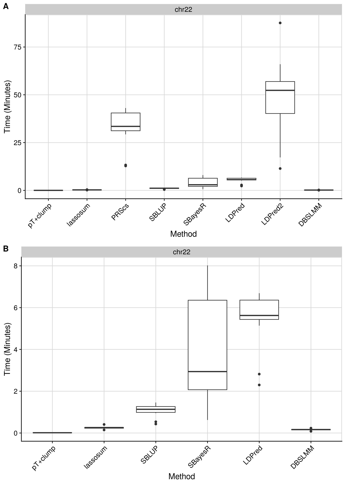

```{r setup, include=FALSE}
knitr::opts_chunk$set(echo = TRUE, error=TRUE)
```

<style>
p.caption {
  font-size: 1.5em;
}
</style>

```{css, echo=F}
pre code, pre, code {
  white-space: pre !important;
  overflow-x: auto !important;
  word-break: keep-all !important;
  word-wrap: initial !important;
}
```

***

On this page we will perform a time benchmark of polygenic scoring methods. To keep it simple and avoid my implementation from affecting the results, I will using the first 1000 SNPs from each chromosome for each outcome, but not allow any parallel process. 

This first approach puts pressure on the time taken to read the LD reference rather than the analysis, so a second test will be based on a single full chromosome, chromsome 22.

Then I will indicate beside methods, whether methods can be run in parallel across chromosomes or multithreaded.

***

# Run benchmark

<br/>

***

## Sparse thresholding (nested)

<details><summary>Show code</summary>
```{bash, eval=F, echo=T}
. /users/k1806347/brc_scratch/Software/MyGit/GenoPred/config_used/Pipeline_prep.config

# Create directory
mkdir /users/k1806347/brc_scratch/Analyses/PRS_comparison/Benchmark/pt_clump

# Create file listing GWAS that haven't been processed.
> /users/k1806347/brc_scratch/Analyses/PRS_comparison/Benchmark/pt_clump/todo.txt
for gwas in $(echo DEPR06 COLL01 HEIG03 BODY04 DIAB05 COAD01 CROH01 SCLE03 RHEU02 EDUC03 ADHD04 BODY11 PRCA01 BRCA01);do
for test in $(echo chr22);do
if [ ! -f /users/k1806347/brc_scratch/Analyses/PRS_comparison/Benchmark/pt_clump/${gwas}/test_${test}/1KGPhase3.w_hm3.${gwas}.test_${test}.log ]; then
echo $gwas ${test} >> /users/k1806347/brc_scratch/Analyses/PRS_comparison/Benchmark/pt_clump/todo.txt
fi
done
done

# Create shell script to run using sbatch
cat > /users/k1806347/brc_scratch/Analyses/PRS_comparison/Benchmark/pt_clump/sbatch.sh << 'EOF'
#!/bin/sh

#SBATCH -p shared,brc

. /users/k1806347/brc_scratch/Software/MyGit/GenoPred/config_used/Pipeline_prep.config

gwas=$(awk -v var="$SLURM_ARRAY_TASK_ID" 'NR == var {print $1}' /users/k1806347/brc_scratch/Analyses/PRS_comparison/Benchmark/pt_clump/todo.txt)
test=$(awk -v var="$SLURM_ARRAY_TASK_ID" 'NR == var {print $2}' /users/k1806347/brc_scratch/Analyses/PRS_comparison/Benchmark/pt_clump/todo.txt)

echo ${gwas}
echo ${test}

/users/k1806347/brc_scratch/Software/Rscript.sh /users/k1806347/brc_scratch/Software/MyGit/GenoPred/Scripts/polygenic_score_file_creator/polygenic_score_file_creator.R \
  --ref_plink_chr ${Geno_1KG_dir}/1KGPhase3.w_hm3.chr \
  --ref_keep ${Geno_1KG_dir}/keep_files/EUR_samples.keep \
  --sumstats ${gwas_rep_qcd}/${gwas}.cleaned.gz \
  --plink ${plink1_9} \
  --memory 3000 \
  --output /users/k1806347/brc_scratch/Analyses/PRS_comparison/Benchmark/pt_clump/${gwas}/test_${test}/1KGPhase3.w_hm3.${gwas}.test_${test} \
  --test ${test} \
  --ref_pop_scale ${Geno_1KG_dir}/super_pop_keep.list

EOF

sbatch --array 1-$(wc -l /users/k1806347/brc_scratch/Analyses/PRS_comparison/Benchmark/pt_clump/todo.txt | cut -d' ' -f1)%5 /users/k1806347/brc_scratch/Analyses/PRS_comparison/Benchmark/pt_clump/sbatch.sh

```
</details>

<br/>

***

## Sparse thresholding (not nested)

<details><summary>Show code</summary>
```{bash, eval=F, echo=T}
. /users/k1806347/brc_scratch/Software/MyGit/GenoPred/config_used/Pipeline_prep.config

# Create directory
mkdir /users/k1806347/brc_scratch/Analyses/PRS_comparison/Benchmark/pt_clump_nonnested

# Create file listing GWAS that haven't been processed.
> /users/k1806347/brc_scratch/Analyses/PRS_comparison/Benchmark/pt_clump_nonnested/todo.txt
for gwas in $(echo DEPR06 COLL01 HEIG03 BODY04 DIAB05 COAD01 CROH01 SCLE03 RHEU02 EDUC03 ADHD04 BODY11 PRCA01 BRCA01);do
for test in $(echo chr22);do
if [ ! -f /users/k1806347/brc_scratch/Analyses/PRS_comparison/Benchmark/pt_clump_nonnested/${gwas}/test_${test}/1KGPhase3.w_hm3.${gwas}.test_${test}.log ]; then
echo $gwas ${test} >> /users/k1806347/brc_scratch/Analyses/PRS_comparison/Benchmark/pt_clump_nonnested/todo.txt
fi
done
done

# Create shell script to run using sbatch
cat > /users/k1806347/brc_scratch/Analyses/PRS_comparison/Benchmark/pt_clump_nonnested/sbatch.sh << 'EOF'
#!/bin/sh

#SBATCH -p shared,brc

. /users/k1806347/brc_scratch/Software/MyGit/GenoPred/config_used/Pipeline_prep.config

gwas=$(awk -v var="$SLURM_ARRAY_TASK_ID" 'NR == var {print $1}' /users/k1806347/brc_scratch/Analyses/PRS_comparison/Benchmark/pt_clump_nonnested/todo.txt)
test=$(awk -v var="$SLURM_ARRAY_TASK_ID" 'NR == var {print $2}' /users/k1806347/brc_scratch/Analyses/PRS_comparison/Benchmark/pt_clump_nonnested/todo.txt)

echo ${gwas}
echo ${test}

/users/k1806347/brc_scratch/Software/Rscript.sh /users/k1806347/brc_scratch/Software/MyGit/GenoPred/Scripts/polygenic_score_file_creator/polygenic_score_file_creator.R \
  --ref_plink_chr ${Geno_1KG_dir}/1KGPhase3.w_hm3.chr \
  --ref_keep ${Geno_1KG_dir}/keep_files/EUR_samples.keep \
  --sumstats ${gwas_rep_qcd}/${gwas}.cleaned.gz \
  --plink ${plink1_9} \
  --nested F \
  --memory 3000 \
  --output /users/k1806347/brc_scratch/Analyses/PRS_comparison/Benchmark/pt_clump_nonnested/${gwas}/test_${test}/1KGPhase3.w_hm3.${gwas}.test_${test} \
  --test ${test} \
  --ref_pop_scale ${Geno_1KG_dir}/super_pop_keep.list

EOF

sbatch --array 1-$(wc -l /users/k1806347/brc_scratch/Analyses/PRS_comparison/Benchmark/pt_clump_nonnested/todo.txt | cut -d' ' -f1)%5 /users/k1806347/brc_scratch/Analyses/PRS_comparison/Benchmark/pt_clump_nonnested/sbatch.sh

```
</details>

<br/>

***

## Dense thresholding

<details><summary>Show code</summary>
```{bash, eval=F, echo=T}
. /users/k1806347/brc_scratch/Software/MyGit/GenoPred/config_used/Pipeline_prep.config

# Create directory
mkdir /users/k1806347/brc_scratch/Analyses/PRS_comparison/Benchmark/pt_clump_dense

# Create file listing GWAS that haven't been processed.
> /users/k1806347/brc_scratch/Analyses/PRS_comparison/Benchmark/pt_clump_dense/todo.txt
for gwas in $(echo DEPR06 COLL01 HEIG03 BODY04 DIAB05 COAD01 CROH01 SCLE03 RHEU02 EDUC03 ADHD04 BODY11 PRCA01 BRCA01);do
for test in $(echo chr22);do
if [ ! -f /users/k1806347/brc_scratch/Analyses/PRS_comparison/Benchmark/pt_clump_dense/${gwas}/test_${test}/1KGPhase3.w_hm3.${gwas}.test_${test}.log ]; then
echo $gwas ${test} >> /users/k1806347/brc_scratch/Analyses/PRS_comparison/Benchmark/pt_clump_dense/todo.txt
fi
done
done

# Create shell script to run using sbatch
cat > /users/k1806347/brc_scratch/Analyses/PRS_comparison/Benchmark/pt_clump_dense/sbatch.sh << 'EOF'
#!/bin/sh

#SBATCH -p shared,brc

. /users/k1806347/brc_scratch/Software/MyGit/GenoPred/config_used/Pipeline_prep.config

gwas=$(awk -v var="$SLURM_ARRAY_TASK_ID" 'NR == var {print $1}' /users/k1806347/brc_scratch/Analyses/PRS_comparison/Benchmark/pt_clump_dense/todo.txt)
test=$(awk -v var="$SLURM_ARRAY_TASK_ID" 'NR == var {print $2}' /users/k1806347/brc_scratch/Analyses/PRS_comparison/Benchmark/pt_clump_dense/todo.txt)

echo ${gwas}
echo ${test}

/users/k1806347/brc_scratch/Software/Rscript.sh /users/k1806347/brc_scratch/Software/MyGit/GenoPred/Scripts/polygenic_score_file_creator_dense/polygenic_score_file_creator_dense.R \
	--ref_plink_chr ${Geno_1KG_dir}/1KGPhase3.w_hm3.chr \
	--ref_keep ${Geno_1KG_dir}/keep_files/EUR_samples.keep \
  --sumstats ${gwas_rep_qcd}/${gwas}.cleaned.gz \
	--plink ${plink1_9} \
  --prsice_path ${prsice_path} \
  --rscript ${rscript} \
  --memory 3000 \
  --output /users/k1806347/brc_scratch/Analyses/PRS_comparison/Benchmark/pt_clump_dense/${gwas}/test_${test}/1KGPhase3.w_hm3.${gwas}.test_${test} \
  --test ${test} \
	--ref_pop_scale ${Geno_1KG_dir}/super_pop_keep.list

EOF

sbatch --array 1-$(wc -l /users/k1806347/brc_scratch/Analyses/PRS_comparison/Benchmark/pt_clump_dense/todo.txt | cut -d' ' -f1)%5 /users/k1806347/brc_scratch/Analyses/PRS_comparison/Benchmark/pt_clump_dense/sbatch.sh

```
</details>

<br/>

***

## Lassosum

<details><summary>Show code</summary>
```{bash, eval=F, echo=T}
. /users/k1806347/brc_scratch/Software/MyGit/GenoPred/config_used/Pipeline_prep.config

# Create directory
mkdir /users/k1806347/brc_scratch/Analyses/PRS_comparison/Benchmark/lassosum

# Create file listing GWAS that haven't been processed.
> /users/k1806347/brc_scratch/Analyses/PRS_comparison/Benchmark/lassosum/todo.txt
for gwas in $(echo DEPR06 COLL01 HEIG03 BODY04 DIAB05 COAD01 CROH01 SCLE03 RHEU02 EDUC03 ADHD04 BODY11 PRCA01 BRCA01);do
for test in $(echo chr22);do
if [ ! -f /users/k1806347/brc_scratch/Analyses/PRS_comparison/Benchmark/lassosum/${gwas}/test_${test}/1KGPhase3.w_hm3.${gwas}.test_${test}.log ]; then
echo $gwas ${test} >> /users/k1806347/brc_scratch/Analyses/PRS_comparison/Benchmark/lassosum/todo.txt
fi
done
done

# Create shell script to run using sbatch
cat > /users/k1806347/brc_scratch/Analyses/PRS_comparison/Benchmark/lassosum/sbatch.sh << 'EOF'
#!/bin/sh

#SBATCH -p shared,brc
#SBATCH --mem 5G

. /users/k1806347/brc_scratch/Software/MyGit/GenoPred/config_used/Pipeline_prep.config

gwas=$(awk -v var="$SLURM_ARRAY_TASK_ID" 'NR == var {print $1}' /users/k1806347/brc_scratch/Analyses/PRS_comparison/Benchmark/lassosum/todo.txt)
test=$(awk -v var="$SLURM_ARRAY_TASK_ID" 'NR == var {print $2}' /users/k1806347/brc_scratch/Analyses/PRS_comparison/Benchmark/lassosum/todo.txt)

echo ${gwas}
echo ${test}

/users/k1806347/brc_scratch/Software/Rscript.sh /users/k1806347/brc_scratch/Software/MyGit/GenoPred/Scripts/polygenic_score_file_creator_lassosum/polygenic_score_file_creator_lassosum.R \
	--ref_plink_gw ${Geno_1KG_dir}/1KGPhase3.w_hm3.GW \
	--ref_keep ${Geno_1KG_dir}/keep_files/EUR_samples.keep \
  --sumstats ${gwas_rep_qcd}/${gwas}.cleaned.gz \
  --output /users/k1806347/brc_scratch/Analyses/PRS_comparison/Benchmark/lassosum/${gwas}/test_${test}/1KGPhase3.w_hm3.${gwas}.test_${test} \
	--plink ${plink1_9} \
  --test ${test} \
	--ref_pop_scale ${Geno_1KG_dir}/super_pop_keep.list

EOF

sbatch --array 1-$(wc -l /users/k1806347/brc_scratch/Analyses/PRS_comparison/Benchmark/lassosum/todo.txt | cut -d' ' -f1)%5 /users/k1806347/brc_scratch/Analyses/PRS_comparison/Benchmark/lassosum/sbatch.sh

```
</details>

<br/>

***

## PRScs


<details><summary>Show code</summary>
```{bash, eval=F, echo=T}
. /users/k1806347/brc_scratch/Software/MyGit/GenoPred/config_used/Pipeline_prep.config

# Create directory
mkdir /users/k1806347/brc_scratch/Analyses/PRS_comparison/Benchmark/PRScs

# Create file listing GWAS that haven't been processed.
> /users/k1806347/brc_scratch/Analyses/PRS_comparison/Benchmark/PRScs/todo.txt
for gwas in $(echo DEPR06 COLL01 HEIG03 BODY04 DIAB05 COAD01 CROH01 SCLE03 RHEU02 EDUC03 ADHD04 BODY11 PRCA01 BRCA01);do
for test in $(echo chr22);do
if [ ! -f /users/k1806347/brc_scratch/Analyses/PRS_comparison/Benchmark/PRScs/${gwas}/test_${test}/1KGPhase3.w_hm3.${gwas}.test_${test}.log ]; then
echo $gwas ${test} >> /users/k1806347/brc_scratch/Analyses/PRS_comparison/Benchmark/PRScs/todo.txt
fi
done
done

# Create shell script to run using sbatch
cat > /users/k1806347/brc_scratch/Analyses/PRS_comparison/Benchmark/PRScs/sbatch.sh << 'EOF'
#!/bin/sh

#SBATCH -p shared,brc
#SBATCH --mem 5G

. /users/k1806347/brc_scratch/Software/MyGit/GenoPred/config_used/Pipeline_prep.config

gwas=$(awk -v var="$SLURM_ARRAY_TASK_ID" 'NR == var {print $1}' /users/k1806347/brc_scratch/Analyses/PRS_comparison/Benchmark/PRScs/todo.txt)
test=$(awk -v var="$SLURM_ARRAY_TASK_ID" 'NR == var {print $2}' /users/k1806347/brc_scratch/Analyses/PRS_comparison/Benchmark/PRScs/todo.txt)

echo ${gwas}
echo ${test}

/users/k1806347/brc_scratch/Software/Rscript.sh /users/k1806347/brc_scratch/Software/MyGit/GenoPred/Scripts/polygenic_score_file_creator_PRScs/polygenic_score_file_creator_PRScs.R \
  --ref_plink_chr ${Geno_1KG_dir}/1KGPhase3.w_hm3.chr \
  --ref_keep ${Geno_1KG_dir}/keep_files/EUR_samples.keep \
  --sumstats ${gwas_rep_qcd}/${gwas}.cleaned.gz \
  --plink ${plink1_9} \
  --memory 5000 \
  --output /users/k1806347/brc_scratch/Analyses/PRS_comparison/Benchmark/PRScs/${gwas}/test_${test}/1KGPhase3.w_hm3.${gwas}.test_${test} \
  --ref_pop_scale ${Geno_1KG_dir}/super_pop_keep.list \
  --PRScs_path /users/k1806347/brc_scratch/Software/PRScs.sh \
  --PRScs_ref_path ${PRScs_dir}/ldblk_1kg_eur \
  --n_cores 1 \
  --test ${test} \
  --phi_param 1e-6,1e-4,1e-2,1,auto

EOF

sbatch --array 1-$(wc -l /users/k1806347/brc_scratch/Analyses/PRS_comparison/Benchmark/PRScs/todo.txt | cut -d' ' -f1)%5 /users/k1806347/brc_scratch/Analyses/PRS_comparison/Benchmark/PRScs/sbatch.sh

```
</details>

<br/>

***

## PRScs (1-core specified)

<details><summary>Show code</summary>
```{bash, eval=F, echo=T}
. /users/k1806347/brc_scratch/Software/MyGit/GenoPred/config_used/Pipeline_prep.config

# Create directory
mkdir /users/k1806347/brc_scratch/Analyses/PRS_comparison/Benchmark/PRScs_1core

# Create file listing GWAS that haven't been processed.
> /users/k1806347/brc_scratch/Analyses/PRS_comparison/Benchmark/PRScs_1core/todo.txt
for gwas in $(echo DEPR06 COLL01 HEIG03 BODY04 DIAB05 COAD01 CROH01 SCLE03 RHEU02 EDUC03 ADHD04 BODY11 PRCA01 BRCA01);do
for test in $(echo chr22);do
if [ ! -f /users/k1806347/brc_scratch/Analyses/PRS_comparison/Benchmark/PRScs_1core/${gwas}/test_${test}/1KGPhase3.w_hm3.${gwas}.test_${test}.log ]; then
echo $gwas ${test} >> /users/k1806347/brc_scratch/Analyses/PRS_comparison/Benchmark/PRScs_1core/todo.txt
fi
done
done

# Create shell script to run using sbatch
cat > /users/k1806347/brc_scratch/Analyses/PRS_comparison/Benchmark/PRScs_1core/sbatch.sh << 'EOF'
#!/bin/sh

#SBATCH -p shared,brc
#SBATCH --mem 5G

export MKL_NUM_THREADS=1
export NUMEXPR_NUM_THREADS=1
export OMP_NUM_THREADS=1

. /users/k1806347/brc_scratch/Software/MyGit/GenoPred/config_used/Pipeline_prep.config

gwas=$(awk -v var="$SLURM_ARRAY_TASK_ID" 'NR == var {print $1}' /users/k1806347/brc_scratch/Analyses/PRS_comparison/Benchmark/PRScs_1core/todo.txt)
test=$(awk -v var="$SLURM_ARRAY_TASK_ID" 'NR == var {print $2}' /users/k1806347/brc_scratch/Analyses/PRS_comparison/Benchmark/PRScs_1core/todo.txt)

echo ${gwas}
echo ${test}

/users/k1806347/brc_scratch/Software/Rscript.sh /users/k1806347/brc_scratch/Software/MyGit/GenoPred/Scripts/polygenic_score_file_creator_PRScs/polygenic_score_file_creator_PRScs.R \
  --ref_plink_chr ${Geno_1KG_dir}/1KGPhase3.w_hm3.chr \
  --ref_keep ${Geno_1KG_dir}/keep_files/EUR_samples.keep \
  --sumstats ${gwas_rep_qcd}/${gwas}.cleaned.gz \
  --plink ${plink1_9} \
  --memory 5000 \
  --output /users/k1806347/brc_scratch/Analyses/PRS_comparison/Benchmark/PRScs_1core/${gwas}/test_${test}/1KGPhase3.w_hm3.${gwas}.test_${test} \
  --ref_pop_scale ${Geno_1KG_dir}/super_pop_keep.list \
  --PRScs_path /users/k1806347/brc_scratch/Software/PRScs.sh \
  --PRScs_ref_path ${PRScs_dir}/ldblk_1kg_eur \
  --n_cores 1 \
  --test ${test} \
  --phi_param 1e-6,1e-4,1e-2,1,auto

EOF

sbatch --array 1-$(wc -l /users/k1806347/brc_scratch/Analyses/PRS_comparison/Benchmark/PRScs_1core/todo.txt | cut -d' ' -f1)%5 /users/k1806347/brc_scratch/Analyses/PRS_comparison/Benchmark/PRScs_1core/sbatch.sh

```
</details>

<br/>

This shows that when running for chromosome 22, specifying 1 core does not make a difference to the speed.

<br/>

***

## PRScs (1-core specified using new script)

<details><summary>Show code</summary>
```{bash, eval=F, echo=T}
. /users/k1806347/brc_scratch/Software/MyGit/GenoPred/config_used/Pipeline_prep.config

# Create directory
mkdir /users/k1806347/brc_scratch/Analyses/PRS_comparison/Benchmark/PRScs_1core_v2

# Create file listing GWAS that haven't been processed.
> /users/k1806347/brc_scratch/Analyses/PRS_comparison/Benchmark/PRScs_1core_v2/todo.txt
for gwas in $(echo DEPR06 COLL01 HEIG03 BODY04 DIAB05 COAD01 CROH01 SCLE03 RHEU02 EDUC03 ADHD04 BODY11 PRCA01 BRCA01);do
for test in $(echo chr22);do
if [ ! -f /users/k1806347/brc_scratch/Analyses/PRS_comparison/Benchmark/PRScs_1core_v2/${gwas}/test_${test}/1KGPhase3.w_hm3.${gwas}.test_${test}.log ]; then
echo $gwas ${test} >> /users/k1806347/brc_scratch/Analyses/PRS_comparison/Benchmark/PRScs_1core_v2/todo.txt
fi
done
done

# Create shell script to run using sbatch
cat > /users/k1806347/brc_scratch/Analyses/PRS_comparison/Benchmark/PRScs_1core_v2/sbatch.sh << 'EOF'
#!/bin/sh

#SBATCH -p shared,brc
#SBATCH --mem 5G

. /users/k1806347/brc_scratch/Software/MyGit/GenoPred/config_used/Pipeline_prep.config

gwas=$(awk -v var="$SLURM_ARRAY_TASK_ID" 'NR == var {print $1}' /users/k1806347/brc_scratch/Analyses/PRS_comparison/Benchmark/PRScs_1core/todo.txt)
test=$(awk -v var="$SLURM_ARRAY_TASK_ID" 'NR == var {print $2}' /users/k1806347/brc_scratch/Analyses/PRS_comparison/Benchmark/PRScs_1core/todo.txt)

echo ${gwas}
echo ${test}

/users/k1806347/brc_scratch/Software/Rscript.sh /users/k1806347/brc_scratch/Software/MyGit/GenoPred/Scripts/polygenic_score_file_creator_PRScs/polygenic_score_file_creator_PRScs_2.R \
  --ref_plink_chr ${Geno_1KG_dir}/1KGPhase3.w_hm3.chr \
  --ref_keep ${Geno_1KG_dir}/keep_files/EUR_samples.keep \
  --sumstats ${gwas_rep_qcd}/${gwas}.cleaned.gz \
  --plink ${plink1_9} \
  --memory 5000 \
  --output /users/k1806347/brc_scratch/Analyses/PRS_comparison/Benchmark/PRScs_1core_v2/${gwas}/test_${test}/1KGPhase3.w_hm3.${gwas}.test_${test} \
  --ref_pop_scale ${Geno_1KG_dir}/super_pop_keep.list \
  --PRScs_path /users/k1806347/brc_scratch/Software/PRScs.sh \
  --PRScs_ref_path ${PRScs_dir}/ldblk_1kg_eur \
  --n_cores 1 \
  --test ${test} \
  --phi_param 1e-6,1e-4,1e-2,1,auto

EOF

sbatch --array 1-$(wc -l /users/k1806347/brc_scratch/Analyses/PRS_comparison/Benchmark/PRScs_1core_v2/todo.txt | cut -d' ' -f1)%5 /users/k1806347/brc_scratch/Analyses/PRS_comparison/Benchmark/PRScs_1core_v2/sbatch.sh

```
</details>

<br/>

Again, this shows that when running for chromosome 22, specifying 1 core does not make a difference to the speed.

<br/>

***

## S-BLUP

<details><summary>Show code</summary>
```{bash, eval=F, echo=T}
. /users/k1806347/brc_scratch/Software/MyGit/GenoPred/config_used/Pipeline_prep.config

# Create directory
mkdir /users/k1806347/brc_scratch/Analyses/PRS_comparison/Benchmark/SBLUP

# Create file listing GWAS that haven't been processed.
> /users/k1806347/brc_scratch/Analyses/PRS_comparison/Benchmark/SBLUP/todo.txt
for gwas in $(echo DEPR06 COLL01 HEIG03 BODY04 DIAB05 COAD01 CROH01 SCLE03 RHEU02 EDUC03 ADHD04 BODY11 PRCA01 BRCA01);do
for test in $(echo chr22);do
if [ ! -f /users/k1806347/brc_scratch/Analyses/PRS_comparison/Benchmark/SBLUP/${gwas}/test_${test}/1KGPhase3.w_hm3.${gwas}.test_${test}.log ]; then
echo $gwas ${test} >> /users/k1806347/brc_scratch/Analyses/PRS_comparison/Benchmark/SBLUP/todo.txt
fi
done
done

# Create shell script to run using sbatch
cat > /users/k1806347/brc_scratch/Analyses/PRS_comparison/Benchmark/SBLUP/sbatch.sh << 'EOF'
#!/bin/sh

#SBATCH -p test
#SBATCH --mem 5G

. /users/k1806347/brc_scratch/Software/MyGit/GenoPred/config_used/Pipeline_prep.config

gwas=$(awk -v var="$SLURM_ARRAY_TASK_ID" 'NR == var {print $1}' /users/k1806347/brc_scratch/Analyses/PRS_comparison/Benchmark/SBLUP/todo.txt)
test=$(awk -v var="$SLURM_ARRAY_TASK_ID" 'NR == var {print $2}' /users/k1806347/brc_scratch/Analyses/PRS_comparison/Benchmark/SBLUP/todo.txt)

echo ${gwas}
echo ${test}

/users/k1806347/brc_scratch/Software/Rscript.sh /users/k1806347/brc_scratch/Software/MyGit/GenoPred/Scripts/polygenic_score_file_creator_SBLUP/polygenic_score_file_creator_SBLUP.R \
  --ref_plink ${Geno_1KG_dir}/1KGPhase3.w_hm3.GW \
  --ref_keep ${Geno_1KG_dir}/keep_files/EUR_samples.keep \
  --sumstats ${gwas_rep_qcd}/${gwas}.cleaned.gz \
  --plink ${plink1_9} \
  --gcta ${gcta} \
  --munge_sumstats ${munge_sumstats} \
  --ldsc ${ldsc} \
  --ldsc_ref ${ldsc_ref} \
  --hm3_snplist ${HapMap3_snplist_dir}/w_hm3.snplist \
  --memory 50000 \
  --n_cores 1 \
  --output /users/k1806347/brc_scratch/Analyses/PRS_comparison/Benchmark/SBLUP/${gwas}/test_${test}/1KGPhase3.w_hm3.${gwas}.test_${test} \
  --test ${test} \
  --ref_pop_scale ${Geno_1KG_dir}/super_pop_keep.list

EOF

sbatch --array 1-$(wc -l /users/k1806347/brc_scratch/Analyses/PRS_comparison/Benchmark/SBLUP/todo.txt | cut -d' ' -f1)%5 /users/k1806347/brc_scratch/Analyses/PRS_comparison/Benchmark/SBLUP/sbatch.sh

```
</details>

<br/>

***

## SBayesR

<details><summary>Show code</summary>
```{bash, eval=F, echo=T}
. /users/k1806347/brc_scratch/Software/MyGit/GenoPred/config_used/Pipeline_prep.config

# Create directory
mkdir /users/k1806347/brc_scratch/Analyses/PRS_comparison/Benchmark/SBayesR

# Create file listing GWAS that haven't been processed.
> /users/k1806347/brc_scratch/Analyses/PRS_comparison/Benchmark/SBayesR/todo.txt
for gwas in $(echo DEPR06 COLL01 HEIG03 BODY04 DIAB05 COAD01 CROH01 SCLE03 RHEU02 EDUC03 ADHD04 BODY11 PRCA01 BRCA01);do
for test in $(echo chr22);do
if [ ! -f /users/k1806347/brc_scratch/Analyses/PRS_comparison/Benchmark/SBayesR/${gwas}/test_${test}/1KGPhase3.w_hm3.${gwas}.test_${test}.log ]; then
echo $gwas ${test} >> /users/k1806347/brc_scratch/Analyses/PRS_comparison/Benchmark/SBayesR/todo.txt
fi
done
done

# Create shell script to run using sbatch
cat > /users/k1806347/brc_scratch/Analyses/PRS_comparison/Benchmark/SBayesR/sbatch.sh << 'EOF'
#!/bin/sh

#SBATCH -p shared,brc

. /users/k1806347/brc_scratch/Software/MyGit/GenoPred/config_used/Pipeline_prep.config

gwas=$(awk -v var="$SLURM_ARRAY_TASK_ID" 'NR == var {print $1}' /users/k1806347/brc_scratch/Analyses/PRS_comparison/Benchmark/SBayesR/todo.txt)
test=$(awk -v var="$SLURM_ARRAY_TASK_ID" 'NR == var {print $2}' /users/k1806347/brc_scratch/Analyses/PRS_comparison/Benchmark/SBayesR/todo.txt)

echo ${gwas}
echo ${test}

/users/k1806347/brc_scratch/Software/Rscript.sh /users/k1806347/brc_scratch/Software/MyGit/GenoPred/Scripts/polygenic_score_file_creator_SBayesR/polygenic_score_file_creator_SBayesR.R \
  --ref_plink ${Geno_1KG_dir}/1KGPhase3.w_hm3.GW \
  --ref_keep ${Geno_1KG_dir}/keep_files/EUR_samples.keep \
  --sumstats ${gwas_rep_qcd}/${gwas}.cleaned.gz \
  --plink ${plink1_9} \
  --gctb ${gctb} \
  --ld_matrix_chr ${Geno_1KG_dir}/LD_matrix/EUR/1KGPhase3.w_hm3.EUR.chr \
  --memory 50000 \
  --n_cores 3 \
  --output /users/k1806347/brc_scratch/Analyses/PRS_comparison/Benchmark/SBayesR/${gwas}/test_${test}/1KGPhase3.w_hm3.${gwas}.test_${test}_3core_split \
  --test ${test} \
  --ref_pop_scale ${Geno_1KG_dir}/super_pop_keep.list

EOF

sbatch --array 1-$(wc -l /users/k1806347/brc_scratch/Analyses/PRS_comparison/Benchmark/SBayesR/todo.txt | cut -d' ' -f1)%5 /users/k1806347/brc_scratch/Analyses/PRS_comparison/Benchmark/SBayesR/sbatch.sh

```
</details>

<br/>

***

## LDPred

<details><summary>Show code</summary>
```{bash, eval=F, echo=T}
. /users/k1806347/brc_scratch/Software/MyGit/GenoPred/config_used/Pipeline_prep.config

# Create directory
mkdir /users/k1806347/brc_scratch/Analyses/PRS_comparison/Benchmark/LDPred

# Create file listing GWAS that haven't been processed.
> /users/k1806347/brc_scratch/Analyses/PRS_comparison/Benchmark/LDPred/todo.txt
for gwas in $(echo DEPR06 COLL01 HEIG03 BODY04 DIAB05 COAD01 CROH01 SCLE03 RHEU02 EDUC03 ADHD04 BODY11 PRCA01 BRCA01);do
for test in $(echo chr22);do
if [ ! -f /users/k1806347/brc_scratch/Analyses/PRS_comparison/Benchmark/LDPred/${gwas}/test_${test}/1KGPhase3.w_hm3.${gwas}.test_${test}.log ]; then
echo $gwas ${test} >> /users/k1806347/brc_scratch/Analyses/PRS_comparison/Benchmark/LDPred/todo.txt
fi
done
done

# Create shell script to run using sbatch
cat > /users/k1806347/brc_scratch/Analyses/PRS_comparison/Benchmark/LDPred/sbatch.sh << 'EOF'
#!/bin/sh

#SBATCH -p shared,brc
#SBATCH --mem 5G

. /users/k1806347/brc_scratch/Software/MyGit/GenoPred/config_used/Pipeline_prep.config

gwas=$(awk -v var="$SLURM_ARRAY_TASK_ID" 'NR == var {print $1}' /users/k1806347/brc_scratch/Analyses/PRS_comparison/Benchmark/LDPred/todo.txt)
test=$(awk -v var="$SLURM_ARRAY_TASK_ID" 'NR == var {print $2}' /users/k1806347/brc_scratch/Analyses/PRS_comparison/Benchmark/LDPred/todo.txt)

echo ${gwas}
echo ${test}

/users/k1806347/brc_scratch/Software/Rscript.sh /users/k1806347/brc_scratch/Software/MyGit/GenoPred/Scripts/polygenic_score_file_creator_LDPred/polygenic_score_file_creator_LDPred.R \
  --ref_plink ${Geno_1KG_dir}/1KGPhase3.w_hm3.GW \
  --ref_keep ${Geno_1KG_dir}/keep_files/EUR_samples.keep \
  --sumstats ${gwas_rep_qcd}/${gwas}.cleaned.gz \
  --plink ${plink1_9} \
  --memory 20000 \
  --n_cores 1 \
  --ldpred ${ldpred} \
  --output /users/k1806347/brc_scratch/Analyses/PRS_comparison/Benchmark/LDPred/${gwas}/test_${test}/1KGPhase3.w_hm3.${gwas}.test_${test} \
  --test ${test} \
  --ref_pop_scale ${Geno_1KG_dir}/super_pop_keep.list

EOF

sbatch --array 1-$(wc -l /users/k1806347/brc_scratch/Analyses/PRS_comparison/Benchmark/LDPred/todo.txt | cut -d' ' -f1)%5 /users/k1806347/brc_scratch/Analyses/PRS_comparison/Benchmark/LDPred/sbatch.sh

```
</details>

<br/>

***

## LDPred2

Rerun with LDpred2 update improving efficiency.

<details><summary>Show code</summary>
```{bash, eval=F, echo=T}
. /users/k1806347/brc_scratch/Software/MyGit/GenoPred/config_used/Pipeline_prep.config

# Create directory
mkdir /users/k1806347/brc_scratch/Analyses/PRS_comparison/Benchmark/LDPred2_compact

gwas=$(echo DEPR06 COLL01 HEIG03 BODY04 DIAB05 COAD01 CROH01 SCLE03 RHEU02 EDUC03 ADHD04 BODY11 PRCA01 BRCA01)
binary=$(echo T F F F T T T T T F T F T T)

# Create directory
mkdir /users/k1806347/brc_scratch/Analyses/PRS_comparison/Benchmark/LDPred2_compact

# Create file listing GWAS that haven't been processed.
> /users/k1806347/brc_scratch/Analyses/PRS_comparison/Benchmark/LDPred2_compact/todo.txt
for i in $(seq 1 14);do
gwas_i=$(echo ${gwas} | cut -f ${i} -d ' ')
binary_i=$(echo ${binary} | cut -f ${i} -d ' ')
for test in $(echo chr22);do
if [ ! -f /users/k1806347/brc_scratch/Analyses/PRS_comparison/Benchmark/LDPred2_compact/${gwas_i}/test_${test}/1KGPhase3.w_hm3.${gwas_i}.test_${test}.log ]; then
echo ${gwas_i} ${binary_i} ${test} >> /users/k1806347/brc_scratch/Analyses/PRS_comparison/Benchmark/LDPred2_compact/todo.txt
fi
done
done

# Create shell script to run using sbatch
cat > /users/k1806347/brc_scratch/Analyses/PRS_comparison/Benchmark/LDPred2_compact/sbatch.sh << 'EOF'
#!/bin/sh

#SBATCH -p shared,brc
#SBATCH --mem 20G

. /users/k1806347/brc_scratch/Software/MyGit/GenoPred/config_used/Pipeline_prep.config

gwas=$(awk -v var="$SLURM_ARRAY_TASK_ID" 'NR == var {print $1}' /users/k1806347/brc_scratch/Analyses/PRS_comparison/Benchmark/LDPred2_compact/todo.txt)
binary=$(awk -v var="$SLURM_ARRAY_TASK_ID" 'NR == var {print $2}' /users/k1806347/brc_scratch/Analyses/PRS_comparison/Benchmark/LDPred2_compact/todo.txt)
test=$(awk -v var="$SLURM_ARRAY_TASK_ID" 'NR == var {print $3}' /users/k1806347/brc_scratch/Analyses/PRS_comparison/Benchmark/LDPred2_compact/todo.txt)

echo ${gwas}
echo ${binary}
echo ${test}

/users/k1806347/brc_scratch/Software/Rscript.sh /users/k1806347/brc_scratch/Software/MyGit/GenoPred/Scripts/polygenic_score_file_creator_LDPred2/polygenic_score_file_creator_LDPred2.R \
  --ref_plink ${Geno_1KG_dir}/1KGPhase3.w_hm3.GW \
  --ref_keep ${Geno_1KG_dir}/keep_files/EUR_samples.keep \
  --ldpred2_ref_dir ${Geno_1KG_dir}/LD_matrix/LDPred2 \
  --sumstats ${gwas_rep_qcd}/${gwas}.cleaned.gz \
  --plink ${plink1_9} \
  --memory 5000 \
  --n_cores 1 \
  --binary ${binary} \
  --output /users/k1806347/brc_scratch/Analyses/PRS_comparison/Benchmark/LDPred2_compact/${gwas}/test_${test}/1KGPhase3.w_hm3.${gwas}.test_${test} \
  --test ${test} \
  --ref_pop_scale ${Geno_1KG_dir}/super_pop_keep.list

EOF

sbatch --array 1-$(wc -l /users/k1806347/brc_scratch/Analyses/PRS_comparison/Benchmark/LDPred2_compact/todo.txt | cut -d' ' -f1)%5 /users/k1806347/brc_scratch/Analyses/PRS_comparison/Benchmark/LDPred2_compact/sbatch.sh

opt$ref_plink<-'/users/k1806347/brc_scratch/Data/1KG/Phase3/1KGPhase3.w_hm3.GW'
opt$ref_keep<-'/users/k1806347/brc_scratch/Data/1KG/Phase3/keep_files/EUR_samples.keep'
opt$ldpred2_ref_dir<-'/users/k1806347/brc_scratch/Data/1KG/Phase3/LD_matrix/LDPred2'
opt$sumstats<-'/users/k1806347/brc_scratch/Data/GWAS_sumstats/prs_comparison/cleaned/DEPR06.cleaned.gz'
opt$plink<-'/users/k1806347/brc_scratch/Software/plink1.9.sh'
opt$memory<-5000
opt$n_cores<-1
opt$binary<-T
opt$output<-'/users/k1806347/brc_scratch/Analyses/PRS_comparison/Benchmark/LDPred2_compact/DEPR06/test_chr22/1KGPhase3.w_hm3.DEPR06.test_chr22'
opt$test<-'chr22'
opt$ref_pop_scale<-'/users/k1806347/brc_scratch/Data/1KG/Phase3/super_pop_keep.list'

```
</details>

<br/>

***

## DBSLMM

<details><summary>Show code</summary>
```{bash, eval=F, echo=T}
. /users/k1806347/brc_scratch/Software/MyGit/GenoPred/config_used/Pipeline_prep.config

gwas=$(echo DEPR06 COLL01 HEIG03 BODY04 DIAB05 COAD01 CROH01 SCLE03 RHEU02 EDUC03 ADHD04 BODY11 PRCA01 BRCA01)
pop_prev=$(echo 0.15 NA NA NA 0.05 0.03 0.013 0.00164 0.005 NA 0.05 NA 0.125 0.125)
samp_prev=$(echo 0.27 NA NA NA 0.298 0.5 0.069 0.023 0.246 NA 0.36 NA 0.564 0.537)

# Create directory
mkdir /users/k1806347/brc_scratch/Analyses/PRS_comparison/Benchmark/DBSLMM

# Create file listing GWAS that haven't been processed.
> /users/k1806347/brc_scratch/Analyses/PRS_comparison/Benchmark/DBSLMM/todo.txt
for i in $(seq 1 14);do
gwas_i=$(echo ${gwas} | cut -f ${i} -d ' ')
pop_prev_i=$(echo ${pop_prev} | cut -f ${i} -d ' ')
sample_prev_i=$(echo ${samp_prev} | cut -f ${i} -d ' ')
for test in $(echo chr22);do
if [ ! -f /users/k1806347/brc_scratch/Analyses/PRS_comparison/Benchmark/DBSLMM/${gwas_i}/test_${test}/1KGPhase3.w_hm3.${gwas_i}.test_${test}.log ]; then
echo ${gwas_i} ${pop_prev_i} ${sample_prev_i} ${test} >> /users/k1806347/brc_scratch/Analyses/PRS_comparison/Benchmark/DBSLMM/todo.txt
fi
done
done

# Create shell script to run using sbatch
cat > /users/k1806347/brc_scratch/Analyses/PRS_comparison/Benchmark/DBSLMM/sbatch.sh << 'EOF'
#!/bin/sh

#SBATCH -p shared,brc

. /users/k1806347/brc_scratch/Software/MyGit/GenoPred/config_used/Pipeline_prep.config

gwas=$(awk -v var="$SLURM_ARRAY_TASK_ID" 'NR == var {print $1}' /users/k1806347/brc_scratch/Analyses/PRS_comparison/Benchmark/DBSLMM/todo.txt)
pop_prev=$(awk -v var="$SLURM_ARRAY_TASK_ID" 'NR == var {print $2}' /users/k1806347/brc_scratch/Analyses/PRS_comparison/Benchmark/DBSLMM/todo.txt)
sample_prev=$(awk -v var="$SLURM_ARRAY_TASK_ID" 'NR == var {print $3}' /users/k1806347/brc_scratch/Analyses/PRS_comparison/Benchmark/DBSLMM/todo.txt)
test=$(awk -v var="$SLURM_ARRAY_TASK_ID" 'NR == var {print $4}' /users/k1806347/brc_scratch/Analyses/PRS_comparison/Benchmark/DBSLMM/todo.txt)

echo ${gwas}
echo ${pop_prev}
echo ${sample_prev}
echo ${test}

/users/k1806347/brc_scratch/Software/Rscript.sh /users/k1806347/brc_scratch/Software/MyGit/GenoPred/Scripts/polygenic_score_file_creator_DBSLMM/polygenic_score_file_creator_DBSLMM.R \
  --ref_plink_chr ${Geno_1KG_dir}/1KGPhase3.w_hm3.chr \
  --ref_keep ${Geno_1KG_dir}/keep_files/EUR_samples.keep \
  --sumstats ${gwas_rep_qcd}/${gwas}.cleaned.gz \
  --plink ${plink1_9} \
  --memory 5000 \
  --ld_blocks /users/k1806347/brc_scratch/Data/LDetect/EUR \
  --rscript /users/k1806347/brc_scratch/Software/Rscript.sh \
  --dbslmm /users/k1806347/brc_scratch/Software/DBSLMM/software \
  --munge_sumstats ${munge_sumstats} \
  --ldsc ${ldsc} \
  --ldsc_ref ${ldsc_ref} \
  --hm3_snplist ${HapMap3_snplist_dir}/w_hm3.snplist \
  --sample_prev ${sample_prev} \
  --pop_prev ${pop_prev} \
  --output /users/k1806347/brc_scratch/Analyses/PRS_comparison/Benchmark/DBSLMM/${gwas}/test_${test}/1KGPhase3.w_hm3.${gwas}.test_${test} \
  --test ${test} \
  --ref_pop_scale ${Geno_1KG_dir}/super_pop_keep.list
EOF

sbatch --array 1-$(wc -l /users/k1806347/brc_scratch/Analyses/PRS_comparison/Benchmark/DBSLMM/todo.txt | cut -d' ' -f1)%3 /users/k1806347/brc_scratch/Analyses/PRS_comparison/Benchmark/DBSLMM/sbatch.sh

```
</details>

<br/>

***

## LDAK

MegaPRS contains Lasso-SS (--model lasso), Lasso-SS-Sparse (--model lasso-sparse), Ridge-SS (--model ridge), Bolt-SS (--model bolt), BayesR-SS (--model bayesr) and BayesR-Shrink (--model bayesr-shrink). If you use --model mega

<details><summary>MegaPRS</summary>
```{bash, eval=F, echo=T}
. /users/k1806347/brc_scratch/Software/MyGit/GenoPred/config_used/Pipeline_prep.config

gwas=$(echo DEPR06 COLL01 HEIG03 BODY04 DIAB05 COAD01 CROH01 SCLE03 RHEU02 EDUC03 ADHD04 BODY11 PRCA01 BRCA01)

# Create directory
mkdir /users/k1806347/brc_scratch/Analyses/PRS_comparison/Benchmark/MegaPRS

# Create file listing GWAS that haven't been processed.
> /users/k1806347/brc_scratch/Analyses/PRS_comparison/Benchmark/MegaPRS/todo.txt
for i in $(seq 1 14);do
gwas_i=$(echo ${gwas} | cut -f ${i} -d ' ')
for test in $(echo chr22);do
if [ ! -f /users/k1806347/brc_scratch/Analyses/PRS_comparison/Benchmark/MegaPRS/${gwas_i}/test_${test}/1KGPhase3.w_hm3.${gwas_i}.test_${test}.log ]; then
echo ${gwas_i} ${test} >> /users/k1806347/brc_scratch/Analyses/PRS_comparison/Benchmark/MegaPRS/todo.txt
fi
done
done

# Create shell script to run using sbatch
cat > /users/k1806347/brc_scratch/Analyses/PRS_comparison/Benchmark/MegaPRS/sbatch.sh << 'EOF'
#!/bin/sh

#SBATCH -p shared,brc
#SBATCH --mem 10G

. /users/k1806347/brc_scratch/Software/MyGit/GenoPred/config_used/Pipeline_prep.config

gwas=$(awk -v var="$SLURM_ARRAY_TASK_ID" 'NR == var {print $1}' /users/k1806347/brc_scratch/Analyses/PRS_comparison/Benchmark/Lasso-SS/todo.txt)
test=$(awk -v var="$SLURM_ARRAY_TASK_ID" 'NR == var {print $2}' /users/k1806347/brc_scratch/Analyses/PRS_comparison/Benchmark/MegaPRS/todo.txt)

echo ${gwas}

/users/k1806347/brc_scratch/Software/Rscript.sh /users/k1806347/brc_scratch/Software/MyGit/GenoPred/Scripts/ldak_mega_prs/ldak_mega_prs.R \
--ref_plink ${Geno_1KG_dir}/1KGPhase3.w_hm3.GW \
--ref_keep ${Geno_1KG_dir}/keep_files/EUR_samples.keep \
--sumstats ${gwas_rep_qcd}/${gwas}.cleaned.gz \
--plink1 ${plink1_9} \
--plink2 ${plink2} \
--ldak /users/k1806347/brc_scratch/Software/ldak5.1.linux \
--ldak_map /users/k1806347/brc_scratch/Data/LDAK/genetic_map_b37 \
--ldak_tag /users/k1806347/brc_scratch/Data/LDAK/bld/ \
--ldak_highld /users/k1806347/brc_scratch/Data/LDAK/highld.txt \
--memory 5000 \
--prs_model mega \
--n_cores 1 \
--output /users/k1806347/brc_scratch/Analyses/PRS_comparison/Benchmark/MegaPRS/${gwas}/test_${test}/1KGPhase3.w_hm3.${gwas}.test_${test} \
--test ${test} \
--ref_pop_scale ${Geno_1KG_dir}/super_pop_keep.list

EOF

sbatch --array 1-$(wc -l /users/k1806347/brc_scratch/Analyses/PRS_comparison/Benchmark/MegaPRS/todo.txt | cut -d' ' -f1) /users/k1806347/brc_scratch/Analyses/PRS_comparison/Benchmark/MegaPRS/sbatch.sh

```
</details>

<details><summary>Lasso-SS</summary>
```{bash, eval=F, echo=T}
. /users/k1806347/brc_scratch/Software/MyGit/GenoPred/config_used/Pipeline_prep.config

gwas=$(echo DEPR06 COLL01 HEIG03 BODY04 DIAB05 COAD01 CROH01 SCLE03 RHEU02 EDUC03 ADHD04 BODY11 PRCA01 BRCA01)

# Create directory
mkdir /users/k1806347/brc_scratch/Analyses/PRS_comparison/Benchmark/Lasso-SS

# Create file listing GWAS that haven't been processed.
> /users/k1806347/brc_scratch/Analyses/PRS_comparison/Benchmark/Lasso-SS/todo.txt
for i in $(seq 1 14);do
gwas_i=$(echo ${gwas} | cut -f ${i} -d ' ')
for test in $(echo chr22);do
if [ ! -f /users/k1806347/brc_scratch/Analyses/PRS_comparison/Benchmark/Lasso-SS/${gwas_i}/test_${test}/1KGPhase3.w_hm3.${gwas_i}.test_${test}.log ]; then
echo ${gwas_i} ${test} >> /users/k1806347/brc_scratch/Analyses/PRS_comparison/Benchmark/Lasso-SS/todo.txt
fi
done
done

# Create shell script to run using sbatch
cat > /users/k1806347/brc_scratch/Analyses/PRS_comparison/Benchmark/Lasso-SS/sbatch.sh << 'EOF'
#!/bin/sh

#SBATCH -p shared,brc
#SBATCH --mem 10G

. /users/k1806347/brc_scratch/Software/MyGit/GenoPred/config_used/Pipeline_prep.config

gwas=$(awk -v var="$SLURM_ARRAY_TASK_ID" 'NR == var {print $1}' /users/k1806347/brc_scratch/Analyses/PRS_comparison/Benchmark/Lasso-SS/todo.txt)
test=$(awk -v var="$SLURM_ARRAY_TASK_ID" 'NR == var {print $2}' /users/k1806347/brc_scratch/Analyses/PRS_comparison/Benchmark/Lasso-SS/todo.txt)

echo ${gwas}

/users/k1806347/brc_scratch/Software/Rscript.sh /users/k1806347/brc_scratch/Software/MyGit/GenoPred/Scripts/ldak_mega_prs/ldak_mega_prs.R \
--ref_plink ${Geno_1KG_dir}/1KGPhase3.w_hm3.GW \
--ref_keep ${Geno_1KG_dir}/keep_files/EUR_samples.keep \
--sumstats ${gwas_rep_qcd}/${gwas}.cleaned.gz \
--plink1 ${plink1_9} \
--plink2 ${plink2} \
--ldak /users/k1806347/brc_scratch/Software/ldak5.1.linux \
--ldak_map /users/k1806347/brc_scratch/Data/LDAK/genetic_map_b37 \
--ldak_tag /users/k1806347/brc_scratch/Data/LDAK/bld/ \
--ldak_highld /users/k1806347/brc_scratch/Data/LDAK/highld.txt \
--memory 5000 \
--prs_model lasso \
--n_cores 1 \
--output /users/k1806347/brc_scratch/Analyses/PRS_comparison/Benchmark/Lasso-SS/${gwas}/test_${test}/1KGPhase3.w_hm3.${gwas}.test_${test} \
--test ${test} \
--ref_pop_scale ${Geno_1KG_dir}/super_pop_keep.list

EOF

sbatch --array 1-$(wc -l /users/k1806347/brc_scratch/Analyses/PRS_comparison/Benchmark/Lasso-SS/todo.txt | cut -d' ' -f1) /users/k1806347/brc_scratch/Analyses/PRS_comparison/Benchmark/Lasso-SS/sbatch.sh

```
</details>

<details><summary>Ridge-SS</summary>
```{bash, eval=F, echo=T}
. /users/k1806347/brc_scratch/Software/MyGit/GenoPred/config_used/Pipeline_prep.config

gwas=$(echo DEPR06 COLL01 HEIG03 BODY04 DIAB05 COAD01 CROH01 SCLE03 RHEU02 EDUC03 ADHD04 BODY11 PRCA01 BRCA01)

# Create directory
mkdir /users/k1806347/brc_scratch/Analyses/PRS_comparison/Benchmark/Ridge-SS

# Create file listing GWAS that haven't been processed.
> /users/k1806347/brc_scratch/Analyses/PRS_comparison/Benchmark/Ridge-SS/todo.txt
for i in $(seq 1 14);do
gwas_i=$(echo ${gwas} | cut -f ${i} -d ' ')
for test in $(echo chr22);do
if [ ! -f /users/k1806347/brc_scratch/Analyses/PRS_comparison/Benchmark/Ridge-SS/${gwas_i}/test_${test}/1KGPhase3.w_hm3.${gwas_i}.test_${test}.log ]; then
echo ${gwas_i} ${test} >> /users/k1806347/brc_scratch/Analyses/PRS_comparison/Benchmark/Ridge-SS/todo.txt
fi
done
done

# Create shell script to run using sbatch
cat > /users/k1806347/brc_scratch/Analyses/PRS_comparison/Benchmark/Ridge-SS/sbatch.sh << 'EOF'
#!/bin/sh

#SBATCH -p shared,brc
#SBATCH --mem 10G

. /users/k1806347/brc_scratch/Software/MyGit/GenoPred/config_used/Pipeline_prep.config

gwas=$(awk -v var="$SLURM_ARRAY_TASK_ID" 'NR == var {print $1}' /users/k1806347/brc_scratch/Analyses/PRS_comparison/Benchmark/Lasso-SS/todo.txt)
test=$(awk -v var="$SLURM_ARRAY_TASK_ID" 'NR == var {print $2}' /users/k1806347/brc_scratch/Analyses/PRS_comparison/Benchmark/Ridge-SS/todo.txt)

echo ${gwas}

/users/k1806347/brc_scratch/Software/Rscript.sh /users/k1806347/brc_scratch/Software/MyGit/GenoPred/Scripts/ldak_mega_prs/ldak_mega_prs.R \
--ref_plink ${Geno_1KG_dir}/1KGPhase3.w_hm3.GW \
--ref_keep ${Geno_1KG_dir}/keep_files/EUR_samples.keep \
--sumstats ${gwas_rep_qcd}/${gwas}.cleaned.gz \
--plink1 ${plink1_9} \
--plink2 ${plink2} \
--ldak /users/k1806347/brc_scratch/Software/ldak5.1.linux \
--ldak_map /users/k1806347/brc_scratch/Data/LDAK/genetic_map_b37 \
--ldak_tag /users/k1806347/brc_scratch/Data/LDAK/bld/ \
--ldak_highld /users/k1806347/brc_scratch/Data/LDAK/highld.txt \
--memory 5000 \
--prs_model ridge \
--n_cores 1 \
--output /users/k1806347/brc_scratch/Analyses/PRS_comparison/Benchmark/Ridge-SS/${gwas}/test_${test}/1KGPhase3.w_hm3.${gwas}.test_${test} \
--test ${test} \
--ref_pop_scale ${Geno_1KG_dir}/super_pop_keep.list

EOF

sbatch --array 1-$(wc -l /users/k1806347/brc_scratch/Analyses/PRS_comparison/Benchmark/Ridge-SS/todo.txt | cut -d' ' -f1) /users/k1806347/brc_scratch/Analyses/PRS_comparison/Benchmark/Ridge-SS/sbatch.sh

```
</details>

<details><summary>Bolt-SS</summary>
```{bash, eval=F, echo=T}
. /users/k1806347/brc_scratch/Software/MyGit/GenoPred/config_used/Pipeline_prep.config

gwas=$(echo DEPR06 COLL01 HEIG03 BODY04 DIAB05 COAD01 CROH01 SCLE03 RHEU02 EDUC03 ADHD04 BODY11 PRCA01 BRCA01)

# Create directory
mkdir /users/k1806347/brc_scratch/Analyses/PRS_comparison/Benchmark/Bolt-SS

# Create file listing GWAS that haven't been processed.
> /users/k1806347/brc_scratch/Analyses/PRS_comparison/Benchmark/Bolt-SS/todo.txt
for i in $(seq 1 14);do
gwas_i=$(echo ${gwas} | cut -f ${i} -d ' ')
for test in $(echo chr22);do
if [ ! -f /users/k1806347/brc_scratch/Analyses/PRS_comparison/Benchmark/Bolt-SS/${gwas_i}/test_${test}/1KGPhase3.w_hm3.${gwas_i}.test_${test}.log ]; then
echo ${gwas_i} ${test} >> /users/k1806347/brc_scratch/Analyses/PRS_comparison/Benchmark/Bolt-SS/todo.txt
fi
done
done

# Create shell script to run using sbatch
cat > /users/k1806347/brc_scratch/Analyses/PRS_comparison/Benchmark/Bolt-SS/sbatch.sh << 'EOF'
#!/bin/sh

#SBATCH -p shared,brc
#SBATCH --mem 10G

. /users/k1806347/brc_scratch/Software/MyGit/GenoPred/config_used/Pipeline_prep.config

gwas=$(awk -v var="$SLURM_ARRAY_TASK_ID" 'NR == var {print $1}' /users/k1806347/brc_scratch/Analyses/PRS_comparison/Benchmark/Lasso-SS/todo.txt)
test=$(awk -v var="$SLURM_ARRAY_TASK_ID" 'NR == var {print $2}' /users/k1806347/brc_scratch/Analyses/PRS_comparison/Benchmark/Bolt-SS/todo.txt)

echo ${gwas}

/users/k1806347/brc_scratch/Software/Rscript.sh /users/k1806347/brc_scratch/Software/MyGit/GenoPred/Scripts/ldak_mega_prs/ldak_mega_prs.R \
--ref_plink ${Geno_1KG_dir}/1KGPhase3.w_hm3.GW \
--ref_keep ${Geno_1KG_dir}/keep_files/EUR_samples.keep \
--sumstats ${gwas_rep_qcd}/${gwas}.cleaned.gz \
--plink1 ${plink1_9} \
--plink2 ${plink2} \
--ldak /users/k1806347/brc_scratch/Software/ldak5.1.linux \
--ldak_map /users/k1806347/brc_scratch/Data/LDAK/genetic_map_b37 \
--ldak_tag /users/k1806347/brc_scratch/Data/LDAK/bld/ \
--ldak_highld /users/k1806347/brc_scratch/Data/LDAK/highld.txt \
--memory 5000 \
--prs_model bolt \
--n_cores 1 \
--output /users/k1806347/brc_scratch/Analyses/PRS_comparison/Benchmark/Bolt-SS/${gwas}/test_${test}/1KGPhase3.w_hm3.${gwas}.test_${test} \
--test ${test} \
--ref_pop_scale ${Geno_1KG_dir}/super_pop_keep.list

EOF

sbatch --array 1-$(wc -l /users/k1806347/brc_scratch/Analyses/PRS_comparison/Benchmark/Bolt-SS/todo.txt | cut -d' ' -f1) /users/k1806347/brc_scratch/Analyses/PRS_comparison/Benchmark/Bolt-SS/sbatch.sh

```
</details>

<details><summary>BayesR-SS</summary>
```{bash, eval=F, echo=T}
. /users/k1806347/brc_scratch/Software/MyGit/GenoPred/config_used/Pipeline_prep.config

gwas=$(echo DEPR06 COLL01 HEIG03 BODY04 DIAB05 COAD01 CROH01 SCLE03 RHEU02 EDUC03 ADHD04 BODY11 PRCA01 BRCA01)

# Create directory
mkdir /users/k1806347/brc_scratch/Analyses/PRS_comparison/Benchmark/BayesR-SS

# Create file listing GWAS that haven't been processed.
> /users/k1806347/brc_scratch/Analyses/PRS_comparison/Benchmark/BayesR-SS/todo.txt
for i in $(seq 1 14);do
gwas_i=$(echo ${gwas} | cut -f ${i} -d ' ')
for test in $(echo chr22);do
if [ ! -f /users/k1806347/brc_scratch/Analyses/PRS_comparison/Benchmark/BayesR-SS/${gwas_i}/test_${test}/1KGPhase3.w_hm3.${gwas_i}.test_${test}.log ]; then
echo ${gwas_i} ${test} >> /users/k1806347/brc_scratch/Analyses/PRS_comparison/Benchmark/BayesR-SS/todo.txt
fi
done
done

# Create shell script to run using sbatch
cat > /users/k1806347/brc_scratch/Analyses/PRS_comparison/Benchmark/BayesR-SS/sbatch.sh << 'EOF'
#!/bin/sh

#SBATCH -p shared,brc
#SBATCH --mem 10G

. /users/k1806347/brc_scratch/Software/MyGit/GenoPred/config_used/Pipeline_prep.config

gwas=$(awk -v var="$SLURM_ARRAY_TASK_ID" 'NR == var {print $1}' /users/k1806347/brc_scratch/Analyses/PRS_comparison/Benchmark/Lasso-SS/todo.txt)
test=$(awk -v var="$SLURM_ARRAY_TASK_ID" 'NR == var {print $2}' /users/k1806347/brc_scratch/Analyses/PRS_comparison/Benchmark/BayesR-SS/todo.txt)

echo ${gwas}

/users/k1806347/brc_scratch/Software/Rscript.sh /users/k1806347/brc_scratch/Software/MyGit/GenoPred/Scripts/ldak_mega_prs/ldak_mega_prs.R \
--ref_plink ${Geno_1KG_dir}/1KGPhase3.w_hm3.GW \
--ref_keep ${Geno_1KG_dir}/keep_files/EUR_samples.keep \
--sumstats ${gwas_rep_qcd}/${gwas}.cleaned.gz \
--plink1 ${plink1_9} \
--plink2 ${plink2} \
--ldak /users/k1806347/brc_scratch/Software/ldak5.1.linux \
--ldak_map /users/k1806347/brc_scratch/Data/LDAK/genetic_map_b37 \
--ldak_tag /users/k1806347/brc_scratch/Data/LDAK/bld/ \
--ldak_highld /users/k1806347/brc_scratch/Data/LDAK/highld.txt \
--memory 5000 \
--prs_model bayesr \
--n_cores 1 \
--output /users/k1806347/brc_scratch/Analyses/PRS_comparison/Benchmark/BayesR-SS/${gwas}/test_${test}/1KGPhase3.w_hm3.${gwas}.test_${test} \
--test ${test} \
--ref_pop_scale ${Geno_1KG_dir}/super_pop_keep.list

EOF

sbatch --array 1-$(wc -l /users/k1806347/brc_scratch/Analyses/PRS_comparison/Benchmark/BayesR-SS/todo.txt | cut -d' ' -f1) /users/k1806347/brc_scratch/Analyses/PRS_comparison/Benchmark/BayesR-SS/sbatch.sh

```
</details>

<br/>

***

# Plot the results

<details><summary>Show code</summary>
```{R, eval=F, echo=T}

method<-c('pt_clump','lassosum','PRScs','SBLUP','SBayesR','LDPred','LDPred2','LDPred2_compact','DBSLMM','MegaPRS','Lasso-SS','Ridge-SS','Bolt-SS','BayesR-SS')

gwas<-c('DEPR06','COLL01','HEIG03','BODY04','DIAB05','COAD01','CROH01','SCLE03','RHEU02','EDUC03','ADHD04','BODY11','PRCA01','BRCA01')
test<-c('chr22')

res<-NULL
res_mean<-NULL
for(method_i in method){
  for(test_i in test){
    res_tmp<-NULL
    for(gwas_i in gwas){
      tmp<-read.table(paste0('/users/k1806347/brc_scratch/Analyses/PRS_comparison/Benchmark/',method_i,'/',gwas_i,'/test_',test_i,'/1KGPhase3.w_hm3.',gwas_i,'.test_',test_i,'.log'), sep='&')$V1
      tmp<-tmp[grepl('Test duration was', tmp)]
      tmp<-gsub('Test duration was ','',tmp)
      tmp_time<-as.numeric(gsub(' .*','',tmp))
      tmp_unit<-gsub('.* ','',gsub(' $','',tmp))
      if(tmp_unit == 'mins'){
        tmp_time<-tmp_time*60
      }

      if(tmp_unit == 'hours'){
        tmp_time<-tmp_time*60*60
      }
      
      res_tmp<-rbind(res_tmp, data.frame(Method=method_i,
                                 Test=test_i,
                                 GWAS=gwas_i,
                                 Time=tmp_time))
    }
    
    res_mean<-rbind(res_mean, data.frame(Method=method_i,
                                         Test=test_i,
                                         Time_mean=mean(res_tmp$Time),
                                         Time_sd=sd(res_tmp$Time)))
    
    res<-rbind(res, res_tmp)
  }
}

res$Method<-as.character(res$Method)
res$Method[res$Method == 'pt_clump']<-'pT+clump'
res$Method<-factor(res$Method, levels=unique(res$Method))
res$Test<-as.factor(res$Test)

library(ggplot2)
library(cowplot)

all<-ggplot(res, aes(x=Method, y=Time/60)) +
  geom_boxplot() + 
  facet_grid(.~Test) +
  theme_half_open() +
  labs(y="Time (Minutes)") + 
  background_grid() +
  theme(axis.text.x = element_text(angle = 45, hjust=1)) + 
  panel_border()

small<-ggplot(res[!(res$Method %in% c('PRScs','LDPred2')),], aes(x=Method, y=Time/60)) +
  geom_boxplot() + 
  facet_grid(.~Test) +
  theme_half_open() +
  labs(y="Time (Minutes)") + 
  background_grid() +
  theme(axis.text.x = element_text(angle = 45, hjust=1)) +
  panel_border()

png('/users/k1806347/brc_scratch/Analyses/PRS_comparison/Benchmark/Result_withLDAK.png', unit='px', width=2500, height=3500, res=300)
plot_grid(all, small, labels = 'AUTO', ncol=1)
dev.off()

```

</details>

<br/>

***

```{bash, eval=T, echo=F}
cp /users/k1806347/brc_scratch/Analyses/PRS_comparison/Benchmark/Result.png /users/k1806347/brc_scratch/Software/MyGit/GenoPred/Images/Benchmark/
```

<details><summary>Show benchmark results</summary>

<center>



</details>

<br/>

***

