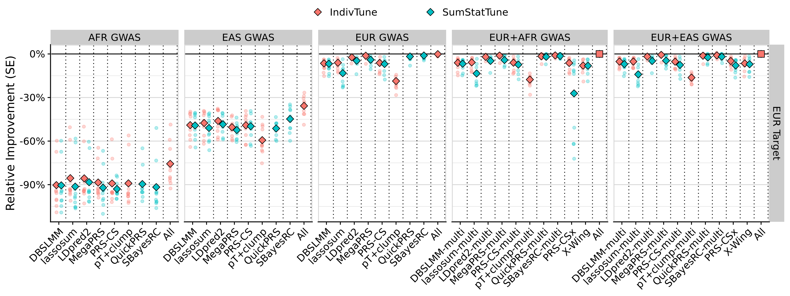
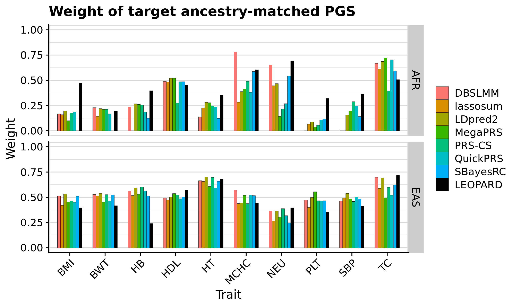
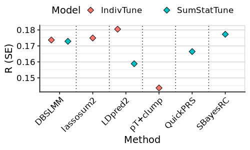
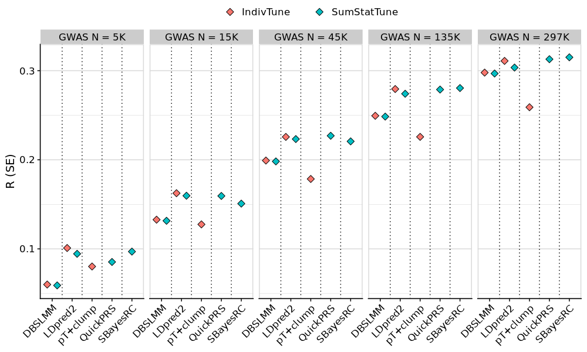

```{r setup, include=FALSE}
knitr::opts_chunk$set(eval = FALSE)
library(knitr)
library(kableExtra)
library(data.table)
```

<style>
pre code, pre, code {
  white-space: pre !important;
  overflow-x: scroll !important;
  word-break: keep-all !important;
  word-wrap: initial !important;
}

ul li p, ol li p {
  margin: 0 !important;
}
</style>

***

# Preprint

This document provides code and summarises the findings reported in the following preprint:

<div style="border-left: 4px solid #4A90E2; padding-left: 10px; margin: 10px 0;">

**Citation:**  
Pain, O. (2025). *Leveraging Global Genetics Resources to Enhance Polygenic Prediction Across Ancestrally Diverse Populations*. **medRxiv.** [https://doi.org/10.1101/2025.03.27.25324773](https://doi.org/10.1101/2025.03.27.25324773)

</div>

***


# Introduction

Genome-wide association studies (GWAS) from multiple ancestral populations are increasingly available, offering opportunities to improve the accuracy and equity of polygenic scores (PGS). Several methods now aim to leverage multiple GWAS sources, but predictive performance and computational efficiency across contexts remain unclear, especially in the absence of individual-level tuning data. This study evaluates a comprehensive set of PGS methods across African (AFR), East Asian (EAS), and European (EUR) ancestry groups.

This study evaluated the performance of PGS methods and modelling approaches across diverse populations using GWAS and target datasets of EUR, EAS, and AFR ancestry (Figure 2). EUR GWAS summary statistics were generated within a training subset of European ancestry individuals in the UK Biobank sample (UKB)(Bycroft et al., 2018). Publicly available EAS and AFR GWAS were obtained from Biobank Japan (BBJ) (Sakaue et al., 2021) and the Ugandan Genome Resource (UGR) (Gurdasani et al., 2019), respectively. An independent target sample of EUR, EAS and AFR ancestry individuals within UKB were used to evaluate the predictive performance of the PGS. To compare PGS methods, 10 traits available in UKB, BBJ, and UGR were selected to represent a range of genetic architectures.

*** 

**Document overview**:

- [Data preparation](#data-preparation)  
  - [UKB](#ukb)  
    - [Ancestry inference](#ancestry-inference)  
    - [Phenotype extraction](#phenotype-extraction)  
  - [GWAS sumstats](#gwas-sumstats)  
    - [UK Biobank GWAS](#uk-biobank-gwas)  
    - [Download BBJ sumstats](#download-bbj-sumstats)  
    - [Download UGR sumstats](#download-ugr-sumstats)  
  - [Heritability and polygenicity estimation](#heritability-and-polygenicity-estimation)  

- [Main analysis](#main-analysis)  
  - [PGS calculation](#pgs-calculation)  
  - [PGS evaluation](#pgs-evaluation)  
  - [LEOPARD+QuickPRS](#leopardquickprs)  
  - [Computational resources](#computational-resources)  

- [TL-PRS analysis](#tl-prs-analysis)  

- [Sensitivity analyses](#sensitivity-analyses)  
  - [Using 1KG reference](#using-1kg-reference)  
  - [Using three GWAS](#using-three-gwas)  
  - [Using external GWAS sumstats](#using-external-gwas-sumstats)  
  - [Using downsampled GWAS](#using-downsampled-gwas)  
  
***

# Data Preparation

***

## UKB

This section will describe the preparation of the UKB data for this study. We will need to separate UKB participants into ancestral groups (AFR, EAS, and EUR). Then we will need to prepare phenotype data for traits that overlap with the BBJ and UGR samples. Then we will need to split EUR UKB participants into training and testing subsets. We will then perform GWAS in the training subset, and evaluate PGS in the testing subset.

***

### Ancestry inference

We will perform this using the GenoPred pipeline. We will need to prepare the configuration files before running the pipeline.

<details><summary>Show code</summary>
<br/>

<h4>Create symlinks</h4>

We will create symlinks to the imputed genotype data for UKB. We will use the pgen format data for computationl efficiency and those restricted to MAF >= 1% and INFO >= 0.4. We are using genetic data that is not application specific, so the data doesn't need to be reprocessed for each application. Therefore we will use row number IDs for the .psam file so they can be connected to application specific data downstream.

```{bash}
mkdir -p /users/k1806347/oliverpainfel/Data/ukb/ukb_symlinks

# pgen and pvar files
for chr in $(seq 1 22);do
  for file in $(echo pgen pvar);do
    ln -s /datasets/ukbiobank/June2017/Imputed/ukb_imp_chr${chr}_v3_MAF1_INFO4.${file} /users/k1806347/oliverpainfel/Data/ukb/ukb_symlinks/ukb_imp_maf1_info4.chr${chr}.${file}
  done
done
```

```{r}
# Make .psam 
n = 487409
psam <- data.frame(FID = 1:487409,
                   IID = 1:487409)
names(psam)[1]<-'#FID'
write.table(psam, '/users/k1806347/oliverpainfel/Data/ukb/ukb_symlinks/rownumber.psam', col.names=T, row.names = F, quote = F)
```

```{bash}
for chr in $(seq 1 22);do
  ln -s /users/k1806347/oliverpainfel/Data/ukb/ukb_symlinks/rownumber.psam /users/k1806347/oliverpainfel/Data/ukb/ukb_symlinks/ukb_imp_maf1_info4.chr${chr}.psam
done
```

***

<h4>Create list of unrelated individuals</h4>

```{r}
library(ukbkings)
library(data.table)

psam<-fread('/scratch/prj/ukbiobank/recovered/ukb82087/imputed/ukb82087_imp_chr1_MAF1_INFO4_v1.psam')
psam$rn<-1:nrow(psam)

project_dir <- "/datasets/ukbiobank/ukb82087"
greedy_related <- "/scratch/prj/ukbiobank/recovered/KCL_Data/Software/tools/GreedyRelated-master-v1.2.1/GreedyRelated"

# Create a list of unrelated individuals irrespective of a phenotype
psam_unrel_all <- psam[!(
  psam$IID %in% bio_gen_related_remove(
    project_dir = project_dir,
    greedy_related = greedy_related,
    thresh = 0.044,
    seed = 1
  )$eid
), ]

dir.create('/users/k1806347/oliverpainfel/Data/ukb/phenotypes')

write.table(psam_unrel_all$IID, '/users/k1806347/oliverpainfel/Data/ukb/phenotypes/unrelated.txt', row.names=F, col.names=F, quote=F)
write.table(psam_unrel_all$rn, '/users/k1806347/oliverpainfel/Data/ukb/phenotypes/unrelated.row_number.txt', row.names=F, col.names=F, quote=F)
```

***

<h4>Create target_list</h4>

```{bash}
mkdir -p /users/k1806347/oliverpainfel/Data/ukb/GenoPred/configs/basic
```

```{r}
target_list <- data.frame(
  name='ukb',
  path='/users/k1806347/oliverpainfel/Data/ukb/ukb_symlinks/ukb_imp_maf1_info4',
  type='plink2',
  indiv_report=F,
  unrel='/users/k1806347/oliverpainfel/Data/ukb/phenotypes/unrelated.row_number.txt'
)

write.table(target_list, '/users/k1806347/oliverpainfel/Data/ukb/GenoPred/configs/basic/target_list.txt', col.names=T, row.names=F, quote=F)
```

***

<h4>Create configfile</h4>

```{r}
# Create config file
conf <- c(
  'outdir: /users/k1806347/oliverpainfel/Data/ukb/GenoPred/output',
  'config_file: /users/k1806347/oliverpainfel/Data/ukb/GenoPred/configs/basic/config.yaml',
  'target_list: /users/k1806347/oliverpainfel/Data/ukb/GenoPred/configs/basic/target_list.txt'
)

write.table(conf, '/users/k1806347/oliverpainfel/Data/ukb/GenoPred/configs/basic/config.yaml', col.names = F, row.names = F, quote = F)
```

***

<h4>Run pipeline</h4>

```{bash}
cd /users/k1806347/oliverpainfel/Software/MyGit/GenoPred/pipeline
git describe --tags
#v2.2.2-213-g2f05853

snakemake \
  --profile slurm \
  --use-conda \
  --configfile=/users/k1806347/oliverpainfel/Data/ukb/GenoPred/configs/basic/config.yaml \
  outlier_detection -n
```
</details>

***

### Phenotype extraction

We will use the same 33 quantitative traits that were used in the PRS-CSx paper (Supp Table 10 of PRS-CSx paper). We will use ukbkings to extract the phenotypes, then remove related individuals, split EUR into training and testing subsets, and adjust EUR training phenotypes for covariates.

<details><summary>Show code</summary>
```{bash}
mkdir /users/k1806347/oliverpainfel/Data/ukb/phenotypes/prscsx
```

```{r}
library(ukbkings)
library(dplyr)
library(stringr)
library(data.table)

# create data.frame showing variables used by prscsx
prscsx_fields<-c('30620','30600','30610','30650','30160','21001','21002','30710','30680','4079','30150','30740','30750','30760','50','30030','30020','30780','30120','30050','30060','30040','30130','30140','30080','30010','30700','4080','30690','30860','30870','30000','30730')
prscsx_trait<-c('Alanine aminotransferase','Albumin','Alkaline phosphatase','Aspartate transaminase','Basophil','Body mass index','Body weight','C-reactive protein','Calcium','Diastolic blood pressure','Eosinophil','Glucose','HbA1c','HDL-cholesterol','Height','Hematocrit','Hemoglobin','LDL-cholesterol','Lymphocyte','Mean corpuscular hemoglobin','Mean corpuscular hemoglobin concentration','Mean corpuscular volume','Monocyte','Neutrophil','Platelet','Red blood cell','Serum creatinine','Sytolic blood pressure','Total cholesterol','Total protein','Triglycerides','White blood cell','γ-glutamyl transpeptidase')
prscsx_labels<-c('ALT','ALB','ALP','AST','BAS','BMI','BWT','CRP','Ca','DBP','EOS','GLC','HbA1c','HDL','HT','HCT','HB','LDL','LYM','MCH','MCHC','MCV','MON','NEU','PLT','RBC','CR','SBP','TC','TP','TG','WBC','GGT')

prscsx_dat<-data.frame(
  trait=prscsx_trait,
  labels=prscsx_labels,
  field=prscsx_fields
)

dir.create('/users/k1806347/oliverpainfel/Data/ukb/phenotypes/prscsx')
write.csv(prscsx_dat, '/users/k1806347/oliverpainfel/Data/ukb/phenotypes/prscsx/prscsx_data.csv', row.names = F)
write.table(prscsx_labels, '/users/k1806347/oliverpainfel/Data/ukb/phenotypes/prscsx/prscsx_labels.txt', col.names=F, row.names = F, quote=F)

# Extract outcomes from UKB (project ukb82087)
project_dir <- "/datasets/ukbiobank/ukb82087"

system('rm /users/k1806347/oliverpainfel/Data/ukb/phenotypes/prscsx/prscsx_field_subset.txt')
f <- bio_field(project_dir)
f %>%
    select(field, name) %>%
    filter(str_detect(field, paste(paste0("^", prscsx_dat$field, '-'), collapse='|'))) %>%
    bio_field_add("/users/k1806347/oliverpainfel/Data/ukb/phenotypes/prscsx/prscsx_field_subset.txt")

bio_phen(
    project_dir,
    field = "/users/k1806347/oliverpainfel/Data/ukb/phenotypes/prscsx/prscsx_field_subset.txt",
    out = "/users/k1806347/oliverpainfel/Data/ukb/phenotypes/prscsx/prscsx_field_subset"
)

system("ls -lh /users/k1806347/oliverpainfel/Data/ukb/phenotypes/prscsx/prscsx_field_subset.rds")
df <- readRDS("/users/k1806347/oliverpainfel/Data/ukb/phenotypes/prscsx/prscsx_field_subset.rds")

# Take the first observation of each outcome
library(tidyr)
df_long <- df %>%
  pivot_longer(cols = names(df)[!grepl('eid', names(df))], names_to = "variable", values_to = "outcome") %>%
  drop_na(outcome)
df_long$variable<-gsub('-.*','', df_long$variable)
df_long<-df_long[!duplicated(df_long[,c('eid','variable')]),]

library(data.table)

for(i in 1:nrow(prscsx_dat)){
  tmp <- df_long[df_long$variable == prscsx_dat$field[i],]
  tmp <- data.frame(
    eid = tmp$eid,
    outcome = tmp$outcome
  )
  
  fwrite(
    tmp,
    paste0(
      '/users/k1806347/oliverpainfel/Data/ukb/phenotypes/prscsx/',
      prscsx_dat$label[i],
      '.txt'
    ),
    row.names = F,
    quote = F,
    na = 'NA',
    sep = '\t'
  )
}

# Read in ancestry inference results to determine sample size per population
# Use ancestry information from GenoPred
keep_files<-list.files(path = '/users/k1806347/oliverpainfel/Data/ukb/GenoPred/output/ukb/pcs/within_sample/', pattern = '.keep')

pop_dat<-NULL
for(i in keep_files){
  tmp<-fread(paste0('/users/k1806347/oliverpainfel/Data/ukb/GenoPred/output/ukb/pcs/within_sample/', i))
  names(tmp)<-c('FID','IID')
  tmp$POP<-gsub('.keep','', gsub('ukb.outlier_detection.','',i))
  pop_dat<-rbind(pop_dat, tmp)
}

# Update row number IDs to project specific IDs
psam<-fread('/scratch/prj/ukbiobank/recovered/ukb82087/imputed/ukb82087_imp_chr1_MAF1_INFO4_v1.psam')
psam$rn<-1:nrow(psam)
psam<-psam[,c('IID','rn'), with = F]

pop_dat$FID<-NULL
pop_dat<-merge(pop_dat, psam, by.x='IID', by.y='rn')
pop_dat<-data.frame(
  eid=pop_dat$IID.y,
  POP=pop_dat$POP
)

# Merge ancestry info with phenotype data
df_short <- dcast(df_long, eid ~ variable, value.var = "outcome")
df_short<-merge(df_short, pop_dat, by='eid')

# Remove related individuals
greedy_related <- "/scratch/prj/ukbiobank/recovered/KCL_Data/Software/tools/GreedyRelated-master-v1.2.1/GreedyRelated"
rel<-bio_gen_related_remove(
      project_dir = project_dir,
      greedy_related = greedy_related,
      keep = df_short$eid,
      thresh = 0.044,
      seed = 1
    )$eid

df_short_unrel<-df_short[!(df_short$eid %in% rel),]

n_table<-NULL
for(i in 1:nrow(prscsx_dat)){
  for(j in unique(pop_dat$POP[!is.na(pop_dat$POP)])){
    tmp<-data.frame(
      trait=prscsx_dat$trait[i],
      labels=prscsx_dat$label[i],
      field=prscsx_dat$field[i],
      population=j,
      n=sum(!is.na(df_short[[prscsx_dat$field[i]]][df_short$POP == j])),
      n_unrel=sum(!is.na(df_short_unrel[[prscsx_dat$field[i]]][df_short_unrel$POP == j]))
    )
    n_table<-rbind(n_table, tmp)
  }
}

write.csv(n_table, '/users/k1806347/oliverpainfel/Data/ukb/phenotypes/prscsx/n_table')

# Define training subset for EUR
df_short_unrel_eur<-df_short_unrel[df_short_unrel$POP == 'EUR',]
set.seed(1)
train_size <- floor(0.8 * nrow(df_short_unrel_eur))
train_indices <- sample(seq_len(nrow(df_short_unrel_eur)), size = train_size)

df_short_unrel_eur_train<-df_short_unrel_eur[train_indices,]
df_short_unrel_eur_test<-df_short_unrel_eur[-train_indices,]

n_table_eur<-NULL
for(i in 1:nrow(prscsx_dat)){
  tmp<-data.frame(
    trait=prscsx_dat$trait[i],
    labels=prscsx_dat$label[i],
    field=prscsx_dat$field[i],
    n_train=sum(!is.na(df_short_unrel_eur_train[[prscsx_dat$field[i]]])),
    n_test=sum(!is.na(df_short_unrel_eur_test[[prscsx_dat$field[i]]]))
  )
  n_table_eur<-rbind(n_table_eur, tmp)
}

write.csv(n_table_eur, '/users/k1806347/oliverpainfel/Data/ukb/phenotypes/prscsx/n_table_eur')

df_short_unrel$POP[df_short_unrel$eid %in% df_short_unrel_eur_train$eid]<-'EUR_train'
df_short_unrel$POP[df_short_unrel$eid %in% df_short_unrel_eur_test$eid]<-'EUR_test'

# Output phenotype data for each population
for(i in 1:nrow(prscsx_dat)){
  for(j in unique(df_short_unrel$POP)){
    tmp<-df_short_unrel[df_short_unrel$POP == j,]
    tmp <- data.frame(
      FID = tmp$eid,
      IID = tmp$eid,
      outcome = tmp[[prscsx_dat$field[i]]]
    )
    
    fwrite(
      tmp,
      paste0(
        '/users/k1806347/oliverpainfel/Data/ukb/phenotypes/prscsx/',
        prscsx_dat$label[i],
        '.unrel.', j, '.txt'
      ),
      row.names = F,
      quote = F,
      na = 'NA',
      sep = '\t'
    )
    
    # Write out with row number based IDs
    pheno<-merge(tmp, psam, by='IID')
    pheno<-data.frame(
      FID=pheno$rn,
      IID=pheno$rn,
      outcome=pheno$outcome
    )
  
    fwrite(
      pheno,
      paste0(
        '/users/k1806347/oliverpainfel/Data/ukb/phenotypes/prscsx/',
        prscsx_dat$label[i],
        '.unrel.', j, '.row_number.txt'
      ),
      row.names = F,
      quote = F,
      na = 'NA',
      sep = '\t'
    )
  }
}

# For the EUR training GWAS, normalise and regress covariates
# Use age, sex and PCs as covariates
# Read in PC data released by UKB
qc_dat<-bio_gen_sqc(project_dir)
qc_dat<-qc_dat[,c('eid',paste0('pc',1:20))]
df_short_unrel<-merge(df_short_unrel, qc_dat, by='eid')

# Read in sex and age information
system('rm /users/k1806347/oliverpainfel/Data/ukb/phenotypes/age_sex_field_subset.txt')
f <- bio_field(project_dir)
f %>%
    select(field, name) %>%
    filter(str_detect(field, "^21022-0.0|^31-0.0")) %>%
    bio_field_add("/users/k1806347/oliverpainfel/Data/ukb/phenotypes/age_sex_field_subset.txt")

bio_phen(
    project_dir,
    field = "/users/k1806347/oliverpainfel/Data/ukb/phenotypes/age_sex_field_subset.txt",
    out = "/users/k1806347/oliverpainfel/Data/ukb/phenotypes/age_sex_field_subset"
)

system("ls -lh /users/k1806347/oliverpainfel/Data/ukb/phenotypes/age_sex_field_subset.rds")
df <- readRDS("/users/k1806347/oliverpainfel/Data/ukb/phenotypes/age_sex_field_subset.rds")
names(df)<-gsub('-.*','',names(df))
names(df)[names(df) == '31']<-'sex'
names(df)[names(df) == '21022']<-'age'
df_short_unrel<-merge(df_short_unrel, df, by='eid')

# Within each population, normalise each outcome and regress out covariates
library(RNOmni)
covs<-c(paste0('pc',1:20), 'sex', 'age')
df_short_unrel_eur_train<-df_short_unrel[df_short_unrel$POP == 'EUR_train',]
for(i in 1:nrow(prscsx_dat)){
  tmp<-df_short_unrel_eur_train[!is.na(df_short_unrel_eur_train[[prscsx_dat$field[i]]]),]
  tmp$pheno_norm<-RNOmni::RankNorm(tmp[[prscsx_dat$field[i]]])
  mod<-lm(as.formula(paste0('pheno_norm ~ ', paste(covs, collapse=' + '))), data=tmp)
  tmp$pheno_norm_resid_scale<-as.numeric(scale(resid(mod)))
  tmp<-data.frame(
    FID=tmp$eid,
    IID=tmp$eid,
    outcome=tmp$pheno_norm_resid_scale
  )
  
  fwrite(
    tmp,
    paste0(
      '/users/k1806347/oliverpainfel/Data/ukb/phenotypes/prscsx/',
      prscsx_dat$label[i],
      '.unrel.EUR_train.norm_resid_scale.txt'
    ),
    row.names = F,
    quote = F,
    na = 'NA',
    sep = '\t'
  )
}

# Convert to row number based IDs so it will work with UKB geno data from GenoPred
for(i in 1:nrow(prscsx_dat)){
  pheno<-fread(paste0(
      '/users/k1806347/oliverpainfel/Data/ukb/phenotypes/prscsx/',
      prscsx_dat$label[i],
      '.unrel.EUR_train.norm_resid_scale.txt'
    ))
  
  pheno<-merge(pheno, psam, by='IID')
  pheno<-data.frame(
    FID=pheno$rn,
    IID=pheno$rn,
    outcome=pheno$outcome
  )
  
  fwrite(
    pheno,
    paste0(
      '/users/k1806347/oliverpainfel/Data/ukb/phenotypes/prscsx/',
      prscsx_dat$label[i],
      '.unrel.EUR_train.norm_resid_scale.row_number.txt'
    ),
    row.names = F,
    quote = F,
    na = 'NA',
    sep = '\t'
  )
}

```
</details>

***

## GWAS sumstats

We will generate EUR GWAS using the EUR training subset of UKB. BBJ will be used for EAS GWAS, and UGR will be used for AFR GWAS.

***

### UKB GWAS

<details><summary>Show code</summary>
```{bash}
for pheno in $(cat /users/k1806347/oliverpainfel/Data/ukb/phenotypes/prscsx/prscsx_labels.txt); do
  mkdir -p /users/k1806347/oliverpainfel/Data/ukb/gwas/${pheno}
  for chr in $(seq 1 22); do
      sbatch -p neurohack_cpu --wrap="/users/k1806347/oliverpainfel/Software/plink2 \
        --pfile /users/k1806347/oliverpainfel/Data/ukb/GenoPred/output/ukb/geno/ukb.ref.chr${chr} \
        --pheno /users/k1806347/oliverpainfel/Data/ukb/phenotypes/prscsx/${pheno}.unrel.EUR_train.norm_resid_scale.row_number.txt \
        --linear omit-ref cols=+a1freq,+ax \
        --maf 0.01 \
        --geno 0.05 \
        --out /users/k1806347/oliverpainfel/Data/ukb/gwas/${pheno}/ukb.eur_train.${pheno}.chr${chr}"
  done
done

# Once complete, merge results across chromosomes
for pheno in $(cat /users/k1806347/oliverpainfel/Data/ukb/phenotypes/prscsx/prscsx_labels.txt); do
  head -n 1 /users/k1806347/oliverpainfel/Data/ukb/gwas/${pheno}/ukb.eur_train.${pheno}.chr1.outcome.glm.linear > /users/k1806347/oliverpainfel/Data/ukb/gwas/${pheno}/ukb.eur_train.${pheno}.GW.txt
    for chr in $(seq 1 22); do
      tail -n +2 /users/k1806347/oliverpainfel/Data/ukb/gwas/${pheno}/ukb.eur_train.${pheno}.chr${chr}.outcome.glm.linear >> /users/k1806347/oliverpainfel/Data/ukb/gwas/${pheno}/ukb.eur_train.${pheno}.GW.txt
    done
    
    # Remove REF and ALT columns and rename AX column to A2
    cut -f 4,5 --complement /users/k1806347/oliverpainfel/Data/ukb/gwas/${pheno}/ukb.eur_train.${pheno}.GW.txt | awk 'BEGIN{FS=OFS="\t"} NR==1 {$5="A2"} 1' > temp.txt && mv temp.txt /users/k1806347/oliverpainfel/Data/ukb/gwas/${pheno}/ukb.eur_train.${pheno}.GW.txt

    gzip /users/k1806347/oliverpainfel/Data/ukb/gwas/${pheno}/ukb.eur_train.${pheno}.GW.txt
done

# Delete per chromosome files
rm /users/k1806347/oliverpainfel/Data/ukb/gwas/*/*chr*

```
</details>

***

### Download BBJ sumstats

<details><summary>Show code</summary>

```{r}
# Identify wget command for relevant phenotypes
library(data.table)

# Read in BBJ GWAS info from BBJ website
bbj_gwas<-fread('~/oliverpainfel/Data/GWAS_sumstats/BBJ/prscsx/bbj_gwas.csv')

# Map BBJ trait names to those used for UKB
bbj_gwas$bbj_labels <-
  gsub("\\)", '', gsub(".*\\(", '', bbj_gwas$Phenotype))
bbj_gwas$trait <- gsub(" \\(.*", '', bbj_gwas$Phenotype)

bbj_gwas$Category<-NULL
bbj_gwas$Phenotype<-NULL

# Update trait labels to match what was used in prscsx paper
bbj_gwas$trait<-gsub(' count','', bbj_gwas$trait)
bbj_gwas$trait[bbj_gwas$trait == 'G-glutamyl transpeptidase']<-'γ-glutamyl transpeptidase'

# Merge the bbj trait info with the prscsx trait info
prscsx_dat<-fread('/users/k1806347/oliverpainfel/Data/ukb/phenotypes/prscsx/prscsx_data.csv')
prscsx_dat <- merge(bbj_gwas, prscsx_dat, by='trait', all=T)

write.csv(prscsx_dat, '~/oliverpainfel/Data/GWAS_sumstats/BBJ/prscsx/bbj_gwas_prscsx.csv', row.names = F)

# Create column showing what label is used in the wget command
prscsx_dat$wget_label <-
  gsub('.v1.zip', '', gsub('.*hum0197.v3.BBJ.', '', prscsx_dat$wget))

# Write a table showing label matching prscsx info and wget url
write.table(prscsx_dat[, c('labels', 'wget', 'wget_label'), with=F], '~/oliverpainfel/Data/GWAS_sumstats/BBJ/prscsx/bbj_gwas_wget.txt', col.names = F, row.names = F, quote = F)

```

```{bash}
# wget and unzip sumstats
for pheno in $(cat /users/k1806347/oliverpainfel/Data/ukb/phenotypes/prscsx/prscsx_labels.txt); do
  url=$(awk -v var="$pheno" '$1 == var {print $2}' ~/oliverpainfel/Data/GWAS_sumstats/BBJ/prscsx/bbj_gwas_wget.txt)
  sbatch -p neurohack_cpu --wrap="wget -O /users/k1806347/oliverpainfel/Data/GWAS_sumstats/BBJ/prscsx/${pheno}.zip ${url}
    unzip /users/k1806347/oliverpainfel/Data/GWAS_sumstats/BBJ/prscsx/${pheno}.zip -d /users/k1806347/oliverpainfel/Data/GWAS_sumstats/BBJ/prscsx
    rm /users/k1806347/oliverpainfel/Data/GWAS_sumstats/BBJ/prscsx/${pheno}.zip"
done

# Delete X chromosome sumstats and rename files to be consistent with prscsx sumstat info
for pheno in $(cat /users/k1806347/oliverpainfel/Data/ukb/phenotypes/prscsx/prscsx_labels.txt); do
  wget_label=$(awk -v var="$pheno" '$1 == var {print $3}' ~/oliverpainfel/Data/GWAS_sumstats/BBJ/prscsx/bbj_gwas_wget.txt)
if [ "$pheno" == "HT" ]; then
    mv ~/oliverpainfel/Data/GWAS_sumstats/BBJ/prscsx/hum0197.v3.BBJ.${wget_label}.v1/GWASsummary_Height_Japanese_SakaueKanai2020.auto.txt.gz ~/oliverpainfel/Data/GWAS_sumstats/BBJ/prscsx/bbj.HT.txt.gz
  else
    mv ~/oliverpainfel/Data/GWAS_sumstats/BBJ/prscsx/hum0197.v3.BBJ.${wget_label}.v1/GWASsummary_${wget_label}_Japanese_SakaueKanai2020.auto.txt.gz ~/oliverpainfel/Data/GWAS_sumstats/BBJ/prscsx/bbj.${pheno}.txt.gz
  fi
  rm -r ~/oliverpainfel/Data/GWAS_sumstats/BBJ/prscsx/hum0197.v3.BBJ.${wget_label}.v1
done

# Format so BOLT P value is used by GenoPred
for pheno in $(cat /users/k1806347/oliverpainfel/Data/ukb/phenotypes/prscsx/prscsx_labels.txt); do
sbatch -p neurohack_cpu --wrap="/users/k1806347/oliverpainfel/Software/pigz/pigz -dc ~/oliverpainfel/Data/GWAS_sumstats/BBJ/prscsx/bbj.${pheno}.txt.gz | awk 'BEGIN {OFS=\"\t\"} {print \$2, \$3, \$4, \$6, \$7, \$8, \$9, \$12, \$13, \$15}' | sed '1s/P_BOLT_LMM_INF/P/' | /users/k1806347/oliverpainfel/Software/pigz/pigz -c > ~/oliverpainfel/Data/GWAS_sumstats/BBJ/prscsx/bbj.${pheno}.reformat.txt.gz"
done

```
</details>

***

### Download UGR sumstats

<details><summary>Show code</summary>

```{r}
# Identify wget command for relevant phenotypes
library(data.table)

# Read in UGR GWAS info from GWAS catalogue
ugr_gwas<-fread('~/oliverpainfel/Data/GWAS_sumstats/UGR/ugr_sumstats.csv')

# Map UGR trait names to those used for UKB
ugr_gwas$trait<-gsub(' levels','', ugr_gwas$reportedTrait)
ugr_gwas$trait<-gsub(' count','', ugr_gwas$trait)

ugr_to_prscsx <- c(
  "Aspartate aminotransferase" = "Aspartate transaminase",
  "Bilirubin" = NA,  # No direct match
  "Eosinophils" = "Eosinophil",
  "Gamma glutamyl transferase" = "γ-glutamyl transpeptidase",
  "HDL cholesterol" = "HDL-cholesterol",
  "Hemoglobin A1c" = "HbA1c",
  "Hip circumference" = NA,  # No direct match
  "LDL cholesterol" = "LDL-cholesterol",
  "Red cell distribution width" = NA,  # No direct match
  "Serum albumin" = "Albumin",
  "Serum alkaline phosphatase" = "Alkaline phosphatase",
  "Systolic blood pressure" = "Sytolic blood pressure",
  "Triglyceride" = "Triglycerides",
  "Waist circumference" = NA,  # No direct match
  "Waist-hip ratio" = NA,  # No direct match
  "Weight" = "Body weight"
)

ugr_gwas$trait <- ifelse(ugr_gwas$trait %in% names(ugr_to_prscsx),
                                   ugr_to_prscsx[ugr_gwas$trait],
                                   ugr_gwas$trait)

# Merge the ugr trait info with the prscsx trait info
prscsx_dat<-fread('/users/k1806347/oliverpainfel/Data/ukb/phenotypes/prscsx/prscsx_data.csv')
prscsx_dat <- merge(ugr_gwas, prscsx_dat, by='trait')

write.csv(prscsx_dat, '~/oliverpainfel/Data/GWAS_sumstats/UGR/ugr_sumstats_prscsx.csv', row.names = F)

# Create column indicating wget command
prscsx_dat$wget<-NA
for(i in 1:nrow(prscsx_dat)){
  if(!grepl('.txt', prscsx_dat$wget[i])){
    print(i)
    Sys.sleep(2)
    log<-system(paste0('curl --max-time 10 ', gsub('http:','ftp:', prscsx_dat$summaryStatistics[i]), '/'), intern = T)
    log<-log[grepl('annotated.txt.gz|annotated.txt', log)]
    log<-gsub('.* ','', log)
    prscsx_dat$wget[i]<-paste0(prscsx_dat$summaryStatistics[i], '/', log)
  }
}
# Note this has to be run a few times due to some requests being blocked.

# Write a table showing label matching prscsx info and wget url
write.table(prscsx_dat[, c('labels', 'wget'), with=F], '~/oliverpainfel/Data/GWAS_sumstats/UGR/ugr_sumstats_wget.txt', col.names = F, row.names = F, quote = F)

```

```{bash}
# wget and unzip sumstats
for pheno in $(cat ~/oliverpainfel/Data/GWAS_sumstats/UGR/ugr_sumstats_wget.txt | cut -d' ' -f 1); do
  url=$(awk -v var="$pheno" '$1 == var {print $2}' ~/oliverpainfel/Data/GWAS_sumstats/UGR/ugr_sumstats_wget.txt)
  sbatch -p cpu --wrap="wget -O ~/oliverpainfel/Data/GWAS_sumstats/UGR/${pheno}.txt.gz ${url}"
done

```

```{r}
library(future.batchtools)
library(furrr)
library(data.table)
ugr_data<-fread('~/oliverpainfel/Data/GWAS_sumstats/UGR/ugr_sumstats_prscsx.csv')

plan(batchtools_slurm(resources = list(
  time = "12:00:00",
  ntasks = 2,
  mem = "10g",
  partition = "neurohack_cpu"
)))

furrr::future_map_dfr(1:nrow(ugr_data), function(i) {
  print(i)
  sumstats <- fread(paste0("~/oliverpainfel/Data/GWAS_sumstats/UGR/", ugr_data$label[i], ".txt.gz"))
  sumstats <- sumstats[, names(sumstats) %in% c("snpid", "pval_fe", "se_fe") | grepl('^beta_|^af_|^no_', names(sumstats)), with=F]

  # Extract CHR, BP, A1, A2 from snpid
  snp_split <- tstrsplit(sumstats$snpid, ":", fixed = TRUE)
  sumstats[, `:=`(CHR = snp_split[[1]], BP = snp_split[[2]], A1 = snp_split[[3]], A2 = snp_split[[4]])]

  # Set no_ and af_ to NA if beta is NA
  cohorts <- gsub('^no_','', names(sumstats)[grepl('^no_', names(sumstats))])
  for (cohort in cohorts) {
    sumstats[[paste0('no_', cohort)]][is.na(sumstats[[paste0('beta_', cohort)]])] <- NA
    sumstats[[paste0('af_', cohort)]][is.na(sumstats[[paste0('beta_', cohort)]])] <- NA
  }

  # Calculate sample size weighted average for allele frequency
  for (cohort in cohorts) {
    sumstats[[paste0('af_', cohort, '_weighted')]] <- sumstats[[paste0('af_', cohort)]] * sumstats[[paste0('no_', cohort)]]
  }
  
  # Calculate total N and frequency
  sumstats[, N := rowSums(.SD, na.rm = TRUE), .SDcols = patterns("^no_")]
  sumstats[, FREQ := rowSums(.SD, na.rm = TRUE) / N, .SDcols = patterns("weighted$")]

  # Rename columns
  setnames(sumstats, old = c('beta_fe', 'se_fe', 'pval_fe'), new = c('BETA', 'SE', 'P'))

  # Select relevant columns and remove rows with missing data
  sumstats <- sumstats[, .(CHR, BP, A1, A2, BETA, SE, P, FREQ, N)]
  sumstats <- sumstats[complete.cases(sumstats)]
  
  fwrite(sumstats, paste0("~/oliverpainfel/Data/GWAS_sumstats/UGR/", ugr_data$label[i], ".reformat.txt.gz"), sep=' ', quote=F, na='NA')
  
})

```

</details>

***

# Heritability and polygenicity estimation

We will estimate SNP-h2 using LD-score regression, and the rG using POPCORN.
POPCORN can estimate the SNP-h2, but it will vary according to the other GWAS included due to SNP overlap. Use the sumstats QC'd by GenoPred. To estimate polygenicity, lets use AVENGEME based on ptclump score association results. Lets generate those using GenoPred.

***

## QC GWAS sumstats

Use GenoPred for this.

<details><summary>Show code</summary>

<div class="shallow-break"></div>

<h4>Prepare configuration</h4>

```{r}
######
# gwas_list
######

dir.create('/users/k1806347/oliverpainfel/Data/ukb/GenoPred/configs/crosspop')

prscsx_dat<-fread('/users/k1806347/oliverpainfel/Data/ukb/phenotypes/prscsx/prscsx_data.csv')

gwas_list_eur<-data.frame(
  name=paste0(prscsx_dat$labels,'_UKB'),
  path=paste0('/users/k1806347/oliverpainfel/Data/ukb/gwas/',prscsx_dat$labels,'/ukb.eur_train.',prscsx_dat$labels,'.GW.txt.gz'),
  population='EUR',
  n=NA,
  sampling=NA,
  prevalence=NA,
  mean=0,
  sd=1,
  label=paste0('"', prscsx_dat$trait, ' (UKB)"')
)

bbj_info<-fread('~/oliverpainfel/Data/GWAS_sumstats/BBJ/prscsx/bbj_gwas_prscsx.csv')
bbj_info<-bbj_info[bbj_info$labels %in% prscsx_dat$labels,]

gwas_list_eas<-data.frame(
  name=paste0(bbj_info$labels,'_BBJ'),
  path=paste0('/users/k1806347/oliverpainfel/Data/GWAS_sumstats/BBJ/prscsx/bbj.',bbj_info$labels,'.reformat.txt.gz'),
  population='EAS',
  n=as.numeric(gsub(',','',bbj_info$`No. samples`)),
  sampling=NA,
  prevalence=NA,
  mean=0,
  sd=1,
  label=paste0('"', prscsx_dat$trait, ' (BBJ)"')
)

ugr_data<-fread('~/oliverpainfel/Data/GWAS_sumstats/UGR/ugr_sumstats_prscsx.csv')
ugr_data<-ugr_data[ugr_data$labels %in% prscsx_dat$labels,]

gwas_list_afr<-data.frame(
  name=paste0(ugr_data$labels,'_UGR'),
  path=paste0('/users/k1806347/oliverpainfel/Data/GWAS_sumstats/UGR/',ugr_data$labels,'.reformat.txt.gz'),
  population='AFR',
  n=NA,
  sampling=NA,
  prevalence=NA,
  mean=0,
  sd=1,
  label=paste0('"', ugr_data$trait, ' (UGR)"')
)
gwas_list<-do.call(rbind, list(gwas_list_eur, gwas_list_eas, gwas_list_afr))

# Create file listing phenotypes in common between AFR, EAS and EUR
pheno <- gsub('_.*', '', gwas_list$name)
pheno_intersect <- Reduce(intersect, 
                           list(
                             pheno[gwas_list$population == 'EUR'],
                             pheno[gwas_list$population == 'EAS'],
                             pheno[gwas_list$population == 'AFR']
                             )
                           )

# Restrict gwas_list to intersecting phenotypes
gwas_list<-gwas_list[pheno %in% pheno_intersect,]

write.table(gwas_list, '/users/k1806347/oliverpainfel/Data/ukb/GenoPred/configs/crosspop/gwas_list_all.txt', col.names = T, row.names = F, quote = F)

write.table(pheno_intersect, '/users/k1806347/oliverpainfel/Data/ukb/phenotypes/prscsx/pheno_eur_eas_afr.txt', col.names = F, row.names = F, quote = F)

######
# config
######

config<-c(
  "outdir: /users/k1806347/oliverpainfel/Data/ukb/GenoPred/output",
  "config_file: /users/k1806347/oliverpainfel/Data/ukb/GenoPred/configs/crosspop/config_all.yaml",
  "gwas_list: /users/k1806347/oliverpainfel/Data/ukb/GenoPred/configs/crosspop/gwas_list_all.txt",
  "target_list: /users/k1806347/oliverpainfel/Data/ukb/GenoPred/configs/basic/target_list.txt",
  "pgs_methods: ['ptclump']",
  "cores_prep_pgs: 1",
  "cores_target_pgs: 20"
)

write.table(config, '/users/k1806347/oliverpainfel/Data/ukb/GenoPred/configs/crosspop/config_all.yaml', col.names = F, row.names = F, quote = F)

```

***

<h4>Run pipeline</h4>

```{bash}
snakemake \
  --profile slurm \
  --use-conda \
  --configfile=/users/k1806347/oliverpainfel/Data/ukb/GenoPred/configs/crosspop/config_all.yaml \
  target_pgs -n
```

***

<h4>Reformat for LDSC and POPCORN</h4>

```{r}
library(data.table)
dir.create('/users/k1806347/oliverpainfel/Analyses/crosspop/popcorn/sumstats', recursive = T)
gwas_list<-fread('/users/k1806347/oliverpainfel/Data/ukb/GenoPred/configs/crosspop/gwas_list_all.txt')

for(i in 1:nrow(gwas_list)){
  if(
    file.exists(
      paste0(
        "/users/k1806347/oliverpainfel/Analyses/crosspop/popcorn/sumstats/",
        gwas_list$name[i], 
        ".sumstats.gz"))){
    next    
  }
  print(i)
  gwas_file <-
    paste0(
      "/users/k1806347/oliverpainfel/Data/ukb/GenoPred/output/reference/gwas_sumstat/",
      gwas_list$name[i],
      "/",
      gwas_list$name[i],
      "-cleaned.gz"
    )
  
  gwas_header <- fread(gwas_file, nrows = 1)
  cols_index <- which(names(gwas_header) %in% c('SNP','A1','A2','BETA','SE','P','N'))
  
  system(
    paste0(
      "zcat ",
      gwas_file,
      " | cut -f ", 
      paste0(cols_index, collapse = ','),
      " | sed -e '1s/BETA/beta/'",
      " | /users/k1806347/oliverpainfel/Software/pigz/pigz -f",
      " > /users/k1806347/oliverpainfel/Analyses/crosspop/popcorn/sumstats/",
      gwas_list$name[i], 
      ".sumstats.gz"
      )
    )
}
```

</details>

***

## LDSC

<details><summary>Show code</summary>
```{bash}
conda activate ldsc

for pop in $(echo EUR EAS AFR);do
  if [ "$pop" == "EUR" ]; then
      samp="UKB"
  fi
  if [ "$pop" == "EAS" ]; then
      samp="BBJ"
  fi
  if [ "$pop" == "AFR" ]; then
      samp="UGR"
  fi
  
  for pheno in $(cat /users/k1806347/oliverpainfel/Data/ukb/phenotypes/prscsx/pheno_eur_eas_afr.txt); do
    mkdir -p /users/k1806347/oliverpainfel/Analyses/crosspop/ldsc/sumstats

    sbatch --mem 10G -n 1 -p neurohack_cpu --wrap="/users/k1806347/oliverpainfel/Software/ldsc/munge_sumstats.py \
     --sumstats /users/k1806347/oliverpainfel/Analyses/crosspop/popcorn/sumstats/${pheno}_${samp}.sumstats.gz \
     --out /users/k1806347/oliverpainfel/Analyses/crosspop/ldsc/sumstats/${pheno}_${samp}"

  done
done

for pop in $(echo EUR EAS AFR);do
  if [ "$pop" == "EUR" ]; then
      samp="UKB"
  fi
  if [ "$pop" == "EAS" ]; then
      samp="BBJ"
  fi
  if [ "$pop" == "AFR" ]; then
      samp="UGR"
  fi
  
  for pheno in $(cat /users/k1806347/oliverpainfel/Data/ukb/phenotypes/prscsx/pheno_eur_eas_afr.txt); do
    mkdir -p /users/k1806347/oliverpainfel/Analyses/crosspop/ldsc/results/${pheno}/${pop}

    sbatch --mem 10G -n 1 -p neurohack_cpu --wrap="/users/k1806347/oliverpainfel/Software/ldsc/ldsc.py \
     --h2 /users/k1806347/oliverpainfel/Analyses/crosspop/ldsc/sumstats/${pheno}_${samp}.sumstats.gz \
     --ref-ld /users/k1806347/oliverpainfel/Software/MyGit/GenoPred/pipeline/resources/data/ld_scores/UKBB.${pop}.rsid \
     --w-ld /users/k1806347/oliverpainfel/Software/MyGit/GenoPred/pipeline/resources/data/ld_scores/UKBB.${pop}.rsid \
     --out /users/k1806347/oliverpainfel/Analyses/crosspop/ldsc/results/${pheno}/${pop}/res"
     
  done
done

```

</details>

***

## POPCORN

<details><summary>Show code</summary>

<div class="shallow-break"></div>

<h4>Calculate CSCOREs</h4>

```{bash}

# Subset the reference data into relevant populations
for pop in $(echo EUR EAS AFR); do
  mkdir -p /users/k1806347/oliverpainfel/Data/POPCORN/1KG/temp
  for chr in $(seq 1 22); do
    /users/k1806347/oliverpainfel/Software/plink2 \
      --pfile /users/k1806347/oliverpainfel/Software/MyGit/GenoPred/pipeline/resources/data/ref/ref.chr${chr} \
      --keep /users/k1806347/oliverpainfel/Software/MyGit/GenoPred/pipeline/resources/data/ref/keep_files/${pop}.keep \
      --make-bed \
      --out /users/k1806347/oliverpainfel/Data/POPCORN/1KG/temp/ref.${pop}.chr${chr}
    done
done

conda activate /scratch/prj/oliverpainfel/recovered/.conda/envs/popcorn
for pop in $(echo EAS AFR); do
  mkdir -p /users/k1806347/oliverpainfel/Data/POPCORN/1KG/EUR_${pop}_CSCORES
  for chr in $(seq 1 22); do
    sbatch --mem 10G -n 1 -p neurohack_cpu --wrap="popcorn \
      compute \
      -v 1 \
      --bfile1 /users/k1806347/oliverpainfel/Data/POPCORN/1KG/temp/ref.EUR.chr${chr} \
      --bfile2 /users/k1806347/oliverpainfel/Data/POPCORN/1KG/temp/ref.${pop}.chr${chr} \
      /users/k1806347/oliverpainfel/Data/POPCORN/1KG/EUR_${pop}_CSCORES/scores_chr${chr}.txt"
  done
done

for pop in $(echo EAS AFR); do
  cat /users/k1806347/oliverpainfel/Data/POPCORN/1KG/EUR_${pop}_CSCORES/scores_chr*.txt > /users/k1806347/oliverpainfel/Data/POPCORN/1KG/EUR_${pop}_CSCORES/scores_all.txt
done

rm -r /users/k1806347/oliverpainfel/Data/POPCORN/1KG/temp
rm /users/k1806347/oliverpainfel/Data/POPCORN/1KG/EUR_*_CSCORES/*chr*.txt
```

***

<h4>Run POPCORN</h4>

```{bash}
conda activate popcorn
for pop in $(echo EAS AFR);do
  if [ "$pop" == "EAS" ]; then
      samp="BBJ"
  fi
  if [ "$pop" == "AFR" ]; then
      samp="UGR"
  fi
  
  for pheno in $(cat /users/k1806347/oliverpainfel/Data/ukb/phenotypes/prscsx/prscsx_labels.txt); do
    mkdir -p /users/k1806347/oliverpainfel/Analyses/crosspop/popcorn/results/${pheno}/EUR_${pop}
    sbatch --mem 10G -n 1 -p neurohack_cpu --wrap="popcorn \
       fit -v 3 \
       --cfile /users/k1806347/oliverpainfel/Data/POPCORN/1KG/EUR_${pop}_CSCORES/scores_all.txt \
       --sfile1 /users/k1806347/oliverpainfel/Analyses/crosspop/popcorn/sumstats/${pheno}_UKB.sumstats.gz \
       --sfile2 /users/k1806347/oliverpainfel/Analyses/crosspop/popcorn/sumstats/${pheno}_${samp}.sumstats.gz \
       --gen_effect \
       /users/k1806347/oliverpainfel/Analyses/crosspop/popcorn/results/${pheno}/EUR_${pop}/rG_gen_effect"
  done
done

```

</details>

***

## Plot LDSC and POPCORN results

<details><summary>Show code</summary>

```{r}

library(data.table)
library(ggplot2)
library(cowplot)

# Read in phenotypes
pheno_intersect <- read.table('/users/k1806347/oliverpainfel/Data/ukb/phenotypes/prscsx/pheno_eur_eas_afr.txt', header=F)$V1

# Plot the heritability estimates
h2_res <- NULL

for(pop in c('AFR','EAS', 'EUR')){
  for(pheno in pheno_intersect){
    log <-
      readLines(
        paste0(
          '/users/k1806347/oliverpainfel/Analyses/crosspop/ldsc/results/',
          pheno,
          '/',
          pop,
          '/res.log'
        )
      )
    
    h2 <- log[grepl('Total Observed scale h2:', log)]
    h2_est <- as.numeric(gsub(' .*','', gsub('Total Observed scale h2: ', '', h2)))
    h2_se <- as.numeric(gsub("\\)",'', gsub(".* \\(", '', h2)))
    int <- log[grepl('Intercept:', log)]
    int_est <- as.numeric(gsub(' .*','', gsub('Intercept: ', '', int)))
    int_se <- as.numeric(gsub("\\)",'', gsub(".* \\(", '', int)))
    lambda <- log[grepl('Lambda GC:', log)]
    lambda <- as.numeric(gsub('.* ','', lambda))
    
    h2_res <- rbind(
      h2_res,
      data.table(
        Population = pop,
        Phenotype = pheno,
        h2_est = h2_est,
        h2_se = h2_se,
        int_est = int_est,
        int_se = int_se,
        lambda = lambda
      )
    )
  }
}

write.csv(h2_res, '/users/k1806347/oliverpainfel/Analyses/crosspop/ldsc/results.csv', row.names = F, quote = F)

png('~/oliverpainfel/Analyses/crosspop/plots/ldsc_h2.png', res = 100, width = 700, height = 300, units = 'px')
ggplot(h2_res, aes(x = Phenotype, y = h2_est, fill = Population)) +
  geom_bar(stat="identity", position=position_dodge(preserve = "single"), width = 0.7) +
  geom_errorbar(aes(ymin=h2_est-h2_se, ymax=h2_est+h2_se), width=.2, position=position_dodge(width = 0.7, preserve = "single")) +
  labs(y="SNP-based Heritability (SE)", fill = NULL) +
  theme_half_open() +
  theme(axis.text.x = element_text(angle = 45, hjust = 1),
        legend.position = "top",
        legend.key.spacing.x = unit(2, "cm"),
        legend.justification = "center") +
  background_grid(major = 'y', minor = 'y')
dev.off()

# Plot rG estimates
rg_res <- NULL
for(pop in c('AFR','EAS')){
  for(pheno in h2_res$Phenotype){
    pop_res_i<-fread(paste0('/users/k1806347/oliverpainfel/Analyses/crosspop/popcorn/results/', pheno, '/EUR_', pop, '/rG_gen_effect'))
    names(pop_res_i) <- c('Test','Estimate','SE','Z','P')
    pop_res_i <- pop_res_i[pop_res_i$Test == 'pge',]
    pop_res_i$Population_1 <- 'EUR'
    pop_res_i$Population_2 <- pop
    pop_res_i$Phenotype <- pheno
    rg_res <- rbind(rg_res, pop_res_i)
  }
}

rg_res$Comparison <- paste0(rg_res$Population_1, ' vs. ', rg_res$Population_2)

write.csv(rg_res, '/users/k1806347/oliverpainfel/Analyses/crosspop/popcorn/results.csv', row.names = F, quote = F)

png('~/oliverpainfel/Analyses/crosspop/plots/popcorn_rg.png', res = 100, width = 700, height = 300, units = 'px')
ggplot(rg_res, aes(x = Phenotype, y = Estimate, fill = Comparison)) +
  geom_bar(stat="identity", position=position_dodge(), width = 0.7) +
  geom_errorbar(aes(ymin=Estimate-SE, ymax=Estimate+SE), width=.2, position=position_dodge(width = 0.7)) +
  labs(y="SNP-based\nGenetic Correlation (SE)", fill = NULL) +
  theme_half_open() +
  theme(axis.text.x = element_text(angle = 45, hjust = 1),
        legend.position = "top",
        legend.key.spacing.x = unit(2, "cm"),
        legend.justification = "center") +
  background_grid(major = 'y', minor = 'y')
dev.off()

```
</details>

```{bash, eval=T, echo=F}
mkdir -p /scratch/prj/oliverpainfel/Software/MyGit/GenoPred/docs/Images/CrossPop_2025

cp ~/oliverpainfel/Analyses/crosspop/plots/ldsc_h2.png /scratch/prj/oliverpainfel/Software/MyGit/GenoPred/docs/Images/CrossPop_2025/

cp ~/oliverpainfel/Analyses/crosspop/plots/popcorn_rg.png /scratch/prj/oliverpainfel/Software/MyGit/GenoPred/docs/Images/CrossPop_2025/

```

<details><summary>Show LDSC SNP-heritability</summary>

<div class="centered-container">
<div class="rounded-image-container" style="width: 100%;">

</div>
</div>

</details>

<details><summary>Show POPCORN genetic correlation estimates</summary>

<div class="centered-container">
<div class="rounded-image-container" style="width: 100%;">

</div>
</div>

</details>

***

## AVENGEME

<details><summary>Show code</summary>

<div class="shallow-break"></div>

<h4>Create predictor list</h4>

```{r}

setwd('~/oliverpainfel/Software/MyGit/GenoPred/pipeline/')
source('../functions/misc.R')
source_all('../functions')
library(data.table)

# Get some key variables from config
config<-'/users/k1806347/oliverpainfel/Data/ukb/GenoPred/configs/crosspop/config_all.yaml'
pgs_methods <- read_param(config = config, param = 'pgs_methods', return_obj = F)
outdir <- read_param(config = config, param = 'outdir', return_obj = F)

# Get a list of score files
scores <- list_score_files(config)

# Read in phenotypes
pheno_intersect <- read.table('/users/k1806347/oliverpainfel/Data/ukb/phenotypes/prscsx/pheno_eur_eas_afr.txt', header=F)$V1

# Create files for EAS and AFR targets
pop <- c('EUR','EAS','AFR')
for(trait_i in pheno_intersect){
  # Make a group containing both GWAS for each single source method
  # Make a group for each multisource method
  scores_i <- scores[grepl(paste0('^', trait_i, '_'), scores$name),]
  scores_i$group <- scores_i$method
  
  for(pop_i in pop){
    # Subset GWAS based on EUR and/or targ_pop_i
    if(pop_i == 'EAS'){
      samp_i <- 'BBJ'
    }
    if(pop_i == 'AFR'){
      samp_i <- 'UGR'
    }
    if(pop_i == 'EUR'){
      samp_i <- c('UKB')
    }

    dir.create(
      paste0(
        '/users/k1806347/oliverpainfel/Analyses/crosspop/targ_',
        pop_i,
        '.disc_',
        pop_i,
        '/',
        trait_i
      ),
      recursive = T
    )
    
    scores_i_j <- scores_i[grepl(samp_i, scores_i$name, ignore.case = T),]
    scores_i_j$predictor <- paste0(
      outdir,
      '/ukb/pgs/TRANS/',
      scores_i_j$method,
      '/',
      scores_i_j$name,
      '/ukb-',
      scores_i_j$name,
      '-TRANS.profiles'
    )
    
    predictors_i <- scores_i_j[, c('predictor', 'group'), with=F]
    
    write.table(
      predictors_i,
      paste0(
        '/users/k1806347/oliverpainfel/Analyses/crosspop/targ_',
        pop_i,
        '.disc_',
        pop_i,
        '/',
        trait_i,
        '/predictor_list.ptclump.txt'
      ),
      col.names = T,
      row.names = F,
      quote = F
    )
  }
}

```

***

<h4>Run model_builder</h4>

```{bash}
cd /users/k1806347/oliverpainfel/Software/MyGit/GenoPred/pipeline
conda activate model_builder

for pop in $(echo EUR EAS AFR); do
  if [ "$pop" == "EUR" ]; then
      pop2="EUR_test"
  else
      pop2=$pop
  fi
  
  for pheno in $(cat /users/k1806347/oliverpainfel/Data/ukb/phenotypes/prscsx/pheno_eur_eas_afr.txt); do
    sbatch --mem 5G -n 5 -p neurohack_cpu --wrap="Rscript ../Scripts/model_builder/model_builder.R \
      --outcome /users/k1806347/oliverpainfel/Data/ukb/phenotypes/prscsx/${pheno}.unrel.${pop2}.row_number.txt \
      --predictors /users/k1806347/oliverpainfel/Analyses/crosspop/targ_${pop}.disc_${pop}/${pheno}/predictor_list.ptclump.txt \
      --out /users/k1806347/oliverpainfel/Analyses/crosspop/targ_${pop}.disc_${pop}/${pheno}/res.ptclump \
      --n_core 5 \
      --all_model F \
      --assoc T"
  done
done

```

***

<h4>Plot pT+clump association results</h4>

```{r}
setwd('/users/k1806347/oliverpainfel/Software/MyGit/GenoPred/pipeline/')

library(data.table)
library(ggplot2)
library(cowplot)

source('../functions/misc.R')
source_all('../functions')

# Read in phenotypes
pheno_intersect <- read.table('/users/k1806347/oliverpainfel/Data/ukb/phenotypes/prscsx/pheno_eur_eas_afr.txt', header=F)$V1

# Read in results
pop = c('EUR','EAS','AFR')
res_all <- NULL
for(pheno_i in pheno_intersect){
  res_i<-NULL
  for(pop_i in pop){
    assoc_i <-
      fread(
        paste0(
          '/users/k1806347/oliverpainfel/Analyses/crosspop/targ_',
          pop_i,
          '.disc_',
          pop_i,
          '/',
          pheno_i,
          '/res.ptclump.assoc.txt'
        )
      )
      assoc_i$Population <- pop_i
      res_i<-rbind(res_i, assoc_i)
  }
  
  res_i$Phenotype <- pheno_i
  res_all<-rbind(res_all, res_i)
}

# Extract pT variable from Predictor
res_all$pT <- gsub('e.','e-', gsub('.*UKB\\.0\\.|.*BBJ\\.0\\.|.*UGR\\.0\\.', '', res_all$Predictor))
res_all$pT <- factor(res_all$pT, levels = unique(res_all$pT))

png('~/oliverpainfel/Analyses/crosspop/plots/ptclump_assoc.png', res = 100, width = 900, height = 500, units = 'px')
ggplot(res_all, aes(x = Phenotype, y = BETA, fill = pT)) +
  geom_hline(yintercept = 0, colour = 'darkgrey') +
  geom_bar(stat="identity", position=position_dodge(preserve = "single"), width = 0.8) +
  geom_errorbar(aes(ymin=BETA-SE, ymax=BETA+SE), width=0, position=position_dodge(width = 0.8, preserve = "single")) +
  labs(y="BETA (SE)") +
  theme_half_open() +
  background_grid() +
  panel_border() +
  theme(axis.text.x = element_text(angle = 45, hjust = 1),
        legend.position = "top",
        legend.key.spacing.x = unit(1, "cm"),
        legend.justification = "center") +
  background_grid(major = 'y', minor = 'y') +
  scale_fill_manual(values = colorRampPalette(c("lightblue", "darkblue"))(length(unique(res_all$pT)))) +
  facet_grid(Population ~.)
dev.off()

```

***

<h4>Run AVENGEME</h4>

```{r}

setwd('/users/k1806347/oliverpainfel/Software/MyGit/GenoPred/pipeline/')

library(data.table)
library(ggplot2)
library(cowplot)
library(avengeme)

source('../functions/misc.R')
source_all('../functions')

# Get some key variables from config
config<-'/users/k1806347/oliverpainfel/Data/ukb/GenoPred/configs/crosspop/config_all.yaml'
outdir <- read_param(config = config, param = 'outdir', return_obj = F)
gwas_list <- read_param(config = config, param = 'gwas_list', return_obj = T)

# Read in phenotypes
pheno_intersect <- read.table('/users/k1806347/oliverpainfel/Data/ukb/phenotypes/prscsx/pheno_eur_eas_afr.txt', header=F)$V1

pop = c('EUR','EAS','AFR')

mod_res_all <- NULL
for(pop_i in pop){
  for(pheno_i in pheno_intersect){
    gwas_i<-gwas_list$name[gwas_list$population == pop_i & grepl(paste0('^', pheno_i, '_'),  gwas_list$name)]
      
    res_i <-
      fread(
        paste0(
          '/users/k1806347/oliverpainfel/Analyses/crosspop/targ_',
          pop_i,
          '.disc_',
          pop_i,
          '/',
          pheno_i,
          '/res.ptclump.assoc.txt'
        )
      )
    
    res_i$Z <- res_i$BETA / res_i$SE
    
    res_i$pT <- as.numeric(gsub('e.','e-', gsub('.*UKB\\.0\\.|.*BBJ\\.0\\.|.*UGR\\.0\\.', '', res_i$Predictor)))

    nsnp_log <-
      read.table(
        paste0(
          outdir,
          '/reference/pgs_score_files/ptclump/',
          gwas_i,
          '/ref-',
          gwas_i,
          '.NSNP_per_pT'
        ),
        header = T
      )
    
    nsnp<-nsnp_log$NSNP[nrow(nsnp_log)]
    
    disc_N <-
      median(
        fread(
          paste0(
            outdir,
            '/reference/gwas_sumstat/',
            gwas_i,
            '/',
            gwas_i,
            '-cleaned.gz'
          ), nrows = 10000
        )$N
      )
    
    targ_N <- res_i$N[1]
    
    mod_res <- estimatePolygenicModel(
      p = res_i$Z,
      nsnp = nsnp,
      n = c(disc_N, targ_N),
      pupper = c(0, res_i$pT),
      fixvg2pi02 = T,
      alpha = 0.05
    )
    
    mod_res_all <- rbind(
      mod_res_all,
      data.frame(
        Phenotype = pheno_i,
        Population = pop_i,
        GWAS = gwas_i,
        nsnp = nsnp,
        max_r2 = max(res_i$Obs_R2),
        n_disc = disc_N,
        n_targ = targ_N,
        vg_est = mod_res$vg[1],
        vg_lowCI = mod_res$vg[2],
        vg_highCI = mod_res$vg[3],
        pi0_est = mod_res$pi0[1],
        pi0_lowCI = mod_res$pi0[2],
        pi0_highCI = mod_res$pi0[3]
      )
    )
  }
}

dir.create('/users/k1806347/oliverpainfel/Analyses/crosspop/avengeme')
write.csv(mod_res_all, '/users/k1806347/oliverpainfel/Analyses/crosspop/avengeme/results.csv', row.names = F, quote = F)

mod_res_all<-fread('/users/k1806347/oliverpainfel/Analyses/crosspop/avengeme/results.csv')

png('~/oliverpainfel/Analyses/crosspop/plots/avengeme_h2.png', res = 100, width = 900, height = 500, units = 'px')
ggplot(mod_res_all, aes(x = Phenotype, y = vg_est, fill = Population)) +
  geom_bar(stat="identity", position=position_dodge(preserve = "single"), width = 0.7) +
  geom_errorbar(aes(ymin=vg_lowCI, ymax=vg_highCI), width=.2, position=position_dodge(width = 0.7, preserve = "single")) +
  labs(y="SNP-based Heritability (95%CI)", fill = NULL) +
  theme_half_open() +
  theme(axis.text.x = element_text(angle = 45, hjust = 1),
        legend.position = "top",
        legend.key.spacing.x = unit(1, "cm"),
        legend.justification = "center") +
  background_grid(major = 'y', minor = 'y')
dev.off()

png('~/oliverpainfel/Analyses/crosspop/plots/avengeme_polygenicity.png', res = 100, width = 900, height = 500, units = 'px')
ggplot(mod_res_all, aes(x = Phenotype, y = 1 - pi0_est, fill = Population)) +
  geom_bar(stat="identity", position=position_dodge(preserve = "single"), width = 0.7) +
  geom_errorbar(aes(ymin=1 - pi0_lowCI, ymax=1 - pi0_highCI), width=.2, position=position_dodge(width = 0.7, preserve = "single")) +
  labs(y="Proporition non-zero\neffects (95%CI)", fill = NULL) +
  theme_half_open() +
  coord_cartesian(ylim = c(0, 0.15)) + 
  theme(axis.text.x = element_text(angle = 45, hjust = 1),
        legend.position = "top",
        legend.key.spacing.x = unit(1, "cm"),
        legend.justification = "center") +
  background_grid(major = 'y', minor = 'y')
dev.off()

summary(mod_res_all$max_r2)
summary(mod_res_all$max_r2[mod_res_all$Population == 'EUR'])
summary(mod_res_all$max_r2[mod_res_all$Population == 'EAS'])
summary(mod_res_all$max_r2[mod_res_all$Population == 'AFR'])

```

</details>

```{bash, eval=T, echo=F}
cp ~/oliverpainfel/Analyses/crosspop/plots/avengeme_h2.png /scratch/prj/oliverpainfel/Software/MyGit/GenoPred/docs/Images/CrossPop_2025/

cp ~/oliverpainfel/Analyses/crosspop/plots/avengeme_polygenicity.png /scratch/prj/oliverpainfel/Software/MyGit/GenoPred/docs/Images/CrossPop_2025/

```

<details><summary>Show AVENGEME results</summary>

<div class="centered-container">
<div class="rounded-image-container" style="width: 100%;">

</div>
</div>

<br>

<div class="centered-container">
<div class="rounded-image-container" style="width: 100%;">

</div>
</div>

</details>

***

## Select traits

Here we will identify a list of traits that fulfill our selection criteria, and that represent a range of heritability and polygenicity combinations.

<details><summary>Show code</summary>

```{r}
#########
# Select 10 GWAS for downstream analysis
#########
# Criteria are that SNP-h2 > 0.01 in both AVENGEME and LDSC
# Then GWAS are selected to represent a range of polygenicity and heritability, as estimated in EUR since they are most accurate

library(data.table)

# Read in the AVENGEME results
avengeme <- fread('/users/k1806347/oliverpainfel/Analyses/crosspop/avengeme/results.csv')

# Read in the LDSC results
ldsc <- fread('/users/k1806347/oliverpainfel/Analyses/crosspop/ldsc/results.csv')

# Combine results
both <- merge(avengeme, ldsc, by = c('Population','Phenotype'))

# Remove GWAS that have negative SNP-h2 from LDSC in any population
both_h2 <- both[!(both$Phenotype %in% both$Phenotype[both$vg_est < 0.01 | both$h2_est < 0.01]),]

# Select GWAS representing a range of SNP-h2 from LDSC, and a range of polygenicity from AVENGEME.
both_eur<-both_h2[both_h2$Population == 'EUR',]
traits_data <- data.frame(trait = both_eur$Phenotype, heritability = both_eur$vg_est, polygenicity = both_eur$pi0_est)

# Number of bins (e.g., dividing into 5 bins each for heritability and polygenicity)
num_bins <- 5

# Create bins
traits_data$her_bin <- cut(traits_data$heritability, breaks = num_bins)
traits_data$poly_bin <- cut(traits_data$polygenicity, breaks = num_bins)

# Split data by unique bin combinations
split_data <- split(traits_data, list(traits_data$her_bin, traits_data$poly_bin), drop = TRUE)

set.seed(1)
# Randomly select one trait from each bin combination
selected_traits <- do.call(rbind, lapply(split_data, function(df) df[sample(nrow(df), 1), ]))

# Limit to 10 traits if more than 10 unique combinations
if (nrow(selected_traits) > 10) {
  selected_traits <- selected_traits[sample(nrow(selected_traits), 10), ]
}

write.table(selected_traits$trait, '/users/k1806347/oliverpainfel/Analyses/crosspop/trait_subset.txt', col.names = F, row.names = F, quote = F)

# Plot max R2 for selected traits
mod_res_all <- fread('/users/k1806347/oliverpainfel/Analyses/crosspop/avengeme/results.csv')
mod_res_all_selected <- mod_res_all[mod_res_all$Phenotype %in% selected_traits$trait,]

ggplot(mod_res_all_selected, aes(x = Phenotype, y = max_r2, fill = Population)) +
  geom_bar(stat="identity", position=position_dodge(preserve = "single"), width = 0.7) +
  labs(y="Max R2") +
  theme_half_open() +
  coord_cartesian(ylim = c(0, 0.15)) + 
  theme(axis.text.x = element_text(angle = 45, hjust = 1)) +
  background_grid(major = 'y', minor = 'y')

# 
hist(mod_res_all$max_r2)
hist(mod_res_all$max_r2[mod_res_all$Population == 'EUR'])
hist(mod_res_all$max_r2[mod_res_all$Population == 'EAS'])
hist(mod_res_all$max_r2[mod_res_all$Population == 'AFR'])

summary(mod_res_all$max_r2)
summary(mod_res_all$max_r2[mod_res_all$Population == 'EUR'])
summary(mod_res_all$max_r2[mod_res_all$Population == 'EAS'])
summary(mod_res_all$max_r2[mod_res_all$Population == 'AFR'])

round(sqrt(min(mod_res_all$max_r2[mod_res_all$Population == 'EUR'])), 2)
round(sqrt(max(mod_res_all$max_r2[mod_res_all$Population == 'EUR'])), 2)
round(sqrt(min(mod_res_all$max_r2[mod_res_all$Population == 'EAS'])), 2)
round(sqrt(max(mod_res_all$max_r2[mod_res_all$Population == 'EAS'])), 2)
round(sqrt(min(mod_res_all$max_r2[mod_res_all$Population == 'AFR'])), 2)
round(sqrt(max(mod_res_all$max_r2[mod_res_all$Population == 'AFR'])), 2)

```

</details>

***

## GWAS descriptives

Make a table showing GWAS information for the manuscript.

<details><summary>Show code</summary>

```{r}
library(data.table)

#####
# Trait names, labels, and URLs
#####

###
# UKB
###
ukb <- fread('/users/k1806347/oliverpainfel/Data/ukb/phenotypes/prscsx/prscsx_data.csv')
names(ukb) <- c('trait', 'labels','field')
trait_labels <- ukb[, c('trait','labels'), with=F]
ukb<-ukb[, c('trait','field'), with=F]
ukb$sample <- 'UKB'
ukb$population <- 'EUR'
ukb$url<-NA

###
# BBJ
###
bbj <- fread('~/oliverpainfel/Data/GWAS_sumstats/BBJ/prscsx/bbj_gwas_prscsx.csv')
bbj <- bbj[, c('trait', 'wget'), with = F]
names(bbj) <- c('trait', 'url')
bbj$sample <- 'BBJ'
bbj$population <- 'EAS'
bbj$field <- NA

###
# UGR
###
ugr <- fread('~/oliverpainfel/Data/GWAS_sumstats/UGR/ugr_sumstats_prscsx.csv')
ugr <- ugr[, c('trait', 'summaryStatistics'), with = F]
names(ugr) <- c('trait','url')
ugr$sample <- 'UGR'
ugr$population <- 'AFR'
ugr$field <- NA

info_all <- do.call(rbind, list(ukb, bbj, ugr))
info_all<-merge(info_all, trait_labels, by='trait')

#####
# Sample size, SNP-h2 and polygenicity
#####

# Read in the AVENGEME and LDSC results
avengeme <- fread('/users/k1806347/oliverpainfel/Analyses/crosspop/avengeme/results.csv')
ldsc <- fread('/users/k1806347/oliverpainfel/Analyses/crosspop/ldsc/results.csv')
both <- merge(avengeme, ldsc, by = c('Population','Phenotype'))

# Format for descriptives table
both$h2_avengeme<- paste0(
  round(both$vg_est,2), 
  " (95%CI = ", 
  round(both$vg_lowCI, 2), 
  " - " , 
  round(both$vg_highCI, 2), ")")

both$pi0_avengeme <- paste0(
  round(both$pi0_est,2), 
  " (95%CI = ", 
  round(both$pi0_lowCI, 2), 
  " - " , 
  round(both$pi0_highCI, 2), ")")

both$h2_ldsc <- paste0(
  round(both$h2_est,2), 
  " (SE = ", 
  round(both$h2_se, 2), 
  ")")

both$int_ldsc <- paste0(
  round(both$int_est,2), 
  " (SE = ", 
  round(both$int_se, 2), 
  ")")

both<-both[, c('Population','Phenotype','n_disc','n_targ','h2_avengeme','pi0_avengeme','h2_ldsc','int_ldsc','lambda'), with = F]
names(both)[1:2]<-c('population','labels')

info_all <- merge(info_all, both, by = c('labels','population'))
info_all$n_disc<-round(info_all$n_disc, 0)
info_all$n_targ<-round(info_all$n_targ, 0)

info_all<-info_all[, c('labels','trait','population','sample','n_disc','n_targ','h2_avengeme','pi0_avengeme','h2_ldsc','int_ldsc','lambda','field','url'), with=F]
names(info_all) <- c('Trait Label', 'Trait Description', 'Ancestry', 'GWAS Sample', 'GWAS N', 'Target N',"SNP-h2 (AVENGEME)","pi0 (AVENGEME)","SNP-h2 (LDSC)","Intercept (LDSC)",'Lambda', 'UKB Field', 'URL')

# Add in column indicating whether the trait was used in downstream PGS comparison
selected_traits <- fread('/users/k1806347/oliverpainfel/Analyses/crosspop/trait_subset.txt', header=F)$V1

info_all$`Selected` <- info_all$`Trait Label` %in% selected_traits

write.csv(info_all, '/users/k1806347/oliverpainfel/Analyses/crosspop/gwas_descriptives.csv', row.names=F)

# Estimate the mean and SD of sample size within each population for selected traits
info_all_selected<-info_all[info_all$Selected == T,]
n_dat <- NULL
for(i in unique(info_all_selected$`GWAS Sample`)){
  n_dat <-rbind(
    n_dat,
    data.table(
      sample = i,
      gwas_n_median = round(median(info_all_selected$`GWAS N`[info_all_selected$`GWAS Sample` == i])),
      gwas_n_mean = round(mean(info_all_selected$`GWAS N`[info_all_selected$`GWAS Sample` == i])),
      gwas_n_sd = round(sd(info_all_selected$`GWAS N`[info_all_selected$`GWAS Sample` == i])),
      target_n_median = round(median(info_all_selected$`Target N`[info_all_selected$`GWAS Sample` == i])),
      target_n_mean = round(mean(info_all_selected$`Target N`[info_all_selected$`GWAS Sample` == i])),
      target_n_sd = round(sd(info_all_selected$`Target N`[info_all_selected$`GWAS Sample` == i]))
    )
  )
}

```

</details>

<details><summary>Show descriptives table</summary>

```{r, eval = T, echo = F}
info_all<-fread('/users/k1806347/oliverpainfel/Analyses/crosspop/gwas_descriptives.csv')

kable(info_all, "html") %>%
  kable_styling(bootstrap_options = c("striped", "hover"),
                full_width = F) %>%
  scroll_box(width = "100%", height = "500px")

```

</details>

***

# Main analysis

***

## PGS calculation

We will do this using GenoPred. 

<details><summary>Show code</summary>

<div class="shallow-break"></div>

<h4>Prepare configuration</h4>

```{r}
######
# gwas_list
######

library(data.table)

# Subset original gwas_list to include selected traits
gwas_list<-fread('/users/k1806347/oliverpainfel/Data/ukb/GenoPred/configs/crosspop/gwas_list_all.txt')
pheno<-gsub('_.*','', gwas_list$name)
selected_traits<-fread('/users/k1806347/oliverpainfel/Analyses/crosspop/trait_subset.txt', header=F)$V1
gwas_list<-gwas_list[pheno %in% selected_traits,]
gwas_list$label<-paste0('"', gwas_list$label, '"')

write.table(
  gwas_list, '/users/k1806347/oliverpainfel/Data/ukb/GenoPred/configs/crosspop/gwas_list.txt', 
  col.names = T, 
  row.names = F, 
  quote = F)

######
# gwas_groups
######

gwas_groups_eas<-data.frame(
  name=paste0(selected_traits, '_UKB_BBJ'),
  gwas=sapply(selected_traits, function(x) paste0(x,'_UKB,',x,'_BBJ')),
  label=paste0('"', selected_traits, " (UKB+BBJ)", '"')
)

gwas_groups_afr<-data.frame(
  name=paste0(selected_traits, '_UKB_UGR'),
  gwas=sapply(selected_traits, function(x) paste0(x,'_UKB,',x,'_UGR')),
  label=paste0('"', selected_traits, " (UKB+UGR)", '"')
)

gwas_groups<-rbind(gwas_groups_eas, gwas_groups_afr)

write.table(gwas_groups, '/users/k1806347/oliverpainfel/Data/ukb/GenoPred/configs/crosspop/gwas_groups.txt', col.names = T, row.names = F, quote = F)

######
# config
######

config<-c(
  "outdir: /users/k1806347/oliverpainfel/Data/ukb/GenoPred/output",
  "config_file: /users/k1806347/oliverpainfel/Data/ukb/GenoPred/configs/crosspop/config.yaml",
  "gwas_list: /users/k1806347/oliverpainfel/Data/ukb/GenoPred/configs/crosspop/gwas_list.txt",
  "target_list: /users/k1806347/oliverpainfel/Data/ukb/GenoPred/configs/basic/target_list.txt",
  "gwas_groups: /users/k1806347/oliverpainfel/Data/ukb/GenoPred/configs/crosspop/gwas_groups.txt",
  "pgs_methods: ['ptclump','quickprs','dbslmm','lassosum','megaprs','prscs','ldpred2','sbayesrc','prscsx','xwing']",
  "leopard_methods: ['ptclump','quickprs','dbslmm','lassosum','megaprs','prscs','ldpred2','sbayesrc']",
  "cores_prep_pgs: 10", # xwing run with 20 cores
  "cores_target_pgs: 50",
  "ldpred2_inference: F",
  "ldpred2_ldref: /users/k1806347/oliverpainfel/Data/hgdp_1kg/ldpred2/hm3",
  "quickprs_ldref: /users/k1806347/oliverpainfel/Data/hgdp_1kg/quickprs/hm3",
  "quickprs_multi_ldref: /users/k1806347/oliverpainfel/Data/hgdp_1kg/quickprs/hm3_subset",
  "sbayesrc_ldref: /users/k1806347/oliverpainfel/Data/hgdp_1kg/sbayesrc/hm3"
)

write.table(config, '/users/k1806347/oliverpainfel/Data/ukb/GenoPred/configs/crosspop/config.yaml', col.names = F, row.names = F, quote = F)

```

***

<h4>Run pipeline</h4>

```{bash}
snakemake \
  --profile slurm \
  --use-conda \
  --configfile=/users/k1806347/oliverpainfel/Data/ukb/GenoPred/configs/crosspop/config.yaml \
  target_pgs  -n
```

</details>

***

## PGS evaluation

Lets use the model builder script which implements nested 10 fold cross validation. Similar set up to previous paper, evaluating a model containing the best PGS selected by 10-fold cross validation, a model containing the PGS selected by pseudovalidation (if available), and an elastic net model containing all PGS from a given method. We will need to update the model builder script to achieve this

We want to see:
- Performance of pseudo and top1 models for single-source methods
- Performance of pseudo and top1 models for multi-source methods
- Performance of multi-source methods:
  - Using crossval for tuning step 1 and 2
  - Using pseudoval for tuning step 1 and 2
  - Using pseudoval for tuning step 1 and crossval for tuning step 2

To achieve this. Will need to define groups of predictors for step 1 modelling, and groups that should then be linearly combined.

<details><summary>Show code</summary>

<div class="shallow-break"></div>

<h4>Create predictor list</h4>

```{r}

setwd('~/oliverpainfel/Software/MyGit/GenoPred/pipeline/')
source('../functions/misc.R')
source_all('../functions')
library(data.table)

# Get some key variables from config
config<-'/users/k1806347/oliverpainfel/Data/ukb/GenoPred/configs/crosspop/config.yaml'
pgs_methods <- read_param(config = config, param = 'pgs_methods', return_obj = F)
outdir <- read_param(config = config, param = 'outdir', return_obj = F)

# Read in list of outcomes 
selected_traits<-fread('/users/k1806347/oliverpainfel/Analyses/crosspop/trait_subset.txt', header=F)$V1

# Get a list of score files
scores <- list_score_files(config)

# Create files for EAS and AFR targets
targ_pop <- c('EUR','EAS','AFR')
for(trait_i in selected_traits){
  scores_i <- scores[grepl(trait_i, scores$name),]
  scores_i$multi <- scores_i$method
  
  for(targ_pop_i in targ_pop){
    if(targ_pop_i == 'EAS'){
      disc_pop <- 'BBJ'
    }
    if(targ_pop_i == 'AFR'){
      disc_pop <- 'UGR'
    }
    if(targ_pop_i == 'EUR'){
      disc_pop <- c('BBJ','UGR')
    }
    
    for(disc_pop_j in disc_pop){
      if(disc_pop_j == 'BBJ'){
        disc_pop_j_2 <- 'EAS'
      }
      if(disc_pop_j == 'UGR'){
        disc_pop_j_2 <- 'AFR'
      }

      dir.create(
        paste0(
          '/users/k1806347/oliverpainfel/Analyses/crosspop/targ_',
          targ_pop_i,
          '.disc_EUR_',
          disc_pop_j_2,
          '/',
          trait_i
        ),
        recursive = T
      )
      
      scores_i_j <- scores_i[
        (grepl('UKB$', scores_i$name, ignore.case = F) | 
         grepl(paste0(disc_pop_j, '$'), scores_i$name, ignore.case = T)),]

      # Insert path to score file
      scores_i_j$predictor <- paste0(
        outdir,
        '/ukb/pgs/TRANS/',
        scores_i_j$method,
        '/',
        scores_i_j$name,
        '/ukb-',
        scores_i_j$name,
        '-TRANS.profiles'
      )
      
      ####
      # Make groups single source methods
      ####
      
      scores_i_j_single_top1 <-
        scores_i_j[!(scores_i_j$method %in% pgs_group_methods) &
                     !grepl('_multi$', scores_i_j$method), ]

      # Create top1 column indicating which predictors top1 models should be derived
      scores_i_j_single_top1$top1[grepl('UKB', scores_i_j_single_top1$name, ignore.case = F)] <- 'EUR'
      scores_i_j_single_top1$top1[grepl(disc_pop_j, scores_i_j_single_top1$name, ignore.case = F)] <- disc_pop_j_2
      
      ####
      # Make groups containing pseudo scores for single source methods
      ####

      # Extract the pseudo score for each method and specify as a separate group
      for(i in 1:nrow(scores_i_j_single_top1)) {
        param <- find_pseudo(
          config = config,
          gwas = scores_i_j_single_top1$name[i],
          pgs_method = scores_i_j_single_top1$method[i],
          target_pop = targ_pop_i
        )
        
        score_header <-
          fread(scores_i_j_single_top1$predictor[i], nrows = 1)
        score_cols <-
          which(names(score_header) %in% c('FID', 'IID', paste0(scores_i_j_single_top1$name[i], '_', param)))
        
        system(
          paste0(
            "cut -d' ' -f ", 
            paste0(score_cols, collapse=','),
            " ", 
            scores_i_j_single_top1$predictor[i], 
            " > ", 
            gsub('.profiles',
                 paste0('.', targ_pop_i, '_pseudo.profiles'),
                 scores_i_j_single_top1$predictor[i])
          )
        )
      }
      
      scores_i_j_single_pseudo <- scores_i_j_single_top1
      scores_i_j_single_pseudo$multi <- paste0(scores_i_j_single_pseudo$multi, '.pseudo')

      scores_i_j_single_pseudo$predictor <- gsub('.profiles', 
                                    paste0('.', targ_pop_i, '_pseudo.profiles'),
                                    scores_i_j_single_pseudo$predictor)

      ####
      # Make groups for multi-single-source pseudo scores
      ####
      
      scores_i_j_multi_single_pseudo <- scores_i_j[grepl('_multi$', scores_i_j$method),]

      # Extract the pseudo score for each method and specify as a separate group
      for(i in 1:nrow(scores_i_j_multi_single_pseudo)) {
        param <- find_pseudo(
          config = config,
          gwas = scores_i_j_multi_single_pseudo$name[i],
          pgs_method = scores_i_j_multi_single_pseudo$method[i],
          target_pop = targ_pop_i
        )
        
        score_header <-
          fread(scores_i_j_multi_single_pseudo$predictor[i], nrows = 1)
        score_cols <-
          which(names(score_header) %in% c('FID', 'IID', paste0(scores_i_j_multi_single_pseudo$name[i], '_', param)))
        
        system(
          paste0(
            "cut -d' ' -f ", 
            paste0(score_cols, collapse=','),
            " ", 
            scores_i_j_multi_single_pseudo$predictor[i], 
            " > ", 
            gsub('.profiles',
                 paste0('.', targ_pop_i, '_pseudo.profiles'),
                 scores_i_j_multi_single_pseudo$predictor[i])
          )
        )
      }
      
      scores_i_j_multi_single_pseudo$multi <- paste0(scores_i_j_multi_single_pseudo$multi, '.pseudo')

      scores_i_j_multi_single_pseudo$predictor <- gsub('.profiles', 
                                    paste0('.', targ_pop_i, '_pseudo.profiles'),
                                    scores_i_j_multi_single_pseudo$predictor)
      
      scores_i_j_multi_single_pseudo$top1<-paste0('EUR_', disc_pop_j_2)

      ####
      # Make groups for the Multi-Source methods
      ####
      
      scores_i_j_multi <- scores_i_j[(scores_i_j$method %in% pgs_group_methods),]

      # Split top1 scores by target population
      # This doesn't apply to xwing because it only has pop-specific pseudo scores
      scores_i_j_multi_top1<-NULL
      for(i in 1:which(scores_i_j_multi$method %in% c('prscsx'))){
        score_header<-fread(scores_i_j_multi$predictor[i], nrow = 1)
        
        for(pop in c('EUR', disc_pop_j_2)){
          
          if(scores_i_j_multi$method[i] == 'prscsx'){
            score_cols <-
              which(grepl(paste0('^FID$|^IID$|_', pop, '_phi'), names(score_header)))
          }
          if(scores_i_j_multi$method[i] == 'xwing'){
            score_cols <-
              which(grepl(paste0('^FID$|^IID$|_targ_', pop, '_pst'), names(score_header)))
          }
          
          system(
            paste0(
              "cut -d' ' -f ", 
              paste0(score_cols, collapse=','),
              " ", 
              scores_i_j_multi$predictor[i], 
              " > ", 
              gsub('.profiles',
                   paste0('.', pop, '_grid.profiles'),
                   scores_i_j_multi$predictor[i])
            )
          )
          
          tmp <- scores_i_j_multi[i,]
          tmp$multi <- paste0(tmp$multi, '.grid')
          tmp$top1 <- pop
          tmp$predictor <-
              gsub('.profiles',
                   paste0('.', pop, '_grid.profiles'),
                   scores_i_j_multi$predictor[i])
          
          scores_i_j_multi_top1 <- rbind(scores_i_j_multi_top1, tmp)
        }
      }

      # Split pop-specific pseudo scores by target population
      scores_i_j_multi_pop_pseudo<-NULL
      for(i in 1:nrow(scores_i_j_multi)){
        score_header<-fread(scores_i_j_multi$predictor[i], nrow = 1)
        
        for(pop in c('EUR', disc_pop_j_2)){
          if(scores_i_j_multi$method[i] == 'prscsx'){
            score_cols <-
              which(grepl(paste0('^FID$|^IID$|_', pop, '_phi_auto'), names(score_header)))
          }
          if(scores_i_j_multi$method[i] == 'xwing'){
            score_cols <-
              which(grepl(paste0('^FID$|^IID$|_targ_', pop, '_pst_', pop), names(score_header)))
          }
          
          system(
            paste0(
              "cut -d' ' -f ", 
              paste0(score_cols, collapse=','),
              " ", 
              scores_i_j_multi$predictor[i], 
              " > ", 
              gsub('.profiles',
                   paste0('.', pop, '_pseudo.profiles'),
                   scores_i_j_multi$predictor[i])
            )
          )
          
          tmp <- scores_i_j_multi[i,]
          tmp$multi <- paste0(tmp$multi, '.pop_pseudo')
          tmp$top1 <- pop
          tmp$predictor <-
              gsub('.profiles',
                   paste0('.', pop, '_pseudo.profiles'),
                   scores_i_j_multi$predictor[i])
          
          scores_i_j_multi_pop_pseudo <- rbind(scores_i_j_multi_pop_pseudo, tmp)
        }
      }
      
      # Create pseudo score for multi-source methods
      scores_i_j_multi_pseudo<-NULL
      for(i in 1:nrow(scores_i_j_multi)) {
        param <- find_pseudo(
          config = config,
          gwas = scores_i_j_multi$name[i],
          pgs_method = scores_i_j_multi$method[i],
          target_pop = targ_pop_i
        )
        
        score_header <-
          fread(scores_i_j_multi$predictor[i], nrows = 1)
        score_cols <-
          which(names(score_header) %in% c('FID', 'IID', paste0(scores_i_j_multi$name[i], '_', param)))

        system(
          paste0(
            "cut -d' ' -f ", 
            paste0(score_cols, collapse=','),
            " ", 
            scores_i_j_multi$predictor[i], 
            " > ", 
            gsub('.profiles',
                 paste0('.pseudo.targ_', targ_pop_i,'.profiles'),
                 scores_i_j_multi$predictor[i])
          )
        )
        
        tmp <- scores_i_j_multi[i,]
        tmp$multi <- paste0(tmp$multi, '.pseudo')
        tmp$top1 <- paste0('EUR_', disc_pop_j_2)
        tmp$predictor <-
            gsub('.profiles',
                 paste0('.pseudo.targ_', targ_pop_i,'.profiles'),
                 scores_i_j_multi$predictor[i])
        
        scores_i_j_multi_pseudo <- rbind(scores_i_j_multi_pseudo, tmp)
      }
      
      ####
      # Combine the different predictor groups
      ####
      predictors_i<- do.call(rbind, list(
        scores_i_j_single_top1, 
        scores_i_j_single_pseudo, 
        scores_i_j_multi_single_pseudo,
        scores_i_j_multi_top1,
        scores_i_j_multi_pop_pseudo,
        scores_i_j_multi_pseudo
      ))
      
      predictors_i <- predictors_i[, c('predictor', 'multi','top1'), with=F]
      
      ####
      # Make a group that will combined all population specific PGS
      ####
      
      predictors_i_all <- predictors_i[predictors_i$top1 %in% c('EUR','AFR','EAS'),]
      predictors_i_all$multi <- 'all'
      predictors_i<-rbind(predictors_i, predictors_i_all)
      
      write.table(
        predictors_i,
        paste0(
          '/users/k1806347/oliverpainfel/Analyses/crosspop/targ_',
          targ_pop_i,
          '.disc_EUR_',
          disc_pop_j_2,
          '/',
          trait_i,
          '/predictor_list.txt'
        ),
        col.names = T,
        row.names = F,
        quote = F
      )
    }
  }
}

```

***

<h4>Run model_builder</h4>

```{bash}
cd /users/k1806347/oliverpainfel/Software/MyGit/GenoPred/pipeline
conda activate model_builder

#rm /users/k1806347/oliverpainfel/Analyses/crosspop/targ_*.disc_EUR_*/*/res*

for targ_pop in $(echo EUR EAS AFR); do
  if [ "$targ_pop" == "EUR" ]; then
      targ_pop2="EUR_test"
  else
      targ_pop2=$targ_pop
  fi
  
  if [ "$targ_pop" == "EUR" ]; then
    disc_pop=$(echo EAS AFR)
  fi
  
  if [ "$targ_pop" == "EAS" ]; then
    disc_pop="EAS"
  fi
  
  if [ "$targ_pop" == "AFR" ]; then
    disc_pop="AFR"
  fi
  
  for disc_pop_i in ${disc_pop}; do
    for pheno in $(cat /users/k1806347/oliverpainfel/Analyses/crosspop/trait_subset.txt); do
      if [ ! -f "/users/k1806347/oliverpainfel/Analyses/crosspop/targ_${targ_pop}.disc_EUR_${disc_pop_i}/${pheno}/res.pred_comp.txt" ]; then
        sbatch --mem 10G -n 5 --exclude=erc-hpc-comp058 -p neurohack_cpu,interruptible_cpu -t 1:00:00 --wrap="Rscript ../Scripts/model_builder/model_builder_top1.R \
          --outcome /users/k1806347/oliverpainfel/Data/ukb/phenotypes/prscsx/${pheno}.unrel.${targ_pop2}.row_number.txt \
          --predictors /users/k1806347/oliverpainfel/Analyses/crosspop/targ_${targ_pop}.disc_EUR_${disc_pop_i}/${pheno}/predictor_list.txt \
          --out /users/k1806347/oliverpainfel/Analyses/crosspop/targ_${targ_pop}.disc_EUR_${disc_pop_i}/${pheno}/res \
          --n_core 5"
      fi
    done
  done
done

```

***

<h4>Plot results</h4>

```{r}
setwd('/users/k1806347/oliverpainfel/Software/MyGit/GenoPred/pipeline/')

library(data.table)
library(ggplot2)
library(cowplot)

source('../functions/misc.R')
source_all('../functions')

# Read in list of outcomes 
selected_traits<-fread('/users/k1806347/oliverpainfel/Analyses/crosspop/trait_subset.txt', header=F)$V1
info_all <- fread('~/oliverpainfel/Analyses/crosspop/gwas_descriptives.csv')

# Calculate correlation between all phenotypes in each target population
cors <- list()
for(pop_i in c('EUR','EAS','AFR','CSA','AMR')){
  if(pop_i == 'EUR'){
    pop_i_2 <- 'EUR_test'
  } else {
    pop_i_2 <- pop_i
  }
  pheno_pop_i <- list()
  for(pheno_i in selected_traits){
    pheno_pop_i[[pheno_i]] <- fread(paste0('/users/k1806347/oliverpainfel/Data/ukb/phenotypes/prscsx/', pheno_i, '.unrel.', pop_i_2, '.row_number.txt'))
    names(pheno_pop_i[[pheno_i]])[3] <- pheno_i
  }
  
  pheno_pop_i_merged <- merged_df <- Reduce(function(x, y) merge(x, y, all = TRUE, by = c('FID','IID')), pheno_pop_i)

  cors_i <- abs(cor(as.matrix(pheno_pop_i_merged[,-1:-2, with=F]), use='p'))
  cors[[pop_i]] <- cors_i
}

# Read in results
targ_pop = c('EUR','EAS','AFR')
res_eval <- list()
for(pheno_i in selected_traits){
  res_eval_i<-NULL
  for(targ_pop_i in targ_pop){
    if(targ_pop_i == 'EAS'){
      disc_pop <- 'EAS'
    }
    if(targ_pop_i == 'AFR'){
      disc_pop <- 'AFR'
    }
    if(targ_pop_i == 'EUR'){
      disc_pop <- c('EAS','AFR')
    }
    for(disc_pop_i in disc_pop){
      eval_i <-
        fread(
          paste0(
            '/users/k1806347/oliverpainfel/Analyses/crosspop/',
            'targ_',
            targ_pop_i,
            '.disc_EUR_',
            disc_pop_i,
            '/',
            pheno_i,
            '/res.pred_eval.txt'
          )
        )
      eval_i$Target<-targ_pop_i
      eval_i$gwas_group<-paste0('EUR+', disc_pop_i)
      res_eval_i<-rbind(res_eval_i, eval_i)
    }
  }
  
  res_eval_i$Method<-sub('\\..*','',res_eval_i$Group)
  res_eval_i$Method<-gsub('-.*','', res_eval_i$Method)
  
  res_eval_i$Model[grepl('top1$', res_eval_i$Group) &
                   !grepl('pseudo', res_eval_i$Group)]<-'IndivTune'
  res_eval_i$Model[grepl('top1$', res_eval_i$Group) &
                   grepl('pseudo', res_eval_i$Group)]<-'SumStatTune'
  res_eval_i$Model[grepl('multi$', res_eval_i$Group) &
                   !grepl('pseudo', res_eval_i$Group)]<-'Multi-IndivTune'
  res_eval_i$Model[grepl('multi$', res_eval_i$Group) &
                   grepl('pseudo', res_eval_i$Group)]<-'Multi-SumStatTune'
  
  res_eval_i$Model[grepl('_multi', res_eval_i$Group)]<-'SumStatTune'
  res_eval_i$Model[res_eval_i$Group == 'prscsx.pseudo.multi']<-'SumStatTune'
  res_eval_i$Model[res_eval_i$Group == 'xwing.pseudo.multi']<-'SumStatTune'
  
  res_eval_i$Source<-ifelse(
    res_eval_i$Method %in% pgs_group_methods | grepl('_multi$', res_eval_i$Method) | 
    !grepl('EUR|EAS|AFR', res_eval_i$Group), 'Multi', 'Single')
  
  res_eval_i$Discovery[grepl('EUR', res_eval_i$Group)] <- 'EUR'
  res_eval_i$Discovery[grepl('EAS', res_eval_i$Group)] <- 'EAS'
  res_eval_i$Discovery[grepl('AFR', res_eval_i$Group)] <- 'AFR'
  res_eval_i$Discovery[res_eval_i$Source == 'Multi'] <- res_eval_i$gwas_group[res_eval_i$Source == 'Multi']
  
  res_eval_i$Method<-factor(res_eval_i$Method, levels=unique(res_eval_i$Method))
  res_eval_i$Model<-factor(res_eval_i$Model, levels=c('IndivTune','SumStatTune','Multi-IndivTune','Multi-SumStatTune'))
  res_eval_i$Discovery<-factor(res_eval_i$Discovery, levels=c('AFR','EAS','EUR','EUR+AFR','EUR+EAS'))

  # Remove IndivTune and Multi-IndivTune model for groups that contain one score (aka QuickPRS and SBayesRC)
  res_eval_i <- res_eval_i[
    !(res_eval_i$Method %in%  c('quickprs','sbayesrc') & 
      res_eval_i$Model %in% c('IndivTune','Multi-IndivTune')),]
  
  # Remove pseudo model for methods that don't really have one 
  res_eval_i <- res_eval_i[
    !(res_eval_i$Method %in%  c('ptclump','ptclump_multi') & 
      res_eval_i$Model %in% c('SumStatTune','Multi-SumStatTune')),]

  # Remove top1 models for *-Multi, PRS-CSx, X-wing
  res_eval_i <- res_eval_i[
    !((res_eval_i$Method %in%  c('prscsx', 'xwing') | grepl('_multi$', res_eval_i$Method)) & 
      grepl('top1', res_eval_i$Group)),]
  
  # Remove any duplicate models
  res_eval_i <- res_eval_i[!duplicated(res_eval_i[, c(
    "Target", "Method", "Model", "Source", "Discovery","gwas_group"
  )]),]
  
  res_eval[[pheno_i]]<-res_eval_i
  
}

# Create vector defining or of methods in plots
model_order <- c("DBSLMM", "lassosum", "LDpred2", "MegaPRS", "PRS-CS", "pT+clump", "QuickPRS", "SBayesRC", "DBSLMM-multi", "lassosum-multi", "LDpred2-multi", "MegaPRS-multi", "PRS-CS-multi", "pT+clump-multi", "QuickPRS-multi", "SBayesRC-multi", "PRS-CSx", "X-Wing", "All") 

res_eval_simp <- NULL
for(pheno_i in selected_traits){
  tmp <- res_eval[[pheno_i]]
  tmp$Trait <- pheno_i
  
  # Insert nice PGS method names
  tmp <- merge(tmp, pgs_method_labels, by.x = 'Method', by.y = 'method', all.x = T)
  tmp$label[is.na(tmp$label)] <- 'All'
  tmp$label[grepl('Multi', tmp$Model) & !(tmp$Method %in% pgs_group_methods) & tmp$label != 'All'] <- paste0(tmp$label[grepl('Multi', tmp$Model) & !(tmp$Method %in% pgs_group_methods) & tmp$label != 'All'], '-multi')
  tmp$label <- factor(tmp$label, levels = model_order)
  
  # Simplify result to either SumStatTune or IndivTune
  tmp$Model[tmp$Model != 'SumStatTune'] <- 'IndivTune'
  tmp$Model[tmp$Model == 'SumStatTune'] <- 'SumStatTune'
  tmp <- tmp[!duplicated(tmp[, c('label','Target','Discovery','Model'), with=F]),]
  
  res_eval_simp <- rbind(res_eval_simp, tmp)
}

# Count the number of traits each method is best
tmp <- res_eval_simp[res_eval_simp$label != 'All',]
best_groups <-
  do.call(rbind, by(tmp, list(
    tmp$Target,
    tmp$gwas_group,
    tmp$Trait
  ), function(subset) {
    subset[which.max(subset$R),]  # Select row with max R
  }))

best_counts <- as.data.frame(table(paste0(best_groups$label,':', best_groups$Model), best_groups$gwas_group, best_groups$Target))

# Rename columns
colnames(best_counts) <- c("label", "gwas_group", "Target", "count")
best_counts$Model<-gsub('.*:','',best_counts$label)
best_counts$label<-gsub(':.*','',best_counts$label)
best_counts$label <- factor(best_counts$label, levels = model_order)

# Remove zero counts to declutter the plot
best_counts <- best_counts[best_counts$count > 0, ]

# Create the plot
ggplot(best_counts[best_counts$Target != 'EUR',], aes(x = label, y = count, fill = Model)) +
  geom_bar(stat = "identity", position = "dodge") +
  facet_wrap(~ Target, scales = 'free_x') +
  theme_half_open() +
  background_grid(major = 'y', minor = 'y') + 
  panel_border() + 
  labs(
    title = "Number of times each method is the best",
    x = "Method",
    y = "Count",
    fill = "GWAS Group"
  ) +
  theme(axis.text.x = element_text(angle = 45, hjust = 1))

#############################
# Identify best methods that improved prediction over next best method by 2% for any trait
# Filter out 'All' from the data
tmp <- res_eval_simp[res_eval_simp$label != 'All',]

# Identify the best method for each trait, but only if it improves by >2%
best_groups <- do.call(rbind, by(tmp, list(tmp$Target, tmp$gwas_group, tmp$Trait), function(subset) {
  if (nrow(subset) > 1) {
    # Sort by R in descending order
    subset <- subset[order(-subset$R), ]
    # Check if the best method is more than 2% better than the second best
    if ((subset$R[1] - subset$R[2]) / subset$R[2] > 0.02) {
      return(subset[1, ])  # Return the best method if criteria met
    } 
  } else {
    return(subset[1, ])  # Handle cases with only one method
  }
  return(NULL)  # Return NULL if criteria not met
}))

# Create a count table with label and model combined
best_counts <- as.data.frame(table(paste0(best_groups$label,':', best_groups$Model), 
                                   best_groups$gwas_group, best_groups$Target))

# Rename columns
colnames(best_counts) <- c("label", "gwas_group", "Target", "count")
best_counts$Model <- gsub('.*:', '', best_counts$label)
best_counts$label <- gsub(':.*', '', best_counts$label)
best_counts$label <- factor(best_counts$label, levels = model_order)

# Remove zero counts to declutter the plot
best_counts <- best_counts[best_counts$count > 0, ]

# Create the plot
library(ggplot2)
ggplot(best_counts[best_counts$Target != 'EUR',], aes(x = label, y = count, fill = Model)) +
  geom_bar(stat = "identity", position = "dodge") +
  facet_wrap(~ Target, scales = 'free_x') +
  theme_minimal() +
  labs(
    title = "Number of times each method is the best (with >2% improvement)",
    x = "Method",
    y = "Count",
    fill = "Model"
  ) +
  theme(axis.text.x = element_text(angle = 45, hjust = 1))


#############################


# Plot results for each phenotype separately
dir.create('~/oliverpainfel/Analyses/crosspop/plots')

for(pheno_i in selected_traits){
  tmp <- res_eval_simp[res_eval_simp$Trait == pheno_i,]
  #tmp <- tmp[tmp$Target != 'EUR',]
  tmp$Discovery_clean <- as.character(tmp$Discovery)
  tmp$Discovery_clean <- paste0(tmp$Discovery_clean, ' GWAS')
  tmp$Target <- paste0(tmp$Target, ' Target')

  png(paste0('~/oliverpainfel/Analyses/crosspop/plots/', pheno_i,'.png'), res=300, width = 3400, height = 2000, units = 'px')
  plot_tmp<-ggplot(tmp, aes(x=label, y=R , fill = Model)) +
    geom_errorbar(aes(ymin = R - SE, ymax = R + SE),
                  width = 0,
                  position = position_dodge(width = 1)) +
    geom_point(stat="identity", position=position_dodge(1), size=3, shape=23) +
    geom_vline(xintercept = seq(1.5, length(unique(tmp$label))), linetype="dotted") +
    labs(y = "R (SE)", x=NULL, fill = NULL, title = info_all$`Trait Description`[info_all$`Trait Label` == pheno_i]) +
    facet_grid(Target ~ Discovery_clean, scales='free', space = 'free_x') +
    theme_half_open() +
    background_grid(major = 'y', minor = 'y') + 
    panel_border() + 
    theme(axis.text.x = element_text(angle = 45, vjust = 1, hjust=1),
          legend.position = "top",
          legend.key.spacing.x = unit(1, "cm"),
          legend.justification = "center")
  print(plot_tmp)
  dev.off()
}

####
# Average results across phenotypes
####

library(MAd)

# Average R across phenotypes
meta_res_eval <- NULL
for(targ_pop_i in targ_pop){
  if(targ_pop_i == 'EAS'){
    disc_pop <- 'EAS'
  }
  if(targ_pop_i == 'AFR'){
    disc_pop <- 'AFR'
  }
  if(targ_pop_i == 'EUR'){
    disc_pop <- c('EAS','AFR')
  }
  for(disc_pop_i in disc_pop){
  
    # Subset res_eval for each scenario
    res_eval_i <- do.call(rbind, lapply(seq_along(res_eval), function(i) {
      x <- res_eval[[i]]
      x$pheno <- names(res_eval)[i]
      x <- x[x$Target == targ_pop_i]
      x <- x[x$gwas_group == paste0('EUR+', disc_pop_i)]
    }))
    
    # Average res_evalults for each test across phenotypes
    # Use MAd to account for correlation between them
    res_eval_i$Sample<-'A'
  
    for(group_i in unique(res_eval_i$Group)){
      res_eval_group_i <- res_eval_i[res_eval_i$Group == group_i,]
      missing_pheno <-
        colnames(cors[[targ_pop_i]])[!(colnames(cors[[targ_pop_i]]) %in% unique(res_eval_group_i$pheno))]
      
      if (!all(colnames(cors[[targ_pop_i]]) %in% unique(res_eval_group_i$pheno))) {
        print(paste0(
          'res_evalults missing for ',
          targ_pop_i,
          ' ',
          group_i,
          ' ',
          paste0(missing_pheno, collapse = ' ')
        ))
      }
      
      cors_i <- cors[[targ_pop_i]][unique(res_eval_group_i$pheno), unique(res_eval_group_i$pheno)]
      
      meta_res_eval_i <-
        agg(
          id = Sample,
          es = R,
          var = SE ^ 2,
          cor = cors_i,
          method = "BHHR",
          mod = NULL,
          data = res_eval_group_i
        )
      
      tmp <- data.table(Group = group_i,
                        Method = res_eval_group_i$Method[1],
                        Model = res_eval_group_i$Model[1],
                        Source = res_eval_group_i$Source[1],
                        Discovery = res_eval_group_i$Discovery[1],
                        gwas_group = res_eval_group_i$gwas_group[1],
                        Target = targ_pop_i,
                        R = meta_res_eval_i$es,
                        SE = sqrt(meta_res_eval_i$var))
      
      meta_res_eval <- rbind(meta_res_eval, tmp)
    }
  }
}

meta_res_eval$Model<-factor(meta_res_eval$Model, levels=c('IndivTune','SumStatTune','Multi-IndivTune','Multi-SumStatTune'))
meta_res_eval$Discovery<-factor(meta_res_eval$Discovery, levels=c('AFR','EAS','EUR','EUR+AFR','EUR+EAS'))

write.csv(meta_res_eval, '~/oliverpainfel/Analyses/crosspop/r_eval.csv', row.names = F)

# Plot average performance across phenotypes for AFR and EAS targets
tmp <- meta_res_eval
tmp <- tmp[tmp$Target != 'EUR',]
tmp <- merge(tmp, pgs_method_labels, by.x = 'Method', by.y = 'method', all.x = T)
tmp$label[is.na(tmp$label)] <- 'All'
tmp$label[grepl('Multi', tmp$Model) & !(tmp$Method %in% pgs_group_methods) & tmp$label != 'All'] <- paste0(tmp$label[grepl('Multi', tmp$Model) & !(tmp$Method %in% pgs_group_methods) & tmp$label != 'All'], '-multi')
tmp$label <- factor(tmp$label, levels = model_order)
tmp$Discovery_clean <- as.character(tmp$Discovery)
tmp$Discovery_clean[tmp$Discovery == 'EUR'] <- 'EUR GWAS'
tmp$Discovery_clean[tmp$Discovery != 'EUR' & tmp$Source == 'Single'] <- 'Target-matched GWAS'
tmp$Discovery_clean[tmp$Discovery != 'EUR' & tmp$Source == 'Multi'] <- 'Both'
tmp$Discovery_clean <- factor(tmp$Discovery_clean, 
                              levels = c('Target-matched GWAS',
                                         'EUR GWAS',
                                         'Both'))
tmp$Target <- paste0(tmp$Target, ' Target')
tmp$Model[tmp$Model != 'SumStatTune'] <- 'IndivTune'
tmp$Model[tmp$Model == 'SumStatTune'] <- 'SumStatTune'
tmp <- tmp[!duplicated(tmp[, c('label','Target','Discovery_clean','Model'), with=F]),]

png(paste0('~/oliverpainfel/Analyses/crosspop/plots/average_r.png'), res=300, width = 3200, height = 2000, units = 'px')
ggplot(tmp, aes(x=label, y=R , fill = Model)) +
    geom_errorbar(aes(ymin = R - SE, ymax = R + SE),
                  width = 0,
                  position = position_dodge(width = 1)) +
    geom_point(stat="identity", position=position_dodge(1), size=3, shape=23) +
    geom_vline(xintercept = seq(1.5, length(unique(tmp$label))), linetype="dotted") +
    labs(y = "R (SE)", x='Method') +
    facet_grid(Target ~ Discovery_clean, scales='free', space = 'free_x') +
    theme_half_open() +
    background_grid(major = 'y', minor = 'y') + 
    panel_border() + 
    theme(axis.text.x = element_text(angle = 45, vjust = 1, hjust=1),
          legend.position = "top",
          legend.key.spacing.x = unit(1, "cm"),
          legend.justification = "center")
dev.off()

# Plot average performance across phenotypes for EUR using AFR or EAS GWAS
tmp <- meta_res_eval
tmp <- tmp[tmp$Target == 'EUR',]
tmp <- merge(tmp, pgs_method_labels, by.x = 'Method', by.y = 'method', all.x = T)
tmp$label[is.na(tmp$label)] <- 'All'
tmp$label[grepl('Multi', tmp$Model) & !(tmp$Method %in% pgs_group_methods) & tmp$label != 'All'] <- paste0(tmp$label[grepl('Multi', tmp$Model) & !(tmp$Method %in% pgs_group_methods) & tmp$label != 'All'], '-multi')
tmp$label <- factor(tmp$label, levels = model_order)
tmp$Discovery_clean <- as.character(tmp$Discovery)
tmp$Discovery_clean <- paste0(tmp$Discovery_clean, ' GWAS')
tmp$Target <- paste0(tmp$Target, ' Target')
tmp$Model[tmp$Model != 'SumStatTune'] <- 'IndivTune'
tmp$Model[tmp$Model == 'SumStatTune'] <- 'SumStatTune'
tmp <- tmp[!duplicated(tmp[, c('label','Target','Discovery_clean','Model'), with=F]),]

png(paste0('~/oliverpainfel/Analyses/crosspop/plots/average_r_eur.png'), res=300, width = 4000, height = 1500, units = 'px')
ggplot(tmp, aes(x=label, y=R , fill = Model)) +
    geom_errorbar(aes(ymin = R - SE, ymax = R + SE),
                  width = 0,
                  position = position_dodge(width = 1)) +
    geom_point(stat="identity", position=position_dodge(1), size=3, shape=23) +
    geom_vline(xintercept = seq(1.5, length(unique(tmp$label))), linetype="dotted") +
    labs(y = "R (SE)", x='Method') +
    facet_grid(Target ~ Discovery_clean, scales='free', space = 'free_x') +
    theme_half_open() +
    background_grid(major = 'y', minor = 'y') + 
    panel_border() + 
    theme(axis.text.x = element_text(angle = 45, vjust = 1, hjust=1),
          legend.position = "top",
          legend.key.spacing.x = unit(1, "cm"),
          legend.justification = "center")
dev.off()

# Plot performance of -multi models trained using LEOPARD vs using indiv-level data
tmp <- meta_res_eval
tmp <- tmp[tmp$Target != 'EUR',]
tmp <- merge(tmp, pgs_method_labels, by.x = 'Method', by.y = 'method')
tmp$label[grepl('Multi', tmp$Model) & !(tmp$Method %in% pgs_group_methods)] <- paste0(tmp$label[grepl('Multi', tmp$Model) & !(tmp$Method %in% pgs_group_methods)], '-multi')
tmp$label <- factor(tmp$label, levels = unique(tmp$label[order(!(grepl('Multi', tmp$label)), tmp$label)]))
tmp<-tmp[grepl('multi', tmp$label),]
tmp <- tmp[tmp$Model != 'Multi-IndivTune',]
tmp$Model<-as.character(tmp$Model)
tmp$Model[tmp$Model != 'SumStatTune']<-'IndivTune'
tmp$Model[tmp$Model == 'SumStatTune']<-'LEOPARD'
tmp$Target <- paste0(tmp$Target, ' Target')

png(paste0('~/oliverpainfel/Analyses/crosspop/plots/average_r_leopard.png'), res=300, width = 1500, height = 2000, units = 'px')
ggplot(tmp, aes(x=label, y=R , fill = Model)) +
    geom_errorbar(aes(ymin = R - SE, ymax = R + SE),
                  width = 0,
                  position = position_dodge(width = 1)) +
    geom_point(stat="identity", position=position_dodge(1), size=3, shape=23) +
    geom_vline(xintercept = seq(1.5, length(unique(tmp$label))), linetype="dotted") +
    labs(y = "R (SE)", x='Method') +
    facet_grid(Target ~., scales='free', space = 'free_x') +
    theme_half_open() +
    background_grid(major = 'y', minor = 'y') + 
    panel_border() + 
    theme(axis.text.x = element_text(angle = 45, vjust = 1, hjust=1),
          legend.position = "top",
          legend.key.spacing.x = unit(1, "cm"),
          legend.justification = "center")
dev.off()

# Make simplified plot
# Just show performance when using IndivTrain (or SumStat), and Remove 'All' model, with both GWAS.
tmp <- meta_res_eval
tmp <- tmp[tmp$Target != 'EUR',]
tmp <- tmp[tmp$Method != 'all',]
tmp <- tmp[tmp$Source  == 'Multi',]
tmp <- merge(tmp, pgs_method_labels, by.x = 'Method', by.y = 'method', all.x = T)
tmp$label[grepl('Multi', tmp$Model) & !(tmp$Method %in% pgs_group_methods) & tmp$label != 'All'] <- paste0(tmp$label[grepl('Multi', tmp$Model) & !(tmp$Method %in% pgs_group_methods) & tmp$label != 'All'], '-multi')
tmp$label <- factor(tmp$label, levels = model_order)
tmp$Discovery_clean <- as.character(tmp$Discovery)
tmp$Discovery_clean[tmp$Discovery == 'EUR'] <- 'EUR GWAS'
tmp$Discovery_clean[tmp$Discovery != 'EUR' & tmp$Source == 'Single'] <- 'Target-matched GWAS'
tmp$Discovery_clean[tmp$Discovery != 'EUR' & tmp$Source == 'Multi'] <- 'Both'
tmp$Discovery_clean <- factor(tmp$Discovery_clean, 
                              levels = c('Target-matched GWAS',
                                         'EUR GWAS',
                                         'Both'))
tmp$Target <- paste0(tmp$Target, ' Target')
tmp$Model[tmp$Model != 'SumStatTune'] <- 'IndivTune'
tmp$Model[tmp$Model == 'SumStatTune'] <- 'SumStatTune'
tmp <- tmp[!duplicated(tmp[, c('label','Target','Discovery_clean','Model'), with=F]),]
tmp<-tmp[tmp$Model == 'IndivTune',]

png(paste0('~/oliverpainfel/Analyses/crosspop/plots/average_r_simple.png'), res=300, width = 3200, height = 2000, units = 'px')
ggplot(tmp, aes(x=label, y=R)) +
    geom_errorbar(aes(ymin = R - SE, ymax = R + SE),
                  width = 0,
                  position = position_dodge(width = 1)) +
    geom_point(stat="identity", position=position_dodge(1), size=3, shape=23, fill = 'black') +
    geom_vline(xintercept = seq(1.5, length(unique(tmp$label))), linetype="dotted") +
    labs(y = "R (SE)", x='Method') +
    facet_grid(Target ~ ., scales='free', space = 'free_x') +
    theme_half_open() +
    background_grid(major = 'y', minor = 'y') + 
    panel_border() + 
    theme(axis.text.x = element_text(angle = 45, vjust = 1, hjust=1))
dev.off()

tmp<-tmp[tmp$Method %in% c('ldpred2','prscsx','xwing'),]
png(paste0('~/oliverpainfel/Analyses/crosspop/plots/average_r_simple_ldpred2.png'), res=300, width = 500, height = 500, units = 'px')
ggplot(tmp, aes(x=label, y=R)) +
    geom_errorbar(aes(ymin = R - SE, ymax = R + SE),
                  width = 0,
                  position = position_dodge(width = 1)) +
  #  geom_point(stat="identity", position=position_dodge(1), fill = '#3399FF') +
    geom_point(stat="identity", position=position_dodge(1), size=3, shape=23, fill = '#3399FF') +
    geom_vline(xintercept = seq(1.5, length(unique(tmp$label))), linetype="dotted") +
    labs(y = "R (SE)", x='Method') +
    facet_grid(Target ~ ., scales='free', space = 'free_x') +
    theme_half_open() +
    background_grid(major = 'y', minor = 'y') + 
    panel_border() + 
    theme(axis.text.x = element_text(angle = 45, vjust = 1, hjust=1))
dev.off()


####
# Create heatmap showing difference between all methods and models
####

# Create a function to mirror pred_comp results
mirror_comp<-function(x){
  x_sym <- x
  x_sym$Model_1 <- x$Model_2
  x_sym$Model_2 <- x$Model_1
  x_sym$Model_1_R <- x$Model_2_R
  x_sym$Model_2_R <- x$Model_1_R
  x_sym$R_diff <- -x_sym$R_diff
  x_mirrored <- rbind(x, x_sym)
  x_diag<-data.frame(
      Model_1=unique(x_mirrored$Model_1),
      Model_2=unique(x_mirrored$Model_1),
      Model_1_R=x_mirrored$Model_1_R,
      Model_2_R=x_mirrored$Model_1_R,
      R_diff=NA,
      R_diff_pval=NA
    )
  x_comp<-rbind(x_mirrored, x_diag)
  return(x_comp)
}
  
# Read in results
targ_pop=c('EUR','EAS','AFR')
res_comp <- list()
for(pheno_i in selected_traits){
  res_comp_i<-NULL
  for(targ_pop_i in targ_pop){
    if(targ_pop_i == 'EAS'){
      disc_pop <- 'EAS'
    }
    if(targ_pop_i == 'AFR'){
      disc_pop <- 'AFR'
    }
    if(targ_pop_i == 'EUR'){
      disc_pop <- c('EAS','AFR')
    }
    for(disc_pop_i in disc_pop){
      comp_i <-
        fread(
          paste0(
            '/users/k1806347/oliverpainfel/Analyses/crosspop/',
            'targ_',
            targ_pop_i,
            '.disc_EUR_',
            disc_pop_i,
            '/',
            pheno_i,
            '/res.pred_comp.txt'
          )
        )
      comp_i<-mirror_comp(comp_i)
      comp_i$Target<-targ_pop_i
      comp_i$gwas_group<-paste0('EUR+', disc_pop_i)
      res_comp_i<-rbind(res_comp_i, comp_i)
    }
  }
  
  res_comp[[pheno_i]]<-res_comp_i
}

res_comp_all <- do.call(rbind, lapply(names(res_comp), function(name) {
  x <- res_comp[[name]]
  x$pheno <- name  # Add a new column with the name of the element
  x  # Return the updated dataframe
}))

# Annotate tests to get order correct
res_comp_all$Method1<-sub('\\..*','',res_comp_all$Model_1)
res_comp_all$Method1<-gsub('-.*','', res_comp_all$Method1)
res_comp_all$Method2<-sub('\\..*','',res_comp_all$Model_2)
res_comp_all$Method2<-gsub('-.*','', res_comp_all$Method2)

find_model<-function(x){
  mod <- x
  mod[grepl('top1$', x) & !grepl('pseudo', x)] <- 'IndivTune'
  mod[grepl('top1$', x) & grepl('pseudo', x)] <- 'SumStatTune'
  mod[grepl('multi$', x) & !grepl('pseudo', x)] <- 'Multi-IndivTune'
  mod[grepl('multi$', x) & grepl('pseudo', x)] <- 'Multi-SumStatTune'
  mod[grepl('_multi', x)] <- 'SumStatTune'
  mod[x == 'prscsx.pseudo.multi'] <- 'SumStatTune'
  mod[x == 'xwing.pseudo.multi'] <- 'SumStatTune'
  
  return(mod)
}

res_comp_all$Model1<-find_model(res_comp_all$Model_1)
res_comp_all$Model2<-find_model(res_comp_all$Model_2)

res_comp_all$Source1<-ifelse(res_comp_all$Method1 %in% pgs_group_methods | grepl('_multi$', res_comp_all$Method1) | !grepl('AFR|EAS|EUR', res_comp_all$Model_1), 'Multi', 'Single')
res_comp_all$Source2<-ifelse(res_comp_all$Method2 %in% pgs_group_methods | grepl('_multi$', res_comp_all$Method2) | !grepl('AFR|EAS|EUR', res_comp_all$Model_2), 'Multi', 'Single')
  
for(i in c('EUR','EAS','AFR')){
  res_comp_all$Discovery1[grepl(i, res_comp_all$Model_1)] <- i
  res_comp_all$Discovery2[grepl(i, res_comp_all$Model_2)] <- i
}
res_comp_all$Discovery1[res_comp_all$Source1 == 'Multi'] <- res_comp_all$gwas_group[res_comp_all$Source1 == 'Multi']
res_comp_all$Discovery2[res_comp_all$Source2 == 'Multi'] <- res_comp_all$gwas_group[res_comp_all$Source2 == 'Multi']

res_comp_all$Method1<-factor(res_comp_all$Method1, levels=unique(res_comp_all$Method1))
res_comp_all$Method2<-factor(res_comp_all$Method2, levels=unique(res_comp_all$Method2))
res_comp_all$Model1<-factor(res_comp_all$Model1, levels=c('IndivTune','SumStatTune','Multi-IndivTune','Multi-SumStatTune'))
res_comp_all$Model2<-factor(res_comp_all$Model2, levels=c('IndivTune','SumStatTune','Multi-IndivTune','Multi-SumStatTune'))
res_comp_all$Discovery1<-factor(res_comp_all$Discovery1, levels=rev(c('AFR','EAS','EUR','EUR+AFR','EUR+EAS')))
res_comp_all$Discovery2<-factor(res_comp_all$Discovery2, levels=c('AFR','EAS','EUR','EUR+AFR','EUR+EAS'))

# Remove IndivTune and Multi-IndivTune model for groups that contain one score (aka QuickPRS and SBayesRC)
res_comp_all <- res_comp_all[
!(res_comp_all$Method1 %in%  c('quickprs','sbayesrc') & 
  res_comp_all$Model1 %in% c('IndivTune','Multi-IndivTune')),]
res_comp_all <- res_comp_all[
!(res_comp_all$Method2 %in%  c('quickprs','sbayesrc') & 
  res_comp_all$Model2 %in% c('IndivTune','Multi-IndivTune')),]

# Remove pseudo model for methods that don't really have one 
res_comp_all <- res_comp_all[
!(res_comp_all$Method1 %in%  c('ptclump','ptclump_multi') & 
  res_comp_all$Model1 %in% c('SumStatTune','Multi-SumStatTune')),]
res_comp_all <- res_comp_all[
!(res_comp_all$Method2 %in%  c('ptclump','ptclump_multi') & 
  res_comp_all$Model2 %in% c('SumStatTune','Multi-SumStatTune')),]

# Remove top1 models for PRS-CSx
res_comp_all <- res_comp_all[
!(grepl('prscsx|xwing|_multi', res_comp_all$Method1) & 
  grepl('top1', res_comp_all$Model_1)),]
res_comp_all <- res_comp_all[
!(grepl('prscsx|xwing|_multi', res_comp_all$Method2) & 
  grepl('top1', res_comp_all$Model_2)),]

# Remove any comparisons
res_comp_all <- res_comp_all[!duplicated(res_comp_all[, c("Target", "gwas_group", "Method1", "Model1", "Source1", "Discovery1", "Method2", "Model2", "Source2", "Discovery2",'pheno')]),]

res_comp_all$r_diff_rel <- res_comp_all$R_diff / res_comp_all$Model_2_R

# Calculate relative improvement for ldpred2-multi vs ldpred2 as example
tmp_ldpred2 <- res_comp_all[res_comp_all$Model_1 == 'ldpred2.multi' & 
                    grepl('ldpred2-', res_comp_all$Model_2) &
                    res_comp_all$Target == 'AFR',]
tmp_ldpred2 <- tmp_ldpred2[order(-tmp_ldpred2$Model_2_R),]
tmp_ldpred2 <- tmp_ldpred2[!duplicated(tmp_ldpred2$pheno),]
round(min(tmp_ldpred2$r_diff_rel)*100, 1)
round(max(tmp_ldpred2$r_diff_rel)*100, 1)

tmp_ldpred2 <- res_comp_all[res_comp_all$Model_1 == 'ldpred2.multi' & 
                    grepl('ldpred2-', res_comp_all$Model_2) &
                    res_comp_all$Target == 'EAS',]
tmp_ldpred2 <- tmp_ldpred2[order(-tmp_ldpred2$Model_2_R),]
tmp_ldpred2 <- tmp_ldpred2[!duplicated(tmp_ldpred2$pheno),]
round(min(tmp_ldpred2$r_diff_rel)*100, 1)
round(max(tmp_ldpred2$r_diff_rel)*100, 1)

# Calculate relative improvement for sbayesrc-multi vs sbayesrc in EUR target as example
tmp_sbayesrc <- res_comp_all[res_comp_all$Model_1 == 'sbayesrc.pseudo.multi' & 
                    grepl('sbayesrc.pseudo-', res_comp_all$Model_2) &
                    res_comp_all$Target == 'EUR' &
                    res_comp_all$Discovery1 == 'EUR+EAS' &
                    res_comp_all$Discovery2 == 'EUR',]
tmp_sbayesrc <- tmp_sbayesrc[order(-tmp_sbayesrc$Model_2_R),]
round(min(tmp_sbayesrc$r_diff_rel)*100, 1)
round(max(tmp_sbayesrc$r_diff_rel)*100, 1)

tmp_sbayesrc <- res_comp_all[res_comp_all$Model_1 == 'sbayesrc.pseudo.multi' & 
                    grepl('sbayesrc.pseudo-', res_comp_all$Model_2) &
                    res_comp_all$Target == 'EUR' &
                    res_comp_all$Discovery1 == 'EUR+AFR' &
                    res_comp_all$Discovery2 == 'EUR',]
tmp_sbayesrc <- tmp_sbayesrc[order(-tmp_sbayesrc$Model_2_R),]
round(min(tmp_sbayesrc$r_diff_rel)*100, 1)
round(max(tmp_sbayesrc$r_diff_rel)*100, 1)

#####
# Export a csv containing difference results for all traits
#####
# Simplify to contain only IndivTune or SumStatTune result
tmp <- res_comp_all
tmp <- merge(tmp, pgs_method_labels, by.x = 'Method1', by.y = 'method', all.x = T)
tmp$label[is.na(tmp$label)] <- 'All'
names(tmp)[names(tmp) == 'label'] <- 'label1'
tmp <- merge(tmp, pgs_method_labels, by.x = 'Method2', by.y = 'method', all.x = T)
tmp$label[is.na(tmp$label)] <- 'All'
names(tmp)[names(tmp) == 'label'] <- 'label2'

tmp$label1[grepl('Multi', tmp$Model1) & !(tmp$Method1 %in% pgs_group_methods) & tmp$label1 != 'All'] <- paste0(tmp$label1[grepl('Multi', tmp$Model1) & !(tmp$Method1 %in% pgs_group_methods) & tmp$label1 != 'All'], '-multi')
tmp$label2[grepl('Multi', tmp$Model2) & !(tmp$Method2 %in% pgs_group_methods) & tmp$label2 != 'All'] <- paste0(tmp$label2[grepl('Multi', tmp$Model2) & !(tmp$Method2 %in% pgs_group_methods) & tmp$label2 != 'All'], '-multi')

tmp$Model1[tmp$Model1 != 'SumStatTune'] <- 'IndivTune'
tmp$Model1[tmp$Model1 == 'SumStatTune'] <- 'SumStatTune'
tmp$Model2[tmp$Model2 != 'SumStatTune'] <- 'IndivTune'
tmp$Model2[tmp$Model2 == 'SumStatTune'] <- 'SumStatTune'

tmp<-tmp[tmp$Model_1 %in% res_eval_simp$Group,]
tmp<-tmp[tmp$Model_2 %in% res_eval_simp$Group,]

tmp$`Model 1` <- paste0(tmp$label1, ' - ', tmp$Model1, ' - ', tmp$Discovery1)
tmp$`Model 2` <- paste0(tmp$label2, ' - ', tmp$Model2, ' - ', tmp$Discovery2)

tmp <- tmp[, c('Target', 'pheno', 'Model 1', 'Model 2', 'Model_1_R', 'Model_2_R', 'R_diff', 'R_diff_pval'), with=F]
names(tmp) <- c('Target', 'Trait','Model 1', 'Model 2', "R (Model 1)", "R (Model 2)", "R difference (Model 1 R - Model 2 R)", "R difference p-value")

tmp<-tmp[order(tmp$Target, tmp$Trait, tmp$`Model 1`, tmp$`Model 2`),]
tmp$`R difference (Model 1 R - Model 2 R)` <- round(tmp$`R difference (Model 1 R - Model 2 R)`, 3)
tmp$`R (Model 1)` <- round(tmp$`R (Model 1)`, 3)
tmp$`R (Model 2)` <- round(tmp$`R (Model 2)`, 3)

write.csv(tmp, '~/oliverpainfel/Analyses/crosspop/r_diff.csv', row.names=F)

###########

library(MAd)

# Average R across phenotypes
meta_res_comp <- NULL
for(targ_pop_i in targ_pop){
  if(targ_pop_i == 'EAS'){
    disc_pop <- 'EAS'
  }
  if(targ_pop_i == 'AFR'){
    disc_pop <- 'AFR'
  }
  if(targ_pop_i == 'EUR'){
    disc_pop <- c('EAS','AFR')
  }
  for(disc_pop_i in disc_pop){
  
    # Subset res_comp for each scenario
    res_comp_i <- res_comp_all[res_comp_all$Target == targ_pop_i & res_comp_all$gwas_group == paste0('EUR+', disc_pop_i)]
  
    # Calculate diff SE based on p-value
    res_comp_i$R_diff_pval[res_comp_i$R_diff == 0] <- 1-0.001
    res_comp_i$R_diff_pval[res_comp_i$R_diff_pval == 1]<-1-0.001
    res_comp_i$R_diff_z<-qnorm(res_comp_i$R_diff_pval/2)
    res_comp_i$R_diff_SE<-abs(res_comp_i$R_diff/res_comp_i$R_diff_z)
        
    # Average results for each test across phenotypes
    # Use MAd to account for correlation between them
    res_comp_i$Sample<-'A'
    res_comp_i$Group <- paste0(res_comp_i$Model_1, '_vs_', res_comp_i$Model_2)
  
    for(group_i in unique(res_comp_i$Group)){
      res_comp_group_i <- res_comp_i[res_comp_i$Group == group_i,]
      cors_i <- cors[[targ_pop_i]][unique(res_comp_group_i$pheno), unique(res_comp_group_i$pheno)]
      
      if(res_comp_group_i$Model_1[1] != res_comp_group_i$Model_2[1]){
        
        meta_res_comp_i <-
          agg(
            id = Sample,
            es = R_diff,
            var = R_diff_SE ^ 2,
            cor = cors_i,
            method = "BHHR",
            mod = NULL,
            data = res_comp_group_i
          )
        
        tmp <- res_comp_group_i[1,]
        tmp$pheno <- NULL
        tmp$Model_1_R <-
          meta_res_eval$R[meta_res_eval$Group == tmp$Model_1 &
                            meta_res_eval$Target == targ_pop_i &
                            meta_res_eval$gwas_group == paste0('EUR+', disc_pop_i)]
        tmp$Model_2_R <-
          meta_res_eval$R[meta_res_eval$Group == tmp$Model_2 &
                            meta_res_eval$Target == targ_pop_i &
                            meta_res_eval$gwas_group == paste0('EUR+', disc_pop_i)]
        tmp$R_diff <- meta_res_comp_i$es
        tmp$R_diff_SE <- sqrt(meta_res_comp_i$var)
        tmp$R_diff_z <- tmp$R_diff / tmp$R_diff_SE
        tmp$R_diff_p <- 2*pnorm(-abs(tmp$R_diff_z))
      } else {
        tmp <- res_comp_group_i[1,]
        tmp$pheno <- NULL
        tmp$R_diff <- NA
        tmp$R_diff_SE <- NA
        tmp$R_diff_z <- NA
        tmp$R_diff_p <- NA
      }
      meta_res_comp <- rbind(meta_res_comp, tmp)
    }
  }
}

meta_res_comp$R_diff_perc <- meta_res_comp$R_diff / meta_res_comp$Model_2_R
  
# Extract average improvement for ldpred2-multi vs ldpred2 as example
tmp_ldpred2 <- meta_res_comp[meta_res_comp$Model_1 == 'ldpred2.multi' & 
                    grepl('ldpred2-', meta_res_comp$Model_2) &
                    meta_res_comp$Target == 'AFR',]
tmp_ldpred2 <- tmp_ldpred2[order(-tmp_ldpred2$Model_2_R),]
round(min(tmp_ldpred2$R_diff_perc)*100, 1)

tmp_ldpred2 <- meta_res_comp[meta_res_comp$Model_1 == 'ldpred2.multi' & 
                    grepl('ldpred2-', meta_res_comp$Model_2) &
                    meta_res_comp$Target == 'EAS',]
tmp_ldpred2 <- tmp_ldpred2[order(-tmp_ldpred2$Model_2_R),]
round(min(tmp_ldpred2$R_diff_perc)*100, 1)

# Extract average improvement for sbayesrc-multi vs sbayesrc in EUR as example
tmp_sbayesrc <- meta_res_comp[meta_res_comp$Model_1 == 'sbayesrc.pseudo.multi' & 
                    grepl('sbayesrc.pseudo', meta_res_comp$Model_2) &
                    meta_res_comp$Target == 'EUR' &
                    meta_res_comp$Discovery1 == 'EUR+AFR' &
                    meta_res_comp$Discovery2 == 'EUR',]
round(tmp_sbayesrc$R_diff_perc*100, 1)

tmp_sbayesrc <- meta_res_comp[meta_res_comp$Model_1 == 'sbayesrc.pseudo.multi' & 
                    grepl('sbayesrc.pseudo', meta_res_comp$Model_2) &
                    meta_res_comp$Target == 'EUR' &
                    meta_res_comp$Discovery1 == 'EUR+EAS' &
                    meta_res_comp$Discovery2 == 'EUR',]
round(tmp_sbayesrc$R_diff_perc*100, 1)

# Extract average improvement for sbayesrc in EUR compared to all model
tmp_sbayesrc <- meta_res_comp[meta_res_comp$Model_2 == 'sbayesrc.pseudo-EUR.top1' &
                    meta_res_comp$Model_1 == 'all-EUR.top1' &
                    meta_res_comp$Target == 'AFR',]
round(tmp_sbayesrc$R_diff_perc*100, 1)
tmp_sbayesrc$R_diff_p

tmp_sbayesrc <- meta_res_comp[meta_res_comp$Model_2 == 'sbayesrc.pseudo-EUR.top1' &
                    meta_res_comp$Model_1 == 'all-EUR.top1' &
                    meta_res_comp$Target == 'EAS',]
round(tmp_sbayesrc$R_diff_perc*100, 1)
tmp_sbayesrc$R_diff_p


# Compare QuickPRS-Multi vs QuickPRS to evaluate LEOPARD performance
tmp_quickprs <- meta_res_comp[meta_res_comp$Model_1 == 'quickprs_multi.pseudo.multi' & 
                                meta_res_comp$Model_2 == 'quickprs.pseudo.multi' &
                    meta_res_comp$Target == 'AFR',]
round(min(tmp_quickprs$R_diff_perc)*100, 1)

tmp_quickprs <- meta_res_comp[meta_res_comp$Model_1 == 'quickprs_multi.pseudo.multi' & 
                                meta_res_comp$Model_2 == 'quickprs.pseudo.multi' &
                    meta_res_comp$Target == 'EAS',]
round(min(tmp_quickprs$R_diff_perc)*100, 1)

# Compare all.multi method to next best method
tmp_all <- meta_res_comp[meta_res_comp$Model_1 == 'all.multi' &
                    meta_res_comp$Target == 'AFR' &
                    meta_res_comp$Source2 == 'Multi',]
tmp_all <- tmp_all[order(tmp_all$R_diff),]
tmp_all <- tmp_all[1,]
round(tmp_all$R_diff_perc*100, 1)
tmp_all$R_diff_p

tmp_all <- meta_res_comp[meta_res_comp$Model_1 == 'all.multi' &
                    meta_res_comp$Target == 'EAS' &
                    meta_res_comp$Source2 == 'Multi',]
tmp_all <- tmp_all[order(tmp_all$R_diff),]
tmp_all <- tmp_all[1,]
round(tmp_all$R_diff_perc*100, 1)
tmp_all$R_diff_p

# Compare all.multi method to next best method
tmp_all <- meta_res_comp[meta_res_comp$Model_1 == 'all-AFR.top1' &
                    meta_res_comp$Target == 'AFR' &
                    meta_res_comp$Discovery1 == 'AFR' &
                    meta_res_comp$Discovery2 == 'AFR',]
tmp_all <- tmp_all[order(tmp_all$R_diff),]
tmp_all <- tmp_all[1,]
round(tmp_all$R_diff_perc*100, 1)
tmp_all$R_diff_p

tmp_all <- meta_res_comp[meta_res_comp$Model_1 == 'all-EAS.top1' &
                    meta_res_comp$Target == 'EAS' &
                    meta_res_comp$Discovery1 == 'EAS' &
                    meta_res_comp$Discovery2 == 'EAS',]
tmp_all <- tmp_all[order(tmp_all$R_diff),]
tmp_all <- tmp_all[1,]
round(tmp_all$R_diff_perc*100, 1)
tmp_all$R_diff_p

#####
# Export a csv containing difference results for all traits
#####
# Simplify to contain only IndivTune or SumStatTune result
tmp <- meta_res_comp
tmp <- merge(tmp, pgs_method_labels, by.x = 'Method1', by.y = 'method', all.x = T)
tmp$label[is.na(tmp$label)] <- 'All'
names(tmp)[names(tmp) == 'label'] <- 'label1'
tmp <- merge(tmp, pgs_method_labels, by.x = 'Method2', by.y = 'method', all.x = T)
tmp$label[is.na(tmp$label)] <- 'All'
names(tmp)[names(tmp) == 'label'] <- 'label2'

tmp$label1[grepl('Multi', tmp$Model1) & !(tmp$Method1 %in% pgs_group_methods) & tmp$label1 != 'All'] <- paste0(tmp$label1[grepl('Multi', tmp$Model1) & !(tmp$Method1 %in% pgs_group_methods) & tmp$label1 != 'All'], '-multi')
tmp$label2[grepl('Multi', tmp$Model2) & !(tmp$Method2 %in% pgs_group_methods) & tmp$label2 != 'All'] <- paste0(tmp$label2[grepl('Multi', tmp$Model2) & !(tmp$Method2 %in% pgs_group_methods) & tmp$label2 != 'All'], '-multi')

tmp$Model1[tmp$Model1 != 'SumStatTune'] <- 'IndivTune'
tmp$Model1[tmp$Model1 == 'SumStatTune'] <- 'SumStatTune'
tmp$Model2[tmp$Model2 != 'SumStatTune'] <- 'IndivTune'
tmp$Model2[tmp$Model2 == 'SumStatTune'] <- 'SumStatTune'

tmp<-tmp[tmp$Model_1 %in% res_eval_simp$Group,]
tmp<-tmp[tmp$Model_2 %in% res_eval_simp$Group,]

tmp$`Model 1` <- paste0(tmp$label1, ' - ', tmp$Model1, ' - ', tmp$Discovery1)
tmp$`Model 2` <- paste0(tmp$label2, ' - ', tmp$Model2, ' - ', tmp$Discovery2)

tmp$`Percentage change (R difference / Model 2 R)` <- paste0(round(tmp$R_diff_perc * 100, 1), '%')

tmp <- tmp[, c('Target', 'Model 1', 'Model 2', 'Model_1_R', 'Model_2_R', 'R_diff',"Percentage change (R difference / Model 2 R)", 'R_diff_p'), with=F]
names(tmp) <- c('Target','Model 1', 'Model 2', "R (Model 1)", "R (Model 2)", "R difference (Model 1 R - Model 2 R)", "Percentage change (R difference / Model 2 R)", "R difference p-value")

tmp<-tmp[order(tmp$Target, tmp$`Model 1`, tmp$`Model 2`),]
tmp$`R difference (Model 1 R - Model 2 R)` <- round(tmp$`R difference (Model 1 R - Model 2 R)`, 3)
tmp$`R (Model 1)` <- round(tmp$`R (Model 1)`, 3)
tmp$`R (Model 2)` <- round(tmp$`R (Model 2)`, 3)

write.csv(tmp, '~/oliverpainfel/Analyses/crosspop/r_diff_average.csv', row.names=F)

############

# Group differences
meta_res_comp$R_diff_catagory <- cut(
    meta_res_comp$R_diff,
    breaks = c(-Inf, -0.08, -0.025, -0.002, 0.002, 0.025, 0.08, Inf),
    labels = c('< -0.08', '-0.08 - -0.025', '-0.025 - -0.002', '-0.002 - 0.002', '0.002 - 0.025', '0.025 - 0.08', '> 0.08'),
    right = FALSE
)
meta_res_comp$R_diff_catagory <- factor(meta_res_comp$R_diff_catagory, levels = rev(levels(meta_res_comp$R_diff_catagory)))

# Assign significance stars
meta_res_comp$indep_star<-' '
meta_res_comp$indep_star[meta_res_comp$R_diff_p < 0.05]<-'*'
meta_res_comp$indep_star[meta_res_comp$R_diff_p < 1e-3]<-'**'
# meta_res_comp$indep_star[meta_res_comp$R_diff_p < 1e-6]<-'***'

meta_res_comp<-meta_res_comp[order(meta_res_comp$Discovery1, meta_res_comp$Discovery2, meta_res_comp$Method1),]

for(targ_pop_i in targ_pop){
  if(targ_pop_i == 'EAS'){
    disc_pop <- 'EAS'
  }
  if(targ_pop_i == 'AFR'){
    disc_pop <- 'AFR'
  }
  if(targ_pop_i == 'EUR'){
    disc_pop <- c('EAS','AFR')
  }
  for(disc_pop_i in disc_pop){

    tmp <- meta_res_comp[meta_res_comp$Target == targ_pop_i, ]

    tmp <- merge(tmp, pgs_method_labels, by.x = 'Method1', by.y = 'method', all.x = T)
    tmp$label[is.na(tmp$label)] <- 'All'
    names(tmp)[names(tmp) == 'label'] <- 'label1'
    tmp <- merge(tmp, pgs_method_labels, by.x = 'Method2', by.y = 'method', all.x = T)
    tmp$label[is.na(tmp$label)] <- 'All'
    names(tmp)[names(tmp) == 'label'] <- 'label2'
    
    tmp$label1[grepl('Multi', tmp$Model1) & !(tmp$Method1 %in% pgs_group_methods) & tmp$label1 != 'All'] <- paste0(tmp$label1[grepl('Multi', tmp$Model1) & !(tmp$Method1 %in% pgs_group_methods) & tmp$label1 != 'All'], '-multi')
    tmp$label2[grepl('Multi', tmp$Model2) & !(tmp$Method2 %in% pgs_group_methods) & tmp$label2 != 'All'] <- paste0(tmp$label2[grepl('Multi', tmp$Model2) & !(tmp$Method2 %in% pgs_group_methods) & tmp$label2 != 'All'], '-multi')
    
    tmp$Model1[tmp$Model1 != 'SumStatTune'] <- 'IndivTune'
    tmp$Model1[tmp$Model1 == 'SumStatTune'] <- 'SumStatTune'
    tmp$Model2[tmp$Model2 != 'SumStatTune'] <- 'IndivTune'
    tmp$Model2[tmp$Model2 == 'SumStatTune'] <- 'SumStatTune'
    
    tmp<-tmp[tmp$Model_1 %in% res_eval_simp$Group,]
    tmp<-tmp[tmp$Model_2 %in% res_eval_simp$Group,]

    tmp$label1 <- factor(tmp$label1, levels = model_order)
    tmp$label2 <- factor(tmp$label2, levels = model_order)

    tmp<-tmp[order(tmp$label1, tmp$label2),]
    
    tmp$label1 <- paste0(tmp$label1," (", ifelse(tmp$Model1 == 'SumStatTune', 'ST', 'IT'), ")")
    tmp$label2 <- paste0(tmp$label2," (", ifelse(tmp$Model2 == 'SumStatTune', 'ST', 'IT'), ")")

    tmp$label1 <- factor(tmp$label1, levels = unique(tmp$label1))
    tmp$label2 <- factor(tmp$label2, levels = unique(tmp$label2))
    
    tmp <- tmp[tmp$gwas_group == paste0('EUR+', disc_pop_i), ]
    
    plot_tmp <- ggplot(data = tmp, aes(label2, label1, fill = R_diff_catagory)) +
      geom_tile(color = "white", show.legend = TRUE) +
      labs(y = 'Test', x = 'Comparison', fill = 'R difference', title = paste0('Target: ', targ_pop_i)) +
      facet_grid(Discovery1 ~ Discovery2, scales = 'free', space = 'free', switch="both") +
      geom_text(
        data = tmp,
        aes(label2, label1, label = indep_star),
        color = "black",
        size = 4,
        angle = 0,
        vjust = 0.8
      ) +
      scale_fill_brewer(
        breaks = levels(tmp$R_diff_catagory),
        palette = "RdBu",
        drop = F,
        na.value = 'grey'
      ) +
      theme_half_open() +
      background_grid() +
      panel_border() +
      theme(axis.text.x = element_text(
        angle = 45,
        vjust = 1,
        hjust = 1
      ))
    
    png(paste0('~/oliverpainfel/Analyses/crosspop/plots/average_r_diff.Discovery_EUR_', disc_pop_i,'.Target_', targ_pop_i, '.png'), res=300, width = 4400, height = 3200, units = 'px')
      print(plot_tmp)
    dev.off()
  }
}

####
# Plot relative improvement of methods
####
# Use ptclump IndivTune using EUR GWAS as the reference, as provides an interpretable scale

meta_res_comp_ptclump_top1<-meta_res_comp[meta_res_comp$Method2 == 'all' & meta_res_comp$Source2 == 'Multi',]
meta_res_comp_ptclump_top1$reference_point<-F
meta_res_comp_ptclump_top1$reference_point[meta_res_comp_ptclump_top1$Method1 == 'all' & meta_res_comp_ptclump_top1$Source1 == 'Multi']<-T
meta_res_comp_ptclump_top1$R_diff[is.na(meta_res_comp_ptclump_top1$R_diff)]<-0
meta_res_comp_ptclump_top1$Discovery1 <- factor(meta_res_comp_ptclump_top1$Discovery1, levels=rev(levels(meta_res_comp_ptclump_top1$Discovery1)))

res_comp_all_ptclump_top1<-res_comp_all[res_comp_all$Method2 == 'all' & res_comp_all$Source2 == 'Multi',]
res_comp_all_ptclump_top1$Discovery1 <-  factor(res_comp_all_ptclump_top1$Discovery1, levels=levels(meta_res_comp_ptclump_top1$Discovery1))

# Create data to plot reference points
meta_res_comp_reference <- meta_res_comp_ptclump_top1
meta_res_comp_reference$R_diff[meta_res_comp_ptclump_top1$reference_point == F] <- NA
meta_res_comp_reference$R_diff_SE [meta_res_comp_ptclump_top1$reference_point == F] <- NA
res_comp_all_ptclump_top1$reference_point<-F

meta_tmp <- meta_res_comp_ptclump_top1
meta_tmp <- merge(meta_tmp, pgs_method_labels, by.x = 'Method1', by.y = 'method', all.x = T)
meta_tmp$label[is.na(meta_tmp$label)] <- 'All'
meta_tmp$label[grepl('Multi', meta_tmp$Model1) & !(meta_tmp$Method1 %in% pgs_group_methods) & meta_tmp$label != 'All'] <- paste0(meta_tmp$label[grepl('Multi', meta_tmp$Model1) & !(meta_tmp$Method1 %in% pgs_group_methods) & meta_tmp$label != 'All'], '-multi')
meta_tmp$label <- factor(meta_tmp$label, levels = model_order)
meta_tmp$Discovery_clean <- as.character(meta_tmp$Discovery1)
meta_tmp$Discovery_clean[meta_tmp$Discovery1 == 'EUR'] <- 'EUR GWAS'
meta_tmp$Discovery_clean[meta_tmp$Discovery1 != 'EUR' & meta_tmp$Source1 == 'Single'] <- 'Target-matched GWAS'
meta_tmp$Discovery_clean[meta_tmp$Discovery1 != 'EUR' & meta_tmp$Source1 == 'Multi'] <- 'Both'
meta_tmp$Discovery_clean <- factor(meta_tmp$Discovery_clean, 
                              levels = c('Target-matched GWAS',
                                         'EUR GWAS',
                                         'Both'))
meta_tmp$Target <- paste0(meta_tmp$Target, ' Target')
meta_tmp$Model1 <- factor(meta_tmp$Model1, levels = c('IndivTune','SumStatTune','Multi-IndivTune','Multi-SumStatTune'))

meta_tmp_ref <- meta_res_comp_reference
meta_tmp_ref <- merge(meta_tmp_ref, pgs_method_labels, by.x = 'Method1', by.y = 'method', all.x = T)
meta_tmp_ref$label[is.na(meta_tmp_ref$label)] <- 'All'
meta_tmp_ref$label[grepl('Multi', meta_tmp_ref$Model1) & !(meta_tmp_ref$Method1 %in% pgs_group_methods) & meta_tmp_ref$label != 'All'] <- paste0(meta_tmp_ref$label[grepl('Multi', meta_tmp_ref$Model1) & !(meta_tmp_ref$Method1 %in% pgs_group_methods) & meta_tmp_ref$label != 'All'], '-multi')
meta_tmp_ref$label <- factor(meta_tmp_ref$label, levels = model_order)
meta_tmp_ref$Discovery_clean <- as.character(meta_tmp_ref$Discovery1)
meta_tmp_ref$Discovery_clean[meta_tmp_ref$Discovery1 == 'EUR'] <- 'EUR GWAS'
meta_tmp_ref$Discovery_clean[meta_tmp_ref$Discovery1 != 'EUR' & meta_tmp_ref$Source1 == 'Single'] <- 'Target-matched GWAS'
meta_tmp_ref$Discovery_clean[meta_tmp_ref$Discovery1 != 'EUR' & meta_tmp_ref$Source1 == 'Multi'] <- 'Both'
meta_tmp_ref$Discovery_clean <- factor(meta_tmp_ref$Discovery_clean, 
                              levels = c('Target-matched GWAS',
                                         'EUR GWAS',
                                         'Both'))
meta_tmp_ref$Target <- paste0(meta_tmp_ref$Target, ' Target')
meta_tmp_ref$Model1 <- factor(meta_tmp_ref$Model1, levels = c('IndivTune','SumStatTune','Multi-IndivTune','Multi-SumStatTune'))

tmp <- res_comp_all_ptclump_top1
tmp <- merge(tmp, pgs_method_labels, by.x = 'Method1', by.y = 'method', all.x = T)
tmp$label[is.na(tmp$label)] <- 'All'
tmp$label[grepl('Multi', tmp$Model1) & !(tmp$Method1 %in% pgs_group_methods) & tmp$label != 'All'] <- paste0(tmp$label[grepl('Multi', tmp$Model1) & !(tmp$Method1 %in% pgs_group_methods) & tmp$label != 'All'], '-multi')
tmp$label <- factor(tmp$label, levels = model_order)
tmp$Discovery_clean <- as.character(tmp$Discovery1)
tmp$Discovery_clean[tmp$Discovery1 == 'EUR'] <- 'EUR GWAS'
tmp$Discovery_clean[tmp$Discovery1 != 'EUR' & tmp$Source1 == 'Single'] <- 'Target-matched GWAS'
tmp$Discovery_clean[tmp$Discovery1 != 'EUR' & tmp$Source1 == 'Multi'] <- 'Both'
tmp$Discovery_clean <- factor(tmp$Discovery_clean, 
                              levels = c('Target-matched GWAS',
                                         'EUR GWAS',
                                         'Both'))
tmp$Target <- paste0(tmp$Target, ' Target')
tmp$Model1 <- factor(tmp$Model1, levels = c('IndivTune','SumStatTune','Multi-IndivTune','Multi-SumStatTune'))

ggplot(meta_tmp, aes(x=label, y=R_diff , fill = Model1)) +
    geom_point(
        data = tmp,
        mapping = aes(x=label, y=R_diff, colour=Model1),
        position = position_jitterdodge(jitter.width = 0.2, dodge.width = 0.7),
        alpha = 0.3
      ) +
    geom_hline(yintercept = 0) +
      geom_errorbar(
        aes(
          ymin = R_diff - R_diff_SE,
          ymax = R_diff + R_diff_SE
        ),
        width = 0,
        position = position_dodge(width = 0.7)
      ) +    
    geom_point(
      stat = "identity",
      position = position_dodge(0.7),
      size = 3,
      shape = 23
    ) +
    geom_point(
        data = meta_tmp_ref,
        aes(x = label, y = R_diff, fill = Model1),
        stat = "identity",
        position = position_dodge(0.7), # Ensure same dodge as other points
        size = 3,    # Increase size for emphasis
        shape = 22,
        stroke = 1.5,
        show.legend=F
    ) +
    geom_vline(xintercept = seq(1.5, length(unique(meta_tmp$label))), linetype="dotted") +
    labs(y = "R_diff (SE)") +
    facet_grid(Target ~ Discovery_clean, scales='free', space = 'free_x') +
    theme_half_open() +
    background_grid() + 
    panel_border() + 
    theme(axis.text.x = element_text(angle = 45, vjust = 1, hjust=1))


# Plot as % change
meta_tmp$R_diff_perc <- meta_tmp$R_diff / meta_tmp$Model_2_R
meta_tmp_ref$R_diff_perc <- meta_tmp_ref$R_diff / meta_tmp_ref$Model_2_R
tmp$R_diff_perc <- tmp$R_diff / tmp$Model_2_R

meta_tmp$R_diff_perc_SE <- meta_tmp$R_diff_SE / meta_tmp$Model_2_R

library(scales)
ggplot(meta_tmp, aes(x=label, y=R_diff_perc , fill = Model1)) +
    geom_point(
        data = tmp,
        mapping = aes(x=label, y=R_diff_perc, colour=Model1),
        position = position_jitterdodge(jitter.width = 0.2, dodge.width = 0.7),
        alpha = 0.3
      ) +
    geom_hline(yintercept = 0) +
      geom_errorbar(
        aes(
          ymin = R_diff_perc - R_diff_perc_SE,
          ymax = R_diff_perc + R_diff_perc_SE
        ),
        width = 0,
        position = position_dodge(width = 0.7)
      ) +    
    geom_point(
      stat = "identity",
      position = position_dodge(0.7),
      size = 3,
      shape = 23
    ) +
    geom_point(
        data = meta_tmp_ref,
        aes(x = label, y = R_diff_perc, fill = Model1),
        stat = "identity",
        position = position_dodge(0.7), # Ensure same dodge as other points
        size = 3,    # Increase size for emphasis
        shape = 22,
        stroke = 1.5,
        show.legend=F
    ) +
    scale_y_continuous(labels = percent_format()) +
    geom_vline(xintercept = seq(1.5, length(unique(meta_tmp$label))), linetype="dotted") +
    labs(y = "R diff. (SE)") +
    facet_grid(Target ~ Discovery_clean, scales='free', space = 'free_x') +
    theme_half_open() +
    background_grid() + 
    panel_border() + 
    theme(axis.text.x = element_text(angle = 45, vjust = 1, hjust=1))

# Simplify results showing results only with or without training data
meta_tmp_simple <- meta_tmp
meta_tmp_simple$Model1[meta_tmp_simple$Model1 != 'SumStatTune'] <- 'IndivTune'
meta_tmp_simple$Model1[meta_tmp_simple$Model1 == 'SumStatTune'] <- 'SumStatTune'
meta_tmp_simple$Model2[meta_tmp_simple$Model2 != 'SumStatTune'] <- 'IndivTune'
meta_tmp_simple$Model2[meta_tmp_simple$Model2 == 'SumStatTune'] <- 'SumStatTune'
meta_tmp_simple<-meta_tmp_simple[meta_tmp_simple$Model_1 %in% res_eval_simp$Group,]
meta_tmp_simple<-meta_tmp_simple[meta_tmp_simple$Model_2 %in% res_eval_simp$Group,]

meta_tmp_ref_simple <- meta_tmp_ref
meta_tmp_ref_simple$Model1[meta_tmp_ref_simple$Model1 != 'SumStatTune'] <- 'IndivTune'
meta_tmp_ref_simple$Model1[meta_tmp_ref_simple$Model1 == 'SumStatTune'] <- 'SumStatTune'
meta_tmp_ref_simple$Model2[meta_tmp_ref_simple$Model2 != 'SumStatTune'] <- 'IndivTune'
meta_tmp_ref_simple$Model2[meta_tmp_ref_simple$Model2 == 'SumStatTune'] <- 'SumStatTune'
meta_tmp_ref_simple<-meta_tmp_ref_simple[meta_tmp_ref_simple$Model_1 %in% res_eval_simp$Group,]
meta_tmp_ref_simple<-meta_tmp_ref_simple[meta_tmp_ref_simple$Model_2 %in% res_eval_simp$Group,]

tmp_simple <- tmp
tmp_simple$Model1[tmp_simple$Model1 != 'SumStatTune'] <- 'IndivTune'
tmp_simple$Model1[tmp_simple$Model1 == 'SumStatTune'] <- 'SumStatTune'
tmp_simple$Model2[tmp_simple$Model2 != 'SumStatTune'] <- 'IndivTune'
tmp_simple$Model2[tmp_simple$Model2 == 'SumStatTune'] <- 'SumStatTune'
tmp_simple<-tmp_simple[tmp_simple$Model_1 %in% res_eval_simp$Group,]
tmp_simple<-tmp_simple[tmp_simple$Model_2 %in% res_eval_simp$Group,]

# Export plot for manuscript
png('~/oliverpainfel/Analyses/crosspop/plots/average_r.perc_improv.png', width = 3200, height = 2000, res= 300, units = 'px')
ggplot(meta_tmp_simple[meta_tmp_simple$Target != 'EUR Target',], aes(x=label, y=R_diff_perc , fill = Model1)) +
#    geom_boxplot(
#      data = tmp_simple[tmp_simple$Target != 'EUR Target',],
#        mapping = aes(x=label, y=R_diff_perc, colour=Model1),
#        position = position_dodge(0.7),
#        alpha = 0.3
#      ) +
    geom_point(
        data = tmp_simple[tmp_simple$Target != 'EUR Target',],
        mapping = aes(x=label, y=R_diff_perc, colour=Model1),
        position = position_jitterdodge(jitter.width = 0.2, dodge.width = 0.7),
        alpha = 0.3
      ) +
    geom_hline(yintercept = 0) +
      geom_errorbar(
        aes(
          ymin = R_diff_perc - R_diff_perc_SE,
          ymax = R_diff_perc + R_diff_perc_SE
        ),
        width = 0,
        position = position_dodge(width = 0.7)
      ) +    
    geom_point(
      stat = "identity",
      position = position_dodge(0.7),
      size = 3,
      shape = 23
    ) +
    geom_point(
        data = meta_tmp_ref_simple[meta_tmp_ref_simple$Target != 'EUR Target',],
        aes(x = label, y = R_diff_perc, fill = Model1),
        stat = "identity",
        position = position_dodge(0.7), # Ensure same dodge as other points
        size = 4,
        shape = 22,
        show.legend=F
    ) +
    geom_vline(xintercept = seq(1.5, length(unique(meta_tmp_simple$label))), linetype="dotted") +
    scale_y_continuous(labels = percent_format()) +
    labs(y = "Relative Improvement (SE)", fill = NULL, colour = NULL, x = NULL) +
    facet_grid(Target ~ Discovery_clean, scales='free', space = 'free_x') +
    theme_half_open() +
    background_grid(major = 'y', minor = 'y') + 
    panel_border() + 
    theme(
        axis.text.x = element_text(angle = 45, vjust = 1, hjust = 1),  # Increase x-axis labels
        legend.position = "top",
        legend.key.spacing.x = unit(2, "cm"),
        legend.justification = "center"
    )
dev.off()

# Plot for EUR
meta_tmp_simple$Discovery_clean <- paste0(meta_tmp_simple$Discovery1,' GWAS')
meta_tmp_ref_simple$Discovery_clean <- paste0(meta_tmp_ref_simple$Discovery1,' GWAS')
tmp_simple$Discovery_clean <- paste0(tmp_simple$Discovery1,' GWAS')

meta_tmp_simple<-meta_tmp_simple[!duplicated(meta_tmp_simple[, c('label', 'Discovery_clean', 'Model1'), with=F]),]
meta_tmp_ref_simple<-meta_tmp_ref_simple[!duplicated(meta_tmp_ref_simple[, c('label', 'Discovery_clean', 'Model1'), with=F]),]
tmp_simple<-tmp_simple[!duplicated(tmp_simple[, c('label', 'Discovery_clean', 'Model1','pheno'), with=F]),]

png('~/oliverpainfel/Analyses/crosspop/plots/average_r_eur.perc_improv.png', width = 4000, height = 1500, res= 300, units = 'px')
ggplot(meta_tmp_simple[meta_tmp_simple$Target == 'EUR Target',], aes(x=label, y=R_diff_perc , fill = Model1)) +
    geom_point(
        data = tmp_simple[tmp_simple$Target == 'EUR Target',],
        mapping = aes(x=label, y=R_diff_perc, colour=Model1),
        position = position_jitterdodge(jitter.width = 0.2, dodge.width = 0.7),
        alpha = 0.3
      ) +
    geom_hline(yintercept = 0) +
      geom_errorbar(
        aes(
          ymin = R_diff_perc - R_diff_perc_SE,
          ymax = R_diff_perc + R_diff_perc_SE
        ),
        width = 0,
        position = position_dodge(width = 0.7)
      ) +    
    geom_point(
      stat = "identity",
      position = position_dodge(0.7),
      size = 3,
      shape = 23
    ) +
    geom_point(
        data = meta_tmp_ref_simple[meta_tmp_ref_simple$Target == 'EUR Target',],
        aes(x = label, y = R_diff_perc, fill = Model1),
        stat = "identity",
        position = position_dodge(0.7), # Ensure same dodge as other points
        size = 4,
        shape = 22,
        show.legend=F
    ) +
    geom_vline(xintercept = seq(1.5, length(unique(meta_tmp_simple$label))), linetype="dotted") +
    scale_y_continuous(labels = percent_format()) +
    labs(y = "Relative Improvement (SE)", fill = NULL, colour = NULL, x = NULL) +
    facet_grid(Target ~ Discovery_clean, scales='free', space = 'free_x') +
    theme_half_open() +
    background_grid(major = 'y', minor = 'y') + 
    panel_border() + 
    theme(
        axis.text.x = element_text(angle = 45, vjust = 1, hjust = 1),  # Increase x-axis labels
        legend.position = "top",
        legend.key.spacing.x = unit(2, "cm"),
        legend.justification = "center"
    )
dev.off()

```
</details>

```{bash, eval=T, echo=F}

cp ~/oliverpainfel/Analyses/crosspop/plots/average_r.perc_improv.png /scratch/prj/oliverpainfel/Software/MyGit/GenoPred/docs/Images/CrossPop_2025/

cp ~/oliverpainfel/Analyses/crosspop/plots/average_r_eur.perc_improv.png /scratch/prj/oliverpainfel/Software/MyGit/GenoPred/docs/Images/CrossPop_2025/

cp ~/oliverpainfel/Analyses/crosspop/plots/average_r_leopard.png /scratch/prj/oliverpainfel/Software/MyGit/GenoPred/docs/Images/CrossPop_2025/

```

<details><summary>Show average improvement in AFR + EAS</summary>

<div class="centered-container">
<div class="rounded-image-container" style="width: 100%;">

</div>
</div>

</details>

<details><summary>Show average improvement in EUR</summary>

<div class="centered-container">
<div class="rounded-image-container" style="width: 100%;">

</div>
</div>

</details>

<details><summary>Show LEOPARD comparison</summary>

<div class="centered-container">
<div class="rounded-image-container" style="width: 100%;">

</div>
</div>

</details>

***

## LEOPARD+QuickPRS

Here we will compare the LEOPARD estimated weights for population specific PGS, to the weights estimated using observed data in the UKB target sample.

<details><summary>Show code</summary>

```{r}
setwd('/users/k1806347/oliverpainfel/Software/MyGit/GenoPred/pipeline/')

library(data.table)
library(ggplot2)
library(cowplot)

source('../functions/misc.R')
source_all('../functions')

# Read in list of outcomes 
selected_traits<-fread('/users/k1806347/oliverpainfel/Analyses/crosspop/trait_subset.txt', header=F)$V1

# Get some key variables from config
config<-'/users/k1806347/oliverpainfel/Data/ukb/GenoPred/configs/crosspop/config.yaml'
outdir <- read_param(config = config, param = 'outdir', return_obj = F)

# Get a list of score files
scores <- list_score_files(config)

###
# Read in weights estimated by LEOPARD (QuickPRS)
###

leopard_weights<-NULL
scores_quickprs <- scores$name[scores$method == 'quickprs_multi']
for(i in selected_traits){
  scores_i <- scores_quickprs[grepl(paste0('^', i,'_'), scores_quickprs)]
  for(j in scores_i){
      weights_file <- readRDS(paste0(outdir, '/reference/pgs_score_files/leopard/', j, '/ref-', j, '.weights.rds'))
      weights_file <- data.frame(weights_file)
      
      weights <-
        data.table(
          Target = do.call(c, lapply(names(weights_file), function(x) rep(x, 2))),
          Discovery = names(weights_file),
          Weight = do.call(c, lapply(weights_file, function(x) x)),
          Trait = i,
          Method = 'LEOPARD'
        )
      
      leopard_weights <- rbind(leopard_weights, weights)
  }
}

#####
# Read in the PGS weights estimated using UKB data
#####
# Read in the final model coefficients for multi-source methods

obs_weights<-NULL
for(method_i in unique(scores$method)[!(unique(scores$method) %in% pgs_group_methods)]){
  scores_method<-scores$name[scores$method == method_i]
  method_i <- gsub('_multi','', method_i)

  for(i in selected_traits){
    for(j in c('EAS','AFR','EUR')){
      if(j == 'EUR'){
        pops <- c('EAS','AFR')
      } else {
        pops <- j
      }
      
      for(k in pops){
        model <- fread(paste0('~/oliverpainfel/Analyses/crosspop/targ_', j, '.disc_EUR_', k, '/', i, '/final_models/', method_i, '.pseudo.multi.final_model.txt'))
        model<-model[-1,]
        
        # Set weight to zero if negative, as this is what LEOPARD does
        if(any(model$V2 < 0)){
          model$V2[model$V2 < 0] <- 0
          model$V2[model$V2 > 0] <- 1
        }
        
        names(model) <- c('x', 'BETA')
        model$Discovery[grepl('UKB', model$x)]<-'EUR'
        model$Discovery[grepl('BBJ', model$x)]<-'EAS'
        model$Discovery[grepl('UGR', model$x)]<-'AFR'
        model$Target <- j
        model$Weight <- model$BETA/sum(model$BETA)
        model$Trait <- i
        model$Method <- method_i
        model<-model[,c('Target','Discovery','Weight','Method','Trait'), with=F]
        obs_weights<-rbind(obs_weights, model)
      }
    }
  }
}

###
# Estimate weights if using the inverse variance weighting
###

# Read in GWAS descriptives
gwas_desc<-fread('/users/k1806347/oliverpainfel/Analyses/crosspop/gwas_descriptives.csv')
gwas_desc <- gwas_desc[, c('Trait Label','Ancestry','GWAS N'), with=F]
names(gwas_desc)<-c('trait','ancestry','n')
gwas_desc<-gwas_desc[gwas_desc$trait %in% selected_traits,]

library(dplyr)
library(tidyr)

# Reshape GWAS table to wide format
wide_gwas <- gwas_desc %>%
  pivot_wider(names_from = ancestry, values_from = n, values_fill = 0)

# Function to create rows for each pair
make_weights_long <- wide_gwas %>%
  rowwise() %>%
  do({
    trait <- .$trait
    eur <- .$EUR
    afr <- .$AFR
    eas <- .$EAS
    
    tibble(
      Trait = trait,
      Method = "inverse_var",
      Target = c("AFR", "AFR", "EUR", "EUR", "EUR", "EAS", "EAS"),
      Discovery = c("EUR", "AFR", "EUR", "AFR", "EAS", "EUR", "EAS"),
      Weight = c(
        eur / (eur + afr), afr / (eur + afr),  # AFR target
        eur / (eur + afr), afr / (eur + afr),  # EUR target (vs AFR)
        eas / (eur + eas),                     # EUR target (vs EAS)
        eur / (eur + eas), eas / (eur + eas)   # EAS target (vs EUR)
      )
    )
  }) %>%
  bind_rows()

###
# Combine and compare
###

both <- do.call(rbind, list(obs_weights, leopard_weights, make_weights_long))

# Remove ptclump as it doesn't have a sumstattune method
both <- both[both$Method != 'ptclump',]

both<-merge(both, pgs_method_labels, by.x = 'Method', by.y = 'method', all.x=T, sort = F)
both$label[is.na(both$label)] <- both$Method[is.na(both$label)]
both$label <- factor(both$label, levels=unique(both$label))

# Plot non-EUR target first
tmp <- both[both$Target != 'EUR',]
tmp <- tmp[tmp$Discovery != 'EUR',]

# Set LEOPARD to black fill
default_colors <- hue_pal()(10)
names(default_colors) <- levels(tmp$label)
default_colors["LEOPARD"] <- "black"

# Plot the estimated and observed weights
png('~/oliverpainfel/Analyses/crosspop/plots/leopard_weights.png', units = 'px', res = 300, width = 2500, height = 1500)
ggplot(tmp, aes(x = Trait, y = Weight, fill = label)) +
  geom_bar(width= 0.7, position=position_dodge(0.7), stat="identity", colour = 'black', size = 0.1) +
  scale_fill_manual(values = default_colors) +
  facet_grid(Target ~ .) +
  theme_half_open() +
  labs(title = 'Weight of target ancestry-matched PGS', fill = NULL) +
  background_grid(major = 'y', minor = 'y') + 
  panel_border() +
  theme(axis.text.x = element_text(angle = 45, hjust = 1)) +
  ylim(c(0,1))
dev.off()

# Plot EUR target
tmp <- both[both$Target == 'EUR',]
tmp <- tmp[tmp$Discovery != 'EUR',]

# Set LEOPARD to black fill
default_colors <- hue_pal()(10)
names(default_colors) <- levels(tmp$label)
default_colors["LEOPARD"] <- "black"

# Plot the estimated and observed weights
png('~/oliverpainfel/Analyses/crosspop/plots/leopard_weights_eur.png', units = 'px', res = 300, width = 2500, height = 1500)
ggplot(tmp, aes(x = Trait, y = Weight, fill = label)) +
  geom_bar(width= 0.7, position=position_dodge(0.7), stat="identity", colour = 'black', size = 0.1) +
  scale_fill_manual(values = default_colors) +
  facet_grid(Discovery ~ .) +
  theme_half_open() +
  labs(title = 'Weight of non-EUR PGS for EUR Target', fill = NULL) +
  background_grid(major = 'y', minor = 'y') + 
  panel_border() +
  theme(axis.text.x = element_text(angle = 45, hjust = 1)) +
  ylim(c(0,1))
dev.off()

###
# Check calibration of LEOPARD compared to QuickPRS observed weights
###

tmp <- both[both$Target != 'EUR',]
tmp$Target<-NULL
tmp_wide <- reshape(tmp, 
                     idvar = c("Trait", "Discovery"), 
                     timevar = "label", 
                     direction = "wide")

names(tmp_wide) <- gsub('Weight.', '', names(tmp_wide))
tmp_wide<-tmp_wide[, !(grepl('Method', names(tmp_wide))), with = F]

tmp_wide_eas <- tmp_wide[tmp_wide$Discovery == 'EAS',]
tmp_wide_afr <- tmp_wide[tmp_wide$Discovery == 'AFR',]

# Calculate metrics
rmse_afr <- sqrt(mean((tmp_wide_afr$QuickPRS - tmp_wide_afr$LEOPARD)^2))
me_afr <- mean(tmp_wide_afr$QuickPRS - tmp_wide_afr$LEOPARD)

rmse_eas <- sqrt(mean((tmp_wide_eas$QuickPRS - tmp_wide_eas$LEOPARD)^2))
me_eas <- mean(tmp_wide_eas$QuickPRS - tmp_wide_eas$LEOPARD)

# Create annotation data.frame
metrics_df <- data.frame(
  Discovery = c("AFR", "EAS"),
  x = c(0.5, 0.5),         # Adjust positions as needed
  y = c(-0.05, -0.05),
  label = c(
    paste0("RMSE = ", round(rmse_afr, 2), "\nME = ", round(me_afr, 2)),
    paste0("RMSE = ", round(rmse_eas, 2), "\nME = ", round(me_eas, 2))
  )
)

png('~/oliverpainfel/Analyses/crosspop/plots/leopard_weights_calibration.png', units = 'px', width = 2000, height = 2000, res = 300)
ggplot(tmp_wide[tmp_wide$Discovery != 'EUR',], aes(x = LEOPARD, y = QuickPRS)) +
  geom_abline(slope = 1, intercept = 0, linetype = "dashed", colour = "grey40") +  # Perfect calibration
  geom_smooth(method = "lm", se = TRUE, colour = "blue") +  # Regression line
  geom_point(alpha = 0.7) +
  geom_text(data = metrics_df, aes(x = x, y = y, label = label), inherit.aes = FALSE, hjust = 0, size = 3.5) +
  labs(
    x = "LEOPARD weight",
    y = "Observed weight",
  ) +
  theme_half_open() +
  panel_border() + 
  theme(
    axis.text.x = element_text(angle = 90, vjust = 0.5, hjust=1),
  ) +
  facet_grid(. ~ Discovery) +
  coord_fixed()    
dev.off()

###
# Check calibration of inverse_var compared to QuickPRS observed weights
###

tmp <- both[both$Target != 'EUR',]
tmp$Target<-NULL
tmp_wide <- reshape(tmp, 
                     idvar = c("Trait", "Discovery"), 
                     timevar = "label", 
                     direction = "wide")

names(tmp_wide) <- gsub('Weight.', '', names(tmp_wide))
tmp_wide<-tmp_wide[, !(grepl('Method', names(tmp_wide))), with = F]

tmp_wide_eas <- tmp_wide[tmp_wide$Discovery == 'EAS',]
tmp_wide_afr <- tmp_wide[tmp_wide$Discovery == 'AFR',]

# Calculate metrics
rmse_afr <- sqrt(mean((tmp_wide_afr$QuickPRS - tmp_wide_afr$inverse_var)^2))
me_afr <- mean(tmp_wide_afr$QuickPRS - tmp_wide_afr$inverse_var)

rmse_eas <- sqrt(mean((tmp_wide_eas$QuickPRS - tmp_wide_eas$inverse_var)^2))
me_eas <- mean(tmp_wide_eas$QuickPRS - tmp_wide_eas$inverse_var)

# Create annotation data.frame
metrics_df <- data.frame(
  Discovery = c("AFR", "EAS"),
  x = c(0.5, 0.5),         # Adjust positions as needed
  y = c(-0.05, -0.05),
  label = c(
    paste0("RMSE = ", round(rmse_afr, 2), "\nME = ", round(me_afr, 2)),
    paste0("RMSE = ", round(rmse_eas, 2), "\nME = ", round(me_eas, 2))
  )
)

png('~/oliverpainfel/Analyses/crosspop/plots/inverse_var_weights_calibration.png', units = 'px', width = 2000, height = 2000, res = 300)
ggplot(tmp_wide[tmp_wide$Discovery != 'EUR',], aes(x = inverse_var, y = QuickPRS)) +
  geom_abline(slope = 1, intercept = 0, linetype = "dashed", colour = "grey40") +  # Perfect calibration
  geom_smooth(method = "lm", se = TRUE, colour = "blue") +  # Regression line
  geom_point(alpha = 0.7) +
  geom_text(data = metrics_df, aes(x = x, y = y, label = label), inherit.aes = FALSE, hjust = 1.5, size = 3.5) +
  labs(
    x = "inverse_var weight",
    y = "Observed weight",
  ) +
  theme_half_open() +
  panel_border() + 
  theme(
    axis.text.x = element_text(angle = 90, vjust = 0.5, hjust=1),
  ) +
  facet_grid(. ~ Discovery) +
  coord_fixed()    
dev.off()

###
# Check calibration of observed weights across all methods
###

tmp <- both[both$Target != 'EUR',]
tmp <- tmp[!(tmp$label %in% c('LEOPARD','inverse_var')),]
tmp$Target<-NULL
tmp_wide <- reshape(tmp, 
                     idvar = c("Trait", "Discovery"), 
                     timevar = "label", 
                     direction = "wide")

names(tmp_wide) <- gsub('Weight.', '', names(tmp_wide))
tmp_wide<-tmp_wide[, !(grepl('Method', names(tmp_wide))), with = F]

tmp_wide <- tmp_wide[tmp_wide$Discovery %in% c('EAS','AFR'),]

metrics <- NULL
for(i in c('EAS','AFR')){
  for(j in unique(tmp$label)){
    for(k in unique(tmp$label)){
      tmp_wide_i <- tmp_wide[tmp_wide$Discovery == i,]
      rmse <- sqrt(mean((tmp_wide_i[[j]] - tmp_wide_i[[k]])^2))
      me <- mean(tmp_wide_i[[j]] - tmp_wide_i[[k]])
      
      metrics <- rbind(
        metrics,
        data.frame(
          Population = i,
          Method1 = j,
          Method2 = k,
          rmse = rmse,
          me = me
        )
      )
    }
  }
}

png('~/oliverpainfel/Analyses/crosspop/plots/observed_weights_calibration.png', units = 'px', width = 3000, height = 1650, res = 300)
ggplot(metrics, aes(x = Method1, y = Method2, fill = rmse)) +
  geom_tile(color = "white") +  # Tile plot with white borders
  geom_text(aes(label = round(rmse, 2)), color = "black") +  # Add correlation values
  scale_fill_gradient2(mid = "white", high = "red", midpoint = 0) +  # Color scale
  theme_half_open() +
  panel_border() + 
  theme(
    axis.text.x = element_text(angle = 45, hjust = 1),
    axis.title = element_blank()
  ) +
  facet_grid(. ~ Population) +
  labs(fill = "RMSE")
dev.off()

# Calculate average RMSE for each method against all other methods
metrics_unique <- metrics[metrics$Method1 != metrics$Method2, ]
metrics_unique$Comparison <- NA
for (i in 1:nrow(metrics_unique)) {
  metrics_unique$Comparison[i] <-
    paste0(sort(c(
      metrics_unique$Method1[i], metrics_unique$Method2[i]
    )), collapse = ' vs. ')
}
metrics_unique <- metrics_unique[!duplicated(paste0(metrics_unique$Population, metrics_unique$Comparison)),]

mean_rmse <- NULL
for(i in unique(tmp$label)){
  for(j in c('AFR','EAS')){
    metrics_unique_tmp <- metrics_unique[metrics_unique$Method1 == i | metrics_unique$Method2 == i,]
    metrics_unique_tmp <- metrics_unique_tmp[metrics_unique_tmp$Population == j,]
    mean_rmse <- rbind(
      mean_rmse, 
      data.frame(
        Method = i,
        Population = j,
        avg_rmse = mean(metrics_unique_tmp$rmse)
      )
    )
  }
}

png('~/oliverpainfel/Analyses/crosspop/plots/avg_observed_weight_rmse.png', units = 'px', width = 1500, height = 1500, res = 300)
ggplot(mean_rmse, aes(x = Method, y = avg_rmse, fill = Method)) +
  geom_bar(width= 0.7, position=position_dodge(0.7), stat="identity", size = 0.1) +
  geom_text(aes(label = round(avg_rmse, 3)),  # <-- Add this
          vjust = 1.5,                    # <-- Move the text slightly above the bar
          size = 3) +                      # <-- Adjust text size
  scale_fill_manual(values = default_colors) +
  facet_grid(Population ~ .) +
  theme_half_open() +
  background_grid(major = 'y', minor = 'y') + 
  panel_border() +
  labs(y = 'Average RMSE') +
  theme(axis.text.x = element_text(angle = 45, hjust = 1),
        legend.position="none")
dev.off()

###
# Check calibration of estimated (LEOPARD and inverse_var) weights compared to observed QuickPRS weights
###

tmp <- both[both$Target != 'EUR',]
tmp <- tmp[(tmp$label %in% c('LEOPARD','inverse_var','QuickPRS')),]
tmp$Target<-NULL
tmp_wide <- reshape(tmp, 
                     idvar = c("Trait", "Discovery"), 
                     timevar = "label", 
                     direction = "wide")

names(tmp_wide) <- gsub('Weight.', '', names(tmp_wide))
tmp_wide<-tmp_wide[, !(grepl('Method', names(tmp_wide))), with = F]

tmp_wide <- tmp_wide[tmp_wide$Discovery %in% c('EAS','AFR'),]

metrics <- NULL
for(i in c('EAS','AFR')){
  for(j in unique(tmp$label)){
    for(k in unique(tmp$label)){
      tmp_wide_i <- tmp_wide[tmp_wide$Discovery == i,]
      rmse <- sqrt(mean((tmp_wide_i[[j]] - tmp_wide_i[[k]])^2))
      me <- mean(tmp_wide_i[[j]] - tmp_wide_i[[k]])
      
      metrics <- rbind(
        metrics,
        data.frame(
          Population = i,
          Method1 = j,
          Method2 = k,
          rmse = rmse,
          me = me
        )
      )
    }
  }
}

# Plot the rmse for LEOPARD and inverse_var predicting observed QuickPRS weight
metrics <- metrics[metrics$Method1 == 'QuickPRS',]
metrics <- metrics[metrics$Method2 != 'QuickPRS',]

png('~/oliverpainfel/Analyses/crosspop/plots/inverse_var_comp_rmse.png', units = 'px', width = 800, height = 1500, res = 300)
ggplot(metrics, aes(x = Method2, y = rmse, fill = Method2)) +
  geom_bar(width= 0.7, position=position_dodge(0.7), stat="identity", size = 0.1) +
  geom_text(aes(label = round(rmse, 3)),  # <-- Add this
          vjust = 1.5,                    # <-- Move the text slightly above the bar
          size = 3) +                      # <-- Adjust text size
  facet_grid(Population ~ .) +
  theme_half_open() +
  background_grid(major = 'y', minor = 'y') + 
  panel_border() +
  labs(y = 'RMSE relative to QuickPRS', x = 'Method') +
  theme(axis.text.x = element_text(angle = 45, hjust = 1),
        legend.position="none")
dev.off()

```

</details>

```{bash, eval=T, echo=F}

cp ~/oliverpainfel/Analyses/crosspop/plots/leopard_weights.png /scratch/prj/oliverpainfel/Software/MyGit/GenoPred/docs/Images/CrossPop_2025/

```

<details><summary>Show observed and LEOPARD PGS weights</summary>

<div class="centered-container">
<div class="rounded-image-container" style="width: 100%;">

</div>
</div>

</details>

***

## Computational resoures

Here we will read in the benchmark data for PGS methods and create a table for the manuscript.

<details><summary>Show code</summary>

```{r}
library(data.table)
library(ggplot2)
library(cowplot)

setwd('~/oliverpainfel/Software/MyGit/GenoPred/pipeline/')
source('../functions/misc.R')
source_all('../functions')

# Get some key variables from config
config<-'/users/k1806347/oliverpainfel/Data/ukb/GenoPred/configs/crosspop/config.yaml'
pgs_methods <- read_param(config = config, param = 'pgs_methods', return_obj = F)
outdir <- read_param(config = config, param = 'outdir', return_obj = F)

# Read in configuration specific benchmark files
bm_files_i <- list.files(paste0(outdir, '/reference/benchmarks/'), full.names = T)

# Subset benchmarks for pgs_methods
bm_files_i <- bm_files_i[grepl('prep_pgs_|leopard_quickprs_', bm_files_i)]

# Subset to benchmarks for gwas/gwas_groups in config
scores <- list_score_files(config)
bm_files_i <- bm_files_i[grepl(paste0('-', unique(scores$name),'.txt', collapse = '|'), bm_files_i)]

# Read in benchmark files
bm_dat_all <- do.call(rbind, lapply(bm_files_i, function(file) {
  tmp <- fread(file)
  tmp$file <- basename(file)
  return(tmp)
}))

# Create rule column
bm_dat_all$rule <- gsub('-.*','',bm_dat_all$file)

# Create method column
bm_dat_all$method <-
  gsub('_i', '', gsub('prep_pgs_', '', bm_dat_all$rule))

bm_dat_all <- merge(bm_dat_all, pgs_method_labels, by = 'method', all.x=T)

bm_dat_all$label[bm_dat_all$method == 'leopard_quickprs']<-"LEOPARD (QuickPRS)"

#############
# Time
#############

# Calculate average time taken for each method
method_avg <- NULL
for(i in unique(bm_dat_all$label)){
  method_avg <- rbind(
    method_avg,
    data.frame(
      method = bm_dat_all$method[bm_dat_all$label == i][1],
      Method = i,
      Time = mean(bm_dat_all$s[bm_dat_all$label == i])
    )
  )
}

# Times X-Wing time by two since it used 20 cores, but other methods used 10
method_avg$Time[method_avg$method == 'xwing'] <- method_avg$Time[method_avg$method == 'xwing'] * 2

# Divide the multi-source methods (PRS-CSx and X-Wing by 2 so it is time per GWAS)
method_avg$Time[method_avg$method %in% c('prscsx','xwing','leopard_quickprs')] <- method_avg$Time[ method_avg$method %in% c('prscsx','xwing','leopard_quickprs')] / 2

# Approximate times for either tuning or grid only
method_avg$Model <- 'Full'

tmp <- method_avg[method_avg$method == 'prscs' & method_avg$Model == 'Full',] 
tmp$Model <- 'auto'
tmp$Time <- tmp$Time * (1/5)
method_avg<-rbind(method_avg, tmp)

tmp <- method_avg[method_avg$method == 'prscsx' & method_avg$Model == 'Full',] 
tmp$Model <- 'auto'
tmp$Time <- tmp$Time * (1/5)
method_avg<-rbind(method_avg, tmp)

tmp <- method_avg[method_avg$method == 'xwing' & method_avg$Model == 'Full',] 
tmp$Model <- 'grid'
tmp$Time <- tmp$Time * (2/10)
method_avg<-rbind(method_avg, tmp)

# Format the time taken nicely
method_avg$Time_clean[method_avg$Time < 60] <-
  paste0(round(method_avg$Time[method_avg$Time < 60], 1), ' sec')
method_avg$Time_clean[method_avg$Time > 60] <-
  paste0(round(method_avg$Time[method_avg$Time > 60] / 60, 1), ' min')
method_avg$Time_clean[method_avg$Time > 3600] <-
  paste0(round(method_avg$Time[method_avg$Time > 3600] / 60 / 60, 1), ' hr')

# Convert time in seconds to hours
method_avg$Time_hour <- method_avg$Time / 60/60

# Seperate methods by single or multi source
method_avg$Type[!(method_avg$method %in% pgs_group_methods)]<-'Single-source'
method_avg$Type[method_avg$method %in% pgs_group_methods]<-'Multi-source'
method_avg$Type[method_avg$method == 'leopard_quickprs']<-'Tuning'

method_avg$Type<-factor(method_avg$Type, levels = c('Single-source','Multi-source','Tuning'))
method_avg$Method <- factor(method_avg$Method, levels = c("DBSLMM", "lassosum", "LDpred2", "MegaPRS", "PRS-CS", "pT+clump", "QuickPRS", "SBayesRC", "QuickPRS-Multi", "PRS-CSx", "X-Wing","LEOPARD (QuickPRS)"))

ggplot(method_avg, aes(x = Method, y = Time_hour, fill = Model)) +
  geom_bar(stat = "identity", position="dodge") +
  geom_text(aes(label = Time_clean), vjust = 0.5, angle = 90, hjust = -0.2, position = position_dodge(width = 0.9)) +
  labs(x = NULL, y = "Time (hours)") +
  ylim(0, max(method_avg$Time_hour) + (max(method_avg$Time_hour)/5)) +
  facet_grid(~ Type, scales='free', space = 'free_x') +
  theme_half_open() +
  background_grid(major = 'y', minor = 'y') + 
  panel_border() + 
  theme(axis.text.x = element_text(angle = 45, hjust = 1))

method_avg <- method_avg[method_avg$Model == 'Full',]
method_avg <- method_avg[, c('Method','Time_hour')]
method_avg$Time_hour <- round(method_avg$Time_hour, 2)
names(method_avg)<-c('Method',"Time (hrs)")

#############
# Memory
#############

# Calculate average max_rss for each method
method_avg_mem <- NULL
for(i in unique(bm_dat_all$label)){
  method_avg_mem <- rbind(
    method_avg_mem,
    data.frame(
      method = bm_dat_all$method[bm_dat_all$label == i][1],
      Method = i,
      Memory = mean(bm_dat_all$max_rss[bm_dat_all$label == i])
    )
  )
}

# Divide X-Wing memory by two, since it used 20 cores, but other methods used 10
method_avg_mem$Memory[method_avg_mem$method == 'xwing'] /2

# Format the Memory nicely
method_avg_mem$Memory_clean <-
  paste0(round(method_avg_mem$Memory/1000, 2), ' Gb')

ggplot(method_avg_mem, aes(x = Method, y = Memory, fill = Method)) +
  geom_bar(stat = "identity", position="dodge") +
  geom_text(aes(label = Memory_clean), vjust = -0.5, position = position_dodge(width = 0.9)) +
  labs(x = "PGS Method", y = "Memory (Mb)") +
  theme_half_open() +
  background_grid() +
  theme(axis.text.x = element_text(angle = 45, hjust = 1), legend.position="none")

method_avg_mem$Memory_gb <- method_avg_mem$Memory/1000
method_avg_mem <- method_avg_mem[, c('Method','Memory_gb')]
method_avg_mem$Memory_gb <- round(method_avg_mem$Memory_gb, 2)
names(method_avg_mem)<-c('Method',"Memory (Gb)")

method_avg<-merge(method_avg, method_avg_mem, by = 'Method')

write.csv(method_avg, '~/oliverpainfel/Analyses/crosspop/time_memory.csv', row.names=F)
```

</details>

<details><summary>Show computational resources table</summary>

```{r, eval = T, echo = F}
method_avg<-fread('~/oliverpainfel/Analyses/crosspop/time_memory.csv')

kable(method_avg, "html") %>%
  kable_styling(bootstrap_options = c("striped", "hover"),
                full_width = F)

```

</details>

***

# TL-PRS

Run using AFR and EAS subset in UKB to make it quicker to run. This is the main interest when running TL-PRS anyway. 

***

## Subset AFR and EAS individuals in UKB data

To make this quicker, focus on evaluating the PGS methods in the AFR and EAS target individuals in UKB. This will avoid reprocessing the full UKB data.

<details><summary>Show code</summary>

```{r}
library(data.table)

keep <- NULL
for (i in c('AFR', 'EAS')) {
  keep <- rbind(keep, fread(
    paste0(
      '~/oliverpainfel/Data/ukb/GenoPred/output/ukb/ancestry/keep_files/model_based/',
      i,
      '.keep'
    )
  ))
}

write.table(
  keep,
  '~/oliverpainfel/Data/ukb/afr_eas.keep',
  row.names = F,
  col.names = F,
  quote = F
)

```

```{bash}
mkdir ~/oliverpainfel/Data/ukb/afr_eas_subset

for chr in $(seq 1 22); do
  ~/oliverpainfel/Software/plink2 \
    --pfile ~/oliverpainfel/Data/ukb/GenoPred/output/ukb/geno/ukb.ref.chr${chr} \
    --keep ~/oliverpainfel/Data/ukb/afr_eas.keep \
    --make-pgen \
    --out ~/oliverpainfel/Data/ukb/afr_eas_subset/ukb.chr${chr}
done

```

</details>

***

## PGS calculation

To save time, run using PGS methods that do not need pre-processed LD matrix data (ptclump, dbslmm, megaprs, lassosum). If the results vary from the 1KG+HGDP results, then expand to other methods (LDpred2, SBayesRC, QuickPRS).

<details><summary>Show code</summary>

<div class="shallow-break"></div>

<h4>Prepare configuration</h4>

```{r}
library(data.table)

dir.create('/users/k1806347/oliverpainfel/Data/ukb/GenoPred/configs/tlprs')

######
# target_list
######
target_list <- data.frame(
  name='ukb',
  path='/users/k1806347/oliverpainfel/Data/ukb/afr_eas_subset/ukb',
  type='plink2',
  indiv_report=F,
  unrel='/users/k1806347/oliverpainfel/Data/ukb/phenotypes/unrelated.row_number.txt'
)

write.table(target_list, '/users/k1806347/oliverpainfel/Data/ukb/GenoPred/configs/eas_afr_only/target_list.txt', col.names=T, row.names=F, quote=F)

######
# config
######

config<-c(
  "outdir: /users/k1806347/oliverpainfel/Data/ukb/GenoPred/output_tlprs",
  "config_file: /users/k1806347/oliverpainfel/Data/ukb/GenoPred/configs/tlprs/config.yaml",
  "gwas_list: /users/k1806347/oliverpainfel/Data/ukb/GenoPred/configs/crosspop/gwas_list.txt",
  "target_list: /users/k1806347/oliverpainfel/Data/ukb/GenoPred/configs/eas_afr_only/target_list.txt",
  "gwas_groups: /users/k1806347/oliverpainfel/Data/ukb/GenoPred/configs/crosspop/gwas_groups.txt",
  "pgs_methods: ['quickprs','dbslmm','ldpred2','sbayesrc']",
  "tlprs_methods: ['quickprs','dbslmm','ldpred2','sbayesrc']",
  "cores_prep_pgs: 10",
  "cores_target_pgs: 50",
  "prscs_phi: ['auto']",
  "ldpred2_model: ['auto']",
  "ldpred2_inference: F",
  "dbslmm_h2f: ['1']",
  "ldpred2_ldref: /users/k1806347/oliverpainfel/Data/hgdp_1kg/ldpred2/hm3",
  "quickprs_ldref: /users/k1806347/oliverpainfel/Data/hgdp_1kg/quickprs/hm3",
  "sbayesrc_ldref: /users/k1806347/oliverpainfel/Data/hgdp_1kg/sbayesrc/hm3"
)

write.table(config, '/users/k1806347/oliverpainfel/Data/ukb/GenoPred/configs/tlprs/config.yaml', col.names = F, row.names = F, quote = F)

```

***

<h4>Run pipeline</h4>

```{bash}
snakemake \
  --profile slurm \
  --use-conda \
  --configfile=/users/k1806347/oliverpainfel/Data/ukb/GenoPred/configs/tlprs/config.yaml \
  target_pgs -n
```

</details>

***

## PGS evaluation

<details><summary>Show code</summary>

<div class="shallow-break"></div>

<h4>Create predictor list</h4>

```{r}

setwd('~/oliverpainfel/Software/MyGit/GenoPred/pipeline/')
source('../functions/misc.R')
source_all('../functions')
library(data.table)

# Get some key variables from config
config<-'/users/k1806347/oliverpainfel/Data/ukb/GenoPred/configs/tlprs/config.yaml'
outdir <- read_param(config = config, param = 'outdir', return_obj = F)

# Read in list of outcomes 
selected_traits<-fread('/users/k1806347/oliverpainfel/Analyses/crosspop/trait_subset.txt', header=F)$V1

# Get a list of score files
scores <- list_score_files(config)

# Create files for EAS and AFR targets
targ_pop <- c('EAS','AFR')
for(trait_i in selected_traits){
  scores_i <- scores[grepl(trait_i, scores$name),]

  for(targ_pop_i in targ_pop){
    # Subset GWAS based on EUR and/or targ_pop_i
    if(targ_pop_i == 'EAS'){
      disc_pop <- 'BBJ'
    }
    if(targ_pop_i == 'AFR'){
      disc_pop <- 'UGR'
    }
    if(targ_pop_i == 'EUR'){
      disc_pop <- c('BBJ','UGR')
    }
    
    for(disc_pop_j in disc_pop){
      if(disc_pop_j == 'BBJ'){
        disc_pop_j_2 <- 'EAS'
      }
      if(disc_pop_j == 'UGR'){
        disc_pop_j_2 <- 'AFR'
      }

      dir.create(
        paste0(
          '/users/k1806347/oliverpainfel/Analyses/crosspop/tlprs/targ_',
          targ_pop_i,
          '.disc_EUR_',
          disc_pop_j_2,
          '/',
          trait_i
        ),
        recursive = T
      )
      
      scores_i_j <- scores_i[
        (grepl('UKB$', scores_i$name, ignore.case = F) | 
         grepl(paste0(disc_pop_j, '$'), scores_i$name, ignore.case = T)),]

      scores_i_j$predictor <- paste0(
        outdir,
        '/ukb/pgs/TRANS/',
        scores_i_j$method,
        '/',
        scores_i_j$name,
        '/ukb-',
        scores_i_j$name,
        '-TRANS.profiles'
      )
      
      #####
      # List single-source PGS
      #####
      # These are actually pseudoval scores (as per the config)
      scores_i_j_single <- scores_i_j[!grepl('tlprs', scores_i_j$method),]
      
      scores_i_j_single$top1[grepl('UKB', scores_i_j_single$name, ignore.case = F)] <- 'EUR'
      scores_i_j_single$top1[grepl(disc_pop_j, scores_i_j_single$name, ignore.case = F)] <- disc_pop_j_2
      scores_i_j_single$multi <- paste0(scores_i_j_single$method,'.pseudo')
      
      #####
      # List tlprs scores (split by target population)
      #####
      scores_i_j_tlprs <- scores_i_j[grepl('tlprs', scores_i_j$method),]
      scores_i_j_tlprs$multi <- scores_i_j_tlprs$method
      
      scores_i_j_tlprs_pop<-NULL
      for(i in 1:nrow(scores_i_j_tlprs)){
        score_header<-fread(scores_i_j_tlprs$predictor[i], nrow = 1)
        
        for(pop in c('EUR', disc_pop_j_2)){
          score_cols <- which(grepl(paste0('^FID$|^IID$|_targ_', pop, '_'), names(score_header)))

          system(
            paste0(
              "cut -d' ' -f ", 
              paste0(score_cols, collapse=','),
              " ", 
              scores_i_j_tlprs$predictor[i], 
              " > ", 
              gsub('.profiles',
                   paste0('.targ_', pop, '.profiles'),
                   scores_i_j_tlprs$predictor[i])
            )
          )
          
          tmp <- scores_i_j_tlprs[i,]
          tmp$multi <- paste0(tmp$multi, '.pop')
          tmp$top1 <- pop
          tmp$predictor <-
              gsub('.profiles',
                   paste0('.targ_', pop, '.profiles'),
                   scores_i_j_tlprs$predictor[i])
          
          scores_i_j_tlprs_pop <- rbind(scores_i_j_tlprs_pop, tmp)
        }
      }

      predictors_i<- do.call(rbind, list(
        scores_i_j_single, scores_i_j_tlprs_pop
      ))
      
      predictors_i <- predictors_i[, c('predictor', 'top1','multi'), with=F]
      
      write.table(
        predictors_i,
        paste0(
          '/users/k1806347/oliverpainfel/Analyses/crosspop/tlprs/targ_',
          targ_pop_i,
          '.disc_EUR_',
          disc_pop_j_2,
          '/',
          trait_i,
          '/predictor_list.tlprs.txt'
        ),
        col.names = T,
        row.names = F,
        quote = F
      )
    }
  }
}

```

***

<h4>Run model_builder</h4>

```{bash}
cd /users/k1806347/oliverpainfel/Software/MyGit/GenoPred/pipeline
conda activate model_builder

#rm /users/k1806347/oliverpainfel/Analyses/crosspop/tlprs/targ_*.disc_EUR_*/*/res*

for targ_pop in $(echo EAS AFR); do
  if [ "$targ_pop" == "EUR" ]; then
      targ_pop2="EUR_test"
  else
      targ_pop2=$targ_pop
  fi
  
  if [ "$targ_pop" == "EUR" ]; then
    disc_pop=$(echo AFR EAS)
  fi
  
  if [ "$targ_pop" == "EAS" ]; then
    disc_pop="EAS"
  fi
  
  if [ "$targ_pop" == "AFR" ]; then
    disc_pop="AFR"
  fi
  
  for disc_pop_i in ${disc_pop}; do
    for pheno in $(cat /users/k1806347/oliverpainfel/Analyses/crosspop/trait_subset.txt); do
      if [ ! -f "/users/k1806347/oliverpainfel/Analyses/crosspop/tlprs/targ_${targ_pop}.disc_EUR_${disc_pop_i}/${pheno}/res.tlprs.pred_comp.txt" ]; then
        sbatch --mem 10G -n 5 -p neurohack_cpu,interruptible_cpu -t 1:00:00 --wrap="Rscript ../Scripts/model_builder/model_builder_top1.R \
          --outcome /users/k1806347/oliverpainfel/Data/ukb/phenotypes/prscsx/${pheno}.unrel.${targ_pop2}.row_number.txt \
          --predictors /users/k1806347/oliverpainfel/Analyses/crosspop/tlprs/targ_${targ_pop}.disc_EUR_${disc_pop_i}/${pheno}/predictor_list.tlprs.txt \
          --out /users/k1806347/oliverpainfel/Analyses/crosspop/tlprs/targ_${targ_pop}.disc_EUR_${disc_pop_i}/${pheno}/res.tlprs \
          --n_core 5"
      fi
    done
  done
done
```

***

<h4>Plot results</h4>

```{r}
setwd('/users/k1806347/oliverpainfel/Software/MyGit/GenoPred/pipeline/')

library(data.table)
library(ggplot2)
library(cowplot)

source('../functions/misc.R')
source_all('../functions')

# Read in list of outcomes 
selected_traits<-fread('/users/k1806347/oliverpainfel/Analyses/crosspop/trait_subset.txt', header=F)$V1
info_all <- fread('~/oliverpainfel/Analyses/crosspop/gwas_descriptives.csv')

# Calculate correlation between all phenotypes in each target population
cors <- list()
for(pop_i in c('EUR','EAS','AFR','CSA','AMR')){
  if(pop_i == 'EUR'){
    pop_i_2 <- 'EUR_test'
  } else {
    pop_i_2 <- pop_i
  }
  pheno_pop_i <- list()
  for(pheno_i in selected_traits){
    pheno_pop_i[[pheno_i]] <- fread(paste0('/users/k1806347/oliverpainfel/Data/ukb/phenotypes/prscsx/', pheno_i, '.unrel.', pop_i_2, '.row_number.txt'))
    names(pheno_pop_i[[pheno_i]])[3] <- pheno_i
  }
  
  pheno_pop_i_merged <- merged_df <- Reduce(function(x, y) merge(x, y, all = TRUE, by = c('FID','IID')), pheno_pop_i)

  cors_i <- abs(cor(as.matrix(pheno_pop_i_merged[,-1:-2, with=F]), use='p'))
  cors[[pop_i]] <- cors_i
}

# Read in results
targ_pop = c('EAS','AFR')
res_eval <- list()
for(pheno_i in selected_traits){
  res_eval_i<-NULL
  for(targ_pop_i in targ_pop){
    if(targ_pop_i == 'EAS'){
      disc_pop <- 'EAS'
    }
    if(targ_pop_i == 'AFR'){
      disc_pop <- 'AFR'
    }
    if(targ_pop_i == 'EUR'){
      disc_pop <- c('EAS','AFR')
    }
    for(disc_pop_i in disc_pop){
      eval_i <-
        fread(
          paste0(
            '/users/k1806347/oliverpainfel/Analyses/crosspop/tlprs/',
            'targ_',
            targ_pop_i,
            '.disc_EUR_',
            disc_pop_i,
            '/',
            pheno_i,
            '/res.tlprs.pred_eval.txt'
          )
        )
      eval_i$Target<-targ_pop_i
      eval_i$gwas_group<-paste0('EUR+', disc_pop_i)
      res_eval_i<-rbind(res_eval_i, eval_i)
    }
  }
  
  res_eval_i$Method<-sub('\\..*','',res_eval_i$Group)
  res_eval_i$Method<-gsub('-.*','', res_eval_i$Method)
  
  res_eval_i$Model[grepl('top1$', res_eval_i$Group) &
                   !grepl('pseudo', res_eval_i$Group)]<-'IndivTune'
  res_eval_i$Model[grepl('top1$', res_eval_i$Group) &
                   grepl('pseudo', res_eval_i$Group)]<-'SumStatTune'
  res_eval_i$Model[grepl('multi$', res_eval_i$Group) &
                   !grepl('pseudo', res_eval_i$Group)]<-'Multi-IndivTune'
  res_eval_i$Model[grepl('multi$', res_eval_i$Group) &
                   grepl('pseudo', res_eval_i$Group)]<-'Multi-SumStatTune'
  
  res_eval_i$Model[grepl('_multi', res_eval_i$Group)]<-'SumStatTune'
  res_eval_i$Model[res_eval_i$Group == 'prscsx.pseudo.multi']<-'SumStatTune'
  res_eval_i$Model[res_eval_i$Group == 'xwing.pseudo.multi']<-'SumStatTune'
  
  res_eval_i$Source<-ifelse(
    res_eval_i$Method %in% pgs_group_methods | grepl('_multi$', res_eval_i$Method) | 
    !grepl('EUR|EAS|AFR', res_eval_i$Group), 'Multi', 'Single')
  
  res_eval_i$Discovery[grepl('EUR', res_eval_i$Group)] <- 'EUR'
  res_eval_i$Discovery[grepl('EAS', res_eval_i$Group)] <- 'EAS'
  res_eval_i$Discovery[grepl('AFR', res_eval_i$Group)] <- 'AFR'
  res_eval_i$Discovery[res_eval_i$Source == 'Multi'] <- res_eval_i$gwas_group[res_eval_i$Source == 'Multi']
  
  res_eval_i$Method<-factor(res_eval_i$Method, levels=unique(res_eval_i$Method))
  res_eval_i$Model<-factor(res_eval_i$Model, levels=c('IndivTune','SumStatTune','Multi-IndivTune','Multi-SumStatTune'))
  res_eval_i$Discovery<-factor(res_eval_i$Discovery, levels=c('AFR','EAS','EUR','EUR+AFR','EUR+EAS'))

  # Remove IndivTune and Multi-IndivTune model for groups that contain one score (aka QuickPRS and SBayesRC)
  res_eval_i <- res_eval_i[
    !(res_eval_i$Method %in%  c('quickprs','sbayesrc') & 
      res_eval_i$Model %in% c('IndivTune','Multi-IndivTune')),]
  
  # Remove pseudo model for methods that don't really have one 
  res_eval_i <- res_eval_i[
    !(res_eval_i$Method %in%  c('ptclump','ptclump_multi') & 
      res_eval_i$Model %in% c('SumStatTune','Multi-SumStatTune')),]

  # Remove top1 models for *-Multi, PRS-CSx, X-wing, TL-*
  res_eval_i <- res_eval_i[
    !((res_eval_i$Method %in%  c('prscsx', 'xwing') | grepl('_multi$', res_eval_i$Method)) & 
      grepl('top1', res_eval_i$Group)),]
  
  # Remove any duplicate models
  res_eval_i <- res_eval_i[!duplicated(res_eval_i[, c(
    "Target", "Method", "Model", "Source", "Discovery","gwas_group"
  )]),]
  
  res_eval[[pheno_i]]<-res_eval_i
  
}

# Create vector defining or of methods in plots
model_order <- c("DBSLMM", "lassosum", "LDpred2", "MegaPRS", "PRS-CS", "pT+clump", "QuickPRS", "SBayesRC", "DBSLMM-multi", "lassosum-multi", "LDpred2-multi", "MegaPRS-multi", "PRS-CS-multi", "pT+clump-multi", "QuickPRS-multi", "SBayesRC-multi","TL-DBSLMM","TL-LDpred2","TL-QuickPRS","TL-SBayesRC", "PRS-CSx", "X-Wing", "All") 

####
# Average results across phenotypes
####

library(MAd)

# Average R across phenotypes
meta_res_eval <- NULL
for(targ_pop_i in targ_pop){
  if(targ_pop_i == 'EAS'){
    disc_pop <- 'EAS'
  }
  if(targ_pop_i == 'AFR'){
    disc_pop <- 'AFR'
  }
  if(targ_pop_i == 'EUR'){
    disc_pop <- c('EAS','AFR')
  }
  for(disc_pop_i in disc_pop){
  
    # Subset res_eval for each scenario
    res_eval_i <- do.call(rbind, lapply(seq_along(res_eval), function(i) {
      x <- res_eval[[i]]
      x$pheno <- names(res_eval)[i]
      x <- x[x$Target == targ_pop_i]
      x <- x[x$gwas_group == paste0('EUR+', disc_pop_i)]
    }))
    
    # Average res_evalults for each test across phenotypes
    # Use MAd to account for correlation between them
    res_eval_i$Sample<-'A'
  
    for(group_i in unique(res_eval_i$Group)){
      res_eval_group_i <- res_eval_i[res_eval_i$Group == group_i,]
      missing_pheno <-
        colnames(cors[[targ_pop_i]])[!(colnames(cors[[targ_pop_i]]) %in% unique(res_eval_group_i$pheno))]
      
      if (!all(colnames(cors[[targ_pop_i]]) %in% unique(res_eval_group_i$pheno))) {
        print(paste0(
          'res_evalults missing for ',
          targ_pop_i,
          ' ',
          group_i,
          ' ',
          paste0(missing_pheno, collapse = ' ')
        ))
      }
      
      cors_i <- cors[[targ_pop_i]][unique(res_eval_group_i$pheno), unique(res_eval_group_i$pheno)]
      
      meta_res_eval_i <-
        agg(
          id = Sample,
          es = R,
          var = SE ^ 2,
          cor = cors_i,
          method = "BHHR",
          mod = NULL,
          data = res_eval_group_i
        )
      
      tmp <- data.table(Group = group_i,
                        Method = res_eval_group_i$Method[1],
                        Model = res_eval_group_i$Model[1],
                        Source = res_eval_group_i$Source[1],
                        Discovery = res_eval_group_i$Discovery[1],
                        gwas_group = res_eval_group_i$gwas_group[1],
                        Target = targ_pop_i,
                        R = meta_res_eval_i$es,
                        SE = sqrt(meta_res_eval_i$var))
      
      meta_res_eval <- rbind(meta_res_eval, tmp)
    }
  }
}

meta_res_eval$Model<-factor(meta_res_eval$Model, levels=c('IndivTune','SumStatTune','Multi-IndivTune','Multi-SumStatTune'))
meta_res_eval$Discovery<-factor(meta_res_eval$Discovery, levels=c('AFR','EAS','EUR','EUR+AFR','EUR+EAS'))

# Plot average performance across phenotypes for AFR and EAS targets
tmp <- meta_res_eval
tmp <- tmp[tmp$Target != 'EUR',]
tmp <- merge(tmp, pgs_method_labels, by.x = 'Method', by.y = 'method', all.x = T)
tmp$label[is.na(tmp$label)] <- 'All'
tmp$label[grepl('Multi', tmp$Model) & !(tmp$Method %in% pgs_group_methods) & tmp$label != 'All' & !grepl('^tlprs_', tmp$Method)] <- paste0(tmp$label[grepl('Multi', tmp$Model) & !(tmp$Method %in% pgs_group_methods) & tmp$label != 'All' & !grepl('^tlprs_', tmp$Method)], '-multi')
tmp$label <- factor(tmp$label, levels = model_order)
tmp$Discovery_clean <- as.character(tmp$Discovery)
tmp$Discovery_clean[tmp$Discovery == 'EUR'] <- 'EUR GWAS'
tmp$Discovery_clean[tmp$Discovery != 'EUR' & tmp$Source == 'Single'] <- 'Target-matched GWAS'
tmp$Discovery_clean[tmp$Discovery != 'EUR' & tmp$Source == 'Multi'] <- 'Both'
tmp$Discovery_clean <- factor(tmp$Discovery_clean, 
                              levels = c('Target-matched GWAS',
                                         'EUR GWAS',
                                         'Both'))
tmp$Target <- paste0(tmp$Target, ' Target')
tmp$Model[tmp$Model != 'SumStatTune'] <- 'IndivTune'
tmp$Model[tmp$Model == 'SumStatTune'] <- 'SumStatTune'
tmp <- tmp[!duplicated(tmp[, c('label','Target','Discovery_clean','Model'), with=F]),]

dir.create('~/oliverpainfel/Analyses/crosspop/tlprs/plots')

# Plot unidirectional TL-PRS (as it was intended), comparing the unadjusted EUR PGS to the EUR PGS that has been adjusted according to the target-matched GWAS
tmp_tlprs_uni <- tmp[grepl('tlprs', tmp$Method) & !grepl('pop-EUR.top1', tmp$Group) & tmp$Source == 'Single', ]
tmp_tlprs_uni$Type <- 'TL-PRS'
tmp_unadj <- tmp[!grepl('tlprs', tmp$Method) & tmp$Discovery == 'EUR', ]
tmp_unadj$Type <- 'Original'
tmp_both <- rbind(tmp_unadj, tmp_tlprs_uni)
tmp_both$label<-gsub('TL-','',tmp_both$label)
tmp_both$Type<-factor(tmp_both$Type, levels = c('Original','TL-PRS'))

png(paste0('~/oliverpainfel/Analyses/crosspop/tlprs/plots/unidirectional_r.png'), res=300, width = 2000, height = 1600, units = 'px')
ggplot(tmp_both, aes(x=label, y=R , fill = Type)) +
    geom_errorbar(aes(ymin = R - SE, ymax = R + SE),
                  width = 0,
                  position = position_dodge(width = 1)) +
    geom_point(stat="identity", position=position_dodge(1), size=3, shape=23) +
    geom_vline(xintercept = seq(1.5, length(unique(tmp$label))), linetype="dotted") +
    labs(y = "R (SE)", x='Method') +
    facet_grid(Target ~ ., scales='free', space = 'free_x') +
    theme_half_open() +
    background_grid(major = 'y', minor = 'y') + 
    panel_border() + 
    theme(axis.text.x = element_text(angle = 45, vjust = 1, hjust=1),
          legend.position = "top",
          legend.key.spacing.x = unit(1, "cm"),
          legend.justification = "center")
dev.off()

tmp_tlprs_uni <- tmp[grepl('tlprs', tmp$Method) & grepl('pop-EUR.top1', tmp$Group) & tmp$Source == 'Single', ]
tmp_tlprs_uni$Type <- 'TL-PRS'
tmp_unadj <- tmp[!grepl('tlprs', tmp$Method) & tmp$Discovery == 'EUR', ]
tmp_unadj$Type <- 'Original'
tmp_both <- rbind(tmp_unadj, tmp_tlprs_uni)
tmp_both$label<-gsub('TL-','',tmp_both$label)
tmp_both$Type<-factor(tmp_both$Type, levels = c('Original','TL-PRS'))

png(paste0('~/oliverpainfel/Analyses/crosspop/tlprs/plots/unidirectional_r.targ_EUR.png'), res=300, width = 2000, height = 1600, units = 'px')
ggplot(tmp_both, aes(x=label, y=R , fill = Type)) +
    geom_errorbar(aes(ymin = R - SE, ymax = R + SE),
                  width = 0,
                  position = position_dodge(width = 1)) +
    geom_point(stat="identity", position=position_dodge(1), size=3, shape=23) +
    geom_vline(xintercept = seq(1.5, length(unique(tmp$label))), linetype="dotted") +
    labs(y = "R (SE)", x='Method') +
    facet_grid(Target ~ ., scales='free', space = 'free_x') +
    theme_half_open() +
    background_grid(major = 'y', minor = 'y') + 
    panel_border() + 
    theme(axis.text.x = element_text(angle = 45, vjust = 1, hjust=1),
          legend.position = "top",
          legend.key.spacing.x = unit(1, "cm"),
          legend.justification = "center")
dev.off()

# Have one column per method, but fill according to Original EUR PGS, Original matched-PGS, TL-PRS EUR Target, TL-PRS non-EUR Target, TL-PRS Multi, and Original-Multi
tmp <- meta_res_eval
tmp <- tmp[tmp$Target != 'EUR',]
tmp <- merge(tmp, pgs_method_labels, by.x = 'Method', by.y = 'method', all.x = T)
tmp$Type <- NA
tmp$Type[grepl('tlprs', tmp$Method) & grepl('pop-EUR.top1', tmp$Group)]<-"TL-PRS (EUR PGS tuned to target)"
tmp$Type[grepl('tlprs', tmp$Method) & !grepl('pop-EUR.top1', tmp$Group) & tmp$Source == 'Single']<-"TL-PRS (Target-matched PGS tuned to EUR)"
tmp$Type[!grepl('tlprs', tmp$Method) & tmp$Discovery == 'EUR']<-"Original (EUR PGS)"
tmp$Type[!grepl('tlprs', tmp$Method) & tmp$Discovery != 'EUR' & tmp$Source == 'Single']<-"Original (Target-matched PGS)"
tmp$Type[grepl('tlprs', tmp$Method) & grepl('multi', tmp$Group)]<-"TL-PRS-multi"
tmp$Type[!grepl('tlprs', tmp$Method) & grepl('multi', tmp$Group)]<-"Original-multi"
tmp <- tmp[!is.na(tmp$Type),]
tmp$Type<-factor(tmp$Type, levels=c("Original (EUR PGS)", "Original (Target-matched PGS)", "TL-PRS (EUR PGS tuned to target)", "TL-PRS (Target-matched PGS tuned to EUR)", "Original-multi", "TL-PRS-multi"))
tmp$label<-gsub('TL-','',tmp$label)

png(paste0('~/oliverpainfel/Analyses/crosspop/tlprs/plots/average_r.png'), res=300, width = 4000, height = 2200, units = 'px')
ggplot(tmp, aes(x=label, y=R , fill = Type)) +
    geom_errorbar(aes(ymin = R - SE, ymax = R + SE),
                  width = 0,
                  position = position_dodge(width = 1)) +
    geom_point(stat="identity", position=position_dodge(1), size=3, shape=23) +
    geom_vline(xintercept = seq(1.5, length(unique(tmp$label))), linetype="dotted") +
    labs(y = "R (SE)", x='Method') +
    facet_grid(Target ~ ., scales='free', space = 'free_x') +
    theme_half_open() +
    background_grid(major = 'y', minor = 'y') + 
    panel_border() + 
    theme(axis.text.x = element_text(angle = 45, vjust = 1, hjust=1))
dev.off()

#########################
# Check significance of differences between TL-PRS and unadjusted approaches
########################

####
# Create heatmap showing difference between all methods and models
####

# Create a function to mirror pred_comp results
mirror_comp<-function(x){
  x_sym <- x
  x_sym$Model_1 <- x$Model_2
  x_sym$Model_2 <- x$Model_1
  x_sym$Model_1_R <- x$Model_2_R
  x_sym$Model_2_R <- x$Model_1_R
  x_sym$R_diff <- -x_sym$R_diff
  x_mirrored <- rbind(x, x_sym)
  x_diag<-data.frame(
      Model_1=unique(x_mirrored$Model_1),
      Model_2=unique(x_mirrored$Model_1),
      Model_1_R=x_mirrored$Model_1_R,
      Model_2_R=x_mirrored$Model_1_R,
      R_diff=NA,
      R_diff_pval=NA
    )
  x_comp<-rbind(x_mirrored, x_diag)
  return(x_comp)
}
  
# Read in results
targ_pop=c('EAS','AFR')
res_comp <- list()
for(pheno_i in selected_traits){
  res_comp_i<-NULL
  for(targ_pop_i in targ_pop){
    if(targ_pop_i == 'EAS'){
      disc_pop <- 'EAS'
    }
    if(targ_pop_i == 'AFR'){
      disc_pop <- 'AFR'
    }
    if(targ_pop_i == 'EUR'){
      disc_pop <- c('EAS','AFR')
    }
    for(disc_pop_i in disc_pop){
      comp_i <-
        fread(
          paste0(
            '/users/k1806347/oliverpainfel/Analyses/crosspop/tlprs/',
            'targ_',
            targ_pop_i,
            '.disc_EUR_',
            disc_pop_i,
            '/',
            pheno_i,
            '/res.tlprs.pred_comp.txt'
          )
        )
      comp_i<-mirror_comp(comp_i)
      comp_i$Target<-targ_pop_i
      comp_i$gwas_group<-paste0('EUR+', disc_pop_i)
      res_comp_i<-rbind(res_comp_i, comp_i)
    }
  }
  
  res_comp[[pheno_i]]<-res_comp_i
}

res_comp_all <- do.call(rbind, lapply(names(res_comp), function(name) {
  x <- res_comp[[name]]
  x$pheno <- name  # Add a new column with the name of the element
  x  # Return the updated dataframe
}))

# Annotate tests to get order correct
res_comp_all$Method1<-sub('\\..*','',res_comp_all$Model_1)
res_comp_all$Method1<-gsub('-.*','', res_comp_all$Method1)
res_comp_all$Method2<-sub('\\..*','',res_comp_all$Model_2)
res_comp_all$Method2<-gsub('-.*','', res_comp_all$Method2)

find_model<-function(x){
  mod <- x
  mod[grepl('top1$', x) & !grepl('pseudo', x)] <- 'IndivTune'
  mod[grepl('top1$', x) & grepl('pseudo', x)] <- 'SumStatTune'
  mod[grepl('multi$', x) & !grepl('pseudo', x)] <- 'Multi-IndivTune'
  mod[grepl('multi$', x) & grepl('pseudo', x)] <- 'Multi-SumStatTune'
  mod[grepl('_multi', x)] <- 'SumStatTune'
  mod[x == 'prscsx.pseudo.multi'] <- 'SumStatTune'
  mod[x == 'xwing.pseudo.multi'] <- 'SumStatTune'
  
  return(mod)
}

res_comp_all$Model1<-find_model(res_comp_all$Model_1)
res_comp_all$Model2<-find_model(res_comp_all$Model_2)

res_comp_all$Source1<-ifelse(res_comp_all$Method1 %in% pgs_group_methods | grepl('_multi$', res_comp_all$Method1) | !grepl('AFR|EAS|EUR', res_comp_all$Model_1), 'Multi', 'Single')
res_comp_all$Source2<-ifelse(res_comp_all$Method2 %in% pgs_group_methods | grepl('_multi$', res_comp_all$Method2) | !grepl('AFR|EAS|EUR', res_comp_all$Model_2), 'Multi', 'Single')
  
for(i in c('EUR','EAS','AFR')){
  res_comp_all$Discovery1[grepl(i, res_comp_all$Model_1)] <- i
  res_comp_all$Discovery2[grepl(i, res_comp_all$Model_2)] <- i
}
res_comp_all$Discovery1[res_comp_all$Source1 == 'Multi'] <- res_comp_all$gwas_group[res_comp_all$Source1 == 'Multi']
res_comp_all$Discovery2[res_comp_all$Source2 == 'Multi'] <- res_comp_all$gwas_group[res_comp_all$Source2 == 'Multi']

res_comp_all$Method1<-factor(res_comp_all$Method1, levels=unique(res_comp_all$Method1))
res_comp_all$Method2<-factor(res_comp_all$Method2, levels=unique(res_comp_all$Method2))
res_comp_all$Model1<-factor(res_comp_all$Model1, levels=c('IndivTune','SumStatTune','Multi-IndivTune','Multi-SumStatTune'))
res_comp_all$Model2<-factor(res_comp_all$Model2, levels=c('IndivTune','SumStatTune','Multi-IndivTune','Multi-SumStatTune'))
res_comp_all$Discovery1<-factor(res_comp_all$Discovery1, levels=rev(c('AFR','EAS','EUR','EUR+AFR','EUR+EAS')))
res_comp_all$Discovery2<-factor(res_comp_all$Discovery2, levels=c('AFR','EAS','EUR','EUR+AFR','EUR+EAS'))

# Remove IndivTune and Multi-IndivTune model for groups that contain one score (aka QuickPRS and SBayesRC)
res_comp_all <- res_comp_all[
!(res_comp_all$Method1 %in%  c('quickprs','sbayesrc') & 
  res_comp_all$Model1 %in% c('IndivTune','Multi-IndivTune')),]
res_comp_all <- res_comp_all[
!(res_comp_all$Method2 %in%  c('quickprs','sbayesrc') & 
  res_comp_all$Model2 %in% c('IndivTune','Multi-IndivTune')),]

# Remove pseudo model for methods that don't really have one 
res_comp_all <- res_comp_all[
!(res_comp_all$Method1 %in%  c('ptclump','ptclump_multi') & 
  res_comp_all$Model1 %in% c('SumStatTune','Multi-SumStatTune')),]
res_comp_all <- res_comp_all[
!(res_comp_all$Method2 %in%  c('ptclump','ptclump_multi') & 
  res_comp_all$Model2 %in% c('SumStatTune','Multi-SumStatTune')),]

# Remove top1 models for PRS-CSx
res_comp_all <- res_comp_all[
!(grepl('prscsx|xwing|_multi', res_comp_all$Method1) & 
  grepl('top1', res_comp_all$Model_1)),]
res_comp_all <- res_comp_all[
!(grepl('prscsx|xwing|_multi', res_comp_all$Method2) & 
  grepl('top1', res_comp_all$Model_2)),]

# Remove any comparisons
res_comp_all <- res_comp_all[!duplicated(res_comp_all[, c("Target", "Method1", "Model1", "Source1", "Discovery1", "Method2", "Model2", "Source2", "Discovery2",'pheno')]),]

###########

library(MAd)

# Average R across phenotypes
meta_res_comp <- NULL
for(targ_pop_i in targ_pop){
  if(targ_pop_i == 'EAS'){
    disc_pop <- 'EAS'
  }
  if(targ_pop_i == 'AFR'){
    disc_pop <- 'AFR'
  }
  if(targ_pop_i == 'EUR'){
    disc_pop <- c('EAS','AFR')
  }
  for(disc_pop_i in disc_pop){
  
    # Subset res_comp for each scenario
    res_comp_i <- res_comp_all[res_comp_all$Target == targ_pop_i & res_comp_all$gwas_group == paste0('EUR+', disc_pop_i)]
  
    # Calculate diff SE based on p-value
    res_comp_i$R_diff_pval[res_comp_i$R_diff == 0] <- 1-0.001
    res_comp_i$R_diff_pval[res_comp_i$R_diff_pval == 1]<-1-0.001
    res_comp_i$R_diff_z<-qnorm(res_comp_i$R_diff_pval/2)
    res_comp_i$R_diff_SE<-abs(res_comp_i$R_diff/res_comp_i$R_diff_z)
        
    # Average results for each test across phenotypes
    # Use MAd to account for correlation between them
    res_comp_i$Sample<-'A'
    res_comp_i$Group <- paste0(res_comp_i$Model_1, '_vs_', res_comp_i$Model_2)
  
    for(group_i in unique(res_comp_i$Group)){
      res_comp_group_i <- res_comp_i[res_comp_i$Group == group_i,]
      cors_i <- cors[[targ_pop_i]][unique(res_comp_group_i$pheno), unique(res_comp_group_i$pheno)]
      
      if(res_comp_group_i$Model_1[1] != res_comp_group_i$Model_2[1]){
        
        meta_res_comp_i <-
          agg(
            id = Sample,
            es = R_diff,
            var = R_diff_SE ^ 2,
            cor = cors_i,
            method = "BHHR",
            mod = NULL,
            data = res_comp_group_i
          )
        
        tmp <- res_comp_group_i[1,]
        tmp$pheno <- NULL
        tmp$Model_1_R <-
          meta_res_eval$R[meta_res_eval$Group == tmp$Model_1 &
                            meta_res_eval$Target == targ_pop_i &
                            meta_res_eval$gwas_group == paste0('EUR+', disc_pop_i)]
        tmp$Model_2_R <-
          meta_res_eval$R[meta_res_eval$Group == tmp$Model_2 &
                            meta_res_eval$Target == targ_pop_i &
                            meta_res_eval$gwas_group == paste0('EUR+', disc_pop_i)]
        tmp$R_diff <- meta_res_comp_i$es
        tmp$R_diff_SE <- sqrt(meta_res_comp_i$var)
        tmp$R_diff_z <- tmp$R_diff / tmp$R_diff_SE
        tmp$R_diff_p <- 2*pnorm(-abs(tmp$R_diff_z))
      } else {
        tmp <- res_comp_group_i[1,]
        tmp$pheno <- NULL
        tmp$R_diff <- NA
        tmp$R_diff_SE <- NA
        tmp$R_diff_z <- NA
        tmp$R_diff_p <- NA
      }
      meta_res_comp <- rbind(meta_res_comp, tmp)
    }
  }
}

meta_res_comp$R_diff_perc <- meta_res_comp$R_diff / meta_res_comp$Model_2_R
  
# Compare IndivTune SBayesRC-multi to TL-SBayesRC-multi
tmp_sbayesrc <- meta_res_comp[meta_res_comp$Model_2 == 'sbayesrc.pseudo.multi' & 
                                meta_res_comp$Model_1 == 'tlprs_sbayesrc.pop.multi' &
                    meta_res_comp$Target == 'AFR',]
round(min(tmp_sbayesrc$R_diff_perc)*100, 1)
tmp_sbayesrc$R_diff_p

tmp_sbayesrc <- meta_res_comp[meta_res_comp$Model_2 == 'sbayesrc.pseudo.multi' & 
                                meta_res_comp$Model_1 == 'tlprs_sbayesrc.pop.multi' &
                    meta_res_comp$Target == 'EAS',]
round(min(tmp_sbayesrc$R_diff_perc)*100, 1)
tmp_sbayesrc$R_diff_p

```

</details>


```{bash, eval=T, echo=F}

cp ~/oliverpainfel/Analyses/crosspop/tlprs/plots/average_r.png /scratch/prj/oliverpainfel/Software/MyGit/GenoPred/docs/Images/CrossPop_2025/average_r_tlprs.png

```

<details><summary>Show TLPRS results</summary>

<div class="centered-container">
<div class="rounded-image-container" style="width: 100%;">

</div>
</div>

</details>

***

## Computational resoures

<details><summary>Show code</summary>

```{r}
library(data.table)
library(ggplot2)
library(cowplot)

setwd('~/oliverpainfel/Software/MyGit/GenoPred/pipeline/')
source('../functions/misc.R')
source_all('../functions')

# Get some key variables from config
config<-'/users/k1806347/oliverpainfel/Data/ukb/GenoPred/configs/tlprs/config.yaml'
pgs_methods <- read_param(config = config, param = 'pgs_methods', return_obj = F)
outdir <- read_param(config = config, param = 'outdir', return_obj = F)

# Read in configuration specific benchmark files
bm_files_i <- list.files(paste0(outdir, '/reference/benchmarks/'), full.names = T)

# Subset benchmarks for pgs_methods
bm_files_i <- bm_files_i[grepl('prep_pgs_tlprs', bm_files_i)]

# Read in benchmark files
bm_dat_all <- do.call(rbind, lapply(bm_files_i, function(file) {
  tmp <- fread(file)
  tmp$file <- basename(file)
  return(tmp)
}))

# Create rule column
bm_dat_all$rule <- gsub('-.*','',bm_dat_all$file)

# Create method column
bm_dat_all$method <-
  gsub('_i', '', gsub('prep_pgs_', '', bm_dat_all$rule))

#############
# Time
#############

# Calculate average time taken for each method
method_avg <- NULL
for(i in unique(bm_dat_all$method)){
  method_avg <- rbind(
    method_avg,
    data.frame(
      Method = i,
      Time = mean(bm_dat_all$s[bm_dat_all$method == i])
    )
  )
}

# Convert time in seconds to hours
method_avg$Time_hour <- method_avg$Time / 60/60
method_avg$Time_hour <- round(method_avg$Time_hour, 2)

#This is for bidirectional TL-PRS

#############
# Memory
#############

# Calculate average max_rss for each method
method_avg_mem <- NULL
for(i in unique(bm_dat_all$method)){
  method_avg_mem <- rbind(
    method_avg_mem,
    data.frame(
      Method = i,
      Memory = mean(bm_dat_all$max_rss[bm_dat_all$method == i])
    )
  )
}

# Format the Memory nicely
method_avg_mem$Memory_clean <-
  paste0(round(method_avg_mem$Memory/1000, 2), ' Gb')

ggplot(method_avg_mem, aes(x = Method, y = Memory, fill = Method)) +
  geom_bar(stat = "identity", position="dodge") +
  geom_text(aes(label = Memory_clean), vjust = -0.5, position = position_dodge(width = 0.9)) +
  labs(x = "PGS Method", y = "Memory (Mb)") +
  theme_half_open() +
  background_grid() +
  theme(axis.text.x = element_text(angle = 45, hjust = 1), legend.position="none")

method_avg_mem$Memory_gb <- method_avg_mem$Memory/1000
method_avg_mem <- method_avg_mem[, c('Method','Memory_gb')]
method_avg_mem$Memory_gb <- round(method_avg_mem$Memory_gb, 2)
names(method_avg_mem)<-c('Method',"Memory (Gb)")

method_avg<-merge(method_avg, method_avg_mem, by = 'Method')

write.csv(method_avg, '~/oliverpainfel/Analyses/crosspop/time_memory_tlprs.csv', row.names=F)
```

</details>

<details><summary>Show computational resources table</summary>

```{r, eval = T, echo = F}
method_avg<-fread('~/oliverpainfel/Analyses/crosspop/time_memory_tlprs.csv')

kable(method_avg, "html") %>%
  kable_styling(bootstrap_options = c("striped", "hover"),
                full_width = F)

```

</details>

***

# Sensitivity analyses

***

## Using 1KG reference

PRS-CS, PRS-CSx and X-Wing all use the 1KG reference sample, whereas the other methods are using the 1KG+HGDP reference sample. We should check whether this difference is impacting our conclusions.

To make this quicker, focus on evaluating the PGS methods in the AFR and EAS target individuals in UKB. This will avoid reprocessing the full UKB data.

***

### Create 1KG only GenoPred reference data

Subset the 1KG+HGDP reference data to include only 1KG individuals.

<details><summary>Show code</summary>

```{bash}
mkdir -p ~/oliverpainfel/Data/1kg/genopred/
cp -r ~/oliverpainfel/Data/hgdp_1kg/genopred/ref ~/oliverpainfel/Data/1kg/genopred/
rm ~/oliverpainfel/Data/1kg/genopred/ref/ref.chr*.p*
```

```{r}
library(data.table)

ref<- fread('/users/k1806347/oliverpainfel/Data/hgdp_1kg/genopred/ref/ref.chr1.psam')
ref<-ref[ref$Project == 'gnomAD_1kG',]

write.table(ref[,1, drop = F], '~/oliverpainfel/Data/1kg/1kg.keep', col.names=F, row.names=F, quote=F)
```

```{bash}
for chr in $(seq 1 22); do
  ~/oliverpainfel/Software/plink2 \
    --pfile ~/oliverpainfel/Data/hgdp_1kg/genopred/ref/ref.chr${chr} \
    --keep ~/oliverpainfel/Data/1kg/1kg.keep \
    --make-pgen \
    --out ~/oliverpainfel/Data/1kg/genopred/ref/ref.chr${chr}
done
```

</details>

***

### PGS calculation

To save time, run using PGS methods that do not need pre-processed LD matrix data (ptclump, dbslmm, megaprs, lassosum). If the results vary from the 1KG+HGDP results, then expand to other methods (LDpred2, SBayesRC, QuickPRS).

<details><summary>Show code</summary>

<div class="shallow-break"></div>

<h4>Prepare configuration</h4>

```{r}
library(data.table)

dir.create('/users/k1806347/oliverpainfel/Data/ukb/GenoPred/configs/eas_afr_only')

######
# config
######

config<-c(
  "outdir: /users/k1806347/oliverpainfel/Data/ukb/GenoPred/output_1kgref",
  "refdir: /users/k1806347/oliverpainfel/Data/1kg/genopred/ref",
  "resdir: /users/k1806347/oliverpainfel/Data/ukb/GenoPred/resdir_1kgref",
  "config_file: /users/k1806347/oliverpainfel/Data/ukb/GenoPred/configs/eas_afr_only/config.yaml",
  "gwas_list: /users/k1806347/oliverpainfel/Data/ukb/GenoPred/configs/crosspop/gwas_list.txt",
  "target_list: /users/k1806347/oliverpainfel/Data/ukb/GenoPred/configs/eas_afr_only/target_list.txt",
  "gwas_groups: /users/k1806347/oliverpainfel/Data/ukb/GenoPred/configs/crosspop/gwas_groups.txt",
  "pgs_methods: ['ptclump','dbslmm','lassosum','megaprs']",
#  "leopard_methods: ['ptclump','dbslmm','lassosum','megaprs']",
  "cores_prep_pgs: 10",
  "cores_target_pgs: 10"
)

write.table(config, '/users/k1806347/oliverpainfel/Data/ukb/GenoPred/configs/eas_afr_only/config.yaml', col.names = F, row.names = F, quote = F)

```

***

<h4>Run pipeline</h4>

```{bash}
snakemake \
  --profile slurm \
  --use-conda \
  --configfile=/users/k1806347/oliverpainfel/Data/ukb/GenoPred/configs/eas_afr_only/config.yaml \
  target_pgs -n
```

</details>

***

### PGS evaluation

<details><summary>Show code</summary>

<div class="shallow-break"></div>

<h4>Create predictor list</h4>

```{r}

setwd('~/oliverpainfel/Software/MyGit/GenoPred/pipeline/')
source('../functions/misc.R')
source_all('../functions')
library(data.table)

# Get some key variables from config
config<-'/users/k1806347/oliverpainfel/Data/ukb/GenoPred/configs/eas_afr_only/config.yaml'
pgs_methods <- read_param(config = config, param = 'pgs_methods', return_obj = F)
outdir <- read_param(config = config, param = 'outdir', return_obj = F)

# Read in list of outcomes 
selected_traits<-fread('/users/k1806347/oliverpainfel/Analyses/crosspop/trait_subset.txt', header=F)$V1

# Get a list of score files
scores <- list_score_files(config)

# Create files for EAS and AFR targets
targ_pop <- c('EAS','AFR')
for(trait_i in selected_traits){
  scores_i <- scores[grepl(trait_i, scores$name),]
  scores_i$multi <- scores_i$method
  
  for(targ_pop_i in targ_pop){
    if(targ_pop_i == 'EAS'){
      disc_pop <- 'BBJ'
    }
    if(targ_pop_i == 'AFR'){
      disc_pop <- 'UGR'
    }
    if(targ_pop_i == 'EUR'){
      disc_pop <- c('BBJ','UGR')
    }
    
    for(disc_pop_j in disc_pop){
      if(disc_pop_j == 'BBJ'){
        disc_pop_j_2 <- 'EAS'
      }
      if(disc_pop_j == 'UGR'){
        disc_pop_j_2 <- 'AFR'
      }

      dir.create(
        paste0(
          '/users/k1806347/oliverpainfel/Analyses/crosspop/sensitivity_1kgref/targ_',
          targ_pop_i,
          '.disc_EUR_',
          disc_pop_j_2,
          '/',
          trait_i
        ),
        recursive = T
      )
      
      scores_i_j <- scores_i[
        (grepl('UKB$', scores_i$name, ignore.case = F) | 
         grepl(paste0(disc_pop_j, '$'), scores_i$name, ignore.case = T)),]

      # Insert path to score file
      scores_i_j$predictor <- paste0(
        outdir,
        '/ukb/pgs/TRANS/',
        scores_i_j$method,
        '/',
        scores_i_j$name,
        '/ukb-',
        scores_i_j$name,
        '-TRANS.profiles'
      )
      
      ####
      # Make groups single source methods
      ####
      
      scores_i_j_single_top1 <-
        scores_i_j[!(scores_i_j$method %in% pgs_group_methods) &
                     !grepl('_multi$', scores_i_j$method), ]

      # Create top1 column indicating which predictors top1 models should be derived
      scores_i_j_single_top1$top1[grepl('UKB', scores_i_j_single_top1$name, ignore.case = F)] <- 'EUR'
      scores_i_j_single_top1$top1[grepl(disc_pop_j, scores_i_j_single_top1$name, ignore.case = F)] <- disc_pop_j_2
      
      ####
      # Make groups containing pseudo scores for single source methods
      ####

      # Extract the pseudo score for each method and specify as a separate group
      for(i in 1:nrow(scores_i_j_single_top1)) {
        param <- find_pseudo(
          config = config,
          gwas = scores_i_j_single_top1$name[i],
          pgs_method = scores_i_j_single_top1$method[i],
          target_pop = targ_pop_i
        )
        
        score_header <-
          fread(scores_i_j_single_top1$predictor[i], nrows = 1)
        score_cols <-
          which(names(score_header) %in% c('FID', 'IID', paste0(scores_i_j_single_top1$name[i], '_', param)))
        
        system(
          paste0(
            "cut -d' ' -f ", 
            paste0(score_cols, collapse=','),
            " ", 
            scores_i_j_single_top1$predictor[i], 
            " > ", 
            gsub('.profiles',
                 paste0('.', targ_pop_i, '_pseudo.profiles'),
                 scores_i_j_single_top1$predictor[i])
          )
        )
      }
      
      scores_i_j_single_pseudo <- scores_i_j_single_top1
      scores_i_j_single_pseudo$multi <- paste0(scores_i_j_single_pseudo$multi, '.pseudo')

      scores_i_j_single_pseudo$predictor <- gsub('.profiles', 
                                    paste0('.', targ_pop_i, '_pseudo.profiles'),
                                    scores_i_j_single_pseudo$predictor)

#      ####
#      # Make groups for multi-single-source pseudo scores
#      ####
#      
#      scores_i_j_multi_single_pseudo <- scores_i_j[grepl('_multi$', scores_i_j$method),]
#
#      # Extract the pseudo score for each method and specify as a separate group
#      for(i in 1:nrow(scores_i_j_multi_single_pseudo)) {
#        param <- find_pseudo(
#          config = config,
#          gwas = scores_i_j_multi_single_pseudo$name[i],
#          pgs_method = scores_i_j_multi_single_pseudo$method[i],
#          target_pop = targ_pop_i
#        )
#        
#        score_header <-
#          fread(scores_i_j_multi_single_pseudo$predictor[i], nrows = 1)
#        score_cols <-
#          which(names(score_header) %in% c('FID', 'IID', paste0(scores_i_j_multi_single_pseudo$name[i], '_', param)))
#        
#        system(
#          paste0(
#            "cut -d' ' -f ", 
#            paste0(score_cols, collapse=','),
#            " ", 
#            scores_i_j_multi_single_pseudo$predictor[i], 
#            " > ", 
#            gsub('.profiles',
#                 paste0('.', targ_pop_i, '_pseudo.profiles'),
#                 scores_i_j_multi_single_pseudo$predictor[i])
#          )
#        )
#      }
#      
#      scores_i_j_multi_single_pseudo$multi <- paste0(scores_i_j_multi_single_pseudo$multi, '.pseudo')
#
#      scores_i_j_multi_single_pseudo$predictor <- gsub('.profiles', 
#                                    paste0('.', targ_pop_i, '_pseudo.profiles'),
#                                    scores_i_j_multi_single_pseudo$predictor)
#      
#      scores_i_j_multi_single_pseudo$top1<-paste0('EUR_', disc_pop_j_2)
#
#      ####
#      # Make groups for the Multi-Source methods
#      ####
#      
#      scores_i_j_multi <- scores_i_j[(scores_i_j$method %in% pgs_group_methods),]
#
#      # Split top1 scores by target population
#      # This doesn't apply to xwing because it only has pop-specific pseudo scores
#      scores_i_j_multi_top1<-NULL
#      for(i in 1:which(scores_i_j_multi$method %in% c('prscsx'))){
#        score_header<-fread(scores_i_j_multi$predictor[i], nrow = 1)
#        
#        for(pop in c('EUR', disc_pop_j_2)){
#          
#          if(scores_i_j_multi$method[i] == 'prscsx'){
#            score_cols <-
#              which(grepl(paste0('^FID$|^IID$|_', pop, '_phi'), names(score_header)))
#          }
#          if(scores_i_j_multi$method[i] == 'xwing'){
#            score_cols <-
#              which(grepl(paste0('^FID$|^IID$|_targ_', pop, '_pst'), names(score_header)))
#          }
#          
#          system(
#            paste0(
#              "cut -d' ' -f ", 
#              paste0(score_cols, collapse=','),
#              " ", 
#              scores_i_j_multi$predictor[i], 
#              " > ", 
#              gsub('.profiles',
#                   paste0('.', pop, '_grid.profiles'),
#                   scores_i_j_multi$predictor[i])
#            )
#          )
#          
#          tmp <- scores_i_j_multi[i,]
#          tmp$multi <- paste0(tmp$multi, '.grid')
#          tmp$top1 <- pop
#          tmp$predictor <-
#              gsub('.profiles',
#                   paste0('.', pop, '_grid.profiles'),
#                   scores_i_j_multi$predictor[i])
#          
#          scores_i_j_multi_top1 <- rbind(scores_i_j_multi_top1, tmp)
#        }
#      }
#
#      # Split pop-specific pseudo scores by target population
#      scores_i_j_multi_pop_pseudo<-NULL
#      for(i in 1:nrow(scores_i_j_multi)){
#        score_header<-fread(scores_i_j_multi$predictor[i], nrow = 1)
#        
#        for(pop in c('EUR', disc_pop_j_2)){
#          if(scores_i_j_multi$method[i] == 'prscsx'){
#            score_cols <-
#              which(grepl(paste0('^FID$|^IID$|_', pop, '_phi_auto'), names(score_header)))
#          }
#          if(scores_i_j_multi$method[i] == 'xwing'){
#            score_cols <-
#              which(grepl(paste0('^FID$|^IID$|_targ_', pop, '_pst_', pop), names(score_header)))
#          }
#          
#          system(
#            paste0(
#              "cut -d' ' -f ", 
#              paste0(score_cols, collapse=','),
#              " ", 
#              scores_i_j_multi$predictor[i], 
#              " > ", 
#              gsub('.profiles',
#                   paste0('.', pop, '_pseudo.profiles'),
#                   scores_i_j_multi$predictor[i])
#            )
#          )
#          
#          tmp <- scores_i_j_multi[i,]
#          tmp$multi <- paste0(tmp$multi, '.pop_pseudo')
#          tmp$top1 <- pop
#          tmp$predictor <-
#              gsub('.profiles',
#                   paste0('.', pop, '_pseudo.profiles'),
#                   scores_i_j_multi$predictor[i])
#          
#          scores_i_j_multi_pop_pseudo <- rbind(scores_i_j_multi_pop_pseudo, tmp)
#        }
#      }
#      
#      # Create pseudo score for multi-source methods
#      scores_i_j_multi_pseudo<-NULL
#      for(i in 1:nrow(scores_i_j_multi)) {
#        param <- find_pseudo(
#          config = config,
#          gwas = scores_i_j_multi$name[i],
#          pgs_method = scores_i_j_multi$method[i],
#          target_pop = targ_pop_i
#        )
#        
#        score_header <-
#          fread(scores_i_j_multi$predictor[i], nrows = 1)
#        score_cols <-
#          which(names(score_header) %in% c('FID', 'IID', paste0(scores_i_j_multi$name[i], '_', param)))
#
#        system(
#          paste0(
#            "cut -d' ' -f ", 
#            paste0(score_cols, collapse=','),
#            " ", 
#            scores_i_j_multi$predictor[i], 
#            " > ", 
#            gsub('.profiles',
#                 paste0('.pseudo.targ_', targ_pop_i,'.profiles'),
#                 scores_i_j_multi$predictor[i])
#          )
#        )
#        
#        tmp <- scores_i_j_multi[i,]
#        tmp$multi <- paste0(tmp$multi, '.pseudo')
#        tmp$top1 <- paste0('EUR_', disc_pop_j_2)
#        tmp$predictor <-
#            gsub('.profiles',
#                 paste0('.pseudo.targ_', targ_pop_i,'.profiles'),
#                 scores_i_j_multi$predictor[i])
#        
#        scores_i_j_multi_pseudo <- rbind(scores_i_j_multi_pseudo, tmp)
#      }
      
      ####
      # Combine the different predictor groups
      ####
      predictors_i<- do.call(rbind, list(
        scores_i_j_single_top1, 
        scores_i_j_single_pseudo#, 
#        scores_i_j_multi_single_pseudo,
#        scores_i_j_multi_top1,
#        scores_i_j_multi_pop_pseudo,
#        scores_i_j_multi_pseudo
      ))
      
      predictors_i <- predictors_i[, c('predictor', 'multi','top1'), with=F]
      
      write.table(
        predictors_i,
        paste0(
          '/users/k1806347/oliverpainfel/Analyses/crosspop/sensitivity_1kgref/targ_',
          targ_pop_i,
          '.disc_EUR_',
          disc_pop_j_2,
          '/',
          trait_i,
          '/predictor_list.txt'
        ),
        col.names = T,
        row.names = F,
        quote = F
      )
    }
  }
}

```

***

<h4>Run model_builder</h4>

```{bash}
cd /users/k1806347/oliverpainfel/Software/MyGit/GenoPred/pipeline
conda activate model_builder

#rm /users/k1806347/oliverpainfel/Analyses/crosspop/sensitivity_1kgref/targ_*.disc_EUR_*/*/res*

for targ_pop in $(echo EAS AFR); do
  if [ "$targ_pop" == "EUR" ]; then
      targ_pop2="EUR_test"
  else
      targ_pop2=$targ_pop
  fi
  
  if [ "$targ_pop" == "EUR" ]; then
    disc_pop=$(echo EAS AFR)
  fi
  
  if [ "$targ_pop" == "EAS" ]; then
    disc_pop="EAS"
  fi
  
  if [ "$targ_pop" == "AFR" ]; then
    disc_pop="AFR"
  fi
  
  for disc_pop_i in ${disc_pop}; do
    for pheno in $(cat /users/k1806347/oliverpainfel/Analyses/crosspop/trait_subset.txt); do
      if [ ! -f "/users/k1806347/oliverpainfel/Analyses/crosspop/sensitivity_1kgref/targ_${targ_pop}.disc_EUR_${disc_pop_i}/${pheno}/res.pred_comp.txt" ]; then
        sbatch --mem 10G -n 5 -p neurohack_cpu,interruptible_cpu -t 1:00:00 --wrap="Rscript ../Scripts/model_builder/model_builder_top1.R \
          --outcome /users/k1806347/oliverpainfel/Data/ukb/phenotypes/prscsx/${pheno}.unrel.${targ_pop2}.row_number.txt \
          --predictors /users/k1806347/oliverpainfel/Analyses/crosspop/sensitivity_1kgref/targ_${targ_pop}.disc_EUR_${disc_pop_i}/${pheno}/predictor_list.txt \
          --out /users/k1806347/oliverpainfel/Analyses/crosspop/sensitivity_1kgref/targ_${targ_pop}.disc_EUR_${disc_pop_i}/${pheno}/res \
          --n_core 5"
      fi
    done
  done
done

```

***

<h4>Plot results</h4>

```{r}
setwd('/users/k1806347/oliverpainfel/Software/MyGit/GenoPred/pipeline/')

library(data.table)
library(ggplot2)
library(cowplot)

source('../functions/misc.R')
source_all('../functions')

# Read in list of outcomes 
selected_traits<-fread('/users/k1806347/oliverpainfel/Analyses/crosspop/trait_subset.txt', header=F)$V1
info_all <- fread('~/oliverpainfel/Analyses/crosspop/gwas_descriptives.csv')

# Calculate correlation between all phenotypes in each target population
cors <- list()
for(pop_i in c('EUR','EAS','AFR','CSA','AMR')){
  if(pop_i == 'EUR'){
    pop_i_2 <- 'EUR_test'
  } else {
    pop_i_2 <- pop_i
  }
  pheno_pop_i <- list()
  for(pheno_i in selected_traits){
    pheno_pop_i[[pheno_i]] <- fread(paste0('/users/k1806347/oliverpainfel/Data/ukb/phenotypes/prscsx/', pheno_i, '.unrel.', pop_i_2, '.row_number.txt'))
    names(pheno_pop_i[[pheno_i]])[3] <- pheno_i
  }
  
  pheno_pop_i_merged <- merged_df <- Reduce(function(x, y) merge(x, y, all = TRUE, by = c('FID','IID')), pheno_pop_i)

  cors_i <- abs(cor(as.matrix(pheno_pop_i_merged[,-1:-2, with=F]), use='p'))
  cors[[pop_i]] <- cors_i
}

# Read in results
targ_pop = c('EAS','AFR')
res_eval <- list()
for(pheno_i in selected_traits){
  res_eval_i<-NULL
  for(targ_pop_i in targ_pop){
    if(targ_pop_i == 'EAS'){
      disc_pop <- 'EAS'
    }
    if(targ_pop_i == 'AFR'){
      disc_pop <- 'AFR'
    }
    if(targ_pop_i == 'EUR'){
      disc_pop <- c('EAS','AFR')
    }
    for(disc_pop_i in disc_pop){
      eval_i <-
        fread(
          paste0(
            '/users/k1806347/oliverpainfel/Analyses/crosspop/sensitivity_1kgref/',
            'targ_',
            targ_pop_i,
            '.disc_EUR_',
            disc_pop_i,
            '/',
            pheno_i,
            '/res.pred_eval.txt'
          )
        )
      eval_i$Target<-targ_pop_i
      eval_i$gwas_group<-paste0('EUR+', disc_pop_i)
      res_eval_i<-rbind(res_eval_i, eval_i)
    }
  }
  
  res_eval_i$Method<-sub('\\..*','',res_eval_i$Group)
  res_eval_i$Method<-gsub('-.*','', res_eval_i$Method)
  
  res_eval_i$Model[grepl('top1$', res_eval_i$Group) &
                   !grepl('pseudo', res_eval_i$Group)]<-'IndivTune'
  res_eval_i$Model[grepl('top1$', res_eval_i$Group) &
                   grepl('pseudo', res_eval_i$Group)]<-'SumStatTune'
  res_eval_i$Model[grepl('multi$', res_eval_i$Group) &
                   !grepl('pseudo', res_eval_i$Group)]<-'Multi-IndivTune'
  res_eval_i$Model[grepl('multi$', res_eval_i$Group) &
                   grepl('pseudo', res_eval_i$Group)]<-'Multi-SumStatTune'
  
  res_eval_i$Model[grepl('_multi', res_eval_i$Group)]<-'SumStatTune'
  res_eval_i$Model[res_eval_i$Group == 'prscsx.pseudo.multi']<-'SumStatTune'
  res_eval_i$Model[res_eval_i$Group == 'xwing.pseudo.multi']<-'SumStatTune'
  
  res_eval_i$Source<-ifelse(
    res_eval_i$Method %in% pgs_group_methods | grepl('_multi$', res_eval_i$Method) | 
    !grepl('EUR|EAS|AFR', res_eval_i$Group), 'Multi', 'Single')
  
  res_eval_i$Discovery[grepl('EUR', res_eval_i$Group)] <- 'EUR'
  res_eval_i$Discovery[grepl('EAS', res_eval_i$Group)] <- 'EAS'
  res_eval_i$Discovery[grepl('AFR', res_eval_i$Group)] <- 'AFR'
  res_eval_i$Discovery[res_eval_i$Source == 'Multi'] <- res_eval_i$gwas_group[res_eval_i$Source == 'Multi']
  
  res_eval_i$Method<-factor(res_eval_i$Method, levels=unique(res_eval_i$Method))
  res_eval_i$Model<-factor(res_eval_i$Model, levels=c('IndivTune','SumStatTune','Multi-IndivTune','Multi-SumStatTune'))
  res_eval_i$Discovery<-factor(res_eval_i$Discovery, levels=c('AFR','EAS','EUR','EUR+AFR','EUR+EAS'))

  # Remove IndivTune and Multi-IndivTune model for groups that contain one score (aka QuickPRS and SBayesRC)
  res_eval_i <- res_eval_i[
    !(res_eval_i$Method %in%  c('quickprs','sbayesrc') & 
      res_eval_i$Model %in% c('IndivTune','Multi-IndivTune')),]
  
  # Remove pseudo model for methods that don't really have one 
  res_eval_i <- res_eval_i[
    !(res_eval_i$Method %in%  c('ptclump','ptclump_multi') & 
      res_eval_i$Model %in% c('SumStatTune','Multi-SumStatTune')),]

  # Remove top1 models for *-Multi, PRS-CSx, X-wing
  res_eval_i <- res_eval_i[
    !((res_eval_i$Method %in%  c('prscsx', 'xwing') | grepl('_multi$', res_eval_i$Method)) & 
      grepl('top1', res_eval_i$Group)),]
  
  # Remove any duplicate models
  res_eval_i <- res_eval_i[!duplicated(res_eval_i[, c(
    "Target", "Method", "Model", "Source", "Discovery","gwas_group"
  )]),]
  
  res_eval[[pheno_i]]<-res_eval_i
  
}

# Create vector defining or of methods in plots
model_order <- c("DBSLMM", "lassosum", "LDpred2", "MegaPRS", "PRS-CS", "pT+clump", "QuickPRS", "SBayesRC", "DBSLMM-multi", "lassosum-multi", "LDpred2-multi", "MegaPRS-multi", "PRS-CS-multi", "pT+clump-multi", "QuickPRS-multi", "SBayesRC-multi", "PRS-CSx", "X-Wing", "All") 

res_eval_simp <- NULL
for(pheno_i in selected_traits){
  tmp <- res_eval[[pheno_i]]
  tmp$Trait <- pheno_i
  
  # Insert nice PGS method names
  tmp <- merge(tmp, pgs_method_labels, by.x = 'Method', by.y = 'method', all.x = T)
  tmp$label[is.na(tmp$label)] <- 'All'
  tmp$label[grepl('Multi', tmp$Model) & !(tmp$Method %in% pgs_group_methods) & tmp$label != 'All'] <- paste0(tmp$label[grepl('Multi', tmp$Model) & !(tmp$Method %in% pgs_group_methods) & tmp$label != 'All'], '-multi')
  tmp$label <- factor(tmp$label, levels = model_order)
  
  # Simplify result to either SumStatTune or IndivTune
  tmp$Model[tmp$Model != 'SumStatTune'] <- 'IndivTune'
  tmp$Model[tmp$Model == 'SumStatTune'] <- 'SumStatTune'
  tmp <- tmp[!duplicated(tmp[, c('label','Target','Discovery','Model'), with=F]),]
  
  res_eval_simp <- rbind(res_eval_simp, tmp)
}

####
# Average results across phenotypes
####

library(MAd)

# Average R across phenotypes
meta_res_eval <- NULL
for(targ_pop_i in targ_pop){
  if(targ_pop_i == 'EAS'){
    disc_pop <- 'EAS'
  }
  if(targ_pop_i == 'AFR'){
    disc_pop <- 'AFR'
  }
  if(targ_pop_i == 'EUR'){
    disc_pop <- c('EAS','AFR')
  }
  for(disc_pop_i in disc_pop){
  
    # Subset res_eval for each scenario
    res_eval_i <- do.call(rbind, lapply(seq_along(res_eval), function(i) {
      x <- res_eval[[i]]
      x$pheno <- names(res_eval)[i]
      x <- x[x$Target == targ_pop_i]
      x <- x[x$gwas_group == paste0('EUR+', disc_pop_i)]
    }))
    
    # Average res_evalults for each test across phenotypes
    # Use MAd to account for correlation between them
    res_eval_i$Sample<-'A'
  
    for(group_i in unique(res_eval_i$Group)){
      res_eval_group_i <- res_eval_i[res_eval_i$Group == group_i,]
      missing_pheno <-
        colnames(cors[[targ_pop_i]])[!(colnames(cors[[targ_pop_i]]) %in% unique(res_eval_group_i$pheno))]
      
      if (!all(colnames(cors[[targ_pop_i]]) %in% unique(res_eval_group_i$pheno))) {
        print(paste0(
          'res_evalults missing for ',
          targ_pop_i,
          ' ',
          group_i,
          ' ',
          paste0(missing_pheno, collapse = ' ')
        ))
      }
      
      cors_i <- cors[[targ_pop_i]][unique(res_eval_group_i$pheno), unique(res_eval_group_i$pheno)]
      
      meta_res_eval_i <-
        agg(
          id = Sample,
          es = R,
          var = SE ^ 2,
          cor = cors_i,
          method = "BHHR",
          mod = NULL,
          data = res_eval_group_i
        )
      
      tmp <- data.table(Group = group_i,
                        Method = res_eval_group_i$Method[1],
                        Model = res_eval_group_i$Model[1],
                        Source = res_eval_group_i$Source[1],
                        Discovery = res_eval_group_i$Discovery[1],
                        gwas_group = res_eval_group_i$gwas_group[1],
                        Target = targ_pop_i,
                        R = meta_res_eval_i$es,
                        SE = sqrt(meta_res_eval_i$var))
      
      meta_res_eval <- rbind(meta_res_eval, tmp)
    }
  }
}

meta_res_eval$Model<-factor(meta_res_eval$Model, levels=c('IndivTune','SumStatTune','Multi-IndivTune','Multi-SumStatTune'))
meta_res_eval$Discovery<-factor(meta_res_eval$Discovery, levels=c('AFR','EAS','EUR','EUR+AFR','EUR+EAS'))

# Plot average performance across phenotypes for AFR and EAS targets
tmp <- meta_res_eval
tmp <- tmp[tmp$Target != 'EUR',]
tmp <- merge(tmp, pgs_method_labels, by.x = 'Method', by.y = 'method', all.x = T)
tmp$label[is.na(tmp$label)] <- 'All'
tmp$label[grepl('Multi', tmp$Model) & !(tmp$Method %in% pgs_group_methods) & tmp$label != 'All'] <- paste0(tmp$label[grepl('Multi', tmp$Model) & !(tmp$Method %in% pgs_group_methods) & tmp$label != 'All'], '-multi')
tmp$label <- factor(tmp$label, levels = model_order)
tmp$Discovery_clean <- as.character(tmp$Discovery)
tmp$Discovery_clean[tmp$Discovery == 'EUR'] <- 'EUR GWAS'
tmp$Discovery_clean[tmp$Discovery != 'EUR' & tmp$Source == 'Single'] <- 'Target-matched GWAS'
tmp$Discovery_clean[tmp$Discovery != 'EUR' & tmp$Source == 'Multi'] <- 'Both'
tmp$Discovery_clean <- factor(tmp$Discovery_clean, 
                              levels = c('Target-matched GWAS',
                                         'EUR GWAS',
                                         'Both'))
tmp$Target <- paste0(tmp$Target, ' Target')
tmp$Model[tmp$Model != 'SumStatTune'] <- 'IndivTune'
tmp$Model[tmp$Model == 'SumStatTune'] <- 'SumStatTune'
tmp <- tmp[!duplicated(tmp[, c('label','Target','Discovery_clean','Model'), with=F]),]

png(paste0('~/oliverpainfel/Analyses/crosspop/sensitivity_1kgrefplots/average_r.png'), res=300, width = 3200, height = 2000, units = 'px')
ggplot(tmp, aes(x=label, y=R , fill = Model)) +
    geom_errorbar(aes(ymin = R - SE, ymax = R + SE),
                  width = 0,
                  position = position_dodge(width = 1)) +
    geom_point(stat="identity", position=position_dodge(1), size=3, shape=23) +
    geom_vline(xintercept = seq(1.5, length(unique(tmp$label))), linetype="dotted") +
    labs(y = "R (SE)", x='Method') +
    facet_grid(Target ~ Discovery_clean, scales='free', space = 'free_x') +
    theme_half_open() +
    background_grid(major = 'y', minor = 'y') + 
    panel_border() + 
    theme(axis.text.x = element_text(angle = 45, vjust = 1, hjust=1),
          legend.position = "top",
          legend.key.spacing.x = unit(1, "cm"),
          legend.justification = "center")
dev.off()

# The results look very similar to when using 1KG+HGDP. 

###################
# Plot a comparison between the runs using different references

# Read in results using 1KG+HGDP reference
main_results<-fread('~/oliverpainfel/Analyses/crosspop/r_eval.csv')
sens_results<-meta_res_eval

tmp <- main_results
tmp <- tmp[tmp$Target != 'EUR',]
tmp <- merge(tmp, pgs_method_labels, by.x = 'Method', by.y = 'method', all.x = T)
tmp$label[is.na(tmp$label)] <- 'All'
tmp$label[grepl('Multi', tmp$Model) & !(tmp$Method %in% pgs_group_methods) & tmp$label != 'All'] <- paste0(tmp$label[grepl('Multi', tmp$Model) & !(tmp$Method %in% pgs_group_methods) & tmp$label != 'All'], '-multi')
tmp$label <- factor(tmp$label, levels = model_order)
tmp$Discovery_clean <- as.character(tmp$Discovery)
tmp$Discovery_clean[tmp$Discovery == 'EUR'] <- 'EUR GWAS'
tmp$Discovery_clean[tmp$Discovery != 'EUR' & tmp$Source == 'Single'] <- 'Target-matched GWAS'
tmp$Discovery_clean[tmp$Discovery != 'EUR' & tmp$Source == 'Multi'] <- 'Both'
tmp$Discovery_clean <- factor(tmp$Discovery_clean, 
                              levels = c('Target-matched GWAS',
                                         'EUR GWAS',
                                         'Both'))
tmp$Target <- paste0(tmp$Target, ' Target')
tmp$Model[tmp$Model != 'SumStatTune'] <- 'IndivTune'
tmp$Model[tmp$Model == 'SumStatTune'] <- 'SumStatTune'
main_results <- tmp[!duplicated(tmp[, c('label','Target','Discovery_clean','Model'), with=F]),]

tmp <- sens_results
tmp <- tmp[tmp$Target != 'EUR',]
tmp <- merge(tmp, pgs_method_labels, by.x = 'Method', by.y = 'method', all.x = T)
tmp$label[is.na(tmp$label)] <- 'All'
tmp$label[grepl('Multi', tmp$Model) & !(tmp$Method %in% pgs_group_methods) & tmp$label != 'All'] <- paste0(tmp$label[grepl('Multi', tmp$Model) & !(tmp$Method %in% pgs_group_methods) & tmp$label != 'All'], '-multi')
tmp$label <- factor(tmp$label, levels = model_order)
tmp$Discovery_clean <- as.character(tmp$Discovery)
tmp$Discovery_clean[tmp$Discovery == 'EUR'] <- 'EUR GWAS'
tmp$Discovery_clean[tmp$Discovery != 'EUR' & tmp$Source == 'Single'] <- 'Target-matched GWAS'
tmp$Discovery_clean[tmp$Discovery != 'EUR' & tmp$Source == 'Multi'] <- 'Both'
tmp$Discovery_clean <- factor(tmp$Discovery_clean, 
                              levels = c('Target-matched GWAS',
                                         'EUR GWAS',
                                         'Both'))
tmp$Target <- paste0(tmp$Target, ' Target')
tmp$Model[tmp$Model != 'SumStatTune'] <- 'IndivTune'
tmp$Model[tmp$Model == 'SumStatTune'] <- 'SumStatTune'
sens_results <- tmp[!duplicated(tmp[, c('label','Target','Discovery_clean','Model'), with=F]),]

main_results<-main_results[main_results$Method %in% sens_results$Method,]
main_results<-main_results[main_results$Target %in% sens_results$Target,]

sens_results$Reference <- '1KG'
main_results$Reference <- '1KG+HGDP'

both_results <- rbind(main_results, sens_results)

png('~/oliverpainfel/Analyses/crosspop/sensitivity_1kgrefplots/comparison_to_main_result.png', units = 'px', res = 300, width=4000, height=2500)
ggplot(both_results, aes(x=label, y=R , fill = Model)) +
    geom_errorbar(aes(ymin = R - SE, ymax = R + SE),
                  width = 0,
                  position = position_dodge(width = 1)) +
    geom_point(stat="identity", position=position_dodge(1), size=3, shape=23) +
    geom_vline(xintercept = seq(1.5, length(unique(tmp$label))), linetype="dotted") +
    labs(y = "R (SE)", x='Method') +
    facet_grid(Target ~ Discovery_clean + Reference, scales='free', space = 'free_x') +
    theme_half_open() +
    background_grid(major = 'y', minor = 'y') + 
    panel_border() + 
    theme(axis.text.x = element_text(angle = 45, vjust = 1, hjust=1),
          legend.position = "top",
          legend.key.spacing.x = unit(1, "cm"),
          legend.justification = "center")
dev.off()
  
```
</details>

```{bash, eval=T, echo=F}

cp ~/oliverpainfel/Analyses/crosspop/sensitivity_1kgrefplots/comparison_to_main_result.png /scratch/prj/oliverpainfel/Software/MyGit/GenoPred/docs/Images/CrossPop_2025/

```

<details><summary>Show results</summary>

<div class="centered-container">
<div class="rounded-image-container" style="width: 100%;">

</div>
</div>

</details>

***

## Using three GWAS

Extend analysis to include gwas_groups including AFR EAS and EUR GWAS. Only some multi-source methods should be applicable here, including LEOPARD, PRS-CSx, and X-Wing. Given X-Wing with LEOPARD is slow, limit X-Wing analysis to the IndivTune model alone.

***

### PGS calculation

<details><summary>Show code</summary>

<div class="shallow-break"></div>

<h4>Prepare configuration</h4>

```{r}

library(data.table)

# Subset original gwas_list to include selected traits
gwas_list<-fread('/users/k1806347/oliverpainfel/Data/ukb/GenoPred/configs/crosspop/gwas_list_all.txt')
pheno<-gsub('_.*','', gwas_list$name)
selected_traits<-fread('/users/k1806347/oliverpainfel/Analyses/crosspop/trait_subset.txt', header=F)$V1
gwas_list<-gwas_list[pheno %in% selected_traits,]
gwas_list$label<-paste0('"', gwas_list$label, '"')

######
# gwas_groups
######

gwas_groups_three_pop<-data.frame(
  name=paste0(selected_traits, '_UKB_BBJ_UGR'),
  gwas=sapply(selected_traits, function(x) paste0(x,'_UKB,',x,'_BBJ,',x,'_UGR')),
  label=paste0('"', selected_traits, " (UKB+BBJ+UGR)", '"')
)

write.table(gwas_groups_three_pop, '/users/k1806347/oliverpainfel/Data/ukb/GenoPred/configs/crosspop/gwas_groups_three_pop.txt', col.names = T, row.names = F, quote = F)

######
# config
######

config<-c(
  "outdir: /users/k1806347/oliverpainfel/Data/ukb/GenoPred/output",
  "config_file: /users/k1806347/oliverpainfel/Data/ukb/GenoPred/configs/crosspop/config_three_pop.yaml",
  "gwas_list: /users/k1806347/oliverpainfel/Data/ukb/GenoPred/configs/crosspop/gwas_list.txt",
  "target_list: /users/k1806347/oliverpainfel/Data/ukb/GenoPred/configs/basic/target_list.txt",
  "gwas_groups: /users/k1806347/oliverpainfel/Data/ukb/GenoPred/configs/crosspop/gwas_groups_three_pop.txt",
  "pgs_methods: ['ptclump','quickprs','dbslmm','lassosum','megaprs','prscs','ldpred2','sbayesrc','prscsx']", # xwing removed for time sake
  "leopard_methods: ['ptclump','quickprs','dbslmm','lassosum','megaprs','prscs','ldpred2','sbayesrc']",
  "cores_prep_pgs: 10", # xwing run with 20 cores
  "cores_target_pgs: 50",
  "ldpred2_inference: F",
  "ldpred2_ldref: /users/k1806347/oliverpainfel/Data/hgdp_1kg/ldpred2/hm3",
  "quickprs_ldref: /users/k1806347/oliverpainfel/Data/hgdp_1kg/quickprs/hm3",
  "quickprs_multi_ldref: /users/k1806347/oliverpainfel/Data/hgdp_1kg/quickprs/hm3_subset",
  "sbayesrc_ldref: /users/k1806347/oliverpainfel/Data/hgdp_1kg/sbayesrc/hm3"
)

write.table(config, '/users/k1806347/oliverpainfel/Data/ukb/GenoPred/configs/crosspop/config_three_pop.yaml', col.names = F, row.names = F, quote = F)

```

***

<h4>Run pipeline</h4>

```{bash}
snakemake \
  --profile slurm \
  --use-conda \
  --configfile=/users/k1806347/oliverpainfel/Data/ukb/GenoPred/configs/crosspop/config_three_pop.yaml \
  target_pgs  -n
```

</details>

***

### PGS evaluation

<details><summary>Show code</summary>

<div class="shallow-break"></div>

<h4>Create predictor list</h4>

```{r}

setwd('~/oliverpainfel/Software/MyGit/GenoPred/pipeline/')
source('../functions/misc.R')
source_all('../functions')
library(data.table)

# Get some key variables from config
config_2_pop<-'/users/k1806347/oliverpainfel/Data/ukb/GenoPred/configs/crosspop/config.yaml'
config_3_pop<-'/users/k1806347/oliverpainfel/Data/ukb/GenoPred/configs/crosspop/config_three_pop.yaml'
pgs_methods <- read_param(config = config_3_pop, param = 'pgs_methods', return_obj = F)
outdir <- read_param(config = config_3_pop, param = 'outdir', return_obj = F)

# Read in list of outcomes 
selected_traits<-fread('/users/k1806347/oliverpainfel/Analyses/crosspop/trait_subset.txt', header=F)$V1

# Get a list of score files
scores_2_pop <- list_score_files(config_2_pop)
scores_3_pop <- list_score_files(config_3_pop)
scores <- rbind(scores_2_pop, scores_3_pop)
scores <- scores[!duplicated(scores),]

# Remove xwing 
scores <- scores[scores$method != 'xwing', ]

# Create files for EAS and AFR targets
targ_pop <- c('EAS','AFR')
for(trait_i in selected_traits){
  scores_j <- scores[grepl(trait_i, scores$name),]
  scores_j$multi <- scores_j$method
  
  for(targ_pop_i in targ_pop){
    disc_pop_j <- c('UGR','BBJ','UKB')
    disc_pop_j_2 <- c('AFR','EAS','EUR')

    dir.create(
      paste0(
        '/users/k1806347/oliverpainfel/Analyses/crosspop/targ_',
        targ_pop_i,
        '.disc_', paste(disc_pop_j_2, collapse = '_'),
        '/',
        trait_i
      ),
      recursive = T
    )
    
    # Insert path to score file
    scores_i <- scores_j[!grepl(paste0('UKB_', disc_pop_j[!(disc_pop_j_2 %in% c('EUR', targ_pop_i))], '$'), scores_j$name),]
    
    scores_i$predictor <- paste0(
      outdir,
      '/ukb/pgs/TRANS/',
      scores_i$method,
      '/',
      scores_i$name,
      '/ukb-',
      scores_i$name,
      '-TRANS.profiles'
    )
    
    ####
    # Make groups single source methods
    ####
    
    scores_i_single_top1 <-
      scores_i[!(scores_i$method %in% pgs_group_methods) &
                   !grepl('_multi$', scores_i$method), ]

    # Create top1 column indicating which predictors top1 models should be derived
    scores_i_single_top1$top1[grepl('UKB', scores_i_single_top1$name, ignore.case = F)] <- 'EUR'
    scores_i_single_top1$top1[grepl('BBJ', scores_i_single_top1$name, ignore.case = F)] <- 'EAS'
    scores_i_single_top1$top1[grepl('UGR', scores_i_single_top1$name, ignore.case = F)] <- 'AFR'
        
    ####
    # Make groups containing pseudo scores for single source methods
    ####

    # Extract the pseudo score for each method and specify as a separate group
    # This can be skipped as it was done before
    for(i in 1:nrow(scores_i_single_top1)) {
      param <- find_pseudo(
        config = ifelse(scores_i_single_top1$name[i] %in% scores_2_pop$name, config_2_pop, config_3_pop),
        gwas = scores_i_single_top1$name[i],
        pgs_method = scores_i_single_top1$method[i],
        target_pop = targ_pop_i
      )
      
      score_header <-
        fread(scores_i_single_top1$predictor[i], nrows = 1)
      score_cols <-
        which(names(score_header) %in% c('FID', 'IID', paste0(scores_i_single_top1$name[i], '_', param)))
      
      system(
        paste0(
          "cut -d' ' -f ", 
          paste0(score_cols, collapse=','),
          " ", 
          scores_i_single_top1$predictor[i], 
          " > ", 
          gsub('.profiles',
               paste0('.', targ_pop_i, '_pseudo.profiles'),
               scores_i_single_top1$predictor[i])
        )
      )
    }
    
    scores_i_single_pseudo <- scores_i_single_top1
    scores_i_single_pseudo$multi <- paste0(scores_i_single_pseudo$multi, '.pseudo')

    scores_i_single_pseudo$predictor <- gsub('.profiles', 
                                  paste0('.', targ_pop_i, '_pseudo.profiles'),
                                  scores_i_single_pseudo$predictor)

    ####
    # Make groups for multi-single-source pseudo scores
    ####
    
    scores_i_multi_single_pseudo <- scores_i[grepl('_multi$', scores_i$method),]

    # Extract the pseudo score for each method and specify as a separate group
    for(i in 1:nrow(scores_i_multi_single_pseudo)) {
      param <- find_pseudo(
        config = ifelse(scores_i_multi_single_pseudo$name[i] %in% scores_2_pop$name, config_2_pop, config_3_pop),
        gwas = scores_i_multi_single_pseudo$name[i],
        pgs_method = scores_i_multi_single_pseudo$method[i],
        target_pop = targ_pop_i
      )
      
      score_header <-
        fread(scores_i_multi_single_pseudo$predictor[i], nrows = 1)
      score_cols <-
        which(names(score_header) %in% c('FID', 'IID', paste0(scores_i_multi_single_pseudo$name[i], '_', param)))
      
      system(
        paste0(
          "cut -d' ' -f ", 
          paste0(score_cols, collapse=','),
          " ", 
          scores_i_multi_single_pseudo$predictor[i], 
          " > ", 
          gsub('.profiles',
               paste0('.', targ_pop_i, '_pseudo.profiles'),
               scores_i_multi_single_pseudo$predictor[i])
        )
      )
    }
    
    scores_i_multi_single_pseudo$multi <- paste0(scores_i_multi_single_pseudo$multi, '.pseudo')

    scores_i_multi_single_pseudo$predictor <- gsub('.profiles', 
                                  paste0('.', targ_pop_i, '_pseudo.profiles'),
                                  scores_i_multi_single_pseudo$predictor)
    
    scores_i_multi_single_pseudo$top1<-paste(disc_pop_j_2, collapse = '_')

    ####
    # Make groups for the Multi-Source methods
    ####
    
    scores_i_multi <- scores_i[(scores_i$method %in% pgs_group_methods),]

    # Split top1 scores by target population
    # This doesn't apply to xwing because it only has pop-specific pseudo scores
    scores_i_multi_top1<-NULL
    for(i in which(scores_i_multi$method %in% c('prscsx'))){
      score_header<-fread(scores_i_multi$predictor[i], nrow = 1)
      
      pops <- gsub(paste0(trait_i, '_'),'', scores_i_multi$name[i])
      pops <- unlist(strsplit(pops, '_'))
      pops <- disc_pop_j_2[disc_pop_j %in% pops]

      for(pop in pops){
        
        if(scores_i_multi$method[i] == 'prscsx'){
          score_cols <-
            which(grepl(paste0('^FID$|^IID$|_', pop, '_phi'), names(score_header)))
        }
        if(scores_i_multi$method[i] == 'xwing'){
          score_cols <-
            which(grepl(paste0('^FID$|^IID$|_targ_', pop, '_pst'), names(score_header)))
        }
        
        system(
          paste0(
            "cut -d' ' -f ", 
            paste0(score_cols, collapse=','),
            " ", 
            scores_i_multi$predictor[i], 
            " > ", 
            gsub('.profiles',
                 paste0('.', pop, '_grid.profiles'),
                 scores_i_multi$predictor[i])
          )
        )
        
        tmp <- scores_i_multi[i,]
        tmp$multi <- paste0(tmp$multi, '.grid')
        tmp$top1 <- pop
        tmp$predictor <-
            gsub('.profiles',
                 paste0('.', pop, '_grid.profiles'),
                 scores_i_multi$predictor[i])
        
        scores_i_multi_top1 <- rbind(scores_i_multi_top1, tmp)
      }
    }

    # Split pop-specific pseudo scores by target population
    scores_i_multi_pop_pseudo<-NULL
    for(i in 1:nrow(scores_i_multi)){
      score_header<-fread(scores_i_multi$predictor[i], nrow = 1)
      
      pops <- gsub(paste0(trait_i, '_'),'', scores_i_multi$name[i])
      pops <- unlist(strsplit(pops, '_'))
      pops <- disc_pop_j_2[disc_pop_j %in% pops]

      for(pop in pops){
        if(scores_i_multi$method[i] == 'prscsx'){
          score_cols <-
            which(grepl(paste0('^FID$|^IID$|_', pop, '_phi_auto'), names(score_header)))
        }
        if(scores_i_multi$method[i] == 'xwing'){
          score_cols <-
            which(grepl(paste0('^FID$|^IID$|_targ_', pop, '_pst_', pop), names(score_header)))
        }
        
        system(
          paste0(
            "cut -d' ' -f ", 
            paste0(score_cols, collapse=','),
            " ", 
            scores_i_multi$predictor[i], 
            " > ", 
            gsub('.profiles',
                 paste0('.', pop, '_pseudo.profiles'),
                 scores_i_multi$predictor[i])
          )
        )
        
        tmp <- scores_i_multi[i,]
        tmp$multi <- paste0(tmp$multi, '.pop_pseudo')
        tmp$top1 <- pop
        tmp$predictor <-
            gsub('.profiles',
                 paste0('.', pop, '_pseudo.profiles'),
                 scores_i_multi$predictor[i])
        
        scores_i_multi_pop_pseudo <- rbind(scores_i_multi_pop_pseudo, tmp)
      }
    }
    
    # Create pseudo score for multi-source methods
    scores_i_multi_pseudo<-NULL
    for(i in 1:nrow(scores_i_multi)) {
      param <- find_pseudo(
        config = ifelse(scores_i_multi$name[i] %in% scores_2_pop$name, config_2_pop, config_3_pop),
        gwas = scores_i_multi$name[i],
        pgs_method = scores_i_multi$method[i],
        target_pop = targ_pop_i
      )
      
      score_header <-
        fread(scores_i_multi$predictor[i], nrows = 1)
      score_cols <-
        which(names(score_header) %in% c('FID', 'IID', paste0(scores_i_multi$name[i], '_', param)))

      system(
        paste0(
          "cut -d' ' -f ", 
          paste0(score_cols, collapse=','),
          " ", 
          scores_i_multi$predictor[i], 
          " > ", 
          gsub('.profiles',
               paste0('.pseudo.targ_', targ_pop_i,'.profiles'),
               scores_i_multi$predictor[i])
        )
      )
      
      tmp <- scores_i_multi[i,]
      tmp$multi <- paste0(tmp$multi, '.pseudo')
      tmp$top1 <- paste(disc_pop_j_2, collapse = '_')
      tmp$predictor <-
          gsub('.profiles',
               paste0('.pseudo.targ_', targ_pop_i,'.profiles'),
               scores_i_multi$predictor[i])
      
      scores_i_multi_pseudo <- rbind(scores_i_multi_pseudo, tmp)
    }
    
    ####
    # Combine the different predictor groups
    ####
    predictors_i<- do.call(rbind, list(
      scores_i_single_top1, 
      scores_i_single_pseudo, 
      scores_i_multi_single_pseudo,
      scores_i_multi_top1,
      scores_i_multi_pop_pseudo,
      scores_i_multi_pseudo
    ))
    
    ####
    # Make a group that will combined all population specific PGS
    ####
    
    predictors_i_all <- predictors_i[predictors_i$top1 %in% c('EUR','AFR','EAS'),]
    predictors_i_all$multi <- 'all'
    predictors_i<-rbind(predictors_i, predictors_i_all)
    
    ####
    # Split into pairwise groups (2 pop groups)
    ####
    
    afr_eur <- predictors_i[!grepl('BBJ', predictors_i$name),]
    afr_eur$multi <- paste0(afr_eur$multi, '.EUR_AFR')
    afr_eur$top1[afr_eur$top1 == 'AFR_EAS_EUR'] <- 'AFR_EUR'
    
    eas_eur <- predictors_i[!grepl('UGR', predictors_i$name),]
    eas_eur$multi <- paste0(eas_eur$multi, '.EUR_EAS')
    eas_eur$top1[eas_eur$top1 == 'AFR_EAS_EUR'] <- 'EAS_EUR'

    one_or_three <- predictors_i[!grepl('UKB_BBJ$', predictors_i$name) &
                                   !grepl('UKB_UGR$', predictors_i$name),]
    
    predictors_clean <- do.call(rbind, list(
      afr_eur, eas_eur, one_or_three
    ))
    predictors_clean <- predictors_clean[, c('predictor', 'multi','top1'), with=F]

        
    write.table(
      predictors_clean,
      paste0(
        '/users/k1806347/oliverpainfel/Analyses/crosspop/targ_',
        targ_pop_i,
        '.disc_', paste(disc_pop_j_2, collapse = '_'),
        '/',
        trait_i,
        '/predictor_list.txt'
      ),
      col.names = T,
      row.names = F,
      quote = F
    )
  }
}

```

***

<h4>Run model_builder</h4>

```{bash}
cd /users/k1806347/oliverpainfel/Software/MyGit/GenoPred/pipeline
conda activate model_builder

#rm /users/k1806347/oliverpainfel/Analyses/crosspop/targ_*.disc_AFR_EAS_EUR/*/res*

for targ_pop in $(echo EAS AFR); do
  if [ "$targ_pop" == "EUR" ]; then
      targ_pop2="EUR_test"
  else
      targ_pop2=$targ_pop
  fi
  
  for pheno in $(cat /users/k1806347/oliverpainfel/Analyses/crosspop/trait_subset.txt); do
    if [ ! -f "/users/k1806347/oliverpainfel/Analyses/crosspop/targ_${targ_pop}.disc_AFR_EAS_EUR/${pheno}/res.pred_comp.txt" ]; then
      sbatch --mem 10G -n 1 -p neurohack_cpu,interruptible_cpu -t 1:00:00 --wrap="Rscript ../Scripts/model_builder/model_builder_top1.R \
        --outcome /users/k1806347/oliverpainfel/Data/ukb/phenotypes/prscsx/${pheno}.unrel.${targ_pop2}.row_number.txt \
        --predictors /users/k1806347/oliverpainfel/Analyses/crosspop/targ_${targ_pop}.disc_AFR_EAS_EUR/${pheno}/predictor_list.txt \
        --out /users/k1806347/oliverpainfel/Analyses/crosspop/targ_${targ_pop}.disc_AFR_EAS_EUR/${pheno}/res \
        --n_core 1"
    fi
  done
done

```

***

<h4>Plot results</h4>

```{r}
setwd('/users/k1806347/oliverpainfel/Software/MyGit/GenoPred/pipeline/')

library(data.table)
library(ggplot2)
library(cowplot)

source('../functions/misc.R')
source_all('../functions')

# Read in list of outcomes 
selected_traits<-fread('/users/k1806347/oliverpainfel/Analyses/crosspop/trait_subset.txt', header=F)$V1
info_all <- fread('~/oliverpainfel/Analyses/crosspop/gwas_descriptives.csv')

# Calculate correlation between all phenotypes in each target population
cors <- list()
for(pop_i in c('EUR','EAS','AFR','CSA','AMR')){
  if(pop_i == 'EUR'){
    pop_i_2 <- 'EUR_test'
  } else {
    pop_i_2 <- pop_i
  }
  pheno_pop_i <- list()
  for(pheno_i in selected_traits){
    pheno_pop_i[[pheno_i]] <- fread(paste0('/users/k1806347/oliverpainfel/Data/ukb/phenotypes/prscsx/', pheno_i, '.unrel.', pop_i_2, '.row_number.txt'))
    names(pheno_pop_i[[pheno_i]])[3] <- pheno_i
  }
  
  pheno_pop_i_merged <- merged_df <- Reduce(function(x, y) merge(x, y, all = TRUE, by = c('FID','IID')), pheno_pop_i)

  cors_i <- abs(cor(as.matrix(pheno_pop_i_merged[,-1:-2, with=F]), use='p'))
  cors[[pop_i]] <- cors_i
}

# Read in results
targ_pop = c('EAS','AFR')
res_eval <- list()
for(pheno_i in selected_traits){
  res_eval_i<-NULL
  for(targ_pop_i in targ_pop){
    if(targ_pop_i == 'EAS'){
      disc_pop <- 'EAS'
    }
    if(targ_pop_i == 'AFR'){
      disc_pop <- 'AFR'
    }
    eval_i <-
      fread(
        paste0(
          '/users/k1806347/oliverpainfel/Analyses/crosspop/',
          'targ_',
          targ_pop_i,
          '.disc_AFR_EAS_EUR/',
          pheno_i,
          '/res.pred_eval.txt'
        )
      )
    eval_i$Target<-targ_pop_i
    eval_i$gwas_group <- 'EUR+AFR+EAS'
    res_eval_i<-rbind(res_eval_i, eval_i)
  }
  
  res_eval_i$Method<-sub('\\..*','',res_eval_i$Group)
  res_eval_i$Method<-gsub('-.*','', res_eval_i$Method)
  
  res_eval_i$Model[grepl('top1$', res_eval_i$Group) &
                   !grepl('pseudo', res_eval_i$Group)]<-'IndivTune'
  res_eval_i$Model[grepl('top1$', res_eval_i$Group) &
                   grepl('pseudo', res_eval_i$Group)]<-'SumStatTune'
  res_eval_i$Model[grepl('multi$', res_eval_i$Group) &
                   !grepl('pseudo', res_eval_i$Group)]<-'Multi-IndivTune'
  res_eval_i$Model[grepl('multi$', res_eval_i$Group) &
                   grepl('pseudo', res_eval_i$Group)]<-'Multi-SumStatTune'
  
  res_eval_i$Model[grepl('_multi', res_eval_i$Group)]<-'SumStatTune'
  res_eval_i$Model[grepl('prscsx.pseudo', res_eval_i$Group)]<-'SumStatTune'

  res_eval_i$Source<-ifelse(
    res_eval_i$Method %in% pgs_group_methods | grepl('_multi$', res_eval_i$Method) | 
    !grepl('-EUR|-EAS|-AFR', res_eval_i$Group), 'Multi', 'Single')
  
  res_eval_i$Group <- gsub('\\.multi', '-multi', res_eval_i$Group)
  res_eval_i$Group_short <- gsub('.*\\.', '', gsub('-.*', '', res_eval_i$Group)) 
  res_eval_i$n_gwas <- 3
  res_eval_i$n_gwas[grepl('EUR_', res_eval_i$Group_short)] <- 2
  res_eval_i$n_gwas[res_eval_i$Source == 'Single'] <- 1

  res_eval_i$Discovery[grepl('-EUR', res_eval_i$Group)] <- 'EUR'
  res_eval_i$Discovery[grepl('-EAS', res_eval_i$Group)] <- 'EAS'
  res_eval_i$Discovery[grepl('-AFR', res_eval_i$Group)] <- 'AFR'
  res_eval_i$Discovery[res_eval_i$Source == 'Multi'] <- res_eval_i$gwas_group[res_eval_i$Source == 'Multi']
  res_eval_i$Discovery[res_eval_i$n_gwas == 2] <- gsub('_', '+', res_eval_i$Group_short[res_eval_i$n_gwas == 2])
  
  res_eval_i$Method<-factor(res_eval_i$Method, levels=unique(res_eval_i$Method))
  res_eval_i$Model<-factor(res_eval_i$Model, levels=c('IndivTune','SumStatTune','Multi-IndivTune','Multi-SumStatTune'))
  res_eval_i$Discovery<-factor(res_eval_i$Discovery, levels=c('AFR','EAS','EUR','EUR+AFR','EUR+EAS','EUR+AFR+EAS'))

  # Remove IndivTune and Multi-IndivTune model for groups that contain one score (aka QuickPRS and SBayesRC)
  res_eval_i <- res_eval_i[
    !(res_eval_i$Method %in%  c('quickprs','sbayesrc') & 
      res_eval_i$Model %in% c('IndivTune','Multi-IndivTune')),]
  
  # Remove pseudo model for methods that don't really have one 
  res_eval_i <- res_eval_i[
    !(res_eval_i$Method %in%  c('ptclump','ptclump_multi') & 
      res_eval_i$Model %in% c('SumStatTune','Multi-SumStatTune')),]

  # Remove top1 models for *-Multi, PRS-CSx, X-wing
  res_eval_i <- res_eval_i[
    !((res_eval_i$Method %in%  c('prscsx', 'xwing') | grepl('_multi$', res_eval_i$Method)) & 
      grepl('top1', res_eval_i$Group)),]
  
  # Remove any duplicate models
  res_eval_i <- res_eval_i[!duplicated(res_eval_i[, c(
    "Target", "Method", "Model", "Source", "Discovery","gwas_group"
  )]),]
  
  res_eval[[pheno_i]]<-res_eval_i
  
}

# Create vector defining or of methods in plots
model_order <- c("DBSLMM", "lassosum", "LDpred2", "MegaPRS", "PRS-CS", "pT+clump", "QuickPRS", "SBayesRC", "DBSLMM-multi", "lassosum-multi", "LDpred2-multi", "MegaPRS-multi", "PRS-CS-multi", "pT+clump-multi", "QuickPRS-multi", "SBayesRC-multi", "PRS-CSx", "X-Wing", "All") 

res_eval_simp <- NULL
for(pheno_i in selected_traits){
  tmp <- res_eval[[pheno_i]]
  tmp$Trait <- pheno_i
  
  # Insert nice PGS method names
  tmp <- merge(tmp, pgs_method_labels, by.x = 'Method', by.y = 'method', all.x = T)
  tmp$label[is.na(tmp$label)] <- 'All'
  tmp$label[grepl('Multi', tmp$Model) & !(tmp$Method %in% pgs_group_methods) & tmp$label != 'All'] <- paste0(tmp$label[grepl('Multi', tmp$Model) & !(tmp$Method %in% pgs_group_methods) & tmp$label != 'All'], '-multi')
  tmp$label <- factor(tmp$label, levels = model_order)
  
  # Simplify result to either SumStatTune or IndivTune
  tmp$Model[tmp$Model != 'SumStatTune'] <- 'IndivTune'
  tmp$Model[tmp$Model == 'SumStatTune'] <- 'SumStatTune'
  tmp <- tmp[!duplicated(tmp[, c('label','Target','Discovery','Model'), with=F]),]
  
  res_eval_simp <- rbind(res_eval_simp, tmp)
}

# Plot results for each phenotype separately
dir.create('~/oliverpainfel/Analyses/crosspop/plots_three_pop')

for(pheno_i in selected_traits){
  tmp <- res_eval_simp[res_eval_simp$Trait == pheno_i,]

  # Remove single GWAS results
  tmp <- tmp[tmp$n_gwas != 1,]
  
  # Restrict to target matched + EUR and All GWAS
  tmp <- tmp[!(tmp$Target == 'AFR' & tmp$Discovery == 'EUR+EAS'),]
  tmp <- tmp[!(tmp$Target == 'EAS' & tmp$Discovery == 'EUR+AFR'),]
  tmp$Discovery_clean <- as.character(tmp$Discovery)
  tmp$Discovery_clean[(tmp$Target == 'EAS' & tmp$Discovery == 'EUR+EAS')]<-'Target-matched + EUR GWAS'
  tmp$Discovery_clean[(tmp$Target == 'AFR' & tmp$Discovery == 'EUR+AFR')]<-'Target-matched + EUR GWAS'
  tmp$Discovery_clean[tmp$Discovery == 'EUR+AFR+EAS']<-'AFR + EAS + EUR GWAS'
  tmp$Discovery_clean <- factor(tmp$Discovery_clean, levels = c(
    'Target-matched + EUR GWAS', 'AFR + EAS + EUR GWAS'
  ))
  
  tmp$Target <- paste0(tmp$Target, ' Target')

  png(paste0('~/oliverpainfel/Analyses/crosspop/plots_three_pop/', pheno_i,'.png'), res=300, width = 3400, height = 2000, units = 'px')
  plot_tmp<-ggplot(tmp, aes(x=label, y=R , fill = Model)) +
    geom_errorbar(aes(ymin = R - SE, ymax = R + SE),
                  width = 0,
                  position = position_dodge(width = 1)) +
    geom_point(stat="identity", position=position_dodge(1), size=3, shape=23) +
    geom_vline(xintercept = seq(1.5, length(unique(tmp$label))), linetype="dotted") +
    labs(y = "R (SE)", x=NULL, fill = NULL, title = info_all$`Trait Description`[info_all$`Trait Label` == pheno_i]) +
    facet_grid(Target ~ Discovery_clean, scales='free', space = 'free_x') +
    theme_half_open() +
    background_grid(major = 'y', minor = 'y') + 
    panel_border() + 
    theme(axis.text.x = element_text(angle = 45, vjust = 1, hjust=1),
          legend.position = "top",
          legend.key.spacing.x = unit(1, "cm"),
          legend.justification = "center")
  print(plot_tmp)
  dev.off()
}

####
# Average results across phenotypes
####

library(MAd)

# Average R across phenotypes
meta_res_eval <- NULL
for(targ_pop_i in targ_pop){
  # Subset res_eval for each scenario
  res_eval_i <- do.call(rbind, lapply(seq_along(res_eval), function(i) {
    x <- res_eval[[i]]
    x$pheno <- names(res_eval)[i]
    x <- x[x$Target == targ_pop_i]
  }))
  
  # Average res_evalults for each test across phenotypes
  # Use MAd to account for correlation between them
  res_eval_i$Sample<-'A'

  for(group_i in unique(res_eval_i$Group)){
    res_eval_group_i <- res_eval_i[res_eval_i$Group == group_i,]
    missing_pheno <-
      colnames(cors[[targ_pop_i]])[!(colnames(cors[[targ_pop_i]]) %in% unique(res_eval_group_i$pheno))]
    
    if (!all(colnames(cors[[targ_pop_i]]) %in% unique(res_eval_group_i$pheno))) {
      print(paste0(
        'res_evalults missing for ',
        targ_pop_i,
        ' ',
        group_i,
        ' ',
        paste0(missing_pheno, collapse = ' ')
      ))
    }
    
    cors_i <- cors[[targ_pop_i]][unique(res_eval_group_i$pheno), unique(res_eval_group_i$pheno)]
    
    meta_res_eval_i <-
      agg(
        id = Sample,
        es = R,
        var = SE ^ 2,
        cor = cors_i,
        method = "BHHR",
        mod = NULL,
        data = res_eval_group_i
      )
    
    tmp <- data.table(Group = group_i,
                      Method = res_eval_group_i$Method[1],
                      Model = res_eval_group_i$Model[1],
                      Source = res_eval_group_i$Source[1],
                      Discovery = res_eval_group_i$Discovery[1],
                      gwas_group = res_eval_group_i$gwas_group[1],
                      n_gwas = res_eval_group_i$n_gwas[1],
                      Target = targ_pop_i,
                      R = meta_res_eval_i$es,
                      SE = sqrt(meta_res_eval_i$var))
    
    meta_res_eval <- rbind(meta_res_eval, tmp)
  }
}

meta_res_eval$Model<-factor(meta_res_eval$Model, levels=c('IndivTune','SumStatTune','Multi-IndivTune','Multi-SumStatTune'))
meta_res_eval$Discovery<-factor(meta_res_eval$Discovery, levels=c('AFR','EAS','EUR','EUR+AFR','EUR+EAS','EUR+AFR+EAS'))

write.csv(meta_res_eval, '~/oliverpainfel/Analyses/crosspop/r_eval_three_pop.csv', row.names = F)

# Plot average performance across phenotypes for AFR and EAS targets
tmp <- meta_res_eval
tmp <- tmp[tmp$Target != 'EUR',]
tmp <- merge(tmp, pgs_method_labels, by.x = 'Method', by.y = 'method', all.x = T)
tmp$label[is.na(tmp$label)] <- 'All'
tmp$label[grepl('Multi', tmp$Model) & !(tmp$Method %in% pgs_group_methods) & tmp$label != 'All'] <- paste0(tmp$label[grepl('Multi', tmp$Model) & !(tmp$Method %in% pgs_group_methods) & tmp$label != 'All'], '-multi')
tmp$label <- factor(tmp$label, levels = model_order)
tmp$Model[tmp$Model != 'SumStatTune'] <- 'IndivTune'
tmp$Model[tmp$Model == 'SumStatTune'] <- 'SumStatTune'
tmp <- tmp[!duplicated(tmp[, c('label','Target','Discovery','Model'), with=F]),]

# Remove single GWAS results
tmp <- tmp[tmp$n_gwas != 1,]

# Restrict to target matched + EUR and All GWAS
tmp <- tmp[!(tmp$Target == 'AFR' & tmp$Discovery == 'EUR+EAS'),]
tmp <- tmp[!(tmp$Target == 'EAS' & tmp$Discovery == 'EUR+AFR'),]
tmp$Discovery_clean <- as.character(tmp$Discovery)
tmp$Discovery_clean[(tmp$Target == 'EAS' & tmp$Discovery == 'EUR+EAS')]<-'Target-matched + EUR GWAS'
tmp$Discovery_clean[(tmp$Target == 'AFR' & tmp$Discovery == 'EUR+AFR')]<-'Target-matched + EUR GWAS'
tmp$Discovery_clean[tmp$Discovery == 'EUR+AFR+EAS']<-'AFR + EAS + EUR GWAS'
tmp$Discovery_clean <- factor(tmp$Discovery_clean, levels = c(
  'Target-matched + EUR GWAS', 'AFR + EAS + EUR GWAS'
))

tmp$Target <- paste0(tmp$Target, ' Target')

png(paste0('~/oliverpainfel/Analyses/crosspop/plots_three_pop/average_r.png'), res=300, width = 3200, height = 2000, units = 'px')
ggplot(tmp, aes(x=label, y=R , fill = Model)) +
    geom_errorbar(aes(ymin = R - SE, ymax = R + SE),
                  width = 0,
                  position = position_dodge(width = 1)) +
    geom_point(stat="identity", position=position_dodge(1), size=3, shape=23) +
    geom_vline(xintercept = seq(1.5, length(unique(tmp$label))), linetype="dotted") +
    labs(y = "R (SE)", x='Method') +
    facet_grid(Target ~ Discovery_clean, scales='free', space = 'free_x') +
    theme_half_open() +
    background_grid(major = 'y', minor = 'y') + 
    panel_border() + 
    theme(axis.text.x = element_text(angle = 45, vjust = 1, hjust=1),
          legend.position = "top",
          legend.key.spacing.x = unit(1, "cm"),
          legend.justification = "center")
dev.off()

```
</details>

```{bash, eval=T, echo=F}

cp ~/oliverpainfel/Analyses/crosspop/plots_three_pop/average_r.png /scratch/prj/oliverpainfel/Software/MyGit/GenoPred/docs/Images/CrossPop_2025/average_r_three_gwas.png

```

<details><summary>Show results</summary>

<div class="centered-container">
<div class="rounded-image-container" style="width: 100%;">

</div>
</div>

</details>

***

## Using external GWAS sumstats

Here we will use GWAS sumtats that were used in the original GenoPred paper. These GWAS are from a range of sources, often large meta-analyses, which can lead to greater mispecification in the sumstats, which can impact the performance of some PGS methods. This is to provide more confidence in the performance of SBayesRC and QuickPRS relative to other methods.

***

### PGS calculation

We will do this using GenoPred. 

<details><summary>Show code</summary>

<div class="shallow-break"></div>

<h4>Prepare configuration</h4>

We can use the gwas_list from the GenoPred pipeline paper. Just make the new configuration file.

```{r}
######
# gwas_list
######

library(data.table)
gwas_list <- fread('/scratch/prj/ukbiobank/recovered/Edinburgh_Data/usr/ollie_pain/GenoPredPipe/usr/k1806347/configs/benchmark/gwas_list.txt')

gwas_list$path <- gsub('/scratch/prj/ukbiobank/usr/ollie_pain/GenoPredPipe/usr/k1806347/gwas_sumstats/',
                       '/users/k1806347/oliverpainfel/Data/GWAS_sumstats/genopred_pipeline_paper/',
                       gwas_list$path)

gwas_list$label=paste0('"', gwas_list$label, '"')

write.table(gwas_list, '/users/k1806347/oliverpainfel/Data/ukb/GenoPred/configs/crosspop/gwas_list_meta.txt', col.names = T, row.names = F, quote = F)

######
# config
######

config<-c(
  "outdir: /users/k1806347/oliverpainfel/Data/ukb/GenoPred/output",
  "config_file: /users/k1806347/oliverpainfel/Data/ukb/GenoPred/configs/crosspop/config_meta.yaml",
  "gwas_list: /users/k1806347/oliverpainfel/Data/ukb/GenoPred/configs/crosspop/gwas_list_meta.txt",
  "target_list: /users/k1806347/oliverpainfel/Data/ukb/GenoPred/configs/basic/target_list.txt",
  "pgs_methods: ['quickprs','sbayesrc','ldpred2','ptclump','dbslmm']",
#  "pgs_methods: ['ptclump','quickprs','dbslmm','lassosum','megaprs','prscs','ldpred2','sbayesrc']",
  "cores_prep_pgs: 10",
  "cores_target_pgs: 50",
  "ldpred2_inference: F",
  "ldpred2_ldref: /users/k1806347/oliverpainfel/Data/hgdp_1kg/ldpred2/hm3",
  "quickprs_ldref: /users/k1806347/oliverpainfel/Data/hgdp_1kg/quickprs/hm3",
  "quickprs_multi_ldref: /users/k1806347/oliverpainfel/Data/hgdp_1kg/quickprs/hm3_subset",
  "sbayesrc_ldref: /users/k1806347/oliverpainfel/Data/hgdp_1kg/sbayesrc/hm3"
)

write.table(config, '/users/k1806347/oliverpainfel/Data/ukb/GenoPred/configs/crosspop/config_meta.yaml', col.names = F, row.names = F, quote = F)

```

***

<h4>Run pipeline</h4>

```{bash}
snakemake \
  --profile slurm \
  --use-conda \
  --configfile=/users/k1806347/oliverpainfel/Data/ukb/GenoPred/configs/crosspop/config_meta.yaml \
  target_pgs -n
```

</details>

***

### PGS evaluation

<details><summary>Show code</summary>

<div class="shallow-break"></div>

<h4>Create predictor list</h4>

```{r}

setwd('~/oliverpainfel/Software/MyGit/GenoPred/pipeline/')
source('../functions/misc.R')
source_all('../functions')
library(data.table)

# Get some key variables from config
config<-'/users/k1806347/oliverpainfel/Data/ukb/GenoPred/configs/crosspop/config_meta.yaml'
outdir <- read_param(config = config, param = 'outdir', return_obj = F)

# Read in gwas_list
gwas_list<-read_param(config = config, param = 'gwas_list')

# Create column containing the phenotypes corresponding to each GWAS
gwas_list$pheno<-tolower(gwas_list$label)
gwas_list$pheno[gwas_list$pheno == 'breast cancer']<-'bc'
gwas_list$pheno[gwas_list$pheno == 'prostate cancer']<-'pc'
gwas_list$pheno[gwas_list$pheno == 'egfr']<-'egfr,ckd'
gwas_list$pheno[gwas_list$pheno == 'urate levels']<-'urate,gout'
gwas_list$pheno[gwas_list$pheno == 'rheumatoid arthritis']<-'ra'

bin_phenos <- c('bc', 'ckd', 'gout', 'ibd', 'pc', 'ra', 'stroke', 't1d', 't2d')
con_phenos <- c('height','bmi','egfr','hba1c','urate','hdl')
phenos<-c(bin_phenos, con_phenos)

# Get a list of score files
scores <- list_score_files(config)

# Create files for EUR target
for(trait_i in phenos){
  scores_i <- scores[scores$name == gwas_list$name[grepl(paste0('^', trait_i, '$','|', ',', trait_i, '$','|', '^', trait_i, ','), gwas_list$pheno)],]

  dir.create(
    paste0(
      '/users/k1806347/oliverpainfel/Analyses/crosspop/meta/targ_EUR.disc_EUR/', trait_i
    ),
    recursive = T
  )
  
  scores_i$predictor <- paste0(
    outdir,
    '/ukb/pgs/TRANS/',
    scores_i$method,
    '/',
    scores_i$name,
    '/ukb-',
    scores_i$name,
    '-TRANS.profiles'
  )
  
  scores_i$multi<-scores_i$method
  scores_i$top1 <- 'EUR'

  # Extract the pseudo score for each method and specify as a separate group
  for(i in 1:nrow(scores_i)) {
    param <- find_pseudo(
      config = config,
      gwas = scores_i$name[i],
      pgs_method = scores_i$method[i],
      target_pop = 'EUR'
    )
    
    score_header <-
      fread(scores_i$predictor[i], nrows = 1)
    score_cols <-
      which(names(score_header) %in% c('FID', 'IID', paste0(scores_i$name[i], '_', param)))
    
    system(
      paste0(
        "cut -d' ' -f ", 
        paste0(score_cols, collapse=','),
        " ", 
        scores_i$predictor[i], 
        " > ", 
        gsub('.profiles',
             paste0('.EUR_pseudo.profiles'),
             scores_i$predictor[i])
      )
    )
  }
  
  scores_i_pseudo <- scores_i
  scores_i_pseudo$multi <- paste0(scores_i_pseudo$multi, '.pseudo')

  scores_i_pseudo$predictor <- gsub('.profiles', 
                                paste0('.EUR_pseudo.profiles'),
                                scores_i_pseudo$predictor)


  predictors_i<- do.call(rbind, list(
    scores_i, scores_i_pseudo
  ))
  
  predictors_i <- predictors_i[, c('predictor', 'top1','multi'), with=F]
  
  write.table(
    predictors_i,
    paste0(
      '/users/k1806347/oliverpainfel/Analyses/crosspop/meta/targ_EUR.disc_EUR/', trait_i, '/predictor_list.txt'
    ),
    col.names = T,
    row.names = F,
    quote = F
  )
}

########
# Prepare phenotype data
########

# Read in list of EUR in UKB
eur_keep <- fread('/users/k1806347/oliverpainfel/Data/ukb/GenoPred/output/ukb/pcs/within_sample/ukb.outlier_detection.EUR.keep')
names(eur_keep)<-c('FID','IID')

# Update row number IDs to project specific IDs
psam<-fread('/scratch/prj/ukbiobank/recovered/ukb82087/imputed/ukb82087_imp_chr1_MAF1_INFO4_v1.psam')
psam$rn<-1:nrow(psam)
psam<-psam[,c('IID','rn'), with = F]

bin_phenos <- c('bc', 'ckd', 'gout', 'ibd', 'pc', 'ra', 'stroke', 't1d', 't2d')
con_phenos <- c('height','bmi','egfr','hba1c','urate','hdl')
phenos<-c(bin_phenos, con_phenos)

dir.create('~/oliverpainfel/Data/ukb/phenotypes/benchmark')

for(i in phenos){
  # Read in pheno data
  pheno_i <- fread(paste0(
      '/scratch/prj/ukbiobank/recovered/Edinburgh_Data/usr/ollie_pain/phenotypes/',
      i,
      '.unrel.txt'
    ))
  
  names(pheno_i)<-c('IID','PHENO')
  
  # Update to row number based IDs
  pheno_i<-merge(psam[,c('IID','rn'), with=F], pheno_i, by='IID')
  pheno_i$IID<-pheno_i$rn
  pheno_i$rn<-NULL
  pheno_i$FID<-pheno_i$IID
  pheno_i<-pheno_i[, c('FID','IID','PHENO'), with=F]
  
  # Restrict to EUR
  pheno_i <- pheno_i[pheno_i$FID %in% eur_keep$FID,]
  
  # Write file
  write.table(pheno_i, paste0('~/oliverpainfel/Data/ukb/phenotypes/benchmark/', i, '.unrel.eur.txt'), row.names = F, quote = F)
}

```

***

<h4>Run model_builder</h4>

```{bash}
cd /users/k1806347/oliverpainfel/Software/MyGit/GenoPred/pipeline
conda activate model_builder

#rm /users/k1806347/oliverpainfel/Analyses/crosspop/meta/targ_EUR.disc_EUR/*/res*

for pheno in $(echo bc ckd gout ibd pc ra stroke t1d t2d height bmi egfr hba1c urate hdl); do
  if [ ! -f "/users/k1806347/oliverpainfel/Analyses/crosspop/meta/targ_EUR.disc_EUR/${pheno}/res.pred_comp.txt" ]; then
    sbatch --mem 10G -n 5 -p neurohack_cpu,interruptible_cpu -t 1:00:00 --wrap="Rscript ../Scripts/model_builder/model_builder_top1.R \
      --outcome /users/k1806347/oliverpainfel/Data/ukb/phenotypes/benchmark/${pheno}.unrel.eur.txt \
      --predictors /users/k1806347/oliverpainfel/Analyses/crosspop/meta/targ_EUR.disc_EUR/${pheno}/predictor_list.txt \
      --out /users/k1806347/oliverpainfel/Analyses/crosspop/meta/targ_EUR.disc_EUR/${pheno}/res \
      --n_core 5"
  fi
done

```

***

<h4>Plot results</h4>

```{r}
setwd('/users/k1806347/oliverpainfel/Software/MyGit/GenoPred/pipeline/')

library(data.table)
library(ggplot2)
library(cowplot)

source('../functions/misc.R')
source_all('../functions')

bin_phenos <- c('bc', 'ckd', 'gout', 'ibd', 'pc', 'ra', 'stroke', 't1d', 't2d')
con_phenos <- c('height','bmi','egfr','hba1c','urate','hdl')
phenos<-c(bin_phenos, con_phenos)

# Calculate correlation between all phenotypes in each target population
pheno_pop_i <- list()
for(pheno_i in phenos){
  pheno_pop_i[[pheno_i]] <- fread(paste0('/users/k1806347/oliverpainfel/Data/ukb/phenotypes/benchmark/', pheno_i, '.unrel.eur.txt'))
  names(pheno_pop_i[[pheno_i]])[3] <- pheno_i
}

pheno_pop_i_merged <- merged_df <- Reduce(function(x, y) merge(x, y, all = TRUE, by = c('FID','IID')), pheno_pop_i)

cors <- abs(cor(as.matrix(pheno_pop_i_merged[,-1:-2, with=F]), use='p'))
cors[is.na(cors)]<-0

# Read in results
res_eval <- list()
for(pheno_i in phenos){
  eval_i <-
    fread(
      paste0(
        '/users/k1806347/oliverpainfel/Analyses/crosspop/meta/targ_EUR.disc_EUR/', pheno_i,'/res.pred_eval.txt'
      )
    )

  eval_i$Ncase <- NULL
  eval_i$Ncont <- NULL
  eval_i$R2l <- NULL
  eval_i$R2o <- NULL
  
  eval_i <- eval_i[!grepl('\\.multi', eval_i$Group),]
  
  eval_i$Method<-sub('\\..*','',eval_i$Group)
  eval_i$Method<-gsub('-.*','', eval_i$Method)
  
  eval_i$Model[grepl('top1$', eval_i$Group) &
                   !grepl('pseudo', eval_i$Group)]<-'IndivTune'
  eval_i$Model[grepl('top1$', eval_i$Group) &
                   grepl('pseudo', eval_i$Group)]<-'SumStatTune'

  eval_i$Method<-factor(eval_i$Method, levels=unique(eval_i$Method))
  eval_i$Model<-factor(eval_i$Model, levels=c('IndivTune','SumStatTune'))

  # Remove IndivTune and Multi-IndivTune model for groups that contain one score (aka QuickPRS and SBayesRC)
  eval_i <- eval_i[
    !(eval_i$Method %in%  c('quickprs','sbayesrc') & 
      eval_i$Model %in% c('IndivTune')),]
  
  # Remove pseudo model for methods that don't really have one 
  eval_i <- eval_i[
    !(eval_i$Method %in%  c('ptclump') & 
      eval_i$Model %in% c('SumStatTune')),]
  
  res_eval[[pheno_i]]<-eval_i
  
}

# Create vector defining or of methods in plots
model_order <- c("DBSLMM", "lassosum", "LDpred2", "MegaPRS", "PRS-CS", "pT+clump", "QuickPRS", "SBayesRC") 

res_eval_simp <- NULL
for(pheno_i in phenos){
  tmp <- res_eval[[pheno_i]]
  tmp$Trait <- pheno_i
  
  # Insert nice PGS method names
  tmp <- merge(tmp, pgs_method_labels, by.x = 'Method', by.y = 'method', all.x = T)
  tmp$label <- factor(tmp$label, levels = model_order)

  res_eval_simp <- rbind(res_eval_simp, tmp)
}

# Plot results for each phenotype separately
dir.create('~/oliverpainfel/Analyses/crosspop/plots_meta')

ggplot(res_eval_simp, aes(x=label, y=R , fill = Model)) +
    geom_errorbar(aes(ymin = R - SE, ymax = R + SE),
                  width = 0,
                  position = position_dodge(width = 1)) +
    geom_point(stat="identity", position=position_dodge(1), size=3, shape=23) +
    geom_vline(xintercept = seq(1.5, length(unique(tmp$label))), linetype="dotted") +
    labs(y = "R (SE)", x=NULL, fill = NULL) +
    facet_wrap(Trait ~ ., scales = 'free_y') +
    theme_half_open() +
    background_grid(major = 'y', minor = 'y') + 
    panel_border() + 
    theme(axis.text.x = element_text(angle = 45, vjust = 1, hjust=1),
          legend.position = "top",
          legend.key.spacing.x = unit(1, "cm"),
          legend.justification = "center")

####
# Average results across phenotypes
####

library(MAd)

# Average R across phenotypes
meta_res_eval <- NULL

# Average res_evalults for each test across phenotypes
# Use MAd to account for correlation between them
res_eval_simp$Sample<-'A'

for(group_i in unique(res_eval_simp$Group)){
  res_eval_group_i <- res_eval_simp[res_eval_simp$Group == group_i,]
  missing_pheno <- colnames(cors)[!(colnames(cors) %in% unique(res_eval_simp$Trait))]
  
  if (!all(colnames(cors) %in% unique(res_eval_simp$Trait))) {
    print(paste0(
      'res_evalults missing for ',
      targ_pop_i,
      ' ',
      group_i,
      ' ',
      paste0(missing_pheno, collapse = ' ')
    ))
  }
  
  cors_i <- cors[unique(res_eval_group_i$Trait), unique(res_eval_group_i$Trait)]
  
  meta_res_eval_simp <-
    agg(
      id = Sample,
      es = R,
      var = SE ^ 2,
      cor = cors_i,
      method = "BHHR",
      mod = NULL,
      data = res_eval_group_i
    )
  
  tmp <- data.table(Group = group_i,
                    Method = res_eval_group_i$Method[1],
                    Model = res_eval_group_i$Model[1],
                    R = meta_res_eval_simp$es,
                    SE = sqrt(meta_res_eval_simp$var))
  
  meta_res_eval <- rbind(meta_res_eval, tmp)
}

meta_res_eval$Model<-factor(meta_res_eval$Model, levels=c('IndivTune','SumStatTune'))

write.csv(meta_res_eval, '~/oliverpainfel/Analyses/crosspop/meta/r_eval.csv', row.names = F)

# Plot average performance across phenotypes for AFR and EAS targets
tmp <- meta_res_eval
tmp <- merge(tmp, pgs_method_labels, by.x = 'Method', by.y = 'method', all.x = T)
tmp$label <- factor(tmp$label, levels = model_order)

png(paste0('~/oliverpainfel/Analyses/crosspop/plots_meta/average_r.png'), res=100, width = 500, height = 300, units = 'px')
ggplot(tmp, aes(x=label, y=R , fill = Model)) +
    geom_errorbar(aes(ymin = R - SE, ymax = R + SE),
                  width = 0,
                  position = position_dodge(width = 1)) +
    geom_point(stat="identity", position=position_dodge(1), size=3, shape=23) +
    geom_vline(xintercept = seq(1.5, length(unique(tmp$label))), linetype="dotted") +
    labs(y = "R (SE)", x='Method') +
    theme_half_open() +
    background_grid(major = 'y', minor = 'y') + 
    panel_border() + 
    theme(axis.text.x = element_text(angle = 45, vjust = 1, hjust=1),
          legend.position = "top",
          legend.key.spacing.x = unit(1, "cm"),
          legend.justification = "center")
dev.off()

# Results and conclusions remain consistent.

```
</details>

```{bash, eval=T, echo=F}

cp ~/oliverpainfel/Analyses/crosspop/plots_meta/average_r.png /scratch/prj/oliverpainfel/Software/MyGit/GenoPred/docs/Images/CrossPop_2025/average_r_meta.png

```

<details><summary>Show results</summary>

<div class="centered-container">
<div class="rounded-image-container" style="width: 50%;">

</div>
</div>

</details>

***

## Using downsampled GWAS

It seems the performance of methods varies across EAS and AFR datasets. This could be due to the difference in sample size. To explore this, lets run the methods on EUR GWAS generated using UKB, using a range of sample sizes.

***

### Downsample GWAS

<details><summary>Show code</summary>

```{r}
library(data.table)

# Read in phenotype file
subsample_n<-c(5, 15, 45, 135)
selected_traits<-fread('/users/k1806347/oliverpainfel/Analyses/crosspop/trait_subset.txt', header=F)$V1
set.seed(1)

dir.create('/users/k1806347/oliverpainfel/Data/ukb/phenotypes/subsample')
for(i in selected_traits){
  pheno_i_dat <- fread(
    paste0(
      '/users/k1806347/oliverpainfel/Data/ukb/phenotypes/prscsx/',
      i,
      '.unrel.EUR_train.norm_resid_scale.row_number.txt'
    )
  )
  
  for(n in subsample_n){
    tmp <- pheno_i_dat[sample(1:nrow(pheno_i_dat), size = n*1000),]
    fwrite(tmp, paste0('/users/k1806347/oliverpainfel/Data/ukb/phenotypes/subsample/', i, '.',n,'.txt'),
           sep=' ',
           na='NA',
           quote=F)
  }
} 
```

```{bash}
for pheno in $(cat /users/k1806347/oliverpainfel/Analyses/crosspop/trait_subset.txt); do
  for n in $(echo 5 15 45 135); do
    mkdir -p /users/k1806347/oliverpainfel/Data/ukb/gwas/${pheno}_subsampled
    for chr in $(seq 1 22); do
      if [ ! -s "/users/k1806347/oliverpainfel/Data/ukb/gwas/${pheno}_subsampled/ukb.eur_train.${pheno}.${n}.chr${chr}.outcome.glm.linear" ]; then
      if [ ! -f "/users/k1806347/oliverpainfel/Data/ukb/gwas/${pheno}_subsampled/ukb.eur_train.${pheno}.${n}.GW.txt.gz" ]; then
        sbatch -p interruptible_cpu,cpu,neurohack_cpu --wrap="/users/k1806347/oliverpainfel/Software/plink2 \
          --pfile /users/k1806347/oliverpainfel/Data/ukb/GenoPred/output/ukb/geno/ukb.ref.chr${chr} \
          --pheno /users/k1806347/oliverpainfel/Data/ukb/phenotypes/subsample/${pheno}.${n}.txt \
          --linear omit-ref cols=+a1freq,+ax \
          --maf 0.01 \
          --geno 0.05 \
          --out /users/k1806347/oliverpainfel/Data/ukb/gwas/${pheno}_subsampled/ukb.eur_train.${pheno}.${n}.chr${chr}"
      fi
      fi
    done
  done
done

# Once complete, merge results across chromosomes
for pheno in $(cat /users/k1806347/oliverpainfel/Analyses/crosspop/trait_subset.txt); do
  for n in $(echo 5 15 45 135); do
    if [ ! -f "/users/k1806347/oliverpainfel/Data/ukb/gwas/${pheno}_subsampled/ukb.eur_train.${pheno}.${n}.GW.txt.gz" ]; then

    head -n 1 /users/k1806347/oliverpainfel/Data/ukb/gwas/${pheno}_subsampled/ukb.eur_train.${pheno}.${n}.chr1.outcome.glm.linear > /users/k1806347/oliverpainfel/Data/ukb/gwas/${pheno}_subsampled/ukb.eur_train.${pheno}.${n}.GW.txt
      for chr in $(seq 1 22); do
        tail -n +2 /users/k1806347/oliverpainfel/Data/ukb/gwas/${pheno}_subsampled/ukb.eur_train.${pheno}.${n}.chr${chr}.outcome.glm.linear >> /users/k1806347/oliverpainfel/Data/ukb/gwas/${pheno}_subsampled/ukb.eur_train.${pheno}.${n}.GW.txt
      done
      
      # Remove REF and ALT columns and rename AX column to A2
      cut -f 4,5 --complement /users/k1806347/oliverpainfel/Data/ukb/gwas/${pheno}_subsampled/ukb.eur_train.${pheno}.${n}.GW.txt | awk 'BEGIN{FS=OFS="\t"} NR==1 {$5="A2"} 1' > temp.txt && mv temp.txt /users/k1806347/oliverpainfel/Data/ukb/gwas/${pheno}_subsampled/ukb.eur_train.${pheno}.${n}.GW.txt
  
      gzip /users/k1806347/oliverpainfel/Data/ukb/gwas/${pheno}_subsampled/ukb.eur_train.${pheno}.${n}.GW.txt
    fi
  done
done

# Delete per chromosome files
rm /users/k1806347/oliverpainfel/Data/ukb/gwas/*_subsampled/*chr*

```

</details>

***

### Subset EUR test individuals in UKB data

To make this quicker, focus on evaluating the PGS methods in the EUR test subset in UKB. This will avoid reprocessing the full UKB data.

<details><summary>Show code</summary>

```{r}
library(data.table)

selected_traits<-fread('/users/k1806347/oliverpainfel/Analyses/crosspop/trait_subset.txt', header=F)$V1

pheno_long <- NULL
for(i in selected_traits){
  pheno_i <- fread(paste0(
    '/users/k1806347/oliverpainfel/Data/ukb/phenotypes/prscsx/',
    i ,
    '.unrel.EUR_test.row_number.txt'
  ))
  
  pheno_long <- rbind(
    pheno_long, 
    pheno_i
  )
}

test_subset <- unique(pheno_long$FID)
keep <- data.frame(FID = test_subset,
                   IID = test_subset)

write.table(
  keep,
  '~/oliverpainfel/Data/ukb/eur_test.keep',
  row.names = F,
  col.names = F,
  quote = F
)

```

```{bash}
mkdir ~/oliverpainfel/Data/ukb/eur_test_subset

for chr in $(seq 1 22); do
  sbatch -p interruptible_cpu,cpu,neurohack_cpu -n 1 --mem 5G \
  --wrap="~/oliverpainfel/Software/plink2 \
    --pfile ~/oliverpainfel/Data/ukb/GenoPred/output/ukb/geno/ukb.ref.chr${chr} \
    --keep ~/oliverpainfel/Data/ukb/eur_test.keep \
    --make-pgen \
    --out ~/oliverpainfel/Data/ukb/eur_test_subset/ukb.chr${chr}"
done

```

</details>

***

### PGS calculation

<details><summary>Show code</summary>

<div class="shallow-break"></div>

<h4>Prepare configuration</h4>

```{r}
######
# gwas_list
######

gwas_list<-fread('/users/k1806347/oliverpainfel/Data/ukb/GenoPred/configs/crosspop/gwas_list.txt')
pheno<-gsub('_.*','', gwas_list$name)
gwas_list<-gwas_list[gwas_list$population == 'EUR',]
gwas_list$pheno<-gsub('_UKB','',gwas_list$name)

gwas_list_subsampled <- NULL
for(n in c(5, 15, 45, 135)){
  gwas_list_tmp<-gwas_list
  
  gwas_list_tmp$name <-
    paste0(
      gwas_list_tmp$name, '_', n, 'K'
    )
  gwas_list_tmp$path <-
    paste0(
      '/users/k1806347/oliverpainfel/Data/ukb/gwas/',
      gwas_list_tmp$pheno,
      '_subsampled/ukb.eur_train.',
      gwas_list_tmp$pheno,
      '.',
      n,
      '.GW.txt.gz'
    )
  gwas_list_tmp$label <-
    paste0(
      gsub("\\)", paste0(' - ', n,"K)"), gwas_list_tmp$label)
    )
  
  gwas_list_subsampled <- rbind(gwas_list_subsampled, gwas_list_tmp)
}

gwas_list_subsampled$pheno<-NULL

gwas_list_subsampled$label<-paste0('"', gwas_list_subsampled$label, '"')

write.table(gwas_list_subsampled, '/users/k1806347/oliverpainfel/Data/ukb/GenoPred/configs/crosspop/gwas_list_subsampled.txt', col.names = T, row.names = F, quote = F)

######
# target_list
######
target_list <- data.frame(
  name='ukb',
  path='/users/k1806347/oliverpainfel/Data/ukb/eur_test_subset/ukb',
  type='plink2',
  indiv_report=F,
  unrel='/users/k1806347/oliverpainfel/Data/ukb/phenotypes/unrelated.row_number.txt'
)

dir.create('/users/k1806347/oliverpainfel/Data/ukb/GenoPred/configs/eur_test_only')

write.table(target_list, '/users/k1806347/oliverpainfel/Data/ukb/GenoPred/configs/eur_test_only/target_list.txt', col.names=T, row.names=F, quote=F)

######
# config
######

config<-c(
  "outdir: /users/k1806347/oliverpainfel/Data/ukb/GenoPred/output_eur_test_only",
  "config_file: /users/k1806347/oliverpainfel/Data/ukb/GenoPred/configs/crosspop/config_subsampled.yaml",
  "gwas_list: /users/k1806347/oliverpainfel/Data/ukb/GenoPred/configs/crosspop/gwas_list_subsampled.txt",
  "target_list: /users/k1806347/oliverpainfel/Data/ukb/GenoPred/configs/eur_test_only/target_list.txt",
  "pgs_methods: ['quickprs','ptclump','dbslmm','ldpred2','sbayesrc']",
  "cores_prep_pgs: 10",
  "cores_target_pgs: 50",
  "ldpred2_inference: F",
  "ldpred2_ldref: /users/k1806347/oliverpainfel/Data/hgdp_1kg/ldpred2/hm3",
  "quickprs_ldref: /users/k1806347/oliverpainfel/Data/hgdp_1kg/quickprs/hm3",
  "quickprs_multi_ldref: /users/k1806347/oliverpainfel/Data/hgdp_1kg/quickprs/hm3_subset",
  "sbayesrc_ldref: /users/k1806347/oliverpainfel/Data/hgdp_1kg/sbayesrc/hm3"
)

write.table(config, '/users/k1806347/oliverpainfel/Data/ukb/GenoPred/configs/crosspop/config_subsampled.yaml', col.names = F, row.names = F, quote = F)

####
# Make a second configuration using EAS GWAS and subsample EUR GWAS with QuickPRS and LEOPARD
####

gwas_groups<-data.frame(
  name=paste0(gwas_list_subsampled$name, '_BBJ'),
  gwas=paste0(gwas_list_subsampled$name),
  label=gsub("\\)", " + BBJ)", gwas_list_subsampled$label)
)

gwas_groups$trait <- gsub('_.*','',gwas_groups$name)
gwas_groups$gwas<-paste0(gwas_groups$gwas,',',gwas_groups$trait,'_BBJ')

gwas_groups$trait<-NULL

write.table(gwas_groups, '/users/k1806347/oliverpainfel/Data/ukb/GenoPred/configs/crosspop/gwas_groups_subsampled.txt', col.names = T, row.names = F, quote = F)

gwas_list<-fread('/users/k1806347/oliverpainfel/Data/ukb/GenoPred/configs/crosspop/gwas_list.txt')
gwas_list_eas<-gwas_list[gwas_list$population == 'EAS',]
gwas_list_eas$label<-paste0('"', gwas_list_eas$label, '"')
gwas_list_subsampled <- rbind(gwas_list_subsampled, gwas_list_eas)

write.table(gwas_list_subsampled, '/users/k1806347/oliverpainfel/Data/ukb/GenoPred/configs/crosspop/gwas_list_subsampled.txt', col.names = T, row.names = F, quote = F)

config<-c(
  "outdir: /users/k1806347/oliverpainfel/Data/ukb/GenoPred/output_eur_test_only",
  "config_file: /users/k1806347/oliverpainfel/Data/ukb/GenoPred/configs/crosspop/config_subsampled.yaml",
  "gwas_list: /users/k1806347/oliverpainfel/Data/ukb/GenoPred/configs/crosspop/gwas_list_subsampled.txt",
  "gwas_groups: /users/k1806347/oliverpainfel/Data/ukb/GenoPred/configs/crosspop/gwas_groups_subsampled.txt",
  "target_list: /users/k1806347/oliverpainfel/Data/ukb/GenoPred/configs/eur_test_only/target_list.txt",
  "pgs_methods: ['quickprs']",
  "leopard_methods: ['quickprs']",
  "cores_prep_pgs: 10",
  "cores_target_pgs: 50",
  "ldpred2_inference: F",
  "ldpred2_ldref: /users/k1806347/oliverpainfel/Data/hgdp_1kg/ldpred2/hm3",
  "quickprs_ldref: /users/k1806347/oliverpainfel/Data/hgdp_1kg/quickprs/hm3",
  "quickprs_multi_ldref: /users/k1806347/oliverpainfel/Data/hgdp_1kg/quickprs/hm3_subset",
  "sbayesrc_ldref: /users/k1806347/oliverpainfel/Data/hgdp_1kg/sbayesrc/hm3"
)

write.table(config, '/users/k1806347/oliverpainfel/Data/ukb/GenoPred/configs/crosspop/config_subsampled.yaml', col.names = F, row.names = F, quote = F)


```

***

<h4>Run pipeline</h4>

```{bash}
snakemake \
  --profile slurm \
  --use-conda \
  --configfile=/users/k1806347/oliverpainfel/Data/ukb/GenoPred/configs/crosspop/config_subsampled.yaml \
  target_pgs -n
```

</details>

***

### PGS evaluation

<details><summary>Show code</summary>

<div class="shallow-break"></div>

<h4>Create predictor list</h4>

```{r}

setwd('~/oliverpainfel/Software/MyGit/GenoPred/pipeline/')
source('../functions/misc.R')
source_all('../functions')
library(data.table)

# Get some key variables from config
config<-'/users/k1806347/oliverpainfel/Data/ukb/GenoPred/configs/crosspop/config_subsampled.yaml'
pgs_methods <- read_param(config = config, param = 'pgs_methods', return_obj = F)
outdir <- read_param(config = config, param = 'outdir', return_obj = F)

# Read in list of outcomes 
selected_traits<-fread('/users/k1806347/oliverpainfel/Analyses/crosspop/trait_subset.txt', header=F)$V1

# Get a list of score files
scores <- list_score_files(config)

# Create files for EAS and AFR targets
for(trait_i in selected_traits){
  
  dir.create(
    paste0(
      '/users/k1806347/oliverpainfel/Analyses/crosspop/subsampled/targ_EUR.disc_EUR/', trait_i
    ),
    recursive = T
  )
  
  scores_i <- scores[grepl(paste0('^', trait_i,'_'), scores$name),]

  scores_i$predictor <- paste0(
    outdir,
    '/ukb/pgs/TRANS/',
    scores_i$method,
    '/',
    scores_i$name,
    '/ukb-',
    scores_i$name,
    '-TRANS.profiles'
  )
  
  scores_i$top1 <- paste0(scores_i$method,'.',gsub('.*_', '', scores_i$name))

  ####
  # Make groups containing pseudo scores for single source methods
  ####

  # Extract the pseudo score for each method and specify as a separate group
  # This can be skipped as it was done before
  for(i in 1:nrow(scores_i)) {
    param <- find_pseudo(
      config = config,
      gwas = scores_i$name[i],
      pgs_method = scores_i$method[i],
      target_pop = 'EUR'
    )
    
    score_header <-
      fread(scores_i$predictor[i], nrows = 1)
    score_cols <-
      which(names(score_header) %in% c('FID', 'IID', paste0(scores_i$name[i], '_', param)))
    
    system(
      paste0(
        "cut -d' ' -f ", 
        paste0(score_cols, collapse=','),
        " ", 
        scores_i$predictor[i], 
        " > ", 
        gsub('.profiles',
             paste0('.EUR_pseudo.profiles'),
             scores_i$predictor[i])
      )
    )
  }
  
  scores_i_pseudo <- scores_i
  scores_i_pseudo$top1<-paste0(scores_i_pseudo$top1,'.pseudo')

  scores_i_pseudo$predictor <- gsub('.profiles', 
                                paste0('.EUR_pseudo.profiles'),
                                scores_i_pseudo$predictor)

  
  ####
  # Combine the different predictor groups
  ####
  predictors_i<- do.call(rbind, list(
    scores_i, 
    scores_i_pseudo
  ))
  predictors_i$multi <- 'All'
  predictors_i <- predictors_i[, c('predictor', 'multi','top1'), with=F]
      
  write.table(
    predictors_i,
    paste0(
      '/users/k1806347/oliverpainfel/Analyses/crosspop/subsampled/targ_EUR.disc_EUR/', trait_i, '/predictor_list.txt'
    ),
    col.names = T,
    row.names = F,
    quote = F
  )
}

```

***

<h4>Run model_builder</h4>

```{bash}
cd /users/k1806347/oliverpainfel/Software/MyGit/GenoPred/pipeline
conda activate model_builder

#rm /users/k1806347/oliverpainfel/Analyses/crosspop/subsampled/targ_EUR.disc_EUR/*/res*

for pheno in $(cat /users/k1806347/oliverpainfel/Analyses/crosspop/trait_subset.txt); do
  if [ ! -f "/users/k1806347/oliverpainfel/Analyses/crosspop/subsampled/targ_EUR.disc_EUR/${pheno}/res.pred_comp.txt" ]; then
    sbatch --mem 10G -n 1 -p neurohack_cpu,interruptible_cpu,cpu -t 1:00:00 --wrap="Rscript ../Scripts/model_builder/model_builder_top1.R \
      --outcome /users/k1806347/oliverpainfel/Data/ukb/phenotypes/prscsx/${pheno}.unrel.EUR_test.row_number.txt \
      --predictors /users/k1806347/oliverpainfel/Analyses/crosspop/subsampled/targ_EUR.disc_EUR/${pheno}/predictor_list.txt \
      --out /users/k1806347/oliverpainfel/Analyses/crosspop/subsampled/targ_EUR.disc_EUR/${pheno}/res \
      --n_core 1"
  fi
done

```

***

<h4>Create predictor list</h4>

When using EUR and EAS GWAS. 

```{r}

setwd('~/oliverpainfel/Software/MyGit/GenoPred/pipeline/')
source('../functions/misc.R')
source_all('../functions')
library(data.table)

# Get some key variables from config
config<-'/users/k1806347/oliverpainfel/Data/ukb/GenoPred/configs/crosspop/config_subsampled.yaml'
pgs_methods <- read_param(config = config, param = 'pgs_methods', return_obj = F)
outdir <- read_param(config = config, param = 'outdir', return_obj = F)

# Read in list of outcomes 
selected_traits<-fread('/users/k1806347/oliverpainfel/Analyses/crosspop/trait_subset.txt', header=F)$V1

# Get a list of score files
scores <- list_score_files(config)

# Create files for EAS and AFR targets
targ_pop_i <- 'EUR'
disc_pop_j <-'BBJ'
disc_pop_j_2 <-'EAS'

for(trait_i in selected_traits){
  dir.create(paste0(
        '/users/k1806347/oliverpainfel/Analyses/crosspop/subsampled/targ_',
        targ_pop_i,
        '.disc_EUR_',
        disc_pop_j_2,
        '/',
        trait_i))
        
  for(n in c(5, 15, 45, 135)){
    scores_i <- scores[grepl(paste0('^', trait_i,'_'), scores$name),]
    scores_i <- scores_i[grepl(paste0('_', n, 'K_BBJ|_', n, 'K|',trait_i,'_BBJ'), scores_i$name),]
  
    scores_i$predictor <- paste0(
      outdir,
      '/ukb/pgs/TRANS/',
      scores_i$method,
      '/',
      scores_i$name,
      '/ukb-',
      scores_i$name,
      '-TRANS.profiles'
    )
    
    scores_i$multi <- scores_i$method

    scores_i_j <- scores_i

    # Insert path to score file
    scores_i_j$predictor <- paste0(
      outdir,
      '/ukb/pgs/TRANS/',
      scores_i_j$method,
      '/',
      scores_i_j$name,
      '/ukb-',
      scores_i_j$name,
      '-TRANS.profiles'
    )
    
    ####
    # Make groups single source methods
    ####
    
    scores_i_j_single_top1 <-
      scores_i_j[!(scores_i_j$method %in% pgs_group_methods) &
                   !grepl('_multi$', scores_i_j$method), ]

    # Create top1 column indicating which predictors top1 models should be derived
    scores_i_j_single_top1$top1[grepl('UKB', scores_i_j_single_top1$name, ignore.case = F)] <- 'EUR'
    scores_i_j_single_top1$top1[grepl(disc_pop_j, scores_i_j_single_top1$name, ignore.case = F)] <- disc_pop_j_2
    
    ####
    # Make groups containing pseudo scores for single source methods
    ####

    # Extract the pseudo score for each method and specify as a separate group
    for(i in 1:nrow(scores_i_j_single_top1)) {
      param <- find_pseudo(
        config = config,
        gwas = scores_i_j_single_top1$name[i],
        pgs_method = scores_i_j_single_top1$method[i],
        target_pop = targ_pop_i
      )
      
      score_header <-
        fread(scores_i_j_single_top1$predictor[i], nrows = 1)
      score_cols <-
        which(names(score_header) %in% c('FID', 'IID', paste0(scores_i_j_single_top1$name[i], '_', param)))
      
      system(
        paste0(
          "cut -d' ' -f ", 
          paste0(score_cols, collapse=','),
          " ", 
          scores_i_j_single_top1$predictor[i], 
          " > ", 
          gsub('.profiles',
               paste0('.', targ_pop_i, '_pseudo.profiles'),
               scores_i_j_single_top1$predictor[i])
        )
      )
    }
    
    scores_i_j_single_pseudo <- scores_i_j_single_top1
    scores_i_j_single_pseudo$multi <- paste0(scores_i_j_single_pseudo$multi, '.pseudo')

    scores_i_j_single_pseudo$predictor <- gsub('.profiles', 
                                  paste0('.', targ_pop_i, '_pseudo.profiles'),
                                  scores_i_j_single_pseudo$predictor)

    ####
    # Make groups for multi-single-source pseudo scores
    ####
    
    scores_i_j_multi_single_pseudo <- scores_i_j[grepl('_multi$', scores_i_j$method),]

    # Extract the pseudo score for each method and specify as a separate group
    for(i in 1:nrow(scores_i_j_multi_single_pseudo)) {
      param <- find_pseudo(
        config = config,
        gwas = scores_i_j_multi_single_pseudo$name[i],
        pgs_method = scores_i_j_multi_single_pseudo$method[i],
        target_pop = targ_pop_i
      )
      
      score_header <-
        fread(scores_i_j_multi_single_pseudo$predictor[i], nrows = 1)
      score_cols <-
        which(names(score_header) %in% c('FID', 'IID', paste0(scores_i_j_multi_single_pseudo$name[i], '_', param)))
      
      system(
        paste0(
          "cut -d' ' -f ", 
          paste0(score_cols, collapse=','),
          " ", 
          scores_i_j_multi_single_pseudo$predictor[i], 
          " > ", 
          gsub('.profiles',
               paste0('.', targ_pop_i, '_pseudo.profiles'),
               scores_i_j_multi_single_pseudo$predictor[i])
        )
      )
    }
    
    scores_i_j_multi_single_pseudo$multi <- paste0(scores_i_j_multi_single_pseudo$multi, '.pseudo')

    scores_i_j_multi_single_pseudo$predictor <- gsub('.profiles', 
                                  paste0('.', targ_pop_i, '_pseudo.profiles'),
                                  scores_i_j_multi_single_pseudo$predictor)
    
    scores_i_j_multi_single_pseudo$top1<-paste0('EUR_', disc_pop_j_2)

    ####
    # Combine the different predictor groups
    ####
    predictors_i<- do.call(rbind, list(
      scores_i_j_single_top1, 
      scores_i_j_single_pseudo, 
      scores_i_j_multi_single_pseudo
    ))
    
    predictors_i <- predictors_i[, c('predictor', 'multi','top1'), with=F]
    
    write.table(
      predictors_i,
      paste0(
        '/users/k1806347/oliverpainfel/Analyses/crosspop/subsampled/targ_',
        targ_pop_i,
        '.disc_EUR_',
        disc_pop_j_2,
        '/',
        trait_i,
        '/predictor_list_n', n, '.txt'
      ),
      col.names = T,
      row.names = F,
      quote = F
    )
  }
}

```

<h4>Run model_builder</h4>

```{bash}
cd /users/k1806347/oliverpainfel/Software/MyGit/GenoPred/pipeline
conda activate model_builder

#rm /users/k1806347/oliverpainfel/Analyses/crosspop/subsampled/targ_EUR.disc_EUR_EAS/*/res*

for pheno in $(cat /users/k1806347/oliverpainfel/Analyses/crosspop/trait_subset.txt); do
  for n in $(echo 5 15 45 135); do
    if [ ! -f "/users/k1806347/oliverpainfel/Analyses/crosspop/subsampled/targ_EUR.disc_EUR_EAS/${pheno}/res_n${n}.pred_comp.txt" ]; then
      sbatch --mem 10G -n 1 -p neurohack_cpu,interruptible_cpu,cpu -t 1:00:00 --wrap="Rscript ../Scripts/model_builder/model_builder_top1.R \
        --outcome /users/k1806347/oliverpainfel/Data/ukb/phenotypes/prscsx/${pheno}.unrel.EUR_test.row_number.txt \
        --predictors /users/k1806347/oliverpainfel/Analyses/crosspop/subsampled/targ_EUR.disc_EUR_EAS/${pheno}/predictor_list_n${n}.txt \
        --out /users/k1806347/oliverpainfel/Analyses/crosspop/subsampled/targ_EUR.disc_EUR_EAS/${pheno}/res_n${n} \
        --n_core 1"
    fi
  done
done

```

***

<h4>Plot results</h4>

```{r}
setwd('/users/k1806347/oliverpainfel/Software/MyGit/GenoPred/pipeline/')

library(data.table)
library(ggplot2)
library(cowplot)

source('../functions/misc.R')
source_all('../functions')

selected_traits<-fread('/users/k1806347/oliverpainfel/Analyses/crosspop/trait_subset.txt', header=F)$V1

# Calculate correlation between all phenotypes in each target population
pheno_pop_i <- list()
for(pheno_i in selected_traits){
  pheno_pop_i[[pheno_i]] <- fread(paste0('/users/k1806347/oliverpainfel/Data/ukb/phenotypes/prscsx/', pheno_i, '.unrel.EUR_test.row_number.txt'))
  names(pheno_pop_i[[pheno_i]])[3] <- pheno_i
}

pheno_pop_i_merged <- merged_df <- Reduce(function(x, y) merge(x, y, all = TRUE, by = c('FID','IID')), pheno_pop_i)

cors <- abs(cor(as.matrix(pheno_pop_i_merged[,-1:-2, with=F]), use='p'))

# Read in results
res_eval <- list()
for(pheno_i in selected_traits){
  eval_i <-
    fread(
      paste0(
        '/users/k1806347/oliverpainfel/Analyses/crosspop/subsampled/targ_EUR.disc_EUR/', pheno_i,'/res.pred_eval.txt'
      )
    )

  eval_i$Ncase <- NULL
  eval_i$Ncont <- NULL
  eval_i$R2l <- NULL
  eval_i$R2o <- NULL
  
  eval_i <- eval_i[!grepl('\\.multi', eval_i$Group),]
  
  eval_i$Method<-sub('\\..*','',eval_i$Group)
  eval_i$Method<-gsub('.*-','', eval_i$Method)
  
  eval_i$GWAS_N <- gsub('K\\..*','',eval_i$Group)
  eval_i$GWAS_N <- gsub('.*\\.','',eval_i$GWAS_N)
  eval_i$GWAS_N <- paste0(eval_i$GWAS_N,'K')
  
  eval_i$Model[grepl('top1$', eval_i$Group) &
                   !grepl('pseudo', eval_i$Group)]<-'IndivTune'
  eval_i$Model[grepl('top1$', eval_i$Group) &
                   grepl('pseudo', eval_i$Group)]<-'SumStatTune'

  eval_i$Method<-factor(eval_i$Method, levels=unique(eval_i$Method))
  eval_i$Model<-factor(eval_i$Model, levels=c('IndivTune','SumStatTune'))

  # Remove IndivTune and Multi-IndivTune model for groups that contain one score (aka QuickPRS and SBayesRC)
  eval_i <- eval_i[
    !(eval_i$Method %in%  c('quickprs','sbayesrc') & 
      eval_i$Model %in% c('IndivTune')),]
  
  # Remove pseudo model for methods that don't really have one 
  eval_i <- eval_i[
    !(eval_i$Method %in%  c('ptclump') & 
      eval_i$Model %in% c('SumStatTune')),]
  
  res_eval[[pheno_i]]<-eval_i
  
}

# Create vector defining or of methods in plots
model_order <- c("DBSLMM", "lassosum", "LDpred2", "MegaPRS", "PRS-CS", "pT+clump", "QuickPRS", "SBayesRC") 

res_eval_simp <- NULL
for(pheno_i in selected_traits){
  tmp <- res_eval[[pheno_i]]
  tmp$Trait <- pheno_i
  
  # Insert nice PGS method names
  tmp <- merge(tmp, pgs_method_labels, by.x = 'Method', by.y = 'method', all.x = T)
  tmp$label <- factor(tmp$label, levels = model_order)

  res_eval_simp <- rbind(res_eval_simp, tmp)
}

# Plot results for each phenotype separately
dir.create('~/oliverpainfel/Analyses/crosspop/plots_downsample')

tmp<-res_eval_simp
tmp$GWAS_N <- paste0('GWAS N = ', tmp$GWAS_N)
tmp$GWAS_N <-factor(tmp$GWAS_N, levels = unique(tmp$GWAS_N))

png(paste0('~/oliverpainfel/Analyses/crosspop/plots_downsample/per_trait_r.png'), res=100, width = 1000, height = 6000, units = 'px')
ggplot(tmp, aes(x=label, y=R , fill = Model)) +
    geom_errorbar(aes(ymin = R - SE, ymax = R + SE),
                  width = 0,
                  position = position_dodge(width = 1)) +
    geom_point(stat="identity", position=position_dodge(1), size=3, shape=23) +
    geom_vline(xintercept = seq(1.5, length(unique(tmp$label))), linetype="dotted") +
    labs(y = "R (SE)", x=NULL, fill = NULL) +
    facet_grid(Trait ~ GWAS_N, scales = 'free_y') +
    theme_half_open() +
    background_grid(major = 'y', minor = 'y') + 
    panel_border() + 
    theme(axis.text.x = element_text(angle = 45, vjust = 1, hjust=1),
          legend.position = "top",
          legend.key.spacing.x = unit(1, "cm"),
          legend.justification = "center")
dev.off()

####
# Average results across phenotypes
####

library(MAd)

# Average R across phenotypes
meta_res_eval <- NULL
# Subset res_eval for each scenario
res_eval_i <- do.call(rbind, lapply(seq_along(res_eval), function(i) {
  x <- res_eval[[i]]
  x$pheno <- names(res_eval)[i]
  return(x)
}))

# Average res_evalults for each test across phenotypes
# Use MAd to account for correlation between them
res_eval_i$Sample<-'A'

for(group_i in unique(res_eval_i$Group)){
  res_eval_group_i <- res_eval_i[res_eval_i$Group == group_i,]
  missing_pheno <-
    colnames(cors)[!(colnames(cors) %in% unique(res_eval_group_i$pheno))]
  
  cors_i <- cors[unique(res_eval_group_i$pheno), unique(res_eval_group_i$pheno)]
  
  meta_res_eval_i <-
    agg(
      id = Sample,
      es = R,
      var = SE ^ 2,
      cor = cors_i,
      method = "BHHR",
      mod = NULL,
      data = res_eval_group_i
    )
  
  tmp <- data.table(Group = group_i,
                    Method = res_eval_group_i$Method[1],
                    Model = res_eval_group_i$Model[1],
                    Source = res_eval_group_i$Source[1],
                    Discovery = 'EUR',
                    Target = 'EUR',
                    R = meta_res_eval_i$es,
                    SE = sqrt(meta_res_eval_i$var),
                    GWAS_N = res_eval_group_i$GWAS_N[1])
  
  meta_res_eval <- rbind(meta_res_eval, tmp)
}

tmp <- meta_res_eval
# Insert nice PGS method names
tmp <- merge(tmp, pgs_method_labels, by.x = 'Method', by.y = 'method', all.x = T)
tmp$label <- factor(tmp$label, levels = model_order)
tmp$GWAS_N <- paste0('GWAS N = ', tmp$GWAS_N)
tmp$GWAS_N <-factor(tmp$GWAS_N, levels = unique(tmp$GWAS_N))

png(paste0('~/oliverpainfel/Analyses/crosspop/plots_downsample/average_r.png'), res=100, width = 1000, height = 600, units = 'px')
ggplot(tmp, aes(x=label, y=R , fill = Model)) +
    geom_errorbar(aes(ymin = R - SE, ymax = R + SE),
                  width = 0,
                  position = position_dodge(width = 1)) +
    geom_point(stat="identity", position=position_dodge(1), size=3, shape=23) +
    geom_vline(xintercept = seq(1.5, length(unique(tmp$label))), linetype="dotted") +
    labs(y = "R (SE)", x=NULL, fill = NULL) +
    facet_grid(~ GWAS_N, scales = 'free_y') +
    theme_half_open() +
    background_grid(major = 'y', minor = 'y') + 
    panel_border() + 
    theme(axis.text.x = element_text(angle = 45, vjust = 1, hjust=1),
          legend.position = "top",
          legend.key.spacing.x = unit(1, "cm"),
          legend.justification = "center")
dev.off()

```

<h4>Plot results</h4>

```{r}
setwd('/users/k1806347/oliverpainfel/Software/MyGit/GenoPred/pipeline/')

library(data.table)
library(ggplot2)
library(cowplot)

source('../functions/misc.R')
source_all('../functions')

# Read in list of outcomes 
selected_traits<-fread('/users/k1806347/oliverpainfel/Analyses/crosspop/trait_subset.txt', header=F)$V1
info_all <- fread('~/oliverpainfel/Analyses/crosspop/gwas_descriptives.csv')

# Calculate correlation between all phenotypes in each target population
cors <- list()
for(pop_i in c('EUR','EAS','AFR','CSA','AMR')){
  if(pop_i == 'EUR'){
    pop_i_2 <- 'EUR_test'
  } else {
    pop_i_2 <- pop_i
  }
  pheno_pop_i <- list()
  for(pheno_i in selected_traits){
    pheno_pop_i[[pheno_i]] <- fread(paste0('/users/k1806347/oliverpainfel/Data/ukb/phenotypes/prscsx/', pheno_i, '.unrel.', pop_i_2, '.row_number.txt'))
    names(pheno_pop_i[[pheno_i]])[3] <- pheno_i
  }
  
  pheno_pop_i_merged <- merged_df <- Reduce(function(x, y) merge(x, y, all = TRUE, by = c('FID','IID')), pheno_pop_i)

  cors_i <- abs(cor(as.matrix(pheno_pop_i_merged[,-1:-2, with=F]), use='p'))
  cors[[pop_i]] <- cors_i
}

# Read in results
targ_pop_i = 'EUR'
disc_pop_i = 'EAS'
res_eval <- list()
for(pheno_i in selected_traits){
  res_eval_i <- NULL
  for (n_i in c(5, 15, 45, 135)) {
    eval_i <-
      fread(
        paste0(
          '/users/k1806347/oliverpainfel/Analyses/crosspop/subsampled/',
          'targ_',
          targ_pop_i,
          '.disc_EUR_',
          disc_pop_i,
          '/',
          pheno_i,
          '/res_n', n_i, '.pred_eval.txt'
        )
      )
    eval_i$Target<-targ_pop_i
    eval_i$gwas_group<-paste0('EUR+', disc_pop_i)
    eval_i$UKB_GWAS_N <- paste0(n_i,'k')
    res_eval_i<-rbind(res_eval_i, eval_i)
  }
  
  res_eval_i$Method<-sub('\\..*','',res_eval_i$Group)
  res_eval_i$Method<-gsub('-.*','', res_eval_i$Method)
  
  res_eval_i$Model[grepl('top1$', res_eval_i$Group) &
                   !grepl('pseudo', res_eval_i$Group)]<-'IndivTune'
  res_eval_i$Model[grepl('top1$', res_eval_i$Group) &
                   grepl('pseudo', res_eval_i$Group)]<-'SumStatTune'
  res_eval_i$Model[grepl('multi$', res_eval_i$Group) &
                   !grepl('pseudo', res_eval_i$Group)]<-'Multi-IndivTune'
  res_eval_i$Model[grepl('multi$', res_eval_i$Group) &
                   grepl('pseudo', res_eval_i$Group)]<-'Multi-SumStatTune'
  
  res_eval_i$Model[grepl('_multi', res_eval_i$Group)]<-'SumStatTune'
  res_eval_i$Model[res_eval_i$Group == 'prscsx.pseudo.multi']<-'SumStatTune'
  res_eval_i$Model[res_eval_i$Group == 'xwing.pseudo.multi']<-'SumStatTune'
  
  res_eval_i$Source<-ifelse(
    res_eval_i$Method %in% pgs_group_methods | grepl('_multi$', res_eval_i$Method) | 
    !grepl('EUR|EAS|AFR', res_eval_i$Group), 'Multi', 'Single')
  
  res_eval_i$Discovery[grepl('EUR', res_eval_i$Group)] <- 'EUR'
  res_eval_i$Discovery[grepl('EAS', res_eval_i$Group)] <- 'EAS'
  res_eval_i$Discovery[grepl('AFR', res_eval_i$Group)] <- 'AFR'
  res_eval_i$Discovery[res_eval_i$Source == 'Multi'] <- res_eval_i$gwas_group[res_eval_i$Source == 'Multi']
  
  res_eval_i$Method<-factor(res_eval_i$Method, levels=unique(res_eval_i$Method))
  res_eval_i$Model<-factor(res_eval_i$Model, levels=c('IndivTune','SumStatTune','Multi-IndivTune','Multi-SumStatTune'))
  res_eval_i$Discovery<-factor(res_eval_i$Discovery, levels=c('AFR','EAS','EUR','EUR+AFR','EUR+EAS'))

  # Remove IndivTune and Multi-IndivTune model for groups that contain one score (aka QuickPRS and SBayesRC)
  res_eval_i <- res_eval_i[
    !(res_eval_i$Method %in%  c('quickprs','sbayesrc') & 
      res_eval_i$Model %in% c('IndivTune','Multi-IndivTune')),]
  
  # Remove pseudo model for methods that don't really have one 
  res_eval_i <- res_eval_i[
    !(res_eval_i$Method %in%  c('ptclump','ptclump_multi') & 
      res_eval_i$Model %in% c('SumStatTune','Multi-SumStatTune')),]

  # Remove top1 models for *-Multi, PRS-CSx, X-wing
  res_eval_i <- res_eval_i[
    !((res_eval_i$Method %in%  c('prscsx', 'xwing') | grepl('_multi$', res_eval_i$Method)) & 
      grepl('top1', res_eval_i$Group)),]
  
  # Remove any duplicate models
  res_eval_i <- res_eval_i[!duplicated(res_eval_i[, c(
    "Target", "Method", "Model", "Source", "Discovery","gwas_group", "UKB_GWAS_N"
  )]),]
  
  res_eval[[pheno_i]]<-res_eval_i
  
}

# Create vector defining or of methods in plots
model_order <- c("DBSLMM", "lassosum", "LDpred2", "MegaPRS", "PRS-CS", "pT+clump", "QuickPRS", "SBayesRC", "DBSLMM-multi", "lassosum-multi", "LDpred2-multi", "MegaPRS-multi", "PRS-CS-multi", "pT+clump-multi", "QuickPRS-multi", "SBayesRC-multi", "PRS-CSx", "X-Wing", "All") 

# Plot results for each phenotype separately
dir.create('~/oliverpainfel/Analyses/crosspop/subsampled/plots')

res_eval_simp <- NULL
for(pheno_i in selected_traits){
  tmp <- res_eval[[pheno_i]]
  tmp$Trait <- pheno_i
  
  # Insert nice PGS method names
  tmp <- merge(tmp, pgs_method_labels, by.x = 'Method', by.y = 'method', all.x = T)
  tmp$label[is.na(tmp$label)] <- 'All'
  tmp$label[grepl('Multi', tmp$Model) & !(tmp$Method %in% pgs_group_methods) & tmp$label != 'All'] <- paste0(tmp$label[grepl('Multi', tmp$Model) & !(tmp$Method %in% pgs_group_methods) & tmp$label != 'All'], '-multi')
  tmp$label <- factor(tmp$label, levels = model_order)
  
  # Simplify result to either SumStatTune or IndivTune
  tmp$Model[tmp$Model != 'SumStatTune'] <- 'IndivTune'
  tmp$Model[tmp$Model == 'SumStatTune'] <- 'SumStatTune'
  tmp <- tmp[!duplicated(tmp[, c('label','Target','Discovery','Model'), with=F]),]
  
  res_eval_simp <- rbind(res_eval_simp, tmp)
}

####
# Average results across phenotypes
####

library(MAd)

# Average R across phenotypes
meta_res_eval <- NULL
for (n_i in c(5, 15, 45, 135)) {
  # Subset res_eval for each scenario
  res_eval_i <- do.call(rbind, lapply(seq_along(res_eval), function(i) {
    x <- res_eval[[i]]
    x$pheno <- names(res_eval)[i]
    x <- x[x$Target == targ_pop_i]
    x <- x[x$gwas_group == paste0('EUR+', disc_pop_i)]
    x <- x[x$UKB_GWAS_N == paste0(n_i,'k')]
  }))
  
  # Average res_evalults for each test across phenotypes
  # Use MAd to account for correlation between them
  res_eval_i$Sample<-'A'

  for(group_i in unique(res_eval_i$Group)){
    res_eval_group_i <- res_eval_i[res_eval_i$Group == group_i,]
    missing_pheno <-
      colnames(cors[[targ_pop_i]])[!(colnames(cors[[targ_pop_i]]) %in% unique(res_eval_group_i$pheno))]
    
    if (!all(colnames(cors[[targ_pop_i]]) %in% unique(res_eval_group_i$pheno))) {
      print(paste0(
        'res_evalults missing for ',
        targ_pop_i,
        ' ',
        group_i,
        ' ',
        paste0(missing_pheno, collapse = ' ')
      ))
    }
    
    cors_i <- cors[[targ_pop_i]][unique(res_eval_group_i$pheno), unique(res_eval_group_i$pheno)]
    
    meta_res_eval_i <-
      agg(
        id = Sample,
        es = R,
        var = SE ^ 2,
        cor = cors_i,
        method = "BHHR",
        mod = NULL,
        data = res_eval_group_i
      )
    
    tmp <- data.table(Group = group_i,
                      Method = res_eval_group_i$Method[1],
                      Model = res_eval_group_i$Model[1],
                      Source = res_eval_group_i$Source[1],
                      Discovery = res_eval_group_i$Discovery[1],
                      gwas_group = res_eval_group_i$gwas_group[1],
                      UKB_GWAS_N = paste0(n_i,'k'),
                      Target = targ_pop_i,
                      R = meta_res_eval_i$es,
                      SE = sqrt(meta_res_eval_i$var))
    
    meta_res_eval <- rbind(meta_res_eval, tmp)
  }
}

meta_res_eval$Model<-factor(meta_res_eval$Model, levels=c('IndivTune','SumStatTune','Multi-IndivTune','Multi-SumStatTune'))
meta_res_eval$Discovery<-factor(meta_res_eval$Discovery, levels=c('AFR','EAS','EUR','EUR+AFR','EUR+EAS'))
meta_res_eval$UKB_GWAS_N<-factor(meta_res_eval$UKB_GWAS_N, levels=unique(meta_res_eval$UKB_GWAS_N))

write.csv(meta_res_eval, '~/oliverpainfel/Analyses/crosspop/subsampled/r_eval.csv', row.names = F)

# Plot average performance across phenotypes for AFR and EAS targets
tmp <- meta_res_eval
tmp <- merge(tmp, pgs_method_labels, by.x = 'Method', by.y = 'method', all.x = T)
tmp$label[is.na(tmp$label)] <- 'All'
tmp$label[grepl('Multi', tmp$Model) & !(tmp$Method %in% pgs_group_methods) & tmp$label != 'All'] <- paste0(tmp$label[grepl('Multi', tmp$Model) & !(tmp$Method %in% pgs_group_methods) & tmp$label != 'All'], '-multi')
tmp$label <- factor(tmp$label, levels = model_order)
tmp$Discovery_clean <- as.character(tmp$Discovery)
tmp$Discovery_clean[tmp$Discovery == 'EUR'] <- 'EUR GWAS'
tmp$Discovery_clean[tmp$Discovery != 'EUR' & tmp$Source == 'Single'] <- 'EAS GWAS'
tmp$Discovery_clean[tmp$Discovery != 'EUR' & tmp$Source == 'Multi'] <- 'Both'
tmp$Discovery_clean <- factor(tmp$Discovery_clean, 
                              levels = c('EUR GWAS',
                                         'EAS GWAS',
                                         'Both'))
tmp$Target <- paste0(tmp$Target, ' Target')
tmp$Model[tmp$Model != 'SumStatTune'] <- 'IndivTune'
tmp$Model[tmp$Model == 'SumStatTune'] <- 'SumStatTune'
tmp <- tmp[!duplicated(tmp[, c('label','Target','Discovery_clean','Model','UKB_GWAS_N'), with=F]),]

png(paste0('~/oliverpainfel/Analyses/crosspop/subsampled/plots/average_r.png'), res=300, width = 3500, height = 1200, units = 'px')
ggplot(tmp, aes(x=label, y=R , fill = Model)) +
    geom_errorbar(aes(ymin = R - SE, ymax = R + SE),
                  width = 0,
                  position = position_dodge(width = 1)) +
    geom_point(stat="identity", position=position_dodge(1), size=3, shape=23) +
    geom_vline(xintercept = seq(1.5, length(unique(tmp$label))), linetype="dotted") +
    labs(y = "R (SE)", x='Method') +
    facet_grid(. ~ UKB_GWAS_N + Discovery_clean, scales='free', space = 'free_x') +
    theme_half_open() +
    background_grid(major = 'y', minor = 'y') + 
    panel_border() + 
    theme(axis.text.x = element_text(angle = 45, vjust = 1, hjust=1),
          legend.position = "top",
          legend.key.spacing.x = unit(1, "cm"),
          legend.justification = "center")
dev.off()

# Plot performance of -multi models trained using LEOPARD vs using indiv-level data
tmp <- meta_res_eval
tmp <- merge(tmp, pgs_method_labels, by.x = 'Method', by.y = 'method')
tmp$label[grepl('Multi', tmp$Model) & !(tmp$Method %in% pgs_group_methods)] <- paste0(tmp$label[grepl('Multi', tmp$Model) & !(tmp$Method %in% pgs_group_methods)], '-multi')
tmp$label <- factor(tmp$label, levels = unique(tmp$label[order(!(grepl('Multi', tmp$label)), tmp$label)]))
tmp<-tmp[grepl('multi', tmp$label),]
tmp <- tmp[tmp$Model != 'Multi-IndivTune',]
tmp$Model<-as.character(tmp$Model)
tmp$Model[tmp$Model != 'SumStatTune']<-'IndivTune'
tmp$Model[tmp$Model == 'SumStatTune']<-'LEOPARD'
tmp$Target <- paste0(tmp$Target, ' Target')

png(paste0('~/oliverpainfel/Analyses/crosspop/subsampled/plots/average_r_leopard.png'), res=300, width = 1500, height = 1200, units = 'px')
ggplot(tmp, aes(x=label, y=R , fill = Model)) +
    geom_errorbar(aes(ymin = R - SE, ymax = R + SE),
                  width = 0,
                  position = position_dodge(width = 1)) +
    geom_point(stat="identity", position=position_dodge(1), size=3, shape=23) +
    labs(y = "R (SE)", x='Method') +
    facet_grid( ~ UKB_GWAS_N, scales='free', space = 'free_x') +
    theme_half_open() +
    background_grid(major = 'y', minor = 'y') + 
    panel_border() + 
    theme(axis.text.x = element_text(angle = 45, vjust = 1, hjust=1),
          legend.position = "top",
          legend.key.spacing.x = unit(1, "cm"),
          legend.justification = "center")
dev.off()

####
# Create heatmap showing difference between all methods and models
####

# Create a function to mirror pred_comp results
mirror_comp<-function(x){
  x_sym <- x
  x_sym$Model_1 <- x$Model_2
  x_sym$Model_2 <- x$Model_1
  x_sym$Model_1_R <- x$Model_2_R
  x_sym$Model_2_R <- x$Model_1_R
  x_sym$R_diff <- -x_sym$R_diff
  x_mirrored <- rbind(x, x_sym)
  x_diag<-data.frame(
      Model_1=unique(x_mirrored$Model_1),
      Model_2=unique(x_mirrored$Model_1),
      Model_1_R=x_mirrored$Model_1_R,
      Model_2_R=x_mirrored$Model_1_R,
      R_diff=NA,
      R_diff_pval=NA
    )
  x_comp<-rbind(x_mirrored, x_diag)
  return(x_comp)
}
  
# Read in results
res_comp <- list()
for(pheno_i in selected_traits){
  res_comp_i<-NULL
  for (n_i in c(5, 15, 45, 135)) {
    comp_i <-
      fread(
        paste0(
          '/users/k1806347/oliverpainfel/Analyses/crosspop/subsampled/',
          'targ_',
          targ_pop_i,
          '.disc_EUR_',
          disc_pop_i,
          '/',
          pheno_i,
          '/res_n', n_i, '.pred_comp.txt'
        )
      )
    comp_i<-mirror_comp(comp_i)
    comp_i$Target<-targ_pop_i
    comp_i$gwas_group<-paste0('EUR+', disc_pop_i)
    comp_i$UKB_GWAS_N<-paste0(n_i,'k')
    res_comp_i<-rbind(res_comp_i, comp_i)
  }
  
  res_comp[[pheno_i]]<-res_comp_i
}

res_comp_all <- do.call(rbind, lapply(names(res_comp), function(name) {
  x <- res_comp[[name]]
  x$pheno <- name  # Add a new column with the name of the element
  x  # Return the updated dataframe
}))

# Annotate tests to get order correct
res_comp_all$Method1<-sub('\\..*','',res_comp_all$Model_1)
res_comp_all$Method1<-gsub('-.*','', res_comp_all$Method1)
res_comp_all$Method2<-sub('\\..*','',res_comp_all$Model_2)
res_comp_all$Method2<-gsub('-.*','', res_comp_all$Method2)

find_model<-function(x){
  mod <- x
  mod[grepl('top1$', x) & !grepl('pseudo', x)] <- 'IndivTune'
  mod[grepl('top1$', x) & grepl('pseudo', x)] <- 'SumStatTune'
  mod[grepl('multi$', x) & !grepl('pseudo', x)] <- 'Multi-IndivTune'
  mod[grepl('multi$', x) & grepl('pseudo', x)] <- 'Multi-SumStatTune'
  mod[grepl('_multi', x)] <- 'SumStatTune'
  mod[x == 'prscsx.pseudo.multi'] <- 'SumStatTune'
  mod[x == 'xwing.pseudo.multi'] <- 'SumStatTune'
  
  return(mod)
}

res_comp_all$Model1<-find_model(res_comp_all$Model_1)
res_comp_all$Model2<-find_model(res_comp_all$Model_2)

res_comp_all$Source1<-ifelse(res_comp_all$Method1 %in% pgs_group_methods | grepl('_multi$', res_comp_all$Method1) | !grepl('AFR|EAS|EUR', res_comp_all$Model_1), 'Multi', 'Single')
res_comp_all$Source2<-ifelse(res_comp_all$Method2 %in% pgs_group_methods | grepl('_multi$', res_comp_all$Method2) | !grepl('AFR|EAS|EUR', res_comp_all$Model_2), 'Multi', 'Single')
  
for(i in c('EUR','EAS','AFR')){
  res_comp_all$Discovery1[grepl(i, res_comp_all$Model_1)] <- i
  res_comp_all$Discovery2[grepl(i, res_comp_all$Model_2)] <- i
}
res_comp_all$Discovery1[res_comp_all$Source1 == 'Multi'] <- res_comp_all$gwas_group[res_comp_all$Source1 == 'Multi']
res_comp_all$Discovery2[res_comp_all$Source2 == 'Multi'] <- res_comp_all$gwas_group[res_comp_all$Source2 == 'Multi']

res_comp_all$Method1<-factor(res_comp_all$Method1, levels=unique(res_comp_all$Method1))
res_comp_all$Method2<-factor(res_comp_all$Method2, levels=unique(res_comp_all$Method2))
res_comp_all$Model1<-factor(res_comp_all$Model1, levels=c('IndivTune','SumStatTune','Multi-IndivTune','Multi-SumStatTune'))
res_comp_all$Model2<-factor(res_comp_all$Model2, levels=c('IndivTune','SumStatTune','Multi-IndivTune','Multi-SumStatTune'))
res_comp_all$Discovery1<-factor(res_comp_all$Discovery1, levels=rev(c('AFR','EAS','EUR','EUR+AFR','EUR+EAS')))
res_comp_all$Discovery2<-factor(res_comp_all$Discovery2, levels=c('AFR','EAS','EUR','EUR+AFR','EUR+EAS'))

# Remove IndivTune and Multi-IndivTune model for groups that contain one score (aka QuickPRS and SBayesRC)
res_comp_all <- res_comp_all[
!(res_comp_all$Method1 %in%  c('quickprs','sbayesrc') & 
  res_comp_all$Model1 %in% c('IndivTune','Multi-IndivTune')),]
res_comp_all <- res_comp_all[
!(res_comp_all$Method2 %in%  c('quickprs','sbayesrc') & 
  res_comp_all$Model2 %in% c('IndivTune','Multi-IndivTune')),]

# Remove pseudo model for methods that don't really have one 
res_comp_all <- res_comp_all[
!(res_comp_all$Method1 %in%  c('ptclump','ptclump_multi') & 
  res_comp_all$Model1 %in% c('SumStatTune','Multi-SumStatTune')),]
res_comp_all <- res_comp_all[
!(res_comp_all$Method2 %in%  c('ptclump','ptclump_multi') & 
  res_comp_all$Model2 %in% c('SumStatTune','Multi-SumStatTune')),]

# Remove top1 models for PRS-CSx
res_comp_all <- res_comp_all[
!(grepl('prscsx|xwing|_multi', res_comp_all$Method1) & 
  grepl('top1', res_comp_all$Model_1)),]
res_comp_all <- res_comp_all[
!(grepl('prscsx|xwing|_multi', res_comp_all$Method2) & 
  grepl('top1', res_comp_all$Model_2)),]

# Remove any comparisons
res_comp_all <- res_comp_all[!duplicated(res_comp_all[, c("Target", "gwas_group", "Method1", "Model1", "Source1", "Discovery1", "Method2", "Model2", "Source2", "Discovery2",'pheno','UKB_GWAS_N')]),]

res_comp_all$r_diff_rel <- res_comp_all$R_diff / res_comp_all$Model_2_R

#####
# Export a csv containing difference results for all traits
#####
# Simplify to contain only IndivTune or SumStatTune result
tmp <- res_comp_all
tmp <- merge(tmp, pgs_method_labels, by.x = 'Method1', by.y = 'method', all.x = T)
tmp$label[is.na(tmp$label)] <- 'All'
names(tmp)[names(tmp) == 'label'] <- 'label1'
tmp <- merge(tmp, pgs_method_labels, by.x = 'Method2', by.y = 'method', all.x = T)
tmp$label[is.na(tmp$label)] <- 'All'
names(tmp)[names(tmp) == 'label'] <- 'label2'

tmp$label1[grepl('Multi', tmp$Model1) & !(tmp$Method1 %in% pgs_group_methods) & tmp$label1 != 'All'] <- paste0(tmp$label1[grepl('Multi', tmp$Model1) & !(tmp$Method1 %in% pgs_group_methods) & tmp$label1 != 'All'], '-multi')
tmp$label2[grepl('Multi', tmp$Model2) & !(tmp$Method2 %in% pgs_group_methods) & tmp$label2 != 'All'] <- paste0(tmp$label2[grepl('Multi', tmp$Model2) & !(tmp$Method2 %in% pgs_group_methods) & tmp$label2 != 'All'], '-multi')

tmp$Model1[tmp$Model1 != 'SumStatTune'] <- 'IndivTune'
tmp$Model1[tmp$Model1 == 'SumStatTune'] <- 'SumStatTune'
tmp$Model2[tmp$Model2 != 'SumStatTune'] <- 'IndivTune'
tmp$Model2[tmp$Model2 == 'SumStatTune'] <- 'SumStatTune'

tmp<-tmp[tmp$Model_1 %in% res_eval_simp$Group,]
tmp<-tmp[tmp$Model_2 %in% res_eval_simp$Group,]

tmp$`Model 1` <- paste0(tmp$label1, ' - ', tmp$Model1, ' - ', tmp$Discovery1)
tmp$`Model 2` <- paste0(tmp$label2, ' - ', tmp$Model2, ' - ', tmp$Discovery2)

tmp <- tmp[, c('Target', 'pheno', 'Model 1', 'Model 2', 'Model_1_R', 'Model_2_R', 'R_diff', 'R_diff_pval'), with=F]
names(tmp) <- c('Target', 'Trait','Model 1', 'Model 2', "R (Model 1)", "R (Model 2)", "R difference (Model 1 R - Model 2 R)", "R difference p-value")

tmp<-tmp[order(tmp$Target, tmp$Trait, tmp$`Model 1`, tmp$`Model 2`),]
tmp$`R difference (Model 1 R - Model 2 R)` <- round(tmp$`R difference (Model 1 R - Model 2 R)`, 3)
tmp$`R (Model 1)` <- round(tmp$`R (Model 1)`, 3)
tmp$`R (Model 2)` <- round(tmp$`R (Model 2)`, 3)

write.csv(tmp, '~/oliverpainfel/Analyses/crosspop/subsampled/r_diff.csv', row.names=F)

###########

library(MAd)

# Average R across phenotypes
meta_res_comp <- NULL
for (n_i in c(5, 15, 45, 135)) {
  # Subset res_comp for each scenario
  res_comp_i <- res_comp_all[res_comp_all$Target == targ_pop_i & res_comp_all$gwas_group == paste0('EUR+', disc_pop_i)]
  res_comp_i <- res_comp_i[res_comp_i$UKB_GWAS_N == paste0(n_i,'k'), ]
  
  # Calculate diff SE based on p-value
  res_comp_i$R_diff_pval[res_comp_i$R_diff == 0] <- 1-0.001
  res_comp_i$R_diff_pval[res_comp_i$R_diff_pval == 1]<-1-0.001
  res_comp_i$R_diff_z<-qnorm(res_comp_i$R_diff_pval/2)
  res_comp_i$R_diff_SE<-abs(res_comp_i$R_diff/res_comp_i$R_diff_z)
      
  # Average results for each test across phenotypes
  # Use MAd to account for correlation between them
  res_comp_i$Sample<-'A'
  res_comp_i$Group <- paste0(res_comp_i$Model_1, '_vs_', res_comp_i$Model_2)

  for(group_i in unique(res_comp_i$Group)){
    res_comp_group_i <- res_comp_i[res_comp_i$Group == group_i,]
    cors_i <- cors[[targ_pop_i]][unique(res_comp_group_i$pheno), unique(res_comp_group_i$pheno)]
    
    if(res_comp_group_i$Model_1[1] != res_comp_group_i$Model_2[1]){
      
      meta_res_comp_i <-
        agg(
          id = Sample,
          es = R_diff,
          var = R_diff_SE ^ 2,
          cor = cors_i,
          method = "BHHR",
          mod = NULL,
          data = res_comp_group_i
        )
      
      tmp <- res_comp_group_i[1,]
      tmp$pheno <- NULL
      tmp$Model_1_R <-
        meta_res_eval$R[meta_res_eval$Group == tmp$Model_1 &
                          meta_res_eval$Target == targ_pop_i &
                          meta_res_eval$gwas_group == paste0('EUR+', disc_pop_i) & 
                          meta_res_eval$UKB_GWAS_N == paste0(n_i,'k')]
      tmp$Model_2_R <-
        meta_res_eval$R[meta_res_eval$Group == tmp$Model_2 &
                          meta_res_eval$Target == targ_pop_i &
                          meta_res_eval$gwas_group == paste0('EUR+', disc_pop_i) & 
                          meta_res_eval$UKB_GWAS_N == paste0(n_i,'k')]
      tmp$R_diff <- meta_res_comp_i$es
      tmp$R_diff_SE <- sqrt(meta_res_comp_i$var)
      tmp$R_diff_z <- tmp$R_diff / tmp$R_diff_SE
      tmp$R_diff_p <- 2*pnorm(-abs(tmp$R_diff_z))
    } else {
      tmp <- res_comp_group_i[1,]
      tmp$pheno <- NULL
      tmp$R_diff <- NA
      tmp$R_diff_SE <- NA
      tmp$R_diff_z <- NA
      tmp$R_diff_p <- NA
    }
    meta_res_comp <- rbind(meta_res_comp, tmp)
  }
}

meta_res_comp$R_diff_perc <- meta_res_comp$R_diff / meta_res_comp$Model_2_R
  
# Compare QuickPRS-Multi vs QuickPRS to evaluate LEOPARD performance
tmp_quickprs <- meta_res_comp[meta_res_comp$Model_1 == 'quickprs_multi.pseudo.multi' & 
                                meta_res_comp$Model_2 == 'quickprs.pseudo.multi' &
                    meta_res_comp$Target == 'EUR',]

tmp_quickprs[,c('UKB_GWAS_N', 'R_diff_perc', 'R_diff_p'), with = F]

#####
# Export a csv containing difference results for all traits
#####
# Simplify to contain only IndivTune or SumStatTune result
tmp <- meta_res_comp
tmp <- merge(tmp, pgs_method_labels, by.x = 'Method1', by.y = 'method', all.x = T)
tmp$label[is.na(tmp$label)] <- 'All'
names(tmp)[names(tmp) == 'label'] <- 'label1'
tmp <- merge(tmp, pgs_method_labels, by.x = 'Method2', by.y = 'method', all.x = T)
tmp$label[is.na(tmp$label)] <- 'All'
names(tmp)[names(tmp) == 'label'] <- 'label2'

tmp$label1[grepl('Multi', tmp$Model1) & !(tmp$Method1 %in% pgs_group_methods) & tmp$label1 != 'All'] <- paste0(tmp$label1[grepl('Multi', tmp$Model1) & !(tmp$Method1 %in% pgs_group_methods) & tmp$label1 != 'All'], '-multi')
tmp$label2[grepl('Multi', tmp$Model2) & !(tmp$Method2 %in% pgs_group_methods) & tmp$label2 != 'All'] <- paste0(tmp$label2[grepl('Multi', tmp$Model2) & !(tmp$Method2 %in% pgs_group_methods) & tmp$label2 != 'All'], '-multi')

tmp$Model1[tmp$Model1 != 'SumStatTune'] <- 'IndivTune'
tmp$Model1[tmp$Model1 == 'SumStatTune'] <- 'SumStatTune'
tmp$Model2[tmp$Model2 != 'SumStatTune'] <- 'IndivTune'
tmp$Model2[tmp$Model2 == 'SumStatTune'] <- 'SumStatTune'

tmp<-tmp[tmp$Model_1 %in% res_eval_simp$Group,]
tmp<-tmp[tmp$Model_2 %in% res_eval_simp$Group,]

tmp$`Model 1` <- paste0(tmp$label1, ' - ', tmp$Model1, ' - ', tmp$Discovery1)
tmp$`Model 2` <- paste0(tmp$label2, ' - ', tmp$Model2, ' - ', tmp$Discovery2)

tmp$`Percentage change (R difference / Model 2 R)` <- paste0(round(tmp$R_diff_perc * 100, 1), '%')

tmp <- tmp[, c('UKB_GWAS_N', 'Target', 'Model 1', 'Model 2', 'Model_1_R', 'Model_2_R', 'R_diff',"Percentage change (R difference / Model 2 R)", 'R_diff_p'), with=F]
names(tmp) <- c('UKB GWAS N', 'Target','Model 1', 'Model 2', "R (Model 1)", "R (Model 2)", "R difference (Model 1 R - Model 2 R)", "Percentage change (R difference / Model 2 R)", "R difference p-value")

tmp<-tmp[order(tmp$Target, tmp$`Model 1`, tmp$`Model 2`),]
tmp$`R difference (Model 1 R - Model 2 R)` <- round(tmp$`R difference (Model 1 R - Model 2 R)`, 3)
tmp$`R (Model 1)` <- round(tmp$`R (Model 1)`, 3)
tmp$`R (Model 2)` <- round(tmp$`R (Model 2)`, 3)

write.csv(tmp, '~/oliverpainfel/Analyses/crosspop/subsampled/r_diff_average.csv', row.names=F)

####
# Plot relative improvement of methods
####
# Use the QuickPRS-Multi (IndivTune) as the reference for each UKB_GWAS_N

meta_res_comp_ptclump_top1<-meta_res_comp[meta_res_comp$Method2 == 'quickprs' & meta_res_comp$Source2 == 'Multi' & meta_res_comp$Model2 == 'Multi-SumStatTune',]
meta_res_comp_ptclump_top1$reference_point<-F
meta_res_comp_ptclump_top1$reference_point[meta_res_comp_ptclump_top1$Method1 == 'quickprs' & meta_res_comp_ptclump_top1$Source1 == 'Multi' & meta_res_comp_ptclump_top1$Model1 == 'Multi-SumStatTune']<-T
meta_res_comp_ptclump_top1$R_diff[is.na(meta_res_comp_ptclump_top1$R_diff)]<-0
meta_res_comp_ptclump_top1$Discovery1 <- factor(meta_res_comp_ptclump_top1$Discovery1, levels=rev(levels(meta_res_comp_ptclump_top1$Discovery1)))

res_comp_all_ptclump_top1<-res_comp_all[res_comp_all$Method2 == 'quickprs' & res_comp_all$Source2 == 'Multi' & res_comp_all$Model2 == 'Multi-SumStatTune',]
res_comp_all_ptclump_top1$Discovery1 <-  factor(res_comp_all_ptclump_top1$Discovery1, levels=levels(meta_res_comp_ptclump_top1$Discovery1))

# Create data to plot reference points
meta_res_comp_reference <- meta_res_comp_ptclump_top1
meta_res_comp_reference$R_diff[meta_res_comp_ptclump_top1$reference_point == F] <- NA
meta_res_comp_reference$R_diff_SE [meta_res_comp_ptclump_top1$reference_point == F] <- NA
res_comp_all_ptclump_top1$reference_point<-F

meta_tmp <- meta_res_comp_ptclump_top1
meta_tmp <- merge(meta_tmp, pgs_method_labels, by.x = 'Method1', by.y = 'method', all.x = T)
meta_tmp$label[is.na(meta_tmp$label)] <- 'All'
meta_tmp$label[grepl('Multi', meta_tmp$Model1) & !(meta_tmp$Method1 %in% pgs_group_methods) & meta_tmp$label != 'All'] <- paste0(meta_tmp$label[grepl('Multi', meta_tmp$Model1) & !(meta_tmp$Method1 %in% pgs_group_methods) & meta_tmp$label != 'All'], '-multi')
meta_tmp$label <- factor(meta_tmp$label, levels = model_order)
meta_tmp$Discovery_clean <- as.character(meta_tmp$Discovery1)
meta_tmp$Discovery_clean[meta_tmp$Discovery1 == 'EUR'] <- 'EUR GWAS'
meta_tmp$Discovery_clean[meta_tmp$Discovery1 != 'EUR' & meta_tmp$Source1 == 'Single'] <- 'EAS GWAS'
meta_tmp$Discovery_clean[meta_tmp$Discovery1 != 'EUR' & meta_tmp$Source1 == 'Multi'] <- 'Both'
meta_tmp$Discovery_clean <- factor(meta_tmp$Discovery_clean, 
                              levels = c('EUR GWAS',
                                         'EAS GWAS',
                                         'Both'))
meta_tmp$Target <- paste0(meta_tmp$Target, ' Target')
meta_tmp$Model1 <- factor(meta_tmp$Model1, levels = c('IndivTune','SumStatTune','Multi-IndivTune','Multi-SumStatTune'))
meta_tmp$UKB_GWAS_N <- factor(meta_tmp$UKB_GWAS_N, levels = unique(meta_tmp$UKB_GWAS_N))

meta_tmp_ref <- meta_res_comp_reference
meta_tmp_ref <- merge(meta_tmp_ref, pgs_method_labels, by.x = 'Method1', by.y = 'method', all.x = T)
meta_tmp_ref$label[is.na(meta_tmp_ref$label)] <- 'All'
meta_tmp_ref$label[grepl('Multi', meta_tmp_ref$Model1) & !(meta_tmp_ref$Method1 %in% pgs_group_methods) & meta_tmp_ref$label != 'All'] <- paste0(meta_tmp_ref$label[grepl('Multi', meta_tmp_ref$Model1) & !(meta_tmp_ref$Method1 %in% pgs_group_methods) & meta_tmp_ref$label != 'All'], '-multi')
meta_tmp_ref$label <- factor(meta_tmp_ref$label, levels = model_order)
meta_tmp_ref$Discovery_clean <- as.character(meta_tmp_ref$Discovery1)
meta_tmp_ref$Discovery_clean[meta_tmp_ref$Discovery1 == 'EUR'] <- 'EUR GWAS'
meta_tmp_ref$Discovery_clean[meta_tmp_ref$Discovery1 != 'EUR' & meta_tmp_ref$Source1 == 'Single'] <- 'EAS GWAS'
meta_tmp_ref$Discovery_clean[meta_tmp_ref$Discovery1 != 'EUR' & meta_tmp_ref$Source1 == 'Multi'] <- 'Both'
meta_tmp_ref$Discovery_clean <- factor(meta_tmp_ref$Discovery_clean, 
                              levels = c('EUR GWAS',
                                         'EAS GWAS',
                                         'Both'))
meta_tmp_ref$Target <- paste0(meta_tmp_ref$Target, ' Target')
meta_tmp_ref$Model1 <- factor(meta_tmp_ref$Model1, levels = c('IndivTune','SumStatTune','Multi-IndivTune','Multi-SumStatTune'))
meta_tmp_ref$UKB_GWAS_N <- factor(meta_tmp_ref$UKB_GWAS_N, levels = unique(meta_tmp_ref$UKB_GWAS_N))

tmp <- res_comp_all_ptclump_top1
tmp <- merge(tmp, pgs_method_labels, by.x = 'Method1', by.y = 'method', all.x = T)
tmp$label[is.na(tmp$label)] <- 'All'
tmp$label[grepl('Multi', tmp$Model1) & !(tmp$Method1 %in% pgs_group_methods) & tmp$label != 'All'] <- paste0(tmp$label[grepl('Multi', tmp$Model1) & !(tmp$Method1 %in% pgs_group_methods) & tmp$label != 'All'], '-multi')
tmp$label <- factor(tmp$label, levels = model_order)
tmp$Discovery_clean <- as.character(tmp$Discovery1)
tmp$Discovery_clean[tmp$Discovery1 == 'EUR'] <- 'EUR GWAS'
tmp$Discovery_clean[tmp$Discovery1 != 'EUR' & tmp$Source1 == 'Single'] <- 'EAS GWAS'
tmp$Discovery_clean[tmp$Discovery1 != 'EUR' & tmp$Source1 == 'Multi'] <- 'Both'
tmp$Discovery_clean <- factor(tmp$Discovery_clean, 
                              levels = c('EUR GWAS',
                                         'EAS GWAS',
                                         'Both'))
tmp$Target <- paste0(tmp$Target, ' Target')
tmp$Model1 <- factor(tmp$Model1, levels = c('IndivTune','SumStatTune','Multi-IndivTune','Multi-SumStatTune'))
tmp$UKB_GWAS_N <- factor(tmp$UKB_GWAS_N, levels = unique(tmp$UKB_GWAS_N))

ggplot(meta_tmp, aes(x=label, y=R_diff , fill = Model1)) +
    geom_point(
        data = tmp,
        mapping = aes(x=label, y=R_diff, colour=Model1),
        position = position_jitterdodge(jitter.width = 0.2, dodge.width = 0.7),
        alpha = 0.3
      ) +
    geom_hline(yintercept = 0) +
      geom_errorbar(
        aes(
          ymin = R_diff - R_diff_SE,
          ymax = R_diff + R_diff_SE
        ),
        width = 0,
        position = position_dodge(width = 0.7)
      ) +    
    geom_point(
      stat = "identity",
      position = position_dodge(0.7),
      size = 3,
      shape = 23
    ) +
    geom_point(
        data = meta_tmp_ref,
        aes(x = label, y = R_diff, fill = Model1),
        stat = "identity",
        position = position_dodge(0.7), # Ensure same dodge as other points
        size = 3,    # Increase size for emphasis
        shape = 22,
        stroke = 1.5,
        show.legend=F
    ) +
    geom_vline(xintercept = seq(1.5, length(unique(meta_tmp$label))), linetype="dotted") +
    labs(y = "R_diff (SE)") +
    facet_grid(UKB_GWAS_N ~ Discovery_clean, scales = 'free_x', space = 'free_x') +
    theme_half_open() +
    background_grid() + 
    panel_border() + 
    theme(axis.text.x = element_text(angle = 45, vjust = 1, hjust=1))


# Plot as % change
meta_tmp$R_diff_perc <- meta_tmp$R_diff / meta_tmp$Model_2_R
meta_tmp_ref$R_diff_perc <- meta_tmp_ref$R_diff / meta_tmp_ref$Model_2_R
tmp$R_diff_perc <- tmp$R_diff / tmp$Model_2_R

meta_tmp$R_diff_perc_SE <- meta_tmp$R_diff_SE / meta_tmp$Model_2_R

library(scales)
ggplot(meta_tmp, aes(x=label, y=R_diff_perc , fill = Model1)) +
    geom_point(
        data = tmp,
        mapping = aes(x=label, y=R_diff_perc, colour=Model1),
        position = position_jitterdodge(jitter.width = 0.2, dodge.width = 0.7),
        alpha = 0.3
      ) +
    geom_hline(yintercept = 0) +
      geom_errorbar(
        aes(
          ymin = R_diff_perc - R_diff_perc_SE,
          ymax = R_diff_perc + R_diff_perc_SE
        ),
        width = 0,
        position = position_dodge(width = 0.7)
      ) +    
    geom_point(
      stat = "identity",
      position = position_dodge(0.7),
      size = 3,
      shape = 23
    ) +
    geom_point(
        data = meta_tmp_ref,
        aes(x = label, y = R_diff_perc, fill = Model1),
        stat = "identity",
        position = position_dodge(0.7), # Ensure same dodge as other points
        size = 3,    # Increase size for emphasis
        shape = 22,
        stroke = 1.5,
        show.legend=F
    ) +
    scale_y_continuous(labels = percent_format()) +
    geom_vline(xintercept = seq(1.5, length(unique(meta_tmp$label))), linetype="dotted") +
    labs(y = "R diff. (SE)") +
    facet_grid(UKB_GWAS_N ~ Discovery_clean, scales = 'free_x', space = 'free_x') +
    theme_half_open() +
    background_grid() + 
    panel_border() + 
    theme(axis.text.x = element_text(angle = 45, vjust = 1, hjust=1))

# Simplify results showing results only with or without training data
meta_tmp_simple <- meta_tmp
meta_tmp_simple$Model1[meta_tmp_simple$Model1 != 'SumStatTune'] <- 'IndivTune'
meta_tmp_simple$Model1[meta_tmp_simple$Model1 == 'SumStatTune'] <- 'SumStatTune'
meta_tmp_simple$Model2[meta_tmp_simple$Model2 != 'SumStatTune'] <- 'IndivTune'
meta_tmp_simple$Model2[meta_tmp_simple$Model2 == 'SumStatTune'] <- 'SumStatTune'
meta_tmp_simple<-meta_tmp_simple[meta_tmp_simple$Model_1 %in% res_eval_simp$Group,]
meta_tmp_simple<-meta_tmp_simple[meta_tmp_simple$Model_2 %in% res_eval_simp$Group,]

meta_tmp_ref_simple <- meta_tmp_ref
meta_tmp_ref_simple$Model1[meta_tmp_ref_simple$Model1 != 'SumStatTune'] <- 'IndivTune'
meta_tmp_ref_simple$Model1[meta_tmp_ref_simple$Model1 == 'SumStatTune'] <- 'SumStatTune'
meta_tmp_ref_simple$Model2[meta_tmp_ref_simple$Model2 != 'SumStatTune'] <- 'IndivTune'
meta_tmp_ref_simple$Model2[meta_tmp_ref_simple$Model2 == 'SumStatTune'] <- 'SumStatTune'
meta_tmp_ref_simple<-meta_tmp_ref_simple[meta_tmp_ref_simple$Model_1 %in% res_eval_simp$Group,]
meta_tmp_ref_simple<-meta_tmp_ref_simple[meta_tmp_ref_simple$Model_2 %in% res_eval_simp$Group,]

tmp_simple <- tmp
tmp_simple$Model1[tmp_simple$Model1 != 'SumStatTune'] <- 'IndivTune'
tmp_simple$Model1[tmp_simple$Model1 == 'SumStatTune'] <- 'SumStatTune'
tmp_simple$Model2[tmp_simple$Model2 != 'SumStatTune'] <- 'IndivTune'
tmp_simple$Model2[tmp_simple$Model2 == 'SumStatTune'] <- 'SumStatTune'
tmp_simple<-tmp_simple[tmp_simple$Model_1 %in% res_eval_simp$Group,]
tmp_simple<-tmp_simple[tmp_simple$Model_2 %in% res_eval_simp$Group,]

# Export plot for manuscript
png('~/oliverpainfel/Analyses/crosspop/subsampled/plots/average_r.perc_improv.png', width = 3200, height = 2000, res= 300, units = 'px')
ggplot(meta_tmp_simple[meta_tmp_simple$Target == 'EUR Target',], aes(x=label, y=R_diff_perc , fill = Model1)) +
#    geom_boxplot(
#      data = tmp_simple[tmp_simple$Target != 'EUR Target',],
#        mapping = aes(x=label, y=R_diff_perc, colour=Model1),
#        position = position_dodge(0.7),
#        alpha = 0.3
#      ) +
    geom_point(
        data = tmp_simple[tmp_simple$Target != 'EUR Target',],
        mapping = aes(x=label, y=R_diff_perc, colour=Model1),
        position = position_jitterdodge(jitter.width = 0.2, dodge.width = 0.7),
        alpha = 0.3
      ) +
    geom_hline(yintercept = 0) +
      geom_errorbar(
        aes(
          ymin = R_diff_perc - R_diff_perc_SE,
          ymax = R_diff_perc + R_diff_perc_SE
        ),
        width = 0,
        position = position_dodge(width = 0.7)
      ) +    
    geom_point(
      stat = "identity",
      position = position_dodge(0.7),
      size = 3,
      shape = 23
    ) +
    geom_point(
        data = meta_tmp_ref_simple[meta_tmp_ref_simple$Target != 'EUR Target',],
        aes(x = label, y = R_diff_perc, fill = Model1),
        stat = "identity",
        position = position_dodge(0.7), # Ensure same dodge as other points
        size = 4,
        shape = 22,
        show.legend=F
    ) +
    geom_vline(xintercept = seq(1.5, length(unique(meta_tmp_simple$label))), linetype="dotted") +
    scale_y_continuous(labels = percent_format()) +
    labs(y = "Relative Improvement (SE)", fill = NULL, colour = NULL, x = NULL) +
    facet_grid(UKB_GWAS_N ~ Discovery_clean, scales = 'free_x', space = 'free_x') +
    theme_half_open() +
    background_grid(major = 'y', minor = 'y') + 
    panel_border() + 
    theme(
        axis.text.x = element_text(angle = 45, vjust = 1, hjust = 1),  # Increase x-axis labels
        legend.position = "top",
        legend.key.spacing.x = unit(2, "cm"),
        legend.justification = "center"
    )
dev.off()

# Export plot comparing sumstat vs indivtune for QuickPRS
# Export plot for manuscript
png('~/oliverpainfel/Analyses/crosspop/subsampled/plots/average_r.perc_improv.png', width = 1500, height = 1200, res= 300, units = 'px')
ggplot(meta_tmp_simple[meta_tmp_simple$Target == 'EUR Target' & meta_tmp_simple$Discovery_clean == 'Both',], aes(x=label, y=R_diff_perc , fill = Model1)) +
#    geom_boxplot(
#      data = tmp_simple[tmp_simple$Target != 'EUR Target',],
#        mapping = aes(x=label, y=R_diff_perc, colour=Model1),
#        position = position_dodge(0.7),
#        alpha = 0.3
#      ) +
    geom_point(
        data = tmp_simple[tmp_simple$Target != 'EUR Target',],
        mapping = aes(x=label, y=R_diff_perc, colour=Model1),
        position = position_jitterdodge(jitter.width = 0.2, dodge.width = 0.7),
        alpha = 0.3
      ) +
    geom_hline(yintercept = 0) +
      geom_errorbar(
        aes(
          ymin = R_diff_perc - R_diff_perc_SE,
          ymax = R_diff_perc + R_diff_perc_SE
        ),
        width = 0,
        position = position_dodge(width = 0.7)
      ) +    
    geom_point(
      stat = "identity",
      position = position_dodge(0.7),
      size = 3,
      shape = 23
    ) +
    geom_point(
        data = meta_tmp_ref_simple[meta_tmp_ref_simple$Target != 'EUR Target',],
        aes(x = label, y = R_diff_perc, fill = Model1),
        stat = "identity",
        position = position_dodge(0.7), # Ensure same dodge as other points
        size = 4,
        shape = 22,
        show.legend=F
    ) +
    scale_y_continuous(labels = percent_format()) +
    labs(y = "Relative Improvement (SE)", fill = NULL, colour = NULL, x = NULL) +
    facet_grid(. ~ UKB_GWAS_N, scales = 'free_x', space = 'free_x') +
    theme_half_open() +
    background_grid(major = 'y', minor = 'y') + 
    panel_border() + 
    theme(
        axis.text.x = element_text(angle = 45, vjust = 1, hjust = 1),  # Increase x-axis labels
        legend.position = "top",
        legend.key.spacing.x = unit(2, "cm"),
        legend.justification = "center"
    )
dev.off()

```

</details>

```{bash, eval=T, echo=F}

cp ~/oliverpainfel/Analyses/crosspop/plots_downsample/average_r.png /scratch/prj/oliverpainfel/Software/MyGit/GenoPred/docs/Images/CrossPop_2025/average_r_downsample.png

```

<details><summary>Show results</summary>

<div class="centered-container">
<div class="rounded-image-container" style="width: 100%;">

</div>
</div>

</details>


## LEOPARD+QuickPRS

Here we will compare the LEOPARD estimated weights for population specific PGS, to the weights estimated using observed data in the UKB target sample.

<details><summary>Show code</summary>

```{r}
setwd('/users/k1806347/oliverpainfel/Software/MyGit/GenoPred/pipeline/')

library(data.table)
library(ggplot2)
library(cowplot)

source('../functions/misc.R')
source_all('../functions')

# Read in list of outcomes 
selected_traits<-fread('/users/k1806347/oliverpainfel/Analyses/crosspop/trait_subset.txt', header=F)$V1

# Get some key variables from config
config<-'/users/k1806347/oliverpainfel/Data/ukb/GenoPred/configs/crosspop/config_subsampled.yaml'
outdir <- read_param(config = config, param = 'outdir', return_obj = F)

# Get a list of score files
scores <- list_score_files(config)

###
# Read in weights estimated by LEOPARD (QuickPRS)
###

leopard_weights<-NULL
scores_quickprs <- scores$name[scores$method == 'quickprs_multi']
for(i in selected_traits){
  for(n in c('5','15','45','135')){
    scores_i <- scores_quickprs[grepl(paste0('^', i,'_'), scores_quickprs) & grepl(paste0('_', n,'K_'), scores_quickprs)]
    for(j in scores_i){
        weights_file <- readRDS(paste0(outdir, '/reference/pgs_score_files/leopard/', j, '/ref-', j, '.weights.rds'))
        weights_file <- data.frame(weights_file)
        
        weights <-
          data.table(
            Target = do.call(c, lapply(names(weights_file), function(x) rep(x, 2))),
            Discovery = names(weights_file),
            Weight = do.call(c, lapply(weights_file, function(x) x)),
            UKB_GWAS_N = paste0(n, 'k'),
            Trait = i,
            Method = 'LEOPARD'
          )
        
        leopard_weights <- rbind(leopard_weights, weights)
    }
  }
}

leopard_weights<-leopard_weights[leopard_weights$Target == 'EUR' & leopard_weights$Discovery == 'EUR',]

#####
# Read in the PGS weights estimated using UKB data
#####
# Read in the final model coefficients for multi-source methods

obs_weights<-NULL
for(method_i in unique(scores$method)[!(unique(scores$method) %in% pgs_group_methods)]){
  scores_method<-scores$name[scores$method == method_i]
  method_i <- gsub('_multi','', method_i)

  for(i in selected_traits){
    for(j in c('EUR')){
      if(j == 'EUR'){
        pops <- c('EAS')
      } else {
        pops <- j
      }
      
      for(k in pops){
          for(n in c('5','15','45','135')){
          model <- fread(paste0('~/oliverpainfel/Analyses/crosspop/subsampled/targ_', j, '.disc_EUR_', k, '/', i, '/res_n', n, '_final_models/', method_i, '.pseudo.multi.final_model.txt'))
          model<-model[-1,]
          
          # Set weight to zero if negative, as this is what LEOPARD does
          if(any(model$V2 < 0)){
            model$V2[model$V2 < 0] <- 0
            model$V2[model$V2 > 0] <- 1
          }
          
          names(model) <- c('x', 'BETA')
          model$Discovery[grepl('UKB', model$x)]<-'EUR'
          model$Discovery[grepl('BBJ', model$x)]<-'EAS'
          model$Discovery[grepl('UGR', model$x)]<-'AFR'
          model$UKB_GWAS_N<-paste0(n,'k')
          model$Target <- j
          model$Weight <- model$BETA/sum(model$BETA)
          model$Trait <- i
          model$Method <- method_i
          model<-model[,c('Target','Discovery','Weight','Method','UKB_GWAS_N','Trait'), with=F]
          obs_weights<-rbind(obs_weights, model)
        }
      }
    }
  }
}

obs_weights<-obs_weights[obs_weights$Target == 'EUR' & obs_weights$Discovery == 'EUR',]

###
# Estimate weights if using the inverse variance weighting
###

# Read in GWAS descriptives
gwas_desc<-fread('/users/k1806347/oliverpainfel/Analyses/crosspop/gwas_descriptives.csv')
gwas_desc <- gwas_desc[, c('Trait Label','Ancestry','GWAS N'), with=F]
names(gwas_desc)<-c('trait','ancestry','n')
gwas_desc<-gwas_desc[gwas_desc$trait %in% selected_traits,]

gwas_desc_eas <- gwas_desc[gwas_desc$ancestry == 'EAS',]
gwas_desc_eas$name<-'BBJ'

gwas_desc_eur <- data.frame(
  trait = gwas_desc_eas$trait,
  ancestry = 'EUR',
  n = c(rep(5000, 10), rep(15000, 10), rep(45000, 10), rep(135000, 10))
)

gwas_desc<-merge(gwas_desc_eas, gwas_desc_eur, by='trait')
gwas_desc$inverse_var <- gwas_desc$n.y / (gwas_desc$n.y + gwas_desc$n.x)

gwas_desc$Target <- 'EUR'
gwas_desc$Discovery <- 'EUR'
gwas_desc$Weight <- gwas_desc$inverse_var
gwas_desc$Method <- 'inverse_var'
gwas_desc$UKB_GWAS_N <- paste0(gwas_desc$n.y/1000,'k')
gwas_desc$Trait <- gwas_desc$trait

gwas_desc <- gwas_desc[, names(obs_weights), with=F]

###
# Combine and compare
###

both <- do.call(rbind, list(obs_weights, leopard_weights, gwas_desc))

both<-merge(both, pgs_method_labels, by.x = 'Method', by.y = 'method', all.x=T, sort = F)
both$label[is.na(both$label)] <- both$Method[is.na(both$label)]
both$label <- factor(both$label, levels=unique(both$label))

# Plot EUR target
tmp <- both[both$Target == 'EUR',]
tmp <- tmp[tmp$Discovery == 'EUR',]

# Set LEOPARD to black fill
default_colors <- hue_pal()(10)
names(default_colors) <- levels(tmp$label)
default_colors["LEOPARD"] <- "black"

tmp$UKB_GWAS_N <- factor(tmp$UKB_GWAS_N, levels = unique(tmp$UKB_GWAS_N))

# Plot the estimated and observed weights
png('~/oliverpainfel/Analyses/crosspop/subsampled/plots/leopard_weights_eur.png', units = 'px', res = 300, width = 3500, height = 1500)
ggplot(tmp, aes(x = Trait, y = Weight, fill = label)) +
  geom_bar(width= 0.7, position=position_dodge(0.7), stat="identity", colour = 'black', size = 0.1) +
  scale_fill_manual(values = default_colors) +
  facet_grid(. ~ UKB_GWAS_N) +
  theme_half_open() +
  labs(title = 'Weight of EUR PGS for EUR Target', fill = NULL) +
  background_grid(major = 'y', minor = 'y') + 
  panel_border() +
  theme(axis.text.x = element_text(angle = 45, hjust = 1)) +
  ylim(c(0,1))
dev.off()

###
# Check calibration of LEOPARD compared to QuickPRS observed weights
###

tmp <- both[both$Target == 'EUR',]
tmp <- tmp[both$Discovery == 'EUR',]
tmp$Target<-NULL
tmp_wide <- reshape(tmp, 
                     idvar = c("Trait", "Discovery","UKB_GWAS_N"), 
                     timevar = "label", 
                     direction = "wide")

names(tmp_wide) <- gsub('Weight.', '', names(tmp_wide))
tmp_wide<-tmp_wide[, !(grepl('Method', names(tmp_wide))), with = F]

# Calculate metrics
metrics <- NULL
for(n in c('5','15','45','135')){
  tmp_wide_n <- tmp_wide[tmp_wide$UKB_GWAS_N == paste0(n,'k'),]
  metrics<-rbind(metrics, 
                 data.frame(
                   n = paste0(n, 'k'),
                   rmse = sqrt(mean((tmp_wide_n$QuickPRS - tmp_wide_n$LEOPARD)^2)),
                   me = mean(tmp_wide_n$QuickPRS - tmp_wide_n$LEOPARD)
                 ))
}

# Create annotation data.frame
metrics_df <- data.frame(
  UKB_GWAS_N = metrics$n,
  x = 0.1,
  y = 0.15,
  label = paste0("RMSE = ", round(metrics$rmse, 2), "\nME = ", round(metrics$me, 2))
)

tmp_wide$UKB_GWAS_N <- factor(tmp_wide$UKB_GWAS_N, levels = unique(tmp_wide$UKB_GWAS_N))
metrics_df$UKB_GWAS_N <- factor(metrics_df$UKB_GWAS_N, levels = unique(tmp_wide$UKB_GWAS_N))

png('~/oliverpainfel/Analyses/crosspop/subsampled/plots/leopard_weights_calibration.png', units = 'px', width = 2000, height = 2000, res = 300)
ggplot(tmp_wide, aes(x = LEOPARD, y = QuickPRS)) +
  geom_abline(slope = 1, intercept = 0, linetype = "dashed", colour = "grey40") +  # Perfect calibration
  geom_smooth(method = "lm", se = TRUE, colour = "blue") +  # Regression line
  geom_point(alpha = 0.7) +
  geom_text(data = metrics_df, aes(x = x, y = y, label = label), inherit.aes = FALSE, hjust = 0, size = 3.5) +
  labs(
    x = "LEOPARD weight",
    y = "Observed weight",
  ) +
  theme_half_open() +
  panel_border() + 
  theme(
    axis.text.x = element_text(angle = 90, vjust = 0.5, hjust=1),
  ) +
  facet_grid(. ~ UKB_GWAS_N) +
  coord_fixed()    
dev.off()

###
# Check calibration of inverse_var compared to QuickPRS observed weights
###

tmp <- both[both$Target == 'EUR',]
tmp <- tmp[both$Discovery == 'EUR',]
tmp$Target<-NULL
tmp_wide <- reshape(tmp, 
                     idvar = c("Trait", "Discovery","UKB_GWAS_N"), 
                     timevar = "label", 
                     direction = "wide")

names(tmp_wide) <- gsub('Weight.', '', names(tmp_wide))
tmp_wide<-tmp_wide[, !(grepl('Method', names(tmp_wide))), with = F]

# Calculate metrics
metrics <- NULL
for(n in c('5','15','45','135')){
  tmp_wide_n <- tmp_wide[tmp_wide$UKB_GWAS_N == paste0(n,'k'),]
  metrics<-rbind(metrics, 
                 data.frame(
                   n = paste0(n, 'k'),
                   rmse = sqrt(mean((tmp_wide_n$QuickPRS - tmp_wide_n$inverse_var)^2)),
                   me = mean(tmp_wide_n$QuickPRS - tmp_wide_n$inverse_var)
                 ))
}

# Create annotation data.frame
metrics_df <- data.frame(
  UKB_GWAS_N = metrics$n,
  x = 0.3,
  y = 0.25,
  label = paste0("RMSE = ", round(metrics$rmse, 2), "\nME = ", round(metrics$me, 2))
)

tmp_wide$UKB_GWAS_N <- factor(tmp_wide$UKB_GWAS_N, levels = unique(tmp_wide$UKB_GWAS_N))
metrics_df$UKB_GWAS_N <- factor(metrics_df$UKB_GWAS_N, levels = unique(tmp_wide$UKB_GWAS_N))

png('~/oliverpainfel/Analyses/crosspop/subsampled/plots/leopard_weights_calibration_inverse_var.png', units = 'px', width = 2000, height = 2000, res = 300)
ggplot(tmp_wide, aes(x = inverse_var, y = QuickPRS)) +
  geom_abline(slope = 1, intercept = 0, linetype = "dashed", colour = "grey40") +  # Perfect calibration
  geom_smooth(method = "lm", se = TRUE, colour = "blue") +  # Regression line
  geom_point(alpha = 0.7) +
  geom_text(data = metrics_df, aes(x = x, y = y, label = label), inherit.aes = FALSE, hjust = 0, size = 3.5) +
  labs(
    x = "inverse_var weight",
    y = "Observed weight",
  ) +
  theme_half_open() +
  panel_border() + 
  theme(
    axis.text.x = element_text(angle = 90, vjust = 0.5, hjust=1),
  ) +
  facet_grid(. ~ UKB_GWAS_N) +
  coord_fixed()    
dev.off()

```

</details>

```{bash, eval=T, echo=F}

cp ~/oliverpainfel/Analyses/crosspop/subsampled/plots/leopard_weights.png /scratch/prj/oliverpainfel/Software/MyGit/GenoPred/docs/Images/CrossPop_2025/

```

<details><summary>Show observed and LEOPARD PGS weights</summary>

<div class="centered-container">
<div class="rounded-image-container" style="width: 100%;">

</div>
</div>

</details>

***

## Using MVP sumstats

### Download MVP sumstats

```{r}
library(data.table)

mvp <- fread('~/oliverpainfel/Data/GWAS_sumstats/MVP/MVP_sumstats.txt')
mvp_afr <- mvp[grepl('Afr', mvp$discoverySampleAncestry),]
mvp_afr <- mvp_afr[!grepl('Eur|Asi|His', mvp_afr$discoverySampleAncestry),]

# Identify traits in common with UKB, UGR, EAS
prscsx_dat<-fread('/users/k1806347/oliverpainfel/Data/ukb/phenotypes/prscsx/prscsx_data.csv')
selected_traits <-
  fread('/users/k1806347/oliverpainfel/Analyses/crosspop/trait_subset.txt',
        header = F)$V1

prscsx_dat <- prscsx_dat[prscsx_dat$labels %in% selected_traits, ]

# Subset MVP to selected traits
mvp_afr_subset <- mvp_afr[
  mvp_afr$accessionId %in% 
    c(
      'GCST90475361', 'GCST90475375', 'GCST90476298', 'GCST90475155', 'GCST90476462', 'GCST90475457', 'GCST90476423', 'GCST90475528', 'GCST90475351', 'GCST90476402'
    )
, ]

# Insert labels
mvp_afr_subset$labels <- NA
mvp_afr_subset$labels[mvp_afr_subset$efoTraits == 'body mass index'] <- 'BMI'
mvp_afr_subset$labels[mvp_afr_subset$efoTraits == 'body weight'] <- 'BWT'
mvp_afr_subset$labels[mvp_afr_subset$efoTraits == 'high density lipoprotein cholesterol measurement'] <- 'HDL'
mvp_afr_subset$labels[mvp_afr_subset$efoTraits == 'body height'] <- 'HT'
mvp_afr_subset$labels[mvp_afr_subset$efoTraits == 'hemoglobin measurement'] <- 'HB'
mvp_afr_subset$labels[mvp_afr_subset$efoTraits == 'mean corpuscular hemoglobin concentration'] <- 'MCHC'
mvp_afr_subset$labels[mvp_afr_subset$efoTraits == 'neutrophil count'] <- 'NEU'
mvp_afr_subset$labels[mvp_afr_subset$efoTraits == 'platelet count'] <- 'PLT'
mvp_afr_subset$labels[mvp_afr_subset$efoTraits == 'systolic blood pressure'] <- 'SBP'
mvp_afr_subset$labels[mvp_afr_subset$efoTraits == 'total cholesterol measurement'] <- 'TC'

mvp_afr_subset$url <-paste0(mvp_afr_subset$summaryStatistics, '/', mvp_afr_subset$accessionId, '.tsv.gz')

dir.create('~/oliverpainfel/Data/GWAS_sumstats/MVP/AFR')

write.table(
  mvp_afr_subset[, c('url', 'labels'), with = F],
  '~/oliverpainfel/Data/GWAS_sumstats/MVP/AFR/urls.txt',
  row.names = F,
  quote = F,
  col.names = F
)

write.table(
  mvp_afr_subset,
  '~/oliverpainfel/Data/GWAS_sumstats/MVP/AFR/info.txt',
  row.names = F,
  quote = T,
  col.names = T
)

write.table(mvp_afr_subset$labels, '/users/k1806347/oliverpainfel/Analyses/crosspop/sensitivity_mvp/trait_subset.txt', col.names = F, row.names = F, quote = F)

```

```{bash}
for pheno in $(cat ~/oliverpainfel/Data/GWAS_sumstats/MVP/AFR/urls.txt | cut -d' ' -f 2); do
  url=$(awk -v var="$pheno" '$2 == var {print $1}' ~/oliverpainfel/Data/GWAS_sumstats/MVP/AFR/urls.txt)
  sbatch -p interruptible_cpu,neurohack_cpu -t 1:00:00 --wrap="wget -O ~/oliverpainfel/Data/GWAS_sumstats/MVP/AFR/${pheno}.txt.gz ${url}"
done
```

***

### PGS calculation

Run leading single-source PGS methods using MVP GWAS sumstats. 

<details><summary>Show code</summary>

<div class="shallow-break"></div>

<h4>Prepare configuration</h4>

```{r}

library(data.table)

# Subset original gwas_list to include AFR traits
gwas_list<-fread('/users/k1806347/oliverpainfel/Data/ukb/GenoPred/configs/crosspop/gwas_list.txt')
gwas_list <- gwas_list[gwas_list$population == 'AFR',]
selected_traits <- gsub('_UGR', '', gwas_list$name)
gwas_list$name <- gsub('UGR', 'MVP_AFR', gwas_list$name)
gwas_list$label <- gsub('UGR', 'MVP_AFR', gwas_list$label)
gwas_list$path <-
  paste0('/users/k1806347/oliverpainfel/Data/GWAS_sumstats/MVP/AFR/',
         selected_traits,'.txt.gz')

gwas_list_eur<-fread('/users/k1806347/oliverpainfel/Data/ukb/GenoPred/configs/crosspop/gwas_list.txt')
gwas_list_eur<-gwas_list_eur[gwas_list_eur$population == 'EUR', ]

gwas_list <- rbind(gwas_list, gwas_list_eur)

gwas_list$label <- paste0('"', gwas_list$label, '"')

write.table(gwas_list, '/users/k1806347/oliverpainfel/Data/ukb/GenoPred/configs/crosspop/gwas_list_mvp.txt', col.names = T, row.names = F, quote = F)

######
# gwas_groups
######

gwas_groups<-data.frame(
  name=paste0(selected_traits, '_UKB_MVP_AFR'),
  gwas=sapply(selected_traits, function(x) paste0(x,'_UKB,',x,'_MVP_AFR')),
  label=paste0('"', selected_traits, " (UKB+MVP_AFR)", '"')
)

write.table(gwas_groups, '/users/k1806347/oliverpainfel/Data/ukb/GenoPred/configs/crosspop/gwas_groups_mvp.txt', col.names = T, row.names = F, quote = F)

######
# config
######

config<-c(
  "outdir: /users/k1806347/oliverpainfel/Data/ukb/GenoPred/output",
  "config_file: /users/k1806347/oliverpainfel/Data/ukb/GenoPred/configs/crosspop/config_mvp.yaml",
  "gwas_list: /users/k1806347/oliverpainfel/Data/ukb/GenoPred/configs/crosspop/gwas_list_mvp.txt",
  "gwas_groups: /users/k1806347/oliverpainfel/Data/ukb/GenoPred/configs/crosspop/gwas_groups_mvp.txt",
  "target_list: /users/k1806347/oliverpainfel/Data/ukb/GenoPred/configs/basic/target_list.txt",
  "pgs_methods: ['ptclump','quickprs','dbslmm','lassosum','megaprs','prscs','ldpred2','sbayesrc','prscsx','xwing']",
  "leopard_methods: ['ptclump','quickprs','dbslmm','lassosum','megaprs','prscs','ldpred2','sbayesrc']",
  "cores_prep_pgs: 10", # xwing run with 20 cores
  "cores_target_pgs: 50",
  "ldpred2_inference: F",
  "ldpred2_ldref: /users/k1806347/oliverpainfel/Data/hgdp_1kg/ldpred2/hm3",
  "quickprs_ldref: /users/k1806347/oliverpainfel/Data/hgdp_1kg/quickprs/hm3",
  "quickprs_multi_ldref: /users/k1806347/oliverpainfel/Data/hgdp_1kg/quickprs/hm3_subset",
  "sbayesrc_ldref: /users/k1806347/oliverpainfel/Data/hgdp_1kg/sbayesrc/hm3"
)

write.table(config, '/users/k1806347/oliverpainfel/Data/ukb/GenoPred/configs/crosspop/config_mvp.yaml', col.names = F, row.names = F, quote = F)

# Make a version of the gwas_list without NEU
gwas_list <- gwas_list[!grepl('NEU', gwas_list$name),]
write.table(gwas_list, '/users/k1806347/oliverpainfel/Data/ukb/GenoPred/configs/crosspop/gwas_list_mvp_noneu.txt', col.names = T, row.names = F, quote = F)

gwas_groups <- gwas_groups[!grepl('NEU', gwas_groups$name),]
write.table(gwas_groups, '/users/k1806347/oliverpainfel/Data/ukb/GenoPred/configs/crosspop/gwas_groups_mvp_noneu.txt', col.names = T, row.names = F, quote = F)

config<-c(
  "outdir: /users/k1806347/oliverpainfel/Data/ukb/GenoPred/output",
  "config_file: /users/k1806347/oliverpainfel/Data/ukb/GenoPred/configs/crosspop/config_mvp.yaml",
  "gwas_list: /users/k1806347/oliverpainfel/Data/ukb/GenoPred/configs/crosspop/gwas_list_mvp_noneu.txt",
  "gwas_groups: /users/k1806347/oliverpainfel/Data/ukb/GenoPred/configs/crosspop/gwas_groups_mvp_noneu.txt",
  "target_list: /users/k1806347/oliverpainfel/Data/ukb/GenoPred/configs/basic/target_list.txt",
  "pgs_methods: ['ptclump','quickprs','dbslmm','lassosum','megaprs','prscs','ldpred2','sbayesrc','prscsx','xwing']",
  "leopard_methods: ['ptclump','quickprs','dbslmm','lassosum','megaprs','prscs','ldpred2','sbayesrc']",
  "cores_prep_pgs: 10", # xwing run with 20 cores
  "cores_target_pgs: 50",
  "ldpred2_inference: F",
  "ldpred2_ldref: /users/k1806347/oliverpainfel/Data/hgdp_1kg/ldpred2/hm3",
  "quickprs_ldref: /users/k1806347/oliverpainfel/Data/hgdp_1kg/quickprs/hm3",
  "quickprs_multi_ldref: /users/k1806347/oliverpainfel/Data/hgdp_1kg/quickprs/hm3_subset",
  "sbayesrc_ldref: /users/k1806347/oliverpainfel/Data/hgdp_1kg/sbayesrc/hm3"
)

write.table(config, '/users/k1806347/oliverpainfel/Data/ukb/GenoPred/configs/crosspop/config_mvp.yaml', col.names = F, row.names = F, quote = F)

```

***

<h4>Run pipeline</h4>

```{bash}
snakemake \
  --profile slurm \
  --use-conda \
  --configfile=/users/k1806347/oliverpainfel/Data/ukb/GenoPred/configs/crosspop/config_mvp.yaml \
  target_pgs -n
  
# Note. xwing fails for PLT. Remove PLT from gwas_list to get scores for other traits.
# Save PLT results for other methods to check the pattern is similar.
snakemake \
  --profile slurm \
  --use-conda \
  --configfile=/users/k1806347/oliverpainfel/Data/ukb/GenoPred/configs/crosspop/config_mvp.yaml \
  target_pgs -n
  
```

</details>

***

### PGS evaluation

Compare the single-source PGS within AFR ancestry target individuals.

<details><summary>Show code</summary>

<div class="shallow-break"></div>

<h4>Create predictor list</h4>

```{r}

setwd('~/oliverpainfel/Software/MyGit/GenoPred/pipeline/')
source('../functions/misc.R')
source_all('../functions')
library(data.table)

# Get some key variables from config
config<-'/users/k1806347/oliverpainfel/Data/ukb/GenoPred/configs/crosspop/config_mvp.yaml'
pgs_methods <- read_param(config = config, param = 'pgs_methods', return_obj = F)
outdir <- read_param(config = config, param = 'outdir', return_obj = F)

# Read in list of outcomes 
selected_traits<-fread('/users/k1806347/oliverpainfel/Analyses/crosspop/sensitivity_mvp/trait_subset.txt', header=F)$V1
selected_traits<-selected_traits[selected_traits != 'NEU']

# Get a list of score files
scores <- list_score_files(config)

# Create files for AFR targets
targ_pop <- c('AFR')
for(trait_i in selected_traits){
  scores_i <- scores[grepl(trait_i, scores$name),]
  scores_i$multi <- scores_i$method
  
  for(targ_pop_i in targ_pop){
    if(targ_pop_i == 'EAS'){
      disc_pop <- 'BBJ'
    }
    if(targ_pop_i == 'AFR'){
      disc_pop <- 'MVP_AFR'
    }
    if(targ_pop_i == 'EUR'){
      disc_pop <- c('BBJ','UGR')
    }
    
    for(disc_pop_j in disc_pop){
      if(disc_pop_j == 'BBJ'){
        disc_pop_j_2 <- 'EAS'
      }
      if(disc_pop_j == 'MVP_AFR'){
        disc_pop_j_2 <- 'AFR'
      }

      dir.create(
        paste0(
          '/users/k1806347/oliverpainfel/Analyses/crosspop/sensitivity_mvp/targ_',
          targ_pop_i,
          '.disc_EUR_',
          disc_pop_j_2,
          '/',
          trait_i
        ),
        recursive = T
      )
      
      scores_i_j <- scores_i[
        (grepl('UKB$', scores_i$name, ignore.case = F) | 
         grepl(paste0(disc_pop_j, '$'), scores_i$name, ignore.case = T)),]

      # Insert path to score file
      scores_i_j$predictor <- paste0(
        outdir,
        '/ukb/pgs/TRANS/',
        scores_i_j$method,
        '/',
        scores_i_j$name,
        '/ukb-',
        scores_i_j$name,
        '-TRANS.profiles'
      )
      
      ####
      # Make groups single source methods
      ####
      
      scores_i_j_single_top1 <-
        scores_i_j[!(scores_i_j$method %in% pgs_group_methods) &
                     !grepl('_multi$', scores_i_j$method), ]

      # Create top1 column indicating which predictors top1 models should be derived
      scores_i_j_single_top1$top1[grepl('UKB', scores_i_j_single_top1$name, ignore.case = F)] <- 'EUR'
      scores_i_j_single_top1$top1[grepl(disc_pop_j, scores_i_j_single_top1$name, ignore.case = F)] <- disc_pop_j_2
      
      ####
      # Make groups containing pseudo scores for single source methods
      ####

      # Extract the pseudo score for each method and specify as a separate group
      for(i in 1:nrow(scores_i_j_single_top1)) {
        param <- find_pseudo(
          config = config,
          gwas = scores_i_j_single_top1$name[i],
          pgs_method = scores_i_j_single_top1$method[i],
          target_pop = targ_pop_i
        )
        
        score_header <-
          fread(scores_i_j_single_top1$predictor[i], nrows = 1)
        score_cols <-
          which(names(score_header) %in% c('FID', 'IID', paste0(scores_i_j_single_top1$name[i], '_', param)))
        
        system(
          paste0(
            "cut -d' ' -f ", 
            paste0(score_cols, collapse=','),
            " ", 
            scores_i_j_single_top1$predictor[i], 
            " > ", 
            gsub('.profiles',
                 paste0('.', targ_pop_i, '_pseudo.profiles'),
                 scores_i_j_single_top1$predictor[i])
          )
        )
      }
      
      scores_i_j_single_pseudo <- scores_i_j_single_top1
      scores_i_j_single_pseudo$multi <- paste0(scores_i_j_single_pseudo$multi, '.pseudo')

      scores_i_j_single_pseudo$predictor <- gsub('.profiles', 
                                    paste0('.', targ_pop_i, '_pseudo.profiles'),
                                    scores_i_j_single_pseudo$predictor)

      ####
      # Make groups for multi-single-source pseudo scores
      ####
      
      scores_i_j_multi_single_pseudo <- scores_i_j[grepl('_multi$', scores_i_j$method),]

      # Extract the pseudo score for each method and specify as a separate group
      for(i in 1:nrow(scores_i_j_multi_single_pseudo)) {
        param <- find_pseudo(
          config = config,
          gwas = scores_i_j_multi_single_pseudo$name[i],
          pgs_method = scores_i_j_multi_single_pseudo$method[i],
          target_pop = targ_pop_i
        )
        
        score_header <-
          fread(scores_i_j_multi_single_pseudo$predictor[i], nrows = 1)
        score_cols <-
          which(names(score_header) %in% c('FID', 'IID', paste0(scores_i_j_multi_single_pseudo$name[i], '_', param)))
        
        system(
          paste0(
            "cut -d' ' -f ", 
            paste0(score_cols, collapse=','),
            " ", 
            scores_i_j_multi_single_pseudo$predictor[i], 
            " > ", 
            gsub('.profiles',
                 paste0('.', targ_pop_i, '_pseudo.profiles'),
                 scores_i_j_multi_single_pseudo$predictor[i])
          )
        )
      }
      
      scores_i_j_multi_single_pseudo$multi <- paste0(scores_i_j_multi_single_pseudo$multi, '.pseudo')

      scores_i_j_multi_single_pseudo$predictor <- gsub('.profiles', 
                                    paste0('.', targ_pop_i, '_pseudo.profiles'),
                                    scores_i_j_multi_single_pseudo$predictor)
      
      scores_i_j_multi_single_pseudo$top1<-paste0('EUR_', disc_pop_j_2)

      ####
      # Make groups for the Multi-Source methods
      ####
      
      scores_i_j_multi <- scores_i_j[(scores_i_j$method %in% pgs_group_methods),]

      # Split top1 scores by target population
      # This doesn't apply to xwing because it only has pop-specific pseudo scores
      scores_i_j_multi_top1<-NULL
      for(i in 1:which(scores_i_j_multi$method %in% c('prscsx'))){
        score_header<-fread(scores_i_j_multi$predictor[i], nrow = 1)
        
        for(pop in c('EUR', disc_pop_j_2)){
          
          if(scores_i_j_multi$method[i] == 'prscsx'){
            score_cols <-
              which(grepl(paste0('^FID$|^IID$|_', pop, '_phi'), names(score_header)))
          }
          if(scores_i_j_multi$method[i] == 'xwing'){
            score_cols <-
              which(grepl(paste0('^FID$|^IID$|_targ_', pop, '_pst'), names(score_header)))
          }
          
          system(
            paste0(
              "cut -d' ' -f ", 
              paste0(score_cols, collapse=','),
              " ", 
              scores_i_j_multi$predictor[i], 
              " > ", 
              gsub('.profiles',
                   paste0('.', pop, '_grid.profiles'),
                   scores_i_j_multi$predictor[i])
            )
          )
          
          tmp <- scores_i_j_multi[i,]
          tmp$multi <- paste0(tmp$multi, '.grid')
          tmp$top1 <- pop
          tmp$predictor <-
              gsub('.profiles',
                   paste0('.', pop, '_grid.profiles'),
                   scores_i_j_multi$predictor[i])
          
          scores_i_j_multi_top1 <- rbind(scores_i_j_multi_top1, tmp)
        }
      }

      # Split pop-specific pseudo scores by target population
      scores_i_j_multi_pop_pseudo<-NULL
      for(i in 1:nrow(scores_i_j_multi)){
        score_header<-fread(scores_i_j_multi$predictor[i], nrow = 1)
        
        for(pop in c('EUR', disc_pop_j_2)){
          if(scores_i_j_multi$method[i] == 'prscsx'){
            score_cols <-
              which(grepl(paste0('^FID$|^IID$|_', pop, '_phi_auto'), names(score_header)))
          }
          if(scores_i_j_multi$method[i] == 'xwing'){
            score_cols <-
              which(grepl(paste0('^FID$|^IID$|_targ_', pop, '_pst_', pop), names(score_header)))
          }
          
          system(
            paste0(
              "cut -d' ' -f ", 
              paste0(score_cols, collapse=','),
              " ", 
              scores_i_j_multi$predictor[i], 
              " > ", 
              gsub('.profiles',
                   paste0('.', pop, '_pseudo.profiles'),
                   scores_i_j_multi$predictor[i])
            )
          )
          
          tmp <- scores_i_j_multi[i,]
          tmp$multi <- paste0(tmp$multi, '.pop_pseudo')
          tmp$top1 <- pop
          tmp$predictor <-
              gsub('.profiles',
                   paste0('.', pop, '_pseudo.profiles'),
                   scores_i_j_multi$predictor[i])
          
          scores_i_j_multi_pop_pseudo <- rbind(scores_i_j_multi_pop_pseudo, tmp)
        }
      }
      
      # Create pseudo score for multi-source methods
      scores_i_j_multi_pseudo<-NULL
      for(i in 1:nrow(scores_i_j_multi)) {
        param <- find_pseudo(
          config = config,
          gwas = scores_i_j_multi$name[i],
          pgs_method = scores_i_j_multi$method[i],
          target_pop = targ_pop_i
        )
        
        score_header <-
          fread(scores_i_j_multi$predictor[i], nrows = 1)
        score_cols <-
          which(names(score_header) %in% c('FID', 'IID', paste0(scores_i_j_multi$name[i], '_', param)))

        system(
          paste0(
            "cut -d' ' -f ", 
            paste0(score_cols, collapse=','),
            " ", 
            scores_i_j_multi$predictor[i], 
            " > ", 
            gsub('.profiles',
                 paste0('.pseudo.targ_', targ_pop_i,'.profiles'),
                 scores_i_j_multi$predictor[i])
          )
        )
        
        tmp <- scores_i_j_multi[i,]
        tmp$multi <- paste0(tmp$multi, '.pseudo')
        tmp$top1 <- paste0('EUR_', disc_pop_j_2)
        tmp$predictor <-
            gsub('.profiles',
                 paste0('.pseudo.targ_', targ_pop_i,'.profiles'),
                 scores_i_j_multi$predictor[i])
        
        scores_i_j_multi_pseudo <- rbind(scores_i_j_multi_pseudo, tmp)
      }
      
      ####
      # Combine the different predictor groups
      ####
      predictors_i<- do.call(rbind, list(
        scores_i_j_single_top1, 
        scores_i_j_single_pseudo,
        scores_i_j_multi_single_pseudo,
        scores_i_j_multi_top1,
        scores_i_j_multi_pop_pseudo,
        scores_i_j_multi_pseudo
      ))
      
      predictors_i <- predictors_i[, c('predictor', 'multi','top1'), with=F]
      
      ####
      # Make a group that will combined all population specific PGS
      ####
      
      predictors_i_all <- predictors_i[predictors_i$top1 %in% c('EUR','AFR','EAS'),]
      predictors_i_all$multi <- 'all'
      predictors_i<-rbind(predictors_i, predictors_i_all)
      
      write.table(
        predictors_i,
        paste0(
          '/users/k1806347/oliverpainfel/Analyses/crosspop/sensitivity_mvp/targ_',
          targ_pop_i,
          '.disc_EUR_',
          disc_pop_j_2,
          '/',
          trait_i,
          '/predictor_list.txt'
        ),
        col.names = T,
        row.names = F,
        quote = F
      )
    }
  }
}

```

***

<h4>Run model_builder</h4>

```{bash}
cd /users/k1806347/oliverpainfel/Software/MyGit/GenoPred/pipeline
conda activate model_builder

#rm /users/k1806347/oliverpainfel/Analyses/crosspop/sensitivity_mvp/targ_*.disc_EUR_*/*/res*

for targ_pop in $(echo AFR); do
  if [ "$targ_pop" == "EUR" ]; then
      targ_pop2="EUR_test"
  else
      targ_pop2=$targ_pop
  fi
  
  if [ "$targ_pop" == "EUR" ]; then
    disc_pop=$(echo EAS AFR)
  fi
  
  if [ "$targ_pop" == "EAS" ]; then
    disc_pop="EAS"
  fi
  
  if [ "$targ_pop" == "AFR" ]; then
    disc_pop="AFR"
  fi
  
  for disc_pop_i in ${disc_pop}; do
    for pheno in $(cat /users/k1806347/oliverpainfel/Analyses/crosspop/sensitivity_mvp/trait_subset.txt); do
      if [ ! -f "/users/k1806347/oliverpainfel/Analyses/crosspop/sensitivity_mvp/targ_${targ_pop}.disc_EUR_${disc_pop_i}/${pheno}/res.pred_comp.txt" ]; then
        sbatch --mem 10G -n 5 --exclude=erc-hpc-comp058 -p neurohack_cpu,interruptible_cpu -t 1:00:00 --wrap="Rscript ../Scripts/model_builder/model_builder_top1.R \
          --outcome /users/k1806347/oliverpainfel/Data/ukb/phenotypes/prscsx/${pheno}.unrel.${targ_pop2}.row_number.txt \
          --predictors /users/k1806347/oliverpainfel/Analyses/crosspop/sensitivity_mvp/targ_${targ_pop}.disc_EUR_${disc_pop_i}/${pheno}/predictor_list.txt \
          --out /users/k1806347/oliverpainfel/Analyses/crosspop/sensitivity_mvp/targ_${targ_pop}.disc_EUR_${disc_pop_i}/${pheno}/res \
          --n_core 5"
      fi
    done
  done
done

```

***

<h4>Plot results</h4>

```{r}
setwd('/users/k1806347/oliverpainfel/Software/MyGit/GenoPred/pipeline/')

library(data.table)
library(ggplot2)
library(cowplot)

source('../functions/misc.R')
source_all('../functions')

# Read in list of outcomes 
selected_traits<-fread('/users/k1806347/oliverpainfel/Analyses/crosspop/sensitivity_mvp/trait_subset.txt', header=F)$V1
selected_traits <- selected_traits[selected_traits != 'NEU']
info_all <- fread('~/oliverpainfel/Analyses/crosspop/gwas_descriptives.csv')

# Calculate correlation between all phenotypes in each target population
cors <- list()
for(pop_i in c('EUR','EAS','AFR','CSA','AMR')){
  if(pop_i == 'EUR'){
    pop_i_2 <- 'EUR_test'
  } else {
    pop_i_2 <- pop_i
  }
  pheno_pop_i <- list()
  for(pheno_i in selected_traits){
    pheno_pop_i[[pheno_i]] <- fread(paste0('/users/k1806347/oliverpainfel/Data/ukb/phenotypes/prscsx/', pheno_i, '.unrel.', pop_i_2, '.row_number.txt'))
    names(pheno_pop_i[[pheno_i]])[3] <- pheno_i
  }
  
  pheno_pop_i_merged <- merged_df <- Reduce(function(x, y) merge(x, y, all = TRUE, by = c('FID','IID')), pheno_pop_i)

  cors_i <- abs(cor(as.matrix(pheno_pop_i_merged[,-1:-2, with=F]), use='p'))
  cors[[pop_i]] <- cors_i
}

# Read in results
targ_pop = c('AFR')
res_eval <- list()
for(pheno_i in selected_traits){
  res_eval_i<-NULL
  for(targ_pop_i in targ_pop){
    if(targ_pop_i == 'EAS'){
      disc_pop <- 'EAS'
    }
    if(targ_pop_i == 'AFR'){
      disc_pop <- 'AFR'
    }
    if(targ_pop_i == 'EUR'){
      disc_pop <- c('EAS','AFR')
    }
    for(disc_pop_i in disc_pop){
      eval_i <-
        fread(
          paste0(
            '/users/k1806347/oliverpainfel/Analyses/crosspop/sensitivity_mvp/',
            'targ_',
            targ_pop_i,
            '.disc_EUR_',
            disc_pop_i,
            '/',
            pheno_i,
            '/res.pred_eval.txt'
          )
        )
      eval_i$Target<-targ_pop_i
      eval_i$gwas_group<-paste0('EUR+', disc_pop_i)
      res_eval_i<-rbind(res_eval_i, eval_i)
    }
  }
  
  res_eval_i$Method<-sub('\\..*','',res_eval_i$Group)
  res_eval_i$Method<-gsub('-.*','', res_eval_i$Method)
  
  res_eval_i$Model[grepl('top1$', res_eval_i$Group) &
                   !grepl('pseudo', res_eval_i$Group)]<-'IndivTune'
  res_eval_i$Model[grepl('top1$', res_eval_i$Group) &
                   grepl('pseudo', res_eval_i$Group)]<-'SumStatTune'
  res_eval_i$Model[grepl('multi$', res_eval_i$Group) &
                   !grepl('pseudo', res_eval_i$Group)]<-'Multi-IndivTune'
  res_eval_i$Model[grepl('multi$', res_eval_i$Group) &
                   grepl('pseudo', res_eval_i$Group)]<-'Multi-SumStatTune'
  
  res_eval_i$Model[grepl('_multi', res_eval_i$Group)]<-'SumStatTune'
  res_eval_i$Model[res_eval_i$Group == 'prscsx.pseudo.multi']<-'SumStatTune'
  res_eval_i$Model[res_eval_i$Group == 'xwing.pseudo.multi']<-'SumStatTune'
  
  res_eval_i$Source<-ifelse(
    res_eval_i$Method %in% pgs_group_methods | grepl('_multi$', res_eval_i$Method) | 
    !grepl('EUR|EAS|AFR', res_eval_i$Group), 'Multi', 'Single')
  
  res_eval_i$Discovery[grepl('EUR', res_eval_i$Group)] <- 'EUR'
  res_eval_i$Discovery[grepl('EAS', res_eval_i$Group)] <- 'EAS'
  res_eval_i$Discovery[grepl('AFR', res_eval_i$Group)] <- 'AFR'
  res_eval_i$Discovery[res_eval_i$Source == 'Multi'] <- res_eval_i$gwas_group[res_eval_i$Source == 'Multi']
  
  res_eval_i$Method<-factor(res_eval_i$Method, levels=unique(res_eval_i$Method))
  res_eval_i$Model<-factor(res_eval_i$Model, levels=c('IndivTune','SumStatTune','Multi-IndivTune','Multi-SumStatTune'))
  res_eval_i$Discovery<-factor(res_eval_i$Discovery, levels=c('AFR','EAS','EUR','EUR+AFR','EUR+EAS'))

  # Remove IndivTune and Multi-IndivTune model for groups that contain one score (aka QuickPRS and SBayesRC)
  res_eval_i <- res_eval_i[
    !(res_eval_i$Method %in%  c('quickprs','sbayesrc') & 
      res_eval_i$Model %in% c('IndivTune','Multi-IndivTune')),]
  
  # Remove pseudo model for methods that don't really have one 
  res_eval_i <- res_eval_i[
    !(res_eval_i$Method %in%  c('ptclump','ptclump_multi') & 
      res_eval_i$Model %in% c('SumStatTune','Multi-SumStatTune')),]

  # Remove top1 models for *-Multi, PRS-CSx, X-wing
  res_eval_i <- res_eval_i[
    !((res_eval_i$Method %in%  c('prscsx', 'xwing') | grepl('_multi$', res_eval_i$Method)) & 
      grepl('top1', res_eval_i$Group)),]
  
  # Remove any duplicate models
  res_eval_i <- res_eval_i[!duplicated(res_eval_i[, c(
    "Target", "Method", "Model", "Source", "Discovery","gwas_group"
  )]),]
  
  res_eval[[pheno_i]]<-res_eval_i
  
}

# Create vector defining or of methods in plots
model_order <- c("DBSLMM", "lassosum", "LDpred2", "MegaPRS", "PRS-CS", "pT+clump", "QuickPRS", "SBayesRC", "DBSLMM-multi", "lassosum-multi", "LDpred2-multi", "MegaPRS-multi", "PRS-CS-multi", "pT+clump-multi", "QuickPRS-multi", "SBayesRC-multi", "PRS-CSx", "X-Wing", "All") 

res_eval_simp <- NULL
for(pheno_i in selected_traits){
  tmp <- res_eval[[pheno_i]]
  tmp$Trait <- pheno_i
  
  # Insert nice PGS method names
  tmp <- merge(tmp, pgs_method_labels, by.x = 'Method', by.y = 'method', all.x = T)
  tmp$label[is.na(tmp$label)] <- 'All'
  tmp$label[grepl('Multi', tmp$Model) & !(tmp$Method %in% pgs_group_methods) & tmp$label != 'All'] <- paste0(tmp$label[grepl('Multi', tmp$Model) & !(tmp$Method %in% pgs_group_methods) & tmp$label != 'All'], '-multi')
  tmp$label <- factor(tmp$label, levels = model_order)
  
  # Simplify result to either SumStatTune or IndivTune
  tmp$Model[tmp$Model != 'SumStatTune'] <- 'IndivTune'
  tmp$Model[tmp$Model == 'SumStatTune'] <- 'SumStatTune'
  tmp <- tmp[!duplicated(tmp[, c('label','Target','Discovery','Model'), with=F]),]
  
  res_eval_simp <- rbind(res_eval_simp, tmp)
}

# Plot results for each phenotype separately
dir.create('~/oliverpainfel/Analyses/crosspop/sensitivity_mvp/plots')

per_trait_plot <- list()
for(pheno_i in selected_traits){
  tmp <- res_eval_simp[res_eval_simp$Trait == pheno_i,]
  #tmp <- tmp[tmp$Target != 'EUR',]
  tmp$Discovery_clean <- as.character(tmp$Discovery)
  tmp$Discovery_clean <- paste0(tmp$Discovery_clean, ' GWAS')
  tmp$Target <- paste0(tmp$Target, ' Target')

  png(paste0('~/oliverpainfel/Analyses/crosspop/sensitivity_mvp/plots/', pheno_i,'.png'), res=300, width = 3400, height = 2000, units = 'px')
  plot_tmp<-ggplot(tmp, aes(x=label, y=R , fill = Model)) +
    geom_errorbar(aes(ymin = R - SE, ymax = R + SE),
                  width = 0,
                  position = position_dodge(width = 1)) +
    geom_point(stat="identity", position=position_dodge(1), size=3, shape=23) +
    geom_vline(xintercept = seq(1.5, length(unique(tmp$label))), linetype="dotted") +
    labs(y = "R (SE)", x=NULL, fill = NULL, title = info_all$`Trait Description`[info_all$`Trait Label` == pheno_i]) +
    facet_grid(Target ~ Discovery_clean, scales='free', space = 'free_x') +
    theme_half_open() +
    background_grid(major = 'y', minor = 'y') + 
    panel_border() + 
    theme(axis.text.x = element_text(angle = 45, vjust = 1, hjust=1),
          legend.position = "top",
          legend.key.spacing.x = unit(1, "cm"),
          legend.justification = "center")
  print(plot_tmp)
  dev.off()
  per_trait_plot[[pheno_i]]<-plot_tmp
}

tmp <- res_eval_simp
tmp$Discovery_clean <- as.character(tmp$Discovery)
tmp$Discovery_clean <- paste0(tmp$Discovery_clean, ' GWAS')

png(paste0('~/oliverpainfel/Analyses/crosspop/sensitivity_mvp/plots/per_trait_part1.png'), res=300, width = 3000, height = 3800, units = 'px')
ggplot(tmp[tmp$Trait %in% selected_traits[order(selected_traits)][1:5],], aes(x=label, y=R , fill = Model)) +
    geom_errorbar(aes(ymin = R - SE, ymax = R + SE),
                  width = 0,
                  position = position_dodge(width = 1)) +
    geom_point(stat="identity", position=position_dodge(1), size=3, shape=23) +
    geom_vline(xintercept = seq(1.5, length(unique(tmp$label))), linetype="dotted") +
    labs(y = "R (SE)", x=NULL, fill = NULL) +
    facet_grid(Trait ~ Discovery_clean, scales='free', space = 'free_x') +
    theme_half_open() +
    background_grid(major = 'y', minor = 'y') + 
    panel_border() + 
    theme(axis.text.x = element_text(angle = 45, vjust = 1, hjust=1),
          legend.position = "top",
          legend.key.spacing.x = unit(1, "cm"),
          legend.justification = "center")
dev.off()

png(paste0('~/oliverpainfel/Analyses/crosspop/sensitivity_mvp/plots/per_trait_part2.png'), res=300, width = 3000, height = 3800, units = 'px')
ggplot(tmp[tmp$Trait %in% selected_traits[order(selected_traits)][6:10],], aes(x=label, y=R , fill = Model)) +
    geom_errorbar(aes(ymin = R - SE, ymax = R + SE),
                  width = 0,
                  position = position_dodge(width = 1)) +
    geom_point(stat="identity", position=position_dodge(1), size=3, shape=23) +
    geom_vline(xintercept = seq(1.5, length(unique(tmp$label))), linetype="dotted") +
    labs(y = "R (SE)", x=NULL, fill = NULL) +
    facet_grid(Trait ~ Discovery_clean, scales='free', space = 'free_x') +
    theme_half_open() +
    background_grid(major = 'y', minor = 'y') + 
    panel_border() + 
    theme(axis.text.x = element_text(angle = 45, vjust = 1, hjust=1),
          legend.position = "top",
          legend.key.spacing.x = unit(1, "cm"),
          legend.justification = "center")
dev.off()


####
# Average results across phenotypes
####

library(MAd)

# Average R across phenotypes
meta_res_eval <- NULL
for(targ_pop_i in targ_pop){
  if(targ_pop_i == 'EAS'){
    disc_pop <- 'EAS'
  }
  if(targ_pop_i == 'AFR'){
    disc_pop <- 'AFR'
  }
  if(targ_pop_i == 'EUR'){
    disc_pop <- c('EAS','AFR')
  }
  for(disc_pop_i in disc_pop){
  
    # Subset res_eval for each scenario
    res_eval_i <- do.call(rbind, lapply(seq_along(res_eval), function(i) {
      x <- res_eval[[i]]
      x$pheno <- names(res_eval)[i]
      x <- x[x$Target == targ_pop_i]
      x <- x[x$gwas_group == paste0('EUR+', disc_pop_i)]
    }))
    
    # Average res_evalults for each test across phenotypes
    # Use MAd to account for correlation between them
    res_eval_i$Sample<-'A'
  
    for(group_i in unique(res_eval_i$Group)){
      res_eval_group_i <- res_eval_i[res_eval_i$Group == group_i,]
      missing_pheno <-
        colnames(cors[[targ_pop_i]])[!(colnames(cors[[targ_pop_i]]) %in% unique(res_eval_group_i$pheno))]
      
      if (!all(colnames(cors[[targ_pop_i]]) %in% unique(res_eval_group_i$pheno))) {
        print(paste0(
          'res_evalults missing for ',
          targ_pop_i,
          ' ',
          group_i,
          ' ',
          paste0(missing_pheno, collapse = ' ')
        ))
      }
      
      cors_i <- cors[[targ_pop_i]][unique(res_eval_group_i$pheno), unique(res_eval_group_i$pheno)]
      
      meta_res_eval_i <-
        agg(
          id = Sample,
          es = R,
          var = SE ^ 2,
          cor = cors_i,
          method = "BHHR",
          mod = NULL,
          data = res_eval_group_i
        )
      
      tmp <- data.table(Group = group_i,
                        Method = res_eval_group_i$Method[1],
                        Model = res_eval_group_i$Model[1],
                        Source = res_eval_group_i$Source[1],
                        Discovery = res_eval_group_i$Discovery[1],
                        gwas_group = res_eval_group_i$gwas_group[1],
                        Target = targ_pop_i,
                        R = meta_res_eval_i$es,
                        SE = sqrt(meta_res_eval_i$var))
      
      meta_res_eval <- rbind(meta_res_eval, tmp)
    }
  }
}

meta_res_eval$Model<-factor(meta_res_eval$Model, levels=c('IndivTune','SumStatTune','Multi-IndivTune','Multi-SumStatTune'))
meta_res_eval$Discovery<-factor(meta_res_eval$Discovery, levels=c('AFR','EAS','EUR','EUR+AFR','EUR+EAS'))

write.csv(meta_res_eval, '~/oliverpainfel/Analyses/crosspop/sensitivity_mvp/r_eval.csv', row.names = F)

# Plot average performance across phenotypes for AFR and EAS targets
tmp <- meta_res_eval
tmp <- tmp[tmp$Target != 'EUR',]
tmp <- merge(tmp, pgs_method_labels, by.x = 'Method', by.y = 'method', all.x = T)
tmp$label[is.na(tmp$label)] <- 'All'
tmp$label[grepl('Multi', tmp$Model) & !(tmp$Method %in% pgs_group_methods) & tmp$label != 'All'] <- paste0(tmp$label[grepl('Multi', tmp$Model) & !(tmp$Method %in% pgs_group_methods) & tmp$label != 'All'], '-multi')
tmp$label <- factor(tmp$label, levels = model_order)
tmp$Discovery_clean <- as.character(tmp$Discovery)
tmp$Discovery_clean[tmp$Discovery == 'EUR'] <- 'EUR GWAS'
tmp$Discovery_clean[tmp$Discovery != 'EUR' & tmp$Source == 'Single'] <- 'Target-matched GWAS'
tmp$Discovery_clean[tmp$Discovery != 'EUR' & tmp$Source == 'Multi'] <- 'Both'
tmp$Discovery_clean <- factor(tmp$Discovery_clean, 
                              levels = c('Target-matched GWAS',
                                         'EUR GWAS',
                                         'Both'))
tmp$Target <- paste0(tmp$Target, ' Target')
tmp$Model[tmp$Model != 'SumStatTune'] <- 'IndivTune'
tmp$Model[tmp$Model == 'SumStatTune'] <- 'SumStatTune'
tmp <- tmp[!duplicated(tmp[, c('label','Target','Discovery_clean','Model'), with=F]),]

png(paste0('~/oliverpainfel/Analyses/crosspop/sensitivity_mvp/plots/average_r.png'), res=300, width = 3200, height = 2000, units = 'px')
ggplot(tmp, aes(x=label, y=R , fill = Model)) +
    geom_errorbar(aes(ymin = R - SE, ymax = R + SE),
                  width = 0,
                  position = position_dodge(width = 1)) +
    geom_point(stat="identity", position=position_dodge(1), size=3, shape=23) +
    geom_vline(xintercept = seq(1.5, length(unique(tmp$label))), linetype="dotted") +
    labs(y = "R (SE)", x='Method') +
    facet_grid(Target ~ Discovery_clean, scales='free', space = 'free_x') +
    theme_half_open() +
    background_grid(major = 'y', minor = 'y') + 
    panel_border() + 
    theme(axis.text.x = element_text(angle = 45, vjust = 1, hjust=1),
          legend.position = "top",
          legend.key.spacing.x = unit(1, "cm"),
          legend.justification = "center")
dev.off()

# Plot performance of -multi models trained using LEOPARD vs using indiv-level data
tmp <- meta_res_eval
tmp <- tmp[tmp$Target != 'EUR',]
tmp <- merge(tmp, pgs_method_labels, by.x = 'Method', by.y = 'method')
tmp$label[grepl('Multi', tmp$Model) & !(tmp$Method %in% pgs_group_methods)] <- paste0(tmp$label[grepl('Multi', tmp$Model) & !(tmp$Method %in% pgs_group_methods)], '-multi')
tmp$label <- factor(tmp$label, levels = unique(tmp$label[order(!(grepl('Multi', tmp$label)), tmp$label)]))
tmp<-tmp[grepl('multi', tmp$label),]
tmp <- tmp[tmp$Model != 'Multi-IndivTune',]
tmp$Model<-as.character(tmp$Model)
tmp$Model[tmp$Model != 'SumStatTune']<-'IndivTune'
tmp$Model[tmp$Model == 'SumStatTune']<-'LEOPARD'
tmp$Target <- paste0(tmp$Target, ' Target')

png(paste0('~/oliverpainfel/Analyses/crosspop/sensitivity_mvp/plots/average_r_leopard.png'), res=300, width = 1500, height = 2000, units = 'px')
ggplot(tmp, aes(x=label, y=R , fill = Model)) +
    geom_errorbar(aes(ymin = R - SE, ymax = R + SE),
                  width = 0,
                  position = position_dodge(width = 1)) +
    geom_point(stat="identity", position=position_dodge(1), size=3, shape=23) +
    geom_vline(xintercept = seq(1.5, length(unique(tmp$label))), linetype="dotted") +
    labs(y = "R (SE)", x='Method') +
    facet_grid(Target ~., scales='free', space = 'free_x') +
    theme_half_open() +
    background_grid(major = 'y', minor = 'y') + 
    panel_border() + 
    theme(axis.text.x = element_text(angle = 45, vjust = 1, hjust=1),
          legend.position = "top",
          legend.key.spacing.x = unit(1, "cm"),
          legend.justification = "center")
dev.off()

# Make simplified plot
# Just show performance when using IndivTrain (or SumStat), and Remove 'All' model, with both GWAS.
tmp <- meta_res_eval
tmp <- tmp[tmp$Target != 'EUR',]
tmp <- tmp[tmp$Method != 'all',]
tmp <- tmp[tmp$Source  == 'Multi',]
tmp <- merge(tmp, pgs_method_labels, by.x = 'Method', by.y = 'method', all.x = T)
tmp$label[grepl('Multi', tmp$Model) & !(tmp$Method %in% pgs_group_methods) & tmp$label != 'All'] <- paste0(tmp$label[grepl('Multi', tmp$Model) & !(tmp$Method %in% pgs_group_methods) & tmp$label != 'All'], '-multi')
tmp$label <- factor(tmp$label, levels = model_order)
tmp$Discovery_clean <- as.character(tmp$Discovery)
tmp$Discovery_clean[tmp$Discovery == 'EUR'] <- 'EUR GWAS'
tmp$Discovery_clean[tmp$Discovery != 'EUR' & tmp$Source == 'Single'] <- 'Target-matched GWAS'
tmp$Discovery_clean[tmp$Discovery != 'EUR' & tmp$Source == 'Multi'] <- 'Both'
tmp$Discovery_clean <- factor(tmp$Discovery_clean, 
                              levels = c('Target-matched GWAS',
                                         'EUR GWAS',
                                         'Both'))
tmp$Target <- paste0(tmp$Target, ' Target')
tmp$Model[tmp$Model != 'SumStatTune'] <- 'IndivTune'
tmp$Model[tmp$Model == 'SumStatTune'] <- 'SumStatTune'
tmp <- tmp[!duplicated(tmp[, c('label','Target','Discovery_clean','Model'), with=F]),]
tmp<-tmp[tmp$Model == 'IndivTune',]

png(paste0('~/oliverpainfel/Analyses/crosspop/sensitivity_mvp/plots/average_r_simple.png'), res=300, width = 3200, height = 2000, units = 'px')
ggplot(tmp, aes(x=label, y=R)) +
    geom_errorbar(aes(ymin = R - SE, ymax = R + SE),
                  width = 0,
                  position = position_dodge(width = 1)) +
    geom_point(stat="identity", position=position_dodge(1), size=3, shape=23, fill = 'black') +
    geom_vline(xintercept = seq(1.5, length(unique(tmp$label))), linetype="dotted") +
    labs(y = "R (SE)", x='Method') +
    facet_grid(Target ~ ., scales='free', space = 'free_x') +
    theme_half_open() +
    background_grid(major = 'y', minor = 'y') + 
    panel_border() + 
    theme(axis.text.x = element_text(angle = 45, vjust = 1, hjust=1))
dev.off()

tmp<-tmp[tmp$Method %in% c('ldpred2','prscsx','xwing'),]
png(paste0('~/oliverpainfel/Analyses/crosspop/sensitivity_mvp/plots/average_r_simple_ldpred2.png'), res=300, width = 500, height = 500, units = 'px')
ggplot(tmp, aes(x=label, y=R)) +
    geom_errorbar(aes(ymin = R - SE, ymax = R + SE),
                  width = 0,
                  position = position_dodge(width = 1)) +
  #  geom_point(stat="identity", position=position_dodge(1), fill = '#3399FF') +
    geom_point(stat="identity", position=position_dodge(1), size=3, shape=23, fill = '#3399FF') +
    geom_vline(xintercept = seq(1.5, length(unique(tmp$label))), linetype="dotted") +
    labs(y = "R (SE)", x='Method') +
    facet_grid(Target ~ ., scales='free', space = 'free_x') +
    theme_half_open() +
    background_grid(major = 'y', minor = 'y') + 
    panel_border() + 
    theme(axis.text.x = element_text(angle = 45, vjust = 1, hjust=1))
dev.off()


####
# Create heatmap showing difference between all methods and models
####

# Create a function to mirror pred_comp results
mirror_comp<-function(x){
  x_sym <- x
  x_sym$Model_1 <- x$Model_2
  x_sym$Model_2 <- x$Model_1
  x_sym$Model_1_R <- x$Model_2_R
  x_sym$Model_2_R <- x$Model_1_R
  x_sym$R_diff <- -x_sym$R_diff
  x_mirrored <- rbind(x, x_sym)
  x_diag<-data.frame(
      Model_1=unique(x_mirrored$Model_1),
      Model_2=unique(x_mirrored$Model_1),
      Model_1_R=x_mirrored$Model_1_R,
      Model_2_R=x_mirrored$Model_1_R,
      R_diff=NA,
      R_diff_pval=NA
    )
  x_comp<-rbind(x_mirrored, x_diag)
  return(x_comp)
}
  
# Read in results
targ_pop=c('AFR')
res_comp <- list()
for(pheno_i in selected_traits){
  res_comp_i<-NULL
  for(targ_pop_i in targ_pop){
    if(targ_pop_i == 'EAS'){
      disc_pop <- 'EAS'
    }
    if(targ_pop_i == 'AFR'){
      disc_pop <- 'AFR'
    }
    if(targ_pop_i == 'EUR'){
      disc_pop <- c('EAS','AFR')
    }
    for(disc_pop_i in disc_pop){
      comp_i <-
        fread(
          paste0(
            '/users/k1806347/oliverpainfel/Analyses/crosspop/sensitivity_mvp/',
            'targ_',
            targ_pop_i,
            '.disc_EUR_',
            disc_pop_i,
            '/',
            pheno_i,
            '/res.pred_comp.txt'
          )
        )
      comp_i<-mirror_comp(comp_i)
      comp_i$Target<-targ_pop_i
      comp_i$gwas_group<-paste0('EUR+', disc_pop_i)
      res_comp_i<-rbind(res_comp_i, comp_i)
    }
  }
  
  res_comp[[pheno_i]]<-res_comp_i
}

res_comp_all <- do.call(rbind, lapply(names(res_comp), function(name) {
  x <- res_comp[[name]]
  x$pheno <- name  # Add a new column with the name of the element
  x  # Return the updated dataframe
}))

# Annotate tests to get order correct
res_comp_all$Method1<-sub('\\..*','',res_comp_all$Model_1)
res_comp_all$Method1<-gsub('-.*','', res_comp_all$Method1)
res_comp_all$Method2<-sub('\\..*','',res_comp_all$Model_2)
res_comp_all$Method2<-gsub('-.*','', res_comp_all$Method2)

find_model<-function(x){
  mod <- x
  mod[grepl('top1$', x) & !grepl('pseudo', x)] <- 'IndivTune'
  mod[grepl('top1$', x) & grepl('pseudo', x)] <- 'SumStatTune'
  mod[grepl('multi$', x) & !grepl('pseudo', x)] <- 'Multi-IndivTune'
  mod[grepl('multi$', x) & grepl('pseudo', x)] <- 'Multi-SumStatTune'
  mod[grepl('_multi', x)] <- 'SumStatTune'
  mod[x == 'prscsx.pseudo.multi'] <- 'SumStatTune'
  mod[x == 'xwing.pseudo.multi'] <- 'SumStatTune'
  
  return(mod)
}

res_comp_all$Model1<-find_model(res_comp_all$Model_1)
res_comp_all$Model2<-find_model(res_comp_all$Model_2)

res_comp_all$Source1<-ifelse(res_comp_all$Method1 %in% pgs_group_methods | grepl('_multi$', res_comp_all$Method1) | !grepl('AFR|EAS|EUR', res_comp_all$Model_1), 'Multi', 'Single')
res_comp_all$Source2<-ifelse(res_comp_all$Method2 %in% pgs_group_methods | grepl('_multi$', res_comp_all$Method2) | !grepl('AFR|EAS|EUR', res_comp_all$Model_2), 'Multi', 'Single')
  
for(i in c('EUR','EAS','AFR')){
  res_comp_all$Discovery1[grepl(i, res_comp_all$Model_1)] <- i
  res_comp_all$Discovery2[grepl(i, res_comp_all$Model_2)] <- i
}
res_comp_all$Discovery1[res_comp_all$Source1 == 'Multi'] <- res_comp_all$gwas_group[res_comp_all$Source1 == 'Multi']
res_comp_all$Discovery2[res_comp_all$Source2 == 'Multi'] <- res_comp_all$gwas_group[res_comp_all$Source2 == 'Multi']

res_comp_all$Method1<-factor(res_comp_all$Method1, levels=unique(res_comp_all$Method1))
res_comp_all$Method2<-factor(res_comp_all$Method2, levels=unique(res_comp_all$Method2))
res_comp_all$Model1<-factor(res_comp_all$Model1, levels=c('IndivTune','SumStatTune','Multi-IndivTune','Multi-SumStatTune'))
res_comp_all$Model2<-factor(res_comp_all$Model2, levels=c('IndivTune','SumStatTune','Multi-IndivTune','Multi-SumStatTune'))
res_comp_all$Discovery1<-factor(res_comp_all$Discovery1, levels=rev(c('AFR','EAS','EUR','EUR+AFR','EUR+EAS')))
res_comp_all$Discovery2<-factor(res_comp_all$Discovery2, levels=c('AFR','EAS','EUR','EUR+AFR','EUR+EAS'))

# Remove IndivTune and Multi-IndivTune model for groups that contain one score (aka QuickPRS and SBayesRC)
res_comp_all <- res_comp_all[
!(res_comp_all$Method1 %in%  c('quickprs','sbayesrc') & 
  res_comp_all$Model1 %in% c('IndivTune','Multi-IndivTune')),]
res_comp_all <- res_comp_all[
!(res_comp_all$Method2 %in%  c('quickprs','sbayesrc') & 
  res_comp_all$Model2 %in% c('IndivTune','Multi-IndivTune')),]

# Remove pseudo model for methods that don't really have one 
res_comp_all <- res_comp_all[
!(res_comp_all$Method1 %in%  c('ptclump','ptclump_multi') & 
  res_comp_all$Model1 %in% c('SumStatTune','Multi-SumStatTune')),]
res_comp_all <- res_comp_all[
!(res_comp_all$Method2 %in%  c('ptclump','ptclump_multi') & 
  res_comp_all$Model2 %in% c('SumStatTune','Multi-SumStatTune')),]

# Remove top1 models for PRS-CSx
res_comp_all <- res_comp_all[
!(grepl('prscsx|xwing|_multi', res_comp_all$Method1) & 
  grepl('top1', res_comp_all$Model_1)),]
res_comp_all <- res_comp_all[
!(grepl('prscsx|xwing|_multi', res_comp_all$Method2) & 
  grepl('top1', res_comp_all$Model_2)),]

# Remove any comparisons
res_comp_all <- res_comp_all[!duplicated(res_comp_all[, c("Target", "gwas_group", "Method1", "Model1", "Source1", "Discovery1", "Method2", "Model2", "Source2", "Discovery2",'pheno')]),]

res_comp_all$r_diff_rel <- res_comp_all$R_diff / res_comp_all$Model_2_R

# Calculate relative improvement for ldpred2-multi vs ldpred2 as example
tmp_ldpred2 <- res_comp_all[res_comp_all$Model_1 == 'ldpred2.multi' & 
                    grepl('ldpred2-', res_comp_all$Model_2) &
                    res_comp_all$Target == 'AFR',]
tmp_ldpred2 <- tmp_ldpred2[order(-tmp_ldpred2$Model_2_R),]
tmp_ldpred2 <- tmp_ldpred2[!duplicated(tmp_ldpred2$pheno),]
round(min(tmp_ldpred2$r_diff_rel)*100, 1)
round(max(tmp_ldpred2$r_diff_rel)*100, 1)

tmp_ldpred2 <- res_comp_all[res_comp_all$Model_1 == 'ldpred2.multi' & 
                    grepl('ldpred2-', res_comp_all$Model_2) &
                    res_comp_all$Target == 'EAS',]
tmp_ldpred2 <- tmp_ldpred2[order(-tmp_ldpred2$Model_2_R),]
tmp_ldpred2 <- tmp_ldpred2[!duplicated(tmp_ldpred2$pheno),]
round(min(tmp_ldpred2$r_diff_rel)*100, 1)
round(max(tmp_ldpred2$r_diff_rel)*100, 1)

# Calculate relative improvement for sbayesrc-multi vs sbayesrc in EUR target as example
tmp_sbayesrc <- res_comp_all[res_comp_all$Model_1 == 'sbayesrc.pseudo.multi' & 
                    grepl('sbayesrc.pseudo-', res_comp_all$Model_2) &
                    res_comp_all$Target == 'EUR' &
                    res_comp_all$Discovery1 == 'EUR+EAS' &
                    res_comp_all$Discovery2 == 'EUR',]
tmp_sbayesrc <- tmp_sbayesrc[order(-tmp_sbayesrc$Model_2_R),]
round(min(tmp_sbayesrc$r_diff_rel)*100, 1)
round(max(tmp_sbayesrc$r_diff_rel)*100, 1)

tmp_sbayesrc <- res_comp_all[res_comp_all$Model_1 == 'sbayesrc.pseudo.multi' & 
                    grepl('sbayesrc.pseudo-', res_comp_all$Model_2) &
                    res_comp_all$Target == 'EUR' &
                    res_comp_all$Discovery1 == 'EUR+AFR' &
                    res_comp_all$Discovery2 == 'EUR',]
tmp_sbayesrc <- tmp_sbayesrc[order(-tmp_sbayesrc$Model_2_R),]
round(min(tmp_sbayesrc$r_diff_rel)*100, 1)
round(max(tmp_sbayesrc$r_diff_rel)*100, 1)

#####
# Export a csv containing difference results for all traits
#####
# Simplify to contain only IndivTune or SumStatTune result
tmp <- res_comp_all
tmp <- merge(tmp, pgs_method_labels, by.x = 'Method1', by.y = 'method', all.x = T)
tmp$label[is.na(tmp$label)] <- 'All'
names(tmp)[names(tmp) == 'label'] <- 'label1'
tmp <- merge(tmp, pgs_method_labels, by.x = 'Method2', by.y = 'method', all.x = T)
tmp$label[is.na(tmp$label)] <- 'All'
names(tmp)[names(tmp) == 'label'] <- 'label2'

tmp$label1[grepl('Multi', tmp$Model1) & !(tmp$Method1 %in% pgs_group_methods) & tmp$label1 != 'All'] <- paste0(tmp$label1[grepl('Multi', tmp$Model1) & !(tmp$Method1 %in% pgs_group_methods) & tmp$label1 != 'All'], '-multi')
tmp$label2[grepl('Multi', tmp$Model2) & !(tmp$Method2 %in% pgs_group_methods) & tmp$label2 != 'All'] <- paste0(tmp$label2[grepl('Multi', tmp$Model2) & !(tmp$Method2 %in% pgs_group_methods) & tmp$label2 != 'All'], '-multi')

tmp$Model1[tmp$Model1 != 'SumStatTune'] <- 'IndivTune'
tmp$Model1[tmp$Model1 == 'SumStatTune'] <- 'SumStatTune'
tmp$Model2[tmp$Model2 != 'SumStatTune'] <- 'IndivTune'
tmp$Model2[tmp$Model2 == 'SumStatTune'] <- 'SumStatTune'

tmp<-tmp[tmp$Model_1 %in% res_eval_simp$Group,]
tmp<-tmp[tmp$Model_2 %in% res_eval_simp$Group,]

tmp$`Model 1` <- paste0(tmp$label1, ' - ', tmp$Model1, ' - ', tmp$Discovery1)
tmp$`Model 2` <- paste0(tmp$label2, ' - ', tmp$Model2, ' - ', tmp$Discovery2)

tmp <- tmp[, c('Target', 'pheno', 'Model 1', 'Model 2', 'Model_1_R', 'Model_2_R', 'R_diff', 'R_diff_pval'), with=F]
names(tmp) <- c('Target', 'Trait','Model 1', 'Model 2', "R (Model 1)", "R (Model 2)", "R difference (Model 1 R - Model 2 R)", "R difference p-value")

tmp<-tmp[order(tmp$Target, tmp$Trait, tmp$`Model 1`, tmp$`Model 2`),]
tmp$`R difference (Model 1 R - Model 2 R)` <- round(tmp$`R difference (Model 1 R - Model 2 R)`, 3)
tmp$`R (Model 1)` <- round(tmp$`R (Model 1)`, 3)
tmp$`R (Model 2)` <- round(tmp$`R (Model 2)`, 3)

write.csv(tmp, '~/oliverpainfel/Analyses/crosspop/sensitivity_mvp/r_diff.csv', row.names=F)

###########

library(MAd)

# Average R across phenotypes
meta_res_comp <- NULL
for(targ_pop_i in targ_pop){
  if(targ_pop_i == 'EAS'){
    disc_pop <- 'EAS'
  }
  if(targ_pop_i == 'AFR'){
    disc_pop <- 'AFR'
  }
  if(targ_pop_i == 'EUR'){
    disc_pop <- c('EAS','AFR')
  }
  for(disc_pop_i in disc_pop){
  
    # Subset res_comp for each scenario
    res_comp_i <- res_comp_all[res_comp_all$Target == targ_pop_i & res_comp_all$gwas_group == paste0('EUR+', disc_pop_i)]
  
    # Calculate diff SE based on p-value
    res_comp_i$R_diff_pval[res_comp_i$R_diff == 0] <- 1-0.001
    res_comp_i$R_diff_pval[res_comp_i$R_diff_pval == 1]<-1-0.001
    res_comp_i$R_diff_z<-qnorm(res_comp_i$R_diff_pval/2)
    res_comp_i$R_diff_SE<-abs(res_comp_i$R_diff/res_comp_i$R_diff_z)
        
    # Average results for each test across phenotypes
    # Use MAd to account for correlation between them
    res_comp_i$Sample<-'A'
    res_comp_i$Group <- paste0(res_comp_i$Model_1, '_vs_', res_comp_i$Model_2)
  
    for(group_i in unique(res_comp_i$Group)){
      res_comp_group_i <- res_comp_i[res_comp_i$Group == group_i,]
      cors_i <- cors[[targ_pop_i]][unique(res_comp_group_i$pheno), unique(res_comp_group_i$pheno)]
      
      if(res_comp_group_i$Model_1[1] != res_comp_group_i$Model_2[1]){
        
        meta_res_comp_i <-
          agg(
            id = Sample,
            es = R_diff,
            var = R_diff_SE ^ 2,
            cor = cors_i,
            method = "BHHR",
            mod = NULL,
            data = res_comp_group_i
          )
        
        tmp <- res_comp_group_i[1,]
        tmp$pheno <- NULL
        tmp$Model_1_R <-
          meta_res_eval$R[meta_res_eval$Group == tmp$Model_1 &
                            meta_res_eval$Target == targ_pop_i &
                            meta_res_eval$gwas_group == paste0('EUR+', disc_pop_i)]
        tmp$Model_2_R <-
          meta_res_eval$R[meta_res_eval$Group == tmp$Model_2 &
                            meta_res_eval$Target == targ_pop_i &
                            meta_res_eval$gwas_group == paste0('EUR+', disc_pop_i)]
        tmp$R_diff <- meta_res_comp_i$es
        tmp$R_diff_SE <- sqrt(meta_res_comp_i$var)
        tmp$R_diff_z <- tmp$R_diff / tmp$R_diff_SE
        tmp$R_diff_p <- 2*pnorm(-abs(tmp$R_diff_z))
      } else {
        tmp <- res_comp_group_i[1,]
        tmp$pheno <- NULL
        tmp$R_diff <- NA
        tmp$R_diff_SE <- NA
        tmp$R_diff_z <- NA
        tmp$R_diff_p <- NA
      }
      meta_res_comp <- rbind(meta_res_comp, tmp)
    }
  }
}

meta_res_comp$R_diff_perc <- meta_res_comp$R_diff / meta_res_comp$Model_2_R
  
# Extract average improvement for ldpred2-multi vs ldpred2 as example
tmp_ldpred2 <- meta_res_comp[meta_res_comp$Model_1 == 'ldpred2.multi' & 
                    grepl('ldpred2-', meta_res_comp$Model_2) &
                    meta_res_comp$Target == 'AFR',]
tmp_ldpred2 <- tmp_ldpred2[order(-tmp_ldpred2$Model_2_R),]
round(min(tmp_ldpred2$R_diff_perc)*100, 1)

tmp_ldpred2 <- meta_res_comp[meta_res_comp$Model_1 == 'ldpred2.multi' & 
                    grepl('ldpred2-', meta_res_comp$Model_2) &
                    meta_res_comp$Target == 'EAS',]
tmp_ldpred2 <- tmp_ldpred2[order(-tmp_ldpred2$Model_2_R),]
round(min(tmp_ldpred2$R_diff_perc)*100, 1)

# Extract average improvement for sbayesrc-multi vs sbayesrc in EUR as example
tmp_sbayesrc <- meta_res_comp[meta_res_comp$Model_1 == 'sbayesrc.pseudo.multi' & 
                    grepl('sbayesrc.pseudo', meta_res_comp$Model_2) &
                    meta_res_comp$Target == 'EUR' &
                    meta_res_comp$Discovery1 == 'EUR+AFR' &
                    meta_res_comp$Discovery2 == 'EUR',]
round(tmp_sbayesrc$R_diff_perc*100, 1)

tmp_sbayesrc <- meta_res_comp[meta_res_comp$Model_1 == 'sbayesrc.pseudo.multi' & 
                    grepl('sbayesrc.pseudo', meta_res_comp$Model_2) &
                    meta_res_comp$Target == 'EUR' &
                    meta_res_comp$Discovery1 == 'EUR+EAS' &
                    meta_res_comp$Discovery2 == 'EUR',]
round(tmp_sbayesrc$R_diff_perc*100, 1)

# Extract average improvement for sbayesrc in EUR compared to all model
tmp_sbayesrc <- meta_res_comp[meta_res_comp$Model_2 == 'sbayesrc.pseudo-EUR.top1' &
                    meta_res_comp$Model_1 == 'all-EUR.top1' &
                    meta_res_comp$Target == 'AFR',]
round(tmp_sbayesrc$R_diff_perc*100, 1)
tmp_sbayesrc$R_diff_p

tmp_sbayesrc <- meta_res_comp[meta_res_comp$Model_2 == 'sbayesrc.pseudo-EUR.top1' &
                    meta_res_comp$Model_1 == 'all-EUR.top1' &
                    meta_res_comp$Target == 'EAS',]
round(tmp_sbayesrc$R_diff_perc*100, 1)
tmp_sbayesrc$R_diff_p


# Compare QuickPRS-Multi vs QuickPRS to evaluate LEOPARD performance
tmp_quickprs <- meta_res_comp[meta_res_comp$Model_1 == 'quickprs_multi.pseudo.multi' & 
                                meta_res_comp$Model_2 == 'quickprs.pseudo.multi' &
                    meta_res_comp$Target == 'AFR',]
round(min(tmp_quickprs$R_diff_perc)*100, 1)

tmp_quickprs <- meta_res_comp[meta_res_comp$Model_1 == 'quickprs_multi.pseudo.multi' & 
                                meta_res_comp$Model_2 == 'quickprs.pseudo.multi' &
                    meta_res_comp$Target == 'EAS',]
round(min(tmp_quickprs$R_diff_perc)*100, 1)

# Compare all.multi method to next best method
tmp_all <- meta_res_comp[meta_res_comp$Model_1 == 'all.multi' &
                    meta_res_comp$Target == 'AFR' &
                    meta_res_comp$Source2 == 'Multi',]
tmp_all <- tmp_all[order(tmp_all$R_diff),]
tmp_all <- tmp_all[1,]
round(tmp_all$R_diff_perc*100, 1)
tmp_all$R_diff_p

tmp_all <- meta_res_comp[meta_res_comp$Model_1 == 'all.multi' &
                    meta_res_comp$Target == 'EAS' &
                    meta_res_comp$Source2 == 'Multi',]
tmp_all <- tmp_all[order(tmp_all$R_diff),]
tmp_all <- tmp_all[1,]
round(tmp_all$R_diff_perc*100, 1)
tmp_all$R_diff_p

# Compare all.multi method to next best method
tmp_all <- meta_res_comp[meta_res_comp$Model_1 == 'all-AFR.top1' &
                    meta_res_comp$Target == 'AFR' &
                    meta_res_comp$Discovery1 == 'AFR' &
                    meta_res_comp$Discovery2 == 'AFR',]
tmp_all <- tmp_all[order(tmp_all$R_diff),]
tmp_all <- tmp_all[1,]
round(tmp_all$R_diff_perc*100, 1)
tmp_all$R_diff_p

tmp_all <- meta_res_comp[meta_res_comp$Model_1 == 'all-EAS.top1' &
                    meta_res_comp$Target == 'EAS' &
                    meta_res_comp$Discovery1 == 'EAS' &
                    meta_res_comp$Discovery2 == 'EAS',]
tmp_all <- tmp_all[order(tmp_all$R_diff),]
tmp_all <- tmp_all[1,]
round(tmp_all$R_diff_perc*100, 1)
tmp_all$R_diff_p

#####
# Export a csv containing difference results for all traits
#####
# Simplify to contain only IndivTune or SumStatTune result
tmp <- meta_res_comp
tmp <- merge(tmp, pgs_method_labels, by.x = 'Method1', by.y = 'method', all.x = T)
tmp$label[is.na(tmp$label)] <- 'All'
names(tmp)[names(tmp) == 'label'] <- 'label1'
tmp <- merge(tmp, pgs_method_labels, by.x = 'Method2', by.y = 'method', all.x = T)
tmp$label[is.na(tmp$label)] <- 'All'
names(tmp)[names(tmp) == 'label'] <- 'label2'

tmp$label1[grepl('Multi', tmp$Model1) & !(tmp$Method1 %in% pgs_group_methods) & tmp$label1 != 'All'] <- paste0(tmp$label1[grepl('Multi', tmp$Model1) & !(tmp$Method1 %in% pgs_group_methods) & tmp$label1 != 'All'], '-multi')
tmp$label2[grepl('Multi', tmp$Model2) & !(tmp$Method2 %in% pgs_group_methods) & tmp$label2 != 'All'] <- paste0(tmp$label2[grepl('Multi', tmp$Model2) & !(tmp$Method2 %in% pgs_group_methods) & tmp$label2 != 'All'], '-multi')

tmp$Model1[tmp$Model1 != 'SumStatTune'] <- 'IndivTune'
tmp$Model1[tmp$Model1 == 'SumStatTune'] <- 'SumStatTune'
tmp$Model2[tmp$Model2 != 'SumStatTune'] <- 'IndivTune'
tmp$Model2[tmp$Model2 == 'SumStatTune'] <- 'SumStatTune'

tmp<-tmp[tmp$Model_1 %in% res_eval_simp$Group,]
tmp<-tmp[tmp$Model_2 %in% res_eval_simp$Group,]

tmp$`Model 1` <- paste0(tmp$label1, ' - ', tmp$Model1, ' - ', tmp$Discovery1)
tmp$`Model 2` <- paste0(tmp$label2, ' - ', tmp$Model2, ' - ', tmp$Discovery2)

tmp$`Percentage change (R difference / Model 2 R)` <- paste0(round(tmp$R_diff_perc * 100, 1), '%')

tmp <- tmp[, c('Target', 'Model 1', 'Model 2', 'Model_1_R', 'Model_2_R', 'R_diff',"Percentage change (R difference / Model 2 R)", 'R_diff_p'), with=F]
names(tmp) <- c('Target','Model 1', 'Model 2', "R (Model 1)", "R (Model 2)", "R difference (Model 1 R - Model 2 R)", "Percentage change (R difference / Model 2 R)", "R difference p-value")

tmp<-tmp[order(tmp$Target, tmp$`Model 1`, tmp$`Model 2`),]
tmp$`R difference (Model 1 R - Model 2 R)` <- round(tmp$`R difference (Model 1 R - Model 2 R)`, 3)
tmp$`R (Model 1)` <- round(tmp$`R (Model 1)`, 3)
tmp$`R (Model 2)` <- round(tmp$`R (Model 2)`, 3)

write.csv(tmp, '~/oliverpainfel/Analyses/crosspop/sensitivity_mvp/r_diff_average.csv', row.names=F)

############

# Group differences
meta_res_comp$R_diff_catagory <- cut(
    meta_res_comp$R_diff,
    breaks = c(-Inf, -0.08, -0.025, -0.002, 0.002, 0.025, 0.08, Inf),
    labels = c('< -0.08', '-0.08 - -0.025', '-0.025 - -0.002', '-0.002 - 0.002', '0.002 - 0.025', '0.025 - 0.08', '> 0.08'),
    right = FALSE
)
meta_res_comp$R_diff_catagory <- factor(meta_res_comp$R_diff_catagory, levels = rev(levels(meta_res_comp$R_diff_catagory)))

# Assign significance stars
meta_res_comp$indep_star<-' '
meta_res_comp$indep_star[meta_res_comp$R_diff_p < 0.05]<-'*'
meta_res_comp$indep_star[meta_res_comp$R_diff_p < 1e-3]<-'**'
# meta_res_comp$indep_star[meta_res_comp$R_diff_p < 1e-6]<-'***'

meta_res_comp<-meta_res_comp[order(meta_res_comp$Discovery1, meta_res_comp$Discovery2, meta_res_comp$Method1),]

for(targ_pop_i in targ_pop){
  if(targ_pop_i == 'EAS'){
    disc_pop <- 'EAS'
  }
  if(targ_pop_i == 'AFR'){
    disc_pop <- 'AFR'
  }
  if(targ_pop_i == 'EUR'){
    disc_pop <- c('EAS','AFR')
  }
  for(disc_pop_i in disc_pop){

    tmp <- meta_res_comp[meta_res_comp$Target == targ_pop_i, ]

    tmp <- merge(tmp, pgs_method_labels, by.x = 'Method1', by.y = 'method', all.x = T)
    tmp$label[is.na(tmp$label)] <- 'All'
    names(tmp)[names(tmp) == 'label'] <- 'label1'
    tmp <- merge(tmp, pgs_method_labels, by.x = 'Method2', by.y = 'method', all.x = T)
    tmp$label[is.na(tmp$label)] <- 'All'
    names(tmp)[names(tmp) == 'label'] <- 'label2'
    
    tmp$label1[grepl('Multi', tmp$Model1) & !(tmp$Method1 %in% pgs_group_methods) & tmp$label1 != 'All'] <- paste0(tmp$label1[grepl('Multi', tmp$Model1) & !(tmp$Method1 %in% pgs_group_methods) & tmp$label1 != 'All'], '-multi')
    tmp$label2[grepl('Multi', tmp$Model2) & !(tmp$Method2 %in% pgs_group_methods) & tmp$label2 != 'All'] <- paste0(tmp$label2[grepl('Multi', tmp$Model2) & !(tmp$Method2 %in% pgs_group_methods) & tmp$label2 != 'All'], '-multi')
    
    tmp$Model1[tmp$Model1 != 'SumStatTune'] <- 'IndivTune'
    tmp$Model1[tmp$Model1 == 'SumStatTune'] <- 'SumStatTune'
    tmp$Model2[tmp$Model2 != 'SumStatTune'] <- 'IndivTune'
    tmp$Model2[tmp$Model2 == 'SumStatTune'] <- 'SumStatTune'
    
    tmp<-tmp[tmp$Model_1 %in% res_eval_simp$Group,]
    tmp<-tmp[tmp$Model_2 %in% res_eval_simp$Group,]

    tmp$label1 <- factor(tmp$label1, levels = model_order)
    tmp$label2 <- factor(tmp$label2, levels = model_order)

    tmp<-tmp[order(tmp$label1, tmp$label2),]
    
    tmp$label1 <- paste0(tmp$label1," (", ifelse(tmp$Model1 == 'SumStatTune', 'ST', 'IT'), ")")
    tmp$label2 <- paste0(tmp$label2," (", ifelse(tmp$Model2 == 'SumStatTune', 'ST', 'IT'), ")")

    tmp$label1 <- factor(tmp$label1, levels = unique(tmp$label1))
    tmp$label2 <- factor(tmp$label2, levels = unique(tmp$label2))
    
    tmp <- tmp[tmp$gwas_group == paste0('EUR+', disc_pop_i), ]
    
    plot_tmp <- ggplot(data = tmp, aes(label2, label1, fill = R_diff_catagory)) +
      geom_tile(color = "white", show.legend = TRUE) +
      labs(y = 'Test', x = 'Comparison', fill = 'R difference', title = paste0('Target: ', targ_pop_i)) +
      facet_grid(Discovery1 ~ Discovery2, scales = 'free', space = 'free', switch="both") +
      geom_text(
        data = tmp,
        aes(label2, label1, label = indep_star),
        color = "black",
        size = 4,
        angle = 0,
        vjust = 0.8
      ) +
      scale_fill_brewer(
        breaks = levels(tmp$R_diff_catagory),
        palette = "RdBu",
        drop = F,
        na.value = 'grey'
      ) +
      theme_half_open() +
      background_grid() +
      panel_border() +
      theme(axis.text.x = element_text(
        angle = 45,
        vjust = 1,
        hjust = 1
      ))
    
    png(paste0('~/oliverpainfel/Analyses/crosspop/sensitivity_mvp/plots/average_r_diff.Discovery_EUR_', disc_pop_i,'.Target_', targ_pop_i, '.png'), res=300, width = 4400, height = 3200, units = 'px')
      print(plot_tmp)
    dev.off()
  }
}

####
# Plot relative improvement of methods
####
# Use ptclump IndivTune using EUR GWAS as the reference, as provides an interpretable scale

meta_res_comp_ptclump_top1<-meta_res_comp[meta_res_comp$Method2 == 'all' & meta_res_comp$Source2 == 'Multi',]
meta_res_comp_ptclump_top1$reference_point<-F
meta_res_comp_ptclump_top1$reference_point[meta_res_comp_ptclump_top1$Method1 == 'all' & meta_res_comp_ptclump_top1$Source1 == 'Multi']<-T
meta_res_comp_ptclump_top1$R_diff[is.na(meta_res_comp_ptclump_top1$R_diff)]<-0
meta_res_comp_ptclump_top1$Discovery1 <- factor(meta_res_comp_ptclump_top1$Discovery1, levels=rev(levels(meta_res_comp_ptclump_top1$Discovery1)))

res_comp_all_ptclump_top1<-res_comp_all[res_comp_all$Method2 == 'all' & res_comp_all$Source2 == 'Multi',]
res_comp_all_ptclump_top1$Discovery1 <-  factor(res_comp_all_ptclump_top1$Discovery1, levels=levels(meta_res_comp_ptclump_top1$Discovery1))

# Create data to plot reference points
meta_res_comp_reference <- meta_res_comp_ptclump_top1
meta_res_comp_reference$R_diff[meta_res_comp_ptclump_top1$reference_point == F] <- NA
meta_res_comp_reference$R_diff_SE [meta_res_comp_ptclump_top1$reference_point == F] <- NA
res_comp_all_ptclump_top1$reference_point<-F

meta_tmp <- meta_res_comp_ptclump_top1
meta_tmp <- merge(meta_tmp, pgs_method_labels, by.x = 'Method1', by.y = 'method', all.x = T)
meta_tmp$label[is.na(meta_tmp$label)] <- 'All'
meta_tmp$label[grepl('Multi', meta_tmp$Model1) & !(meta_tmp$Method1 %in% pgs_group_methods) & meta_tmp$label != 'All'] <- paste0(meta_tmp$label[grepl('Multi', meta_tmp$Model1) & !(meta_tmp$Method1 %in% pgs_group_methods) & meta_tmp$label != 'All'], '-multi')
meta_tmp$label <- factor(meta_tmp$label, levels = model_order)
meta_tmp$Discovery_clean <- as.character(meta_tmp$Discovery1)
meta_tmp$Discovery_clean[meta_tmp$Discovery1 == 'EUR'] <- 'EUR GWAS'
meta_tmp$Discovery_clean[meta_tmp$Discovery1 != 'EUR' & meta_tmp$Source1 == 'Single'] <- 'AFR GWAS'
meta_tmp$Discovery_clean[meta_tmp$Discovery1 != 'EUR' & meta_tmp$Source1 == 'Multi'] <- 'EUR + AFR GWAS'
meta_tmp$Discovery_clean <- factor(meta_tmp$Discovery_clean, 
                              levels = c('AFR GWAS',
                                         'EUR GWAS',
                                         'EUR + AFR GWAS'))
meta_tmp$Target <- paste0(meta_tmp$Target, ' Target')
meta_tmp$Model1 <- factor(meta_tmp$Model1, levels = c('IndivTune','SumStatTune','Multi-IndivTune','Multi-SumStatTune'))

meta_tmp_ref <- meta_res_comp_reference
meta_tmp_ref <- merge(meta_tmp_ref, pgs_method_labels, by.x = 'Method1', by.y = 'method', all.x = T)
meta_tmp_ref$label[is.na(meta_tmp_ref$label)] <- 'All'
meta_tmp_ref$label[grepl('Multi', meta_tmp_ref$Model1) & !(meta_tmp_ref$Method1 %in% pgs_group_methods) & meta_tmp_ref$label != 'All'] <- paste0(meta_tmp_ref$label[grepl('Multi', meta_tmp_ref$Model1) & !(meta_tmp_ref$Method1 %in% pgs_group_methods) & meta_tmp_ref$label != 'All'], '-multi')
meta_tmp_ref$label <- factor(meta_tmp_ref$label, levels = model_order)
meta_tmp_ref$Discovery_clean <- as.character(meta_tmp_ref$Discovery1)
meta_tmp_ref$Discovery_clean[meta_tmp_ref$Discovery1 == 'EUR'] <- 'EUR GWAS'
meta_tmp_ref$Discovery_clean[meta_tmp_ref$Discovery1 != 'EUR' & meta_tmp_ref$Source1 == 'Single'] <- 'AFR GWAS'
meta_tmp_ref$Discovery_clean[meta_tmp_ref$Discovery1 != 'EUR' & meta_tmp_ref$Source1 == 'Multi'] <- 'EUR + AFR GWAS'
meta_tmp_ref$Discovery_clean <- factor(meta_tmp_ref$Discovery_clean, 
                              levels = c('AFR GWAS',
                                         'EUR GWAS',
                                         'EUR + AFR GWAS'))
meta_tmp_ref$Target <- paste0(meta_tmp_ref$Target, ' Target')
meta_tmp_ref$Model1 <- factor(meta_tmp_ref$Model1, levels = c('IndivTune','SumStatTune','Multi-IndivTune','Multi-SumStatTune'))

tmp <- res_comp_all_ptclump_top1
tmp <- merge(tmp, pgs_method_labels, by.x = 'Method1', by.y = 'method', all.x = T)
tmp$label[is.na(tmp$label)] <- 'All'
tmp$label[grepl('Multi', tmp$Model1) & !(tmp$Method1 %in% pgs_group_methods) & tmp$label != 'All'] <- paste0(tmp$label[grepl('Multi', tmp$Model1) & !(tmp$Method1 %in% pgs_group_methods) & tmp$label != 'All'], '-multi')
tmp$label <- factor(tmp$label, levels = model_order)
tmp$Discovery_clean <- as.character(tmp$Discovery1)
tmp$Discovery_clean[tmp$Discovery1 == 'EUR'] <- 'EUR GWAS'
tmp$Discovery_clean[tmp$Discovery1 != 'EUR' & tmp$Source1 == 'Single'] <- 'AFR GWAS'
tmp$Discovery_clean[tmp$Discovery1 != 'EUR' & tmp$Source1 == 'Multi'] <- 'EUR + AFR GWAS'
tmp$Discovery_clean <- factor(tmp$Discovery_clean, 
                              levels = c('AFR GWAS',
                                         'EUR GWAS',
                                         'EUR + AFR GWAS'))
tmp$Target <- paste0(tmp$Target, ' Target')
tmp$Model1 <- factor(tmp$Model1, levels = c('IndivTune','SumStatTune','Multi-IndivTune','Multi-SumStatTune'))

ggplot(meta_tmp, aes(x=label, y=R_diff , fill = Model1)) +
    geom_point(
        data = tmp,
        mapping = aes(x=label, y=R_diff, colour=Model1),
        position = position_jitterdodge(jitter.width = 0.2, dodge.width = 0.7),
        alpha = 0.3
      ) +
    geom_hline(yintercept = 0) +
      geom_errorbar(
        aes(
          ymin = R_diff - R_diff_SE,
          ymax = R_diff + R_diff_SE
        ),
        width = 0,
        position = position_dodge(width = 0.7)
      ) +    
    geom_point(
      stat = "identity",
      position = position_dodge(0.7),
      size = 3,
      shape = 23
    ) +
    geom_point(
        data = meta_tmp_ref,
        aes(x = label, y = R_diff, fill = Model1),
        stat = "identity",
        position = position_dodge(0.7), # Ensure same dodge as other points
        size = 3,    # Increase size for emphasis
        shape = 22,
        stroke = 1.5,
        show.legend=F
    ) +
    geom_vline(xintercept = seq(1.5, length(unique(meta_tmp$label))), linetype="dotted") +
    labs(y = "R_diff (SE)") +
    facet_grid(Target ~ Discovery_clean, scales='free', space = 'free_x') +
    theme_half_open() +
    background_grid() + 
    panel_border() + 
    theme(axis.text.x = element_text(angle = 45, vjust = 1, hjust=1))


# Plot as % change
meta_tmp$R_diff_perc <- meta_tmp$R_diff / meta_tmp$Model_2_R
meta_tmp_ref$R_diff_perc <- meta_tmp_ref$R_diff / meta_tmp_ref$Model_2_R
tmp$R_diff_perc <- tmp$R_diff / tmp$Model_2_R

meta_tmp$R_diff_perc_SE <- meta_tmp$R_diff_SE / meta_tmp$Model_2_R

library(scales)
ggplot(meta_tmp, aes(x=label, y=R_diff_perc , fill = Model1)) +
    geom_point(
        data = tmp,
        mapping = aes(x=label, y=R_diff_perc, colour=Model1),
        position = position_jitterdodge(jitter.width = 0.2, dodge.width = 0.7),
        alpha = 0.3
      ) +
    geom_hline(yintercept = 0) +
      geom_errorbar(
        aes(
          ymin = R_diff_perc - R_diff_perc_SE,
          ymax = R_diff_perc + R_diff_perc_SE
        ),
        width = 0,
        position = position_dodge(width = 0.7)
      ) +    
    geom_point(
      stat = "identity",
      position = position_dodge(0.7),
      size = 3,
      shape = 23
    ) +
    geom_point(
        data = meta_tmp_ref,
        aes(x = label, y = R_diff_perc, fill = Model1),
        stat = "identity",
        position = position_dodge(0.7), # Ensure same dodge as other points
        size = 3,    # Increase size for emphasis
        shape = 22,
        stroke = 1.5,
        show.legend=F
    ) +
    scale_y_continuous(labels = percent_format()) +
    geom_vline(xintercept = seq(1.5, length(unique(meta_tmp$label))), linetype="dotted") +
    labs(y = "R diff. (SE)") +
    facet_grid(Target ~ Discovery_clean, scales='free', space = 'free_x') +
    theme_half_open() +
    background_grid() + 
    panel_border() + 
    theme(axis.text.x = element_text(angle = 45, vjust = 1, hjust=1))

# Simplify results showing results only with or without training data
meta_tmp_simple <- meta_tmp
meta_tmp_simple$Model1[meta_tmp_simple$Model1 != 'SumStatTune'] <- 'IndivTune'
meta_tmp_simple$Model1[meta_tmp_simple$Model1 == 'SumStatTune'] <- 'SumStatTune'
meta_tmp_simple$Model2[meta_tmp_simple$Model2 != 'SumStatTune'] <- 'IndivTune'
meta_tmp_simple$Model2[meta_tmp_simple$Model2 == 'SumStatTune'] <- 'SumStatTune'
meta_tmp_simple<-meta_tmp_simple[meta_tmp_simple$Model_1 %in% res_eval_simp$Group,]
meta_tmp_simple<-meta_tmp_simple[meta_tmp_simple$Model_2 %in% res_eval_simp$Group,]

meta_tmp_ref_simple <- meta_tmp_ref
meta_tmp_ref_simple$Model1[meta_tmp_ref_simple$Model1 != 'SumStatTune'] <- 'IndivTune'
meta_tmp_ref_simple$Model1[meta_tmp_ref_simple$Model1 == 'SumStatTune'] <- 'SumStatTune'
meta_tmp_ref_simple$Model2[meta_tmp_ref_simple$Model2 != 'SumStatTune'] <- 'IndivTune'
meta_tmp_ref_simple$Model2[meta_tmp_ref_simple$Model2 == 'SumStatTune'] <- 'SumStatTune'
meta_tmp_ref_simple<-meta_tmp_ref_simple[meta_tmp_ref_simple$Model_1 %in% res_eval_simp$Group,]
meta_tmp_ref_simple<-meta_tmp_ref_simple[meta_tmp_ref_simple$Model_2 %in% res_eval_simp$Group,]

tmp_simple <- tmp
tmp_simple$Model1[tmp_simple$Model1 != 'SumStatTune'] <- 'IndivTune'
tmp_simple$Model1[tmp_simple$Model1 == 'SumStatTune'] <- 'SumStatTune'
tmp_simple$Model2[tmp_simple$Model2 != 'SumStatTune'] <- 'IndivTune'
tmp_simple$Model2[tmp_simple$Model2 == 'SumStatTune'] <- 'SumStatTune'
tmp_simple<-tmp_simple[tmp_simple$Model_1 %in% res_eval_simp$Group,]
tmp_simple<-tmp_simple[tmp_simple$Model_2 %in% res_eval_simp$Group,]

# Export plot for manuscript
png('~/oliverpainfel/Analyses/crosspop/sensitivity_mvp/plots/average_r.perc_improv.png', width = 3200, height = 1500, res= 300, units = 'px')
ggplot(meta_tmp_simple[meta_tmp_simple$Target != 'EUR Target',], aes(x=label, y=R_diff_perc , fill = Model1)) +
#    geom_boxplot(
#      data = tmp_simple[tmp_simple$Target != 'EUR Target',],
#        mapping = aes(x=label, y=R_diff_perc, colour=Model1),
#        position = position_dodge(0.7),
#        alpha = 0.3
#      ) +
    geom_point(
        data = tmp_simple[tmp_simple$Target != 'EUR Target',],
        mapping = aes(x=label, y=R_diff_perc, colour=Model1),
        position = position_jitterdodge(jitter.width = 0.2, dodge.width = 0.7),
        alpha = 0.3
      ) +
    geom_hline(yintercept = 0) +
      geom_errorbar(
        aes(
          ymin = R_diff_perc - R_diff_perc_SE,
          ymax = R_diff_perc + R_diff_perc_SE
        ),
        width = 0,
        position = position_dodge(width = 0.7)
      ) +    
    geom_point(
      stat = "identity",
      position = position_dodge(0.7),
      size = 3,
      shape = 23
    ) +
    geom_point(
        data = meta_tmp_ref_simple[meta_tmp_ref_simple$Target != 'EUR Target',],
        aes(x = label, y = R_diff_perc, fill = Model1),
        stat = "identity",
        position = position_dodge(0.7), # Ensure same dodge as other points
        size = 4,
        shape = 22,
        show.legend=F
    ) +
    geom_vline(xintercept = seq(1.5, length(unique(meta_tmp_simple$label))), linetype="dotted") +
    scale_y_continuous(labels = percent_format()) +
    labs(y = "Relative Improvement (SE)", fill = NULL, colour = NULL, x = NULL) +
    facet_grid(Target ~ Discovery_clean, scales='free', space = 'free_x') +
    theme_half_open() +
    background_grid(major = 'y', minor = 'y') + 
    panel_border() + 
    theme(
        axis.text.x = element_text(angle = 45, vjust = 1, hjust = 1),  # Increase x-axis labels
        legend.position = "top",
        legend.key.spacing.x = unit(2, "cm"),
        legend.justification = "center"
    )
dev.off()

```
</details>

***

### Descriptive statistics

Create a table showing descriptive statistics for the MVP sumstats. This should include LDSC SNP-heritability and AVENGEME results.

***

#### LDSC

<details><summary>Show code</summary>
```{bash}
conda activate ldsc

for pheno in $(cat /users/k1806347/oliverpainfel/Analyses/crosspop/sensitivity_mvp/trait_subset.txt); do
  mkdir -p /users/k1806347/oliverpainfel/Analyses/crosspop/sensitivity_mvp/ldsc/sumstats

  sbatch --mem 10G -n 1 -p neurohack_cpu --wrap="/users/k1806347/oliverpainfel/Software/ldsc/munge_sumstats.py \
   --sumstats /users/k1806347/oliverpainfel/Data/ukb/GenoPred/output/reference/gwas_sumstat/${pheno}_MVP_AFR/${pheno}_MVP_AFR-cleaned.gz \
   --out /users/k1806347/oliverpainfel/Data/ukb/GenoPred/output/reference/gwas_sumstat/${pheno}_MVP_AFR/${pheno}_MVP_AFR"
done

for pheno in $(cat /users/k1806347/oliverpainfel/Analyses/crosspop/sensitivity_mvp/trait_subset.txt); do
  mkdir -p /users/k1806347/oliverpainfel/Analyses/crosspop/sensitivity_mvp/ldsc/results/${pheno}/MVP_AFR

  sbatch --mem 10G -n 1 -p neurohack_cpu --wrap="/users/k1806347/oliverpainfel/Software/ldsc/ldsc.py \
   --h2 /users/k1806347/oliverpainfel/Data/ukb/GenoPred/output/reference/gwas_sumstat/${pheno}_MVP_AFR/${pheno}_MVP_AFR.sumstats.gz \
   --ref-ld /users/k1806347/oliverpainfel/Software/MyGit/GenoPred/pipeline/resources/data/ld_scores/UKBB.AFR.rsid \
   --w-ld /users/k1806347/oliverpainfel/Software/MyGit/GenoPred/pipeline/resources/data/ld_scores/UKBB.AFR.rsid \
   --out /users/k1806347/oliverpainfel/Analyses/crosspop/sensitivity_mvp/ldsc/results/${pheno}/MVP_AFR/res"
done

```

```{r}

library(data.table)
library(ggplot2)
library(cowplot)

# Read in phenotypes
pheno_intersect <- read.table('/users/k1806347/oliverpainfel/Analyses/crosspop/sensitivity_mvp/trait_subset.txt', header=F)$V1

# Plot the heritability estimates
h2_res <- NULL

for(pheno in pheno_intersect){
  log <-
    readLines(
      paste0(
        '/users/k1806347/oliverpainfel/Analyses/crosspop/sensitivity_mvp/ldsc/results/',
        pheno,
        '/',
        'MVP_AFR',
        '/res.log'
      )
    )
  
  h2 <- log[grepl('Total Observed scale h2:', log)]
  h2_est <- as.numeric(gsub(' .*','', gsub('Total Observed scale h2: ', '', h2)))
  h2_se <- as.numeric(gsub("\\)",'', gsub(".* \\(", '', h2)))
  int <- log[grepl('Intercept:', log)]
  int_est <- as.numeric(gsub(' .*','', gsub('Intercept: ', '', int)))
  int_se <- as.numeric(gsub("\\)",'', gsub(".* \\(", '', int)))
  lambda <- log[grepl('Lambda GC:', log)]
  lambda <- as.numeric(gsub('.* ','', lambda))
  
  h2_res <- rbind(
    h2_res,
    data.table(
      Population = 'AFR',
      Phenotype = pheno,
      h2_est = h2_est,
      h2_se = h2_se,
      int_est = int_est,
      int_se = int_se,
      lambda = lambda
    )
  )
}


write.csv(h2_res, '/users/k1806347/oliverpainfel/Analyses/crosspop/sensitivity_mvp/ldsc/results.csv', row.names = F, quote = F)

```
</details>

***

#### AVENGEME


<details><summary>Show code</summary>

<div class="shallow-break"></div>

<h4>Create predictor list</h4>

```{r}

setwd('~/oliverpainfel/Software/MyGit/GenoPred/pipeline/')
source('../functions/misc.R')
source_all('../functions')
library(data.table)

# Get some key variables from config
config<-'/users/k1806347/oliverpainfel/Data/ukb/GenoPred/configs/crosspop/config_mvp.yaml'
pgs_methods <- read_param(config = config, param = 'pgs_methods', return_obj = F)
outdir <- read_param(config = config, param = 'outdir', return_obj = F)

# Get a list of score files
scores <- list_score_files(config)

# Read in phenotypes
pheno_intersect <- fread('/users/k1806347/oliverpainfel/Analyses/crosspop/sensitivity_mvp/trait_subset.txt', header=F)$V1

# Create files for EAS and AFR targets
pop <- c('AFR')
for(trait_i in pheno_intersect){
  # Make a group containing both GWAS for each single source method
  # Make a group for each multisource method
  scores_i <- scores[grepl(paste0('^', trait_i, '_'), scores$name),]
  scores_i$group <- scores_i$method
  
  for(pop_i in pop){
    # Subset GWAS based on EUR and/or targ_pop_i
    samp_i <- 'MVP_AFR'

    dir.create(
      paste0(
        '/users/k1806347/oliverpainfel/Analyses/crosspop/sensitivity_mvp/targ_',
        pop_i,
        '.disc_',
        pop_i,
        '/',
        trait_i
      ),
      recursive = T
    )
    
    scores_i_j <- scores_i[grepl(samp_i, scores_i$name, ignore.case = T),]
    scores_i_j <- scores_i_j[!grepl('UKB', scores_i_j$name),]
    scores_i_j <- scores_i_j[scores_i_j$method == 'ptclump',]
    scores_i_j$predictor <- paste0(
      outdir,
      '/ukb/pgs/TRANS/',
      scores_i_j$method,
      '/',
      scores_i_j$name,
      '/ukb-',
      scores_i_j$name,
      '-TRANS.profiles'
    )
    
    predictors_i <- scores_i_j[, c('predictor', 'group'), with=F]
    
    write.table(
      predictors_i,
      paste0(
        '/users/k1806347/oliverpainfel/Analyses/crosspop/sensitivity_mvp/targ_',
        pop_i,
        '.disc_',
        pop_i,
        '/',
        trait_i,
        '/predictor_list.ptclump.txt'
      ),
      col.names = T,
      row.names = F,
      quote = F
    )
  }
}

```

***

<h4>Run model_builder</h4>

```{bash}
cd /users/k1806347/oliverpainfel/Software/MyGit/GenoPred/pipeline
conda activate model_builder

for pop in $(echo AFR); do
  if [ "$pop" == "EUR" ]; then
      pop2="EUR_test"
  else
      pop2=$pop
  fi
  
  for pheno in $(cat /users/k1806347/oliverpainfel/Analyses/crosspop/sensitivity_mvp/trait_subset.txt); do
    sbatch --mem 5G -n 5 -p neurohack_cpu --wrap="Rscript ../Scripts/model_builder/model_builder.R \
      --outcome /users/k1806347/oliverpainfel/Data/ukb/phenotypes/prscsx/${pheno}.unrel.${pop2}.row_number.txt \
      --predictors /users/k1806347/oliverpainfel/Analyses/crosspop/sensitivity_mvp/targ_${pop}.disc_${pop}/${pheno}/predictor_list.ptclump.txt \
      --out /users/k1806347/oliverpainfel/Analyses/crosspop/sensitivity_mvp/targ_${pop}.disc_${pop}/${pheno}/res.ptclump \
      --n_core 5 \
      --all_model F \
      --assoc T"
  done
done

```

***

<h4>Plot pT+clump association results</h4>

```{r}

setwd('/users/k1806347/oliverpainfel/Software/MyGit/GenoPred/pipeline/')

library(data.table)
library(ggplot2)
library(cowplot)
library(avengeme)

source('../functions/misc.R')
source_all('../functions')

# Get some key variables from config
config<-'/users/k1806347/oliverpainfel/Data/ukb/GenoPred/configs/crosspop/config_mvp.yaml'
outdir <- read_param(config = config, param = 'outdir', return_obj = F)
gwas_list <- read_param(config = config, param = 'gwas_list', return_obj = T)

# Read in phenotypes
pheno_intersect <- read.table('/users/k1806347/oliverpainfel/Analyses/crosspop/sensitivity_mvp/trait_subset.txt', header=F)$V1

pop = c('AFR')

mod_res_all <- NULL
for(pop_i in pop){
  for(pheno_i in pheno_intersect){
    gwas_i<-gwas_list$name[gwas_list$population == pop_i & grepl(paste0('^', pheno_i, '_'),  gwas_list$name)]
      
    res_i <-
      fread(
        paste0(
          '/users/k1806347/oliverpainfel/Analyses/crosspop/sensitivity_mvp/targ_',
          pop_i,
          '.disc_',
          pop_i,
          '/',
          pheno_i,
          '/res.ptclump.assoc.txt'
        )
      )
    
    res_i$Z <- res_i$BETA / res_i$SE
    
    res_i$pT <- as.numeric(gsub('e.','e-', gsub('.*UKB\\.0\\.|.*BBJ\\.0\\.|.*UGR\\.0\\.|.*MVP.AFR\\.0\\.', '', res_i$Predictor)))

    nsnp_log <-
      read.table(
        paste0(
          outdir,
          '/reference/pgs_score_files/ptclump/',
          gwas_i,
          '/ref-',
          gwas_i,
          '.NSNP_per_pT'
        ),
        header = T
      )
    
    nsnp<-nsnp_log$NSNP[nrow(nsnp_log)]
    
    disc_N <-
      median(
        fread(
          paste0(
            outdir,
            '/reference/gwas_sumstat/',
            gwas_i,
            '/',
            gwas_i,
            '-cleaned.gz'
          ), nrows = 10000
        )$N
      )
    
    targ_N <- res_i$N[1]
    
    mod_res <- estimatePolygenicModel(
      p = res_i$Z,
      nsnp = nsnp,
      n = c(disc_N, targ_N),
      pupper = c(0, res_i$pT),
      fixvg2pi02 = T,
      alpha = 0.05
    )
    
    mod_res_all <- rbind(
      mod_res_all,
      data.frame(
        Phenotype = pheno_i,
        Population = pop_i,
        GWAS = gwas_i,
        nsnp = nsnp,
        max_r2 = max(res_i$Obs_R2),
        n_disc = disc_N,
        n_targ = targ_N,
        vg_est = mod_res$vg[1],
        vg_lowCI = mod_res$vg[2],
        vg_highCI = mod_res$vg[3],
        pi0_est = mod_res$pi0[1],
        pi0_lowCI = mod_res$pi0[2],
        pi0_highCI = mod_res$pi0[3]
      )
    )
  }
}

dir.create('/users/k1806347/oliverpainfel/Analyses/crosspop/sensitivity_mvp/avengeme')
write.csv(mod_res_all, '/users/k1806347/oliverpainfel/Analyses/crosspop/sensitivity_mvp/avengeme/results.csv', row.names = F, quote = F)

mod_res_all<-fread('/users/k1806347/oliverpainfel/Analyses/crosspop/sensitivity_mvp/avengeme/results.csv')

png('~/oliverpainfel/Analyses/crosspop/sensitivity_mvp/plots/avengeme_h2.png', res = 100, width = 900, height = 500, units = 'px')
ggplot(mod_res_all, aes(x = Phenotype, y = vg_est, fill = Population)) +
  geom_bar(stat="identity", position=position_dodge(preserve = "single"), width = 0.7) +
  geom_errorbar(aes(ymin=vg_lowCI, ymax=vg_highCI), width=.2, position=position_dodge(width = 0.7, preserve = "single")) +
  labs(y="SNP-based Heritability (95%CI)", fill = NULL) +
  theme_half_open() +
  theme(axis.text.x = element_text(angle = 45, hjust = 1),
        legend.position = "top",
        legend.key.spacing.x = unit(1, "cm"),
        legend.justification = "center") +
  background_grid(major = 'y', minor = 'y')
dev.off()

png('~/oliverpainfel/Analyses/crosspop/sensitivity_mvp/plots/avengeme_polygenicity.png', res = 100, width = 900, height = 500, units = 'px')
ggplot(mod_res_all, aes(x = Phenotype, y = 1 - pi0_est, fill = Population)) +
  geom_bar(stat="identity", position=position_dodge(preserve = "single"), width = 0.7) +
  geom_errorbar(aes(ymin=1 - pi0_lowCI, ymax=1 - pi0_highCI), width=.2, position=position_dodge(width = 0.7, preserve = "single")) +
  labs(y="Proporition non-zero\neffects (95%CI)", fill = NULL) +
  theme_half_open() +
  coord_cartesian(ylim = c(0, 0.15)) + 
  theme(axis.text.x = element_text(angle = 45, hjust = 1),
        legend.position = "top",
        legend.key.spacing.x = unit(1, "cm"),
        legend.justification = "center") +
  background_grid(major = 'y', minor = 'y')
dev.off()

summary(mod_res_all$max_r2)
summary(mod_res_all$max_r2[mod_res_all$Population == 'EUR'])
summary(mod_res_all$max_r2[mod_res_all$Population == 'EAS'])
summary(mod_res_all$max_r2[mod_res_all$Population == 'AFR'])

```

</details>

***

#### Make table

Make a table showing GWAS information for the manuscript.

<details><summary>Show code</summary>

```{r}
library(data.table)

#####
# Trait names, labels, and URLs
#####

mvp <- fread('~/oliverpainfel/Data/GWAS_sumstats/MVP/AFR/info.txt')
mvp <- mvp[, c('efoTraits','labels','url'), with=F]
names(mvp) <- c('trait', 'labels','url')
mvp$sample <- 'MVP'
mvp$population <- 'AFR'

#####
# Sample size, SNP-h2 and polygenicity
#####

# Read in the AVENGEME and LDSC results
avengeme <- fread('/users/k1806347/oliverpainfel/Analyses/crosspop/sensitivity_mvp/avengeme/results.csv')
ldsc <- fread('/users/k1806347/oliverpainfel/Analyses/crosspop/sensitivity_mvp/ldsc/results.csv')
both <- merge(avengeme, ldsc, by = c('Population','Phenotype'))

# Format for descriptives table
both$h2_avengeme<- paste0(
  round(both$vg_est,2), 
  " (95%CI = ", 
  round(both$vg_lowCI, 2), 
  " - " , 
  round(both$vg_highCI, 2), ")")

both$pi0_avengeme <- paste0(
  round(both$pi0_est,2), 
  " (95%CI = ", 
  round(both$pi0_lowCI, 2), 
  " - " , 
  round(both$pi0_highCI, 2), ")")

both$h2_ldsc <- paste0(
  round(both$h2_est,2), 
  " (SE = ", 
  round(both$h2_se, 2), 
  ")")

both$int_ldsc <- paste0(
  round(both$int_est,2), 
  " (SE = ", 
  round(both$int_se, 2), 
  ")")

both<-both[, c('Population','Phenotype','n_disc','n_targ','h2_avengeme','pi0_avengeme','h2_ldsc','int_ldsc','lambda'), with = F]
names(both)[1:2]<-c('population','labels')

info_all <- merge(mvp, both, by = c('labels','population'))
info_all$n_disc<-round(info_all$n_disc, 0)
info_all$n_targ<-round(info_all$n_targ, 0)

info_all<-info_all[, c('labels','trait','population','sample','n_disc','n_targ','h2_avengeme','pi0_avengeme','h2_ldsc','int_ldsc','lambda','url'), with=F]
names(info_all) <- c('Trait Label', 'Trait Description', 'Ancestry', 'GWAS Sample', 'GWAS N', 'Target N',"SNP-h2 (AVENGEME)","pi0 (AVENGEME)","SNP-h2 (LDSC)","Intercept (LDSC)",'Lambda', 'URL')

write.csv(info_all, '/users/k1806347/oliverpainfel/Analyses/crosspop/sensitivity_mvp/gwas_descriptives.csv', row.names=F)

# Estimate the mean and SD of sample size within each population for selected traits
info_all_selected<-info_all
n_dat <- NULL
for(i in unique(info_all_selected$`GWAS Sample`)){
  n_dat <-rbind(
    n_dat,
    data.table(
      sample = i,
      gwas_n_median = round(median(info_all_selected$`GWAS N`[info_all_selected$`GWAS Sample` == i])),
      gwas_n_mean = round(mean(info_all_selected$`GWAS N`[info_all_selected$`GWAS Sample` == i])),
      gwas_n_sd = round(sd(info_all_selected$`GWAS N`[info_all_selected$`GWAS Sample` == i])),
      target_n_median = round(median(info_all_selected$`Target N`[info_all_selected$`GWAS Sample` == i])),
      target_n_mean = round(mean(info_all_selected$`Target N`[info_all_selected$`GWAS Sample` == i])),
      target_n_sd = round(sd(info_all_selected$`Target N`[info_all_selected$`GWAS Sample` == i]))
    )
  )
}

```

</details>

<details><summary>Show descriptives table</summary>

```{r, eval = T, echo = F}
info_all<-fread('/users/k1806347/oliverpainfel/Analyses/crosspop/sensitivity_mvp/gwas_descriptives.csv')

kable(info_all, "html") %>%
  kable_styling(bootstrap_options = c("striped", "hover"),
                full_width = F) %>%
  scroll_box(width = "100%", height = "500px")

```

</details>

***

### LEOPARD+QuickPRS

Here we will compare the LEOPARD estimated weights for population specific PGS, to the weights estimated using observed data in the UKB target sample.

<details><summary>Show code</summary>

```{r}
setwd('/users/k1806347/oliverpainfel/Software/MyGit/GenoPred/pipeline/')

library(data.table)
library(ggplot2)
library(cowplot)

source('../functions/misc.R')
source_all('../functions')

# Read in list of outcomes 
selected_traits<-fread('/users/k1806347/oliverpainfel/Analyses/crosspop/trait_subset.txt', header=F)$V1

# Get some key variables from config
config<-'/users/k1806347/oliverpainfel/Data/ukb/GenoPred/configs/crosspop/config_mvp.yaml'
outdir <- read_param(config = config, param = 'outdir', return_obj = F)

# Get a list of score files
scores <- list_score_files(config)

###
# Read in weights estimated by LEOPARD (QuickPRS)
###

leopard_weights<-NULL
scores_quickprs <- scores$name[scores$method == 'quickprs_multi']
for(i in selected_traits){
  scores_i <- scores_quickprs[grepl(paste0('^', i,'_'), scores_quickprs)]
  for(j in scores_i){
      weights_file <- readRDS(paste0(outdir, '/reference/pgs_score_files/leopard/', j, '/ref-', j, '.weights.rds'))
      weights_file <- data.frame(weights_file)
      
      weights <-
        data.table(
          Target = do.call(c, lapply(names(weights_file), function(x) rep(x, 2))),
          Discovery = names(weights_file),
          Weight = do.call(c, lapply(weights_file, function(x) x)),
          Trait = i,
          Method = 'LEOPARD'
        )
      
      leopard_weights <- rbind(leopard_weights, weights)
  }
}

#####
# Read in the PGS weights estimated using UKB data
#####
# Read in the final model coefficients for multi-source methods

obs_weights<-NULL
for(method_i in unique(scores$method)[!(unique(scores$method) %in% pgs_group_methods)]){
  scores_method<-scores$name[scores$method == method_i]
  method_i <- gsub('_multi','', method_i)

  for(i in selected_traits){
    for(j in c('AFR')){
      if(j == 'EUR'){
        pops <- c('EAS','AFR')
      } else {
        pops <- j
      }
      
      for(k in pops){
        model <- fread(paste0('~/oliverpainfel/Analyses/crosspop/sensitivity_mvp/targ_', j, '.disc_EUR_', k, '/', i, '/final_models/', method_i, '.pseudo.multi.final_model.txt'))
        model<-model[-1,]
        
        # Set weight to zero if negative, as this is what LEOPARD does
        if(any(model$V2 < 0)){
          model$V2[model$V2 < 0] <- 0
          model$V2[model$V2 > 0] <- 1
        }
        
        names(model) <- c('x', 'BETA')
        model$Discovery[grepl('UKB', model$x)]<-'EUR'
        model$Discovery[grepl('MVP', model$x)]<-'AFR'
        model$Target <- j
        model$Weight <- model$BETA/sum(model$BETA)
        model$Trait <- i
        model$Method <- method_i
        model<-model[,c('Target','Discovery','Weight','Method','Trait'), with=F]
        obs_weights<-rbind(obs_weights, model)
      }
    }
  }
}

###
# Estimate weights if using the inverse variance weighting
###

# Read in GWAS descriptives
gwas_desc<-fread('/users/k1806347/oliverpainfel/Analyses/crosspop/gwas_descriptives.csv')
gwas_desc <- gwas_desc[, c('Trait Label','Ancestry','GWAS N'), with=F]
names(gwas_desc)<-c('trait','ancestry','n')
gwas_desc<-gwas_desc[gwas_desc$trait %in% selected_traits,]

gwas_desc <- gwas_desc[gwas_desc$ancestry == 'EUR',]

gwas_desc_mvp <- fread('/users/k1806347/oliverpainfel/Analyses/crosspop/sensitivity_mvp/gwas_descriptives.csv')
gwas_desc_mvp <- gwas_desc_mvp[, c('Trait Label','Ancestry','GWAS N'), with=F]
names(gwas_desc_mvp)<-c('trait','ancestry','n')
gwas_desc_mvp<-gwas_desc_mvp[gwas_desc_mvp$trait %in% selected_traits,]

gwas_desc<-rbind(gwas_desc, gwas_desc_mvp)

library(dplyr)
library(tidyr)

# Reshape GWAS table to wide format
wide_gwas <- gwas_desc %>%
  pivot_wider(names_from = ancestry, values_from = n, values_fill = 0)

# Function to create rows for each pair
make_weights_long <- wide_gwas %>%
  rowwise() %>%
  do({
    trait <- .$trait
    eur <- .$EUR
    afr <- .$AFR
    eas <- .$EAS
    
    tibble(
      Trait = trait,
      Method = "inverse_var",
      Target = c("AFR", "AFR", "EUR", "EUR"),
      Discovery = c("EUR", "AFR", "EUR", "AFR"),
      Weight = c(
        eur / (eur + afr), afr / (eur + afr),  # AFR target
        eur / (eur + afr), afr / (eur + afr)  # EUR target (vs AFR)
      )
    )
  }) %>%
  bind_rows()

###
# Combine and compare
###

both <- do.call(rbind, list(obs_weights, leopard_weights, make_weights_long))

# Remove ptclump as it doesn't have a sumstattune method
both <- both[both$Method != 'ptclump',]

both<-merge(both, pgs_method_labels, by.x = 'Method', by.y = 'method', all.x=T, sort = F)
both$label[is.na(both$label)] <- both$Method[is.na(both$label)]
both$label <- factor(both$label, levels=unique(both$label))

# Plot non-EUR target first
tmp <- both[both$Target != 'EUR',]
tmp <- tmp[tmp$Discovery != 'EUR',]

# Set LEOPARD to black fill
default_colors <- hue_pal()(10)
names(default_colors) <- levels(tmp$label)
default_colors["LEOPARD"] <- "black"

# Plot the estimated and observed weights
png('~/oliverpainfel/Analyses/crosspop/sensitivity_mvp/plots/leopard_weights.png', units = 'px', res = 300, width = 2500, height = 1500)
ggplot(tmp, aes(x = Trait, y = Weight, fill = label)) +
  geom_bar(width= 0.7, position=position_dodge(0.7), stat="identity", colour = 'black', size = 0.1) +
  scale_fill_manual(values = default_colors) +
  facet_grid(Target ~ .) +
  theme_half_open() +
  labs(title = 'Weight of target ancestry-matched PGS', fill = NULL) +
  background_grid(major = 'y', minor = 'y') + 
  panel_border() +
  theme(axis.text.x = element_text(angle = 45, hjust = 1)) +
  ylim(c(0,1))
dev.off()

###
# Check calibration of LEOPARD compared to QuickPRS observed weights
###

tmp <- both[both$Target != 'EUR',]
tmp$Target<-NULL
tmp_wide <- reshape(tmp, 
                     idvar = c("Trait", "Discovery"), 
                     timevar = "label", 
                     direction = "wide")

names(tmp_wide) <- gsub('Weight.', '', names(tmp_wide))
tmp_wide<-tmp_wide[, !(grepl('Method', names(tmp_wide))), with = F]

tmp_wide_afr <- tmp_wide[tmp_wide$Discovery == 'AFR',]

# Calculate metrics
rmse_afr <- sqrt(mean((tmp_wide_afr$QuickPRS - tmp_wide_afr$LEOPARD)^2))
me_afr <- mean(tmp_wide_afr$QuickPRS - tmp_wide_afr$LEOPARD)

# Create annotation data.frame
metrics_df <- data.frame(
  Discovery = c("AFR"),
  x = c(0.5),         # Adjust positions as needed
  y = c(-0.05),
  label = c(
    paste0("RMSE = ", round(rmse_afr, 2), "\nME = ", round(me_afr, 2))
  )
)

png('~/oliverpainfel/Analyses/crosspop/sensitivity_mvp/plots/leopard_weights_calibration.png', units = 'px', width = 2000, height = 2000, res = 300)
ggplot(tmp_wide[tmp_wide$Discovery != 'EUR',], aes(x = LEOPARD, y = QuickPRS)) +
  geom_abline(slope = 1, intercept = 0, linetype = "dashed", colour = "grey40") +  # Perfect calibration
  geom_smooth(method = "lm", se = TRUE, colour = "blue") +  # Regression line
  geom_point(alpha = 0.7) +
  geom_text(data = metrics_df, aes(x = x, y = y, label = label), inherit.aes = FALSE, hjust = 0, size = 3.5) +
  labs(
    x = "LEOPARD weight",
    y = "Observed weight",
  ) +
  theme_half_open() +
  panel_border() + 
  theme(
    axis.text.x = element_text(angle = 90, vjust = 0.5, hjust=1),
  ) +
  coord_fixed()    
dev.off()

###
# Check calibration of inverse_var compared to QuickPRS observed weights
###

tmp <- both[both$Target != 'EUR',]
tmp$Target<-NULL
tmp_wide <- reshape(tmp, 
                     idvar = c("Trait", "Discovery"), 
                     timevar = "label", 
                     direction = "wide")

names(tmp_wide) <- gsub('Weight.', '', names(tmp_wide))
tmp_wide<-tmp_wide[, !(grepl('Method', names(tmp_wide))), with = F]

tmp_wide_afr <- tmp_wide[tmp_wide$Discovery == 'AFR',]

# Calculate metrics
rmse_afr <- sqrt(mean((tmp_wide_afr$QuickPRS - tmp_wide_afr$inverse_var)^2))
me_afr <- mean(tmp_wide_afr$QuickPRS - tmp_wide_afr$inverse_var)


# Create annotation data.frame
metrics_df <- data.frame(
  Discovery = c("AFR"),
  x = c(0.5),         # Adjust positions as needed
  y = c(-0.05),
  label = c(
    paste0("RMSE = ", round(rmse_afr, 2), "\nME = ", round(me_afr, 2))
  )
)

png('~/oliverpainfel/Analyses/crosspop/sensitivity_mvp/plots/inverse_var_weights_calibration.png', units = 'px', width = 2000, height = 2000, res = 300)
ggplot(tmp_wide[tmp_wide$Discovery != 'EUR',], aes(x = inverse_var, y = QuickPRS)) +
  geom_abline(slope = 1, intercept = 0, linetype = "dashed", colour = "grey40") +  # Perfect calibration
  geom_smooth(method = "lm", se = TRUE, colour = "blue") +  # Regression line
  geom_point(alpha = 0.7) +
  geom_text(data = metrics_df, aes(x = x, y = y, label = label), inherit.aes = FALSE, hjust = 1.5, size = 3.5) +
  labs(
    x = "inverse_var weight",
    y = "Observed weight",
  ) +
  theme_half_open() +
  panel_border() + 
  theme(
    axis.text.x = element_text(angle = 90, vjust = 0.5, hjust=1),
  ) +
  coord_fixed()    
dev.off()

###
# Check calibration of observed weights across all methods
###

tmp <- both[both$Target != 'EUR',]
tmp <- tmp[!(tmp$label %in% c('LEOPARD','inverse_var')),]
tmp$Target<-NULL
tmp_wide <- reshape(tmp, 
                     idvar = c("Trait", "Discovery"), 
                     timevar = "label", 
                     direction = "wide")

names(tmp_wide) <- gsub('Weight.', '', names(tmp_wide))
tmp_wide<-tmp_wide[, !(grepl('Method', names(tmp_wide))), with = F]

tmp_wide <- tmp_wide[tmp_wide$Discovery %in% c('AFR'),]

metrics <- NULL
for(i in c('AFR')){
  for(j in unique(tmp$label)){
    for(k in unique(tmp$label)){
      tmp_wide_i <- tmp_wide[tmp_wide$Discovery == i,]
      rmse <- sqrt(mean((tmp_wide_i[[j]] - tmp_wide_i[[k]])^2))
      me <- mean(tmp_wide_i[[j]] - tmp_wide_i[[k]])
      
      metrics <- rbind(
        metrics,
        data.frame(
          Population = i,
          Method1 = j,
          Method2 = k,
          rmse = rmse,
          me = me
        )
      )
    }
  }
}

png('~/oliverpainfel/Analyses/crosspop/sensitivity_mvp/plots/observed_weights_calibration.png', units = 'px', width = 2000, height = 1650, res = 300)
ggplot(metrics, aes(x = Method1, y = Method2, fill = rmse)) +
  geom_tile(color = "white") +  # Tile plot with white borders
  geom_text(aes(label = round(rmse, 2)), color = "black") +  # Add correlation values
  scale_fill_gradient2(mid = "white", high = "red", midpoint = 0) +  # Color scale
  theme_half_open() +
  panel_border() + 
  theme(
    axis.text.x = element_text(angle = 45, hjust = 1),
    axis.title = element_blank()
  ) +
  labs(fill = "RMSE")
dev.off()

# Calculate average RMSE for each method against all other methods
metrics_unique <- metrics[metrics$Method1 != metrics$Method2, ]
metrics_unique$Comparison <- NA
for (i in 1:nrow(metrics_unique)) {
  metrics_unique$Comparison[i] <-
    paste0(sort(c(
      metrics_unique$Method1[i], metrics_unique$Method2[i]
    )), collapse = ' vs. ')
}
metrics_unique <- metrics_unique[!duplicated(paste0(metrics_unique$Population, metrics_unique$Comparison)),]

mean_rmse <- NULL
for(i in unique(tmp$label)){
  for(j in c('AFR')){
    metrics_unique_tmp <- metrics_unique[metrics_unique$Method1 == i | metrics_unique$Method2 == i,]
    metrics_unique_tmp <- metrics_unique_tmp[metrics_unique_tmp$Population == j,]
    mean_rmse <- rbind(
      mean_rmse, 
      data.frame(
        Method = i,
        Population = j,
        avg_rmse = mean(metrics_unique_tmp$rmse)
      )
    )
  }
}

png('~/oliverpainfel/Analyses/crosspop/sensitivity_mvp/plots/avg_observed_weight_rmse.png', units = 'px', width = 1500, height = 800, res = 300)
ggplot(mean_rmse, aes(x = Method, y = avg_rmse, fill = Method)) +
  geom_bar(width= 0.7, position=position_dodge(0.7), stat="identity", size = 0.1) +
  geom_text(aes(label = round(avg_rmse, 3)),  # <-- Add this
          vjust = 1.5,                    # <-- Move the text slightly above the bar
          size = 3) +                      # <-- Adjust text size
  scale_fill_manual(values = default_colors) +
  theme_half_open() +
  background_grid(major = 'y', minor = 'y') + 
  panel_border() +
  labs(y = 'Average RMSE') +
  theme(axis.text.x = element_text(angle = 45, hjust = 1),
        legend.position="none")
dev.off()

###
# Check calibration of estimated (LEOPARD and inverse_var) weights compared to observed QuickPRS weights
###

tmp <- both[both$Target != 'EUR',]
tmp <- tmp[(tmp$label %in% c('LEOPARD','inverse_var','QuickPRS')),]
tmp$Target<-NULL
tmp_wide <- reshape(tmp, 
                     idvar = c("Trait", "Discovery"), 
                     timevar = "label", 
                     direction = "wide")

names(tmp_wide) <- gsub('Weight.', '', names(tmp_wide))
tmp_wide<-tmp_wide[, !(grepl('Method', names(tmp_wide))), with = F]

tmp_wide <- tmp_wide[tmp_wide$Discovery %in% c('EAS','AFR'),]

metrics <- NULL
for(i in c('AFR')){
  for(j in unique(tmp$label)){
    for(k in unique(tmp$label)){
      tmp_wide_i <- tmp_wide[tmp_wide$Discovery == i,]
      rmse <- sqrt(mean((tmp_wide_i[[j]] - tmp_wide_i[[k]])^2))
      me <- mean(tmp_wide_i[[j]] - tmp_wide_i[[k]])
      
      metrics <- rbind(
        metrics,
        data.frame(
          Population = i,
          Method1 = j,
          Method2 = k,
          rmse = rmse,
          me = me
        )
      )
    }
  }
}

# Plot the rmse for LEOPARD and inverse_var predicting observed QuickPRS weight
metrics <- metrics[metrics$Method1 == 'QuickPRS',]
metrics <- metrics[metrics$Method2 != 'QuickPRS',]

png('~/oliverpainfel/Analyses/crosspop/sensitivity_mvp/plots/inverse_var_comp_rmse.png', units = 'px', width = 800, height = 1500, res = 300)
ggplot(metrics, aes(x = Method2, y = rmse, fill = Method2)) +
  geom_bar(width= 0.7, position=position_dodge(0.7), stat="identity", size = 0.1) +
  geom_text(aes(label = round(rmse, 3)),  # <-- Add this
          vjust = 1.5,                    # <-- Move the text slightly above the bar
          size = 3) +                      # <-- Adjust text size
  theme_half_open() +
  background_grid(major = 'y', minor = 'y') + 
  panel_border() +
  labs(y = 'RMSE relative to QuickPRS', x = 'Method') +
  theme(axis.text.x = element_text(angle = 45, hjust = 1),
        legend.position="none")
dev.off()

```

</details>

***

# Check genetic distances

```{r}
# Read in reference PC SNP-weights
pc_score_file <- fread('~/oliverpainfel/Data/ukb/GenoPred/output/reference/pc_score_files/TRANS/ref-TRANS-pcs.eigenvec.var.gz')

# Read in allele frequencies for each reference population
ref_pop_freq <- list()
for(i in c('EUR','EAS','AFR','AMR','MID','CSA')){
  freq_i <- NULL
  for(j in 1:22){
    freq_i <- rbind(freq_i, fread(paste0('~/oliverpainfel/Software/MyGit/GenoPred/pipeline/resources/data/ref/freq_files/', i,'/ref.', i, '.chr', j, '.afreq')))
  }
  ref_pop_freq[[i]] <- freq_i
}

# Calculate PCs for reference populations
ref_pc_all <- NULL
for(i in c('EUR','EAS','AFR','AMR','MID','CSA')){
  # Merge on SNP ID
  merged <- merge(
    pc_score_file, 
    ref_pop_freq[[i]], 
    by.x = "SNP", 
    by.y = "ID"
  )
  
  # Flip frequencies where needed (if ALT != A1, assume ALT_FREQ = 1 - A1_FREQ)
  merged[, A1_FREQ := ifelse(ALT == A1, ALT_FREQS, 1 - ALT_FREQS)]
  
  # Calculate PCs using dot product: sum(allele_freq * SNP_weight) for each PC
  ref_PC <- merged[, lapply(.SD, function(w) sum(w * A1_FREQ, na.rm = TRUE)), 
                   .SDcols = patterns("^PC")]
  
  ref_pc_all <- rbind(ref_pc_all, data.frame(group = i,
                                             ref_PC))
}

# Read in GWAS allele frequencies for BMI
gwas_list_main <- fread('/users/k1806347/oliverpainfel/Data/ukb/GenoPred/configs/crosspop/gwas_list.txt')
gwas_list_main <- gwas_list_main[grepl('BMI', gwas_list_main$name),]

gwas_list_mvp <- fread('/users/k1806347/oliverpainfel/Data/ukb/GenoPred/configs/crosspop/gwas_list_mvp.txt')
gwas_list_mvp <- gwas_list_mvp[grepl('BMI', gwas_list_mvp$name),]

gwas_list<-rbind(gwas_list_main, gwas_list_mvp)

outdir <- '/users/k1806347/oliverpainfel/Data/ukb/GenoPred/output'
gwas_freq <- list()
for(i in 1:nrow(gwas_list)){
  ss_i <- fread(paste0(
            outdir,
            '/reference/gwas_sumstat/',
            gwas_list$name[i],
            '/',
            gwas_list$name[i],
            '-cleaned.gz'
          ))
  
  gwas_freq[[gwas_list$name[i]]] <- ss_i[, c('SNP','A1','A2','FREQ'), with = F]
}

gwas_pc_all <- NULL
for(i in names(gwas_freq)){
  # Merge on SNP ID
  merged <- merge(
    pc_score_file, 
    gwas_freq[[i]], 
    by = "SNP"
  )
  
  # Flip frequencies where needed (if ALT != A1, assume ALT_FREQ = 1 - A1_FREQ)
  merged[, FREQ := ifelse(A1.x == A1.y, FREQ, 1 - FREQ)]
  
  # Calculate PCs using dot product: sum(allele_freq * SNP_weight) for each PC
  ref_PC <- merged[, lapply(.SD, function(w) sum(w * FREQ, na.rm = TRUE)), 
                   .SDcols = patterns("^PC")]
  
  gwas_pc_all <- rbind(gwas_pc_all, data.frame(group = i,
                                             ref_PC))
}

ref_pc_all$type <- 'Reference'
gwas_pc_all$type <- 'GWAS'

pc_all <- rbind(ref_pc_all, gwas_pc_all)

ggplot(pc_all, aes(x=PC1, y = PC2, colour = group, shape = type)) +
  geom_point(size = 5)

# There is a big shift in the PCs for GWAS and reference data, probably due to missing variants. Restrict to variant present in all GWAS.

extract <- Reduce(intersect, list(
  pc_score_file$SNP,
  gwas_freq$BMI_UKB$SNP,
  gwas_freq$BMI_BBJ$SNP,
  gwas_freq$BMI_UGR$SNP,
  gwas_freq$BMI_MVP_AFR$SNP
))

pc_score_file_overlapping <- pc_score_file[pc_score_file$SNP %in% extract,]

# Calculate PCs for reference populations
ref_pc_all <- NULL
for(i in c('EUR','EAS','AFR','AMR','MID','CSA')){
  # Merge on SNP ID
  merged <- merge(
    pc_score_file_overlapping, 
    ref_pop_freq[[i]], 
    by.x = "SNP", 
    by.y = "ID"
  )
  
  # Flip frequencies where needed (if ALT != A1, assume ALT_FREQ = 1 - A1_FREQ)
  merged[, A1_FREQ := ifelse(ALT == A1, ALT_FREQS, 1 - ALT_FREQS)]
  
  # Calculate PCs using dot product: sum(allele_freq * SNP_weight) for each PC
  ref_PC <- merged[, lapply(.SD, function(w) sum(w * A1_FREQ, na.rm = TRUE)), 
                   .SDcols = patterns("^PC")]
  
  ref_pc_all <- rbind(ref_pc_all, data.frame(group = i,
                                             ref_PC))
}

gwas_pc_all <- NULL
for(i in names(gwas_freq)){
  # Merge on SNP ID
  merged <- merge(
    pc_score_file_overlapping, 
    gwas_freq[[i]], 
    by = "SNP"
  )
  
  # Flip frequencies where needed (if ALT != A1, assume ALT_FREQ = 1 - A1_FREQ)
  merged[, FREQ := ifelse(A1.x == A1.y, FREQ, 1 - FREQ)]
  
  # Calculate PCs using dot product: sum(allele_freq * SNP_weight) for each PC
  ref_PC <- merged[, lapply(.SD, function(w) sum(w * FREQ, na.rm = TRUE)), 
                   .SDcols = patterns("^PC")]
  
  gwas_pc_all <- rbind(gwas_pc_all, data.frame(group = i,
                                             ref_PC))
}

ref_pc_all$Population <- ref_pc_all$group
ref_pc_all$GWAS <- NA

gwas_pc_all$GWAS <- gwas_pc_all$group
gwas_pc_all$GWAS[gwas_pc_all$GWAS == 'BMI_UKB'] <- "UKB (EUR)"
gwas_pc_all$GWAS[gwas_pc_all$GWAS == 'BMI_BBJ'] <- "BBJ (EAS)"
gwas_pc_all$GWAS[gwas_pc_all$GWAS == 'BMI_UGR'] <- "UGR (AFR)"
gwas_pc_all$GWAS[gwas_pc_all$GWAS == 'BMI_MVP_AFR'] <- "MVP (AFR)"
gwas_pc_all$Population <- NA

ref_pc_all$type <- 'Reference'
gwas_pc_all$type <- 'GWAS'

pc_all <- rbind(ref_pc_all, gwas_pc_all)

png('~/oliverpainfel/Analyses/crosspop/plots/genetic_distance.png', units = 'px', width = 2000, height = 1500, res = 300)

ggplot(pc_all, aes(x=PC1, y = PC2)) +
  geom_point(data=pc_all[pc_all$type == 'Reference',], aes(x=PC1, y = PC2, fill = Population), size = 5, shape = 21) +
  geom_point(data=pc_all[pc_all$type == 'GWAS',], aes(x=PC1, y = PC2, colour = GWAS), size = 4, shape = 3, stroke = 1.5) +
  theme_half_open() +
  background_grid()

dev.off()

# Perfect. Shows UKB match EUR, BBJ match EAS, UGR matches AFR, but MVP is close to AFR.

```

Use Florian's data to estimate population proportions in GWAS and reference datasets.

```{r}
library(bigsnpr)
library(dplyr)

DIR <- "~/oliverpainfel/Data/bigsnpr"  # you can replace by e.g. "data" or "tmp-data"

# /!\ This downloads 850 Mb (each)
all_freq <- bigreadr::fread2(
  runonce::download_file("https://figshare.com/ndownloader/files/31620968",
                         dir = DIR, fname = "ref_freqs.csv.gz"))
projection <- bigreadr::fread2(
  runonce::download_file("https://figshare.com/ndownloader/files/31620953",
                         dir = DIR, fname = "projection.csv.gz"))

# Read in allele frequencies for each reference population
ref_rds <- NULL
for(i in 1:22){
  ref_rds <- rbind(ref_rds, 
                   readRDS(paste0('~/oliverpainfel/Software/MyGit/GenoPred/pipeline/resources/data/ref/ref.chr', i, '.rds')))
}

ref_pop_freq <- list()
for(i in c('EUR','EAS','AFR','AMR','MID','CSA')){
  ref_pop_freq[[i]] <- ref_rds[, c('CHR','SNP','BP_GRCh37','A1','A2',paste0('REF.FRQ.',i)), with=F]
  names(ref_pop_freq[[i]]) <-c('chr','rsid','pos','a1','a0','freq')
}

# Read in GWAS allele frequencies for BMI
gwas_list_main <- fread('/users/k1806347/oliverpainfel/Data/ukb/GenoPred/configs/crosspop/gwas_list.txt')
gwas_list_main <- gwas_list_main[grepl('BMI', gwas_list_main$name),]

gwas_list_mvp <- fread('/users/k1806347/oliverpainfel/Data/ukb/GenoPred/configs/crosspop/gwas_list_mvp.txt')
gwas_list_mvp <- gwas_list_mvp[grepl('BMI', gwas_list_mvp$name),]
gwas_list_mvp <- gwas_list_mvp[gwas_list_mvp$population == 'AFR',]

gwas_list<-rbind(gwas_list_main, gwas_list_mvp)

outdir <- '/users/k1806347/oliverpainfel/Data/ukb/GenoPred/output'
gwas_freq <- list()
for(i in 1:nrow(gwas_list)){
  ss_i <- fread(paste0(
            outdir,
            '/reference/gwas_sumstat/',
            gwas_list$name[i],
            '/',
            gwas_list$name[i],
            '-cleaned.gz'
          ))
  
  gwas_freq[[gwas_list$name[i]]] <- ss_i[, c('CHR','BP','SNP','A2','A1','FREQ'), with = F]
  names(gwas_freq[[gwas_list$name[i]]]) <- c("chr", "pos", 'rsid', "a0", "a1", "freq")
}

# Harmonise the data
gwas_freq_matched <- list()
for(i in 1:nrow(gwas_list)){
  gwas_freq_matched[[gwas_list$name[i]]] <- snp_match(
    mutate(gwas_freq[[gwas_list$name[i]]], chr = as.integer(chr), beta = 1),
    all_freq[1:5]
  ) %>%
    mutate(freq = ifelse(beta < 0, 1 - freq, freq))
}

ref_pop_freq_matched <- list()
for(i in c('EUR','EAS','AFR','AMR','MID','CSA')){
  ref_pop_freq_matched[[i]] <- snp_match(
    mutate(ref_pop_freq[[i]], chr = as.integer(chr), beta = 1),
    all_freq[1:5]
  ) %>%
    mutate(freq = ifelse(beta < 0, 1 - freq, freq))
}

# Infer ancestry with shrinkage (https://privefl.github.io/bigsnpr/articles/ancestry.html)
correction <- c(1, 1, 1, 1.008, 1.021, 1.034, 1.052, 1.074, 1.099,
                1.123, 1.15, 1.195, 1.256, 1.321, 1.382, 1.443)

gwas_ancestry <- list()
for(i in 1:nrow(gwas_list)){
  res <- snp_ancestry_summary(
    freq = gwas_freq_matched[[gwas_list$name[i]]]$freq,
    info_freq_ref = all_freq[gwas_freq_matched[[gwas_list$name[i]]]$`_NUM_ID_`, -(1:5)],
    projection = projection[gwas_freq_matched[[gwas_list$name[i]]]$`_NUM_ID_`, -(1:5)],
    correction = correction
  )
  
  # Group similar popualtions
  group <- colnames(all_freq)[-(1:5)]
  group[group %in% c("Scandinavia", "United Kingdom", "Ireland")]   <- "Europe (North West)"
  group[group %in% c("Europe (South East)", "Europe (North East)")] <- "Europe (East)"
  grp_fct <- factor(group, unique(group))
  
  gwas_ancestry[[gwas_list$name[i]]] <- tapply(res, grp_fct, sum)
}

ref_ancestry <- list()
for(i in c('EUR','EAS','AFR','AMR','MID','CSA')){
  res <- snp_ancestry_summary(
    freq = ref_pop_freq_matched[[i]]$freq,
    info_freq_ref = all_freq[ref_pop_freq_matched[[i]]$`_NUM_ID_`, -(1:5)],
    projection = projection[ref_pop_freq_matched[[i]]$`_NUM_ID_`, -(1:5)],
    correction = correction
  )
  
  # Group similar popualtions
  group <- colnames(all_freq)[-(1:5)]
  group[group %in% c("Scandinavia", "United Kingdom", "Ireland")]   <- "Europe (North West)"
  group[group %in% c("Europe (South East)", "Europe (North East)")] <- "Europe (East)"
  grp_fct <- factor(group, unique(group))
  
  ref_ancestry[[i]] <- tapply(res, grp_fct, sum)
}

# Plot the results
gwas_ancestry_table <- do.call(cbind, gwas_ancestry)
colnames(gwas_ancestry_table) <- c("UKB (EUR)", "BBJ (EAS)", "UGR (AFR)", "MVP (AFR)")
gwas_ancestry_table_melt <- melt(gwas_ancestry_table)

gwas_ancestry_table_melt<-gwas_ancestry_table_melt[gwas_ancestry_table_melt$value >= 0.02,]

library(scales)  # for percent_format()

png('~/oliverpainfel/Analyses/crosspop/plots/gwas_ancestry.png', units = 'px', width = 2000, height = 1500, res = 300)
ggplot(gwas_ancestry_table_melt, aes(x = Var2, y = value, fill = Var1)) +
  geom_bar(stat = "identity", colour = "black", size = 0.2) +
  geom_text(data = subset(gwas_ancestry_table_melt, value >= 0.02),
            aes(label = scales::percent(value, accuracy = 1)),
            position = position_stack(vjust = 0.5),
            size = 3) +
  labs(x = "GWAS", y = "Proportion", fill = "Population",
       title = "Ancestry proportions in BMI GWAS") +
  theme_half_open() +
  theme(axis.text.x = element_text(angle = -45, hjust = 1))
dev.off()

write.csv(gwas_ancestry_table, '~/oliverpainfel/Analyses/crosspop/plots/gwas_ancestry.csv')

ref_ancestry_table <- do.call(cbind, ref_ancestry)
ref_ancestry_table_melt <- melt(ref_ancestry_table)

ref_ancestry_table_melt<-ref_ancestry_table_melt[ref_ancestry_table_melt$value >= 0.02,]

png('~/oliverpainfel/Analyses/crosspop/plots/ref_ancestry.png', units = 'px', width = 2000, height = 1500, res = 300)
ggplot(ref_ancestry_table_melt, aes(x = Var2, y = value, fill = Var1)) +
  geom_bar(stat = "identity", colour = 'black', size = 0.2) +
  geom_text(data = subset(ref_ancestry_table_melt, value >= 0.02),
            aes(label = scales::percent(value, accuracy = 1)),
            position = position_stack(vjust = 0.5),
            size = 3) +
  labs(x = "Reference Label", y = "Proportion", fill = 'Population', title = 'Ancestry proportions in 1KG+HGDP reference') +
  theme_half_open() +
  theme(axis.text.x = element_text(angle = 45, hjust = 1))
dev.off()

write.csv(ref_ancestry_table, '~/oliverpainfel/Analyses/crosspop/plots/ref_ancestry.csv')

gwas_ancestry_table_melt$Type <- 'GWAS'
ref_ancestry_table_melt$Type <- 'Reference'

both<-rbind(gwas_ancestry_table_melt, ref_ancestry_table_melt)
png('~/oliverpainfel/Analyses/crosspop/plots/ancestry_composition.png', units = 'px', width = 3000, height = 1500, res = 300)

ggplot(both, aes(x = Var2, y = value, fill = Var1)) +
  geom_bar(stat = "identity", colour = 'black', size = 0.2) +
  geom_text(data = subset(both, value >= 0.02),
            aes(label = scales::percent(value, accuracy = 1)),
            position = position_stack(vjust = 0.5),
            size = 3) +
  labs(x = NULL, y = "Proportion", fill = 'Population') +
  facet_grid(. ~ Type, scales = 'free_x') +
  theme_half_open() +
  theme(axis.text.x = element_text(angle = 45, hjust = 1)) +
  panel_border()
dev.off()

```

***

# BridgePRS

```{r}
######
# gwas_list
######

library(data.table)

# Subset original gwas_list to include selected traits
gwas_list<-fread('/users/k1806347/oliverpainfel/Data/ukb/GenoPred/configs/crosspop/gwas_list_all.txt')
pheno<-gsub('_.*','', gwas_list$name)
selected_traits<-fread('/users/k1806347/oliverpainfel/Analyses/crosspop/trait_subset.txt', header=F)$V1
gwas_list<-gwas_list[pheno %in% selected_traits,]
gwas_list$label<-paste0('"', gwas_list$label, '"')

gwas_list<-gwas_list[grepl('BMI', gwas_list$name),]

write.table(
  gwas_list, '/users/k1806347/oliverpainfel/Data/ukb/GenoPred/configs/crosspop/gwas_list_bridge.txt', 
  col.names = T, 
  row.names = F, 
  quote = F)

######
# gwas_groups
######

gwas_groups_eas<-data.frame(
  name=paste0(selected_traits, '_UKB_BBJ'),
  gwas=sapply(selected_traits, function(x) paste0(x,'_UKB,',x,'_BBJ')),
  label=paste0('"', selected_traits, " (UKB+BBJ)", '"')
)

gwas_groups_afr<-data.frame(
  name=paste0(selected_traits, '_UKB_UGR'),
  gwas=sapply(selected_traits, function(x) paste0(x,'_UKB,',x,'_UGR')),
  label=paste0('"', selected_traits, " (UKB+UGR)", '"')
)

gwas_groups<-rbind(gwas_groups_eas, gwas_groups_afr)

gwas_groups<-gwas_groups[grepl('BMI', gwas_groups$name),]

write.table(gwas_groups, '/users/k1806347/oliverpainfel/Data/ukb/GenoPred/configs/crosspop/gwas_groups_bridge.txt', col.names = T, row.names = F, quote = F)

######
# config
######

config<-c(
  "outdir: /users/k1806347/oliverpainfel/Data/ukb/GenoPred/output",
  "config_file: /users/k1806347/oliverpainfel/Data/ukb/GenoPred/configs/crosspop/config_bridgeprs.yaml",
  "gwas_list: /users/k1806347/oliverpainfel/Data/ukb/GenoPred/configs/crosspop/gwas_list_bridge.txt",
  "target_list: /users/k1806347/oliverpainfel/Data/ukb/GenoPred/configs/basic/target_list.txt",
  "gwas_groups: /users/k1806347/oliverpainfel/Data/ukb/GenoPred/configs/crosspop/gwas_groups_bridge.txt",
  "pgs_methods: ['bridgeprs']",
  "cores_prep_pgs: 10", 
  "cores_target_pgs: 50"
)

write.table(config, '/users/k1806347/oliverpainfel/Data/ukb/GenoPred/configs/crosspop/config_bridgeprs.yaml', col.names = F, row.names = F, quote = F)

```

***

<h4>Run pipeline</h4>

```{bash}
snakemake \
  --profile slurm \
  --use-conda \
  --configfile=/users/k1806347/oliverpainfel/Data/ukb/GenoPred/configs/crosspop/config_bridgeprs.yaml \
  target_pgs  -n
```

</details>