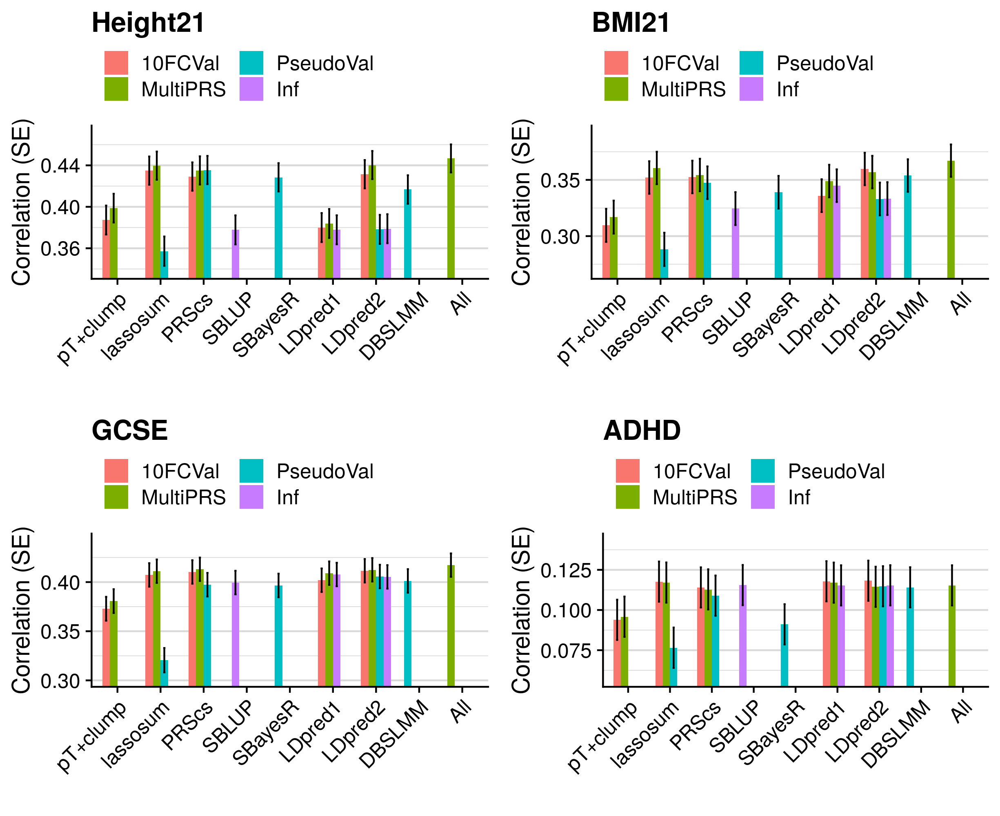

```{r setup, include=FALSE}
knitr::opts_chunk$set(echo = TRUE)
```

<style>
p.caption {
  font-size: 1.5em;
}
</style>

```{css, echo=F}
pre code, pre, code {
  white-space: pre !important;
  overflow-x: scroll !important;
  word-break: keep-all !important;
  word-wrap: initial !important;
}
```

***

# Introduction

In this study we compare a range of polygenic scoring approaches within a reference standardised framework, whereby the polygenic scores are derived using a previously defined set of variants, and LD and minor allele frequency (MAF) are estimated using an ancestry matched reference genotype data sample. This ensures the performance of the methods will hold true when implementing them within a clinical context, which will require reference-standardisation of polygenic scoring.

<br/>

***

# Aims
1. Compare the predictive utility of polygenic scores derived using a range of methods.
2. Compare predictive utility of models including multiple PRSs based on difference parameters, to those using a single PRS selected using 10-fold cross-validation or pseudo-validation.

<br/>

***

# Methods

## Samples
- UK Biobank
- TEDS

<br/>

## Outcomes

* UK Biobank
  * Depression (binary)
  * Intelligence (continuous)
  * Body mass index (BMI - continuous)
  * Height (continuous)
  * Coronary Artery Disease (CAD - Binary)
  * Type II Diabetes (T2D - Binary)
  * Inflammatory Bowel Disorder (IBD - Binary)
  * Rheumatoid arthritis (RheuArth - Binary)
  * Multiple Slerosis (MultiScler - Binary)
  * Prostate Cancer (Binary)
  * Breast Cancer (Binary)

* TEDS
  * ADHD traits (continuous)
  * Height (continuous)
  * Body mass index (BMI - continuous)
  * GCSE scores (continuous)

<br/>

## Genotypic data
Both target sample underwent stringent quality control prior to imputation using the HRC-reference. After imputation, genotypes were converted to PLINK hard-calls, and only HapMap3 SNPs were retained. Eureopean individuals within the target samples were identified and retained if they were within the 3SD of the 1KG European mean of the first 100 principal components.

<br/>

## GWAS summary statistics
For each target phenotype, the largest independent phenotype-matched GWAS was selected for calculating polygenic scores. More information can be found in the table below.

<details><summary>Preparing GWAS sumstats table for UK Biobank phenotypes</summary>
```{R, echo=T, eval=F}

source('/users/k1806347/brc_scratch/Software/MyGit/GenoPred/config_used/Phenotype_prep.config')
source('/users/k1806347/brc_scratch/Software/MyGit/GenoPred/config_used/Pipeline_prep.config')

library(data.table)

pheno<-fread('/users/k1806347/brc_scratch/Data/GWAS_sumstats/QC_sumstats_list_270121.csv')

ukb_pheno=c('Depression','Intelligence','BMI','Height','T2D','CAD','IBD','MultiScler','RheuArth','Breast_Cancer','Prostate_Cancer')
ukb_gwas=c('DEPR06','COLL01','BODY04','HEIG03','DIAB05','COAD01','CROH01','SCLE03','RHEU02','BRCA01','PRCA01')
ukb_prev=c(0.15,NA,NA,NA,0.05,0.03,0.013,0.00164,0.005,0.125,0.125)
ukb_dat<-data.frame(pheno=ukb_pheno,gwas=ukb_gwas,prev=ukb_prev)

pheno_ukb<-pheno[(pheno$code %in% ukb_gwas),]
pheno_ukb<-pheno_ukb[,c('code','phenotype_name','reference_year','pmid','n_cases','n_controls','n_total')]
names(pheno_ukb)<-c('code','trait','year','PMID','Ncases','Ncontrols','sample_size_discovery')

ldsc_res<-NULL
for(i in ukb_gwas){
  tmp<-read.table(paste0(gwas_rep_munged,'/',i,'_herit.log'), sep='&')
}

pheno_ukb$ldsc_h2_observed<-NA
pheno_ukb$ldsc_h2_se<-NA
pheno_ukb$ldsc_lambda_GC<-NA
pheno_ukb$ldsc_intercept<-NA
pheno_ukb$ldsc_intercept_se<-NA

ldsc_logs<-list.files(path='/scratch/groups/ukbiobank/sumstats/munged', pattern='_herit.log')
ldsc_logs<-gsub('_herit.log','',ldsc_logs)

for(i in 1:dim(pheno_ukb)[1]){
  if((pheno_ukb$code[i] %in% ldsc_logs)){
    ldsc_logs_i<-read.fwf(paste0(gwas_rep_munged,'/',pheno_ukb$code[i],'_herit.log'),widths = 1000000)
        
    pheno_ukb$ldsc_h2_observed[i]<-as.numeric(gsub(' .*','', gsub('Total Observed scale h2: ','',ldsc_logs_i[grepl('Total Observed scale h2: ', ldsc_logs_i$V1),])))
    pheno_ukb$ldsc_h2_se[i]<-as.numeric(gsub("\\)",'', gsub(".*\\(",'', gsub('Total Observed scale h2: ','',ldsc_logs_i[grepl('Total Observed scale h2: ', ldsc_logs_i$V1),]))))
    pheno_ukb$ldsc_lambda_GC[i]<-as.numeric(gsub('Lambda GC: ','',ldsc_logs_i[grepl('Lambda GC: ', ldsc_logs_i$V1),]))
    pheno_ukb$ldsc_intercept[i]<-as.numeric(gsub(' .*','', gsub("Intercept: ",'',ldsc_logs_i[grepl("Intercept: ", ldsc_logs_i$V1),])))
    pheno_ukb$ldsc_intercept_se[i]<-as.numeric(gsub("\\)",'', gsub(".*\\(",'', gsub("Intercept: ",'',ldsc_logs_i[grepl("Intercept: ", ldsc_logs_i$V1),]))))
  }
}

pheno_ukb$pop_prev<-ukb_dat$prev[match(pheno_ukb$code, ukb_dat$gwas)]
pheno_ukb$Target_Phenotype<-ukb_dat$pheno[match(pheno_ukb$code, ukb_dat$gwas)]
pheno_ukb$Ncases<-as.numeric(gsub(',','',pheno_ukb$Ncases))
pheno_ukb$Ncontrols<-as.numeric(gsub(',','',pheno_ukb$Ncontrols))
pheno_ukb$samp_prev<-pheno_ukb$Ncases/(pheno_ukb$Ncases+pheno_ukb$Ncontrols)

h2l_R2 <- function(k, r2, p) {
  # K baseline disease risk
  # r2 from a linear regression model attributable to genomic profile risk score
  # P proportion of sample that are cases
  # calculates proportion of variance explained on the liability scale
  #from ABC at http://www.complextraitgenomics.com/software/
  #Lee SH, Goddard ME, Wray NR, Visscher PM. (2012) A better coefficient of determination for genetic profile analysis. Genet Epidemiol. 2012 Apr;36(3):214-24.
  x= qnorm(1-k)
  z= dnorm(x)
  i=z/k
  C= k*(1-k)*k*(1-k)/(z^2*p*(1-p))
  theta= i*((p-k)/(1-k))*(i*((p-k)/(1-k))-x)
  h2l_R2 = C*r2 / (1 + C*theta*r2)
}

se_h2l_R2 <- function(k,h2,se, p) {
  # K baseline disease risk
  # r2 from a linear regression model attributable to genomic profile risk score
  # P proportion of sample that are cases
  # calculates proportion of variance explained on the liability scale
  #from ABC at http://www.complextraitgenomics.com/software/
  #Lee SH, Goddard ME, Wray NR, Visscher PM. (2012) A better coefficient of determination for genetic profile analysis. Genet Epidemiol. 2012 Apr;36(3):214-24.

  #SE on the liability (From a Taylor series expansion)
  #var(h2l_r2) = [d(h2l_r2)/d(R2v)]^2*var(R2v) with d being calculus differentiation
  x= qnorm(1-k)
  z= dnorm(x)
  i=z/k
  C= k*(1-k)*k*(1-k)/(z^2*p*(1-p))
  theta= i*((p-k)/(1-k))*(i*((p-k)/(1-k))-x)
  se_h2l_R2 = C*(1-h2*theta)*se
}

pheno_ukb$ldsc_h2_observed<-as.numeric(pheno_ukb$ldsc_h2_observed)
pheno_ukb$ldsc_h2_se<-as.numeric(pheno_ukb$ldsc_h2_se)

pheno_ukb$h2_liab<-round(h2l_R2(k=pheno_ukb$pop_prev, r2=pheno_ukb$ldsc_h2_observed, p=pheno_ukb$samp_prev),3)
pheno_ukb$h2_liab_se<-round(se_h2l_R2(k=pheno_ukb$pop_prev, h2=pheno_ukb$ldsc_h2_observed, se=pheno_ukb$ldsc_h2_se, p=pheno_ukb$samp_prev),3)

pheno_ukb$ldsc_h2_observed<-paste0(pheno_ukb$ldsc_h2_observed," (", pheno_ukb$ldsc_h2_se,")")
pheno_ukb$ldsc_h2_se<-NULL
pheno_ukb$h2_liab[!is.na(pheno_ukb$Ncases)]<-paste0(pheno_ukb$h2_liab[!is.na(pheno_ukb$Ncases)]," (", pheno_ukb$h2_liab_se[!is.na(pheno_ukb$Ncases)],")")
pheno_ukb$h2_liab_se<-NULL
pheno_ukb$ldsc_intercept<-paste0(pheno_ukb$ldsc_intercept," (", pheno_ukb$ldsc_intercept_se,")")
pheno_ukb$ldsc_intercept_se<-NULL

pheno_ukb$Trait<-c('BMI','CAD','Intelligence',"Crohn's Disease",'Major Depression','T2D','Height','RheuArth','MultiScler','Prostate Cancer','Breast Cancer')
pheno_ukb<-pheno_ukb[match(ukb_dat$gwas,pheno_ukb$code),]

pheno_ukb<-pheno_ukb[,c('Trait','code','trait','year','PMID','Ncases','Ncontrols','sample_size_discovery','ldsc_h2_observed','h2_liab','ldsc_intercept','ldsc_lambda_GC')]
names(pheno_ukb)<-c('Target Phenotype','Code','GWAS Phenotype','Year','PMID','Ncase','Ncontrol','N','h2_obs','h2_liab','Intercept','Lambda')

write.csv(pheno_ukb, '/users/k1806347/brc_scratch/Data/GWAS_sumstats/UKBB_phenotype_GWAS_descrip.csv', row.names=F, quote=F)

```
</details>

<details><summary>Show GWAS for UK Biobank phenotypes</summary>

```{r, echo=F, eval=T, results='asis'}
res<-read.csv("/users/k1806347/brc_scratch/Data/GWAS_sumstats/UKBB_phenotype_GWAS_descrip.csv")

names(res)<-c('Target Phenotype','Code','GWAS Phenotype','Year','PMID','Ncase','Ncontrol','N',"h2-obs (SE)","h2-liab (SE)",'Intercept','Lambda')

library(knitr)
kable(res, rownames = FALSE, caption='GWAS used for each UK Biobank phenotype')
```

</details>

<details><summary>Preparing GWAS sumstats table for TEDS phenotypes</summary>
```{R, echo=T, eval=F}

source('/users/k1806347/brc_scratch/Software/MyGit/GenoPred/config_used/Phenotype_prep.config')
source('/users/k1806347/brc_scratch/Software/MyGit/GenoPred/config_used/Pipeline_prep.config')

library(data.table)

pheno<-fread('/users/k1806347/brc_scratch/Data/GWAS_sumstats/QC_sumstats_list_270121.csv')

teds_pheno=c('Height21', 'BMI21', 'GCSE', 'ADHD')
teds_gwas=c('HEIG03', 'BODY11', 'EDUC03', 'ADHD04')
teds_prev=c(NA,NA,NA,0.05)
teds_dat<-data.frame(pheno=teds_pheno,gwas=teds_gwas,prev=teds_prev)

pheno_teds<-pheno[(pheno$code %in% teds_gwas),]
pheno_teds<-pheno_teds[,c('code','phenotype_name','reference_year','pmid','n_cases','n_controls','n_total')]
names(pheno_teds)<-c('code','trait','year','PMID','Ncases','Ncontrols','sample_size_discovery')

ldsc_res<-NULL
for(i in teds_gwas){
  tmp<-read.table(paste0(gwas_rep_munged,'/',i,'_herit.log'), sep='&')
}

pheno_teds$ldsc_h2_observed<-NA
pheno_teds$ldsc_h2_se<-NA
pheno_teds$ldsc_lambda_GC<-NA
pheno_teds$ldsc_intercept<-NA
pheno_teds$ldsc_intercept_se<-NA

ldsc_logs<-list.files(path='/scratch/groups/ukbiobank/sumstats/munged', pattern='_herit.log')
ldsc_logs<-gsub('_herit.log','',ldsc_logs)

for(i in 1:dim(pheno_teds)[1]){
  if((pheno_teds$code[i] %in% ldsc_logs)){
    ldsc_logs_i<-read.fwf(paste0(gwas_rep_munged,'/',pheno_teds$code[i],'_herit.log'),widths = 1000000)
        
    pheno_teds$ldsc_h2_observed[i]<-as.numeric(gsub(' .*','', gsub('Total Observed scale h2: ','',ldsc_logs_i[grepl('Total Observed scale h2: ', ldsc_logs_i$V1),])))
    pheno_teds$ldsc_h2_se[i]<-as.numeric(gsub("\\)",'', gsub(".*\\(",'', gsub('Total Observed scale h2: ','',ldsc_logs_i[grepl('Total Observed scale h2: ', ldsc_logs_i$V1),]))))
    pheno_teds$ldsc_lambda_GC[i]<-as.numeric(gsub('Lambda GC: ','',ldsc_logs_i[grepl('Lambda GC: ', ldsc_logs_i$V1),]))
    pheno_teds$ldsc_intercept[i]<-as.numeric(gsub(' .*','', gsub("Intercept: ",'',ldsc_logs_i[grepl("Intercept: ", ldsc_logs_i$V1),])))
    pheno_teds$ldsc_intercept_se[i]<-as.numeric(gsub("\\)",'', gsub(".*\\(",'', gsub("Intercept: ",'',ldsc_logs_i[grepl("Intercept: ", ldsc_logs_i$V1),]))))
  }
}

pheno_teds$pop_prev<-teds_dat$prev[match(pheno_teds$code, teds_dat$gwas)]
pheno_teds$Target_Phenotype<-teds_dat$pheno[match(pheno_teds$code, teds_dat$gwas)]
pheno_teds$Ncases<-as.numeric(gsub(',','',pheno_teds$Ncases))
pheno_teds$Ncontrols<-as.numeric(gsub(',','',pheno_teds$Ncontrols))
pheno_teds$samp_prev<-pheno_teds$Ncases/(pheno_teds$Ncases+pheno_teds$Ncontrols)

h2l_R2 <- function(k, r2, p) {
  # K baseline disease risk
  # r2 from a linear regression model attributable to genomic profile risk score
  # P proportion of sample that are cases
  # calculates proportion of variance explained on the liability scale
  #from ABC at http://www.complextraitgenomics.com/software/
  #Lee SH, Goddard ME, Wray NR, Visscher PM. (2012) A better coefficient of determination for genetic profile analysis. Genet Epidemiol. 2012 Apr;36(3):214-24.
  x= qnorm(1-k)
  z= dnorm(x)
  i=z/k
  C= k*(1-k)*k*(1-k)/(z^2*p*(1-p))
  theta= i*((p-k)/(1-k))*(i*((p-k)/(1-k))-x)
  h2l_R2 = C*r2 / (1 + C*theta*r2)
}

se_h2l_R2 <- function(k,h2,se, p) {
  # K baseline disease risk
  # r2 from a linear regression model attributable to genomic profile risk score
  # P proportion of sample that are cases
  # calculates proportion of variance explained on the liability scale
  #from ABC at http://www.complextraitgenomics.com/software/
  #Lee SH, Goddard ME, Wray NR, Visscher PM. (2012) A better coefficient of determination for genetic profile analysis. Genet Epidemiol. 2012 Apr;36(3):214-24.

  #SE on the liability (From a Taylor series expansion)
  #var(h2l_r2) = [d(h2l_r2)/d(R2v)]^2*var(R2v) with d being calculus differentiation
  x= qnorm(1-k)
  z= dnorm(x)
  i=z/k
  C= k*(1-k)*k*(1-k)/(z^2*p*(1-p))
  theta= i*((p-k)/(1-k))*(i*((p-k)/(1-k))-x)
  se_h2l_R2 = C*(1-h2*theta)*se
}

pheno_teds$ldsc_h2_observed<-as.numeric(pheno_teds$ldsc_h2_observed)
pheno_teds$ldsc_h2_se<-as.numeric(pheno_teds$ldsc_h2_se)

pheno_teds$h2_liab<-round(h2l_R2(k=pheno_teds$pop_prev, r2=pheno_teds$ldsc_h2_observed, p=pheno_teds$samp_prev),3)
pheno_teds$h2_liab_se<-round(se_h2l_R2(k=pheno_teds$pop_prev, h2=pheno_teds$ldsc_h2_observed, se=pheno_teds$ldsc_h2_se, p=pheno_teds$samp_prev),3)

pheno_teds$ldsc_h2_observed<-paste0(pheno_teds$ldsc_h2_observed," (", pheno_teds$ldsc_h2_se,")")
pheno_teds$ldsc_h2_se<-NULL
pheno_teds$h2_liab[!is.na(pheno_teds$Ncases)]<-paste0(pheno_teds$h2_liab[!is.na(pheno_teds$Ncases)]," (", pheno_teds$h2_liab_se[!is.na(pheno_teds$Ncases)],")")
pheno_teds$h2_liab_se<-NULL
pheno_teds$ldsc_intercept<-paste0(pheno_teds$ldsc_intercept," (", pheno_teds$ldsc_intercept_se,")")
pheno_teds$ldsc_intercept_se<-NULL

pheno_teds$Trait<-c("ADHD symptoms",'BMI','GCSE','Height')
pheno_teds<-pheno_teds[match(teds_dat$gwas,pheno_teds$code),]

pheno_teds<-pheno_teds[,c('Trait','code','trait','year','PMID','Ncases','Ncontrols','sample_size_discovery','ldsc_h2_observed','h2_liab','ldsc_intercept','ldsc_lambda_GC')]
names(pheno_teds)<-c('Target Phenotype','Code','GWAS Phenotype','Year','PMID','Ncase','Ncontrol','N','h2_obs','h2_liab','Intercept','Lambda')

write.csv(pheno_teds, '/users/k1806347/brc_scratch/Data/GWAS_sumstats/TEDS_phenotype_GWAS_descrip.csv', row.names=F, quote=F)

```
</details>

<details><summary>Show GWAS for TEDS phenotypes</summary>

```{r, echo=F, eval=T, results='asis'}
res<-read.csv("/users/k1806347/brc_scratch/Data/GWAS_sumstats/TEDS_phenotype_GWAS_descrip.csv")

names(res)<-c('Target Phenotype','Code','GWAS Phenotype','Year','PMID','Ncase','Ncontrol','N',"h2-obs (SE)","h2-liab (SE)",'Intercept','Lambda')

library(knitr)
kable(res, rownames = FALSE, caption='GWAS used for each TEDS phenotype')
```

</details>

<br/>

## Polygenic scoring
Polygenic scores were derived using the following methods: 

  1. p-value thresholding and clumping (pT + clump).
  2. lassosum - Lasso-based shrinkage method.
  3. PRScs - Bayesian shrinkage method.
  4. SBLUP - Summary statistic-based BLUP estimates
  5. SBayesR - Bayesian shrinkage method
  6. LDpred - Bayesian shrinkage method
  7. DBSLMM - Bayesian shrinkage method
  8. LDpred2 - Bayesian shrinkage method

Polygenic scores were derived using a reference standardised pipeline. Two references were used for all methods, the European subset of the 1KG reference ([described here](https://opain.github.io/GenoPred/Pipeline_prep.html#4_polygenic_scoring)), and an independant subset of 10K European individuals from UK Biobank ([described here](https://opain.github.io/GenoPred/Pipeline_prep_withUKBB_ref.html#3_polygenic_scoring)). In brief, all scores were derived using HapMap3 SNPs only, modelling LD based on these references Any HapMap3 missing in the target sample are imputed using the reference estimated allele frequency.

<br/>

### UK Biobank
<details><summary>pT + clump: Sparse</summary>
```{bash, echo=T, eval=F}
########
# 1KG ref
######## 
# Set required variables
. /users/k1806347/brc_scratch/Software/MyGit/GenoPred/config_used/Target_scoring.config
. /users/k1806347/brc_scratch/Software/MyGit/GenoPred/config_used/Pipeline_prep.config

pheno=$(echo Depression Intelligence BMI Height T2D CAD IBD MultiScler RheuArth Breast_Cancer Prostate_Cancer)
gwas=$(echo DEPR06 COLL01 BODY04 HEIG03 DIAB05 COAD01 CROH01 SCLE03 RHEU02 BRCA01 PRCA01)

# Create directory
mkdir ${UKBB_output}/PRS_for_comparison/1KG_ref/pt_clump

# Create file listing GWAS that haven't been processed.
> ${UKBB_output}/PRS_for_comparison/1KG_ref/pt_clump/todo.txt
for i in $(seq 1 11);do
gwas_i=$(echo ${gwas} | cut -f ${i} -d ' ')
pheno_i=$(echo ${pheno} | cut -f ${i} -d ' ')
if [ ! -f ${UKBB_output}/PRS_for_comparison/1KG_ref/pt_clump/${gwas_i}/UKBB.subset.w_hm3.${gwas_i}.profiles ]; then
echo ${gwas_i} ${pheno_i} >> ${UKBB_output}/PRS_for_comparison/1KG_ref/pt_clump/todo.txt
fi
done

# Create shell script to run using sbatch
cat > ${UKBB_output}/PRS_for_comparison/1KG_ref/pt_clump/sbatch.sh << 'EOF'
#!/bin/sh

#SBATCH -p shared,brc
#SBATCH --mem 10G
#SBATCH -J pt_clump

. /users/k1806347/brc_scratch/Software/MyGit/GenoPred/config_used/Target_scoring.config
. /users/k1806347/brc_scratch/Software/MyGit/GenoPred/config_used/Pipeline_prep.config

gwas=$(awk -v var="$SLURM_ARRAY_TASK_ID" 'NR == var {print $1}' ${UKBB_output}/PRS_for_comparison/1KG_ref/pt_clump/todo.txt)
pheno=$(awk -v var="$SLURM_ARRAY_TASK_ID" 'NR == var {print $2}' ${UKBB_output}/PRS_for_comparison/1KG_ref/pt_clump/todo.txt)

echo $gwas
echo $pheno

/users/k1806347/brc_scratch/Software/Rscript.sh /users/k1806347/brc_scratch/Software/MyGit/GenoPred/Scripts/Scaled_polygenic_scorer/Scaled_polygenic_scorer.R \
    --target_plink_chr ${UKBB_output}/Genotype/Harmonised/UKBB.w_hm3.QCd.AllSNP.chr \
    --target_keep ${UKBB_output}/Phenotype/PRS_comp_subset/UKBB.${pheno}.txt \
    --ref_score ${Geno_1KG_dir}/Score_files_for_polygenic/pt_clump/${gwas}/1KGPhase3.w_hm3.${gwas} \
    --ref_scale ${Geno_1KG_dir}/Score_files_for_polygenic/pt_clump/${gwas}/1KGPhase3.w_hm3.${gwas}.EUR.scale \
    --ref_freq_chr ${Geno_1KG_dir}/freq_files/EUR/1KGPhase3.w_hm3.EUR.chr \
    --plink ${plink1_9} \
    --pheno_name ${gwas} \
    --output ${UKBB_output}/PRS_for_comparison/1KG_ref/pt_clump/${gwas}/UKBB.subset.w_hm3.${gwas}

EOF

sbatch --array 1-$(wc -l ${UKBB_output}/PRS_for_comparison/1KG_ref/pt_clump/todo.txt | cut -d' ' -f1)%3 ${UKBB_output}/PRS_for_comparison/1KG_ref/pt_clump/sbatch.sh

######
# UKBB ref
######

# Set required variables
. /users/k1806347/brc_scratch/Software/MyGit/GenoPred/config_used/Target_scoring.config
. /users/k1806347/brc_scratch/Software/MyGit/GenoPred/config_used/Pipeline_prep.config

pheno=$(echo Depression Intelligence BMI Height T2D CAD IBD MultiScler RheuArth Breast_Cancer Prostate_Cancer)
gwas=$(echo DEPR06 COLL01 BODY04 HEIG03 DIAB05 COAD01 CROH01 SCLE03 RHEU02 BRCA01 PRCA01)

# Create directory
mkdir -p ${UKBB_output}/PRS_for_comparison/UKBB_ref/pt_clump

# Create file listing GWAS that haven't been processed.
> ${UKBB_output}/PRS_for_comparison/UKBB_ref/pt_clump/todo.txt
for i in $(seq 1 11);do
gwas_i=$(echo ${gwas} | cut -f ${i} -d ' ')
pheno_i=$(echo ${pheno} | cut -f ${i} -d ' ')
if [ ! -f ${UKBB_output}/PRS_for_comparison/UKBB_ref/pt_clump/${gwas_i}/UKBB.subset.w_hm3.${gwas_i}.profiles ]; then
echo ${gwas_i} ${pheno_i} >> ${UKBB_output}/PRS_for_comparison/UKBB_ref/pt_clump/todo.txt
fi
done

# Create shell script to run using sbatch
cat > ${UKBB_output}/PRS_for_comparison/UKBB_ref/pt_clump/sbatch.sh << 'EOF'
#!/bin/sh

#SBATCH -p shared,brc
#SBATCH --mem 10G
#SBATCH -J pt_clump

. /users/k1806347/brc_scratch/Software/MyGit/GenoPred/config_used/Target_scoring.config
. /users/k1806347/brc_scratch/Software/MyGit/GenoPred/config_used/Pipeline_prep.config

gwas=$(awk -v var="$SLURM_ARRAY_TASK_ID" 'NR == var {print $1}' ${UKBB_output}/PRS_for_comparison/UKBB_ref/pt_clump/todo.txt)
pheno=$(awk -v var="$SLURM_ARRAY_TASK_ID" 'NR == var {print $2}' ${UKBB_output}/PRS_for_comparison/UKBB_ref/pt_clump/todo.txt)

echo $gwas
echo $pheno

/users/k1806347/brc_scratch/Software/Rscript.sh /users/k1806347/brc_scratch/Software/MyGit/GenoPred/Scripts/Scaled_polygenic_scorer/Scaled_polygenic_scorer.R \
    --target_plink_chr ${UKBB_output}/Genotype/Harmonised/UKBB.w_hm3.QCd.AllSNP.chr \
    --target_keep ${UKBB_output}/Phenotype/PRS_comp_subset/UKBB.${pheno}.txt \
    --ref_score ${UKBB_output}/UKBB_ref/Score_files_for_polygenic/pt_clump/${gwas}/UKBB.noPheno.EUR.10K.w_hm3.${gwas} \
    --ref_scale ${UKBB_output}/UKBB_ref/Score_files_for_polygenic/pt_clump/${gwas}/UKBB.noPheno.EUR.10K.w_hm3.${gwas}.EUR.scale \
    --ref_freq_chr ${UKBB_output}/UKBB_ref/genotype/UKBB.noPheno.EUR.10K.chr \
    --plink ${plink1_9} \
    --pheno_name ${gwas} \
    --output ${UKBB_output}/PRS_for_comparison/UKBB_ref/pt_clump/${gwas}/UKBB.subset.w_hm3.${gwas}

EOF

sbatch --array 1-$(wc -l ${UKBB_output}/PRS_for_comparison/UKBB_ref/pt_clump/todo.txt | cut -d' ' -f1)%3 ${UKBB_output}/PRS_for_comparison/UKBB_ref/pt_clump/sbatch.sh

```
</details>

<details><summary>pT + clump: Dense</summary>
```{bash, echo=T, eval=F}
########
# 1KG ref
######## 
# Set required variables
. /users/k1806347/brc_scratch/Software/MyGit/GenoPred/config_used/Target_scoring.config
. /users/k1806347/brc_scratch/Software/MyGit/GenoPred/config_used/Pipeline_prep.config

pheno=$(echo Depression Intelligence BMI Height T2D CAD IBD MultiScler RheuArth Breast_Cancer Prostate_Cancer)
gwas=$(echo DEPR06 COLL01 BODY04 HEIG03 DIAB05 COAD01 CROH01 SCLE03 RHEU02 BRCA01 PRCA01)

# Create directory
mkdir ${UKBB_output}/PRS_for_comparison/1KG_ref/pt_clump_dense

# Create file listing GWAS that haven't been processed.
> ${UKBB_output}/PRS_for_comparison/1KG_ref/pt_clump_dense/todo.txt
for i in $(seq 1 11);do
gwas_i=$(echo ${gwas} | cut -f ${i} -d ' ')
pheno_i=$(echo ${pheno} | cut -f ${i} -d ' ')
if [ ! -f ${UKBB_output}/PRS_for_comparison/1KG_ref/pt_clump_dense/${gwas_i}/UKBB.subset.w_hm3.${gwas_i}.profiles ]; then
echo ${gwas_i} ${pheno_i} >> ${UKBB_output}/PRS_for_comparison/1KG_ref/pt_clump_dense/todo.txt
fi
done

# Create shell script to run using sbatch
cat > ${UKBB_output}/PRS_for_comparison/1KG_ref/pt_clump_dense/sbatch.sh << 'EOF'
#!/bin/sh

#SBATCH -p shared,brc
#SBATCH --mem 25G
#SBATCH -t 72:00:00
#SBATCH -J pt_clump_dense

. /users/k1806347/brc_scratch/Software/MyGit/GenoPred/config_used/Target_scoring.config
. /users/k1806347/brc_scratch/Software/MyGit/GenoPred/config_used/Pipeline_prep.config

gwas=$(awk -v var="$SLURM_ARRAY_TASK_ID" 'NR == var {print $1}' ${UKBB_output}/PRS_for_comparison/1KG_ref/pt_clump_dense/todo.txt)
pheno=$(awk -v var="$SLURM_ARRAY_TASK_ID" 'NR == var {print $2}' ${UKBB_output}/PRS_for_comparison/1KG_ref/pt_clump_dense/todo.txt)

echo $gwas
echo $pheno

/users/k1806347/brc_scratch/Software/Rscript.sh /users/k1806347/brc_scratch/Software/MyGit/GenoPred/Scripts/Scaled_polygenic_scorer_dense/Scaled_polygenic_scorer_dense.R \
    --target_plink_chr ${UKBB_output}/Genotype/Harmonised/UKBB.w_hm3.QCd.AllSNP.chr \
    --target_keep ${UKBB_output}/Phenotype/PRS_comp_subset/UKBB.${pheno}.txt \
    --ref_score ${Geno_1KG_dir}/Score_files_for_polygenic/pt_clump_dense/${gwas}/1KGPhase3.w_hm3.${gwas}.GWAS_sumstats_clumped.txt \
    --ref_scale ${Geno_1KG_dir}/Score_files_for_polygenic/pt_clump_dense/${gwas}/1KGPhase3.w_hm3.${gwas}.EUR.scale \
    --prsice_path ${prsice_path} \
    --rscript ${rscript} \
    --pheno_name ${gwas} \
    --output ${UKBB_output}/PRS_for_comparison/1KG_ref/pt_clump_dense/${gwas}/UKBB.subset.w_hm3.${gwas}

EOF

sbatch --array 1-$(wc -l ${UKBB_output}/PRS_for_comparison/1KG_ref/pt_clump_dense/todo.txt | cut -d' ' -f1)%5 ${UKBB_output}/PRS_for_comparison/1KG_ref/pt_clump_dense/sbatch.sh

# BODY04 and PRCA01 aren't finishing
# Run in batches
# Split phenotype files into batches
```

```{R, eval=F, echo=T}
library(data.table)
source('/users/k1806347/brc_scratch/Software/MyGit/GenoPred/config_used/Target_scoring.config')
source('/users/k1806347/brc_scratch/Software/MyGit/GenoPred/config_used/Pipeline_prep.config')

pheno<-c('BMI', 'Prostate_Cancer')
for(i in pheno){
  pheno_file<-fread(paste0(UKBB_output,'/Phenotype/PRS_comp_subset/UKBB.',i,'.txt'))
  
  pheno_file_split<-split(pheno_file, (as.numeric(rownames(pheno_file))-1) %/% 5000)
  
  for(k in 1:length(pheno_file_split)){
    write.table(pheno_file_split[[k]], paste0(UKBB_output,'/Phenotype/PRS_comp_subset/UKBB.',i,'.subset_',k,'.txt'), col.names=T, row.names=F, quote=F)
  }
}

```

```{bash, eval=F, echo=T}
. /users/k1806347/brc_scratch/Software/MyGit/GenoPred/config_used/Target_scoring.config
. /users/k1806347/brc_scratch/Software/MyGit/GenoPred/config_used/Pipeline_prep.config

# BODY04
# Create shell script to run using sbatch
cat > ${UKBB_output}/PRS_for_comparison/1KG_ref/pt_clump_dense/sbatch_BODY04.sh << 'EOF'
#!/bin/sh

#SBATCH -p shared,brc
#SBATCH --mem 10G
#SBATCH -t 72:00:00
#SBATCH -J pt_clump_dense

. /users/k1806347/brc_scratch/Software/MyGit/GenoPred/config_used/Target_scoring.config
. /users/k1806347/brc_scratch/Software/MyGit/GenoPred/config_used/Pipeline_prep.config

gwas=BODY04
pheno=BMI
subset=${SLURM_ARRAY_TASK_ID}

echo $gwas
echo $pheno

/users/k1806347/brc_scratch/Software/Rscript.sh /users/k1806347/brc_scratch/Software/MyGit/GenoPred/Scripts/Scaled_polygenic_scorer_dense/Scaled_polygenic_scorer_dense.R \
    --target_plink_chr ${UKBB_output}/Genotype/Harmonised/UKBB.w_hm3.QCd.AllSNP.chr \
    --target_keep ${UKBB_output}/Phenotype/PRS_comp_subset/UKBB.${pheno}.subset_${subset}.txt \
    --ref_score ${Geno_1KG_dir}/Score_files_for_polygenic/pt_clump_dense/${gwas}/1KGPhase3.w_hm3.${gwas}.GWAS_sumstats_clumped.txt \
    --ref_scale ${Geno_1KG_dir}/Score_files_for_polygenic/pt_clump_dense/${gwas}/1KGPhase3.w_hm3.${gwas}.EUR.scale \
    --prsice_path ${prsice_path} \
    --rscript ${rscript} \
    --pheno_name ${gwas} \
    --output ${UKBB_output}/PRS_for_comparison/1KG_ref/pt_clump_dense/${gwas}.subset_${subset}/UKBB.subset.w_hm3.${gwas}

EOF

sbatch --array 1-10 ${UKBB_output}/PRS_for_comparison/1KG_ref/pt_clump_dense/sbatch_BODY04.sh


# PRCA01
# Create shell script to run using sbatch
cat > ${UKBB_output}/PRS_for_comparison/1KG_ref/pt_clump_dense/sbatch_PRCA01.sh << 'EOF'
#!/bin/sh

#SBATCH -p shared,brc
#SBATCH --mem 10G
#SBATCH -t 72:00:00
#SBATCH -J pt_clump_dense

. /users/k1806347/brc_scratch/Software/MyGit/GenoPred/config_used/Target_scoring.config
. /users/k1806347/brc_scratch/Software/MyGit/GenoPred/config_used/Pipeline_prep.config

gwas=PRCA01
pheno=Prostate_Cancer
subset=${SLURM_ARRAY_TASK_ID}

echo $gwas
echo $pheno

/users/k1806347/brc_scratch/Software/Rscript.sh /users/k1806347/brc_scratch/Software/MyGit/GenoPred/Scripts/Scaled_polygenic_scorer_dense/Scaled_polygenic_scorer_dense.R \
    --target_plink_chr ${UKBB_output}/Genotype/Harmonised/UKBB.w_hm3.QCd.AllSNP.chr \
    --target_keep ${UKBB_output}/Phenotype/PRS_comp_subset/UKBB.${pheno}.subset_${subset}.txt \
    --ref_score ${Geno_1KG_dir}/Score_files_for_polygenic/pt_clump_dense/${gwas}/1KGPhase3.w_hm3.${gwas}.GWAS_sumstats_clumped.txt \
    --ref_scale ${Geno_1KG_dir}/Score_files_for_polygenic/pt_clump_dense/${gwas}/1KGPhase3.w_hm3.${gwas}.EUR.scale \
    --prsice_path ${prsice_path} \
    --rscript ${rscript} \
    --pheno_name ${gwas} \
    --output ${UKBB_output}/PRS_for_comparison/1KG_ref/pt_clump_dense/${gwas}.subset_${subset}/UKBB.subset.w_hm3.${gwas}

EOF

sbatch --array 1-10 ${UKBB_output}/PRS_for_comparison/1KG_ref/pt_clump_dense/sbatch_PRCA01.sh

```

```{R, eval=F,echo=T}
# Combine the score from the different batches
library(data.table)
source('/users/k1806347/brc_scratch/Software/MyGit/GenoPred/config_used/Target_scoring.config')
source('/users/k1806347/brc_scratch/Software/MyGit/GenoPred/config_used/Pipeline_prep.config')

gwas<-c('BODY04', 'PRCA01')

for(i in gwas){
tmp<-NULL
  for(k in 1:10){
    print(k)
    tmp<-rbind(tmp, fread(paste0(UKBB_output,'/PRS_for_comparison/1KG_ref/pt_clump_dense/',i,'.subset_',k,'/UKBB.subset.w_hm3.',i,'.profiles')))
  }

dir.create(paste0(UKBB_output,'/PRS_for_comparison/1KG_ref/pt_clump_dense/',i))
fwrite(tmp, paste0(UKBB_output,'/PRS_for_comparison/1KG_ref/pt_clump_dense/',i,'/UKBB.subset.w_hm3.',i,'.profiles'), col.names=T, row.names=F, quote=F, sep=' ')
}

```

</details>

<details><summary>pT + clump: Sparse (non-nested)</summary>
```{bash, echo=T, eval=F}
########
# 1KG ref
######## 
# Set required variables
. /users/k1806347/brc_scratch/Software/MyGit/GenoPred/config_used/Target_scoring.config
. /users/k1806347/brc_scratch/Software/MyGit/GenoPred/config_used/Pipeline_prep.config

pheno=$(echo Depression Intelligence BMI Height T2D CAD IBD MultiScler RheuArth Breast_Cancer Prostate_Cancer)
gwas=$(echo DEPR06 COLL01 BODY04 HEIG03 DIAB05 COAD01 CROH01 SCLE03 RHEU02 BRCA01 PRCA01)

# Create directory
mkdir ${UKBB_output}/PRS_for_comparison/1KG_ref/pt_clump_nonnested

# Create file listing GWAS that haven't been processed.
> ${UKBB_output}/PRS_for_comparison/1KG_ref/pt_clump_nonnested/todo.txt
for i in $(seq 1 11);do
gwas_i=$(echo ${gwas} | cut -f ${i} -d ' ')
pheno_i=$(echo ${pheno} | cut -f ${i} -d ' ')
if [ ! -f ${UKBB_output}/PRS_for_comparison/1KG_ref/pt_clump_nonnested/${gwas_i}/UKBB.subset.w_hm3.${gwas_i}.profiles ]; then
echo ${gwas_i} ${pheno_i} >> ${UKBB_output}/PRS_for_comparison/1KG_ref/pt_clump_nonnested/todo.txt
fi
done

# Create shell script to run using sbatch
cat > ${UKBB_output}/PRS_for_comparison/1KG_ref/pt_clump_nonnested/sbatch.sh << 'EOF'
#!/bin/sh

#SBATCH -p shared,brc
#SBATCH --mem 10G
#SBATCH -J pt_clump_nonnested

. /users/k1806347/brc_scratch/Software/MyGit/GenoPred/config_used/Target_scoring.config
. /users/k1806347/brc_scratch/Software/MyGit/GenoPred/config_used/Pipeline_prep.config

gwas=$(awk -v var="$SLURM_ARRAY_TASK_ID" 'NR == var {print $1}' ${UKBB_output}/PRS_for_comparison/1KG_ref/pt_clump_nonnested/todo.txt)
pheno=$(awk -v var="$SLURM_ARRAY_TASK_ID" 'NR == var {print $2}' ${UKBB_output}/PRS_for_comparison/1KG_ref/pt_clump_nonnested/todo.txt)

echo $gwas
echo $pheno

/users/k1806347/brc_scratch/Software/Rscript.sh /users/k1806347/brc_scratch/Software/MyGit/GenoPred/Scripts/Scaled_polygenic_scorer/Scaled_polygenic_scorer.R \
    --target_plink_chr ${UKBB_output}/Genotype/Harmonised/UKBB.w_hm3.QCd.AllSNP.chr \
    --target_keep ${UKBB_output}/Phenotype/PRS_comp_subset/UKBB.${pheno}.txt \
    --ref_score ${Geno_1KG_dir}/Score_files_for_polygenic/pt_clump_nonnested/${gwas}/1KGPhase3.w_hm3.${gwas} \
    --ref_scale ${Geno_1KG_dir}/Score_files_for_polygenic/pt_clump_nonnested/${gwas}/1KGPhase3.w_hm3.${gwas}.EUR.scale \
    --ref_freq_chr ${Geno_1KG_dir}/freq_files/EUR/1KGPhase3.w_hm3.EUR.chr \
    --plink ${plink1_9} \
    --pheno_name ${gwas} \
    --output ${UKBB_output}/PRS_for_comparison/1KG_ref/pt_clump_nonnested/${gwas}/UKBB.subset.w_hm3.${gwas}

EOF

sbatch --array 1-$(wc -l ${UKBB_output}/PRS_for_comparison/1KG_ref/pt_clump_nonnested/todo.txt | cut -d' ' -f1)%3 ${UKBB_output}/PRS_for_comparison/1KG_ref/pt_clump_nonnested/sbatch.sh

```
</details>

<details><summary>lassosum</summary>
```{bash, echo=T, eval=F}
########
# 1KG ref
######## 
# Set required variables
. /users/k1806347/brc_scratch/Software/MyGit/GenoPred/config_used/Target_scoring.config
. /users/k1806347/brc_scratch/Software/MyGit/GenoPred/config_used/Pipeline_prep.config

pheno=$(echo Depression Intelligence BMI Height T2D CAD IBD MultiScler RheuArth Breast_Cancer Prostate_Cancer)
gwas=$(echo DEPR06 COLL01 BODY04 HEIG03 DIAB05 COAD01 CROH01 SCLE03 RHEU02 BRCA01 PRCA01)

# Create directory
mkdir ${UKBB_output}/PRS_for_comparison/1KG_ref/lassosum

# Create file listing GWAS that haven't been processed.
> ${UKBB_output}/PRS_for_comparison/1KG_ref/lassosum/todo.txt
for i in $(seq 1 11);do
gwas_i=$(echo ${gwas} | cut -f ${i} -d ' ')
pheno_i=$(echo ${pheno} | cut -f ${i} -d ' ')
if [ ! -f ${UKBB_output}/PRS_for_comparison/1KG_ref/lassosum/${gwas_i}/UKBB.subset.w_hm3.${gwas_i}.lassosum_profiles ]; then
echo ${gwas_i} ${pheno_i} >> ${UKBB_output}/PRS_for_comparison/1KG_ref/lassosum/todo.txt
fi
done

# Create shell script to run using sbatch
cat > ${UKBB_output}/PRS_for_comparison/1KG_ref/lassosum/sbatch.sh << 'EOF'
#!/bin/sh

#SBATCH -p shared,brc
#SBATCH --mem 15G
#SBATCH -n 5
#SBATCH -J lassosum

. /users/k1806347/brc_scratch/Software/MyGit/GenoPred/config_used/Target_scoring.config
. /users/k1806347/brc_scratch/Software/MyGit/GenoPred/config_used/Pipeline_prep.config

gwas=$(awk -v var="$SLURM_ARRAY_TASK_ID" 'NR == var {print $1}' ${UKBB_output}/PRS_for_comparison/1KG_ref/lassosum/todo.txt)
pheno=$(awk -v var="$SLURM_ARRAY_TASK_ID" 'NR == var {print $2}' ${UKBB_output}/PRS_for_comparison/1KG_ref/lassosum/todo.txt)

echo $gwas
echo $pheno

/users/k1806347/brc_scratch/Software/Rscript.sh /users/k1806347/brc_scratch/Software/MyGit/GenoPred/Scripts/Scaled_polygenic_scorer_lassosum/Scaled_polygenic_scorer_lassosum.R \
    --target_plink_chr ${UKBB_output}/Genotype/Harmonised/UKBB.w_hm3.QCd.AllSNP.chr \
    --target_keep ${UKBB_output}/Phenotype/PRS_comp_subset/UKBB.${pheno}.txt \
    --ref_score ${Geno_1KG_dir}/Score_files_for_polygenic/lassosum/${gwas}/1KGPhase3.w_hm3.${gwas} \
    --ref_scale ${Geno_1KG_dir}/Score_files_for_polygenic/lassosum/${gwas}/1KGPhase3.w_hm3.${gwas}.EUR.scale \
    --ref_freq_chr ${Geno_1KG_dir}/freq_files/EUR/1KGPhase3.w_hm3.EUR.chr \
    --pheno_name ${gwas} \
    --n_cores 5 \
    --plink ${plink1_9} \
    --output ${UKBB_output}/PRS_for_comparison/1KG_ref/lassosum/${gwas}/UKBB.subset.w_hm3.${gwas}

EOF

sbatch --array 1-$(wc -l ${UKBB_output}/PRS_for_comparison/1KG_ref/lassosum/todo.txt | cut -d' ' -f1)%3 ${UKBB_output}/PRS_for_comparison/1KG_ref/lassosum/sbatch.sh

######
# UKBB ref
######

# Set required variables
. /users/k1806347/brc_scratch/Software/MyGit/GenoPred/config_used/Target_scoring.config
. /users/k1806347/brc_scratch/Software/MyGit/GenoPred/config_used/Pipeline_prep.config

pheno=$(echo Depression Intelligence BMI Height T2D CAD IBD MultiScler RheuArth Breast_Cancer Prostate_Cancer)
gwas=$(echo DEPR06 COLL01 BODY04 HEIG03 DIAB05 COAD01 CROH01 SCLE03 RHEU02 BRCA01 PRCA01)

# Create directory
mkdir ${UKBB_output}/PRS_for_comparison/UKBB_ref/lassosum

# Create file listing GWAS that haven't been processed.
> ${UKBB_output}/PRS_for_comparison/UKBB_ref/lassosum/todo.txt
for i in $(seq 1 11);do
gwas_i=$(echo ${gwas} | cut -f ${i} -d ' ')
pheno_i=$(echo ${pheno} | cut -f ${i} -d ' ')
if [ ! -f ${UKBB_output}/PRS_for_comparison/UKBB_ref/lassosum/${gwas_i}/UKBB.subset.w_hm3.${gwas_i}.lassosum_profiles ]; then
echo ${gwas_i} ${pheno_i} >> ${UKBB_output}/PRS_for_comparison/UKBB_ref/lassosum/todo.txt
fi
done

# Create shell script to run using sbatch
cat > ${UKBB_output}/PRS_for_comparison/UKBB_ref/lassosum/sbatch.sh << 'EOF'
#!/bin/sh

#SBATCH -p shared,brc
#SBATCH --mem 15G
#SBATCH -n 5
#SBATCH -J lassosum

. /users/k1806347/brc_scratch/Software/MyGit/GenoPred/config_used/Target_scoring.config
. /users/k1806347/brc_scratch/Software/MyGit/GenoPred/config_used/Pipeline_prep.config

gwas=$(awk -v var="$SLURM_ARRAY_TASK_ID" 'NR == var {print $1}' ${UKBB_output}/PRS_for_comparison/UKBB_ref/lassosum/todo.txt)
pheno=$(awk -v var="$SLURM_ARRAY_TASK_ID" 'NR == var {print $2}' ${UKBB_output}/PRS_for_comparison/UKBB_ref/lassosum/todo.txt)

echo $gwas
echo $pheno

/users/k1806347/brc_scratch/Software/Rscript.sh /users/k1806347/brc_scratch/Software/MyGit/GenoPred/Scripts/Scaled_polygenic_scorer_lassosum/Scaled_polygenic_scorer_lassosum.R \
    --target_plink_chr ${UKBB_output}/Genotype/Harmonised/UKBB.w_hm3.QCd.AllSNP.chr \
    --target_keep ${UKBB_output}/Phenotype/PRS_comp_subset/UKBB.${pheno}.txt \
    --ref_score ${UKBB_output}/UKBB_ref/Score_files_for_polygenic/lassosum/${gwas}/UKBB.noPheno.EUR.10K.w_hm3.${gwas} \
    --ref_scale ${UKBB_output}/UKBB_ref/Score_files_for_polygenic/lassosum/${gwas}/UKBB.noPheno.EUR.10K.w_hm3.${gwas}.EUR.scale \
    --ref_freq_chr ${UKBB_output}/UKBB_ref/genotype/UKBB.noPheno.EUR.10K.chr \
    --pheno_name ${gwas} \
    --n_cores 5 \
    --plink ${plink1_9} \
    --output ${UKBB_output}/PRS_for_comparison/UKBB_ref/lassosum/${gwas}/UKBB.subset.w_hm3.${gwas}

EOF

sbatch --array 1-$(wc -l ${UKBB_output}/PRS_for_comparison/UKBB_ref/lassosum/todo.txt | cut -d' ' -f1)%3 ${UKBB_output}/PRS_for_comparison/UKBB_ref/lassosum/sbatch.sh

```
</details>

<details><summary>PRScs</summary>
```{bash, echo=T, eval=F}
########
# 1KG ref
######## 
# Set required variables
. /users/k1806347/brc_scratch/Software/MyGit/GenoPred/config_used/Target_scoring.config
. /users/k1806347/brc_scratch/Software/MyGit/GenoPred/config_used/Pipeline_prep.config

pheno=$(echo Depression Intelligence BMI Height T2D CAD IBD MultiScler RheuArth Breast_Cancer Prostate_Cancer)
gwas=$(echo DEPR06 COLL01 BODY04 HEIG03 DIAB05 COAD01 CROH01 SCLE03 RHEU02 BRCA01 PRCA01)

# Create directory
mkdir ${UKBB_output}/PRS_for_comparison/1KG_ref/PRScs

# Create file listing GWAS that haven't been processed.
> ${UKBB_output}/PRS_for_comparison/1KG_ref/PRScs/todo.txt
for i in $(seq 1 11);do
gwas_i=$(echo ${gwas} | cut -f ${i} -d ' ')
pheno_i=$(echo ${pheno} | cut -f ${i} -d ' ')
if [ ! -f ${UKBB_output}/PRS_for_comparison/1KG_ref/PRScs/${gwas_i}/UKBB.subset.w_hm3.${gwas_i}.PRScs_profiles ]; then
echo ${gwas_i} ${pheno_i} >> ${UKBB_output}/PRS_for_comparison/1KG_ref/PRScs/todo.txt
fi
done

# Create shell script to run using sbatch
cat > ${UKBB_output}/PRS_for_comparison/1KG_ref/PRScs/sbatch.sh << 'EOF'
#!/bin/sh

#SBATCH -p shared,brc
#SBATCH --mem 10G
#SBATCH -J PRScs

. /users/k1806347/brc_scratch/Software/MyGit/GenoPred/config_used/Target_scoring.config
. /users/k1806347/brc_scratch/Software/MyGit/GenoPred/config_used/Pipeline_prep.config

gwas=$(awk -v var="$SLURM_ARRAY_TASK_ID" 'NR == var {print $1}' ${UKBB_output}/PRS_for_comparison/1KG_ref/PRScs/todo.txt)
pheno=$(awk -v var="$SLURM_ARRAY_TASK_ID" 'NR == var {print $2}' ${UKBB_output}/PRS_for_comparison/1KG_ref/PRScs/todo.txt)

echo $gwas
echo $pheno

/users/k1806347/brc_scratch/Software/Rscript.sh /users/k1806347/brc_scratch/Software/MyGit/GenoPred/Scripts/Scaled_polygenic_scorer_PRScs/Scaled_polygenic_scorer_PRScs.R \
    --target_plink_chr ${UKBB_output}/Genotype/Harmonised/UKBB.w_hm3.QCd.AllSNP.chr \
    --target_keep ${UKBB_output}/Phenotype/PRS_comp_subset/UKBB.${pheno}.txt \
    --ref_score ${Geno_1KG_dir}/Score_files_for_polygenic/PRScs/${gwas}/1KGPhase3.w_hm3.${gwas} \
    --ref_scale ${Geno_1KG_dir}/Score_files_for_polygenic/PRScs/${gwas}/1KGPhase3.w_hm3.${gwas}.EUR.scale \
    --ref_freq_chr ${Geno_1KG_dir}/freq_files/EUR/1KGPhase3.w_hm3.EUR.chr \
    --plink ${plink1_9} \
    --pheno_name ${gwas} \
    --output ${UKBB_output}/PRS_for_comparison/1KG_ref/PRScs/${gwas}/UKBB.subset.w_hm3.${gwas}

EOF

sbatch --array 1-$(wc -l ${UKBB_output}/PRS_for_comparison/1KG_ref/PRScs/todo.txt | cut -d' ' -f1)%3 ${UKBB_output}/PRS_for_comparison/1KG_ref/PRScs/sbatch.sh

```
</details>

<details><summary>SBLUP</summary>
```{bash, echo=T, eval=F}
########
# 1KG ref
######## 
# Set required variables
. /users/k1806347/brc_scratch/Software/MyGit/GenoPred/config_used/Target_scoring.config
. /users/k1806347/brc_scratch/Software/MyGit/GenoPred/config_used/Pipeline_prep.config

pheno=$(echo Depression Intelligence BMI Height T2D CAD IBD MultiScler RheuArth Breast_Cancer Prostate_Cancer)
gwas=$(echo DEPR06 COLL01 BODY04 HEIG03 DIAB05 COAD01 CROH01 SCLE03 RHEU02 BRCA01 PRCA01)

# Create directory
mkdir ${UKBB_output}/PRS_for_comparison/1KG_ref/SBLUP

# Create file listing GWAS that haven't been processed.
> ${UKBB_output}/PRS_for_comparison/1KG_ref/SBLUP/todo.txt
for i in $(seq 1 11);do
gwas_i=$(echo ${gwas} | cut -f ${i} -d ' ')
pheno_i=$(echo ${pheno} | cut -f ${i} -d ' ')
if [ ! -f ${UKBB_output}/PRS_for_comparison/1KG_ref/SBLUP/${gwas_i}/UKBB.subset.w_hm3.${gwas_i}.SBLUP_profiles ]; then
echo ${gwas_i} ${pheno_i} >> ${UKBB_output}/PRS_for_comparison/1KG_ref/SBLUP/todo.txt
fi
done

# Create shell script to run using sbatch
cat > ${UKBB_output}/PRS_for_comparison/1KG_ref/SBLUP/sbatch.sh << 'EOF'
#!/bin/sh

#SBATCH -p shared,brc
#SBATCH --mem 10G
#SBATCH -J SBLUP

. /users/k1806347/brc_scratch/Software/MyGit/GenoPred/config_used/Target_scoring.config
. /users/k1806347/brc_scratch/Software/MyGit/GenoPred/config_used/Pipeline_prep.config

gwas=$(awk -v var="$SLURM_ARRAY_TASK_ID" 'NR == var {print $1}' ${UKBB_output}/PRS_for_comparison/1KG_ref/SBLUP/todo.txt)
pheno=$(awk -v var="$SLURM_ARRAY_TASK_ID" 'NR == var {print $2}' ${UKBB_output}/PRS_for_comparison/1KG_ref/SBLUP/todo.txt)

echo $gwas
echo $pheno

/users/k1806347/brc_scratch/Software/Rscript.sh /users/k1806347/brc_scratch/Software/MyGit/GenoPred/Scripts/Scaled_polygenic_scorer_SBLUP/Scaled_polygenic_scorer_SBLUP.R \
    --target_plink_chr ${UKBB_output}/Genotype/Harmonised/UKBB.w_hm3.QCd.AllSNP.chr \
    --target_keep ${UKBB_output}/Phenotype/PRS_comp_subset/UKBB.${pheno}.txt \
    --ref_score ${Geno_1KG_dir}/Score_files_for_polygenic/SBLUP/${gwas}/GWAS_sumstats_SBLUP.sblup.cojo \
    --ref_scale ${Geno_1KG_dir}/Score_files_for_polygenic/SBLUP/${gwas}/1KGPhase3.w_hm3.${gwas}.EUR.scale \
    --ref_freq_chr ${Geno_1KG_dir}/freq_files/EUR/1KGPhase3.w_hm3.EUR.chr \
    --plink ${plink1_9} \
    --pheno_name ${gwas} \
    --output ${UKBB_output}/PRS_for_comparison/1KG_ref/SBLUP/${gwas}/UKBB.subset.w_hm3.${gwas}

EOF

sbatch --array 1-$(wc -l ${UKBB_output}/PRS_for_comparison/1KG_ref/SBLUP/todo.txt | cut -d' ' -f1)%3 ${UKBB_output}/PRS_for_comparison/1KG_ref/SBLUP/sbatch.sh

######
# UKBB ref
######

# Set required variables
. /users/k1806347/brc_scratch/Software/MyGit/GenoPred/config_used/Target_scoring.config
. /users/k1806347/brc_scratch/Software/MyGit/GenoPred/config_used/Pipeline_prep.config

pheno=$(echo Depression Intelligence BMI Height T2D CAD IBD MultiScler RheuArth Breast_Cancer Prostate_Cancer)
gwas=$(echo DEPR06 COLL01 BODY04 HEIG03 DIAB05 COAD01 CROH01 SCLE03 RHEU02 BRCA01 PRCA01)

# Create directory
mkdir ${UKBB_output}/PRS_for_comparison/UKBB_ref/SBLUP

# Create file listing GWAS that haven't been processed.
> ${UKBB_output}/PRS_for_comparison/UKBB_ref/SBLUP/todo.txt
for i in $(seq 1 11);do
gwas_i=$(echo ${gwas} | cut -f ${i} -d ' ')
pheno_i=$(echo ${pheno} | cut -f ${i} -d ' ')
if [ ! -f ${UKBB_output}/PRS_for_comparison/UKBB_ref/SBLUP/${gwas_i}/UKBB.subset.w_hm3.${gwas_i}.SBLUP_profiles ]; then
echo ${gwas_i} ${pheno_i} >> ${UKBB_output}/PRS_for_comparison/UKBB_ref/SBLUP/todo.txt
fi
done

# Create shell script to run using sbatch
cat > ${UKBB_output}/PRS_for_comparison/UKBB_ref/SBLUP/sbatch.sh << 'EOF'
#!/bin/sh

#SBATCH -p shared,brc
#SBATCH --mem 10G
#SBATCH -J SBLUP

. /users/k1806347/brc_scratch/Software/MyGit/GenoPred/config_used/Target_scoring.config
. /users/k1806347/brc_scratch/Software/MyGit/GenoPred/config_used/Pipeline_prep.config

gwas=$(awk -v var="$SLURM_ARRAY_TASK_ID" 'NR == var {print $1}' ${UKBB_output}/PRS_for_comparison/UKBB_ref/SBLUP/todo.txt)
pheno=$(awk -v var="$SLURM_ARRAY_TASK_ID" 'NR == var {print $2}' ${UKBB_output}/PRS_for_comparison/UKBB_ref/SBLUP/todo.txt)

echo $gwas
echo $pheno

/users/k1806347/brc_scratch/Software/Rscript.sh /users/k1806347/brc_scratch/Software/MyGit/GenoPred/Scripts/Scaled_polygenic_scorer_SBLUP/Scaled_polygenic_scorer_SBLUP.R \
    --target_plink_chr ${UKBB_output}/Genotype/Harmonised/UKBB.w_hm3.QCd.AllSNP.chr \
    --target_keep ${UKBB_output}/Phenotype/PRS_comp_subset/UKBB.${pheno}.txt \
    --ref_score ${UKBB_output}/UKBB_ref/Score_files_for_polygenic/SBLUP/${gwas}/GWAS_sumstats_SBLUP.sblup.cojo \
    --ref_scale ${UKBB_output}/UKBB_ref/Score_files_for_polygenic/SBLUP/${gwas}/UKBB.noPheno.EUR.10K.w_hm3.${gwas}.EUR.scale \
    --ref_freq_chr ${UKBB_output}/UKBB_ref/genotype/UKBB.noPheno.EUR.10K.chr \
    --plink ${plink1_9} \
    --pheno_name ${gwas} \
    --output ${UKBB_output}/PRS_for_comparison/UKBB_ref/SBLUP/${gwas}/UKBB.subset.w_hm3.${gwas}

EOF

sbatch --array 1-$(wc -l ${UKBB_output}/PRS_for_comparison/UKBB_ref/SBLUP/todo.txt | cut -d' ' -f1)%3 ${UKBB_output}/PRS_for_comparison/UKBB_ref/SBLUP/sbatch.sh

```
</details>

<details><summary>SBayesR</summary>
```{bash, echo=T, eval=F}
########
# 1KG ref
######## 
####
# Standard
####
# Set required variables
. /users/k1806347/brc_scratch/Software/MyGit/GenoPred/config_used/Target_scoring.config
. /users/k1806347/brc_scratch/Software/MyGit/GenoPred/config_used/Pipeline_prep.config

pheno=$(echo Depression Intelligence BMI Height T2D CAD IBD MultiScler RheuArth Breast_Cancer Prostate_Cancer)
gwas=$(echo DEPR06 COLL01 BODY04 HEIG03 DIAB05 COAD01 CROH01 SCLE03 RHEU02 BRCA01 PRCA01)

# Create directory
mkdir ${UKBB_output}/PRS_for_comparison/1KG_ref/SBayesR

# Create file listing GWAS that haven't been processed.
> ${UKBB_output}/PRS_for_comparison/1KG_ref/SBayesR/todo.txt
for i in $(seq 1 11);do
gwas_i=$(echo ${gwas} | cut -f ${i} -d ' ')
pheno_i=$(echo ${pheno} | cut -f ${i} -d ' ')
if [ ! -f ${UKBB_output}/PRS_for_comparison/1KG_ref/SBayesR/${gwas_i}/UKBB.subset.w_hm3.${gwas_i}.SBayesR_profiles ]; then
echo ${gwas_i} ${pheno_i} >> ${UKBB_output}/PRS_for_comparison/1KG_ref/SBayesR/todo.txt
fi
done

# Create shell script to run using sbatch
cat > ${UKBB_output}/PRS_for_comparison/1KG_ref/SBayesR/sbatch.sh << 'EOF'
#!/bin/sh

#SBATCH -p shared,brc
#SBATCH --mem 10G
#SBATCH -J SBayesR

. /users/k1806347/brc_scratch/Software/MyGit/GenoPred/config_used/Target_scoring.config
. /users/k1806347/brc_scratch/Software/MyGit/GenoPred/config_used/Pipeline_prep.config

gwas=$(awk -v var="$SLURM_ARRAY_TASK_ID" 'NR == var {print $1}' ${UKBB_output}/PRS_for_comparison/1KG_ref/SBayesR/todo.txt)
pheno=$(awk -v var="$SLURM_ARRAY_TASK_ID" 'NR == var {print $2}' ${UKBB_output}/PRS_for_comparison/1KG_ref/SBayesR/todo.txt)

echo $gwas
echo $pheno

/users/k1806347/brc_scratch/Software/Rscript.sh /users/k1806347/brc_scratch/Software/MyGit/GenoPred/Scripts/Scaled_polygenic_scorer_SBayesR/Scaled_polygenic_scorer_SBayesR.R \
    --target_plink_chr ${UKBB_output}/Genotype/Harmonised/UKBB.w_hm3.QCd.AllSNP.chr \
    --target_keep ${UKBB_output}/Phenotype/PRS_comp_subset/UKBB.${pheno}.txt \
    --ref_score ${Geno_1KG_dir}/Score_files_for_polygenic/SBayesR/${gwas}/GWAS_sumstats_SBayesR.GW.snpRes \
    --ref_scale ${Geno_1KG_dir}/Score_files_for_polygenic/SBayesR/${gwas}/1KGPhase3.w_hm3.${gwas}.EUR.scale \
    --ref_freq_chr ${Geno_1KG_dir}/freq_files/EUR/1KGPhase3.w_hm3.EUR.chr \
    --plink ${plink1_9} \
    --pheno_name ${gwas} \
    --output ${UKBB_output}/PRS_for_comparison/1KG_ref/SBayesR/${gwas}/UKBB.subset.w_hm3.${gwas}

EOF

sbatch --array 1-$(wc -l ${UKBB_output}/PRS_for_comparison/1KG_ref/SBayesR/todo.txt | cut -d' ' -f1)%3 ${UKBB_output}/PRS_for_comparison/1KG_ref/SBayesR/sbatch.sh

####
# P<0.4
####
# Set required variables
. /users/k1806347/brc_scratch/Software/MyGit/GenoPred/config_used/Target_scoring.config
. /users/k1806347/brc_scratch/Software/MyGit/GenoPred/config_used/Pipeline_prep.config

pheno=$(echo Depression Intelligence BMI Height T2D CAD IBD MultiScler RheuArth Breast_Cancer Prostate_Cancer)
gwas=$(echo DEPR06 COLL01 BODY04 HEIG03 DIAB05 COAD01 CROH01 SCLE03 RHEU02 BRCA01 PRCA01)

# Create directory
mkdir ${UKBB_output}/PRS_for_comparison/1KG_ref/SBayesR

# Create file listing GWAS that haven't been processed.
> ${UKBB_output}/PRS_for_comparison/1KG_ref/SBayesR/todo_P4.txt
for i in $(seq 1 11);do
gwas_i=$(echo ${gwas} | cut -f ${i} -d ' ')
pheno_i=$(echo ${pheno} | cut -f ${i} -d ' ')
if [ ! -f ${UKBB_output}/PRS_for_comparison/1KG_ref/SBayesR/${gwas_i}_P4/UKBB.subset.w_hm3.${gwas_i}.SBayesR_profiles ]; then
echo ${gwas_i} ${pheno_i} >> ${UKBB_output}/PRS_for_comparison/1KG_ref/SBayesR/todo_P4.txt
fi
done

# Create shell script to run using sbatch
cat > ${UKBB_output}/PRS_for_comparison/1KG_ref/SBayesR/sbatch_P4.sh << 'EOF'
#!/bin/sh

#SBATCH -p shared,brc
#SBATCH --mem 10G
#SBATCH -J SBayesR

. /users/k1806347/brc_scratch/Software/MyGit/GenoPred/config_used/Target_scoring.config
. /users/k1806347/brc_scratch/Software/MyGit/GenoPred/config_used/Pipeline_prep.config

gwas=$(awk -v var="$SLURM_ARRAY_TASK_ID" 'NR == var {print $1}' ${UKBB_output}/PRS_for_comparison/1KG_ref/SBayesR/todo_P4.txt)
pheno=$(awk -v var="$SLURM_ARRAY_TASK_ID" 'NR == var {print $2}' ${UKBB_output}/PRS_for_comparison/1KG_ref/SBayesR/todo_P4.txt)

echo $gwas
echo $pheno

/users/k1806347/brc_scratch/Software/Rscript.sh /users/k1806347/brc_scratch/Software/MyGit/GenoPred/Scripts/Scaled_polygenic_scorer_SBayesR/Scaled_polygenic_scorer_SBayesR.R \
    --target_plink_chr ${UKBB_output}/Genotype/Harmonised/UKBB.w_hm3.QCd.AllSNP.chr \
    --target_keep ${UKBB_output}/Phenotype/PRS_comp_subset/UKBB.${pheno}.txt \
    --ref_score ${Geno_1KG_dir}/Score_files_for_polygenic/SBayesR/${gwas}_P4/GWAS_sumstats_SBayesR.GW.snpRes \
    --ref_scale ${Geno_1KG_dir}/Score_files_for_polygenic/SBayesR/${gwas}_P4/1KGPhase3.w_hm3.${gwas}.EUR.scale \
    --ref_freq_chr ${Geno_1KG_dir}/freq_files/EUR/1KGPhase3.w_hm3.EUR.chr \
    --plink ${plink1_9} \
    --pheno_name ${gwas} \
    --output ${UKBB_output}/PRS_for_comparison/1KG_ref/SBayesR/${gwas}_P4/UKBB.subset.w_hm3.${gwas}

EOF

sbatch --array 1-$(wc -l ${UKBB_output}/PRS_for_comparison/1KG_ref/SBayesR/todo_P4.txt | cut -d' ' -f1)%3 ${UKBB_output}/PRS_for_comparison/1KG_ref/SBayesR/sbatch_P4.sh


####
# GCTB v2.03
####
# Set required variables
. /users/k1806347/brc_scratch/Software/MyGit/GenoPred/config_used/Target_scoring.config
. /users/k1806347/brc_scratch/Software/MyGit/GenoPred/config_used/Pipeline_prep.config

pheno=$(echo Depression Intelligence BMI Height T2D CAD IBD MultiScler RheuArth Breast_Cancer Prostate_Cancer)
gwas=$(echo DEPR06 COLL01 BODY04 HEIG03 DIAB05 COAD01 CROH01 SCLE03 RHEU02 BRCA01 PRCA01)

# Create directory
mkdir ${UKBB_output}/PRS_for_comparison/1KG_ref/SBayesR

# Create file listing GWAS that haven't been processed.
> ${UKBB_output}/PRS_for_comparison/1KG_ref/SBayesR/todo_GCTB_203.txt
for i in $(seq 1 11);do
gwas_i=$(echo ${gwas} | cut -f ${i} -d ' ')
pheno_i=$(echo ${pheno} | cut -f ${i} -d ' ')
if [ ! -f ${UKBB_output}/PRS_for_comparison/1KG_ref/SBayesR/${gwas_i}_GCTB_203/UKBB.subset.w_hm3.${gwas_i}.SBayesR_profiles ]; then
echo ${gwas_i} ${pheno_i} >> ${UKBB_output}/PRS_for_comparison/1KG_ref/SBayesR/todo_GCTB_203.txt
fi
done

# Create shell script to run using sbatch
cat > ${UKBB_output}/PRS_for_comparison/1KG_ref/SBayesR/sbatch_GCTB_203.sh << 'EOF'
#!/bin/sh

#SBATCH -p shared,brc
#SBATCH --mem 10G
#SBATCH -J SBayesR

. /users/k1806347/brc_scratch/Software/MyGit/GenoPred/config_used/Target_scoring.config
. /users/k1806347/brc_scratch/Software/MyGit/GenoPred/config_used/Pipeline_prep.config

gwas=$(awk -v var="$SLURM_ARRAY_TASK_ID" 'NR == var {print $1}' ${UKBB_output}/PRS_for_comparison/1KG_ref/SBayesR/todo_GCTB_203.txt)
pheno=$(awk -v var="$SLURM_ARRAY_TASK_ID" 'NR == var {print $2}' ${UKBB_output}/PRS_for_comparison/1KG_ref/SBayesR/todo_GCTB_203.txt)

echo $gwas
echo $pheno

/users/k1806347/brc_scratch/Software/Rscript.sh /users/k1806347/brc_scratch/Software/MyGit/GenoPred/Scripts/Scaled_polygenic_scorer_SBayesR/Scaled_polygenic_scorer_SBayesR.R \
    --target_plink_chr ${UKBB_output}/Genotype/Harmonised/UKBB.w_hm3.QCd.AllSNP.chr \
    --target_keep ${UKBB_output}/Phenotype/PRS_comp_subset/UKBB.${pheno}.txt \
    --ref_score ${Geno_1KG_dir}/Score_files_for_polygenic/SBayesR/${gwas}_GCTB_203/GWAS_sumstats_SBayesR.GW.snpRes \
    --ref_scale ${Geno_1KG_dir}/Score_files_for_polygenic/SBayesR/${gwas}_GCTB_203/1KGPhase3.w_hm3.${gwas}.EUR.scale \
    --ref_freq_chr ${Geno_1KG_dir}/freq_files/EUR/1KGPhase3.w_hm3.EUR.chr \
    --plink ${plink1_9} \
    --pheno_name ${gwas} \
    --output ${UKBB_output}/PRS_for_comparison/1KG_ref/SBayesR/${gwas}_GCTB_203/UKBB.subset.w_hm3.${gwas}

EOF

sbatch --array 1-$(wc -l ${UKBB_output}/PRS_for_comparison/1KG_ref/SBayesR/todo_GCTB_203.txt | cut -d' ' -f1)%5 ${UKBB_output}/PRS_for_comparison/1KG_ref/SBayesR/sbatch_GCTB_203.sh

####
# GCTB v2.03 forced robust parameterisation
####
# Set required variables
. /users/k1806347/brc_scratch/Software/MyGit/GenoPred/config_used/Target_scoring.config
. /users/k1806347/brc_scratch/Software/MyGit/GenoPred/config_used/Pipeline_prep.config

pheno=$(echo Depression Intelligence BMI Height T2D CAD IBD MultiScler RheuArth Breast_Cancer Prostate_Cancer)
gwas=$(echo DEPR06 COLL01 BODY04 HEIG03 DIAB05 COAD01 CROH01 SCLE03 RHEU02 BRCA01 PRCA01)

# Create directory
mkdir ${UKBB_output}/PRS_for_comparison/1KG_ref/SBayesR

# Create file listing GWAS that haven't been processed.
> ${UKBB_output}/PRS_for_comparison/1KG_ref/SBayesR/todo_GCTB_203_robust.txt
for i in $(seq 1 11);do
gwas_i=$(echo ${gwas} | cut -f ${i} -d ' ')
pheno_i=$(echo ${pheno} | cut -f ${i} -d ' ')
if [ ! -f ${UKBB_output}/PRS_for_comparison/1KG_ref/SBayesR/${gwas_i}_GCTB_203_robust/UKBB.subset.w_hm3.${gwas_i}.SBayesR_profiles ]; then
echo ${gwas_i} ${pheno_i} >> ${UKBB_output}/PRS_for_comparison/1KG_ref/SBayesR/todo_GCTB_203_robust.txt
fi
done

# Create shell script to run using sbatch
cat > ${UKBB_output}/PRS_for_comparison/1KG_ref/SBayesR/sbatch_GCTB_203_robust.sh << 'EOF'
#!/bin/sh

#SBATCH -p shared,brc
#SBATCH --mem 10G
#SBATCH -J SBayesR

. /users/k1806347/brc_scratch/Software/MyGit/GenoPred/config_used/Target_scoring.config
. /users/k1806347/brc_scratch/Software/MyGit/GenoPred/config_used/Pipeline_prep.config

gwas=$(awk -v var="$SLURM_ARRAY_TASK_ID" 'NR == var {print $1}' ${UKBB_output}/PRS_for_comparison/1KG_ref/SBayesR/todo_GCTB_203_robust.txt)
pheno=$(awk -v var="$SLURM_ARRAY_TASK_ID" 'NR == var {print $2}' ${UKBB_output}/PRS_for_comparison/1KG_ref/SBayesR/todo_GCTB_203_robust.txt)

echo $gwas
echo $pheno

/users/k1806347/brc_scratch/Software/Rscript.sh /users/k1806347/brc_scratch/Software/MyGit/GenoPred/Scripts/Scaled_polygenic_scorer_SBayesR/Scaled_polygenic_scorer_SBayesR.R \
    --target_plink_chr ${UKBB_output}/Genotype/Harmonised/UKBB.w_hm3.QCd.AllSNP.chr \
    --target_keep ${UKBB_output}/Phenotype/PRS_comp_subset/UKBB.${pheno}.txt \
    --ref_score ${Geno_1KG_dir}/Score_files_for_polygenic/SBayesR/${gwas}_GCTB_203_robust/GWAS_sumstats_SBayesR.GW.snpRes \
    --ref_scale ${Geno_1KG_dir}/Score_files_for_polygenic/SBayesR/${gwas}_GCTB_203_robust/1KGPhase3.w_hm3.${gwas}.EUR.scale \
    --ref_freq_chr ${Geno_1KG_dir}/freq_files/EUR/1KGPhase3.w_hm3.EUR.chr \
    --plink ${plink1_9} \
    --pheno_name ${gwas} \
    --output ${UKBB_output}/PRS_for_comparison/1KG_ref/SBayesR/${gwas}_GCTB_203_robust/UKBB.subset.w_hm3.${gwas}

EOF

sbatch --array 1-$(wc -l ${UKBB_output}/PRS_for_comparison/1KG_ref/SBayesR/todo_GCTB_203_robust.txt | cut -d' ' -f1)%5 ${UKBB_output}/PRS_for_comparison/1KG_ref/SBayesR/sbatch_GCTB_203_robust.sh

########
# GCTB ref
######## 
####
# Standard
####
# Set required variables
. /users/k1806347/brc_scratch/Software/MyGit/GenoPred/config_used/Target_scoring.config
. /users/k1806347/brc_scratch/Software/MyGit/GenoPred/config_used/Pipeline_prep.config

pheno=$(echo Depression Intelligence BMI Height T2D CAD IBD MultiScler RheuArth Breast_Cancer Prostate_Cancer)
gwas=$(echo DEPR06 COLL01 BODY04 HEIG03 DIAB05 COAD01 CROH01 SCLE03 RHEU02 BRCA01 PRCA01)

# Create directory
mkdir ${UKBB_output}/PRS_for_comparison/1KG_ref/SBayesR

# Create file listing GWAS that haven't been processed.
> ${UKBB_output}/PRS_for_comparison/1KG_ref/SBayesR/todo_GCTBref.txt
for i in $(seq 1 11);do
gwas_i=$(echo ${gwas} | cut -f ${i} -d ' ')
pheno_i=$(echo ${pheno} | cut -f ${i} -d ' ')
if [ ! -f ${UKBB_output}/PRS_for_comparison/1KG_ref/SBayesR/${gwas_i}_GCTBref/UKBB.subset.w_hm3.${gwas_i}.SBayesR_profiles ]; then
echo ${gwas_i} ${pheno_i} >> ${UKBB_output}/PRS_for_comparison/1KG_ref/SBayesR/todo_GCTBref.txt
fi
done

# Create shell script to run using sbatch
cat > ${UKBB_output}/PRS_for_comparison/1KG_ref/SBayesR/sbatch_GCTBref.sh << 'EOF'
#!/bin/sh

#SBATCH -p shared,brc
#SBATCH --mem 10G
#SBATCH -J SBayesR

. /users/k1806347/brc_scratch/Software/MyGit/GenoPred/config_used/Target_scoring.config
. /users/k1806347/brc_scratch/Software/MyGit/GenoPred/config_used/Pipeline_prep.config

gwas=$(awk -v var="$SLURM_ARRAY_TASK_ID" 'NR == var {print $1}' ${UKBB_output}/PRS_for_comparison/1KG_ref/SBayesR/todo_GCTBref.txt)
pheno=$(awk -v var="$SLURM_ARRAY_TASK_ID" 'NR == var {print $2}' ${UKBB_output}/PRS_for_comparison/1KG_ref/SBayesR/todo_GCTBref.txt)

echo $gwas
echo $pheno

/users/k1806347/brc_scratch/Software/Rscript.sh /users/k1806347/brc_scratch/Software/MyGit/GenoPred/Scripts/Scaled_polygenic_scorer_SBayesR/Scaled_polygenic_scorer_SBayesR.R \
    --target_plink_chr ${UKBB_output}/Genotype/Harmonised/UKBB.w_hm3.QCd.AllSNP.chr \
    --target_keep ${UKBB_output}/Phenotype/PRS_comp_subset/UKBB.${pheno}.txt \
    --ref_score ${Geno_1KG_dir}/Score_files_for_polygenic/SBayesR/${gwas}_GCTBref/GWAS_sumstats_SBayesR.GW.snpRes \
    --ref_scale ${Geno_1KG_dir}/Score_files_for_polygenic/SBayesR/${gwas}_GCTBref/1KGPhase3.w_hm3.${gwas}.EUR.scale \
    --ref_freq_chr ${Geno_1KG_dir}/freq_files/EUR/1KGPhase3.w_hm3.EUR.chr \
    --plink ${plink1_9} \
    --pheno_name ${gwas} \
    --output ${UKBB_output}/PRS_for_comparison/1KG_ref/SBayesR/${gwas}_GCTBref/UKBB.subset.w_hm3.${gwas}

EOF

sbatch --array 1-$(wc -l ${UKBB_output}/PRS_for_comparison/1KG_ref/SBayesR/todo_GCTBref.txt | cut -d' ' -f1)%3 ${UKBB_output}/PRS_for_comparison/1KG_ref/SBayesR/sbatch_GCTBref.sh

####
# P<0.4
####
# Set required variables
. /users/k1806347/brc_scratch/Software/MyGit/GenoPred/config_used/Target_scoring.config
. /users/k1806347/brc_scratch/Software/MyGit/GenoPred/config_used/Pipeline_prep.config

pheno=$(echo Depression Intelligence BMI Height T2D CAD IBD MultiScler RheuArth Breast_Cancer Prostate_Cancer)
gwas=$(echo DEPR06 COLL01 BODY04 HEIG03 DIAB05 COAD01 CROH01 SCLE03 RHEU02 BRCA01 PRCA01)

# Create directory
mkdir ${UKBB_output}/PRS_for_comparison/1KG_ref/SBayesR

# Create file listing GWAS that haven't been processed.
> ${UKBB_output}/PRS_for_comparison/1KG_ref/SBayesR/todo_GCTBref_P4.txt
for i in $(seq 1 11);do
gwas_i=$(echo ${gwas} | cut -f ${i} -d ' ')
pheno_i=$(echo ${pheno} | cut -f ${i} -d ' ')
if [ ! -f ${UKBB_output}/PRS_for_comparison/1KG_ref/SBayesR/${gwas_i}_GCTBref_P4/UKBB.subset.w_hm3.${gwas_i}.SBayesR_profiles ]; then
echo ${gwas_i} ${pheno_i} >> ${UKBB_output}/PRS_for_comparison/1KG_ref/SBayesR/todo_GCTBref_P4.txt
fi
done

# Create shell script to run using sbatch
cat > ${UKBB_output}/PRS_for_comparison/1KG_ref/SBayesR/sbatch_GCTBref_P4.sh << 'EOF'
#!/bin/sh

#SBATCH -p shared,brc
#SBATCH --mem 10G
#SBATCH -J SBayesR

. /users/k1806347/brc_scratch/Software/MyGit/GenoPred/config_used/Target_scoring.config
. /users/k1806347/brc_scratch/Software/MyGit/GenoPred/config_used/Pipeline_prep.config

gwas=$(awk -v var="$SLURM_ARRAY_TASK_ID" 'NR == var {print $1}' ${UKBB_output}/PRS_for_comparison/1KG_ref/SBayesR/todo_GCTBref_P4.txt)
pheno=$(awk -v var="$SLURM_ARRAY_TASK_ID" 'NR == var {print $2}' ${UKBB_output}/PRS_for_comparison/1KG_ref/SBayesR/todo_GCTBref_P4.txt)

echo $gwas
echo $pheno

/users/k1806347/brc_scratch/Software/Rscript.sh /users/k1806347/brc_scratch/Software/MyGit/GenoPred/Scripts/Scaled_polygenic_scorer_SBayesR/Scaled_polygenic_scorer_SBayesR.R \
    --target_plink_chr ${UKBB_output}/Genotype/Harmonised/UKBB.w_hm3.QCd.AllSNP.chr \
    --target_keep ${UKBB_output}/Phenotype/PRS_comp_subset/UKBB.${pheno}.txt \
    --ref_score ${Geno_1KG_dir}/Score_files_for_polygenic/SBayesR/${gwas}_GCTBref_P4/GWAS_sumstats_SBayesR.GW.snpRes \
    --ref_scale ${Geno_1KG_dir}/Score_files_for_polygenic/SBayesR/${gwas}_GCTBref_P4/1KGPhase3.w_hm3.${gwas}.EUR.scale \
    --ref_freq_chr ${Geno_1KG_dir}/freq_files/EUR/1KGPhase3.w_hm3.EUR.chr \
    --plink ${plink1_9} \
    --pheno_name ${gwas} \
    --output ${UKBB_output}/PRS_for_comparison/1KG_ref/SBayesR/${gwas}_GCTBref_P4/UKBB.subset.w_hm3.${gwas}

EOF

sbatch --array 1-$(wc -l ${UKBB_output}/PRS_for_comparison/1KG_ref/SBayesR/todo_GCTBref_P4.txt | cut -d' ' -f1)%3 ${UKBB_output}/PRS_for_comparison/1KG_ref/SBayesR/sbatch_GCTBref_P4.sh

####
# GCTB v2.03
####
# Set required variables
. /users/k1806347/brc_scratch/Software/MyGit/GenoPred/config_used/Target_scoring.config
. /users/k1806347/brc_scratch/Software/MyGit/GenoPred/config_used/Pipeline_prep.config

pheno=$(echo Depression Intelligence BMI Height T2D CAD IBD MultiScler RheuArth Breast_Cancer Prostate_Cancer)
gwas=$(echo DEPR06 COLL01 BODY04 HEIG03 DIAB05 COAD01 CROH01 SCLE03 RHEU02 BRCA01 PRCA01)

# Create directory
mkdir ${UKBB_output}/PRS_for_comparison/1KG_ref/SBayesR

# Create file listing GWAS that haven't been processed.
> ${UKBB_output}/PRS_for_comparison/1KG_ref/SBayesR/todo_GCTBref_GCTB_203.txt
for i in $(seq 1 11);do
gwas_i=$(echo ${gwas} | cut -f ${i} -d ' ')
pheno_i=$(echo ${pheno} | cut -f ${i} -d ' ')
if [ ! -f ${UKBB_output}/PRS_for_comparison/1KG_ref/SBayesR/${gwas_i}_GCTBref_GCTB_203/UKBB.subset.w_hm3.${gwas_i}.SBayesR_profiles ]; then
echo ${gwas_i} ${pheno_i} >> ${UKBB_output}/PRS_for_comparison/1KG_ref/SBayesR/todo_GCTBref_GCTB_203.txt
fi
done

# Create shell script to run using sbatch
cat > ${UKBB_output}/PRS_for_comparison/1KG_ref/SBayesR/sbatch_GCTBref_GCTB_203.sh << 'EOF'
#!/bin/sh

#SBATCH -p shared,brc
#SBATCH --mem 10G
#SBATCH -J SBayesR

. /users/k1806347/brc_scratch/Software/MyGit/GenoPred/config_used/Target_scoring.config
. /users/k1806347/brc_scratch/Software/MyGit/GenoPred/config_used/Pipeline_prep.config

gwas=$(awk -v var="$SLURM_ARRAY_TASK_ID" 'NR == var {print $1}' ${UKBB_output}/PRS_for_comparison/1KG_ref/SBayesR/todo_GCTBref_GCTB_203.txt)
pheno=$(awk -v var="$SLURM_ARRAY_TASK_ID" 'NR == var {print $2}' ${UKBB_output}/PRS_for_comparison/1KG_ref/SBayesR/todo_GCTBref_GCTB_203.txt)

echo $gwas
echo $pheno

/users/k1806347/brc_scratch/Software/Rscript.sh /users/k1806347/brc_scratch/Software/MyGit/GenoPred/Scripts/Scaled_polygenic_scorer_SBayesR/Scaled_polygenic_scorer_SBayesR.R \
    --target_plink_chr ${UKBB_output}/Genotype/Harmonised/UKBB.w_hm3.QCd.AllSNP.chr \
    --target_keep ${UKBB_output}/Phenotype/PRS_comp_subset/UKBB.${pheno}.txt \
    --ref_score ${Geno_1KG_dir}/Score_files_for_polygenic/SBayesR/${gwas}_GCTBref_GCTB_203/GWAS_sumstats_SBayesR.GW.snpRes \
    --ref_scale ${Geno_1KG_dir}/Score_files_for_polygenic/SBayesR/${gwas}_GCTBref_GCTB_203/1KGPhase3.w_hm3.${gwas}.EUR.scale \
    --ref_freq_chr ${Geno_1KG_dir}/freq_files/EUR/1KGPhase3.w_hm3.EUR.chr \
    --plink ${plink1_9} \
    --pheno_name ${gwas} \
    --output ${UKBB_output}/PRS_for_comparison/1KG_ref/SBayesR/${gwas}_GCTBref_GCTB_203/UKBB.subset.w_hm3.${gwas}

EOF

sbatch --array 1-$(wc -l ${UKBB_output}/PRS_for_comparison/1KG_ref/SBayesR/todo_GCTBref_GCTB_203.txt | cut -d' ' -f1)%3 ${UKBB_output}/PRS_for_comparison/1KG_ref/SBayesR/sbatch_GCTBref_GCTB_203.sh

####
# GCTB v2.03 with forced robust mode
####
# Set required variables
. /users/k1806347/brc_scratch/Software/MyGit/GenoPred/config_used/Target_scoring.config
. /users/k1806347/brc_scratch/Software/MyGit/GenoPred/config_used/Pipeline_prep.config

pheno=$(echo Depression Intelligence BMI Height T2D CAD IBD MultiScler RheuArth Breast_Cancer Prostate_Cancer)
gwas=$(echo DEPR06 COLL01 BODY04 HEIG03 DIAB05 COAD01 CROH01 SCLE03 RHEU02 BRCA01 PRCA01)

# Create directory
mkdir ${UKBB_output}/PRS_for_comparison/1KG_ref/SBayesR

# Create file listing GWAS that haven't been processed.
> ${UKBB_output}/PRS_for_comparison/1KG_ref/SBayesR/todo_GCTBref_GCTB_203_robust.txt
for i in $(seq 1 11);do
gwas_i=$(echo ${gwas} | cut -f ${i} -d ' ')
pheno_i=$(echo ${pheno} | cut -f ${i} -d ' ')
if [ ! -f ${UKBB_output}/PRS_for_comparison/1KG_ref/SBayesR/${gwas_i}_GCTBref_GCTB_203_robust/UKBB.subset.w_hm3.${gwas_i}.SBayesR_profiles ]; then
echo ${gwas_i} ${pheno_i} >> ${UKBB_output}/PRS_for_comparison/1KG_ref/SBayesR/todo_GCTBref_GCTB_203_robust.txt
fi
done

# Create shell script to run using sbatch
cat > ${UKBB_output}/PRS_for_comparison/1KG_ref/SBayesR/sbatch_GCTBref_GCTB_203_robust.sh << 'EOF'
#!/bin/sh

#SBATCH -p shared,brc
#SBATCH --mem 10G
#SBATCH -J SBayesR

. /users/k1806347/brc_scratch/Software/MyGit/GenoPred/config_used/Target_scoring.config
. /users/k1806347/brc_scratch/Software/MyGit/GenoPred/config_used/Pipeline_prep.config

gwas=$(awk -v var="$SLURM_ARRAY_TASK_ID" 'NR == var {print $1}' ${UKBB_output}/PRS_for_comparison/1KG_ref/SBayesR/todo_GCTBref_GCTB_203_robust.txt)
pheno=$(awk -v var="$SLURM_ARRAY_TASK_ID" 'NR == var {print $2}' ${UKBB_output}/PRS_for_comparison/1KG_ref/SBayesR/todo_GCTBref_GCTB_203_robust.txt)

echo $gwas
echo $pheno

/users/k1806347/brc_scratch/Software/Rscript.sh /users/k1806347/brc_scratch/Software/MyGit/GenoPred/Scripts/Scaled_polygenic_scorer_SBayesR/Scaled_polygenic_scorer_SBayesR.R \
    --target_plink_chr ${UKBB_output}/Genotype/Harmonised/UKBB.w_hm3.QCd.AllSNP.chr \
    --target_keep ${UKBB_output}/Phenotype/PRS_comp_subset/UKBB.${pheno}.txt \
    --ref_score ${Geno_1KG_dir}/Score_files_for_polygenic/SBayesR/${gwas}_GCTBref_GCTB_203_robust/GWAS_sumstats_SBayesR.GW.snpRes \
    --ref_scale ${Geno_1KG_dir}/Score_files_for_polygenic/SBayesR/${gwas}_GCTBref_GCTB_203_robust/1KGPhase3.w_hm3.${gwas}.EUR.scale \
    --ref_freq_chr ${Geno_1KG_dir}/freq_files/EUR/1KGPhase3.w_hm3.EUR.chr \
    --plink ${plink1_9} \
    --pheno_name ${gwas} \
    --output ${UKBB_output}/PRS_for_comparison/1KG_ref/SBayesR/${gwas}_GCTBref_GCTB_203_robust/UKBB.subset.w_hm3.${gwas}

EOF

sbatch --array 1-$(wc -l ${UKBB_output}/PRS_for_comparison/1KG_ref/SBayesR/todo_GCTBref_GCTB_203_robust.txt | cut -d' ' -f1)%3 ${UKBB_output}/PRS_for_comparison/1KG_ref/SBayesR/sbatch_GCTBref_GCTB_203_robust.sh

########################
# Calculate polygenic scores using UKBB reference
########################
####
# Standard
####
# Set required variables
. /users/k1806347/brc_scratch/Software/MyGit/GenoPred/config_used/Target_scoring.config
. /users/k1806347/brc_scratch/Software/MyGit/GenoPred/config_used/Pipeline_prep.config

pheno=$(echo Depression Intelligence BMI Height T2D CAD IBD MultiScler RheuArth Breast_Cancer Prostate_Cancer)
gwas=$(echo DEPR06 COLL01 BODY04 HEIG03 DIAB05 COAD01 CROH01 SCLE03 RHEU02 BRCA01 PRCA01)

# Create directory
mkdir ${UKBB_output}/PRS_for_comparison/UKBB_ref/SBayesR

# Create file listing GWAS that haven't been processed.
> ${UKBB_output}/PRS_for_comparison/UKBB_ref/SBayesR/todo.txt
for i in $(seq 1 11);do
gwas_i=$(echo ${gwas} | cut -f ${i} -d ' ')
pheno_i=$(echo ${pheno} | cut -f ${i} -d ' ')
if [ ! -f ${UKBB_output}/PRS_for_comparison/UKBB_ref/SBayesR/${gwas_i}/UKBB.subset.w_hm3.${gwas_i}.SBayesR_profiles ]; then
echo ${gwas_i} ${pheno_i} >> ${UKBB_output}/PRS_for_comparison/UKBB_ref/SBayesR/todo.txt
fi
done

# Create shell script to run using sbatch
cat > ${UKBB_output}/PRS_for_comparison/UKBB_ref/SBayesR/sbatch.sh << 'EOF'
#!/bin/sh

#SBATCH -p shared,brc
#SBATCH --mem 10G
#SBATCH -J SBayesR

. /users/k1806347/brc_scratch/Software/MyGit/GenoPred/config_used/Target_scoring.config
. /users/k1806347/brc_scratch/Software/MyGit/GenoPred/config_used/Pipeline_prep.config

gwas=$(awk -v var="$SLURM_ARRAY_TASK_ID" 'NR == var {print $1}' ${UKBB_output}/PRS_for_comparison/UKBB_ref/SBayesR/todo.txt)
pheno=$(awk -v var="$SLURM_ARRAY_TASK_ID" 'NR == var {print $2}' ${UKBB_output}/PRS_for_comparison/UKBB_ref/SBayesR/todo.txt)

echo $gwas
echo $pheno

/users/k1806347/brc_scratch/Software/Rscript.sh /users/k1806347/brc_scratch/Software/MyGit/GenoPred/Scripts/Scaled_polygenic_scorer_SBayesR/Scaled_polygenic_scorer_SBayesR.R \
    --target_plink_chr ${UKBB_output}/Genotype/Harmonised/UKBB.w_hm3.QCd.AllSNP.chr \
    --target_keep ${UKBB_output}/Phenotype/PRS_comp_subset/UKBB.${pheno}.txt \
    --ref_score ${UKBB_output}/UKBB_ref/Score_files_for_polygenic/SBayesR/${gwas}/GWAS_sumstats_SBayesR.GW.snpRes \
    --ref_scale ${UKBB_output}/UKBB_ref/Score_files_for_polygenic/SBayesR/${gwas}/UKBB.noPheno.EUR.10K.w_hm3.${gwas}.EUR.scale \
    --ref_freq_chr ${UKBB_output}/UKBB_ref/genotype/UKBB.noPheno.EUR.10K.chr \
    --plink ${plink1_9} \
    --pheno_name ${gwas} \
    --output ${UKBB_output}/PRS_for_comparison/UKBB_ref/SBayesR/${gwas}/UKBB.subset.w_hm3.${gwas}

EOF

sbatch --array 1-$(wc -l ${UKBB_output}/PRS_for_comparison/UKBB_ref/SBayesR/todo.txt | cut -d' ' -f1)%3 ${UKBB_output}/PRS_for_comparison/UKBB_ref/SBayesR/sbatch.sh

####
# P<0.4
####
# Set required variables
. /users/k1806347/brc_scratch/Software/MyGit/GenoPred/config_used/Target_scoring.config
. /users/k1806347/brc_scratch/Software/MyGit/GenoPred/config_used/Pipeline_prep.config

pheno=$(echo Depression Intelligence BMI Height T2D CAD IBD MultiScler RheuArth Breast_Cancer Prostate_Cancer)
gwas=$(echo DEPR06 COLL01 BODY04 HEIG03 DIAB05 COAD01 CROH01 SCLE03 RHEU02 BRCA01 PRCA01)

# Create directory
mkdir ${UKBB_output}/PRS_for_comparison/UKBB_ref/SBayesR

# Create file listing GWAS that haven't been processed.
> ${UKBB_output}/PRS_for_comparison/UKBB_ref/SBayesR/todo_P4.txt
for i in $(seq 1 11);do
gwas_i=$(echo ${gwas} | cut -f ${i} -d ' ')
pheno_i=$(echo ${pheno} | cut -f ${i} -d ' ')
if [ ! -f ${UKBB_output}/PRS_for_comparison/UKBB_ref/SBayesR/${gwas_i}_P4/UKBB.subset.w_hm3.${gwas_i}.SBayesR_profiles ]; then
echo ${gwas_i} ${pheno_i} >> ${UKBB_output}/PRS_for_comparison/UKBB_ref/SBayesR/todo_P4.txt
fi
done

# Create shell script to run using sbatch
cat > ${UKBB_output}/PRS_for_comparison/UKBB_ref/SBayesR/sbatch_P4.sh << 'EOF'
#!/bin/sh

#SBATCH -p shared,brc
#SBATCH --mem 10G
#SBATCH -J SBayesR

. /users/k1806347/brc_scratch/Software/MyGit/GenoPred/config_used/Target_scoring.config
. /users/k1806347/brc_scratch/Software/MyGit/GenoPred/config_used/Pipeline_prep.config

gwas=$(awk -v var="$SLURM_ARRAY_TASK_ID" 'NR == var {print $1}' ${UKBB_output}/PRS_for_comparison/UKBB_ref/SBayesR/todo_P4.txt)
pheno=$(awk -v var="$SLURM_ARRAY_TASK_ID" 'NR == var {print $2}' ${UKBB_output}/PRS_for_comparison/UKBB_ref/SBayesR/todo_P4.txt)

echo $gwas
echo $pheno

/users/k1806347/brc_scratch/Software/Rscript.sh /users/k1806347/brc_scratch/Software/MyGit/GenoPred/Scripts/Scaled_polygenic_scorer_SBayesR/Scaled_polygenic_scorer_SBayesR.R \
    --target_plink_chr ${UKBB_output}/Genotype/Harmonised/UKBB.w_hm3.QCd.AllSNP.chr \
    --target_keep ${UKBB_output}/Phenotype/PRS_comp_subset/UKBB.${pheno}.txt \
    --ref_score ${UKBB_output}/UKBB_ref/Score_files_for_polygenic/SBayesR/${gwas}_P4/GWAS_sumstats_SBayesR.GW.snpRes \
    --ref_scale ${UKBB_output}/UKBB_ref/Score_files_for_polygenic/SBayesR/${gwas}_P4/UKBB.noPheno.EUR.10K.w_hm3.${gwas}.EUR.scale \
    --ref_freq_chr ${UKBB_output}/UKBB_ref/genotype/UKBB.noPheno.EUR.10K.chr \
    --plink ${plink1_9} \
    --pheno_name ${gwas} \
    --output ${UKBB_output}/PRS_for_comparison/UKBB_ref/SBayesR/${gwas}_P4/UKBB.subset.w_hm3.${gwas}

EOF

sbatch --array 1-$(wc -l ${UKBB_output}/PRS_for_comparison/UKBB_ref/SBayesR/todo_P4.txt | cut -d' ' -f1)%3 ${UKBB_output}/PRS_for_comparison/UKBB_ref/SBayesR/sbatch_P4.sh

####
# GCTB v2.03
####
# Set required variables
. /users/k1806347/brc_scratch/Software/MyGit/GenoPred/config_used/Target_scoring.config
. /users/k1806347/brc_scratch/Software/MyGit/GenoPred/config_used/Pipeline_prep.config

pheno=$(echo Depression Intelligence BMI Height T2D CAD IBD MultiScler RheuArth Breast_Cancer Prostate_Cancer)
gwas=$(echo DEPR06 COLL01 BODY04 HEIG03 DIAB05 COAD01 CROH01 SCLE03 RHEU02 BRCA01 PRCA01)

# Create directory
mkdir ${UKBB_output}/PRS_for_comparison/UKBB_ref/SBayesR

# Create file listing GWAS that haven't been processed.
> ${UKBB_output}/PRS_for_comparison/UKBB_ref/SBayesR/todo_GCTB_203.txt
for i in $(seq 1 11);do
gwas_i=$(echo ${gwas} | cut -f ${i} -d ' ')
pheno_i=$(echo ${pheno} | cut -f ${i} -d ' ')
if [ ! -f ${UKBB_output}/PRS_for_comparison/UKBB_ref/SBayesR/${gwas_i}_GCTB_203/UKBB.subset.w_hm3.${gwas_i}.SBayesR_profiles ]; then
echo ${gwas_i} ${pheno_i} >> ${UKBB_output}/PRS_for_comparison/UKBB_ref/SBayesR/todo_GCTB_203.txt
fi
done

# Create shell script to run using sbatch
cat > ${UKBB_output}/PRS_for_comparison/UKBB_ref/SBayesR/sbatch_GCTB_203.sh << 'EOF'
#!/bin/sh

#SBATCH -p shared,brc
#SBATCH --mem 10G
#SBATCH -J SBayesR

. /users/k1806347/brc_scratch/Software/MyGit/GenoPred/config_used/Target_scoring.config
. /users/k1806347/brc_scratch/Software/MyGit/GenoPred/config_used/Pipeline_prep.config

gwas=$(awk -v var="$SLURM_ARRAY_TASK_ID" 'NR == var {print $1}' ${UKBB_output}/PRS_for_comparison/UKBB_ref/SBayesR/todo_GCTB_203.txt)
pheno=$(awk -v var="$SLURM_ARRAY_TASK_ID" 'NR == var {print $2}' ${UKBB_output}/PRS_for_comparison/UKBB_ref/SBayesR/todo_GCTB_203.txt)

echo $gwas
echo $pheno

/users/k1806347/brc_scratch/Software/Rscript.sh /users/k1806347/brc_scratch/Software/MyGit/GenoPred/Scripts/Scaled_polygenic_scorer_SBayesR/Scaled_polygenic_scorer_SBayesR.R \
    --target_plink_chr ${UKBB_output}/Genotype/Harmonised/UKBB.w_hm3.QCd.AllSNP.chr \
    --target_keep ${UKBB_output}/Phenotype/PRS_comp_subset/UKBB.${pheno}.txt \
    --ref_score ${UKBB_output}/UKBB_ref/Score_files_for_polygenic/SBayesR/${gwas}_GCTB_203/GWAS_sumstats_SBayesR.GW.snpRes \
    --ref_scale ${UKBB_output}/UKBB_ref/Score_files_for_polygenic/SBayesR/${gwas}_GCTB_203/UKBB.noPheno.EUR.10K.w_hm3.${gwas}.EUR.scale \
    --ref_freq_chr ${UKBB_output}/UKBB_ref/genotype/UKBB.noPheno.EUR.10K.chr \
    --plink ${plink1_9} \
    --pheno_name ${gwas} \
    --output ${UKBB_output}/PRS_for_comparison/UKBB_ref/SBayesR/${gwas}_GCTB_203/UKBB.subset.w_hm3.${gwas}

EOF

sbatch --array 1-$(wc -l ${UKBB_output}/PRS_for_comparison/UKBB_ref/SBayesR/todo_GCTB_203.txt | cut -d' ' -f1)%3 ${UKBB_output}/PRS_for_comparison/UKBB_ref/SBayesR/sbatch_GCTB_203.sh

####
# GCTB v2.03 robust parameterisation
####
# Set required variables
. /users/k1806347/brc_scratch/Software/MyGit/GenoPred/config_used/Target_scoring.config
. /users/k1806347/brc_scratch/Software/MyGit/GenoPred/config_used/Pipeline_prep.config

pheno=$(echo Depression Intelligence BMI Height T2D CAD IBD MultiScler RheuArth Breast_Cancer Prostate_Cancer)
gwas=$(echo DEPR06 COLL01 BODY04 HEIG03 DIAB05 COAD01 CROH01 SCLE03 RHEU02 BRCA01 PRCA01)

# Create directory
mkdir ${UKBB_output}/PRS_for_comparison/UKBB_ref/SBayesR

# Create file listing GWAS that haven't been processed.
> ${UKBB_output}/PRS_for_comparison/UKBB_ref/SBayesR/todo_GCTB_203_robust.txt
for i in $(seq 1 11);do
gwas_i=$(echo ${gwas} | cut -f ${i} -d ' ')
pheno_i=$(echo ${pheno} | cut -f ${i} -d ' ')
if [ ! -f ${UKBB_output}/PRS_for_comparison/UKBB_ref/SBayesR/${gwas_i}_GCTB_203_robust/UKBB.subset.w_hm3.${gwas_i}.SBayesR_profiles ]; then
echo ${gwas_i} ${pheno_i} >> ${UKBB_output}/PRS_for_comparison/UKBB_ref/SBayesR/todo_GCTB_203_robust.txt
fi
done

# Create shell script to run using sbatch
cat > ${UKBB_output}/PRS_for_comparison/UKBB_ref/SBayesR/sbatch_GCTB_203_robust.sh << 'EOF'
#!/bin/sh

#SBATCH -p shared,brc
#SBATCH --mem 10G
#SBATCH -J SBayesR

. /users/k1806347/brc_scratch/Software/MyGit/GenoPred/config_used/Target_scoring.config
. /users/k1806347/brc_scratch/Software/MyGit/GenoPred/config_used/Pipeline_prep.config

gwas=$(awk -v var="$SLURM_ARRAY_TASK_ID" 'NR == var {print $1}' ${UKBB_output}/PRS_for_comparison/UKBB_ref/SBayesR/todo_GCTB_203_robust.txt)
pheno=$(awk -v var="$SLURM_ARRAY_TASK_ID" 'NR == var {print $2}' ${UKBB_output}/PRS_for_comparison/UKBB_ref/SBayesR/todo_GCTB_203_robust.txt)

echo $gwas
echo $pheno

/users/k1806347/brc_scratch/Software/Rscript.sh /users/k1806347/brc_scratch/Software/MyGit/GenoPred/Scripts/Scaled_polygenic_scorer_SBayesR/Scaled_polygenic_scorer_SBayesR.R \
    --target_plink_chr ${UKBB_output}/Genotype/Harmonised/UKBB.w_hm3.QCd.AllSNP.chr \
    --target_keep ${UKBB_output}/Phenotype/PRS_comp_subset/UKBB.${pheno}.txt \
    --ref_score ${UKBB_output}/UKBB_ref/Score_files_for_polygenic/SBayesR/${gwas}_GCTB_203_robust/GWAS_sumstats_SBayesR.GW.snpRes \
    --ref_scale ${UKBB_output}/UKBB_ref/Score_files_for_polygenic/SBayesR/${gwas}_GCTB_203_robust/UKBB.noPheno.EUR.10K.w_hm3.${gwas}.EUR.scale \
    --ref_freq_chr ${UKBB_output}/UKBB_ref/genotype/UKBB.noPheno.EUR.10K.chr \
    --plink ${plink1_9} \
    --pheno_name ${gwas} \
    --output ${UKBB_output}/PRS_for_comparison/UKBB_ref/SBayesR/${gwas}_GCTB_203_robust/UKBB.subset.w_hm3.${gwas}

EOF

sbatch --array 1-$(wc -l ${UKBB_output}/PRS_for_comparison/UKBB_ref/SBayesR/todo_GCTB_203_robust.txt | cut -d' ' -f1)%3 ${UKBB_output}/PRS_for_comparison/UKBB_ref/SBayesR/sbatch_GCTB_203_robust.sh

```
</details>

<details><summary>LDPred</summary>
```{bash, echo=T, eval=F}
########
# 1KG ref
######## 
# Set required variables
. /users/k1806347/brc_scratch/Software/MyGit/GenoPred/config_used/Target_scoring.config
. /users/k1806347/brc_scratch/Software/MyGit/GenoPred/config_used/Pipeline_prep.config

pheno=$(echo Depression Intelligence BMI Height T2D CAD IBD MultiScler RheuArth Breast_Cancer Prostate_Cancer)
gwas=$(echo DEPR06 COLL01 BODY04 HEIG03 DIAB05 COAD01 CROH01 SCLE03 RHEU02 BRCA01 PRCA01)

# Create directory
mkdir ${UKBB_output}/PRS_for_comparison/1KG_ref/LDPred

# Create file listing GWAS that haven't been processed.
> ${UKBB_output}/PRS_for_comparison/1KG_ref/LDPred/todo.txt
for i in $(seq 1 11);do
gwas_i=$(echo ${gwas} | cut -f ${i} -d ' ')
pheno_i=$(echo ${pheno} | cut -f ${i} -d ' ')
if [ ! -f ${UKBB_output}/PRS_for_comparison/1KG_ref/LDPred/${gwas_i}/UKBB.subset.w_hm3.${gwas_i}.LDPred_profiles ]; then
echo ${gwas_i} ${pheno_i} >> ${UKBB_output}/PRS_for_comparison/1KG_ref/LDPred/todo.txt
fi
done

# Create shell script to run using sbatch
cat > ${UKBB_output}/PRS_for_comparison/1KG_ref/LDPred/sbatch.sh << 'EOF'
#!/bin/sh

#SBATCH -p shared,brc
#SBATCH --mem 10G
#SBATCH -J LDPred

. /users/k1806347/brc_scratch/Software/MyGit/GenoPred/config_used/Target_scoring.config
. /users/k1806347/brc_scratch/Software/MyGit/GenoPred/config_used/Pipeline_prep.config

gwas=$(awk -v var="$SLURM_ARRAY_TASK_ID" 'NR == var {print $1}' ${UKBB_output}/PRS_for_comparison/1KG_ref/LDPred/todo.txt)
pheno=$(awk -v var="$SLURM_ARRAY_TASK_ID" 'NR == var {print $2}' ${UKBB_output}/PRS_for_comparison/1KG_ref/LDPred/todo.txt)

echo $gwas
echo $pheno

/users/k1806347/brc_scratch/Software/Rscript.sh /users/k1806347/brc_scratch/Software/MyGit/GenoPred/Scripts/Scaled_polygenic_scorer_LDPred/Scaled_polygenic_scorer_LDPred.R \
    --target_plink_chr ${UKBB_output}/Genotype/Harmonised/UKBB.w_hm3.QCd.AllSNP.chr \
    --target_keep ${UKBB_output}/Phenotype/PRS_comp_subset/UKBB.${pheno}.txt \
    --ref_score ${Geno_1KG_dir}/Score_files_for_polygenic/LDPred/${gwas}/1KGPhase3.w_hm3.${gwas} \
    --ref_scale ${Geno_1KG_dir}/Score_files_for_polygenic/LDPred/${gwas}/1KGPhase3.w_hm3.${gwas}.EUR.scale \
    --ref_freq_chr ${Geno_1KG_dir}/freq_files/EUR/1KGPhase3.w_hm3.EUR.chr \
    --plink ${plink1_9} \
    --pheno_name ${gwas} \
    --output ${UKBB_output}/PRS_for_comparison/1KG_ref/LDPred/${gwas}/UKBB.subset.w_hm3.${gwas}

EOF

sbatch --array 1-$(wc -l ${UKBB_output}/PRS_for_comparison/1KG_ref/LDPred/todo.txt | cut -d' ' -f1)%3 ${UKBB_output}/PRS_for_comparison/1KG_ref/LDPred/sbatch.sh

######
# UKBB ref
######
# Set required variables
. /users/k1806347/brc_scratch/Software/MyGit/GenoPred/config_used/Target_scoring.config
. /users/k1806347/brc_scratch/Software/MyGit/GenoPred/config_used/Pipeline_prep.config

pheno=$(echo Depression Intelligence BMI Height T2D CAD IBD MultiScler RheuArth Breast_Cancer Prostate_Cancer)
gwas=$(echo DEPR06 COLL01 BODY04 HEIG03 DIAB05 COAD01 CROH01 SCLE03 RHEU02 BRCA01 PRCA01)

# Create directory
mkdir ${UKBB_output}/PRS_for_comparison/UKBB_ref/LDPred

# Create file listing GWAS that haven't been processed.
> ${UKBB_output}/PRS_for_comparison/UKBB_ref/LDPred/todo.txt
for i in $(seq 1 11);do
gwas_i=$(echo ${gwas} | cut -f ${i} -d ' ')
pheno_i=$(echo ${pheno} | cut -f ${i} -d ' ')
if [ ! -f ${UKBB_output}/PRS_for_comparison/UKBB_ref/LDPred/${gwas_i}/UKBB.subset.w_hm3.${gwas_i}.LDPred_profiles ]; then
echo ${gwas_i} ${pheno_i} >> ${UKBB_output}/PRS_for_comparison/UKBB_ref/LDPred/todo.txt
fi
done

# Create shell script to run using sbatch
cat > ${UKBB_output}/PRS_for_comparison/UKBB_ref/LDPred/sbatch.sh << 'EOF'
#!/bin/sh

#SBATCH -p shared,brc
#SBATCH --mem 10G
#SBATCH -J LDPred

. /users/k1806347/brc_scratch/Software/MyGit/GenoPred/config_used/Target_scoring.config
. /users/k1806347/brc_scratch/Software/MyGit/GenoPred/config_used/Pipeline_prep.config

gwas=$(awk -v var="$SLURM_ARRAY_TASK_ID" 'NR == var {print $1}' ${UKBB_output}/PRS_for_comparison/UKBB_ref/LDPred/todo.txt)
pheno=$(awk -v var="$SLURM_ARRAY_TASK_ID" 'NR == var {print $2}' ${UKBB_output}/PRS_for_comparison/UKBB_ref/LDPred/todo.txt)

echo $gwas
echo $pheno

/users/k1806347/brc_scratch/Software/Rscript.sh /users/k1806347/brc_scratch/Software/MyGit/GenoPred/Scripts/Scaled_polygenic_scorer_LDPred/Scaled_polygenic_scorer_LDPred.R \
    --target_plink_chr ${UKBB_output}/Genotype/Harmonised/UKBB.w_hm3.QCd.AllSNP.chr \
    --target_keep ${UKBB_output}/Phenotype/PRS_comp_subset/UKBB.${pheno}.txt \
    --ref_score ${UKBB_output}/UKBB_ref/Score_files_for_polygenic/LDPred/${gwas}/UKBB.noPheno.EUR.10K.w_hm3.${gwas} \
    --ref_scale ${UKBB_output}/UKBB_ref/Score_files_for_polygenic/LDPred/${gwas}/UKBB.noPheno.EUR.10K.w_hm3.${gwas}.EUR.scale \
    --ref_freq_chr ${UKBB_output}/UKBB_ref/genotype/UKBB.noPheno.EUR.10K.chr \
    --plink ${plink1_9} \
    --pheno_name ${gwas} \
    --output ${UKBB_output}/PRS_for_comparison/UKBB_ref/LDPred/${gwas}/UKBB.subset.w_hm3.${gwas}

EOF

sbatch --array 1-$(wc -l ${UKBB_output}/PRS_for_comparison/UKBB_ref/LDPred/todo.txt | cut -d' ' -f1)%3 ${UKBB_output}/PRS_for_comparison/UKBB_ref/LDPred/sbatch.sh

```
</details>

<details><summary>LDPred2</summary>
```{bash, echo=T, eval=F}
########
# 1KG ref
######## 
# Set required variables
. /users/k1806347/brc_scratch/Software/MyGit/GenoPred/config_used/Target_scoring.config
. /users/k1806347/brc_scratch/Software/MyGit/GenoPred/config_used/Pipeline_prep.config

pheno=$(echo Depression Intelligence BMI Height T2D CAD IBD MultiScler RheuArth Breast_Cancer Prostate_Cancer)
gwas=$(echo DEPR06 COLL01 BODY04 HEIG03 DIAB05 COAD01 CROH01 SCLE03 RHEU02 BRCA01 PRCA01)

# Create directory
mkdir ${UKBB_output}/PRS_for_comparison/1KG_ref/LDPred2

# Create file listing GWAS that haven't been processed.
> ${UKBB_output}/PRS_for_comparison/1KG_ref/LDPred2/todo.txt
for i in $(seq 1 11);do
gwas_i=$(echo ${gwas} | cut -f ${i} -d ' ')
pheno_i=$(echo ${pheno} | cut -f ${i} -d ' ')
if [ ! -f ${UKBB_output}/PRS_for_comparison/1KG_ref/LDPred2/${gwas_i}/UKBB.subset.w_hm3.${gwas_i}.LDPred_profiles ]; then
echo ${gwas_i} ${pheno_i} >> ${UKBB_output}/PRS_for_comparison/1KG_ref/LDPred2/todo.txt
fi
done

# Create shell script to run using sbatch
cat > ${UKBB_output}/PRS_for_comparison/1KG_ref/LDPred2/sbatch.sh << 'EOF'
#!/bin/sh

#SBATCH -p shared,brc
#SBATCH --mem 10G
#SBATCH -n 6
#SBATCH --nodes 1
#SBATCH -J LDPred2

. /users/k1806347/brc_scratch/Software/MyGit/GenoPred/config_used/Target_scoring.config
. /users/k1806347/brc_scratch/Software/MyGit/GenoPred/config_used/Pipeline_prep.config

gwas=$(awk -v var="$SLURM_ARRAY_TASK_ID" 'NR == var {print $1}' ${UKBB_output}/PRS_for_comparison/1KG_ref/LDPred2/todo.txt)
pheno=$(awk -v var="$SLURM_ARRAY_TASK_ID" 'NR == var {print $2}' ${UKBB_output}/PRS_for_comparison/1KG_ref/LDPred2/todo.txt)

echo $gwas
echo $pheno

/users/k1806347/brc_scratch/Software/Rscript.sh /users/k1806347/brc_scratch/Software/MyGit/GenoPred/Scripts/Scaled_polygenic_scorer_LDPred2/Scaled_polygenic_scorer_LDPred2.R \
    --target_plink_chr ${UKBB_output}/Genotype/Harmonised/UKBB.w_hm3.QCd.AllSNP.chr \
    --target_keep ${UKBB_output}/Phenotype/PRS_comp_subset/UKBB.${pheno}.txt \
    --ref_score ${Geno_1KG_dir}/Score_files_for_polygenic/LDPred2/${gwas}/1KGPhase3.w_hm3.${gwas} \
    --ref_scale ${Geno_1KG_dir}/Score_files_for_polygenic/LDPred2/${gwas}/1KGPhase3.w_hm3.${gwas}.EUR.scale \
    --ref_freq_chr ${Geno_1KG_dir}/freq_files/EUR/1KGPhase3.w_hm3.EUR.chr \
    --plink ${plink1_9} \
    --n_cores 6 \
    --pheno_name ${gwas} \
    --output ${UKBB_output}/PRS_for_comparison/1KG_ref/LDPred2/${gwas}/UKBB.subset.w_hm3.${gwas}

EOF

sbatch --array 1-$(wc -l ${UKBB_output}/PRS_for_comparison/1KG_ref/LDPred2/todo.txt | cut -d' ' -f1)%5 ${UKBB_output}/PRS_for_comparison/1KG_ref/LDPred2/sbatch.sh

######
# UKBB ref
######
# Set required variables
. /users/k1806347/brc_scratch/Software/MyGit/GenoPred/config_used/Target_scoring.config
. /users/k1806347/brc_scratch/Software/MyGit/GenoPred/config_used/Pipeline_prep.config

pheno=$(echo Depression Intelligence BMI Height T2D CAD IBD MultiScler RheuArth Breast_Cancer Prostate_Cancer)
gwas=$(echo DEPR06 COLL01 BODY04 HEIG03 DIAB05 COAD01 CROH01 SCLE03 RHEU02 BRCA01 PRCA01)

# Create directory
mkdir ${UKBB_output}/PRS_for_comparison/UKBB_ref/LDPred2

# Create file listing GWAS that haven't been processed.
> ${UKBB_output}/PRS_for_comparison/UKBB_ref/LDPred2/todo.txt
for i in $(seq 1 11);do
gwas_i=$(echo ${gwas} | cut -f ${i} -d ' ')
pheno_i=$(echo ${pheno} | cut -f ${i} -d ' ')
if [ ! -f ${UKBB_output}/PRS_for_comparison/UKBB_ref/LDPred2/${gwas_i}/UKBB.subset.w_hm3.${gwas_i}.LDPred_profiles ]; then
echo ${gwas_i} ${pheno_i} >> ${UKBB_output}/PRS_for_comparison/UKBB_ref/LDPred2/todo.txt
fi
done

# Create shell script to run using sbatch
cat > ${UKBB_output}/PRS_for_comparison/UKBB_ref/LDPred2/sbatch.sh << 'EOF'
#!/bin/sh

#SBATCH -p shared,brc
#SBATCH --mem 10G
#SBATCH -n 6
#SBATCH -J LDPred2

. /users/k1806347/brc_scratch/Software/MyGit/GenoPred/config_used/Target_scoring.config
. /users/k1806347/brc_scratch/Software/MyGit/GenoPred/config_used/Pipeline_prep.config

gwas=$(awk -v var="$SLURM_ARRAY_TASK_ID" 'NR == var {print $1}' ${UKBB_output}/PRS_for_comparison/UKBB_ref/LDPred2/todo.txt)
pheno=$(awk -v var="$SLURM_ARRAY_TASK_ID" 'NR == var {print $2}' ${UKBB_output}/PRS_for_comparison/UKBB_ref/LDPred2/todo.txt)

echo $gwas
echo $pheno

/users/k1806347/brc_scratch/Software/Rscript.sh /users/k1806347/brc_scratch/Software/MyGit/GenoPred/Scripts/Scaled_polygenic_scorer_LDPred2/Scaled_polygenic_scorer_LDPred2.R \
    --target_plink_chr ${UKBB_output}/Genotype/Harmonised/UKBB.w_hm3.QCd.AllSNP.chr \
    --target_keep ${UKBB_output}/Phenotype/PRS_comp_subset/UKBB.${pheno}.txt \
    --ref_score ${UKBB_output}/UKBB_ref/Score_files_for_polygenic/LDPred2/${gwas}/UKBB.noPheno.EUR.10K.w_hm3.${gwas} \
    --ref_scale ${UKBB_output}/UKBB_ref/Score_files_for_polygenic/LDPred2/${gwas}/UKBB.noPheno.EUR.10K.w_hm3.${gwas}.EUR.scale \
    --ref_freq_chr ${UKBB_output}/UKBB_ref/genotype/UKBB.noPheno.EUR.10K.chr \
    --plink ${plink1_9} \
    --n_cores 6 \
    --pheno_name ${gwas} \
    --output ${UKBB_output}/PRS_for_comparison/UKBB_ref/LDPred2/${gwas}/UKBB.subset.w_hm3.${gwas}

EOF

sbatch --array 1-$(wc -l ${UKBB_output}/PRS_for_comparison/UKBB_ref/LDPred2/todo.txt | cut -d' ' -f1)%3 ${UKBB_output}/PRS_for_comparison/UKBB_ref/LDPred2/sbatch.sh

```
</details>

<details><summary>DBSLMM</summary>
```{bash, echo=T, eval=F}
########
# 1KG ref
######## 
# Set required variables
. /users/k1806347/brc_scratch/Software/MyGit/GenoPred/config_used/Target_scoring.config
. /users/k1806347/brc_scratch/Software/MyGit/GenoPred/config_used/Pipeline_prep.config

pheno=$(echo Depression Intelligence BMI Height T2D CAD IBD MultiScler RheuArth Breast_Cancer Prostate_Cancer)
gwas=$(echo DEPR06 COLL01 BODY04 HEIG03 DIAB05 COAD01 CROH01 SCLE03 RHEU02 BRCA01 PRCA01)

# Create directory
mkdir ${UKBB_output}/PRS_for_comparison/1KG_ref/DBSLMM

# Create file listing GWAS that haven't been processed.
> ${UKBB_output}/PRS_for_comparison/1KG_ref/DBSLMM/todo.txt
for i in $(seq 1 11);do
gwas_i=$(echo ${gwas} | cut -f ${i} -d ' ')
pheno_i=$(echo ${pheno} | cut -f ${i} -d ' ')
if [ ! -f ${UKBB_output}/PRS_for_comparison/1KG_ref/DBSLMM/${gwas_i}/UKBB.subset.w_hm3.${gwas_i}.DBSLMM_profiles ]; then
echo ${gwas_i} ${pheno_i} >> ${UKBB_output}/PRS_for_comparison/1KG_ref/DBSLMM/todo.txt
fi
done

# Create shell script to run using sbatch
cat > ${UKBB_output}/PRS_for_comparison/1KG_ref/DBSLMM/sbatch.sh << 'EOF'
#!/bin/sh

#SBATCH -p shared,brc
#SBATCH --mem 10G
#SBATCH -J DBSLMM

. /users/k1806347/brc_scratch/Software/MyGit/GenoPred/config_used/Target_scoring.config
. /users/k1806347/brc_scratch/Software/MyGit/GenoPred/config_used/Pipeline_prep.config

gwas=$(awk -v var="$SLURM_ARRAY_TASK_ID" 'NR == var {print $1}' ${UKBB_output}/PRS_for_comparison/1KG_ref/DBSLMM/todo.txt)
pheno=$(awk -v var="$SLURM_ARRAY_TASK_ID" 'NR == var {print $2}' ${UKBB_output}/PRS_for_comparison/1KG_ref/DBSLMM/todo.txt)

echo $gwas
echo $pheno

/users/k1806347/brc_scratch/Software/Rscript.sh /users/k1806347/brc_scratch/Software/MyGit/GenoPred/Scripts/Scaled_polygenic_scorer_DBSLMM/Scaled_polygenic_scorer_DBSLMM.R \
    --target_plink_chr ${UKBB_output}/Genotype/Harmonised/UKBB.w_hm3.QCd.AllSNP.chr \
    --target_keep ${UKBB_output}/Phenotype/PRS_comp_subset/UKBB.${pheno}.txt \
    --ref_score ${Geno_1KG_dir}/Score_files_for_polygenic/DBSLMM/${gwas}/1KGPhase3.w_hm3.${gwas}.dbslmm.GW.txt \
    --ref_scale ${Geno_1KG_dir}/Score_files_for_polygenic/DBSLMM/${gwas}/1KGPhase3.w_hm3.${gwas}.EUR.scale \
    --ref_freq_chr ${Geno_1KG_dir}/freq_files/EUR/1KGPhase3.w_hm3.EUR.chr \
    --plink ${plink1_9} \
    --pheno_name ${gwas} \
    --output ${UKBB_output}/PRS_for_comparison/1KG_ref/DBSLMM/${gwas}/UKBB.subset.w_hm3.${gwas}

EOF

sbatch --array 1-$(wc -l ${UKBB_output}/PRS_for_comparison/1KG_ref/DBSLMM/todo.txt | cut -d' ' -f1)%3 ${UKBB_output}/PRS_for_comparison/1KG_ref/DBSLMM/sbatch.sh

######
# UKBB ref
######

# Set required variables
. /users/k1806347/brc_scratch/Software/MyGit/GenoPred/config_used/Target_scoring.config
. /users/k1806347/brc_scratch/Software/MyGit/GenoPred/config_used/Pipeline_prep.config

pheno=$(echo Depression Intelligence BMI Height T2D CAD IBD MultiScler RheuArth Breast_Cancer Prostate_Cancer)
gwas=$(echo DEPR06 COLL01 BODY04 HEIG03 DIAB05 COAD01 CROH01 SCLE03 RHEU02 BRCA01 PRCA01)

# Create directory
mkdir ${UKBB_output}/PRS_for_comparison/UKBB_ref/DBSLMM

# Create file listing GWAS that haven't been processed.
> ${UKBB_output}/PRS_for_comparison/UKBB_ref/DBSLMM/todo.txt
for i in $(seq 1 11);do
gwas_i=$(echo ${gwas} | cut -f ${i} -d ' ')
pheno_i=$(echo ${pheno} | cut -f ${i} -d ' ')
if [ ! -f ${UKBB_output}/PRS_for_comparison/UKBB_ref/DBSLMM/${gwas_i}/UKBB.subset.w_hm3.${gwas_i}.DBSLMM_profiles ]; then
echo ${gwas_i} ${pheno_i} >> ${UKBB_output}/PRS_for_comparison/UKBB_ref/DBSLMM/todo.txt
fi
done

# Create shell script to run using sbatch
cat > ${UKBB_output}/PRS_for_comparison/UKBB_ref/DBSLMM/sbatch.sh << 'EOF'
#!/bin/sh

#SBATCH -p shared,brc
#SBATCH --mem 10G
#SBATCH -J DBSLMM

. /users/k1806347/brc_scratch/Software/MyGit/GenoPred/config_used/Target_scoring.config
. /users/k1806347/brc_scratch/Software/MyGit/GenoPred/config_used/Pipeline_prep.config

gwas=$(awk -v var="$SLURM_ARRAY_TASK_ID" 'NR == var {print $1}' ${UKBB_output}/PRS_for_comparison/UKBB_ref/DBSLMM/todo.txt)
pheno=$(awk -v var="$SLURM_ARRAY_TASK_ID" 'NR == var {print $2}' ${UKBB_output}/PRS_for_comparison/UKBB_ref/DBSLMM/todo.txt)

echo $gwas
echo $pheno

/users/k1806347/brc_scratch/Software/Rscript.sh /users/k1806347/brc_scratch/Software/MyGit/GenoPred/Scripts/Scaled_polygenic_scorer_DBSLMM/Scaled_polygenic_scorer_DBSLMM.R \
    --target_plink_chr ${UKBB_output}/Genotype/Harmonised/UKBB.w_hm3.QCd.AllSNP.chr \
    --target_keep ${UKBB_output}/Phenotype/PRS_comp_subset/UKBB.${pheno}.txt \
    --ref_score ${UKBB_output}/UKBB_ref/Score_files_for_polygenic/DBSLMM/${gwas}/UKBB.noPheno.EUR.10K.w_hm3.${gwas}.dbslmm.GW.txt \
    --ref_scale ${UKBB_output}/UKBB_ref/Score_files_for_polygenic/DBSLMM/${gwas}/UKBB.noPheno.EUR.10K.w_hm3.${gwas}.EUR.scale \
    --ref_freq_chr ${UKBB_output}/UKBB_ref/genotype/UKBB.noPheno.EUR.10K.chr \
    --plink ${plink1_9} \
    --pheno_name ${gwas} \
    --output ${UKBB_output}/PRS_for_comparison/UKBB_ref/DBSLMM/${gwas}/UKBB.subset.w_hm3.${gwas}

EOF

sbatch --array 1-$(wc -l ${UKBB_output}/PRS_for_comparison/UKBB_ref/DBSLMM/todo.txt | cut -d' ' -f1)%3 ${UKBB_output}/PRS_for_comparison/UKBB_ref/DBSLMM/sbatch.sh

```
</details>

<br/>

### TEDS
<details><summary>pT + clump: Sparse</summary>
```{bash, echo=T, eval=F}
# Set required variables
. /users/k1806347/brc_scratch/Software/MyGit/GenoPred/config_used/Target_scoring.config

# Calculate polygenic scores based on 1KG reference.
n=0
for gwas in $(echo HEIG03 EDUC03 ADHD04 BODY11);do
sbatch -n 1 --mem 5G -p brc,shared -J pTclump /users/k1806347/brc_scratch/Software/Rscript.sh /users/k1806347/brc_scratch/Software/MyGit/GenoPred/Scripts/Scaled_polygenic_scorer/Scaled_polygenic_scorer.R \
  --target_plink_chr ${TEDS_output_dir}/Genotype/Harmonised/TEDS.w_hm3.QCd.AllSNP.chr \
	--target_keep ${TEDS_output_dir}/Projected_PCs/Ancestry_idenitfier/TEDS.w_hm3.AllAncestry.EUR.keep \
  --ref_score ${Geno_1KG_dir}/Score_files_for_polygenic/pt_clump/${gwas}/1KGPhase3.w_hm3.${gwas} \
  --ref_scale ${Geno_1KG_dir}/Score_files_for_polygenic/pt_clump/${gwas}/1KGPhase3.w_hm3.${gwas}.EUR.scale \
  --ref_freq_chr ${Geno_1KG_dir}/freq_files/EUR/1KGPhase3.w_hm3.EUR.chr \
  --plink ${plink1_9} \
  --pheno_name ${gwas} \
  --output ${TEDS_output_dir}/prs_comparison/1KG_ref/pt_clump/${gwas}/TEDS.w_hm3.${gwas}.EUR
done

# Calculate polygenic scores based on UKBB reference
for gwas in $(echo HEIG03 EDUC03 ADHD04 BODY11);do
sbatch -n 1 --mem 10G -p brc,shared -J pTclump /users/k1806347/brc_scratch/Software/Rscript.sh /users/k1806347/brc_scratch/Software/MyGit/GenoPred/Scripts/Scaled_polygenic_scorer/Scaled_polygenic_scorer.R \
  --target_plink_chr ${TEDS_output_dir}/Genotype/Harmonised/TEDS.w_hm3.QCd.AllSNP.chr \
	--target_keep ${TEDS_output_dir}/Projected_PCs/Ancestry_idenitfier/TEDS.w_hm3.AllAncestry.EUR.keep \
  --ref_score ${UKBB_output}/UKBB_ref/Score_files_for_polygenic/pt_clump/${gwas}/UKBB.noPheno.EUR.10K.w_hm3.${gwas} \
  --ref_scale ${UKBB_output}/UKBB_ref/Score_files_for_polygenic/pt_clump/${gwas}/UKBB.noPheno.EUR.10K.w_hm3.${gwas}.EUR.scale \
  --ref_freq_chr ${UKBB_output}/UKBB_ref/genotype/UKBB.noPheno.EUR.10K.chr \
  --plink ${plink1_9} \
  --pheno_name ${gwas} \
  --output ${TEDS_output_dir}/prs_comparison/UKBB_ref/pt_clump/${gwas}/TEDS.w_hm3.${gwas}.EUR
done

```
</details>

<details><summary>pT + clump: Dense</summary>
```{bash, echo=T, eval=F}
# Set required variables
. /users/k1806347/brc_scratch/Software/MyGit/GenoPred/config_used/Target_scoring.config

# Calculate polygenic scores for for Europeans only for now.
for gwas in $(echo HEIG03 EDUC03 ADHD04 BODY11);do
sbatch -n 1 --mem 10G -p brc,shared -J PRS_dense /users/k1806347/brc_scratch/Software/Rscript.sh /users/k1806347/brc_scratch/Software/MyGit/GenoPred/Scripts/Scaled_polygenic_scorer_dense/Scaled_polygenic_scorer_dense.R \
  --target_plink_chr ${TEDS_output_dir}/Genotype/Harmonised/TEDS.w_hm3.QCd.AllSNP.chr \
	--target_keep ${TEDS_output_dir}/Projected_PCs/Ancestry_idenitfier/TEDS.w_hm3.AllAncestry.EUR.keep \
  --ref_score ${Geno_1KG_dir}/Score_files_for_polygenic/pt_clump_dense/${gwas}/1KGPhase3.w_hm3.${gwas}.GWAS_sumstats_clumped.txt \
  --ref_scale ${Geno_1KG_dir}/Score_files_for_polygenic/pt_clump_dense/${gwas}/1KGPhase3.w_hm3.${gwas}.EUR.scale \
  --prsice_path ${prsice_path} \
  --rscript ${rscript} \
  --pheno_name ${gwas} \
  --output ${TEDS_output_dir}/prs_comparison/1KG_ref/pt_clump_dense/${gwas}/TEDS.w_hm3.${gwas}.EUR
done

```
</details>

<details><summary>pT + clump: Sparse (non-nested)</summary>
```{bash, echo=T, eval=F}
# Set required variables
. /users/k1806347/brc_scratch/Software/MyGit/GenoPred/config_used/Target_scoring.config

# Calculate polygenic scores based on 1KG reference
n=0
for gwas in $(echo HEIG03 EDUC03 ADHD04 BODY11);do
sbatch -n 1 --mem 10G -p brc,shared -J pTclump /users/k1806347/brc_scratch/Software/Rscript.sh /users/k1806347/brc_scratch/Software/MyGit/GenoPred/Scripts/Scaled_polygenic_scorer/Scaled_polygenic_scorer.R \
  --target_plink_chr ${TEDS_output_dir}/Genotype/Harmonised/TEDS.w_hm3.QCd.AllSNP.chr \
	--target_keep ${TEDS_output_dir}/Projected_PCs/Ancestry_idenitfier/TEDS.w_hm3.AllAncestry.EUR.keep \
  --ref_score ${Geno_1KG_dir}/Score_files_for_polygenic/pt_clump_nonnested/${gwas}/1KGPhase3.w_hm3.${gwas} \
  --ref_scale ${Geno_1KG_dir}/Score_files_for_polygenic/pt_clump_nonnested/${gwas}/1KGPhase3.w_hm3.${gwas}.EUR.scale \
  --ref_freq_chr ${Geno_1KG_dir}/freq_files/EUR/1KGPhase3.w_hm3.EUR.chr \
  --plink ${plink1_9} \
  --pheno_name ${gwas} \
  --output ${TEDS_output_dir}/prs_comparison/1KG_ref/pt_clump_nonnested/${gwas}/TEDS.w_hm3.${gwas}.EUR
n=$(($n+1))
done

```
</details>

<details><summary>lassosum</summary>
```{bash, echo=T, eval=F}
# Set required variables
. /users/k1806347/brc_scratch/Software/MyGit/GenoPred/config_used/Target_scoring.config

# Calculate scores using the 1KG reference
for gwas in $(echo HEIG03 EDUC03 ADHD04 BODY11);do
sbatch -n 1 --mem 10G -p brc,shared -J lassosum /users/k1806347/brc_scratch/Software/Rscript.sh /users/k1806347/brc_scratch/Software/MyGit/GenoPred/Scripts/Scaled_polygenic_scorer_lassosum/Scaled_polygenic_scorer_lassosum.R \
  --target_plink_chr /users/k1806347/brc_scratch/Data/TEDS/Genotype/Harmonised/TEDS.w_hm3.QCd.AllSNP.chr \
	--target_keep /users/k1806347/brc_scratch/Data/TEDS/Projected_PCs/Ancestry_idenitfier/TEDS.w_hm3.AllAncestry.EUR.keep \
  --ref_score ${Geno_1KG_dir}/Score_files_for_polygenic/lassosum/${gwas}/1KGPhase3.w_hm3.${gwas} \
  --ref_scale ${Geno_1KG_dir}/Score_files_for_polygenic/lassosum/${gwas}/1KGPhase3.w_hm3.${gwas}.EUR.scale \
  --ref_freq_chr ${Geno_1KG_dir}/freq_files/EUR/1KGPhase3.w_hm3.EUR.chr \
  --pheno_name ${gwas} \
  --plink ${plink1_9} \
  --n_cores 1 \
  --output ${TEDS_output_dir}/prs_comparison/1KG_ref/lassosum/${gwas}/TEDS.w_hm3.${gwas}.EUR
done

# Calculate scores using the UKBB reference
for gwas in $(echo HEIG03 EDUC03 ADHD04 BODY11);do
sbatch -n 1 --mem 10G -p brc,shared -J lassosum /users/k1806347/brc_scratch/Software/Rscript.sh /users/k1806347/brc_scratch/Software/MyGit/GenoPred/Scripts/Scaled_polygenic_scorer_lassosum/Scaled_polygenic_scorer_lassosum.R \
  --target_plink_chr /users/k1806347/brc_scratch/Data/TEDS/Genotype/Harmonised/TEDS.w_hm3.QCd.AllSNP.chr \
	--target_keep /users/k1806347/brc_scratch/Data/TEDS/Projected_PCs/Ancestry_idenitfier/TEDS.w_hm3.AllAncestry.EUR.keep \
  --ref_score ${UKBB_output}/UKBB_ref/Score_files_for_polygenic/lassosum/${gwas}/UKBB.noPheno.EUR.10K.w_hm3.${gwas} \
  --ref_scale ${UKBB_output}/UKBB_ref/Score_files_for_polygenic/lassosum/${gwas}/UKBB.noPheno.EUR.10K.w_hm3.${gwas}.EUR.scale \
  --ref_freq_chr ${UKBB_output}/UKBB_ref/genotype/UKBB.noPheno.EUR.10K.chr \
  --pheno_name ${gwas} \
  --plink ${plink1_9} \
  --n_cores 1 \
  --output ${TEDS_output_dir}/prs_comparison/UKBB_ref/lassosum/${gwas}/TEDS.w_hm3.${gwas}.EUR
done
```
</details>

<details><summary>PRScs</summary>
```{bash, echo=T, eval=F}
# Set required variables
. /users/k1806347/brc_scratch/Software/MyGit/GenoPred/config_used/Target_scoring.config

# Calculate scores using My 1KG reference
for gwas in $(echo HEIG03 EDUC03 ADHD04 BODY11);do
sbatch -n 1 --mem 10G -p brc,shared -J PRScs /users/k1806347/brc_scratch/Software/Rscript.sh /users/k1806347/brc_scratch/Software/MyGit/GenoPred/Scripts/Scaled_polygenic_scorer_PRScs/Scaled_polygenic_scorer_PRScs.R \
  --target_plink_chr ${TEDS_output_dir}/Genotype/Harmonised/TEDS.w_hm3.QCd.AllSNP.chr \
	--target_keep ${TEDS_output_dir}/Projected_PCs/Ancestry_idenitfier/TEDS.w_hm3.AllAncestry.EUR.keep \
  --ref_score ${Geno_1KG_dir}/Score_files_for_polygenic/PRScs/${gwas}_My1KGRef/1KGPhase3.w_hm3.${gwas} \
  --ref_scale ${Geno_1KG_dir}/Score_files_for_polygenic/PRScs/${gwas}_My1KGRef/1KGPhase3.w_hm3.${gwas}.EUR.scale \
  --ref_freq_chr ${Geno_1KG_dir}/freq_files/EUR/1KGPhase3.w_hm3.EUR.chr \
  --plink ${plink1_9} \
  --pheno_name ${gwas} \
  --output ${TEDS_output_dir}/prs_comparison/1KG_ref/PRScs/${gwas}_My1KGRef/TEDS.w_hm3.${gwas}.EUR
done

# Calculate scores using the PRScs 1KG reference
for gwas in $(echo HEIG03 EDUC03 ADHD04 BODY11);do
sbatch -n 1 --mem 10G -p brc,shared -J PRScs /users/k1806347/brc_scratch/Software/Rscript.sh /users/k1806347/brc_scratch/Software/MyGit/GenoPred/Scripts/Scaled_polygenic_scorer_PRScs/Scaled_polygenic_scorer_PRScs.R \
  --target_plink_chr ${TEDS_output_dir}/Genotype/Harmonised/TEDS.w_hm3.QCd.AllSNP.chr \
	--target_keep ${TEDS_output_dir}/Projected_PCs/Ancestry_idenitfier/TEDS.w_hm3.AllAncestry.EUR.keep \
  --ref_score ${Geno_1KG_dir}/Score_files_for_polygenic/PRScs/${gwas}/1KGPhase3.w_hm3.${gwas} \
  --ref_scale ${Geno_1KG_dir}/Score_files_for_polygenic/PRScs/${gwas}/1KGPhase3.w_hm3.${gwas}.EUR.scale \
  --ref_freq_chr ${Geno_1KG_dir}/freq_files/EUR/1KGPhase3.w_hm3.EUR.chr \
  --plink ${plink1_9} \
  --pheno_name ${gwas} \
  --output ${TEDS_output_dir}/prs_comparison/1KG_ref/PRScs/${gwas}/TEDS.w_hm3.${gwas}.EUR
done

```
</details>

<details><summary>SBLUP</summary>
```{bash, echo=T, eval=F}
# Set required variables
. /users/k1806347/brc_scratch/Software/MyGit/GenoPred/config_used/Target_scoring.config

for gwas in $(echo HEIG03 EDUC03 ADHD04 BODY11);do
sbatch -n 1 --mem 10G -p brc,shared -J SBLUP /users/k1806347/brc_scratch/Software/Rscript.sh /users/k1806347/brc_scratch/Software/MyGit/GenoPred/Scripts/Scaled_polygenic_scorer_SBLUP/Scaled_polygenic_scorer_SBLUP.R \
  --target_plink_chr ${TEDS_output_dir}/Genotype/Harmonised/TEDS.w_hm3.QCd.AllSNP.chr \
	--target_keep ${TEDS_output_dir}/Projected_PCs/Ancestry_idenitfier/TEDS.w_hm3.AllAncestry.EUR.keep \
  --ref_score ${Geno_1KG_dir}/Score_files_for_polygenic/SBLUP/${gwas}/GWAS_sumstats_SBLUP.sblup.cojo \
  --ref_scale ${Geno_1KG_dir}/Score_files_for_polygenic/SBLUP/${gwas}/1KGPhase3.w_hm3.${gwas}.EUR.scale \
  --ref_freq_chr ${Geno_1KG_dir}/freq_files/EUR/1KGPhase3.w_hm3.EUR.chr \
  --plink ${plink1_9} \
  --pheno_name ${gwas} \
  --output ${TEDS_output_dir}/prs_comparison/1KG_ref/SBLUP/${gwas}/TEDS.w_hm3.${gwas}.EUR
done

for gwas in $(echo HEIG03 EDUC03 ADHD04 BODY11);do
sbatch -n 1 --mem 10G -p brc,shared -J SBLUP /users/k1806347/brc_scratch/Software/Rscript.sh /users/k1806347/brc_scratch/Software/MyGit/GenoPred/Scripts/Scaled_polygenic_scorer_SBLUP/Scaled_polygenic_scorer_SBLUP.R \
  --target_plink_chr ${TEDS_output_dir}/Genotype/Harmonised/TEDS.w_hm3.QCd.AllSNP.chr \
	--target_keep ${TEDS_output_dir}/Projected_PCs/Ancestry_idenitfier/TEDS.w_hm3.AllAncestry.EUR.keep \
  --ref_score ${UKBB_output}/UKBB_ref/Score_files_for_polygenic/SBLUP/${gwas}/GWAS_sumstats_SBLUP.sblup.cojo \
  --ref_scale ${UKBB_output}/UKBB_ref/Score_files_for_polygenic/SBLUP/${gwas}/UKBB.noPheno.EUR.10K.w_hm3.${gwas}.EUR.scale \
  --ref_freq_chr ${UKBB_output}/UKBB_ref/genotype/UKBB.noPheno.EUR.10K.chr \
  --plink ${plink1_9} \
  --pheno_name ${gwas} \
  --output ${TEDS_output_dir}/prs_comparison/UKBB_ref/SBLUP/${gwas}/TEDS.w_hm3.${gwas}.EUR
done

```
</details>

<details><summary>SBayesR</summary>
```{bash, echo=T, eval=F}
# Set required variables
. /users/k1806347/brc_scratch/Software/MyGit/GenoPred/config_used/Target_scoring.config

##########################
# Calculate polygenic scores using 1KG reference
##########################
for gwas in $(echo HEIG03 EDUC03 ADHD04 BODY11);do
sbatch -n 1 --mem 10G -p brc,shared -J SBayesR /users/k1806347/brc_scratch/Software/Rscript.sh /users/k1806347/brc_scratch/Software/MyGit/GenoPred/Scripts/Scaled_polygenic_scorer_SBayesR/Scaled_polygenic_scorer_SBayesR.R \
  --target_plink_chr ${TEDS_output_dir}/Genotype/Harmonised/TEDS.w_hm3.QCd.AllSNP.chr \
	--target_keep ${TEDS_output_dir}/Projected_PCs/Ancestry_idenitfier/TEDS.w_hm3.AllAncestry.EUR.keep \
  --ref_score ${Geno_1KG_dir}/Score_files_for_polygenic/SBayesR/${gwas}/GWAS_sumstats_SBayesR.GW.snpRes \
  --ref_scale ${Geno_1KG_dir}/Score_files_for_polygenic/SBayesR/${gwas}/1KGPhase3.w_hm3.${gwas}.EUR.scale \
  --ref_freq_chr ${Geno_1KG_dir}/freq_files/EUR/1KGPhase3.w_hm3.EUR.chr \
  --plink ${plink1_9} \
  --pheno_name ${gwas} \
  --output ${TEDS_output_dir}/prs_comparison/1KG_ref/SBayesR/${gwas}/TEDS.w_hm3.${gwas}.EUR
done

# P<0.4
for gwas in $(echo HEIG03 EDUC03 ADHD04 BODY11);do
sbatch -n 1 --mem 10G -p brc,shared -J SBayesR /users/k1806347/brc_scratch/Software/Rscript.sh /users/k1806347/brc_scratch/Software/MyGit/GenoPred/Scripts/Scaled_polygenic_scorer_SBayesR/Scaled_polygenic_scorer_SBayesR.R \
  --target_plink_chr ${TEDS_output_dir}/Genotype/Harmonised/TEDS.w_hm3.QCd.AllSNP.chr \
	--target_keep ${TEDS_output_dir}/Projected_PCs/Ancestry_idenitfier/TEDS.w_hm3.AllAncestry.EUR.keep \
  --ref_score ${Geno_1KG_dir}/Score_files_for_polygenic/SBayesR/${gwas}_P4/GWAS_sumstats_SBayesR.GW.snpRes \
  --ref_scale ${Geno_1KG_dir}/Score_files_for_polygenic/SBayesR/${gwas}_P4/1KGPhase3.w_hm3.${gwas}.EUR.scale \
  --ref_freq_chr ${Geno_1KG_dir}/freq_files/EUR/1KGPhase3.w_hm3.EUR.chr \
  --plink ${plink1_9} \
  --pheno_name ${gwas} \
  --output ${TEDS_output_dir}/prs_comparison/1KG_ref/SBayesR/${gwas}_P4/TEDS.w_hm3.${gwas}.EUR
done

# GCTB v2.03
for gwas in $(echo HEIG03 EDUC03 ADHD04 BODY11);do
sbatch -n 1 --mem 10G -p brc,shared -J SBayesR /users/k1806347/brc_scratch/Software/Rscript.sh /users/k1806347/brc_scratch/Software/MyGit/GenoPred/Scripts/Scaled_polygenic_scorer_SBayesR/Scaled_polygenic_scorer_SBayesR.R \
  --target_plink_chr ${TEDS_output_dir}/Genotype/Harmonised/TEDS.w_hm3.QCd.AllSNP.chr \
	--target_keep ${TEDS_output_dir}/Projected_PCs/Ancestry_idenitfier/TEDS.w_hm3.AllAncestry.EUR.keep \
  --ref_score ${Geno_1KG_dir}/Score_files_for_polygenic/SBayesR/${gwas}_GCTB_203/GWAS_sumstats_SBayesR.GW.snpRes \
  --ref_scale ${Geno_1KG_dir}/Score_files_for_polygenic/SBayesR/${gwas}_GCTB_203/1KGPhase3.w_hm3.${gwas}.EUR.scale \
  --ref_freq_chr ${Geno_1KG_dir}/freq_files/EUR/1KGPhase3.w_hm3.EUR.chr \
  --plink ${plink1_9} \
  --pheno_name ${gwas} \
  --output ${TEDS_output_dir}/prs_comparison/1KG_ref/SBayesR/${gwas}_GCTB_203/TEDS.w_hm3.${gwas}.EUR
done

# GCTB v2.03 forced robust
for gwas in $(echo HEIG03 EDUC03 ADHD04 BODY11);do
sbatch -n 1 --mem 10G -p brc,shared -J SBayesR /users/k1806347/brc_scratch/Software/Rscript.sh /users/k1806347/brc_scratch/Software/MyGit/GenoPred/Scripts/Scaled_polygenic_scorer_SBayesR/Scaled_polygenic_scorer_SBayesR.R \
  --target_plink_chr ${TEDS_output_dir}/Genotype/Harmonised/TEDS.w_hm3.QCd.AllSNP.chr \
	--target_keep ${TEDS_output_dir}/Projected_PCs/Ancestry_idenitfier/TEDS.w_hm3.AllAncestry.EUR.keep \
  --ref_score ${Geno_1KG_dir}/Score_files_for_polygenic/SBayesR/${gwas}_GCTB_203_robust/GWAS_sumstats_SBayesR.GW.snpRes \
  --ref_scale ${Geno_1KG_dir}/Score_files_for_polygenic/SBayesR/${gwas}_GCTB_203_robust/1KGPhase3.w_hm3.${gwas}.EUR.scale \
  --ref_freq_chr ${Geno_1KG_dir}/freq_files/EUR/1KGPhase3.w_hm3.EUR.chr \
  --plink ${plink1_9} \
  --pheno_name ${gwas} \
  --output ${TEDS_output_dir}/prs_comparison/1KG_ref/SBayesR/${gwas}_GCTB_203_robust/TEDS.w_hm3.${gwas}.EUR
done

##########################
# Calculate polygenic scores using UKBB reference
##########################

for gwas in $(echo HEIG03 EDUC03 ADHD04 BODY11);do
sbatch -n 1 --mem 5G -p brc,shared -J SBayesR /users/k1806347/brc_scratch/Software/Rscript.sh /users/k1806347/brc_scratch/Software/MyGit/GenoPred/Scripts/Scaled_polygenic_scorer_SBayesR/Scaled_polygenic_scorer_SBayesR.R \
  --target_plink_chr ${TEDS_output_dir}/Genotype/Harmonised/TEDS.w_hm3.QCd.AllSNP.chr \
	--target_keep ${TEDS_output_dir}/Projected_PCs/Ancestry_idenitfier/TEDS.w_hm3.AllAncestry.EUR.keep \
  --ref_score ${UKBB_output}/UKBB_ref/Score_files_for_polygenic/SBayesR/${gwas}/GWAS_sumstats_SBayesR.GW.snpRes \
  --ref_scale ${UKBB_output}/UKBB_ref/Score_files_for_polygenic/SBayesR/${gwas}/UKBB.noPheno.EUR.10K.w_hm3.${gwas}.EUR.scale \
  --ref_freq_chr ${UKBB_output}/UKBB_ref/genotype/UKBB.noPheno.EUR.10K.chr \
  --plink ${plink1_9} \
  --pheno_name ${gwas} \
  --output ${TEDS_output_dir}/prs_comparison/UKBB_ref/SBayesR/${gwas}/TEDS.w_hm3.${gwas}.EUR
done

# P<0.4
for gwas in $(echo HEIG03 EDUC03 ADHD04 BODY11);do
sbatch -n 1 --mem 5G -p brc,shared -J SBayesR /users/k1806347/brc_scratch/Software/Rscript.sh /users/k1806347/brc_scratch/Software/MyGit/GenoPred/Scripts/Scaled_polygenic_scorer_SBayesR/Scaled_polygenic_scorer_SBayesR.R \
  --target_plink_chr ${TEDS_output_dir}/Genotype/Harmonised/TEDS.w_hm3.QCd.AllSNP.chr \
	--target_keep ${TEDS_output_dir}/Projected_PCs/Ancestry_idenitfier/TEDS.w_hm3.AllAncestry.EUR.keep \
  --ref_score ${UKBB_output}/UKBB_ref/Score_files_for_polygenic/SBayesR/${gwas}_P4/GWAS_sumstats_SBayesR.GW.snpRes \
  --ref_scale ${UKBB_output}/UKBB_ref/Score_files_for_polygenic/SBayesR/${gwas}_P4/UKBB.noPheno.EUR.10K.w_hm3.${gwas}.EUR.scale \
  --ref_freq_chr ${UKBB_output}/UKBB_ref/genotype/UKBB.noPheno.EUR.10K.chr \
  --plink ${plink1_9} \
  --pheno_name ${gwas} \
  --output ${TEDS_output_dir}/prs_comparison/UKBB_ref/SBayesR/${gwas}_P4/TEDS.w_hm3.${gwas}.EUR
done

# GCTB v2.03
for gwas in $(echo HEIG03 EDUC03 ADHD04 BODY11);do
sbatch -n 1 --mem 5G -p brc,shared -J SBayesR /users/k1806347/brc_scratch/Software/Rscript.sh /users/k1806347/brc_scratch/Software/MyGit/GenoPred/Scripts/Scaled_polygenic_scorer_SBayesR/Scaled_polygenic_scorer_SBayesR.R \
  --target_plink_chr ${TEDS_output_dir}/Genotype/Harmonised/TEDS.w_hm3.QCd.AllSNP.chr \
	--target_keep ${TEDS_output_dir}/Projected_PCs/Ancestry_idenitfier/TEDS.w_hm3.AllAncestry.EUR.keep \
  --ref_score ${UKBB_output}/UKBB_ref/Score_files_for_polygenic/SBayesR/${gwas}_GCTB_203/GWAS_sumstats_SBayesR.GW.snpRes \
  --ref_scale ${UKBB_output}/UKBB_ref/Score_files_for_polygenic/SBayesR/${gwas}_GCTB_203/UKBB.noPheno.EUR.10K.w_hm3.${gwas}.EUR.scale \
  --ref_freq_chr ${UKBB_output}/UKBB_ref/genotype/UKBB.noPheno.EUR.10K.chr \
  --plink ${plink1_9} \
  --pheno_name ${gwas} \
  --output ${TEDS_output_dir}/prs_comparison/UKBB_ref/SBayesR/${gwas}_GCTB_203/TEDS.w_hm3.${gwas}.EUR
done

# GCTB v2.03 forced robust
for gwas in $(echo HEIG03 EDUC03 ADHD04 BODY11);do
sbatch -n 1 --mem 5G -p brc,shared -J SBayesR /users/k1806347/brc_scratch/Software/Rscript.sh /users/k1806347/brc_scratch/Software/MyGit/GenoPred/Scripts/Scaled_polygenic_scorer_SBayesR/Scaled_polygenic_scorer_SBayesR.R \
  --target_plink_chr ${TEDS_output_dir}/Genotype/Harmonised/TEDS.w_hm3.QCd.AllSNP.chr \
	--target_keep ${TEDS_output_dir}/Projected_PCs/Ancestry_idenitfier/TEDS.w_hm3.AllAncestry.EUR.keep \
  --ref_score ${UKBB_output}/UKBB_ref/Score_files_for_polygenic/SBayesR/${gwas}_GCTB_203_robust/GWAS_sumstats_SBayesR.GW.snpRes \
  --ref_scale ${UKBB_output}/UKBB_ref/Score_files_for_polygenic/SBayesR/${gwas}_GCTB_203_robust/UKBB.noPheno.EUR.10K.w_hm3.${gwas}.EUR.scale \
  --ref_freq_chr ${UKBB_output}/UKBB_ref/genotype/UKBB.noPheno.EUR.10K.chr \
  --plink ${plink1_9} \
  --pheno_name ${gwas} \
  --output ${TEDS_output_dir}/prs_comparison/UKBB_ref/SBayesR/${gwas}_GCTB_203_robust/TEDS.w_hm3.${gwas}.EUR
done

##########################
# Calculate polygenic scores using GCTB reference
##########################

for gwas in $(echo HEIG03 EDUC03 ADHD04 BODY11);do
sbatch -n 1 --mem 10G -p brc,shared -J SBayesR /users/k1806347/brc_scratch/Software/Rscript.sh /users/k1806347/brc_scratch/Software/MyGit/GenoPred/Scripts/Scaled_polygenic_scorer_SBayesR/Scaled_polygenic_scorer_SBayesR.R \
  --target_plink_chr ${TEDS_output_dir}/Genotype/Harmonised/TEDS.w_hm3.QCd.AllSNP.chr \
	--target_keep ${TEDS_output_dir}/Projected_PCs/Ancestry_idenitfier/TEDS.w_hm3.AllAncestry.EUR.keep \
  --ref_score ${Geno_1KG_dir}/Score_files_for_polygenic/SBayesR/${gwas}_GCTBref/GWAS_sumstats_SBayesR.GW.snpRes \
  --ref_scale ${Geno_1KG_dir}/Score_files_for_polygenic/SBayesR/${gwas}_GCTBref/1KGPhase3.w_hm3.${gwas}.EUR.scale \
  --ref_freq_chr ${Geno_1KG_dir}/freq_files/EUR/1KGPhase3.w_hm3.EUR.chr \
  --plink ${plink1_9} \
  --pheno_name ${gwas} \
  --output ${TEDS_output_dir}/prs_comparison/1KG_ref/SBayesR/${gwas}_GCTBref/TEDS.w_hm3.${gwas}.EUR
done

# P<0.4
for gwas in $(echo HEIG03 EDUC03 ADHD04 BODY11);do
sbatch -n 1 --mem 10G -p brc,shared -J SBayesR /users/k1806347/brc_scratch/Software/Rscript.sh /users/k1806347/brc_scratch/Software/MyGit/GenoPred/Scripts/Scaled_polygenic_scorer_SBayesR/Scaled_polygenic_scorer_SBayesR.R \
  --target_plink_chr ${TEDS_output_dir}/Genotype/Harmonised/TEDS.w_hm3.QCd.AllSNP.chr \
	--target_keep ${TEDS_output_dir}/Projected_PCs/Ancestry_idenitfier/TEDS.w_hm3.AllAncestry.EUR.keep \
  --ref_score ${Geno_1KG_dir}/Score_files_for_polygenic/SBayesR/${gwas}_GCTBref_P4/GWAS_sumstats_SBayesR.GW.snpRes \
  --ref_scale ${Geno_1KG_dir}/Score_files_for_polygenic/SBayesR/${gwas}_GCTBref_P4/1KGPhase3.w_hm3.${gwas}.EUR.scale \
  --ref_freq_chr ${Geno_1KG_dir}/freq_files/EUR/1KGPhase3.w_hm3.EUR.chr \
  --plink ${plink1_9} \
  --pheno_name ${gwas} \
  --output ${TEDS_output_dir}/prs_comparison/1KG_ref/SBayesR/${gwas}_GCTBref_P4/TEDS.w_hm3.${gwas}.EUR
done

# GCTB V2.03
for gwas in $(echo HEIG03 EDUC03 ADHD04 BODY11);do
sbatch -n 1 --mem 10G -p brc,shared -J SBayesR /users/k1806347/brc_scratch/Software/Rscript.sh /users/k1806347/brc_scratch/Software/MyGit/GenoPred/Scripts/Scaled_polygenic_scorer_SBayesR/Scaled_polygenic_scorer_SBayesR.R \
  --target_plink_chr ${TEDS_output_dir}/Genotype/Harmonised/TEDS.w_hm3.QCd.AllSNP.chr \
	--target_keep ${TEDS_output_dir}/Projected_PCs/Ancestry_idenitfier/TEDS.w_hm3.AllAncestry.EUR.keep \
  --ref_score ${Geno_1KG_dir}/Score_files_for_polygenic/SBayesR/${gwas}_GCTBref_GCTB_203/GWAS_sumstats_SBayesR.GW.snpRes \
  --ref_scale ${Geno_1KG_dir}/Score_files_for_polygenic/SBayesR/${gwas}_GCTBref_GCTB_203/1KGPhase3.w_hm3.${gwas}.EUR.scale \
  --ref_freq_chr ${Geno_1KG_dir}/freq_files/EUR/1KGPhase3.w_hm3.EUR.chr \
  --plink ${plink1_9} \
  --pheno_name ${gwas} \
  --output ${TEDS_output_dir}/prs_comparison/1KG_ref/SBayesR/${gwas}_GCTBref_GCTB_203/TEDS.w_hm3.${gwas}.EUR
done

# GCTB V2.03 forced robust
for gwas in $(echo HEIG03 EDUC03 ADHD04 BODY11);do
sbatch -n 1 --mem 10G -p brc,shared -J SBayesR /users/k1806347/brc_scratch/Software/Rscript.sh /users/k1806347/brc_scratch/Software/MyGit/GenoPred/Scripts/Scaled_polygenic_scorer_SBayesR/Scaled_polygenic_scorer_SBayesR.R \
  --target_plink_chr ${TEDS_output_dir}/Genotype/Harmonised/TEDS.w_hm3.QCd.AllSNP.chr \
	--target_keep ${TEDS_output_dir}/Projected_PCs/Ancestry_idenitfier/TEDS.w_hm3.AllAncestry.EUR.keep \
  --ref_score ${Geno_1KG_dir}/Score_files_for_polygenic/SBayesR/${gwas}_GCTBref_GCTB_203_robust/GWAS_sumstats_SBayesR.GW.snpRes \
  --ref_scale ${Geno_1KG_dir}/Score_files_for_polygenic/SBayesR/${gwas}_GCTBref_GCTB_203_robust/1KGPhase3.w_hm3.${gwas}.EUR.scale \
  --ref_freq_chr ${Geno_1KG_dir}/freq_files/EUR/1KGPhase3.w_hm3.EUR.chr \
  --plink ${plink1_9} \
  --pheno_name ${gwas} \
  --output ${TEDS_output_dir}/prs_comparison/1KG_ref/SBayesR/${gwas}_GCTBref_GCTB_203_robust/TEDS.w_hm3.${gwas}.EUR
done

```
</details>

<details><summary>LDPred</summary>
```{bash, echo=T, eval=F}
# Set required variables
. /users/k1806347/brc_scratch/Software/MyGit/GenoPred/config_used/Target_scoring.config

# Calculate scores using the 1KG reference
for gwas in $(echo HEIG03 EDUC03 ADHD04 BODY11);do
sbatch -n 1 --mem 10G -p brc,shared -J LDPred /users/k1806347/brc_scratch/Software/Rscript.sh /users/k1806347/brc_scratch/Software/MyGit/GenoPred/Scripts/Scaled_polygenic_scorer_LDPred/Scaled_polygenic_scorer_LDPred.R \
  --target_plink_chr ${TEDS_output_dir}/Genotype/Harmonised/TEDS.w_hm3.QCd.AllSNP.chr \
	--target_keep ${TEDS_output_dir}/Projected_PCs/Ancestry_idenitfier/TEDS.w_hm3.AllAncestry.EUR.keep \
  --ref_score ${Geno_1KG_dir}/Score_files_for_polygenic/LDPred/${gwas}/1KGPhase3.w_hm3.${gwas} \
  --ref_scale ${Geno_1KG_dir}/Score_files_for_polygenic/LDPred/${gwas}/1KGPhase3.w_hm3.${gwas}.EUR.scale \
  --ref_freq_chr ${Geno_1KG_dir}/freq_files/EUR/1KGPhase3.w_hm3.EUR.chr \
  --plink ${plink1_9} \
  --pheno_name ${gwas} \
  --output ${TEDS_output_dir}/prs_comparison/1KG_ref/LDPred/${gwas}/TEDS.w_hm3.${gwas}.EUR
done

# Calculate scores using the UKBB reference
for gwas in $(echo HEIG03 EDUC03 ADHD04 BODY11);do
sbatch -n 1 --mem 10G -p brc,shared -J LDPred /users/k1806347/brc_scratch/Software/Rscript.sh /users/k1806347/brc_scratch/Software/MyGit/GenoPred/Scripts/Scaled_polygenic_scorer_LDPred/Scaled_polygenic_scorer_LDPred.R \
  --target_plink_chr ${TEDS_output_dir}/Genotype/Harmonised/TEDS.w_hm3.QCd.AllSNP.chr \
	--target_keep ${TEDS_output_dir}/Projected_PCs/Ancestry_idenitfier/TEDS.w_hm3.AllAncestry.EUR.keep \
  --ref_score ${UKBB_output}/UKBB_ref/Score_files_for_polygenic/LDPred/${gwas}/UKBB.noPheno.EUR.10K.w_hm3.${gwas} \
  --ref_scale ${UKBB_output}/UKBB_ref/Score_files_for_polygenic/LDPred/${gwas}/UKBB.noPheno.EUR.10K.w_hm3.${gwas}.EUR.scale \
  --ref_freq_chr ${UKBB_output}/UKBB_ref/genotype/UKBB.noPheno.EUR.10K.chr \
  --plink ${plink1_9} \
  --pheno_name ${gwas} \
  --output ${TEDS_output_dir}/prs_comparison/UKBB_ref/LDPred/${gwas}/TEDS.w_hm3.${gwas}.EUR
done

```
</details>

<details><summary>LDPred2</summary>
```{bash, echo=T, eval=F}
# Set required variables
. /users/k1806347/brc_scratch/Software/MyGit/GenoPred/config_used/Target_scoring.config

# Calculate scores using the 1KG reference
for gwas in $(echo HEIG03 EDUC03 ADHD04 BODY11);do
sbatch -n 1 --mem 10G -p brc,shared -J LDPred2 /users/k1806347/brc_scratch/Software/Rscript.sh /users/k1806347/brc_scratch/Software/MyGit/GenoPred/Scripts/Scaled_polygenic_scorer_LDPred2/Scaled_polygenic_scorer_LDPred2.R \
  --target_plink_chr ${TEDS_output_dir}/Genotype/Harmonised/TEDS.w_hm3.QCd.AllSNP.chr \
	--target_keep ${TEDS_output_dir}/Projected_PCs/Ancestry_idenitfier/TEDS.w_hm3.AllAncestry.EUR.keep \
  --ref_score ${Geno_1KG_dir}/Score_files_for_polygenic/LDPred2/${gwas}/1KGPhase3.w_hm3.${gwas} \
  --ref_scale ${Geno_1KG_dir}/Score_files_for_polygenic/LDPred2/${gwas}/1KGPhase3.w_hm3.${gwas}.EUR.scale \
  --ref_freq_chr ${Geno_1KG_dir}/freq_files/EUR/1KGPhase3.w_hm3.EUR.chr \
  --plink ${plink1_9} \
  --pheno_name ${gwas} \
  --output ${TEDS_output_dir}/prs_comparison/1KG_ref/LDPred2/${gwas}/TEDS.w_hm3.${gwas}.EUR
done

# Calculate scores using the UKBB reference
for gwas in $(echo HEIG03 EDUC03 ADHD04 BODY11);do
sbatch -n 1 --mem 10G -p brc,shared -J LDPred2 /users/k1806347/brc_scratch/Software/Rscript.sh /users/k1806347/brc_scratch/Software/MyGit/GenoPred/Scripts/Scaled_polygenic_scorer_LDPred2/Scaled_polygenic_scorer_LDPred2.R \
  --target_plink_chr ${TEDS_output_dir}/Genotype/Harmonised/TEDS.w_hm3.QCd.AllSNP.chr \
	--target_keep ${TEDS_output_dir}/Projected_PCs/Ancestry_idenitfier/TEDS.w_hm3.AllAncestry.EUR.keep \
  --ref_score ${UKBB_output}/UKBB_ref/Score_files_for_polygenic/LDPred2/${gwas}/UKBB.noPheno.EUR.10K.w_hm3.${gwas} \
  --ref_scale ${UKBB_output}/UKBB_ref/Score_files_for_polygenic/LDPred2/${gwas}/UKBB.noPheno.EUR.10K.w_hm3.${gwas}.EUR.scale \
  --ref_freq_chr ${UKBB_output}/UKBB_ref/genotype/UKBB.noPheno.EUR.10K.chr \
  --plink ${plink1_9} \
  --pheno_name ${gwas} \
  --output ${TEDS_output_dir}/prs_comparison/UKBB_ref/LDPred2/${gwas}/TEDS.w_hm3.${gwas}.EUR
done

```
</details>

<details><summary>DBSLMM</summary>
```{bash, echo=T, eval=F}
# Set required variables
. /users/k1806347/brc_scratch/Software/MyGit/GenoPred/config_used/Target_scoring.config

###
# 1KG ref
###
for gwas in $(echo HEIG03 EDUC03 ADHD04 BODY11);do
sbatch -n 1 --mem 5G -p brc,shared -J DBSLMM /users/k1806347/brc_scratch/Software/Rscript.sh /users/k1806347/brc_scratch/Software/MyGit/GenoPred/Scripts/Scaled_polygenic_scorer_DBSLMM/Scaled_polygenic_scorer_DBSLMM.R \
  --target_plink_chr ${TEDS_output_dir}/Genotype/Harmonised/TEDS.w_hm3.QCd.AllSNP.chr \
	--target_keep ${TEDS_output_dir}/Projected_PCs/Ancestry_idenitfier/TEDS.w_hm3.AllAncestry.EUR.keep \
  --ref_score ${Geno_1KG_dir}/Score_files_for_polygenic/DBSLMM/${gwas}/1KGPhase3.w_hm3.${gwas}.dbslmm.GW.txt \
  --ref_scale ${Geno_1KG_dir}/Score_files_for_polygenic/DBSLMM/${gwas}/1KGPhase3.w_hm3.${gwas}.EUR.scale \
  --ref_freq_chr ${Geno_1KG_dir}/freq_files/EUR/1KGPhase3.w_hm3.EUR.chr \
  --plink ${plink1_9} \
  --pheno_name ${gwas} \
  --output ${TEDS_output_dir}/prs_comparison/1KG_ref/DBSLMM/${gwas}/TEDS.w_hm3.${gwas}.EUR
done

###
# UKB ref
###
for gwas in $(echo HEIG03 EDUC03 ADHD04 BODY11);do
sbatch -n 1 --mem 5G -p brc,shared -J DBSLMM /users/k1806347/brc_scratch/Software/Rscript.sh /users/k1806347/brc_scratch/Software/MyGit/GenoPred/Scripts/Scaled_polygenic_scorer_DBSLMM/Scaled_polygenic_scorer_DBSLMM.R \
  --target_plink_chr ${TEDS_output_dir}/Genotype/Harmonised/TEDS.w_hm3.QCd.AllSNP.chr \
	--target_keep ${TEDS_output_dir}/Projected_PCs/Ancestry_idenitfier/TEDS.w_hm3.AllAncestry.EUR.keep \
  --ref_score ${UKBB_output}/UKBB_ref/Score_files_for_polygenic/DBSLMM/${gwas}/UKBB.noPheno.EUR.10K.w_hm3.${gwas}.dbslmm.GW.txt \
  --ref_scale ${UKBB_output}/UKBB_ref/Score_files_for_polygenic/DBSLMM/${gwas}/UKBB.noPheno.EUR.10K.w_hm3.${gwas}.EUR.scale \
  --ref_freq_chr ${UKBB_output}/UKBB_ref/genotype/UKBB.noPheno.EUR.10K.chr \
  --plink ${plink1_9} \
  --pheno_name ${gwas} \
  --output ${TEDS_output_dir}/prs_comparison/UKBB_ref/DBSLMM/${gwas}/TEDS.w_hm3.${gwas}.EUR
done

```
</details>

<br/>

## Estimating predictive ability
Models containing a single predictor were derived using generalised linear model (GLM). Models containing multiple predictors were derived using elastic-net regularisation to reduce the likelihood of overfitting and account for multicollinearity when modelling highly correlated predictors. 10-fold cross validation was performed using 80% of individuals to identify optimal parameters, with subsequent test-set validation in the remaining 20% of individuals to estimate the predictive utility among individuals not included in the parameter selection process.

First compare the three pT+clump approaches using just using the 1KG reference. Then compare the pT+clump (sparse) and other PRS methods in a range of scenarios. I am seperating these analysese as the former is computationally intensive due to the many thresholds of PRSice.

Model building and evaluation was performed using an Rscript called Model_builder_V2.R (more information [here](https://github.com/opain/GenoPred/tree/master/Scripts/Model_builder)).

<br/>

### UK Biobank
<details><summary>pT + clump comparison</summary>
```{bash, echo=T, eval=F}
##############################
# Evaluating predictive utility of pT + clump PRSs across multiple pTs individually and in combination
##############################
. /users/k1806347/brc_scratch/Software/MyGit/GenoPred/config_used/Target_scoring.config

# Make required directories
for pheno_i in $(echo Depression Intelligence BMI Height T2D CAD IBD MultiScler RheuArth Breast_Cancer Prostate_Cancer);do
mkdir -p /users/k1806347/brc_scratch/Analyses/PRS_comparison/UKBB_outcomes_for_prediction/${pheno_i}/Association_withPRSs
done

# Create a file listing the predictors files
pheno=$(echo Depression Intelligence BMI Height T2D CAD IBD MultiScler RheuArth Breast_Cancer Prostate_Cancer)
gwas=$(echo DEPR06 COLL01 BODY04 HEIG03 DIAB05 COAD01 CROH01 SCLE03 RHEU02 BRCA01 PRCA01)

for i in $(seq 1 11);do
pheno_i=$(echo ${pheno} | cut -f ${i} -d ' ')
gwas_i=$(echo ${gwas} | cut -f ${i} -d ' ')

cat > /users/k1806347/brc_scratch/Analyses/PRS_comparison/UKBB_outcomes_for_prediction/${pheno_i}/Association_withPRSs/UKBB.w_hm3.${gwas_i}.EUR-PRSs.predictor_groups <<EOF
predictors 
${UKBB_output}/PRS_for_comparison/1KG_ref/pt_clump/${gwas_i}/UKBB.subset.w_hm3.${gwas_i}.profiles
EOF

cat > /users/k1806347/brc_scratch/Analyses/PRS_comparison/UKBB_outcomes_for_prediction/${pheno_i}/Association_withPRSs/UKBB.w_hm3.${gwas_i}.EUR-PRSs-dense.predictor_groups <<EOF
predictors 
${UKBB_output}/PRS_for_comparison/1KG_ref/pt_clump_dense/${gwas_i}/UKBB.subset.w_hm3.${gwas_i}.profiles
EOF

cat > /users/k1806347/brc_scratch/Analyses/PRS_comparison/UKBB_outcomes_for_prediction/${pheno_i}/Association_withPRSs/UKBB.w_hm3.${gwas_i}.EUR-PRSs_nonnested.predictor_groups <<EOF
predictors 
${UKBB_output}/PRS_for_comparison/1KG_ref/pt_clump_nonnested/${gwas_i}/UKBB.subset.w_hm3.${gwas_i}.profiles
EOF

done

# Derive and evaluate models
pheno=$(echo Depression Intelligence BMI Height T2D CAD IBD MultiScler RheuArth Breast_Cancer Prostate_Cancer)
gwas=$(echo DEPR06 COLL01 BODY04 HEIG03 DIAB05 COAD01 CROH01 SCLE03 RHEU02 BRCA01 PRCA01)
prev=$(echo 0.15 NA NA NA 0.05 0.03 0.013 0.00164 0.005 0.125 0.125)

# pT + clump (sparse)
for i in $(seq 1 11);do
  pheno_i=$(echo ${pheno} | cut -f ${i} -d ' ')
  pheno_file_i=$(echo ${pheno_file} | cut -f ${i} -d ' ')
  gwas_i=$(echo ${gwas} | cut -f ${i} -d ' ')
  prev_i=$(echo ${prev} | cut -f ${i} -d ' ')

sbatch --mem 10G -n 2 -p brc,shared /users/k1806347/brc_scratch/Software/Rscript.sh /users/k1806347/brc_scratch/Software/MyGit/GenoPred/Scripts/Model_builder/Model_builder_V2.R \
    --pheno ${UKBB_output}/Phenotype/PRS_comp_subset/UKBB.${pheno_i}.txt \
    --keep /users/k1806347/brc_scratch/Analyses/PRS_comparison/UKBB_outcomes_for_prediction/ukb18177_glanville_post_qc_id_list.UpdateIDs.fam \
    --out /users/k1806347/brc_scratch/Analyses/PRS_comparison/UKBB_outcomes_for_prediction/${pheno_i}/Association_withPRSs/UKBB.w_hm3.${gwas_i}.EUR-PRSs \
    --n_core 2 \
    --compare_predictors F \
    --assoc T \
    --outcome_pop_prev ${prev_i} \
    --predictors /users/k1806347/brc_scratch/Analyses/PRS_comparison/UKBB_outcomes_for_prediction/${pheno_i}/Association_withPRSs/UKBB.w_hm3.${gwas_i}.EUR-PRSs.predictor_groups
done

# pT + clump (dense)
for i in $(seq 1 11);do
  pheno_i=$(echo ${pheno} | cut -f ${i} -d ' ')
  gwas_i=$(echo ${gwas} | cut -f ${i} -d ' ')
  prev_i=$(echo ${prev} | cut -f ${i} -d ' ')

sbatch --mem 50G -n 2 -p brc,shared /users/k1806347/brc_scratch/Software/Rscript.sh /users/k1806347/brc_scratch/Software/MyGit/GenoPred/Scripts/Model_builder/Model_builder_V2.R \
    --pheno ${UKBB_output}/Phenotype/PRS_comp_subset/UKBB.${pheno_i}.txt \
    --keep /users/k1806347/brc_scratch/Analyses/PRS_comparison/UKBB_outcomes_for_prediction/ukb18177_glanville_post_qc_id_list.UpdateIDs.fam \
    --out /users/k1806347/brc_scratch/Analyses/PRS_comparison/UKBB_outcomes_for_prediction/${pheno_i}/Association_withPRSs/UKBB.w_hm3.${gwas_i}.EUR-PRSs-dense \
    --n_core 2 \
    --assoc F \
    --compare_predictors T \
    --eval_only T \
    --outcome_pop_prev ${prev_i} \
    --predictors /users/k1806347/brc_scratch/Analyses/PRS_comparison/UKBB_outcomes_for_prediction/${pheno_i}/Association_withPRSs/UKBB.w_hm3.${gwas_i}.EUR-PRSs-dense.predictor_groups
done

# pT + clump (non-nested)
for i in $(seq 1 11);do
  pheno_i=$(echo ${pheno} | cut -f ${i} -d ' ')
  pheno_file_i=$(echo ${pheno_file} | cut -f ${i} -d ' ')
  gwas_i=$(echo ${gwas} | cut -f ${i} -d ' ')
  prev_i=$(echo ${prev} | cut -f ${i} -d ' ')

sbatch --mem 10G -n 2 -p brc,shared /users/k1806347/brc_scratch/Software/Rscript.sh /users/k1806347/brc_scratch/Software/MyGit/GenoPred/Scripts/Model_builder/Model_builder_V2.R \
    --pheno ${UKBB_output}/Phenotype/PRS_comp_subset/UKBB.${pheno_i}.txt \
    --keep /users/k1806347/brc_scratch/Analyses/PRS_comparison/UKBB_outcomes_for_prediction/ukb18177_glanville_post_qc_id_list.UpdateIDs.fam \
    --out /users/k1806347/brc_scratch/Analyses/PRS_comparison/UKBB_outcomes_for_prediction/${pheno_i}/Association_withPRSs/UKBB.w_hm3.${gwas_i}.EUR-PRSs_nonnested \
    --n_core 2 \
    --compare_predictors F \
    --assoc T \
    --outcome_pop_prev ${prev_i} \
    --predictors /users/k1806347/brc_scratch/Analyses/PRS_comparison/UKBB_outcomes_for_prediction/${pheno_i}/Association_withPRSs/UKBB.w_hm3.${gwas_i}.EUR-PRSs_nonnested.predictor_groups
done

```
</details>

<details><summary>SBayesR approaches</summary>

SBayesR is performing poorly or some outcomes. I have contacted the authors of SBayesR for further advice. SBayesR seems sensitive to the assumption that each variant effect is estimated in the same sample. To fulfill this assumption authors suggest removing variants that deviate substantially from the sample size median. I have already done this but some GWAS did not have sample size information available and in two cases SBayesR did not perform well even after sample size truncation. Here, the authors suggest imputing sample size based on the SE and MAF of variants and resticting the GWAS to variants with a P<0.4. I also run the analysis using the SBayesR analysis using the GCTB-released LD reference to ensure this isn't affecting the results.

```{bash, eval=F, echo=T}
################################
# Evaluate use of SBayesR PRS
################################
. /users/k1806347/brc_scratch/Software/MyGit/GenoPred/config_used/Target_scoring.config

# Create a file listing the predictors files
pheno=$(echo Depression Intelligence BMI Height T2D CAD IBD MultiScler RheuArth Breast_Cancer Prostate_Cancer)
gwas=$(echo DEPR06 COLL01 BODY04 HEIG03 DIAB05 COAD01 CROH01 SCLE03 RHEU02 BRCA01 PRCA01)

for i in $(seq 1 11);do
pheno_i=$(echo ${pheno} | cut -f ${i} -d ' ')
gwas_i=$(echo ${gwas} | cut -f ${i} -d ' ')

# 1KG ref
cat > /users/k1806347/brc_scratch/Analyses/PRS_comparison/UKBB_outcomes_for_prediction/${pheno_i}/Association_withPRSs/UKBB.w_hm3.${gwas_i}.EUR-PRSs_SBayesR.predictor_groups <<EOF
predictors 
${UKBB_output}/PRS_for_comparison/1KG_ref/SBayesR/${gwas_i}/UKBB.subset.w_hm3.${gwas_i}.SBayesR_profiles
EOF

cat > /users/k1806347/brc_scratch/Analyses/PRS_comparison/UKBB_outcomes_for_prediction/${pheno_i}/Association_withPRSs/UKBB.w_hm3.${gwas_i}_P4.EUR-PRSs_SBayesR.predictor_groups <<EOF
predictors 
${UKBB_output}/PRS_for_comparison/1KG_ref/SBayesR/${gwas_i}_P4/UKBB.subset.w_hm3.${gwas_i}.SBayesR_profiles
EOF

cat > /users/k1806347/brc_scratch/Analyses/PRS_comparison/UKBB_outcomes_for_prediction/${pheno_i}/Association_withPRSs/UKBB.w_hm3.${gwas_i}_GCTB_203.EUR-PRSs_SBayesR.predictor_groups <<EOF
predictors 
${UKBB_output}/PRS_for_comparison/1KG_ref/SBayesR/${gwas_i}_GCTB_203/UKBB.subset.w_hm3.${gwas_i}.SBayesR_profiles
EOF

cat > /users/k1806347/brc_scratch/Analyses/PRS_comparison/UKBB_outcomes_for_prediction/${pheno_i}/Association_withPRSs/UKBB.w_hm3.${gwas_i}_GCTB_203_robust.EUR-PRSs_SBayesR.predictor_groups <<EOF
predictors 
${UKBB_output}/PRS_for_comparison/1KG_ref/SBayesR/${gwas_i}_GCTB_203_robust/UKBB.subset.w_hm3.${gwas_i}.SBayesR_profiles
EOF

# GCTB ref
cat > /users/k1806347/brc_scratch/Analyses/PRS_comparison/UKBB_outcomes_for_prediction/${pheno_i}/Association_withPRSs/UKBB.w_hm3.${gwas_i}_GCTBref.EUR-PRSs_SBayesR.predictor_groups <<EOF
predictors 
${UKBB_output}/PRS_for_comparison/1KG_ref/SBayesR/${gwas_i}_GCTBref/UKBB.subset.w_hm3.${gwas_i}.SBayesR_profiles
EOF

cat > /users/k1806347/brc_scratch/Analyses/PRS_comparison/UKBB_outcomes_for_prediction/${pheno_i}/Association_withPRSs/UKBB.w_hm3.${gwas_i}_GCTBref_P4.EUR-PRSs_SBayesR.predictor_groups <<EOF
predictors 
${UKBB_output}/PRS_for_comparison/1KG_ref/SBayesR/${gwas_i}_GCTBref_P4/UKBB.subset.w_hm3.${gwas_i}.SBayesR_profiles
EOF

cat > /users/k1806347/brc_scratch/Analyses/PRS_comparison/UKBB_outcomes_for_prediction/${pheno_i}/Association_withPRSs/UKBB.w_hm3.${gwas_i}_GCTBref_GCTB_203.EUR-PRSs_SBayesR.predictor_groups <<EOF
predictors 
${UKBB_output}/PRS_for_comparison/1KG_ref/SBayesR/${gwas_i}_GCTBref_GCTB_203/UKBB.subset.w_hm3.${gwas_i}.SBayesR_profiles
EOF

cat > /users/k1806347/brc_scratch/Analyses/PRS_comparison/UKBB_outcomes_for_prediction/${pheno_i}/Association_withPRSs/UKBB.w_hm3.${gwas_i}_GCTBref_GCTB_203_robust.EUR-PRSs_SBayesR.predictor_groups <<EOF
predictors 
${UKBB_output}/PRS_for_comparison/1KG_ref/SBayesR/${gwas_i}_GCTBref_GCTB_203_robust/UKBB.subset.w_hm3.${gwas_i}.SBayesR_profiles
EOF

# UKB ref
cat > /users/k1806347/brc_scratch/Analyses/PRS_comparison/UKBB_outcomes_for_prediction/${pheno_i}/Association_withPRSs/UKBB.w_hm3.UKBB_ref.${gwas_i}.EUR-PRSs_SBayesR.predictor_groups <<EOF
predictors 
${UKBB_output}/PRS_for_comparison/UKBB_ref/SBayesR/${gwas_i}/UKBB.subset.w_hm3.${gwas_i}.SBayesR_profiles
EOF

cat > /users/k1806347/brc_scratch/Analyses/PRS_comparison/UKBB_outcomes_for_prediction/${pheno_i}/Association_withPRSs/UKBB.w_hm3.UKBB_ref.${gwas_i}_P4.EUR-PRSs_SBayesR.predictor_groups <<EOF
predictors 
${UKBB_output}/PRS_for_comparison/UKBB_ref/SBayesR/${gwas_i}_P4/UKBB.subset.w_hm3.${gwas_i}.SBayesR_profiles
EOF

cat > /users/k1806347/brc_scratch/Analyses/PRS_comparison/UKBB_outcomes_for_prediction/${pheno_i}/Association_withPRSs/UKBB.w_hm3.UKBB_ref.${gwas_i}_GCTB_203.EUR-PRSs_SBayesR.predictor_groups <<EOF
predictors 
${UKBB_output}/PRS_for_comparison/UKBB_ref/SBayesR/${gwas_i}_GCTB_203/UKBB.subset.w_hm3.${gwas_i}.SBayesR_profiles
EOF

cat > /users/k1806347/brc_scratch/Analyses/PRS_comparison/UKBB_outcomes_for_prediction/${pheno_i}/Association_withPRSs/UKBB.w_hm3.UKBB_ref.${gwas_i}_GCTB_203_robust.EUR-PRSs_SBayesR.predictor_groups <<EOF
predictors 
${UKBB_output}/PRS_for_comparison/UKBB_ref/SBayesR/${gwas_i}_GCTB_203_robust/UKBB.subset.w_hm3.${gwas_i}.SBayesR_profiles
EOF

done

pheno=$(echo Depression Intelligence BMI Height T2D CAD IBD MultiScler RheuArth Breast_Cancer Prostate_Cancer)
gwas=$(echo DEPR06 COLL01 BODY04 HEIG03 DIAB05 COAD01 CROH01 SCLE03 RHEU02 BRCA01 PRCA01)
prev=$(echo 0.15 NA NA NA 0.05 0.03 0.013 0.00164 0.005 0.125 0.125)

# Run with 1KG
for i in $(seq 1 11);do
pheno_i=$(echo ${pheno} | cut -f ${i} -d ' ')
pheno_file_i=$(echo ${pheno_file} | cut -f ${i} -d ' ')
gwas_i=$(echo ${gwas} | cut -f ${i} -d ' ')
prev_i=$(echo ${prev} | cut -f ${i} -d ' ')

sbatch --mem 10G -n 2 -p brc,shared /users/k1806347/brc_scratch/Software/Rscript.sh /users/k1806347/brc_scratch/Software/MyGit/GenoPred/Scripts/Model_builder/Model_builder_V2.R \
  --pheno ${UKBB_output}/Phenotype/PRS_comp_subset/UKBB.${pheno_i}.txt \
  --keep /users/k1806347/brc_scratch/Analyses/PRS_comparison/UKBB_outcomes_for_prediction/ukb18177_glanville_post_qc_id_list.UpdateIDs.fam \
  --out /users/k1806347/brc_scratch/Analyses/PRS_comparison/UKBB_outcomes_for_prediction/${pheno_i}/Association_withPRSs/UKBB.w_hm3.${gwas_i}.EUR-PRSs_SBayesR \
  --n_core 2 \
  --compare_predictors T \
  --assoc T \
  --outcome_pop_prev ${prev_i} \
  --predictors /users/k1806347/brc_scratch/Analyses/PRS_comparison/UKBB_outcomes_for_prediction/${pheno_i}/Association_withPRSs/UKBB.w_hm3.${gwas_i}.EUR-PRSs_SBayesR.predictor_groups
done

# Run with 1KG and P4 threshold
for i in $(seq 1 11);do
pheno_i=$(echo ${pheno} | cut -f ${i} -d ' ')
pheno_file_i=$(echo ${pheno_file} | cut -f ${i} -d ' ')
gwas_i=$(echo ${gwas} | cut -f ${i} -d ' ')
prev_i=$(echo ${prev} | cut -f ${i} -d ' ')

sbatch --mem 10G -n 2 -p brc,shared /users/k1806347/brc_scratch/Software/Rscript.sh /users/k1806347/brc_scratch/Software/MyGit/GenoPred/Scripts/Model_builder/Model_builder_V2.R \
  --pheno ${UKBB_output}/Phenotype/PRS_comp_subset/UKBB.${pheno_i}.txt \
  --keep /users/k1806347/brc_scratch/Analyses/PRS_comparison/UKBB_outcomes_for_prediction/ukb18177_glanville_post_qc_id_list.UpdateIDs.fam \
  --out /users/k1806347/brc_scratch/Analyses/PRS_comparison/UKBB_outcomes_for_prediction/${pheno_i}/Association_withPRSs/UKBB.w_hm3.${gwas_i}_P4.EUR-PRSs_SBayesR \
  --n_core 2 \
  --compare_predictors T \
  --assoc T \
  --outcome_pop_prev ${prev_i} \
  --predictors /users/k1806347/brc_scratch/Analyses/PRS_comparison/UKBB_outcomes_for_prediction/${pheno_i}/Association_withPRSs/UKBB.w_hm3.${gwas_i}_P4.EUR-PRSs_SBayesR.predictor_groups
done

# Run with 1KG and GCTB v2.03
for i in $(seq 1 11);do
pheno_i=$(echo ${pheno} | cut -f ${i} -d ' ')
pheno_file_i=$(echo ${pheno_file} | cut -f ${i} -d ' ')
gwas_i=$(echo ${gwas} | cut -f ${i} -d ' ')
prev_i=$(echo ${prev} | cut -f ${i} -d ' ')

sbatch --mem 10G -n 2 -p brc,shared /users/k1806347/brc_scratch/Software/Rscript.sh /users/k1806347/brc_scratch/Software/MyGit/GenoPred/Scripts/Model_builder/Model_builder_V2.R \
  --pheno ${UKBB_output}/Phenotype/PRS_comp_subset/UKBB.${pheno_i}.txt \
  --keep /users/k1806347/brc_scratch/Analyses/PRS_comparison/UKBB_outcomes_for_prediction/ukb18177_glanville_post_qc_id_list.UpdateIDs.fam \
  --out /users/k1806347/brc_scratch/Analyses/PRS_comparison/UKBB_outcomes_for_prediction/${pheno_i}/Association_withPRSs/UKBB.w_hm3.${gwas_i}_GCTB_203.EUR-PRSs_SBayesR \
  --n_core 2 \
  --compare_predictors T \
  --assoc T \
  --outcome_pop_prev ${prev_i} \
  --predictors /users/k1806347/brc_scratch/Analyses/PRS_comparison/UKBB_outcomes_for_prediction/${pheno_i}/Association_withPRSs/UKBB.w_hm3.${gwas_i}_GCTB_203.EUR-PRSs_SBayesR.predictor_groups
done

# Run with 1KG and GCTB v2.03 with forced robust parameterisation
for i in $(seq 1 11);do
pheno_i=$(echo ${pheno} | cut -f ${i} -d ' ')
pheno_file_i=$(echo ${pheno_file} | cut -f ${i} -d ' ')
gwas_i=$(echo ${gwas} | cut -f ${i} -d ' ')
prev_i=$(echo ${prev} | cut -f ${i} -d ' ')

sbatch --mem 10G -n 1 -p brc,shared /users/k1806347/brc_scratch/Software/Rscript.sh /users/k1806347/brc_scratch/Software/MyGit/GenoPred/Scripts/Model_builder/Model_builder_V2.R \
  --pheno ${UKBB_output}/Phenotype/PRS_comp_subset/UKBB.${pheno_i}.txt \
  --keep /users/k1806347/brc_scratch/Analyses/PRS_comparison/UKBB_outcomes_for_prediction/ukb18177_glanville_post_qc_id_list.UpdateIDs.fam \
  --out /users/k1806347/brc_scratch/Analyses/PRS_comparison/UKBB_outcomes_for_prediction/${pheno_i}/Association_withPRSs/UKBB.w_hm3.${gwas_i}_GCTB_203_robust.EUR-PRSs_SBayesR \
  --n_core 1 \
  --compare_predictors T \
  --assoc T \
  --outcome_pop_prev ${prev_i} \
  --predictors /users/k1806347/brc_scratch/Analyses/PRS_comparison/UKBB_outcomes_for_prediction/${pheno_i}/Association_withPRSs/UKBB.w_hm3.${gwas_i}_GCTB_203_robust.EUR-PRSs_SBayesR.predictor_groups
done

# Run with GCTB ref
for i in $(seq 1 11);do
pheno_i=$(echo ${pheno} | cut -f ${i} -d ' ')
pheno_file_i=$(echo ${pheno_file} | cut -f ${i} -d ' ')
gwas_i=$(echo ${gwas} | cut -f ${i} -d ' ')
prev_i=$(echo ${prev} | cut -f ${i} -d ' ')

sbatch --mem 10G -n 2 -p brc,shared /users/k1806347/brc_scratch/Software/Rscript.sh /users/k1806347/brc_scratch/Software/MyGit/GenoPred/Scripts/Model_builder/Model_builder_V2.R \
  --pheno ${UKBB_output}/Phenotype/PRS_comp_subset/UKBB.${pheno_i}.txt \
  --keep /users/k1806347/brc_scratch/Analyses/PRS_comparison/UKBB_outcomes_for_prediction/ukb18177_glanville_post_qc_id_list.UpdateIDs.fam \
  --out /users/k1806347/brc_scratch/Analyses/PRS_comparison/UKBB_outcomes_for_prediction/${pheno_i}/Association_withPRSs/UKBB.w_hm3.${gwas_i}_GCTBref.EUR-PRSs_SBayesR \
  --n_core 2 \
  --compare_predictors T \
  --assoc T \
  --outcome_pop_prev ${prev_i} \
  --predictors /users/k1806347/brc_scratch/Analyses/PRS_comparison/UKBB_outcomes_for_prediction/${pheno_i}/Association_withPRSs/UKBB.w_hm3.${gwas_i}_GCTBref.EUR-PRSs_SBayesR.predictor_groups
done

# Run with GCTB ref with P4 threshold
for i in $(seq 1 11);do
pheno_i=$(echo ${pheno} | cut -f ${i} -d ' ')
pheno_file_i=$(echo ${pheno_file} | cut -f ${i} -d ' ')
gwas_i=$(echo ${gwas} | cut -f ${i} -d ' ')
prev_i=$(echo ${prev} | cut -f ${i} -d ' ')

sbatch --mem 10G -n 2 -p brc,shared /users/k1806347/brc_scratch/Software/Rscript.sh /users/k1806347/brc_scratch/Software/MyGit/GenoPred/Scripts/Model_builder/Model_builder_V2.R \
  --pheno ${UKBB_output}/Phenotype/PRS_comp_subset/UKBB.${pheno_i}.txt \
  --keep /users/k1806347/brc_scratch/Analyses/PRS_comparison/UKBB_outcomes_for_prediction/ukb18177_glanville_post_qc_id_list.UpdateIDs.fam \
  --out /users/k1806347/brc_scratch/Analyses/PRS_comparison/UKBB_outcomes_for_prediction/${pheno_i}/Association_withPRSs/UKBB.w_hm3.${gwas_i}_GCTBref_P4.EUR-PRSs_SBayesR \
  --n_core 2 \
  --compare_predictors T \
  --assoc T \
  --outcome_pop_prev ${prev_i} \
  --predictors /users/k1806347/brc_scratch/Analyses/PRS_comparison/UKBB_outcomes_for_prediction/${pheno_i}/Association_withPRSs/UKBB.w_hm3.${gwas_i}_GCTBref_P4.EUR-PRSs_SBayesR.predictor_groups
done

# Run with GCTB ref and GCTB v2.03
for i in $(seq 1 11);do
pheno_i=$(echo ${pheno} | cut -f ${i} -d ' ')
pheno_file_i=$(echo ${pheno_file} | cut -f ${i} -d ' ')
gwas_i=$(echo ${gwas} | cut -f ${i} -d ' ')
prev_i=$(echo ${prev} | cut -f ${i} -d ' ')

sbatch --mem 10G -n 2 -p brc,shared /users/k1806347/brc_scratch/Software/Rscript.sh /users/k1806347/brc_scratch/Software/MyGit/GenoPred/Scripts/Model_builder/Model_builder_V2.R \
  --pheno ${UKBB_output}/Phenotype/PRS_comp_subset/UKBB.${pheno_i}.txt \
  --keep /users/k1806347/brc_scratch/Analyses/PRS_comparison/UKBB_outcomes_for_prediction/ukb18177_glanville_post_qc_id_list.UpdateIDs.fam \
  --out /users/k1806347/brc_scratch/Analyses/PRS_comparison/UKBB_outcomes_for_prediction/${pheno_i}/Association_withPRSs/UKBB.w_hm3.${gwas_i}_GCTBref_GCTB_203.EUR-PRSs_SBayesR \
  --n_core 2 \
  --compare_predictors T \
  --assoc T \
  --outcome_pop_prev ${prev_i} \
  --predictors /users/k1806347/brc_scratch/Analyses/PRS_comparison/UKBB_outcomes_for_prediction/${pheno_i}/Association_withPRSs/UKBB.w_hm3.${gwas_i}_GCTBref_GCTB_203.EUR-PRSs_SBayesR.predictor_groups
done

# Run with GCTB ref and GCTB v2.03 and forced robust
for i in $(seq 1 11);do
pheno_i=$(echo ${pheno} | cut -f ${i} -d ' ')
pheno_file_i=$(echo ${pheno_file} | cut -f ${i} -d ' ')
gwas_i=$(echo ${gwas} | cut -f ${i} -d ' ')
prev_i=$(echo ${prev} | cut -f ${i} -d ' ')

sbatch --mem 10G -n 1 -p brc,shared /users/k1806347/brc_scratch/Software/Rscript.sh /users/k1806347/brc_scratch/Software/MyGit/GenoPred/Scripts/Model_builder/Model_builder_V2.R \
  --pheno ${UKBB_output}/Phenotype/PRS_comp_subset/UKBB.${pheno_i}.txt \
  --keep /users/k1806347/brc_scratch/Analyses/PRS_comparison/UKBB_outcomes_for_prediction/ukb18177_glanville_post_qc_id_list.UpdateIDs.fam \
  --out /users/k1806347/brc_scratch/Analyses/PRS_comparison/UKBB_outcomes_for_prediction/${pheno_i}/Association_withPRSs/UKBB.w_hm3.${gwas_i}_GCTBref_GCTB_203_robust.EUR-PRSs_SBayesR \
  --n_core 1 \
  --compare_predictors T \
  --assoc T \
  --outcome_pop_prev ${prev_i} \
  --predictors /users/k1806347/brc_scratch/Analyses/PRS_comparison/UKBB_outcomes_for_prediction/${pheno_i}/Association_withPRSs/UKBB.w_hm3.${gwas_i}_GCTBref_GCTB_203_robust.EUR-PRSs_SBayesR.predictor_groups
done

# Run with UKB reference
for i in $(seq 1 11);do
pheno_i=$(echo ${pheno} | cut -f ${i} -d ' ')
pheno_file_i=$(echo ${pheno_file} | cut -f ${i} -d ' ')
gwas_i=$(echo ${gwas} | cut -f ${i} -d ' ')
prev_i=$(echo ${prev} | cut -f ${i} -d ' ')

sbatch --mem 10G -n 2 -p brc,shared /users/k1806347/brc_scratch/Software/Rscript.sh /users/k1806347/brc_scratch/Software/MyGit/GenoPred/Scripts/Model_builder/Model_builder_V2.R \
  --pheno ${UKBB_output}/Phenotype/PRS_comp_subset/UKBB.${pheno_i}.txt \
  --keep /users/k1806347/brc_scratch/Analyses/PRS_comparison/UKBB_outcomes_for_prediction/ukb18177_glanville_post_qc_id_list.UpdateIDs.fam \
  --out /users/k1806347/brc_scratch/Analyses/PRS_comparison/UKBB_outcomes_for_prediction/${pheno_i}/Association_withPRSs/UKBB.w_hm3.UKBB_ref.${gwas_i}.EUR-PRSs_SBayesR \
  --n_core 1 \
  --compare_predictors T \
  --assoc T \
  --outcome_pop_prev ${prev_i} \
  --predictors /users/k1806347/brc_scratch/Analyses/PRS_comparison/UKBB_outcomes_for_prediction/${pheno_i}/Association_withPRSs/UKBB.w_hm3.UKBB_ref.${gwas_i}.EUR-PRSs_SBayesR.predictor_groups
done

# Run with UKB reference with P4 thresh
for i in $(seq 1 11);do
pheno_i=$(echo ${pheno} | cut -f ${i} -d ' ')
pheno_file_i=$(echo ${pheno_file} | cut -f ${i} -d ' ')
gwas_i=$(echo ${gwas} | cut -f ${i} -d ' ')
prev_i=$(echo ${prev} | cut -f ${i} -d ' ')

sbatch --mem 10G -n 2 -p brc,shared /users/k1806347/brc_scratch/Software/Rscript.sh /users/k1806347/brc_scratch/Software/MyGit/GenoPred/Scripts/Model_builder/Model_builder_V2.R \
  --pheno ${UKBB_output}/Phenotype/PRS_comp_subset/UKBB.${pheno_i}.txt \
  --keep /users/k1806347/brc_scratch/Analyses/PRS_comparison/UKBB_outcomes_for_prediction/ukb18177_glanville_post_qc_id_list.UpdateIDs.fam \
  --out /users/k1806347/brc_scratch/Analyses/PRS_comparison/UKBB_outcomes_for_prediction/${pheno_i}/Association_withPRSs/UKBB.w_hm3.UKBB_ref.${gwas_i}_P4.EUR-PRSs_SBayesR \
  --n_core 1 \
  --compare_predictors T \
  --assoc T \
  --outcome_pop_prev ${prev_i} \
  --predictors /users/k1806347/brc_scratch/Analyses/PRS_comparison/UKBB_outcomes_for_prediction/${pheno_i}/Association_withPRSs/UKBB.w_hm3.UKBB_ref.${gwas_i}_P4.EUR-PRSs_SBayesR.predictor_groups
done

# Run with UKB reference with GCTB v2.03
for i in $(seq 1 11);do
pheno_i=$(echo ${pheno} | cut -f ${i} -d ' ')
pheno_file_i=$(echo ${pheno_file} | cut -f ${i} -d ' ')
gwas_i=$(echo ${gwas} | cut -f ${i} -d ' ')
prev_i=$(echo ${prev} | cut -f ${i} -d ' ')

sbatch --mem 10G -n 1 -p brc,shared /users/k1806347/brc_scratch/Software/Rscript.sh /users/k1806347/brc_scratch/Software/MyGit/GenoPred/Scripts/Model_builder/Model_builder_V2.R \
  --pheno ${UKBB_output}/Phenotype/PRS_comp_subset/UKBB.${pheno_i}.txt \
  --keep /users/k1806347/brc_scratch/Analyses/PRS_comparison/UKBB_outcomes_for_prediction/ukb18177_glanville_post_qc_id_list.UpdateIDs.fam \
  --out /users/k1806347/brc_scratch/Analyses/PRS_comparison/UKBB_outcomes_for_prediction/${pheno_i}/Association_withPRSs/UKBB.w_hm3.UKBB_ref.${gwas_i}_GCTB_203.EUR-PRSs_SBayesR \
  --n_core 1 \
  --compare_predictors T \
  --assoc T \
  --outcome_pop_prev ${prev_i} \
  --predictors /users/k1806347/brc_scratch/Analyses/PRS_comparison/UKBB_outcomes_for_prediction/${pheno_i}/Association_withPRSs/UKBB.w_hm3.UKBB_ref.${gwas_i}_GCTB_203.EUR-PRSs_SBayesR.predictor_groups
done

# Run with UKB reference with GCTB v2.03 with robust parameterisation
for i in $(seq 1 11);do
pheno_i=$(echo ${pheno} | cut -f ${i} -d ' ')
pheno_file_i=$(echo ${pheno_file} | cut -f ${i} -d ' ')
gwas_i=$(echo ${gwas} | cut -f ${i} -d ' ')
prev_i=$(echo ${prev} | cut -f ${i} -d ' ')

sbatch --mem 10G -n 1 -p brc,shared /users/k1806347/brc_scratch/Software/Rscript.sh /users/k1806347/brc_scratch/Software/MyGit/GenoPred/Scripts/Model_builder/Model_builder_V2.R \
  --pheno ${UKBB_output}/Phenotype/PRS_comp_subset/UKBB.${pheno_i}.txt \
  --keep /users/k1806347/brc_scratch/Analyses/PRS_comparison/UKBB_outcomes_for_prediction/ukb18177_glanville_post_qc_id_list.UpdateIDs.fam \
  --out /users/k1806347/brc_scratch/Analyses/PRS_comparison/UKBB_outcomes_for_prediction/${pheno_i}/Association_withPRSs/UKBB.w_hm3.UKBB_ref.${gwas_i}_GCTB_203_robust.EUR-PRSs_SBayesR \
  --n_core 1 \
  --compare_predictors T \
  --assoc T \
  --outcome_pop_prev ${prev_i} \
  --predictors /users/k1806347/brc_scratch/Analyses/PRS_comparison/UKBB_outcomes_for_prediction/${pheno_i}/Association_withPRSs/UKBB.w_hm3.UKBB_ref.${gwas_i}_GCTB_203_robust.EUR-PRSs_SBayesR.predictor_groups
done

```
</details>

<details><summary>Tabulate SBayesR heritability and convergence info for SBayesR</summary>
```{R, eval=F, echo=T}
####
# Create a table comparing SBayesR analyses across LD references 
####

library(data.table)

gwas<-c('DEPR06','COLL01','BODY04','HEIG03','DIAB05','COAD01','CROH01','SCLE03','RHEU02','EDUC03','ADHD04','BODY11','PRCA01','BRCA01')

source('/users/k1806347/brc_scratch/Software/MyGit/GenoPred/config_used/Target_scoring.config')

#Processing<-c('','_P4')
#Processing_name<-c('Original','P<0.4')

Processing<-c('','_P4','_GCTB_203','_GCTB_203_robust')
Processing_name<-c('Original','P<0.4','v2.03','v2.03 robust')

GCTB_hsq_all<-NULL
for(process in 1:length(Processing)){
  for(i in 1:length(gwas)){
    GCTB_log<-read.table(paste0(Geno_1KG_dir,'/Score_files_for_polygenic/SBayesR/', gwas[i],Processing[process],'/1KGPhase3.w_hm3.',gwas[i],'.log'), sep='&')
  
    if(sum(grepl('Per variant N is not pres', GCTB_log$V1)) > 0 ){
        perVar<-F
    } else {
        perVar<-T
    }

    if(sum(grepl('No results for chromosomes', GCTB_log$V1)) > 0 ){
        Complete<-F
    } else {
        Complete<-T
    }
  
    hsq<-GCTB_log$V1[grepl('SNP-heritability estimate is ', GCTB_log$V1)]
    hsq<-gsub('\\.$','',gsub('SNP-heritability estimate is ','',hsq))
    hsq_est<-as.numeric(as.character(gsub(' .*','',hsq)))
    hsq_se<-as.numeric(as.character(gsub("\\)",'',gsub(".*\\(SD=",'',hsq))))
    
    tmp<-data.frame( Ref='1KG',
                     Process=Processing_name[process],
                     GWAS=gwas[i],
                     perVar=perVar,
                     Complete=Complete,
                     SBayesR_H2=paste0(round(hsq_est,3)," (SE=",round(hsq_se,3),")"))
                     
    GCTB_hsq_all<-rbind(GCTB_hsq_all, tmp)
  }

  GCTB_N_tab_UKB<-NULL
  for(i in 1:length(gwas)){
    GCTB_log<-read.table(paste0(UKBB_output,'/UKBB_ref/Score_files_for_polygenic/SBayesR/', gwas[i],Processing[process],'/UKBB.noPheno.EUR.10K.w_hm3.',gwas[i],'.log'), sep='&')
  
    if(sum(grepl('Per variant N is not pres', GCTB_log$V1)) > 0 ){
        perVar<-F
    } else {
        perVar<-T
    }
  
    if(sum(grepl('No results for chromosomes', GCTB_log$V1)) > 0 ){
        Complete<-F
    } else {
        Complete<-T
    }

    hsq<-GCTB_log$V1[grepl('SNP-heritability estimate is ', GCTB_log$V1)]
    hsq<-gsub('\\.$','',gsub('SNP-heritability estimate is ','',hsq))
    hsq_est<-as.numeric(as.character(gsub(' .*','',hsq)))
    hsq_se<-as.numeric(as.character(gsub("\\)",'',gsub(".*\\(SD=",'',hsq))))
    
    tmp<-data.frame( Ref='UKB',
                     Process=Processing_name[process],
                     GWAS=gwas[i],
                     perVar=perVar,
                     Complete=Complete,
                     SBayesR_H2=paste0(round(hsq_est,3)," (SE=",round(hsq_se,3),")"))
                     
    GCTB_hsq_all<-rbind(GCTB_hsq_all, tmp)  
 }

  GCTB_N_tab_GCTB<-NULL
  for(i in 1:length(gwas)){
    GCTB_log<-read.table(paste0(Geno_1KG_dir,'/Score_files_for_polygenic/SBayesR/', gwas[i],'_GCTBref',Processing[process],'/1KGPhase3.w_hm3.',gwas[i],'.log'), sep='&')
  
    if(sum(grepl('Per variant N is not pres', GCTB_log$V1)) > 0 ){
        perVar<-F
    } else {
        perVar<-T
    }
  
    if(sum(grepl('No results for chromosomes', GCTB_log$V1)) > 0 ){
        Complete<-F
    } else {
        Complete<-T
    }

    hsq<-GCTB_log$V1[grepl('SNP-heritability estimate is ', GCTB_log$V1)]
    hsq<-gsub('\\.$','',gsub('SNP-heritability estimate is ','',hsq))
    hsq_est<-as.numeric(as.character(gsub(' .*','',hsq)))
    hsq_se<-as.numeric(as.character(gsub("\\)",'',gsub(".*\\(SD=",'',hsq))))
    
    tmp<-data.frame( Ref='GCTB',
                     Process=Processing_name[process],
                     GWAS=gwas[i],
                     perVar=perVar,
                     Complete=Complete,
                     SBayesR_H2=paste0(round(hsq_est,3)," (SE=",round(hsq_se,3),")"))
                     
    GCTB_hsq_all<-rbind(GCTB_hsq_all, tmp)  
  }
}

GCTB_hsq_all$SBayesR_H2_est<-as.numeric(gsub(' .*','',GCTB_hsq_all$SBayesR_H2))
GCTB_hsq_all$SBayesR_H2_se<-as.numeric(gsub("\\)",'',gsub(".*\\(SE=",'',GCTB_hsq_all$SBayesR_H2)))
GCTB_hsq_all$SBayesR_H2<-NULL

GCTB_hsq_all$Converge<-F
GCTB_hsq_all$Converge[GCTB_hsq_all$SBayesR_H2_est < 1.2 & GCTB_hsq_all$Complete == T]<-T

GCTB_hsq_all_use<-NULL
for(i in 1:length(gwas)){
  for(k in c('1KG','UKB','GCTB')){
    GCTB_hsq_all_i_k<-GCTB_hsq_all[GCTB_hsq_all$GWAS == gwas[i] & GCTB_hsq_all$Ref == k,]
    GCTB_hsq_all_i_k$Use<-F
    for(j in 1:length(Processing)){
      if(GCTB_hsq_all_i_k$Converge[j] == T){
        GCTB_hsq_all_i_k$Use[j]<-T
        break()
      }
    }
    GCTB_hsq_all_use<-rbind(GCTB_hsq_all_use, GCTB_hsq_all_i_k)
  }
}

write.csv(GCTB_hsq_all_use, '/users/k1806347/brc_scratch/Analyses/PRS_comparison/SBayesR_H2_comp.csv', row.names=F, quote=F)

# Note. there are several GWAS that do not converge even with P<0.4.
# Estimates of h2 look more reasonable for the robust version of GCTB.
```
</details>

<details><summary>Show SBayesR heritability and N info</summary>
```{r, echo=F, eval=T, results='asis'}
res<-read.csv("/users/k1806347/brc_scratch/Analyses/PRS_comparison/SBayesR_H2_comp.csv")

library(knitr)
kable(res, rownames = FALSE, caption='SBayesR heritability and N info')
```

</details>

<details><summary>Compare all methods</summary>
```{R, echo=T, eval=F}
# We need to read in polygenic scores based on a range of parameters, pseudovalidated scores as a seperate group.
# Create a file listing the predictors files
# For SBayesR, use P<0.4 score for those that do not converge.

source('/users/k1806347/brc_scratch/Software/MyGit/GenoPred/config_used/Target_scoring.config')

GCTB_hsq_all<-read.csv('/users/k1806347/brc_scratch/Analyses/PRS_comparison/SBayesR_H2_comp.csv')

pheno<-c('Depression','Intelligence','BMI','Height','T2D','CAD','IBD','MultiScler','RheuArth','Breast_Cancer','Prostate_Cancer')
gwas<-c('DEPR06','COLL01','BODY04','HEIG03','DIAB05','COAD01','CROH01','SCLE03','RHEU02','BRCA01','PRCA01')

for(i in 1:length(pheno)){
  for(ref in c('1KG','UKBB')){
    pred_file<-NULL
    
    # pT+clump (sparse)
    pred_file<-rbind(pred_file,data.frame( predictors=paste0(UKBB_output,'/PRS_for_comparison/',ref,'_ref/pt_clump/',gwas[i],'/UKBB.subset.w_hm3.',gwas[i],'.profiles'), 
  group='pT+clump'))
    
    # lassosum
    pred_file<-rbind(pred_file,data.frame( predictors=paste0(UKBB_output,'/PRS_for_comparison/',ref,'_ref/lassosum/',gwas[i],'/UKBB.subset.w_hm3.',gwas[i],'.lassosum_profiles'), 
  group='lassosum'))
    
    if(ref == '1KG'){
      # PRScs
      pred_file<-rbind(pred_file,data.frame( predictors=paste0(UKBB_output,'/PRS_for_comparison/',ref,'_ref/PRScs/',gwas[i],'/UKBB.subset.w_hm3.',gwas[i],'.PRScs_profiles'),
    group='PRScs'))
    }       
  
    # SBLUP
    pred_file<-rbind(pred_file,data.frame( predictors=paste0(UKBB_output,'/PRS_for_comparison/',ref,'_ref/SBLUP/',gwas[i],'/UKBB.subset.w_hm3.',gwas[i],'.SBLUP_profiles'),
  group='SBLUP'))
  
    # SBayesR
    # Note use Robust implementation
    pred_file<-rbind(pred_file,data.frame( predictors=paste0(UKBB_output,'/PRS_for_comparison/',ref,'_ref/SBayesR/',gwas[i],'_GCTB_203_robust/UKBB.subset.w_hm3.',gwas[i],'.SBayesR_profiles'),
  group='SBayesR'))

    # LDPred
    pred_file<-rbind(pred_file,data.frame( predictors=paste0(UKBB_output,'/PRS_for_comparison/',ref,'_ref/LDPred/',gwas[i],'/UKBB.subset.w_hm3.',gwas[i],'.LDPred_profiles'),
  group='LDPred'))
    
    # DBSLMM
    pred_file<-rbind(pred_file,data.frame( predictors=paste0(UKBB_output,'/PRS_for_comparison/',ref,'_ref/DBSLMM/',gwas[i],'/UKBB.subset.w_hm3.',gwas[i],'.DBSLMM_profiles'),
  group='DBSLMM'))

    # LDPred2
    pred_file<-rbind(pred_file,data.frame( predictors=paste0(UKBB_output,'/PRS_for_comparison/',ref,'_ref/LDPred2/',gwas[i],'/UKBB.subset.w_hm3.',gwas[i],'.LDPred_profiles'),
  group='LDPred2'))
             
    # Write out list of predictors with groups
    if(ref == '1KG'){
      write.table(pred_file, paste0('/users/k1806347/brc_scratch/Analyses/PRS_comparison/UKBB_outcomes_for_prediction/',pheno[i],'/Association_withPRSs/UKBB.w_hm3.',gwas[i],'.EUR-PRSs.AllMethodComp.predictor_groups'), row.names=F, col.names=T, quote=F)
    } else {
      write.table(pred_file, paste0('/users/k1806347/brc_scratch/Analyses/PRS_comparison/UKBB_outcomes_for_prediction/',pheno[i],'/Association_withPRSs/UKBB.w_hm3.UKBB_ref.',gwas[i],'.EUR-PRSs.AllMethodComp.predictor_groups'), row.names=F, col.names=T, quote=F)
    }
  }
}

```

```{bash, eval=F, echo=T}
. /users/k1806347/brc_scratch/Software/MyGit/GenoPred/config_used/Target_scoring.config

# Run Model_builder_V2.R
pheno=$(echo Depression Intelligence BMI Height T2D CAD IBD MultiScler RheuArth Breast_Cancer Prostate_Cancer)
gwas=$(echo DEPR06 COLL01 BODY04 HEIG03 DIAB05 COAD01 CROH01 SCLE03 RHEU02 BRCA01 PRCA01)
prev=$(echo 0.15 NA NA NA 0.05 0.03 0.013 0.00164 0.005 0.125 0.125)

# 1KG reference
for i in $(seq 1 11);do
pheno_i=$(echo ${pheno} | cut -f ${i} -d ' ')
gwas_i=$(echo ${gwas} | cut -f ${i} -d ' ')
prev_i=$(echo ${prev} | cut -f ${i} -d ' ')

sbatch --mem 30G -n 3 -p brc,shared /users/k1806347/brc_scratch/Software/Rscript.sh /users/k1806347/brc_scratch/Software/MyGit/GenoPred/Scripts/Model_builder/Model_builder_V2.R \
  --pheno ${UKBB_output}/Phenotype/PRS_comp_subset/UKBB.${pheno_i}.txt \
  --keep /users/k1806347/brc_scratch/Analyses/PRS_comparison/UKBB_outcomes_for_prediction/ukb18177_glanville_post_qc_id_list.UpdateIDs.fam \
  --out /users/k1806347/brc_scratch/Analyses/PRS_comparison/UKBB_outcomes_for_prediction/${pheno_i}/Association_withPRSs/UKBB.w_hm3.${gwas_i}.EUR-PRSs.AllMethodComp \
  --n_core 3 \
  --compare_predictors T \
  --assoc T \
  --outcome_pop_prev ${prev_i} \
  --predictors /users/k1806347/brc_scratch/Analyses/PRS_comparison/UKBB_outcomes_for_prediction/${pheno_i}/Association_withPRSs/UKBB.w_hm3.${gwas_i}.EUR-PRSs.AllMethodComp.predictor_groups
done

# UKBB reference
for i in $(seq 1 11);do
pheno_i=$(echo ${pheno} | cut -f ${i} -d ' ')
gwas_i=$(echo ${gwas} | cut -f ${i} -d ' ')
prev_i=$(echo ${prev} | cut -f ${i} -d ' ')

sbatch --mem 30G -n 3 -p brc,shared /users/k1806347/brc_scratch/Software/Rscript.sh /users/k1806347/brc_scratch/Software/MyGit/GenoPred/Scripts/Model_builder/Model_builder_V2.R \
  --pheno ${UKBB_output}/Phenotype/PRS_comp_subset/UKBB.${pheno_i}.txt \
  --keep /users/k1806347/brc_scratch/Analyses/PRS_comparison/UKBB_outcomes_for_prediction/ukb18177_glanville_post_qc_id_list.UpdateIDs.fam \
  --out /users/k1806347/brc_scratch/Analyses/PRS_comparison/UKBB_outcomes_for_prediction/${pheno_i}/Association_withPRSs/UKBB.w_hm3.UKBB_ref.${gwas_i}.EUR-PRSs.AllMethodComp \
  --n_core 3 \
  --compare_predictors T \
  --assoc T \
  --outcome_pop_prev ${prev_i} \
  --predictors /users/k1806347/brc_scratch/Analyses/PRS_comparison/UKBB_outcomes_for_prediction/${pheno_i}/Association_withPRSs/UKBB.w_hm3.UKBB_ref.${gwas_i}.EUR-PRSs.AllMethodComp.predictor_groups
done

```
</details>

<details><summary>Compare all methods with PCs regressed</summary>
```{R, echo=T, eval=F}
#############
# Regress project PCs from all polygenic scores
#############

library(data.table)

source('/users/k1806347/brc_scratch/Software/MyGit/GenoPred/config_used/Target_scoring.config')

pheno<-c('Depression','Intelligence','BMI','Height','T2D','CAD','IBD','MultiScler','RheuArth','Breast_Cancer','Prostate_Cancer')
gwas<-c('DEPR06','COLL01','BODY04','HEIG03','DIAB05','COAD01','CROH01','SCLE03','RHEU02','BRCA01','PRCA01')

# Read in PCs
pcs<-fread(paste0(UKBB_output,'/Projected_PCs/EUR/UKBB.w_hm3.EUR.eigenvec'))
# Extract the first 20PCs
pcs<-pcs[,c('FID','IID',paste0('PC',1:20))]

for(ref in c('1KG')){
  for(i in 1:length(gwas)){
  
    # Read in list of predictors
    if(ref == '1KG'){
      pred_file<-fread(paste0('/users/k1806347/brc_scratch/Analyses/PRS_comparison/UKBB_outcomes_for_prediction/',pheno[i],'/Association_withPRSs/UKBB.w_hm3.',gwas[i],'.EUR-PRSs.AllMethodComp.predictor_groups'))
    } else {
      pred_file<-fread(paste0('/users/k1806347/brc_scratch/Analyses/PRS_comparison/UKBB_outcomes_for_prediction/',pheno[i],'/Association_withPRSs/UKBB.w_hm3.UKBB_ref.',gwas[i],'.EUR-PRSs.AllMethodComp.predictor_groups'))
    }
    
    for(file in 1:dim(pred_file)[1]){
      # Read in predictors
      file_i<-fread(pred_file$predictors[file])
      
      # Merge with PCs
      file_i_pcs<-merge(file_i, pcs, by=c('FID','IID'))
      for(col_i in names(file_i_pcs)[grepl(gwas[i], names(file_i_pcs))]){
        file_i_pcs_col_i<-file_i_pcs[,c(col_i,paste0('PC',1:20)), with=F]
        names(file_i_pcs_col_i)[names(file_i_pcs_col_i) == col_i]<-'y'
        
        # Regress covariates, scale residuals and round to three decimal places
        file_i_pcs[[paste0(col_i,'_resid')]]<-round(as.numeric(scale(resid(lm(as.formula(paste0('y ~ ', paste(paste0('PC', 1:20), collapse=' + '))), data=file_i_pcs_col_i)))),3)
      }
      
      # Extract residual columns
      file_i_resid<-file_i_pcs[,c('FID','IID',names(file_i_pcs)[grepl('_resid',names(file_i_pcs))]), with=F]
      
      # Save the residuals
      output<-gsub(paste0(ref,'_ref'),paste0(ref,'_ref_PCresid'),pred_file$predictors[file])
      tmp<-sub('.*/','',output)
      output_dir<-sub(paste0(tmp,'*.'),'',output)
      system(paste0('mkdir -p ',output_dir))
      
      write.table(file_i_resid, output, col.names=T, row.names=F, quote=F)
    }
    
    # Write out new list of predictors for residuals
    pred_file_resid<-pred_file
    pred_file_resid$predictors<-gsub(paste0(ref,'_ref'),paste0(ref,'_ref_PCresid'),pred_file$predictors)
    
    if(ref == '1KG'){
      write.table(pred_file_resid, paste0('/users/k1806347/brc_scratch/Analyses/PRS_comparison/UKBB_outcomes_for_prediction/',pheno[i],'/Association_withPRSs/UKBB.w_hm3.',gwas[i],'.EUR-PRSs.AllMethodComp.PCresid.predictor_groups'), col.names=T, row.names=F, quote=F)
    } else {
      write.table(pred_file_resid, paste0('/users/k1806347/brc_scratch/Analyses/PRS_comparison/UKBB_outcomes_for_prediction/',pheno[i],'/Association_withPRSs/UKBB.w_hm3.UKBB_ref.',gwas[i],'.EUR-PRSs.AllMethodComp.PCresid.predictor_groups'), col.names=T, row.names=F, quote=F)
    }
  }
}
```

```{bash, echo=T, eval=F}
. /users/k1806347/brc_scratch/Software/MyGit/GenoPred/config_used/Target_scoring.config

# Run Model_builder_V2.R
pheno=$(echo Depression Intelligence BMI Height T2D CAD IBD MultiScler RheuArth Breast_Cancer Prostate_Cancer)
gwas=$(echo DEPR06 COLL01 BODY04 HEIG03 DIAB05 COAD01 CROH01 SCLE03 RHEU02 BRCA01 PRCA01)
prev=$(echo 0.15 NA NA NA 0.05 0.03 0.013 0.00164 0.005 0.125 0.125)

# 1KG reference
for i in $(seq 1 11);do
pheno_i=$(echo ${pheno} | cut -f ${i} -d ' ')
gwas_i=$(echo ${gwas} | cut -f ${i} -d ' ')
prev_i=$(echo ${prev} | cut -f ${i} -d ' ')

sbatch --mem 30G -n 3 -p brc,shared /users/k1806347/brc_scratch/Software/Rscript.sh /users/k1806347/brc_scratch/Software/MyGit/GenoPred/Scripts/Model_builder/Model_builder_V2.R \
  --pheno ${UKBB_output}/Phenotype/PRS_comp_subset/UKBB.${pheno_i}.txt \
  --keep /users/k1806347/brc_scratch/Analyses/PRS_comparison/UKBB_outcomes_for_prediction/ukb18177_glanville_post_qc_id_list.UpdateIDs.fam \
  --out /users/k1806347/brc_scratch/Analyses/PRS_comparison/UKBB_outcomes_for_prediction/${pheno_i}/Association_withPRSs/UKBB.w_hm3.${gwas_i}.EUR-PRSs.AllMethodComp.PCresid \
  --n_core 3 \
  --compare_predictors T \
  --assoc T \
  --outcome_pop_prev ${prev_i} \
  --predictors /users/k1806347/brc_scratch/Analyses/PRS_comparison/UKBB_outcomes_for_prediction/${pheno_i}/Association_withPRSs/UKBB.w_hm3.${gwas_i}.EUR-PRSs.AllMethodComp.PCresid.predictor_groups
done

```
</details>

<br/>

### TEDS
<details><summary>pT + clump comparison</summary>
```{bash, echo=T, eval=F}
##############################
# Evaluating predictive utility of pT + clump PRSs across multiple pTs individually and in combination
##############################

# Make required directories
for pheno_i in $(echo Height21 BMI21 GCSE ADHD);do
mkdir -p /users/k1806347/brc_scratch/Analyses/PRS_comparison/TEDS_outcomes_for_prediction/${pheno_i}/Association_withPRSs
done

# Create a file listing the predictors files
pheno=$(echo Height21 BMI21 GCSE ADHD)
gwas=$(echo HEIG03 BODY11 EDUC03 ADHD04)

for i in $(seq 1 4);do
pheno_i=$(echo ${pheno} | cut -f ${i} -d ' ')
gwas_i=$(echo ${gwas} | cut -f ${i} -d ' ')

cat > /users/k1806347/brc_scratch/Analyses/PRS_comparison/TEDS_outcomes_for_prediction/${pheno_i}/Association_withPRSs/TEDS.w_hm3.${gwas_i}.EUR-PRSs.predictor_groups <<EOF
predictors 
/users/k1806347/brc_scratch/Data/TEDS/prs_comparison/1KG_ref/pt_clump/${gwas_i}/TEDS.w_hm3.${gwas_i}.EUR.profiles
EOF

cat > /users/k1806347/brc_scratch/Analyses/PRS_comparison/TEDS_outcomes_for_prediction/${pheno_i}/Association_withPRSs/TEDS.w_hm3.${gwas_i}.EUR-PRSs-dense.predictor_groups <<EOF
predictors 
/users/k1806347/brc_scratch/Data/TEDS/prs_comparison/1KG_ref/pt_clump_dense/${gwas_i}/TEDS.w_hm3.${gwas_i}.EUR.profiles
EOF

cat > /users/k1806347/brc_scratch/Analyses/PRS_comparison/TEDS_outcomes_for_prediction/${pheno_i}/Association_withPRSs/TEDS.w_hm3.${gwas_i}.EUR-PRSs_nonnested.predictor_groups <<EOF
predictors 
/users/k1806347/brc_scratch/Data/TEDS/prs_comparison/1KG_ref/pt_clump_nonnested/${gwas_i}/TEDS.w_hm3.${gwas_i}.EUR.profiles
EOF

done

pheno=$(echo Height21 BMI21 GCSE ADHD)
gwas=$(echo HEIG03 BODY11 EDUC03 ADHD04)
prev=$(echo NA NA NA NA)

# pT+clump (sparse)
for i in $(seq 1 4);do
  pheno_i=$(echo ${pheno} | cut -f ${i} -d ' ')
  gwas_i=$(echo ${gwas} | cut -f ${i} -d ' ')
  prev_i=$(echo ${prev} | cut -f ${i} -d ' ')

sbatch --mem 10G -n 2 -p brc,shared /users/k1806347/brc_scratch/Software/Rscript.sh /users/k1806347/brc_scratch/Software/MyGit/GenoPred/Scripts/Model_builder/Model_builder_V2.R \
    --pheno /users/k1806347/brc_scratch/Data/TEDS/Phenotypic/Derived_outcomes/TEDS_${pheno_i}.txt \
	  --keep /users/k1806347/brc_scratch/Data/TEDS/Projected_PCs/Ancestry_idenitfier/TEDS.w_hm3.AllAncestry.EUR.keep \
    --out /users/k1806347/brc_scratch/Analyses/PRS_comparison/TEDS_outcomes_for_prediction/${pheno_i}/Association_withPRSs/TEDS.w_hm3.${gwas_i}.EUR-PRSs \
    --n_core 2 \
    --compare_predictors T \
    --assoc T \
    --outcome_pop_prev ${prev_i} \
    --predictors /users/k1806347/brc_scratch/Analyses/PRS_comparison/TEDS_outcomes_for_prediction/${pheno_i}/Association_withPRSs/TEDS.w_hm3.${gwas_i}.EUR-PRSs.predictor_groups
done

# pT+clump (dense)
for i in $(seq 1 4);do
  pheno_i=$(echo ${pheno} | cut -f ${i} -d ' ')
  gwas_i=$(echo ${gwas} | cut -f ${i} -d ' ')
  prev_i=$(echo ${prev} | cut -f ${i} -d ' ')

sbatch --mem 20G -n 2 -p brc,shared /users/k1806347/brc_scratch/Software/Rscript.sh /users/k1806347/brc_scratch/Software/MyGit/GenoPred/Scripts/Model_builder/Model_builder_V2.R \
    --pheno /users/k1806347/brc_scratch/Data/TEDS/Phenotypic/Derived_outcomes/TEDS_${pheno_i}.txt \
	  --keep /users/k1806347/brc_scratch/Data/TEDS/Projected_PCs/Ancestry_idenitfier/TEDS.w_hm3.AllAncestry.EUR.keep \
    --out /users/k1806347/brc_scratch/Analyses/PRS_comparison/TEDS_outcomes_for_prediction/${pheno_i}/Association_withPRSs/TEDS.w_hm3.${gwas_i}.EUR-PRSs-dense \
    --n_core 2 \
    --assoc T \
    --compare_predictors T \
    --outcome_pop_prev ${prev_i} \
    --predictors /users/k1806347/brc_scratch/Analyses/PRS_comparison/TEDS_outcomes_for_prediction/${pheno_i}/Association_withPRSs/TEDS.w_hm3.${gwas_i}.EUR-PRSs-dense.predictor_groups
done

# pT+clump (non-nested)
for i in $(seq 1 4);do
  pheno_i=$(echo ${pheno} | cut -f ${i} -d ' ')
  gwas_i=$(echo ${gwas} | cut -f ${i} -d ' ')
  prev_i=$(echo ${prev} | cut -f ${i} -d ' ')

sbatch --mem 10G -n 2 -p brc,shared /users/k1806347/brc_scratch/Software/Rscript.sh /users/k1806347/brc_scratch/Software/MyGit/GenoPred/Scripts/Model_builder/Model_builder_V2.R \
    --pheno /users/k1806347/brc_scratch/Data/TEDS/Phenotypic/Derived_outcomes/TEDS_${pheno_i}.txt \
	  --keep /users/k1806347/brc_scratch/Data/TEDS/Projected_PCs/Ancestry_idenitfier/TEDS.w_hm3.AllAncestry.EUR.keep \
    --out /users/k1806347/brc_scratch/Analyses/PRS_comparison/TEDS_outcomes_for_prediction/${pheno_i}/Association_withPRSs/TEDS.w_hm3.${gwas_i}.EUR-PRSs_nonnested \
    --n_core 2 \
    --compare_predictors T \
    --assoc T \
    --outcome_pop_prev ${prev_i} \
    --predictors /users/k1806347/brc_scratch/Analyses/PRS_comparison/TEDS_outcomes_for_prediction/${pheno_i}/Association_withPRSs/TEDS.w_hm3.${gwas_i}.EUR-PRSs_nonnested.predictor_groups
done

```
</details>

<details><summary>SBayesR comparison</summary>
```{bash, eval=F, echo=T}
################################
# Evaluate use of multiple PRSs based on different shrinkage parameters, and use of pseudo-validated PRS (PRScs)
################################

# Create a file listing the predictors files
pheno=$(echo Height21 BMI21 GCSE ADHD)
gwas=$(echo HEIG03 BODY11 EDUC03 ADHD04)

for i in $(seq 1 4);do
pheno_i=$(echo ${pheno} | cut -f ${i} -d ' ')
gwas_i=$(echo ${gwas} | cut -f ${i} -d ' ')

# 1KG
cat > /users/k1806347/brc_scratch/Analyses/PRS_comparison/TEDS_outcomes_for_prediction/${pheno_i}/Association_withPRSs/TEDS.w_hm3.${gwas_i}.EUR-PRSs_SBayesR.predictor_groups <<EOF
predictors 
/users/k1806347/brc_scratch/Data/TEDS/prs_comparison/1KG_ref/SBayesR/${gwas_i}/TEDS.w_hm3.${gwas_i}.EUR.SBayesR_profiles
EOF

cat > /users/k1806347/brc_scratch/Analyses/PRS_comparison/TEDS_outcomes_for_prediction/${pheno_i}/Association_withPRSs/TEDS.w_hm3.${gwas_i}_P4.EUR-PRSs_SBayesR.predictor_groups <<EOF
predictors 
/users/k1806347/brc_scratch/Data/TEDS/prs_comparison/1KG_ref/SBayesR/${gwas_i}_P4/TEDS.w_hm3.${gwas_i}.EUR.SBayesR_profiles
EOF

cat > /users/k1806347/brc_scratch/Analyses/PRS_comparison/TEDS_outcomes_for_prediction/${pheno_i}/Association_withPRSs/TEDS.w_hm3.${gwas_i}_GCTB_203.EUR-PRSs_SBayesR.predictor_groups <<EOF
predictors 
/users/k1806347/brc_scratch/Data/TEDS/prs_comparison/1KG_ref/SBayesR/${gwas_i}_GCTB_203/TEDS.w_hm3.${gwas_i}.EUR.SBayesR_profiles
EOF

cat > /users/k1806347/brc_scratch/Analyses/PRS_comparison/TEDS_outcomes_for_prediction/${pheno_i}/Association_withPRSs/TEDS.w_hm3.${gwas_i}_GCTB_203_robust.EUR-PRSs_SBayesR.predictor_groups <<EOF
predictors 
/users/k1806347/brc_scratch/Data/TEDS/prs_comparison/1KG_ref/SBayesR/${gwas_i}_GCTB_203_robust/TEDS.w_hm3.${gwas_i}.EUR.SBayesR_profiles
EOF

# GCTB
cat > /users/k1806347/brc_scratch/Analyses/PRS_comparison/TEDS_outcomes_for_prediction/${pheno_i}/Association_withPRSs/TEDS.w_hm3.${gwas_i}_GCTBref.EUR-PRSs_SBayesR.predictor_groups <<EOF
predictors 
/users/k1806347/brc_scratch/Data/TEDS/prs_comparison/1KG_ref/SBayesR/${gwas_i}_GCTBref/TEDS.w_hm3.${gwas_i}.EUR.SBayesR_profiles
EOF

cat > /users/k1806347/brc_scratch/Analyses/PRS_comparison/TEDS_outcomes_for_prediction/${pheno_i}/Association_withPRSs/TEDS.w_hm3.${gwas_i}_GCTBref_P4.EUR-PRSs_SBayesR.predictor_groups <<EOF
predictors 
/users/k1806347/brc_scratch/Data/TEDS/prs_comparison/1KG_ref/SBayesR/${gwas_i}_GCTBref_P4/TEDS.w_hm3.${gwas_i}.EUR.SBayesR_profiles
EOF

cat > /users/k1806347/brc_scratch/Analyses/PRS_comparison/TEDS_outcomes_for_prediction/${pheno_i}/Association_withPRSs/TEDS.w_hm3.${gwas_i}_GCTBref_GCTB_203.EUR-PRSs_SBayesR.predictor_groups <<EOF
predictors 
/users/k1806347/brc_scratch/Data/TEDS/prs_comparison/1KG_ref/SBayesR/${gwas_i}_GCTBref_GCTB_203/TEDS.w_hm3.${gwas_i}.EUR.SBayesR_profiles
EOF

cat > /users/k1806347/brc_scratch/Analyses/PRS_comparison/TEDS_outcomes_for_prediction/${pheno_i}/Association_withPRSs/TEDS.w_hm3.${gwas_i}_GCTBref_GCTB_203_robust.EUR-PRSs_SBayesR.predictor_groups <<EOF
predictors 
/users/k1806347/brc_scratch/Data/TEDS/prs_comparison/1KG_ref/SBayesR/${gwas_i}_GCTBref_GCTB_203_robust/TEDS.w_hm3.${gwas_i}.EUR.SBayesR_profiles
EOF

# UKB ref
cat > /users/k1806347/brc_scratch/Analyses/PRS_comparison/TEDS_outcomes_for_prediction/${pheno_i}/Association_withPRSs/TEDS.w_hm3.UKBB_ref.${gwas_i}.EUR-PRSs_SBayesR.predictor_groups <<EOF
predictors 
/users/k1806347/brc_scratch/Data/TEDS/prs_comparison/UKBB_ref/SBayesR/${gwas_i}/TEDS.w_hm3.${gwas_i}.EUR.SBayesR_profiles
EOF

cat > /users/k1806347/brc_scratch/Analyses/PRS_comparison/TEDS_outcomes_for_prediction/${pheno_i}/Association_withPRSs/TEDS.w_hm3.UKBB_ref.${gwas_i}_P4.EUR-PRSs_SBayesR.predictor_groups <<EOF
predictors 
/users/k1806347/brc_scratch/Data/TEDS/prs_comparison/UKBB_ref/SBayesR/${gwas_i}_P4/TEDS.w_hm3.${gwas_i}.EUR.SBayesR_profiles
EOF

cat > /users/k1806347/brc_scratch/Analyses/PRS_comparison/TEDS_outcomes_for_prediction/${pheno_i}/Association_withPRSs/TEDS.w_hm3.UKBB_ref.${gwas_i}_GCTB_203.EUR-PRSs_SBayesR.predictor_groups <<EOF
predictors 
/users/k1806347/brc_scratch/Data/TEDS/prs_comparison/UKBB_ref/SBayesR/${gwas_i}_GCTB_203/TEDS.w_hm3.${gwas_i}.EUR.SBayesR_profiles
EOF

cat > /users/k1806347/brc_scratch/Analyses/PRS_comparison/TEDS_outcomes_for_prediction/${pheno_i}/Association_withPRSs/TEDS.w_hm3.UKBB_ref.${gwas_i}_GCTB_203_robust.EUR-PRSs_SBayesR.predictor_groups <<EOF
predictors 
/users/k1806347/brc_scratch/Data/TEDS/prs_comparison/UKBB_ref/SBayesR/${gwas_i}_GCTB_203_robust/TEDS.w_hm3.${gwas_i}.EUR.SBayesR_profiles
EOF

done

# Derive and evaluate
pheno=$(echo Height21 BMI21 GCSE ADHD)
gwas=$(echo HEIG03 BODY11 EDUC03 ADHD04)
prev=$(echo NA NA NA NA)

####
# 1KG ref
####

for i in $(seq 1 4);do
pheno_i=$(echo ${pheno} | cut -f ${i} -d ' ')
gwas_i=$(echo ${gwas} | cut -f ${i} -d ' ')
prev_i=$(echo ${prev} | cut -f ${i} -d ' ')

sbatch --mem 5G -n 1 -p brc,shared /users/k1806347/brc_scratch/Software/Rscript.sh /users/k1806347/brc_scratch/Software/MyGit/GenoPred/Scripts/Model_builder/Model_builder_V2.R \
--pheno /users/k1806347/brc_scratch/Data/TEDS/Phenotypic/Derived_outcomes/TEDS_${pheno_i}.txt \
--keep /users/k1806347/brc_scratch/Data/TEDS/Projected_PCs/Ancestry_idenitfier/TEDS.w_hm3.AllAncestry.EUR.keep \
--out /users/k1806347/brc_scratch/Analyses/PRS_comparison/TEDS_outcomes_for_prediction/${pheno_i}/Association_withPRSs/TEDS.w_hm3.${gwas_i}.EUR-PRSs_SBayesR \
--n_core 1 \
--compare_predictors T \
--assoc T \
--outcome_pop_prev ${prev_i} \
--predictors /users/k1806347/brc_scratch/Analyses/PRS_comparison/TEDS_outcomes_for_prediction/${pheno_i}/Association_withPRSs/TEDS.w_hm3.${gwas_i}.EUR-PRSs_SBayesR.predictor_groups
done

# P < 0.4
for i in $(seq 1 4);do
pheno_i=$(echo ${pheno} | cut -f ${i} -d ' ')
gwas_i=$(echo ${gwas} | cut -f ${i} -d ' ')
prev_i=$(echo ${prev} | cut -f ${i} -d ' ')

sbatch --mem 5G -n 1 -p brc,shared /users/k1806347/brc_scratch/Software/Rscript.sh /users/k1806347/brc_scratch/Software/MyGit/GenoPred/Scripts/Model_builder/Model_builder_V2.R \
--pheno /users/k1806347/brc_scratch/Data/TEDS/Phenotypic/Derived_outcomes/TEDS_${pheno_i}.txt \
--keep /users/k1806347/brc_scratch/Data/TEDS/Projected_PCs/Ancestry_idenitfier/TEDS.w_hm3.AllAncestry.EUR.keep \
--out /users/k1806347/brc_scratch/Analyses/PRS_comparison/TEDS_outcomes_for_prediction/${pheno_i}/Association_withPRSs/TEDS.w_hm3.${gwas_i}_P4.EUR-PRSs_SBayesR \
--n_core 1 \
--compare_predictors T \
--assoc T \
--outcome_pop_prev ${prev_i} \
--predictors /users/k1806347/brc_scratch/Analyses/PRS_comparison/TEDS_outcomes_for_prediction/${pheno_i}/Association_withPRSs/TEDS.w_hm3.${gwas_i}_P4.EUR-PRSs_SBayesR.predictor_groups
done

# GCTB v2.03
for i in $(seq 1 4);do
pheno_i=$(echo ${pheno} | cut -f ${i} -d ' ')
gwas_i=$(echo ${gwas} | cut -f ${i} -d ' ')
prev_i=$(echo ${prev} | cut -f ${i} -d ' ')

sbatch --mem 5G -n 1 -p brc,shared /users/k1806347/brc_scratch/Software/Rscript.sh /users/k1806347/brc_scratch/Software/MyGit/GenoPred/Scripts/Model_builder/Model_builder_V2.R \
--pheno /users/k1806347/brc_scratch/Data/TEDS/Phenotypic/Derived_outcomes/TEDS_${pheno_i}.txt \
--keep /users/k1806347/brc_scratch/Data/TEDS/Projected_PCs/Ancestry_idenitfier/TEDS.w_hm3.AllAncestry.EUR.keep \
--out /users/k1806347/brc_scratch/Analyses/PRS_comparison/TEDS_outcomes_for_prediction/${pheno_i}/Association_withPRSs/TEDS.w_hm3.${gwas_i}_GCTB_203.EUR-PRSs_SBayesR \
--n_core 1 \
--compare_predictors T \
--assoc T \
--outcome_pop_prev ${prev_i} \
--predictors /users/k1806347/brc_scratch/Analyses/PRS_comparison/TEDS_outcomes_for_prediction/${pheno_i}/Association_withPRSs/TEDS.w_hm3.${gwas_i}_GCTB_203.EUR-PRSs_SBayesR.predictor_groups
done

# GCTB v2.03 robust
for i in $(seq 1 4);do
pheno_i=$(echo ${pheno} | cut -f ${i} -d ' ')
gwas_i=$(echo ${gwas} | cut -f ${i} -d ' ')
prev_i=$(echo ${prev} | cut -f ${i} -d ' ')

sbatch --mem 5G -n 1 -p brc,shared /users/k1806347/brc_scratch/Software/Rscript.sh /users/k1806347/brc_scratch/Software/MyGit/GenoPred/Scripts/Model_builder/Model_builder_V2.R \
--pheno /users/k1806347/brc_scratch/Data/TEDS/Phenotypic/Derived_outcomes/TEDS_${pheno_i}.txt \
--keep /users/k1806347/brc_scratch/Data/TEDS/Projected_PCs/Ancestry_idenitfier/TEDS.w_hm3.AllAncestry.EUR.keep \
--out /users/k1806347/brc_scratch/Analyses/PRS_comparison/TEDS_outcomes_for_prediction/${pheno_i}/Association_withPRSs/TEDS.w_hm3.${gwas_i}_GCTB_203_robust.EUR-PRSs_SBayesR \
--n_core 1 \
--compare_predictors T \
--assoc T \
--outcome_pop_prev ${prev_i} \
--predictors /users/k1806347/brc_scratch/Analyses/PRS_comparison/TEDS_outcomes_for_prediction/${pheno_i}/Association_withPRSs/TEDS.w_hm3.${gwas_i}_GCTB_203_robust.EUR-PRSs_SBayesR.predictor_groups
done

####
# GCTB ref
####

# Original
for i in $(seq 1 4);do
pheno_i=$(echo ${pheno} | cut -f ${i} -d ' ')
gwas_i=$(echo ${gwas} | cut -f ${i} -d ' ')
prev_i=$(echo ${prev} | cut -f ${i} -d ' ')

sbatch --mem 5G -n 1 -p brc,shared /users/k1806347/brc_scratch/Software/Rscript.sh /users/k1806347/brc_scratch/Software/MyGit/GenoPred/Scripts/Model_builder/Model_builder_V2.R \
--pheno /users/k1806347/brc_scratch/Data/TEDS/Phenotypic/Derived_outcomes/TEDS_${pheno_i}.txt \
--keep /users/k1806347/brc_scratch/Data/TEDS/Projected_PCs/Ancestry_idenitfier/TEDS.w_hm3.AllAncestry.EUR.keep \
--out /users/k1806347/brc_scratch/Analyses/PRS_comparison/TEDS_outcomes_for_prediction/${pheno_i}/Association_withPRSs/TEDS.w_hm3.${gwas_i}_GCTBref.EUR-PRSs_SBayesR \
--n_core 1 \
--compare_predictors T \
--assoc T \
--outcome_pop_prev ${prev_i} \
--predictors /users/k1806347/brc_scratch/Analyses/PRS_comparison/TEDS_outcomes_for_prediction/${pheno_i}/Association_withPRSs/TEDS.w_hm3.${gwas_i}_GCTBref.EUR-PRSs_SBayesR.predictor_groups
done

# P<0.4
for i in $(seq 1 4);do
pheno_i=$(echo ${pheno} | cut -f ${i} -d ' ')
gwas_i=$(echo ${gwas} | cut -f ${i} -d ' ')
prev_i=$(echo ${prev} | cut -f ${i} -d ' ')

sbatch --mem 5G -n 1 -p brc,shared /users/k1806347/brc_scratch/Software/Rscript.sh /users/k1806347/brc_scratch/Software/MyGit/GenoPred/Scripts/Model_builder/Model_builder_V2.R \
--pheno /users/k1806347/brc_scratch/Data/TEDS/Phenotypic/Derived_outcomes/TEDS_${pheno_i}.txt \
--keep /users/k1806347/brc_scratch/Data/TEDS/Projected_PCs/Ancestry_idenitfier/TEDS.w_hm3.AllAncestry.EUR.keep \
--out /users/k1806347/brc_scratch/Analyses/PRS_comparison/TEDS_outcomes_for_prediction/${pheno_i}/Association_withPRSs/TEDS.w_hm3.${gwas_i}_GCTBref_P4.EUR-PRSs_SBayesR \
--n_core 1 \
--compare_predictors T \
--assoc T \
--outcome_pop_prev ${prev_i} \
--predictors /users/k1806347/brc_scratch/Analyses/PRS_comparison/TEDS_outcomes_for_prediction/${pheno_i}/Association_withPRSs/TEDS.w_hm3.${gwas_i}_GCTBref_P4.EUR-PRSs_SBayesR.predictor_groups
done

# GCTB v2.03
for i in $(seq 1 4);do
pheno_i=$(echo ${pheno} | cut -f ${i} -d ' ')
gwas_i=$(echo ${gwas} | cut -f ${i} -d ' ')
prev_i=$(echo ${prev} | cut -f ${i} -d ' ')

sbatch --mem 5G -n 1 -p brc,shared /users/k1806347/brc_scratch/Software/Rscript.sh /users/k1806347/brc_scratch/Software/MyGit/GenoPred/Scripts/Model_builder/Model_builder_V2.R \
--pheno /users/k1806347/brc_scratch/Data/TEDS/Phenotypic/Derived_outcomes/TEDS_${pheno_i}.txt \
--keep /users/k1806347/brc_scratch/Data/TEDS/Projected_PCs/Ancestry_idenitfier/TEDS.w_hm3.AllAncestry.EUR.keep \
--out /users/k1806347/brc_scratch/Analyses/PRS_comparison/TEDS_outcomes_for_prediction/${pheno_i}/Association_withPRSs/TEDS.w_hm3.${gwas_i}_GCTBref_GCTB_203.EUR-PRSs_SBayesR \
--n_core 1 \
--compare_predictors T \
--assoc T \
--outcome_pop_prev ${prev_i} \
--predictors /users/k1806347/brc_scratch/Analyses/PRS_comparison/TEDS_outcomes_for_prediction/${pheno_i}/Association_withPRSs/TEDS.w_hm3.${gwas_i}_GCTBref_GCTB_203.EUR-PRSs_SBayesR.predictor_groups
done

# GCTB v2.03 robust
for i in $(seq 1 4);do
pheno_i=$(echo ${pheno} | cut -f ${i} -d ' ')
gwas_i=$(echo ${gwas} | cut -f ${i} -d ' ')
prev_i=$(echo ${prev} | cut -f ${i} -d ' ')

sbatch --mem 5G -n 1 -p brc,shared /users/k1806347/brc_scratch/Software/Rscript.sh /users/k1806347/brc_scratch/Software/MyGit/GenoPred/Scripts/Model_builder/Model_builder_V2.R \
--pheno /users/k1806347/brc_scratch/Data/TEDS/Phenotypic/Derived_outcomes/TEDS_${pheno_i}.txt \
--keep /users/k1806347/brc_scratch/Data/TEDS/Projected_PCs/Ancestry_idenitfier/TEDS.w_hm3.AllAncestry.EUR.keep \
--out /users/k1806347/brc_scratch/Analyses/PRS_comparison/TEDS_outcomes_for_prediction/${pheno_i}/Association_withPRSs/TEDS.w_hm3.${gwas_i}_GCTBref_GCTB_203_robust.EUR-PRSs_SBayesR \
--n_core 1 \
--compare_predictors T \
--assoc T \
--outcome_pop_prev ${prev_i} \
--predictors /users/k1806347/brc_scratch/Analyses/PRS_comparison/TEDS_outcomes_for_prediction/${pheno_i}/Association_withPRSs/TEDS.w_hm3.${gwas_i}_GCTBref_GCTB_203_robust.EUR-PRSs_SBayesR.predictor_groups
done

###
# UKBB ref
###

for i in $(seq 1 4);do
pheno_i=$(echo ${pheno} | cut -f ${i} -d ' ')
gwas_i=$(echo ${gwas} | cut -f ${i} -d ' ')
prev_i=$(echo ${prev} | cut -f ${i} -d ' ')

sbatch --mem 5G -n 1 -p brc,shared /users/k1806347/brc_scratch/Software/Rscript.sh /users/k1806347/brc_scratch/Software/MyGit/GenoPred/Scripts/Model_builder/Model_builder_V2.R \
--pheno /users/k1806347/brc_scratch/Data/TEDS/Phenotypic/Derived_outcomes/TEDS_${pheno_i}.txt \
--keep /users/k1806347/brc_scratch/Data/TEDS/Projected_PCs/Ancestry_idenitfier/TEDS.w_hm3.AllAncestry.EUR.keep \
--out /users/k1806347/brc_scratch/Analyses/PRS_comparison/TEDS_outcomes_for_prediction/${pheno_i}/Association_withPRSs/TEDS.w_hm3.UKBB_ref.${gwas_i}.EUR-PRSs_SBayesR \
--n_core 1 \
--compare_predictors T \
--assoc T \
--outcome_pop_prev ${prev_i} \
--predictors /users/k1806347/brc_scratch/Analyses/PRS_comparison/TEDS_outcomes_for_prediction/${pheno_i}/Association_withPRSs/TEDS.w_hm3.UKBB_ref.${gwas_i}.EUR-PRSs_SBayesR.predictor_groups
done

# P<0.4
for i in $(seq 1 4);do
pheno_i=$(echo ${pheno} | cut -f ${i} -d ' ')
gwas_i=$(echo ${gwas} | cut -f ${i} -d ' ')
prev_i=$(echo ${prev} | cut -f ${i} -d ' ')

sbatch --mem 5G -n 1 -p brc,shared /users/k1806347/brc_scratch/Software/Rscript.sh /users/k1806347/brc_scratch/Software/MyGit/GenoPred/Scripts/Model_builder/Model_builder_V2.R \
--pheno /users/k1806347/brc_scratch/Data/TEDS/Phenotypic/Derived_outcomes/TEDS_${pheno_i}.txt \
--keep /users/k1806347/brc_scratch/Data/TEDS/Projected_PCs/Ancestry_idenitfier/TEDS.w_hm3.AllAncestry.EUR.keep \
--out /users/k1806347/brc_scratch/Analyses/PRS_comparison/TEDS_outcomes_for_prediction/${pheno_i}/Association_withPRSs/TEDS.w_hm3.UKBB_ref.${gwas_i}_P4.EUR-PRSs_SBayesR \
--n_core 1 \
--compare_predictors T \
--assoc T \
--outcome_pop_prev ${prev_i} \
--predictors /users/k1806347/brc_scratch/Analyses/PRS_comparison/TEDS_outcomes_for_prediction/${pheno_i}/Association_withPRSs/TEDS.w_hm3.UKBB_ref.${gwas_i}_P4.EUR-PRSs_SBayesR.predictor_groups
done

# GCTB v2.03
for i in $(seq 1 4);do
pheno_i=$(echo ${pheno} | cut -f ${i} -d ' ')
gwas_i=$(echo ${gwas} | cut -f ${i} -d ' ')
prev_i=$(echo ${prev} | cut -f ${i} -d ' ')

sbatch --mem 5G -n 1 -p brc,shared /users/k1806347/brc_scratch/Software/Rscript.sh /users/k1806347/brc_scratch/Software/MyGit/GenoPred/Scripts/Model_builder/Model_builder_V2.R \
--pheno /users/k1806347/brc_scratch/Data/TEDS/Phenotypic/Derived_outcomes/TEDS_${pheno_i}.txt \
--keep /users/k1806347/brc_scratch/Data/TEDS/Projected_PCs/Ancestry_idenitfier/TEDS.w_hm3.AllAncestry.EUR.keep \
--out /users/k1806347/brc_scratch/Analyses/PRS_comparison/TEDS_outcomes_for_prediction/${pheno_i}/Association_withPRSs/TEDS.w_hm3.UKBB_ref.${gwas_i}_GCTB_203.EUR-PRSs_SBayesR \
--n_core 1 \
--compare_predictors T \
--assoc T \
--outcome_pop_prev ${prev_i} \
--predictors /users/k1806347/brc_scratch/Analyses/PRS_comparison/TEDS_outcomes_for_prediction/${pheno_i}/Association_withPRSs/TEDS.w_hm3.UKBB_ref.${gwas_i}_GCTB_203.EUR-PRSs_SBayesR.predictor_groups
done

# GCTB v2.03 robust
for i in $(seq 1 4);do
pheno_i=$(echo ${pheno} | cut -f ${i} -d ' ')
gwas_i=$(echo ${gwas} | cut -f ${i} -d ' ')
prev_i=$(echo ${prev} | cut -f ${i} -d ' ')

sbatch --mem 5G -n 1 -p brc,shared /users/k1806347/brc_scratch/Software/Rscript.sh /users/k1806347/brc_scratch/Software/MyGit/GenoPred/Scripts/Model_builder/Model_builder_V2.R \
--pheno /users/k1806347/brc_scratch/Data/TEDS/Phenotypic/Derived_outcomes/TEDS_${pheno_i}.txt \
--keep /users/k1806347/brc_scratch/Data/TEDS/Projected_PCs/Ancestry_idenitfier/TEDS.w_hm3.AllAncestry.EUR.keep \
--out /users/k1806347/brc_scratch/Analyses/PRS_comparison/TEDS_outcomes_for_prediction/${pheno_i}/Association_withPRSs/TEDS.w_hm3.UKBB_ref.${gwas_i}_GCTB_203_robust.EUR-PRSs_SBayesR \
--n_core 1 \
--compare_predictors T \
--assoc T \
--outcome_pop_prev ${prev_i} \
--predictors /users/k1806347/brc_scratch/Analyses/PRS_comparison/TEDS_outcomes_for_prediction/${pheno_i}/Association_withPRSs/TEDS.w_hm3.UKBB_ref.${gwas_i}_GCTB_203_robust.EUR-PRSs_SBayesR.predictor_groups
done

```
</details>

<details><summary>Compare all methods</summary>
```{R, echo=T, eval=F}
# We need to read in polygenic scores based on a range of parameters, pseudovalidated scores as a seperate group.
# Create a file listing the predictors files

source('/users/k1806347/brc_scratch/Software/MyGit/GenoPred/config_used/Target_scoring.config')

pheno<-c('Height21','BMI21','GCSE','ADHD')
gwas<-c('HEIG03','BODY11','EDUC03','ADHD04')

GCTB_hsq_all<-read.csv('/users/k1806347/brc_scratch/Analyses/PRS_comparison/SBayesR_H2_comp.csv')

Processing<-c('','_P4')
Processing_name<-c('Original','P<0.4')

for(i in 1:length(pheno)){
  for(ref in c('1KG','UKBB')){
    if(ref == '1KG'){
      dat_path<-paste0(TEDS_output_dir,'/prs_comparison/1KG_ref/')
    } else {
      dat_path<-paste0(TEDS_output_dir,'/prs_comparison/UKBB_ref/')
    }
    pred_file<-NULL
    
    # pT+clump (sparse)
    pred_file<-rbind(pred_file,data.frame( predictors=paste0(dat_path,'pt_clump/',gwas[i],'/TEDS.w_hm3.',gwas[i],'.EUR.profiles'), 
  group='pT+clump'))
    
    # lassosum
    pred_file<-rbind(pred_file,data.frame( predictors=paste0(dat_path,'lassosum/',gwas[i],'/TEDS.w_hm3.',gwas[i],'.EUR.lassosum_profiles'), 
  group='lassosum'))
    
    if(ref == '1KG'){
      # PRScs
      pred_file<-rbind(pred_file,data.frame( predictors=paste0(dat_path,'PRScs/',gwas[i],'/TEDS.w_hm3.',gwas[i],'.EUR.PRScs_profiles'),
      group='PRScs'))
    }          

    # SBLUP
    pred_file<-rbind(pred_file,data.frame( predictors=paste0(dat_path,'SBLUP/',gwas[i],'/TEDS.w_hm3.',gwas[i],'.EUR.SBLUP_profiles'),
  group='SBLUP'))
  
    # SBayesR
    # Use robust mode
    pred_file<-rbind(pred_file,data.frame( predictors=paste0(dat_path,'SBayesR/',gwas[i],'_GCTB_203_robust/TEDS.w_hm3.',gwas[i],'.EUR.SBayesR_profiles'),
  group='SBayesR'))

    # LDPred
    pred_file<-rbind(pred_file,data.frame( predictors=paste0(dat_path,'LDPred/',gwas[i],'/TEDS.w_hm3.',gwas[i],'.EUR.LDPred_profiles'),
  group='LDPred'))
                
    # DBSLMM
    pred_file<-rbind(pred_file,data.frame( predictors=paste0(dat_path,'DBSLMM/',gwas[i],'/TEDS.w_hm3.',gwas[i],'.EUR.DBSLMM_profiles'),
  group='DBSLMM'))

    # LDPred2
    pred_file<-rbind(pred_file,data.frame( predictors=paste0(dat_path,'LDPred2/',gwas[i],'/TEDS.w_hm3.',gwas[i],'.EUR.LDPred_profiles'),
  group='LDPred2'))

    # Write out list of predictors with groups
    if(ref == '1KG'){
        write.table(pred_file, paste0('/users/k1806347/brc_scratch/Analyses/PRS_comparison/TEDS_outcomes_for_prediction/',pheno[i],'/Association_withPRSs/TEDS.w_hm3.',gwas[i],'.EUR-PRSs.AllMethodComp.predictor_groups'), row.names=F, col.names=T, quote=F)
    } else {
        write.table(pred_file, paste0('/users/k1806347/brc_scratch/Analyses/PRS_comparison/TEDS_outcomes_for_prediction/',pheno[i],'/Association_withPRSs/TEDS.w_hm3.UKBB_ref.',gwas[i],'.EUR-PRSs.AllMethodComp.predictor_groups'), row.names=F, col.names=T, quote=F)
    }
  }
}

```

```{bash, echo=T, eval=F}
# Run Model_builder_V2.R
pheno=$(echo Height21 BMI21 GCSE ADHD)
gwas=$(echo HEIG03 BODY11 EDUC03 ADHD04)
prev=$(echo NA NA NA NA)

# 1KG ref
for i in $(seq 1 4);do
  pheno_i=$(echo ${pheno} | cut -f ${i} -d ' ')
  gwas_i=$(echo ${gwas} | cut -f ${i} -d ' ')
  prev_i=$(echo ${prev} | cut -f ${i} -d ' ')

sbatch --mem 10G -n 2 -p brc,shared /users/k1806347/brc_scratch/Software/Rscript.sh /users/k1806347/brc_scratch/Software/MyGit/GenoPred/Scripts/Model_builder/Model_builder_V2.R \
    --pheno /users/k1806347/brc_scratch/Data/TEDS/Phenotypic/Derived_outcomes/TEDS_${pheno_i}.txt \
	  --keep /users/k1806347/brc_scratch/Data/TEDS/Projected_PCs/Ancestry_idenitfier/TEDS.w_hm3.AllAncestry.EUR.keep \
    --out /users/k1806347/brc_scratch/Analyses/PRS_comparison/TEDS_outcomes_for_prediction/${pheno_i}/Association_withPRSs/TEDS.w_hm3.${gwas_i}.EUR-PRSs.AllMethodComp \
    --n_core 2 \
    --compare_predictors T \
    --assoc T \
    --outcome_pop_prev ${prev_i} \
    --predictors /users/k1806347/brc_scratch/Analyses/PRS_comparison/TEDS_outcomes_for_prediction/${pheno_i}/Association_withPRSs/TEDS.w_hm3.${gwas_i}.EUR-PRSs.AllMethodComp.predictor_groups
done

# UKB ref
for i in $(seq 1 4);do
  pheno_i=$(echo ${pheno} | cut -f ${i} -d ' ')
  gwas_i=$(echo ${gwas} | cut -f ${i} -d ' ')
  prev_i=$(echo ${prev} | cut -f ${i} -d ' ')

sbatch --mem 10G -n 2 -p brc,shared /users/k1806347/brc_scratch/Software/Rscript.sh /users/k1806347/brc_scratch/Software/MyGit/GenoPred/Scripts/Model_builder/Model_builder_V2.R \
    --pheno /users/k1806347/brc_scratch/Data/TEDS/Phenotypic/Derived_outcomes/TEDS_${pheno_i}.txt \
	  --keep /users/k1806347/brc_scratch/Data/TEDS/Projected_PCs/Ancestry_idenitfier/TEDS.w_hm3.AllAncestry.EUR.keep \
    --out /users/k1806347/brc_scratch/Analyses/PRS_comparison/TEDS_outcomes_for_prediction/${pheno_i}/Association_withPRSs/TEDS.w_hm3.UKBB_ref.${gwas_i}.EUR-PRSs.AllMethodComp \
    --n_core 2 \
    --compare_predictors T \
    --assoc T \
    --outcome_pop_prev ${prev_i} \
    --predictors /users/k1806347/brc_scratch/Analyses/PRS_comparison/TEDS_outcomes_for_prediction/${pheno_i}/Association_withPRSs/TEDS.w_hm3.UKBB_ref.${gwas_i}.EUR-PRSs.AllMethodComp.predictor_groups
done

```
</details>

<details><summary>Compare all methods with PCs regressed</summary>
```{R, echo=T, eval=F}
#############
# Regress project PCs from all polygenic scores
#############

library(data.table)

source('/users/k1806347/brc_scratch/Software/MyGit/GenoPred/config_used/Target_scoring.config')

pheno<-c('Height21','BMI21','GCSE','ADHD')
gwas<-c('HEIG03','BODY11','EDUC03','ADHD04')

# Read in PCs
pcs<-fread(paste0('/users/k1806347/brc_scratch/Data/TEDS/Projected_PCs/Ancestry_idenitfier/TEDS.w_hm3.AllAncestry.EUR.eigenvec'))
# Extract the first 20PCs
pcs<-pcs[,c('FID','IID',paste0('PC',1:20))]

for(ref in c('1KG')){
  for(i in 1:length(gwas)){
  
    # Read in list of predictors
    if(ref == '1KG'){
      pred_file<-fread(paste0('/users/k1806347/brc_scratch/Analyses/PRS_comparison/TEDS_outcomes_for_prediction/',pheno[i],'/Association_withPRSs/TEDS.w_hm3.',gwas[i],'.EUR-PRSs.AllMethodComp.predictor_groups'))
    } else {
      pred_file<-fread(paste0('/users/k1806347/brc_scratch/Analyses/PRS_comparison/TEDS_outcomes_for_prediction/',pheno[i],'/Association_withPRSs/TEDS.w_hm3.UKBB_ref.',gwas[i],'.EUR-PRSs.AllMethodComp.predictor_groups'))
    }
    
    for(file in 1:dim(pred_file)[1]){
      # Read in predictors
      file_i<-fread(pred_file$predictors[file])
      
      # Merge with PCs
      file_i_pcs<-merge(file_i, pcs, by=c('FID','IID'))
      for(col_i in names(file_i_pcs)[grepl(gwas[i], names(file_i_pcs))]){
        file_i_pcs_col_i<-file_i_pcs[,c(col_i,paste0('PC',1:20)), with=F]
        names(file_i_pcs_col_i)[names(file_i_pcs_col_i) == col_i]<-'y'
        
        # Regress covariates, scale residuals and round to three decimal places
        file_i_pcs[[paste0(col_i,'_resid')]]<-round(as.numeric(scale(resid(lm(as.formula(paste0('y ~ ', paste(paste0('PC', 1:20), collapse=' + '))), data=file_i_pcs_col_i)))),3)
      }
      
      # Extract residual columns
      file_i_resid<-file_i_pcs[,c('FID','IID',names(file_i_pcs)[grepl('_resid',names(file_i_pcs))]), with=F]
      
      # Save the residuals
      output<-gsub(paste0(ref,'_ref'),paste0(ref,'_ref_PCresid'),pred_file$predictors[file])
      tmp<-sub('.*/','',output)
      output_dir<-sub(paste0(tmp,'*.'),'',output)
      system(paste0('mkdir -p ',output_dir))
      
      write.table(file_i_resid, output, col.names=T, row.names=F, quote=F)
    }
    
    # Write out new list of predictors for residuals
    pred_file_resid<-pred_file
    pred_file_resid$predictors<-gsub(paste0(ref,'_ref'),paste0(ref,'_ref_PCresid'),pred_file$predictors)
    
    if(ref == '1KG'){
      write.table(pred_file_resid, paste0('/users/k1806347/brc_scratch/Analyses/PRS_comparison/TEDS_outcomes_for_prediction/',pheno[i],'/Association_withPRSs/TEDS.w_hm3.',gwas[i],'.EUR-PRSs.AllMethodComp.PCresid.predictor_groups'), col.names=T, row.names=F, quote=F)
    } else {
      write.table(pred_file_resid, paste0('/users/k1806347/brc_scratch/Analyses/PRS_comparison/TEDS_outcomes_for_prediction/',pheno[i],'/Association_withPRSs/TEDS.w_hm3.UKBB_ref.',gwas[i],'.EUR-PRSs.AllMethodComp.PCresid.predictor_groups'), col.names=T, row.names=F, quote=F)
    }
  }
}

```

```{bash, echo=T, eval=F}

# Run Model_builder_V2.R
pheno=$(echo Height21 BMI21 GCSE ADHD)
gwas=$(echo HEIG03 BODY11 EDUC03 ADHD04)
prev=$(echo NA NA NA NA)

# 1KG ref
for i in $(seq 1 4);do
  pheno_i=$(echo ${pheno} | cut -f ${i} -d ' ')
  gwas_i=$(echo ${gwas} | cut -f ${i} -d ' ')
  prev_i=$(echo ${prev} | cut -f ${i} -d ' ')

sbatch --mem 10G -n 2 -p brc,shared /users/k1806347/brc_scratch/Software/Rscript.sh /users/k1806347/brc_scratch/Software/MyGit/GenoPred/Scripts/Model_builder/Model_builder_V2.R \
    --pheno /users/k1806347/brc_scratch/Data/TEDS/Phenotypic/Derived_outcomes/TEDS_${pheno_i}.txt \
	  --keep /users/k1806347/brc_scratch/Data/TEDS/Projected_PCs/Ancestry_idenitfier/TEDS.w_hm3.AllAncestry.EUR.keep \
    --out /users/k1806347/brc_scratch/Analyses/PRS_comparison/TEDS_outcomes_for_prediction/${pheno_i}/Association_withPRSs/TEDS.w_hm3.${gwas_i}.EUR-PRSs.AllMethodComp.PCresid \
    --n_core 2 \
    --compare_predictors T \
    --assoc T \
    --outcome_pop_prev ${prev_i} \
    --predictors /users/k1806347/brc_scratch/Analyses/PRS_comparison/TEDS_outcomes_for_prediction/${pheno_i}/Association_withPRSs/TEDS.w_hm3.${gwas_i}.EUR-PRSs.AllMethodComp.PCresid.predictor_groups
done

```
</details>

<br/>

***

## Estimating polygenicity of phenotypes

### SBayesR

<details><summary>Show code using SBayesR results</summary>
```{R, eval=F, echo=T}
library(data.table)
source('/users/k1806347/brc_scratch/Software/MyGit/GenoPred/config_used/Pipeline_prep.config')

gwas<-c('DEPR06','COLL01','HEIG03','BODY04','DIAB05','COAD01','CROH01','SCLE03','RHEU02','EDUC03','ADHD04','BODY11','PRCA01','BRCA01')
pop_prev<-c(0.15,NA,NA,NA,0.05,0.03,0.013,0.00164,0.005,NA,0.05,NA,0.125,0.125)
samp_prev<-c(0.28,NA,NA,NA,0.168,0.33,0.285,0.36,0.246,NA,0.364,NA,0.564,0.537)

h2l_R2 <- function(k, r2, p) {
  # K baseline disease risk
  # r2 from a linear regression model attributable to genomic profile risk score
  # P proportion of sample that are cases
  # calculates proportion of variance explained on the liability scale
  #from ABC at http://www.complextraitgenomics.com/software/
  #Lee SH, Goddard ME, Wray NR, Visscher PM. (2012) A better coefficient of determination for genetic profile analysis. Genet Epidemiol. 2012 Apr;36(3):214-24.
  x= qnorm(1-k)
  z= dnorm(x)
  i=z/k
  C= k*(1-k)*k*(1-k)/(z^2*p*(1-p))
  theta= i*((p-k)/(1-k))*(i*((p-k)/(1-k))-x)
  h2l_R2 = C*r2 / (1 + C*theta*r2)
}

se_h2l_R2 <- function(k,h2,se, p) {
  # K baseline disease risk
  # r2 from a linear regression model attributable to genomic profile risk score
  # P proportion of sample that are cases
  # calculates proportion of variance explained on the liability scale
  #from ABC at http://www.complextraitgenomics.com/software/
  #Lee SH, Goddard ME, Wray NR, Visscher PM. (2012) A better coefficient of determination for genetic profile analysis. Genet Epidemiol. 2012 Apr;36(3):214-24.

  #SE on the liability (From a Taylor series expansion)
  #var(h2l_r2) = [d(h2l_r2)/d(R2v)]^2*var(R2v) with d being calculus differentiation
  x= qnorm(1-k)
  z= dnorm(x)
  i=z/k
  C= k*(1-k)*k*(1-k)/(z^2*p*(1-p))
  theta= i*((p-k)/(1-k))*(i*((p-k)/(1-k))-x)
  se_h2l_R2 = C*(1-h2*theta)*se
}

res_all<-NULL
for(i in 1:length(gwas)){
  # Read in SBayesR parRes
  res<-fread(paste0(Geno_1KG_dir,'/Score_files_for_polygenic/SBayesR/',gwas[i],'_GCTBref_GCTB_203_robust/GWAS_sumstats_SBayesR.GW.parRes'))
  
  if(is.na(pop_prev[i])){
    res_all<-rbind(res_all, data.frame(GWAS=gwas[i],
                                       hsq_mean=res$Mean[res$Par == 'hsq'],
                                       hsq_sd=res$Mean[res$Par == 'hsq'],
                                       NnzSnp_mean=res$Mean[res$Par == 'NnzSnp'],
                                       NnzSnp_sd=res$SD[res$Par == 'NnzSnp']))
  } else {
    res_all<-rbind(res_all, data.frame(GWAS=gwas[i],
                                       hsq_mean=h2l_R2(k=pop_prev[i], r2=res$Mean[res$Par == 'hsq'], p=samp_prev[i]),
                                       hsq_sd=se_h2l_R2(k=pop_prev[i], h2=res$Mean[res$Par == 'hsq'], se=res$SD[res$Par == 'hsq'], p=samp_prev[i]),
                                       NnzSnp_mean=res$Mean[res$Par == 'NnzSnp'],
                                       NnzSnp_sd=res$SD[res$Par == 'NnzSnp']))

  }
}

# Looks reasonable with robust paramterisation, except for BMI when using Locke et al sumstats.
```
</details>

<br/>

### AVENGEME

#### UK Biobank

<details><summary>Show code using AVENGEME results</summary>

```{R, eval=F, echo=T}

gwas<-c('DEPR06','COLL01','HEIG03','BODY04','DIAB05','COAD01','CROH01','SCLE03','RHEU02','PRCA01','BRCA01')
pheno<-c('Depression','Intelligence','Height','BMI','T2D','CAD','IBD', 'MultiScler','RheuArth','Prostate_Cancer','Breast_Cancer')
prev=c(0.15,NA,NA,NA,0.05,0.03,0.013,0.00164,0.005,0.125,0.125)

gwas_desc<-read.csv("/users/k1806347/brc_scratch/Data/GWAS_sumstats/UKBB_phenotype_GWAS_descrip.csv")

library(avengeme)

PRS_res<-list()
nsnp_logs<-list()
for(i in 1:length(gwas)){
  res_i<-read.table(paste0('/users/k1806347/brc_scratch/Analyses/PRS_comparison/UKBB_outcomes_for_prediction/',pheno[i],'/Association_withPRSs/UKBB.w_hm3.',gwas[i],'.EUR-PRSs.assoc.txt'), header=T, stringsAsFactors=F)
  
  res_i<-res_i[1:dim(res_i)[1]-1,]
  if(sum(grepl('Estimate',names(res_i))) == 1){
      res_i$Z<-res_i$Estimate/res_i$SE
  } else {
      res_i$Z<-res_i$BETA/res_i$SE
  }
  
  PRS_res[[gwas[i]]]<-res_i
  
  nsnp_log<-read.table(paste0('/users/k1806347/brc_scratch/Data/1KG/Phase3/Score_files_for_polygenic/pt_clump/',gwas[i],'/1KGPhase3.w_hm3.',gwas[i],'.NSNP_per_pT'), header=T)
  
  nsnp_logs[[gwas[i]]]<-nsnp_log
}

mod_res_all<-NULL
for(i in 1:length(gwas)){
  if(is.na(prev[i])){
    targ_N<-PRS_res[[gwas[i]]]$N[1]
  
    mod_res<-estimatePolygenicModel(p=PRS_res[[gwas[i]]]$Z, 
                           nsnp=nsnp_logs[[gwas[i]]]$NSNP[length(nsnp_logs[[gwas[i]]]$NSNP)], 
                           n=c(gwas_desc$N[gwas_desc$Code == gwas[i]], targ_N), 
                           pupper = c(0,1e-8,1e-06,1e-04,1e-02,0.1,0.2,0.3,0.4,0.5),
                           binary = c(FALSE, FALSE), 
                           prevalence = c(NA, NA), 
                           sampling = c(NA, NA), 
                           fixvg2pi02 = T,
                           alpha = 0.05)
    
    mod_res_all<-rbind(mod_res_all,data.frame(Phenotype=pheno[i],
                                              GWAS=gwas[i],
                                                                          nsnp=nsnp_logs[[gwas[i]]]$NSNP[length(nsnp_logs[[gwas[i]]]$NSNP)], 
                                              vg_est=mod_res$vg[1],
                                              vg_lowCI=mod_res$vg[2],
                                              vg_highCI=mod_res$vg[3],
                                              pi0_est=mod_res$pi0[1],
                                              pi0_lowCI=mod_res$pi0[2],
                                              pi0_highCI=mod_res$pi0[3]))
    
  } else {
    targ_N<-PRS_res[[gwas[i]]]$N[1]
    targ_N_Ca<-PRS_res[[gwas[i]]]$Ncas[1]
    targ_N_Co<-PRS_res[[gwas[i]]]$Ncon[1]

    mod_res<-estimatePolygenicModel(p=PRS_res[[gwas[i]]]$Z, 
                           nsnp=nsnp_logs[[gwas[i]]]$NSNP[length(nsnp_logs[[gwas[i]]]$NSNP)], 
                           n=c(gwas_desc$N[gwas_desc$Code == gwas[i]], targ_N), 
                           pupper = c(0,1e-8,1e-06,1e-04,1e-02,0.1,0.2,0.3,0.4,0.5),
                           binary = c(T, T), 
                           prevalence = prev[i], 
                           sampling = c(gwas_desc$Ncase[gwas_desc$Code == gwas[i]]/(gwas_desc$Ncase[gwas_desc$Code == gwas[i]]+gwas_desc$Ncontrol[gwas_desc$Code == gwas[i]]), targ_N_Ca/(targ_N_Ca+targ_N_Co)), 
                           fixvg2pi02 = T,
                           alpha = 0.05)
    
    mod_res_all<-rbind(mod_res_all,data.frame(Phenotype=pheno[i],
                                              GWAS=gwas[i],
                                                                          nsnp=nsnp_logs[[gwas[i]]]$NSNP[length(nsnp_logs[[gwas[i]]]$NSNP)], 
                                              vg_est=mod_res$vg[1],
                                              vg_lowCI=mod_res$vg[2],
                                              vg_highCI=mod_res$vg[3],
                                              pi0_est=mod_res$pi0[1],
                                              pi0_lowCI=mod_res$pi0[2],
                                              pi0_highCI=mod_res$pi0[3]))
    
  }
}

# A pi0 of 0.98 divides the phenotype nicely into two groups
mod_res_all$HighPoly<-F
mod_res_all$HighPoly[mod_res_all$pi0_est < 0.96]<-T

# T2D, IBD, MultiScler, RheuArth, Prostate_Cancer, and Breast_Cancer are the low polygenicity outcomes.

write.csv(mod_res_all, '/users/k1806347/brc_scratch/Analyses/PRS_comparison/UKBB_outcomes_for_prediction/PRS_AVENGME_res.csv', row.names=F)

```
</details>

<br/>

#### TEDS

<details><summary>Show code using AVENGEME results</summary>
```{R, eval=F, echo=T}
prev=c(NA,NA,NA,NA)

pheno<-c('Height21', 'BMI21', 'GCSE', 'ADHD')
gwas<-c('HEIG03', 'BODY11', 'EDUC03', 'ADHD04')

gwas_desc<-read.csv("/users/k1806347/brc_scratch/Data/GWAS_sumstats/TEDS_phenotype_GWAS_descrip.csv")

library(avengeme)

PRS_res<-list()
nsnp_logs<-list()
for(i in 1:length(gwas)){
  res_i<-read.table(paste0('/users/k1806347/brc_scratch/Analyses/PRS_comparison/TEDS_outcomes_for_prediction/',pheno[i],'/Association_withPRSs/TEDS.w_hm3.',gwas[i],'.EUR-PRSs.assoc.txt'), header=T, stringsAsFactors=F)
  
  res_i<-res_i[1:dim(res_i)[1]-1,]
  if(sum(grepl('Estimate',names(res_i))) == 1){
      res_i$Z<-res_i$Estimate/res_i$SE
  } else {
      res_i$Z<-res_i$BETA/res_i$SE
  }
  
  PRS_res[[gwas[i]]]<-res_i
  
  nsnp_log<-read.table(paste0('/users/k1806347/brc_scratch/Data/1KG/Phase3/Score_files_for_polygenic/pt_clump/',gwas[i],'/1KGPhase3.w_hm3.',gwas[i],'.NSNP_per_pT'), header=T)
  
  nsnp_logs[[gwas[i]]]<-nsnp_log
}

mod_res_all<-NULL
for(i in 1:length(gwas)){
  if(is.na(prev[i])){
    targ_N<-PRS_res[[gwas[i]]]$N[1]
  
    mod_res<-estimatePolygenicModel(p=PRS_res[[gwas[i]]]$Z, 
                           nsnp=nsnp_logs[[gwas[i]]]$NSNP[length(nsnp_logs[[gwas[i]]]$NSNP)], 
                           n=c(gwas_desc$N[gwas_desc$Code == gwas[i]], targ_N), 
                           pupper = c(0,1e-8,1e-06,1e-04,1e-02,0.1,0.2,0.3,0.4,0.5),
                           binary = c(FALSE, FALSE), 
                           prevalence = c(NA, NA), 
                           sampling = c(NA, NA), 
                           fixvg2pi02 = T,
                           alpha = 0.05)
    
    mod_res_all<-rbind(mod_res_all,data.frame(Phenotype=pheno[i],
                                              GWAS=gwas[i],
                                                                          nsnp=nsnp_logs[[gwas[i]]]$NSNP[length(nsnp_logs[[gwas[i]]]$NSNP)], 
                                              vg_est=mod_res$vg[1],
                                              vg_lowCI=mod_res$vg[2],
                                              vg_highCI=mod_res$vg[3],
                                              pi0_est=mod_res$pi0[1],
                                              pi0_lowCI=mod_res$pi0[2],
                                              pi0_highCI=mod_res$pi0[3]))
    
  } else {
    targ_N<-PRS_res[[gwas[i]]]$N[1]
    targ_N_Ca<-PRS_res[[gwas[i]]]$Ncas[1]
    targ_N_Co<-PRS_res[[gwas[i]]]$Ncon[1]

    mod_res<-estimatePolygenicModel(p=PRS_res[[gwas[i]]]$Z, 
                           nsnp=nsnp_logs[[gwas[i]]]$NSNP[length(nsnp_logs[[gwas[i]]]$NSNP)], 
                           n=c(gwas_desc$N[gwas_desc$Code == gwas[i]], targ_N), 
                           pupper = c(0,1e-8,1e-06,1e-04,1e-02,0.1,0.2,0.3,0.4,0.5),
                           binary = c(T, T), 
                           prevalence = prev[i], 
                           sampling = c(gwas_desc$Ncase[gwas_desc$Code == gwas[i]]/(gwas_desc$Ncase[gwas_desc$Code == gwas[i]]+gwas_desc$Ncontrol[gwas_desc$Code == gwas[i]]), targ_N_Ca/(targ_N_Ca+targ_N_Co)), 
                           fixvg2pi02 = T,
                           alpha = 0.05)
    
    mod_res_all<-rbind(mod_res_all,data.frame(Phenotype=pheno[i],
                                              GWAS=gwas[i],
                                                                          nsnp=nsnp_logs[[gwas[i]]]$NSNP[length(nsnp_logs[[gwas[i]]]$NSNP)], 
                                              vg_est=mod_res$vg[1],
                                              vg_lowCI=mod_res$vg[2],
                                              vg_highCI=mod_res$vg[3],
                                              pi0_est=mod_res$pi0[1],
                                              pi0_lowCI=mod_res$pi0[2],
                                              pi0_highCI=mod_res$pi0[3]))
    
  }
}

# A pi0 of 0.96 identifies all phenotype in TEDS to high polygenicity, which is accurate.
mod_res_all$HighPoly<-F
mod_res_all$HighPoly[mod_res_all$pi0_est < 0.96]<-T

write.csv(mod_res_all, '/users/k1806347/brc_scratch/Analyses/PRS_comparison/TEDS_outcomes_for_prediction/PRS_AVENGME_res.csv', row.names=F)

```
</details>

<br/>

***

# Results

<details><summary>Create a sample size table</summary>
```{R, eval=F, echo=T}
library(data.table)

source('/users/k1806347/brc_scratch/Software/MyGit/GenoPred/config_used/Target_scoring.config')

# Read in a log file for each phenotype and extracr the number of individuals
# UKB
gwas<-c('DEPR06','COLL01','HEIG03','BODY04','DIAB05','COAD01','CROH01','SCLE03','RHEU02','PRCA01','BRCA01')
pheno<-c('Depression','Intelligence','Height','BMI','T2D','CAD','IBD', 'MultiScler','RheuArth','Prostate_Cancer','Breast_Cancer')

keep<-fread('/users/k1806347/brc_scratch/Analyses/PRS_comparison/UKBB_outcomes_for_prediction/ukb18177_glanville_post_qc_id_list.UpdateIDs.fam')

UKB_N_tab<-NULL
for(i in 1:length(pheno)){
  pheno_i<-fread(paste0(UKBB_output,'/Phenotype/PRS_comp_subset/UKBB.',pheno[i],'.txt'))
  names(pheno_i)<-c('FID','IID','pheno')
  pheno_i_keep<-merge(pheno_i, keep, by.x=c('FID','IID'), by.y=c('V1','V2'))
  
  if(length(unique(pheno_i_keep$pheno)) > 2){
      UKB_N_tab<-rbind(UKB_N_tab, data.frame(Phenotype=pheno[i],
                                         N=dim(pheno_i_keep)[1],
                                         Ncase=NA,
                                         Ncont=NA))
  } else {
      UKB_N_tab<-rbind(UKB_N_tab, data.frame(Phenotype=pheno[i],
                                         N=dim(pheno_i_keep)[1],
                                         Ncase=sum(pheno_i_keep$pheno == 0),
                                         Ncont=sum(pheno_i_keep$pheno == 1)))
  }
}

write.csv(UKB_N_tab, '/users/k1806347/brc_scratch/Analyses/PRS_comparison/UKBB_outcomes_for_prediction/UKB_N_table.csv', row.names=F, quote=F)

# TEDS
pheno<-c('Height21', 'BMI21', 'GCSE', 'ADHD')
gwas<-c('HEIG03', 'BODY11', 'EDUC03', 'ADHD04')

keep<-fread(paste0(TEDS_output_dir,'/Projected_PCs/Ancestry_idenitfier/TEDS.w_hm3.AllAncestry.EUR.keep'))

TEDS_N_tab<-NULL
for(i in 1:length(pheno)){
  pheno_i<-fread(paste0('/users/k1806347/brc_scratch/Data/TEDS/Phenotypic/Derived_outcomes/TEDS_',pheno[i],'.txt'))
  names(pheno_i)<-c('FID','IID','pheno')
  pheno_i_keep<-merge(pheno_i, keep, by.x=c('FID','IID'), by.y=c('V1','V2'))
  
  TEDS_N_tab<-rbind(TEDS_N_tab, data.frame(Phenotype=pheno[i],
                                         N=dim(pheno_i_keep)[1],
                                         Ncase=NA,
                                         Ncont=NA))
}

write.csv(TEDS_N_tab, '/users/k1806347/brc_scratch/Analyses/PRS_comparison/TEDS_outcomes_for_prediction/TEDS_N_table.csv', row.names=F, quote=F)

```
</details>

<details><summary>Show sample size tables</summary>

```{r, echo=F, eval=T, results='asis'}
res<-read.csv("/users/k1806347/brc_scratch/Analyses/PRS_comparison/UKBB_outcomes_for_prediction/UKB_N_table.csv")

library(knitr)
kable(res, rownames = FALSE, caption='Sample size of UKB phenotypes after QC')

res<-read.csv("/users/k1806347/brc_scratch/Analyses/PRS_comparison/TEDS_outcomes_for_prediction/TEDS_N_table.csv")

library(knitr)
kable(res, rownames = FALSE, caption='Sample size of TEDS phenotypes after QC')
```

</details>

<details><summary>Summarise and plot the results</summary>

```{R, echo=T, eval=F}

Files<-c('UKBB','UKBB.UKBB_ref','TEDS','TEDS.UKBB_ref')
Samples<-c('UKBB','UKBB','TEDS','TEDS')
Files_descrip<-c('UKB target with 1KG ref','UKB target with UKB ref','TEDS target with 1KG ref', 'TEDS target with UKB ref')

source('/users/k1806347/brc_scratch/Software/MyGit/GenoPred/config_used/Target_scoring.config')

meta_res_eval<-NULL
meta_res_comp<-NULL
meta_res_eval_plots_cross<-list()
meta_res_eval_plots_indep<-list()
meta_res_eval_diff_plots_cross<-list()
meta_res_eval_diff_plots_indep<-list()
meta_res_eval_diff_matrix_cross<-list()
meta_res_eval_diff_matrix_indep<-list()

for(file in 1:length(Files)){
    if(Samples[file] == 'UKBB'){
      pheno<-c('Depression','Intelligence','Height','BMI','T2D','CAD','IBD', 'MultiScler','RheuArth','Prostate_Cancer','Breast_Cancer')
      gwas<-c('DEPR06','COLL01','HEIG03','BODY04','DIAB05','COAD01','CROH01','SCLE03','RHEU02','PRCA01','BRCA01')
    } else {
      pheno<-c('Height21', 'BMI21', 'GCSE', 'ADHD')
      gwas<-c('HEIG03', 'BODY11', 'EDUC03', 'ADHD04')
    }
    
  if(Files[file] == 'UKBB' | Files[file] == 'TEDS'){
    ##################
    # Create a table showing different pT+clump methods
    ##################
    # This is just a quick check that the dense and non-nested approaches improve prediction
    
    res_eval<-NULL
    for(i in 1:length(pheno)){
      pT_clump<-read.table(paste0('/users/k1806347/brc_scratch/Analyses/PRS_comparison/',Samples[file],'_outcomes_for_prediction/',pheno[i],'/Association_withPRSs/',Samples[file],'.w_hm3.',gwas[i],'.EUR-PRSs.pred_eval.txt'), header=T, stringsAsFactors=F)
      pT_clump$Method<-"pT+clump (sparse)"
      Param_tmp<-sort(as.numeric(gsub('e.','e-',gsub('_group','',gsub(paste0(gwas[i],'.'),'',pT_clump$Model)))))
      pT_clump$Param<-as.character(as.numeric(gsub('e.','e-',gsub('_group','',gsub(paste0(gwas[i],'.'),'',pT_clump$Model)))))
      pT_clump$Param[dim(pT_clump)[1]]<-'Multi-PRS'
      pT_clump<-pT_clump[match(c(Param_tmp,'Multi-PRS'), pT_clump$Param),]
      pT_clump$Model<-NULL
      pT_clump$Group<-NA
      pT_clump$Group[pT_clump$CrossVal_R == max(abs(pT_clump$CrossVal_R[pT_clump$Param != 'Multi-PRS']))]<-'10FCVal'
      pT_clump$Group[pT_clump$Param == 'Multi-PRS']<-'Multi-PRS'
      pT_clump<-pT_clump[!is.na(pT_clump$Group),]
    
      pT_clump_nn<-read.table(paste0('/users/k1806347/brc_scratch/Analyses/PRS_comparison/',Samples[file],'_outcomes_for_prediction/',pheno[i],'/Association_withPRSs/',Samples[file],'.w_hm3.',gwas[i],'.EUR-PRSs_nonnested.pred_eval.txt'), header=T, stringsAsFactors=F)
      pT_clump_nn$Method<-"pT+clump (non-nested)"
      pT_clump_nn$Param<-as.character(as.numeric(gsub('e.','e-',gsub('_group','',gsub(paste0(gwas[i],'.'),'',pT_clump_nn$Model)))))
      for(j in (length(pT_clump_nn$Param)-1):1){
        if(j==1){
          pT_clump_nn$Param[j]<-paste0('0 - ',pT_clump_nn$Param[j])
        } else {
          pT_clump_nn$Param[j]<-paste0(pT_clump_nn$Param[j-1],' - ',pT_clump_nn$Param[j])
        }
      }
      pT_clump_nn$Param[dim(pT_clump_nn)[1]]<-'Multi-PRS'
      pT_clump_nn$Model<-NULL
      pT_clump_nn$Group<-NA
      pT_clump_nn$Group[pT_clump_nn$CrossVal_R == max(abs(pT_clump_nn$CrossVal_R[pT_clump_nn$Param != 'Multi-PRS']))]<-'10FCVal'
      pT_clump_nn$Group[pT_clump_nn$Param == 'Multi-PRS']<-'Multi-PRS'
      pT_clump_nn<-pT_clump_nn[!is.na(pT_clump_nn$Group),]
    
      pT_clump_dense<-read.table(paste0('/users/k1806347/brc_scratch/Analyses/PRS_comparison/',Samples[file],'_outcomes_for_prediction/',pheno[i],'/Association_withPRSs/',Samples[file],'.w_hm3.',gwas[i],'.EUR-PRSs-dense.pred_eval.txt'), header=T, stringsAsFactors=F)
      pT_clump_dense$Method<-"pT+clump (dense)"
      Param_tmp<-sort(as.numeric(gsub('e.','e-',gsub('_group','',gsub(paste0(gwas[i],'.'),'',pT_clump_dense$Model)))))
      pT_clump_dense$Param<-as.character(as.numeric(gsub('e.','e-',gsub('_group','',gsub(paste0(gwas[i],'.'),'',pT_clump_dense$Model)))))
      pT_clump_dense$Param[dim(pT_clump_dense)[1]]<-'Multi-PRS'
      pT_clump_dense<-pT_clump_dense[match(c(Param_tmp,'Multi-PRS'), pT_clump_dense$Param),]
      pT_clump_dense$Model<-NULL
      pT_clump_dense$Group<-NA
      pT_clump_dense$Group[pT_clump_dense$CrossVal_R == max(abs(pT_clump_dense$CrossVal_R[pT_clump_dense$Param != 'Multi-PRS']))][1]<-'10FCVal'
      pT_clump_dense$Group[pT_clump_dense$Param == 'Multi-PRS']<-'Multi-PRS'
      pT_clump_dense<-pT_clump_dense[!is.na(pT_clump_dense$Group),]
    
      res_eval_i<-do.call(rbind, list(pT_clump, pT_clump_nn, pT_clump_dense))
      res_eval_i$Phenotype<-pheno[i]
      res_eval_i$CrossVal_OR<-NULL
      res_eval_i$CrossVal_LowCI<-NULL
      res_eval_i$CrossVal_HighCI<-NULL
      res_eval_i$Cross_LiabR2<-NULL
      res_eval_i$Cross_AUC<-NULL
      res_eval_i$CrossVal_Ncas<-NULL
      res_eval_i$CrossVal_Ncon<-NULL
      
      res_eval_i$IndepVal_OR<-NULL
      res_eval_i$IndepVal_LowCI<-NULL
      res_eval_i$IndepVal_HighCI<-NULL
      res_eval_i$Indep_LiabR2<-NULL
      res_eval_i$Indep_AUC<-NULL
      res_eval_i$IndepVal_Ncas<-NULL
      res_eval_i$IndepVal_Ncon<-NULL

      res_eval<-rbind(res_eval, res_eval_i)
    }
    
    res_eval<-res_eval[,c('Phenotype','Method','Group','Param','CrossVal_R','CrossVal_R_SE','CrossVal_pval','IndepVal_R','IndepVal_R_SE','IndepVal_pval')]
    names(res_eval)[3]<-'Model'
    
    write.csv(res_eval, paste0('/users/k1806347/brc_scratch/Analyses/PRS_comparison/',Samples[file],'_outcomes_for_prediction/',Samples[file],'_pT_clump_eval.csv'), row.names=F, quote=F)
    
  }

  ##################
  # Organise, make tables and figures for per phenotype results
  ##################
  
  res_eval<-NULL
  res_comp<-NULL
  res_eval_plots_cross<-list()
  res_eval_plots_indep<-list()
  res_eval_diff_plots_cross<-list()
  res_eval_diff_plots_indep<-list()
  res_eval_diff_matrix_cross<-list()
  res_eval_diff_matrix_indep<-list()
  for(i in 1:length(pheno)){
    if(grepl('UKBB_ref',Files[file])){
      res_eval_i<-read.table(paste0('/users/k1806347/brc_scratch/Analyses/PRS_comparison/',Samples[file],'_outcomes_for_prediction/',pheno[i],'/Association_withPRSs/',Samples[file],'.w_hm3.UKBB_ref.',gwas[i],'.EUR-PRSs.AllMethodComp.pred_eval.txt'), header=T, stringsAsFactors=F)
  
      res_comp_i<-read.table(paste0('/users/k1806347/brc_scratch/Analyses/PRS_comparison/',Samples[file],'_outcomes_for_prediction/',pheno[i],'/Association_withPRSs/',Samples[file],'.w_hm3.UKBB_ref.',gwas[i],'.EUR-PRSs.AllMethodComp.pred_comp.txt'), header=T, stringsAsFactors=F)
    } else {
      res_eval_i<-read.table(paste0('/users/k1806347/brc_scratch/Analyses/PRS_comparison/',Samples[file],'_outcomes_for_prediction/',pheno[i],'/Association_withPRSs/',Samples[file],'.w_hm3.',gwas[i],'.EUR-PRSs.AllMethodComp.pred_eval.txt'), header=T, stringsAsFactors=F)
  
      res_comp_i<-read.table(paste0('/users/k1806347/brc_scratch/Analyses/PRS_comparison/',Samples[file],'_outcomes_for_prediction/',pheno[i],'/Association_withPRSs/',Samples[file],'.w_hm3.',gwas[i],'.EUR-PRSs.AllMethodComp.pred_comp.txt'), header=T, stringsAsFactors=F)
    }
    
    # Idenitfy model names for 10FCVal, multi-PRS and pseudoval
    selected_models<-NULL
    
    ##
    # pT+clump (sparse)
    ##
    
    # Identify best pT in 10FCVal
    res_eval_i_per_pT<-res_eval_i[grepl('pT.clump.PredFile', res_eval_i$Model),]
    selected_models<-rbind(selected_models,data.frame(Test='pT+clump.10FCVal', Label=
    res_eval_i_per_pT[res_eval_i_per_pT$CrossVal_R == max(res_eval_i_per_pT$CrossVal_R),]$Model[1]))
  
    # Identify multi pT
    selected_models<-rbind(selected_models,data.frame(Test='pT+clump.MultiPRS', Label='pT.clump'))
  
    ##
    # lassosum
    ##
    
    # Identify best pT in 10FCVal
    res_eval_i_per_lassosum<-res_eval_i[grepl('lassosum.PredFile', res_eval_i$Model),]
    selected_models<-rbind(selected_models,data.frame(Test='lassosum.10FCVal', Label=
    res_eval_i_per_lassosum[res_eval_i_per_lassosum$CrossVal_R == max(res_eval_i_per_lassosum$CrossVal_R),]$Model[1]))
  
    # Identify multi pT
    selected_models<-rbind(selected_models,data.frame(Test='lassosum.MultiPRS', Label='lassosum'))
  
    # Identify pseudoVal
    lassosum_val<-read.table(paste0('/users/k1806347/brc_scratch/Data/1KG/Phase3/Score_files_for_polygenic/lassosum/',gwas[i],'/1KGPhase3.w_hm3.',gwas[i],'.log'), sep='&')
    lassosum_val_s<-as.numeric(gsub('s = ','',lassosum_val$V1[grepl('s = ',lassosum_val$V1)]))
    lassosum_val_lambda<-as.numeric(gsub('lambda =','',lassosum_val$V1[grepl('lambda =',lassosum_val$V1)]))
    lassosum_val_param<-paste0('s',lassosum_val_s,'.lambda',lassosum_val_lambda)
    lassosum_val_param<-substr(lassosum_val_param, 1, nchar(lassosum_val_param)-1) 
  
    selected_models<-rbind(selected_models,data.frame(Test='lassosum.PseudoVal', Label=res_eval_i[grepl(lassosum_val_param, res_eval_i$Model),]$Model[1]))
    
    ##
    # PRScs
    ##
    
    # Identify best pT in 10FCVal
    res_eval_i_per_PRScs<-res_eval_i[grepl('PRScs.PredFile', res_eval_i$Model),]
    res_eval_i_per_PRScs<-res_eval_i_per_PRScs[!grepl('phiauto', res_eval_i_per_PRScs$Model),]
    selected_models<-rbind(selected_models,data.frame(Test='PRScs.10FCVal', Label=res_eval_i_per_PRScs[res_eval_i_per_PRScs$CrossVal_R == max(res_eval_i_per_PRScs$CrossVal_R),]$Model[1]))
  
    # Identify multi pT
    selected_models<-rbind(selected_models,data.frame(Test='PRScs.MultiPRS', Label='PRScs'))
  
    # Identify pseudoval
    res_eval_i_per_PRScs<-res_eval_i[grepl('PRScs.PredFile', res_eval_i$Model),]
    res_eval_i_per_PRScs<-res_eval_i_per_PRScs[grepl('phiauto', res_eval_i_per_PRScs$Model),]
    selected_models<-rbind(selected_models,data.frame(Test='PRScs.PseudoVal', Label=res_eval_i_per_PRScs[res_eval_i_per_PRScs$CrossVal_R == max(res_eval_i_per_PRScs$CrossVal_R),]$Model[1]))
  
    ##
    # SBLUP
    ##
    
    # Identify PseudoVal
    selected_models<-rbind(selected_models,data.frame(Test='SBLUP.Inf', Label='SBLUP'))
    
    ##
    # SBayesR
    ##
    
    # Identify PseudoVal
    selected_models<-rbind(selected_models,data.frame(Test='SBayesR.PseudoVal', Label='SBayesR'))
  
    ##
    # LDPred1
    ##
    
    # Identify best pT in 10FCVal
    res_eval_i_per_LDPred<-res_eval_i[grepl('LDPred.PredFile', res_eval_i$Model),]
    res_eval_i_per_LDPred<-res_eval_i_per_LDPred[!grepl('.LDpred.inf', res_eval_i_per_LDPred$Model),]
    selected_models<-rbind(selected_models,data.frame(Test='LDpred1.10FCVal', Label=res_eval_i_per_LDPred[res_eval_i_per_LDPred$CrossVal_R == max(res_eval_i_per_LDPred$CrossVal_R),]$Model[1]))
  
    # Identify multi pT
    selected_models<-rbind(selected_models,data.frame(Test='LDpred1.MultiPRS', Label='LDPred'))
  
    # Identify pseudoval
    res_eval_i_per_LDPred<-res_eval_i[grepl('LDPred.PredFile', res_eval_i$Model),]
    res_eval_i_per_LDPred<-res_eval_i_per_LDPred[grepl('.LDpred.inf', res_eval_i_per_LDPred$Model),]
    selected_models<-rbind(selected_models,data.frame(Test='LDpred1.Inf', Label=res_eval_i_per_LDPred[res_eval_i_per_LDPred$CrossVal_R == max(res_eval_i_per_LDPred$CrossVal_R),]$Model[1]))
  
    ##
    # LDPred2
    ##
    
    # Identify best pT in 10FCVal
    res_eval_i_per_LDPred2<-res_eval_i[grepl('LDPred2.PredFile', res_eval_i$Model),]
    res_eval_i_per_LDPred2<-res_eval_i_per_LDPred2[!grepl('beta.inf|beta.auto', res_eval_i_per_LDPred2$Model),]
    selected_models<-rbind(selected_models,data.frame(Test='LDpred2.10FCVal', Label=res_eval_i_per_LDPred2[res_eval_i_per_LDPred2$CrossVal_R == max(res_eval_i_per_LDPred2$CrossVal_R),]$Model[1]))
  
    # Identify multi pT
    selected_models<-rbind(selected_models,data.frame(Test='LDpred2.MultiPRS', Label='LDPred2'))
  
    # Identify pseudoval
    res_eval_i_per_LDPred2<-res_eval_i[grepl('LDPred2.PredFile', res_eval_i$Model),]
    res_eval_i_per_LDPred2<-res_eval_i_per_LDPred2[grepl('beta.inf', res_eval_i_per_LDPred2$Model),]
    selected_models<-rbind(selected_models,data.frame(Test='LDpred2.Inf', Label=res_eval_i_per_LDPred2$Model))

    res_eval_i_per_LDPred2<-res_eval_i[grepl('LDPred2.PredFile', res_eval_i$Model),]
    res_eval_i_per_LDPred2<-res_eval_i_per_LDPred2[grepl('beta.auto', res_eval_i_per_LDPred2$Model),]
    selected_models<-rbind(selected_models,data.frame(Test='LDpred2.PseudoVal', Label=res_eval_i_per_LDPred2$Model))

    ##
    # DBSLMM
    ##
    
    # Identify PseudoVal
    selected_models<-rbind(selected_models,data.frame(Test='DBSLMM.PseudoVal', Label='DBSLMM'))

    ##
    # All methods
    ##
    
    selected_models<-rbind(selected_models,data.frame(Test='All.MultiPRS', Label='All'))

    ###
    # Subset selected models and format
    ###
    
    # Eval
    selected_models$Label_2<-paste0(gsub('_group','',selected_models$Label),'_group')
    res_eval_i_select<-res_eval_i[(res_eval_i$Model %in% selected_models$Label_2),]
    res_eval_i_select<-merge(res_eval_i_select, selected_models[c('Test','Label_2')], by.x='Model',by.y='Label_2')
    res_eval_i_select$Phenotype<-pheno[i]
    if(sum(names(res_eval_i_select) == 'CrossVal_OR') == 0){
      res_eval_i_select$CrossVal_OR<-NA
      res_eval_i_select$CrossVal_LowCI<-NA
      res_eval_i_select$CrossVal_HighCI<-NA
      res_eval_i_select$Cross_LiabR2<-NA
      res_eval_i_select$Cross_AUC<-NA
      res_eval_i_select$CrossVal_Ncas<-NA
      res_eval_i_select$CrossVal_Ncon<-NA
      
      res_eval_i_select$IndepVal_OR<-NA
      res_eval_i_select$IndepVal_LowCI<-NA
      res_eval_i_select$IndepVal_HighCI<-NA
      res_eval_i_select$Indep_LiabR2<-NA
      res_eval_i_select$Indep_AUC<-NA
      res_eval_i_select$IndepVal_Ncas<-NA
      res_eval_i_select$IndepVal_Ncon<-NA
    }
    
    res_eval_i_select<-res_eval_i_select[c('Phenotype','Test',"CrossVal_R","CrossVal_R_SE",'CrossVal_OR','CrossVal_LowCI','CrossVal_HighCI','Cross_LiabR2','Cross_AUC','CrossVal_pval','CrossVal_N','CrossVal_Ncas','CrossVal_Ncon',"IndepVal_R","IndepVal_R_SE",'IndepVal_OR','IndepVal_LowCI','IndepVal_HighCI','Indep_LiabR2','Indep_AUC','IndepVal_pval','IndepVal_N','IndepVal_Ncas','IndepVal_Ncon')]
    
    res_eval<-rbind(res_eval,res_eval_i_select)
    
    # Comp
    selected_models$Label_3<-gsub('_group','',selected_models$Label)
    res_comp_i_select<-res_comp_i[(res_comp_i$Model_1 %in% selected_models$Label_3) & (res_comp_i$Model_2 %in% selected_models$Label_3),]
    res_comp_i_select<-merge(res_comp_i_select, selected_models[c('Test','Label_3')], by.x='Model_1',by.y='Label_3')
    names(res_comp_i_select)[names(res_comp_i_select) == 'Test']<-'Model_1_Test'
    res_comp_i_select<-merge(res_comp_i_select, selected_models[c('Test','Label_3')], by.x='Model_2',by.y='Label_3')
    names(res_comp_i_select)[names(res_comp_i_select) == 'Test']<-'Model_2_Test'
    res_comp_i_select$Label<-NULL
    res_comp_i_select$Phenotype<-pheno[i]
    res_comp_i_select<-res_comp_i_select[c('Phenotype','Model_1_Test','Model_2_Test','Model_1_Cross_R','Model_2_Cross_R','Cross_R_diff','Cross_R_diff_pval','Model_1_Indep_R','Model_2_Indep_R','Indep_R_diff','Indep_R_diff_pval')]
  
    res_comp<-rbind(res_comp,res_comp_i_select)
    
    ###
    # Create plot showing performance of each method
    ###
    
    library(ggplot2)
    library(cowplot)
    
    res_eval_i_select$Method<-gsub('\\..*','',res_eval_i_select$Test)
    res_eval_i_select$Model<-gsub('.*\\.','',res_eval_i_select$Test)
    
    res_eval_i_select$Method<-factor(res_eval_i_select$Method, levels=c('pT+clump','lassosum','PRScs','SBLUP','SBayesR','LDpred1','LDpred2','DBSLMM','All'))
    res_eval_i_select$Model<-factor(res_eval_i_select$Model, levels=c('10FCVal','MultiPRS','PseudoVal','Inf'))
    
    res_eval_plots_cross[[pheno[i]]] <- ggplot( res_eval_i_select, aes(x=Method, y=CrossVal_R, fill=Model)) +
                          geom_bar(stat="identity", position=position_dodge(preserve = "single"), width = 0.7) +
                          geom_errorbar(aes(ymin=CrossVal_R-CrossVal_R_SE, ymax=CrossVal_R+CrossVal_R_SE), width=.2, position=position_dodge(width = 0.7, preserve = "single")) +
                          labs(y="Correlation (SE)", x='', title=pheno[i]) +
                          coord_cartesian(ylim=c(min(res_eval_i_select$CrossVal_R[res_eval_i_select$Phenotype==pheno[i]])-0.02, max(res_eval_i_select$CrossVal_R[res_eval_i_select$Phenotype==pheno[i]])+0.025), clip="on") +
                          theme_half_open() +
                				  theme(axis.text.x = element_text(angle = 45, hjust = 1)) +
                          background_grid(major = 'y', minor = 'y') +
                          theme(legend.position="top", legend.title = element_blank(), legend.box="vertical", legend.margin=margin()) +
                          guides(fill=guide_legend(nrow=2))
                				  
    res_eval_plots_indep[[pheno[i]]] <- ggplot( res_eval_i_select, aes(x=Method, y=IndepVal_R, fill=Model)) +
                          geom_bar(stat="identity", position=position_dodge(preserve = "single"), width = 0.7) +
                          geom_errorbar(aes(ymin=IndepVal_R-IndepVal_R_SE, ymax=IndepVal_R+IndepVal_R_SE), width=.2, position=position_dodge(width = 0.7, preserve = "single")) +
                          labs(y="Correlation (SE)", x='', title=pheno[i]) +
                          coord_cartesian(ylim=c(min(res_eval_i_select$IndepVal_R[res_eval_i_select$Phenotype==pheno[i]])-0.02, max(res_eval_i_select$IndepVal_R[res_eval_i_select$Phenotype==pheno[i]])+0.025), clip="on") +
                          theme_half_open() +
                				  theme(axis.text.x = element_text(angle = 45, hjust = 1)) +
                          background_grid(major = 'y', minor = 'y') +
                          theme(legend.position="top", legend.title = element_blank(), legend.box="vertical", legend.margin=margin()) +
                          guides(fill=guide_legend(nrow=2))

    ###
    # Create plot showing performance of each method compared to pT+clump
    ###
  
    res_eval_i_select$CrossVal_R_diff<-res_eval_i_select$CrossVal_R-res_eval_i_select$CrossVal_R[res_eval_i_select$Test == "pT+clump.10FCVal"]
    
    res_eval_diff_plots_cross[[pheno[i]]] <- ggplot( res_eval_i_select, aes(x=Method, y=CrossVal_R_diff, fill=Model)) +
                          geom_bar(stat="identity", position=position_dodge(preserve = "single"), width = 0.7) +
                          geom_errorbar(aes(ymin=CrossVal_R_diff-CrossVal_R_SE, ymax=CrossVal_R_diff+CrossVal_R_SE), width=.2, position=position_dodge(width = 0.7, preserve = "single")) +
                          labs(y="Correlation (SE)", x='', title=pheno[i]) +
                          coord_cartesian(ylim=c(min(res_eval_i_select$CrossVal_R_diff[res_eval_i_select$Phenotype==pheno[i]])-0.02, max(res_eval_i_select$CrossVal_R_diff[res_eval_i_select$Phenotype==pheno[i]])+0.025), clip="on") +
                          theme_half_open() +
                				  theme(axis.text.x = element_text(angle = 45, hjust = 1)) +
                          background_grid(major = 'y', minor = 'y') +
                          theme(legend.position="top", legend.title = element_blank(), legend.box="vertical", legend.margin=margin()) +
                          guides(fill=guide_legend(nrow=2))
    
    res_eval_i_select$IndepVal_R_diff<-res_eval_i_select$IndepVal_R-res_eval_i_select$IndepVal_R[res_eval_i_select$Test == "pT+clump.10FCVal"]
              				  
    res_eval_diff_plots_indep[[pheno[i]]] <- ggplot( res_eval_i_select, aes(x=Method, y=IndepVal_R_diff, fill=Model)) +
                          geom_bar(stat="identity", position=position_dodge(preserve = "single"), width = 0.7) +
                          geom_errorbar(aes(ymin=IndepVal_R_diff-IndepVal_R_SE, ymax=IndepVal_R_diff+IndepVal_R_SE), width=.2, position=position_dodge(width = 0.7, preserve = "single")) +
                          labs(y="Correlation (SE)", x='', title=pheno[i]) +
                          coord_cartesian(ylim=c(min(res_eval_i_select$IndepVal_R_diff[res_eval_i_select$Phenotype==pheno[i]])-0.02, max(res_eval_i_select$IndepVal_R_diff[res_eval_i_select$Phenotype==pheno[i]])+0.025), clip="on") +
                          theme_half_open() +
                				  theme(axis.text.x = element_text(angle = 45, hjust = 1)) +
                          background_grid(major = 'y', minor = 'y') +
                          theme(legend.position="top", legend.title = element_blank(), legend.box="vertical", legend.margin=margin()) +
                          guides(fill=guide_legend(nrow=2))
  
    ###
    # Create plot showing matrix of differences with significance
    ###
  
    library(reshape2)
    
    res_comp_i_select$Cross_R_diff[res_comp_i_select$Model_1_Test == res_comp_i_select$Model_2_Test]<-NA
    res_comp_i_select$Indep_R_diff[res_comp_i_select$Model_1_Test == res_comp_i_select$Model_2_Test]<-NA

    res_comp_i_select$Cross_R_diff_catagory<-'NA'
    res_comp_i_select$Cross_R_diff_catagory[res_comp_i_select$Cross_R_diff < -0.002]<-'-0.025 - -0.002'
    res_comp_i_select$Cross_R_diff_catagory[res_comp_i_select$Cross_R_diff < -0.025]<-'-0.08 - -0.025'
    res_comp_i_select$Cross_R_diff_catagory[res_comp_i_select$Cross_R_diff < -0.08]<-'< -0.08'
    res_comp_i_select$Cross_R_diff_catagory[res_comp_i_select$Cross_R_diff > -0.002 & res_comp_i_select$Cross_R_diff < 0.002]<-'-0.002 - 0.002'
    res_comp_i_select$Cross_R_diff_catagory[res_comp_i_select$Cross_R_diff > 0.002]<-'0.002 - 0.025'
    res_comp_i_select$Cross_R_diff_catagory[res_comp_i_select$Cross_R_diff > 0.025]<-'0.025 - 0.08'
    res_comp_i_select$Cross_R_diff_catagory[res_comp_i_select$Cross_R_diff > 0.08]<-'> 0.08'
    
    res_comp_i_select$Cross_R_diff_catagory<-factor(res_comp_i_select$Cross_R_diff_catagory, level=rev(c('< -0.08','-0.08 - -0.025','-0.025 - -0.002','-0.002 - 0.002','0.002 - 0.025','0.025 - 0.08','> 0.08')))
  
    res_comp_i_select$Indep_R_diff_catagory<-'NA'
    res_comp_i_select$Indep_R_diff_catagory[res_comp_i_select$Indep_R_diff < -0.002]<-'-0.025 - -0.002'
    res_comp_i_select$Indep_R_diff_catagory[res_comp_i_select$Indep_R_diff < -0.025]<-'-0.08 - -0.025'
    res_comp_i_select$Indep_R_diff_catagory[res_comp_i_select$Indep_R_diff < -0.08]<-'< -0.08'
    res_comp_i_select$Indep_R_diff_catagory[res_comp_i_select$Indep_R_diff > -0.002 & res_comp_i_select$Indep_R_diff < 0.002]<-'-0.002 - 0.002'
    res_comp_i_select$Indep_R_diff_catagory[res_comp_i_select$Indep_R_diff > 0.002]<-'0.002 - 0.025'
    res_comp_i_select$Indep_R_diff_catagory[res_comp_i_select$Indep_R_diff > 0.025]<-'0.025 - 0.08'
    res_comp_i_select$Indep_R_diff_catagory[res_comp_i_select$Indep_R_diff > 0.08]<-'> 0.08'
    
    res_comp_i_select$Indep_R_diff_catagory<-factor(res_comp_i_select$Indep_R_diff_catagory, level=rev(c('< -0.08','-0.08 - -0.025','-0.025 - -0.002','-0.002 - 0.002','0.002 - 0.025','0.025 - 0.08','> 0.08')))
  
    res_comp_i_select$cross_star<-' '
    res_comp_i_select$cross_star[res_comp_i_select$Cross_R_diff_pval < 0.05]<-'*'
    res_comp_i_select$cross_star[res_comp_i_select$Cross_R_diff_pval < 1e-3]<-'**'
    res_comp_i_select$cross_star[res_comp_i_select$Cross_R_diff_pval < 1e-6]<-'***'
  
    res_comp_i_select$indep_star<-' '
    res_comp_i_select$indep_star[res_comp_i_select$Indep_R_diff_pval < 0.05]<-'*'
    res_comp_i_select$indep_star[res_comp_i_select$Indep_R_diff_pval < 1e-3]<-'**'
    res_comp_i_select$indep_star[res_comp_i_select$Indep_R_diff_pval < 1e-6]<-'***'
  
    
    library(RColorBrewer)
    res_eval_diff_matrix_cross[[pheno[i]]]<-ggplot(data = res_comp_i_select, aes(Model_2_Test, Model_1_Test, fill=Cross_R_diff_catagory))+
     geom_tile(color = "white")+
     labs(y='Test', x='Comparison', title=pheno[i], fill='R difference') +
      theme_minimal()+ 
     theme(axis.text.x = element_text(angle = 45, vjust = 1, 
        size = 8, hjust = 1))+
     coord_fixed() +
    geom_text(data=res_comp_i_select, aes(Model_2_Test, Model_1_Test, label = cross_star), color = "black", size = 4, angle = 0, vjust=0.8) +
    scale_fill_brewer(breaks = levels(res_comp_i_select$Indep_R_diff_catagory), palette = "RdBu", drop=F, na.value='grey')

    res_eval_diff_matrix_indep[[pheno[i]]]<-ggplot(data = res_comp_i_select, aes(Model_2_Test, Model_1_Test, fill=Indep_R_diff_catagory))+
     geom_tile(color = "white")+
     labs(y='Test', x='Comparison', title=pheno[i], fill='R difference') +
     theme_minimal()+ 
     theme(axis.text.x = element_text(angle = 45, vjust = 1, 
     size = 8, hjust = 1))+
     coord_fixed() +
    geom_text(data=res_comp_i_select, aes(Model_2_Test, Model_1_Test, label = indep_star), color = "black", size = 4, angle = 0, vjust=0.8) +
    scale_fill_brewer(breaks = levels(res_comp_i_select$Indep_R_diff_catagory), palette = "RdBu", drop=F, na.value='grey')
  }
  
  write.csv(res_eval, paste0('/scratch/users/k1806347/Analyses/PRS_comparison/',Samples[file],'_outcomes_for_prediction/PRS_method_comp_',Files[file],'.csv'), row.names=F, quote=F)
  
  write.csv(res_comp, paste0('/scratch/users/k1806347/Analyses/PRS_comparison/',Samples[file],'_outcomes_for_prediction/PRS_method_comp_',Files[file],'_diff.csv'), row.names=F, quote=F)
  
  png(paste0('/scratch/users/k1806347/Analyses/PRS_comparison/',Samples[file],'_outcomes_for_prediction/PRS_method_comp_CrossVal_',Files[file],'.png'), units='px', res=300, width=2450, height=1000*ceiling(length(res_eval_plots_cross)/2))
  print(plot_grid(plotlist=res_eval_plots_cross, ncol = 2))
  dev.off()
  
  png(paste0('/scratch/users/k1806347/Analyses/PRS_comparison/',Samples[file],'_outcomes_for_prediction/PRS_method_comp_IndepVal_',Files[file],'.png'), units='px', res=300, width=2450, height=1000*ceiling(length(res_eval_plots_cross)/2))
  print(plot_grid(plotlist=res_eval_plots_indep, ncol = 2))
  dev.off()
  
  png(paste0('/scratch/users/k1806347/Analyses/PRS_comparison/',Samples[file],'_outcomes_for_prediction/PRS_method_comp_pTDiff_CrossVal_',Files[file],'.png'), units='px', res=300, width=2450, height=1000*ceiling(length(res_eval_plots_cross)/2))
  print(plot_grid(plotlist=res_eval_diff_plots_cross, ncol = 2))
  dev.off()
  
  png(paste0('/scratch/users/k1806347/Analyses/PRS_comparison/',Samples[file],'_outcomes_for_prediction/PRS_method_comp_pTDiff_IndepVal_',Files[file],'.png'), units='px', res=300, width=2450, height=1000*ceiling(length(res_eval_plots_cross)/2))
  print(plot_grid(plotlist=res_eval_diff_plots_indep, ncol = 2))
  dev.off()
  
  png(paste0('/scratch/users/k1806347/Analyses/PRS_comparison/',Samples[file],'_outcomes_for_prediction/PRS_method_comp_',Files[file],'_diff_CrossVal.png'), units='px', res=300, width=2450, height=1750*length(res_eval_diff_matrix_cross))
  print(plot_grid(plotlist=res_eval_diff_matrix_cross, ncol = 1))
  dev.off()
  
  png(paste0('/scratch/users/k1806347/Analyses/PRS_comparison/',Samples[file],'_outcomes_for_prediction/PRS_method_comp_',Files[file],'_diff_IndepVal.png'), units='px', res=300, width=2450, height=1750*length(res_eval_diff_matrix_cross))
  print(plot_grid(plotlist=res_eval_diff_matrix_indep, ncol = 1))
  dev.off()
  
  ###################
  # Average results across phenotypes, creates tables and figures
  ###################
  
  res_eval$Method<-gsub('\\..*','',res_eval$Test)
  res_eval$Model<-gsub('.*\\.','',res_eval$Test)
  
  res_eval$Phenotype<-factor(res_eval$Phenotype, level=unique(res_eval$Phenotype))
  res_eval$Method<-factor(res_eval$Method, level=c("pT+clump",'lassosum','PRScs','SBLUP','SBayesR','LDpred1','LDpred2','DBSLMM','All'))
  res_eval$Model<-factor(res_eval$Model, level=c('10FCVal','MultiPRS','PseudoVal','Inf'))
  
  res_eval<-res_eval[order(res_eval$Phenotype, res_eval$Method, res_eval$Model),]
  
  library(data.table)
  source('/users/k1806347/brc_scratch/Software/MyGit/GenoPred/config_used/Target_scoring.config')
  
  if(Samples[file] == 'UKBB'){
    for(pheno_i in 1:length(pheno)){
      if(pheno_i==1){
        pheno_i_dat<-fread(paste0(UKBB_output,'/Phenotype/PRS_comp_subset/UKBB.',pheno[pheno_i],'.txt'))
        names(pheno_i_dat)[3]<-pheno[pheno_i]
        pheno_dat<-pheno_i_dat
      } else {
        pheno_i_dat<-fread(paste0(UKBB_output,'/Phenotype/PRS_comp_subset/UKBB.',pheno[pheno_i],'.txt'))
        names(pheno_i_dat)[3]<-pheno[pheno_i]
        pheno_dat<-merge(pheno_dat, pheno_i_dat, by=c('FID','IID'), all=T)
      }
    }
  } else {
    for(pheno_i in 1:length(pheno)){
      if(pheno_i==1){
        pheno_i_dat<-fread(paste0('/users/k1806347/brc_scratch/Data/TEDS/Phenotypic/Derived_outcomes/TEDS_',pheno[pheno_i],'.txt'))
        names(pheno_i_dat)[3]<-pheno[pheno_i]
        pheno_dat<-pheno_i_dat
      } else {
        pheno_i_dat<-fread(paste0('/users/k1806347/brc_scratch/Data/TEDS/Phenotypic/Derived_outcomes/TEDS_',pheno[pheno_i],'.txt'))
        names(pheno_i_dat)[3]<-pheno[pheno_i]
        pheno_dat<-merge(pheno_dat, pheno_i_dat, by=c('FID','IID'), all=T)
      }
    }
  }
  
  # Calculate corelation between all phenotypes
  cors<-abs(cor(as.matrix(pheno_dat[,-1:-2]), use='p'))
  cors<-cors[unique(res_eval$Phenotype,),unique(res_eval$Phenotype,)]
  cors[is.na(cors)]<-0

  # Run aggregate function
  library(MAd)
  meta_res_eval<-NULL
  for(i in unique(res_eval$Test)){
    res_eval_i<-res_eval[res_eval$Test == i,]
    res_eval_i$Sample<-'Target'
    
    cors_i<-cors[(dimnames(cors)[[1]] %in% res_eval_i$Phenotype),(dimnames(cors)[[1]] %in% res_eval_i$Phenotype)]

    CrossVal_agg_res_eval_i<-agg(id=Sample, es=CrossVal_R, var=CrossVal_R_SE^2, cor=cors_i, method="BHHR", mod=NULL, data=res_eval_i)
    IndepVal_agg_res_eval_i<-agg(id=Sample, es=IndepVal_R, var=IndepVal_R_SE^2, cor=cors_i, method="BHHR", mod=NULL, data=res_eval_i)
  
    meta_res_eval<-rbind(meta_res_eval, data.frame(  Test=i,
                                           CrossVal_R=CrossVal_agg_res_eval_i$es[1],
                                           CrossVal_R_SE=sqrt(CrossVal_agg_res_eval_i$var[1]),
                                           IndepVal_R=IndepVal_agg_res_eval_i$es[1],
                                           IndepVal_R_SE=sqrt(IndepVal_agg_res_eval_i$var[1])))
  }
  
  # Calculate difference between methods and p-value using aggregate
  # Truncate difference p-values to stop 0 values
  res_comp$Cross_R_diff_pval[res_comp$Cross_R_diff_pval == 0]<-1e-320
  res_comp$Indep_R_diff_pval[res_comp$Indep_R_diff_pval == 0]<-1e-320
  
  meta_res_diff<-NULL
  for(i in unique(res_eval$Test)){
    for(k in unique(res_eval$Test)){
      meta_res_eval_i<-meta_res_eval[meta_res_eval$Test == i,]
      meta_res_eval_k<-meta_res_eval[meta_res_eval$Test == k,]
  
      res_comp_i_k<-res_comp[res_comp$Model_1_Test == i & res_comp$Model_2_Test == k,]
      
      # Calculate diff SE based on p-value
      for(j in 1:dim(res_comp_i_k)[1]){
        if(res_comp_i_k$Cross_R_diff_pval[j] == 1){
          res_comp_i_k$Cross_R_diff_pval[j]<-1-0.001
        }
        if(res_comp_i_k$Indep_R_diff_pval[j] == 1){
          res_comp_i_k$Indep_R_diff_pval[j]<-1-0.001
        }
      }

      res_comp_i_k$Cross_R_diff_z<-qnorm(res_comp_i_k$Cross_R_diff_pval/2)
      res_comp_i_k$Cross_R_diff_SE<-res_comp_i_k$Cross_R_diff/res_comp_i_k$Cross_R_diff_z
  
      res_comp_i_k$Indep_R_diff_z<-qnorm(res_comp_i_k$Indep_R_diff_pval/2)
      res_comp_i_k$Indep_R_diff_SE<-res_comp_i_k$Indep_R_diff/res_comp_i_k$Indep_R_diff_z
      
      res_comp_i_k$Sample<-'A'
      
      cors_i<-cors[(dimnames(cors)[[1]] %in% res_comp_i_k$Phenotype),(dimnames(cors)[[1]] %in% res_comp_i_k$Phenotype)]

      CrossVal_agg_res_comp_i_k<-agg(id=Sample, es=Cross_R_diff, var=Cross_R_diff_SE^2, cor=cors_i, method="BHHR", mod=NULL, data=res_comp_i_k)
      
      IndepVal_agg_res_eval_i<-agg(id=Sample, es=Indep_R_diff, var=Indep_R_diff_SE^2, cor=cors_i, method="BHHR", mod=NULL, data=res_comp_i_k)
    
      meta_res_diff<-rbind(meta_res_diff, data.frame(Test_ref=i,
                                                     Test_targ=k,
                                                     CrossVal_R_diff=CrossVal_agg_res_comp_i_k$es[1],
                                                     CrossVal_R_diff_SE=sqrt(CrossVal_agg_res_comp_i_k$var[1]),
                                                     IndepVal_R_diff=IndepVal_agg_res_eval_i$es[1],
                                                     IndepVal_R_diff_SE=sqrt(IndepVal_agg_res_eval_i$var[1])))
    }
  }
                                           
  meta_res_diff$CrossVal_R_diff_Z<-meta_res_diff$CrossVal_R_diff/meta_res_diff$CrossVal_R_diff_SE
  meta_res_diff$CrossVal_R_diff_P<-2*pnorm(-abs(meta_res_diff$CrossVal_R_diff_Z))              
  meta_res_diff$IndepVal_R_diff_Z<-meta_res_diff$IndepVal_R_diff/meta_res_diff$IndepVal_R_diff_SE
  meta_res_diff$IndepVal_R_diff_P<-2*pnorm(-abs(meta_res_diff$IndepVal_R_diff_Z))              
  meta_res_diff<-meta_res_diff[,c("Test_ref","Test_targ","CrossVal_R_diff","CrossVal_R_diff_Z","CrossVal_R_diff_P","IndepVal_R_diff","IndepVal_R_diff_Z","IndepVal_R_diff_P")]
  
  meta_res_diff$CrossVal_R_diff_Z[meta_res_diff$CrossVal_R_diff == 0]<-0
  meta_res_diff$CrossVal_R_diff_P[meta_res_diff$CrossVal_R_diff == 0]<-1
  meta_res_diff$IndepVal_R_diff_Z[meta_res_diff$IndepVal_R_diff == 0]<-0
  meta_res_diff$IndepVal_R_diff_P[meta_res_diff$IndepVal_R_diff == 0]<-1
  
  # Calculate percentage improvement
  meta_res_diff$CrossVal_R_diff_perc<-NA
  for(i in unique(meta_res_diff$Test_ref)){
    meta_res_diff$CrossVal_R_diff_perc[meta_res_diff$Test_ref == i]<-meta_res_diff$CrossVal_R_diff[meta_res_diff$Test_ref == i]/meta_res_eval$CrossVal_R[meta_res_eval$Test == i]*100
  }
  
  meta_res_diff$IndepVal_R_diff_perc<-NA
  for(i in unique(meta_res_diff$Test_ref)){
    meta_res_diff$IndepVal_R_diff_perc[meta_res_diff$Test_ref == i]<-meta_res_diff$IndepVal_R_diff[meta_res_diff$Test_ref == i]/meta_res_eval$IndepVal_R[meta_res_eval$Test == i]*100
  }
  
  write.csv(meta_res_eval, paste0('/scratch/users/k1806347/Analyses/PRS_comparison/',Samples[file],'_outcomes_for_prediction/PRS_method_comp_',Files[file],'_meta.csv'), row.names=F, quote=F)
  
  meta_res_diff<-meta_res_diff[,c("Test_ref","Test_targ","CrossVal_R_diff",'CrossVal_R_diff_perc',"CrossVal_R_diff_Z","CrossVal_R_diff_P","IndepVal_R_diff",'IndepVal_R_diff_perc',"IndepVal_R_diff_Z","IndepVal_R_diff_P")]    
  
  write.csv(meta_res_diff, paste0('/scratch/users/k1806347/Analyses/PRS_comparison/',Samples[file],'_outcomes_for_prediction/PRS_method_comp_',Files[file],'_diff_meta.csv'), row.names=F, quote=F)
  
  ###
  # Create plot showing performance of each method
  ###
  
    # To avoid unequal groups, insert NA for missing Model/Method pairs
  meta_res_eval$Method<-gsub('\\..*','',meta_res_eval$Test)
  meta_res_eval$Model<-gsub('.*\\.','',meta_res_eval$Test)

  meta_res_eval$Method<-factor(meta_res_eval$Method, levels=c("pT+clump",'lassosum','PRScs','SBLUP','SBayesR','LDpred1','LDpred2','DBSLMM','All'))
  meta_res_eval$Model<-factor(meta_res_eval$Model, levels=c('10FCVal','MultiPRS','PseudoVal','Inf'))

  for(i in unique(meta_res_eval$Method)){
    for(k in unique(meta_res_eval$Model)){
      if(dim(meta_res_eval[meta_res_eval$Method == i & meta_res_eval$Model == k,])[1] > 0){
        next
      } else {
        dud<-data.frame(Test=NA,
                        CrossVal_R=NA,
                        CrossVal_R_SE=NA,
                        IndepVal_R=NA,
                        IndepVal_R_SE=NA,
                        Method=i,
                        Model=k)
        meta_res_eval<-rbind(meta_res_eval,dud)
      }
    }
  }
  
  res_eval<-res_eval[,c('Phenotype','Test','CrossVal_R','IndepVal_R','Method','Model')]
  
  for(i in unique(res_eval$Method)){
    for(k in unique(res_eval$Model)){
      if(dim(res_eval[res_eval$Method == i & res_eval$Model == k,])[1] > 0){
        next
      } else {
        dud<-data.frame(Phenotype=NA,
                        Test=paste0(i,'.',k),
                        CrossVal_R=NA,
                        IndepVal_R=NA,
                        Method=i,
                        Model=k)
        res_eval<-rbind(res_eval,dud)
      }
    }
  }
  
  library(ggplot2)
  library(cowplot)
  
  meta_res_eval_plots_cross[[Files[file]]] <- ggplot( meta_res_eval, aes(x=Method, y=CrossVal_R, fill=Model)) +
                        geom_bar(stat="identity", position=position_dodge(preserve = "single"), width = 0.7) +
                        geom_errorbar(aes(ymin=CrossVal_R-CrossVal_R_SE, ymax=CrossVal_R+CrossVal_R_SE), width=.2, position=position_dodge(width = 0.7, preserve = "single")) +
                        labs(y="Correlation (SE)", x='', title=Files_descrip[file]) +
                        theme_half_open() +
              				  theme(axis.text.x = element_text(angle = 45, hjust = 1)) + 
              				  geom_vline(xintercept = 1.5, linetype="dotted") +
              				  geom_vline(xintercept = 2.5, linetype="dotted") + 
              				  geom_vline(xintercept = 3.5, linetype="dotted") + 
              				  geom_vline(xintercept = 4.5, linetype="dotted") + 
              				  geom_vline(xintercept = 5.5, linetype="dotted") +
              				  geom_vline(xintercept = 6.5, linetype="dotted") +
              				  geom_vline(xintercept = 7.5, linetype="dotted") +
              				  geom_vline(xintercept = 8.5, linetype="dotted") +
                        background_grid(major = 'y', minor = 'y')

  meta_res_eval_plots_indep[[Files[file]]] <- ggplot( meta_res_eval, aes(x=Method, y=IndepVal_R, fill=Model)) +
                        geom_bar(stat="identity", position=position_dodge(preserve = "single"), width = 0.7) +
                        geom_errorbar(aes(ymin=IndepVal_R-IndepVal_R_SE, ymax=IndepVal_R+IndepVal_R_SE), width=.2, position=position_dodge(width = 0.7, preserve = "single")) +
                        labs(y="Correlation (SE)", x='', title=Files_descrip[file]) +
                        theme_half_open() +
              				  theme(axis.text.x = element_text(angle = 45, hjust = 1)) + 
              				  geom_vline(xintercept = 1.5, linetype="dotted") +
              				  geom_vline(xintercept = 2.5, linetype="dotted") + 
              				  geom_vline(xintercept = 3.5, linetype="dotted") + 
              				  geom_vline(xintercept = 4.5, linetype="dotted") + 
              				  geom_vline(xintercept = 5.5, linetype="dotted") +
              				  geom_vline(xintercept = 6.5, linetype="dotted") +
              				  geom_vline(xintercept = 7.5, linetype="dotted") +
              				  geom_vline(xintercept = 8.5, linetype="dotted") +
                        background_grid(major = 'y', minor = 'y')
  
  if(Samples[file] == 'UKBB'){
    meta_res_eval_plots_cross[[Files[file]]]<-meta_res_eval_plots_cross[[Files[file]]] + coord_cartesian(ylim=c(0,0.25), clip="on")
    meta_res_eval_plots_indep[[Files[file]]]<-meta_res_eval_plots_indep[[Files[file]]] + coord_cartesian(ylim=c(0,0.25), clip="on")
  } else {
    meta_res_eval_plots_cross[[Files[file]]]<-meta_res_eval_plots_cross[[Files[file]]] + coord_cartesian(ylim=c(0,0.375), clip="on")
    meta_res_eval_plots_indep[[Files[file]]]<-meta_res_eval_plots_indep[[Files[file]]] + coord_cartesian(ylim=c(0,0.375), clip="on")
  }           				  

  ###
  # Create plot showing performance of each method compared to pT+clump
  ###
  
    # Calculate differences at the average and phenotype specific level
    meta_res_eval$CrossVal_R_diff<-meta_res_eval$CrossVal_R-meta_res_eval$CrossVal_R[which(meta_res_eval$Test == "pT+clump.10FCVal")]
    
    meta_res_eval$IndepVal_R_diff<-meta_res_eval$IndepVal_R-meta_res_eval$IndepVal_R[which(meta_res_eval$Test == "pT+clump.10FCVal")]
    
    res_eval$CrossVal_R_diff<-NA
    res_eval$IndepVal_R_diff<-NA
    for(i in pheno){
        res_eval$CrossVal_R_diff[which(res_eval$Phenotype == i)]<-res_eval$CrossVal_R[which(res_eval$Phenotype == i)]-res_eval$CrossVal_R[which(res_eval$Test == "pT+clump.10FCVal" & res_eval$Phenotype == i)]
    
        res_eval$IndepVal_R_diff[which(res_eval$Phenotype == i)]<-res_eval$IndepVal_R[which(res_eval$Phenotype == i)]-res_eval$IndepVal_R[which(res_eval$Test == "pT+clump.10FCVal" & res_eval$Phenotype == i)]
    }


    meta_res_eval_diff_plots_cross[[Files[file]]] <- ggplot( meta_res_eval, aes(x=Method, y=CrossVal_R_diff, fill=Model)) +
                          geom_point(data=res_eval, mapping=aes(x=Method, y=CrossVal_R_diff, colour=Model), position=position_jitterdodge(jitter.width = 0.4, dodge.width = 0.7), alpha=0.3) +
                        geom_errorbar(aes(ymin=CrossVal_R_diff-CrossVal_R_SE, ymax=CrossVal_R_diff+CrossVal_R_SE), width=0.9, position=position_dodge(width = 0.7)) +
                          geom_point(stat="identity", position=position_dodge(0.7), size=2, shape=23, colour='black') +
                          labs(y="Difference in\nCorrelations (SE)", x='', title=Files_descrip[file]) +
                          theme_half_open() +
                				  theme(axis.text.x = element_text(angle = 45, hjust = 1)) + 
                				  geom_vline(xintercept = 1.5, linetype="dotted") +
                				  geom_vline(xintercept = 2.5, linetype="dotted") + 
                				  geom_vline(xintercept = 3.5, linetype="dotted") + 
                				  geom_vline(xintercept = 4.5, linetype="dotted") + 
                				  geom_vline(xintercept = 5.5, linetype="dotted") +
                				  geom_vline(xintercept = 6.5, linetype="dotted") +
                				  geom_vline(xintercept = 7.5, linetype="dotted") +
                				  geom_vline(xintercept = 8.5, linetype="dotted") +
                          background_grid(major = 'y', minor = 'y') +
                          ylim(c(-0.08,0.12))
              				  
    meta_res_eval_diff_plots_indep[[Files[file]]] <- ggplot(meta_res_eval, aes(x=Method, y=IndepVal_R_diff, fill=Model)) +
                          geom_point(data=res_eval, mapping=aes(x=Method, y=IndepVal_R_diff, colour=Model), position=position_jitterdodge(jitter.width = 0.4, dodge.width = 1), alpha=0.3) +
                          geom_errorbar(aes(ymin=IndepVal_R_diff-IndepVal_R_SE, ymax=IndepVal_R_diff+IndepVal_R_SE), width=0.9, position=position_dodge(width = 1)) +
                          geom_point(stat="identity", position=position_dodge(1), size=2, shape=23, colour='black') +
                          labs(y="Difference in\nCorrelations (SE)", x='', title=Files_descrip[file]) +
                          theme_half_open() +
                				  theme(axis.text.x = element_text(angle = 45, hjust = 1)) + 
                				  geom_vline(xintercept = 1.5, linetype="dotted") +
                				  geom_vline(xintercept = 2.5, linetype="dotted") + 
                				  geom_vline(xintercept = 3.5, linetype="dotted") + 
                				  geom_vline(xintercept = 4.5, linetype="dotted") + 
                				  geom_vline(xintercept = 5.5, linetype="dotted") +
                				  geom_vline(xintercept = 6.5, linetype="dotted") +
                				  geom_vline(xintercept = 7.5, linetype="dotted") +
                				  geom_vline(xintercept = 8.5, linetype="dotted") +
                          background_grid(major = 'y', minor = 'y') +
                          ylim(c(-0.08,0.12))

  ###
  # Create plot showing matrix of differences with significance
  ###
  
  library(reshape2)
  
  meta_res_diff$CrossVal_R_diff[meta_res_diff$Test_ref == meta_res_diff$Test_targ]<-NA
  meta_res_diff$IndepVal_R_diff[meta_res_diff$Test_ref == meta_res_diff$Test_targ]<-NA
  
  meta_res_diff$Cross_R_diff_catagory<-'NA'
  meta_res_diff$Cross_R_diff_catagory[meta_res_diff$CrossVal_R_diff < -0.002]<-'-0.025 - -0.002'
  meta_res_diff$Cross_R_diff_catagory[meta_res_diff$CrossVal_R_diff < -0.025]<-'-0.08 - -0.025'
  meta_res_diff$Cross_R_diff_catagory[meta_res_diff$CrossVal_R_diff < -0.08]<-'< -0.08'
  meta_res_diff$Cross_R_diff_catagory[meta_res_diff$CrossVal_R_diff > -0.002 & meta_res_diff$CrossVal_R_diff < 0.002]<-'-0.002 - 0.002'
  meta_res_diff$Cross_R_diff_catagory[meta_res_diff$CrossVal_R_diff > 0.002]<-'0.002 - 0.025'
  meta_res_diff$Cross_R_diff_catagory[meta_res_diff$CrossVal_R_diff > 0.025]<-'0.025 - 0.08'
  meta_res_diff$Cross_R_diff_catagory[meta_res_diff$CrossVal_R_diff > 0.08]<-'> 0.08'
  
  meta_res_diff$Cross_R_diff_catagory<-factor(meta_res_diff$Cross_R_diff_catagory, level=rev(c('< -0.08','-0.08 - -0.025','-0.025 - -0.002','-0.002 - 0.002','0.002 - 0.025','0.025 - 0.08','> 0.08')))
  
  meta_res_diff$Indep_R_diff_catagory<-'NA'
  meta_res_diff$Indep_R_diff_catagory[meta_res_diff$IndepVal_R_diff < -0.002]<-'-0.025 - -0.002'
  meta_res_diff$Indep_R_diff_catagory[meta_res_diff$IndepVal_R_diff < -0.025]<-'-0.08 - -0.025'
  meta_res_diff$Indep_R_diff_catagory[meta_res_diff$IndepVal_R_diff < -0.08]<-'< -0.08'
  meta_res_diff$Indep_R_diff_catagory[meta_res_diff$IndepVal_R_diff > -0.002 & meta_res_diff$IndepVal_R_diff < 0.002]<-'-0.002 - 0.002'
  meta_res_diff$Indep_R_diff_catagory[meta_res_diff$IndepVal_R_diff > 0.002]<-'0.002 - 0.025'
  meta_res_diff$Indep_R_diff_catagory[meta_res_diff$IndepVal_R_diff > 0.025]<-'0.025 - 0.08'
  meta_res_diff$Indep_R_diff_catagory[meta_res_diff$IndepVal_R_diff > 0.08]<-'> 0.08'
  
  meta_res_diff$Indep_R_diff_catagory<-factor(meta_res_diff$Indep_R_diff_catagory, level=rev(c('< -0.08','-0.08 - -0.025','-0.025 - -0.002','-0.002 - 0.002','0.002 - 0.025','0.025 - 0.08','> 0.08')))
  
  meta_res_diff$cross_star<-' '
  meta_res_diff$cross_star[meta_res_diff$CrossVal_R_diff_P < 0.05]<-'*'
  meta_res_diff$cross_star[meta_res_diff$CrossVal_R_diff_P < 1e-3]<-'**'
  meta_res_diff$cross_star[meta_res_diff$CrossVal_R_diff_P < 1e-6]<-'***'
  
  meta_res_diff$indep_star<-' '
  meta_res_diff$indep_star[meta_res_diff$IndepVal_R_diff_P < 0.05]<-'*'
  meta_res_diff$indep_star[meta_res_diff$IndepVal_R_diff_P < 1e-3]<-'**'
  meta_res_diff$indep_star[meta_res_diff$IndepVal_R_diff_P < 1e-6]<-'***'
  
  library(RColorBrewer)
  meta_res_eval_diff_matrix_cross[[Files[file]]]<-ggplot(data = meta_res_diff, aes(Test_targ, Test_ref, fill=Cross_R_diff_catagory))+
   geom_tile(color = "white")+
   labs(y='Test', x='Comparison', title=Files_descrip[file], fill='R difference') +
    theme_minimal()+ 
   theme(axis.text.x = element_text(angle = 45, vjust = 1, 
      size = 8, hjust = 1)) +
   coord_fixed() +
  geom_text(data=meta_res_diff, aes(Test_ref, Test_targ, label = cross_star), color = "black", size = 4, angle = 0, vjust=0.8) +
    scale_fill_brewer(breaks = levels(meta_res_diff$Cross_R_diff_catagory), palette = "RdBu", drop=F, na.value='grey')
  
  meta_res_eval_diff_matrix_indep[[Files[file]]]<-ggplot(data = meta_res_diff, aes(Test_targ, Test_ref, fill=Indep_R_diff_catagory))+
   geom_tile(color = "white")+
   labs(y='Test', x='Comparison', title=Files_descrip[file], fill='R difference') +
    theme_minimal()+ 
   theme(axis.text.x = element_text(angle = 45, vjust = 1, 
      size = 8, hjust = 1))+
   coord_fixed() +
  geom_text(data=meta_res_diff, aes(Test_targ, Test_ref, label = indep_star), color = "black", size = 4, angle = 0, vjust=0.8) +
    scale_fill_brewer(breaks = levels(meta_res_diff$Indep_R_diff_catagory), palette = "RdBu", drop=F, na.value='grey')

}

png('/scratch/users/k1806347/Analyses/PRS_comparison/PRS_method_comp_CrossVal_meta.png', units='px', res=300, width=3400, height=2000)
plot_grid(plotlist=meta_res_eval_plots_cross, ncol = 2, nrow = 2)
dev.off()

png('/scratch/users/k1806347/Analyses/PRS_comparison/PRS_method_comp_IndepVal_meta.png', units='px', res=300, width=3400, height=2000)
plot_grid(plotlist=meta_res_eval_plots_indep, ncol = 2, nrow = 2)
dev.off()

png('/scratch/users/k1806347/Analyses/PRS_comparison/PRS_method_comp_pTDiff_CrossVal_meta.png', units='px', res=300, width=3400, height=2000)
plot_grid(plotlist=meta_res_eval_diff_plots_cross, ncol = 2, nrow = 2)
dev.off()

png('/scratch/users/k1806347/Analyses/PRS_comparison/PRS_method_comp_pTDiff_IndepVal_meta.png', units='px', res=300, width=3400, height=2000)
plot_grid(plotlist=meta_res_eval_diff_plots_indep, ncol = 2, nrow = 2)
dev.off()

png('/scratch/users/k1806347/Analyses/PRS_comparison/PRS_method_comp_diff_CrossVal_meta.png', units='px', res=300, width=4000, height=4000)
plot_grid(plotlist=meta_res_eval_diff_matrix_cross, ncol = 2, nrow = 2)
dev.off()

png('/scratch/users/k1806347/Analyses/PRS_comparison/PRS_method_comp_diff_IndepVal_meta.png', units='px', res=300, width=4000, height=4000)
plot_grid(plotlist=meta_res_eval_diff_matrix_indep, ncol = 2, nrow = 2)
dev.off()

# UKB 1KG ref only
tiff('/scratch/users/k1806347/Analyses/PRS_comparison/PRS_method_comp_UKB_1KG_IndepVal_meta.tiff', units='px', res=300, width=1750, height=2000, compression = 'lzw')
plot_A<-meta_res_eval_plots_indep[[1]] + 
    labs(title=NULL)
plot_B<-meta_res_eval_diff_plots_indep[[1]] + 
    labs(title=NULL) +
    ylim(c(-0.075,0.075))
plot_grid(plotlist=list(plot_A, plot_B), nrow = 2, labels=c('A','B'))
dev.off()

tiff('/scratch/users/k1806347/Analyses/PRS_comparison/PRS_method_comp_diff_UKB_1KG_IndepVal_meta.tiff', units='px', res=300, width=2000, height=2000, compression = 'lzw')
meta_res_eval_diff_matrix_indep[[1]] + labs(title=NULL)
dev.off()

```
</details>

<details><summary>Summarise and plot results split by polygenicity</summary>

```{R, echo=T, eval=F}
Files<-c('UKBB.HighPoly','UKBB.LowPoly')
Samples<-c('UKBB','UKBB')
Files_descrip<-c('UKB target with 1KG ref:\nHigh polygenicity','UKB target with 1KG ref:\nLow polygenicity')

source('/users/k1806347/brc_scratch/Software/MyGit/GenoPred/config_used/Target_scoring.config')

meta_res_eval<-NULL
meta_res_comp<-NULL
meta_res_eval_plots_cross<-list()
meta_res_eval_plots_indep<-list()
meta_res_eval_diff_plots_cross<-list()
meta_res_eval_diff_plots_indep<-list()
meta_res_eval_diff_matrix_cross<-list()
meta_res_eval_diff_matrix_indep<-list()

for(file in 1:length(Files)){
    if(file == 1){
      pheno<-c('Depression','Intelligence','BMI','Height','CAD')
      gwas<-c('DEPR06','COLL01','BODY04','HEIG03','COAD01')
    } else {
      pheno<-c('T2D','IBD','MultiScler','RheuArth','Prostate_Cancer','Breast_Cancer')
      gwas<-c('DIAB05','CROH01','SCLE03','RHEU02','PRCA01','BRCA01')
    }

  ##################
  # Organise, make tables and figures for per phenotype results
  ##################
  
  res_eval<-NULL
  res_comp<-NULL
  res_eval_plots_cross<-list()
  res_eval_plots_indep<-list()
  res_eval_diff_plots_cross<-list()
  res_eval_diff_plots_indep<-list()
  res_eval_diff_matrix_cross<-list()
  res_eval_diff_matrix_indep<-list()
  for(i in 1:length(pheno)){
      res_eval_i<-read.table(paste0('/users/k1806347/brc_scratch/Analyses/PRS_comparison/',Samples[file],'_outcomes_for_prediction/',pheno[i],'/Association_withPRSs/',Samples[file],'.w_hm3.',gwas[i],'.EUR-PRSs.AllMethodComp.pred_eval.txt'), header=T, stringsAsFactors=F)
  
      res_comp_i<-read.table(paste0('/users/k1806347/brc_scratch/Analyses/PRS_comparison/',Samples[file],'_outcomes_for_prediction/',pheno[i],'/Association_withPRSs/',Samples[file],'.w_hm3.',gwas[i],'.EUR-PRSs.AllMethodComp.pred_comp.txt'), header=T, stringsAsFactors=F)

    # Idenitfy model names for 10FCVal, multi-PRS and pseudoval
    selected_models<-NULL
    
    ##
    # pT+clump (sparse)
    ##
    
    # Identify best pT in 10FCVal
    res_eval_i_per_pT<-res_eval_i[grepl('pT.clump.PredFile', res_eval_i$Model),]
    selected_models<-rbind(selected_models,data.frame(Test='pT+clump.10FCVal', Label=
    res_eval_i_per_pT[res_eval_i_per_pT$CrossVal_R == max(res_eval_i_per_pT$CrossVal_R),]$Model[1]))
  
    # Identify multi pT
    selected_models<-rbind(selected_models,data.frame(Test='pT+clump.MultiPRS', Label='pT.clump'))
  
    ##
    # lassosum
    ##
    
    # Identify best pT in 10FCVal
    res_eval_i_per_lassosum<-res_eval_i[grepl('lassosum.PredFile', res_eval_i$Model),]
    selected_models<-rbind(selected_models,data.frame(Test='lassosum.10FCVal', Label=
    res_eval_i_per_lassosum[res_eval_i_per_lassosum$CrossVal_R == max(res_eval_i_per_lassosum$CrossVal_R),]$Model[1]))
  
    # Identify multi pT
    selected_models<-rbind(selected_models,data.frame(Test='lassosum.MultiPRS', Label='lassosum'))
  
    # Identify pseudoVal
    lassosum_val<-read.table(paste0('/users/k1806347/brc_scratch/Data/1KG/Phase3/Score_files_for_polygenic/lassosum/',gwas[i],'/1KGPhase3.w_hm3.',gwas[i],'.log'), sep='&')
    lassosum_val_s<-as.numeric(gsub('s = ','',lassosum_val$V1[grepl('s = ',lassosum_val$V1)]))
    lassosum_val_lambda<-as.numeric(gsub('lambda =','',lassosum_val$V1[grepl('lambda =',lassosum_val$V1)]))
    lassosum_val_param<-paste0('s',lassosum_val_s,'.lambda',lassosum_val_lambda)
    lassosum_val_param<-substr(lassosum_val_param, 1, nchar(lassosum_val_param)-1) 
  
    selected_models<-rbind(selected_models,data.frame(Test='lassosum.PseudoVal', Label=res_eval_i[grepl(lassosum_val_param, res_eval_i$Model),]$Model[1]))
    
    ##
    # PRScs
    ##
    
    # Identify best pT in 10FCVal
    res_eval_i_per_PRScs<-res_eval_i[grepl('PRScs.PredFile', res_eval_i$Model),]
    res_eval_i_per_PRScs<-res_eval_i_per_PRScs[!grepl('phiauto', res_eval_i_per_PRScs$Model),]
    selected_models<-rbind(selected_models,data.frame(Test='PRScs.10FCVal', Label=res_eval_i_per_PRScs[res_eval_i_per_PRScs$CrossVal_R == max(res_eval_i_per_PRScs$CrossVal_R),]$Model[1]))
  
    # Identify multi pT
    selected_models<-rbind(selected_models,data.frame(Test='PRScs.MultiPRS', Label='PRScs'))
  
    # Identify pseudoval
    res_eval_i_per_PRScs<-res_eval_i[grepl('PRScs.PredFile', res_eval_i$Model),]
    res_eval_i_per_PRScs<-res_eval_i_per_PRScs[grepl('phiauto', res_eval_i_per_PRScs$Model),]
    selected_models<-rbind(selected_models,data.frame(Test='PRScs.PseudoVal', Label=res_eval_i_per_PRScs[res_eval_i_per_PRScs$CrossVal_R == max(res_eval_i_per_PRScs$CrossVal_R),]$Model[1]))
  
    ##
    # SBLUP
    ##
    
    # Identify PseudoVal
    selected_models<-rbind(selected_models,data.frame(Test='SBLUP.Inf', Label='SBLUP'))
    
    ##
    # SBayesR
    ##
    
    # Identify PseudoVal
    selected_models<-rbind(selected_models,data.frame(Test='SBayesR.PseudoVal', Label='SBayesR'))
  
    ##
    # LDPred1
    ##
    
    # Identify best pT in 10FCVal
    res_eval_i_per_LDPred<-res_eval_i[grepl('LDPred.PredFile', res_eval_i$Model),]
    res_eval_i_per_LDPred<-res_eval_i_per_LDPred[!grepl('.LDpred.inf', res_eval_i_per_LDPred$Model),]
    selected_models<-rbind(selected_models,data.frame(Test='LDpred1.10FCVal', Label=res_eval_i_per_LDPred[res_eval_i_per_LDPred$CrossVal_R == max(res_eval_i_per_LDPred$CrossVal_R),]$Model[1]))
  
    # Identify multi pT
    selected_models<-rbind(selected_models,data.frame(Test='LDpred1.MultiPRS', Label='LDPred'))
  
    # Identify pseudoval
    res_eval_i_per_LDPred<-res_eval_i[grepl('LDPred.PredFile', res_eval_i$Model),]
    res_eval_i_per_LDPred<-res_eval_i_per_LDPred[grepl('.LDpred.inf', res_eval_i_per_LDPred$Model),]
    selected_models<-rbind(selected_models,data.frame(Test='LDpred1.Inf', Label=res_eval_i_per_LDPred[res_eval_i_per_LDPred$CrossVal_R == max(res_eval_i_per_LDPred$CrossVal_R),]$Model[1]))
  
    ##
    # LDPred2
    ##
    
    # Identify best pT in 10FCVal
    res_eval_i_per_LDPred2<-res_eval_i[grepl('LDPred2.PredFile', res_eval_i$Model),]
    res_eval_i_per_LDPred2<-res_eval_i_per_LDPred2[!grepl('beta.inf|beta.auto', res_eval_i_per_LDPred2$Model),]
    selected_models<-rbind(selected_models,data.frame(Test='LDpred2.10FCVal', Label=res_eval_i_per_LDPred2[res_eval_i_per_LDPred2$CrossVal_R == max(res_eval_i_per_LDPred2$CrossVal_R),]$Model[1]))
  
    # Identify multi pT
    selected_models<-rbind(selected_models,data.frame(Test='LDpred2.MultiPRS', Label='LDPred2'))
  
    # Identify pseudoval
    res_eval_i_per_LDPred2<-res_eval_i[grepl('LDPred2.PredFile', res_eval_i$Model),]
    res_eval_i_per_LDPred2<-res_eval_i_per_LDPred2[grepl('beta.inf', res_eval_i_per_LDPred2$Model),]
    selected_models<-rbind(selected_models,data.frame(Test='LDpred2.Inf', Label=res_eval_i_per_LDPred2$Model))

    res_eval_i_per_LDPred2<-res_eval_i[grepl('LDPred2.PredFile', res_eval_i$Model),]
    res_eval_i_per_LDPred2<-res_eval_i_per_LDPred2[grepl('beta.auto', res_eval_i_per_LDPred2$Model),]
    selected_models<-rbind(selected_models,data.frame(Test='LDpred2.PseudoVal', Label=res_eval_i_per_LDPred2$Model))
  
    ##
    # DBSLMM
    ##
    
    # Identify PseudoVal
    selected_models<-rbind(selected_models,data.frame(Test='DBSLMM.PseudoVal', Label='DBSLMM'))

    ##
    # All methods
    ##
    
    selected_models<-rbind(selected_models,data.frame(Test='All.MultiPRS', Label='All'))

    ###
    # Subset selected models and format
    ###
    
    # Eval
    selected_models$Label_2<-paste0(gsub('_group','',selected_models$Label),'_group')
    res_eval_i_select<-res_eval_i[(res_eval_i$Model %in% selected_models$Label_2),]
    res_eval_i_select<-merge(res_eval_i_select, selected_models[c('Test','Label_2')], by.x='Model',by.y='Label_2')
    res_eval_i_select$Phenotype<-pheno[i]
    if(sum(names(res_eval_i_select) == 'CrossVal_OR') == 0){
      res_eval_i_select$CrossVal_OR<-NA
      res_eval_i_select$CrossVal_LowCI<-NA
      res_eval_i_select$CrossVal_HighCI<-NA
      res_eval_i_select$Cross_LiabR2<-NA
      res_eval_i_select$Cross_AUC<-NA
      res_eval_i_select$CrossVal_Ncas<-NA
      res_eval_i_select$CrossVal_Ncon<-NA
      
      res_eval_i_select$IndepVal_OR<-NA
      res_eval_i_select$IndepVal_LowCI<-NA
      res_eval_i_select$IndepVal_HighCI<-NA
      res_eval_i_select$Indep_LiabR2<-NA
      res_eval_i_select$Indep_AUC<-NA
      res_eval_i_select$IndepVal_Ncas<-NA
      res_eval_i_select$IndepVal_Ncon<-NA
    }
    
    res_eval_i_select<-res_eval_i_select[c('Phenotype','Test',"CrossVal_R","CrossVal_R_SE",'CrossVal_OR','CrossVal_LowCI','CrossVal_HighCI','Cross_LiabR2','Cross_AUC','CrossVal_pval','CrossVal_N','CrossVal_Ncas','CrossVal_Ncon',"IndepVal_R","IndepVal_R_SE",'IndepVal_OR','IndepVal_LowCI','IndepVal_HighCI','Indep_LiabR2','Indep_AUC','IndepVal_pval','IndepVal_N','IndepVal_Ncas','IndepVal_Ncon')]
    
    res_eval<-rbind(res_eval,res_eval_i_select)
    
    # Comp
    selected_models$Label_3<-gsub('_group','',selected_models$Label)
    res_comp_i_select<-res_comp_i[(res_comp_i$Model_1 %in% selected_models$Label_3) & (res_comp_i$Model_2 %in% selected_models$Label_3),]
    res_comp_i_select<-merge(res_comp_i_select, selected_models[c('Test','Label_3')], by.x='Model_1',by.y='Label_3')
    names(res_comp_i_select)[names(res_comp_i_select) == 'Test']<-'Model_1_Test'
    res_comp_i_select<-merge(res_comp_i_select, selected_models[c('Test','Label_3')], by.x='Model_2',by.y='Label_3')
    names(res_comp_i_select)[names(res_comp_i_select) == 'Test']<-'Model_2_Test'
    res_comp_i_select$Label<-NULL
    res_comp_i_select$Phenotype<-pheno[i]
    res_comp_i_select<-res_comp_i_select[c('Phenotype','Model_1_Test','Model_2_Test','Model_1_Cross_R','Model_2_Cross_R','Cross_R_diff','Cross_R_diff_pval','Model_1_Indep_R','Model_2_Indep_R','Indep_R_diff','Indep_R_diff_pval')]
  
    res_comp<-rbind(res_comp,res_comp_i_select)
  }
  
  ###################
  # Average results across phenotypes, creates tables and figures
  ###################
  
  res_eval$Method<-gsub('\\..*','',res_eval$Test)
  res_eval$Model<-gsub('.*\\.','',res_eval$Test)
  
  res_eval$Phenotype<-factor(res_eval$Phenotype, level=unique(res_eval$Phenotype))
  res_eval$Method<-factor(res_eval$Method, level=c("pT+clump",'lassosum','PRScs','SBLUP','SBayesR','LDpred1','LDpred2','DBSLMM','All'))
  res_eval$Model<-factor(res_eval$Model, level=c('10FCVal','MultiPRS','PseudoVal','Inf'))
  
  res_eval<-res_eval[order(res_eval$Phenotype, res_eval$Method, res_eval$Model),]
  
  library(data.table)
  source('/users/k1806347/brc_scratch/Software/MyGit/GenoPred/config_used/Target_scoring.config')
  
  for(pheno_i in 1:length(pheno)){
    if(pheno_i==1){
      pheno_i_dat<-fread(paste0(UKBB_output,'/Phenotype/PRS_comp_subset/UKBB.',pheno[pheno_i],'.txt'))
      names(pheno_i_dat)[3]<-pheno[pheno_i]
      pheno_dat<-pheno_i_dat
    } else {
      pheno_i_dat<-fread(paste0(UKBB_output,'/Phenotype/PRS_comp_subset/UKBB.',pheno[pheno_i],'.txt'))
      names(pheno_i_dat)[3]<-pheno[pheno_i]
      pheno_dat<-merge(pheno_dat, pheno_i_dat, by=c('FID','IID'), all=T)
    }
  }

  # Calculate corelation between all phenotypes
  cors<-abs(cor(as.matrix(pheno_dat[,-1:-2]), use='p'))
  cors<-cors[unique(res_eval$Phenotype,),unique(res_eval$Phenotype,)]
  cors[is.na(cors)]<-0
  
  # Run aggregate function
  library(MAd)
  meta_res_eval<-NULL
  for(i in unique(res_eval$Test)){
    res_eval_i<-res_eval[res_eval$Test == i,]
    res_eval_i$Sample<-'Target'
    
    cors_i<-cors[(dimnames(cors)[[1]] %in% res_eval_i$Phenotype),(dimnames(cors)[[1]] %in% res_eval_i$Phenotype)]
  
    CrossVal_agg_res_eval_i<-agg(id=Sample, es=CrossVal_R, var=CrossVal_R_SE^2, cor=cors_i, method="BHHR", mod=NULL, data=res_eval_i)
    IndepVal_agg_res_eval_i<-agg(id=Sample, es=IndepVal_R, var=IndepVal_R_SE^2, cor=cors_i, method="BHHR", mod=NULL, data=res_eval_i)
  
    meta_res_eval<-rbind(meta_res_eval, data.frame(  Test=i,
                                           CrossVal_R=CrossVal_agg_res_eval_i$es[1],
                                           CrossVal_R_SE=sqrt(CrossVal_agg_res_eval_i$var[1]),
                                           IndepVal_R=IndepVal_agg_res_eval_i$es[1],
                                           IndepVal_R_SE=sqrt(IndepVal_agg_res_eval_i$var[1])))
  }
  
  # Calculate difference between methods and p-value using aggregate
  # Truncate difference p-values to stop 0 values
  res_comp$Cross_R_diff_pval[res_comp$Cross_R_diff_pval == 0]<-1e-320
  res_comp$Indep_R_diff_pval[res_comp$Indep_R_diff_pval == 0]<-1e-320
  
  meta_res_diff<-NULL
  for(i in unique(res_eval$Test)){
    for(k in unique(res_eval$Test)){
      meta_res_eval_i<-meta_res_eval[meta_res_eval$Test == i,]
      meta_res_eval_k<-meta_res_eval[meta_res_eval$Test == k,]
  
      res_comp_i_k<-res_comp[res_comp$Model_1_Test == i & res_comp$Model_2_Test == k,]
      
      # Calculate diff SE based on p-value
      for(j in 1:dim(res_comp_i_k)[1]){
        if(res_comp_i_k$Cross_R_diff_pval[j] == 1){
          res_comp_i_k$Cross_R_diff_pval[j]<-1-0.001
        }
        if(res_comp_i_k$Indep_R_diff_pval[j] == 1){
          res_comp_i_k$Indep_R_diff_pval[j]<-1-0.001
        }
      }

      res_comp_i_k$Cross_R_diff_z<-qnorm(res_comp_i_k$Cross_R_diff_pval/2)
      res_comp_i_k$Cross_R_diff_SE<-res_comp_i_k$Cross_R_diff/res_comp_i_k$Cross_R_diff_z
  
      res_comp_i_k$Indep_R_diff_z<-qnorm(res_comp_i_k$Indep_R_diff_pval/2)
      res_comp_i_k$Indep_R_diff_SE<-res_comp_i_k$Indep_R_diff/res_comp_i_k$Indep_R_diff_z
      
      res_comp_i_k$Sample<-'A'
      
      cors_i<-cors[(dimnames(cors)[[1]] %in% res_comp_i_k$Phenotype),(dimnames(cors)[[1]] %in% res_comp_i_k$Phenotype)]

      CrossVal_agg_res_comp_i_k<-agg(id=Sample, es=Cross_R_diff, var=Cross_R_diff_SE^2, cor=cors_i, method="BHHR", mod=NULL, data=res_comp_i_k)
      
      IndepVal_agg_res_eval_i<-agg(id=Sample, es=Indep_R_diff, var=Indep_R_diff_SE^2, cor=cors_i, method="BHHR", mod=NULL, data=res_comp_i_k)
    
      meta_res_diff<-rbind(meta_res_diff, data.frame(Test_ref=i,
                                                     Test_targ=k,
                                                     CrossVal_R_diff=CrossVal_agg_res_comp_i_k$es[1],
                                                     CrossVal_R_diff_SE=sqrt(CrossVal_agg_res_comp_i_k$var[1]),
                                                     IndepVal_R_diff=IndepVal_agg_res_eval_i$es[1],
                                                     IndepVal_R_diff_SE=sqrt(IndepVal_agg_res_eval_i$var[1])))
    }
  }
                                           
  meta_res_diff$CrossVal_R_diff_Z<-meta_res_diff$CrossVal_R_diff/meta_res_diff$CrossVal_R_diff_SE
  meta_res_diff$CrossVal_R_diff_P<-2*pnorm(-abs(meta_res_diff$CrossVal_R_diff_Z))              
  meta_res_diff$IndepVal_R_diff_Z<-meta_res_diff$IndepVal_R_diff/meta_res_diff$IndepVal_R_diff_SE
  meta_res_diff$IndepVal_R_diff_P<-2*pnorm(-abs(meta_res_diff$IndepVal_R_diff_Z))              
  meta_res_diff<-meta_res_diff[,c("Test_ref","Test_targ","CrossVal_R_diff","CrossVal_R_diff_Z","CrossVal_R_diff_P","IndepVal_R_diff","IndepVal_R_diff_Z","IndepVal_R_diff_P")]
  
  meta_res_diff$CrossVal_R_diff_Z[meta_res_diff$CrossVal_R_diff == 0]<-0
  meta_res_diff$CrossVal_R_diff_P[meta_res_diff$CrossVal_R_diff == 0]<-1
  meta_res_diff$IndepVal_R_diff_Z[meta_res_diff$IndepVal_R_diff == 0]<-0
  meta_res_diff$IndepVal_R_diff_P[meta_res_diff$IndepVal_R_diff == 0]<-1
  
  # Calculate percentage improvement
  meta_res_diff$CrossVal_R_diff_perc<-NA
  for(i in unique(meta_res_diff$Test_ref)){
    meta_res_diff$CrossVal_R_diff_perc[meta_res_diff$Test_ref == i]<-meta_res_diff$CrossVal_R_diff[meta_res_diff$Test_ref == i]/meta_res_eval$CrossVal_R[meta_res_eval$Test == i]*100
  }
  
  meta_res_diff$IndepVal_R_diff_perc<-NA
  for(i in unique(meta_res_diff$Test_ref)){
    meta_res_diff$IndepVal_R_diff_perc[meta_res_diff$Test_ref == i]<-meta_res_diff$IndepVal_R_diff[meta_res_diff$Test_ref == i]/meta_res_eval$IndepVal_R[meta_res_eval$Test == i]*100
  }
  
  write.csv(meta_res_eval, paste0('/scratch/users/k1806347/Analyses/PRS_comparison/',Samples[file],'_outcomes_for_prediction/PRS_method_comp_',Files[file],'_meta_.csv'), row.names=F, quote=F)
  
  meta_res_diff<-meta_res_diff[,c("Test_ref","Test_targ","CrossVal_R_diff",'CrossVal_R_diff_perc',"CrossVal_R_diff_Z","CrossVal_R_diff_P","IndepVal_R_diff",'IndepVal_R_diff_perc',"IndepVal_R_diff_Z","IndepVal_R_diff_P")]    
  
  write.csv(meta_res_diff, paste0('/scratch/users/k1806347/Analyses/PRS_comparison/',Samples[file],'_outcomes_for_prediction/PRS_method_comp_',Files[file],'_diff_meta.csv'), row.names=F, quote=F)
  
  ###
  # Create plot showing performance of each method
  ###
  
  # To avoid unequal groups, insert NA for missing Model/Method pairs
  meta_res_eval$Method<-gsub('\\..*','',meta_res_eval$Test)
  meta_res_eval$Model<-gsub('.*\\.','',meta_res_eval$Test)

  meta_res_eval$Method<-factor(meta_res_eval$Method, levels=c("pT+clump",'lassosum','PRScs','SBLUP','SBayesR','LDpred1','LDpred2','DBSLMM','All'))
  meta_res_eval$Model<-factor(meta_res_eval$Model, levels=c('10FCVal','MultiPRS','PseudoVal','Inf'))

  for(i in unique(meta_res_eval$Method)){
    for(k in unique(meta_res_eval$Model)){
      if(dim(meta_res_eval[meta_res_eval$Method == i & meta_res_eval$Model == k,])[1] > 0){
        next
      } else {
        dud<-data.frame(Test=NA,
                        CrossVal_R=NA,
                        CrossVal_R_SE=NA,
                        IndepVal_R=NA,
                        IndepVal_R_SE=NA,
                        Method=i,
                        Model=k)
        meta_res_eval<-rbind(meta_res_eval,dud)
      }
    }
  }
  
  res_eval<-res_eval[,c('Phenotype','Test','CrossVal_R','IndepVal_R','Method','Model')]
  
  for(i in unique(res_eval$Method)){
    for(k in unique(res_eval$Model)){
      if(dim(res_eval[res_eval$Method == i & res_eval$Model == k,])[1] > 0){
        next
      } else {
        dud<-data.frame(Phenotype=NA,
                        Test=paste0(i,'.',k),
                        CrossVal_R=NA,
                        IndepVal_R=NA,
                        Method=i,
                        Model=k)
        res_eval<-rbind(res_eval,dud)
      }
    }
  }
  
  library(ggplot2)
  library(cowplot)
  
  meta_res_eval_plots_cross[[Files[file]]] <- ggplot( meta_res_eval, aes(x=Method, y=CrossVal_R, fill=Model)) +
                        geom_bar(stat="identity", position=position_dodge(preserve = "single"), width = 0.7) +
                        geom_errorbar(aes(ymin=CrossVal_R-CrossVal_R_SE, ymax=CrossVal_R+CrossVal_R_SE), width=.2, position=position_dodge(width = 0.7, preserve = "single")) +
                        labs(y="Correlation (SE)", x='', title=Files_descrip[file]) +
                        theme_half_open() +
              				  theme(axis.text.x = element_text(angle = 45, hjust = 1)) + 
              				  geom_vline(xintercept = 1.5, linetype="dotted") +
              				  geom_vline(xintercept = 2.5, linetype="dotted") + 
              				  geom_vline(xintercept = 3.5, linetype="dotted") + 
              				  geom_vline(xintercept = 4.5, linetype="dotted") + 
              				  geom_vline(xintercept = 5.5, linetype="dotted") +
              				  geom_vline(xintercept = 6.5, linetype="dotted") +
              				  geom_vline(xintercept = 7.5, linetype="dotted") +
              				  geom_vline(xintercept = 8.5, linetype="dotted") +
                        background_grid(major = 'y', minor = 'y')

  meta_res_eval_plots_indep[[Files[file]]] <- ggplot( meta_res_eval, aes(x=Method, y=IndepVal_R, fill=Model)) +
                        geom_bar(stat="identity", position=position_dodge(preserve = "single"), width = 0.7) +
                        geom_errorbar(aes(ymin=IndepVal_R-IndepVal_R_SE, ymax=IndepVal_R+IndepVal_R_SE), width=.2, position=position_dodge(width = 0.7, preserve = "single")) +
                        labs(y="Correlation (SE)", x='', title=Files_descrip[file]) +
                        theme_half_open() +
              				  theme(axis.text.x = element_text(angle = 45, hjust = 1)) + 
              				  geom_vline(xintercept = 1.5, linetype="dotted") +
              				  geom_vline(xintercept = 2.5, linetype="dotted") + 
              				  geom_vline(xintercept = 3.5, linetype="dotted") + 
              				  geom_vline(xintercept = 4.5, linetype="dotted") + 
              				  geom_vline(xintercept = 5.5, linetype="dotted") +
              				  geom_vline(xintercept = 6.5, linetype="dotted") +
              				  geom_vline(xintercept = 7.5, linetype="dotted") +
              				  geom_vline(xintercept = 8.5, linetype="dotted") +
                        background_grid(major = 'y', minor = 'y')
  
  if(Samples[file] == 'UKBB'){
    meta_res_eval_plots_cross[[Files[file]]]<-meta_res_eval_plots_cross[[Files[file]]] + coord_cartesian(ylim=c(0,0.25), clip="on")
    meta_res_eval_plots_indep[[Files[file]]]<-meta_res_eval_plots_indep[[Files[file]]] + coord_cartesian(ylim=c(0,0.25), clip="on")
  } else {
    meta_res_eval_plots_cross[[Files[file]]]<-meta_res_eval_plots_cross[[Files[file]]] + coord_cartesian(ylim=c(0,0.375), clip="on")
    meta_res_eval_plots_indep[[Files[file]]]<-meta_res_eval_plots_indep[[Files[file]]] + coord_cartesian(ylim=c(0,0.375), clip="on")
  }           				  

  ###
  # Create plot showing performance of each method compared to pT+clump
  ###
  
    # Calculate differences at the average and phenotype specific level
    meta_res_eval$CrossVal_R_diff<-meta_res_eval$CrossVal_R-meta_res_eval$CrossVal_R[which(meta_res_eval$Test == "pT+clump.10FCVal")]
    
    meta_res_eval$IndepVal_R_diff<-meta_res_eval$IndepVal_R-meta_res_eval$IndepVal_R[which(meta_res_eval$Test == "pT+clump.10FCVal")]
    
    res_eval$CrossVal_R_diff<-NA
    res_eval$IndepVal_R_diff<-NA
    for(i in pheno){
        res_eval$CrossVal_R_diff[which(res_eval$Phenotype == i)]<-res_eval$CrossVal_R[which(res_eval$Phenotype == i)]-res_eval$CrossVal_R[which(res_eval$Test == "pT+clump.10FCVal" & res_eval$Phenotype == i)]
    
        res_eval$IndepVal_R_diff[which(res_eval$Phenotype == i)]<-res_eval$IndepVal_R[which(res_eval$Phenotype == i)]-res_eval$IndepVal_R[which(res_eval$Test == "pT+clump.10FCVal" & res_eval$Phenotype == i)]
    }

    meta_res_eval_diff_plots_cross[[Files[file]]] <- ggplot( meta_res_eval, aes(x=Method, y=CrossVal_R_diff, fill=Model)) +
                          geom_point(data=res_eval, mapping=aes(x=Method, y=CrossVal_R_diff, colour=Model), position=position_jitterdodge(jitter.width = 0.4, dodge.width = 0.7), alpha=0.3) +
                        geom_errorbar(aes(ymin=CrossVal_R_diff-CrossVal_R_SE, ymax=CrossVal_R_diff+CrossVal_R_SE), width=0.7, position=position_dodge(width = 0.7)) +
                          geom_point(stat="identity", position=position_dodge(0.7), size=2, shape=23, colour='black') +
                          labs(y="Difference in\nCorrelations (SE)", x='', title=Files_descrip[file]) +
                          theme_half_open() +
                				  theme(axis.text.x = element_text(angle = 45, hjust = 1)) + 
                				  geom_vline(xintercept = 1.5, linetype="dotted") +
                				  geom_vline(xintercept = 2.5, linetype="dotted") + 
                				  geom_vline(xintercept = 3.5, linetype="dotted") + 
                				  geom_vline(xintercept = 4.5, linetype="dotted") + 
                				  geom_vline(xintercept = 5.5, linetype="dotted") +
                				  geom_vline(xintercept = 6.5, linetype="dotted") +
                				  geom_vline(xintercept = 7.5, linetype="dotted") +
                				  geom_vline(xintercept = 8.5, linetype="dotted") +
                          background_grid(major = 'y', minor = 'y') +
                          ylim(c(-0.12,0.12))
              				  
    meta_res_eval_diff_plots_indep[[Files[file]]] <- ggplot(meta_res_eval, aes(x=Method, y=IndepVal_R_diff, fill=Model)) +
                          geom_point(data=res_eval, mapping=aes(x=Method, y=IndepVal_R_diff, colour=Model), position=position_jitterdodge(jitter.width = 0.4, dodge.width = 1), alpha=0.3) +
                          geom_errorbar(aes(ymin=IndepVal_R_diff-IndepVal_R_SE, ymax=IndepVal_R_diff+IndepVal_R_SE), width=0.7, position=position_dodge(width = 1)) +
                          geom_point(stat="identity", position=position_dodge(1), size=2, shape=23, colour='black') +
                          labs(y="Difference in\nCorrelations (SE)", x='', title=Files_descrip[file]) +
                          theme_half_open() +
                				  theme(axis.text.x = element_text(angle = 45, hjust = 1)) + 
                				  geom_vline(xintercept = 1.5, linetype="dotted") +
                				  geom_vline(xintercept = 2.5, linetype="dotted") + 
                				  geom_vline(xintercept = 3.5, linetype="dotted") + 
                				  geom_vline(xintercept = 4.5, linetype="dotted") + 
                				  geom_vline(xintercept = 5.5, linetype="dotted") +
                				  geom_vline(xintercept = 6.5, linetype="dotted") +
                				  geom_vline(xintercept = 7.5, linetype="dotted") +
                				  geom_vline(xintercept = 8.5, linetype="dotted") +
                          background_grid(major = 'y', minor = 'y') +
                          ylim(c(-0.12,0.12))

  ###
  # Create plot showing matrix of differences with significance
  ###
  
  library(reshape2)
  
  meta_res_diff$CrossVal_R_diff[meta_res_diff$Test_ref == meta_res_diff$Test_targ]<-NA
  meta_res_diff$IndepVal_R_diff[meta_res_diff$Test_ref == meta_res_diff$Test_targ]<-NA
  
  meta_res_diff$Cross_R_diff_catagory<-'NA'
  meta_res_diff$Cross_R_diff_catagory[meta_res_diff$CrossVal_R_diff < -0.002]<-'-0.025 - -0.002'
  meta_res_diff$Cross_R_diff_catagory[meta_res_diff$CrossVal_R_diff < -0.025]<-'-0.08 - -0.025'
  meta_res_diff$Cross_R_diff_catagory[meta_res_diff$CrossVal_R_diff < -0.08]<-'< -0.08'
  meta_res_diff$Cross_R_diff_catagory[meta_res_diff$CrossVal_R_diff > -0.002 & meta_res_diff$CrossVal_R_diff < 0.002]<-'-0.002 - 0.002'
  meta_res_diff$Cross_R_diff_catagory[meta_res_diff$CrossVal_R_diff > 0.002]<-'0.002 - 0.025'
  meta_res_diff$Cross_R_diff_catagory[meta_res_diff$CrossVal_R_diff > 0.025]<-'0.025 - 0.08'
  meta_res_diff$Cross_R_diff_catagory[meta_res_diff$CrossVal_R_diff > 0.08]<-'> 0.08'
  
  meta_res_diff$Cross_R_diff_catagory<-factor(meta_res_diff$Cross_R_diff_catagory, level=rev(c('< -0.08','-0.08 - -0.025','-0.025 - -0.002','-0.002 - 0.002','0.002 - 0.025','0.025 - 0.08','> 0.08')))
  
  meta_res_diff$Indep_R_diff_catagory<-'NA'
  meta_res_diff$Indep_R_diff_catagory[meta_res_diff$IndepVal_R_diff < -0.002]<-'-0.025 - -0.002'
  meta_res_diff$Indep_R_diff_catagory[meta_res_diff$IndepVal_R_diff < -0.025]<-'-0.08 - -0.025'
  meta_res_diff$Indep_R_diff_catagory[meta_res_diff$IndepVal_R_diff < -0.08]<-'< -0.08'
  meta_res_diff$Indep_R_diff_catagory[meta_res_diff$IndepVal_R_diff > -0.002 & meta_res_diff$IndepVal_R_diff < 0.002]<-'-0.002 - 0.002'
  meta_res_diff$Indep_R_diff_catagory[meta_res_diff$IndepVal_R_diff > 0.002]<-'0.002 - 0.025'
  meta_res_diff$Indep_R_diff_catagory[meta_res_diff$IndepVal_R_diff > 0.025]<-'0.025 - 0.08'
  meta_res_diff$Indep_R_diff_catagory[meta_res_diff$IndepVal_R_diff > 0.08]<-'> 0.08'
  
  meta_res_diff$Indep_R_diff_catagory<-factor(meta_res_diff$Indep_R_diff_catagory, level=rev(c('< -0.08','-0.08 - -0.025','-0.025 - -0.002','-0.002 - 0.002','0.002 - 0.025','0.025 - 0.08','> 0.08')))
  
  meta_res_diff$cross_star<-' '
  meta_res_diff$cross_star[meta_res_diff$CrossVal_R_diff_P < 0.05]<-'*'
  meta_res_diff$cross_star[meta_res_diff$CrossVal_R_diff_P < 1e-3]<-'**'
  meta_res_diff$cross_star[meta_res_diff$CrossVal_R_diff_P < 1e-6]<-'***'
  
  meta_res_diff$indep_star<-' '
  meta_res_diff$indep_star[meta_res_diff$IndepVal_R_diff_P < 0.05]<-'*'
  meta_res_diff$indep_star[meta_res_diff$IndepVal_R_diff_P < 1e-3]<-'**'
  meta_res_diff$indep_star[meta_res_diff$IndepVal_R_diff_P < 1e-6]<-'***'
  
  library(RColorBrewer)
  meta_res_eval_diff_matrix_cross[[Files[file]]]<-ggplot(data = meta_res_diff, aes(Test_targ, Test_ref, fill=Cross_R_diff_catagory))+
   geom_tile(color = "white")+
   labs(y='Test', x='Comparison', title=Files_descrip[file], fill='R difference') +
    theme_minimal()+ 
   theme(axis.text.x = element_text(angle = 45, vjust = 1, 
      size = 8, hjust = 1)) +
   coord_fixed() +
  geom_text(data=meta_res_diff, aes(Test_ref, Test_targ, label = cross_star), color = "black", size = 4, angle = 0, vjust=0.8) +
    scale_fill_brewer(breaks = levels(meta_res_diff$Cross_R_diff_catagory), palette = "RdBu", drop=F, na.value='grey')
  
  meta_res_eval_diff_matrix_indep[[Files[file]]]<-ggplot(data = meta_res_diff, aes(Test_targ, Test_ref, fill=Indep_R_diff_catagory))+
   geom_tile(color = "white")+
   labs(y='Test', x='Comparison', title=Files_descrip[file], fill='R difference') +
    theme_minimal()+ 
   theme(axis.text.x = element_text(angle = 45, vjust = 1, 
      size = 8, hjust = 1))+
   coord_fixed() +
  geom_text(data=meta_res_diff, aes(Test_targ, Test_ref, label = indep_star), color = "black", size = 4, angle = 0, vjust=0.8) +
    scale_fill_brewer(breaks = levels(meta_res_diff$Indep_R_diff_catagory), palette = "RdBu", drop=F, na.value='grey')

}

png('/scratch/users/k1806347/Analyses/PRS_comparison/PRS_method_comp_CrossVal_meta_byPoly.png', units='px', res=300, width=3200, height=1000)
plot_grid(plotlist=meta_res_eval_plots_cross, ncol = 2, nrow = 1)
dev.off()

png('/scratch/users/k1806347/Analyses/PRS_comparison/PRS_method_comp_IndepVal_meta_byPoly.png', units='px', res=300, width=3200, height=1000)
plot_grid(plotlist=meta_res_eval_plots_indep, ncol = 2, nrow = 1)
dev.off()

png('/scratch/users/k1806347/Analyses/PRS_comparison/PRS_method_comp_pTDiff_CrossVal_meta_byPoly.png', units='px', res=300, width=3200, height=1000)
plot_grid(plotlist=meta_res_eval_diff_plots_cross, ncol = 2, nrow = 1)
dev.off()

png('/scratch/users/k1806347/Analyses/PRS_comparison/PRS_method_comp_pTDiff_IndepVal_meta_byPoly.png', units='px', res=300, width=3200, height=1000)
plot_grid(plotlist=meta_res_eval_diff_plots_indep, ncol = 2, nrow = 1)
dev.off()

png('/scratch/users/k1806347/Analyses/PRS_comparison/PRS_method_comp_diff_CrossVal_meta_byPoly.png', units='px', res=300, width=4000, height=2000)
plot_grid(plotlist=meta_res_eval_diff_matrix_cross, ncol = 2, nrow = 1)
dev.off()

png('/scratch/users/k1806347/Analyses/PRS_comparison/PRS_method_comp_diff_IndepVal_meta_byPoly.png', units='px', res=300, width=4000, height=2000)
plot_grid(plotlist=meta_res_eval_diff_matrix_indep, ncol = 2, nrow = 1)
dev.off()

```
</details>

<details><summary>Summarise and plot the results with PCs regressed</summary>

```{R, echo=T, eval=F}
Files<-c('UKBB','TEDS')
Samples<-c('UKBB','TEDS')
Files_descrip<-c('UKB target with 1KG ref','TEDS target with 1KG ref')

source('/users/k1806347/brc_scratch/Software/MyGit/GenoPred/config_used/Target_scoring.config')

meta_res_eval<-NULL
meta_res_comp<-NULL
meta_res_eval_plots_cross<-list()
meta_res_eval_plots_indep<-list()
meta_res_eval_diff_plots_cross<-list()
meta_res_eval_diff_plots_indep<-list()
meta_res_eval_diff_matrix_cross<-list()
meta_res_eval_diff_matrix_indep<-list()

for(file in 1:length(Files)){
    if(Samples[file] == 'UKBB'){
      pheno<-c('Depression','Intelligence','Height','BMI','T2D','CAD','IBD', 'MultiScler','RheuArth','Prostate_Cancer','Breast_Cancer')
      gwas<-c('DEPR06','COLL01','HEIG03','BODY04','DIAB05','COAD01','CROH01','SCLE03','RHEU02','PRCA01','BRCA01')
    } else {
      pheno<-c('Height21', 'BMI21', 'GCSE', 'ADHD')
      gwas<-c('HEIG03', 'BODY11', 'EDUC03', 'ADHD04')
    }
   
  ##################
  # Organise, make tables and figures for per phenotype results
  ##################
  
  res_eval<-NULL
  res_comp<-NULL
  res_eval_plots_cross<-list()
  res_eval_plots_indep<-list()
  res_eval_diff_plots_cross<-list()
  res_eval_diff_plots_indep<-list()
  res_eval_diff_matrix_cross<-list()
  res_eval_diff_matrix_indep<-list()
  for(i in 1:length(pheno)){
    res_eval_i<-read.table(paste0('/users/k1806347/brc_scratch/Analyses/PRS_comparison/',Samples[file],'_outcomes_for_prediction/',pheno[i],'/Association_withPRSs/',Samples[file],'.w_hm3.',gwas[i],'.EUR-PRSs.AllMethodComp.PCresid.pred_eval.txt'), header=T, stringsAsFactors=F)
  
    res_comp_i<-read.table(paste0('/users/k1806347/brc_scratch/Analyses/PRS_comparison/',Samples[file],'_outcomes_for_prediction/',pheno[i],'/Association_withPRSs/',Samples[file],'.w_hm3.',gwas[i],'.EUR-PRSs.AllMethodComp.PCresid.pred_comp.txt'), header=T, stringsAsFactors=F)

    # Idenitfy model names for 10FCVal, multi-PRS and pseudoval
    selected_models<-NULL
    
    ##
    # pT+clump (sparse)
    ##
    
    # Identify best pT in 10FCVal
    res_eval_i_per_pT<-res_eval_i[grepl('pT.clump.PredFile', res_eval_i$Model),]
    selected_models<-rbind(selected_models,data.frame(Test='pT+clump.10FCVal', Label=
    res_eval_i_per_pT[res_eval_i_per_pT$CrossVal_R == max(res_eval_i_per_pT$CrossVal_R),]$Model[1]))
  
    # Identify multi pT
    selected_models<-rbind(selected_models,data.frame(Test='pT+clump.MultiPRS', Label='pT.clump'))
  
    ##
    # lassosum
    ##
    
    # Identify best pT in 10FCVal
    res_eval_i_per_lassosum<-res_eval_i[grepl('lassosum.PredFile', res_eval_i$Model),]
    selected_models<-rbind(selected_models,data.frame(Test='lassosum.10FCVal', Label=
    res_eval_i_per_lassosum[res_eval_i_per_lassosum$CrossVal_R == max(res_eval_i_per_lassosum$CrossVal_R),]$Model[1]))
  
    # Identify multi pT
    selected_models<-rbind(selected_models,data.frame(Test='lassosum.MultiPRS', Label='lassosum'))
  
    # Identify pseudoVal
    lassosum_val<-read.table(paste0('/users/k1806347/brc_scratch/Data/1KG/Phase3/Score_files_for_polygenic/lassosum/',gwas[i],'/1KGPhase3.w_hm3.',gwas[i],'.log'), sep='&')
    lassosum_val_s<-as.numeric(gsub('s = ','',lassosum_val$V1[grepl('s = ',lassosum_val$V1)]))
    lassosum_val_lambda<-as.numeric(gsub('lambda =','',lassosum_val$V1[grepl('lambda =',lassosum_val$V1)]))
    lassosum_val_param<-paste0('s',lassosum_val_s,'.lambda',lassosum_val_lambda)
    lassosum_val_param<-substr(lassosum_val_param, 1, nchar(lassosum_val_param)-1) 
  
    selected_models<-rbind(selected_models,data.frame(Test='lassosum.PseudoVal', Label=res_eval_i[grepl(lassosum_val_param, res_eval_i$Model),]$Model[1]))
    
    ##
    # PRScs
    ##
    
    # Identify best pT in 10FCVal
    res_eval_i_per_PRScs<-res_eval_i[grepl('PRScs.PredFile', res_eval_i$Model),]
    res_eval_i_per_PRScs<-res_eval_i_per_PRScs[!grepl('phiauto', res_eval_i_per_PRScs$Model),]
    selected_models<-rbind(selected_models,data.frame(Test='PRScs.10FCVal', Label=res_eval_i_per_PRScs[res_eval_i_per_PRScs$CrossVal_R == max(res_eval_i_per_PRScs$CrossVal_R),]$Model[1]))
  
    # Identify multi pT
    selected_models<-rbind(selected_models,data.frame(Test='PRScs.MultiPRS', Label='PRScs'))
  
    # Identify pseudoval
    res_eval_i_per_PRScs<-res_eval_i[grepl('PRScs.PredFile', res_eval_i$Model),]
    res_eval_i_per_PRScs<-res_eval_i_per_PRScs[grepl('phiauto', res_eval_i_per_PRScs$Model),]
    selected_models<-rbind(selected_models,data.frame(Test='PRScs.PseudoVal', Label=res_eval_i_per_PRScs[res_eval_i_per_PRScs$CrossVal_R == max(res_eval_i_per_PRScs$CrossVal_R),]$Model[1]))
  
    ##
    # SBLUP
    ##
    
    # Identify PseudoVal
    selected_models<-rbind(selected_models,data.frame(Test='SBLUP.Inf', Label='SBLUP'))
    
    ##
    # SBayesR
    ##
    
    # Identify PseudoVal
    selected_models<-rbind(selected_models,data.frame(Test='SBayesR.PseudoVal', Label='SBayesR'))
  
    ##
    # LDPred1
    ##
    
    # Identify best pT in 10FCVal
    res_eval_i_per_LDPred<-res_eval_i[grepl('LDPred.PredFile', res_eval_i$Model),]
    res_eval_i_per_LDPred<-res_eval_i_per_LDPred[!grepl('.LDpred.inf', res_eval_i_per_LDPred$Model),]
    selected_models<-rbind(selected_models,data.frame(Test='LDpred1.10FCVal', Label=res_eval_i_per_LDPred[res_eval_i_per_LDPred$CrossVal_R == max(res_eval_i_per_LDPred$CrossVal_R),]$Model[1]))
  
    # Identify multi pT
    selected_models<-rbind(selected_models,data.frame(Test='LDpred1.MultiPRS', Label='LDPred'))
  
    # Identify pseudoval
    res_eval_i_per_LDPred<-res_eval_i[grepl('LDPred.PredFile', res_eval_i$Model),]
    res_eval_i_per_LDPred<-res_eval_i_per_LDPred[grepl('.LDpred.inf', res_eval_i_per_LDPred$Model),]
    selected_models<-rbind(selected_models,data.frame(Test='LDpred1.Inf', Label=res_eval_i_per_LDPred[res_eval_i_per_LDPred$CrossVal_R == max(res_eval_i_per_LDPred$CrossVal_R),]$Model[1]))
  
    ##
    # LDPred2
    ##
    
    # Identify best pT in 10FCVal
    res_eval_i_per_LDPred2<-res_eval_i[grepl('LDPred2.PredFile', res_eval_i$Model),]
    res_eval_i_per_LDPred2<-res_eval_i_per_LDPred2[!grepl('beta.inf|beta.auto', res_eval_i_per_LDPred2$Model),]
    selected_models<-rbind(selected_models,data.frame(Test='LDpred2.10FCVal', Label=res_eval_i_per_LDPred2[res_eval_i_per_LDPred2$CrossVal_R == max(res_eval_i_per_LDPred2$CrossVal_R),]$Model[1]))
  
    # Identify multi pT
    selected_models<-rbind(selected_models,data.frame(Test='LDpred2.MultiPRS', Label='LDPred2'))
  
    # Identify pseudoval
    res_eval_i_per_LDPred2<-res_eval_i[grepl('LDPred2.PredFile', res_eval_i$Model),]
    res_eval_i_per_LDPred2<-res_eval_i_per_LDPred2[grepl('beta.inf', res_eval_i_per_LDPred2$Model),]
    selected_models<-rbind(selected_models,data.frame(Test='LDpred2.Inf', Label=res_eval_i_per_LDPred2$Model))

    res_eval_i_per_LDPred2<-res_eval_i[grepl('LDPred2.PredFile', res_eval_i$Model),]
    res_eval_i_per_LDPred2<-res_eval_i_per_LDPred2[grepl('beta.auto', res_eval_i_per_LDPred2$Model),]
    selected_models<-rbind(selected_models,data.frame(Test='LDpred2.PseudoVal', Label=res_eval_i_per_LDPred2$Model))
 
    ##
    # DBSLMM
    ##
    
    # Identify PseudoVal
    selected_models<-rbind(selected_models,data.frame(Test='DBSLMM.PseudoVal', Label='DBSLMM'))

    ##
    # All methods
    ##
    
    selected_models<-rbind(selected_models,data.frame(Test='All.MultiPRS', Label='All'))

    ###
    # Subset selected models and format
    ###
    
    # Eval
    selected_models$Label_2<-paste0(gsub('_group','',selected_models$Label),'_group')
    res_eval_i_select<-res_eval_i[(res_eval_i$Model %in% selected_models$Label_2),]
    res_eval_i_select<-merge(res_eval_i_select, selected_models[c('Test','Label_2')], by.x='Model',by.y='Label_2')
    res_eval_i_select$Phenotype<-pheno[i]
    res_eval_i_select<-res_eval_i_select[c('Phenotype','Test',"CrossVal_R","CrossVal_R_SE","CrossVal_pval","IndepVal_R","IndepVal_R_SE","IndepVal_pval")]
    
    res_eval<-rbind(res_eval,res_eval_i_select)
    
    # Comp
    selected_models$Label_3<-gsub('_group','',selected_models$Label)
    res_comp_i_select<-res_comp_i[(res_comp_i$Model_1 %in% selected_models$Label_3) & (res_comp_i$Model_2 %in% selected_models$Label_3),]
    res_comp_i_select<-merge(res_comp_i_select, selected_models[c('Test','Label_3')], by.x='Model_1',by.y='Label_3')
    names(res_comp_i_select)[names(res_comp_i_select) == 'Test']<-'Model_1_Test'
    res_comp_i_select<-merge(res_comp_i_select, selected_models[c('Test','Label_3')], by.x='Model_2',by.y='Label_3')
    names(res_comp_i_select)[names(res_comp_i_select) == 'Test']<-'Model_2_Test'
    res_comp_i_select$Label<-NULL
    res_comp_i_select$Phenotype<-pheno[i]
    res_comp_i_select<-res_comp_i_select[c('Phenotype','Model_1_Test','Model_2_Test','Model_1_Cross_R','Model_2_Cross_R','Cross_R_diff','Cross_R_diff_pval','Model_1_Indep_R','Model_2_Indep_R','Indep_R_diff','Indep_R_diff_pval')]
  
    res_comp<-rbind(res_comp,res_comp_i_select)
    
    ###
    # Create plot showing performance of each method
    ###
    
    library(ggplot2)
    library(cowplot)
    
    res_eval_i_select$Method<-gsub('\\..*','',res_eval_i_select$Test)
    res_eval_i_select$Model<-gsub('.*\\.','',res_eval_i_select$Test)
    
    res_eval_i_select$Method<-factor(res_eval_i_select$Method, levels=c('pT+clump','lassosum','PRScs','SBLUP','SBayesR','LDpred1','LDpred2','DBSLMM','All'))
    res_eval_i_select$Model<-factor(res_eval_i_select$Model, levels=c('10FCVal','MultiPRS','PseudoVal','Inf'))
    
    res_eval_plots_cross[[pheno[i]]] <- ggplot( res_eval_i_select, aes(x=Method, y=CrossVal_R, fill=Model)) +
                          geom_bar(stat="identity", position=position_dodge(preserve = "single"), width = 0.7) +
                          geom_errorbar(aes(ymin=CrossVal_R-CrossVal_R_SE, ymax=CrossVal_R+CrossVal_R_SE), width=.2, position=position_dodge(width = 0.7, preserve = "single")) +
                          labs(y="Correlation (SE)", x='', title=pheno[i]) +
                          coord_cartesian(ylim=c(min(res_eval_i_select$CrossVal_R[res_eval_i_select$Phenotype==pheno[i]])-0.02, max(res_eval_i_select$CrossVal_R[res_eval_i_select$Phenotype==pheno[i]])+0.025), clip="on") +
                          theme_half_open() +
                				  theme(axis.text.x = element_text(angle = 45, hjust = 1)) +
                          background_grid(major = 'y', minor = 'y')
                				  
    res_eval_plots_indep[[pheno[i]]] <- ggplot( res_eval_i_select, aes(x=Method, y=IndepVal_R, fill=Model)) +
                          geom_bar(stat="identity", position=position_dodge(preserve = "single"), width = 0.7) +
                          geom_errorbar(aes(ymin=IndepVal_R-IndepVal_R_SE, ymax=IndepVal_R+IndepVal_R_SE), width=.2, position=position_dodge(width = 0.7, preserve = "single")) +
                          labs(y="Correlation (SE)", x='', title=pheno[i]) +
                          coord_cartesian(ylim=c(min(res_eval_i_select$IndepVal_R[res_eval_i_select$Phenotype==pheno[i]])-0.02, max(res_eval_i_select$IndepVal_R[res_eval_i_select$Phenotype==pheno[i]])+0.025), clip="on") +
                          theme_half_open() +
                				  theme(axis.text.x = element_text(angle = 45, hjust = 1)) +
                          background_grid(major = 'y', minor = 'y')

    ###
    # Create plot showing performance of each method compared to pT+clump
    ###
  
    res_eval_i_select$CrossVal_R_diff<-res_eval_i_select$CrossVal_R-res_eval_i_select$CrossVal_R[res_eval_i_select$Test == "pT+clump.10FCVal"]
    
    res_eval_diff_plots_cross[[pheno[i]]] <- ggplot( res_eval_i_select, aes(x=Method, y=CrossVal_R_diff, fill=Model)) +
                          geom_bar(stat="identity", position=position_dodge(preserve = "single"), width = 0.7) +
                          geom_errorbar(aes(ymin=CrossVal_R_diff-CrossVal_R_SE, ymax=CrossVal_R_diff+CrossVal_R_SE), width=.2, position=position_dodge(width = 0.7, preserve = "single")) +
                          labs(y="Correlation (SE)", x='', title=pheno[i]) +
                          coord_cartesian(ylim=c(min(res_eval_i_select$CrossVal_R_diff[res_eval_i_select$Phenotype==pheno[i]])-0.02, max(res_eval_i_select$CrossVal_R_diff[res_eval_i_select$Phenotype==pheno[i]])+0.025), clip="on") +
                          theme_half_open() +
                				  theme(axis.text.x = element_text(angle = 45, hjust = 1)) +
                          background_grid(major = 'y', minor = 'y')
    
    res_eval_i_select$IndepVal_R_diff<-res_eval_i_select$IndepVal_R-res_eval_i_select$IndepVal_R[res_eval_i_select$Test == "pT+clump.10FCVal"]
              				  
    res_eval_diff_plots_indep[[pheno[i]]] <- ggplot( res_eval_i_select, aes(x=Method, y=IndepVal_R_diff, fill=Model)) +
                          geom_bar(stat="identity", position=position_dodge(preserve = "single"), width = 0.7) +
                          geom_errorbar(aes(ymin=IndepVal_R_diff-IndepVal_R_SE, ymax=IndepVal_R_diff+IndepVal_R_SE), width=.2, position=position_dodge(width = 0.7, preserve = "single")) +
                          labs(y="Correlation (SE)", x='', title=pheno[i]) +
                          coord_cartesian(ylim=c(min(res_eval_i_select$IndepVal_R_diff[res_eval_i_select$Phenotype==pheno[i]])-0.02, max(res_eval_i_select$IndepVal_R_diff[res_eval_i_select$Phenotype==pheno[i]])+0.025), clip="on") +
                          theme_half_open() +
                				  theme(axis.text.x = element_text(angle = 45, hjust = 1)) +
                          background_grid(major = 'y', minor = 'y')
  
    ###
    # Create plot showing matrix of differences with significance
    ###
  
    library(reshape2)
    
    res_comp_i_select$Cross_R_diff[res_comp_i_select$Model_1_Test == res_comp_i_select$Model_2_Test]<-NA
    res_comp_i_select$Indep_R_diff[res_comp_i_select$Model_1_Test == res_comp_i_select$Model_2_Test]<-NA

    res_comp_i_select$Cross_R_diff_catagory<-'NA'
    res_comp_i_select$Cross_R_diff_catagory[res_comp_i_select$Cross_R_diff < -0.002]<-'-0.025 - -0.002'
    res_comp_i_select$Cross_R_diff_catagory[res_comp_i_select$Cross_R_diff < -0.025]<-'-0.08 - -0.025'
    res_comp_i_select$Cross_R_diff_catagory[res_comp_i_select$Cross_R_diff < -0.08]<-'< -0.08'
    res_comp_i_select$Cross_R_diff_catagory[res_comp_i_select$Cross_R_diff > -0.002 & res_comp_i_select$Cross_R_diff < 0.002]<-'-0.002 - 0.002'
    res_comp_i_select$Cross_R_diff_catagory[res_comp_i_select$Cross_R_diff > 0.002]<-'0.002 - 0.025'
    res_comp_i_select$Cross_R_diff_catagory[res_comp_i_select$Cross_R_diff > 0.025]<-'0.025 - 0.08'
    res_comp_i_select$Cross_R_diff_catagory[res_comp_i_select$Cross_R_diff > 0.08]<-'> 0.08'
    
    res_comp_i_select$Cross_R_diff_catagory<-factor(res_comp_i_select$Cross_R_diff_catagory, level=rev(c('< -0.08','-0.08 - -0.025','-0.025 - -0.002','-0.002 - 0.002','0.002 - 0.025','0.025 - 0.08','> 0.08')))
  
    res_comp_i_select$Indep_R_diff_catagory<-'NA'
    res_comp_i_select$Indep_R_diff_catagory[res_comp_i_select$Indep_R_diff < -0.002]<-'-0.025 - -0.002'
    res_comp_i_select$Indep_R_diff_catagory[res_comp_i_select$Indep_R_diff < -0.025]<-'-0.08 - -0.025'
    res_comp_i_select$Indep_R_diff_catagory[res_comp_i_select$Indep_R_diff < -0.08]<-'< -0.08'
    res_comp_i_select$Indep_R_diff_catagory[res_comp_i_select$Indep_R_diff > -0.002 & res_comp_i_select$Indep_R_diff < 0.002]<-'-0.002 - 0.002'
    res_comp_i_select$Indep_R_diff_catagory[res_comp_i_select$Indep_R_diff > 0.002]<-'0.002 - 0.025'
    res_comp_i_select$Indep_R_diff_catagory[res_comp_i_select$Indep_R_diff > 0.025]<-'0.025 - 0.08'
    res_comp_i_select$Indep_R_diff_catagory[res_comp_i_select$Indep_R_diff > 0.08]<-'> 0.08'
    
    res_comp_i_select$Indep_R_diff_catagory<-factor(res_comp_i_select$Indep_R_diff_catagory, level=rev(c('< -0.08','-0.08 - -0.025','-0.025 - -0.002','-0.002 - 0.002','0.002 - 0.025','0.025 - 0.08','> 0.08')))
  
    res_comp_i_select$cross_star<-' '
    res_comp_i_select$cross_star[res_comp_i_select$Cross_R_diff_pval < 0.05]<-'*'
    res_comp_i_select$cross_star[res_comp_i_select$Cross_R_diff_pval < 1e-3]<-'**'
    res_comp_i_select$cross_star[res_comp_i_select$Cross_R_diff_pval < 1e-6]<-'***'
  
    res_comp_i_select$indep_star<-' '
    res_comp_i_select$indep_star[res_comp_i_select$Indep_R_diff_pval < 0.05]<-'*'
    res_comp_i_select$indep_star[res_comp_i_select$Indep_R_diff_pval < 1e-3]<-'**'
    res_comp_i_select$indep_star[res_comp_i_select$Indep_R_diff_pval < 1e-6]<-'***'
  
    
    library(RColorBrewer)
    res_eval_diff_matrix_cross[[pheno[i]]]<-ggplot(data = res_comp_i_select, aes(Model_2_Test, Model_1_Test, fill=Cross_R_diff_catagory))+
     geom_tile(color = "white")+
     labs(y='Test', x='Comparison', title=pheno[i], fill='R difference') +
      theme_minimal()+ 
     theme(axis.text.x = element_text(angle = 45, vjust = 1, 
        size = 8, hjust = 1))+
     coord_fixed() +
    geom_text(data=res_comp_i_select, aes(Model_2_Test, Model_1_Test, label = cross_star), color = "black", size = 4, angle = 0, vjust=0.8) +
    scale_fill_brewer(breaks = levels(res_comp_i_select$Indep_R_diff_catagory), palette = "RdBu", drop=F, na.value='grey')

    res_eval_diff_matrix_indep[[pheno[i]]]<-ggplot(data = res_comp_i_select, aes(Model_2_Test, Model_1_Test, fill=Indep_R_diff_catagory))+
     geom_tile(color = "white")+
     labs(y='Test', x='Comparison', title=pheno[i], fill='R difference') +
     theme_minimal()+ 
     theme(axis.text.x = element_text(angle = 45, vjust = 1, 
     size = 8, hjust = 1))+
     coord_fixed() +
    geom_text(data=res_comp_i_select, aes(Model_2_Test, Model_1_Test, label = indep_star), color = "black", size = 4, angle = 0, vjust=0.8) +
    scale_fill_brewer(breaks = levels(res_comp_i_select$Indep_R_diff_catagory), palette = "RdBu", drop=F, na.value='grey')
  }
  
  dir.create(paste0('/scratch/users/k1806347/Analyses/PRS_comparison/',Samples[file],'_outcomes_for_prediction/PCresid/'))
  
  write.csv(res_eval, paste0('/scratch/users/k1806347/Analyses/PRS_comparison/',Samples[file],'_outcomes_for_prediction/PCresid/PRS_method_comp_',Files[file],'.csv'), row.names=F, quote=F)
  
  write.csv(res_comp, paste0('/scratch/users/k1806347/Analyses/PRS_comparison/',Samples[file],'_outcomes_for_prediction/PCresid/PRS_method_comp_',Files[file],'_diff.csv'), row.names=F, quote=F)
  
  png(paste0('/scratch/users/k1806347/Analyses/PRS_comparison/',Samples[file],'_outcomes_for_prediction/PCresid/PRS_method_comp_CrossVal_',Files[file],'.png'), units='px', res=300, width=2250, height=800*ceiling(length(res_eval_plots_cross)/2))
  print(plot_grid(plotlist=res_eval_plots_cross, ncol = 2))
  dev.off()
  
  png(paste0('/scratch/users/k1806347/Analyses/PRS_comparison/',Samples[file],'_outcomes_for_prediction/PCresid/PRS_method_comp_IndepVal_',Files[file],'.png'), units='px', res=300, width=2250, height=800*ceiling(length(res_eval_plots_cross)/2))
  print(plot_grid(plotlist=res_eval_plots_indep, ncol = 2))
  dev.off()
  
  png(paste0('/scratch/users/k1806347/Analyses/PRS_comparison/',Samples[file],'_outcomes_for_prediction/PCresid/PRS_method_comp_pTDiff_CrossVal_',Files[file],'.png'), units='px', res=300, width=2250, height=800*ceiling(length(res_eval_plots_cross)/2))
  print(plot_grid(plotlist=res_eval_diff_plots_cross, ncol = 2))
  dev.off()
  
  png(paste0('/scratch/users/k1806347/Analyses/PRS_comparison/',Samples[file],'_outcomes_for_prediction/PCresid/PRS_method_comp_pTDiff_IndepVal_',Files[file],'.png'), units='px', res=300, width=2250, height=800*ceiling(length(res_eval_plots_cross)/2))
  print(plot_grid(plotlist=res_eval_diff_plots_indep, ncol = 2))
  dev.off()
  
  png(paste0('/scratch/users/k1806347/Analyses/PRS_comparison/',Samples[file],'_outcomes_for_prediction/PCresid/PRS_method_comp_',Files[file],'_diff_CrossVal.png'), units='px', res=300, width=2250, height=1750*length(res_eval_diff_matrix_cross))
  print(plot_grid(plotlist=res_eval_diff_matrix_cross, ncol = 1))
  dev.off()
  
  png(paste0('/scratch/users/k1806347/Analyses/PRS_comparison/',Samples[file],'_outcomes_for_prediction/PCresid/PRS_method_comp_',Files[file],'_diff_IndepVal.png'), units='px', res=300, width=2250, height=1750*length(res_eval_diff_matrix_cross))
  print(plot_grid(plotlist=res_eval_diff_matrix_indep, ncol = 1))
  dev.off()
  
  ###################
  # Average results across phenotypes, creates tables and figures
  ###################
  
  res_eval$Method<-gsub('\\..*','',res_eval$Test)
  res_eval$Model<-gsub('.*\\.','',res_eval$Test)
  
  res_eval$Phenotype<-factor(res_eval$Phenotype, level=unique(res_eval$Phenotype))
  res_eval$Method<-factor(res_eval$Method, level=c("pT+clump",'lassosum','PRScs','SBLUP','SBayesR','LDpred1','LDpred2','DBSLMM','All'))
  res_eval$Model<-factor(res_eval$Model, level=c('10FCVal','MultiPRS','PseudoVal','Inf'))
  
  res_eval<-res_eval[order(res_eval$Phenotype, res_eval$Method, res_eval$Model),]
  
  library(data.table)
  source('/users/k1806347/brc_scratch/Software/MyGit/GenoPred/config_used/Target_scoring.config')
  
  if(Samples[file] == 'UKBB'){
    for(pheno_i in 1:length(pheno)){
      if(pheno_i==1){
        pheno_i_dat<-fread(paste0(UKBB_output,'/Phenotype/PRS_comp_subset/UKBB.',pheno[pheno_i],'.txt'))
        names(pheno_i_dat)[3]<-pheno[pheno_i]
        pheno_dat<-pheno_i_dat
      } else {
        pheno_i_dat<-fread(paste0(UKBB_output,'/Phenotype/PRS_comp_subset/UKBB.',pheno[pheno_i],'.txt'))
        names(pheno_i_dat)[3]<-pheno[pheno_i]
        pheno_dat<-merge(pheno_dat, pheno_i_dat, by=c('FID','IID'), all=T)
      }
    }
  } else {
    for(pheno_i in 1:length(pheno)){
      if(pheno_i==1){
        pheno_i_dat<-fread(paste0('/users/k1806347/brc_scratch/Data/TEDS/Phenotypic/Derived_outcomes/TEDS_',pheno[pheno_i],'.txt'))
        names(pheno_i_dat)[3]<-pheno[pheno_i]
        pheno_dat<-pheno_i_dat
      } else {
        pheno_i_dat<-fread(paste0('/users/k1806347/brc_scratch/Data/TEDS/Phenotypic/Derived_outcomes/TEDS_',pheno[pheno_i],'.txt'))
        names(pheno_i_dat)[3]<-pheno[pheno_i]
        pheno_dat<-merge(pheno_dat, pheno_i_dat, by=c('FID','IID'), all=T)
      }
    }
  }
  
  # Calculate corelation between all phenotypes
  cors<-abs(cor(as.matrix(pheno_dat[,-1:-2]), use='p'))
  cors<-cors[unique(res_eval$Phenotype,),unique(res_eval$Phenotype,)]
  cors[is.na(cors)]<-0

  # Run aggregate function
  library(MAd)
  meta_res_eval<-NULL
  for(i in unique(res_eval$Test)){
    res_eval_i<-res_eval[res_eval$Test == i,]
    res_eval_i$Sample<-'Target'
  
    CrossVal_agg_res_eval_i<-agg(id=Sample, es=CrossVal_R, var=CrossVal_R_SE^2, cor=cors, method="BHHR", mod=NULL, data=res_eval_i)
    IndepVal_agg_res_eval_i<-agg(id=Sample, es=IndepVal_R, var=IndepVal_R_SE^2, cor=cors, method="BHHR", mod=NULL, data=res_eval_i)
  
    meta_res_eval<-rbind(meta_res_eval, data.frame(  Test=i,
                                           CrossVal_R=CrossVal_agg_res_eval_i$es[1],
                                           CrossVal_R_SE=sqrt(CrossVal_agg_res_eval_i$var[1]),
                                           IndepVal_R=IndepVal_agg_res_eval_i$es[1],
                                           IndepVal_R_SE=sqrt(IndepVal_agg_res_eval_i$var[1])))
  }
  
  # Calculate difference between methods and p-value using aggregate
  # Truncate difference p-values to stop 0 values
  res_comp$Cross_R_diff_pval[res_comp$Cross_R_diff_pval == 0]<-1e-320
  res_comp$Indep_R_diff_pval[res_comp$Indep_R_diff_pval == 0]<-1e-320
  
  meta_res_diff<-NULL
  for(i in unique(res_eval$Test)){
    for(k in unique(res_eval$Test)){
      meta_res_eval_i<-meta_res_eval[meta_res_eval$Test == i,]
      meta_res_eval_k<-meta_res_eval[meta_res_eval$Test == k,]
  
      res_comp_i_k<-res_comp[res_comp$Model_1_Test == i & res_comp$Model_2_Test == k,]
      
      # Calculate diff SE based on p-value
      for(j in 1:dim(res_comp_i_k)[1]){
        if(res_comp_i_k$Cross_R_diff_pval[j] == 1){
          res_comp_i_k$Cross_R_diff_pval[j]<-1-0.001
        }
        if(res_comp_i_k$Indep_R_diff_pval[j] == 1){
          res_comp_i_k$Indep_R_diff_pval[j]<-1-0.001
        }
      }

      res_comp_i_k$Cross_R_diff_z<-qnorm(res_comp_i_k$Cross_R_diff_pval/2)
      res_comp_i_k$Cross_R_diff_SE<-res_comp_i_k$Cross_R_diff/res_comp_i_k$Cross_R_diff_z
  
      res_comp_i_k$Indep_R_diff_z<-qnorm(res_comp_i_k$Indep_R_diff_pval/2)
      res_comp_i_k$Indep_R_diff_SE<-res_comp_i_k$Indep_R_diff/res_comp_i_k$Indep_R_diff_z
      
      res_comp_i_k$Sample<-'A'
      
      CrossVal_agg_res_comp_i_k<-agg(id=Sample, es=Cross_R_diff, var=Cross_R_diff_SE^2, cor=cors, method="BHHR", mod=NULL, data=res_comp_i_k)
      
      IndepVal_agg_res_eval_i<-agg(id=Sample, es=Indep_R_diff, var=Indep_R_diff_SE^2, cor=cors, method="BHHR", mod=NULL, data=res_comp_i_k)
    
      meta_res_diff<-rbind(meta_res_diff, data.frame(Test_ref=i,
                                                     Test_targ=k,
                                                     CrossVal_R_diff=CrossVal_agg_res_comp_i_k$es[1],
                                                     CrossVal_R_diff_SE=sqrt(CrossVal_agg_res_comp_i_k$var[1]),
                                                     IndepVal_R_diff=IndepVal_agg_res_eval_i$es[1],
                                                     IndepVal_R_diff_SE=sqrt(IndepVal_agg_res_eval_i$var[1])))
    }
  }
                                           
  meta_res_diff$CrossVal_R_diff_Z<-meta_res_diff$CrossVal_R_diff/meta_res_diff$CrossVal_R_diff_SE
  meta_res_diff$CrossVal_R_diff_P<-2*pnorm(-abs(meta_res_diff$CrossVal_R_diff_Z))              
  meta_res_diff$IndepVal_R_diff_Z<-meta_res_diff$IndepVal_R_diff/meta_res_diff$IndepVal_R_diff_SE
  meta_res_diff$IndepVal_R_diff_P<-2*pnorm(-abs(meta_res_diff$IndepVal_R_diff_Z))              
  meta_res_diff<-meta_res_diff[,c("Test_ref","Test_targ","CrossVal_R_diff","CrossVal_R_diff_Z","CrossVal_R_diff_P","IndepVal_R_diff","IndepVal_R_diff_Z","IndepVal_R_diff_P")]
  
  meta_res_diff$CrossVal_R_diff_Z[meta_res_diff$CrossVal_R_diff == 0]<-0
  meta_res_diff$CrossVal_R_diff_P[meta_res_diff$CrossVal_R_diff == 0]<-1
  meta_res_diff$IndepVal_R_diff_Z[meta_res_diff$IndepVal_R_diff == 0]<-0
  meta_res_diff$IndepVal_R_diff_P[meta_res_diff$IndepVal_R_diff == 0]<-1
  
  # Calculate percentage improvement
  meta_res_diff$CrossVal_R_diff_perc<-NA
  for(i in unique(meta_res_diff$Test_ref)){
    meta_res_diff$CrossVal_R_diff_perc[meta_res_diff$Test_ref == i]<-meta_res_diff$CrossVal_R_diff[meta_res_diff$Test_ref == i]/meta_res_eval$CrossVal_R[meta_res_eval$Test == i]*100
  }
  
  meta_res_diff$IndepVal_R_diff_perc<-NA
  for(i in unique(meta_res_diff$Test_ref)){
    meta_res_diff$IndepVal_R_diff_perc[meta_res_diff$Test_ref == i]<-meta_res_diff$IndepVal_R_diff[meta_res_diff$Test_ref == i]/meta_res_eval$IndepVal_R[meta_res_eval$Test == i]*100
  }
  
  write.csv(meta_res_eval, paste0('/scratch/users/k1806347/Analyses/PRS_comparison/',Samples[file],'_outcomes_for_prediction/PCresid/PRS_method_comp_',Files[file],'_meta.csv'), row.names=F, quote=F)
  
  meta_res_diff<-meta_res_diff[,c("Test_ref","Test_targ","CrossVal_R_diff",'CrossVal_R_diff_perc',"CrossVal_R_diff_Z","CrossVal_R_diff_P","IndepVal_R_diff",'IndepVal_R_diff_perc',"IndepVal_R_diff_Z","IndepVal_R_diff_P")]    
  
  write.csv(meta_res_diff, paste0('/scratch/users/k1806347/Analyses/PRS_comparison/',Samples[file],'_outcomes_for_prediction/PCresid/PRS_method_comp_',Files[file],'_diff_meta.csv'), row.names=F, quote=F)
  
  ###
  # Create plot showing performance of each method
  ###
  
    # To avoid unequal groups, insert NA for missing Model/Method pairs
  meta_res_eval$Method<-gsub('\\..*','',meta_res_eval$Test)
  meta_res_eval$Model<-gsub('.*\\.','',meta_res_eval$Test)

  meta_res_eval$Method<-factor(meta_res_eval$Method, levels=c("pT+clump",'lassosum','PRScs','SBLUP','SBayesR','LDpred1','LDpred2','DBSLMM','All'))
  meta_res_eval$Model<-factor(meta_res_eval$Model, levels=c('10FCVal','MultiPRS','PseudoVal','Inf'))

  for(i in unique(meta_res_eval$Method)){
    for(k in unique(meta_res_eval$Model)){
      if(dim(meta_res_eval[meta_res_eval$Method == i & meta_res_eval$Model == k,])[1] > 0){
        next
      } else {
        dud<-data.frame(Test=NA,
                        CrossVal_R=NA,
                        CrossVal_R_SE=NA,
                        IndepVal_R=NA,
                        IndepVal_R_SE=NA,
                        Method=i,
                        Model=k)
        meta_res_eval<-rbind(meta_res_eval,dud)
      }
    }
  }
  
  res_eval<-res_eval[,c('Phenotype','Test','CrossVal_R','IndepVal_R','Method','Model')]
  
  for(i in unique(res_eval$Method)){
    for(k in unique(res_eval$Model)){
      if(dim(res_eval[res_eval$Method == i & res_eval$Model == k,])[1] > 0){
        next
      } else {
        dud<-data.frame(Phenotype=NA,
                        Test=paste0(i,'.',k),
                        CrossVal_R=NA,
                        IndepVal_R=NA,
                        Method=i,
                        Model=k)
        res_eval<-rbind(res_eval,dud)
      }
    }
  }
  
  library(ggplot2)
  library(cowplot)
  
  meta_res_eval_plots_cross[[Files[file]]] <- ggplot( meta_res_eval, aes(x=Method, y=CrossVal_R, fill=Model)) +
                        geom_bar(stat="identity", position=position_dodge(preserve = "single"), width = 0.7) +
                        geom_errorbar(aes(ymin=CrossVal_R-CrossVal_R_SE, ymax=CrossVal_R+CrossVal_R_SE), width=.2, position=position_dodge(width = 0.7, preserve = "single")) +
                        labs(y="Correlation (SE)", x='', title=Files_descrip[file]) +
                        theme_half_open() +
              				  theme(axis.text.x = element_text(angle = 45, hjust = 1)) +
                        background_grid(major = 'y', minor = 'y')

  meta_res_eval_plots_indep[[Files[file]]] <- ggplot( meta_res_eval, aes(x=Method, y=IndepVal_R, fill=Model)) +
                        geom_bar(stat="identity", position=position_dodge(preserve = "single"), width = 0.7) +
                        geom_errorbar(aes(ymin=IndepVal_R-IndepVal_R_SE, ymax=IndepVal_R+IndepVal_R_SE), width=.2, position=position_dodge(width = 0.7, preserve = "single")) +
                        labs(y="Correlation (SE)", x='', title=Files_descrip[file]) +
                        theme_half_open() +
              				  theme(axis.text.x = element_text(angle = 45, hjust = 1)) +
                        background_grid(major = 'y', minor = 'y')
  
  if(Samples[file] == 'UKBB'){
    meta_res_eval_plots_cross[[Files[file]]]<-meta_res_eval_plots_cross[[Files[file]]] + coord_cartesian(ylim=c(0,0.25), clip="on")
    meta_res_eval_plots_indep[[Files[file]]]<-meta_res_eval_plots_indep[[Files[file]]] + coord_cartesian(ylim=c(0,0.25), clip="on")
  } else {
    meta_res_eval_plots_cross[[Files[file]]]<-meta_res_eval_plots_cross[[Files[file]]] + coord_cartesian(ylim=c(0,0.375), clip="on")
    meta_res_eval_plots_indep[[Files[file]]]<-meta_res_eval_plots_indep[[Files[file]]] + coord_cartesian(ylim=c(0,0.375), clip="on")
  }           				  

  ###
  # Create plot showing performance of each method compared to pT+clump
  ###
  
    # Calculate differences at the average and phenotype specific level
    meta_res_eval$CrossVal_R_diff<-meta_res_eval$CrossVal_R-meta_res_eval$CrossVal_R[which(meta_res_eval$Test == "pT+clump.10FCVal")]
    
    meta_res_eval$IndepVal_R_diff<-meta_res_eval$IndepVal_R-meta_res_eval$IndepVal_R[which(meta_res_eval$Test == "pT+clump.10FCVal")]
    
    res_eval$CrossVal_R_diff<-NA
    res_eval$IndepVal_R_diff<-NA
    for(i in pheno){
        res_eval$CrossVal_R_diff[which(res_eval$Phenotype == i)]<-res_eval$CrossVal_R[which(res_eval$Phenotype == i)]-res_eval$CrossVal_R[which(res_eval$Test == "pT+clump.10FCVal" & res_eval$Phenotype == i)]
    
        res_eval$IndepVal_R_diff[which(res_eval$Phenotype == i)]<-res_eval$IndepVal_R[which(res_eval$Phenotype == i)]-res_eval$IndepVal_R[which(res_eval$Test == "pT+clump.10FCVal" & res_eval$Phenotype == i)]
    }

    meta_res_eval_diff_plots_cross[[Files[file]]] <- ggplot( meta_res_eval, aes(x=Method, y=CrossVal_R_diff, fill=Model)) +
                          geom_point(data=res_eval, mapping=aes(x=Method, y=CrossVal_R_diff, colour=Model), position=position_jitterdodge(jitter.width = 0.4, dodge.width = 1), alpha=0.3) +
                          geom_errorbar(aes(ymin=CrossVal_R_diff-CrossVal_R_SE, ymax=CrossVal_R_diff+CrossVal_R_SE), width=0.7, position=position_dodge(width = 1)) +
                          geom_point(stat="identity", position=position_dodge(1), size=2, shape=23, colour='black') +
                          labs(y="Difference in\nCorrelations (SE)", x='', title=Files_descrip[file]) +
                          theme_half_open() +
                				  theme(axis.text.x = element_text(angle = 45, hjust = 1)) + 
                				  geom_vline(xintercept = 1.5, linetype="dotted") +
                				  geom_vline(xintercept = 2.5, linetype="dotted") + 
                				  geom_vline(xintercept = 3.5, linetype="dotted") + 
                				  geom_vline(xintercept = 4.5, linetype="dotted") + 
                				  geom_vline(xintercept = 5.5, linetype="dotted") +
                				  geom_vline(xintercept = 6.5, linetype="dotted") +
                				  geom_vline(xintercept = 7.5, linetype="dotted") +
                				  geom_vline(xintercept = 8.5, linetype="dotted") +
                          background_grid(major = 'y', minor = 'y') +
                          ylim(c(-0.12,0.12))
              				  
    meta_res_eval_diff_plots_indep[[Files[file]]] <- ggplot(meta_res_eval, aes(x=Method, y=IndepVal_R_diff, fill=Model)) +
                          geom_point(data=res_eval, mapping=aes(x=Method, y=IndepVal_R_diff, colour=Model), position=position_jitterdodge(jitter.width = 0.4, dodge.width = 1), alpha=0.3) +
                          geom_errorbar(aes(ymin=IndepVal_R_diff-IndepVal_R_SE, ymax=IndepVal_R_diff+IndepVal_R_SE), width=0.7, position=position_dodge(width = 1)) +
                          geom_point(stat="identity", position=position_dodge(1), size=2, shape=23, colour='black') +
                          labs(y="Difference in\nCorrelations (SE)", x='', title=Files_descrip[file]) +
                          theme_half_open() +
                				  theme(axis.text.x = element_text(angle = 45, hjust = 1)) + 
                				  geom_vline(xintercept = 1.5, linetype="dotted") +
                				  geom_vline(xintercept = 2.5, linetype="dotted") + 
                				  geom_vline(xintercept = 3.5, linetype="dotted") + 
                				  geom_vline(xintercept = 4.5, linetype="dotted") + 
                				  geom_vline(xintercept = 5.5, linetype="dotted") +
                				  geom_vline(xintercept = 6.5, linetype="dotted") +
                				  geom_vline(xintercept = 7.5, linetype="dotted") +
                				  geom_vline(xintercept = 8.5, linetype="dotted") +
                          background_grid(major = 'y', minor = 'y') +
                          ylim(c(-0.12,0.12))

  ###
  # Create plot showing matrix of differences with significance
  ###
  
  library(reshape2)
  
  meta_res_diff$CrossVal_R_diff[meta_res_diff$Test_ref == meta_res_diff$Test_targ]<-NA
  meta_res_diff$IndepVal_R_diff[meta_res_diff$Test_ref == meta_res_diff$Test_targ]<-NA
  
  meta_res_diff$Cross_R_diff_catagory<-'NA'
  meta_res_diff$Cross_R_diff_catagory[meta_res_diff$CrossVal_R_diff < -0.002]<-'-0.025 - -0.002'
  meta_res_diff$Cross_R_diff_catagory[meta_res_diff$CrossVal_R_diff < -0.025]<-'-0.08 - -0.025'
  meta_res_diff$Cross_R_diff_catagory[meta_res_diff$CrossVal_R_diff < -0.08]<-'< -0.08'
  meta_res_diff$Cross_R_diff_catagory[meta_res_diff$CrossVal_R_diff > -0.002 & meta_res_diff$CrossVal_R_diff < 0.002]<-'-0.002 - 0.002'
  meta_res_diff$Cross_R_diff_catagory[meta_res_diff$CrossVal_R_diff > 0.002]<-'0.002 - 0.025'
  meta_res_diff$Cross_R_diff_catagory[meta_res_diff$CrossVal_R_diff > 0.025]<-'0.025 - 0.08'
  meta_res_diff$Cross_R_diff_catagory[meta_res_diff$CrossVal_R_diff > 0.08]<-'> 0.08'
  
  meta_res_diff$Cross_R_diff_catagory<-factor(meta_res_diff$Cross_R_diff_catagory, level=rev(c('< -0.08','-0.08 - -0.025','-0.025 - -0.002','-0.002 - 0.002','0.002 - 0.025','0.025 - 0.08','> 0.08')))
  
  meta_res_diff$Indep_R_diff_catagory<-'NA'
  meta_res_diff$Indep_R_diff_catagory[meta_res_diff$IndepVal_R_diff < -0.002]<-'-0.025 - -0.002'
  meta_res_diff$Indep_R_diff_catagory[meta_res_diff$IndepVal_R_diff < -0.025]<-'-0.08 - -0.025'
  meta_res_diff$Indep_R_diff_catagory[meta_res_diff$IndepVal_R_diff < -0.08]<-'< -0.08'
  meta_res_diff$Indep_R_diff_catagory[meta_res_diff$IndepVal_R_diff > -0.002 & meta_res_diff$IndepVal_R_diff < 0.002]<-'-0.002 - 0.002'
  meta_res_diff$Indep_R_diff_catagory[meta_res_diff$IndepVal_R_diff > 0.002]<-'0.002 - 0.025'
  meta_res_diff$Indep_R_diff_catagory[meta_res_diff$IndepVal_R_diff > 0.025]<-'0.025 - 0.08'
  meta_res_diff$Indep_R_diff_catagory[meta_res_diff$IndepVal_R_diff > 0.08]<-'> 0.08'
  
  meta_res_diff$Indep_R_diff_catagory<-factor(meta_res_diff$Indep_R_diff_catagory, level=rev(c('< -0.08','-0.08 - -0.025','-0.025 - -0.002','-0.002 - 0.002','0.002 - 0.025','0.025 - 0.08','> 0.08')))
  
  meta_res_diff$cross_star<-' '
  meta_res_diff$cross_star[meta_res_diff$CrossVal_R_diff_P < 0.05]<-'*'
  meta_res_diff$cross_star[meta_res_diff$CrossVal_R_diff_P < 1e-3]<-'**'
  meta_res_diff$cross_star[meta_res_diff$CrossVal_R_diff_P < 1e-6]<-'***'
  
  meta_res_diff$indep_star<-' '
  meta_res_diff$indep_star[meta_res_diff$IndepVal_R_diff_P < 0.05]<-'*'
  meta_res_diff$indep_star[meta_res_diff$IndepVal_R_diff_P < 1e-3]<-'**'
  meta_res_diff$indep_star[meta_res_diff$IndepVal_R_diff_P < 1e-6]<-'***'
  
      res_eval_diff_matrix_indep[[pheno[i]]]<-ggplot(data = res_comp_i_select, aes(Model_2_Test, Model_1_Test, fill=Indep_R_diff_catagory))+
     geom_tile(color = "white")+
     labs(y='Test', x='Comparison', title=pheno[i], fill='R difference') +
     theme_minimal()+ 
     theme(axis.text.x = element_text(angle = 45, vjust = 1, 
     size = 8, hjust = 1))+
     coord_fixed() +
    geom_text(data=res_comp_i_select, aes(Model_2_Test, Model_1_Test, label = indep_star), color = "black", size = 4, angle = 0, vjust=0.8) +
    scale_fill_brewer(breaks = levels(res_comp_i_select$Indep_R_diff_catagory), palette = "RdBu", drop=F, na.value='grey')

  library(RColorBrewer)
  meta_res_eval_diff_matrix_cross[[Files[file]]]<-ggplot(data = meta_res_diff, aes(Test_targ, Test_ref, fill=Cross_R_diff_catagory))+
   geom_tile(color = "white")+
   labs(y='Test', x='Comparison', title=Files_descrip[file], fill='R difference') +
    theme_minimal()+ 
   theme(axis.text.x = element_text(angle = 45, vjust = 1, 
      size = 8, hjust = 1)) +
   coord_fixed() +
  geom_text(data=meta_res_diff, aes(Test_ref, Test_targ, label = cross_star), color = "black", size = 4, angle = 0, vjust=0.8) +
    scale_fill_brewer(breaks = levels(meta_res_diff$Cross_R_diff_catagory), palette = "RdBu", drop=F, na.value='grey')
  
  meta_res_eval_diff_matrix_indep[[Files[file]]]<-ggplot(data = meta_res_diff, aes(Test_targ, Test_ref, fill=Indep_R_diff_catagory))+
   geom_tile(color = "white")+
   labs(y='Test', x='Comparison', title=Files_descrip[file], fill='R difference') +
    theme_minimal()+ 
   theme(axis.text.x = element_text(angle = 45, vjust = 1, 
      size = 8, hjust = 1))+
   coord_fixed() +
  geom_text(data=meta_res_diff, aes(Test_targ, Test_ref, label = indep_star), color = "black", size = 4, angle = 0, vjust=0.8) +
    scale_fill_brewer(breaks = levels(meta_res_diff$Indep_R_diff_catagory), palette = "RdBu", drop=F, na.value='grey')

}

dir.create('/scratch/users/k1806347/Analyses/PRS_comparison/PCresid')

png('/scratch/users/k1806347/Analyses/PRS_comparison/PCresid/PRS_method_comp_CrossVal_meta.png', units='px', res=300, width=3200, height=1000)
plot_grid(plotlist=meta_res_eval_plots_cross, ncol = 2, nrow = 1)
dev.off()

png('/scratch/users/k1806347/Analyses/PRS_comparison/PCresid/PRS_method_comp_IndepVal_meta.png', units='px', res=300, width=3200, height=1000)
plot_grid(plotlist=meta_res_eval_plots_indep, ncol = 2, nrow = 1)
dev.off()

png('/scratch/users/k1806347/Analyses/PRS_comparison/PCresid/PRS_method_comp_pTDiff_CrossVal_meta.png', units='px', res=300, width=3200, height=1000)
plot_grid(plotlist=meta_res_eval_diff_plots_cross, ncol = 2, nrow = 1)
dev.off()

png('/scratch/users/k1806347/Analyses/PRS_comparison/PCresid/PRS_method_comp_pTDiff_IndepVal_meta.png', units='px', res=300, width=3200, height=1000)
plot_grid(plotlist=meta_res_eval_diff_plots_indep, ncol = 2, nrow = 1)
dev.off()

png('/scratch/users/k1806347/Analyses/PRS_comparison/PCresid/PRS_method_comp_diff_CrossVal_meta.png', units='px', res=300, width=4000, height=2000)
plot_grid(plotlist=meta_res_eval_diff_matrix_cross, ncol = 2, nrow = 1)
dev.off()

png('/scratch/users/k1806347/Analyses/PRS_comparison/PCresid/PRS_method_comp_diff_IndepVal_meta.png', units='px', res=300, width=4000, height=2000)
plot_grid(plotlist=meta_res_eval_diff_matrix_indep, ncol = 2, nrow = 1)
dev.off()

```
</details>

<br/>

<details><summary>Show AVENGEME polygenicity estimates table</summary>

```{r, echo=F, eval=T, results='asis'}
res_UKBB<-read.csv("/users/k1806347/brc_scratch/Analyses/PRS_comparison/UKBB_outcomes_for_prediction/PRS_AVENGME_res.csv")
res_TEDS<-read.csv("/users/k1806347/brc_scratch/Analyses/PRS_comparison/TEDS_outcomes_for_prediction/PRS_AVENGME_res.csv")

res_UKBB$Sample<-'UKB'
res_TEDS$Sample<-'TEDS'

res<-rbind(res_UKBB, res_TEDS)

res<-res[,c('Phenotype','GWAS','HighPoly','pi0_est','pi0_lowCI','pi0_highCI')]
res[,-1:-3]<-round(res[,-1:-3], 3)

library(knitr)
kable(res, rownames = FALSE, caption='Estimated polygenicity of outcomes')

```

</details>

<br/>

## 1KG Reference
### UKB

```{bash, eval=T, echo=F}
mkdir -p /users/k1806347/brc_scratch/Software/MyGit/GenoPred/Images/Determine_optimal_polygenic_scoring_approach

cp /scratch/users/k1806347/Analyses/PRS_comparison/UKBB_outcomes_for_prediction/PRS_method_comp_CrossVal_UKBB.png /users/k1806347/brc_scratch/Software/MyGit/GenoPred/Images/Determine_optimal_polygenic_scoring_approach/

cp /scratch/users/k1806347/Analyses/PRS_comparison/UKBB_outcomes_for_prediction/PRS_method_comp_IndepVal_UKBB.png /users/k1806347/brc_scratch/Software/MyGit/GenoPred/Images/Determine_optimal_polygenic_scoring_approach/

cp /scratch/users/k1806347/Analyses/PRS_comparison/UKBB_outcomes_for_prediction/PRS_method_comp_pTDiff_CrossVal_UKBB.png /users/k1806347/brc_scratch/Software/MyGit/GenoPred/Images/Determine_optimal_polygenic_scoring_approach/

cp /scratch/users/k1806347/Analyses/PRS_comparison/UKBB_outcomes_for_prediction/PRS_method_comp_pTDiff_IndepVal_UKBB.png /users/k1806347/brc_scratch/Software/MyGit/GenoPred/Images/Determine_optimal_polygenic_scoring_approach/

cp /scratch/users/k1806347/Analyses/PRS_comparison/UKBB_outcomes_for_prediction/PRS_method_comp_UKBB_diff_CrossVal.png /users/k1806347/brc_scratch/Software/MyGit/GenoPred/Images/Determine_optimal_polygenic_scoring_approach/

cp /scratch/users/k1806347/Analyses/PRS_comparison/UKBB_outcomes_for_prediction/PRS_method_comp_UKBB_diff_IndepVal.png /users/k1806347/brc_scratch/Software/MyGit/GenoPred/Images/Determine_optimal_polygenic_scoring_approach/

```

<details><summary>Show pT+clump method results</summary>

```{r, echo=F, eval=T, results='asis'}
res<-read.csv("/users/k1806347/brc_scratch/Analyses/PRS_comparison/UKBB_outcomes_for_prediction/UKBB_pT_clump_eval.csv")

res[,-1:-4]<-round(res[,-1:-4], 3)
res$CrossVal_R<-paste0(res$CrossVal_R, " (", res$CrossVal_R_SE, ")")
res$IndepVal_R<-paste0(res$IndepVal_R, " (", res$IndepVal_R_SE, ")")
res<-res[c('Phenotype','Method','Model','CrossVal_R','IndepVal_R')]

names(res)<-c('Phenotype','Method','Model',"CrossVal R (SE)","IndepVal R (SE)")

library(knitr)
kable(res, rownames = FALSE, caption='Correlation between PRS model predictions and observed values in UK Biobank')
```

</details>

<details><summary>Show cross-validation results</summary>

<center>


</details>

<details><summary>Show test-validation results</summary>


\center

</details>

<details><summary>Show UKBB results table</summary>

```{r, echo=F, eval=T, results='asis'}
res<-read.csv("/users/k1806347/brc_scratch/Analyses/PRS_comparison/UKBB_outcomes_for_prediction/PRS_method_comp_UKBB.csv")

res$CrossVal_pval<-format(res$CrossVal_pval, scientific = TRUE, digits = 3)
res$IndepVal_pval<-format(res$IndepVal_pval, scientific = TRUE, digits = 3)
res[,!(names(res) %in% c('Phenotype','Test','CrossVal_pval','IndepVal_pval'))]<-round(res[,!(names(res) %in% c('Phenotype','Test','CrossVal_pval','IndepVal_pval'))], 3)
res$Method<-gsub('\\..*','',res$Test)
res$Model<-gsub('.*\\.','',res$Test)

res<-res[,c("Phenotype","Method","Model","CrossVal_R","CrossVal_R_SE","CrossVal_OR","CrossVal_LowCI","CrossVal_HighCI","Cross_LiabR2","Cross_AUC","CrossVal_pval","IndepVal_R","IndepVal_R_SE","IndepVal_OR","IndepVal_LowCI","IndepVal_HighCI","Indep_LiabR2","Indep_AUC","IndepVal_pval")]

library(knitr)
kable(res, rownames = FALSE, caption='Correlation between PRS model predictions and observed values in UK Biobank')
```

</details>

<details><summary>Show cross-validation results compared to pT+clump</summary>

<center>


</details>

<details><summary>Show test-validation results compared to pT+clump</summary>


\center

</details>

<details><summary>Show difference results table</summary>

```{r, echo=F, eval=T, results='asis'}
res<-read.csv("/users/k1806347/brc_scratch/Analyses/PRS_comparison/UKBB_outcomes_for_prediction/PRS_method_comp_UKBB_diff.csv")

res$Cross_R_diff_pval<-format(res$Cross_R_diff_pval, scientific = TRUE, digits = 3)
res$Indep_R_diff_pval<-format(res$Indep_R_diff_pval, scientific = TRUE, digits = 3)

res[,!grepl("Phenotype|_Test|_diff_pval",names(res))]<-round(res[,!grepl("Phenotype|_Test|_diff_pval",names(res))], 3)

names(res)<-c("Phenotype","Model 1 Test","Model 2 Test","Model 1 CrossVal R","Model 2 CrossVal R","CrossVal R Diff","CrossVal R Diff P","Model 1 IndepVal R","Model 2 IndepVal R","IndepVal R Diff","IndepVal R Diff P")

library(knitr)
kable(res, rownames = FALSE, caption='Difference between methods in UKBB with 1KG reference')

```

</details>

<details><summary>Show cross-validation differences between methods</summary>

<center>


</details>

<details><summary>Show test-validation differences between methods</summary>


\center

</details>

<br/>

### TEDS

```{bash, eval=T, echo=F}
mkdir -p /users/k1806347/brc_scratch/Software/MyGit/GenoPred/Images/Determine_optimal_polygenic_scoring_approach

cp /scratch/users/k1806347/Analyses/PRS_comparison/TEDS_outcomes_for_prediction/PRS_method_comp_CrossVal_TEDS.png /users/k1806347/brc_scratch/Software/MyGit/GenoPred/Images/Determine_optimal_polygenic_scoring_approach/

cp /scratch/users/k1806347/Analyses/PRS_comparison/TEDS_outcomes_for_prediction/PRS_method_comp_IndepVal_TEDS.png /users/k1806347/brc_scratch/Software/MyGit/GenoPred/Images/Determine_optimal_polygenic_scoring_approach/

cp /scratch/users/k1806347/Analyses/PRS_comparison/TEDS_outcomes_for_prediction/PRS_method_comp_pTDiff_CrossVal_TEDS.png /users/k1806347/brc_scratch/Software/MyGit/GenoPred/Images/Determine_optimal_polygenic_scoring_approach/

cp /scratch/users/k1806347/Analyses/PRS_comparison/TEDS_outcomes_for_prediction/PRS_method_comp_pTDiff_IndepVal_TEDS.png /users/k1806347/brc_scratch/Software/MyGit/GenoPred/Images/Determine_optimal_polygenic_scoring_approach/

cp /scratch/users/k1806347/Analyses/PRS_comparison/TEDS_outcomes_for_prediction/PRS_method_comp_TEDS_diff_CrossVal.png /users/k1806347/brc_scratch/Software/MyGit/GenoPred/Images/Determine_optimal_polygenic_scoring_approach/

cp /scratch/users/k1806347/Analyses/PRS_comparison/TEDS_outcomes_for_prediction/PRS_method_comp_TEDS_diff_IndepVal.png /users/k1806347/brc_scratch/Software/MyGit/GenoPred/Images/Determine_optimal_polygenic_scoring_approach/

```

<details><summary>Show pT+clump method results</summary>

```{r, echo=F, eval=T, results='asis'}
res<-read.csv("/users/k1806347/brc_scratch/Analyses/PRS_comparison/TEDS_outcomes_for_prediction/TEDS_pT_clump_eval.csv")

res[,-1:-4]<-round(res[,-1:-4], 3)
res$CrossVal_R<-paste0(res$CrossVal_R, " (", res$CrossVal_R_SE, ")")
res$IndepVal_R<-paste0(res$IndepVal_R, " (", res$IndepVal_R_SE, ")")
res<-res[c('Phenotype','Method','Model','CrossVal_R','IndepVal_R')]

names(res)<-c('Phenotype','Method','Model',"CrossVal R (SE)","IndepVal R (SE)")

library(knitr)
kable(res, rownames = FALSE, caption='Correlation between PRS model predictions and observed values in TEDS')
```

</details>

<details><summary>Show cross-validation results</summary>

<center>



</details>

<details><summary>Show test-validation results</summary>


\center

</details>

<details><summary>Show TEDS results table</summary>

```{r, echo=F, eval=T, results='asis'}
res<-read.csv("/users/k1806347/brc_scratch/Analyses/PRS_comparison/TEDS_outcomes_for_prediction/PRS_method_comp_TEDS.csv")

res$CrossVal_OR<-NULL
res$IndepVal_OR<-NULL
res$CrossVal_LowCI<-NULL
res$IndepVal_LowCI<-NULL
res$CrossVal_HighCI<-NULL
res$IndepVal_HighCI<-NULL
res$Cross_AUC<-NULL
res$Indep_AUC<-NULL
res$Cross_LiabR2<-NULL
res$Indep_LiabR2<-NULL
res$CrossVal_Ncas<-NULL
res$IndepVal_Ncas<-NULL
res$CrossVal_Ncon<-NULL
res$IndepVal_Ncon<-NULL

res$CrossVal_pval<-format(res$CrossVal_pval, scientific = TRUE, digits = 3)
res$IndepVal_pval<-format(res$IndepVal_pval, scientific = TRUE, digits = 3)
res[,!(names(res) %in% c('Phenotype','Test','CrossVal_pval','IndepVal_pval'))]<-round(res[,!(names(res) %in% c('Phenotype','Test','CrossVal_pval','IndepVal_pval'))], 3)
res$Method<-gsub('\\..*','',res$Test)
res$Model<-gsub('.*\\.','',res$Test)

res<-res[,c("Phenotype","Method","Model","CrossVal_R","CrossVal_R_SE","CrossVal_pval","IndepVal_R","IndepVal_R_SE","IndepVal_pval")]

library(knitr)
kable(res, rownames = FALSE, caption='Correlation between PRS model predictions and observed values in TEDS')
```

</details>

<details><summary>Show cross-validation results compared to pT+clump</summary>

<center>


</details>

<details><summary>Show test-validation results compared to pT+clump</summary>


\center

</details>

<details><summary>Show difference results table</summary>

```{r, echo=F, eval=T, results='asis'}
res<-read.csv("/users/k1806347/brc_scratch/Analyses/PRS_comparison/TEDS_outcomes_for_prediction/PRS_method_comp_TEDS_diff.csv")

res$Cross_R_diff_pval<-format(res$Cross_R_diff_pval, scientific = TRUE, digits = 3)
res$Indep_R_diff_pval<-format(res$Indep_R_diff_pval, scientific = TRUE, digits = 3)

res[,!grepl("Phenotype|_Test|_diff_pval",names(res))]<-round(res[,!grepl("Phenotype|_Test|_diff_pval",names(res))], 3)

names(res)<-c("Phenotype","Model 1 Test","Model 2 Test","Model 1 CrossVal R","Model 2 CrossVal R","CrossVal R Diff","CrossVal R Diff P","Model 1 IndepVal R","Model 2 IndepVal R","IndepVal R Diff","IndepVal R Diff P")

library(knitr)
kable(res, rownames = FALSE, caption='Difference between methods in TEDS with 1KG reference')

```

</details>

<details><summary>Show cross-validation differences between methods</summary>

<center>


</details>

<details><summary>Show test-validation differences between methods</summary>


\center

</details>

<br/>

***

## Using UK Biobank as reference
### UKB

```{bash, eval=T, echo=F}
mkdir -p /users/k1806347/brc_scratch/Software/MyGit/GenoPred/Images/Determine_optimal_polygenic_scoring_approach

cp /scratch/users/k1806347/Analyses/PRS_comparison/UKBB_outcomes_for_prediction/PRS_method_comp_CrossVal_UKBB.UKBB_ref.png /users/k1806347/brc_scratch/Software/MyGit/GenoPred/Images/Determine_optimal_polygenic_scoring_approach/

cp /scratch/users/k1806347/Analyses/PRS_comparison/UKBB_outcomes_for_prediction/PRS_method_comp_IndepVal_UKBB.UKBB_ref.png /users/k1806347/brc_scratch/Software/MyGit/GenoPred/Images/Determine_optimal_polygenic_scoring_approach/

cp /scratch/users/k1806347/Analyses/PRS_comparison/UKBB_outcomes_for_prediction/PRS_method_comp_pTDiff_CrossVal_UKBB.UKBB_ref.png /users/k1806347/brc_scratch/Software/MyGit/GenoPred/Images/Determine_optimal_polygenic_scoring_approach/

cp /scratch/users/k1806347/Analyses/PRS_comparison/UKBB_outcomes_for_prediction/PRS_method_comp_pTDiff_IndepVal_UKBB.UKBB_ref.png /users/k1806347/brc_scratch/Software/MyGit/GenoPred/Images/Determine_optimal_polygenic_scoring_approach/

cp /scratch/users/k1806347/Analyses/PRS_comparison/UKBB_outcomes_for_prediction/PRS_method_comp_UKBB.UKBB_ref_diff_CrossVal.png /users/k1806347/brc_scratch/Software/MyGit/GenoPred/Images/Determine_optimal_polygenic_scoring_approach/

cp /scratch/users/k1806347/Analyses/PRS_comparison/UKBB_outcomes_for_prediction/PRS_method_comp_UKBB.UKBB_ref_diff_IndepVal.png /users/k1806347/brc_scratch/Software/MyGit/GenoPred/Images/Determine_optimal_polygenic_scoring_approach/

```

<details><summary>Show cross-validation results</summary>

<center>


</details>

<details><summary>Show test-validation results</summary>


\center

</details>

<details><summary>Show UKBB results table</summary>

```{r, echo=F, eval=T, results='asis'}
res<-read.csv("/users/k1806347/brc_scratch/Analyses/PRS_comparison/UKBB_outcomes_for_prediction/PRS_method_comp_UKBB.UKBB_ref.csv")

res$CrossVal_pval<-format(res$CrossVal_pval, scientific = TRUE, digits = 3)
res$IndepVal_pval<-format(res$IndepVal_pval, scientific = TRUE, digits = 3)
res[,!(names(res) %in% c('Phenotype','Test','CrossVal_pval','IndepVal_pval'))]<-round(res[,!(names(res) %in% c('Phenotype','Test','CrossVal_pval','IndepVal_pval'))], 3)
res$Method<-gsub('\\..*','',res$Test)
res$Model<-gsub('.*\\.','',res$Test)

res<-res[,c("Phenotype","Method","Model","CrossVal_R","CrossVal_R_SE","CrossVal_OR","CrossVal_LowCI","CrossVal_HighCI","Cross_LiabR2","Cross_AUC","CrossVal_pval","IndepVal_R","IndepVal_R_SE","IndepVal_OR","IndepVal_LowCI","IndepVal_HighCI","Indep_LiabR2","Indep_AUC","IndepVal_pval")]

library(knitr)
kable(res, rownames = FALSE, caption='Correlation between PRS model predictions and observed values in UK Biobank')
```

</details>

<details><summary>Show cross-validation results compared to pT+clump</summary>

<center>


</details>

<details><summary>Show test-validation results compared to pT+clump</summary>


\center

</details>

<details><summary>Show difference results table</summary>

```{r, echo=F, eval=T, results='asis'}
res<-read.csv("/users/k1806347/brc_scratch/Analyses/PRS_comparison/UKBB_outcomes_for_prediction/PRS_method_comp_UKBB.UKBB_ref_diff.csv")

res$Cross_R_diff_pval<-format(res$Cross_R_diff_pval, scientific = TRUE, digits = 3)
res$Indep_R_diff_pval<-format(res$Indep_R_diff_pval, scientific = TRUE, digits = 3)

res[,!grepl("Phenotype|_Test|_diff_pval",names(res))]<-round(res[,!grepl("Phenotype|_Test|_diff_pval",names(res))], 3)

names(res)<-c("Phenotype","Model 1 Test","Model 2 Test","Model 1 CrossVal R","Model 2 CrossVal R","CrossVal R Diff","CrossVal R Diff P","Model 1 IndepVal R","Model 2 IndepVal R","IndepVal R Diff","IndepVal R Diff P")

library(knitr)
kable(res, rownames = FALSE, caption='Difference between methods in UKB with UKB reference')

```

</details>

<details><summary>Show cross-validation differences between methods</summary>

<center>


</details>

<details><summary>Show test-validation differences between methods</summary>


\center

</details>

<br/>

### TEDS

```{bash, eval=T, echo=F}
mkdir -p /users/k1806347/brc_scratch/Software/MyGit/GenoPred/Images/Determine_optimal_polygenic_scoring_approach

cp /scratch/users/k1806347/Analyses/PRS_comparison/TEDS_outcomes_for_prediction/PRS_method_comp_CrossVal_TEDS.UKBB_ref.png /users/k1806347/brc_scratch/Software/MyGit/GenoPred/Images/Determine_optimal_polygenic_scoring_approach/

cp /scratch/users/k1806347/Analyses/PRS_comparison/TEDS_outcomes_for_prediction/PRS_method_comp_IndepVal_TEDS.UKBB_ref.png /users/k1806347/brc_scratch/Software/MyGit/GenoPred/Images/Determine_optimal_polygenic_scoring_approach/

cp /scratch/users/k1806347/Analyses/PRS_comparison/TEDS_outcomes_for_prediction/PRS_method_comp_pTDiff_CrossVal_TEDS.UKBB_ref.png /users/k1806347/brc_scratch/Software/MyGit/GenoPred/Images/Determine_optimal_polygenic_scoring_approach/

cp /scratch/users/k1806347/Analyses/PRS_comparison/TEDS_outcomes_for_prediction/PRS_method_comp_pTDiff_IndepVal_TEDS.UKBB_ref.png /users/k1806347/brc_scratch/Software/MyGit/GenoPred/Images/Determine_optimal_polygenic_scoring_approach/

cp /scratch/users/k1806347/Analyses/PRS_comparison/TEDS_outcomes_for_prediction/PRS_method_comp_TEDS.UKBB_ref_diff_CrossVal.png /users/k1806347/brc_scratch/Software/MyGit/GenoPred/Images/Determine_optimal_polygenic_scoring_approach/

cp /scratch/users/k1806347/Analyses/PRS_comparison/TEDS_outcomes_for_prediction/PRS_method_comp_TEDS.UKBB_ref_diff_IndepVal.png /users/k1806347/brc_scratch/Software/MyGit/GenoPred/Images/Determine_optimal_polygenic_scoring_approach/

```

<details><summary>Show cross-validation results</summary>

<center>


</details>

<details><summary>Show test-validation results</summary>


\center

</details>

<details><summary>Show TEDS results table</summary>

```{r, echo=F, eval=T, results='asis'}
res<-read.csv("/users/k1806347/brc_scratch/Analyses/PRS_comparison/TEDS_outcomes_for_prediction/PRS_method_comp_TEDS.UKBB_ref.csv")

res$CrossVal_OR<-NULL
res$IndepVal_OR<-NULL
res$CrossVal_LowCI<-NULL
res$IndepVal_LowCI<-NULL
res$CrossVal_HighCI<-NULL
res$IndepVal_HighCI<-NULL
res$Cross_AUC<-NULL
res$Indep_AUC<-NULL
res$Cross_LiabR2<-NULL
res$Indep_LiabR2<-NULL
res$CrossVal_Ncas<-NULL
res$IndepVal_Ncas<-NULL
res$CrossVal_Ncon<-NULL
res$IndepVal_Ncon<-NULL

res$CrossVal_pval<-format(res$CrossVal_pval, scientific = TRUE, digits = 3)
res$IndepVal_pval<-format(res$IndepVal_pval, scientific = TRUE, digits = 3)
res[,!(names(res) %in% c('Phenotype','Test','CrossVal_pval','IndepVal_pval'))]<-round(res[,!(names(res) %in% c('Phenotype','Test','CrossVal_pval','IndepVal_pval'))], 3)
res$Method<-gsub('\\..*','',res$Test)
res$Model<-gsub('.*\\.','',res$Test)

res<-res[,c("Phenotype","Method","Model","CrossVal_R","CrossVal_R_SE","CrossVal_pval","IndepVal_R","IndepVal_R_SE","IndepVal_pval")]

library(knitr)
kable(res, rownames = FALSE, caption='Correlation between PRS model predictions and observed values in TEDS')
```

</details>

<details><summary>Show cross-validation results compared to pT+clump</summary>

<center>


</details>

<details><summary>Show test-validation results compared to pT+clump</summary>


\center

</details>

<details><summary>Show difference results table</summary>

```{r, echo=F, eval=T, results='asis'}
res<-read.csv("/users/k1806347/brc_scratch/Analyses/PRS_comparison/TEDS_outcomes_for_prediction/PRS_method_comp_TEDS.UKBB_ref_diff.csv")

res$Cross_R_diff_pval<-format(res$Cross_R_diff_pval, scientific = TRUE, digits = 3)
res$Indep_R_diff_pval<-format(res$Indep_R_diff_pval, scientific = TRUE, digits = 3)

res[,!grepl("Phenotype|_Test|_diff_pval",names(res))]<-round(res[,!grepl("Phenotype|_Test|_diff_pval",names(res))], 3)

names(res)<-c("Phenotype","Model 1 Test","Model 2 Test","Model 1 CrossVal R","Model 2 CrossVal R","CrossVal R Diff","CrossVal R Diff P","Model 1 IndepVal R","Model 2 IndepVal R","IndepVal R Diff","IndepVal R Diff P")

library(knitr)
kable(res, rownames = FALSE, caption='Difference between methods in TEDS with UKB reference')

```

</details>

<details><summary>Show cross-validation differences between methods</summary>

<center>


</details>

<details><summary>Show test-validation differences between methods</summary>


\center

</details>

<br/>

## Further analysis of GCTB

<details><summary>Show SBayesR approaches used</summary>

```{r, echo=F, eval=T, results='asis'}
res<-read.csv("/users/k1806347/brc_scratch/Analyses/PRS_comparison/SBayesR_H2_comp.csv")

res$h2<-paste0(res$SBayesR_H2_est, " (", res$SBayesR_H2_se, ")")
res<-res[,c('GWAS','Ref','Process','h2','perVar','Complete','Converge','Use')]

names(res)<-c('GWAS','Reference','Process',"h2 (SE)","perVariant",'Complete','Converge',"Used")

library(knitr)
kable(res, rownames = FALSE, caption='Information used to avoid convergence issues in SBayesR')
```

</details>

<details><summary>Compare SBayesR results</summary>
```{r, echo=T, eval=F}
# Create a table indicating whether per variant sample size is available
Files<-c('UKBB','TEDS')
Samples<-c('UKBB','TEDS')

source('/users/k1806347/brc_scratch/Software/MyGit/GenoPred/config_used/Target_scoring.config')

for(file in 1:length(Files)){
    if(Samples[file] == 'UKBB'){
      pheno<-c('Depression','Intelligence','BMI','Height','T2D','CAD','IBD','MultiScler','RheuArth','Breast_Cancer','Prostate_Cancer')
      gwas<-c('DEPR06','COLL01','BODY04','HEIG03','DIAB05','COAD01','CROH01','SCLE03','RHEU02','BRCA01','PRCA01')
    } else {
      pheno<-c('Height21', 'BMI21', 'GCSE', 'ADHD')
      gwas<-c('HEIG03', 'BODY11', 'EDUC03', 'ADHD04')
    }

  res<-NULL

  for(i in 1:length(pheno)){
      res_eval_1KG_i<-NULL
      res_eval_1KG_P4_i<-NULL
      res_eval_1KG_GCTB_203_i<-NULL
      res_eval_1KG_GCTB_203_robust_i<-NULL
      res_eval_UKBB_i<-NULL
      res_eval_UKBB_P4_i<-NULL
      res_eval_UKBB_GCTB_203_i<-NULL
      res_eval_UKBB_GCTB_203_robust_i<-NULL
      res_eval_GCTB_i<-NULL
      res_eval_GCTB_P4_i<-NULL
      res_eval_GCTB_GCTB_203_i<-NULL
      res_eval_GCTB_GCTB_203_robust_i<-NULL

      # 1KG ref
      if(file.exists(paste0('/users/k1806347/brc_scratch/Analyses/PRS_comparison/',Samples[file],'_outcomes_for_prediction/',pheno[i],'/Association_withPRSs/',Samples[file],'.w_hm3.',gwas[i],'.EUR-PRSs_SBayesR.pred_eval.txt'))){
        res_eval_1KG_i<-read.table(paste0('/users/k1806347/brc_scratch/Analyses/PRS_comparison/',Samples[file],'_outcomes_for_prediction/',pheno[i],'/Association_withPRSs/',Samples[file],'.w_hm3.',gwas[i],'.EUR-PRSs_SBayesR.pred_eval.txt'), header=T, stringsAsFactors=F)
        res_eval_1KG_i<-res_eval_1KG_i[2,]
        res_eval_1KG_i$Model<-"v2.02 (Default)"
        res_eval_1KG_i$Ref<-'1KG'
      }

      if(file.exists(paste0('/users/k1806347/brc_scratch/Analyses/PRS_comparison/',Samples[file],'_outcomes_for_prediction/',pheno[i],'/Association_withPRSs/',Samples[file],'.w_hm3.',gwas[i],'_P4.EUR-PRSs_SBayesR.pred_eval.txt'))){
        res_eval_1KG_P4_i<-read.table(paste0('/users/k1806347/brc_scratch/Analyses/PRS_comparison/',Samples[file],'_outcomes_for_prediction/',pheno[i],'/Association_withPRSs/',Samples[file],'.w_hm3.',gwas[i],'_P4.EUR-PRSs_SBayesR.pred_eval.txt'), header=T, stringsAsFactors=F)
        res_eval_1KG_P4_i<-res_eval_1KG_P4_i[2,]
        res_eval_1KG_P4_i$Model<-"v2.02 (P<0.4)"
        res_eval_1KG_P4_i$Ref<-'1KG'
      }

      if(file.exists(paste0('/users/k1806347/brc_scratch/Analyses/PRS_comparison/',Samples[file],'_outcomes_for_prediction/',pheno[i],'/Association_withPRSs/',Samples[file],'.w_hm3.',gwas[i],'_GCTB_203.EUR-PRSs_SBayesR.pred_eval.txt'))){
        res_eval_1KG_GCTB_203_i<-read.table(paste0('/users/k1806347/brc_scratch/Analyses/PRS_comparison/',Samples[file],'_outcomes_for_prediction/',pheno[i],'/Association_withPRSs/',Samples[file],'.w_hm3.',gwas[i],'_GCTB_203.EUR-PRSs_SBayesR.pred_eval.txt'), header=T, stringsAsFactors=F)
        res_eval_1KG_GCTB_203_i<-res_eval_1KG_GCTB_203_i[2,]
        res_eval_1KG_GCTB_203_i$Model<-"v2.03 (Default)"
        res_eval_1KG_GCTB_203_i$Ref<-'1KG'
      }
      
      if(file.exists(paste0('/users/k1806347/brc_scratch/Analyses/PRS_comparison/',Samples[file],'_outcomes_for_prediction/',pheno[i],'/Association_withPRSs/',Samples[file],'.w_hm3.',gwas[i],'_GCTB_203_robust.EUR-PRSs_SBayesR.pred_eval.txt'))){
        res_eval_1KG_GCTB_203_robust_i<-read.table(paste0('/users/k1806347/brc_scratch/Analyses/PRS_comparison/',Samples[file],'_outcomes_for_prediction/',pheno[i],'/Association_withPRSs/',Samples[file],'.w_hm3.',gwas[i],'_GCTB_203_robust.EUR-PRSs_SBayesR.pred_eval.txt'), header=T, stringsAsFactors=F)
        res_eval_1KG_GCTB_203_robust_i<-res_eval_1KG_GCTB_203_robust_i[2,]
        res_eval_1KG_GCTB_203_robust_i$Model<-"v2.03 (Robust)"
        res_eval_1KG_GCTB_203_robust_i$Ref<-'1KG'
      }
      
      # UKB ref
      if(file.exists(paste0('/users/k1806347/brc_scratch/Analyses/PRS_comparison/',Samples[file],'_outcomes_for_prediction/',pheno[i],'/Association_withPRSs/',Samples[file],'.w_hm3.UKBB_ref.',gwas[i],'.EUR-PRSs_SBayesR.pred_eval.txt'))){
        res_eval_UKBB_i<-read.table(paste0('/users/k1806347/brc_scratch/Analyses/PRS_comparison/',Samples[file],'_outcomes_for_prediction/',pheno[i],'/Association_withPRSs/',Samples[file],'.w_hm3.UKBB_ref.',gwas[i],'.EUR-PRSs_SBayesR.pred_eval.txt'), header=T, stringsAsFactors=F)
        res_eval_UKBB_i<-res_eval_UKBB_i[2,]
        res_eval_UKBB_i$Model<-"v2.02 (Default)"
        res_eval_UKBB_i$Ref<-'UKB'
      }

      if(file.exists(paste0('/users/k1806347/brc_scratch/Analyses/PRS_comparison/',Samples[file],'_outcomes_for_prediction/',pheno[i],'/Association_withPRSs/',Samples[file],'.w_hm3.UKBB_ref.',gwas[i],'_P4.EUR-PRSs_SBayesR.pred_eval.txt'))){
        res_eval_UKBB_P4_i<-read.table(paste0('/users/k1806347/brc_scratch/Analyses/PRS_comparison/',Samples[file],'_outcomes_for_prediction/',pheno[i],'/Association_withPRSs/',Samples[file],'.w_hm3.UKBB_ref.',gwas[i],'_P4.EUR-PRSs_SBayesR.pred_eval.txt'), header=T, stringsAsFactors=F)
        res_eval_UKBB_P4_i<-res_eval_UKBB_P4_i[2,]
        res_eval_UKBB_P4_i$Model<-"v2.02 (P<0.4)"
        res_eval_UKBB_P4_i$Ref<-'UKB'
      }

      if(file.exists(paste0('/users/k1806347/brc_scratch/Analyses/PRS_comparison/',Samples[file],'_outcomes_for_prediction/',pheno[i],'/Association_withPRSs/',Samples[file],'.w_hm3.UKBB_ref.',gwas[i],'_GCTB_203.EUR-PRSs_SBayesR.pred_eval.txt'))){
        res_eval_UKBB_GCTB_203_i<-read.table(paste0('/users/k1806347/brc_scratch/Analyses/PRS_comparison/',Samples[file],'_outcomes_for_prediction/',pheno[i],'/Association_withPRSs/',Samples[file],'.w_hm3.UKBB_ref.',gwas[i],'_GCTB_203.EUR-PRSs_SBayesR.pred_eval.txt'), header=T, stringsAsFactors=F)
        res_eval_UKBB_GCTB_203_i<-res_eval_UKBB_GCTB_203_i[2,]
        res_eval_UKBB_GCTB_203_i$Model<-"v2.03 (Default)"
        res_eval_UKBB_GCTB_203_i$Ref<-'UKB'
      }

      if(file.exists(paste0('/users/k1806347/brc_scratch/Analyses/PRS_comparison/',Samples[file],'_outcomes_for_prediction/',pheno[i],'/Association_withPRSs/',Samples[file],'.w_hm3.UKBB_ref.',gwas[i],'_GCTB_203_robust.EUR-PRSs_SBayesR.pred_eval.txt'))){
        res_eval_UKBB_GCTB_203_robust_i<-read.table(paste0('/users/k1806347/brc_scratch/Analyses/PRS_comparison/',Samples[file],'_outcomes_for_prediction/',pheno[i],'/Association_withPRSs/',Samples[file],'.w_hm3.UKBB_ref.',gwas[i],'_GCTB_203_robust.EUR-PRSs_SBayesR.pred_eval.txt'), header=T, stringsAsFactors=F)
        res_eval_UKBB_GCTB_203_robust_i<-res_eval_UKBB_GCTB_203_robust_i[2,]
        res_eval_UKBB_GCTB_203_robust_i$Model<-"v2.03 (Robust)"
        res_eval_UKBB_GCTB_203_robust_i$Ref<-'UKB'
      }

      # GCTB ref
      if(file.exists(paste0('/users/k1806347/brc_scratch/Analyses/PRS_comparison/',Samples[file],'_outcomes_for_prediction/',pheno[i],'/Association_withPRSs/',Samples[file],'.w_hm3.',gwas[i],'_GCTBref.EUR-PRSs_SBayesR.pred_eval.txt'))){
        res_eval_GCTB_i<-read.table(paste0('/users/k1806347/brc_scratch/Analyses/PRS_comparison/',Samples[file],'_outcomes_for_prediction/',pheno[i],'/Association_withPRSs/',Samples[file],'.w_hm3.',gwas[i],'_GCTBref.EUR-PRSs_SBayesR.pred_eval.txt'), header=T, stringsAsFactors=F)
        res_eval_GCTB_i<-res_eval_GCTB_i[2,]
        res_eval_GCTB_i$Model<-"v2.02 (Default)"
        res_eval_GCTB_i$Ref<-'GCTB'
      }
  
      if(file.exists(paste0('/users/k1806347/brc_scratch/Analyses/PRS_comparison/',Samples[file],'_outcomes_for_prediction/',pheno[i],'/Association_withPRSs/',Samples[file],'.w_hm3.',gwas[i],'_GCTBref_P4.EUR-PRSs_SBayesR.pred_eval.txt'))){
        res_eval_GCTB_P4_i<-read.table(paste0('/users/k1806347/brc_scratch/Analyses/PRS_comparison/',Samples[file],'_outcomes_for_prediction/',pheno[i],'/Association_withPRSs/',Samples[file],'.w_hm3.',gwas[i],'_GCTBref_P4.EUR-PRSs_SBayesR.pred_eval.txt'), header=T, stringsAsFactors=F)
        res_eval_GCTB_P4_i<-res_eval_GCTB_P4_i[2,]
        res_eval_GCTB_P4_i$Model<-"v2.02 (P<0.4)"
        res_eval_GCTB_P4_i$Ref<-'GCTB'
      }

      if(file.exists(paste0('/users/k1806347/brc_scratch/Analyses/PRS_comparison/',Samples[file],'_outcomes_for_prediction/',pheno[i],'/Association_withPRSs/',Samples[file],'.w_hm3.',gwas[i],'_GCTBref_GCTB_203.EUR-PRSs_SBayesR.pred_eval.txt'))){
        res_eval_GCTB_GCTB_203_i<-read.table(paste0('/users/k1806347/brc_scratch/Analyses/PRS_comparison/',Samples[file],'_outcomes_for_prediction/',pheno[i],'/Association_withPRSs/',Samples[file],'.w_hm3.',gwas[i],'_GCTBref_GCTB_203.EUR-PRSs_SBayesR.pred_eval.txt'), header=T, stringsAsFactors=F)
        res_eval_GCTB_GCTB_203_i<-res_eval_GCTB_GCTB_203_i[2,]
        res_eval_GCTB_GCTB_203_i$Model<-"v2.03 (Default)"
        res_eval_GCTB_GCTB_203_i$Ref<-'GCTB'
      }

      if(file.exists(paste0('/users/k1806347/brc_scratch/Analyses/PRS_comparison/',Samples[file],'_outcomes_for_prediction/',pheno[i],'/Association_withPRSs/',Samples[file],'.w_hm3.',gwas[i],'_GCTBref_GCTB_203_robust.EUR-PRSs_SBayesR.pred_eval.txt'))){
        res_eval_GCTB_GCTB_203_robust_i<-read.table(paste0('/users/k1806347/brc_scratch/Analyses/PRS_comparison/',Samples[file],'_outcomes_for_prediction/',pheno[i],'/Association_withPRSs/',Samples[file],'.w_hm3.',gwas[i],'_GCTBref_GCTB_203_robust.EUR-PRSs_SBayesR.pred_eval.txt'), header=T, stringsAsFactors=F)
        res_eval_GCTB_GCTB_203_robust_i<-res_eval_GCTB_GCTB_203_robust_i[2,]
        res_eval_GCTB_GCTB_203_robust_i$Model<-"v2.03 (Robust)"
        res_eval_GCTB_GCTB_203_robust_i$Ref<-'GCTB'
      }
          
      res_i<-do.call(rbind, list(res_eval_1KG_i,res_eval_1KG_P4_i, res_eval_1KG_GCTB_203_i,res_eval_1KG_GCTB_203_robust_i,res_eval_UKBB_i,res_eval_UKBB_P4_i,res_eval_UKBB_GCTB_203_i,res_eval_UKBB_GCTB_203_robust_i,res_eval_GCTB_i,res_eval_GCTB_P4_i,res_eval_GCTB_GCTB_203_i,res_eval_GCTB_GCTB_203_robust_i))
      res_i$Phenotype<-pheno[i]
      res_i$Cross_LiabR2<-NULL
      res_i$Indep_LiabR2<-NULL
      res_i$CrossVal_pval<-NULL
      res_i$IndepVal_pval<-NULL
      res_i$Cross_AUC<-NULL
      res_i$Indep_AUC<-NULL
      res_i$CrossVal_OR<-NULL
      res_i$IndepVal_OR<-NULL
      res_i$CrossVal_HighCI<-NULL
      res_i$IndepVal_HighCI<-NULL
      res_i$CrossVal_LowCI<-NULL
      res_i$IndepVal_LowCI<-NULL
      res_i$CrossVal_Ncas<-NULL
      res_i$IndepVal_Ncas<-NULL
      res_i$CrossVal_Ncon<-NULL
      res_i$IndepVal_Ncon<-NULL
    
      res<-rbind(res, res_i)
  }
  
  write.csv(res, paste0('/scratch/users/k1806347/Analyses/PRS_comparison/',Samples[file],'_outcomes_for_prediction/PRS_SBayesR_',Samples[file],'.csv'), row.names=F)
  
  res$Ref<-factor(res$Ref, levels=c('1KG','UKB','GCTB'))
  res$Model<-factor(res$Model, levels=c("v2.02 (Default)","v2.02 (P<0.4)","v2.03 (Default)","v2.03 (Robust)"))
  
  plots_CrossVal<-list()
  plots_IndepVal<-list()
  for(i in 1:length(pheno)){
    plots_CrossVal[[pheno[i]]] <- ggplot( res[res$Phenotype==pheno[i],], aes(x=Ref, y=CrossVal_R, fill=Model)) +
                          geom_bar(stat="identity", position=position_dodge(preserve = "single"), width = 0.7) +
                          geom_errorbar(aes(ymin=CrossVal_R-CrossVal_R_SE, ymax=CrossVal_R+CrossVal_R_SE), width=.4, position=position_dodge(width = 0.7, preserve = "single")) +
                          labs(y="Correlation (SE)", x='', title=pheno[i]) +
                          coord_cartesian(ylim=c(min(res$CrossVal_R[res$Phenotype==pheno[i]])-0.05, max(res$CrossVal_R[res$Phenotype==pheno[i]])+0.05), clip="on") +
                          theme_half_open() +
                				  theme(axis.text.x = element_text(angle = 45, hjust = 1)) +
                          background_grid(major = 'y', minor = 'y')
    
    plots_IndepVal[[pheno[i]]] <- ggplot( res[res$Phenotype==pheno[i],], aes(x=Ref, y=IndepVal_R, fill=Model)) +
                          geom_bar(stat="identity", position=position_dodge(preserve = "single"), width = 0.7) +
                          geom_errorbar(aes(ymin=IndepVal_R-IndepVal_R_SE, ymax=IndepVal_R+IndepVal_R_SE), width=.4, position=position_dodge(width = 0.7, preserve = "single")) +
                          labs(y="Correlation (SE)", x='', title=pheno[i]) +
                          coord_cartesian(ylim=c(min(res$IndepVal_R[res$Phenotype==pheno[i]])-0.05, max(res$IndepVal_R[res$Phenotype==pheno[i]])+0.05), clip="on") +
                          theme_half_open() +
                				  theme(axis.text.x = element_text(angle = 45, hjust = 1)) +
                          background_grid(major = 'y', minor = 'y')
  }

  png(paste0('/scratch/users/k1806347/Analyses/PRS_comparison/',Samples[file],'_outcomes_for_prediction/PRS_SBayesR_CrossVal_',Samples[file],'.png'), units='px', res=300, width=2250, height=800*ceiling(length(pheno)/2))
  print(plot_grid(plotlist=plots_CrossVal, ncol = 2))
  dev.off()

  png(paste0('/scratch/users/k1806347/Analyses/PRS_comparison/',Samples[file],'_outcomes_for_prediction/PRS_SBayesR_IndepVal_',Samples[file],'.png'), units='px', res=300, width=2250, height=800*ceiling(length(pheno)/2))
  print(plot_grid(plotlist=plots_IndepVal, ncol = 2))
  dev.off()

}

# This sensitivity analysis shows the new robust implementation of SBayesR is more reliable, though can perform worse when using the smaller 1KG Phase 3 reference. I think we should compare methods using the robust implmentation of SBayesR.

```

</details>

```{bash, eval=T, echo=F}
cp /scratch/users/k1806347/Analyses/PRS_comparison/UKBB_outcomes_for_prediction/PRS_SBayesR_CrossVal_UKBB.png /users/k1806347/brc_scratch/Software/MyGit/GenoPred/Images/Determine_optimal_polygenic_scoring_approach/

cp /scratch/users/k1806347/Analyses/PRS_comparison/UKBB_outcomes_for_prediction/PRS_SBayesR_IndepVal_UKBB.png /users/k1806347/brc_scratch/Software/MyGit/GenoPred/Images/Determine_optimal_polygenic_scoring_approach/

cp /scratch/users/k1806347/Analyses/PRS_comparison/TEDS_outcomes_for_prediction/PRS_SBayesR_CrossVal_TEDS.png /users/k1806347/brc_scratch/Software/MyGit/GenoPred/Images/Determine_optimal_polygenic_scoring_approach/

cp /scratch/users/k1806347/Analyses/PRS_comparison/TEDS_outcomes_for_prediction/PRS_SBayesR_IndepVal_TEDS.png /users/k1806347/brc_scratch/Software/MyGit/GenoPred/Images/Determine_optimal_polygenic_scoring_approach/

```

<details><summary>Show UKBB cross-validation results</summary>

<center>


</details>

<details><summary>Show UKBB test-validation results</summary>


\center

</details>

<details><summary>Show TEDS cross-validation results</summary>

<center>


</details>

<details><summary>Show TEDS test-validation results</summary>


\center

</details>

<br/>

## Average performance

```{bash, eval=T, echo=F}
cp /scratch/users/k1806347/Analyses/PRS_comparison/PRS_method_comp_CrossVal_meta.png /users/k1806347/brc_scratch/Software/MyGit/GenoPred/Images/Determine_optimal_polygenic_scoring_approach/

cp /scratch/users/k1806347/Analyses/PRS_comparison/PRS_method_comp_IndepVal_meta.png /users/k1806347/brc_scratch/Software/MyGit/GenoPred/Images/Determine_optimal_polygenic_scoring_approach/

cp /scratch/users/k1806347/Analyses/PRS_comparison/PRS_method_comp_pTDiff_CrossVal_meta.png /users/k1806347/brc_scratch/Software/MyGit/GenoPred/Images/Determine_optimal_polygenic_scoring_approach/

cp /scratch/users/k1806347/Analyses/PRS_comparison/PRS_method_comp_pTDiff_IndepVal_meta.png /users/k1806347/brc_scratch/Software/MyGit/GenoPred/Images/Determine_optimal_polygenic_scoring_approach/

cp /scratch/users/k1806347/Analyses/PRS_comparison/PCresid/PRS_method_comp_pTDiff_CrossVal_meta.png /users/k1806347/brc_scratch/Software/MyGit/GenoPred/Images/Determine_optimal_polygenic_scoring_approach/PRS_method_comp_pTDiff_CrossVal_meta_PCresid.png

cp /scratch/users/k1806347/Analyses/PRS_comparison/PCresid/PRS_method_comp_pTDiff_IndepVal_meta.png /users/k1806347/brc_scratch/Software/MyGit/GenoPred/Images/Determine_optimal_polygenic_scoring_approach/PRS_method_comp_pTDiff_IndepVal_meta_PCresid.png

cp /scratch/users/k1806347/Analyses/PRS_comparison/PRS_method_comp_diff_CrossVal_meta.png /users/k1806347/brc_scratch/Software/MyGit/GenoPred/Images/Determine_optimal_polygenic_scoring_approach/

cp /scratch/users/k1806347/Analyses/PRS_comparison/PRS_method_comp_diff_IndepVal_meta.png /users/k1806347/brc_scratch/Software/MyGit/GenoPred/Images/Determine_optimal_polygenic_scoring_approach/

cp /scratch/users/k1806347/Analyses/PRS_comparison/PRS_method_comp_pTDiff_CrossVal_meta_byPoly.png /users/k1806347/brc_scratch/Software/MyGit/GenoPred/Images/Determine_optimal_polygenic_scoring_approach/

cp /scratch/users/k1806347/Analyses/PRS_comparison/PRS_method_comp_pTDiff_IndepVal_meta_byPoly.png /users/k1806347/brc_scratch/Software/MyGit/GenoPred/Images/Determine_optimal_polygenic_scoring_approach/

```

<details><summary>Show cross-validation results</summary>

<center>


</details>

<details><summary>Show test-validation results</summary>


\center

</details>

<details><summary>Show table: UKBB (1KG ref)</summary>

```{r, echo=F, eval=T, results='asis'}
res<-read.csv("/users/k1806347/brc_scratch/Analyses/PRS_comparison/UKBB_outcomes_for_prediction/PRS_method_comp_UKBB_meta.csv")

# mean(res$IndepVal_R[!grepl('PRScs',res$Test)])
# 0.1713472

#res$IndepVal_R[grepl('SBayesR',res$Test)]
# 0.1668931

#res$IndepVal_R[grepl('LDpred2.PseudoVal',res$Test)]
# 0.1507388

res[,!grepl("Test",names(res))]<-round(res[,!grepl("Test",names(res))], 3)

res$Method<-gsub('\\..*','',res$Test)
res$Model<-gsub('.*\\.','',res$Test)

res$CrossVal_R<-paste0(res$CrossVal_R," (",res$CrossVal_R_SE,")")
res$IndepVal_R<-paste0(res$IndepVal_R," (",res$IndepVal_R_SE,")")

res<-res[,c('Method','Model','CrossVal_R','IndepVal_R')]
names(res)<-c("Method",'Model',"CrossVal R (SE)","IndepVal R (SE)")

library(knitr)
kable(res, rownames = FALSE, caption='Average performance in UKBB with 1KG reference')

```

</details>

<details><summary>Show table: UKBB (UKBB ref)</summary>

```{r, echo=F, eval=T, results='asis'}
res<-read.csv("/users/k1806347/brc_scratch/Analyses/PRS_comparison/UKBB_outcomes_for_prediction/PRS_method_comp_UKBB.UKBB_ref_meta.csv")

# mean(res$IndepVal_R[!grepl('PRScs',res$Test)])
# 0.1734293

# res$IndepVal_R[grepl('SBayesR',res$Test)]
# 0.1783869

# res$IndepVal_R[grepl('LDpred2.PseudoVal',res$Test)]
# 0.1680742

res[,!grepl("Test",names(res))]<-round(res[,!grepl("Test",names(res))], 3)

res$Method<-gsub('\\..*','',res$Test)
res$Model<-gsub('.*\\.','',res$Test)

res$CrossVal_R<-paste0(res$CrossVal_R," (",res$CrossVal_R_SE,")")
res$IndepVal_R<-paste0(res$IndepVal_R," (",res$IndepVal_R_SE,")")

res<-res[,c('Method','Model','CrossVal_R','IndepVal_R')]
names(res)<-c("Method",'Model',"CrossVal R (SE)","IndepVal R (SE)")

library(knitr)
kable(res, rownames = FALSE, caption='Average performance in UKBB with UKBB reference')

```

</details>

<details><summary>Show table: TEDS (1KG ref)</summary>

```{r, echo=F, eval=T, results='asis'}
res<-read.csv("/users/k1806347/brc_scratch/Analyses/PRS_comparison/TEDS_outcomes_for_prediction/PRS_method_comp_TEDS_meta.csv")

# mean(res$IndepVal_R[!grepl('PRScs',res$Test)])
# 0.3049503

res[,!grepl("Test",names(res))]<-round(res[,!grepl("Test",names(res))], 3)

res$Method<-gsub('\\..*','',res$Test)
res$Model<-gsub('.*\\.','',res$Test)

res$CrossVal_R<-paste0(res$CrossVal_R," (",res$CrossVal_R_SE,")")
res$IndepVal_R<-paste0(res$IndepVal_R," (",res$IndepVal_R_SE,")")

res<-res[,c('Method','Model','CrossVal_R','IndepVal_R')]
names(res)<-c("Method",'Model',"CrossVal R (SE)","IndepVal R (SE)")

library(knitr)
kable(res, rownames = FALSE, caption='Average performance in TEDS with 1KG reference')

```

</details>

<details><summary>Show table: TEDS (UKBB ref)</summary>

```{r, echo=F, eval=T, results='asis'}
res<-read.csv("/users/k1806347/brc_scratch/Analyses/PRS_comparison/TEDS_outcomes_for_prediction/PRS_method_comp_TEDS.UKBB_ref_meta.csv")

# mean(res$IndepVal_R[!grepl('PRScs',res$Test)])
# 0.3129342

res[,!grepl("Test",names(res))]<-round(res[,!grepl("Test",names(res))], 3)

res$Method<-gsub('\\..*','',res$Test)
res$Model<-gsub('.*\\.','',res$Test)

res$CrossVal_R<-paste0(res$CrossVal_R," (",res$CrossVal_R_SE,")")
res$IndepVal_R<-paste0(res$IndepVal_R," (",res$IndepVal_R_SE,")")

res<-res[,c('Method','Model','CrossVal_R','IndepVal_R')]
names(res)<-c("Method",'Model',"CrossVal R (SE)","IndepVal R (SE)")

library(knitr)
kable(res, rownames = FALSE, caption='Average performance in TEDS with UKBB reference')

```

</details>

<br/>

### Average performance relative to pT+clump

<details><summary>Show cross-validation results</summary>

<center>


</details>

<details><summary>Show test-validation results</summary>


\center

</details>


<details><summary>Show by polygenicity cross-validation results</summary>

<center>


</details>

<details><summary>Show by polygenicity test-validation results</summary>


\center

</details>

<details><summary>Show cross-validation results with PCs regressed</summary>

<center>


</details>

<details><summary>Show test-validation results with PCs regressed</summary>


\center

</details>

<br/>

### Average performance difference across all methods

<details><summary>Show cross-validation results</summary>

<center>


</details>

<details><summary>Show test-validation results</summary>


\center

</details>

<details><summary>Show table: UKBB (1KG ref)</summary>

```{r, echo=F, eval=T, results='asis'}
res<-read.csv("/users/k1806347/brc_scratch/Analyses/PRS_comparison/UKBB_outcomes_for_prediction/PRS_method_comp_UKBB_diff_meta.csv")

res$CrossVal_R_diff_P<-format(res$CrossVal_R_diff_P, scientific = TRUE, digits = 3)
res$IndepVal_R_diff_P<-format(res$IndepVal_R_diff_P, scientific = TRUE, digits = 3)
res[,!grepl("Test_|_diff_P",names(res))]<-round(res[,!grepl("Test_|_diff_P",names(res))], 3)

names(res)<-c("Test","Reference","CrossVal Diff","CrossVal Diff (%)","CrossVal Diff Z","CrossVal Diff P","IndepVal Diff","IndepVal Diff (%)","IndepVal Diff Z","IndepVal Diff P")
res<-res[,c("Reference","Test","CrossVal Diff","CrossVal Diff (%)","CrossVal Diff Z","CrossVal Diff P","IndepVal Diff","IndepVal Diff (%)","IndepVal Diff Z","IndepVal Diff P")]

#res[grepl('clump.10FCVal', res$Reference) & grepl('10FCVal', res$Test),c('Reference','Test',"IndepVal Diff (%)", "IndepVal Diff P")]

#res[grepl('LDpred2.10FCVal', res$Test) & grepl('10FCVal', res$Reference),c('Reference','Test',"IndepVal Diff (%)", "IndepVal Diff P")]

#res[grepl('10FCVal', res$Reference) & grepl('MultiPRS', res$Test),c('Reference','Test',"IndepVal Diff (%)","IndepVal Diff P")]

#res[grepl('PseudoVal|Inf', res$Reference) & grepl('PseudoVal|Inf', res$Test),c('Reference','Test',"IndepVal Diff (%)", "IndepVal Diff P")]

#res[grepl('PRScs.PseudoVal', res$Test),c('Reference','Test',"IndepVal Diff (%)", "IndepVal Diff P")]

#res[grepl('MultiPRS', res$Reference) & grepl('All.MultiPRS', res$Test),c('Reference','Test',"IndepVal Diff (%)", "IndepVal Diff P")]

#res[grepl('10FCVal', res$Reference) & grepl('PseudoVal', res$Test),c('Reference','Test',"IndepVal Diff (%)", "IndepVal Diff P")]

library(knitr)
kable(res, rownames = FALSE, caption='Average difference between methods in UKBB with 1KG reference')

```

</details>

<details><summary>Show table: UKBB (UKBB ref)</summary>

```{r, echo=F, eval=T, results='asis'}
res<-read.csv("/users/k1806347/brc_scratch/Analyses/PRS_comparison/UKBB_outcomes_for_prediction/PRS_method_comp_UKBB.UKBB_ref_diff_meta.csv")

res$CrossVal_R_diff_P<-format(res$CrossVal_R_diff_P, scientific = TRUE, digits = 3)
res$IndepVal_R_diff_P<-format(res$IndepVal_R_diff_P, scientific = TRUE, digits = 3)
res[,!grepl("Test_|_diff_P",names(res))]<-round(res[,!grepl("Test_|_diff_P",names(res))], 3)

names(res)<-c("Reference","Test","CrossVal Diff","CrossVal Diff (%)","CrossVal Diff Z","CrossVal Diff P","IndepVal Diff","IndepVal Diff (%)","IndepVal Diff Z","IndepVal Diff P")

library(knitr)
kable(res, rownames = FALSE, caption='Average difference between methods in UKBB with UKBB reference')

```

</details>

<details><summary>Show table: TEDS (1KG ref)</summary>

```{r, echo=F, eval=T, results='asis'}
res<-read.csv("/users/k1806347/brc_scratch/Analyses/PRS_comparison/TEDS_outcomes_for_prediction/PRS_method_comp_TEDS_diff_meta.csv")

res$CrossVal_R_diff_P<-format(res$CrossVal_R_diff_P, scientific = TRUE, digits = 3)
res$IndepVal_R_diff_P<-format(res$IndepVal_R_diff_P, scientific = TRUE, digits = 3)
res[,!grepl("Test_|_diff_P",names(res))]<-round(res[,!grepl("Test_|_diff_P",names(res))], 3)

names(res)<-c("Reference","Test","CrossVal Diff","CrossVal Diff (%)","CrossVal Diff Z","CrossVal Diff P","IndepVal Diff","IndepVal Diff (%)","IndepVal Diff Z","IndepVal Diff P")

library(knitr)
kable(res, rownames = FALSE, caption='Average difference between methods in TEDS with 1KG reference')

```

</details>

<details><summary>Show table: TEDS (UKBB ref)</summary>

```{r, echo=F, eval=T, results='asis'}
res<-read.csv("/users/k1806347/brc_scratch/Analyses/PRS_comparison/TEDS_outcomes_for_prediction/PRS_method_comp_TEDS.UKBB_ref_diff_meta.csv")

res$CrossVal_R_diff_P<-format(res$CrossVal_R_diff_P, scientific = TRUE, digits = 3)
res$IndepVal_R_diff_P<-format(res$IndepVal_R_diff_P, scientific = TRUE, digits = 3)
res[,!grepl("Test_|_diff_P",names(res))]<-round(res[,!grepl("Test_|_diff_P",names(res))], 3)

names(res)<-c("Reference","Test","CrossVal Diff","CrossVal Diff (%)","CrossVal Diff Z","CrossVal Diff P","IndepVal Diff","IndepVal Diff (%)","IndepVal Diff Z","IndepVal Diff P")

library(knitr)
kable(res, rownames = FALSE, caption='Average difference between methods in TEDS with UKBB reference')

```

</details>

<br/>

***


