```{r setup, include=FALSE}
knitr::opts_chunk$set(echo = TRUE)
```

<style>
p.caption {
  font-size: 1.5em;
}
</style>

```{css, echo=F}
pre code, pre, code {
  white-space: pre !important;
  overflow-x: scroll !important;
  word-break: keep-all !important;
  word-wrap: initial !important;
}
```

***

# Introduction

This study evaluates the predictive utility of GeRS calculated using several strategies. The predictive utility of models containing polygenic scores and GeRS is also investigated.

<br/>

***

# Aims

* Evaluate the predictive utility of GeRS based on a single eQTL data source.
* Evaluate models combining GeRS derived eQTL data from multiple tissues.
* Determine whether GeRS can improve prediction when in combination with polygenic scores.

<br/>

***

# Methods

## Samples
- UK Biobank
- TEDS

## Outcomes

* UK Biobank
  * Depression (binary)
  * Intelligence (continuous)
  * Body mass index (BMI - continuous)
  * Height (continuous)
  * Coronary Artery Disease (CAD - Binary)
  * Type II Diabetes (T2D - Binary)
  * Inflammatory Bowel Disorder (IBD - Binary)
  * Rheumatoid arthritis (RheuArth - Binary)

* TEDS
  * ADHD traits (continuous)
  * Height (continuous)
  * Body mass index (BMI - continuous)
  * GCSE scores (continuous)

Note. Multiple Slerosis in UK Biobank was not included due to insufficent SNP data in the corresponding GWAS for TWAS.

## Genotypic data
Both target sample underwent stringent quality control prior to imputation using the HRC-reference. After imputation, genotypes were converted to PLINK hard-calls, and only HapMap3 SNPs were retained. Eureopean individuals within the target samples were identified and retained if they were within the 3SD of the 1KG European mean of the first 100 principal components.

## GWAS summary statistics
For each target phenotype, the largest independent phenotype-matched GWAS was selected for calculating polygenic scores. More information can be found in the table below.

<details><summary>Preparing GWAS sumstats table for UK Biobank phenotypes</summary>
```{R, echo=T, eval=F}
source('/users/k1806347/brc_scratch/Software/MyGit/GenoPred/config_used/Phenotype_prep.config')

library(data.table)

pheno<-fread('/users/k1806347/brc_scratch/Data/GWAS_sumstats/QC_sumstats_list_031218.csv')

ukb_pheno=c('Depression','Intelligence','BMI','Height','T2D','CAD','IBD','MultiScler','RheuArth')
ukb_gwas=c('DEPR06','COLL01','BODY03','HEIG03','DIAB05','COAD01','CROH01','SCLE02','RHEU01')
ukb_prev=c(0.15,NA,NA,NA,0.05,0.03,0.013,0.00164,0.005)
ukb_dat<-data.frame(pheno=ukb_pheno,gwas=ukb_gwas,prev=ukb_prev)

pheno_ukb<-pheno[(pheno$Code %in% ukb_gwas),]
pheno_ukb<-pheno_ukb[,c('Code','trait','year','PMID','Ncases','Ncontrols','sample_size_discovery','h2 observed','h2 se','lambda GC','intercept','intercept se')]
names(pheno_ukb)<-c('Code','trait','year','PMID','Ncases','Ncontrols','sample_size_discovery','h2_obs','h2_se','lambda','intercept','intercept_se')

pheno_ukb$pop_prev<-ukb_dat$prev[match(pheno_ukb$Code, ukb_dat$gwas)]
pheno_ukb$Target_Phenotype<-ukb_dat$pheno[match(pheno_ukb$Code, ukb_dat$gwas)]
pheno_ukb$Ncases<-as.numeric(gsub(',','',pheno_ukb$Ncases))
pheno_ukb$Ncontrols<-as.numeric(gsub(',','',pheno_ukb$Ncontrols))
pheno_ukb$samp_prev<-pheno_ukb$Ncases/(pheno_ukb$Ncases+pheno_ukb$Ncontrols)

h2l_R2 <- function(k, r2, p) {
  # K baseline disease risk
  # r2 from a linear regression model attributable to genomic profile risk score
  # P proportion of sample that are cases
  # calculates proportion of variance explained on the liability scale
  #from ABC at http://www.complextraitgenomics.com/software/
  #Lee SH, Goddard ME, Wray NR, Visscher PM. (2012) A better coefficient of determination for genetic profile analysis. Genet Epidemiol. 2012 Apr;36(3):214-24.
  x= qnorm(1-k)
  z= dnorm(x)
  i=z/k
  C= k*(1-k)*k*(1-k)/(z^2*p*(1-p))
  theta= i*((p-k)/(1-k))*(i*((p-k)/(1-k))-x)
  h2l_R2 = C*r2 / (1 + C*theta*r2)
}

se_h2l_R2 <- function(k,h2,se, p) {
  # K baseline disease risk
  # r2 from a linear regression model attributable to genomic profile risk score
  # P proportion of sample that are cases
  # calculates proportion of variance explained on the liability scale
  #from ABC at http://www.complextraitgenomics.com/software/
  #Lee SH, Goddard ME, Wray NR, Visscher PM. (2012) A better coefficient of determination for genetic profile analysis. Genet Epidemiol. 2012 Apr;36(3):214-24.

  #SE on the liability (From a Taylor series expansion)
  #var(h2l_r2) = [d(h2l_r2)/d(R2v)]^2*var(R2v) with d being calculus differentiation
  x= qnorm(1-k)
  z= dnorm(x)
  i=z/k
  C= k*(1-k)*k*(1-k)/(z^2*p*(1-p))
  theta= i*((p-k)/(1-k))*(i*((p-k)/(1-k))-x)
  se_h2l_R2 = C*(1-h2*theta)*se
}

pheno_ukb$h2_obs<-as.numeric(pheno_ukb$h2_obs)
pheno_ukb$h2_se<-as.numeric(pheno_ukb$h2_se)

pheno_ukb$h2_liab<-round(h2l_R2(k=pheno_ukb$pop_prev, r2=pheno_ukb$h2_obs, p=pheno_ukb$samp_prev),3)
pheno_ukb$h2_liab_se<-round(se_h2l_R2(k=pheno_ukb$pop_prev,h2=pheno_ukb$h2_obs,se=pheno_ukb$h2_se, p=pheno_ukb$samp_prev),3)

pheno_ukb$h2_obs<-paste0(pheno_ukb$h2_obs," (", pheno_ukb$h2_se,")")
pheno_ukb$h2_se<-NULL
pheno_ukb$h2_liab[!is.na(pheno_ukb$Ncases)]<-paste0(pheno_ukb$h2_liab[!is.na(pheno_ukb$Ncases)]," (", pheno_ukb$h2_liab_se[!is.na(pheno_ukb$Ncases)],")")
pheno_ukb$h2_liab_se<-NULL
pheno_ukb$intercept<-paste0(pheno_ukb$intercept," (", pheno_ukb$intercept_se,")")
pheno_ukb$intercept_se<-NULL

pheno_ukb$trait<-c('BMI','CAD','College Completion',"Crohn's Disease",'Major Depression','T2D','Height','RheuArth','MultiScler')
pheno_ukb<-pheno_ukb[match(ukb_dat$gwas,pheno_ukb$Code),]

pheno_ukb<-pheno_ukb[,c('Target_Phenotype','Code','trait','year','PMID','Ncases','Ncontrols','sample_size_discovery','h2_obs','h2_liab','intercept','lambda')]
names(pheno_ukb)<-c('Target Phenotype','Code','GWAS Phenotype','Year','PMID','Ncase','Ncontrol','N','h2_obs','h2_liab','Intercept','Lambda')

write.csv(pheno_ukb, '/users/k1806347/brc_scratch/Data/GWAS_sumstats/UKBB_phenotype_GWAS_descrip.csv', row.names=F, quote=F)

```
</details>

<details><summary>Show GWAS for UK Biobank phenotypes</summary>

```{r, echo=F, eval=T, results='asis'}
res<-read.csv("/users/k1806347/brc_scratch/Data/GWAS_sumstats/UKBB_phenotype_GWAS_descrip.csv")

names(res)<-c('Target Phenotype','Code','GWAS Phenotype','Year','PMID','Ncase','Ncontrol','N',"h2-obs (SE)","h2-liab (SE)",'Intercept','Lambda')

library(knitr)
kable(res, rownames = FALSE, caption='GWAS used for each UK Biobank phenotype')
```

</details>

<details><summary>Preparing GWAS sumstats table for TEDS phenotypes</summary>
```{R, echo=T, eval=F}
source('/users/k1806347/brc_scratch/Software/MyGit/GenoPred/config_used/Phenotype_prep.config')

library(data.table)

pheno<-fread('/users/k1806347/brc_scratch/Data/GWAS_sumstats/QC_sumstats_list_031218.csv')

teds_pheno=c('Height21', 'BMI21', 'GCSE', 'ADHD')
teds_gwas=c('HEIG03', 'BODY11', 'EDUC03', 'ADHD04')
teds_prev=c(NA,NA,NA,0.05)
teds_dat<-data.frame(pheno=teds_pheno,gwas=teds_gwas,prev=teds_prev)

pheno_teds<-pheno[(pheno$Code %in% teds_gwas),]
pheno_teds<-pheno_teds[,c('Code','trait','year','PMID','Ncases','Ncontrols','sample_size_discovery','h2 observed','h2 se','lambda GC','intercept','intercept se')]
names(pheno_teds)<-c('Code','trait','year','PMID','Ncases','Ncontrols','sample_size_discovery','h2_obs','h2_se','lambda','intercept','intercept_se')

pheno_teds$pop_prev<-teds_dat$prev[match(pheno_teds$Code, teds_dat$gwas)]
pheno_teds$Target_Phenotype<-teds_dat$pheno[match(pheno_teds$Code, teds_dat$gwas)]
pheno_teds$Ncases<-as.numeric(gsub(',','',pheno_teds$Ncases))
pheno_teds$Ncontrols<-as.numeric(gsub(',','',pheno_teds$Ncontrols))
pheno_teds$samp_prev<-pheno_teds$Ncases/(pheno_teds$Ncases+pheno_teds$Ncontrols)

h2l_R2 <- function(k, r2, p) {
  # K baseline disease risk
  # r2 from a linear regression model attributable to genomic profile risk score
  # P proportion of sample that are cases
  # calculates proportion of variance explained on the liability scale
  #from ABC at http://www.complextraitgenomics.com/software/
  #Lee SH, Goddard ME, Wray NR, Visscher PM. (2012) A better coefficient of determination for genetic profile analysis. Genet Epidemiol. 2012 Apr;36(3):214-24.
  x= qnorm(1-k)
  z= dnorm(x)
  i=z/k
  C= k*(1-k)*k*(1-k)/(z^2*p*(1-p))
  theta= i*((p-k)/(1-k))*(i*((p-k)/(1-k))-x)
  h2l_R2 = C*r2 / (1 + C*theta*r2)
}

se_h2l_R2 <- function(k,h2,se, p) {
  # K baseline disease risk
  # r2 from a linear regression model attributable to genomic profile risk score
  # P proportion of sample that are cases
  # calculates proportion of variance explained on the liability scale
  #from ABC at http://www.complextraitgenomics.com/software/
  #Lee SH, Goddard ME, Wray NR, Visscher PM. (2012) A better coefficient of determination for genetic profile analysis. Genet Epidemiol. 2012 Apr;36(3):214-24.

  #SE on the liability (From a Taylor series expansion)
  #var(h2l_r2) = [d(h2l_r2)/d(R2v)]^2*var(R2v) with d being calculus differentiation
  x= qnorm(1-k)
  z= dnorm(x)
  i=z/k
  C= k*(1-k)*k*(1-k)/(z^2*p*(1-p))
  theta= i*((p-k)/(1-k))*(i*((p-k)/(1-k))-x)
  se_h2l_R2 = C*(1-h2*theta)*se
}

pheno_teds$h2_obs<-as.numeric(pheno_teds$h2_obs)
pheno_teds$h2_se<-as.numeric(pheno_teds$h2_se)

pheno_teds$h2_liab<-round(h2l_R2(k=pheno_teds$pop_prev, r2=pheno_teds$h2_obs, p=pheno_teds$samp_prev),3)
pheno_teds$h2_liab_se<-round(se_h2l_R2(k=pheno_teds$pop_prev,h2=pheno_teds$h2_obs,se=pheno_teds$h2_se, p=pheno_teds$samp_prev),3)

pheno_teds$h2_obs<-paste0(pheno_teds$h2_obs," (", pheno_teds$h2_se,")")
pheno_teds$h2_se<-NULL
pheno_teds$h2_liab[!is.na(pheno_teds$Ncases)]<-paste0(pheno_teds$h2_liab[!is.na(pheno_teds$Ncases)]," (", pheno_teds$h2_liab_se[!is.na(pheno_teds$Ncases)],")")
pheno_teds$h2_liab_se<-NULL
pheno_teds$intercept<-paste0(pheno_teds$intercept," (", pheno_teds$intercept_se,")")
pheno_teds$intercept_se<-NULL

pheno_teds$trait<-c("ADHD (mixed ancestry)",'BMI','Educational Attainment','Height')
pheno_teds<-pheno_teds[match(teds_dat$gwas,pheno_teds$Code),]

pheno_teds<-pheno_teds[,c('Target_Phenotype','Code','trait','year','PMID','Ncases','Ncontrols','sample_size_discovery','h2_obs','h2_liab','intercept','lambda')]
names(pheno_teds)<-c('Target Phenotype','Code','GWAS Phenotype','Year','PMID','Ncase','Ncontrol','N','h2_obs','h2_liab','Intercept','Lambda')

pheno_teds$PMID[2]<-30124842
pheno_teds$PMID[4]<-30478444

write.csv(pheno_teds, '/users/k1806347/brc_scratch/Data/GWAS_sumstats/TEDS_phenotype_GWAS_descrip.csv', row.names=F, quote=F)
```
</details>

<details><summary>Show GWAS for TEDS phenotypes</summary>

```{r, echo=F, eval=T, results='asis'}
res<-read.csv("/users/k1806347/brc_scratch/Data/GWAS_sumstats/TEDS_phenotype_GWAS_descrip.csv")

names(res)<-c('Target Phenotype','Code','GWAS Phenotype','Year','PMID','Ncase','Ncontrol','N',"h2-obs (SE)","h2-liab (SE)",'Intercept','Lambda')

library(knitr)
kable(res, rownames = FALSE, caption='GWAS used for each TEDS phenotype')
```

</details>

<br/>

## TWAS

<details><summary>Preparing table showing SNP-weight sets used</summary>
```{R, echo=T, eval=F}
source('/users/k1806347/brc_scratch/Software/MyGit/GenoPred/config_used/Phenotype_prep.config')

library(data.table)
weights<-fread(paste0(TWAS_rep, '/snp_weight_list.txt'), header=F)$V1

pos_unique<-fread('/users/k1806347/brc_scratch/Data/1KG/Phase3/Predicted_expression/Tissue_specific.pos')
pos_unique$WGT<-paste0(pos_unique$PANEL,'/',gsub('.*/','',pos_unique$WGT))

weights_info<-NULL
pos_all<-NULL
for(weights_i in weights){
  pos<-fread(paste0(FUSION_dir,'/SNP-weights/',weights_i,'/',weights_i,'.pos'))
  
  if(grepl('CMC', weights_i) == T){
    sample_i<-'CMC'
    tissue_i<-'Brain:DLPFC'
  }
  if(grepl('NTR', weights_i) == T){
    sample_i<-'NTR'
    tissue_i<-'Peripheral Blood'
  }
  if(grepl('YFS', weights_i) == T){
    sample_i<-'YFS'
    tissue_i<-'Whole Blood'
  }
  if(grepl('METSIM', weights_i) == T){
    sample_i<-'METSIM'
    tissue_i<-'Adipose'
  }
  if(grepl('CMC|NTR|YFS|METSIM', weights_i) == F){
    sample_i<-'GTEx'
    tissue_i<-gsub('_',' ',weights_i)
  }

  weights_info<-rbind(weights_info, data.frame(Set=weights_i,
                                               Sample=sample_i,
                                               Tissue=tissue_i,
                                               Type='Expression',
                                               N_indiv=pos$N[1],
                                               N_feat=dim(pos)[1],
                                               N_feat_spec=sum(pos$WGT %in% pos_unique$WGT)))
  
  pos_all<-rbind(pos_all, pos)
}

dim(pos_all) # 260598
length(unique(pos_all$ID)) # 26434

weights_info$Type<-as.character(weights_info$Type)
weights_info$Type[weights_info$Set=='CMC.BRAIN.RNASEQ_SPLICING']<-'Splicing'

write.csv(weights_info, '/users/k1806347/brc_scratch/Analyses/GeRS_comparison/snp_weights_table.csv', row.names=F, quote=F)

```
</details>

<details><summary>Show SNP-weight characteristics</summary>

```{r, echo=F, eval=T, results='asis'}
res<-read.csv("/users/k1806347/brc_scratch/Analyses/GeRS_comparison/snp_weights_table.csv")

library(knitr)
kable(res, rownames = FALSE, caption='SNP-weight set characteristics')
```

</details>

<details><summary>Preparing table showing TWAS descriptives</summary>
```{R, echo=T, eval=F}
source('/users/k1806347/brc_scratch/Software/MyGit/GenoPred/config_used/Phenotype_prep.config')

library(data.table)
weights<-fread(paste0(TWAS_rep, '/snp_weight_list.txt'), header=F)$V1
pheno=c('Depression','Intelligence','BMI','Height','T2D','CAD','IBD','MultiScler','RheuArth','BMI','Educational Attainment','ADHD symptoms')
sample=c('UKB','UKB','UKB','Both','UKB','UKB','UKB','UKB','UKB','TEDS','TEDS','TEDS')
gwas=c('DEPR06','COLL01','BODY03','HEIG03','DIAB05','COAD01','CROH01','SCLE02','RHEU01','BODY11', 'EDUC03', 'ADHD04')

twas_descript<-NULL
for(i in 1:length(gwas)){
  twas<-fread(paste0(TWAS_rep,'/',gwas[i],'_withCOLOC/',gwas[i],'_res_GW.txt'))
  
  twas_descript<-rbind(twas_descript, data.frame(Sample=sample[i],
                                                 Target_Phenotype=pheno[i],
                                                 GWAS=gwas[i],
                                                 Nfeat=dim(twas)[1],
                                                 Nfeat_imp=sum(!is.na(twas$TWAS.P))))
}

twas_descript<-twas_descript[order(twas_descript$Sample),]

write.csv(twas_descript, '/users/k1806347/brc_scratch/Analyses/GeRS_comparison/twas_descript_table.csv', row.names=F, quote=F)

```
</details>

<details><summary>Show TWAS descriptives</summary>

```{r, echo=F, eval=T, results='asis'}
res<-read.csv("/users/k1806347/brc_scratch/Analyses/GeRS_comparison/twas_descript_table.csv")

library(knitr)
kable(res, rownames = FALSE, caption='TWAS descriptives')
```

</details>

<br/>


## Gene expression risk scores (GeRS)

TWAS integrates GWAS summary statistics with multi-SNP predictors of gene expression (SNP-weights) to infer gene expression associations. Multi-SNP predictors in combination with individual-level genotype data can also be used to predict the expression level of genes within an each individual. GeRS are calculated as the TWAS-effect size weighted sum of predicted gene expression levels in each individual.

This study used SNP-weights derived from multiple panels capturing eQTL effects across a range of adult tissues. SNP-weights were downloaded from the FUSION website. TWAS was performed using FUSION and SNP-weights were used to calculated predicted expression levels using PLINK. GeRS for each panel were then calculated in R. To account for the correlation between the predicted expression of nearby features due to LD, feature clumping was used to remove features within 5Mb of lead features with a predicted expression r^2 of >0.9. Due to the complex LD structure within the MHC region, only the lead feature within this region was retained.

TWAS, gene expression prediction and GeRS calculations were carried out using LD and MAF estimations from an ancestry matched reference genotype dataset. The same SNP-weights are used to predict expression levels regardless of the target samples, using MAF imputation to account for missing variation. Predicted expression levels for each gene are then standardised based on the ancestry-matched mean and standard deviation of expression. Clumping of features is performed using predicted expression level in the reference sample.

The code used to prepare the reference data required for calculating GeRS can be found [here](https://opain.github.io/GenoPred/Pipeline_prep.html#5_functionally-informed_polygenic_scoring).
The code used for calculating predicted expression levels in the target samples can be found [here](https://opain.github.io/GenoPred/Genotype-based_scoring_in_target_samples.html#4_functionally-informed_polygenic_scoring)

<details><summary>Calculating GeRS in samples</summary>
```{bash, echo=T, eval=F}
###
# UKBB
###

. /users/k1806347/brc_scratch/Software/MyGit/GenoPred/config_used/Target_scoring.config

mkdir -p ${UKBB_output}/GeRS_for_comparison/1KG_ref/EUR
> ${UKBB_output}/GeRS_for_comparison/1KG_ref/EUR/todo.txt

# Create variable listing phenotypes and corresponding GWAS
pheno=$(echo Depression Intelligence BMI Height T2D CAD IBD RheuArth)
gwas=$(echo DEPR06 COLL01 BODY03 HEIG03 DIAB05 COAD01 CROH01 RHEU01)

for i in $(seq 1 8);do
  pheno_i=$(echo ${pheno} | cut -f ${i} -d ' ')
  gwas_i=$(echo ${gwas} | cut -f ${i} -d ' ')

  for weights in $(cat ~/brc_scratch/Data/TWAS_sumstats/FUSION/snp_weight_list.txt);do
    if [ ! -f ${UKBB_output}/GeRS_for_comparison/1KG_ref/EUR/${weights}/UKBB.w_hm3.EUR.${weights}.${gwas_i}.fiprofile ]; then
      echo $gwas_i $pheno_i $weights >> ${UKBB_output}/GeRS_for_comparison/1KG_ref/EUR/todo.txt
    fi
  done
  
done

for i in $(seq 1 $(wc -l ${UKBB_output}/GeRS_for_comparison/1KG_ref/EUR/todo.txt | cut -d ' ' -f 1));do
gwas=$(awk -v var="$i" 'NR == var {print $1}' ${UKBB_output}/GeRS_for_comparison/1KG_ref/EUR/todo.txt)
pheno=$(awk -v var="$i" 'NR == var {print $2}' ${UKBB_output}/GeRS_for_comparison/1KG_ref/EUR/todo.txt)
weights=$(awk -v var="$i" 'NR == var {print $3}' ${UKBB_output}/GeRS_for_comparison/1KG_ref/EUR/todo.txt)

sbatch -p brc,shared --mem 10G -n 1 /users/k1806347/brc_scratch/Software/Rscript.sh /users/k1806347/brc_scratch/Software/MyGit/GenoPred/Scripts/scaled_functionally_informed_risk_scorer/scaled_functionally_informed_risk_scorer.R \
  --targ_feature_pred ${UKBB_output}/Predicted_expression/FUSION/EUR/${weights}/UKBB.w_hm3.QCd.AllSNP.FUSION.${weights}.predictions.gz \
  --target_keep ${UKBB_output}/Phenotype/PRS_comp_subset/UKBB.${pheno}.txt \
  --ref_score ${Geno_1KG_dir}/Score_files_for_functionally_informed_risk_scores/${gwas}/1KGPhase3.w_hm3.EUR.FUSION.${gwas}.${weights}.score \
  --ref_scale ${Geno_1KG_dir}/Score_files_for_functionally_informed_risk_scores/${gwas}/1KGPhase3.w_hm3.EUR.FUSION.${gwas}.${weights}.scale \
  --pheno_name ${gwas} \
  --n_cores 1 \
  --pigz ${pigz_binary} \
  --output ${UKBB_output}/GeRS_for_comparison/1KG_ref/EUR/${weights}/UKBB.w_hm3.EUR.${weights}.${gwas}

sleep 20
done

###
# TEDS
###

. /users/k1806347/brc_scratch/Software/MyGit/GenoPred/config_used/Target_scoring.config

mkdir -p ${TEDS_output_dir}/FunctionallyInformedPolygenicScores/EUR
> ${TEDS_output_dir}/FunctionallyInformedPolygenicScores/EUR/todo.txt

# Create variable listing phenotypes and corresponding GWAS
gwas=$(echo HEIG03 EDUC03 ADHD04 BODY11)

for i in $(seq 1 4);do
  gwas_i=$(echo ${gwas} | cut -f ${i} -d ' ')

  for weights in $(cat ~/brc_scratch/Data/TWAS_sumstats/FUSION/snp_weight_list.txt);do
    if [ ! -f ${TEDS_output_dir}/FunctionallyInformedPolygenicScores/EUR/${weights}/TEDS.w_hm3.EUR.${weights}.${gwas_i}.fiprofile ]; then
      echo $gwas_i $weights >> ${TEDS_output_dir}/FunctionallyInformedPolygenicScores/EUR/todo.txt
    fi
  done
  
done

for i in $(seq 1 $(wc -l ${TEDS_output_dir}/FunctionallyInformedPolygenicScores/EUR/todo.txt | cut -d ' ' -f 1));do
gwas=$(awk -v var="$i" 'NR == var {print $1}' ${TEDS_output_dir}/FunctionallyInformedPolygenicScores/EUR/todo.txt)
weights=$(awk -v var="$i" 'NR == var {print $2}' ${TEDS_output_dir}/FunctionallyInformedPolygenicScores/EUR/todo.txt)

sbatch -p brc,shared --mem 10G -n 1 /users/k1806347/brc_scratch/Software/Rscript.sh /users/k1806347/brc_scratch/Software/MyGit/GenoPred/Scripts/scaled_functionally_informed_risk_scorer/scaled_functionally_informed_risk_scorer.R \
  --targ_feature_pred ${TEDS_output_dir}/Predicted_expression/FUSION/EUR/${weights}/TEDS.w_hm3.QCd.AllSNP.FUSION.${weights}.predictions.gz \
  --ref_score ${Geno_1KG_dir}/Score_files_for_functionally_informed_risk_scores/${gwas}/1KGPhase3.w_hm3.EUR.FUSION.${gwas}.${weights}.score \
  --ref_scale ${Geno_1KG_dir}/Score_files_for_functionally_informed_risk_scores/${gwas}/1KGPhase3.w_hm3.EUR.FUSION.${gwas}.${weights}.scale \
  --pheno_name ${gwas} \
  --n_cores 1 \
  --pigz ${pigz_binary} \
  --output ${TEDS_output_dir}/FunctionallyInformedPolygenicScores/EUR/${weights}/TEDS.w_hm3.EUR.${weights}.${gwas}

sleep 5
done

```
</details>

<details><summary>Calculating GeRS in samples using PP4 to filter features</summary>
```{bash, echo=T, eval=F}
###
# UKBB
###

. /users/k1806347/brc_scratch/Software/MyGit/GenoPred/config_used/Target_scoring.config

mkdir -p ${UKBB_output}/GeRS_for_comparison/1KG_ref_withCOLOC/EUR
> ${UKBB_output}/GeRS_for_comparison/1KG_ref_withCOLOC/EUR/todo.txt

# Create variable listing phenotypes and corresponding GWAS
pheno=$(echo Depression Intelligence BMI Height T2D CAD IBD RheuArth)
gwas=$(echo DEPR06 COLL01 BODY03 HEIG03 DIAB05 COAD01 CROH01 RHEU01)

for i in $(seq 1 8);do
  pheno_i=$(echo ${pheno} | cut -f ${i} -d ' ')
  gwas_i=$(echo ${gwas} | cut -f ${i} -d ' ')

  for weights in $(cat ~/brc_scratch/Data/TWAS_sumstats/FUSION/snp_weight_list.txt);do
    if [ ! -f ${UKBB_output}/GeRS_for_comparison/1KG_ref_withCOLOC/EUR/${weights}/UKBB.w_hm3.EUR.${weights}.${gwas_i}.fiprofile ]; then
      echo $gwas_i $pheno_i $weights >> ${UKBB_output}/GeRS_for_comparison/1KG_ref_withCOLOC/EUR/todo.txt
    fi
  done
  
done

for i in $(seq 1 $(wc -l ${UKBB_output}/GeRS_for_comparison/1KG_ref_withCOLOC/EUR/todo.txt | cut -d ' ' -f 1));do
gwas=$(awk -v var="$i" 'NR == var {print $1}' ${UKBB_output}/GeRS_for_comparison/1KG_ref_withCOLOC/EUR/todo.txt)
pheno=$(awk -v var="$i" 'NR == var {print $2}' ${UKBB_output}/GeRS_for_comparison/1KG_ref_withCOLOC/EUR/todo.txt)
weights=$(awk -v var="$i" 'NR == var {print $3}' ${UKBB_output}/GeRS_for_comparison/1KG_ref_withCOLOC/EUR/todo.txt)

sbatch -p brc,shared --mem 10G -n 1 /users/k1806347/brc_scratch/Software/Rscript.sh /users/k1806347/brc_scratch/Software/MyGit/GenoPred/Scripts/scaled_functionally_informed_risk_scorer/scaled_functionally_informed_risk_scorer.R \
  --targ_feature_pred ${UKBB_output}/Predicted_expression/FUSION/EUR/${weights}/UKBB.w_hm3.QCd.AllSNP.FUSION.${weights}.predictions.gz \
  --target_keep ${UKBB_output}/Phenotype/PRS_comp_subset/UKBB.${pheno}.txt \
  --ref_score ${Geno_1KG_dir}/Score_files_for_functionally_informed_risk_scores/${gwas}_COLOC_PP4/1KGPhase3.w_hm3.EUR.FUSION.${gwas}.${weights}.score \
  --ref_scale ${Geno_1KG_dir}/Score_files_for_functionally_informed_risk_scores/${gwas}_COLOC_PP4/1KGPhase3.w_hm3.EUR.FUSION.${gwas}.${weights}.scale \
  --pheno_name ${gwas} \
  --n_cores 1 \
  --pigz ${pigz_binary} \
  --output ${UKBB_output}/GeRS_for_comparison/1KG_ref_withCOLOC/EUR/${weights}/UKBB.w_hm3.EUR.${weights}.${gwas}

sleep 20
done

###
# TEDS
###

. /users/k1806347/brc_scratch/Software/MyGit/GenoPred/config_used/Target_scoring.config

mkdir -p ${TEDS_output_dir}/FunctionallyInformedPolygenicScores_withCOLOC/EUR
> ${TEDS_output_dir}/FunctionallyInformedPolygenicScores_withCOLOC/EUR/todo.txt

# Create variable listing phenotypes and corresponding GWAS
gwas=$(echo HEIG03 EDUC03 ADHD04 BODY11)

for i in $(seq 1 4);do
  gwas_i=$(echo ${gwas} | cut -f ${i} -d ' ')

  for weights in $(cat ~/brc_scratch/Data/TWAS_sumstats/FUSION/snp_weight_list.txt);do
    if [ ! -f ${TEDS_output_dir}/FunctionallyInformedPolygenicScores_withCOLOC/EUR/${weights}/TEDS.w_hm3.EUR.${weights}.${gwas_i}.fiprofile ]; then
      echo $gwas_i $weights >> ${TEDS_output_dir}/FunctionallyInformedPolygenicScores_withCOLOC/EUR/todo.txt
    fi
  done
  
done

for i in $(seq 1 $(wc -l ${TEDS_output_dir}/FunctionallyInformedPolygenicScores_withCOLOC/EUR/todo.txt | cut -d ' ' -f 1));do
gwas=$(awk -v var="$i" 'NR == var {print $1}' ${TEDS_output_dir}/FunctionallyInformedPolygenicScores_withCOLOC/EUR/todo.txt)
weights=$(awk -v var="$i" 'NR == var {print $2}' ${TEDS_output_dir}/FunctionallyInformedPolygenicScores_withCOLOC/EUR/todo.txt)

sbatch -p brc,shared --mem 10G -n 1 /users/k1806347/brc_scratch/Software/Rscript.sh /users/k1806347/brc_scratch/Software/MyGit/GenoPred/Scripts/scaled_functionally_informed_risk_scorer/scaled_functionally_informed_risk_scorer.R \
  --targ_feature_pred ${TEDS_output_dir}/Predicted_expression/FUSION/EUR/${weights}/TEDS.w_hm3.QCd.AllSNP.FUSION.${weights}.predictions.gz \
  --ref_score ${Geno_1KG_dir}/Score_files_for_functionally_informed_risk_scores/${gwas}_COLOC_PP4/1KGPhase3.w_hm3.EUR.FUSION.${gwas}.${weights}.score \
  --ref_scale ${Geno_1KG_dir}/Score_files_for_functionally_informed_risk_scores/${gwas}_COLOC_PP4/1KGPhase3.w_hm3.EUR.FUSION.${gwas}.${weights}.scale \
  --pheno_name ${gwas} \
  --n_cores 1 \
  --pigz ${pigz_binary} \
  --output ${TEDS_output_dir}/FunctionallyInformedPolygenicScores_withCOLOC/EUR/${weights}/TEDS.w_hm3.EUR.${weights}.${gwas}

sleep 5
done

```
</details>

<details><summary>Calculating GeRS in samples using tissue specific features</summary>
```{bash, echo=T, eval=F}
###
# UKBB
###

. /users/k1806347/brc_scratch/Software/MyGit/GenoPred/config_used/Target_scoring.config

mkdir -p ${UKBB_output}/GeRS_for_comparison/1KG_ref/EUR
> ${UKBB_output}/GeRS_for_comparison/1KG_ref/EUR/todo.TissueSpecific.txt

# Create variable listing phenotypes and corresponding GWAS
pheno=$(echo Depression Intelligence BMI Height T2D CAD IBD RheuArth)
gwas=$(echo DEPR06 COLL01 BODY03 HEIG03 DIAB05 COAD01 CROH01 RHEU01)

for i in $(seq 1 8);do
  pheno_i=$(echo ${pheno} | cut -f ${i} -d ' ')
  gwas_i=$(echo ${gwas} | cut -f ${i} -d ' ')

  for weights in $(cat ~/brc_scratch/Data/TWAS_sumstats/FUSION/snp_weight_list.txt);do
    if [ ! -f ${UKBB_output}/GeRS_for_comparison/1KG_ref/EUR/${weights}/UKBB.w_hm3.EUR.TissueSpecific.${weights}.${gwas_i}.fiprofile ]; then
      echo $gwas_i $pheno_i $weights >> ${UKBB_output}/GeRS_for_comparison/1KG_ref/EUR/todo.TissueSpecific.txt
    fi
  done
done

for i in $(seq 1 $(wc -l ${UKBB_output}/GeRS_for_comparison/1KG_ref/EUR/todo.TissueSpecific.txt | cut -d ' ' -f 1));do
gwas=$(awk -v var="$i" 'NR == var {print $1}' ${UKBB_output}/GeRS_for_comparison/1KG_ref/EUR/todo.TissueSpecific.txt)
pheno=$(awk -v var="$i" 'NR == var {print $2}' ${UKBB_output}/GeRS_for_comparison/1KG_ref/EUR/todo.TissueSpecific.txt)
weights=$(awk -v var="$i" 'NR == var {print $3}' ${UKBB_output}/GeRS_for_comparison/1KG_ref/EUR/todo.TissueSpecific.txt)

sbatch -p brc,shared --mem 10G -n 1 /users/k1806347/brc_scratch/Software/Rscript.sh /users/k1806347/brc_scratch/Software/MyGit/GenoPred/Scripts/scaled_functionally_informed_risk_scorer/scaled_functionally_informed_risk_scorer.R \
  --targ_feature_pred ${UKBB_output}/Predicted_expression/FUSION/EUR/${weights}/UKBB.w_hm3.QCd.AllSNP.FUSION.${weights}.predictions.gz \
  --target_keep ${UKBB_output}/Phenotype/PRS_comp_subset/UKBB.${pheno}.txt \
  --ref_score ${Geno_1KG_dir}/Score_files_for_functionally_informed_risk_scores/${gwas}/1KGPhase3.w_hm3.EUR.FUSION.TissueSpecific.${gwas}.${weights}.score \
  --ref_scale ${Geno_1KG_dir}/Score_files_for_functionally_informed_risk_scores/${gwas}/1KGPhase3.w_hm3.EUR.FUSION.TissueSpecific.${gwas}.${weights}.scale \
  --pheno_name ${gwas} \
  --n_cores 1 \
  --pigz ${pigz_binary} \
  --output ${UKBB_output}/GeRS_for_comparison/1KG_ref/EUR/${weights}/UKBB.w_hm3.EUR.TissueSpecific.${weights}.${gwas}

sleep 20
done

###
# TEDS
###

. /users/k1806347/brc_scratch/Software/MyGit/GenoPred/config_used/Target_scoring.config

mkdir -p ${TEDS_output_dir}/FunctionallyInformedPolygenicScores/EUR
> ${TEDS_output_dir}/FunctionallyInformedPolygenicScores/EUR/todo.TissueSpecific.txt

# Create variable listing phenotypes and corresponding GWAS
gwas=$(echo HEIG03 EDUC03 ADHD04 BODY11)

for i in $(seq 1 4);do
  gwas_i=$(echo ${gwas} | cut -f ${i} -d ' ')

  for weights in $(cat ~/brc_scratch/Data/TWAS_sumstats/FUSION/snp_weight_list.txt);do
    if [ ! -f ${TEDS_output_dir}/FunctionallyInformedPolygenicScores/EUR/${weights}/TEDS.w_hm3.EUR.TissueSpecific.${weights}.${gwas_i}.fiprofile ]; then
      echo $gwas_i $weights >> ${TEDS_output_dir}/FunctionallyInformedPolygenicScores/EUR/todo.TissueSpecific.txt
    fi
  done
  
done

for i in $(seq 1 $(wc -l ${TEDS_output_dir}/FunctionallyInformedPolygenicScores/EUR/todo.TissueSpecific.txt | cut -d ' ' -f 1));do
gwas=$(awk -v var="$i" 'NR == var {print $1}' ${TEDS_output_dir}/FunctionallyInformedPolygenicScores/EUR/todo.TissueSpecific.txt)
weights=$(awk -v var="$i" 'NR == var {print $2}' ${TEDS_output_dir}/FunctionallyInformedPolygenicScores/EUR/todo.TissueSpecific.txt)

sbatch -p brc,shared --mem 10G -n 1 /users/k1806347/brc_scratch/Software/Rscript.sh /users/k1806347/brc_scratch/Software/MyGit/GenoPred/Scripts/scaled_functionally_informed_risk_scorer/scaled_functionally_informed_risk_scorer.R \
  --targ_feature_pred ${TEDS_output_dir}/Predicted_expression/FUSION/EUR/${weights}/TEDS.w_hm3.QCd.AllSNP.FUSION.${weights}.predictions.gz \
  --ref_score ${Geno_1KG_dir}/Score_files_for_functionally_informed_risk_scores/${gwas}/1KGPhase3.w_hm3.EUR.FUSION.TissueSpecific.${gwas}.${weights}.score \
  --ref_scale ${Geno_1KG_dir}/Score_files_for_functionally_informed_risk_scores/${gwas}/1KGPhase3.w_hm3.EUR.FUSION.TissueSpecific.${gwas}.${weights}.scale \
  --pheno_name ${gwas} \
  --n_cores 1 \
  --pigz ${pigz_binary} \
  --output ${TEDS_output_dir}/FunctionallyInformedPolygenicScores/EUR/${weights}/TEDS.w_hm3.EUR.TissueSpecific.${weights}.${gwas}

sleep 5
done

```
</details>

<details><summary>Calculating GeRS in samples using colocalised features</summary>
```{bash, echo=T, eval=F}
###
# UKBB
###

. /users/k1806347/brc_scratch/Software/MyGit/GenoPred/config_used/Target_scoring.config

mkdir -p ${UKBB_output}/GeRS_for_comparison/1KG_ref_pT_withColoc/EUR
> ${UKBB_output}/GeRS_for_comparison/1KG_ref_pT_withColoc/EUR/todo.txt

# Create variable listing phenotypes and corresponding GWAS
pheno=$(echo Depression Intelligence BMI Height T2D CAD IBD RheuArth)
gwas=$(echo DEPR06 COLL01 BODY03 HEIG03 DIAB05 COAD01 CROH01 RHEU01)

for i in $(seq 1 8);do
  pheno_i=$(echo ${pheno} | cut -f ${i} -d ' ')
  gwas_i=$(echo ${gwas} | cut -f ${i} -d ' ')

  for weights in $(cat ~/brc_scratch/Data/TWAS_sumstats/FUSION/snp_weight_list.txt);do
    if [ ! -f ${UKBB_output}/GeRS_for_comparison/1KG_ref_pT_withColoc/EUR/${weights}/UKBB.w_hm3.EUR.${weights}.${gwas_i}.fiprofile ]; then
      echo $gwas_i $pheno_i $weights >> ${UKBB_output}/GeRS_for_comparison/1KG_ref_pT_withColoc/EUR/todo.txt
    fi
  done
  
done

for i in $(seq 1 $(wc -l ${UKBB_output}/GeRS_for_comparison/1KG_ref_pT_withColoc/EUR/todo.txt | cut -d ' ' -f 1));do
gwas=$(awk -v var="$i" 'NR == var {print $1}' ${UKBB_output}/GeRS_for_comparison/1KG_ref_pT_withColoc/EUR/todo.txt)
pheno=$(awk -v var="$i" 'NR == var {print $2}' ${UKBB_output}/GeRS_for_comparison/1KG_ref_pT_withColoc/EUR/todo.txt)
weights=$(awk -v var="$i" 'NR == var {print $3}' ${UKBB_output}/GeRS_for_comparison/1KG_ref_pT_withColoc/EUR/todo.txt)

sbatch -p brc,shared --mem 10G -n 1 /users/k1806347/brc_scratch/Software/Rscript.sh /users/k1806347/brc_scratch/Software/MyGit/GenoPred/Scripts/scaled_functionally_informed_risk_scorer/scaled_functionally_informed_risk_scorer.R \
  --targ_feature_pred ${UKBB_output}/Predicted_expression/FUSION/EUR/${weights}/UKBB.w_hm3.QCd.AllSNP.FUSION.${weights}.predictions.gz \
  --target_keep ${UKBB_output}/Phenotype/PRS_comp_subset/UKBB.${pheno}.txt \
  --ref_score ${Geno_1KG_dir}/Score_files_for_functionally_informed_risk_scores/${gwas}_pT_withColoc/1KGPhase3.w_hm3.EUR.FUSION.${gwas}.${weights}.score \
  --ref_scale ${Geno_1KG_dir}/Score_files_for_functionally_informed_risk_scores/${gwas}_pT_withColoc/1KGPhase3.w_hm3.EUR.FUSION.${gwas}.${weights}.scale \
  --pheno_name ${gwas} \
  --n_cores 1 \
  --pigz ${pigz_binary} \
  --output ${UKBB_output}/GeRS_for_comparison/1KG_ref_pT_withColoc/EUR/${weights}/UKBB.w_hm3.EUR.${weights}.${gwas}

sleep 20
done

###
# TEDS
###

. /users/k1806347/brc_scratch/Software/MyGit/GenoPred/config_used/Target_scoring.config

mkdir -p ${TEDS_output_dir}/FunctionallyInformedPolygenicScores_pT_withColoc/EUR
> ${TEDS_output_dir}/FunctionallyInformedPolygenicScores_pT_withColoc/EUR/todo.txt

# Create variable listing phenotypes and corresponding GWAS
gwas=$(echo HEIG03 EDUC03 ADHD04 BODY11)

for i in $(seq 1 4);do
  gwas_i=$(echo ${gwas} | cut -f ${i} -d ' ')

  for weights in $(cat ~/brc_scratch/Data/TWAS_sumstats/FUSION/snp_weight_list.txt);do
    if [ ! -f ${TEDS_output_dir}/FunctionallyInformedPolygenicScores_pT_withColoc/EUR/${weights}/TEDS.w_hm3.EUR.${weights}.${gwas_i}.fiprofile ]; then
      echo $gwas_i $weights >> ${TEDS_output_dir}/FunctionallyInformedPolygenicScores_pT_withColoc/EUR/todo.txt
    fi
  done
  
done

for i in $(seq 1 $(wc -l ${TEDS_output_dir}/FunctionallyInformedPolygenicScores_pT_withColoc/EUR/todo.txt | cut -d ' ' -f 1));do
gwas=$(awk -v var="$i" 'NR == var {print $1}' ${TEDS_output_dir}/FunctionallyInformedPolygenicScores_pT_withColoc/EUR/todo.txt)
weights=$(awk -v var="$i" 'NR == var {print $2}' ${TEDS_output_dir}/FunctionallyInformedPolygenicScores_pT_withColoc/EUR/todo.txt)

sbatch -p brc,shared --mem 10G -n 1 /users/k1806347/brc_scratch/Software/Rscript.sh /users/k1806347/brc_scratch/Software/MyGit/GenoPred/Scripts/scaled_functionally_informed_risk_scorer/scaled_functionally_informed_risk_scorer.R \
  --targ_feature_pred ${TEDS_output_dir}/Predicted_expression/FUSION/EUR/${weights}/TEDS.w_hm3.QCd.AllSNP.FUSION.${weights}.predictions.gz \
  --ref_score ${Geno_1KG_dir}/Score_files_for_functionally_informed_risk_scores/${gwas}_pT_withColoc/1KGPhase3.w_hm3.EUR.FUSION.${gwas}.${weights}.score \
  --ref_scale ${Geno_1KG_dir}/Score_files_for_functionally_informed_risk_scores/${gwas}_pT_withColoc/1KGPhase3.w_hm3.EUR.FUSION.${gwas}.${weights}.scale \
  --pheno_name ${gwas} \
  --n_cores 1 \
  --pigz ${pigz_binary} \
  --output ${TEDS_output_dir}/FunctionallyInformedPolygenicScores_pT_withColoc/EUR/${weights}/TEDS.w_hm3.EUR.${weights}.${gwas}

sleep 5
done

```
</details>

<br/>

## Functionally-informed polygenic scoring
Functionally informed polygenic scores were derived as follows:

  1. TWAS SNP-weight-stratified p-value thresholding and clumping (eQTL pT+clump)

<details><summary>Calculating GeRS in samples</summary>
```{bash, echo=T, eval=F}
# Set required variables
. /users/k1806347/brc_scratch/Software/MyGit/GenoPred/config_used/Target_scoring.config

#######
# UKBB
#######
# Create variable listing phenotypes and corresponding GWAS
pheno=$(echo Depression Intelligence BMI Height T2D CAD IBD RheuArth)
gwas=$(echo DEPR06 COLL01 BODY03 HEIG03 DIAB05 COAD01 CROH01 RHEU01)

# Calculate polygenic scores using 1KG reference
for i in $(seq 1 8);do
  pheno_i=$(echo ${pheno} | cut -f ${i} -d ' ')
  gwas_i=$(echo ${gwas} | cut -f ${i} -d ' ')

  sbatch --mem 10G -p brc,shared -J pT_clump /users/k1806347/brc_scratch/Software/Rscript.sh /users/k1806347/brc_scratch/Software/MyGit/GenoPred/Scripts/Scaled_polygenic_scorer/Scaled_polygenic_scorer.R \
    --target_plink_chr ${UKBB_output}/Genotype/Harmonised/UKBB.w_hm3.QCd.AllSNP.chr \
    --target_keep ${UKBB_output}/Phenotype/PRS_comp_subset/UKBB.${pheno_i}.txt \
    --ref_score ${Geno_1KG_dir}/Score_files_for_poylygenic_stratified_TWAS_Gene/${gwas_i}_withCOLOC/1KGPhase3.w_hm3.${gwas_i} \
    --ref_scale ${Geno_1KG_dir}/Score_files_for_poylygenic_stratified_TWAS_Gene/${gwas_i}_withCOLOC/1KGPhase3.w_hm3.${gwas_i}.EUR.scale \
    --ref_freq_chr ${Geno_1KG_dir}/freq_files/EUR/1KGPhase3.w_hm3.EUR.chr \
    --plink ${plink1_9} \
    --pheno_name ${gwas_i} \
    --output ${UKBB_output}/PRS_for_comparison/1KG_ref_withCOLOC/pt_clump_stratified_TWAS_Gene/${gwas_i}/UKBB.subset.w_hm3.${gwas_i}
done

#######
# TEDS
#######
# Create variable listing phenotypes and corresponding GWAS
gwas=$(echo HEIG03 EDUC03 ADHD04 BODY11)

# Calculate polygenic scores using 1KG reference
for i in $(seq 1 4);do
  gwas_i=$(echo ${gwas} | cut -f ${i} -d ' ')

  sbatch --mem 10G -p brc,shared -J pT_clump /users/k1806347/brc_scratch/Software/Rscript.sh /users/k1806347/brc_scratch/Software/MyGit/GenoPred/Scripts/Scaled_polygenic_scorer/Scaled_polygenic_scorer.R \
    --target_plink_chr ${TEDS_output_dir}/Genotype/Harmonised/TEDS.w_hm3.QCd.AllSNP.chr \
  	--target_keep ${TEDS_output_dir}/Projected_PCs/Ancestry_idenitfier/TEDS.w_hm3.AllAncestry.EUR.keep \
    --ref_score ${Geno_1KG_dir}/Score_files_for_poylygenic_stratified_TWAS_Gene/${gwas_i}/1KGPhase3.w_hm3.${gwas_i} \
    --ref_scale ${Geno_1KG_dir}/Score_files_for_poylygenic_stratified_TWAS_Gene/${gwas_i}/1KGPhase3.w_hm3.${gwas_i}.EUR.scale \
    --ref_freq_chr ${Geno_1KG_dir}/freq_files/EUR/1KGPhase3.w_hm3.EUR.chr \
    --plink ${plink1_9} \
    --pheno_name ${gwas_i} \
    --output ${TEDS_output_dir}/PolygenicScores_stratified_TWAS_Gene/${gwas_i}/TEDS.subset.w_hm3.${gwas_i}
done

```
</details>

<br/>

## Functionally-agnostic polygenic scoring
Polygenic scores were derived using PRScs-auto, a Bayesian shrinkage method that I have shown to perform well previously.

Polygenic scores were derived using a reference standardised pipeline. The European subset of the 1KG reference was used ([described here](https://opain.github.io/GenoPred/Pipeline_prep.html#4_polygenic_scoring)). In brief, all scores were derived using HapMap3 SNPs only, modelling LD based on the reference. Any HapMap3 missing in the target sample are imputed using the reference estimated allele frequency.

Polygenic scoring in target samples has been previously documented [here](https://opain.github.io/GenoPred/Determine_optimal_polygenic_scoring_approach.html)

<br/>

### Derive pT+clump polygenic scores without retaining single variant in the MHC

Only do this as a sensitivity analysis for Rheumatoid arthritis

<details><summary>Show code</summary>
```{R, eval=F, echo=T}

# Generate scoring files
. /users/k1806347/brc_scratch/Software/MyGit/GenoPred/config_used/Pipeline_prep.config

sbatch -p shared,brc --mem=6G /users/k1806347/brc_scratch/Software/Rscript.sh /users/k1806347/brc_scratch/Software/MyGit/GenoPred/Scripts/polygenic_score_file_creator/polygenic_score_file_creator.R \
  --ref_plink_chr ${Geno_1KG_dir}/1KGPhase3.w_hm3.chr \
  --ref_keep ${Geno_1KG_dir}/keep_files/EUR_samples.keep \
  --sumstats ${gwas_rep}/RHEU01.sumstats.gz \
  --plink ${plink1_9} \
  --memory 3000 \
  --prune_hla F \
  --output ${Geno_1KG_dir}/Score_files_for_poylygenic/RHEU01.noMHCClump/1KGPhase3.w_hm3.RHEU01.noMHCClump \
  --ref_pop_scale ${Geno_1KG_dir}/super_pop_keep.list

# Calculate scores in UKB
. /users/k1806347/brc_scratch/Software/MyGit/GenoPred/config_used/Target_scoring.config

sbatch --mem 10G -p brc,shared /users/k1806347/brc_scratch/Software/Rscript.sh /users/k1806347/brc_scratch/Software/MyGit/GenoPred/Scripts/Scaled_polygenic_scorer/Scaled_polygenic_scorer.R \
    --target_plink_chr ${UKBB_output}/Genotype/Harmonised/UKBB.w_hm3.QCd.AllSNP.chr \
    --target_keep ${UKBB_output}/Phenotype/PRS_comp_subset/UKBB.RheuArth.txt \
    --ref_score ${Geno_1KG_dir}/Score_files_for_poylygenic/RHEU01.noMHCClump/1KGPhase3.w_hm3.RHEU01.noMHCClump \
    --ref_scale ${Geno_1KG_dir}/Score_files_for_poylygenic/RHEU01.noMHCClump/1KGPhase3.w_hm3.RHEU01.noMHCClump.EUR.scale \
    --ref_freq_chr ${Geno_1KG_dir}/freq_files/EUR/1KGPhase3.w_hm3.EUR.chr \
    --plink ${plink1_9} \
    --pheno_name RHEU01 \
    --output ${UKBB_output}/PRS_for_comparison/1KG_ref/pt_clump/RHEU01.noMHCClump/UKBB.subset.w_hm3.RHEU01.noMHCClump

```
</details>

<br/>

## Estimating predictive ability
Models containing a single predictor were derived using generalised linear model (GLM). Models containing multiple predictors were derived using elastic-net regularisation to reduce the likelihood of overfitting and account for multicollinearity when modelling highly correlated predictors. Nested cross validation was used to estimate the variance explained by models to avoid overfitting. This involves an outer loop, splitting the data into training and test datasets, deriving the model using 10-fold cross validation in the training dataset, saving model predictions for the test dataset, combining the test predictions for each outer loop and estimating the variance explained.

Model building and evaluation was performed using an Rscript called Model_builder_V2_nested.R (more information [here](https://github.com/opain/GenoPred/tree/master/Scripts/Model_builder)).

### UK Biobank
<details><summary>Single-pT vs. Multi-pT</summary>
```{bash, echo=T, eval=F}
##############################
# Evaluating predictive utility of GeRS across multiple pTs individually and in combination
##############################
. /users/k1806347/brc_scratch/Software/MyGit/GenoPred/config_used/Target_scoring.config

# Make required directories
for pheno_i in $(echo Depression Intelligence BMI Height T2D CAD IBD MultiScler RheuArth);do
mkdir -p /users/k1806347/brc_scratch/Analyses/GeRS_comparison/UKBB_outcomes_for_prediction/${pheno_i}/Association_withGeRSs
done

# Create a file listing the predictors files
pheno=$(echo Depression Intelligence BMI Height T2D CAD IBD RheuArth)
gwas=$(echo DEPR06 COLL01 BODY03 HEIG03 DIAB05 COAD01 CROH01 RHEU01)
weights=$(cat ${TWAS_rep}/snp_weight_list.txt)

for i in $(seq 1 8);do
for weight in ${weights};do
pheno_i=$(echo ${pheno} | cut -f ${i} -d ' ')
gwas_i=$(echo ${gwas} | cut -f ${i} -d ' ')

cat > /users/k1806347/brc_scratch/Analyses/GeRS_comparison/UKBB_outcomes_for_prediction/${pheno_i}/Association_withGeRSs/UKBB.w_hm3.${weight}.${gwas_i}.EUR-GeRSs.predictor_groups <<EOF
predictors 
${UKBB_output}/GeRS_for_comparison/1KG_ref/EUR/${weight}/UKBB.w_hm3.EUR.${weight}.${gwas_i}.fiprofile
EOF

done
done

# Derive and evaluate models
pheno=$(echo Depression Intelligence BMI Height T2D CAD IBD RheuArth)
gwas=$(echo DEPR06 COLL01 BODY03 HEIG03 DIAB05 COAD01 CROH01 RHEU01)
prev=$(echo 0.15 NA NA NA 0.05 0.03 0.013 0.00164 0.005)
weights=$(cat ${TWAS_rep}/snp_weight_list.txt)

# 1KG reference
for i in $(seq 1 8);do
for weight in ${weights};do
  pheno_i=$(echo ${pheno} | cut -f ${i} -d ' ')
  pheno_file_i=$(echo ${pheno_file} | cut -f ${i} -d ' ')
  gwas_i=$(echo ${gwas} | cut -f ${i} -d ' ')
  prev_i=$(echo ${prev} | cut -f ${i} -d ' ')

sbatch --mem 10G -n 2 -p brc,shared /users/k1806347/brc_scratch/Software/Rscript.sh /users/k1806347/brc_scratch/Software/MyGit/GenoPred/Scripts/Model_builder/Model_builder_V2_nested.R \
    --pheno ${UKBB_output}/Phenotype/PRS_comp_subset/UKBB.${pheno_i}.txt \
    --keep /users/k1806347/brc_scratch/Analyses/PRS_comparison/UKBB_outcomes_for_prediction/ukb18177_glanville_post_qc_id_list.UpdateIDs.fam \
    --out /users/k1806347/brc_scratch/Analyses/GeRS_comparison/UKBB_outcomes_for_prediction/${pheno_i}/Association_withGeRSs/UKBB.w_hm3.${weight}.${gwas_i}.EUR-GeRSs \
    --n_core 2 \
    --compare_predictors T \
    --assoc T \
    --outcome_pop_prev ${prev_i} \
    --predictors /users/k1806347/brc_scratch/Analyses/GeRS_comparison/UKBB_outcomes_for_prediction/${pheno_i}/Association_withGeRSs/UKBB.w_hm3.${weight}.${gwas_i}.EUR-GeRSs.predictor_groups
done
sleep 200
done

```
</details>

<details><summary>Single-tissue vs. Multi-tissue</summary>
```{bash, echo=T, eval=F}
##############################
# Evaluating predictive utility of GeRS across multiple tissues individually and in combination
##############################
. /users/k1806347/brc_scratch/Software/MyGit/GenoPred/config_used/Target_scoring.config

# Make required directories
for pheno_i in $(echo Depression Intelligence BMI Height T2D CAD IBD MultiScler RheuArth);do
mkdir -p /users/k1806347/brc_scratch/Analyses/GeRS_comparison/UKBB_outcomes_for_prediction/${pheno_i}/Association_withGeRSs
done

# Create a file listing the predictors files
pheno=$(echo Depression Intelligence BMI Height T2D CAD IBD RheuArth)
gwas=$(echo DEPR06 COLL01 BODY03 HEIG03 DIAB05 COAD01 CROH01 RHEU01)
weights=$(cat ${TWAS_rep}/snp_weight_list.txt)

for i in $(seq 1 8);do
  pheno_i=$(echo ${pheno} | cut -f ${i} -d ' ')
  gwas_i=$(echo ${gwas} | cut -f ${i} -d ' ')
  
  echo "predictors group" > /users/k1806347/brc_scratch/Analyses/GeRS_comparison/UKBB_outcomes_for_prediction/${pheno_i}/Association_withGeRSs/UKBB.w_hm3.AllTissue.${gwas_i}.EUR-GeRSs.predictor_groups

  for weight in ${weights}; do
    echo ${UKBB_output}/GeRS_for_comparison/1KG_ref/EUR/${weight}/UKBB.w_hm3.EUR.${weight}.${gwas_i}.fiprofile ${weight} >> /users/k1806347/brc_scratch/Analyses/GeRS_comparison/UKBB_outcomes_for_prediction/${pheno_i}/Association_withGeRSs/UKBB.w_hm3.AllTissue.${gwas_i}.EUR-GeRSs.predictor_groups
  done
  
done

# Derive and evaluate models
pheno=$(echo Depression Intelligence BMI Height T2D CAD IBD RheuArth)
gwas=$(echo DEPR06 COLL01 BODY03 HEIG03 DIAB05 COAD01 CROH01 RHEU01)
prev=$(echo 0.15 NA NA NA 0.05 0.03 0.013 0.00164 0.005)
weights=YFS.BLOOD.RNAARR

# 1KG reference
for i in $(seq 1 8);do
  pheno_i=$(echo ${pheno} | cut -f ${i} -d ' ')
  pheno_file_i=$(echo ${pheno_file} | cut -f ${i} -d ' ')
  gwas_i=$(echo ${gwas} | cut -f ${i} -d ' ')
  prev_i=$(echo ${prev} | cut -f ${i} -d ' ')

sbatch --mem 10G -n 2 -p brc,shared /users/k1806347/brc_scratch/Software/Rscript.sh /users/k1806347/brc_scratch/Software/MyGit/GenoPred/Scripts/Model_builder/Model_builder_V2_nested.R \
    --pheno ${UKBB_output}/Phenotype/PRS_comp_subset/UKBB.${pheno_i}.txt \
    --keep /users/k1806347/brc_scratch/Analyses/PRS_comparison/UKBB_outcomes_for_prediction/ukb18177_glanville_post_qc_id_list.UpdateIDs.fam \
    --out /users/k1806347/brc_scratch/Analyses/GeRS_comparison/UKBB_outcomes_for_prediction/${pheno_i}/Association_withGeRSs/UKBB.w_hm3.AllTissue.${gwas_i}.EUR-GeRSs \
    --n_core 2 \
    --compare_predictors F \
    --assoc T \
    --outcome_pop_prev ${prev_i} \
    --predictors /users/k1806347/brc_scratch/Analyses/GeRS_comparison/UKBB_outcomes_for_prediction/${pheno_i}/Association_withGeRSs/UKBB.w_hm3.AllTissue.${gwas_i}.EUR-GeRSs.predictor_groups
done
```
</details>

<details><summary>Multi-tissue per pT</summary>
```{bash, echo=T, eval=F}
##############################
# Evaluating predictive utility of GeRS across multiple tissues for each pT seperately
##############################
. /users/k1806347/brc_scratch/Software/MyGit/GenoPred/config_used/Target_scoring.config

# Make required directories
for pheno_i in $(echo Depression Intelligence BMI Height T2D CAD IBD MultiScler RheuArth);do
mkdir -p /users/k1806347/brc_scratch/Analyses/GeRS_comparison/UKBB_outcomes_for_prediction/${pheno_i}/Association_withGeRSs
done

# Split the GeRS files by pT
module add apps/R
R

source('/users/k1806347/brc_scratch/Software/MyGit/GenoPred/config_used/Target_scoring.config')

gwas<-c('DEPR06','COLL01','BODY03','HEIG03','DIAB05','COAD01','CROH01','RHEU01')

weights<-read.table('~/brc_scratch/Data/TWAS_sumstats/FUSION/snp_weight_list.txt', stringsAsFactors=F)$V1

library(data.table)

for(gwas_i in gwas){
print(gwas_i)
  for(weights_i in weights){

    GeRS<-fread(paste0(UKBB_output,'/GeRS_for_comparison/1KG_ref/EUR/',weights_i,'/UKBB.w_hm3.EUR.',weights_i,'.',gwas_i,'.fiprofile'))
  
    GeRS_pT<-gsub('.*_','',names(GeRS)[-1:-2])
    
    for(pT_i in GeRS_pT){
      write.table(GeRS[,c('FID','IID',paste0(gwas_i,'_',pT_i)), with=F], paste0(UKBB_output,'/GeRS_for_comparison/1KG_ref/EUR/',weights_i,'/UKBB.w_hm3.EUR.',weights_i,'.',gwas_i,'.pT_',pT_i,'.fiprofile'),col.names=T, row.names=F, quote=F)
    }
  }
}

q()
n

# Create a file listing the predictors files
pheno=$(echo Depression Intelligence BMI Height T2D CAD IBD RheuArth)
gwas=$(echo DEPR06 COLL01 BODY03 HEIG03 DIAB05 COAD01 CROH01 RHEU01)
weights=$(cat ${TWAS_rep}/snp_weight_list.txt)
pT=$(echo 1e-06 1e-05 1e-04 0.001 0.01 0.05 0.1 0.5 1)

for i in $(seq 1 8);do
  pheno_i=$(echo ${pheno} | cut -f ${i} -d ' ')
  gwas_i=$(echo ${gwas} | cut -f ${i} -d ' ')
  
  echo "predictors group" > /users/k1806347/brc_scratch/Analyses/GeRS_comparison/UKBB_outcomes_for_prediction/${pheno_i}/Association_withGeRSs/UKBB.w_hm3.AllTissue.${gwas_i}.EUR-GeRSs.per_PT.predictor_groups
  
  for pT_i in ${pT};do
    for weight in ${weights}; do
        if [ -f ${UKBB_output}/GeRS_for_comparison/1KG_ref/EUR/${weight}/UKBB.w_hm3.EUR.${weight}.${gwas_i}.pT_${pT_i}.fiprofile ]; then

        echo ${UKBB_output}/GeRS_for_comparison/1KG_ref/EUR/${weight}/UKBB.w_hm3.EUR.${weight}.${gwas_i}.pT_${pT_i}.fiprofile ${pT_i} >> /users/k1806347/brc_scratch/Analyses/GeRS_comparison/UKBB_outcomes_for_prediction/${pheno_i}/Association_withGeRSs/UKBB.w_hm3.AllTissue.${gwas_i}.EUR-GeRSs.per_PT.predictor_groups
      
        fi
    done
  done
  
done

# Derive and evaluate models
pheno=$(echo Depression Intelligence BMI Height T2D CAD IBD RheuArth)
gwas=$(echo DEPR06 COLL01 BODY03 HEIG03 DIAB05 COAD01 CROH01 RHEU01)
prev=$(echo 0.15 NA NA NA 0.05 0.03 0.013 0.00164 0.005)

# 1KG reference
for i in $(seq 1 8);do
  pheno_i=$(echo ${pheno} | cut -f ${i} -d ' ')
  pheno_file_i=$(echo ${pheno_file} | cut -f ${i} -d ' ')
  gwas_i=$(echo ${gwas} | cut -f ${i} -d ' ')
  prev_i=$(echo ${prev} | cut -f ${i} -d ' ')

sbatch --mem 20G -n 4 -p brc,shared /users/k1806347/brc_scratch/Software/Rscript.sh /users/k1806347/brc_scratch/Software/MyGit/GenoPred/Scripts/Model_builder/Model_builder_V2_nested.R \
    --pheno ${UKBB_output}/Phenotype/PRS_comp_subset/UKBB.${pheno_i}.txt \
    --keep /users/k1806347/brc_scratch/Analyses/PRS_comparison/UKBB_outcomes_for_prediction/ukb18177_glanville_post_qc_id_list.UpdateIDs.fam \
    --out /users/k1806347/brc_scratch/Analyses/GeRS_comparison/UKBB_outcomes_for_prediction/${pheno_i}/Association_withGeRSs/UKBB.w_hm3.AllTissue.${gwas_i}.EUR-GeRSs.per_PT \
    --n_core 4 \
    --compare_predictors F \
    --assoc T \
    --outcome_pop_prev ${prev_i} \
    --predictors /users/k1806347/brc_scratch/Analyses/GeRS_comparison/UKBB_outcomes_for_prediction/${pheno_i}/Association_withGeRSs/UKBB.w_hm3.AllTissue.${gwas_i}.EUR-GeRSs.per_PT.predictor_groups
done
```
</details>

<details><summary>Single-tissue vs. Multi-tissue (PP4+clump)</summary>
```{bash, echo=T, eval=F}
##############################
# Evaluating predictive utility of GeRS across multiple tissues individually and in combination
##############################
. /users/k1806347/brc_scratch/Software/MyGit/GenoPred/config_used/Target_scoring.config

# Make required directories
for pheno_i in $(echo Depression Intelligence BMI Height T2D CAD IBD MultiScler RheuArth);do
mkdir -p /users/k1806347/brc_scratch/Analyses/GeRS_comparison/UKBB_outcomes_for_prediction/${pheno_i}/Association_withGeRSs
done

# Create a file listing the predictors files
pheno=$(echo Depression Intelligence BMI Height T2D CAD IBD RheuArth)
gwas=$(echo DEPR06 COLL01 BODY03 HEIG03 DIAB05 COAD01 CROH01 RHEU01)
weights=$(cat ${TWAS_rep}/snp_weight_list.txt)

for i in $(seq 1 8);do
  pheno_i=$(echo ${pheno} | cut -f ${i} -d ' ')
  gwas_i=$(echo ${gwas} | cut -f ${i} -d ' ')
  
  echo "predictors group" > /users/k1806347/brc_scratch/Analyses/GeRS_comparison/UKBB_outcomes_for_prediction/${pheno_i}/Association_withGeRSs/UKBB.w_hm3.AllTissue.${gwas_i}.EUR-GeRSs_PP4.predictor_groups

  for weight in ${weights}; do
    echo ${UKBB_output}/GeRS_for_comparison/1KG_ref_withCOLOC/EUR/${weight}/UKBB.w_hm3.EUR.${weight}.${gwas_i}.fiprofile ${weight} >> /users/k1806347/brc_scratch/Analyses/GeRS_comparison/UKBB_outcomes_for_prediction/${pheno_i}/Association_withGeRSs/UKBB.w_hm3.AllTissue.${gwas_i}.EUR-GeRSs_PP4.predictor_groups
  done
  
done

# Derive and evaluate models
pheno=$(echo Depression Intelligence BMI Height T2D CAD IBD RheuArth)
gwas=$(echo DEPR06 COLL01 BODY03 HEIG03 DIAB05 COAD01 CROH01 RHEU01)
prev=$(echo 0.15 NA NA NA 0.05 0.03 0.013 0.00164 0.005)
weights=YFS.BLOOD.RNAARR

# 1KG reference
for i in $(seq 1 8);do
  pheno_i=$(echo ${pheno} | cut -f ${i} -d ' ')
  pheno_file_i=$(echo ${pheno_file} | cut -f ${i} -d ' ')
  gwas_i=$(echo ${gwas} | cut -f ${i} -d ' ')
  prev_i=$(echo ${prev} | cut -f ${i} -d ' ')

sbatch --mem 20G -n 4 -p brc,shared /users/k1806347/brc_scratch/Software/Rscript.sh /users/k1806347/brc_scratch/Software/MyGit/GenoPred/Scripts/Model_builder/Model_builder_V2_nested.R \
    --pheno ${UKBB_output}/Phenotype/PRS_comp_subset/UKBB.${pheno_i}.txt \
    --keep /users/k1806347/brc_scratch/Analyses/PRS_comparison/UKBB_outcomes_for_prediction/ukb18177_glanville_post_qc_id_list.UpdateIDs.fam \
    --out /users/k1806347/brc_scratch/Analyses/GeRS_comparison/UKBB_outcomes_for_prediction/${pheno_i}/Association_withGeRSs/UKBB.w_hm3.AllTissue.${gwas_i}.EUR-GeRSs_PP4 \
    --n_core 4 \
    --compare_predictors F \
    --assoc T \
    --outcome_pop_prev ${prev_i} \
    --predictors /users/k1806347/brc_scratch/Analyses/GeRS_comparison/UKBB_outcomes_for_prediction/${pheno_i}/Association_withGeRSs/UKBB.w_hm3.AllTissue.${gwas_i}.EUR-GeRSs_PP4.predictor_groups
done
```
</details>

<details><summary>Single-tissue vs. Multi-tissue (TissueSpecific)</summary>
```{bash, echo=T, eval=F}
##############################
# Evaluating predictive utility of GeRS across multiple tissues individually and in combination
##############################
. /users/k1806347/brc_scratch/Software/MyGit/GenoPred/config_used/Target_scoring.config

# Make required directories
for pheno_i in $(echo Depression Intelligence BMI Height T2D CAD IBD MultiScler RheuArth);do
mkdir -p /users/k1806347/brc_scratch/Analyses/GeRS_comparison/UKBB_outcomes_for_prediction/${pheno_i}/Association_withGeRSs
done

# Create a file listing the predictors files
pheno=$(echo Depression Intelligence BMI Height T2D CAD IBD RheuArth)
gwas=$(echo DEPR06 COLL01 BODY03 HEIG03 DIAB05 COAD01 CROH01 RHEU01)
weights=$(cat ${TWAS_rep}/snp_weight_list.txt)

for i in $(seq 1 8);do
  pheno_i=$(echo ${pheno} | cut -f ${i} -d ' ')
  gwas_i=$(echo ${gwas} | cut -f ${i} -d ' ')
  
  echo "predictors group" > /users/k1806347/brc_scratch/Analyses/GeRS_comparison/UKBB_outcomes_for_prediction/${pheno_i}/Association_withGeRSs/UKBB.w_hm3.AllTissue.TissueSpecific.${gwas_i}.EUR-GeRSs.predictor_groups

  for weight in ${weights}; do
    echo ${UKBB_output}/GeRS_for_comparison/1KG_ref/EUR/${weight}/UKBB.w_hm3.EUR.TissueSpecific.${weight}.${gwas_i}.fiprofile ${weight} >> /users/k1806347/brc_scratch/Analyses/GeRS_comparison/UKBB_outcomes_for_prediction/${pheno_i}/Association_withGeRSs/UKBB.w_hm3.AllTissue.TissueSpecific.${gwas_i}.EUR-GeRSs.predictor_groups
  done
  
done

# Derive and evaluate models
pheno=$(echo Depression Intelligence BMI Height T2D CAD IBD RheuArth)
gwas=$(echo DEPR06 COLL01 BODY03 HEIG03 DIAB05 COAD01 CROH01 RHEU01)
prev=$(echo 0.15 NA NA NA 0.05 0.03 0.013 0.00164 0.005)
weights=YFS.BLOOD.RNAARR

# 1KG reference
for i in $(seq 1 8);do
  pheno_i=$(echo ${pheno} | cut -f ${i} -d ' ')
  pheno_file_i=$(echo ${pheno_file} | cut -f ${i} -d ' ')
  gwas_i=$(echo ${gwas} | cut -f ${i} -d ' ')
  prev_i=$(echo ${prev} | cut -f ${i} -d ' ')

sbatch --mem 20G -n 4 -p brc,shared /users/k1806347/brc_scratch/Software/Rscript.sh /users/k1806347/brc_scratch/Software/MyGit/GenoPred/Scripts/Model_builder/Model_builder_V2_nested.R \
    --pheno ${UKBB_output}/Phenotype/PRS_comp_subset/UKBB.${pheno_i}.txt \
    --keep /users/k1806347/brc_scratch/Analyses/PRS_comparison/UKBB_outcomes_for_prediction/ukb18177_glanville_post_qc_id_list.UpdateIDs.fam \
    --out /users/k1806347/brc_scratch/Analyses/GeRS_comparison/UKBB_outcomes_for_prediction/${pheno_i}/Association_withGeRSs/UKBB.w_hm3.AllTissue.TissueSpecific.${gwas_i}.EUR-GeRSs \
    --n_core 4 \
    --compare_predictors F \
    --assoc T \
    --outcome_pop_prev ${prev_i} \
    --predictors /users/k1806347/brc_scratch/Analyses/GeRS_comparison/UKBB_outcomes_for_prediction/${pheno_i}/Association_withGeRSs/UKBB.w_hm3.AllTissue.TissueSpecific.${gwas_i}.EUR-GeRSs.predictor_groups
done
```
</details>

<details><summary>Single-tissue vs. Multi-tissue (colocalised)</summary>
```{bash, echo=T, eval=F}
##############################
# Evaluating predictive utility of GeRS across multiple tissues individually and in combination
##############################
. /users/k1806347/brc_scratch/Software/MyGit/GenoPred/config_used/Target_scoring.config

# Make required directories
for pheno_i in $(echo Depression Intelligence BMI Height T2D CAD IBD MultiScler RheuArth);do
mkdir -p /users/k1806347/brc_scratch/Analyses/GeRS_comparison/UKBB_outcomes_for_prediction/${pheno_i}/Association_withGeRSs
done

# Create a file listing the predictors files
pheno=$(echo Depression Intelligence BMI Height T2D CAD IBD RheuArth)
gwas=$(echo DEPR06 COLL01 BODY03 HEIG03 DIAB05 COAD01 CROH01 RHEU01)
weights=$(cat ${TWAS_rep}/snp_weight_list.txt)

for i in $(seq 1 8);do
  pheno_i=$(echo ${pheno} | cut -f ${i} -d ' ')
  gwas_i=$(echo ${gwas} | cut -f ${i} -d ' ')
  
  echo "predictors group" > /users/k1806347/brc_scratch/Analyses/GeRS_comparison/UKBB_outcomes_for_prediction/${pheno_i}/Association_withGeRSs/UKBB.w_hm3.AllTissue.${gwas_i}.EUR-GeRSs_pT_withColoc.predictor_groups

  for weight in ${weights}; do

    if [ -f ${UKBB_output}/GeRS_for_comparison/1KG_ref_pT_withColoc/EUR/${weight}/UKBB.w_hm3.EUR.${weight}.${gwas_i}.fiprofile ]; then
  
      echo ${UKBB_output}/GeRS_for_comparison/1KG_ref_pT_withColoc/EUR/${weight}/UKBB.w_hm3.EUR.${weight}.${gwas_i}.fiprofile ${weight} >> /users/k1806347/brc_scratch/Analyses/GeRS_comparison/UKBB_outcomes_for_prediction/${pheno_i}/Association_withGeRSs/UKBB.w_hm3.AllTissue.${gwas_i}.EUR-GeRSs_pT_withColoc.predictor_groups
  
    fi
  
  done
  
done

# Derive and evaluate models
pheno=$(echo Depression Intelligence BMI Height T2D CAD IBD RheuArth)
gwas=$(echo DEPR06 COLL01 BODY03 HEIG03 DIAB05 COAD01 CROH01 RHEU01)
prev=$(echo 0.15 NA NA NA 0.05 0.03 0.013 0.00164 0.005)

# 1KG reference
for i in $(seq 1 8);do
  pheno_i=$(echo ${pheno} | cut -f ${i} -d ' ')
  pheno_file_i=$(echo ${pheno_file} | cut -f ${i} -d ' ')
  gwas_i=$(echo ${gwas} | cut -f ${i} -d ' ')
  prev_i=$(echo ${prev} | cut -f ${i} -d ' ')

sbatch --mem 20G -n 4 -p brc,shared /users/k1806347/brc_scratch/Software/Rscript.sh /users/k1806347/brc_scratch/Software/MyGit/GenoPred/Scripts/Model_builder/Model_builder_V2_nested.R \
    --pheno ${UKBB_output}/Phenotype/PRS_comp_subset/UKBB.${pheno_i}.txt \
    --keep /users/k1806347/brc_scratch/Analyses/PRS_comparison/UKBB_outcomes_for_prediction/ukb18177_glanville_post_qc_id_list.UpdateIDs.fam \
    --out /users/k1806347/brc_scratch/Analyses/GeRS_comparison/UKBB_outcomes_for_prediction/${pheno_i}/Association_withGeRSs/UKBB.w_hm3.AllTissue.${gwas_i}.EUR-GeRSs_pT_withColoc \
    --n_core 4 \
    --compare_predictors F \
    --assoc T \
    --outcome_pop_prev ${prev_i} \
    --predictors /users/k1806347/brc_scratch/Analyses/GeRS_comparison/UKBB_outcomes_for_prediction/${pheno_i}/Association_withGeRSs/UKBB.w_hm3.AllTissue.${gwas_i}.EUR-GeRSs_pT_withColoc.predictor_groups
done
```
</details>

<details><summary>Multi-tissue per pT (colocalised)</summary>
```{bash, echo=T, eval=F}
##############################
# Evaluating predictive utility of GeRS across multiple tissues for each pT seperately
##############################
. /users/k1806347/brc_scratch/Software/MyGit/GenoPred/config_used/Target_scoring.config

# Make required directories
for pheno_i in $(echo Depression Intelligence BMI Height T2D CAD IBD MultiScler RheuArth);do
mkdir -p /users/k1806347/brc_scratch/Analyses/GeRS_comparison/UKBB_outcomes_for_prediction/${pheno_i}/Association_withGeRSs
done

# Split the GeRS files by pT
module add apps/R
R

source('/users/k1806347/brc_scratch/Software/MyGit/GenoPred/config_used/Target_scoring.config')

gwas<-c('DEPR06','COLL01','BODY03','HEIG03','DIAB05','COAD01','CROH01','RHEU01')

weights<-read.table('~/brc_scratch/Data/TWAS_sumstats/FUSION/snp_weight_list.txt', stringsAsFactors=F)$V1

library(data.table)

for(gwas_i in gwas){
print(gwas_i)
  for(weights_i in weights){

    if(file.exists(paste0(UKBB_output,'/GeRS_for_comparison/1KG_ref_pT_withColoc/EUR/',weights_i,'/UKBB.w_hm3.EUR.',weights_i,'.',gwas_i,'.fiprofile')) == T){
      
      GeRS<-fread(paste0(UKBB_output,'/GeRS_for_comparison/1KG_ref_pT_withColoc/EUR/',weights_i,'/UKBB.w_hm3.EUR.',weights_i,'.',gwas_i,'.fiprofile'))
    
      GeRS_pT<-gsub('.*_','',names(GeRS)[-1:-2])
      
      for(pT_i in GeRS_pT){
        write.table(GeRS[,c('FID','IID',paste0(gwas_i,'_',pT_i)), with=F], paste0(UKBB_output,'/GeRS_for_comparison/1KG_ref_pT_withColoc/EUR/',weights_i,'/UKBB.w_hm3.EUR.',weights_i,'.',gwas_i,'.pT_',pT_i,'.fiprofile'),col.names=T, row.names=F, quote=F)
      }
    }
  }
}

q()
n

# Create a file listing the predictors files
pheno=$(echo Depression Intelligence BMI Height T2D CAD IBD RheuArth)
gwas=$(echo DEPR06 COLL01 BODY03 HEIG03 DIAB05 COAD01 CROH01 RHEU01)
weights=$(cat ${TWAS_rep}/snp_weight_list.txt)
pT=$(echo 1e-06 1e-05 1e-04 0.001 0.01 0.05 0.1 0.5 1)

for i in $(seq 1 8);do
  pheno_i=$(echo ${pheno} | cut -f ${i} -d ' ')
  gwas_i=$(echo ${gwas} | cut -f ${i} -d ' ')
  
  echo "predictors group" > /users/k1806347/brc_scratch/Analyses/GeRS_comparison/UKBB_outcomes_for_prediction/${pheno_i}/Association_withGeRSs/UKBB.w_hm3.AllTissue.${gwas_i}.EUR-GeRSs_pT_withColoc.per_PT.predictor_groups
  
  for pT_i in ${pT};do
    for weight in ${weights}; do
        if [ -f ${UKBB_output}/GeRS_for_comparison/1KG_ref_pT_withColoc/EUR/${weight}/UKBB.w_hm3.EUR.${weight}.${gwas_i}.pT_${pT_i}.fiprofile ]; then

        echo ${UKBB_output}/GeRS_for_comparison/1KG_ref_pT_withColoc/EUR/${weight}/UKBB.w_hm3.EUR.${weight}.${gwas_i}.pT_${pT_i}.fiprofile ${pT_i} >> /users/k1806347/brc_scratch/Analyses/GeRS_comparison/UKBB_outcomes_for_prediction/${pheno_i}/Association_withGeRSs/UKBB.w_hm3.AllTissue.${gwas_i}.EUR-GeRSs_pT_withColoc.per_PT.predictor_groups
      
        fi
    done
  done
  
done

# Derive and evaluate models
pheno=$(echo Depression Intelligence BMI Height T2D CAD IBD RheuArth)
gwas=$(echo DEPR06 COLL01 BODY03 HEIG03 DIAB05 COAD01 CROH01 RHEU01)
prev=$(echo 0.15 NA NA NA 0.05 0.03 0.013 0.00164 0.005)

# 1KG reference
for i in $(seq 1 8);do
  pheno_i=$(echo ${pheno} | cut -f ${i} -d ' ')
  pheno_file_i=$(echo ${pheno_file} | cut -f ${i} -d ' ')
  gwas_i=$(echo ${gwas} | cut -f ${i} -d ' ')
  prev_i=$(echo ${prev} | cut -f ${i} -d ' ')

sbatch --mem 20G -n 4 -p brc,shared /users/k1806347/brc_scratch/Software/Rscript.sh /users/k1806347/brc_scratch/Software/MyGit/GenoPred/Scripts/Model_builder/Model_builder_V2_nested.R \
    --pheno ${UKBB_output}/Phenotype/PRS_comp_subset/UKBB.${pheno_i}.txt \
    --keep /users/k1806347/brc_scratch/Analyses/PRS_comparison/UKBB_outcomes_for_prediction/ukb18177_glanville_post_qc_id_list.UpdateIDs.fam \
    --out /users/k1806347/brc_scratch/Analyses/GeRS_comparison/UKBB_outcomes_for_prediction/${pheno_i}/Association_withGeRSs/UKBB.w_hm3.AllTissue.${gwas_i}.EUR-GeRSs_pT_withColoc.per_PT \
    --n_core 4 \
    --compare_predictors F \
    --assoc T \
    --outcome_pop_prev ${prev_i} \
    --predictors /users/k1806347/brc_scratch/Analyses/GeRS_comparison/UKBB_outcomes_for_prediction/${pheno_i}/Association_withGeRSs/UKBB.w_hm3.AllTissue.${gwas_i}.EUR-GeRSs_pT_withColoc.per_PT.predictor_groups
done
```
</details>

<details><summary>GeRS + PRS</summary>
```{bash, echo=T, eval=F}
##############################
# Evaluating predictive utility of GeRS and PRS individually and in combination
##############################
. /users/k1806347/brc_scratch/Software/MyGit/GenoPred/config_used/Target_scoring.config

# Make required directories
for pheno_i in $(echo Depression Intelligence BMI Height T2D CAD IBD RheuArth);do
mkdir -p /users/k1806347/brc_scratch/Analyses/GeRS_comparison/UKBB_outcomes_for_prediction/${pheno_i}/Association_withPRS_and_GeRSs
done

# Create a file listing the predictors files
pheno=$(echo Depression Intelligence BMI Height T2D CAD IBD RheuArth)
gwas=$(echo DEPR06 COLL01 BODY03 HEIG03 DIAB05 COAD01 CROH01 RHEU01)
weights=$(cat ${TWAS_rep}/snp_weight_list.txt)

for i in $(seq 1 8);do
  pheno_i=$(echo ${pheno} | cut -f ${i} -d ' ')
  gwas_i=$(echo ${gwas} | cut -f ${i} -d ' ')
  
  echo "predictors group" > /users/k1806347/brc_scratch/Analyses/GeRS_comparison/UKBB_outcomes_for_prediction/${pheno_i}/Association_withPRS_and_GeRSs/UKBB.w_hm3.AllTissue.${gwas_i}.EUR-GeRSs.EUR-PRSs.pt_clump.predictor_groups

  for weight in ${weights}; do
    echo ${UKBB_output}/GeRS_for_comparison/1KG_ref/EUR/${weight}/UKBB.w_hm3.EUR.${weight}.${gwas_i}.fiprofile GeRS >> /users/k1806347/brc_scratch/Analyses/GeRS_comparison/UKBB_outcomes_for_prediction/${pheno_i}/Association_withPRS_and_GeRSs/UKBB.w_hm3.AllTissue.${gwas_i}.EUR-GeRSs.EUR-PRSs.pt_clump.predictor_groups
  done

    echo ${UKBB_output}/PRS_for_comparison/1KG_ref/pt_clump/${gwas_i}/UKBB.subset.w_hm3.${gwas_i}.profiles PRS >> /users/k1806347/brc_scratch/Analyses/GeRS_comparison/UKBB_outcomes_for_prediction/${pheno_i}/Association_withPRS_and_GeRSs/UKBB.w_hm3.AllTissue.${gwas_i}.EUR-GeRSs.EUR-PRSs.pt_clump.predictor_groups
done

# Run for no mhc clump rheumarth
echo "predictors group" > /users/k1806347/brc_scratch/Analyses/GeRS_comparison/UKBB_outcomes_for_prediction/RheuArth/Association_withPRS_and_GeRSs/UKBB.w_hm3.AllTissue.RHEU01.noMHCClump.EUR-GeRSs.EUR-PRSs.pt_clump.predictor_groups

for weight in ${weights}; do
  echo ${UKBB_output}/GeRS_for_comparison/1KG_ref/EUR/${weight}/UKBB.w_hm3.EUR.${weight}.RHEU01.fiprofile GeRS >> /users/k1806347/brc_scratch/Analyses/GeRS_comparison/UKBB_outcomes_for_prediction/RheuArth/Association_withPRS_and_GeRSs/UKBB.w_hm3.AllTissue.RHEU01.noMHCClump.EUR-GeRSs.EUR-PRSs.pt_clump.predictor_groups
done

echo ${UKBB_output}/PRS_for_comparison/1KG_ref/pt_clump/RHEU01.noMHCClump/UKBB.subset.w_hm3.RHEU01.noMHCClump.profiles PRS >> /users/k1806347/brc_scratch/Analyses/GeRS_comparison/UKBB_outcomes_for_prediction/RheuArth/Association_withPRS_and_GeRSs/UKBB.w_hm3.AllTissue.RHEU01.noMHCClump.EUR-GeRSs.EUR-PRSs.pt_clump.predictor_groups

# Derive and evaluate models
pheno=$(echo Depression Intelligence BMI Height T2D CAD IBD RheuArth RheuArth)
gwas=$(echo DEPR06 COLL01 BODY03 HEIG03 DIAB05 COAD01 CROH01 RHEU01 RHEU01.noMHCClump)
prev=$(echo 0.15 NA NA NA 0.05 0.03 0.013 0.00164 0.005 0.005)

# 1KG reference
for i in $(seq 1 9);do
  pheno_i=$(echo ${pheno} | cut -f ${i} -d ' ')
  pheno_file_i=$(echo ${pheno_file} | cut -f ${i} -d ' ')
  gwas_i=$(echo ${gwas} | cut -f ${i} -d ' ')
  prev_i=$(echo ${prev} | cut -f ${i} -d ' ')

sbatch --mem 10G -n 4 -p brc,shared /users/k1806347/brc_scratch/Software/Rscript.sh /users/k1806347/brc_scratch/Software/MyGit/GenoPred/Scripts/Model_builder/Model_builder_V2_nested.R \
    --pheno ${UKBB_output}/Phenotype/PRS_comp_subset/UKBB.${pheno_i}.txt \
    --keep /users/k1806347/brc_scratch/Analyses/PRS_comparison/UKBB_outcomes_for_prediction/ukb18177_glanville_post_qc_id_list.UpdateIDs.fam \
    --out /users/k1806347/brc_scratch/Analyses/GeRS_comparison/UKBB_outcomes_for_prediction/${pheno_i}/Association_withPRS_and_GeRSs/UKBB.w_hm3.AllTissue.${gwas_i}.EUR-GeRSs.EUR-PRSs.pt_clump \
    --n_core 4 \
    --compare_predictors F \
    --assoc T \
    --outcome_pop_prev ${prev_i} \
    --predictors /users/k1806347/brc_scratch/Analyses/GeRS_comparison/UKBB_outcomes_for_prediction/${pheno_i}/Association_withPRS_and_GeRSs/UKBB.w_hm3.AllTissue.${gwas_i}.EUR-GeRSs.EUR-PRSs.pt_clump.predictor_groups
done

```
</details>

<details><summary>GeRS PP4 + PRS</summary>
```{bash, echo=T, eval=F}
##############################
# Evaluating predictive utility of GeRS and PRS individually and in combination
##############################
. /users/k1806347/brc_scratch/Software/MyGit/GenoPred/config_used/Target_scoring.config

# Create a file listing the predictors files
pheno=$(echo Depression Intelligence BMI Height T2D CAD IBD RheuArth)
gwas=$(echo DEPR06 COLL01 BODY03 HEIG03 DIAB05 COAD01 CROH01 RHEU01)
weights=$(cat ${TWAS_rep}/snp_weight_list.txt)

for i in $(seq 1 8);do
  pheno_i=$(echo ${pheno} | cut -f ${i} -d ' ')
  gwas_i=$(echo ${gwas} | cut -f ${i} -d ' ')
  
  echo "predictors group" > /users/k1806347/brc_scratch/Analyses/GeRS_comparison/UKBB_outcomes_for_prediction/${pheno_i}/Association_withPRS_and_GeRSs/UKBB.w_hm3.AllTissue.${gwas_i}.EUR-GeRSs_PP4.EUR-PRSs.pt_clump.predictor_groups

  for weight in ${weights}; do
    echo ${UKBB_output}/GeRS_for_comparison/1KG_ref_withCOLOC/EUR/${weight}/UKBB.w_hm3.EUR.${weight}.${gwas_i}.fiprofile GeRS >> /users/k1806347/brc_scratch/Analyses/GeRS_comparison/UKBB_outcomes_for_prediction/${pheno_i}/Association_withPRS_and_GeRSs/UKBB.w_hm3.AllTissue.${gwas_i}.EUR-GeRSs_PP4.EUR-PRSs.pt_clump.predictor_groups
  done

    echo ${UKBB_output}/PRS_for_comparison/1KG_ref/pt_clump/${gwas_i}/UKBB.subset.w_hm3.${gwas_i}.profiles PRS >> /users/k1806347/brc_scratch/Analyses/GeRS_comparison/UKBB_outcomes_for_prediction/${pheno_i}/Association_withPRS_and_GeRSs/UKBB.w_hm3.AllTissue.${gwas_i}.EUR-GeRSs_PP4.EUR-PRSs.pt_clump.predictor_groups
done

# Derive and evaluate models
pheno=$(echo Depression Intelligence BMI Height T2D CAD IBD RheuArth)
gwas=$(echo DEPR06 COLL01 BODY03 HEIG03 DIAB05 COAD01 CROH01 RHEU01)
prev=$(echo 0.15 NA NA NA 0.05 0.03 0.013 0.00164 0.005)

# 1KG reference
for i in $(seq 1 8);do
  pheno_i=$(echo ${pheno} | cut -f ${i} -d ' ')
  pheno_file_i=$(echo ${pheno_file} | cut -f ${i} -d ' ')
  gwas_i=$(echo ${gwas} | cut -f ${i} -d ' ')
  prev_i=$(echo ${prev} | cut -f ${i} -d ' ')

sbatch --mem 10G -n 4 -p brc,shared /users/k1806347/brc_scratch/Software/Rscript.sh /users/k1806347/brc_scratch/Software/MyGit/GenoPred/Scripts/Model_builder/Model_builder_V2_nested.R \
    --pheno ${UKBB_output}/Phenotype/PRS_comp_subset/UKBB.${pheno_i}.txt \
    --keep /users/k1806347/brc_scratch/Analyses/PRS_comparison/UKBB_outcomes_for_prediction/ukb18177_glanville_post_qc_id_list.UpdateIDs.fam \
    --out /users/k1806347/brc_scratch/Analyses/GeRS_comparison/UKBB_outcomes_for_prediction/${pheno_i}/Association_withPRS_and_GeRSs/UKBB.w_hm3.AllTissue.${gwas_i}.EUR-GeRSs_PP4.EUR-PRSs.pt_clump \
    --n_core 4 \
    --compare_predictors F \
    --assoc T \
    --outcome_pop_prev ${prev_i} \
    --predictors /users/k1806347/brc_scratch/Analyses/GeRS_comparison/UKBB_outcomes_for_prediction/${pheno_i}/Association_withPRS_and_GeRSs/UKBB.w_hm3.AllTissue.${gwas_i}.EUR-GeRSs_PP4.EUR-PRSs.pt_clump.predictor_groups
done

```
</details>

<details><summary>GeRS TissueSpecific + PRS</summary>
```{bash, echo=T, eval=F}
##############################
# Evaluating predictive utility of GeRS and PRS individually and in combination
##############################
. /users/k1806347/brc_scratch/Software/MyGit/GenoPred/config_used/Target_scoring.config

# Create a file listing the predictors files
pheno=$(echo Depression Intelligence BMI Height T2D CAD IBD RheuArth)
gwas=$(echo DEPR06 COLL01 BODY03 HEIG03 DIAB05 COAD01 CROH01 RHEU01)
weights=$(cat ${TWAS_rep}/snp_weight_list.txt)

for i in $(seq 1 8);do
  pheno_i=$(echo ${pheno} | cut -f ${i} -d ' ')
  gwas_i=$(echo ${gwas} | cut -f ${i} -d ' ')
  
  echo "predictors group" > /users/k1806347/brc_scratch/Analyses/GeRS_comparison/UKBB_outcomes_for_prediction/${pheno_i}/Association_withPRS_and_GeRSs/UKBB.w_hm3.AllTissue.TissueSpecific.${gwas_i}.EUR-GeRSs.EUR-PRSs.pt_clump.predictor_groups

  for weight in ${weights}; do
    echo ${UKBB_output}/GeRS_for_comparison/1KG_ref/EUR/${weight}/UKBB.w_hm3.EUR.TissueSpecific.${weight}.${gwas_i}.fiprofile GeRS >> /users/k1806347/brc_scratch/Analyses/GeRS_comparison/UKBB_outcomes_for_prediction/${pheno_i}/Association_withPRS_and_GeRSs/UKBB.w_hm3.AllTissue.TissueSpecific.${gwas_i}.EUR-GeRSs.EUR-PRSs.pt_clump.predictor_groups
  done

    echo ${UKBB_output}/PRS_for_comparison/1KG_ref/pt_clump/${gwas_i}/UKBB.subset.w_hm3.${gwas_i}.profiles PRS >> /users/k1806347/brc_scratch/Analyses/GeRS_comparison/UKBB_outcomes_for_prediction/${pheno_i}/Association_withPRS_and_GeRSs/UKBB.w_hm3.AllTissue.TissueSpecific.${gwas_i}.EUR-GeRSs.EUR-PRSs.pt_clump.predictor_groups
done

# Derive and evaluate models
pheno=$(echo Depression Intelligence BMI Height T2D CAD IBD RheuArth)
gwas=$(echo DEPR06 COLL01 BODY03 HEIG03 DIAB05 COAD01 CROH01 RHEU01)
prev=$(echo 0.15 NA NA NA 0.05 0.03 0.013 0.00164 0.005)

# 1KG reference
for i in $(seq 1 8);do
  pheno_i=$(echo ${pheno} | cut -f ${i} -d ' ')
  pheno_file_i=$(echo ${pheno_file} | cut -f ${i} -d ' ')
  gwas_i=$(echo ${gwas} | cut -f ${i} -d ' ')
  prev_i=$(echo ${prev} | cut -f ${i} -d ' ')

sbatch --mem 10G -n 4 -p brc,shared /users/k1806347/brc_scratch/Software/Rscript.sh /users/k1806347/brc_scratch/Software/MyGit/GenoPred/Scripts/Model_builder/Model_builder_V2_nested.R \
    --pheno ${UKBB_output}/Phenotype/PRS_comp_subset/UKBB.${pheno_i}.txt \
    --keep /users/k1806347/brc_scratch/Analyses/PRS_comparison/UKBB_outcomes_for_prediction/ukb18177_glanville_post_qc_id_list.UpdateIDs.fam \
    --out /users/k1806347/brc_scratch/Analyses/GeRS_comparison/UKBB_outcomes_for_prediction/${pheno_i}/Association_withPRS_and_GeRSs/UKBB.w_hm3.AllTissue.TissueSpecific.${gwas_i}.EUR-GeRSs.EUR-PRSs.pt_clump \
    --n_core 4 \
    --compare_predictors F \
    --assoc T \
    --outcome_pop_prev ${prev_i} \
    --predictors /users/k1806347/brc_scratch/Analyses/GeRS_comparison/UKBB_outcomes_for_prediction/${pheno_i}/Association_withPRS_and_GeRSs/UKBB.w_hm3.AllTissue.TissueSpecific.${gwas_i}.EUR-GeRSs.EUR-PRSs.pt_clump.predictor_groups
done

```
</details>

<details><summary>GeRS + PRScs</summary>
```{bash, echo=T, eval=F}
##############################
# Evaluating predictive utility of GeRS and PRScs individually and in combination
##############################
. /users/k1806347/brc_scratch/Software/MyGit/GenoPred/config_used/Target_scoring.config

# Make required directories
for pheno_i in $(echo Depression Intelligence BMI Height T2D CAD IBD RheuArth);do
mkdir -p /users/k1806347/brc_scratch/Analyses/GeRS_comparison/UKBB_outcomes_for_prediction/${pheno_i}/Association_withPRS_and_GeRSs
done

# Create a file listing the predictors files
pheno=$(echo Depression Intelligence BMI Height T2D CAD IBD RheuArth)
gwas=$(echo DEPR06 COLL01 BODY03 HEIG03 DIAB05 COAD01 CROH01 RHEU01)
weights=$(cat ${TWAS_rep}/snp_weight_list.txt)

for i in $(seq 1 8);do
  pheno_i=$(echo ${pheno} | cut -f ${i} -d ' ')
  gwas_i=$(echo ${gwas} | cut -f ${i} -d ' ')
  
  echo "predictors group" > /users/k1806347/brc_scratch/Analyses/GeRS_comparison/UKBB_outcomes_for_prediction/${pheno_i}/Association_withPRS_and_GeRSs/UKBB.w_hm3.AllTissue.${gwas_i}.EUR-GeRSs.EUR-PRSs.PRScs.predictor_groups

  for weight in ${weights}; do
    echo ${UKBB_output}/GeRS_for_comparison/1KG_ref/EUR/${weight}/UKBB.w_hm3.EUR.${weight}.${gwas_i}.fiprofile GeRS >> /users/k1806347/brc_scratch/Analyses/GeRS_comparison/UKBB_outcomes_for_prediction/${pheno_i}/Association_withPRS_and_GeRSs/UKBB.w_hm3.AllTissue.${gwas_i}.EUR-GeRSs.EUR-PRSs.PRScs.predictor_groups
  done

    echo ${UKBB_output}/PRS_for_comparison/1KG_ref/PRScs/${gwas_i}/UKBB.subset.w_hm3.${gwas_i}.PRScs_profiles PRS >> /users/k1806347/brc_scratch/Analyses/GeRS_comparison/UKBB_outcomes_for_prediction/${pheno_i}/Association_withPRS_and_GeRSs/UKBB.w_hm3.AllTissue.${gwas_i}.EUR-GeRSs.EUR-PRSs.PRScs.predictor_groups
done

# Derive and evaluate models
pheno=$(echo Depression Intelligence BMI Height T2D CAD IBD RheuArth)
gwas=$(echo DEPR06 COLL01 BODY03 HEIG03 DIAB05 COAD01 CROH01 RHEU01)
prev=$(echo 0.15 NA NA NA 0.05 0.03 0.013 0.00164 0.005)

# 1KG reference
for i in $(seq 1 8);do
  pheno_i=$(echo ${pheno} | cut -f ${i} -d ' ')
  pheno_file_i=$(echo ${pheno_file} | cut -f ${i} -d ' ')
  gwas_i=$(echo ${gwas} | cut -f ${i} -d ' ')
  prev_i=$(echo ${prev} | cut -f ${i} -d ' ')

sbatch --mem 10G -n 4 -p brc,shared /users/k1806347/brc_scratch/Software/Rscript.sh /users/k1806347/brc_scratch/Software/MyGit/GenoPred/Scripts/Model_builder/Model_builder_V2_nested.R \
    --pheno ${UKBB_output}/Phenotype/PRS_comp_subset/UKBB.${pheno_i}.txt \
    --keep /users/k1806347/brc_scratch/Analyses/PRS_comparison/UKBB_outcomes_for_prediction/ukb18177_glanville_post_qc_id_list.UpdateIDs.fam \
    --out /users/k1806347/brc_scratch/Analyses/GeRS_comparison/UKBB_outcomes_for_prediction/${pheno_i}/Association_withPRS_and_GeRSs/UKBB.w_hm3.AllTissue.${gwas_i}.EUR-GeRSs.EUR-PRSs.PRScs \
    --n_core 4 \
    --compare_predictors F \
    --assoc T \
    --outcome_pop_prev ${prev_i} \
    --predictors /users/k1806347/brc_scratch/Analyses/GeRS_comparison/UKBB_outcomes_for_prediction/${pheno_i}/Association_withPRS_and_GeRSs/UKBB.w_hm3.AllTissue.${gwas_i}.EUR-GeRSs.EUR-PRSs.PRScs.predictor_groups
done

```
</details>

<details><summary>Functionally agnostic polygenic score</summary>
```{bash, echo=T, eval=F}
##############################
# Evaluating predictive utility of pT + clump PRSs across multiple pTs individually and in combination
##############################
. /users/k1806347/brc_scratch/Software/MyGit/GenoPred/config_used/Target_scoring.config

# Make required directories
for pheno_i in $(echo Depression Intelligence BMI Height T2D CAD IBD MultiScler RheuArth);do
mkdir -p /users/k1806347/brc_scratch/Analyses/GeRS_comparison/UKBB_outcomes_for_prediction/${pheno_i}/Association_withPRSs
done

# Create a file listing the predictors files
pheno=$(echo Depression Intelligence BMI Height T2D CAD IBD MultiScler RheuArth)
gwas=$(echo DEPR06 COLL01 BODY03 HEIG03 DIAB05 COAD01 CROH01 SCLE02 RHEU01)

for i in $(seq 1 9);do
pheno_i=$(echo ${pheno} | cut -f ${i} -d ' ')
gwas_i=$(echo ${gwas} | cut -f ${i} -d ' ')

cat > /users/k1806347/brc_scratch/Analyses/GeRS_comparison/UKBB_outcomes_for_prediction/${pheno_i}/Association_withPRSs/UKBB.w_hm3.${gwas_i}.EUR-PRSs.predictor_groups <<EOF
predictors 
${UKBB_output}/PRS_for_comparison/1KG_ref/pt_clump/${gwas_i}/UKBB.subset.w_hm3.${gwas_i}.profiles
EOF

done

# Derive and evaluate models
pheno=$(echo Depression Intelligence BMI Height T2D CAD IBD MultiScler RheuArth)
gwas=$(echo DEPR06 COLL01 BODY03 HEIG03 DIAB05 COAD01 CROH01 SCLE02 RHEU01)
prev=$(echo 0.15 NA NA NA 0.05 0.03 0.013 0.00164 0.005)

# pT + clump (sparse)
for i in $(seq 1 9);do
  pheno_i=$(echo ${pheno} | cut -f ${i} -d ' ')
  pheno_file_i=$(echo ${pheno_file} | cut -f ${i} -d ' ')
  gwas_i=$(echo ${gwas} | cut -f ${i} -d ' ')
  prev_i=$(echo ${prev} | cut -f ${i} -d ' ')

sbatch --mem 10G -n 2 -p brc,shared /users/k1806347/brc_scratch/Software/Rscript.sh /users/k1806347/brc_scratch/Software/MyGit/GenoPred/Scripts/Model_builder/Model_builder_V2_nested.R \
    --pheno ${UKBB_output}/Phenotype/PRS_comp_subset/UKBB.${pheno_i}.txt \
    --keep /users/k1806347/brc_scratch/Analyses/PRS_comparison/UKBB_outcomes_for_prediction/ukb18177_glanville_post_qc_id_list.UpdateIDs.fam \
    --out /users/k1806347/brc_scratch/Analyses/GeRS_comparison/UKBB_outcomes_for_prediction/${pheno_i}/Association_withPRSs/UKBB.w_hm3.${gwas_i}.EUR-PRSs \
    --n_core 2 \
    --compare_predictors T \
    --assoc T \
    --outcome_pop_prev ${prev_i} \
    --predictors /users/k1806347/brc_scratch/Analyses/GeRS_comparison/UKBB_outcomes_for_prediction/${pheno_i}/Association_withPRSs/UKBB.w_hm3.${gwas_i}.EUR-PRSs.predictor_groups
done
```
</details>

<details><summary>TWAS gene stratified polygenic score</summary>
```{bash, echo=T, eval=F}
. /users/k1806347/brc_scratch/Software/MyGit/GenoPred/config_used/Target_scoring.config

# Make required directories
for pheno_i in $(echo Depression Intelligence BMI Height T2D CAD IBD RheuArth);do
mkdir -p /users/k1806347/brc_scratch/Analyses/GeRS_comparison/UKBB_outcomes_for_prediction/${pheno_i}/Association_withPRSs
done

# Create a file listing the predictors files
pheno=$(echo Depression Intelligence BMI Height T2D CAD IBD RheuArth)
gwas=$(echo DEPR06 COLL01 BODY03 HEIG03 DIAB05 COAD01 CROH01 RHEU01)
weights=$(cat ${TWAS_rep}/snp_weight_list.txt)

for i in $(seq 1 8);do
  pheno_i=$(echo ${pheno} | cut -f ${i} -d ' ')
  gwas_i=$(echo ${gwas} | cut -f ${i} -d ' ')
  
  echo "predictors group" > /users/k1806347/brc_scratch/Analyses/GeRS_comparison/UKBB_outcomes_for_prediction/${pheno_i}/Association_withPRSs/UKBB.w_hm3.${gwas_i}.EUR-PRSs-TWAS_gene_stratified.predictor_groups

  for weight in ${weights}; do
    echo ${UKBB_output}/GeRS_for_comparison/1KG_ref/EUR/${weight}/UKBB.w_hm3.EUR.${weight}.${gwas_i}.fiprofile GeRS >> /users/k1806347/brc_scratch/Analyses/GeRS_comparison/UKBB_outcomes_for_prediction/${pheno_i}/Association_withPRSs/UKBB.w_hm3.${gwas_i}.EUR-PRSs-TWAS_gene_stratified.predictor_groups
  done

    echo ${UKBB_output}/PRS_for_comparison/1KG_ref/pt_clump_stratified_TWAS_Gene/${gwas_i}/UKBB.subset.w_hm3.${gwas_i}.profiles strat_PRS >> /users/k1806347/brc_scratch/Analyses/GeRS_comparison/UKBB_outcomes_for_prediction/${pheno_i}/Association_withPRSs/UKBB.w_hm3.${gwas_i}.EUR-PRSs-TWAS_gene_stratified.predictor_groups
done

# Derive and evaluate models
pheno=$(echo Depression Intelligence BMI Height T2D CAD IBD RheuArth)
gwas=$(echo DEPR06 COLL01 BODY03 HEIG03 DIAB05 COAD01 CROH01 RHEU01)
prev=$(echo 0.15 NA NA NA 0.05 0.03 0.013 0.00164 0.005)

# 1KG reference
for i in $(seq 1 8);do
  pheno_i=$(echo ${pheno} | cut -f ${i} -d ' ')
  pheno_file_i=$(echo ${pheno_file} | cut -f ${i} -d ' ')
  gwas_i=$(echo ${gwas} | cut -f ${i} -d ' ')
  prev_i=$(echo ${prev} | cut -f ${i} -d ' ')

sbatch --mem 10G -n 2 -p brc,shared /users/k1806347/brc_scratch/Software/Rscript.sh /users/k1806347/brc_scratch/Software/MyGit/GenoPred/Scripts/Model_builder/Model_builder_V2_nested.R \
    --pheno ${UKBB_output}/Phenotype/PRS_comp_subset/UKBB.${pheno_i}.txt \
    --keep /users/k1806347/brc_scratch/Analyses/PRS_comparison/UKBB_outcomes_for_prediction/ukb18177_glanville_post_qc_id_list.UpdateIDs.fam \
    --out /users/k1806347/brc_scratch/Analyses/GeRS_comparison/UKBB_outcomes_for_prediction/${pheno_i}/Association_withPRSs/UKBB.w_hm3.${gwas_i}.EUR-PRSs-TWAS_gene_stratified \
    --n_core 2 \
    --compare_predictors F \
    --assoc F \
    --outcome_pop_prev ${prev_i} \
    --predictors /users/k1806347/brc_scratch/Analyses/GeRS_comparison/UKBB_outcomes_for_prediction/${pheno_i}/Association_withPRSs/UKBB.w_hm3.${gwas_i}.EUR-PRSs-TWAS_gene_stratified.predictor_groups
done

```
</details>

<br/>

### TEDS

<details><summary>Single-pT vs. Multi-pT</summary>
```{bash, echo=T, eval=F}
##############################
# Evaluating predictive utility of GeRS across multiple pTs individually and in combination
##############################
. /users/k1806347/brc_scratch/Software/MyGit/GenoPred/config_used/Target_scoring.config

# Make required directories
for pheno_i in $(echo Height21 BMI21 GCSE ADHD);do
mkdir -p /users/k1806347/brc_scratch/Analyses/GeRS_comparison/TEDS_outcomes_for_prediction/${pheno_i}/Association_withGeRSs
done

# Create a file listing the predictors files
pheno=$(echo Height21 BMI21 GCSE ADHD)
gwas=$(echo HEIG03 BODY11 EDUC03 ADHD04)
weights=$(cat ${TWAS_rep}/snp_weight_list.txt)

for i in $(seq 1 4);do
for weight in ${weights};do
pheno_i=$(echo ${pheno} | cut -f ${i} -d ' ')
gwas_i=$(echo ${gwas} | cut -f ${i} -d ' ')

cat > /users/k1806347/brc_scratch/Analyses/GeRS_comparison/TEDS_outcomes_for_prediction/${pheno_i}/Association_withGeRSs/TEDS.w_hm3.${weight}.${gwas_i}.EUR-GeRSs.predictor_groups <<EOF
predictors 
${TEDS_output_dir}/FunctionallyInformedPolygenicScores/EUR/${weight}/TEDS.w_hm3.EUR.${weight}.${gwas_i}.fiprofile
EOF

done
done

# Derive and evaluate models
pheno=$(echo Height21 BMI21 GCSE ADHD)
gwas=$(echo HEIG03 BODY11 EDUC03 ADHD04)
prev=$(echo NA NA NA NA)
weights=$(cat ${TWAS_rep}/snp_weight_list.txt)

# 1KG reference
for i in $(seq 1 4);do
for weight in ${weights};do
  pheno_i=$(echo ${pheno} | cut -f ${i} -d ' ')
  gwas_i=$(echo ${gwas} | cut -f ${i} -d ' ')
  prev_i=$(echo ${prev} | cut -f ${i} -d ' ')

sbatch --mem 10G -n 2 -p brc,shared /users/k1806347/brc_scratch/Software/Rscript.sh /users/k1806347/brc_scratch/Software/MyGit/GenoPred/Scripts/Model_builder/Model_builder_V2_nested.R \
    --pheno ${TEDS_output_dir}/Phenotypic/Derived_outcomes/TEDS_${pheno_i}.txt \
	  --keep /users/k1806347/brc_scratch/Data/TEDS/Projected_PCs/Ancestry_idenitfier/TEDS.w_hm3.AllAncestry.EUR.keep \
    --out /users/k1806347/brc_scratch/Analyses/GeRS_comparison/TEDS_outcomes_for_prediction/${pheno_i}/Association_withGeRSs/TEDS.w_hm3.${weight}.${gwas_i}.EUR-GeRSs \
    --n_core 2 \
    --compare_predictors T \
    --assoc T \
    --outcome_pop_prev ${prev_i} \
    --predictors /users/k1806347/brc_scratch/Analyses/GeRS_comparison/TEDS_outcomes_for_prediction/${pheno_i}/Association_withGeRSs/TEDS.w_hm3.${weight}.${gwas_i}.EUR-GeRSs.predictor_groups
done
sleep 60
done

```
</details>

<details><summary>Single-tissue vs. Multi-tissue</summary>
```{bash, echo=T, eval=F}
##############################
# Evaluating predictive utility of GeRS across multiple tissues individually and in combination
##############################
. /users/k1806347/brc_scratch/Software/MyGit/GenoPred/config_used/Target_scoring.config

# Create a file listing the predictors files
pheno=$(echo Height21 BMI21 GCSE ADHD)
gwas=$(echo HEIG03 BODY11 EDUC03 ADHD04)
weights=$(cat ${TWAS_rep}/snp_weight_list.txt)

for i in $(seq 1 4);do
  pheno_i=$(echo ${pheno} | cut -f ${i} -d ' ')
  gwas_i=$(echo ${gwas} | cut -f ${i} -d ' ')
  
  echo "predictors group" > /users/k1806347/brc_scratch/Analyses/GeRS_comparison/TEDS_outcomes_for_prediction/${pheno_i}/Association_withGeRSs/TEDS.w_hm3.AllTissue.${gwas_i}.EUR-GeRSs.predictor_groups

  for weight in ${weights}; do
    echo ${TEDS_output_dir}/FunctionallyInformedPolygenicScores/EUR/${weight}/TEDS.w_hm3.EUR.${weight}.${gwas_i}.fiprofile ${weight} >> /users/k1806347/brc_scratch/Analyses/GeRS_comparison/TEDS_outcomes_for_prediction/${pheno_i}/Association_withGeRSs/TEDS.w_hm3.AllTissue.${gwas_i}.EUR-GeRSs.predictor_groups
  done
  
done

# Derive and evaluate models
pheno=$(echo Height21 BMI21 GCSE ADHD)
gwas=$(echo HEIG03 BODY11 EDUC03 ADHD04)
prev=$(echo NA NA NA NA)

# 1KG reference
for i in $(seq 1 4);do
  pheno_i=$(echo ${pheno} | cut -f ${i} -d ' ')
  gwas_i=$(echo ${gwas} | cut -f ${i} -d ' ')
  prev_i=$(echo ${prev} | cut -f ${i} -d ' ')

sbatch --mem 10G -n 2 -p brc,shared /users/k1806347/brc_scratch/Software/Rscript.sh /users/k1806347/brc_scratch/Software/MyGit/GenoPred/Scripts/Model_builder/Model_builder_V2_nested.R \
    --pheno ${TEDS_output_dir}/Phenotypic/Derived_outcomes/TEDS_${pheno_i}.txt \
	  --keep /users/k1806347/brc_scratch/Data/TEDS/Projected_PCs/Ancestry_idenitfier/TEDS.w_hm3.AllAncestry.EUR.keep \
    --out /users/k1806347/brc_scratch/Analyses/GeRS_comparison/TEDS_outcomes_for_prediction/${pheno_i}/Association_withGeRSs/TEDS.w_hm3.AllTissue.${gwas_i}.EUR-GeRSs \
    --n_core 2 \
    --compare_predictors F \
    --assoc T \
    --outcome_pop_prev ${prev_i} \
    --predictors /users/k1806347/brc_scratch/Analyses/GeRS_comparison/TEDS_outcomes_for_prediction/${pheno_i}/Association_withGeRSs/TEDS.w_hm3.AllTissue.${gwas_i}.EUR-GeRSs.predictor_groups
done
```
</details>

<details><summary>Multi-tissue per pT</summary>
```{bash, echo=T, eval=F}
##############################
# Evaluating predictive utility of GeRS across multiple tissues for each pT seperately
##############################
. /users/k1806347/brc_scratch/Software/MyGit/GenoPred/config_used/Target_scoring.config

# Split the GeRS files by pT
module add apps/R
R

source('/users/k1806347/brc_scratch/Software/MyGit/GenoPred/config_used/Target_scoring.config')

gwas<-c('HEIG03','BODY11','EDUC03','ADHD04')

weights<-read.table('~/brc_scratch/Data/TWAS_sumstats/FUSION/snp_weight_list.txt', stringsAsFactors=F)$V1

library(data.table)

for(gwas_i in gwas){
print(gwas_i)
  for(weights_i in weights){

    GeRS<-fread(paste0(TEDS_output_dir,'/FunctionallyInformedPolygenicScores/EUR/',weights_i,'/TEDS.w_hm3.EUR.',weights_i,'.',gwas_i,'.fiprofile'))
  
    GeRS_pT<-gsub('.*_','',names(GeRS)[-1:-2])
    
    for(pT_i in GeRS_pT){
      write.table(GeRS[,c('FID','IID',paste0(gwas_i,'_',pT_i)), with=F], paste0(TEDS_output_dir,'/FunctionallyInformedPolygenicScores/EUR/',weights_i,'/TEDS.w_hm3.EUR.',weights_i,'.',gwas_i,'.pT_',pT_i,'.fiprofile'),col.names=T, row.names=F, quote=F)
    }
  }
}

q()
n

# Create a file listing the predictors files
pheno=$(echo Height21 BMI21 GCSE ADHD)
gwas=$(echo HEIG03 BODY11 EDUC03 ADHD04)
weights=$(cat ${TWAS_rep}/snp_weight_list.txt)
pT=$(echo 1e-06 1e-05 1e-04 0.001 0.01 0.05 0.1 0.5 1)

for i in $(seq 1 4);do
  pheno_i=$(echo ${pheno} | cut -f ${i} -d ' ')
  gwas_i=$(echo ${gwas} | cut -f ${i} -d ' ')
  
  echo "predictors group" > /users/k1806347/brc_scratch/Analyses/GeRS_comparison/TEDS_outcomes_for_prediction/${pheno_i}/Association_withGeRSs/TEDS.w_hm3.AllTissue.${gwas_i}.EUR-GeRSs.per_PT.predictor_groups
  
  for pT_i in ${pT};do
    for weight in ${weights}; do
        if [ -f ${TEDS_output_dir}/FunctionallyInformedPolygenicScores/EUR/${weight}/TEDS.w_hm3.EUR.${weight}.${gwas_i}.pT_${pT_i}.fiprofile ]; then

        echo ${TEDS_output_dir}/FunctionallyInformedPolygenicScores/EUR/${weight}/TEDS.w_hm3.EUR.${weight}.${gwas_i}.pT_${pT_i}.fiprofile ${pT_i} >> /users/k1806347/brc_scratch/Analyses/GeRS_comparison/TEDS_outcomes_for_prediction/${pheno_i}/Association_withGeRSs/TEDS.w_hm3.AllTissue.${gwas_i}.EUR-GeRSs.per_PT.predictor_groups
      
        fi
    done
  done
  
done

# Derive and evaluate models
pheno=$(echo Height21 BMI21 GCSE ADHD)
gwas=$(echo HEIG03 BODY11 EDUC03 ADHD04)
prev=$(echo NA NA NA NA)

# 1KG reference
for i in $(seq 1 4);do
  pheno_i=$(echo ${pheno} | cut -f ${i} -d ' ')
  pheno_file_i=$(echo ${pheno_file} | cut -f ${i} -d ' ')
  gwas_i=$(echo ${gwas} | cut -f ${i} -d ' ')
  prev_i=$(echo ${prev} | cut -f ${i} -d ' ')

sbatch --mem 10G -n 2 -p brc,shared /users/k1806347/brc_scratch/Software/Rscript.sh /users/k1806347/brc_scratch/Software/MyGit/GenoPred/Scripts/Model_builder/Model_builder_V2_nested.R \
    --pheno ${TEDS_output_dir}/Phenotypic/Derived_outcomes/TEDS_${pheno_i}.txt \
	  --keep /users/k1806347/brc_scratch/Data/TEDS/Projected_PCs/Ancestry_idenitfier/TEDS.w_hm3.AllAncestry.EUR.keep \
    --out /users/k1806347/brc_scratch/Analyses/GeRS_comparison/TEDS_outcomes_for_prediction/${pheno_i}/Association_withGeRSs/TEDS.w_hm3.AllTissue.${gwas_i}.EUR-GeRSs.per_PT \
    --n_core 2 \
    --compare_predictors F \
    --assoc T \
    --outcome_pop_prev ${prev_i} \
    --predictors /users/k1806347/brc_scratch/Analyses/GeRS_comparison/TEDS_outcomes_for_prediction/${pheno_i}/Association_withGeRSs/TEDS.w_hm3.AllTissue.${gwas_i}.EUR-GeRSs.per_PT.predictor_groups
    
done
```
</details>

<details><summary>Single-tissue vs. Multi-tissue (PP4+clump)</summary>
```{bash, echo=T, eval=F}
##############################
# Evaluating predictive utility of GeRS across multiple tissues individually and in combination
##############################
. /users/k1806347/brc_scratch/Software/MyGit/GenoPred/config_used/Target_scoring.config

# Create a file listing the predictors files
pheno=$(echo Height21 BMI21 GCSE ADHD)
gwas=$(echo HEIG03 BODY11 EDUC03 ADHD04)
weights=$(cat ${TWAS_rep}/snp_weight_list.txt)

for i in $(seq 1 4);do
  pheno_i=$(echo ${pheno} | cut -f ${i} -d ' ')
  gwas_i=$(echo ${gwas} | cut -f ${i} -d ' ')
  
  echo "predictors group" > /users/k1806347/brc_scratch/Analyses/GeRS_comparison/TEDS_outcomes_for_prediction/${pheno_i}/Association_withGeRSs/TEDS.w_hm3.AllTissue.${gwas_i}.EUR-GeRSs_PP4.predictor_groups

  for weight in ${weights}; do
    echo ${TEDS_output_dir}/FunctionallyInformedPolygenicScores_withCOLOC/EUR/${weight}/TEDS.w_hm3.EUR.${weight}.${gwas_i}.fiprofile ${weight} >> /users/k1806347/brc_scratch/Analyses/GeRS_comparison/TEDS_outcomes_for_prediction/${pheno_i}/Association_withGeRSs/TEDS.w_hm3.AllTissue.${gwas_i}.EUR-GeRSs_PP4.predictor_groups
  done
  
done

# Derive and evaluate models
pheno=$(echo Height21 BMI21 GCSE ADHD)
gwas=$(echo HEIG03 BODY11 EDUC03 ADHD04)
prev=$(echo NA NA NA NA)

# 1KG reference
for i in $(seq 1 4);do
  pheno_i=$(echo ${pheno} | cut -f ${i} -d ' ')
  gwas_i=$(echo ${gwas} | cut -f ${i} -d ' ')
  prev_i=$(echo ${prev} | cut -f ${i} -d ' ')

sbatch --mem 10G -n 2 -p brc,shared /users/k1806347/brc_scratch/Software/Rscript.sh /users/k1806347/brc_scratch/Software/MyGit/GenoPred/Scripts/Model_builder/Model_builder_V2_nested.R \
    --pheno ${TEDS_output_dir}/Phenotypic/Derived_outcomes/TEDS_${pheno_i}.txt \
	  --keep /users/k1806347/brc_scratch/Data/TEDS/Projected_PCs/Ancestry_idenitfier/TEDS.w_hm3.AllAncestry.EUR.keep \
    --out /users/k1806347/brc_scratch/Analyses/GeRS_comparison/TEDS_outcomes_for_prediction/${pheno_i}/Association_withGeRSs/TEDS.w_hm3.AllTissue.${gwas_i}.EUR-GeRSs_PP4 \
    --n_core 2 \
    --compare_predictors F \
    --assoc T \
    --outcome_pop_prev ${prev_i} \
    --predictors /users/k1806347/brc_scratch/Analyses/GeRS_comparison/TEDS_outcomes_for_prediction/${pheno_i}/Association_withGeRSs/TEDS.w_hm3.AllTissue.${gwas_i}.EUR-GeRSs_PP4.predictor_groups
done
```
</details>

<details><summary>Single-tissue vs. Multi-tissue (Tissue Specific)</summary>
```{bash, echo=T, eval=F}
##############################
# Evaluating predictive utility of GeRS across multiple tissues individually and in combination
##############################
. /users/k1806347/brc_scratch/Software/MyGit/GenoPred/config_used/Target_scoring.config

# Create a file listing the predictors files
pheno=$(echo Height21 BMI21 GCSE ADHD)
gwas=$(echo HEIG03 BODY11 EDUC03 ADHD04)
weights=$(cat ${TWAS_rep}/snp_weight_list.txt)

for i in $(seq 1 4);do
  pheno_i=$(echo ${pheno} | cut -f ${i} -d ' ')
  gwas_i=$(echo ${gwas} | cut -f ${i} -d ' ')
  
  echo "predictors group" > /users/k1806347/brc_scratch/Analyses/GeRS_comparison/TEDS_outcomes_for_prediction/${pheno_i}/Association_withGeRSs/TEDS.w_hm3.AllTissue.TissueSpecific.${gwas_i}.EUR-GeRSs.predictor_groups

  for weight in ${weights}; do
    echo ${TEDS_output_dir}/FunctionallyInformedPolygenicScores/EUR/${weight}/TEDS.w_hm3.EUR.TissueSpecific.${weight}.${gwas_i}.fiprofile ${weight} >> /users/k1806347/brc_scratch/Analyses/GeRS_comparison/TEDS_outcomes_for_prediction/${pheno_i}/Association_withGeRSs/TEDS.w_hm3.AllTissue.TissueSpecific.${gwas_i}.EUR-GeRSs.predictor_groups
  done
  
done

# Derive and evaluate models
pheno=$(echo Height21 BMI21 GCSE ADHD)
gwas=$(echo HEIG03 BODY11 EDUC03 ADHD04)
prev=$(echo NA NA NA NA)

# 1KG reference
for i in $(seq 1 4);do
  pheno_i=$(echo ${pheno} | cut -f ${i} -d ' ')
  gwas_i=$(echo ${gwas} | cut -f ${i} -d ' ')
  prev_i=$(echo ${prev} | cut -f ${i} -d ' ')

sbatch --mem 10G -n 2 -p brc,shared /users/k1806347/brc_scratch/Software/Rscript.sh /users/k1806347/brc_scratch/Software/MyGit/GenoPred/Scripts/Model_builder/Model_builder_V2_nested.R \
    --pheno ${TEDS_output_dir}/Phenotypic/Derived_outcomes/TEDS_${pheno_i}.txt \
	  --keep /users/k1806347/brc_scratch/Data/TEDS/Projected_PCs/Ancestry_idenitfier/TEDS.w_hm3.AllAncestry.EUR.keep \
    --out /users/k1806347/brc_scratch/Analyses/GeRS_comparison/TEDS_outcomes_for_prediction/${pheno_i}/Association_withGeRSs/TEDS.w_hm3.AllTissue.TissueSpecific.${gwas_i}.EUR-GeRSs \
    --n_core 2 \
    --compare_predictors F \
    --assoc T \
    --outcome_pop_prev ${prev_i} \
    --predictors /users/k1806347/brc_scratch/Analyses/GeRS_comparison/TEDS_outcomes_for_prediction/${pheno_i}/Association_withGeRSs/TEDS.w_hm3.AllTissue.TissueSpecific.${gwas_i}.EUR-GeRSs.predictor_groups
done
```
</details>

<details><summary>Single-tissue vs. Multi-tissue (colocalised)</summary>
```{bash, echo=T, eval=F}
##############################
# Evaluating predictive utility of GeRS across multiple tissues individually and in combination
##############################
. /users/k1806347/brc_scratch/Software/MyGit/GenoPred/config_used/Target_scoring.config

# Create a file listing the predictors files
pheno=$(echo Height21 BMI21 GCSE ADHD)
gwas=$(echo HEIG03 BODY11 EDUC03 ADHD04)
weights=$(cat ${TWAS_rep}/snp_weight_list.txt)

for i in $(seq 1 4);do
  pheno_i=$(echo ${pheno} | cut -f ${i} -d ' ')
  gwas_i=$(echo ${gwas} | cut -f ${i} -d ' ')
  
  echo "predictors group" > /users/k1806347/brc_scratch/Analyses/GeRS_comparison/TEDS_outcomes_for_prediction/${pheno_i}/Association_withGeRSs/TEDS.w_hm3.AllTissue.${gwas_i}.EUR-GeRSs_pT_withColoc.predictor_groups

  for weight in ${weights}; do
    echo ${TEDS_output_dir}/FunctionallyInformedPolygenicScores_pT_withColoc/EUR/${weight}/TEDS.w_hm3.EUR.${weight}.${gwas_i}.fiprofile ${weight} >> /users/k1806347/brc_scratch/Analyses/GeRS_comparison/TEDS_outcomes_for_prediction/${pheno_i}/Association_withGeRSs/TEDS.w_hm3.AllTissue.${gwas_i}.EUR-GeRSs_pT_withColoc.predictor_groups
  done
  
done

# Derive and evaluate models
pheno=$(echo Height21 BMI21 GCSE ADHD)
gwas=$(echo HEIG03 BODY11 EDUC03 ADHD04)
prev=$(echo NA NA NA NA)

# 1KG reference
for i in $(seq 1 4);do
  pheno_i=$(echo ${pheno} | cut -f ${i} -d ' ')
  gwas_i=$(echo ${gwas} | cut -f ${i} -d ' ')
  prev_i=$(echo ${prev} | cut -f ${i} -d ' ')

sbatch --mem 10G -n 2 -p brc,shared /users/k1806347/brc_scratch/Software/Rscript.sh /users/k1806347/brc_scratch/Software/MyGit/GenoPred/Scripts/Model_builder/Model_builder_V2_nested.R \
    --pheno ${TEDS_output_dir}/Phenotypic/Derived_outcomes/TEDS_${pheno_i}.txt \
	  --keep /users/k1806347/brc_scratch/Data/TEDS/Projected_PCs/Ancestry_idenitfier/TEDS.w_hm3.AllAncestry.EUR.keep \
    --out /users/k1806347/brc_scratch/Analyses/GeRS_comparison/TEDS_outcomes_for_prediction/${pheno_i}/Association_withGeRSs/TEDS.w_hm3.AllTissue.${gwas_i}.EUR-GeRSs_pT_withColoc \
    --n_core 2 \
    --compare_predictors F \
    --assoc T \
    --outcome_pop_prev ${prev_i} \
    --predictors /users/k1806347/brc_scratch/Analyses/GeRS_comparison/TEDS_outcomes_for_prediction/${pheno_i}/Association_withGeRSs/TEDS.w_hm3.AllTissue.${gwas_i}.EUR-GeRSs_pT_withColoc.predictor_groups
done
```
</details>

<details><summary>Multi-tissue per pT (colocalised)</summary>
```{bash, echo=T, eval=F}
##############################
# Evaluating predictive utility of GeRS across multiple tissues for each pT seperately
##############################
. /users/k1806347/brc_scratch/Software/MyGit/GenoPred/config_used/Target_scoring.config

# Split the GeRS files by pT
module add apps/R
R

source('/users/k1806347/brc_scratch/Software/MyGit/GenoPred/config_used/Target_scoring.config')

gwas<-c('HEIG03','BODY11','EDUC03','ADHD04')

weights<-read.table('~/brc_scratch/Data/TWAS_sumstats/FUSION/snp_weight_list.txt', stringsAsFactors=F)$V1

library(data.table)

for(gwas_i in gwas){
print(gwas_i)
  for(weights_i in weights){
    if(file.exists(paste0(TEDS_output_dir,'/FunctionallyInformedPolygenicScores_pT_withColoc/EUR/',weights_i,'/TEDS.w_hm3.EUR.',weights_i,'.',gwas_i,'.fiprofile')) == T){
      GeRS<-fread(paste0(TEDS_output_dir,'/FunctionallyInformedPolygenicScores_pT_withColoc/EUR/',weights_i,'/TEDS.w_hm3.EUR.',weights_i,'.',gwas_i,'.fiprofile'))
    
      GeRS_pT<-gsub('.*_','',names(GeRS)[-1:-2])
      
      for(pT_i in GeRS_pT){
        write.table(GeRS[,c('FID','IID',paste0(gwas_i,'_',pT_i)), with=F], paste0(TEDS_output_dir,'/FunctionallyInformedPolygenicScores_pT_withColoc/EUR/',weights_i,'/TEDS.w_hm3.EUR.',weights_i,'.',gwas_i,'.pT_',pT_i,'.fiprofile'),col.names=T, row.names=F, quote=F)
      }
    }
  }
}

q()
n

# Create a file listing the predictors files
pheno=$(echo Height21 BMI21 GCSE ADHD)
gwas=$(echo HEIG03 BODY11 EDUC03 ADHD04)
weights=$(cat ${TWAS_rep}/snp_weight_list.txt)
pT=$(echo 1e-06 1e-05 1e-04 0.001 0.01 0.05 0.1 0.5 1)

for i in $(seq 1 4);do
  pheno_i=$(echo ${pheno} | cut -f ${i} -d ' ')
  gwas_i=$(echo ${gwas} | cut -f ${i} -d ' ')
  
  echo "predictors group" > /users/k1806347/brc_scratch/Analyses/GeRS_comparison/TEDS_outcomes_for_prediction/${pheno_i}/Association_withGeRSs/TEDS.w_hm3.AllTissue.${gwas_i}.EUR-GeRSs_pT_withColoc.per_PT.predictor_groups
  
  for pT_i in ${pT};do
    for weight in ${weights}; do
        if [ -f ${TEDS_output_dir}/FunctionallyInformedPolygenicScores_pT_withColoc/EUR/${weight}/TEDS.w_hm3.EUR.${weight}.${gwas_i}.pT_${pT_i}.fiprofile ]; then

        echo ${TEDS_output_dir}/FunctionallyInformedPolygenicScores_pT_withColoc/EUR/${weight}/TEDS.w_hm3.EUR.${weight}.${gwas_i}.pT_${pT_i}.fiprofile ${pT_i} >> /users/k1806347/brc_scratch/Analyses/GeRS_comparison/TEDS_outcomes_for_prediction/${pheno_i}/Association_withGeRSs/TEDS.w_hm3.AllTissue.${gwas_i}.EUR-GeRSs_pT_withColoc.per_PT.predictor_groups
      
        fi
    done
  done
  
done

# Derive and evaluate models
pheno=$(echo Height21 BMI21 GCSE ADHD)
gwas=$(echo HEIG03 BODY11 EDUC03 ADHD04)
prev=$(echo NA NA NA NA)

# 1KG reference
for i in $(seq 1 4);do
  pheno_i=$(echo ${pheno} | cut -f ${i} -d ' ')
  pheno_file_i=$(echo ${pheno_file} | cut -f ${i} -d ' ')
  gwas_i=$(echo ${gwas} | cut -f ${i} -d ' ')
  prev_i=$(echo ${prev} | cut -f ${i} -d ' ')

sbatch --mem 10G -n 2 -p brc,shared /users/k1806347/brc_scratch/Software/Rscript.sh /users/k1806347/brc_scratch/Software/MyGit/GenoPred/Scripts/Model_builder/Model_builder_V2_nested.R \
    --pheno ${TEDS_output_dir}/Phenotypic/Derived_outcomes/TEDS_${pheno_i}.txt \
	  --keep /users/k1806347/brc_scratch/Data/TEDS/Projected_PCs/Ancestry_idenitfier/TEDS.w_hm3.AllAncestry.EUR.keep \
    --out /users/k1806347/brc_scratch/Analyses/GeRS_comparison/TEDS_outcomes_for_prediction/${pheno_i}/Association_withGeRSs/TEDS.w_hm3.AllTissue.${gwas_i}.EUR-GeRSs_pT_withColoc.per_PT \
    --n_core 2 \
    --compare_predictors F \
    --assoc T \
    --outcome_pop_prev ${prev_i} \
    --predictors /users/k1806347/brc_scratch/Analyses/GeRS_comparison/TEDS_outcomes_for_prediction/${pheno_i}/Association_withGeRSs/TEDS.w_hm3.AllTissue.${gwas_i}.EUR-GeRSs_pT_withColoc.per_PT.predictor_groups
    
done
```
</details>

<details><summary>GeRS + PRS</summary>
```{bash, echo=T, eval=F}
##############################
# Evaluating predictive utility of GeRS and PRS individually and in combination
##############################
. /users/k1806347/brc_scratch/Software/MyGit/GenoPred/config_used/Target_scoring.config

# Make required directories
for pheno_i in $(echo Height21 BMI21 GCSE ADHD);do
mkdir -p /users/k1806347/brc_scratch/Analyses/GeRS_comparison/TEDS_outcomes_for_prediction/${pheno_i}/Association_withPRS_and_GeRSs
done

# Create a file listing the predictors files
pheno=$(echo Height21 BMI21 GCSE ADHD)
gwas=$(echo HEIG03 BODY11 EDUC03 ADHD04)
weights=$(cat ${TWAS_rep}/snp_weight_list.txt)

for i in $(seq 1 4);do
  pheno_i=$(echo ${pheno} | cut -f ${i} -d ' ')
  gwas_i=$(echo ${gwas} | cut -f ${i} -d ' ')
  
  echo "predictors group" > /users/k1806347/brc_scratch/Analyses/GeRS_comparison/TEDS_outcomes_for_prediction/${pheno_i}/Association_withPRS_and_GeRSs/TEDS.w_hm3.AllTissue.${gwas_i}.EUR-GeRSs.EUR-PRSs.pt_clump.predictor_groups

  for weight in ${weights}; do
    echo ${TEDS_output_dir}/FunctionallyInformedPolygenicScores/EUR/${weight}/TEDS.w_hm3.EUR.${weight}.${gwas_i}.fiprofile GeRS >> /users/k1806347/brc_scratch/Analyses/GeRS_comparison/TEDS_outcomes_for_prediction/${pheno_i}/Association_withPRS_and_GeRSs/TEDS.w_hm3.AllTissue.${gwas_i}.EUR-GeRSs.EUR-PRSs.pt_clump.predictor_groups
  done

    echo ${TEDS_output_dir}/PolygenicScores/EUR/${gwas_i}/TEDS.w_hm3.${gwas_i}.EUR.profiles PRS >> /users/k1806347/brc_scratch/Analyses/GeRS_comparison/TEDS_outcomes_for_prediction/${pheno_i}/Association_withPRS_and_GeRSs/TEDS.w_hm3.AllTissue.${gwas_i}.EUR-GeRSs.EUR-PRSs.pt_clump.predictor_groups
done

# Derive and evaluate models
pheno=$(echo Height21 BMI21 GCSE ADHD)
gwas=$(echo HEIG03 BODY11 EDUC03 ADHD04)
prev=$(echo NA NA NA NA)

# 1KG reference
for i in $(seq 1 4);do
  pheno_i=$(echo ${pheno} | cut -f ${i} -d ' ')
  gwas_i=$(echo ${gwas} | cut -f ${i} -d ' ')
  prev_i=$(echo ${prev} | cut -f ${i} -d ' ')

sbatch --mem 10G -n 2 -p brc,shared /users/k1806347/brc_scratch/Software/Rscript.sh /users/k1806347/brc_scratch/Software/MyGit/GenoPred/Scripts/Model_builder/Model_builder_V2_nested.R \
    --pheno ${TEDS_output_dir}/Phenotypic/Derived_outcomes/TEDS_${pheno_i}.txt \
	  --keep /users/k1806347/brc_scratch/Data/TEDS/Projected_PCs/Ancestry_idenitfier/TEDS.w_hm3.AllAncestry.EUR.keep \
    --out /users/k1806347/brc_scratch/Analyses/GeRS_comparison/TEDS_outcomes_for_prediction/${pheno_i}/Association_withPRS_and_GeRSs/TEDS.w_hm3.AllTissue.${gwas_i}.EUR-GeRSs.EUR-PRSs.pt_clump \
    --n_core 2 \
    --compare_predictors F \
    --assoc T \
    --outcome_pop_prev ${prev_i} \
    --predictors /users/k1806347/brc_scratch/Analyses/GeRS_comparison/TEDS_outcomes_for_prediction/${pheno_i}/Association_withPRS_and_GeRSs/TEDS.w_hm3.AllTissue.${gwas_i}.EUR-GeRSs.EUR-PRSs.pt_clump.predictor_groups
done

```
</details>

<details><summary>GeRS + PRS (PP4+clump)</summary>
```{bash, echo=T, eval=F}
##############################
# Evaluating predictive utility of GeRS and PRS individually and in combination
##############################
. /users/k1806347/brc_scratch/Software/MyGit/GenoPred/config_used/Target_scoring.config

# Make required directories
for pheno_i in $(echo Height21 BMI21 GCSE ADHD);do
mkdir -p /users/k1806347/brc_scratch/Analyses/GeRS_comparison/TEDS_outcomes_for_prediction/${pheno_i}/Association_withPRS_and_GeRSs
done

# Create a file listing the predictors files
pheno=$(echo Height21 BMI21 GCSE ADHD)
gwas=$(echo HEIG03 BODY11 EDUC03 ADHD04)
weights=$(cat ${TWAS_rep}/snp_weight_list.txt)

for i in $(seq 1 4);do
  pheno_i=$(echo ${pheno} | cut -f ${i} -d ' ')
  gwas_i=$(echo ${gwas} | cut -f ${i} -d ' ')
  
  echo "predictors group" > /users/k1806347/brc_scratch/Analyses/GeRS_comparison/TEDS_outcomes_for_prediction/${pheno_i}/Association_withPRS_and_GeRSs/TEDS.w_hm3.AllTissue.${gwas_i}.EUR-GeRSs_PP4.EUR-PRSs.pt_clump.predictor_groups

  for weight in ${weights}; do
    echo ${TEDS_output_dir}/FunctionallyInformedPolygenicScores_withCOLOC/EUR/${weight}/TEDS.w_hm3.EUR.${weight}.${gwas_i}.fiprofile GeRS >> /users/k1806347/brc_scratch/Analyses/GeRS_comparison/TEDS_outcomes_for_prediction/${pheno_i}/Association_withPRS_and_GeRSs/TEDS.w_hm3.AllTissue.${gwas_i}.EUR-GeRSs_PP4.EUR-PRSs.pt_clump.predictor_groups
  done

    echo ${TEDS_output_dir}/PolygenicScores/EUR/${gwas_i}/TEDS.w_hm3.${gwas_i}.EUR.profiles PRS >> /users/k1806347/brc_scratch/Analyses/GeRS_comparison/TEDS_outcomes_for_prediction/${pheno_i}/Association_withPRS_and_GeRSs/TEDS.w_hm3.AllTissue.${gwas_i}.EUR-GeRSs_PP4.EUR-PRSs.pt_clump.predictor_groups
done

# Derive and evaluate models
pheno=$(echo Height21 BMI21 GCSE ADHD)
gwas=$(echo HEIG03 BODY11 EDUC03 ADHD04)
prev=$(echo NA NA NA NA)

# 1KG reference
for i in $(seq 1 4);do
  pheno_i=$(echo ${pheno} | cut -f ${i} -d ' ')
  gwas_i=$(echo ${gwas} | cut -f ${i} -d ' ')
  prev_i=$(echo ${prev} | cut -f ${i} -d ' ')

sbatch --mem 10G -n 2 -p brc,shared /users/k1806347/brc_scratch/Software/Rscript.sh /users/k1806347/brc_scratch/Software/MyGit/GenoPred/Scripts/Model_builder/Model_builder_V2_nested.R \
    --pheno ${TEDS_output_dir}/Phenotypic/Derived_outcomes/TEDS_${pheno_i}.txt \
	  --keep /users/k1806347/brc_scratch/Data/TEDS/Projected_PCs/Ancestry_idenitfier/TEDS.w_hm3.AllAncestry.EUR.keep \
    --out /users/k1806347/brc_scratch/Analyses/GeRS_comparison/TEDS_outcomes_for_prediction/${pheno_i}/Association_withPRS_and_GeRSs/TEDS.w_hm3.AllTissue.${gwas_i}.EUR-GeRSs_PP4.EUR-PRSs.pt_clump \
    --n_core 2 \
    --compare_predictors F \
    --assoc T \
    --outcome_pop_prev ${prev_i} \
    --predictors /users/k1806347/brc_scratch/Analyses/GeRS_comparison/TEDS_outcomes_for_prediction/${pheno_i}/Association_withPRS_and_GeRSs/TEDS.w_hm3.AllTissue.${gwas_i}.EUR-GeRSs_PP4.EUR-PRSs.pt_clump.predictor_groups
done

```
</details>

<details><summary>GeRS + PRS (Tissue Specific)</summary>
```{bash, echo=T, eval=F}
##############################
# Evaluating predictive utility of GeRS and PRS individually and in combination
##############################
. /users/k1806347/brc_scratch/Software/MyGit/GenoPred/config_used/Target_scoring.config

# Make required directories
for pheno_i in $(echo Height21 BMI21 GCSE ADHD);do
mkdir -p /users/k1806347/brc_scratch/Analyses/GeRS_comparison/TEDS_outcomes_for_prediction/${pheno_i}/Association_withPRS_and_GeRSs
done

# Create a file listing the predictors files
pheno=$(echo Height21 BMI21 GCSE ADHD)
gwas=$(echo HEIG03 BODY11 EDUC03 ADHD04)
weights=$(cat ${TWAS_rep}/snp_weight_list.txt)

for i in $(seq 1 4);do
  pheno_i=$(echo ${pheno} | cut -f ${i} -d ' ')
  gwas_i=$(echo ${gwas} | cut -f ${i} -d ' ')
  
  echo "predictors group" > /users/k1806347/brc_scratch/Analyses/GeRS_comparison/TEDS_outcomes_for_prediction/${pheno_i}/Association_withPRS_and_GeRSs/TEDS.w_hm3.AllTissue.TissueSpecific.${gwas_i}.EUR-GeRSs.EUR-PRSs.pt_clump.predictor_groups

  for weight in ${weights}; do
    echo ${TEDS_output_dir}/FunctionallyInformedPolygenicScores/EUR/${weight}/TEDS.w_hm3.EUR.TissueSpecific.${weight}.${gwas_i}.fiprofile GeRS >> /users/k1806347/brc_scratch/Analyses/GeRS_comparison/TEDS_outcomes_for_prediction/${pheno_i}/Association_withPRS_and_GeRSs/TEDS.w_hm3.AllTissue.TissueSpecific.${gwas_i}.EUR-GeRSs.EUR-PRSs.pt_clump.predictor_groups
  done

    echo ${TEDS_output_dir}/PolygenicScores/EUR/${gwas_i}/TEDS.w_hm3.${gwas_i}.EUR.profiles PRS >> /users/k1806347/brc_scratch/Analyses/GeRS_comparison/TEDS_outcomes_for_prediction/${pheno_i}/Association_withPRS_and_GeRSs/TEDS.w_hm3.AllTissue.TissueSpecific.${gwas_i}.EUR-GeRSs.EUR-PRSs.pt_clump.predictor_groups
done

# Derive and evaluate models
pheno=$(echo Height21 BMI21 GCSE ADHD)
gwas=$(echo HEIG03 BODY11 EDUC03 ADHD04)
prev=$(echo NA NA NA NA)

# 1KG reference
for i in $(seq 1 4);do
  pheno_i=$(echo ${pheno} | cut -f ${i} -d ' ')
  gwas_i=$(echo ${gwas} | cut -f ${i} -d ' ')
  prev_i=$(echo ${prev} | cut -f ${i} -d ' ')

sbatch --mem 10G -n 2 -p brc,shared /users/k1806347/brc_scratch/Software/Rscript.sh /users/k1806347/brc_scratch/Software/MyGit/GenoPred/Scripts/Model_builder/Model_builder_V2_nested.R \
    --pheno ${TEDS_output_dir}/Phenotypic/Derived_outcomes/TEDS_${pheno_i}.txt \
	  --keep /users/k1806347/brc_scratch/Data/TEDS/Projected_PCs/Ancestry_idenitfier/TEDS.w_hm3.AllAncestry.EUR.keep \
    --out /users/k1806347/brc_scratch/Analyses/GeRS_comparison/TEDS_outcomes_for_prediction/${pheno_i}/Association_withPRS_and_GeRSs/TEDS.w_hm3.AllTissue.TissueSpecific.${gwas_i}.EUR-GeRSs.EUR-PRSs.pt_clump \
    --n_core 2 \
    --compare_predictors F \
    --assoc T \
    --outcome_pop_prev ${prev_i} \
    --predictors /users/k1806347/brc_scratch/Analyses/GeRS_comparison/TEDS_outcomes_for_prediction/${pheno_i}/Association_withPRS_and_GeRSs/TEDS.w_hm3.AllTissue.TissueSpecific.${gwas_i}.EUR-GeRSs.EUR-PRSs.pt_clump.predictor_groups
done

```
</details>

<details><summary>GeRS + PRScs</summary>
```{bash, echo=T, eval=F}
##############################
# Evaluating predictive utility of GeRS and PRS individually and in combination
##############################
. /users/k1806347/brc_scratch/Software/MyGit/GenoPred/config_used/Target_scoring.config

# Make required directories
for pheno_i in $(echo Height21 BMI21 GCSE ADHD);do
mkdir -p /users/k1806347/brc_scratch/Analyses/GeRS_comparison/TEDS_outcomes_for_prediction/${pheno_i}/Association_withPRS_and_GeRSs
done

# Create a file listing the predictors files
pheno=$(echo Height21 BMI21 GCSE ADHD)
gwas=$(echo HEIG03 BODY11 EDUC03 ADHD04)
weights=$(cat ${TWAS_rep}/snp_weight_list.txt)

for i in $(seq 1 4);do
  pheno_i=$(echo ${pheno} | cut -f ${i} -d ' ')
  gwas_i=$(echo ${gwas} | cut -f ${i} -d ' ')
  
  echo "predictors group" > /users/k1806347/brc_scratch/Analyses/GeRS_comparison/TEDS_outcomes_for_prediction/${pheno_i}/Association_withPRS_and_GeRSs/TEDS.w_hm3.AllTissue.${gwas_i}.EUR-GeRSs.EUR-PRSs.PRScs.predictor_groups

  for weight in ${weights}; do
    echo ${TEDS_output_dir}/FunctionallyInformedPolygenicScores/EUR/${weight}/TEDS.w_hm3.EUR.${weight}.${gwas_i}.fiprofile GeRS >> /users/k1806347/brc_scratch/Analyses/GeRS_comparison/TEDS_outcomes_for_prediction/${pheno_i}/Association_withPRS_and_GeRSs/TEDS.w_hm3.AllTissue.${gwas_i}.EUR-GeRSs.EUR-PRSs.PRScs.predictor_groups
  done

    echo ${TEDS_output_dir}/PolygenicScores_PRScs/EUR/${gwas_i}/TEDS.w_hm3.${gwas_i}.EUR.PRScs_profiles PRS >> /users/k1806347/brc_scratch/Analyses/GeRS_comparison/TEDS_outcomes_for_prediction/${pheno_i}/Association_withPRS_and_GeRSs/TEDS.w_hm3.AllTissue.${gwas_i}.EUR-GeRSs.EUR-PRSs.PRScs.predictor_groups
done

# Derive and evaluate models
pheno=$(echo Height21 BMI21 GCSE ADHD)
gwas=$(echo HEIG03 BODY11 EDUC03 ADHD04)
prev=$(echo NA NA NA NA)

# 1KG reference
for i in $(seq 1 4);do
  pheno_i=$(echo ${pheno} | cut -f ${i} -d ' ')
  gwas_i=$(echo ${gwas} | cut -f ${i} -d ' ')
  prev_i=$(echo ${prev} | cut -f ${i} -d ' ')

sbatch --mem 10G -n 2 -p brc,shared /users/k1806347/brc_scratch/Software/Rscript.sh /users/k1806347/brc_scratch/Software/MyGit/GenoPred/Scripts/Model_builder/Model_builder_V2_nested.R \
    --pheno ${TEDS_output_dir}/Phenotypic/Derived_outcomes/TEDS_${pheno_i}.txt \
	  --keep /users/k1806347/brc_scratch/Data/TEDS/Projected_PCs/Ancestry_idenitfier/TEDS.w_hm3.AllAncestry.EUR.keep \
    --out /users/k1806347/brc_scratch/Analyses/GeRS_comparison/TEDS_outcomes_for_prediction/${pheno_i}/Association_withPRS_and_GeRSs/TEDS.w_hm3.AllTissue.${gwas_i}.EUR-GeRSs.EUR-PRSs.PRScs \
    --n_core 2 \
    --compare_predictors F \
    --assoc T \
    --outcome_pop_prev ${prev_i} \
    --predictors /users/k1806347/brc_scratch/Analyses/GeRS_comparison/TEDS_outcomes_for_prediction/${pheno_i}/Association_withPRS_and_GeRSs/TEDS.w_hm3.AllTissue.${gwas_i}.EUR-GeRSs.EUR-PRSs.PRScs.predictor_groups
done

```
</details>

<details><summary>pT + clump comparison</summary>
```{bash, echo=T, eval=F}
##############################
# Evaluating predictive utility of pT + clump PRSs across multiple pTs individually and in combination
##############################

# Make required directories
for pheno_i in $(echo Height21 BMI21 GCSE ADHD);do
mkdir -p /users/k1806347/brc_scratch/Analyses/GeRS_comparison/TEDS_outcomes_for_prediction/${pheno_i}/Association_withPRSs
done

# Create a file listing the predictors files
pheno=$(echo Height21 BMI21 GCSE ADHD)
gwas=$(echo HEIG03 BODY11 EDUC03 ADHD04)

for i in $(seq 1 4);do
pheno_i=$(echo ${pheno} | cut -f ${i} -d ' ')
gwas_i=$(echo ${gwas} | cut -f ${i} -d ' ')

cat > /users/k1806347/brc_scratch/Analyses/GeRS_comparison/TEDS_outcomes_for_prediction/${pheno_i}/Association_withPRSs/TEDS.w_hm3.${gwas_i}.EUR-PRSs.predictor_groups <<EOF
predictors 
/users/k1806347/brc_scratch/Data/TEDS/PolygenicScores/EUR/${gwas_i}/TEDS.w_hm3.${gwas_i}.EUR.profiles
EOF

done

pheno=$(echo Height21 BMI21 GCSE ADHD)
gwas=$(echo HEIG03 BODY11 EDUC03 ADHD04)
prev=$(echo NA NA NA NA)

# pT+clump (sparse)
for i in $(seq 1 4);do
  pheno_i=$(echo ${pheno} | cut -f ${i} -d ' ')
  gwas_i=$(echo ${gwas} | cut -f ${i} -d ' ')
  prev_i=$(echo ${prev} | cut -f ${i} -d ' ')

sbatch --mem 10G -n 2 -p brc,shared /users/k1806347/brc_scratch/Software/Rscript.sh /users/k1806347/brc_scratch/Software/MyGit/GenoPred/Scripts/Model_builder/Model_builder_V2_nested.R \
    --pheno /users/k1806347/brc_scratch/Data/TEDS/Phenotypic/Derived_outcomes/TEDS_${pheno_i}.txt \
	  --keep /users/k1806347/brc_scratch/Data/TEDS/Projected_PCs/Ancestry_idenitfier/TEDS.w_hm3.AllAncestry.EUR.keep \
    --out /users/k1806347/brc_scratch/Analyses/GeRS_comparison/TEDS_outcomes_for_prediction/${pheno_i}/Association_withPRSs/TEDS.w_hm3.${gwas_i}.EUR-PRSs \
    --n_core 2 \
    --compare_predictors T \
    --assoc T \
    --outcome_pop_prev ${prev_i} \
    --predictors /users/k1806347/brc_scratch/Analyses/GeRS_comparison/TEDS_outcomes_for_prediction/${pheno_i}/Association_withPRSs/TEDS.w_hm3.${gwas_i}.EUR-PRSs.predictor_groups
done
```
</details>

<details><summary>TWAS gene stratified polygenic score</summary>
```{bash, echo=T, eval=F}
. /users/k1806347/brc_scratch/Software/MyGit/GenoPred/config_used/Target_scoring.config

# Make required directories
for pheno_i in $(echo Height21 BMI21 GCSE ADHD);do
mkdir -p /users/k1806347/brc_scratch/Analyses/GeRS_comparison/TEDS_outcomes_for_prediction/${pheno_i}/Association_withPRSs
done

# Create a file listing the predictors files
pheno=$(echo Height21 BMI21 GCSE ADHD)
gwas=$(echo HEIG03 BODY11 EDUC03 ADHD04)
weights=$(cat ${TWAS_rep}/snp_weight_list.txt)

for i in $(seq 1 4);do
  pheno_i=$(echo ${pheno} | cut -f ${i} -d ' ')
  gwas_i=$(echo ${gwas} | cut -f ${i} -d ' ')
  
  echo "predictors group" > /users/k1806347/brc_scratch/Analyses/GeRS_comparison/TEDS_outcomes_for_prediction/${pheno_i}/Association_withPRSs/TEDS.w_hm3.${gwas_i}.EUR-PRSs-TWAS_gene_stratified.predictor_groups

  for weight in ${weights}; do
    echo ${TEDS_output_dir}/FunctionallyInformedPolygenicScores/EUR/${weight}/TEDS.w_hm3.EUR.${weight}.${gwas_i}.fiprofile GeRS >> /users/k1806347/brc_scratch/Analyses/GeRS_comparison/TEDS_outcomes_for_prediction/${pheno_i}/Association_withPRSs/TEDS.w_hm3.${gwas_i}.EUR-PRSs-TWAS_gene_stratified.predictor_groups
  done

    echo ${TEDS_output_dir}/PolygenicScores_stratified_TWAS_Gene/${gwas_i}/TEDS.subset.w_hm3.${gwas_i}.profiles strat_PRS >> /users/k1806347/brc_scratch/Analyses/GeRS_comparison/TEDS_outcomes_for_prediction/${pheno_i}/Association_withPRSs/TEDS.w_hm3.${gwas_i}.EUR-PRSs-TWAS_gene_stratified.predictor_groups
done

# Derive and evaluate models
pheno=$(echo Height21 BMI21 GCSE ADHD)
gwas=$(echo HEIG03 BODY11 EDUC03 ADHD04)
prev=$(echo NA NA NA NA)

# 1KG reference
for i in $(seq 1 4);do
  pheno_i=$(echo ${pheno} | cut -f ${i} -d ' ')
  pheno_file_i=$(echo ${pheno_file} | cut -f ${i} -d ' ')
  gwas_i=$(echo ${gwas} | cut -f ${i} -d ' ')
  prev_i=$(echo ${prev} | cut -f ${i} -d ' ')

sbatch --mem 10G -n 2 -p brc,shared /users/k1806347/brc_scratch/Software/Rscript.sh /users/k1806347/brc_scratch/Software/MyGit/GenoPred/Scripts/Model_builder/Model_builder_V2_nested.R \
    --pheno ${TEDS_output_dir}/Phenotypic/Derived_outcomes/TEDS_${pheno_i}.txt \
	  --keep /users/k1806347/brc_scratch/Data/TEDS/Projected_PCs/Ancestry_idenitfier/TEDS.w_hm3.AllAncestry.EUR.keep \
    --out /users/k1806347/brc_scratch/Analyses/GeRS_comparison/TEDS_outcomes_for_prediction/${pheno_i}/Association_withPRSs/TEDS.w_hm3.${gwas_i}.EUR-PRSs-TWAS_gene_stratified \
    --n_core 2 \
    --compare_predictors F \
    --assoc T \
    --outcome_pop_prev ${prev_i} \
    --predictors /users/k1806347/brc_scratch/Analyses/GeRS_comparison/TEDS_outcomes_for_prediction/${pheno_i}/Association_withPRSs/TEDS.w_hm3.${gwas_i}.EUR-PRSs-TWAS_gene_stratified.predictor_groups
done

```
</details>

<br/>

## Estimate proportion of SNP-based heritability explained by GeRS, PRS and stratified PRS

### UK Biobank

<details><summary>Estimate using GeRS</summary>
```{R, eval=F, echo=T}

pheno<-c('Depression','Intelligence','BMI','Height','T2D','CAD','IBD','RheuArth')
gwas<-c('DEPR06','COLL01','BODY03','HEIG03','DIAB05','COAD01','CROH01','RHEU01')

prev=c(0.15,NA,NA,NA,0.05,0.03,0.013,0.00164,0.005)

gwas_desc<-read.csv("/users/k1806347/brc_scratch/Data/GWAS_sumstats/UKBB_phenotype_GWAS_descrip.csv")

library(avengeme)

GeRS_res<-list()
nsnp_logs<-list()
for(i in 1:length(gwas)){
  res_i<-read.table(paste0('/users/k1806347/brc_scratch/Analyses/GeRS_comparison/UKBB_outcomes_for_prediction/',pheno[i],'/Association_withGeRSs/UKBB.w_hm3.AllTissue.',gwas[i],'.EUR-GeRSs.per_PT.pred_eval.txt'), header=T, stringsAsFactors=F)
  
  res_i<-res_i[1:dim(res_i)[1]-1,]
  res_i$Indep_Z<-res_i$R/res_i$SE
  
  GeRS_res[[gwas[i]]]<-res_i
  
  nsnp_log<-read.table(paste0('/users/k1806347/brc_scratch/Data/1KG/Phase3/Score_files_for_poylygenic_stratified_TWAS_Gene/',gwas[i],'/1KGPhase3.w_hm3.',gwas[i],'.NSNP_per_pT'), header=T)
  
  nsnp_logs[[gwas[i]]]<-nsnp_log
}

mod_res_all<-NULL
for(i in 1:length(gwas)){
  if(is.na(prev[i])){
    targ_N<-GeRS_res[[gwas[i]]]$N[1]
  
    mod_res<-estimatePolygenicModel(p=GeRS_res[[gwas[i]]]$Indep_Z, 
                           nsnp=nsnp_logs[[gwas[i]]]$NSNP[length(nsnp_logs[[gwas[i]]]$NSNP)], 
                           n=c(gwas_desc$N[gwas_desc$Code == gwas[i]], targ_N), 
                           pupper = c(0,1e-06,1e-05,1e-04,0.001,0.01,0.05,0.1,0.5,1),
                           binary = c(FALSE, FALSE), 
                           prevalence = c(NA, NA), 
                           sampling = c(NA, NA), 
                           fixvg2pi02 = T,
                           alpha = 0.05)
    
    mod_res_all<-rbind(mod_res_all,data.frame(Phenotype=pheno[i],
                                              GWAS=gwas[i],
                                                                          nsnp=nsnp_logs[[gwas[i]]]$NSNP[length(nsnp_logs[[gwas[i]]]$NSNP)], 
                                              vg_est=mod_res$vg[1],
                                              vg_lowCI=mod_res$vg[2],
                                              vg_highCI=mod_res$vg[3],
                                              pi0_est=mod_res$pi0[1],
                                              pi0_lowCI=mod_res$pi0[2],
                                              pi0_highCI=mod_res$pi0[3]))
    
  } else {
    targ_N<-GeRS_res[[gwas[i]]]$N[1]
    targ_N_Ca<-GeRS_res[[gwas[i]]]$Ncase[1]
    targ_N_Co<-GeRS_res[[gwas[i]]]$Ncont[1]

    mod_res<-estimatePolygenicModel(p=GeRS_res[[gwas[i]]]$Indep_Z, 
                           nsnp=nsnp_logs[[gwas[i]]]$NSNP[length(nsnp_logs[[gwas[i]]]$NSNP)], 
                           n=c(gwas_desc$N[gwas_desc$Code == gwas[i]], targ_N), 
                           pupper = c(0,1e-06,1e-05,1e-04,0.001,0.01,0.05,0.1,0.5,1),
                           binary = c(T, T), 
                           prevalence = prev[i], 
                           sampling = c(gwas_desc$Ncase[gwas_desc$Code == gwas[i]]/(gwas_desc$Ncase[gwas_desc$Code == gwas[i]]+gwas_desc$Ncontrol[gwas_desc$Code == gwas[i]]), targ_N_Ca/(targ_N_Ca+targ_N_Co)), 
                           fixvg2pi02 = T,
                           alpha = 0.05)
    
    mod_res_all<-rbind(mod_res_all,data.frame(Phenotype=pheno[i],
                                              GWAS=gwas[i],
                                                                          nsnp=nsnp_logs[[gwas[i]]]$NSNP[length(nsnp_logs[[gwas[i]]]$NSNP)], 
                                              vg_est=mod_res$vg[1],
                                              vg_lowCI=mod_res$vg[2],
                                              vg_highCI=mod_res$vg[3],
                                              pi0_est=mod_res$pi0[1],
                                              pi0_lowCI=mod_res$pi0[2],
                                              pi0_highCI=mod_res$pi0[3]))
    
  }
}

write.csv(mod_res_all, '/users/k1806347/brc_scratch/Analyses/GeRS_comparison/UKBB_outcomes_for_prediction/GeRS_AVENGME_res.csv', row.names=F)

```
</details>

<details><summary>Estimate using GeRS (colocalised)</summary>
```{R, eval=F, echo=T}

pheno<-c('Depression','Intelligence','BMI','Height','T2D','CAD','IBD','RheuArth')
gwas<-c('DEPR06','COLL01','BODY03','HEIG03','DIAB05','COAD01','CROH01','RHEU01')

prev=c(0.15,NA,NA,NA,0.05,0.03,0.013,0.00164,0.005)

gwas_desc<-read.csv("/users/k1806347/brc_scratch/Data/GWAS_sumstats/UKBB_phenotype_GWAS_descrip.csv")

library(avengeme)

GeRS_res<-list()
nsnp_logs<-list()
for(i in 1:length(gwas)){
  res_i<-read.table(paste0('/users/k1806347/brc_scratch/Analyses/GeRS_comparison/UKBB_outcomes_for_prediction/',pheno[i],'/Association_withGeRSs/UKBB.w_hm3.AllTissue.',gwas[i],'.EUR-GeRSs_pT_withColoc.per_PT.pred_eval.txt'), header=T, stringsAsFactors=F)
  
  res_i<-res_i[1:dim(res_i)[1]-1,]
  res_i$Indep_Z<-res_i$R/res_i$SE
  
  GeRS_res[[gwas[i]]]<-res_i
  
  nsnp_log<-read.table(paste0('/users/k1806347/brc_scratch/Data/1KG/Phase3/Score_files_for_poylygenic_stratified_TWAS_Gene/',gwas[i],'/1KGPhase3.w_hm3.',gwas[i],'.NSNP_per_pT'), header=T)
  
  nsnp_logs[[gwas[i]]]<-nsnp_log
}

mod_res_all<-NULL
for(i in 1:length(gwas)){
  if(is.na(prev[i])){
    targ_N<-GeRS_res[[gwas[i]]]$N[1]
  
    mod_res<-estimatePolygenicModel(p=GeRS_res[[gwas[i]]]$Indep_Z, 
                           nsnp=nsnp_logs[[gwas[i]]]$NSNP[length(nsnp_logs[[gwas[i]]]$NSNP)], 
                           n=c(gwas_desc$N[gwas_desc$Code == gwas[i]], targ_N), 
                           pupper = c(0,1e-06,1e-05,1e-04,0.001,0.01,0.05,0.1,0.5,1),
                           binary = c(FALSE, FALSE), 
                           prevalence = c(NA, NA), 
                           sampling = c(NA, NA), 
                           fixvg2pi02 = T,
                           alpha = 0.05)
    
    mod_res_all<-rbind(mod_res_all,data.frame(Phenotype=pheno[i],
                                              GWAS=gwas[i],
                                                                          nsnp=nsnp_logs[[gwas[i]]]$NSNP[length(nsnp_logs[[gwas[i]]]$NSNP)], 
                                              vg_est=mod_res$vg[1],
                                              vg_lowCI=mod_res$vg[2],
                                              vg_highCI=mod_res$vg[3],
                                              pi0_est=mod_res$pi0[1],
                                              pi0_lowCI=mod_res$pi0[2],
                                              pi0_highCI=mod_res$pi0[3]))
    
  } else {
    targ_N<-GeRS_res[[gwas[i]]]$N[1]
    targ_N_Ca<-GeRS_res[[gwas[i]]]$Ncase[1]
    targ_N_Co<-GeRS_res[[gwas[i]]]$Ncont[1]

    mod_res<-estimatePolygenicModel(p=GeRS_res[[gwas[i]]]$Indep_Z, 
                           nsnp=nsnp_logs[[gwas[i]]]$NSNP[length(nsnp_logs[[gwas[i]]]$NSNP)], 
                           n=c(gwas_desc$N[gwas_desc$Code == gwas[i]], targ_N), 
                           pupper = c(0,1e-06,1e-05,1e-04,0.001,0.01,0.05,0.1,0.5,1),
                           binary = c(T, T), 
                           prevalence = prev[i], 
                           sampling = c(gwas_desc$Ncase[gwas_desc$Code == gwas[i]]/(gwas_desc$Ncase[gwas_desc$Code == gwas[i]]+gwas_desc$Ncontrol[gwas_desc$Code == gwas[i]]), targ_N_Ca/(targ_N_Ca+targ_N_Co)), 
                           fixvg2pi02 = T,
                           alpha = 0.05)
    
    mod_res_all<-rbind(mod_res_all,data.frame(Phenotype=pheno[i],
                                              GWAS=gwas[i],
                                                                          nsnp=nsnp_logs[[gwas[i]]]$NSNP[length(nsnp_logs[[gwas[i]]]$NSNP)], 
                                              vg_est=mod_res$vg[1],
                                              vg_lowCI=mod_res$vg[2],
                                              vg_highCI=mod_res$vg[3],
                                              pi0_est=mod_res$pi0[1],
                                              pi0_lowCI=mod_res$pi0[2],
                                              pi0_highCI=mod_res$pi0[3]))
    
  }
}

write.csv(mod_res_all, '/users/k1806347/brc_scratch/Analyses/GeRS_comparison/UKBB_outcomes_for_prediction/GeRS_coloc_AVENGME_res.csv', row.names=F)

```
</details>

<details><summary>Estimate using PRS</summary>
```{R, eval=F, echo=T}

pheno<-c('Depression','Intelligence','BMI','Height','T2D','CAD','IBD','RheuArth')
gwas<-c('DEPR06','COLL01','BODY03','HEIG03','DIAB05','COAD01','CROH01','RHEU01')

prev=c(0.15,NA,NA,NA,0.05,0.03,0.013,0.00164,0.005)

gwas_desc<-read.csv("/users/k1806347/brc_scratch/Data/GWAS_sumstats/UKBB_phenotype_GWAS_descrip.csv")

library(avengeme)

PRS_res<-list()
nsnp_logs<-list()
for(i in 1:length(gwas)){
  res_i<-read.table(paste0('/users/k1806347/brc_scratch/Analyses/GeRS_comparison/UKBB_outcomes_for_prediction/',pheno[i],'/Association_withPRSs/UKBB.w_hm3.',gwas[i],'.EUR-PRSs.pred_eval.txt'), header=T, stringsAsFactors=F)
  
  res_i<-res_i[1:dim(res_i)[1]-1,]
  res_i$Indep_Z<-res_i$R/res_i$SE
  
  PRS_res[[gwas[i]]]<-res_i
  
  nsnp_log<-read.table(paste0('/users/k1806347/brc_scratch/Data/1KG/Phase3/Score_files_for_polygenic/pt_clump/',gwas[i],'/1KGPhase3.w_hm3.',gwas[i],'.NSNP_per_pT'), header=T)
  
  nsnp_logs[[gwas[i]]]<-nsnp_log
}

mod_res_all<-NULL
for(i in 1:length(gwas)){
  if(is.na(prev[i])){
    targ_N<-PRS_res[[gwas[i]]]$N[1]
  
    mod_res<-estimatePolygenicModel(p=PRS_res[[gwas[i]]]$Indep_Z, 
                           nsnp=nsnp_logs[[gwas[i]]]$NSNP[length(nsnp_logs[[gwas[i]]]$NSNP)], 
                           n=c(gwas_desc$N[gwas_desc$Code == gwas[i]], targ_N), 
                           pupper = c(0,1e-8,1e-06,1e-04,1e-02,0.1,0.2,0.3,0.4,0.5,1),
                           binary = c(FALSE, FALSE), 
                           prevalence = c(NA, NA), 
                           sampling = c(NA, NA), 
                           fixvg2pi02 = T,
                           alpha = 0.05)
    
    mod_res_all<-rbind(mod_res_all,data.frame(Phenotype=pheno[i],
                                              GWAS=gwas[i],
                                                                          nsnp=nsnp_logs[[gwas[i]]]$NSNP[length(nsnp_logs[[gwas[i]]]$NSNP)], 
                                              vg_est=mod_res$vg[1],
                                              vg_lowCI=mod_res$vg[2],
                                              vg_highCI=mod_res$vg[3],
                                              pi0_est=mod_res$pi0[1],
                                              pi0_lowCI=mod_res$pi0[2],
                                              pi0_highCI=mod_res$pi0[3]))
    
  } else {
    targ_N<-PRS_res[[gwas[i]]]$N[1]
    targ_N_Ca<-PRS_res[[gwas[i]]]$Ncase[1]
    targ_N_Co<-PRS_res[[gwas[i]]]$Ncont[1]

    mod_res<-estimatePolygenicModel(p=PRS_res[[gwas[i]]]$Indep_Z, 
                           nsnp=nsnp_logs[[gwas[i]]]$NSNP[length(nsnp_logs[[gwas[i]]]$NSNP)], 
                           n=c(gwas_desc$N[gwas_desc$Code == gwas[i]], targ_N), 
                           pupper = c(0,1e-8,1e-06,1e-04,1e-02,0.1,0.2,0.3,0.4,0.5,1),
                           binary = c(T, T), 
                           prevalence = prev[i], 
                           sampling = c(gwas_desc$Ncase[gwas_desc$Code == gwas[i]]/(gwas_desc$Ncase[gwas_desc$Code == gwas[i]]+gwas_desc$Ncontrol[gwas_desc$Code == gwas[i]]), targ_N_Ca/(targ_N_Ca+targ_N_Co)), 
                           fixvg2pi02 = T,
                           alpha = 0.05)
    
    mod_res_all<-rbind(mod_res_all,data.frame(Phenotype=pheno[i],
                                              GWAS=gwas[i],
                                                                          nsnp=nsnp_logs[[gwas[i]]]$NSNP[length(nsnp_logs[[gwas[i]]]$NSNP)], 
                                              vg_est=mod_res$vg[1],
                                              vg_lowCI=mod_res$vg[2],
                                              vg_highCI=mod_res$vg[3],
                                              pi0_est=mod_res$pi0[1],
                                              pi0_lowCI=mod_res$pi0[2],
                                              pi0_highCI=mod_res$pi0[3]))
    
  }
}

write.csv(mod_res_all, '/users/k1806347/brc_scratch/Analyses/GeRS_comparison/UKBB_outcomes_for_prediction/PRS_AVENGME_res.csv', row.names=F)

```
</details>

***

### TEDS

<details><summary>Estimate using GeRS</summary>
```{R, eval=F, echo=T}

pheno<-c('Height21','BMI21','GCSE','ADHD')

gwas<-c('HEIG03','BODY11','EDUC03','ADHD04')

prev=c(NA,NA,NA,NA)

gwas_desc<-read.csv("/users/k1806347/brc_scratch/Data/GWAS_sumstats/TEDS_phenotype_GWAS_descrip.csv")

library(avengeme)

GeRS_res<-list()
nsnp_logs<-list()
for(i in 1:length(gwas)){
  res_i<-read.table(paste0('/users/k1806347/brc_scratch/Analyses/GeRS_comparison/TEDS_outcomes_for_prediction/',pheno[i],'/Association_withGeRSs/TEDS.w_hm3.AllTissue.',gwas[i],'.EUR-GeRSs.per_PT.pred_eval.txt'), header=T, stringsAsFactors=F)
  
  res_i<-res_i[1:dim(res_i)[1]-1,]
  res_i$Indep_Z<-res_i$R/res_i$SE
  
  GeRS_res[[gwas[i]]]<-res_i
  
  nsnp_log<-read.table(paste0('/users/k1806347/brc_scratch/Data/1KG/Phase3/Score_files_for_poylygenic_stratified_TWAS_Gene/',gwas[i],'/1KGPhase3.w_hm3.',gwas[i],'.NSNP_per_pT'), header=T)
  
  nsnp_logs[[gwas[i]]]<-nsnp_log
}

mod_res_all<-NULL
for(i in 1:length(gwas)){
  if(is.na(prev[i])){
    targ_N<-GeRS_res[[gwas[i]]]$N[1]
  
    mod_res<-estimatePolygenicModel(p=GeRS_res[[gwas[i]]]$Indep_Z, 
                           nsnp=nsnp_logs[[gwas[i]]]$NSNP[length(nsnp_logs[[gwas[i]]]$NSNP)], 
                           n=c(gwas_desc$N[gwas_desc$Code == gwas[i]], targ_N), 
                           pupper = c(0,1e-06,1e-05,1e-04,0.001,0.01,0.05,0.1,0.5,1),
                           binary = c(FALSE, FALSE), 
                           prevalence = c(NA, NA), 
                           sampling = c(NA, NA), 
                           fixvg2pi02 = T,
                           alpha = 0.05)
    
    mod_res_all<-rbind(mod_res_all,data.frame(Phenotype=pheno[i],
                                              GWAS=gwas[i],
                                                                          nsnp=nsnp_logs[[gwas[i]]]$NSNP[length(nsnp_logs[[gwas[i]]]$NSNP)], 
                                              vg_est=mod_res$vg[1],
                                              vg_lowCI=mod_res$vg[2],
                                              vg_highCI=mod_res$vg[3],
                                              pi0_est=mod_res$pi0[1],
                                              pi0_lowCI=mod_res$pi0[2],
                                              pi0_highCI=mod_res$pi0[3]))
    
  } else {
    targ_N<-GeRS_res[[gwas[i]]]$N[1]
    targ_N_Ca<-GeRS_res[[gwas[i]]]$Ncase[1]
    targ_N_Co<-GeRS_res[[gwas[i]]]$Ncont[1]

    mod_res<-estimatePolygenicModel(p=GeRS_res[[gwas[i]]]$Indep_Z, 
                           nsnp=nsnp_logs[[gwas[i]]]$NSNP[length(nsnp_logs[[gwas[i]]]$NSNP)], 
                           n=c(gwas_desc$N[gwas_desc$Code == gwas[i]], targ_N), 
                           pupper = c(0,1e-06,1e-05,1e-04,0.001,0.01,0.05,0.1,0.5,1),
                           binary = c(T, T), 
                           prevalence = prev[i], 
                           sampling = c(gwas_desc$Ncase[gwas_desc$Code == gwas[i]]/(gwas_desc$Ncase[gwas_desc$Code == gwas[i]]+gwas_desc$Ncontrol[gwas_desc$Code == gwas[i]]), targ_N_Ca/(targ_N_Ca+targ_N_Co)), 
                           fixvg2pi02 = T,
                           alpha = 0.05)
    
    mod_res_all<-rbind(mod_res_all,data.frame(Phenotype=pheno[i],
                                              GWAS=gwas[i],
                                                                          nsnp=nsnp_logs[[gwas[i]]]$NSNP[length(nsnp_logs[[gwas[i]]]$NSNP)], 
                                              vg_est=mod_res$vg[1],
                                              vg_lowCI=mod_res$vg[2],
                                              vg_highCI=mod_res$vg[3],
                                              pi0_est=mod_res$pi0[1],
                                              pi0_lowCI=mod_res$pi0[2],
                                              pi0_highCI=mod_res$pi0[3]))
    
  }
}

write.csv(mod_res_all, '/users/k1806347/brc_scratch/Analyses/GeRS_comparison/TEDS_outcomes_for_prediction/GeRS_AVENGME_res.csv', row.names=F)

```
</details>

<details><summary>Estimate using GeRS (colocalised)</summary>
```{R, eval=F, echo=T}

pheno<-c('Height21','BMI21','GCSE','ADHD')

gwas<-c('HEIG03','BODY11','EDUC03','ADHD04')

prev=c(NA,NA,NA,NA)

gwas_desc<-read.csv("/users/k1806347/brc_scratch/Data/GWAS_sumstats/TEDS_phenotype_GWAS_descrip.csv")

library(avengeme)

GeRS_res<-list()
nsnp_logs<-list()
for(i in 1:length(gwas)){
  res_i<-read.table(paste0('/users/k1806347/brc_scratch/Analyses/GeRS_comparison/TEDS_outcomes_for_prediction/',pheno[i],'/Association_withGeRSs/TEDS.w_hm3.AllTissue.',gwas[i],'.EUR-GeRSs_pT_withColoc.per_PT.pred_eval.txt'), header=T, stringsAsFactors=F)
  
  res_i<-res_i[1:dim(res_i)[1]-1,]
  res_i$Indep_Z<-res_i$R/res_i$SE
  
  GeRS_res[[gwas[i]]]<-res_i
  
  nsnp_log<-read.table(paste0('/users/k1806347/brc_scratch/Data/1KG/Phase3/Score_files_for_poylygenic_stratified_TWAS_Gene/',gwas[i],'/1KGPhase3.w_hm3.',gwas[i],'.NSNP_per_pT'), header=T)
  
  nsnp_logs[[gwas[i]]]<-nsnp_log
}

mod_res_all<-NULL
for(i in 1:length(gwas)){
  if(is.na(prev[i])){
    targ_N<-GeRS_res[[gwas[i]]]$N[1]
  
    mod_res<-estimatePolygenicModel(p=GeRS_res[[gwas[i]]]$Indep_Z, 
                           nsnp=nsnp_logs[[gwas[i]]]$NSNP[length(nsnp_logs[[gwas[i]]]$NSNP)], 
                           n=c(gwas_desc$N[gwas_desc$Code == gwas[i]], targ_N), 
                           pupper = c(0,1e-06,1e-05,1e-04,0.001,0.01,0.05,0.1,0.5,1),
                           binary = c(FALSE, FALSE), 
                           prevalence = c(NA, NA), 
                           sampling = c(NA, NA), 
                           fixvg2pi02 = T,
                           alpha = 0.05)
    
    mod_res_all<-rbind(mod_res_all,data.frame(Phenotype=pheno[i],
                                              GWAS=gwas[i],
                                                                          nsnp=nsnp_logs[[gwas[i]]]$NSNP[length(nsnp_logs[[gwas[i]]]$NSNP)], 
                                              vg_est=mod_res$vg[1],
                                              vg_lowCI=mod_res$vg[2],
                                              vg_highCI=mod_res$vg[3],
                                              pi0_est=mod_res$pi0[1],
                                              pi0_lowCI=mod_res$pi0[2],
                                              pi0_highCI=mod_res$pi0[3]))
    
  } else {
    targ_N<-GeRS_res[[gwas[i]]]$N[1]
    targ_N_Ca<-GeRS_res[[gwas[i]]]$Ncase[1]
    targ_N_Co<-GeRS_res[[gwas[i]]]$Ncont[1]

    mod_res<-estimatePolygenicModel(p=GeRS_res[[gwas[i]]]$Indep_Z, 
                           nsnp=nsnp_logs[[gwas[i]]]$NSNP[length(nsnp_logs[[gwas[i]]]$NSNP)], 
                           n=c(gwas_desc$N[gwas_desc$Code == gwas[i]], targ_N), 
                           pupper = c(0,1e-06,1e-05,1e-04,0.001,0.01,0.05,0.1,0.5,1),
                           binary = c(T, T), 
                           prevalence = prev[i], 
                           sampling = c(gwas_desc$Ncase[gwas_desc$Code == gwas[i]]/(gwas_desc$Ncase[gwas_desc$Code == gwas[i]]+gwas_desc$Ncontrol[gwas_desc$Code == gwas[i]]), targ_N_Ca/(targ_N_Ca+targ_N_Co)), 
                           fixvg2pi02 = T,
                           alpha = 0.05)
    
    mod_res_all<-rbind(mod_res_all,data.frame(Phenotype=pheno[i],
                                              GWAS=gwas[i],
                                                                          nsnp=nsnp_logs[[gwas[i]]]$NSNP[length(nsnp_logs[[gwas[i]]]$NSNP)], 
                                              vg_est=mod_res$vg[1],
                                              vg_lowCI=mod_res$vg[2],
                                              vg_highCI=mod_res$vg[3],
                                              pi0_est=mod_res$pi0[1],
                                              pi0_lowCI=mod_res$pi0[2],
                                              pi0_highCI=mod_res$pi0[3]))
    
  }
}

write.csv(mod_res_all, '/users/k1806347/brc_scratch/Analyses/GeRS_comparison/TEDS_outcomes_for_prediction/GeRS_coloc_AVENGME_res.csv', row.names=F)

```
</details>

<details><summary>Estimate using PRS</summary>
```{R, eval=F, echo=T}

pheno<-c('Height21','BMI21','GCSE','ADHD')

gwas<-c('HEIG03','BODY11','EDUC03','ADHD04')

prev=c(NA,NA,NA,NA)

gwas_desc<-read.csv("/users/k1806347/brc_scratch/Data/GWAS_sumstats/TEDS_phenotype_GWAS_descrip.csv")

library(avengeme)

PRS_res<-list()
nsnp_logs<-list()
for(i in 1:length(gwas)){
  res_i<-read.table(paste0('/users/k1806347/brc_scratch/Analyses/GeRS_comparison/TEDS_outcomes_for_prediction/',pheno[i],'/Association_withPRSs/TEDS.w_hm3.',gwas[i],'.EUR-PRSs.pred_eval.txt'), header=T, stringsAsFactors=F)
  
  res_i<-res_i[1:dim(res_i)[1]-1,]
  res_i$Indep_Z<-res_i$R/res_i$SE
  
  PRS_res[[gwas[i]]]<-res_i
  
  nsnp_log<-read.table(paste0('/users/k1806347/brc_scratch/Data/1KG/Phase3/Score_files_for_poylygenic/',gwas[i],'/1KGPhase3.w_hm3.',gwas[i],'.NSNP_per_pT'), header=T)
  
  nsnp_logs[[gwas[i]]]<-nsnp_log
}

mod_res_all<-NULL
for(i in 1:length(gwas)){
  if(is.na(prev[i])){
    targ_N<-PRS_res[[gwas[i]]]$N[1]
  
    mod_res<-estimatePolygenicModel(p=PRS_res[[gwas[i]]]$Indep_Z, 
                           nsnp=nsnp_logs[[gwas[i]]]$NSNP[length(nsnp_logs[[gwas[i]]]$NSNP)], 
                           n=c(gwas_desc$N[gwas_desc$Code == gwas[i]], targ_N), 
                           pupper = c(0,1e-8,1e-06,1e-04,1e-02,0.1,0.2,0.3,0.4,0.5,1),
                           binary = c(FALSE, FALSE), 
                           prevalence = c(NA, NA), 
                           sampling = c(NA, NA), 
                           fixvg2pi02 = T,
                           alpha = 0.05)
    
    mod_res_all<-rbind(mod_res_all,data.frame(Phenotype=pheno[i],
                                              GWAS=gwas[i],
                                                                          nsnp=nsnp_logs[[gwas[i]]]$NSNP[length(nsnp_logs[[gwas[i]]]$NSNP)], 
                                              vg_est=mod_res$vg[1],
                                              vg_lowCI=mod_res$vg[2],
                                              vg_highCI=mod_res$vg[3],
                                              pi0_est=mod_res$pi0[1],
                                              pi0_lowCI=mod_res$pi0[2],
                                              pi0_highCI=mod_res$pi0[3]))
    
  } else {
    targ_N<-PRS_res[[gwas[i]]]$N[1]
    targ_N_Ca<-PRS_res[[gwas[i]]]$Ncase[1]
    targ_N_Co<-PRS_res[[gwas[i]]]$Ncont[1]

    mod_res<-estimatePolygenicModel(p=PRS_res[[gwas[i]]]$Indep_Z, 
                           nsnp=nsnp_logs[[gwas[i]]]$NSNP[length(nsnp_logs[[gwas[i]]]$NSNP)], 
                           n=c(gwas_desc$N[gwas_desc$Code == gwas[i]], targ_N), 
                           pupper = c(0,1e-8,1e-06,1e-04,1e-02,0.1,0.2,0.3,0.4,0.5,1),
                           binary = c(T, T), 
                           prevalence = prev[i], 
                           sampling = c(gwas_desc$Ncase[gwas_desc$Code == gwas[i]]/(gwas_desc$Ncase[gwas_desc$Code == gwas[i]]+gwas_desc$Ncontrol[gwas_desc$Code == gwas[i]]), targ_N_Ca/(targ_N_Ca+targ_N_Co)), 
                           fixvg2pi02 = T,
                           alpha = 0.05)
    
    mod_res_all<-rbind(mod_res_all,data.frame(Phenotype=pheno[i],
                                              GWAS=gwas[i],
                                                                          nsnp=nsnp_logs[[gwas[i]]]$NSNP[length(nsnp_logs[[gwas[i]]]$NSNP)], 
                                              vg_est=mod_res$vg[1],
                                              vg_lowCI=mod_res$vg[2],
                                              vg_highCI=mod_res$vg[3],
                                              pi0_est=mod_res$pi0[1],
                                              pi0_lowCI=mod_res$pi0[2],
                                              pi0_highCI=mod_res$pi0[3]))
    
  }
}

write.csv(mod_res_all, '/users/k1806347/brc_scratch/Analyses/GeRS_comparison/TEDS_outcomes_for_prediction/PRS_AVENGME_res.csv', row.names=F)

```
</details>

***
# Results

<br/>

## UK Biobank

<details><summary>Plot per pT GeRS results</summary>
```{R, echo=T, eval=F}
#####
# Compare results across pTs for each phenotype
#####
pheno<-c('Depression','Intelligence','BMI','Height','T2D','CAD','IBD','RheuArth')
gwas<-c('DEPR06','COLL01','BODY03','HEIG03','DIAB05','COAD01','CROH01','RHEU01')
weights=read.table('/users/k1806347/brc_scratch/Data/TWAS_sumstats/FUSION/snp_weight_list.txt', header=F)$V1

weights_clean<-gsub('_',' ',weights)
weights_clean<-gsub('CMC.BRAIN.RNASEQ','CMC DLPFC',weights_clean)
weights_clean<-gsub('SPLICING','Splicing',weights_clean)
weights_clean<-gsub('NTR.BLOOD.RNAARR','NTR Blood',weights_clean)
weights_clean<-gsub('YFS.BLOOD.RNAARR','YFS Blood',weights_clean)
weights_clean<-gsub('METSIM.ADIPOSE.RNASEQ','METSIM Adipose',weights_clean)
weights_clean[!grepl('CMC|NTR|YFS|METSIM', weights)]<-paste0('GTEx ',weights_clean[!grepl('CMC|NTR|YFS|METSIM', weights)])
#to add gtex to each of the snp weights which don't have CMC NTR or YFS in front
weights_clean<-gsub('Brain', '', weights_clean)
weights_clean <- gsub('Anterior cingulate cortex', 'ACC', weights_clean)
weights_clean <- gsub('basal ganglia', '', weights_clean)
weights_clean <- gsub('BA9', '', weights_clean)
weights_clean <- gsub('BA24', '', weights_clean)
weights_clean <- gsub('  ', ' ', weights_clean)
weights_clean_short<-substr(weights_clean, start = 1, stop = 15)  #start the name at the first character and stop at the 25th
weights_clean_short[nchar(weights_clean) > 15]<-paste0(weights_clean_short[nchar(weights_clean) > 15], "...")

res<-NULL
res_best<-NULL
for(i in 1:length(gwas)){
  for(weight in 1:length(weights)){
    res_i<-read.table(paste0('/users/k1806347/brc_scratch/Analyses/GeRS_comparison/UKBB_outcomes_for_prediction/',pheno[i],'/Association_withGeRSs/UKBB.w_hm3.',weights[weight],'.',gwas[i],'.EUR-GeRSs.pred_eval.txt'), header=T, stringsAsFactors=F)

    res_i$Phenotype<-pheno[i]
    res_i$Weight<-weights[weight]
    
    if(sum(grepl('R2l',names(res_i)))>0){
        res_i<-res_i[,c('Phenotype','Weight','Model','R','SE','P','R2l')]
        names(res_i)<-c('Phenotype','Weight','Model','R','SE','P','R2')
        res_i$Binary<-T
    } else {
        res_i<-res_i[,c('Phenotype','Weight','Model','R','SE','P','R2o')]
        names(res_i)<-c('Phenotype','Weight','Model','R','SE','P','R2')
        res_i$Binary<-F
    }
    
    res_i$Model<-gsub('_group','',gsub(paste0(gwas[i],'.'),'',res_i$Model))
    res_i$Model<-factor(res_i$Model, levels=res_i$Model)
    
    res_i_best<-res_i[res_i$R == max(res_i$R),]
  
    res<-rbind(res, res_i)
    res_best<-rbind(res_best, res_i_best)
  }
}

res_brief<-res[,c('Phenotype','Weight','Model','R','SE','P')]
res_best_brief<-res_best[,c('Phenotype','Weight','Model','R','SE','P')]

write.csv(res_brief, '/mnt/lustre/users/k1806347/Analyses/GeRS_comparison/UKBB_outcomes_for_prediction/GeRS_per_pT.csv', row.names=F, quote=F)
write.csv(res_best_brief, '/mnt/lustre/users/k1806347/Analyses/GeRS_comparison/UKBB_outcomes_for_prediction/GeRS_best_pT.csv', row.names=F, quote=F)

library(ggplot2)
library(cowplot)

res$Model<-gsub('e.0','*x*10^-', res$Model)
res$Model<-factor(res$Model, levels=unique(res$Model))
res$P[res$P < 1e-300]<-0
res$P<-format(res$P, scientific = TRUE, digits = 1)
res$P<-gsub('e-','*x*10^-',res$P)
res$P[res$P == ' 0e+00']<-paste0("'<1'*x*10^-300")

res_plot<-list()
for(i in 1:length(gwas)){
  # Extract result for 5 most predictive tissue
  tmp<-res_best[res_best$Phenotype == pheno[i],]
  tmp<-tmp[order(-tmp$R2),]
  tmp<-tmp[1:3,]
  best_weights<-tmp$Weight
  
  res_tmp<-res[res$Phenotype == pheno[i] & (res$Weight %in% best_weights),]
  ylim_max<-max(res_tmp$R2)
  ylim_max<-ylim_max+ylim_max*1.5
  if(res[res$Phenotype == pheno[i],]$Binary[1] == T){
    ylab<-'Liability R-squared'
  } else {
    ylab<-'R-squared'
  }
  
  res_plot_tmp<-list()
  for(weight in best_weights){
    weights_index<-which(weights == weight)
    print(weight)
  res_plot_tmp[[as.character(weights[weights_index])]]<-ggplot(res[res$Phenotype == pheno[i] & res$Weight == weights[weights_index],], aes(x=Model, y=R2)) +
                                    geom_bar(stat="identity", position=position_dodge(), fill='#3399FF') +
                                    labs(y=ylab, x='pT', title=paste0('\n\n',weights_clean_short[weights_index])) +
                                    theme_half_open() +
                                    ylim(0,ylim_max) +
                                    geom_text(data=res[res$Phenotype == pheno[i] & res$Weight == weights[weights_index],], aes(x=Model, y=R2, label=P), vjust=0.5, hjust= -0.15, angle=90, size=4, parse=T) +
                                    theme(axis.text.x = element_text(angle = 55, vjust = 1, hjust=1), plot.title = element_text(hjust = 0.5, size=12)) +
                                    background_grid(major = 'y', minor = 'y') +
                                    scale_x_discrete(labels = parse(text = as.character(res[res$Phenotype == pheno[i] & res$Weight == weights[weights_index],]$Model))) +
                                    coord_cartesian(clip='off')

  }
  res_plot[[pheno[i]]]<-plot_grid(plotlist=res_plot_tmp, nrow = 1)
}

png('/mnt/lustre/users/k1806347/Analyses/GeRS_comparison/UKBB_outcomes_for_prediction/GeRS_per_pT_UKBB.png', units='px', res=300, width=3000, height=7000)
  plot_grid(plotlist=res_plot, ncol = 1, labels = paste0(pheno))
dev.off()

#######
# Recreate plots using R on the y axis and full SNP-weight set names
#######

res_plot<-list()
for(i in 1:length(gwas)){
  # Extract result for 5 most predictive tissue
  tmp<-res_best[res_best$Phenotype == pheno[i],]
  tmp<-tmp[order(-tmp$R),]
  tmp<-tmp[1:3,]
  best_weights<-tmp$Weight
  
  res_tmp<-res[res$Phenotype == pheno[i] & (res$Weight %in% best_weights),]
  ylim_max<-max(res_tmp$R)
  ylim_max<-ylim_max+ylim_max*1.5
  if(min(res_tmp$R) < 0){
    ylim_min<-min(res_tmp$R)
    ylim_min<-ylim_min-max(res_tmp$SE)
  } else {
    ylim_min<-NA
  }

  res_plot_tmp<-list()
  for(weight in best_weights){
    weights_index<-which(weights == weight)
    print(weight)
  res_plot_tmp[[as.character(weights[weights_index])]]<-ggplot(res[res$Phenotype == pheno[i] & res$Weight == weights[weights_index],], aes(x=Model, y=R)) +
                                    geom_bar(stat="identity", position=position_dodge(), fill='#3399FF') +
                                    geom_errorbar(aes(ymin=R-SE, ymax=R+SE), width=.2, position=position_dodge(.9)) +
                                    labs(y='Correlation', x='pT', title=paste0('\n\n',weights_clean[weights_index])) +
                                    theme_half_open() +
                                    ylim(ylim_min,ylim_max) +
                                    geom_text(data=res[res$Phenotype == pheno[i] & res$Weight == weights[weights_index],], aes(x=Model, y=R+SE, label=P), vjust=0.3, hjust= -0.15, angle=90, size=4, parse=T) +
                                    theme(axis.text.x = element_text(angle = 55, vjust = 1, hjust=1), plot.title = element_text(hjust = 0.4, size=12)) +
                                    background_grid(major = 'y', minor = 'y') +
                                    scale_x_discrete(labels = parse(text = as.character(res[res$Phenotype == pheno[i] & res$Weight == weights[weights_index],]$Model))) +
                                    coord_cartesian(clip='off')

  }
  res_plot[[pheno[i]]]<-plot_grid(plotlist=res_plot_tmp, nrow = 1)
}

png('/mnt/lustre/users/k1806347/Analyses/GeRS_comparison/UKBB_outcomes_for_prediction/GeRS_per_pT_UKBB_R.png', units='px', res=300, width=3000, height=7000)
  plot_grid(plotlist=res_plot, ncol = 1, labels = paste0(pheno))
dev.off()

```
</details>

<details><summary>Plot comparison results</summary>
```{R, echo=T, eval=F}
#####
# Compare results from each approach
#####
pheno<-c('Depression','Intelligence','BMI','Height','T2D','CAD','IBD','RheuArth')
gwas<-c('DEPR06','COLL01','BODY03','HEIG03','DIAB05','COAD01','CROH01','RHEU01')

res<-list()
for(i in 1:length(gwas)){
res_1<-read.table(paste0('/users/k1806347/brc_scratch/Analyses/GeRS_comparison/UKBB_outcomes_for_prediction/',pheno[i],'/Association_withGeRSs/UKBB.w_hm3.AllTissue.',gwas[i],'.EUR-GeRSs.per_PT.pred_comp.txt'), header=T, stringsAsFactors=F)
res_1<-res_1[res_1$Model_1 == 'All',]
res_1<-res_1[res_1$Model_2 != 'All',]
res_2<-read.table(paste0('/users/k1806347/brc_scratch/Analyses/GeRS_comparison/UKBB_outcomes_for_prediction/',pheno[i],'/Association_withGeRSs/UKBB.w_hm3.AllTissue.',gwas[i],'.EUR-GeRSs.pred_comp.txt'), header=T, stringsAsFactors=F)
res_2<-res_2[res_2$Model_1 == 'All',]
res_2<-res_2[res_2$Model_2 != 'All',]
res_3<-read.table(paste0('/users/k1806347/brc_scratch/Analyses/GeRS_comparison/UKBB_outcomes_for_prediction/',pheno[i],'/Association_withPRS_and_GeRSs/UKBB.w_hm3.AllTissue.',gwas[i],'.EUR-GeRSs.EUR-PRSs.pt_clump.pred_comp.txt'), header=T, stringsAsFactors=F)
res_4<-read.table(paste0('/users/k1806347/brc_scratch/Analyses/GeRS_comparison/UKBB_outcomes_for_prediction/',pheno[i],'/Association_withPRSs/UKBB.w_hm3.',gwas[i],'.EUR-PRSs-TWAS_gene_stratified.pred_comp.txt'), header=T, stringsAsFactors=F)
res_5<-read.table(paste0('/users/k1806347/brc_scratch/Analyses/GeRS_comparison/UKBB_outcomes_for_prediction/',pheno[i],'/Association_withPRS_and_GeRSs/UKBB.w_hm3.AllTissue.',gwas[i],'.EUR-GeRSs.EUR-PRSs.PRScs.pred_comp.txt'), header=T, stringsAsFactors=F)

res[[pheno[i]]]<-data.frame(Test=c('GeRS_multi_pT','GeRS_multi_tissue','PRS_and_GeRS','Strat_PRS','PRScs_and_GeRS'),		
        				do.call(rbind,list(	res_1[res_1$Model_2_R == max(res_1$Model_2_R),],
                  									res_2[res_2$Model_2_R == max(res_2$Model_2_R),],
                  									res_3[8,],
                  									res_4[8,],
                  									res_5[8,])))
}

res_table<-do.call(rbind, res)

# Calculate percentage difference
res_table$R_diff_perc<-res_table$R_diff/res_table$Model_1_R*100

res_table$Phenotype<-gsub('\\..*','',rownames(res_table))
res_table<-res_table[,c('Phenotype',names(res_table)[-length(names(res_table))])]
write.csv(res_table, '/mnt/lustre/users/k1806347/Analyses/GeRS_comparison/UKBB_outcomes_for_prediction/GeRS_tests_summary.csv', row.names=F, quote=F)

####
# Plot the R2 when using PRS only, and using PRS + multi-tissue GeRS
####

# Organise the results
res_plot<-list()
for(i in 1:length(gwas)){
  tmp_res<-res[[pheno[i]]]
  
  tmp_res$R_diff_pval_num<-tmp_res$R_diff_pval
  
  tmp_res$R_diff_pval<-format(tmp_res$R_diff_pval, scientific = TRUE, digits = 2)
  tmp_res$R_diff_pval<-gsub('e-','*x*10^-',tmp_res$R_diff_pval)
  
  tmp_res_Model_1<-tmp_res[,grepl('Test|Model_1|R_diff',names(tmp_res))]
  names(tmp_res_Model_1)<-c('Test','Model','R','R_diff','R_diff_pval','R_diff_pval_num')
  tmp_res_Model_2<-tmp_res[,grepl('Test|Model_2|R_diff',names(tmp_res))]
  names(tmp_res_Model_2)<-c('Test','Model','R','R_diff','R_diff_pval','R_diff_pval_num')
  tmp_res_Model_2$R_diff<-NA
  tmp_res_Model_2$R_diff_pval<-NA
  
  tmp_res_plot<-rbind(tmp_res_Model_1,tmp_res_Model_2)
  tmp_res_plot$Phenotype<-pheno[i]
  
  res_plot[[pheno[i]]]<-tmp_res_plot
}

# Combine results for each phenotype and prepare for plotting
All_res_plot<-do.call(rbind, res_plot)

All_res_plot$Test<-factor(All_res_plot$Test, levels=res[[1]]$Test)
All_res_plot$Phenotype<-factor(All_res_plot$Phenotype, level=unique(All_res_plot$Phenotype))
All_res_plot<-All_res_plot[order(All_res_plot$Phenotype,All_res_plot$Test),]

All_res_plot$Val_Label_1<-NA
All_res_plot$Val_Label_1[!is.na(All_res_plot$R_diff)]<-paste0('Diff == ',round(All_res_plot$R_diff[!is.na(All_res_plot$R_diff)],3))

All_res_plot$Val_Label_2<-NA
All_res_plot$Val_Label_2[!is.na(All_res_plot$R_diff)]<-paste0('italic(p) == ',All_res_plot$R_diff_pval[!is.na(All_res_plot$R_diff)])

All_res_plot$Model[!All_res_plot$Model == 'All' & All_res_plot$Test == 'GeRS_multi_pT']<-'GeRS Best pT   '
All_res_plot$Model[All_res_plot$Model == 'All' & All_res_plot$Test == 'GeRS_multi_pT']<-'GeRS Multi pT'

All_res_plot$Model[!All_res_plot$Model == 'All' & All_res_plot$Test == 'GeRS_multi_tissue']<-'GeRS Best Tissue   '
All_res_plot$Model[All_res_plot$Model == 'All' & All_res_plot$Test == 'GeRS_multi_tissue']<-'GeRS Multi Tissue'

All_res_plot$Model[!All_res_plot$Model == 'All' & All_res_plot$Test == 'PRS_and_GeRS']<-'PRS only   '
All_res_plot$Model[All_res_plot$Model == 'All' & All_res_plot$Test == 'PRS_and_GeRS']<-'PRS + GeRS'

All_res_plot$Model[!All_res_plot$Model == 'All' & All_res_plot$Test == 'Strat_PRS']<-'Strat_PRS only'
All_res_plot$Model[All_res_plot$Model == 'All' & All_res_plot$Test == 'Strat_PRS']<-'Strat_PRS + GeRS'

All_res_plot$Model[!All_res_plot$Model == 'All' & All_res_plot$Test == 'PRScs_and_GeRS']<-'PRScs only   '
All_res_plot$Model[All_res_plot$Model == 'All' & All_res_plot$Test == 'PRScs_and_GeRS']<-'PRScs + GeRS'

All_res_plot$Model<-factor(All_res_plot$Model, levels=c("GeRS Best pT   ","GeRS Multi pT", "GeRS Best Tissue   ","GeRS Multi Tissue","PRS only   ","PRS + GeRS", "Strat_PRS only", "Strat_PRS + GeRS","PRScs only   ","PRScs + GeRS"))

library(ggplot2)
library(cowplot)

# Plot results
Plot_1<-ggplot(All_res_plot[All_res_plot$Test == 'GeRS_multi_pT',], aes(x=Phenotype, y=R, fill=Model)) +
          geom_bar(stat="identity", position=position_dodge()) +
      	  geom_text(aes(y=R+0.04), label=All_res_plot[All_res_plot$Test == 'GeRS_multi_pT',]$Val_Label_1, parse=T, vjust=-0.5, hjust=0) +
      	  geom_text(aes(y=R+0.04), label=All_res_plot[All_res_plot$Test == 'GeRS_multi_pT',]$Val_Label_2, parse=T, vjust=1, hjust=0) +
          labs(y='Correlation', x='') +
		      ylim(NA,0.6) +
          theme_half_open() +
          theme(legend.title=element_blank(),legend.position="top") +
          background_grid(major = 'x', minor = 'x') +
          coord_flip()

Plot_2<-ggplot(All_res_plot[All_res_plot$Test == 'GeRS_multi_tissue',], aes(x=Phenotype, y=R, fill=Model)) +
          geom_bar(stat="identity", position=position_dodge()) +
      	  geom_text(aes(y=R+0.04), label=All_res_plot[All_res_plot$Test == 'GeRS_multi_tissue',]$Val_Label_1, parse=T, vjust=-0.5, hjust=0) +
      	  geom_text(aes(y=R+0.04), label=All_res_plot[All_res_plot$Test == 'GeRS_multi_tissue',]$Val_Label_2, parse=T, vjust=1, hjust=0) +
          labs(y='Correlation', x='') +
		  ylim(NA,0.6) +
          theme_half_open() +
          theme(legend.title=element_blank(),legend.position="top") +
          background_grid(major = 'x', minor = 'x') +
          coord_flip()

Plot_3<-ggplot(All_res_plot[All_res_plot$Test == 'PRS_and_GeRS',], aes(x=Phenotype, y=R, fill=Model)) +
          geom_bar(stat="identity", position=position_dodge()) +
      	  geom_text(aes(y=R+0.04), label=All_res_plot[All_res_plot$Test == 'PRS_and_GeRS',]$Val_Label_1, parse=T, vjust=-0.5, hjust=0) +
      	  geom_text(aes(y=R+0.04), label=All_res_plot[All_res_plot$Test == 'PRS_and_GeRS',]$Val_Label_2, parse=T, vjust=1, hjust=0) +
          labs(y='Correlation', x='') +
		  ylim(NA,0.6) +
          theme_half_open() +
          theme(legend.title=element_blank(),legend.position="top") +
          background_grid(major = 'x', minor = 'x') +
          coord_flip()

Plot_4<-ggplot(All_res_plot[All_res_plot$Test == 'Strat_PRS',], aes(x=Phenotype, y=R, fill=Model)) +
          geom_bar(stat="identity", position=position_dodge()) +
      	  geom_text(aes(y=R+0.04), label=All_res_plot[All_res_plot$Test == 'Strat_PRS',]$Val_Label_1, parse=T, vjust=-0.5, hjust=0) +
      	  geom_text(aes(y=R+0.04), label=All_res_plot[All_res_plot$Test == 'Strat_PRS',]$Val_Label_2, parse=T, vjust=1, hjust=0) +
          labs(y='Correlation', x='') +
		  ylim(NA,0.6) +
          theme_half_open() +
          theme(legend.title=element_blank(),legend.position="top") +
          background_grid(major = 'x', minor = 'x') +
          coord_flip()

Plot_5<-ggplot(All_res_plot[All_res_plot$Test == 'PRScs_and_GeRS',], aes(x=Phenotype, y=R, fill=Model)) +
          geom_bar(stat="identity", position=position_dodge()) +
      	  geom_text(aes(y=R+0.04), label=All_res_plot[All_res_plot$Test == 'PRScs_and_GeRS',]$Val_Label_1, parse=T, vjust=-0.5, hjust=0) +
      	  geom_text(aes(y=R+0.04), label=All_res_plot[All_res_plot$Test == 'PRScs_and_GeRS',]$Val_Label_2, parse=T, vjust=1, hjust=0) +
          labs(y='Correlation', x='') +
		  ylim(NA,0.6) +
          theme_half_open() +
          theme(legend.title=element_blank(),legend.position="top") +
          background_grid(major = 'x', minor = 'x') +
          coord_flip()

png('/mnt/lustre/users/k1806347/Analyses/GeRS_comparison/UKBB_outcomes_for_prediction/GeRS_tests_summary_UKBB.png', units='px', res=300, width=3000, height=3500)
  plot_grid(Plot_1,Plot_2,Plot_3, Plot_5, labels = "AUTO")
dev.off()

####
# Recreate in black and white
####


# Plot results
Plot_1<-ggplot(All_res_plot[All_res_plot$Test == 'GeRS_multi_pT',], aes(x=Phenotype, y=R, fill=Model)) +
          geom_bar(stat="identity", position=position_dodge()) +
          scale_fill_grey() +
      	  geom_text(aes(y=R+0.04), label=All_res_plot[All_res_plot$Test == 'GeRS_multi_pT',]$Val_Label_1, parse=T, vjust=-0.5, hjust=0) +
      	  geom_text(aes(y=R+0.04), label=All_res_plot[All_res_plot$Test == 'GeRS_multi_pT',]$Val_Label_2, parse=T, vjust=1, hjust=0) +
          labs(y='Correlation', x='') +
		      ylim(NA,0.6) +
          theme_half_open() +
          theme(legend.title=element_blank(),legend.position="top") +
          background_grid(major = 'x', minor = 'x') +
          coord_flip()

Plot_2<-ggplot(All_res_plot[All_res_plot$Test == 'GeRS_multi_tissue',], aes(x=Phenotype, y=R, fill=Model)) +
          geom_bar(stat="identity", position=position_dodge()) +
          scale_fill_grey() +
      	  geom_text(aes(y=R+0.04), label=All_res_plot[All_res_plot$Test == 'GeRS_multi_tissue',]$Val_Label_1, parse=T, vjust=-0.5, hjust=0) +
      	  geom_text(aes(y=R+0.04), label=All_res_plot[All_res_plot$Test == 'GeRS_multi_tissue',]$Val_Label_2, parse=T, vjust=1, hjust=0) +
          labs(y='Correlation', x='') +
		  ylim(NA,0.6) +
          theme_half_open() +
          theme(legend.title=element_blank(),legend.position="top") +
          background_grid(major = 'x', minor = 'x') +
          coord_flip()

Plot_3<-ggplot(All_res_plot[All_res_plot$Test == 'PRS_and_GeRS',], aes(x=Phenotype, y=R, fill=Model)) +
          geom_bar(stat="identity", position=position_dodge()) +
          scale_fill_grey() +
      	  geom_text(aes(y=R+0.04), label=All_res_plot[All_res_plot$Test == 'PRS_and_GeRS',]$Val_Label_1, parse=T, vjust=-0.5, hjust=0) +
      	  geom_text(aes(y=R+0.04), label=All_res_plot[All_res_plot$Test == 'PRS_and_GeRS',]$Val_Label_2, parse=T, vjust=1, hjust=0) +
          labs(y='Correlation', x='') +
		  ylim(NA,0.6) +
          theme_half_open() +
          theme(legend.title=element_blank(),legend.position="top") +
          background_grid(major = 'x', minor = 'x') +
          coord_flip()

Plot_4<-ggplot(All_res_plot[All_res_plot$Test == 'Strat_PRS',], aes(x=Phenotype, y=R, fill=Model)) +
          geom_bar(stat="identity", position=position_dodge()) +
          scale_fill_grey() +
      	  geom_text(aes(y=R+0.04), label=All_res_plot[All_res_plot$Test == 'Strat_PRS',]$Val_Label_1, parse=T, vjust=-0.5, hjust=0) +
      	  geom_text(aes(y=R+0.04), label=All_res_plot[All_res_plot$Test == 'Strat_PRS',]$Val_Label_2, parse=T, vjust=1, hjust=0) +
          labs(y='Correlation', x='') +
		  ylim(NA,0.6) +
          theme_half_open() +
          theme(legend.title=element_blank(),legend.position="top") +
          background_grid(major = 'x', minor = 'x') +
          coord_flip()

Plot_5<-ggplot(All_res_plot[All_res_plot$Test == 'PRScs_and_GeRS',], aes(x=Phenotype, y=R, fill=Model)) +
          geom_bar(stat="identity", position=position_dodge()) +
          scale_fill_grey() +
      	  geom_text(aes(y=R+0.04), label=All_res_plot[All_res_plot$Test == 'PRScs_and_GeRS',]$Val_Label_1, parse=T, vjust=-0.5, hjust=0) +
      	  geom_text(aes(y=R+0.04), label=All_res_plot[All_res_plot$Test == 'PRScs_and_GeRS',]$Val_Label_2, parse=T, vjust=1, hjust=0) +
          labs(y='Correlation', x='') +
		  ylim(NA,0.6) +
          theme_half_open() +
          theme(legend.title=element_blank(),legend.position="top") +
          background_grid(major = 'x', minor = 'x') +
          coord_flip()

png('/mnt/lustre/users/k1806347/Analyses/GeRS_comparison/UKBB_outcomes_for_prediction/GeRS_tests_summary_UKBB_bw.png', units='px', res=300, width=3000, height=3500)
  plot_grid(Plot_1,Plot_2,Plot_3, Plot_5, labels = "AUTO")
dev.off()

####
# Recreate plot higlighting significant results
####
# Note. I am not going to add error bars as this information is not output with the results files used here. This would either require the difficult job of pulling SE from the pred_eval file or editing the model_builder script and re-running all analyses. There is also quite a lot going on in this figure already as well.

All_res_plot$Sig<-'NS'
All_res_plot$Sig[All_res_plot$R_diff_pval_num < 0.05 & All_res_plot$R_diff > 0]<-'Pos'
All_res_plot$Sig[All_res_plot$R_diff_pval_num < 0.05 & All_res_plot$R_diff < 0]<-'Neg'
All_res_plot$Sig<-factor(All_res_plot$Sig, levels=c('NS','Pos','Neg'))

scale_colour_op <- function(...){
    ggplot2:::manual_scale(
        'colour', 
        values = setNames(c("#000000", "#009933","#FF0000"), c('NS', 'Pos', 'Neg')), 
        ...
    )
}

# Plot results
Plot_1<-ggplot(All_res_plot[All_res_plot$Test == 'GeRS_multi_pT',], aes(x=Phenotype, y=R, fill=Model)) +
          geom_bar(stat="identity", position=position_dodge()) +
      	  geom_text(aes(y=R+0.04, colour=Sig), label=All_res_plot[All_res_plot$Test == 'GeRS_multi_pT',]$Val_Label_1, parse=T, vjust=-0.5, hjust=0,show.legend = FALSE) +
      	  geom_text(aes(y=R+0.04, colour=Sig), label=All_res_plot[All_res_plot$Test == 'GeRS_multi_pT',]$Val_Label_2, parse=T, vjust=1, hjust=0,show.legend = FALSE) +
          scale_colour_op() +
          labs(y='Correlation', x='') +
		  ylim(NA,0.6) +
          theme_half_open() +
          theme(legend.title=element_blank(),legend.position="top") +
          background_grid(major = 'x', minor = 'x') +
          coord_flip()

Plot_2<-ggplot(All_res_plot[All_res_plot$Test == 'GeRS_multi_tissue',], aes(x=Phenotype, y=R, fill=Model)) +
          geom_bar(stat="identity", position=position_dodge()) +
      	  geom_text(aes(y=R+0.04, colour=Sig), label=All_res_plot[All_res_plot$Test == 'GeRS_multi_tissue',]$Val_Label_1, parse=T, vjust=-0.5, hjust=0,show.legend = FALSE) +
      	  geom_text(aes(y=R+0.04, colour=Sig), label=All_res_plot[All_res_plot$Test == 'GeRS_multi_tissue',]$Val_Label_2, parse=T, vjust=1, hjust=0,show.legend = FALSE) +
          scale_colour_op() +
          labs(y='Correlation', x='') +
		  ylim(NA,0.6) +
          theme_half_open() +
          theme(legend.title=element_blank(),legend.position="top") +
          background_grid(major = 'x', minor = 'x') +
          coord_flip()

Plot_3<-ggplot(All_res_plot[All_res_plot$Test == 'PRS_and_GeRS',], aes(x=Phenotype, y=R, fill=Model)) +
          geom_bar(stat="identity", position=position_dodge()) +
      	  geom_text(aes(y=R+0.04, colour=Sig), label=All_res_plot[All_res_plot$Test == 'PRS_and_GeRS',]$Val_Label_1, parse=T, vjust=-0.5, hjust=0,show.legend = FALSE) +
      	  geom_text(aes(y=R+0.04, colour=Sig), label=All_res_plot[All_res_plot$Test == 'PRS_and_GeRS',]$Val_Label_2, parse=T, vjust=1, hjust=0,show.legend = FALSE) +
          scale_colour_op() +
          labs(y='Correlation', x='') +
		  ylim(NA,0.6) +
          theme_half_open() +
          theme(legend.title=element_blank(),legend.position="top") +
          background_grid(major = 'x', minor = 'x') +
          coord_flip()

Plot_4<-ggplot(All_res_plot[All_res_plot$Test == 'Strat_PRS',], aes(x=Phenotype, y=R, fill=Model)) +
          geom_bar(stat="identity", position=position_dodge()) +
      	  geom_text(aes(y=R+0.04, colour=Sig), label=All_res_plot[All_res_plot$Test == 'Strat_PRS',]$Val_Label_1, parse=T, vjust=-0.5, hjust=0,show.legend = FALSE) +
      	  geom_text(aes(y=R+0.04, colour=Sig), label=All_res_plot[All_res_plot$Test == 'Strat_PRS',]$Val_Label_2, parse=T, vjust=1, hjust=0,show.legend = FALSE) +
          scale_colour_op() +
          labs(y='Correlation', x='') +
		  ylim(NA,0.6) +
          theme_half_open() +
          theme(legend.title=element_blank(),legend.position="top") +
          background_grid(major = 'x', minor = 'x') +
          coord_flip()

Plot_5<-ggplot(All_res_plot[All_res_plot$Test == 'PRScs_and_GeRS',], aes(x=Phenotype, y=R, fill=Model)) +
          geom_bar(stat="identity", position=position_dodge()) +
      	  geom_text(aes(y=R+0.04, colour=Sig), label=All_res_plot[All_res_plot$Test == 'PRScs_and_GeRS',]$Val_Label_1, parse=T, vjust=-0.5, hjust=0,show.legend = FALSE) +
      	  geom_text(aes(y=R+0.04, colour=Sig), label=All_res_plot[All_res_plot$Test == 'PRScs_and_GeRS',]$Val_Label_2, parse=T, vjust=1, hjust=0,show.legend = FALSE) +
          scale_colour_op() +
          labs(y='Correlation', x='') +
		  ylim(NA,0.6) +
          theme_half_open() +
          theme(legend.title=element_blank(),legend.position="top") +
          background_grid(major = 'x', minor = 'x') +
          coord_flip()

png('/mnt/lustre/users/k1806347/Analyses/GeRS_comparison/UKBB_outcomes_for_prediction/GeRS_tests_summary_UKBB.png', units='px', res=300, width=3000, height=3500)
  plot_grid(Plot_1,Plot_2,Plot_3, Plot_5, labels = "AUTO")
dev.off()

```
</details>

<details><summary>Plot Rheumatoid Arthritis sensitivity analysis</summary>
```{R, eval=F, echo=T}

# Read in the pT+clump (with MHC clump) results
res_3<-read.table('/users/k1806347/brc_scratch/Analyses/GeRS_comparison/UKBB_outcomes_for_prediction/RheuArth/Association_withPRS_and_GeRSs/UKBB.w_hm3.AllTissue.RHEU01.EUR-GeRSs.EUR-PRSs.pt_clump.pred_comp.txt', header=T, stringsAsFactors=F)
res_4<-read.table('/users/k1806347/brc_scratch/Analyses/GeRS_comparison/UKBB_outcomes_for_prediction/RheuArth/Association_withPRS_and_GeRSs/UKBB.w_hm3.AllTissue.RHEU01.noMHCClump.EUR-GeRSs.EUR-PRSs.pt_clump.pred_comp.txt', header=T, stringsAsFactors=F)
res_5<-read.table(paste0('/users/k1806347/brc_scratch/Analyses/GeRS_comparison/UKBB_outcomes_for_prediction/RheuArth/Association_withPRS_and_GeRSs/UKBB.w_hm3.AllTissue.RHEU01.EUR-GeRSs.EUR-PRSs.PRScs.pred_comp.txt'), header=T, stringsAsFactors=F)

res_table<-data.frame(Test=c('PRS_and_GeRS','PRS_noMHCClump_and_GeRS','PRScs_and_GeRS'),		
        				do.call(rbind,list(	res_3[8,],
                  									res_4[8,],
                  									res_5[8,])))

# Calculate percentage difference
res_table$R_diff_perc<-res_table$R_diff/res_table$Model_1_R*100

res_table$Phenotype<-'RheuArth'
res_table<-res_table[,c('Phenotype',names(res_table)[-length(names(res_table))])]

write.csv(res_table, '/mnt/lustre/users/k1806347/Analyses/GeRS_comparison/UKBB_outcomes_for_prediction/GeRS_tests_RheuArth_withnoMHCClump.csv', row.names=F, quote=F)

```
</details>

<details><summary>Show Rheumatoid Arthritis TWAS results</summary>
```{R, eval=F, echo=T}
library(data.table)

source('/users/k1806347/brc_scratch/Software/MyGit/GenoPred/config_used/Pipeline_prep.config')

res<-fread(paste0(TWAS_rep,'/RHEU01/RHEU01_res_GW.txt'))

# Sort by abs(TWAS.Z
res<-res[order(-abs(res$TWAS.Z)),]
res<-res[,c('FILE','CHR','P0','P1','PANEL','ID','TWAS.Z','TWAS.P')]
res$FILE<-gsub('.*/','',res$FILE)

# Restrict to top 10% of TWAS.Z
res<-res[abs(res$TWAS.Z) >= quantile(abs(res$TWAS.Z), probs=0.99,na.rm=T),]

res$TWAS.P<-as.character(res$TWAS.P)
res$TWAS.P[res$TWAS.P == '0']<-'<1e-320'

write.csv(res, '/mnt/lustre/users/k1806347/Analyses/GeRS_comparison/UKBB_outcomes_for_prediction/Top_TWAS_res_RheuArth.csv', row.names=F, quote=F)

```
</details>

<details><summary>Plot comparison results (PP4+clump)</summary>
```{R, eval=F, echo=T}
#####
# Compare results from each approach
#####

pheno<-c('Depression','Intelligence','BMI','Height','T2D','CAD','IBD','RheuArth')
gwas<-c('DEPR06','COLL01','BODY03','HEIG03','DIAB05','COAD01','CROH01','RHEU01')

res<-list()
for(i in 1:length(gwas)){
res_2<-read.table(paste0('/users/k1806347/brc_scratch/Analyses/GeRS_comparison/UKBB_outcomes_for_prediction/',pheno[i],'/Association_withGeRSs/UKBB.w_hm3.AllTissue.',gwas[i],'.EUR-GeRSs_PP4.pred_comp.txt'), header=T, stringsAsFactors=F)
res_2<-res_2[res_2$Model_1 == 'All',]
res_2<-res_2[res_2$Model_2 != 'All',]
res_3<-read.table(paste0('/users/k1806347/brc_scratch/Analyses/GeRS_comparison/UKBB_outcomes_for_prediction/',pheno[i],'/Association_withPRS_and_GeRSs/UKBB.w_hm3.AllTissue.',gwas[i],'.EUR-GeRSs_PP4.EUR-PRSs.pt_clump.pred_comp.txt'), header=T, stringsAsFactors=F)

res[[pheno[i]]]<-data.frame(Test=c('GeRS_multi_tissue','PRS_and_GeRS'),		
        				do.call(rbind,list(	res_2[res_2$Model_2_R == max(res_2$Model_2_R),],
                  									res_3[8,])))
}

res_table<-do.call(rbind, res)
res_table$Phenotype<-gsub('\\..*','',rownames(res_table))
res_table<-res_table[,c('Phenotype',names(res_table)[-length(names(res_table))])]
write.csv(res_table, '/mnt/lustre/users/k1806347/Analyses/GeRS_comparison/UKBB_outcomes_for_prediction/GeRS_PP4_tests_summary.csv', row.names=F, quote=F)

####
# Plot the R2 when using PRS only, and using PRS + multi-tissue GeRS
####

# Organise the results
res_plot<-list()
for(i in 1:length(gwas)){
tmp_res<-res[[pheno[i]]]

tmp_res$R_diff_pval<-format(tmp_res$R_diff_pval, scientific = TRUE, digits = 2)
tmp_res$R_diff_pval<-gsub('e-','*x*10^-',tmp_res$R_diff_pval)

tmp_res_Model_1<-tmp_res[,grepl('Test|Model_1|R_diff',names(tmp_res))]
names(tmp_res_Model_1)<-c('Test','Model','R','R_diff','R_diff_pval')
tmp_res_Model_2<-tmp_res[,grepl('Test|Model_2|R_diff',names(tmp_res))]
names(tmp_res_Model_2)<-c('Test','Model','R','R_diff','R_diff_pval')
tmp_res_Model_2$R_diff<-NA
tmp_res_Model_2$R_diff_pval<-NA

tmp_res_plot<-rbind(tmp_res_Model_1,tmp_res_Model_2)
tmp_res_plot$Phenotype<-pheno[i]

res_plot[[pheno[i]]]<-tmp_res_plot
}

# Combine results for each phenotype and prepare for plotting
All_res_plot<-do.call(rbind, res_plot)

All_res_plot$Test<-factor(All_res_plot$Test, levels=res[[1]]$Test)
All_res_plot$Phenotype<-factor(All_res_plot$Phenotype, level=unique(All_res_plot$Phenotype))
All_res_plot<-All_res_plot[order(All_res_plot$Phenotype,All_res_plot$Test),]

All_res_plot$Val_Label_1<-NA
All_res_plot$Val_Label_1[!is.na(All_res_plot$R_diff)]<-paste0('Diff == ',round(All_res_plot$R_diff[!is.na(All_res_plot$R_diff)],3))

All_res_plot$Val_Label_2<-NA
All_res_plot$Val_Label_2[!is.na(All_res_plot$R_diff)]<-paste0('italic(p) == ',All_res_plot$R_diff_pval[!is.na(All_res_plot$R_diff)])

All_res_plot$Model[!All_res_plot$Model == 'All' & All_res_plot$Test == 'GeRS_multi_tissue']<-'GeRS PP4 Best Tissue   '
All_res_plot$Model[All_res_plot$Model == 'All' & All_res_plot$Test == 'GeRS_multi_tissue']<-'GeRS PP4 Multi Tissue'

All_res_plot$Model[!All_res_plot$Model == 'All' & All_res_plot$Test == 'PRS_and_GeRS']<-'PRS only   '
All_res_plot$Model[All_res_plot$Model == 'All' & All_res_plot$Test == 'PRS_and_GeRS']<-'PRS + GeRS PP4'

All_res_plot$Model<-factor(All_res_plot$Model, levels=c("GeRS PP4 Best Tissue   ","GeRS PP4 Multi Tissue","PRS only   ","PRS + GeRS PP4"))

library(ggplot2)
library(cowplot)

# Plot results
Plot_2<-ggplot(All_res_plot[All_res_plot$Test == 'GeRS_multi_tissue',], aes(x=Phenotype, y=R, fill=Model)) +
          geom_bar(stat="identity", position=position_dodge()) +
      	  geom_text(aes(y=R+0.04), label=All_res_plot[All_res_plot$Test == 'GeRS_multi_tissue',]$Val_Label_1, parse=T, vjust=-0.5, hjust=0) +
      	  geom_text(aes(y=R+0.04), label=All_res_plot[All_res_plot$Test == 'GeRS_multi_tissue',]$Val_Label_2, parse=T, vjust=1, hjust=0) +
          labs(y='Correlation', x='') +
		  ylim(NA,0.6) +
          theme_half_open() +
          theme(legend.title=element_blank(),legend.position="top") +
          background_grid(major = 'x', minor = 'x') +
          coord_flip()

Plot_3<-ggplot(All_res_plot[All_res_plot$Test == 'PRS_and_GeRS',], aes(x=Phenotype, y=R, fill=Model)) +
          geom_bar(stat="identity", position=position_dodge()) +
      	  geom_text(aes(y=R+0.04), label=All_res_plot[All_res_plot$Test == 'PRS_and_GeRS',]$Val_Label_1, parse=T, vjust=-0.5, hjust=0) +
      	  geom_text(aes(y=R+0.04), label=All_res_plot[All_res_plot$Test == 'PRS_and_GeRS',]$Val_Label_2, parse=T, vjust=1, hjust=0) +
          labs(y='Correlation', x='') +
		  ylim(NA,0.6) +
          theme_half_open() +
          theme(legend.title=element_blank(),legend.position="top") +
          background_grid(major = 'x', minor = 'x') +
          coord_flip()

png('/mnt/lustre/users/k1806347/Analyses/GeRS_comparison/UKBB_outcomes_for_prediction/GeRS_PP4_tests_summary_UKBB.png', units='px', res=300, width=3500, height=2000)
  plot_grid(Plot_2,Plot_3, labels = "AUTO")
dev.off()

```

</details>

<details><summary>Plot comparison results (Tissue Specific)</summary>
```{R, eval=F, echo=T}
#####
# Compare results from each approach
#####

pheno<-c('Depression','Intelligence','BMI','Height','T2D','CAD','IBD','RheuArth')
gwas<-c('DEPR06','COLL01','BODY03','HEIG03','DIAB05','COAD01','CROH01','RHEU01')

res<-list()
for(i in 1:length(gwas)){
res_2<-read.table(paste0('/users/k1806347/brc_scratch/Analyses/GeRS_comparison/UKBB_outcomes_for_prediction/',pheno[i],'/Association_withGeRSs/UKBB.w_hm3.AllTissue.TissueSpecific.',gwas[i],'.EUR-GeRSs.pred_comp.txt'), header=T, stringsAsFactors=F)
res_2<-res_2[res_2$Model_1 == 'All',]
res_2<-res_2[res_2$Model_2 != 'All',]
res_3<-read.table(paste0('/users/k1806347/brc_scratch/Analyses/GeRS_comparison/UKBB_outcomes_for_prediction/',pheno[i],'/Association_withPRS_and_GeRSs/UKBB.w_hm3.AllTissue.TissueSpecific.',gwas[i],'.EUR-GeRSs.EUR-PRSs.pt_clump.pred_comp.txt'), header=T, stringsAsFactors=F)

res[[pheno[i]]]<-data.frame(Test=c('GeRS_multi_tissue','PRS_and_GeRS'),		
        				do.call(rbind,list(	res_2[res_2$Model_2_R == max(res_2$Model_2_R),],
                  									res_3[8,])))
}

res_table<-do.call(rbind, res)
res_table$Phenotype<-gsub('\\..*','',rownames(res_table))
res_table<-res_table[,c('Phenotype',names(res_table)[-length(names(res_table))])]
write.csv(res_table, '/mnt/lustre/users/k1806347/Analyses/GeRS_comparison/UKBB_outcomes_for_prediction/GeRS_TissueSpecific_tests_summary.csv', row.names=F, quote=F)

####
# Plot the R2 when using PRS only, and using PRS + multi-tissue GeRS
####

# Organise the results
res_plot<-list()
for(i in 1:length(gwas)){
tmp_res<-res[[pheno[i]]]

tmp_res$R_diff_pval<-format(tmp_res$R_diff_pval, scientific = TRUE, digits = 2)
tmp_res$R_diff_pval<-gsub('e-','*x*10^-',tmp_res$R_diff_pval)

tmp_res_Model_1<-tmp_res[,grepl('Test|Model_1|R_diff',names(tmp_res))]
names(tmp_res_Model_1)<-c('Test','Model','R','R_diff','R_diff_pval')
tmp_res_Model_2<-tmp_res[,grepl('Test|Model_2|R_diff',names(tmp_res))]
names(tmp_res_Model_2)<-c('Test','Model','R','R_diff','R_diff_pval')
tmp_res_Model_2$R_diff<-NA
tmp_res_Model_2$R_diff_pval<-NA

tmp_res_plot<-rbind(tmp_res_Model_1,tmp_res_Model_2)
tmp_res_plot$Phenotype<-pheno[i]

res_plot[[pheno[i]]]<-tmp_res_plot
}

# Combine results for each phenotype and prepare for plotting
All_res_plot<-do.call(rbind, res_plot)

All_res_plot$Test<-factor(All_res_plot$Test, levels=res[[1]]$Test)
All_res_plot$Phenotype<-factor(All_res_plot$Phenotype, level=unique(All_res_plot$Phenotype))
All_res_plot<-All_res_plot[order(All_res_plot$Phenotype,All_res_plot$Test),]

All_res_plot$Val_Label_1<-NA
All_res_plot$Val_Label_1[!is.na(All_res_plot$R_diff)]<-paste0('Diff == ',round(All_res_plot$R_diff[!is.na(All_res_plot$R_diff)],3))

All_res_plot$Val_Label_2<-NA
All_res_plot$Val_Label_2[!is.na(All_res_plot$R_diff)]<-paste0('italic(p) == ',All_res_plot$R_diff_pval[!is.na(All_res_plot$R_diff)])

All_res_plot$Model[!All_res_plot$Model == 'All' & All_res_plot$Test == 'GeRS_multi_tissue']<-'GeRS TissueSpecific\nBest Tissue   '
All_res_plot$Model[All_res_plot$Model == 'All' & All_res_plot$Test == 'GeRS_multi_tissue']<-'GeRS TissueSpecific\nMulti Tissue'

All_res_plot$Model[!All_res_plot$Model == 'All' & All_res_plot$Test == 'PRS_and_GeRS']<-'PRS only   '
All_res_plot$Model[All_res_plot$Model == 'All' & All_res_plot$Test == 'PRS_and_GeRS']<-'PRS + GeRS TissueSpecific'

All_res_plot$Model<-factor(All_res_plot$Model, levels=c("GeRS TissueSpecific\nBest Tissue   ","GeRS TissueSpecific\nMulti Tissue","PRS only   ","PRS + GeRS TissueSpecific"))

library(ggplot2)
library(cowplot)

# Plot results
Plot_2<-ggplot(All_res_plot[All_res_plot$Test == 'GeRS_multi_tissue',], aes(x=Phenotype, y=R, fill=Model)) +
          geom_bar(stat="identity", position=position_dodge()) +
      	  geom_text(aes(y=R+0.04), label=All_res_plot[All_res_plot$Test == 'GeRS_multi_tissue',]$Val_Label_1, parse=T, vjust=-0.5, hjust=0) +
      	  geom_text(aes(y=R+0.04), label=All_res_plot[All_res_plot$Test == 'GeRS_multi_tissue',]$Val_Label_2, parse=T, vjust=1, hjust=0) +
          labs(y='Correlation', x='') +
		  ylim(NA,0.6) +
          theme_half_open() +
          theme(legend.title=element_blank(),legend.position="top") +
          background_grid(major = 'x', minor = 'x') +
          coord_flip()

Plot_3<-ggplot(All_res_plot[All_res_plot$Test == 'PRS_and_GeRS',], aes(x=Phenotype, y=R, fill=Model)) +
          geom_bar(stat="identity", position=position_dodge()) +
      	  geom_text(aes(y=R+0.04), label=All_res_plot[All_res_plot$Test == 'PRS_and_GeRS',]$Val_Label_1, parse=T, vjust=-0.5, hjust=0) +
      	  geom_text(aes(y=R+0.04), label=All_res_plot[All_res_plot$Test == 'PRS_and_GeRS',]$Val_Label_2, parse=T, vjust=1, hjust=0) +
          labs(y='Correlation', x='') +
		  ylim(NA,0.6) +
          theme_half_open() +
          theme(legend.title=element_blank(),legend.position="top") +
          background_grid(major = 'x', minor = 'x') +
          coord_flip()

png('/mnt/lustre/users/k1806347/Analyses/GeRS_comparison/UKBB_outcomes_for_prediction/GeRS_TissueSpecific_tests_summary_UKBB.png', units='px', res=300, width=3500, height=2000)
  plot_grid(Plot_2,Plot_3, labels = "AUTO")
dev.off()

```

</details>

<details><summary>Compare stratified PRS to multi-tissue GeRS</summary>
```{R,eval=F, echo=T}
# Plot the results of the stratified PRS against Multi-tissue GeRS
# And look at the variance exaplained by each tissue
pheno<-c('Depression','Intelligence','BMI','Height','T2D','CAD','IBD','RheuArth')
gwas<-c('DEPR06','COLL01','BODY03','HEIG03','DIAB05','COAD01','CROH01','RHEU01')

res<-list()
crossTissue<-list()

for(i in 1:length(gwas)){
res_GeRS<-read.table(paste0('/users/k1806347/brc_scratch/Analyses/GeRS_comparison/UKBB_outcomes_for_prediction/',pheno[i],'/Association_withGeRSs/UKBB.w_hm3.AllTissue.',gwas[i],'.EUR-GeRSs.pred_eval.txt'), header=T, stringsAsFactors=F)

res_GeRS<-res_GeRS[dim(res_GeRS)[1],]

res_GeRS_coloc<-read.table(paste0('/users/k1806347/brc_scratch/Analyses/GeRS_comparison/UKBB_outcomes_for_prediction/',pheno[i],'/Association_withGeRSs/UKBB.w_hm3.AllTissue.',gwas[i],'.EUR-GeRSs_pT_withColoc.pred_eval.txt'), header=T, stringsAsFactors=F)

res_GeRS_coloc<-res_GeRS_coloc[dim(res_GeRS_coloc)[1],]

res_stratPRS<-read.table(paste0('/users/k1806347/brc_scratch/Analyses/GeRS_comparison/UKBB_outcomes_for_prediction/',pheno[i],'/Association_withPRSs/UKBB.w_hm3.',gwas[i],'.EUR-PRSs-TWAS_gene_stratified.pred_eval.txt'), header=T, stringsAsFactors=F)

res_stratPRS<-res_stratPRS[2,]

res_GWPRS<-read.table(paste0('/users/k1806347/brc_scratch/Analyses/GeRS_comparison/UKBB_outcomes_for_prediction/',pheno[i],'/Association_withPRSs/UKBB.w_hm3.',gwas[i],'.EUR-PRSs.pred_eval.txt'), header=T, stringsAsFactors=F)
res_GWPRS<-res_GWPRS[dim(res_GWPRS)[1],]

res_all<-do.call(rbind, list(res_GeRS, res_GeRS_coloc, res_stratPRS, res_GWPRS))
res_all$Method<-c('GeRS',"GeRS (coloc)","PRS (Gene)",'PRS')
res_all$Phenotype<-pheno[i]

res_all<-res_all[,c('Model','R','SE','P','N','Method','Phenotype')]

res[[pheno[i]]]<-res_all
}

res_table<-do.call(rbind, res)
res_table<-res_table[,c('Phenotype','Method','R','SE')]

write.csv(res_table, '/mnt/lustre/users/k1806347/Analyses/GeRS_comparison/UKBB_outcomes_for_prediction/StratPRS_comp_summary.csv', row.names=F, quote=F)

library(ggplot2)
library(cowplot)
# Plot comparison across PRS, stratified PRS and GeRS
res_table$Phenotype<-factor(res_table$Phenotype, level=unique(res_table$Phenotype))

png('/mnt/lustre/users/k1806347/Analyses/GeRS_comparison/UKBB_outcomes_for_prediction/StratPRS_comp_UKBB.png', units='px', res=300, width=1500, height=1000)

ggplot(res_table, aes(x=Phenotype, y=R, fill=Method)) +
          geom_bar(stat="identity", position=position_dodge(0.9)) +
          geom_errorbar(aes(ymin=R-SE, ymax=R+SE), width=.2,
                 position=position_dodge(0.9)) +
          labs(y="Correlation (SE)", x='') +
		      ylim(0,0.4) +
          theme_half_open() +
          theme(axis.text.x = element_text(angle = 45, hjust = 1), legend.position="top", legend.justification = c(0.5, 0), legend.title=element_blank()) +
          guides(fill=guide_legend(title.hjust =0.5)) +
          background_grid(major = 'y', minor = 'y')

dev.off()

# Make black and white version
png('/mnt/lustre/users/k1806347/Analyses/GeRS_comparison/UKBB_outcomes_for_prediction/StratPRS_comp_UKBB_bw.png', units='px', res=300, width=1500, height=1000)

ggplot(res_table, aes(x=Phenotype, y=R, fill=Method)) +
          geom_bar(stat="identity", position=position_dodge(0.9)) +
          scale_fill_grey() +
          geom_errorbar(aes(ymin=R-SE, ymax=R+SE), width=.2,
                 position=position_dodge(0.9)) +
          labs(y="Correlation (SE)", x='') +
		      ylim(0,0.4) +
          theme_half_open() +
          theme(axis.text.x = element_text(angle = 45, hjust = 1), legend.position="top", legend.justification = c(0.5, 0), legend.title=element_blank()) +
          guides(fill=guide_legend(title.hjust =0.5)) +
          background_grid(major = 'y', minor = 'y')

dev.off()

# Make the plot without the coloc result
png('/mnt/lustre/users/k1806347/Analyses/GeRS_comparison/UKBB_outcomes_for_prediction/StratPRS_comp_nocoloc_UKBB.png', units='px', res=300, width=1500, height=1000)

ggplot(res_table[(res_table$Method %in% c('GeRS','PRS',"PRS (Gene)")),], aes(x=Phenotype, y=R, fill=Method)) +
          geom_bar(stat="identity", position=position_dodge(0.9)) +
          geom_errorbar(aes(ymin=R-SE, ymax=R+SE), width=.2,
                 position=position_dodge(0.9)) +
          labs(y="Correlation (SE)", x='') +
		      ylim(0,0.4) +
          theme_half_open() +
          theme(axis.text.x = element_text(angle = 45, hjust = 1), legend.position="top", legend.justification = c(0.5, 0), legend.title=element_blank()) +
          guides(fill=guide_legend(title.hjust =0.5)) +
          background_grid(major = 'y', minor = 'y')

dev.off()

# Make the plot with just PRS and GeRS
png('/mnt/lustre/users/k1806347/Analyses/GeRS_comparison/UKBB_outcomes_for_prediction/StratPRS_comp_justPRSGeRS_UKBB.png', units='px', res=300, width=1500, height=1000)

ggplot(res_table[(res_table$Method %in% c('GeRS','PRS')),], aes(x=Phenotype, y=R, fill=Method)) +
          geom_bar(stat="identity", position=position_dodge(0.9)) +
          geom_errorbar(aes(ymin=R-SE, ymax=R+SE), width=.2,
                 position=position_dodge(0.9)) +
          labs(y="Correlation (SE)", x='') +
		      ylim(0,0.4) +
          theme_half_open() +
          theme(axis.text.x = element_text(angle = 45, hjust = 1), legend.position="top", legend.justification = c(0.5, 0), legend.title=element_blank()) +
          guides(fill=guide_legend(title.hjust =0.5)) +
          background_grid(major = 'y', minor = 'y')

dev.off()

```
</details>

<details><summary>Compare GeRS to PP4 and TissueSpecific GeRS</summary>
```{R,eval=F, echo=T}
# Plot the results of the stratified PRS against Multi-tissue GeRS
# And look at the variance exaplained by each tissue
pheno<-c('Depression','Intelligence','BMI','Height','T2D','CAD','IBD','RheuArth')
gwas<-c('DEPR06','COLL01','BODY03','HEIG03','DIAB05','COAD01','CROH01','RHEU01')

res<-list()
crossTissue<-list()

for(i in 1:length(gwas)){
res_GeRS<-read.table(paste0('/users/k1806347/brc_scratch/Analyses/GeRS_comparison/UKBB_outcomes_for_prediction/',pheno[i],'/Association_withGeRSs/UKBB.w_hm3.AllTissue.',gwas[i],'.EUR-GeRSs.pred_eval.txt'), header=T, stringsAsFactors=F)

res_GeRS_all<-res_GeRS[dim(res_GeRS)[1],]
res_GeRS<-res_GeRS[-dim(res_GeRS)[1],]
res_GeRS_best<-res_GeRS[which(res_GeRS$R == max(res_GeRS$R)),]

res_GeRS_coloc<-read.table(paste0('/users/k1806347/brc_scratch/Analyses/GeRS_comparison/UKBB_outcomes_for_prediction/',pheno[i],'/Association_withGeRSs/UKBB.w_hm3.AllTissue.',gwas[i],'.EUR-GeRSs_pT_withColoc.pred_eval.txt'), header=T, stringsAsFactors=F)

res_GeRS_coloc_all<-res_GeRS_coloc[dim(res_GeRS_coloc)[1],]
res_GeRS_coloc<-res_GeRS_coloc[-dim(res_GeRS_coloc)[1],]
res_GeRS_coloc_best<-res_GeRS_coloc[which(res_GeRS_coloc$R == max(res_GeRS_coloc$R)),]

res_GeRS_TS<-read.table(paste0('/users/k1806347/brc_scratch/Analyses/GeRS_comparison/UKBB_outcomes_for_prediction/',pheno[i],'/Association_withGeRSs/UKBB.w_hm3.AllTissue.TissueSpecific.',gwas[i],'.EUR-GeRSs.pred_eval.txt'), header=T, stringsAsFactors=F)

res_GeRS_TS_all<-res_GeRS_TS[dim(res_GeRS_TS)[1],]
res_GeRS_TS<-res_GeRS_TS[-dim(res_GeRS_TS)[1],]
res_GeRS_TS_best<-res_GeRS_TS[which(res_GeRS_TS$R == max(res_GeRS_TS$R)),]

res_all<-do.call(rbind, list(res_GeRS_best,res_GeRS_all,res_GeRS_coloc_best,res_GeRS_coloc_all,res_GeRS_TS_best, res_GeRS_TS_all))
res_all$Method<-c("GeRS (best)","GeRS (all)","GeRS coloc (best)","GeRS coloc (all)","GeRS TS (best)","GeRS TS (all)")

res_all$Phenotype<-pheno[i]

res_all<-res_all[,c('Model','R','SE','P','N','Method','Phenotype')]

res[[pheno[i]]]<-res_all
}

res_table<-do.call(rbind, res)
res_table<-res_table[,c('Phenotype','Method','R','SE')]

write.csv(res_table, '/mnt/lustre/users/k1806347/Analyses/GeRS_comparison/UKBB_outcomes_for_prediction/GeRS_coloc_TissueSpecific_comp_summary.csv', row.names=F, quote=F)

library(ggplot2)
library(cowplot)
# Plot comparison across GeRS
res_table$Phenotype<-factor(res_table$Phenotype, level=unique(res_table$Phenotype))

res_table$Method<-factor(res_table$Method, levels=c("GeRS (best)","GeRS (all)","GeRS coloc (best)","GeRS coloc (all)","GeRS TS (best)","GeRS TS (all)"))
  
png('/mnt/lustre/users/k1806347/Analyses/GeRS_comparison/UKBB_outcomes_for_prediction/GeRS_coloc_TissueSpecific_comp_UKBB.png', units='px', res=300, width=2000, height=1000)

ggplot(res_table, aes(x=Phenotype, y=R, fill=Method)) +
          geom_bar(stat="identity", position=position_dodge(0.9)) +
          geom_errorbar(aes(ymin=R-SE, ymax=R+SE), width=.2,
                 position=position_dodge(0.9)) +
          labs(y="Correlation (SE)", x='') +
		      ylim(0,0.3) +
          theme_half_open() +
          theme(axis.text.x = element_text(angle = 45, hjust = 1), legend.position="top", legend.justification = c(0.5, 0), legend.title=element_blank()) +
          guides(fill=guide_legend(title.hjust =0.5)) +
          background_grid(major = 'y', minor = 'y')

dev.off()

```
</details>

<details><summary>Plot GeRS across tissues</summary>
```{R,eval=F,echo=T}

pheno<-c('Depression','Intelligence','BMI','Height','T2D','CAD','IBD','RheuArth')
gwas<-c('DEPR06','COLL01','BODY03','HEIG03','DIAB05','COAD01','CROH01','RHEU01')

crossTissue<-list()

for(i in 1:length(gwas)){
res_GeRS<-read.table(paste0('/users/k1806347/brc_scratch/Analyses/GeRS_comparison/UKBB_outcomes_for_prediction/',pheno[i],'/Association_withGeRSs/UKBB.w_hm3.AllTissue.',gwas[i],'.EUR-GeRSs.pred_eval.txt'), header=T, stringsAsFactors=F)


crossTissue_i<-res_GeRS

crossTissue_i$Phenotype<-pheno[i]

crossTissue_i<-crossTissue_i[,c('Phenotype','Model','R','SE','P')]

crossTissue_i$Model<-gsub('_group','',crossTissue_i$Model)
crossTissue_i$Panel<-crossTissue_i$Model

crossTissue_i$Model<-gsub('CMC.BRAIN.RNASEQ','CMC DLPFC',crossTissue_i$Model)
crossTissue_i$Model<-gsub('SPLICING','Splicing',crossTissue_i$Model)
crossTissue_i$Model<-gsub('NTR.BLOOD.RNAARR','NTR Blood',crossTissue_i$Model)
crossTissue_i$Model<-gsub('YFS.BLOOD.RNAARR','YFS Blood',crossTissue_i$Model)
crossTissue_i$Model<-gsub('METSIM.ADIPOSE.RNASEQ','METSIM Adipose',crossTissue_i$Model)
crossTissue_i$Model<-gsub('\\.',' ',crossTissue_i$Model)
crossTissue_i$Model[!grepl('CMC|NTR|YFS|METSIM|All', crossTissue_i$Model)]<-paste0('GTEx ',crossTissue_i$Model[!grepl('CMC|NTR|YFS|METSIM|All', crossTissue_i$Model)])
crossTissue_i$Model<-gsub('Brain', '', crossTissue_i$Model)
crossTissue_i$Model <- gsub('Anterior cingulate cortex', 'ACC', crossTissue_i$Model)
crossTissue_i$Model <- gsub('basal ganglia', '', crossTissue_i$Model)
crossTissue_i$Model <- gsub('BA9', '', crossTissue_i$Model)
crossTissue_i$Model <- gsub('BA24', '', crossTissue_i$Model)
crossTissue_i$Model <- gsub('  ', ' ', crossTissue_i$Model)
crossTissue_i$Model_short<-substr(crossTissue_i$Model, start = 1, stop = 18)  #start the name at the first character and stop at the 25th
crossTissue_i$Model_short[nchar(crossTissue_i$Model) > 18]<-paste0(crossTissue_i$Model_short[nchar(crossTissue_i$Model) > 18], "...")

crossTissue_i$R_scaled<-scale(crossTissue_i$R)

crossTissue[[pheno[i]]]<-crossTissue_i

}

crossTissue_table<-do.call(rbind, crossTissue)
crossTissue_table<-crossTissue_table[,c('Phenotype','Model','Model_short','R','SE','Panel','R_scaled')]

library(ggplot2)
library(cowplot)

plot_list<-list()
for(i in 1:length(gwas)){
  tmp<-crossTissue[[pheno[i]]]
  tmp$Model_short<-factor(tmp$Model_short, level=tmp$Model_short[rev(order(tmp$R))])
  tmp$Colour<-ifelse(tmp$Model_short == 'All', 'All', 'Single')

plot_list[[pheno[i]]]<-ggplot(tmp, aes(x=Model_short, y=R, fill=Colour)) +
          geom_bar(stat="identity", position=position_dodge(0.9)) +
          geom_errorbar(aes(ymin=R-SE, ymax=R+SE), width=.2,
                 position=position_dodge(0.9)) +
          labs(y="Correlation (SE)", x='', title=pheno[i]) +
          theme_half_open() +
          theme(axis.text.x = element_text(angle = 90, hjust = 1, vjust=0.5, size=10), legend.position = "none") +
          background_grid(major = 'y', minor = 'y')
}

png('/mnt/lustre/users/k1806347/Analyses/GeRS_comparison/UKBB_outcomes_for_prediction/GeRS_Tissue_comp_UKBB.png', units='px', res=300, width=3000, height=10000)
  plot_grid(plotlist=plot_list, ncol=1)
dev.off()

# Estimate the correlation between SNP-weight set sample size, number of features and predictive utility
weight_info<-fread('/users/k1806347/brc_scratch/Analyses/GeRS_comparison/snp_weights_table.csv')
weight_info$Set<-gsub('_','.',weight_info$Set)
weight_info$Set<-gsub('-','.',weight_info$Set)

crossTissue_table<-merge(crossTissue_table, weight_info, by.x='Panel', by.y='Set')

# Check correlation across 
cor(crossTissue_table$R, crossTissue_table$N_indiv) # 0.1516963
feat_cor<-cor(crossTissue_table$R, crossTissue_table$N_feat) # 0.2879782
cor(crossTissue_table$N_indiv, crossTissue_table$N_feat) # 0.3263912

summary(lm(R ~ N_feat + N_indiv, data=crossTissue_table)) # R2 = 0.08666
# N_indiv effect is non significant when moddeling N_feat
crossTissue_table$R_resid<-resid(lm(R ~ N_feat, data=crossTissue_table))

plot_list<-list()
for(i in 1:length(gwas)){
  crossTissue_table$R_resid[crossTissue_table$Phenotype == pheno[i]]<-scale(crossTissue_table$R_resid[crossTissue_table$Phenotype == pheno[i]])
  tmp<-crossTissue_table[crossTissue_table$Phenotype == pheno[i],]
  tmp$Model_short<-factor(tmp$Model_short, level=tmp$Model_short[rev(order(tmp$R_resid))])
  tmp$Colour<-ifelse(tmp$Model_short == 'All', 'All', 'Single')

plot_list[[pheno[i]]]<-ggplot(tmp, aes(x=Model_short, y=R_resid, fill=Colour)) +
          geom_bar(stat="identity", position=position_dodge(0.9)) +
          labs(y="Residual Correlation", x='', title=pheno[i]) +
          theme_half_open() +
          theme(axis.text.x = element_text(angle = 90, hjust = 1, vjust=0.5, size=10), legend.position = "none") +
          background_grid(major = 'y', minor = 'y')
}

png('/mnt/lustre/users/k1806347/Analyses/GeRS_comparison/UKBB_outcomes_for_prediction/GeRS_Tissue_comp_resid_UKBB.png', units='px', res=300, width=3000, height=10000)
  plot_grid(plotlist=plot_list, ncol=1)
dev.off()

# Plot relationship between N_feat and R2 scaled for each phenotype
png('/mnt/lustre/users/k1806347/Analyses/GeRS_comparison/UKBB_outcomes_for_prediction/GeRS_Tissue_comp_Nfeat_UKBB.png', units='px', res=300, width=1500, height=1000)
ggplot(crossTissue_table, aes(x=N_feat, R_scaled)) +
  labs(y="Relative prediction", x='Number of features') +
  geom_smooth(method='lm') +
  annotate("text", x=7500, y=-2, label = paste0("italic('r') == ",round(feat_cor,2)), parse=T) +
  geom_point(data=crossTissue_table, aes(x=N_feat, R_scaled, colour=Phenotype)) +
  theme_half_open()
dev.off()

```
</details>

<details><summary>Plot GeRS (PP4+clump) across tissues</summary>
```{R,eval=F,echo=T}

pheno<-c('Depression','Intelligence','BMI','Height','T2D','CAD','IBD','RheuArth')
gwas<-c('DEPR06','COLL01','BODY03','HEIG03','DIAB05','COAD01','CROH01','RHEU01')

crossTissue<-list()

for(i in 1:length(gwas)){
res_GeRS<-read.table(paste0('/users/k1806347/brc_scratch/Analyses/GeRS_comparison/UKBB_outcomes_for_prediction/',pheno[i],'/Association_withGeRSs/UKBB.w_hm3.AllTissue.',gwas[i],'.EUR-GeRSs_PP4.pred_eval.txt'), header=T, stringsAsFactors=F)

crossTissue_i<-res_GeRS

crossTissue_i$Phenotype<-pheno[i]

crossTissue_i<-crossTissue_i[,c('Phenotype','Model','R','SE','P')]

crossTissue_i$Model<-gsub('_group','',crossTissue_i$Model)
crossTissue_i$Panel<-crossTissue_i$Model

crossTissue_i$Model<-gsub('CMC.BRAIN.RNASEQ','CMC DLPFC',crossTissue_i$Model)
crossTissue_i$Model<-gsub('SPLICING','Splicing',crossTissue_i$Model)
crossTissue_i$Model<-gsub('NTR.BLOOD.RNAARR','NTR Blood',crossTissue_i$Model)
crossTissue_i$Model<-gsub('YFS.BLOOD.RNAARR','YFS Blood',crossTissue_i$Model)
crossTissue_i$Model<-gsub('METSIM.ADIPOSE.RNASEQ','METSIM Adipose',crossTissue_i$Model)
crossTissue_i$Model<-gsub('\\.',' ',crossTissue_i$Model)
crossTissue_i$Model[!grepl('CMC|NTR|YFS|METSIM|All', crossTissue_i$Model)]<-paste0('GTEx ',crossTissue_i$Model[!grepl('CMC|NTR|YFS|METSIM|All', crossTissue_i$Model)])
crossTissue_i$Model<-gsub('Brain', '', crossTissue_i$Model)
crossTissue_i$Model <- gsub('Anterior cingulate cortex', 'ACC', crossTissue_i$Model)
crossTissue_i$Model <- gsub('basal ganglia', '', crossTissue_i$Model)
crossTissue_i$Model <- gsub('BA9', '', crossTissue_i$Model)
crossTissue_i$Model <- gsub('BA24', '', crossTissue_i$Model)
crossTissue_i$Model <- gsub('  ', ' ', crossTissue_i$Model)
crossTissue_i$Model_short<-substr(crossTissue_i$Model, start = 1, stop = 18)  #start the name at the first character and stop at the 25th
crossTissue_i$Model_short[nchar(crossTissue_i$Model) > 18]<-paste0(crossTissue_i$Model_short[nchar(crossTissue_i$Model) > 18], "...")

crossTissue[[pheno[i]]]<-crossTissue_i

}

crossTissue_table<-do.call(rbind, crossTissue)
crossTissue_table<-crossTissue_table[,c('Phenotype','Model','Model_short','R','SE','Panel')]

library(ggplot2)
library(cowplot)

plot_list<-list()
for(i in 1:length(gwas)){
  tmp<-crossTissue[[pheno[i]]]
  tmp$Model_short<-factor(tmp$Model_short, level=tmp$Model_short[rev(order(tmp$R))])
  tmp$Colour<-ifelse(tmp$Model_short == 'All', 'All', 'Single')

plot_list[[pheno[i]]]<-ggplot(tmp, aes(x=Model_short, y=R, fill=Colour)) +
          geom_bar(stat="identity", position=position_dodge(0.9)) +
          geom_errorbar(aes(ymin=R-SE, ymax=R+SE), width=.2,
                 position=position_dodge(0.9)) +
          labs(y="Correlation (SE)", x='', title=pheno[i]) +
          theme_half_open() +
          theme(axis.text.x = element_text(angle = 90, hjust = 1, vjust=0.5, size=10), legend.position = "none") +
          background_grid(major = 'y', minor = 'y')
}

png('/mnt/lustre/users/k1806347/Analyses/GeRS_comparison/UKBB_outcomes_for_prediction/GeRS_PP4_Tissue_comp_UKBB.png', units='px', res=300, width=3000, height=10000)
  plot_grid(plotlist=plot_list, ncol=1)
dev.off()

# Estimate the correlation between SNP-weight set sample size, number of features and predictive utility
weight_info<-fread('/users/k1806347/brc_scratch/Analyses/GeRS_comparison/snp_weights_table.csv')
weight_info$Set<-gsub('_','.',weight_info$Set)
weight_info$Set<-gsub('-','.',weight_info$Set)

crossTissue_table<-merge(crossTissue_table, weight_info, by.x='Panel', by.y='Set')

# Check correlation across 
cor(crossTissue_table$R, crossTissue_table$N_indiv) # 0.1289168
cor(crossTissue_table$R, crossTissue_table$N_feat) # 0.2561282
cor(crossTissue_table$N_indiv, crossTissue_table$N_feat) # 0.3263912

summary(lm(R ~ N_feat + N_indiv, data=crossTissue_table)) # R2 = 0.0679
crossTissue_table$R_resid<-resid(lm(R ~ N_feat + N_indiv, data=crossTissue_table))

```
</details>

<details><summary>Plot GeRS (TissueSpecific) across tissues</summary>
```{R,eval=F,echo=T}

pheno<-c('Depression','Intelligence','BMI','Height','T2D','CAD','IBD','RheuArth')
gwas<-c('DEPR06','COLL01','BODY03','HEIG03','DIAB05','COAD01','CROH01','RHEU01')

crossTissue<-list()

for(i in 1:length(gwas)){
res_GeRS<-read.table(paste0('/users/k1806347/brc_scratch/Analyses/GeRS_comparison/UKBB_outcomes_for_prediction/',pheno[i],'/Association_withGeRSs/UKBB.w_hm3.AllTissue.TissueSpecific.',gwas[i],'.EUR-GeRSs.pred_eval.txt'), header=T, stringsAsFactors=F)

crossTissue_i<-res_GeRS

crossTissue_i$Phenotype<-pheno[i]

crossTissue_i<-crossTissue_i[,c('Phenotype','Model','R','SE','P')]

crossTissue_i$Model<-gsub('_group','',crossTissue_i$Model)

crossTissue_i$Model<-gsub('CMC.BRAIN.RNASEQ','CMC DLPFC',crossTissue_i$Model)
crossTissue_i$Model<-gsub('SPLICING','Splicing',crossTissue_i$Model)
crossTissue_i$Model<-gsub('NTR.BLOOD.RNAARR','NTR Blood',crossTissue_i$Model)
crossTissue_i$Model<-gsub('YFS.BLOOD.RNAARR','YFS Blood',crossTissue_i$Model)
crossTissue_i$Model<-gsub('METSIM.ADIPOSE.RNASEQ','METSIM Adipose',crossTissue_i$Model)
crossTissue_i$Model<-gsub('\\.',' ',crossTissue_i$Model)
crossTissue_i$Model[!grepl('CMC|NTR|YFS|METSIM|All', crossTissue_i$Model)]<-paste0('GTEx ',crossTissue_i$Model[!grepl('CMC|NTR|YFS|METSIM|All', crossTissue_i$Model)])
crossTissue_i$Model<-gsub('Brain', '', crossTissue_i$Model)
crossTissue_i$Model <- gsub('Anterior cingulate cortex', 'ACC', crossTissue_i$Model)
crossTissue_i$Model <- gsub('basal ganglia', '', crossTissue_i$Model)
crossTissue_i$Model <- gsub('BA9', '', crossTissue_i$Model)
crossTissue_i$Model <- gsub('BA24', '', crossTissue_i$Model)
crossTissue_i$Model <- gsub('  ', ' ', crossTissue_i$Model)
crossTissue_i$Model_short<-substr(crossTissue_i$Model, start = 1, stop = 18)  #start the name at the first character and stop at the 25th
crossTissue_i$Model_short[nchar(crossTissue_i$Model) > 18]<-paste0(crossTissue_i$Model_short[nchar(crossTissue_i$Model) > 18], "...")

crossTissue[[pheno[i]]]<-crossTissue_i

}

crossTissue_table<-do.call(rbind, crossTissue)
crossTissue_table<-crossTissue_table[,c('Phenotype','Model','Model_short','R','SE')]

library(ggplot2)
library(cowplot)

plot_list<-list()
for(i in 1:length(gwas)){
  tmp<-crossTissue[[pheno[i]]]
  tmp$Model_short<-factor(tmp$Model_short, level=tmp$Model_short[rev(order(tmp$R))])
  tmp$Colour<-ifelse(tmp$Model_short == 'All', 'All', 'Single')

plot_list[[pheno[i]]]<-ggplot(tmp, aes(x=Model_short, y=R, fill=Colour)) +
          geom_bar(stat="identity", position=position_dodge(0.9)) +
          geom_errorbar(aes(ymin=R-SE, ymax=R+SE), width=.2,
                 position=position_dodge(0.9)) +
          labs(y="Correlation (SE)", x='', title=pheno[i]) +
          theme_half_open() +
          theme(axis.text.x = element_text(angle = 90, hjust = 1, vjust=0.5, size=10), legend.position = "none") +
          background_grid(major = 'y', minor = 'y')
}

png('/mnt/lustre/users/k1806347/Analyses/GeRS_comparison/UKBB_outcomes_for_prediction/GeRS_TissueSpecific_Tissue_comp_UKBB.png', units='px', res=300, width=3000, height=10000)
  plot_grid(plotlist=plot_list, ncol=1)
dev.off()

```
</details>

```{bash, eval=T, echo=F}
mkdir -p /users/k1806347/brc_scratch/Software/MyGit/GenoPred/Images/Functionally_informed_prediction

cp /scratch/users/k1806347/Analyses/GeRS_comparison/UKBB_outcomes_for_prediction/GeRS_per_pT_UKBB.png /users/k1806347/brc_scratch/Software/MyGit/GenoPred/Images/Functionally_informed_prediction/

cp /scratch/users/k1806347/Analyses/GeRS_comparison/UKBB_outcomes_for_prediction/GeRS_per_pT_UKBB_R.png /users/k1806347/brc_scratch/Software/MyGit/GenoPred/Images/Functionally_informed_prediction/
```

<details><summary>Show GeRS prediction across p-value thresholds</summary>

<center>

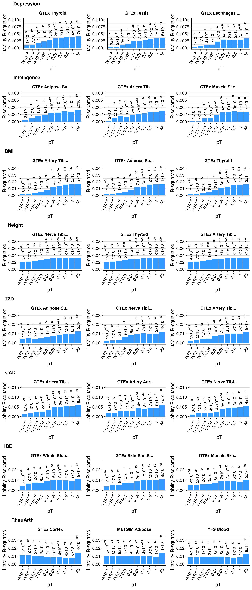

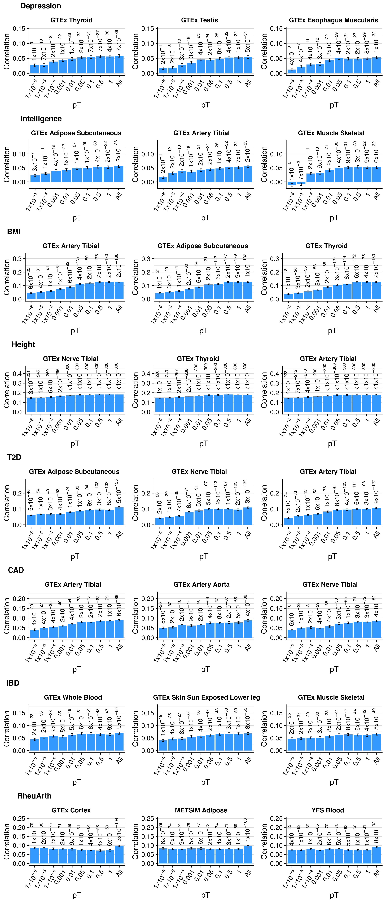

\center

```{r, echo=F, eval=T, results='asis'}
res<-read.csv("/mnt/lustre/users/k1806347/Analyses/GeRS_comparison/UKBB_outcomes_for_prediction/GeRS_per_pT.csv")

res[,-1:-3]<-round(res[,-1:-3], 3)
res$R<-paste0(res$R, " (", res$SE, ")")
res<-res[,c('Phenotype','Weight','Model','R')]

names(res)<-c('Phenotype','Weight','Model',"R (SE)")

library(knitr)
kable(res, rownames = FALSE, caption='Correlation between GeRS model predictions and observed values in UKBB')
```

```{r, echo=F, eval=T, results='asis'}
res<-read.csv("/mnt/lustre/users/k1806347/Analyses/GeRS_comparison/UKBB_outcomes_for_prediction/GeRS_best_pT.csv")

res[,-1:-3]<-round(res[,-1:-3], 3)
res$P<-format(res$P, scientific = TRUE, digits = 3)
res$R<-paste0(res$R, " (", res$SE, ")")
res<-res[,c('Phenotype','Weight','Model','R','P')]

names(res)<-c('Phenotype','Weight','Model',"R (SE)", "P")

library(knitr)
kable(res, rownames = FALSE, caption='Correlation between GeRS model predictions and observed values in UKBB')
```

</details>

<details><summary>Show cis-regulated expression-based heritability</summary>
```{r, echo=F, eval=F, results='asis', message = F, warning=F}
res_GeRS<-read.csv("/users/k1806347/brc_scratch/Analyses/GeRS_comparison/UKBB_outcomes_for_prediction/GeRS_AVENGME_res.csv")
res_GeRS_plot<-res_GeRS

res_GeRS$vg_est_clean<-paste0(round(res_GeRS$vg_est,3)," (",round(res_GeRS$vg_lowCI,3),"-",round(res_GeRS$vg_highCI,3),")")
res_GeRS$pi0_est_clean<-paste0(round(res_GeRS$pi0_est,3)," (",round(res_GeRS$pi0_lowCI,3),"-",round(res_GeRS$pi0_highCI,3),")")

res_GeRS_coloc<-read.csv("/users/k1806347/brc_scratch/Analyses/GeRS_comparison/UKBB_outcomes_for_prediction/GeRS_coloc_AVENGME_res.csv")
res_GeRS_coloc_plot<-res_GeRS_coloc

res_GeRS_coloc$vg_est_clean<-paste0(round(res_GeRS_coloc$vg_est,3)," (",round(res_GeRS_coloc$vg_lowCI,3),"-",round(res_GeRS_coloc$vg_highCI,3),")")
res_GeRS_coloc$pi0_est_clean<-paste0(round(res_GeRS_coloc$pi0_est,3)," (",round(res_GeRS_coloc$pi0_lowCI,3),"-",round(res_GeRS_coloc$pi0_highCI,3),")")

res_PRS<-read.csv("/users/k1806347/brc_scratch/Analyses/GeRS_comparison/UKBB_outcomes_for_prediction/PRS_AVENGME_res.csv")
res_PRS_plot<-res_PRS

res_PRS$vg_est_clean<-paste0(round(res_PRS$vg_est,3)," (",round(res_PRS$vg_lowCI,3),"-",round(res_PRS$vg_highCI,3),")")
res_PRS$pi0_est_clean<-paste0(round(res_PRS$pi0_est,3)," (",round(res_PRS$pi0_lowCI,3),"-",round(res_PRS$pi0_highCI,3),")")

res_diff<-merge(res_PRS,res_GeRS, by=c('Phenotype','GWAS'))
names(res_diff)<-gsub('.x','_PRS',names(res_diff))
names(res_diff)<-gsub('.y','_GeRS',names(res_diff))
names(res_diff)[1]<-'Phenotype'

names(res_GeRS_coloc)[-1:-2]<-paste0(names(res_GeRS_coloc)[-1:-2],'_GeRS_coloc')
res_diff<-merge(res_diff,res_GeRS_coloc, by=c('Phenotype','GWAS'))

res_diff$Prop_GE<-round(res_diff$vg_est_GeRS/res_diff$vg_est_PRS,2)
res_diff$Prop_GE_coloc<-round(res_diff$vg_est_GeRS_coloc/res_diff$vg_est_PRS,2)
res_diff<-res_diff[,c('Phenotype','GWAS','nsnp_PRS','vg_est_clean_PRS','pi0_est_clean_PRS','nsnp_GeRS','vg_est_clean_GeRS','pi0_est_clean_GeRS','nsnp_GeRS_coloc','vg_est_clean_GeRS_coloc','pi0_est_clean_GeRS_coloc','Prop_GE','Prop_GE_coloc')]

# Make comparison figure
library(ggplot2)
library(cowplot)

res_diff$vg_est_clean_PRS_est<-as.numeric(gsub(' .*','',res_diff$vg_est_clean_PRS))
res_diff$vg_est_clean_PRS_lowCI<-as.numeric(gsub("-.*",'',gsub(".*\\(",'',res_diff$vg_est_clean_PRS)))
res_diff$vg_est_clean_PRS_highCI<-as.numeric(gsub("\\)",'',gsub(".*-",'',res_diff$vg_est_clean_PRS)))

res_diff$vg_est_clean_GeRS_est<-as.numeric(gsub(' .*','',res_diff$vg_est_clean_GeRS))
res_diff$vg_est_clean_GeRS_lowCI<-as.numeric(gsub("-.*",'',gsub(".*\\(",'',res_diff$vg_est_clean_GeRS)))
res_diff$vg_est_clean_GeRS_highCI<-as.numeric(gsub("\\)",'',gsub(".*-",'',res_diff$vg_est_clean_GeRS)))

res_diff$vg_est_clean_GeRS_coloc_est<-as.numeric(gsub(' .*','',res_diff$vg_est_clean_GeRS_coloc))
res_diff$vg_est_clean_GeRS_coloc_lowCI<-as.numeric(gsub("-.*",'',gsub(".*\\(",'',res_diff$vg_est_clean_GeRS_coloc)))
res_diff$vg_est_clean_GeRS_coloc_highCI<-as.numeric(gsub("\\)",'',gsub(".*-",'',res_diff$vg_est_clean_GeRS_coloc)))

res_diff$Prop_GE<-paste0(round(res_diff$Prop_GE*100,2),'%')
res_diff$Prop_GE_coloc<-paste0(round(res_diff$Prop_GE_coloc*100,2),'%')

res_PRS<-data.frame(res_diff[c('Phenotype','vg_est_clean_PRS_est','vg_est_clean_PRS_lowCI','vg_est_clean_PRS_highCI')], Prop_GE=NA, Model='PRS')
names(res_PRS)<-c('Phenotype','vg_est','vg_est_lowCI','vg_est_highCI','Prop_GE','Model')

res_GeRS<-data.frame(res_diff[c('Phenotype','vg_est_clean_GeRS_est','vg_est_clean_GeRS_lowCI','vg_est_clean_GeRS_highCI','Prop_GE')], Model='GeRS')
names(res_GeRS)<-c('Phenotype','vg_est','vg_est_lowCI','vg_est_highCI','Prop_GE','Model')

res_GeRS_coloc<-data.frame(res_diff[c('Phenotype','vg_est_clean_GeRS_coloc_est','vg_est_clean_GeRS_coloc_lowCI','vg_est_clean_GeRS_coloc_highCI','Prop_GE_coloc')], Model="GeRS (coloc)")
names(res_GeRS_coloc)<-c('Phenotype','vg_est','vg_est_lowCI','vg_est_highCI','Prop_GE','Model')

res_plot<-do.call(rbind, list(res_PRS, res_GeRS, res_GeRS_coloc))
res_plot$Phenotype<-factor(res_plot$Phenotype, levels=c('Depression','Intelligence','BMI','Height','T2D','CAD','IBD','RheuArth'))

png('/mnt/lustre/users/k1806347/Analyses/GeRS_comparison/UKBB_outcomes_for_prediction/PRS_GeRS_AVENGME_res_UKBB.png', units='px', res=300, width=2000, height=1000)
ggplot(res_plot, aes(x=Phenotype, y=vg_est, fill=Model, label=Prop_GE)) +
          geom_bar(stat="identity", position=position_dodge()) +
          geom_errorbar(aes(ymin=vg_est_lowCI, ymax=vg_est_highCI), width=.2, position=position_dodge(0.9)) +
        	geom_text(aes(y=vg_est, colour=Model), size=4, angle=90, vjust=0.5, hjust=-1, stat="identity", position=position_dodge(width=0.9)) +
          labs(y="Vg (95%CI)", x='') +
          ylim(0,0.3) +
          theme_half_open() +
          theme(axis.text.x = element_text(angle = 45, hjust = 1), legend.title=element_blank()) +
          guides(fill=guide_legend(title.hjust =0.5)) +
          background_grid(major = 'y', minor = 'y') +
          coord_cartesian(clip='off')
dev.off()

png('/mnt/lustre/users/k1806347/Analyses/GeRS_comparison/UKBB_outcomes_for_prediction/PRS_GeRS_AVENGME_res_UKBB_bw.png', units='px', res=300, width=2000, height=1000)
ggplot(res_plot, aes(x=Phenotype, y=vg_est, fill=Model, label=Prop_GE)) +
          geom_bar(stat="identity", position=position_dodge()) +
          scale_fill_grey() +
          geom_errorbar(aes(ymin=vg_est_lowCI, ymax=vg_est_highCI), width=.2, position=position_dodge(0.9)) +
        	geom_text(aes(y=vg_est, colour=Model), size=4, angle=90, vjust=0.5, hjust=-1, stat="identity", position=position_dodge(width=0.9),show.legend = FALSE) +
          scale_colour_grey(start = 0.0, end = 0.5) +
          labs(y="Vg (95%CI)", x='') +
          ylim(0,0.3) +
          theme_half_open() +
          theme(axis.text.x = element_text(angle = 45, hjust = 1), legend.title=element_blank()) +
          guides(fill=guide_legend(title.hjust =0.5)) +
          background_grid(major = 'y', minor = 'y') +
          coord_cartesian(clip='off')

dev.off()


```

```{bash, eval=T, echo=F}
mkdir -p /users/k1806347/brc_scratch/Software/MyGit/GenoPred/Images/Functionally_informed_prediction

cp /scratch/users/k1806347/Analyses/GeRS_comparison/UKBB_outcomes_for_prediction/PRS_GeRS_AVENGME_res_UKBB.png /users/k1806347/brc_scratch/Software/MyGit/GenoPred/Images/Functionally_informed_prediction/
```

<center>

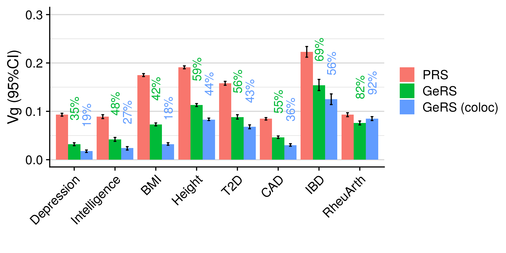

\center

</details>

```{bash, eval=T, echo=F}
mkdir -p /users/k1806347/brc_scratch/Software/MyGit/GenoPred/Images/Functionally_informed_prediction

cp /scratch/users/k1806347/Analyses/GeRS_comparison/UKBB_outcomes_for_prediction/GeRS_tests_summary_UKBB.png /users/k1806347/brc_scratch/Software/MyGit/GenoPred/Images/Functionally_informed_prediction/
```

<details><summary>Show summary of GeRS tests</summary>

<center>

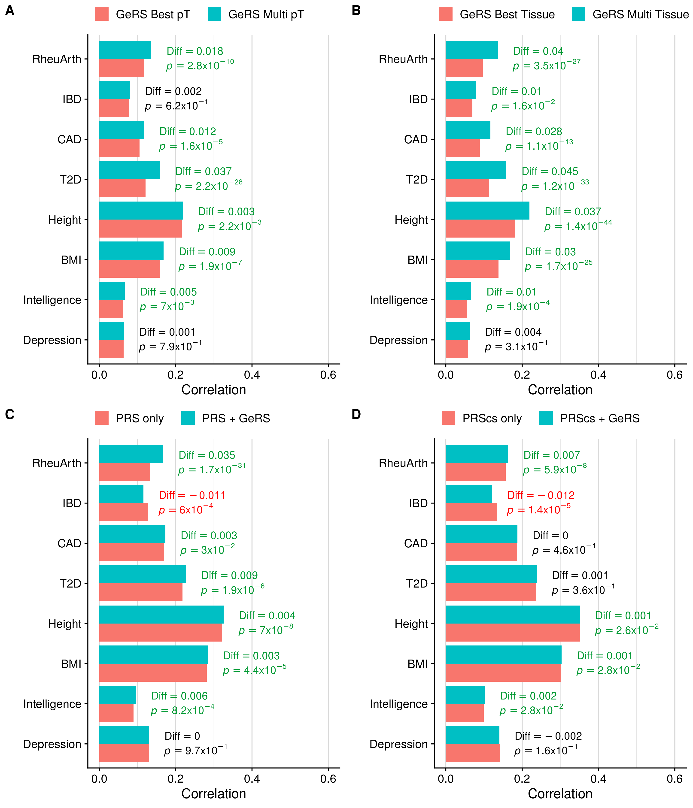

\center

```{r, echo=F, eval=T, results='asis'}
res<-read.csv("/mnt/lustre/users/k1806347/Analyses/GeRS_comparison/UKBB_outcomes_for_prediction/GeRS_tests_summary.csv")

res[,c("Model_1_R",  "Model_2_R", "R_diff")]<-round(res[,c("Model_1_R",  "Model_2_R", "R_diff")], 3)
res$R_diff_perc<-paste0(round(res$R_diff_perc,1),'%')
res$R_diff_pval<-format(res$R_diff_pval, scientific = TRUE, digits = 3)

res<-res[,c("Phenotype","Test","Model_1","Model_2","Model_1_R","Model_2_R","R_diff",'R_diff_perc',"R_diff_pval")]
names(res)<-c('Phenotype','Test',"Model 1","Model 2", 'Model 1 R','Model 2 R','R diff','R perc diff','R diff pval')

res<-res[order(res$Test),]

library(knitr)
kable(res, rownames = FALSE, caption='Correlation between GeRS model predictions and observed values in UK Biobank')
```

```{r, echo=F, eval=T, results='asis'}
res<-read.csv("/mnt/lustre/users/k1806347/Analyses/GeRS_comparison/UKBB_outcomes_for_prediction/GeRS_tests_RheuArth_withnoMHCClump.csv")

res[,c("Model_1_R",  "Model_2_R", "R_diff")]<-round(res[,c("Model_1_R",  "Model_2_R", "R_diff")], 3)
res$R_diff_perc<-paste0(round(res$R_diff_perc,1),'%')
res$R_diff_pval<-format(res$R_diff_pval, scientific = TRUE, digits = 3)

res<-res[,c("Phenotype","Test","Model_1","Model_2","Model_1_R","Model_2_R","R_diff",'R_diff_perc',"R_diff_pval")]
names(res)<-c('Phenotype','Test',"Model 1","Model 2", 'Model 1 R','Model 2 R','R diff','R perc diff','R diff pval')

res<-res[order(res$Test),]

library(knitr)
kable(res, rownames = FALSE, caption='Sensitivity analysis for Rheumatoid Arthritis')
```

</details>

```{bash, eval=T, echo=F}
mkdir -p /users/k1806347/brc_scratch/Software/MyGit/GenoPred/Images/Functionally_informed_prediction

cp /scratch/users/k1806347/Analyses/GeRS_comparison/UKBB_outcomes_for_prediction/GeRS_PP4_tests_summary_UKBB.png /users/k1806347/brc_scratch/Software/MyGit/GenoPred/Images/Functionally_informed_prediction/
```

<details><summary>Show summary of GeRS PP4 tests</summary>

<center>

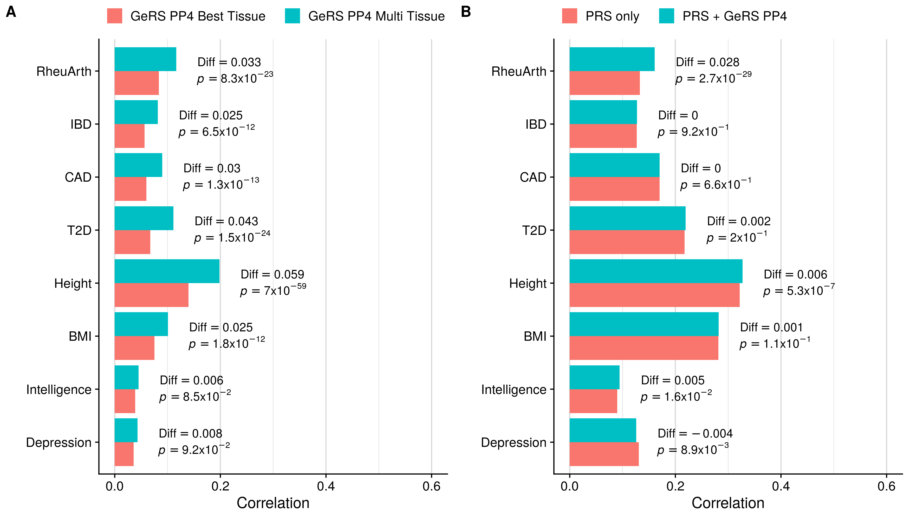

\center

```{r, echo=F, eval=T, results='asis'}
res<-read.csv("/mnt/lustre/users/k1806347/Analyses/GeRS_comparison/UKBB_outcomes_for_prediction/GeRS_PP4_tests_summary.csv")

res[,c("Model_1_R",  "Model_2_R", "R_diff")]<-round(res[,c("Model_1_R",  "Model_2_R", "R_diff")], 3)
res$R_diff_pval<-format(res$R_diff_pval, scientific = TRUE, digits = 3)

res<-res[,c("Phenotype","Test","Model_1","Model_2","Model_1_R","Model_2_R","R_diff","R_diff_pval")]
names(res)<-c('Phenotype','Test',"Model 1","Model 2", 'Model 1 R','Model 2 R','R diff','R diff pval')

res<-res[order(res$Test),]

library(knitr)
kable(res, rownames = FALSE, caption='Correlation between GeRS PP4 model predictions and observed values in UK Biobank')
```

</details>


```{bash, eval=T, echo=F}
mkdir -p /users/k1806347/brc_scratch/Software/MyGit/GenoPred/Images/Functionally_informed_prediction

cp /scratch/users/k1806347/Analyses/GeRS_comparison/UKBB_outcomes_for_prediction/GeRS_TissueSpecific_tests_summary_UKBB.png /users/k1806347/brc_scratch/Software/MyGit/GenoPred/Images/Functionally_informed_prediction/
```

<details><summary>Show summary of GeRS TissueSpecific tests</summary>

<center>

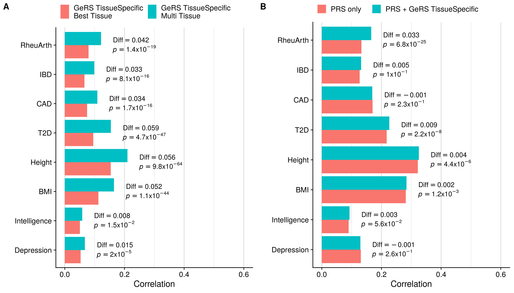

\center

```{r, echo=F, eval=T, results='asis'}
res<-read.csv("/mnt/lustre/users/k1806347/Analyses/GeRS_comparison/UKBB_outcomes_for_prediction/GeRS_TissueSpecific_tests_summary.csv")

res[,c("Model_1_R",  "Model_2_R", "R_diff")]<-round(res[,c("Model_1_R",  "Model_2_R", "R_diff")], 3)
res$R_diff_pval<-format(res$R_diff_pval, scientific = TRUE, digits = 3)

res<-res[,c("Phenotype","Test","Model_1","Model_2","Model_1_R","Model_2_R","R_diff","R_diff_pval")]
names(res)<-c('Phenotype','Test',"Model 1","Model 2", 'Model 1 R','Model 2 R','R diff','R diff pval')

res<-res[order(res$Test),]

library(knitr)
kable(res, rownames = FALSE, caption='Correlation between GeRS TissueSpecific model predictions and observed values in UK Biobank')
```

</details>

```{bash, eval=T, echo=F}
mkdir -p /users/k1806347/brc_scratch/Software/MyGit/GenoPred/Images/Functionally_informed_prediction

cp /mnt/lustre/users/k1806347/Analyses/GeRS_comparison/UKBB_outcomes_for_prediction/StratPRS_comp_UKBB.png /users/k1806347/brc_scratch/Software/MyGit/GenoPred/Images/Functionally_informed_prediction/
```

<details><summary>Show GeRS, PRS, stratified-PRS comparison</summary>

<center>

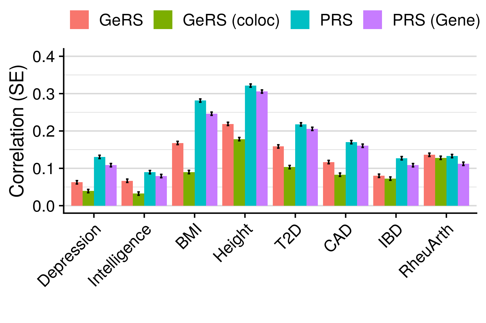

\center

```{r, echo=F, eval=T, results='asis'}
res<-read.csv("/mnt/lustre/users/k1806347/Analyses/GeRS_comparison/UKBB_outcomes_for_prediction/StratPRS_comp_summary.csv")

res_diff<-NULL
for(i in unique(res$Phenotype)){
  res_diff<-rbind(res_diff, data.frame(Phenotype=i,
                                       Prop_GE=res$R[res$Phenotype == i & res$Method == 'GeRS']/res$R[res$Phenotype == i & res$Method == 'PRS'],
                                       Prop_GE_coloc=res$R[res$Phenotype == i & res$Method == "GeRS (coloc)"]/res$R[res$Phenotype == i & res$Method == 'PRS']))
}

res_diff[,-1]<-round(res_diff[,-1],3)

library(knitr)
kable(res_diff, rownames = FALSE, caption='Proportion of PRS explained by GeRS')
```

</details>


```{bash, eval=T, echo=F}
mkdir -p /users/k1806347/brc_scratch/Software/MyGit/GenoPred/Images/Functionally_informed_prediction

cp /mnt/lustre/users/k1806347/Analyses/GeRS_comparison/UKBB_outcomes_for_prediction/GeRS_coloc_TissueSpecific_comp_UKBB.png /users/k1806347/brc_scratch/Software/MyGit/GenoPred/Images/Functionally_informed_prediction/
```

<details><summary>Show GeRS coloc and tissue specific comparison</summary>

<center>

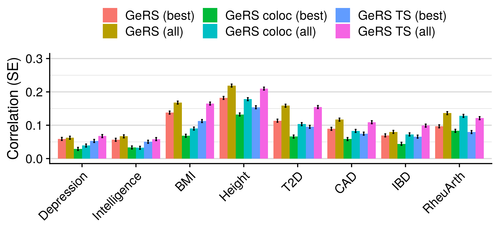

\center

```{r, echo=F, eval=T, results='asis'}
res<-read.csv("/mnt/lustre/users/k1806347/Analyses/GeRS_comparison/UKBB_outcomes_for_prediction/GeRS_coloc_TissueSpecific_comp_summary.csv")

res[,3:4]<-round(res[,3:4],3)

library(knitr)
kable(res, rownames = FALSE, caption='Comparison of GeRS')
```

</details>

```{bash, eval=T, echo=F}
mkdir -p /users/k1806347/brc_scratch/Software/MyGit/GenoPred/Images/Functionally_informed_prediction

cp /mnt/lustre/users/k1806347/Analyses/GeRS_comparison/UKBB_outcomes_for_prediction/GeRS_Tissue_comp_UKBB.png /users/k1806347/brc_scratch/Software/MyGit/GenoPred/Images/Functionally_informed_prediction/
```

<details><summary>Show association with GeRS for each SNP-weight set</summary>

<center>

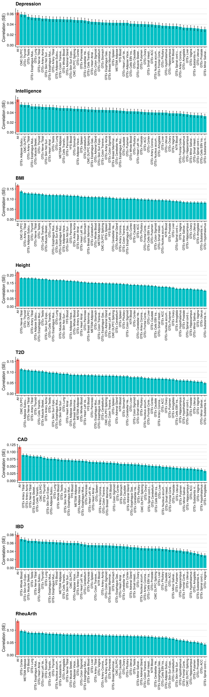

\center

</details>

```{bash, eval=T, echo=F}
mkdir -p /users/k1806347/brc_scratch/Software/MyGit/GenoPred/Images/Functionally_informed_prediction

cp /scratch/users/k1806347/Analyses/GeRS_comparison/UKBB_outcomes_for_prediction/GeRS_PP4_Tissue_comp_UKBB.png /users/k1806347/brc_scratch/Software/MyGit/GenoPred/Images/Functionally_informed_prediction/
```

<details><summary>Show association with GeRS PP4 for each SNP-weight set</summary>

<center>

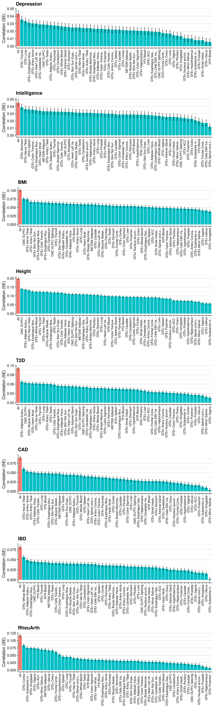

\center

</details>


```{bash, eval=T, echo=F}
mkdir -p /users/k1806347/brc_scratch/Software/MyGit/GenoPred/Images/Functionally_informed_prediction

cp /scratch/users/k1806347/Analyses/GeRS_comparison/UKBB_outcomes_for_prediction/GeRS_TissueSpecific_Tissue_comp_UKBB.png /users/k1806347/brc_scratch/Software/MyGit/GenoPred/Images/Functionally_informed_prediction/
```

<details><summary>Show association with GeRS TissueSpecific for each SNP-weight set</summary>

<center>

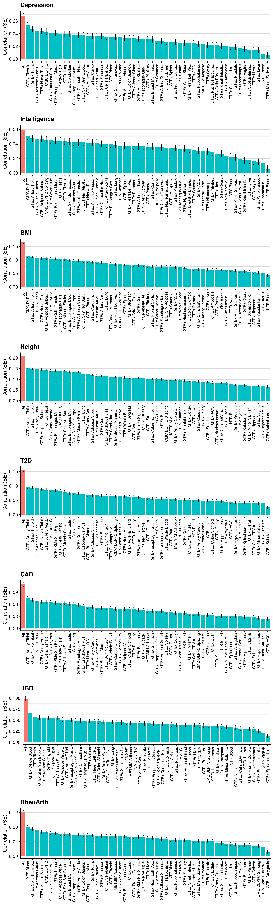

\center

</details>

```{bash, eval=T, echo=F}
mkdir -p /users/k1806347/brc_scratch/Software/MyGit/GenoPred/Images/Functionally_informed_prediction

cp /scratch/users/k1806347/Analyses/GeRS_comparison/UKBB_outcomes_for_prediction/GeRS_Tissue_comp_resid_UKBB.png /users/k1806347/brc_scratch/Software/MyGit/GenoPred/Images/Functionally_informed_prediction/
```

<details><summary>Show association with GeRS for each SNP-weight set after accounting for number of features</summary>

<center>

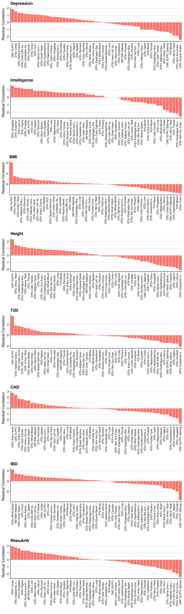

\center

</details>

```{bash, eval=T, echo=F}
mkdir -p /users/k1806347/brc_scratch/Software/MyGit/GenoPred/Images/Functionally_informed_prediction

cp /scratch/users/k1806347/Analyses/GeRS_comparison/UKBB_outcomes_for_prediction/GeRS_Tissue_comp_Nfeat_UKBB.png /users/k1806347/brc_scratch/Software/MyGit/GenoPred/Images/Functionally_informed_prediction/
```

<details><summary>Show effect of number of features in the SNP-weight set</summary>

<center>

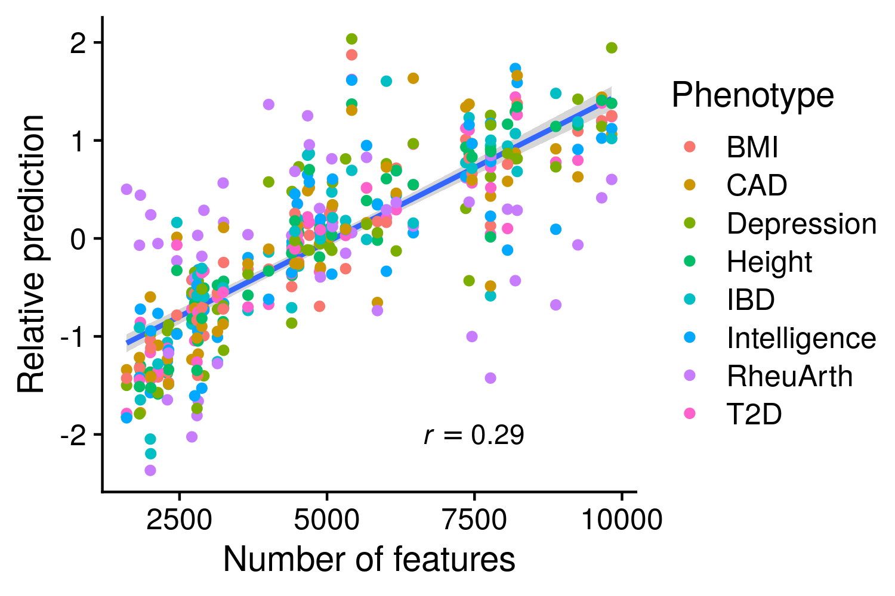

\center

</details>

<br/>

## TEDS

<details><summary>Plot per pT GeRS results</summary>
```{R, echo=T, eval=F}
#####
# Compare results across pTs for each phenotype
#####
pheno<-c('Height21', 'BMI21', 'GCSE', 'ADHD')
pheno_label<-c('Height', 'BMI', 'GCSE', 'ADHD')
gwas<-c('HEIG03', 'BODY11', 'EDUC03', 'ADHD04')
weights=read.table('/users/k1806347/brc_scratch/Data/TWAS_sumstats/FUSION/snp_weight_list.txt', header=F)$V1

weights_clean<-gsub('_',' ',weights)
weights_clean<-gsub('CMC.BRAIN.RNASEQ','CMC DLPFC',weights_clean)
weights_clean<-gsub('SPLICING','Splicing',weights_clean)
weights_clean<-gsub('NTR.BLOOD.RNAARR','NTR Blood',weights_clean)
weights_clean<-gsub('YFS.BLOOD.RNAARR','YFS Blood',weights_clean)
weights_clean<-gsub('METSIM.ADIPOSE.RNASEQ','METSIM Adipose',weights_clean)
weights_clean[!grepl('CMC|NTR|YFS|METSIM', weights)]<-paste0('GTEx ',weights_clean[!grepl('CMC|NTR|YFS|METSIM', weights)])
#to add gtex to each of the snp weights which don't have CMC NTR or YFS in front
weights_clean<-gsub('Brain', '', weights_clean)
weights_clean <- gsub('Anterior cingulate cortex', 'ACC', weights_clean)
weights_clean <- gsub('basal ganglia', '', weights_clean)
weights_clean <- gsub('BA9', '', weights_clean)
weights_clean <- gsub('BA24', '', weights_clean)
weights_clean <- gsub('  ', ' ', weights_clean)
weights_clean_short<-substr(weights_clean, start = 1, stop = 15)  #start the name at the first character and stop at the 25th
weights_clean_short[nchar(weights_clean) > 15]<-paste0(weights_clean_short[nchar(weights_clean) > 15], "...")

res<-NULL
res_best<-NULL
for(i in 1:length(gwas)){
  for(weight in 1:length(weights)){
    res_i<-read.table(paste0('/users/k1806347/brc_scratch/Analyses/GeRS_comparison/TEDS_outcomes_for_prediction/',pheno[i],'/Association_withGeRSs/TEDS.w_hm3.',weights[weight],'.',gwas[i],'.EUR-GeRSs.pred_eval.txt'), header=T, stringsAsFactors=F)

    res_i$Phenotype<-pheno[i]
    res_i$Weight<-weights[weight]
    
    if(sum(grepl('R2l',names(res_i)))>0){
        res_i<-res_i[,c('Phenotype','Weight','Model','R','SE','P','R2l')]
        names(res_i)<-c('Phenotype','Weight','Model','R','SE','P','R2')
        res_i$Binary<-T
    } else {
        res_i<-res_i[,c('Phenotype','Weight','Model','R','SE','P','R2o')]
        names(res_i)<-c('Phenotype','Weight','Model','R','SE','P','R2')
        res_i$Binary<-F
    }
    
    res_i$Model<-gsub('_group','',gsub(paste0(gwas[i],'.'),'',res_i$Model))
    res_i$Model<-factor(res_i$Model, levels=res_i$Model)
    
    res_i_best<-res_i[res_i$R == max(res_i$R),]
  
    res<-rbind(res, res_i)
    res_best<-rbind(res_best, res_i_best)
  }
}

res_brief<-res[,c('Phenotype','Weight','Model','R','SE','P')]
res_best_brief<-res_best[,c('Phenotype','Weight','Model','R','SE','P')]

write.csv(res_brief, '/mnt/lustre/users/k1806347/Analyses/GeRS_comparison/TEDS_outcomes_for_prediction/GeRS_per_pT.csv', row.names=F, quote=F)
write.csv(res_best_brief, '/mnt/lustre/users/k1806347/Analyses/GeRS_comparison/TEDS_outcomes_for_prediction/GeRS_best_pT.csv', row.names=F, quote=F)

library(ggplot2)
library(cowplot)

res$Model<-gsub('e.0','*x*10^-', res$Model)
res$Model<-factor(res$Model, levels=unique(res$Model))
res$P<-format(res$P, scientific = TRUE, digits = 1)
res$P<-gsub('e-','*x*10^-',res$P)

res_plot<-list()
for(i in 1:length(gwas)){
  # Extract result for 5 most predictive tissue
  tmp<-res_best[res_best$Phenotype == pheno[i],]
  tmp<-tmp[order(-tmp$R2),]
  tmp<-tmp[1:3,]
  best_weights<-tmp$Weight
  
  res_tmp<-res[res$Phenotype == pheno[i] & (res$Weight %in% best_weights),]
  ylim_max<-max(res_tmp$R2)
  ylim_max<-ylim_max+ylim_max/1.5
  if(res[res$Phenotype == pheno[i],]$Binary[1] == T){
    ylab<-'Liability R-squared'
  } else {
    ylab<-'R-squared'
  }
  
  res_plot_tmp<-list()
  for(weight in best_weights){
    weights_index<-which(weights == weight)
    print(weight)
  res_plot_tmp[[as.character(weights[weights_index])]]<-ggplot(res[res$Phenotype == pheno[i] & res$Weight == weights[weights_index],], aes(x=Model, y=R2)) +
                                    geom_bar(stat="identity", position=position_dodge(), fill='#3399FF') +
                                    labs(y=ylab, x='pT', title=paste0('\n\n',weights_clean_short[weights_index])) +
                                    theme_half_open() +
                                    ylim(0,ylim_max) +
                                    geom_text(data=res[res$Phenotype == pheno[i] & res$Weight == weights[weights_index],], aes(x=Model, y=R2, label=P), vjust=0.5, hjust= -0.15, angle=90, size=4, parse=T) +
                                    theme(axis.text.x = element_text(angle = 55, vjust = 1, hjust=1), plot.title = element_text(hjust = 0.5, size=12)) +
                                    background_grid(major = 'y', minor = 'y') +
                                    scale_x_discrete(labels = parse(text = as.character(res[res$Phenotype == pheno[i] & res$Weight == weights[weights_index],]$Model))) +
                                    coord_cartesian(clip='off')

  }
  res_plot[[pheno[i]]]<-plot_grid(plotlist=res_plot_tmp, nrow = 1)
}

png('/mnt/lustre/users/k1806347/Analyses/GeRS_comparison/TEDS_outcomes_for_prediction/GeRS_per_pT_TEDS.png', units='px', res=300, width=3000, height=3750)
  plot_grid(plotlist=res_plot, ncol = 1, labels = paste0(pheno_label))
dev.off()

#######
# Recreate plots using R on the y axis and full SNP-weight set names
#######

res_plot<-list()
for(i in 1:length(gwas)){
  # Extract result for 5 most predictive tissue
  tmp<-res_best[res_best$Phenotype == pheno[i],]
  tmp<-tmp[order(-tmp$R),]
  tmp<-tmp[1:3,]
  best_weights<-tmp$Weight
  
  res_tmp<-res[res$Phenotype == pheno[i] & (res$Weight %in% best_weights),]
  ylim_max<-max(res_tmp$R)
  ylim_max<-ylim_max+ylim_max*1.5
  if(min(res_tmp$R) < 0){
    ylim_min<-min(res_tmp$R)
    ylim_min<-ylim_min-max(res_tmp$SE)
  } else {
    ylim_min<-NA
  }

  res_plot_tmp<-list()
  for(weight in best_weights){
    weights_index<-which(weights == weight)
    print(weight)
  res_plot_tmp[[as.character(weights[weights_index])]]<-ggplot(res[res$Phenotype == pheno[i] & res$Weight == weights[weights_index],], aes(x=Model, y=R)) +
                                    geom_bar(stat="identity", position=position_dodge(), fill='#3399FF') +
                                    geom_errorbar(aes(ymin=R-SE, ymax=R+SE), width=.2, position=position_dodge(.9)) +
                                    labs(y='Correlation', x='pT', title=paste0('\n\n',weights_clean[weights_index])) +
                                    theme_half_open() +
                                    ylim(ylim_min,ylim_max) +
                                    geom_text(data=res[res$Phenotype == pheno[i] & res$Weight == weights[weights_index],], aes(x=Model, y=R+SE, label=P), vjust=0.3, hjust= -0.15, angle=90, size=4, parse=T) +
                                    theme(axis.text.x = element_text(angle = 55, vjust = 1, hjust=1), plot.title = element_text(hjust = 0.4, size=12)) +
                                    background_grid(major = 'y', minor = 'y') +
                                    scale_x_discrete(labels = parse(text = as.character(res[res$Phenotype == pheno[i] & res$Weight == weights[weights_index],]$Model))) +
                                    coord_cartesian(clip='off')

  }
  res_plot[[pheno[i]]]<-plot_grid(plotlist=res_plot_tmp, nrow = 1)
}

png('/mnt/lustre/users/k1806347/Analyses/GeRS_comparison/TEDS_outcomes_for_prediction/GeRS_per_pT_TEDS_R.png', units='px', res=300, width=3000, height=3750)
  plot_grid(plotlist=res_plot, ncol = 1, labels = paste0(pheno_label))
dev.off()

```
</details>

<details><summary>Plot comparison results</summary>
```{R, echo=T, eval=F}
#####
# Compare results from each approach
#####
pheno<-c('Height21', 'BMI21', 'GCSE', 'ADHD')
pheno_label<-c('Height', 'BMI', 'GCSE', 'ADHD')
gwas<-c('HEIG03', 'BODY11', 'EDUC03', 'ADHD04')

res<-list()
for(i in 1:length(gwas)){
res_1<-read.table(paste0('/users/k1806347/brc_scratch/Analyses/GeRS_comparison/TEDS_outcomes_for_prediction/',pheno[i],'/Association_withGeRSs/TEDS.w_hm3.AllTissue.',gwas[i],'.EUR-GeRSs.per_PT.pred_comp.txt'), header=T, stringsAsFactors=F)
res_1<-res_1[res_1$Model_1 == 'All',]
res_1<-res_1[res_1$Model_2 != 'All',]
res_2<-read.table(paste0('/users/k1806347/brc_scratch/Analyses/GeRS_comparison/TEDS_outcomes_for_prediction/',pheno[i],'/Association_withGeRSs/TEDS.w_hm3.AllTissue.',gwas[i],'.EUR-GeRSs.pred_comp.txt'), header=T, stringsAsFactors=F)
res_2<-res_2[res_2$Model_1 == 'All',]
res_2<-res_2[res_2$Model_2 != 'All',]
res_3<-read.table(paste0('/users/k1806347/brc_scratch/Analyses/GeRS_comparison/TEDS_outcomes_for_prediction/',pheno[i],'/Association_withPRS_and_GeRSs/TEDS.w_hm3.AllTissue.',gwas[i],'.EUR-GeRSs.EUR-PRSs.pt_clump.pred_comp.txt'), header=T, stringsAsFactors=F)
res_4<-read.table(paste0('/users/k1806347/brc_scratch/Analyses/GeRS_comparison/TEDS_outcomes_for_prediction/',pheno[i],'/Association_withPRSs/TEDS.w_hm3.',gwas[i],'.EUR-PRSs-TWAS_gene_stratified.pred_comp.txt'), header=T, stringsAsFactors=F)
res_5<-read.table(paste0('/users/k1806347/brc_scratch/Analyses/GeRS_comparison/TEDS_outcomes_for_prediction/',pheno[i],'/Association_withPRS_and_GeRSs/TEDS.w_hm3.AllTissue.',gwas[i],'.EUR-GeRSs.EUR-PRSs.PRScs.pred_comp.txt'), header=T, stringsAsFactors=F)

res[[pheno[i]]]<-data.frame(Test=c('GeRS_multi_pT','GeRS_multi_tissue','PRS_and_GeRS','Strat_PRS','PRScs_and_GeRS'),		
        				do.call(rbind,list(	res_1[res_1$Model_2_R == max(res_1$Model_2_R),],
                  									res_2[res_2$Model_2_R == max(res_2$Model_2_R),],
                  									res_3[8,],
                  									res_4[8,],
                  									res_5[8,])))
}

res_table<-do.call(rbind, res)

# Calculate percentage difference
res_table$R_diff_perc<-res_table$R_diff/res_table$Model_1_R*100

res_table$Phenotype<-gsub('\\..*','',rownames(res_table))
res_table<-res_table[,c('Phenotype',names(res_table)[-length(names(res_table))])]
write.csv(res_table, '/mnt/lustre/users/k1806347/Analyses/GeRS_comparison/TEDS_outcomes_for_prediction/GeRS_tests_summary.csv', row.names=F, quote=F)

####
# Plot the R2 when using PRS only, and using PRS + multi-tissue GeRS
####

# Organise the results
res_plot<-list()
for(i in 1:length(gwas)){
  tmp_res<-res[[pheno[i]]]

  tmp_res$R_diff_pval_num<-tmp_res$R_diff_pval
  
  tmp_res$R_diff_pval<-format(tmp_res$R_diff_pval, scientific = TRUE, digits = 2)
  tmp_res$R_diff_pval<-gsub('e-','*x*10^-',tmp_res$R_diff_pval)
  
  tmp_res_Model_1<-tmp_res[,grepl('Test|Model_1|R_diff',names(tmp_res))]
  names(tmp_res_Model_1)<-c('Test','Model','R','R_diff','R_diff_pval','R_diff_pval_num')
  tmp_res_Model_2<-tmp_res[,grepl('Test|Model_2|R_diff',names(tmp_res))]
  names(tmp_res_Model_2)<-c('Test','Model','R','R_diff','R_diff_pval','R_diff_pval_num')
  tmp_res_Model_2$R_diff<-NA
  tmp_res_Model_2$R_diff_pval<-NA
  
  tmp_res_plot<-rbind(tmp_res_Model_1,tmp_res_Model_2)
  tmp_res_plot$Phenotype<-pheno_label[i]
  
  res_plot[[pheno[i]]]<-tmp_res_plot
}

# Combine results for each phenotype and prepare for plotting
All_res_plot<-do.call(rbind, res_plot)

All_res_plot$Test<-factor(All_res_plot$Test, levels=res[[1]]$Test)
All_res_plot$Phenotype<-factor(All_res_plot$Phenotype, level=unique(All_res_plot$Phenotype))
All_res_plot<-All_res_plot[order(All_res_plot$Phenotype,All_res_plot$Test),]

All_res_plot$Val_Label_1<-NA
All_res_plot$Val_Label_1[!is.na(All_res_plot$R_diff)]<-paste0('Diff == ',round(All_res_plot$R_diff[!is.na(All_res_plot$R_diff)],3))

All_res_plot$Val_Label_2<-NA
All_res_plot$Val_Label_2[!is.na(All_res_plot$R_diff)]<-paste0('italic(p) == ',All_res_plot$R_diff_pval[!is.na(All_res_plot$R_diff)])

All_res_plot$Model[!All_res_plot$Model == 'All' & All_res_plot$Test == 'GeRS_multi_pT']<-'GeRS Best pT   '
All_res_plot$Model[All_res_plot$Model == 'All' & All_res_plot$Test == 'GeRS_multi_pT']<-'GeRS Multi pT'

All_res_plot$Model[!All_res_plot$Model == 'All' & All_res_plot$Test == 'GeRS_multi_tissue']<-'GeRS Best Tissue   '
All_res_plot$Model[All_res_plot$Model == 'All' & All_res_plot$Test == 'GeRS_multi_tissue']<-'GeRS Multi Tissue'

All_res_plot$Model[!All_res_plot$Model == 'All' & All_res_plot$Test == 'PRS_and_GeRS']<-'PRS only   '
All_res_plot$Model[All_res_plot$Model == 'All' & All_res_plot$Test == 'PRS_and_GeRS']<-'PRS + GeRS'

All_res_plot$Model[!All_res_plot$Model == 'All' & All_res_plot$Test == 'Strat_PRS']<-'Strat_PRS only'
All_res_plot$Model[All_res_plot$Model == 'All' & All_res_plot$Test == 'Strat_PRS']<-'Strat_PRS + GeRS'

All_res_plot$Model[!All_res_plot$Model == 'All' & All_res_plot$Test == 'PRScs_and_GeRS']<-'PRScs only   '
All_res_plot$Model[All_res_plot$Model == 'All' & All_res_plot$Test == 'PRScs_and_GeRS']<-'PRScs + GeRS'

All_res_plot$Model<-factor(All_res_plot$Model, levels=c("GeRS Best pT   ","GeRS Multi pT", "GeRS Best Tissue   ","GeRS Multi Tissue","PRS only   ","PRS + GeRS", "Strat_PRS only", "Strat_PRS + GeRS","PRScs only   ","PRScs + GeRS"))

library(ggplot2)
library(cowplot)

# Plot results
Plot_1<-ggplot(All_res_plot[All_res_plot$Test == 'GeRS_multi_pT',], aes(x=Phenotype, y=R, fill=Model)) +
          geom_bar(stat="identity", position=position_dodge()) +
      	  geom_text(aes(y=R+0.04), label=All_res_plot[All_res_plot$Test == 'GeRS_multi_pT',]$Val_Label_1, parse=T, vjust=-0.5, hjust=0) +
      	  geom_text(aes(y=R+0.04), label=All_res_plot[All_res_plot$Test == 'GeRS_multi_pT',]$Val_Label_2, parse=T, vjust=1, hjust=0) +
          labs(y='Correlation', x='') +
		  ylim(NA,0.65) +
          theme_half_open() +
          theme(legend.title=element_blank(),legend.position="top") +
          background_grid(major = 'x', minor = 'x') +
          coord_flip()

Plot_2<-ggplot(All_res_plot[All_res_plot$Test == 'GeRS_multi_tissue',], aes(x=Phenotype, y=R, fill=Model)) +
          geom_bar(stat="identity", position=position_dodge()) +
      	  geom_text(aes(y=R+0.04), label=All_res_plot[All_res_plot$Test == 'GeRS_multi_tissue',]$Val_Label_1, parse=T, vjust=-0.5, hjust=0) +
      	  geom_text(aes(y=R+0.04), label=All_res_plot[All_res_plot$Test == 'GeRS_multi_tissue',]$Val_Label_2, parse=T, vjust=1, hjust=0) +
          labs(y='Correlation', x='') +
		  ylim(NA,0.65) +
          theme_half_open() +
          theme(legend.title=element_blank(),legend.position="top") +
          background_grid(major = 'x', minor = 'x') +
          coord_flip()

Plot_3<-ggplot(All_res_plot[All_res_plot$Test == 'PRS_and_GeRS',], aes(x=Phenotype, y=R, fill=Model)) +
          geom_bar(stat="identity", position=position_dodge()) +
      	  geom_text(aes(y=R+0.04), label=All_res_plot[All_res_plot$Test == 'PRS_and_GeRS',]$Val_Label_1, parse=T, vjust=-0.5, hjust=0) +
      	  geom_text(aes(y=R+0.04), label=All_res_plot[All_res_plot$Test == 'PRS_and_GeRS',]$Val_Label_2, parse=T, vjust=1, hjust=0) +
          labs(y='Correlation', x='') +
		  ylim(NA,0.65) +
          theme_half_open() +
          theme(legend.title=element_blank(),legend.position="top") +
          background_grid(major = 'x', minor = 'x') +
          coord_flip()

Plot_4<-ggplot(All_res_plot[All_res_plot$Test == 'Strat_PRS',], aes(x=Phenotype, y=R, fill=Model)) +
          geom_bar(stat="identity", position=position_dodge()) +
      	  geom_text(aes(y=R+0.04), label=All_res_plot[All_res_plot$Test == 'Strat_PRS',]$Val_Label_1, parse=T, vjust=-0.5, hjust=0) +
      	  geom_text(aes(y=R+0.04), label=All_res_plot[All_res_plot$Test == 'Strat_PRS',]$Val_Label_2, parse=T, vjust=1, hjust=0) +
          labs(y='Correlation', x='') +
		  ylim(NA,0.65) +
          theme_half_open() +
          theme(legend.title=element_blank(),legend.position="top") +
          background_grid(major = 'x', minor = 'x') +
          coord_flip()

Plot_5<-ggplot(All_res_plot[All_res_plot$Test == 'PRScs_and_GeRS',], aes(x=Phenotype, y=R, fill=Model)) +
          geom_bar(stat="identity", position=position_dodge()) +
      	  geom_text(aes(y=R+0.04), label=All_res_plot[All_res_plot$Test == 'PRScs_and_GeRS',]$Val_Label_1, parse=T, vjust=-0.5, hjust=0) +
      	  geom_text(aes(y=R+0.04), label=All_res_plot[All_res_plot$Test == 'PRScs_and_GeRS',]$Val_Label_2, parse=T, vjust=1, hjust=0) +
          labs(y='Correlation', x='') +
		  ylim(NA,0.65) +
          theme_half_open() +
          theme(legend.title=element_blank(),legend.position="top") +
          background_grid(major = 'x', minor = 'x') +
          coord_flip()

png('/mnt/lustre/users/k1806347/Analyses/GeRS_comparison/TEDS_outcomes_for_prediction/GeRS_tests_summary_TEDS.png', units='px', res=300, width=3500, height=3000)
  plot_grid(Plot_1,Plot_2,Plot_3, Plot_5, labels = "AUTO")
dev.off()

###
# Recreate figure higlighting significant results
###

All_res_plot$Sig<-'NS'
All_res_plot$Sig[All_res_plot$R_diff_pval_num < 0.05 & All_res_plot$R_diff > 0]<-'Pos'
All_res_plot$Sig[All_res_plot$R_diff_pval_num < 0.05 & All_res_plot$R_diff < 0]<-'Neg'
All_res_plot$Sig<-factor(All_res_plot$Sig, levels=c('NS','Pos','Neg'))

scale_colour_op <- function(...){
    ggplot2:::manual_scale(
        'colour', 
        values = setNames(c("#000000", "#009933","#FF0000"), c('NS', 'Pos', 'Neg')), 
        ...
    )
}

Plot_1<-ggplot(All_res_plot[All_res_plot$Test == 'GeRS_multi_pT',], aes(x=Phenotype, y=R, fill=Model)) +
          geom_bar(stat="identity", position=position_dodge()) +
      	  geom_text(aes(y=R+0.04, colour=Sig), label=All_res_plot[All_res_plot$Test == 'GeRS_multi_pT',]$Val_Label_1, parse=T, vjust=-0.5, hjust=0,show.legend = FALSE) +
      	  geom_text(aes(y=R+0.04, colour=Sig), label=All_res_plot[All_res_plot$Test == 'GeRS_multi_pT',]$Val_Label_2, parse=T, vjust=1, hjust=0,show.legend = FALSE) +
          scale_colour_op() +
          labs(y='Correlation', x='') +
		      ylim(NA,0.65) +
          theme_half_open() +
          theme(legend.title=element_blank(),legend.position="top") +
          background_grid(major = 'x', minor = 'x') +
          coord_flip()

Plot_2<-ggplot(All_res_plot[All_res_plot$Test == 'GeRS_multi_tissue',], aes(x=Phenotype, y=R, fill=Model)) +
          geom_bar(stat="identity", position=position_dodge()) +
      	  geom_text(aes(y=R+0.04, colour=Sig), label=All_res_plot[All_res_plot$Test == 'GeRS_multi_tissue',]$Val_Label_1, parse=T, vjust=-0.5, hjust=0,show.legend = FALSE) +
      	  geom_text(aes(y=R+0.04, colour=Sig), label=All_res_plot[All_res_plot$Test == 'GeRS_multi_tissue',]$Val_Label_2, parse=T, vjust=1, hjust=0,show.legend = FALSE) +
          scale_colour_op() +
          labs(y='Correlation', x='') +
		  ylim(NA,0.65) +
          theme_half_open() +
          theme(legend.title=element_blank(),legend.position="top") +
          background_grid(major = 'x', minor = 'x') +
          coord_flip()

Plot_3<-ggplot(All_res_plot[All_res_plot$Test == 'PRS_and_GeRS',], aes(x=Phenotype, y=R, fill=Model)) +
          geom_bar(stat="identity", position=position_dodge()) +
      	  geom_text(aes(y=R+0.04, colour=Sig), label=All_res_plot[All_res_plot$Test == 'PRS_and_GeRS',]$Val_Label_1, parse=T, vjust=-0.5, hjust=0,show.legend = FALSE) +
      	  geom_text(aes(y=R+0.04, colour=Sig), label=All_res_plot[All_res_plot$Test == 'PRS_and_GeRS',]$Val_Label_2, parse=T, vjust=1, hjust=0,show.legend = FALSE) +
          scale_colour_op() +
          labs(y='Correlation', x='') +
		  ylim(NA,0.65) +
          theme_half_open() +
          theme(legend.title=element_blank(),legend.position="top") +
          background_grid(major = 'x', minor = 'x') +
          coord_flip()

Plot_4<-ggplot(All_res_plot[All_res_plot$Test == 'Strat_PRS',], aes(x=Phenotype, y=R, fill=Model)) +
          geom_bar(stat="identity", position=position_dodge()) +
      	  geom_text(aes(y=R+0.04, colour=Sig), label=All_res_plot[All_res_plot$Test == 'Strat_PRS',]$Val_Label_1, parse=T, vjust=-0.5, hjust=0,show.legend = FALSE) +
      	  geom_text(aes(y=R+0.04, colour=Sig), label=All_res_plot[All_res_plot$Test == 'Strat_PRS',]$Val_Label_2, parse=T, vjust=1, hjust=0,show.legend = FALSE) +
          scale_colour_op() +
          labs(y='Correlation', x='') +
		  ylim(NA,0.65) +
          theme_half_open() +
          theme(legend.title=element_blank(),legend.position="top") +
          background_grid(major = 'x', minor = 'x') +
          coord_flip()

Plot_5<-ggplot(All_res_plot[All_res_plot$Test == 'PRScs_and_GeRS',], aes(x=Phenotype, y=R, fill=Model)) +
          geom_bar(stat="identity", position=position_dodge()) +
      	  geom_text(aes(y=R+0.04, colour=Sig), label=All_res_plot[All_res_plot$Test == 'PRScs_and_GeRS',]$Val_Label_1, parse=T, vjust=-0.5, hjust=0,show.legend = FALSE) +
      	  geom_text(aes(y=R+0.04, colour=Sig), label=All_res_plot[All_res_plot$Test == 'PRScs_and_GeRS',]$Val_Label_2, parse=T, vjust=1, hjust=0,show.legend = FALSE) +
          scale_colour_op() +
          labs(y='Correlation', x='') +
		  ylim(NA,0.65) +
          theme_half_open() +
          theme(legend.title=element_blank(),legend.position="top") +
          background_grid(major = 'x', minor = 'x') +
          coord_flip()

png('/mnt/lustre/users/k1806347/Analyses/GeRS_comparison/TEDS_outcomes_for_prediction/GeRS_tests_summary_TEDS.png', units='px', res=300, width=3500, height=3000)
  plot_grid(Plot_1,Plot_2,Plot_3, Plot_5, labels = "AUTO")
dev.off()

```
</details>

<details><summary>Plot comparison results (PP4+clump)</summary>
```{R, eval=F, echo=T}
#####
# Compare results from each approach
#####

pheno<-c('Height21', 'BMI21', 'GCSE', 'ADHD')
gwas<-c('HEIG03', 'BODY11', 'EDUC03', 'ADHD04')
weight=c('YFS.BLOOD.RNAARR')

res<-list()
for(i in 1:length(gwas)){
res_2<-read.table(paste0('/users/k1806347/brc_scratch/Analyses/GeRS_comparison/TEDS_outcomes_for_prediction/',pheno[i],'/Association_withGeRSs/TEDS.w_hm3.AllTissue.',gwas[i],'.EUR-GeRSs_PP4.pred_comp.txt'), header=T, stringsAsFactors=F)
res_2<-res_2[res_2$Model_1 == 'All',]
res_2<-res_2[res_2$Model_2 != 'All',]
res_3<-read.table(paste0('/users/k1806347/brc_scratch/Analyses/GeRS_comparison/TEDS_outcomes_for_prediction/',pheno[i],'/Association_withPRS_and_GeRSs/TEDS.w_hm3.AllTissue.',gwas[i],'.EUR-GeRSs_PP4.EUR-PRSs.pt_clump.pred_comp.txt'), header=T, stringsAsFactors=F)

res[[pheno[i]]]<-data.frame(Test=c('GeRS_multi_tissue','PRS_and_GeRS'),		
        				do.call(rbind,list(	res_2[res_2$Model_2_R == max(res_2$Model_2_R),],
                  									res_3[8,])))
}

res_table<-do.call(rbind, res)
res_table$Phenotype<-gsub('\\..*','',rownames(res_table))
res_table<-res_table[,c('Phenotype',names(res_table)[-length(names(res_table))])]
write.csv(res_table, '/mnt/lustre/users/k1806347/Analyses/GeRS_comparison/TEDS_outcomes_for_prediction/GeRS_PP4_tests_summary.csv', row.names=F, quote=F)

####
# Plot the R2 when using PRS only, and using PRS + multi-tissue GeRS
####

# Organise the results
res_plot<-list()
for(i in 1:length(gwas)){
tmp_res<-res[[pheno[i]]]

tmp_res$R_diff_pval<-format(tmp_res$R_diff_pval, scientific = TRUE, digits = 2)
tmp_res$R_diff_pval<-gsub('e-','*x*10^-',tmp_res$R_diff_pval)

tmp_res_Model_1<-tmp_res[,grepl('Test|Model_1|R_diff',names(tmp_res))]
names(tmp_res_Model_1)<-c('Test','Model','R','R_diff','R_diff_pval')
tmp_res_Model_2<-tmp_res[,grepl('Test|Model_2|R_diff',names(tmp_res))]
names(tmp_res_Model_2)<-c('Test','Model','R','R_diff','R_diff_pval')
tmp_res_Model_2$R_diff<-NA
tmp_res_Model_2$R_diff_pval<-NA

tmp_res_plot<-rbind(tmp_res_Model_1,tmp_res_Model_2)
tmp_res_plot$Phenotype<-pheno[i]

res_plot[[pheno[i]]]<-tmp_res_plot
}

# Combine results for each phenotype and prepare for plotting
All_res_plot<-do.call(rbind, res_plot)

All_res_plot$Test<-factor(All_res_plot$Test, levels=res[[1]]$Test)
All_res_plot$Phenotype<-factor(All_res_plot$Phenotype, level=unique(All_res_plot$Phenotype))
All_res_plot<-All_res_plot[order(All_res_plot$Phenotype,All_res_plot$Test),]

All_res_plot$Val_Label_1<-NA
All_res_plot$Val_Label_1[!is.na(All_res_plot$R_diff)]<-paste0('Diff == ',round(All_res_plot$R_diff[!is.na(All_res_plot$R_diff)],3))

All_res_plot$Val_Label_2<-NA
All_res_plot$Val_Label_2[!is.na(All_res_plot$R_diff)]<-paste0('italic(p) == ',All_res_plot$R_diff_pval[!is.na(All_res_plot$R_diff)])

All_res_plot$Model[!All_res_plot$Model == 'All' & All_res_plot$Test == 'GeRS_multi_tissue']<-'GeRS PP4 Best Tissue   '
All_res_plot$Model[All_res_plot$Model == 'All' & All_res_plot$Test == 'GeRS_multi_tissue']<-'GeRS PP4 Multi Tissue'

All_res_plot$Model[!All_res_plot$Model == 'All' & All_res_plot$Test == 'PRS_and_GeRS']<-'PRS only   '
All_res_plot$Model[All_res_plot$Model == 'All' & All_res_plot$Test == 'PRS_and_GeRS']<-'PRS + GeRS PP4'

All_res_plot$Model<-factor(All_res_plot$Model, levels=c("GeRS PP4 Best Tissue   ","GeRS PP4 Multi Tissue","PRS only   ","PRS + GeRS PP4"))

library(ggplot2)
library(cowplot)

# Plot results
Plot_2<-ggplot(All_res_plot[All_res_plot$Test == 'GeRS_multi_tissue',], aes(x=Phenotype, y=R, fill=Model)) +
          geom_bar(stat="identity", position=position_dodge()) +
      	  geom_text(aes(y=R+0.04), label=All_res_plot[All_res_plot$Test == 'GeRS_multi_tissue',]$Val_Label_1, parse=T, vjust=-0.5, hjust=0) +
      	  geom_text(aes(y=R+0.04), label=All_res_plot[All_res_plot$Test == 'GeRS_multi_tissue',]$Val_Label_2, parse=T, vjust=1, hjust=0) +
          labs(y='Correlation', x='') +
		  ylim(NA,0.65) +
          theme_half_open() +
          theme(legend.title=element_blank(),legend.position="top") +
          background_grid(major = 'x', minor = 'x') +
          coord_flip()

Plot_3<-ggplot(All_res_plot[All_res_plot$Test == 'PRS_and_GeRS',], aes(x=Phenotype, y=R, fill=Model)) +
          geom_bar(stat="identity", position=position_dodge()) +
      	  geom_text(aes(y=R+0.04), label=All_res_plot[All_res_plot$Test == 'PRS_and_GeRS',]$Val_Label_1, parse=T, vjust=-0.5, hjust=0) +
      	  geom_text(aes(y=R+0.04), label=All_res_plot[All_res_plot$Test == 'PRS_and_GeRS',]$Val_Label_2, parse=T, vjust=1, hjust=0) +
          labs(y='Correlation', x='') +
		  ylim(NA,0.65) +
          theme_half_open() +
          theme(legend.title=element_blank(),legend.position="top") +
          background_grid(major = 'x', minor = 'x') +
          coord_flip()

png('/mnt/lustre/users/k1806347/Analyses/GeRS_comparison/TEDS_outcomes_for_prediction/GeRS_PP4_tests_summary_TEDS.png', units='px', res=300, width=3500, height=1500)
  plot_grid(Plot_2,Plot_3, labels = "AUTO")
dev.off()

```

</details>

<details><summary>Plot comparison results (Tissue Specific)</summary>
```{R, eval=F, echo=T}
#####
# Compare results from each approach
#####

pheno<-c('Height21', 'BMI21', 'GCSE', 'ADHD')
gwas<-c('HEIG03', 'BODY11', 'EDUC03', 'ADHD04')
weight=c('YFS.BLOOD.RNAARR')

res<-list()
for(i in 1:length(gwas)){
res_2<-read.table(paste0('/users/k1806347/brc_scratch/Analyses/GeRS_comparison/TEDS_outcomes_for_prediction/',pheno[i],'/Association_withGeRSs/TEDS.w_hm3.AllTissue.TissueSpecific.',gwas[i],'.EUR-GeRSs.pred_comp.txt'), header=T, stringsAsFactors=F)
res_2<-res_2[res_2$Model_1 == 'All',]
res_2<-res_2[res_2$Model_2 != 'All',]
res_3<-read.table(paste0('/users/k1806347/brc_scratch/Analyses/GeRS_comparison/TEDS_outcomes_for_prediction/',pheno[i],'/Association_withPRS_and_GeRSs/TEDS.w_hm3.AllTissue.TissueSpecific.',gwas[i],'.EUR-GeRSs.EUR-PRSs.pt_clump.pred_comp.txt'), header=T, stringsAsFactors=F)

res[[pheno[i]]]<-data.frame(Test=c('GeRS_multi_tissue','PRS_and_GeRS'),		
        				do.call(rbind,list(	res_2[res_2$Model_2_R == max(res_2$Model_2_R),],
                  									res_3[8,])))
}

res_table<-do.call(rbind, res)
res_table$Phenotype<-gsub('\\..*','',rownames(res_table))
res_table<-res_table[,c('Phenotype',names(res_table)[-length(names(res_table))])]
write.csv(res_table, '/mnt/lustre/users/k1806347/Analyses/GeRS_comparison/TEDS_outcomes_for_prediction/GeRS_TissueSpecific_tests_summary.csv', row.names=F, quote=F)

####
# Plot the R2 when using PRS only, and using PRS + multi-tissue GeRS
####

# Organise the results
res_plot<-list()
for(i in 1:length(gwas)){
tmp_res<-res[[pheno[i]]]

tmp_res$R_diff_pval<-format(tmp_res$R_diff_pval, scientific = TRUE, digits = 2)
tmp_res$R_diff_pval<-gsub('e-','*x*10^-',tmp_res$R_diff_pval)

tmp_res_Model_1<-tmp_res[,grepl('Test|Model_1|R_diff',names(tmp_res))]
names(tmp_res_Model_1)<-c('Test','Model','R','R_diff','R_diff_pval')
tmp_res_Model_2<-tmp_res[,grepl('Test|Model_2|R_diff',names(tmp_res))]
names(tmp_res_Model_2)<-c('Test','Model','R','R_diff','R_diff_pval')
tmp_res_Model_2$R_diff<-NA
tmp_res_Model_2$R_diff_pval<-NA

tmp_res_plot<-rbind(tmp_res_Model_1,tmp_res_Model_2)
tmp_res_plot$Phenotype<-pheno[i]

res_plot[[pheno[i]]]<-tmp_res_plot
}

# Combine results for each phenotype and prepare for plotting
All_res_plot<-do.call(rbind, res_plot)

All_res_plot$Test<-factor(All_res_plot$Test, levels=res[[1]]$Test)
All_res_plot$Phenotype<-factor(All_res_plot$Phenotype, level=unique(All_res_plot$Phenotype))
All_res_plot<-All_res_plot[order(All_res_plot$Phenotype,All_res_plot$Test),]

All_res_plot$Val_Label_1<-NA
All_res_plot$Val_Label_1[!is.na(All_res_plot$R_diff)]<-paste0('Diff == ',round(All_res_plot$R_diff[!is.na(All_res_plot$R_diff)],3))

All_res_plot$Val_Label_2<-NA
All_res_plot$Val_Label_2[!is.na(All_res_plot$R_diff)]<-paste0('italic(p) == ',All_res_plot$R_diff_pval[!is.na(All_res_plot$R_diff)])

All_res_plot$Model[!All_res_plot$Model == 'All' & All_res_plot$Test == 'GeRS_multi_tissue']<-'GeRS TissueSpecific\nBest Tissue   '
All_res_plot$Model[All_res_plot$Model == 'All' & All_res_plot$Test == 'GeRS_multi_tissue']<-'GeRS TissueSpecific\nMulti Tissue'

All_res_plot$Model[!All_res_plot$Model == 'All' & All_res_plot$Test == 'PRS_and_GeRS']<-'PRS only   '
All_res_plot$Model[All_res_plot$Model == 'All' & All_res_plot$Test == 'PRS_and_GeRS']<-'PRS + GeRS TissueSpecific'

All_res_plot$Model<-factor(All_res_plot$Model, levels=c("GeRS TissueSpecific\nBest Tissue   ","GeRS TissueSpecific\nMulti Tissue","PRS only   ","PRS + GeRS TissueSpecific"))

library(ggplot2)
library(cowplot)

# Plot results
Plot_2<-ggplot(All_res_plot[All_res_plot$Test == 'GeRS_multi_tissue',], aes(x=Phenotype, y=R, fill=Model)) +
          geom_bar(stat="identity", position=position_dodge()) +
      	  geom_text(aes(y=R+0.04), label=All_res_plot[All_res_plot$Test == 'GeRS_multi_tissue',]$Val_Label_1, parse=T, vjust=-0.5, hjust=0) +
      	  geom_text(aes(y=R+0.04), label=All_res_plot[All_res_plot$Test == 'GeRS_multi_tissue',]$Val_Label_2, parse=T, vjust=1, hjust=0) +
          labs(y='Correlation', x='') +
		  ylim(NA,0.65) +
          theme_half_open() +
          theme(legend.title=element_blank(),legend.position="top") +
          background_grid(major = 'x', minor = 'x') +
          coord_flip()

Plot_3<-ggplot(All_res_plot[All_res_plot$Test == 'PRS_and_GeRS',], aes(x=Phenotype, y=R, fill=Model)) +
          geom_bar(stat="identity", position=position_dodge()) +
      	  geom_text(aes(y=R+0.04), label=All_res_plot[All_res_plot$Test == 'PRS_and_GeRS',]$Val_Label_1, parse=T, vjust=-0.5, hjust=0) +
      	  geom_text(aes(y=R+0.04), label=All_res_plot[All_res_plot$Test == 'PRS_and_GeRS',]$Val_Label_2, parse=T, vjust=1, hjust=0) +
          labs(y='Correlation', x='') +
		  ylim(NA,0.65) +
          theme_half_open() +
          theme(legend.title=element_blank(),legend.position="top") +
          background_grid(major = 'x', minor = 'x') +
          coord_flip()

png('/mnt/lustre/users/k1806347/Analyses/GeRS_comparison/TEDS_outcomes_for_prediction/GeRS_TissueSpecific_tests_summary_TEDS.png', units='px', res=300, width=3500, height=1500)
  plot_grid(Plot_2,Plot_3, labels = "AUTO")
dev.off()

```

</details>

<details><summary>Compare stratified PRS to multi-tissue GeRS</summary>
```{R,eval=F, echo=T}
# Plot the results of the stratified PRS against Multi-tissue GeRS
# And look at the variance exaplained by each tissue
pheno<-c('Height21', 'BMI21', 'GCSE', 'ADHD')
pheno_label<-c('Height', 'BMI', 'GCSE', 'ADHD')
gwas<-c('HEIG03', 'BODY11', 'EDUC03', 'ADHD04')

res<-list()
crossTissue<-list()

for(i in 1:length(gwas)){
res_GeRS<-read.table(paste0('/users/k1806347/brc_scratch/Analyses/GeRS_comparison/TEDS_outcomes_for_prediction/',pheno[i],'/Association_withGeRSs/TEDS.w_hm3.AllTissue.',gwas[i],'.EUR-GeRSs.pred_eval.txt'), header=T, stringsAsFactors=F)

res_GeRS<-res_GeRS[dim(res_GeRS)[1],]

res_GeRS_coloc<-read.table(paste0('/users/k1806347/brc_scratch/Analyses/GeRS_comparison/TEDS_outcomes_for_prediction/',pheno[i],'/Association_withGeRSs/TEDS.w_hm3.AllTissue.',gwas[i],'.EUR-GeRSs_pT_withColoc.pred_eval.txt'), header=T, stringsAsFactors=F)

res_GeRS_coloc<-res_GeRS_coloc[dim(res_GeRS_coloc)[1],]

res_stratPRS<-read.table(paste0('/users/k1806347/brc_scratch/Analyses/GeRS_comparison/TEDS_outcomes_for_prediction/',pheno[i],'/Association_withPRSs/TEDS.w_hm3.',gwas[i],'.EUR-PRSs-TWAS_gene_stratified.pred_eval.txt'), header=T, stringsAsFactors=F)

res_stratPRS<-res_stratPRS[2,]

res_GWPRS<-read.table(paste0('/users/k1806347/brc_scratch/Analyses/GeRS_comparison/TEDS_outcomes_for_prediction/',pheno[i],'/Association_withPRSs/TEDS.w_hm3.',gwas[i],'.EUR-PRSs.pred_eval.txt'), header=T, stringsAsFactors=F)
res_GWPRS<-res_GWPRS[dim(res_GWPRS)[1],]

res_all<-do.call(rbind, list(res_GeRS,res_GeRS_coloc, res_stratPRS, res_GWPRS))
res_all$Method<-c('GeRS',"GeRS (coloc)",'PRS (Gene)','PRS')
res_all$Phenotype<-pheno_label[i]

res_all<-res_all[,c('Model','R','SE','P','N','Method','Phenotype')]

res[[pheno[i]]]<-res_all
}

res_table<-do.call(rbind, res)
res_table<-res_table[,c('Phenotype','Method','R','SE')]

write.csv(res_table, '/mnt/lustre/users/k1806347/Analyses/GeRS_comparison/TEDS_outcomes_for_prediction/StratPRS_comp_summary.csv', row.names=F, quote=F)

library(ggplot2)
library(cowplot)
# Plot comparison across PRS, stratified PRS and GeRS
res_table$Phenotype<-factor(res_table$Phenotype, level=unique(res_table$Phenotype))

png('/mnt/lustre/users/k1806347/Analyses/GeRS_comparison/TEDS_outcomes_for_prediction/StratPRS_comp_TEDS.png', units='px', res=300, width=1500, height=1000)

ggplot(res_table, aes(x=Phenotype, y=R, fill=Method)) +
          geom_bar(stat="identity", position=position_dodge(0.9)) +
          geom_errorbar(aes(ymin=R-SE, ymax=R+SE), width=.2,
                 position=position_dodge(0.9)) +
          labs(y="Correlation (SE)", x='') +
		      ylim(NA,0.41) +
          theme_half_open() +
          theme(axis.text.x = element_text(angle = 45, hjust = 1), legend.position="top", legend.justification = c(0.5, 0), legend.title=element_blank()) +
          guides(fill=guide_legend(title.hjust =0.5)) +
          background_grid(major = 'y', minor = 'y')

dev.off()

```
</details>

<details><summary>Compare GeRS to PP4 and TissueSpecific GeRS</summary>
```{R,eval=F, echo=T}
# Plot the results of the stratified PRS against Multi-tissue GeRS
# And look at the variance exaplained by each tissue
pheno<-c('Height21', 'BMI21', 'GCSE', 'ADHD')
pheno_label<-c('Height', 'BMI', 'GCSE', 'ADHD')
gwas<-c('HEIG03', 'BODY11', 'EDUC03', 'ADHD04')

res<-list()
crossTissue<-list()

for(i in 1:length(gwas)){
res_GeRS<-read.table(paste0('/users/k1806347/brc_scratch/Analyses/GeRS_comparison/TEDS_outcomes_for_prediction/',pheno[i],'/Association_withGeRSs/TEDS.w_hm3.AllTissue.',gwas[i],'.EUR-GeRSs.pred_eval.txt'), header=T, stringsAsFactors=F)

res_GeRS_all<-res_GeRS[dim(res_GeRS)[1],]
res_GeRS<-res_GeRS[-dim(res_GeRS)[1],]
res_GeRS_best<-res_GeRS[which(res_GeRS$R == max(res_GeRS$R)),]

res_GeRS_coloc<-read.table(paste0('/users/k1806347/brc_scratch/Analyses/GeRS_comparison/TEDS_outcomes_for_prediction/',pheno[i],'/Association_withGeRSs/TEDS.w_hm3.AllTissue.',gwas[i],'.EUR-GeRSs_pT_withColoc.pred_eval.txt'), header=T, stringsAsFactors=F)

res_GeRS_coloc_all<-res_GeRS_coloc[dim(res_GeRS_coloc)[1],]
res_GeRS_coloc<-res_GeRS_coloc[-dim(res_GeRS_coloc)[1],]
res_GeRS_coloc_best<-res_GeRS_coloc[which(res_GeRS_coloc$R == max(res_GeRS_coloc$R)),]

res_GeRS_TS<-read.table(paste0('/users/k1806347/brc_scratch/Analyses/GeRS_comparison/TEDS_outcomes_for_prediction/',pheno[i],'/Association_withGeRSs/TEDS.w_hm3.AllTissue.TissueSpecific.',gwas[i],'.EUR-GeRSs.pred_eval.txt'), header=T, stringsAsFactors=F)

res_GeRS_TS_all<-res_GeRS_TS[dim(res_GeRS_TS)[1],]
res_GeRS_TS<-res_GeRS_TS[-dim(res_GeRS_TS)[1],]
res_GeRS_TS_best<-res_GeRS_TS[which(res_GeRS_TS$R == max(res_GeRS_TS$R)),]

res_all<-do.call(rbind, list(res_GeRS_best,res_GeRS_all,res_GeRS_coloc_best,res_GeRS_coloc_all,res_GeRS_TS_best, res_GeRS_TS_all))
res_all$Method<-c("GeRS (best)","GeRS (all)","GeRS coloc (best)","GeRS coloc (all)","GeRS TS (best)","GeRS TS (all)")

res_all$Phenotype<-pheno_label[i]

res_all<-res_all[,c('Model','R','SE','P','N','Method','Phenotype')]

res[[pheno[i]]]<-res_all
}

res_table<-do.call(rbind, res)
res_table<-res_table[,c('Phenotype','Method','R','SE')]

write.csv(res_table, '/mnt/lustre/users/k1806347/Analyses/GeRS_comparison/TEDS_outcomes_for_prediction/GeRS_coloc_TissueSpecific_comp_summary.csv', row.names=F, quote=F)

library(ggplot2)
library(cowplot)
# Plot comparison across GeRS
res_table$Phenotype<-factor(res_table$Phenotype, level=unique(res_table$Phenotype))

res_table$Method<-factor(res_table$Method, levels=c("GeRS (best)","GeRS (all)","GeRS coloc (best)","GeRS coloc (all)","GeRS TS (best)","GeRS TS (all)"))
  
png('/mnt/lustre/users/k1806347/Analyses/GeRS_comparison/TEDS_outcomes_for_prediction/GeRS_coloc_TissueSpecific_comp_TEDS.png', units='px', res=300, width=2000, height=1000)

ggplot(res_table, aes(x=Phenotype, y=R, fill=Method)) +
          geom_bar(stat="identity", position=position_dodge(0.9)) +
          geom_errorbar(aes(ymin=R-SE, ymax=R+SE), width=.2,
                 position=position_dodge(0.9)) +
          labs(y="Correlation (SE)", x='') +
		      ylim(0,0.3) +
          theme_half_open() +
          theme(axis.text.x = element_text(angle = 45, hjust = 1), legend.position="top", legend.justification = c(0.5, 0), legend.title=element_blank()) +
          guides(fill=guide_legend(title.hjust =0.5)) +
          background_grid(major = 'y', minor = 'y')

dev.off()

```
</details>

<details><summary>Plot GeRS across tissues</summary>
```{R,eval=F,echo=T}

pheno<-c('Height21', 'BMI21', 'GCSE', 'ADHD')
pheno_label<-c('Height', 'BMI', 'GCSE', 'ADHD')
gwas<-c('HEIG03', 'BODY11', 'EDUC03', 'ADHD04')

crossTissue<-list()

for(i in 1:length(gwas)){
res_GeRS<-read.table(paste0('/users/k1806347/brc_scratch/Analyses/GeRS_comparison/TEDS_outcomes_for_prediction/',pheno[i],'/Association_withGeRSs/TEDS.w_hm3.AllTissue.',gwas[i],'.EUR-GeRSs.pred_eval.txt'), header=T, stringsAsFactors=F)


crossTissue_i<-res_GeRS

crossTissue_i$Phenotype<-pheno_label[i]

crossTissue_i<-crossTissue_i[,c('Phenotype','Model','R','SE','P')]

crossTissue_i$Model<-gsub('_group','',crossTissue_i$Model)
crossTissue_i$Panel<-crossTissue_i$Model

crossTissue_i$Model<-gsub('CMC.BRAIN.RNASEQ','CMC DLPFC',crossTissue_i$Model)
crossTissue_i$Model<-gsub('SPLICING','Splicing',crossTissue_i$Model)
crossTissue_i$Model<-gsub('NTR.BLOOD.RNAARR','NTR Blood',crossTissue_i$Model)
crossTissue_i$Model<-gsub('YFS.BLOOD.RNAARR','YFS Blood',crossTissue_i$Model)
crossTissue_i$Model<-gsub('METSIM.ADIPOSE.RNASEQ','METSIM Adipose',crossTissue_i$Model)
crossTissue_i$Model<-gsub('\\.',' ',crossTissue_i$Model)
crossTissue_i$Model[!grepl('CMC|NTR|YFS|METSIM|All', crossTissue_i$Model)]<-paste0('GTEx ',crossTissue_i$Model[!grepl('CMC|NTR|YFS|METSIM|All', crossTissue_i$Model)])
crossTissue_i$Model<-gsub('Brain', '', crossTissue_i$Model)
crossTissue_i$Model <- gsub('Anterior cingulate cortex', 'ACC', crossTissue_i$Model)
crossTissue_i$Model <- gsub('basal ganglia', '', crossTissue_i$Model)
crossTissue_i$Model <- gsub('BA9', '', crossTissue_i$Model)
crossTissue_i$Model <- gsub('BA24', '', crossTissue_i$Model)
crossTissue_i$Model <- gsub('  ', ' ', crossTissue_i$Model)
crossTissue_i$Model_short<-substr(crossTissue_i$Model, start = 1, stop = 18)  #start the name at the first character and stop at the 25th
crossTissue_i$Model_short[nchar(crossTissue_i$Model) > 18]<-paste0(crossTissue_i$Model_short[nchar(crossTissue_i$Model) > 18], "...")

crossTissue_i$R_scaled<-scale(crossTissue_i$R)

crossTissue[[pheno[i]]]<-crossTissue_i

}

crossTissue_table<-do.call(rbind, crossTissue)
crossTissue_table<-crossTissue_table[,c('Phenotype','Model','Model_short','R','SE','Panel','R_scaled')]

library(ggplot2)
library(cowplot)

plot_list<-list()
for(i in 1:length(gwas)){
  tmp<-crossTissue[[pheno[i]]]
  tmp$Model_short<-factor(tmp$Model_short, level=tmp$Model_short[rev(order(tmp$R))])
  tmp$Colour<-ifelse(tmp$Model_short == 'All', 'All', 'Single')

plot_list[[pheno[i]]]<-ggplot(tmp, aes(x=Model_short, y=R, fill=Colour)) +
          geom_bar(stat="identity", position=position_dodge(0.9)) +
          geom_errorbar(aes(ymin=R-SE, ymax=R+SE), width=.2,
                 position=position_dodge(0.9)) +
          labs(y="Correlation (SE)", x='', title=pheno_label[i]) +
          theme_half_open() +
          theme(axis.text.x = element_text(angle = 90, hjust = 1, vjust=0.5, size=10), legend.position = "none") +
          background_grid(major = 'y', minor = 'y')
}

png('/mnt/lustre/users/k1806347/Analyses/GeRS_comparison/TEDS_outcomes_for_prediction/GeRS_Tissue_comp_TEDS.png', units='px', res=300, width=3000, height=4000)
  plot_grid(plotlist=plot_list, ncol=1)
dev.off()

# Estimate the correlation between SNP-weight set sample size, number of features and predictive utility
weight_info<-fread('/users/k1806347/brc_scratch/Analyses/GeRS_comparison/snp_weights_table.csv')
weight_info$Set<-gsub('_','.',weight_info$Set)
weight_info$Set<-gsub('-','.',weight_info$Set)

crossTissue_table<-merge(crossTissue_table, weight_info, by.x='Panel', by.y='Set')

# Check correlation across 
cor(crossTissue_table$R, crossTissue_table$N_indiv) # 0.1516963
feat_cor<-cor(crossTissue_table$R, crossTissue_table$N_feat) # 0.2879782
cor(crossTissue_table$N_indiv, crossTissue_table$N_feat) # 0.3263912

summary(lm(R ~ N_feat + N_indiv, data=crossTissue_table)) # R2 = 0.08666
# N_indiv effect is non significant when moddeling N_feat
crossTissue_table$R_resid<-resid(lm(R ~ N_feat, data=crossTissue_table))

plot_list<-list()
for(i in 1:length(gwas)){
  crossTissue_table$R_resid[crossTissue_table$Phenotype == pheno_label[i]]<-scale(crossTissue_table$R_resid[crossTissue_table$Phenotype == pheno_label[i]])
  tmp<-crossTissue_table[crossTissue_table$Phenotype == pheno_label[i],]
  tmp$Model_short<-factor(tmp$Model_short, level=tmp$Model_short[rev(order(tmp$R_resid))])
  tmp$Colour<-ifelse(tmp$Model_short == 'All', 'All', 'Single')

plot_list[[pheno[i]]]<-ggplot(tmp, aes(x=Model_short, y=R_resid, fill=Colour)) +
          geom_bar(stat="identity", position=position_dodge(0.9)) +
          labs(y="Residual Correlation", x='', title=pheno_label[i]) +
          theme_half_open() +
          theme(axis.text.x = element_text(angle = 90, hjust = 1, vjust=0.5, size=10), legend.position = "none") +
          background_grid(major = 'y', minor = 'y')
}

png('/mnt/lustre/users/k1806347/Analyses/GeRS_comparison/TEDS_outcomes_for_prediction/GeRS_Tissue_comp_resid_TEDS.png', units='px', res=300, width=3000, height=4000)
  plot_grid(plotlist=plot_list, ncol=1)
dev.off()

# Plot relationship between N_feat and R2 scaled for each phenotype
png('/mnt/lustre/users/k1806347/Analyses/GeRS_comparison/TEDS_outcomes_for_prediction/GeRS_Tissue_comp_Nfeat_TEDS.png', units='px', res=300, width=1500, height=1000)
ggplot(crossTissue_table, aes(x=N_feat, R_scaled)) +
  labs(y="Relative prediction", x='Number of features') +
  geom_smooth(method='lm') +
  annotate("text", x=7500, y=-2, label = paste0("italic('r') == ",round(feat_cor,2)), parse=T) +
  geom_point(data=crossTissue_table, aes(x=N_feat, R_scaled, colour=Phenotype)) +
  theme_half_open()
dev.off()

```
</details>

<details><summary>Plot GeRS (PP4+clump) across tissues</summary>
```{R,eval=F,echo=T}

pheno<-c('Height21', 'BMI21', 'GCSE', 'ADHD')
pheno_label<-c('Height', 'BMI', 'GCSE', 'ADHD')
gwas<-c('HEIG03', 'BODY11', 'EDUC03', 'ADHD04')

crossTissue<-list()

for(i in 1:length(gwas)){
res_GeRS<-read.table(paste0('/users/k1806347/brc_scratch/Analyses/GeRS_comparison/TEDS_outcomes_for_prediction/',pheno[i],'/Association_withGeRSs/TEDS.w_hm3.AllTissue.',gwas[i],'.EUR-GeRSs_PP4.pred_eval.txt'), header=T, stringsAsFactors=F)

crossTissue_i<-res_GeRS

crossTissue_i$Phenotype<-pheno_label[i]

crossTissue_i<-crossTissue_i[,c('Phenotype','Model','R','SE','P')]

crossTissue_i$Model<-gsub('_group','',crossTissue_i$Model)
crossTissue_i$Panel<-crossTissue_i$Model

crossTissue_i$Model<-gsub('CMC.BRAIN.RNASEQ','CMC DLPFC',crossTissue_i$Model)
crossTissue_i$Model<-gsub('SPLICING','Splicing',crossTissue_i$Model)
crossTissue_i$Model<-gsub('NTR.BLOOD.RNAARR','NTR Blood',crossTissue_i$Model)
crossTissue_i$Model<-gsub('YFS.BLOOD.RNAARR','YFS Blood',crossTissue_i$Model)
crossTissue_i$Model<-gsub('METSIM.ADIPOSE.RNASEQ','METSIM Adipose',crossTissue_i$Model)
crossTissue_i$Model<-gsub('\\.',' ',crossTissue_i$Model)
crossTissue_i$Model[!grepl('CMC|NTR|YFS|METSIM|All', crossTissue_i$Model)]<-paste0('GTEx ',crossTissue_i$Model[!grepl('CMC|NTR|YFS|METSIM|All', crossTissue_i$Model)])
crossTissue_i$Model<-gsub('Brain', '', crossTissue_i$Model)
crossTissue_i$Model <- gsub('Anterior cingulate cortex', 'ACC', crossTissue_i$Model)
crossTissue_i$Model <- gsub('basal ganglia', '', crossTissue_i$Model)
crossTissue_i$Model <- gsub('BA9', '', crossTissue_i$Model)
crossTissue_i$Model <- gsub('BA24', '', crossTissue_i$Model)
crossTissue_i$Model <- gsub('  ', ' ', crossTissue_i$Model)
crossTissue_i$Model_short<-substr(crossTissue_i$Model, start = 1, stop = 18)  #start the name at the first character and stop at the 25th
crossTissue_i$Model_short[nchar(crossTissue_i$Model) > 18]<-paste0(crossTissue_i$Model_short[nchar(crossTissue_i$Model) > 18], "...")

crossTissue[[pheno[i]]]<-crossTissue_i

}

crossTissue_table<-do.call(rbind, crossTissue)
crossTissue_table<-crossTissue_table[,c('Phenotype','Model','Model_short','R','SE','Panel')]

library(ggplot2)
library(cowplot)

plot_list<-list()
for(i in 1:length(gwas)){
  tmp<-crossTissue[[pheno[i]]]
  tmp$Model_short<-factor(tmp$Model_short, level=tmp$Model_short[rev(order(tmp$R))])
  tmp$Colour<-ifelse(tmp$Model_short == 'All', 'All', 'Single')

plot_list[[pheno[i]]]<-ggplot(tmp, aes(x=Model_short, y=R, fill=Colour)) +
          geom_bar(stat="identity", position=position_dodge(0.9)) +
          geom_errorbar(aes(ymin=R-SE, ymax=R+SE), width=.2,
                 position=position_dodge(0.9)) +
          labs(y="Correlation (SE)", x='', title=pheno_label[i]) +
          theme_half_open() +
          theme(axis.text.x = element_text(angle = 90, hjust = 1, vjust=0.5, size=10), legend.position = "none") +
          background_grid(major = 'y', minor = 'y')
}

png('/mnt/lustre/users/k1806347/Analyses/GeRS_comparison/TEDS_outcomes_for_prediction/GeRS_PP4_Tissue_comp_TEDS.png', units='px', res=300, width=3000, height=4000)
  plot_grid(plotlist=plot_list, ncol=1)
dev.off()

# Estimate the correlation between SNP-weight set sample size, number of features and predictive utility
weight_info<-fread('/users/k1806347/brc_scratch/Analyses/GeRS_comparison/snp_weights_table.csv')
weight_info$Set<-gsub('_','.',weight_info$Set)
weight_info$Set<-gsub('-','.',weight_info$Set)

crossTissue_table<-merge(crossTissue_table, weight_info, by.x='Panel', by.y='Set')

# Check correlation across 
cor(crossTissue_table$R, crossTissue_table$N_indiv) # 0.1086192
cor(crossTissue_table$R, crossTissue_table$N_feat) # 0.2683005
cor(crossTissue_table$N_indiv, crossTissue_table$N_feat) # 0.3263912

summary(lm(R ~ N_feat + N_indiv, data=crossTissue_table)) # R2 = 0.07248
crossTissue_table$R_resid<-resid(lm(R ~ N_feat + N_indiv, data=crossTissue_table))

```
</details>

<details><summary>Plot GeRS (TissueSpecific) across tissues</summary>
```{R,eval=F,echo=T}

pheno<-c('Height21', 'BMI21', 'GCSE', 'ADHD')
pheno_label<-c('Height', 'BMI', 'GCSE', 'ADHD')
gwas<-c('HEIG03', 'BODY11', 'EDUC03', 'ADHD04')

crossTissue<-list()

for(i in 1:length(gwas)){
res_GeRS<-read.table(paste0('/users/k1806347/brc_scratch/Analyses/GeRS_comparison/TEDS_outcomes_for_prediction/',pheno[i],'/Association_withGeRSs/TEDS.w_hm3.AllTissue.TissueSpecific.',gwas[i],'.EUR-GeRSs.pred_eval.txt'), header=T, stringsAsFactors=F)

crossTissue_i<-res_GeRS

crossTissue_i$Phenotype<-pheno_label[i]

crossTissue_i<-crossTissue_i[,c('Phenotype','Model','R','SE','P')]

crossTissue_i$Model<-gsub('_group','',crossTissue_i$Model)

crossTissue_i$Model<-gsub('CMC.BRAIN.RNASEQ','CMC DLPFC',crossTissue_i$Model)
crossTissue_i$Model<-gsub('SPLICING','Splicing',crossTissue_i$Model)
crossTissue_i$Model<-gsub('NTR.BLOOD.RNAARR','NTR Blood',crossTissue_i$Model)
crossTissue_i$Model<-gsub('YFS.BLOOD.RNAARR','YFS Blood',crossTissue_i$Model)
crossTissue_i$Model<-gsub('METSIM.ADIPOSE.RNASEQ','METSIM Adipose',crossTissue_i$Model)
crossTissue_i$Model<-gsub('\\.',' ',crossTissue_i$Model)
crossTissue_i$Model[!grepl('CMC|NTR|YFS|METSIM|All', crossTissue_i$Model)]<-paste0('GTEx ',crossTissue_i$Model[!grepl('CMC|NTR|YFS|METSIM|All', crossTissue_i$Model)])
crossTissue_i$Model<-gsub('Brain', '', crossTissue_i$Model)
crossTissue_i$Model <- gsub('Anterior cingulate cortex', 'ACC', crossTissue_i$Model)
crossTissue_i$Model <- gsub('basal ganglia', '', crossTissue_i$Model)
crossTissue_i$Model <- gsub('BA9', '', crossTissue_i$Model)
crossTissue_i$Model <- gsub('BA24', '', crossTissue_i$Model)
crossTissue_i$Model <- gsub('  ', ' ', crossTissue_i$Model)
crossTissue_i$Model_short<-substr(crossTissue_i$Model, start = 1, stop = 18)  #start the name at the first character and stop at the 25th
crossTissue_i$Model_short[nchar(crossTissue_i$Model) > 18]<-paste0(crossTissue_i$Model_short[nchar(crossTissue_i$Model) > 18], "...")

crossTissue[[pheno[i]]]<-crossTissue_i

}

crossTissue_table<-do.call(rbind, crossTissue)
crossTissue_table<-crossTissue_table[,c('Phenotype','Model','Model_short','R','SE')]

library(ggplot2)
library(cowplot)

plot_list<-list()
for(i in 1:length(gwas)){
  tmp<-crossTissue[[pheno[i]]]
  tmp$Model_short<-factor(tmp$Model_short, level=tmp$Model_short[rev(order(tmp$R))])
  tmp$Colour<-ifelse(tmp$Model_short == 'All', 'All', 'Single')

plot_list[[pheno[i]]]<-ggplot(tmp, aes(x=Model_short, y=R, fill=Colour)) +
          geom_bar(stat="identity", position=position_dodge(0.9)) +
          geom_errorbar(aes(ymin=R-SE, ymax=R+SE), width=.2,
                 position=position_dodge(0.9)) +
          labs(y="Correlation (SE)", x='', title=pheno_label[i]) +
          theme_half_open() +
          theme(axis.text.x = element_text(angle = 90, hjust = 1, vjust=0.5, size=10), legend.position = "none") +
          background_grid(major = 'y', minor = 'y')
}

png('/mnt/lustre/users/k1806347/Analyses/GeRS_comparison/TEDS_outcomes_for_prediction/GeRS_TissueSpecific_Tissue_comp_TEDS.png', units='px', res=300, width=3000, height=4000)
  plot_grid(plotlist=plot_list, ncol=1)
dev.off()

```
</details>

```{bash, eval=T, echo=F}
mkdir -p /users/k1806347/brc_scratch/Software/MyGit/GenoPred/Images/Functionally_informed_prediction

cp /scratch/users/k1806347/Analyses/GeRS_comparison/TEDS_outcomes_for_prediction/GeRS_per_pT_TEDS.png /users/k1806347/brc_scratch/Software/MyGit/GenoPred/Images/Functionally_informed_prediction/

cp /scratch/users/k1806347/Analyses/GeRS_comparison/TEDS_outcomes_for_prediction/GeRS_per_pT_TEDS_R.png /users/k1806347/brc_scratch/Software/MyGit/GenoPred/Images/Functionally_informed_prediction/
```

<details><summary>Show GeRS prediction across p-value thresholds</summary>

<center>

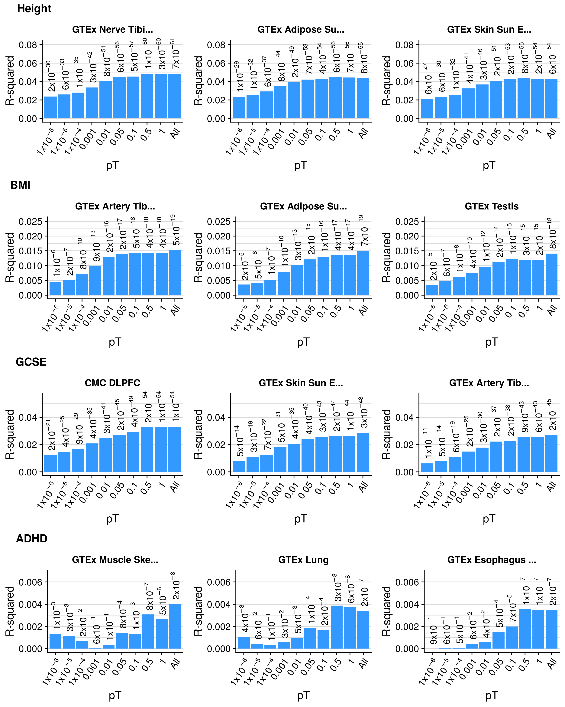

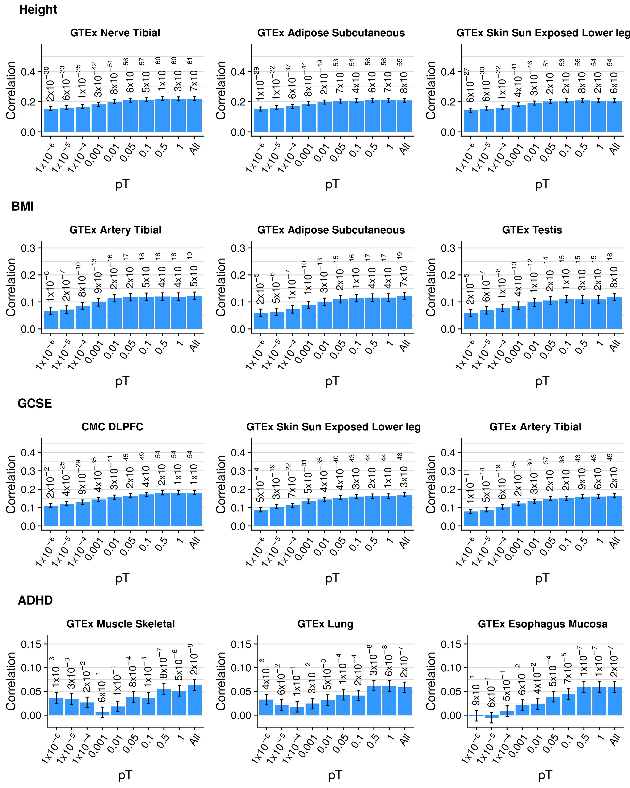

\center

```{r, echo=F, eval=T, results='asis'}
res<-read.csv("/mnt/lustre/users/k1806347/Analyses/GeRS_comparison/TEDS_outcomes_for_prediction/GeRS_per_pT.csv")

res[,-1:-3]<-round(res[,-1:-3], 3)
res$R<-paste0(res$R, " (", res$SE, ")")
res<-res[,c('Phenotype','Weight','Model','R')]

names(res)<-c('Phenotype','Weight','Model',"R (SE)")

library(knitr)
kable(res, rownames = FALSE, caption='Correlation between GeRS model predictions and observed values in TEDS')
```

```{r, echo=F, eval=T, results='asis'}
res<-read.csv("/mnt/lustre/users/k1806347/Analyses/GeRS_comparison/TEDS_outcomes_for_prediction/GeRS_best_pT.csv")

res[,-1:-3]<-round(res[,-1:-3], 3)
res$P<-format(res$P, scientific = TRUE, digits = 3)
res$R<-paste0(res$R, " (", res$SE, ")")
res<-res[,c('Phenotype','Weight','Model','R','P')]

names(res)<-c('Phenotype','Weight','Model',"R (SE)", "P")

library(knitr)
kable(res, rownames = FALSE, caption='Correlation between GeRS model predictions and observed values in TEDS')
```

</details>

<details><summary>Show cis-regulated expression-based heritability</summary>
```{r, echo=F, eval=F, results='asis', message = F, warning=F}
res_GeRS<-read.csv("/users/k1806347/brc_scratch/Analyses/GeRS_comparison/TEDS_outcomes_for_prediction/GeRS_AVENGME_res.csv")
res_GeRS_plot<-res_GeRS

res_GeRS$vg_est_clean<-paste0(round(res_GeRS$vg_est,3)," (",round(res_GeRS$vg_lowCI,3),"-",round(res_GeRS$vg_highCI,3),")")
res_GeRS$pi0_est_clean<-paste0(round(res_GeRS$pi0_est,3)," (",round(res_GeRS$pi0_lowCI,3),"-",round(res_GeRS$pi0_highCI,3),")")

res_GeRS_coloc<-read.csv("/users/k1806347/brc_scratch/Analyses/GeRS_comparison/TEDS_outcomes_for_prediction/GeRS_coloc_AVENGME_res.csv")
res_GeRS_coloc_plot<-res_GeRS_coloc

res_GeRS_coloc$vg_est_clean<-paste0(round(res_GeRS_coloc$vg_est,3)," (",round(res_GeRS_coloc$vg_lowCI,3),"-",round(res_GeRS_coloc$vg_highCI,3),")")
res_GeRS_coloc$pi0_est_clean<-paste0(round(res_GeRS_coloc$pi0_est,3)," (",round(res_GeRS_coloc$pi0_lowCI,3),"-",round(res_GeRS_coloc$pi0_highCI,3),")")

res_PRS<-read.csv("/users/k1806347/brc_scratch/Analyses/GeRS_comparison/TEDS_outcomes_for_prediction/PRS_AVENGME_res.csv")
res_PRS_plot<-res_PRS

res_PRS$vg_est_clean<-paste0(round(res_PRS$vg_est,3)," (",round(res_PRS$vg_lowCI,3),"-",round(res_PRS$vg_highCI,3),")")
res_PRS$pi0_est_clean<-paste0(round(res_PRS$pi0_est,3)," (",round(res_PRS$pi0_lowCI,3),"-",round(res_PRS$pi0_highCI,3),")")

res_diff<-merge(res_PRS,res_GeRS, by=c('Phenotype','GWAS'))
names(res_diff)<-gsub('.x','_PRS',names(res_diff))
names(res_diff)<-gsub('.y','_GeRS',names(res_diff))
names(res_diff)[1]<-'Phenotype'

names(res_GeRS_coloc)[-1:-2]<-paste0(names(res_GeRS_coloc)[-1:-2],'_GeRS_coloc')
res_diff<-merge(res_diff,res_GeRS_coloc, by=c('Phenotype','GWAS'))

res_diff$Prop_GE<-round(res_diff$vg_est_GeRS/res_diff$vg_est_PRS,2)
res_diff$Prop_GE_coloc<-round(res_diff$vg_est_GeRS_coloc/res_diff$vg_est_PRS,2)
res_diff<-res_diff[,c('Phenotype','GWAS','nsnp_PRS','vg_est_clean_PRS','pi0_est_clean_PRS','nsnp_GeRS','vg_est_clean_GeRS','pi0_est_clean_GeRS','nsnp_GeRS_coloc','vg_est_clean_GeRS_coloc','pi0_est_clean_GeRS_coloc','Prop_GE','Prop_GE_coloc')]

# Make comparison figure
library(ggplot2)
library(cowplot)

res_diff$vg_est_clean_PRS_est<-as.numeric(gsub(' .*','',res_diff$vg_est_clean_PRS))
res_diff$vg_est_clean_PRS_lowCI<-as.numeric(gsub("-.*",'',gsub(".*\\(",'',res_diff$vg_est_clean_PRS)))
res_diff$vg_est_clean_PRS_highCI<-as.numeric(gsub("\\)",'',gsub(".*-",'',res_diff$vg_est_clean_PRS)))

res_diff$vg_est_clean_GeRS_est<-as.numeric(gsub(' .*','',res_diff$vg_est_clean_GeRS))
res_diff$vg_est_clean_GeRS_lowCI<-as.numeric(gsub("-.*",'',gsub(".*\\(",'',res_diff$vg_est_clean_GeRS)))
res_diff$vg_est_clean_GeRS_highCI<-as.numeric(gsub("\\)",'',gsub(".*-",'',res_diff$vg_est_clean_GeRS)))

res_diff$vg_est_clean_GeRS_coloc_est<-as.numeric(gsub(' .*','',res_diff$vg_est_clean_GeRS_coloc))
res_diff$vg_est_clean_GeRS_coloc_lowCI<-as.numeric(gsub("-.*",'',gsub(".*\\(",'',res_diff$vg_est_clean_GeRS_coloc)))
res_diff$vg_est_clean_GeRS_coloc_highCI<-as.numeric(gsub("\\)",'',gsub(".*-",'',res_diff$vg_est_clean_GeRS_coloc)))

res_diff$Prop_GE<-paste0(round(res_diff$Prop_GE*100,2),'%')
res_diff$Prop_GE_coloc<-paste0(round(res_diff$Prop_GE_coloc*100,2),'%')

res_PRS<-data.frame(res_diff[c('Phenotype','vg_est_clean_PRS_est','vg_est_clean_PRS_lowCI','vg_est_clean_PRS_highCI')], Prop_GE=NA, Model='PRS')
names(res_PRS)<-c('Phenotype','vg_est','vg_est_lowCI','vg_est_highCI','Prop_GE','Model')

res_GeRS<-data.frame(res_diff[c('Phenotype','vg_est_clean_GeRS_est','vg_est_clean_GeRS_lowCI','vg_est_clean_GeRS_highCI','Prop_GE')], Model='GeRS')
names(res_GeRS)<-c('Phenotype','vg_est','vg_est_lowCI','vg_est_highCI','Prop_GE','Model')

res_GeRS_coloc<-data.frame(res_diff[c('Phenotype','vg_est_clean_GeRS_coloc_est','vg_est_clean_GeRS_coloc_lowCI','vg_est_clean_GeRS_coloc_highCI','Prop_GE_coloc')], Model="GeRS (coloc)")
names(res_GeRS_coloc)<-c('Phenotype','vg_est','vg_est_lowCI','vg_est_highCI','Prop_GE','Model')

res_plot<-do.call(rbind, list(res_PRS, res_GeRS, res_GeRS_coloc))
res_plot$Phenotype<-as.character(res_plot$Phenotype)
res_plot$Phenotype[res_plot$Phenotype == 'Height21']<-'Height'
res_plot$Phenotype[res_plot$Phenotype == 'BMI21']<-'BMI'
res_plot$Phenotype<-factor(res_plot$Phenotype, levels=c('Height', 'BMI', 'GCSE', 'ADHD'))

png('/mnt/lustre/users/k1806347/Analyses/GeRS_comparison/TEDS_outcomes_for_prediction/PRS_GeRS_AVENGME_res_TEDS.png', units='px', res=300, width=2000, height=1000)
ggplot(res_plot, aes(x=Phenotype, y=vg_est, fill=Model, label=Prop_GE)) +
          geom_bar(stat="identity", position=position_dodge()) +
          geom_errorbar(aes(ymin=vg_est_lowCI, ymax=vg_est_highCI), width=.2, position=position_dodge(0.9)) +
        	geom_text(aes(y=vg_est, colour=Model), size=4, angle=90, vjust=0.5, hjust=-1, stat="identity", position=position_dodge(width=0.9)) +
          labs(y="Vg (95%CI)", x='') +
          ylim(0,0.3) +
          theme_half_open() +
          theme(axis.text.x = element_text(angle = 45, hjust = 1), legend.title=element_blank()) +
          guides(fill=guide_legend(title.hjust =0.5)) +
          background_grid(major = 'y', minor = 'y') +
          coord_cartesian(clip='off')
dev.off()

```

```{bash, eval=T, echo=F}
mkdir -p /users/k1806347/brc_scratch/Software/MyGit/GenoPred/Images/Functionally_informed_prediction

cp /scratch/users/k1806347/Analyses/GeRS_comparison/TEDS_outcomes_for_prediction/PRS_GeRS_AVENGME_res_TEDS.png /users/k1806347/brc_scratch/Software/MyGit/GenoPred/Images/Functionally_informed_prediction/
```

<center>

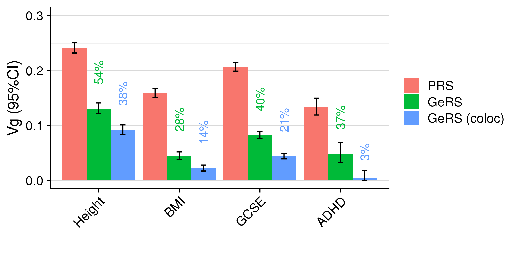

\center

</details>

```{bash, eval=T, echo=F}
mkdir -p /users/k1806347/brc_scratch/Software/MyGit/GenoPred/Images/Functionally_informed_prediction

cp /scratch/users/k1806347/Analyses/GeRS_comparison/TEDS_outcomes_for_prediction/GeRS_tests_summary_TEDS.png /users/k1806347/brc_scratch/Software/MyGit/GenoPred/Images/Functionally_informed_prediction/
```

<details><summary>Show summary of GeRS tests</summary>

<center>

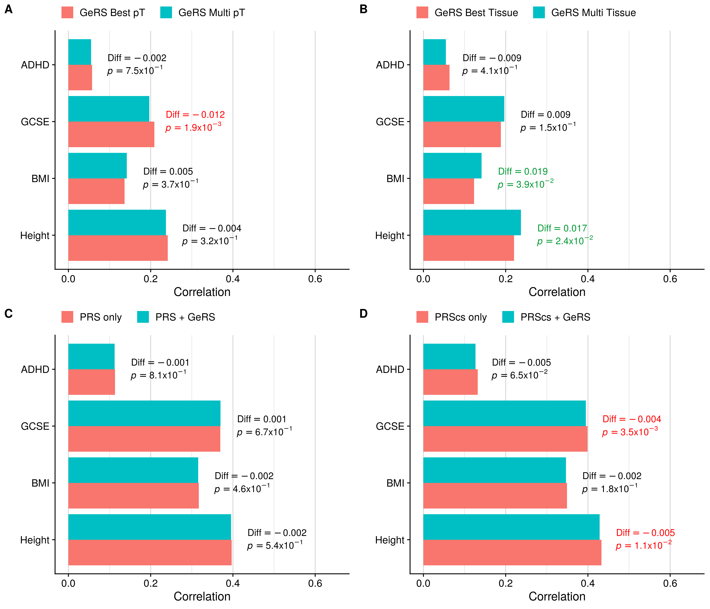

\center

```{r, echo=F, eval=T, results='asis'}
res<-read.csv("/mnt/lustre/users/k1806347/Analyses/GeRS_comparison/TEDS_outcomes_for_prediction/GeRS_tests_summary.csv")

res[,c("Model_1_R",  "Model_2_R", "R_diff")]<-round(res[,c("Model_1_R",  "Model_2_R", "R_diff")], 3)
res$R_diff_perc<-paste0(round(res$R_diff_perc,1),'%')
res$R_diff_pval<-format(res$R_diff_pval, scientific = TRUE, digits = 3)

res<-res[,c("Phenotype","Test","Model_1","Model_2","Model_1_R","Model_2_R","R_diff",'R_diff_perc',"R_diff_pval")]
names(res)<-c('Phenotype','Test',"Model 1","Model 2", 'Model 1 R','Model 2 R','R diff','R perc diff','R diff pval')

res<-res[order(res$Test),]

library(knitr)
kable(res, rownames = FALSE, caption='Correlation between GeRS model predictions and observed values in UK Biobank')
```

</details>

```{bash, eval=T, echo=F}
mkdir -p /users/k1806347/brc_scratch/Software/MyGit/GenoPred/Images/Functionally_informed_prediction

cp /scratch/users/k1806347/Analyses/GeRS_comparison/TEDS_outcomes_for_prediction/GeRS_PP4_tests_summary_TEDS.png /users/k1806347/brc_scratch/Software/MyGit/GenoPred/Images/Functionally_informed_prediction/
```

<details><summary>Show summary of GeRS PP4 tests</summary>

<center>

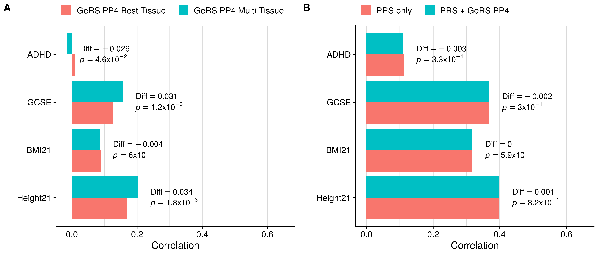

\center

```{r, echo=F, eval=T, results='asis'}
res<-read.csv("/mnt/lustre/users/k1806347/Analyses/GeRS_comparison/TEDS_outcomes_for_prediction/GeRS_PP4_tests_summary.csv")

res[,c("Model_1_R",  "Model_2_R", "R_diff")]<-round(res[,c("Model_1_R",  "Model_2_R", "R_diff")], 3)
res$R_diff_pval<-format(res$R_diff_pval, scientific = TRUE, digits = 3)

res<-res[,c("Phenotype","Test","Model_1","Model_2","Model_1_R","Model_2_R","R_diff","R_diff_pval")]
names(res)<-c('Phenotype','Test',"Model 1","Model 2", 'Model 1 R','Model 2 R','R diff','R diff pval')

res<-res[order(res$Test),]

library(knitr)
kable(res, rownames = FALSE, caption='Correlation between GeRS PP4 model predictions and observed values in UK Biobank')
```

</details>


```{bash, eval=T, echo=F}
mkdir -p /users/k1806347/brc_scratch/Software/MyGit/GenoPred/Images/Functionally_informed_prediction

cp /scratch/users/k1806347/Analyses/GeRS_comparison/TEDS_outcomes_for_prediction/GeRS_TissueSpecific_tests_summary_TEDS.png /users/k1806347/brc_scratch/Software/MyGit/GenoPred/Images/Functionally_informed_prediction/
```

<details><summary>Show summary of GeRS TissueSpecific tests</summary>

<center>

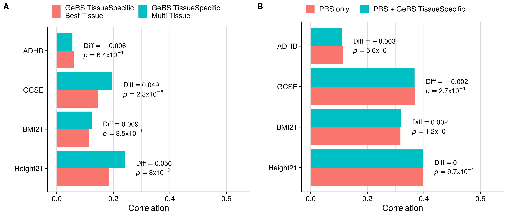

\center

```{r, echo=F, eval=T, results='asis'}
res<-read.csv("/mnt/lustre/users/k1806347/Analyses/GeRS_comparison/TEDS_outcomes_for_prediction/GeRS_TissueSpecific_tests_summary.csv")

res[,c("Model_1_R",  "Model_2_R", "R_diff")]<-round(res[,c("Model_1_R",  "Model_2_R", "R_diff")], 3)
res$R_diff_pval<-format(res$R_diff_pval, scientific = TRUE, digits = 3)

res<-res[,c("Phenotype","Test","Model_1","Model_2","Model_1_R","Model_2_R","R_diff","R_diff_pval")]
names(res)<-c('Phenotype','Test',"Model 1","Model 2", 'Model 1 R','Model 2 R','R diff','R diff pval')

res<-res[order(res$Test),]

library(knitr)
kable(res, rownames = FALSE, caption='Correlation between GeRS TissueSpecific model predictions and observed values in UK Biobank')
```

</details>

```{bash, eval=T, echo=F}
mkdir -p /users/k1806347/brc_scratch/Software/MyGit/GenoPred/Images/Functionally_informed_prediction

cp /mnt/lustre/users/k1806347/Analyses/GeRS_comparison/TEDS_outcomes_for_prediction/StratPRS_comp_TEDS.png /users/k1806347/brc_scratch/Software/MyGit/GenoPred/Images/Functionally_informed_prediction/
```

<details><summary>Show GeRS, PRS, stratified-PRS comparison</summary>

<center>

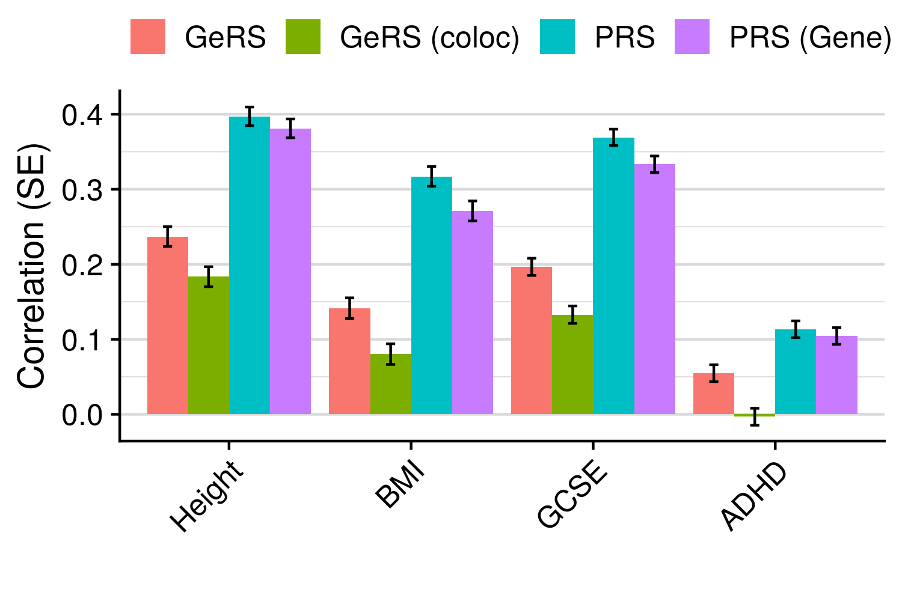

\center

```{r, echo=F, eval=T, results='asis'}
res<-read.csv("/mnt/lustre/users/k1806347/Analyses/GeRS_comparison/TEDS_outcomes_for_prediction/StratPRS_comp_summary.csv")

res_diff<-NULL
for(i in unique(res$Phenotype)){
  res_diff<-rbind(res_diff, data.frame(Phenotype=i,
                                       Prop_GE=res$R[res$Phenotype == i & res$Method == 'GeRS']/res$R[res$Phenotype == i & res$Method == 'PRS'],
                                       Prop_GE_coloc=res$R[res$Phenotype == i & res$Method == "GeRS (coloc)"]/res$R[res$Phenotype == i & res$Method == 'PRS']))
}

res_diff[,-1]<-round(res_diff[,-1],3)

library(knitr)
kable(res_diff, rownames = FALSE, caption='Proportion of PRS explained by GeRS')
```

</details>

```{bash, eval=T, echo=F}
mkdir -p /users/k1806347/brc_scratch/Software/MyGit/GenoPred/Images/Functionally_informed_prediction

cp /mnt/lustre/users/k1806347/Analyses/GeRS_comparison/TEDS_outcomes_for_prediction/GeRS_coloc_TissueSpecific_comp_TEDS.png /users/k1806347/brc_scratch/Software/MyGit/GenoPred/Images/Functionally_informed_prediction/
```

<details><summary>Show GeRS coloc and tissue specific comparison</summary>

<center>

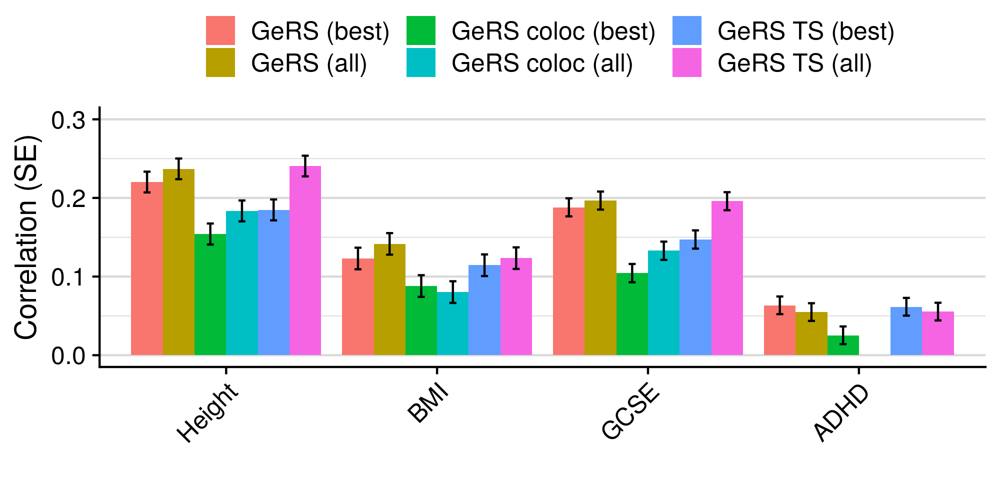

\center

```{r, echo=F, eval=T, results='asis'}
res<-read.csv("/mnt/lustre/users/k1806347/Analyses/GeRS_comparison/TEDS_outcomes_for_prediction/GeRS_coloc_TissueSpecific_comp_summary.csv")

res[,3:4]<-round(res[,3:4],3)

library(knitr)
kable(res, rownames = FALSE, caption='Comparison of GeRS')
```

</details>

```{bash, eval=T, echo=F}
mkdir -p /users/k1806347/brc_scratch/Software/MyGit/GenoPred/Images/Functionally_informed_prediction

cp /mnt/lustre/users/k1806347/Analyses/GeRS_comparison/TEDS_outcomes_for_prediction/GeRS_Tissue_comp_TEDS.png /users/k1806347/brc_scratch/Software/MyGit/GenoPred/Images/Functionally_informed_prediction/
```

<details><summary>Show association with GeRS for each SNP-weight set</summary>

<center>

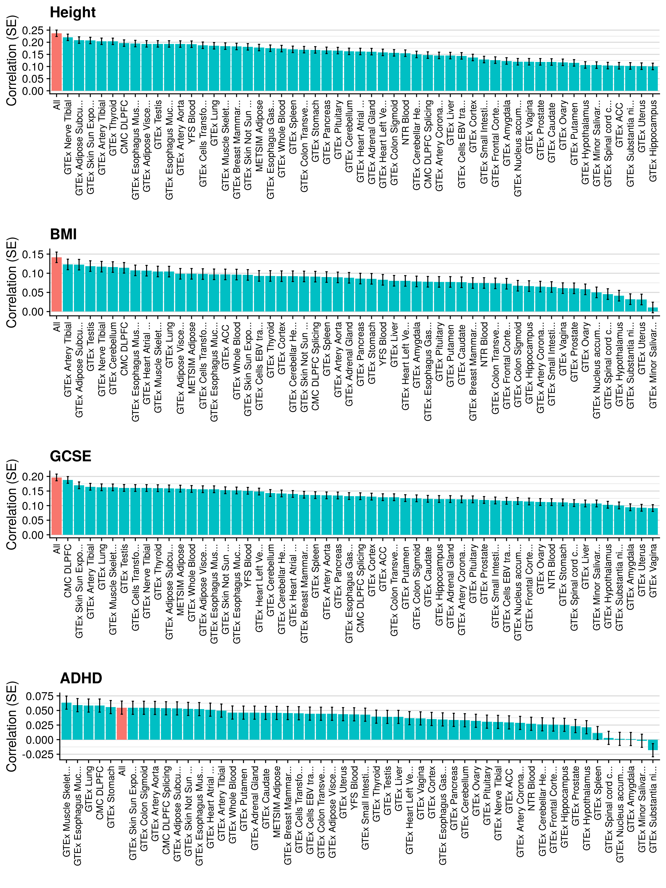

\center

</details>

```{bash, eval=T, echo=F}
mkdir -p /users/k1806347/brc_scratch/Software/MyGit/GenoPred/Images/Functionally_informed_prediction

cp /scratch/users/k1806347/Analyses/GeRS_comparison/TEDS_outcomes_for_prediction/GeRS_PP4_Tissue_comp_TEDS.png /users/k1806347/brc_scratch/Software/MyGit/GenoPred/Images/Functionally_informed_prediction/
```

<details><summary>Show association with GeRS PP4 for each SNP-weight set</summary>

<center>

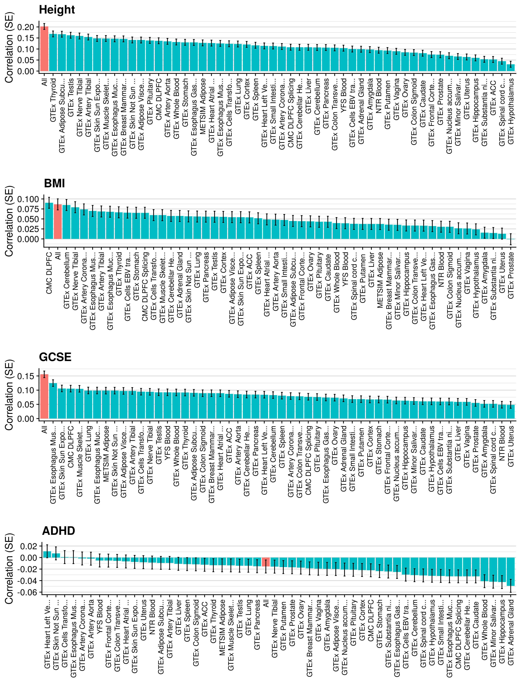

\center

</details>


```{bash, eval=T, echo=F}
mkdir -p /users/k1806347/brc_scratch/Software/MyGit/GenoPred/Images/Functionally_informed_prediction

cp /scratch/users/k1806347/Analyses/GeRS_comparison/TEDS_outcomes_for_prediction/GeRS_TissueSpecific_Tissue_comp_TEDS.png /users/k1806347/brc_scratch/Software/MyGit/GenoPred/Images/Functionally_informed_prediction/
```

<details><summary>Show association with GeRS TissueSpecific for each SNP-weight set</summary>

<center>

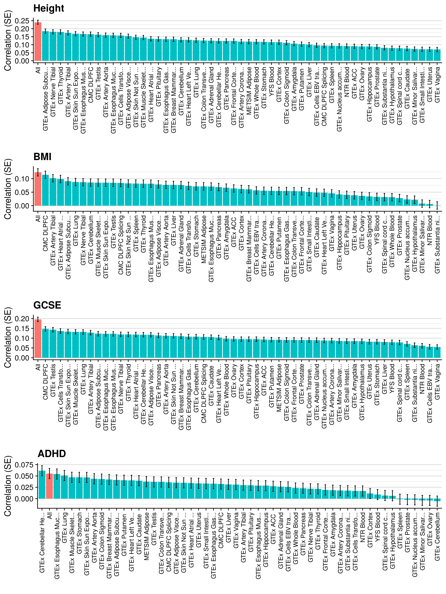

\center

</details>

```{bash, eval=T, echo=F}
mkdir -p /users/k1806347/brc_scratch/Software/MyGit/GenoPred/Images/Functionally_informed_prediction

cp /scratch/users/k1806347/Analyses/GeRS_comparison/TEDS_outcomes_for_prediction/GeRS_Tissue_comp_resid_TEDS.png /users/k1806347/brc_scratch/Software/MyGit/GenoPred/Images/Functionally_informed_prediction/
```

<details><summary>Show association with GeRS for each SNP-weight set after accounting for number of features</summary>

<center>

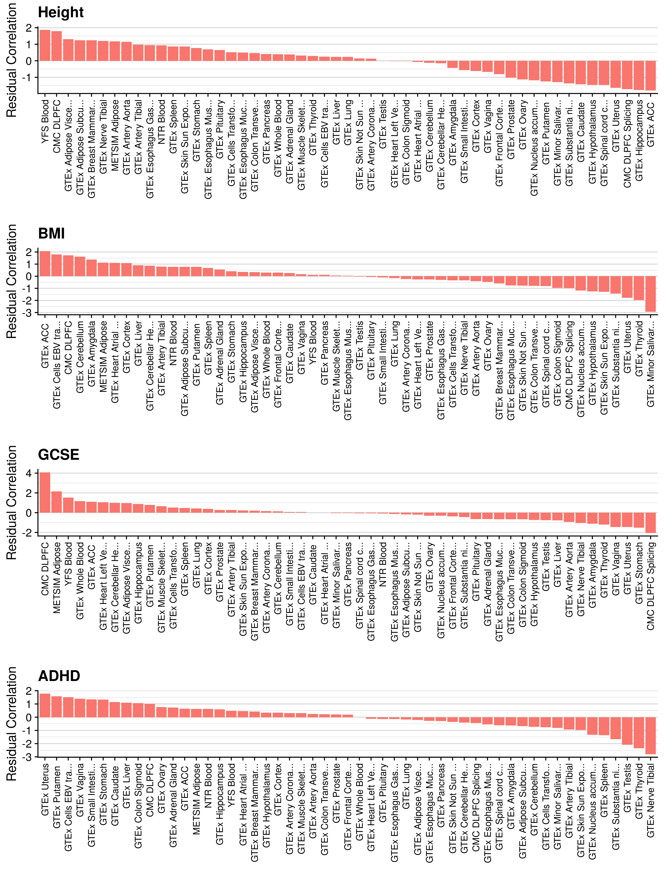

\center

</details>

```{bash, eval=T, echo=F}
mkdir -p /users/k1806347/brc_scratch/Software/MyGit/GenoPred/Images/Functionally_informed_prediction

cp /scratch/users/k1806347/Analyses/GeRS_comparison/TEDS_outcomes_for_prediction/GeRS_Tissue_comp_Nfeat_TEDS.png /users/k1806347/brc_scratch/Software/MyGit/GenoPred/Images/Functionally_informed_prediction/
```

<details><summary>Show effect of number of features in the SNP-weight set</summary>

<center>

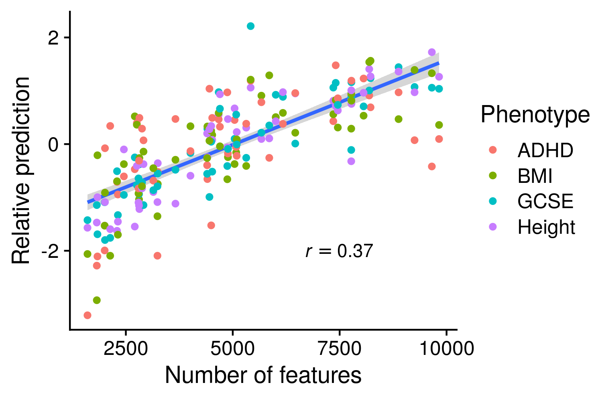

\center

</details>

<br/>

***

# Conclusion

* Gene expression risk scores (GeRS) can explain a significantly non-zero amount of variance in a range of phenotypes
* The amount of variance explained by GeRS is less than explained by a genome-wide pT+clump polygenic score or TWAS SNP-weight stratified polygenic scores, except for Rheumatoid Arthritis.
* Use of elastic net models to combine GeRSs derived using multiple pTs does not significantly improve prediction over the single best pT as idenitified using 10-fold cross validation, though prediction never decreases
* Inclusion of GeRS based on SNP-weights derived using multiple tissues consistently improves prediction over the single best tissues as idenitified using 10-fold cross validation
* Inclusion of GeRSs only improved prediction over genome-wide polygenic scores for rheumatoid arthritis, providing an 1.6 times increase in r2 (0.021 to 0.035). Prediction improvements were non significant for all other phenotypes in UK Biobank and TEDS.
* However, PRScs polygenic scores which does not use LD clumping reduces the benefit of using GeRS for all outcomes, and the increase for RheumArth is no longer significant. This indicates the gain is in the fact that GeRS are based on joint SNP models.
* This findings suggest that GeRS represent a component of risk captured within genome-wide polygenic scores, rather than containing novel information.
* This indicates GeRS may be more useful for stratifying risk rather than improving risk prediction in a linear model.
* TWAS SNP PRS explain a suprisingly large amount of variance considering they only contain a fraction of the genome.

<br/>

***

