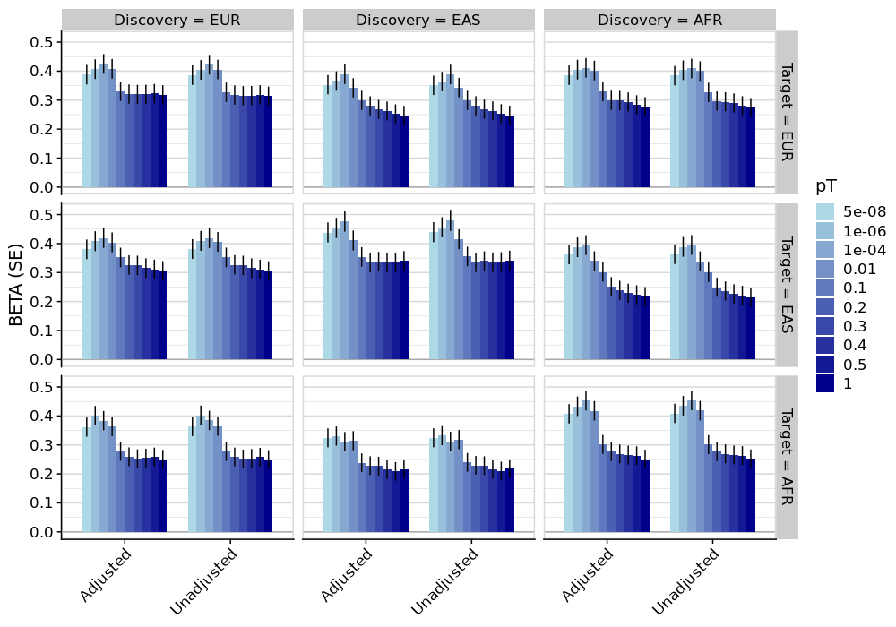

```{r setup, include=FALSE}
knitr::opts_chunk$set(eval = FALSE)
```

***

Here will use simulated genetic data to benchmark GenoPred. We will simulate the genetic data using [HAPNEST](https://github.com/intervene-EU-H2020/synthetic_data).

***

# Set up HAPNEST
<details><summary>Show code</summary>

```{bash}
mkdir -p /users/k1806347/oliverpainfel/HAPNEST
cd /users/k1806347/oliverpainfel/HAPNEST

# Step 1: Download container
singularity pull docker://sophiewharrie/intervene-synthetic-data

# Step 2: Set up workspace
mkdir -p /users/k1806347/oliverpainfel/HAPNEST/containers
mv intervene-synthetic-data_latest.sif /users/k1806347/oliverpainfel/HAPNEST/containers/
mkdir -p /users/k1806347/oliverpainfel/HAPNEST/data

# Step 3: Initiate HAPNEST (download dependencies)
export TMPDIR=/tmp
singularity exec --bind data/:/data/ containers/intervene-synthetic-data_latest.sif init

# Step 4: Download reference data
singularity exec --bind data/:/data/ containers/intervene-synthetic-data_latest.sif fetch

```

</details>

***

# Test run using default config

Generates data for chromosome 1, for 6 populations, HapMap3 SNPs, and 1 phenotype.

<details><summary>Show code</summary>

```{bash}
# Step 5: Generate genotype and phenotype data
singularity exec --bind data/:/data/ containers/intervene-synthetic-data_latest.sif generate_geno 1 data/config.yaml
singularity exec --bind data/:/data/ containers/intervene-synthetic-data_latest.sif generate_pheno data/config.yaml

# Step 6: Evaluate simulation (optional and slow)
singularity exec --bind data/:/data/ containers/intervene-synthetic-data_latest.sif validate data/config.yaml
```

</details>

The data simulation took about 1 minute. Evaluation takes >2 hours.

***

# HAPNEST released genotype and phenotype data

It would probably be easier, and more reproducible to use the released version of simulated data from the HAPNEST paper. The files are very large as they are for 6.8M variants and 1M individuals. Let's start with chromosome 22 to testing things out. We can subset the files to HapMap3 variants as we download them to avoid storing so much data in first instance.

***

## Download genotype and phenotype

<details><summary>Show code</summary>

```{bash}
mkdir -p /users/k1806347/oliverpainfel/HAPNEST/released/full
mkdir -p /users/k1806347/oliverpainfel/HAPNEST/released/subset
module load plink2
cd /users/k1806347/oliverpainfel/HAPNEST/released/full

# Download genotype data
# Subset the data to HapMap3 variants to save storage space
# Might as well convert to plink2 format for efficiency
for chr in $(seq 22 22); do
  for file in $(echo bed bim fam); do
    wget https://ftp.ebi.ac.uk/biostudies/fire/S-BSST/936/S-BSST936/Files/genotypes/synthetic_v1_chr-${chr}.${file}
  done
  
  wget https://ftp.ebi.ac.uk/biostudies/fire/S-BSST/936/S-BSST936/Files/rsids/rsid_variant_map_list_chr22.txt
  wget https://ftp.ebi.ac.uk/biostudies/fire/S-BSST/936/S-BSST936/Files/example/synthetic_small_v1_chr-22.bim
  
  awk 'NR==FNR {snp[$1]; next} $2 in snp' /users/k1806347/oliverpainfel/GenoPred/pipeline/resources/data/hm3_snplist/w_hm3.snplist rsid_variant_map_list_chr22.txt > matched_rows.txt

  plink2 \
    --bfile synthetic_v1_chr-${chr} \
    --make-pgen \
    --extract matched_rows.txt \
    --out /users/k1806347/oliverpainfel/HAPNEST/released/subset/synthetic_v1_hm3_chr${chr}

  rm synthetic_v1_chr-${chr}.*
  rm matched_rows.txt
  rm rsid_variant_map_list_chr${chr}.txt
done

# Download phenotype data
mkdir -p /users/k1806347/oliverpainfel/HAPNEST/released/phenotype
cd /users/k1806347/oliverpainfel/HAPNEST/released/phenotype
wget https://ftp.ebi.ac.uk/biostudies/fire/S-BSST/936/S-BSST936/Files/synthetic_v1.sample
for i in $(seq 1 9); do
  wget https://ftp.ebi.ac.uk/biostudies/fire/S-BSST/936/S-BSST936/Files/phenotypes/synthetic_v1.pheno${i}
done

```

</details>

Note. For some reason there only about 65% of HapMap3 variants available in the synthetic data. This will cause an error when using GenoPred as it requires a certain overlap with the default reference data. Given we are going to generate the GWAS using this data, this wouldn't actually cause any issues of SNP overlap, but there would be poor coverage of the genome which will decrease the PGS R2 values. This is not a big issue, but given it is so fast to simulate data, it is making me think we should simulate our own so we can make it exactly what we want (sample size, genetic architecture, snplist).

***

# Full simulation

Lets modify the quickstart config.yaml to simulate data for chromosome 22, 40k individuals, EUR, EAS and AFR population, 9 phenotypes with same genetic architecture as HAPNEST paper.

<details><summary>Show code</summary>

```{bash}
cd /users/k1806347/oliverpainfel/HAPNEST

# Generate genotype and phenotype data
singularity exec \
  --bind data/:/data/ \
  --bind /users/k1806347/oliverpainfel/GenoPred/pipeline/misc/hapnest/config.synth_1.yaml:/data/config.synth_1.yaml \
  containers/intervene-synthetic-data_latest.sif \
  generate_geno \
  8 \
  data/config.synth_1.yaml
  
# Note this only worked when allocating 100G RAM when using 8 threads. This is a lot more than expected based on the HAPNEST paper.

singularity exec \
  --bind data/:/data/ \
  --bind /users/k1806347/oliverpainfel/GenoPred/pipeline/misc/hapnest/config.synth_1.yaml:/data/config.synth_1.yaml \
  containers/intervene-synthetic-data_latest.sif \
  generate_pheno \
  data/config.synth_1.yaml
  
```

</details>

***

# Identify unrelated individuals

We need to identify a group of unrelated individuals, to avoid bias in the GWAS and sample overlap between GWAS and target sample when evaluating PGS. Idenitfy unrelated individuals within each population.

<details><summary>Show code</summary>

```{r}
# Subset simulated data by population
library(data.table)
sample <-
  fread(
    '/users/k1806347/oliverpainfel/HAPNEST/data/outputs/synth_1/synth_1_chr-22.sample',
    header = F
  )$V1

pops<-unique(sample)
fam <- fread('/users/k1806347/oliverpainfel/HAPNEST/data/outputs/synth_1/synth_1_chr-22.fam')
fam$pop <- sample

for(i in c('EUR','EAS','AFR')){
  fam_i <- fam[fam$pop == i,]
  fam_i <- fam_i[, c('V1','V2'), with=F]
  
  write.table(
    fam_i,
    paste0(
      '~/oliverpainfel/Analysis/HAPNEST/synth_1/', i,'.keep'),
    col.names = F,
    row.names = F,
    quote = F
  )
}

```

```{r}
# Identify unrelated individuals
# conda activate .snakemake/conda/ea13b6c549c70695534894feeeecf0b3_
setwd('~/oliverpainfel/GenoPred/pipeline/')
dir.create('~/oliverpainfel/Analysis/HAPNEST/synth_1', recursive = T)

library("optparse")
library(GenoUtils)
library(data.table)
source('../functions/misc.R')
source_all('../functions')

# Create temp directory
tmp_dir<-tempdir()

option_list = list(
  make_option("--target_plink_chr", action="store", default=NULL, type='character',
              help="Path to per chromosome target PLINK files [required]"),
  make_option("--maf", action="store", default=0.05, type='numeric',
              help="Minor allele frequency threshold [optional]"),
  make_option("--geno", action="store", default=0.02, type='numeric',
              help="Variant missingness threshold [optional]"),
  make_option("--hwe", action="store", default=1e-6, type='numeric',
              help="Hardy Weinberg p-value threshold. [optional]"),
  make_option("--n_pcs", action="store", default=10, type='numeric',
              help="Number of PCs (min=4) [optional]"),
  make_option("--plink2", action="store", default='plink2', type='character',
              help="Path PLINK2 software binary [required]"),
  make_option("--keep_list", action="store", default=NULL, type='character',
              help="File containing list of keep files and corresponding population code [optional]"),
  make_option("--unrel", action="store", default=NA, type='character',
              help="File containing list of unrelated individuals [optional]"),
  make_option("--n_cores", action="store", default=1, type='numeric',
              help="Number of cores for parallel computing [optional]"),
  make_option("--test", action="store", default=NA, type='character',
              help="Specify test mode [optional]"),
  make_option("--output", action="store", default=NULL, type='character',
              help="Path for output files [required]")
)

opt = parse_args(OptionParser(option_list=option_list))

opt$test<-'chr22'
opt$target_plink_chr<-'/users/k1806347/oliverpainfel/HAPNEST/data/outputs/synth_1/synth_1_chr-'
opt$output<-'~/oliverpainfel/Analysis/HAPNEST/synth_1/relatedness/synth_1'
opt$n_cores<-20

# Create output directory
opt$output_dir <- paste0(dirname(opt$output),'/')
system(paste0('mkdir -p ',opt$output_dir))

if(!is.na(opt$test)){
  CHROMS <- as.numeric(gsub('chr','',opt$test))
}

for(i in c('EUR','EAS','AFR')){

  # Identify high quality variants
  target_qc_snplist<-plink_qc_snplist(bfile = opt$target_plink_chr, chr = CHROMS, plink2 = opt$plink2, geno = opt$geno, maf = opt$maf, hwe = opt$hwe, keep = paste0('~/oliverpainfel/Analysis/HAPNEST/synth_1/', i,'.keep'))
  
  # Generate kinship matrix and list of unrelated individuals
  plink_king(bfile = opt$target_plink_chr, chr = CHROMS, extract = target_qc_snplist, plink2 = opt$plink2, out = paste0(opt$output, '.', i), threads = opt$n_cores, keep = paste0('~/oliverpainfel/Analysis/HAPNEST/synth_1/', i,'.keep'))
  
}

```

</details>

***

# Subsample and GWAS

## Subsample

<details><summary>Show code</summary>

```{r}
library(data.table)

fam <- NULL
for(i in c('EUR','EAS','AFR')){
  tmp <- fread(paste0('~/oliverpainfel/Analysis/HAPNEST/synth_1/relatedness/synth_1.',i,'.unrelated.keep'), header = F)
  tmp$pop <- i
  fam <- rbind(fam, tmp)
}

set.seed(1)
for(pop_i in c('EUR','EAS','AFR')){
  fam_pop_i <- fam[fam$pop == pop_i,]
  print(nrow(fam_pop_i))
  train_size <- floor(0.9 * nrow(fam_pop_i))
  train_indices <- sample(seq_len(nrow(fam_pop_i)), size = train_size)
  
  write.table(
    fam_pop_i[train_indices, c('V1', 'V2'), with = F],
    paste0(
      '~/oliverpainfel/Analysis/HAPNEST/synth_1/training.',
      pop_i,
      '.txt'
    ),
    col.names = F,
    row.names = F,
    quote = F
  )
  
  write.table(
    fam_pop_i[!(seq_len(nrow(fam_pop_i)) %in% train_indices), c('V1','V2'), with=F],
    paste0(
      '~/oliverpainfel/Analysis/HAPNEST/synth_1/testing.',
      pop_i,
      '.txt'
    ),
    col.names = F,
    row.names = F,
    quote = F
  )
}

```

</details>

***

## GWAS

### Perform PCA

<details><summary>Show code</summary>

```{r}
# conda activate .snakemake/conda/ea13b6c549c70695534894feeeecf0b3_
setwd('~/oliverpainfel/GenoPred/pipeline/')

start.time <- Sys.time()
library("optparse")

option_list = list(
  make_option("--target_plink_chr", action="store", default=NULL, type='character',
              help="Path to per chromosome target PLINK files [required]"),
  make_option("--maf", action="store", default=0.05, type='numeric',
              help="Minor allele frequency threshold [optional]"),
  make_option("--geno", action="store", default=0.02, type='numeric',
              help="Variant missingness threshold [optional]"),
  make_option("--hwe", action="store", default=1e-6, type='numeric',
              help="Hardy Weinberg p-value threshold. [optional]"),
  make_option("--n_pcs", action="store", default=10, type='numeric',
              help="Number of PCs (min=4) [optional]"),
  make_option("--plink2", action="store", default='plink2', type='character',
              help="Path PLINK2 software binary [required]"),
  make_option("--keep_list", action="store", default=NULL, type='character',
              help="File containing list of keep files and corresponding population code [optional]"),
  make_option("--unrel", action="store", default=NA, type='character',
              help="File containing list of unrelated individuals [optional]"),
  make_option("--n_cores", action="store", default=1, type='numeric',
              help="Number of cores for parallel computing [optional]"),
  make_option("--test", action="store", default=NA, type='character',
              help="Specify test mode [optional]"),
  make_option("--output", action="store", default=NULL, type='character',
              help="Path for output files [required]")
)

opt = parse_args(OptionParser(option_list=option_list))

opt$target_plink_chr<-'/users/k1806347/oliverpainfel/HAPNEST/data/outputs/synth_1/synth_1_chr-'
opt$output<-'~/oliverpainfel/Analysis/HAPNEST/synth_1/pca/'
opt$test<-'chr22'

keep_list<-data.frame(
  file = c(
    '~/oliverpainfel/Analysis/HAPNEST/synth_1/training.EUR.txt',
    '~/oliverpainfel/Analysis/HAPNEST/synth_1/training.EAS.txt',
    '~/oliverpainfel/Analysis/HAPNEST/synth_1/training.AFR.txt'),
  POP = c('EUR','EAS','AFR')
)

library(GenoUtils)
library(data.table)
source('../functions/misc.R')
source_all('../functions')

# Create temp directory
tmp_dir<-tempdir()

if(!is.na(opt$test)){
  CHROMS <- as.numeric(gsub('chr','',opt$test))
}

############
# Create file listing variants in regions of long range LD
############

targ_pvar <- read_bim(opt$target_plink_chr, chr = CHROMS)
targ_pvar <- remove_regions(dat = targ_pvar, regions = long_ld_coord)

for(pop in keep_list$POP){
  # Read in keep file for population
  keep_file <- fread(keep_list$file[keep_list$POP == pop], header=F)
  if(ncol(keep_file) == 1){
    keep_file <- data.table(
      FID = keep_file$V1,
      IID = keep_file$V1)
  } else {
    keep_file <- data.table(
      FID = keep_file$V1,
      IID = keep_file$V2)
  }

  ###########
  # Perform PCA on QC'd and independent variants
  ###########

  # Create QC'd SNP-list
  target_qc_snplist <- plink_qc_snplist(bfile = opt$target_plink_chr, plink2 = opt$plink2, chr = CHROMS, keep = keep_file, maf = opt$maf, geno = opt$geno, hwe = opt$hwe, threads = opt$n_cores)

  # Remove high LD regions
  target_qc_snplist <- target_qc_snplist[target_qc_snplist %in% targ_pvar$SNP]

  # Perform LD pruning
  ld_indep <- plink_prune(bfile = opt$target_plink_chr, chr = CHROMS, keep = keep_file, plink2 = opt$plink2, extract = target_qc_snplist, threads = opt$n_cores)

  # To improve efficiency, derive PCs using random subset of 1000 individuals.
  keep_file_subset <- keep_file[sample(1000, replace = T),]
  keep_file_subset <- keep_file_subset[!duplicated(keep_file_subset),]

  # Run PCA
  snp_weights <- plink_pca(bfile = opt$target_plink_chr, keep = keep_file_subset, chr = CHROMS, plink2 = opt$plink2, extract = ld_indep, n_pc = opt$n_pcs, threads = opt$n_cores)
  fwrite(snp_weights, paste0(tmp_dir,'/ref.eigenvec.var'), row.names = F, quote=F, sep=' ', na='NA')

  # Project into the full population
  target_pcs <- plink_score(bfile = opt$target_plink_chr, keep = keep_file, chr = CHROMS, plink2 = opt$plink2, score = paste0(tmp_dir,'/ref.eigenvec.var'), threads = opt$n_cores)

  fwrite(target_pcs, paste0(opt$output, pop,'.pcs.txt'), quote=F, sep=' ', na='NA')
}

```

</details>

***

### Perform GWAS

<details><summary>Show code</summary>

```{bash}

module add plink2
for pheno in $(seq 1 1); do
    awk 'BEGIN {OFS="\t"} NR==1 {print "FID", "IID", "pheno"} NR>1 {print $1, $1, $NF}' /users/k1806347/oliverpainfel/HAPNEST/data/outputs/synth_1/synth_1_chr.pheno${pheno} > /users/k1806347/oliverpainfel/HAPNEST/data/outputs/synth_1/synth_1_chr.pheno${pheno}.plink
    
  for pop in $(echo EUR EAS AFR); do
  
    mkdir -p ~/oliverpainfel/Analysis/HAPNEST/synth_1/gwas/pheno${pheno}
    for chr in $(seq 22 22); do
        sbatch -p neurohack_cpu --mem 20G -n 4 --wrap="plink2 \
          --bfile /users/k1806347/oliverpainfel/HAPNEST/data/outputs/synth_1/synth_1_chr-22 \
          --pheno /users/k1806347/oliverpainfel/HAPNEST/data/outputs/synth_1/synth_1_chr.pheno${pheno}.plink \
          --1 \
          --covar ~/oliverpainfel/Analysis/HAPNEST/synth_1/pca/${pop}.pcs.txt \
          --covar-variance-standardize \
          --logistic omit-ref cols=+a1freq,+ax hide-covar \
          --maf 0.01 \
          --geno 0.05 \
          --out ~/oliverpainfel/Analysis/HAPNEST/synth_1/gwas/pheno${pheno}/pheno${pheno}.${pop}.chr${chr}"
    done
  done
done

# Once complete, merge results across chromosomes
for pheno in $(seq 1 1); do
  for pop in $(echo EUR EAS AFR); do
    head -n 1 ~/oliverpainfel/Analysis/HAPNEST/synth_1/gwas/pheno${pheno}/pheno${pheno}.${pop}.chr22.pheno.glm.logistic.hybrid > ~/oliverpainfel/Analysis/HAPNEST/synth_1/gwas/pheno${pheno}/pheno${pheno}.${pop}.GW.pheno.glm.logistic.hybrid
      for chr in $(seq 22 22); do
        tail -n +2 ~/oliverpainfel/Analysis/HAPNEST/synth_1/gwas/pheno${pheno}/pheno${pheno}.${pop}.chr22.pheno.glm.logistic.hybrid >> ~/oliverpainfel/Analysis/HAPNEST/synth_1/gwas/pheno${pheno}/pheno${pheno}.${pop}.GW.pheno.glm.logistic.hybrid
      done
      
      # Remove REF and ALT columns and rename AX column to A2
      cut -f 4,5 --complement ~/oliverpainfel/Analysis/HAPNEST/synth_1/gwas/pheno${pheno}/pheno${pheno}.${pop}.GW.pheno.glm.logistic.hybrid | awk 'BEGIN{FS=OFS="\t"} NR==1 {$7="A2"} 1' > temp.txt && mv temp.txt ~/oliverpainfel/Analysis/HAPNEST/synth_1/gwas/pheno${pheno}/pheno${pheno}.${pop}.GW.pheno.glm.logistic.hybrid
  
      gzip ~/oliverpainfel/Analysis/HAPNEST/synth_1/gwas/pheno${pheno}/pheno${pheno}.${pop}.GW.pheno.glm.logistic.hybrid
  done
done

```

</details>

***

# Run GenoPred

## Subset HAPNEST testing data

<details><summary>Show code</summary>

```{bash}
mkdir -p ~/oliverpainfel/Analysis/HAPNEST/synth_1/testing_subset

cat ~/oliverpainfel/Analysis/HAPNEST/synth_1/testing.*.txt > ~/oliverpainfel/Analysis/HAPNEST/synth_1/testing.txt

for chr in $(seq 22 22); do
    plink2 \
      --bfile /users/k1806347/oliverpainfel/HAPNEST/data/outputs/synth_1/synth_1_chr-${chr} \
      --keep ~/oliverpainfel/Analysis/HAPNEST/synth_1/testing.txt \
      --make-bed \
      --out ~/oliverpainfel/Analysis/HAPNEST/synth_1/testing_subset/synth_1.chr${chr}
done
```

</details>

## Prepare config

<details><summary>Show code</summary>

```{r}

dir.create('/users/k1806347/oliverpainfel/Analysis/HAPNEST/genopred/config', recursive = T)

# gwas_list
sample_file<-fread('/users/k1806347/oliverpainfel/HAPNEST/data/outputs/synth_1/synth_1_chr-22.sample', header=F)$V1
gwas_list <- NULL
for(pheno in 1:1){
  pheno_file <- fread(paste0('/users/k1806347/oliverpainfel/HAPNEST/data/outputs/synth_1/synth_1_chr.pheno', pheno,'.plink'))
  for(pop in c('EUR','EAS','AFR')){
    
    pheno_file_pop <- pheno_file[sample_file == pop,]
    
    tmp <- data.frame(
      name=paste0('pheno',pheno,'_',pop),
      path=paste0('/users/k1806347/oliverpainfel/Analysis/HAPNEST/synth_1/gwas/pheno', pheno, '/pheno', pheno, '.', pop, '.GW.pheno.glm.logistic.hybrid.gz'),
      population=pop,
      n=NA,
      sampling=mean(pheno_file_pop$pheno),
      prevalence=0.5,
      mean=NA,
      sd=NA,
      label=paste0('"pheno', pheno, ' (', pop, ')"')
    )
    
    gwas_list <- rbind(gwas_list, tmp)
  }
}

write.table(gwas_list, '/users/k1806347/oliverpainfel/Analysis/HAPNEST/genopred/config/gwas_list.txt', col.names = T, row.names = F, quote = F)

# target_list
target_list <- data.frame(
  name='hapnest',
  path='/users/k1806347/oliverpainfel/Analysis/HAPNEST/synth_1/testing_subset/synth_1',
  type='plink1',
  indiv_report=F
)

write.table(target_list, '/users/k1806347/oliverpainfel/Analysis/HAPNEST/genopred/config/target_list.txt', col.names = T, row.names = F, quote = F)

config<-c(
  "outdir: /users/k1806347/oliverpainfel/Analysis/HAPNEST/genopred/output",
  "config_file: /users/k1806347/oliverpainfel/Analysis/HAPNEST/genopred/config/config.yaml",
  "gwas_list: /users/k1806347/oliverpainfel/Analysis/HAPNEST/genopred/config/gwas_list.txt",
  "target_list: /users/k1806347/oliverpainfel/Analysis/HAPNEST/genopred/config/target_list.txt",
  "pgs_methods: ['ptclump']",
  "cores_prep_pgs: 1",
  "cores_target_pgs: 10",
  "testing: chr22",
  "pgs_scaling: ['continuous', 'discrete']"
)

write.table(config, '/users/k1806347/oliverpainfel/Analysis/HAPNEST/genopred/config/config.yaml', col.names = F, row.names = F, quote = F)

```

</details>

***

## Run pipeline

<details><summary>Show code</summary>

```{bash}
snakemake --profile slurm --use-conda --configfile=/users/k1806347/oliverpainfel/Analysis/HAPNEST/genopred/config/config.yaml output_all outlier_detection -n
```

</details>

***

# Evaluate PGS

Evaluate PGS R2 within each population.

<details><summary>Show code</summary>

```{r}

setwd('~/oliverpainfel/GenoPred/pipeline/')
source('../functions/misc.R')
source_all('../functions')
library(data.table)

# Get some key variables from config
config<-'/users/k1806347/oliverpainfel/Analysis/HAPNEST/genopred/config/config.yaml'
pgs_methods <- read_param(config = config, param = 'pgs_methods', return_obj = F)
outdir <- read_param(config = config, param = 'outdir', return_obj = F)

# Get a list of score files
scores <- list_score_files(config)

# Read in PGS for each population
pop <- c('EUR','EAS','AFR')
pgs <- read_pgs(config = config)

# Read in phenotype data
pheno <- fread('/users/k1806347/oliverpainfel/HAPNEST/data/outputs/synth_1/synth_1_chr.pheno1.plink')

# Evaluate PGS (without adjustment for reference PCs)
assoc<-NULL
for(i in pop){
  for(j in 1:nrow(scores)){
    tmp <- pgs$hapnest[[i]][[scores$name[j]]][[scores$method[j]]]
    tmp <- merge(tmp, pheno, by = c('FID','IID'))
    tmp_pheno <- tmp$pheno
    tmp_pgs <- tmp[, !(names(tmp) %in% c('FID','IID','pheno')), with = F]
    
    for(k in names(tmp_pgs)){
  	  mod <- glm(tmp_pheno ~ scale(tmp_pgs[[k]]), family='binomial')
  		obs_r2 <- cor(predict(mod), as.numeric(tmp_pheno))^2
  	  sum_mod <- summary(mod)

  	  assoc <- rbind(
  	    assoc, 
  	    data.table(
    	    Predictor = k,
    	    BETA = coef(sum_mod)[2, 1],
    	    SE = coef(sum_mod)[2, 2],
    	    P = coef(sum_mod)[2, 4],
    	    Obs_R2 = obs_r2,
      		N = length(tmp_pheno),
      		gwas = scores$name[j],
      		method = scores$method[j],
      		pop = i,
      		trans = F
  	    )
  	  )
	  }
  }
}

# Evaluate PGS (without adjustment for reference PCs)
assoc_trans<-NULL
for(i in pop){
  for(j in 1:nrow(scores)){
    tmp <- pgs$hapnest[[i]][[scores$name[j]]][[scores$method[j]]]
    tmp2 <- pgs$hapnest[['TRANS']][[scores$name[j]]][[scores$method[j]]]
    tmp2 <- tmp2[tmp2$FID %in% tmp$FID,]
    tmp <- merge(tmp2, pheno, by = c('FID','IID'))
    tmp_pheno <- tmp$pheno
    tmp_pgs <- tmp[, !(names(tmp) %in% c('FID','IID','pheno')), with = F]
    
    for(k in names(tmp_pgs)){
  	  mod <- glm(tmp_pheno ~ scale(tmp_pgs[[k]]), family='binomial')
  		obs_r2 <- cor(predict(mod), as.numeric(tmp_pheno))^2
  	  sum_mod <- summary(mod)

  	  assoc_trans <- rbind(
  	    assoc_trans, 
  	    data.table(
    	    Predictor = k,
    	    BETA = coef(sum_mod)[2, 1],
    	    SE = coef(sum_mod)[2, 2],
    	    P = coef(sum_mod)[2, 4],
    	    Obs_R2 = obs_r2,
      		N = length(tmp_pheno),
      		gwas = scores$name[j],
      		method = scores$method[j],
      		pop = i,
      		trans = T
  	    )
  	  )
	  }
  }
}

# Check the correlation between pheno and PGS, with and without adjustments for reference PCs
cor(assoc_trans$BETA, assoc$BETA) # 0.9996044

plot(assoc_trans$BETA, assoc$BETA)
abline(a = 0, b = 1, col = "red", lwd = 2, lty = 2)
# The results are almost identical. This will vary depending on whether the phenotype varies according to ancestry. This simulation confirms that the PGS R2 is not impacted when there is no correlation between ancestry and the phenotype.

# Plot the results
assoc_both <- rbind(assoc, assoc_trans)
library(ggplot2)
library(cowplot)

# Extract pT variable from Predictor
assoc_both$pT <- gsub('e.','e-', gsub('.*0_', '', assoc_both$Predictor))
assoc_both$pT <- factor(assoc_both$pT, levels = unique(assoc_both$pT))

# Improve labelling for plot
assoc_both$pop <- paste0('Target = ', assoc_both$pop)
assoc_both$pop <- factor(assoc_both$pop, levels = unique(assoc_both$pop))

assoc_both$gwas <- gsub('.*_', '', assoc_both$gwas)
assoc_both$gwas <- paste0('Discovery = ', assoc_both$gwas)
assoc_both$gwas <- factor(assoc_both$gwas, levels = unique(assoc_both$gwas))

assoc_both$trans <- ifelse(assoc_both$trans, 'Unadjusted', 'Adjusted')

setwd('/scratch_tmp/prj/oliverpainfel/GenoPred')
dir.create('docs/Images/hapnest')
png('docs/Images/hapnest/pgs_eval.png', res = 100, height = 700, width = 1000, units = 'px')

ggplot(assoc_both, aes(x = trans, y = BETA, fill = pT)) +
  geom_hline(yintercept = 0, colour = 'darkgrey') +
  geom_bar(stat="identity", position=position_dodge(preserve = "single"), width = 0.8) +
  geom_errorbar(aes(ymin=BETA-SE, ymax=BETA+SE), width=0, position=position_dodge(width = 0.8, preserve = "single")) +
  labs(y="BETA (SE)", x=NULL) +
  theme_half_open() +
  background_grid() +
  panel_border() +
  theme(axis.text.x = element_text(angle = 45, hjust = 1)) +
  background_grid(major = 'y', minor = 'y') +
  scale_fill_manual(values = colorRampPalette(c("lightblue", "darkblue"))(length(unique(assoc_both$pT)))) +
  facet_grid(pop ~ gwas)

dev.off()

####
# Check correlation between phenotype and PCs
####

# Read in projected PCs
pcs<-fread('/scratch_tmp/prj/oliverpainfel/Analysis/HAPNEST/genopred/output/hapnest/pcs/projected/TRANS/hapnest-TRANS.profiles')

pcs_pheno <- merge(pcs, pheno, by=c('FID','IID'))

round(cor(pcs_pheno[,-1:-2]),2)
# There is 0 correlation between phenotype and the projected PCs.

# Read in within sample PCs
pcs_eur <- fread('/scratch_tmp/prj/oliverpainfel/Analysis/HAPNEST/genopred/output/hapnest/pcs/within_sample/hapnest.outlier_detection.EUR.PCs.txt')

pcs_eur_pheno <- merge(pcs_eur, pheno, by=c('FID','IID'))

round(cor(pcs_eur_pheno[,-1:-2]),2)
# There is very little correlation between within sample PCs and phenotye (within a given population).

####
# Check correlation between PGS and PCs
#### 
# Check using output from reference data
pgs_models<-readRDS("/scratch_tmp/prj/oliverpainfel/Analysis/HAPNEST/genopred/output/reference/pgs_score_files/ptclump/pheno1_EUR/ref-pheno1_EUR-TRANS.model.rds")

summary(pgs_models$`SCORE_0_1e-04`$mean_model)
summary(pgs_models$`SCORE_0_1e-04`$var_model)

# There are strong correlations between PGS and the projected PCs.

```

</details>

</br>

<div class="centered-container">
<div class="rounded-image-container" style="width: 100%;">

</div>
</div>

</br>

The results with and without reference-based correction for ancestry are almost identical. This will vary depending on whether the phenotype varies according to ancestry. This simulation confirms that the PGS R2 is not impacted when there is no correlation between ancestry and the phenotype.

As expected the PGS derived using target-matched ancestry GWAS, perform slightly better. The difference isn't huge, due to same GWAS sample size, and cross population rG of 1.
