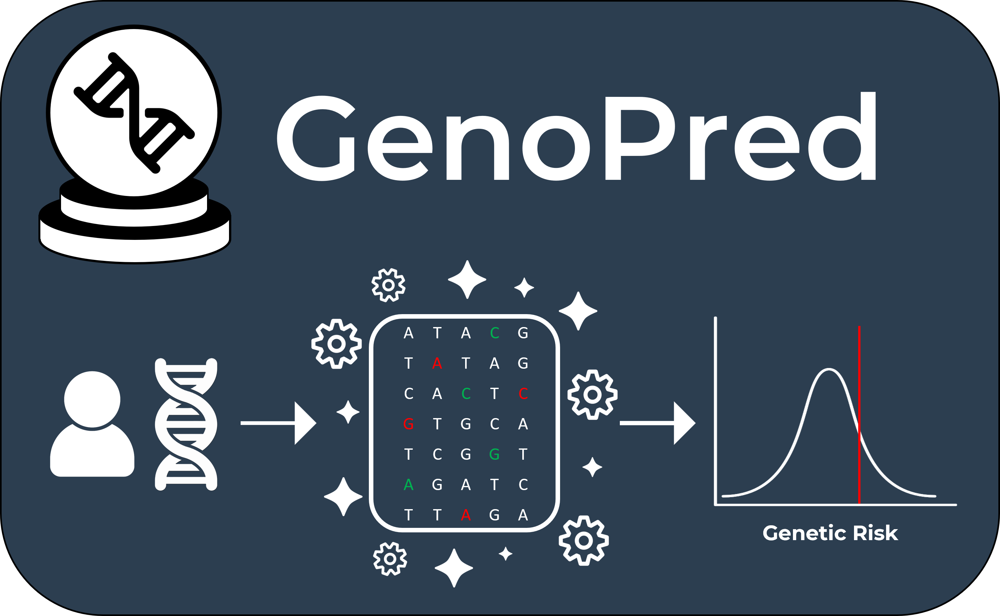

<!-- Google tag (gtag.js) -->

 

# What is GenoPred?

GenoPred is a research programme based at King’s College London that focuses on key issues relating to the clinical utility of polygenic scores, investigating polygenic scoring research questions, and developing tools that implement current best practises.

 

# The Pipeline

We have implemented the latest insights in polygenic scoring into our GenoPred pipeline - An easy-to-use and robust software pipeline, implementing leading methodology for polygenic scoring.

<a href="pipeline_overview.html" class="button">Learn More</a>

 

# The Research

GenoPred research themes include comparison of existing polygenic scoring methods, evaluation of novel polygenic scoring approaches, and provision of interpretable polygenic predictions.

<a href="research_index.html" class="button">Learn More</a>

 

