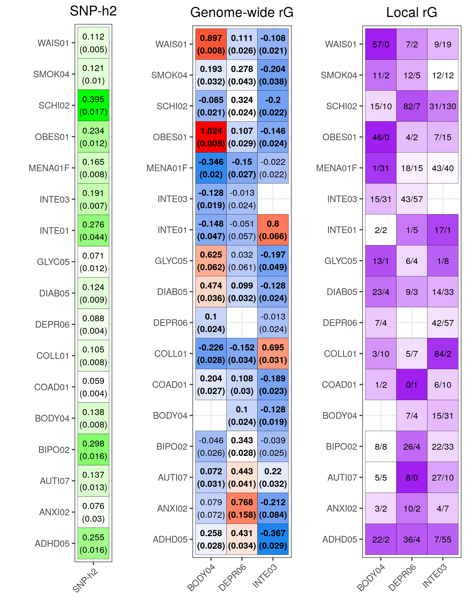
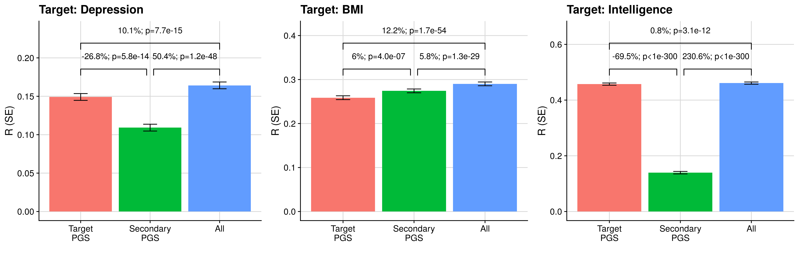
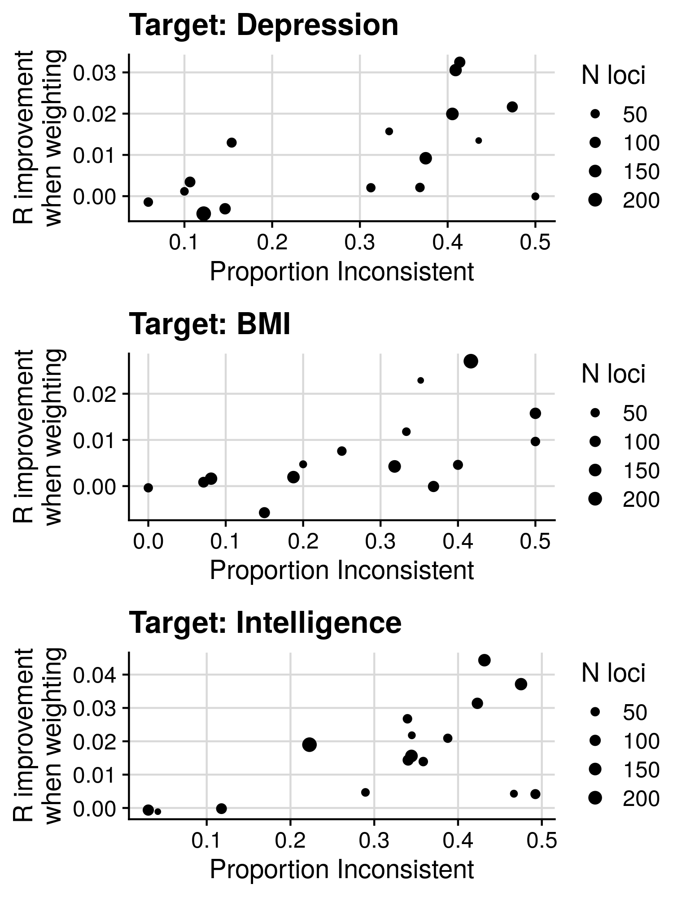
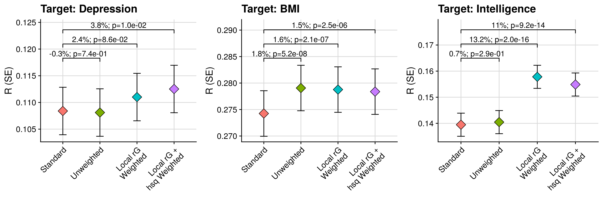
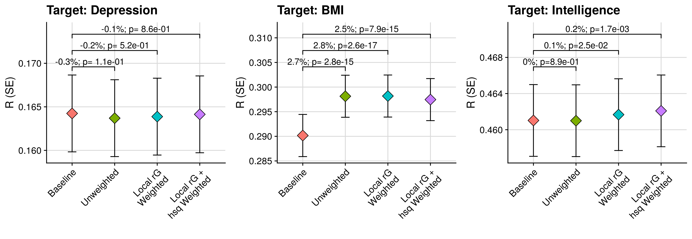

```{r setup, include=FALSE}
knitr::opts_chunk$set(echo = TRUE)
```

<style>
p.caption {
  font-size: 1.5em;
}
</style>

```{css, echo=F}
pre code, pre, code {
  white-space: pre !important;
  overflow-x: scroll !important;
  word-break: keep-all !important;
  word-wrap: initial !important;
}
```

***

## Estimate genome-wide and local genetic correlation

<details><summary>Show code</summary>

```{r, echo=T, eval=F}
gwas <- fread('~/oliverpainfel/Data/GWAS_sumstats/MVP/EUR/info.txt')$labels

pheno <- data.frame(
  phenotype = gwas,
  cases = NA,
  controls = NA,
  prevalence = NA,
  filename = paste0(
    '/users/k1806347/oliverpainfel/Analyses/mind_the_gap/GenoPred/output_sbayesrc_sparse/reference/gwas_sumstat/UKB_wgs_ldak_kvik_',
    gwas,
    '/UKB_wgs_ldak_kvik_',
    gwas,
    '-cleaned.gz'
  )
)

dir.create('/users/k1806347/oliverpainfel//Analyses/local_rg_pgs/lava/', recursive = T)
write.table(pheno, '/users/k1806347/oliverpainfel//Analyses/local_rg_pgs/lava/input.info.txt', col.names=T, row.names=F, quote=F)

```

```{bash, echo=T, eval=F}
##########
# Prepare sample overlap file
##########

conda activate ldsc

mkdir -p /users/k1806347/oliverpainfel/Analyses/local_rg_pgs/GWAS_sumstats

# Munge all sumstats
for gwas in $(echo HT HB PLT BMI BWT MCHC SBP NEU HDL TC); do
    sbatch --mem 10G -n 1 -p neurohack_cpu --wrap="/users/k1806347/oliverpainfel/Software/ldsc/munge_sumstats.py \
   --sumstats /users/k1806347/oliverpainfel/Analyses/mind_the_gap/GenoPred/output_sbayesrc_sparse/reference/gwas_sumstat/UKB_wgs_ldak_kvik_${gwas}/UKB_wgs_ldak_kvik_${gwas}-cleaned.gz \
   --merge-alleles /users/k1806347/oliverpainfel/Data/ldsc/w_hm3.snplist \
   --chunksize 500000 \
   --out /users/k1806347/oliverpainfel/Analyses/local_rg_pgs/GWAS_sumstats/UKB_wgs_ldak_kvik_${gwas}.cleaned"
done

# Run bivariate LDSC for all traits
mkdir /users/k1806347/oliverpainfel/Analyses/local_rg_pgs/lava/sample_overlap

for gwas1 in $(echo HT HB PLT BMI BWT MCHC SBP NEU HDL TC); do
  for gwas2 in $(echo HT HB PLT BMI BWT MCHC SBP NEU HDL TC); do
     sbatch --mem 10G -n 1 -p neurohack_cpu --wrap="/users/k1806347/oliverpainfel/Software/ldsc/ldsc.py \
       --rg /users/k1806347/oliverpainfel/Analyses/local_rg_pgs/GWAS_sumstats/UKB_wgs_ldak_kvik_${gwas1}.cleaned.sumstats.gz,/users/k1806347/oliverpainfel/Analyses/local_rg_pgs/GWAS_sumstats/UKB_wgs_ldak_kvik_${gwas2}.cleaned.sumstats.gz \
       --ref-ld-chr /users/k1806347/oliverpainfel/Data/ldsc/eur_w_ld_chr/ \
       --w-ld-chr /users/k1806347/oliverpainfel/Data/ldsc/eur_w_ld_chr/ \
       --out /users/k1806347/oliverpainfel/Analyses/local_rg_pgs/lava/sample_overlap/UKB_wgs_ldak_kvik_${gwas1}_${gwas2}_rg"
  done
done

# Collate results
cd /users/k1806347/oliverpainfel/Analyses/local_rg_pgs/lava/sample_overlap/
FILES=($(ls UKB_wgs_ldak_kvik_*_rg.log))
N=$(echo ${#FILES[@]})
for I in ${FILES[@]}; do
        PHEN=$(echo $I | sed 's/_rg\.log//')
        
        # subset log files to relevant output
        tail -n 5 $I | head -n 2 > $PHEN.rg
        
        # add to single data set
        if [[ $I == ${FILES[0]} ]]; then
        	cat $PHEN.rg > all.rg
        else
        	cat $PHEN.rg | sed '1d' >> all.rg
        fi
done

```

```{r, eval=F, echo=T}
scor = read.table("/users/k1806347/oliverpainfel/Analyses/local_rg_pgs/lava/sample_overlap/all.rg",header=T)              # read in
scor = scor[,c("p1","p2","gcov_int")]             # retain key headers
scor$p1 = gsub('/users/k1806347/oliverpainfel/Analyses/local_rg_pgs/GWAS_sumstats/UKB_wgs_ldak_kvik_','',gsub(".cleaned.sumstats.gz","",scor$p1))
scor$p2 = gsub('/users/k1806347/oliverpainfel/Analyses/local_rg_pgs/GWAS_sumstats/UKB_wgs_ldak_kvik_','',gsub(".cleaned.sumstats.gz","",scor$p2))
phen = unique(scor$p1)
n = length(phen)
mat = matrix(NA,n,n)                    # create matrix
rownames(mat) = colnames(mat) = phen    # set col/rownames
for (i in phen) {
        for (j in phen) {
                mat[i,j] = subset(scor, p1==i & p2==j)$gcov_int
        }
}
if (!all(t(mat)==mat)) { mat[lower.tri(mat)] = t(mat)[lower.tri(mat)] }  # sometimes there might be small differences in gcov_int depending on which phenotype was analysed as the outcome / predictor
mat = round(cov2cor(mat),5)                       # standardise
write.table(mat, "/users/k1806347/oliverpainfel/Analyses/local_rg_pgs/lava/sample_overlap/sample.overlap.txt", quote=F)   # save
```

```{bash, echo=T, eval=F}
#####
# Create R script to run LAVA across genome
#####

cat > /users/k1806347/oliverpainfel/Analyses/local_rg_pgs/lava/lava.R << 'EOF'
arg = commandArgs(T)
ref.prefix = arg[1]
loc.file = arg[2]
info.file = arg[3]
sample.overlap.file = arg[4]
phenos = unlist(strsplit(arg[5],","))
out.fname = arg[6]
n.cores = as.numeric(arg[7])

library(LAVA)
library(parallel)

# ---------- helpers ----------
fail <- function(msg, code = 1L) {
  message("FATAL: ", msg)
  quit(save = "no", status = code, runLast = FALSE)
}

# Ensure we don't leave partial outputs behind
cleanup_outputs <- function(prefix) {
  f <- c(paste0(prefix, ".univ.lava"),
         paste0(prefix, ".bivar.lava"),
         paste0(prefix, ".univ.lava.tmp"),
         paste0(prefix, ".bivar.lava.tmp"))
  suppressWarnings(file.remove(f[file.exists(f)]))
}

# ---------- read input ----------
loci = read.loci(loc.file)
n.loc = nrow(loci)
if (n.loc == 0) fail("No loci loaded from loc.file")

input = process.input(info.file, sample.overlap.file, ref.prefix, phenos)

message(sprintf("Starting LAVA analysis for %d loci using %d cores", n.loc, n.cores))

# ---------- run parallel with hard-fail on missing workers ----------
results <- NULL

# Turn the specific mclapply warning into a fatal error
results <- tryCatch(
  withCallingHandlers(
    mclapply(1:n.loc, function(i) {

      locus = process.locus(loci[i,], input)

      res_u <- NULL
      res_b <- NULL

      if (!is.null(locus)) {
        loc.info = data.frame(
          locus = locus$id, chr = locus$chr, start = locus$start, stop = locus$stop,
          n.snps = locus$n.snps, n.pcs = locus$K
        )

        loc.out = run.univ.bivar(locus, adap.thresh = NULL)
        res_u = cbind(loc.info, loc.out$univ)

        if (!is.null(loc.out$bivar)) {
          res_b = cbind(loc.info, loc.out$bivar)
        }
      }

      list(u = res_u, b = res_b)

    }, mc.cores = n.cores),
    warning = function(w) {
      # This is the warning you saw when workers die (including OOM)
      if (grepl("did not deliver results", conditionMessage(w), fixed = TRUE)) {
        invokeRestart("muffleWarning")
        stop("mclapply worker failure: ", conditionMessage(w))
      }
      # otherwise keep warnings (or muffle them if you want)
    }
  ),
  error = function(e) {
    cleanup_outputs(out.fname)
    fail(paste0("Parallel execution failed: ", conditionMessage(e)), code = 2L)
  }
)

# ---------- post-check: completeness ----------
if (is.null(results) || length(results) != n.loc) {
  cleanup_outputs(out.fname)
  fail(sprintf("Incomplete results: got %d/%d loci back", length(results), n.loc), code = 3L)
}

# If any element is NULL, something went wrong
if (any(vapply(results, is.null, logical(1)))) {
  cleanup_outputs(out.fname)
  fail("At least one locus returned NULL result object (worker likely died).", code = 4L)
}

# ---------- extract results ----------
u_list <- lapply(results, function(x) x$u)
b_list <- lapply(results, function(x) x$b)

# Filter out loci that were legitimately skipped / didn't reach bivar stage
u_list <- u_list[!vapply(u_list, is.null, logical(1))]
b_list <- b_list[!vapply(b_list, is.null, logical(1))]

if (length(u_list) == 0) {
  cleanup_outputs(out.fname)
  fail("No univariate results to write (all loci failed/returned NULL).", code = 5L)
}

# ---------- atomic write: temp then rename ----------
out_u_tmp <- paste0(out.fname, ".univ.lava.tmp")
out_b_tmp <- paste0(out.fname, ".bivar.lava.tmp")
out_u     <- paste0(out.fname, ".univ.lava")
out_b     <- paste0(out.fname, ".bivar.lava")

# Write temp files
write.table(do.call(rbind, u_list), out_u_tmp, row.names=FALSE, quote=FALSE, col.names=TRUE)
write.table(do.call(rbind, b_list), out_b_tmp, row.names=FALSE, quote=FALSE, col.names=TRUE)

# Rename into place (overwrite if exists)
if (file.exists(out_u)) file.remove(out_u)
if (file.exists(out_b)) file.remove(out_b)
file.rename(out_u_tmp, out_u)
file.rename(out_b_tmp, out_b)

message(paste0("Done! Analysis output written to ", out.fname, ".*.lava"))
EOF

########
# Run LAVA for each target GWAS
########

module add r

# Set number of cores for the job
CORES=20

# 1. Define your traits in an array
traits=(HT HB PLT BMI BWT MCHC SBP NEU HDL TC)
n_traits=${#traits[@]}

# Set up the results directory variable to keep the code clean
RESULTS_DIR="/users/k1806347/oliverpainfel/Analyses/local_rg_pgs/lava/results_ldak_kvik"
mkdir -p ${RESULTS_DIR}

# 2. Loop through the array using indices
for (( i=0; i<n_traits; i++ )); do
  for (( j=i+1; j<n_traits; j++ )); do
    
    # Assign the target and secondary GWAS based on the current indices
    target_gwas=${traits[i]}
    secondary_gwas=${traits[j]}
    
    # Define the expected final output file
    expected_output="${RESULTS_DIR}/${target_gwas}.${secondary_gwas}.test.bivar.lava"
    
    # 3. Check if the output file exists
    if [ ! -f "${expected_output}" ]; then
      echo "Missing or failed: ${target_gwas} vs ${secondary_gwas}. Submitting job..."
      
      sbatch --mem 50G -c ${CORES} -p neurohack_cpu,interruptible_cpu -t 1:00:00 --wrap "Rscript /users/k1806347/oliverpainfel/Analyses/local_rg_pgs/lava/lava.R \
        /users/k1806347/oliverpainfel/Data/1KG/Phase3/1KGPhase3.w_hm3.GW \
        /users/k1806347/oliverpainfel/Data/LAVA/blocks_s2500_m25_f1_w200.GRCh37_hg19.locfile \
        /users/k1806347/oliverpainfel/Analyses/local_rg_pgs/lava/input.info.txt \
        /users/k1806347/oliverpainfel/Analyses/local_rg_pgs/lava/sample_overlap/sample.overlap.txt \
        ${target_gwas},${secondary_gwas} \
        ${RESULTS_DIR}/${target_gwas}.${secondary_gwas}.test \
        ${CORES}"
    else
      # Optional: Print a message so you know it was skipped
      echo "Complete: ${target_gwas} vs ${secondary_gwas}. Skipping."
    fi

  done
done
```

</details>

***

## Characterise the genome-wide and local genetic correlation results

<details><summary>Show code</summary>

```{r, eval=F, echo=T}
library(data.table)

# Assuming info.txt contains your traits (HT, BMI, etc.)
target_gwas <- fread('~/oliverpainfel/Data/GWAS_sumstats/MVP/EUR/info.txt')$labels
secondary_gwas <- target_gwas

des <- data.frame()
all_res <- list()

for(target_gwas_i in target_gwas) {
  for(secondary_gwas_i in secondary_gwas[secondary_gwas != target_gwas_i]) {
    
    # 1. Dynamically check which file order exists from the Bash array output
    # Note: Added the '.test' suffix that was present in your bash sbatch call
    file_opt1 <- paste0('/users/k1806347/oliverpainfel/Analyses/local_rg_pgs/lava/results_ldak_kvik/', target_gwas_i, '.', secondary_gwas_i, '.test.bivar.lava')
    file_opt2 <- paste0('/users/k1806347/oliverpainfel/Analyses/local_rg_pgs/lava/results_ldak_kvik/', secondary_gwas_i, '.', target_gwas_i, '.test.bivar.lava')
    
    if(file.exists(file_opt1)) {
      prefix <- paste0('/users/k1806347/oliverpainfel/Analyses/local_rg_pgs/lava/results_ldak_kvik/', target_gwas_i, '.', secondary_gwas_i, '.test')
    } else if(file.exists(file_opt2)) {
      prefix <- paste0('/users/k1806347/oliverpainfel/Analyses/local_rg_pgs/lava/results_ldak_kvik/', secondary_gwas_i, '.', target_gwas_i, '.test')
    } else {
      cat("Missing LAVA results for:", target_gwas_i, "and", secondary_gwas_i, "\n")
      next # Skip to the next pair if the file failed to generate
    }
    
    # 2. Read the results
    univ_res <- fread(paste0(prefix, '.univ.lava'))
    bivar_res <- fread(paste0(prefix, '.bivar.lava'))
    
    # Clean up bivar_res
    bivar_res <- bivar_res[!is.na(rho)]
    bivar_res[, `:=`(
      se_rho   = (rho.upper - rho.lower) / (2 * 1.96),
      z_rho    = rho / ((rho.upper - rho.lower) / (2 * 1.96)),
      ci_width = (rho.upper - rho.lower),
      Direction = fifelse(rho < 0, "-", "+"),
      p.fdr = p.adjust(p, method = "fdr")
    )]
    
    # 3. Format Target Univariate Stats
    # Removed liability conversion since these are continuous traits
    univ_target <- univ_res[univ_res$phen == target_gwas_i, c('locus','chr','start','stop','h2.obs','p')]
    univ_target$z <- qnorm(univ_target$p, lower.tail = FALSE)
    univ_target$se_target <- univ_target$h2.obs / univ_target$z
    names(univ_target)[c(5,6,7)] <- c('h2.obs_target', 'p_target', 'z_target')
    
    # 4. Format Secondary Univariate Stats
    univ_sec <- univ_res[univ_res$phen == secondary_gwas_i, c('locus','h2.obs','p')]
    univ_sec$z <- qnorm(univ_sec$p, lower.tail = FALSE)
    univ_sec$se_sec <- univ_sec$h2.obs / univ_sec$z
    names(univ_sec)[c(2,3,4)] <- c('h2.obs_sec', 'p_sec', 'z_sec')
    
    # 5. Merge together for this specific Target/Secondary orientation
    univ_res_wide <- merge(univ_target, univ_sec, by='locus')
    
    # Drop phen1 and phen2 from bivar_res to avoid confusion (since they depend on file order)
    tmp <- merge(univ_res_wide, bivar_res, by=c('start','stop','locus','chr'))
    
    tmp[, cov_local := rho * sqrt(h2.obs_target * h2.obs_sec)]
    tmp[, abs_cov_local := abs(cov_local)]

    # Add explicit labels for the final concatenated table
    tmp$Target_Trait <- target_gwas_i
    tmp$Secondary_Trait <- secondary_gwas_i
    
    all_res[[paste0(target_gwas_i, "_", secondary_gwas_i)]] <- tmp
    
    # 6. Populate the description table
    des <- rbind(des, data.frame(
      target = target_gwas_i,
      secondary = secondary_gwas_i,
      n_loci = nrow(bivar_res),
      n_snps = sum(bivar_res$n.snps),
      n_sig_loci = nrow(bivar_res[bivar_res$p < 0.05, ]),
      n_sig_snps = sum(bivar_res[bivar_res$p < 0.05, ]$n.snps),
      n_sig_loci_pos = nrow(bivar_res[bivar_res$p < 0.05 & bivar_res$Direction == '+', ]),
      n_sig_loci_neg = nrow(bivar_res[bivar_res$p < 0.05 & bivar_res$Direction == '-', ]),
      n_sig_fdr_loci = nrow(bivar_res[bivar_res$p.fdr < 0.05, ]),
      n_sig_fdr_snps = sum(bivar_res[bivar_res$p.fdr < 0.05, ]$n.snps),
      n_sig_fdr_loci_pos = nrow(bivar_res[bivar_res$p.fdr < 0.05 & bivar_res$Direction == '+', ]),
      n_sig_fdr_loci_neg = nrow(bivar_res[bivar_res$p.fdr < 0.05 & bivar_res$Direction == '-', ])
    ))
  }
}

# Bind the list into one massive data.table
all_res_final <- rbindlist(all_res)

# Save outputs
write.table(des, '/users/k1806347/oliverpainfel/Analyses/local_rg_pgs/lava/results_ldak_kvik/lava_descript.csv', row.names = FALSE, quote=FALSE, sep=",")
write.table(all_res_final, '/users/k1806347/oliverpainfel/Analyses/local_rg_pgs/lava/results_ldak_kvik/all_res.csv', row.names = FALSE, quote=FALSE, sep=",")

# Ensure covariances exist
all_res_final[, cov_local := rho * sqrt(h2.obs_target * h2.obs_sec)]
all_res_final[, abs_cov_local := abs(cov_local)]

cov_des <- all_res_final[is.finite(cov_local), .(
  n_loci = .N,
  cov_sum = sum(cov_local),
  abs_cov_sum = sum(abs_cov_local),
  cancel = 1 - abs(sum(cov_local)) / sum(abs_cov_local),

  # concentration summaries
  top1pct_mass = {
    k <- max(1L, ceiling(0.01 * .N))
    sum(sort(abs_cov_local, decreasing = TRUE)[1:k]) / sum(abs_cov_local)
  },
  top5pct_mass = {
    k <- max(1L, ceiling(0.05 * .N))
    sum(sort(abs_cov_local, decreasing = TRUE)[1:k]) / sum(abs_cov_local)
  }
), by = .(Target_Trait, Secondary_Trait)]

fwrite(cov_des, "/users/k1806347/oliverpainfel/Analyses/local_rg_pgs/lava/results/lava_covmass_descript.csv")

library(ggplot2)
ggplot(cov_des, aes(x=log10(abs_cov_sum + 1e-12), y=cancel)) +
  geom_point(alpha=0.7) +
  theme_classic() +
  labs(x="log10(|cov| mass)", y="Cancellation (1 - |sum cov|/sum |cov|)")


plot_local_rg_landscape <- function(dt_pair, title=NULL) {
  # dt_pair should be filtered to one Target_Trait & one Secondary_Trait
  dt_pair <- copy(dt_pair)
  dt_pair[, mid := (start + stop) / 2]
  dt_pair[, chr := as.integer(chr)]
  dt_pair <- dt_pair[order(chr, mid)]

  # create genome position index (simple concatenation)
  dt_pair[, chr_offset := ave(mid, chr, FUN=function(x) 0)]
  chr_ends <- dt_pair[, .(chr_end = max(mid)), by=chr][order(chr)]
  chr_ends[, offset := c(0, cumsum(head(chr_end, -1)))]
  dt_pair <- merge(dt_pair, chr_ends[, .(chr, offset)], by="chr")
  dt_pair[, pos := mid + offset]

  ggplot(dt_pair, aes(x=pos, y=rho)) +
    geom_hline(yintercept=0, linetype=2) +
    geom_errorbar(aes(ymin=rho.lower, ymax=rho.upper), width=0) +
    geom_point(aes(alpha=pmin(1, abs(z_rho)/5))) +
    labs(x="Genomic position (concatenated)", y="Local genetic correlation (rho)",
         title=title) +
    theme_classic()
}

pair <- all_res_final[Target_Trait=="HDL" & Secondary_Trait=="TC"]
plot_local_rg_landscape(pair, "HDL vs TC: local rg across genome")

library(data.table)
library(ggplot2)

plot_local_rg_manhattan <- function(dt_pair, title=NULL,
                                   z_thr = 2,           # "precise" threshold
                                   show_ci_for_sig = TRUE,
                                   point_size_base = 0.6,
                                   point_size_sig  = 1.2) {

  dt <- copy(dt_pair)
  dt[, `:=`(
    chr = as.integer(chr),
    mid = (start + stop)/2
  )]
  dt <- dt[!is.na(chr) & !is.na(mid) & !is.na(rho)]
  setorder(dt, chr, mid)

  # Manhattan-like cumulative position
  chr_ends <- dt[, .(chr_end = max(mid)), by = chr][order(chr)]
  chr_ends[, offset := c(0, cumsum(head(chr_end, -1)))]
  dt <- merge(dt, chr_ends[, .(chr, offset)], by = "chr", all.x = TRUE)
  dt[, pos := mid + offset]

  # Chr label positions for axis
  chr_labs <- dt[, .(center = (min(pos) + max(pos))/2), by = chr][order(chr)]

  # Uncertainty/precision
  if (!("z_rho" %in% names(dt)) || anyNA(dt$z_rho)) {
    # compute from CI if not already present
    dt[, se_rho := (rho.upper - rho.lower) / (2 * 1.96)]
    dt[, z_rho := rho / se_rho]
  }

  # Categories for colour/size
  dt[, class := fifelse(abs(z_rho) >= z_thr & rho >= 0, "Positive (precise)",
                 fifelse(abs(z_rho) >= z_thr & rho <  0, "Negative (precise)",
                         "Imprecise"))]

  dt[, pt_size := fifelse(class == "Imprecise", point_size_base, point_size_sig)]

  p <- ggplot(dt, aes(x = pos, y = rho)) +
    geom_hline(yintercept = 0, linetype = 2) +

    # Chromosome boundaries
    geom_vline(data = chr_ends, aes(xintercept = offset), inherit.aes = FALSE,
               linewidth = 0.2, alpha = 0.5) +

    # Points: grey for imprecise, coloured for precise
    geom_point(aes(colour = class, size = pt_size,
                   alpha = pmin(1, abs(z_rho)/5)),
               show.legend = TRUE) +

    scale_colour_manual(values = c(
      "Negative (precise)" = "#2c7fb8",
      "Positive (precise)" = "#d95f0e",
      "Imprecise"          = "grey70"
    )) +
    scale_size_identity() +
    scale_x_continuous(breaks = chr_labs$center, labels = chr_labs$chr,
                       expand = c(0.01, 0.01)) +
    labs(x = "Chromosome", y = "Local genetic correlation (rho)",
         title = title, colour = NULL, alpha = "|z_rho| (scaled)") +
    theme_classic() +
    theme(
      axis.text.x = element_text(size = 9),
      legend.position = "right"
    )

  # Optional: show CIs only for precise loci to avoid overplotting
  if (show_ci_for_sig) {
    p <- p + geom_errorbar(
      data = dt[class != "Imprecise"],
      aes(ymin = rho.lower, ymax = rho.upper),
      width = 0, linewidth = 0.25, alpha = 0.6
    )
  }

  p
}

pair <- all_res_final[Target_Trait=="HDL" & Secondary_Trait=="TC"]
plot_local_rg_manhattan(pair, "HDL vs TC: local rg across genome", z_thr = 2)

plot_local_cov_manhattan <- function(dt_pair, title=NULL, z_thr=2) {
  dt <- copy(dt_pair)
  dt[, `:=`(chr = as.integer(chr), mid = (start + stop)/2)]
  dt <- dt[!is.na(chr) & !is.na(mid) & !is.na(rho)]
  setorder(dt, chr, mid)

  # cumpos
  chr_ends <- dt[, .(chr_end = max(mid)), by = chr][order(chr)]
  chr_ends[, offset := c(0, cumsum(head(chr_end, -1)))]
  dt <- merge(dt, chr_ends[, .(chr, offset)], by="chr", all.x=TRUE)
  dt[, pos := mid + offset]
  chr_labs <- dt[, .(center = (min(pos)+max(pos))/2), by=chr][order(chr)]

  # precision
  dt[, se_rho := (rho.upper - rho.lower)/(2*1.96)]
  dt[, z_rho := rho/se_rho]

  # covariance
  dt[, cov_local := rho * sqrt(h2.obs_target * h2.obs_sec)]

  dt[, class := fifelse(abs(z_rho) >= z_thr & cov_local >= 0, "Positive (precise)",
                 fifelse(abs(z_rho) >= z_thr & cov_local <  0, "Negative (precise)",
                         "Imprecise"))]

  ggplot(dt, aes(pos, cov_local)) +
    geom_hline(yintercept = 0, linetype=2) +
    geom_vline(data = chr_ends, aes(xintercept = offset), inherit.aes=FALSE,
               linewidth=0.2, alpha=0.5) +
    geom_point(aes(colour=class, alpha=pmin(1, abs(z_rho)/5)), size=0.8) +
    scale_colour_manual(values = c("Negative (precise)"="#2c7fb8",
                                   "Positive (precise)"="#d95f0e",
                                   "Imprecise"="grey70")) +
    scale_x_continuous(breaks = chr_labs$center, labels = chr_labs$chr,
                       expand = c(0.01, 0.01)) +
    labs(x="Chromosome", y="Local genetic covariance",
         title=title, colour=NULL, alpha="|z_rho| (scaled)") +
    theme_classic()
}

plot_local_cov_manhattan(pair, "HDL vs TC: local covariance across genome", z_thr=2)

# B. Precision vs estimate (is the sign heterogeneity real or noise?)
ggplot(pair, aes(x=z_rho, y=rho)) +
  geom_hline(yintercept=0, linetype=2) +
  geom_point(alpha=0.5) +
  labs(x="z(rho) = rho / se_rho", y="rho") +
  theme_classic()

# C. “Covariance mass” plot (what drives global sharing)
plot_cov_mass <- function(dt_pair) {
  x <- copy(dt_pair)
  x <- x[is.finite(cov_local)]
  x <- x[order(-abs_cov_local)]
  x[, cum_share := cumsum(abs_cov_local) / sum(abs_cov_local)]
  x[, rank := .I]
  ggplot(x, aes(rank, cum_share)) +
    geom_line() +
    labs(x="Loci ranked by |local covariance|", y="Cumulative share of |cov|") +
    theme_classic()
}
plot_cov_mass(pair)

# 4) Link LAVA results to “expected PGS gain” (without fitting anything yet)
pair[, lambda := rho * sqrt(h2.obs_target / h2.obs_sec)]
pair[, se_lambda := se_rho * sqrt(h2.obs_target / h2.obs_sec)]
pair[, kappa := 1 / (1 + (se_lambda^2 / var(lambda, na.rm=TRUE)))]  # simple shrinkage
pair[, gain_proxy := kappa * (lambda^2) * h2.obs_sec]

x <- pair[is.finite(gain_proxy)]
x <- x[order(-gain_proxy)]
x[, cum_gain := cumsum(gain_proxy) / sum(gain_proxy)]
x[, rank := .I]
ggplot(x, aes(rank, cum_gain)) + geom_line() + theme_classic() +
  labs(x="Loci ranked by gain proxy", y="Cumulative share of gain proxy")

# 5) Make a trait-by-trait “local rg heterogeneity” summary heatmap
summ <- all_res_final[, .(
  med_abs_rho = median(abs(rho), na.rm=TRUE),
  frac_precise = mean(abs(z_rho) >= 2, na.rm=TRUE),
  frac_neg_precise = mean(rho < 0 & abs(z_rho) >= 2, na.rm=TRUE),
  cov_mass = sum(cov_local, na.rm=TRUE),
  abs_cov_mass = sum(abs_cov_local, na.rm=TRUE)
), by=.(Target_Trait, Secondary_Trait)]

library(data.table)
library(ggplot2)

melted <- melt(
  summ,
  id.vars = c("Target_Trait", "Secondary_Trait"),
  measure.vars = c("med_abs_rho", "frac_precise", "frac_neg_precise", "abs_cov_mass"),
  variable.name = "metric",
  value.name = "value"
)

# log transform for abs_cov_mass only
melted[metric == "abs_cov_mass", value := log10(value + 1e-12)]
melted[metric == "abs_cov_mass", metric := "log10(abs_cov_mass)"]

ggplot(melted, aes(Secondary_Trait, Target_Trait, fill = value)) +
  geom_tile() +
  facet_wrap(~ metric, scales = "free") +
  theme_classic() +
  theme(axis.text.x = element_text(angle = 90, vjust = 0.5, hjust = 1)) +
  labs(x = "Secondary trait", y = "Target trait", fill = "")
```

</details>

***

## Reweight polygenic scores

<details><summary>Show code</summary>

```{r}
setwd('/users/k1806347/oliverpainfel/Software/MyGit/GenoPred/pipeline/')
library(data.table)
source('../functions/misc.R')
source_all('../functions')

# ============================================================
# PATHS
# ============================================================
ref_bim <- read_pvar('/users/k1806347/oliverpainfel/Software/MyGit/GenoPred/pipeline/resources/data/ref/ref.chr')
setnames(ref_bim, c('CHR','BP','SNP','A2_ref','A1_ref'))

ref_bim[, `:=`(CHR = as.integer(CHR), BP = as.integer(BP))]

lava_dir  <- '/users/k1806347/oliverpainfel/Analyses/local_rg_pgs/lava/results_ldak_kvik/'
score_dir <- '/users/k1806347/oliverpainfel/Analyses/mind_the_gap/GenoPred/output_sbayesrc_sparse/reference/pgs_score_files/sbayesrc/UKB_wgs_ldak_kvik_'
ss_dir    <- '/users/k1806347/oliverpainfel/Analyses/mind_the_gap/GenoPred/output_sbayesrc_sparse/reference/gwas_sumstat/UKB_wgs_ldak_kvik_'
out_root  <- '/users/k1806347/oliverpainfel/Analyses/local_rg_pgs/score_files/sbayesrc_localblend_v3_ldak_kvik/'

traits <- fread('~/oliverpainfel/Data/GWAS_sumstats/MVP/EUR/info.txt')$labels

# LAVA locus file (must include CHR, START, STOP, LOC)
loci <- fread('/users/k1806347/oliverpainfel/Data/LAVA/blocks_s2500_m25_f1_w200.GRCh37_hg19.locfile')
loci <- loci[, .(CHR = as.integer(CHR),
                 START = as.integer(START),
                 STOP  = as.integer(STOP),
                 LOCUS = as.character(LOC))]
setkey(loci, CHR, START, STOP)

# ============================================================
# HELPERS
# ============================================================

read_score <- function(path_gz) {
  dt <- fread(cmd = sprintf("zcat %s | awk '{print $1,$2,$3,$4}'", shQuote(path_gz)),
              col.names = c("SNP","A1","A2","BETA"),
              showProgress = FALSE)

  # Force numeric (coerces non-numeric to NA)
  dt[, BETA := as.numeric(BETA)]

  # Drop any rows that didn't parse
  dt <- dt[!is.na(BETA)]

  dt
}

get_lava_prefix <- function(tr1, tr2, lava_dir) {
  opt1 <- file.path(lava_dir, paste0(tr1, ".", tr2, ".test"))
  opt2 <- file.path(lava_dir, paste0(tr2, ".", tr1, ".test"))
  if (file.exists(paste0(opt1, ".univ.lava")) && file.exists(paste0(opt1, ".bivar.lava"))) return(opt1)
  if (file.exists(paste0(opt2, ".univ.lava")) && file.exists(paste0(opt2, ".bivar.lava"))) return(opt2)
  NA_character_
}

# Cache sumstats so you don't re-read constantly
.ss_cache <- new.env(parent = emptyenv())

read_sumstats_min <- function(gwas) {
  if (exists(gwas, envir = .ss_cache, inherits = FALSE)) {
    return(get(gwas, envir = .ss_cache, inherits = FALSE))
  }
  path <- paste0(ss_dir, gwas,'/UKB_wgs_ldak_kvik_', gwas, "-cleaned.gz")
  if (!file.exists(path)) stop("Missing sumstats: ", path)

  # Read only what's needed for locus SE summaries
  ss <- fread(cmd = paste("zcat", shQuote(path)),
              select = c("SNP","CHR","BP","SE"))
  ss[, `:=`(CHR = as.integer(CHR), BP = as.integer(BP))]
  ss <- ss[!is.na(SE) & is.finite(SE) & SE > 0]
  set(ss, j = "SE2", value = ss$SE^2)
  ss[, SE := NULL]

  # Map SNPs to loci via foverlaps
  ss_iv <- ss[, .(CHR, START = BP, STOP = BP, SNP, SE2)]
  setkey(ss_iv, CHR, START, STOP)

  mapped <- foverlaps(ss_iv, loci, by.x = c("CHR","START","STOP"),
                      by.y = c("CHR","START","STOP"),
                      type = "within", nomatch = 0L)

  # Locus summary of SE^2 (median is robust)
  u <- mapped[, .(u_se2 = median(SE2, na.rm = TRUE),
                  n_snps = .N),
              by = .(LOCUS)]

  setkey(u, LOCUS)
  assign(gwas, u, envir = .ss_cache)
  u
}

build_lambda_for_pair <- function(target, aux, lava_dir, h2_floor=0, z_rho_min=2) {
  prefix <- get_lava_prefix(target, aux, lava_dir)
  if (is.na(prefix)) return(NULL)

  univ_res  <- fread(paste0(prefix, ".univ.lava"))
  bivar_res <- fread(paste0(prefix, ".bivar.lava"))

  uT <- univ_res[phen == target, .(locus, h2_T = h2.obs)]
  uA <- univ_res[phen == aux,    .(locus, h2_A = h2.obs)]

  w <- merge(bivar_res[, .(locus, rho, rho.lower, rho.upper)], uT, by="locus", all.x=TRUE)
  w <- merge(w, uA, by="locus", all.x=TRUE)

  w[, se_rho := (rho.upper - rho.lower) / (2 * 1.96)]
  w[, z_rho := rho / se_rho]

  w[, `:=`(lambda = NA_real_, se_lambda = NA_real_)]

  w[, pass := is.finite(h2_T) & is.finite(h2_A) &
            (h2_T > h2_floor) & (h2_A > h2_floor) &
            is.finite(rho) & is.finite(se_rho) &
            (abs(z_rho) >= z_rho_min)]

  w[pass == TRUE, lambda := rho * sqrt(h2_T / h2_A)]
  w[pass == TRUE, se_lambda := se_rho * sqrt(h2_T / h2_A)]

  # kappa: compute Var_prior across loci for this pair (aux->target)
  pool <- w[is.finite(lambda) & is.finite(se_lambda) & se_lambda > 0, lambda]
  var_prior <- var(pool, na.rm = TRUE)

  w[, kappa := 0.0]
  if (is.finite(var_prior) && var_prior > 0) {
    w[is.finite(se_lambda) & se_lambda > 0,
      kappa := var_prior / (var_prior + se_lambda^2)]
  }

  w[, .(LOCUS = as.character(locus), aux = aux, lambda, kappa)]
}

# Build weights across all auxiliaries per locus
build_multiaux_locus_weights <- function(target, aux_list, z_rho_min=2, h2_floor=0) {

  # target locus SE^2 summary
  uT <- read_sumstats_min(target)[, .(LOCUS, uT_se2 = u_se2)]
  setkey(uT, LOCUS)

  # For each aux: get lambda/se_lambda and uA_se2
  pair_list <- vector("list", length(aux_list))
  for (i in seq_along(aux_list)) {
    aux <- aux_list[i]
    tmp <- build_lambda_for_pair(target, aux, lava_dir, h2_floor=h2_floor, z_rho_min=z_rho_min)
    if (is.null(tmp)) next

    uA <- read_sumstats_min(aux)[, .(LOCUS, uA_se2 = u_se2)]
    tmp <- merge(tmp, uA, by="LOCUS", all.x=TRUE)
    pair_list[[i]] <- tmp
  }
  pairs <- rbindlist(pair_list, use.names=TRUE, fill=TRUE)
  if (nrow(pairs) == 0) stop("No LAVA pairs found for target=", target)

  # Compute Var_prior per aux (across loci) for kappa; then s_{l,k}
  pairs[, kappa := 0.0]
  for (aux_i in unique(pairs$aux)) {
    pool <- pairs[aux == aux_i & is.finite(lambda) & is.finite(se_lambda) & se_lambda > 0, lambda]
    var_prior <- var(pool, na.rm=TRUE)
    if (!is.finite(var_prior) || var_prior <= 0) next
    pairs[aux == aux_i & is.finite(se_lambda) & se_lambda > 0,
          kappa := var_prior / (var_prior + se_lambda^2)]
  }

  # Remove unusable rows
  pairs <- pairs[is.finite(lambda) & is.finite(uA_se2) & uA_se2 > 0 & kappa > 0]
  if (nrow(pairs) == 0) stop("After filtering, no usable (locus, aux) rows for target=", target)

  # Score for each aux within each locus (bigger = better)
  eps <- 1e-12
  pairs[, score := kappa / (lambda^2 * uA_se2 + eps)]

  # Normalise within locus
  pairs[, w_aux := score / sum(score), by=.(LOCUS)]

  # Compute projected aux noise per locus: sum w^2 * lambda^2 * uA
  aux_noise <- pairs[, .(
    uAux_se2 = sum((w_aux^2) * (lambda^2) * uA_se2),
    mean_kappa = mean(kappa),
    n_aux_used = .N
  ), by=.(LOCUS)]
  setkey(aux_noise, LOCUS)

  # Overall alpha per locus: competitive noise + reliability factor
  locus_w <- merge(uT, aux_noise, by="LOCUS", all.x=TRUE)
  locus_w[is.na(uAux_se2) | uAux_se2 <= 0, uAux_se2 := Inf]  # no usable aux -> alpha=0
  locus_w[, alpha := uT_se2 / (uT_se2 + uAux_se2)]
  locus_w[, alpha := pmax(0, pmin(alpha, 1.0))]

  # Reliability dampening (optional; helps avoid alpha~1 when only weak kappas)
  locus_w[, alpha := alpha * pmax(0, pmin(mean_kappa, 1.0))]
  locus_w[!is.finite(alpha), alpha := 0.0]

  list(pairs = pairs, locus_w = locus_w)
}

# write aux-only scores for one (target, aux) pair
write_aux_only_scores_for_pair <- function(target, aux,
                                           z_rho_min = 2, h2_floor = 0,
                                           out_subdir = "aux_only") {

  cat("Writing aux-only scores:", aux, "->", target, "\n")

  # Get locus-level lambda/kappa for this pair
  lk <- build_lambda_for_pair(target, aux, lava_dir, h2_floor = h2_floor, z_rho_min = z_rho_min)
  if (is.null(lk) || nrow(lk) == 0) {
    message("  No LAVA results for pair; skipping.")
    return(invisible(NULL))
  }
  setkey(lk, LOCUS)

  # Read aux score file (preserve original order)
  aux_score_file <- paste0(score_dir, aux, "/ref-UKB_wgs_ldak_kvik_", aux, ".score.gz")
  if (!file.exists(aux_score_file)) {
    message("  Missing aux score file; skipping: ", aux_score_file)
    return(invisible(NULL))
  }

  sA <- read_score(aux_score_file)
  setnames(sA, c("SNP","A1","A2","BETA_A"))
  sA[, orig_order := .I]

  # Map SNP -> locus (using ref_bim coordinates)
  dt <- merge(sA, ref_bim[, .(SNP, CHR, BP)], by="SNP", all=FALSE, sort=FALSE)
  snps_iv <- dt[, .(CHR = as.integer(CHR), START = as.integer(BP), STOP = as.integer(BP),
                    SNP, orig_order, A1, A2, BETA_A)]
  setkey(snps_iv, CHR, START, STOP)

  mapped <- foverlaps(snps_iv, loci, by.x=c("CHR","START","STOP"),
                      by.y=c("CHR","START","STOP"), type="within", nomatch=0L)
  mapped <- mapped[, .(SNP, orig_order, A1, A2, BETA_A, LOCUS)]
  setkey(mapped, LOCUS)

  # Join lambda/kappa onto SNPs
  mapped <- merge(mapped, lk[, .(LOCUS, lambda, kappa)], by="LOCUS", all.x=TRUE, sort=FALSE)
  mapped[!is.finite(lambda), lambda := 0.0]
  mapped[!is.finite(kappa),  kappa  := 0.0]

  # Compute aux-only betas
  mapped[, BETA_only := lambda * BETA_A]
  mapped[, BETA_kappa := (kappa * lambda) * BETA_A]

  # Restore original aux SNP order
  setorder(mapped, orig_order)

  # Output paths
  out_dir <- file.path(out_root, out_subdir, paste0("target_", target))
  dir.create(out_dir, recursive=TRUE, showWarnings=FALSE)

  out1 <- file.path(out_dir, paste0("ref-", aux, "_to_", target, ".A_to_T_only.z", z_rho_min, ".score"))
  out2 <- file.path(out_dir, paste0("ref-", aux, "_to_", target, ".A_to_T_only_kappa.z", z_rho_min, ".score"))

  fwrite(mapped[, .(SNP, A1, A2, BETA = BETA_only)],
         out1, sep="\t", quote=FALSE, col.names=TRUE)
  fwrite(mapped[, .(SNP, A1, A2, BETA = BETA_kappa)],
         out2, sep="\t", quote=FALSE, col.names=TRUE)

  system(paste0("gzip -f ", shQuote(out1)))
  system(paste0("gzip -f ", shQuote(out2)))

  invisible(list(
    a_to_t_only = paste0(out1, ".gz"),
    a_to_t_only_kappa = paste0(out2, ".gz")
  ))
}

write_aux_only_scores_for_target <- function(target, traits_all,
                                             z_rho_min = 2, h2_floor = 0) {
  aux_list <- setdiff(traits_all, target)
  for (aux in aux_list) {
    try(write_aux_only_scores_for_pair(target, aux,
                                       z_rho_min = z_rho_min,
                                       h2_floor = h2_floor),
        silent = TRUE)
  }
}

# Output aux-only scores for each target trait
for (target in traits) {
  print(target)
  write_aux_only_scores_for_target(target = target, traits_all = traits)
}

# ============================================================
# MAIN: build blended score for one (target, aux) pair
# ============================================================

build_local_blend_score_multitrait <- function(target, traits_all,
                                              z_rho_min=2, h2_floor=0,
                                              alpha_cap=1.0) {
  aux_list <- setdiff(traits_all, target)
  cat("Building multitrait local blend for:", target, "using", length(aux_list), "aux traits\n")

  # 1) Build locus weights + per-(locus,aux) weights
  w <- build_multiaux_locus_weights(target, aux_list, z_rho_min=z_rho_min, h2_floor=h2_floor)
  pairs   <- w$pairs      # LOCUS, aux, lambda, w_aux
  locus_w <- w$locus_w    # LOCUS, alpha
  locus_w[, alpha := pmin(alpha, alpha_cap)]
  setkey(pairs, LOCUS)
  setkey(locus_w, LOCUS)

  # 2) Read target SBayesRC betas
  target_score_file <- paste0(score_dir, target, "/ref-UKB_wgs_ldak_kvik_", target, ".score.gz")
  sT <- read_score(target_score_file)
  setnames(sT, c("SNP","A1_T","A2_T","BETA_T"))
  sT[, orig_order := .I]

  # Start with target SNP universe in original order
  joint <- merge(sT, ref_bim[, .(SNP, CHR, BP)], by="SNP", all=FALSE, sort=FALSE)
  
  # Map SNP -> locus (keep orig_order)
  snps_iv <- joint[, .(CHR=as.integer(CHR), START=as.integer(BP), STOP=as.integer(BP),
                       SNP, orig_order, A1_T, A2_T, BETA_T)]
  setkey(snps_iv, CHR, START, STOP)
  
  mapped <- foverlaps(snps_iv, loci, by.x=c("CHR","START","STOP"),
                      by.y=c("CHR","START","STOP"), type="within", nomatch=0L)
  
  mapped <- mapped[, .(SNP, orig_order, LOCUS, A1_T, A2_T, BETA_T)]
  setkey(mapped, SNP)

  # Add alpha
  mapped <- merge(mapped, locus_w[, .(LOCUS, alpha)], by="LOCUS", all.x=TRUE, sort = F)
  mapped[!is.finite(alpha), alpha := 0.0]

  # Initialise aux aggregate
  mapped[, BETA_AUX_AGG := 0.0]

  # Loop aux traits and add contributions
  for (aux_i in aux_list) {
    aux_score_file <- paste0(score_dir, aux_i, "/ref-UKB_wgs_ldak_kvik_", aux_i, ".score.gz")
    if (!file.exists(aux_score_file)) next

    sA <- read_score(aux_score_file)
    setnames(sA, c("SNP","A1_A","A2_A","BETA_A"))

    # Merge aux betas onto mapped SNPs
    tmp <- merge(mapped[, .(SNP, LOCUS, A1_T, A2_T)], sA, by="SNP", all.x=FALSE, sort = F)
    if (nrow(tmp) == 0) next

    # allele align
    tmp[A1_T != A1_A, BETA_A := -BETA_A]

    # Get locus-specific (w_aux, lambda) for this aux
    lk <- pairs[aux == aux_i, .(LOCUS, w_aux, lambda)]
    if (nrow(lk) == 0) next

    tmp <- merge(tmp, lk, by="LOCUS", all.x=TRUE, sort = F)
    tmp <- tmp[is.finite(w_aux) & is.finite(lambda)]
    if (nrow(tmp) == 0) next

    # Contribution = w_aux * lambda * beta_aux
    tmp[, contrib := w_aux * lambda * BETA_A]

    # Accumulate back into mapped
    mapped[tmp, on="SNP", BETA_AUX_AGG := BETA_AUX_AGG + i.contrib]
  }

  # 4) Final blend
  mapped[, BETA_META := (1 - alpha) * BETA_T + alpha * BETA_AUX_AGG]

  # Diagnostics
  diag <- mapped[, .(
    n_snps = .N,
    frac_alpha_pos = mean(alpha > 0),
    alpha_median = median(alpha),
    alpha_p90 = quantile(alpha, 0.9),
    aux_nonzero = mean(BETA_AUX_AGG != 0)
  )]
  print(diag)

  # 5) Write
  out_dir <- file.path(out_root, "multitrait")
  dir.create(out_dir, recursive=TRUE, showWarnings=FALSE)
  out_txt <- file.path(out_dir, paste0("ref-", target, "_localblend_multitrait.alpha_cap_", alpha_cap, ".z_rho_min_", z_rho_min, ".score"))
  setorder(mapped, orig_order)
  fwrite(mapped[, .(SNP, A1=A1_T, A2=A2_T, BETA=BETA_META)],
         out_txt, sep="\t", quote=FALSE, col.names=T)
  system(paste0("gzip -f ", shQuote(out_txt)))

  invisible(list(score_path = paste0(out_txt, ".gz"), diagnostics = diag))
}

# ============================================================
# RUN
# ============================================================

for (target in traits) {
  print(target)
  build_local_blend_score_multitrait(target = target, traits_all = traits)
}

for (target in 'HT') {
  print(target)
  build_local_blend_score_multitrait(target, traits, z_rho_min=3, h2_floor=0, alpha_cap=0.05)
}

for (target in 'HT') {
  print(target)
  build_local_blend_score_multitrait(target, traits, z_rho_min=3, h2_floor=0, alpha_cap=0.1)
}

for (target in 'HT') {
  print(target)
  build_local_blend_score_multitrait(target, traits, z_rho_min=3, h2_floor=0, alpha_cap=0.20)
}

```

***

# Combine score files

## AUX-only

### No kappa shrinkage

```{bash}
traits=(HT HB PLT BMI BWT MCHC SBP NEU HDL TC)

base="/users/k1806347/oliverpainfel/Analyses/local_rg_pgs/score_files/sbayesrc_localblend_v3_ldak_kvik/aux_only"
out="/users/k1806347/oliverpainfel/Analyses/local_rg_pgs/score_files/sbayesrc_localblend_v3_ldak_kvik/aux_only/score_file_all_aux_only.txt"

variant="A_to_T_only"        # or A_to_T_only_kappa
z="2"                        # matches filename: .z2.
batch=5                    # columns per paste call

tmpdir="$(mktemp -d)"
cleanup() { rm -rf "$tmpdir"; }
trap cleanup EXIT

# -------------------------
# 1) Pick reference file (for SNP/A1/A2 order)
# -------------------------
ref_file=""
for target in "${traits[@]}"; do
  for aux in "${traits[@]}"; do
    [[ "$aux" == "$target" ]] && continue
    f="${base}/target_${target}/ref-${aux}_to_${target}.${variant}.z${z}.score.gz"
    if [[ -s "$f" ]]; then
      ref_file="$f"
      break 2
    fi
  done
done

if [[ -z "$ref_file" ]]; then
  echo "Error: No aux-only score file found under: $base"
  exit 1
fi

echo "Using reference: $ref_file"

# Reference columns (NO header)
gzip -dc "$ref_file" | awk 'BEGIN{FS="[ \t]+"; OFS=" "} NR>1 {print $1,$2,$3}' > "${tmpdir}/ref_cols.txt"
ref_n=$(wc -l < "${tmpdir}/ref_cols.txt")

# -------------------------
# 2) Build 1-column files (WITH header) for each aux-only score
# -------------------------
col_files=()
headers=()

for target in "${traits[@]}"; do
  for aux in "${traits[@]}"; do
    [[ "$aux" == "$target" ]] && continue

    f="${base}/target_${target}/ref-${aux}_to_${target}.${variant}.z${z}.score.gz"
    [[ -s "$f" ]] || continue

    colname="${target}_from_${aux}"
    outcol="${tmpdir}/${colname}.col"

    echo "Processing $f -> $colname"

    # Write column file with header + values (BETA is col4)
    gzip -dc "$f" | awk -v name="$colname" '
      BEGIN{FS="[ \t]+"; OFS=" "}
      NR==1 { print name; next }
      { print $4 }
    ' > "$outcol"

    # Check row count: should be ref_n + 1 (header)
    n=$(($(wc -l < "$outcol") - 1))
    if [[ "$n" -ne "$ref_n" ]]; then
      echo "ERROR: Row mismatch for $f (got $n, expected $ref_n)."
      exit 1
    fi

    col_files+=("$outcol")
    headers+=("$colname")
  done
done

if [[ ${#col_files[@]} -eq 0 ]]; then
  echo "No aux-only columns found to combine."
  exit 1
fi

# -------------------------
# 3) Iteratively paste body in chunks (NO headers)
# -------------------------
work="${tmpdir}/work_body.txt"
cp "${tmpdir}/ref_cols.txt" "$work"   # body only (no header)

i=0
while (( i < ${#col_files[@]} )); do
  chunk=( "${col_files[@]:i:batch}" )

  # Create temporary no-header versions for this chunk
  nohead=()
  for cf in "${chunk[@]}"; do
    nf="${cf}.nohead"
    tail -n +2 "$cf" > "$nf"
    nohead+=( "$nf" )
  done

  paste -d' ' "$work" "${nohead[@]}" > "${work}.next"
  mv "${work}.next" "$work"

  i=$(( i + batch ))
done

# -------------------------
# 4) Write final output with header
# -------------------------
{
  printf "SNP A1 A2"
  for h in "${headers[@]}"; do
    printf " %s" "$h"
  done
  printf "\n"
  cat "$work"
} > "$out"

echo "Wrote: $out"

# Compress and upload to project
gzip -f $out
dx upload $out.gz --path mt_blend/score_files/

```

***

### With kappa shrinkage

```{bash}
traits=(HT HB PLT BMI BWT MCHC SBP NEU HDL TC)

base="/users/k1806347/oliverpainfel/Analyses/local_rg_pgs/score_files/sbayesrc_localblend_v3_ldak_kvik/aux_only"
out="/users/k1806347/oliverpainfel/Analyses/local_rg_pgs/score_files/sbayesrc_localblend_v3_ldak_kvik/aux_only/score_file_all_aux_only_kappa.txt"

variant="A_to_T_only_kappa"        # or A_to_T_only_kappa
z="2"                        # matches filename: .z2.
batch=5                    # columns per paste call

tmpdir="$(mktemp -d)"
cleanup() { rm -rf "$tmpdir"; }
trap cleanup EXIT

# -------------------------
# 1) Pick reference file (for SNP/A1/A2 order)
# -------------------------
ref_file=""
for target in "${traits[@]}"; do
  for aux in "${traits[@]}"; do
    [[ "$aux" == "$target" ]] && continue
    f="${base}/target_${target}/ref-${aux}_to_${target}.${variant}.z${z}.score.gz"
    if [[ -s "$f" ]]; then
      ref_file="$f"
      break 2
    fi
  done
done

if [[ -z "$ref_file" ]]; then
  echo "Error: No aux-only score file found under: $base"
  exit 1
fi

echo "Using reference: $ref_file"

# Reference columns (NO header)
gzip -dc "$ref_file" | awk 'BEGIN{FS="[ \t]+"; OFS=" "} NR>1 {print $1,$2,$3}' > "${tmpdir}/ref_cols.txt"
ref_n=$(wc -l < "${tmpdir}/ref_cols.txt")

# -------------------------
# 2) Build 1-column files (WITH header) for each aux-only score
# -------------------------
col_files=()
headers=()

for target in "${traits[@]}"; do
  for aux in "${traits[@]}"; do
    [[ "$aux" == "$target" ]] && continue

    f="${base}/target_${target}/ref-${aux}_to_${target}.${variant}.z${z}.score.gz"
    [[ -s "$f" ]] || continue

    colname="${target}_from_${aux}"
    outcol="${tmpdir}/${colname}.col"

    echo "Processing $f -> $colname"

    # Write column file with header + values (BETA is col4)
    gzip -dc "$f" | awk -v name="$colname" '
      BEGIN{FS="[ \t]+"; OFS=" "}
      NR==1 { print name; next }
      { print $4 }
    ' > "$outcol"

    # Check row count: should be ref_n + 1 (header)
    n=$(($(wc -l < "$outcol") - 1))
    if [[ "$n" -ne "$ref_n" ]]; then
      echo "ERROR: Row mismatch for $f (got $n, expected $ref_n)."
      exit 1
    fi

    col_files+=("$outcol")
    headers+=("$colname")
  done
done

if [[ ${#col_files[@]} -eq 0 ]]; then
  echo "No aux-only columns found to combine."
  exit 1
fi

# -------------------------
# 3) Iteratively paste body in chunks (NO headers)
# -------------------------
work="${tmpdir}/work_body.txt"
cp "${tmpdir}/ref_cols.txt" "$work"   # body only (no header)

i=0
while (( i < ${#col_files[@]} )); do
  chunk=( "${col_files[@]:i:batch}" )

  # Create temporary no-header versions for this chunk
  nohead=()
  for cf in "${chunk[@]}"; do
    nf="${cf}.nohead"
    tail -n +2 "$cf" > "$nf"
    nohead+=( "$nf" )
  done

  paste -d' ' "$work" "${nohead[@]}" > "${work}.next"
  mv "${work}.next" "$work"

  i=$(( i + batch ))
done

# -------------------------
# 4) Write final output with header
# -------------------------
{
  printf "SNP A1 A2"
  for h in "${headers[@]}"; do
    printf " %s" "$h"
  done
  printf "\n"
  cat "$work"
} > "$out"

echo "Wrote: $out"

# Compress and upload to project
gzip -f $out
dx upload $out.gz --path mt_blend/score_files/

```

***

## Blended

```{bash}
# --- CONFIG ---
traits=(HT HB PLT BMI BWT MCHC SBP NEU HDL TC)

base="/users/k1806347/oliverpainfel/Analyses/local_rg_pgs/score_files/sbayesrc_localblend_v3_ldak_kvik/multitrait"
out="/users/k1806347/oliverpainfel/Analyses/local_rg_pgs/score_files/sbayesrc_localblend_v3_ldak_kvik/multitrait/score_file_all_trait.txt"
tmpdir="$(mktemp -d)"
cleanup() { rm -rf "$tmpdir"; }
trap cleanup EXIT

# --- 1) Grab columns 1–3 (SNP, A1, A2) from the first available file ---
ref_file=""
for trait in "${traits[@]}"; do
  test_file="${base}/ref-${trait}_localblend_multitrait.alpha_cap_1.z_rho_min_2.score.gz"
  if [[ -f "$test_file" ]]; then
    ref_file="$test_file"
    break 2
  fi
done

if [[ -z "$ref_file" ]]; then
  echo "Error: No reference score file found — cannot build header."
  exit 1
fi

echo "Using reference: $ref_file"

gzip -dc "$ref_file" \
  | awk 'BEGIN{OFS=" "} {print $1,$2,$3}' \
  > "${tmpdir}/ref_cols.txt"

# --- 2) Extract columns 4..end from each available file ---
col_files=()
for trait in "${traits[@]}"; do
  f="${base}/ref-${trait}_localblend_multitrait.alpha_cap_1.z_rho_min_2.score.gz"
  outcols="${tmpdir}/${trait}.cols.txt"

  # Skip if file missing or empty
  if [[ ! -s "$f" ]]; then
    echo "Skipping missing file: $f"
    continue
  fi

  echo "Processing $f"
  gzip -dc "$f" | awk -v t="$trait" '
    BEGIN { FS="[ \t]+"; OFS=" " }
    NR==1 {
      for (i=4;i<=NF;i++) {
        gsub(/^BETA/, t"_SCORE", $i)
      }
      for (i=4;i<=NF;i++) out = (i==4 ? $i : out OFS $i)
      print out; out=""
      next
    }
    {
      for (i=4;i<=NF;i++) out = (i==4 ? $i : out OFS $i)
      print out; out=""
    }' > "$outcols"

  col_files+=("$outcols")
done

if [[ ${#col_files[@]} -eq 0 ]]; then
  echo "No score columns found to combine."
fi

# --- 3) Paste reference cols + all available score columns ---
paste -d' ' "${tmpdir}/ref_cols.txt" "${col_files[@]}" > "$out"

# Compress and upload to project
gzip -f $out
dx upload $out.gz --path mt_blend/score_files/

```

***

# Calculate PGS in UKB

## AUX-only

### No kappa shrinkage

```{bash}

cmd='
set -euxo pipefail

chmod a+x ./plink2

n_scores=$(zcat /mnt/project/mt_blend/score_files/score_file_all_aux_only.txt.gz | sed -n "1p" | awk "{print NF}")

mkdir -p pgs_wgs/wgs_sparse_ldak_kvik/aux_only/

for pop in EUR; do
./plink2 \
  --pfile /mnt/project/mind_the_gap/wgs/ukb_wgs_sbayesrc.test.${pop} \
  --score /mnt/project/mt_blend/score_files/score_file_all_aux_only.txt.gz header-read cols=+scoresums center \
  --score-col-nums 4-${n_scores} \
  --memory 7000 \
  --threads 8 \
  --out pgs_wgs/wgs_sparse_ldak_kvik/aux_only/ukb.${pop}.sparse
done

tar -cvf pgs_wgs_sparse_ldak_kvik_aux_only_ukb_wgs_gwas.tar pgs_wgs/
rm -r pgs_wgs
'

# Run using Swiss-Army-Knife
dx run swiss-army-knife \
  --brief --yes \
  -iin="software/plink2" \
  --priority high \
  -icmd="${cmd}" \
  --instance-type "mem1_ssd1_v2_x8" \
  --destination="Oliver_Pain_Fellowship:mt_blend/"
```

### With kappa shrinkage

```{bash}

cmd='
set -euxo pipefail

chmod a+x ./plink2

n_scores=$(zcat /mnt/project/mt_blend/score_files/score_file_all_aux_only_kappa.txt.gz | sed -n "1p" | awk "{print NF}")

mkdir -p pgs_wgs/wgs_sparse_ldak_kvik/aux_only_kappa/

for pop in EUR; do
./plink2 \
  --pfile /mnt/project/mind_the_gap/wgs/ukb_wgs_sbayesrc.test.${pop} \
  --score /mnt/project/mt_blend/score_files/score_file_all_aux_only_kappa.txt.gz header-read cols=+scoresums center \
  --score-col-nums 4-${n_scores} \
  --memory 7000 \
  --threads 8 \
  --out pgs_wgs/wgs_sparse_ldak_kvik/aux_only_kappa/ukb.${pop}.sparse
done

tar -cvf pgs_wgs_sparse_ldak_kvik_aux_only_kappa_ukb_wgs_gwas.tar pgs_wgs/
rm -r pgs_wgs
'

# Run using Swiss-Army-Knife
dx run swiss-army-knife \
  --brief --yes \
  -iin="software/plink2" \
  --priority high \
  -icmd="${cmd}" \
  --instance-type "mem1_ssd1_v2_x8" \
  --destination="Oliver_Pain_Fellowship:mt_blend/"
```

## Blended

```{bash}

cmd='
set -euxo pipefail

chmod a+x ./plink2

n_scores=$(zcat /mnt/project/mt_blend/score_files/score_file_all_trait.txt.gz | sed -n "1p" | awk "{print NF}")

mkdir -p pgs_wgs/wgs_sparse/mt_blend/

for pop in EUR; do
./plink2 \
  --pfile /mnt/project/mind_the_gap/wgs/ukb_wgs_sbayesrc.test.${pop} \
  --score /mnt/project/mt_blend/score_files/score_file_all_trait.txt.gz header-read cols=+scoresums center \
  --score-col-nums 4-${n_scores} \
  --memory 7000 \
  --threads 8 \
  --out pgs_wgs/wgs_sparse/mt_blend/ukb.${pop}.sparse
done

tar -cvf pgs_wgs_sparse_mt_blend_ukb_wgs_gwas.tar pgs_wgs/
rm -r pgs_wgs
'

# Run using Swiss-Army-Knife
dx run swiss-army-knife \
  --brief --yes \
  -iin="software/plink2" \
  --priority high \
  -icmd="${cmd}" \
  --instance-type "mem1_ssd1_v2_x8" \
  --destination="Oliver_Pain_Fellowship:mt_blend/"
```

</details>

***

## Evaluate polygenic scores

This is done on DNA-nexus.

***

# Results

***

## Heritability/Genetic correlation results 

<details><summary>Show code</summary>

```{r, eval=F, echo=T}
library(data.table)
library(ggplot2)
library(cowplot)

# -----------------------------
# Traits
# -----------------------------

all_traits <- fread('~/oliverpainfel/Data/GWAS_sumstats/MVP/EUR/info.txt')$labels


# -----------------------------
# Read LDSC results (global h2 and rg)
# -----------------------------
scor <- fread("/users/k1806347/oliverpainfel/Analyses/local_rg_pgs/lava/sample_overlap/all.rg")

# Helper to strip paths/suffixes (adjust if needed)
strip_name <- function(x) {
  x <- gsub(".cleaned.*", "", x)
  x <- gsub(".gz$", "", x)
  x <- gsub("^.*/UKB_wgs_ldak_kvik_", "", x)
  x
}

scor[, p1 := strip_name(p1)]
scor[, p2 := strip_name(p2)]

# Keep only traits of interest
scor <- scor[p1 %in% all_traits & p2 %in% all_traits]

# -----------------------------
# SNP-h2 table (diagonal from LDSC)
# -----------------------------
hsq <- scor[p1 == p2, .(trait = p1, h2 = h2_obs, h2_se = h2_obs_se)]
hsq <- hsq[match(all_traits, trait)]
hsq[, label := sprintf("%.3f\n(%.3f)", h2, h2_se)]

hsq_plot <- ggplot(hsq, aes(x = "SNP-h2", y = factor(trait, levels = rev(all_traits)))) +
  geom_tile(aes(fill = h2), colour = "black") +
  geom_text(aes(label = label), size = 3) +
  scale_fill_gradient(low = "white", high = "green", na.value = "grey90", name = "h2") +
  theme_bw() +
  theme(axis.text.x = element_text(angle = 45, hjust = 1),
        plot.title = element_text(hjust = 0.5),
        legend.position = "none") +
  labs(x = "", y = "", title = "SNP-h² (observed scale)") +
  coord_fixed()

# -----------------------------
# Genome-wide rg matrix (LDSC)
# -----------------------------
rg <- scor[p1 != p2, .(p1, p2, rg, se)]
rg[, p := 2 * pnorm(-abs(rg / se))]
rg[, label := sprintf("%.2f\n(%.2f)", rg, se)]

# Make symmetric by duplicating (so heatmap is a full square)
rg_sym <- rbind(
  rg,
  rg[, .(p1 = p2, p2 = p1, rg = rg, se = se, p = p, label = label)]
)

# Ensure full grid exists (NA where missing)
grid <- CJ(p1 = all_traits, p2 = all_traits)
rg_sym <- merge(grid, rg_sym, by = c("p1","p2"), all.x = TRUE)

rg_sym[, p1 := factor(p1, levels = all_traits)]
rg_sym[, p2 := factor(p2, levels = rev(all_traits))]

rg_plot <- ggplot(rg_sym, aes(x = p1, y = p2)) +
  geom_tile(aes(fill = rg), colour = "black") +
  scale_fill_gradient2(low = "dodgerblue2", mid = "white", high = "red",
                       na.value = "grey90", name = "rG") +
  theme_bw() +
  theme(axis.text.x = element_text(angle = 45, hjust = 1),
        plot.title = element_text(hjust = 0.5),
        legend.position = "none") +
  labs(x = "", y = "", title = "Genome-wide rG (LDSC)") +
  coord_fixed()

# Optional: annotate significant pairs (bold text)
rg_plot <- rg_plot +
  geom_text(data = rg_sym,
            aes(label = label),
            size = 2.6)

# -----------------------------
# Local rg summary from LAVA descript
# -----------------------------

library(scales)

lava_res <- fread('/users/k1806347/oliverpainfel/Analyses/local_rg_pgs/lava/results_ldak_kvik/lava_descript.csv')

all_traits <- secondary_gwas
lava_res <- lava_res[target %in% all_traits & secondary %in% all_traits]

# Totals + direction bias
lava_res[, share := n_sig_fdr_loci]
lava_res[, bias := fifelse(share > 0,
                           (n_sig_fdr_loci_pos - n_sig_fdr_loci_neg) / share,
                           NA_real_)]

# Text label: pos/neg
lava_res[, label := fifelse(share > 0,
                            paste0(n_sig_fdr_loci_pos, "/", n_sig_fdr_loci_neg),
                            "")]

# Full grid for square plot
grid2 <- CJ(target = all_traits, secondary = all_traits)
lava2 <- merge(grid2, lava_res, by = c("target","secondary"), all.x = TRUE)

lava2[, `:=`(
  target = factor(target, levels = all_traits),
  secondary = factor(secondary, levels = rev(all_traits)),
  share = fifelse(is.na(share), 0, share)
)]

# Alpha from # shared loci (log scale to avoid domination)
lava2[, alpha_share := rescale(log1p(share), to = c(0.15, 1.0))]

local_rg_plot2 <- ggplot(lava2, aes(x = target, y = secondary)) +
  geom_tile(aes(fill = bias, alpha = alpha_share), colour = "black") +
  scale_fill_gradient2(low = "dodgerblue2", mid = "white", high = "red",
                       midpoint = 0, na.value = "grey90",
                       name = "Direction bias\n(pos−neg)/(pos+neg)") +
  scale_alpha_identity() +
  geom_text(aes(label = label), size = 2.8) +
  theme_bw() +
  theme(axis.text.x = element_text(angle = 45, hjust = 1),
        plot.title = element_text(hjust = 0.5),
        legend.position = 'none') +
  labs(x = "", y = "", title = "Local rG: +/− loci") +
  coord_fixed()

# -----------------------------
# Save combined plot
# -----------------------------
out_png <- '/users/k1806347/oliverpainfel/Analyses/local_rg_pgs/lava/results_ldak_kvik/hsq_rg_local_continuous_allxall.png'

png(out_png, res=100*3, width=1694*3, height=697*3, units = 'px')
plot_grid(plotlist = list(hsq_plot, rg_plot, local_rg_plot2),
          rel_widths = c(0.7, 1.3, 1.3), nrow = 1)
dev.off()

```

</details>

<details><summary>Show SNP-h2, rG and local rG figure</summary>

```{bash, eval=T, echo=F}
mkdir -p /users/k1806347/oliverpainfel/Software/MyGit/GenoPred/Images/local_rg_weighted_pgs

cp /users/k1806347/oliverpainfel/Analyses/local_rg_pgs/lava/results/hsq_rg_local.png /users/k1806347/oliverpainfel/Software/MyGit/GenoPred/Images/local_rg_weighted_pgs/

```



</details>


***

## Comparison of models

<details><summary>Show code</summary>

```{r, eval=F, echo=T}
library(data.table)
library(ggplot2)
library(cowplot)

target_gwas<-c('DEPR06','BODY04','INTE03')
target_pheno<-c('Depression','BMI','Intelligence')
target_pop_prev<-c(0.15,NA,NA)
secondary_gwas<-c('DEPR06','SCHI02','BIPO02','AUTI07','SMOK04','ADHD05','COLL01','DIAB05','ANXI02','MENA01F','OBES01','WAIS01','COAD01','GLYC05','INTE01','INTE03','BODY04')

#########
# Plot results testing gain from seconadary PGS over target PGS alone
#########

test<-1  
eval_plot_list<-list()

for(i in 1:length(target_gwas)){
  target_pheno_i<-target_pheno[i]
  tmp_eval<-fread(paste0('/users/k1806347/oliverpainfel/Analyses/local_rg_pgs/assoc/',target_pheno_i,'/test_',test,'.pred_eval.txt'))
  tmp_comp<-fread(paste0('/users/k1806347/oliverpainfel/Analyses/local_rg_pgs/assoc/',target_pheno_i,'/test_',test,'.pred_comp.txt'))
  
  tmp_eval$Model<-c('Target\nPGS','Secondary\nPGS','All')
  tmp_eval$Model<-factor(tmp_eval$Model, levels=tmp_eval$Model)

  tmp_comp$R_diff_pval<-format(tmp_comp$R_diff_pval, scientific = TRUE, digits = 2)
  tmp_comp$R_diff_pval[tmp_comp$R_diff_pval != "0.0e+00"]<-paste0('=',tmp_comp$R_diff_pval[tmp_comp$R_diff_pval != "0.0e+00"])
  tmp_comp$R_diff_pval[tmp_comp$R_diff_pval == "0.0e+00"]<-'<1e-300'
  
  eval_plot<-ggplot(tmp_eval, aes(x=Model, y=R)) +
    geom_bar(data=tmp_eval, aes(fill=Model), stat="identity", position=position_dodge()) +
    geom_errorbar(aes(ymin=R-SE, ymax=R+SE), width=.2, position=position_dodge(.9)) +
    labs(title=paste0('Target: ',target_pheno_i), y="R (SE)", x='') +
    theme_half_open() +
    background_grid() +
    theme(legend.position = "none")

  if(min(tmp_eval$R-tmp_eval$SE) < 0){
    ylim_range<-max(tmp_eval$R+tmp_eval$SE)-min(tmp_eval$R-tmp_eval$SE)
  } else {
    ylim_range<-max(tmp_eval$R+tmp_eval$SE)
  }
  
  paths_1<-data.frame(x=c(1,1,1.95,1.95),
                      y=c(max(tmp_eval$R+tmp_eval$SE)+(ylim_range/20),
                          max(tmp_eval$R+tmp_eval$SE)+(ylim_range/10),
                          max(tmp_eval$R+tmp_eval$SE)+(ylim_range/10),
                          max(tmp_eval$R+tmp_eval$SE)+(ylim_range/20)))
  paths_2<-data.frame(x=c(2.05,2.05,3,3),
                      y=c(max(tmp_eval$R+tmp_eval$SE)+(ylim_range/20),
                          max(tmp_eval$R+tmp_eval$SE)+(ylim_range/10),
                          max(tmp_eval$R+tmp_eval$SE)+(ylim_range/10),
                          max(tmp_eval$R+tmp_eval$SE)+(ylim_range/20)))
  paths_3<-data.frame(x=c(1,1,3,3),
                      y=c(max(tmp_eval$R+tmp_eval$SE)+(ylim_range/20)+(ylim_range/5),
                          max(tmp_eval$R+tmp_eval$SE)+(ylim_range/10)+(ylim_range/5),
                          max(tmp_eval$R+tmp_eval$SE)+(ylim_range/10)+(ylim_range/5),
                          max(tmp_eval$R+tmp_eval$SE)+(ylim_range/20)+(ylim_range/5)))
  
  eval_plot<-eval_plot + 
    geom_path(data=paths_1, aes(x=x,y=y), colour='black') +
    geom_path(data=paths_2, aes(x=x,y=y), colour='black') +
    geom_path(data=paths_3, aes(x=x,y=y), colour='black')

  eval_plot<-eval_plot + 
    annotate("text",x=1.5,y=max(tmp_eval$R+tmp_eval$SE)+(ylim_range/10)+(ylim_range/10),label=paste0(round((tmp_comp$R_diff/tmp_comp$Model_2_R)[4] * 100,1),'%; p', tmp_comp$R_diff_pval[2]), size=4) +
    annotate("text",x=2.5,y=max(tmp_eval$R+tmp_eval$SE)+(ylim_range/10)+(ylim_range/10),label=paste0(round((tmp_comp$R_diff/tmp_comp$Model_2_R)[8] * 100,1),'%; p', tmp_comp$R_diff_pval[6]), size=4) +
    annotate("text",x=2,y=max(tmp_eval$R+tmp_eval$SE)+(ylim_range/10)+(ylim_range/5)+(ylim_range/10),label=paste0(round((tmp_comp$R_diff/tmp_comp$Model_2_R)[7] * 100,1),'%; p', tmp_comp$R_diff_pval[7]), size=4)

  eval_plot_list[[paste0(i,'_',test)]]<-eval_plot
  
}

png(paste0('/users/k1806347/oliverpainfel/Analyses/local_rg_pgs/assoc/test_',test,'.png'), units='px', res=300, width=4600, height=1500)
  print(plot_grid(plotlist=eval_plot_list, nrow=1))
dev.off()

#########
# Compare results from stratified/weighted secondary PGS
#########

test<-2
eval_plot_list<-list()
assoc_plot_brief_list<-list()
assoc_plot_brief_unres_list<-list()
lava_plot_list<-list()
for(i in 1:length(target_gwas)){
  target_pheno_i<-target_pheno[i]
  target_gwas_i<-target_gwas[i]
  tmp_assoc<-fread(paste0('/users/k1806347/oliverpainfel/Analyses/local_rg_pgs/assoc/',target_pheno_i,'/test_',test,'.assoc.txt'))
  
  tmp_assoc$Filter<-gsub('.restricted.*','',gsub('Group_','',tmp_assoc$Predictor))
  tmp_assoc$Filter[tmp_assoc$Filter == 'rho']<-'rho-p < 0.05'
  tmp_assoc$Filter[tmp_assoc$Filter == 'rho.fdr']<-'rho-fdr.p < 0.05'
  tmp_assoc$Filter[tmp_assoc$Filter == 'h2']<-'hsq-p < 0.05'
  tmp_assoc$Filter[tmp_assoc$Filter == 'All_group']<-'All'
  tmp_assoc$Filter<-factor(tmp_assoc$Filter, levels=c('hsq-p < 0.05','rho-p < 0.05','rho-fdr.p < 0.05','All'))
  
  tmp_assoc$Weighting<-gsub('.PredFile.*','',gsub('.*.restricted.','',tmp_assoc$Predictor))
  tmp_assoc$Weighting[tmp_assoc$Weighting == 'unweighted']<-'Unweighted'
  tmp_assoc$Weighting[tmp_assoc$Weighting == 'rho.weighted']<-'rho*BETA2'
  tmp_assoc$Weighting[tmp_assoc$Weighting == 'rho.h2.weighted']<-"rho*BETA2/(hsq2/hsq1)"
  tmp_assoc$Weighting<-factor(tmp_assoc$Weighting, levels=c('Unweighted','rho*BETA2','rho*BETA2/(hsq2/hsq1)','All'))
  
  tmp_assoc$Test<-paste0(tmp_assoc$Filter,': ',tmp_assoc$Weighting)
  tmp_assoc$Test<-factor(tmp_assoc$Test, levels=c("hsq-p < 0.05: Unweighted","rho-p < 0.05: Unweighted","rho-fdr.p < 0.05: Unweighted","hsq-p < 0.05: rho*BETA2","rho-p < 0.05: rho*BETA2","rho-fdr.p < 0.05: rho*BETA2","hsq-p < 0.05: rho*BETA2/(hsq2/hsq1)","rho-p < 0.05: rho*BETA2/(hsq2/hsq1)","rho-fdr.p < 0.05: rho*BETA2/(hsq2/hsq1)"))
  
  tmp_pred<-fread(paste0('/users/k1806347/oliverpainfel/Analyses/local_rg_pgs/assoc/',target_pheno_i,'/test_',test,'.txt'))
  gsub('/','',gsub(paste0(target_gwas_i,'.*'),'',gsub('/users/k1806347/oliverpainfel/Analyses/local_rg_pgs/prs/','',tmp_pred$predictors)))
  tmp_assoc$GWAS<-gsub('/','',gsub(paste0(target_gwas_i,'.*'),'',gsub('/users/k1806347/oliverpainfel/Analyses/local_rg_pgs/prs/','',tmp_pred$predictors)))
  tmp_assoc$GWAS<-factor(tmp_assoc$GWAS, levels=unique(tmp_assoc$GWAS))
  
  assoc_plot<-ggplot(tmp_assoc, aes(x=GWAS, y=abs(BETA), fill=Weighting)) +
    geom_bar(stat="identity", position=position_dodge()) +
    geom_errorbar(aes(ymin=abs(BETA)-SE, ymax=abs(BETA)+SE), width=.2, position=position_dodge(.9)) +
    labs(title=paste0('Target: ',target_pheno_i), y="Absolute-R (SE)", x='') +
    theme_half_open() +
    background_grid() +
    theme(axis.text.x = element_text(angle = 90, vjust = 0.5, hjust=1)) + 
    facet_grid(rows = vars(Filter))

  png(paste0('/users/k1806347/oliverpainfel/Analyses/local_rg_pgs/assoc/',target_pheno_i,'/test_',test,'.png'), units='px', res=300, width=4500, height=2000)
  print(assoc_plot)
  dev.off()

  assoc_plot_brief<-ggplot(tmp_assoc[tmp_assoc$Filter == 'rho-p < 0.05',], aes(x=GWAS, y=abs(BETA), fill=Weighting)) +
    geom_bar(stat="identity", position=position_dodge()) +
    geom_errorbar(aes(ymin=abs(BETA)-SE, ymax=abs(BETA)+SE), width=.2, position=position_dodge(.9)) +
    labs(title=paste0('Target: ',target_pheno_i), y="Absolute-R (SE)", x='') +
    theme_half_open() +
    background_grid() +
    theme(axis.text.x = element_text(angle = 90, vjust = 0.5, hjust=1))

  assoc_plot_brief_list[[i]]<-assoc_plot_brief
  
  # Compare with unrestricted PGS associations
  tmp_assoc_unres<-fread(paste0('/users/k1806347/oliverpainfel/Analyses/local_rg_pgs/assoc/',target_pheno_i,'/test_',1,'.assoc.txt'))
  tmp_pred_unres<-fread(paste0('/users/k1806347/oliverpainfel/Analyses/local_rg_pgs/assoc/',target_pheno_i,'/test_',1,'.txt'))
  tmp_assoc_unres$GWAS<-gsub('/prs.profiles','',gsub('/users/k1806347/oliverpainfel/Analyses/local_rg_pgs/prs/','',tmp_pred_unres$predictors))
  tmp_assoc_unres$GWAS<-factor(tmp_assoc_unres$GWAS, levels=unique(tmp_assoc_unres$GWAS))
  tmp_assoc_unres$Filter<-'Standard'
  tmp_assoc_unres$Weighting<-'Standard'
  tmp_assoc_unres$Test<-'Standard'
  tmp_assoc_unres<-tmp_assoc_unres[tmp_assoc_unres$GWAS != target_gwas_i,]
  
  tmp_assoc_both<-rbind(tmp_assoc_unres,tmp_assoc)
  
  assoc_plot_brief_unres<-ggplot(tmp_assoc_both[tmp_assoc_both$Filter == 'rho-p < 0.05' | tmp_assoc_both$Filter == 'Standard',], aes(x=GWAS, y=abs(BETA), fill=Weighting)) +
    geom_bar(stat="identity", position=position_dodge()) +
    geom_errorbar(aes(ymin=abs(BETA)-SE, ymax=abs(BETA)+SE), width=.2, position=position_dodge(.9)) +
    labs(title=paste0('Target: ',target_pheno_i), y="Absolute-R (SE)", x='', fill='Type') +
    theme_half_open() +
    background_grid() +
    theme(axis.text.x = element_text(angle = 90, vjust = 0.5, hjust=1))

  assoc_plot_brief_unres_list[[i]]<-assoc_plot_brief_unres

  lava_res<-fread('/users/k1806347/oliverpainfel/Analyses/local_rg_pgs/lava/results/lava_descript.csv')
  lava_res<-lava_res[lava_res$target == target_gwas_i,]

  tmp_assoc_com<-merge(tmp_assoc[tmp_assoc$Test == 'rho-p < 0.05: Unweighted',],tmp_assoc[tmp_assoc$Test == 'rho-p < 0.05: rho*BETA2',], by='GWAS')
  tmp_assoc_com$R_diff<-abs(tmp_assoc_com$BETA.y)-abs(tmp_assoc_com$BETA.x)
  tmp_assoc_com<-tmp_assoc_com[,c('GWAS','R_diff'),with=F]
  lava_res<-merge(tmp_assoc_com, lava_res, by.x='GWAS', by.y='secondary')
  
  lava_res$prop_conc<-lava_res$n_sig_loci_pos/lava_res$n_sig_loci
  lava_res$prop_conc[lava_res$prop_conc < 0.5]<-1-lava_res$prop_conc[lava_res$prop_conc < 0.5]
  lava_res$non_uniform<-1-lava_res$prop_conc
  
  lava_plot<-ggplot(lava_res, aes(x=non_uniform, y=R_diff)) +
    geom_point(aes(size=lava_res$n_sig_loci)) +
    scale_size_continuous(range = c(1, 3)) +
    labs(title=paste0('Target: ',target_pheno_i), y="R improvement\nwhen weighting", x='Proportion Inconsistent', size='N loci') +
    theme_half_open() +
    background_grid()
  
  lava_plot_list[[i]]<-lava_plot
  
  tmp_eval<-fread(paste0('/users/k1806347/oliverpainfel/Analyses/local_rg_pgs/assoc/',target_pheno_i,'/test_',test,'.pred_eval.txt'))
  tmp_comp<-fread(paste0('/users/k1806347/oliverpainfel/Analyses/local_rg_pgs/assoc/',target_pheno_i,'/test_',test,'.pred_comp.txt'))
  
  tmp_eval$Filter<-gsub('.restricted.*','',tmp_eval$Model)
  tmp_eval$Filter[tmp_eval$Filter == 'rho']<-'rho-p < 0.05'
  tmp_eval$Filter[tmp_eval$Filter == 'rho.fdr']<-'rho-fdr.p < 0.05'
  tmp_eval$Filter[tmp_eval$Filter == 'h2']<-'hsq-p < 0.05'
  tmp_eval$Filter[tmp_eval$Filter == 'All_group']<-'All'
  tmp_eval$Filter<-factor(tmp_eval$Filter, levels=c('hsq-p < 0.05','rho-p < 0.05','rho-fdr.p < 0.05','All'))
  
  tmp_eval$Weighting<-gsub('_group','',gsub('.*.restricted.','',tmp_eval$Model))
  tmp_eval$Weighting[tmp_eval$Weighting == 'unweighted']<-'Unweighted'
  tmp_eval$Weighting[tmp_eval$Weighting == 'rho.weighted']<-'rho*BETA2'
  tmp_eval$Weighting[tmp_eval$Weighting == 'rho.h2.weighted']<-"rho*BETA2/(hsq2/hsq1)"
  tmp_eval$Weighting<-factor(tmp_eval$Weighting, levels=c('Unweighted','rho*BETA2','rho*BETA2/(hsq2/hsq1)','All'))
  
  eval_plot<-ggplot(tmp_eval, aes(x=Filter, y=R)) +
    geom_bar(data=tmp_eval, aes(fill=Weighting), stat="identity", position=position_dodge()) +
    geom_errorbar(data=tmp_eval, aes(ymin=R-SE, ymax=R+SE, group=Weighting), width=.2, position=position_dodge(.9)) +
    labs(title=paste0('Target: ',target_pheno_i), y="R (SE)", x='') +
    theme_half_open() +
    background_grid()

  eval_plot_list[[paste0(i,'_',test)]]<-eval_plot
}

png(paste0('/users/k1806347/oliverpainfel/Analyses/local_rg_pgs/assoc/test_',test,'.png'), units='px', res=300, width=2500, height=2500)
  print(plot_grid(plotlist=eval_plot_list, ncol=1))
dev.off()

png(paste0('/users/k1806347/oliverpainfel/Analyses/local_rg_pgs/assoc/test_',test,'_assoc.png'), units='px', res=300, width=2200, height=2500)
  print(plot_grid(plotlist=assoc_plot_brief_list, ncol=1))
dev.off()

png(paste0('/users/k1806347/oliverpainfel/Analyses/local_rg_pgs/assoc/test_',test,'_assoc_with_unres.png'), units='px', res=300, width=2200, height=2500)
  print(plot_grid(plotlist=assoc_plot_brief_unres_list, ncol=1))
dev.off()

png(paste0('/users/k1806347/oliverpainfel/Analyses/local_rg_pgs/assoc/test_',test,'_lava.png'), units='px', res=300, width=1500, height=2000)
  print(plot_grid(plotlist=lava_plot_list, ncol=1))
dev.off()

#########
# Plot results testing gain from seconadary PGS over target PGS alone
#########

test<-3  
eval_plot_all_list<-list()
tmp_eval_all<-list()
tmp_comp_all<-list()
for(i in 1:length(target_gwas)){
  eval_plot_list<-list()
  tmp_eval_i<-list()
  tmp_comp_i<-list()
  for(type in c('rho_restricted_unweighted','rho_fdr_restricted_unweighted','h2_restricted_unweighted','rho_restricted_rho_weighted','rho_fdr_restricted_rho_weighted','h2_restricted_rho_weighted','rho_restricted_rho_h2_weighted','rho_fdr_restricted_rho_h2_weighted','h2_restricted_rho_h2_weighted')){
    target_pheno_i<-target_pheno[i]
    tmp_eval<-fread(paste0('/users/k1806347/oliverpainfel/Analyses/local_rg_pgs/assoc/',target_pheno_i,'/test_',test,'_',type,'.pred_eval.txt'))
    tmp_comp<-fread(paste0('/users/k1806347/oliverpainfel/Analyses/local_rg_pgs/assoc/',target_pheno_i,'/test_',test,'_',type,'.pred_comp.txt'))
    
    tmp_comp$R_diff_pval<-format(tmp_comp$R_diff_pval, scientific = TRUE, digits = 2)
    tmp_comp$R_diff_pval[as.numeric(tmp_comp$R_diff_pval) != 0]<-paste0('=',tmp_comp$R_diff_pval[as.numeric(tmp_comp$R_diff_pval) != 0])
    tmp_comp$R_diff_pval[as.numeric(tmp_comp$R_diff_pval) == 0]<-'<1e-300'
    
    Filter<-gsub('_restricted.*','', type)
    if(Filter == 'rho'){Filter<-'rho-p < 0.05'}
    if(Filter == 'rho.fdr'){Filter<-'rho-fdr.p < 0.05'}
    if(Filter == 'h2'){Filter<-'hsq-p < 0.05'}

    Weighting<-gsub('_group','',gsub('.*restricted_','', type))
    if(Weighting == 'unweighted'){Weighting<-'Unweighted'}
    if(Weighting == 'rho_weighted'){Weighting<-'local rg\nweighted'}
    if(Weighting == 'rho_h2_weighted'){Weighting<-'local rg +\nhsq weighted'}

    tmp_eval$Model<-c('Target PGS +\nSecondary PGS',paste0(Filter,'\n',Weighting),'All')
    tmp_eval$Model<-factor(tmp_eval$Model, levels=tmp_eval$Model)
  
    eval_plot<-ggplot(tmp_eval, aes(x=Model, y=R)) +
      geom_bar(data=tmp_eval, aes(fill=Model), stat="identity", position=position_dodge()) +
      geom_errorbar(aes(ymin=R-SE, ymax=R+SE), width=.2, position=position_dodge(.9)) +
      labs(title=paste0('Target: ',target_pheno_i), y="R (SE)", x='') +
      theme_half_open() +
      background_grid() +
      theme(legend.position = "none")
  
    if(min(tmp_eval$R-tmp_eval$SE) < 0){
      ylim_range<-max(tmp_eval$R+tmp_eval$SE)-min(tmp_eval$R-tmp_eval$SE)
    } else {
      ylim_range<-max(tmp_eval$R+tmp_eval$SE)
    }
    
    paths_1<-data.frame(x=c(1,1,1.95,1.95),
                        y=c(max(tmp_eval$R+tmp_eval$SE)+(ylim_range/20),
                            max(tmp_eval$R+tmp_eval$SE)+(ylim_range/10),
                            max(tmp_eval$R+tmp_eval$SE)+(ylim_range/10),
                            max(tmp_eval$R+tmp_eval$SE)+(ylim_range/20)))
    paths_2<-data.frame(x=c(2.05,2.05,3,3),
                        y=c(max(tmp_eval$R+tmp_eval$SE)+(ylim_range/20),
                            max(tmp_eval$R+tmp_eval$SE)+(ylim_range/10),
                            max(tmp_eval$R+tmp_eval$SE)+(ylim_range/10),
                            max(tmp_eval$R+tmp_eval$SE)+(ylim_range/20)))
    paths_3<-data.frame(x=c(1,1,3,3),
                        y=c(max(tmp_eval$R+tmp_eval$SE)+(ylim_range/20)+(ylim_range/5),
                            max(tmp_eval$R+tmp_eval$SE)+(ylim_range/10)+(ylim_range/5),
                            max(tmp_eval$R+tmp_eval$SE)+(ylim_range/10)+(ylim_range/5),
                            max(tmp_eval$R+tmp_eval$SE)+(ylim_range/20)+(ylim_range/5)))
    
    eval_plot<-eval_plot + 
      geom_path(data=paths_1, aes(x=x,y=y), colour='black') +
      geom_path(data=paths_2, aes(x=x,y=y), colour='black') +
      geom_path(data=paths_3, aes(x=x,y=y), colour='black')
  
    eval_plot<-eval_plot + 
      annotate("text",x=1.5,y=max(tmp_eval$R+tmp_eval$SE)+(ylim_range/10)+(ylim_range/10),label=paste0(round((tmp_comp$R_diff/tmp_comp$Model_2_R)[4] * 100,1),'%; p', tmp_comp$R_diff_pval[4],'   '), size=4) +
      annotate("text",x=2.5,y=max(tmp_eval$R+tmp_eval$SE)+(ylim_range/10)+(ylim_range/10),label=paste0(round((tmp_comp$R_diff/tmp_comp$Model_2_R)[8] * 100,1),'%; p', tmp_comp$R_diff_pval[8]), size=4) +
      annotate("text",x=2,y=max(tmp_eval$R+tmp_eval$SE)+(ylim_range/10)+(ylim_range/5)+(ylim_range/10),label=paste0(round((tmp_comp$R_diff/tmp_comp$Model_2_R)[7] * 100,1),'%; p', tmp_comp$R_diff_pval[7]), size=4)
  
    eval_plot_list[[paste0(i,'_',test,'_',type)]]<-eval_plot
    
    if(grepl('rho_restricted',type)){
      tmp_eval$Model<-gsub('rho-p < 0.05\n','',tmp_eval$Model)  
      tmp_eval$Model<-factor(tmp_eval$Model, levels=tmp_eval$Model)
      
      eval_plot<-ggplot(tmp_eval, aes(x=Model, y=R)) +
        geom_bar(data=tmp_eval, aes(fill=Model), stat="identity", position=position_dodge()) +
        geom_errorbar(aes(ymin=R-SE, ymax=R+SE), width=.2, position=position_dodge(.9)) +
        labs(title=paste0('Target: ',target_pheno_i), y="R (SE)", x='') +
        theme_half_open() +
        background_grid() +
        theme(legend.position = "none")
    
      if(min(tmp_eval$R-tmp_eval$SE) < 0){
        ylim_range<-max(tmp_eval$R+tmp_eval$SE)-min(tmp_eval$R-tmp_eval$SE)
      } else {
        ylim_range<-max(tmp_eval$R+tmp_eval$SE)
      }
      
      paths_1<-data.frame(x=c(1,1,1.95,1.95),
                          y=c(max(tmp_eval$R+tmp_eval$SE)+(ylim_range/20),
                              max(tmp_eval$R+tmp_eval$SE)+(ylim_range/10),
                              max(tmp_eval$R+tmp_eval$SE)+(ylim_range/10),
                              max(tmp_eval$R+tmp_eval$SE)+(ylim_range/20)))
      paths_2<-data.frame(x=c(2.05,2.05,3,3),
                          y=c(max(tmp_eval$R+tmp_eval$SE)+(ylim_range/20),
                              max(tmp_eval$R+tmp_eval$SE)+(ylim_range/10),
                              max(tmp_eval$R+tmp_eval$SE)+(ylim_range/10),
                              max(tmp_eval$R+tmp_eval$SE)+(ylim_range/20)))
      paths_3<-data.frame(x=c(1,1,3,3),
                          y=c(max(tmp_eval$R+tmp_eval$SE)+(ylim_range/20)+(ylim_range/5),
                              max(tmp_eval$R+tmp_eval$SE)+(ylim_range/10)+(ylim_range/5),
                              max(tmp_eval$R+tmp_eval$SE)+(ylim_range/10)+(ylim_range/5),
                              max(tmp_eval$R+tmp_eval$SE)+(ylim_range/20)+(ylim_range/5)))
      
      eval_plot<-eval_plot + 
        geom_path(data=paths_1, aes(x=x,y=y), colour='black') +
        geom_path(data=paths_2, aes(x=x,y=y), colour='black') +
        geom_path(data=paths_3, aes(x=x,y=y), colour='black')
    
      eval_plot<-eval_plot + 
        annotate("text",x=1.5,y=max(tmp_eval$R+tmp_eval$SE)+(ylim_range/10)+(ylim_range/10),label=paste0(round((tmp_comp$R_diff/tmp_comp$Model_2_R)[4] * 100,1),'%; p', tmp_comp$R_diff_pval[4],'   '), size=4) +
        annotate("text",x=2.5,y=max(tmp_eval$R+tmp_eval$SE)+(ylim_range/10)+(ylim_range/10),label=paste0(round((tmp_comp$R_diff/tmp_comp$Model_2_R)[8] * 100,1),'%; p', tmp_comp$R_diff_pval[8]), size=4) +
        annotate("text",x=2,y=max(tmp_eval$R+tmp_eval$SE)+(ylim_range/10)+(ylim_range/5)+(ylim_range/10),label=paste0(round((tmp_comp$R_diff/tmp_comp$Model_2_R)[7] * 100,1),'%; p', tmp_comp$R_diff_pval[7]), size=4)
        
      eval_plot_all_list[[paste0(i,'_',test,'_',type)]]<-eval_plot
      
      tmp_eval$Phenotype<-target_pheno_i
      tmp_eval$Type<-type
      tmp_eval_i[[paste0(i,'_',test,'_',type)]]<-tmp_eval
      
      tmp_comp$Phenotype<-target_pheno_i
      tmp_comp$Type<-type
      tmp_comp_i[[paste0(i,'_',test,'_',type)]]<-tmp_comp
    }
  }
  png(paste0('/users/k1806347/oliverpainfel/Analyses/local_rg_pgs/assoc/',target_pheno_i,'/test_',test,'.png'), units='px', res=300, width=5000, height=3000)
  print(plot_grid(plotlist=eval_plot_list, ncol=3))
  dev.off()
  
  tmp_eval_all[[i]]<-do.call(rbind,tmp_eval_i)
  tmp_eval_all[[i]]$Ncase<-NULL
  tmp_eval_all[[i]]$Ncont<-NULL
  tmp_eval_all[[i]]$R2o<-NULL
  tmp_eval_all[[i]]$R2l<-NULL
  
  tmp_comp_all[[i]]<-do.call(rbind,tmp_comp_i)
}

png(paste0('/users/k1806347/oliverpainfel/Analyses/local_rg_pgs/assoc/test_',test,'.png'), units='px', res=300, width=4750, height=3000)
print(plot_grid(plotlist=eval_plot_all_list, ncol=3))
dev.off()

###
# Combine h2_resricted results and make simplified plot
###
tmp_eval_all_tab<-do.call(rbind, tmp_eval_all)
tmp_comp_all_tab<-do.call(rbind, tmp_comp_all)

# Remove secondary PGS only rows
tmp_eval_all_tab<-tmp_eval_all_tab[tmp_eval_all_tab$Model == 'Target PGS +\nSecondary PGS' | tmp_eval_all_tab$Model == 'All' ,]
tmp_comp_all_tab<-tmp_comp_all_tab[(tmp_comp_all_tab$Model_1 == 'All' & tmp_comp_all_tab$Model_2 == 'baseline'),]

# Rename 'All' Models
tmp_eval_all_tab$Model<-as.character(tmp_eval_all_tab$Model)
tmp_eval_all_tab$Model[tmp_eval_all_tab$Model == 'All']<-paste0(tmp_eval_all_tab$Model[tmp_eval_all_tab$Model == 'All'],'_',tmp_eval_all_tab$Type[tmp_eval_all_tab$Model == 'All'])

# Remove duplicated Target PGS + Secondary PGS results
tmp_eval_all_tab<-tmp_eval_all_tab[!duplicated(paste0(tmp_eval_all_tab$Model,tmp_eval_all_tab$Phenotype)),]

# Rename models
tmp_eval_all_tab$Model<-rep(c('Baseline','Unweighted','Local rG\nWeighted','Local rG +\nhsq Weighted'),3)
tmp_eval_all_tab$Model<-factor(tmp_eval_all_tab$Model, levels=c('Baseline','Unweighted','Local rG\nWeighted','Local rG +\nhsq Weighted'))

eval_plot_brief_all_list<-NULL
for(i in 1:length(target_gwas)){
  target_pheno_i<-target_pheno[i]
  tmp_eval_all_tab_i<-tmp_eval_all_tab[tmp_eval_all_tab$Phenotype == target_pheno_i,]
  tmp_comp_all_tab_i<-tmp_comp_all_tab[tmp_comp_all_tab$Phenotype == target_pheno_i,]
  
  eval_plot<-ggplot(tmp_eval_all_tab_i, aes(x=Model, y=R)) +
    geom_errorbar(aes(ymin=R-SE, ymax=R+SE), width=.2, position=position_dodge(.9)) +
    geom_point(aes(fill=Model), stat="identity", position=position_dodge(1), size=5, shape=23, colour='black') +
    labs(title=paste0('Target: ',target_pheno_i), y="R (SE)", x='') +
    theme_half_open() +
    background_grid() +
    theme(legend.position = "none", axis.text.x = element_text(angle = 45, hjust=1))

    ylim_range<-max(tmp_eval_all_tab_i$R+tmp_eval_all_tab_i$SE)-min(tmp_eval_all_tab_i$R-tmp_eval_all_tab_i$SE)

    paths_1<-data.frame(x=c(1,1,2,2),
                        y=c(max(tmp_eval_all_tab_i$R+tmp_eval_all_tab_i$SE)+(ylim_range/20),
                            max(tmp_eval_all_tab_i$R+tmp_eval_all_tab_i$SE)+(ylim_range/10),
                            max(tmp_eval_all_tab_i$R+tmp_eval_all_tab_i$SE)+(ylim_range/10),
                            max(tmp_eval_all_tab_i$R+tmp_eval_all_tab_i$SE)+(ylim_range/20)))
    paths_2<-data.frame(x=c(1,1,3,3),
                        y=c(max(tmp_eval_all_tab_i$R+tmp_eval_all_tab_i$SE)+(ylim_range/20)+(1*(ylim_range/5)),
                            max(tmp_eval_all_tab_i$R+tmp_eval_all_tab_i$SE)+(ylim_range/10)+(1*(ylim_range/5)),
                            max(tmp_eval_all_tab_i$R+tmp_eval_all_tab_i$SE)+(ylim_range/10)+(1*(ylim_range/5)),
                            max(tmp_eval_all_tab_i$R+tmp_eval_all_tab_i$SE)+(ylim_range/20)+(1*(ylim_range/5))))
    paths_3<-data.frame(x=c(1,1,4,4),
                        y=c(max(tmp_eval_all_tab_i$R+tmp_eval_all_tab_i$SE)+(ylim_range/20)+(2*(ylim_range/5)),
                            max(tmp_eval_all_tab_i$R+tmp_eval_all_tab_i$SE)+(ylim_range/10)+(2*(ylim_range/5)),
                            max(tmp_eval_all_tab_i$R+tmp_eval_all_tab_i$SE)+(ylim_range/10)+(2*(ylim_range/5)),
                            max(tmp_eval_all_tab_i$R+tmp_eval_all_tab_i$SE)+(ylim_range/20)+(2*(ylim_range/5))))

    eval_plot<-eval_plot + 
      geom_path(data=paths_1, aes(x=x,y=y), colour='black') +
      geom_path(data=paths_2, aes(x=x,y=y), colour='black') +
      geom_path(data=paths_3, aes(x=x,y=y), colour='black')
  
    eval_plot<-eval_plot + 
      annotate("text",x=1.5,y=max(tmp_eval_all_tab_i$R+tmp_eval_all_tab_i$SE)+(ylim_range/10)+(ylim_range/15),label=paste0(round((tmp_comp_all_tab_i$R_diff/tmp_comp_all_tab_i$Model_2_R)[1] * 100,1),'%; p', tmp_comp_all_tab_i$R_diff_pval[1],'   '), size=4) +
      annotate("text",x=2,y=max(tmp_eval_all_tab_i$R+tmp_eval_all_tab_i$SE)+(ylim_range/10)+(ylim_range/15)+(1*(ylim_range/5)),label=paste0(round((tmp_comp_all_tab_i$R_diff/tmp_comp_all_tab_i$Model_2_R)[2] * 100,1),'%; p', tmp_comp_all_tab_i$R_diff_pval[2]), size=4) +
      annotate("text",x=2.5,y=max(tmp_eval_all_tab_i$R+tmp_eval_all_tab_i$SE)+(ylim_range/10)+(ylim_range/15)+(2*(ylim_range/5)),label=paste0(round((tmp_comp_all_tab_i$R_diff/tmp_comp_all_tab_i$Model_2_R)[3] * 100,1),'%; p', tmp_comp_all_tab_i$R_diff_pval[3]), size=4)
    
    eval_plot_brief_all_list[[i]]<-eval_plot

}

png(paste0('/users/k1806347/oliverpainfel/Analyses/local_rg_pgs/assoc/test_',test,'_brief.png'), units='px', res=300, width=3750, height=1300)
print(plot_grid(plotlist=eval_plot_brief_all_list, ncol=3))
dev.off()

#########
# Plot results testing gain from reweighted with unadjusted seconadary PGS
#########

for(test in 4:5){
eval_plot_all_list<-list()
for(i in 1:length(target_gwas)){
  eval_plot_list<-list()
    for(type in c('rho_restricted_rho_weighted_with_unadjusted','rho_fdr_restricted_rho_weighted_with_unadjusted','h2_restricted_rho_weighted_with_unadjusted','rho_restricted_rho_h2_weighted_with_unadjusted','rho_fdr_restricted_rho_h2_weighted_with_unadjusted','h2_restricted_rho_h2_weighted_with_unadjusted')){
    target_pheno_i<-target_pheno[i]
    tmp_eval<-fread(paste0('/users/k1806347/oliverpainfel/Analyses/local_rg_pgs/assoc/',target_pheno_i,'/test_',test,'_',type,'.pred_eval.txt'))
    tmp_comp<-fread(paste0('/users/k1806347/oliverpainfel/Analyses/local_rg_pgs/assoc/',target_pheno_i,'/test_',test,'_',type,'.pred_comp.txt'))
    
    tmp_comp$R_diff_pval<-format(tmp_comp$R_diff_pval, scientific = TRUE, digits = 2)
    tmp_comp$R_diff_pval[as.numeric(tmp_comp$R_diff_pval) != 0]<-paste0('=',tmp_comp$R_diff_pval[as.numeric(tmp_comp$R_diff_pval) != 0])
    tmp_comp$R_diff_pval[as.numeric(tmp_comp$R_diff_pval) == 0]<-'<1e-300'
    
    Filter<-gsub('_restricted.*','', type)
    if(Filter == 'rho'){Filter<-'rho-p < 0.05'}
    if(Filter == 'rho.fdr'){Filter<-'rho-fdr.p < 0.05'}
    if(Filter == 'h2'){Filter<-'hsq-p < 0.05'}

    Weighting<-gsub('_with_unadjusted','',gsub('.*restricted_','', type))
    if(Weighting == 'unweighted'){Weighting<-'Unweighted'}
    if(Weighting == 'rho_weighted'){Weighting<-'local rg\nweighted'}
    if(Weighting == 'rho_h2_weighted'){Weighting<-'local rg +\nhsq weighted'}

    tmp_eval$Model<-c('Standard',paste0(Filter,'\n',Weighting),'All')
    tmp_eval$Model<-factor(tmp_eval$Model, levels=tmp_eval$Model)
  
    eval_plot<-ggplot(tmp_eval, aes(x=Model, y=R)) +
      geom_bar(data=tmp_eval, aes(fill=Model), stat="identity", position=position_dodge()) +
      geom_errorbar(aes(ymin=R-SE, ymax=R+SE), width=.2, position=position_dodge(.9)) +
      labs(title=paste0('Target: ',target_pheno_i), y="R (SE)", x='') +
      theme_half_open() +
      background_grid() +
      theme(legend.position = "none")
  
    if(min(tmp_eval$R-tmp_eval$SE) < 0){
      ylim_range<-max(tmp_eval$R+tmp_eval$SE)-min(tmp_eval$R-tmp_eval$SE)
    } else {
      ylim_range<-max(tmp_eval$R+tmp_eval$SE)
    }
    
    paths_1<-data.frame(x=c(1,1,1.95,1.95),
                        y=c(max(tmp_eval$R+tmp_eval$SE)+(ylim_range/20),
                            max(tmp_eval$R+tmp_eval$SE)+(ylim_range/10),
                            max(tmp_eval$R+tmp_eval$SE)+(ylim_range/10),
                            max(tmp_eval$R+tmp_eval$SE)+(ylim_range/20)))
    paths_2<-data.frame(x=c(2.05,2.05,3,3),
                        y=c(max(tmp_eval$R+tmp_eval$SE)+(ylim_range/20),
                            max(tmp_eval$R+tmp_eval$SE)+(ylim_range/10),
                            max(tmp_eval$R+tmp_eval$SE)+(ylim_range/10),
                            max(tmp_eval$R+tmp_eval$SE)+(ylim_range/20)))
    paths_3<-data.frame(x=c(1,1,3,3),
                        y=c(max(tmp_eval$R+tmp_eval$SE)+(ylim_range/20)+(ylim_range/5),
                            max(tmp_eval$R+tmp_eval$SE)+(ylim_range/10)+(ylim_range/5),
                            max(tmp_eval$R+tmp_eval$SE)+(ylim_range/10)+(ylim_range/5),
                            max(tmp_eval$R+tmp_eval$SE)+(ylim_range/20)+(ylim_range/5)))
    
    eval_plot<-eval_plot + 
      geom_path(data=paths_1, aes(x=x,y=y), colour='black') +
      geom_path(data=paths_2, aes(x=x,y=y), colour='black') +
      geom_path(data=paths_3, aes(x=x,y=y), colour='black')
  
    eval_plot<-eval_plot + 
      annotate("text",x=1.5,y=max(tmp_eval$R+tmp_eval$SE)+(ylim_range/10)+(ylim_range/10),label=paste0(round((tmp_comp$R_diff/tmp_comp$Model_2_R)[4] * 100,1),'%; p', tmp_comp$R_diff_pval[4],'   '), size=4) +
      annotate("text",x=2.5,y=max(tmp_eval$R+tmp_eval$SE)+(ylim_range/10)+(ylim_range/10),label=paste0(round((tmp_comp$R_diff/tmp_comp$Model_2_R)[8] * 100,1),'%; p', tmp_comp$R_diff_pval[8]), size=4) +
      annotate("text",x=2,y=max(tmp_eval$R+tmp_eval$SE)+(ylim_range/10)+(ylim_range/5)+(ylim_range/10),label=paste0(round((tmp_comp$R_diff/tmp_comp$Model_2_R)[7] * 100,1),'%; p', tmp_comp$R_diff_pval[7]), size=4)
  
    eval_plot_list[[paste0(i,'_',test,'_',type)]]<-eval_plot
    
    if(grepl('rho_restricted',type)){
      tmp_eval$Model<-gsub('rho-p < 0.05\n','',tmp_eval$Model)  
      tmp_eval$Model<-factor(tmp_eval$Model, levels=tmp_eval$Model)
      
      eval_plot<-ggplot(tmp_eval, aes(x=Model, y=R)) +
        geom_bar(data=tmp_eval, aes(fill=Model), stat="identity", position=position_dodge()) +
        geom_errorbar(aes(ymin=R-SE, ymax=R+SE), width=.2, position=position_dodge(.9)) +
        labs(title=paste0('Target: ',target_pheno_i), y="R (SE)", x='') +
        theme_half_open() +
        background_grid() +
        theme(legend.position = "none")
    
      if(min(tmp_eval$R-tmp_eval$SE) < 0){
        ylim_range<-max(tmp_eval$R+tmp_eval$SE)-min(tmp_eval$R-tmp_eval$SE)
      } else {
        ylim_range<-max(tmp_eval$R+tmp_eval$SE)
      }
      
      paths_1<-data.frame(x=c(1,1,1.95,1.95),
                          y=c(max(tmp_eval$R+tmp_eval$SE)+(ylim_range/20),
                              max(tmp_eval$R+tmp_eval$SE)+(ylim_range/10),
                              max(tmp_eval$R+tmp_eval$SE)+(ylim_range/10),
                              max(tmp_eval$R+tmp_eval$SE)+(ylim_range/20)))
      paths_2<-data.frame(x=c(2.05,2.05,3,3),
                          y=c(max(tmp_eval$R+tmp_eval$SE)+(ylim_range/20),
                              max(tmp_eval$R+tmp_eval$SE)+(ylim_range/10),
                              max(tmp_eval$R+tmp_eval$SE)+(ylim_range/10),
                              max(tmp_eval$R+tmp_eval$SE)+(ylim_range/20)))
      paths_3<-data.frame(x=c(1,1,3,3),
                          y=c(max(tmp_eval$R+tmp_eval$SE)+(ylim_range/20)+(ylim_range/5),
                              max(tmp_eval$R+tmp_eval$SE)+(ylim_range/10)+(ylim_range/5),
                              max(tmp_eval$R+tmp_eval$SE)+(ylim_range/10)+(ylim_range/5),
                              max(tmp_eval$R+tmp_eval$SE)+(ylim_range/20)+(ylim_range/5)))
      
      eval_plot<-eval_plot + 
        geom_path(data=paths_1, aes(x=x,y=y), colour='black') +
        geom_path(data=paths_2, aes(x=x,y=y), colour='black') +
        geom_path(data=paths_3, aes(x=x,y=y), colour='black')
    
      eval_plot<-eval_plot + 
        annotate("text",x=1.5,y=max(tmp_eval$R+tmp_eval$SE)+(ylim_range/10)+(ylim_range/10),label=paste0(round((tmp_comp$R_diff/tmp_comp$Model_2_R)[4] * 100,1),'%; p', tmp_comp$R_diff_pval[4],'   '), size=4) +
        annotate("text",x=2.5,y=max(tmp_eval$R+tmp_eval$SE)+(ylim_range/10)+(ylim_range/10),label=paste0(round((tmp_comp$R_diff/tmp_comp$Model_2_R)[8] * 100,1),'%; p', tmp_comp$R_diff_pval[8]), size=4) +
        annotate("text",x=2,y=max(tmp_eval$R+tmp_eval$SE)+(ylim_range/10)+(ylim_range/5)+(ylim_range/10),label=paste0(round((tmp_comp$R_diff/tmp_comp$Model_2_R)[7] * 100,1),'%; p', tmp_comp$R_diff_pval[7]), size=4)
        
      eval_plot_all_list[[paste0(i,'_',test,'_',type)]]<-eval_plot
    }
  }
  png(paste0('/users/k1806347/oliverpainfel/Analyses/local_rg_pgs/assoc/',target_pheno_i,'/test_',test,'.png'), units='px', res=300, width=5000, height=3000)
  print(plot_grid(plotlist=eval_plot_list, ncol=3))
  dev.off()
}

png(paste0('/users/k1806347/oliverpainfel/Analyses/local_rg_pgs/assoc/test_',test,'.png'), units='px', res=300, width=4750, height=3000)
print(plot_grid(plotlist=eval_plot_all_list, ncol=3))
dev.off()
}

#########
# Plot results testing gain from seconadary PGS over target PGS alone
#########
  
test<-6  
eval_plot_all_list<-list()
tmp_eval_all<-list()
tmp_comp_all<-list()
for(i in 1:length(target_gwas)){
  eval_plot_list<-list()
  tmp_eval_i<-list()
  tmp_comp_i<-list()
  for(type in c('rho_restricted_unweighted','rho_fdr_restricted_unweighted','h2_restricted_unweighted','rho_restricted_rho_weighted','rho_fdr_restricted_rho_weighted','h2_restricted_rho_weighted','rho_restricted_rho_h2_weighted','rho_fdr_restricted_rho_h2_weighted','h2_restricted_rho_h2_weighted')){
    target_pheno_i<-target_pheno[i]
    tmp_eval<-fread(paste0('/users/k1806347/oliverpainfel/Analyses/local_rg_pgs/assoc/',target_pheno_i,'/test_',test,'_',type,'.pred_eval.txt'))
    tmp_comp<-fread(paste0('/users/k1806347/oliverpainfel/Analyses/local_rg_pgs/assoc/',target_pheno_i,'/test_',test,'_',type,'.pred_comp.txt'))
    
    tmp_comp$R_diff_pval<-format(tmp_comp$R_diff_pval, scientific = TRUE, digits = 2)
    tmp_comp$R_diff_pval[as.numeric(tmp_comp$R_diff_pval) != 0]<-paste0('=',tmp_comp$R_diff_pval[as.numeric(tmp_comp$R_diff_pval) != 0])
    tmp_comp$R_diff_pval[as.numeric(tmp_comp$R_diff_pval) == 0]<-'<1e-300'
    
    Filter<-gsub('_restricted.*','', type)
    if(Filter == 'rho'){Filter<-'rho-p < 0.05'}
    if(Filter == 'rho.fdr'){Filter<-'rho-fdr.p < 0.05'}
    if(Filter == 'h2'){Filter<-'hsq-p < 0.05'}

    Weighting<-gsub('_group','',gsub('.*restricted_','', type))
    if(Weighting == 'unweighted'){Weighting<-'Unweighted'}
    if(Weighting == 'rho_weighted'){Weighting<-'local rg\nweighted'}
    if(Weighting == 'rho_h2_weighted'){Weighting<-'local rg +\nhsq weighted'}

    tmp_eval$Model<-c('Standard',paste0(Filter,'\n',Weighting),'All')
    tmp_eval$Model<-factor(tmp_eval$Model, levels=tmp_eval$Model)
  
    eval_plot<-ggplot(tmp_eval, aes(x=Model, y=R)) +
      geom_bar(data=tmp_eval, aes(fill=Model), stat="identity", position=position_dodge()) +
      geom_errorbar(aes(ymin=R-SE, ymax=R+SE), width=.2, position=position_dodge(.9)) +
      labs(title=paste0('Target: ',target_pheno_i), y="R (SE)", x='') +
      theme_half_open() +
      background_grid() +
      theme(legend.position = "none")
  
    if(min(tmp_eval$R-tmp_eval$SE) < 0){
      ylim_range<-max(tmp_eval$R+tmp_eval$SE)-min(tmp_eval$R-tmp_eval$SE)
    } else {
      ylim_range<-max(tmp_eval$R+tmp_eval$SE)
    }
    
    paths_1<-data.frame(x=c(1,1,1.95,1.95),
                        y=c(max(tmp_eval$R+tmp_eval$SE)+(ylim_range/20),
                            max(tmp_eval$R+tmp_eval$SE)+(ylim_range/10),
                            max(tmp_eval$R+tmp_eval$SE)+(ylim_range/10),
                            max(tmp_eval$R+tmp_eval$SE)+(ylim_range/20)))
    paths_2<-data.frame(x=c(2.05,2.05,3,3),
                        y=c(max(tmp_eval$R+tmp_eval$SE)+(ylim_range/20),
                            max(tmp_eval$R+tmp_eval$SE)+(ylim_range/10),
                            max(tmp_eval$R+tmp_eval$SE)+(ylim_range/10),
                            max(tmp_eval$R+tmp_eval$SE)+(ylim_range/20)))
    paths_3<-data.frame(x=c(1,1,3,3),
                        y=c(max(tmp_eval$R+tmp_eval$SE)+(ylim_range/20)+(ylim_range/5),
                            max(tmp_eval$R+tmp_eval$SE)+(ylim_range/10)+(ylim_range/5),
                            max(tmp_eval$R+tmp_eval$SE)+(ylim_range/10)+(ylim_range/5),
                            max(tmp_eval$R+tmp_eval$SE)+(ylim_range/20)+(ylim_range/5)))
    
    eval_plot<-eval_plot + 
      geom_path(data=paths_1, aes(x=x,y=y), colour='black') +
      geom_path(data=paths_2, aes(x=x,y=y), colour='black') +
      geom_path(data=paths_3, aes(x=x,y=y), colour='black')
  
    eval_plot<-eval_plot + 
      annotate("text",x=1.5,y=max(tmp_eval$R+tmp_eval$SE)+(ylim_range/10)+(ylim_range/10),label=paste0(round((tmp_comp$R_diff/tmp_comp$Model_2_R)[4] * 100,1),'%; p', tmp_comp$R_diff_pval[4],'   '), size=4) +
      annotate("text",x=2.5,y=max(tmp_eval$R+tmp_eval$SE)+(ylim_range/10)+(ylim_range/10),label=paste0(round((tmp_comp$R_diff/tmp_comp$Model_2_R)[8] * 100,1),'%; p', tmp_comp$R_diff_pval[8]), size=4) +
      annotate("text",x=2,y=max(tmp_eval$R+tmp_eval$SE)+(ylim_range/10)+(ylim_range/5)+(ylim_range/10),label=paste0(round((tmp_comp$R_diff/tmp_comp$Model_2_R)[7] * 100,1),'%; p', tmp_comp$R_diff_pval[7]), size=4)
  
    eval_plot_list[[paste0(i,'_',test,'_',type)]]<-eval_plot
    
    if(grepl('rho_restricted',type)){
      tmp_eval$Model<-gsub('rho-p < 0.05\n','',tmp_eval$Model)  
      tmp_eval$Model<-factor(tmp_eval$Model, levels=tmp_eval$Model)
      
      eval_plot<-ggplot(tmp_eval, aes(x=Model, y=R)) +
        geom_bar(data=tmp_eval, aes(fill=Model), stat="identity", position=position_dodge()) +
        geom_errorbar(aes(ymin=R-SE, ymax=R+SE), width=.2, position=position_dodge(.9)) +
        labs(title=paste0('Target: ',target_pheno_i), y="R (SE)", x='') +
        theme_half_open() +
        background_grid() +
        theme(legend.position = "none")
    
      if(min(tmp_eval$R-tmp_eval$SE) < 0){
        ylim_range<-max(tmp_eval$R+tmp_eval$SE)-min(tmp_eval$R-tmp_eval$SE)
      } else {
        ylim_range<-max(tmp_eval$R+tmp_eval$SE)
      }
      
      paths_1<-data.frame(x=c(1,1,1.95,1.95),
                          y=c(max(tmp_eval$R+tmp_eval$SE)+(ylim_range/20),
                              max(tmp_eval$R+tmp_eval$SE)+(ylim_range/10),
                              max(tmp_eval$R+tmp_eval$SE)+(ylim_range/10),
                              max(tmp_eval$R+tmp_eval$SE)+(ylim_range/20)))
      paths_2<-data.frame(x=c(2.05,2.05,3,3),
                          y=c(max(tmp_eval$R+tmp_eval$SE)+(ylim_range/20),
                              max(tmp_eval$R+tmp_eval$SE)+(ylim_range/10),
                              max(tmp_eval$R+tmp_eval$SE)+(ylim_range/10),
                              max(tmp_eval$R+tmp_eval$SE)+(ylim_range/20)))
      paths_3<-data.frame(x=c(1,1,3,3),
                          y=c(max(tmp_eval$R+tmp_eval$SE)+(ylim_range/20)+(ylim_range/5),
                              max(tmp_eval$R+tmp_eval$SE)+(ylim_range/10)+(ylim_range/5),
                              max(tmp_eval$R+tmp_eval$SE)+(ylim_range/10)+(ylim_range/5),
                              max(tmp_eval$R+tmp_eval$SE)+(ylim_range/20)+(ylim_range/5)))
      
      eval_plot<-eval_plot + 
        geom_path(data=paths_1, aes(x=x,y=y), colour='black') +
        geom_path(data=paths_2, aes(x=x,y=y), colour='black') +
        geom_path(data=paths_3, aes(x=x,y=y), colour='black')
    
      eval_plot<-eval_plot + 
        annotate("text",x=1.5,y=max(tmp_eval$R+tmp_eval$SE)+(ylim_range/10)+(ylim_range/10),label=paste0(round((tmp_comp$R_diff/tmp_comp$Model_2_R)[4] * 100,1),'%; p', tmp_comp$R_diff_pval[4],'   '), size=4) +
        annotate("text",x=2.5,y=max(tmp_eval$R+tmp_eval$SE)+(ylim_range/10)+(ylim_range/10),label=paste0(round((tmp_comp$R_diff/tmp_comp$Model_2_R)[8] * 100,1),'%; p', tmp_comp$R_diff_pval[8]), size=4) +
        annotate("text",x=2,y=max(tmp_eval$R+tmp_eval$SE)+(ylim_range/10)+(ylim_range/5)+(ylim_range/10),label=paste0(round((tmp_comp$R_diff/tmp_comp$Model_2_R)[7] * 100,1),'%; p', tmp_comp$R_diff_pval[7]), size=4)
        
      eval_plot_all_list[[paste0(i,'_',test,'_',type)]]<-eval_plot
      
      tmp_eval$Phenotype<-target_pheno_i
      tmp_eval$Type<-type
      tmp_eval_i[[paste0(i,'_',test,'_',type)]]<-tmp_eval
      
      tmp_comp$Phenotype<-target_pheno_i
      tmp_comp$Type<-type
      tmp_comp_i[[paste0(i,'_',test,'_',type)]]<-tmp_comp
    }
  }
  png(paste0('/users/k1806347/oliverpainfel/Analyses/local_rg_pgs/assoc/',target_pheno_i,'/test_',test,'.png'), units='px', res=300, width=5000, height=3000)
  print(plot_grid(plotlist=eval_plot_list, ncol=3))
  dev.off()
  
  tmp_eval_all[[i]]<-do.call(rbind,tmp_eval_i)
  tmp_eval_all[[i]]$Ncase<-NULL
  tmp_eval_all[[i]]$Ncont<-NULL
  tmp_eval_all[[i]]$R2o<-NULL
  tmp_eval_all[[i]]$R2l<-NULL
  
  tmp_comp_all[[i]]<-do.call(rbind,tmp_comp_i)
}

png(paste0('/users/k1806347/oliverpainfel/Analyses/local_rg_pgs/assoc/test_',test,'.png'), units='px', res=300, width=4750, height=3000)
print(plot_grid(plotlist=eval_plot_all_list, ncol=3))
dev.off()

# Make brief version of the plot
tmp_eval_all_tab<-do.call(rbind, tmp_eval_all)
tmp_comp_all_tab<-do.call(rbind, tmp_comp_all)

# Remove secondary PGS only rows
tmp_eval_all_tab<-tmp_eval_all_tab[tmp_eval_all_tab$Model == 'Standard' | tmp_eval_all_tab$Model == 'All' ,]
tmp_comp_all_tab<-tmp_comp_all_tab[(tmp_comp_all_tab$Model_1 == 'All' & tmp_comp_all_tab$Model_2 == 'standard'),]

# Rename 'All' Models
tmp_eval_all_tab$Model<-as.character(tmp_eval_all_tab$Model)
tmp_eval_all_tab$Model[tmp_eval_all_tab$Model == 'All']<-paste0(tmp_eval_all_tab$Model[tmp_eval_all_tab$Model == 'All'],'_',tmp_eval_all_tab$Type[tmp_eval_all_tab$Model == 'All'])

# Remove duplicated Target PGS + Secondary PGS results
tmp_eval_all_tab<-tmp_eval_all_tab[!duplicated(paste0(tmp_eval_all_tab$Model,tmp_eval_all_tab$Phenotype)),]

# Rename models
tmp_eval_all_tab$Model<-rep(c('Standard','Unweighted','Local rG\nWeighted','Local rG +\nhsq Weighted'),3)
tmp_eval_all_tab$Model<-factor(tmp_eval_all_tab$Model, levels=c('Standard','Unweighted','Local rG\nWeighted','Local rG +\nhsq Weighted'))

eval_plot_brief_all_list<-NULL
for(i in 1:length(target_gwas)){
  target_pheno_i<-target_pheno[i]
  tmp_eval_all_tab_i<-tmp_eval_all_tab[tmp_eval_all_tab$Phenotype == target_pheno_i,]
  tmp_comp_all_tab_i<-tmp_comp_all_tab[tmp_comp_all_tab$Phenotype == target_pheno_i,]
  
  eval_plot<-ggplot(tmp_eval_all_tab_i, aes(x=Model, y=R)) +
    geom_errorbar(aes(ymin=R-SE, ymax=R+SE), width=.2, position=position_dodge(.9)) +
    geom_point(aes(fill=Model), stat="identity", position=position_dodge(1), size=5, shape=23, colour='black') +
    labs(title=paste0('Target: ',target_pheno_i), y="R (SE)", x='') +
    theme_half_open() +
    background_grid() +
    theme(legend.position = "none", axis.text.x = element_text(angle = 45, hjust=1))

    ylim_range<-max(tmp_eval_all_tab_i$R+tmp_eval_all_tab_i$SE)-min(tmp_eval_all_tab_i$R-tmp_eval_all_tab_i$SE)

    paths_1<-data.frame(x=c(1,1,2,2),
                        y=c(max(tmp_eval_all_tab_i$R+tmp_eval_all_tab_i$SE)+(ylim_range/20),
                            max(tmp_eval_all_tab_i$R+tmp_eval_all_tab_i$SE)+(ylim_range/10),
                            max(tmp_eval_all_tab_i$R+tmp_eval_all_tab_i$SE)+(ylim_range/10),
                            max(tmp_eval_all_tab_i$R+tmp_eval_all_tab_i$SE)+(ylim_range/20)))
    paths_2<-data.frame(x=c(1,1,3,3),
                        y=c(max(tmp_eval_all_tab_i$R+tmp_eval_all_tab_i$SE)+(ylim_range/20)+(1*(ylim_range/5)),
                            max(tmp_eval_all_tab_i$R+tmp_eval_all_tab_i$SE)+(ylim_range/10)+(1*(ylim_range/5)),
                            max(tmp_eval_all_tab_i$R+tmp_eval_all_tab_i$SE)+(ylim_range/10)+(1*(ylim_range/5)),
                            max(tmp_eval_all_tab_i$R+tmp_eval_all_tab_i$SE)+(ylim_range/20)+(1*(ylim_range/5))))
    paths_3<-data.frame(x=c(1,1,4,4),
                        y=c(max(tmp_eval_all_tab_i$R+tmp_eval_all_tab_i$SE)+(ylim_range/20)+(2*(ylim_range/5)),
                            max(tmp_eval_all_tab_i$R+tmp_eval_all_tab_i$SE)+(ylim_range/10)+(2*(ylim_range/5)),
                            max(tmp_eval_all_tab_i$R+tmp_eval_all_tab_i$SE)+(ylim_range/10)+(2*(ylim_range/5)),
                            max(tmp_eval_all_tab_i$R+tmp_eval_all_tab_i$SE)+(ylim_range/20)+(2*(ylim_range/5))))

    eval_plot<-eval_plot + 
      geom_path(data=paths_1, aes(x=x,y=y), colour='black') +
      geom_path(data=paths_2, aes(x=x,y=y), colour='black') +
      geom_path(data=paths_3, aes(x=x,y=y), colour='black')
  
    eval_plot<-eval_plot + 
      annotate("text",x=1.5,y=max(tmp_eval_all_tab_i$R+tmp_eval_all_tab_i$SE)+(ylim_range/10)+(ylim_range/15),label=paste0(round((tmp_comp_all_tab_i$R_diff/tmp_comp_all_tab_i$Model_2_R)[1] * 100,1),'%; p', tmp_comp_all_tab_i$R_diff_pval[1],'   '), size=4) +
      annotate("text",x=2,y=max(tmp_eval_all_tab_i$R+tmp_eval_all_tab_i$SE)+(ylim_range/10)+(ylim_range/15)+(1*(ylim_range/5)),label=paste0(round((tmp_comp_all_tab_i$R_diff/tmp_comp_all_tab_i$Model_2_R)[2] * 100,1),'%; p', tmp_comp_all_tab_i$R_diff_pval[2]), size=4) +
      annotate("text",x=2.5,y=max(tmp_eval_all_tab_i$R+tmp_eval_all_tab_i$SE)+(ylim_range/10)+(ylim_range/15)+(2*(ylim_range/5)),label=paste0(round((tmp_comp_all_tab_i$R_diff/tmp_comp_all_tab_i$Model_2_R)[3] * 100,1),'%; p', tmp_comp_all_tab_i$R_diff_pval[3]), size=4)
    
    eval_plot_brief_all_list[[i]]<-eval_plot

}

png(paste0('/users/k1806347/oliverpainfel/Analyses/local_rg_pgs/assoc/test_',test,'_brief.png'), units='px', res=300, width=3750, height=1300)
print(plot_grid(plotlist=eval_plot_brief_all_list, ncol=3))
dev.off()

#########
# Plot results testing gain from seconadary PGS over target PGS alone
#########

test<-7  
eval_plot_all_list<-list()
for(i in 1:length(target_gwas)){
  eval_plot_list<-list()
  for(type in c('rho_restricted_unweighted','rho_fdr_restricted_unweighted','h2_restricted_unweighted','rho_restricted_rho_weighted','rho_fdr_restricted_rho_weighted','h2_restricted_rho_weighted','rho_restricted_rho_h2_weighted','rho_fdr_restricted_rho_h2_weighted','h2_restricted_rho_h2_weighted')){
    target_pheno_i<-target_pheno[i]
    tmp_eval<-fread(paste0('/users/k1806347/oliverpainfel/Analyses/local_rg_pgs/assoc/',target_pheno_i,'/test_',test,'_',type,'.pred_eval.txt'))
    tmp_comp<-fread(paste0('/users/k1806347/oliverpainfel/Analyses/local_rg_pgs/assoc/',target_pheno_i,'/test_',test,'_',type,'.pred_comp.txt'))
    
    tmp_comp$R_diff_pval<-format(tmp_comp$R_diff_pval, scientific = TRUE, digits = 2)
    tmp_comp$R_diff_pval[as.numeric(tmp_comp$R_diff_pval) != 0]<-paste0('=',tmp_comp$R_diff_pval[as.numeric(tmp_comp$R_diff_pval) != 0])
    tmp_comp$R_diff_pval[as.numeric(tmp_comp$R_diff_pval) == 0]<-'<1e-300'
    
    Filter<-gsub('_restricted.*','', type)
    if(Filter == 'rho'){Filter<-'rho-p < 0.05'}
    if(Filter == 'rho.fdr'){Filter<-'rho-fdr.p < 0.05'}
    if(Filter == 'h2'){Filter<-'hsq-p < 0.05'}

    Weighting<-gsub('_group','',gsub('.*restricted_','', type))
    if(Weighting == 'unweighted'){Weighting<-'Unweighted'}
    if(Weighting == 'rho_weighted'){Weighting<-'local rg\nweighted'}
    if(Weighting == 'rho_h2_weighted'){Weighting<-'local rg +\nhsq weighted'}

    tmp_eval$Model<-c('Target PGS +\nSecondary PGS',paste0(Filter,'\n',Weighting),'All')
    tmp_eval$Model<-factor(tmp_eval$Model, levels=tmp_eval$Model)
  
    eval_plot<-ggplot(tmp_eval, aes(x=Model, y=R)) +
      geom_bar(data=tmp_eval, aes(fill=Model), stat="identity", position=position_dodge()) +
      geom_errorbar(aes(ymin=R-SE, ymax=R+SE), width=.2, position=position_dodge(.9)) +
      labs(title=paste0('Target: ',target_pheno_i), y="R (SE)", x='') +
      theme_half_open() +
      background_grid() +
      theme(legend.position = "none")
  
    if(min(tmp_eval$R-tmp_eval$SE) < 0){
      ylim_range<-max(tmp_eval$R+tmp_eval$SE)-min(tmp_eval$R-tmp_eval$SE)
    } else {
      ylim_range<-max(tmp_eval$R+tmp_eval$SE)
    }
    
    paths_1<-data.frame(x=c(1,1,1.95,1.95),
                        y=c(max(tmp_eval$R+tmp_eval$SE)+(ylim_range/20),
                            max(tmp_eval$R+tmp_eval$SE)+(ylim_range/10),
                            max(tmp_eval$R+tmp_eval$SE)+(ylim_range/10),
                            max(tmp_eval$R+tmp_eval$SE)+(ylim_range/20)))
    paths_2<-data.frame(x=c(2.05,2.05,3,3),
                        y=c(max(tmp_eval$R+tmp_eval$SE)+(ylim_range/20),
                            max(tmp_eval$R+tmp_eval$SE)+(ylim_range/10),
                            max(tmp_eval$R+tmp_eval$SE)+(ylim_range/10),
                            max(tmp_eval$R+tmp_eval$SE)+(ylim_range/20)))
    paths_3<-data.frame(x=c(1,1,3,3),
                        y=c(max(tmp_eval$R+tmp_eval$SE)+(ylim_range/20)+(ylim_range/5),
                            max(tmp_eval$R+tmp_eval$SE)+(ylim_range/10)+(ylim_range/5),
                            max(tmp_eval$R+tmp_eval$SE)+(ylim_range/10)+(ylim_range/5),
                            max(tmp_eval$R+tmp_eval$SE)+(ylim_range/20)+(ylim_range/5)))
    
    eval_plot<-eval_plot + 
      geom_path(data=paths_1, aes(x=x,y=y), colour='black') +
      geom_path(data=paths_2, aes(x=x,y=y), colour='black') +
      geom_path(data=paths_3, aes(x=x,y=y), colour='black')
  
    eval_plot<-eval_plot + 
      annotate("text",x=1.5,y=max(tmp_eval$R+tmp_eval$SE)+(ylim_range/10)+(ylim_range/10),label=paste0(round((tmp_comp$R_diff/tmp_comp$Model_2_R)[4] * 100,1),'%; p', tmp_comp$R_diff_pval[4],'   '), size=4) +
      annotate("text",x=2.5,y=max(tmp_eval$R+tmp_eval$SE)+(ylim_range/10)+(ylim_range/10),label=paste0(round((tmp_comp$R_diff/tmp_comp$Model_2_R)[8] * 100,1),'%; p', tmp_comp$R_diff_pval[8]), size=4) +
      annotate("text",x=2,y=max(tmp_eval$R+tmp_eval$SE)+(ylim_range/10)+(ylim_range/5)+(ylim_range/10),label=paste0(round((tmp_comp$R_diff/tmp_comp$Model_2_R)[7] * 100,1),'%; p', tmp_comp$R_diff_pval[7]), size=4)
  
    eval_plot_list[[paste0(i,'_',test,'_',type)]]<-eval_plot
    
    if(grepl('rho_restricted',type)){
      tmp_eval$Model<-gsub('rho-p < 0.05\n','',tmp_eval$Model)  
      tmp_eval$Model<-factor(tmp_eval$Model, levels=tmp_eval$Model)
      
      eval_plot<-ggplot(tmp_eval, aes(x=Model, y=R)) +
        geom_bar(data=tmp_eval, aes(fill=Model), stat="identity", position=position_dodge()) +
        geom_errorbar(aes(ymin=R-SE, ymax=R+SE), width=.2, position=position_dodge(.9)) +
        labs(title=paste0('Target: ',target_pheno_i), y="R (SE)", x='') +
        theme_half_open() +
        background_grid() +
        theme(legend.position = "none")
    
      if(min(tmp_eval$R-tmp_eval$SE) < 0){
        ylim_range<-max(tmp_eval$R+tmp_eval$SE)-min(tmp_eval$R-tmp_eval$SE)
      } else {
        ylim_range<-max(tmp_eval$R+tmp_eval$SE)
      }
      
      paths_1<-data.frame(x=c(1,1,1.95,1.95),
                          y=c(max(tmp_eval$R+tmp_eval$SE)+(ylim_range/20),
                              max(tmp_eval$R+tmp_eval$SE)+(ylim_range/10),
                              max(tmp_eval$R+tmp_eval$SE)+(ylim_range/10),
                              max(tmp_eval$R+tmp_eval$SE)+(ylim_range/20)))
      paths_2<-data.frame(x=c(2.05,2.05,3,3),
                          y=c(max(tmp_eval$R+tmp_eval$SE)+(ylim_range/20),
                              max(tmp_eval$R+tmp_eval$SE)+(ylim_range/10),
                              max(tmp_eval$R+tmp_eval$SE)+(ylim_range/10),
                              max(tmp_eval$R+tmp_eval$SE)+(ylim_range/20)))
      paths_3<-data.frame(x=c(1,1,3,3),
                          y=c(max(tmp_eval$R+tmp_eval$SE)+(ylim_range/20)+(ylim_range/5),
                              max(tmp_eval$R+tmp_eval$SE)+(ylim_range/10)+(ylim_range/5),
                              max(tmp_eval$R+tmp_eval$SE)+(ylim_range/10)+(ylim_range/5),
                              max(tmp_eval$R+tmp_eval$SE)+(ylim_range/20)+(ylim_range/5)))
      
      eval_plot<-eval_plot + 
        geom_path(data=paths_1, aes(x=x,y=y), colour='black') +
        geom_path(data=paths_2, aes(x=x,y=y), colour='black') +
        geom_path(data=paths_3, aes(x=x,y=y), colour='black')
    
      eval_plot<-eval_plot + 
        annotate("text",x=1.5,y=max(tmp_eval$R+tmp_eval$SE)+(ylim_range/10)+(ylim_range/10),label=paste0(round((tmp_comp$R_diff/tmp_comp$Model_2_R)[4] * 100,1),'%; p', tmp_comp$R_diff_pval[4],'   '), size=4) +
        annotate("text",x=2.5,y=max(tmp_eval$R+tmp_eval$SE)+(ylim_range/10)+(ylim_range/10),label=paste0(round((tmp_comp$R_diff/tmp_comp$Model_2_R)[8] * 100,1),'%; p', tmp_comp$R_diff_pval[8]), size=4) +
        annotate("text",x=2,y=max(tmp_eval$R+tmp_eval$SE)+(ylim_range/10)+(ylim_range/5)+(ylim_range/10),label=paste0(round((tmp_comp$R_diff/tmp_comp$Model_2_R)[7] * 100,1),'%; p', tmp_comp$R_diff_pval[7]), size=4)
        
      eval_plot_all_list[[paste0(i,'_',test,'_',type)]]<-eval_plot
    }
  }
  png(paste0('/users/k1806347/oliverpainfel/Analyses/local_rg_pgs/assoc/',target_pheno_i,'/test_',test,'.png'), units='px', res=300, width=5000, height=3000)
  print(plot_grid(plotlist=eval_plot_list, ncol=3))
  dev.off()
}

png(paste0('/users/k1806347/oliverpainfel/Analyses/local_rg_pgs/assoc/test_',test,'.png'), units='px', res=300, width=4750, height=3000)
print(plot_grid(plotlist=eval_plot_all_list, ncol=3))
dev.off()

```

</details>

<details><summary>Show gain provided by secondary PGS over target PGS</summary>

```{bash, eval=T, echo=F}

cp /users/k1806347/oliverpainfel/Analyses/local_rg_pgs/assoc/test_1.png /users/k1806347/oliverpainfel/Software/MyGit/GenoPred/Images/local_rg_weighted_pgs/

```



</details>

<details><summary>Show association between phenotype and each reweighted PGS</summary>

```{bash, eval=T, echo=F}

cp /users/k1806347/oliverpainfel/Analyses/local_rg_pgs/assoc/test_2_assoc_with_unres.png /users/k1806347/oliverpainfel/Software/MyGit/GenoPred/Images/local_rg_weighted_pgs/

```


</details>

<details><summary>Show relationship between gain in secondary PGS prediction and inconsistency of local rG directions</summary>

```{bash, eval=T, echo=F}

cp /users/k1806347/oliverpainfel/Analyses/local_rg_pgs/assoc/test_2_lava.png /users/k1806347/oliverpainfel/Software/MyGit/GenoPred/Images/local_rg_weighted_pgs/

```



</details>

<details><summary>Show gain from local hsq/rG weighted secondary PGS over standard secondary PGS</summary>

```{bash, eval=T, echo=F}

cp /users/k1806347/oliverpainfel/Analyses/local_rg_pgs/assoc/test_6_brief.png /users/k1806347/oliverpainfel/Software/MyGit/GenoPred/Images/local_rg_weighted_pgs/

```



</details>

<details><summary>Show gain from local hsq/rG weighted PGS over target PGS and standard secondary PGS</summary>

```{bash, eval=T, echo=F}

cp /users/k1806347/oliverpainfel/Analyses/local_rg_pgs/assoc/test_3_brief.png /users/k1806347/oliverpainfel/Software/MyGit/GenoPred/Images/local_rg_weighted_pgs/

```



</details>


***
***
