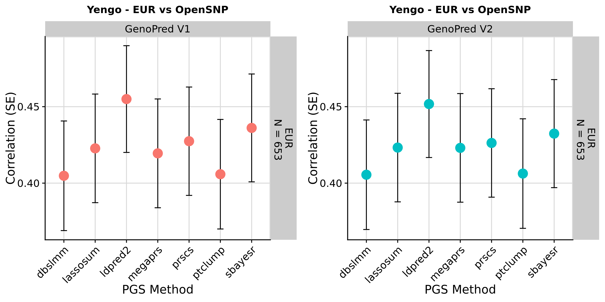
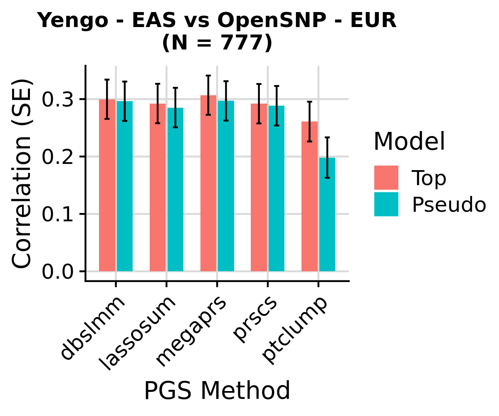
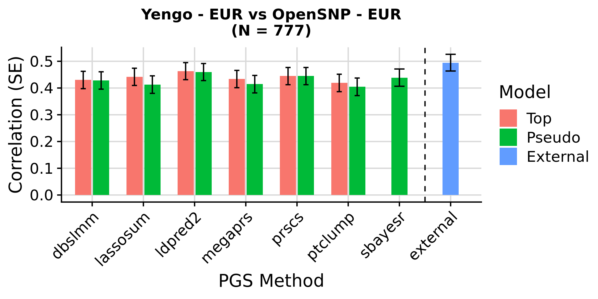
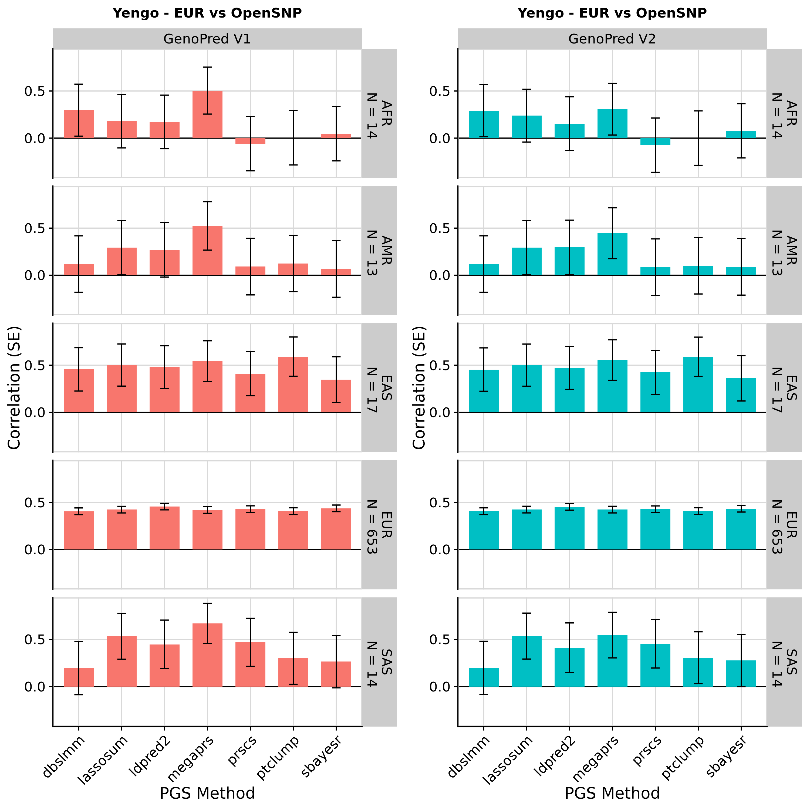

```{r setup, include=FALSE}
knitr::opts_chunk$set(eval = FALSE)
```

***

# Overview

We used the publicly available OpenSNP dataset to test the GenoPred pipeline. We used GWAS sumstats for Height from the Yengo et al. GWAS. We used results derived using European and East Asian individuals. We ran the original version of GenoPred (V1) and the updated version of GenoPred (v2.0.0) to check results were consistent.

As can be seen in the figure below, the GenoPred returned polygenic scores performing as expected, and results were consistent across version of GenoPred.



The code used to perform this analysis is below.

***

# GenoPred V2

## Prepare input

***

### Download genotypes

<details><summary>Show code</summary>

```{bash}
mkdir -p /users/k1806347/oliverpainfel/Data/OpenSNP/raw
cd /users/k1806347/oliverpainfel/Data/OpenSNP/raw
wget https://zenodo.org/records/1442755/files/CrowdAI_v3.tar.gz?download=1 
mv 'CrowdAI_v3.tar.gz?download=1' CrowdAI_v3.tar.gz
tar -xvzf CrowdAI_v3.tar.gz
rm CrowdAI_v3.tar.gz

# Use fullset (training) data as the target for GenoPred, as the sample size is larger
```

</details>

***

### Prepare phenotype

<details><summary>Show code</summary>

```{r}
library(data.table)

dat <- fread('/users/k1806347/oliverpainfel/Data/OpenSNP/raw/CrowdAI_v3/training_set_details.txt')
dat$FID <- 0
dat$IID <- dat$id
dat <- dat[, c('FID', 'IID', 'height'), with = F]

dir.create('/users/k1806347/oliverpainfel/Data/OpenSNP/processed/pheno', recursive = T)
write.table(
  dat,
  '/users/k1806347/oliverpainfel/Data/OpenSNP/processed/pheno/height.txt',
  col.names = T,
  row.names = F,
  quote = F
)
```

</details>

***

### Split VCF by chromosome

<details><summary>Show code</summary>

```{bash}
# Create index
module add bcftools/1.14-gcc-10.3.0-python3+-chk-version
bcftools index /users/k1806347/oliverpainfel/Data/OpenSNP/raw/CrowdAI_v3/fullset/genotyping_data_fullset_train.vcf.gz

# Now, split by chromosome using plink2
# Run on the command line within pipeline conda environment
mkdir /users/k1806347/oliverpainfel/Data/OpenSNP/processed/geno
for chr in $(seq 1 22);do
    plink2 \
        --vcf /users/k1806347/oliverpainfel/Data/OpenSNP/raw/CrowdAI_v3/fullset/genotyping_data_fullset_train.vcf.gz \
        --chr ${chr} \
        --out /users/k1806347/oliverpainfel/Data/OpenSNP/processed/geno/opensnp_train.chr${chr} \
        --export vcf bgz
done
```

</details>

***

### Download height GWAS

<details><summary>Show code</summary>

```{bash}
# These are from the Yengo 2022 paper
mkdir -p /users/k1806347/oliverpainfel/Data/GWAS_sumstats/opensnp_test
wget --no-check-certificate -O /users/k1806347/oliverpainfel/Data/GWAS_sumstats/opensnp_test/yengo_2022_height_eur.txt https://ftp.ebi.ac.uk/pub/databases/gwas/summary_statistics/GCST90245001-GCST90246000/GCST90245992/GCST90245992_buildGRCh37.tsv
wget --no-check-certificate -O /users/k1806347/oliverpainfel/Data/GWAS_sumstats/opensnp_test/yengo_2022_height_eas.txt https://ftp.ebi.ac.uk/pub/databases/gwas/summary_statistics/GCST90245001-GCST90246000/GCST90245991/GCST90245991_buildGRCh37.tsv
```

</details>

***

### Create gwas_list, target_list and config

<details><summary>Show code</summary>

```{r}
setwd('/users/k1806347/oliverpainfel/Software/MyGit/GenoPred/pipeline')
library(data.table)

# Create config file
conf <- c(
  'outdir: /users/k1806347/oliverpainfel/Data/OpenSNP/GenoPred/test4',
  'config_file: misc/opensnp/config.yaml',
  'gwas_list: misc/opensnp/gwas_list.txt',
  'score_list: misc/opensnp/score_list.txt',
  'target_list: misc/opensnp/target_list.txt',
  "pgs_methods: ['ptclump','dbslmm','prscs','sbayesr','lassosum','ldpred2','megaprs']",
  'testing: NA'
)

dir.create('misc/opensnp/', recursive = T)
dir.create('/users/k1806347/oliverpainfel/Data/OpenSNP/GenoPred', recursive = T)
write.table(conf, 'misc/opensnp/config.yaml', col.names = F, row.names = F, quote = F)

# Create target_list
target_list <- fread('example_input/target_list_example.txt')
target_list <- rbind(target_list,
                     data.table(name = 'opensnp',
                                path = '/users/k1806347/oliverpainfel/Data/OpenSNP/processed/geno/opensnp_train',
                                type = 'samp_imp_vcf',
                                indiv_report = F))

target_list <- target_list[target_list$name == 'opensnp', ]

write.table(target_list, 'misc/opensnp/target_list.txt', col.names = T, row.names = F, quote = F, sep = ' ')

# Create gwas_list
gwas_list <- fread('example_input/gwas_list_example.txt')
gwas_list<-rbind(gwas_list, 
                 data.table(name='yengo_eur',
                            path = '/users/k1806347/oliverpainfel/Data/GWAS_sumstats/opensnp_test/yengo_2022_height_eur.txt',
                            population = 'EUR',
                            n = NA,
                            sampling = NA,
                            prevalence = NA,
                            mean = NA,
                            sd = NA,
                            label = "\"Yengo 2022 Height EUR\""))

gwas_list <- rbind(gwas_list,
                   data.table(name = 'yengo_eas', 
                              path = '/users/k1806347/oliverpainfel/Data/GWAS_sumstats/opensnp_test/yengo_2022_height_eas.txt',
                              population = 'EAS',
                              n = NA,
                              sampling = NA,
                              prevalence = NA,
                              mean = NA,
                              sd = NA,
                              label = "\"Yengo 2022 Height EAS\""))


gwas_list <- gwas_list[gwas_list$name %in% c('yengo_eur', 'yengo_eas'), ]

write.table(gwas_list, 'misc/opensnp/gwas_list.txt', col.names = T, row.names = F, quote = F, sep = ' ')

# Create score_list
score_list <- data.frame(
  name = 'PGS002804',
  path = NA,
  label = "\"Yengo 2022 Height EUR PGSC\""
)

write.table(score_list, 'misc/opensnp/score_list.txt', col.names=T, row.names=F, quote=F, sep=' ')

```

</details>

***

## Run GenoPred

<details><summary>Show code</summary>

```{bash}
snakemake --profile slurm --use-conda --configfile=misc/opensnp/config.yaml output_all -n 
```

</details>

***

## Check time and memory requirements

<details><summary>Show code</summary>

```{r}
library(data.table)
library(ggplot2)
library(cowplot)

# Read in configuration specific benchmark files
bm_files_i <-
  paste0(
    '/users/k1806347/oliverpainfel/Data/OpenSNP/GenoPred/test4/reference/benchmarks/',
    list.files('/users/k1806347/oliverpainfel/Data/OpenSNP/GenoPred/test4/reference/benchmarks/')
  )

# Read in benchmark files
bm_dat_all <- do.call(rbind, lapply(bm_files_i, function(file) {
  tmp <- fread(file)
  tmp$file <- basename(file)
  return(tmp)
}))

# Create rule column
bm_dat_all$rule <- gsub('-.*','',bm_dat_all$file)

#####
# PGS methods
#####
# Look at the memory required for each PGS method using the EUR GWAS
bm_dat_yengo_eur <-
  bm_dat_all[grepl('prep_pgs', bm_dat_all$file) &
               grepl('yengo_eur.txt', bm_dat_all$file), ]

bm_dat_yengo_eur$method <- gsub('_i', '', gsub('prep_pgs_','',bm_dat_yengo_eur$rule))
bm_dat_yengo_eur<-merge(bm_dat_yengo_eur, pgs_method_labels, by='method')

pgs_method_time <-
  ggplot(bm_dat_yengo_eur, aes(x = label, y = s, fill = label)) +
  geom_bar(stat = "identity", position = "dodge") +
  labs(x = "PGS Method", y = "Time (seconds)") +
  theme_half_open() +
  background_grid() +
  theme(axis.text.x = element_text(angle = 45, hjust = 1), legend.position="none")

pgs_method_mem <-
  ggplot(bm_dat_yengo_eur, aes(x = label, y = max_rss, fill = label)) +
  geom_bar(stat = "identity", position="dodge") +
  labs(x = "PGS Method", y = "Max Memory (Mb)") +
  theme_half_open() +
  background_grid() +
  theme(axis.text.x = element_text(angle = 45, hjust = 1), legend.position="none")

png('Images/OpenSNP/time_cpu_bench_pgs_methods.png', res = 300, width = 1800, height = 1800, units = 'px')
  plot_grid(pgs_method_time, pgs_method_mem, nrow=2)
dev.off()

write.csv(bm_dat_yengo_eur, 'Images/OpenSNP/time_cpu_bench_pgs_methods.csv', row.names=F, quote=F)

```
</details>

<details><summary>Show PGS methods benchmark</summary>

{width=50%}

<div class="note-box">

**Note:** pT+clump and DBSLMM are run using 1 core. All other methods are run using 10 cores.

</div>

</details>

***

## Evaluate PGS

<details><summary>Show code</summary>

```{r}
# Test correlation between PGS and observed height

setwd('/users/k1806347/oliverpainfel/Software/MyGit/GenoPred/pipeline/')
library(data.table)
library(ggplot2)
library(cowplot)

source('../functions/misc.R')
source_all('../functions')

# Read in pheno data
pheno <- fread('/users/k1806347/oliverpainfel/Data/OpenSNP/processed/pheno/height.txt')

# Define pgs_methods used
pgs_methods <- c('external','ptclump', 'dbslmm', 'prscs', 'sbayesr', 'lassosum', 'ldpred2', 'megaprs')

# Define pgs_methods applied to non-EUR GWAS
pgs_methods_eur <- c('ptclump','lassosum','megaprs','prscs','dbslmm')

# Read in PGS
pgs <- read_pgs(config = 'misc/opensnp/config.yaml', name = 'opensnp')$opensnp

# Estimate correlation between pheno and pgs
cor <- NULL
for(pop_i in names(pgs)){
  for(gwas_i in names(pgs[[pop_i]])){
    for(pgs_method_i in names(pgs[[pop_i]][[gwas_i]])){
      pgs_i <- pgs[[pop_i]][[gwas_i]][[pgs_method_i]]
      pheno_pgs<-merge(pheno, pgs_i, by = c('FID','IID'))
      
      for(model_i in names(pgs_i)[-1:-2]){
        y <- scale(pheno_pgs$height)
        x <- scale(pheno_pgs[[model_i]])
        
        if(all(is.na(x))){
          next
        }
        
        coef_i <- coef(summary(mod <- lm(y ~ x)))
        
        tmp <- data.table(
          pop = pop_i,
          gwas = gwas_i,
          pgs_method = pgs_method_i,
          name = model_i,
          r = coef_i[2,1],
          se = coef_i[2,2],
          p = coef_i[2,4],
          n = nobs(mod))
      cor <- rbind(cor, tmp)
      
      }
    }
  }
}

# The European sample is the only one large enough for interpretable results
# Subset EUR results
cor_eur <- cor[cor$pop == 'EUR', ]

# Restrict to best and and pseudoval only
cor_eur_subset <- NULL
for(pop_i in unique(cor_eur$pop)){
  for(gwas_i in unique(cor_eur$gwas[cor_eur$pop == pop_i])){
    for(pgs_method_i in unique(cor_eur$pgs_method[cor_eur$pop == pop_i & cor_eur$gwas == gwas_i])){
      
      # Subset relevant results
      cor_eur_i <- cor_eur[
        cor_eur$pop == pop_i &
        cor_eur$gwas == gwas_i &
        cor_eur$pgs_method == pgs_method_i,]
  
      # Top R
      if(pgs_method_i %in% c('ptclump','ldpred2','megaprs','prscs','lassosum','dbslmm')){
        top_i <- cor_eur_i[which(cor_eur_i$r == max(cor_eur_i$r, na.rm = T))[1],]
        top_i$model <- 'Top'
        cor_eur_subset <- rbind(cor_eur_subset, top_i)
      }
  
      # PseudoVal
      if(pgs_method_i %in% c('ptclump','sbayesr','ldpred2','megaprs','prscs','lassosum','dbslmm')){
        cor_eur_i$name <- gsub(paste0(gwas_i, '_'), '', cor_eur_i$name)
        pseudo_param <- find_pseudo(config = 'misc/opensnp/config.yaml', gwas = gwas_i, pgs_method = pgs_method_i)
        pseudo_i <- cor_eur_i[cor_eur_i$name == pseudo_param,]
        pseudo_i$model <- 'Pseudo'
        cor_eur_subset <- rbind(cor_eur_subset, pseudo_i)
      }
      
      # External
      external_tmp<-cor_eur_i[cor_eur_i$pgs_method == 'external',]
      external_tmp$model <- 'External'
      cor_eur_subset <- rbind(cor_eur_subset, external_tmp)
      
    }
  }
}

# Plot the results
cor_eur_subset$model <- factor(cor_eur_subset$model, levels = c('Top','Pseudo','External'))
dir.create('/users/k1806347/oliverpainfel/Software/MyGit/GenoPred/docs/Images/OpenSNP')

# yengo_eur
plot_obj_eur <- 
  ggplot(cor_eur_subset[cor_eur_subset$gwas == 'yengo_eur',], aes(x = pgs_method, y = r, fill = model)) +
  geom_bar(stat = "identity", position = position_dodge2(preserve = "single"), width = 0.7) +
  geom_errorbar(
    aes(ymin = r - se, ymax = r + se),
    width = .2,
    position = position_dodge(width = 0.7)
  ) +
  labs(
    y = "Correlation (SE)",
    x = 'PGS Method',
    fill = 'Model',
    title = paste0("Yengo - EUR vs OpenSNP - EUR\n(N = ", cor_eur_subset$n[1], ")")
  ) +
  theme_half_open() +
  background_grid() +
  theme(axis.text.x = element_text(angle = 45, hjust = 1),
        plot.title = element_text(hjust = 0.5, size=12))

png('/users/k1806347/oliverpainfel/Software/MyGit/GenoPred/docs/Images/OpenSNP/genopred-yengo_eur.png',
    units = 'px',
    width = 2000,
    height = 1000,
    res = 300)

  plot_obj_eur

dev.off()

# yengo_eas
plot_obj_eas <- 
  ggplot(cor_eur_subset[cor_eur_subset$gwas == 'yengo_eas',], aes(x = pgs_method, y = r, fill = model)) +
    geom_bar(stat = "identity", position = position_dodge2(preserve = "single"), width = 0.7) +
    geom_errorbar(
      aes(ymin = r - se, ymax = r + se),
      width = .2,
      position = position_dodge(width = 0.7)
    ) +
    labs(
      y = "Correlation (SE)",
      x = 'PGS Method',
      fill = 'Model',
      title = paste0("Yengo - EAS vs OpenSNP - EUR\n(N = ", cor_eur_subset$n[1], ")")
    ) +
    theme_half_open() +
    background_grid() +
    theme(axis.text.x = element_text(angle = 45, hjust = 1),
          plot.title = element_text(hjust = 0.5, size=12))

png('/users/k1806347/oliverpainfel/Software/MyGit/GenoPred/docs/Images/OpenSNP/genopred-yengo_eas.png',
    units = 'px',
    width = 1200,
    height = 1000,
    res = 300)

  plot_obj_eas

dev.off()

# Make a plot comparing the yengo_eur results to the score file from PGS-catalogue
not_external <- unique(cor_eur_subset$pgs_method[cor_eur_subset$pgs_method != 'external'])
cor_eur_subset$pgs_method <- factor(cor_eur_subset$pgs_method, levels=c(not_external,'external'))

plot_obj_ext <- 
  ggplot(cor_eur_subset[cor_eur_subset$gwas == 'yengo_eur' | cor_eur_subset$gwas == 'PGS002804',], aes(x = pgs_method, y = r, fill = model)) +
  geom_bar(stat = "identity", position = position_dodge2(preserve = "single"), width = 0.7) +
  geom_errorbar(
    aes(ymin = r - se, ymax = r + se),
    width = .2,
    position = position_dodge(width = 0.7)
  ) +
  labs(
    y = "Correlation (SE)",
    x = 'PGS Method',
    fill = 'Model',
    title = paste0("Yengo - EUR vs OpenSNP - EUR\n(N = ", cor_eur_subset$n[1], ")")
  ) +
  theme_half_open() +
  background_grid() +
  geom_vline(xintercept = 7.5, linetype = 'dashed') +
  theme(axis.text.x = element_text(angle = 45, hjust = 1),
        plot.title = element_text(hjust = 0.5, size=12))

png('/users/k1806347/oliverpainfel/Software/MyGit/GenoPred/docs/Images/OpenSNP/genopred-yengo_eur-external.png',
    units = 'px',
    width = 2000,
    height = 1000,
    res = 300)
  
  plot_obj_ext

dev.off()


# Save the results
dir.create('/scratch/prj/oliverpainfel/Data/OpenSNP/assoc')
write.csv(
  cor,
  '/scratch/prj/oliverpainfel/Data/OpenSNP/assoc/genopred-yengo-assoc.csv',
  row.names = F
)

```

</details>

***

<details><summary>Show results in OpenSNP</summary>

<center>

{width=60%}

***

{width=40%}

</details>

<details><summary>Show results in OpenSNP including score from PGS catalogue</summary>

<center>

{width=60%}

Note. 'external' is based on a larger GWAS (incl. 23andMe)

</details>

***

# GenoPred V1 comparison

We will run OpenSNP through GenoPred v1, to check whether updates have altered the output.

<details><summary>Show code</summary>

```{bash}
# Go to another version of the repo on CREATE
cd /users/k1806347/oliverpainfel/test/GenoPred

# Checkout to the v1 version of the repo
git checkout v1

```

</details>

***

### Prepare input

<details><summary>Show code</summary>

```{r}
library(data.table)
setwd('/users/k1806347/oliverpainfel/test/GenoPred/GenoPredPipe')

# target_list
target_list <- fread('target_list_example.txt')
target_list <- data.frame(
  name = 'opensnp',
  path='/users/k1806347/oliverpainfel/Data/OpenSNP/processed/geno/opensnp_train',
  type = 'samp_imp_vcf',
  output = '/users/k1806347/oliverpainfel/Data/OpenSNP/GenoPred_v1/test1',
  indiv_report = F)

dir.create('misc/opensnp', recursive = T)
write.table(target_list, 'misc/opensnp/target_list.txt', col.names=T, row.names=F, quote=F, sep=' ')

# gwas_list
yengo_eur <- fread('/users/k1806347/oliverpainfel/Data/GWAS_sumstats/opensnp_test/yengo_2022_height_eur.txt')
yengo_eur <- yengo_eur[, c('variant_id','effect_allele','other_allele','beta','standard_error','effect_allele_frequency','p_value','n'), with=F]
names(yengo_eur) <- c('SNP','A1','A2','BETA','SE','FREQ','P','N')
fwrite(yengo_eur, '/users/k1806347/oliverpainfel/Data/GWAS_sumstats/opensnp_test/yengo_2022_height_eur.format.txt', sep = ' ', quote = F, na = 'NA')

yengo_eas <- fread('/users/k1806347/oliverpainfel/Data/GWAS_sumstats/opensnp_test/yengo_2022_height_eas.txt')
yengo_eas <- yengo_eas[, c('variant_id','effect_allele','other_allele','beta','standard_error','effect_allele_frequency','p_value','n'), with=F]
names(yengo_eas) <- c('SNP','A1','A2','BETA','SE','FREQ','P','N')
fwrite(yengo_eas, '/users/k1806347/oliverpainfel/Data/GWAS_sumstats/opensnp_test/yengo_2022_height_eas.format.txt', sep = ' ', quote = F, na = 'NA')

gwas_list <- fread('gwas_list_example.txt')
gwas_list<-rbind(gwas_list, data.table(
    name='yengoeur',
    path='/users/k1806347/oliverpainfel/Data/GWAS_sumstats/opensnp_test/yengo_2022_height_eur.format.txt',
    population='EUR',
    sampling=NA,
    prevalence=NA,
    mean=NA,
    sd=NA,
    label="\"Yengo 2022 Height EUR\""))

gwas_list<-rbind(gwas_list, data.table(
    name='yengoeas',
    path='/users/k1806347/oliverpainfel/Data/GWAS_sumstats/opensnp_test/yengo_2022_height_eas.format.txt',
    population='EAS',
    sampling=NA,
    prevalence=NA,
    mean=NA,
    sd=NA,
    label="\"Yengo 2022 Height EAS\""))

gwas_list<-gwas_list[gwas_list$name %in% c('yengoeur','yengoeas'),]

write.table(gwas_list, 'misc/opensnp/gwas_list.txt', col.names=T, row.names=F, quote=F, sep=' ')

# score_list
score_list <- fread('score_list_example.txt')
score_list <- score_list[-1,]
write.table(score_list, 'misc/opensnp/score_list.txt', col.names=T, row.names=F, quote=F, sep=' ')

# config
config <- c(
  "gwas_list: misc/opensnp/gwas_list.txt",
  "target_list: misc/opensnp/target_list.txt",
  "score_list: misc/opensnp/score_list.txt"   
)
write.table(config, 'misc/opensnp/config.yaml', col.names=F, row.names=F, quote=F, sep=' ')

```

</details>

***

### Run GenoPred v1

<details><summary>Show code</summary>

```{bash}
# Calculate score using all methods
snakemake -n --profile slurm --configfile=misc/opensnp/config.yaml --use-conda run_target_prs_all

```

</details>

***

## Evaluate PGS

<details><summary>Show code</summary>

```{r}
# Test correlation between PGS and phenotype

setwd('/scratch//prj/oliverpainfel/test/GenoPred/pipeline/')
library(data.table)
library(Hmisc)

# Read in pheno data
pheno <- fread('/users/k1806347/oliverpainfel/Data/OpenSNP/processed/pheno/height.txt')
pheno$FID<-0

# Read in ancestry data
keep_list <- fread('/users/k1806347/oliverpainfel/Data/OpenSNP/GenoPred/test1/opensnp/ancestry/keep_list.txt')

# Read in pgs
gwas_list <- fread('misc/opensnp/gwas_list.txt')
pgs_methods <- c('pt_clump','dbslmm','prscs','sbayesr','lassosum','ldpred2','megaprs')
pgs_methods_eur <- c('pt_clump','lassosum','megaprs')

pgs <- list()
for(pop_i in keep_list$POP){
  pgs[[pop_i]] <- list()
  for(gwas_i in gwas_list$name){
    pgs[[pop_i]][[gwas_i]] <- list()
    for(pgs_method_i in pgs_methods){
      if(gwas_list$population[gwas_list$name == gwas_i] == 'EUR' | (gwas_list$population[gwas_list$name == gwas_i] != 'EUR' & (pgs_method_i %in% pgs_methods_eur))){
        pgs[[pop_i]][[gwas_i]][[pgs_method_i]] <- fread(paste0('/users/k1806347/oliverpainfel/Data/OpenSNP/GenoPred_v1/test1/opensnp/prs/',pop_i,'/',pgs_method_i,'/',gwas_i,'/opensnp.',gwas_i,'.',pop_i,'.profiles'))
      }
    }
  }
}

# Estimate correlation between pheno and pgs
cor <- NULL
for(pop_i in names(pgs)){
  for(gwas_i in names(pgs[[pop_i]])){
    for(pgs_method_i in names(pgs[[pop_i]][[gwas_i]])){
      pgs_i <- pgs[[pop_i]][[gwas_i]][[pgs_method_i]]
      pheno_pgs<-merge(pheno, pgs_i, by = c('FID','IID'))
      
      for(model_i in names(pgs_i)[-1:-2]){
        y <- scale(pheno_pgs$height)
        x <- scale(pheno_pgs[[model_i]])
        
        if(all(is.na(x))){
          next
        }
        
        coef_i <- coef(summary(mod <- lm(y ~ x)))
        
        tmp <- data.table(
          pop = pop_i,
          gwas = gwas_i,
          pgs_method = pgs_method_i,
          name = model_i,
          r = coef_i[2,1],
          se = coef_i[2,2],
          p = coef_i[2,4],
          n = nobs(mod))
      cor <- rbind(cor, tmp)
      
      }
    }
  }
}

# Save the results
dir.create('/scratch/prj/oliverpainfel/Data/OpenSNP/assoc')
write.csv(
  cor,
  '/scratch/prj/oliverpainfel/Data/OpenSNP/assoc/genopred-v1-yengo-assoc.csv',
  row.names = F
)

# Restrict to best only
cor_subset <- NULL
for(pop_i in unique(cor$pop)){
  for(gwas_i in unique(cor$gwas[cor$pop == pop_i])){
    for(pgs_method_i in unique(cor$pgs_method[cor$pop == pop_i & cor$gwas == gwas_i])){
      
      # Subset relevant results
      cor_i <- cor[
        cor$pop == pop_i &
        cor$gwas == gwas_i &
        cor$pgs_method == pgs_method_i,]
  
      # Top R
      top_i <- cor_i[which(cor_i$r == max(cor_i$r, na.rm = T))[1],]
      cor_subset <- rbind(cor_subset, top_i)
    }
  }
}

# Read in the associations for the best PGS when using the new version of GenoPred
cor_new <- fread('/scratch/prj/oliverpainfel/Data/OpenSNP/assoc/genopred-yengo-assoc.csv')

cor_new_subset <- NULL
for(pop_i in unique(cor_new$pop)){
  for(gwas_i in unique(cor_new$gwas[cor_new$pop == pop_i])){
    for(pgs_method_i in unique(cor_new$pgs_method[cor_new$pop == pop_i & cor_new$gwas == gwas_i])){
      
      # Subset relevant results
      cor_new_i <- cor_new[
        cor_new$pop == pop_i &
        cor_new$gwas == gwas_i &
        cor_new$pgs_method == pgs_method_i,]
  
      # Top R
      top_i <- cor_new_i[which(cor_new_i$r == max(cor_new_i$r, na.rm = T))[1],]
      cor_new_subset <- rbind(cor_new_subset, top_i)
    }
  }
}

# Compare the results
cor_subset$Version <- 'GenoPred V1'
cor_subset$pgs_method<-gsub('_', '', cor_subset$pgs_method)
cor_new_subset$Version <- 'GenoPred V2'
cor_new_subset$gwas<-gsub('_', '', cor_new_subset$gwas)

cor_both <- rbind(cor_subset, cor_new_subset)

cor_both$pop <- paste0(cor_both$pop, "\n N = ", cor_both$n)

##
# Plot the results
##

# yengo_eur
tmp <- cor_both[cor_both$gwas == 'yengoeur',]
y_lim <- c(min(tmp$r - tmp$se), max(tmp$r + tmp$se))
                  
v1_plot <-
  ggplot(cor_both[cor_both$gwas == 'yengoeur' & cor_both$Version == 'GenoPred V1', ], 
         aes(x = pgs_method, y = r)) +
  geom_hline(yintercept = 0) +
    geom_bar(stat = "identity", position = position_dodge(), width = 0.7, fill = '#F8766D') +
    geom_errorbar(
      aes(ymin = r - se, ymax = r + se),
      width = .2,
      position = position_dodge(width = 0.7)
    ) +
    labs(
      y = "Correlation (SE)",
      x = 'PGS Method',
      title = 'Yengo - EUR vs OpenSNP'
    ) +
    ylim(y_lim) +
    theme_half_open() +
    background_grid() +
    theme(axis.text.x = element_text(angle = 45, hjust = 1),
          plot.title = element_text(hjust = 0.5, size=12)) +
    facet_grid(pop ~ Version) +
    panel_border()

v2_plot <-
  ggplot(cor_both[cor_both$gwas == 'yengoeur' & cor_both$Version == 'GenoPred V2', ], 
         aes(x = pgs_method, y = r)) +
  geom_hline(yintercept = 0) +
    geom_bar(stat = "identity", position = position_dodge(), width = 0.7, fill = '#00BFC4') +
    geom_errorbar(
      aes(ymin = r - se, ymax = r + se),
      width = .2,
      position = position_dodge(width = 0.7)
    ) +
    labs(
      y = "Correlation (SE)",
      x = 'PGS Method',
      title = 'Yengo - EUR vs OpenSNP'
    ) +
    ylim(y_lim) +
    theme_half_open() +
    background_grid() +
    theme(axis.text.x = element_text(angle = 45, hjust = 1),
          plot.title = element_text(hjust = 0.5, size=12)) +
    facet_grid(pop ~ Version) +
    panel_border()

png('/users/k1806347/oliverpainfel/Software/MyGit/GenoPred/docs/Images/OpenSNP/genopred-v1-comp-yengo_eur.png',
    units = 'px',
    width = 3000,
    height = 3000,
    res = 300)

  plot_grid(v1_plot, v2_plot, labels = NULL)
  
dev.off()

###
# Compare again using same ancestry classification threshold
###

# Read in ancestry predictions
model_pred <- fread('/users/k1806347/oliverpainfel/Data/OpenSNP/GenoPred_v1/test1/opensnp/ancestry/ancestry_all/opensnp.Ancestry.model_pred')

pgs_strict <- list()
for(pop_i in keep_list$POP){
  pop_i_keep <- model_pred[model_pred[[pop_i]] > 0.95, ]
  pgs_strict[[pop_i]] <- list()
  for(gwas_i in gwas_list$name){
    pgs_strict[[pop_i]][[gwas_i]] <- list()
    for(pgs_method_i in pgs_methods){
      if(gwas_list$population[gwas_list$name == gwas_i] == 'EUR' | (gwas_list$population[gwas_list$name == gwas_i] != 'EUR' & (pgs_method_i %in% pgs_methods_eur))){
        pgs_strict[[pop_i]][[gwas_i]][[pgs_method_i]] <- merge(pgs[[pop_i]][[gwas_i]][[pgs_method_i]], pop_i_keep[, c('FID','IID'), with = F], by = c('FID','IID'))
      }
    }
  }
}

# Estimate correlation between pheno and pgs
cor <- NULL
for(pop_i in names(pgs_strict)){
  for(gwas_i in names(pgs_strict[[pop_i]])){
    for(pgs_strict_method_i in names(pgs_strict[[pop_i]][[gwas_i]])){
      pgs_strict_i <- pgs_strict[[pop_i]][[gwas_i]][[pgs_strict_method_i]]
      pheno_pgs_strict<-merge(pheno, pgs_strict_i, by = c('FID','IID'))
      
      for(model_i in names(pgs_strict_i)[-1:-2]){
        y <- scale(pheno_pgs_strict$height)
        x <- scale(pheno_pgs_strict[[model_i]])
        
        if(all(is.na(x))){
          next
        }
        
        coef_i <- coef(summary(mod <- lm(y ~ x)))
        
        tmp <- data.table(
          pop = pop_i,
          gwas = gwas_i,
          pgs_method = pgs_strict_method_i,
          name = model_i,
          r = coef_i[2,1],
          se = coef_i[2,2],
          p = coef_i[2,4],
          n = nobs(mod))
      cor <- rbind(cor, tmp)
      
      }
    }
  }
}

# Save the results
dir.create('/scratch/prj/oliverpainfel/Data/OpenSNP/assoc')
write.csv(
  cor,
  '/scratch/prj/oliverpainfel/Data/OpenSNP/assoc/genopred-v1-strict-yengo-assoc.csv',
  row.names = F
)

# Restrict to best only
cor_subset <- NULL
for(pop_i in unique(cor$pop)){
  for(gwas_i in unique(cor$gwas[cor$pop == pop_i])){
    for(pgs_method_i in unique(cor$pgs_method[cor$pop == pop_i & cor$gwas == gwas_i])){
      
      # Subset relevant results
      cor_i <- cor[
        cor$pop == pop_i &
        cor$gwas == gwas_i &
        cor$pgs_method == pgs_method_i,]
  
      # Top R
      top_i <- cor_i[which(cor_i$r == max(cor_i$r, na.rm = T))[1],]
      cor_subset <- rbind(cor_subset, top_i)
    }
  }
}

# Compare the results
cor_subset$Version <- 'GenoPred V1'
cor_subset$pgs_method<-gsub('_', '', cor_subset$pgs_method)
cor_new_subset$Version <- 'GenoPred V2'
cor_new_subset$gwas<-gsub('_', '', cor_new_subset$gwas)

cor_both <- rbind(cor_subset, cor_new_subset)

cor_both$pop <- paste0(cor_both$pop, "\n N = ", cor_both$n)

##
# Plot the results
##

# yengo_eur
tmp <- cor_both[cor_both$gwas == 'yengoeur',]
y_lim <- c(min(tmp$r - tmp$se), max(tmp$r + tmp$se))
                  
v1_plot <-
  ggplot(cor_both[cor_both$gwas == 'yengoeur' & cor_both$Version == 'GenoPred V1', ], 
         aes(x = pgs_method, y = r)) +
  geom_hline(yintercept = 0) +
    geom_bar(stat = "identity", position = position_dodge(), width = 0.7, fill = '#F8766D') +
    geom_errorbar(
      aes(ymin = r - se, ymax = r + se),
      width = .2,
      position = position_dodge(width = 0.7)
    ) +
    labs(
      y = "Correlation (SE)",
      x = 'PGS Method',
      title = 'Yengo - EUR vs OpenSNP'
    ) +
    ylim(y_lim) +
    theme_half_open() +
    background_grid() +
    theme(axis.text.x = element_text(angle = 45, hjust = 1),
          plot.title = element_text(hjust = 0.5, size=12)) +
    facet_grid(pop ~ Version) +
    panel_border()

v2_plot <-
  ggplot(cor_both[cor_both$gwas == 'yengoeur' & cor_both$Version == 'GenoPred V2', ], 
         aes(x = pgs_method, y = r)) +
  geom_hline(yintercept = 0) +
    geom_bar(stat = "identity", position = position_dodge(), width = 0.7, fill = '#00BFC4') +
    geom_errorbar(
      aes(ymin = r - se, ymax = r + se),
      width = .2,
      position = position_dodge(width = 0.7)
    ) +
    labs(
      y = "Correlation (SE)",
      x = 'PGS Method',
      title = 'Yengo - EUR vs OpenSNP'
    ) +
    ylim(y_lim) +
    theme_half_open() +
    background_grid() +
    theme(axis.text.x = element_text(angle = 45, hjust = 1),
          plot.title = element_text(hjust = 0.5, size=12)) +
    facet_grid(pop ~ Version) +
    panel_border()

png('/users/k1806347/oliverpainfel/Software/MyGit/GenoPred/docs/Images/OpenSNP/genopred-v1-comp_strict-yengo_eur.png',
    units = 'px',
    width = 3000,
    height = 3000,
    res = 300)

  plot_grid(v1_plot, v2_plot, labels = NULL)
  
dev.off()

######
# Plot the same plot only using the EUR target population in OpenSNP
######

tmp <- cor_both[cor_both$gwas == 'yengoeur' & cor_both$pop == 'EUR\n N = 653', ]
y_lim <- c(min(tmp$r - tmp$se), max(tmp$r + tmp$se))

v1_plot <-
  ggplot(tmp[tmp$Version == 'GenoPred V1', ], 
         aes(x = pgs_method, y = r)) +
    geom_hline(yintercept = 0) +
    geom_errorbar(
      aes(ymin = r - se, ymax = r + se),
      width = .2,
      position = position_dodge(width = 0.7)
    ) +
    geom_point(stat = "identity", position = position_dodge(), size = 5, colour = '#F8766D') +
    labs(
      y = "Correlation (SE)",
      x = 'PGS Method',
      title = 'Yengo - EUR vs OpenSNP'
    ) +
    ylim(y_lim) +
    theme_half_open() +
    background_grid() +
    theme(axis.text.x = element_text(angle = 45, hjust = 1),
          plot.title = element_text(hjust = 0.5, size=12)) +
    facet_grid(pop ~ Version) +
    panel_border()

v2_plot <-
  ggplot(tmp[tmp$Version == 'GenoPred V2', ], 
         aes(x = pgs_method, y = r)) +
    geom_hline(yintercept = 0) +
    geom_errorbar(
      aes(ymin = r - se, ymax = r + se),
      width = .2,
      position = position_dodge(width = 0.7)
    ) +
    geom_point(stat = "identity", position = position_dodge(), size = 5, colour = '#00BFC4') +
    labs(
      y = "Correlation (SE)",
      x = 'PGS Method',
      title = 'Yengo - EUR vs OpenSNP'
    ) +
    ylim(y_lim) +
    theme_half_open() +
    background_grid() +
    theme(axis.text.x = element_text(angle = 45, hjust = 1),
          plot.title = element_text(hjust = 0.5, size=12)) +
    facet_grid(pop ~ Version) +
    panel_border()

png('/users/k1806347/oliverpainfel/Software/MyGit/GenoPred/docs/Images/OpenSNP/genopred-v1-comp_strict_eur-yengo_eur.png',
    units = 'px',
    width = 3000,
    height = 1500,
    res = 300)

  plot_grid(v1_plot, v2_plot, labels = NULL)
  
dev.off()

```

</details>

***

<details><summary>Show comparison results</summary>

<center>





</details>

***

# Conclusion

These results are as expected. PGS associations with height in OpenSNP are highly concordant across version of GenoPred. Small differences occur due to a more stringent ancestry classification threshold in GenoPred v2, typically increasing the correlation between the PGS and observed height. The externally derived score for height downloaded from the PGS Catalogue outperforms score created by GenoPred - This occurs because GenoPred used the publicly available GWAS summary statistics, exlcuding the 23andMe dataset, whereas the PGS weights downloaded from the PGS catalogue were derived using private GWAS sumstats, including 23andMe.

