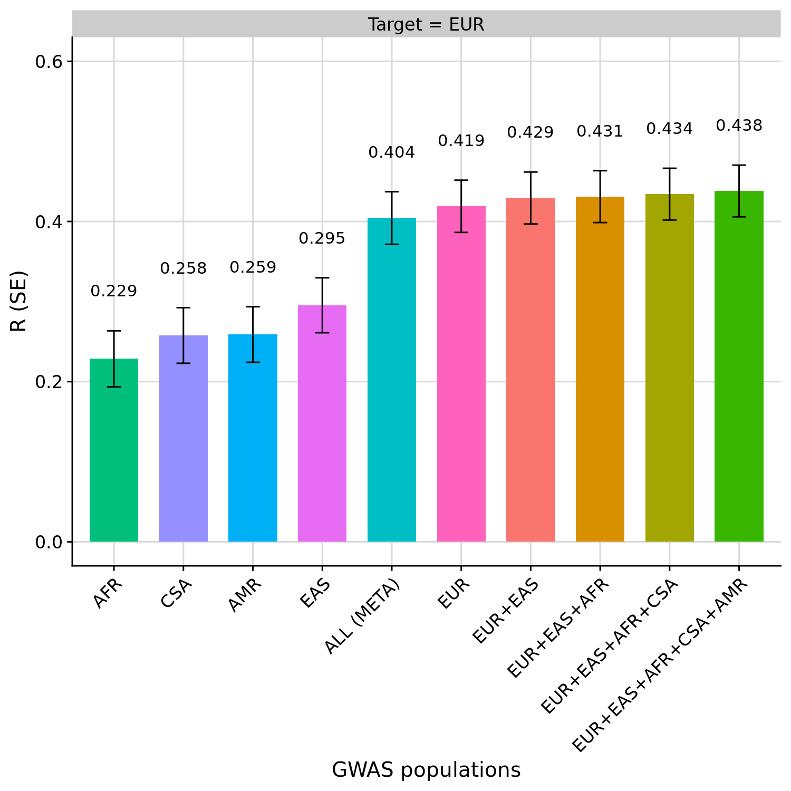

```{r setup, include=FALSE}
knitr::opts_chunk$set(eval = FALSE)
```

***

This document will test multi-source PGS methods using height GWAS with OpenSNP as the target sample. A previous demonstration of GenoPred using the OpenSNP data is shown [here](opensnp_benchmark.html), which shows some additional information regarding where the OpenSNP data was downloaded.

***

# Download the sumstats

We will use height GWAS sumstats from the Yengo paper, including UKB and for all populations.

<details><summary>Show code</summary>

```{bash}
# These are from the Yengo 2022 paper
mkdir -p /users/k1806347/oliverpainfel/Data/GWAS_sumstats/opensnp_test
wget --no-check-certificate -O /users/k1806347/oliverpainfel/Data/GWAS_sumstats/opensnp_test/yengo_2022_height_eur.txt https://ftp.ebi.ac.uk/pub/databases/gwas/summary_statistics/GCST90245001-GCST90246000/GCST90245992/GCST90245992_buildGRCh37.tsv
wget --no-check-certificate -O /users/k1806347/oliverpainfel/Data/GWAS_sumstats/opensnp_test/yengo_2022_height_eas.txt https://ftp.ebi.ac.uk/pub/databases/gwas/summary_statistics/GCST90245001-GCST90246000/GCST90245991/GCST90245991_buildGRCh37.tsv
wget --no-check-certificate -O /users/k1806347/oliverpainfel/Data/GWAS_sumstats/opensnp_test/yengo_2022_height_afr.txt https://ftp.ebi.ac.uk/pub/databases/gwas/summary_statistics/GCST90245001-GCST90246000/GCST90245989/GCST90245989_buildGRCh37.tsv
wget --no-check-certificate -O /users/k1806347/oliverpainfel/Data/GWAS_sumstats/opensnp_test/yengo_2022_height_amr.txt https://ftp.ebi.ac.uk/pub/databases/gwas/summary_statistics/GCST90245001-GCST90246000/GCST90245993/GCST90245993_buildGRCh37.tsv
wget --no-check-certificate -O /users/k1806347/oliverpainfel/Data/GWAS_sumstats/opensnp_test/yengo_2022_height_sas.txt https://ftp.ebi.ac.uk/pub/databases/gwas/summary_statistics/GCST90245001-GCST90246000/GCST90245994/GCST90245994_buildGRCh37.tsv
wget --no-check-certificate -O /users/k1806347/oliverpainfel/Data/GWAS_sumstats/opensnp_test/yengo_2022_height_all.txt https://ftp.ebi.ac.uk/pub/databases/gwas/summary_statistics/GCST90245001-GCST90246000/GCST90245990/GCST90245990_buildGRCh37.tsv
```

</details>


***

# Create configuration

We want to compare PGS derived using each GWAS seperately, PGS derived using GWAS from multiple populations.

We will only use QuickPRS, with LEOPARD to linearly combine across GWAS populations. Neither of these approaches require individual-level data to tune the PGS.

<details><summary>Show code</summary>

```{r}

setwd('/users/k1806347/oliverpainfel/Software/MyGit/GenoPred/pipeline')

# Create gwas_list
gwas_list <- NULL

for(i in c('EUR','EAS','CSA','AMR','AFR')){
  gwas_list <- rbind(gwas_list, data.table(
    name = paste0('yengo_', tolower(i)),
    path = paste0(
      '/users/k1806347/oliverpainfel/Data/GWAS_sumstats/opensnp_test/yengo_2022_height_',
      ifelse(i == 'CSA', 'sas', tolower(i)),
      '.txt'
    ),
    population = i,
    n = NA,
    sampling = NA,
    prevalence = NA,
    mean = NA,
    sd = NA,
    label = paste0('"Yengo 2022 Height ', i,'\"')))
}

# Insert GWAS from all, and assign EUR as the population
gwas_list <- rbind(gwas_list, data.table(
  name = 'yengo_all',
  path = '/users/k1806347/oliverpainfel/Data/GWAS_sumstats/opensnp_test/yengo_2022_height_all.txt',
  population = 'EUR',
  n = NA,
  sampling = NA,
  prevalence = NA,
  mean = NA,
  sd = NA,
  label = "\"Yengo 2022 Height All\""))

write.table(gwas_list, 'misc/opensnp/gwas_list_cross_pop.txt', col.names = T, row.names = F, quote = F, sep = ' ')

# Create gwas_groups file
gwas_groups <- NULL
gwas_groups <- rbind(gwas_groups, data.frame(
  name = 'height_eur_eas',
  gwas = 'yengo_eur,yengo_eas',
  label = "\"Yengo 2022 Height EUR+EAS\""
))

gwas_groups <- rbind(gwas_groups, data.frame(
  name = 'height_eur_eas_afr',
  gwas = 'yengo_eur,yengo_eas,yengo_afr',
  label = "\"Yengo 2022 Height EUR+EAS+AFR\""
))

gwas_groups <- rbind(gwas_groups, data.frame(
  name = 'height_eur_eas_afr_csa',
  gwas = 'yengo_eur,yengo_eas,yengo_afr,yengo_csa',
  label = "\"Yengo 2022 Height EUR+EAS+AFR+CSA\""
))

gwas_groups <- rbind(gwas_groups, data.frame(
  name = 'height_eur_eas_afr_csa_amr',
  gwas = 'yengo_eur,yengo_eas,yengo_afr,yengo_csa,yengo_amr',
  label = "\"Yengo 2022 Height EUR+EAS+AFR+CSA+AMR\""
))

write.table(gwas_groups, 'misc/opensnp/gwas_groups.txt', col.names = T, row.names = F, quote = F, sep = ' ')

# Create config file
config <- readLines('misc/opensnp/config.yaml')

config[grepl('^config_file:', config)]<- 'config_file: misc/opensnp/config_cross_pop.yaml'
config <- config[!grepl('^score_list:', config)]
config[grepl('^outdir:', config)]<- 'outdir: /users/k1806347/oliverpainfel/Data/OpenSNP/GenoPred/test_cross_pop_2'
config[grepl('^pgs_methods:', config)]<- "pgs_methods: ['quickprs','sbayesrc']"
config[grepl('^gwas_list:', config)]<- "gwas_list: misc/opensnp/gwas_list_cross_pop.txt"
config<-c(config, 'gwas_groups: misc/opensnp/gwas_groups.txt')
config<-c(config, "leopard_methods: ['quickprs']")
config<-c(config, "pgs_scaling: ['continuous', 'discrete']")

write.table(config, 'misc/opensnp/config_cross_pop.yaml', col.names = F, row.names = F, quote = F)

```

<div class="note-box">

**Note:** The original configfile for OpenSNP, and the target_list that it refers to, were created in the OpenSNP benchmark document ([here](opensnp_benchmark.html)).

</div>

</details>

***

# Run pipeline

```{bash}
snakemake --profile slurm --use-conda --configfile=misc/opensnp/config_cross_pop.yaml output_all
```

***

# Evaluate PGS

<details><summary>Show code</summary>

```{r}
# Test correlation between PGS and observed height

setwd('/users/k1806347/oliverpainfel/Software/MyGit/GenoPred/pipeline/')
library(data.table)
library(ggplot2)
library(cowplot)

source('../functions/misc.R')
source_all('../functions')

# Read in pheno data
pheno <- fread('/users/k1806347/oliverpainfel/Data/OpenSNP/processed/pheno/height.txt')

# Read in PGS
pgs <- read_pgs(config = 'misc/opensnp/config_cross_pop.yaml', name = 'opensnp')$opensnp

# Read in ancestry
ancestry <- read_ancestry(config = 'misc/opensnp/config_cross_pop_gw.yaml', name = 'opensnp')

# Estimate correlation between pheno and pgs
cor <- NULL
for(pop_i in names(pgs)){
  for(gwas_i in names(pgs[[pop_i]])){
    for(pgs_method_i in names(pgs[[pop_i]][[gwas_i]])){
      pgs_i <- pgs[[pop_i]][[gwas_i]][[pgs_method_i]]
      pheno_pgs<-merge(pheno, pgs_i, by = c('FID','IID'))
      
      for(model_i in names(pgs_i)[-1:-2]){
        y <- scale(pheno_pgs$height)
        x <- scale(pheno_pgs[[model_i]])
        
        if(all(is.na(x))){
          next
        }
        
        coef_i <- coef(summary(mod <- lm(y ~ x)))
        
        tmp <- data.table(
          pop = pop_i,
          gwas = gwas_i,
          pgs_method = pgs_method_i,
          name = model_i,
          r = coef_i[2,1],
          se = coef_i[2,2],
          p = coef_i[2,4],
          n = nobs(mod))
      cor <- rbind(cor, tmp)
      
      }
    }
  }
}

library(ggplot2)
library(cowplot)
ggplot(cor, aes(x = name, y = r, group = gwas)) +
  geom_bar(stat = "identity", position = position_dodge2(preserve = "single"), width = 0.7) +
  geom_errorbar(
    aes(ymin = r - se, ymax = r + se),
    width = .2,
    position = position_dodge(width = 0.7)
  ) +
  facet_wrap(. ~ pop, scales = 'free') +
  theme_half_open() +
  background_grid() +
  theme(axis.text.x = element_text(angle = 45, hjust = 1),
        plot.title = element_text(hjust = 0.5, size=12))

ggplot(cor[cor$pop %in% c('EUR'),], aes(x = name, y = r, group = gwas)) +
  geom_bar(stat = "identity", position = position_dodge2(preserve = "single"), width = 0.7) +
  geom_errorbar(
    aes(ymin = r - se, ymax = r + se),
    width = .2,
    position = position_dodge(width = 0.7)
  ) +
  facet_wrap(. ~ pop) +
  theme_half_open() +
  background_grid() +
  theme(axis.text.x = element_text(angle = 45, hjust = 1),
        plot.title = element_text(hjust = 0.5, size=12))

tmp <- cor[cor$pop %in% c('EUR') & grepl('yengo|EUR_weighted', cor$name) ,]
tmp$name <- gsub('yengo_|_quickprs|height_|_targ.*', '', tmp$name)
tmp$name <- gsub('_','+',tmp$name)
tmp$name <- toupper(tmp$name)
tmp$name[tmp$name == 'ALL'] <- "ALL (META)"
tmp$name <- factor(tmp$name, levels = tmp$name[order(tmp$r)])
tmp$pop <- 'Target = EUR'

png('~/oliverpainfel/Software/MyGit/GenoPred/docs/Images/OpenSNP/cross_pop_eur.png', res = 200, width = 1500, height = 1500, units = 'px')
ggplot(tmp, aes(x = name, y = r, fill = gwas)) +
  geom_bar(stat = "identity", position = position_dodge2(preserve = "single"), width = 0.7) +
  geom_errorbar(
    aes(ymin = r - se, ymax = r + se),
    width = .2,
    position = position_dodge(width = 0.7)
  ) +
  geom_text(
    aes(y = r + se + 0.05,label = round(r, 3)),
    position = position_dodge2(width = 0.7, preserve = "single"),
  ) +
  labs(x = 'GWAS populations', y = "R (SE)") +
  ylim(c(0,0.6)) +
  facet_wrap(. ~ pop) +
  theme_half_open() +
  background_grid() +
  theme(axis.text.x = element_text(angle = 45, hjust = 1),
        plot.title = element_text(hjust = 0.5, size=12),
        legend.position = "none")
dev.off()

```

</details>

***

# Result

EUR is the only population of sufficient sample size to accurately estimate the performance of the PGS.

Observations:

- The PGS based on EUR is the best single-source PGS
- The PGS based on meta-analysis of each GWAS, with a EUR LD reference performs worse than the PGS based on EUR GWAS alone.
- The PGS based on GWAS from multiple populations (multi-source) improved prediction slightly over the PGS based on EUR GWAS alone (single-source), with the prediction improving as more populations were considered.

<div class="centered-container">
<div class="rounded-image-container" style="width: 75%;">

</div>
</div>


