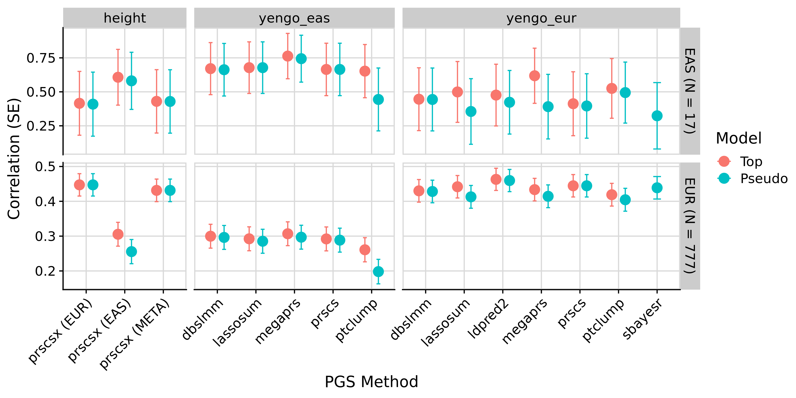

```{r setup, include=FALSE}
knitr::opts_chunk$set(eval = FALSE)
```

***

# Overview

We have previously used OpenSNP as a dataset for testing GenoPred. An important constraint within the default GenoPred implementation is its restriction to HapMap3 variants. This is particularly problematic when using externally derived score files, such as from the PGS catalogue, which may include variant variants that are not in the default reference. To remedy this we can use a reference dataset that includes more variant, and that is what we will test here.

We will run GenoPred on the OpenSNP data using the default reference data (restricted to HapMap3) and a denser reference (all variants in the 1KG+HGDP dataset). We will calculate PGS based on height GWAS summary statistics, but also a range of height PGS score files on the PGS catalogue, and see the difference in performance.

# Prepare input

***

## Download genotypes

<details><summary>Show code</summary>

```{bash}
mkdir -p /users/k1806347/oliverpainfel/Data/OpenSNP/raw
cd /users/k1806347/oliverpainfel/Data/OpenSNP/raw
wget https://zenodo.org/records/1442755/files/CrowdAI_v3.tar.gz?download=1 
mv 'CrowdAI_v3.tar.gz?download=1' CrowdAI_v3.tar.gz
tar -xvzf CrowdAI_v3.tar.gz
rm CrowdAI_v3.tar.gz

# Use both training and testing data to maximise sample size for testing.
```

</details>

***

## Prepare phenotype

<details><summary>Show code</summary>

```{r}
library(data.table)

# Training 
train_dat <- fread('/users/k1806347/oliverpainfel/Data/OpenSNP/raw/CrowdAI_v3/training_set_details.txt')
train_dat$FID <- train_dat$id
train_dat$IID <- train_dat$id
train_dat <- train_dat[, c('FID', 'IID', 'height'), with = F]

# Test 
test_dat <- fread('/users/k1806347/oliverpainfel/Data/OpenSNP/raw/CrowdAI_v3/test_set_details_SECRET.txt')
test_dat$FID <- test_dat$id
test_dat$IID <- test_dat$id
test_dat <- test_dat[, c('FID', 'IID', 'height'), with = F]

all_dat<-rbind(train_dat, test_dat)
dir.create('/users/k1806347/oliverpainfel/Data/OpenSNP/processed/pheno', recursive = T)
write.table(
  all_dat,
  '/users/k1806347/oliverpainfel/Data/OpenSNP/processed/pheno/height.txt',
  col.names = T,
  row.names = F,
  quote = F
)
```

</details>

***

## Split VCF by chromosome

<details><summary>Show code</summary>

```{bash}
module add bcftools/1.12-gcc-13.2.0-python-3.11.6

# Create index
bcftools index /users/k1806347/oliverpainfel/Data/OpenSNP/raw/CrowdAI_v3/fullset/genotyping_data_fullset_train.vcf.gz

bcftools index /users/k1806347/oliverpainfel/Data/OpenSNP/raw/CrowdAI_v3/fullset/genotyping_data_fullset_test.vcf.gz

# Merge the vcfs for training and testing data
bcftools merge \
  /users/k1806347/oliverpainfel/Data/OpenSNP/raw/CrowdAI_v3/fullset/genotyping_data_fullset_train.vcf.gz \
  /users/k1806347/oliverpainfel/Data/OpenSNP/raw/CrowdAI_v3/fullset/genotyping_data_fullset_test.vcf.gz \
  -o /users/k1806347/oliverpainfel/Data/OpenSNP/raw/CrowdAI_v3/fullset/genotyping_data_fullset_merged.vcf.gz

# Now, split by chromosome using plink2
# Run on the command line within pipeline conda environment
mkdir /users/k1806347/oliverpainfel/Data/OpenSNP/processed/geno
for chr in $(seq 1 22);do
    /users/k1806347/oliverpainfel/Software/plink2 \
        --vcf /users/k1806347/oliverpainfel/Data/OpenSNP/raw/CrowdAI_v3/fullset/genotyping_data_fullset_merged.vcf.gz \
        --chr ${chr} \
        --out /users/k1806347/oliverpainfel/Data/OpenSNP/processed/geno/opensnp_merged.chr${chr} \
        --export vcf bgz
done
```

</details>

***

## Download height GWAS

<details><summary>Show code</summary>

```{bash}
# These are from the Yengo 2022 paper
mkdir -p /users/k1806347/oliverpainfel/Data/GWAS_sumstats/opensnp_test
wget --no-check-certificate -O /users/k1806347/oliverpainfel/Data/GWAS_sumstats/opensnp_test/yengo_2022_height_eur.txt https://ftp.ebi.ac.uk/pub/databases/gwas/summary_statistics/GCST90245001-GCST90246000/GCST90245992/GCST90245992_buildGRCh37.tsv
wget --no-check-certificate -O /users/k1806347/oliverpainfel/Data/GWAS_sumstats/opensnp_test/yengo_2022_height_eas.txt https://ftp.ebi.ac.uk/pub/databases/gwas/summary_statistics/GCST90245001-GCST90246000/GCST90245991/GCST90245991_buildGRCh37.tsv
```

</details>

***

## Create gwas_list, target_list and config

<details><summary>Show code</summary>

```{r}
setwd('/users/k1806347/oliverpainfel/Software/MyGit/GenoPred/pipeline')
library(data.table)

# Create config file for sparse configuration
conf <- c(
  'outdir: /users/k1806347/oliverpainfel/Data/OpenSNP/GenoPred/sparse_test',
  'config_file: misc/opensnp/config_sparse.yaml',
#  'gwas_list: misc/opensnp/gwas_list.txt',
  'score_list: misc/opensnp/score_list.txt',
  'target_list: misc/opensnp/target_list.txt',
#  'gwas_groups: misc/opensnp/gwas_groups.txt',
#  "pgs_methods: ['sbayesr']",
  'testing: chr22'
)

dir.create('misc/opensnp/', recursive = T)
dir.create('/users/k1806347/oliverpainfel/Data/OpenSNP/GenoPred', recursive = T)
write.table(conf, 'misc/opensnp/config_sparse.yaml', col.names = F, row.names = F, quote = F)

# Create config file for dense configuration
conf <- c(
  'outdir: /users/k1806347/oliverpainfel/Data/OpenSNP/GenoPred/dense_test',
  'refdir: /users/k1806347/oliverpainfel/Data/hgdp_1kg/genopred/ref',
  'config_file: misc/opensnp/config_dense.yaml',
#  'gwas_list: misc/opensnp/gwas_list.txt',
  'score_list: misc/opensnp/score_list.txt',
  'target_list: misc/opensnp/target_list.txt',
#  'gwas_groups: misc/opensnp/gwas_groups.txt',
#  "pgs_methods: ['sbayesr']",
  'testing: chr22'
)

dir.create('misc/opensnp/', recursive = T)
dir.create('/users/k1806347/oliverpainfel/Data/OpenSNP/GenoPred', recursive = T)
write.table(conf, 'misc/opensnp/config_dense.yaml', col.names = F, row.names = F, quote = F)

# Create target_list
target_list <- fread('example_input/target_list.txt')
target_list <- rbind(target_list,
                     data.table(name = 'opensnp',
                                path = '/users/k1806347/oliverpainfel/Data/OpenSNP/processed/geno/opensnp_merged',
                                type = 'vcf',
                                indiv_report = F))

target_list <- target_list[target_list$name == 'opensnp', ]

write.table(target_list, 'misc/opensnp/target_list.txt', col.names = T, row.names = F, quote = F, sep = ' ')

# Create gwas_list
gwas_list <- fread('example_input/gwas_list.txt')
gwas_list<-rbind(gwas_list, 
                 data.table(name='yengo_eur',
                            path = '/users/k1806347/oliverpainfel/Data/GWAS_sumstats/opensnp_test/yengo_2022_height_eur.txt',
                            population = 'EUR',
                            n = NA,
                            sampling = NA,
                            prevalence = NA,
                            mean = NA,
                            sd = NA,
                            label = "\"Yengo 2022 Height EUR\""))

gwas_list <- rbind(gwas_list,
                   data.table(name = 'yengo_eas', 
                              path = '/users/k1806347/oliverpainfel/Data/GWAS_sumstats/opensnp_test/yengo_2022_height_eas.txt',
                              population = 'EAS',
                              n = NA,
                              sampling = NA,
                              prevalence = NA,
                              mean = NA,
                              sd = NA,
                              label = "\"Yengo 2022 Height EAS\""))


gwas_list <- gwas_list[gwas_list$name %in% c('yengo_eur', 'yengo_eas'), ]

write.table(gwas_list, 'misc/opensnp/gwas_list.txt', col.names = T, row.names = F, quote = F, sep = ' ')

# Create gwas_groups
gwas_groups <- data.frame(
  name = 'height',
  gwas = 'yengo_eur,yengo_eas',
  label = "\"Yengo 2022 Height EUR+EAS\""
)

write.table(gwas_groups, 'misc/opensnp/gwas_groups.txt', col.names = T, row.names = F, quote = F, sep = ' ')

# Create score_list
score_list <- data.frame(
  name = 'PGS002804',
  path = NA,
  label = "\"Yengo 2022 Height EUR PGSC\""
)

write.table(score_list, 'misc/opensnp/score_list.txt', col.names=T, row.names=F, quote=F, sep=' ')

```

</details>

***

# Run GenoPred

<details><summary>Show code</summary>

```{bash}
snakemake --profile slurm --use-conda --configfile=misc/opensnp/config_sparse.yaml output_all -n 
snakemake --profile slurm --use-conda --configfile=misc/opensnp/config_dense.yaml output_all -n 
```

</details>

***

## Evaluate PGS

<details><summary>Show code</summary>

```{r}
# Test correlation between PGS and observed height

setwd('/users/k1806347/oliverpainfel/Software/MyGit/GenoPred/pipeline/')
library(data.table)
library(ggplot2)
library(cowplot)

source('../functions/misc.R')
source_all('../functions')

# Read in pheno data
pheno <- fread('/users/k1806347/oliverpainfel/Data/OpenSNP/processed/pheno/height.txt')

# Read in PGS
pgs <- read_pgs(config = 'misc/opensnp/config.yaml', name = 'opensnp')$opensnp

# Estimate correlation between pheno and pgs
cor <- NULL
for(pop_i in names(pgs)){
  for(gwas_i in names(pgs[[pop_i]])){
    for(pgs_method_i in names(pgs[[pop_i]][[gwas_i]])){
      pgs_i <- pgs[[pop_i]][[gwas_i]][[pgs_method_i]]
      pheno_pgs<-merge(pheno, pgs_i, by = c('FID','IID'))
      
      for(model_i in names(pgs_i)[-1:-2]){
        y <- scale(pheno_pgs$height)
        x <- scale(pheno_pgs[[model_i]])
        
        if(all(is.na(x))){
          next
        }
        
        coef_i <- coef(summary(mod <- lm(y ~ x)))
        
        tmp <- data.table(
          pop = pop_i,
          gwas = gwas_i,
          pgs_method = pgs_method_i,
          name = model_i,
          r = coef_i[2,1],
          se = coef_i[2,2],
          p = coef_i[2,4],
          n = nobs(mod))
      cor <- rbind(cor, tmp)
      
      }
    }
  }
}

# Save the results
dir.create('/scratch/prj/oliverpainfel/Data/OpenSNP/assoc')
write.csv(
  cor,
  '/scratch/prj/oliverpainfel/Data/OpenSNP/assoc/genopred-yengo-assoc.csv',
  row.names = F
)

# The European sample is the only one large enough for interpretable results. All other populations are <20 individuals
# Subset EUR results
cor_eur <- cor[cor$pop == 'EUR', ]

# Restrict to best and and pseudoval only
cor_eur_subset <- NULL
for(pop_i in unique(cor_eur$pop)){
  for(gwas_i in unique(cor_eur$gwas[cor_eur$pop == pop_i])){
    for(pgs_method_i in unique(cor_eur$pgs_method[cor_eur$pop == pop_i & cor_eur$gwas == gwas_i])){
      
      # Subset relevant results
      cor_eur_i <- cor_eur[
        cor_eur$pop == pop_i &
        cor_eur$gwas == gwas_i &
        cor_eur$pgs_method == pgs_method_i,]
  
      # Top R
      if(pgs_method_i %in% c('ptclump','ldpred2','megaprs','prscs','lassosum','dbslmm')){
        top_i <- cor_eur_i[which(cor_eur_i$r == max(cor_eur_i$r, na.rm = T))[1],]
        top_i$model <- 'Top'
        cor_eur_subset <- rbind(cor_eur_subset, top_i)
      }
      if(pgs_method_i %in% c('prscsx')){
        for(targ_i in unique(gsub('.*_','', gsub('_phi.*','',cor_eur_i$name)))){
          cor_eur_k<-cor_eur_i[grepl(paste0(targ_i,'_phi_'), cor_eur_i$name),]
          top_i <- cor_eur_k[which(cor_eur_k$r == max(cor_eur_k$r, na.rm = T))[1],]
          top_i$model <- 'Top'
          top_i$pgs_method<-paste0(top_i$pgs_method, " (", targ_i, ")")
          cor_eur_subset <- rbind(cor_eur_subset, top_i)
        }
      }  
      
      # PseudoVal
      if(pgs_method_i %in% c('ptclump','sbayesr','ldpred2','megaprs','prscs','lassosum','dbslmm','prscsx')){
        pseudo_param <- find_pseudo(config = 'misc/opensnp/config.yaml', gwas = gwas_i, pgs_method = pgs_method_i)
        pseudo_i <- cor_eur_i[grepl(paste0(pseudo_param,'$'), cor_eur_i$name),]
        pseudo_i$model <- 'Pseudo'
        if(pgs_method_i %in% c('prscsx')){
          pseudo_i$pgs_method<-paste0(pseudo_i$pgs_method, " (", gsub('.*_','', gsub(paste0('_',pseudo_param), '', pseudo_i$name)), ")")
        }
        cor_eur_subset <- rbind(cor_eur_subset, pseudo_i)
      }
      
      # External
      external_tmp<-cor_eur_i[cor_eur_i$pgs_method == 'external',]
      external_tmp$model <- 'External'
      cor_eur_subset <- rbind(cor_eur_subset, external_tmp)
      
    }
  }
}

# Plot the results
cor_eur_subset$model <- factor(cor_eur_subset$model, levels = c('Top','Pseudo','External'))
dir.create('/users/k1806347/oliverpainfel/Software/MyGit/GenoPred/docs/Images/OpenSNP')

# yengo_eur
plot_obj_eur <- 
  ggplot(cor_eur_subset[cor_eur_subset$gwas == 'yengo_eur',], aes(x = pgs_method, y = r, fill = model)) +
  geom_bar(stat = "identity", position = position_dodge2(preserve = "single"), width = 0.7) +
  geom_errorbar(
    aes(ymin = r - se, ymax = r + se),
    width = .2,
    position = position_dodge(width = 0.7)
  ) +
  labs(
    y = "Correlation (SE)",
    x = 'PGS Method',
    fill = 'Model',
    title = paste0("Yengo - EUR vs OpenSNP - EUR\n(N = ", cor_eur_subset$n[1], ")")
  ) +
  theme_half_open() +
  background_grid() +
  theme(axis.text.x = element_text(angle = 45, hjust = 1),
        plot.title = element_text(hjust = 0.5, size=12))

png('/users/k1806347/oliverpainfel/Software/MyGit/GenoPred/docs/Images/OpenSNP/genopred-yengo_eur.png',
    units = 'px',
    width = 2000,
    height = 1000,
    res = 300)

  plot_obj_eur

dev.off()

# yengo_eas
plot_obj_eas <- 
  ggplot(cor_eur_subset[cor_eur_subset$gwas == 'yengo_eas',], aes(x = pgs_method, y = r, fill = model)) +
    geom_bar(stat = "identity", position = position_dodge2(preserve = "single"), width = 0.7) +
    geom_errorbar(
      aes(ymin = r - se, ymax = r + se),
      width = .2,
      position = position_dodge(width = 0.7)
    ) +
    labs(
      y = "Correlation (SE)",
      x = 'PGS Method',
      fill = 'Model',
      title = paste0("Yengo - EAS vs OpenSNP - EUR\n(N = ", cor_eur_subset$n[1], ")")
    ) +
    theme_half_open() +
    background_grid() +
    theme(axis.text.x = element_text(angle = 45, hjust = 1),
          plot.title = element_text(hjust = 0.5, size=12))

png('/users/k1806347/oliverpainfel/Software/MyGit/GenoPred/docs/Images/OpenSNP/genopred-yengo_eas.png',
    units = 'px',
    width = 1200,
    height = 1000,
    res = 300)

  plot_obj_eas

dev.off()

# Make a plot comparing the yengo_eur results to the score file from PGS-catalogue
not_external <- unique(cor_eur_subset$pgs_method[cor_eur_subset$pgs_method != 'external'])
cor_eur_subset$pgs_method <- factor(cor_eur_subset$pgs_method, levels=c(not_external,'external'))

plot_obj_ext <- 
  ggplot(cor_eur_subset[cor_eur_subset$gwas == 'yengo_eur' | cor_eur_subset$gwas == 'PGS002804',], aes(x = pgs_method, y = r, fill = model)) +
  geom_bar(stat = "identity", position = position_dodge2(preserve = "single"), width = 0.7) +
  geom_errorbar(
    aes(ymin = r - se, ymax = r + se),
    width = .2,
    position = position_dodge(width = 0.7)
  ) +
  labs(
    y = "Correlation (SE)",
    x = 'PGS Method',
    fill = 'Model',
    title = paste0("Yengo - EUR vs OpenSNP - EUR\n(N = ", cor_eur_subset$n[1], ")")
  ) +
  theme_half_open() +
  background_grid() +
  geom_vline(xintercept = 7.5, linetype = 'dashed') +
  theme(axis.text.x = element_text(angle = 45, hjust = 1),
        plot.title = element_text(hjust = 0.5, size=12))

png('/users/k1806347/oliverpainfel/Software/MyGit/GenoPred/docs/Images/OpenSNP/genopred-yengo_eur-external.png',
    units = 'px',
    width = 2000,
    height = 1000,
    res = 300)
  
  plot_obj_ext

dev.off()

# Subset EAS results
cor_eas <- cor[cor$pop == 'EAS', ]
# Restrict to best and and pseudoval only
cor_eas_subset <- NULL
for(pop_i in unique(cor_eas$pop)){
  for(gwas_i in unique(cor_eas$gwas[cor_eas$pop == pop_i])){
    for(pgs_method_i in unique(cor_eas$pgs_method[cor_eas$pop == pop_i & cor_eas$gwas == gwas_i])){
      
      # Subset relevant results
      cor_eas_i <- cor_eas[
        cor_eas$pop == pop_i &
        cor_eas$gwas == gwas_i &
        cor_eas$pgs_method == pgs_method_i,]
  
      # Top R
      if(pgs_method_i %in% c('ptclump','ldpred2','megaprs','prscs','lassosum','dbslmm')){
        top_i <- cor_eas_i[which(cor_eas_i$r == max(cor_eas_i$r, na.rm = T))[1],]
        top_i$model <- 'Top'
        cor_eas_subset <- rbind(cor_eas_subset, top_i)
      }
      if(pgs_method_i %in% c('prscsx')){
        for(targ_i in unique(gsub('.*_','', gsub('_phi.*','',cor_eas_i$name)))){
          cor_eas_k<-cor_eas_i[grepl(paste0(targ_i,'_phi_'), cor_eas_i$name),]
          top_i <- cor_eas_k[which(cor_eas_k$r == max(cor_eas_k$r, na.rm = T))[1],]
          top_i$model <- 'Top'
          top_i$pgs_method<-paste0(top_i$pgs_method, " (", targ_i, ")")
          cor_eas_subset <- rbind(cor_eas_subset, top_i)
        }
      }
  
      # PseudoVal
      if(pgs_method_i %in% c('ptclump','sbayesr','ldpred2','megaprs','prscs','lassosum','dbslmm','prscsx')){
        pseudo_param <- find_pseudo(config = 'misc/opensnp/config.yaml', gwas = gwas_i, pgs_method = pgs_method_i)
        pseudo_i <- cor_eas_i[grepl(paste0(pseudo_param,'$'), cor_eas_i$name),]
        pseudo_i$model <- 'Pseudo'
        if(pgs_method_i %in% c('prscsx')){
          pseudo_i$pgs_method<-paste0(pseudo_i$pgs_method, " (", gsub('.*_','', gsub(paste0('_',pseudo_param), '', pseudo_i$name)), ")")
        }
        cor_eas_subset <- rbind(cor_eas_subset, pseudo_i)
      }
      
      # External
      external_tmp<-cor_eas_i[cor_eas_i$pgs_method == 'external',]
      external_tmp$model <- 'External'
      cor_eas_subset <- rbind(cor_eas_subset, external_tmp)
      
    }
  }
}

# Make a plot including PRS-CSx comparing in EUR and EAS OpenSNP individuals
cor_eur_eas_subset<-rbind(cor_eur_subset, cor_eas_subset)
cor_eur_eas_subset$pop<-paste0(cor_eur_eas_subset$pop, " (N = ", cor_eur_eas_subset$n, ")")

plot_obj_prscsx <- 
  ggplot(cor_eur_eas_subset[cor_eur_eas_subset$gwas %in% c('yengo_eur','yengo_eas','height'),], aes(x = pgs_method, y = r, colour = model)) +
  geom_point(stat = "identity", size = 4, position = position_dodge(width = 0.7)) +
  geom_errorbar(
    aes(ymin = r - se, ymax = r + se),
    width = .2,
    position = position_dodge(width = 0.7)
  ) +
  labs(
    y = "Correlation (SE)",
    x = 'PGS Method',
    colour = 'Model',
  ) +
  theme_half_open() +
  panel_border() +
  background_grid() +
  facet_grid(pop ~ gwas, scales = 'free', space = 'free_x') +
  theme(axis.text.x = element_text(angle = 45, hjust = 1),
        plot.title = element_text(hjust = 0.5, size=12))

png('/users/k1806347/oliverpainfel/Software/MyGit/GenoPred/docs/Images/OpenSNP/genopred-prscsx.png',
    units = 'px',
    width = 3000,
    height = 1500,
    res = 300)
  
  plot_obj_prscsx

dev.off()

```

</details>

***

<details><summary>Show results in OpenSNP</summary>

<div class="centered-container">
<div class="rounded-image-container" style="width: 60%;">

</div>
</div>

***

<div class="centered-container">
<div class="rounded-image-container" style="width: 60%;">

</div>
</div>

</details>

<details><summary>Show results in OpenSNP including score from PGS catalogue</summary>

<div class="centered-container">
<div class="rounded-image-container" style="width: 60%;">

</div>
</div>

<br/>

Note. 'external' is based on a larger GWAS (incl. 23andMe)

</details>

<details><summary>Show results in OpenSNP when using PRS-CSx</summary>

<div class="centered-container">
<div class="rounded-image-container" style="width: 60%;">

</div>
</div>

<br/>

Note. 'external' is based on a larger GWAS (incl. 23andMe)

</details>

***
