```{r setup, include=FALSE}
knitr::opts_chunk$set(eval = FALSE)
```

***

A new upload of the OpenSNP data is now available on Zenodo: https://zenodo.org/records/18493898

OpenSNP aggregates direct-to-consumer genotyping data uploaded by users of
23andMe, AncestryDNA and FamilyTreeDNA. Within each company the uploads come
from a mix of chip generations (e.g. 23andMe v3 OmniExpress+, v4
OmniExpress+ custom, v5 GSA), so concatenating everything into a single
PLINK fileset produces extremely patchy variant-level missingness — the
union of the chips is much larger than what any single sample carries.

To make the data usable for imputation and downstream polygenic scoring we
need to **separate each company's data into per-chip filesets** before
imputing. The strategy used throughout this document is:

1. Run `plink2 --missing` on the raw fileset and look at the histogram of
   per-sample non-missing variant counts (`NONMISSING_CT`).
2. If samples form clear clusters in `NONMISSING_CT`, split on those
   thresholds.
3. If samples cluster only weakly (because two chips have similar SNP
   counts), restrict to the *high-peak* variants — those with intermediate
   variant-level `F_MISS`, i.e. variants present in only a subset of
   samples — and re-compute sample missingness on that subset. The clusters
   are usually obvious there.
4. Once per-chip `.keep` files are written, run
   `--make-bed` → `--geno 0.05` → `--mind 0.05` to drop variants and
   samples that don't fit cleanly.

The final cross-array variant-overlap check at the bottom of this document
is what tells us whether each split actually captured a different chip, or
just two density tiers of the same chip.

***

# Download and pre-process

<details><summary>Show code</summary>

```{bash}
mkdir -p ~/oliverpainfel/Data/OpenSNP/zenodo_18493898

cd ~/oliverpainfel/Data/OpenSNP/zenodo_18493898

wget https://zenodo.org/records/18493898/files/23andme.zip?download=1
wget https://zenodo.org/records/18493898/files/AncestryDNA.zip?download=1
wget https://zenodo.org/records/18493898/files/FamilyTreeDNA.zip?download=1

mv '23andme.zip?download=1' 23andme.zip
mv 'AncestryDNA.zip?download=1' AncestryDNA.zip
mv 'FamilyTreeDNA.zip?download=1' FamilyTreeDNA.zip

unzip 23andme.zip
unzip AncestryDNA.zip
unzip FamilyTreeDNA.zip

```

</details>

Each archive ships both an unfiltered and a `_filtered` fileset (the
`_filtered` one was produced by the OpenSNP curators and intersects
variants across chips, hence the much smaller variant counts). Inspect
both:

<details><summary>Show code</summary>

```{r}
library(data.table)
# Check sample size and number of variants in filtered and unfiltered versions of each dataset
datasets <- c('23andme','AncestryDNA','FamilyTreeDNA')
types <- c('filtered','unfiltered')

stats <- NULL
for(i in datasets){
  for(j in types){
    tmp_bim <- fread(
      paste0(
        '~/oliverpainfel/Data/OpenSNP/zenodo_18493898/',
        i,
        ifelse(j == 'filtered', '_filtered', ''),
        '.bim'
      ),
      header = F
    )
    tmp_fam <- fread(
      paste0(
        '~/oliverpainfel/Data/OpenSNP/zenodo_18493898/',
        i,
        ifelse(j == 'filtered', '_filtered', ''),
        '.fam'
      ),
      header = F
    )
    stats <- rbind(
      stats,
      data.frame(
        dataset = i,
        type = j,
        n_var = nrow(tmp_bim),
        n_ind = nrow(tmp_fam)
      )
    )
  }
}

```

</details>

Compute per-sample and per-variant missingness for every company's
unfiltered fileset — this is the input to the per-company splitting work
below:

<details><summary>Show code</summary>

```{bash}
# Compute per-sample (.smiss) and per-variant (.vmiss) missingness on the
# unfiltered, all-chip fileset for each company.

for dataset in $(echo 23andme AncestryDNA FamilyTreeDNA); do
  /users/k1806347/oliverpainfel/Software/plink2 \
    --bfile ~/oliverpainfel/Data/OpenSNP/zenodo_18493898/${dataset} \
    --missing \
    --out ~/oliverpainfel/Data/OpenSNP/zenodo_18493898/${dataset}
done
```

</details>

***

## 23andMe

23andMe has used three chip generations (per their public documentation):

| Chip | Supplier | Chip name | SNPs |
|------|----------|-----------|------|
| v3 | Illumina | OmniExpress+ | ~967,000 |
| v4 | Illumina | OmniExpress+ (custom) | ~570,000 |
| v5 | Illumina | GSA | ~640,000 (+60k custom) |

### Step 1 — split v3 from v4+v5 by sample-level NONMISSING_CT

The per-sample `NONMISSING_CT` histogram shows a clear bimodal pattern:
samples genotyped on the v3 (OmniExpress+) chip carry ~900k+ variants,
while v4 and v5 samples carry far fewer. A single threshold at 900,000
cleanly separates v3 from the v4+v5 mix.

<details><summary>Show plot — 23andMe per-sample NONMISSING_CT (all variants)</summary>

<div class="centered-container">
<div class="rounded-image-container" style="width: 100%;">
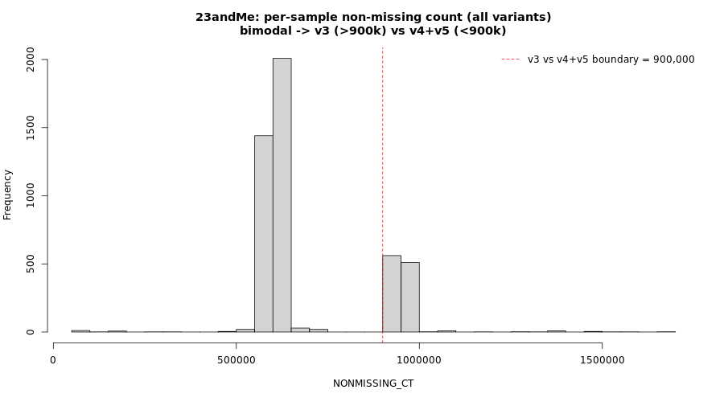
</div>
</div>

</details>

<details><summary>Show code</summary>

```{r}
smiss <- fread('~/oliverpainfel/Data/OpenSNP/zenodo_18493898/23andme.smiss')
smiss$NONMISSING_CT <- smiss$OBS_CT - smiss$MISSING_CT
hist(smiss$NONMISSING_CT, 20)

# Samples with > 900k non-missing variants are the v3 (OmniExpress+) chip.
dat_v3 <- smiss$IID[smiss$NONMISSING_CT > 900000]

write.table(
  cbind(dat_v3, dat_v3),
  '~/oliverpainfel/Data/OpenSNP/zenodo_18493898/23andme_more_900k.keep',
  row.names = F,
  col.names = F,
  quote = F
)

```

</details>

Re-run `--missing` on each side of the 900k split so we can investigate
the v4-vs-v5 structure on its own:

<details><summary>Show code</summary>

```{bash}
# Compute missingness within each side of the v3 / not-v3 split.

/users/k1806347/oliverpainfel/Software/plink2 \
  --bfile ~/oliverpainfel/Data/OpenSNP/zenodo_18493898/23andme \
  --keep ~/oliverpainfel/Data/OpenSNP/zenodo_18493898/23andme_more_900k.keep \
  --missing \
  --out ~/oliverpainfel/Data/OpenSNP/zenodo_18493898/23andme_more_900k

/users/k1806347/oliverpainfel/Software/plink2 \
  --bfile ~/oliverpainfel/Data/OpenSNP/zenodo_18493898/23andme \
  --remove ~/oliverpainfel/Data/OpenSNP/zenodo_18493898/23andme_more_900k.keep \
  --missing \
  --out ~/oliverpainfel/Data/OpenSNP/zenodo_18493898/23andme_less_900k

```

</details>

### Step 2 — separate v4 and v5 within the <900k group

v4 and v5 carry similar numbers of variants, so the sample-level histogram
isn't enough to split them. Instead, inspect the **variant-level** F_MISS
distribution within the <900k samples: the high-F_MISS peak corresponds to
variants present on only one of the two chips. The chunk below cross-checks
those high-peak variant IDs against the GSA-24v1 and OmniExpress-24
manifests and confirms they are GSA-array variants.

<details><summary>Show plot — 23andMe (<900k samples) per-variant F_MISS</summary>

<div class="centered-container">
<div class="rounded-image-container" style="width: 100%;">
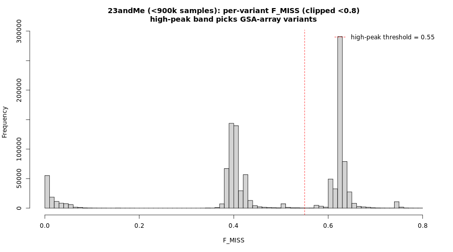
</div>
</div>

</details>

<details><summary>Show code</summary>

```{r}
vmiss <- fread('~/oliverpainfel/Data/OpenSNP/zenodo_18493898/23andme_less_900k.vmiss')
vmiss <- vmiss[vmiss$F_MISS < 0.8, ]
hist(vmiss$F_MISS, 100)

# Variants with F_MISS > 0.55 are present in a minority of <900k samples.
# These are the discriminating set between v4 and v5.
vmiss_high_peak <- vmiss$ID[vmiss$F_MISS > 0.55]
write.table(
  vmiss_high_peak,
  '~/oliverpainfel/Data/OpenSNP/zenodo_18493898/23andme_high_peak.extract',
  row.names = F,
  col.names = F,
  quote = F)

# Cross-check the high-peak variants against the chip manifests:
gsa <- fread(cmd = "cut -f 1 -d',' ~/oliverpainfel/Data/OpenSNP/zenodo_18493898/GSA-24v1-0_C1.csv | tail -n +8", header =T)
gsa <- gsa[grepl('^GSA-rs', gsa$IlmnID),]
gsa$rsid<-gsub('-.*','', gsub('GSA-','',gsa$IlmnID))

omni <- fread(cmd = "cut -f 1 -d',' ~/oliverpainfel/Data/OpenSNP/zenodo_18493898/humanomniexpress-24-v1-1-a.csv | tail -n +8", header =T)
omni <- omni[grepl('^rs', omni$IlmnID),]
omni$rsid<-gsub('-.*','',omni$IlmnID)

sum(vmiss_high_peak %in% gsa$rsid)
sum(vmiss_high_peak %in% omni$rsid)
# The GSA hit count is much higher than OmniExpress -> high-peak variants
# are GSA-array variants -> samples carrying them are v5.
```

</details>

Recompute per-sample missingness within the <900k samples but restricted to
those high-peak (GSA) variants:

<details><summary>Show code</summary>

```{bash}

/users/k1806347/oliverpainfel/Software/plink2 \
  --bfile ~/oliverpainfel/Data/OpenSNP/zenodo_18493898/23andme \
  --remove ~/oliverpainfel/Data/OpenSNP/zenodo_18493898/23andme_more_900k.keep \
  --extract ~/oliverpainfel/Data/OpenSNP/zenodo_18493898/23andme_high_peak.extract \
  --missing \
  --out ~/oliverpainfel/Data/OpenSNP/zenodo_18493898/23andme_less_900k_high_peak

```

</details>

The resulting `NONMISSING_CT` histogram is cleanly bimodal: samples that
carry many of the GSA-specific variants (>200k) are v5; the rest are v4.

<details><summary>Show plot — 23andMe NONMISSING_CT within high-peak (GSA) variants</summary>

<div class="centered-container">
<div class="rounded-image-container" style="width: 100%;">
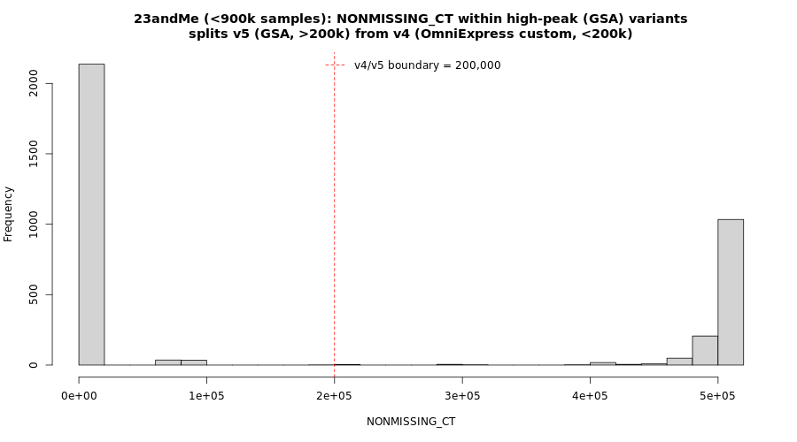
</div>
</div>

</details>

<details><summary>Show code</summary>

```{r}
smiss <- fread('~/oliverpainfel/Data/OpenSNP/zenodo_18493898/23andme_less_900k_high_peak.smiss')
smiss$NONMISSING_CT <- smiss$OBS_CT - smiss$MISSING_CT
hist(smiss$NONMISSING_CT, 20)

dat_v5 <- smiss$IID[smiss$NONMISSING_CT > 200000]
dat_v4 <- smiss$IID[smiss$NONMISSING_CT < 200000]

write.table(
  cbind(dat_v5, dat_v5),
  '~/oliverpainfel/Data/OpenSNP/zenodo_18493898/23andme_v5.keep',
  row.names = F,
  col.names = F,
  quote = F
)

write.table(
  cbind(dat_v4, dat_v4),
  '~/oliverpainfel/Data/OpenSNP/zenodo_18493898/23andme_v4.keep',
  row.names = F,
  col.names = F,
  quote = F
)

```

</details>

Sanity-check the v4 split by re-running `--missing` on it alone — both the
sample and variant histograms should be tight (single chip):

<details><summary>Show code</summary>

```{bash}

/users/k1806347/oliverpainfel/Software/plink2 \
  --bfile ~/oliverpainfel/Data/OpenSNP/zenodo_18493898/23andme \
  --keep ~/oliverpainfel/Data/OpenSNP/zenodo_18493898/23andme_v4.keep \
  --missing \
  --out ~/oliverpainfel/Data/OpenSNP/zenodo_18493898/23andme_v4

```

```{r}
smiss <- fread('~/oliverpainfel/Data/OpenSNP/zenodo_18493898/23andme_v4.smiss')
smiss$NONMISSING_CT <- smiss$OBS_CT - smiss$MISSING_CT
hist(smiss$NONMISSING_CT, 20)

vmiss <- fread('~/oliverpainfel/Data/OpenSNP/zenodo_18493898/23andme_v4.vmiss')
vmiss <- vmiss[vmiss$F_MISS < 0.8, ]
hist(vmiss$F_MISS, 100)
# Single tight peak at high NONMISSING_CT and at low F_MISS = clean v4 chip.
```

</details>

### Step 3 — make per-array filesets and apply --geno / --mind

Materialise the v3, v4, v5 keep files as PLINK filesets, then apply
`--geno 0.05` (drop variants missing in >5% of samples *within that chip*)
and `--mind 0.05` (drop the few samples that are still patchy after
splitting).

<details><summary>Show code</summary>

```{bash}
/users/k1806347/oliverpainfel/Software/plink2 \
  --bfile ~/oliverpainfel/Data/OpenSNP/zenodo_18493898/23andme \
  --keep ~/oliverpainfel/Data/OpenSNP/zenodo_18493898/23andme_more_900k.keep \
  --make-bed \
  --out ~/oliverpainfel/Data/OpenSNP/zenodo_18493898/23andme_v3

/users/k1806347/oliverpainfel/Software/plink2 \
  --bfile ~/oliverpainfel/Data/OpenSNP/zenodo_18493898/23andme \
  --keep ~/oliverpainfel/Data/OpenSNP/zenodo_18493898/23andme_v4.keep \
  --make-bed \
  --out ~/oliverpainfel/Data/OpenSNP/zenodo_18493898/23andme_v4

/users/k1806347/oliverpainfel/Software/plink2 \
  --bfile ~/oliverpainfel/Data/OpenSNP/zenodo_18493898/23andme \
  --keep ~/oliverpainfel/Data/OpenSNP/zenodo_18493898/23andme_v5.keep \
  --make-bed \
  --out ~/oliverpainfel/Data/OpenSNP/zenodo_18493898/23andme_v5

for version in $(echo v3 v4 v5); do
/users/k1806347/oliverpainfel/Software/plink2 \
  --bfile ~/oliverpainfel/Data/OpenSNP/zenodo_18493898/23andme_${version} \
  --geno 0.05 \
  --make-bed \
  --out ~/oliverpainfel/Data/OpenSNP/zenodo_18493898/23andme_${version}_geno

/users/k1806347/oliverpainfel/Software/plink2 \
  --bfile ~/oliverpainfel/Data/OpenSNP/zenodo_18493898/23andme_${version}_geno \
  --mind 0.05 \
  --make-bed \
  --out ~/oliverpainfel/Data/OpenSNP/zenodo_18493898/23andme_${version}_filtered
done

```

</details>

***

## AncestryDNA

AncestryDNA's sample-level `NONMISSING_CT` histogram is unimodal at the
top level, even though multiple chips are present in the data. The
split-by-sample-missingness trick that worked for 23andMe doesn't apply
directly here. Instead we use the variant-level `F_MISS` distribution to
identify "high-peak" variants — variants present in only a subset of
samples — and use those as a probe to separate one chip at a time.

### Step 1 — initial inspection

The per-sample histogram has a long thin lower tail but a single dominant
mode around 660–680k variants. The per-variant `F_MISS` histogram, by
contrast, has multiple bands — characteristic of a mixture of chips
sharing a common backbone.

<details><summary>Show plot — AncestryDNA per-sample NONMISSING_CT</summary>

<div class="centered-container">
<div class="rounded-image-container" style="width: 100%;">
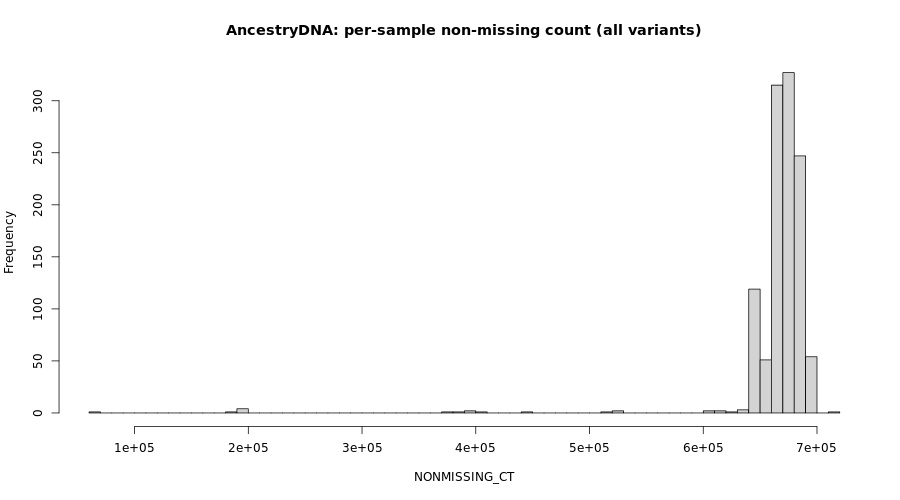
</div>
</div>

</details>

<details><summary>Show plot — AncestryDNA per-variant F_MISS</summary>

<div class="centered-container">
<div class="rounded-image-container" style="width: 100%;">
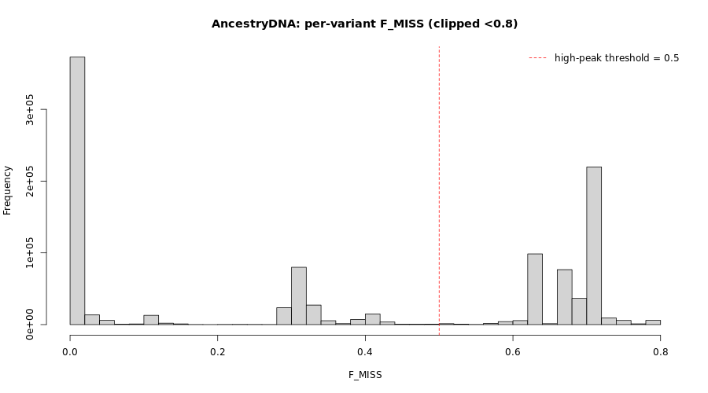
</div>
</div>

</details>

<details><summary>Show code</summary>

```{r}
smiss <- fread('~/oliverpainfel/Data/OpenSNP/zenodo_18493898/AncestryDNA.smiss')
smiss$NONMISSING_CT <- smiss$OBS_CT - smiss$MISSING_CT
hist(smiss$NONMISSING_CT, 50,
     main = 'AncestryDNA: per-sample non-missing count (all variants)',
     xlab = 'NONMISSING_CT')

vmiss <- fread('~/oliverpainfel/Data/OpenSNP/zenodo_18493898/AncestryDNA.vmiss')
vmiss <- vmiss[vmiss$F_MISS < 0.8, ]
hist(vmiss$F_MISS, 50,
     main = 'AncestryDNA: per-variant F_MISS (clipped <0.8)',
     xlab = 'F_MISS')
abline(v = 0.5, col = 'red', lty = 2)
legend('topright', 'high-peak threshold = 0.5', col = 'red', lty = 2, bty = 'n')

# Variants with F_MISS > 0.5 are present in a minority of samples ->
# carrier samples should cluster apart in the next step.
vmiss_high_peak <- vmiss$ID[vmiss$F_MISS > 0.5]
write.table(
  vmiss_high_peak,
  '~/oliverpainfel/Data/OpenSNP/zenodo_18493898/AncestryDNA_high_peak.extract',
  row.names = F,
  col.names = F,
  quote = F)
```

</details>

### Step 2 — split v1 using high-peak variants

Recompute sample missingness restricted to those high-peak variants:

<details><summary>Show code</summary>

```{bash}

/users/k1806347/oliverpainfel/Software/plink2 \
  --bfile ~/oliverpainfel/Data/OpenSNP/zenodo_18493898/AncestryDNA \
  --extract ~/oliverpainfel/Data/OpenSNP/zenodo_18493898/AncestryDNA_high_peak.extract \
  --missing \
  --out ~/oliverpainfel/Data/OpenSNP/zenodo_18493898/AncestryDNA_high_peak

```

</details>

The resulting histogram is cleanly bimodal — ~331 samples carry most of
the high-peak variants (NONMISSING_CT > 200,000) and form **v1**, while
the rest don't carry them and need further splitting.

<details><summary>Show plot — AncestryDNA NONMISSING_CT within high-peak variants</summary>

<div class="centered-container">
<div class="rounded-image-container" style="width: 100%;">
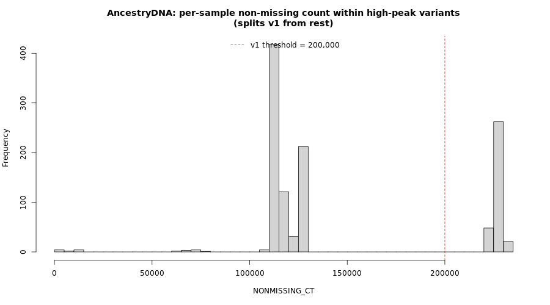
</div>
</div>

</details>

<details><summary>Show code</summary>

```{r}
smiss <- fread('~/oliverpainfel/Data/OpenSNP/zenodo_18493898/AncestryDNA_high_peak.smiss')
smiss$NONMISSING_CT <- smiss$OBS_CT - smiss$MISSING_CT
hist(smiss$NONMISSING_CT, 50,
     main = 'AncestryDNA: per-sample NONMISSING_CT within high-peak variants\n(splits v1 from rest)',
     xlab = 'NONMISSING_CT')
abline(v = 200000, col = 'red', lty = 2)
legend('top', 'v1 threshold = 200,000', col = 'red', lty = 2, bty = 'n')

# Samples carrying >200k high-peak variants are the v1 chip.
keep <- smiss$IID[smiss$NONMISSING_CT > 200000]
write.table(
  cbind(keep, keep),
  '~/oliverpainfel/Data/OpenSNP/zenodo_18493898/AncestryDNA_v1.keep',
  row.names = F,
  col.names = F,
  quote = F
)

```

</details>

### Step 3 — recurse on the not-v1 group

Compute missingness on the not-v1 samples to see whether the remaining
~806 samples are a single chip or a further mixture:

<details><summary>Show code</summary>

```{bash}

/users/k1806347/oliverpainfel/Software/plink2 \
  --bfile ~/oliverpainfel/Data/OpenSNP/zenodo_18493898/AncestryDNA \
  --remove ~/oliverpainfel/Data/OpenSNP/zenodo_18493898/AncestryDNA_v1.keep \
  --missing \
  --out ~/oliverpainfel/Data/OpenSNP/zenodo_18493898/AncestryDNA_not_v1

```

</details>

The not-v1 variant `F_MISS` distribution still has two clear bands at
~0.45 and ~0.55 — i.e. another mixture. Pull those band variants out as
a new high-peak set and use them to discriminate the remaining chips.

<details><summary>Show plot — AncestryDNA not_v1 per-variant F_MISS</summary>

<div class="centered-container">
<div class="rounded-image-container" style="width: 100%;">
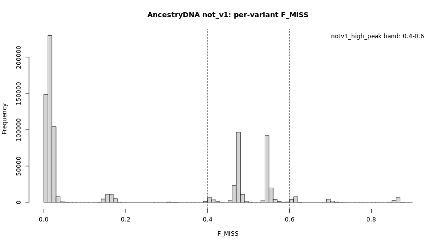
</div>
</div>

</details>

<details><summary>Show code</summary>

```{r}
vmiss <- fread('~/oliverpainfel/Data/OpenSNP/zenodo_18493898/AncestryDNA_not_v1.vmiss')
vmiss <- vmiss[vmiss$F_MISS < 0.9, ]
hist(vmiss$F_MISS, 100,
     main = 'AncestryDNA not_v1: per-variant F_MISS (clipped <0.9)',
     xlab = 'F_MISS')
abline(v = c(0.4, 0.6), col = 'red', lty = 2)
legend('topright', 'notv1_high_peak band: 0.4-0.6',
       col = 'red', lty = 2, bty = 'n')

# Variants in 0.4-0.6 missingness within not_v1 are the discriminating set
# between the remaining chips (v2 vs v3 vs v4).
notv1_high_peak <- vmiss$ID[vmiss$F_MISS > 0.4 & vmiss$F_MISS < 0.6]
write.table(
  notv1_high_peak,
  '~/oliverpainfel/Data/OpenSNP/zenodo_18493898/AncestryDNA_notv1_high_peak.extract',
  row.names = F, col.names = F, quote = F
)
```

</details>

<details><summary>Show code</summary>

```{bash}
# Sample missingness within the not_v1 group restricted to notv1_high_peak variants.

/users/k1806347/oliverpainfel/Software/plink2 \
  --bfile ~/oliverpainfel/Data/OpenSNP/zenodo_18493898/AncestryDNA \
  --remove ~/oliverpainfel/Data/OpenSNP/zenodo_18493898/AncestryDNA_v1.keep \
  --extract ~/oliverpainfel/Data/OpenSNP/zenodo_18493898/AncestryDNA_notv1_high_peak.extract \
  --missing \
  --out ~/oliverpainfel/Data/OpenSNP/zenodo_18493898/AncestryDNA_notv1_high_peak

```

</details>

The recomputed `NONMISSING_CT` histogram (excluding the lower tail of
stragglers) shows three tight, well-separated peaks corresponding to
**v2**, **v3** and **v4**. The lower tail (NONMISSING_CT < 125k, ~20
samples) is left unassigned — those samples will be removed by `--mind 0.05`
in the final filter step.

<details><summary>Show plot — AncestryDNA NONMISSING_CT within notv1 high-peak variants</summary>

<div class="centered-container">
<div class="rounded-image-container" style="width: 100%;">
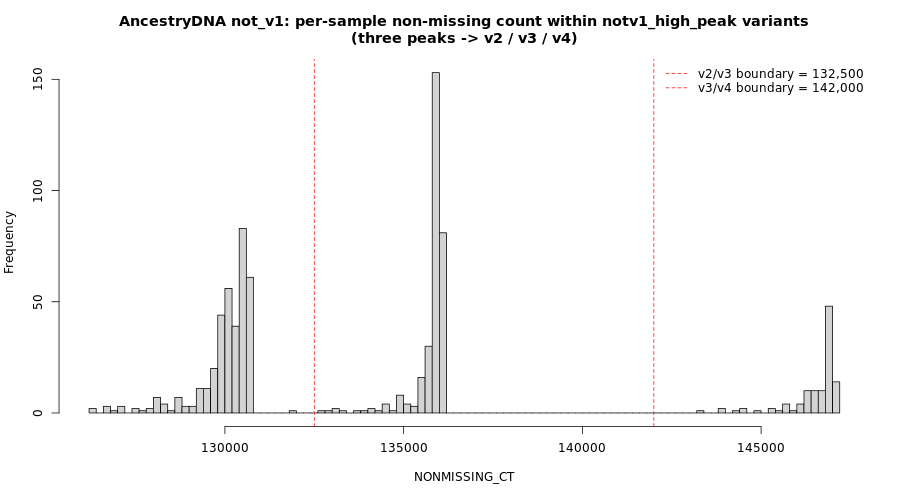
</div>
</div>

</details>

<details><summary>Show code</summary>

```{r}
smiss <- fread('~/oliverpainfel/Data/OpenSNP/zenodo_18493898/AncestryDNA_notv1_high_peak.smiss')
smiss$NONMISSING_CT <- smiss$OBS_CT - smiss$MISSING_CT
hist(smiss$NONMISSING_CT[smiss$NONMISSING_CT > 100000], 80,
     main = 'AncestryDNA not_v1: NONMISSING_CT within notv1_high_peak variants\n(three peaks -> v2 / v3 / v4)',
     xlab = 'NONMISSING_CT')
abline(v = c(132500, 142000), col = 'red', lty = 2)
legend('topright',
       c('v2/v3 boundary = 132,500', 'v3/v4 boundary = 142,000'),
       col = 'red', lty = 2, bty = 'n')

# Three tight clusters within not_v1:
#   ~365 samples at ~130k -> v2 (lower NONMISSING_CT in high-peak set)
#   ~310 samples at ~136k -> v3 (middle)
#   ~111 samples at ~147k -> v4 (upper)
# Plus ~20 lower-tail stragglers (<125k) that get dropped by --mind 0.05.
dat_v2 <- smiss$IID[smiss$NONMISSING_CT >= 125000 & smiss$NONMISSING_CT <  132500]
dat_v3 <- smiss$IID[smiss$NONMISSING_CT >= 132500 & smiss$NONMISSING_CT <= 142000]
dat_v4 <- smiss$IID[smiss$NONMISSING_CT >  142000]

write.table(cbind(dat_v2, dat_v2),
            '~/oliverpainfel/Data/OpenSNP/zenodo_18493898/AncestryDNA_v2.keep',
            row.names = F, col.names = F, quote = F)
write.table(cbind(dat_v3, dat_v3),
            '~/oliverpainfel/Data/OpenSNP/zenodo_18493898/AncestryDNA_v3.keep',
            row.names = F, col.names = F, quote = F)
write.table(cbind(dat_v4, dat_v4),
            '~/oliverpainfel/Data/OpenSNP/zenodo_18493898/AncestryDNA_v4.keep',
            row.names = F, col.names = F, quote = F)
```

</details>

### Step 4 — make per-array filesets and apply --geno / --mind

Same recipe as 23andMe: per-array `--make-bed`, then `--geno 0.05`, then
`--mind 0.05`.

<details><summary>Show code</summary>

```{bash}
for version in v1 v2 v3 v4; do
/users/k1806347/oliverpainfel/Software/plink2 \
  --bfile ~/oliverpainfel/Data/OpenSNP/zenodo_18493898/AncestryDNA \
  --keep ~/oliverpainfel/Data/OpenSNP/zenodo_18493898/AncestryDNA_${version}.keep \
  --make-bed \
  --out ~/oliverpainfel/Data/OpenSNP/zenodo_18493898/AncestryDNA_${version}

/users/k1806347/oliverpainfel/Software/plink2 \
  --bfile ~/oliverpainfel/Data/OpenSNP/zenodo_18493898/AncestryDNA_${version} \
  --geno 0.05 \
  --make-bed \
  --out ~/oliverpainfel/Data/OpenSNP/zenodo_18493898/AncestryDNA_${version}_geno

/users/k1806347/oliverpainfel/Software/plink2 \
  --bfile ~/oliverpainfel/Data/OpenSNP/zenodo_18493898/AncestryDNA_${version}_geno \
  --mind 0.05 \
  --make-bed \
  --out ~/oliverpainfel/Data/OpenSNP/zenodo_18493898/AncestryDNA_${version}_filtered
done

```

</details>

Per-sub-array variant `F_MISS` after splitting (computed on each
`AncestryDNA_v?.keep` subset *before* `--geno`/`--mind`). Each panel has a
single tight peak near zero plus a small tail — i.e. each sub-array is
behaving like a single clean chip.

<details><summary>Show plot — AncestryDNA per-sub-array variant F_MISS</summary>

<div class="centered-container">
<div class="rounded-image-container" style="width: 100%;">
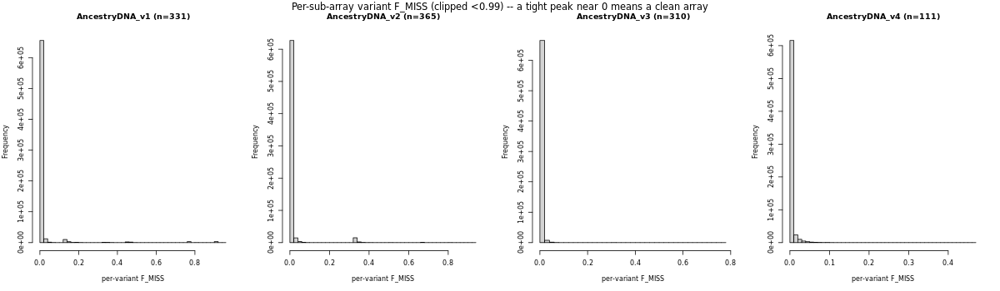
</div>
</div>

</details>

***

## FamilyTree

FamilyTreeDNA is the easiest of the three: the per-sample `NONMISSING_CT`
histogram is directly multimodal — no high-peak variant trick needed.
Three clusters are visible and we split on them directly. (The
cross-array variant overlap check at the end of this document confirms
that *only* three groups are warranted, even though an earlier exploratory
split into four sub-arrays looked plausible from the histogram alone — see
the FamilyTreeDNA notes in the Summary section.)

<details><summary>Show plot — FamilyTreeDNA per-sample NONMISSING_CT with thresholds</summary>

<div class="centered-container">
<div class="rounded-image-container" style="width: 100%;">
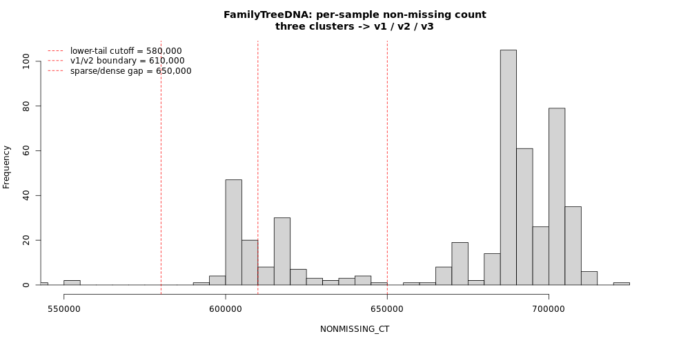
</div>
</div>

</details>

<details><summary>Show plot — FamilyTreeDNA per-variant F_MISS</summary>

<div class="centered-container">
<div class="rounded-image-container" style="width: 100%;">
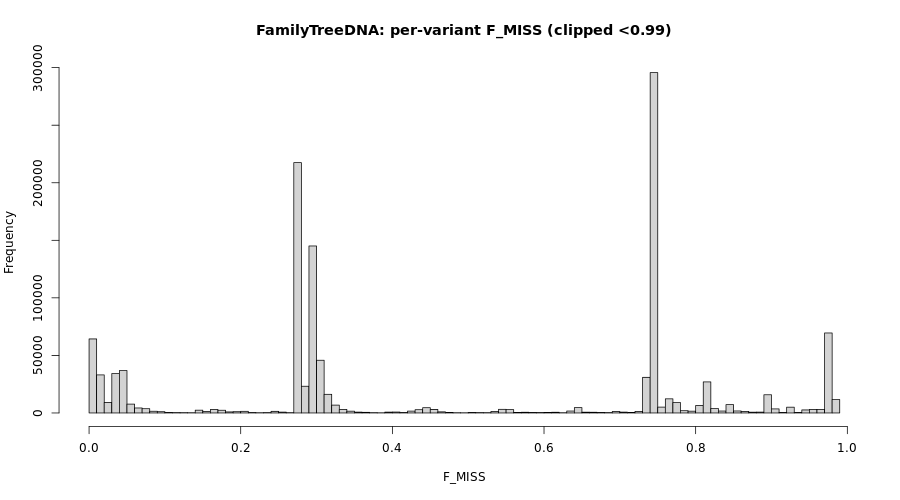
</div>
</div>

</details>

<details><summary>Show code</summary>

```{r}
smiss <- fread('~/oliverpainfel/Data/OpenSNP/zenodo_18493898/FamilyTreeDNA.smiss')
smiss$NONMISSING_CT <- smiss$OBS_CT - smiss$MISSING_CT
hist(smiss$NONMISSING_CT, 120, xlim = c(550000, 730000),
     main = 'FamilyTreeDNA: per-sample non-missing count\nthree clusters -> v1 / v2 / v3',
     xlab = 'NONMISSING_CT')
abline(v = c(580000, 610000, 650000), col = 'red', lty = 2)
legend('topleft',
       c('lower-tail cutoff = 580,000',
         'v1/v2 boundary = 610,000',
         'sparse/dense gap = 650,000'),
       col = 'red', lty = 2, bty = 'n')

vmiss <- fread('~/oliverpainfel/Data/OpenSNP/zenodo_18493898/FamilyTreeDNA.vmiss')
vmiss <- vmiss[!is.na(vmiss$F_MISS) & vmiss$F_MISS < 0.99, ]
hist(vmiss$F_MISS, 100,
     main = 'FamilyTreeDNA: per-variant F_MISS (clipped <0.99)',
     xlab = 'F_MISS')

# Three clusters kept, plus a lower tail dropped by --mind 0.05 below:
#   ~72  samples at 580-610k -> v1 (sparse, lower)
#   ~58  samples at 610-650k -> v2 (sparse, upper)
#   ~358 samples at >=650k   -> v3 (dense)
dat_v1 <- smiss$IID[smiss$NONMISSING_CT >= 580000 & smiss$NONMISSING_CT <  610000]
dat_v2 <- smiss$IID[smiss$NONMISSING_CT >= 610000 & smiss$NONMISSING_CT <  650000]
dat_v3 <- smiss$IID[smiss$NONMISSING_CT >= 650000]

write.table(cbind(dat_v1, dat_v1),
            '~/oliverpainfel/Data/OpenSNP/zenodo_18493898/FamilyTreeDNA_v1.keep',
            row.names = F, col.names = F, quote = F)
write.table(cbind(dat_v2, dat_v2),
            '~/oliverpainfel/Data/OpenSNP/zenodo_18493898/FamilyTreeDNA_v2.keep',
            row.names = F, col.names = F, quote = F)
write.table(cbind(dat_v3, dat_v3),
            '~/oliverpainfel/Data/OpenSNP/zenodo_18493898/FamilyTreeDNA_v3.keep',
            row.names = F, col.names = F, quote = F)
```

</details>

<details><summary>Show code</summary>

```{bash}
# Make per-array beds and apply --geno 0.05 then --mind 0.05 (same recipe as 23andMe)

for version in v1 v2 v3; do
/users/k1806347/oliverpainfel/Software/plink2 \
  --bfile ~/oliverpainfel/Data/OpenSNP/zenodo_18493898/FamilyTreeDNA \
  --keep ~/oliverpainfel/Data/OpenSNP/zenodo_18493898/FamilyTreeDNA_${version}.keep \
  --make-bed \
  --out ~/oliverpainfel/Data/OpenSNP/zenodo_18493898/FamilyTreeDNA_${version}

/users/k1806347/oliverpainfel/Software/plink2 \
  --bfile ~/oliverpainfel/Data/OpenSNP/zenodo_18493898/FamilyTreeDNA_${version} \
  --geno 0.05 \
  --make-bed \
  --out ~/oliverpainfel/Data/OpenSNP/zenodo_18493898/FamilyTreeDNA_${version}_geno

/users/k1806347/oliverpainfel/Software/plink2 \
  --bfile ~/oliverpainfel/Data/OpenSNP/zenodo_18493898/FamilyTreeDNA_${version}_geno \
  --mind 0.05 \
  --make-bed \
  --out ~/oliverpainfel/Data/OpenSNP/zenodo_18493898/FamilyTreeDNA_${version}_filtered
done

```

</details>

Per-sub-array variant `F_MISS` after splitting. v3 is clean (single tight
peak near zero); v1 and v2 still show some bimodality, indicating the
*sparse* group probably contains low-grade chip-version heterogeneity that
the sample histogram doesn't resolve. The residual is absorbed by
`--geno 0.05`, which only keeps variants present in ≥95% of each
sub-array's samples — and `--mind 0.05` drops just one sample across all
three sub-arrays, so the splits are usable as-is.

<details><summary>Show plot — FamilyTreeDNA per-sub-array variant F_MISS</summary>

<div class="centered-container">
<div class="rounded-image-container" style="width: 100%;">
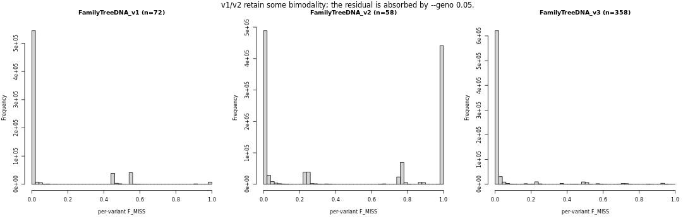
</div>
</div>

</details>

***

## Summary

### Per-array sample and variant counts

After all splitting and filtering, the per-array sample (`n_ind`) and
variant (`n_var`) counts are summarised by the chunk below. The relevant
output is included as a static table immediately afterwards so the
document is readable without re-running the chunks.

<details><summary>Show code</summary>

```{r}
library(data.table)
# Check sample size and number of variants in filtered and unfiltered versions of each dataset
datasets <- c('23andme','23andme_v3','23andme_v4','23andme_v5',
              'AncestryDNA','AncestryDNA_v1','AncestryDNA_v2','AncestryDNA_v3','AncestryDNA_v4',
              'FamilyTreeDNA','FamilyTreeDNA_v1','FamilyTreeDNA_v2','FamilyTreeDNA_v3')
types <- c('filtered','unfiltered')

stats <- NULL
for(i in datasets){
  for(j in types){
    tmp_bim <- fread(
      paste0(
        '~/oliverpainfel/Data/OpenSNP/zenodo_18493898/',
        i,
        ifelse(j == 'filtered', '_filtered', ''),
        '.bim'
      ),
      header = F
    )
    tmp_fam <- fread(
      paste0(
        '~/oliverpainfel/Data/OpenSNP/zenodo_18493898/',
        i,
        ifelse(j == 'filtered', '_filtered', ''),
        '.fam'
      ),
      header = F
    )
    stats <- rbind(
      stats,
      data.frame(
        dataset = i,
        type = j,
        n_var = nrow(tmp_bim),
        n_ind = nrow(tmp_fam)
      )
    )
  }
}

# A lot more variants are retained per array than in the company-wide
# `_filtered` files shipped in the Zenodo archive, because we no longer
# have to take the intersection across chips.
```

</details>

Snapshot of the `_filtered` per-array counts produced above:

| array | n_ind | n_var |
|---|---:|---:|
| AncestryDNA_v1_filtered | 331 | 675,445 |
| AncestryDNA_v2_filtered | 364 | 650,609 |
| AncestryDNA_v3_filtered | 310 | 680,327 |
| AncestryDNA_v4_filtered | 111 | 663,343 |
| FamilyTreeDNA_v1_filtered | 72 | 561,522 |
| FamilyTreeDNA_v2_filtered | 57 | 523,207 |
| FamilyTreeDNA_v3_filtered | 358 | 662,827 |

(23andMe sample counts are produced by the chunk above — these depend on
the exact `--mind 0.05` cut and aren't pinned in this static snapshot. The
23andMe `_filtered` variant counts are 933,618 (v3), 459,381 (v4) and
585,145 (v5).)

### Variant overlap across sub-arrays

The single best sanity check that a per-company split actually captured
different chips — rather than two density tiers of the same chip — is the
**variant overlap matrix** across sub-arrays. After `--geno 0.05` each
sub-array has been reduced to its own clean variant set; if two sub-arrays
share ~all of their variants, they are the same chip and should be merged.

<details><summary>Show code</summary>

```{r}
# Sanity-check the sub-array splits: how many variants survive the per-array
# --geno 0.05 filter in *every* sub-array of a given company? A clean split
# leaves a large shared backbone but each sub-array also has chip-specific
# variants that the others don't.

library(data.table)

groups <- list(
  '23andme'       = c('23andme_v3','23andme_v4','23andme_v5'),
  'AncestryDNA'   = c('AncestryDNA_v1','AncestryDNA_v2','AncestryDNA_v3','AncestryDNA_v4'),
  'FamilyTreeDNA' = c('FamilyTreeDNA_v1','FamilyTreeDNA_v2','FamilyTreeDNA_v3')
)

overlap <- NULL
for (company in names(groups)) {
  vars <- lapply(groups[[company]], function(x)
    fread(paste0('~/oliverpainfel/Data/OpenSNP/zenodo_18493898/', x, '_filtered.bim'),
          header = F)$V2
  )
  names(vars) <- groups[[company]]
  shared_all <- Reduce(intersect, vars)
  union_all  <- Reduce(union, vars)
  overlap <- rbind(overlap, data.frame(
    company        = company,
    n_arrays       = length(vars),
    per_array_n    = paste(sapply(vars, length), collapse = '/'),
    shared_all     = length(shared_all),
    union_all      = length(union_all),
    shared_frac_min = round(length(shared_all) / min(sapply(vars, length)), 3)
  ))
}
print(overlap)

# Pairwise overlap within each company (helpful to see *which* sub-array is
# the odd one out, if any).
for (company in names(groups)) {
  vars <- lapply(groups[[company]], function(x)
    fread(paste0('~/oliverpainfel/Data/OpenSNP/zenodo_18493898/', x, '_filtered.bim'),
          header = F)$V2
  )
  names(vars) <- groups[[company]]
  m <- outer(seq_along(vars), seq_along(vars),
             Vectorize(function(i, j) length(intersect(vars[[i]], vars[[j]]))))
  dimnames(m) <- list(names(vars), names(vars))
  cat('\n', company, '— pairwise variant overlap:\n', sep = '')
  print(m)
}
```

</details>

#### Per-company summary

| company | n_arrays | per-array variants | shared across all | shared / smallest |
|---|---:|---|---:|---:|
| 23andme | 3 | 933,618 / 459,381 / 585,145 | 105,451 | 0.230 |
| AncestryDNA | 4 | 675,445 / 650,609 / 680,327 / 663,343 | 390,448 | 0.600 |
| FamilyTreeDNA | 3 | 561,522 / 523,207 / 662,827 | 153,826 | 0.292 |

#### Pairwise overlap matrices

**23andMe** — the OmniExpress backbone is shared by v3 and v4 (453k); v5
(GSA) is genuinely different from both:

|  | 23andme_v3 | 23andme_v4 | 23andme_v5 |
|---|---:|---:|---:|
| 23andme_v3 | 933,618 | 452,737 | 189,684 |
| 23andme_v4 | 452,737 | 459,381 | 106,485 |
| 23andme_v5 | 189,684 | 106,485 | 585,145 |

**AncestryDNA** — all four chips share a 390k backbone, and pairwise
overlaps are 414–641k. v3 and v4 share the most (641k of 663–680k), but
each still has tens of thousands of chip-specific variants, so they are
genuine separate chips, not duplicates:

|  | v1 | v2 | v3 | v4 |
|---|---:|---:|---:|---:|
| AncestryDNA_v1 | 675,445 | 414,794 | 441,568 | 433,898 |
| AncestryDNA_v2 | 414,794 | 650,609 | 520,344 | 507,753 |
| AncestryDNA_v3 | 441,568 | 520,344 | 680,327 | 641,340 |
| AncestryDNA_v4 | 433,898 | 507,753 | 641,340 | 663,343 |

**FamilyTreeDNA** — two genuinely different chips: the *sparse* family
(v1 + v2) shares 486k variants out of 523–561k (~93%), and v1 ∩ v2 is
much higher than either's overlap with v3 (only ~155–199k). The *dense*
group used to be split further into a v3/v4 pair by sample missingness,
but the pairwise overlap was 656k of 657–683k (99.8%) — meaning that
"v4" was essentially a slightly higher-density version of the same chip.
Those two were therefore merged into a single v3.

|  | v1 | v2 | v3 |
|---|---:|---:|---:|
| FamilyTreeDNA_v1 | 561,522 | 486,260 | 199,085 |
| FamilyTreeDNA_v2 | 486,260 | 523,207 | 154,163 |
| FamilyTreeDNA_v3 | 199,085 | 154,163 | 662,827 |

(v1 and v2 are kept distinct because they carry meaningfully different
variant counts — 561k vs 523k — and the within-pair overlap is "only"
~93%, not the 99.8% seen for the merged v3/v4 dense group.)

