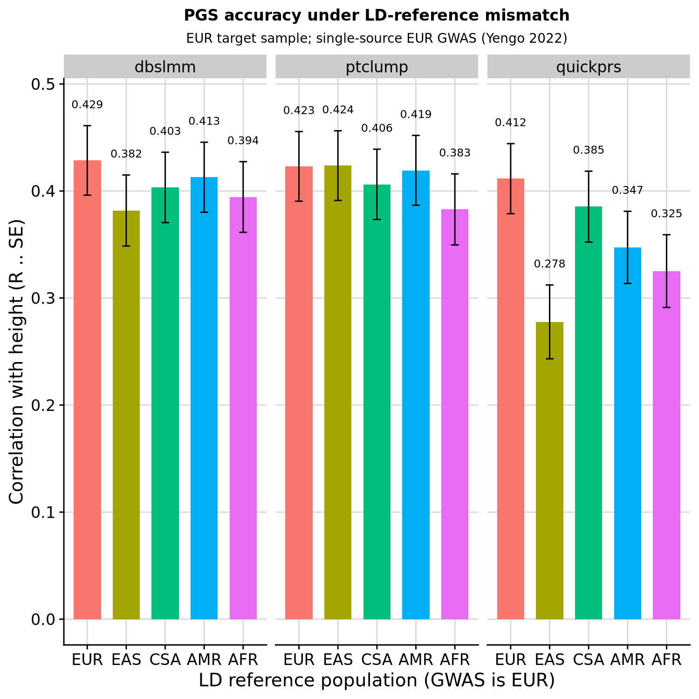

```{r setup, include=FALSE}
knitr::opts_chunk$set(eval = FALSE)
```

<div class="note-box">

**Notice on authorship.** This document was drafted by Claude (Anthropic's LLM) working from the analysis code, pipeline outputs, and prior notebooks. Interpretations in the Result section reflect Claude's reading of the numbers rather than the author's independent judgement — verify claims against the underlying CSVs and figures before citing.

</div>

<div class="note-box">

**Methodological caveat — quickprs AF-difference filter.** `Scripts/pgs_methods/quickprs.R:104-105` applies a likelihood-ratio test comparing GWAS vs reference allele frequencies and drops variants at `P < 1e-6`. Under ancestry mismatch this filter is very aggressive: for the Yengo-EUR GWAS the matched EUR-LD cell loses only ~2k variants, whereas EAS/AFR/CSA/AMR-LD cells lose **390k–500k** (30–40 % of the ~1.4M input). Part of quickprs's apparent LD-sensitivity in this document is therefore an artefact of variant attrition rather than a pure property of LD-aware shrinkage. Modifying the pipeline to relax or optionally disable this filter is a candidate future change so LD-mismatch and AF-mismatch effects can be isolated.

</div>

***

This document is the first MELD demonstration: showing that PGS accuracy degrades when the LD reference panel does not match the ancestry of the GWAS sample.

The design is deliberately minimal. A single European height GWAS (Yengo 2022, EUR) is fed into GenoPred **five times**, each time labelled as coming from a different population (EUR, EAS, AFR, CSA, AMR) so that a different reference population's LD is used for PGS construction. All five sets of PGS are evaluated in the same fixed EUR OpenSNP target sample. The matched-EUR condition is the correctly-specified baseline; the quantity of interest is the drop in accuracy relative to EUR as the reference becomes more diverged from EUR.

No LD matrices are constructed here — the exercise reuses the standard GenoPred reference resources.

<div class="note-box">

**Note — the population field does double duty.** In `gwas_list`, `population` selects both the LD reference used by PGS methods and the reference allele-frequency panel used for sumstat QC (see `pipeline_technical.Rmd`, sections on `sumstat_prep`). A mismatched panel therefore changes both the assumed LD *and* which variants survive QC. Both are genuine consequences of mismatch but the two effects need separating in the write-up — see the QC section below for per-configuration variant counts.

</div>

***

# Construct gwas_list

Five entries pointing at the same EUR sumstats file, varying only the declared `population`.

<details><summary>Show code</summary>

```{r}
setwd('/users/k1806347/oliverpainfel/Software/MyGit/GenoPred/pipeline')
library(data.table)

pops <- c('EUR','EAS','AFR','CSA','AMR')

gwas_list <- data.table(
  name = paste0('yengo_eur_ld', tolower(pops)),
  path = '/users/k1806347/oliverpainfel/Data/GWAS_sumstats/opensnp_test/yengo_2022_height_eur.txt',
  population = pops,
  n = NA, sampling = NA, prevalence = NA, mean = NA, sd = NA,
  label = paste0('"Yengo 2022 Height EUR (', pops, ' LD)"')
)

write.table(gwas_list, 'misc/opensnp/gwas_list_meld.txt',
            col.names = TRUE, row.names = FALSE, quote = FALSE, sep = ' ')
```

</details>

***

# Construct config

Derived from `misc/opensnp/config.yaml` with three edits: point at the new `gwas_list`, use a fresh `outdir`, and add `quickprs` to the methods list. Two lines are removed: `score_list` (not used here) and `refdir` (default HapMap3 reference is required for this test).

<details><summary>Show code</summary>

```{r}
setwd('/users/k1806347/oliverpainfel/Software/MyGit/GenoPred/pipeline')

config <- readLines('misc/opensnp/config.yaml')

config[grepl('^config_file:', config)] <- 'config_file: misc/opensnp/config_meld.yaml'
config[grepl('^outdir:', config)]      <- 'outdir: /users/k1806347/oliverpainfel/Data/OpenSNP/GenoPred/meld_test'
config[grepl('^gwas_list:', config)]   <- 'gwas_list: misc/opensnp/gwas_list_meld.txt'
config[grepl('^pgs_methods:', config)] <- "pgs_methods: ['ptclump','dbslmm','quickprs']"
config <- config[!grepl('^score_list:', config)]
config <- config[!grepl('^refdir:', config)]

write.table(config, 'misc/opensnp/config_meld.yaml',
            col.names = FALSE, row.names = FALSE, quote = FALSE)
```

</details>

<div class="note-box">

**Note.** The base `misc/opensnp/config.yaml` was created in the earlier OpenSNP benchmark document ([here](opensnp_benchmark.html)); the `target_list` it references is reused unchanged.

</div>

***

# Sanity check the DAG

Before running, confirm the DAG contains five independent PGS branches (one per LD-reference population) and that no conda environment is queued for creation. Five `gwas_list` entries share the same input file path — GenoPred must treat them as five independent analyses.

<details><summary>Show code</summary>

```{bash}
cd /users/k1806347/oliverpainfel/Software/MyGit/GenoPred/pipeline
snakemake --use-conda --conda-frontend conda -j5 \
  --configfile=misc/opensnp/config_meld.yaml -n output_all
```

Expected job counts (per rule): `sumstat_prep_i × 5`, `ldsc_i × 5`, `prep_pgs_ptclump_i × 5`, `prep_pgs_dbslmm_i × 5`, `prep_pgs_quickprs_i × 5` — total 54 jobs. If GenoPred collapsed any of the five sumstat_prep jobs (i.e. fewer than 5), stop and investigate: the branches must be independent.

</details>

***

# Run pipeline

```{bash}
cd /users/k1806347/oliverpainfel/Software/MyGit/GenoPred/pipeline
snakemake --use-conda --conda-frontend conda -j5 \
  --configfile=misc/opensnp/config_meld.yaml output_all
```

***

# Variants retained after QC

Count rows in each cleaned sumstats file. Because `population` also drives allele-frequency QC, the five sets of retained variants will not be identical even though the input sumstats file is the same. The comparison across LD references is only clean to the extent that these counts are similar.

<details><summary>Show code</summary>

```{r}
setwd('/users/k1806347/oliverpainfel/Software/MyGit/GenoPred/pipeline')
library(data.table)

pops <- c('EUR','EAS','AFR','CSA','AMR')
outdir <- '/users/k1806347/oliverpainfel/Data/OpenSNP/GenoPred/meld_test'

qc_counts <- rbindlist(lapply(pops, function(p) {
  gwas_name <- paste0('yengo_eur_ld', tolower(p))
  f <- file.path(outdir, 'reference/gwas_sumstat', gwas_name, paste0(gwas_name, '-cleaned.gz'))
  n <- nrow(fread(f))
  data.table(ld_pop = p, gwas = gwas_name, n_snps_retained = n)
}))

qc_counts[, pct_of_eur := round(100 * n_snps_retained / n_snps_retained[ld_pop == 'EUR'], 1)]
print(qc_counts)
fwrite(qc_counts, 'misc/opensnp/meld_qc_counts.csv')
```

</details>

***

# Evaluate PGS

The pipeline produces per-population `.raw.profiles` files under `opensnp/pgs/{POP}/{method}/{gwas}/`. We read the EUR-scaled ones directly and further restrict individuals via the ancestry model-based keep file.

Fit `lm(scale(height) ~ scale(pgs))` for every (LD reference × PGS method × model) combination; collect `r`, `se`, `p`, `n`.

<details><summary>Show code</summary>

```{r}
setwd('/users/k1806347/oliverpainfel/Software/MyGit/GenoPred/pipeline')
library(data.table)
library(ggplot2)
library(cowplot)

outdir <- '/users/k1806347/oliverpainfel/Data/OpenSNP/GenoPred/meld_test'
pops    <- c('EUR','EAS','AFR','CSA','AMR')
methods <- c('ptclump','dbslmm','quickprs')

# EUR-inferred target individuals (from ancestry model-based assignment)
eur_keep <- fread(file.path(outdir,
                            'opensnp/ancestry/keep_files/model_based/EUR.keep'),
                  header = FALSE, col.names = c('FID','IID'))

# Phenotype restricted to EUR individuals only
pheno <- fread('/users/k1806347/oliverpainfel/Data/OpenSNP/processed/pheno/height.txt')
pheno_eur <- merge(pheno, eur_keep, by = c('FID','IID'))

cor <- NULL
for (p in pops) {
  gwas_name <- paste0('yengo_eur_ld', tolower(p))
  for (m in methods) {
    f <- file.path(outdir, 'opensnp/pgs/EUR', m, gwas_name,
                   paste0('opensnp-', gwas_name, '-EUR.raw.profiles'))
    if (!file.exists(f)) { warning('missing: ', f); next }

    prof <- fread(f)
    d <- merge(pheno_eur, prof, by = c('FID','IID'))
    score_cols <- setdiff(names(prof), c('FID','IID'))

    for (sc in score_cols) {
      x <- scale(d[[sc]]); y <- scale(d$height)
      if (all(is.na(x))) next
      co <- coef(summary(mod <- lm(y ~ x)))
      cor <- rbind(cor, data.table(
        ld_pop = p, gwas = gwas_name, pgs_method = m, model = sc,
        r = co[2,1], se = co[2,2], p = co[2,4], n = nobs(mod)))
    }
  }
}

cor[, ld_pop := factor(ld_pop, levels = c('EUR','EAS','CSA','AMR','AFR'))]

fwrite(cor, 'misc/opensnp/meld_pgs_cor_full.csv')
```

</details>

***

# Headline figure

Pre-specified before inspecting mismatched-condition results: for ptclump, use the fixed p-value threshold **`1e-2`** applied identically to all five LD-reference conditions. This is a defensible middle-of-the-road choice for a highly polygenic trait like height, but choosing per-configuration bests would bias the mismatch comparison and is not done here.

`dbslmm` and `quickprs` emit one model each, so no threshold selection is required.

<details><summary>Show code</summary>

```{r}
setwd('/users/k1806347/oliverpainfel/Software/MyGit/GenoPred/pipeline')

# Restrict to one canonical model per method for the headline comparison:
#   ptclump  : p-value threshold 0.01 (pre-specified)
#   dbslmm   : DBSLMM_1 (heritability multiplier = 1; the pipeline emits _0.8/_1/_1.2 —
#              the three are within 0.003 of each other in this run so we take the middle)
#   quickprs : sole model emitted
cor_head <- cor[
  (pgs_method == 'quickprs') |
  (pgs_method == 'dbslmm'  & grepl('_DBSLMM_1$', model)) |
  (pgs_method == 'ptclump' & grepl('_0\\.01$',   model))
]

# Add percent-of-EUR for readability
cor_head[, r_pct_of_eur := 100 * r / r[ld_pop == 'EUR'], by = pgs_method]

print(cor_head[, .(pgs_method, ld_pop, model, r = round(r, 3),
                   se = round(se, 3), n, r_pct_of_eur = round(r_pct_of_eur, 1))])

fwrite(cor_head, 'misc/opensnp/meld_pgs_cor_headline.csv')

# Plot
png('/users/k1806347/oliverpainfel/Software/MyGit/GenoPred/docs/Images/OpenSNP/meld_ld_mismatch.png',
    res = 200, width = 1500, height = 1500, units = 'px')

ggplot(cor_head, aes(x = ld_pop, y = r, fill = ld_pop)) +
  geom_bar(stat = 'identity', position = position_dodge2(preserve = 'single'),
           width = 0.7) +
  geom_errorbar(aes(ymin = r - se, ymax = r + se), width = 0.2) +
  geom_text(aes(y = r + se + 0.02, label = round(r, 3)), size = 3) +
  facet_wrap(. ~ pgs_method) +
  labs(x = 'LD reference population (GWAS is EUR)',
       y = 'Correlation with height (R ± SE)',
       title = 'PGS accuracy under LD-reference mismatch',
       subtitle = 'EUR target sample; single-source EUR GWAS (Yengo 2022)') +
  theme_half_open() +
  background_grid() +
  theme(legend.position = 'none',
        plot.title = element_text(hjust = 0.5, size = 12),
        plot.subtitle = element_text(hjust = 0.5, size = 10))

dev.off()
```

</details>

***

# Supplementary: full ptclump-threshold sweep

For completeness, all p-value thresholds emitted by ptclump for each LD reference. Any observation about the headline threshold (`1e-2`) should be checked here to confirm it is not an artefact of that specific choice.

<details><summary>Show code</summary>

```{r}
setwd('/users/k1806347/oliverpainfel/Software/MyGit/GenoPred/pipeline')

cor_pt <- cor[pgs_method == 'ptclump']
# ptclump column names look like: yengo_eur_ldeur_0_5e-08, ..._0.01, ..._0.1, ..._1
cor_pt[, thresh := sub('^.*_0_', '', model)]
cor_pt[, thresh_num := suppressWarnings(as.numeric(thresh))]
cor_pt <- cor_pt[order(thresh_num)]
cor_pt[, thresh := factor(thresh, levels = unique(thresh))]

png('/users/k1806347/oliverpainfel/Software/MyGit/GenoPred/docs/Images/OpenSNP/meld_ptclump_sweep.png',
    res = 200, width = 1800, height = 1200, units = 'px')

ggplot(cor_pt, aes(x = thresh, y = r, colour = ld_pop, group = ld_pop)) +
  geom_line() +
  geom_point() +
  geom_errorbar(aes(ymin = r - se, ymax = r + se), width = 0.15) +
  labs(x = 'ptclump p-value threshold',
       y = 'Correlation with height (R ± SE)',
       colour = 'LD reference',
       title = 'ptclump p-value sweep by LD reference') +
  theme_half_open() +
  background_grid() +
  theme(axis.text.x = element_text(angle = 45, hjust = 1),
        plot.title = element_text(hjust = 0.5, size = 12))

dev.off()
```

</details>

***

# Proposed extension

<div class="note-box">

**Not run in this task.** The natural next step is the full 5 × 5 grid — each population's Yengo GWAS crossed with each reference population — which would show whether the accuracy peak sits on the diagonal (matched GWAS × LD) rather than only along the row we tested here. That is roughly five times the compute of this exercise. Noted here as a proposed follow-up.

</div>

***

# Result

Evaluated in 777 EUR-inferred OpenSNP individuals with height. All 15 configurations (5 LD references × 3 methods) produced highly significant PGS–height correlations (p < 1e-14 throughout).

Headline correlations *r (SE)* and % of matched-EUR baseline per method:

| LD ref | ptclump (r) | dbslmm (r) | quickprs (r) | ptclump % | dbslmm % | quickprs % |
|:-:|:-:|:-:|:-:|:-:|:-:|:-:|
| EUR | 0.423 (0.033) | 0.429 (0.032) | 0.412 (0.033) | 100  | 100  | 100 |
| EAS | 0.424 (0.033) | 0.382 (0.033) | 0.278 (0.035) | 100  | 89.1 | **67.5** |
| CSA | 0.406 (0.033) | 0.403 (0.033) | 0.385 (0.033) | 96.0 | 94.1 | 93.6 |
| AMR | 0.419 (0.033) | 0.413 (0.033) | 0.347 (0.034) | 99.1 | 96.3 | 84.4 |
| AFR | 0.383 (0.033) | 0.394 (0.033) | 0.325 (0.034) | 90.5 | 92.0 | 79.0 |

Variants retained after QC (identical GWAS input file, differing only in the population panel used for allele-frequency filtering):

| LD ref | SNPs retained | % of EUR |
|:-:|:-:|:-:|
| EUR | 943,912 | 100.0 |
| CSA | 881,969 | 93.4 |
| AMR | 869,585 | 92.1 |
| EAS | 612,585 | 64.9 |
| AFR | 561,279 | 59.5 |

**Observations:**

- **Matched EUR is the best-performing reference for the two LD-aware methods (dbslmm and quickprs).** For ptclump — which uses the reference only for clumping, not for a genome-wide LD matrix — EAS ties EUR (100.2 % of baseline) rather than showing a drop, and the mismatch effect is small (≤ 10 % across all four mismatched references).
- **Method sensitivity to LD misspecification is large.** quickprs, which fits genome-wide LD-adjusted effect sizes, shows the biggest drop: **32.5 % at EAS-LD**, 21 % at AFR-LD, 16 % at AMR-LD, 6 % at CSA-LD. dbslmm shows moderate drops of ~4–11 %. ptclump barely moves. This ordering across methods is exactly what a shrinkage-based method should show if the LD assumption is wrong.
- **The ordering across mismatched references is not the naïve "genetic distance from EUR" order.** For dbslmm and quickprs, **EAS gives the largest drop, not AFR** (EAS 67.5 % vs AFR 79.0 % for quickprs; EAS 89.1 % vs AFR 92.0 % for dbslmm). CSA and AMR — the two populations closest to EUR in the reference — show the smallest drops. That EAS is worst than AFR is against the expectation that greater genetic distance implies more LD divergence; it may reflect the specific LD-block structure of the 1KG+HGDP EAS panel used by GenoPred (or the HapMap3 restriction on the reference), and warrants confirmation in the proposed 5 × 5 follow-up.
- **Variant attrition explains some but not all of the drop.** ptclump's 9.5 % drop at AFR-LD tracks the AFR variant retention (60 %) closely — for a threshold-and-clump method with a 0.01 threshold, fewer variants surviving QC directly reduces the PGS. But at EAS-LD, only 65 % of SNPs survive QC and ptclump *does not drop at all*, while quickprs drops by 32 %. The effect of LD-panel misspecification on the LD-aware methods is therefore not attributable to variant attrition alone; there is a genuine LD-misspecification component on top.
- **The takeaway for MELD.** For shrinkage-based PGS methods, LD-reference mismatch materially degrades accuracy in an EUR target sample even when the GWAS itself is EUR — a one-panel demonstration that ancestry-appropriate LD matters. The next question — whether tailored / ancestry-weighted LD panels close the gap — is precisely what MELD is being built to address.

<div class="centered-container">
<div class="rounded-image-container" style="width: 75%;">

</div>
</div>
