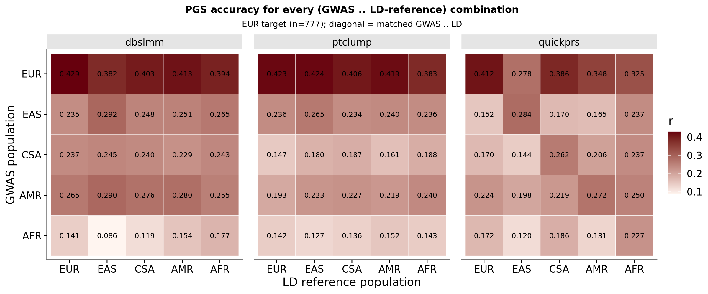
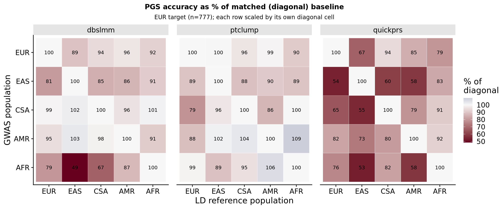

```{r setup, include=FALSE}
knitr::opts_chunk$set(eval = FALSE)
```

***

Follow-up to the [single-row demonstration](opensnp_ld_mismatch.html), which showed that a European height GWAS (Yengo 2022) fed through mismatched LD references degrades PGS accuracy for the LD-aware methods (dbslmm, quickprs). That row raised two questions the single row could not settle: whether the accuracy peak sits on the matched-GWAS × matched-LD *diagonal*, and whether EAS-LD is systematically bad or just a quirk of the EUR-GWAS row.

The 5 × 5 grid — each Yengo GWAS (EUR / EAS / AFR / CSA / AMR) crossed with each declared LD population — answers both. All 25 combinations are scored with three PGS methods (`ptclump`, `dbslmm`, `quickprs`) and evaluated in the same fixed EUR OpenSNP target sample (n = 777).

<div class="note-box">

**Non-EUR target populations are underpowered here.** The OpenSNP ancestry inference gives EAS 17, AFR 19, CSA 16, AMR 17 individuals with height. Per-cell SE on `r` at n≈17 is ~0.24, larger than the mismatch effects being measured. Only the EUR-target 5 × 5 is interpreted; other targets are omitted.

</div>

***

# Construct gwas_list

25 rows: 5 GWAS populations × 5 declared LD populations. Same file used for all five rows within a GWAS-population group; only the declared `population` varies.

<details><summary>Show code</summary>

```{r}
setwd('/users/k1806347/oliverpainfel/Software/MyGit/GenoPred/pipeline')
library(data.table)

pops <- c('EUR','EAS','AFR','CSA','AMR')
grid <- CJ(gwas_pop = pops, ld_pop = pops)
# File suffix uses 'sas' for the CSA GWAS; other populations use their lowercase code
suf <- function(p) ifelse(p == 'CSA', 'sas', tolower(p))

gwas_list <- data.table(
  name       = paste0('yengo_', tolower(grid$gwas_pop), '_ld', tolower(grid$ld_pop)),
  path       = paste0('/users/k1806347/oliverpainfel/Data/GWAS_sumstats/opensnp_test/yengo_2022_height_',
                      suf(grid$gwas_pop), '.txt'),
  population = grid$ld_pop,
  n = NA, sampling = NA, prevalence = NA, mean = NA, sd = NA,
  label = paste0('"Yengo 2022 Height ', grid$gwas_pop, ' (', grid$ld_pop, ' LD)"')
)

write.table(gwas_list, 'misc/opensnp/gwas_list_meld_5x5.txt',
            col.names = TRUE, row.names = FALSE, quote = FALSE, sep = ' ')
```

</details>

***

# Construct config

Derived from `misc/opensnp/config_meld.yaml` with two edits: fresh outdir and the 25-row gwas_list.

<details><summary>Show code</summary>

```{r}
setwd('/users/k1806347/oliverpainfel/Software/MyGit/GenoPred/pipeline')

config <- readLines('misc/opensnp/config_meld.yaml')
config[grepl('^outdir:', config)]      <- 'outdir: /users/k1806347/oliverpainfel/Data/OpenSNP/GenoPred/meld_test_5x5'
config[grepl('^config_file:', config)] <- 'config_file: misc/opensnp/config_meld_5x5.yaml'
config[grepl('^gwas_list:', config)]   <- 'gwas_list: misc/opensnp/gwas_list_meld_5x5.txt'

write.table(config, 'misc/opensnp/config_meld_5x5.yaml',
            col.names = FALSE, row.names = FALSE, quote = FALSE)
```

</details>

***

# Run pipeline

```{bash}
cd /users/k1806347/oliverpainfel/Software/MyGit/GenoPred/pipeline
snakemake --profile slurm --use-conda \
  --configfile=misc/opensnp/config_meld_5x5.yaml output_all
```

Expected DAG: 25 `sumstat_prep_i`, 25 `ldsc_i`, 75 `prep_pgs_*_i` (25 × 3), 22 `format_target_i`; 154 jobs total.

***

# Variants retained after QC (25 cells)

Each cell is the count of variants surviving sumstat QC when the given GWAS is declared to come from the given population (which drives allele-frequency filtering against that population's reference).

<details><summary>Show code</summary>

```{r}
setwd('/users/k1806347/oliverpainfel/Software/MyGit/GenoPred/pipeline')
library(data.table)

outdir <- '/users/k1806347/oliverpainfel/Data/OpenSNP/GenoPred/meld_test_5x5'
pops   <- c('EUR','EAS','CSA','AMR','AFR')

qc <- rbindlist(lapply(pops, function(gp) rbindlist(lapply(pops, function(lp) {
  gn <- paste0('yengo_', tolower(gp), '_ld', tolower(lp))
  f  <- file.path(outdir, 'reference/gwas_sumstat', gn, paste0(gn, '-cleaned.gz'))
  data.table(gwas_pop = gp, ld_pop = lp, n_snps = nrow(fread(f)))
}))))

print(dcast(qc, gwas_pop ~ ld_pop, value.var = 'n_snps')[, c('gwas_pop', pops), with = FALSE])
fwrite(qc, 'misc/opensnp/meld_5x5_qc_counts.csv')
```

</details>

***

# Evaluate PGS (EUR target)

Read the EUR-scaled per-population profiles, restrict to EUR-inferred individuals via the ancestry keep file, fit `lm(scale(height) ~ scale(pgs))` per (GWAS × LD × method × model). Save full sweep, then restrict to canonical model per method for the headline.

<details><summary>Show code</summary>

```{r}
setwd('/users/k1806347/oliverpainfel/Software/MyGit/GenoPred/pipeline')
library(data.table); library(ggplot2); library(cowplot)

outdir  <- '/users/k1806347/oliverpainfel/Data/OpenSNP/GenoPred/meld_test_5x5'
pops    <- c('EUR','EAS','CSA','AMR','AFR')
methods <- c('ptclump','dbslmm','quickprs')

eur_keep  <- fread(file.path(outdir, 'opensnp/ancestry/keep_files/model_based/EUR.keep'),
                   header = FALSE, col.names = c('FID','IID'))
pheno_eur <- merge(fread('/users/k1806347/oliverpainfel/Data/OpenSNP/processed/pheno/height.txt'),
                   eur_keep, by = c('FID','IID'))

cor <- NULL
for (gp in pops) for (lp in pops) {
  gn <- paste0('yengo_', tolower(gp), '_ld', tolower(lp))
  for (m in methods) {
    f <- file.path(outdir, 'opensnp/pgs/EUR', m, gn,
                   paste0('opensnp-', gn, '-EUR.raw.profiles'))
    prof <- fread(f)
    d    <- merge(pheno_eur, prof, by = c('FID','IID'))
    for (sc in setdiff(names(prof), c('FID','IID'))) {
      x <- scale(d[[sc]]); y <- scale(d$height)
      if (all(is.na(x))) next
      co <- coef(summary(mod <- lm(y ~ x)))
      cor <- rbind(cor, data.table(
        gwas_pop = gp, ld_pop = lp, gwas = gn, pgs_method = m, model = sc,
        r = co[2,1], se = co[2,2], p = co[2,4], n = nobs(mod)))
    }
  }
}
cor[, gwas_pop := factor(gwas_pop, levels = pops)]
cor[, ld_pop   := factor(ld_pop,   levels = pops)]
fwrite(cor, 'misc/opensnp/meld_5x5_pgs_cor_full.csv')
```

</details>

***

# Headline figure

Canonical model per method (same choices as the single-row analysis):

- **ptclump** — fixed p-value threshold `0.01`
- **dbslmm** — `DBSLMM_1` (heritability multiplier 1; the three variants are within 0.003)
- **quickprs** — sole model

Each cell of the 5 × 5 grid holds the correlation `r` for the corresponding (GWAS × LD-reference) combination. Diagonal = matched GWAS × matched LD.

<details><summary>Show code</summary>

```{r}
setwd('/users/k1806347/oliverpainfel/Software/MyGit/GenoPred/pipeline')

cor_head <- cor[
  (pgs_method == 'quickprs') |
  (pgs_method == 'dbslmm'  & grepl('_DBSLMM_1$', model)) |
  (pgs_method == 'ptclump' & grepl('_0\\.01$',   model))
]
cor_head[, r_pct_of_diag := 100 * r / r[gwas_pop == ld_pop], by = .(gwas_pop, pgs_method)]
fwrite(cor_head, 'misc/opensnp/meld_5x5_pgs_cor_headline.csv')

png('/users/k1806347/oliverpainfel/Software/MyGit/GenoPred/docs/Images/OpenSNP/meld_ld_mismatch_5x5.png',
    res = 200, width = 2400, height = 1000, units = 'px')
print(
  ggplot(cor_head, aes(x = ld_pop, y = gwas_pop, fill = r)) +
    geom_tile(colour = 'white') +
    geom_text(aes(label = sprintf('%.3f', r)), size = 3) +
    scale_fill_gradient(low = '#fff5f0', high = '#67000d', name = 'r') +
    scale_y_discrete(limits = rev(pops)) +
    facet_wrap(. ~ pgs_method) +
    labs(x = 'LD reference population', y = 'GWAS population',
         title = 'PGS accuracy for every (GWAS × LD-reference) combination',
         subtitle = 'EUR target (n=777); diagonal = matched GWAS × LD') +
    theme_half_open() +
    theme(plot.title = element_text(hjust = 0.5, size = 12),
          plot.subtitle = element_text(hjust = 0.5, size = 10),
          strip.background = element_rect(fill = 'grey90'),
          panel.spacing = unit(1, 'lines'))
)
dev.off()
```

</details>

## Diagonal vs off-diagonal

For each method, how often does the diagonal (matched GWAS × matched LD) cell win its row?

<details><summary>Show code</summary>

```{r}
diag_summary <- cor_head[, .(
  diag_mean_r    = mean(r[gwas_pop == ld_pop]),
  offdiag_mean_r = mean(r[gwas_pop != ld_pop]),
  diag_wins_pct  = 100 * mean(sapply(pops, function(gp) {
    row <- .SD[gwas_pop == gp]
    row$r[row$ld_pop == gp] == max(row$r)
  }))
), by = pgs_method]

print(diag_summary)
fwrite(diag_summary, 'misc/opensnp/meld_5x5_diagonal_summary.csv')
```

</details>

## Companion view: % of diagonal

Each row scaled by its own diagonal cell. Cells > 100 % (blue) indicate off-diagonal beating the matched combination — expected sometimes, given the SE of ~0.03 on `r` at n = 777.

<details><summary>Show code</summary>

```{r}
png('/users/k1806347/oliverpainfel/Software/MyGit/GenoPred/docs/Images/OpenSNP/meld_ld_mismatch_5x5_pct.png',
    res = 200, width = 2400, height = 1000, units = 'px')
print(
  ggplot(cor_head, aes(x = ld_pop, y = gwas_pop, fill = r_pct_of_diag)) +
    geom_tile(colour = 'white') +
    geom_text(aes(label = sprintf('%.0f', r_pct_of_diag)), size = 3) +
    scale_fill_gradient2(low = '#67001f', mid = '#f7f7f7', high = '#053061',
                         midpoint = 100, name = '% of\ndiagonal') +
    scale_y_discrete(limits = rev(pops)) +
    facet_wrap(. ~ pgs_method) +
    labs(x = 'LD reference population', y = 'GWAS population',
         title = 'PGS accuracy as % of matched (diagonal) baseline',
         subtitle = 'EUR target (n=777); each row scaled by its own diagonal cell') +
    theme_half_open() +
    theme(plot.title = element_text(hjust = 0.5, size = 12),
          plot.subtitle = element_text(hjust = 0.5, size = 10),
          strip.background = element_rect(fill = 'grey90'),
          panel.spacing = unit(1, 'lines'))
)
dev.off()
```

</details>

***

# Result

Evaluated in 777 EUR-inferred OpenSNP individuals with height. Absolute correlations are dominated by GWAS sample size (the Yengo EUR meta-analysis is far larger than the per-population Yengo GWAS), so the EUR-GWAS row sits well above all others in absolute terms. The scientifically interesting comparison is *within a row* — for a given GWAS, does the matched LD reference win?

## Diagonal-vs-off-diagonal summary

| method | diag mean `r` | off-diag mean `r` | diag-wins-per-row |
|:-:|:-:|:-:|:-:|
| ptclump | 0.248 | 0.235 | **1 / 5** (20 %) |
| dbslmm | 0.284 | 0.257 | **3 / 5** (60 %) |
| quickprs | 0.291 | 0.216 | **5 / 5** (100 %) |

## Observations

- **The diagonal wins for `quickprs` in every single GWAS row.** For a genome-wide LD-adjusted method, the matched-LD combination is best across all five GWAS populations — not just for EUR. This is the strongest single-panel evidence to date that ancestry-appropriate LD matters, and it generalises the single-row EUR result.
- **`dbslmm` wins on the diagonal 3 / 5 times** (EUR, EAS, AFR); the two losses are CSA-GWAS (diag 0.240, EAS-LD 0.245; delta 0.005) and AMR-GWAS (diag 0.280, EAS-LD 0.290; delta 0.010). Both losses are within the SE (~0.033) — statistically indistinguishable from a diagonal win — but it is at least mildly interesting that EAS-LD is the off-diagonal beater for `dbslmm`, since EAS-LD is the *worst* off-diagonal for `quickprs`. The two methods react differently to the same LD panel.
- **`ptclump` wins on the diagonal only 1 / 5 times** and its diag/off-diag means differ by 0.013 — confirming that ptclump barely uses the LD reference in a way that produces population-specific behaviour, consistent with the single-row result.
- **EAS-LD is genuinely bad for non-EAS GWAS, but works well for EAS GWAS.** In the `quickprs` panel, the EAS-LD column is the worst cell in every non-EAS row (EUR-GWAS: 0.278; CSA-GWAS: 0.144; AMR-GWAS: 0.198; AFR-GWAS: 0.120), yet the EAS-GWAS × EAS-LD cell is that row's best (0.284). This resolves the single-row puzzle: EAS-LD is not a broken panel — it just has LD patterns that diverge more sharply from those of other populations than any other panel in the reference. When the GWAS actually is EAS, EAS-LD is the right choice.
- **Variant-attrition context.** Some off-diagonal cells lose a large fraction of variants at the QC step (AFR-GWAS × EAS-LD retains 536k SNPs vs 887k on the AFR diagonal; AFR-GWAS × CSA-LD retains 580k). Where the accuracy drop and the SNP loss both point in the same direction, the two effects are entangled — as flagged in the single-row analysis. The `ptclump` heatmap sits at ~90 % of diagonal even for cells with large SNP losses, so variant attrition alone is not driving the diagonal advantage seen for `quickprs`; LD misspecification is doing real work on top.
- **Takeaway for MELD.** Across all five GWAS ancestries — not just EUR — the matched-LD combination is either the best or within noise of the best for the two LD-aware PGS methods. The case for constructing ancestry-appropriate LD references is not a one-population artefact.

<div class="centered-container">
<div class="rounded-image-container" style="width: 95%;">

</div>
</div>

<div class="centered-container">
<div class="rounded-image-container" style="width: 95%;">

</div>
</div>
