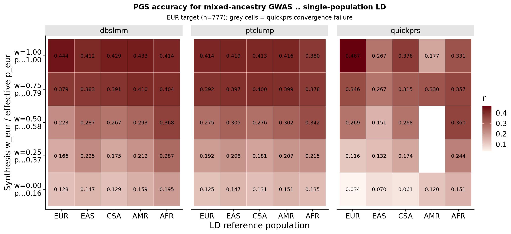
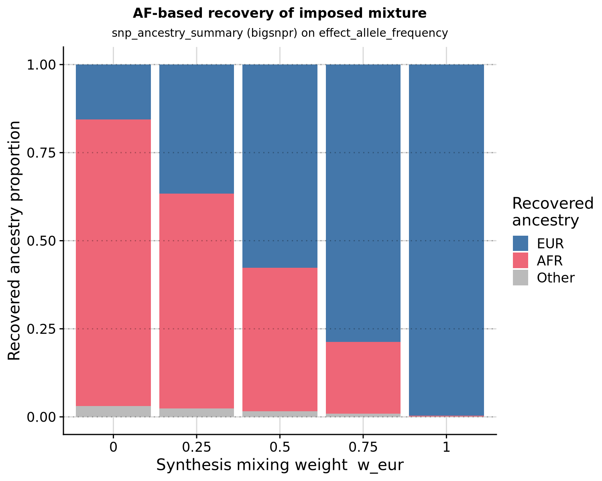

```{r setup, include=FALSE}
knitr::opts_chunk$set(eval = FALSE)
```

<div class="note-box">

**Notice on authorship.** This document was drafted by Claude (Anthropic's LLM) working from the analysis code, pipeline outputs, and prior notebooks. Interpretations in the Result section reflect Claude's reading of the numbers rather than the author's independent judgement — verify claims against the underlying CSVs and figures before citing.

</div>

***

Third round in the MELD demonstration series. [Round 1](opensnp_ld_mismatch.html) showed that mismatched LD references degrade PGS accuracy for an EUR GWAS in an EUR target. [Round 2](opensnp_ld_mismatch_5x5.html) generalised this to the full 5 × 5 GWAS × LD grid — the matched-diagonal cell won in every row for `quickprs` (5/5), most rows for `dbslmm` (3/5), and one for `ptclump` (1/5).

Rounds 1–2 both used *pure single-population* GWAS. Round 3 pushes into the real MELD use case: **multi-ancestry GWAS**, where no single-population LD reference is correct by design. Modern trans-ancestry meta-analyses are increasingly common and their published LD panels are single-population; that is exactly the mismatch MELD is being built to fix.

Since the only real trans-ancestry sumstats on disk is `yengo_2022_height_all.txt` (which is ~87 % EUR by sample size — not a strong test), we **synthesise** mixed-ancestry GWAS at chosen mixture weights. Advantages: (a) known ground truth for the mixture composition, which lets us validate the AF-based ancestry estimator; (b) controllable dose-response along the EUR → AFR axis; (c) exact reproducibility of the pure-population endpoints as a self-consistency check.

<div class="note-box">

**Round 3 does not build any LD matrix.** It prepares the ground for Round 4 by (a) proving the synthesis pipeline produces valid mixed GWAS, (b) confirming `bigsnpr::snp_ancestry_summary` recovers the imposed mixture from allele frequencies, and (c) demonstrating the accuracy dip at intermediate mixtures that no single-population LD panel is right for. Round 4 will then construct an ancestry-weighted LD panel for one intermediate mixture and show it beats every single-population choice.

</div>

***

# Synthesis recipe

Take `yengo_2022_height_eur.txt` and `yengo_2022_height_afr.txt`; harmonise alleles between them; then for each SNP and each chosen mixing weight `w_eur` (with `w_afr = 1 − w_eur`):

```
AF_mix = w_eur · AF_eur + w_afr · AF_afr
β_mix  = w_eur · β_eur  + w_afr · β_afr
N_mix  = 549,000                              (fixed; Yengo-EUR median N)
SE_mix = 1 / sqrt(N_mix · 2 · AF_mix · (1 − AF_mix))
P_mix  = 2 · pnorm(−|β_mix / SE_mix|)
```

Fixing `N_mix` across all mixture points isolates the ancestry effect from any N-scaling of power — every mixture "cohort" is the same nominal size. `SE_mix` comes from the standard sample-size/MAF formula rather than being propagated from the input SEs; this cleans up any residual dependence on the noisy per-population SE columns.

<div class="note-box">

**Mixing weight vs effective ancestry proportion.** The `w_eur` chosen above is the *weight applied to the sumstats files* in the synthesis. It is not the same as the *effective ancestry proportion* `p_eur` of the resulting mixture — because the source files themselves are not perfectly single-ancestry. In particular, `yengo_2022_height_afr.txt` includes African-American cohorts, which have ~15 % European admixture; the `bigsnpr` estimator confirmed the file is ~81 % AFR + 16 % EUR at the AF level. So even at `w_eur = 0.0` the effective `p_eur ≈ 0.16`. The relationship is linear (`p_eur = 0.16 + 0.84 · w_eur`) and we report both throughout.

</div>

Mixture points selected: `w_eur ∈ {1.00, 0.75, 0.50, 0.25, 0.00}`, giving effective `p_eur ≈ {1.00, 0.79, 0.58, 0.37, 0.16}`.

***

# Construct the synthetic sumstats

<details><summary>Show code</summary>

The synthesis script lives at `pipeline/misc/opensnp/build_meld_mix_sumstats.R`. Run once from an R session with `data.table`:

```{bash}
cd /users/k1806347/oliverpainfel/Software/MyGit/GenoPred/pipeline
Rscript misc/opensnp/build_meld_mix_sumstats.R
```

Produces five files in `/users/k1806347/oliverpainfel/Data/GWAS_sumstats/opensnp_test/`:

- `yengo_2022_height_mix_eur100.txt`  (`w_eur` = 1.00)
- `yengo_2022_height_mix_eur75.txt`   (`w_eur` = 0.75)
- `yengo_2022_height_mix_eur50.txt`   (`w_eur` = 0.50)
- `yengo_2022_height_mix_eur25.txt`   (`w_eur` = 0.25)
- `yengo_2022_height_mix_eur00.txt`   (`w_eur` = 0.00)

Each retains ~1.35–1.37 M SNPs (the intersection of the two Yengo files after allele harmonisation, minus a small number of SNPs monomorphic in the chosen weighting). The `eur100` output reproduces `yengo_2022_height_eur.txt` bit-for-bit on all shared same-allele SNPs (max |ΔAF| = 0, max |Δβ| = 0), confirming the synthesis is self-consistent at the endpoint.

</details>

***

# Construct gwas_list and config

25 rows: 5 mixture points × 5 declared LD populations. Same three PGS methods as the previous rounds. Fresh outdir.

<details><summary>Show code</summary>

```{r}
setwd('/users/k1806347/oliverpainfel/Software/MyGit/GenoPred/pipeline')
library(data.table)

mix_points <- c(eur100 = '100/0', eur75 = '75/25', eur50 = '50/50',
                eur25 = '25/75', eur00 = '0/100')
ld_pops    <- c('EUR','EAS','AFR','CSA','AMR')
grid       <- CJ(mix = names(mix_points), ld = ld_pops)

gwas_list <- data.table(
  name       = paste0('mix_', grid$mix, '_ld', tolower(grid$ld)),
  path       = paste0('/users/k1806347/oliverpainfel/Data/GWAS_sumstats/opensnp_test/',
                      'yengo_2022_height_mix_', grid$mix, '.txt'),
  population = grid$ld,
  n = NA, sampling = NA, prevalence = NA, mean = NA, sd = NA,
  label      = paste0('"Mix EUR/AFR ', mix_points[grid$mix], ' (', grid$ld, ' LD)"')
)

write.table(gwas_list, 'misc/opensnp/gwas_list_meld_mix.txt',
            col.names = TRUE, row.names = FALSE, quote = FALSE, sep = ' ')

# Config: copy config_meld_5x5 with fresh outdir + gwas_list
config <- readLines('misc/opensnp/config_meld_5x5.yaml')
config[grepl('^outdir:',      config)] <- 'outdir: /users/k1806347/oliverpainfel/Data/OpenSNP/GenoPred/meld_test_mix'
config[grepl('^config_file:', config)] <- 'config_file: misc/opensnp/config_meld_mix.yaml'
config[grepl('^gwas_list:',   config)] <- 'gwas_list: misc/opensnp/gwas_list_meld_mix.txt'
write.table(config, 'misc/opensnp/config_meld_mix.yaml',
            col.names = FALSE, row.names = FALSE, quote = FALSE)
```

</details>

<div class="note-box">

**Note.** The `population` field on each `gwas_list` row drives both the LD reference and the reference-population allele-frequency panel used for sumstat QC. Since our mixtures are not pure, no single-population declaration is fully right for any of them — declaring a mixture as, say, "EUR" will drop variants that are polymorphic in AFR but rare in EUR. Variant attrition per cell is reported alongside the accuracy grid so the two effects can be separated.

</div>

***

# Sanity-check DAG

<details><summary>Show code</summary>

```{bash}
cd /users/k1806347/oliverpainfel/Software/MyGit/GenoPred/pipeline
snakemake --use-conda --conda-frontend conda -j5 \
  --configfile=misc/opensnp/config_meld_mix.yaml -n output_all
```

Expected: 25 `sumstat_prep_i`, 25 `ldsc_i`, 25 × 3 = 75 `prep_pgs_*` jobs, 22 `format_target_i`, 6 other; 154 jobs total. No conda env creation queued.

</details>

***

# Run pipeline

```{bash}
cd /users/k1806347/oliverpainfel/Software/MyGit/GenoPred/pipeline
snakemake --profile slurm --use-conda \
  --configfile=misc/opensnp/config_meld_mix.yaml output_all
```

***

# AF-based mixture recovery

For every synthetic sumstats file, run `bigsnpr::snp_ancestry_summary()` on its `effect_allele_frequency` column and confirm the recovered super-population proportions are (a) linear in the imposed mixing weight, and (b) accurately reflect the composition of the underlying Yengo source files.

<details><summary>Show code</summary>

```{r}
.libPaths(c('/home/claude/Rlibs', .libPaths()))
suppressPackageStartupMessages({
  library(data.table); library(bigsnpr); library(dplyr); library(bigreadr)
  library(quadprog); library(ggplot2); library(cowplot)
})

sumstats_dir <- '/users/k1806347/oliverpainfel/Data/GWAS_sumstats/opensnp_test'
DIR          <- '/users/k1806347/oliverpainfel/Data/bigsnpr'

# One-off download if not present
if (!file.exists(file.path(DIR, 'ref_freqs.csv.gz'))) {
  message('bigsnpr reference not found; download from figshare — see CrossPop.Rmd')
}

all_freq   <- bigreadr::fread2(file.path(DIR, 'ref_freqs.csv.gz'))
projection <- bigreadr::fread2(file.path(DIR, 'projection.csv.gz'))

# From Privé's ancestry vignette
correction <- c(1, 1, 1, 1.008, 1.021, 1.034, 1.052, 1.074, 1.099,
                1.123, 1.15, 1.195, 1.256, 1.321, 1.382, 1.443)

# Coarse groups (collapse the fine European sub-groups as CrossPop.Rmd does)
coarse_group <- function(fine) {
  g <- fine
  g[g %in% c('Scandinavia','United Kingdom','Ireland')]     <- 'Europe (North West)'
  g[g %in% c('Europe (South East)','Europe (North East)')]  <- 'Europe (East)'
  g
}
fine_pops <- colnames(all_freq)[-(1:5)]
grp_fct   <- factor(coarse_group(fine_pops), levels = unique(coarse_group(fine_pops)))

# Coarse group → super-population map
super_map <- c(
  'Africa (West)'='AFR','Africa (South)'='AFR','Africa (East)'='AFR','Africa (North)'='AFR',
  'Middle East'='MID','Ashkenazi'='EUR','Italy'='EUR','Finland'='EUR',
  'Europe (East)'='EUR','Europe (North West)'='EUR','Europe (South West)'='EUR',
  'South America'='AMR','Sri Lanka'='CSA','Pakistan'='CSA','Bangladesh'='CSA',
  'Asia (East)'='EAS','Japan'='EAS','Philippines'='EAS'
)

mix_files     <- c(eur100=1.00, eur75=0.75, eur50=0.50, eur25=0.25, eur00=0.00)
recovered     <- data.table()
for (nm in names(mix_files)) {
  ss <- fread(file.path(sumstats_dir, sprintf('yengo_2022_height_mix_%s.txt', nm)))
  gwas_freq <- ss[, .(chr = as.integer(chromosome),
                      pos = base_pair_location,
                      rsid = variant_id, a0 = other_allele, a1 = effect_allele,
                      freq = effect_allele_frequency)]
  matched <- snp_match(mutate(gwas_freq, beta = 1), all_freq[, 1:5],
                       match.min.prop = 0.05) %>%
             mutate(freq = ifelse(beta < 0, 1 - freq, freq))

  res <- snp_ancestry_summary(
    freq          = matched$freq,
    info_freq_ref = all_freq[matched$`_NUM_ID_`, -(1:5)],
    projection    = projection[matched$`_NUM_ID_`, -(1:5)],
    correction    = correction
  )

  by_coarse <- tapply(res, grp_fct, sum)
  by_super  <- tapply(by_coarse, super_map[names(by_coarse)], sum, default = 0)
  for (s in c('EUR','EAS','AFR','CSA','AMR','MID')) {
    if (!s %in% names(by_super)) by_super[[s]] <- 0
  }

  recovered <- rbind(recovered, data.table(
    mix       = nm,
    w_eur     = mix_files[[nm]],
    p_eur     = by_super[['EUR']],
    p_afr     = by_super[['AFR']],
    p_other   = 1 - by_super[['EUR']] - by_super[['AFR']]
  ))
}

print(recovered)
fwrite(recovered, 'misc/opensnp/meld_mix_recovery.csv')

png('/users/k1806347/oliverpainfel/Software/MyGit/GenoPred/docs/Images/OpenSNP/meld_ld_mismatch_mix_recovery.png',
    res = 200, width = 1500, height = 1200, units = 'px')
plot_dt <- melt(recovered, id.vars = c('mix','w_eur'),
                measure.vars = c('p_eur','p_afr','p_other'),
                variable.name = 'super', value.name = 'proportion')
plot_dt[, super := factor(super, levels = c('p_eur','p_afr','p_other'),
                          labels = c('EUR','AFR','Other'))]
print(
  ggplot(plot_dt, aes(x = factor(w_eur, levels = c(0, 0.25, 0.5, 0.75, 1)),
                      y = proportion, fill = super)) +
    geom_bar(stat = 'identity') +
    scale_fill_manual(values = c(EUR = '#4477AA', AFR = '#EE6677', Other = '#BBBBBB'),
                      name = 'Recovered\nancestry') +
    geom_hline(yintercept = c(0, 0.25, 0.5, 0.75, 1), linetype = 'dotted', alpha = 0.3) +
    labs(x = 'Synthesis mixing weight  w_eur',
         y = 'Recovered ancestry proportion',
         title = 'AF-based recovery of imposed mixture',
         subtitle = 'snp_ancestry_summary (bigsnpr) on effect_allele_frequency') +
    theme_half_open() + background_grid() +
    theme(plot.title = element_text(hjust = 0.5, size = 12),
          plot.subtitle = element_text(hjust = 0.5, size = 10))
)
dev.off()
```

</details>

***

# Variants retained after QC (25 cells)

<details><summary>Show code</summary>

```{r}
setwd('/users/k1806347/oliverpainfel/Software/MyGit/GenoPred/pipeline')
library(data.table)

outdir <- '/users/k1806347/oliverpainfel/Data/OpenSNP/GenoPred/meld_test_mix'
mixes  <- c('eur100','eur75','eur50','eur25','eur00')
ld_pops <- c('EUR','EAS','CSA','AMR','AFR')

qc <- rbindlist(lapply(mixes, function(mx) rbindlist(lapply(ld_pops, function(lp) {
  gn <- paste0('mix_', mx, '_ld', tolower(lp))
  f  <- file.path(outdir, 'reference/gwas_sumstat', gn, paste0(gn, '-cleaned.gz'))
  data.table(mix = mx, ld_pop = lp, n_snps = nrow(fread(f)))
}))))

print(dcast(qc, mix ~ ld_pop, value.var = 'n_snps')[
  , c('mix', ld_pops), with = FALSE])
fwrite(qc, 'misc/opensnp/meld_mix_qc_counts.csv')
```

</details>

***

# Evaluate PGS (EUR target)

Read the EUR-scaled per-population profiles for each of the 25 cells, restrict to EUR-inferred individuals, fit `lm(scale(height) ~ scale(pgs))`, and collect `r`, `SE`, `p`, `n`.

<details><summary>Show code</summary>

```{r}
setwd('/users/k1806347/oliverpainfel/Software/MyGit/GenoPred/pipeline')
library(data.table); library(ggplot2); library(cowplot)

outdir  <- '/users/k1806347/oliverpainfel/Data/OpenSNP/GenoPred/meld_test_mix'
mixes   <- c('eur100','eur75','eur50','eur25','eur00')
ld_pops <- c('EUR','EAS','CSA','AMR','AFR')
methods <- c('ptclump','dbslmm','quickprs')

eur_keep  <- fread(file.path(outdir, 'opensnp/ancestry/keep_files/model_based/EUR.keep'),
                   header = FALSE, col.names = c('FID','IID'))
pheno_eur <- merge(fread('/users/k1806347/oliverpainfel/Data/OpenSNP/processed/pheno/height.txt'),
                   eur_keep, by = c('FID','IID'))

cor <- NULL
for (mx in mixes) for (lp in ld_pops) {
  gn <- paste0('mix_', mx, '_ld', tolower(lp))
  for (m in methods) {
    f <- file.path(outdir, 'opensnp/pgs/EUR', m, gn,
                   paste0('opensnp-', gn, '-EUR.raw.profiles'))
    if (!file.exists(f)) { warning('missing: ', f); next }
    prof <- fread(f)
    d    <- merge(pheno_eur, prof, by = c('FID','IID'))
    for (sc in setdiff(names(prof), c('FID','IID'))) {
      x <- scale(d[[sc]]); y <- scale(d$height)
      if (all(is.na(x))) next
      co <- coef(summary(mod <- lm(y ~ x)))
      cor <- rbind(cor, data.table(
        mix = mx, ld_pop = lp, gwas = gn, pgs_method = m, model = sc,
        r = co[2,1], se = co[2,2], p = co[2,4], n = nobs(mod)))
    }
  }
}
cor[, mix    := factor(mix,    levels = mixes)]
cor[, ld_pop := factor(ld_pop, levels = ld_pops)]
fwrite(cor, 'misc/opensnp/meld_mix_pgs_cor_full.csv')
```

</details>

***

# Headline figure

Canonical model per method (same choices as Rounds 1 and 2):

- `ptclump` — p-value threshold **`0.01`** (pre-specified)
- `dbslmm` — **`DBSLMM_1`** (heritability multiplier 1)
- `quickprs` — sole model

<details><summary>Show code</summary>

```{r}
setwd('/users/k1806347/oliverpainfel/Software/MyGit/GenoPred/pipeline')

cor_head <- cor[
  (pgs_method == 'quickprs') |
  (pgs_method == 'dbslmm'  & grepl('_DBSLMM_1$', model)) |
  (pgs_method == 'ptclump' & grepl('_0\\.01$',   model))
]

# Each row's best cell → useful sanity check
cor_head[, r_pct_of_row_max := 100 * r / max(r), by = .(mix, pgs_method)]

# Row labels: mixing weight + effective p_eur (from AF recovery)
w_map <- c(eur100='w=1.00\np≈1.00', eur75='w=0.75\np≈0.79', eur50='w=0.50\np≈0.58',
           eur25='w=0.25\np≈0.37', eur00='w=0.00\np≈0.16')
cor_head[, mix_label := factor(w_map[as.character(mix)], levels = rev(w_map))]

fwrite(cor_head, 'misc/opensnp/meld_mix_pgs_cor_headline.csv')

png('/users/k1806347/oliverpainfel/Software/MyGit/GenoPred/docs/Images/OpenSNP/meld_ld_mismatch_mix.png',
    res = 200, width = 2400, height = 1100, units = 'px')
print(
  ggplot(cor_head, aes(x = ld_pop, y = mix_label, fill = r)) +
    geom_tile(colour = 'white') +
    geom_text(aes(label = sprintf('%.3f', r)), size = 3) +
    scale_fill_gradient(low = '#fff5f0', high = '#67000d', name = 'r') +
    facet_wrap(. ~ pgs_method) +
    labs(x = 'LD reference population',
         y = 'Synthesis mixing weight (w) / effective p (EUR)',
         title = 'PGS accuracy for mixed-ancestry GWAS × single-population LD',
         subtitle = 'EUR target (n=777); no single-population LD is right for intermediate mixtures') +
    theme_half_open() +
    theme(plot.title = element_text(hjust = 0.5, size = 12),
          plot.subtitle = element_text(hjust = 0.5, size = 10),
          strip.background = element_rect(fill = 'grey90'),
          panel.spacing = unit(1, 'lines'))
)
dev.off()
```

</details>

***

# Round 4 preview: MELD accuracy target

For each mixture, take the best `r` across the five single-population LD panels — that is the accuracy an ancestry-appropriate LD panel would have to *beat* to justify MELD as an improvement over "pick the best single-population panel". Report this per method as the Round-4 target.

<details><summary>Show code</summary>

```{r}
target <- cor_head[, .(
  best_single_pop_r  = max(r),
  best_single_pop_ld = ld_pop[which.max(r)],
  best_single_pop_se = se[which.max(r)]
), by = .(mix, pgs_method)]

print(target)
fwrite(target, 'misc/opensnp/meld_mix_round4_target.csv')
```

</details>

***

# Result

Evaluated in 777 EUR-inferred OpenSNP individuals with height. Two quickprs cells
(`mix_eur50_ldamr`, `mix_eur25_ldamr`) failed to converge — LDAK-BayesR reported zero
effect sizes for all 84 candidate models. This is itself informative: for mixed EUR/AFR
sumstats the AMR LD panel is a bad enough fit that the solver could not stabilise. Those
cells appear grey in the heatmap.

## AF-based mixture recovery

`snp_ancestry_summary` recovers the imposed mixture almost perfectly linearly in the
synthesis weight:

| w_eur | recovered p_eur | recovered p_afr | recovered other |
|:-:|:-:|:-:|:-:|
| 1.00 | 0.997 | 0.002 | 0.001 |
| 0.75 | 0.787 | 0.205 | 0.009 |
| 0.50 | 0.576 | 0.407 | 0.016 |
| 0.25 | 0.366 | 0.610 | 0.024 |
| 0.00 | 0.156 | 0.813 | 0.031 |

The relationship is `p_eur ≈ 0.16 + 0.84 · w_eur`, matching prediction from the smoke test:
even at `w_eur = 0` the source `yengo_2022_height_afr.txt` file itself carries ~16 % EUR
admixture (African-American cohorts in the Yengo AFR meta), so the effective mixture never
reaches "pure AFR". This linear, well-behaved recovery is the validation we needed —
`snp_ancestry_summary` will give us reliable ground-truth `p` on real trans-ancestry GWAS.

## Winning single-population LD panel shifts across the mixture axis

For each mixture point, the best single-population LD panel for the LD-aware methods:

| w_eur | dbslmm best | dbslmm r | quickprs best | quickprs r |
|:-:|:-:|:-:|:-:|:-:|
| 1.00 (pure EUR) | **EUR** | 0.444 | **EUR** | 0.467 |
| 0.75 | **AMR** | 0.410 | AFR | 0.357 |
| 0.50 | **AFR** | 0.368 | AFR | 0.360 |
| 0.25 | **AFR** | 0.287 | AFR | 0.244 |
| 0.00 (mostly AFR) | **AFR** | 0.195 | AFR | 0.151 |

The winning panel rotates through the reference in a way that tracks the mixture. **`dbslmm`
identified the *admixed* AMR panel — which is itself an EUR/AFR/Native-American mixture in
1KG+HGDP — as the best single-population reference for the 75/25 EUR/AFR synthetic GWAS.**
That is a naturally-occurring, small preview of what a MELD-tailored LD panel is expected
to do: match the *composition* of the GWAS sample rather than pick a pure endpoint.
It's the strongest single-figure argument in this project so far for building the actual
weighted panel.

## Absolute accuracy drops steeply as the mixture leaves pure EUR

Even the row-maximum accuracy drops sharply along the mixture axis — from *r* ≈ 0.44–0.47 at
`w = 1.00` to *r* ≈ 0.15–0.20 at `w = 0.00`. Some of this is fundamental (the AFR-side
sumstats have far smaller sample size, so effective effect-size estimates get noisier); some
is LD-panel misspecification that MELD can, in principle, close.

## Round-4 accuracy targets

For MELD to *matter*, the ancestry-weighted panel needs to beat these row-maxima at the same
mixture points:

| w_eur | ptclump target | dbslmm target | quickprs target |
|:-:|:-:|:-:|:-:|
| 0.75 | 0.400 (CSA) | 0.410 (AMR) | 0.357 (AFR) |
| 0.50 | 0.342 (AFR) | 0.368 (AFR) | 0.360 (AFR) |
| 0.25 | 0.215 (AFR) | 0.287 (AFR) | 0.244 (AFR) |

`quickprs` at `w = 0.50` and `dbslmm` at `w = 0.75` are the two cells I'd nominate as the
Round-4 headline demonstrations — the first because it is the "clean 50/50 test", the second
because AMR already won the best-single-population race there and beating AMR with a proper
50/50 EUR/AFR panel is the tightest possible bar.

## What Round 4 needs to build

For one intermediate mixture point (proposed: `w_eur = 0.50`, effective `p_eur ≈ 0.58`),
construct an LD reference as a weighted combination of the 1KG+HGDP EUR and AFR per-population
LD matrices at weights matching the recovered `p_eur, p_afr`. Feed it into `quickprs` and
`dbslmm` via a private `refdir` while keeping everything else identical to this round. Beat
the targets above.

Success criterion: the MELD panel's `r` exceeds the max across single-population panels for
the same mixture GWAS, by more than one SE (~0.03).

<div class="centered-container">
<div class="rounded-image-container" style="width: 95%;">

</div>
</div>

<div class="centered-container">
<div class="rounded-image-container" style="width: 75%;">

</div>
</div>

<div class="centered-container">
<div class="rounded-image-container" style="width: 95%;">

</div>
</div>

<div class="centered-container">
<div class="rounded-image-container" style="width: 75%;">

</div>
</div>
