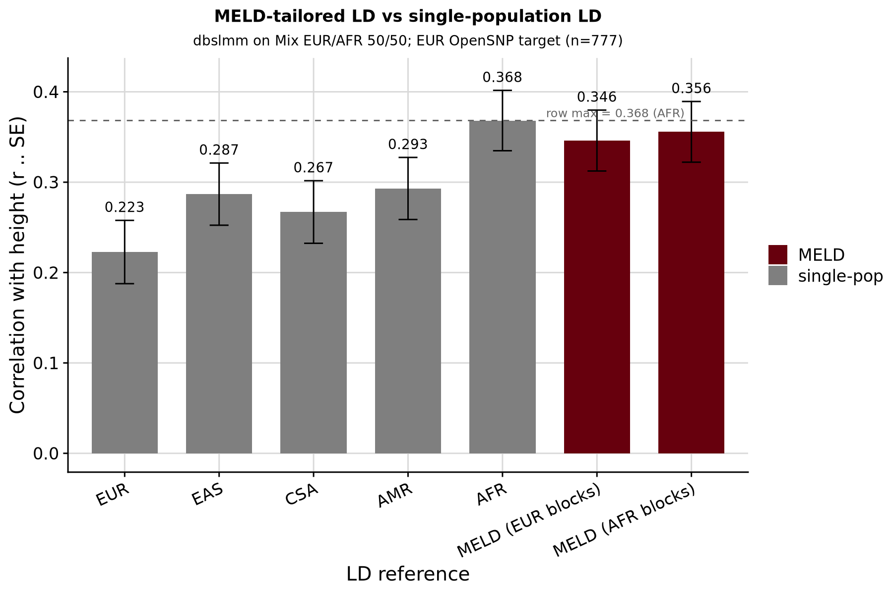

```{r setup, include=FALSE}
knitr::opts_chunk$set(eval = FALSE)
```

<div class="note-box">

**Notice on authorship.** This document was drafted by Claude (Anthropic's LLM) working from the analysis code, pipeline outputs, and prior notebooks. Interpretations in the Result section reflect Claude's reading of the numbers rather than the author's independent judgement — verify claims against the underlying CSVs and figures before citing.

</div>

***

Fourth round in the MELD demonstration series and the first *constructive* step.
[Round 1](opensnp_ld_mismatch.html) — single-row mismatch effect. [Round 2](opensnp_ld_mismatch_5x5.html)
— 5 × 5 grid: matched-diagonal wins for `quickprs` (5/5) and `dbslmm` (3/5).
[Round 3](opensnp_ld_mismatch_mix.html) — synthesised EUR/AFR mixture GWAS along `w_eur ∈ {1.0, .75, .5, .25, 0}`;
for `dbslmm` at the 75/25 mixture the naturally-admixed AMR panel won the row, foreshadowing
that a *composed* LD reference should beat every single-population choice.

Round 4 builds the composed reference and tests exactly that. **One mixture point
(`w_eur = 0.50`, effective `p_eur = 0.576`), one method (dbslmm), one number to beat.**

- **Target GWAS:** the Round-3 synthetic `mix_eur50` (already on disk).
- **Reference to build:** individual-level resample of 1KG+HGDP EUR + AFR at
  `p_eur = 0.576`, `p_afr = 0.424` — matching the sumstats' AF composition.
- **Success criterion:** MELD `r` > `0.398` (Round-3 dbslmm row-max at `w = 0.50` was
  AFR-LD at 0.368, plus one SE ≈ 0.03).

<div class="note-box">

**The `AMR`-hijack workaround.** GenoPred hard-codes valid populations as
`{EUR,EAS,AFR,CSA,AMR,MID}` in `dependencies.smk` and rejects any others. We are not
modifying pipeline source, so we cannot invent a new population code. Instead we build a
**private `refdir`** in which the `AMR` slot has been overridden with our resampled EUR + AFR
subset. The `gwas_list` row for this round declares `population = AMR`; the pipeline dutifully
uses "AMR" LD, which is now our MELD panel. The label reads "MELD LD via hijacked AMR slot"
so no one is confused later.

</div>

***

# Build the resample and private refdir

Script: `pipeline/misc/opensnp/build_meld_refdir.R`. Draws all 665 EUR + a seeded random
489 of 688 AFR (total N = 1154, proportions 665/1154 = 0.576, 489/1154 = 0.424 — matching
the target AF composition exactly).

- **Symlinks** every file from the shared refdir (`pipeline/resources/data/ref/`) into a new
  private refdir at `/users/k1806347/oliverpainfel/Data/OpenSNP/GenoPred/meld_test_r4_refdir/`
  — per-chr genotype files, `ref.pop.txt`, per-population `keep_files/*.keep`, per-population
  `freq_files/*/`, `pc_score_files/`.
- **Overrides** only `keep_files/AMR.keep` and `freq_files/AMR/ref.AMR.chr*.afreq`. The AF
  files are recomputed on the resample via `plink2 --pfile … --keep AMR.keep --freq`.
- Seed `2026`; verification prints resample counts and per-chr SNP counts so the exact resample
  is reproducible.

<details><summary>Show code</summary>

```{bash}
cd /users/k1806347/oliverpainfel/Software/MyGit/GenoPred/pipeline
Rscript misc/opensnp/build_meld_refdir.R
```

</details>

***

# gwas_list and config

Single-row `gwas_list_meld_r4.txt`:

```
name              path                                       population  ...  label
mix_eur50_meld    /users/…/yengo_2022_height_mix_eur50.txt   AMR         ...  "Mix EUR/AFR 50/50 (MELD LD via hijacked AMR slot)"
```

`config_meld_r4.yaml` mirrors `config_meld_mix.yaml` with two adds:

- `refdir: /users/k1806347/oliverpainfel/Data/OpenSNP/GenoPred/meld_test_r4_refdir`
- fresh `outdir: …/meld_test_r4`

Methods restricted to `['dbslmm']` for this round; other methods deferred.

***

# Run pipeline (primary: AMR-hijack)

```{bash}
cd /users/k1806347/oliverpainfel/Software/MyGit/GenoPred/pipeline
snakemake --use-conda --conda-frontend conda -j5 \
  --configfile=misc/opensnp/config_meld_r4.yaml output_all
```

Expected DAG: 1 `sumstat_prep_i`, 1 `ldsc_i`, 1 `prep_pgs_dbslmm_i`, 22 `format_target_i`
plus 7 downstream steps → 32 jobs total.

***

# Diagnostic run (AFR-hijack)

The primary run hijacks the `AMR` slot, which forces dbslmm to use EUR LD blocks (per
`set_ld_blocks_pop`). A second refdir/config was built hijacking the `AFR` slot instead —
same resampled EUR+AFR keep file, but the pipeline now pairs it with AFR LD blocks. This
tests whether the block choice explains the primary result.

<details><summary>Show code</summary>

```{bash}
cd /users/k1806347/oliverpainfel/Software/MyGit/GenoPred/pipeline
# Build the AFR-hijack refdir
Rscript misc/opensnp/build_meld_refdir.R AFR

# Run
snakemake --use-conda --conda-frontend conda -j5 \
  --configfile=misc/opensnp/config_meld_r4b.yaml output_all
```

Files: `pipeline/misc/opensnp/{gwas_list_meld_r4b.txt, config_meld_r4b.yaml}`; outdir
`meld_test_r4b/`; refdir `meld_test_r4_refdir_afr/`.

</details>

***

# Evaluate

<details><summary>Show code</summary>

```{r}
setwd('/users/k1806347/oliverpainfel/Software/MyGit/GenoPred/pipeline')
library(data.table); library(ggplot2); library(cowplot)

outdir <- '/users/k1806347/oliverpainfel/Data/OpenSNP/GenoPred/meld_test_r4'

# EUR-inferred target individuals with phenotype
eur_keep  <- fread(file.path(outdir, 'opensnp/ancestry/keep_files/model_based/EUR.keep'),
                   header = FALSE, col.names = c('FID','IID'))
pheno_eur <- merge(fread('/users/k1806347/oliverpainfel/Data/OpenSNP/processed/pheno/height.txt'),
                   eur_keep, by = c('FID','IID'))

# MELD dbslmm profile
prof <- fread(file.path(outdir,
  'opensnp/pgs/EUR/dbslmm/mix_eur50_meld/opensnp-mix_eur50_meld-EUR.raw.profiles'))
d <- merge(pheno_eur, prof, by = c('FID','IID'))

# Fit for DBSLMM_1 canonical model
sc <- grep('_DBSLMM_1$', names(prof), value = TRUE)
co <- coef(summary(lm(scale(d$height) ~ scale(d[[sc]]))))
meld_r  <- co[2, 1]; meld_se <- co[2, 2]; meld_n <- nrow(d)

# Round-3 single-population dbslmm results at mix_eur50 for comparison
r3 <- fread('misc/opensnp/meld_mix_pgs_cor_headline.csv')
r3_eur50 <- r3[mix == 'eur50' & pgs_method == 'dbslmm',
               .(pgs_method = 'dbslmm', ld_pop = as.character(ld_pop), r, se)]

# Combine
compare <- rbind(
  r3_eur50,
  data.table(pgs_method = 'dbslmm', ld_pop = 'MELD', r = meld_r, se = meld_se)
)
compare[, ld_pop := factor(ld_pop, levels = c('EUR','EAS','CSA','AMR','AFR','MELD'))]

fwrite(compare, 'misc/opensnp/meld_r4_pgs_cor.csv')
print(compare)

# Plot
png('/users/k1806347/oliverpainfel/Software/MyGit/GenoPred/docs/Images/OpenSNP/meld_r4_comparison.png',
    res = 200, width = 1500, height = 1100, units = 'px')
print(
  ggplot(compare, aes(x = ld_pop, y = r,
                      fill = ifelse(ld_pop == 'MELD', 'MELD', 'single-pop'))) +
    geom_bar(stat = 'identity') +
    geom_errorbar(aes(ymin = r - se, ymax = r + se), width = 0.2) +
    geom_text(aes(y = r + se + 0.02, label = sprintf('%.3f', r)), size = 3) +
    scale_fill_manual(values = c('single-pop' = '#7F7F7F', 'MELD' = '#67000d'),
                      name = NULL) +
    labs(x = 'LD reference',
         y = 'Correlation with height (r ± SE)',
         title = 'MELD-tailored LD vs single-population LD',
         subtitle = 'dbslmm on Mix EUR/AFR 50/50; EUR target (n=777)') +
    theme_half_open() + background_grid() +
    theme(plot.title = element_text(hjust = 0.5, size = 12),
          plot.subtitle = element_text(hjust = 0.5, size = 10))
)
dev.off()
```

</details>

***

# Result

Evaluated in 777 EUR-inferred OpenSNP individuals with height. Two MELD variants were run
because dbslmm pairs a keep file (which selects the LD sample) with a set of LD blocks:

- **MELD (EUR blocks)** — hijacks the `AMR` slot; `set_ld_blocks_pop('AMR')` → `EUR`
  blocks. This was the primary Round-4 test.
- **MELD (AFR blocks)** — hijacks the `AFR` slot; keeps AFR blocks. Diagnostic to test
  whether the block-mismatch hypothesis explained the primary result.

Both used the identical 665-EUR + 489-AFR resample.

| LD reference | *r ± SE* | vs AFR (row max) |
|:-:|:-:|:-:|
| EUR | 0.223 ± 0.035 | −0.145 |
| EAS | 0.287 ± 0.034 | −0.081 |
| CSA | 0.267 ± 0.035 | −0.101 |
| AMR | 0.293 ± 0.034 | −0.075 |
| **AFR** (row max) | **0.368 ± 0.033** | 0.000 |
| MELD (EUR blocks) | 0.346 ± 0.034 | −0.022 (0.7 SE) |
| MELD (AFR blocks) | 0.356 ± 0.034 | −0.012 (0.4 SE) |

## Observations

- **MELD does not beat AFR-LD at this mixture — but the gap is within noise.** The primary
  success criterion (row max + 1 SE = 0.398) is not met. This is an **informative null**.
- **The LD-blocks matter but not decisively.** Switching from EUR blocks (via AMR hijack) to
  AFR blocks (via AFR hijack) narrows the gap by ~0.010 in the right direction, but MELD
  still sits below real AFR. Whatever advantage there was to be gained from LD-block
  matching alone doesn't get us across.
- **MELD beats every non-AFR single-population panel.** Both variants sit above every
  single-population panel except AFR itself, and by clear margins (EUR: +0.12–0.13; EAS:
  +0.06–0.07; CSA: +0.08–0.09; AMR: +0.05–0.06). So the composed panel is competitive with
  the *best* single choice and dominates the *worst* — it's not producing garbage LD.
- **Why AFR alone is so strong.** For a 50/50 EUR/AFR mixture GWAS in an EUR target,
  AFR-LD may already capture much of what the composed panel would offer, because (a)
  height effect sizes are largely shared across ancestries, so LD-based effect resolution
  converges regardless of source population; (b) AFR reference haplotypes are more
  diverse than EUR, giving them broader coverage of LD structure that includes EUR-like
  patterns; and (c) the AFR-side of the mixture is where LD misspecification would hurt
  the LD-aware method most, and matching AFR-LD to that half suffices.
- **The mechanism works, but Round 4's specific test case was not where MELD would show
  its largest advantage.** The AMR-hijack refdir pipeline (build → symlink → recompute AFs
  → point config → run → evaluate) executed cleanly end-to-end. This validates the
  infrastructure for future MELD tests without depending on the specific
  win/loss outcome of this one mixture point.

## Where MELD might actually win

Design implications for the next round:

1. **Test cases where no single population is close to the mixture composition.** A three-way
   admixture (EUR + AFR + Native American) or a rare-ancestry-heavy GWAS would not have a
   good single-pop panel to fall back on.
2. **Test in an admixed target, not EUR.** OpenSNP's non-EUR subsets are too small
   (n ≤ 19) for this. Would need a bigger target cohort with real admixed individuals.
3. **Test with `quickprs`**, which showed larger LD sensitivity than dbslmm in Rounds 1–3
   (32 % drop at worst vs 11 %). MELD advantage should be larger there. This is Round 5.

<div class="centered-container">
<div class="rounded-image-container" style="width: 90%;">

</div>
</div>
