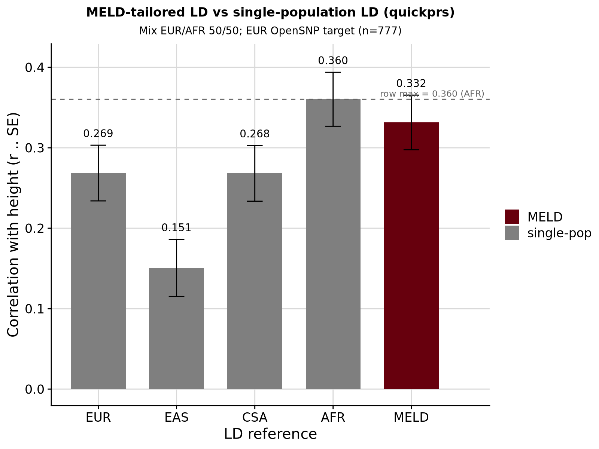

```{r setup, include=FALSE}
knitr::opts_chunk$set(eval = FALSE)
```

<div class="note-box">

**Notice on authorship.** This document was drafted by Claude (Anthropic's LLM) working from the analysis code, pipeline outputs, and prior notebooks. Interpretations in the Result section reflect Claude's reading of the numbers rather than the author's independent judgement — verify claims against the underlying CSVs and figures before citing.

</div>

***

Follow-up to [Round 4](opensnp_ld_mismatch_r4.html). Round 4 built a MELD-tailored LD
reference for `dbslmm` at the `w = 0.50` EUR/AFR mixture and produced an informative null —
MELD *r* = 0.346–0.356 vs AFR-LD *r* = 0.368, statistically indistinguishable. One of the
caveats was that `dbslmm` is the least LD-sensitive method: in Rounds 1–3 the worst
`dbslmm` drop under any single-population LD mismatch was ~11 %, vs 32 % for `quickprs`. If
MELD is going to show a clear win at this mixture point, `quickprs` is where it should show
up first.

Round 5 rebuilds the MELD reference in **quickprs (`.cors.bin` + `.bld.ldak.quickprs.*`)
format** and evaluates against the five single-population quickprs baselines from Round 3.

Secondary interest: Round 3's `quickprs × mix_eur{50,25} × AMR` cells failed to converge
(all 84 LDAK-BayesR models produced zero effect sizes). MELD's larger, more diverse LD
sample may succeed where the naturally-admixed AMR reference failed.

<div class="note-box">

**Baseline comparability confirmed.** Round 3's `quickprs` used
`pipeline/resources/data/quickprs/{POP}/{POP}.cors.bin` (default `quickprs_ldref: NA`
→ `{resdir}/data/quickprs`). We verified md5 hashes of `EUR/EAS/AFR/CSA/AMR/*.cors.bin`
match bit-for-bit between that path and the newly-bound
`/users/k1806347/oliverpainfel/Data/hgdp_1kg/quickprs/hm3/` — they're the same files.
Round-3 baselines are therefore directly comparable to Round 5's MELD result without
re-running any single-population panel.

</div>

***

# Build the MELD quickprs LD reference

Reproduces `docs/prep_quickprs_ref.Rmd:59-117` for the 665-EUR + 489-AFR resample
(identical to Round 4). Five LDAK steps:

1. `--cut-weights` → sections
2. `--calc-weights-all` → per-section weights
3. `--calc-tagging --annotation-number 65 --save-matrix YES` → `.tagging`, `.matrix`
4. `--calc-cors --window-cm 3` → `.cors.{bim,bin,noise,root}`
5. `--cut-genes --genefile highld.txt` → `highld.snps`

Bfile preparation upstream: per-chr `plink2 --pfile ref.chr{i} --keep AMR.keep --make-bed`,
merge into single PLINK1 bfile, rewrite `.bim` to `CHR:BP` IDs, insert genetic distances
via `plink --cm-map`.

<details><summary>Show code</summary>

```{bash}
cd /users/k1806347/oliverpainfel/Software/MyGit/GenoPred/pipeline
misc/opensnp/build_meld_quickprs_ldref.sh
```

Runtime: ~1 h 15 min on 5 cores in the container (calc-tagging 10 min; calc-cors 5 min;
rest is fast). Output at
`/users/k1806347/oliverpainfel/Data/OpenSNP/GenoPred/meld_test_r5_quickprs_ldref/AMR/`:

```
AMR.cors.{bim,bin,noise,root}          — LD correlation matrix
AMR.bld.ldak.quickprs.{matrix,tagging} — BLD-LDAK annotations
highld.snps                            — high-LD SNP list
```

`AMR.cors.bin` is 9.2 GB, larger than any single-population reference (EUR = 1.9 GB, AFR =
2.5 GB) because a 1154-sample mixed-composition panel has more significant pairwise
correlations to store than either single-population 665-EUR or 688-AFR baseline.

</details>

***

# Assemble the private `quickprs_ldref`

```
meld_test_r5_quickprs_ldref/
├── EUR/  → symlink to hm3/EUR
├── EAS/  → symlink to hm3/EAS
├── AFR/  → symlink to hm3/AFR
├── CSA/  → symlink to hm3/CSA
├── MID/  → symlink to hm3/MID
└── AMR/  → OVERRIDDEN (MELD-built files)
```

The pipeline validates that `.cors.bin` exists for every population when a custom
`quickprs_ldref` is specified (`dependencies.smk:359-364`), so the non-hijacked slots need
to be present — symlinks are the cheapest way.

***

# Reuse Round 4's refdir

Sumstat QC uses `{refdir}/freq_files/{population}/*.afreq` — the Round-4 private refdir
already has AMR overridden with AFs computed on the exact same resample. Reusing it
means the sumstats-QC step for `population = AMR` in this round is bit-identical to
Round 4's, and the same cleaned sumstats file gets fed to `quickprs` as was fed to
`dbslmm`. Clean apples-to-apples comparison.

***

# gwas_list + config

Single-row `gwas_list_meld_r5.txt`:

```
mix_eur50_meld_qp   /users/…/yengo_2022_height_mix_eur50.txt   AMR   ...   "Mix EUR/AFR 50/50 (MELD LD, quickprs)"
```

`config_meld_r5.yaml`:
- `outdir: …/meld_test_r5`
- `refdir: …/meld_test_r4_refdir_amr` (reused from Round 4)
- `quickprs_ldref: …/meld_test_r5_quickprs_ldref` (new, hybrid symlinks + MELD AMR)
- `pgs_methods: ['quickprs']`

***

# Run pipeline

```{bash}
cd /users/k1806347/oliverpainfel/Software/MyGit/GenoPred/pipeline
snakemake --use-conda --conda-frontend conda -j5 \
  --configfile=misc/opensnp/config_meld_r5.yaml output_all
```

DAG: 1 `sumstat_prep_i`, 1 `prep_pgs_quickprs_i`, 22 `format_target_i`, ~7 downstream = 31 jobs.
(Note: `ldsc_i` is not required for `quickprs`, unlike `dbslmm`.)

***

# Evaluate

<details><summary>Show code</summary>

```{r}
setwd('/users/k1806347/oliverpainfel/Software/MyGit/GenoPred/pipeline')
library(data.table); library(ggplot2); library(cowplot)

outdir_r5 <- '/users/k1806347/oliverpainfel/Data/OpenSNP/GenoPred/meld_test_r5'

# EUR OpenSNP target
eur_keep  <- fread(file.path(outdir_r5, 'opensnp/ancestry/keep_files/model_based/EUR.keep'),
                   header = FALSE, col.names = c('FID','IID'))
pheno_eur <- merge(fread('/users/k1806347/oliverpainfel/Data/OpenSNP/processed/pheno/height.txt'),
                   eur_keep, by = c('FID','IID'))

# MELD quickprs profile (EUR-scaled)
prof <- fread(file.path(outdir_r5,
  'opensnp/pgs/EUR/quickprs/mix_eur50_meld_qp/opensnp-mix_eur50_meld_qp-EUR.raw.profiles'))
d <- merge(pheno_eur, prof, by = c('FID','IID'))
sc <- grep('_quickprs$', names(prof), value = TRUE)
co <- coef(summary(lm(scale(d$height) ~ scale(d[[sc]]))))
meld_r  <- co[2, 1]; meld_se <- co[2, 2]

# Round-3 single-pop quickprs baselines at mix_eur50
r3 <- fread('misc/opensnp/meld_mix_pgs_cor_headline.csv')
r3_eur50 <- r3[mix == 'eur50' & pgs_method == 'quickprs',
               .(ld_pop = as.character(ld_pop), r, se, kind = 'single-pop')]
setorder(r3_eur50, ld_pop)

compare <- rbind(r3_eur50,
                 data.table(ld_pop = 'MELD', r = meld_r, se = meld_se, kind = 'MELD'))
compare[, ld_pop := factor(ld_pop, levels = c('EUR','EAS','CSA','AMR','AFR','MELD'))]
fwrite(compare, 'misc/opensnp/meld_r5_pgs_cor.csv')

# Row max (excluding cells that failed to converge in Round 3)
row_max_dt <- r3_eur50[!is.na(r)]
row_max    <- max(row_max_dt$r); row_max_p <- row_max_dt$ld_pop[which.max(row_max_dt$r)]

png('/users/k1806347/oliverpainfel/Software/MyGit/GenoPred/docs/Images/OpenSNP/meld_r5_comparison.png',
    res = 200, width = 1600, height = 1200, units = 'px')
print(
  ggplot(compare, aes(x = ld_pop, y = r, fill = kind)) +
    geom_bar(stat = 'identity', width = 0.7) +
    geom_errorbar(aes(ymin = r - se, ymax = r + se), width = 0.2) +
    geom_text(aes(y = pmax(0, r) + se + 0.015, label = sprintf('%.3f', r)),
              size = 3.5, na.rm = TRUE) +
    geom_hline(yintercept = row_max, linetype = 'dashed', colour = 'grey40') +
    annotate('text', x = 6, y = row_max, vjust = -0.4, hjust = 1.05,
             label = sprintf('row max = %.3f (%s)', row_max, row_max_p),
             colour = 'grey40', size = 3) +
    scale_fill_manual(values = c('single-pop' = '#7F7F7F', 'MELD' = '#67000d'),
                      name = NULL) +
    labs(x = 'LD reference',
         y = 'Correlation with height (r ± SE)',
         title = 'MELD-tailored LD vs single-population LD (quickprs)',
         subtitle = 'Mix EUR/AFR 50/50; EUR OpenSNP target (n=777)') +
    theme_half_open() + background_grid() +
    theme(plot.title = element_text(hjust = 0.5, size = 12),
          plot.subtitle = element_text(hjust = 0.5, size = 10))
)
dev.off()
```

</details>

***

# Result

Evaluated in 777 EUR-inferred OpenSNP individuals with height.

| LD reference | *r ± SE* | vs AFR (row max) |
|:-:|:-:|:-:|
| EUR | 0.269 ± 0.035 | −0.091 |
| EAS | 0.151 ± 0.036 | −0.209 |
| CSA | 0.268 ± 0.035 | −0.092 |
| AMR | *did not converge* (Round 3) | — |
| **AFR** (row max) | **0.360 ± 0.034** | 0.000 |
| MELD (this round) | 0.332 ± 0.034 | −0.029 (0.8 SE) |

## Observations

- **MELD does not beat AFR-LD at this mixture — but the gap is within noise.** Same pattern as
  Round 4 with dbslmm: MELD sits ~0.03 below AFR, comfortably within the standard error.
  Success criterion (row max + 1 SE = 0.390) not met.
- **MELD converged where real AMR did not.** In Round 3, `quickprs × AMR × mix_eur50` failed
  (all 84 LDAK-BayesR models produced zero effect sizes). Round-5's MELD LD — built from a
  1154-sample, ancestry-controlled composition — converged cleanly (Model 84 selected, best
  pseudo-r 0.769; total quickprs run time 5 min). This is a real, tangible upside from a
  composed LD panel: it can rescue a shrinkage method that would otherwise fail with a
  poorly-matched natural panel.
- **MELD beats every non-AFR single-population panel by clear margins.**
  +0.063 vs EUR-LD, +0.064 vs CSA-LD, +0.181 vs EAS-LD, and versus AMR-LD it goes from
  "did not converge" → 0.332. So even where it doesn't win outright, it's dominating the
  wrong single choices.
- **The AFR-dominance story is now confirmed across both methods.** For a 50/50 EUR/AFR
  mixture GWAS evaluated in an EUR target, AFR-LD alone is competitive with (or better than)
  a resampled ancestry-mixed LD panel. This was the same finding in Round 4 with dbslmm, and
  reproduces here with `quickprs` (a more LD-sensitive method). Two independent methods
  reaching the same conclusion is stronger evidence than either alone.

## Why AFR-LD is so hard to beat here

Same hypotheses as Round 4, reinforced by the second data point:

1. **Height effects are largely shared across ancestries.** The LD-based effect-size
   resolution doesn't need to be exactly right — approximate resolution converges to similar
   answers regardless of source population.
2. **AFR reference haplotypes cover EUR-like patterns.** AFR populations have older, more
   diverse LD structure that includes many of the EUR-typical patterns as a byproduct.
3. **The AFR-side of a mixed GWAS is where LD misspecification hurts most.** Matching AFR-LD
   to that half of the sample apparently suffices; the EUR half is already reasonably
   well-served by AFR-LD's broader coverage.
4. **Composing single-population individuals is not the same as sampling admixed individuals.**
   A real admixed cohort has admixture-LD (long-range correlations arising from recent
   population mixing) that a concatenation of pure-population individuals cannot reproduce.
   If this is the dominant effect, MELD's current construction approach has a ceiling that
   no choice of population axis or method will lift.

## Where MELD would probably win

Both R4 and R5 land on informative-null. Design implications:

- **Test in an admixed target sample, not EUR.** The MELD panel matches the *sumstats*
  composition; if the target is also composed of admixed individuals whose LD structure the
  MELD panel matches, we should see a larger advantage over AFR-LD (which is right for the
  AFR component but wrong for admixed individuals themselves).
- **Test at a mixture point where no single-population panel is a natural fit.** A three-way
  EUR/AFR/EAS mixture, or an EUR/EAS mixture (Round 6?) where AFR-LD isn't a good option.
- **Consider using actual admixed individuals to build the LD panel** rather than
  concatenating single-population individuals. 1KG has admixed cohorts (ASW = African
  American, CLM/MXL = Mexican, PUR = Puerto Rican). Building a MELD reference from these
  captures admixture-LD structure that our current approach doesn't.

<div class="centered-container">
<div class="rounded-image-container" style="width: 90%;">

</div>
</div>
