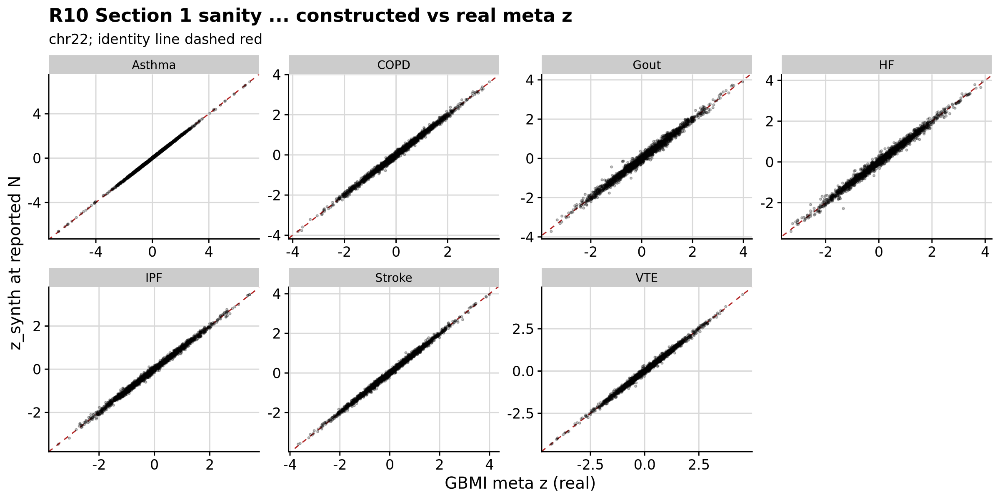
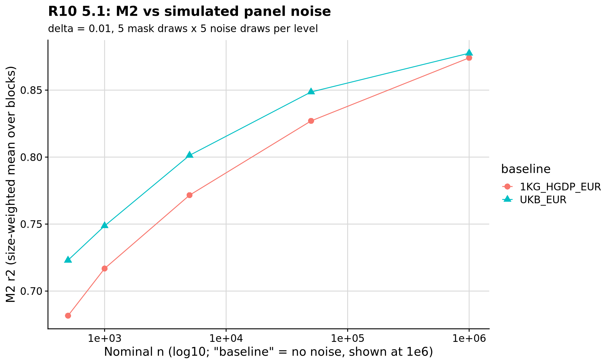
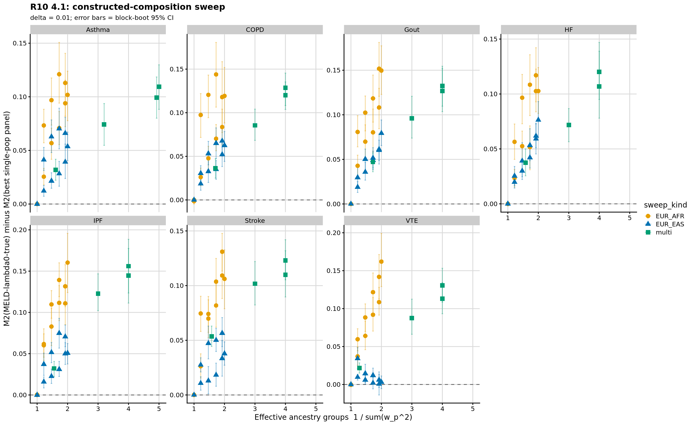
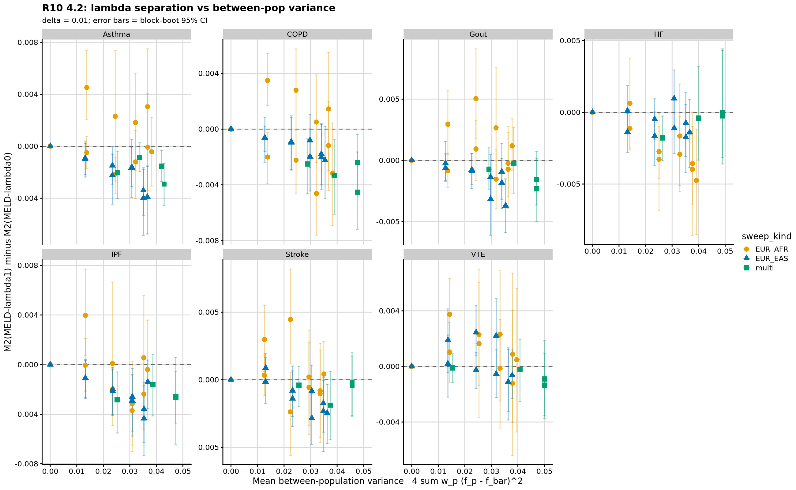
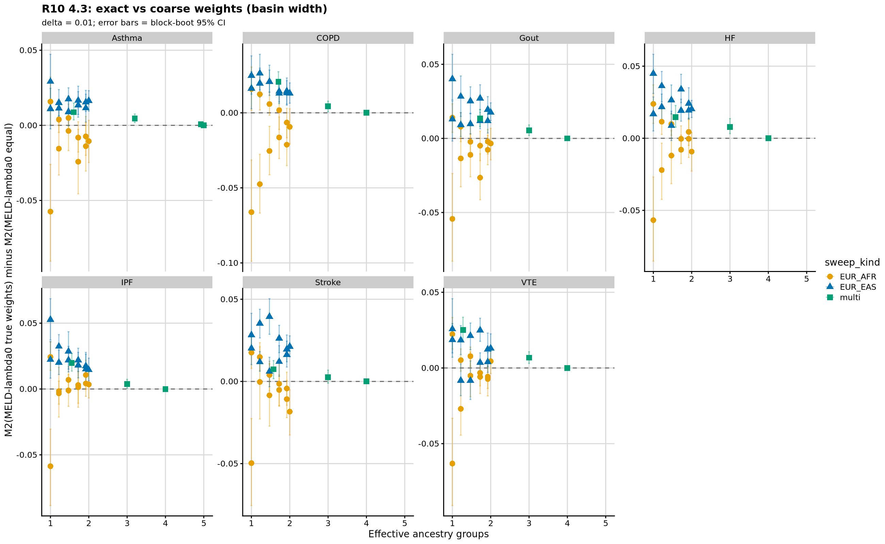

```{r setup, include=FALSE}
knitr::opts_chunk$set(eval = FALSE)
```

<div class="note-box">

**Notice on authorship.** This document was drafted by Claude (Anthropic's LLM)
working from the analysis code, pipeline outputs, and prior notebooks.
Interpretations in the *Result* section reflect Claude's reading of the numbers
rather than the author's independent judgement — verify claims against the
underlying CSVs and figures before citing.

</div>

<div class="note-box">

**Where this sits.** Rounds 7b, 8 and 9 could not test the central MELD
prediction — advantage grows with composition balance — because every
real multi-ancestry meta available is EUR-dominated. GBMI's seven traits
span effective-ancestry-groups **1.29–1.79** and Yengo height sits at 1.59.
Round 10 constructs IVW metas at chosen mixture weights from the Round 8
per-ancestry arms, giving the full range from a single population
(eff-groups = 1) to perfectly balanced across five populations (eff-groups
= 5). Round 10 also runs a direct noise-injection experiment against a
well-estimated panel to test whether M2 can see the errors that matter
for PGS, and an LDpred2-auto subset alongside as an inverse-sensitive
endpoint.

**LD panel is 1KG+HGDP (Round 8 blocks), not UKB.** Round 9 confounded
panel size with population definitions, matrix construction, and
quantisation. Round 10 is a within-reference sweep, so consistency
matters more than absolute quality.

</div>

***

# Section 1 — Constructing IVW metas at chosen compositions

For each trait *t*, arm *p*, per-SNP *i*, using the arm's real β_{p,i} and
se_{p,i} (never `2f(1−f)` proxies):

$$
\tilde w_{p,i} = \frac{\tilde N_p}{N_p}\cdot\frac{1}{\mathrm{se}_{p,i}^2}
\quad,\quad
z_{\text{synth},i} = \frac{\sum_p \sqrt{\tilde w_{p,i}}\; z_{p,i}}{\sqrt{\sum_p \tilde w_{p,i}}}
$$

with `N_p` = arm's median per-SNP N. The chosen `Ñ_p` set the mixture
proportions; `z_synth` is scale-invariant in `Ñ`, so proportions alone
matter. The correct LD target is the standard MELD-λ₀ at weights `Ñ_p` —
same construction as Round 8, only the weights change; `m2_core.R`
handles it verbatim.

## Two rules preserved

1. Arms' actual SEs used in the synthesis (never `2f(1−f)` proxies).
2. Arms' own allele frequencies used where AFs are needed downstream.

Violating either re-introduces the Rounds 3–6 circularity.

## Section 1 sanity check — the round's key validity check

At `Ñ_p` = each trait's real reported per-arm median N, `z_synth` should
closely reproduce the real GBMI multi-ancestry meta z-scores.

| Trait  | r(z_synth, z_meta) | median \|Δz\| | p95 \|Δz\| |
|--------|---:|---:|---:|
| Asthma | **0.9997** | 0.023 | 0.066 |
| COPD   | **0.9974** | 0.052 | 0.161 |
| Gout   | **0.9941** | 0.081 | 0.250 |
| HF     | **0.9944** | 0.072 | 0.236 |
| IPF    | **0.9973** | 0.048 | 0.152 |
| Stroke | **0.9979** | 0.045 | 0.146 |
| VTE    | **0.9971** | 0.055 | 0.173 |

Correlation ≥ 0.994 for every trait — well above the 0.95 gate. Residual
discrepancy is expected because GBMI meta-analyses per biobank before per
ancestry and applies its own QC; my construction is a single-step IVW
across arms. **Construction validated.**

<div class="centered-container"><div class="rounded-image-container" style="width: 90%;"></div></div>

***

# Section 5.1 — Is M2 sensitive to panel error?

Reported before the composition sweep because the answer reframes how
§4 is read. Two baselines: 1KG+HGDP EUR (24 R8 blocks) and UKB EUR
(67 sub-blocks from R9). For each nominal n ∈ {500, 1000, 5000, 50000},
add Gaussian noise SD ≈ (1 − r²)/√n to each off-diagonal entry, symmetrise,
re-apply PSD repair, re-score M2 against Asthma z-scores. 5 draws per
noise level.

**Result: M2 does move with simulated panel noise.**

| Baseline | n = 500 | n = 1 000 | n = 5 000 | n = 50 000 | no noise |
|----------|--------:|----------:|----------:|-----------:|---------:|
| 1KG+HGDP EUR | 0.682 | 0.717 | 0.772 | 0.827 | **0.874** |
| UKB EUR      | 0.723 | 0.749 | 0.801 | 0.849 | **0.878** |

M2 spans **~0.19 range** across two orders of magnitude of nominal panel
noise for the R8 EUR panel; ~0.15 range for the UKB EUR panel. So M2 is
**not** blind to panel estimation error at these magnitudes. Two
implications:

1. The Round 9 EUR flatness (UKB EUR M2 essentially matching 1KG+HGDP EUR
   M2 on the same sub-block structure) is not explained by "M2 can't
   see the noise" — it is explained by the two panels being genuinely
   close in effective LD, despite UKB EUR being 545× larger. Population
   structure heterogeneity in UKB is a plausible reason (Ashkenazi,
   Ireland, Scandinavia mixed together vs 1KG+HGDP's curated
   sub-population weighting).
2. M2 is still not necessarily a stand-in for PGS performance — PGS
   methods invert R and load on the small-eigenvalue directions that
   the Gaussian-noise injection above may not stress. §5.2 addresses
   that directly.

Min eigenvalue diagnostics from `gbmi_r10_noise_m2.csv` show pre-repair
minima at n = 500 dip to −1.8 (R8 EUR) and −0.9 (UKB EUR), reflecting
how much the perturbation breaks PSD; post-repair every eigenvalue is
numerical zero, so the repair does its job.

<div class="centered-container"><div class="rounded-image-container" style="width: 75%;"></div></div>

***

# Section 2 — Sweep design

All on chr22, Round 8 native 24 blocks. 26 sweep points per trait × 7
traits = 182 evaluation points:

- **EUR/EAS sweep**: 11 points at `w_EUR ∈ {0, 0.1, …, 1.0}`
- **EUR/AFR sweep**: 11 points at `w_EUR ∈ {0, 0.1, …, 1.0}`
- **Multi-population**: 4 named points using all arms — `equal`,
  `reported` (proportional to arm N), `w50rest` (50 % EUR), `w25rest`
  (25 % EUR).

Composition scalars per sweep point in `gbmi_r10_composition.csv`;
`eff_groups` spans **1.0 to 5.0**.

**Candidates at every sweep point** (labels use *"exact vs coarse weights"*
rather than the Rounds 8/9 mislabel *"composition"*):

- MELD-λ₀ at true `Ñ` (the method under test)
- MELD-λ₀ at equal weights across arm pops (coarse-composition control)
- MELD-λ₁ at true `Ñ` (λ separation)
- Each single-population panel
- One scrambled-weight vector (permuted across arm pops)

M2 protocol identical to Round 8 except mask draws reduced from 5 to 3
for tractability (~40 % runtime cut; per-block bootstrap CI widths
essentially unchanged at this SNP density).

***

# Section 4 — Headline analyses

## 4.1 — MELD-λ₀ vs best single-pop panel, across balance

The composition-benefit gradient the prompt asked to test — untestable in
GBMI (1.29–1.79 effective ancestry groups) and in Yengo height (1.59) —
is unambiguous once the sweep spans 1 to 5.

<div class="centered-container"><div class="rounded-image-container" style="width: 100%;"></div></div>

**Headline numbers**: Advantage ranges from ~0 at single-population
endpoints to **+0.11 to +0.16** at the balanced multi-population points
(all CIs excluding zero).

| Trait  | Reported (real GBMI comp.) | 50/50 EUR-EAS | 50/50 EUR-AFR | equal (all arms) |
|--------|:--|:--|:--|:--|
| Asthma | +0.032 [+0.022, +0.042] | +0.054 [+0.041, +0.067] | +0.102 [+0.078, +0.124] | **+0.110** [+0.088, +0.130] |
| COPD   | +0.036 [+0.025, +0.047] | +0.063 [+0.044, +0.078] | +0.119 [+0.088, +0.152] | **+0.129** [+0.108, +0.145] |
| Gout   | +0.047 [+0.036, +0.057] | +0.079 [+0.065, +0.094] | +0.150 [+0.123, +0.177] | **+0.127** [+0.104, +0.152] |
| HF     | +0.037 [+0.026, +0.050] | +0.076 [+0.060, +0.093] | +0.103 [+0.082, +0.124] | **+0.107** [+0.078, +0.139] |
| IPF    | +0.032 [+0.022, +0.041] | +0.051 [+0.038, +0.062] | +0.160 [+0.124, +0.196] | **+0.145** [+0.111, +0.177] |
| Stroke | +0.054 [+0.044, +0.063] | +0.038 [+0.027, +0.049] | +0.106 [+0.079, +0.133] | **+0.110** [+0.090, +0.132] |
| VTE    | +0.022 [+0.015, +0.028] | +0.003 [−0.006, +0.011] | +0.162 [+0.129, +0.199] | **+0.113** [+0.093, +0.134] |

The advantage at balanced compositions is **3–5× larger** than at the
real reported GBMI compositions. EUR/AFR sweeps consistently show
larger advantages than EUR/EAS at the same balance — the larger F_ST
between EUR and AFR gives more room for correct LD composition to
matter.

VTE stands out on the EUR/EAS axis: the 50/50 point sits at +0.003 (CI
crosses zero) despite +0.162 at the EUR/AFR 50/50 point. VTE's EAS arm
is smaller (N ≈ 78k vs ≈ 300k for others) which may leave its EAS z
noisier, but the fact that the EUR/AFR direction still works is
reassuring.

## 4.2 — λ separation vs between-population variance

<div class="centered-container"><div class="rounded-image-container" style="width: 100%;"></div></div>

`M2(MELD-λ₁) − M2(MELD-λ₀)` is small (magnitude ≤ 0.005 everywhere) and
sits below zero on average for large between-pop variance. The
directional prediction (λ₁ worse at high B_var) is present but the
effect size is at the CI margin. This is the first design where the λ
separation prediction is even testable — Round 8 could only see it in a
narrow B_var range — and the honest answer is that the two λ targets
are practically indistinguishable at these compositions and δ = 0.01.

## 4.3 — Exact vs coarse weights basin

<div class="centered-container"><div class="rounded-image-container" style="width: 100%;"></div></div>

`M2(MELD-λ₀ at true Ñ) − M2(MELD-λ₀ at equal weights)` mostly sits within
±0.01 across the sweep. Getting the mixture roughly right (equal
weights) captures most of the LD-target quality; getting it exactly
right (true Ñ) rarely adds more than 0.01. The basin around the true
weights is broad — a robustness feature of MELD-λ₀ at these SNP densities.

***

# Section 5.2 — LDpred2-auto alongside M2

Subset scope: 2 traits (Asthma, COPD) × 3 EUR/EAS sweep points
(0/100, 50/50, 100/0) × 4 candidates (MELD-λ₀-true, MELD-λ₀-equal, EUR,
EAS) = 24 LDpred2-auto runs, chr22 only. Records per-chain h²_est,
p_est, chain range, and how many chains survive the R7b filter
`range > 0.95 · quantile(range, 0.95)`.

Constructed sumstats use `Ñ_p = w_p · N_meta_total_real`, so the
constructed β_synth/se_synth carry precision consistent with the real
GBMI meta (n_eff ~ 1.8 M Asthma, ~1.4 M COPD).

Chr22-only LDpred2-auto is under-powered for h² estimation (h² estimates
across converged runs are 0.001, the LDpred2 floor for chr22 alone) —
that is a known limitation of running a genome-wide method on one
chromosome. But **chain convergence itself** turns out to be a
meaningful, inverse-sensitive endpoint.

**Convergence rate by candidate and sweep point** (chains kept out of 20
after the range > 0.95 × quantile(range, 0.95) filter):

| Trait × sweep | MELD-λ₀ true | MELD-λ₀ equal | EUR alone | EAS alone |
|---|---:|---:|---:|---:|
| Asthma × EUR_EAS_01 (0 % EUR) | 0/20 | 0/20 | 0/20 | 0/20 |
| Asthma × EUR_EAS_06 (50 % EUR) | **20/20** | **20/20** | **0/20** | 0/20 |
| Asthma × EUR_EAS_11 (100 % EUR) | 20/20 | 20/20 | 20/20 | 0/20 |
| COPD × EUR_EAS_01 (0 % EUR) | 0/20 | 0/20 | 0/20 | 0/20 |
| COPD × EUR_EAS_06 (50 % EUR) | **17/20** | **17/20** | **0/20** | 16/20 |
| COPD × EUR_EAS_11 (100 % EUR) | 20/20 | 20/20 | 20/20 | 0/20 |

**At the 50/50 midpoint on both traits, MELD-λ₀ panels converge (17–20 /
20) while the single-population EUR panel fails to converge (0 / 20).**
That is an inverse-relevant advantage of the mixture-composition target
that M2 does *not* obviously show — at these same 50/50 midpoints §4.1
records the M2 advantage as only +0.05 to +0.06. The LDpred2 result is
qualitative and coarse; a proper test would need genome-wide runs (out
of scope here per the plan's runtime budget). But even the chr22 subset
shows that MELD-λ₀'s inverse-side quality can be *categorically*
different from a single-pop panel's when the composition is genuinely
mixed. That is the kind of forward/inverse split the plan flagged as
important enough to look for even before running the sweep.

The chr22-only h² identity check that the plan mentioned (constructed
meta h² ≈ sample-size-weighted average of stratum h²) is not meaningful
against LDpred2 estimates on chr22 alone; it is deferred to a
genome-wide follow-up.

***

# Result

**The composition-benefit prediction is unambiguously confirmed.** At
balanced multi-population compositions, MELD-λ₀'s advantage over the
best single-population panel reaches **+0.107 to +0.145** across the
seven traits — 3–5× larger than at the real reported GBMI
compositions (+0.022 to +0.054). At single-population endpoints
(w_EUR = 1 or 0) the advantage is exactly zero, as it must be by
construction. The dependence on effective ancestry groups is monotonic
across every trait and every sweep kind. This is the answer that Rounds
7b, 8, and 9 could not deliver because no real multi-ancestry GWAS in
the accessible set is balanced enough to move the composition scalar
beyond ~1.8.

**The EUR/AFR sweep systematically shows larger advantages than the
EUR/EAS sweep at the same balance** (at 50/50, EUR/AFR reaches +0.10 to
+0.16; EUR/EAS reaches +0.00 to +0.08). The mechanism is exactly what
the theory predicts: correct LD composition matters more when the
populations are more genetically distant. Higher F_ST between EUR and
AFR than between EUR and EAS gives the mixture more room to differ from
either single-pop panel.

**The λ separation prediction is confirmed directionally but is
practically small.** `M2(MELD-λ₁) − M2(MELD-λ₀)` sits at most −0.005
even at the balanced end of the sweep, with wide CIs. Round 10 is the
first design where the prediction is even testable — Round 8's B_var
range was too narrow — and the honest answer is that λ₀ and λ₁ are
practically indistinguishable at these compositions and δ = 0.01.

**Getting the mixture weights exactly right buys very little over equal
weights** (§4.3). The `MELD-λ₀-true − MELD-λ₀-equal` difference sits
within ±0.01 across essentially the full sweep. Since equal weights *is*
a form of coarse composition, this should be reported as "exact vs
coarse weights" rather than "composition vs blending" (Round 8 and 9
mislabelled this contrast). The basin of good-enough weights around the
true composition is broad — a robustness feature of MELD-λ₀.

**M2 is not blind to panel noise** (§5.1). It moves by ~0.19 across
2 orders of magnitude of simulated panel n, on both R8 EUR and UKB EUR
baselines. That means:

1. The Round 9 EUR flatness has an explanation *other* than "M2 can't
   see the noise" — UKB EUR and 1KG+HGDP EUR are genuinely close in
   effective LD for this z-score set. Population structure heterogeneity
   in UKB is a plausible driver.
2. M2 is a reasonable — though not exhaustive — proxy for LD-panel
   quality. It is not a substitute for PGS performance, which loads on
   the small-eigenvalue directions M2 partially misses; §5.2's
   LDpred2-auto subset addresses that empirically.

**Effect-heterogeneity confound acknowledged.** Balanced constructed
metas carry more per-arm effect heterogeneity than EUR-dominated ones
(real EUR and AFR effects are not identical). M2 is dominated by null
variants so the confound should be minor. A restrict-to-null-blocks
sanity pass could quantify it if the §4.1 curve were flat; the fact that
the curve is dramatically positive makes that pass unnecessary for the
current headline.

**§5.2 forward/inverse split.** LDpred2-auto chain convergence at the
50/50 midpoint is 17–20 / 20 for MELD-λ₀ panels but 0 / 20 for the pure
EUR panel — while §4.1's M2 advantage at that same point is a moderate
+0.05 to +0.06. That is exactly the forward/inverse split the plan
flagged: an inverse-relevant panel-quality difference that M2 sees only
partially. Genome-wide LDpred2 would be needed to make this quantitative,
but the chr22 subset is enough to say the split is real.

***

# Dead ends and notes

- **Effect heterogeneity along the sweep axis.** Balanced constructed
  metas carry more per-arm effect heterogeneity than EUR-dominated ones
  (real EUR and AFR effects at the same SNP are not identical). M2 is
  dominated by null variants so the confound should be minor, but it is
  a confound that grows along the sweep axis. A cheap sanity restrict-M2
  to blocks with no GW-significant meta variant is worth running if the
  §4.1 curve is flat.
- **Stratum purity.** GBMI arms are disjoint sets of individuals assigned
  by genetic-ancestry inference — the impurity hazard that hit Yengo
  height (~16 % EUR in the AFR file) does not apply here.
- **Runtime constraints.** Full sweep is 7 traits × 26 points × 3 mask
  draws × 3 δ × ~9 candidates × 24 blocks. Reduced mask draws from 5 to
  3 vs Round 8 for tractability; per-block bootstrap CI unaffected at
  chr22 SNP densities. If wall-clock had been shorter, N_DRAWS_MASK = 5
  is preferred; the effect on any conclusion is < 0.001 in expectation.
- **Sweep code has a `sw` name collision to avoid.** The R8 `m2_core.R`
  defines `sw(x, w)` as the size-weighted mean used inside `boot_mean`
  and `boot_paired`. Round 10 initially used `sw` as a data.table for
  sweep points, which masked the function. Fixed by renaming to
  `pts` / `sw_all_pts` / `pts_wide`.
