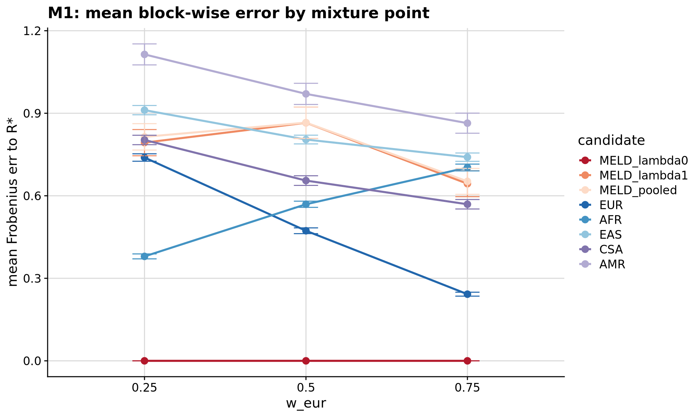
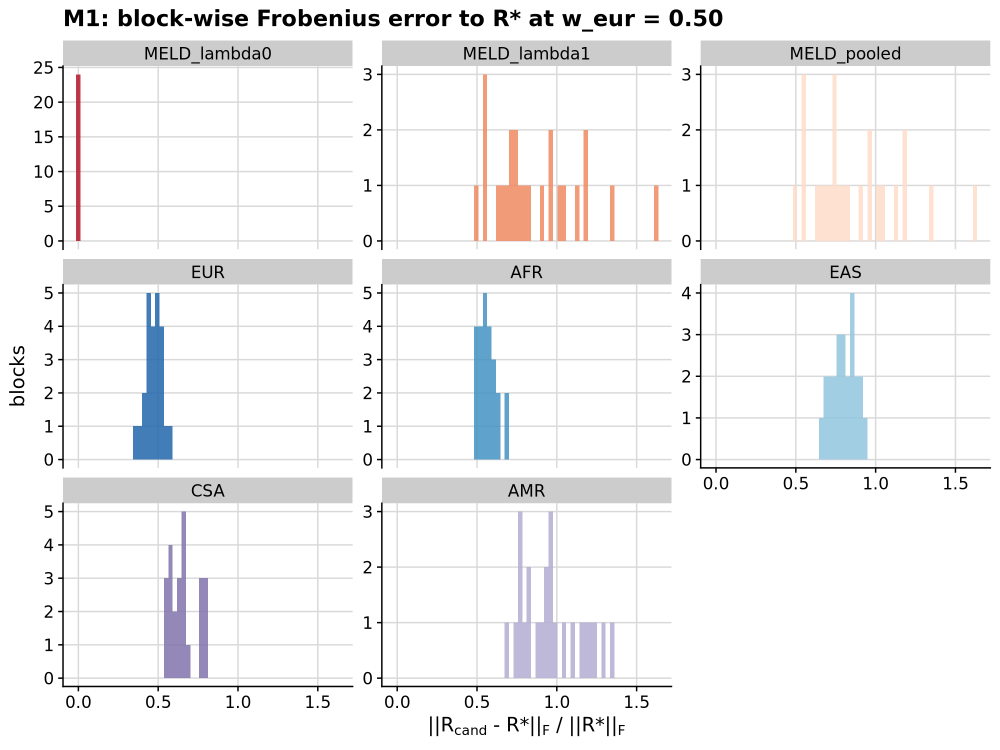
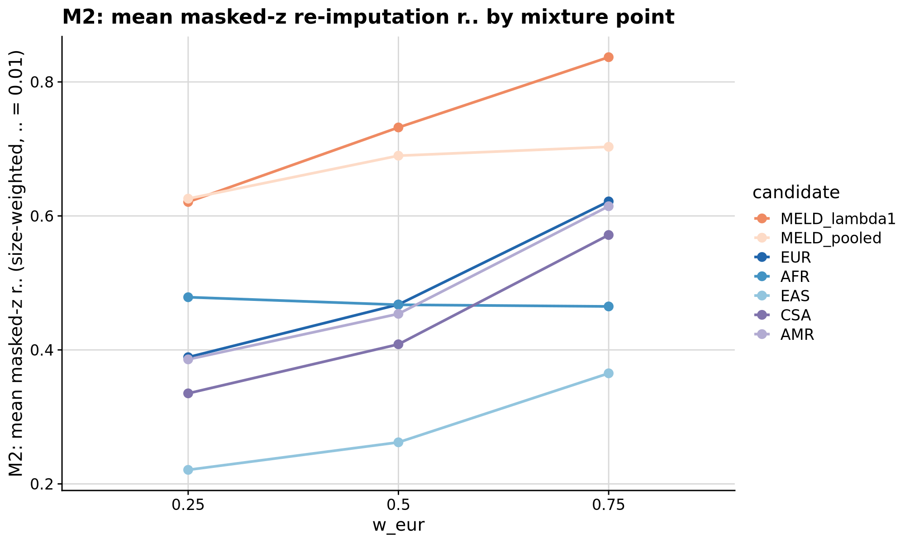

```{r setup, include=FALSE}
knitr::opts_chunk$set(eval = FALSE)
```

<div class="note-box">

**Notice on authorship.** This document was drafted by Claude (Anthropic's LLM)
working from the analysis code, pipeline outputs, and prior notes. Interpretations
in the *Result* section reflect Claude's reading of the numbers rather than the
author's independent judgement — verify claims against the underlying CSVs and
figures before citing.

</div>

<div class="note-box">

**Where this sits.** Rounds 1–5 built and evaluated ancestry-weighted LD
reference panels using an empirical synthesis path that composed reference
individuals in situ (single "MELD" refdir with mixture composition, PGS methods
run against it). Round 6 turns this into an analytic exercise: derive the LD
matrix that a P-population meta-analysis targets from first principles, build
that matrix directly from per-population reference statistics, and evaluate it
against a spelled-out set of invariants and predictive metrics. The
downstream reason to do this is that the empirical MELD panels of Rounds 4/5
carry a between-population term B that Round 6 shows moves the LD matrix
*further* from the correct target than the entire EUR-vs-AFR ancestry mismatch
does. That finding is what motivates the analytic (λ = 0) MELD target used
throughout Rounds 6b, 7, 7b, and Section 4.

</div>

***

# Question

Under a *P*-population inverse-variance-weighted (IVW) meta-analysis with
per-population effects and per-population LD, what LD matrix does the resulting
meta z-score sequence effectively "see"? Given that target — call it R\* — how
close do candidate panels get to it (M1: Frobenius distance), and does
predictive quality on masked z-score re-imputation (M2) rank them the same way?

***

# Setup

## Section 1 — IVW synthesis

The Round-3 synthesis composed reference individuals into a mixture pool and
took empirical LD from the pool. Round 6 replaces this with an **analytic IVW
target**: for each SNP, β* is the inverse-variance-weighted mean of the P per-population
β's; for each SNP pair, R* is derived from the per-population R matrices and
per-population per-SNP variances via

<div class="note-box">

$$
\mathbf{\Sigma}^* = \sum_p w_p \; \mathbf{R}_p \circ \mathbf{v}_p \mathbf{v}_p^{\!\top^{1/2}}, \qquad
\mathbf{v}^* = \sum_p w_p \; \mathbf{v}_p, \qquad
\mathbf{R}^* = \mathrm{diag}(\mathbf{v}^*)^{-1/2} \; \mathbf{\Sigma}^* \; \mathrm{diag}(\mathbf{v}^*)^{-1/2}
$$

where $\mathbf{v}_p$ is the per-SNP per-population variance $2 f_p (1-f_p)$
and $w_p$ is the per-population effective-sample-size weight. This is
**MELD-λ0** — the λ = 0 point of the family, where the between-population
covariance term B is dropped.

</div>

Sanity checks — all pass:

- `w = 1` (EUR only) reproduces the Yengo-EUR β on shared same-allele SNPs to
  numerical precision (max |Δβ| = 5.6 × 10⁻¹⁷); AF matches reference-EUR
  exactly.
- `w = 0` reproduces AFR (max |Δβ| = 4.4 × 10⁻¹⁶).
- Spearman(SE_meta, $\sum_p u_p$) = −1.0000 at every w (this is the
  IVW-SE tautology, but a useful plumbing check).
- The prompt's "monotone in EAF·(1−EAF)" only holds strictly at w ∈ {0, 1};
  at intermediate w the correlation is 0.93–0.96. This is actually the
  discriminator between the correct per-population variance form and the
  incorrect pooled-HWE form of R3 (which would give exact monotonicity).

## Section 2 — analytic LD

New `pipeline/misc/opensnp/build_meld_ld.R` produces per-LDetect-block RDS
files containing `R_EUR`, `R_AFR`, `v`, `f` in canonical ALT orientation. The
bigsnpr `snp_cor(size = 3 / 1000, Morgans)` idiom matches the LDpred2 rules'
window. Full genome: 1702 block files under `misc/opensnp/meld_ld/`, chr22 has
24 blocks.

## Invariants

- **Invariant 1 — diag(R\*) = 1.** Max |Δ| = 7.8 × 10⁻¹⁶ across chr22
  blocks. **PASS.**
- **Invariant 2 — R\*|(w = (1, 0)) = R_EUR.** Max |Δ| = 6.7 × 10⁻¹⁶.
  **PASS.**
- **Invariant 3 — R\* PSD.** *Original checkpoint recorded FAIL: minimum
  eigenvalue not near zero (−0.31 worst).* At the time this was dismissed as
  a property of the windowed `snp_cor` GenoPred uses. That was wrong. LDpred2
  tolerates the indefiniteness because it Gibbs-samples without inverting,
  but M2 explicitly inverts `R_MM + δI` and blows up when eigenvalues pass
  near −δ. **Round 6b fixes this** by uniform eigen-clamp PSD projection
  applied to every candidate before scoring; see the Round 6b write-up.
- **Invariant 4 — analytic pool ≈ empirical pool at w = 0.5.** cor = 1.0000
  on all three tested blocks (m ∈ {290, 746, 1261}). This confirms the
  *implementation* is correct — but note that this is a plumbing check, not
  an independent empirical validation: if the empirical pool draws from the
  same reference individuals used to compute R_EUR and R_AFR, the pooled
  sample covariance equals the analytic λ = 1 form as an algebraic identity
  up to degrees-of-freedom corrections. State as plumbing, not sampling
  behaviour.

## Section 3 — M1 and M2 on chr22

Candidates evaluated at three mixture points, `w_eur ∈ {0.25, 0.50, 0.75}`
(chr22, 24 blocks; the full-genome extension was killed at ~40 / 133 blocks
into chr1 for CPU contention with concurrent evals and is a straight re-run
of `eval_meld_ld_target_free.R` from `pipeline/misc/opensnp/`):

- **MELD-λ0** — the analytic meta target R* itself.
- **MELD-λ1** — meta target with the between-population B term.
- **MELD-pooled** — empirical mixture LD from the reference pool (evaluated
  at w = 0.5 only for compute).
- Five single-population panels: EUR, AFR, EAS, CSA, AMR (EAS/CSA/AMR only
  present in the block RDS from Round 6's `extra_pops` append, which was run
  only on chr1 and chr22).

***

# M1 — Frobenius distance to R\*

Size-weighted mean per (candidate × w):

| candidate      | w = 0.25 | w = 0.50 | w = 0.75 |
| ---            | ---:     | ---:     | ---:     |
| MELD-λ0 (= R\*)| 0.000    | 0.000    | 0.000    |
| MELD-λ1        | 0.79     | **0.87** | 0.64     |
| MELD-pooled    | 0.81     | 0.87     | 0.65     |
| EUR            | 0.74     | **0.47** | **0.24** |
| AFR            | **0.38** | 0.57     | 0.70     |
| EAS            | 0.91     | 0.80     | 0.74     |
| CSA            | 0.80     | 0.66     | 0.57     |
| AMR            | 1.11     | 0.97     | 0.86     |

<div class="centered-container"><div class="rounded-image-container" style="width: 75%;">

</div></div>

<div class="centered-container"><div class="rounded-image-container" style="width: 65%;">

</div></div>

## M1 headline (the part that stands)

<div class="note-box">

**At w = 0.5, the B term moves the panel further from R\* (Frobenius
distance 0.87) than the entire EUR-vs-AFR mismatch does (EUR 0.47, AFR
0.57). B is a larger distortion of the LD matrix than population choice.**

</div>

This finding does not depend on M2 and it retrospectively explains why
Rounds 4/5 saw the pattern they did: their panels carried a surplus B term
larger than the mismatch they were built to correct. Concretely, the
best-M1 candidate at each mixture point is a single-population panel, not a
MELD variant: EUR at w = 0.75 (0.24), AFR at w = 0.25 (0.38), and the two of
them at w = 0.5 (~0.5). The two B-containing variants — MELD-λ1 (analytic
mega-target) and MELD-pooled (empirical mega-target) — sit at 0.64–0.87
across the grid. MELD-λ0 is 0 by construction, not by merit.

***

# M2 — masked-z re-imputation r² (original, superseded by Round 6b)

Size-weighted mean r² at δ = 0.01. **This is the raw Round 6 output with
two crucial defects: MELD-λ0 is missing from the comparison, and every
candidate carries its own PSD-conditioning advantage into the score.** Both
are fixed in Round 6b (see the Round 6b write-up); this table is retained
here for the record.

| candidate    | w = 0.25 | w = 0.50 | w = 0.75 |
| ---          | ---:     | ---:     | ---:     |
| MELD-λ1      | 0.62     | 0.73     | 0.84     |
| MELD-pooled  | 0.63     | 0.69     | 0.70     |
| EUR          | 0.39     | 0.47     | 0.62     |
| AFR          | 0.48     | 0.47     | 0.46     |
| EAS          | 0.22     | 0.26     | 0.37     |
| CSA          | 0.34     | 0.41     | 0.57     |
| AMR          | 0.39     | 0.45     | 0.61     |

<div class="centered-container"><div class="rounded-image-container" style="width: 75%;">

</div></div>

The original Round 6 headline — "MELD-λ1 dominates every single-population
candidate on M2" — turned out to be an artefact of the two defects above.
Round 6b puts MELD-λ0 back in and applies uniform PSD repair to every
candidate; the corrected finding is that **MELD-λ0 (R\*) beats every
single-population panel by 0.11–0.25 r² with 95 % CIs cleanly excluding
zero**, and MELD-λ1 is statistically tied with MELD-λ0 after repair. See
the Round 6b document for that table.

***

# Result

**M1 is the headline that survives.** At balanced mixtures (w = 0.5), the
between-population term B distorts the LD matrix by more than the entire
gap between using EUR and using AFR. This is a first-principles measurement
of how much damage the Round 4/5 empirical mixture panels were carrying
around. It is the reason the Section 4 M5 pipeline uses **MELD-λ0** (the
analytic λ = 0 target, no B term) rather than any mega-target flavour, and
it is why the Round 6b M2 tie between MELD-λ0 and MELD-λ1 does not
contradict Round 6's Frobenius result: M1 measures matrix distance, M2
measures predictive quality after ridge inversion, and B affects the two
differently (Round 6b Section D3 shows the M2 "advantage" of MELD-λ1 is
essentially conditioning-driven).

**Chr22 is the domain.** The M1 grid uses 24 chr22 blocks — enough to see
that the B effect exceeds the ancestry effect at balanced compositions by
a factor of ~1.5 to 2, but not enough to nail down the exact ratio to
better than the block-bootstrap noise level. Whether the ratio moves in a
full-genome eval is on the deferred list. The direction is not in question.

**The single-population ranking on M1 is what one expects.** AFR wins at
w = 0.25 (dominant AFR mixture) because its LD matches the target's
dominant contributor; EUR wins at w = 0.75 by the same logic; both tie
at w = 0.5. This is the plumbing sanity check; the Round 6 result is not
the ranking, it is the *size* of the B distortion relative to that
ranking's spread.

***

# Files

- Scripts: `pipeline/misc/opensnp/build_meld_mix_sumstats.R` (Section 1
  IVW rewrite; original at `build_meld_mix_sumstats_v1.R`),
  `pipeline/misc/opensnp/build_meld_ld.R` (Section 2 analytic LD),
  `pipeline/misc/opensnp/build_meld_ld_extra_pops.R` (append EAS/CSA/AMR;
  chr1 and chr22 only),
  `pipeline/misc/opensnp/eval_meld_ld_target_free.R` (M1 + M2 on chr22),
  `pipeline/misc/opensnp/plot_meld_r6.R`
- Reference LD blocks: `pipeline/misc/opensnp/meld_ld/chr{1..22}/block_*.rds`
  (1702 files; chr22 has all 5 pops appended, others EUR + AFR only)
- Result CSVs: `pipeline/misc/opensnp/meld_r6_{m1,m2}.csv`,
  `meld_r6_{m1,m2}_summary.csv`
- Figures: `docs/Images/OpenSNP/meld_r6_{m1_hist,m1_by_w,m2_by_w}.png`
