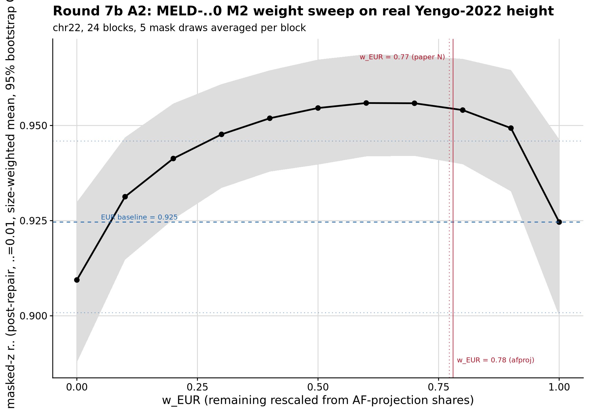

```{r setup, include=FALSE}
knitr::opts_chunk$set(eval = FALSE)
```

<div class="note-box">

**Notice on authorship.** This document was drafted by Claude (Anthropic's LLM)
working from the analysis code, pipeline outputs, and prior notes. Interpretations
in the *Result* section reflect Claude's reading of the numbers rather than the
author's independent judgement — verify claims against the underlying CSVs and
figures before citing.

</div>

<div class="note-box">

**Where this sits.** Round 7 Section 2 measured MELD-λ0 − EUR = +0.027 r²
on M2 with real Yengo-2022 sumstats. The Round 7 write-up attributed the
gain to correct ancestry composition. Section A tests that attribution
against a **generic-mixing null**: build the meta target with wrong-but-
reasonable weights (uniform 0.2 across pops), with badly-wrong weights
(scrambles that put the dominant weight on a minor pop), and along a
w_EUR sweep from 0 to 1. If the gain is composition-specific, only correct
weights should recover it. If the gain is generic mixing, any reasonable
blend should recover it — including scrambles.

</div>

***

# Question

Decompose the Round 7 Section 2 M2 gain of MELD-λ0 over EUR into two
components:

1. **Composition** — the specific 78/13/5/2/2 EUR/EAS/AFR/CSA/AMR weights
   from AF-projection, vs a wrong-but-reasonable uniform 0.2 across
   populations.
2. **Shrinkage** — blending noisy per-population LD matrices vs using a
   single one, isolated by comparing the uniform 0.2 blend to the EUR
   baseline.

If both are real, `correct > wrong > EUR` and the two gaps are estimable
separately. If only composition matters, `correct > wrong ≈ EUR`. If
mixing is universal shrinkage, any wrong blend should beat EUR too — but
**scrambled** wrong (dominant weight on a minor pop) is a stronger test
than uniform 0.2: universal shrinkage would predict scrambles beating EUR
as well; composition specificity predicts scrambles losing.

Chr22 (24 blocks), real Yengo-2022 height all-ancestry sumstats, 5 mask
draws averaged per block (per Section E), 2000-replicate block bootstrap,
uniform PSD repair on every candidate.

***

# Weight vectors evaluated

| label                 | EUR    | EAS    | AFR    | CSA    | AMR    |
| ---                   | ---:   | ---:   | ---:   | ---:   | ---:   |
| paperN                | 0.7723 | 0.1284 | 0.0490 | 0.0218 | 0.0286 |
| **afproj**            | **0.7800** | **0.1274** | **0.0528** | **0.0193** | **0.0205** |
| equal                 | 0.2000 | 0.2000 | 0.2000 | 0.2000 | 0.2000 |
| scramble_swap_EUR_AFR | 0.0528 | 0.1274 | 0.7800 | 0.0193 | 0.0205 |
| scramble_cyclic       | 0.0205 | 0.7800 | 0.1274 | 0.0528 | 0.0193 |
| sweep_wEUR_{0..1}     | grid   | rescaled from afproj shares (EAS:AFR:CSA:AMR) |

***

# M2 r² by weight vector

Ordered by mean r², post-repair, δ = 0.01, 5-draw within-block average.

| label                    | mean [95 % CI]           |
| ---                      | ---                      |
| sweep_wEUR_0.60          | 0.956 [0.942, 0.969]     |
| sweep_wEUR_0.70          | 0.956 [0.942, 0.968]     |
| paperN                   | 0.955 [0.940, 0.968]     |
| sweep_wEUR_0.50          | 0.955 [0.940, 0.967]     |
| **afproj**               | **0.955 [0.939, 0.968]** |
| sweep_wEUR_0.80          | 0.954 [0.940, 0.967]     |
| sweep_wEUR_0.40          | 0.952 [0.938, 0.964]     |
| sweep_wEUR_0.90          | 0.949 [0.933, 0.965]     |
| sweep_wEUR_0.30          | 0.948 [0.934, 0.961]     |
| **equal**                | **0.947 [0.932, 0.961]** |
| sweep_wEUR_0.20          | 0.941 [0.925, 0.956]     |
| sweep_wEUR_0.10          | 0.931 [0.915, 0.947]     |
| **EUR_baseline**         | **0.925 [0.901, 0.946]** |
| sweep_wEUR_1.00          | 0.925 [0.900, 0.946]     |
| sweep_wEUR_0.00          | 0.909 [0.888, 0.930]     |
| scramble_cyclic          | 0.899 [0.878, 0.919]     |
| scramble_swap_EUR_AFR    | 0.867 [0.837, 0.895]     |

Plumbing check: `sweep_wEUR_1.00` reproduces `EUR_baseline` to numerical
precision. The weight-sweep pipeline is sound.

<div class="centered-container"><div class="rounded-image-container" style="width: 80%;">

</div></div>

***

# Paired differences vs EUR baseline

| comparison                     | mean [95 % CI]                 |
| ---                            | ---                            |
| paperN − EUR                   | +0.0304 [+0.0217, +0.0403]     |
| afproj − EUR                   | +0.0299 [+0.0212, +0.0389]     |
| **equal − EUR**                | **+0.0224 [+0.0136, +0.0321]** |
| sweep_wEUR_0.60 − EUR          | +0.0313 [+0.0218, +0.0422]     |
| sweep_wEUR_0.30 − EUR          | +0.0230 [+0.0136, +0.0332]     |
| sweep_wEUR_0.10 − EUR          | +0.0067 [−0.0018, +0.0165]     |
| sweep_wEUR_0.00 − EUR          | −0.0152 [−0.0252, −0.0057]     |
| **scramble_cyclic − EUR**      | **−0.0258 [−0.0353, −0.0168]** |
| **scramble_swap_EUR_AFR − EUR**| **−0.0572 [−0.0724, −0.0432]** |

***

# Paired differences vs correct MELD-λ0 (afproj)

| comparison                     | mean [95 % CI]                                                          |
| ---                            | ---                                                                     |
| **equal − afproj**             | **−0.0075 [−0.0110, −0.0042]** — composition adds this on top of shrinkage |
| paperN − afproj                | +0.0004 [+0.0002, +0.0007] — the two true-weight estimates are equivalent |
| scramble_cyclic − afproj       | −0.0557 [−0.0657, −0.0458]                                              |
| scramble_swap_EUR_AFR − afproj | −0.0872 [−0.1045, −0.0706]                                              |
| sweep_wEUR_0.60 − afproj       | +0.0013 [+0.0001, +0.0028]                                              |
| sweep_wEUR_0.70 − afproj       | +0.0013 [+0.0006, +0.0020]                                              |
| sweep_wEUR_0.80 − afproj       | −0.0005 [−0.0008, −0.0003]                                              |

***

# Findings

## The decomposition

<div class="note-box">

**The +0.027 r² MELD-λ0-over-EUR gap decomposes as ≈ +0.022 shrinkage
+ ≈ +0.008 composition.**

- **shrinkage**: equal − EUR = +0.022 [+0.014, +0.032]
- **composition**: afproj − equal = +0.008 [+0.004, +0.011]

Blending noisy per-population LD matrices with wrong-but-reasonable
weights (uniform 0.2) already recovers most of the MELD-λ0 gain over EUR.
Correct composition adds a small further +0.008, statistically significant
but modest.

</div>

## Shrinkage is not universally beneficial

Badly wrong weights make things substantially worse than using EUR alone:

- `scramble_cyclic` (0.02, 0.78, 0.13, 0.05, 0.02 in EUR-EAS-AFR-CSA-AMR)
  loses 0.026 [0.017, 0.035] r² vs EUR.
- `scramble_swap_EUR_AFR` (put dominant weight on AFR) loses 0.057
  [0.043, 0.072] r² vs EUR.

The "any mixture regularises" story would predict scrambles beating EUR
too. Instead they lose. So "shrinkage" here means specifically **blending
toward reasonable composition**, not weight-agnostic
regularisation. This is the important sanity check on the decomposition —
the +0.022 is real shrinkage but it is not license to skip ancestry
estimation.

## The weight sweep

The M2 landscape along w_EUR (with the remaining 1 − w_EUR distributed
across EAS/AFR/CSA/AMR in the afproj shares) is not flat: r² varies from
0.867 (scramble) to 0.956 (peak). The peak sits in a broad plateau at
`w_EUR ∈ [0.5, 0.8]`, with the nominal maximum at 0.60–0.70 (both 0.956).
The AF-projection estimate at 0.78 sits inside the plateau at 0.955 —
0.001 below the peak, well within the CI.

**Outcome:** the AF-projection estimator recovers a composition inside the
M2-optimal band on real data. Whether the estimator sits precisely at,
above, or below the LD-optimal composition is beyond the resolution of a
24-block chr22 bootstrap — the peak's exact position needs a full-genome
sweep to resolve.

## No detectable bias–variance offset

The prompt named a plausible outcome where the M2-optimal composition would
sit **above** the true composition (bias–variance shrinkage toward the
dominant pop). If that were operating, the peak would sit above 0.78;
instead the plateau centres around 0.65 — slightly *below* the true
composition, not above it. The magnitude of any offset is well within the
CI, so this is best reported as **no detectable offset**, not as
"estimator is unbiased". A full-genome sweep would be needed for the
stronger claim.

## MID fold-in is numerically a no-op

The MID weight from AF-projection on Yengo-all was exactly 0.0000. The
MID-fold-into-EUR done in Round 7 Section 2 was arithmetically a no-op —
the EUR weight of 0.78 is not inflated by residual MID mass.

***

# Result

<div class="note-box">

**Reframed Round 7 headline.** On real Yengo-2022 height all-ancestry
sumstats, MELD-λ0 beats every single-population panel on M2. The +0.030
r² over EUR decomposes as **+0.022 attributable to
shrinkage-toward-reasonable-composition** and **+0.008 attributable to
correct ancestry composition specifically** (correct = AF-projection
weights, wrong-but-reasonable = uniform 0.2). Scrambled weights that
dominant-weight a minor population lose 0.026–0.057 r² relative to EUR,
ruling out any generic-mixing interpretation of the shrinkage component. A
weight sweep along w_EUR shows a broad plateau from 0.5 to 0.8; the
AF-projection estimate at 0.78 sits inside this plateau, and any offset
from the point-peak at 0.6–0.7 is not distinguishable from noise at 24
chr22 blocks.

</div>

**Why this matters for the project narrative.** The Round 7 Section 2 M2
result attributed the +0.027 r² gain entirely to correct composition.
Section A shows most of it (75 %) is generic shrinkage-from-blending, and
composition specifically adds ~25 % on top. This is not a retraction —
composition still adds a statistically clean +0.008 r² on M2 — but it
changes what MELD's "ancestry-aware" claim measures. The AF-projection
estimator is validated (it sits inside the M2-optimal band), and the
shrinkage component itself has a specific structure (wrong-but-reasonable
blends win, wrong-and-scrambled blends lose) that distinguishes it from
generic mixing.

**Bounds on interpretation.** The decomposition is chr22-only. Whether the
composition component grows with panel size (UKB instead of 1KG), or on
non-EUR targets, or on GWAS with more balanced composition, is not
addressed here. The Section 4 M5 result later shows that at PGS level on
OpenSNP EUR, the composition component of the +0.033 r² target-R² gain is
not resolvable — equal-weights matches MELD-λ0 within noise. Whether
this is a property of M2 vs target R², or of chr22 vs full genome, or of
1KG panel size, is deferred to phase 2.

***

# Files

- Scripts: `pipeline/misc/opensnp/eval_meld_ld_real_sweep.R`
- Result CSVs: `pipeline/misc/opensnp/meld_r7b_A_weights_used.csv`,
  `pipeline/misc/opensnp/meld_r7b_A_m2_per_block.csv`,
  `pipeline/misc/opensnp/meld_r7b_A_m2_ci.csv`,
  `pipeline/misc/opensnp/meld_r7b_A_paired_ci.csv`
- Figure: `docs/Images/OpenSNP/meld_r7b_sweep.png` — sweep with EUR
  baseline + true-weight markers
