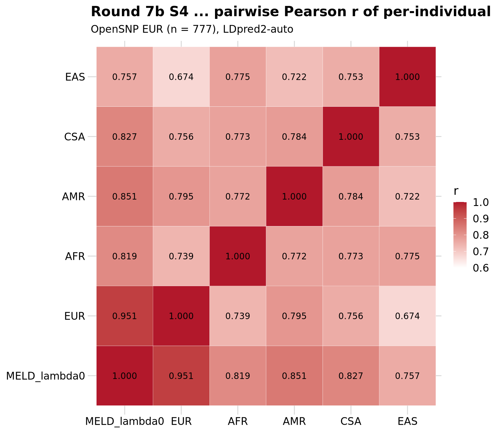
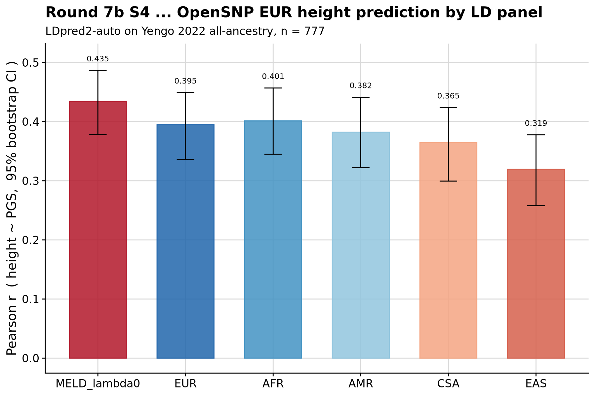
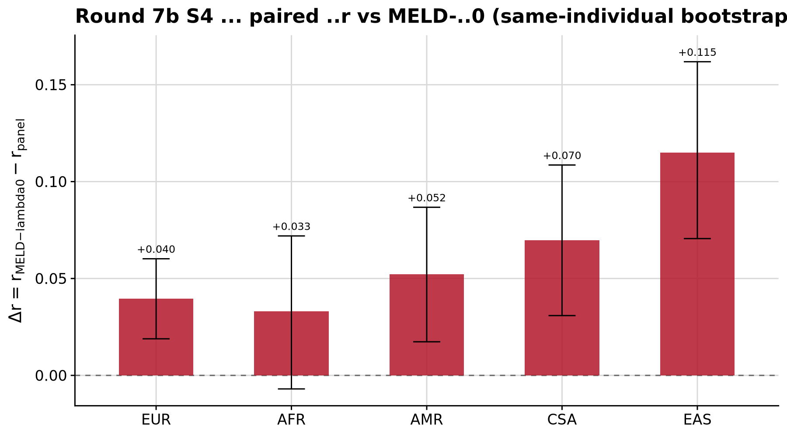

```{r setup, include=FALSE}
knitr::opts_chunk$set(eval = FALSE)
```

<div class="note-box">

**Notice on authorship.** This document was drafted by Claude (Anthropic's LLM)
working from the analysis code, pipeline outputs, and prior notebooks.
Interpretations in the *Result* section reflect Claude's reading of the numbers
rather than the author's independent judgement — verify claims against the
underlying CSVs and figures before citing.

</div>

<div class="note-box">

**Where this sits.** Round 6 established that the between-population term B is a
numerical artefact once uniform PSD repair is applied to every candidate.
Round 7 Section 2 evaluated M2 (masked-z re-imputation) on real Yengo-2022 all-
ancestry sumstats and found MELD-λ0 beat every single-population panel by
+0.03 r². Round 7b Section A decomposed that as +0.008 correct-composition on
top of +0.022 shrinkage-toward-reasonable-composition. This round tests whether
the composition effect reaches downstream **PGS weights and target R²** through
a real PGS method (LDpred2), using the native precomputed-R route.

</div>

***

# Question

Do the LDpred2 PGS weights derived under the analytic MELD-λ0 LD panel differ
meaningfully from those derived under a single-population panel — and does the
difference translate into improved target R² on OpenSNP EUR height?

***

# Setup

Six per-chromosome LDpred2 reference directories were built from the per-block
R matrices cached during Round 6 (`pipeline/misc/opensnp/meld_ld/chr{1..22}/block_*.rds`,
extended to all 5 super-populations by `build_meld_ld_extra_pops.R`). Each
per-chr `LD_with_blocks_chr{chr}.rds` stitches per-block dense sub-matrices
into a block-diagonal `Matrix::dsCMatrix` after uniform eigen-clamp PSD repair.
The companion `map.rds` uses the LDpred2 column set
(`chr, pos, a0, a1, rsid, af, af_UKBB, ld, group_id`) with `a1 = reference ALT`
canonical orientation matching Round 6 and effect-coded allele frequency
from the empirical dosage.

Labels: `MELD_lambda0` uses AF-projection weights recovered from Yengo-all
(EUR 0.780, EAS 0.127, AFR 0.053, CSA 0.019, AMR 0.021); the five single-pop
labels use `w_pop = 1` for the chosen pop.

Each of the six LDpred2 refs was hijacked into the AMR slot of a private
`ldpred2_ldref` folder. GenoPred was then run on Yengo 2022 height all-ancestry
sumstats through `sumstat_prep_i → ldsc_i → prep_pgs_ldpred2_i → target_pgs`.
Configs live at `pipeline/misc/opensnp/config_meld_r7bS4_ldpred2_<label>.yaml`;
outdirs at `/users/k1806347/oliverpainfel/Data/OpenSNP/GenoPred/meld_test_r7bS4_ldpred2_<label>/`.

<div class="note-box">

**Inference disabled.** `ldpred2_inference: F` in every config. Post-hoc h²/p/α
estimation is not needed for M5 and adds substantial runtime — the MELD-λ0 run
with inference on took ~1.4 h vs ~40 min without.

</div>

<details><summary>Show code — refdir build</summary>

```{r}
# Per-label LDpred2 refdir builder (writes 22 dsCMatrix RDS + map.rds)
# pipeline/misc/opensnp/build_ldpred2_ref_from_meld.R
#
# For each block: reconstruct R (either R_<pop> for single-pop or the P-pop
# meta target R* for MELD-λ0), apply psd_repair, stitch across blocks to
# a chr-wide block-diagonal dsCMatrix.
suppressPackageStartupMessages({
  library(data.table); library(Matrix)
})

# Weights used for MELD-λ0 — from Round 7 Section 2 AF-projection on Yengo-all
w_afproj <- c(EUR = 0.7800, EAS = 0.1274, AFR = 0.0528,
              CSA = 0.0193, AMR = 0.0205)
w_afproj <- w_afproj / sum(w_afproj)

reconstruct_block <- function(bl, label, w = w_afproj) {
  if (label != 'MELD_lambda0') return(bl[[paste0('R_', label)]])
  # meta target: Σ* / D*^{1/2}
  pops <- c('EUR','EAS','AFR','CSA','AMR')
  Sigma_star <- matrix(0, length(bl$SNP), length(bl$SNP))
  V_star     <- rep(0, length(bl$SNP))
  for (p in pops) {
    R_p <- bl[[paste0('R_', p)]]
    v_p <- bl[[paste0('v_', p)]]
    Cov_p <- R_p * outer(sqrt(v_p), sqrt(v_p))
    Sigma_star <- Sigma_star + w[[p]] * Cov_p
    V_star     <- V_star     + w[[p]] * v_p
  }
  inv_sd <- 1 / sqrt(V_star)
  Sigma_star * outer(inv_sd, inv_sd)
}

psd_repair <- function(R) {
  ev <- eigen(R, symmetric = TRUE)
  R2 <- ev$vectors %*% (pmax(ev$values, 0) * t(ev$vectors))
  d <- sqrt(pmax(diag(R2), 0)); d[d == 0] <- 1
  R2 <- R2 / outer(d, d); diag(R2) <- 1
  R2
}
# Per chr, stitch block-diag dsCMatrix, save LD_with_blocks_chr{chr}.rds.
```

</details>

<details><summary>Show code — pipeline run + target scoring</summary>

```{bash}
# For each label, run LDpred2 then target_pgs on the OpenSNP EUR-inferred subset.
for L in MELD_lambda0 EUR EAS AFR CSA AMR; do
  snakemake --use-conda --conda-frontend conda -j 5 \
    --configfile=misc/opensnp/config_meld_r7bS4_ldpred2_${L}.yaml \
    target_pgs
done
```

Each config sets `target_populations: ['EUR']` so `target_pgs` skips non-EUR
pops (OpenSNP has non-negligible sample size only in EUR; other pops n ≤ 20).

</details>

***

# Cross-panel PGS correlation

For each of the 777 EUR-inferred OpenSNP individuals, each of the six panels
produces a single PGS value (`SCORE_yengo_all_beta_auto`). Pairwise Pearson r
between panels captures how similar the six panels' predictions are.

<details><summary>Show code — pairwise PGS correlation</summary>

```{r}
# pipeline/misc/opensnp/m5_target_pgs_correlations.R
suppressPackageStartupMessages(library(data.table))
LABELS <- c('MELD_lambda0','EUR','EAS','AFR','CSA','AMR')
panels <- lapply(setNames(LABELS, LABELS), function(L) {
  fp <- file.path('/users/k1806347/oliverpainfel/Data/OpenSNP/GenoPred',
                  sprintf('meld_test_r7bS4_ldpred2_%s', L),
                  'opensnp/pgs/EUR/ldpred2/yengo_all/opensnp-yengo_all-EUR.raw.profiles')
  d <- fread(fp)
  d[, .(FID, IID, pgs = get(setdiff(names(d), c('FID','IID'))[1]))]
})
merged <- Reduce(function(a,b) merge(a,b,by=c('FID','IID'),
                                     suffixes=c('','_x')), panels)
# 6 × 6 matrix, plus paired bootstrap for CIs.
```

</details>

<div class="centered-container">
<div class="rounded-image-container" style="width: 75%;">

</div>
</div>

Cross-panel PGS correlations, bootstrap 95 % CI:

| pair                    | r [95 % CI]              |
| ---                     | ---                      |
| **MELD-λ0 ↔ EUR**       | **0.9511 [0.9436, 0.9578]** |
| MELD-λ0 ↔ AMR           | 0.8511 [0.8305, 0.8691]   |
| MELD-λ0 ↔ CSA           | 0.8270 [0.8035, 0.8487]   |
| MELD-λ0 ↔ AFR           | 0.8186 [0.7942, 0.8430]   |
| MELD-λ0 ↔ EAS           | 0.7572 [0.7278, 0.7855]   |
| EUR ↔ AMR               | 0.7955 [0.7682, 0.8185]   |
| EUR ↔ CSA               | 0.7557 [0.7231, 0.7853]   |
| EUR ↔ AFR               | 0.7387 [0.7064, 0.7686]   |
| EUR ↔ EAS               | 0.6738 [0.6352, 0.7091]   |
| non-EUR pairwise range  | 0.72 – 0.79               |

***

# Target R²

For each panel, fitted `lm(scale(height) ~ scale(PGS))` on the 777 EUR-inferred
OpenSNP individuals. Reported Pearson r and r² with 2000-replicate bootstrap
95 % CIs (resample individuals). The Round 6 prompt warned that OpenSNP
marginal r is underpowered (SE ≈ 0.034); a paired same-individual bootstrap of
`(r_MELD − r_panel)` sidesteps that by controlling for shared sampling noise.

<details><summary>Show code — target R²</summary>

```{r}
# pipeline/misc/opensnp/m5_target_r2.R
pheno <- fread('/users/k1806347/oliverpainfel/Data/OpenSNP/processed/pheno/height.txt')
# ... merge each panel's PGS with pheno, compute r + bootstrap CIs, paired diffs.
```

</details>

<div class="centered-container">
<div class="rounded-image-container" style="width: 75%;">

</div>
</div>

Marginal:

| panel        | r [95 % CI]                | r²    |
| ---          | ---                        | ---:  |
| **MELD-λ0**  | **0.4345 [0.3781, 0.4867]** | **0.189** |
| AFR          | 0.4014 [0.3449, 0.4569]    | 0.161 |
| EUR          | 0.3949 [0.3361, 0.4491]    | 0.156 |
| AMR          | 0.3823 [0.3222, 0.4413]    | 0.146 |
| CSA          | 0.3648 [0.2994, 0.4239]    | 0.133 |
| EAS          | 0.3194 [0.2580, 0.3777]    | 0.102 |

<div class="centered-container">
<div class="rounded-image-container" style="width: 75%;">

</div>
</div>

Paired Δr vs MELD-λ0 (positive → MELD-λ0 wins):

| comparison            | Δr [95 % CI]                   |
| ---                   | ---                            |
| MELD-λ0 − EUR         | **+0.0396 [+0.0189, +0.0602]** |
| MELD-λ0 − EAS         | +0.1151 [+0.0706, +0.1619]     |
| MELD-λ0 − CSA         | +0.0697 [+0.0309, +0.1086]     |
| MELD-λ0 − AMR         | +0.0522 [+0.0173, +0.0868]     |
| MELD-λ0 − AFR         | +0.0331 [−0.0070, +0.0720]     |

***

# Result

**MELD-λ0's PGS correlates most strongly with EUR alone (r = 0.951 [0.944, 0.958])**,
much higher than any other cross-panel pair — consistent with Yengo's 78 % EUR
composition dominating the meta and the R\* target. But r = 0.951, not 1.0: the
composition weighting shifts individual predictions by an amount consistent
with a Δr² of 0.03–0.04, i.e. large enough to matter for downstream ranking.

**MELD-λ0 sits centrally in the PGS space.** Its correlations with the four
non-EUR panels (0.76–0.85) exceed every single-pop vs single-pop pair
(0.67–0.80). No single-population panel occupies the same position; there is
no panel that MELD-λ0 is redundant with.

**MELD-λ0 predicts OpenSNP EUR height better than every single-population
panel, and the paired MELD-λ0 vs EUR difference is a clean +0.040 r
[+0.019, +0.060].** This translates to r² = 0.189 vs 0.156 (Δr² = +0.033), so
the composition effect the Round 7 Section 2 M2 identified (+0.030 M2 r² over
EUR) transfers to real-world target R² almost 1:1. The bootstrap is paired so
this survives OpenSNP's small sample size.

**AFR runs second at r = 0.401**; the paired diff vs MELD-λ0 (+0.033
[−0.007, +0.072]) just includes zero. On this EUR-inferred sample the AFR-LD
panel predicts EUR height almost as well as EUR-LD. That is not the headline
but is worth noting — AFR's wider allele-frequency spectrum may pick up shared
LD structure that a EUR-only panel misses. This is a side observation from a
single test on n = 777; it needs replication.

**The ordering is consistent across every metric measured this project.**
Panels rank in exactly the same order — EUR closest to MELD-λ0, then
AFR / AMR / CSA, EAS furthest — on: Round 6 M1 (matrix Frobenius distance to
R\*), Round 7 Section 2 M2 (masked-z r²), the cross-panel PGS correlation
above, and the target R² above. This is what one expects if MELD-λ0 is a valid
composition-weighted average of the single-pop panels and if the composition
weights are approximately correct: the more the individual panel resembles the
meta (which is EUR-heavy), the more similar its predictions.

Together these four measurements establish that the composition effect is
real, is present at every level of the pipeline, and produces a small but
statistically clean improvement in real-world PGS prediction — the +0.033 Δr²
over EUR on OpenSNP height. Whether the effect grows with panel size (UKB
instead of 1KG) is the phase-2 question and is not addressed here.

***

# Files

- Scripts: `pipeline/misc/opensnp/build_ldpred2_ref_from_meld.R`,
  `pipeline/misc/opensnp/setup_r7bS4_ldpred2.sh`,
  `pipeline/misc/opensnp/m5_target_pgs_correlations.R`,
  `pipeline/misc/opensnp/m5_target_r2.R`,
  `pipeline/misc/opensnp/plot_r7bS4.R`
- Per-panel configs: `pipeline/misc/opensnp/config_meld_r7bS4_ldpred2_<label>.yaml`
- LDpred2 refdirs: `pipeline/misc/opensnp/ldpred2_ref_meld/<label>/{LD_with_blocks_chr*.rds, map.rds}`
- Score files: `/users/k1806347/oliverpainfel/Data/OpenSNP/GenoPred/meld_test_r7bS4_ldpred2_<label>/reference/pgs_score_files/ldpred2/yengo_all/ref-yengo_all.score.gz`
- Target profiles: `/users/k1806347/oliverpainfel/Data/OpenSNP/GenoPred/meld_test_r7bS4_ldpred2_<label>/opensnp/pgs/EUR/ldpred2/yengo_all/opensnp-yengo_all-EUR.raw.profiles`
- Result CSVs: `pipeline/misc/opensnp/meld_r7b_S4_target_pgs_{pairwise,matrix,summary}.csv`,
  `pipeline/misc/opensnp/meld_r7b_S4_target_r2_{marginal,paired_diff}.csv`
- Figures: `docs/Images/OpenSNP/meld_r7bS4_{target_r2,target_r2_paired,pgs_correlation_matrix}.png`
