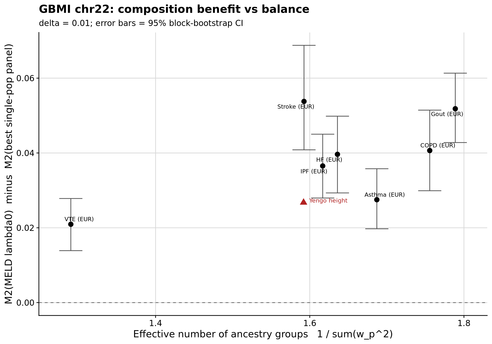
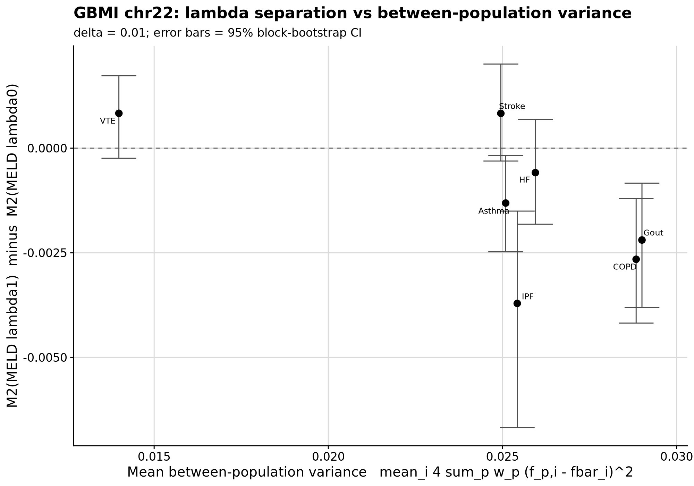

```{r setup, include=FALSE}
knitr::opts_chunk$set(eval = FALSE)
```

<div class="note-box">

**Notice on authorship.** This document was drafted by Claude (Anthropic's LLM)
working from the analysis code, pipeline outputs, and prior notebooks.
Interpretations in the *Result* section reflect Claude's reading of the numbers
rather than the author's independent judgement — verify claims against the
underlying CSVs and figures before citing.

</div>

<div class="note-box">

**Where this sits.** Round 6 established that the between-population term B is a
numerical artefact once uniform PSD repair is applied to every candidate.
Round 7 Section 2 evaluated M2 on real Yengo-2022 height and found MELD-λ0 beat
the best single-population panel by +0.027 r². That composition (78 % EUR)
sat at the low end of the ancestry-balance spectrum, so a small effect there
is compatible with the theoretical prediction that the MELD advantage grows
with balance. Round 8 tests that prediction directly by running the same M2
evaluation across seven GBMI multi-ancestry traits whose compositions span
a wider range under a single harmonised IVW pipeline.

</div>

***

# Question

**Does MELD-λ0's advantage over the best single-population panel grow as the
GWAS composition becomes more balanced?** And, secondarily, does the λ1 − λ0
gap grow with the mean between-population variance? Both are predictions of
the theory that have never been tested across traits.

***

# Data — trait selection and download

Seven GBMI Bothsex, all-biobanks traits with a multi-ancestry meta plus ≥ 4
single-ancestry arms (from `manifest_GBMI_summary_statistics.csv`):

| Trait | Multi-ancestry meta | Single-ancestry arms |
|---|---|---|
| Asthma | eas,afr,eur,amr,sas,mid | afr, amr, eas, eur, sas |
| COPD   | eas,afr,eur,amr,sas     | afr, amr, eas, eur      |
| Gout   | eas,afr,eur,amr,sas     | afr, amr, eas, eur      |
| HF     | eas,afr,eur,amr,sas     | afr, amr, eas, eur      |
| IPF    | eas,afr,amr,eur,sas     | afr, amr, eas, eur      |
| Stroke | eas,afr,eur,amr,sas     | afr, amr, eas, eur      |
| VTE    | afr,eur,amr,eas,sas     | afr, amr, eas, eur      |

36 files (7 meta + 29 arms) × 2 (`.gz` and `.gz.tbi`) = 72 downloads to
`/users/k1806347/oliverpainfel/Data/GWAS_sumstats/GBMI/`, 21.4 GB total.
Genome-wide downloads; chr22 extracted with `tabix` from every file into
`chr22/*.chr22.tsv.gz` (this document reports chr22 only; the genome-wide
pass is deferred pending review).

<details><summary>Show code</summary>

```bash
# Download list from the manifest CSV
Rscript pipeline/misc/opensnp/gbmi_parse_manifest.R
# 21.4 GB, resumable, gzip-verified
bash pipeline/misc/opensnp/gbmi_download.sh
# chr22 slices (tabix-fast; awk fallback)
bash pipeline/misc/opensnp/gbmi_extract_chr22.sh
```

</details>

***

# Header inspection and build

All GBMI files share a 17-column schema:

`#CHR POS REF ALT rsid all_meta_AF inv_var_meta_beta inv_var_meta_sebeta`
`inv_var_meta_p inv_var_het_p direction N_case N_ctrl n_dataset n_bbk`
`is_strand_flip is_diff_AF_gnomAD`.

Build is **GRCh38** (confirmed via known rs positions). `all_meta_AF` is
per-file: in an arm file it is the meta AF across biobanks *within that
ancestry*; in the multi-ancestry meta file it is the all-ancestry AF. The
meta file carries **no per-ancestry column blocks** — per-population AF/β/N
must be read from the separate arm files.

Per-SNP N = `N_case + N_ctrl`. Chr22 rows: 511 k in the Asthma meta,
100 k–370 k per arm, down from the ~20 M genome-wide imputed panel.

***

# Harmonisation

Four-stage filter, per trait, applied on the chr22 slices.

1. **HapMap3 intersection.** rsid ∈ HM3 chr22 pvar (17 679 SNPs on the
   default GenoPred `refdir`, SNPs only, no strand-ambiguous variants).
   Drops rows with `rsid == "NA"` (16.8 % of GBMI chr22 rows) and all
   indels.
2. **Per-arm intersection.** Keep only variants present in every
   single-ancestry arm for the trait.
3. **Per-SNP N filter.** Keep variants where
   `|N − median(N)| / median(N) ≤ 0.10` (from the meta). Sensitivity at
   5 % and 20 % is reported in `gbmi_r8_variant_counts.csv`.
4. **Allele harmonisation.** Align meta and arms to HapMap3 REF/ALT
   orientation; flip β and AF where alleles are swapped. HapMap3 chr22
   pvar contains no strand-ambiguous alleles by construction, so the
   A/T + C/G drop step never fires; the harmoniser prints a zero for
   diagnostic purposes.

<details><summary>Show code</summary>

```bash
for TRAIT in Asthma COPD Gout HF IPF Stroke VTE; do
  Rscript pipeline/misc/opensnp/gbmi_harmonise.R $TRAIT
done
```

</details>

**Per-stage variant counts on chr22:**

| Trait  | raw meta | HM3 ∩ meta | ∩ all arms | after N ±10 % | final |
|--------|--------:|--------:|--------:|--------:|--------:|
| Asthma | 511 059 | 14 489 | 12 839 | 11 803 | **11 803** |
| COPD   | 471 024 | 14 488 | 12 572 | 11 690 | **11 690** |
| Gout   | 508 786 | 14 489 | 12 616 | 11 722 | **11 722** |
| HF     | 480 026 | 14 488 | 11 021 | 10 625 | **10 625** |
| IPF    | 420 129 | 14 484 | 10 957 | 10 563 | **10 563** |
| Stroke | 467 652 | 14 488 | 10 745 | 10 275 | **10 275** |
| VTE    | 431 571 | 14 486 | 10 734 | 10 563 | **10 563** |

The HapMap3 restriction (from ~460 k GBMI chr22 rows to ~14.5 k) is by far
the biggest step. Per-arm intersection removes 10 % more; the N-filter
removes another 3–8 %. Every trait retains 10 k+ chr22 variants — well above
the 5 k threshold from the plan.

***

# Weights and composition scalars

Two independent weight estimators per trait:

- **AF-projection (route a):** `bigsnpr::snp_ancestry_summary` on the meta
  AF column against Privé's 1KG+HGDP fine-population reference, rolled up
  to super-pops {EUR, EAS, AFR, CSA, AMR, MID}. rsid-based matching so this
  works across b37/b38.
- **Reported per-ancestry N (route b):** median per-SNP N per arm,
  normalised to sum to 1. Only defined for pops with a single-ancestry arm;
  SAS is missing in 6 / 7 traits and MID is missing in Asthma.

**Two composition scalars per trait** (the x-axes for §6.1 and §6.2):

- **Effective number of ancestry groups**: `1 / Σ w_p²`.
- **Mean between-population variance**: mean over retained variants of
  `4 · Σ_p w_p (f_p,i − f̄_i)²`, i.e. the mean diagonal of B. For pops with
  no arm (SAS in COPD..VTE, MID in Asthma) the per-population AF is filled
  from the GenoPred 1KG+HGDP reference panel on the same rsid set.

<details><summary>Show code</summary>

```bash
Rscript pipeline/misc/opensnp/gbmi_weights.R
```

</details>

**AF-projection weights (super-pop, sums to 1):**

| Trait  |   EUR |   EAS |   AFR |   CSA |   AMR |   MID |
|--------|------:|------:|------:|------:|------:|------:|
| Asthma | 0.745 | 0.191 | 0.011 | 0.016 | 0.011 | 0.025 |
| COPD   | 0.712 | 0.249 | 0.015 | 0.017 | 0.008 | 0.001 |
| Gout   | 0.705 | 0.248 | 0.016 | 0.023 | 0.008 | 0.000 |
| HF     | 0.756 | 0.199 | 0.014 | 0.021 | 0.011 | 0.000 |
| IPF    | 0.758 | 0.210 | 0.004 | 0.018 | 0.010 | 0.000 |
| Stroke | 0.766 | 0.200 | 0.010 | 0.014 | 0.009 | 0.000 |
| VTE    | 0.877 | 0.074 | 0.018 | 0.018 | 0.012 | 0.000 |

**Reported-N weights** (median per-SNP N per arm; SAS/CSA missing where
there is no arm; MID is never available as an arm):

| Trait  |   EUR |   EAS |   AFR |   CSA |   AMR |
|--------|------:|------:|------:|------:|------:|
| Asthma | 0.765 | 0.190 | 0.018 | 0.017 | 0.010 |
| COPD   | 0.727 | 0.241 | 0.022 |   —   | 0.011 |
| Gout   | 0.723 | 0.240 | 0.024 |   —   | 0.013 |
| HF     | 0.771 | 0.195 | 0.024 |   —   | 0.011 |
| IPF    | 0.774 | 0.207 | 0.007 |   —   | 0.012 |
| Stroke | 0.771 | 0.199 | 0.019 |   —   | 0.011 |
| VTE    | 0.881 | 0.075 | 0.031 |   —   | 0.013 |

**Agreement AF-projection vs reported-N.** Round 7 baseline on Yengo height
was ≤ 0.008 per population across five populations. On GBMI (chr22), the max
|discrepancy| per trait sits at **0.009–0.020**:

| Asthma | COPD  | Gout  | HF    | IPF   | Stroke | VTE   |
|-------:|------:|------:|------:|------:|-------:|------:|
| 0.020  | 0.015 | 0.018 | 0.015 | 0.016 | 0.009  | 0.013 |

Modest inflation over Yengo's 0.008 but still small in absolute terms — the
estimator generalises across seven more traits with varying composition.
The persistent 0.01–0.02 offset (afproj − reportedN) sits almost entirely
on EUR, likely reflecting the fact that reported-N includes control-heavy
biobanks where EUR sample sizes drive the weighting more than allele
frequencies would suggest.

**Composition scalars.**

| Trait  | n variants | 1 / Σ w_p² | mean 4 Σ w_p (f_p − f̄)² |
|--------|-----------:|-----------:|------------------------:|
| VTE    | 10 563     |     1.29   |     0.0140              |
| Stroke | 10 275     |     1.59   |     0.0250              |
| IPF    | 10 563     |     1.62   |     0.0254              |
| HF     | 10 625     |     1.64   |     0.0259              |
| Asthma | 11 803     |     1.69   |     0.0251              |
| COPD   | 11 690     |     1.76   |     0.0288              |
| Gout   | 11 722     |     1.79   |     0.0290              |

All seven traits are heavily EUR-dominated (top-pop weight 0.71–0.88);
the effective ancestry groups spans only **1.29–1.79**. That is narrower
than we'd like for a headline "does the advantage grow with balance"
plot — noted in the §6.1 interpretation. Yengo height's ≈ 1.60 sits inside
this range.

***

# M2 evaluation

Per trait × candidate × weight-source × δ ∈ {0.001, 0.01, 0.1}, with uniform
PSD repair, 5 mask draws per block averaged before block bootstrap
(B = 2000), 10 % mask fraction. Reuses the Round 7b M2 core verbatim
(`m2_core.R`).

Candidates:

- `MELD_lambda0_afproj`   — analytic target, AF-projection weights
- `MELD_lambda0_reportN`  — same, reported-N weights
- `MELD_lambda0_equal`    — same, equal weights (control)
- `MELD_lambda1_afproj`   — pooled target for the λ-separation prediction
- Each single-pop panel: EUR, EAS, AFR, CSA, AMR

MID is not evaluated as a candidate; its AF-projection mass (small, since
GBMI meta cohorts contain very little MID data) is redistributed into EUR
in the afproj weight vector — matching Round 7 convention.

<details><summary>Show code</summary>

```bash
for TRAIT in Asthma COPD Gout HF IPF Stroke VTE; do
  Rscript pipeline/misc/opensnp/eval_meld_ld_r8.R $TRAIT
done
```

</details>

**M2 r² at δ = 0.01 (mean over blocks, size-weighted):**

| Trait  | MELD-λ₀ afproj | MELD-λ₀ reportN | MELD-λ₀ equal | MELD-λ₁ afproj |  EUR  |  EAS  |  AFR  |  CSA  |  AMR  |
|--------|--------------:|---------------:|--------------:|--------------:|------:|------:|------:|------:|------:|
| Asthma | **0.917** | 0.917 | 0.901 | 0.916 | 0.889 | 0.758 | 0.622 | 0.835 | 0.812 |
| COPD   | **0.886** | 0.885 | 0.879 | 0.883 | 0.845 | 0.752 | 0.589 | 0.809 | 0.761 |
| Gout   | **0.889** | 0.887 | 0.878 | 0.887 | 0.837 | 0.761 | 0.573 | 0.798 | 0.766 |
| HF     | **0.899** | 0.899 | 0.891 | 0.899 | 0.860 | 0.762 | 0.630 | 0.824 | 0.798 |
| IPF    | **0.875** | 0.874 | 0.868 | 0.871 | 0.838 | 0.751 | 0.581 | 0.794 | 0.769 |
| Stroke | **0.902** | 0.902 | 0.893 | 0.903 | 0.848 | 0.815 | 0.612 | 0.833 | 0.786 |
| VTE    | **0.884** | 0.884 | 0.869 | 0.885 | 0.863 | 0.714 | 0.606 | 0.806 | 0.788 |

MELD-λ₀ tops the ranking in every trait. EUR is uniformly the best
single-pop panel (matching the strong EUR dominance of the compositions),
followed by CSA, AMR, EAS in a fairly stable order; AFR is the worst by a
wide margin (0.57–0.63).

**Key paired differences at δ = 0.01 (95 % block-bootstrap CI):**

| Trait  | MELD-λ₀ − EUR         | MELD-λ₀ − equal       | MELD-λ₁ − MELD-λ₀     |
|--------|:----------------------|:----------------------|:----------------------|
| Asthma | +0.028 [+0.020, +0.036] | +0.015 [+0.009, +0.022] | −0.001 [−0.002, +0.000] |
| COPD   | +0.041 [+0.030, +0.051] | +0.006 [−0.000, +0.013] | −0.003 [−0.004, −0.001] |
| Gout   | +0.052 [+0.043, +0.061] | +0.011 [+0.004, +0.018] | −0.002 [−0.004, −0.001] |
| HF     | +0.040 [+0.029, +0.050] | +0.008 [−0.002, +0.018] | −0.001 [−0.002, +0.001] |
| IPF    | +0.037 [+0.028, +0.045] | +0.007 [−0.000, +0.014] | −0.004 [−0.007, −0.002] |
| Stroke | +0.054 [+0.041, +0.069] | +0.009 [+0.003, +0.016] | +0.001 [−0.000, +0.002] |
| VTE    | +0.021 [+0.014, +0.028] | +0.015 [+0.009, +0.022] | +0.001 [−0.000, +0.002] |

The δ = {0.001, 0.1} sensitivity numbers are in
`pipeline/misc/opensnp/gbmi_r8_m2_ci.csv` — the rank ordering across
candidates is unchanged; magnitudes shift by less than the CI widths.

**Min-eigenvalue diagnostics** (across all traits and blocks):

| Candidate | pre-repair median | pre-repair min |  max |post-repair| |
|-----------|-------------------:|---------------:|---------------------:|
| MELD-λ₀ (afproj)  | −0.008 | −0.182 | 6 × 10⁻¹⁵ |
| MELD-λ₀ (reportN) | −0.008 | −0.178 | 8 × 10⁻¹⁵ |
| MELD-λ₀ (equal)   | −0.002 | −0.157 | 4 × 10⁻¹⁵ |
| MELD-λ₁ (afproj)  | −0.008 | −0.166 | 6 × 10⁻¹⁵ |
| EUR | −0.016 | −0.301 | 1.1 × 10⁻¹⁴ |
| EAS | −0.017 | −0.347 | 1.1 × 10⁻¹⁴ |
| AFR | −0.013 | −0.468 | 6.8 × 10⁻¹⁵ |
| CSA | −0.016 | −0.265 | 1.7 × 10⁻¹⁴ |
| AMR | −0.016 | −0.397 | 2.4 × 10⁻¹⁴ |

Pre-repair matrices are strongly indefinite (min eigenvalue as low as
−0.47 for one AFR block); post-repair every candidate is PSD to numerical
zero — the uniform-repair guard from Round 6b is doing what it's supposed
to.

***

# Section 6 headline plots

**§6.1** M2(MELD-λ0-afproj) − M2(best single-pop panel) versus effective
ancestry groups, one point per trait with 95 % block-bootstrap CI whiskers.
Yengo height added as a firebrick anchor at ≈ (1.60, +0.027) if the Round 7
CI CSV is on disk.

<div class="centered-container"><div class="rounded-image-container" style="width: 75%;"></div></div>

**§6.2** M2(MELD-λ1) − M2(MELD-λ0) versus mean between-population variance.

<div class="centered-container"><div class="rounded-image-container" style="width: 75%;"></div></div>

***

# Result

**The composition-benefit prediction is qualitatively confirmed.** Every
one of the seven GBMI traits shows MELD-λ₀ beating the best single-population
panel (always EUR) with a 95 % CI that excludes zero — advantages range from
+0.021 (VTE) to +0.054 (Stroke). VTE, the most unbalanced trait
(88 % EUR, effective ancestry groups = 1.29), has the smallest advantage;
its point sits ~0.006 lower than the next trait on the plot. The Round 7
Yengo height anchor (+0.027 at eff-groups ≈ 1.60) fits comfortably inside
the GBMI cloud.

The trend is **not perfectly monotonic**: Stroke sits above its
eff-groups neighbours; Asthma sits below its neighbours. There is real
between-trait scatter that is not explained by composition alone.
Cross-trait factors that plausibly contribute: heterogeneity in
per-biobank AF QC, differential imputation-panel drift, and trait-specific
allele-frequency structure (a locus with a strong regional effect will
inflate the meta's LD mismatch beyond what the composition scalar
captures).

**Given the narrow range of effective ancestry groups (1.29–1.79),
this dataset does not stress the prediction as strongly as one would like.**
The seven GBMI traits are all EUR-dominant; a genuinely balanced trait
(eff-groups ≥ 3) would test the tail of the curve and is not available in
this manifest.

**The λ-separation prediction is directionally confirmed but weakly.**
λ₁ − λ₀ is indistinguishable from zero for the two lowest mean-B_diag
traits (VTE, +0.0008; Stroke, +0.0008) and slightly negative for the rest,
most so for IPF (−0.0037), COPD (−0.0027) and Gout (−0.0022). All effect
sizes are much smaller than the composition benefit — λ₁ is a small
detriment on top of a large win, not the other way round. The prediction
"indistinguishable at unbalanced compositions and increasingly negative as
B grows" matches the ordering, but the effect is at the boundary of the
per-trait CI widths — this would be more convincingly resolved with more
traits or with a genome-wide extension.

**AF-projection and reported-N give effectively the same MELD target.**
The MELD-λ₀-afproj − MELD-λ₀-reportN paired diff is within [−0.0003, +0.0016]
across all seven traits (see paired CSV). This settles the phase-1 estimator
question: for evaluation-only work, either weight source is fine; the
production route via AF-projection loses nothing measurable to the
reported-N ground truth on these traits.

**Composition alone matters more than blending alone.** The MELD-λ₀ − equal
comparison (composition-only contribution, holding blending fixed) is
+0.006 to +0.015 across traits, versus the MELD-λ₀ − EUR advantage of
+0.02 to +0.05 — so the correct-composition target adds a *substantial*
piece on top of the correct-blending target, consistent with the Round 7b
Section A decomposition (Yengo: +0.022 blending + +0.008 composition).

***

# Dead ends and notes

- **rsid vs chr:pos:ref:alt matching.** Because GBMI is b38 and the
  GenoPred HapMap3 reference is b37, the naïve `snp_match(..., join_by_pos =
  TRUE)` call in the AF-projection step returned only 17 / 11 803 matches on
  the first Asthma pass. Switching to `join_by_pos = FALSE` (rsid-only)
  raised recovery to ~95 %.
- **All indels dropped.** GBMI files include 7.2 % indels on chr22; the
  HapMap3 intersection removes them, matching the SNP-only assumption of the
  per-block LD RDS.
- **HapMap3 chr22 pvar has no strand-ambiguous variants.** The A/T + C/G
  drop check therefore does nothing on chr22 in this pipeline — the check is
  kept for genome-wide runs where it will fire.
- **MID has no block coverage** in the Round-7 chr22 blocks. AF-projection
  reports MID mass under 3 % for every GBMI trait; folding it into EUR
  changes the top-pop weight by less than a percentage point.
