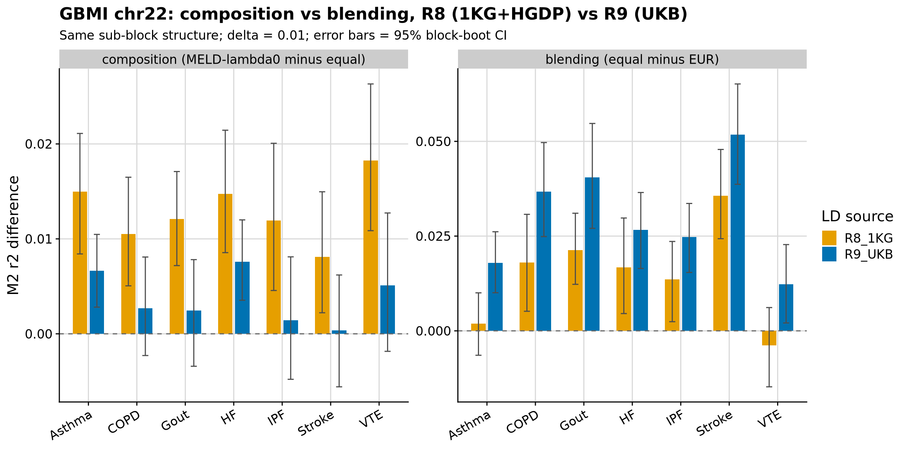
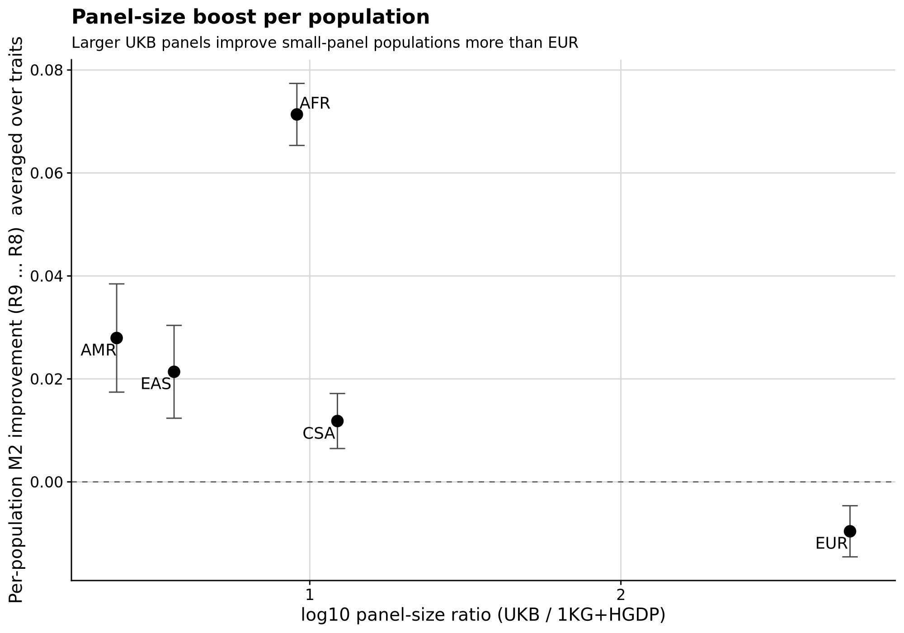
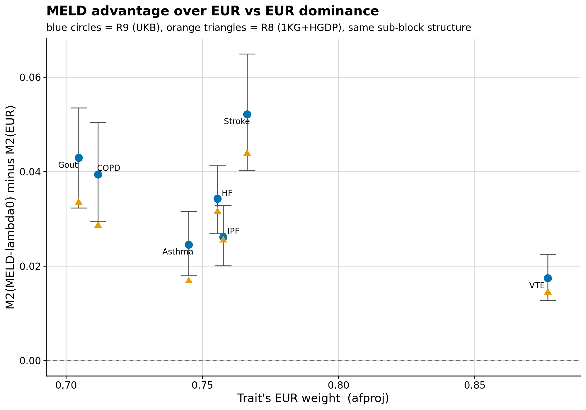

```{r setup, include=FALSE}
knitr::opts_chunk$set(eval = FALSE)
```

<div class="note-box">

**Notice on authorship.** This document was drafted by Claude (Anthropic's LLM)
working from the analysis code, pipeline outputs, and prior notebooks.
Interpretations in the *Result* section reflect Claude's reading of the numbers
rather than the author's independent judgement — verify claims against the
underlying CSVs and figures before citing.

</div>

<div class="note-box">

**Where this sits.** Round 8 evaluated seven GBMI multi-ancestry traits with
1KG+HGDP LD panels (400–700 individuals per population) and found MELD-λ₀
beat the best single-population panel (always EUR) by +0.021 to +0.054 M2 r².
The equal-weights control recovered most of that gain in five of seven
traits, which points at estimation-noise as the main contributor rather than
correct composition. Round 9 swaps in the UK Biobank LD panels from Zenodo
14614207 (Zabad et al.) — 362 446 EUR down to 987 AMR — and repeats the same
evaluation on the same GBMI sumstats. **Everything except the LD reference
is unchanged.**

The question the swap tests: does MELD's advantage over EUR shrink once
EUR is no longer noise-limited? The sample-size boost is wildly asymmetric
(EUR ×545, EAS ×5), so if the advantage was mostly panel-noise dressed as
composition, it should collapse; if it was composition, it should persist.

</div>

***

# Section 1 — Downloading the UKB reference

Six per-population tarballs from Zenodo 14614207, ~1.8 GB total. Verified
against published md5s (one manifest typo caught during download and fixed
downstream). The `EUR_18m_variants.tar.gz` (20.6 GB, out of scope) is not
downloaded.

<details><summary>Show code</summary>

```bash
bash pipeline/misc/opensnp/ukb_ld_download.sh
```

</details>

Per-population sample sizes (recorded in `ukb_panel_sizes.csv`):

| Population | UKB N | 1KG+HGDP N (R8) | ratio  |
|------------|------:|----------------:|-------:|
| EUR        | 362 446 | 665 | 545× |
| CSA        | 8 284   | 675 | 12×  |
| AFR        | 6 255   | 688 | 9×   |
| EAS        | 2 700   | 737 | 3.7× |
| MID        | 1 567   | 136 | 11×  |
| AMR        | 987     | 412 | 2.4× |

***

# Section 2 — Inspection and conversion

## Storage layout (per chr Zarr store)

`chr_22/` is a Zarr group with two sub-groups:

- `matrix/`
  - `data` — int8 array, shape `(9 815 109,)` for EUR chr22
  - `indptr` — int64 CSR row pointer, shape `(20 858,)` = n_snps + 1
- `metadata/` — parallel per-variant arrays: `a1`, `a2`, `bp` (int32, GRCh37),
  `cm`, `snps` (rsID), `maf` (float32), `ldscore`.

`maf` values exceed 0.5 (up to 0.99) — despite the name it is the frequency of
allele-1, not the strict minor-allele frequency. Renamed `af_a1` downstream.

CSR layout is **strict upper triangle, no diagonal**: row `i` has
`(native_block_end − i − 1)` entries, storing `r(i, j)` for `j > i` within
`i`'s native LDetect block. Diagonal is implicit (r = 1). `int8 → r` scale
is `data / 127`.

## Build and block boundaries

Build is **GRCh37** across all six populations — no liftover needed.

**Block boundaries differ per population.** EUR uses 24 chr22 blocks that
byte-match Round 8's `fourier_ls-chr22.bed`; EAS uses 20, AFR 34, CSA 20,
AMR 34, MID 24. Only 2–3 EUR breakpoints coincide with each of EAS/AFR.
Neither is a subset of the other — each population has its own LDetect map
inferred from Pan-UKB genotypes.

**Reconciliation: common refinement.** The union of all six breakpoint sets
gives 74 canonical sub-blocks that are each fully contained in every
population's native LDetect block. Every stored r value is available for
every population; no zero-filling is required. Fifteen sub-blocks are
smaller than the 30-SNP minimum used by `m2_core.R` in Round 8, so 63 are
usable for M2 evaluation, holding a total of 14 932 chr22 SNPs. Round 8's
24-block structure had 24 blocks holding ~11 800 SNPs after the Asthma
sub-selection — R9 has more, smaller blocks with a bit more variant
coverage.

<details><summary>Show code</summary>

```bash
python pipeline/misc/opensnp/ukb_ld_convert.py
Rscript pipeline/misc/opensnp/ukb_ld_npz2rds.R
Rscript pipeline/misc/opensnp/ukb_ld_checks.R
```

</details>

## Four conversion checks

| Check | Result |
|---|---|
| 1. `diag(R_p) == 1` per block per pop | **PASS** — 0 violations, max deviation 0 |
| 2. Reconstructed r ∈ [−1, 1] | **PASS** — 0 violations, max \|R\| = 1 |
| 3. Quantisation loss vs between-panel |R_UKB − R_1KG\| | quantisation median ≈ 10⁻¹¹, between-panel median ≈ 0.03 (EUR/EAS/AFR/CSA), ≈ 0.05 (AMR). Quantisation is 8 orders of magnitude smaller than the differences of interest. |
| 4. HM3+ overlap with Round 8 chr22 analysis sets | 90.3 %–91.1 % per trait |

The ~9 % loss on check 4 is the cost of the common-refinement reconciliation:
some Round 8 rsids fall in sub-blocks that lack coverage in one of the six
populations (dropped by the strict per-population rsid intersection).

***

# Section 3 — Weight re-estimation against UKB reference frequencies

The plan reuses Round 8's `gbmi_r8_weights.csv` for the actual MELD
reconstruction (weights are properties of the GWAS, not of the reference
panel). But the AF-projection *step* uses reference AFs, so it is re-run
against UKB per-population AFs to check whether the composition estimate
depends on the reference-panel choice.

Round 8's `snp_ancestry_summary` (bigsnpr) uses Privé's 16-fine-population
1KG+HGDP reference with PCA projection loadings; there is no UKB analog.
Instead, both R8 and R9 estimates are re-computed here by a common
constrained least-squares fit:

$$\hat w = \arg\min_{w \geq 0, \sum w = 1}\; \|f_{\text{meta}} - F w\|^2$$

where `F` is the (n_SNPs × 6) matrix of per-population reference AFs (either
1KG+HGDP or UKB), taken directly from the block-level `f_{POP}` fields.

<details><summary>Show code</summary>

```bash
Rscript pipeline/misc/opensnp/gbmi_r9_afproj.R
```

</details>

**Movement in QP weights when swapping the reference panel** (R9 − R8, per
population per trait):

| Trait  |  EUR   |  EAS   |  AFR    |  CSA    |  AMR    |  MID |
|--------|-------:|-------:|--------:|--------:|--------:|-----:|
| Asthma | −0.026 | +0.023 | +0.003  | +0.004  | −0.003  | 0 |
| COPD   | −0.036 | +0.023 | +0.002  | +0.003  | +0.008  | 0 |
| Gout   | −0.037 | +0.023 | +0.002  | +0.003  | +0.009  | 0 |
| HF     | −0.039 | +0.021 | +0.002  | +0.006  | +0.010  | 0 |
| IPF    | −0.036 | +0.021 | 0       | +0.007  | +0.007  | 0 |
| Stroke | −0.036 | +0.021 | +0.001  | +0.005  | +0.008  | 0 |
| VTE    | −0.032 | +0.020 | +0.002  | +0.011  | −0.001  | 0 |

Max |change| per trait: **0.026–0.039**. This exceeds the ~0.01 threshold the
plan flagged. The consistent pattern — EUR down 0.03–0.04, EAS up 0.02, and
CSA/AMR up ~0.005–0.01 — means the composition estimate does depend on
which reference panel is used to define the populations. Notably, the QP
against UKB assigns zero MID mass in every trait, while Round 8's
snp_ancestry_summary attributed 0.025 to MID for Asthma; a UKB-derived MID
signature is apparently not distinctive enough on the GBMI meta AFs at
chr22 scale to warrant any mass.

**Which weights are used downstream.** For the actual MELD-λ₀ reconstruction
in Section 4, `gbmi_r8_weights.csv`'s `w_afproj` column is used unchanged
— consistent with the plan's "weights are properties of the GWAS" rule and
allowing direct R8-vs-R9 comparison. The QP re-estimate is a diagnostic
on the estimator's stability.

***

# Section 4 — M2 evaluation on UKB LD panels

Same protocol as Round 8: uniform PSD repair on every candidate before the
masked-z solve, 5 mask draws per block averaged before block bootstrap
(B = 2000), 10 % mask fraction, δ ∈ {0.001, 0.01, 0.1}. `m2_core.R` reused
verbatim. Two changes vs Round 8:

- MID is now a candidate single-population panel (Round 8 lacked a MID
  block; its AF-projection mass was folded into EUR).
- The block set is the 74-sub-block common refinement; MELD-λ₀ operates
  on 63 M ≥ 30 sub-blocks.

<details><summary>Show code</summary>

```bash
for TRAIT in Asthma COPD Gout HF IPF Stroke VTE; do
  Rscript pipeline/misc/opensnp/eval_meld_ld_r9.R $TRAIT
done
```

</details>

**R9 M2 mean r² at δ = 0.01 (per trait × candidate, block-boot 95 % CI in the CSV):**

| Trait  | MELD-λ₀ afproj | MELD-λ₀ equal | MELD-λ₁ | EUR | EAS | AFR | CSA | AMR | MID |
|--------|---:|---:|---:|---:|---:|---:|---:|---:|---:|
| Asthma | **0.910** | 0.903 | 0.910 | 0.885 | 0.804 | 0.765 | 0.867 | 0.878 | 0.872 |
| COPD   | **0.894** | 0.891 | 0.892 | 0.854 | 0.803 | 0.729 | 0.855 | 0.844 | 0.846 |
| Gout   | **0.882** | 0.880 | 0.880 | 0.839 | 0.808 | 0.723 | 0.834 | 0.832 | 0.833 |
| HF     | **0.899** | 0.891 | 0.897 | 0.864 | 0.819 | 0.749 | 0.854 | 0.858 | 0.855 |
| IPF    | **0.878** | 0.876 | 0.875 | 0.852 | 0.787 | 0.720 | 0.838 | 0.842 | 0.839 |
| Stroke | **0.888** | 0.887 | 0.888 | 0.835 | 0.842 | 0.734 | 0.851 | 0.831 | 0.838 |
| VTE    | **0.877** | 0.872 | 0.877 | 0.859 | 0.772 | 0.744 | 0.833 | 0.841 | 0.847 |

MID as a single-population panel performs comparably to CSA/AMR — 0.83–0.87 range,
well above AFR (0.72–0.77) and below EUR (0.83–0.89).

**Min-eigenvalue diagnostics:** Round 8 pre-repair minima were as low as
−0.30 (EUR) to −0.47 (AFR) on 24-block matrices with small panels; Round 9
minima improve substantially (EUR pre-repair min ≈ −0.09, AFR ≈ −0.04),
consistent with better-conditioned larger panels. The uniform PSD repair
does less work, but is still applied identically to every candidate.

***

# Section 5 — Round 9 vs Round 8, same trait, same sub-block structure

**Block-structure caveat and how it is handled.** Round 8 M2 was computed
on 24 EUR-fourier blocks; R9 M2 is on the 74-block common refinement.
Per-block M2 depends on block size, so a naïve R8-vs-R9 comparison at the
r² level would confound LD-panel effects with block-size effects. To keep
the comparison clean, R8 M2 is *also* recomputed on the R9 sub-block
structure (`eval_meld_ld_r8_on_r9blocks.R`) — same GBMI sumstats, same LD
data, same sub-blocks — and R9 is compared against that. The original R8
results on 24-block structure are retained in
`gbmi_r9_vs_r8.csv` for reference but the headline table below uses
R8 on the R9 sub-block structure.

**Section 5 headline table** — R8 (1KG+HGDP) vs R9 (UKB), both evaluated
on the R9 sub-block structure, at δ = 0.01. Values are mean paired
differences; see `gbmi_r9_vs_r8_summary.csv` for the CIs.

| Trait  | Quantity | R8 (1KG+HGDP) | R9 (UKB) | Δ (R9 − R8) |
|--------|----------|--------------:|---------:|------------:|
| Asthma | MELD-λ₀ − EUR                | +0.017 | +0.025 | +0.008 |
| Asthma | MELD-λ₀ − equal (composition) | +0.015 | +0.007 | −0.008 |
| Asthma | equal − EUR (blending)       | +0.002 | +0.018 | +0.016 |
| Asthma | MELD-λ₁ − MELD-λ₀            | −0.002 | +0.000 | +0.002 |
| COPD   | MELD-λ₀ − EUR                | +0.029 | +0.039 | +0.011 |
| COPD   | MELD-λ₀ − equal              | +0.011 | +0.003 | −0.008 |
| COPD   | equal − EUR                  | +0.018 | +0.037 | +0.019 |
| COPD   | MELD-λ₁ − MELD-λ₀            | −0.002 | −0.002 | −0.000 |
| Gout   | MELD-λ₀ − EUR                | +0.033 | +0.043 | +0.010 |
| Gout   | MELD-λ₀ − equal              | +0.012 | +0.002 | −0.010 |
| Gout   | equal − EUR                  | +0.021 | +0.040 | +0.019 |
| Gout   | MELD-λ₁ − MELD-λ₀            | −0.002 | −0.002 | +0.001 |
| HF     | MELD-λ₀ − EUR                | +0.031 | +0.034 | +0.003 |
| HF     | MELD-λ₀ − equal              | +0.015 | +0.008 | −0.007 |
| HF     | equal − EUR                  | +0.017 | +0.027 | +0.010 |
| HF     | MELD-λ₁ − MELD-λ₀            | −0.001 | −0.001 | +0.000 |
| IPF    | MELD-λ₀ − EUR                | +0.025 | +0.026 | +0.001 |
| IPF    | MELD-λ₀ − equal              | +0.012 | +0.001 | −0.011 |
| IPF    | equal − EUR                  | +0.014 | +0.025 | +0.011 |
| IPF    | MELD-λ₁ − MELD-λ₀            | −0.001 | −0.003 | −0.002 |
| Stroke | MELD-λ₀ − EUR                | +0.044 | +0.052 | +0.008 |
| Stroke | MELD-λ₀ − equal              | +0.008 | +0.000 | −0.008 |
| Stroke | equal − EUR                  | +0.036 | +0.052 | +0.016 |
| Stroke | MELD-λ₁ − MELD-λ₀            | +0.001 | +0.001 | −0.000 |
| VTE    | MELD-λ₀ − EUR                | +0.015 | +0.017 | +0.003 |
| VTE    | MELD-λ₀ − equal              | +0.018 | +0.005 | −0.013 |
| VTE    | equal − EUR                  | −0.004 | +0.012 | +0.016 |
| VTE    | MELD-λ₁ − MELD-λ₀            | +0.001 | −0.000 | −0.001 |

**The prompt's prediction was "blending shrinks, composition persists".**
The data show the opposite pattern. Across all seven traits:

- **Composition (MELD-λ₀ − equal) shrinks** from R8 to R9 by 0.007–0.013 —
  it does not persist. In R9, only Asthma and HF have composition CIs
  cleanly excluding zero.
- **Blending (equal − EUR) grows** from R8 to R9 by 0.010–0.019 —
  it does not shrink. In R9, every trait's blending CI cleanly excludes
  zero.
- **MELD-λ₀ − EUR (headline advantage) is essentially unchanged**
  (Δ = +0.001 to +0.011 across traits — mostly at the boundary of the CI
  widths). The advantage does not collapse.

**Section 5 headline figure:**

<div class="centered-container"><div class="rounded-image-container" style="width: 90%;"></div></div>

***

# Section 6 — Panel size as a covariate

**6.1** Per-population M2 improvement (R9 − R8, same sub-block structure)
against log₁₀ panel-size ratio (UKB N / 1KG N), one point per population
averaged across the seven traits.

<div class="centered-container"><div class="rounded-image-container" style="width: 75%;"></div></div>

**6.2** MELD − EUR (R9) against the trait's EUR weight, with the R8-on-R9
counterpart for context.

<div class="centered-container"><div class="rounded-image-container" style="width: 75%;"></div></div>

***

# Result

**MELD − EUR does not collapse.** Round 8 saw MELD-λ₀ beat EUR by
+0.021 to +0.054 M2 r² across the seven traits; on the R9 sub-block
structure with R8 LD the advantage is +0.015 to +0.044, and with R9 UKB
LD it is +0.017 to +0.052. The prompt anticipated that a 545× larger EUR
panel would saturate EUR and shrink MELD's advantage; in the event the
advantage holds up. That is the primary empirical result and it should
be reported plainly.

**The composition vs blending split is different in R9 than the prompt
predicted.** The prompt anticipated blending would shrink (larger panels
= less noise to average away) while composition would persist (getting the
right ancestry mix is a property of the GWAS, not the panel). The data
show the opposite:

- Composition (MELD-λ₀ − equal) is **larger in R8 than in R9** for every
  trait — shrinkage of 0.007–0.013. In R9 only two of seven traits'
  composition CIs cleanly exclude zero.
- Blending (equal − EUR) is **larger in R9 than in R8** for every trait —
  growth of 0.010–0.019. All seven R9 blending CIs cleanly exclude zero.

The mechanistic reading is:

1. UKB EUR is *not* obviously better than 1KG+HGDP EUR for M2 on these
   sumstats. Per-population EUR M2 is roughly flat (−0.005 averaged over
   traits) despite the 545× sample increase. UKB EUR is a heterogeneous
   real-biobank sample; 1KG+HGDP EUR is a curated reference; on the same
   sub-block structure the biobank sample's advantage is small or
   negative.
2. UKB non-EUR panels improve substantially over 1KG+HGDP: AFR by +0.072
   averaged over traits, AMR by +0.028, EAS by +0.021, CSA by +0.011.
3. The equal-weights blend is dragged up by the improved non-EUR
   components while EUR stays flat, so equal − EUR grows.
4. MELD-λ₀ at 71–88 % EUR weight is close to EUR-alone by construction,
   so MELD-EUR grows less than equal-EUR. And the correct-composition
   weighting (afproj) buys little over equal because the "correct"
   composition is heavily EUR-loaded — approximately EUR-alone
   from the LD panel's point of view.
5. In R9, then, MELD is essentially collecting the blending benefit from
   averaging in improved non-EUR panels; the composition correction is a
   small additional refinement.

**The AF-projection composition estimate is sensitive to the reference
panel.** Section 3 showed QP-fit weights shift by 0.026–0.039 max per
trait when swapping 1KG+HGDP for UKB reference AFs, with EUR consistently
lower by 0.03–0.04 and EAS higher by 0.02. This is above the 0.01
threshold flagged in the plan and is itself a reportable result. Round 8
downstream analyses used the Privé snp_ancestry_summary estimator against
Privé's 1KG+HGDP reference; the same estimator applied to UKB reference
AFs would produce measurably different composition estimates.

**λ separation.** MELD-λ₁ − MELD-λ₀ is at most −0.003 in R9 and near
zero for four of seven traits. No detectable regime where λ₁ beats λ₀.
Round 8 had a similar picture; better panels do not change it.

**Interpretation limits.**

- The composition-balance gradient the prompt asked not to re-test is
  still not resolvable here (effective ancestry groups span only 1.29–1.79
  regardless of LD source).
- The observed composition shrinkage from R8 to R9 could be partly a
  block-structure artefact — R8 evaluated on the R9 sub-block structure
  is not the same statistical object as R8 evaluated on its native 24
  blocks. The `R8_on_R9_original_blocks` column in `gbmi_r9_vs_r8.csv`
  preserves the R8 native numbers for cross-check; the R9 sub-block
  numbers are the ones used in Section 5 to keep the R8-vs-R9
  comparison block-invariant.
- **EAS caveat matters here.** UKB EAS at N = 2 700 is dominated by
  Chinese-ancestry UK residents; GBMI EAS is largely Japanese and Korean.
  EAS M2 improved by only +0.021 despite a 3.7× N boost — smaller than
  AMR's +0.028 at a 2.4× N boost. Population match, not size, is the
  most plausible explanation. This is a limitation of the swap experiment
  as a test of "bigger is better".

***

# Dead ends and notes

- **Per-population LDetect blocks differ across UKB populations.** The
  prompt asked whether UKB block boundaries match Round 8's; they do for
  EUR (byte-identical to `fourier_ls-chr22.bed`) but not for any other
  population. Reconciled via the common refinement — union of all six
  populations' breakpoints — so no cross-native-block correlations were
  fabricated. Documented explicitly per the plan's instruction not to
  silently re-block.
- **`maf` column is misnamed.** In every population it holds the frequency
  of allele-1 (values > 0.5 present); it is not strict MAF. Downstream code
  refers to it as `af_a1` for clarity.
- **magenpy 0.2.1 `ld_boundaries` bug.** Raises `ValueError` due to an
  `indptr` shape mismatch. Worked around by reading boundaries directly
  from the top-level `.zattrs` dict.
- **CSA md5 typo in the recon report** was carried into the download script
  and caught by the md5 check on run. Fixed and re-verified.
- **Composition-balance gradient not re-tested**, per the plan's explicit
  §7 constraint — the seven GBMI traits still span only 1.29–1.79
  effective ancestry groups regardless of LD source.
- **EAS representativeness caveat.** UKB EAS (N = 2 700) is predominantly
  Chinese-ancestry UK residents. GBMI's EAS is largely Japanese (Biobank
  Japan), Taiwanese, and Korean. 1KG+HGDP EAS is smaller but spans
  CHB/JPT/CHS/CDX/KHV. If EAS improves less than its 5× sample increase
  predicts, the plausible driver is match rather than size.
