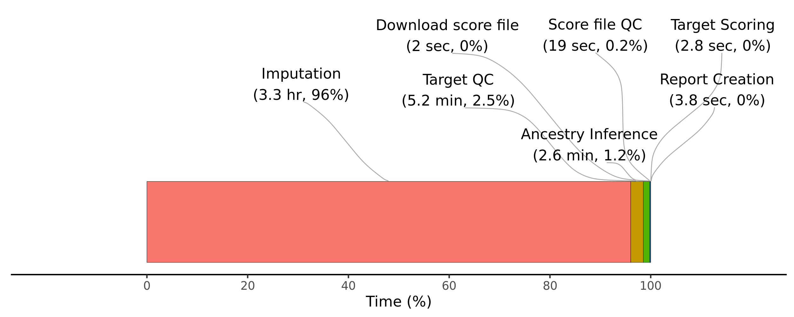

```{r setup, include=FALSE}
knitr::opts_chunk$set(eval = FALSE)
library(knitr)
library(data.table)
```

***

This document is a simplified set of instructions for the specific scenario where 23andMe data for an individual, and a set of score files on the PGS catalogue is being used as the input to the pipeline. It also provides a demonstration of using the genopred container.

***

# Setting up

## Download GenoPred container

Containers are available for both docker and singularity (see [here](pipeline_readme.html#containers))

```{bash}
singularity \
  pull \
  --arch \
  amd64 \
  /users/k1806347/oliverpainfel/Software/singularity/genopred_pipeline_v0.4.sif \
  library://opain/genopred/genopred_pipeline:v0.4
```

***

## Prepare configuration

```{r}
# Create directory to store configuration files, outputs and resources
workdir<-'/users/k1806347/oliverpainfel/test/genopred_23andme'
dir.create(paste0(workdir, '/config'), recursive = T)
dir.create(paste0(workdir, '/resources'), recursive = T)
dir.create(paste0(workdir, '/output'), recursive = T)

# Create config file
config<-c(
  paste0('outdir: ', workdir, '/output'),
  paste0('resdir: ', workdir, '/resources'),
  paste0('config_file: ', workdir, '/config/config.yaml'),
  paste0('target_list: ', workdir, '/config/target_list.txt'),
  paste0('score_list: ', workdir, '/config/score_list.txt'),
  'cores_target_pgs: 8',
  'cores_impute_23andme: 8'
)

write.table(config, paste0(workdir, '/config/config.yaml'), col.names = F, row.names = F, quote = F)

# Create target_list
target_list<-data.frame(
  name='Joe_Bloggs',
  path='/users/k1806347/oliverpainfel/Software/MyGit/GenoPred/pipeline/test_data/target/23andMe_individual/Joe_Bloggs_genome_0123456789.zip',
  type='23andMe',
  indiv_report=TRUE
)

write.table(target_list, paste0(workdir, '/config/target_list.txt'), col.names=T, row.names=F, quote=F)

# Create score_list
score_list<-data.frame(
  name='PGS002804',
  path=NA,
  label='Height'
)

score_list$label<-paste0("\"", score_list$label, "\"")

write.table(score_list, paste0(workdir, '/config/score_list.txt'), col.names=T, row.names=F, quote=F)
```

***

# Run pipeline

```{bash}
# Start container
singularity shell \
  --bind /scratch/prj/oliverpainfel:/scratch/prj/oliverpainfel \
  --writable-tmpfs \
  /users/k1806347/oliverpainfel/Software/singularity/genopred_pipeline_v0.4.sif
  
# Activate GenoPred environment
source /opt/mambaforge/etc/profile.d/conda.sh
conda activate genopred

# Go to GenoPred/pipeline directory
cd /tools/GenoPred/pipeline/

# Do a dry run to check the scheduled steps are expected (there should not be any steps saying 'download', and it should not be necessary to build the conda environment)
snakemake -j8 --use-conda --configfile=/users/k1806347/oliverpainfel/test/genopred_23andme/config/config.yaml output_all
```

***

# Computational benchmark

<details><summary>Show code</summary>

```{r}
bm_files_i<-list.files(path='/users/k1806347/oliverpainfel/test/genopred_23andme/output/reference/benchmarks', full.names = T)

bm_dat_all <- do.call(rbind, lapply(bm_files_i, function(file) {
  tmp <- fread(file)
  tmp$file <- basename(file)
  return(tmp)
}))

# Create rule column
bm_dat_all$rule <- gsub('-.*','',bm_dat_all$file)

# Calculate total wall time
sum(bm_dat_all$s)/60/60 # 4.904476 hours

# Calculate wall time taken by rule
bm_dat_rule_time <- NULL
for (i in unique(bm_dat_all$rule)) {
  bm_dat_rule_time <- rbind(
    bm_dat_rule_time,
    data.frame(
      rule = i,
      time = sum(bm_dat_all$s[bm_dat_all$rule == i])))
}

# Tidy results
bm_dat_rule_time <-
  bm_dat_rule_time[!(bm_dat_rule_time$rule %in% c('ancestry_reporter', 'score_reporter.txt')), ]

bm_dat_rule_time$step<-gsub('_i$','', bm_dat_rule_time$rule)
bm_dat_rule_time$step<-gsub('prep_pgs_','', bm_dat_rule_time$step)

bm_dat_rule_time$step[bm_dat_rule_time$rule == 'format_target_i']<-'Target QC'
bm_dat_rule_time$step[bm_dat_rule_time$rule == 'impute_23andme_i']<-'Imputation'
bm_dat_rule_time$step[bm_dat_rule_time$rule == 'sumstat_prep_i']<-'GWAS QC'
bm_dat_rule_time$step[bm_dat_rule_time$rule == 'indiv_report_i']<-'Report Creation'
bm_dat_rule_time$step[bm_dat_rule_time$rule == 'ancestry_inference_i']<-'Ancestry Inference'
bm_dat_rule_time$step[bm_dat_rule_time$rule == 'target_pgs_i']<-'Target Scoring'
bm_dat_rule_time$step[bm_dat_rule_time$rule == 'prep_pgs_external_i']<-'Score file QC'
bm_dat_rule_time$step[bm_dat_rule_time$rule == 'download_pgs_external']<-'Download score file'

#######
# Create a pie chart
#######

data <- data.frame(
  category = bm_dat_rule_time$step,
  values = bm_dat_rule_time$time
)

data$category<-factor(data$category, 
                      levels = c('Imputation',
                                 'Target QC',
                                 'Ancestry Inference',
                                 'Download score file',
                                 'Score file QC',
                                 'Target Scoring',
                                 'Report Creation'))

data<-data[order(data$category),]

data$perc<-data$values/sum(data$values)*100
data$cum_perc<-cumsum(data$perc)

for(i in 1:length(data$category)) {
  data$start[i] <- ifelse(i == 1, 0, data$end[i - 1])
  data$end[i] <- data$cum_perc[i]
  data$label_position[i] <- data$cum_perc[i] - data$perc[i] / 2
}

data$time_clean<-NA
data$time_clean[data$values < 60] <-
  paste0(round(data$values[data$values < 60], 1), ' sec')
data$time_clean[data$values > 60] <-
  paste0(round(data$values[data$values > 60] / 60, 1), ' min')
data$time_clean[data$values > 3600] <-
  paste0(round(data$values[data$values > 3600] / 60 / 60, 1), ' hr')

data$label<-paste0(data$category,
                   "\n(", data$time_clean, ', ',
                   round(data$perc,1),"%)")

library(ggplot2)
library(ggrepel)

png('~/oliverpainfel/Software/MyGit/GenoPred/docs/Images/Benchmark/23andme_benchmark.png', res=300, width=2500, height=1000, units = 'px')

set.seed(1)
ggplot(data,
       aes(
         xmin = start,
         xmax = end,
         ymin = 0,
         ymax = 0.1,
         fill = category
       )) +
  geom_rect(colour='black', size=0.1) +
  geom_text_repel(
    aes(
      x = label_position,
      y = 0.1,
      label = label,
      segment.square  = T,
      segment.inflect = T
    ),
    force = 100,
    nudge_y           = 0.15,
    hjust = 0.5,
    segment.size      = 0.3,
    segment.curvature = -0.1,
    segment.color='darkgrey',
    box.padding=0.6,
  ) +
  scale_x_continuous(breaks = seq(0, 100, by = 20)) +
  coord_cartesian(clip = "off", xlim = c(-20, 120), ylim = c(0, 0.3)) +
  labs(x='Time (%)') +
  theme(
    axis.title.y = element_blank(),
    axis.text.y = element_blank(),
    axis.ticks.y = element_blank(),
    axis.line.y = element_blank(),
    axis.line.x = element_line(color = "black", size = 0.5),
    panel.grid.major.y = element_blank(),
    panel.grid.minor.y = element_blank(),
    panel.grid.major.x = element_blank(),
    panel.grid.minor.x = element_blank(),
    legend.position = "none",
    plot.background = element_rect(fill = "white", color = NA),
    panel.background = element_rect(fill = "white", color = NA)
  )

dev.off()

```

</details>

***

<div class="centered-container">
<div class="rounded-image-container">

</div>
</div>


