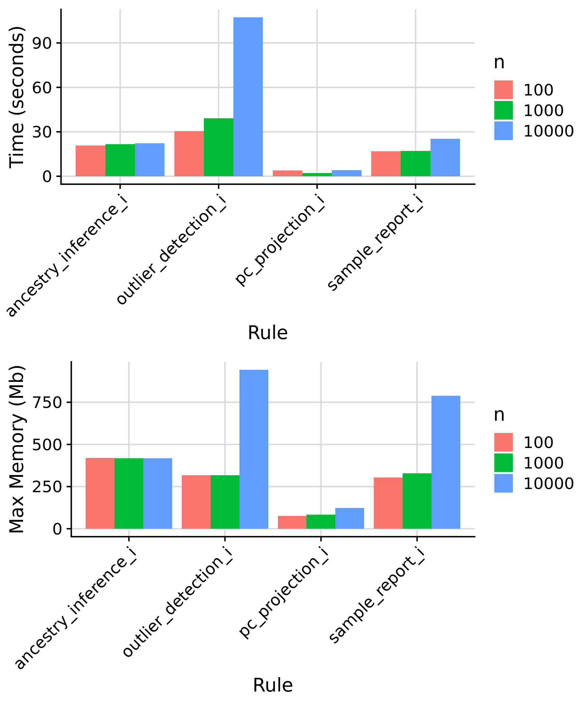
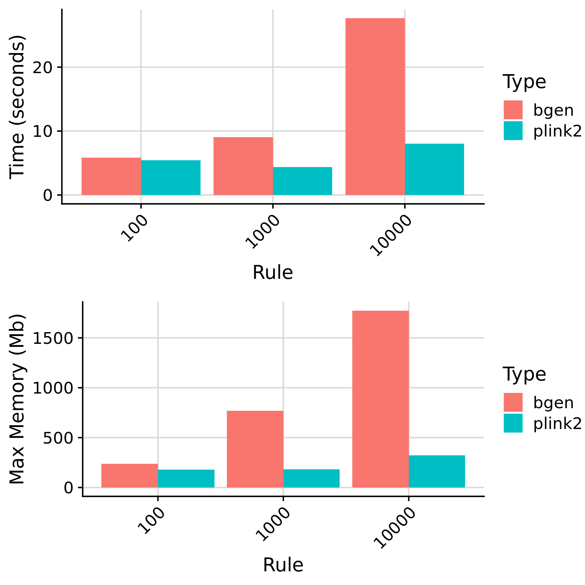

```{r setup, include=FALSE}
knitr::opts_chunk$set(eval = FALSE)
library(knitr)
library(data.table)
```

***

In this document we will benchmark the time taken and max memory for each part of the GenoPred pipeline. We are using the benchmark results from the snakemake benchmark functionality. We will record the time taken to run the pipeline restricted to chromosome 22 to save time, and then results can be extrapolated.

We will test the pipeline using 10 GWAS, 10 external scoring files, 3 target samples with sample sizes 100, 1000 and 10000, with 10M SNPs originally. The number of SNPs in external scoring files can vary a lot, so we will use scoring files based on methods restricted to hapmap3 variants.

***

# Prepare input data

```{bash}
# Create directory for inputs
mkdir -p /users/k1806347/oliverpainfel/test/genopred_benchmark/input_data
```

***

## Target data

<details><summary>Show code</summary>

```{r}
# Read in previous population probabilities
library(data.table)
ukb_pop <- fread('/scratch/prj/ukbiobank/usr/ollie_pain/ReQC/defining_ancestry/UKBB.Ancestry.model_pred')

# Insert project specific IDs
fam <-fread('/scratch/prj/ukbiobank/ukb82087/genotyped/ukb82087_binary_pre_qc.fam')
fam$row<-1:nrow(fam)
ukb_pop <- merge(ukb_pop, fam[,c('V1','row'), with=F], by.x='FID',by.y='row')

# Identify subset with EUR probability > 0.995
ukb_pop_eur <- ukb_pop[ukb_pop$EUR > 0.995,]
ukb_pop_eur <- data.table(FID = ukb_pop_eur$V1,
                          IID = ukb_pop_eur$V1)

# Remove withdrawals
psam <- fread('/scratch/prj/ukbiobank/ukb82087/imputed/ukb82087_imp_chr22_MAF1_INFO4_v1.psam')
names(psam)[1:2]<-c('FID','IID')
ukb_pop_eur <- ukb_pop_eur[ukb_pop_eur$FID %in% psam$FID,]

# Save keep file listing 100, 1000, and 10000 individuals
write.table(ukb_pop_eur[1:100,], '/users/k1806347/oliverpainfel/test/genopred_benchmark/input_data/ukb_eur_subset_1.keep', col.names = F, row.names = F, quote = F)
write.table(ukb_pop_eur[1:1000,], '/users/k1806347/oliverpainfel/test/genopred_benchmark/input_data/ukb_eur_subset_2.keep', col.names = F, row.names = F, quote = F)
write.table(ukb_pop_eur[1:10000,], '/users/k1806347/oliverpainfel/test/genopred_benchmark/input_data/ukb_eur_subset_3.keep', col.names = F, row.names = F, quote = F)
```

```{bash}
# Create symlinks to the pgen files resitricted to INFO 0.4 and MAF 0.01
ln -s /scratch/prj/ukbiobank/ukb82087/imputed/ukb82087_imp_chr22_MAF1_INFO4_v1.psam /users/k1806347/oliverpainfel/test/genopred_benchmark/input_data/ukb.chr22.psam
ln -s /scratch/prj/ukbiobank/ukb82087/imputed/ukb82087_imp_chr22_MAF1_INFO4_v1.bgen.bgi /users/k1806347/oliverpainfel/test/genopred_benchmark/input_data/ukb.chr22.bgen.bgi 
ln -s /scratch/prj/ukbiobank/ukb82087/imputed/ukb82087_imp_chr22_MAF1_INFO4_v1.pvar /users/k1806347/oliverpainfel/test/genopred_benchmark/input_data/ukb.chr22.pvar
ln -s /scratch/prj/ukbiobank/ukb82087/imputed/ukb82087_imp_chr22_MAF1_INFO4_v1.pgen /users/k1806347/oliverpainfel/test/genopred_benchmark/input_data/ukb.chr22.pgen
ln -s /scratch/prj/ukbiobank/ukb82087/imputed/ukb82087_imp_chr22_MAF1_INFO4_v1.sample /users/k1806347/oliverpainfel/test/genopred_benchmark/input_data/ukb.chr22.sample

# Subset the plink2 format files
plink2 --pfile /users/k1806347/oliverpainfel/test/genopred_benchmark/input_data/ukb.chr22 \
--keep /users/k1806347/oliverpainfel/test/genopred_benchmark/input_data/ukb_eur_subset_3.keep \
--make-pgen \
--threads 1 \
--out /users/k1806347/oliverpainfel/test/genopred_benchmark/input_data/ukb.subset_3.chr22

plink2 --pfile /users/k1806347/oliverpainfel/test/genopred_benchmark/input_data/ukb.subset_3.chr22 \
--keep /users/k1806347/oliverpainfel/test/genopred_benchmark/input_data/ukb_eur_subset_2.keep \
--make-pgen \
--threads 1 \
--out /users/k1806347/oliverpainfel/test/genopred_benchmark/input_data/ukb.subset_2.chr22

plink2 --pfile /users/k1806347/oliverpainfel/test/genopred_benchmark/input_data/ukb.subset_2.chr22 \
--keep /users/k1806347/oliverpainfel/test/genopred_benchmark/input_data/ukb_eur_subset_1.keep \
--make-pgen \
--threads 1 \
--out /users/k1806347/oliverpainfel/test/genopred_benchmark/input_data/ukb.subset_1.chr22

# Convert to bgen format
plink2 --pfile /users/k1806347/oliverpainfel/test/genopred_benchmark/input_data/ukb.subset_3.chr22 \
--keep /users/k1806347/oliverpainfel/test/genopred_benchmark/input_data/ukb_eur_subset_3.keep \
--export bgen-1.3 \
--threads 1 \
--out /users/k1806347/oliverpainfel/test/genopred_benchmark/input_data/ukb.subset_3.chr22

plink2 --pfile /users/k1806347/oliverpainfel/test/genopred_benchmark/input_data/ukb.subset_2.chr22 \
--keep /users/k1806347/oliverpainfel/test/genopred_benchmark/input_data/ukb_eur_subset_2.keep \
--export bgen-1.3 \
--threads 1 \
--out /users/k1806347/oliverpainfel/test/genopred_benchmark/input_data/ukb.subset_2.chr22

plink2 --pfile /users/k1806347/oliverpainfel/test/genopred_benchmark/input_data/ukb.subset_1.chr22 \
--keep /users/k1806347/oliverpainfel/test/genopred_benchmark/input_data/ukb_eur_subset_1.keep \
--export bgen-1.3 \
--threads 1 \
--out /users/k1806347/oliverpainfel/test/genopred_benchmark/input_data/ukb.subset_1.chr22

# Index the bgen files
/users/k1806347/oliverpainfel/Software/QCTOOL/bgen.tgz/build/apps/bgenix -index -g /users/k1806347/oliverpainfel/test/genopred_benchmark/input_data/ukb.subset_1.chr22.bgen

/users/k1806347/oliverpainfel/Software/QCTOOL/bgen.tgz/build/apps/bgenix -index -g /users/k1806347/oliverpainfel/test/genopred_benchmark/input_data/ukb.subset_2.chr22.bgen

/users/k1806347/oliverpainfel/Software/QCTOOL/bgen.tgz/build/apps/bgenix -index -g /users/k1806347/oliverpainfel/test/genopred_benchmark/input_data/ukb.subset_3.chr22.bgen

# Rename sample file
mv /users/k1806347/oliverpainfel/test/genopred_benchmark/input_data/ukb.subset_1.chr22.sample /users/k1806347/oliverpainfel/test/genopred_benchmark/input_data/ukb.subset_1.sample
mv /users/k1806347/oliverpainfel/test/genopred_benchmark/input_data/ukb.subset_2.chr22.sample /users/k1806347/oliverpainfel/test/genopred_benchmark/input_data/ukb.subset_2.sample
mv /users/k1806347/oliverpainfel/test/genopred_benchmark/input_data/ukb.subset_3.chr22.sample /users/k1806347/oliverpainfel/test/genopred_benchmark/input_data/ukb.subset_3.sample
```

```{r}

# Create a target_list
target_list <- data.frame(
  name = c('subset_1_plink2', 'subset_2_plink2', 'subset_3_plink2', 'subset_1_bgen', 'subset_2_bgen', 'subset_3_bgen'),
  path = c('/users/k1806347/oliverpainfel/test/genopred_benchmark/input_data/ukb.subset_1', '/users/k1806347/oliverpainfel/test/genopred_benchmark/input_data/ukb.subset_2', '/users/k1806347/oliverpainfel/test/genopred_benchmark/input_data/ukb.subset_3'),
  type = c('plink2','plink2','plink2','bgen','bgen','bgen'),
  indiv_report = c(T, F, F, F, F, F)
)

write.table(target_list, '/users/k1806347/oliverpainfel/test/genopred_benchmark/input_data/target_list.txt', col.names=T, row.names=F, quote=F)

```

</details>

***

# GWAS data

<details><summary>Show code</summary>

```{r}
# Create GWAS list
gwas_list <-data.frame(name = c('DEPR06','COLL01','BODY04','HEIG03','DIAB05','COAD01','SCLE03','RHEU02','BRCA01','PRCA01'),
                       path = NA,
                       population = 'EUR',
                       n = NA,
                       sampling = c(0.2698322, NA, NA, NA, 0.1675544, 0.3298934, 0.3599529, 0.2463970, 0.5371324, 0.5643190),
                       prevalence = c(0.15, NA, NA, NA, 0.05, 0.03, 0.00164, 0.005, 0.125, 0.125),
                       mean = c(NA,0,0,0,NA,NA,NA,NA,NA,NA),
                       sd = c(NA,1,1,1,NA,NA,NA,NA,NA,NA),
                       label = c('Major Depression','Intelligence','BMI','Height','T2D','CAD','MultiScler','RheuArth','Breast Cancer','Prostate Cancer'))

gwas_list$path <-paste0('/scratch/prj/gwas_sumstats/cleaned/', gwas_list$name,'.gz')
gwas_list$label<-paste0("\"", gwas_list$label, "\"")
write.table(gwas_list, '/users/k1806347/oliverpainfel/test/genopred_benchmark/input_data/gwas_list.txt', col.names=T, row.names=F, quote=F)
```

</details>

***

# External score file

<details><summary>Show code</summary>

```{r}
# Create a score list
score_list <- data.frame(name=c('PGS003980','PGS003981','PGS003982','PGS003983','PGS003984'),
                         path=NA,
                         label=c('body mass index','inflammatory bowel disease','type 2 diabetes mellitus','breast carcinoma','stroke'))
score_list$label<-paste0("\"", score_list$label, "\"")
write.table(score_list, '/users/k1806347/oliverpainfel/test/genopred_benchmark/input_data/score_list.txt', col.names=T, row.names=F, quote=F)

```

</details>

***

## Configfile

<details><summary>Show code</summary>

```{r}
config <- c(
  "outdir: /users/k1806347/oliverpainfel/test/genopred_benchmark/output/ncores_1",
  "config_file: /users/k1806347/oliverpainfel/test/genopred_benchmark/input_data/config_ncores1.yaml",
  "gwas_list: /users/k1806347/oliverpainfel/test/genopred_benchmark/input_data/gwas_list.txt",
  "target_list: /users/k1806347/oliverpainfel/test/genopred_benchmark/input_data/target_list.txt",
  "score_list: /users/k1806347/oliverpainfel/test/genopred_benchmark/input_data/score_list.txt",
  "pgs_methods: ['ptclump','dbslmm','prscs','sbayesr','lassosum','ldpred2','megaprs']",
  "testing: chr22"
)
write.table(config, '/users/k1806347/oliverpainfel/test/genopred_benchmark/input_data/config_ncores1.yaml', col.names=F, row.names=F, quote=F)

config <- c(
  "outdir: /users/k1806347/oliverpainfel/test/genopred_benchmark/output/ncores_5",
  "config_file: /users/k1806347/oliverpainfel/test/genopred_benchmark/input_data/config_ncores5.yaml",
  "gwas_list: /users/k1806347/oliverpainfel/test/genopred_benchmark/input_data/gwas_list.txt",
  "target_list: /users/k1806347/oliverpainfel/test/genopred_benchmark/input_data/target_list.txt",
  "score_list: /users/k1806347/oliverpainfel/test/genopred_benchmark/input_data/score_list.txt",
  "pgs_methods: ['ptclump','dbslmm','prscs','sbayesr','lassosum','ldpred2','megaprs']",
  "testing: chr22"
)
write.table(config, '/users/k1806347/oliverpainfel/test/genopred_benchmark/input_data/config_ncores5.yaml', col.names=F, row.names=F, quote=F)
```

</details>

***

# Run pipeline

```{bash}
# N cores = 1
snakemake --profile slurm -n --config ncores=1 --configfile=/users/k1806347/oliverpainfel/test/genopred_benchmark/input_data/config_ncores1.yaml --use-conda output_all pc_projection outlier_detection

# N cores = 5
snakemake --profile slurm -n --config ncores=5 --configfile=/users/k1806347/oliverpainfel/test/genopred_benchmark/input_data/config_ncores5.yaml --use-conda output_all pc_projection outlier_detection
  
```

***

# Collate results

<details><summary>Show code</summary>

```{r}
library(data.table)
library(ggplot2)
library(cowplot)

runs <- c('ncores_1','ncores_5')

bm_dat_all <- NULL
for (run_i in runs) {
  # Identify benchmark files
  bm_files_i <-
    paste0(
      '/users/k1806347/oliverpainfel/test/genopred_benchmark/output/',
      run_i,
      '/reference/benchmarks/',
      list.files(
        paste0(
          '/users/k1806347/oliverpainfel/test/genopred_benchmark/output/',
          run_i,
          '/reference/benchmarks'
        )
      )
    )
  
  # Read in benchmark files
  bm_dat_i <- do.call(rbind, lapply(bm_files_i, function(file) {
    tmp <- fread(file)
    tmp$file <- basename(file)
    return(tmp)
  }))
  
  bm_dat_i$ncores <- as.numeric(gsub('ncores_','',run_i))
  
  bm_dat_all<-rbind(bm_dat_all, bm_dat_i)
  
}

# Read in benchmark data that is configuration independent
bm_files_i <-
  paste0(
    'resources/data/benchmarks/',
    list.files('resources/data/benchmarks')
  )

# Read in benchmark files
bm_dat_i <- do.call(rbind, lapply(bm_files_i, function(file) {
  tmp <- fread(file)
  tmp$file <- basename(file)
  return(tmp)
}))

bm_dat_i$ncores <- 1

bm_dat_all<-rbind(bm_dat_all, bm_dat_i)

# Create rule, n, pgs_method and type columns
bm_dat_all$rule <- gsub('-.*','',bm_dat_all$file)
bm_dat_all$n <- NA
bm_dat_all$type <- NA
bm_dat_all$pgs_method <- NA

bm_dat_all$n[grepl('subset_1', bm_dat_all$file)] <- 100
bm_dat_all$n[grepl('subset_2', bm_dat_all$file)] <- 1000
bm_dat_all$n[grepl('subset_3', bm_dat_all$file)] <- 10000

bm_dat_all$type[grepl('bgen', bm_dat_all$file)] <- 'bgen'
bm_dat_all$type[grepl('plink2', bm_dat_all$file)] <- 'plink2'

bm_dat_all$pgs_method[grepl('ptclump', bm_dat_all$file)] <- 'ptclump'
bm_dat_all$pgs_method[grepl('dbslmm', bm_dat_all$file)] <- 'dbslmm'
bm_dat_all$pgs_method[grepl('ldpred2', bm_dat_all$file)] <- 'ldpred2'
bm_dat_all$pgs_method[grepl('sbayesr', bm_dat_all$file)] <- 'sbayesr'
bm_dat_all$pgs_method[grepl('lassosum', bm_dat_all$file)] <- 'lassosum'
bm_dat_all$pgs_method[grepl('prscs', bm_dat_all$file)] <- 'prscs'
bm_dat_all$pgs_method[grepl('megaprs', bm_dat_all$file)] <- 'megaprs'
bm_dat_all$pgs_method[grepl('external', bm_dat_all$file)] <- 'external'

# Calculate mean time and memory for each rule
bm_dat_summary <- NULL

####
# Split by ncores
####

for (rule_i in c(
  'prep_pgs_ptclump_i',
  'prep_pgs_dbslmm_i',
  'prep_pgs_prscs_i',
  'prep_pgs_megaprs_i',
  'prep_pgs_lassosum_i',
  'prep_pgs_ldpred2_i',
  'prep_pgs_sbayesr_i'
)) {
  bm_dat_all_tmp <-
    bm_dat_all[bm_dat_all$rule == rule_i, ]

    for (ncores_i in unique(bm_dat_all_tmp$ncores)){
      bm_dat_all_tmp_2 <-
        bm_dat_all_tmp[bm_dat_all_tmp$ncores == ncores_i, ]
      
      tmp <- data.table(
        ncores = ncores_i,
        rule = rule_i,
        type = 'any',
        n = 'any',
        pgs_method = 'any',
        mean_time = mean(bm_dat_all_tmp_2$s),
        max_time = max(bm_dat_all_tmp_2$s),
        mean_mem = mean(bm_dat_all_tmp_2$max_rss),
        max_mem = max(bm_dat_all_tmp_2$max_rss)
      )
      bm_dat_summary <- rbind(bm_dat_summary, tmp)
    }
}

####
# no split
####

for (rule_i in c(
  'ref_pca_i',
  'sumstat_prep_i',
  'download_pgs_external',
  'prep_pgs_external_i',
  'score_reporter.txt',
  'indiv_report_i'
)) {
  bm_dat_all_tmp <-
    bm_dat_all[bm_dat_all$rule == rule_i, ]

  tmp <- data.table(
    ncores = 'any',
    rule = rule_i,
    type = 'any',
    n = 'any',
    pgs_method = 'any',
    mean_time = mean(bm_dat_all_tmp$s),
    max_time = max(bm_dat_all_tmp$s),
    mean_mem = mean(bm_dat_all_tmp$max_rss),
    max_mem = max(bm_dat_all_tmp$max_rss)
  )
  bm_dat_summary <- rbind(bm_dat_summary, tmp)
}

####
# split by n and type
####

rule_i <- 'format_target_i'
bm_dat_all_tmp <-
  bm_dat_all[bm_dat_all$rule == rule_i, ]
for (n_i in unique(bm_dat_all_tmp$n)) {
  for (type_i in unique(bm_dat_all_tmp$type)) {
    bm_dat_all_tmp2 <-
      bm_dat_all_tmp[
        bm_dat_all_tmp$n == n_i & 
        bm_dat_all_tmp$type == type_i, ]
    
    tmp <- data.table(
      ncores = 'any',
      rule = rule_i,
      type = type_i,
      n = n_i,
      pgs_method = 'any',
      mean_time = mean(bm_dat_all_tmp2$s),
      max_time = max(bm_dat_all_tmp2$s),
      mean_mem = mean(bm_dat_all_tmp2$max_rss),
      max_mem = max(bm_dat_all_tmp2$max_rss)
    )
    bm_dat_summary <- rbind(bm_dat_summary, tmp)
  }
}

####
# split by n
####

for (rule_i in c('ancestry_inference_i','ancestry_reporter','pc_projection_i','sample_report_i','outlier_detection_i')) {
  bm_dat_all_tmp <-
    bm_dat_all[bm_dat_all$rule == rule_i, ]
  for (n_i in unique(bm_dat_all_tmp$n)) {
    bm_dat_all_tmp2 <-
      bm_dat_all_tmp[
        bm_dat_all_tmp$n == n_i, ]
    
    tmp <- data.table(
      ncores = 'any',
      rule = rule_i,
      type = 'any',
      n = n_i,
      pgs_method = 'any',
      mean_time = mean(bm_dat_all_tmp2$s),
      max_time = max(bm_dat_all_tmp2$s),
      mean_mem = mean(bm_dat_all_tmp2$max_rss),
      max_mem = max(bm_dat_all_tmp2$max_rss)
    )
    bm_dat_summary <- rbind(bm_dat_summary, tmp)
  }
}

####
# split by method, n
####

for (rule_i in c('target_pgs_i')) {
  bm_dat_all_tmp <-
    bm_dat_all[bm_dat_all$rule == rule_i, ]
  for (n_i in unique(bm_dat_all_tmp$n)) {
    for (method_i in unique(bm_dat_all_tmp$pgs_method)) {
      bm_dat_all_tmp2 <-
        bm_dat_all_tmp[
          bm_dat_all_tmp$n == n_i &
          bm_dat_all_tmp$pgs_method == method_i, ]
      
      tmp <- data.table(
        ncores = 'any',
        rule = rule_i,
        type = 'any',
        n = n_i,
        pgs_method = method_i,
        mean_time = mean(bm_dat_all_tmp2$s),
        max_time = max(bm_dat_all_tmp2$s),
        mean_mem = mean(bm_dat_all_tmp2$max_rss),
        max_mem = max(bm_dat_all_tmp2$max_rss)
      )
      bm_dat_summary <- rbind(bm_dat_summary, tmp)
    }
  }
}

#################
# Plot
#################
####
# split by ncores
####

bm_dat_summary_i <- bm_dat_summary[bm_dat_summary$rule %in% c(
    'prep_pgs_ptclump_i',
    'prep_pgs_dbslmm_i',
    'prep_pgs_prscs_i',
    'prep_pgs_megaprs_i',
    'prep_pgs_lassosum_i',
    'prep_pgs_ldpred2_i',
    'prep_pgs_sbayesr_i'
  ),]

bm_dat_summary_i$method <- gsub('_i', '', gsub('prep_pgs_','',bm_dat_summary_i$rule))
bm_dat_summary_i<-merge(bm_dat_summary_i, pgs_method_labels, by='method')

pgs_method_time <-
  ggplot(bm_dat_summary_i, aes(x = label, y = mean_time, fill = ncores)) +
  geom_bar(stat = "identity", position = "dodge") +
  labs(x = "PGS Method", y = "Time (seconds)", fill='Cores') +
  theme_half_open() +
  background_grid() +
  theme(axis.text.x = element_text(angle = 45, hjust = 1))

pgs_method_mem <-
  ggplot(bm_dat_summary_i, aes(x = label, y = max_mem, fill = ncores)) +
  geom_bar(stat = "identity", position="dodge") +
  labs(x = "PGS Method", y = "Max Memory (Mb)", fill='Cores') +
  theme_half_open() +
  background_grid() +
  theme(axis.text.x = element_text(angle = 45, hjust = 1))

png('Images/Benchmark/pgs_methods.png', res = 300, width = 1800, height = 1800, units = 'px')
  plot_grid(pgs_method_time, pgs_method_mem, nrow=2)
dev.off()

####
# no split
####

bm_dat_summary_i <- bm_dat_summary[bm_dat_summary$rule %in% c(
    'download_pgs_external',
    'sumstat_prep_i',
    'prep_pgs_external_i',
    'ref_pca_i',
    'indiv_report_i'
  ),]

no_split_time <- 
  ggplot(bm_dat_summary_i, aes(x = rule, y = mean_time, fill = rule)) +
  geom_bar(stat = "identity", position="dodge") +
  labs(x = "Rule", y = "Time (seconds)") +
  theme_half_open() +
  background_grid() +
  theme(axis.text.x = element_text(angle = 45, hjust = 1), legend.position="none")

no_split_mem <- 
  ggplot(bm_dat_summary_i, aes(x = rule, y = max_mem, fill = rule)) +
  geom_bar(stat = "identity", position="dodge") +
  labs(x = "Rule", y = "Max Memory (Mb)") +
  theme_half_open() +
  background_grid() +
  theme(axis.text.x = element_text(angle = 45, hjust = 1), legend.position="none")

png('Images/Benchmark/no_split.png', res = 300, width = 1800, height = 2200, units = 'px')
  plot_grid(no_split_time, no_split_mem, nrow=2)
dev.off()

####
# split by n and type
####

bm_dat_summary_i <- bm_dat_summary[bm_dat_summary$rule %in% c('format_target_i'),]

n_type_split_time <- 
  ggplot(bm_dat_summary_i, aes(x = n, y = mean_time, fill = type)) +
  geom_bar(stat = "identity", position="dodge") +
  labs(x = "Rule", y = "Time (seconds)", fill = 'Type') +
  theme_half_open() +
  background_grid() +
  theme(axis.text.x = element_text(angle = 45, hjust = 1))

n_type_split_mem <- 
  ggplot(bm_dat_summary_i, aes(x = n, y = max_mem, fill = type)) +
  geom_bar(stat = "identity", position="dodge") +
  labs(x = "Rule", y = "Max Memory (Mb)", fill = 'Type') +
  theme_half_open() +
  background_grid() +
  theme(axis.text.x = element_text(angle = 45, hjust = 1))

png('Images/Benchmark/n_type_split.png', res = 300, width = 1800, height = 1800, units = 'px')
  plot_grid(n_type_split_time, n_type_split_mem, nrow=2)
dev.off()

####
# split by n
####

bm_dat_summary_i <-
  bm_dat_summary[bm_dat_summary$rule %in% c(
    'ancestry_inference_i',
    'pc_projection_i',
    'sample_report_i',
    'outlier_detection_i'
  ), ]

n_split_time <- 
  ggplot(bm_dat_summary_i, aes(x = rule, y = mean_time, fill = n)) +
  geom_bar(stat = "identity", position="dodge") +
  labs(x = "Rule", y = "Time (seconds)") +
  theme_half_open() +
  background_grid() +
  theme(axis.text.x = element_text(angle = 45, hjust = 1))

n_split_mem <- 
  ggplot(bm_dat_summary_i, aes(x = rule, y = max_mem, fill = n)) +
  geom_bar(stat = "identity", position="dodge") +
  labs(x = "Rule", y = "Max Memory (Mb)") +
  theme_half_open() +
  background_grid() +
  theme(axis.text.x = element_text(angle = 45, hjust = 1))

png('Images/Benchmark/n_split.png', res = 300, width = 1800, height = 2200, units = 'px')
  plot_grid(n_split_time, n_split_mem, nrow=2)
dev.off()

####
# split by method, n
####

bm_dat_summary_i <-
  bm_dat_summary[bm_dat_summary$rule %in% c(
    'target_pgs_i'
  ), ]

n_method_split_time <- 
  ggplot(bm_dat_summary_i, aes(x = pgs_method , y = mean_time, fill = n)) +
  geom_bar(stat = "identity", position="dodge") +
  labs(x = "PGS Method", y = "Time (seconds)", fill = 'N') +
  theme_half_open() +
  background_grid() +
  theme(axis.text.x = element_text(angle = 45, hjust = 1))

n_method_split_mem <- 
  ggplot(bm_dat_summary_i, aes(x = pgs_method , y = max_mem, fill = n)) +
  geom_bar(stat = "identity", position="dodge") +
  labs(x = "PGS Method", y = "Max Memory (Mb)", fill = 'N') +
  theme_half_open() +
  background_grid() +
  theme(axis.text.x = element_text(angle = 45, hjust = 1))

png('Images/Benchmark/n_method_split.png', res = 300, width = 1800, height = 1800, units = 'px')
  plot_grid(n_method_split_time, n_method_split_mem, nrow=2)
dev.off()  

```
</details>

***

# Results

The pipeline was run using chromosome 22 only.

***

<details><summary>Show PGS Methods</summary>

{width=50%}

<div class="note-box">

**Note:** SBayesR would capitalise on multiple cores when running on multiple chromosomes. pT+clump and DBSLMM are not implemented in parallel, since they are already fast.

</div>

</details>

<details><summary>Show rules with constant time/memory</summary>

{width=50%}
</details>

<details><summary>Show rules affected by N</summary>

{width=50%}
</details>

<details><summary>Show rules affected by N and PGS method (target_scoring_i)</summary>

{width=50%}


<div class="note-box">

**Note:** Performance varies by PGS method due to the number of scores each method produces.

</div>

</details>

<details><summary>Show rules affected by N and Type (format_target_i)</summary>

{width=50%}

</details>

***

# Required storage

This shows the disk space required for the reference data:

```{}
38G     gctb_ref
17M     hm3_snplist
2.3G    ldak_bld
1.0K    ldak_highld
119M    ldak_map
459K    ld_blocks
7.2G    ldpred2_ref
44M     ldsc_ref
21M     logs
4.4G    prscs_ref
1.1G    ref
```

In total this is ~50G, most of which is the GCTB reference required for SBayesR. 

***

# Genome-wide benchmark

We also performed a benchmark of PGS methods genome-wide using European GWAS summary statistics from Yengo et al. This was carried out using default settings in GenoPred, with 10 cores allocated to each PGS method, except pT+clump and DBSLMM which are run on a single core.

<details><summary>Show PGS methods benchmark</summary>

{width=50%}

<div class="note-box">

**Note:** pT+clump and DBSLMM are run using 1 core. All other methods are run using 10 cores.

</div>

</details>

