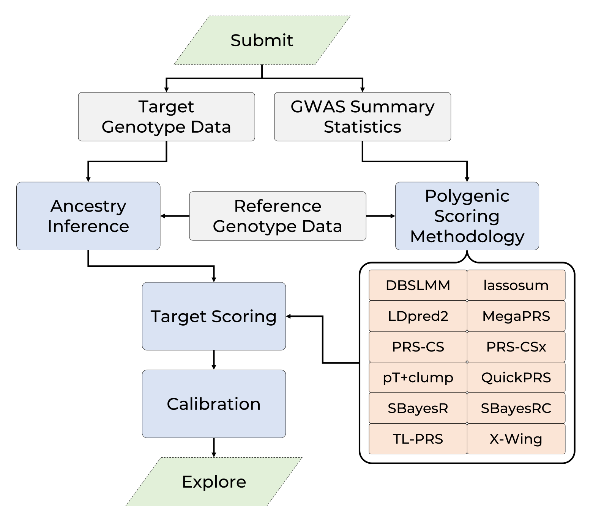

```{r setup, include=FALSE}
knitr::opts_chunk$set(eval = FALSE)
library(knitr)
library(data.table)
```

***

<div style="display: flex; flex-wrap: wrap; align-items: center; justify-content: center;">
<div style="padding-right: 20px; flex: 1;">

The GenoPred pipeline is an easy-to-use and robust software pipeline, implementing leading methodology for polygenic scoring.

Polygenic scoring is an approach for calculating an individuals genetic risk or propensity for a given outcome, leveraging the results of large-scale genome-wide association studies (GWAS) using advanced machine learning methodology. Polygenic scores are used extensively in research and show great promise as a tool for enhancing personalised medicine.

The GenoPred pipeline facilitates the robust calculation of polygenic scores, taking commonly available input files in a range of formats, and returning polygenic scores and several other useful outputs (e.g. ancestry inference results, relatedness estimation, genetic principal components).

The pipeline uses the Snakemake workflow manager and conda environments providing scalable and reproducible analyses.

## Instructions

Instructions on how to use the GenoPred pipeline can be found [here](pipeline_readme.html).

</div>

</div>

***

# Promo Video
    
<iframe width="560" height="315" src="https://www.youtube.com/embed/5XkgoWVgrp4?si=8i7bCSvVRvmdE4wB" title="YouTube video player" frameborder="0" allow="accelerometer; autoplay; clipboard-write; encrypted-media; gyroscope; picture-in-picture; web-share" allowfullscreen></iframe>

***

# Any questions?

Please post questions as an issue on the GenoPred GitHub repo [here](https://github.com/opain/GenoPred/issues).

