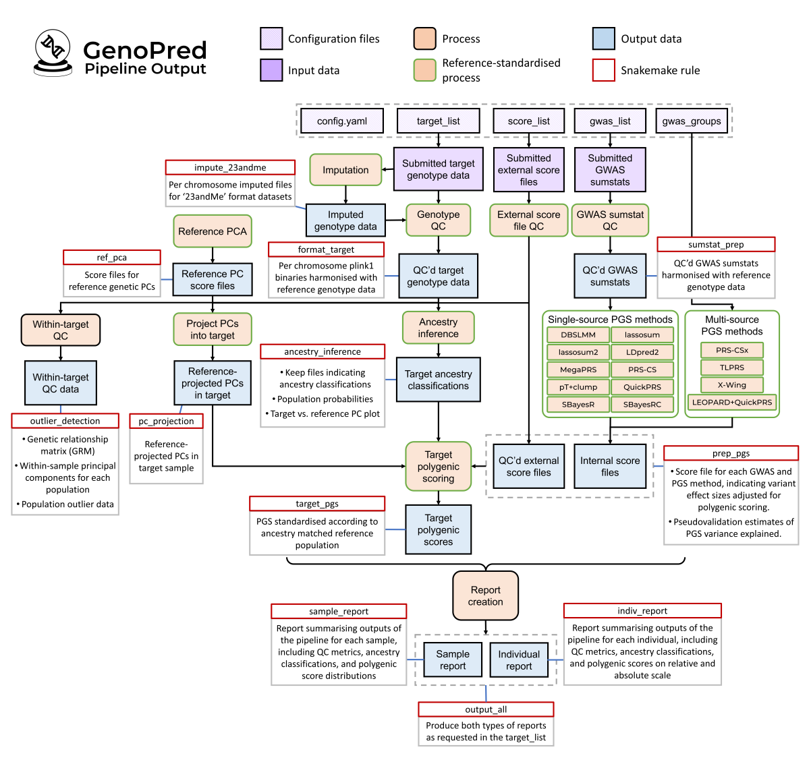

```{r setup, include=FALSE}
knitr::opts_chunk$set(eval = FALSE)
library(knitr)
library(data.table)
```

***

This document will provides instructions for the GenoPred pipeline. It covers the following topics:

-   [Installation](#installation)
-   [Containers](#containers)
-   [Pipeline configuration](#pipeline-configuration)
-   [Run using test data](#run-using-test-data)
-   [A little about Snakemake](#a-little-about-snakemake)
-   [Running on an HPC](#running-on-an-hpc)
-   [Requesting outputs](#requesting-outputs)
-   [Computational resources](#computational-resources)
-   [Additional parameters](#additional-parameters)
-   [Running in offline environment](#running-in-offline-environment)

For a general overview of the GenoPred pipeline, click [here](pipeline_overview.html).
For a technical details of the GenoPred pipeline, click [here](pipeline_technical.html).

***

**Citations**

Please cite our publication when using the pipeline:

- "Pain, O. et al. "The GenoPred Pipeline: A Comprehensive and Scalable Pipeline for Polygenic Scoring." Bioinformatics (2024). https://doi.org/10.1093/bioinformatics/btae551

If using multi-source PGS methods, please also cite our study describing their evaluation and implementation within GenoPred:

- "Pain, O. "Leveraging Global Genetics Resources to Enhance Polygenic Prediction Across Ancestrally Diverse Populations." MedRxiv (2026). https://doi.org/10.1101/2025.03.27.25324773

If relevant, please also cite our paper comparing polygenic scoring methods and describing the reference-standardised approach:

- Pain, O. et al. "Evaluation of polygenic prediction methodology within a reference-standardized framework." PLoS genetics (2024). https://doi.org/10.1371/journal.pgen.1009021

Please also remember to cite the relevant studies for the tools and data used by the GenoPred pipeline.

***

# Video tutorials 

<div class="centered-container">

<div style="flex: 1 1 auto; align-items: center; text-align: center;">
**Tutorial 1: Installation**

<iframe width="250px" height="auto" src="https://www.youtube.com/embed/X-ST5qb4mF0?si=AD6Gt8dh-UrEpbj6" title="YouTube video player" frameborder="0" allow="accelerometer; autoplay; clipboard-write; encrypted-media; gyroscope; picture-in-picture; web-share" allowfullscreen></iframe>
</div>

<div style="flex: 1 1 auto; align-items: center; text-align: center;">
**Tutorial 2: Pipeline configuration**

<iframe width="250px" height="auto" src="https://www.youtube.com/embed/MrOWa0sgxkg?si=nPAZXAtnKph-4L8o" title="YouTube video player" frameborder="0" allow="accelerometer; autoplay; clipboard-write; encrypted-media; gyroscope; picture-in-picture; web-share" allowfullscreen></iframe>
</div>

<div style="flex: 1 1 auto; align-items: center; text-align: center;">
**Tutorial 3: Running the pipeline**

<iframe width="250px" height="auto" src="https://www.youtube.com/embed/lqhNK8VVDC0?si=2eOgz658AMakXffX" title="YouTube video player" frameborder="0" allow="accelerometer; autoplay; clipboard-write; encrypted-media; gyroscope; picture-in-picture; web-share" allowfullscreen></iframe>
</div>

<div style="flex: 1 1 auto; align-items: center; text-align: center;">
**Tutorial 4: Running on an HPC**

<iframe width="250px" height="auto" src="https://www.youtube.com/embed/Lw_DMiZWLkQ?si=g2S9SJGQDf2OZq9u" title="YouTube video player" frameborder="0" allow="accelerometer; autoplay; clipboard-write; encrypted-media; gyroscope; picture-in-picture; web-share" allowfullscreen></iframe>
</div>

<div style="flex: 1 1 auto; align-items: center; text-align: center;">
**Tutorial 5: Requesting and Finding Outputs**

<iframe width="250px" height="auto" src="https://www.youtube.com/embed/muTKkPk620I?si=52iXjdhthVo-MkdX" title="YouTube video player" frameborder="0" allow="accelerometer; autoplay; clipboard-write; encrypted-media; gyroscope; picture-in-picture; web-share" allowfullscreen></iframe>
</div>

</div>

The videos can be watched on YouTube <a href="https://www.youtube.com/playlist?list=PLZwmskofEu7W-wqCdqFGRHc8m6NH0HZ2h" target="_blank">here</a>!

***

# Installation

There are three steps:

1.  Download GenoPred repository
2.  Create conda environment
3.  Download dependencies

***

## Step 1: Download GenoPred repository

First, you will need to download the GenoPred repository from GitHub. Open your terminal, go to the directory where you would like the repository to be stored, and clone the repository.

<div class="note-box">

**Note:** If you are using an high performance cluster (HPC), it is best run the setup in an interactive session (see [here](#dont-run-on-the-login-node)).

</div>

```{bash}
git clone https://github.com/opain/GenoPred.git
```

***

## Step 2: Create conda environment for pipeline

Conda is a software environment management system which is great way for easily downloading and storing software. We will use conda to create an environment that the GenoPred pipeline will run in.

If you don't already have conda installed, we will install it using miniconda.

```{bash}
# Download and install Miniforge (for Linux)
wget https://github.com/conda-forge/miniforge/releases/download/24.11.3-0/Miniforge3-24.11.3-0-Linux-x86_64.sh
bash Miniforge3-24.11.3-0-Linux-x86_64.sh
```

I would say `yes` to the default options. You may then need to refresh your workspace to initiate conda, by running `source ~/.bashrc`. You should see `(base)` written in the bottom left of the terminal. Once miniconda installation is complete, you can then delete the `Miniconda3-latest-Linux-x86_64.sh` file.

Now create the conda environment based on the `GenoPred/pipeline/envs/pipeline.yaml` file. This will create an environment called `genopred` with some essential packages installed.

```{bash}
mamba env create -f GenoPred/pipeline/envs/pipeline.yaml
```

Now activate the new `genopred` environment.

```{bash}
mamba activate genopred
```

***

## Step 3: Download dependencies

Now, we will download some additional dependencies of the pipeline. First, go into the `pipeline` folder within the GenoPred repo. Now we are in the pipeline folder, we can use our first Snakemake command to download the dependencies of the GenoPred pipeline.

```{bash}
cd GenoPred/pipeline

snakemake -j 1 --use-conda --conda-frontend mamba install_r_packages
```

This will start by building other conda environments, which the pipeline uses to perform certain analyses. Then it will download a few other dependencies of the pipeline. In total this process may take ~10 minutes.

<div class="note-box">

**Note:** Check out advice [here](#running-jobs-in-parallel) for running in parallel on an HPC. The command might take some time, so run it via a compute node, and if run interactively, I would suggest using a terminal multiplexer (like tmux) to avoid connection issues (see [here](#avoid-connection-issues)).

</div>

<details>

<summary>See explanation of Snakemake command</summary>

-   `-j 1`- This parameter tells Snakemake how many jobs can be run in parallel. 
-   `--use-conda` - This tells Snakemake to use conda environments as specified in the pipeline. This parameter should always be included when using GenoPred.
-   `--conda-frontend mamba` - This tells Snakemake to use mamba when creating new conda environments, which is a faster version of conda. This parameter is only required when running the GenoPred Snakemake for the first time, as the environment only needs to be built once.
-   `install_r_packages` - This is the *rule* we want Snakemake to run. Other useful in GenoPred are described [here](#requesting-specific-outputs). rules The rules included in GenoPred will be described

For more information on Snakemake commands see [here](#basic-Snakemake-commands).

</details>

***

# Containers

We have made docker and singularity containers with GenoPred pre-installed. We provide an example running the pipeline in an offline environment, using a container with pre-downloaded dependencies (see [here](#running-in-offline-environment)). We also provide an example of using the pipeline within the container [here](pipeline_23andMe.html). The containers can avoid some installation issues, and allow the pipeline to be used on non-linux based systems.

```{bash}
# Docker
docker \
  pull \
  opaino/genopred_pipeline:latest

# Singularity
singularity \
  pull \
  --arch \
  amd64 \
  /users/k1806347/oliverpainfel/Software/singularity/genopred_pipeline_latest.sif \
  library://opain/genopred/genopred_pipeline:latest
```

<div class="note-box">

**Note:** When running the pipeline in the container, you must mount a home directory. Additionally, specify the `resdir` and `outdir` configfile parameters outside of the container to ensure that the pipeline's resources and outputs are stored persistently for subsequent sessions.

</div>

***

# Pipeline configuration

The pipeline is configured using a configfile, which tells the pipeline what to do, and the location of the input data listed in the target_list, gwas_list, and score_list files.

<div class="note-box">
  <h3>🚀 New: Configuration Wizard</h3>
  <p>Try our <a href="config_wizard.html" target="_blank">Interactive Configuration Wizard</a>. This tool will help you build your GWAS and Target lists and automatically generate the required <code>config.yaml</code> bundle for you.</p>
  <br>
  <p><strong>Note:</strong> While the wizard facilitates file creation, complete descriptions and formatting requirements for these files are provided in the sections below.</p>
</div>

<div class="centered-container">
<div class="rounded-image-container" style="width: 75%;">

</div>
</div>

***

## `configfile`

Snakemake reads the default `config.yaml` file located in the `pipeline` directory to obtain its default parameters. When using your own data, it’s recommended to create a new `configfile` rather than modifying the default one. You can then specify this custom `configfile` when running Snakemake using the `--configfile` option.

This approach allows you to use the GenoPred pipeline with multiple configurations. Importantly, only parameters that differ from the defaults need to be included in your custom `configfile`. Any parameter not explicitly defined in the custom `configfile` will be automatically sourced from the default `pipeline/config.yaml` file. This ensures that Snakemake only overrides the parameters you specify, while continuing to use the default settings for all others.

```{bash}
snakemake -j1 --use-conda --configfile=misc/23andMe/config.yaml output_all
```

<details>

<summary>View configfile parameters</summary>

```{r, eval = T, echo = F, results = 'asis'}
config <- list(
  Parameter = list(
    outdir = list(
      description = 'Directory to save pipeline outputs',
      example = '`test_data/output/test1`',
      note = "Required. I recommend using an absolute path starting from the root of the file system (starting with `/`)"
    ),
    resdir = list(
      description = 'Directory to save pipeline resources',
      example = '`genopred_resources`',
      note = "Optional. Default is the `resources` folder within the `GenoPred/pipeline` folder. I recommend using an absolute path starting from the root of the file system (starting with `/`)"
    ),
    config_file = list(
      description = 'Location of the config file itself',
      example = '`config.yaml`',
      note = 'Required'
    ),
    gwas_list = list(
      description = "Path to `gwas_list` file, listing GWAS sumstats",
      example = '`example_input/gwas_list.txt`',
      note = "Set to NA if you don't want to include and GWAS sumstats"
    ),
    score_list = list(
      description = "Path to `score_list` file, listing external score files",
      example = '`example_input/score_list.txt`',
      note = "Set to NA if you don't want to include any external score files"
    ),
    target_list = list(
      description = "Path to `target_list` file, listing target datasets",
      example = '`example_input/target_list.txt`',
      note = "Set to NA if you don't want to include any target datasets"
    ),
    pgs_methods = list(
      description = 'List of polygenic scoring methods to run',
      example = "`['ptclump','dbslmm']`",
      note = "Options are: `ptclump`, `dbslmm`, `prscs`, `sbayesr`, `lassosum`, `lassosum2`, `ldpred2`, `megaprs`. **Note.** By default, `sbayesr`, `lassosum2`, and `ldpred2` are only implemented for GWAS of EUR ancestry."
    ),
    testing = list(
      description = 'Controls testing mode',
      example = '`chr22`',
      note = "Set to NA to turn off test mode. Set to `chr22` if you want to run the pipeline using only chromosome 22."
    )
  )
)

config_df <- NULL
for (param in names(config$Parameter)) {
  description <- config$Parameter[[param]]$description
  example <- config$Parameter[[param]]$example
  note <- config$Parameter[[param]]$note
  
  # Append each parameter's details to the data frame
  config_df <- rbind(
    config_df,
    data.frame(
      Parameter = paste0("`",param,"`"),
      Description = description,
      Example = example,
      Note = note,
      stringsAsFactors = FALSE
    )
  )
}

print(kable(config_df, 'markdown'))

```

<div class="note-box">

**Note:** If you do not provide a target_list, then only rules that do not require a target_list can be performed, such as GWAS sumstat QC. Similarly, if you do not provide a gwas_list or score_list, only rules that do not require these files can be performed, such as target sample ancestry inference.

</div>

</details>

***

## `gwas_list`

The `gwas_list` is a white-space delimited text file, providing information of the GWAS summary statistics to be used by the pipeline.

<details>

<summary>View gwas_list format</summary>

```{r, eval = T, echo = F, results = 'asis'}

gwas_list <- list(
  Column = list(
    name = list(
      example = '`COAD01`',
      description = "ID for the GWAS sumstats. Cannot contain spaces (' ') or hyphens ('-')"
    ),
    path = list(
      example = '`gwas_sumstats/COAD01.gz`',
      description = "File path to the GWAS summary statistics (uncompressed or gzipped)."
    ),
    population = list(
      example = '`EUR`',
      description = "Reference population that the GWAS sample matches best. Options are `AFR` - African, `AMR` = Admixed American, `EAS` = East Asian, `EUR` = European, `CSA` = Central and South Asian, and `MID` = Middle Eastern. If you are using a mixed ancestry GWAS, though there are limitations, I would suggest specifying the population that matches the majority of the GWAS sample."
    ),
    n = list(
      example = '`10000`',
      description = "The total sample size of the GWAS. This is required if there is no column indicating sample size in the sumstats. Otherwise, it can be set to `NA`"
    ),
    sampling = list(
      example = '`0.5`',
      description = "The proportion of the GWAS sample that were cases (if outcome is binary - otherwise specify `NA`)"
    ),
    prevalence = list(
      example = '`0.1`',
      description = "The prevalence of the phenotype in the general population (if outcome is binary - otherwise specify `NA`)"
    ),
    mean = list(
      example = '`100`',
      description = "The phenotype mean in the general population (if outcome is continuous, otherwise specify `NA`)"
    ),
    sd = list(
      example = '`15`',
      description = "The phenotype sd in the general population (if outcome is continuous, otherwise specify `NA`)"
    ),
    label = list(
      example = '`\"Coronary Artery Disease\"`',
      description = "A human readable name for the GWAS phenotype. Wrap in double quotes if multiple words. For example, `\"Body Mass Index\"`."
    )
  )
)

gwas_list_df <- NULL
for (column in names(gwas_list$Column)) {
  description <- gwas_list$Column[[column]]$description
  example <- gwas_list$Column[[column]]$example

  # Append each parameter's details to the data frame
  gwas_list_df <- rbind(
    gwas_list_df,
    data.frame(
      Column = column,
      Example = example,
      Description = description,
      stringsAsFactors = FALSE
    )
  )
}

kable(gwas_list_df, 'markdown')

```

<div class="note-box">

**Note: ** The `prevalence` and `sampling` values are used to estimate the SNP-based heritability on the liability scale, as requested by some PGS methods. Furthermore, `prevalence` and `sampling`, or `mean` and `sd` values are used to interpret the polygenic scores on the absolute scale.

</div>

</details>

<details>

<summary>View GWAS sumstat format</summary>

</br>

The pipeline can accept GWAS sumstats with a range of header formats. It uses a dictionary to interpret the meaning of certain column names. This is useful but potentially risky. You have two options to ensure the columns are being interpreted correctly:

1. Hope for the best and check the sumstat QC log file to see whether header we correctly interpreted (lazy option but fine in most cases).
2. Check whether the headers in your sumstats correspond to the correct values in the sumstat header dictionary ([here](https://github.com/opain/GenoUtils/blob/main/R/constants.R#L6)), and update as necessary in advance of running the pipeline.

The sumstats must contain either RSIDs or chromosome and basepair position information. The sumstats must also contain an effect size, either BETA, odds ratio, log(OR), or a signed Z-score. Either P-values or standard errors must also be present. It is also best if the following are present: sample size per variant, GWAS sample allele frequencies (for the effect allele), and imputation quality metrics.

I would suggest checking the sumstat QC log files, to check the number of SNPs after QC is expected.

</details>

***

## `score_list`

The `score_list` is a white-space delimited text file, providing information of externally generated score files for polygenic scoring are to be used by the pipeline. The `score_list` should have `name`, `path` and `label` columns, that the `gwas_list` has, except the `path` column should indicate the location of the score file. 

PGS Catalogue score files can be directly downloaded by GenoPred, by using the PGS ID in the `name` column, and setting the `path` column to `NA`. 

<div class="note-box">

**Note:** Externally derived PGS score files may have a poor variant overlap with the default GenoPred reference data, which is restricted to HapMap3 variants. Score files with <75% of variants present in the reference are excluded from downstream target scoring. Several popular PGS methods restrict to HapMap3 variants, so this is not always an issue.

</div>

<details>

<summary>View score file format</summary>

</br>

The format of the score files should be consistent with the PGS Catalogue header format (https://www.pgscatalog.org/downloads/#scoring_header). GenoPred can read the harmonised and unharmonised column names from PGS Catalogue. It will preferentially use the harmonised columns if they are present. The PGS Catalogue format comments are not required by GenoPred, though they are useful so don't actively remove them. GenoPred allows only one column of effect sizes per score file. GenoPred is lenient, and only requires either the RSIDs, or chromosome  and basepair position columns to be present.

- `rsID` or `hm_rsID` - RSID
- `chr_name` or `hm_chr` - Chromosome number
- `chr_position` or `hm_pos` - Basepair position
- `effect_allele` - Allele corresponding to `effect_weight` column
- `other_allele` - The other allele
- `effect_weight` - The effect size of `effect_allele`

</details>

***

## `target_list`

The `target_list` is a white-space delimited text file, providing information of the target datasets to be used by the pipeline. The file must have the following columns:

<details>

<summary>View target_list format</summary>

</br>

```{r, eval = T, echo = F, results = 'asis'}

target_list <- list(
  Column = list(
    name = list(
      example = '`test_data/output/test1`',
      description = "ID for the target dataset. Cannot contain spaces (' ') or hyphens ('-')"
    ),
    path = list(
      example = '`imputed_sample_plink1/example`',
      description = "Path to the target genotype data. For type `23andMe`, provide full file path either zipped (`.zip`) or uncompressed (`.txt`). For `type` `plink1`, `plink2`, `bgen`, and `vcf`, per-chromosome genotype data should be provided with the following filename format: `<prefix>.chr<1-22>.<.bed/ .bim/ .fam/ .pgen/ .pvar/ .psam/ .bgen/ .vcf.gz>`. If `type` is `samp_imp_bgen`, the sample file should be called `<prefix>.sample`, and each `.bgen` file should have a corresponding `.bgi` file"
    ),
    type = list(
      example = '`plink1`',
      description = "Format of the target genotype dataset. Either `23andMe`, `plink1`, `plink2`, `bgen`, or `vcf`. `23andMe` = 23andMe formatted data for an individual. `plink1` = Preimputed PLINK1 binary format data (.bed/.bim/.fam). `plink2` = Preimputed PLINK2 binary format data (.pgen/.pvar/.psam). `bgen` = Preimputed Oxford format data (.bgen/.sample). `vcf` = Preimputed gzipped VCF format data (`.vcf.gz`) for a group of individuals."
    ),
    indiv_report = list(
      example = '`T`',
      description = "Logical indicating whether reports for each individual should be generated. Either `T` or `F`. Use with caution if target data contains many individuals, as it will create an .html report for each individual."
    )
  )
)

target_list_df <- NULL
for (column in names(target_list$Column)) {
  description <- target_list$Column[[column]]$description
  example <- target_list$Column[[column]]$example

  # Append each parameter's details to the data frame
  target_list_df <- rbind(
    target_list_df,
    data.frame(
      Column = paste0("`",column,"`"),
      Example = example,
      Description = description,
      stringsAsFactors = FALSE
    )
  )
}

kable(target_list_df, 'markdown')

```

<div class="note-box">

**Note:** If prefix of your target genetic data files do not meet the requirements of GenoPred, you can create  symlinks (like a shortcut) to the original genetic data, and then specify these symlinks in the `target_list`.

</div>

</details>

***

# Run using test data

Once you have installed GenoPred, we can run the pipeline using the test data.

***

## Step 1: Download the test data

First, we need to download and decompress the test data. Do this within the `GenoPred/pipeline` folder.

```{bash}
# Activate genopred conda environment
conda activate genopred

# Download from google drive
gdown --no-cookies 1C4AwDnY_hJ4ilGneMlAjwEKghzss5PeG

# Decompress
tar -xf test_data.tar.gz

# Once decompressed, delete compressed version to save space
rm test_data.tar.gz
```

***

## Step 2: Run the pipeline

To run the pipeline with the test_data, we will use the `example_input/config.yaml`. It specifies some basic options and specifies the `target_list`, `gwas_list` and `score_list` in the `example_input` folder. The `testing` parameter is set to `chr22` so only chromosome 22.

<details>

<summary>See contents of default configfile</summary>

```{bash}
# Specify output directory
outdir: test_data/output/test1

# Location of this config file
config_file: example_input/config.yaml

# Specify location of gwas_list file
gwas_list: example_input/gwas_list.txt

# Specify location of target_list file
target_list: example_input/target_list.txt

# Specify location of score_list file
score_list: example_input/score_list.txt

# Specify pgs_methods
pgs_methods: ['ptclump','dbslmm']

# Specify if you want test mode. Set to NA if you don't want test mode
testing: chr22
```

</details>

<details>

<summary>See contents of example target_list</summary>

```{r, eval = T, echo = F, results = 'asis'}

target_list <- fread('../pipeline/example_input/target_list.txt')

kable(target_list, 'markdown')

```

</details>

<details>

<summary>See contents of example gwas_list</summary>

```{r, eval = T, echo = F, results = 'asis'}

gwas_list <- fread('../pipeline/example_input/gwas_list.txt')
gwas_list$label <- paste0("\"",gwas_list$label,"\"")
kable(gwas_list, 'markdown')

```

</details>

<details>

<summary>See contents of example score_list</summary>

```{r, eval = T, echo = F, results = 'asis'}

score_list <- fread('../pipeline/example_input/score_list.txt')
score_list$label <- paste0("\"",score_list$label,"\"")
kable(score_list, 'markdown')

```

</details>


***

To run the pipeline with the example configfile and test data, we just need to specify the number of jobs we want to run in parallel (`-j`), the `--use-conda` parameter, and then the rule we want the pipeline to run (`output_all`). See [here](#requesting-outputs) to see what this rule will output, and for information on other rules that can be run.

Executing the `output_all` rule will run many steps in the pipeline. If you want to check what will happen before you run the pipeline, it is often useful to use the `-n` parameter, which will do a dry-run, printing out all the steps it would run, without actually running it.

```{bash}
# Remember to activate the genopred environment and go into to the GenoPred/pipeline directory before running the pipeline
conda activate genopred
cd ~/GenoPred/pipeline

# Do a dry run to see what would happen
snakemake -n --configfile=example_input/config.yaml output_all

# Run the pipeline running one step at a time 
snakemake -j1 --configfile=example_input/config.yaml --use-conda output_all
```

Once the pipeline is complete, you can check that there is nothing else to do by doing another dry run, and it should say 'Nothing to be done'.

***

## Step 3: Look through the output

There is detailed information [here](#requesting-outputs). When using the default `config.yaml`, the `outdir` parameter is `test_data/output/test1`. 

For example, if you wanted to find the sample-level report, summarising what the pipeline did, it can be found here: `test_data/output/test1/example_plink1/reports/example_plink1-report.html`.

Or, if you wanted to find the DBSLMM PGS based on the COAD01 GWAS in European target individuals, the file can be found here: `test_data/output/test1/example_plink1/pgs/EUR/dbslmm/COAD01/example_plink1-COAD01-EUR.profiles`

```{}
FID IID COAD01_DBSLMM
1_EUR 1_EUR -1.782
2_EUR 2_EUR -1.104
```

***

## Step 4: How to modify the configuration

After running the pipeline, it is often useful to update the configuration of our analysis, for example to added a new GWAS to the gwas_list. This is not a problem - GenoPred uses Snakemake to only rerun analyses that are affected by the changes in configuration, rather than running the full pipeline from scratch. 

I will demonstrate by adding a new GWAS, but its a similar process when adding new score files or target samples, or when changing certain parameters in `configfile`. We simply add a new row to the `gwas_list`, rerun GenoPred, and it will rerun the required steps. As an example, I will add a row with the name 'COAD02', which uses the same sumstats file as COAD01.

<details>
<summary>Code updating gwas_list</summary>
```{r}
# Read in gwas_list
gwas_list <- fread('../pipeline/example_input/gwas_list.txt')

# Add new gwas (for demonstration I will reuse the sumstats for COAD01, but will name it 'COAD02')
gwas_list <- rbind(gwas_list, gwas_list[gwas_list$name == 'COAD01',])
gwas_list$name[3] <- 'COAD02'

# Put quotes around the label column
gwas_list$label <- paste0("\"", gwas_list$label, "\"")

# Save file
fwrite(gwas_list, '../pipeline/example_input/gwas_list.txt', quote = F, sep = ' ', na='NA')
```

```{r, eval = T, echo = F, results = 'asis'}

gwas_list <- fread('../pipeline/example_input/gwas_list.txt')
gwas_list <- rbind(gwas_list, gwas_list[gwas_list$name == 'COAD01',])
gwas_list$name[3] <- 'COAD02'
gwas_list$label <- paste0("\"", gwas_list$label, "\"")
kable(gwas_list, 'markdown')

```
</details>

***

Now, we have edited the `gwas_list`, if I rerun the pipeline using the `-n` parameter, I can see what new jobs the pipeline would run.

```{bash}
snakemake -n --configfile=example_input/config.yaml output_all
```

It will output all the rules it would run, with inputs and outputs, summarising the steps in a table like this:

```{}
Job stats:
job                      count    min threads    max threads
---------------------  -------  -------------  -------------
indiv_report_all_id          1              1              1
indiv_report_i              10              1              1
output_all                   1              1              1
prep_pgs_dbslmm_i            1              1              1
prep_pgs_lassosum_i          1              1              1
prep_pgs_ptclump_i           1              1              1
sample_report_i              1              1              1
sumstat_prep_i               1              1              1
target_pgs_all_gwas         10              1              1
target_pgs_all_method        5              1              1
target_pgs_all_pop           1              1              1
target_pgs_i                10              1              1
total                       43              1              1
```

This output is expected - The new GWAS will need to undergo sumstat QC (`sumstat_qc`), downstream processing using PGS methods (`prep_pgs_ptclump_i`,`prep_pgs_dbslmm_i`,`prep_pgs_lassosum_i`), then target sample scoring (`target_pgs_i`), and finally update the sample- and individual-level reports (`sample_report_i` and `indiv_report_i`).

After seeing the expected jobs will be run, I would then run the pipeline:

```{bash}
snakemake -j1 --use-conda --configfile=example_input/config.yaml output_all
```

***

# A little about Snakemake

There is full documentation of Snakemake [here](https://snakemake.readthedocs.io/en/v7.32.3/), but in this section I will give a brief overview and outline a few commands that are particularly useful.

Snakemake is a python based pipeline tool. It contains lists of **rules** - Each rule is like a set of instructions, telling Snakemake to create certain outputs given certain inputs. If the user requests an output, Snakemake will run all the rules that are needed to create that output.

Importantly, Snakemake checks the timestamps of input and output files, and parameters applied, ensuring the output file is created after the input file, using the latest parameters. This helps if you need to rerun your analysis after some changes, and want to make sure the output has been correctly updated.

***

## Useful Snakemake options

Here are some useful Snakemake options/commands to run the pipeline:

***

### `--use-conda`

This command tells Snakemake to create and use the conda environment specified for each rule. This is a handy and reproducible way of installing and running code in a tightly controlled software environment.

This command should always be used when running GenoPred. All rules in GenoPred use the same conda environment, so it only has to be build once.

### `-j`

This command allows to set the number of jobs that can run simultaneously. E.g. `-j 1` will run one job at a time. This is most often what you want if you are running interactively.

### `-n`

This command performs a dry run, where Snakemake prints out all the jobs it would run, without actually running them. This is particularly useful if you want to see what would happen if you were to specify a certain output or rule. This helps avoid accidentally triggering 100s of unwanted jobs.

### `--configfile`

This parameter can be used to specify the .yaml file you want Snakemake to use as the configuration file. This file is described above (see [here](#configfile)).

```{bash}
snakemake -j1 --use-conda --configfile=new_config.yaml output_all
```

### `-p`

This will print the command Snakemake will run beneath of the jobs. This is handy if you want to see what the jobs are doing. This is mainly useful when debugging.

***

# Running on an HPC

The GenoPred pipeline can be easily run in parallel using an HPC. Here I outline a few suggestions on how to do this.

***

## Don't run on the login node

HPC's are a shared resource, and the login node is for logging in, not for running analyses. Instead, connect interactively to a compute node before setting up or using the GenoPred pipeline, or submit your Snakemake command as a batch job. There are likely time and memory restrictions on the login node, leading to errors, or unhappy colleagues. Read the documentation for your HPC for more information.

***

## Running jobs in parallel

Snakemake pipelines (such as GenoPred) can be easily parallelised. If you have access to multiple cores, then you can increase the `-j` parameter. Or if you have access to an HPC, then you can tell Snakemake to submit jobs to the HPC (this is the most powerful approach and I would recommend if possible). To submit jobs to the cluster, I use the `--profile` flag. This flag points Snakemake to a specific .yaml file, specifying Snakemake parameters, including those that instruct it to use the HPC. I have provided an example profile file (`example_input/slurm.yaml`), with parameters telling Snakemake how to submit jobs to a SLURM scheduler. SLURM users should create a folder called `slurm` in `$HOME/.config/snakemake`, and then copy in the `slurm.yaml`, renaming it to `config.yaml`. More information about profiles in Snakemake can be found [here](https://snakemake.readthedocs.io/en/stable/executing/cli.html#profiles). 

Once you have set up a .yaml for your scheduler, you can tell Snakemake to submit jobs to the scheduler by using the `--profile slurm` parameter, instead of the `-j1` parameter. E.g.

```{bash}
snakemake --profile slurm --use-conda output_all
```

Although, running the Snakemake command with the `--profile` flag uses very little memory, I would still suggest running it on a compute node to avoid clogging up the login node.

***

## Avoid connection issues

The pipeline can take hours for certain tasks, so if you are running the Snakemake command using interactive session on your HPC, you will likely run into issues due to your connection dropping out, leading to the Snakemake analysis to end.

To avoid this, I use a terminal multiplexer, either `tmux` or `screen`. When you are on the login node, start one of these multiplexers. Once inside the multiplexer, start your interactive session. The main reason for using a multiplexer here is that you can reconnect to the session even if your connection stops. There are several other advantages as well. They are really easy to use and will make your life a lot better. 

<div class="note-box">

**Note:** If you have multiple login nodes on your HPC, you will need to log in to the same login node to find your running tmux session. 

</div>

tmux documentation: https://github.com/tmux/tmux/wiki

***

## Managing Module Conflicts

When using HPC systems, software conflicts often occur due to pre-installed modules. This is particularly relevant when running software like GenoPred, which requires a specific environment setup to function correctly.

Before launching GenoPred, ensure your environment is clean by not loading any unnecessary modules, especially those that can interfere with software dependencies, such as R. You can check whether any modules are loaded using the command `module list`, and unload any loaded module using the command `module unload <module name>`.

***

# Requesting outputs

The GenoPred pipeline has many potential outputs. Here is a detailed schematic diagram illustrating the inputs, outputs and processes of the GenoPred pipeline.

<div class="centered-container">
<div class="rounded-image-container">

</div>
</div>

<div class="note-box">

**Note:** To see this image more clearly, right click and open in a new tab.

</div>

***

## Main rules

Each of the key outputs from the pipeline can be requested using the corresponding Snakemake rule. For example, if I just wanted to obtain QC'd GWAS summary statistics I could run the `sumstat_prep` rule.

```{bash}
snakemake -j1 --use-conda sumstat_prep
```

<details>

<summary>Show table of rules for key outputs</summary>

```{r, eval = T, echo = F, results = 'asis'}

pipeline_dict <- list(
  Type = list(
    Target = list(
      output_all = 'Generates both sample-level and individual-level .html reports',
      sample_report = "Generates sample-level .html reports for target datasets with `format` = 'plink1', 'plink2', 'bgen', or 'vcf'.",
      indiv_report = 'Generates individual-level .html reports for all individuals in target datasets with `indiv_report = T`',
      ancestry_inference = 'Perform ancestry inference for all target datasets.',
      target_pgs = 'Calculates all polygenic scores in all target datasets.',
      pc_projection = 'Projects reference genetic PCs into all target datasets',
      format_target = 'Harmonises all target datasets with the reference.',
      outlier_detection = 'Perform QC within the target datasets, seperately for each population with N > 100. Includes relatedness estimation, PCA, and population outlier detection.',
      impute_23andme = "Perform genotype imputation of target datasets with `format` = '23andMe'."
    ),
    Reference = list(
      sumstat_prep = 'Performs quality control of all GWAS summary statistics.',
      pgs_prep = 'Prepares scoring files for all GWAS using all PGS methods.',
      ref_pca = 'Performs PCA using reference genotype data.'
    )
  )
)

pipeline_df <- NULL
for (type in names(pipeline_dict$Type)) {
  for (step in names(pipeline_dict$Type[[type]])) {
    description <- pipeline_dict$Type[[type]][[step]]
    pipeline_df <- rbind(pipeline_df, data.frame(Type = type, Rule = step, Description = description, stringsAsFactors = FALSE))
  }
}

print(kable(pipeline_df, 'markdown'))

```

</details>

</br>

***

## Specific outputs

The rules above trigger sets of outputs to be created. For example the `sumstat_prep` rule performs QC of all GWAS in the `gwas_list`. However, it is also possible to request more specific outputs, such as QC'd sumstats for just one of the GWAS in the `gwas_list`. If we had a GWAS with the name `COAD01`, we could request QC'd sumstats for just that GWAS like this:

```{bash}
# Create variables indicating the desired GWAS and the outdir parameter in the config file (by default Snakemake reads uses config.yaml)
gwas = COAD01
outdir = test_data/output/test1

# Run Snakemake command
snakemake -j1 --use-conda ${outdir}/reference/gwas_sumstat/${gwas}/${gwas}-cleaned.gz
```

<details>

<summary>Show table of all available outputs</summary>

```{r, eval = T, echo = F, results = 'asis'}

output_dict <- list(
  type = list(
    target = list(
      group = list(
        `QC'd genotype` = list(
          output = c(
            "{outdir}/reference/target_checks/{name}/format_target.done"
          ),
          description = c(
            'Specific target dataset'
          )
        ),
        `Imputed genotype` = list(
          output = c(
            "{outdir}/reference/target_checks/{name}/impute_23andme.done"
          ),
          description = c(
            'Specific target dataset'
          )
        ),
        `Ancestry Inference` = list(
          output = c(
            "{outdir}/reference/target_checks/{name}/ancestry_inference.done"
          ),
          description = c(
            'Specific target dataset'
          )
        ),
        `Within-target QC` = list(
          output = c(
            "{outdir}/reference/target_checks/{name}/outlier_detection.done"
          ),
          description = c(
            'Specific target dataset'
          )
        ),
        `Projected PCs` = list(
          output = c(
            "{outdir}/reference/target_checks/{name}/pc_projection.done"
          ),
          description = c(
            'Specific target dataset'
          )
        ),
        `Target PGS` = list(
          output = c(
            "{outdir}/reference/target_checks/{name}/target_pgs.done"
          ),
          description = c(
            'Specific target dataset'
          )
        )
      )
    ),
    reference = list(
      group = list(
        `QC'd sumstats` = list(
          output = c(
            "{outdir}/reference/gwas_sumstat/{gwas}/{gwas}-cleaned.gz"
          ),
          description = c(
            "Specific GWAS"
          )
        ),
        `PGS score file` = list(
          output = c(
            "{outdir}/reference/target_checks/prep_pgs_{method}_i-{gwas}.done"
          ),
          description = c(
            'Specific GWAS/score file using specific PGS method'
          )
        ),
        `Reports` = list(
          output = c(
            "{outdir}/reference/target_checks/{name}/sample_report.done",
            "{outdir}/reference/target_checks/{name}/indiv_report.done"
          ),
          description = c(
            'Sample-level report for specific target dataset',
            'Individual-level report for all individuals in a specific target dataset'
          )
        )
      )
    )
  )
)

# Loop through each level of the list
output_df <- NULL
for (type_name in names(output_dict$type)) {
  for (group_name in names(output_dict$type[[type_name]]$group)) {
    outputs <- output_dict$type[[type_name]]$group[[group_name]]$output
    descriptions <- output_dict$type[[type_name]]$group[[group_name]]$description
    
    # Assuming each 'output' corresponds to a 'description'
    for (i in seq_along(outputs)) {
      output <- outputs[i]
      description <- descriptions[i]
      output_df <- rbind(output_df, data.frame(type = type_name, group = group_name, output = output, description = description, stringsAsFactors = FALSE))
    }
  }
}

print(kable(output_df, 'markdown'))

```

</details>

***

## Output structure

Outputs specific to the configuration used are stored in the `outdir` specified in the configfile:

```{}
[outdir]
  ├── [target name] (results for each target dataset)
  │   ├── ancestry (ancestry inference results)
  │   │   ├── [target_name].Ancestry.model_pred (population probabilities)
  │   │   ├── [target_name].Ancestry.pc_plot.png (plot of target and reference pcs)
  │   │   └── keep_files (files listing individuals assigned to each population)
  │   ├── geno (harmonised genotype data)
  │   ├── pgs (polygenic scores)
  │   │   └── [population] (pgs for each target population)
  │   │       └── [pgs method] (pgs for each pgs method)
  │   │           └── [gwas/score name] (pgs for each gwas or score file)
  │   └── reports (polygenic scores)
  │       ├── [target_name]-report.html (sample-level report)
  │       └── individual (individual-level reports)
  │    
  └── reference
      ├── gwas_sumstat (processed gwas sumstats)
      │   └── [gwas name] (pgs for each gwas or score file)
      ├── pgs_score_files (score files for polygenic scoring)
      │   └── [pgs method] (pgs for each pgs method)
      │       └── [gwas/score name] (pgs for each GWAS or score file)
      ├── benchmarks (pipeline benchmark data)
      └── target_checks (pipeline logs)
```

Some additional outputs that are independent of the configuration used, are store in the resources folder of the `GenoPred/pipeline` folder:

```{}
GenoPred/pipeline
  └── resources
      ├── data (downloaded data)
      │   ├── target_checks (pipeline logs)
      │   ├── benchmarks (pipeline benchmark data)      
      │   └── ref (default reference data)
      │       └── pc_score_files (score files for reference pcs)
      └── software (downloaded software)
```

***

# Reading outputs into R

I have included some handy R functions for reading in the outputs of the pipeline. You just need to set your working directory to the `GenoPred/pipeline` folder, and `source` the file functions using the code below:

```{r, eval =F }
# setwd('~/GenoPred/pipeline')
source('../functions/misc.R')
source_all('../functions')
```

Here is a list of useful R functions:

***

## `read_param`

Reads in parameters from a configuration file.

- **Parameters**
  - `config`: Path to the configuration file.
  - `param`: The name of the parameter to read.
  - `return_obj` (optional): Boolean indicating whether to return the parameter as an object (if possible) or as a file path. Default is TRUE.
  
- **Returns**
  - The value of the requested parameter if `return_obj == F`, or as a data.table if `return_obj == T`.

<details>
<summary>See usage</summary>

```{r}
# Read in gwas_list
gwas_list <-
  read_param(config = 'example_input/config.yaml', 
             param = 'gwas_list')

# Read in outdir
outdir <-
  read_param(config = 'example_input/config.yaml', 
             param = 'gwas_list',
             return_obj = F)
```

</details>

***

## `read_pgs`

Reads in polygenic scores (PGS) based on the provided configuration and filters.

- **Parameters**
  - `config`: Configuration file specifying paths and parameters.
  - `name` (optional): A vector of names to filter the target list. Default is NULL.
  - `pgs_methods` (optional): A vector of PGS methods to include. Default is NULL.
  - `gwas` (optional): A vector of GWAS to include. Default is NULL.
  - `pop` (optional): A vector of populations to include. Default is NULL.
  
- **Returns**
  - A list containing the filtered PGS data structured by target name, population, GWAS, and PGS method.

<details>
<summary>See usage</summary>

```{r}
# All PGS for all target datasets
pgs <- read_pgs(config = 'example_input/config.yaml')

# All PGS for specific dataset
pgs <-
  read_pgs(config = 'example_input/config.yaml', name = 'example_plink1')

# PGS for specific dataset, using a specific PGS method
pgs <-
  read_pgs(config = 'example_input/config.yaml',
           name = 'example_plink1',
           pgs_method = 'dbslmm')

# PGS for specific dataset, using specific PGS method, and specific GWAS
pgs <-
  read_pgs(
    config = 'example_input/config.yaml',
    name = 'example_plink1',
    pgs_method = 'dbslmm',
    gwas = 'COAD01'
  )

# PGS for specific target population in a specific dataset, using specific PGS method, and specific GWAS
pgs <-
  read_pgs(
    config = 'example_input/config.yaml',
    name = 'example_plink1',
    pgs_method = 'dbslmm',
    gwas = 'COAD01',
    pop = 'EUR'
  )

# PGS for a specific dataset, using based on external score files only
pgs <-
  read_pgs(
    config = 'example_input/config.yaml',
    name = 'example_plink1',
    pgs_method = 'external'
  )
```

</details>

***

## `read_ancestry`

Reads in ancestry inference results for a given target_dataset.

- **Parameters**
  - `config`: Configuration file specifying paths and parameters.
  - `name`: Name identifier for which to read ancestry data.
  
- **Returns**
  - A list containing ancestry inference outputs, including keep lists indicating population classifications, population probabilities model, and the ancestry inference log file.

<details>
<summary>See usage</summary>

```{r}
ancestry_info <-
  read_ancestry(config = 'example_input/config.yaml', 
                name = 'example_plink1')
```

</details>

***

## `find_pseudo`

Determines the pseudovalidation parameter for a given GWAS and PGS method. See [here](pipeline_technical.html#pseudovalidation) for more information on pseudovalidation.

- **Parameters**
  - `config`: Configuration file specifying paths and parameters.
  - `gwas`: A single GWAS identifier.
  - `pgs_method`: A single PGS method identifier.
- **Returns**
  - A string representing the pseudovalidation parameter.
- **Note**
  - `ptclump` has no pseudovalidation approach, so this function will return the PGS based on a p-value threshold of 1.

<details>
<summary>See usage</summary>

```{r}

pseudo_param <-
  find_pseudo(config = 'example_input/config.yaml',
              gwas = 'COAD01',
              pgs_method = 'ptclump')

```

</details>

***

## `read_pseudo_r`

Reads correlation (R) value from the lassosum pseudovalidation results for a specified GWAS.

- **Parameters**
  - `config`: Configuration file specifying paths and parameters.
  - `gwas`: A single GWAS identifier.
- **Returns**
  - A numeric value representing the R value from lassosum pseudovalidation.

<details>
<summary>See usage</summary>

```{r}
pseudo_r <-
  read_pseudo_r(
    config = 'example_input/config.yaml', 
    gwas = 'COAD01')
```

</details>

***

# Computational resources

Don't worry too much about this, as the pipeline will adjust according to the resources available. The requirements of the pipeline vary depending on the rules applied and the input data provided. I would suggest providing a minimum of 8GB RAM per core when using the pipeline. Ideally you would have access to more cores, so more intensive PGS methods run in a timely manner. We have performed a benchmark of time and memory used by each rule in the pipeline ([link](pipeline_benchmark.html)).

When running the pipeline using the `--profile` flag, PGS methods (except pT+clump) are run using the number of cores specified by the `cores_prep_pgs` parameter in the config file (by default 10). When running SBayesR and PRS-CS in parallel, more memory is required, with the pipeline requesting 4Gb x n_cores and 2Gb x n_cores respectively. If you are running the pipeline in your current session, using the `-j` parameter, PGS methods will be restricted accordingly. For example, if `-j 2`, then PGS methods would be restricted to 2 cores.

Required storage space will also vary depending on the input data and configuration. This is also shown on the pipeline benchmark page ([link](pipeline_benchmark.html)). 

<div class="note-box">

**Note.** The pipeline will create a subset version of the target genotype data, restricted to HapMap3 variants in PLINK1 binary format. This can require significant storage space. For example, UK Biobank is ~140Gb in this format.

</div>

***

# Additional parameters

***

## Using your own reference

The default reference genotype data used by GenoPred is a previously prepared dataset, which is based on the 1000 Genomes Phase 3 (1KG) and Human Genome Diversity Project  (HGDP) sample, restricted HapMap3 variants. This dataset contains 1204449 variants for 3313 individuals.

Users can provide their own reference data using the `refdir` parameter in the `configfile`. For example, if the reference data was in `~/data/private_ref`, I would include `refdir: ~/data/private_ref` in the `configfile`. The reference data folder must have the following structure:

```{}
[refdir]
  ├── ref.chr[1-22].[pgen/pvar/psam] (plink2 genotype data with RSIDs in SNP column)
  ├── ref.chr[1-22].rds (SNP data - refer to default ref data for format)
  ├── ref.pop.txt (Population data for reference individuals - with header)
  ├── ref.keep.list (lists keep files for each population - columns pop and path - no header)
  ├── keep_files
  │   └──[pop].keep (keep files for each population - no header)
  └── freq_files
      └──[pop]
          └──ref.[pop].chr[1-22].frq (plink1 .frq format)
```

<div class="note-box">

**Note:** .psam, ref.pop.txt and keep_files must contain IID, and can optionally include FID information. The ID information must be consistent across these files.

</div>

***

## Altering PGS method parameters

It is possible to alter parameters for certain PGS methods by setting the following parameters in the configfile:

- `ptclump_pts`: list of p-value thresholds for ptclump
- `dbslmm_h2f`: list SNP-h2 folds for DBSLMM - use `1` for the default model
- `prscs_phi`: list phi parameters for PRS-CS - use `auto` for the auto model
- `prscs_ldef`: Selected whether PRS-CS ld reference is derived from `1kg` (default) or `ukb` (UK Biobank).
- `ldpred2_model`: list models for LDpred2 - `grid`, `auto`, `inf`

See the default [configfile](https://github.com/opain/GenoPred/blob/master/pipeline/config.yaml) for examples of these parameters being set.

***

## Specifying unrelated target individuals

Relatedness estimation is one part of the within-sample QC (requested using the `outlier_detection` rule). A list of unrelated individuals is then used for downstream PCA. However, relatedness estimation can be computationally intensive for large samples, and often relatedness has already been estimated for such samples. For example, UK Biobank genetic data comes with precomputed kinship data. To avoid unnecessarily estimating relatedness within the GenoPred pipeline, there is an optional `unrel` column in the `target_list`, where the user can specify a file listing unrelated individuals in each target sample. If this column is not `NA` for a given target sample, the within-sample QC script skips the relatedness estimation, and uses the precomputed list of unrelated individuals for downstream PCA.

***

## Altering ancestry threshold

By default, individuals are assigned to a reference super population if the probability is >0.95. However, users can alter this threshold as desired using the `ancestry_prob_thresh` parameter in the config file.

***

## Control computational resources

The user can control the cores and memory allocated to certain tasks in the pipeline to fit their needs.

By default, the pipeline allocates 10 cores running polygenic scoring methods (except `ptclump`). The number of cores allocated to polygenic scoring methods can be altered using the  `cores_prep_pgs` parameter in the config file.

By default, the pipeline allocates 10 cores and 10Gb memory when performing target scoring. The number of cores and memory allocated to target scoring can be altered using the  `cores_target_pgs` and `mem_target_pgs` parameters respectively.

By default, the pipeline allocates 10 cores when imputing 23andMe target datasets. The number of cores can be altered using the  `cores_impute_23andme` parameters in the config file.

By default, the pipeline allocates 5 cores when running the outlier_detection rule (estimating relatedness and within sample PCs). The number of cores can be altered using the  `cores_outlier_detection` parameters in the config file.

***

## Multi-source PGS methods

The GenoPred pipeline also implements a range of multi-source polygenic scoring methods that can combine GWAS summary statistics from multiple populations. To use these methods, an additional `gwas_groups` file must be provided, indicating which GWAS are to be jointly analysed. Specify the location of the `gwas_groups` file in the `configfile` using the `gwas_groups` parameter. An example of a gwas_groups file can be found [here](../pipeline/example_input/gwas_groups.multisource.txt).

<details>
<summary>View gwas_groups format</summary>

```{r, eval=TRUE, echo=FALSE, results='asis'}
gwas_groups <- list(
  Column = list(
    name = list(
      example = '`height`',
      description = "ID for the group of GWAS. Cannot contain spaces (' ') or hyphens ('-')."
    ),
    gwas = list(
      example = '`yengo_eur,yengo_eas`',
      description = "Comma-separated list of GWAS names corresponding to those in the `gwas_list`."
    ),
    label = list(
      example = '`"Height (EUR+EAS)"`',
      description = "A human-readable name for the group of GWAS (wrap in double quotes if multiple words)."
    )
  )
)

gwas_groups_df <- NULL
for (column in names(gwas_groups$Column)) {
  description <- gwas_groups$Column[[column]]$description
  example <- gwas_groups$Column[[column]]$example
  
  gwas_groups_df <- rbind(
    gwas_groups_df,
    data.frame(
      Column = column,
      Example = example,
      Description = description,
      stringsAsFactors = FALSE
    )
  )
}

kable(gwas_groups_df, 'markdown')
```

</details>

<div class="shallow-break"></div>

Another multi-source PGS approach is TL-PRS, which tunes an existing PGS model based on GWAS summary statistics from another population. GenoPred can automate this process. The user must specify which PGS methods TL-PRS should be applied to using the `tlprs_methods` parameter in the `configfile` (e.g., `tlprs_methods: ['lassosum','dbslmm']`). TL-PRS is only applied to the PGS from a given method selected using pseudovalidation.

An alternative approach is to linearly combine population-specific PGS derived using single-source methods. GenoPred implements an approach called **LEOPARD+QuickPRS**, which estimates the optimal linear combination weights for population-specific PGS using summary statistics alone. Using the `leopard_methods` parameter in the `configfile`, the user can specify which single-source PGS should be linearly combined by the LEOPARD+QuickPRS method (for example, `leopard_methods: ['lassosum', 'dbslmm']`). LEOPARD weighting is only applied to the PGS from a given method that has been selected using pseudovalidation.

<div class="note-box">

**Note:** X-Wing and TL-PRS implementations in GenoPred are restricted to pairs of GWAS (in the gwas_groups config file), so groups of GWAS with >2 GWAS will not be analysed using these methods.

</div>

***

We have provided some test data to run the multi-source functionality within GenoPred. To run the pipeline with the test data, use the `example_input/config.multisource.yaml` file. In this configuration, we have added a `gwas_groups` file and specified the methods to be linearly combined via LEOPARD+QuickPRS using the LEOPARD+QuickPRS using the `leopard_methods` parameter.

<details>

<summary>See contents of multisource configfile</summary>

```{bash}
# Specify output directory
outdir: test_data/output/test1

# Location of this config file
config_file: example_input/config.multisource.yaml

# Specify location of gwas_list file
gwas_list: example_input/gwas_list.multisource.txt

# Specify location of gwas_groups file
gwas_groups: example_input/gwas_groups.multisource.txt

# Specify location of target_list file
target_list: example_input/target_list.txt

# Specify pgs_methods
pgs_methods: ['lassosum']

# Specify methods for which PGS should be combined using LEOPARD+QuickPRS
leopard_methods: ['lassosum']

# Specify if you want test mode. Set to NA if you don't want test mode
testing: chr22
```

</details>

<details>

<summary>See contents of example gwas_list</summary>

```{r, eval = T, echo = F, results = 'asis'}

gwas_list <- fread('../pipeline/example_input/gwas_list.multisource.txt')

kable(gwas_list, 'markdown')

```

</details>

<details>

<summary>See contents of example gwas_groups</summary>

```{r, eval = T, echo = F, results = 'asis'}

gwas_groups <- fread('../pipeline/example_input/gwas_groups.multisource.txt')

kable(gwas_groups, 'markdown')

```

</details>

***

```{bash}
# Remember to activate the genopred environment and go into to the GenoPred/pipeline directory before running the pipeline
conda activate genopred
cd ~/GenoPred/pipeline

# Do a dry run to see what would happen
snakemake -n --configfile=example_input/config.multisource.yaml output_all

# Run the pipeline running one step at a time 
snakemake -j1 --configfile=example_input/config.multisource.yaml --use-conda output_all
```

When using LEOPARD to combine single-source PGS, `_multi` is appended to the end method name. For example, when combining `lassosum` PGS, you will see the output in the following path: `[outdir]/[target name]/pgs/[population]/lassosum_multi`. Similarly, when reading the PGS into R using the `read_pgs()` function ([see here](#read_pgs)), this method is referred to as `lassosum_multi`.

When applying TL-PRS to a given method, `tlprs_` is prefixed to the method name. For example, if TL-PRS is applied to `lassosum` PGS, it is referred to as `tlprs_lassosum`.

***

## Select ancestry adjustment approach

The GenoPred pipeline offers two approaches for adjusting PGS for ancestry: discrete or continuous.

### Discrete Correction
* This approach assigns each target individual to an ancestry-matched reference population.
* The target individual's PGS is then standardized based on the mean and standard deviation (SD) of the PGS within the corresponding reference population.
* This is the approach used by GenoPred until v3.0.0.

### Continuous Correction
* This method utilizes genetic principal components projected from reference populations to standardize target PGS.
* It accounts for variation within reference populations and accommodates individuals whose ancestry does not align closely with a single reference population.
* GenoPred uses the approach described by Linders et al. ([here](https://doi.org/10.1016/j.gim.2023.100006)), which adjust both the mean and variance of the target PGS.

There is a nice explanation of these approaches on the pgsc_calc website ([here](https://pgsc-calc.readthedocs.io/en/latest/explanation/geneticancestry.html)), where they refer to the continuous approach as 'Empirical Methods', and the continuous approach as 'PCA-based methods' (specifically `Z_norm2`).

By default, the GenoPred pipeline applies only the continuous correction for ancestry to scale the target PGS. However, users can specify the desired ancestry adjustment approach using the `pgs_scaling` parameter in the `configfile`. This parameter accepts a list of values, which can include `continuous` and `discrete`.

For example, to produce target PGS using both continuous and discrete correction, specify:

```{yaml}
pgs_scaling: ['continuous', 'discrete']
```

Or, to produce target PGS only the discrete correction, specify:

```{yaml}
pgs_scaling: ['discrete']
```

***

## Specifying alternative reference data for PGS methods

PGS methods require linkage disequilibrium (LD) data. The default LD reference data used for each method is described in the [technical documentation](pipeline_technical.html). Several methods use the global `ref_dir` parameter (as described [here](#using-your-own-reference)), which affects the reference data used across the pipeline.

However, many PGS methods rely on *precomputed LD matrices*, and the user can override the default reference data for these methods by specifying method-specific LD matrices using the `configfile` parameters described below.

For `PRS-CS`, `PRS-CSx`, and `X-Wing`, use the `prs_cs_ldref` parameter to specify whether LD is estimated from the 1KG or UK Biobank samples. Options are:

- `1kg` (default): 1000 Genomes-based LD  
- `ukb`: UK Biobank-based LD

<div class="note-box">

**Note**: In OpenSNP target samples, `sumstats` performed significantly better using 1KG LD data (Yengo et al.), although this may vary by GWAS.

</div>

For other methods, the `configfile` must point to a directory containing precomputed LD matrices in the required format. This directory must contain one subdirectory per population (e.g., `AFR`, `EUR`), each containing the required reference files.

The relevant `configfile` parameters are:

- `sbayesr_ldref`: for **SBayesR**
- `sbayesrc_ldref`: for **SBayesRC**
- `ldpred2_ldref`: for **LDpred2** and **lassosum2**
- `quickprs_ref`: for **QuickPRS**
- `quickprs_multi_ldref`: for **LEOPARD+QuickPRS**

For example, if you want to supply LD data for `AFR` and `EUR` populations with QuickPRS, the `quickprs_ref` directory should be structured as follows:

```{}
[quickprs_ref]
  ├── AFR
  │   ├──AFR.bld.ldak.quickprs.matrix
  │   ├──AFR.cors.bim
  │   ├──AFR.cors.bin
  │   ├──AFR.cors.noise
  │   ├──AFR.cors.root
  │   └──highld.snps
  └── EUR
      ├──EUR.bld.ldak.quickprs.matrix
      ├──EUR.cors.bim
      ├──EUR.cors.bin
      ├──EUR.cors.noise
      ├──EUR.cors.root
      └──highld.snps
```

<div class="note-box">

**Note**: If alternative LD reference data is specified, it must be provided for **all GWAS populations listed in the `gwas_list`**. File formats required vary by method — see the documentation or GitHub README for each tool for exact format specifications.

</div>

LD reference data in LDpred2 format for AFR, EAS and EUR populations can be downloaded here:

- AFR: [download link](https://drive.google.com/file/d/1Fc3v_N1m-ocGqw6E4HpzEVq43jS2oWUQ/view?usp=sharing)
- EAS: [download link](https://drive.google.com/file/d/1NwGHs5zwk1p4Vui-1cRb84xkoYld-kyK/view?usp=sharing)
- EUR: [download link](https://drive.google.com/file/d/1Vo4QAw7HiI3Y5Wk1y5-9JLgW34U4KPTZ/view?usp=sharing)

***

# Running in offline environment

See [here](running_offline.html) if you would like to run the GenoPred pipeline in an environment that does not have access to the internet. In brief the user must download the resources required by GenoPred, transfer them to their offline environment.

***

# Troubleshooting

Please post questions as an issue on the GenoPred GitHub repo [here](https://github.com/opain/GenoPred/issues). If errors occur while running the pipeline, log files will be saved in the `GenoPred/pipeline/logs` folder. If running interactively (i.e. -j1), the error should be printed on the screen.

If there is an unclear error message, feel free to post an issue. A good approach for understanding the issue, is running the failed job interactively, by using the `-p` parameter to print the failed command, and then running interactively to understand the cause of the error. 
