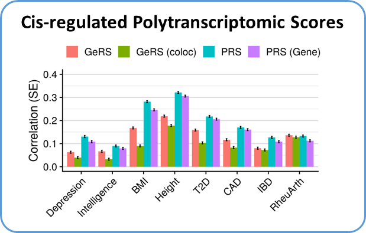
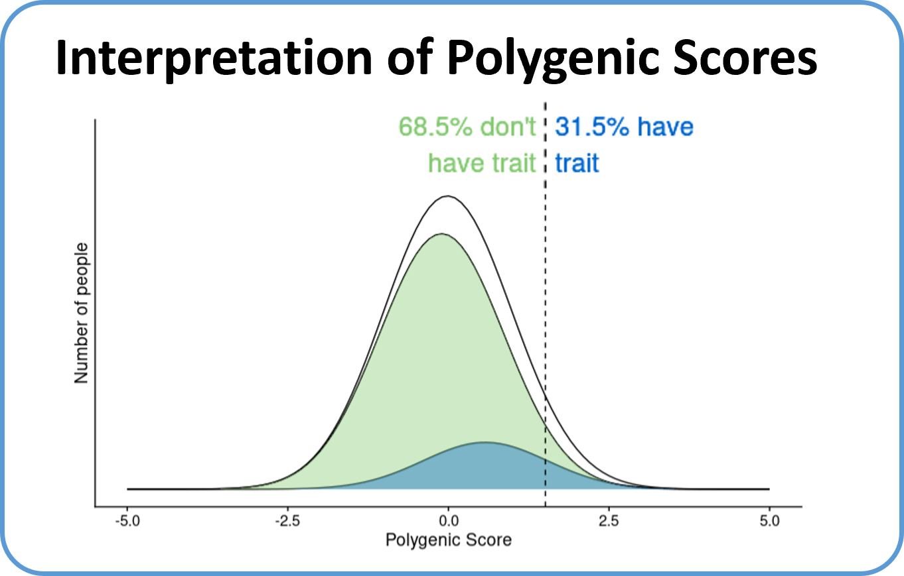
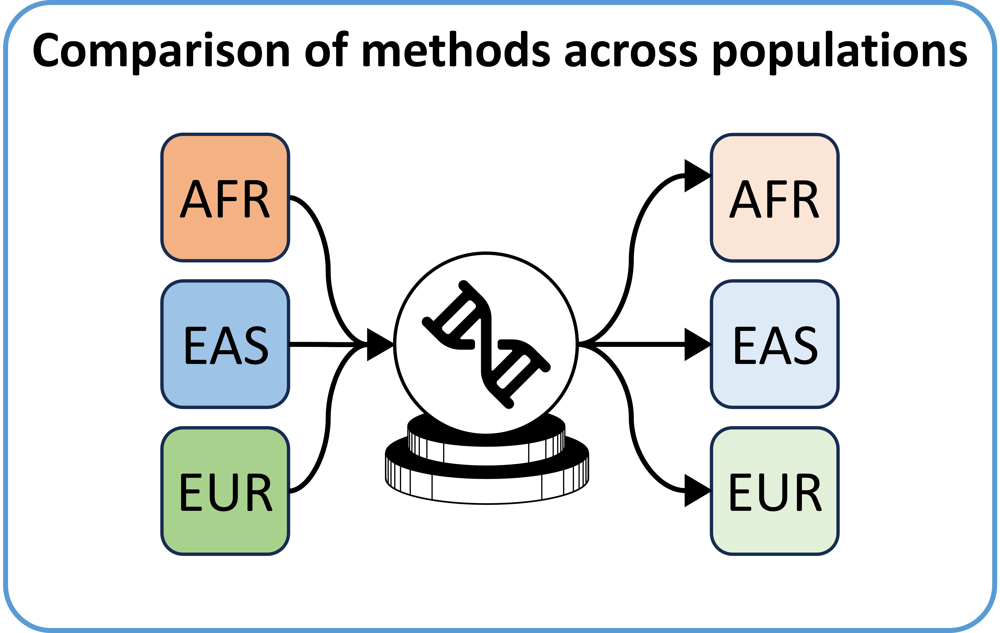

***

# 1. Polygenic Scoring Methods Comparison

  
Polygenic scoring methodology is rapidly evolving. GenoPred benchmarks leading polygenic scoring methods within a controlled environment, providing a fair comparison of methods across a range of settings.  <strong>Overview and code:</strong> <a href="comparison_of_methods_summary.html"> Click here
</a> <strong>Paper:</strong> <a href="https://doi.org/10.1371/journal.pgen.1009021" target="_blank"> Pain et al. Evaluation of polygenic prediction methodology within a reference-standardized framework. PLoS genetics 17.5 (2021): e1009021.
</a>

  
  

 

# 2. Quantifying Polygenic Signal Mediated by Altered Gene Expression

  
Many genetic associations fall within regulatory regions of the genome. We use imputed gene expression scores to evaluate the proportion of polygenic signals linked to altered expression of genes.  <strong>Overview and code:</strong> <a href="Functionally_informed_prediction.html"> Click here
</a> <strong>Paper:</strong> <a href="https://doi.org/10.1093/hmg/ddab053" target="_blank"> Pain et al. Imputed gene expression risk scores: a functionally informed component of polygenic risk. Human Molecular Genetics 30.8 (2021): 727-738.</a>

  

 

# 3. Translating Polygenic Scores onto the Absolute Scale

  
The interpretability of polygenic scores is essential for their use within a clinical setting. We developed a simple approach and tool for converting polygenic scores from the relative scale onto the absolute scale.  <strong>Overview and code:</strong> <a href="Absolute_Conversion.html"> Click here</a> <strong>Paper:</strong> <a href="https://doi.org/10.1038/s41431-021-01028-z" target="_blank"> Pain et al. A tool for translating polygenic scores onto the absolute scale using summary statistics. European Journal of Human Genetics 30.3 (2022): 339-348.</a>

  

 

# 4. Polytranscriptomic Scoring

  
Polytranscriptomic scores leverage large-scale transcriptome-wide association study (TWAS) results and observed expression levels in a target samples. We find these polytranscriptomic scores can be used to predict disease risk and clinical characteristics.  <strong>Overview and code:</strong> Not yet available <strong>Preprint:</strong> <a href="https://doi.org/10.1101/2023.01.18.23284589" target="_blank"> Pain et al. Harnessing Transcriptomic Signals for Amyotrophic Lateral Sclerosis to Identify Novel Drugs and Enhance Risk Prediction. medRxiv (2023).
</a>

  

 

# 5. Polygenic Prediction of Molecular Traits

  
Models using genetic variation to predict molecular traits, such as gene expression, are useful for modelling the mechanistic effect of variants identified using GWAS. However, meta-analysis of QTL datasets necessitates the use of summary statistic-based methods for generating these models. We evaluate a range of summary statistic methods for prediting gene expression.  <strong>Overview and code:</strong> <a href="https://github.com/opain/eQTL_to_TWAS#readme" target="_blank"> Click here</a> <strong>Preprint:</strong> <a href="https://doi.org/10.1101/2022.11.23.517213" target="_blank"> Pain et al. Polygenic Prediction of Molecular Traits using Large-Scale Meta-analysis Summary Statistics. bioRxiv (2022): 2022-11.
</a>

  

 

# 6. Cross-Ancestry Polygenic Prediction

  

    As GWAS become available across diverse populations, polygenic scoring methods that combine multiple sources are essential for equitable prediction. 
    This study benchmarked single- and multi-source PGS methods across African, East Asian, and European ancestries using public GWAS and UK Biobank target data. 
    A novel application of the LEOPARD method enables accurate linear combinations of ancestry-specific PGS using only summary statistics, 
    offering a scalable solution to optimise prediction in underrepresented groups. 
      <strong>Overview and code:</strong> 
    <a href="CrossPop.html" target="_blank">Click here</a> 
     <strong>Preprint:</strong> 
    <a href="https://doi.org/10.1101/2025.03.27.25324773" target="_blank">
      Pain. Leveraging Global Genetics Resources to Enhance Polygenic Prediction Across Ancestrally Diverse Populations. medRxiv (2025).
    </a>
  

  

 
 

