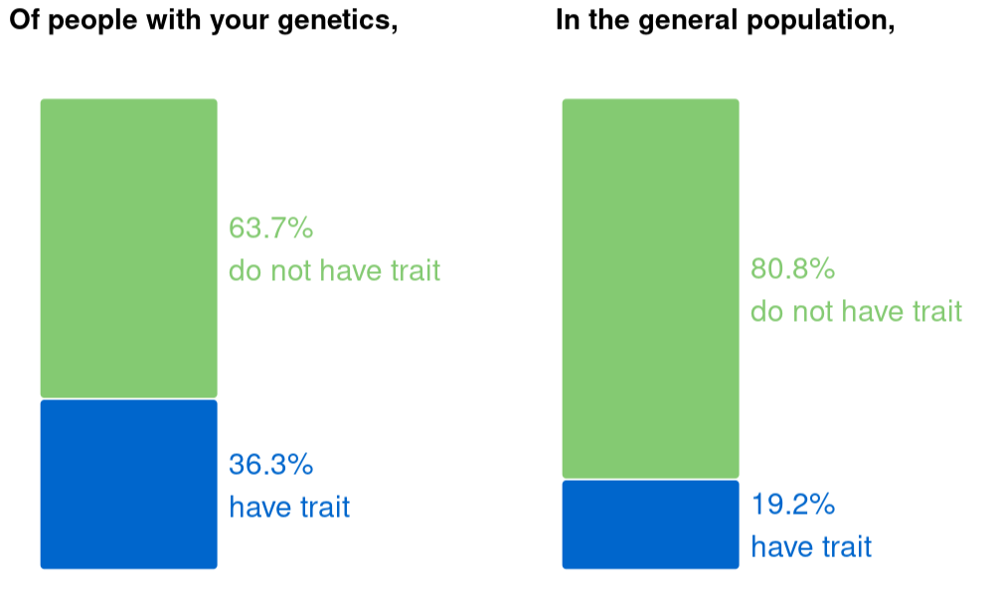

 

# 1. GenoPred Pipeline

  
We developed a robust and easy-to-use software pipeline for calculating reference-standardised polygenic scores using a range of leading polygenic scoring methodologies.  <strong>Overview and code:</strong> <a href="pipeline_readme.html" target="_blank"> Click here
</a> <strong>Paper:</strong> <a href="https://doi.org/10.1371/journal.pgen.1009021" target="_blank"> Pain et al. Evaluation of polygenic prediction methodology within a reference-standardized framework. PLoS genetics 17.5 (2021): e1009021.
</a>

  
  

 

# 2. Translating Polygenic Scores onto the Absolute Scale

  
The interpretability of polygenic scores is essential for their use within a clinical setting. We developed a simple web app for converting polygenic scores from the relative scale onto the absolute scale.  <strong>Web app:</strong> <a href="PRS_to_Abs_tool.html" target="_blank"> Click here</a> <strong>Overview and code:</strong> <a href="temp.html" target="_blank"> Click here</a> <strong>Paper:</strong> <a href="https://doi.org/10.1038/s41431-021-01028-z" target="_blank"> Pain et al. A tool for translating polygenic scores onto the absolute scale using summary statistics. European Journal of Human Genetics 30.3 (2022): 339-348.</a>

  

 

 

