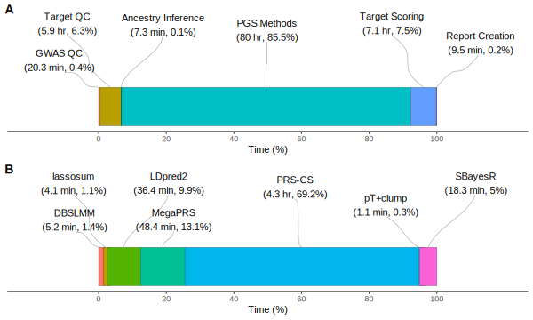
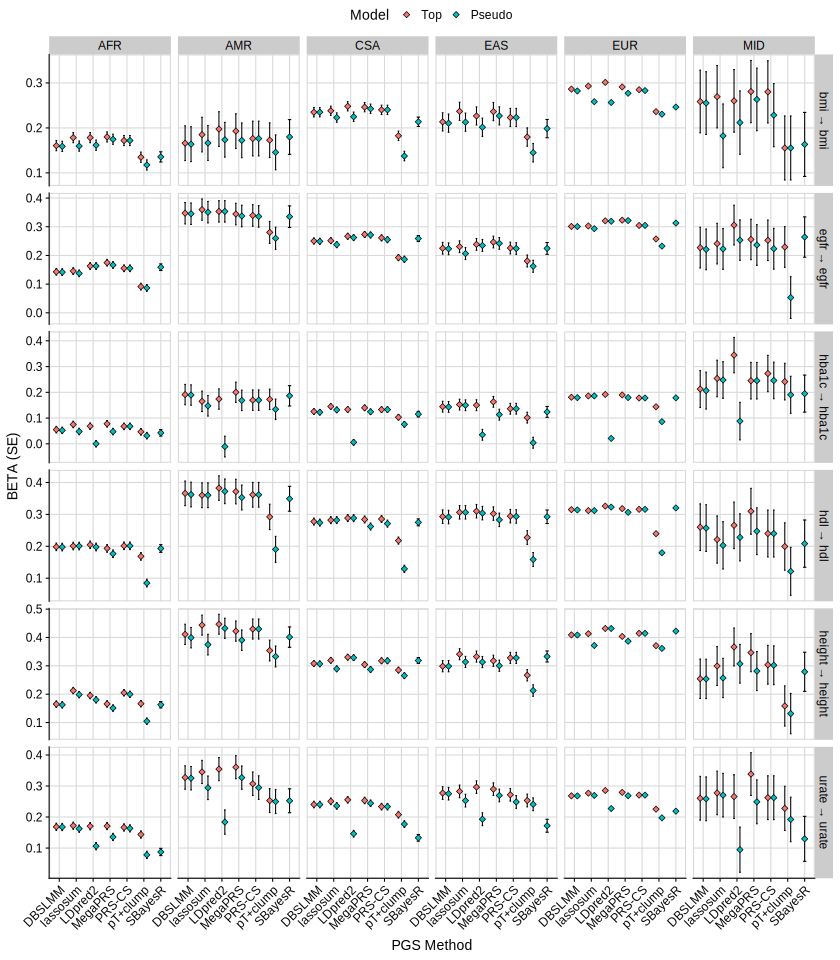
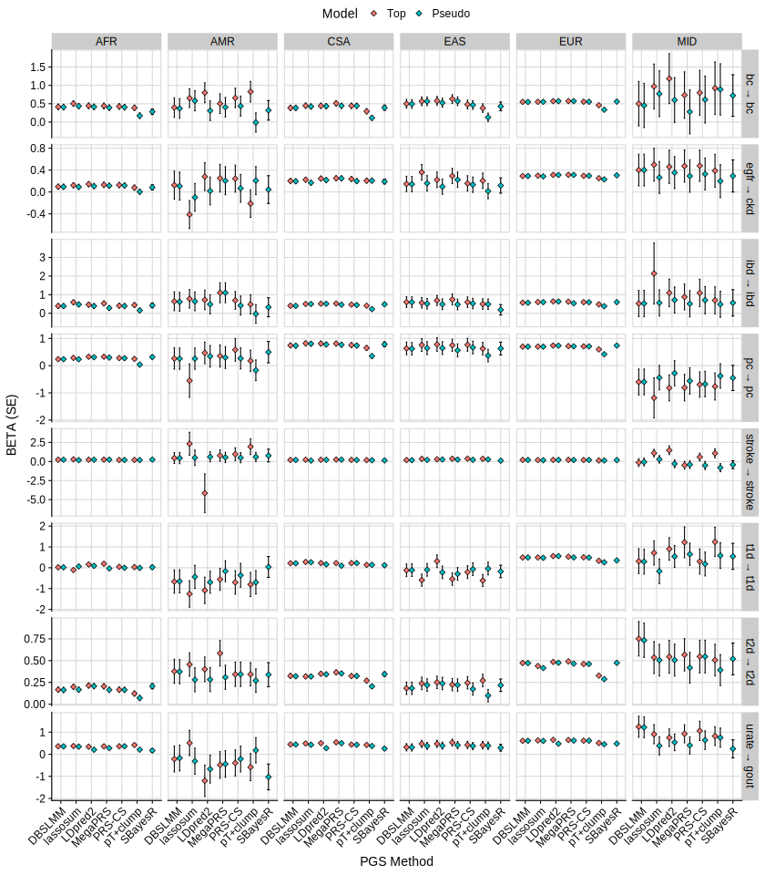
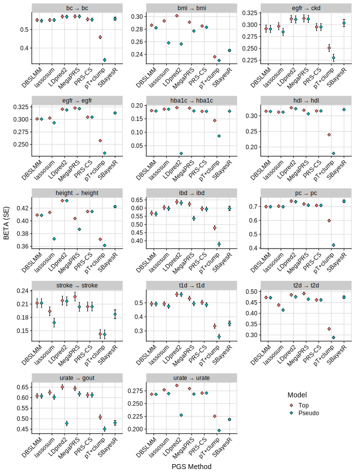

```{r setup, include=FALSE}
knitr::opts_chunk$set(eval = FALSE)
```

***

Here we will use the GenoPred pipeline to derive polygenic scores in UK Biobank.

***

# Summary

***

# Prepare config

***

## target_list

<div class="shallow-break"></div>

<details><summary>Show code</summary>
<br/>

<h3>Create symlinks</h3>

We will create symlinks to the imputed genotype data for UKB. We will use the pgen format data for computationl efficiency and those restricted to MAF >= 1% and INFO >= 0.4. We are using genetic data that is not application specific, so the data doesn't need to be reprocessed for each application. Therefore we will use row number IDs for the .psam file so they can be connected to application specific data downstream.

```{bash}
mkdir -p /scratch/prj/ukbiobank/usr/ollie_pain/GenoPredPipe/ukb_symlinks

# pgen and pvar files
for chr in $(seq 1 22);do
  for file in $(echo pgen pvar);do
    ln -s /datasets/ukbiobank/June2017/Imputed/ukb_imp_chr${chr}_v3_MAF1_INFO4.${file} /scratch/prj/ukbiobank/usr/ollie_pain/GenoPredPipe/ukb_symlinks/ukb_imp_maf1_info4.chr${chr}.${file}
  done
done
```

```{r}
# Make .psam 
n = 487409
psam <- data.frame(FID = 1:487409,
                   IID = 1:487409)
names(psam)[1]<-'#FID'
write.table(psam, '/scratch/prj/ukbiobank/usr/ollie_pain/GenoPredPipe/ukb_symlinks/rownumber.psam', col.names=T, row.names = F, quote = F)
```

```{bash}
for chr in $(seq 1 22);do
  ln -s /scratch/prj/ukbiobank/usr/ollie_pain/GenoPredPipe/ukb_symlinks/rownumber.psam /scratch/prj/ukbiobank/usr/ollie_pain/GenoPredPipe/ukb_symlinks/ukb_imp_maf1_info4.chr${chr}.psam
done
```

***

<h3>Create target_list</h3>

```{bash}
mkdir -p /scratch/prj/ukbiobank/usr/ollie_pain/GenoPredPipe/usr/k1806347/configs/basic
```

```{r}
target_list <- data.frame(
  name='ukb',
  path='/scratch/prj/ukbiobank/usr/ollie_pain/GenoPredPipe/ukb_symlinks/ukb_imp_maf1_info4',
  type='plink2',
  indiv_report=F
)

write.table(target_list, '/scratch/prj/ukbiobank/usr/ollie_pain/GenoPredPipe/usr/k1806347/configs/basic/target_list.txt', col.names=T, row.names=F, quote=F)
```

</details>

***

## gwas_list

Use the same GWAS as used in the INTERVENE paper ([link](https://doi.org/10.1101/2023.11.20.23298215)), except exclude AD as overlaps with UKB, and use Yengo Height with UKB excluded. After closer inspection, the RA GWAS (Ho et al) is actually majority EAS ancestry. For this initial evaluation, lets prioritise EUR GWAS, so for RA I will use a more recent GWAS by Ishigaki et al (GCST90132223). Also the sample size specified for breast cancer GWAS seems to be wrong, the sumstats on GWAS catalogue are the meta-analysis (122,977 cases and 105,974 controls).

<details><summary>Show code</summary>

<h3>Download sumstats from the GWAS catalogue</h3>

```{bash}
mkdir -p /scratch/prj/ukbiobank/usr/ollie_pain/GenoPredPipe/usr/k1806347/gwas_sumstats
```

```{r}

gwasc_table <- data.frame(
  id = c(
    'GCST005838',
    'GCST002783',
    'GCST004988',
    'GCST006085',
    'GCST008059',
    'GCST90132223',
    'GCST004131',
    'GCST007140',
    'GCST90013445',
    'GCST008972',
    'GCST007954',
    'GCST004773',
    'GCST90018959_exclukb'
  ),
  url = c(
    'https://ftp.ebi.ac.uk/pub/databases/gwas/summary_statistics/GCST005001-GCST006000/GCST005838/harmonised/29531354-GCST005838-EFO_0000712.h.tsv.gz',
    'https://ftp.ebi.ac.uk/pub/databases/gwas/summary_statistics/GCST002001-GCST003000/GCST002783/harmonised/25673413-GCST002783-EFO_0004340.h.tsv.gz',
    'https://ftp.ebi.ac.uk/pub/databases/gwas/summary_statistics/GCST004001-GCST005000/GCST004988/harmonised/29059683-GCST004988-EFO_0000305.h.tsv.gz',
    'https://ftp.ebi.ac.uk/pub/databases/gwas/summary_statistics/GCST006001-GCST007000/GCST006085/harmonised/29892016-GCST006085-EFO_0001663.h.tsv.gz',
    'https://ftp.ebi.ac.uk/pub/databases/gwas/summary_statistics/GCST008001-GCST009000/GCST008059/20171017_MW_eGFR_overall_EA_nstud42.dbgap.txt.gz',
    'https://ftp.ebi.ac.uk/pub/databases/gwas/summary_statistics/GCST90132001-GCST90133000/GCST90132223/GCST90132223_buildGRCh37.tsv.gz',
    'https://ftp.ebi.ac.uk/pub/databases/gwas/summary_statistics/GCST004001-GCST005000/GCST004131/harmonised/28067908-GCST004131-EFO_0003767.h.tsv.gz',
    'https://ftp.ebi.ac.uk/pub/databases/gwas/summary_statistics/GCST007001-GCST008000/GCST007140/GERA-sqrtHDL.tsv.gz',
    'https://ftp.ebi.ac.uk/pub/databases/gwas/summary_statistics/GCST90013001-GCST90014000/GCST90013445/GCST90013445_buildGRCh38.tsv',
    'https://ftp.ebi.ac.uk/pub/databases/gwas/summary_statistics/GCST008001-GCST009000/GCST008972/urate_chr1_22_LQ_IQ06_mac10_all_741_rsid.txt.gz',
    'https://ftp.ebi.ac.uk/pub/databases/gwas/summary_statistics/GCST007001-GCST008000/GCST007954/HbA1c_METAL_European.txt.gz',
    'https://ftp.ebi.ac.uk/pub/databases/gwas/summary_statistics/GCST004001-GCST005000/GCST004773/METAANALYSIS_DIAGRAM_SE1.txt',
    'https://portals.broadinstitute.org/collaboration/giant/images/8/8e/GIANT_HEIGHT_YENGO_2022_GWAS_SUMMARY_STATS_EUR_excluding_UKB.gz'
  )
)

gwasc_table$ending<-ifelse(grepl('\\.gz$', gwasc_table$url), '.gz','')

for (i in 1:nrow(gwasc_table)) {
  system(
    paste0(
      'wget --no-check-certificate -O /scratch/prj/ukbiobank/usr/ollie_pain/GenoPredPipe/usr/k1806347/gwas_sumstats/',
      gwasc_table$id[i],
      '.tsv', gwasc_table$ending[i], ' ',
      gwasc_table$url[i]
    )
  )
}

# Check the headers are expected
library(data.table)
for(i in 1:nrow(gwasc_table)){
  tmp <-
    fread(
      paste0(
        '/scratch/prj/ukbiobank/usr/ollie_pain/GenoPredPipe/usr/k1806347/gwas_sumstats/',
        gwasc_table$id[i],
        '.tsv',
        gwasc_table$ending[i]
      ),
      nrows=10
    )
  
  print(gwasc_table$id[i])
  print(head(tmp, 2))
}

# Update header of "GCST008059"
i<-which(gwasc_table$id == 'GCST008059')
tmp <-
  fread(
    paste0(
      '/scratch/prj/ukbiobank/usr/ollie_pain/GenoPredPipe/usr/k1806347/gwas_sumstats/',
      gwasc_table$id[i],
      '.tsv',
      gwasc_table$ending[i]
    )
  )

names(tmp)[names(tmp) == "n_total_sum"] <- 'N'
tmp$Allele1 <- toupper(tmp$Allele1)
tmp$Allele2 <- toupper(tmp$Allele2)

fwrite(
  tmp,
  paste0(
    '/scratch/prj/ukbiobank/usr/ollie_pain/GenoPredPipe/usr/k1806347/gwas_sumstats/',
    gwasc_table$id[i],
    '.tsv',
    gwasc_table$ending[i]
  ),
  sep = '\t',
  quote = F,
  na='NA'
)

# Update header of "GCST007140"
i<-which(gwasc_table$id == 'GCST007140')
tmp <-
  fread(
    paste0(
      '/scratch/prj/ukbiobank/usr/ollie_pain/GenoPredPipe/usr/k1806347/gwas_sumstats/',
      gwasc_table$id[i],
      '.tsv',
      gwasc_table$ending[i]
    )
  )

names(tmp) <-
  c("RSID" ,
    "CHR" ,
    "BP" ,
    "A1" ,
    "A2" ,
    "Effect allele (EA)" ,
    "FREQ" ,
    "N" ,
    "BETA" ,
    "P")

tmp <- tmp[, c("RSID" ,
               "CHR" ,
               "BP" ,
               "A1" ,
               "A2" ,
               "FREQ" ,
               "N" ,
               "BETA" ,
               "P"), with=F]

fwrite(
  tmp,
  paste0(
    '/scratch/prj/ukbiobank/usr/ollie_pain/GenoPredPipe/usr/k1806347/gwas_sumstats/',
    gwasc_table$id[i],
    '.tsv',
    gwasc_table$ending[i]
  ),
  sep = '\t',
  quote = F,
  na='NA'
)

# Update header of "GCST008972"
i<-which(gwasc_table$id == 'GCST008972')

# There is missing data which screws up fread
system("zcat /scratch/prj/ukbiobank/usr/ollie_pain/GenoPredPipe/usr/k1806347/gwas_sumstats/GCST008972.tsv.gz | sed 's/  / NA /g' | gzip > /scratch/prj/ukbiobank/usr/ollie_pain/GenoPredPipe/usr/k1806347/gwas_sumstats/GCST008972_modified.tsv.gz; mv /scratch/prj/ukbiobank/usr/ollie_pain/GenoPredPipe/usr/k1806347/gwas_sumstats/GCST008972_modified.tsv.gz /scratch/prj/ukbiobank/usr/ollie_pain/GenoPredPipe/usr/k1806347/gwas_sumstats/GCST008972.tsv.gz")

tmp <-
  fread(
    '/scratch/prj/ukbiobank/usr/ollie_pain/GenoPredPipe/usr/k1806347/gwas_sumstats/GCST008972.tsv.gz'
  )

names(tmp)[names(tmp) == "n_total_sum"] <- 'N'

tmp$Allele1 <- toupper(tmp$Allele1)
tmp$Allele2 <- toupper(tmp$Allele2)

fwrite(
  tmp,
  paste0(
    '/scratch/prj/ukbiobank/usr/ollie_pain/GenoPredPipe/usr/k1806347/gwas_sumstats/',
    gwasc_table$id[i],
    '.tsv',
    gwasc_table$ending[i]
  ),
  sep = '\t',
  quote = F,
  na='NA'
)

# Update header of "GCST004773"
i<-which(gwasc_table$id == 'GCST004773')

tmp <-
  fread(
    paste0(
      '/scratch/prj/ukbiobank/usr/ollie_pain/GenoPredPipe/usr/k1806347/gwas_sumstats/',
      gwasc_table$id[i],
      '.tsv',
      gwasc_table$ending[i]
    )
  )

tmp$CHR<-gsub(':.*','',tmp$`Chr:Position`)
tmp$BP<-gsub('.*:','',tmp$`Chr:Position`)

fwrite(
  tmp,
  paste0(
    '/scratch/prj/ukbiobank/usr/ollie_pain/GenoPredPipe/usr/k1806347/gwas_sumstats/',
    gwasc_table$id[i],
    '.tsv',
    gwasc_table$ending[i]
  ),
  sep = '\t',
  quote = F,
  na='NA'
)

```

<h3>Create gwas_list</h3>

Get the GWAS info and prevalence data from INTERVENE paper.

```{bash}
mkdir -p /scratch/prj/ukbiobank/usr/ollie_pain/GenoPredPipe/usr/k1806347/configs/benchmark
```

```{r}

gwas_dat<-fread('https://raw.githubusercontent.com/intervene-EU-H2020/prspipe/main/config/studies_for_methods_comparison.tsv')

prev_dat<-fread('https://raw.githubusercontent.com/intervene-EU-H2020/prspipe/main/config/pop_prevalence.tsv')
names(prev_dat)<-c('name','prev')
gwas_dat<-merge(gwas_dat, prev_dat, by='name', all.x=T)

gwas_dat$ftp_address<-NULL
gwas_dat$local_path<-NULL

gwas_dat<-merge(gwasc_table, gwas_dat, by.x='id', by.y='study_id', all.x=T)

# Update labels to those used in the INTERVENE paper table
gwas_labels<-data.frame(
  id=c(
    'GCST005838', 'GCST90012877', 'GCST90013534', 'GCST004773', 'GCST004988', 'GCST006085', 'GCST90013445', 'GCST004131', 'GCST008059', 'GCST90018959', 'GCST008972', 'GCST002783', 'GCST007140', 'GCST007954'),
  label=c('Stroke', 'AD or family history of AD', 'Rheumatoid arthritis', 'T2D', 'Breast cancer', 'Prostate cancer', 'T1D', 'IBD', 'eGFR', 'Height', 'Urate levels', 'BMI', 'HDL', 'HbA1c')
)
gwas_dat<-merge(gwas_dat, gwas_labels, by='id', all.x=T)

# Fill in information for Height
gwas_dat$label[gwas_dat$id == 'GCST90018959_exclukb'] <- 'Height'
gwas_dat$binary[gwas_dat$id == 'GCST90018959_exclukb'] <- 'no'

# Fill in information for RA
gwas_dat$label[gwas_dat$id == 'GCST90132223'] <- 'Rheumatoid arthritis'
gwas_dat$binary[gwas_dat$id == 'GCST90132223'] <- 'yes'
gwas_dat$n_cases[gwas_dat$id == 'GCST90132223'] <- 22350
gwas_dat$n_controls[gwas_dat$id == 'GCST90132223'] <- 74823
gwas_dat$prev[gwas_dat$id == 'GCST90132223'] <- 0.01

# Insert correct ncase and ncontrol data for breast cancer
gwas_dat$n_cases[gwas_dat$id == 'GCST004988'] <- 122977
gwas_dat$n_controls[gwas_dat$id == 'GCST004988'] <- 105974

# Format as gwas_list
gwas_list <- data.frame(
  name = gwas_dat$id,
  path = paste0(
    '/scratch/prj/ukbiobank/usr/ollie_pain/GenoPredPipe/usr/k1806347/gwas_sumstats/',
    gwas_dat$id,
    '.tsv',
    gwas_dat$ending
  ),
  population = 'EUR',
  n = gwas_dat$n_cases+gwas_dat$n_controls,
  sampling = gwas_dat$n_cases/(gwas_dat$n_controls+gwas_dat$n_cases),
  prevalence = gwas_dat$prev,
  mean = NA,
  sd = NA,
  label = gwas_dat$label
)

gwas_list$sampling[is.na(gwas_list$prevalence)]<-NA
gwas_list$sampling<-round(gwas_list$sampling, 3)
gwas_list$mean[is.na(gwas_list$prevalence)]<-0
gwas_list$sd[is.na(gwas_list$prevalence)]<-1

gwas_list$label<-paste0("\"", gwas_list$label, "\"")

write.table(gwas_list, '/scratch/prj/ukbiobank/usr/ollie_pain/GenoPredPipe/usr/k1806347/configs/benchmark/gwas_list.txt', col.names=T, row.names=F, quote=F)

# Write csv containing gwas data for paper
write.csv(gwas_dat, '/users/k1806347/oliverpainfel/Software/MyGit/GenoPred/docs/Images/UKB/gwas_data.csv', row.names = F)
```

</details>

***

## configfile

<details><summary>Show code</summary>

```{r}
# Create config file
conf <- c(
  'outdir: /scratch/prj/ukbiobank/usr/ollie_pain/GenoPredPipe/output',
  'config_file: /scratch/prj/ukbiobank/usr/ollie_pain/GenoPredPipe/usr/k1806347/configs/benchmark/config.yaml',
  'gwas_list: /scratch/prj/ukbiobank/usr/ollie_pain/GenoPredPipe/usr/k1806347/configs/benchmark/gwas_list.txt',
  'target_list: /scratch/prj/ukbiobank/usr/ollie_pain/GenoPredPipe/usr/k1806347/configs/basic/target_list.txt',
  "pgs_methods: ['ptclump','dbslmm','prscs','sbayesr','lassosum','ldpred2','megaprs']",
  "cores_prep_pgs: 10",
  "cores_target_pgs: 50"
)

write.table(conf, '/scratch/prj/ukbiobank/usr/ollie_pain/GenoPredPipe/usr/k1806347/configs/benchmark/config.yaml', col.names = F, row.names = F, quote = F)
```

</details>

```{r, echo=F}
# Write config files as csv files for paper
config<-readLines('/scratch/prj/ukbiobank/usr/ollie_pain/GenoPredPipe/usr/k1806347/configs/benchmark/config.yaml')
gwas_list<-fread('/scratch/prj/ukbiobank/usr/ollie_pain/GenoPredPipe/usr/k1806347/configs/benchmark/gwas_list.txt')
target_list<-fread('/scratch/prj/ukbiobank/usr/ollie_pain/GenoPredPipe/usr/k1806347/configs/basic/target_list.txt')

dir.create('/users/k1806347/oliverpainfel/Software/MyGit/GenoPred/docs/Images/UKB/config/')
write.csv(config, '/users/k1806347/oliverpainfel/Software/MyGit/GenoPred/docs/Images/UKB/config/config.csv', row.names = F)
write.csv(gwas_list, '/users/k1806347/oliverpainfel/Software/MyGit/GenoPred/docs/Images/UKB/config/gwas_list.csv', row.names = F)
write.csv(target_list, '/users/k1806347/oliverpainfel/Software/MyGit/GenoPred/docs/Images/UKB/config/target_list.csv', row.names = F)
```

***

# Run pipeline

```{bash}
cd /scratch/prj/ukbiobank/usr/ollie_pain/GenoPredPipe/GenoPred/pipeline
git describe --tags
# v2.2.5-20-gb0bf674

snakemake --profile slurm --use-conda --configfile=../../usr/k1806347/configs/benchmark/config.yaml output_all -n 
```

***

## Computational benchmark

<details><summary>Show code</summary>

```{r}
library(data.table)
library(ggplot2)
library(cowplot)
library(ggrepel)
library(dplyr)
library(plotly)
source('../functions/misc.R')
source_all('../functions')

# read in gwas_list
gwas_list<-fread('/scratch/prj/ukbiobank/usr/ollie_pain/GenoPredPipe/usr/k1806347/configs/benchmark/gwas_list.txt')

# Read in configuration specific benchmark files
bm_files_i <-
  paste0(
    '/scratch/prj/ukbiobank/usr/ollie_pain/GenoPredPipe/output/reference/benchmarks/',
    list.files('/scratch/prj/ukbiobank/usr/ollie_pain/GenoPredPipe/output/reference/benchmarks/')
  )

# Restrict gwas-specific benchmarks to gwas in list
# Remove outlier detection
bm_files_i<-bm_files_i[
  grepl(paste(gwas_list$name, collapse='|'), bm_files_i) |
  !grepl('prep_pgs|sumstat_prep|outlier_detection', bm_files_i)]


# Read in benchmark files
bm_dat_all <- do.call(rbind, lapply(bm_files_i, function(file) {
  tmp <- fread(file)
  tmp$file <- basename(file)
  return(tmp)
}))

# Create rule column
bm_dat_all$rule <- gsub('-.*','',bm_dat_all$file)

# Calculate total wall time
sum(bm_dat_all$s)/60/60 # 93.57131 hours

#########
# Quantify time taken by each part of pipeline
#########

# Calculate wall time taken by rule
bm_dat_rule_time <- NULL
for (i in unique(bm_dat_all$rule)) {
  bm_dat_rule_time <- rbind(
    bm_dat_rule_time,
    data.frame(
      rule = i,
      time = sum(bm_dat_all$s[bm_dat_all$rule == i])))
}

# Tidy results
bm_dat_rule_time <-
  bm_dat_rule_time[!(bm_dat_rule_time$rule %in% c('ancestry_reporter', 'score_reporter.txt')), ]

bm_dat_rule_time$step<-gsub('_i$','', bm_dat_rule_time$rule)
bm_dat_rule_time$step<-gsub('prep_pgs_','', bm_dat_rule_time$step)

bm_dat_rule_time$step[bm_dat_rule_time$rule == 'format_target_i']<-'Target QC'
bm_dat_rule_time$step[bm_dat_rule_time$rule == 'sumstat_prep_i']<-'GWAS QC'
bm_dat_rule_time$step[bm_dat_rule_time$rule == 'sample_report_i']<-'Report Creation'
bm_dat_rule_time$step[bm_dat_rule_time$rule == 'outlier_detection_i']<-'Outlier Detection'
bm_dat_rule_time$step[bm_dat_rule_time$rule == 'ancestry_inference_i']<-'Ancestry Inference'
bm_dat_rule_time$step[bm_dat_rule_time$rule == 'target_pgs_i']<-'Target Scoring'

bm_dat_rule_time<-merge(bm_dat_rule_time, pgs_method_labels, by.x='step', by.y='method', all.x=T)
bm_dat_rule_time$step[!is.na(bm_dat_rule_time$label)] <- bm_dat_rule_time$label[!is.na(bm_dat_rule_time$label)]
bm_dat_rule_time$label<-NULL
bm_dat_rule_time<-bm_dat_rule_time[order(bm_dat_rule_time$time),]

#######
# Create a pie chart
#######

# Collapse prep_pgs into single component
pgs_data<-bm_dat_rule_time[grepl('prep_pgs', bm_dat_rule_time$rule),]
notpgs_data<-bm_dat_rule_time[!grepl('prep_pgs', bm_dat_rule_time$rule),]

# Create data for the graph.
data <- data.frame(
  category = notpgs_data$step,
  values = notpgs_data$time
)

data<-rbind(data, data.frame(
  category = 'PGS Methods',
  values = sum(pgs_data$time)
))

# Create the pie chart
fig <- plot_ly(data, labels = ~category, values = ~values, type = 'pie',
               textposition = 'outside',
               textinfo = 'label+percent',
               rotation = 140,  # This rotates the pie chart to move labels to the side
               marker = list(line = list(color = '#000000', width = 0.8))) %>%
  layout(xaxis = list(showgrid = FALSE, zeroline = FALSE, showticklabels = FALSE),
         yaxis = list(showgrid = FALSE, zeroline = FALSE, showticklabels = FALSE),
         showlegend = FALSE,
         margin = list(l = 20, r = 20, b = 100, t = 50, autoexpand = TRUE))  # Adjust margins here

# Save fig as a screenshot

###
# Create timeline plot
###

data$category<-factor(data$category, 
                      levels = c('GWAS QC',
                                 'Target QC',
                                 'Ancestry Inference',
                                 'PGS Methods',
                                 'Target Scoring',
                                 'Report Creation'))

data<-data[order(data$category),]

data$perc<-data$values/sum(data$values)*100
data$cum_perc<-cumsum(data$perc)

for(i in 1:length(data$category)) {
  data$start[i] <- ifelse(i == 1, 0, data$end[i - 1])
  data$end[i] <- data$cum_perc[i]
  data$label_position[i] <- data$cum_perc[i] - data$perc[i] / 2
}

data$time_clean<-NA
data$time_clean[data$values < 60] <-
  paste0(round(data$values[data$values < 60], 1), ' sec')
data$time_clean[data$values > 60] <-
  paste0(round(data$values[data$values > 60] / 60, 1), ' min')
data$time_clean[data$values > 3600] <-
  paste0(round(data$values[data$values > 3600] / 60 / 60, 1), ' hr')

data$label<-paste0(data$category,
                   "\n(", data$time_clean, ', ',
                   round(data$perc,1),"%)")

all_timeline<-ggplot(data,
       aes(
         xmin = start,
         xmax = end,
         ymin = 0,
         ymax = 0.1,
         fill = category
       )) +
  geom_rect(colour='black', size=0.1) +
  geom_text_repel(
    aes(
      x = label_position,
      y = 0.1,
      label = label,
      segment.square  = T,
      segment.inflect = T
    ),
    force = 100,
    nudge_y           = 0.15,
    hjust = 0.5,
    segment.size      = 0.3,
    segment.curvature = -0.1,
    segment.color='darkgrey',
    box.padding=0.6,
  ) +
  scale_x_continuous(breaks = seq(0, 100, by = 20)) +
  coord_cartesian(clip = "off", xlim = c(-20, 120), ylim = c(0, 0.3)) +
  labs(x='Time (%)') +
  theme(
    axis.title.y = element_blank(),
    axis.text.y = element_blank(),
    axis.ticks.y = element_blank(),
    axis.line.y = element_blank(),
    axis.line.x = element_line(color = "black", size = 0.5),
    panel.grid.major.y = element_blank(),
    panel.grid.minor.y = element_blank(),
    panel.grid.major.x = element_blank(),
    panel.grid.minor.x = element_blank(),
    legend.position = "none",
    plot.background = element_rect(fill = "white", color = NA),
    panel.background = element_rect(fill = "white", color = NA)
  )

#######
# Create a pie chart for PGS methods only
#######

# Create data for the graph.
data <- data.frame(
  category = bm_dat_rule_time$step[grepl('prep_pgs', bm_dat_rule_time$rule)],
  values = bm_dat_rule_time$time[grepl('prep_pgs', bm_dat_rule_time$rule)]
)

# Quantify time on average per GWAS
data$time_gwas<-data$values/13
data$time_gwas_clean<-NA
data$time_gwas_clean[data$time_gwas < 60] <-
  paste0(round(data$time_gwas[data$time_gwas < 60], 1), ' sec')
data$time_gwas_clean[data$time_gwas > 60] <-
  paste0(round(data$time_gwas[data$time_gwas > 60] / 60, 1), ' min')
data$time_gwas_clean[data$time_gwas > 3600] <-
  paste0(round(data$time_gwas[data$time_gwas > 3600] / 60 / 60, 1), ' hr')

data$custom_label<-paste0(data$category, "\n(", data$time_gwas_clean,")")

# Create the pie chart
fig <- plot_ly(data, labels = ~category, values = ~values, type = 'pie',
               text = ~custom_label,      # Use custom labels
               textposition = 'outside',
               textinfo = 'text',
               marker = list(line = list(color = '#000000', width = 0.8))) %>%
  layout(xaxis = list(showgrid = FALSE, zeroline = FALSE, showticklabels = FALSE),
         yaxis = list(showgrid = FALSE, zeroline = FALSE, showticklabels = FALSE),
         showlegend = FALSE,
         margin = list(autoexpand = TRUE))

# Save fig as a screenshot

###
# Create timeline plot
###

data<-data[order(data$category),]
  
data$perc<-data$time_gwas /sum(data$time_gwas )*100
data$cum_perc<-cumsum(data$perc)

for(i in 1:length(data$category)) {
  data$start[i] <- ifelse(i == 1, 0, data$cum_perc[i - 1])
  data$end[i] <- data$cum_perc[i]
  if(data$end[i] - data$start[i] < 2){
    data$end[i] <- data$start[i] + 2
  }
  data$label_position[i] <- data$cum_perc[i] - data$perc[i] / 2
}

data$label<-paste0(data$category,
                   "\n(", data$time_gwas_clean, ', ',
                   round(data$perc,1),"%)")

pgs_timeline<-ggplot(data,
       aes(
         xmin = start,
         xmax = end,
         ymin = 0,
         ymax = 0.1,
         fill = category
       )) +
  geom_rect(colour='black', size=0.1) +
  geom_text_repel(
    aes(
      x = label_position,
      y = 0.1,
      label = label,
      segment.square  = T,
      segment.inflect = T
    ),
    force = 100,
    nudge_y           = 0.15,
    hjust = 0.5,
    segment.size      = 0.3,
    segment.curvature = -0.1,
    segment.color='darkgrey',
    box.padding=0.6,
  ) +
  scale_x_continuous(breaks = seq(0, 100, by = 20)) +
  coord_cartesian(clip = "off", xlim = c(-20, 120), ylim = c(0, 0.3)) +
  labs(x='Time (%)') +
  theme(
    axis.title.y = element_blank(),
    axis.text.y = element_blank(),
    axis.ticks.y = element_blank(),
    axis.line.y = element_blank(),
    axis.line.x = element_line(color = "black", size = 0.5),
    panel.grid.major.y = element_blank(),
    panel.grid.minor.y = element_blank(),
    panel.grid.major.x = element_blank(),
    panel.grid.minor.x = element_blank(),
    legend.position = "none",
    plot.background = element_rect(fill = "white", color = NA),
    panel.background = element_rect(fill = "white", color = NA)
  )

png('~/oliverpainfel/Software/MyGit/GenoPred/docs/Images/UKB/timeline_plot.png', res=300, width=2500, height=1500, units = 'px')
set.seed(1)
plot_grid(all_timeline, pgs_timeline, labels = c('A', 'B'), nrow = 2)
dev.off()

set.seed(1)
timeline_plot<-plot_grid(all_timeline, pgs_timeline, labels = c('A', 'B'), nrow = 2)

ggsave('~/oliverpainfel/Software/MyGit/GenoPred/docs/Images/UKB/timeline_plot.svg', plot = timeline_plot, width=2500, height=1500, units = 'px')

#######
# Rules that are only run once
#######
bm_dat_summary<-NULL

tmp <- bm_dat_all[bm_dat_all$rule %in% c('ancestry_inference_i',
                                         'outlier_detection_i',
                                         'sample_report_i')]

tmp <- data.frame(
  rule = tmp$rule,
  pgs_method = NA,
  pop = NA,
  mean_time = tmp$s,
  max_time = tmp$s,
  mean_mem = tmp$max_rss,
  max_mem = tmp$max_rss
)

bm_dat_summary <-
  rbind(bm_dat_summary, tmp)

#######
# Sum the format_target time
#######

tmp <- bm_dat_all[bm_dat_all$rule %in% c('format_target_i')]

tmp <- data.frame(
  rule = tmp$rule[1],
  pgs_method = NA,
  pop = NA,
  mean_time = mean(tmp$s),
  max_time = max(tmp$s),
  mean_mem = mean(tmp$max_rss),
  max_mem = max(tmp$max_rss)
)

bm_dat_summary <-
  rbind(bm_dat_summary, tmp)


#######
# Average across GWAS
#######
for (rule_i in c(
  'prep_pgs_ptclump_i',
  'prep_pgs_dbslmm_i',
  'prep_pgs_prscs_i',
  'prep_pgs_megaprs_i',
  'prep_pgs_lassosum_i',
  'prep_pgs_ldpred2_i',
  'prep_pgs_sbayesr_i',
  'sumstat_prep_i'
)) {
    bm_dat_all_tmp <-
    bm_dat_all[bm_dat_all$rule == rule_i, ]
    
    bm_dat_all_tmp$gwas <- gsub('.*-','', gsub('.txt','', bm_dat_all_tmp$file))
    bm_dat_all_tmp<-bm_dat_all_tmp[bm_dat_all_tmp$gwas %in% gwas_list$name,]
    
    tmp <- data.table(
      rule = rule_i,
      pgs_method = NA,
      pop = NA,
      mean_time = mean(bm_dat_all_tmp$s),
      max_time = max(bm_dat_all_tmp$s),
      mean_mem = mean(bm_dat_all_tmp$max_rss),
      max_mem = max(bm_dat_all_tmp$max_rss)
    )
    
    bm_dat_summary<-rbind(bm_dat_summary, tmp)
}
  
####
# Average target_pgs_i across PGS method and GWAS
####

rule_i<-'target_pgs_i' 
bm_dat_all_tmp <- bm_dat_all[bm_dat_all$rule == rule_i, ]

rule_split<-strsplit(bm_dat_all_tmp$file, '-')
bm_dat_all_tmp$pop <- lapply(rule_split, function(x) x[3])
bm_dat_all_tmp$pop<-gsub('.txt','', bm_dat_all_tmp$pop)

for(pop_i in unique(bm_dat_all_tmp$pop)){
  bm_dat_all_tmp_2<-bm_dat_all_tmp[bm_dat_all_tmp$pop == pop_i,]
  
  tmp <- data.table(
    rule = rule_i,
    pgs_method = 'all',
    pop = pop_i,
    mean_time = mean(bm_dat_all_tmp_2$s),
    max_time = max(bm_dat_all_tmp_2$s),
    mean_mem = mean(bm_dat_all_tmp_2$max_rss),
    max_mem = max(bm_dat_all_tmp_2$max_rss)
  )

  bm_dat_summary<-rbind(bm_dat_summary, tmp)

}


write.csv(bm_dat_summary, '/users/k1806347/oliverpainfel/Software/MyGit/GenoPred/docs/Images/bm_res.csv')

#################
# Plot
#################

bm_dat_summary_i <- bm_dat_summary[bm_dat_summary$rule %in% c(
    'prep_pgs_ptclump_i',
    'prep_pgs_dbslmm_i',
    'prep_pgs_prscs_i',
    'prep_pgs_megaprs_i',
    'prep_pgs_lassosum_i',
    'prep_pgs_ldpred2_i',
    'prep_pgs_sbayesr_i'
  ),]

bm_dat_summary_i$method <- gsub('_i', '', gsub('prep_pgs_','',bm_dat_summary_i$rule))
bm_dat_summary_i<-merge(bm_dat_summary_i, pgs_method_labels, by='method')

pgs_method_time <-
  ggplot(bm_dat_summary_i, aes(x = label, y = mean_time)) +
  geom_bar(stat = "identity", position = "dodge") +
  labs(x = "PGS Method", y = "Time (seconds)", fill='Cores') +
  theme_half_open() +
  background_grid() +
  theme(axis.text.x = element_text(angle = 45, hjust = 1))

pgs_method_mem <-
  ggplot(bm_dat_summary_i, aes(x = label, y = max_mem)) +
  geom_bar(stat = "identity", position="dodge") +
  labs(x = "PGS Method", y = "Max Memory (Mb)", fill='Cores') +
  theme_half_open() +
  background_grid() +
  theme(axis.text.x = element_text(angle = 45, hjust = 1))

png('/users/k1806347/oliverpainfel/Software/MyGit/GenoPred/docs/Images/UKB/bm_pgs_methods.png', res = 300, width = 1800, height = 1800, units = 'px')
  plot_grid(pgs_method_time, pgs_method_mem, nrow=2)
dev.off()

```

</details>


<details><summary>Show time taken for each stage</summary>

<div class="centered-container">
<div class="rounded-image-container">

</div>
</div>

</details>

***

# Evaluate scores

***

## Prepare phenotype data

We will use application 82087 for this analysis, and use [ukbkings](https://kenhanscombe.github.io/ukbkings/index.html) to extract the relevant data.

***

### Binary outcomes

<details><summary>Show code</summary>

```{r}
library(ukbkings)
library(dplyr)
library(stringr)

# Extract ICD code and sex from UKB
project_dir <- "/datasets/ukbiobank/ukb82087"
f <- bio_field(project_dir)
f %>%
    select(field, name) %>%
    filter(str_detect(field, "^31-0.0|41202|41203|41204|41205")) %>%
    bio_field_add("/scratch/prj/ukbiobank/usr/ollie_pain/phenotypes/icd_field_subset.txt")

bio_phen(
    project_dir,
    field = "/scratch/prj/ukbiobank/usr/ollie_pain/phenotypes/icd_field_subset.txt",
    out = "/scratch/prj/ukbiobank/usr/ollie_pain/phenotypes/icd_field_subset"
)

system("ls -lh /scratch/prj/ukbiobank/usr/ollie_pain/phenotypes/icd_field_subset.rds")
df <- readRDS("/scratch/prj/ukbiobank/usr/ollie_pain/phenotypes/icd_field_subset.rds")

# Identify individuals with no ICD codes
rows_with_na <- apply(df[, !(names(df) %in% c('eid','31-0.0'))], 1, function(x) all(is.na(x)))
df_no_icd<-df[rows_with_na,]

# Change to long format
library(tidyr)

# Split into ICD9 and ICD10
df_long <- df %>%
  pivot_longer(cols = starts_with('412'), names_to = "diagnosis_event", values_to = "icd_code") %>%
  drop_na(icd_code)

# Reinsert people with no ICD codes (so they are included as controls)
df_no_icd<-df_no_icd[, c('eid','31-0.0')]
df_no_icd$diagnosis_event<-NA
df_no_icd$icd_code<-NA
df_long<-rbind(df_long, df_no_icd)

# Create icd checker function
icd_checker <- function(dat, sex = NULL, incl, excl = NULL){

  out<-data.frame(
    eid=unique(dat$eid),
    endpoint=NA
  )
  
  # Subset by inclusion
  dat_in <- unique(dat$eid[grepl(paste(paste0('^',incl), collapse='|'), dat$icd_code)])
  out$endpoint<-ifelse(out$eid %in% dat_in, 1, 0)
  
  if(!is.null(excl)){
    # Remove those with exclusions
    dat_ex <- unique(dat$eid[grepl(paste(paste0('^',excl), collapse='|'), dat$icd_code)])
    out$endpoint[out$eid %in% dat_in & out$eid %in% dat_ex]<-0
  }
  
  if(!is.null(sex)){
    # Subset relevant sex
    dat_na <- unique(dat$eid[dat$`31-0.0` != sex])
    out$endpoint[out$eid %in% dat_na]<-NA
  }
  
  return(out)
}

###
# Breast cancer
###

bc<-icd_checker(dat = df_long, sex = 0, incl = c('C50','174'))

###
# Chronic kidney disease
###

ckd<-icd_checker(dat = df_long, incl = c('N18','585'))
N14_DIALYSIS<-icd_checker(dat = df_long, incl = c('Z992','Y841'))
ckd$endpoint[ckd$eid %in% N14_DIALYSIS$eid[N14_DIALYSIS$endpoint == 1]]<-1

###
# Gout
###

gout<-icd_checker(dat = df_long, incl = c('M10','2740'))

###
# IBD
###

ibd<-icd_checker(dat = df_long, incl = c('K50','K51','555','556'))

###
# Prostate cancer
###

pc<-icd_checker(dat = df_long, sex = 1, incl = c('C61','185'))

###
# Rheumatoid arthritis
###

ra<-icd_checker(dat = df_long, incl = c('M058','M059','7140A'))

###
# Stroke exluding SAH
###

stroke<-icd_checker(dat = df_long, incl = c('I61', 'I63', 'I64', '431', '4330A', '4331A', '4339A', '4340A', '4341A', '4349A', '436'), excl='I636')

###
# Type 1 diabetes
###

t1d<-icd_checker(dat = df_long, incl = c('E10','25001','25011'))
E4_DM2<-icd_checker(dat = df_long, incl = c('E110', 'E111', 'E112', 'E113', 'E114', 'E115', 'E116', 'E117', 'E118', 'E119', '2502A', '2501A', '2503A', '2504A', '2505A', '2506A', '2507A', '2508A', '2500A'), excl='E11')
t1d$endpoint[t1d$eid %in% E4_DM2$eid[E4_DM2$endpoint == 1]]<-0

###
# Type 2 diabetes
###

t2d<-icd_checker(dat = df_long, incl = c('E11','25000','25010'))
E4_DM1<-icd_checker(dat = df_long, incl = c('E100', 'E101', 'E102', 'E103', 'E104', 'E105', 'E106', 'E107', 'E108', 'E109', '2502B', '2501B', '2503B', '2504B', '2505B', '2506B', '2507B', '2508B', '2500B'), excl='E10')
t2d$endpoint[t2d$eid %in% E4_DM1$eid[E4_DM1$endpoint == 1]]<-0

# Create table of N
endpoints<-list(bc=bc, 
                ckd=ckd, 
                gout=gout, 
                ibd=ibd, 
                pc=pc, 
                ra=ra, 
                stroke=stroke, 
                t1d=t1d, 
                t2d=t2d)

# Save the phenotype data
library(data.table)
for(i in names(endpoints)){
  tmp<-endpoints[[i]]
  tmp<-tmp[complete.cases(tmp),]
  fwrite(
    tmp,
    paste0(
      '/scratch/prj/ukbiobank/usr/ollie_pain/phenotypes/',
      i,
      '.txt'
    ),
    row.names = F,
    quote = F,
    na = 'NA',
    sep = '\t'
  )
}

```

</details>

***

### Continuous outcomes

<details><summary>Show code</summary>

```{r}
library(ukbkings)
library(dplyr)
library(stringr)

# Extract continuous outcomes and age at recruitment from UKB
project_dir <- "/datasets/ukbiobank/ukb82087"
f <- bio_field(project_dir)
f %>%
    select(field, name) %>%
    filter(str_detect(field, "^21022-|^50-|^21001-|^30700-|^30750-|^30880-|^30760-")) %>%
    bio_field_add("/scratch/prj/ukbiobank/usr/ollie_pain/phenotypes/continuous_field_subset.txt")

bio_phen(
    project_dir,
    field = "/scratch/prj/ukbiobank/usr/ollie_pain/phenotypes/continuous_field_subset.txt",
    out = "/scratch/prj/ukbiobank/usr/ollie_pain/phenotypes/continuous_field_subset"
)

system("ls -lh /scratch/prj/ukbiobank/usr/ollie_pain/phenotypes/continuous_field_subset.rds")
df <- readRDS("/scratch/prj/ukbiobank/usr/ollie_pain/phenotypes/continuous_field_subset.rds")

# Take the first observation of each outcome
library(tidyr)
df_long <- df %>%
  pivot_longer(cols = names(df)[!grepl('eid', names(df))], names_to = "variable", values_to = "outcome") %>%
  drop_na(outcome)
df_long$variable<-gsub('-.*','', df_long$variable)
df_long<-df_long[!duplicated(df_long[,c('eid','variable')]),]

var_pheno<-data.frame(
  var=c('50','21001','30700','30750','30880','30760'),
  pheno=c('height','bmi','creatinine','hba1c','urate','hdl')
)

library(data.table)

for(i in 1:nrow(var_pheno)){
  tmp <- df_long[df_long$variable == var_pheno$var[i],]
  tmp <- data.frame(
    eid = tmp$eid,
    outcome = tmp$outcome
  )
  
  fwrite(
    tmp,
    paste0(
      '/scratch/prj/ukbiobank/usr/ollie_pain/phenotypes/',
      var_pheno$pheno[i],
      '.txt'
    ),
    row.names = F,
    quote = F,
    na = 'NA',
    sep = '\t'
  )
}

# For creatinine, convert to eGFR using same formula as: https://www.medrxiv.org/content/10.1101/2023.11.20.23298215v1.full.pdf
# Read in sex information
sex <- readRDS("/scratch/prj/ukbiobank/usr/ollie_pain/phenotypes/icd_field_subset.rds")
sex<-sex[, c('eid','31-0.0')]
age<-df[, c('eid','21022-0.0')]
tmp <- df_long[df_long$variable == '30700',]
tmp<- merge(tmp, sex, by='eid')
tmp<- merge(tmp, age, by='eid')
tmp_female <- tmp[tmp$`31-0.0` == 0,]
tmp_male <- tmp[tmp$`31-0.0` == 1,]
tmp_female$egfr <- 30849 * tmp_female$outcome^-1.154 * tmp_female$`21022-0.0`^-0.203 * 0.742
tmp_male$egfr <- 30849 * tmp_male$outcome^-1.154 * tmp_male$`21022-0.0`^-0.203
tmp<-rbind(tmp_female, tmp_male)
tmp<-tmp[,c('eid','egfr')]
names(tmp)<-c('eid','outcome')
fwrite(
  tmp,
  paste0(
    '/scratch/prj/ukbiobank/usr/ollie_pain/phenotypes/egfr.txt'
  ),
  row.names = F,
  quote = F,
  na = 'NA',
  sep = '\t'
)

```

</details>

***

### Remove related individuals

Relatedness has already been estimated in UK Biobank. Using greedy related, identify a list of unrelated individuals for population outlier detection, and for each phenotype. A function for this is available in ukbkings.

<details><summary>Show code</summary>

```{r}

library(ukbkings)
library(data.table)

psam<-fread('/scratch/prj/ukbiobank/ukb82087/imputed/ukb82087_imp_chr1_MAF1_INFO4_v1.psam')
psam$rn<-1:nrow(psam)

project_dir <- "/datasets/ukbiobank/ukb82087"
greedy_related <- "/scratch/prj/ukbiobank/KCL_Data/Software/tools/GreedyRelated-master-v1.2.1/GreedyRelated"

# Create a list of unrelated individuals irrespective of a phenotype
psam_unrel_all <- psam[!(
  psam$IID %in% bio_gen_related_remove(
    project_dir = project_dir,
    greedy_related = greedy_related,
    thresh = 0.044,
    seed = 1
  )$eid
), ]

write.table(psam_unrel_all$IID, '/scratch/prj/ukbiobank/usr/ollie_pain/phenotypes/unrelated.txt', row.names=F, col.names=F, quote=F)
write.table(psam_unrel_all$rn, '/scratch/prj/ukbiobank/usr/ollie_pain/phenotypes/unrelated.row_number.txt', row.names=F, col.names=F, quote=F)

n_table<-data.frame(
  pheno=NA,
  subset=c('geno','unrel'),
  n=c(nrow(psam), nrow(psam_unrel_all)),
  n_cas=NA,
  n_con=NA
)

# Create a list of unrelated individuals after removing individuals with missing data for each phenotype
bin_phenos <- c('bc', 'ckd', 'gout', 'ibd', 'pc', 'ra', 'stroke', 't1d', 't2d')
con_phenos <- c('height','bmi','egfr','hba1c','urate','hdl')

for(i in c(bin_phenos, con_phenos)){
  tmp<-fread(paste0(
      '/scratch/prj/ukbiobank/usr/ollie_pain/phenotypes/',
      i,
      '.txt'
    ))
  
  tmp<-tmp[tmp$eid %in% psam$IID,]
  tmp_unrel <- tmp[!(
    tmp$eid %in% bio_gen_related_remove(
      project_dir = project_dir,
      greedy_related = greedy_related,
      keep = tmp$eid,
      thresh = 0.044,
      seed = 1
    )$eid
  ), ]
  
  fwrite(
    tmp_unrel,
    paste0(
      '/scratch/prj/ukbiobank/usr/ollie_pain/phenotypes/',
      i,
      '.unrel.txt'
    ),
    row.names = F,
    quote = F,
    na = 'NA',
    sep = '\t'
  )
  
  names(tmp)<-c('IID','PHENO')
  names(tmp_unrel)<-c('IID','PHENO')
    
  if(i %in% bin_phenos){
    n_i<-data.frame(
      pheno=i,
      subset=c('geno','unrel'),
      n=c(nrow(tmp), nrow(tmp_unrel)),
      n_cas=c(sum(tmp$PHENO == 1), sum(tmp_unrel$PHENO == 1)),
      n_con=c(sum(tmp$PHENO == 0), sum(tmp_unrel$PHENO == 0))
    )
  } else {
    n_i<-data.frame(
      pheno=i,
      subset=c('geno','unrel'),
      n=c(nrow(tmp), nrow(tmp_unrel)),
      n_cas=NA,
      n_con=NA
    )
  }
  
  n_table<-rbind(n_table, n_i)
  print(n_table)
}

write.csv(n_table, '/scratch/prj/ukbiobank/usr/ollie_pain/phenotypes/pheno_n.csv', row.names=F)

```

</details>

***

### Estimate correlation between phenotypes

<details><summary>Show code</summary>

```{r}
library(data.table)
library(ggplot2)
library(reshape2)

bin_phenos <- c('bc', 'ckd', 'gout', 'ibd', 'pc', 'ra', 'stroke', 't1d', 't2d')
con_phenos <- c('height','bmi','egfr','hba1c','urate','hdl')
phenos<-c(bin_phenos, con_phenos)

pheno_list <- NULL
for(i in phenos){
  pheno_list[[i]] <- fread(paste0(
      '/scratch/prj/ukbiobank/usr/ollie_pain/phenotypes/',
      i,
      '.unrel.txt'
    ))
  names(pheno_list[[i]])[2]<-i
}

pheno_all<-Reduce(function(dtf1, dtf2) merge(dtf1, dtf2, by = "eid", all = TRUE),
        pheno_list)

pheno_cor <- cor(pheno_all[,-1], use='p')
pheno_cor_melt<-reshape2::melt(pheno_cor)

ggplot(data = pheno_cor_melt, aes(x=Var1, y=Var2, fill=value)) + 
  geom_tile(color = "white")+
  scale_fill_gradient2(low = "blue", high = "red", mid = "white", 
   midpoint = 0, limit = c(-1,1), space = "Lab", 
   name="Pearson\nCorrelation") +
  theme_minimal()+ 
  theme(axis.text.x = element_text(angle = 45, vjust = 1, 
    size = 12, hjust = 1))+
  coord_fixed()
```

</details>

***

## Check correlation between PGS and outcomes

<details><summary>Show code</summary>

```{r}
# Test correlation between PGS and observed height

setwd('/scratch/prj/ukbiobank/usr/ollie_pain/GenoPredPipe/GenoPred/pipeline/')
library(data.table)
library(ggplot2)
library(cowplot)

source('../functions/misc.R')
source_all('../functions')

# Define pgs_methods used
pgs_methods <- read_param(config = '/scratch/prj/ukbiobank/usr/ollie_pain/GenoPredPipe/usr/k1806347/configs/benchmark/config.yaml', param = 'pgs_methods', return_obj = F)

# Read in PGS
pgs <- read_pgs(config = '/scratch/prj/ukbiobank/usr/ollie_pain/GenoPredPipe/usr/k1806347/configs/benchmark/config.yaml', name = 'ukb')$ukb

# Read in psam to get row number based IDs
psam<-fread('/scratch/prj/ukbiobank/ukb82087/imputed/ukb82087_imp_chr1_MAF1_INFO4_v1.psam')
psam$rn<-1:nrow(psam)

# Read in gwas_list
gwas_list<-read_param(config = '/scratch/prj/ukbiobank/usr/ollie_pain/GenoPredPipe/usr/k1806347/configs/benchmark/config.yaml', param = 'gwas_list')

# Create column containing the phenotypes corresponding to each GWAS
gwas_list$pheno<-tolower(gwas_list$label)
gwas_list$pheno[gwas_list$pheno == 'breast cancer']<-'bc'
gwas_list$pheno[gwas_list$pheno == 'prostate cancer']<-'pc'
gwas_list$pheno[gwas_list$pheno == 'egfr']<-'egfr,ckd'
gwas_list$pheno[gwas_list$pheno == 'urate levels']<-'urate,gout'
gwas_list$pheno[gwas_list$pheno == 'rheumatoid arthritis']<-'ra'

bin_phenos <- c('bc', 'ckd', 'gout', 'ibd', 'pc', 'ra', 'stroke', 't1d', 't2d')
con_phenos <- c('height','bmi','egfr','hba1c','urate','hdl')
phenos<-c(bin_phenos, con_phenos)

cor<-NULL
for(i in phenos){
  # Read in pheno data
  pheno_i <- fread(paste0(
      '/scratch/prj/ukbiobank/usr/ollie_pain/phenotypes/',
      i,
      '.unrel.txt'
    ))
  
  names(pheno_i)<-c('IID','PHENO')
  # Update to row number based IDs
  pheno_i<-merge(psam[,c('IID','rn'), with=F], pheno_i, by='IID')
  pheno_i$IID<-pheno_i$rn
  pheno_i$rn<-NULL
  pheno_i$FID<-pheno_i$IID
  pheno_i<-pheno_i[, c('FID','IID','PHENO'), with=F]
  
  # Estimate correlation between pheno and pgs from relevant gwas
  for(pop_i in names(pgs)){
    gwas_i <- gwas_list$name[grepl(i, gwas_list$pheno)]
    for(pgs_method_i in names(pgs[[pop_i]][[gwas_i]])){
      pgs_i <- pgs[[pop_i]][[gwas_i]][[pgs_method_i]]
      pheno_pgs<-merge(pheno_i, pgs_i, by = c('FID','IID'))
      
      for(model_i in names(pgs_i)[-1:-2]){
        x <- scale(pheno_pgs[[model_i]])
        
        if(all(is.na(x))){
          next
        }
        
        
        if(i %in% bin_phenos){
          y <- pheno_pgs$PHENO
          coef_i <- coef(summary(mod <- glm(y ~ x, family='binomial')))
          
          tmp <- data.table(
            pheno = i,
            pop = pop_i,
            gwas = gwas_i,
            pgs_method = pgs_method_i,
            name = model_i,
            r = coef_i[2,1],
            se = coef_i[2,2],
            p = coef_i[2,4],
            n = nobs(mod),
            n_cas = sum(pheno_pgs$PHENO == 1),
            n_con = sum(pheno_pgs$PHENO == 0))
        } else {
          y <- scale(pheno_pgs$PHENO)
          coef_i <- coef(summary(mod <- lm(y ~ x)))
          
          tmp <- data.table(
            pheno = i,
            pop = pop_i,
            gwas = gwas_i,
            pgs_method = pgs_method_i,
            name = model_i,
            r = coef_i[2,1],
            se = coef_i[2,2],
            p = coef_i[2,4],
            n = nobs(mod),
            n_cas = NA,
            n_con = NA)
        }
        
        cor <- rbind(cor, tmp)
      
      }
    }
  }
}

saveRDS(cor, '/scratch/prj/ukbiobank/usr/ollie_pain/GenoPredPipe/usr/k1806347/assoc/cor.RDS')
cor<-readRDS('/scratch/prj/ukbiobank/usr/ollie_pain/GenoPredPipe/usr/k1806347/assoc/cor.RDS')

# Subset results to best and pseudoval
cor_subset<-NULL
for(pheno_i in phenos){
  for(pop_i in unique(cor$pop)){
    for(gwas_i in unique(cor$gwas[cor$pheno == pheno_i & cor$pop == pop_i])){
      for(pgs_method_i in unique(cor$pgs_method[cor$pheno == pheno_i & cor$pop == pop_i & cor$gwas == gwas_i])){
        
        # Subset relevant results
        cor_pop_i <- cor[
          cor$pheno == pheno_i &
          cor$pop == pop_i &
          cor$gwas == gwas_i &
          cor$pgs_method == pgs_method_i,]
        
        # Remove results with large SE
        cor_pop_i<-cor_pop_i[which(cor_pop_i$se < 10),]
    
        # Top R
        if(pgs_method_i %in% c('ptclump','ldpred2','megaprs','prscs','lassosum','dbslmm')){
          top_i <- cor_pop_i[which(abs(cor_pop_i$r) == max(abs(cor_pop_i$r), na.rm = T))[1],]
          top_i$model <- 'Top'
          cor_subset <- rbind(cor_subset, top_i)
        }
    
        # PseudoVal
        if(pgs_method_i %in% c('ptclump','sbayesr','ldpred2','megaprs','prscs','lassosum','dbslmm')){
          cor_pop_i$name <- gsub(paste0(gwas_i, '_'), '', cor_pop_i$name)
          pseudo_param <- find_pseudo(config = '/scratch/prj/ukbiobank/usr/ollie_pain/GenoPredPipe/usr/k1806347/configs/benchmark/config.yaml', gwas = gwas_i, pgs_method = pgs_method_i)
          pseudo_i <- cor_pop_i[cor_pop_i$name == pseudo_param,]
          pseudo_i$model <- 'Pseudo'
          cor_subset <- rbind(cor_subset, pseudo_i)
        }
      }
    }
  }
}

# Plot the results
cor_subset$model <- factor(cor_subset$model, levels = c('Top','Pseudo'))
dir.create('/users/k1806347/oliverpainfel/Software/MyGit/GenoPred/docs/Images/UKB')

# Create labels indicating gwas used to predict phenotype
cor_subset$label<-paste0(cor_subset$pheno,' → ',cor_subset$pheno)
cor_subset$label[cor_subset$pheno == 'egfr']<-'egfr → egfr'
cor_subset$label[cor_subset$pheno == 'ckd']<-'egfr → ckd'
cor_subset$label[cor_subset$pheno == 'urate']<-'urate → urate'
cor_subset$label[cor_subset$pheno == 'gout']<-'urate → gout'

# Insert nice labels for PGS methods
tmp<-pgs_method_labels
names(tmp)<-c('method','Method')
cor_subset<-merge(cor_subset, tmp, by.x='pgs_method', by.y='method')

# To make it easier to read the plot, flip the effect of the PGS for egfr to ckd
cor_subset_flip<-cor_subset
cor_subset_flip$r[cor_subset_flip$label == "egfr → ckd"] <- -cor_subset_flip$r[cor_subset_flip$label == "egfr → ckd"]

plot1<-ggplot(cor_subset_flip[cor_subset_flip$pop == 'EUR'], aes(x = Method, y = r, fill = model)) +
  geom_errorbar(
    aes(ymin = r - se, ymax = r + se),
    width = .2,
    position = position_dodge(width = 0.7)
  ) +
  geom_point(stat="identity", position=position_dodge(0.7), size=2, shape=23) +
  labs(
    y = "BETA (SE)",
    x = 'PGS Method',
    fill = 'Model'
  ) +
  theme_half_open() +
  background_grid() +
  theme(axis.text.x = element_text(angle = 45, hjust = 1),
        plot.title = element_text(hjust = 0.5, size=12),
        legend.position = c(0.80, 0.07)) +
  facet_wrap(label ~ . , scales="free", ncol = 3) +
  panel_border()

png('/users/k1806347/oliverpainfel/Software/MyGit/GenoPred/docs/Images/UKB/cor_eur.png', res=300, width=3000, height=4000, units = 'px')
plot1
dev.off()

ggsave(filename = '/users/k1806347/oliverpainfel/Software/MyGit/GenoPred/docs/Images/UKB/cor_eur.svg', plot = plot1, width=3000, height=4000, units = 'px')

# Make plot showing results across population for just a continuous outcomes for main text. 
plot2<-ggplot(cor_subset_flip[cor_subset_flip$pheno %in% con_phenos ,], aes(x = Method, y = r, fill = model)) +
  geom_errorbar(
    aes(ymin = r - se, ymax = r + se),
    width = .2,
    position = position_dodge(width = 0.7)
  ) +
  geom_point(stat="identity", position=position_dodge(0.7), size=2, shape=23) +
  labs(
    y = "BETA (SE)",
    x = 'PGS Method',
    fill = 'Model'
  ) +
  theme_half_open() +
  background_grid() +
  theme(axis.text.x = element_text(angle = 45, hjust = 1),
        plot.title = element_text(hjust = 0.5, size=12),
        legend.position='top',
        legend.justification = "center") +
  facet_grid(label ~ pop , scales="free_y") +
  panel_border()

png('/users/k1806347/oliverpainfel/Software/MyGit/GenoPred/docs/Images/UKB/cor_all_cont.png', res=300, width=3500, height=4000, units = 'px')
plot2
dev.off()

ggsave(filename = '/users/k1806347/oliverpainfel/Software/MyGit/GenoPred/docs/Images/UKB/cor_all_cont.svg', plot = plot2, width=3500, height=4000, units = 'px')


# Make plot showing results across population for just a continuous outcomes for main text. 
plot3<-ggplot(cor_subset_flip[cor_subset_flip$pheno %in% bin_phenos ,], aes(x = Method, y = r, fill = model)) +
  geom_errorbar(
    aes(ymin = r - se, ymax = r + se),
    width = .2,
    position = position_dodge(width = 0.7)
  ) +
  geom_point(stat="identity", position=position_dodge(0.7), size=2, shape=23) +
  labs(
    y = "BETA (SE)",
    x = 'PGS Method',
    fill = 'Model'
  ) +
  theme_half_open() +
  background_grid() +
  theme(axis.text.x = element_text(angle = 45, hjust = 1),
        plot.title = element_text(hjust = 0.5, size=12),
        legend.position='top',
        legend.justification = "center") +
  facet_grid(label ~ pop , scales="free_y") +
  panel_border()

png('/users/k1806347/oliverpainfel/Software/MyGit/GenoPred/docs/Images/UKB/cor_all_binary.png', res=300, width=3500, height=4000, units = 'px')
plot3
dev.off()

ggsave(filename = '/users/k1806347/oliverpainfel/Software/MyGit/GenoPred/docs/Images/UKB/cor_all_binary.svg', plot = plot3, width=3500, height=4000, units = 'px')


```

</details>

<details><summary>Show associations for continuous outcomes in all populations</summary>

<div class="centered-container">
<div class="rounded-image-container">

</div>
</div>

</details>


<details><summary>Show associations for binary outcomes in all populations</summary>

<div class="centered-container">
<div class="rounded-image-container">

</div>
</div>

<div class="note-box">

**Note:** In the 'egfr → ckd' plot, the direction of associations was reversed to ensure the highest values correspond to the best performance in all plots.

</div>


</details>

<details><summary>Show associations for European population</summary>

<div class="centered-container">
<div class="rounded-image-container">

</div>
</div>

</details>

</br>

***

# Conclusion

This preliminary analysis indicates the pipeline is working properly. For proper comparison methods and evaluation of score, a cross validation framework should be used.


