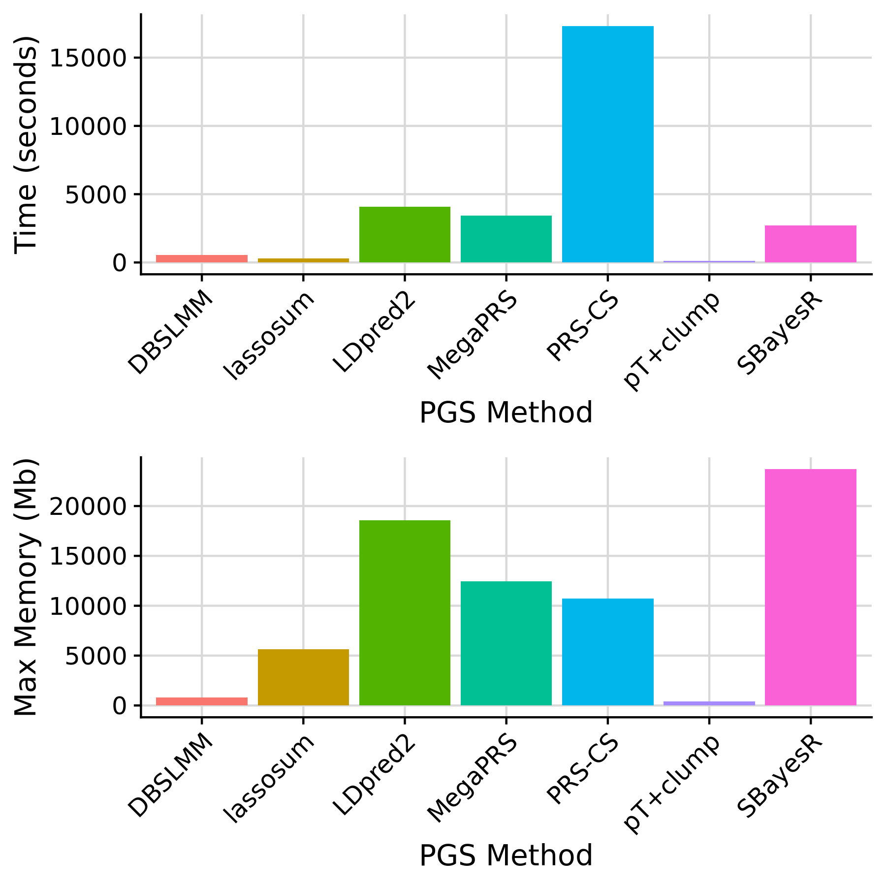
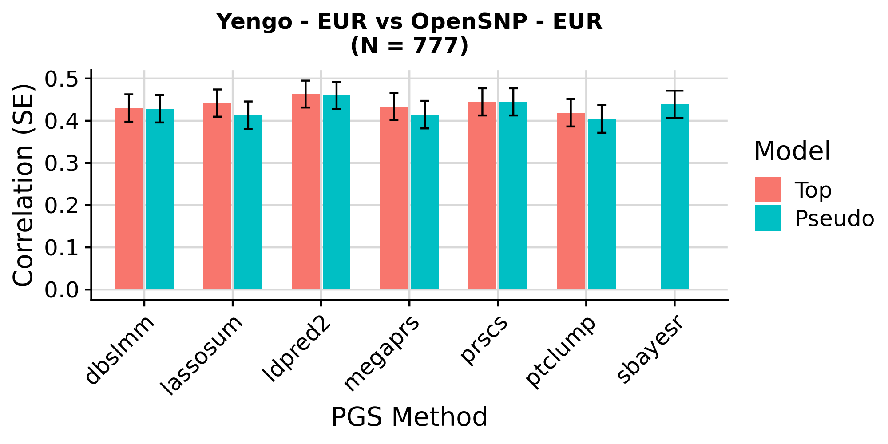
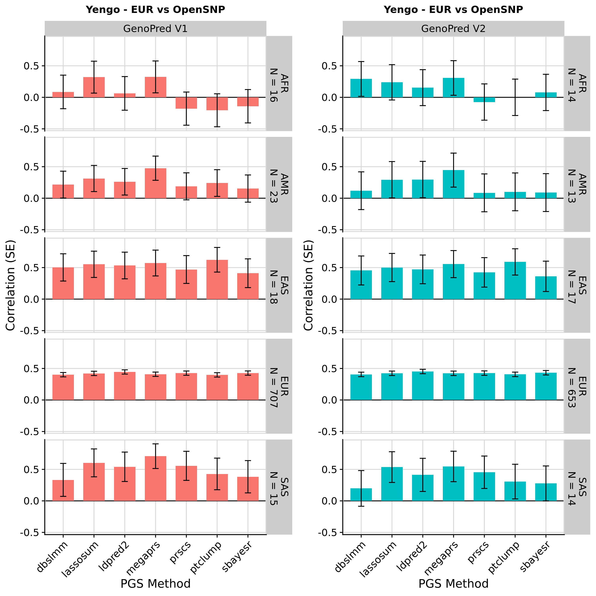

```{r setup, include=FALSE}
knitr::opts_chunk$set(eval = FALSE)
```

***

Here we will use the GenoPred pipeline to derive polygenic scores in UK Biobank.

***

# Summary

***

# Prepare config

***

## target_list

<div class="shallow-break"></div>

<details><summary>Show code</summary>
<br/>

<h3>Create symlinks</h3>

We will create symlinks to the imputed genotype data for UKB. We will use the pgen format data for computationl efficiency and those restricted to MAF >= 1% and INFO >= 0.4. We are using genetic data that is not application specific, so the data doesn't need to be reprocessed for each application. Therefore we will use row number IDs for the .psam file so they can be connected to application specific data downstream.

```{bash}
mkdir -p /scratch/prj/ukbiobank/usr/ollie_pain/GenoPredPipe/ukb_symlinks

# pgen and pvar files
for chr in $(seq 1 22);do
  for file in $(echo pgen pvar);do
    ln -s /datasets/ukbiobank/June2017/Imputed/ukb_imp_chr${chr}_v3_MAF1_INFO4.${file} /scratch/prj/ukbiobank/usr/ollie_pain/GenoPredPipe/ukb_symlinks/ukb_imp_maf1_info4.chr${chr}.${file}
  done
done
```

```{r}
# Make .psam 
n = 487409
psam <- data.frame(FID = 1:487409,
                   IID = 1:487409)
names(psam)[1]<-'#FID'
write.table(psam, '/scratch/prj/ukbiobank/usr/ollie_pain/GenoPredPipe/ukb_symlinks/rownumber.psam', col.names=T, row.names = F, quote = F)
```

```{bash}
for chr in $(seq 1 22);do
  ln -s /scratch/prj/ukbiobank/usr/ollie_pain/GenoPredPipe/ukb_symlinks/rownumber.psam /scratch/prj/ukbiobank/usr/ollie_pain/GenoPredPipe/ukb_symlinks/ukb_imp_maf1_info4.chr${chr}.psam
done
```

***

<h3>Create target_list</h3>

```{bash}
mkdir -p /scratch/prj/ukbiobank/usr/ollie_pain/GenoPredPipe/usr/k1806347/configs/basic
```

```{r}
target_list <- data.frame(
  name='ukb',
  path='/scratch/prj/ukbiobank/usr/ollie_pain/GenoPredPipe/ukb_symlinks/ukb_imp_maf1_info4',
  type='plink2',
  indiv_report=F
)

write.table(target_list, '/scratch/prj/ukbiobank/usr/ollie_pain/GenoPredPipe/usr/k1806347/configs/basic/target_list.txt', col.names=T, row.names=F, quote=F)
```

</details>

***

## gwas_list

Use the same GWAS as used in the INTERVENE paper ([link](https://doi.org/10.1101/2023.11.20.23298215)), except exclude AD as overlaps with UKB, and use Yengo Height with UKB excluded.

<h3>Download sumstats from the GWAS catalogue</h3>

```{bash}
mkdir -p /scratch/prj/ukbiobank/usr/ollie_pain/GenoPredPipe/usr/k1806347/gwas_sumstats
```

```{r}

gwasc_table <- data.frame(
  id = c(
    'GCST005838',
    'GCST002783',
    'GCST004988',
    'GCST006085',
    'GCST008059',
    'GCST90013534',
    'GCST004131',
    'GCST007140',
    'GCST90013445',
    'GCST008972',
    'GCST007954',
    'GCST004773',
    'GCST90018959_exclukb'
  ),
  url = c(
    'https://ftp.ebi.ac.uk/pub/databases/gwas/summary_statistics/GCST005001-GCST006000/GCST005838/harmonised/29531354-GCST005838-EFO_0000712.h.tsv.gz',
    'https://ftp.ebi.ac.uk/pub/databases/gwas/summary_statistics/GCST002001-GCST003000/GCST002783/harmonised/25673413-GCST002783-EFO_0004340.h.tsv.gz',
    'https://ftp.ebi.ac.uk/pub/databases/gwas/summary_statistics/GCST004001-GCST005000/GCST004988/harmonised/29059683-GCST004988-EFO_0000305.h.tsv.gz',
    'https://ftp.ebi.ac.uk/pub/databases/gwas/summary_statistics/GCST006001-GCST007000/GCST006085/harmonised/29892016-GCST006085-EFO_0001663.h.tsv.gz',
    'https://ftp.ebi.ac.uk/pub/databases/gwas/summary_statistics/GCST008001-GCST009000/GCST008059/20171017_MW_eGFR_overall_EA_nstud42.dbgap.txt.gz',
    'https://ftp.ebi.ac.uk/pub/databases/gwas/summary_statistics/GCST90013001-GCST90014000/GCST90013534/harmonised/33310728-GCST90013534-EFO_0000685.h.tsv.gz',
    'https://ftp.ebi.ac.uk/pub/databases/gwas/summary_statistics/GCST004001-GCST005000/GCST004131/harmonised/28067908-GCST004131-EFO_0003767.h.tsv.gz',
    'https://ftp.ebi.ac.uk/pub/databases/gwas/summary_statistics/GCST007001-GCST008000/GCST007140/GERA-sqrtHDL.tsv.gz',
    'https://ftp.ebi.ac.uk/pub/databases/gwas/summary_statistics/GCST90013001-GCST90014000/GCST90013445/GCST90013445_buildGRCh38.tsv',
    'https://ftp.ebi.ac.uk/pub/databases/gwas/summary_statistics/GCST008001-GCST009000/GCST008972/urate_chr1_22_LQ_IQ06_mac10_all_741_rsid.txt.gz',
    'https://ftp.ebi.ac.uk/pub/databases/gwas/summary_statistics/GCST007001-GCST008000/GCST007954/HbA1c_METAL_European.txt.gz',
    'https://ftp.ebi.ac.uk/pub/databases/gwas/summary_statistics/GCST004001-GCST005000/GCST004773/METAANALYSIS_DIAGRAM_SE1.txt',
    'https://portals.broadinstitute.org/collaboration/giant/images/8/8e/GIANT_HEIGHT_YENGO_2022_GWAS_SUMMARY_STATS_EUR_excluding_UKB.gz'
  )
)

gwasc_table$ending<-ifelse(grepl('\\.gz$', gwasc_table$url), '.gz','')

for (i in 1:nrow(gwasc_table)) {
  system(
    paste0(
      'wget --no-check-certificate -O /scratch/prj/ukbiobank/usr/ollie_pain/GenoPredPipe/usr/k1806347/gwas_sumstats/',
      gwasc_table$id[i],
      '.tsv', gwasc_table$ending[i], ' ',
      gwasc_table$url[i]
    )
  )
}

# Check the headers are expected
library(data.table)
for(i in 1:nrow(gwasc_table)){
  tmp <-
    fread(
      paste0(
        '/scratch/prj/ukbiobank/usr/ollie_pain/GenoPredPipe/usr/k1806347/gwas_sumstats/',
        gwasc_table$id[i],
        '.tsv',
        gwasc_table$ending[i]
      ),
      nrows=10
    )
  
  print(gwasc_table$id[i])
  print(head(tmp, 2))
}

# Update header of "GCST008059"
i<-which(gwasc_table$id == 'GCST008059')
tmp <-
  fread(
    paste0(
      '/scratch/prj/ukbiobank/usr/ollie_pain/GenoPredPipe/usr/k1806347/gwas_sumstats/',
      gwasc_table$id[i],
      '.tsv',
      gwasc_table$ending[i]
    )
  )

names(tmp)[names(tmp) == "n_total_sum"] <- 'N'
tmp$Allele1 <- toupper(tmp$Allele1)
tmp$Allele2 <- toupper(tmp$Allele2)

fwrite(
  tmp,
  paste0(
    '/scratch/prj/ukbiobank/usr/ollie_pain/GenoPredPipe/usr/k1806347/gwas_sumstats/',
    gwasc_table$id[i],
    '.tsv',
    gwasc_table$ending[i]
  ),
  sep = '\t',
  quote = F,
  na='NA'
)

# Update header of "GCST007140"
i<-which(gwasc_table$id == 'GCST007140')
tmp <-
  fread(
    paste0(
      '/scratch/prj/ukbiobank/usr/ollie_pain/GenoPredPipe/usr/k1806347/gwas_sumstats/',
      gwasc_table$id[i],
      '.tsv',
      gwasc_table$ending[i]
    )
  )

names(tmp) <-
  c("RSID" ,
    "CHR" ,
    "BP" ,
    "A1" ,
    "A2" ,
    "Effect allele (EA)" ,
    "FREQ" ,
    "N" ,
    "BETA" ,
    "P")

tmp <- tmp[, c("RSID" ,
               "CHR" ,
               "BP" ,
               "A1" ,
               "A2" ,
               "FREQ" ,
               "N" ,
               "BETA" ,
               "P"), with=F]

fwrite(
  tmp,
  paste0(
    '/scratch/prj/ukbiobank/usr/ollie_pain/GenoPredPipe/usr/k1806347/gwas_sumstats/',
    gwasc_table$id[i],
    '.tsv',
    gwasc_table$ending[i]
  ),
  sep = '\t',
  quote = F,
  na='NA'
)

# Update header of "GCST008972"
i<-which(gwasc_table$id == 'GCST008972')

# There is missing data which screws up fread
system("zcat /scratch/prj/ukbiobank/usr/ollie_pain/GenoPredPipe/usr/k1806347/gwas_sumstats/GCST008972.tsv.gz | sed 's/  / NA /g' | gzip > /scratch/prj/ukbiobank/usr/ollie_pain/GenoPredPipe/usr/k1806347/gwas_sumstats/GCST008972_modified.tsv.gz; mv /scratch/prj/ukbiobank/usr/ollie_pain/GenoPredPipe/usr/k1806347/gwas_sumstats/GCST008972_modified.tsv.gz /scratch/prj/ukbiobank/usr/ollie_pain/GenoPredPipe/usr/k1806347/gwas_sumstats/GCST008972.tsv.gz")

tmp <-
  fread(
    '/scratch/prj/ukbiobank/usr/ollie_pain/GenoPredPipe/usr/k1806347/gwas_sumstats/GCST008972.tsv.gz'
  )

names(tmp)[names(tmp) == "n_total_sum"] <- 'N'

tmp$Allele1 <- toupper(tmp$Allele1)
tmp$Allele2 <- toupper(tmp$Allele2)

fwrite(
  tmp,
  paste0(
    '/scratch/prj/ukbiobank/usr/ollie_pain/GenoPredPipe/usr/k1806347/gwas_sumstats/',
    gwasc_table$id[i],
    '.tsv',
    gwasc_table$ending[i]
  ),
  sep = '\t',
  quote = F,
  na='NA'
)

# Update header of "GCST004773"
i<-which(gwasc_table$id == 'GCST004773')

tmp <-
  fread(
    paste0(
      '/scratch/prj/ukbiobank/usr/ollie_pain/GenoPredPipe/usr/k1806347/gwas_sumstats/',
      gwasc_table$id[i],
      '.tsv',
      gwasc_table$ending[i]
    )
  )

tmp$CHR<-gsub(':.*','',tmp$`Chr:Position`)
tmp$BP<-gsub('.*:','',tmp$`Chr:Position`)

fwrite(
  tmp,
  paste0(
    '/scratch/prj/ukbiobank/usr/ollie_pain/GenoPredPipe/usr/k1806347/gwas_sumstats/',
    gwasc_table$id[i],
    '.tsv',
    gwasc_table$ending[i]
  ),
  sep = '\t',
  quote = F,
  na='NA'
)

```

<h3>Create gwas_list</h3>

Get the GWAS info and prevalence data from INTERVENE paper.

```{bash}
mkdir -p /scratch/prj/ukbiobank/usr/ollie_pain/GenoPredPipe/usr/k1806347/configs/benchmark
```

```{r}

gwas_dat<-fread('https://raw.githubusercontent.com/intervene-EU-H2020/prspipe/main/config/studies_for_methods_comparison.tsv')

prev_dat<-fread('https://raw.githubusercontent.com/intervene-EU-H2020/prspipe/main/config/pop_prevalence.tsv')
names(prev_dat)<-c('name','prev')
gwas_dat<-merge(gwas_dat, prev_dat, by='name', all.x=T)

gwas_dat$ftp_address<-NULL
gwas_dat$local_path<-NULL

gwas_dat<-merge(gwasc_table, gwas_dat, by.x='id', by.y='study_id', all.x=T)

# Update labels to those used in the INTERVENE paper table
gwas_labels<-data.frame(
  id=c(
    'GCST005838', 'GCST90012877', 'GCST90013534', 'GCST004773', 'GCST004988', 'GCST006085', 'GCST90013445', 'GCST004131', 'GCST008059', 'GCST90018959', 'GCST008972', 'GCST002783', 'GCST007140', 'GCST007954'),
  label=c('Stroke', 'AD or family history of AD', 'Rheumatoid arthritis', 'T2D', 'Breast cancer', 'Prostate cancer', 'T1D', 'IBD', 'eGFR', 'Height', 'Urate levels', 'BMI', 'HDL', 'HbA1c')
)
gwas_dat<-merge(gwas_dat, gwas_labels, by='id', all.x=T)

# Fill in information for Height
gwas_dat$label[gwas_dat$id == 'GCST90018959_exclukb'] <- 'Height'
gwas_dat$binary[gwas_dat$id == 'GCST90018959_exclukb'] <- 'no'

# Format as gwas_list
gwas_list <- data.frame(
  name = gwas_dat$id,
  path = paste0(
    '/scratch/prj/ukbiobank/usr/ollie_pain/GenoPredPipe/usr/k1806347/gwas_sumstats/',
    gwas_dat$id,
    '.tsv',
    gwas_dat$ending
  ),
  population = 'EUR',
  n = gwas_dat$n_cases,
  sampling = gwas_dat$n_cases/gwas_dat$n_controls,
  prevalence = gwas_dat$prev,
  mean = NA,
  sd = NA,
  label = gwas_dat$label
)

gwas_list$sampling[is.na(gwas_list$prevalence)]<-NA
gwas_list$sampling<-round(gwas_list$sampling, 3)
gwas_list$mean[is.na(gwas_list$prevalence)]<-0
gwas_list$sd[is.na(gwas_list$prevalence)]<-1

gwas_list$label<-paste0("\"", gwas_list$label, "\"")

write.table(gwas_list, '/scratch/prj/ukbiobank/usr/ollie_pain/GenoPredPipe/usr/k1806347/configs/benchmark/gwas_list.txt', col.names=T, row.names=F, quote=F)

```

</details>

***

## configfile

```{r}
# Create config file
conf <- c(
  'outdir: /scratch/prj/ukbiobank/usr/ollie_pain/GenoPredPipe/output',
  'config_file: /scratch/prj/ukbiobank/usr/ollie_pain/GenoPredPipe/usr/k1806347/configs/benchmark/config.yaml',
  'gwas_list: /scratch/prj/ukbiobank/usr/ollie_pain/GenoPredPipe/usr/k1806347/configs/benchmark/gwas_list.txt',
  'target_list: /scratch/prj/ukbiobank/usr/ollie_pain/GenoPredPipe/usr/k1806347/configs/basic/target_list.txt',
  "pgs_methods: ['ptclump']"
)

write.table(conf, '/scratch/prj/ukbiobank/usr/ollie_pain/GenoPredPipe/usr/k1806347/configs/benchmark/config.yaml', col.names = F, row.names = F, quote = F)
```

***

# Run pipeline

```{bash}
snakemake --profile slurm --use-conda --configfile=../../usr/k1806347/configs/benchmark/config.yaml output_all -n 

snakemake --profile slurm --use-conda --configfile=../../usr/k1806347/configs/benchmark/config.yaml outlier_detection -n 

```

***

## Computational benchmark

<details><summary>Show code</summary>

```{r}
library(data.table)
library(ggplot2)
library(cowplot)

# Read in configuration specific benchmark files
bm_files_i <-
  paste0(
    '/users/k1806347/oliverpainfel/Data/OpenSNP/GenoPred/test4/reference/benchmarks/',
    list.files('/users/k1806347/oliverpainfel/Data/OpenSNP/GenoPred/test4/reference/benchmarks/')
  )

# Read in benchmark files
bm_dat_all <- do.call(rbind, lapply(bm_files_i, function(file) {
  tmp <- fread(file)
  tmp$file <- basename(file)
  return(tmp)
}))

# Create rule column
bm_dat_all$rule <- gsub('-.*','',bm_dat_all$file)

#####
# PGS methods
#####
# Look at the memory required for each PGS method using the EUR GWAS
bm_dat_yengo_eur <-
  bm_dat_all[grepl('prep_pgs', bm_dat_all$file) &
               grepl('yengo_eur.txt', bm_dat_all$file), ]

bm_dat_yengo_eur$method <- gsub('_i', '', gsub('prep_pgs_','',bm_dat_yengo_eur$rule))
bm_dat_yengo_eur<-merge(bm_dat_yengo_eur, pgs_method_labels, by='method')

pgs_method_time <-
  ggplot(bm_dat_yengo_eur, aes(x = label, y = s, fill = label)) +
  geom_bar(stat = "identity", position = "dodge") +
  labs(x = "PGS Method", y = "Time (seconds)") +
  theme_half_open() +
  background_grid() +
  theme(axis.text.x = element_text(angle = 45, hjust = 1), legend.position="none")

pgs_method_mem <-
  ggplot(bm_dat_yengo_eur, aes(x = label, y = max_rss, fill = label)) +
  geom_bar(stat = "identity", position="dodge") +
  labs(x = "PGS Method", y = "Max Memory (Mb)") +
  theme_half_open() +
  background_grid() +
  theme(axis.text.x = element_text(angle = 45, hjust = 1), legend.position="none")

png('Images/OpenSNP/time_cpu_bench_pgs_methods.png', res = 300, width = 1800, height = 1800, units = 'px')
  plot_grid(pgs_method_time, pgs_method_mem, nrow=2)
dev.off()

write.csv(bm_dat_yengo_eur, 'Images/OpenSNP/time_cpu_bench_pgs_methods.csv', row.names=F, quote=F)

```
</details>

<details><summary>Show PGS methods benchmark</summary>

<div class="centered-container">
<div class="rounded-image-container" style="width: 50%;">

</div>
</div>

<div class="note-box">

**Note:** pT+clump and DBSLMM are run using 1 core. All other methods are run using 10 cores.

</div>

</details>

***

# Evaluate scores

***

## Prepare phenotype data

We will use application 82087 for this analysis, and use [ukbkings](https://kenhanscombe.github.io/ukbkings/index.html) to extract the relevant data.

***

### Binary outcomes

```{r}
library(ukbkings)
library(dplyr)
library(stringr)

# Extract ICD code and sex from UKB
project_dir <- "/datasets/ukbiobank/ukb82087"
f <- bio_field(project_dir)
f %>%
    select(field, name) %>%
    filter(str_detect(field, "^31-0.0|41202|41203|41204|41205")) %>%
    bio_field_add("/scratch/prj/ukbiobank/usr/ollie_pain/phenotypes/icd_field_subset.txt")

bio_phen(
    project_dir,
    field = "/scratch/prj/ukbiobank/usr/ollie_pain/phenotypes/icd_field_subset.txt",
    out = "/scratch/prj/ukbiobank/usr/ollie_pain/phenotypes/icd_field_subset"
)

system("ls -lh /scratch/prj/ukbiobank/usr/ollie_pain/phenotypes/icd_field_subset.rds")
df <- readRDS("/scratch/prj/ukbiobank/usr/ollie_pain/phenotypes/icd_field_subset.rds")

# Identify individuals with no ICD codes
rows_with_na <- apply(df[, !(names(df) %in% c('eid','31-0.0'))], 1, function(x) all(is.na(x)))
df_no_icd<-df[rows_with_na,]

# Change to long format
library(tidyr)

# Split into ICD9 and ICD10
df_long <- df %>%
  pivot_longer(cols = starts_with('412'), names_to = "diagnosis_event", values_to = "icd_code") %>%
  drop_na(icd_code)

# Reinsert people with no ICD codes (so they are included as controls)
df_no_icd<-df_no_icd[, c('eid','31-0.0')]
df_no_icd$diagnosis_event<-NA
df_no_icd$icd_code<-NA
df_long<-rbind(df_long, df_no_icd)

# Create icd checker function
icd_checker <- function(dat, sex = NULL, incl, excl = NULL){

  out<-data.frame(
    eid=unique(dat$eid),
    endpoint=NA
  )
  
  # Subset by inclusion
  dat_in <- unique(dat$eid[grepl(paste(paste0('^',incl), collapse='|'), dat$icd_code)])
  out$endpoint<-ifelse(out$eid %in% dat_in, 1, 0)
  
  if(!is.null(excl)){
    # Remove those with exclusions
    dat_ex <- unique(dat$eid[grepl(paste(paste0('^',excl), collapse='|'), dat$icd_code)])
    out$endpoint[out$eid %in% dat_in & out$eid %in% dat_ex]<-0
  }
  
  if(!is.null(sex)){
    # Subset relevant sex
    dat_na <- unique(dat$eid[dat$`31-0.0` != sex])
    out$endpoint[out$eid %in% dat_na]<-NA
  }
  
  return(out)
}

###
# Breast cancer
###

bc<-icd_checker(dat = df_long, sex = 0, incl = c('C50','174'))

###
# Chronic kidney disease
###

ckd<-icd_checker(dat = df_long, incl = c('N18','585'))
N14_DIALYSIS<-icd_checker(dat = df_long, incl = c('Z992','Y841'))
ckd$endpoint[ckd$eid %in% N14_DIALYSIS$eid[N14_DIALYSIS$endpoint == 1]]<-1

###
# Gout
###

gout<-icd_checker(dat = df_long, incl = c('M10','2740'))

###
# IBD
###

ibd<-icd_checker(dat = df_long, incl = c('K50','K51','555','556'))

###
# Prostate cancer
###

pc<-icd_checker(dat = df_long, sex = 1, incl = c('C61','185'))

###
# Rheumatoid arthritis
###

ra<-icd_checker(dat = df_long, incl = c('M058','M059','7140A'))

###
# Stroke exluding SAH
###

stroke<-icd_checker(dat = df_long, incl = c('I61', 'I63', 'I64', '431', '4330A', '4331A', '4339A', '4340A', '4341A', '4349A', '436'), excl='I636')

###
# Type 1 diabetes
###

t1d<-icd_checker(dat = df_long, incl = c('E10','25001','25011'))
E4_DM2<-icd_checker(dat = df_long, incl = c('E110', 'E111', 'E112', 'E113', 'E114', 'E115', 'E116', 'E117', 'E118', 'E119', '2502A', '2501A', '2503A', '2504A', '2505A', '2506A', '2507A', '2508A', '2500A'), excl='E11')
t1d$endpoint[t1d$eid %in% E4_DM2$eid[E4_DM2$endpoint == 1]]<-0

###
# Type 2 diabetes
###

t2d<-icd_checker(dat = df_long, incl = c('E11','25000','25010'))
E4_DM1<-icd_checker(dat = df_long, incl = c('E100', 'E101', 'E102', 'E103', 'E104', 'E105', 'E106', 'E107', 'E108', 'E109', '2502B', '2501B', '2503B', '2504B', '2505B', '2506B', '2507B', '2508B', '2500B'), excl='E10')
t2d$endpoint[t2d$eid %in% E4_DM1$eid[E4_DM1$endpoint == 1]]<-0

# Create table of N
endpoints<-list(bc=bc, 
                ckd=ckd, 
                gout=gout, 
                ibd=ibd, 
                pc=pc, 
                ra=ra, 
                stroke=stroke, 
                t1d=t1d, 
                t2d=t2d)

# Save the phenotype data
library(data.table)
for(i in names(endpoints)){
  tmp<-endpoints[[i]]
  tmp<-tmp[complete.cases(tmp),]
  fwrite(
    tmp,
    paste0(
      '/scratch/prj/ukbiobank/usr/ollie_pain/phenotypes/',
      i,
      '.txt'
    ),
    row.names = F,
    quote = F,
    na = 'NA',
    sep = '\t'
  )
}

```

***

### Continuous outcomes

```{r}
library(ukbkings)
library(dplyr)
library(stringr)

# Extract ICD code and sex from UKB
project_dir <- "/datasets/ukbiobank/ukb82087"
f <- bio_field(project_dir)
f %>%
    select(field, name) %>%
    filter(str_detect(field, "^50-|^21001-|^30700-|^30750-|^30880-")) %>%
    bio_field_add("/scratch/prj/ukbiobank/usr/ollie_pain/phenotypes/continuous_field_subset.txt")

bio_phen(
    project_dir,
    field = "/scratch/prj/ukbiobank/usr/ollie_pain/phenotypes/continuous_field_subset.txt",
    out = "/scratch/prj/ukbiobank/usr/ollie_pain/phenotypes/continuous_field_subset"
)

system("ls -lh /scratch/prj/ukbiobank/usr/ollie_pain/phenotypes/continuous_field_subset.rds")
df <- readRDS("/scratch/prj/ukbiobank/usr/ollie_pain/phenotypes/continuous_field_subset.rds")

# Take the first observation of each outcome
library(tidyr)
df_long <- df %>%
  pivot_longer(cols = names(df)[!grepl('eid', names(df))], names_to = "variable", values_to = "outcome") %>%
  drop_na(outcome)
df_long$variable<-gsub('-.*','', df_long$variable)
df_long<-df_long[!duplicated(df_long[,c('eid','variable')]),]

var_pheno<-data.frame(
  var=c('50','21001','30700','30750','30880'),
  pheno=c('height','bmi','creatinine','hba1c','urate')
)

for(i in 1:nrow(var_pheno)){
  tmp <- df_long[df_long$variable == var_pheno$var[i],]
  tmp <- data.frame(
    eid = tmp$eid,
    outcome = tmp$outcome
  )
  
  fwrite(
    tmp,
    paste0(
      '/scratch/prj/ukbiobank/usr/ollie_pain/phenotypes/',
      var_pheno$pheno[i],
      '.txt'
    ),
    row.names = F,
    quote = F,
    na = 'NA',
    sep = '\t'
  )
}

```

***

### Remove related individuals

Relatedness has already been estimated in UK Biobank. Using greedy related, identify a list of unrelated individuals for population outlier detection, and for each phenotype. A function for this is available in ukbkings.

```{r}

library(ukbkings)

psam<-fread('/scratch/prj/ukbiobank/ukb82087/imputed/ukb82087_imp_chr1_MAF1_INFO4_v1.psam')

project_dir <- "/datasets/ukbiobank/ukb82087"
greedy_related <- "/scratch/prj/ukbiobank/KCL_Data/Software/tools/GreedyRelated-master-v1.2.1/GreedyRelated"

# Create a list of unrelated individuals irrespective of a phenotype
psam_unrel_all <- psam[!(
  psam$IID %in% bio_gen_related_remove(
    project_dir = project_dir,
    greedy_related = greedy_related,
    thresh = 0.044,
    seed = 1
  )$eid
), ]

write.table(psam_unrel_all$IID, '/scratch/prj/ukbiobank/usr/ollie_pain/phenotypes/unrelated.txt', row.names=F, col.names=F, quote=F)

n_table<-data.frame(
  pheno=NA,
  subset=c('geno','unrel'),
  n=c(nrow(psam), nrow(psam_unrel_all)),
  n_cas=NA,
  n_con=NA
)

# Create a list of unrelated individuals after removing individuals with missing data for each phenotype
bin_phenos <- c('bc', 'ckd', 'gout', 'ibd', 'pc', 'ra', 'stroke', 't1d', 't2d')
con_phenos <- c('height','bmi','creatinine','hba1c','urate')

for(i in c(bin_phenos, con_phenos)){
  tmp<-fread(paste0(
      '/scratch/prj/ukbiobank/usr/ollie_pain/phenotypes/',
      i,
      '.txt'
    ))
  
  tmp<-tmp[tmp$eid %in% psam$IID,]
  tmp_unrel <- tmp[!(
    tmp$eid %in% bio_gen_related_remove(
      project_dir = project_dir,
      greedy_related = greedy_related,
      keep = tmp$eid,
      thresh = 0.044,
      seed = 1
    )$eid
  ), ]
  
  fwrite(
    tmp_unrel,
    paste0(
      '/scratch/prj/ukbiobank/usr/ollie_pain/phenotypes/',
      var_pheno$pheno[i],
      '.unrel.txt'
    ),
    row.names = F,
    quote = F,
    na = 'NA',
    sep = '\t'
  )
  
  names(tmp)<-c('IID','PHENO')
  names(tmp_unrel)<-c('IID','PHENO')
    
  if(i %in% bin_phenos){
    n_i<-data.frame(
      pheno=i,
      subset=c('geno','unrel'),
      n=c(nrow(tmp), nrow(tmp_unrel)),
      n_cas=c(sum(tmp$PHENO == 1), sum(tmp_unrel$PHENO == 1)),
      n_con=c(sum(tmp$PHENO == 0), sum(tmp_unrel$PHENO == 0))
    )
  } else {
    n_i<-data.frame(
      pheno=i,
      subset=c('geno','unrel'),
      n=c(nrow(tmp), nrow(tmp_unrel)),
      n_cas=NA,
      n_con=NA
    )
  }
  
  n_table<-rbind(n_table, n_i)
  print(n_table)
}

write.csv(n_table, '/scratch/prj/ukbiobank/usr/ollie_pain/phenotypes/pheno_n.csv', row.names=F)

```

***

## Run model_builder

***

# Conclusion

***

## Check time and memory requirements

<details><summary>Show code</summary>

```{r}
library(data.table)
library(ggplot2)
library(cowplot)

# Read in configuration specific benchmark files
bm_files_i <-
  paste0(
    '/users/k1806347/oliverpainfel/Data/OpenSNP/GenoPred/test4/reference/benchmarks/',
    list.files('/users/k1806347/oliverpainfel/Data/OpenSNP/GenoPred/test4/reference/benchmarks/')
  )

# Read in benchmark files
bm_dat_all <- do.call(rbind, lapply(bm_files_i, function(file) {
  tmp <- fread(file)
  tmp$file <- basename(file)
  return(tmp)
}))

# Create rule column
bm_dat_all$rule <- gsub('-.*','',bm_dat_all$file)

#####
# PGS methods
#####
# Look at the memory required for each PGS method using the EUR GWAS
bm_dat_yengo_eur <-
  bm_dat_all[grepl('prep_pgs', bm_dat_all$file) &
               grepl('yengo_eur.txt', bm_dat_all$file), ]

bm_dat_yengo_eur$method <- gsub('_i', '', gsub('prep_pgs_','',bm_dat_yengo_eur$rule))
bm_dat_yengo_eur<-merge(bm_dat_yengo_eur, pgs_method_labels, by='method')

pgs_method_time <-
  ggplot(bm_dat_yengo_eur, aes(x = label, y = s, fill = label)) +
  geom_bar(stat = "identity", position = "dodge") +
  labs(x = "PGS Method", y = "Time (seconds)") +
  theme_half_open() +
  background_grid() +
  theme(axis.text.x = element_text(angle = 45, hjust = 1), legend.position="none")

pgs_method_mem <-
  ggplot(bm_dat_yengo_eur, aes(x = label, y = max_rss, fill = label)) +
  geom_bar(stat = "identity", position="dodge") +
  labs(x = "PGS Method", y = "Max Memory (Mb)") +
  theme_half_open() +
  background_grid() +
  theme(axis.text.x = element_text(angle = 45, hjust = 1), legend.position="none")

png('Images/OpenSNP/time_cpu_bench_pgs_methods.png', res = 300, width = 1800, height = 1800, units = 'px')
  plot_grid(pgs_method_time, pgs_method_mem, nrow=2)
dev.off()

write.csv(bm_dat_yengo_eur, 'Images/OpenSNP/time_cpu_bench_pgs_methods.csv', row.names=F, quote=F)

```
</details>

<details><summary>Show PGS methods benchmark</summary>

<div class="centered-container">
<div class="rounded-image-container" style="width: 50%;">

</div>
</div>

<div class="note-box">

**Note:** pT+clump and DBSLMM are run using 1 core. All other methods are run using 10 cores.

</div>

</details>

***

## Evaluate PGS

<details><summary>Show code</summary>

```{r}
# Test correlation between PGS and observed height

setwd('/users/k1806347/oliverpainfel/Software/MyGit/GenoPred/pipeline/')
library(data.table)
library(ggplot2)
library(cowplot)

source('../functions/misc.R')
source_all('../functions')

# Read in pheno data
pheno <- fread('/users/k1806347/oliverpainfel/Data/OpenSNP/processed/pheno/height.txt')

# Define pgs_methods used
pgs_methods <- c('external','ptclump', 'dbslmm', 'prscs', 'sbayesr', 'lassosum', 'ldpred2', 'megaprs')

# Define pgs_methods applied to non-EUR GWAS
pgs_methods_eur <- c('ptclump','lassosum','megaprs','prscs','dbslmm')

# Read in PGS
pgs <- read_pgs(config = 'misc/opensnp/config.yaml', name = 'opensnp')$opensnp

# Estimate correlation between pheno and pgs
cor <- NULL
for(pop_i in names(pgs)){
  for(gwas_i in names(pgs[[pop_i]])){
    for(pgs_method_i in names(pgs[[pop_i]][[gwas_i]])){
      pgs_i <- pgs[[pop_i]][[gwas_i]][[pgs_method_i]]
      pheno_pgs<-merge(pheno, pgs_i, by = c('FID','IID'))
      
      for(model_i in names(pgs_i)[-1:-2]){
        y <- scale(pheno_pgs$height)
        x <- scale(pheno_pgs[[model_i]])
        
        if(all(is.na(x))){
          next
        }
        
        coef_i <- coef(summary(mod <- lm(y ~ x)))
        
        tmp <- data.table(
          pop = pop_i,
          gwas = gwas_i,
          pgs_method = pgs_method_i,
          name = model_i,
          r = coef_i[2,1],
          se = coef_i[2,2],
          p = coef_i[2,4],
          n = nobs(mod))
      cor <- rbind(cor, tmp)
      
      }
    }
  }
}

# The European sample is the only one large enough for interpretable results
# Subset EUR results
cor_eur <- cor[cor$pop == 'EUR', ]

# Restrict to best and and pseudoval only
cor_eur_subset <- NULL
for(pop_i in unique(cor_eur$pop)){
  for(gwas_i in unique(cor_eur$gwas[cor_eur$pop == pop_i])){
    for(pgs_method_i in unique(cor_eur$pgs_method[cor_eur$pop == pop_i & cor_eur$gwas == gwas_i])){
      
      # Subset relevant results
      cor_eur_i <- cor_eur[
        cor_eur$pop == pop_i &
        cor_eur$gwas == gwas_i &
        cor_eur$pgs_method == pgs_method_i,]
  
      # Top R
      if(pgs_method_i %in% c('ptclump','ldpred2','megaprs','prscs','lassosum','dbslmm')){
        top_i <- cor_eur_i[which(cor_eur_i$r == max(cor_eur_i$r, na.rm = T))[1],]
        top_i$model <- 'Top'
        cor_eur_subset <- rbind(cor_eur_subset, top_i)
      }
  
      # PseudoVal
      if(pgs_method_i %in% c('ptclump','sbayesr','ldpred2','megaprs','prscs','lassosum','dbslmm')){
        cor_eur_i$name <- gsub(paste0(gwas_i, '_'), '', cor_eur_i$name)
        pseudo_param <- find_pseudo(config = 'misc/opensnp/config.yaml', gwas = gwas_i, pgs_method = pgs_method_i)
        pseudo_i <- cor_eur_i[cor_eur_i$name == pseudo_param,]
        pseudo_i$model <- 'Pseudo'
        cor_eur_subset <- rbind(cor_eur_subset, pseudo_i)
      }
      
      # External
      external_tmp<-cor_eur_i[cor_eur_i$pgs_method == 'external',]
      external_tmp$model <- 'External'
      cor_eur_subset <- rbind(cor_eur_subset, external_tmp)
      
    }
  }
}

# Plot the results
cor_eur_subset$model <- factor(cor_eur_subset$model, levels = c('Top','Pseudo','External'))
dir.create('/users/k1806347/oliverpainfel/Software/MyGit/GenoPred/docs/Images/OpenSNP')

# yengo_eur
plot_obj_eur <- 
  ggplot(cor_eur_subset[cor_eur_subset$gwas == 'yengo_eur',], aes(x = pgs_method, y = r, fill = model)) +
  geom_bar(stat = "identity", position = position_dodge2(preserve = "single"), width = 0.7) +
  geom_errorbar(
    aes(ymin = r - se, ymax = r + se),
    width = .2,
    position = position_dodge(width = 0.7)
  ) +
  labs(
    y = "Correlation (SE)",
    x = 'PGS Method',
    fill = 'Model',
    title = paste0("Yengo - EUR vs OpenSNP - EUR\n(N = ", cor_eur_subset$n[1], ")")
  ) +
  theme_half_open() +
  background_grid() +
  theme(axis.text.x = element_text(angle = 45, hjust = 1),
        plot.title = element_text(hjust = 0.5, size=12))

png('/users/k1806347/oliverpainfel/Software/MyGit/GenoPred/docs/Images/OpenSNP/genopred-yengo_eur.png',
    units = 'px',
    width = 2000,
    height = 1000,
    res = 300)

  plot_obj_eur

dev.off()

# yengo_eas
plot_obj_eas <- 
  ggplot(cor_eur_subset[cor_eur_subset$gwas == 'yengo_eas',], aes(x = pgs_method, y = r, fill = model)) +
    geom_bar(stat = "identity", position = position_dodge2(preserve = "single"), width = 0.7) +
    geom_errorbar(
      aes(ymin = r - se, ymax = r + se),
      width = .2,
      position = position_dodge(width = 0.7)
    ) +
    labs(
      y = "Correlation (SE)",
      x = 'PGS Method',
      fill = 'Model',
      title = paste0("Yengo - EAS vs OpenSNP - EUR\n(N = ", cor_eur_subset$n[1], ")")
    ) +
    theme_half_open() +
    background_grid() +
    theme(axis.text.x = element_text(angle = 45, hjust = 1),
          plot.title = element_text(hjust = 0.5, size=12))

png('/users/k1806347/oliverpainfel/Software/MyGit/GenoPred/docs/Images/OpenSNP/genopred-yengo_eas.png',
    units = 'px',
    width = 1200,
    height = 1000,
    res = 300)

  plot_obj_eas

dev.off()

# Make a plot comparing the yengo_eur results to the score file from PGS-catalogue
not_external <- unique(cor_eur_subset$pgs_method[cor_eur_subset$pgs_method != 'external'])
cor_eur_subset$pgs_method <- factor(cor_eur_subset$pgs_method, levels=c(not_external,'external'))

plot_obj_ext <- 
  ggplot(cor_eur_subset[cor_eur_subset$gwas == 'yengo_eur' | cor_eur_subset$gwas == 'PGS002804',], aes(x = pgs_method, y = r, fill = model)) +
  geom_bar(stat = "identity", position = position_dodge2(preserve = "single"), width = 0.7) +
  geom_errorbar(
    aes(ymin = r - se, ymax = r + se),
    width = .2,
    position = position_dodge(width = 0.7)
  ) +
  labs(
    y = "Correlation (SE)",
    x = 'PGS Method',
    fill = 'Model',
    title = paste0("Yengo - EUR vs OpenSNP - EUR\n(N = ", cor_eur_subset$n[1], ")")
  ) +
  theme_half_open() +
  background_grid() +
  geom_vline(xintercept = 7.5, linetype = 'dashed') +
  theme(axis.text.x = element_text(angle = 45, hjust = 1),
        plot.title = element_text(hjust = 0.5, size=12))

png('/users/k1806347/oliverpainfel/Software/MyGit/GenoPred/docs/Images/OpenSNP/genopred-yengo_eur-external.png',
    units = 'px',
    width = 2000,
    height = 1000,
    res = 300)
  
  plot_obj_ext

dev.off()


# Save the results
dir.create('/scratch/prj/oliverpainfel/Data/OpenSNP/assoc')
write.csv(
  cor,
  '/scratch/prj/oliverpainfel/Data/OpenSNP/assoc/genopred-yengo-assoc.csv',
  row.names = F
)

```

</details>

***

<details><summary>Show results in OpenSNP</summary>

<div class="centered-container">
<div class="rounded-image-container" style="width: 60%;">

</div>
</div>

***

<div class="centered-container">
<div class="rounded-image-container" style="width: 60%;">

</div>
</div>

</details>

<details><summary>Show results in OpenSNP including score from PGS catalogue</summary>

<div class="centered-container">
<div class="rounded-image-container" style="width: 60%;">

</div>
</div>

<br/>

Note. 'external' is based on a larger GWAS (incl. 23andMe)

</details>

***

# GenoPred V1 comparison

We will run OpenSNP through GenoPred v1, to check whether updates have altered the output.

<details><summary>Show code</summary>

```{bash}
# Go to another version of the repo on CREATE
cd /users/k1806347/oliverpainfel/test/GenoPred

# Checkout to the v1 version of the repo
git checkout v1

```

</details>

***

### Prepare input

<details><summary>Show code</summary>

```{r}
library(data.table)
setwd('/users/k1806347/oliverpainfel/test/GenoPred/GenoPredPipe')

# target_list
target_list <- fread('target_list_example.txt')
target_list <- data.frame(
  name = 'opensnp',
  path='/users/k1806347/oliverpainfel/Data/OpenSNP/processed/geno/opensnp_train',
  type = 'samp_imp_vcf',
  output = '/users/k1806347/oliverpainfel/Data/OpenSNP/GenoPred_v1/test1',
  indiv_report = F)

dir.create('misc/opensnp', recursive = T)
write.table(target_list, 'misc/opensnp/target_list.txt', col.names=T, row.names=F, quote=F, sep=' ')

# gwas_list
yengo_eur <- fread('/users/k1806347/oliverpainfel/Data/GWAS_sumstats/opensnp_test/yengo_2022_height_eur.txt')
yengo_eur <- yengo_eur[, c('variant_id','effect_allele','other_allele','beta','standard_error','effect_allele_frequency','p_value','n'), with=F]
names(yengo_eur) <- c('SNP','A1','A2','BETA','SE','FREQ','P','N')
fwrite(yengo_eur, '/users/k1806347/oliverpainfel/Data/GWAS_sumstats/opensnp_test/yengo_2022_height_eur.format.txt', sep = ' ', quote = F, na = 'NA')

yengo_eas <- fread('/users/k1806347/oliverpainfel/Data/GWAS_sumstats/opensnp_test/yengo_2022_height_eas.txt')
yengo_eas <- yengo_eas[, c('variant_id','effect_allele','other_allele','beta','standard_error','effect_allele_frequency','p_value','n'), with=F]
names(yengo_eas) <- c('SNP','A1','A2','BETA','SE','FREQ','P','N')
fwrite(yengo_eas, '/users/k1806347/oliverpainfel/Data/GWAS_sumstats/opensnp_test/yengo_2022_height_eas.format.txt', sep = ' ', quote = F, na = 'NA')

gwas_list <- fread('gwas_list_example.txt')
gwas_list<-rbind(gwas_list, data.table(
    name='yengoeur',
    path='/users/k1806347/oliverpainfel/Data/GWAS_sumstats/opensnp_test/yengo_2022_height_eur.format.txt',
    population='EUR',
    sampling=NA,
    prevalence=NA,
    mean=NA,
    sd=NA,
    label="\"Yengo 2022 Height EUR\""))

gwas_list<-rbind(gwas_list, data.table(
    name='yengoeas',
    path='/users/k1806347/oliverpainfel/Data/GWAS_sumstats/opensnp_test/yengo_2022_height_eas.format.txt',
    population='EAS',
    sampling=NA,
    prevalence=NA,
    mean=NA,
    sd=NA,
    label="\"Yengo 2022 Height EAS\""))

gwas_list<-gwas_list[gwas_list$name %in% c('yengoeur','yengoeas'),]

write.table(gwas_list, 'misc/opensnp/gwas_list.txt', col.names=T, row.names=F, quote=F, sep=' ')

# score_list
score_list <- fread('score_list_example.txt')
score_list <- score_list[-1,]
write.table(score_list, 'misc/opensnp/score_list.txt', col.names=T, row.names=F, quote=F, sep=' ')

# config
config <- c(
  "gwas_list: misc/opensnp/gwas_list.txt",
  "target_list: misc/opensnp/target_list.txt",
  "score_list: misc/opensnp/score_list.txt"   
)
write.table(config, 'misc/opensnp/config.yaml', col.names=F, row.names=F, quote=F, sep=' ')

```

</details>

***

### Run GenoPred v1

<details><summary>Show code</summary>

```{bash}
# Calculate score using all methods
snakemake -n --profile slurm --configfile=misc/opensnp/config.yaml --use-conda run_target_prs_all

```

</details>

***

## Evaluate PGS

<details><summary>Show code</summary>

```{r}
# Test correlation between PGS and phenotype

setwd('/scratch//prj/oliverpainfel/test/GenoPred/pipeline/')
library(data.table)
library(Hmisc)

# Read in pheno data
pheno <- fread('/users/k1806347/oliverpainfel/Data/OpenSNP/processed/pheno/height.txt')
pheno$FID<-0

# Read in ancestry data
keep_list <- fread('/users/k1806347/oliverpainfel/Data/OpenSNP/GenoPred/test1/opensnp/ancestry/keep_list.txt')

# Read in pgs
gwas_list <- fread('misc/opensnp/gwas_list.txt')
pgs_methods <- c('pt_clump','dbslmm','prscs','sbayesr','lassosum','ldpred2','megaprs')
pgs_methods_eur <- c('pt_clump','lassosum','megaprs')

pgs <- list()
for(pop_i in keep_list$POP){
  pgs[[pop_i]] <- list()
  for(gwas_i in gwas_list$name){
    pgs[[pop_i]][[gwas_i]] <- list()
    for(pgs_method_i in pgs_methods){
      if(gwas_list$population[gwas_list$name == gwas_i] == 'EUR' | (gwas_list$population[gwas_list$name == gwas_i] != 'EUR' & (pgs_method_i %in% pgs_methods_eur))){
        pgs[[pop_i]][[gwas_i]][[pgs_method_i]] <- fread(paste0('/users/k1806347/oliverpainfel/Data/OpenSNP/GenoPred_v1/test1/opensnp/prs/',pop_i,'/',pgs_method_i,'/',gwas_i,'/opensnp.',gwas_i,'.',pop_i,'.profiles'))
      }
    }
  }
}

# Estimate correlation between pheno and pgs
cor <- NULL
for(pop_i in names(pgs)){
  for(gwas_i in names(pgs[[pop_i]])){
    for(pgs_method_i in names(pgs[[pop_i]][[gwas_i]])){
      pgs_i <- pgs[[pop_i]][[gwas_i]][[pgs_method_i]]
      pheno_pgs<-merge(pheno, pgs_i, by = c('FID','IID'))
      
      for(model_i in names(pgs_i)[-1:-2]){
        y <- scale(pheno_pgs$height)
        x <- scale(pheno_pgs[[model_i]])
        
        if(all(is.na(x))){
          next
        }
        
        coef_i <- coef(summary(mod <- lm(y ~ x)))
        
        tmp <- data.table(
          pop = pop_i,
          gwas = gwas_i,
          pgs_method = pgs_method_i,
          name = model_i,
          r = coef_i[2,1],
          se = coef_i[2,2],
          p = coef_i[2,4],
          n = nobs(mod))
      cor <- rbind(cor, tmp)
      
      }
    }
  }
}

# Save the results
dir.create('/scratch/prj/oliverpainfel/Data/OpenSNP/assoc')
write.csv(
  cor,
  '/scratch/prj/oliverpainfel/Data/OpenSNP/assoc/genopred-v1-yengo-assoc.csv',
  row.names = F
)

# Restrict to best only
cor_subset <- NULL
for(pop_i in unique(cor$pop)){
  for(gwas_i in unique(cor$gwas[cor$pop == pop_i])){
    for(pgs_method_i in unique(cor$pgs_method[cor$pop == pop_i & cor$gwas == gwas_i])){
      
      # Subset relevant results
      cor_i <- cor[
        cor$pop == pop_i &
        cor$gwas == gwas_i &
        cor$pgs_method == pgs_method_i,]
  
      # Top R
      top_i <- cor_i[which(cor_i$r == max(cor_i$r, na.rm = T))[1],]
      cor_subset <- rbind(cor_subset, top_i)
    }
  }
}

# Read in the associations for the best PGS when using the new version of GenoPred
cor_new <- fread('/scratch/prj/oliverpainfel/Data/OpenSNP/assoc/genopred-yengo-assoc.csv')

cor_new_subset <- NULL
for(pop_i in unique(cor_new$pop)){
  for(gwas_i in unique(cor_new$gwas[cor_new$pop == pop_i])){
    for(pgs_method_i in unique(cor_new$pgs_method[cor_new$pop == pop_i & cor_new$gwas == gwas_i])){
      
      # Subset relevant results
      cor_new_i <- cor_new[
        cor_new$pop == pop_i &
        cor_new$gwas == gwas_i &
        cor_new$pgs_method == pgs_method_i,]
  
      # Top R
      top_i <- cor_new_i[which(cor_new_i$r == max(cor_new_i$r, na.rm = T))[1],]
      cor_new_subset <- rbind(cor_new_subset, top_i)
    }
  }
}

# Compare the results
cor_subset$Version <- 'GenoPred V1'
cor_subset$pgs_method<-gsub('_', '', cor_subset$pgs_method)
cor_new_subset$Version <- 'GenoPred V2'
cor_new_subset$gwas<-gsub('_', '', cor_new_subset$gwas)

cor_both <- rbind(cor_subset, cor_new_subset)

cor_both$pop <- paste0(cor_both$pop, "\n N = ", cor_both$n)

##
# Plot the results
##

# yengo_eur
tmp <- cor_both[cor_both$gwas == 'yengoeur',]
y_lim <- c(min(tmp$r - tmp$se), max(tmp$r + tmp$se))
                  
v1_plot <-
  ggplot(cor_both[cor_both$gwas == 'yengoeur' & cor_both$Version == 'GenoPred V1', ], 
         aes(x = pgs_method, y = r)) +
  geom_hline(yintercept = 0) +
    geom_bar(stat = "identity", position = position_dodge(), width = 0.7, fill = '#F8766D') +
    geom_errorbar(
      aes(ymin = r - se, ymax = r + se),
      width = .2,
      position = position_dodge(width = 0.7)
    ) +
    labs(
      y = "Correlation (SE)",
      x = 'PGS Method',
      title = 'Yengo - EUR vs OpenSNP'
    ) +
    ylim(y_lim) +
    theme_half_open() +
    background_grid() +
    theme(axis.text.x = element_text(angle = 45, hjust = 1),
          plot.title = element_text(hjust = 0.5, size=12)) +
    facet_grid(pop ~ Version) +
    panel_border()

v2_plot <-
  ggplot(cor_both[cor_both$gwas == 'yengoeur' & cor_both$Version == 'GenoPred V2', ], 
         aes(x = pgs_method, y = r)) +
  geom_hline(yintercept = 0) +
    geom_bar(stat = "identity", position = position_dodge(), width = 0.7, fill = '#00BFC4') +
    geom_errorbar(
      aes(ymin = r - se, ymax = r + se),
      width = .2,
      position = position_dodge(width = 0.7)
    ) +
    labs(
      y = "Correlation (SE)",
      x = 'PGS Method',
      title = 'Yengo - EUR vs OpenSNP'
    ) +
    ylim(y_lim) +
    theme_half_open() +
    background_grid() +
    theme(axis.text.x = element_text(angle = 45, hjust = 1),
          plot.title = element_text(hjust = 0.5, size=12)) +
    facet_grid(pop ~ Version) +
    panel_border()

png('/users/k1806347/oliverpainfel/Software/MyGit/GenoPred/docs/Images/OpenSNP/genopred-v1-comp-yengo_eur.png',
    units = 'px',
    width = 3000,
    height = 3000,
    res = 300)

  plot_grid(v1_plot, v2_plot, labels = NULL)
  
dev.off()

###
# Compare again using same ancestry classification threshold
###

# Read in ancestry predictions
model_pred <- fread('/users/k1806347/oliverpainfel/Data/OpenSNP/GenoPred_v1/test1/opensnp/ancestry/ancestry_all/opensnp.Ancestry.model_pred')

pgs_strict <- list()
for(pop_i in keep_list$POP){
  pop_i_keep <- model_pred[model_pred[[pop_i]] > 0.95, ]
  pgs_strict[[pop_i]] <- list()
  for(gwas_i in gwas_list$name){
    pgs_strict[[pop_i]][[gwas_i]] <- list()
    for(pgs_method_i in pgs_methods){
      if(gwas_list$population[gwas_list$name == gwas_i] == 'EUR' | (gwas_list$population[gwas_list$name == gwas_i] != 'EUR' & (pgs_method_i %in% pgs_methods_eur))){
        pgs_strict[[pop_i]][[gwas_i]][[pgs_method_i]] <- merge(pgs[[pop_i]][[gwas_i]][[pgs_method_i]], pop_i_keep[, c('FID','IID'), with = F], by = c('FID','IID'))
      }
    }
  }
}

# Estimate correlation between pheno and pgs
cor <- NULL
for(pop_i in names(pgs_strict)){
  for(gwas_i in names(pgs_strict[[pop_i]])){
    for(pgs_strict_method_i in names(pgs_strict[[pop_i]][[gwas_i]])){
      pgs_strict_i <- pgs_strict[[pop_i]][[gwas_i]][[pgs_strict_method_i]]
      pheno_pgs_strict<-merge(pheno, pgs_strict_i, by = c('FID','IID'))
      
      for(model_i in names(pgs_strict_i)[-1:-2]){
        y <- scale(pheno_pgs_strict$height)
        x <- scale(pheno_pgs_strict[[model_i]])
        
        if(all(is.na(x))){
          next
        }
        
        coef_i <- coef(summary(mod <- lm(y ~ x)))
        
        tmp <- data.table(
          pop = pop_i,
          gwas = gwas_i,
          pgs_method = pgs_strict_method_i,
          name = model_i,
          r = coef_i[2,1],
          se = coef_i[2,2],
          p = coef_i[2,4],
          n = nobs(mod))
      cor <- rbind(cor, tmp)
      
      }
    }
  }
}

# Save the results
dir.create('/scratch/prj/oliverpainfel/Data/OpenSNP/assoc')
write.csv(
  cor,
  '/scratch/prj/oliverpainfel/Data/OpenSNP/assoc/genopred-v1-strict-yengo-assoc.csv',
  row.names = F
)

# Restrict to best only
cor_subset <- NULL
for(pop_i in unique(cor$pop)){
  for(gwas_i in unique(cor$gwas[cor$pop == pop_i])){
    for(pgs_method_i in unique(cor$pgs_method[cor$pop == pop_i & cor$gwas == gwas_i])){
      
      # Subset relevant results
      cor_i <- cor[
        cor$pop == pop_i &
        cor$gwas == gwas_i &
        cor$pgs_method == pgs_method_i,]
  
      # Top R
      top_i <- cor_i[which(cor_i$r == max(cor_i$r, na.rm = T))[1],]
      cor_subset <- rbind(cor_subset, top_i)
    }
  }
}

# Compare the results
cor_subset$Version <- 'GenoPred V1'
cor_subset$pgs_method<-gsub('_', '', cor_subset$pgs_method)
cor_new_subset$Version <- 'GenoPred V2'
cor_new_subset$gwas<-gsub('_', '', cor_new_subset$gwas)

cor_both <- rbind(cor_subset, cor_new_subset)

cor_both$pop <- paste0(cor_both$pop, "\n N = ", cor_both$n)

##
# Plot the results
##

# yengo_eur
tmp <- cor_both[cor_both$gwas == 'yengoeur',]
y_lim <- c(min(tmp$r - tmp$se), max(tmp$r + tmp$se))
                  
v1_plot <-
  ggplot(cor_both[cor_both$gwas == 'yengoeur' & cor_both$Version == 'GenoPred V1', ], 
         aes(x = pgs_method, y = r)) +
  geom_hline(yintercept = 0) +
    geom_bar(stat = "identity", position = position_dodge(), width = 0.7, fill = '#F8766D') +
    geom_errorbar(
      aes(ymin = r - se, ymax = r + se),
      width = .2,
      position = position_dodge(width = 0.7)
    ) +
    labs(
      y = "Correlation (SE)",
      x = 'PGS Method',
      title = 'Yengo - EUR vs OpenSNP'
    ) +
    ylim(y_lim) +
    theme_half_open() +
    background_grid() +
    theme(axis.text.x = element_text(angle = 45, hjust = 1),
          plot.title = element_text(hjust = 0.5, size=12)) +
    facet_grid(pop ~ Version) +
    panel_border()

v2_plot <-
  ggplot(cor_both[cor_both$gwas == 'yengoeur' & cor_both$Version == 'GenoPred V2', ], 
         aes(x = pgs_method, y = r)) +
  geom_hline(yintercept = 0) +
    geom_bar(stat = "identity", position = position_dodge(), width = 0.7, fill = '#00BFC4') +
    geom_errorbar(
      aes(ymin = r - se, ymax = r + se),
      width = .2,
      position = position_dodge(width = 0.7)
    ) +
    labs(
      y = "Correlation (SE)",
      x = 'PGS Method',
      title = 'Yengo - EUR vs OpenSNP'
    ) +
    ylim(y_lim) +
    theme_half_open() +
    background_grid() +
    theme(axis.text.x = element_text(angle = 45, hjust = 1),
          plot.title = element_text(hjust = 0.5, size=12)) +
    facet_grid(pop ~ Version) +
    panel_border()

png('/users/k1806347/oliverpainfel/Software/MyGit/GenoPred/docs/Images/OpenSNP/genopred-v1-comp_strict-yengo_eur.png',
    units = 'px',
    width = 3000,
    height = 3000,
    res = 300)

  plot_grid(v1_plot, v2_plot, labels = NULL)
  
dev.off()

######
# Plot the same plot only using the EUR target population in OpenSNP
######

tmp <- cor_both[cor_both$gwas == 'yengoeur' & cor_both$pop == 'EUR\n N = 653', ]
y_lim <- c(min(tmp$r - tmp$se), max(tmp$r + tmp$se))

v1_plot <-
  ggplot(tmp[tmp$Version == 'GenoPred V1', ], 
         aes(x = pgs_method, y = r)) +
    geom_hline(yintercept = 0) +
    geom_errorbar(
      aes(ymin = r - se, ymax = r + se),
      width = .2,
      position = position_dodge(width = 0.7)
    ) +
    geom_point(stat = "identity", position = position_dodge(), size = 5, colour = '#F8766D') +
    labs(
      y = "Correlation (SE)",
      x = 'PGS Method',
      title = 'Yengo - EUR vs OpenSNP'
    ) +
    ylim(y_lim) +
    theme_half_open() +
    background_grid() +
    theme(axis.text.x = element_text(angle = 45, hjust = 1),
          plot.title = element_text(hjust = 0.5, size=12)) +
    facet_grid(pop ~ Version) +
    panel_border()

v2_plot <-
  ggplot(tmp[tmp$Version == 'GenoPred V2', ], 
         aes(x = pgs_method, y = r)) +
    geom_hline(yintercept = 0) +
    geom_errorbar(
      aes(ymin = r - se, ymax = r + se),
      width = .2,
      position = position_dodge(width = 0.7)
    ) +
    geom_point(stat = "identity", position = position_dodge(), size = 5, colour = '#00BFC4') +
    labs(
      y = "Correlation (SE)",
      x = 'PGS Method',
      title = 'Yengo - EUR vs OpenSNP'
    ) +
    ylim(y_lim) +
    theme_half_open() +
    background_grid() +
    theme(axis.text.x = element_text(angle = 45, hjust = 1),
          plot.title = element_text(hjust = 0.5, size=12)) +
    facet_grid(pop ~ Version) +
    panel_border()

png('/users/k1806347/oliverpainfel/Software/MyGit/GenoPred/docs/Images/OpenSNP/genopred-v1-comp_strict_eur-yengo_eur.png',
    units = 'px',
    width = 3000,
    height = 1500,
    res = 300)

  plot_grid(v1_plot, v2_plot, labels = NULL)
  
dev.off()

```

</details>

***

<details><summary>Show comparison results</summary>

<div class="centered-container">
<div class="rounded-image-container">

</div>
</div>

<div class="centered-container">
<div class="rounded-image-container">

</div>
</div>

<div class="centered-container">
<div class="rounded-image-container" style="width: 60%;">

</div>
</div>

</details>

***

# Conclusion

These results are as expected. PGS associations with height in OpenSNP are highly concordant across version of GenoPred. Small differences occur due to a more stringent ancestry classification threshold in GenoPred v2, typically increasing the correlation between the PGS and observed height. The externally derived score for height downloaded from the PGS Catalogue outperforms score created by GenoPred - This occurs because GenoPred used the publicly available GWAS summary statistics, exlcuding the 23andMe dataset, whereas the PGS weights downloaded from the PGS catalogue were derived using private GWAS sumstats, including 23andMe.

