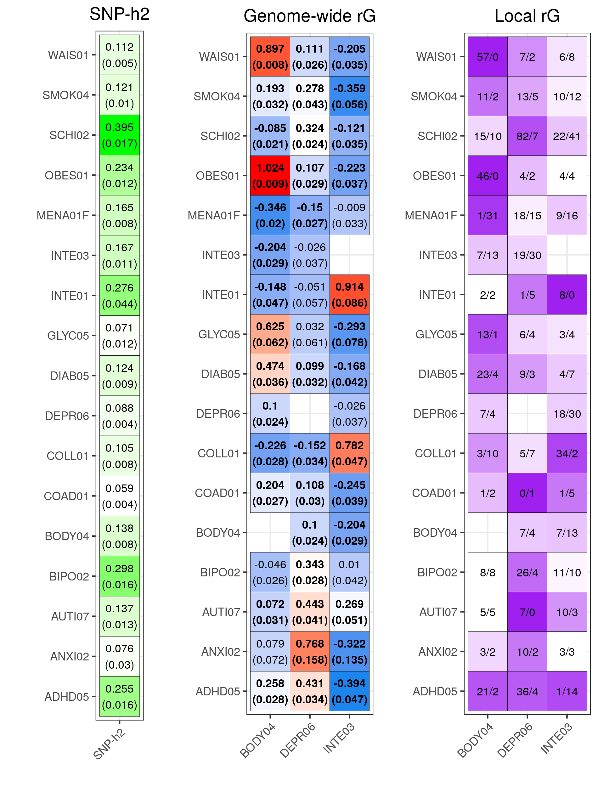
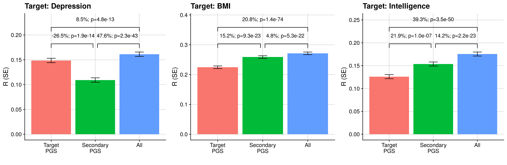
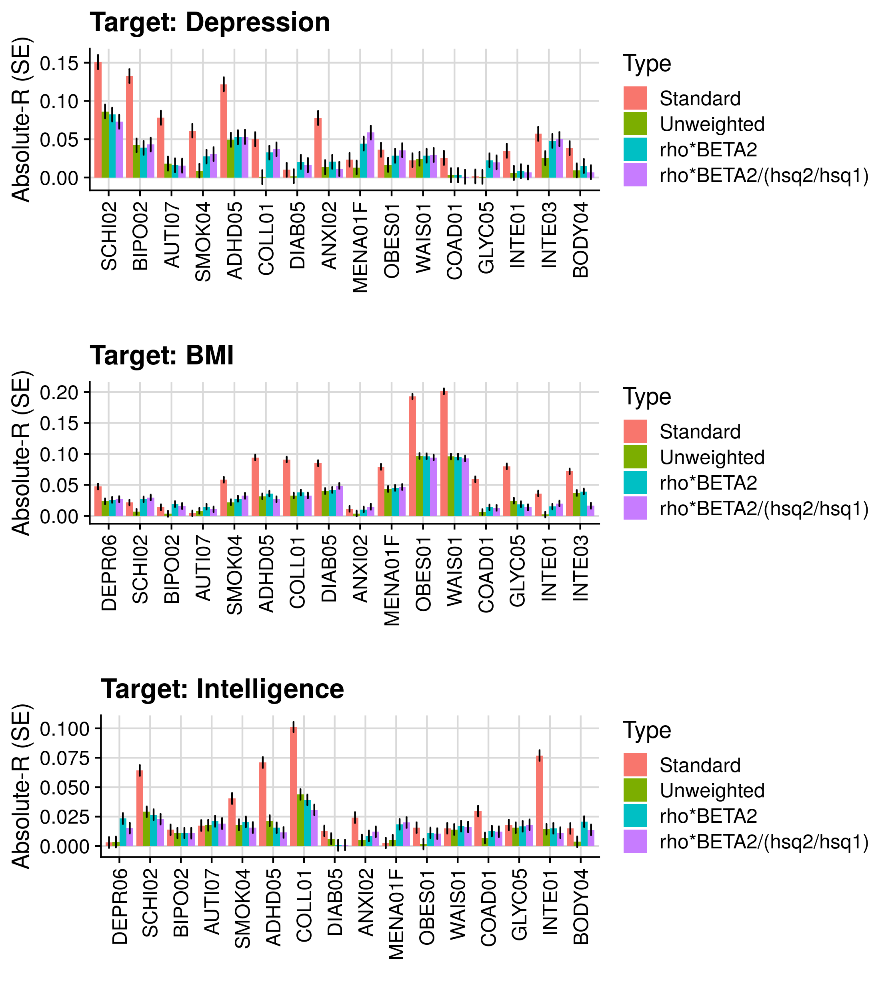
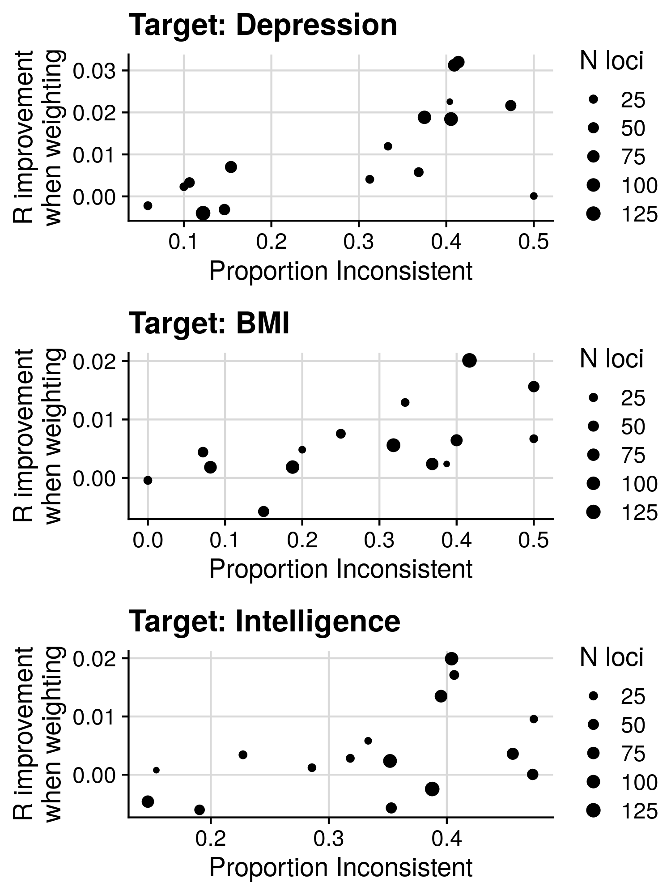
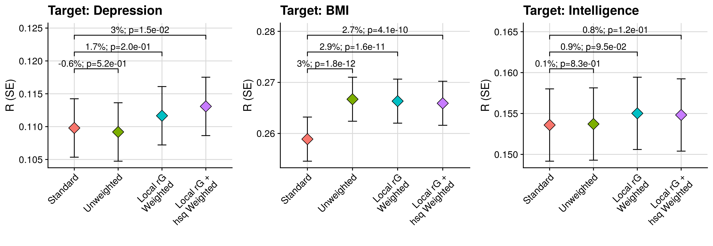
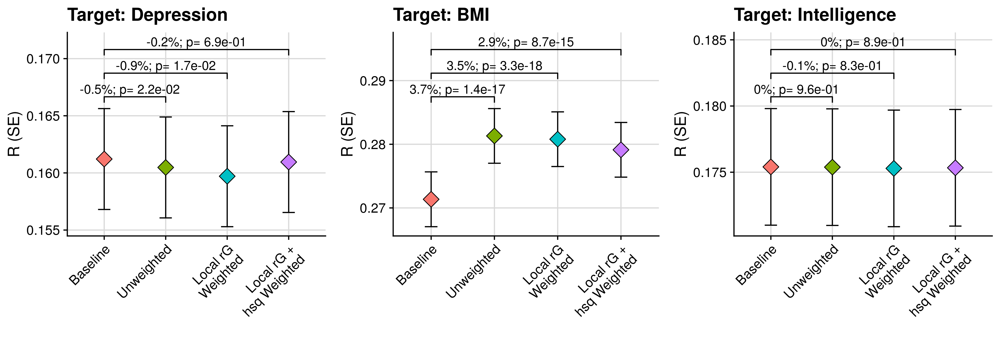

```{r setup, include=FALSE}
knitr::opts_chunk$set(echo = TRUE)
```

<style>
p.caption {
  font-size: 1.5em;
}
</style>

```{css, echo=F}
pre code, pre, code {
  white-space: pre !important;
  overflow-x: scroll !important;
  word-break: keep-all !important;
  word-wrap: initial !important;
}
```

***

# Introduction

Here we will test whether weighting PGS by local heritability and genetic correlations with the target phenotype improves prediction. We will use three target outcomes: Depression, BMI, and Intelligence. We will collect GWAS for traits geneticaly correlated with the target outcomes, derive polygenic scores using the leading PRS method (LDAK MegaPRS), and then evaluate their predictive utility before and after weighting by local genetic correlation (estimated using HESS or LAVA).

A preprint of this work can be found [here](https://doi.org/10.1101/2022.03.10.483736).  

***

# Methods

***

## GWAS sumstats

***

### Depression

Target trait GWAS: Wray et al. excl UKB

Secondary GWAS: Schizophreina (PGC2), Bipolar disorder (PGC2), Autism, Smoking, ADHD, Educationtional attainment, Anxiety, age at menarche

***

### BMI 

Target trait GWAS: Locke et al.

Secondary GWAS: Obesity, Childhood obesity, Waist circumference, coronary artery disease, age at menarche, Educationtional attainment, type 2 diabetes, fasting insulin.

***

### Intelligence

Target trait GWAS: Intelligence

Secondary GWAS: Educational attainment, high IQ, Childhood IQ, ADHD, Depression, Schizophrenia, Autism, Longevity

***

<details><summary>Remove sample overlap between UKB and Savage et al. Intelligence GWAS</summary>

Jeanne Savage has kindly sent me the UKB only sumstats. The UKB data was derived from two versions of the same fluid IQ test, one carried out in-person on a touchscreen device (‘ts’) and one web-based (‘wb’). There are two separate GWAS files, one for each of these variables, which were meta-analyzed alongside the other datasets.

To avoid sample overlap, we will first meta-analyse the two UKB sumstats using syntax provided by Jeanne, and then substract the UKB meta-GWAS sumstats from the Savage et al. sumstats.

```{bash, eval=F, echo=T}

# Run METAL
/users/k1806347/brc_scratch/Software/metal.sh

SCHEME SAMPLESIZE
MARKER SNP
WEIGHT N
ALLELE EFF_ALL NONEFF_ALL
EFFECT BETA
STDERR SE
PVALUE P
PROCESS /users/k1806347/brc_scratch/Data/GWAS_sumstats/Savage/ts_clean_mac100_info60.sumstats.gz
PROCESS /users/k1806347/brc_scratch/Data/GWAS_sumstats/Savage/wb_clean_mac100_info60.sumstats.gz
MINWEIGHT 50000
OUTFILE /users/k1806347/brc_scratch/Data/GWAS_sumstats/Savage/ukb_meta .tbl

ANALYZE

QUIT

```

```{r, eval=F, echo=T}
# Format the METAL output
library(data.table)

# Read in the sumstats
ukb_meta<-fread('/users/k1806347/brc_scratch/Data/GWAS_sumstats/Savage/ukb_meta1.tbl')

# Format for QC using GenoFunc sumstat_cleaner.R
names(ukb_meta)<-c('SNP','A1','A2','N','BETA','P','Direction')
ukb_meta$CHR<-gsub(':.*','',ukb_meta$SNP)
ukb_meta$ORIGBP<-gsub('.*:','',ukb_meta$SNP)
ukb_meta$A1<-toupper(ukb_meta$A1)
ukb_meta$A2<-toupper(ukb_meta$A2)
ukb_meta$SE<-1
ukb_meta<-ukb_meta[,c('CHR','ORIGBP','A1','A2','BETA','SE','N','P'),with=F]

fwrite(ukb_meta, '/users/k1806347/brc_scratch/Data/GWAS_sumstats/Savage/ukb_meta1_reformat.tbl.gz', quote=F, sep=' ', na='NA')

```

```{bash, eval=F, echo=T}
# Run GenoFunc sumstat_cleaner on UKB meta-analysis
cd /users/k1806347/brc_scratch/Software/MyGit/GenoFunc/GenoFuncPipe

/users/k1806347/brc_scratch/Software/Rscript.sh scripts/sumstat_cleaner.R \
  --sumstats /users/k1806347/brc_scratch/Data/GWAS_sumstats/Savage/ukb_meta1_reformat.tbl.gz \
  --ref_chr resources/data/1kg/1KG.Phase3.EUR.MAF_001.chr \
  --output /users/k1806347/brc_scratch/Data/GWAS_sumstats/Savage/ukb_meta1_cleaned

# Run GenoFunc sumstat_cleaner on full Savage meta-analysis
cd /users/k1806347/brc_scratch/Software/MyGit/GenoFunc/GenoFuncPipe

/users/k1806347/brc_scratch/Software/Rscript.sh scripts/sumstat_cleaner.R \
  --sumstats /scratch/groups/ukbiobank/sumstats/cleaned/INTE03.gz \
  --ref_chr resources/data/1kg/1KG.Phase3.EUR.MAF_001.chr \
  --output /users/k1806347/brc_scratch/Data/GWAS_sumstats/Savage/INTE03_cleaned

```

```{r, eval=F, echo=T}
# Read in the full and ukb only sumstats
library(data.table)

full<-fread('/users/k1806347/brc_scratch/Data/GWAS_sumstats/Savage/INTE03_cleaned.gz')
ukb<-fread('/users/k1806347/brc_scratch/Data/GWAS_sumstats/Savage/ukb_meta1_cleaned.gz')

# Calculate Z
full$Z<-full$BETA/full$SE
ukb$Z<-ukb$BETA/ukb$SE

# Merge together
both_matched<-merge(full[,c('CHR','BP','SNP','A1','A2','Z','N'), with=F], ukb[,c('SNP','A1','A2','Z','N'), with=F], by=c('SNP','A1','A2'))

# Calculate weight of full and ukb cohorts
both_matched$W.x<-sqrt(both_matched$N.x)
both_matched$W.y<-sqrt(both_matched$N.y)

# Perform the meta-analysis in reverse to calculate the sumstats based on all cohorts except UK Biobank (https://www.ncbi.nlm.nih.gov/pmc/articles/PMC2922887/)
# Subtract the UKB Z (Z.y) from the full Z (Z.x)
both_matched$Z.noukb<-((both_matched$Z.x*both_matched$W.x)-(both_matched$Z.y*both_matched$W.y)) / sqrt((both_matched$W.x^2)-(both_matched$W.y^2))

# Calcualte N of meta-analysis without UKB
both_matched$N.noukb<-both_matched$N.x - both_matched$N.y

# Subset relevent columns and format for GenoPredPipe QC
both_matched<-both_matched[,c('CHR','BP','SNP','A1','A2','Z.noukb','N.noukb'), with=T]
both_matched$P<-2*pnorm(-abs(both_matched$Z.noukb))
names(both_matched)<-c('CHR','ORIGBP','SNP','A1','A2','BETA','N','P')

fwrite(both_matched, '/users/k1806347/brc_scratch/Data/GWAS_sumstats/Savage/INTE03_noUKB.gz', quote=F, sep=' ', na='NA')

```

</details>index

<details><summary>Create table listing GWAS</summary>

```{r, eval=F, echo=T}
# I need the latest csv of the database to create the table
gwas<-c('DEPR06','SCHI02','BIPO02','AUTI07','SMOK04','ADHD05','COLL01','DIAB05','ANXI02','MENA01F','OBES01','WAIS01','COAD01','GLYC05','INTE01','INTE03','BODY04')
pheno<-read.csv('/users/k1806347/brc_scratch/Data/GWAS_sumstats/QC_sumstats_list_031218.csv', stringsAsFactors=F)

pheno<-pheno[pheno$Code %in% gwas,]
pheno<-pheno[c('Code','sample_size_discovery','Ncases','Ncontrols','PMID')]
pheno<-pheno[match(gwas, pheno$Code),]
pheno$Code<-gwas
pheno$Phenotype<-c('Major Depression','Schizophrenia','Bipolar Disorder','Autism','Smoking (Ever/Never Regular)','Attention Deficit Hyperactivity Disorder','College Completion','Type-2 Diabetes','Anxiety (Factor Score)','Age at Menarche','Obesity Class 1','Waist Circumference','Coronary Arety Disease','Fasting Insulin (Age- & Sex-adjusted)','Childhood Intelligence','Intelligence','BMI')
pheno$PMID[pheno$Code == 'BIPO02']<-'31043756'
pheno$PMID[pheno$Code == 'AUTI07']<-'30804558'
pheno$PMID[pheno$Code == 'ADHD05']<-'30478444'
pheno$PMID[pheno$Code == 'INTE03']<-'29942086'

# Update INTE03 information to account for removal of UKB
pheno$sample_size_discovery[pheno$Code== 'INTE03']<-74214

names(pheno)<-c('Code','N','Ncase','Ncon','PMID','Phenotype')

pheno$N<-gsub(',','',pheno$N)
pheno$Ncase<-gsub(',','',pheno$Ncase)
pheno$Ncon<-gsub(',','',pheno$Ncon)

pheno$Ncase[pheno$Code == 'BIPO02']<-20352
pheno$Ncon[pheno$Code == 'BIPO02']<-31358
pheno$Ncase[pheno$Code == 'AUTI07']<-18381
pheno$Ncon[pheno$Code == 'AUTI07']<-27969

pheno$N<-as.numeric(pheno$N)
pheno$Ncase<-as.numeric(pheno$Ncase)
pheno$Ncon<-as.numeric(pheno$Ncon)

pheno$N[is.na(pheno$N)]<-pheno$Ncase[is.na(pheno$N)]+pheno$Ncon[is.na(pheno$N)]

pheno<-pheno[,c('Code','Phenotype','N','Ncase','Ncon','PMID')]

write.csv(pheno, '/users/k1806347/brc_scratch/Analyses/local_rg_pgs/gwas_lis.csv', row.names=F, quote=F)

```

</details>index

<details><summary>Show table of GWAS sumstats</summary>

```{r, echo=F, eval=T, results='asis'}
res<-read.csv("/users/k1806347/brc_scratch/Analyses/local_rg_pgs/gwas_lis.csv")

library(knitr)
kable(res, rownames = FALSE)
```

</details>

***

### GWAS Quality Control

<details><summary>Show code</summary>

```{bash, eval=F, echo=T}
. /users/k1806347/brc_scratch/Software/MyGit/GenoPred/config_used/Pipeline_prep.config

# Create directory
mkdir -p /users/k1806347/brc_scratch/Analyses/local_rg_pgs/GWAS_sumstats

```

```{r, eval=F, echo=T}
gwas<-c('/scratch/groups/ukbiobank/sumstats/cleaned/DEPR06','/scratch/groups/ukbiobank/sumstats/cleaned/SCHI02','/scratch/groups/ukbiobank/sumstats/cleaned/BIPO02','/scratch/groups/ukbiobank/sumstats/cleaned/AUTI07','/scratch/groups/ukbiobank/sumstats/cleaned/SMOK04','/scratch/groups/ukbiobank/sumstats/cleaned/ADHD05','/scratch/groups/ukbiobank/sumstats/cleaned/COLL01','/scratch/groups/ukbiobank/sumstats/cleaned/DIAB05','/scratch/groups/ukbiobank/sumstats/cleaned/ANXI02','/scratch/groups/ukbiobank/sumstats/cleaned/MENA01F','/scratch/groups/ukbiobank/sumstats/cleaned/OBES01','/scratch/groups/ukbiobank/sumstats/cleaned/WAIS01','/scratch/groups/ukbiobank/sumstats/cleaned/COAD01','/scratch/groups/ukbiobank/sumstats/cleaned/GLYC05','/scratch/groups/ukbiobank/sumstats/cleaned/INTE01','/users/k1806347/brc_scratch/Data/GWAS_sumstats/Savage/INTE03_noUKB','/scratch/groups/ukbiobank/sumstats/cleaned/BODY04')

gwas_id<-gsub('_.*','',gsub('.*/','',gwas))

to_do<-data.frame(file=gwas, id=gwas_id)
to_do$file<-paste0(to_do$file,'.gz')

# Remove from list if already cleaned
for(i in to_do$id){
  if(file.exists(paste0('/users/k1806347/brc_scratch/Analyses/local_rg_pgs/GWAS_sumstats/',i,'.cleaned.gz'))){
    to_do$cleaned<-T
  } else {
    to_do$cleaned<-F
  }
}

to_do<-to_do[to_do$cleaned == F,]
to_do$cleaned<-NULL

write.table(to_do, '/users/k1806347/brc_scratch/Analyses/local_rg_pgs/GWAS_sumstats/todo.txt', col.names=F, row.names=F, quote=F)

```

```{bash, echo=T, eval=F}

# Create shell script to run using sbatch
cat > /users/k1806347/brc_scratch/Analyses/local_rg_pgs/GWAS_sumstats/sbatch.sh << 'EOF'
#!/bin/sh

#SBATCH -p shared,brc
#SBATCH --mem 5G

. /users/k1806347/brc_scratch/Software/MyGit/GenoPred/config_used/Pipeline_prep.config

file=$(awk -v var="$SLURM_ARRAY_TASK_ID" 'NR == var {print $1}' /users/k1806347/brc_scratch/Analyses/local_rg_pgs/GWAS_sumstats/todo.txt)
id=$(awk -v var="$SLURM_ARRAY_TASK_ID" 'NR == var {print $2}' /users/k1806347/brc_scratch/Analyses/local_rg_pgs/GWAS_sumstats/todo.txt)

/users/k1806347/brc_scratch/Software/Rscript.sh /users/k1806347/brc_scratch/Software/MyGit/GenoPred/Scripts/sumstat_cleaner/sumstat_cleaner.R \
  --sumstats ${file} \
  --ref_plink_chr ${Geno_1KG_dir}/1KGPhase3.w_hm3.chr \
  --ref_freq_chr ${Geno_1KG_dir}/freq_files/EUR/1KGPhase3.w_hm3.EUR.chr \
  --output /users/k1806347/brc_scratch/Analyses/local_rg_pgs/GWAS_sumstats/${id}.cleaned

EOF

sbatch --array 1-$(wc -l /users/k1806347/brc_scratch/Analyses/local_rg_pgs/GWAS_sumstats/todo.txt | cut -d' ' -f1)%5 /users/k1806347/brc_scratch/Analyses/local_rg_pgs/GWAS_sumstats/sbatch.sh

# GLYC05 contains MAF so FREQ doesn't correspond to particular allele. As a result we are loosing many SNPs. Remove FREQ column and re-QC.

cp ${gwas_rep_cleaned}/GLYC05.gz /users/k1806347/brc_scratch/Analyses/local_rg_pgs/GWAS_sumstats/GLYC05_tmp.gz
zcat /users/k1806347/brc_scratch/Analyses/local_rg_pgs/GWAS_sumstats/GLYC05_tmp.gz | cut -f 1-3,5-8 | gzip > /users/k1806347/brc_scratch/Analyses/local_rg_pgs/GWAS_sumstats/GLYC05_tmp2.gz

/users/k1806347/brc_scratch/Software/Rscript.sh /users/k1806347/brc_scratch/Software/MyGit/GenoPred/Scripts/sumstat_cleaner/sumstat_cleaner.R \
  --sumstats /users/k1806347/brc_scratch/Analyses/local_rg_pgs/GWAS_sumstats/GLYC05_tmp2.gz \
  --ref_plink_chr ${Geno_1KG_dir}/1KGPhase3.w_hm3.chr \
  --ref_freq_chr ${Geno_1KG_dir}/freq_files/EUR/1KGPhase3.w_hm3.EUR.chr \
  --output /users/k1806347/brc_scratch/Analyses/local_rg_pgs/GWAS_sumstats/GLYC05.cleaned

rm /users/k1806347/brc_scratch/Analyses/local_rg_pgs/GWAS_sumstats/GLYC05_tmp.gz
rm /users/k1806347/brc_scratch/Analyses/local_rg_pgs/GWAS_sumstats/GLYC05_tmp2.gz
```

</details>

***

## Estimate genome-wide and local genetic correlation

<details><summary>Show code</summary>

```{r, echo=T, eval=F}
# Create phenotype data.frame
# Leave number of cases and control as NA as when set as bainry LAVA seems to take a lot longer.
# We can convert the heritability estimatest to the liability model later if we want to.

gwas<-c('DEPR06','SCHI02','BIPO02','AUTI07','SMOK04','ADHD05','COLL01','DIAB05','ANXI02','MENA01F','OBES01','WAIS01','COAD01','GLYC05','INTE01','INTE03','BODY04')

pheno<-data.frame(phenotype=gwas,
                  cases=NA,
                  controls=NA,
                  prevalence=NA,
                  filename=paste0('/users/k1806347/brc_scratch/Analyses/local_rg_pgs/GWAS_sumstats/', gwas,'.cleaned.gz'))

dir.create('/users/k1806347/brc_scratch/Analyses/local_rg_pgs/lava/')
write.table(pheno, '/users/k1806347/brc_scratch/Analyses/local_rg_pgs/lava/input.info.txt', col.names=T, row.names=F, quote=F)

```

```{bash, echo=T, eval=F}
##########
# Prepare sample overlap file
##########

# Munge all sumstats
for gwas in $(echo DEPR06 SCHI02 BIPO02 AUTI07 SMOK04 ADHD05 COLL01 DIAB05 ANXI02 MENA01F OBES01 WAIS01 COAD01 GLYC05 INTE01 INTE03 BODY04); do
  sbatch -p brc,shared ~/brc_scratch/Software/munge_sumstats.sh \
   --sumstats /users/k1806347/brc_scratch/Analyses/local_rg_pgs/GWAS_sumstats/${gwas}.cleaned.gz \
   --merge-alleles /users/k1806347/brc_scratch/Data/ldsc/w_hm3.snplist \
   --out /users/k1806347/brc_scratch/Analyses/local_rg_pgs/GWAS_sumstats/${gwas}.cleaned
done

# Run bivariate LDSC for all traits
mkdir /users/k1806347/brc_scratch/Analyses/local_rg_pgs/lava/sample_overlap

for gwas1 in $(echo DEPR06 SCHI02 BIPO02 AUTI07 SMOK04 ADHD05 COLL01 DIAB05 ANXI02 MENA01F OBES01 WAIS01 COAD01 GLYC05 INTE01 INTE03 BODY04); do
for gwas2 in $(echo DEPR06 SCHI02 BIPO02 AUTI07 SMOK04 ADHD05 COLL01 DIAB05 ANXI02 MENA01F OBES01 WAIS01 COAD01 GLYC05 INTE01 INTE03 BODY04); do
   sbatch -p brc,shared ~/brc_scratch/Software/ldsc.sh \
     --rg /users/k1806347/brc_scratch/Analyses/local_rg_pgs/GWAS_sumstats/${gwas1}.cleaned.sumstats.gz,/users/k1806347/brc_scratch/Analyses/local_rg_pgs/GWAS_sumstats/${gwas2}.cleaned.sumstats.gz \
     --ref-ld-chr /users/k1806347/brc_scratch/Data/ldsc/eur_w_ld_chr/ \
     --w-ld-chr /users/k1806347/brc_scratch/Data/ldsc/eur_w_ld_chr/ \
     --out /users/k1806347/brc_scratch/Analyses/local_rg_pgs/lava/sample_overlap/${gwas1}_${gwas2}_rg
done
done

# Collate results
cd /users/k1806347/brc_scratch/Analyses/local_rg_pgs/lava/sample_overlap/
FILES=($(ls *_rg.log))
N=$(echo ${#FILES[@]})
for I in ${FILES[@]}; do
        PHEN=$(echo $I | sed 's/_rg\.log//')
        
        # subset log files to relevant output
        tail -n 5 $I | head -n 2 > $PHEN.rg
        
        # add to single data set
        if [[ $I == ${FILES[0]} ]]; then
        	cat $PHEN.rg > all.rg
        else
        	cat $PHEN.rg | sed '1d' >> all.rg
        fi
done

```

```{r, eval=F, echo=T}
scor = read.table("/users/k1806347/brc_scratch/Analyses/local_rg_pgs/lava/sample_overlap/all.rg",header=T)              # read in
scor = scor[,c("p1","p2","gcov_int")]             # retain key headers
scor$p1 = gsub('/users/k1806347/brc_scratch/Analyses/local_rg_pgs/GWAS_sumstats/','',gsub(".cleaned.sumstats.gz","",scor$p1))
scor$p2 = gsub('/users/k1806347/brc_scratch/Analyses/local_rg_pgs/GWAS_sumstats/','',gsub(".cleaned.sumstats.gz","",scor$p2))
phen = unique(scor$p1)
n = length(phen)
mat = matrix(NA,n,n)                    # create matrix
rownames(mat) = colnames(mat) = phen    # set col/rownames
for (i in phen) {
        for (j in phen) {
                mat[i,j] = subset(scor, p1==i & p2==j)$gcov_int
        }
}
if (!all(t(mat)==mat)) { mat[lower.tri(mat)] = t(mat)[lower.tri(mat)] }  # sometimes there might be small differences in gcov_int depending on which phenotype was analysed as the outcome / predictor
mat = round(cov2cor(mat),5)                       # standardise
write.table(mat, "/users/k1806347/brc_scratch/Analyses/local_rg_pgs/lava/sample_overlap/sample.overlap.txt", quote=F)   # save
```

```{bash, echo=T, eval=F}
#####
# Create R script to run LAVA across genome
#####

cat > /users/k1806347/brc_scratch/Analyses/local_rg_pgs/lava/lava.R << 'EOF'
# command line arguments, specifying input/output file names and phenotype subset
arg = commandArgs(T); ref.prefix = arg[1]; loc.file = arg[2]; info.file = arg[3]; sample.overlap.file = arg[4]; phenos = unlist(strsplit(arg[5],",")); out.fname = arg[6]

### Load package
library(LAVA)

### Read in data
loci = read.loci(loc.file); n.loc = nrow(loci)
input = process.input(info.file, sample.overlap.file, ref.prefix, phenos)

print(paste("Starting LAVA analysis for",n.loc,"loci"))
progress = ceiling(quantile(1:n.loc, seq(.05,1,.05)))   # (if you want to print the progress)

### Analyse
u=b=list()
for (i in 1:n.loc) {
        if (i %in% progress) print(paste("..",names(progress[which(progress==i)])))     # (printing progress)
        locus = process.locus(loci[i,], input)                                          # process locus
        
        # It is possible that the locus cannot be defined for various reasons (e.g. too few SNPs), so the !is.null(locus) check is necessary before calling the analysis functions.
        if (!is.null(locus)) {
                # extract some general locus info for the output
                loc.info = data.frame(locus = locus$id, chr = locus$chr, start = locus$start, stop = locus$stop, n.snps = locus$n.snps, n.pcs = locus$K)
                
                # run the univariate and bivariate tests
                loc.out = run.univ.bivar(locus)
                u[[i]] = cbind(loc.info, loc.out$univ)
                if(!is.null(loc.out$bivar)) b[[i]] = cbind(loc.info, loc.out$bivar)
        }
}

# save the output
write.table(do.call(rbind,u), paste0(out.fname,".univ.lava"), row.names=F,quote=F,col.names=T)
write.table(do.call(rbind,b), paste0(out.fname,".bivar.lava"), row.names=F,quote=F,col.names=T)

print(paste0("Done! Analysis output written to ",out.fname,".*.lava"))

EOF

########
# Run LAVA for each target GWAS
########

for target_gwas in $(echo DEPR06 BODY04 INTE03); do
for secondary_gwas in $(echo DEPR06 SCHI02 BIPO02 AUTI07 SMOK04 ADHD05 COLL01 DIAB05 ANXI02 MENA01F OBES01 WAIS01 COAD01 GLYC05 INTE01 INTE03 BODY04); do
if [ ${target_gwas} != ${secondary_gwas} ]; then
mkdir -p /users/k1806347/brc_scratch/Analyses/local_rg_pgs/lava/results/${target_gwas}
sbatch -p brc,shared --mem 10G /users/k1806347/brc_scratch/Software/Rscript.sh /users/k1806347/brc_scratch/Analyses/local_rg_pgs/lava/lava.R \
  /users/k1806347/brc_scratch/Data/1KG/Phase3/1KGPhase3.w_hm3.GW \
  /users/k1806347/brc_scratch/Data/LAVA/blocks_s2500_m25_f1_w200.GRCh37_hg19.locfile \
  /users/k1806347/brc_scratch/Analyses/local_rg_pgs/lava/input.info.txt \
  /users/k1806347/brc_scratch/Analyses/local_rg_pgs/lava/sample_overlap/sample.overlap.txt \
  ${target_gwas},${secondary_gwas} \
  /users/k1806347/brc_scratch/Analyses/local_rg_pgs/lava/results/${target_gwas}/${target_gwas}.${secondary_gwas}
fi
done

sleep 9000
done

# Notes: If the target phenotype GWAS does not have a large sample, then heritability within a locus may not be significant, and therefore rho cannot be accuratly estimated. This means there may also be an advantage to using unweighted secondary PGS as they may contain information from shared loci that cannot be identified using LAVA.
# This takes approximately 2.5 hours per pair of traits
```

</details>

***

## Characterise the genome-wide and local genetic correlation results

<details><summary>Show code</summary>

```{r, eval=F, echo=T}
library(data.table)
library(cowplot)
library(ggplot2)

target_gwas<-c('DEPR06','BODY04','INTE03')
secondary_gwas<-c('DEPR06','SCHI02','BIPO02','AUTI07','SMOK04','ADHD05','COLL01','DIAB05','ANXI02','MENA01F','OBES01','WAIS01','COAD01','GLYC05','INTE01','INTE03','BODY04')

ncase<-c(116404,33640,20352,18381,41969,19099,NA,26676,NA,NA,32858,NA,60801,NA,NA,NA,NA)
ncon<-c(314990,43456,31358,27969,32066,34194,NA,132532,NA,NA,65839,NA,123504,NA,NA,NA,NA)
prev<-c(0.15,0.01,0.015,0.012,0.5,0.05,NA,0.05,NA,NA,0.13,NA,0.03,NA,NA,NA,NA)

des<-NULL
all_res<-NULL
for(target_gwas_i in target_gwas){
  for(secondary_gwas_i in secondary_gwas[secondary_gwas != target_gwas_i]){
    univ_res<-fread(paste0('/users/k1806347/brc_scratch/Analyses/local_rg_pgs/lava/results/',target_gwas_i,'/',target_gwas_i,'.',secondary_gwas_i,'.univ.lava'))
    bivar_res<-fread(paste0('/users/k1806347/brc_scratch/Analyses/local_rg_pgs/lava/results/',target_gwas_i,'/',target_gwas_i,'.',secondary_gwas_i,'.bivar.lava'))
    
    # Convert heritability to liability scale
    h2l_R2 <- function(k, r2, p) {
      x= qnorm(1-k)
      z= dnorm(x)
      i=z/k
      C= k*(1-k)*k*(1-k)/(z^2*p*(1-p))
      theta= i*((p-k)/(1-k))*(i*((p-k)/(1-k))-x)
      h2l_R2 = C*r2 / (1 + C*theta*r2)
      return(h2l_R2)
    }
    
    univ_res$h2.liab<-NA
    for(trait in c(target_gwas_i, secondary_gwas_i)){
      if(!is.na(ncase[secondary_gwas == trait])){
        univ_res$h2.liab[univ_res$phen == trait]<-h2l_R2(k=prev[secondary_gwas == trait], r2=univ_res$h2.obs[univ_res$phen == trait], p=ncase[secondary_gwas == trait]/(ncase[secondary_gwas == trait]+ncon[secondary_gwas == trait]))
      } else {
        univ_res$h2.liab[univ_res$phen == trait]<-univ_res$h2.obs[univ_res$phen == trait]
      }
    }
    
    # Calculate SE for h2
    univ_res$z<-abs(qnorm(univ_res$p))
    univ_res$se<-univ_res$h2.liab/univ_res$z
    
    bivar_res<-bivar_res[!is.na(bivar_res$p),]
    
    bivar_res$Direction<-'+'
    bivar_res$Direction[bivar_res$rho < 0]<-'-'
    
    bivar_res$p.fdr<-p.adjust(bivar_res$p, method='fdr')
    
    univ_res_wide<-merge(univ_res[univ_res$phen == target_gwas_i,c('locus','chr','start','stop','h2.obs','se','z','p')],univ_res[univ_res$phen == secondary_gwas_i,c('locus','h2.obs','se','z','p')], by='locus')
      
    tmp<-merge(univ_res_wide, bivar_res[,c('locus','rho','p','phen1','phen2')], by='locus')
    
    all_res<-rbind(all_res, tmp)
    
    des<-rbind(des, data.frame(target=target_gwas_i,
                               secondary=secondary_gwas_i,
                               n_loci=nrow(bivar_res),
                               n_snps=sum(bivar_res$n.snps),
                               n_sig_loci=nrow(bivar_res[bivar_res$p < 0.05,]),
                               n_sig_snps=sum(bivar_res[bivar_res$p < 0.05,]$n.snps),
                               n_sig_loci_pos=nrow(bivar_res[bivar_res$p < 0.05 & bivar_res$Direction == '+',]),
                               n_sig_loci_neg=nrow(bivar_res[bivar_res$p < 0.05 & bivar_res$Direction == '-',]),
                               n_sig_fdr_loci=nrow(bivar_res[bivar_res$p.fdr < 0.05,]),
                               n_sig_fdr_snps=sum(bivar_res[bivar_res$p.fdr < 0.05,]$n.snps),
                               n_sig_fdr_loci_pos=nrow(bivar_res[bivar_res$p.fdr < 0.05 & bivar_res$Direction == '+',]),
                               n_sig_fdr_loci_neg=nrow(bivar_res[bivar_res$p.fdr < 0.05 & bivar_res$Direction == '-',])))
  }
}

write.table(des, paste0('/users/k1806347/brc_scratch/Analyses/local_rg_pgs/lava/results/lava_descript.csv'), row.names = F, quote=F)
write.table(all_res, paste0('/users/k1806347/brc_scratch/Analyses/local_rg_pgs/lava/results/all_res.csv'), row.names = F, quote=F)

```

</details>

***

## Generate polygenic scores

<details><summary>Show code</summary>

```{bash, eval=F, echo=T}
. /users/k1806347/brc_scratch/Software/MyGit/GenoPred/config_used/Pipeline_prep.config

gwas=$(echo DEPR06 SCHI02 BIPO02 AUTI07 SMOK04 ADHD05 COLL01 DIAB05 ANXI02 MENA01F OBES01 WAIS01 COAD01 GLYC05 INTE01 INTE03 BODY04)

# Create directory
mkdir -p /users/k1806347/brc_scratch/Analyses/local_rg_pgs/score_files/LDAK

# Create file listing GWAS that haven't been processed.
> /users/k1806347/brc_scratch/Analyses/local_rg_pgs/score_files/LDAK/todo.txt
for gwas_i in $(echo DEPR06 SCHI02 BIPO02 AUTI07 SMOK04 ADHD05 COLL01 DIAB05 ANXI02 MENA01F OBES01 WAIS01 COAD01 GLYC05 INTE01 INTE03 BODY04);do
if [ ! -f /users/k1806347/brc_scratch/Analyses/local_rg_pgs/score_files/LDAK/${gwas_i}/1KGPhase3.w_hm3.${gwas_i}.EUR.scale ]; then
echo ${gwas_i} >> /users/k1806347/brc_scratch/Analyses/local_rg_pgs/score_files/LDAK/todo.txt
fi
done

# Create shell script to run using sbatch
cat > /users/k1806347/brc_scratch/Analyses/local_rg_pgs/score_files/LDAK/sbatch.sh << 'EOF'
#!/bin/sh

#SBATCH -p shared,brc
#SBATCH --mem 20G
#SBATCH -n 5
#SBATCH --nodes 1
#SBATCH -J LDAK

. /users/k1806347/brc_scratch/Software/MyGit/GenoPred/config_used/Pipeline_prep.config

gwas=$(awk -v var="$SLURM_ARRAY_TASK_ID" 'NR == var {print $1}' /users/k1806347/brc_scratch/Analyses/local_rg_pgs/score_files/LDAK/todo.txt)

echo ${gwas}

/users/k1806347/brc_scratch/Software/Rscript.sh /users/k1806347/brc_scratch/Software/MyGit/GenoPred/Scripts/ldak_mega_prs/ldak_mega_prs.R \
--ref_plink ${Geno_1KG_dir}/1KGPhase3.w_hm3.GW \
--ref_keep ${Geno_1KG_dir}/keep_files/EUR_samples.keep \
--sumstats /users/k1806347/brc_scratch/Analyses/local_rg_pgs/GWAS_sumstats/${gwas}.cleaned.gz \
--plink1 ${plink1_9} \
--plink2 ${plink2} \
--ldak /users/k1806347/brc_scratch/Software/ldak5.1.linux \
--ldak_map /users/k1806347/brc_scratch/Data/LDAK/genetic_map_b37 \
--ldak_tag /users/k1806347/brc_scratch/Data/LDAK/bld/ \
--ldak_highld /users/k1806347/brc_scratch/Data/LDAK/highld.txt \
--memory 5000 \
--n_cores 5 \
--output /users/k1806347/brc_scratch/Analyses/local_rg_pgs/score_files/LDAK/${gwas}/1KGPhase3.w_hm3.${gwas} \
--ref_pop_scale ${Geno_1KG_dir}/super_pop_keep.list

EOF

sbatch --array 1-$(wc -l /users/k1806347/brc_scratch/Analyses/local_rg_pgs/score_files/LDAK/todo.txt | cut -d' ' -f1)%6 /users/k1806347/brc_scratch/Analyses/local_rg_pgs/score_files/LDAK/sbatch.sh

```

</details>

***

## Reweight polygenic scores

<details><summary>Show code</summary>

```{r, eval=F, echo=T}
library(data.table)

# Read in reference bim for RSID coordinates
ref_bim<-fread('/users/k1806347/brc_scratch/Data/1KG/Phase3/1KGPhase3.w_hm3.GW.bim')
names(ref_bim)<-c('CHR','SNP','POS','BP','A1','A2')

# Read in the rho estimates
target_gwas<-c('DEPR06','BODY04','INTE03')
secondary_gwas<-c('DEPR06','SCHI02','BIPO02','AUTI07','SMOK04','ADHD05','COLL01','DIAB05','ANXI02','MENA01F','OBES01','WAIS01','COAD01','GLYC05','INTE01','INTE03','BODY04')

ncase<-c(116404,33640,20352,18381,41969,19099,NA,26676,NA,NA,32858,NA,60801,NA,NA,NA,NA)
ncon<-c(314990,43456,31358,27969,32066,34194,NA,132532,NA,NA,65839,NA,123504,NA,NA,NA,NA)
prev<-c(0.15,0.01,0.015,0.012,0.5,0.05,NA,0.05,NA,NA,0.13,NA,0.03,NA,NA,NA,NA)

univ_res_all<-list()
for(target_gwas_i in target_gwas){
  for(secondary_gwas_i in secondary_gwas[secondary_gwas != target_gwas_i]){
    univ_res<-fread(paste0('/users/k1806347/brc_scratch/Analyses/local_rg_pgs/lava/results/',target_gwas_i,'/',target_gwas_i,'.',secondary_gwas_i,'.univ.lava'))
    
    # Remove loci with non-significant heritability
    univ_res<-univ_res[univ_res$p < 0.05,]
    
    # Convert heritability to liability scale
    h2l_R2 <- function(k, r2, p) {
      x= qnorm(1-k)
      z= dnorm(x)
      i=z/k
      C= k*(1-k)*k*(1-k)/(z^2*p*(1-p))
      theta= i*((p-k)/(1-k))*(i*((p-k)/(1-k))-x)
      h2l_R2 = C*r2 / (1 + C*theta*r2)
      return(h2l_R2)
    }
    
    univ_res$h2.liab<-NA
    for(trait in c(target_gwas_i, secondary_gwas_i)){
      if(!is.na(ncase[secondary_gwas == trait])){
        univ_res$h2.liab[univ_res$phen == trait]<-h2l_R2(k=prev[secondary_gwas == trait], r2=univ_res$h2.obs[univ_res$phen == trait], p=ncase[secondary_gwas == trait]/(ncase[secondary_gwas == trait]+ncon[secondary_gwas == trait]))
      } else {
        univ_res$h2.liab[univ_res$phen == trait]<-univ_res$h2.obs[univ_res$phen == trait]
      }
    }

    univ_res_all[[paste0(target_gwas_i,'_',secondary_gwas_i)]]<-univ_res
  }
}

bivar_res_all<-NULL
for(target_gwas_i in target_gwas){
  for(secondary_gwas_i in secondary_gwas[secondary_gwas != target_gwas_i]){
    bivar_res<-fread(paste0('/users/k1806347/brc_scratch/Analyses/local_rg_pgs/lava/results/',target_gwas_i,'/',target_gwas_i,'.',secondary_gwas_i,'.bivar.lava'))
    bivar_res<-bivar_res[!is.na(bivar_res$p),]
    bivar_res$p.fdr<-p.adjust(bivar_res$p, method='fdr')
    bivar_res_all<-rbind(bivar_res_all, bivar_res)
  }
}

# Read in the score files and reweight by rho
for(target_gwas_i in target_gwas){
  for(secondary_gwas_i in secondary_gwas[secondary_gwas != target_gwas_i]){
    
    # Write out the pseudoval model for each GWAS
    pseudo<-fread(paste0('/users/k1806347/brc_scratch/Analyses/local_rg_pgs/score_files/LDAK/',secondary_gwas_i,'/1KGPhase3.w_hm3.',secondary_gwas_i,'.pseudoval.txt'))
    
    pseudo$V1[pseudo$V2 == max(pseudo$V2)][1]
    
    score<-fread(paste0('zcat /users/k1806347/brc_scratch/Analyses/local_rg_pgs/score_files/LDAK/',secondary_gwas_i,'/1KGPhase3.w_hm3.',secondary_gwas_i,".score.gz | cut -d' ' -f 1,2,",as.numeric(gsub('Score_','',pseudo$V1[pseudo$V2 == max(pseudo$V2)][1]))+2))
    names(score)<-c('SNP','A1','SCORE')
    
    fwrite(score[,c('SNP','A1','SCORE'),with=F], paste0('/users/k1806347/brc_scratch/Analyses/local_rg_pgs/score_files/LDAK/',secondary_gwas_i,'/1KGPhase3.w_hm3.',secondary_gwas_i,".pseudo.score"), quote=F, sep=' ', na='NA')
    if(file.exists(paste0('/users/k1806347/brc_scratch/Analyses/local_rg_pgs/score_files/LDAK/',secondary_gwas_i,'/1KGPhase3.w_hm3.',secondary_gwas_i,".pseudo.score.gz"))){
      system(paste0('rm /users/k1806347/brc_scratch/Analyses/local_rg_pgs/score_files/LDAK/',secondary_gwas_i,'/1KGPhase3.w_hm3.',secondary_gwas_i,".pseudo.score.gz"))
    }
    
    system(paste0('gzip /users/k1806347/brc_scratch/Analyses/local_rg_pgs/score_files/LDAK/',secondary_gwas_i,'/1KGPhase3.w_hm3.',secondary_gwas_i,".pseudo.score"))
    
    # Now reweight the score for by rho and h2
    score_bim<-merge(score, ref_bim[,c('SNP','CHR','BP'),with=F], by='SNP')
    
    univ_res<-univ_res_all[[paste0(target_gwas_i,'_', secondary_gwas_i)]]
    
    bivar_res<-bivar_res_all[bivar_res_all$phen1 == target_gwas_i & bivar_res_all$phen2 == secondary_gwas_i,]
    
    score_bim_reweight<-NULL
    for(locus in unique(bivar_res$locus)){
      tmp<-score_bim[score_bim$CHR == bivar_res$chr[bivar_res$locus == locus] & score_bim$BP >= bivar_res$start[bivar_res$locus == locus] & score_bim$BP <= bivar_res$stop[bivar_res$locus == locus],]
      tmp$SCORE_rho<-tmp$SCORE*bivar_res$rho[bivar_res$locus == locus]
      tmp$SCORE_rho_h2<-(tmp$SCORE*bivar_res$rho[bivar_res$locus == locus])/(univ_res$h2.liab[univ_res$locus == locus & univ_res$phen == secondary_gwas_i] / univ_res$h2.liab[univ_res$locus == locus & univ_res$phen == target_gwas_i])
      
      # Create score only considering nominally significant rho
      if(bivar_res$p[bivar_res$locus == locus] < 0.05){
        tmp$SCORE_sig<-tmp$SCORE
      } else {
        tmp$SCORE_sig<-0
      }

      if(bivar_res$p[bivar_res$locus == locus] < 0.05){
        tmp$SCORE_rho_sig<-tmp$SCORE_rho
      } else {
        tmp$SCORE_rho_sig<-0
      }
      
      if(bivar_res$p[bivar_res$locus == locus] < 0.05){
        tmp$SCORE_rho_sig_h2<-tmp$SCORE_rho_h2
      } else {
        tmp$SCORE_rho_sig_h2<-0
      }

      # Create score only considering fdr significant rho
      if(bivar_res$p.fdr[bivar_res$locus == locus] < 0.05){
        tmp$SCORE_fdr<-tmp$SCORE
      } else {
        tmp$SCORE_fdr<-0
      }

      if(bivar_res$p.fdr[bivar_res$locus == locus] < 0.05){
        tmp$SCORE_rho_fdr<-tmp$SCORE_rho
      } else {
        tmp$SCORE_rho_fdr<-0
      }
      
      if(bivar_res$p.fdr[bivar_res$locus == locus] < 0.05){
        tmp$SCORE_rho_fdr_h2<-tmp$SCORE_rho_h2
      } else {
        tmp$SCORE_rho_fdr_h2<-0
      }
    
      tmp<-tmp[,c('SNP','A1','SCORE','SCORE_rho','SCORE_rho_h2','SCORE_sig','SCORE_rho_sig','SCORE_rho_sig_h2','SCORE_fdr','SCORE_rho_fdr','SCORE_rho_fdr_h2'), with=F]
      score_bim_reweight<-rbind(score_bim_reweight, tmp)
    }
    
    # Write out sig h2 restricted but unweighted
    fwrite(score_bim_reweight[,c('SNP','A1','SCORE'),with=F], paste0('/users/k1806347/brc_scratch/Analyses/local_rg_pgs/score_files/LDAK/',secondary_gwas_i,'/1KGPhase3.w_hm3.',secondary_gwas_i,".pseudo.h2_restricted_unweighted_",target_gwas_i,'.score'), quote=F, sep=' ', na='NA')
    if(file.exists(paste0('/users/k1806347/brc_scratch/Analyses/local_rg_pgs/score_files/LDAK/',secondary_gwas_i,'/1KGPhase3.w_hm3.',secondary_gwas_i,".pseudo.h2_restricted_unweighted_",target_gwas_i,'.score.gz'))){
      system(paste0('rm /users/k1806347/brc_scratch/Analyses/local_rg_pgs/score_files/LDAK/',secondary_gwas_i,'/1KGPhase3.w_hm3.',secondary_gwas_i,".pseudo.h2_restricted_unweighted_",target_gwas_i,'.score.gz'))
    }
    
    system(paste0('gzip /users/k1806347/brc_scratch/Analyses/local_rg_pgs/score_files/LDAK/',secondary_gwas_i,'/1KGPhase3.w_hm3.',secondary_gwas_i,".pseudo.h2_restricted_unweighted_",target_gwas_i,'.score'))

    # Write out sig rho restricted but unweighted
    fwrite(score_bim_reweight[,c('SNP','A1','SCORE_sig'),with=F], paste0('/users/k1806347/brc_scratch/Analyses/local_rg_pgs/score_files/LDAK/',secondary_gwas_i,'/1KGPhase3.w_hm3.',secondary_gwas_i,".pseudo.rho_restricted_unweighted_",target_gwas_i,'.score'), quote=F, sep=' ', na='NA')
    if(file.exists(paste0('/users/k1806347/brc_scratch/Analyses/local_rg_pgs/score_files/LDAK/',secondary_gwas_i,'/1KGPhase3.w_hm3.',secondary_gwas_i,".pseudo.rho_restricted_unweighted_",target_gwas_i,'.score.gz'))){
      system(paste0('rm /users/k1806347/brc_scratch/Analyses/local_rg_pgs/score_files/LDAK/',secondary_gwas_i,'/1KGPhase3.w_hm3.',secondary_gwas_i,".pseudo.rho_restricted_unweighted_",target_gwas_i,'.score.gz'))
    }
    
    system(paste0('gzip /users/k1806347/brc_scratch/Analyses/local_rg_pgs/score_files/LDAK/',secondary_gwas_i,'/1KGPhase3.w_hm3.',secondary_gwas_i,".pseudo.rho_restricted_unweighted_",target_gwas_i,'.score'))

    # Write out fdr sig rho restricted but unweighted
    fwrite(score_bim_reweight[,c('SNP','A1','SCORE_fdr'),with=F], paste0('/users/k1806347/brc_scratch/Analyses/local_rg_pgs/score_files/LDAK/',secondary_gwas_i,'/1KGPhase3.w_hm3.',secondary_gwas_i,".pseudo.rho_fdr_restricted_unweighted_",target_gwas_i,'.score'), quote=F, sep=' ', na='NA')
    if(file.exists(paste0('/users/k1806347/brc_scratch/Analyses/local_rg_pgs/score_files/LDAK/',secondary_gwas_i,'/1KGPhase3.w_hm3.',secondary_gwas_i,".pseudo.rho_fdr_restricted_unweighted_",target_gwas_i,'.score.gz'))){
      system(paste0('rm /users/k1806347/brc_scratch/Analyses/local_rg_pgs/score_files/LDAK/',secondary_gwas_i,'/1KGPhase3.w_hm3.',secondary_gwas_i,".pseudo.rho_fdr_restricted_unweighted_",target_gwas_i,'.score.gz'))
    }
    
    system(paste0('gzip /users/k1806347/brc_scratch/Analyses/local_rg_pgs/score_files/LDAK/',secondary_gwas_i,'/1KGPhase3.w_hm3.',secondary_gwas_i,".pseudo.rho_fdr_restricted_unweighted_",target_gwas_i,'.score'))

    # Write out sig h2 restricted and rho weighted
    fwrite(score_bim_reweight[,c('SNP','A1','SCORE_rho'),with=F], paste0('/users/k1806347/brc_scratch/Analyses/local_rg_pgs/score_files/LDAK/',secondary_gwas_i,'/1KGPhase3.w_hm3.',secondary_gwas_i,".pseudo.h2_restricted_rho_weighted_",target_gwas_i,'.score'), quote=F, sep=' ', na='NA')
    if(file.exists(paste0('/users/k1806347/brc_scratch/Analyses/local_rg_pgs/score_files/LDAK/',secondary_gwas_i,'/1KGPhase3.w_hm3.',secondary_gwas_i,".pseudo.h2_restricted_rho_weighted_",target_gwas_i,'.score.gz'))){
      system(paste0('rm /users/k1806347/brc_scratch/Analyses/local_rg_pgs/score_files/LDAK/',secondary_gwas_i,'/1KGPhase3.w_hm3.',secondary_gwas_i,".pseudo.h2_restricted_rho_weighted_",target_gwas_i,'.score.gz'))
    }
    
    system(paste0('gzip /users/k1806347/brc_scratch/Analyses/local_rg_pgs/score_files/LDAK/',secondary_gwas_i,'/1KGPhase3.w_hm3.',secondary_gwas_i,".pseudo.h2_restricted_rho_weighted_",target_gwas_i,'.score'))

    # Write out sig rho restricted and rho weighted
    fwrite(score_bim_reweight[,c('SNP','A1','SCORE_rho_sig'),with=F], paste0('/users/k1806347/brc_scratch/Analyses/local_rg_pgs/score_files/LDAK/',secondary_gwas_i,'/1KGPhase3.w_hm3.',secondary_gwas_i,".pseudo.rho_restricted_rho_weighted_",target_gwas_i,'.score'), quote=F, sep=' ', na='NA')
    if(file.exists(paste0('/users/k1806347/brc_scratch/Analyses/local_rg_pgs/score_files/LDAK/',secondary_gwas_i,'/1KGPhase3.w_hm3.',secondary_gwas_i,".pseudo.rho_restricted_rho_weighted_",target_gwas_i,'.score.gz'))){
      system(paste0('rm /users/k1806347/brc_scratch/Analyses/local_rg_pgs/score_files/LDAK/',secondary_gwas_i,'/1KGPhase3.w_hm3.',secondary_gwas_i,".pseudo.rho_restricted_rho_weighted_",target_gwas_i,'.score.gz'))
    }
    
    system(paste0('gzip /users/k1806347/brc_scratch/Analyses/local_rg_pgs/score_files/LDAK/',secondary_gwas_i,'/1KGPhase3.w_hm3.',secondary_gwas_i,".pseudo.rho_restricted_rho_weighted_",target_gwas_i,'.score'))
    
    # Write out fdr sig rho restricted and rho weighted
    fwrite(score_bim_reweight[,c('SNP','A1','SCORE_rho_fdr'),with=F], paste0('/users/k1806347/brc_scratch/Analyses/local_rg_pgs/score_files/LDAK/',secondary_gwas_i,'/1KGPhase3.w_hm3.',secondary_gwas_i,".pseudo.rho_fdr_restricted_rho_weighted_",target_gwas_i,'.score'), quote=F, sep=' ', na='NA')
    if(file.exists(paste0('/users/k1806347/brc_scratch/Analyses/local_rg_pgs/score_files/LDAK/',secondary_gwas_i,'/1KGPhase3.w_hm3.',secondary_gwas_i,".pseudo.rho_fdr_restricted_rho_weighted_",target_gwas_i,'.score.gz'))){
      system(paste0('rm /users/k1806347/brc_scratch/Analyses/local_rg_pgs/score_files/LDAK/',secondary_gwas_i,'/1KGPhase3.w_hm3.',secondary_gwas_i,".pseudo.rho_fdr_restricted_rho_weighted_",target_gwas_i,'.score.gz'))
    }
    
    system(paste0('gzip /users/k1806347/brc_scratch/Analyses/local_rg_pgs/score_files/LDAK/',secondary_gwas_i,'/1KGPhase3.w_hm3.',secondary_gwas_i,".pseudo.rho_fdr_restricted_rho_weighted_",target_gwas_i,'.score'))


    # Write out sig h2 restricted and rho and h2 weighted
    fwrite(score_bim_reweight[,c('SNP','A1','SCORE_rho_h2'),with=F], paste0('/users/k1806347/brc_scratch/Analyses/local_rg_pgs/score_files/LDAK/',secondary_gwas_i,'/1KGPhase3.w_hm3.',secondary_gwas_i,".pseudo.h2_restricted_rho_h2_weighted_",target_gwas_i,'.score'), quote=F, sep=' ', na='NA')
    if(file.exists(paste0('/users/k1806347/brc_scratch/Analyses/local_rg_pgs/score_files/LDAK/',secondary_gwas_i,'/1KGPhase3.w_hm3.',secondary_gwas_i,".pseudo.h2_restricted_rho_h2_weighted_",target_gwas_i,'.score.gz'))){
      system(paste0('rm /users/k1806347/brc_scratch/Analyses/local_rg_pgs/score_files/LDAK/',secondary_gwas_i,'/1KGPhase3.w_hm3.',secondary_gwas_i,".pseudo.h2_restricted_rho_h2_weighted_",target_gwas_i,'.score.gz'))
    }
    
    system(paste0('gzip /users/k1806347/brc_scratch/Analyses/local_rg_pgs/score_files/LDAK/',secondary_gwas_i,'/1KGPhase3.w_hm3.',secondary_gwas_i,".pseudo.h2_restricted_rho_h2_weighted_",target_gwas_i,'.score'))
    
    # Write out sig rho restricted and rho and h2 weighted
    fwrite(score_bim_reweight[,c('SNP','A1','SCORE_rho_sig_h2'),with=F], paste0('/users/k1806347/brc_scratch/Analyses/local_rg_pgs/score_files/LDAK/',secondary_gwas_i,'/1KGPhase3.w_hm3.',secondary_gwas_i,".pseudo.rho_restricted_rho_h2_weighted_",target_gwas_i,'.score'), quote=F, sep=' ', na='NA')
    if(file.exists(paste0('/users/k1806347/brc_scratch/Analyses/local_rg_pgs/score_files/LDAK/',secondary_gwas_i,'/1KGPhase3.w_hm3.',secondary_gwas_i,".pseudo.rho_restricted_rho_h2_weighted_",target_gwas_i,'.score.gz'))){
      system(paste0('rm /users/k1806347/brc_scratch/Analyses/local_rg_pgs/score_files/LDAK/',secondary_gwas_i,'/1KGPhase3.w_hm3.',secondary_gwas_i,".pseudo.rho_restricted_rho_h2_weighted_",target_gwas_i,'.score.gz'))
    }
    
    system(paste0('gzip /users/k1806347/brc_scratch/Analyses/local_rg_pgs/score_files/LDAK/',secondary_gwas_i,'/1KGPhase3.w_hm3.',secondary_gwas_i,".pseudo.rho_restricted_rho_h2_weighted_",target_gwas_i,'.score'))

    # Write out fdr rho restricted and rho and h2 weighted
    fwrite(score_bim_reweight[,c('SNP','A1','SCORE_rho_fdr_h2'),with=F], paste0('/users/k1806347/brc_scratch/Analyses/local_rg_pgs/score_files/LDAK/',secondary_gwas_i,'/1KGPhase3.w_hm3.',secondary_gwas_i,".pseudo.rho_fdr_restricted_rho_h2_weighted_",target_gwas_i,'.score'), quote=F, sep=' ', na='NA')
    if(file.exists(paste0('/users/k1806347/brc_scratch/Analyses/local_rg_pgs/score_files/LDAK/',secondary_gwas_i,'/1KGPhase3.w_hm3.',secondary_gwas_i,".pseudo.rho_fdr_restricted_rho_h2_weighted_",target_gwas_i,'.score.gz'))){
      system(paste0('rm /users/k1806347/brc_scratch/Analyses/local_rg_pgs/score_files/LDAK/',secondary_gwas_i,'/1KGPhase3.w_hm3.',secondary_gwas_i,".pseudo.rho_fdr_restricted_rho_h2_weighted_",target_gwas_i,'.score.gz'))
    }
    
    system(paste0('gzip /users/k1806347/brc_scratch/Analyses/local_rg_pgs/score_files/LDAK/',secondary_gwas_i,'/1KGPhase3.w_hm3.',secondary_gwas_i,".pseudo.rho_fdr_restricted_rho_h2_weighted_",target_gwas_i,'.score'))

    # Combine reweighted PGS with full PGS
    score_full_reweight<-score
    for(type in names(score_bim_reweight)[grepl('SCORE',names(score_bim_reweight)) & grepl('rho',names(score_bim_reweight))]){
     tmp<-merge(score, score_bim_reweight[,c('SNP',type), with=F], by='SNP', all=T)
     tmp[[type]][which(tmp[[type]] == 0 | is.na(tmp[[type]]))]<-tmp[['SCORE']][which(tmp[[type]] == 0 | is.na(tmp[[type]]))]
     tmp<-tmp[match(score_full_reweight$SNP, tmp$SNP),]
     score_full_reweight[[type]]<-tmp[[type]]
    }
    
    # Write out sig h2 restricted and rho weighted with unadjusted SNPs
    fwrite(score_full_reweight[,c('SNP','A1','SCORE_rho'),with=F], paste0('/users/k1806347/brc_scratch/Analyses/local_rg_pgs/score_files/LDAK/',secondary_gwas_i,'/1KGPhase3.w_hm3.',secondary_gwas_i,".pseudo.h2_restricted_rho_weighted_with_unadjusted_",target_gwas_i,'.score'), quote=F, sep=' ', na='NA')
    if(file.exists(paste0('/users/k1806347/brc_scratch/Analyses/local_rg_pgs/score_files/LDAK/',secondary_gwas_i,'/1KGPhase3.w_hm3.',secondary_gwas_i,".pseudo.h2_restricted_rho_weighted_with_unadjusted_",target_gwas_i,'.score.gz'))){
      system(paste0('rm /users/k1806347/brc_scratch/Analyses/local_rg_pgs/score_files/LDAK/',secondary_gwas_i,'/1KGPhase3.w_hm3.',secondary_gwas_i,".pseudo.h2_restricted_rho_weighted_with_unadjusted_",target_gwas_i,'.score.gz'))
    }
    
    system(paste0('gzip /users/k1806347/brc_scratch/Analyses/local_rg_pgs/score_files/LDAK/',secondary_gwas_i,'/1KGPhase3.w_hm3.',secondary_gwas_i,".pseudo.h2_restricted_rho_weighted_with_unadjusted_",target_gwas_i,'.score'))

    # Write out sig rho restricted and rho weighted with unadjusted SNPs
    fwrite(score_full_reweight[,c('SNP','A1','SCORE_rho_sig'),with=F], paste0('/users/k1806347/brc_scratch/Analyses/local_rg_pgs/score_files/LDAK/',secondary_gwas_i,'/1KGPhase3.w_hm3.',secondary_gwas_i,".pseudo.rho_restricted_rho_weighted_with_unadjusted_",target_gwas_i,'.score'), quote=F, sep=' ', na='NA')
    if(file.exists(paste0('/users/k1806347/brc_scratch/Analyses/local_rg_pgs/score_files/LDAK/',secondary_gwas_i,'/1KGPhase3.w_hm3.',secondary_gwas_i,".pseudo.rho_restricted_rho_weighted_with_unadjusted_",target_gwas_i,'.score.gz'))){
      system(paste0('rm /users/k1806347/brc_scratch/Analyses/local_rg_pgs/score_files/LDAK/',secondary_gwas_i,'/1KGPhase3.w_hm3.',secondary_gwas_i,".pseudo.rho_restricted_rho_weighted_with_unadjusted_",target_gwas_i,'.score.gz'))
    }
    
    system(paste0('gzip /users/k1806347/brc_scratch/Analyses/local_rg_pgs/score_files/LDAK/',secondary_gwas_i,'/1KGPhase3.w_hm3.',secondary_gwas_i,".pseudo.rho_restricted_rho_weighted_with_unadjusted_",target_gwas_i,'.score'))
    
    # Write out fdr sig rho restricted and rho weighted with unadjusted SNPs
    fwrite(score_full_reweight[,c('SNP','A1','SCORE_rho_fdr'),with=F], paste0('/users/k1806347/brc_scratch/Analyses/local_rg_pgs/score_files/LDAK/',secondary_gwas_i,'/1KGPhase3.w_hm3.',secondary_gwas_i,".pseudo.rho_fdr_restricted_rho_weighted_with_unadjusted_",target_gwas_i,'.score'), quote=F, sep=' ', na='NA')
    if(file.exists(paste0('/users/k1806347/brc_scratch/Analyses/local_rg_pgs/score_files/LDAK/',secondary_gwas_i,'/1KGPhase3.w_hm3.',secondary_gwas_i,".pseudo.rho_fdr_restricted_rho_weighted_with_unadjusted_",target_gwas_i,'.score.gz'))){
      system(paste0('rm /users/k1806347/brc_scratch/Analyses/local_rg_pgs/score_files/LDAK/',secondary_gwas_i,'/1KGPhase3.w_hm3.',secondary_gwas_i,".pseudo.rho_fdr_restricted_rho_weighted_with_unadjusted_",target_gwas_i,'.score.gz'))
    }
    
    system(paste0('gzip /users/k1806347/brc_scratch/Analyses/local_rg_pgs/score_files/LDAK/',secondary_gwas_i,'/1KGPhase3.w_hm3.',secondary_gwas_i,".pseudo.rho_fdr_restricted_rho_weighted_with_unadjusted_",target_gwas_i,'.score'))


    # Write out sig h2 restricted and rho and h2 weighted with unadjusted SNPs
    fwrite(score_full_reweight[,c('SNP','A1','SCORE_rho_h2'),with=F], paste0('/users/k1806347/brc_scratch/Analyses/local_rg_pgs/score_files/LDAK/',secondary_gwas_i,'/1KGPhase3.w_hm3.',secondary_gwas_i,".pseudo.h2_restricted_rho_h2_weighted_with_unadjusted_",target_gwas_i,'.score'), quote=F, sep=' ', na='NA')
    if(file.exists(paste0('/users/k1806347/brc_scratch/Analyses/local_rg_pgs/score_files/LDAK/',secondary_gwas_i,'/1KGPhase3.w_hm3.',secondary_gwas_i,".pseudo.h2_restricted_rho_h2_weighted_with_unadjusted_",target_gwas_i,'.score.gz'))){
      system(paste0('rm /users/k1806347/brc_scratch/Analyses/local_rg_pgs/score_files/LDAK/',secondary_gwas_i,'/1KGPhase3.w_hm3.',secondary_gwas_i,".pseudo.h2_restricted_rho_h2_weighted_with_unadjusted_",target_gwas_i,'.score.gz'))
    }
    
    system(paste0('gzip /users/k1806347/brc_scratch/Analyses/local_rg_pgs/score_files/LDAK/',secondary_gwas_i,'/1KGPhase3.w_hm3.',secondary_gwas_i,".pseudo.h2_restricted_rho_h2_weighted_with_unadjusted_",target_gwas_i,'.score'))
    
    # Write out sig rho restricted and rho and h2 weighted with unadjusted SNPs
    fwrite(score_full_reweight[,c('SNP','A1','SCORE_rho_sig_h2'),with=F], paste0('/users/k1806347/brc_scratch/Analyses/local_rg_pgs/score_files/LDAK/',secondary_gwas_i,'/1KGPhase3.w_hm3.',secondary_gwas_i,".pseudo.rho_restricted_rho_h2_weighted_with_unadjusted_",target_gwas_i,'.score'), quote=F, sep=' ', na='NA')
    if(file.exists(paste0('/users/k1806347/brc_scratch/Analyses/local_rg_pgs/score_files/LDAK/',secondary_gwas_i,'/1KGPhase3.w_hm3.',secondary_gwas_i,".pseudo.rho_restricted_rho_h2_weighted_with_unadjusted_",target_gwas_i,'.score.gz'))){
      system(paste0('rm /users/k1806347/brc_scratch/Analyses/local_rg_pgs/score_files/LDAK/',secondary_gwas_i,'/1KGPhase3.w_hm3.',secondary_gwas_i,".pseudo.rho_restricted_rho_h2_weighted_with_unadjusted_",target_gwas_i,'.score.gz'))
    }
    
    system(paste0('gzip /users/k1806347/brc_scratch/Analyses/local_rg_pgs/score_files/LDAK/',secondary_gwas_i,'/1KGPhase3.w_hm3.',secondary_gwas_i,".pseudo.rho_restricted_rho_h2_weighted_with_unadjusted_",target_gwas_i,'.score'))

    # Write out fdr rho restricted and rho and h2 weighted with unadjusted SNPs
    fwrite(score_full_reweight[,c('SNP','A1','SCORE_rho_fdr_h2'),with=F], paste0('/users/k1806347/brc_scratch/Analyses/local_rg_pgs/score_files/LDAK/',secondary_gwas_i,'/1KGPhase3.w_hm3.',secondary_gwas_i,".pseudo.rho_fdr_restricted_rho_h2_weighted_with_unadjusted_",target_gwas_i,'.score'), quote=F, sep=' ', na='NA')
    if(file.exists(paste0('/users/k1806347/brc_scratch/Analyses/local_rg_pgs/score_files/LDAK/',secondary_gwas_i,'/1KGPhase3.w_hm3.',secondary_gwas_i,".pseudo.rho_fdr_restricted_rho_h2_weighted_with_unadjusted_",target_gwas_i,'.score.gz'))){
      system(paste0('rm /users/k1806347/brc_scratch/Analyses/local_rg_pgs/score_files/LDAK/',secondary_gwas_i,'/1KGPhase3.w_hm3.',secondary_gwas_i,".pseudo.rho_fdr_restricted_rho_h2_weighted_with_unadjusted_",target_gwas_i,'.score.gz'))
    }
    
    system(paste0('gzip /users/k1806347/brc_scratch/Analyses/local_rg_pgs/score_files/LDAK/',secondary_gwas_i,'/1KGPhase3.w_hm3.',secondary_gwas_i,".pseudo.rho_fdr_restricted_rho_h2_weighted_with_unadjusted_",target_gwas_i,'.score'))

    # Make score files for SNPs that aren't reweighted
    score_unadjust<-score
    for(type in names(score_bim_reweight)[grepl('SCORE',names(score_bim_reweight)) & !(grepl('rho',names(score_bim_reweight)))]){
      tmp<-score$SCORE
      tmp[score$SNP %in% score_bim_reweight$SNP[which(score_bim_reweight[[type]] != 0)]]<-0
      
      score_unadjust[[paste0(type,'_remainder')]]<-tmp
    }
    
    # Write out unadjusted for SNPs not in sig h2 loci
    fwrite(score_unadjust[,c('SNP','A1','SCORE_remainder'),with=F], paste0('/users/k1806347/brc_scratch/Analyses/local_rg_pgs/score_files/LDAK/',secondary_gwas_i,'/1KGPhase3.w_hm3.',secondary_gwas_i,".pseudo.h2_restricted_remainder_",target_gwas_i,'.score'), quote=F, sep=' ', na='NA')
    if(file.exists(paste0('/users/k1806347/brc_scratch/Analyses/local_rg_pgs/score_files/LDAK/',secondary_gwas_i,'/1KGPhase3.w_hm3.',secondary_gwas_i,".pseudo.h2_restricted_remainder_",target_gwas_i,'.score.gz'))){
      system(paste0('rm /users/k1806347/brc_scratch/Analyses/local_rg_pgs/score_files/LDAK/',secondary_gwas_i,'/1KGPhase3.w_hm3.',secondary_gwas_i,".pseudo.h2_restricted_remainder_",target_gwas_i,'.score.gz'))
    }
    
    system(paste0('gzip /users/k1806347/brc_scratch/Analyses/local_rg_pgs/score_files/LDAK/',secondary_gwas_i,'/1KGPhase3.w_hm3.',secondary_gwas_i,".pseudo.h2_restricted_remainder_",target_gwas_i,'.score'))

    # Write out unadjusted for SNPs not in sig rho loci
    fwrite(score_unadjust[,c('SNP','A1','SCORE_sig_remainder'),with=F], paste0('/users/k1806347/brc_scratch/Analyses/local_rg_pgs/score_files/LDAK/',secondary_gwas_i,'/1KGPhase3.w_hm3.',secondary_gwas_i,".pseudo.rho_restricted_remainder_",target_gwas_i,'.score'), quote=F, sep=' ', na='NA')
    if(file.exists(paste0('/users/k1806347/brc_scratch/Analyses/local_rg_pgs/score_files/LDAK/',secondary_gwas_i,'/1KGPhase3.w_hm3.',secondary_gwas_i,".pseudo.rho_restricted_remainder_",target_gwas_i,'.score.gz'))){
      system(paste0('rm /users/k1806347/brc_scratch/Analyses/local_rg_pgs/score_files/LDAK/',secondary_gwas_i,'/1KGPhase3.w_hm3.',secondary_gwas_i,".pseudo.rho_restricted_remainder_",target_gwas_i,'.score.gz'))
    }
    
    system(paste0('gzip /users/k1806347/brc_scratch/Analyses/local_rg_pgs/score_files/LDAK/',secondary_gwas_i,'/1KGPhase3.w_hm3.',secondary_gwas_i,".pseudo.rho_restricted_remainder_",target_gwas_i,'.score'))

    # Write out unadjusted for SNPs not in fdr sig rho loci
    fwrite(score_unadjust[,c('SNP','A1','SCORE_fdr_remainder'),with=F], paste0('/users/k1806347/brc_scratch/Analyses/local_rg_pgs/score_files/LDAK/',secondary_gwas_i,'/1KGPhase3.w_hm3.',secondary_gwas_i,".pseudo.rho_fdr_restricted_remainder_",target_gwas_i,'.score'), quote=F, sep=' ', na='NA')
    if(file.exists(paste0('/users/k1806347/brc_scratch/Analyses/local_rg_pgs/score_files/LDAK/',secondary_gwas_i,'/1KGPhase3.w_hm3.',secondary_gwas_i,".pseudo.rho_fdr_restricted_remainder_",target_gwas_i,'.score.gz'))){
      system(paste0('rm /users/k1806347/brc_scratch/Analyses/local_rg_pgs/score_files/LDAK/',secondary_gwas_i,'/1KGPhase3.w_hm3.',secondary_gwas_i,".pseudo.rho_fdr_restricted_remainder_",target_gwas_i,'.score.gz'))
    }
    
    system(paste0('gzip /users/k1806347/brc_scratch/Analyses/local_rg_pgs/score_files/LDAK/',secondary_gwas_i,'/1KGPhase3.w_hm3.',secondary_gwas_i,".pseudo.rho_fdr_restricted_remainder_",target_gwas_i,'.score'))

  }
}

# Process new score files with external_scorer script to create scale files
# Read in the rho estimates
target_gwas<-c('DEPR06','BODY04','INTE03')
secondary_gwas<-c('DEPR06','SCHI02','BIPO02','AUTI07','SMOK04','ADHD05','COLL01','DIAB05','ANXI02','MENA01F','OBES01','WAIS01','COAD01','GLYC05','INTE01','INTE03','BODY04')

for(target_gwas_i in target_gwas){
  for(secondary_gwas_i in secondary_gwas[secondary_gwas != target_gwas_i]){
    for(type in c('rho_restricted_unweighted','rho_fdr_restricted_unweighted','h2_restricted_unweighted','rho_restricted_rho_weighted','rho_fdr_restricted_rho_weighted','h2_restricted_rho_weighted','rho_restricted_rho_h2_weighted','rho_fdr_restricted_rho_h2_weighted','h2_restricted_rho_h2_weighted','rho_restricted_rho_weighted_with_unadjusted','rho_fdr_restricted_rho_weighted_with_unadjusted','h2_restricted_rho_weighted_with_unadjusted','rho_restricted_rho_h2_weighted_with_unadjusted','rho_fdr_restricted_rho_h2_weighted_with_unadjusted','h2_restricted_rho_h2_weighted_with_unadjusted','rho_restricted_remainder','rho_fdr_restricted_remainder','h2_restricted_remainder')){
      dir.create(paste0('/users/k1806347/brc_scratch/Analyses/local_rg_pgs/score_files/LDAK/',secondary_gwas_i,'/processed/',secondary_gwas_i,'.pseudo.',type,'_',target_gwas_i), recursive=T)
      system(paste0('sbatch -p brc,shared --mem 10G  /users/k1806347/brc_scratch/Software/Rscript.sh /users/k1806347/brc_scratch/Software/MyGit/GenoPred/Scripts/external_score_processor/external_score_processor_plink2.R --ref_plink_chr /users/k1806347/brc_scratch/Data/1KG/Phase3/1KGPhase3.w_hm3.chr --score /users/k1806347/brc_scratch/Analyses/local_rg_pgs/score_files/LDAK/',secondary_gwas_i,'/1KGPhase3.w_hm3.',secondary_gwas_i,'.pseudo.',type,'_',target_gwas_i,'.score.gz --plink2 /users/k1806347/brc_scratch/Software/plink2 --output /users/k1806347/brc_scratch/Analyses/local_rg_pgs/score_files/LDAK/',secondary_gwas_i,'/processed/',secondary_gwas_i,'.pseudo.',type,'_',target_gwas_i,'/1KGPhase3.w_hm3.',secondary_gwas_i,'.pseudo.',type,'_',target_gwas_i,' --ref_pop_scale /users/k1806347/brc_scratch/Data/1KG/Phase3/super_pop_keep.list'))
    }
  }
}

for(secondary_gwas_i in secondary_gwas){
  dir.create(paste0('/users/k1806347/brc_scratch/Analyses/local_rg_pgs/score_files/LDAK/',secondary_gwas_i,'/processed/',secondary_gwas_i,'.pseudo'), recursive=T)
  system(paste0('/users/k1806347/brc_scratch/Software/Rscript.sh /users/k1806347/brc_scratch/Software/MyGit/GenoPred/Scripts/external_score_processor/external_score_processor_plink2.R --ref_plink_chr /users/k1806347/brc_scratch/Data/1KG/Phase3/1KGPhase3.w_hm3.chr --score /users/k1806347/brc_scratch/Analyses/local_rg_pgs/score_files/LDAK/',secondary_gwas_i,'/1KGPhase3.w_hm3.',secondary_gwas_i,'.pseudo.score.gz --plink2 /users/k1806347/brc_scratch/Software/plink2 --output /users/k1806347/brc_scratch/Analyses/local_rg_pgs/score_files/LDAK/',secondary_gwas_i,'/processed/',secondary_gwas_i,'.pseudo/1KGPhase3.w_hm3.',secondary_gwas_i,'.pseudo --ref_pop_scale /users/k1806347/brc_scratch/Data/1KG/Phase3/super_pop_keep.list'))
}

```

</details>

***

## Perform polygenic scoring

<details><summary>Show code</summary>

```{r, eval=F, echo=T}
# Read in the rho estimates
target_gwas<-c('DEPR06','BODY04','INTE03')
target_pheno<-c('Depression','BMI','Intelligence')
secondary_gwas<-c('DEPR06','SCHI02','BIPO02','AUTI07','SMOK04','ADHD05','COLL01','DIAB05','ANXI02','MENA01F','OBES01','WAIS01','COAD01','GLYC05','INTE01','INTE03','BODY04')

for(i in 1:length(target_gwas)){
  target_gwas_i<-target_gwas[i]
  target_pheno_i<-target_pheno[i]
  for(secondary_gwas_i in secondary_gwas[secondary_gwas != target_gwas_i]){
    for(type in c('rho_restricted_unweighted','rho_fdr_restricted_unweighted','h2_restricted_unweighted','rho_restricted_rho_weighted','rho_fdr_restricted_rho_weighted','h2_restricted_rho_weighted','rho_restricted_rho_h2_weighted','rho_fdr_restricted_rho_h2_weighted','h2_restricted_rho_h2_weighted','rho_restricted_rho_weighted_with_unadjusted','rho_fdr_restricted_rho_weighted_with_unadjusted','h2_restricted_rho_weighted_with_unadjusted','rho_restricted_rho_h2_weighted_with_unadjusted','rho_fdr_restricted_rho_h2_weighted_with_unadjusted','h2_restricted_rho_h2_weighted_with_unadjusted','rho_restricted_remainder','rho_fdr_restricted_remainder','h2_restricted_remainder')){
      if(!file.exists(paste0('/users/k1806347/brc_scratch/Analyses/local_rg_pgs/prs/',secondary_gwas_i,'/',target_gwas_i,'/',type,'/prs.profiles'))){
        system(paste0('sbatch -p brc,shared /users/k1806347/brc_scratch/Software/Rscript.sh /users/k1806347/brc_scratch/Software/MyGit/GenoPred/Scripts/Scaled_polygenic_scorer/Scaled_polygenic_scorer_plink2.R --target_plink_chr /users/k1806347/brc_scratch/Data/UKBB/Genotype/Harmonised/UKBB.w_hm3.QCd.AllSNP.chr --target_keep /users/k1806347/brc_scratch/Data/UKBB/Phenotype/PRS_comp_subset/UKBB.',target_pheno_i,'.txt --ref_score /users/k1806347/brc_scratch/Analyses/local_rg_pgs/score_files/LDAK/',secondary_gwas_i,'/1KGPhase3.w_hm3.',secondary_gwas_i,'.pseudo.',type,'_',target_gwas_i,'.score.gz --ref_scale /users/k1806347/brc_scratch/Analyses/local_rg_pgs/score_files/LDAK/',secondary_gwas_i,'/processed/',secondary_gwas_i,'.pseudo.',type,'_',target_gwas_i,'/1KGPhase3.w_hm3.',secondary_gwas_i,'.pseudo.',type,'_',target_gwas_i,'.EUR.scale --ref_freq_chr /users/k1806347/brc_scratch/Data/1KG/Phase3/freq_files/EUR/1KGPhase3.w_hm3.EUR.chr --plink2 /users/k1806347/brc_scratch/Software/plink2_alpha/plink2 --output /users/k1806347/brc_scratch/Analyses/local_rg_pgs/prs/',secondary_gwas_i,'/',target_gwas_i,'/',type,'/prs'))
      }
    }
    Sys.sleep(900)
  }
}

for(secondary_gwas_i in secondary_gwas){
  system(paste0('sbatch -p brc,shared --mem 20G /users/k1806347/brc_scratch/Software/Rscript.sh /users/k1806347/brc_scratch/Software/MyGit/GenoPred/Scripts/Scaled_polygenic_scorer/Scaled_polygenic_scorer_plink2.R --target_plink_chr /users/k1806347/brc_scratch/Data/UKBB/Genotype/Harmonised/UKBB.w_hm3.QCd.AllSNP.chr --target_keep /users/k1806347/brc_scratch/Data/UKBB/Projected_PCs/Ancestry_idenitfier/UKBB.w_hm3.AllAncestry.EUR.keep --ref_score /users/k1806347/brc_scratch/Analyses/local_rg_pgs/score_files/LDAK/',secondary_gwas_i,'/1KGPhase3.w_hm3.',secondary_gwas_i,'.pseudo.score.gz --ref_scale /users/k1806347/brc_scratch/Analyses/local_rg_pgs/score_files/LDAK/',secondary_gwas_i,'/processed/',secondary_gwas_i,'.pseudo/1KGPhase3.w_hm3.',secondary_gwas_i,'.pseudo.EUR.scale --ref_freq_chr /users/k1806347/brc_scratch/Data/1KG/Phase3/freq_files/EUR/1KGPhase3.w_hm3.EUR.chr --plink2 /users/k1806347/brc_scratch/Software/plink2_alpha/plink2 --output /users/k1806347/brc_scratch/Analyses/local_rg_pgs/prs/',secondary_gwas_i,'/prs'))
}

```

</details>

***

## Evaluate polygenic scores

<details><summary>Show code</summary>

```{r, eval=F, echo=T}
############
# First test whether inclusion of secondary PRS improve prediction over target phenotype gwas (i.e. replicate Krapohl et al.)
############

target_gwas<-c('DEPR06','BODY04','INTE03')
target_pheno<-c('Depression','BMI','Intelligence')
target_pop_prev<-c(0.15,NA,NA)
secondary_gwas<-c('DEPR06','SCHI02','BIPO02','AUTI07','SMOK04','ADHD05','COLL01','DIAB05','ANXI02','MENA01F','OBES01','WAIS01','COAD01','GLYC05','INTE01','INTE03','BODY04')

# use for loop to read all values and indexes
for(i in 1:length(target_gwas)){
  pred_file<-NULL
  target_gwas_i<-target_gwas[i]
  target_pheno_i<-target_pheno[i]
  target_pop_prev_i<-target_pop_prev[i]
  # Add in prs for target phenotype
  tmp<-data.frame(predictors=paste0('/users/k1806347/brc_scratch/Analyses/local_rg_pgs/prs/',target_gwas_i,'/prs.profiles'),
                  group='target')
  
  pred_file<-rbind(pred_file, tmp)
  
  for(secondary_gwas_i in secondary_gwas[secondary_gwas != target_gwas_i]){
    # Add in prs for target phenotype
    tmp<-data.frame(predictors=paste0('/users/k1806347/brc_scratch/Analyses/local_rg_pgs/prs/',secondary_gwas_i,'/prs.profiles'),
                    group='secondary')
    
    pred_file<-rbind(pred_file, tmp)
  }
  
  dir.create(paste0('/users/k1806347/brc_scratch/Analyses/local_rg_pgs/assoc/',target_pheno_i), recursive=T)
  write.table(pred_file, paste0('/users/k1806347/brc_scratch/Analyses/local_rg_pgs/assoc/',target_pheno_i,'/test_1.txt'), col.names=T, row.names=F, quote=F)

  system(paste0('sbatch --mem 10G -p brc,shared /users/k1806347/brc_scratch/Software/Rscript.sh /users/k1806347/brc_scratch/Software/MyGit/GenoPred/Scripts/Model_builder/Model_builder_V2_nested.R --pheno /users/k1806347/brc_scratch/Data/UKBB/Phenotype/PRS_comp_subset/UKBB.',target_pheno_i,'.txt --out /users/k1806347/brc_scratch/Analyses/local_rg_pgs/assoc/',target_pheno_i,'/test_1 --assoc T --outcome_pop_prev ',target_pop_prev_i,' --predictors /users/k1806347/brc_scratch/Analyses/local_rg_pgs/assoc/',target_pheno_i,'/test_1.txt'))

}

############
# Compare prs restricted by h2 and rho significance, and unweighted and weighted by rho, and rho and h2
############

target_gwas<-c('DEPR06','BODY04','INTE03')
target_pheno<-c('Depression','BMI','Intelligence')
target_pop_prev<-c(0.15,NA,NA)
secondary_gwas<-c('DEPR06','SCHI02','BIPO02','AUTI07','SMOK04','ADHD05','COLL01','DIAB05','ANXI02','MENA01F','OBES01','WAIS01','COAD01','GLYC05','INTE01','INTE03','BODY04')

# use for loop to read all values and indexes
for(i in 1:length(target_gwas)){
  pred_file<-NULL
  target_gwas_i<-target_gwas[i]
  target_pheno_i<-target_pheno[i]
  target_pop_prev_i<-target_pop_prev[i]
  for(secondary_gwas_i in secondary_gwas[secondary_gwas != target_gwas_i]){
    for(type in c('rho_restricted_unweighted','rho_fdr_restricted_unweighted','h2_restricted_unweighted','rho_restricted_rho_weighted','rho_fdr_restricted_rho_weighted','h2_restricted_rho_weighted','rho_restricted_rho_h2_weighted','rho_fdr_restricted_rho_h2_weighted','h2_restricted_rho_h2_weighted')){
      # Add in prs for target phenotype
      tmp<-data.frame(predictors=paste0('/users/k1806347/brc_scratch/Analyses/local_rg_pgs/prs/',secondary_gwas_i,'/',target_gwas_i,'/',type,'/prs.profiles'),
                      group=type)
      
      pred_file<-rbind(pred_file, tmp)
    }
  }

  write.table(pred_file, paste0('/users/k1806347/brc_scratch/Analyses/local_rg_pgs/assoc/',target_pheno_i,'/test_2.txt'), col.names=T, row.names=F, quote=F)

  system(paste0('sbatch --mem 10G -p brc,shared /users/k1806347/brc_scratch/Software/Rscript.sh /users/k1806347/brc_scratch/Software/MyGit/GenoPred/Scripts/Model_builder/Model_builder_V2_nested.R --pheno /users/k1806347/brc_scratch/Data/UKBB/Phenotype/PRS_comp_subset/UKBB.',target_pheno_i,'.txt --out /users/k1806347/brc_scratch/Analyses/local_rg_pgs/assoc/',target_pheno_i,'/test_2 --assoc T --outcome_pop_prev ',target_pop_prev_i,' --predictors /users/k1806347/brc_scratch/Analyses/local_rg_pgs/assoc/',target_pheno_i,'/test_2.txt'))

}

############
# Test whether adding weighted PRS improves prediction over the standard approach (i.e. Krapohl et al.) 
############

target_gwas<-c('DEPR06','BODY04','INTE03')
target_pheno<-c('Depression','BMI','Intelligence')
target_pop_prev<-c(0.15,NA,NA)
secondary_gwas<-c('DEPR06','SCHI02','BIPO02','AUTI07','SMOK04','ADHD05','COLL01','DIAB05','ANXI02','MENA01F','OBES01','WAIS01','COAD01','GLYC05','INTE01','INTE03','BODY04')

# use for loop to read all values and indexes
for(i in 1:length(target_gwas)){
  for(type in c('rho_restricted_unweighted','rho_fdr_restricted_unweighted','h2_restricted_unweighted','rho_restricted_rho_weighted','rho_fdr_restricted_rho_weighted','h2_restricted_rho_weighted','rho_restricted_rho_h2_weighted','rho_fdr_restricted_rho_h2_weighted','h2_restricted_rho_h2_weighted')){
    pred_file<-NULL
    target_gwas_i<-target_gwas[i]
    target_pheno_i<-target_pheno[i]
    target_pop_prev_i<-target_pop_prev[i]
    
    # Add in prs for target phenotype
    tmp<-data.frame(predictors=paste0('/users/k1806347/brc_scratch/Analyses/local_rg_pgs/prs/',target_gwas_i,'/prs.profiles'),
                    group='baseline')
    
    pred_file<-rbind(pred_file, tmp)
  
    for(secondary_gwas_i in secondary_gwas[secondary_gwas != target_gwas_i]){
      # Add in prs for target phenotype
      tmp<-data.frame(predictors=paste0('/users/k1806347/brc_scratch/Analyses/local_rg_pgs/prs/',secondary_gwas_i,'/prs.profiles'),
                      group='baseline')
      
      pred_file<-rbind(pred_file, tmp)
      
      # Add in weighted prs for target phenotype
      tmp<-data.frame(predictors=paste0('/users/k1806347/brc_scratch/Analyses/local_rg_pgs/prs/',secondary_gwas_i,'/',target_gwas_i,'/',type,'/prs.profiles'),
                      group=type)
      
      pred_file<-rbind(pred_file, tmp)
    }
  
    write.table(pred_file, paste0('/users/k1806347/brc_scratch/Analyses/local_rg_pgs/assoc/',target_pheno_i,'/test_3_',type,'.txt'), col.names=T, row.names=F, quote=F)
  
    system(paste0('sbatch --mem 10G -p brc,shared /users/k1806347/brc_scratch/Software/Rscript.sh /users/k1806347/brc_scratch/Software/MyGit/GenoPred/Scripts/Model_builder/Model_builder_V2_nested.R --pheno /users/k1806347/brc_scratch/Data/UKBB/Phenotype/PRS_comp_subset/UKBB.',target_pheno_i,'.txt --out /users/k1806347/brc_scratch/Analyses/local_rg_pgs/assoc/',target_pheno_i,'/test_3_',type,' --assoc T --outcome_pop_prev ',target_pop_prev_i,' --predictors /users/k1806347/brc_scratch/Analyses/local_rg_pgs/assoc/',target_pheno_i,'/test_3_',type,'.txt'))
  
  }
}

############
# Compare unadjusted PRS to reweighted PRS with unadjusted SNPs 
############

target_gwas<-c('DEPR06','BODY04','INTE03')
target_pheno<-c('Depression','BMI','Intelligence')
target_pop_prev<-c(0.15,NA,NA)
secondary_gwas<-c('DEPR06','SCHI02','BIPO02','AUTI07','SMOK04','ADHD05','COLL01','DIAB05','ANXI02','MENA01F','OBES01','WAIS01','COAD01','GLYC05','INTE01','INTE03','BODY04')

# use for loop to read all values and indexes
for(i in 1:length(target_gwas)){
    for(type in c('rho_restricted_rho_weighted_with_unadjusted','rho_fdr_restricted_rho_weighted_with_unadjusted','h2_restricted_rho_weighted_with_unadjusted','rho_restricted_rho_h2_weighted_with_unadjusted','rho_fdr_restricted_rho_h2_weighted_with_unadjusted','h2_restricted_rho_h2_weighted_with_unadjusted')){
    pred_file<-NULL
    target_gwas_i<-target_gwas[i]
    target_pheno_i<-target_pheno[i]
    target_pop_prev_i<-target_pop_prev[i]
    
    for(secondary_gwas_i in secondary_gwas[secondary_gwas != target_gwas_i]){
      # Add in prs for target phenotype
      tmp<-data.frame(predictors=paste0('/users/k1806347/brc_scratch/Analyses/local_rg_pgs/prs/',secondary_gwas_i,'/prs.profiles'),
                      group='standard')
      
      pred_file<-rbind(pred_file, tmp)
      
      # Add in weighted prs for target phenotype
      tmp<-data.frame(predictors=paste0('/users/k1806347/brc_scratch/Analyses/local_rg_pgs/prs/',secondary_gwas_i,'/',target_gwas_i,'/',type,'/prs.profiles'),
                      group=type)
      
      pred_file<-rbind(pred_file, tmp)
    }
  
    write.table(pred_file, paste0('/users/k1806347/brc_scratch/Analyses/local_rg_pgs/assoc/',target_pheno_i,'/test_4_',type,'.txt'), col.names=T, row.names=F, quote=F)
  
    system(paste0('sbatch --mem 10G -p brc,shared /users/k1806347/brc_scratch/Software/Rscript.sh /users/k1806347/brc_scratch/Software/MyGit/GenoPred/Scripts/Model_builder/Model_builder_V2_nested.R --pheno /users/k1806347/brc_scratch/Data/UKBB/Phenotype/PRS_comp_subset/UKBB.',target_pheno_i,'.txt --out /users/k1806347/brc_scratch/Analyses/local_rg_pgs/assoc/',target_pheno_i,'/test_4_',type,' --assoc T --outcome_pop_prev ',target_pop_prev_i,' --predictors /users/k1806347/brc_scratch/Analyses/local_rg_pgs/assoc/',target_pheno_i,'/test_4_',type,'.txt'))
  
  }
}

############
# Compare unadjusted PRS with target PRS to reweighted PRS with unadjusted SNPs and target PRS
############

target_gwas<-c('DEPR06','BODY04','INTE03')
target_pheno<-c('Depression','BMI','Intelligence')
target_pop_prev<-c(0.15,NA,NA)
secondary_gwas<-c('DEPR06','SCHI02','BIPO02','AUTI07','SMOK04','ADHD05','COLL01','DIAB05','ANXI02','MENA01F','OBES01','WAIS01','COAD01','GLYC05','INTE01','INTE03','BODY04')

# use for loop to read all values and indexes
for(i in 1:length(target_gwas)){
    for(type in c('rho_restricted_rho_weighted_with_unadjusted','rho_fdr_restricted_rho_weighted_with_unadjusted','h2_restricted_rho_weighted_with_unadjusted','rho_restricted_rho_h2_weighted_with_unadjusted','rho_fdr_restricted_rho_h2_weighted_with_unadjusted','h2_restricted_rho_h2_weighted_with_unadjusted')){
    pred_file<-NULL
    target_gwas_i<-target_gwas[i]
    target_pheno_i<-target_pheno[i]
    target_pop_prev_i<-target_pop_prev[i]
    
    # Add in prs for target phenotype
    tmp<-data.frame(predictors=paste0('/users/k1806347/brc_scratch/Analyses/local_rg_pgs/prs/',target_gwas_i,'/prs.profiles'),
                    group='baseline')
    
    pred_file<-rbind(pred_file, tmp)
  
    for(secondary_gwas_i in secondary_gwas[secondary_gwas != target_gwas_i]){
      # Add in prs for target phenotype
      tmp<-data.frame(predictors=paste0('/users/k1806347/brc_scratch/Analyses/local_rg_pgs/prs/',secondary_gwas_i,'/prs.profiles'),
                      group='baseline')
      
      pred_file<-rbind(pred_file, tmp)
      
      # Add in weighted prs for target phenotype
      tmp<-data.frame(predictors=paste0('/users/k1806347/brc_scratch/Analyses/local_rg_pgs/prs/',secondary_gwas_i,'/',target_gwas_i,'/',type,'/prs.profiles'),
                      group=type)
      
      pred_file<-rbind(pred_file, tmp)
    }
  
    write.table(pred_file, paste0('/users/k1806347/brc_scratch/Analyses/local_rg_pgs/assoc/',target_pheno_i,'/test_5_',type,'.txt'), col.names=T, row.names=F, quote=F)
  
    system(paste0('sbatch --mem 10G -p brc,shared /users/k1806347/brc_scratch/Software/Rscript.sh /users/k1806347/brc_scratch/Software/MyGit/GenoPred/Scripts/Model_builder/Model_builder_V2_nested.R --pheno /users/k1806347/brc_scratch/Data/UKBB/Phenotype/PRS_comp_subset/UKBB.',target_pheno_i,'.txt --out /users/k1806347/brc_scratch/Analyses/local_rg_pgs/assoc/',target_pheno_i,'/test_5_',type,' --assoc T --outcome_pop_prev ',target_pop_prev_i,' --predictors /users/k1806347/brc_scratch/Analyses/local_rg_pgs/assoc/',target_pheno_i,'/test_5_',type,'.txt'))
  
  }
}

############
# Compare secondary PGS weighted and the remainder (seperately) to unadjusted secondary PGS
############

target_gwas<-c('DEPR06','BODY04','INTE03')
target_pheno<-c('Depression','BMI','Intelligence')
target_pop_prev<-c(0.15,NA,NA)
secondary_gwas<-c('DEPR06','SCHI02','BIPO02','AUTI07','SMOK04','ADHD05','COLL01','DIAB05','ANXI02','MENA01F','OBES01','WAIS01','COAD01','GLYC05','INTE01','INTE03','BODY04')

# use for loop to read all values and indexes
for(i in 1:length(target_gwas)){
  for(type in c('rho_restricted_unweighted','rho_fdr_restricted_unweighted','h2_restricted_unweighted','rho_restricted_rho_weighted','rho_fdr_restricted_rho_weighted','h2_restricted_rho_weighted','rho_restricted_rho_h2_weighted','rho_fdr_restricted_rho_h2_weighted','h2_restricted_rho_h2_weighted')){
      
    pred_file<-NULL
    target_gwas_i<-target_gwas[i]
    target_pheno_i<-target_pheno[i]
    target_pop_prev_i<-target_pop_prev[i]
    
    for(secondary_gwas_i in secondary_gwas[secondary_gwas != target_gwas_i]){
      # Add in prs for target phenotype
      tmp<-data.frame(predictors=paste0('/users/k1806347/brc_scratch/Analyses/local_rg_pgs/prs/',secondary_gwas_i,'/prs.profiles'),
                      group='standard')
      
      pred_file<-rbind(pred_file, tmp)
      
      # Add in weighted prs for target phenotype
      tmp<-data.frame(predictors=paste0('/users/k1806347/brc_scratch/Analyses/local_rg_pgs/prs/',secondary_gwas_i,'/',target_gwas_i,'/',type,'/prs.profiles'),
                      group=type)

      pred_file<-rbind(pred_file, tmp)
      
      # Add in remainder of weighted prs for target phenotype
      tmp<-data.frame(predictors=paste0('/users/k1806347/brc_scratch/Analyses/local_rg_pgs/prs/',secondary_gwas_i,'/',target_gwas_i,'/',gsub('restricted_.*','restricted_remainder',type),'/prs.profiles'),
                      group=type)
      
      pred_file<-rbind(pred_file, tmp)
    }
  
    write.table(pred_file, paste0('/users/k1806347/brc_scratch/Analyses/local_rg_pgs/assoc/',target_pheno_i,'/test_6_',type,'.txt'), col.names=T, row.names=F, quote=F)
  
    system(paste0('sbatch --mem 10G -p brc,shared /users/k1806347/brc_scratch/Software/Rscript.sh /users/k1806347/brc_scratch/Software/MyGit/GenoPred/Scripts/Model_builder/Model_builder_V2_nested.R --pheno /users/k1806347/brc_scratch/Data/UKBB/Phenotype/PRS_comp_subset/UKBB.',target_pheno_i,'.txt --out /users/k1806347/brc_scratch/Analyses/local_rg_pgs/assoc/',target_pheno_i,'/test_6_',type,' --assoc T --outcome_pop_prev ',target_pop_prev_i,' --predictors /users/k1806347/brc_scratch/Analyses/local_rg_pgs/assoc/',target_pheno_i,'/test_6_',type,'.txt'))
  
  }
}

############
# Compare secondary PGS weighted and the remainder (seperately) +target PGS to unadjusted secondary PGS + target PGS
############

target_gwas<-c('DEPR06','BODY04','INTE03')
target_pheno<-c('Depression','BMI','Intelligence')
target_pop_prev<-c(0.15,NA,NA)
secondary_gwas<-c('DEPR06','SCHI02','BIPO02','AUTI07','SMOK04','ADHD05','COLL01','DIAB05','ANXI02','MENA01F','OBES01','WAIS01','COAD01','GLYC05','INTE01','INTE03','BODY04')

# use for loop to read all values and indexes
for(i in 1:length(target_gwas)){
  for(type in c('rho_restricted_unweighted','rho_fdr_restricted_unweighted','h2_restricted_unweighted','rho_restricted_rho_weighted','rho_fdr_restricted_rho_weighted','h2_restricted_rho_weighted','rho_restricted_rho_h2_weighted','rho_fdr_restricted_rho_h2_weighted','h2_restricted_rho_h2_weighted')){
      
    pred_file<-NULL
    target_gwas_i<-target_gwas[i]
    target_pheno_i<-target_pheno[i]
    target_pop_prev_i<-target_pop_prev[i]
    
    # Add in prs for target phenotype
    tmp<-data.frame(predictors=paste0('/users/k1806347/brc_scratch/Analyses/local_rg_pgs/prs/',target_gwas_i,'/prs.profiles'),
                    group='baseline')
    
    pred_file<-rbind(pred_file, tmp)

    # Add in prs for target phenotype
    tmp<-data.frame(predictors=paste0('/users/k1806347/brc_scratch/Analyses/local_rg_pgs/prs/',target_gwas_i,'/prs.profiles'),
                    group=type)
    
    pred_file<-rbind(pred_file, tmp)

    for(secondary_gwas_i in secondary_gwas[secondary_gwas != target_gwas_i]){
      # Add in prs for target phenotype
      tmp<-data.frame(predictors=paste0('/users/k1806347/brc_scratch/Analyses/local_rg_pgs/prs/',secondary_gwas_i,'/prs.profiles'),
                      group='baseline')
      
      pred_file<-rbind(pred_file, tmp)
      
      # Add in weighted prs for target phenotype
      tmp<-data.frame(predictors=paste0('/users/k1806347/brc_scratch/Analyses/local_rg_pgs/prs/',secondary_gwas_i,'/',target_gwas_i,'/',type,'/prs.profiles'),
                      group=type)

      pred_file<-rbind(pred_file, tmp)
      
      # Add in remainder of weighted prs for target phenotype
      tmp<-data.frame(predictors=paste0('/users/k1806347/brc_scratch/Analyses/local_rg_pgs/prs/',secondary_gwas_i,'/',target_gwas_i,'/',gsub('restricted_.*','restricted_remainder',type),'/prs.profiles'),
                      group=type)
      
      pred_file<-rbind(pred_file, tmp)
    }
  
    write.table(pred_file, paste0('/users/k1806347/brc_scratch/Analyses/local_rg_pgs/assoc/',target_pheno_i,'/test_7_',type,'.txt'), col.names=T, row.names=F, quote=F)
  
    system(paste0('sbatch --mem 10G -p brc,shared /users/k1806347/brc_scratch/Software/Rscript.sh /users/k1806347/brc_scratch/Software/MyGit/GenoPred/Scripts/Model_builder/Model_builder_V2_nested.R --pheno /users/k1806347/brc_scratch/Data/UKBB/Phenotype/PRS_comp_subset/UKBB.',target_pheno_i,'.txt --out /users/k1806347/brc_scratch/Analyses/local_rg_pgs/assoc/',target_pheno_i,'/test_7_',type,' --assoc T --outcome_pop_prev ',target_pop_prev_i,' --predictors /users/k1806347/brc_scratch/Analyses/local_rg_pgs/assoc/',target_pheno_i,'/test_7_',type,'.txt'))
  
  }
}

```

</details>

***

# Results

***

## Heritability/Genetic correlation results 

<details><summary>Show code</summary>

```{r, eval=F, echo=T}
target_gwas<-c('DEPR06','BODY04','INTE03')
secondary_gwas<-c('DEPR06','SCHI02','BIPO02','AUTI07','SMOK04','ADHD05','COLL01','DIAB05','ANXI02','MENA01F','OBES01','WAIS01','COAD01','GLYC05','INTE01','INTE03','BODY04')
ncase<-c(116404,33640,20352,18381,41969,19099,NA,26676,NA,NA,32858,NA,60801,NA,NA,NA,NA)
ncon<-c(314990,43456,31358,27969,32066,34194,NA,132532,NA,NA,65839,NA,123504,NA,NA,NA,NA)
prev<-c(0.15,0.01,0.015,0.012,0.5,0.05,NA,0.05,NA,NA,0.13,NA,0.03,NA,NA,NA,NA)

# Read in LDSC results
scor = read.table("/users/k1806347/brc_scratch/Analyses/local_rg_pgs/lava/sample_overlap/all.rg",header=T)

###
# Tabulate SNP-heritability results
###
hsq<-scor[,c("p1","p2","h2_obs","h2_obs_se")] 
hsq<-hsq[hsq$p1 == hsq$p2,]
hsq$p2<-NULL
hsq$p1<-gsub('.cleaned.*','',gsub('/users/k1806347/brc_scratch/Analyses/local_rg_pgs/GWAS_sumstats/','',hsq$p1))

# Calculate p-value
hsq$p<-pnorm(-abs(hsq$h2_obs/hsq$h2_obs_se))
  
# Convert heritability to liability scale
h2l_R2 <- function(k, r2, p) {
  x= qnorm(1-k)
  z= dnorm(x)
  i=z/k
  C= k*(1-k)*k*(1-k)/(z^2*p*(1-p))
  theta= i*((p-k)/(1-k))*(i*((p-k)/(1-k))-x)
  h2l_R2 = C*r2 / (1 + C*theta*r2)
  return(h2l_R2)
}

se_h2l_R2 <- function(k,h2,se, p) {
  x= qnorm(1-k)
  z= dnorm(x)
  i=z/k
  C= k*(1-k)*k*(1-k)/(z^2*p*(1-p))
  theta= i*((p-k)/(1-k))*(i*((p-k)/(1-k))-x)
  se_h2l_R2 = C*(1-h2*theta)*se
  return(se_h2l_R2)
}

hsq<-hsq[match(secondary_gwas, hsq$p1),]

hsq$h2_liab<-hsq$h2_obs
hsq$h2_liab_se<-hsq$h2_obs_se

for(i in which(!is.na(prev))){
  hsq$h2_liab[i]<-h2l_R2(k=prev[i], r2 = hsq$h2_obs[i], p = (ncase/(ncase+ncon))[i])
  hsq$h2_liab_se[i]<-se_h2l_R2(k=prev[i], h2 = hsq$h2_obs[i], se=hsq$h2_obs_se[i], p = (ncase/(ncase+ncon))[i])
}

hsq$label<-paste0(round(hsq$h2_liab,3), "\n(", round(hsq$h2_liab_se, 3), ")")

###
# Tabulate rG estimates
###
rg<-scor[,c("p1","p2","rg","se")] 
rg$p1<-gsub('.cleaned.*','',gsub('/users/k1806347/brc_scratch/Analyses/local_rg_pgs/GWAS_sumstats/','',rg$p1))
rg$p2<-gsub('.cleaned.*','',gsub('/users/k1806347/brc_scratch/Analyses/local_rg_pgs/GWAS_sumstats/','',rg$p2))

rg$label<-paste0(round(rg$rg,3), "\n(", round(rg$se, 3), ")")

# Calculate p
rg$p<-2*pnorm(-abs(rg$rg/rg$se))

###
# Tabulate local rG estimates
###

lava_res<-fread('/users/k1806347/brc_scratch/Analyses/local_rg_pgs/lava/results/lava_descript.csv')

lava_res$label<-paste0(lava_res$n_sig_fdr_loci_pos, '/', lava_res$n_sig_fdr_loci_neg)

lava_res$prop_conc<-lava_res$n_sig_fdr_loci_pos/lava_res$n_sig_fdr_loci
lava_res$prop_conc[lava_res$prop_conc < 0.5]<-1-lava_res$prop_conc[lava_res$prop_conc < 0.5]

###
# Create plot
###

library(ggplot2)
library(cowplot)


hsq_plot<-ggplot(data = hsq, aes(x = 'SNP-h2', y = p1)) +
	theme_bw() +
	geom_tile(aes(fill = h2_liab), colour = 'black') +
	scale_fill_gradientn(colours=c("white","green"), na.value = 'grey',name = "hsq") +
	theme(axis.text.x = element_text(angle = 45, hjust = 1),plot.title = element_text(hjust = 0.5), legend.position = "none") +
	geom_text(aes(label=label), color="black", size=3) +
	labs(x ="", y = "", title='SNP-h2') +
  coord_fixed()

rg_tmp<-rg[rg$p1 %in% target_gwas,]
rg_tmp<-rg_tmp[rg_tmp$p1 != rg_tmp$p2,]

rg_plot<-ggplot(data = rg_tmp, aes(x = p1, y = p2)) +
	theme_bw() +
	geom_tile(aes(fill = rg), colour = 'black') +
	scale_fill_gradientn(colours=c("dodgerblue2","white","red"), na.value = 'grey',name = "rG") +
	theme(axis.text.x = element_text(angle = 45, hjust = 1),plot.title = element_text(hjust = 0.5), legend.position = "none") +
	geom_text(aes(label=label), color="black", size=3) +
	geom_text(data = rg_tmp[rg_tmp$p<0.05,], aes(x = p1, y = p2, label=label), color="black", size=3, fontface = "bold") +
	labs(x ="", y = "", title='Genome-wide rG') +
  coord_fixed()

local_rg_plot<-ggplot(data = lava_res, aes(x = target, y = secondary)) +
	theme_bw() +
	geom_tile(aes(fill = prop_conc), colour = 'black') +
	scale_fill_gradientn(colours=c("white","purple"), na.value = 'grey',name = "Direction\nconcordance") +
	theme(axis.text.x = element_text(angle = 45, hjust = 1),plot.title = element_text(hjust = 0.5), legend.position = "none") +
	geom_text(aes(label=label), color="black", size=3) +
	labs(x ="", y = "", title='Local rG') +
  coord_fixed()

png(paste0('/users/k1806347/brc_scratch/Analyses/local_rg_pgs/lava/results/hsq_rg_local.png'), units='px', res=300, width=1900, height=2500)
  plot_grid(plotlist=list(hsq_plot, rg_plot, local_rg_plot), rel_widths=c(0.9,1.2,1.2), nrow=1)
dev.off()

```

</details>

<details><summary>Show SNP-h2, rG and local rG figure</summary>

```{bash, eval=T, echo=F}
mkdir -p /users/k1806347/brc_scratch/Software/MyGit/GenoPred/Images/local_rg_weighted_pgs

cp /users/k1806347/brc_scratch/Analyses/local_rg_pgs/lava/results/hsq_rg_local.png /users/k1806347/brc_scratch/Software/MyGit/GenoPred/Images/local_rg_weighted_pgs/

```



</details>


***

## Comparison of models

<details><summary>Show code</summary>

```{r, eval=F, echo=T}
library(data.table)
library(ggplot2)
library(cowplot)

target_gwas<-c('DEPR06','BODY04','INTE03')
target_pheno<-c('Depression','BMI','Intelligence')
target_pop_prev<-c(0.15,NA,NA)
secondary_gwas<-c('DEPR06','SCHI02','BIPO02','AUTI07','SMOK04','ADHD05','COLL01','DIAB05','ANXI02','MENA01F','OBES01','WAIS01','COAD01','GLYC05','INTE01','INTE03','BODY04')

#########
# Plot results testing gain from seconadary PGS over target PGS alone
#########

test<-1  
eval_plot_list<-list()

for(i in 1:length(target_gwas)){
  target_pheno_i<-target_pheno[i]
  tmp_eval<-fread(paste0('/users/k1806347/brc_scratch/Analyses/local_rg_pgs/assoc/',target_pheno_i,'/test_',test,'.pred_eval.txt'))
  tmp_comp<-fread(paste0('/users/k1806347/brc_scratch/Analyses/local_rg_pgs/assoc/',target_pheno_i,'/test_',test,'.pred_comp.txt'))
  
  tmp_eval$Model<-c('Target\nPGS','Secondary\nPGS','All')
  tmp_eval$Model<-factor(tmp_eval$Model, levels=tmp_eval$Model)

  tmp_comp$R_diff_pval<-format(tmp_comp$R_diff_pval, scientific = TRUE, digits = 2)
  tmp_comp$R_diff_pval[tmp_comp$R_diff_pval != "0.0e+00"]<-paste0('=',tmp_comp$R_diff_pval[tmp_comp$R_diff_pval != "0.0e+00"])
  tmp_comp$R_diff_pval[tmp_comp$R_diff_pval == "0.0e+00"]<-'<1e-300'
  
  eval_plot<-ggplot(tmp_eval, aes(x=Model, y=R)) +
    geom_bar(data=tmp_eval, aes(fill=Model), stat="identity", position=position_dodge()) +
    geom_errorbar(aes(ymin=R-SE, ymax=R+SE), width=.2, position=position_dodge(.9)) +
    labs(title=paste0('Target: ',target_pheno_i), y="R (SE)", x='') +
    theme_half_open() +
    background_grid() +
    theme(legend.position = "none")

  if(min(tmp_eval$R-tmp_eval$SE) < 0){
    ylim_range<-max(tmp_eval$R+tmp_eval$SE)-min(tmp_eval$R-tmp_eval$SE)
  } else {
    ylim_range<-max(tmp_eval$R+tmp_eval$SE)
  }
  
  paths_1<-data.frame(x=c(1,1,1.95,1.95),
                      y=c(max(tmp_eval$R+tmp_eval$SE)+(ylim_range/20),
                          max(tmp_eval$R+tmp_eval$SE)+(ylim_range/10),
                          max(tmp_eval$R+tmp_eval$SE)+(ylim_range/10),
                          max(tmp_eval$R+tmp_eval$SE)+(ylim_range/20)))
  paths_2<-data.frame(x=c(2.05,2.05,3,3),
                      y=c(max(tmp_eval$R+tmp_eval$SE)+(ylim_range/20),
                          max(tmp_eval$R+tmp_eval$SE)+(ylim_range/10),
                          max(tmp_eval$R+tmp_eval$SE)+(ylim_range/10),
                          max(tmp_eval$R+tmp_eval$SE)+(ylim_range/20)))
  paths_3<-data.frame(x=c(1,1,3,3),
                      y=c(max(tmp_eval$R+tmp_eval$SE)+(ylim_range/20)+(ylim_range/5),
                          max(tmp_eval$R+tmp_eval$SE)+(ylim_range/10)+(ylim_range/5),
                          max(tmp_eval$R+tmp_eval$SE)+(ylim_range/10)+(ylim_range/5),
                          max(tmp_eval$R+tmp_eval$SE)+(ylim_range/20)+(ylim_range/5)))
  
  eval_plot<-eval_plot + 
    geom_path(data=paths_1, aes(x=x,y=y), colour='black') +
    geom_path(data=paths_2, aes(x=x,y=y), colour='black') +
    geom_path(data=paths_3, aes(x=x,y=y), colour='black')

  eval_plot<-eval_plot + 
    annotate("text",x=1.5,y=max(tmp_eval$R+tmp_eval$SE)+(ylim_range/10)+(ylim_range/10),label=paste0(round((tmp_comp$R_diff/tmp_comp$Model_2_R)[4] * 100,1),'%; p', tmp_comp$R_diff_pval[2]), size=4) +
    annotate("text",x=2.5,y=max(tmp_eval$R+tmp_eval$SE)+(ylim_range/10)+(ylim_range/10),label=paste0(round((tmp_comp$R_diff/tmp_comp$Model_2_R)[8] * 100,1),'%; p', tmp_comp$R_diff_pval[6]), size=4) +
    annotate("text",x=2,y=max(tmp_eval$R+tmp_eval$SE)+(ylim_range/10)+(ylim_range/5)+(ylim_range/10),label=paste0(round((tmp_comp$R_diff/tmp_comp$Model_2_R)[7] * 100,1),'%; p', tmp_comp$R_diff_pval[7]), size=4)

  eval_plot_list[[paste0(i,'_',test)]]<-eval_plot
  
}

png(paste0('/users/k1806347/brc_scratch/Analyses/local_rg_pgs/assoc/test_',test,'.png'), units='px', res=300, width=4600, height=1500)
  print(plot_grid(plotlist=eval_plot_list, nrow=1))
dev.off()

#########
# Compare results from stratified/weighted secondary PGS
#########

test<-2
eval_plot_list<-list()
assoc_plot_brief_list<-list()
assoc_plot_brief_unres_list<-list()
lava_plot_list<-list()
for(i in 1:length(target_gwas)){
  target_pheno_i<-target_pheno[i]
  target_gwas_i<-target_gwas[i]
  tmp_assoc<-fread(paste0('/users/k1806347/brc_scratch/Analyses/local_rg_pgs/assoc/',target_pheno_i,'/test_',test,'.assoc.txt'))
  
  tmp_assoc$Filter<-gsub('.restricted.*','',gsub('Group_','',tmp_assoc$Predictor))
  tmp_assoc$Filter[tmp_assoc$Filter == 'rho']<-'rho-p < 0.05'
  tmp_assoc$Filter[tmp_assoc$Filter == 'rho.fdr']<-'rho-fdr.p < 0.05'
  tmp_assoc$Filter[tmp_assoc$Filter == 'h2']<-'hsq-p < 0.05'
  tmp_assoc$Filter[tmp_assoc$Filter == 'All_group']<-'All'
  tmp_assoc$Filter<-factor(tmp_assoc$Filter, levels=c('hsq-p < 0.05','rho-p < 0.05','rho-fdr.p < 0.05','All'))
  
  tmp_assoc$Weighting<-gsub('.PredFile.*','',gsub('.*.restricted.','',tmp_assoc$Predictor))
  tmp_assoc$Weighting[tmp_assoc$Weighting == 'unweighted']<-'Unweighted'
  tmp_assoc$Weighting[tmp_assoc$Weighting == 'rho.weighted']<-'rho*BETA2'
  tmp_assoc$Weighting[tmp_assoc$Weighting == 'rho.h2.weighted']<-"rho*BETA2/(hsq2/hsq1)"
  tmp_assoc$Weighting<-factor(tmp_assoc$Weighting, levels=c('Unweighted','rho*BETA2','rho*BETA2/(hsq2/hsq1)','All'))
  
  tmp_assoc$Test<-paste0(tmp_assoc$Filter,': ',tmp_assoc$Weighting)
  tmp_assoc$Test<-factor(tmp_assoc$Test, levels=c("hsq-p < 0.05: Unweighted","rho-p < 0.05: Unweighted","rho-fdr.p < 0.05: Unweighted","hsq-p < 0.05: rho*BETA2","rho-p < 0.05: rho*BETA2","rho-fdr.p < 0.05: rho*BETA2","hsq-p < 0.05: rho*BETA2/(hsq2/hsq1)","rho-p < 0.05: rho*BETA2/(hsq2/hsq1)","rho-fdr.p < 0.05: rho*BETA2/(hsq2/hsq1)"))
  
  tmp_pred<-fread(paste0('/users/k1806347/brc_scratch/Analyses/local_rg_pgs/assoc/',target_pheno_i,'/test_',test,'.txt'))
  gsub('/','',gsub(paste0(target_gwas_i,'.*'),'',gsub('/users/k1806347/brc_scratch/Analyses/local_rg_pgs/prs/','',tmp_pred$predictors)))
  tmp_assoc$GWAS<-gsub('/','',gsub(paste0(target_gwas_i,'.*'),'',gsub('/users/k1806347/brc_scratch/Analyses/local_rg_pgs/prs/','',tmp_pred$predictors)))
  tmp_assoc$GWAS<-factor(tmp_assoc$GWAS, levels=unique(tmp_assoc$GWAS))
  
  assoc_plot<-ggplot(tmp_assoc, aes(x=GWAS, y=abs(BETA), fill=Weighting)) +
    geom_bar(stat="identity", position=position_dodge()) +
    geom_errorbar(aes(ymin=abs(BETA)-SE, ymax=abs(BETA)+SE), width=.2, position=position_dodge(.9)) +
    labs(title=paste0('Target: ',target_pheno_i), y="Absolute-R (SE)", x='') +
    theme_half_open() +
    background_grid() +
    theme(axis.text.x = element_text(angle = 90, vjust = 0.5, hjust=1)) + 
    facet_grid(rows = vars(Filter))

  png(paste0('/users/k1806347/brc_scratch/Analyses/local_rg_pgs/assoc/',target_pheno_i,'/test_',test,'.png'), units='px', res=300, width=4500, height=2000)
  print(assoc_plot)
  dev.off()

  assoc_plot_brief<-ggplot(tmp_assoc[tmp_assoc$Filter == 'rho-p < 0.05',], aes(x=GWAS, y=abs(BETA), fill=Weighting)) +
    geom_bar(stat="identity", position=position_dodge()) +
    geom_errorbar(aes(ymin=abs(BETA)-SE, ymax=abs(BETA)+SE), width=.2, position=position_dodge(.9)) +
    labs(title=paste0('Target: ',target_pheno_i), y="Absolute-R (SE)", x='') +
    theme_half_open() +
    background_grid() +
    theme(axis.text.x = element_text(angle = 90, vjust = 0.5, hjust=1))

  assoc_plot_brief_list[[i]]<-assoc_plot_brief
  
  # Compare with unrestricted PGS associations
  tmp_assoc_unres<-fread(paste0('/users/k1806347/brc_scratch/Analyses/local_rg_pgs/assoc/',target_pheno_i,'/test_',1,'.assoc.txt'))
  tmp_pred_unres<-fread(paste0('/users/k1806347/brc_scratch/Analyses/local_rg_pgs/assoc/',target_pheno_i,'/test_',1,'.txt'))
  tmp_assoc_unres$GWAS<-gsub('/prs.profiles','',gsub('/users/k1806347/brc_scratch/Analyses/local_rg_pgs/prs/','',tmp_pred_unres$predictors))
  tmp_assoc_unres$GWAS<-factor(tmp_assoc_unres$GWAS, levels=unique(tmp_assoc_unres$GWAS))
  tmp_assoc_unres$Filter<-'Standard'
  tmp_assoc_unres$Weighting<-'Standard'
  tmp_assoc_unres$Test<-'Standard'
  tmp_assoc_unres<-tmp_assoc_unres[tmp_assoc_unres$GWAS != target_gwas_i,]
  
  tmp_assoc_both<-rbind(tmp_assoc_unres,tmp_assoc)
  
  assoc_plot_brief_unres<-ggplot(tmp_assoc_both[tmp_assoc_both$Filter == 'rho-p < 0.05' | tmp_assoc_both$Filter == 'Standard',], aes(x=GWAS, y=abs(BETA), fill=Weighting)) +
    geom_bar(stat="identity", position=position_dodge()) +
    geom_errorbar(aes(ymin=abs(BETA)-SE, ymax=abs(BETA)+SE), width=.2, position=position_dodge(.9)) +
    labs(title=paste0('Target: ',target_pheno_i), y="Absolute-R (SE)", x='', fill='Type') +
    theme_half_open() +
    background_grid() +
    theme(axis.text.x = element_text(angle = 90, vjust = 0.5, hjust=1))

  assoc_plot_brief_unres_list[[i]]<-assoc_plot_brief_unres

  lava_res<-fread('/users/k1806347/brc_scratch/Analyses/local_rg_pgs/lava/results/lava_descript.csv')
  lava_res<-lava_res[lava_res$target == target_gwas_i,]

  tmp_assoc_com<-merge(tmp_assoc[tmp_assoc$Test == 'rho-p < 0.05: Unweighted',],tmp_assoc[tmp_assoc$Test == 'rho-p < 0.05: rho*BETA2',], by='GWAS')
  tmp_assoc_com$R_diff<-abs(tmp_assoc_com$BETA.y)-abs(tmp_assoc_com$BETA.x)
  tmp_assoc_com<-tmp_assoc_com[,c('GWAS','R_diff'),with=F]
  lava_res<-merge(tmp_assoc_com, lava_res, by.x='GWAS', by.y='secondary')
  
  lava_res$prop_conc<-lava_res$n_sig_loci_pos/lava_res$n_sig_loci
  lava_res$prop_conc[lava_res$prop_conc < 0.5]<-1-lava_res$prop_conc[lava_res$prop_conc < 0.5]
  lava_res$non_uniform<-1-lava_res$prop_conc
  
  lava_plot<-ggplot(lava_res, aes(x=non_uniform, y=R_diff)) +
    geom_point(aes(size=lava_res$n_sig_loci)) +
    scale_size_continuous(range = c(1, 3)) +
    labs(title=paste0('Target: ',target_pheno_i), y="R improvement\nwhen weighting", x='Proportion Inconsistent', size='N loci') +
    theme_half_open() +
    background_grid()
  
  lava_plot_list[[i]]<-lava_plot
  
  tmp_eval<-fread(paste0('/users/k1806347/brc_scratch/Analyses/local_rg_pgs/assoc/',target_pheno_i,'/test_',test,'.pred_eval.txt'))
  tmp_comp<-fread(paste0('/users/k1806347/brc_scratch/Analyses/local_rg_pgs/assoc/',target_pheno_i,'/test_',test,'.pred_comp.txt'))
  
  tmp_eval$Filter<-gsub('.restricted.*','',tmp_eval$Model)
  tmp_eval$Filter[tmp_eval$Filter == 'rho']<-'rho-p < 0.05'
  tmp_eval$Filter[tmp_eval$Filter == 'rho.fdr']<-'rho-fdr.p < 0.05'
  tmp_eval$Filter[tmp_eval$Filter == 'h2']<-'hsq-p < 0.05'
  tmp_eval$Filter[tmp_eval$Filter == 'All_group']<-'All'
  tmp_eval$Filter<-factor(tmp_eval$Filter, levels=c('hsq-p < 0.05','rho-p < 0.05','rho-fdr.p < 0.05','All'))
  
  tmp_eval$Weighting<-gsub('_group','',gsub('.*.restricted.','',tmp_eval$Model))
  tmp_eval$Weighting[tmp_eval$Weighting == 'unweighted']<-'Unweighted'
  tmp_eval$Weighting[tmp_eval$Weighting == 'rho.weighted']<-'rho*BETA2'
  tmp_eval$Weighting[tmp_eval$Weighting == 'rho.h2.weighted']<-"rho*BETA2/(hsq2/hsq1)"
  tmp_eval$Weighting<-factor(tmp_eval$Weighting, levels=c('Unweighted','rho*BETA2','rho*BETA2/(hsq2/hsq1)','All'))
  
  eval_plot<-ggplot(tmp_eval, aes(x=Filter, y=R)) +
    geom_bar(data=tmp_eval, aes(fill=Weighting), stat="identity", position=position_dodge()) +
    geom_errorbar(data=tmp_eval, aes(ymin=R-SE, ymax=R+SE, group=Weighting), width=.2, position=position_dodge(.9)) +
    labs(title=paste0('Target: ',target_pheno_i), y="R (SE)", x='') +
    theme_half_open() +
    background_grid()

  eval_plot_list[[paste0(i,'_',test)]]<-eval_plot
}

png(paste0('/users/k1806347/brc_scratch/Analyses/local_rg_pgs/assoc/test_',test,'.png'), units='px', res=300, width=2500, height=2500)
  print(plot_grid(plotlist=eval_plot_list, ncol=1))
dev.off()

png(paste0('/users/k1806347/brc_scratch/Analyses/local_rg_pgs/assoc/test_',test,'_assoc.png'), units='px', res=300, width=2200, height=2500)
  print(plot_grid(plotlist=assoc_plot_brief_list, ncol=1))
dev.off()

png(paste0('/users/k1806347/brc_scratch/Analyses/local_rg_pgs/assoc/test_',test,'_assoc_with_unres.png'), units='px', res=300, width=2200, height=2500)
  print(plot_grid(plotlist=assoc_plot_brief_unres_list, ncol=1))
dev.off()

png(paste0('/users/k1806347/brc_scratch/Analyses/local_rg_pgs/assoc/test_',test,'_lava.png'), units='px', res=300, width=1500, height=2000)
  print(plot_grid(plotlist=lava_plot_list, ncol=1))
dev.off()

#########
# Plot results testing gain from seconadary PGS over target PGS alone
#########

test<-3  
eval_plot_all_list<-list()
tmp_eval_all<-list()
tmp_comp_all<-list()
for(i in 1:length(target_gwas)){
  eval_plot_list<-list()
  tmp_eval_i<-list()
  tmp_comp_i<-list()
  for(type in c('rho_restricted_unweighted','rho_fdr_restricted_unweighted','h2_restricted_unweighted','rho_restricted_rho_weighted','rho_fdr_restricted_rho_weighted','h2_restricted_rho_weighted','rho_restricted_rho_h2_weighted','rho_fdr_restricted_rho_h2_weighted','h2_restricted_rho_h2_weighted')){
    target_pheno_i<-target_pheno[i]
    tmp_eval<-fread(paste0('/users/k1806347/brc_scratch/Analyses/local_rg_pgs/assoc/',target_pheno_i,'/test_',test,'_',type,'.pred_eval.txt'))
    tmp_comp<-fread(paste0('/users/k1806347/brc_scratch/Analyses/local_rg_pgs/assoc/',target_pheno_i,'/test_',test,'_',type,'.pred_comp.txt'))
    
    tmp_comp$R_diff_pval<-format(tmp_comp$R_diff_pval, scientific = TRUE, digits = 2)
    tmp_comp$R_diff_pval[as.numeric(tmp_comp$R_diff_pval) != 0]<-paste0('=',tmp_comp$R_diff_pval[as.numeric(tmp_comp$R_diff_pval) != 0])
    tmp_comp$R_diff_pval[as.numeric(tmp_comp$R_diff_pval) == 0]<-'<1e-300'
    
    Filter<-gsub('_restricted.*','', type)
    if(Filter == 'rho'){Filter<-'rho-p < 0.05'}
    if(Filter == 'rho.fdr'){Filter<-'rho-fdr.p < 0.05'}
    if(Filter == 'h2'){Filter<-'hsq-p < 0.05'}

    Weighting<-gsub('_group','',gsub('.*restricted_','', type))
    if(Weighting == 'unweighted'){Weighting<-'Unweighted'}
    if(Weighting == 'rho_weighted'){Weighting<-'local rg\nweighted'}
    if(Weighting == 'rho_h2_weighted'){Weighting<-'local rg +\nhsq weighted'}

    tmp_eval$Model<-c('Target PGS +\nSecondary PGS',paste0(Filter,'\n',Weighting),'All')
    tmp_eval$Model<-factor(tmp_eval$Model, levels=tmp_eval$Model)
  
    eval_plot<-ggplot(tmp_eval, aes(x=Model, y=R)) +
      geom_bar(data=tmp_eval, aes(fill=Model), stat="identity", position=position_dodge()) +
      geom_errorbar(aes(ymin=R-SE, ymax=R+SE), width=.2, position=position_dodge(.9)) +
      labs(title=paste0('Target: ',target_pheno_i), y="R (SE)", x='') +
      theme_half_open() +
      background_grid() +
      theme(legend.position = "none")
  
    if(min(tmp_eval$R-tmp_eval$SE) < 0){
      ylim_range<-max(tmp_eval$R+tmp_eval$SE)-min(tmp_eval$R-tmp_eval$SE)
    } else {
      ylim_range<-max(tmp_eval$R+tmp_eval$SE)
    }
    
    paths_1<-data.frame(x=c(1,1,1.95,1.95),
                        y=c(max(tmp_eval$R+tmp_eval$SE)+(ylim_range/20),
                            max(tmp_eval$R+tmp_eval$SE)+(ylim_range/10),
                            max(tmp_eval$R+tmp_eval$SE)+(ylim_range/10),
                            max(tmp_eval$R+tmp_eval$SE)+(ylim_range/20)))
    paths_2<-data.frame(x=c(2.05,2.05,3,3),
                        y=c(max(tmp_eval$R+tmp_eval$SE)+(ylim_range/20),
                            max(tmp_eval$R+tmp_eval$SE)+(ylim_range/10),
                            max(tmp_eval$R+tmp_eval$SE)+(ylim_range/10),
                            max(tmp_eval$R+tmp_eval$SE)+(ylim_range/20)))
    paths_3<-data.frame(x=c(1,1,3,3),
                        y=c(max(tmp_eval$R+tmp_eval$SE)+(ylim_range/20)+(ylim_range/5),
                            max(tmp_eval$R+tmp_eval$SE)+(ylim_range/10)+(ylim_range/5),
                            max(tmp_eval$R+tmp_eval$SE)+(ylim_range/10)+(ylim_range/5),
                            max(tmp_eval$R+tmp_eval$SE)+(ylim_range/20)+(ylim_range/5)))
    
    eval_plot<-eval_plot + 
      geom_path(data=paths_1, aes(x=x,y=y), colour='black') +
      geom_path(data=paths_2, aes(x=x,y=y), colour='black') +
      geom_path(data=paths_3, aes(x=x,y=y), colour='black')
  
    eval_plot<-eval_plot + 
      annotate("text",x=1.5,y=max(tmp_eval$R+tmp_eval$SE)+(ylim_range/10)+(ylim_range/10),label=paste0(round((tmp_comp$R_diff/tmp_comp$Model_2_R)[4] * 100,1),'%; p', tmp_comp$R_diff_pval[4],'   '), size=4) +
      annotate("text",x=2.5,y=max(tmp_eval$R+tmp_eval$SE)+(ylim_range/10)+(ylim_range/10),label=paste0(round((tmp_comp$R_diff/tmp_comp$Model_2_R)[8] * 100,1),'%; p', tmp_comp$R_diff_pval[8]), size=4) +
      annotate("text",x=2,y=max(tmp_eval$R+tmp_eval$SE)+(ylim_range/10)+(ylim_range/5)+(ylim_range/10),label=paste0(round((tmp_comp$R_diff/tmp_comp$Model_2_R)[7] * 100,1),'%; p', tmp_comp$R_diff_pval[7]), size=4)
  
    eval_plot_list[[paste0(i,'_',test,'_',type)]]<-eval_plot
    
    if(grepl('rho_restricted',type)){
      tmp_eval$Model<-gsub('rho-p < 0.05\n','',tmp_eval$Model)  
      tmp_eval$Model<-factor(tmp_eval$Model, levels=tmp_eval$Model)
      
      eval_plot<-ggplot(tmp_eval, aes(x=Model, y=R)) +
        geom_bar(data=tmp_eval, aes(fill=Model), stat="identity", position=position_dodge()) +
        geom_errorbar(aes(ymin=R-SE, ymax=R+SE), width=.2, position=position_dodge(.9)) +
        labs(title=paste0('Target: ',target_pheno_i), y="R (SE)", x='') +
        theme_half_open() +
        background_grid() +
        theme(legend.position = "none")
    
      if(min(tmp_eval$R-tmp_eval$SE) < 0){
        ylim_range<-max(tmp_eval$R+tmp_eval$SE)-min(tmp_eval$R-tmp_eval$SE)
      } else {
        ylim_range<-max(tmp_eval$R+tmp_eval$SE)
      }
      
      paths_1<-data.frame(x=c(1,1,1.95,1.95),
                          y=c(max(tmp_eval$R+tmp_eval$SE)+(ylim_range/20),
                              max(tmp_eval$R+tmp_eval$SE)+(ylim_range/10),
                              max(tmp_eval$R+tmp_eval$SE)+(ylim_range/10),
                              max(tmp_eval$R+tmp_eval$SE)+(ylim_range/20)))
      paths_2<-data.frame(x=c(2.05,2.05,3,3),
                          y=c(max(tmp_eval$R+tmp_eval$SE)+(ylim_range/20),
                              max(tmp_eval$R+tmp_eval$SE)+(ylim_range/10),
                              max(tmp_eval$R+tmp_eval$SE)+(ylim_range/10),
                              max(tmp_eval$R+tmp_eval$SE)+(ylim_range/20)))
      paths_3<-data.frame(x=c(1,1,3,3),
                          y=c(max(tmp_eval$R+tmp_eval$SE)+(ylim_range/20)+(ylim_range/5),
                              max(tmp_eval$R+tmp_eval$SE)+(ylim_range/10)+(ylim_range/5),
                              max(tmp_eval$R+tmp_eval$SE)+(ylim_range/10)+(ylim_range/5),
                              max(tmp_eval$R+tmp_eval$SE)+(ylim_range/20)+(ylim_range/5)))
      
      eval_plot<-eval_plot + 
        geom_path(data=paths_1, aes(x=x,y=y), colour='black') +
        geom_path(data=paths_2, aes(x=x,y=y), colour='black') +
        geom_path(data=paths_3, aes(x=x,y=y), colour='black')
    
      eval_plot<-eval_plot + 
        annotate("text",x=1.5,y=max(tmp_eval$R+tmp_eval$SE)+(ylim_range/10)+(ylim_range/10),label=paste0(round((tmp_comp$R_diff/tmp_comp$Model_2_R)[4] * 100,1),'%; p', tmp_comp$R_diff_pval[4],'   '), size=4) +
        annotate("text",x=2.5,y=max(tmp_eval$R+tmp_eval$SE)+(ylim_range/10)+(ylim_range/10),label=paste0(round((tmp_comp$R_diff/tmp_comp$Model_2_R)[8] * 100,1),'%; p', tmp_comp$R_diff_pval[8]), size=4) +
        annotate("text",x=2,y=max(tmp_eval$R+tmp_eval$SE)+(ylim_range/10)+(ylim_range/5)+(ylim_range/10),label=paste0(round((tmp_comp$R_diff/tmp_comp$Model_2_R)[7] * 100,1),'%; p', tmp_comp$R_diff_pval[7]), size=4)
        
      eval_plot_all_list[[paste0(i,'_',test,'_',type)]]<-eval_plot
      
      tmp_eval$Phenotype<-target_pheno_i
      tmp_eval$Type<-type
      tmp_eval_i[[paste0(i,'_',test,'_',type)]]<-tmp_eval
      
      tmp_comp$Phenotype<-target_pheno_i
      tmp_comp$Type<-type
      tmp_comp_i[[paste0(i,'_',test,'_',type)]]<-tmp_comp
    }
  }
  png(paste0('/users/k1806347/brc_scratch/Analyses/local_rg_pgs/assoc/',target_pheno_i,'/test_',test,'.png'), units='px', res=300, width=5000, height=3000)
  print(plot_grid(plotlist=eval_plot_list, ncol=3))
  dev.off()
  
  tmp_eval_all[[i]]<-do.call(rbind,tmp_eval_i)
  tmp_eval_all[[i]]$Ncase<-NULL
  tmp_eval_all[[i]]$Ncont<-NULL
  tmp_eval_all[[i]]$R2o<-NULL
  tmp_eval_all[[i]]$R2l<-NULL
  
  tmp_comp_all[[i]]<-do.call(rbind,tmp_comp_i)
}

png(paste0('/users/k1806347/brc_scratch/Analyses/local_rg_pgs/assoc/test_',test,'.png'), units='px', res=300, width=4750, height=3000)
print(plot_grid(plotlist=eval_plot_all_list, ncol=3))
dev.off()

###
# Combine h2_resricted results and make simplified plot
###
tmp_eval_all_tab<-do.call(rbind, tmp_eval_all)
tmp_comp_all_tab<-do.call(rbind, tmp_comp_all)

# Remove secondary PGS only rows
tmp_eval_all_tab<-tmp_eval_all_tab[tmp_eval_all_tab$Model == 'Target PGS +\nSecondary PGS' | tmp_eval_all_tab$Model == 'All' ,]
tmp_comp_all_tab<-tmp_comp_all_tab[(tmp_comp_all_tab$Model_1 == 'All' & tmp_comp_all_tab$Model_2 == 'baseline'),]

# Rename 'All' Models
tmp_eval_all_tab$Model<-as.character(tmp_eval_all_tab$Model)
tmp_eval_all_tab$Model[tmp_eval_all_tab$Model == 'All']<-paste0(tmp_eval_all_tab$Model[tmp_eval_all_tab$Model == 'All'],'_',tmp_eval_all_tab$Type[tmp_eval_all_tab$Model == 'All'])

# Remove duplicated Target PGS + Secondary PGS results
tmp_eval_all_tab<-tmp_eval_all_tab[!duplicated(paste0(tmp_eval_all_tab$Model,tmp_eval_all_tab$Phenotype)),]

# Rename models
tmp_eval_all_tab$Model<-rep(c('Baseline','Unweighted','Local rG\nWeighted','Local rG +\nhsq Weighted'),3)
tmp_eval_all_tab$Model<-factor(tmp_eval_all_tab$Model, levels=c('Baseline','Unweighted','Local rG\nWeighted','Local rG +\nhsq Weighted'))

eval_plot_brief_all_list<-NULL
for(i in 1:length(target_gwas)){
  target_pheno_i<-target_pheno[i]
  tmp_eval_all_tab_i<-tmp_eval_all_tab[tmp_eval_all_tab$Phenotype == target_pheno_i,]
  tmp_comp_all_tab_i<-tmp_comp_all_tab[tmp_comp_all_tab$Phenotype == target_pheno_i,]
  
  eval_plot<-ggplot(tmp_eval_all_tab_i, aes(x=Model, y=R)) +
    geom_errorbar(aes(ymin=R-SE, ymax=R+SE), width=.2, position=position_dodge(.9)) +
    geom_point(aes(fill=Model), stat="identity", position=position_dodge(1), size=5, shape=23, colour='black') +
    labs(title=paste0('Target: ',target_pheno_i), y="R (SE)", x='') +
    theme_half_open() +
    background_grid() +
    theme(legend.position = "none", axis.text.x = element_text(angle = 45, hjust=1))

    ylim_range<-max(tmp_eval_all_tab_i$R+tmp_eval_all_tab_i$SE)-min(tmp_eval_all_tab_i$R-tmp_eval_all_tab_i$SE)

    paths_1<-data.frame(x=c(1,1,2,2),
                        y=c(max(tmp_eval_all_tab_i$R+tmp_eval_all_tab_i$SE)+(ylim_range/20),
                            max(tmp_eval_all_tab_i$R+tmp_eval_all_tab_i$SE)+(ylim_range/10),
                            max(tmp_eval_all_tab_i$R+tmp_eval_all_tab_i$SE)+(ylim_range/10),
                            max(tmp_eval_all_tab_i$R+tmp_eval_all_tab_i$SE)+(ylim_range/20)))
    paths_2<-data.frame(x=c(1,1,3,3),
                        y=c(max(tmp_eval_all_tab_i$R+tmp_eval_all_tab_i$SE)+(ylim_range/20)+(1*(ylim_range/5)),
                            max(tmp_eval_all_tab_i$R+tmp_eval_all_tab_i$SE)+(ylim_range/10)+(1*(ylim_range/5)),
                            max(tmp_eval_all_tab_i$R+tmp_eval_all_tab_i$SE)+(ylim_range/10)+(1*(ylim_range/5)),
                            max(tmp_eval_all_tab_i$R+tmp_eval_all_tab_i$SE)+(ylim_range/20)+(1*(ylim_range/5))))
    paths_3<-data.frame(x=c(1,1,4,4),
                        y=c(max(tmp_eval_all_tab_i$R+tmp_eval_all_tab_i$SE)+(ylim_range/20)+(2*(ylim_range/5)),
                            max(tmp_eval_all_tab_i$R+tmp_eval_all_tab_i$SE)+(ylim_range/10)+(2*(ylim_range/5)),
                            max(tmp_eval_all_tab_i$R+tmp_eval_all_tab_i$SE)+(ylim_range/10)+(2*(ylim_range/5)),
                            max(tmp_eval_all_tab_i$R+tmp_eval_all_tab_i$SE)+(ylim_range/20)+(2*(ylim_range/5))))

    eval_plot<-eval_plot + 
      geom_path(data=paths_1, aes(x=x,y=y), colour='black') +
      geom_path(data=paths_2, aes(x=x,y=y), colour='black') +
      geom_path(data=paths_3, aes(x=x,y=y), colour='black')
  
    eval_plot<-eval_plot + 
      annotate("text",x=1.5,y=max(tmp_eval_all_tab_i$R+tmp_eval_all_tab_i$SE)+(ylim_range/10)+(ylim_range/15),label=paste0(round((tmp_comp_all_tab_i$R_diff/tmp_comp_all_tab_i$Model_2_R)[1] * 100,1),'%; p', tmp_comp_all_tab_i$R_diff_pval[1],'   '), size=4) +
      annotate("text",x=2,y=max(tmp_eval_all_tab_i$R+tmp_eval_all_tab_i$SE)+(ylim_range/10)+(ylim_range/15)+(1*(ylim_range/5)),label=paste0(round((tmp_comp_all_tab_i$R_diff/tmp_comp_all_tab_i$Model_2_R)[2] * 100,1),'%; p', tmp_comp_all_tab_i$R_diff_pval[2]), size=4) +
      annotate("text",x=2.5,y=max(tmp_eval_all_tab_i$R+tmp_eval_all_tab_i$SE)+(ylim_range/10)+(ylim_range/15)+(2*(ylim_range/5)),label=paste0(round((tmp_comp_all_tab_i$R_diff/tmp_comp_all_tab_i$Model_2_R)[3] * 100,1),'%; p', tmp_comp_all_tab_i$R_diff_pval[3]), size=4)
    
    eval_plot_brief_all_list[[i]]<-eval_plot

}

png(paste0('/users/k1806347/brc_scratch/Analyses/local_rg_pgs/assoc/test_',test,'_brief.png'), units='px', res=300, width=3750, height=1300)
print(plot_grid(plotlist=eval_plot_brief_all_list, ncol=3))
dev.off()

#########
# Plot results testing gain from reweighted with unadjusted seconadary PGS
#########

for(test in 4:5){
eval_plot_all_list<-list()
for(i in 1:length(target_gwas)){
  eval_plot_list<-list()
    for(type in c('rho_restricted_rho_weighted_with_unadjusted','rho_fdr_restricted_rho_weighted_with_unadjusted','h2_restricted_rho_weighted_with_unadjusted','rho_restricted_rho_h2_weighted_with_unadjusted','rho_fdr_restricted_rho_h2_weighted_with_unadjusted','h2_restricted_rho_h2_weighted_with_unadjusted')){
    target_pheno_i<-target_pheno[i]
    tmp_eval<-fread(paste0('/users/k1806347/brc_scratch/Analyses/local_rg_pgs/assoc/',target_pheno_i,'/test_',test,'_',type,'.pred_eval.txt'))
    tmp_comp<-fread(paste0('/users/k1806347/brc_scratch/Analyses/local_rg_pgs/assoc/',target_pheno_i,'/test_',test,'_',type,'.pred_comp.txt'))
    
    tmp_comp$R_diff_pval<-format(tmp_comp$R_diff_pval, scientific = TRUE, digits = 2)
    tmp_comp$R_diff_pval[as.numeric(tmp_comp$R_diff_pval) != 0]<-paste0('=',tmp_comp$R_diff_pval[as.numeric(tmp_comp$R_diff_pval) != 0])
    tmp_comp$R_diff_pval[as.numeric(tmp_comp$R_diff_pval) == 0]<-'<1e-300'
    
    Filter<-gsub('_restricted.*','', type)
    if(Filter == 'rho'){Filter<-'rho-p < 0.05'}
    if(Filter == 'rho.fdr'){Filter<-'rho-fdr.p < 0.05'}
    if(Filter == 'h2'){Filter<-'hsq-p < 0.05'}

    Weighting<-gsub('_with_unadjusted','',gsub('.*restricted_','', type))
    if(Weighting == 'unweighted'){Weighting<-'Unweighted'}
    if(Weighting == 'rho_weighted'){Weighting<-'local rg\nweighted'}
    if(Weighting == 'rho_h2_weighted'){Weighting<-'local rg +\nhsq weighted'}

    tmp_eval$Model<-c('Standard',paste0(Filter,'\n',Weighting),'All')
    tmp_eval$Model<-factor(tmp_eval$Model, levels=tmp_eval$Model)
  
    eval_plot<-ggplot(tmp_eval, aes(x=Model, y=R)) +
      geom_bar(data=tmp_eval, aes(fill=Model), stat="identity", position=position_dodge()) +
      geom_errorbar(aes(ymin=R-SE, ymax=R+SE), width=.2, position=position_dodge(.9)) +
      labs(title=paste0('Target: ',target_pheno_i), y="R (SE)", x='') +
      theme_half_open() +
      background_grid() +
      theme(legend.position = "none")
  
    if(min(tmp_eval$R-tmp_eval$SE) < 0){
      ylim_range<-max(tmp_eval$R+tmp_eval$SE)-min(tmp_eval$R-tmp_eval$SE)
    } else {
      ylim_range<-max(tmp_eval$R+tmp_eval$SE)
    }
    
    paths_1<-data.frame(x=c(1,1,1.95,1.95),
                        y=c(max(tmp_eval$R+tmp_eval$SE)+(ylim_range/20),
                            max(tmp_eval$R+tmp_eval$SE)+(ylim_range/10),
                            max(tmp_eval$R+tmp_eval$SE)+(ylim_range/10),
                            max(tmp_eval$R+tmp_eval$SE)+(ylim_range/20)))
    paths_2<-data.frame(x=c(2.05,2.05,3,3),
                        y=c(max(tmp_eval$R+tmp_eval$SE)+(ylim_range/20),
                            max(tmp_eval$R+tmp_eval$SE)+(ylim_range/10),
                            max(tmp_eval$R+tmp_eval$SE)+(ylim_range/10),
                            max(tmp_eval$R+tmp_eval$SE)+(ylim_range/20)))
    paths_3<-data.frame(x=c(1,1,3,3),
                        y=c(max(tmp_eval$R+tmp_eval$SE)+(ylim_range/20)+(ylim_range/5),
                            max(tmp_eval$R+tmp_eval$SE)+(ylim_range/10)+(ylim_range/5),
                            max(tmp_eval$R+tmp_eval$SE)+(ylim_range/10)+(ylim_range/5),
                            max(tmp_eval$R+tmp_eval$SE)+(ylim_range/20)+(ylim_range/5)))
    
    eval_plot<-eval_plot + 
      geom_path(data=paths_1, aes(x=x,y=y), colour='black') +
      geom_path(data=paths_2, aes(x=x,y=y), colour='black') +
      geom_path(data=paths_3, aes(x=x,y=y), colour='black')
  
    eval_plot<-eval_plot + 
      annotate("text",x=1.5,y=max(tmp_eval$R+tmp_eval$SE)+(ylim_range/10)+(ylim_range/10),label=paste0(round((tmp_comp$R_diff/tmp_comp$Model_2_R)[4] * 100,1),'%; p', tmp_comp$R_diff_pval[4],'   '), size=4) +
      annotate("text",x=2.5,y=max(tmp_eval$R+tmp_eval$SE)+(ylim_range/10)+(ylim_range/10),label=paste0(round((tmp_comp$R_diff/tmp_comp$Model_2_R)[8] * 100,1),'%; p', tmp_comp$R_diff_pval[8]), size=4) +
      annotate("text",x=2,y=max(tmp_eval$R+tmp_eval$SE)+(ylim_range/10)+(ylim_range/5)+(ylim_range/10),label=paste0(round((tmp_comp$R_diff/tmp_comp$Model_2_R)[7] * 100,1),'%; p', tmp_comp$R_diff_pval[7]), size=4)
  
    eval_plot_list[[paste0(i,'_',test,'_',type)]]<-eval_plot
    
    if(grepl('rho_restricted',type)){
      tmp_eval$Model<-gsub('rho-p < 0.05\n','',tmp_eval$Model)  
      tmp_eval$Model<-factor(tmp_eval$Model, levels=tmp_eval$Model)
      
      eval_plot<-ggplot(tmp_eval, aes(x=Model, y=R)) +
        geom_bar(data=tmp_eval, aes(fill=Model), stat="identity", position=position_dodge()) +
        geom_errorbar(aes(ymin=R-SE, ymax=R+SE), width=.2, position=position_dodge(.9)) +
        labs(title=paste0('Target: ',target_pheno_i), y="R (SE)", x='') +
        theme_half_open() +
        background_grid() +
        theme(legend.position = "none")
    
      if(min(tmp_eval$R-tmp_eval$SE) < 0){
        ylim_range<-max(tmp_eval$R+tmp_eval$SE)-min(tmp_eval$R-tmp_eval$SE)
      } else {
        ylim_range<-max(tmp_eval$R+tmp_eval$SE)
      }
      
      paths_1<-data.frame(x=c(1,1,1.95,1.95),
                          y=c(max(tmp_eval$R+tmp_eval$SE)+(ylim_range/20),
                              max(tmp_eval$R+tmp_eval$SE)+(ylim_range/10),
                              max(tmp_eval$R+tmp_eval$SE)+(ylim_range/10),
                              max(tmp_eval$R+tmp_eval$SE)+(ylim_range/20)))
      paths_2<-data.frame(x=c(2.05,2.05,3,3),
                          y=c(max(tmp_eval$R+tmp_eval$SE)+(ylim_range/20),
                              max(tmp_eval$R+tmp_eval$SE)+(ylim_range/10),
                              max(tmp_eval$R+tmp_eval$SE)+(ylim_range/10),
                              max(tmp_eval$R+tmp_eval$SE)+(ylim_range/20)))
      paths_3<-data.frame(x=c(1,1,3,3),
                          y=c(max(tmp_eval$R+tmp_eval$SE)+(ylim_range/20)+(ylim_range/5),
                              max(tmp_eval$R+tmp_eval$SE)+(ylim_range/10)+(ylim_range/5),
                              max(tmp_eval$R+tmp_eval$SE)+(ylim_range/10)+(ylim_range/5),
                              max(tmp_eval$R+tmp_eval$SE)+(ylim_range/20)+(ylim_range/5)))
      
      eval_plot<-eval_plot + 
        geom_path(data=paths_1, aes(x=x,y=y), colour='black') +
        geom_path(data=paths_2, aes(x=x,y=y), colour='black') +
        geom_path(data=paths_3, aes(x=x,y=y), colour='black')
    
      eval_plot<-eval_plot + 
        annotate("text",x=1.5,y=max(tmp_eval$R+tmp_eval$SE)+(ylim_range/10)+(ylim_range/10),label=paste0(round((tmp_comp$R_diff/tmp_comp$Model_2_R)[4] * 100,1),'%; p', tmp_comp$R_diff_pval[4],'   '), size=4) +
        annotate("text",x=2.5,y=max(tmp_eval$R+tmp_eval$SE)+(ylim_range/10)+(ylim_range/10),label=paste0(round((tmp_comp$R_diff/tmp_comp$Model_2_R)[8] * 100,1),'%; p', tmp_comp$R_diff_pval[8]), size=4) +
        annotate("text",x=2,y=max(tmp_eval$R+tmp_eval$SE)+(ylim_range/10)+(ylim_range/5)+(ylim_range/10),label=paste0(round((tmp_comp$R_diff/tmp_comp$Model_2_R)[7] * 100,1),'%; p', tmp_comp$R_diff_pval[7]), size=4)
        
      eval_plot_all_list[[paste0(i,'_',test,'_',type)]]<-eval_plot
    }
  }
  png(paste0('/users/k1806347/brc_scratch/Analyses/local_rg_pgs/assoc/',target_pheno_i,'/test_',test,'.png'), units='px', res=300, width=5000, height=3000)
  print(plot_grid(plotlist=eval_plot_list, ncol=3))
  dev.off()
}

png(paste0('/users/k1806347/brc_scratch/Analyses/local_rg_pgs/assoc/test_',test,'.png'), units='px', res=300, width=4750, height=3000)
print(plot_grid(plotlist=eval_plot_all_list, ncol=3))
dev.off()
}

#########
# Plot results testing gain from seconadary PGS over target PGS alone
#########
  
test<-6  
eval_plot_all_list<-list()
tmp_eval_all<-list()
tmp_comp_all<-list()
for(i in 1:length(target_gwas)){
  eval_plot_list<-list()
  tmp_eval_i<-list()
  tmp_comp_i<-list()
  for(type in c('rho_restricted_unweighted','rho_fdr_restricted_unweighted','h2_restricted_unweighted','rho_restricted_rho_weighted','rho_fdr_restricted_rho_weighted','h2_restricted_rho_weighted','rho_restricted_rho_h2_weighted','rho_fdr_restricted_rho_h2_weighted','h2_restricted_rho_h2_weighted')){
    target_pheno_i<-target_pheno[i]
    tmp_eval<-fread(paste0('/users/k1806347/brc_scratch/Analyses/local_rg_pgs/assoc/',target_pheno_i,'/test_',test,'_',type,'.pred_eval.txt'))
    tmp_comp<-fread(paste0('/users/k1806347/brc_scratch/Analyses/local_rg_pgs/assoc/',target_pheno_i,'/test_',test,'_',type,'.pred_comp.txt'))
    
    tmp_comp$R_diff_pval<-format(tmp_comp$R_diff_pval, scientific = TRUE, digits = 2)
    tmp_comp$R_diff_pval[as.numeric(tmp_comp$R_diff_pval) != 0]<-paste0('=',tmp_comp$R_diff_pval[as.numeric(tmp_comp$R_diff_pval) != 0])
    tmp_comp$R_diff_pval[as.numeric(tmp_comp$R_diff_pval) == 0]<-'<1e-300'
    
    Filter<-gsub('_restricted.*','', type)
    if(Filter == 'rho'){Filter<-'rho-p < 0.05'}
    if(Filter == 'rho.fdr'){Filter<-'rho-fdr.p < 0.05'}
    if(Filter == 'h2'){Filter<-'hsq-p < 0.05'}

    Weighting<-gsub('_group','',gsub('.*restricted_','', type))
    if(Weighting == 'unweighted'){Weighting<-'Unweighted'}
    if(Weighting == 'rho_weighted'){Weighting<-'local rg\nweighted'}
    if(Weighting == 'rho_h2_weighted'){Weighting<-'local rg +\nhsq weighted'}

    tmp_eval$Model<-c('Standard',paste0(Filter,'\n',Weighting),'All')
    tmp_eval$Model<-factor(tmp_eval$Model, levels=tmp_eval$Model)
  
    eval_plot<-ggplot(tmp_eval, aes(x=Model, y=R)) +
      geom_bar(data=tmp_eval, aes(fill=Model), stat="identity", position=position_dodge()) +
      geom_errorbar(aes(ymin=R-SE, ymax=R+SE), width=.2, position=position_dodge(.9)) +
      labs(title=paste0('Target: ',target_pheno_i), y="R (SE)", x='') +
      theme_half_open() +
      background_grid() +
      theme(legend.position = "none")
  
    if(min(tmp_eval$R-tmp_eval$SE) < 0){
      ylim_range<-max(tmp_eval$R+tmp_eval$SE)-min(tmp_eval$R-tmp_eval$SE)
    } else {
      ylim_range<-max(tmp_eval$R+tmp_eval$SE)
    }
    
    paths_1<-data.frame(x=c(1,1,1.95,1.95),
                        y=c(max(tmp_eval$R+tmp_eval$SE)+(ylim_range/20),
                            max(tmp_eval$R+tmp_eval$SE)+(ylim_range/10),
                            max(tmp_eval$R+tmp_eval$SE)+(ylim_range/10),
                            max(tmp_eval$R+tmp_eval$SE)+(ylim_range/20)))
    paths_2<-data.frame(x=c(2.05,2.05,3,3),
                        y=c(max(tmp_eval$R+tmp_eval$SE)+(ylim_range/20),
                            max(tmp_eval$R+tmp_eval$SE)+(ylim_range/10),
                            max(tmp_eval$R+tmp_eval$SE)+(ylim_range/10),
                            max(tmp_eval$R+tmp_eval$SE)+(ylim_range/20)))
    paths_3<-data.frame(x=c(1,1,3,3),
                        y=c(max(tmp_eval$R+tmp_eval$SE)+(ylim_range/20)+(ylim_range/5),
                            max(tmp_eval$R+tmp_eval$SE)+(ylim_range/10)+(ylim_range/5),
                            max(tmp_eval$R+tmp_eval$SE)+(ylim_range/10)+(ylim_range/5),
                            max(tmp_eval$R+tmp_eval$SE)+(ylim_range/20)+(ylim_range/5)))
    
    eval_plot<-eval_plot + 
      geom_path(data=paths_1, aes(x=x,y=y), colour='black') +
      geom_path(data=paths_2, aes(x=x,y=y), colour='black') +
      geom_path(data=paths_3, aes(x=x,y=y), colour='black')
  
    eval_plot<-eval_plot + 
      annotate("text",x=1.5,y=max(tmp_eval$R+tmp_eval$SE)+(ylim_range/10)+(ylim_range/10),label=paste0(round((tmp_comp$R_diff/tmp_comp$Model_2_R)[4] * 100,1),'%; p', tmp_comp$R_diff_pval[4],'   '), size=4) +
      annotate("text",x=2.5,y=max(tmp_eval$R+tmp_eval$SE)+(ylim_range/10)+(ylim_range/10),label=paste0(round((tmp_comp$R_diff/tmp_comp$Model_2_R)[8] * 100,1),'%; p', tmp_comp$R_diff_pval[8]), size=4) +
      annotate("text",x=2,y=max(tmp_eval$R+tmp_eval$SE)+(ylim_range/10)+(ylim_range/5)+(ylim_range/10),label=paste0(round((tmp_comp$R_diff/tmp_comp$Model_2_R)[7] * 100,1),'%; p', tmp_comp$R_diff_pval[7]), size=4)
  
    eval_plot_list[[paste0(i,'_',test,'_',type)]]<-eval_plot
    
    if(grepl('rho_restricted',type)){
      tmp_eval$Model<-gsub('rho-p < 0.05\n','',tmp_eval$Model)  
      tmp_eval$Model<-factor(tmp_eval$Model, levels=tmp_eval$Model)
      
      eval_plot<-ggplot(tmp_eval, aes(x=Model, y=R)) +
        geom_bar(data=tmp_eval, aes(fill=Model), stat="identity", position=position_dodge()) +
        geom_errorbar(aes(ymin=R-SE, ymax=R+SE), width=.2, position=position_dodge(.9)) +
        labs(title=paste0('Target: ',target_pheno_i), y="R (SE)", x='') +
        theme_half_open() +
        background_grid() +
        theme(legend.position = "none")
    
      if(min(tmp_eval$R-tmp_eval$SE) < 0){
        ylim_range<-max(tmp_eval$R+tmp_eval$SE)-min(tmp_eval$R-tmp_eval$SE)
      } else {
        ylim_range<-max(tmp_eval$R+tmp_eval$SE)
      }
      
      paths_1<-data.frame(x=c(1,1,1.95,1.95),
                          y=c(max(tmp_eval$R+tmp_eval$SE)+(ylim_range/20),
                              max(tmp_eval$R+tmp_eval$SE)+(ylim_range/10),
                              max(tmp_eval$R+tmp_eval$SE)+(ylim_range/10),
                              max(tmp_eval$R+tmp_eval$SE)+(ylim_range/20)))
      paths_2<-data.frame(x=c(2.05,2.05,3,3),
                          y=c(max(tmp_eval$R+tmp_eval$SE)+(ylim_range/20),
                              max(tmp_eval$R+tmp_eval$SE)+(ylim_range/10),
                              max(tmp_eval$R+tmp_eval$SE)+(ylim_range/10),
                              max(tmp_eval$R+tmp_eval$SE)+(ylim_range/20)))
      paths_3<-data.frame(x=c(1,1,3,3),
                          y=c(max(tmp_eval$R+tmp_eval$SE)+(ylim_range/20)+(ylim_range/5),
                              max(tmp_eval$R+tmp_eval$SE)+(ylim_range/10)+(ylim_range/5),
                              max(tmp_eval$R+tmp_eval$SE)+(ylim_range/10)+(ylim_range/5),
                              max(tmp_eval$R+tmp_eval$SE)+(ylim_range/20)+(ylim_range/5)))
      
      eval_plot<-eval_plot + 
        geom_path(data=paths_1, aes(x=x,y=y), colour='black') +
        geom_path(data=paths_2, aes(x=x,y=y), colour='black') +
        geom_path(data=paths_3, aes(x=x,y=y), colour='black')
    
      eval_plot<-eval_plot + 
        annotate("text",x=1.5,y=max(tmp_eval$R+tmp_eval$SE)+(ylim_range/10)+(ylim_range/10),label=paste0(round((tmp_comp$R_diff/tmp_comp$Model_2_R)[4] * 100,1),'%; p', tmp_comp$R_diff_pval[4],'   '), size=4) +
        annotate("text",x=2.5,y=max(tmp_eval$R+tmp_eval$SE)+(ylim_range/10)+(ylim_range/10),label=paste0(round((tmp_comp$R_diff/tmp_comp$Model_2_R)[8] * 100,1),'%; p', tmp_comp$R_diff_pval[8]), size=4) +
        annotate("text",x=2,y=max(tmp_eval$R+tmp_eval$SE)+(ylim_range/10)+(ylim_range/5)+(ylim_range/10),label=paste0(round((tmp_comp$R_diff/tmp_comp$Model_2_R)[7] * 100,1),'%; p', tmp_comp$R_diff_pval[7]), size=4)
        
      eval_plot_all_list[[paste0(i,'_',test,'_',type)]]<-eval_plot
      
      tmp_eval$Phenotype<-target_pheno_i
      tmp_eval$Type<-type
      tmp_eval_i[[paste0(i,'_',test,'_',type)]]<-tmp_eval
      
      tmp_comp$Phenotype<-target_pheno_i
      tmp_comp$Type<-type
      tmp_comp_i[[paste0(i,'_',test,'_',type)]]<-tmp_comp
    }
  }
  png(paste0('/users/k1806347/brc_scratch/Analyses/local_rg_pgs/assoc/',target_pheno_i,'/test_',test,'.png'), units='px', res=300, width=5000, height=3000)
  print(plot_grid(plotlist=eval_plot_list, ncol=3))
  dev.off()
  
  tmp_eval_all[[i]]<-do.call(rbind,tmp_eval_i)
  tmp_eval_all[[i]]$Ncase<-NULL
  tmp_eval_all[[i]]$Ncont<-NULL
  tmp_eval_all[[i]]$R2o<-NULL
  tmp_eval_all[[i]]$R2l<-NULL
  
  tmp_comp_all[[i]]<-do.call(rbind,tmp_comp_i)
}

png(paste0('/users/k1806347/brc_scratch/Analyses/local_rg_pgs/assoc/test_',test,'.png'), units='px', res=300, width=4750, height=3000)
print(plot_grid(plotlist=eval_plot_all_list, ncol=3))
dev.off()

# Make brief version of the plot
tmp_eval_all_tab<-do.call(rbind, tmp_eval_all)
tmp_comp_all_tab<-do.call(rbind, tmp_comp_all)

# Remove secondary PGS only rows
tmp_eval_all_tab<-tmp_eval_all_tab[tmp_eval_all_tab$Model == 'Standard' | tmp_eval_all_tab$Model == 'All' ,]
tmp_comp_all_tab<-tmp_comp_all_tab[(tmp_comp_all_tab$Model_1 == 'All' & tmp_comp_all_tab$Model_2 == 'standard'),]

# Rename 'All' Models
tmp_eval_all_tab$Model<-as.character(tmp_eval_all_tab$Model)
tmp_eval_all_tab$Model[tmp_eval_all_tab$Model == 'All']<-paste0(tmp_eval_all_tab$Model[tmp_eval_all_tab$Model == 'All'],'_',tmp_eval_all_tab$Type[tmp_eval_all_tab$Model == 'All'])

# Remove duplicated Target PGS + Secondary PGS results
tmp_eval_all_tab<-tmp_eval_all_tab[!duplicated(paste0(tmp_eval_all_tab$Model,tmp_eval_all_tab$Phenotype)),]

# Rename models
tmp_eval_all_tab$Model<-rep(c('Standard','Unweighted','Local rG\nWeighted','Local rG +\nhsq Weighted'),3)
tmp_eval_all_tab$Model<-factor(tmp_eval_all_tab$Model, levels=c('Standard','Unweighted','Local rG\nWeighted','Local rG +\nhsq Weighted'))

eval_plot_brief_all_list<-NULL
for(i in 1:length(target_gwas)){
  target_pheno_i<-target_pheno[i]
  tmp_eval_all_tab_i<-tmp_eval_all_tab[tmp_eval_all_tab$Phenotype == target_pheno_i,]
  tmp_comp_all_tab_i<-tmp_comp_all_tab[tmp_comp_all_tab$Phenotype == target_pheno_i,]
  
  eval_plot<-ggplot(tmp_eval_all_tab_i, aes(x=Model, y=R)) +
    geom_errorbar(aes(ymin=R-SE, ymax=R+SE), width=.2, position=position_dodge(.9)) +
    geom_point(aes(fill=Model), stat="identity", position=position_dodge(1), size=5, shape=23, colour='black') +
    labs(title=paste0('Target: ',target_pheno_i), y="R (SE)", x='') +
    theme_half_open() +
    background_grid() +
    theme(legend.position = "none", axis.text.x = element_text(angle = 45, hjust=1))

    ylim_range<-max(tmp_eval_all_tab_i$R+tmp_eval_all_tab_i$SE)-min(tmp_eval_all_tab_i$R-tmp_eval_all_tab_i$SE)

    paths_1<-data.frame(x=c(1,1,2,2),
                        y=c(max(tmp_eval_all_tab_i$R+tmp_eval_all_tab_i$SE)+(ylim_range/20),
                            max(tmp_eval_all_tab_i$R+tmp_eval_all_tab_i$SE)+(ylim_range/10),
                            max(tmp_eval_all_tab_i$R+tmp_eval_all_tab_i$SE)+(ylim_range/10),
                            max(tmp_eval_all_tab_i$R+tmp_eval_all_tab_i$SE)+(ylim_range/20)))
    paths_2<-data.frame(x=c(1,1,3,3),
                        y=c(max(tmp_eval_all_tab_i$R+tmp_eval_all_tab_i$SE)+(ylim_range/20)+(1*(ylim_range/5)),
                            max(tmp_eval_all_tab_i$R+tmp_eval_all_tab_i$SE)+(ylim_range/10)+(1*(ylim_range/5)),
                            max(tmp_eval_all_tab_i$R+tmp_eval_all_tab_i$SE)+(ylim_range/10)+(1*(ylim_range/5)),
                            max(tmp_eval_all_tab_i$R+tmp_eval_all_tab_i$SE)+(ylim_range/20)+(1*(ylim_range/5))))
    paths_3<-data.frame(x=c(1,1,4,4),
                        y=c(max(tmp_eval_all_tab_i$R+tmp_eval_all_tab_i$SE)+(ylim_range/20)+(2*(ylim_range/5)),
                            max(tmp_eval_all_tab_i$R+tmp_eval_all_tab_i$SE)+(ylim_range/10)+(2*(ylim_range/5)),
                            max(tmp_eval_all_tab_i$R+tmp_eval_all_tab_i$SE)+(ylim_range/10)+(2*(ylim_range/5)),
                            max(tmp_eval_all_tab_i$R+tmp_eval_all_tab_i$SE)+(ylim_range/20)+(2*(ylim_range/5))))

    eval_plot<-eval_plot + 
      geom_path(data=paths_1, aes(x=x,y=y), colour='black') +
      geom_path(data=paths_2, aes(x=x,y=y), colour='black') +
      geom_path(data=paths_3, aes(x=x,y=y), colour='black')
  
    eval_plot<-eval_plot + 
      annotate("text",x=1.5,y=max(tmp_eval_all_tab_i$R+tmp_eval_all_tab_i$SE)+(ylim_range/10)+(ylim_range/15),label=paste0(round((tmp_comp_all_tab_i$R_diff/tmp_comp_all_tab_i$Model_2_R)[1] * 100,1),'%; p', tmp_comp_all_tab_i$R_diff_pval[1],'   '), size=4) +
      annotate("text",x=2,y=max(tmp_eval_all_tab_i$R+tmp_eval_all_tab_i$SE)+(ylim_range/10)+(ylim_range/15)+(1*(ylim_range/5)),label=paste0(round((tmp_comp_all_tab_i$R_diff/tmp_comp_all_tab_i$Model_2_R)[2] * 100,1),'%; p', tmp_comp_all_tab_i$R_diff_pval[2]), size=4) +
      annotate("text",x=2.5,y=max(tmp_eval_all_tab_i$R+tmp_eval_all_tab_i$SE)+(ylim_range/10)+(ylim_range/15)+(2*(ylim_range/5)),label=paste0(round((tmp_comp_all_tab_i$R_diff/tmp_comp_all_tab_i$Model_2_R)[3] * 100,1),'%; p', tmp_comp_all_tab_i$R_diff_pval[3]), size=4)
    
    eval_plot_brief_all_list[[i]]<-eval_plot

}

png(paste0('/users/k1806347/brc_scratch/Analyses/local_rg_pgs/assoc/test_',test,'_brief.png'), units='px', res=300, width=3750, height=1300)
print(plot_grid(plotlist=eval_plot_brief_all_list, ncol=3))
dev.off()

#########
# Plot results testing gain from seconadary PGS over target PGS alone
#########

test<-7  
eval_plot_all_list<-list()
for(i in 1:length(target_gwas)){
  eval_plot_list<-list()
  for(type in c('rho_restricted_unweighted','rho_fdr_restricted_unweighted','h2_restricted_unweighted','rho_restricted_rho_weighted','rho_fdr_restricted_rho_weighted','h2_restricted_rho_weighted','rho_restricted_rho_h2_weighted','rho_fdr_restricted_rho_h2_weighted','h2_restricted_rho_h2_weighted')){
    target_pheno_i<-target_pheno[i]
    tmp_eval<-fread(paste0('/users/k1806347/brc_scratch/Analyses/local_rg_pgs/assoc/',target_pheno_i,'/test_',test,'_',type,'.pred_eval.txt'))
    tmp_comp<-fread(paste0('/users/k1806347/brc_scratch/Analyses/local_rg_pgs/assoc/',target_pheno_i,'/test_',test,'_',type,'.pred_comp.txt'))
    
    tmp_comp$R_diff_pval<-format(tmp_comp$R_diff_pval, scientific = TRUE, digits = 2)
    tmp_comp$R_diff_pval[as.numeric(tmp_comp$R_diff_pval) != 0]<-paste0('=',tmp_comp$R_diff_pval[as.numeric(tmp_comp$R_diff_pval) != 0])
    tmp_comp$R_diff_pval[as.numeric(tmp_comp$R_diff_pval) == 0]<-'<1e-300'
    
    Filter<-gsub('_restricted.*','', type)
    if(Filter == 'rho'){Filter<-'rho-p < 0.05'}
    if(Filter == 'rho.fdr'){Filter<-'rho-fdr.p < 0.05'}
    if(Filter == 'h2'){Filter<-'hsq-p < 0.05'}

    Weighting<-gsub('_group','',gsub('.*restricted_','', type))
    if(Weighting == 'unweighted'){Weighting<-'Unweighted'}
    if(Weighting == 'rho_weighted'){Weighting<-'local rg\nweighted'}
    if(Weighting == 'rho_h2_weighted'){Weighting<-'local rg +\nhsq weighted'}

    tmp_eval$Model<-c('Target PGS +\nSecondary PGS',paste0(Filter,'\n',Weighting),'All')
    tmp_eval$Model<-factor(tmp_eval$Model, levels=tmp_eval$Model)
  
    eval_plot<-ggplot(tmp_eval, aes(x=Model, y=R)) +
      geom_bar(data=tmp_eval, aes(fill=Model), stat="identity", position=position_dodge()) +
      geom_errorbar(aes(ymin=R-SE, ymax=R+SE), width=.2, position=position_dodge(.9)) +
      labs(title=paste0('Target: ',target_pheno_i), y="R (SE)", x='') +
      theme_half_open() +
      background_grid() +
      theme(legend.position = "none")
  
    if(min(tmp_eval$R-tmp_eval$SE) < 0){
      ylim_range<-max(tmp_eval$R+tmp_eval$SE)-min(tmp_eval$R-tmp_eval$SE)
    } else {
      ylim_range<-max(tmp_eval$R+tmp_eval$SE)
    }
    
    paths_1<-data.frame(x=c(1,1,1.95,1.95),
                        y=c(max(tmp_eval$R+tmp_eval$SE)+(ylim_range/20),
                            max(tmp_eval$R+tmp_eval$SE)+(ylim_range/10),
                            max(tmp_eval$R+tmp_eval$SE)+(ylim_range/10),
                            max(tmp_eval$R+tmp_eval$SE)+(ylim_range/20)))
    paths_2<-data.frame(x=c(2.05,2.05,3,3),
                        y=c(max(tmp_eval$R+tmp_eval$SE)+(ylim_range/20),
                            max(tmp_eval$R+tmp_eval$SE)+(ylim_range/10),
                            max(tmp_eval$R+tmp_eval$SE)+(ylim_range/10),
                            max(tmp_eval$R+tmp_eval$SE)+(ylim_range/20)))
    paths_3<-data.frame(x=c(1,1,3,3),
                        y=c(max(tmp_eval$R+tmp_eval$SE)+(ylim_range/20)+(ylim_range/5),
                            max(tmp_eval$R+tmp_eval$SE)+(ylim_range/10)+(ylim_range/5),
                            max(tmp_eval$R+tmp_eval$SE)+(ylim_range/10)+(ylim_range/5),
                            max(tmp_eval$R+tmp_eval$SE)+(ylim_range/20)+(ylim_range/5)))
    
    eval_plot<-eval_plot + 
      geom_path(data=paths_1, aes(x=x,y=y), colour='black') +
      geom_path(data=paths_2, aes(x=x,y=y), colour='black') +
      geom_path(data=paths_3, aes(x=x,y=y), colour='black')
  
    eval_plot<-eval_plot + 
      annotate("text",x=1.5,y=max(tmp_eval$R+tmp_eval$SE)+(ylim_range/10)+(ylim_range/10),label=paste0(round((tmp_comp$R_diff/tmp_comp$Model_2_R)[4] * 100,1),'%; p', tmp_comp$R_diff_pval[4],'   '), size=4) +
      annotate("text",x=2.5,y=max(tmp_eval$R+tmp_eval$SE)+(ylim_range/10)+(ylim_range/10),label=paste0(round((tmp_comp$R_diff/tmp_comp$Model_2_R)[8] * 100,1),'%; p', tmp_comp$R_diff_pval[8]), size=4) +
      annotate("text",x=2,y=max(tmp_eval$R+tmp_eval$SE)+(ylim_range/10)+(ylim_range/5)+(ylim_range/10),label=paste0(round((tmp_comp$R_diff/tmp_comp$Model_2_R)[7] * 100,1),'%; p', tmp_comp$R_diff_pval[7]), size=4)
  
    eval_plot_list[[paste0(i,'_',test,'_',type)]]<-eval_plot
    
    if(grepl('rho_restricted',type)){
      tmp_eval$Model<-gsub('rho-p < 0.05\n','',tmp_eval$Model)  
      tmp_eval$Model<-factor(tmp_eval$Model, levels=tmp_eval$Model)
      
      eval_plot<-ggplot(tmp_eval, aes(x=Model, y=R)) +
        geom_bar(data=tmp_eval, aes(fill=Model), stat="identity", position=position_dodge()) +
        geom_errorbar(aes(ymin=R-SE, ymax=R+SE), width=.2, position=position_dodge(.9)) +
        labs(title=paste0('Target: ',target_pheno_i), y="R (SE)", x='') +
        theme_half_open() +
        background_grid() +
        theme(legend.position = "none")
    
      if(min(tmp_eval$R-tmp_eval$SE) < 0){
        ylim_range<-max(tmp_eval$R+tmp_eval$SE)-min(tmp_eval$R-tmp_eval$SE)
      } else {
        ylim_range<-max(tmp_eval$R+tmp_eval$SE)
      }
      
      paths_1<-data.frame(x=c(1,1,1.95,1.95),
                          y=c(max(tmp_eval$R+tmp_eval$SE)+(ylim_range/20),
                              max(tmp_eval$R+tmp_eval$SE)+(ylim_range/10),
                              max(tmp_eval$R+tmp_eval$SE)+(ylim_range/10),
                              max(tmp_eval$R+tmp_eval$SE)+(ylim_range/20)))
      paths_2<-data.frame(x=c(2.05,2.05,3,3),
                          y=c(max(tmp_eval$R+tmp_eval$SE)+(ylim_range/20),
                              max(tmp_eval$R+tmp_eval$SE)+(ylim_range/10),
                              max(tmp_eval$R+tmp_eval$SE)+(ylim_range/10),
                              max(tmp_eval$R+tmp_eval$SE)+(ylim_range/20)))
      paths_3<-data.frame(x=c(1,1,3,3),
                          y=c(max(tmp_eval$R+tmp_eval$SE)+(ylim_range/20)+(ylim_range/5),
                              max(tmp_eval$R+tmp_eval$SE)+(ylim_range/10)+(ylim_range/5),
                              max(tmp_eval$R+tmp_eval$SE)+(ylim_range/10)+(ylim_range/5),
                              max(tmp_eval$R+tmp_eval$SE)+(ylim_range/20)+(ylim_range/5)))
      
      eval_plot<-eval_plot + 
        geom_path(data=paths_1, aes(x=x,y=y), colour='black') +
        geom_path(data=paths_2, aes(x=x,y=y), colour='black') +
        geom_path(data=paths_3, aes(x=x,y=y), colour='black')
    
      eval_plot<-eval_plot + 
        annotate("text",x=1.5,y=max(tmp_eval$R+tmp_eval$SE)+(ylim_range/10)+(ylim_range/10),label=paste0(round((tmp_comp$R_diff/tmp_comp$Model_2_R)[4] * 100,1),'%; p', tmp_comp$R_diff_pval[4],'   '), size=4) +
        annotate("text",x=2.5,y=max(tmp_eval$R+tmp_eval$SE)+(ylim_range/10)+(ylim_range/10),label=paste0(round((tmp_comp$R_diff/tmp_comp$Model_2_R)[8] * 100,1),'%; p', tmp_comp$R_diff_pval[8]), size=4) +
        annotate("text",x=2,y=max(tmp_eval$R+tmp_eval$SE)+(ylim_range/10)+(ylim_range/5)+(ylim_range/10),label=paste0(round((tmp_comp$R_diff/tmp_comp$Model_2_R)[7] * 100,1),'%; p', tmp_comp$R_diff_pval[7]), size=4)
        
      eval_plot_all_list[[paste0(i,'_',test,'_',type)]]<-eval_plot
    }
  }
  png(paste0('/users/k1806347/brc_scratch/Analyses/local_rg_pgs/assoc/',target_pheno_i,'/test_',test,'.png'), units='px', res=300, width=5000, height=3000)
  print(plot_grid(plotlist=eval_plot_list, ncol=3))
  dev.off()
}

png(paste0('/users/k1806347/brc_scratch/Analyses/local_rg_pgs/assoc/test_',test,'.png'), units='px', res=300, width=4750, height=3000)
print(plot_grid(plotlist=eval_plot_all_list, ncol=3))
dev.off()

```

</details>

<details><summary>Show gain provided by secondary PGS over target PGS</summary>

```{bash, eval=T, echo=F}

cp /users/k1806347/brc_scratch/Analyses/local_rg_pgs/assoc/test_1.png /users/k1806347/brc_scratch/Software/MyGit/GenoPred/Images/local_rg_weighted_pgs/

```



</details>

<details><summary>Show association between phenotype and each reweighted PGS</summary>

```{bash, eval=T, echo=F}

cp /users/k1806347/brc_scratch/Analyses/local_rg_pgs/assoc/test_2_assoc_with_unres.png /users/k1806347/brc_scratch/Software/MyGit/GenoPred/Images/local_rg_weighted_pgs/

```



</details>

<details><summary>Show relationship between gain in secondary PGS prediction and inconsistency of local rG directions</summary>

```{bash, eval=T, echo=F}

cp /users/k1806347/brc_scratch/Analyses/local_rg_pgs/assoc/test_2_lava.png /users/k1806347/brc_scratch/Software/MyGit/GenoPred/Images/local_rg_weighted_pgs/

```



</details>

<details><summary>Show gain from local hsq/rG weighted secondary PGS over standard secondary PGS</summary>

```{bash, eval=T, echo=F}

cp /users/k1806347/brc_scratch/Analyses/local_rg_pgs/assoc/test_6_brief.png /users/k1806347/brc_scratch/Software/MyGit/GenoPred/Images/local_rg_weighted_pgs/

```



</details>

<details><summary>Show gain from local hsq/rG weighted PGS over target PGS and standard secondary PGS</summary>

```{bash, eval=T, echo=F}

cp /users/k1806347/brc_scratch/Analyses/local_rg_pgs/assoc/test_3_brief.png /users/k1806347/brc_scratch/Software/MyGit/GenoPred/Images/local_rg_weighted_pgs/

```



</details>


***
***
