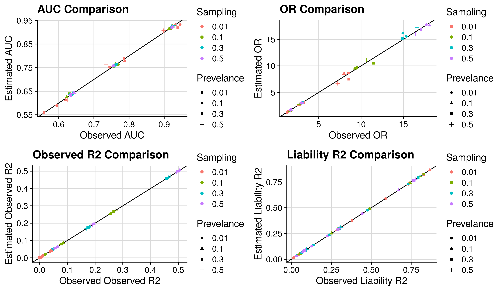
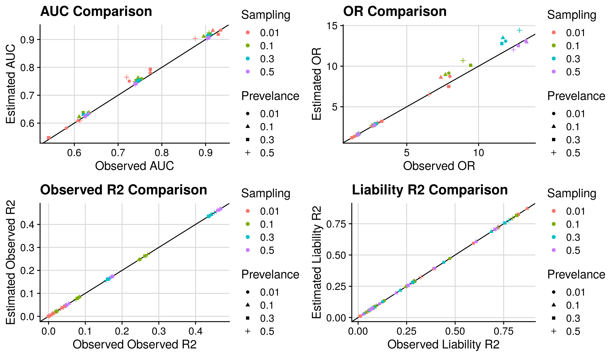

```{r setup, include=FALSE}
knitr::opts_chunk$set(echo = TRUE)
```

<style>
p.caption {
  font-size: 1.5em;
}
</style>

***

This page describes provides an interative tool for converting between polygenic score effect size metrics for binary outcomes.

<br/>

***

# Conversion tool

<br/>

<iframe height="350" width="100%" frameborder="no" src="https://opain.shinyapps.io/Effect_size_converter/"> </iframe>

***

# Methods {.tabset}

## From Cohen's <i>d</i> {.tabset}

### to AUC

```{R, eval=F}
auc<-pnorm(abs(d)/sqrt(2), 0, 1)

# d = Cohen's d
# auc = Area-Under-the-ROC-Curve
```

Reference for Cohen's <i>d</i> to AUC conversion: [Rice, M. E., & Harris, G. T. (2005). Comparing effect sizes in follow-up studies: ROC Area, Cohen’s d, and r. Law and Human Behavior, 29(5), 615.](https://pubmed.ncbi.nlm.nih.gov/16254746/)

***

### to OR (1SD)

```{R, eval=F}
or<-exp(d*sqrt(1 + d^2*input$p*(1-input$p)))

# d = Cohen's d
# or = OR (1SD)
# p = Sampling Fraction
```

Cohen's <i>d</i> to OR (1SD) conversion derived by [Alexandra Gillett](https://twitter.com/stats_bonkers). Proofs [here]().

***

### to Observed scale <i>R</i><sup>2</sup>

```{R, eval=F}
r2<-(d/sqrt(((p+(1-p))^2/(p*(1-p)))+d^2))^2

# d = Cohen's d
# p = Sampling Fraction
# r2 = R-squared on observed scale
```

Reference for Cohen's <i>d</i> to observed <i>R</i><sup>2</sup>: [Aaron, B., Kromrey, J. D., & Ferron, J. (1998). Equating" r"-based and" d"-based effect size indices: problems with a commonly recommended formula. ERIC Clearinghouse.](https://eric.ed.gov/?id=ED433353)

***

### to Liability scale <i>R</i><sup>2</sup>

```{R, eval=F}
r2<-(d/sqrt(((p+(1-p))^2/(p*(1-p)))+d^2))^2
r2l<-r2l_r2(k=k, r2=r2, p=0.5)

# d = Cohen's d
# p = Sampling Fraction
# k = Population Prevelance
# r2 = R-squared on observed scale
# r2l = R-squared on liability scale

r2l_r2 <- function(k, r2, p) {
    x= qnorm(1-k)
    z= dnorm(x)
    i=z/k
    C= k*(1-k)*k*(1-k)/(z^2*p*(1-p))
    theta= i*((p-k)/(1-k))*(i*((p-k)/(1-k))-x)
    h2l_R2 = C*r2 / (1 + C*theta*r2)
    h2l_R2
}
```

Reference for observed <i>R</i><sup>2</sup> to liability <i>R</i><sup>2</sup> conversion: [Lee, S. H., Goddard, M. E., Wray, N. R., & Visscher, P. M. (2012). A better coefficient of determination for genetic profile analysis. Genetic Epidemiology, 36(3), 214–224.](https://pubmed.ncbi.nlm.nih.gov/22714935/)

***

## To Cohen's <i>d</i> {.tabset}

### from AUC

```{R, eval=F}
d<-sqrt(2)*qnorm(auc)

# d = Cohen's d
# auc = Area-Under-the-ROC-Curve
```

Reference for AUC to Cohen's <i>d</i> conversion: [Rice, M. E., & Harris, G. T. (2005). Comparing effect sizes in follow-up studies: ROC Area, Cohen’s d, and r. Law and Human Behavior, 29(5), 615.](https://pubmed.ncbi.nlm.nih.gov/16254746/)

***

### from OR (1SD)

```{R, eval=F}
f<-function(d,OR,p){OR - (exp(d*sqrt(1 + d^2*p*(1-p))))}
d<-uniroot(f, p=p, OR=or, interval=c(-1, 1), extendInt = "yes", tol=6e-12)$root

# d = Cohen's d
# or = OR (1SD)
# p = Sampling Fraction
```

OR (1SD) to Cohen's <i>d</i> conversion derived by [Alexandra Gillett](https://twitter.com/stats_bonkers). Proofs [here]().

***

### from Observed scale <i>R</i><sup>2</sup>

```{R, eval=F}
d<-sqrt((p+(1-p))^2/(p*(1-p)))*sqrt(r2)/sqrt(1-r2)

# d = Cohen's d
# p = Sampling Fraction
# r2 = R-squared on observed scale

```

Reference for observed scale <i>R</i><sup>2</sup> to Cohen's <i>d</i> conversion: [Aaron, B., Kromrey, J. D., & Ferron, J. (1998). Equating" r"-based and" d"-based effect size indices: problems with a commonly recommended formula. ERIC Clearinghouse.](https://eric.ed.gov/?id=ED433353)

***

### from Liability scale <i>R</i><sup>2</sup>

```{R, eval=F}
r2<-r2_r2l(k=k,r2l=r2l,p=p)
d<-sqrt((p+(1-p))^2/(p*(1-p)))*sqrt(r2)/sqrt(1-r2)

# d = Cohen's d
# p = Sampling Fraction
# k = Population Prevelance
# r2 = R-squared on observed scale
# r2l = R-squared on liability scale

r2_r2l <- function(k, r2l, p) {
    #Lee SH, Goddard ME, Wray NR, Visscher PM. (2012)
    x= qnorm(1-k)
    z= dnorm(x)
    i=z/k
    C= k*(1-k)*k*(1-k)/(z^2*p*(1-p))
    theta= i*((p-k)/(1-k))*(i*((p-k)/(1-k))-x)
    r = sqrt(r2l)/sqrt(C-(C*(r2l)*theta))
    r2<-r^2
    r2
}

```

Reference for liability <i>R</i><sup>2</sup> to observed <i>R</i><sup>2</sup>  conversion: [Lee, S. H., Goddard, M. E., Wray, N. R., & Visscher, P. M. (2012). A better coefficient of determination for genetic profile analysis. Genetic Epidemiology, 36(3), 214–224.](https://pubmed.ncbi.nlm.nih.gov/22714935/)

***

## {-}

# Validation

Here we vaidate the above conversion by comparison against observed values in simulated data. 

Conversions into and from Cohen's <i>d</i> assume equal variance of the polygenic scores in cases and controls. We test this assumption [here](), and find this assumption often true, but in the presence of large genetic effects, can be violated. Therefore, we also validate the assumptions in scenarios where the variance of polygenic scores is not equal in cases and controls.

***

## Equal variance assumption

Simulate a continuous predictor (polygenic score) and binary outcome (phenotype), varying the magnitude of association, population prevalence and sampling ratio of the binary outcome.

<details><summary>Show simulation</summary>
```{R, echo=T, eval=F}
set.seed(1)
n<-5000 # Number of individuals in simulation

res<-NULL
for(d in c(0.5, 1, 2)){ # Cohen's D
  for(p in c(0.01, 0.1, 0.3, 0.5)){ # Sampling fraction
    for(k in c(0.01, 0.1, 0.3, 0.5)){ # Population prevalence fraction
    
      prs_con<-rnorm(round(n*(1-p)), 0, 1)
      prs_cas<-rnorm(n-length(prs_con), d, 1)
      
      sim_dat<-data.frame(y=c(rep(0, length(prs_con)), rep(1, length(prs_cas))),
                          x=c(prs_con, prs_cas))
      
      sim_dat$x<-as.numeric(scale(as.numeric(sim_dat$x)))
      
      mod<-summary(mod_int<-glm('y ~ x', family='binomial', data=sim_dat))

      r2_obs<-cor(predict(mod_int, sim_dat), sim_dat$y)^2

      library(effsize)
      library(pROC)
      library(fmsb)

      h2l_R2 <- function(k, r2, p) {
        #Lee SH, Goddard ME, Wray NR, Visscher PM. (2012)
        x= qnorm(1-k)
        z= dnorm(x)
        i=z/k
        C= k*(1-k)*k*(1-k)/(z^2*p*(1-p))
        theta= i*((p-k)/(1-k))*(i*((p-k)/(1-k))-x)
        h2l_R2 = C*r2 / (1 + C*theta*r2)
        h2l_R2
      }

      tmp<-data.frame( n=n,
                       n_con=length(prs_con),
                       n_cas=length(prs_cas),
                       p=p,
                       k=k,
                       d=-cohen.d(x ~ as.factor(y), data=sim_dat)$estimate,
                       auc=auc(y ~ x, data=sim_dat),
                       OR=exp(coef(mod)[2,1]),
                       R2_Obs=r2_obs,
                       R2_Liab=h2l_R2(k=k, r2=r2_obs, p=p))
    
      res<-rbind(res, tmp)
    
    }
  }
}

```
</details>

***

Convert the observed Cohen's <i>d</i> into the other metrics and plot comparison between observed and estimated values. 

***

<details><summary>Show conversion</summary>
```{R, echo=T, eval=F}
# Convert D to AUC, OR and liability R2
r2_d<-function(d,p){
  n_case<-p
  n_con<-1-p
  
  a<-(n_case+n_con)^2/(n_case*n_con)

  r=d/sqrt(a+d^2)
  r2<-r^2
  r2
}

conv_res<-res
for(i in 1:nrow(res)){
  conv_res$est_auc[i]<-pnorm(res$d[i]/sqrt(2), 0, 1)
  conv_res$est_OR[i]<-exp(res$d[i]*sqrt(1 + res$d[i]^2*res$p[i]*(1-res$p[i])))
  conv_res$est_R2_Obs[i]<-r2_d(d=res$d[i], p=res$p[i])
  conv_res$est_R2_Liab[i]<-h2l_R2(k=conv_res$k[i], r2=conv_res$est_R2_Obs[i], p=res$p[i])
}

library(ggplot2)
library(cowplot)

# Plot AUC comparison
plots<-list()

plots[[1]]<-ggplot(conv_res, aes(x=auc, y=est_auc, colour=as.factor(p), shape=as.factor(k))) +
  geom_abline(intercept=0, slope=1) +
  labs(title="AUC Comparison", x='Observed AUC', y="Estimated AUC", colour="Sampling", shape="Prevelance") +
  geom_point() +
  theme_half_open() +
  background_grid()

# Plot OR comparison
plots[[2]]<-ggplot(conv_res, aes(x=OR, y=est_OR, colour=as.factor(p), shape=as.factor(k))) +
  geom_abline(intercept=0, slope=1) +
  labs(title="OR Comparison", x='Observed OR', y="Estimated OR", colour="Sampling", shape="Prevelance") +
  geom_point() +
  theme_half_open() +
  background_grid()

# Plot Observed R2 comparison
plots[[3]]<-ggplot(conv_res, aes(x=R2_Obs, y=est_R2_Obs, colour=as.factor(p), shape=as.factor(k))) +
  geom_abline(intercept=0, slope=1) +
  labs(title="Observed R2 Comparison", x='Observed Observed R2', y="Estimated Observed R2", colour="Sampling", shape="Prevelance") +
  geom_point() +
  theme_half_open() +
  background_grid()

# Plot Liability R2 comparison
plots[[4]]<-ggplot(conv_res, aes(x=R2_Liab, y=est_R2_Liab, colour=as.factor(p), shape=as.factor(k))) +
  geom_abline(intercept=0, slope=1) +
  labs(title="Liability R2 Comparison", x='Observed Liability R2', y="Estimated Liability R2", colour="Sampling", shape="Prevelance") +
  geom_point() +
  theme_half_open() +
  background_grid()

dir.create('~/brc_scratch/Software/MyGit/GenoPred/Images/Effect_Size_Converter')

png('~/brc_scratch/Software/MyGit/GenoPred/Images/Effect_Size_Converter/from_d.png', units='px', res=300, width=3000, height=1750)
plot_grid(plotlist=plots, ncol = 2)
dev.off()

```
</details>

<details><summary>Show observed vs. estimated metrics</summary>

</details>

<br/>

***

Convert observed values for oher metrics into Cohen's <i>d</i>.

<details><summary>Show conversion</summary>
```{R, echo=T, eval=F}
# Convert AUC, OR and liability R2 into Cohen's D
r2_h2l <- function(k, h2l, p) {
  #Lee SH, Goddard ME, Wray NR, Visscher PM. (2012)
  x= qnorm(1-k)
  z= dnorm(x)
  i=z/k
  C= k*(1-k)*k*(1-k)/(z^2*p*(1-p))
  theta= i*((p-k)/(1-k))*(i*((p-k)/(1-k))-x)
  r = sqrt(h2l)/sqrt(C-(C*(h2l)*theta))
  r2<-r^2
  r2
}

d_r2<-function(r2,p){
  r<-sqrt(r2)
  
  n_case<-p
  n_con<-1-p
  
  a<-(n_case+n_con)^2/(n_case*n_con)

  d<-sqrt(a)*r/sqrt(1-r^2)
  d
}

conv_res<-res
for(i in 1:nrow(res)){
  r2_from_h2l<-r2_h2l(k=res$k[i],h2l=res$R2_Liab[i], p=res$p[i])
  
  conv_res$est_d_using_auc[i]<-sqrt(2)*qnorm(res$auc[i])
  f<-function(d,OR,p){OR - (exp(d*sqrt(1 + d^2*p*(1-p))))}
  conv_res$est_d_using_OR[i]<-uniroot(f, p=res$p[i], OR=res$OR[i], interval=c(-1, 1), extendInt = "yes", tol=6e-12)$root
  conv_res$est_d_using_R2_Obs[i]<-d_r2(r2=res$R2_Obs[i], p=res$p[i])
  conv_res$est_d_using_R2_Liab[i]<-d_r2(r2=r2_from_h2l, p=res$p[i])
}

library(ggplot2)
library(cowplot)

# Plot AUC comparison
plots<-list()

plots[[1]]<-ggplot(conv_res, aes(x=d, y=est_d_using_auc, colour=as.factor(p), shape=as.factor(k))) +
  geom_abline(intercept=0, slope=1) +
  labs(title="Cohen's d Comparison", x="Observed", y="Estimated from AUC", colour="Sampling", shape="Prevelance") +
  geom_point() +
  theme_half_open() +
  background_grid()

# Plot OR comparison
plots[[2]]<-ggplot(conv_res, aes(x=d, y=est_d_using_OR, colour=as.factor(p), shape=as.factor(k))) +
  geom_abline(intercept=0, slope=1) +
  labs(title="Cohen's d Comparison", x="Observed", y="Estimated from OR", colour="Sampling", shape="Prevelance") +
  geom_point() +
  theme_half_open() +
  background_grid()

# Plot Observed R2 comparison
plots[[3]]<-ggplot(conv_res, aes(x=d, y=est_d_using_R2_Obs, colour=as.factor(p), shape=as.factor(k))) +
  geom_abline(intercept=0, slope=1) +
  labs(title="Cohen's d Comparison", x="Observed", y="Estimated from Observed R2", colour="Sampling", shape="Prevelance") +
  geom_point() +
  theme_half_open() +
  background_grid()

# Plot Liability R2 comparison
plots[[4]]<-ggplot(conv_res, aes(x=d, y=est_d_using_R2_Liab, colour=as.factor(p), shape=as.factor(k))) +
  geom_abline(intercept=0, slope=1) +
  labs(title="Cohen's d Comparison", x="Observed", y="Estimated from Liability R2", colour="Sampling", shape="Prevelance") +
  geom_point() +
  theme_half_open() +
  background_grid()

png('~/brc_scratch/Software/MyGit/GenoPred/Images/Effect_Size_Converter/to_d.png', units='px', res=300, width=3000, height=1750)
plot_grid(plotlist=plots, ncol = 2)
dev.off()

```
</details>

<details><summary>Show observed vs. estimated Cohen's <i>d</i></summary>

</details>

<br/>

***

## Unequal variance assumption

In [observed data]() maximum difference in case-control polygenic score SD was 0.15. Use this difference when simulating data.

<details><summary>Show simulation</summary>
```{R, echo=T, eval=F}
set.seed(1)
n<-5000 # Number of individuals in simulation

res<-NULL
for(d in c(0.5, 1, 2)){ # Cohen's D
  for(p in c(0.01, 0.1, 0.3, 0.5)){ # Sampling fraction
    for(k in c(0.01, 0.1, 0.3, 0.5)){ # Population prevalence fraction
    
      prs_con<-rnorm(round(n*(1-p)), 0, 1)
      prs_cas<-rnorm(n-length(prs_con), d, 1.15)
      
      sim_dat<-data.frame(y=c(rep(0, length(prs_con)), rep(1, length(prs_cas))),
                          x=c(prs_con, prs_cas))
      
      sim_dat$x<-as.numeric(scale(as.numeric(sim_dat$x)))
      
      mod<-summary(mod_int<-glm('y ~ x', family='binomial', data=sim_dat))

      r2_obs<-cor(predict(mod_int, sim_dat), sim_dat$y)^2

      library(effsize)
      library(pROC)
      library(fmsb)

      h2l_R2 <- function(k, r2, p) {
        #Lee SH, Goddard ME, Wray NR, Visscher PM. (2012)
        x= qnorm(1-k)
        z= dnorm(x)
        i=z/k
        C= k*(1-k)*k*(1-k)/(z^2*p*(1-p))
        theta= i*((p-k)/(1-k))*(i*((p-k)/(1-k))-x)
        h2l_R2 = C*r2 / (1 + C*theta*r2)
        h2l_R2
      }

      tmp<-data.frame( n=n,
                       n_con=length(prs_con),
                       n_cas=length(prs_cas),
                       p=p,
                       k=k,
                       d=-cohen.d(x ~ as.factor(y), data=sim_dat)$estimate,
                       auc=auc(y ~ x, data=sim_dat),
                       OR=exp(coef(mod)[2,1]),
                       R2_Obs=r2_obs,
                       R2_Liab=h2l_R2(k=k, r2=r2_obs, p=p))
    
      res<-rbind(res, tmp)
    
    }
  }
}

```
</details>

***

Convert the observed Cohen's <i>d</i> into the other metrics and plot comparison between observed and estimated values. 

***

<details><summary>Show conversion</summary>
```{R, echo=T, eval=F}
# Convert D to AUC, OR and liability R2
r2_d<-function(d,p){
  n_case<-p
  n_con<-1-p
  
  a<-(n_case+n_con)^2/(n_case*n_con)

  r=d/sqrt(a+d^2)
  r2<-r^2
  r2
}

conv_res<-res
for(i in 1:nrow(res)){
  conv_res$est_auc[i]<-pnorm(res$d[i]/sqrt(2), 0, 1)
  conv_res$est_OR[i]<-exp(res$d[i]*sqrt(1 + res$d[i]^2*res$p[i]*(1-res$p[i])))
  conv_res$est_R2_Obs[i]<-r2_d(d=res$d[i], p=res$p[i])
  conv_res$est_R2_Liab[i]<-h2l_R2(k=conv_res$k[i], r2=conv_res$est_R2_Obs[i], p=res$p[i])
}

library(ggplot2)
library(cowplot)

# Plot AUC comparison
plots<-list()

plots[[1]]<-ggplot(conv_res, aes(x=auc, y=est_auc, colour=as.factor(p), shape=as.factor(k))) +
  geom_abline(intercept=0, slope=1) +
  labs(title="AUC Comparison", x='Observed AUC', y="Estimated AUC", colour="Sampling", shape="Prevelance") +
  geom_point() +
  theme_half_open() +
  background_grid()

# Plot OR comparison
plots[[2]]<-ggplot(conv_res, aes(x=OR, y=est_OR, colour=as.factor(p), shape=as.factor(k))) +
  geom_abline(intercept=0, slope=1) +
  labs(title="OR Comparison", x='Observed OR', y="Estimated OR", colour="Sampling", shape="Prevelance") +
  geom_point() +
  theme_half_open() +
  background_grid()

# Plot Observed R2 comparison
plots[[3]]<-ggplot(conv_res, aes(x=R2_Obs, y=est_R2_Obs, colour=as.factor(p), shape=as.factor(k))) +
  geom_abline(intercept=0, slope=1) +
  labs(title="Observed R2 Comparison", x='Observed Observed R2', y="Estimated Observed R2", colour="Sampling", shape="Prevelance") +
  geom_point() +
  theme_half_open() +
  background_grid()

# Plot Liability R2 comparison
plots[[4]]<-ggplot(conv_res, aes(x=R2_Liab, y=est_R2_Liab, colour=as.factor(p), shape=as.factor(k))) +
  geom_abline(intercept=0, slope=1) +
  labs(title="Liability R2 Comparison", x='Observed Liability R2', y="Estimated Liability R2", colour="Sampling", shape="Prevelance") +
  geom_point() +
  theme_half_open() +
  background_grid()

dir.create('~/brc_scratch/Software/MyGit/GenoPred/Images/Effect_Size_Converter')

png('~/brc_scratch/Software/MyGit/GenoPred/Images/Effect_Size_Converter/from_d_unequal.png', units='px', res=300, width=3000, height=1750)
plot_grid(plotlist=plots, ncol = 2)
dev.off()

```
</details>

<details><summary>Show observed vs. estimated metrics</summary>

</details>

<br/>

***

Convert observed values for oher metrics into Cohen's <i>d</i>.

<details><summary>Show conversion</summary>
```{R, echo=T, eval=F}
# Convert AUC, OR and liability R2 into Cohen's D
r2_h2l <- function(k, h2l, p) {
  #Lee SH, Goddard ME, Wray NR, Visscher PM. (2012)
  x= qnorm(1-k)
  z= dnorm(x)
  i=z/k
  C= k*(1-k)*k*(1-k)/(z^2*p*(1-p))
  theta= i*((p-k)/(1-k))*(i*((p-k)/(1-k))-x)
  r = sqrt(h2l)/sqrt(C-(C*(h2l)*theta))
  r2<-r^2
  r2
}

d_r2<-function(r2,p){
  r<-sqrt(r2)
  
  n_case<-p
  n_con<-1-p
  
  a<-(n_case+n_con)^2/(n_case*n_con)

  d<-sqrt(a)*r/sqrt(1-r^2)
  d
}

conv_res<-res
for(i in 1:nrow(res)){
  r2_from_h2l<-r2_h2l(k=res$k[i],h2l=res$R2_Liab[i], p=res$p[i])
  
  conv_res$est_d_using_auc[i]<-sqrt(2)*qnorm(res$auc[i])
  f<-function(d,OR,p){OR - (exp(d*sqrt(1 + d^2*p*(1-p))))}
  conv_res$est_d_using_OR[i]<-uniroot(f, p=res$p[i], OR=res$OR[i], interval=c(-1, 1), extendInt = "yes", tol=6e-12)$root
  conv_res$est_d_using_R2_Obs[i]<-d_r2(r2=res$R2_Obs[i], p=res$p[i])
  conv_res$est_d_using_R2_Liab[i]<-d_r2(r2=r2_from_h2l, p=res$p[i])
}

library(ggplot2)
library(cowplot)

# Plot AUC comparison
plots<-list()

plots[[1]]<-ggplot(conv_res, aes(x=d, y=est_d_using_auc, colour=as.factor(p), shape=as.factor(k))) +
  geom_abline(intercept=0, slope=1) +
  labs(title="Cohen's d Comparison", x="Observed", y="Estimated from AUC", colour="Sampling", shape="Prevelance") +
  geom_point() +
  theme_half_open() +
  background_grid()

# Plot OR comparison
plots[[2]]<-ggplot(conv_res, aes(x=d, y=est_d_using_OR, colour=as.factor(p), shape=as.factor(k))) +
  geom_abline(intercept=0, slope=1) +
  labs(title="Cohen's d Comparison", x="Observed", y="Estimated from OR", colour="Sampling", shape="Prevelance") +
  geom_point() +
  theme_half_open() +
  background_grid()

# Plot Observed R2 comparison
plots[[3]]<-ggplot(conv_res, aes(x=d, y=est_d_using_R2_Obs, colour=as.factor(p), shape=as.factor(k))) +
  geom_abline(intercept=0, slope=1) +
  labs(title="Cohen's d Comparison", x="Observed", y="Estimated from Observed R2", colour="Sampling", shape="Prevelance") +
  geom_point() +
  theme_half_open() +
  background_grid()

# Plot Liability R2 comparison
plots[[4]]<-ggplot(conv_res, aes(x=d, y=est_d_using_R2_Liab, colour=as.factor(p), shape=as.factor(k))) +
  geom_abline(intercept=0, slope=1) +
  labs(title="Cohen's d Comparison", x="Observed", y="Estimated from Liability R2", colour="Sampling", shape="Prevelance") +
  geom_point() +
  theme_half_open() +
  background_grid()

png('~/brc_scratch/Software/MyGit/GenoPred/Images/Effect_Size_Converter/to_d_unequal.png', units='px', res=300, width=3000, height=1750)
plot_grid(plotlist=plots, ncol = 2)
dev.off()

```
</details>

<details><summary>Show observed vs. estimated Cohen's <i>d</i></summary>

</details>

<br/>

